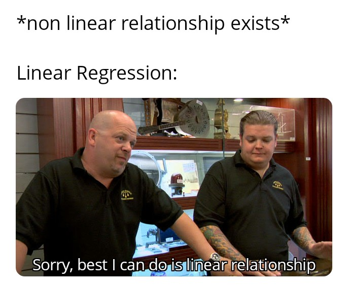

# Linear Regression {#linear-regression}

::: {style="text-align:center"}
{width="450" height="200"}
:::

Linear regression is one of the most fundamental tools in statistics and econometrics, widely used for modeling relationships between variables. It forms the cornerstone of predictive analysis, enabling us to understand and quantify how changes in one or more explanatory variables are associated with a dependent variable. Its simplicity and versatility make it an essential tool in fields ranging from economics and marketing to healthcare and environmental studies.

At its core, linear regression addresses questions about associations rather than causation. For example:

-   How are advertising expenditures associated with sales performance?
-   What is the relationship between a company's revenue and its stock price?
-   How does the level of education correlate with income?

These questions are about patterns in data---not necessarily causal effects. While regression can provide insights into potential causal relationships, establishing causality requires more than just regression analysis. It requires careful consideration of the study design, assumptions, and potential confounding factors.

So, why is it called "linear"? The term refers to the structure of the model, where the dependent variable (outcome) is modeled as a linear combination of one or more independent variables (predictors). For example, in simple linear regression, the relationship is represented as:

$$Y = \beta_0 + \beta_1 X + \epsilon,$$

where $Y$ is the dependent variable, $X$ is the independent variable, $\beta_0$ and $\beta_1$ are parameters to be estimated, and $\epsilon$ is the error term capturing randomness or unobserved factors.

Linear regression serves as a foundation for much of applied data analysis because of its wide-ranging applications:

1.  **Understanding Patterns in Data:** Regression provides a framework to summarize and explore relationships between variables. It allows us to identify patterns such as trends or associations, which can guide further analysis or decision-making.

2.  **Prediction:** Beyond exploring relationships, regression is widely used for making predictions. For instance, given historical data, we can use a regression model to predict future outcomes like sales, prices, or demand.

3.  **Building Blocks for Advanced Techniques:** Linear regression is foundational for many advanced statistical and machine learning models, such as logistic regression, ridge regression, and neural networks. Mastering linear regression equips you with the skills to tackle more complex methods.

**Regression and Causality: A Crucial Distinction**

It's essential to remember that regression alone does not establish causation. For instance, a regression model might show a strong association between advertising and sales, but this does not prove that advertising directly causes sales to increase. Other factors---such as seasonality, market trends, or unobserved variables---could also influence the results.

Establishing causality requires additional steps, such as controlled experiments, instrumental variable techniques, or careful observational study designs. As we work through the details of linear regression, we'll revisit this distinction and highlight scenarios where causality might or might not be inferred.

------------------------------------------------------------------------

**What is an Estimator?**

At the heart of regression lies the process of **estimation**---the act of using data to determine the unknown characteristics of a population or model.

An **estimator** is a mathematical rule or formula used to calculate an estimate of an unknown quantity based on observed data. For example, when we calculate the average height of a sample to estimate the average height of a population, the sample mean is the estimator.

In the context of regression, the quantities we typically estimate are:

-   **Parameters**: Fixed, unknown values that describe the relationship between variables (e.g., coefficients in a regression equation).
    -   **Estimating parameters** → Parametric models (finite parameters, e.g., coefficients in regression).
-   **Functions**: Unknown relationships or patterns in the data, often modeled without assuming a fixed functional form.
    -   **Estimating functions** → Non-parametric models (focus on shapes or trends, not a fixed number of parameters).

------------------------------------------------------------------------

**Types of Estimators**

To better understand the estimation process, let's introduce two broad categories of estimators that we'll work with:

1.  **Parametric Estimators**\
    Parametric estimation focuses on a finite set of parameters that define a model. For example, in a simple linear regression:\
    $$Y = \beta_0 + \beta_1 X + \epsilon,$$\
    the task is to estimate the parameters $\beta_0$ (intercept) and $\beta_1$ (slope). Parametric estimators rely on specific assumptions about the form of the model (e.g., linearity) and the distribution of the error term (e.g., normality).

2.  **Non-Parametric Estimators**\
    Non-parametric estimation avoids assuming a specific functional form for the relationship between variables. Instead, it focuses on estimating patterns or trends directly from the data. For example, using a scatterplot smoothing technique to visualize how sales vary with advertising spend without imposing a linear or quadratic relationship.

These two categories reflect a fundamental trade-off in statistical analysis: **parametric models** are often simpler and more interpretable but require strong assumptions, while **non-parametric models** are more flexible but may require more data and computational resources.

------------------------------------------------------------------------

**Desirable Properties of Estimators**

Regardless of whether we are estimating parameters or functions, we want our estimators to possess certain desirable properties. Think of these as the "golden standards" that help us judge whether an estimator is reliable:

1.  **Unbiasedness**\
    An estimator is unbiased if it hits the true value of the parameter, on average, over repeated samples. Mathematically:\
    $$E[\hat{\beta}] = \beta.$$\
    This means that, across multiple samples, the estimator does not systematically overestimate or underestimate the true parameter.

2.  **Consistency**\
    Consistency ensures that as the sample size increases, the estimator converges to the true value of the parameter. Formally:\
    $$plim\ \hat{\beta_n} = \beta.$$\
    This property relies on the [Law of Large Numbers], which guarantees that larger samples reduce random fluctuations, leading to more precise estimates.

3.  **Efficiency**\
    Among all unbiased estimators, an efficient estimator has the smallest variance.

    -   The [Ordinary Least Squares](#ordinary-least-squares) method is efficient because it is the **Best Linear Unbiased Estimator (BLUE)** under the [Gauss-Markov Theorem](#gauss-markov-theorem).
    -   For estimators that meet specific distributional assumptions (e.g., normality), **Maximum Likelihood Estimators (MLE)** are asymptotically efficient, meaning they achieve the lowest possible variance as the sample size grows.

------------------------------------------------------------------------

**Why These Properties Matter**

Understanding these properties is crucial because they ensure that the methods we use for estimation are reliable, precise, and robust. Whether we are estimating coefficients in a regression model or uncovering a complex pattern in the data, these properties provide the foundation for statistical inference and decision-making.

Now that we've established what estimators are, the types we'll encounter, and their desirable properties, we can move on to understanding how these concepts apply specifically to the [Ordinary Least Squares](#ordinary-least-squares) method---the backbone of linear regression.

Reference Table

+-------------------------------------------------------------------------+------------------------------------------------------------------------------------------------------------+-----------------------------------------------------------------------------------------------+-----------------------------------------------------------------------------------------+
| **Estimator**                                                           | **Key Assumptions**                                                                                        | **Strengths**                                                                                 | **Limitations**                                                                         |
+=========================================================================+============================================================================================================+===============================================================================================+=========================================================================================+
| [Ordinary Least Squares](#ordinary-least-squares)                       | Errors are independent, identically distributed (i.i.d.) with mean 0 and constant variance.                | Simple, well-understood method.                                                               | Sensitive to outliers and violations of normality.                                      |
|                                                                         |                                                                                                            |                                                                                               |                                                                                         |
|                                                                         | Linear relationship between predictors and response.                                                       | Minimizes residual sum of squares (easy to interpret coefficients).                           | Can perform poorly if predictors are highly correlated (multicollinearity).             |
+-------------------------------------------------------------------------+------------------------------------------------------------------------------------------------------------+-----------------------------------------------------------------------------------------------+-----------------------------------------------------------------------------------------+
| [Generalized Least Squares]                                             | Errors have a known correlation structure or heteroscedasticity structure that can be modeled.             | Handles correlated or non-constant-variance errors.                                           | Requires specifying (or estimating) the error covariance structure.                     |
|                                                                         |                                                                                                            |                                                                                               |                                                                                         |
|                                                                         |                                                                                                            | More flexible than OLS when noise structure is known.                                         | Misspecification can lead to biased estimates.                                          |
+-------------------------------------------------------------------------+------------------------------------------------------------------------------------------------------------+-----------------------------------------------------------------------------------------------+-----------------------------------------------------------------------------------------+
| [Maximum Likelihood](#maximum-likelihood-estimator)                     | Underlying probability distribution (e.g., normal) must be specified correctly.                            | Provides a general framework for estimating parameters under well-defined probability models. | Highly sensitive to model misspecification.                                             |
|                                                                         |                                                                                                            |                                                                                               |                                                                                         |
|                                                                         |                                                                                                            | Can extend to complex likelihoods.                                                            | May require more computation than OLS or GLS.                                           |
+-------------------------------------------------------------------------+------------------------------------------------------------------------------------------------------------+-----------------------------------------------------------------------------------------------+-----------------------------------------------------------------------------------------+
| [Penalized (Regularized) Estimators](#penalized-regularized-estimators) | Coefficients assumed to be shrinkable; model typically allows coefficient penalization.                    | Controls overfitting via regularization.                                                      | Requires choosing tuning parameter(s) (e.g., λ).                                        |
|                                                                         |                                                                                                            |                                                                                               |                                                                                         |
|                                                                         |                                                                                                            | Handles high-dimensional data or many predictors.                                             | Interpretation of coefficients becomes less straightforward.                            |
|                                                                         |                                                                                                            |                                                                                               |                                                                                         |
|                                                                         |                                                                                                            | Can perform feature selection (e.g., Lasso).                                                  |                                                                                         |
+-------------------------------------------------------------------------+------------------------------------------------------------------------------------------------------------+-----------------------------------------------------------------------------------------------+-----------------------------------------------------------------------------------------+
| [Robust Estimators]                                                     | Less sensitive to heavy-tailed or outlier-prone distributions (weaker assumptions on the error structure). | Resistant to large deviations or outliers in data.                                            | Less efficient if errors are truly normal.                                              |
|                                                                         |                                                                                                            |                                                                                               |                                                                                         |
|                                                                         |                                                                                                            | Often maintains good performance under mild model misspecifications.                          | Choice of robust method and tuning can be subjective.                                   |
+-------------------------------------------------------------------------+------------------------------------------------------------------------------------------------------------+-----------------------------------------------------------------------------------------------+-----------------------------------------------------------------------------------------+
| [Partial Least Squares]                                                 | Predictors may be highly correlated; dimension reduction is desired.                                       | Simultaneously reduces dimensionality and fits regression.                                    | Can be harder to interpret than OLS (latent components instead of original predictors). |
|                                                                         |                                                                                                            |                                                                                               |                                                                                         |
|                                                                         |                                                                                                            | Works well with collinear, high-dimensional data.                                             | Requires choosing the number of components.                                             |
+-------------------------------------------------------------------------+------------------------------------------------------------------------------------------------------------+-----------------------------------------------------------------------------------------------+-----------------------------------------------------------------------------------------+

------------------------------------------------------------------------

## Ordinary Least Squares {#ordinary-least-squares}

Ordinary Least Squares (OLS) is the backbone of statistical modeling, a method so foundational that it often serves as the starting point for understanding data relationships. Whether predicting sales, estimating economic trends, or uncovering patterns in scientific research, OLS remains a critical tool. Its appeal lies in simplicity: OLS models the relationship between a dependent variable and one or more predictors by minimizing the squared differences between observed and predicted values.

------------------------------------------------------------------------

**Why OLS Works: Linear and Nonlinear Relationships**

[OLS](#ordinary-least-squares) rests on the Conditional Expectation Function (CEF), $E[Y | X]$, which describes the expected value of $Y$ given $X$. Regression shines in two key scenarios:

1.  **Perfect Fit (Linear CEF):**\
    If $E[Y_i | X_{1i}, \dots, X_{Ki}] = a + \sum_{k=1}^K b_k X_{ki}$, the regression of $Y_i$ on $X_{1i}, \dots, X_{Ki}$ exactly equals the CEF. In other words, the regression gives the true average relationship between $Y$ and $X$.\
    If the true relationship is linear, regression delivers the exact CEF. For instance, imagine you're estimating the relationship between advertising spend and sales revenue. If the true impact is linear, [OLS](#ordinary-least-squares) will perfectly capture it.

2.  **Approximation (Nonlinear CEF):**\
    If $E[Y_i | X_{1i}, \dots, X_{Ki}]$ is nonlinear, [OLS](#ordinary-least-squares) provides the best linear approximation to this relationship. Specifically, it minimizes the expected squared deviation between the linear regression line and the nonlinear CEF.\
    For example, the effect of advertising diminishes at higher spending levels? [OLS](#ordinary-least-squares) still works, providing the best linear approximation to this nonlinear relationship by minimizing the squared deviations between predictions and the true (but unknown) CEF.

In other words, regression is not just a tool for "linear" relationships---it's a workhorse that adapts remarkably well to messy, real-world data.

{width="80%"}

------------------------------------------------------------------------

### Simple Regression (Basic) Model

The simplest form of regression is a straight line:

$$
Y_i = \beta_0 + \beta_1 X_i + \epsilon_i
$$

where

-   $Y_i$: The dependent variable or outcome we're trying to predict (e.g., sales, temperature).
-   $X_i$: The independent variable or predictor (e.g., advertising spend, time).
-   $\beta_0$: The intercept---where the line crosses the $Y$-axis when $X = 0$.
-   $\beta_1$: The slope, representing the change in $Y$ for a one-unit increase in $X$.
-   $\epsilon_i$: The error term, accounting for random factors that $X$ cannot explain.

Assumptions About the Error Term ($\epsilon_i$):

$$
\begin{aligned}
E(\epsilon_i) &= 0 \\
\text{Var}(\epsilon_i) &= \sigma^2 \\
\text{Cov}(\epsilon_i, \epsilon_j) &= 0 \quad \text{for all } i \neq j
\end{aligned}
$$

Since $\epsilon_i$ is random, $Y_i$ is also random:

$$
\begin{aligned}
E(Y_i) &= E(\beta_0 + \beta_1 X_i + \epsilon_i) \\
&= \beta_0 + \beta_1 X_i
\end{aligned}
$$

$$
\begin{aligned}
\text{Var}(Y_i) &= \text{Var}(\beta_0 + \beta_1 X_i + \epsilon_i) \\
&= \text{Var}(\epsilon_i) \\
&= \sigma^2
\end{aligned}
$$

Since $\text{Cov}(\epsilon_i, \epsilon_j) = 0$, the outcomes across observations are independent. Hence, $Y_i$ and $Y_j$ are uncorrelated as well, conditioned on the $X$'s.

------------------------------------------------------------------------

#### Estimation in Ordinary Least Squares

The goal of [OLS](#ordinary-least-squares) is to estimate the regression parameters ($\beta_0$, $\beta_1$) that best describe the relationship between the dependent variable $Y$ and the independent variable $X$. To achieve this, we minimize the sum of squared deviations between observed values of $Y_i$ and their expected values predicted by the model.

The deviation of an observed value $Y_i$ from its expected value, based on the regression model, is:

$$
Y_i - E(Y_i) = Y_i - (\beta_0 + \beta_1 X_i).
$$

This deviation represents the error in prediction for the $i$-th observation.

To ensure that the errors don't cancel each other out and to prioritize larger deviations, we consider the squared deviations. The sum of squared deviations, denoted by $Q$, is defined as:

$$
Q = \sum_{i=1}^{n} (Y_i - \beta_0 - \beta_1 X_i)^2.
$$

The goal of [OLS](#ordinary-least-squares) is to find the values of $\beta_0$ and $\beta_1$ that minimize $Q$. These values are called the **OLS estimators**.

To minimize $Q$, we take partial derivatives with respect to $\beta_0$ and $\beta_1$, set them to zero, and solve the resulting system of equations. After simplifying, the estimators for the slope ($b_1$) and intercept ($b_0$) are obtained as follows:

Slope ($b_1$):

$$
b_1 = \frac{\sum_{i=1}^{n} (X_i - \bar{X})(Y_i - \bar{Y})}{\sum_{i=1}^{n} (X_i - \bar{X})^2}.
$$

Here, $\bar{X}$ and $\bar{Y}$ represent the means of $X$ and $Y$, respectively. This formula reveals that the slope is proportional to the covariance between $X$ and $Y$, scaled by the variance of $X$.

Intercept ($b_0$):

$$
b_0 = \frac{1}{n} \left( \sum_{i=1}^{n} Y_i - b_1 \sum_{i=1}^{n} X_i \right) = \bar{Y} - b_1 \bar{X}.
$$

The intercept is determined by aligning the regression line with the center of the data.

------------------------------------------------------------------------

**Intuition Behind the Estimators**

-   $b_1$ (Slope): This measures the average change in $Y$ for a one-unit increase in $X$. The formula uses deviations from the mean to ensure that the relationship captures the joint variability of $X$ and $Y$.

-   $b_0$ (Intercept): This ensures that the regression line passes through the mean of the data points $(\bar{X}, \bar{Y})$, anchoring the model in the center of the observed data.

------------------------------------------------------------------------

Equivalently, we can also write these parameters in terms of covariances.

The covariance between two variables is defined as:

$$ \text{Cov}(X_i, Y_i) = E[(X_i - E[X_i])(Y_i - E[Y_i])] $$

Properties of Covariance:

1.  $\text{Cov}(X_i, X_i) = \sigma^2_X$
2.  If $E(X_i) = 0$ or $E(Y_i) = 0$, then $\text{Cov}(X_i, Y_i) = E[X_i Y_i]$
3.  For $W_i = a + b X_i$ and $Z_i = c + d Y_i$,\
    $\text{Cov}(W_i, Z_i) = bd \cdot \text{Cov}(X_i, Y_i)$

For a bivariate regression, the slope $\beta$ in a bivariate regression is given by:

$$ \beta = \frac{\text{Cov}(Y_i, X_i)}{\text{Var}(X_i)} $$

For a multivariate case, the slope for $X_k$ is:

$$ \beta_k = \frac{\text{Cov}(Y_i, \tilde{X}_{ki})}{\text{Var}(\tilde{X}_{ki})} $$

Where $\tilde{X}_{ki}$ represents the residual from a regression of $X_{ki}$ on the $K-1$ other covariates in the model.

The intercept is:

$$ \beta_0 = E[Y_i] - \beta_1 E(X_i) $$

Note:

-   [OLS](#ordinary-least-squares) does not require the assumption of a specific distribution for the variables. Its robustness is based on the minimization of squared errors (i.e., no distributional assumptions).

#### Properties of Least Squares Estimators

The properties of the Ordinary Least Squares estimators ($b_0$ and $b_1$) are derived based on their statistical behavior. These properties provide insights into the accuracy, variability, and reliability of the estimates.

------------------------------------------------------------------------

##### Expectation of the OLS Estimators

The OLS estimators $b_0$ (intercept) and $b_1$ (slope) are unbiased. This means their expected values equal the true population parameters:

$$
\begin{aligned}
E(b_1) &= \beta_1, \\
E(b_0) &= E(\bar{Y}) - \bar{X}\beta_1.
\end{aligned}
$$

Since the expected value of the sample mean of $Y$, $E(\bar{Y})$, is:

$$
E(\bar{Y}) = \beta_0 + \beta_1 \bar{X},
$$

the expected value of $b_0$ simplifies to:

$$
E(b_0) = \beta_0.
$$

Thus, $b_0$ and $b_1$ are unbiased estimators of their respective population parameters $\beta_0$ and $\beta_1$.

------------------------------------------------------------------------

##### Variance of the OLS Estimators

The variability of the OLS estimators depends on the spread of the predictor variable $X$ and the error variance $\sigma^2$. The variances are given by:

Variance of $b_1$ (Slope):

$$
\text{Var}(b_1) = \frac{\sigma^2}{\sum_{i=1}^{n} (X_i - \bar{X})^2}.
$$

Variance of $b_0$ (Intercept):

$$
\text{Var}(b_0) = \sigma^2 \left( \frac{1}{n} + \frac{\bar{X}^2}{\sum_{i=1}^{n} (X_i - \bar{X})^2} \right).
$$

These formulas highlight that:

-   $\text{Var}(b_1) \to 0$ as the number of observations increases, provided $X_i$ values are distributed around their mean $\bar{X}$.
-   $\text{Var}(b_0) \to 0$ as $n$ increases, assuming $X_i$ values are appropriately selected (i.e., not all clustered near the mean).

------------------------------------------------------------------------

#### Mean Square Error (MSE)

The Mean Square Error (MSE) quantifies the average squared residual (error) in the model:

$$
MSE = \frac{SSE}{n-2} = \frac{\sum_{i=1}^{n} e_i^2}{n-2} = \frac{\sum_{i=1}^{n} (Y_i - \hat{Y}_i)^2}{n-2},
$$

where $SSE$ is the Sum of Squared Errors and $n-2$ represents the degrees of freedom for a simple linear regression model (two parameters estimated: $\beta_0$ and $\beta_1$).

The expected value of the MSE equals the error variance (i.e., unbiased Estimator of MSE:):

$$
E(MSE) = \sigma^2.
$$

------------------------------------------------------------------------

#### Estimating Variance of the OLS Coefficients

The sample-based estimates of the variances of $b_0$ and $b_1$ are expressed as follows:

Estimated Variance of $b_1$ (Slope):

$$
s^2(b_1) = \widehat{\text{Var}}(b_1) = \frac{MSE}{\sum_{i=1}^{n} (X_i - \bar{X})^2}.
$$

Estimated Variance of $b_0$ (Intercept):

$$
s^2(b_0) = \widehat{\text{Var}}(b_0) = MSE \left( \frac{1}{n} + \frac{\bar{X}^2}{\sum_{i=1}^{n} (X_i - \bar{X})^2} \right).
$$

These estimates rely on the MSE to approximate $\sigma^2$.

The variance estimates are unbiased:

$$
\begin{aligned}
E(s^2(b_1)) &= \text{Var}(b_1), \\
E(s^2(b_0)) &= \text{Var}(b_0).
\end{aligned}
$$

------------------------------------------------------------------------

**Implications of These Properties**

1.  **Unbiasedness:** The unbiased nature of $b_0$ and $b_1$ ensures that, on average, the regression model accurately reflects the true relationship in the population.
2.  **Decreasing Variance:** As the sample size $n$ increases or as the spread of $X_i$ values grows, the variances of $b_0$ and $b_1$ decrease, leading to more precise estimates.
3.  **Error Estimation with MSE:** MSE provides a reliable estimate of the error variance $\sigma^2$, which feeds directly into assessing the reliability of $b_0$ and $b_1$.

#### Residuals in Ordinary Least Squares

Residuals are the differences between observed values ($Y_i$) and their predicted counterparts ($\hat{Y}_i$). They play a central role in assessing model fit and ensuring the assumptions of OLS are met.

The residual for the $i$-th observation is defined as:

$$
e_i = Y_i - \hat{Y}_i = Y_i - (b_0 + b_1 X_i),
$$

where:

-   $e_i$: Residual for the $i$-th observation.
-   $\hat{Y}_i$: Predicted value based on the regression model.
-   $Y_i$: Actual observed value.

Residuals estimate the unobservable error terms $\epsilon_i$:

-   $e_i$ is an estimate of $\epsilon_i = Y_i - E(Y_i)$.
-   $\epsilon_i$ is always unknown because we do not know the true values of $\beta_0$ and $\beta_1$.

------------------------------------------------------------------------

##### Key Properties of Residuals

Residuals exhibit several mathematical properties that align with the OLS estimation process:

1.  **Sum of Residuals**:\
    The residuals sum to zero:

    $$
    \sum_{i=1}^{n} e_i = 0.
    $$

    This ensures that the regression line passes through the centroid of the data, $(\bar{X}, \bar{Y})$.

2.  **Orthogonality of Residuals to Predictors**:\
    The residuals are orthogonal (uncorrelated) to the predictor variable $X$:

    $$
    \sum_{i=1}^{n} X_i e_i = 0.
    $$

    This reflects the fact that the OLS minimizes the squared deviations of residuals along the $Y$-axis, not the $X$-axis.

------------------------------------------------------------------------

##### Expected Values of Residuals

The expected values of residuals reinforce the unbiased nature of OLS:

1.  **Mean of Residuals**:\
    The residuals have an expected value of zero:

    $$
    E[e_i] = 0.
    $$

2.  **Orthogonality to Predictors and Fitted Values**:\
    Residuals are uncorrelated with both the predictor variables and the fitted values:

    $$
    \begin{aligned}
    E[X_i e_i] &= 0, \\
    E[\hat{Y}_i e_i] &= 0.
    \end{aligned}
    $$

These properties highlight that residuals do not contain systematic information about the predictors or the fitted values, reinforcing the idea that the model has captured the underlying relationship effectively.

------------------------------------------------------------------------

##### Practical Importance of Residuals

1.  **Model Diagnostics:**\
    Residuals are analyzed to check the assumptions of OLS, including linearity, homoscedasticity (constant variance), and independence of errors. Patterns in residual plots can signal issues such as nonlinearity or heteroscedasticity.

2.  **Goodness-of-Fit:**\
    The sum of squared residuals, $\sum e_i^2$, measures the total unexplained variation in $Y$. A smaller sum indicates a better fit.

3.  **Influence Analysis:**\
    Large residuals may indicate outliers or influential points that disproportionately affect the regression line.

#### Inference in Ordinary Least Squares

Inference allows us to make probabilistic statements about the regression parameters ($\beta_0$, $\beta_1$) and predictions ($Y_h$). To perform valid inference, certain assumptions about the distribution of errors are necessary.

------------------------------------------------------------------------

Normality Assumption

-   OLS estimation itself does **not** require the assumption of normality.
-   However, to conduct hypothesis tests or construct confidence intervals for $\beta_0$, $\beta_1$, and predictions, distributional assumptions are necessary.
-   Inference on $\beta_0$ and $\beta_1$ is **robust** to moderate departures from normality, especially in large samples due to the [Central Limit Theorem].
-   Inference on predicted values, $Y_{pred}$, is more sensitive to normality violations.

------------------------------------------------------------------------

When we assume a **normal error model**, the response variable $Y_i$ is modeled as:

$$
Y_i \sim N(\beta_0 + \beta_1 X_i, \sigma^2),
$$

where:

-   $\beta_0 + \beta_1 X_i$: Mean response
-   $\sigma^2$: Variance of the errors

Under this model, the sampling distributions of the OLS estimators, $b_0$ and $b_1$, can be derived.

------------------------------------------------------------------------

##### Inference for $\beta_1$ (Slope)

Under the normal error model:

1.  **Sampling Distribution of** $b_1$:

    $$ 
    b_1 \sim N\left(\beta_1, \frac{\sigma^2}{\sum_{i=1}^{n} (X_i - \bar{X})^2}\right).
    $$

    This indicates that $b_1$ is an unbiased estimator of $\beta_1$ with variance proportional to $\sigma^2$.

2.  **Test Statistic:**

    $$ 
    t = \frac{b_1 - \beta_1}{s(b_1)} \sim t_{n-2},
    $$

    where $s(b_1)$ is the standard error of $b_1$: $$
    s(b_1) = \sqrt{\frac{MSE}{\sum_{i=1}^{n} (X_i - \bar{X})^2}}.
    $$

3.  **Confidence Interval:**

    A $(1-\alpha) 100\%$ confidence interval for $\beta_1$ is:

    $$ 
    b_1 \pm t_{1-\alpha/2; n-2} \cdot s(b_1).
    $$

------------------------------------------------------------------------

##### Inference for $\beta_0$ (Intercept)

1.  **Sampling Distribution of** $b_0$:

    Under the normal error model, the sampling distribution of $b_0$ is:

    $$ 
    b_0 \sim N\left(\beta_0, \sigma^2 \left(\frac{1}{n} + \frac{\bar{X}^2}{\sum_{i=1}^{n} (X_i - \bar{X})^2}\right)\right).
    $$

2.  **Test Statistic:**

    $$ 
    t = \frac{b_0 - \beta_0}{s(b_0)} \sim t_{n-2},
    $$

    where $s(b_0)$ is the standard error of $b_0$: $$
    s(b_0) = \sqrt{MSE \left(\frac{1}{n} + \frac{\bar{X}^2}{\sum_{i=1}^{n} (X_i - \bar{X})^2}\right)}.
    $$

3.  **Confidence Interval:**

    A $(1-\alpha) 100\%$ confidence interval for $\beta_0$ is:

    $$ 
    b_0 \pm t_{1-\alpha/2; n-2} \cdot s(b_0).
    $$

------------------------------------------------------------------------

##### Mean Response

In regression, we often estimate the mean response of the dependent variable $Y$ for a given level of the predictor variable $X$, denoted as $X_h$. This estimation provides a predicted average outcome for a specific value of $X$ based on the fitted regression model.

-   Let $X_h$ represent the level of $X$ for which we want to estimate the mean response.
-   The mean response when $X = X_h$ is denoted as $E(Y_h)$.
-   A point estimator for $E(Y_h)$ is $\hat{Y}_h$, which is the predicted value from the regression model:

$$
\hat{Y}_h = b_0 + b_1 X_h.
$$

The estimator $\hat{Y}_h$ is unbiased because its expected value equals the true mean response $E(Y_h)$:

$$
\begin{aligned}
E(\hat{Y}_h) &= E(b_0 + b_1 X_h) \\
&= \beta_0 + \beta_1 X_h \\
&= E(Y_h).
\end{aligned}
$$

Thus, $\hat{Y}_h$ provides a reliable estimate of the mean response at $X_h$.

------------------------------------------------------------------------

The variance of $\hat{Y}_h$ reflects the uncertainty in the estimate of the mean response:

$$
\begin{aligned}
\text{Var}(\hat{Y}_h) &= \text{Var}(b_0 + b_1 X_h) \quad\text{(definition of }\hat{Y}_h\text{)}\\[6pt]&= \text{Var}\left((\bar{Y} - b_1 \bar{X}) + b_1 X_h\right)\quad\text{(since } b_0 = \bar{Y} - b_1 \bar{X}\text{)}\\[6pt]&= \text{Var}\left(\bar{Y} + b_1(X_h - \bar{X})\right)\quad\text{(factor out } b_1\text{)}\\[6pt]&= \text{Var}\left(\bar{Y} + b_1 (X_h - \bar{X}) \right) \\
&= \text{Var}(\bar{Y}) + (X_h - \bar{X})^2 \text{Var}(b_1) + 2(X_h - \bar{X}) \text{Cov}(\bar{Y}, b_1).
\end{aligned}
$$

Since $\text{Cov}(\bar{Y}, b_1) = 0$ (due to the independence of the errors, $\epsilon_i$), the variance simplifies to:

$$
\text{Var}(\hat{Y}_h) = \frac{\sigma^2}{n} + (X_h - \bar{X})^2 \frac{\sigma^2}{\sum_{i=1}^{n} (X_i - \bar{X})^2}.
$$

This can also be expressed as:

$$
\text{Var}(\hat{Y}_h) = \sigma^2 \left( \frac{1}{n} + \frac{(X_h - \bar{X})^2}{\sum_{i=1}^{n} (X_i - \bar{X})^2} \right).
$$

To estimate the variance of $\hat{Y}_h$, we replace $\sigma^2$ with $MSE$, the mean squared error from the regression:

$$
s^2(\hat{Y}_h) = MSE \left( \frac{1}{n} + \frac{(X_h - \bar{X})^2}{\sum_{i=1}^{n} (X_i - \bar{X})^2} \right).
$$

------------------------------------------------------------------------

Under the normal error model, the sampling distribution of $\hat{Y}_h$ is:

$$
\begin{aligned}
\hat{Y}_h &\sim N\left(E(Y_h), \text{Var}(\hat{Y}_h)\right), \\
\frac{\hat{Y}_h - E(Y_h)}{s(\hat{Y}_h)} &\sim t_{n-2}.
\end{aligned}
$$

This result follows because $\hat{Y}_h$ is a linear combination of normally distributed random variables, and its variance is estimated using $s^2(\hat{Y}_h)$.

------------------------------------------------------------------------

A $100(1-\alpha)\%$ confidence interval for the mean response $E(Y_h)$ is given by:

$$
\hat{Y}_h \pm t_{1-\alpha/2; n-2} \cdot s(\hat{Y}_h),
$$

where:

-   $\hat{Y}_h$: Point estimate of the mean response,
-   $s(\hat{Y}_h)$: Estimated standard error of the mean response,
-   $t_{1-\alpha/2; n-2}$: Critical value from the $t$-distribution with $n-2$ degrees of freedom.

------------------------------------------------------------------------

##### Prediction of a New Observation

When analyzing regression results, it is important to distinguish between:

1.  **Estimating the mean response** at a particular value of $X$.
2.  **Predicting an individual outcome** for a particular value of $X$.

------------------------------------------------------------------------

Mean Response vs. Individual Outcome

-   **Same Point Estimate**\
    The formula for both the estimated mean response and the predicted individual outcome at $X = X_h$ is identical:\
    $$
    \hat{Y}_{pred} = \hat{Y}_h = b_0 + b_1 X_h.
    $$

-   **Different Variance**\
    Although the point estimates are the same, the level of uncertainty differs. When predicting an individual outcome, we must consider not only the uncertainty in estimating the mean response ($\hat{Y}_h$) but also the additional random variation within the distribution of $Y$.

Therefore, **prediction intervals** (for individual outcomes) account for more uncertainty and are consequently wider than **confidence intervals** (for the mean response).

------------------------------------------------------------------------

To predict an individual outcome for a given $X_h$, we combine the mean response with the random error:

$$
Y_{pred} = \beta_0 + \beta_1 X_h + \epsilon.
$$

Using the least squares predictor:

$$
\hat{Y}_{pred} = b_0 + b_1 X_h,
$$

since $E(\epsilon) = 0$.

------------------------------------------------------------------------

The variance of the predicted value for a new observation, $Y_{pred}$, includes both:

1.  Variance of the estimated mean response: $$
    \sigma^2 \left( \frac{1}{n} + \frac{(X_h - \bar{X})^2}{\sum_{i=1}^{n} (X_i - \bar{X})^2} \right),
    $$
2.  Variance of the error term, $\epsilon$, which is $\sigma^2$.

Thus, the total variance is:

$$
\begin{aligned}
\text{Var}(Y_{pred}) &= \text{Var}(b_0 + b_1 X_h + \epsilon) \\
&= \text{Var}(b_0 + b_1 X_h) + \text{Var}(\epsilon) \\
&= \sigma^2 \left( \frac{1}{n} + \frac{(X_h - \bar{X})^2}{\sum_{i=1}^{n} (X_i - \bar{X})^2} \right) + \sigma^2 \\
&= \sigma^2 \left( 1 + \frac{1}{n} + \frac{(X_h - \bar{X})^2}{\sum_{i=1}^{n} (X_i - \bar{X})^2} \right).
\end{aligned}
$$

We estimate the variance of the prediction using $MSE$, the mean squared error:

$$
s^2(pred) = MSE \left( 1 + \frac{1}{n} + \frac{(X_h - \bar{X})^2}{\sum_{i=1}^{n} (X_i - \bar{X})^2} \right).
$$

Under the normal error model, the standardized predicted value follows a $t$-distribution with $n-2$ degrees of freedom:

$$
\frac{Y_{pred} - \hat{Y}_h}{s(pred)} \sim t_{n-2}.
$$

A $100(1-\alpha)\%$ prediction interval for $Y_{pred}$ is:

$$
\hat{Y}_{pred} \pm t_{1-\alpha/2; n-2} \cdot s(pred).
$$

------------------------------------------------------------------------

##### Confidence Band

In regression analysis, we often want to evaluate the uncertainty around the entire regression line, not just at a single value of the predictor variable $X$. This is achieved using a **confidence band**, which provides a confidence interval for the mean response, $E(Y) = \beta_0 + \beta_1 X$, over the entire range of $X$ values.

The Working-Hotelling confidence band is a method to construct simultaneous confidence intervals for the regression line. For a given $X_h$, the confidence band is expressed as:

$$
\hat{Y}_h \pm W s(\hat{Y}_h),
$$

where:

-   $W^2 = 2F_{1-\alpha; 2, n-2}$,

    -   $F_{1-\alpha; 2, n-2}$ is the critical value from the $F$-distribution with 2 and $n-2$ degrees of freedom.

-   $s(\hat{Y}_h)$ is the standard error of the estimated mean response at $X_h$:

    $$
    s^2(\hat{Y}_h) = MSE \left( \frac{1}{n} + \frac{(X_h - \bar{X})^2}{\sum_{i=1}^{n} (X_i - \bar{X})^2} \right).
    $$

------------------------------------------------------------------------

**Key Properties of the Confidence Band**

1.  **Width of the Interval:**
    -   The width of the confidence band changes with $X_h$ because $s(\hat{Y}_h)$ depends on how far $X_h$ is from the mean of $X$ ($\bar{X}$).
    -   The interval is narrowest at $X = \bar{X}$, where the variance of the estimated mean response is minimized.
2.  **Shape of the Band:**
    -   The boundaries of the confidence band form a hyperbolic shape around the regression line.
    -   This reflects the increasing uncertainty in the mean response as $X_h$ moves farther from $\bar{X}$.
3.  **Simultaneous Coverage:**
    -   The Working-Hotelling band ensures that the true regression line $E(Y) = \beta_0 + \beta_1 X$ lies within the band across all values of $X$ with a specified confidence level (e.g., $95\%$).

#### Analysis of Variance (ANOVA) in Regression

ANOVA in regression decomposes the total variability in the response variable ($Y$) into components attributed to the regression model and residual error. In the context of regression, ANOVA provides a mechanism to assess the fit of the model and test hypotheses about the relationship between $X$ and $Y$.

The **corrected Total Sum of Squares (SSTO)** quantifies the total variation in $Y$:

$$
SSTO = \sum_{i=1}^n (Y_i - \bar{Y})^2,
$$

where $\bar{Y}$ is the mean of the response variable. The term "corrected" refers to the fact that the sum of squares is calculated relative to the mean (i.e., the uncorrected total sum of squares is given by $\sum Y_i^2$)

Using the fitted regression model $\hat{Y}_i = b_0 + b_1 X_i$, we estimate the conditional mean of $Y$ at $X_i$. The total sum of squares can be decomposed as:

$$
\begin{aligned}
\sum_{i=1}^n (Y_i - \bar{Y})^2 &= \sum_{i=1}^n (Y_i - \hat{Y}_i + \hat{Y}_i - \bar{Y})^2 \\
&= \sum_{i=1}^n (Y_i - \hat{Y}_i)^2 + \sum_{i=1}^n (\hat{Y}_i - \bar{Y})^2 + 2 \sum_{i=1}^n (Y_i - \hat{Y}_i)(\hat{Y}_i - \bar{Y}) \\
&= \sum_{i=1}^n (Y_i - \hat{Y}_i)^2 + \sum_{i=1}^n (\hat{Y}_i - \bar{Y})^2
\end{aligned}
$$

-   The cross-product term is zero, as shown below.
-   This decomposition simplifies to:

$$
SSTO = SSE + SSR,
$$

where:

-   $SSE = \sum_{i=1}^n (Y_i - \hat{Y}_i)^2$: Error Sum of Squares (variation unexplained by the model).

-   $SSR = \sum_{i=1}^n (\hat{Y}_i - \bar{Y})^2$: Regression Sum of Squares (variation explained by the model), which measure how the conditional mean varies about a central value.

Degrees of freedom are partitioned as:

$$
\begin{aligned}
SSTO &= SSR + SSE \\
(n-1) &= (1) + (n-2) \\
\end{aligned}
$$

------------------------------------------------------------------------

To confirm that the cross-product term is zero:

$$
\begin{aligned}
\sum_{i=1}^n (Y_i - \hat{Y}_i)(\hat{Y}_i - \bar{Y}) 
&= \sum_{i=1}^{n}(Y_i - \bar{Y} -b_1 (X_i - \bar{X}))(\bar{Y} + b_1 (X_i - \bar{X})-\bar{Y}) \quad \text{(Expand } Y_i - \hat{Y}_i \text{ and } \hat{Y}_i - \bar{Y}\text{)} \\
&=\sum_{i=1}^{n}(Y_i - \bar{Y} -b_1 (X_i - \bar{X}))( b_1 (X_i - \bar{X}))  \\
&= b_1 \sum_{i=1}^n (Y_i - \bar{Y})(X_i - \bar{X}) - b_1^2 \sum_{i=1}^n (X_i - \bar{X})^2 \quad \text{(Distribute terms in the product)} \\
&= b_1 \frac{\sum_{i=1}^n (Y_i - \bar{Y})(X_i - \bar{X})}{\sum_{i=1}^n (X_i - \bar{X})^2} \sum_{i=1}^n (X_i - \bar{X})^2 - b_1^2 \sum_{i=1}^n (X_i - \bar{X})^2 \quad \text{(Substitute } b_1 \text{ definition)} \\
&= b_1^2 \sum_{i=1}^n (X_i - \bar{X})^2 - b_1^2 \sum_{i=1}^n (X_i - \bar{X})^2  \\
&= 0 
\end{aligned}
$$

------------------------------------------------------------------------

The ANOVA table summarizes the partitioning of variability:

| Source of Variation | Sum of Squares | df    | Mean Square             | $F$ Statistic         |
|---------------------|----------------|-------|-------------------------|-----------------------|
| Regression (Model)  | $SSR$          | $1$   | $MSR = \frac{SSR}{1}$   | $F = \frac{MSR}{MSE}$ |
| Error               | $SSE$          | $n-2$ | $MSE = \frac{SSE}{n-2}$ |                       |
| Total (Corrected)   | $SSTO$         | $n-1$ |                         |                       |

------------------------------------------------------------------------

The expected values of the mean squares are:

$$
\begin{aligned}
E(MSE) &= \sigma^2, \\
E(MSR) &= \sigma^2 + \beta_1^2 \sum_{i=1}^n (X_i - \bar{X})^2.
\end{aligned}
$$

-   **If** $\beta_1 = 0$:
    -   The regression model does not explain any variation in $Y$ beyond the mean, and $E(MSR) = E(MSE) = \sigma^2$.
    -   This condition corresponds to the null hypothesis, $H_0: \beta_1 = 0$.
-   **If** $\beta_1 \neq 0$:
    -   The regression model explains some variation in $Y$, and $E(MSR) > E(MSE)$.
    -   The additional term $\beta_1^2 \sum_{i=1}^{n} (X_i - \bar{X})^2$ represents the variance explained by the predictor $X$.

The difference between $E(MSR)$ and $E(MSE)$ allows us to infer whether $\beta_1 \neq 0$ by comparing their ratio.

------------------------------------------------------------------------

Assuming the errors $\epsilon_i$ are independent and identically distributed as $N(0, \sigma^2)$, and under the null hypothesis $H_0: \beta_1 = 0$, we have:

1.  The scaled $MSE$ follows a chi-square distribution with $n-2$ degrees of freedom:

    $$
    \frac{MSE}{\sigma^2} \sim \chi_{n-2}^2.
    $$

2.  The scaled $MSR$ follows a chi-square distribution with $1$ degree of freedom:

    $$
    \frac{MSR}{\sigma^2} \sim \chi_{1}^2.
    $$

3.  These two chi-square random variables are independent.

The ratio of two independent chi-square random variables, scaled by their respective degrees of freedom, follows an $F$-distribution. Therefore, under $H_0$:

$$
F = \frac{MSR}{MSE} \sim F_{1, n-2}.
$$

The $F$-statistic tests whether the regression model provides a significant improvement over the null model (constant $E(Y)$).

The hypotheses for the $F$-test are:

-   **Null Hypothesis** ($H_0$): $\beta_1 = 0$ (no relationship between $X$ and $Y$).
-   **Alternative Hypothesis** ($H_a$): $\beta_1 \neq 0$ (a significant relationship exists between $X$ and $Y$).

The rejection rule for $H_0$ at significance level $\alpha$ is:

$$
F > F_{1-\alpha;1,n-2},
$$

where $F_{1-\alpha;1,n-2}$ is the critical value from the $F$-distribution with $1$ and $n-2$ degrees of freedom.

1.  **If** $F \leq F_{1-\alpha;1,n-2}$:
    -   Fail to reject $H_0$. There is insufficient evidence to conclude that $X$ significantly explains variation in $Y$.
2.  **If** $F > F_{1-\alpha;1,n-2}$:
    -   Reject $H_0$. There is significant evidence that $X$ explains some of the variation in $Y$.

#### Coefficient of Determination ($R^2$)

The **Coefficient of Determination** ($R^2$) measures how well the linear regression model accounts for the variability in the response variable $Y$. It is defined as:

$$
R^2 = \frac{SSR}{SSTO} = 1 - \frac{SSE}{SSTO},
$$

where:

-   $SSR$: Regression Sum of Squares (variation explained by the model).
-   $SSTO$: Total Sum of Squares (total variation in $Y$ about its mean).
-   $SSE$: Error Sum of Squares (variation unexplained by the model).

------------------------------------------------------------------------

**Properties of** $R^2$

1.  **Range**: $$
    0 \leq R^2 \leq 1.
    $$

    -   $R^2 = 0$: The model explains none of the variability in $Y$ (e.g., $\beta_1 = 0$).
    -   $R^2 = 1$: The model explains all the variability in $Y$ (perfect fit).

2.  **Proportionate Reduction in Variance**: $R^2$ represents the proportionate reduction in the total variation of $Y$ after fitting the model. It quantifies how much better the model predicts $Y$ compared to simply using $\bar{Y}$.

3.  **Potential Misinterpretation**: It is not really correct to say $R^2$ is the "variation in $Y$ explained by $X$." The term "variation explained" assumes a causative or deterministic explanation, which is not always correct. For example:

    -   $R^2$ shows how much variance in $Y$ is accounted for by the regression model, but it does not imply causation.

    -   In cases with confounding variables or spurious correlations, $R^2$ can still be high, even if there's no direct causal link between $X$ and $Y$.

------------------------------------------------------------------------

For simple linear regression, $R^2$ is the square of the Pearson correlation coefficient, $r$:

$$
R^2 = (r)^2,
$$

where:

-   $r = \text{corr}(X, Y)$ is the sample correlation coefficient.

The relationship between $b_1$ (the slope of the regression line) and $r$ is given by:

$$
b_1 = \left(\frac{\sum_{i=1}^n (Y_i - \bar{Y})^2}{\sum_{i=1}^n (X_i - \bar{X})^2}\right)^{1/2}.
$$

Additionally, $r$ can be expressed as:

$$
r = \frac{s_y}{s_x} \cdot r,
$$

where $s_y$ and $s_x$ are the sample standard deviations of $Y$ and $X$, respectively.

#### Lack of Fit in Regression

The **lack of fit** test evaluates whether the chosen regression model adequately captures the relationship between the predictor variable $X$ and the response variable $Y$. When there are repeated observations at specific values of $X$, we can partition the Error Sum of Squares ($SSE$) into two components:

1.  **Pure Error**
2.  **Lack of Fit**.

Given the observations:

-   $Y_{ij}$: The $j$-th replicate for the $i$-th distinct value of $X$,
    -   $Y_{11}, Y_{21}, \dots, Y_{n_1, 1}$: $n_1$ repeated observations of $X_1$
    -   $Y_{1c}, Y_{2c}, \dots, Y_{n_c,c}$: $n_c$ repeated observations of $X_c$
-   $\bar{Y}_j$: The mean response for replicates at $X_j$,
-   $\hat{Y}_{ij}$: The predicted value from the regression model for $X_j$,

the Error Sum of Squares ($SSE$) can be decomposed as:

$$
\begin{aligned}
\sum_{i} \sum_{j} (Y_{ij} - \hat{Y}_{ij})^2 &= \sum_{i} \sum_{j} (Y_{ij} - \bar{Y}_j + \bar{Y}_j - \hat{Y}_{ij})^2 \\
&= \sum_{i} \sum_{j} (Y_{ij} - \bar{Y}_j)^2 + \sum_{j} n_j (\bar{Y}_j - \hat{Y}_{ij})^2 + \text{cross product term} \\
&= \sum_{i} \sum_{j} (Y_{ij} - \bar{Y}_j)^2 + \sum_{j} n_j (\bar{Y}_j - \hat{Y}_{ij})^2
\end{aligned}
$$

-   The **cross product term** is zero because the deviations within replicates and the deviations between replicates are orthogonal.
-   This simplifies to:

$$
SSE = SSPE + SSLF,
$$

where:

-   $SSPE$ (Pure Error Sum of Squares): Variation within replicates for the same $X_j$, reflecting natural variability in the response.
    -   Degrees of freedom: $df_{pe} = n - c$, where $n$ is the total number of observations, and $c$ is the number of distinct $X$ values.
-   $SSLF$ (Lack of Fit Sum of Squares): Variation between the replicate means $\bar{Y}_j$ and the model-predicted values $\hat{Y}_{ij}$. If SSLF is large, it suggests the model may not adequately describe the relationship between $X$ and $Y$.
    -   Degrees of freedom: $df_{lf} = c - 2$, where 2 accounts for the parameters in the linear regression model ($\beta_0$ and $\beta_1$).

------------------------------------------------------------------------

-   **Mean Square for Pure Error (MSPE):**\
    $$
    MSPE = \frac{SSPE}{df_{pe}} = \frac{SSPE}{n-c}.
    $$

-   **Mean Square for Lack of Fit (MSLF):**\
    $$
    MSLF = \frac{SSLF}{df_{lf}} = \frac{SSLF}{c-2}.
    $$

##### The F-Test for Lack of Fit

The **F-test for lack of fit** evaluates whether the chosen regression model adequately captures the relationship between the predictor variable $X$ and the response variable $Y$. Specifically, it tests whether any systematic deviations from the model exist that are not accounted for by random error.

-   **Null Hypothesis (**$H_0$):\
    The regression model is adequate: $$
    H_0: Y_{ij} = \beta_0 + \beta_1 X_i + \epsilon_{ij}, \quad \epsilon_{ij} \sim \text{i.i.d. } N(0, \sigma^2).
    $$

-   **Alternative Hypothesis (**$H_a$):\
    The regression model is not adequate and includes an additional function $f(X_i, Z_1, \dots)$ to account for the lack of fit: $$
    H_a: Y_{ij} = \alpha_0 + \alpha_1 X_i + f(X_i, Z_1, \dots) + \epsilon_{ij}^*, \quad \epsilon_{ij}^* \sim \text{i.i.d. } N(0, \sigma^2).
    $$

------------------------------------------------------------------------

**Expected Mean Squares**

-   The expected Mean Square for Pure Error (MSPE) is the same under both $H_0$ and $H_a$:

    $$
    E(MSPE) = \sigma^2.
    $$

-   The expected Mean Square for Lack of Fit (MSLF) depends on whether $H_0$ is true:

    -   Under $H_0$ (model is adequate): $$
        E(MSLF) = \sigma^2.
        $$
    -   Under $H_a$ (model is not adequate): $$
        E(MSLF) = \sigma^2 + \frac{\sum n_j f(X_i, Z_1, \dots)^2}{n-2}.
        $$

------------------------------------------------------------------------

The test statistic for the lack-of-fit test is:

$$
F = \frac{MSLF}{MSPE},
$$

where:

-   $MSLF = \frac{SSLF}{c-2}$,\
    and $SSLF$ is the Lack of Fit Sum of Squares.
-   $MSPE = \frac{SSPE}{n-c}$,\
    and $SSPE$ is the Pure Error Sum of Squares.

Under $H_0$, the $F$-statistic follows an $F$-distribution:

$$
F \sim F_{c-2, n-c}.
$$

------------------------------------------------------------------------

**Decision Rule**

-   Reject $H_0$ at significance level $\alpha$ if: $$
    F > F_{1-\alpha; c-2, n-c}.
    $$

-   **Failing to reject** $H_0$:

    -   Indicates that there is no evidence of lack of fit.
    -   Does not imply the model is "true," but it suggests that the model provides a reasonable approximation to the true relationship.

To summarize, when repeat observations exist at some levels of $X$, the **Error Sum of Squares (SSE)** can be further partitioned into **Lack of Fit (SSLF)** and **Pure Error (SSPE)**. This leads to an extended ANOVA table:

| Source of Variation | Sum of Squares | df    | Mean Square               | F Statistic             |
|---------------------|----------------|-------|---------------------------|-------------------------|
| Regression          | SSR            | $1$   | $MSR = \frac{SSR}{1}$     | $F = \frac{MSR}{MSE}$   |
| Error               | SSE            | $n-2$ | $MSE = \frac{SSE}{n-2}$   |                         |
| Lack of fit         | SSLF           | $c-2$ | $MSLF = \frac{SSLF}{c-2}$ | $F = \frac{MSLF}{MSPE}$ |
| Pure Error          | SSPE           | $n-c$ | $MSPE = \frac{SSPE}{n-c}$ |                         |
| Total (Corrected)   | SSTO           | $n-1$ |                           |                         |

Repeat observations have important implications for the coefficient of determination ($R^2$):

1.  $R^2$ Can't Attain 1 with Repeat Observations:
    -   With repeat observations, $SSE$ (Error Sum of Squares) cannot be reduced to 0 because $SSPE > 0$ (variability within replicates).
2.  **Maximum** $R^2$:
    -   The maximum attainable $R^2$ in the presence of repeat observations is:

        $$
        R^2_{\text{max}} = \frac{SSTO - SSPE}{SSTO}.
        $$
3.  **Importance of Repeat Observations:**
    -   Not all levels of $X$ need repeat observations, but their presence enables the separation of pure error from lack of fit, making the $F$-test for lack of fit possible.

------------------------------------------------------------------------

Estimation of $\sigma^2$ with Repeat Observations

1.  **Use of MSE:**
    -   When $H_0$ is appropriate (the model fits well), $MSE$ is typically used as the estimate of $\sigma^2$ instead of $MSPE$ because it has more degrees of freedom and provides a more reliable estimate.
2.  **Pooling Estimates:**
    -   In practice, $MSE$ and $MSPE$ may be pooled if $H_0$ holds, resulting in a more precise estimate of $\sigma^2$.

------------------------------------------------------------------------

#### Joint Inference for Regression Parameters

Joint inference considers the simultaneous coverage of confidence intervals for multiple regression parameters, such as $\beta_0$ (intercept) and $\beta_1$ (slope). Ensuring adequate confidence for both parameters together requires adjustments to maintain the desired family-wise confidence level.

Let:

-   $\bar{A}_1$: The event that the confidence interval for $\beta_0$ covers its true value.
-   $\bar{A}_2$: The event that the confidence interval for $\beta_1$ covers its true value.

The individual confidence levels are:

$$
\begin{aligned}
P(\bar{A}_1) &= 1 - \alpha, \\
P(\bar{A}_2) &= 1 - \alpha.
\end{aligned}
$$

The joint confidence coefficient, $P(\bar{A}_1 \cap \bar{A}_2)$, is:

$$
\begin{aligned}
P(\bar{A}_1 \cap \bar{A}_2) &= 1 - P(\bar{A}_1 \cup \bar{A}_2), \\
&= 1 - P(A_1) - P(A_2) + P(A_1 \cap A_2), \\
&\geq 1 - P(A_1) - P(A_2), \\
&= 1 - 2\alpha.
\end{aligned}
$$

This means that if $\alpha$ is the significance level for each parameter, the joint confidence coefficient is at least $1 - 2\alpha$. This inequality is known as the **Bonferroni Inequality**.

------------------------------------------------------------------------

**Bonferroni Confidence Intervals**

To ensure a desired joint confidence level of $(1-\alpha)$ for both $\beta_0$ and $\beta_1$, the Bonferroni method adjusts the confidence level for each parameter by dividing $\alpha$ by the number of parameters. For two parameters:

1.  The confidence level for each parameter is $(1-\alpha/2)$.

2.  The resulting **Bonferroni-adjusted confidence intervals** are:

    $$
    \begin{aligned}
    b_0 &\pm B \cdot s(b_0), \\
    b_1 &\pm B \cdot s(b_1),
    \end{aligned}
    $$

    where $B = t_{1-\alpha/4; n-2}$ is the critical value from the $t$-distribution with $n-2$ degrees of freedom.

------------------------------------------------------------------------

**Interpretation of Bonferroni Confidence Intervals**

1.  **Coverage Probability:**
    -   If repeated samples were taken, $(1-\alpha)100\%$ of the joint intervals would contain the true values of $(\beta_0, \beta_1)$.
    -   This implies that $\alpha \times 100\%$ of the samples would miss at least one of the true parameter values.
2.  **Conservatism:**
    -   The Bonferroni method ensures the family-wise confidence level but is **conservative**. The actual joint confidence level is often higher than $(1-\alpha)100\%$.
    -   This conservatism reduces statistical power.

```{r}
# Load necessary libraries
library(ggplot2)
library(MASS)

# Set seed for reproducibility
set.seed(123)

# Generate synthetic data
n <- 100  # Number of observations
x <- rnorm(n, mean = 0, sd = 1)  # Predictor
beta_0 <- 2  # True intercept
beta_1 <- 3  # True slope
sigma <- 1  # Standard deviation of error
y <-
    beta_0 + beta_1 * x + rnorm(n, mean = 0, sd = sigma)  # Response

# Fit linear model
model <- lm(y ~ x)
summary(model)

# Extract coefficients and standard errors
b0_hat <- coef(model)[1]
b1_hat <- coef(model)[2]
s_b0 <-
    summary(model)$coefficients[1, 2]  # Standard error of intercept
s_b1 <- summary(model)$coefficients[2, 2]  # Standard error of slope

# Desired confidence level
alpha <- 0.05  # Overall significance level

# Bonferroni correction
adjusted_alpha <- alpha / 2  # Adjusted alpha for each parameter

# Critical t-value for Bonferroni adjustment
t_crit <-
    qt(1 - adjusted_alpha, df = n - 2)  # n-2 degrees of freedom

# Bonferroni confidence intervals
ci_b0 <- c(b0_hat - t_crit * s_b0, b0_hat + t_crit * s_b0)
ci_b1 <- c(b1_hat - t_crit * s_b1, b1_hat + t_crit * s_b1)

# Print results
cat("Bonferroni Confidence Intervals:\n")
cat("Intercept (beta_0): [",
    round(ci_b0[1], 2),
    ",",
    round(ci_b0[2], 2),
    "]\n")
cat("Slope (beta_1): [",
    round(ci_b1[1], 2),
    ",",
    round(ci_b1[2], 2),
    "]\n")

# Calculate the covariance matrix of coefficients
cov_matrix <- vcov(model)

# Generate points for confidence ellipse
ellipse_points <-
    MASS::mvrnorm(n = 1000,
                  mu = coef(model),
                  Sigma = cov_matrix)

# Convert to data frame for plotting
ellipse_df <- as.data.frame(ellipse_points)
colnames(ellipse_df) <- c("beta_0", "beta_1")

# Plot confidence intervals and ellipse
p <- ggplot() +
    # Confidence ellipse
    geom_point(
        data = ellipse_df,
        aes(x = beta_0, y = beta_1),
        alpha = 0.1,
        color = "grey"
    ) +
    # Point estimate
    geom_point(aes(x = b0_hat, y = b1_hat),
               color = "red",
               size = 3) +
    # Bonferroni confidence intervals
    geom_errorbar(aes(x = b0_hat, ymin = ci_b1[1], ymax = ci_b1[2]),
                  width = 0.1,
                  color = "blue") +
    geom_errorbarh(aes(y = b1_hat, xmin = ci_b0[1], xmax = ci_b0[2]),
                   height = 0.1,
                   color = "blue") +
    labs(title = "Bonferroni Confidence Intervals and Joint Confidence Region",
         x = "Intercept (beta_0)",
         y = "Slope (beta_1)") +
    theme_minimal()

print(p)
```

1.  The red point represents the estimated coefficients (b0_hat, b1_hat).
2.  The blue lines represent the Bonferroni-adjusted confidence intervals for beta_0 and beta_1.
3.  The grey points represent the joint confidence region based on the covariance matrix of coefficients.
4.  The Bonferroni intervals ensure family-wise confidence level but are conservative.
5.  Simulation results demonstrate how often the true values are captured in the intervals when repeated samples are drawn.

**Notes**:

1.  Conservatism of Bonferroni Intervals
    -   The **Bonferroni interval is conservative**:
        -   The joint confidence level is a lower bound, ensuring family-wise coverage of at least $(1-\alpha)100\%$.
        -   This conservatism results in wider intervals, reducing the statistical power of the test.
    -   Adjustments for Conservatism:
        -   Practitioners often choose a larger $\alpha$ (e.g., $\alpha = 0.1$) to reduce the width of the intervals in Bonferroni joint tests.
        -   A higher $\alpha$ allows for a better balance between confidence and precision, especially for exploratory analyses.
2.  **Extending Bonferroni to Multiple Parameters**: The Bonferroni method is not limited to two parameters. For testing $g$ parameters, such as $\beta_0, \beta_1, \dots, \beta_{g-1}$:
    -   **Adjusted Confidence Level for Each Parameter:**
        -   The confidence level for each individual parameter is $(1-\alpha/g)$.
    -   **Critical** $t$-Value:
        -   For two-sided intervals, the critical value for each parameter is: $$
            t_{1-\frac{\alpha}{2g}; n-p},
            $$ where $p$ is the total number of parameters in the regression model.
    -   **Example:**
        -   If $\alpha = 0.05$ and $g = 10$, each individual confidence interval is constructed at the: $$
            (1 - \frac{0.05}{10}) = 99.5\% \text{ confidence level}.
            $$
        -   This corresponds to using $t_{1-\frac{0.005}{2}; n-p}$ in the formula for the confidence intervals.
3.  **Limitations** for Large $g$
    -   **Wide Intervals:**
        -   As $g$ increases, the intervals become excessively wide, often leading to reduced usefulness in practical applications.
        -   This issue stems from the conservatism of the Bonferroni method, which prioritizes family-wise error control.
    -   **Suitability for Small** $g$:
        -   The Bonferroni procedure works well when $g$ is relatively small (e.g., $g \leq 5$).
        -   For larger $g$, alternative methods (discussed below) are more efficient.
4.  Correlation Between Parameters: Correlation of $b_0$ and $b_1$:
    -   The estimated regression coefficients $b_0$ and $b_1$ are often correlated:
        -   **Negative correlation** if $\bar{X} > 0$.
        -   **Positive correlation** if $\bar{X} < 0$.
    -   This correlation can complicate joint inference but does not affect the validity of Bonferroni-adjusted intervals.
5.  Alternatives to Bonferroni

Several alternative procedures provide more precise joint inference, especially for larger $g$:

1.  **Scheffé's Method:**
    -   Constructs simultaneous confidence regions for all possible linear combinations of parameters.
    -   Suitable for exploratory analyses but may result in even wider intervals than Bonferroni.
2.  **Tukey's Honest Significant Difference:**
    -   Designed for pairwise comparisons in ANOVA but can be adapted for regression parameters.
3.  **Holm's Step-Down Procedure:**
    -   A sequential testing procedure that is less conservative than Bonferroni while still controlling the family-wise error rate.
4.  **Likelihood Ratio Tests:**
    -   Construct joint confidence regions based on the likelihood function, offering more precision for large $g$.

#### Assumptions of Linear Regression

To ensure valid inference and reliable predictions in linear regression, the following assumptions must hold. We'll cover them in depth in the next section.

| **Assumption**                  | **Description**                                                     |
|---------------------------------|---------------------------------------------------------------------|
| **Linearity**                   | Linear relationship between predictors and response.                |
| **Independence of Errors**      | Errors are independent (important in time-series/clustering).       |
| **Homoscedasticity**            | Constant variance of residuals across predictors.                   |
| **Normality of Errors**         | Residuals are normally distributed.                                 |
| **No Multicollinearity**        | Predictors are not highly correlated.                               |
| **No Outliers/Leverage Points** | No undue influence from outliers or high-leverage points.           |
| **Exogeneity**                  | Predictors are uncorrelated with the error term (no endogeneity).   |
| **Full Rank**                   | Predictors are linearly independent (no perfect multicollinearity). |

#### Diagnostics for Model Assumptions

**Constant Variance**

-   To check homoscedasticity:
    -   Plot residuals vs. fitted values or residuals vs. predictors.
    -   Look for patterns or a funnel-shaped spread indicating heteroscedasticity.

**Outliers**

-   Detect outliers using:
    -   Residuals vs. predictors plot.
    -   Box plots.
    -   Stem-and-leaf plots.
    -   Scatter plots.

**Standardized Residuals**:

Residuals can be standardized to have unit variance, known as **studentized residuals**: $$
  r_i = \frac{e_i}{s(e_i)}.
  $$

**Semi-Studentized Residuals**:

A simplified standardization using the mean squared error (MSE): $$
  e_i^* = \frac{e_i}{\sqrt{MSE}}.
  $$

**Non-Independent Error Terms**

-   To detect non-independence:
    -   Plot residuals vs. time for time-series data.
    -   Residuals $e_i$ are not independent because they depend on $\hat{Y}_i$, which is derived from the same regression function.
-   Detect dependency by plotting the residual for the $i$-th response vs. the $(i-1)$-th.

**Non-Normality of Error Terms**

-   To assess normality:
    -   Plot distribution of residuals.
    -   Create box plots, stem-and-leaf plots, or normal probability plots.
-   Issues such as an incorrect regression function or non-constant error variance can distort the residual distribution.
-   Normality tests require relatively large sample sizes to detect deviations.

**Normality of Residuals**

-   Use tests based on the empirical cumulative distribution function (ECDF) (check [Normality Assessment])

**Constancy of Error Variance**

-   Statistical tests for homoscedasticity:
    -   **Brown-Forsythe Test (Modified Levene Test)**:
        -   Robust against non-normality, examines the variance of residuals across levels of predictors.
    -   **Breusch-Pagan Test (Cook-Weisberg Test)**:
        -   Tests for heteroscedasticity by regressing squared residuals on predictors.

#### Remedial Measures for Violations of Assumptions

When the assumptions of simple linear regression are violated, appropriate remedial measures can be applied to address these issues. Below is a list of measures for specific deviations from the assumptions.

##### General Remedies

-   Use more **complicated models** (e.g., non-linear models, generalized linear models).
-   Apply **transformations** (see [Variable Transformation]) on $X$ and/or $Y$ to stabilize variance, linearize relationships, or normalize residuals. Note that transformations may not always yield "optimal" results.

------------------------------------------------------------------------

##### Specific Remedies for Assumption Violations

| **Issue**                       | **Remedy**                                                                    | **Explanation**                                                                          |
|---------------------------------|-------------------------------------------------------------------------------|------------------------------------------------------------------------------------------|
| **Non-Linearity**               | \- Apply transformations (e.g., log, square root).                            | Transformation of variables can help linearize the relationship between $X$ and $Y$.     |
|                                 | \- Use more complicated models (e.g., polynomial regression, splines).        | Higher-order terms or non-linear models can capture non-linear relationships.            |
| **Non-Constant Error Variance** | \- Apply **Weighted Least Squares**.                                          | WLS assigns weights to observations based on the inverse of their variance.              |
|                                 | \- Use transformations (e.g., log, square root).                              | Transformations can stabilize error variance.                                            |
| **Correlated Errors**           | \- Use serially correlated error models (e.g., ARIMA for time-series data).   | Time-series models account for serial dependence in the errors.                          |
| **Non-Normality of Errors**     | \- Transform $Y$ or use non-parametric methods.                               | Transformations can normalize residuals; non-parametric methods do not assume normality. |
| **Omitted Variables**           | \- Use multiple regression to include additional relevant predictors.         | Adding relevant variables reduces omitted variable bias and improves model accuracy.     |
| **Outliers**                    | \- Apply robust estimation techniques (e.g., Huber regression, M-estimation). | Robust methods reduce the influence of outliers on parameter estimates.                  |

------------------------------------------------------------------------

##### Remedies in Detail

1.  **Non-Linearity:**
    -   Transformations: Apply transformations to the response variable $Y$ or the predictor variable $X$. Common transformations include:
        -   Logarithmic transformation: $Y' = \log(Y)$ or $X' = \log(X)$.
        -   Polynomial terms: Include $X^2$, $X^3$, etc., to capture curvature.
    -   Alternative Models:
        -   Polynomial regression or splines for flexibility in modeling non-linear relationships.
2.  **Non-Constant Error Variance:**
    -   Weighted Least Squares:
        -   Assigns weights to observations inversely proportional to their variance.
    -   Transformations:
        -   Use a log or square root transformation to stabilize variance.
3.  **Correlated Errors:**
    -   For time-series data:
        -   Use serially correlated error models such as AR(1) or ARIMA.
        -   These models explicitly account for dependency in residuals over time.
4.  **Non-Normality:**
    -   Transformations:
        -   Apply a transformation to $Y$ (e.g., log or square root) to make the residuals approximately normal.
    -   Non-parametric regression:
        -   Methods like LOESS or Theil-Sen regression do not require the normality assumption.
5.  **Omitted Variables:**
    -   Introduce additional predictors:
        -   Use multiple regression to include all relevant independent variables.
    -   Check for multicollinearity when adding new variables.
6.  **Outliers:**
    -   Robust Regression:
        -   Use methods such as Huber regression or M-estimation to reduce the impact of outliers on model coefficients.
    -   Diagnostics:
        -   Identify outliers using Cook's Distance, leverage statistics, or studentized residuals.

#### Transformations in Regression Analysis

Transformations involve modifying one or both variables to address issues such as non-linearity, non-constant variance, or non-normality. However, it's important to note that the properties of least-squares estimates apply to the **transformed model**, not the original variables.

When transforming the dependent variable $Y$, we fit the model as:

$$
g(Y_i) = b_0 + b_1 X_i,
$$

where $g(Y_i)$ is the transformed response. To interpret the regression results in terms of the original $Y$, we need to **transform back**:

$$
\hat{Y}_i = g^{-1}(b_0 + b_1 X_i).
$$

------------------------------------------------------------------------

Direct back-transformation of predictions can introduce **bias**. For example, in a log-transformed model:

$$
\log(Y_i) = b_0 + b_1 X_i,
$$

the unbiased back-transformed prediction of $Y_i$ is:

$$
\hat{Y}_i = \exp(b_0 + b_1 X_i + \frac{\sigma^2}{2}),
$$

where $\frac{\sigma^2}{2}$ accounts for the bias correction due to the log transformation.

------------------------------------------------------------------------

##### Box-Cox Family of Transformations

The **Box-Cox transformation** is a versatile family of transformations defined as:

$$
Y' =
\begin{cases}
\frac{Y^\lambda - 1}{\lambda}, & \text{if } \lambda \neq 0, \\
\ln(Y), & \text{if } \lambda = 0.
\end{cases}
$$

This transformation introduces a parameter $\lambda$ that is estimated from the data. Common transformations include:

| $\lambda$ | Transformation $Y'$ |
|:---------:|:-------------------:|
|     2     |        $Y^2$        |
|    0.5    |     $\sqrt{Y}$      |
|     0     |      $\ln(Y)$       |
|   -0.5    |    $1/\sqrt{Y}$     |
|    -1     |        $1/Y$        |

------------------------------------------------------------------------

Choosing the Transformation Parameter $\lambda$

The value of $\lambda$ can be selected using one of the following methods:

1.  **Trial and Error**:
    -   Apply different transformations and compare the residual plots or model fit statistics (e.g., $R^2$ or AIC).
2.  **Maximum Likelihood Estimation**:
    -   Choose $\lambda$ to maximize the likelihood function under the assumption of normally distributed errors.
3.  **Numerical Search**:
    -   Use computational optimization techniques to minimize the residual sum of squares (RSS) or another goodness-of-fit criterion.

```{r}
# Install and load the necessary library
if (!require("MASS")) install.packages("MASS")
library(MASS)

# Fit a linear model
set.seed(123)
n <- 50
x <- rnorm(n, mean = 5, sd = 2)
y <- 3 + 2 * x + rnorm(n, mean = 0, sd = 2)
model <- lm(y ~ x)

# Apply Box-Cox Transformation
boxcox_result <- boxcox(model, lambda = seq(-2, 2, 0.1), plotit = TRUE)

# Find the optimal lambda
optimal_lambda <- boxcox_result$x[which.max(boxcox_result$y)]
cat("Optimal lambda for Box-Cox transformation:", optimal_lambda, "\n")
```

**Notes**

1.  **Benefits of Transformations**:

    -   **Stabilize Variance**: Helps address heteroscedasticity.

    -   **Linearize Relationships**: Useful for non-linear data.

    -   **Normalize Residuals**: Addresses non-normality issues.

2.  **Caveats**:

    -   Interpretability: Transformed variables may complicate interpretation.

    -   Over-Transformation: Excessive transformations can distort the relationship between variables.

3.  **Applicability**:

    -   Transformations are most effective for issues like non-linearity or non-constant variance. They are less effective for correcting independence violations or omitted variables.

##### Variance Stabilizing Transformations

Variance stabilizing transformations are used when the standard deviation of the response variable depends on its mean. The **delta method**, which applies a Taylor series expansion, provides a systematic approach to find such transformations.

Given that the standard deviation of $Y$ is a function of its mean:

$$
\sigma = \sqrt{\text{var}(Y)} = f(\mu),
$$

where $\mu = E(Y)$ and $f(\mu)$ is a smooth function of the mean, we aim to find a transformation $h(Y)$ such that the variance of the transformed variable $h(Y)$ is constant for all values of $\mu$.

Expanding $h(Y)$ in a [Taylor Expansion] series around $\mu$:

$$
h(Y) = h(\mu) + h'(\mu)(Y - \mu) + \text{higher-order terms}.
$$

Ignoring higher-order terms, the variance of $h(Y)$ can be approximated as:

$$
\text{var}(h(Y)) = \text{var}(h(\mu) + h'(\mu)(Y - \mu)).
$$

Since $h(\mu)$ is a constant:

$$
\text{var}(h(Y)) = \left(h'(\mu)\right)^2 \text{var}(Y).
$$

Substituting $\text{var}(Y) = \left(f(\mu)\right)^2$, we get:

$$
\text{var}(h(Y)) = \left(h'(\mu)\right)^2 \left(f(\mu)\right)^2.
$$

To stabilize the variance (make it constant for all $\mu$), we require:

$$
\left(h'(\mu)\right)^2 \left(f(\mu)\right)^2 = \text{constant}.
$$

Thus, the derivative of $h(\mu)$ must be proportional to the inverse of $f(\mu)$:

$$
h'(\mu) \propto \frac{1}{f(\mu)}.
$$

Integrating both sides gives:

$$
h(\mu) = \int \frac{1}{f(\mu)} \, d\mu.
$$

The specific form of $h(\mu)$ depends on the function $f(\mu)$, which describes the relationship between the standard deviation and the mean.

------------------------------------------------------------------------

Examples of Variance Stabilizing Transformations

| $f(\mu)$     | **Transformation** $h(Y)$                    | **Purpose**                                                   |
|--------------|----------------------------------------------|---------------------------------------------------------------|
| $\sqrt{\mu}$ | $\int \frac{1}{\sqrt{\mu}} d\mu = 2\sqrt{Y}$ | Stabilizes variance for Poisson data.                         |
| $\mu$        | $\int \frac{1}{\mu} d\mu = \ln(Y)$           | Stabilizes variance for exponential or multiplicative models. |
| $\mu^2$      | $\int \frac{1}{\mu^2} d\mu = -\frac{1}{Y}$   | Stabilizes variance for certain power law data.               |

Variance stabilizing transformations are particularly useful for:

1.  **Poisson-distributed data**: Use $h(Y) = 2\sqrt{Y}$ to stabilize variance.
2.  **Exponential or multiplicative models**: Use $h(Y) = \ln(Y)$ for stabilization.
3.  **Power law relationships**: Use transformations like $h(Y) = Y^{-1}$ or other forms derived from $f(\mu)$.

Example: Variance Stabilizing Transformation for the Poisson Distribution

For a **Poisson distribution**, the variance of $Y$ is equal to its mean:

$$
\sigma^2 = \text{var}(Y) = E(Y) = \mu.
$$

Thus, the standard deviation is:

$$
\sigma = f(\mu) = \sqrt{\mu}.
$$

Using the relationship for variance stabilizing transformations:

$$
h'(\mu) \propto \frac{1}{f(\mu)} = \mu^{-0.5}.
$$

Integrating $h'(\mu)$ gives the variance stabilizing transformation:

$$
h(\mu) = \int \mu^{-0.5} \, d\mu = 2\sqrt{\mu}.
$$

Hence, the variance stabilizing transformation is:

$$
h(Y) = \sqrt{Y}.
$$

This transformation is widely used in Poisson regression to stabilize the variance of the response variable.

```{r}
# Simulate Poisson data
set.seed(123)
n <- 500
x <- rnorm(n, mean = 5, sd = 2)
y <- rpois(n, lambda = exp(1 + 0.3 * x))  # Poisson-distributed Y

# Fit linear model without transformation
model_raw <- lm(y ~ x)

# Apply square root transformation
y_trans <- sqrt(y)
model_trans <- lm(y_trans ~ x)

# Compare residual plots
par(mfrow = c(2, 1), mar = c(4, 4, 2, 1))

# Residual plot for raw data
plot(
    fitted(model_raw),
    resid(model_raw),
    main = "Residuals Raw Data",
    xlab = "Fitted Values",
    ylab = "Residuals"
)
abline(h = 0, col = "red", lty = 2)

# Residual plot for transformed data
plot(
    fitted(model_trans),
    resid(model_trans),
    main = "Residuals: Transformed Data (sqrt(Y))",
    xlab = "Fitted Values",
    ylab = "Residuals"
)
abline(h = 0, col = "blue", lty = 2)
```

##### General Strategy When $f(\mu)$ Is Unknown

If the relationship between $\text{var}(Y)$ and $\mu$ (i.e., $f(\mu)$) is unknown, the following steps can help:

1.  **Trial and Error**:
    -   Apply common transformations (e.g., $\log(Y)$, $\sqrt{Y}$) and examine residual plots.
    -   Select the transformation that results in stabilized variance (residuals show no pattern in plots).
2.  **Leverage Prior Research**:
    -   Consult researchers or literature on similar experiments to determine the transformations typically used.
3.  **Analyze Observations with the Same Predictor Value**:
    -   If multiple observations $Y_{ij}$ are available at the same $X$ value:
        -   Compute the mean $\bar{Y}_i$ and standard deviation $s_i$ for each group.
        -   Check if $s_i \propto \bar{Y}_i^{\lambda}$.
            -   For example, assume: $$
                s_i = a \bar{Y}_i^{\lambda}.
                $$
            -   Taking the natural logarithm: $$
                \ln(s_i) = \ln(a) + \lambda \ln(\bar{Y}_i).
                $$
        -   Perform a regression of $\ln(s_i)$ on $\ln(\bar{Y}_i)$ to estimate $\lambda$ and suggest the form of $f(\mu)$.
4.  **Group Observations**:
    -   If individual observations are sparse, try grouping similar observations by $X$ values to compute $\bar{Y}_i$ and $s_i$ for each group.

------------------------------------------------------------------------

##### Common Transformations and Their Applications

The table below summarizes common transformations used to stabilize variance under various conditions, along with their appropriate contexts and comments:

| **Transformation**      | **Situation**                             | **Comments**                                                  |
|-------------------------|-------------------------------------------|---------------------------------------------------------------|
| $\sqrt{Y}$              | $var(\epsilon_i) = k \, E(Y_i)$           | For counts following a Poisson distribution.                  |
| $\sqrt{Y} + \sqrt{Y+1}$ | $var(\epsilon_i) = k \, E(Y_i)$           | Useful for small counts or datasets with zeros.               |
| $\log(Y)$               | $var(\epsilon_i) = k \, (E(Y_i))^2$       | Appropriate for positive integers with a wide range.          |
| $\log(Y+1)$             | $var(\epsilon_i) = k \, (E(Y_i))^2$       | Used when the data includes zero counts.                      |
| $1/Y$                   | $var(\epsilon_i) = k \, (E(Y_i))^4$       | For responses mostly near zero, with occasional large values. |
| $\arcsin(\sqrt{Y})$     | $var(\epsilon_i) = k \, E(Y_i)(1-E(Y_i))$ | Suitable for binomial proportions or percentage data.         |

1.  **Choosing the Transformation**:
    -   Start by identifying the relationship between the variance of the residuals ($var(\epsilon_i)$) and the mean of the response variable ($E(Y_i)$).
    -   Select the transformation that matches the identified variance structure.
2.  **Transformations for Zero Values**:
    -   For data with zeros, transformations like $\sqrt{Y+1}$ or $\log(Y+1)$ can be used to avoid undefined values. But this will seriously jeopardize model assumption [@chen2024logs].
3.  **Use in Regression Models**:
    -   Apply these transformations to the dependent variable $Y$ in the regression model.
    -   Always check residual plots to confirm that the transformation stabilizes variance and resolves non-linearity.
4.  **Interpretation After Transformation**:
    -   After transforming $Y$, interpret the results in terms of the transformed variable.
    -   For practical interpretation, back-transform predictions and account for any associated bias.

### Multiple Linear Regression

The geometry of least squares regression involves projecting the response vector $\mathbf{y}$ onto the space spanned by the columns of the design matrix $\mathbf{X}$. The fitted values $\mathbf{\hat{y}}$ can be expressed as:

$$
\begin{aligned}
\mathbf{\hat{y}} &= \mathbf{Xb} \\
&= \mathbf{X(X'X)^{-1}X'y} \\
&= \mathbf{Hy},
\end{aligned}
$$

where:

-   $\mathbf{H} = \mathbf{X(X'X)^{-1}X'}$ is the projection operator (sometimes denoted as $\mathbf{P}$).
-   $\mathbf{\hat{y}}$ is the projection of $\mathbf{y}$ onto the linear space spanned by the columns of $\mathbf{X}$ (the model space).

The dimension of the model space is equal to the rank of $\mathbf{X}$ (i.e., the number of linearly independent columns in $\mathbf{X}$).

------------------------------------------------------------------------

Properties of the Projection Matrix $\mathbf{H}$

1.  Symmetry:
    -   The projection matrix $\mathbf{H}$ is symmetric: $$
        \mathbf{H} = \mathbf{H}'.
        $$
2.  Idempotence:
    -   Applying $\mathbf{H}$ twice gives the same result: $$
        \mathbf{HH} = \mathbf{H}.
        $$ Proof: $$
        \begin{aligned}
        \mathbf{HH} &= \mathbf{X(X'X)^{-1}X'X(X'X)^{-1}X'} \\
        &= \mathbf{X(X'X)^{-1}IX'} \\
        &= \mathbf{X(X'X)^{-1}X'} \\
        &= \mathbf{H}.
        \end{aligned}
        $$
3.  Dimensionality:
    -   $\mathbf{H}$ is an $n \times n$ matrix (where $n$ is the number of observations).
    -   The rank of $\mathbf{H}$ is equal to the rank of $\mathbf{X}$, which is typically the number of predictors (including the intercept).
4.  Orthogonal Complement:
    -   The matrix $\mathbf{(I - H)}$, where: $$
        \mathbf{I - H} = \mathbf{I - X(X'X)^{-1}X'},
        $$ is also a projection operator.
    -   It projects onto the orthogonal complement of the space spanned by the columns of $\mathbf{X}$ (i.e., the space orthogonal to the model space).
5.  Orthogonality of Projections:
    -   $\mathbf{H}$ and $\mathbf{(I - H)}$ are orthogonal: $$
        \mathbf{H(I - H)} = \mathbf{0}.
        $$
    -   Similarly: $$
        \mathbf{(I - H)H} = \mathbf{0}.
        $$

------------------------------------------------------------------------

Intuition for $\mathbf{H}$ and $\mathbf{(I - H)}$

-   $\mathbf{H}$: Projects $\mathbf{y}$ onto the model space, giving the fitted values $\mathbf{\hat{y}}$.
-   $\mathbf{I - H}$: Projects $\mathbf{y}$ onto the residual space, giving the residuals $\mathbf{e}$: $$
    \mathbf{e} = \mathbf{(I - H)y}.
    $$
-   $\mathbf{H}$ and $\mathbf{(I - H)}$ divide the response vector $\mathbf{y}$ into two components: $$
    \mathbf{y} = \mathbf{\hat{y}} + \mathbf{e}.
    $$
    -   $\mathbf{\hat{y}} = \mathbf{Hy}$ (fitted values).
    -   $\mathbf{e} = \mathbf{(I - H)y}$ (residuals).
-   The properties of $\mathbf{H}$ (symmetry, idempotence, dimensionality) reflect its role as a linear transformation that projects vectors onto the model space.

This geometric perspective provides insight into the mechanics of least squares regression, particularly how the response variable $\mathbf{y}$ is decomposed into fitted values and residuals.

------------------------------------------------------------------------

Similar to simple regression, the total sum of squares in multiple regression analysis can be partitioned into components corresponding to the regression (model fit) and the residuals (errors).

The uncorrected total sum of squares is:

$$
\mathbf{y'y} = \mathbf{\hat{y}'\hat{y} + e'e},
$$

where:

-   $\mathbf{\hat{y} = Hy}$ (fitted values, projected onto the model space).

-   $\mathbf{e = (I - H)y}$ (residuals, projected onto the orthogonal complement of the model space).

Expanding this using projection matrices:

$$
\begin{aligned}
\mathbf{y'y} &= \mathbf{(Hy)'(Hy) + ((I-H)y)'((I-H)y)} \\
&= \mathbf{y'H'Hy + y'(I-H)'(I-H)y} \\
&= \mathbf{y'Hy + y'(I-H)y}.
\end{aligned}
$$

This equation shows the partition of $\mathbf{y'y}$ into components explained by the model ($\mathbf{\hat{y}}$) and the unexplained variation (residuals).

For the corrected total sum of squares, we adjust for the mean (using the projection matrix $\mathbf{H_1}$):

$$
\mathbf{y'(I-H_1)y = y'(H-H_1)y + y'(I-H)y}.
$$

Here:

-   $\mathbf{H_1} = \frac{1}{n} \mathbf{J}$, where $\mathbf{J}$ is an $n \times n$ matrix of ones.

-   $\mathbf{H - H_1}$ projects onto the subspace explained by the predictors after centering.

+---------------------+--------------------------------------------------------------------+--------------------------------------------------------------------------------+
| Aspect              | Uncorrected Total Sum of Squares ($\mathbf{y'y}$)                  | Corrected Total Sum of Squares ($\mathbf{y'(I-H_1)y}$)                         |
+=====================+====================================================================+================================================================================+
| Definition          | Total variation in $y$ relative to the origin.                     | Total variation in $y$ relative to its mean (centered data).                   |
+---------------------+--------------------------------------------------------------------+--------------------------------------------------------------------------------+
| Adjustment          | No adjustment for the mean of $y$.                                 | Adjusts for the mean of $y$ by centering it.                                   |
+---------------------+--------------------------------------------------------------------+--------------------------------------------------------------------------------+
| Equation            | $\mathbf{y'y} = \mathbf{\hat{y}'\hat{y}} + \mathbf{e'e}$           | $\mathbf{y'(I-H_1)y} = \mathbf{y'(H-H_1)y} + \mathbf{y'(I-H)y}$                |
+---------------------+--------------------------------------------------------------------+--------------------------------------------------------------------------------+
| Projection Matrices | $\mathbf{H}$: Projects onto model space.                           | $\mathbf{H_1} = \frac{1}{n} \mathbf{J}$: Adjusts for the mean.                 |
|                     |                                                                    |                                                                                |
|                     | $\mathbf{I-H}$: Projects onto residuals.                           | $\mathbf{H-H_1}$: Projects onto predictors after centering.                    |
|                     |                                                                    |                                                                                |
|                     |                                                                    | $\mathbf{I-H}$: Projects onto residuals.                                       |
+---------------------+--------------------------------------------------------------------+--------------------------------------------------------------------------------+
| Interpretation      | Includes variation due to the mean of $y$.                         | Focuses on variation in $y$ around its mean.                                   |
+---------------------+--------------------------------------------------------------------+--------------------------------------------------------------------------------+
| Usage               | Suitable for raw, uncentered data.                                 | Common in regression and ANOVA to isolate variability explained by predictors. |
+---------------------+--------------------------------------------------------------------+--------------------------------------------------------------------------------+
| Application         | Measures total variability in $y$, including overall level (mean). | Measures variability explained by predictors relative to the mean.             |
+---------------------+--------------------------------------------------------------------+--------------------------------------------------------------------------------+

Why the Correction Matters

-   In ANOVA and regression, removing the contribution of the mean helps isolate the variability explained by predictors from the overall level of the response variable.

-   Corrected sums of squares are more common when comparing models or computing $R^2$, which requires centering to ensure consistency in proportionate variance explained.

The corrected total sum of squares can be decomposed into the sum of squares for regression (SSR) and the sum of squares for error (SSE):

| Source     | SS                                      | df      | MS                  | F           |
|------------|-----------------------------------------|---------|---------------------|-------------|
| Regression | $SSR = \mathbf{y'(H - \frac{1}{n} J)y}$ | $p - 1$ | $MSR = SSR / (p-1)$ | $MSR / MSE$ |
| Error      | $SSE = \mathbf{y'(I - H)y}$             | $n - p$ | $MSE = SSE / (n-p)$ |             |
| Total      | $SST = \mathbf{y'(I - H_1)y}$           | $n - 1$ |                     |             |

Where:

-   $p$: Number of parameters (including intercept).

-   $n$: Number of observations.

------------------------------------------------------------------------

Alternatively, the regression model can be expressed as:

$$
\mathbf{Y = X\hat{\beta} + (Y - X\hat{\beta})},
$$

where:

-   $\mathbf{\hat{Y} = X\hat{\beta}}$: Vector of fitted values (in the subspace spanned by $\mathbf{X}$).

-   $\mathbf{e = Y - X\hat{\beta}}$: Vector of residuals (in the orthogonal complement of the subspace spanned by $\mathbf{X}$).

-   $\mathbf{Y}$ is an $n \times 1$ vector in the $n$-dimensional space $\mathbb{R}^n$.

-   $\mathbf{X}$ is an $n \times p$ full-rank matrix, with its columns generating a $p$-dimensional subspace of $\mathbb{R}^n$. Hence, any estimator $\mathbf{X\hat{\beta}}$ is also in this subspace.

In linear regression, the Ordinary Least Squares estimator $\hat{\beta}$ minimizes the squared Euclidean distance $\|\mathbf{Y} - \mathbf{X}\beta\|^2$ between the observed response vector $\mathbf{Y}$ and the fitted values $\mathbf{X}\beta$. This minimization corresponds to the orthogonal projection of $\mathbf{Y}$ onto the column space of $\mathbf{X}$.

We solve the optimization problem:

$$
\min_{\beta} \|\mathbf{Y} - \mathbf{X}\beta\|^2.
$$

The objective function can be expanded as:

$$
\|\mathbf{Y} - \mathbf{X}\beta\|^2 
= (\mathbf{Y} - \mathbf{X}\beta)^\top (\mathbf{Y} - \mathbf{X}\beta).
$$

Perform the multiplication:

$$
\begin{aligned}
(\mathbf{Y} - \mathbf{X}\beta)^\top (\mathbf{Y} - \mathbf{X}\beta) 
&= \mathbf{Y}^\top \mathbf{Y} 
- \mathbf{Y}^\top \mathbf{X}\beta 
- \beta^\top \mathbf{X}^\top \mathbf{Y} 
+ \beta^\top (\mathbf{X}^\top \mathbf{X}) \beta.
\end{aligned}
$$

Since $\mathbf{Y}^\top \mathbf{X}\beta$ is a scalar, it equals $\beta^\top \mathbf{X}^\top \mathbf{Y}$. Therefore, the expanded expression becomes:

$$
\|\mathbf{Y} - \mathbf{X}\beta\|^2 
= \mathbf{Y}^\top \mathbf{Y} 
- 2\beta^\top \mathbf{X}^\top \mathbf{Y} 
+ \beta^\top (\mathbf{X}^\top \mathbf{X}) \beta.
$$

To find the $\beta$ that minimizes this expression, take the derivative with respect to $\beta$ and set it to 0:

$$
\frac{\partial}{\partial \beta} 
\left[
  \mathbf{Y}^\top \mathbf{Y} 
  - 2\beta^\top \mathbf{X}^\top \mathbf{Y} 
  + \beta^\top (\mathbf{X}^\top \mathbf{X}) \beta
\right]
= 0
$$

Computing the gradient:

$$
\frac{\partial}{\partial \beta} = -2\mathbf{X}^\top \mathbf{Y} + 2(\mathbf{X}^\top \mathbf{X})\beta.
$$

Setting this to zero:

$$
-2\mathbf{X}^\top \mathbf{Y} + 2\mathbf{X}^\top \mathbf{X}\beta = 0.
$$

Simplify:

$$
\mathbf{X}^\top \mathbf{X}\beta = \mathbf{X}^\top \mathbf{Y}.
$$

If $\mathbf{X}^\top \mathbf{X}$ is invertible, the solution is:

$$
\hat{\beta} = (\mathbf{X}^\top \mathbf{X})^{-1} \mathbf{X}^\top \mathbf{Y}.
$$

------------------------------------------------------------------------

Orthogonal Projection Interpretation

The fitted values are:

$$
\hat{\mathbf{Y}} = \mathbf{X}\hat{\beta}.
$$

From the normal equations, $\mathbf{X}^\top(\mathbf{Y} - \mathbf{X}\hat{\beta}) = 0$, which implies that the residual vector $\mathbf{Y} - \hat{\mathbf{Y}}$ is orthogonal to every column of $\mathbf{X}$. Therefore:

-   $\hat{\mathbf{Y}} = \mathbf{X}\hat{\beta}$ is the orthogonal projection of $\mathbf{Y}$ onto $\mathrm{Col}(\mathbf{X})$.
-   $\mathbf{Y} - \mathbf{X}\hat{\beta}$ lies in the orthogonal complement of $\mathrm{Col}(\mathbf{X})$.

------------------------------------------------------------------------

Pythagoras Decomposition

The geometric interpretation gives us the decomposition:

$$
\mathbf{Y} = \mathbf{X}\hat{\beta} + (\mathbf{Y} - \mathbf{X}\hat{\beta}),
$$

where:

-   $\mathbf{X}\hat{\beta}$ is the projection of $\mathbf{Y}$ onto the column space of $\mathbf{X}$.

-   $(\mathbf{Y} - \mathbf{X}\hat{\beta})$ is the residual vector, orthogonal to $\mathbf{X}\hat{\beta}$.

Since the two components are orthogonal, their squared norms satisfy:

$$
\begin{aligned}\|\mathbf{Y}\|^2 &= \mathbf{Y}^\top \mathbf{Y}&& \text{(definition of norm squared)} \\[6pt]&= (\mathbf{Y} - \mathbf{X}\hat{\beta} + \mathbf{X}\hat{\beta})^\top(\mathbf{Y} - \mathbf{X}\hat{\beta} + \mathbf{X}\hat{\beta})&& \text{(add and subtract the same term } \mathbf{X}\hat{\beta}\text{)} \\[6pt]&= (\mathbf{Y} - \mathbf{X}\hat{\beta})^\top(\mathbf{Y} - \mathbf{X}\hat{\beta})\;+\; 2\,(\mathbf{X}\hat{\beta})^\top(\mathbf{Y} - \mathbf{X}\hat{\beta})\;+\; (\mathbf{X}\hat{\beta})^\top(\mathbf{X}\hat{\beta})&& \text{(expand }(a+b)^\top(a+b)\text{)} \\[6pt]&= \|\mathbf{Y} - \mathbf{X}\hat{\beta}\|^2\;+\; 2\,(\mathbf{X}\hat{\beta})^\top(\mathbf{Y} - \mathbf{X}\hat{\beta})\;+\; \|\mathbf{X}\hat{\beta}\|^2&& \text{(rewrite each quadratic form as a norm)} \\[6pt]&= \|\mathbf{Y} - \mathbf{X}\hat{\beta}\|^2 + \|\mathbf{X}\hat{\beta}\|^2&& \text{(use that }(\mathbf{X}\hat{\beta})^\top(\mathbf{Y}-\mathbf{X}\hat{\beta}) = 0\text{, i.e. orthogonality)} \\[6pt]& \quad = \|\mathbf{X}\hat{\beta}\|^2 \;+\; \|\mathbf{Y} - \mathbf{X}\hat{\beta}\|^2.
\end{aligned}
$$

where the norm of a vector $\mathbf{a}$ in $\mathbb{R}^p$ is defined as:

$$
\|\mathbf{a}\| = \sqrt{\mathbf{a}^\top \mathbf{a}} = \sqrt{\sum_{i=1}^p a_i^2}.
$$

We are saying that $\mathbf{Y}$ is decomposed into two orthogonal components:

1.  $\mathbf{X}\hat{\beta}$ (the projection onto $\mathrm{Col}(\mathbf{X})$

    -   $\|\mathbf{X}\hat{\beta}\|$ measures the part of $\mathbf{Y}$ explained by the model.

2.  $\mathbf{Y} - \mathbf{X}\hat{\beta}$ (the residual lying in the orthogonal complement).

    -   $\|\mathbf{Y} - \mathbf{X}\hat{\beta}\|$ measures the residual error.

This geometric interpretation (projection plus orthogonal remainder) is exactly why we call $\mathbf{X}\hat{\beta}$ the *orthogonal projection* of $\mathbf{Y}$ onto the column space of $\mathbf{X}$. This decomposition also underlies the analysis of variance (ANOVA) in regression.

------------------------------------------------------------------------

The coefficient of multiple determination, denoted $R^2$, measures the proportion of the total variation in the response variable ($\mathbf{Y}$) that is explained by the regression model. It is defined as:

$$
R^2 = \frac{SSR}{SSTO} = 1 - \frac{SSE}{SSTO},
$$

where:

-   $SSR$: Regression sum of squares (variation explained by the model).

-   $SSE$: Error sum of squares (unexplained variation).

-   $SSTO$: Total sum of squares (total variation in $\mathbf{Y}$).

The adjusted $R^2$ adjusts $R^2$ for the number of predictors in the model, penalizing for adding predictors that do not improve the model's fit substantially. It is defined as:

$$
R^2_a = 1 - \frac{SSE/(n-p)}{SSTO/(n-1)} = 1 - \frac{(n-1)SSE}{(n-p)SSTO},
$$

where:

-   $n$: Number of observations.

-   $p$: Number of parameters (including the intercept).

------------------------------------------------------------------------

Key Differences Between $R^2$ and $R^2_a$

| Aspect                   | $R^2$                                                                                                                  | $R^2_a$                                                                                                                  |
|--------------------------|------------------------------------------------------------------------------------------------------------------------|--------------------------------------------------------------------------------------------------------------------------|
| Behavior with Predictors | Always increases (or remains constant) when more predictors are added, even if they are not statistically significant. | Includes a penalty for the number of predictors. May decrease if added predictors do not improve the model sufficiently. |
| Interpretation           | Proportion of the total variation in $\mathbf{Y}$ explained by the regression model.                                   | Adjusted measure of explained variance, accounting for model complexity.                                                 |
| Range                    | Ranges between $0$ and $1$.                                                                                            | Can be lower than $R^2$, particularly when the model includes irrelevant predictors.                                     |
| Usefulness               | Useful for understanding the overall fit of the model.                                                                 | Useful for comparing models with different numbers of predictors.                                                        |

In multiple regression, $R^2_a$ provides a more reliable measure of model fit, especially when comparing models with different numbers of predictors.

------------------------------------------------------------------------

In a regression model with coefficients $\beta = (\beta_0, \beta_1, \dots, \beta_{p-1})^\top$, the sums of squares are used to evaluate the contribution of predictors to explaining the variation in the response variable.

1.  Model Sums of Squares:
    -   $SSM$: Total model sum of squares, capturing the variation explained by all predictors: $$
        SSM = SS(\beta_0, \beta_1, \dots, \beta_{p-1}).
        $$
2.  Marginal Contribution:
    -   $SSM_m$: Conditional model sum of squares, capturing the variation explained by predictors after accounting for others: $$
        SSM_m = SS(\beta_0, \beta_1, \dots, \beta_{p-1} | \beta_0).
        $$

------------------------------------------------------------------------

Decompositions of $SSM_m$

1.  Sequential Sums of Squares (Type I SS)

-   Definition:

    -   Sequential SS depends on the order in which predictors are added to the model.
    -   It represents the additional contribution of each predictor given only the predictors that precede it in the sequence.

-   Formula: $$
    SSM_m = SS(\beta_1 | \beta_0) + SS(\beta_2 | \beta_0, \beta_1) + \dots + SS(\beta_{p-1} | \beta_0, \dots, \beta_{p-2}).
    $$

-   Key Points:

    -   Sequential SS is not unique; it depends on the order of the predictors.
    -   Default in many statistical software functions (e.g., `anova()` in R).

2.  Marginal Sums of Squares (Type II SS)

-   Definition:
    -   Marginal SS evaluates the contribution of a predictor after accounting for all other predictors except those with which it is collinear.
    -   It ignores hierarchical relationships or interactions, focusing on independent contributions.
-   Formula: $SSM_m = SS(\beta_j | \beta_1, \dots, \beta_{j-1}, \beta_{j + 1}, \dots, \beta_{p-1})$ where Type II SS evaluates the contribution of $\beta_j$ while excluding any terms collinear with $\beta_j$.
-   Key Points:
    -   Type II SS is independent of predictor order.
    -   Suitable for models without interaction terms or when predictors are balanced.

3.  Partial Sums of Squares (Type III SS)

-   Definition:

    -   Partial SS evaluates the contribution of each predictor after accounting for all other predictors in the model.
    -   It quantifies the unique contribution of a predictor, controlling for the presence of others.

-   Formula: $$
    SSM_m = SS(\beta_1 | \beta_0, \beta_2, \dots, \beta_{p-1}) + \dots + SS(\beta_{p-1} | \beta_0, \beta_1, \dots, \beta_{p-2}).
    $$

-   Key Points:

    -   Partial SS is unique for a given model.
    -   More commonly used in practice for assessing individual predictor importance.

------------------------------------------------------------------------

Comparison of Sequential, Marginal, and Partial SS

| Aspect         | Sequential SS (Type I)                                          | Marginal SS (Type II)                                               | Partial SS (Type III)                                 |
|----------------|-----------------------------------------------------------------|---------------------------------------------------------------------|-------------------------------------------------------|
| Dependency     | Depends on the order in which predictors are entered.           | Independent of order; adjusts for non-collinear predictors.         | Independent of order; evaluates unique contributions. |
| Usage          | Default in software functions like `anova()` (Type I SS).       | Models without interactions or hierarchical dependencies.           | Commonly used for hypothesis testing.                 |
| Interpretation | Measures the additional contribution of predictors in sequence. | Measures the contribution of a predictor, ignoring collinear terms. | Measures the unique contribution of each predictor.   |
| Uniqueness     | Not unique; changes with predictor order.                       | Unique for a given model without interactions.                      | Unique for a given model.                             |

------------------------------------------------------------------------

Practical Notes

-   Use Type III SS (Partial SS) when:
    -   The focus is on individual predictor contributions while accounting for all others.
    -   Conducting hypothesis tests on predictors in complex models with interactions or hierarchical structures.
-   Use Type II SS (Marginal SS) when:
    -   Working with balanced datasets or models without interaction terms.
    -   Ignoring interactions and focusing on independent effects.
-   Use Type I SS (Sequential SS) when:
    -   Interested in understanding the incremental contribution of predictors based on a specific order of entry (e.g., stepwise regression).

#### OLS Assumptions {#ols-assumptions}

-   [A1 Linearity](#a1-linearity)
-   [A2 Full Rank](#a2-full-rank)
-   [A3 Exogeneity of Independent Variables](#a3-exogeneity-of-independent-variables)
-   [A4 Homoskedasticity](#a4-homoskedasticity)
-   [A5 Data Generation (Random Sampling)](#a5-data-generation-random-sampling)
-   [A6 Normal Distribution](#a6-normal-distribution)

------------------------------------------------------------------------

##### A1 Linearity {#a1-linearity}

The linear regression model is expressed as:

$$
A1: y = \mathbf{x}\beta + \epsilon
$$

This assumption is not restrictive since $x$ can include nonlinear transformations (e.g., interactions, natural logarithms, quadratic terms).

However, when combined with A3 (Exogeneity of Independent Variables), linearity can become restrictive.

------------------------------------------------------------------------

###### Log Model Variants

Logarithmic transformations of variables allow for flexible modeling of nonlinear relationships. Common log model forms include:

| Model       | Form                                           | Interpretation of $\beta$             | In Words                                                              |
|-------------|------------------------------------------------|---------------------------------------|-----------------------------------------------------------------------|
| Level-Level | $y = \beta_0 + \beta_1x + \epsilon$            | $\Delta y = \beta_1 \Delta x$         | A unit change in $x$ results in a $\beta_1$ unit change in $y$.       |
| Log-Level   | $\ln(y) = \beta_0 + \beta_1x + \epsilon$       | $\% \Delta y = 100 \beta_1 \Delta x$  | A unit change in $x$ results in a $100 \beta_1 \%$ change in $y$.     |
| Level-Log   | $y = \beta_0 + \beta_1 \ln(x) + \epsilon$      | $\Delta y = (\beta_1/100)\% \Delta x$ | A 1% change in $x$ results in a $(\beta_1 / 100)$ unit change in $y$. |
| Log-Log     | $\ln(y) = \beta_0 + \beta_1 \ln(x) + \epsilon$ | $\% \Delta y = \beta_1 \% \Delta x$   | A 1% change in $x$ results in a $\beta_1 \%$ change in $y$.           |

------------------------------------------------------------------------

###### Higher-Order Models

Higher-order terms allow the effect of $x_1$ on $y$ to depend on the level of $x_1$. For example:

$$
y = \beta_0 + x_1\beta_1 + x_1^2\beta_2 + \epsilon
$$

The partial derivative of $y$ with respect to $x_1$ is:

$$
\frac{\partial y}{\partial x_1} = \beta_1 + 2x_1\beta_2
$$

-   The effect of $x_1$ on $y$ depends on the value of $x_1$.
-   Partial Effect at the Average: $\beta_1 + 2E(x_1)\beta_2$.
-   Average Partial Effect: $E(\beta_1 + 2x_1\beta_2)$.

------------------------------------------------------------------------

###### Interaction Terms

Interactions capture the joint effect of two variables. For example:

$$
y = \beta_0 + x_1\beta_1 + x_2\beta_2 + x_1x_2\beta_3 + \epsilon
$$

-   $\beta_1$ is the average effect of a unit change in $x_1$ on $y$ when $x_2 = 0$.
-   The partial effect of $x_1$ on $y$, which depends on the level of $x_2$, is:

$$
\beta_1 + x_2\beta_3.
$$

------------------------------------------------------------------------

##### A2 Full Rank {#a2-full-rank}

The full rank assumption ensures the uniqueness and existence of the parameter estimates in the population regression equation. It is expressed as:

$$
A2: \text{rank}(E(\mathbf{x'x})) = k
$$

This assumption is also known as the identification condition.

Key Points

1.  No Perfect Multicollinearity:
    -   The columns of $\mathbf{x}$ (the matrix of predictors) must be linearly independent.
    -   No column in $\mathbf{x}$ can be written as a linear combination of other columns.
2.  Implications:
    -   Ensures that each parameter in the regression equation is identifiable and unique.
    -   Prevents computational issues, such as the inability to invert $\mathbf{x'x}$, which is required for estimating $\hat{\beta}$.

Example of Violation

If two predictors, $x_1$ and $x_2$, are perfectly correlated (e.g., $x_2 = 2x_1$), the rank of $\mathbf{x}$ is reduced, and $\mathbf{x'x}$ becomes singular. In such cases:

-   The regression coefficients cannot be uniquely estimated.

-   The model fails to satisfy the full rank assumption.

------------------------------------------------------------------------

##### A3 Exogeneity of Independent Variables {#a3-exogeneity-of-independent-variables}

The exogeneity assumption ensures that the independent variables ($\mathbf{x}$) are not systematically related to the error term ($\epsilon$). It is expressed as:

$$
A3: E[\epsilon | x_1, x_2, \dots, x_k] = E[\epsilon | \mathbf{x}] = 0
$$

This assumption is often referred to as strict exogeneity or mean independence (see [Correlation and Independence].

Key Points

1.  Strict Exogeneity:
    -   Independent variables carry no information about the error term $\epsilon$.
    -   By the [Law of Iterated Expectations], $E(\epsilon) = 0$, which can be satisfied by always including an intercept in the regression model.
2.  Implication:
    -   A3 implies: $$
        E(y | \mathbf{x}) = \mathbf{x}\beta,
        $$ meaning the conditional mean function is a linear function of $\mathbf{x}$. This aligns with [A1 Linearity](#a1-linearity).
3.  Relationship with Independence:
    -   Also referred to as mean independence, which is a weaker condition than full independence (see [Correlation and Independence]).

------------------------------------------------------------------------

###### A3a: Weaker Exogeneity Assumption {#a3a-weak-exogeneity}

A weaker version of the exogeneity assumption is:

$$
A3a: E(\mathbf{x_i'}\epsilon_i) = 0
$$

This implies:

-   The independent variables ($\mathbf{x}_i$) are uncorrelated with the error term ($\epsilon_i$).

-   Weaker than mean independence in A3.

------------------------------------------------------------------------

Comparison Between A3 and A3a

| Aspect         | A3 (Strict Exogeneity)                              | A3a (Weaker Exogeneity)                      |
|----------------|-----------------------------------------------------|----------------------------------------------|
| Definition     | $E(\epsilon | \mathbf{x}) = 0$.                     | $E(\mathbf{x}_i'\epsilon_i) = 0$.            |
| Strength       | Stronger assumption; implies A3a.                   | Weaker assumption; does not imply A3.        |
| Interpretation | Predictors provide no information about $\epsilon$. | Predictors are uncorrelated with $\epsilon$. |
| Causality      | Enables causal interpretation.                      | Does not allow causal interpretations.       |

------------------------------------------------------------------------

Notes on Practical Relevance

-   Checking for Exogeneity:
    -   Strict exogeneity cannot be tested directly, but violations can manifest as omitted variable bias, endogeneity, or measurement error.
    -   Including all relevant predictors and ensuring accurate measurement can help satisfy this assumption.
-   Violations of Exogeneity:
    -   If A3 is violated, standard OLS estimates are biased and inconsistent.
    -   In such cases, instrumental variable (IV) methods or other approaches may be required to correct for endogeneity.

------------------------------------------------------------------------

##### A4 Homoskedasticity {#a4-homoskedasticity}

The homoskedasticity assumption ensures that the variance of the error term ($\epsilon$) is constant across all levels of the independent variables ($\mathbf{x}$). It is expressed as:

$$
A4: \text{Var}(\epsilon | \mathbf{x}) = \text{Var}(\epsilon) = \sigma^2
$$

Key Points

1.  Definition:
    -   The variance of the disturbance term $\epsilon$ is the same for all observations, regardless of the values of the predictors $\mathbf{x}$.
2.  Practical Implication:
    -   Homoskedasticity ensures that the errors do not systematically vary with the predictors.
    -   This is critical for valid inference, as the standard errors of the coefficients rely on this assumption.
3.  Violation (Heteroskedasticity):
    -   If the variance of $\epsilon$ depends on $\mathbf{x}$, the assumption is violated.
    -   Common signs include funnel-shaped patterns in residual plots or varying error sizes.

------------------------------------------------------------------------

##### A5 Data Generation (Random Sampling) {#a5-data-generation-random-sampling}

The random sampling assumption ensures that the observations $(y_i, x_{i1}, \dots, x_{ik-1})$ are drawn independently and identically distributed (iid) from the joint distribution of $(y, \mathbf{x})$. It is expressed as:

$$
A5: \{y_i, x_{i1}, \dots, x_{ik-1} : i = 1, \dots, n\}
$$

Key Points

1.  Random Sampling:
    -   The dataset is assumed to be a random sample from the population.
    -   Each observation is independent of others and follows the same probability distribution.
2.  Implications:
    -   With [A3 (Exogeneity of Independent Variables)](#a3-exogeneity-of-independent-variables) and [A4 (Homoskedasticity)](#a4-homoskedasticity), random sampling implies:
        -   Strict Exogeneity: $$
            E(\epsilon_i | x_1, \dots, x_n) = 0
            $$ Independent variables do not contain information for predicting $\epsilon$.
        -   Non-Autocorrelation: $$
            E(\epsilon_i \epsilon_j | x_1, \dots, x_n) = 0 \quad \text{for } i \neq j
            $$ The error terms are uncorrelated across observations, conditional on the independent variables.
        -   Variance of Errors: $$
            \text{Var}(\epsilon | \mathbf{X}) = \text{Var}(\epsilon) = \sigma^2 \mathbf{I}_n
            $$
3.  When A5 May Not Hold:
    -   In time series data, where observations are often autocorrelated.
    -   In spatial data, where neighboring observations may not be independent.

------------------------------------------------------------------------

Practical Considerations

-   Time Series Data:
    -   Use methods such as autoregressive models or generalized least squares (GLS) to address dependency in observations.
-   Spatial Data:
    -   Spatial econometric models may be required to handle correlation across geographic locations.
-   Checking Random Sampling:
    -   While true randomness cannot always be verified, exploratory analysis of the residuals (e.g., for patterns or autocorrelation) can help detect violations.

###### A5a: Stationarity in Stochastic Processes {#A5a-stationarity-in-stochastic-processes}

A stochastic process $\{x_t\}_{t=1}^T$ is stationary if, for every collection of time indices $\{t_1, t_2, \dots, t_m\}$, the joint distribution of:

$$
x_{t_1}, x_{t_2}, \dots, x_{t_m}
$$

is the same as the joint distribution of:

$$
x_{t_1+h}, x_{t_2+h}, \dots, x_{t_m+h}
$$

for any $h \geq 1$.

Key Points on Stationarity

1.  Definition:
    -   A stationary process has statistical properties (mean, variance, and covariance) that are invariant over time.
    -   For example, the joint distribution for the first ten observations is identical to the joint distribution for the next ten observations, regardless of their position in time.
2.  Implication:
    -   Stationarity ensures that the relationships observed in the data remain consistent over time.
    -   Independent draws automatically satisfy the stationarity condition.

------------------------------------------------------------------------

Weak Stationarity

A stochastic process $\{x_t\}_{t=1}^T$ is weakly stationary if:

-   The covariance between $x_t$ and $x_{t+h}$ depends only on the lag $h$ and not on $t$.
-   As $h \to \infty$, the covariance diminishes, meaning $x_t$ and $x_{t+h}$ become "almost independent."

------------------------------------------------------------------------

Differences Between Stationarity and Weak Stationarity

| Aspect               | Stationarity                                           | Weak Stationarity                                           |
|----------------------|--------------------------------------------------------|-------------------------------------------------------------|
| Joint Distribution   | Entire joint distribution remains unchanged over time. | Focuses only on the first two moments: mean and covariance. |
| Dependence Over Time | Observations at all lags are equally distributed.      | Observations far apart are "almost independent."            |
| Application          | Ensures strong consistency in time-series processes.   | More practical for many time-series applications.           |

Weak stationarity is often sufficient for many time-series analyses, especially when focusing on correlations and trends rather than full distributions.

------------------------------------------------------------------------

Common Weakly Dependent Processes

1\. Moving Average Process of Order 1 (MA(1))

An MA(1) process models the dependent variable $y_t$ as a function of the current and one-period lagged stochastic error term:

$$
y_t = u_t + \alpha_1 u_{t-1},
$$

where $u_t$ is white noise, independently and identically distributed (iid) with variance $\sigma^2$.

Key Properties

1.  Mean: $$
    E(y_t) = E(u_t) + \alpha_1E(u_{t-1}) = 0
    $$

2.  Variance: $$
    \begin{aligned}
    \text{Var}(y_t) &= \text{Var}(u_t) + \alpha_1^2 \text{Var}(u_{t-1}) \\
    &= \sigma^2 + \alpha_1^2 \sigma^2 \\
    &= \sigma^2 (1 + \alpha_1^2)
    \end{aligned}
    $$ An increase in the absolute value of $\alpha_1$ increases the variance.

3.  Autocovariance:

    -   For lag 1: $$
        \text{Cov}(y_t, y_{t-1}) = \alpha_1 \text{Var}(u_{t-1}) = \alpha_1 \sigma^2.
        $$
    -   For lag 2 or greater: $$
        \text{Cov}(y_t, y_{t-2}) = 0.
        $$

The MA(1) process is invertible if $|\alpha_1| < 1$, allowing it to be rewritten as an autoregressive (AR) representation:

$$
u_t = y_t - \alpha_1 u_{t-1}.
$$

Invertibility implies that we can express the current observation in terms of past observations.

------------------------------------------------------------------------

An MA(q) process generalizes the MA(1) process to include $q$ lags:

$$
y_t = u_t + \alpha_1 u_{t-1} + \dots + \alpha_q u_{t-q},
$$

where $u_t \sim WN(0, \sigma^2)$ (white noise with mean 0 and variance $\sigma^2$).

Key Characteristics:

1.  Covariance Stationary:
    -   An MA(q) process is covariance stationary irrespective of the parameter values.
2.  Invertibility:
    -   An MA(q) process is invertible if the parameters satisfy certain conditions (e.g., $|\alpha_i| < 1$).
3.  Autocorrelations:
    -   The autocorrelations are nonzero for lags up to $q$ but are 0 for lags beyond $q$.
4.  Conditional Mean:
    -   The conditional mean of $y_t$ depends on the $q$ lags, indicating "long-term memory."

Example: Autocovariance of an MA(1)

1.  Lag 1: $$
    \begin{aligned}
    \text{Cov}(y_t, y_{t-1}) &= \text{Cov}(u_t + \alpha_1 u_{t-1}, u_{t-1} + \alpha_1 u_{t-2}) \\
    &= \alpha_1 \text{Var}(u_{t-1}) \\
    &= \alpha_1 \sigma^2.
    \end{aligned}
    $$

2.  Lag 2: $$
    \begin{aligned}
    \text{Cov}(y_t, y_{t-2}) &= \text{Cov}(u_t + \alpha_1 u_{t-1}, u_{t-2} + \alpha_1 u_{t-3}) \\
    &= 0.
    \end{aligned}
    $$

An MA process captures a linear relationship between the dependent variable $y_t$ and the current and past values of a stochastic error term $u_t$. Its properties make it useful for modeling time-series data with limited memory and short-term dependencies.

2.  Auto-Regressive Process of Order 1 (AR(1))

An auto-regressive process of order 1 (AR(1)) is defined as:

$$
y_t = \rho y_{t-1} + u_t, \quad |\rho| < 1
$$

where $u_t$ represents independent and identically distributed (i.i.d.) random noise over $t$ with variance $\sigma^2$.

Covariance at lag 1:

$$
\begin{aligned}
Cov(y_t, y_{t-1}) &= Cov(\rho y_{t-1} + u_t, y_{t-1}) \\
&= \rho Var(y_{t-1}) \\
&= \rho \frac{\sigma^2}{1-\rho^2}.
\end{aligned}
$$

Covariance at lag $h$:

$$
Cov(y_t, y_{t-h}) = \rho^h \frac{\sigma^2}{1-\rho^2}.
$$

Stationarity implies that the distribution of $y_t$ does not change over time, requiring constant mean and variance. For this process:

1.  Mean Stationarity:\
    Assuming $E(y_t) = 0$, we have: $$
    y_t = \rho^t y_0 + \rho^{t-1}u_1 + \rho^{t-2}u_2 + \dots + \rho u_{t-1} + u_t.
    $$

    If the initial observation $y_0 = 0$, then $y_t$ is simply a weighted sum of the random shocks $u_t$ from all prior time periods. Thus, $E(y_t) = 0$ for all $t$.

2.  Variance Stationarity:\
    The variance is computed as: $$
    Var(y_t) = Var(\rho y_{t-1} + u_t).
    $$

    Expanding and simplifying: $$
    Var(y_t) = \rho^2 Var(y_{t-1}) + Var(u_t) + 2\rho Cov(y_{t-1}, u_t).
    $$ Since $u_t$ is independent of $y_{t-1}$, $Cov(y_{t-1}, u_t) = 0$, giving: $$
    Var(y_t) = \rho^2 Var(y_{t-1}) + \sigma^2.
    $$

    Solving recursively, we find: $$
    Var(y_t) = \frac{\sigma^2}{1-\rho^2}.
    $$

For the variance to remain constant over time, it is required that $|\rho| < 1$ and $p \notin \{1,-1\}$.

Key Insights on Stationarity

1.  Stationarity Requirement:\
    The condition $|\rho| < 1$ ensures stationarity, as this guarantees that both the mean and variance of the process are constant over time.

2.  Weak Dependence:\
    As $|\rho| < 1$, the dependency between observations diminishes with increasing lag $h$, as seen from the covariance: $$
    Cov(y_t, y_{t-h}) = \rho^h \frac{\sigma^2}{1-\rho^2}.
    $$

To estimate an AR(1) process, we utilize the Yule-Walker equations, which relate the autocovariances of the process to its parameters.

Starting with the AR(1) process: $$
y_t = \epsilon_t + \phi y_{t-1},
$$ multiplying both sides by $y_{t-\tau}$ and taking expectations, we get: $$
y_t y_{t-\tau} = \epsilon_t y_{t-\tau} + \phi y_{t-1} y_{t-\tau}.
$$

For $\tau \geq 1$, the autocovariance $\gamma(\tau)$ satisfies: $$
\gamma(\tau) = \phi \gamma(\tau - 1).
$$

Dividing through by the variance $\gamma(0)$, we obtain the autocorrelation: $$
\rho_\tau = \phi^\tau.
$$

Thus, the autocorrelations decay geometrically as $\phi^\tau$, where $|\phi| < 1$ ensures stationarity and decay over time.

------------------------------------------------------------------------

Generalizing to AR(p)

An AR(p) process extends the AR(1) structure to include $p$ lags: $$
y_t = \phi_1 y_{t-1} + \phi_2 y_{t-2} + \dots + \phi_p y_{t-p} + \epsilon_t.
$$

Here, $\epsilon_t$ is white noise with $E(\epsilon_t) = 0$ and $Var(\epsilon_t) = \sigma^2$.

The AR(p) process is covariance stationary if the roots of the characteristic equation lie outside the unit circle: $$
1 - \phi_1 z - \phi_2 z^2 - \dots - \phi_p z^p = 0.
$$

For the AR(p) process, the autocorrelations $\rho_\tau$ decay more complexly compared to the AR(1). However, they still diminish over time, ensuring weak dependence among distant observations.

------------------------------------------------------------------------

The Yule-Walker equations for an AR(p) process provide a system of linear equations to estimate the parameters $\phi_1, \phi_2, \dots, \phi_p$: $$
\gamma(\tau) = \phi_1 \gamma(\tau - 1) + \phi_2 \gamma(\tau - 2) + \dots + \phi_p \gamma(\tau - p), \quad \tau \geq 1.
$$

This system can be written in matrix form for $\tau = 1, \dots, p$ as:

$$
\begin{bmatrix}
\gamma(1) \\
\gamma(2) \\
\vdots \\
\gamma(p)
\end{bmatrix}
=
\begin{bmatrix}
\gamma(0) & \gamma(1) & \dots & \gamma(p-1) \\
\gamma(1) & \gamma(0) & \dots & \gamma(p-2) \\
\vdots & \vdots & \ddots & \vdots \\
\gamma(p-1) & \gamma(p-2) & \dots & \gamma(0)
\end{bmatrix}
\begin{bmatrix}
\phi_1 \\
\phi_2 \\
\vdots \\
\phi_p
\end{bmatrix}.
$$

This system is solved to estimate the coefficients $\phi_1, \phi_2, \dots, \phi_p$.

------------------------------------------------------------------------

3.  ARMA(p, q) Process

An ARMA(p, q) process combines autoregressive (AR) and moving average (MA) components to model time series data effectively. The general form is:

$$
y_t = \phi_1 y_{t-1} + \phi_2 y_{t-2} + \dots + \phi_p y_{t-p} + \epsilon_t + \alpha_1 \epsilon_{t-1} + \alpha_2 \epsilon_{t-2} + \dots + \alpha_q \epsilon_{t-q}.
$$

A simple case of ARMA(1, 1) is given by: $$
y_t = \phi y_{t-1} + \epsilon_t + \alpha \epsilon_{t-1},
$$ where:

-   $\phi$ captures the autoregressive behavior,

-   $\alpha$ controls the moving average component,

-   $\epsilon_t$ represents white noise.

ARMA processes can capture seasonality and more complex dependencies than pure AR or MA models.

------------------------------------------------------------------------

4.  **Random Walk Process**

A **random walk** is a non-stationary process defined as: $$
y_t = y_0 + \sum_{s=1}^t u_s,
$$ where $u_s$ are i.i.d. random variables.

Properties:

1.  **Non-Stationarity**:

    -   If $y_0 = 0$, then $E(y_t) = 0$, but the variance increases over time: $$
        Var(y_t) = t \sigma^2.
        $$

2.  **Not Weakly Dependent**:

    -   The covariance of the process does not diminish with increasing lag $h$: $$
        Cov\left(\sum_{s=1}^t u_s, \sum_{s=1}^{t-h} u_s\right) = (t-h)\sigma^2.
        $$

    As $h$ increases, the covariance remains large, violating the condition for weak dependence.

------------------------------------------------------------------------

###### A5a: Stationarity and Weak Dependence in Time Series {#A5a-stationarity-and-weak-dependence-in-time-series}

For time series data, the set $\{y_t, x_{t1}, \dots, x_{tk-1}\}$, where $t = 1, \dots, T$, must satisfy the conditions of **stationarity** and **weak dependence**. These properties are essential to ensure the consistency and efficiency of estimators in time-series regression models.

1.  **Stationarity**: A stationary process has statistical properties (e.g., mean, variance, autocovariance) that remain constant over time. This ensures that the relationships in the data do not change as $t$ progresses, making it possible to draw meaningful inferences.
2.  **Weak Dependence**: Weak dependence implies that observations far apart in time are "almost independent." While there may be short-term correlations, these diminish as the time lag increases. This property ensures that the sample averages are representative of the population mean.

The [Weak Law of Large Numbers] provides a foundation for the consistency of sample means. If $\{z_t\}$ is a weakly dependent, stationary process with $E(|z_t|) < \infty$ and $E(z_t) = \mu$, then:

$$
\frac{1}{T} \sum_{t=1}^T z_t \xrightarrow{p} \mu.
$$

Interpretation:

-   As the sample size $T \to \infty$, the sample mean $\bar{z} = \frac{1}{T} \sum_{t=1}^T z_t$ converges in probability to the true mean $\mu$.

-   This ensures the **consistency** of estimators based on time-series data.

The [Central Limit Theorem] extends the WLLN by describing the distribution of the sample mean. Under additional regularity conditions (e.g., finite variance) [@greene1990gamma], the sample mean $\bar{z}$ satisfies:

$$
\sqrt{T}(\bar{z} - \mu) \xrightarrow{d} N(0, B),
$$

where:

$$
B = \text{Var}(z_t) + 2\sum_{h=1}^\infty \text{Cov}(z_t, z_{t-h}).
$$

**Interpretation**:

-   The sample mean $\bar{z}$ is approximately normally distributed for large $T$.

-   The variance of the limiting distribution, $B$, depends not only on the variance of $z_t$ but also on the covariances between $z_t$ and its past values.

##### A6 Normal Distribution {#a6-normal-distribution}

A6: $\epsilon|\mathbf{x} \sim N(0, \sigma^2 I_n)$

The assumption here implies that the error term $\epsilon$ is normally distributed with mean zero and variance $\sigma^2 I_n$. This assumption is fundamental for statistical inference in linear regression models.

Using assumptions [A1 Linearity](#a1-linearity), [A2 Full Rank](#a2-full-rank), and [A3 Exogeneity of Independent Variables](#a3-exogeneity-of-independent-variables), we derive the identification (or orthogonality condition) for the population parameter $\beta$:

$$
\begin{aligned}
y &= x\beta + \epsilon && \text{(A1: Model Specification)} \\
x'y &= x'x\beta + x'\epsilon && \text{(Multiply both sides by $x'$)} \\
E(x'y) &= E(x'x)\beta + E(x'\epsilon) && \text{(Taking expectation)} \\
E(x'y) &= E(x'x)\beta && \text{(A3: Exogeneity, $E(x'\epsilon) = 0$)} \\
[E(x'x)]^{-1}E(x'y) &= [E(x'x)]^{-1}E(x'x)\beta && \text{(Invertibility of $E(x'x)$, A2)} \\
[E(x'x)]^{-1}E(x'y) &= \beta && \text{(Simplified solution for $\beta$)}
\end{aligned}
$$

Thus, $\beta$ is identified as the vector of parameters that minimizes the expected squared error.

To find $\beta$, we minimize the expected value of the squared error:

$$
\underset{\gamma}{\operatorname{argmin}} \ E\big((y - x\gamma)^2\big)
$$

The first-order condition is derived by taking the derivative of the objective function with respect to $\gamma$ and setting it to zero:

$$
\begin{aligned}
\frac{\partial E\big((y - x\gamma)^2\big)}{\partial \gamma} &= 0 \\
-2E(x'(y - x\gamma)) &= 0 \\
E(x'y) - E(x'x\gamma) &= 0 \\
E(x'y) &= E(x'x)\gamma \\
(E(x'x))^{-1}E(x'y) &= \gamma
\end{aligned}
$$

This confirms that $\gamma = \beta$.

The second-order condition ensures that the solution minimizes the objective function. Taking the second derivative:

$$
\frac{\partial^2 E\big((y - x\gamma)^2\big)}{\partial \gamma'^2} = 0 = 2E(x'x) 
$$

If assumption [A3 Exogeneity of Independent Variables](#a3-exogeneity-of-independent-variables) holds, $E(x'x)$ is positive semi-definite (PSD). Thus, $2E(x'x)$ is also PSD, ensuring a minimum.

##### Hierarchy of OLS Assumptions

This table summarizes the hierarchical nature of assumptions required to derive different properties of the OLS estimator.

+-----------------------------------------------------------------------------------+-------------------------------------+------------------------------+-----------------------------------------------------------------------------------------------+---------------------------------------------------------+
| Assumption                                                                        | **Identification Data Description** | **Unbiasedness Consistency** | [**Gauss-Markov**](#gauss-markov-theorem) **(BLUE) Asymptotic Inference (z and Chi-squared)** | **Classical LM (BUE) Small-sample Inference (t and F)** |
+===================================================================================+=====================================+==============================+===============================================================================================+=========================================================+
| [A2 Full Rank](#a2-full-rank)                                                     | $\checkmark$                        | $\checkmark$                 | $\checkmark$                                                                                  | $\checkmark$                                            |
|                                                                                   |                                     |                              |                                                                                               |                                                         |
| Variation in $\mathbf{X}$                                                         |                                     |                              |                                                                                               |                                                         |
+-----------------------------------------------------------------------------------+-------------------------------------+------------------------------+-----------------------------------------------------------------------------------------------+---------------------------------------------------------+
| [A5 Data Generation (Random Sampling)](#a5-data-generation-random-sampling)       |                                     | $\checkmark$                 | $\checkmark$                                                                                  | $\checkmark$                                            |
|                                                                                   |                                     |                              |                                                                                               |                                                         |
| Random Sampling                                                                   |                                     |                              |                                                                                               |                                                         |
+-----------------------------------------------------------------------------------+-------------------------------------+------------------------------+-----------------------------------------------------------------------------------------------+---------------------------------------------------------+
| [A1 Linearity](#a1-linearity)                                                     |                                     | $\checkmark$                 | $\checkmark$                                                                                  | $\checkmark$                                            |
|                                                                                   |                                     |                              |                                                                                               |                                                         |
| Linearity in Parameters                                                           |                                     |                              |                                                                                               |                                                         |
+-----------------------------------------------------------------------------------+-------------------------------------+------------------------------+-----------------------------------------------------------------------------------------------+---------------------------------------------------------+
| [A3 Exogeneity of Independent Variables](#a3-exogeneity-of-independent-variables) |                                     | $\checkmark$                 | $\checkmark$                                                                                  | $\checkmark$                                            |
|                                                                                   |                                     |                              |                                                                                               |                                                         |
| Zero Conditional Mean                                                             |                                     |                              |                                                                                               |                                                         |
+-----------------------------------------------------------------------------------+-------------------------------------+------------------------------+-----------------------------------------------------------------------------------------------+---------------------------------------------------------+
| [A4 Homoskedasticity](#a4-homoskedasticity)                                       |                                     |                              | $\checkmark$                                                                                  | $\checkmark$                                            |
|                                                                                   |                                     |                              |                                                                                               |                                                         |
| $\mathbf{H}$ homoskedasticity                                                     |                                     |                              |                                                                                               |                                                         |
+-----------------------------------------------------------------------------------+-------------------------------------+------------------------------+-----------------------------------------------------------------------------------------------+---------------------------------------------------------+
| [A6 Normal Distribution](#a6-normal-distribution)                                 |                                     |                              |                                                                                               | $\checkmark$                                            |
|                                                                                   |                                     |                              |                                                                                               |                                                         |
| Normality of Errors                                                               |                                     |                              |                                                                                               |                                                         |
+-----------------------------------------------------------------------------------+-------------------------------------+------------------------------+-----------------------------------------------------------------------------------------------+---------------------------------------------------------+

: Usage of Assumptions

-   **Identification Data Description:** Ensures the model is identifiable and coefficients can be estimated.
-   **Unbiasedness Consistency:** Guarantees that OLS estimates are unbiased and converge to the true parameter values as the sample size increases.
-   **Gauss-Markov (BLUE) and Asymptotic Inference:** Requires additional assumptions (e.g., homoskedasticity) to ensure minimum variance of estimators and valid inference using large-sample tests (z and chi-squared).
-   **Classical LM (BUE) Small-sample Inference:** Builds on all previous assumptions and adds normality of errors for valid t and F tests in finite samples.

------------------------------------------------------------------------

#### Theorems

##### Frisch--Waugh--Lovell Theorem {#Frisch--Waugh--Lovell Theorem}

The Frisch--Waugh--Lovell (FWL) Theorem is a fundamental result in linear regression that allows for a deeper understanding of how coefficients are computed in a multiple regression setting [@lovell2008simple]. Informally, it states:

> When estimating the effect of a subset of variables ($X_1$) on $y$ in the presence of other variables ($X_2$), you can "partial out" the influence of $X_2$ from both $y$ and $X_1$. Then, regressing the residuals of $y$ on the residuals of $X_1$ produces coefficients for $X_1$ that are identical to those obtained from the full multiple regression.

Consider the multiple linear regression model:

$$ \mathbf{y = X\beta + \epsilon = X_1\beta_1 + X_2\beta_2 + \epsilon} $$

where:

-   $y$ is an $n \times 1$ vector of the dependent variable.
-   $X_1$ is an $n \times k_1$ matrix of regressors of interest.
-   $X_2$ is an $n \times k_2$ matrix of additional regressors.
-   $\beta_1$ and $\beta_2$ are coefficient vectors of sizes $k_1 \times 1$ and $k_2 \times 1$, respectively.
-   $\epsilon$ is an $n \times 1$ error term vector.

This can be equivalently represented in partitioned matrix form as:

$$ \left( \begin{array}{cc} X_1'X_1 & X_1'X_2 \\ X_2'X_1 & X_2'X_2 \end{array} \right) \left( \begin{array}{c} \hat{\beta_1} \\ \hat{\beta_2} \end{array} \right) = \left( \begin{array}{c} X_1'y \\ X_2'y \end{array} \right) $$

The OLS estimator for the vector $\begin{pmatrix} \beta_1 \\ \beta_2 \end{pmatrix}$ is:

$$
\begin{pmatrix}
\hat{\beta}_1 \\
\hat{\beta}_2
\end{pmatrix}
=
\begin{pmatrix}
X_1'X_1 & X_1'X_2 \\
X_2'X_1 & X_2'X_2
\end{pmatrix}^{-1}
\begin{pmatrix}
X_1'y \\
X_2'y
\end{pmatrix}.
$$

If we only want the coefficients on $X_1$, a known result from partitioned-inversion gives:

$$
\hat{\beta}_1 
= 
\left(X_1' M_2\, X_1\right)^{-1} 
\,X_1' M_2\, y,
$$

where

$$
M_2 
= 
I 
- 
X_2 \left(X_2'X_2\right)^{-1} X_2'.
$$

The matrix $M_2$ is often called the **residual-maker** or **annihilator** matrix for $X_2$. It is an $n \times n$ symmetric, idempotent projection matrix that projects any vector in $\mathbb{R}^n$ onto the orthogonal complement of the column space of $X_2$. $M_2$ satisfies $M_2^2 = M_2$, and $M_2 = M_2'$.

Intuitively, $M_2$ captures the part of $y$ (and any other vector) that is orthogonal to the columns of $X_2$. This "partialling out" of $X_2$ from both $y$ and $X_1$ lets us isolate $\hat{\beta}_1$.

Equivalently, we can also represent $\hat{\beta_1}$ as:

$$ \mathbf{\hat{\beta_1} = (X_1'X_1)^{-1}X_1'y - (X_1'X_1)^{-1}X_1'X_2\hat{\beta_2}} $$

From this equation, we can see that

1.  **Betas from Multiple vs. Simple Regressions:**
    -   The coefficients ($\beta$) from a multiple regression are generally **not the same** as the coefficients from separate individual simple regressions.
2.  **Impact of Additional Variables (**$X_2$):
    -   The inclusion of different sets of explanatory variables ($X_2$) affects all coefficient estimates, even for those in $X_1$.
3.  **Special Cases:**
    -   If $X_1'X_2 = 0$ (orthogonality between $X_1$ and $X_2$) or $\hat{\beta_2} = 0$, the above points (1 and 2) do not hold. In such cases, there is no interaction between the coefficients in $X_1$ and $X_2$, making the coefficients in $X_1$ unaffected by $X_2$.

**Steps in FWL:**

1.  **Partial Out** $X_2$ from $y$: Regress $y$ on $X_2$ to obtain residuals:

    $$
    \tilde{y} = M_2y.
    $$

2.  **Partial Out** $X_2$ from $X_1$: For each column of $X_1$, regress it on $X_2$ to obtain residuals:

    $$
    \tilde{X}_1 = M_2X_1.
    $$

3.  **Regression of Residuals:** Regress $\tilde{y}$ on $\tilde{X}_1$:

    $$
    \tilde{y} = \tilde{X}_1\beta_1 + \text{error}.
    $$

The coefficients $\beta_1$ obtained here are identical to those from the full model regression:

$$
y = X_1\beta_1 + X_2\beta_2 + \epsilon.
$$

Why It Matters

1.  **Interpretation of Partial Effects:** The FWL Theorem provides a way to interpret $\beta_1$ as the effect of $X_1$ on $y$ after removing any linear dependence on $X_2$.

2.  **Computational Simplicity:** It allows the decomposition of a large regression problem into smaller, computationally simpler pieces.

```{r}
# Simulate data
set.seed(123)
n <- 100
X1 <- matrix(rnorm(n * 2), n, 2)  # Two regressors of interest
X2 <- matrix(rnorm(n * 2), n, 2)  # Two additional regressors
beta1 <- c(2,-1)  # Coefficients for X1
beta2 <- c(1, 0.5)  # Coefficients for X2undefined
u <- rnorm(n)  # Error term
y <- X1 %*% beta1 + X2 %*% beta2 + u  # Generate dependent variable

# Full regression
full_model <- lm(y ~ X1 + X2)
summary(full_model)

# Step 1: Partial out X2 from y
y_residual <- residuals(lm(y ~ X2))

# Step 2: Partial out X2 from X1
X1_residual <- residuals(lm(X1 ~ X2))

# Step 3: Regress residuals
fwl_model <- lm(y_residual ~ X1_residual - 1)
summary(fwl_model)

# Comparison of coefficients
cat("Full model coefficients (X1):", coef(full_model)[2:3], "\n")
cat("FWL model coefficients:", coef(fwl_model), "\n")
```

##### Gauss-Markov Theorem {#gauss-markov-theorem}

For a linear regression model:

$$
\mathbf{y = X\beta + \epsilon},
$$

under the assumptions:

1.  [**A1**](#a1-linearity): Linearity of the model.
2.  [**A2**](#a2-full-rank): Full rank of $\mathbf{X}$.
3.  [**A3**](#a3-exogeneity-of-independent-variables): Exogeneity of $\mathbf{X}$.
4.  [**A4**](#a4-homoskedasticity): Homoskedasticity of $\epsilon$.

The [Ordinary Least Squares](#ordinary-least-squares) estimator:

$$
\hat{\beta} = \mathbf{(X'X)^{-1}X'y},
$$

is the **Best Linear Unbiased Estimator (BLUE)**. This means that $\hat{\beta}$ has the minimum variance among all linear unbiased estimators of $\beta$.

**1. Unbiasedness**

Suppose we consider **any** linear estimator of $\beta$ of the form:

$$
\tilde{\beta} = \mathbf{C\,y},
$$

where

-   $\mathbf{y}$ is the $n \times 1$ vector of observations,
-   $\mathbf{C}$ is a $k \times n$ matrix (with $k$ the dimension of $\beta$) that depends **only** on the design matrix $\mathbf{X}$.

Our regression model is

$$
\mathbf{y} = \mathbf{X}\beta + \mathbf{\epsilon}, 
\quad 
E[\mathbf{\epsilon} \mid \mathbf{X}] = \mathbf{0}, 
\quad 
\mathrm{Var}(\mathbf{\epsilon} \mid \mathbf{X}) = \sigma^2 \mathbf{I}.
$$

We say $\tilde{\beta}$ is **unbiased** if its conditional expectation (given $\mathbf{X}$) equals the true parameter $\beta$:

$$
E(\tilde{\beta} \mid \mathbf{X})
= 
E(\mathbf{C\,y} \mid \mathbf{X})
= 
\beta.
$$

1.  Substitute $\mathbf{y} = \mathbf{X}\beta + \mathbf{\epsilon}$:

$$
E(\mathbf{C\,y} \mid \mathbf{X})
=
E\left(\mathbf{C}(\mathbf{X}\beta + \mathbf{\epsilon}) \mid \mathbf{X}\right)
=
\mathbf{C\,X}\,\beta 
+
\mathbf{C}\,E(\mathbf{\epsilon} \mid \mathbf{X})
=
\mathbf{C\,X}\,\beta.
$$

2.  For this to hold for *all* $\beta$, we require

$$
\mathbf{C\,X} = \mathbf{I}.
$$

In other words, $\mathbf{C}$ must be a "right-inverse" of $\mathbf{X}$.

On the other hand, the OLS estimator $\hat{\beta}$ is given by

$$
\hat{\beta} 
= 
(\mathbf{X}'\mathbf{X})^{-1}\mathbf{X}'\,\mathbf{y}.
$$

You can verify:

-   Let $\mathbf{C}_{\text{OLS}} = (\mathbf{X}'\mathbf{X})^{-1} \mathbf{X}'$.
-   Then $$
    \mathbf{C}_{\text{OLS}}\,\mathbf{X}
    =
    (\mathbf{X}'\mathbf{X})^{-1}\mathbf{X}'\,\mathbf{X}
    =
    \mathbf{I}.
    $$
-   By the argument above, this makes $\hat{\beta}$ unbiased.

Hence, any linear estimator $\tilde{\beta} = \mathbf{C\,y}$ that is unbiased must satisfy $\mathbf{C\,X} = \mathbf{I}$.

**2. Minimum Variance (Gauss--Markov Part)**

Among all estimators of the form $\tilde{\beta} = \mathbf{C\,y}$ that are unbiased (so $\mathbf{C\,X} = \mathbf{I}$), **OLS** achieves the smallest covariance matrix.

-   Variance of a General Unbiased Estimator

If $\tilde{\beta} = \mathbf{C\,y}$ with $\mathbf{C\,X} = \mathbf{I}$, then:

$$
\mathrm{Var}(\tilde{\beta} \mid \mathbf{X})
=
\mathrm{Var}(\mathbf{C\,y} \mid \mathbf{X})
=
\mathbf{C}\,\mathrm{Var}(\mathbf{y} \mid \mathbf{X})\,\mathbf{C}'
=
\mathbf{C}\left(\sigma^2 \mathbf{I}\right)\mathbf{C}'
=
\sigma^2\,\mathbf{C}\,\mathbf{C}'.
$$

-   Variance of the OLS Estimator

For [OLS](#ordinary-least-squares), $\hat{\beta} = (\mathbf{X}'\mathbf{X})^{-1}\mathbf{X}'\,\mathbf{y}$. Thus,

$$
\mathrm{Var}(\hat{\beta} \mid \mathbf{X})
=
\sigma^2\,(\mathbf{X}'\mathbf{X})^{-1}.
$$

-   Comparing $\mathrm{Var}(\tilde{\beta})$ to $\mathrm{Var}(\hat{\beta})$

We want to show:

$$
\mathrm{Var}(\tilde{\beta} \mid \mathbf{X}) 
- 
\mathrm{Var}(\hat{\beta} \mid \mathbf{X})
\;\;\text{is positive semi-definite.}
$$

1.  Since both $\tilde{\beta}$ and $\hat{\beta}$ are unbiased, we know: $$
    \mathbf{C\,X} = \mathbf{I},
    \quad
    (\mathbf{X}'\mathbf{X})^{-1}\mathbf{X}'\,\mathbf{X} = \mathbf{I}.
    $$

2.  One can show algebraically (as in the proof provided above) that $$
    \mathrm{Var}(\tilde{\beta} \mid \mathbf{X})
    -
    \mathrm{Var}(\hat{\beta} \mid \mathbf{X})
    =
    \sigma^2 \left[\mathbf{C}\mathbf{C}' - (\mathbf{X}'\mathbf{X})^{-1}\right].
    $$ Under the condition $\mathbf{C\,X} = \mathbf{I}$, the difference $\mathbf{C}\mathbf{C}' - (\mathbf{X}'\mathbf{X})^{-1}$ is positive semi-definite.

3.  Positive semi-definite difference means

$$
\mathbf{v}' \left(\mathbf{C}\mathbf{C}' 
- 
(\mathbf{X}'\mathbf{X})^{-1}\right)\mathbf{v} 
\ge 
0 
\quad 
\text{for all vectors } \mathbf{v}.
$$

Hence, $\hat{\beta}$ has the smallest variance (in the sense of covariance matrices) among all linear unbiased estimators $\tilde{\beta} = \mathbf{C\,y}$.

**Summary of the Key Points**

1.  **Unbiasedness:**\
    A linear estimator $\tilde{\beta} = \mathbf{C\,y}$ is unbiased if $E(\tilde{\beta}\mid \mathbf{X}) = \beta$.\
    This forces $\mathbf{C\,X} = \mathbf{I}$.

2.  **OLS is Unbiased:**\
    The OLS estimator $\hat{\beta} = (X'X)^{-1} X' \, y$ satisfies $(X'X)^{-1} X' \, X = I$, hence is unbiased.

3.  **OLS has Minimum Variance:**\
    Among all $\mathbf{C}$ that satisfy $\mathbf{C\,X} = \mathbf{I}$, the matrix $(\mathbf{X}'\mathbf{X})^{-1}$ gives the smallest possible $\mathrm{Var}(\tilde{\beta})$.\
    In matrix form, $\mathrm{Var}(\tilde{\beta}) - \mathrm{Var}(\hat{\beta})$ is positive semi-definite, showing OLS is optimal (the **Best Linear Unbiased Estimator**, BLUE).

#### Finite Sample Properties

The finite sample properties of an estimator are considered when the sample size $n$ is fixed (not asymptotically large). Key properties include **bias**, **distribution**, and **standard deviation** of the estimator.

------------------------------------------------------------------------

**Bias** measures how close an estimator is, on average, to the true parameter value $\beta$. It is defined as:

$$
\text{Bias} = E(\hat{\beta}) - \beta
$$

Where:

-   $\beta$: True parameter value.
-   $\hat{\beta}$: Estimator for $\beta$.

**Unbiased Estimator**: An estimator is unbiased if:

$$
\text{Bias} = E(\hat{\beta}) - \beta = 0 \quad \text{or equivalently} \quad E(\hat{\beta}) = \beta
$$

This means the estimator will produce estimates that are, on average, equal to the value it is trying to estimate.

------------------------------------------------------------------------

An estimator is a function of random variables (data). Its **distribution** describes how the estimates vary across repeated samples. Key aspects include:

-   **Center**: Mean of the distribution, which relates to bias.
-   **Spread**: Variability of the estimator, captured by its standard deviation or variance.

------------------------------------------------------------------------

The **standard deviation** of an estimator measures the spread of its sampling distribution. It indicates the variability of the estimator across different samples.

------------------------------------------------------------------------

##### Ordinary Least Squares Properties

Under the standard assumptions for OLS:

1.  [A1](#a1-linearity): The relationship between $Y$ and $X$ is linear.
2.  [A2](#a2-full-rank): The matrix $\mathbf{X'X}$ is invertible.
3.  [A3](#a3-exogeneity-of-independent-variables): $E(\epsilon|X) = 0$ (errors are uncorrelated with predictors).

**OLS is unbiased** under these assumptions. The proof is as follows:

$$
\begin{aligned}
E(\hat{\beta}) &= E(\mathbf{(X'X)^{-1}X'y}) && \text{A2}\\
               &= E(\mathbf{(X'X)^{-1}X'(X\beta + \epsilon)}) && \text{A1}\\
               &= E(\mathbf{(X'X)^{-1}X'X\beta + (X'X)^{-1}X'\epsilon}) \\
               &= E(\beta + \mathbf{(X'X)^{-1}X'\epsilon}) \\
               &= \beta + E(\mathbf{(X'X)^{-1}X'\epsilon}) \\
               &= \beta + E(E(\mathbf{(X'X)^{-1}X'\epsilon}|X)) && \text{LIE (Law of Iterated Expectation)} \\
               &= \beta + E(\mathbf{(X'X)^{-1}X'}E(\epsilon|X)) \\
               &= \beta + E(\mathbf{(X'X)^{-1}X'} \cdot 0) && \text{A3}\\
               &= \beta
\end{aligned}
$$

**Key Points**:

1.  **Linearity of Expectation**: Used to separate terms involving $\beta$ and $\epsilon$.
2.  [Law of Iterated Expectation] **(LIE)**: Simplifies nested expectations.
3.  **Exogeneity of Errors (A3)**: Ensures $E(\epsilon|X) = 0$, eliminating bias.

------------------------------------------------------------------------

Implications of Unbiasedness

-   OLS estimators are centered around the true value $\beta$ across repeated samples.
-   In small samples, OLS estimators may exhibit variability, but their expected value remains $\beta$.

If the assumption of exogeneity ([A3](#a3-exogeneity-of-independent-variables)) is violated, the OLS estimator becomes **biased**. Specifically, omitted variables or endogeneity can introduce systematic errors into the estimation.

From the **Frisch-Waugh-Lovell Theorem**:

-   If an omitted variable $\hat{\beta}_2 \neq 0$ (non-zero effect) and the omitted variable is correlated with the included predictors ($\mathbf{X_1'X_2} \neq 0$), then the OLS estimator will be biased.
-   This bias arises because the omitted variable contributes to the variation in the dependent variable, but its effect is incorrectly attributed to other predictors.

------------------------------------------------------------------------

##### Conditional Variance of OLS Estimator

Under assumptions [A1](#a1-linearity), [A2](#a2-full-rank), [A3](#a3-exogeneity-of-independent-variables), and [A4](#a4-homoskedasticity), the **conditional variance of the OLS estimator** is:

$$
\begin{aligned}
Var(\hat{\beta}|\mathbf{X}) &= Var(\beta + \mathbf{(X'X)^{-1}X'\epsilon|X}) && \text{A1-A2} \\
    &= Var((\mathbf{X'X)^{-1}X'\epsilon|X}) \\
    &= \mathbf{(X'X)^{-1}X'} Var(\epsilon|\mathbf{X})\mathbf{X(X'X)^{-1}} \\
    &= \mathbf{(X'X)^{-1}X'} \sigma^2 I \mathbf{X(X'X)^{-1}} && \text{A4} \\
    &= \sigma^2 \mathbf{(X'X)^{-1}}
\end{aligned}
$$

This result shows that the variance of $\hat{\beta}$ depends on:

1.  $\sigma^2$: The variance of the errors.
2.  $\mathbf{X'X}$: The information content in the design matrix $\mathbf{X}$.

------------------------------------------------------------------------

##### Sources of Variation in OLS Estimator

1.  **Unexplained Variation in the Dependent Variable**: $\sigma^2 = Var(\epsilon_i|\mathbf{X})$

-   Large $\sigma^2$ indicates that the amount of unexplained variation (noise) is high relative to the explained variation ($\mathbf{x_i \beta}$).
-   This increases the variance of the OLS estimator.

2.  **Small Variation in Predictor Variables**

-   If the variance of predictors ($Var(x_{i1}), Var(x_{i2}), \dots$) is small, the design matrix $\mathbf{X}$ lacks information, leading to:
    -   High variability in $\hat{\beta}$.
    -   Potential issues in estimating coefficients accurately.
-   **Small sample size** exacerbates this issue, as fewer observations reduce the robustness of parameter estimates.

3.  **Correlation Between Explanatory Variables (Collinearity)**

-   **Strong correlation** among explanatory variables creates problems:
    -   $x_{i1}$ being highly correlated with a linear combination of $1, x_{i2}, x_{i3}, \dots$ contributes to inflated standard errors for $\hat{\beta}_1$.
    -   Including many irrelevant variables exacerbates this issue.
-   **Perfect Collinearity**:
    -   If $x_1$ is perfectly determined by a linear combination of other predictors, the matrix $\mathbf{X'X}$ becomes singular.
    -   This violates [A2](#a2-full-rank), making OLS impossible to compute.
-   **Multicollinearity**:
    -   If $x_1$ is highly correlated (but not perfectly) with a linear combination of other variables, the variance of $\hat{\beta}_1$ increases.
    -   Multicollinearity does not violate OLS assumptions but weakens inference by inflating standard errors.

------------------------------------------------------------------------

##### Standard Errors

Standard errors measure the variability of an estimator, specifically the standard deviation of $\hat{\beta}$. They are crucial for inference, as they quantify the uncertainty associated with parameter estimates.

------------------------------------------------------------------------

The variance of the OLS estimator $\hat{\beta}$ is:

$$
Var(\hat{\beta}|\mathbf{X}) = \sigma^2 \mathbf{(X'X)^{-1}}
$$

Where:

-   $\sigma^2$: Variance of the error terms.
-   $\mathbf{(X'X)^{-1}}$: Inverse of the design matrix product, capturing the geometry of the predictors.

------------------------------------------------------------------------

**Estimation of** $\sigma^2$

Under assumptions [A1](#a1-linearity) through [A5](#a5-homoskedasticity), we can estimate $\sigma^2$ as:

$$
s^2 = \frac{1}{n-k} \sum_{i=1}^{n} e_i^2 = \frac{1}{n-k} SSR
$$

Where:

-   $n$: Number of observations.
-   $k$: Number of predictors, including the intercept.
-   $e_i$: Residuals from the regression model ($e_i = y_i - \hat{y}_i$).
-   $SSR$: Sum of squared residuals ($\sum e_i^2$).

The degrees of freedom adjustment ($n-k$) accounts for the fact that residuals $e_i$ are not true errors $\epsilon_i$. Since the regression model uses $k$ parameters, we lose $k$ degrees of freedom in estimating variance.

The standard error for $\sigma$ is:

$$
s = \sqrt{s^2}
$$

However, $s$ is a biased estimator of $\sigma$ due to [Jensen's Inequality].

------------------------------------------------------------------------

The standard error of each regression coefficient $\hat{\beta}_{j-1}$ is:

$$
SE(\hat{\beta}_{j-1}) = s \sqrt{[(\mathbf{X'X})^{-1}]_{jj}}
$$

Alternatively, it can be expressed in terms of $SST_{j-1}$ and $R_{j-1}^2$:

$$
SE(\hat{\beta}_{j-1}) = \frac{s}{\sqrt{SST_{j-1}(1 - R_{j-1}^2)}}
$$

Where:

-   $SST_{j-1}$: Total sum of squares for $x_{j-1}$ from a regression of $x_{j-1}$ on all other predictors.
-   $R_{j-1}^2$: Coefficient of determination for the same regression.

This formulation highlights the role of multicollinearity, as $R_{j-1}^2$ reflects the correlation between $x_{j-1}$ and other predictors.

------------------------------------------------------------------------

##### Summary of Finite Sample Properties of OLS Under Different Assumptions

1.  **Under [A1-A3](#a1-linearity)**: [OLS](#ordinary-least-squares) is unbiased. $$ E(\hat{\beta}) = \beta $$

2.  **Under [A1-A4](#a4-homoskedasticity)**: The variance of the OLS estimator is: $$ Var(\hat{\beta}|\mathbf{X}) = \sigma^2 \mathbf{(X'X)^{-1}} $$

3.  **Under [A1-A4, A6](#a6-normality-of-errors)**: The OLS estimator is normally distributed: $$ \hat{\beta} \sim N(\beta, \sigma^2 \mathbf{(X'X)^{-1}}) $$

4.  **Under [A1-A4, Gauss-Markov Theorem](#gauss-markov-theorem)**: OLS is BLUE (Best Linear Unbiased Estimator).

5.  **Under [A1-A5](#a5-homoskedasticity)**: The standard errors for $\hat{\beta}$ are unbiased estimators of the standard deviation of $\hat{\beta}$.

------------------------------------------------------------------------

#### Large Sample Properties

Large sample properties provide a framework to evaluate the quality of estimators when finite sample properties are either uninformative or computationally infeasible. This perspective becomes crucial in modern data analysis, especially for methods like GLS or MLE, where assumptions for finite sample analysis may not hold.

| **Aspect**               | **Finite Sample Properties**                                     | **Large Sample Properties**                                 |
|--------------------------|------------------------------------------------------------------|-------------------------------------------------------------|
| **Applicability**        | Limited to fixed sample sizes                                    | Relevant for $n \to \infty$                                 |
| **Exactness**            | Exact results (e.g., distributions, unbiasedness)                | Approximate results                                         |
| **Assumptions**          | May require stronger assumptions (e.g., normality, independence) | Relies on asymptotic approximations (e.g., CLT, LLN)        |
| **Estimator Behavior**   | Performance may vary significantly                               | Estimators stabilize and improve in accuracy                |
| **Ease of Use**          | Often complex due to reliance on exact distributions             | Simplifies analysis by leveraging asymptotic approximations |
| **Real-World Relevance** | More realistic for small datasets                                | More relevant for large datasets                            |

: When to Use Finite vs. Large Sample Analysis

-   **Finite Sample Analysis**:

    -   Small sample sizes (e.g., $n < 30$).

    -   Critical for studies where exact results are needed.

    -   Useful in experimental designs and case studies.

-   **Large Sample Analysis**:

    -   Large datasets (e.g., $n > 100$).

    -   Necessary when asymptotic approximations improve computational simplicity.

------------------------------------------------------------------------

**Key Concepts:**

1.  **Consistency**:
    -   Consistency ensures that an estimator converges in probability to the true parameter value as the sample size increases.
    -   Mathematically, an estimator $\hat{\theta}$ is consistent for $\theta$ if: $$
        \hat{\theta}_n \to^p \theta \quad \text{as } n \to \infty.
        $$
    -   Consistency does not imply unbiasedness, and unbiasedness does not guarantee consistency.
2.  **Asymptotic Distribution**:
    -   The limiting distribution describes the shape of the scaled estimator as $n \to \infty$.
    -   Asymptotic distributions often follow normality due to the [Central Limit Theorem], which underpins much of inferential statistics.
3.  **Asymptotic Variance**:
    -   Represents the spread of the estimator with respect to its limiting distribution.
    -   Smaller asymptotic variance implies greater precision in large samples.

------------------------------------------------------------------------

**Motivation**

[Finite Sample Properties], such as unbiasedness, rely on strong assumptions like:

-   [A1 Linearity](#a1-linearity)
-   [A3 Exogeneity of Independent Variables](#a3-exogeneity-of-independent-variables)
-   [A4 Homoskedasticity](#a4-homoskedasticity)
-   [A6 Normal Distribution](#a6-normal-distribution)

When these assumptions are violated or impractical to verify, finite sample properties lose relevance. In such cases, [Large Sample Properties]serve as an essential alternative for evaluating estimators.

For example, let the conditional expectation function (CEF) be: $$
\mu(\mathbf{X}) = E(y | \mathbf{X}),
$$ which represents the **minimum mean squared predictor** over all possible functions $f(\mathbf{X})$: $$
\min_f E((y - f(\mathbf{X}))^2).
$$

Under the assumptions A1 and A3, the CEF simplifies to: $$
\mu(\mathbf{X}) = \mathbf{X}\beta.
$$

The **linear projection** is given by: $$
L(y | 1, \mathbf{X}) = \gamma_0 + \mathbf{X}\text{Var}(\mathbf{X})^{-1}\text{Cov}(\mathbf{X}, y),
$$ where: $$
\gamma = \mathbf{X}\text{Var}(\mathbf{X})^{-1}\text{Cov}(\mathbf{X}, y).
$$

This linear projection minimizes the mean squared error: $$
(\gamma_0, \gamma) = \arg\min_{(a, b)} E\left[\left(E(y|\mathbf{X}) - \left(a + \mathbf{X}b\right)\right)^2\right].
$$

Implications for [OLS](#ordinary-least-squares)

-   **Consistency**: OLS is always consistent for the linear projection, ensuring convergence to the true parameter value as $n \to \infty$.
-   **Causal Interpretation**: The linear projection has no inherent causal interpretation---it approximates the conditional mean function.
-   **Assumption Independence**: Unlike the CEF, the linear projection does not depend on assumptions A1 and A3.

------------------------------------------------------------------------

**Evaluating Estimators via Large Sample Properties**

1.  **Consistency**:
    -   Measures the estimator's centrality to the true value.
    -   A consistent estimator ensures that with larger samples, estimates become arbitrarily close to the population parameter.
2.  **Limiting Distribution**:
    -   Helps infer the sampling behavior of the estimator as $n$ grows.
    -   Often approximated by a normal distribution for practical use in hypothesis testing and confidence interval construction.
3.  **Asymptotic Variance**:
    -   Quantifies the dispersion of the estimator around its limiting distribution.
    -   Smaller variance is desirable for greater reliability.

An estimator $\hat{\theta}$ is **consistent** for a parameter $\theta$ if, as the sample size $n$ increases, $\hat{\theta}$ converges in probability to $\theta$:

$$
\hat{\theta}_n \to^p \theta \quad \text{as } n \to \infty.
$$

1.  **Convergence in Probability**:

    -   The probability that $\hat{\theta}$ deviates from $\theta$ by more than a small margin (no matter how small) approaches zero as $n$ increases.

    Formally: $$
    \forall \epsilon > 0, \quad P(|\hat{\theta}_n - \theta| > \epsilon) \to 0 \quad \text{as } n \to \infty.
    $$

2.  **Interpretation**: Consistency ensures that the estimator becomes arbitrarily close to the true population parameter $\theta$ as the sample size grows.

3.  **Asymptotic Behavior**: Large sample properties rely on consistency to provide valid approximations of an estimator's behavior in finite samples.

------------------------------------------------------------------------

**Relationship Between Consistency and Unbiasedness**

-   **Unbiasedness**:
    -   An estimator $\hat{\theta}$ is unbiased if its expected value equals the true parameter: $$
        E(\hat{\theta}) = \theta.
        $$
    -   Unbiasedness is a finite-sample property and does not depend on the sample size.
-   **Consistency**:
    -   Consistency is a large-sample property and requires $\hat{\theta}$ to converge to $\theta$ as $n \to \infty$.

------------------------------------------------------------------------

**Important Distinctions**

1.  **Unbiasedness Does Not Imply Consistency**:
    -   Example: Consider an unbiased estimator with extremely high variance that does not diminish as $n$ increases. Such an estimator does not converge to $\theta$ in probability.
2.  **Consistency Does Not Imply Unbiasedness**:
    -   Example: $\hat{\theta}_n = \frac{n-1}{n}\theta$ is biased for all finite $n$, but as $n \to \infty$, $\hat{\theta}_n \to^p \theta$, making it consistent.

------------------------------------------------------------------------

From the OLS formula: $$
\hat{\beta} = \mathbf{(X'X)^{-1}X'y},
$$ we can expand as: $$
\hat{\beta} = \mathbf{(\sum_{i=1}^{n}x_i'x_i)^{-1} \sum_{i=1}^{n}x_i'y_i},
$$ or equivalently: $$
\hat{\beta} = (n^{-1}\mathbf{\sum_{i=1}^{n}x_i'x_i)^{-1}} n^{-1}\mathbf{\sum_{i=1}^{n}x_i'y_i}.
$$

Taking the probability limit under the assumptions [A2](#a2-full-rank) and [A5](#a5-data-generation-random-sampling), we apply the [Weak Law of Large Numbers] (for a random sample, averages converge to expectations as $n \to \infty$): $$
plim(\hat{\beta}) = plim((n^{-1}\mathbf{\sum_{i=1}^{n}x_i'x_i)^{-1}})plim(n^{-1}\mathbf{\sum_{i=1}^{n}x_i'y_i}),
$$ which simplifies to: $$
\begin{aligned}
plim(\hat{\beta}) 
  &= (E(\mathbf{x_i'x_i}))^{-1}E(\mathbf{x_i'y_i}) & \text{A1}\\
  &= (E(\mathbf{x_i'x_i}))^{-1} \left(E(\mathbf{x_i'x_i} \,\beta) + E(\mathbf{x_i\,\epsilon_i})\right) & (A3a) \\
  &= (E(\mathbf{x_i' x_i}))^{-1}E(\mathbf{x_i' x_i})\, \beta & (A2)\\
  &= \beta 
\end{aligned}
$$

**Proof:**

For a model of $y_i = x_i \beta + \epsilon_i$, where $\beta$ is the true parameter vector, $\epsilon_i$ is the random error:

Expanding $E(x_i y_i)$:

$$
E(x_i'y_i) = E(x_i'(x_i\beta + \epsilon_i))
$$

By the linearity of expectation:

$$
E(x_i'y_i) = E(x_i'x_i \beta) + E(x_i \epsilon_i)
$$

The second term $E(x_i \epsilon_i) = 0$ under assumption [A3a](#a3a).

Thus, $$
E(x_i'y_i) = E(x_i'x_i)\beta.
$$

------------------------------------------------------------------------

**Consistency of OLS**

Hence, in short, under the assumptions:

-   [A1 Linearity](#a1-linearity)
-   [A2 Full Rank](#a2-full-rank)
-   [A3a: Weaker Exogeneity Assumption](#a3a-weak-exogeneity)
-   [A5 Data Generation (Random Sampling)](#a5-data-generation-random-sampling)

the term $E(\mathbf{x_i'\epsilon_i}) = 0$, and the OLS estimator is **consistent**:

$$
plim(\hat{\beta}) = \beta.
$$

However, [OLS](#ordinary-least-squares) consistency does not guarantee unbiasedness in small samples.

------------------------------------------------------------------------

##### Asymptotic Distribution of OLS

Under the same assumptions :

-   [A1 Linearity](#a1-linearity)
-   [A2 Full Rank](#a2-full-rank)
-   [A3a: Weaker Exogeneity Assumption](#a3a-weak-exogeneity)
-   [A5 Data Generation (Random Sampling)](#a5-data-generation-random-sampling)

and if $\mathbf{x_i'x_i}$ has finite first and second moments (required for the [Central Limit Theorem]), we have:

1.  Convergence of $n^{-1}\sum_{i=1}^n \mathbf{x_i'x_i}$: $$
    n^{-1}\sum_{i=1}^n \mathbf{x_i'x_i} \to^p E(\mathbf{x_i'x_i}).
    $$

2.  Asymptotic normality of $\sqrt{n}(n^{-1}\sum_{i=1}^n \mathbf{x_i'\epsilon_i})$: $$
    \sqrt{n}(n^{-1}\sum_{i=1}^n \mathbf{x_i'\epsilon_i}) \to^d N(0, \mathbf{B}),
    $$ where $\mathbf{B} = Var(\mathbf{x_i'\epsilon_i})$.

From these results, the scaled difference between $\hat{\beta}$ and $\beta$ follows: $$
\sqrt{n}(\hat{\beta} - \beta) = (n^{-1}\sum_{i=1}^n \mathbf{x_i'x_i})^{-1} \sqrt{n}(n^{-1}\sum_{i=1}^n \mathbf{x_i'\epsilon_i}).
$$

By the [Central Limit Theorem]: $$
\sqrt{n}(\hat{\beta} - \beta) \to^d N(0, \Sigma),
$$ where: $$
\Sigma = (E(\mathbf{x_i'x_i}))^{-1} \mathbf{B} (E(\mathbf{x_i'x_i}))^{-1}.
$$

The sandwich form is $\Sigma$ is standard.

**Implications for Homoskedasticity (A4) vs. Heteroskedasticity**

1.  No Homoskedasticity ([A4 Homoskedasticity](#a4-homoskedasticity)) needed:

    -   the CLT and the large-sample distribution of $\hat{\beta}$ do *not* require homoskedasticity. The only place homoskedasticity would simplify things is that $$
        \mathbf{B} = Var(\mathbf{x_i'\epsilon_i}) = \sigma^2 E(\mathbf{x_i'x_i}),
        $$

    only if $Var(\epsilon_i | \mathbf{x}_i) \sigma^2$

    Then $$
    \Sigma = \sigma^2 (E(\mathbf{x_i'x_i}))^{-1}.
    $$

2.  Adjusting for Heteroskedasticity:

    -   In practice, $\sigma_i^2$ can vary with $\mathbf{x}_i$​, leading to heteroskedasticity.
    -   The standard OLS formula for $Var(\hat{\beta})$ is inconsistent under heteroskedasticity, so one uses *robust (White) standard errors*.
    -   Heteroskedasticity can arise from (but not limited to):
        -   Limited dependent variables.
        -   Dependent variables with large or skewed ranges.

------------------------------------------------------------------------

##### Derivation of Asymptotic Variance

The asymptotic variance of the OLS estimator is derived as follows:

$$
\Sigma = (E(\mathbf{x_i'x_i}))^{-1}\mathbf{B}(E(\mathbf{x_i'x_i}))^{-1}.
$$

1.  Substituting $\mathbf{B} = Var(\mathbf{x_i'}\epsilon_i)$: $$
    \Sigma = (E(\mathbf{x_i'x_i}))^{-1}Var(\mathbf{x_i'}\epsilon_i)(E(\mathbf{x_i'x_i}))^{-1}.
    $$

2.  Using the definition of variance: $$
    \Sigma = (E(\mathbf{x_i'x_i}))^{-1}E[(\mathbf{x_i'}\epsilon_i - 0)(\mathbf{x_i'}\epsilon_i - 0)'](E(\mathbf{x_i'x_i}))^{-1}.
    $$

3.  By the [Law of Iterated Expectations] and [A3a: Weaker Exogeneity Assumption](#a3a-weak-exogeneity), we have: $$
    E[(\mathbf{x_i'}\epsilon_i)(\mathbf{x_i'}\epsilon_i)'] = E[E(\epsilon_i^2|\mathbf{x_i})\mathbf{x_i'x_i}],
    $$

4.  Assuming homoskedasticity ([A4 Homoskedasticity](#a4-homoskedasticity)), $E(\epsilon_i^2|\mathbf{x_i}) = \sigma^2$, so: $$
    \Sigma = (E(\mathbf{x_i'x_i}))^{-1}\sigma^2E(\mathbf{x_i'x_i})(E(\mathbf{x_i'x_i}))^{-1}.
    $$

5.  Simplifying: $$
    \Sigma = \sigma^2(E(\mathbf{x_i'x_i}))^{-1}.
    $$

Hence, under the assumptions:

-   [A1 Linearity](#a1-linearity)

-   [A2 Full Rank](#a2-full-rank)

-   [A3a: Weaker Exogeneity Assumption](#a3a-weak-exogeneity)

-   [A4 Homoskedasticity](#a4-homoskedasticity)

-   [A5 Data Generation (Random Sampling)](#a5-data-generation-random-sampling)

we have$$
\sqrt{n}(\hat{\beta} - \beta) \to^d N(0, \sigma^2(E(\mathbf{x_i'x_i}))^{-1}).
$$

The asymptotic variance provides an approximation of the scaled estimator's variance for large $n$. This leads to:

$$
Avar(\sqrt{n}(\hat{\beta} - \beta)) = \sigma^2(E(\mathbf{x_i'x_i}))^{-1}.
$$

The finite sample variance of an estimator can be approximated using the asymptotic variance for large sample sizes:

$$
\begin{aligned}
Avar(\sqrt{n}(\hat{\beta}-\beta)) &\approx Var(\sqrt{n}(\hat{\beta}-\beta)) \\
Avar(\sqrt{n}(\hat{\beta}-\beta))/n &\approx Var(\sqrt{n}(\hat{\beta}-\beta))/n = Var(\hat{\beta})
\end{aligned}
$$

However, it is critical to note that **asymptotic variance** ($Avar(.)$) does not behave in the same manner as finite sample variance ($Var(.)$). This distinction is evident in the following expressions:

$$
\begin{aligned}
Avar(\sqrt{n}(\hat{\beta}-\beta))/n &\neq Avar(\sqrt{n}(\hat{\beta}-\beta)/\sqrt{n}) \\
&\neq Avar(\hat{\beta})
\end{aligned}
$$

Thus, while $Avar(.)$ provides a useful approximation for large samples, its conceptual properties differ from finite sample variance.

------------------------------------------------------------------------

In [Finite Sample Properties], the standard errors are calculated as estimates of the conditional standard deviation:

$$
SE_{fs}(\hat{\beta}_{j-1}) = \sqrt{\hat{Var}(\hat{\beta}_{j-1}|\mathbf{X})} = \sqrt{s^2 \cdot [\mathbf{(X'X)}^{-1}]_{jj}},
$$

where:

-   $s^2$ is the estimator of the error variance,

-   $[\mathbf{(X'X)}^{-1}]_{jj}$ represents the $j$th diagonal element of the inverse design matrix.

In contrast, in [Large Sample Properties], the standard errors are calculated as estimates of the square root of the asymptotic variance:

$$
SE_{ls}(\hat{\beta}_{j-1}) = \sqrt{\hat{Avar}(\sqrt{n} \hat{\beta}_{j-1})/n} = \sqrt{s^2 \cdot [\mathbf{(X'X)}^{-1}]_{jj}}.
$$

Interestingly, the standard error estimator is **identical** for both finite and large samples:

-   The expressions for $SE_{fs}$ and $SE_{ls}$ are mathematically the same.
-   However, they are conceptually estimating two **different quantities**:
    -   **Finite Sample Standard Error**: An estimate of the conditional standard deviation of $\hat{\beta}_{j-1}$ given $\mathbf{X}$.
    -   **Large Sample Standard Error**: An estimate of the square root of the asymptotic variance of $\hat{\beta}_{j-1}$.

The assumptions required for these estimators to be valid differ in their stringency:

1.  **Finite Sample Variance (Conditional Variance):**
    -   Requires stronger assumptions (A1-A5).
2.  **Asymptotic Variance:**
    -   Valid under weaker assumptions (A1, A2, A3a, A4, A5).

This distinction highlights the utility of asymptotic properties in providing robust approximations when finite sample assumptions may not hold.

#### Diagnostics

##### Normality of Errors

Ensuring the normality of errors is a critical assumption in many regression models. Deviations from this assumption can impact inference and model interpretation. For diagnoses assessing normality, see [Normality Assessment].

Plots are invaluable for visual inspection of normality. One common approach is the Q-Q plot, which compares the quantiles of the residuals against those of a standard normal distribution:

```{r}
# Example Q-Q plot
set.seed(123) # For reproducibility
y <- 1:100
x <- rnorm(100) # Generating random normal data
qqplot(x,
       y,
       main = "Q-Q Plot",
       xlab = "Theoretical Quantiles",
       ylab = "Sample Quantiles")
```

##### Influential Observations and Outliers

Identifying influential observations or outliers is essential for robust regression modeling. The **hat matrix** ($\mathbf{H}$) plays a key role in diagnosing influence.

###### Hat Matrix: Outliers in X-Space

The hat matrix is primarily concerned with **leverage**, which reflects how far an observation's predictor values ($X$-space) are from the centroid of the predictor space.

-   **What it measures:** The diagonal elements of the hat matrix quantify **leverage**, not residual size or model fit. High leverage suggests that an observation has an unusual predictor configuration and might disproportionately influence the regression line, irrespective of the response variable.

-   **What it doesn't measure:** It doesn't directly account for outliers in $Y$-space or residuals.

The hat matrix, defined as:

$$
\mathbf{H} = \mathbf{X}(\mathbf{X}'\mathbf{X})^{-1}
$$

has the following properties:

-   **Fitted Values**: $\hat{\mathbf{Y}} = \mathbf{H}\mathbf{Y}$.

-   **Residuals**: $\mathbf{e} = (\mathbf{I} - \mathbf{H})\mathbf{Y}$.

-   **Variance of Residuals**: $\text{var}(\mathbf{e}) = \sigma^2 (\mathbf{I} - \mathbf{H})$.

Diagonal Elements of the Hat Matrix ($h_{ii}$)

-   $h_{ii}$ is the $i$-th element on the main diagonal of $\mathbf{H}$. It must satisfy $0 \leq h_{ii} \leq 1$.

-   $\sum_{i=1}^{n} h_{ii} = p$, where $p$ is the number of parameters (including the intercept).

-   The variance of residuals for observation $i$ is given by $\sigma^2(e_i) = \sigma^2 (1 - h_{ii})$.

-   The covariance between residuals for observations $i$ and $j$ ($i \neq j$) is $-h_{ij}\sigma^2$.

For large datasets, the off-diagonal elements ($h_{ij}$) tend to have small covariance if model assumptions hold.

Estimations Using MSE

-   Variance of residuals: $s^2(e_i) = MSE (1 - h_{ii})$, where $MSE$ is the mean squared error.

-   Covariance of residuals: $\hat{\text{cov}}(e_i, e_j) = -h_{ij}(MSE)$.

Interpretation of $h_{ii}$

If $\mathbf{x}_i = [1, X_{i,1}, \ldots, X_{i,p-1}]'$ represents the vector of predictor values for observation $i$, then:

$$
h_{ii} = \mathbf{x}_i' (\mathbf{X}'\mathbf{X})^{-1} \mathbf{x}_i
$$

The value of $h_{ii}$ depends on the relative positions of the design points $X_{i,1}, \ldots, X_{i,p-1}$. Observations with high $h_{ii}$ are more influential and warrant closer inspection for leverage or outlier behavior.

###### Studentized Residuals: Outliers in Y-Space

Residuals focus on discrepancies between observed ($Y$) and predicted ($\hat{Y}$) values, helping to identify outliers in $Y$-space.

-   **What they measure:**

    -   Standardized or studentized residuals assess how far an observation's response is from the regression line, adjusted for variance.

    -   **Externally studentized residuals** are more robust because they exclude the $i$-th observation when estimating variance.

    -   Large studentized residuals (e.g., $>2$ or $>3$) indicate observations that are unusual in $Y$-space.

-   **What they don't measure:** They do not consider leverage or the $X$-space configuration. A point with a large residual could have low leverage, making it less influential overall.

Studentized residuals, also known as standardized residuals, adjust for the variance of residuals by dividing the residuals by their standard error:

$$
\begin{aligned}
r_i &= \frac{e_i}{s(e_i)} \\
r_i &\sim N(0,1),
\end{aligned}
$$

where $s(e_i) = \sqrt{MSE(1-h_{ii})}$, and $r_i$ accounts for the varying variances of residuals. These residuals allow for a better comparison of model fit across observations.

-   **Semi-Studentized Residuals**: In contrast, the semi-studentized residuals are defined as:

$$
e_i^* = \frac{e_i}{\sqrt{MSE}}
$$

This approach does not adjust for the heterogeneity in variances of residuals, as $e_i^*$ assumes equal variance for all residuals.

------------------------------------------------------------------------

To assess the influence of individual observations, we consider the model without a particular value. When the $i$-th observation is removed, the **deleted residual** is defined as:

$$
\begin{aligned}
d_i &= Y_i - \hat{Y}_{i(i)} \\
    &= \frac{e_i}{1-h_{ii}},
\end{aligned}
$$

where $Y_i$ is the actual observation, and $\hat{Y}_{i(i)}$ is the predicted value for the $i$-th observation, computed using the regression model fitted to the remaining $n-1$ observations. Importantly, we do not need to refit the regression model for each observation to compute $d_i$.

-   As $h_{ii}$ (leverage) increases, $d_i$ also increases, indicating higher influence of the observation.

The variance of the deleted residual is given by:

$$
s^2(d_i) = \frac{MSE_{(i)}}{1-h_{ii}},
$$

where $MSE_{(i)}$ is the mean squared error when the $i$-th case is omitted.

------------------------------------------------------------------------

The **studentized deleted residual** accounts for variability and follows a $t$-distribution with $n-p-1$ degrees of freedom:

$$
t_i = \frac{d_i}{s(d_i)} = \frac{e_i}{\sqrt{MSE_{(i)}(1-h_{ii})}},
$$

where $t_i$ helps identify outliers more effectively.

We can compute $t_i$ without fitting the regression model multiple times. Using the relationship:

$$
(n-p)MSE = (n-p-1)MSE_{(i)} + \frac{e_i^2}{1-h_{ii}},
$$

we derive:

$$
t_i = e_i \sqrt{\frac{n-p-1}{SSE(1-h_{ii}) - e_i^2}}.
$$

This formulation avoids the need for recalculating $MSE_{(i)}$ explicitly for each case.

------------------------------------------------------------------------

Outlying $Y$-observations are those with large studentized deleted residuals in absolute value. To handle multiple testing when there are many residuals, we use a Bonferroni-adjusted critical value:

$$
t_{1-\alpha/2n; n-p-1},
$$

where $\alpha$ is the desired significance level, $n$ is the sample size, and $p$ is the number of parameters in the model. Observations exceeding this threshold are flagged as potential outliers.

```{r}
# Example R Code for Demonstrating Residual Diagnostics
set.seed(123) # For reproducibility

# Simulate some data
n <- 100
x <- rnorm(n, mean = 10, sd = 3)
y <- 5 + 2 * x + rnorm(n, mean = 0, sd = 2)

# Fit a linear regression model
model <- lm(y ~ x)


# Extract residuals, fitted values, and hat values
residuals <- resid(model)
hat_values <- lm.influence(model)$hat
mse <- mean(residuals ^ 2)
n <- length(residuals)
p <- length(coefficients(model)) # Number of parameters

# Compute studentized residuals
studentized_residuals <- residuals / sqrt(mse * (1 - hat_values))

# Compute deleted residuals
deleted_residuals <- residuals / (1 - hat_values)

# Compute studentized deleted residuals
studentized_deleted_residuals <-
    residuals * sqrt((n - p - 1)
                     / (sum(residuals ^ 2) * (1 - hat_values) - residuals ^ 2))

# Flag potential outliers using Bonferroni-adjusted critical value
alpha <- 0.05
bonferroni_threshold <- qt(1 - alpha / (2 * n), df = n - p - 1)
outliers <-
    abs(studentized_deleted_residuals) > bonferroni_threshold

# Print results
results <- data.frame(
    Residuals                     = residuals,
    Hat_Values                    = hat_values,
    Studentized_Residuals         = studentized_residuals,
    Deleted_Residuals             = deleted_residuals,
    Studentized_Deleted_Residuals = studentized_deleted_residuals,
    Outlier                       = outliers
)

causalverse::nice_tab(head(results))

# Plot studentized deleted residuals for visualization
plot(
    studentized_deleted_residuals,
    main = "Studentized Deleted Residuals",
    xlab = "Observation",
    ylab = "Studentized Deleted Residuals",
    pch = 16,
    col = ifelse(outliers, "red", "black")
)
abline(
    h = c(-bonferroni_threshold, bonferroni_threshold),
    col = "blue",
    lty = 2
)
legend(
    "topright",
    legend = c("Potential Outliers", "Threshold"),
    col = c("red", "blue"),
    pch = c(16, NA),
    lty = c(NA, 2)
)
```

##### Identifying Influential Cases

By **influential**, we refer to observations whose exclusion causes major changes in the fitted regression model. Note that not all outliers are influential.

Types of Influence Measures

-   **Influence on Single Fitted Values**: [DFFITS](#dffits)
-   **Influence on All Fitted Values**: [Cook's D](#cooks-d)
-   **Influence on the Regression Coefficients**: [DFBETAS](#dfbetas)

Measures like Cook's D, DFFITS, and DFBETAS combine leverage (from the hat matrix) and residual size (from studentized residuals) to assess the **influence** of an observation on the model as a whole. Hence, these effectively combine impact of $X$-space and $Y$-space.

###### DFFITS {#dffits}

DFFITS measures the **influence on single fitted values**. It is defined as:

$$
\begin{aligned}
(DFFITS)_i &= \frac{\hat{Y}_i - \hat{Y}_{i(i)}}{\sqrt{MSE_{(i)}h_{ii}}} \\
&= t_i \left(\frac{h_{ii}}{1-h_{ii}}\right)^{1/2}
\end{aligned}
$$

Where:

-   $\hat{Y}_i$ = fitted value for observation $i$ using all data.
-   $\hat{Y}_{i(i)}$ = fitted value for observation $i$ with the $i$th case removed.
-   $MSE_{(i)}$ = mean squared error with observation $i$ excluded.
-   $h_{ii}$ = leverage of the $i$th observation.
-   $t_i$ = studentized deleted residual.

High DFFITS values occur when leverage and residuals are jointly significant.

DFFITS captures the **standardized difference between the fitted value for observation** $i$ with and without the $i$th case in the model. It is a product of:

1.  The **studentized deleted residual**.
2.  A scaling factor based on the leverage of the $i$th observation, $h_{ii}$.

An observation is considered influential based on DFFITS if:

-   **Small to medium data sets**: $|DFFITS| > 1$
-   **Large data sets**: $|DFFITS| > 2 \sqrt{p/n}$

Where:

-   $p$ = number of predictors (including the intercept).
-   $n$ = total number of observations.

This provides a practical threshold for detecting influential observations in different dataset sizes.

```{r}
# Load necessary package
library(car)

# Fit a linear model
model <- lm(mpg ~ hp + wt, data = mtcars)

# Compute DFFITS
dffits_values <- dffits(model)

# Display influential observations based on the threshold for a large dataset
threshold <- 2 * sqrt(length(coefficients(model)) / nrow(mtcars))
influential_obs <- which(abs(dffits_values) > threshold)

# Results
list(
    DFFITS                   = dffits_values,
    Threshold                = threshold,
    Influential_Observations = influential_obs
)
```

###### Cook's D {#cooks-d}

**Cook's D** measures the **influence of the** $i$th case on all fitted values in a regression model. It is defined as:

$$
\begin{aligned}
D_i &= \frac{\sum_{j=1}^{n}(\hat{Y}_j - \hat{Y}_{j(i)})^2}{p(MSE)} \\
&= \frac{e^2_i}{p(MSE)}\left(\frac{h_{ii}}{(1-h_{ii})^2}\right)
\end{aligned}
$$

Where:

-   $\hat{Y}_j$ = fitted value for observation $j$ using all data.
-   $\hat{Y}_{j(i)}$ = fitted value for observation $j$ with the $i$th case removed.
-   $e_i$ = residual for observation $i$.
-   $h_{ii}$ = leverage of the $i$th observation.
-   $p$ = number of predictors (including the intercept).
-   $MSE$ = mean squared error of the model.

Key Insights

-   **Cook's D quantifies the overall influence** of the $i$th observation on the entire set of fitted values.
-   If either the residual $e_i$ increases or the leverage $h_{ii}$ increases, then $D_i$ also increases, indicating higher influence.
-   Observations with both high leverage and large residuals are flagged as influential.

Threshold for Influence

-   $D_i$ can be interpreted as a percentile of an $F_{(p,n-p)}$ distribution.
-   Practical thresholds:
    -   **If** $D_i > 4/n$, the $i$th case has major influence.
    -   Alternatively, cases where $D_i$ exceeds the 50th percentile of the $F$-distribution may also be considered influential.

```{r}
# Load necessary package
library(car)

# Fit a linear model
model <- lm(mpg ~ hp + wt, data = mtcars)

# Compute Cook's D
cooks_d_values <- cooks.distance(model)

# Display influential observations based on the threshold
threshold <- 4 / nrow(mtcars)
influential_obs <- which(cooks_d_values > threshold)

# Results
list(
  Cooks_D                  = cooks_d_values,
  Threshold                = threshold,
  Influential_Observations = influential_obs
)
```

###### DFBETAS {#dfbetas}

**DFBETAS** measures the **influence of the** $i$th observation on each regression coefficient in a regression model. It is defined as:

$$
(DFBETAS)_{k(i)} = \frac{b_k - b_{k(i)}}{\sqrt{MSE_{(i)}c_{kk}}}
$$

Where:

-   $b_k$ = regression coefficient for the $k$th predictor using all observations.
-   $b_{k(i)}$ = regression coefficient for the $k$th predictor with the $i$th observation omitted.
-   $MSE_{(i)}$ = mean squared error with the $i$th observation excluded.
-   $c_{kk}$ = $k$th diagonal element of $\mathbf{X'X}^{-1}$, representing the variance of $b_k$.

Key Insights

-   **DFBETAS quantifies the change in each regression coefficient (**$b_k$) caused by omitting the $i$th observation.
-   The sign of DFBETAS indicates whether the inclusion of an observation increases or decreases the regression coefficient.
    -   Positive DFBETAS: Inclusion increases $b_k$.
    -   Negative DFBETAS: Inclusion decreases $b_k$.
-   High DFBETAS indicate that a single observation disproportionately affects one or more predictors.

The thresholds for identifying influential observations based on DFBETAS are:

-   **Small data sets**: $|DFBETAS| > 1$
-   **Large data sets**: $|DFBETAS| > 2 / \sqrt{n}$

Where $n$ is the total number of observations.

```{r}
# Load necessary package
library(car)

# Fit a linear model
model <- lm(mpg ~ hp + wt, data = mtcars)

# Compute DFBETAS
dfbetas_values <- dfbetas(model)

# Display influential observations based on the threshold for each predictor
threshold <- 2 / sqrt(nrow(mtcars))
influential_obs <-
    apply(dfbetas_values, 2, function(x)
        which(abs(x) > threshold))

# Results
list(
    DFBETAS                  = dfbetas_values,
    Threshold                = threshold,
    Influential_Observations = influential_obs
)
```

##### Collinearity

**Collinearity** (or multicollinearity) refers to the correlation among explanatory variables in a regression model. It can lead to various issues, including:

-   Large changes in the estimated regression coefficients when a predictor variable is added or removed, or when observations are altered.
-   Non-significant results for individual tests on regression coefficients of important predictor variables.
-   Regression coefficients with signs opposite to theoretical expectations or prior experience.
-   Large coefficients of simple correlation between pairs of predictor variables in the correlation matrix.
-   Wide confidence intervals for the regression coefficients representing important predictor variables.

When some $X$ variables are highly correlated, the inverse $(X'X)^{-1}$ either does not exist or is computationally unstable. This can result in:

1.  **Non-interpretability of parameters**: $$\mathbf{b = (X'X)^{-1}X'y}$$
2.  **Infinite sampling variability**: $$\mathbf{s^2(b) = MSE (X'X)^{-1}}$$

If some predictor variables ($X$) are "perfectly" correlated, the system becomes undetermined, leading to an infinite number of models that fit the data. Specifically:

-   If $X'X$ is singular, then $(X'X)^{-1}$ does not exist.
-   This results in poor parameter estimation and invalid statistical inference.

------------------------------------------------------------------------

###### Variance Inflation Factors (VIFs)

The **Variance Inflation Factor (VIF)** quantifies how much the variance of a regression coefficient is inflated due to multicollinearity. It is defined as:

$$
VIF_k = \frac{1}{1-R^2_k}
$$

Where:

-   $R^2_k$ is the coefficient of multiple determination when $X_k$ is regressed on the other $p-2$ predictor variables in the model.

------------------------------------------------------------------------

**Interpretation of VIFs**

-   Large $VIF_k$ values indicate that near collinearity is inflating the variance of $b_k$. The relationship is given by: $$ var(b_k) \propto \sigma^2 (VIF_k) $$
-   **Thresholds**:
    -   $VIF > 4$: Investigate the cause of multicollinearity.
    -   $VIF_k > 10$: Serious multicollinearity problem that can lead to poor parameter estimates.
-   The **mean VIF** provides an estimate of the degree of multicollinearity:
    -   If $avg(VIF) >> 1$, serious multicollinearity is present.
-   **Multicollinearity and VIF:**
    -   High VIFs with indicator variables are normal and not problematic.

    -   VIF is generally not useful for detecting multicollinearity concerns in models with fixed effects.
-   **Overemphasis on Multicollinearity:**
    -   Multicollinearity inflates standard errors and widens confidence intervals but does not bias results.

    -   If key variables have narrow confidence intervals, multicollinearity is not an issue.
-   **Goldberger's Insight** [@goldberger1991course]**:**
    -   Multicollinearity is akin to small sample size ("micronumerosity").

    -   Large standard errors are expected with highly correlated independent variables.
-   **Practical Implications:**
    -   Evaluate whether confidence intervals for key variables are sufficiently narrow.

    -   If not, the study is inconclusive, and a larger dataset or redesigned study is needed.

------------------------------------------------------------------------

```{r}
# Load necessary packages
library(car)

# Fit a regression model
model <- lm(mpg ~ hp + wt + disp, data = mtcars)

# Compute Variance Inflation Factors
vif_values <- vif(model)

# Check for high multicollinearity
threshold <- 10
high_vif <- which(vif_values > threshold)

# Results
list(
  VIFs = vif_values,
  High_VIF_Threshold = threshold,
  High_VIF_Indices = high_vif
)
```

###### Condition Number

**Condition Number** is a diagnostic measure for detecting multicollinearity, derived from the spectral decomposition of the matrix $\mathbf{X'X}$.

The spectral decomposition of $\mathbf{X'X}$ is:

$$
\mathbf{X'X}= \sum_{i=1}^{p} \lambda_i \mathbf{u_i u_i'}
$$

Where:

-   $\lambda_i$: Eigenvalue associated with the $i$th eigenvector.
-   $\mathbf{u}_i$: Eigenvector associated with $\lambda_i$.
-   $\lambda_1 > \lambda_2 > \dots > \lambda_p$ (ordered eigenvalues).
-   The eigenvectors are orthogonal: $$ 
    \begin{cases}
    \mathbf{u_i'u_j} = 0 & \text{for } i \neq j \\
    \mathbf{u_i'u_j} = 1 & \text{for } i = j
    \end{cases}
    $$

------------------------------------------------------------------------

Definition of the Condition Number

The **Condition Number** is defined as:

$$
k = \sqrt{\frac{\lambda_{\text{max}}}{\lambda_{\text{min}}}}
$$

Where:

-   $\lambda_{\text{max}}$: Largest eigenvalue.
-   $\lambda_{\text{min}}$: Smallest eigenvalue.

Interpretation

-   $k > 30$: Cause for concern.
-   $30 < k < 100$: Moderate dependencies among predictors.
-   $k > 100$: Strong collinearity, indicating serious multicollinearity.

------------------------------------------------------------------------

The **Condition Index** for the $i$th eigenvalue is defined as:

$$
\delta_i = \sqrt{\frac{\lambda_{\text{max}}}{\lambda_i}}
$$

Where $i = 1, \dots, p$.

------------------------------------------------------------------------

**Variance proportions** can be used to identify collinearity issues. The proportion of total variance associated with the $k$th regression coefficient and the $i$th eigen mode is given by:

$$
\frac{u_{ik}^2/\lambda_i}{\sum_j \left(u^2_{jk}/\lambda_j\right)}
$$

**Key Indicators**:

-   A **large condition index** $\delta_i$ suggests potential collinearity.
-   Variance proportions $> 0.5$ for at least two regression coefficients indicate serious collinearity problems.

------------------------------------------------------------------------

```{r}
# Load necessary package
library(car)

# Fit a regression model
model <- lm(mpg ~ hp + wt + disp, data = mtcars)

# Compute eigenvalues and eigenvectors of the correlation matrix of predictors
cor_matrix <- cor(mtcars[, c("hp", "wt", "disp")])
eigen_decomp <- eigen(cor_matrix)

# Extract eigenvalues and compute the Condition Number
eigenvalues <- eigen_decomp$values
condition_number <- sqrt(max(eigenvalues) / min(eigenvalues))

# Compute Condition Indices
condition_indices <- sqrt(max(eigenvalues) / eigenvalues)

# Results
list(
  Condition_Number = condition_number,
  Condition_Indices = condition_indices
)
```

1.  **Condition Number**: A single value indicating the degree of multicollinearity.
2.  **Condition Indices**: A vector showing the relative dependency associated with each eigenvalue.

##### Constancy of Error Variance

Testing for the constancy of error variance (homoscedasticity) ensures that the assumptions of linear regression are met.

Below are two commonly used tests to assess error variance.

------------------------------------------------------------------------

###### Brown-Forsythe Test (Modified Levene Test) {#brown-forsythe-test-modified-levene-test}

The **Brown-Forsythe Test** does not depend on the normality of errors and is suitable when error variance increases or decreases with $X$.

Procedure

1.  Split the residuals into two groups: $$ e_{i1}, i = 1, \dots, n_1 \quad \text{and} \quad e_{j2}, j = 1, \dots, n_2 $$

2.  Compute absolute deviations from the group medians: $$ d_{i1} = |e_{i1} - \tilde{e}_1| \quad \text{and} \quad d_{j2} = |e_{j2} - \tilde{e}_2| $$ where $\tilde{e}_1$ and $\tilde{e}_2$ are the medians of groups 1 and 2, respectively.

3.  Perform a two-sample t-test on $d_{i1}$ and $d_{j2}$: $$
    t_L = \frac{\bar{d}_1 - \bar{d}_2}{s\sqrt{\frac{1}{n_1} + \frac{1}{n_2}}}
    $$ where $$
    s^2 = \frac{\sum_i (d_{i1} - \bar{d}_1)^2 + \sum_j (d_{j2} - \bar{d}_2)^2}{n - 2}
    $$

4.  Reject the null hypothesis of constant error variance if: $$ |t_L| > t_{1-\alpha/2; n-2} $$

```{r}
# Load necessary package
library(car)

# Fit a linear model
model <- lm(mpg ~ hp + wt, data = mtcars)

# Perform the Brown-Forsythe Test
levene_test <- leveneTest(model$residuals ~ cut(mtcars$hp, 2))  # Split HP into 2 groups

# Results
levene_test
```

The p-value determines whether to reject the null hypothesis of constant variance.

------------------------------------------------------------------------

###### Breusch-Pagan Test (Cook-Weisberg Test) {#breusch-pagan-test-cook-weisberg-test}

The **Breusch-Pagan Test** assumes independent and normally distributed errors. It tests the hypothesis:

-   $H_0: \gamma_1 = 0$ (Constant variance).
-   $H_1: \gamma_1 \neq 0$ (Non-constant variance).

Procedure

1.  Assume the variance of the error terms is modeled as: $$ \sigma^2_i = \gamma_0 + \gamma_1 X_i $$

2.  Regress the squared residuals ($e_i^2$) on $X_i$:

    -   Obtain the **regression sum of squares** ($SSR^*$).

3.  Compute the Breusch-Pagan statistic: $$
    X^2_{BP} = \frac{SSR^*/2}{\left(\frac{SSE}{n}\right)^2}
    $$ where $SSE$ is the error sum of squares from the regression of $Y$ on $X$.

4.  Compare $X^2_{BP}$ to the critical value from the $\chi^2$ distribution with 1 degree of freedom:

    -   Reject $H_0$ (homogeneous variance) if: $$ X^2_{BP} > \chi^2_{1-\alpha;1} $$

```{r}
# Load necessary package
library(lmtest)

# Perform the Breusch-Pagan Test
bp_test <- bptest(model)

# Results
bp_test
```

If the p-value is below the chosen significance level (e.g., 0.05), reject \$H_0\$ and conclude non-constant variance.

##### Independence

Testing for independence ensures that the residuals of a regression model are uncorrelated. Violation of this assumption may lead to biased or inefficient parameter estimates. Below, we discuss three primary methods for diagnosing dependence: plots, the Durbin-Watson test, and specific methods for time-series and spatial data.

------------------------------------------------------------------------

###### Plots

A residual plot can help detect dependence in the residuals:

1.  Plot residuals ($e_i$) versus the predicted values ($\hat{Y}_i$).
2.  Patterns such as systematic waves, trends, or clusters indicate possible dependence.
3.  Independence is suggested if residuals are randomly scattered without clear patterns.

```{r}
# Fit a regression model
model <- lm(mpg ~ hp + wt, data = mtcars)

# Residual plot
plot(model$fitted.values, model$residuals,
     xlab = "Fitted Values",
     ylab = "Residuals",
     main = "Residual Plot")
abline(h = 0, col = "red")
```

###### Durbin-Watson Test

The **Durbin-Watson test** specifically detects autocorrelation in residuals, especially in time-series data.

-   **Hypotheses**:

    -   $H_0$: Residuals are uncorrelated.

    -   $H_1$: Residuals are autocorrelated.

-   The Durbin-Watson statistic ($d$) is calculated as: $d = \frac{\sum_{t=2}^n (e_t - e_{t-1})^2}{\sum_{t=1}^n e_t^2}$

    -   $d \approx 2$: No autocorrelation.

    -   $d < 2$: Positive autocorrelation.

    -   $d > 2$: Negative autocorrelation.

```{r}
# Load necessary package
library(lmtest)

# Perform the Durbin-Watson test
dw_test <- dwtest(model)

# Results
dw_test
```

###### Time-Series Autocorrelation

For time-series data, autocorrelation often occurs due to the temporal structure. Key diagnostics include:

1.  **Autocorrelation Function (ACF)**:

    -   Shows the correlation of residuals with their lagged values.

    -   Significant spikes in the ACF plot indicate autocorrelation.

2.  **Partial Autocorrelation Function (PACF)**:

    -   Identifies the correlation of residuals after removing the influence of intermediate lags.

```{r}
# Load necessary package
library(forecast)

# Residuals from a time-series model
time_series_res <- ts(model$residuals)

# Plot ACF and PACF
acf(time_series_res, main = "ACF of Residuals")
pacf(time_series_res, main = "PACF of Residuals")
```

###### Spatial Statistics

Spatial dependence occurs when residuals are correlated across geographical or spatial locations. Two primary tests are used to diagnose spatial autocorrelation:

------------------------------------------------------------------------

**Moran's I** measures global spatial autocorrelation. It determines whether similar values cluster spatially. The statistic is defined as:

$$
I = \frac{n}{W} \cdot \frac{\sum_i \sum_j w_{ij} (x_i - \bar{x})(x_j - \bar{x})}{\sum_i (x_i - \bar{x})^2}
$$

Where:

-   $n$: Number of observations.
-   $W$: Sum of all spatial weights $w_{ij}$.
-   $w_{ij}$: Spatial weight between locations $i$ and $j$.
-   $x_i$: Residual value at location $i$.
-   $\bar{x}$: Mean of the residuals.

Spatial Weight Matrix ($W$): $W$ defines the spatial relationship between observations. It is often derived from:

-   **Distance-based methods**: E.g., k-nearest neighbors or distance bands.
-   **Adjacency methods**: Based on shared boundaries in geographic data.

**Interpretation**:

-   $I > 0$: Positive spatial autocorrelation (similar values cluster together).

-   $I < 0$: Negative spatial autocorrelation (dissimilar values are neighbors).

-   $I \approx 0$: Random spatial distribution.

```{r}
# Load necessary packages
library(sf)
library(spdep)

# Simulate spatial data (example with mtcars dataset)
coords <- cbind(mtcars$hp, mtcars$wt)  # Coordinates based on two variables

# Add small jitter to avoid duplicate coordinates
set.seed(123)  # For reproducibility
coords_jittered <-
    coords + matrix(runif(length(coords),-0.01, 0.01), ncol = 2)

# Find nearest neighbors
neighbors <- knn2nb(knearneigh(coords_jittered, k = 3))

# Create spatial weights matrix
weights <- nb2listw(neighbors, style = "W")  # Row-standardized weights

# Fit the linear model
model <- lm(mpg ~ hp + wt, data = mtcars)

# Check lengths of residuals and weights
length(model$residuals)  # Should be 32
length(weights$neighbours)  # Should also be 32

# Compute Moran's I for residuals
moran_test <- moran.test(model$residuals, weights)
print(moran_test)

# Moran's scatterplot
moran.plot(model$residuals, weights, main = "Moran's Scatterplot")
```

Significant Moran's I: Indicates global clustering of similar residuals, suggesting spatial dependence.

------------------------------------------------------------------------

**Geary's C** measures spatial autocorrelation at a local level, emphasizing differences between neighboring observations. The statistic is defined as:

$$
C = \frac{n - 1}{2W} \cdot \frac{\sum_i \sum_j w_{ij} (x_i - x_j)^2}{\sum_i (x_i - \bar{x})^2}
$$

Where:

-   $C$ ranges from 0 to 2:
    -   $C \approx 0$: High positive spatial autocorrelation.
    -   $C \approx 1$: Spatial randomness.
    -   $C \approx 2$: High negative spatial autocorrelation.

**Comparison of Moran's I and Geary's C**:

-   Moran's I is more global and measures the overall pattern of autocorrelation.

-   Geary's C is more sensitive to local spatial autocorrelation, detecting small-scale patterns.

------------------------------------------------------------------------

```{r}
# Compute Geary's C for residuals
geary_test <- geary.test(model$residuals, weights)

# Results
geary_test
```

Significant Geary's C: Highlights local spatial autocorrelation, useful for identifying specific regions or groups of observations where dependence is strong.

## Generalized Least Squares

### Infeasible Generalized Least Squares

Motivation for a More Efficient Estimator

-   The [Gauss-Markov Theorem](#gauss-markov-theorem) guarantees that OLS is the **Best Linear Unbiased Estimator (BLUE)** under assumptions A1-A4:
    -   **A4:** $Var(\epsilon | \mathbf{X}) = \sigma^2 \mathbf{I}_n$ (homoscedasticity and no autocorrelation).
-   When **A4** does not hold:
    -   **Heteroskedasticity:** $Var(\epsilon_i | \mathbf{X}) \neq \sigma^2$.
    -   **Serial Correlation:** $Cov(\epsilon_i, \epsilon_j | \mathbf{X}) \neq 0$ for ($i \neq j$).

Without **A4**, OLS is **unbiased** but no longer **efficient**. This motivates the need for an alternative approach to identify the most efficient estimator.

The unweighted (standard) regression model is given by:

$$
\mathbf{y} = \mathbf{X \beta} + \mathbf{\epsilon}
$$

Assuming **A1-A3** hold (linearity, full rank, exogeneity), but **A4** does not, the variance of the error term is no longer proportional to an identity

$$
Var(\mathbf{\epsilon} | \mathbf{X}) = \mathbf{\Omega} \neq \sigma^2 \mathbf{I}_n.
$$

To address the violation of **A4** ($\mathbf{\Omega} \neq \sigma^2 \mathbf{I}_n$), one can transform the model by premultiplying both sides by a full-rank matrix $\mathbf{w}$ to have a weighted (transformed) regression model:

$$
\mathbf{w y} = \mathbf{w X \beta} + \mathbf{w \epsilon},
$$

where $\mathbf{w}$ is a full-rank matrix chosen such that:

$$
\mathbf{w'w} = \mathbf{\Omega}^{-1}.
$$

-   $\mathbf{w}$ is the [Cholesky Decomposition] of $\mathbf{\Omega}^{-1}$.
-   The Cholesky decomposition ensures $\mathbf{w}$ satisfies $\mathbf{w'w = \Omega^{-1}}$, where $\mathbf{w}$ is the "square root" of $\mathbf{\Omega}^{-1}$ in matrix terms.

By transforming the original model, the variance of the transformed errors becomes:

$$
\begin{aligned}
\mathbf{\Omega} &= Var(\mathbf{\epsilon} | \mathbf{X}), \\
\mathbf{\Omega}^{-1} &= Var(\mathbf{\epsilon} | \mathbf{X})^{-1}.
\end{aligned}
$$

The transformed equation allows us to compute a more efficient estimator.

Using the transformed model, the **Infeasible Generalized Least Squares (IGLS)** estimator is:

$$
\begin{aligned}
\mathbf{\hat{\beta}_{IGLS}} &= \mathbf{(X'w'wX)^{-1}X'w'wy} \\
&= \mathbf{(X' \mathbf{\Omega}^{-1} X)^{-1} X' \mathbf{\Omega}^{-1} y} \\
&= \mathbf{\beta + (X' \mathbf{\Omega}^{-1} X)^{-1} X' \mathbf{\Omega}^{-1} \mathbf{\epsilon}}.
\end{aligned}
$$

1.  **Unbiasedness**

Since assumptions **A1-A3** hold for the unweighted model:

$$
\begin{aligned}
\mathbf{E(\hat{\beta}_{IGLS}|\mathbf{X})} 
&= \mathbf{E(\beta + (X'\Omega^{-1}X'\Omega^{-1}\epsilon)|\mathbf{X})} \\
&= \mathbf{\beta + E(X'\Omega^{-1}X'\Omega^{-1}\epsilon|\mathbf{X})} \\
&= \mathbf{\beta + X'\Omega^{-1}X'\Omega^{-1}E(\epsilon|\mathbf{X})}  && \text{since A3: } E(\epsilon|\mathbf{X})=0, \\
&= \mathbf{\beta}.
\end{aligned}
$$

Thus, the **IGLS estimator is unbiased**.

2.  **Variance**

The variance of the transformed errors is given by:

$$
\begin{aligned}
\mathbf{Var(w\epsilon|\mathbf{X})} 
&= \mathbf{wVar(\epsilon|\mathbf{X})w'} \\
&= \mathbf{w\Omega w'} \\
&= \mathbf{w(w'w)^{-1}w'} && \text{since } \mathbf{w} \text{ is full-rank,} \\
&= \mathbf{ww^{-1}(w')^{-1}w'} \\
&= \mathbf{I_n}.
\end{aligned}
$$

Hence, **A4** holds for the transformed (weighted) equation, satisfying the Gauss-Markov conditions.

The variance of the IGLS estimator is:

$$
\begin{aligned}
\mathbf{Var(\hat{\beta}_{IGLS}|\mathbf{X})} 
&= \mathbf{Var(\beta + (X'\Omega^{-1}X)^{-1}X'\Omega^{-1}\epsilon|\mathbf{X})} \\
&= \mathbf{Var((X'\Omega^{-1}X)^{-1}X'\Omega^{-1}\epsilon|\mathbf{X})} \\
&= \mathbf{(X'\Omega^{-1}X)^{-1}X'\Omega^{-1} Var(\epsilon|\mathbf{X}) \Omega^{-1}X(X'\Omega^{-1}X)^{-1}} && \text{because A4 holds}, \\
&= \mathbf{(X'\Omega^{-1}X)^{-1}X'\Omega^{-1} \Omega \Omega^{-1} \Omega^{-1}X(X'\Omega^{-1}X)^{-1}}, \\
&= \mathbf{(X'\Omega^{-1}X)^{-1}}.
\end{aligned}
$$

3.  **Efficiency**

The difference in variances between OLS and IGLS is:

$$
\mathbf{Var(\hat{\beta}_{OLS}|\mathbf{X}) - Var(\hat{\beta}_{IGLS}|\mathbf{X})} = \mathbf{A\Omega A'},
$$

where:

$$
\mathbf{A = (X'X)^{-1}X' - (X'\Omega^{-1}X)^{-1}X'\Omega^{-1}}.
$$

Since $\mathbf{\Omega}$ is positive semi-definite, $\mathbf{A\Omega A'}$ is also positive semi-definite. Thus, the **IGLS estimator is more efficient than OLS** under heteroskedasticity or autocorrelation.

In short, properties of $\mathbf{\hat{\beta}_{IGLS}}$:

1.  **Unbiasedness**: $\mathbf{\hat{\beta}_{IGLS}}$ remains unbiased as long as **A1-A3** hold.
2.  **Efficiency**: $\mathbf{\hat{\beta}_{IGLS}}$ is more efficient than OLS under heteroskedasticity or serial correlation since it accounts for the structure of $\mathbf{\Omega}$.

------------------------------------------------------------------------

**Why Is IGLS "Infeasible"?**

The name **infeasible** arises because it is generally impossible to compute the estimator directly due to the structure of $\mathbf{w}$ (or equivalently $\mathbf{\Omega}^{-1}$). The matrix $\mathbf{w}$ is defined as:

$$
\mathbf{w} = 
\begin{pmatrix}
w_{11} & 0 & 0 & \cdots & 0 \\
w_{21} & w_{22} & 0 & \cdots & 0 \\
w_{31} & w_{32} & w_{33} & \cdots & \cdots \\
w_{n1} & w_{n2} & w_{n3} & \cdots & w_{nn} \\
\end{pmatrix},
$$

with $n(n+1)/2$ unique elements for $n$ observations. This results in more parameters than data points, making direct estimation infeasible.

To make the estimation feasible, assumptions about the structure of $\mathbf{\Omega}$ are required. Common approaches include:

-   [Heteroskedasticity Errors](#heteroskedasticity-errors): Assume a multiplicative exponential model for the variance, such as $Var(\epsilon_i|\mathbf{X}) = \sigma_i^2$.

    -   Assume no correlation between errors, but allow heterogeneous variances: $$ \mathbf{\Omega} = \begin{pmatrix} \sigma_1^2 & 0          & \cdots & 0 \\ 0          & \sigma_2^2 & \cdots & 0 \\ \vdots     & \vdots     & \ddots & \vdots \\ 0          & 0          & \cdots & \sigma_n^2 \end{pmatrix}. $$

    -   Estimate $\sigma_i^2$ using methods such as:

        -   Modeling $\sigma_i^2$ as a function of predictors (e.g., $\sigma_i^2 = \exp(\mathbf{x}_i \gamma)$).

-   [Serial Correlation]: Assume serial correlation follows an autoregressive process [AR(1) Model](#ar1), e.g., $\epsilon_t = \rho \epsilon_{t-1} + u_t$ and $Cov(\epsilon_t, \epsilon_{t -h}) = \rho^h \sigma^2$, where we have a variance-covariance matrix with off-diagonal elements decaying geometrically: $$ \mathbf{\Omega} = \frac{\sigma^2}{1-\rho^2} \begin{pmatrix} 1      & \rho    & \rho^2 & \cdots & \rho^{n-1} \\ \rho   & 1       & \rho   & \cdots & \rho^{n-2} \\ \rho^2 & \rho    & 1      & \cdots & \rho^{n-3} \\ \vdots & \vdots  & \vdots & \ddots & \vdots \\ \rho^{n-1} & \rho^{n-2} & \rho^{n-3} & \cdots & 1 \end{pmatrix}. $$

-   [Cluster Errors](#cluster-errors): Assume block-diagonal structure for $\mathbf{\Omega}$ to account for grouped or panel data.

Each assumption simplifies the estimation of $\mathbf{\Omega}$ and thus $\mathbf{w}$, enabling [Feasible Generalized Least Squares](FGLS) with fewer unknown parameters to estimate.

### Feasible Generalized Least Squares

#### Heteroskedasticity Errors {#heteroskedasticity-errors}

Heteroskedasticity occurs when the variance of the error term is not constant across observations. Specifically:

$$
Var(\epsilon_i | x_i) = E(\epsilon_i^2 | x_i) \neq \sigma^2,
$$

but instead depends on a function of $x_i$:

$$
Var(\epsilon_i | x_i) = h(x_i) = \sigma_i^2
$$

This violates the assumption of homoscedasticity (constant variance), impacting the efficiency of OLS estimates.

For the model:

$$
y_i = x_i\beta + \epsilon_i,
$$

we apply a transformation to standardize the variance:

$$
\frac{y_i}{\sigma_i} = \frac{x_i}{\sigma_i} \beta + \frac{\epsilon_i}{\sigma_i}.
$$

By scaling each observation with $1/\sigma_i$, the variance of the transformed error term becomes:

$$
\begin{aligned}
Var\left(\frac{\epsilon_i}{\sigma_i} \bigg| X \right) &= \frac{1}{\sigma_i^2} Var(\epsilon_i | X) \\
&= \frac{1}{\sigma_i^2} \sigma_i^2 \\
&= 1.
\end{aligned}
$$

Thus, the heteroskedasticity is corrected in the transformed model.

In matrix notation, the transformed model is:

$$
\mathbf{w y} = \mathbf{w X \beta + w \epsilon},
$$

where $\mathbf{w}$ is the weight matrix used to standardize the variance. The weight matrix $\mathbf{w}$ is defined as:

$$
\mathbf{w} =
\begin{pmatrix}
1/\sigma_1 & 0          & 0          & \cdots & 0 \\
0          & 1/\sigma_2 & 0          & \cdots & 0 \\
0          & 0          & 1/\sigma_3 & \cdots & 0 \\
\vdots     & \vdots     & \vdots     & \ddots & \vdots \\
0          & 0          & 0          & \cdots & 1/\sigma_n
\end{pmatrix}.
$$

------------------------------------------------------------------------

In the presence of heteroskedasticity, the variance of the error term, $Var(\epsilon_i|\mathbf{x}_i)$, is not constant across observations. This leads to inefficient OLS estimates.

**Infeasible Weighted Least Squares (IWLS)** assumes that the variances $\sigma_i^2 = Var(\epsilon_i|\mathbf{x}_i)$ are **known**. This allows us to adjust the regression equation to correct for heteroskedasticity.

The model is transformed as follows:

$$
y_i = \mathbf{x}_i\beta + \epsilon_i \quad \text{(original equation)},
$$

where $\epsilon_i$ has variance $\sigma_i^2$. To make the errors homoskedastic, we divide through by $\sigma_i$:

$$
\frac{y_i}{\sigma_i} = \frac{\mathbf{x}_i}{\sigma_i}\beta + \frac{\epsilon_i}{\sigma_i}.
$$

Now, the transformed error term $\epsilon_i / \sigma_i$ has a constant variance of 1:

$$
Var\left(\frac{\epsilon_i}{\sigma_i} | \mathbf{x}_i \right) = 1.
$$

------------------------------------------------------------------------

The IWLS estimator minimizes the **weighted sum of squared residuals** for the transformed model:

$$
\text{Minimize: } \sum_{i=1}^n \left( \frac{y_i - \mathbf{x}_i\beta}{\sigma_i} \right)^2.
$$

In matrix form, the IWLS estimator is:

$$
\hat{\beta}_{IWLS} = (\mathbf{X}'\mathbf{W}\mathbf{X})^{-1}\mathbf{X}'\mathbf{W}\mathbf{y},
$$

where $\mathbf{W}$ is a diagonal matrix of weights:

$$
\mathbf{W} = 
\begin{pmatrix}
1/\sigma_1^2 & 0 & \cdots & 0 \\
0 & 1/\sigma_2^2 & \cdots & 0 \\
\vdots & \vdots & \ddots & \vdots \\
0 & 0 & \cdots & 1/\sigma_n^2
\end{pmatrix}.
$$

------------------------------------------------------------------------

Properties of IWLS

1.  **Valid Standard Errors**:
    -   If $Var(\epsilon_i | \mathbf{X}) = \sigma_i^2$, the usual standard errors from IWLS are valid.
2.  **Robustness**:
    -   If the variance assumption is incorrect ($Var(\epsilon_i | \mathbf{X}) \neq \sigma_i^2$), heteroskedasticity-robust standard errors must be used instead.

------------------------------------------------------------------------

The primary issue with IWLS is that $\sigma_i^2 = Var(\epsilon_i|\mathbf{x}_i)$ is generally unknown. Specifically, we do not know:

$$
\sigma_i^2 = Var(\epsilon_i|\mathbf{x}_i) = E(\epsilon_i^2|\mathbf{x}_i).
$$

The challenges are:

1.  **Single Observation**:
    -   For each observation $i$, there is only one $\epsilon_i$, which is insufficient to estimate the variance $\sigma_i^2$ directly.
2.  **Dependence on Assumptions**:
    -   To estimate $\sigma_i^2$, we must impose assumptions about its relationship to $\mathbf{x}_i$.

------------------------------------------------------------------------

To make IWLS feasible, we model $\sigma_i^2$ as a function of the predictors $\mathbf{x}_i$. A common approach is:

$$
\epsilon_i^2 = v_i \exp(\mathbf{x}_i\gamma),
$$

where:

-   $v_i$ is an independent error term with strictly positive values, representing random noise.

-   $\exp(\mathbf{x}_i\gamma)$ is a deterministic function of the predictors $\mathbf{x}_i$.

Taking the natural logarithm of both sides linearizes the model:

$$
\ln(\epsilon_i^2) = \mathbf{x}_i\gamma + \ln(v_i),
$$

where $\ln(v_i)$ is independent of $\mathbf{x}_i$. This transformation enables us to estimate $\gamma$ using standard OLS techniques.

------------------------------------------------------------------------

**Estimation Procedure for Feasible GLS (FGLS)**

Since we do not observe the true errors $\epsilon_i$, we approximate them using the OLS residuals $e_i$. Here's the step-by-step process:

1.  **Compute OLS Residuals**: First, fit the original model using OLS and calculate the residuals:

    $$
    e_i = y_i - \mathbf{x}_i\hat{\beta}_{OLS}.
    $$

2.  **Approximate** $\epsilon_i^2$ with $e_i^2$: Use the squared residuals as a proxy for the squared errors:

    $$
    e_i^2 \approx \epsilon_i^2.
    $$

3.  **Log-Linear Model**: Fit the log-transformed model to estimate $\gamma$:

    $$
    \ln(e_i^2) = \mathbf{x}_i\gamma + \ln(v_i).
    $$

    Estimate $\gamma$ using OLS, where $\ln(v_i)$ is treated as the error term.

4.  **Estimate Variances**: Use the fitted values $\hat{\gamma}$ to estimate $\sigma_i^2$ for each observation:

    $$
    \hat{\sigma}_i^2 = \exp(\mathbf{x}_i\hat{\gamma}).
    $$

5.  **Perform Weighted Least Squares**: Use the estimated variances $\hat{\sigma}_i^2$ to construct the weight matrix $\mathbf{\hat{W}}$:

    $$
    \mathbf{\hat{W}} = 
    \begin{pmatrix}
    1/\hat{\sigma}_1^2 & 0 & \cdots & 0 \\
    0 & 1/\hat{\sigma}_2^2 & \cdots & 0 \\
    \vdots & \vdots & \ddots & \vdots \\
    0 & 0 & \cdots & 1/\hat{\sigma}_n^2
    \end{pmatrix}.
    $$

    Then, compute the **Feasible GLS (FGLS)** estimator:

    $$
    \hat{\beta}_{FGLS} = (\mathbf{X}'\mathbf{\hat{W}}\mathbf{X})^{-1}\mathbf{X}'\mathbf{\hat{W}}\mathbf{y}.
    $$

#### Serial Correlation

Serial correlation (also called autocorrelation) occurs when the error terms in a regression model are correlated across observations. Formally:

$$
Cov(\epsilon_i, \epsilon_j | \mathbf{X}) \neq 0 \quad \text{for } i \neq j.
$$

This violates the Gauss-Markov assumption that $Cov(\epsilon_i, \epsilon_j | \mathbf{X}) = 0$, leading to inefficiencies in OLS estimates.

------------------------------------------------------------------------

##### Covariance Stationarity

If the errors are **covariance stationary**, the covariance between errors depends only on their relative time or positional difference ($h$), not their absolute position:

$$
Cov(\epsilon_i, \epsilon_j | \mathbf{X}) = Cov(\epsilon_i, \epsilon_{i+h} | \mathbf{x}_i, \mathbf{x}_{i+h}) = \gamma_h,
$$

where $\gamma_h$ represents the covariance at lag $h$.

Under covariance stationarity, the variance-covariance matrix of the error term $\mathbf{\epsilon}$ takes the following form:

$$
Var(\mathbf{\epsilon}|\mathbf{X}) = \mathbf{\Omega} =
\begin{pmatrix}
\sigma^2 & \gamma_1 & \gamma_2 & \cdots & \gamma_{n-1} \\
\gamma_1 & \sigma^2 & \gamma_1 & \cdots & \gamma_{n-2} \\
\gamma_2 & \gamma_1 & \sigma^2 & \cdots & \vdots \\
\vdots & \vdots & \vdots & \ddots & \gamma_1 \\
\gamma_{n-1} & \gamma_{n-2} & \cdots & \gamma_1 & \sigma^2
\end{pmatrix}.
$$

Key Points:

1.  The diagonal elements represent the variance of the error term: $\sigma^2$.
2.  The off-diagonal elements $\gamma_h$ represent covariances at different lags $h$.

------------------------------------------------------------------------

**Why Serial Correlation Is a Problem?**

The matrix $\mathbf{\Omega}$ introduces $n$ parameters to estimate (e.g., $\sigma^2, \gamma_1, \gamma_2, \ldots, \gamma_{n-1}$). Estimating such a large number of parameters becomes impractical, especially for large datasets. To address this, we impose additional structure to reduce the number of parameters.

------------------------------------------------------------------------

##### AR(1) Model {#ar1}

In the **AR(1)** process, the errors follow a first-order autoregressive process:

$$
\begin{aligned}
y_t &= \beta_0 + x_t\beta_1 + \epsilon_t, \\
\epsilon_t &= \rho \epsilon_{t-1} + u_t,
\end{aligned}
$$

where:

-   $\rho$ is the first-order autocorrelation coefficient, capturing the relationship between consecutive errors.

-   $u_t$ is white noise, satisfying $Var(u_t) = \sigma_u^2$ and $Cov(u_t, u_{t-h}) = 0$ for $h \neq 0$.

Under the AR(1) assumption, the variance-covariance matrix of the error term $\mathbf{\epsilon}$ becomes:

$$
Var(\mathbf{\epsilon} | \mathbf{X}) = \frac{\sigma_u^2}{1-\rho^2}
\begin{pmatrix}
1 & \rho & \rho^2 & \cdots & \rho^{n-1} \\
\rho & 1 & \rho & \cdots & \rho^{n-2} \\
\rho^2 & \rho & 1 & \cdots & \rho^{n-3} \\
\vdots & \vdots & \vdots & \ddots & \vdots \\
\rho^{n-1} & \rho^{n-2} & \cdots & \rho & 1
\end{pmatrix}.
$$

Key Features:

1.  The diagonal elements represent the variance: $Var(\epsilon_t | \mathbf{X}) = \sigma_u^2 / (1-\rho^2)$.
2.  The off-diagonal elements decay exponentially with lag $h$: $Cov(\epsilon_t, \epsilon_{t-h} | \mathbf{X}) = \rho^h \cdot Var(\epsilon_t | \mathbf{X})$.

Under AR(1), only **one parameter** $\rho$ needs to be estimated (in addition to $\sigma_u^2$), greatly simplifying the structure of $\mathbf{\Omega}$.

------------------------------------------------------------------------

**OLS Properties Under AR(1)**

1.  **Consistency**: If assumptions A1, A2, A3a, and A5a hold, OLS remains consistent.
2.  **Asymptotic Normality**: OLS estimates are asymptotically normal.
3.  **Inference with Serial Correlation**:
    -   Standard OLS errors are invalid.
    -   Use **Newey-West standard errors** to obtain robust inference.

------------------------------------------------------------------------

##### Infeasible Cochrane-Orcutt

The **Infeasible** **Cochrane-Orcutt** procedure addresses serial correlation in the error terms by assuming an **AR(1)** process for the errors:

$$
\epsilon_t = \rho \epsilon_{t-1} + u_t,
$$

where $u_t$ is white noise and $\rho$ is the autocorrelation coefficient.

By transforming the original regression equation:

$$
y_t = \beta_0 + x_t\beta_1 + \epsilon_t,
$$

we subtract $\rho$ times the lagged equation:

$$
\rho y_{t-1} = \rho (\beta_0 + x_{t-1}\beta_1 + \epsilon_{t-1}),
$$

to obtain the weighted first-difference equation:

$$
y_t - \rho y_{t-1} = (1-\rho)\beta_0 + (x_t - \rho x_{t-1})\beta_1 + u_t.
$$

Key Points:

1.  **Dependent Variable**: $y_t - \rho y_{t-1}$.
2.  **Independent Variable**: $x_t - \rho x_{t-1}$.
3.  **Error Term**: $u_t$, which satisfies the Gauss-Markov assumptions (A3, A4, A5).

The ICO estimator minimizes the sum of squared residuals for this transformed equation.

1.  **Standard Errors**:
    -   If the errors truly follow an AR(1) process, the standard errors for the transformed equation are valid.
    -   For more complex error structures, **Newey-West HAC standard errors** are required.
2.  **Loss of Observations**:
    -   The transformation involves first differences, which means the first observation ($y_1$) cannot be used. This reduces the effective sample size by one.

------------------------------------------------------------------------

**The Problem:** $\rho$ **Is Unknown**

The ICO procedure is **infeasible** because it requires knowledge of $\rho$, the autocorrelation coefficient. In practice, we estimate $\rho$ from the data.

To estimate $\rho$, we use the OLS residuals ($e_t$) as a proxy for the errors ($\epsilon_t$). The estimate $\hat{\rho}$ is given by:

$$
\hat{\rho} = \frac{\sum_{t=2}^{T} e_t e_{t-1}}{\sum_{t=2}^{T} e_t^2}.
$$

Estimation via OLS:

1.  Regress the OLS residuals $e_t$ on their lagged values $e_{t-1}$, without an intercept: $$
    e_t = \rho e_{t-1} + u_t.
    $$
2.  The slope of this regression is the estimate $\hat{\rho}$.

This estimation is efficient under the AR(1) assumption and provides a practical approximation for $\rho$.

------------------------------------------------------------------------

##### Feasible Prais-Winsten {#feasiable-prais-winsten}

The **Feasible Prais-Winsten (FPW)** method addresses **AR(1) serial correlation** in regression models by transforming the data to eliminate serial dependence in the errors. Unlike the [Infeasible Cochrane-Orcutt] procedure, which discards the first observation, the Prais-Winsten method retains it using a weighted transformation.

The FPW transformation uses the following weighting matrix $\mathbf{w}$:

$$
\mathbf{w} =
\begin{pmatrix}
\sqrt{1 - \hat{\rho}^2} & 0 & 0 & \cdots & 0 \\
-\hat{\rho} & 1 & 0 & \cdots & 0 \\
0 & -\hat{\rho} & 1 & \cdots & 0 \\
\vdots & \vdots & \vdots & \ddots & \vdots \\
0 & 0 & 0 & -\hat{\rho} & 1
\end{pmatrix}.
$$

where

-   The first row accounts for the transformation of the first observation, using $\sqrt{1 - \hat{\rho}^2}$.
-   Subsequent rows represent the AR(1) transformation for the remaining observations.

------------------------------------------------------------------------

**Step-by-Step Procedure**

Step 1: Initial OLS Estimation

Estimate the regression model using OLS:

$$
y_t = \mathbf{x}_t \beta + \epsilon_t,
$$

and compute the residuals:

$$
e_t = y_t - \mathbf{x}_t \hat{\beta}.
$$

------------------------------------------------------------------------

Step 2: Estimate the AR(1) Correlation Coefficient

Estimate the AR(1) correlation coefficient $\rho$ by regressing $e_t$ on $e_{t-1}$ without an intercept:

$$
e_t = \rho e_{t-1} + u_t.
$$

The slope of this regression is the estimated $\hat{\rho}$.

------------------------------------------------------------------------

Step 3: Transform the Data

Apply the transformation using the weighting matrix $\mathbf{w}$ to transform both the dependent variable $\mathbf{y}$ and the independent variables $\mathbf{X}$:

$$
\mathbf{wy} = \mathbf{wX} \beta + \mathbf{w\epsilon}.
$$

Specifically: 1. For $t=1$, the transformed dependent and independent variables are: $$
   \tilde{y}_1 = \sqrt{1 - \hat{\rho}^2} \cdot y_1, \quad \tilde{\mathbf{x}}_1 = \sqrt{1 - \hat{\rho}^2} \cdot \mathbf{x}_1.
   $$ 2. For $t=2, \dots, T$, the transformed variables are: $$
   \tilde{y}_t = y_t - \hat{\rho} \cdot y_{t-1}, \quad \tilde{\mathbf{x}}_t = \mathbf{x}_t - \hat{\rho} \cdot \mathbf{x}_{t-1}.
   $$

------------------------------------------------------------------------

Step 4: Feasible Prais-Winsten Estimation

Run OLS on the transformed equation:

$$
\mathbf{wy} = \mathbf{wX} \beta + \mathbf{w\epsilon}.
$$

The resulting estimator is the **Feasible Prais-Winsten (FPW) estimator**:

$$
\hat{\beta}_{FPW} = (\mathbf{X}'\mathbf{w}'\mathbf{w}\mathbf{X})^{-1} \mathbf{X}'\mathbf{w}'\mathbf{w}\mathbf{y}.
$$

------------------------------------------------------------------------

Properties of Feasible [Prais-Winsten](#feasiable-prais-winsten) Estimator

1.  **Infeasible Prais-Winsten Estimator**:
    -   The infeasible Prais-Winsten (PW) estimator assumes the AR(1) parameter $\rho$ is known.
    -   Under assumptions [A1](#a1-linearity), [A2](#a2-full-rank), and [A3](#a3-exogeneity-of-independent-variables) for the unweighted equation, the infeasible PW estimator is **unbiased** and efficient.
2.  **Feasible Prais-Winsten (FPW) Estimator**: The FPW estimator replaces the unknown $\rho$ with an estimate $\hat{\rho}$ derived from the OLS residuals, introducing bias in small samples.
    1.  **Bias**:
        -   The FPW estimator is **biased** due to the estimation of $\hat{\rho}$, which introduces an additional layer of approximation.
    2.  **Consistency**:
        1.  The FPW estimator is **consistent** under the following assumptions:
            -   [A1](#a1-linearity): The model is linear in parameters.
            -   [A2](#a2-full-rank): The independent variables are linearly independent.
            -   [A5](#a5-data-generation-random-sampling): The data is generated through random sampling.
            -   Additionally: $$
                E\big((\mathbf{x_t - \rho x_{t-1}})'\big(\epsilon_t - \rho \epsilon_{t-1}\big)\big) = 0.
                $$ This condition ensures the transformed error term $\epsilon_t - \rho \epsilon_{t-1}$ is uncorrelated with the transformed regressors $\mathbf{x_t - \rho x_{t-1}}$.
        2.  **Note**: [A3a](#a3a-weak-exogeneity) (zero conditional mean of the error term, $E(\epsilon_t|\mathbf{x}_t) = 0$) is **not sufficient** for the above condition. Full exogeneity of the independent variables ([A3](#a3-exogeneity-of-independent-variables)) is required.
    3.  **Efficiency**
        1.  **Asymptotic Efficiency**: The FPW estimator is asymptotically **more efficient than OLS** if the errors are truly generated by an AR(1) process: $$
            \epsilon_t = \rho \epsilon_{t-1} + u_t, \quad Var(u_t) = \sigma^2.
            $$
        2.  **Standard Errors**:
            1.  **Usual Standard Errors**: If the errors are correctly specified as an AR(1) process, the usual standard errors from FPW are valid.
            2.  **Robust Standard Errors**: If there is concern about a more complex dependence structure (e.g., higher-order autocorrelation or heteroskedasticity), use **Newey-West Standard Errors** for inference. These are robust to both serial correlation and heteroskedasticity.

------------------------------------------------------------------------

#### Cluster Errors {#cluster-errors}

Consider the regression model with clustered errors:

$$
y_{gi} = \mathbf{x}_{gi}\beta + \epsilon_{gi},
$$

where:

-   $g$ indexes the group (e.g., households, firms, schools).

-   $i$ indexes the individual within the group.

The covariance structure for the errors $\epsilon_{gi}$ is defined as:

$$
Cov(\epsilon_{gi}, \epsilon_{hj}) 
\begin{cases}
= 0 & \text{if } g \neq h \text{ (independent across groups)}, \\
\neq 0 & \text{for any pair } (i,j) \text{ within group } g.
\end{cases}
$$

Within each group, individuals' errors may be correlated (i.e., intra-group correlation), while errors are independent across groups. This violates [A4](#a4-homoskedasticity) (constant variance and no correlation of errors).

------------------------------------------------------------------------

Suppose there are three groups with varying sizes. The variance-covariance matrix $\mathbf{\Omega}$ for the errors $\mathbf{\epsilon}$ is:

$$
Var(\mathbf{\epsilon}| \mathbf{X}) = \mathbf{\Omega} =
\begin{pmatrix}
\sigma^2 & \delta_{12}^1 & \delta_{13}^1 & 0 & 0 & 0 \\
\delta_{12}^1 & \sigma^2 & \delta_{23}^1 & 0 & 0 & 0 \\
\delta_{13}^1 & \delta_{23}^1 & \sigma^2 & 0 & 0 & 0 \\
0 & 0 & 0 & \sigma^2 & \delta_{12}^2 & 0 \\
0 & 0 & 0 & \delta_{12}^2 & \sigma^2 & 0 \\
0 & 0 & 0 & 0 & 0 & \sigma^2
\end{pmatrix}.
$$

where

-   $\delta_{ij}^g = Cov(\epsilon_{gi}, \epsilon_{gj})$ is the covariance between errors for individuals $i$ and $j$ in group $g$.
-   $Cov(\epsilon_{gi}, \epsilon_{hj}) = 0$ for $g \neq h$ (independent groups).

------------------------------------------------------------------------

**Infeasible Generalized Least Squares (Cluster)**

1.  **Assume Known Variance-Covariance Matrix**: If $\sigma^2$ and $\delta_{ij}^g$ are known, construct $\mathbf{\Omega}$ and compute its inverse $\mathbf{\Omega}^{-1}$.

2.  **Infeasible GLS Estimator**: The infeasible generalized least squares (IGLS) estimator is:

    $$
    \hat{\beta}_{IGLS} = (\mathbf{X}'\mathbf{\Omega}^{-1}\mathbf{X})^{-1}\mathbf{X}'\mathbf{\Omega}^{-1}\mathbf{y}.
    $$

Problem:

-   We do not know $\sigma^2$ and $\delta_{ij}^g$, making this approach **infeasible**.
-   Even if $\mathbf{\Omega}$ is estimated, incorrect assumptions about its structure may lead to invalid inference.

------------------------------------------------------------------------

To make the estimation feasible, we assume a **group-level random effects** specification for the error:

$$
\begin{aligned}
y_{gi} &= \mathbf{x}_{gi}\beta + c_g + u_{gi}, \\
Var(c_g|\mathbf{x}_i) &= \sigma_c^2, \\
Var(u_{gi}|\mathbf{x}_i) &= \sigma_u^2,
\end{aligned}
$$

where:

-   $c_g$ represents the **group-level random effect** (common shocks within each group, independent across groups).

-   $u_{gi}$ represents the **individual-level error** (idiosyncratic shocks within each group, independent across individuals and groups).

-   $\epsilon_{gi} = c_g + u_{gi}$

Independence Assumptions:

-   $c_g$ and $u_{gi}$ are independent of each other.
-   Both are mean-independent of $\mathbf{x}_i$.

Under this specification, the variance-covariance matrix $\mathbf{\Omega}$ becomes block diagonal, where each block corresponds to a group:

$$
Var(\mathbf{\epsilon}| \mathbf{X}) = \mathbf{\Omega} =
\begin{pmatrix}
\sigma_c^2 + \sigma_u^2 & \sigma_c^2 & \sigma_c^2 & 0 & 0 & 0 \\
\sigma_c^2 & \sigma_c^2 + \sigma_u^2 & \sigma_c^2 & 0 & 0 & 0 \\
\sigma_c^2 & \sigma_c^2  & \sigma_c^2 + \sigma_u^2 & 0 & 0 & 0 \\
0 & 0 & 0 & \sigma_c^2 + \sigma_u^2 & \sigma_c^2 & 0 \\
0 & 0 & 0 & \sigma_c^2 & \sigma_c^2 + \sigma_u^2 & 0 \\
0 & 0 & 0 & 0 & 0 & \sigma_c^2 + \sigma_u^2
\end{pmatrix}.
$$

When the variance components $\sigma_c^2$ and $\sigma_u^2$ are unknown, we can use the **Feasible Group-Level Random Effects (RE)** estimator to simultaneously estimate these variances and the regression coefficients $\beta$. This practical approach allows us to account for intra-group correlation in the errors and still obtain consistent and efficient estimates of the parameters.

------------------------------------------------------------------------

**Step-by-Step Procedure**

Step 1: Initial OLS Estimation

Estimate the regression model using OLS:

$$ y_{gi} = \mathbf{x}_{gi}\beta + \epsilon_{gi}, $$

and compute the residuals:

$$ e_{gi} = y_{gi} - \mathbf{x}_{gi}\hat{\beta}. $$

------------------------------------------------------------------------

Step 2: Estimate Variance Components

Use the standard OLS variance estimator $s^2$ to estimate the **total variance**:

$$ s^2 = \frac{1}{n - k} \sum_{i=1}^{n} e_i^2, $$

where $n$ is the total number of observations and $k$ is the number of regressors (including the intercept).

Estimate the **between-group variance** $\hat{\sigma}_c^2$ using:

$$ \hat{\sigma}_c^2 = \frac{1}{G} \sum_{g=1}^{G} \left( \frac{1}{\sum_{i=1}^{n_g - 1} i} \sum_{i \neq j} \sum_{j=1}^{n_g} e_{gi} e_{gj} \right), $$

where:

-   $G$ is the total number of groups,

-   $n_g$ is the size of group $g$,

-   The term $\sum_{i \neq j} e_{gi} e_{gj}$ accounts for within-group covariance.

Estimate the **within-group variance** as:

$$ \hat{\sigma}_u^2 = s^2 - \hat{\sigma}_c^2. $$

------------------------------------------------------------------------

Step 3: Construct the Variance-Covariance Matrix

Use the estimated variances $\hat{\sigma}_c^2$ and $\hat{\sigma}_u^2$ to construct the variance-covariance matrix $\hat{\Omega}$ for the error term:

$$ \hat{\Omega}_{gi,gj} = \begin{cases} \hat{\sigma}_c^2 + \hat{\sigma}_u^2 & \text{if } i = j \text{ (diagonal elements)}, \\ \hat{\sigma}_c^2 & \text{if } i \neq j \text{ (off-diagonal elements within group)}, \\ 0 & \text{if } g \neq h \text{ (across groups)}. \end{cases} $$

------------------------------------------------------------------------

Step 4: Feasible GLS Estimation

With $\hat{\Omega}$ in hand, perform Feasible Generalized Least Squares (FGLS) to estimate $\beta$:

$$ \hat{\beta}_{RE} = (\mathbf{X}'\hat{\Omega}^{-1}\mathbf{X})^{-1} \mathbf{X}'\hat{\Omega}^{-1}\mathbf{y}. $$

If the assumptions about $\mathbf{\Omega}$ are incorrect or infeasible, use **cluster-robust standard errors** to account for intra-group correlation without explicitly modeling the variance-covariance structure. These standard errors remain valid under arbitrary within-cluster dependence, provided clusters are independent.

------------------------------------------------------------------------

**Properties of the Feasible Group-Level Random Effects Estimator**

1.  **Infeasible Group RE Estimator**

-   The infeasible RE estimator (assuming known variances) is **unbiased** under assumptions [A1](#a1-linearity), [A2](#a2-full-rank), and [A3](#a3-exogeneity-of-independent-variables) for the unweighted equation.
-   [A3](#a3-exogeneity-of-independent-variables) requires: $$ E(\epsilon_{gi}|\mathbf{x}_i) = E(c_g|\mathbf{x}_i) + E(u_{gi}|\mathbf{x}_i) = 0. $$ This assumes:
    -   $E(c_g|\mathbf{x}_i) = 0$: The **random effects assumption** (group-level effects are uncorrelated with the regressors).
    -   $E(u_{gi}|\mathbf{x}_i) = 0$: No endogeneity at the individual level.

2.  **Feasible Group RE Estimator**

-   The feasible RE estimator is **biased** because the variances $\sigma_c^2$ and $\sigma_u^2$ are estimated, introducing approximation errors.
-   However, the estimator is **consistent** under [A1](#a1-linearity), [A2](#a2-full-rank), [A3a](#a3a-weak-exogeneity) ($E(\mathbf{x}_i'\epsilon_{gi}) = E(\mathbf{x}_i'c_g) + E(\mathbf{x}_i'u_{gi}) = 0$), [A5a](#a5a-random-sampling).
-   **Efficiency**
    -   **Asymptotic Efficiency**:
        -   The feasible RE estimator is asymptotically more efficient than OLS if the errors follow the random effects specification.
    -   **Standard Errors**:
        -   If the random effects specification is correct, the usual standard errors are consistent.
        -   If there is concern about more complex dependence structures or heteroskedasticity, use **cluster robust standard errors**.

------------------------------------------------------------------------

### Weighted Least Squares {#weighted-least-squares}

In the presence of heteroskedasticity, the errors $\epsilon_i$ have non-constant variance $Var(\epsilon_i|\mathbf{x}_i) = \sigma_i^2$. This violates the Gauss-Markov assumption of homoskedasticity, leading to inefficient OLS estimates.

**Weighted Least Squares (WLS)** addresses this by applying weights inversely proportional to the variance of the errors, ensuring that observations with larger variances have less influence on the estimation.

-   Weighted Least Squares is essentially [Generalized Least Squares] in the special case that $\mathbf{\Omega}$ is a *diagonal* matrix with variances $\sigma_i^2$ on the diagonal (i.e., errors are uncorrelated but have non-constant variance).

    -   That is, assume the errors are uncorrelated but **heteroskedastic**: $\mathbf{\Omega} = \text{diag}\left(\sigma_1^2, \ldots, \sigma_n^2\right)$

    -   Then $\mathbf{\Omega}^{-1} = \text{diag}\left(1/\sigma_1^2, \ldots, 1/\sigma_n^2\right)$

**Steps for Feasible Weighted Least Squares (FWLS)**

1\. Initial OLS Estimation

First, estimate the model using OLS:

$$ y_i = \mathbf{x}_i\beta + \epsilon_i, $$

and compute the residuals:

$$ e_i = y_i - \mathbf{x}_i \hat{\beta}. $$

2\. Model the Error Variance

Transform the residuals to model the variance as a function of the predictors:

$$ \ln(e_i^2) = \mathbf{x}_i\gamma + \ln(v_i), $$

where:

-   $e_i^2$ approximates $\epsilon_i^2$,

-   $\ln(v_i)$ is the error term in this auxiliary regression, assumed independent of $\mathbf{x}_i$.

Estimate this equation using OLS to obtain the predicted values:

$$ \hat{g}_i = \mathbf{x}_i \hat{\gamma}. $$

3\. Estimate Weights

Use the predicted values from the auxiliary regression to compute the weights:

$$ \hat{\sigma}_i = \sqrt{\exp(\hat{g}_i)}. $$

These weights approximate the standard deviation of the errors.

4\. Weighted Regression

Transform the original equation by dividing through by $\hat{\sigma}_i$:

$$ \frac{y_i}{\hat{\sigma}_i} = \frac{\mathbf{x}_i}{\hat{\sigma}_i}\beta + \frac{\epsilon_i}{\hat{\sigma}_i}. $$

Estimate the transformed equation using OLS. The resulting estimator is the **Feasible Weighted Least Squares (FWLS)** estimator:

$$ \hat{\beta}_{FWLS} = (\mathbf{X}'\mathbf{\hat{W}}\mathbf{X})^{-1}\mathbf{X}'\mathbf{\hat{W}}\mathbf{y}, $$

where $\mathbf{\hat{W}}$ is a diagonal weight matrix with elements $1/\hat{\sigma}_i^2$.

------------------------------------------------------------------------

**Properties of the FWLS Estimator**

1.  **Unbiasedness**:
    -   The infeasible WLS estimator (where $\sigma_i$ is known) is unbiased under assumptions A1-A3 for the unweighted model.
    -   The **FWLS estimator** is **not unbiased** due to the approximation of $\sigma_i$ using $\hat{\sigma}_i$.
2.  **Consistency**:
    -   The FWLS estimator is **consistent** under the following assumptions:
        -   [A1](#a1-linearity) (for the unweighted equation): The model is linear in parameters.
        -   [A2](#a2-full-rank) (for the unweighted equation): The independent variables are linearly independent.
        -   [A5](#a5-data-generation-random-sampling): The data is randomly sampled.
        -   $E(\mathbf{x}_i'\epsilon_i/\sigma_i^2) = 0$. [A3a: Weaker Exogeneity Assumption](#a3a-weak-exogeneity) is not sufficient, but [A3](#a3-exogeneity-of-independent-variables) is.
3.  **Efficiency**:
    -   The FWLS estimator is asymptotically more efficient than OLS if the errors have multiplicative exponential heteroskedasticity: $$ Var(\epsilon_i|\mathbf{x}_i) = \sigma_i^2 = \exp(\mathbf{x}_i\gamma). $$

The FWLS estimator is asymptotically more efficient than OLS if the errors have multiplicative exponential heteroskedasticity.

1.  **Usual Standard Errors**:
    -   If the errors are truly multiplicative exponential heteroskedastic, the usual standard errors for FWLS are valid.
2.  **Heteroskedastic Robust Standard Errors**:
    -   If there is potential mis-specification of the multiplicative exponential model for $\sigma_i^2$, heteroskedastic-robust standard errors should be reported to ensure valid inference.

## Maximum Likelihood {#maximum-likelihood-estimator}

The **Maximum Likelihood Estimation (MLE)** is a statistical method used to estimate the parameters of a model by maximizing the likelihood of observing the given data. The premise is to find the parameter values that maximize the probability (or likelihood) of the observed data.

The likelihood function, denoted as $L(\theta)$, is expressed as:

$$
L(\theta) = \prod_{i=1}^{n} f(y_i|\theta)
$$

where:

-   $f(y|\theta)$ is the probability density or mass function of observing a single value of $Y$ given the parameter $\theta$.
-   The product runs over all $n$ observations.

For different types of data, $f(y|\theta)$ can take different forms. For example, if $y$ is dichotomous (e.g., success/failure), then the likelihood function becomes:

$$
L(\theta) = \prod_{i=1}^{n} \theta^{y_i} (1-\theta)^{1-y_i}
$$

Here, $\hat{\theta}$ is the Maximum Likelihood Estimator (MLE) if:

$$
L(\hat{\theta}) > L(\theta_0), \quad \forall \theta_0 \text{ in the parameter space.}
$$

See [Distributions] for a review on variable distributions.

### Motivation for MLE

Suppose we know the **conditional distribution** of $Y$ given $X$, denoted as:

$$
f_{Y|X}(y, x; \theta)
$$

where $\theta$ is an unknown parameter of the distribution. Sometimes, we are only concerned with the unconditional distribution $f_Y(y; \theta)$.

For a sample of independent and identically distributed (i.i.d.) data, the joint probability of the sample is:

$$
f_{Y_1, \ldots, Y_n|X_1, \ldots, X_n}(y_1, \ldots, y_n, x_1, \ldots, x_n; \theta) = \prod_{i=1}^{n} f_{Y|X}(y_i, x_i; \theta)
$$

The **joint distribution**, evaluated at the observed data, defines the likelihood function. The goal of MLE is to find the parameter $\theta$ that maximizes this likelihood.

To estimate $\theta$, we maximize the likelihood function:

$$
\max_{\theta} \prod_{i=1}^{n} f_{Y|X}(y_i, x_i; \theta)
$$

In practice, it is easier to work with the natural logarithm of the likelihood (log-likelihood), as it transforms the product into a sum:

$$
\max_{\theta} \sum_{i=1}^{n} \ln(f_{Y|X}(y_i, x_i; \theta))
$$

------------------------------------------------------------------------

Solving for the Maximum Likelihood Estimator

1.  **First-Order Condition**: Solve the first derivative of the log-likelihood function with respect to $\theta$:

    $$
    \frac{\partial}{\partial \theta} \ell(\theta) \;=\; \frac{\partial}{\partial \theta} \ln L(\theta) \;=\; \frac{\partial}{\partial \theta} \sum_{i=1}^{n} \ln(f_{Y|X}(y_i, x_i; \hat{\theta}_{MLE})) = 0
    $$

    This yields the critical points where the likelihood is maximized. This derivative, sometimes written as $U(\theta)$, is called the **score**. Intuitively, the log-likelihood's "peak" indicates the parameter value(s) that make the observed data "most likely."

2.  **Second-Order Condition**: Verify that the second derivative of the log-likelihood function is negative at the critical point:

    $$
    \frac{\partial^2}{\partial \theta^2} \sum_{i=1}^{n} \ln(f_{Y|X}(y_i, x_i; \hat{\theta}_{MLE})) < 0
    $$

    This ensures that the solution corresponds to a maximum.

------------------------------------------------------------------------

Examples of Likelihood Functions

1.  Unconditional [Poisson Distribution]

The Poisson distribution models count data, such as the number of website visits in a day or product orders per hour. Its likelihood function is:

$$
L(\theta) = \prod_{i=1}^{n} \frac{\theta^{y_i} e^{-\theta}}{y_i!}
$$

2.  [Exponential Distribution]

The exponential distribution is often used to model the time between events, such as the time until a machine fails. Its probability density function (PDF) is:

$$
f_{Y|X}(y, x; \theta) = \frac{\exp(-y / (x \theta))}{x \theta}
$$

The joint likelihood for $n$ observations is:

$$
L(\theta) = \prod_{i=1}^{n} \frac{\exp(-y_i / (x_i \theta))}{x_i \theta}
$$

By taking the logarithm, we obtain the log-likelihood for ease of maximization.

### Key Quantities for Inference

1.  **Score Function**\
    The **score** is given by\
    $$
    U(\theta) \;=\; \frac{d}{d\theta} \ell(\theta).
    $$\
    Setting $U(\hat{\theta}_{\mathrm{MLE}}) = 0$ yields the critical points of the log-likelihood, from which we can find $\hat{\theta}_{\mathrm{MLE}}$.

2.  **Observed Information**\
    The second derivative of the log-likelihood, taken at the MLE, is called the **observed information**:

    $$
    I_O(\theta) \;=\; - \frac{d^2}{d\theta^2} \ell(\theta).
    $$

    (The negative sign is often included so that $I_O(\theta)$ is *positive* if $\ell(\theta)$ is concave near its maximum. In some texts, you will see it defined without the negative sign, but the idea is the same: it measures the "pointedness" or curvature of $\ell(\theta)$ at its maximum.)

3.  **Fisher Information**\
    The **Fisher Information** (or **expected information**) is the expectation of the observed information over the distribution of the data:

    $$
    I(\theta) \;=\; \mathbb{E}\left[I_O(\theta)\right].
    $$

    It quantifies how much information the data carry about the parameter $\theta$. A larger Fisher information suggests that you can estimate $\theta$ more precisely.

4.  **Approximate Variance of** $\hat{\theta}_{\mathrm{MLE}}$\
    One of the key results from standard asymptotic theory is that, for large $n$, the variance of $\hat{\theta}_{\mathrm{MLE}}$ can be approximated by the inverse of the Fisher information:

    $$
    \mathrm{Var}\left(\hat{\theta}_{\mathrm{MLE}}\right) \;\approx\; I(\theta)^{-1}.
    $$

    This also lays the groundwork for constructing confidence intervals for $\theta$ in large samples.

------------------------------------------------------------------------

### Assumptions of MLE

MLE has desirable properties---*consistency*, *asymptotic normality*, and *efficiency*---but these do not come "for free." Instead, they rely on certain assumptions. Below is a breakdown of the main **regularity conditions**. These conditions are typically mild in many practical settings (for example, in exponential families, such as the normal distribution), but need to be checked in more complex models.

**High-Level Regulatory Assumptions**

1.  **Independence and Identical Distribution (iid)**\
    The sample $\{(x_i, y_i)\}$ is usually assumed to be composed of independent and identically distributed observations. This independence assumption simplifies the likelihood to a product of individual densities: $$
    L(\theta) = \prod_{i=1}^n f_{Y\mid X}(y_i, x_i; \theta).
    $$ In practice, if you have dependent data (e.g., time series, spatial data), modifications are required in the likelihood function.

2.  **Same Density Function**\
    All observations must come from the *same* conditional probability density function $f_{Y\mid X}(\cdot,\cdot;\theta)$. If the model changes across observations, you cannot simply multiply all of them together in one unified likelihood.

3.  **Multivariate Normality (for certain models)**\
    In many practical cases---especially for continuous outcomes---you might assume (multivariate) normal distributions with finite second or fourth moments [@little1988test]. Under these assumptions, the MLE for the mean vector and covariance matrix is consistent and (under further conditions) asymptotically normal. This assumption is quite common in regression, ANOVA, and other classical statistical frameworks.

------------------------------------------------------------------------

#### Large Sample Properties of MLE

##### Consistency of MLE

**Definition:** An estimator $\hat{\theta}_n$ is *consistent* if it converges in probability to the true parameter value $\theta_0$ as the sample size $n \to \infty$:

$$
\hat{\theta}_n \;\to^p\; \theta_0.
$$

For the MLE, a set of regularity conditions $R1$--$R4$ is commonly used to ensure consistency:

1.  **R1**\
    If $\theta \neq \theta_0$, then\
    $$
    f_{Y\mid X}(y_i, x_i; \theta) \;\neq\; f_{Y\mid X}(y_i, x_i; \theta_0).
    $$

    In simpler terms, the model is identifiable: no two distinct parameter values generate the *exact* same distribution for the data.

2.  **R2**\
    The parameter space $\Theta$ is compact (closed and bounded), and it contains the true parameter $\theta_0$. This ensures that $\theta$ lies in a "nice" region (no parameter going to infinity, etc.), making it easier to prove that a maximum in that space indeed exists.

3.  **R3**\
    The log-likelihood function $\ln(f_{Y\mid X}(y_i, x_i; \theta))$ is continuous in $\theta$ with probability $1$. Continuity is important so that we can apply theorems (like the Continuous Mapping Theorem or the Extreme Value Theorem) to find maxima.

4.  **R4**\
    The expected supremum of the absolute value of the log-likelihood is finite:

    $$
    \mathbb{E}\left(\sup_{\theta \in \Theta} \left|\ln(f_{Y\mid X}(y_i, x_i; \theta))\right|\right) < \infty.
    $$

    This is a technical condition that helps ensure we can "exchange" expectations and suprema, a step needed in many consistency proofs.

When these conditions are satisfied, you can show via standard arguments (e.g., the [Law of Large Numbers], uniform convergence of the log-likelihood) that:

$$
\hat{\theta}_{\mathrm{MLE}} \;\to^p\; \theta_0 \quad (\text{consistency}).
$$

------------------------------------------------------------------------

##### Asymptotic Normality of MLE

**Definition:** An estimator $\hat{\theta}_n$ is *asymptotically normal* if

$$
\sqrt{n}\,(\hat{\theta}_n - \theta_0) \;\to^d\; \mathcal{N}\left(0,\Sigma\right),
$$

where $\to^d$ denotes convergence in distribution and $\Sigma$ is some covariance matrix. For the MLE, $\Sigma$ is typically $I(\theta_0)^{-1}$, where $I(\theta_0)$ is the Fisher information evaluated at the true parameter.

Beyond $R1$--$R4$, we need the following additional assumptions:

1.  **R5**\
    The true parameter $\theta_0$ is in the *interior* of the parameter space $\Theta$. If $\theta_0$ sits on the boundary, different arguments are required to handle edge effects.

2.  **R6**\
    The pdf $f_{Y\mid X}(y_i, x_i; \theta)$ is *twice* continuously differentiable (in $\theta$) and strictly positive in a neighborhood $N$ of $\theta_0$. This allows us to use second-order Taylor expansions around $\theta_0$ to get the approximate distribution of $\hat{\theta}_{\mathrm{MLE}}$.

3.  **R7**\
    The following integrals are finite in some neighborhood $N$ of $\theta_0$:

    -   $\int \sup_{\theta \in N} \left\|\frac{\partial f_{Y\mid X}(y_i, x_i; \theta)}{\partial \theta} \right\|\, d(y,x) < \infty$.
    -   $\int \sup_{\theta \in N} \left\|\frac{\partial^2 f_{Y\mid X}(y_i, x_i; \theta)}{\partial \theta \partial \theta'} \right\|\, d(y,x) < \infty$.
    -   $\mathbb{E}\left(\sup_{\theta \in N} \left\|\frac{\partial^2 \ln(f_{Y\mid X}(y_i, x_i; \theta))}{\partial \theta \partial \theta'} \right\|\right) < \infty$.

    These conditions ensure that differentiating inside integrals is justified (via the dominated convergence theorem) and that we can expand the log-likelihood in a Taylor series safely.

4.  **R8**\
    The information matrix $I(\theta_0)$ exists and is nonsingular:

    $$
    I(\theta_0) = \mathrm{Var}\left(\frac{\partial}{\partial \theta} \ln\left(f_{Y\mid X}(y_i, x_i; \theta_0)\right)\right) \neq 0.
    $$

    Nonsingularity implies there is enough information in the data to estimate $\theta$ uniquely.

Under $R1$--$R8$, you can show that

$$
\sqrt{n}\,(\hat{\theta}_{\mathrm{MLE}} - \theta_0) \to^d \mathcal{N}\left(0,\,I(\theta_0)^{-1}\right).
$$

This result is central to frequentist inference, allowing you to construct approximate confidence intervals and hypothesis tests using the normal approximation for large $n$.

### Properties of MLE

Having established in earlier sections that Maximum Likelihood Estimators (MLEs) are **consistent** ([Consistency of MLE]) and **asymptotically normal** ([Asymptotic Normality of MLE]) under standard regularity conditions, we now highlight additional properties that make MLE a powerful estimation technique.

1.  **Asymptotic Efficiency**

-   **Definition**: An estimator is *asymptotically efficient* if it attains the smallest possible asymptotic variance among all consistent estimators (i.e., it achieves the *Cramér-Rao Lower Bound*).
-   **Interpretation**: In large samples, MLE typically has smaller standard errors than other consistent estimators that do not fully use the assumed distributional form.
-   **Implication**: When the true model is correctly specified, MLE is the *most efficient* among a broad class of estimators, leading to more precise inference for $\theta$.
    -   **Cramér-Rao Lower Bound (CRLB)**: A theoretical lower limit on the variance of any unbiased (or asymptotically unbiased) estimator [@cramer1999mathematical, @rao1992information].
    -   **When MLE Meets CRLB**: Under correct specification and standard regularity conditions, the asymptotic variance of the MLE matches the CRLB, making it *asymptotically efficient*.
    -   **Interpretation**: Achieving CRLB means no other unbiased estimator can consistently outperform MLE in terms of variance for large $n$.

2.  **Invariance**

-   **Core Idea**: If $\hat{\theta}$ is the MLE for $\theta$, then for any *smooth* transformation $g(\theta)$, the MLE for $g(\theta)$ is simply $g(\hat{\theta})$.
-   **Example**: If $\theta$ is a mean parameter and you want the MLE for the *variance* $\theta^2$, you can just square the MLE for $\theta$.
-   **Key Point**: This *invariance property* saves considerable effort---there is no need to re-derive a new likelihood for the transformed parameter.

3.  Explicit vs. Implicit MLE

-   **Explicit MLE**:\
    Occurs when the score equation can be solved in *closed form*. A classic example is the MLE for the mean and variance in a normal distribution.
-   **Implicit MLE**:\
    Happens when no closed-form solution exists. Iterative numerical methods, such as **Newton-Raphson**, **Expectation-Maximization (EM)**, or other optimization algorithms, are used to find $\hat{\theta}$.

------------------------------------------------------------------------

**Distributional Mis-Specification**

-   **Definition**: If you assume a distribution for $f_{Y|X}(\cdot;\theta)$ that does *not* reflect the true data-generating process, the MLE may become *inconsistent* or biased in finite samples.
-   **Quasi-MLE**:
    -   A strategy to handle certain forms of mis-specification.
    -   If the chosen distribution belongs to a flexible class or meets certain conditions (e.g., generalized linear models with a robust link), the resulting parameter estimates can remain consistent *for some parameters of interest*.
-   **Nonparametric & Semiparametric Approaches**:
    -   Require minimal or no distributional assumptions.
    -   More robust to mis-specification but can be *harder to implement* and may exhibit higher variance or require larger sample sizes to achieve comparable precision.

------------------------------------------------------------------------

### Practical Considerations

1.  **Use Cases**
    -   MLE is extremely popular for:
        -   **Binary Outcomes** (logistic regression)
        -   **Count Data** (Poisson regression)
        -   **Strictly Positive Outcomes** (Gamma regression)
        -   **Heteroskedastic Settings** (models with variance related to mean, e.g., GLMs)
2.  **Distributional Assumptions**
    -   The efficiency gains of MLE stem from using a specific probability model.
    -   If the assumed model closely reflects the data-generating process, MLE gives accurate parameter estimates and reliable standard errors.
    -   MLE assumes knowledge of the conditional distribution of the outcome variable. This assumption parallels the normality assumption in linear regression models (e.g., [A6 Normal Distribution](#a6-normal-distribution)).
    -   If severely mis-specified, consider robust or semi-/nonparametric methods.
3.  **Comparison with OLS**: See [Comparison of MLE and OLS] for more details.
    -   [Ordinary Least Squares](#ordinary-least-squares) is a special case of MLE when errors are normally distributed and homoscedastic.
    -   In more general settings (e.g., non-Gaussian or heteroskedastic data), MLE can outperform OLS in terms of smaller standard errors and better inference.
4.  **Numerical Stability & Computation**
    -   For complex likelihoods, iterative methods can fail to converge or converge to local maxima.
    -   Proper initialization and diagnostics (e.g., checking multiple start points) are crucial.

### Comparison of MLE and OLS

While [Maximum Likelihood](#maximum-likelihood-estimator) Estimation is a powerful estimation method, it does not solve all of the challenges associated with [Ordinary Least Squares](#ordinary-least-squares). Below is a detailed comparison highlighting similarities, differences, and limitations.

**Key Points of Comparison**

1.  **Inference Methods**:
    -   [MLE](#maximum-likelihood-estimator):
        -   Joint inference is typically conducted using **log-likelihood calculations**, such as likelihood ratio tests or information criteria (e.g., AIC, BIC).
        -   These methods replace the use of F-statistics commonly associated with OLS.
    -   [OLS](#ordinary-least-squares):
        -   Relies on the **F-statistic** for hypothesis testing and joint inference.
2.  **Sensitivity to Functional Form**:
    -   Both MLE and OLS are sensitive to the **functional form** of the model. Incorrect specification (e.g., linear vs. nonlinear relationships) can lead to biased or inefficient estimates in both cases.
3.  **Perfect Collinearity and Multicollinearity**:
    -   Both methods are affected by collinearity:
        -   **Perfect collinearity** (e.g., two identical predictors) makes parameter estimation impossible.
        -   **Multicollinearity** (highly correlated predictors) inflates standard errors, reducing the precision of estimates.
    -   Neither MLE nor OLS directly resolves these issues without additional measures, such as regularization or variable selection.
4.  **Endogeneity**:
    -   Problems like **omitted variable bias** or **simultaneous equations** affect both MLE and OLS:
        -   If relevant predictors are omitted, estimates from both methods are likely to be biased and inconsistent.
        -   Similarly, in systems of simultaneous equations, both methods yield biased results unless endogeneity is addressed through instrumental variables or other approaches.
    -   **MLE**, while efficient under correct model specification, does not inherently address endogeneity.

------------------------------------------------------------------------

**Situations Where MLE and OLS Differ**

| **Aspect**                   | **MLE**                                                               | **OLS**                                                    |
|------------------------------|-----------------------------------------------------------------------|------------------------------------------------------------|
| **Estimator Efficiency**     | Efficient for correctly specified distributions.                      | Efficient under Gauss-Markov assumptions.                  |
| **Assumptions about Errors** | Requires specifying a distribution (e.g., normal, binomial).          | Requires only mean-zero errors and homoscedasticity.       |
| **Use of Likelihood**        | Based on maximizing the likelihood function for parameter estimation. | Based on minimizing the sum of squared residuals.          |
| **Model Flexibility**        | More flexible (supports various distributions, non-linear models).    | Primarily linear models (extensions for non-linear exist). |
| **Interpretation**           | Log-likelihood values guide model comparison (AIC/BIC).               | R-squared and adjusted R-squared measure fit.              |

**Practical Considerations**

1.  **When to Use MLE**:
    -   Situations where the dependent variable is:
        -   Binary (e.g., logistic regression)
        -   Count data (e.g., Poisson regression)
        -   Skewed or bounded (e.g., survival models)
    -   When the model naturally arises from a probabilistic framework.
2.  **When to Use OLS**:
    -   Suitable for continuous dependent variables with approximately linear relationships between predictors and outcomes.
    -   Simpler to implement and interpret when the assumptions of linear regression are reasonably met.

### Applications of MLE

MLE is widely used across various applications to estimate parameters in models tailored for specific data structures. Below are key applications of MLE, categorized by problem type and estimation method.

+-------------------------------+-------------------------------------------+--------------------------------------------------------------------------------+-------------------------------------------+-------------------------------------------------------------------------------------------------------------------------------------------------------+
| **Model Type**                | **Examples**                              | **Key Characteristics**                                                        | **Common Estimation Methods**             | **Additional Notes**                                                                                                                                  |
+:==============================+:==========================================+:===============================================================================+:==========================================+:======================================================================================================================================================+
| **Corner Solution Models**    | Hours worked                              | Dependent variable is often **censored at zero** (or another threshold).       | Tobit regression                          | Useful when a continuous outcome has a **mass point** at zero but also positive values (e.g., 30% of individuals donate \$0, the rest donate \> \$0). |
|                               |                                           |                                                                                |                                           |                                                                                                                                                       |
|                               | Donations to charity                      | Large fraction of observations at the corner (e.g., 0 hours, 0 donations).     | (latent variable approach with censoring) |                                                                                                                                                       |
|                               |                                           |                                                                                |                                           |                                                                                                                                                       |
|                               | Household consumption of a good           |                                                                                |                                           |                                                                                                                                                       |
+-------------------------------+-------------------------------------------+--------------------------------------------------------------------------------+-------------------------------------------+-------------------------------------------------------------------------------------------------------------------------------------------------------+
| **Non-Negative Count Models** | Number of arrests                         | Dependent variable consists of **non-negative integer counts**.                | Poisson regression,                       | Poisson assumes mean = variance, so often Negative Binomial is preferred for real data.                                                               |
|                               |                                           |                                                                                |                                           |                                                                                                                                                       |
|                               | Number of cigarettes smoked               | Possible **overdispersion** (variance \> mean).                                | Negative Binomial regression              | Zero-inflated models (ZIP/ZINB) may be used for data with **excess zeros**.                                                                           |
|                               |                                           |                                                                                |                                           |                                                                                                                                                       |
|                               | Doctor visits per year                    |                                                                                |                                           |                                                                                                                                                       |
+-------------------------------+-------------------------------------------+--------------------------------------------------------------------------------+-------------------------------------------+-------------------------------------------------------------------------------------------------------------------------------------------------------+
| **Multinomial Choice Models** | Demand for different car brands           | Dependent variable is a **categorical choice** among **3+ alternatives**.      | Multinomial logit,                        | Extension of binary choice (logit/probit) to multiple categories.                                                                                     |
|                               |                                           |                                                                                |                                           |                                                                                                                                                       |
|                               | Votes in a primary election               | Each category is distinct, with no inherent ordering (e.g., brand A, B, or C). | Multinomial probit                        | **Independence of Irrelevant Alternatives (IIA)** can be a concern for the multinomial logit.                                                         |
|                               |                                           |                                                                                |                                           |                                                                                                                                                       |
|                               | Choice of travel mode                     |                                                                                |                                           |                                                                                                                                                       |
+-------------------------------+-------------------------------------------+--------------------------------------------------------------------------------+-------------------------------------------+-------------------------------------------------------------------------------------------------------------------------------------------------------+
| **Ordinal Choice Models**     | Self-reported happiness (low/medium/high) | Dependent variable is **ordered** (e.g., **low \< medium \< high**).           | Ordered logit,                            | Probit/logit framework adapted to preserve **ordinal information**.                                                                                   |
|                               |                                           |                                                                                |                                           |                                                                                                                                                       |
|                               | Income level brackets                     | Distances between categories are not necessarily equal.                        | Ordered probit                            | Interprets latent continuous variable mapped to discrete ordered categories.                                                                          |
|                               |                                           |                                                                                |                                           |                                                                                                                                                       |
|                               | Likert-scale surveys                      |                                                                                |                                           |                                                                                                                                                       |
+-------------------------------+-------------------------------------------+--------------------------------------------------------------------------------+-------------------------------------------+-------------------------------------------------------------------------------------------------------------------------------------------------------+

#### Binary Response Models

A binary response variable ($y_i$) follows a [Bernoulli](#bernoulli-distribution) distribution:

$$
f_Y(y_i; p) = p^{y_i}(1-p)^{(1-y_i)}
$$

where $p$ is the probability of success. For conditional models, the likelihood becomes:

$$
f_{Y|X}(y_i, x_i; p(.)) = p(x_i)^{y_i}(1 - p(x_i))^{(1-y_i)}
$$

To model $p(x_i)$, we use a function of $x_i$ and unknown parameters $\theta$. A common approach involves a **latent variable model**:

$$
\begin{aligned}
y_i &= 1\{y_i^* > 0 \}, \\
y_i^* &= x_i \beta - \epsilon_i,
\end{aligned}
$$

where:

-   $y_i^*$ is an unobserved (latent) variable.
-   $\epsilon_i$ is a random variable with mean 0, representing unobserved noise.

Rewriting in terms of observed data:

$$
y_i = 1\{x_i \beta > \epsilon_i\}.
$$

The probability function becomes:

$$
\begin{aligned}
p(x_i) &= P(y_i = 1 | x_i) \\
&= P(x_i \beta > \epsilon_i | x_i) \\
&= F_{\epsilon|X}(x_i \beta | x_i),
\end{aligned}
$$

where $F_{\epsilon|X}(.)$ is the cumulative distribution function (CDF) of $\epsilon_i$. Assuming independence of $\epsilon_i$ and $x_i$, the probability function simplifies to:

$$
p(x_i) = F_\epsilon(x_i \beta).
$$

The conditional expectation function is equivalent:

$$
E(y_i | x_i) = P(y_i = 1 | x_i) = F_\epsilon(x_i \beta).
$$

Common Distributional Assumptions

1.  **Probit Model**:
    -   Assumes $\epsilon_i$ follows a standard normal distribution.
    -   $F_\epsilon(.) = \Phi(.)$, where $\Phi(.)$ is the standard normal CDF.
2.  **Logit Model**:
    -   Assumes $\epsilon_i$ follows a standard logistic distribution.
    -   $F_\epsilon(.) = \Lambda(.)$, where $\Lambda(.)$ is the logistic CDF.

------------------------------------------------------------------------

**Steps to Derive MLE for Binary Models**

1.  **Specify the Log-Likelihood**:
    -   For a chosen distribution (e.g., normal for Probit or logistic for Logit), the log-likelihood is:

        $$
        \ln(f_{Y|X}(y_i, x_i; \beta)) = y_i \ln(F_\epsilon(x_i \beta)) + (1 - y_i) \ln(1 - F_\epsilon(x_i \beta)).
        $$
2.  **Maximize the Log-Likelihood**:
    -   Find the parameter estimates that maximize the log-likelihood:

        $$
        \hat{\beta}_{MLE} = \underset{\beta}{\text{argmax}} \sum_{i=1}^{n} \ln(f_{Y|X}(y_i, x_i; \beta)).
        $$

------------------------------------------------------------------------

**Properties of Probit and Logit Estimators**

-   **Consistency and Asymptotic Normality**:
    -   Probit and Logit estimators are consistent and asymptotically normal if:
        -   [A2 Full Rank](#a2-full-rank): $E(x_i' x_i)$ exists and is non-singular.
        -   [A5 Data Generation (Random Sampling)](#a5-data-generation-random-sampling): $\{y_i, x_i\}$ are iid (or stationary and weakly dependent).
        -   Distributional assumptions on $\epsilon_i$ hold (e.g., normal or logistic, independent of $x_i$).
-   **Asymptotic Efficiency**:
    -   Under these assumptions, Probit and Logit estimators are asymptotically efficient with variance:

        $$
        I(\beta_0)^{-1} = \left[E\left(\frac{(f_\epsilon(x_i \beta_0))^2}{F_\epsilon(x_i \beta_0)(1 - F_\epsilon(x_i \beta_0))} x_i' x_i \right)\right]^{-1},
        $$

        where $f_\epsilon(x_i \beta_0)$ is the PDF (derivative of the CDF).

------------------------------------------------------------------------

**Interpretation of Binary Response Models**

Binary response models, such as Probit and Logit, estimate the probability of an event occurring ($y_i = 1$) given predictor variables $x_i$. However, interpreting the estimated coefficients ($\beta$) in these models differs significantly from linear models. Below, we explore how to interpret these coefficients and the concept of **partial effects**.

1.  Interpreting $\beta$ in Binary Response Models

In binary response models, the coefficient $\beta_j$ represents the average change in the **latent variable** $y_i^*$ (an unobserved variable) for a one-unit change in $x_{ij}$. While this provides insight into the direction of the relationship:

-   **Magnitudes** of $\beta_j$ do not have a direct, meaningful interpretation in terms of $y_i$.
-   **Direction** of $\beta_j$ is meaningful:
    -   $\beta_j > 0$: A positive association between $x_{ij}$ and the probability of $y_i = 1$.
    -   $\beta_j < 0$: A negative association between $x_{ij}$ and the probability of $y_i = 1$.

2.  Partial Effects in Nonlinear Binary Models

To interpret the effect of a change in a predictor $x_{ij}$ on the probability of an event occurring ($P(y_i = 1|x_i)$), we use the **partial effect**:

$$
E(y_i | x_i) = F_\epsilon(x_i \beta),
$$

where $F_\epsilon(.)$ is the cumulative distribution function (CDF) of the error term $\epsilon_i$ (e.g., standard normal for Probit, logistic for Logit). The **partial effect** is the derivative of the expected probability with respect to $x_{ij}$:

$$
PE(x_{ij}) = \frac{\partial E(y_i | x_i)}{\partial x_{ij}} = f_\epsilon(x_i \beta) \beta_j,
$$

where:

-   $f_\epsilon(.)$ is the probability density function (PDF) of the error term $\epsilon_i$.

-   $\beta_j$ is the coefficient associated with $x_{ij}$.

3.  Key Characteristics of Partial Effects

-   **Scaling Factor**:
    -   The partial effect depends on a **scaling factor**, $f_\epsilon(x_i \beta)$, which is derived from the density function $f_\epsilon(.)$.
    -   The scaling factor varies depending on the values of $x_i$, making the partial effect nonlinear and **context-dependent**.
-   **Non-Constant Partial Effects**:
    -   Unlike linear models where coefficients directly represent constant marginal effects, the partial effect in binary models changes based on $x_i$.
    -   For example, in a Logit model, the partial effect is largest when $P(y_i = 1 | x_i)$ is around 0.5 (the midpoint of the S-shaped logistic curve) and smaller at the extremes (close to 0 or 1).

4.  Single Values for Partial Effects

In practice, researchers often summarize partial effects using either:

-   **Partial Effect at the Average (PEA)**:
    -   The partial effect is calculated for an "average individual," where $x_i = \bar{x}$ (the sample mean of predictors): $$
        PEA = f_\epsilon(\bar{x}\hat{\beta}) \hat{\beta}_j.
        $$
    -   This provides a single, interpretable value but assumes the average effect applies to all individuals.
-   **Average Partial Effect (APE)**:
    -   The average of all individual-level partial effects across the sample: $$
        APE = \frac{1}{n} \sum_{i=1}^{n} f_\epsilon(x_i \hat{\beta}) \hat{\beta}_j.
        $$
    -   This accounts for the nonlinearity of the partial effects and provides a more accurate summary of the marginal effect in the population.

5.  Comparing Partial Effects in Linear and Nonlinear Models

-   **Linear Models**:
    -   Partial effects are constant: $APE = PEA$.
    -   The coefficients directly represent the marginal effects on $E(y_i | x_i)$.
-   **Nonlinear Models**:
    -   Partial effects are **not constant** due to the dependence on $f_\epsilon(x_i \beta)$.
    -   As a result, $APE \neq PEA$ in general.

## Penalized (Regularized) Estimators {#penalized-regularized-estimators}

Penalized or regularized estimators are extensions of [Ordinary Least Squares](#ordinary-least-squares) designed to address its limitations, particularly in high-dimensional settings. Regularization methods introduce a penalty term to the loss function to prevent overfitting, handle multicollinearity, and improve model interpretability.

There are three popular regularization techniques (but not limited to):

1.  [Ridge Regression]
2.  [Lasso Regression]
3.  [Elastic Net]

------------------------------------------------------------------------

### Motivation for Penalized Estimators

OLS minimizes the Residual Sum of Squares (RSS):

$$
RSS = \sum_{i=1}^n \left( y_i - \hat{y}_i \right)^2 = \sum_{i=1}^n \left( y_i - x_i'\beta \right)^2,
$$

where:

-   $y_i$ is the observed outcome,

-   $x_i$ is the vector of predictors for observation $i$,

-   $\beta$ is the vector of coefficients.

While OLS works well under ideal conditions (e.g., low dimensionality, no multicollinearity), it struggles when:

-   **Multicollinearity**: Predictors are highly correlated, leading to large variances in $\beta$ estimates.

-   **High Dimensionality**: The number of predictors ($p$) exceeds or approaches the sample size ($n$), making OLS inapplicable or unstable.

-   **Overfitting**: When $p$ is large, OLS fits noise in the data, reducing generalizability.

To address these issues, **penalized regression** modifies the OLS loss function by adding a **penalty term** that shrinks the coefficients toward zero. This discourages overfitting and improves predictive performance.

The general form of the penalized loss function is:

$$
L(\beta) = \sum_{i=1}^n \left( y_i - x_i'\beta \right)^2 + \lambda P(\beta),
$$

where:

-   $\lambda \geq 0$: Tuning parameter controlling the strength of regularization.

-   $P(\beta)$: Penalty term that quantifies model complexity.

Different choices of $P(\beta)$ lead to ridge regression, lasso regression, or elastic net.

------------------------------------------------------------------------

### Ridge Regression

Ridge regression, also known as **L2 regularization**, penalizes the sum of squared coefficients:

$$
P(\beta) = \sum_{j=1}^p \beta_j^2.
$$

The ridge objective function becomes:

$$
L_{ridge}(\beta) = \sum_{i=1}^n \left( y_i - x_i'\beta \right)^2 + \lambda \sum_{j=1}^p \beta_j^2,
$$

where:

-   $\lambda \geq 0$ controls the degree of shrinkage. Larger $\lambda$ leads to greater shrinkage.

Ridge regression has a closed-form solution:

$$
\hat{\beta}_{ridge} = \left( X'X + \lambda I \right)^{-1} X'y,
$$

where $I$ is the $p \times p$ identity matrix.

**Key Features**

-   Shrinks coefficients but does **not set them exactly to zero**.
-   Handles multicollinearity effectively by stabilizing the coefficient estimates [@hoerl1970].
-   Works well when all predictors contribute to the response.

**Example Use Case**

Ridge regression is ideal for applications with many correlated predictors, such as:

-   Predicting housing prices based on a large set of features (e.g., size, location, age of the house).

------------------------------------------------------------------------

### Lasso Regression

Lasso regression, or **L1 regularization**, penalizes the sum of absolute coefficients:

$$
P(\beta) = \sum_{j=1}^p |\beta_j|.
$$

The lasso objective function is:

$$
L_{lasso}(\beta) = \sum_{i=1}^n \left( y_i - x_i'\beta \right)^2 + \lambda \sum_{j=1}^p |\beta_j|.
$$

**Key Features**

-   Unlike ridge regression, lasso can set coefficients to **exactly zero**, performing automatic feature selection.
-   Encourages sparse models, making it suitable for high-dimensional data [@tibshirani1996].

**Optimization**

Lasso does not have a closed-form solution due to the non-differentiability of $|\beta_j|$ at $\beta_j = 0$. It requires iterative algorithms, such as:

-   **Coordinate Descent**,

-   **Least Angle Regression (LARS)**.

**Example Use Case**

Lasso regression is useful when many predictors are irrelevant, such as:

-   Genomics, where only a subset of genes are associated with a disease outcome.

------------------------------------------------------------------------

### Elastic Net

Elastic Net combines the penalties of ridge and lasso regression:

$$
P(\beta) = \alpha \sum_{j=1}^p |\beta_j| + \frac{1 - \alpha}{2} \sum_{j=1}^p \beta_j^2,
$$

where:

-   $0 \leq \alpha \leq 1$ determines the balance between lasso (L1) and ridge (L2) penalties.

-   $\lambda$ controls the overall strength of regularization.

The elastic net objective function is:

$$
L_{elastic\ net}(\beta) = \sum_{i=1}^n \left( y_i - x_i'\beta \right)^2 + \lambda \left( \alpha \sum_{j=1}^p |\beta_j| + \frac{1 - \alpha}{2} \sum_{j=1}^p \beta_j^2 \right).
$$

**Key Features**

-   Combines the strengths of lasso (sparse models) and ridge (stability with correlated predictors) [@zou2005a].
-   Effective when predictors are highly correlated or when $p > n$.

**Example Use Case**

Elastic net is ideal for high-dimensional datasets with correlated predictors, such as:

-   Predicting customer churn using demographic and behavioral features.

------------------------------------------------------------------------

### Tuning Parameter Selection

Choosing the regularization parameter $\lambda$ (and $\alpha$ for elastic net) is critical for balancing model complexity (fit) and regularization (parsimony). If $\lambda$ is too large, coefficients are overly shrunk (or even set to zero in the case of L1 penalty), leading to underfitting. If $\lambda$ is too small, the model might overfit because coefficients are not penalized sufficiently. Hence, a systematic approach is needed to determine the optimal $\lambda$. For elastic net, we also choose an appropriate $\alpha$ to balance the L1 and L2 penalties.

#### Cross-Validation

A common approach to selecting $\lambda$ (and $\alpha$) is $K$-Fold Cross-Validation:

1.  **Partition the data** into $K$ roughly equal-sized "folds."
2.  **Train the model** on $K-1$ folds and **validate** on the remaining fold, computing a validation error.
3.  Repeat this process **for all folds**, and compute the average validation error across the $K$ folds.
4.  **Select** the value of $\lambda$ (and $\alpha$ if tuning it) that **minimizes** the cross-validated error.

This method helps us maintain a good bias-variance trade-off because every point is used for both training and validation exactly once.

#### Information Criteria

Alternatively, one can use **information criteria**---like the Akaike Information Criterion (AIC) or the Bayesian Information Criterion (BIC)---to guide model selection. These criteria reward goodness-of-fit while penalizing model complexity, thereby helping in selecting an appropriately regularized model.

------------------------------------------------------------------------

### Properties of Penalized Estimators

1.  **Bias-Variance Tradeoff**:
    -   Regularization introduces some bias in exchange for reducing variance, often resulting in better predictive performance on new data.
2.  **Shrinkage**:
    -   Ridge shrinks coefficients toward zero but usually retains all predictors.
    -   Lasso shrinks some coefficients exactly to zero, performing inherent feature selection.
3.  **Flexibility**:
    -   Elastic net allows for a continuum between ridge and lasso, so it can adapt to different data structures (e.g., many correlated features or very high-dimensional feature spaces).

------------------------------------------------------------------------

```{r}
# Load required libraries
library(glmnet)

# Simulate data
set.seed(123)
n <- 100   # Number of observations
p <- 20    # Number of predictors
X <- matrix(rnorm(n * p), nrow = n, ncol = p)  # Predictor matrix
y <- rnorm(n)                                 # Response vector

# Ridge regression (alpha = 0)
ridge_fit <- glmnet(X, y, alpha = 0)
plot(ridge_fit, xvar = "lambda", label = TRUE)
title("Coefficient Paths for Ridge Regression")
```

-   In this plot, each curve represents a coefficient's value as a function of $\lambda$.

-   As $\lambda$ increases (moving from left to right on a log-scale by default), coefficients shrink toward zero but typically stay non-zero.

-   Ridge regression tends to shrink coefficients but does not force them to be exactly zero.

```{r}
# Lasso regression (alpha = 1)
lasso_fit <- glmnet(X, y, alpha = 1)
plot(lasso_fit, xvar = "lambda", label = TRUE)
title("Coefficient Paths for Lasso Regression")
```

Here, as $\lambda$ grows, several coefficient paths **hit zero exactly**, illustrating the variable selection property of lasso.

```{r}
# Elastic net (alpha = 0.5)
elastic_net_fit <- glmnet(X, y, alpha = 0.5)
plot(elastic_net_fit, xvar = "lambda", label = TRUE)
title("Coefficient Paths for Elastic Net (alpha = 0.5)")
```

-   Elastic net combines ridge and lasso penalties. At $\lambda = 0.5$, we see partial shrinkage and some coefficients going to zero.

-   This model is often helpful when you suspect both group-wise shrinkage (like ridge) and sparse solutions (like lasso) might be beneficial.

We can further refine our choice of $\lambda$ by performing cross-validation on the lasso model:

```{r}
cv_lasso <- cv.glmnet(X, y, alpha = 1)
plot(cv_lasso)
best_lambda <- cv_lasso$lambda.min
best_lambda
```

-   The plot displays the cross-validated error (often mean-squared error or deviance) on the y-axis versus $\log(\lambda)$ on the x-axis.

-   Two vertical dotted lines typically appear:

    1.  $\lambda.min$: The $\lambda$ that achieves the minimum cross-validated error.

    2.  $\lambda.1se$: The largest $\lambda$ such that the cross-validated error is still within one standard error of the minimum. This is a more conservative choice that favors higher regularization (simpler models).

-   `best_lambda` above prints the numeric value of $\lambda.min$. This is the $\lambda$ that gave the lowest cross-validation error for the lasso model.

**Interpretation**:

-   By using `cv.glmnet`, we systematically compare different values of $\lambda$ in terms of their predictive performance (cross-validation error).

-   The selected $\lambda$ typically balances having a smaller model (due to regularization) with retaining sufficient predictive power.

-   If we used real-world data, we might also look at performance metrics on a hold-out test set to ensure that the chosen $\lambda$ generalizes well.

## Robust Estimators

Robust estimators are statistical techniques designed to provide reliable parameter estimates even when the assumptions underlying classical methods, such as [Ordinary Least Squares](#ordinary-least-squares), are violated. Specifically, they address issues caused by outliers, non-normal errors, or heavy-tailed distributions, which can render OLS inefficient or biased.

The goal of robust estimation is to reduce the sensitivity of the estimator to extreme or aberrant data points, thereby ensuring a more reliable and accurate fit to the majority of the data.

We will cover the key robust estimation techniques, their properties, and applications, along with practical examples and mathematical derivations. The focus will include $M$-estimators, $R$-estimators, $L$-estimators, $LTS$, $S$-estimators, $MM$-estimators, and more.

------------------------------------------------------------------------

### Motivation for Robust Estimation

OLS seeks to minimize the Residual Sum of Squares (RSS):

$$
RSS = \sum_{i=1}^n (y_i - x_i'\beta)^2,
$$

where:

-   $y_i$ is the observed response for the $i$th observation,
-   $x_i$ is the vector of predictors for the $i$th observation,
-   $\beta$ is the vector of coefficients.

OLS assumes:

1.  Errors are normally distributed and no outliers in the data ([A6 Normal Distribution](#a6-normal-distribution)).
2.  Homoscedasticity (constant variance of errors) ([A4 Homoskedasticity](#a4-homoskedasticity)).

In real-world scenarios:

-   **Outliers** in $y$ or $x$ can disproportionately affect the estimates, leading to biased or inefficient results.

-   **Heavy-tailed distributions** (e.g., Cauchy) violate the normality assumption, making OLS inappropriate.

For example, @huber1964 demonstrates that a single extreme observation can arbitrarily distort OLS estimates, while @hampel2005 define the breakdown point as a measure of robustness. Robust estimators aim to mitigate these problems by limiting the influence of problematic observations.

OLS inherently squares the residuals $e_i = y_i - x_i'\beta$, amplifying the influence of large residuals. For example, if a single residual is much larger than the others, its squared value can dominate the RSS, distorting the estimated coefficients.

Consider a simple case where $y_i = \beta_0 + \beta_1 x_i + e_i$, with $e_i \sim N(0, \sigma^2)$ under the classical assumptions. Now introduce an outlier: a single observation with an unusually large $e_i$. The squared residual for this point will dominate the RSS and pull the estimated regression line towards it, leading to biased estimates of $\beta_0$ and $\beta_1$.

The **breakdown point** of an estimator is the proportion of contamination (e.g., outliers) that the estimator can tolerate before yielding arbitrarily large or incorrect results. For OLS, the breakdown point is $1/n$, meaning even one outlier can cause substantial distortion in the estimates.

------------------------------------------------------------------------

### $M$-Estimators

To address the sensitivity of OLS, robust estimators minimize a different objective function:

$$
\sum_{i=1}^n \rho\left(\frac{y_i - x_i'\beta}{\sigma}\right),
$$

where:

-   $\rho(\cdot)$ is a robust loss function that grows slower than the quadratic function used in OLS,
-   $\sigma$ is a scale parameter to normalize residuals.

In OLS, the quadratic loss function $\rho(z) = z^2$ penalizes large residuals disproportionately. Robust estimators replace this with alternative $\rho$ functions that limit the penalty for large residuals, thus reducing their influence on the parameter estimates.

A robust $\rho$ function should satisfy the following properties:

1.  **Bounded Influence**: Large residuals contribute a finite amount to the objective function.
2.  **Symmetry**: $\rho(z) = \rho(-z)$ ensures that positive and negative residuals are treated equally.
3.  **Differentiability**: For computational tractability, $\rho$ should be smooth and differentiable.

------------------------------------------------------------------------

#### Examples of Robust $\rho$ Functions

1.  **Huber's Loss Function** [@huber1964]

Huber's loss function transitions between quadratic and linear growth:

$$
\rho(z) = 
\begin{cases} 
\frac{z^2}{2} & \text{if } |z| \leq c, \\
c|z| - \frac{c^2}{2} & \text{if } |z| > c.
\end{cases}
$$

Key features:

-   For small residuals ($|z| \leq c$), the loss is quadratic, mimicking OLS.
-   For large residuals ($|z| > c$), the loss grows linearly, limiting their influence.

The parameter $c$ controls the threshold at which the loss function transitions from quadratic to linear. Smaller values of $c$ make the estimator more robust but potentially less efficient under normality.

2.  **Tukey's Bisquare Function** [@beaton1974]

Tukey's bisquare function completely bounds the influence of large residuals:

$$
\rho(z) = 
\begin{cases} 
c^2 \left(1 - \left(1 - \left(\frac{z}{c}\right)^2\right)^3\right)/6 & \text{if } |z| \leq c, \\
c^2/6 & \text{if } |z| > c.
\end{cases}
$$

Key features:

-   Residuals larger than $c$ contribute a constant value to the objective function, effectively excluding them from the estimation process.
-   This approach achieves high robustness at the cost of lower efficiency for small residuals.

3.  **Andrews' Sine Function** [@andrews1974]:
    -   Smoothly downweights extreme residuals: $$ \rho(z) = \begin{cases}  c^2 \left(1 - \cos\left(\frac{z}{c}\right)\right)/2 & \text{if } |z| \leq \pi c, \\ c^2/2 & \text{if } |z| > \pi c. \end{cases} $$

------------------------------------------------------------------------

#### Weighting Scheme: Influence Functions

A critical concept in robust estimation is the **influence function**, which describes the sensitivity of the estimator to individual observations. For $M$-estimators, the influence function is derived as the derivative of the loss function $\rho(z)$ with respect to $z$:

$$
\psi(z) = \frac{d}{dz} \rho(z).
$$

This function plays a crucial role in downweighting large residuals. The weight assigned to each residual is proportional to $\psi(z)/z$, which decreases as $|z|$ increases for robust estimators.

For Huber's loss function, the influence function is:

$$
\psi(z) = 
\begin{cases} 
z & \text{if } |z| \leq c, \\
c \cdot \text{sign}(z) & \text{if } |z| > c.
\end{cases}
$$

-   For small residuals, $\psi(z) = z$, matching OLS.
-   For large residuals, $\psi(z)$ is constant, ensuring bounded influence.

------------------------------------------------------------------------

A key consideration when selecting a robust estimator is the trade-off between **robustness** (resistance to outliers) and **efficiency** (performance under ideal conditions). The tuning parameters in $\rho$ functions (e.g., $c$ in Huber's loss) directly affect this balance:

-   Smaller $c$ increases robustness but reduces efficiency under normality.
-   Larger $c$ improves efficiency under normality but decreases robustness to outliers.

This trade-off reflects the fundamental goal of robust estimation: to achieve a balance between reliability and precision across a wide range of data scenarios.

------------------------------------------------------------------------

#### Properties of $M$-Estimators

Robust estimators, particularly $M$-estimators, possess the following mathematical properties:

1.  **Asymptotic Normality**: Under mild regularity conditions, $M$-estimators are asymptotically normal: $$
    \sqrt{n} (\hat{\beta} - \beta) \xrightarrow{d} N(0, \Sigma),
    $$ where $\Sigma$ depends on the choice of $\rho$ and the distribution of residuals.
2.  **Consistency**: As $n \to \infty$, $\hat{\beta} \to \beta$ in probability, provided the majority of the data satisfies the model assumptions.
3.  **Breakdown Point**: $M$-estimators typically have a moderate breakdown point, sufficient to handle a reasonable proportion of contamination.

### $R$-Estimators

$R$-estimators are a class of robust estimators that rely on the ranks of residuals rather than their raw magnitudes. This approach makes them naturally resistant to the influence of outliers and highly effective in scenarios involving ordinal data or heavy-tailed error distributions. By leveraging rank-based methods, $R$-estimators are particularly useful in situations where classical assumptions about the data, such as normality or homoscedasticity, do not hold.

The general form of an $R$-estimator can be expressed as:

$$
\hat{\beta}_R = \arg\min_\beta \sum_{i=1}^n w_i R_i \left(y_i - x_i'\beta\right),
$$

where:

-   $R_i$ are the ranks of residuals $e_i = y_i - x_i'\beta$,
-   $w_i$ are rank-based weights determined by a chosen scoring function,
-   $y_i$ are observed responses, $x_i$ are predictor values, and $\beta$ is the vector of coefficients.

This formulation differs from $M$-estimators, which directly minimize a loss function $\rho$, by instead using the **ordering of residuals** to drive the estimation.

------------------------------------------------------------------------

#### Ranks and Scoring Function

##### Definition of Ranks

The rank $R_i$ of a residual $e_i$ is its position in the sorted sequence of all residuals:

$$
R_i = \text{rank}(e_i) = \sum_{j=1}^n \mathbb{I}(e_j \leq e_i),
$$

where $\mathbb{I}(\cdot)$ is the indicator function, equal to 1 if the condition is true and 0 otherwise. This step transforms the residuals into an ordinal scale, eliminating their dependency on magnitude.

##### Scoring Function

The weights $w_i$ are derived from a scoring function $S(R_i)$, which assigns importance to each rank. A common choice is the **Wilcoxon scoring function**, defined as:

$$
S(R_i) = \frac{R_i}{n + 1},
$$

which gives equal weight to all ranks, scaled by their position relative to the total number of observations $n$.

Other scoring functions can emphasize different parts of the rank distribution:

-   **Normal Scores**: Derived from the quantiles of a standard normal distribution.
-   **Logarithmic Scores**: Weight lower ranks more heavily.

The flexibility of the scoring function allows $R$-estimators to adapt to various data structures and assumptions.

------------------------------------------------------------------------

#### Properties of $R$-Estimators

##### Influence Function and Robustness

A key feature of $R$-estimators is their **bounded influence function**, which ensures robustness. Because the estimator depends only on the ranks of the residuals, extreme values in $y$ or $x$ do not disproportionately affect the results.

For $R$-estimators, the influence function $\psi(e_i)$ is proportional to the derivative of the rank-based objective function:

$$
\psi(e_i) = S'(R_i),
$$

where $S'(R_i)$ is the derivative of the scoring function. Since $R_i$ depends only on the ordering of residuals, outliers in the data cannot produce excessive changes in $R_i$, resulting in bounded influence.

##### Breakdown Point

The **breakdown point** of $R$-estimators is higher than that of OLS and comparable to other robust methods. This means they can tolerate a larger proportion of contaminated data without yielding unreliable results.

##### Asymptotic Efficiency

Under specific scoring functions, $R$-estimators achieve high asymptotic efficiency. For example, the Wilcoxon $R$-estimator performs nearly as well as OLS under normality while retaining robustness to non-normality.

------------------------------------------------------------------------

#### Derivation of $R$-Estimators for Simple Linear Regression

Consider the simple linear regression model:

$$
y_i = \beta_0 + \beta_1 x_i + e_i,
$$

where $e_i = y_i - (\beta_0 + \beta_1 x_i)$ are the residuals.

1.  **Rank the Residuals**: Compute the residuals $e_i$ for all observations and rank them from smallest to largest.

2.  **Assign Weights**: Compute weights $w_i$ for each residual rank based on the scoring function $S(R_i)$.

3.  **Minimize the Rank-Based Objective**: Solve the following optimization problem:

    $$
    \hat{\beta}_R = \arg\min_{\beta_0, \beta_1} \sum_{i=1}^n w_i R_i \left( y_i - (\beta_0 + \beta_1 x_i) \right).
    $$

    This minimization can be performed iteratively using numerical methods, as the rank-based nature of the function makes direct analytic solutions challenging.

------------------------------------------------------------------------

#### Comparison to $M$-Estimators

While $M$-estimators downweight large residuals using robust loss functions, $R$-estimators completely avoid reliance on the magnitude of residuals by using their ranks. This distinction has important implications:

-   $R$-estimators are naturally robust to leverage points and extreme outliers.
-   The performance of $R$-estimators is less sensitive to the choice of scale parameter compared to $M$-estimators.
-   However, $R$-estimators may be less efficient than $M$-estimators under normality because they do not use the full information contained in the residual magnitudes.

------------------------------------------------------------------------

### $L$-Estimators

$L$-estimators are a class of robust estimators constructed as **linear combinations of order statistics**, where order statistics are simply the sorted values of a dataset. These estimators are particularly appealing due to their intuitive nature and computational simplicity. By using the relative ranks of observations, $L$-estimators offer robustness against outliers and heavy-tailed distributions.

Order statistics are denoted as $y_{(1)}, y_{(2)}, \dots, y_{(n)}$, where $y_{(i)}$ is the $i$th smallest observation in the sample.

------------------------------------------------------------------------

The general form of an $L$-estimator is:

$$
\hat{\theta}_L = \sum_{i=1}^n c_i y_{(i)},
$$

where:

-   $y_{(i)}$ are the order statistics (sorted observations),
-   $c_i$ are coefficients (weights) that determine the contribution of each order statistic to the estimator.

By appropriately choosing the weights $c_i$, different types of $L$-estimators can be constructed to suit specific needs, such as handling outliers or capturing central tendencies robustly.

------------------------------------------------------------------------

Examples of $L$-Estimators

1.  **Sample Median**: The sample median is a simple $L$-estimator where only the middle order statistic contributes (for odd $n$) or the average of the two middle order statistics contributes (for even $n$):

    $$
    \hat{\mu}_{\text{median}} = 
    \begin{cases} 
    y_{\left(\frac{n+1}{2}\right)} & \text{if } n \text{ is odd}, \\
    \frac{1}{2}\left(y_{\left(\frac{n}{2}\right)} + y_{\left(\frac{n}{2} + 1\right)}\right) & \text{if } n \text{ is even}.
    \end{cases}
    $$

    -   **Robustness**: The median has a breakdown point of $50\%$, meaning it remains unaffected unless more than half the data are corrupted.
    -   **Efficiency**: Under normality, the efficiency of the median is lower than that of the mean (about $64\%$).

2.  **Trimmed Mean**: The trimmed mean excludes the smallest and largest $k\%$ of observations before averaging the remaining values:

    $$
    \hat{\mu}_T = \frac{1}{n - 2k} \sum_{i=k+1}^{n-k} y_{(i)},
    $$

    where:

    -   $k$ is the number of observations trimmed from each tail,

    -   $n$ is the sample size.

    -   **Robustness**: The trimmed mean is less sensitive to extreme values than the sample mean.

    -   **Efficiency**: By retaining most observations, the trimmed mean achieves a good balance between robustness and efficiency.

3.  **Winsorized Mean**: Similar to the trimmed mean, but instead of excluding extreme values, it replaces them with the nearest remaining observations:

    $$
    \hat{\mu}_W = \frac{1}{n} \sum_{i=1}^n y_{(i)}^*,
    $$

    where $y_{(i)}^*$ are "Winsorized" values: $$
    y_{(i)}^* = 
    \begin{cases} 
    y_{(k+1)} & \text{if } i \leq k, \\
    y_{(i)} & \text{if } k+1 \leq i \leq n-k, \\
    y_{(n-k)} & \text{if } i > n-k.
    \end{cases}
    $$

    -   **Robustness**: The Winsorized mean reduces the influence of outliers without discarding data.
    -   **Efficiency**: Slightly less efficient than the trimmed mean under normality.

4.  **Midrange**: The midrange is the average of the smallest and largest observations:

    $$
    \hat{\mu}_{\text{midrange}} = \frac{y_{(1)} + y_{(n)}}{2}.
    $$

    -   **Robustness**: Poor robustness, as it depends entirely on the extreme observations.
    -   **Simplicity**: Highly intuitive and computationally trivial.

------------------------------------------------------------------------

#### Properties of $L$-Estimators

1.  **Robustness to Outliers**: $L$-estimators gain robustness by downweighting or excluding extreme observations. For instance:
    -   The trimmed mean completely removes outliers from the estimation process.
    -   The Winsorized mean limits the influence of outliers by bounding their values.
2.  **Breakdown Point**:
    -   The breakdown point of an $L$-estimator depends on how many extreme observations are excluded or replaced.
    -   The median has the highest possible breakdown point ($50\%$), while the trimmed and Winsorized means have breakdown points proportional to the trimming percentage.
3.  **Efficiency**:
    -   The efficiency of $L$-estimators varies depending on the underlying data distribution and the specific estimator.
    -   For symmetric distributions, the trimmed mean and Winsorized mean approach the efficiency of the sample mean while being much more robust.
4.  **Computational Simplicity**:
    -   $L$-estimators involve simple operations like sorting and averaging, making them computationally efficient even for large datasets.

------------------------------------------------------------------------

#### Derivation of the Trimmed Mean

To understand the robustness of the trimmed mean, consider a dataset with $n$ observations. Sorting the data gives $y_{(1)} \leq y_{(2)} \leq \dots \leq y_{(n)}$. After trimming the smallest $k$ and largest $k$ observations, the remaining $n - 2k$ observations are used to compute the mean:

$$
\hat{\mu}_T = \frac{1}{n - 2k} \sum_{i=k+1}^{n-k} y_{(i)}.
$$

Key observations:

-   **Impact of** $k$: Larger $k$ increases robustness by removing more extreme values but reduces efficiency by discarding more data.
-   **Choosing** $k$: In practice, $k$ is often chosen as a percentage of the total sample size, such as $10\%$ trimming ($k = 0.1n$).

------------------------------------------------------------------------

### Least Trimmed Squares (LTS)

Least Trimmed Squares (LTS) is a robust regression method that minimizes the sum of the smallest $h$ squared residuals, rather than using all residuals as in [Ordinary Least Squares](#ordinary-least-squares). This approach ensures that large residuals, often caused by outliers or leverage points, have no influence on the parameter estimation.

The LTS estimator is defined as:

$$
\hat{\beta}_{LTS} = \arg\min_\beta \sum_{i=1}^h r_{[i]}^2,
$$

where:

-   $r_{[i]}^2$ are the ordered squared residuals, ranked from smallest to largest,
-   $h$ is the subset size of residuals to include in the minimization, typically chosen as $h = \lfloor n/2 \rfloor + 1$ (where $n$ is the sample size).

This trimming process ensures robustness by focusing on the best-fitting $h$ observations and ignoring the most extreme residuals.

------------------------------------------------------------------------

#### Motivation for LTS

In OLS regression, the objective is to minimize the Residual Sum of Squares (RSS):

$$
RSS = \sum_{i=1}^n r_i^2,
$$

where $r_i = y_i - x_i'\beta$ are the residuals. However, this method is highly sensitive to outliers because even one large residual ($r_i^2$) can dominate the RSS, distorting the parameter estimates $\beta$.

LTS addresses this issue by trimming the largest residuals and focusing only on the $h$ smallest ones, thus preventing extreme values from affecting the fit. This approach provides a more robust estimate of the regression coefficients $\beta$.

------------------------------------------------------------------------

#### Properties of LTS

1.  **Objective Function**: The LTS objective function is non-differentiable because it involves ordering the squared residuals. Formally, the ordered residuals are denoted as:

    $$
    r_{[1]}^2 \leq r_{[2]}^2 \leq \dots \leq r_{[n]}^2,
    $$

    and the objective is to minimize:

    $$
    \sum_{i=1}^h r_{[i]}^2.
    $$

    This requires sorting the squared residuals, making the computation more complex than OLS.

2.  **Choice of** $h$: The parameter $h$ determines the number of residuals included in the minimization. A common choice is:

    $$
    h = \lfloor n/2 \rfloor + 1,
    $$

    which ensures a high breakdown point (discussed below). Smaller values of $h$ increase robustness but reduce efficiency, while larger $h$ values improve efficiency but decrease robustness.

3.  **Breakdown Point**: LTS has a **breakdown point** of approximately $50\%$, the highest possible for a regression estimator. This means that LTS can handle up to $50\%$ of contaminated data (e.g., outliers) without yielding unreliable estimates.

4.  **Robustness**: By focusing only on the $h$ best-fitting observations, LTS naturally excludes outliers from the estimation process, making it highly robust to both vertical outliers (extreme values in $y$) and leverage points (extreme values in $x$).

------------------------------------------------------------------------

#### Algorithm for LTS

Computing the LTS estimator involves the following steps:

1.  **Initialization**: Select an initial subset of $h$ observations to compute a preliminary fit for $\beta$.

2.  **Residual Calculation**: For each observation, compute the squared residuals:

    $$
    r_i^2 = \left(y_i - x_i'\beta\right)^2.
    $$

3.  **Trimming**: Rank the residuals from smallest to largest and retain only the $h$ smallest residuals.

4.  **Refitting**: Use the $h$ retained observations to recompute the regression coefficients $\beta$.

5.  **Iterative Refinement**: Repeat the process (residual calculation, trimming, refitting) until convergence, typically when $\beta$ stabilizes.

Efficient algorithms, such as the **Fast-LTS** algorithm, are used in practice to reduce computational complexity.

------------------------------------------------------------------------

#### Comparison of LTS with OLS

| Property                    | OLS                           | LTS                                        |
|-----------------------------|-------------------------------|--------------------------------------------|
| **Objective**               | Minimize $\sum_{i=1}^n r_i^2$ | Minimize $\sum_{i=1}^h r_{[i]}^2$          |
| **Sensitivity to Outliers** | High                          | Low                                        |
| **Breakdown Point**         | $1/n$                         | $\approx 50\%$                             |
| **Computational Cost**      | Low                           | Moderate (requires sorting and iterations) |

------------------------------------------------------------------------

### $S$-Estimators

$S$-estimators are a class of robust estimators that focus on minimizing a robust measure of the **dispersion** of residuals. Unlike methods such as $M$-estimators, which directly minimize a loss function based on residuals, $S$-estimators aim to find the parameter values $\beta$ that produce residuals with the smallest robust scale. These estimators are particularly useful in handling datasets with outliers, heavy-tailed distributions, or other violations of classical assumptions.

The scale $\sigma$ is estimated by solving the following minimization problem:

$$
\hat{\sigma}_S = \arg\min_\sigma \frac{1}{n} \sum_{i=1}^n \rho\left(\frac{y_i - x_i'\beta}{\sigma}\right),
$$

where:

-   $\rho$ is a robust loss function that controls the influence of residuals,
-   $y_i$ are observed responses, $x_i$ are predictors, $\beta$ is the vector of regression coefficients,
-   $\sigma$ represents the robust scale of the residuals.

Once $\sigma$ is estimated, the $S$-estimator of $\beta$ is obtained by solving:

$$
\hat{\beta}_S = \arg\min_\beta \hat{\sigma}_S.
$$

------------------------------------------------------------------------

#### Motivation for $S$-Estimators

In regression analysis, classical methods such as Ordinary Least Squares rely on minimizing the Residual Sum of Squares (RSS). However, OLS is highly sensitive to outliers because even a single extreme residual can dominate the sum of squared residuals, leading to biased estimates of $\beta$.

$S$-estimators address this limitation by using a robust scale $\sigma$ to evaluate the dispersion of residuals. By minimizing this scale, $S$-estimators effectively downweight the influence of outliers, resulting in parameter estimates that are more resistant to contamination in the data.

------------------------------------------------------------------------

#### Key Concepts in $S$-Estimators

1.  **Robust Scale Function**: The key idea of $S$-estimators is to minimize a robust measure of scale. The scale $\sigma$ is computed such that the residuals normalized by $\sigma$ produce a value close to the expected contribution of well-behaved observations.

    Formally, $\sigma$ satisfies:

    $$
    \frac{1}{n} \sum_{i=1}^n \rho\left(\frac{y_i - x_i'\beta}{\sigma}\right) = \delta,
    $$

    where $\delta$ is a constant that depends on the choice of $\rho$ and ensures consistency under normality. This equation balances the residuals and controls their influence on the scale estimate.

2.  **Choice of** $\rho$-Function: The choice of the robust $\rho$ function is critical in determining the behavior of $S$-estimators. Common $\rho$ functions include:

    -   **Huber's** $\rho$-Function: $$
        \rho(z) = 
        \begin{cases} 
        z^2/2 & \text{if } |z| \leq c, \\
        c|z| - c^2/2 & \text{if } |z| > c.
        \end{cases}
        $$

    -   **Tukey's Bisquare**: $$
        \rho(z) = 
        \begin{cases} 
        c^2 \left(1 - \left(1 - \left(\frac{z}{c}\right)^2\right)^3\right)/6 & \text{if } |z| \leq c, \\
        c^2/6 & \text{if } |z| > c.
        \end{cases}
        $$

    -   **Andrews' Sine**: $$
        \rho(z) = 
        \begin{cases} 
        c^2 \left(1 - \cos\left(\frac{z}{c}\right)\right)/2 & \text{if } |z| \leq \pi c, \\
        c^2/2 & \text{if } |z| > \pi c.
        \end{cases}
        $$

    Robust $\rho$ functions grow more slowly than the quadratic function used in OLS, limiting the impact of large residuals.

------------------------------------------------------------------------

#### Properties of $S$-Estimators

1.  **Breakdown Point**: $S$-estimators have a breakdown point of up to $50\%$, meaning they can tolerate up to half the data being contaminated (e.g., outliers) without yielding unreliable estimates.

2.  **Efficiency**: The efficiency of $S$-estimators depends on the choice of $\rho$. While they are highly robust, their efficiency under ideal conditions (e.g., normality) may be lower than that of OLS. Proper tuning of $\rho$ can balance robustness and efficiency.

3.  **Influence Function**: The **influence function** measures the sensitivity of the estimator to a small perturbation in the data. For $S$-estimators, the influence function is bounded, ensuring robustness to outliers.

4.  **Consistency**: Under mild regularity conditions, $S$-estimators are consistent, meaning $\hat{\beta}_S \to \beta$ as the sample size $n \to \infty$.

5.  **Asymptotic Normality**: $S$-estimators are asymptotically normal, with:

    $$
    \sqrt{n}(\hat{\beta}_S - \beta) \xrightarrow{d} N(0, \Sigma),
    $$

    where $\Sigma$ depends on the choice of $\rho$ and the distribution of residuals.

------------------------------------------------------------------------

#### Algorithm for Computing $S$-Estimators

1.  **Initial Guess**: Compute an initial estimate of $\beta$ using a robust method (e.g., LTS or an $M$-estimator).

2.  **Scale Estimation**: Compute a robust estimate of scale $\hat{\sigma}$ by solving:

    $$
    \frac{1}{n} \sum_{i=1}^n \rho\left(\frac{y_i - x_i'\beta}{\sigma}\right) = \delta.
    $$

3.  **Iterative Refinement**:

    -   Recalculate residuals $r_i = y_i - x_i'\beta$.
    -   Update $\beta$ and $\sigma$ iteratively until convergence, typically using numerical optimization techniques.

------------------------------------------------------------------------

### $MM$-Estimators

$MM$-estimators are a robust regression method that combines the strengths of two powerful techniques: $S$-estimators and $M$-estimators. They are designed to achieve both a **high breakdown point** (up to $50\%$) and **high efficiency** under ideal conditions (e.g., normality). This combination makes $MM$-estimators one of the most versatile and widely used robust regression methods.

The process of computing $MM$-estimators involves three main steps:

1.  Compute an initial robust estimate of scale using an $S$-estimator.
2.  Use this robust scale to define weights for an $M$-estimator.
3.  Estimate regression coefficients by solving the weighted $M$-estimation problem.

This stepwise approach ensures robustness in the initial scale estimation while leveraging the efficiency of $M$-estimators for the final parameter estimates.

------------------------------------------------------------------------

Step 1: Robust Scale Estimation

The first step is to estimate the robust scale $\sigma$ using an $S$-estimator. This involves solving:

$$
\hat{\sigma}_S = \arg\min_\sigma \frac{1}{n} \sum_{i=1}^n \rho_S\left(\frac{y_i - x_i'\beta}{\sigma}\right),
$$

where $\rho_S$ is a robust loss function chosen to control the influence of extreme residuals. Common choices for $\rho_S$ include Huber's or Tukey's bisquare functions. This scale estimation provides a robust baseline for weighting residuals in the subsequent $M$-estimation step.

------------------------------------------------------------------------

Step 2: Weight Definition for $M$-Estimation

Using the robust scale $\hat{\sigma}_S$ obtained in Step 1, the weights for the $M$-estimator are defined based on a second loss function, $\rho_M$. The weights downweight residuals proportional to their deviation relative to $\hat{\sigma}_S$. For each residual $r_i = y_i - x_i'\beta$, the weight is computed as:

$$
w_i = \psi_M\left(\frac{r_i}{\hat{\sigma}_S}\right) / \frac{r_i}{\hat{\sigma}_S},
$$

where:

-   $\psi_M$ is the derivative of the robust $\rho_M$ function, known as the **influence function**.
-   $\rho_M$ is often chosen to provide high efficiency under normality, such as Huber's or Hampel's function.

These weights reduce the impact of large residuals while preserving the influence of small, well-behaved residuals.

------------------------------------------------------------------------

Step 3: Final $M$-Estimation

The final step involves solving the $M$-estimation problem using the weights defined in Step 2. The coefficients $\hat{\beta}_{MM}$ are estimated by minimizing the weighted residuals:

$$
\hat{\beta}_{MM} = \arg\min_\beta \sum_{i=1}^n w_i \rho_M\left(\frac{y_i - x_i'\beta}{\hat{\sigma}_S}\right).
$$

This ensures that the final estimates combine the robustness of the initial $S$-estimator with the efficiency of the $M$-estimator.

------------------------------------------------------------------------

#### Properties of $MM$-Estimators

1.  **High Breakdown Point**:
    -   The $S$-estimator in the first step ensures a breakdown point of up to $50\%$, meaning the estimator can handle up to half the data being contaminated without producing unreliable results.
2.  **Asymptotic Efficiency**:
    -   The use of an efficient $\rho_M$ function in the final $M$-estimation step ensures that $MM$-estimators achieve high asymptotic efficiency under normality, often close to that of OLS.
3.  **Robustness**:
    -   The combination of robust scale estimation and downweighting of large residuals makes $MM$-estimators highly robust to outliers and leverage points.
4.  **Influence Function**:
    -   The influence function of $MM$-estimators is bounded, ensuring that no single observation can exert disproportionate influence on the parameter estimates.
5.  **Consistency**:
    -   $MM$-estimators are consistent, converging to the true parameter values as the sample size increases, provided the majority of the data satisfies the model assumptions.
6.  **Asymptotic Normality**:
    -   $MM$-estimators are asymptotically normal, with:

        $$
        \sqrt{n} (\hat{\beta}_{MM} - \beta) \xrightarrow{d} N(0, \Sigma),
        $$

        where $\Sigma$ depends on the choice of $\rho_M$ and the distribution of residuals.

------------------------------------------------------------------------

#### Choice of $\rho$-Functions for $MM$-Estimators

The robustness and efficiency of $MM$-estimators depend on the choice of $\rho_S$ (for scale) and $\rho_M$ (for final estimation). Common choices include:

1.  **Huber's** $\rho$-Function: Combines quadratic and linear growth to balance robustness and efficiency:

    $$
    \rho(z) = 
    \begin{cases} 
    \frac{z^2}{2} & \text{if } |z| \leq c, \\
    c|z| - \frac{c^2}{2} & \text{if } |z| > c.
    \end{cases}
    $$

2.  **Tukey's Bisquare Function**: Provides high robustness by completely bounding large residuals:

    $$
    \rho(z) = 
    \begin{cases} 
    c^2 \left(1 - \left(1 - \left(\frac{z}{c}\right)^2\right)^3\right)/6 & \text{if } |z| \leq c, \\
    c^2/6 & \text{if } |z| > c.
    \end{cases}
    $$

3.  **Hampel's Three-Part Redescending Function**: Further limits the influence of large residuals by assigning a constant penalty beyond a certain threshold.

    $$
    \rho(z) = 
    \begin{cases} 
    z^2/2 & \text{if } |z| \leq a, \\
    a|z| - a^2/2 & \text{if } a < |z| \leq b, \\
    \text{constant} & \text{if } |z| > b.
    \end{cases}
    $$

------------------------------------------------------------------------

### Practical Considerations

The following table summarizes the key properties, advantages, and limitations of the robust estimators discussed: +-----------------+----------------------------------------------------------------------+-------------------------+------------------------------+--------------------------------------------------------------------------+-----------------------------------------------+ \| Estimator \| Key Features \| Breakdown Point \| Efficiency (Under Normality) \| Applications \| Advantages \| +=================+======================================================================+=========================+==============================+==========================================================================+===============================================+ \| $M$-Estimators \| Generalization of OLS Robust $\rho$ reduces large residual influence \| Moderate (up to $0.29$) \| High with proper tuning \| Wide applicability in regression with moderate robustness \| Balances robustness and efficiency \| \| \| \| \| \| \| \| \| \| \| \| \| \| Flexible tuning via $\rho$-function \| +-----------------+----------------------------------------------------------------------+-------------------------+------------------------------+--------------------------------------------------------------------------+-----------------------------------------------+ \| $R$-Estimators \| Rank-based method \| High (depends on ranks) \| Moderate \| Ordinal data or heavily skewed distributions \| Handles both predictor and response outliers \| \| \| \| \| \| \| \| \| \| Immune to outliers in $x$ and $y$ \| \| \| \| Suitable for ordinal or rank-based data \| +-----------------+----------------------------------------------------------------------+-------------------------+------------------------------+--------------------------------------------------------------------------+-----------------------------------------------+ \| $L$-Estimators \| Linear combination of order statistics \| High (up to $50\%$) \| Moderate \| Descriptive statistics, robust averages \| Simple and intuitive \| \| \| \| \| \| \| \| \| \| \| \| \| \| Easy to compute, even for large datasets \| +-----------------+----------------------------------------------------------------------+-------------------------+------------------------------+--------------------------------------------------------------------------+-----------------------------------------------+ \| **LTS** \| Minimizes smallest $h$ squared residuals \| High (up to $50\%$) \| Moderate \| Data with high contamination, fault detection \| High robustness to outliers \| \| \| \| \| \| \| \| \| \| \| \| \| \| Resistant to leverage points \| +-----------------+----------------------------------------------------------------------+-------------------------+------------------------------+--------------------------------------------------------------------------+-----------------------------------------------+ \| $S$-Estimators \| Minimizes robust scale of residuals \| High (up to $50\%$) \| Low to moderate \| Outlier detection, data with heavy-tailed distributions \| Focus on robust scale estimation \| \| \| \| \| \| \| \| \| \| \| \| \| \| Effective at detecting extreme outliers \| +-----------------+----------------------------------------------------------------------+-------------------------+------------------------------+--------------------------------------------------------------------------+-----------------------------------------------+ \| $MM$-Estimators \| High robustness (scale) + high efficiency (coefficients) \| High (up to $50\%$) \| High \| Real-world applications with mixed contamination and heavy-tailed errors \| Combinesrobustness and efficiency effectively \| \| \| \| \| \| \| \| \| \| \| \| \| \| Versatile and flexible \| +-----------------+----------------------------------------------------------------------+-------------------------+------------------------------+--------------------------------------------------------------------------+-----------------------------------------------+

------------------------------------------------------------------------

Notes on Choosing an Estimator

-   $M$-Estimators: Best suited for general-purpose robust regression, offering a balance between robustness and efficiency with moderate contamination.
-   $R$-Estimators: Ideal for rank-based data or ordinal data, especially when outliers are present in both predictors and responses.
-   $L$-Estimators: Simple and effective for descriptive statistics or data cleaning with limited computational resources.
-   **LTS**: Recommended for datasets with significant contamination or leverage points due to its high breakdown point.
-   $S$-Estimators: Focus on robust scale estimation, suitable for identifying and mitigating the influence of extreme residuals.
-   $MM$-Estimators: Combines the robustness of $S$-estimators with the efficiency of $M$-estimators, making it the most versatile choice for heavily contaminated data.

------------------------------------------------------------------------

```{r}
# Load necessary libraries
library(MASS)       # For robust regression functions like rlm
library(robustbase) # For LTS regression and MM-estimators
library(dplyr)      # For data manipulation
library(ggplot2)    # For visualization

# Simulate dataset
set.seed(123)
n <- 100
x <- rnorm(n, mean = 5, sd = 2)   # Predictor
y <- 3 + 2 * x + rnorm(n, sd = 1) # Response

# Introduce outliers
y[95:100] <- y[95:100] + 20  # Vertical outliers
x[90:95] <- x[90:95] + 10    # Leverage points

data <- data.frame(x, y)

# Visualize the data
ggplot(data, aes(x, y)) +
    geom_point() +
    labs(title = "Scatterplot of Simulated Data with Outliers",
         x = "Predictor (x)",
         y = "Response (y)") +
    theme_minimal()

# Ordinary Least Squares
ols_model <- lm(y ~ x, data = data)
summary(ols_model)
```

OLS coefficients are highly influenced by the presence of outliers. For example, the slope (x coefficient) and intercept are shifted to fit the outliers, resulting in a poor fit to the majority of the data.

```{r}
# $M$-Estimators
m_model <- rlm(y ~ x, data = data, psi = psi.huber)
summary(m_model)
```

The $M$-estimator reduces the influence of large residuals using Huber's psi function. This results in coefficients that are less affected by outliers compared to OLS.

```{r}
# Least Trimmed Squares (LTS)
lts_model <- ltsReg(y ~ x, data = data)
lts_coefficients <- coef(lts_model)
```

LTS minimizes the smallest squared residuals, ignoring extreme residuals. This results in a more robust fit, particularly in the presence of both vertical outliers and leverage points.

```{r}
# $MM$-Estimators
mm_model <- lmrob(y ~ x, data = data, setting = "KS2014")
summary(mm_model)
```

$MM$-estimators combine robust scale estimation (from $S$-estimators) with efficient coefficient estimation (from $M$-estimators). This achieves both high robustness and high efficiency under normal conditions.

```{r}
# Visualizing results
data <- data %>%
    mutate(
        ols_fit = predict(ols_model, newdata = data),
        m_fit = predict(m_model, newdata = data),
        lts_fit = fitted(lts_model),
        # Use `fitted()` for ltsReg objects
        mm_fit = predict(mm_model, newdata = data)
    )

ggplot(data, aes(x, y)) +
    geom_point() +
    geom_line(
        aes(y = ols_fit),
        color = "red",
        linetype = "dashed",
        size = 1,
        label = "OLS"
    ) +
    geom_line(
        aes(y = m_fit),
        color = "blue",
        linetype = "dashed",
        size = 1,
        label = "$M$-Estimator"
    ) +
    geom_line(
        aes(y = lts_fit),
        color = "green",
        linetype = "dashed",
        size = 1,
        label = "LTS"
    ) +
    geom_line(
        aes(y = mm_fit),
        color = "purple",
        linetype = "dashed",
        size = 1,
        label = "$MM$-Estimator"
    ) +
    labs(title = "Comparison of Regression Fits",
         x = "Predictor (x)",
         y = "Response (y)") +
    theme_minimal()
```

Visualization shows the differences in regression fits: - OLS is heavily influenced by outliers and provides a poor fit to the majority of the data. ) - The $M$-estimator downweights large residuals, resulting in a better fit. - LTS regression ignores the extreme residuals entirely, providing the most robust fit. - $MM$-estimators balance robustness and efficiency, producing coefficients close to the LTS but with improved efficiency under normality.

```{r}
# Comparing Coefficients
comparison <- data.frame(
    Method = c("OLS", "$M$-Estimator", "LTS", "$MM$-Estimator"),
    Intercept = c(
        coef(ols_model)[1],
        coef(m_model)[1],
        lts_coefficients[1],
        coef(mm_model)[1]
    ),
    Slope = c(
        coef(ols_model)[2],
        coef(m_model)[2],
        lts_coefficients[2],
        coef(mm_model)[2]
    )
)

print(comparison)
```

The table above shows how the coefficients vary across methods: - OLS coefficients are the most distorted by outliers. - $M$-estimators and $MM$-estimators provide coefficients that are less influenced by extreme values. - LTS regression, with its trimming mechanism, produces the most robust coefficients by excluding the largest residuals.

## Partial Least Squares

Partial Least Squares (PLS) is a dimensionality reduction technique used for regression and predictive modeling. It is particularly useful when predictors are highly collinear or when the number of predictors ($p$) exceeds the number of observations ($n$). Unlike methods such as Principal Component Regression (PCR), PLS simultaneously considers the relationship between predictors and the response variable.

------------------------------------------------------------------------

### Motivation for PLS

Limitations of Classical Methods

1.  **Multicollinearity**:
    -   OLS fails when predictors are highly correlated because the design matrix $X'X$ becomes nearly singular, leading to unstable estimates.
2.  **High-Dimensional Data**:
    -   When $p > n$, OLS cannot be directly applied as $X'X$ is not invertible.
3.  **Principal Component Regression (PCR)**:
    -   While PCR addresses multicollinearity by using principal components of $X$, it does not account for the relationship between predictors and the response variable $y$ when constructing components.

PLS overcomes these limitations by constructing components that maximize the covariance between predictors $X$ and the response $y$. It finds a compromise between explaining the variance in $X$ and predicting $y$, making it particularly suited for regression in high-dimensional or collinear datasets.

------------------------------------------------------------------------

Let:

-   $X$ be the $n \times p$ matrix of predictors,

-   $y$ be the $n \times 1$ response vector,

-   $t_k$ be the $k$-th latent component derived from $X$,

-   $p_k$ and $q_k$ be the loadings for $X$ and $y$, respectively.

PLS aims to construct latent components $t_1, t_2, \ldots, t_K$ such that:

1.  Each $t_k$ is a linear combination of the predictors: $t_k = X w_k$, where $w_k$ is a weight vector. 2
2.  The covariance between $t_k$ and $y$ is maximized: $$
       \text{Maximize } Cov(t_k, y) = w_k' X' y.
       $$

------------------------------------------------------------------------

### Steps to Construct PLS Components

1.  **Compute Weights**:
    -   The weights $w_k$ for the $k$-th component are obtained by solving: $$
        w_k = \frac{X'y}{\|X'y\|}.
        $$
2.  **Construct Latent Component**:
    -   Form the $k$-th latent component: $$
        t_k = X w_k.
        $$
3.  **Deflate the Predictors**:
    -   After extracting $t_k$, the predictors are deflated to remove the information explained by $t_k$: $$
        X \leftarrow X - t_k p_k',
        $$ where $p_k = \frac{X't_k}{t_k't_k}$ are the loadings for $X$.
4.  **Deflate the Response**:
    -   Similarly, deflate $y$ to remove the variance explained by $t_k$: $$
        y \leftarrow y - t_k q_k,
        $$ where $q_k = \frac{t_k'y}{t_k't_k}$.
5.  **Repeat for All Components**:
    -   Repeat the steps above until $K$ components are extracted.

After constructing $K$ components, the response $y$ is modeled as:

$$
y = T C + \epsilon,
$$

where:

-   $T = [t_1, t_2, \ldots, t_K]$ is the matrix of latent components,

-   $C$ is the vector of regression coefficients.

The estimated coefficients for the original predictors are then:

$$
\hat{\beta} = W (P' W)^{-1} C,
$$

where $W = [w_1, w_2, \ldots, w_K]$ and $P = [p_1, p_2, \ldots, p_K]$.

------------------------------------------------------------------------

### Properties of PLS

1.  **Dimensionality Reduction**:
    -   PLS reduces $X$ to $K$ components, where $K \leq \min(n, p)$.
2.  **Handles Multicollinearity**:
    -   By constructing uncorrelated components, PLS avoids the instability caused by multicollinearity in OLS.
3.  **Supervised Dimensionality Reduction**:
    -   Unlike PCR, PLS considers the relationship between $X$ and $y$ when constructing components.
4.  **Efficiency**:
    -   PLS requires fewer components than PCR to achieve a similar level of predictive accuracy.

------------------------------------------------------------------------

Practical Considerations

1.  **Number of Components**:
    -   The optimal number of components $K$ can be determined using cross-validation.
2.  **Preprocessing**:
    -   Standardizing predictors is essential for PLS, as it ensures that all variables are on the same scale.
3.  **Comparison with Other Methods**:
    -   PLS outperforms OLS and PCR in cases of multicollinearity or when $p > n$, but it may be less interpretable than sparse methods like Lasso.

------------------------------------------------------------------------

```{r}
# Load required library
library(pls)

# Step 1: Simulate data
set.seed(123)  # Ensure reproducibility
n <- 100       # Number of observations
p <- 10        # Number of predictors
X <- matrix(rnorm(n * p), nrow = n, ncol = p)  # Design matrix (predictors)
beta <- runif(p)                               # True coefficients
y <- X %*% beta + rnorm(n)                     # Response variable with noise

# Step 2: Fit Partial Least Squares (PLS) Regression
pls_fit <- plsr(y ~ X, ncomp = 5, validation = "CV")

# Step 3: Summarize the PLS Model
summary(pls_fit)

# Step 4: Perform Cross-Validation and Select Optimal Components
validationplot(pls_fit, val.type = "MSEP")

# Step 5: Extract Coefficients for Predictors
pls_coefficients <- coef(pls_fit)
print(pls_coefficients)

# Step 6: Evaluate Model Performance
predicted_y <- predict(pls_fit, X)
actual_vs_predicted <- data.frame(
  Actual = y,
  Predicted = predicted_y[, , 5]  # Predicted values using 5 components
)

# Plot Actual vs Predicted
library(ggplot2)
ggplot(actual_vs_predicted, aes(x = Actual, y = Predicted)) +
    geom_point() +
    geom_abline(
        intercept = 0,
        slope = 1,
        color = "red",
        linetype = "dashed"
    ) +
    labs(title = "Actual vs Predicted Values (PLS Regression)",
         x = "Actual Values",
         y = "Predicted Values") +
    theme_minimal()

# Step 7: Extract and Interpret Variable Importance (Loadings)
loadings_matrix <- as.matrix(unclass(loadings(pls_fit)))
variable_importance <- as.data.frame(loadings_matrix)
colnames(variable_importance) <-
    paste0("Component_", 1:ncol(variable_importance))
rownames(variable_importance) <-
    paste0("X", 1:nrow(variable_importance))

# Print variable importance
print(variable_importance)
```

The loadings provide the contribution of each predictor to the PLS components. Higher absolute values indicate stronger contributions to the corresponding component.

-   **Summary of the Model**:

    -   The **proportion of variance explained** indicates how much of the variability in both the predictors and response is captured by each PLS component.

    -   The goal is to retain enough components to explain most of the variance while avoiding overfitting.

-   **Validation Plot**:

    -   The **Mean Squared Error of Prediction (MSEP)** curve is used to select the optimal number of components.

    -   Adding too many components can lead to overfitting, while too few may underfit the data.

-   **Coefficients**:

    -   The extracted coefficients are the weights applied to the predictors in the final PLS model.

    -   These coefficients are derived from the PLS components and may differ from OLS regression coefficients due to dimensionality reduction.

-   **Actual vs Predicted Plot**:

    -   This visualization evaluates how well the PLS model predicts the response variable.

    -   Points tightly clustered around the diagonal indicate good performance.

-   **VIP Scores**:

    -   VIP scores help identify the most important predictors in the PLS model.

    -   Predictors with higher VIP scores contribute more to explaining the response variable.

### Comparison with Related Methods

| **Method**       | **Handles Multicollinearity** | **Supervised Dimensionality Reduction** | **Sparse Solution** | **Interpretability** |
|------------------|-------------------------------|-----------------------------------------|---------------------|----------------------|
| OLS              | No                            | No                                      | No                  | High                 |
| Ridge Regression | Yes                           | No                                      | No                  | Moderate             |
| Lasso Regression | Yes                           | No                                      | Yes                 | High                 |
| PCR              | Yes                           | No                                      | No                  | Low                  |
| PLS              | Yes                           | Yes                                     | No                  | Moderate             |
