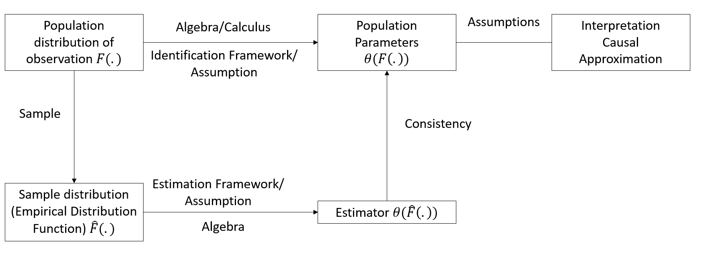
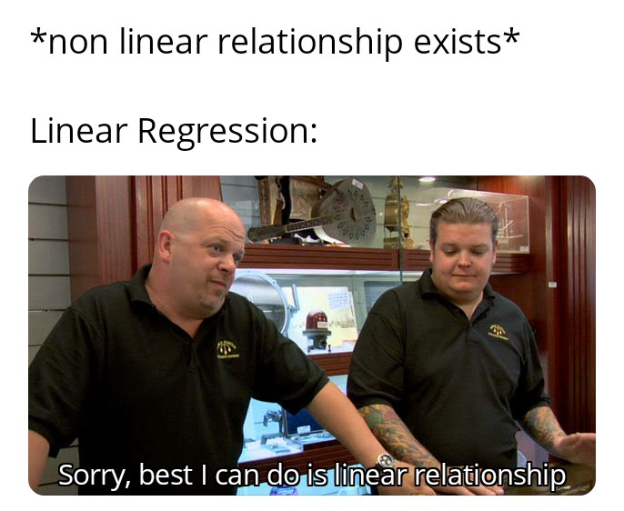

# Linear Regression {#linear-regression}

This chapter develops the classical linear model as the cornerstone of regression methodology. It presents [Ordinary Least Squares](#ordinary-least-squares), its geometric and probabilistic interpretations, and the [Gauss-Markov theorem](#gauss-markov-theorem). Diagnostics for multicollinearity, heteroskedasticity, and influential observations are paired with remedies such as [Generalized Least Squares](#sec-generalized-least-squares) and robust variance estimation. Extensions to [maximum-likelihood estimation](#maximum-likelihood-estimator) unify treatment of continuous and discrete outcomes, while [penalized approaches](#penalized-regularized-estimators)---including ridge, lasso, and elastic-net---address high-dimensional feature spaces. Finally, we introduce [Partial Least Squares](#sec-partial-least-squares) for dimension reduction and demonstrate applications in marketing analytics, experimental psychology, and economic forecasting.

```{r fig-inference-framework, fig.cap="Framework for Statistical Inference and Causal Interpretation", fig.alt="A flowchart illustrating the framework for statistical estimation. It begins with the population distribution of observations, which flows into two paths: one toward population parameters via identification assumptions, and the other toward sample-based estimators. The framework highlights consistency, assumptions, and causal interpretation.", out.width="90%", fig.align="center", echo=FALSE}

```

<!-- ::: {style="text-align:center"} -->

<!-- {width="450" height="200"} -->

<!-- ::: -->

Linear regression is one of the most fundamental tools in statistics and econometrics, widely used for modeling relationships between variables. It forms the cornerstone of predictive analysis, enabling us to understand and quantify how changes in one or more explanatory variables are associated with a dependent variable. Its simplicity and versatility make it an essential tool in fields ranging from economics and marketing to healthcare and environmental studies.

At its core, linear regression addresses questions about associations rather than causation. For example:

-   How are advertising expenditures associated with sales performance?
-   What is the relationship between a company's revenue and its stock price?
-   How does the level of education correlate with income?

These questions are about patterns in data---not necessarily causal effects. While regression can provide insights into potential causal relationships, establishing causality requires more than just regression analysis. It requires careful consideration of the study design, assumptions, and potential confounding factors.

So, why is it called "linear"? The term refers to the structure of the model, where the dependent variable (outcome) is modeled as a linear combination of one or more independent variables (predictors). For example, in simple linear regression, the relationship is represented as:

$$Y = \beta_0 + \beta_1 X + \epsilon,$$

where $Y$ is the dependent variable, $X$ is the independent variable, $\beta_0$ and $\beta_1$ are parameters to be estimated, and $\epsilon$ is the error term capturing randomness or unobserved factors.

Linear regression serves as a foundation for much of applied data analysis because of its wide-ranging applications:

1.  **Understanding Patterns in Data:** Regression provides a framework to summarize and explore relationships between variables. It allows us to identify patterns such as trends or associations, which can guide further analysis or decision-making.

2.  **Prediction:** Beyond exploring relationships, regression is widely used for making predictions. For instance, given historical data, we can use a regression model to predict future outcomes like sales, prices, or demand.

3.  **Building Blocks for Advanced Techniques:** Linear regression is foundational for many advanced statistical and machine learning models, such as logistic regression, ridge regression, and neural networks. Mastering linear regression equips you with the skills to tackle more complex methods.

**Regression and Causality: A Crucial Distinction**

It's essential to remember that regression alone does not establish causation. For instance, a regression model might show a strong association between advertising and sales, but this does not prove that advertising directly causes sales to increase. Other factors---such as seasonality, market trends, or unobserved variables---could also influence the results.

Establishing causality requires additional steps, such as controlled experiments, instrumental variable techniques, or careful observational study designs. As we work through the details of linear regression, we'll revisit this distinction and highlight scenarios where causality might or might not be inferred.

------------------------------------------------------------------------

**What is an Estimator?**

At the heart of regression lies the process of **estimation**---the act of using data to determine the unknown characteristics of a population or model.

An **estimator** is a mathematical rule or formula used to calculate an estimate of an unknown quantity based on observed data. For example, when we calculate the average height of a sample to estimate the average height of a population, the sample mean is the estimator.

In the context of regression, the quantities we typically estimate are:

-   **Parameters**: Fixed, unknown values that describe the relationship between variables (e.g., coefficients in a regression equation).
    -   **Estimating parameters** → Parametric models (finite parameters, e.g., coefficients in regression).
-   **Functions**: Unknown relationships or patterns in the data, often modeled without assuming a fixed functional form.
    -   **Estimating functions** → Non-parametric models (focus on shapes or trends, not a fixed number of parameters).

------------------------------------------------------------------------

**Types of Estimators**

To better understand the estimation process, let's introduce two broad categories of estimators that we'll work with:

1.  **Parametric Estimators**\
    Parametric estimation focuses on a finite set of parameters that define a model. For example, in a simple linear regression:\
    $$Y = \beta_0 + \beta_1 X + \epsilon,$$\
    the task is to estimate the parameters $\beta_0$ (intercept) and $\beta_1$ (slope). Parametric estimators rely on specific assumptions about the form of the model (e.g., linearity) and the distribution of the error term (e.g., normality).

2.  **Non-Parametric Estimators**\
    Non-parametric estimation avoids assuming a specific functional form for the relationship between variables. Instead, it focuses on estimating patterns or trends directly from the data. For example, using a scatterplot smoothing technique to visualize how sales vary with advertising spend without imposing a linear or quadratic relationship.

These two categories reflect a fundamental trade-off in statistical analysis: **parametric models** are often simpler and more interpretable but require strong assumptions, while **non-parametric models** are more flexible but may require more data and computational resources.

------------------------------------------------------------------------

**Desirable Properties of Estimators**

Regardless of whether we are estimating parameters or functions, we want our estimators to possess certain desirable properties. Think of these as the "golden standards" that help us judge whether an estimator is reliable:

1.  **Unbiasedness**\
    An estimator is unbiased if it hits the true value of the parameter, on average, over repeated samples. Mathematically:\
    $$E[\hat{\beta}] = \beta.$$\
    This means that, across multiple samples, the estimator does not systematically overestimate or underestimate the true parameter.

2.  **Consistency**\
    Consistency ensures that as the sample size increases, the estimator converges to the true value of the parameter. Formally:\
    $$plim\ \hat{\beta_n} = \beta.$$\
    This property relies on the [Law of Large Numbers], which guarantees that larger samples reduce random fluctuations, leading to more precise estimates.

3.  **Efficiency**\
    Among all unbiased estimators, an efficient estimator has the smallest variance.

    -   The [Ordinary Least Squares](#ordinary-least-squares) method is efficient because it is the **Best Linear Unbiased Estimator (BLUE)** under the [Gauss-Markov Theorem](#gauss-markov-theorem).
    -   For estimators that meet specific distributional assumptions (e.g., normality), [maximum-likelihood estimators](#maximum-likelihood-estimator) are asymptotically efficient, meaning they achieve the lowest possible variance as the sample size grows.

------------------------------------------------------------------------

**Why These Properties Matter**

Understanding these properties is crucial because they ensure that the methods we use for estimation are reliable, precise, and robust. Whether we are estimating coefficients in a regression model or uncovering a complex pattern in the data, these properties provide the foundation for statistical inference and decision-making.

Now that we've established what estimators are, the types we'll encounter, and their desirable properties, we can move on to understanding how these concepts apply specifically to the [Ordinary Least Squares](#ordinary-least-squares) method---the backbone of linear regression.

+-------------------------------------------------------------------------+------------------------------------------------------------------------------------------------------------+-----------------------------------------------------------------------------------------------+--------------------------------------------------------------------------------------------------------------------+
| **Estimator**                                                           | **Key Assumptions**                                                                                        | **Strengths**                                                                                 | **Limitations**                                                                                                    |
+=========================================================================+============================================================================================================+===============================================================================================+====================================================================================================================+
| [Ordinary Least Squares](#ordinary-least-squares)                       | Errors are independent, identically distributed (i.i.d.) with mean 0 and constant variance.                | Simple, well-understood method.                                                               | Sensitive to outliers and violations of normality.                                                                 |
|                                                                         |                                                                                                            |                                                                                               |                                                                                                                    |
|                                                                         | Linear relationship between predictors and response.                                                       | Minimizes residual sum of squares (easy to interpret coefficients).                           | Can perform poorly if predictors are highly correlated (multicollinearity).                                        |
+-------------------------------------------------------------------------+------------------------------------------------------------------------------------------------------------+-----------------------------------------------------------------------------------------------+--------------------------------------------------------------------------------------------------------------------+
| [Generalized Least Squares]                                             | Errors have a known correlation structure or heteroscedasticity structure that can be modeled.             | Handles correlated or non-constant-variance errors.                                           | Requires specifying (or estimating) the error covariance structure.                                                |
|                                                                         |                                                                                                            |                                                                                               |                                                                                                                    |
|                                                                         |                                                                                                            | More flexible than [OLS](#ordinary-least-squares) when noise structure is known.              | Misspecification can lead to biased estimates.                                                                     |
+-------------------------------------------------------------------------+------------------------------------------------------------------------------------------------------------+-----------------------------------------------------------------------------------------------+--------------------------------------------------------------------------------------------------------------------+
| [Maximum Likelihood](#maximum-likelihood-estimator)                     | Underlying probability distribution (e.g., normal) must be specified correctly.                            | Provides a general framework for estimating parameters under well-defined probability models. | Highly sensitive to model misspecification.                                                                        |
|                                                                         |                                                                                                            |                                                                                               |                                                                                                                    |
|                                                                         |                                                                                                            | Can extend to complex likelihoods.                                                            | May require more computation than [OLS](#ordinary-least-squares) or GLS.                                           |
+-------------------------------------------------------------------------+------------------------------------------------------------------------------------------------------------+-----------------------------------------------------------------------------------------------+--------------------------------------------------------------------------------------------------------------------+
| [Penalized (Regularized) Estimators](#penalized-regularized-estimators) | Coefficients assumed to be shrinkable; model typically allows coefficient penalization.                    | Controls overfitting via regularization.                                                      | Requires choosing tuning parameter(s) (e.g., λ).                                                                   |
|                                                                         |                                                                                                            |                                                                                               |                                                                                                                    |
|                                                                         |                                                                                                            | Handles high-dimensional data or many predictors.                                             | Interpretation of coefficients becomes less straightforward.                                                       |
|                                                                         |                                                                                                            |                                                                                               |                                                                                                                    |
|                                                                         |                                                                                                            | Can perform feature selection (e.g., Lasso).                                                  |                                                                                                                    |
+-------------------------------------------------------------------------+------------------------------------------------------------------------------------------------------------+-----------------------------------------------------------------------------------------------+--------------------------------------------------------------------------------------------------------------------+
| [Robust Estimators]                                                     | Less sensitive to heavy-tailed or outlier-prone distributions (weaker assumptions on the error structure). | Resistant to large deviations or outliers in data.                                            | Less efficient if errors are truly normal.                                                                         |
|                                                                         |                                                                                                            |                                                                                               |                                                                                                                    |
|                                                                         |                                                                                                            | Often maintains good performance under mild model misspecifications.                          | Choice of robust method and tuning can be subjective.                                                              |
+-------------------------------------------------------------------------+------------------------------------------------------------------------------------------------------------+-----------------------------------------------------------------------------------------------+--------------------------------------------------------------------------------------------------------------------+
| [Partial Least Squares]                                                 | Predictors may be highly correlated; dimension reduction is desired.                                       | Simultaneously reduces dimensionality and fits regression.                                    | Can be harder to interpret than [OLS](#ordinary-least-squares) (latent components instead of original predictors). |
|                                                                         |                                                                                                            |                                                                                               |                                                                                                                    |
|                                                                         |                                                                                                            | Works well with collinear, high-dimensional data.                                             | Requires choosing the number of components.                                                                        |
+-------------------------------------------------------------------------+------------------------------------------------------------------------------------------------------------+-----------------------------------------------------------------------------------------------+--------------------------------------------------------------------------------------------------------------------+

: Comparison of Estimation Methods in Regression Analysis

------------------------------------------------------------------------

## Ordinary Least Squares {#ordinary-least-squares}

Ordinary Least Squares (OLS) is the backbone of statistical modeling, a method so foundational that it often serves as the starting point for understanding data relationships. Whether predicting sales, estimating economic trends, or uncovering patterns in scientific research, OLS remains a critical tool. Its appeal lies in simplicity: OLS models the relationship between a dependent variable and one or more predictors by minimizing the squared differences between observed and predicted values.

------------------------------------------------------------------------

**Why OLS Works: Linear and Nonlinear Relationships**

[OLS](#ordinary-least-squares) rests on the Conditional Expectation Function (CEF), $E[Y | X]$, which describes the expected value of $Y$ given $X$. Regression shines in two key scenarios:

1.  **Perfect Fit (Linear CEF):**\
    If $E[Y_i | X_{1i}, \dots, X_{Ki}] = a + \sum_{k=1}^K b_k X_{ki}$, the regression of $Y_i$ on $X_{1i}, \dots, X_{Ki}$ exactly equals the CEF. In other words, the regression gives the true average relationship between $Y$ and $X$.\
    If the true relationship is linear, regression delivers the exact CEF. For instance, imagine you're estimating the relationship between advertising spend and sales revenue. If the true impact is linear, [OLS](#ordinary-least-squares) will perfectly capture it.

2.  **Approximation (Nonlinear CEF):**\
    If $E[Y_i | X_{1i}, \dots, X_{Ki}]$ is nonlinear, [OLS](#ordinary-least-squares) provides the best linear approximation to this relationship. Specifically, it minimizes the expected squared deviation between the linear regression line and the nonlinear CEF.\
    For example, the effect of advertising diminishes at higher spending levels? [OLS](#ordinary-least-squares) still works, providing the best linear approximation to this nonlinear relationship by minimizing the squared deviations between predictions and the true (but unknown) CEF.

In other words, regression is not just a tool for "linear" relationships---it's a workhorse that adapts remarkably well to messy, real-world data.

<!-- {width="80%"} -->

------------------------------------------------------------------------

### Simple Regression (Basic) Model

The simplest form of regression is a straight line:

$$
Y_i = \beta_0 + \beta_1 X_i + \epsilon_i
$$

where

-   $Y_i$: The dependent variable or outcome we're trying to predict (e.g., sales, temperature).
-   $X_i$: The independent variable or predictor (e.g., advertising spend, time).
-   $\beta_0$: The intercept---where the line crosses the $Y$-axis when $X = 0$.
-   $\beta_1$: The slope, representing the change in $Y$ for a one-unit increase in $X$.
-   $\epsilon_i$: The error term, accounting for random factors that $X$ cannot explain.

Assumptions About the Error Term ($\epsilon_i$):

$$
\begin{aligned}
E(\epsilon_i) &= 0 \\
\text{Var}(\epsilon_i) &= \sigma^2 \\
\text{Cov}(\epsilon_i, \epsilon_j) &= 0 \quad \text{for all } i \neq j
\end{aligned}
$$

Since $\epsilon_i$ is random, $Y_i$ is also random:

$$
\begin{aligned}
E(Y_i) &= E(\beta_0 + \beta_1 X_i + \epsilon_i) \\
&= \beta_0 + \beta_1 X_i
\end{aligned}
$$

$$
\begin{aligned}
\text{Var}(Y_i) &= \text{Var}(\beta_0 + \beta_1 X_i + \epsilon_i) \\
&= \text{Var}(\epsilon_i) \\
&= \sigma^2
\end{aligned}
$$

Since $\text{Cov}(\epsilon_i, \epsilon_j) = 0$, the outcomes across observations are independent. Hence, $Y_i$ and $Y_j$ are uncorrelated as well, conditioned on the $X$'s.

------------------------------------------------------------------------

#### Estimation in Ordinary Least Squares

The goal of [OLS](#ordinary-least-squares) is to estimate the regression parameters ($\beta_0$, $\beta_1$) that best describe the relationship between the dependent variable $Y$ and the independent variable $X$. To achieve this, we minimize the sum of squared deviations between observed values of $Y_i$ and their expected values predicted by the model.

The deviation of an observed value $Y_i$ from its expected value, based on the regression model, is:

$$
Y_i - E(Y_i) = Y_i - (\beta_0 + \beta_1 X_i).
$$

This deviation represents the error in prediction for the $i$-th observation.

To ensure that the errors don't cancel each other out and to prioritize larger deviations, we consider the squared deviations. The sum of squared deviations, denoted by $Q$, is defined as:

$$
Q = \sum_{i=1}^{n} (Y_i - \beta_0 - \beta_1 X_i)^2.
$$

The goal of [OLS](#ordinary-least-squares) is to find the values of $\beta_0$ and $\beta_1$ that minimize $Q$. These values are called the **OLS estimators**.

To minimize $Q$, we take partial derivatives with respect to $\beta_0$ and $\beta_1$, set them to zero, and solve the resulting system of equations. After simplifying, the estimators for the slope ($b_1$) and intercept ($b_0$) are obtained as follows:

Slope ($b_1$):

$$
b_1 = \frac{\sum_{i=1}^{n} (X_i - \bar{X})(Y_i - \bar{Y})}{\sum_{i=1}^{n} (X_i - \bar{X})^2}.
$$

Here, $\bar{X}$ and $\bar{Y}$ represent the means of $X$ and $Y$, respectively. This formula reveals that the slope is proportional to the covariance between $X$ and $Y$, scaled by the variance of $X$.

Intercept ($b_0$):

$$
b_0 = \frac{1}{n} \left( \sum_{i=1}^{n} Y_i - b_1 \sum_{i=1}^{n} X_i \right) = \bar{Y} - b_1 \bar{X}.
$$

The intercept is determined by aligning the regression line with the center of the data.

------------------------------------------------------------------------

**Intuition Behind the Estimators**

-   $b_1$ (Slope): This measures the average change in $Y$ for a one-unit increase in $X$. The formula uses deviations from the mean to ensure that the relationship captures the joint variability of $X$ and $Y$.

-   $b_0$ (Intercept): This ensures that the regression line passes through the mean of the data points $(\bar{X}, \bar{Y})$, anchoring the model in the center of the observed data.

------------------------------------------------------------------------

Equivalently, we can also write these parameters in terms of covariances.

The covariance between two variables is defined as:

$$ \text{Cov}(X_i, Y_i) = E[(X_i - E[X_i])(Y_i - E[Y_i])] $$

Properties of Covariance:

1.  $\text{Cov}(X_i, X_i) = \sigma^2_X$
2.  If $E(X_i) = 0$ or $E(Y_i) = 0$, then $\text{Cov}(X_i, Y_i) = E[X_i Y_i]$
3.  For $W_i = a + b X_i$ and $Z_i = c + d Y_i$,\
    $\text{Cov}(W_i, Z_i) = bd \cdot \text{Cov}(X_i, Y_i)$

For a bivariate regression, the slope $\beta$ in a bivariate regression is given by:

$$ \beta = \frac{\text{Cov}(Y_i, X_i)}{\text{Var}(X_i)} $$

For a multivariate case, the slope for $X_k$ is:

$$ \beta_k = \frac{\text{Cov}(Y_i, \tilde{X}_{ki})}{\text{Var}(\tilde{X}_{ki})} $$

Where $\tilde{X}_{ki}$ represents the residual from a regression of $X_{ki}$ on the $K-1$ other covariates in the model.

The intercept is:

$$ \beta_0 = E[Y_i] - \beta_1 E(X_i) $$

Note:

-   [OLS](#ordinary-least-squares) does not require the assumption of a specific distribution for the variables. Its robustness is based on the minimization of squared errors (i.e., no distributional assumptions).

#### Properties of Least Squares Estimators

The properties of the Ordinary Least Squares estimators ($b_0$ and $b_1$) are derived based on their statistical behavior. These properties provide insights into the accuracy, variability, and reliability of the estimates.

------------------------------------------------------------------------

##### Expectation of the OLS Estimators

The [OLS](#ordinary-least-squares) estimators $b_0$ (intercept) and $b_1$ (slope) are unbiased. This means their expected values equal the true population parameters:

$$
\begin{aligned}
E(b_1) &= \beta_1, \\
E(b_0) &= E(\bar{Y}) - \bar{X}\beta_1.
\end{aligned}
$$

Since the expected value of the sample mean of $Y$, $E(\bar{Y})$, is:

$$
E(\bar{Y}) = \beta_0 + \beta_1 \bar{X},
$$

the expected value of $b_0$ simplifies to:

$$
E(b_0) = \beta_0.
$$

Thus, $b_0$ and $b_1$ are unbiased estimators of their respective population parameters $\beta_0$ and $\beta_1$.

------------------------------------------------------------------------

##### Variance of the OLS Estimators

The variability of the [OLS](#ordinary-least-squares) estimators depends on the spread of the predictor variable $X$ and the error variance $\sigma^2$. The variances are given by:

Variance of $b_1$ (Slope):

$$
\text{Var}(b_1) = \frac{\sigma^2}{\sum_{i=1}^{n} (X_i - \bar{X})^2}.
$$

Variance of $b_0$ (Intercept):

$$
\text{Var}(b_0) = \sigma^2 \left( \frac{1}{n} + \frac{\bar{X}^2}{\sum_{i=1}^{n} (X_i - \bar{X})^2} \right).
$$

These formulas highlight that:

-   $\text{Var}(b_1) \to 0$ as the number of observations increases, provided $X_i$ values are distributed around their mean $\bar{X}$.
-   $\text{Var}(b_0) \to 0$ as $n$ increases, assuming $X_i$ values are appropriately selected (i.e., not all clustered near the mean).

------------------------------------------------------------------------

#### Mean Square Error (MSE)

The Mean Square Error (MSE) quantifies the average squared residual (error) in the model:

$$
MSE = \frac{SSE}{n-2} = \frac{\sum_{i=1}^{n} e_i^2}{n-2} = \frac{\sum_{i=1}^{n} (Y_i - \hat{Y}_i)^2}{n-2},
$$

where $SSE$ is the Sum of Squared Errors and $n-2$ represents the degrees of freedom for a simple linear regression model (two parameters estimated: $\beta_0$ and $\beta_1$).

The expected value of the MSE equals the error variance (i.e., unbiased Estimator of MSE:):

$$
E(MSE) = \sigma^2.
$$

------------------------------------------------------------------------

#### Estimating Variance of the OLS Coefficients

The sample-based estimates of the variances of $b_0$ and $b_1$ are expressed as follows:

Estimated Variance of $b_1$ (Slope):

$$
s^2(b_1) = \widehat{\text{Var}}(b_1) = \frac{MSE}{\sum_{i=1}^{n} (X_i - \bar{X})^2}.
$$

Estimated Variance of $b_0$ (Intercept):

$$
s^2(b_0) = \widehat{\text{Var}}(b_0) = MSE \left( \frac{1}{n} + \frac{\bar{X}^2}{\sum_{i=1}^{n} (X_i - \bar{X})^2} \right).
$$

These estimates rely on the MSE to approximate $\sigma^2$.

The variance estimates are unbiased:

$$
\begin{aligned}
E(s^2(b_1)) &= \text{Var}(b_1), \\
E(s^2(b_0)) &= \text{Var}(b_0).
\end{aligned}
$$

------------------------------------------------------------------------

**Implications of These Properties**

1.  **Unbiasedness:** The unbiased nature of $b_0$ and $b_1$ ensures that, on average, the regression model accurately reflects the true relationship in the population.
2.  **Decreasing Variance:** As the sample size $n$ increases or as the spread of $X_i$ values grows, the variances of $b_0$ and $b_1$ decrease, leading to more precise estimates.
3.  **Error Estimation with MSE:** MSE provides a reliable estimate of the error variance $\sigma^2$, which feeds directly into assessing the reliability of $b_0$ and $b_1$.

#### Residuals in Ordinary Least Squares

Residuals are the differences between observed values ($Y_i$) and their predicted counterparts ($\hat{Y}_i$). They play a central role in assessing model fit and ensuring the assumptions of OLS are met.

The residual for the $i$-th observation is defined as:

$$
e_i = Y_i - \hat{Y}_i = Y_i - (b_0 + b_1 X_i),
$$

where:

-   $e_i$: Residual for the $i$-th observation.
-   $\hat{Y}_i$: Predicted value based on the regression model.
-   $Y_i$: Actual observed value.

Residuals estimate the unobservable error terms $\epsilon_i$:

-   $e_i$ is an estimate of $\epsilon_i = Y_i - E(Y_i)$.
-   $\epsilon_i$ is always unknown because we do not know the true values of $\beta_0$ and $\beta_1$.

------------------------------------------------------------------------

##### Key Properties of Residuals

Residuals exhibit several mathematical properties that align with the OLS estimation process:

1.  **Sum of Residuals**:\
    The residuals sum to zero:

    $$
    \sum_{i=1}^{n} e_i = 0.
    $$

    This ensures that the regression line passes through the centroid of the data, $(\bar{X}, \bar{Y})$.

2.  **Orthogonality of Residuals to Predictors**:\
    The residuals are orthogonal (uncorrelated) to the predictor variable $X$:

    $$
    \sum_{i=1}^{n} X_i e_i = 0.
    $$

    This reflects the fact that the [OLS](#ordinary-least-squares) minimizes the squared deviations of residuals along the $Y$-axis, not the $X$-axis.

------------------------------------------------------------------------

##### Expected Values of Residuals

The expected values of residuals reinforce the unbiased nature of OLS:

1.  **Mean of Residuals**:\
    The residuals have an expected value of zero:

    $$
    E[e_i] = 0.
    $$

2.  **Orthogonality to Predictors and Fitted Values**:\
    Residuals are uncorrelated with both the predictor variables and the fitted values:

    $$
    \begin{aligned}
    E[X_i e_i] &= 0, \\
    E[\hat{Y}_i e_i] &= 0.
    \end{aligned}
    $$

These properties highlight that residuals do not contain systematic information about the predictors or the fitted values, reinforcing the idea that the model has captured the underlying relationship effectively.

------------------------------------------------------------------------

##### Practical Importance of Residuals

1.  **Model Diagnostics:**\
    Residuals are analyzed to check the assumptions of OLS, including linearity, homoscedasticity (constant variance), and independence of errors. Patterns in residual plots can signal issues such as nonlinearity or heteroscedasticity.

2.  **Goodness-of-Fit:**\
    The sum of squared residuals, $\sum e_i^2$, measures the total unexplained variation in $Y$. A smaller sum indicates a better fit.

3.  **Influence Analysis:**\
    Large residuals may indicate outliers or influential points that disproportionately affect the regression line.

#### Inference in Ordinary Least Squares

Inference allows us to make probabilistic statements about the regression parameters ($\beta_0$, $\beta_1$) and predictions ($Y_h$). To perform valid inference, certain assumptions about the distribution of errors are necessary.

------------------------------------------------------------------------

Normality Assumption

-   OLS estimation itself does **not** require the assumption of normality.
-   However, to conduct hypothesis tests or construct confidence intervals for $\beta_0$, $\beta_1$, and predictions, distributional assumptions are necessary.
-   Inference on $\beta_0$ and $\beta_1$ is **robust** to moderate departures from normality, especially in large samples due to the [Central Limit Theorem].
-   Inference on predicted values, $Y_{pred}$, is more sensitive to normality violations.

------------------------------------------------------------------------

When we assume a **normal error model**, the response variable $Y_i$ is modeled as:

$$
Y_i \sim N(\beta_0 + \beta_1 X_i, \sigma^2),
$$

where:

-   $\beta_0 + \beta_1 X_i$: Mean response
-   $\sigma^2$: Variance of the errors

Under this model, the sampling distributions of the OLS estimators, $b_0$ and $b_1$, can be derived.

------------------------------------------------------------------------

##### Inference for $\beta_1$ (Slope)

Under the normal error model:

1.  **Sampling Distribution of** $b_1$:

    $$ 
    b_1 \sim N\left(\beta_1, \frac{\sigma^2}{\sum_{i=1}^{n} (X_i - \bar{X})^2}\right).
    $$

    This indicates that $b_1$ is an unbiased estimator of $\beta_1$ with variance proportional to $\sigma^2$.

2.  **Test Statistic:**

    $$ 
    t = \frac{b_1 - \beta_1}{s(b_1)} \sim t_{n-2},
    $$

    where $s(b_1)$ is the standard error of $b_1$: $$
    s(b_1) = \sqrt{\frac{MSE}{\sum_{i=1}^{n} (X_i - \bar{X})^2}}.
    $$

3.  **Confidence Interval:**

    A $(1-\alpha) 100\%$ confidence interval for $\beta_1$ is:

    $$ 
    b_1 \pm t_{1-\alpha/2; n-2} \cdot s(b_1).
    $$

------------------------------------------------------------------------

##### Inference for $\beta_0$ (Intercept)

1.  **Sampling Distribution of** $b_0$:

    Under the normal error model, the sampling distribution of $b_0$ is:

    $$ 
    b_0 \sim N\left(\beta_0, \sigma^2 \left(\frac{1}{n} + \frac{\bar{X}^2}{\sum_{i=1}^{n} (X_i - \bar{X})^2}\right)\right).
    $$

2.  **Test Statistic:**

    $$ 
    t = \frac{b_0 - \beta_0}{s(b_0)} \sim t_{n-2},
    $$

    where $s(b_0)$ is the standard error of $b_0$: $$
    s(b_0) = \sqrt{MSE \left(\frac{1}{n} + \frac{\bar{X}^2}{\sum_{i=1}^{n} (X_i - \bar{X})^2}\right)}.
    $$

3.  **Confidence Interval:**

    A $(1-\alpha) 100\%$ confidence interval for $\beta_0$ is:

    $$ 
    b_0 \pm t_{1-\alpha/2; n-2} \cdot s(b_0).
    $$

------------------------------------------------------------------------

##### Mean Response

In regression, we often estimate the mean response of the dependent variable $Y$ for a given level of the predictor variable $X$, denoted as $X_h$. This estimation provides a predicted average outcome for a specific value of $X$ based on the fitted regression model.

-   Let $X_h$ represent the level of $X$ for which we want to estimate the mean response.
-   The mean response when $X = X_h$ is denoted as $E(Y_h)$.
-   A point estimator for $E(Y_h)$ is $\hat{Y}_h$, which is the predicted value from the regression model:

$$
\hat{Y}_h = b_0 + b_1 X_h.
$$

The estimator $\hat{Y}_h$ is unbiased because its expected value equals the true mean response $E(Y_h)$:

$$
\begin{aligned}
E(\hat{Y}_h) &= E(b_0 + b_1 X_h) \\
&= \beta_0 + \beta_1 X_h \\
&= E(Y_h).
\end{aligned}
$$

Thus, $\hat{Y}_h$ provides a reliable estimate of the mean response at $X_h$.

------------------------------------------------------------------------

The variance of $\hat{Y}_h$ reflects the uncertainty in the estimate of the mean response:

$$
\begin{aligned}
\text{Var}(\hat{Y}_h) &= \text{Var}(b_0 + b_1 X_h) \quad\text{(definition of }\hat{Y}_h\text{)}\\
&= \text{Var}\left((\bar{Y} - b_1 \bar{X}) + b_1 X_h\right)\quad\text{(since } b_0 = \bar{Y} - b_1 \bar{X}\text{)}\\
&= \text{Var}\left(\bar{Y} + b_1(X_h - \bar{X})\right)\quad\text{(factor out } b_1\text{)}\\
&= \text{Var}\left(\bar{Y} + b_1 (X_h - \bar{X}) \right) \\
&= \text{Var}(\bar{Y}) + (X_h - \bar{X})^2 \text{Var}(b_1) + 2(X_h - \bar{X}) \text{Cov}(\bar{Y}, b_1).
\end{aligned}
$$

Since $\text{Cov}(\bar{Y}, b_1) = 0$ (due to the independence of the errors, $\epsilon_i$), the variance simplifies to:

$$
\text{Var}(\hat{Y}_h) = \frac{\sigma^2}{n} + (X_h - \bar{X})^2 \frac{\sigma^2}{\sum_{i=1}^{n} (X_i - \bar{X})^2}.
$$

This can also be expressed as:

$$
\text{Var}(\hat{Y}_h) = \sigma^2 \left( \frac{1}{n} + \frac{(X_h - \bar{X})^2}{\sum_{i=1}^{n} (X_i - \bar{X})^2} \right).
$$

To estimate the variance of $\hat{Y}_h$, we replace $\sigma^2$ with $MSE$, the mean squared error from the regression:

$$
s^2(\hat{Y}_h) = MSE \left( \frac{1}{n} + \frac{(X_h - \bar{X})^2}{\sum_{i=1}^{n} (X_i - \bar{X})^2} \right).
$$

------------------------------------------------------------------------

Under the normal error model, the sampling distribution of $\hat{Y}_h$ is:

$$
\begin{aligned}
\hat{Y}_h &\sim N\left(E(Y_h), \text{Var}(\hat{Y}_h)\right), \\
\frac{\hat{Y}_h - E(Y_h)}{s(\hat{Y}_h)} &\sim t_{n-2}.
\end{aligned}
$$

This result follows because $\hat{Y}_h$ is a linear combination of normally distributed random variables, and its variance is estimated using $s^2(\hat{Y}_h)$.

------------------------------------------------------------------------

A $100(1-\alpha)\%$ confidence interval for the mean response $E(Y_h)$ is given by:

$$
\hat{Y}_h \pm t_{1-\alpha/2; n-2} \cdot s(\hat{Y}_h),
$$

where:

-   $\hat{Y}_h$: Point estimate of the mean response,
-   $s(\hat{Y}_h)$: Estimated standard error of the mean response,
-   $t_{1-\alpha/2; n-2}$: Critical value from the $t$-distribution with $n-2$ degrees of freedom.

------------------------------------------------------------------------

##### Prediction of a New Observation

When analyzing regression results, it is important to distinguish between:

1.  **Estimating the mean response** at a particular value of $X$.
2.  **Predicting an individual outcome** for a particular value of $X$.

------------------------------------------------------------------------

Mean Response vs. Individual Outcome

-   **Same Point Estimate**\
    The formula for both the estimated mean response and the predicted individual outcome at $X = X_h$ is identical:\
    $$
    \hat{Y}_{pred} = \hat{Y}_h = b_0 + b_1 X_h.
    $$

-   **Different Variance**\
    Although the point estimates are the same, the level of uncertainty differs. When predicting an individual outcome, we must consider not only the uncertainty in estimating the mean response ($\hat{Y}_h$) but also the additional random variation within the distribution of $Y$.

Therefore, **prediction intervals** (for individual outcomes) account for more uncertainty and are consequently wider than **confidence intervals** (for the mean response).

------------------------------------------------------------------------

To predict an individual outcome for a given $X_h$, we combine the mean response with the random error:

$$
Y_{pred} = \beta_0 + \beta_1 X_h + \epsilon.
$$

Using the least squares predictor:

$$
\hat{Y}_{pred} = b_0 + b_1 X_h,
$$

since $E(\epsilon) = 0$.

------------------------------------------------------------------------

The variance of the predicted value for a new observation, $Y_{pred}$, includes both:

1.  Variance of the estimated mean response: $$
    \sigma^2 \left( \frac{1}{n} + \frac{(X_h - \bar{X})^2}{\sum_{i=1}^{n} (X_i - \bar{X})^2} \right),
    $$
2.  Variance of the error term, $\epsilon$, which is $\sigma^2$.

Thus, the total variance is:

$$
\begin{aligned}
\text{Var}(Y_{pred}) &= \text{Var}(b_0 + b_1 X_h + \epsilon) \\
&= \text{Var}(b_0 + b_1 X_h) + \text{Var}(\epsilon) \\
&= \sigma^2 \left( \frac{1}{n} + \frac{(X_h - \bar{X})^2}{\sum_{i=1}^{n} (X_i - \bar{X})^2} \right) + \sigma^2 \\
&= \sigma^2 \left( 1 + \frac{1}{n} + \frac{(X_h - \bar{X})^2}{\sum_{i=1}^{n} (X_i - \bar{X})^2} \right).
\end{aligned}
$$

We estimate the variance of the prediction using $MSE$, the mean squared error:

$$
s^2(pred) = MSE \left( 1 + \frac{1}{n} + \frac{(X_h - \bar{X})^2}{\sum_{i=1}^{n} (X_i - \bar{X})^2} \right).
$$

Under the normal error model, the standardized predicted value follows a $t$-distribution with $n-2$ degrees of freedom:

$$
\frac{Y_{pred} - \hat{Y}_h}{s(pred)} \sim t_{n-2}.
$$

A $100(1-\alpha)\%$ prediction interval for $Y_{pred}$ is:

$$
\hat{Y}_{pred} \pm t_{1-\alpha/2; n-2} \cdot s(pred).
$$

------------------------------------------------------------------------

##### Confidence Band

In regression analysis, we often want to evaluate the uncertainty around the entire regression line, not just at a single value of the predictor variable $X$. This is achieved using a **confidence band**, which provides a confidence interval for the mean response, $E(Y) = \beta_0 + \beta_1 X$, over the entire range of $X$ values.

The Working-Hotelling confidence band is a method to construct simultaneous confidence intervals for the regression line. For a given $X_h$, the confidence band is expressed as:

$$
\hat{Y}_h \pm W s(\hat{Y}_h),
$$

where:

-   $W^2 = 2F_{1-\alpha; 2, n-2}$,

    -   $F_{1-\alpha; 2, n-2}$ is the critical value from the $F$-distribution with 2 and $n-2$ degrees of freedom.

-   $s(\hat{Y}_h)$ is the standard error of the estimated mean response at $X_h$:

    $$
    s^2(\hat{Y}_h) = MSE \left( \frac{1}{n} + \frac{(X_h - \bar{X})^2}{\sum_{i=1}^{n} (X_i - \bar{X})^2} \right).
    $$

------------------------------------------------------------------------

**Key Properties of the Confidence Band**

1.  **Width of the Interval:**
    -   The width of the confidence band changes with $X_h$ because $s(\hat{Y}_h)$ depends on how far $X_h$ is from the mean of $X$ ($\bar{X}$).
    -   The interval is narrowest at $X = \bar{X}$, where the variance of the estimated mean response is minimized.
2.  **Shape of the Band:**
    -   The boundaries of the confidence band form a hyperbolic shape around the regression line.
    -   This reflects the increasing uncertainty in the mean response as $X_h$ moves farther from $\bar{X}$.
3.  **Simultaneous Coverage:**
    -   The Working-Hotelling band ensures that the true regression line $E(Y) = \beta_0 + \beta_1 X$ lies within the band across all values of $X$ with a specified confidence level (e.g., $95\%$).

#### Analysis of Variance (ANOVA) in Regression

ANOVA in regression decomposes the total variability in the response variable ($Y$) into components attributed to the regression model and residual error. In the context of regression, ANOVA provides a mechanism to assess the fit of the model and test hypotheses about the relationship between $X$ and $Y$.

The **corrected Total Sum of Squares (SSTO)** quantifies the total variation in $Y$:

$$
SSTO = \sum_{i=1}^n (Y_i - \bar{Y})^2,
$$

where $\bar{Y}$ is the mean of the response variable. The term "corrected" refers to the fact that the sum of squares is calculated relative to the mean (i.e., the uncorrected total sum of squares is given by $\sum Y_i^2$)

Using the fitted regression model $\hat{Y}_i = b_0 + b_1 X_i$, we estimate the conditional mean of $Y$ at $X_i$. The total sum of squares can be decomposed as:

$$
\begin{aligned}
\sum_{i=1}^n (Y_i - \bar{Y})^2 &= \sum_{i=1}^n (Y_i - \hat{Y}_i + \hat{Y}_i - \bar{Y})^2 \\
&= \sum_{i=1}^n (Y_i - \hat{Y}_i)^2 + \sum_{i=1}^n (\hat{Y}_i - \bar{Y})^2 + 2 \sum_{i=1}^n (Y_i - \hat{Y}_i)(\hat{Y}_i - \bar{Y}) \\
&= \sum_{i=1}^n (Y_i - \hat{Y}_i)^2 + \sum_{i=1}^n (\hat{Y}_i - \bar{Y})^2
\end{aligned}
$$

-   The cross-product term is zero, as shown below.
-   This decomposition simplifies to:

$$
SSTO = SSE + SSR,
$$

where:

-   $SSE = \sum_{i=1}^n (Y_i - \hat{Y}_i)^2$: Error Sum of Squares (variation unexplained by the model).

-   $SSR = \sum_{i=1}^n (\hat{Y}_i - \bar{Y})^2$: Regression Sum of Squares (variation explained by the model), which measure how the conditional mean varies about a central value.

Degrees of freedom are partitioned as:

$$
\begin{aligned}
SSTO &= SSR + SSE \\
(n-1) &= (1) + (n-2) \\
\end{aligned}
$$

------------------------------------------------------------------------

To confirm that the cross-product term is zero:

$$
\begin{aligned}
\sum_{i=1}^n (Y_i - \hat{Y}_i)(\hat{Y}_i - \bar{Y}) 
&= \sum_{i=1}^{n}(Y_i - \bar{Y} -b_1 (X_i - \bar{X}))(\bar{Y} + b_1 (X_i - \bar{X})-\bar{Y}) \quad \text{(Expand } Y_i - \hat{Y}_i \text{ and } \hat{Y}_i - \bar{Y}\text{)} \\
&=\sum_{i=1}^{n}(Y_i - \bar{Y} -b_1 (X_i - \bar{X}))( b_1 (X_i - \bar{X}))  \\
&= b_1 \sum_{i=1}^n (Y_i - \bar{Y})(X_i - \bar{X}) - b_1^2 \sum_{i=1}^n (X_i - \bar{X})^2 \quad \text{(Distribute terms in the product)} \\
&= b_1 \frac{\sum_{i=1}^n (Y_i - \bar{Y})(X_i - \bar{X})}{\sum_{i=1}^n (X_i - \bar{X})^2} \sum_{i=1}^n (X_i - \bar{X})^2 - b_1^2 \sum_{i=1}^n (X_i - \bar{X})^2 \quad \text{(Substitute } b_1 \text{ definition)} \\
&= b_1^2 \sum_{i=1}^n (X_i - \bar{X})^2 - b_1^2 \sum_{i=1}^n (X_i - \bar{X})^2  \\
&= 0 
\end{aligned}
$$

------------------------------------------------------------------------

The ANOVA table summarizes the partitioning of variability:

+---------------------+----------------+------------+-------------------------+-----------------------+
| Source of Variation | Sum of Squares | df         | Mean Square             | $F$ Statistic         |
+=====================+================+============+=========================+=======================+
| Regression (Model)  | $SSR$          | $1$        | $MSR = \frac{SSR}{1}$   | $F = \frac{MSR}{MSE}$ |
+---------------------+----------------+------------+-------------------------+-----------------------+
| Error               | $SSE$          | $n-2$      | $MSE = \frac{SSE}{n-2}$ |                       |
+---------------------+----------------+------------+-------------------------+-----------------------+
| Total (Corrected)   | $SSTO$         | $n-1$      |                         |                       |
+---------------------+----------------+------------+-------------------------+-----------------------+

------------------------------------------------------------------------

The expected values of the mean squares are:

$$
\begin{aligned}
E(MSE) &= \sigma^2, \\
E(MSR) &= \sigma^2 + \beta_1^2 \sum_{i=1}^n (X_i - \bar{X})^2.
\end{aligned}
$$

-   **If** $\beta_1 = 0$:
    -   The regression model does not explain any variation in $Y$ beyond the mean, and $E(MSR) = E(MSE) = \sigma^2$.
    -   This condition corresponds to the null hypothesis, $H_0: \beta_1 = 0$.
-   **If** $\beta_1 \neq 0$:
    -   The regression model explains some variation in $Y$, and $E(MSR) > E(MSE)$.
    -   The additional term $\beta_1^2 \sum_{i=1}^{n} (X_i - \bar{X})^2$ represents the variance explained by the predictor $X$.

The difference between $E(MSR)$ and $E(MSE)$ allows us to infer whether $\beta_1 \neq 0$ by comparing their ratio.

------------------------------------------------------------------------

Assuming the errors $\epsilon_i$ are independent and identically distributed as $N(0, \sigma^2)$, and under the null hypothesis $H_0: \beta_1 = 0$, we have:

1.  The scaled $MSE$ follows a chi-square distribution with $n-2$ degrees of freedom:

    $$
    \frac{MSE}{\sigma^2} \sim \chi_{n-2}^2.
    $$

2.  The scaled $MSR$ follows a chi-square distribution with $1$ degree of freedom:

    $$
    \frac{MSR}{\sigma^2} \sim \chi_{1}^2.
    $$

3.  These two chi-square random variables are independent.

The ratio of two independent chi-square random variables, scaled by their respective degrees of freedom, follows an $F$-distribution. Therefore, under $H_0$:

$$
F = \frac{MSR}{MSE} \sim F_{1, n-2}.
$$

The $F$-statistic tests whether the regression model provides a significant improvement over the null model (constant $E(Y)$).

The hypotheses for the $F$-test are:

-   **Null Hypothesis** ($H_0$): $\beta_1 = 0$ (no relationship between $X$ and $Y$).
-   **Alternative Hypothesis** ($H_a$): $\beta_1 \neq 0$ (a significant relationship exists between $X$ and $Y$).

The rejection rule for $H_0$ at significance level $\alpha$ is:

$$
F > F_{1-\alpha;1,n-2},
$$

where $F_{1-\alpha;1,n-2}$ is the critical value from the $F$-distribution with $1$ and $n-2$ degrees of freedom.

1.  **If** $F \leq F_{1-\alpha;1,n-2}$:
    -   Fail to reject $H_0$. There is insufficient evidence to conclude that $X$ significantly explains variation in $Y$.
2.  **If** $F > F_{1-\alpha;1,n-2}$:
    -   Reject $H_0$. There is significant evidence that $X$ explains some of the variation in $Y$.

#### Coefficient of Determination ($R^2$)

The **Coefficient of Determination** ($R^2$) measures how well the linear regression model accounts for the variability in the response variable $Y$. It is defined as:

$$
R^2 = \frac{SSR}{SSTO} = 1 - \frac{SSE}{SSTO},
$$

where:

-   $SSR$: Regression Sum of Squares (variation explained by the model).
-   $SSTO$: Total Sum of Squares (total variation in $Y$ about its mean).
-   $SSE$: Error Sum of Squares (variation unexplained by the model).

------------------------------------------------------------------------

**Properties of** $R^2$

1.  **Range**: $$
    0 \leq R^2 \leq 1.
    $$

    -   $R^2 = 0$: The model explains none of the variability in $Y$ (e.g., $\beta_1 = 0$).
    -   $R^2 = 1$: The model explains all the variability in $Y$ (perfect fit).

2.  **Proportionate Reduction in Variance**: $R^2$ represents the proportionate reduction in the total variation of $Y$ after fitting the model. It quantifies how much better the model predicts $Y$ compared to simply using $\bar{Y}$.

3.  **Potential Misinterpretation**: It is not really correct to say $R^2$ is the "variation in $Y$ explained by $X$." The term "variation explained" assumes a causative or deterministic explanation, which is not always correct. For example:

    -   $R^2$ shows how much variance in $Y$ is accounted for by the regression model, but it does not imply causation.

    -   In cases with confounding variables or spurious correlations, $R^2$ can still be high, even if there's no direct causal link between $X$ and $Y$.

------------------------------------------------------------------------

For simple linear regression of $Y$ on $X$:

1.  Squared correlation equals $R^2$:

    $$
    R^2 = r^2,
    $$

    where $r = \mathrm{corr}(X, Y)$ is the Pearson correlation coefficient.

2.  Slope in terms of correlation: The unstandardized slope $b_1$ can be expressed as

    $$
    b_1 = r \cdot \frac{s_Y}{s_X},
    $$

    where $s_Y$ and $s_X$ are the sample standard deviations of $Y$ and $X$, respectively. This form makes the scaling effect explicit: if $Y$ has larger spread than $X$, the slope will be larger for the same $r$.

3.  Alternative form of $r$:

    $$
    r = \frac{b_1  s_X}{s_Y}.
    $$

If we standardize both $X$ and $Y$ to have mean $0$ and standard deviation $1$ (z-scores), the regression slope equals the correlation:

$$
b_1^{\text{(standardized)}} = r.
$$

This is because:

-   Standardization removes units, so the scaling factor $\frac{s_Y}{s_X}$ becomes $1$.
-   In this form, the coefficient is *unitless* and symmetric with respect to swapping $X$ and $Y$.

------------------------------------------------------------------------

Symmetry of Correlation vs. Asymmetry of Slopes

-   **Correlation**: $r(X,Y) = r(Y,X)$. The correlation is symmetric, meaning the correlation between $X$ and $Y$ is the same as between $Y$ and $X$.

-   **Unstandardized slopes**:

    -   Slope of $Y$ on $X$: $b_1^{Y|X} = r \cdot \frac{s_Y}{s_X}$
    -   Slope of $X$ on $Y$: $b_1^{X|Y} = r \cdot \frac{s_X}{s_Y}$

    These are generally **not equal** unless $s_X = s_Y$.

Intuition

-   The correlation measures *strength of association* on a scale from -1 to 1, independent of units.
-   The slope measures *rate of change* in the original units: "How much $Y$ changes for a one-unit change in $X$."
-   Standardizing removes the influence of measurement units and scale, making the regression coefficient identical to $r$.
-   When variables are in different units (e.g., dollars vs. kilograms), unstandardized slopes will differ depending on which variable is treated as the predictor and which as the outcome, but the correlation stays the same.

------------------------------------------------------------------------

#### Lack of Fit in Regression

The **lack of fit** test evaluates whether the chosen regression model adequately captures the relationship between the predictor variable $X$ and the response variable $Y$. When there are repeated observations at specific values of $X$, we can partition the Error Sum of Squares ($SSE$) into two components:

1.  **Pure Error**
2.  **Lack of Fit**.

Given the observations:

-   $Y_{ij}$: The $j$-th replicate for the $i$-th distinct value of $X$,
    -   $Y_{11}, Y_{21}, \dots, Y_{n_1, 1}$: $n_1$ repeated observations of $X_1$
    -   $Y_{1c}, Y_{2c}, \dots, Y_{n_c,c}$: $n_c$ repeated observations of $X_c$
-   $\bar{Y}_j$: The mean response for replicates at $X_j$,
-   $\hat{Y}_{ij}$: The predicted value from the regression model for $X_j$,

the Error Sum of Squares ($SSE$) can be decomposed as:

$$
\begin{aligned}
\sum_{i} \sum_{j} (Y_{ij} - \hat{Y}_{ij})^2 &= \sum_{i} \sum_{j} (Y_{ij} - \bar{Y}_j + \bar{Y}_j - \hat{Y}_{ij})^2 \\
&= \sum_{i} \sum_{j} (Y_{ij} - \bar{Y}_j)^2 + \sum_{j} n_j (\bar{Y}_j - \hat{Y}_{ij})^2 + \text{cross product term} \\
&= \sum_{i} \sum_{j} (Y_{ij} - \bar{Y}_j)^2 + \sum_{j} n_j (\bar{Y}_j - \hat{Y}_{ij})^2
\end{aligned}
$$

-   The **cross product term** is zero because the deviations within replicates and the deviations between replicates are orthogonal.
-   This simplifies to:

$$
SSE = SSPE + SSLF,
$$

where:

-   $SSPE$ (Pure Error Sum of Squares): Variation within replicates for the same $X_j$, reflecting natural variability in the response.
    -   Degrees of freedom: $df_{pe} = n - c$, where $n$ is the total number of observations, and $c$ is the number of distinct $X$ values.
-   $SSLF$ (Lack of Fit Sum of Squares): Variation between the replicate means $\bar{Y}_j$ and the model-predicted values $\hat{Y}_{ij}$. If SSLF is large, it suggests the model may not adequately describe the relationship between $X$ and $Y$.
    -   Degrees of freedom: $df_{lf} = c - 2$, where 2 accounts for the parameters in the linear regression model ($\beta_0$ and $\beta_1$).

------------------------------------------------------------------------

-   **Mean Square for Pure Error (MSPE):**\
    $$
    MSPE = \frac{SSPE}{df_{pe}} = \frac{SSPE}{n-c}.
    $$

-   **Mean Square for Lack of Fit (MSLF):**\
    $$
    MSLF = \frac{SSLF}{df_{lf}} = \frac{SSLF}{c-2}.
    $$

##### The F-Test for Lack of Fit

The **F-test for lack of fit** evaluates whether the chosen regression model adequately captures the relationship between the predictor variable $X$ and the response variable $Y$. Specifically, it tests whether any systematic deviations from the model exist that are not accounted for by random error.

-   **Null Hypothesis (**$H_0$):\
    The regression model is adequate: $$
    H_0: Y_{ij} = \beta_0 + \beta_1 X_i + \epsilon_{ij}, \quad \epsilon_{ij} \sim \text{i.i.d. } N(0, \sigma^2).
    $$

-   **Alternative Hypothesis (**$H_a$):\
    The regression model is not adequate and includes an additional function $f(X_i, Z_1, \dots)$ to account for the lack of fit: $$
    H_a: Y_{ij} = \alpha_0 + \alpha_1 X_i + f(X_i, Z_1, \dots) + \epsilon_{ij}^*, \quad \epsilon_{ij}^* \sim \text{i.i.d. } N(0, \sigma^2).
    $$

------------------------------------------------------------------------

**Expected Mean Squares**

-   The expected Mean Square for Pure Error (MSPE) is the same under both $H_0$ and $H_a$:

    $$
    E(MSPE) = \sigma^2.
    $$

-   The expected Mean Square for Lack of Fit (MSLF) depends on whether $H_0$ is true:

    -   Under $H_0$ (model is adequate): $$
        E(MSLF) = \sigma^2.
        $$
    -   Under $H_a$ (model is not adequate): $$
        E(MSLF) = \sigma^2 + \frac{\sum n_j f(X_i, Z_1, \dots)^2}{n-2}.
        $$

------------------------------------------------------------------------

The test statistic for the lack-of-fit test is:

$$
F = \frac{MSLF}{MSPE},
$$

where:

-   $MSLF = \frac{SSLF}{c-2}$,\
    and $SSLF$ is the Lack of Fit Sum of Squares.
-   $MSPE = \frac{SSPE}{n-c}$,\
    and $SSPE$ is the Pure Error Sum of Squares.

Under $H_0$, the $F$-statistic follows an $F$-distribution:

$$
F \sim F_{c-2, n-c}.
$$

------------------------------------------------------------------------

**Decision Rule**

-   Reject $H_0$ at significance level $\alpha$ if: $$
    F > F_{1-\alpha; c-2, n-c}.
    $$

-   **Failing to reject** $H_0$:

    -   Indicates that there is no evidence of lack of fit.
    -   Does not imply the model is "true," but it suggests that the model provides a reasonable approximation to the true relationship.

To summarize, when repeat observations exist at some levels of $X$, the **Error Sum of Squares (SSE)** can be further partitioned into **Lack of Fit (SSLF)** and **Pure Error (SSPE)**. This leads to an extended ANOVA table:

+---------------------+----------------+------------+---------------------------+-------------------------+
| Source of Variation | Sum of Squares | df         | Mean Square               | F Statistic             |
+=====================+================+============+===========================+=========================+
| Regression          | SSR            | $1$        | $MSR = \frac{SSR}{1}$     | $F = \frac{MSR}{MSE}$   |
+---------------------+----------------+------------+---------------------------+-------------------------+
| Error               | SSE            | $n-2$      | $MSE = \frac{SSE}{n-2}$   |                         |
+---------------------+----------------+------------+---------------------------+-------------------------+
| Lack of fit         | SSLF           | $c-2$      | $MSLF = \frac{SSLF}{c-2}$ | $F = \frac{MSLF}{MSPE}$ |
+---------------------+----------------+------------+---------------------------+-------------------------+
| Pure Error          | SSPE           | $n-c$      | $MSPE = \frac{SSPE}{n-c}$ |                         |
+---------------------+----------------+------------+---------------------------+-------------------------+
| Total (Corrected)   | SSTO           | $n-1$      |                           |                         |
+---------------------+----------------+------------+---------------------------+-------------------------+

: ANOVA Table for Linear Regression with Lack-of-Fit Test

Repeat observations have important implications for the coefficient of determination ($R^2$):

1.  $R^2$ Can't Attain 1 with Repeat Observations:
    -   With repeat observations, $SSE$ (Error Sum of Squares) cannot be reduced to 0 because $SSPE > 0$ (variability within replicates).
2.  **Maximum** $R^2$:
    -   The maximum attainable $R^2$ in the presence of repeat observations is:

        $$
        R^2_{\text{max}} = \frac{SSTO - SSPE}{SSTO}.
        $$
3.  **Importance of Repeat Observations:**
    -   Not all levels of $X$ need repeat observations, but their presence enables the separation of pure error from lack of fit, making the $F$-test for lack of fit possible.

------------------------------------------------------------------------

Estimation of $\sigma^2$ with Repeat Observations

1.  **Use of MSE:**
    -   When $H_0$ is appropriate (the model fits well), $MSE$ is typically used as the estimate of $\sigma^2$ instead of $MSPE$ because it has more degrees of freedom and provides a more reliable estimate.
2.  **Pooling Estimates:**
    -   In practice, $MSE$ and $MSPE$ may be pooled if $H_0$ holds, resulting in a more precise estimate of $\sigma^2$.

------------------------------------------------------------------------

#### Joint Inference for Regression Parameters

Joint inference considers the simultaneous coverage of confidence intervals for multiple regression parameters, such as $\beta_0$ (intercept) and $\beta_1$ (slope). Ensuring adequate confidence for both parameters together requires adjustments to maintain the desired family-wise confidence level.

Let:

-   $\bar{A}_1$: The event that the confidence interval for $\beta_0$ covers its true value.
-   $\bar{A}_2$: The event that the confidence interval for $\beta_1$ covers its true value.

The individual confidence levels are:

$$
\begin{aligned}
P(\bar{A}_1) &= 1 - \alpha, \\
P(\bar{A}_2) &= 1 - \alpha.
\end{aligned}
$$

The joint confidence coefficient, $P(\bar{A}_1 \cap \bar{A}_2)$, is:

$$
\begin{aligned}
P(\bar{A}_1 \cap \bar{A}_2) &= 1 - P(\bar{A}_1 \cup \bar{A}_2), \\
&= 1 - P(A_1) - P(A_2) + P(A_1 \cap A_2), \\
&\geq 1 - P(A_1) - P(A_2), \\
&= 1 - 2\alpha.
\end{aligned}
$$

This means that if $\alpha$ is the significance level for each parameter, the joint confidence coefficient is at least $1 - 2\alpha$. This inequality is known as the **Bonferroni Inequality**.

------------------------------------------------------------------------

**Bonferroni Confidence Intervals**

To ensure a desired joint confidence level of $(1-\alpha)$ for both $\beta_0$ and $\beta_1$, the Bonferroni method adjusts the confidence level for each parameter by dividing $\alpha$ by the number of parameters. For two parameters:

1.  The confidence level for each parameter is $(1-\alpha/2)$.

2.  The resulting **Bonferroni-adjusted confidence intervals** are:

    $$
    \begin{aligned}
    b_0 &\pm B \cdot s(b_0), \\
    b_1 &\pm B \cdot s(b_1),
    \end{aligned}
    $$

    where $B = t_{1-\alpha/4; n-2}$ is the critical value from the $t$-distribution with $n-2$ degrees of freedom.

------------------------------------------------------------------------

**Interpretation of Bonferroni Confidence Intervals**

1.  **Coverage Probability:**
    -   If repeated samples were taken, $(1-\alpha)100\%$ of the joint intervals would contain the true values of $(\beta_0, \beta_1)$.
    -   This implies that $\alpha \times 100\%$ of the samples would miss at least one of the true parameter values.
2.  **Conservatism:**
    -   The Bonferroni method ensures the family-wise confidence level but is **conservative**. The actual joint confidence level is often higher than $(1-\alpha)100\%$.
    -   This conservatism reduces statistical power.

```{r}
# Load necessary libraries
library(ggplot2)
library(MASS)

# Set seed for reproducibility
set.seed(123)

# Generate synthetic data
n <- 100  # Number of observations
x <- rnorm(n, mean = 0, sd = 1)  # Predictor
beta_0 <- 2  # True intercept
beta_1 <- 3  # True slope
sigma <- 1  # Standard deviation of error
y <-
    beta_0 + beta_1 * x + rnorm(n, mean = 0, sd = sigma)  # Response

# Fit linear model
model <- lm(y ~ x)
summary(model)

# Extract coefficients and standard errors
b0_hat <- coef(model)[1]
b1_hat <- coef(model)[2]
s_b0 <-
    summary(model)$coefficients[1, 2]  # Standard error of intercept
s_b1 <- summary(model)$coefficients[2, 2]  # Standard error of slope

# Desired confidence level
alpha <- 0.05  # Overall significance level

# Bonferroni correction
adjusted_alpha <- alpha / 2  # Adjusted alpha for each parameter

# Critical t-value for Bonferroni adjustment
t_crit <-
    qt(1 - adjusted_alpha, df = n - 2)  # n-2 degrees of freedom

# Bonferroni confidence intervals
ci_b0 <- c(b0_hat - t_crit * s_b0, b0_hat + t_crit * s_b0)
ci_b1 <- c(b1_hat - t_crit * s_b1, b1_hat + t_crit * s_b1)

# Print results
cat("Bonferroni Confidence Intervals:\n")
cat("Intercept (beta_0): [",
    round(ci_b0[1], 2),
    ",",
    round(ci_b0[2], 2),
    "]\n")
cat("Slope (beta_1): [",
    round(ci_b1[1], 2),
    ",",
    round(ci_b1[2], 2),
    "]\n")

# Calculate the covariance matrix of coefficients
cov_matrix <- vcov(model)

# Generate points for confidence ellipse
ellipse_points <-
    MASS::mvrnorm(n = 1000,
                  mu = coef(model),
                  Sigma = cov_matrix)

# Convert to data frame for plotting
ellipse_df <- as.data.frame(ellipse_points)
colnames(ellipse_df) <- c("beta_0", "beta_1")
```

```{r fig-bonferroni-region, fig.cap="Bonferroni Confidence Intervals and Joint Confidence Region",  fig.alt="Scatter plot titled 'Bonferroni Confidence Intervals and Joint Confidence Region.' The x-axis is labeled 'Intercept (beta_0)' and the y-axis is labeled 'Slope (beta_1).' A red point marks the center, surrounded by blue lines indicating confidence intervals. The background features numerous faint gray points. The plot illustrates statistical confidence regions for intercept and slope parameters.", out.width="100%", fig.align="center"}

# Plot confidence intervals and ellipse
p <- ggplot() +
    # Confidence ellipse
    geom_point(
        data = ellipse_df,
        aes(x = beta_0, y = beta_1),
        alpha = 0.1,
        color = "grey"
    ) +
    # Point estimate
    geom_point(aes(x = b0_hat, y = b1_hat),
               color = "red",
               size = 3) +
    # Bonferroni confidence intervals
    geom_errorbar(aes(x = b0_hat, ymin = ci_b1[1], ymax = ci_b1[2]),
                  width = 0.1,
                  color = "blue") +
    geom_errorbarh(aes(y = b1_hat, xmin = ci_b0[1], xmax = ci_b0[2]),
                   height = 0.1,
                   color = "blue") +
    labs(title = "Bonferroni Confidence Intervals and Joint Confidence Region",
         x = "Intercept (beta_0)",
         y = "Slope (beta_1)") +
    theme_minimal()

print(p)
```

1.  The red point represents the estimated coefficients (b0_hat, b1_hat).
2.  The blue lines represent the Bonferroni-adjusted confidence intervals for beta_0 and beta_1.
3.  The grey points represent the joint confidence region based on the covariance matrix of coefficients.
4.  The Bonferroni intervals ensure family-wise confidence level but are conservative.
5.  Simulation results demonstrate how often the true values are captured in the intervals when repeated samples are drawn.

**Notes**:

1.  Conservatism of Bonferroni Intervals
    -   The **Bonferroni interval is conservative**:
        -   The joint confidence level is a lower bound, ensuring family-wise coverage of at least $(1-\alpha)100\%$.
        -   This conservatism results in wider intervals, reducing the statistical power of the test.
    -   Adjustments for Conservatism:
        -   Practitioners often choose a larger $\alpha$ (e.g., $\alpha = 0.1$) to reduce the width of the intervals in Bonferroni joint tests.
        -   A higher $\alpha$ allows for a better balance between confidence and precision, especially for exploratory analyses.
2.  **Extending Bonferroni to Multiple Parameters**: The Bonferroni method is not limited to two parameters. For testing $g$ parameters, such as $\beta_0, \beta_1, \dots, \beta_{g-1}$:
    -   **Adjusted Confidence Level for Each Parameter:**
        -   The confidence level for each individual parameter is $(1-\alpha/g)$.
    -   **Critical** $t$-Value:
        -   For two-sided intervals, the critical value for each parameter is: $$
            t_{1-\frac{\alpha}{2g}; n-p},
            $$ where $p$ is the total number of parameters in the regression model.
    -   **Example:**
        -   If $\alpha = 0.05$ and $g = 10$, each individual confidence interval is constructed at the: $$
            (1 - \frac{0.05}{10}) = 99.5\% \text{ confidence level}.
            $$
        -   This corresponds to using $t_{1-\frac{0.005}{2}; n-p}$ in the formula for the confidence intervals.
3.  **Limitations** for Large $g$
    -   **Wide Intervals:**
        -   As $g$ increases, the intervals become excessively wide, often leading to reduced usefulness in practical applications.
        -   This issue stems from the conservatism of the Bonferroni method, which prioritizes family-wise error control.
    -   **Suitability for Small** $g$:
        -   The Bonferroni procedure works well when $g$ is relatively small (e.g., $g \leq 5$).
        -   For larger $g$, alternative methods (discussed below) are more efficient.
4.  Correlation Between Parameters: Correlation of $b_0$ and $b_1$:
    -   The estimated regression coefficients $b_0$ and $b_1$ are often correlated:
        -   **Negative correlation** if $\bar{X} > 0$.
        -   **Positive correlation** if $\bar{X} < 0$.
    -   This correlation can complicate joint inference but does not affect the validity of Bonferroni-adjusted intervals.
5.  Alternatives to Bonferroni

Several alternative procedures provide more precise joint inference, especially for larger $g$:

1.  **Scheffé's Method:**
    -   Constructs simultaneous confidence regions for all possible linear combinations of parameters.
    -   Suitable for exploratory analyses but may result in even wider intervals than Bonferroni.
2.  **Tukey's Honest Significant Difference:**
    -   Designed for pairwise comparisons in ANOVA but can be adapted for regression parameters.
3.  **Holm's Step-Down Procedure:**
    -   A sequential testing procedure that is less conservative than Bonferroni while still controlling the family-wise error rate.
4.  **Likelihood Ratio Tests:**
    -   Construct joint confidence regions based on the likelihood function, offering more precision for large $g$.

#### Assumptions of Linear Regression

To ensure valid inference and reliable predictions in linear regression, the following assumptions must hold. We'll cover them in depth in the next section.

+---------------------------------+---------------------------------------------------------------------+
| **Assumption**                  | **Description**                                                     |
+=================================+=====================================================================+
| **Linearity**                   | Linear relationship between predictors and response.                |
+---------------------------------+---------------------------------------------------------------------+
| **Independence of Errors**      | Errors are independent (important in time-series/clustering).       |
+---------------------------------+---------------------------------------------------------------------+
| **Homoscedasticity**            | Constant variance of residuals across predictors.                   |
+---------------------------------+---------------------------------------------------------------------+
| **Normality of Errors**         | Residuals are normally distributed.                                 |
+---------------------------------+---------------------------------------------------------------------+
| **No Multicollinearity**        | Predictors are not highly correlated.                               |
+---------------------------------+---------------------------------------------------------------------+
| **No Outliers/Leverage Points** | No undue influence from outliers or high-leverage points.           |
+---------------------------------+---------------------------------------------------------------------+
| **Exogeneity**                  | Predictors are uncorrelated with the error term (no endogeneity).   |
+---------------------------------+---------------------------------------------------------------------+
| **Full Rank**                   | Predictors are linearly independent (no perfect multicollinearity). |
+---------------------------------+---------------------------------------------------------------------+

: Classical Assumptions of the Linear Regression Model

#### Diagnostics for Model Assumptions

**Constant Variance**

-   To check homoscedasticity:
    -   Plot residuals vs. fitted values or residuals vs. predictors.
    -   Look for patterns or a funnel-shaped spread indicating heteroscedasticity.

**Outliers**

-   Detect outliers using:
    -   Residuals vs. predictors plot.
    -   Box plots.
    -   Stem-and-leaf plots.
    -   Scatter plots.

**Standardized Residuals**:

Residuals can be standardized to have unit variance, known as **studentized residuals**: $$
  r_i = \frac{e_i}{s(e_i)}.
  $$

**Semi-Studentized Residuals**:

A simplified standardization using the mean squared error (MSE): $$
  e_i^* = \frac{e_i}{\sqrt{MSE}}.
  $$

**Non-Independent Error Terms**

-   To detect non-independence:
    -   Plot residuals vs. time for time-series data.
    -   Residuals $e_i$ are not independent because they depend on $\hat{Y}_i$, which is derived from the same regression function.
-   Detect dependency by plotting the residual for the $i$-th response vs. the $(i-1)$-th.

**Non-Normality of Error Terms**

-   To assess normality:
    -   Plot distribution of residuals.
    -   Create box plots, stem-and-leaf plots, or normal probability plots.
-   Issues such as an incorrect regression function or non-constant error variance can distort the residual distribution.
-   Normality tests require relatively large sample sizes to detect deviations.

**Normality of Residuals**

-   Use tests based on the empirical cumulative distribution function (ECDF) (check [Normality Assessment])

**Constancy of Error Variance**

-   Statistical tests for homoscedasticity:
    -   **Brown-Forsythe Test (Modified Levene Test)**:
        -   Robust against non-normality, examines the variance of residuals across levels of predictors.
    -   **Breusch-Pagan Test (Cook-Weisberg Test)**:
        -   Tests for heteroscedasticity by regressing squared residuals on predictors.

#### Remedial Measures for Violations of Assumptions

When the assumptions of simple linear regression are violated, appropriate remedial measures can be applied to address these issues. Below is a list of measures for specific deviations from the assumptions.

##### General Remedies

-   Use more **complicated models** (e.g., non-linear models, generalized linear models).
-   Apply **transformations** (see [Variable Transformation]) on $X$ and/or $Y$ to stabilize variance, linearize relationships, or normalize residuals. Note that transformations may not always yield "optimal" results.

------------------------------------------------------------------------

##### Specific Remedies for Assumption Violations

+---------------------------------+----------------------------------------------------------------------------+------------------------------------------------------------------------------------------+
| **Issue**                       | **Remedy**                                                                 | **Explanation**                                                                          |
+=================================+============================================================================+==========================================================================================+
| **Non-Linearity**               | Apply transformations (e.g., log, square root).                            | Transformation of variables can help linearize the relationship between $X$ and $Y$.     |
+---------------------------------+----------------------------------------------------------------------------+------------------------------------------------------------------------------------------+
|                                 | Use more complicated models (e.g., polynomial regression, splines).        | Higher-order terms or non-linear models can capture non-linear relationships.            |
+---------------------------------+----------------------------------------------------------------------------+------------------------------------------------------------------------------------------+
| **Non-Constant Error Variance** | Apply **Weighted Least Squares**.                                          | WLS assigns weights to observations based on the inverse of their variance.              |
+---------------------------------+----------------------------------------------------------------------------+------------------------------------------------------------------------------------------+
|                                 | Use transformations (e.g., log, square root).                              | Transformations can stabilize error variance.                                            |
+---------------------------------+----------------------------------------------------------------------------+------------------------------------------------------------------------------------------+
| **Correlated Errors**           | Use serially correlated error models (e.g., ARIMA for time-series data).   | Time-series models account for serial dependence in the errors.                          |
+---------------------------------+----------------------------------------------------------------------------+------------------------------------------------------------------------------------------+
| **Non-Normality of Errors**     | Transform $Y$ or use non-parametric methods.                               | Transformations can normalize residuals; non-parametric methods do not assume normality. |
+---------------------------------+----------------------------------------------------------------------------+------------------------------------------------------------------------------------------+
| **Omitted Variables**           | Use multiple regression to include additional relevant predictors.         | Adding relevant variables reduces omitted variable bias and improves model accuracy.     |
+---------------------------------+----------------------------------------------------------------------------+------------------------------------------------------------------------------------------+
| **Outliers**                    | Apply robust estimation techniques (e.g., Huber regression, M-estimation). | Robust methods reduce the influence of outliers on parameter estimates.                  |
+---------------------------------+----------------------------------------------------------------------------+------------------------------------------------------------------------------------------+

: Common Regression Issues and Their Remedies

------------------------------------------------------------------------

##### Remedies in Detail

1.  **Non-Linearity:**
    -   Transformations: Apply transformations to the response variable $Y$ or the predictor variable $X$. Common transformations include:
        -   Logarithmic transformation: $Y' = \log(Y)$ or $X' = \log(X)$.
        -   Polynomial terms: Include $X^2$, $X^3$, etc., to capture curvature.
    -   Alternative Models:
        -   Polynomial regression or splines for flexibility in modeling non-linear relationships.
2.  **Non-Constant Error Variance:**
    -   Weighted Least Squares:
        -   Assigns weights to observations inversely proportional to their variance.
    -   Transformations:
        -   Use a log or square root transformation to stabilize variance.
3.  **Correlated Errors:**
    -   For time-series data:
        -   Use serially correlated error models such as AR(1) or ARIMA.
        -   These models explicitly account for dependency in residuals over time.
4.  **Non-Normality:**
    -   Transformations:
        -   Apply a transformation to $Y$ (e.g., log or square root) to make the residuals approximately normal.
    -   Non-parametric regression:
        -   Methods like LOESS or Theil-Sen regression do not require the normality assumption.
5.  **Omitted Variables:**
    -   Introduce additional predictors:
        -   Use multiple regression to include all relevant independent variables.
    -   Check for multicollinearity when adding new variables.
6.  **Outliers:**
    -   Robust Regression:
        -   Use methods such as Huber regression or M-estimation to reduce the impact of outliers on model coefficients.
    -   Diagnostics:
        -   Identify outliers using Cook's Distance, leverage statistics, or studentized residuals.

------------------------------------------------------------------------

#### Transformations in Regression Analysis

Transformations involve modifying one or both variables to address issues such as non-linearity, non-constant variance, or non-normality. However, it's important to note that the properties of least-squares estimates apply to the **transformed model**, not the original variables.

When transforming the dependent variable $Y$, we fit the model as:

$$
g(Y_i) = b_0 + b_1 X_i,
$$

where $g(Y_i)$ is the transformed response. To interpret the regression results in terms of the original $Y$, we need to **transform back**:

$$
\hat{Y}_i = g^{-1}(b_0 + b_1 X_i).
$$

------------------------------------------------------------------------

Direct back-transformation of predictions can introduce **bias**. For example, in a log-transformed model:

$$
\log(Y_i) = b_0 + b_1 X_i,
$$

the unbiased back-transformed prediction of $Y_i$ is:

$$
\hat{Y}_i = \exp(b_0 + b_1 X_i + \frac{\sigma^2}{2}),
$$

where $\frac{\sigma^2}{2}$ accounts for the bias correction due to the log transformation.

------------------------------------------------------------------------

##### Box-Cox Family of Transformations

The **Box-Cox transformation** is a versatile family of transformations defined as:

$$
Y' =
\begin{cases}
\frac{Y^\lambda - 1}{\lambda}, & \text{if } \lambda \neq 0, \\
\ln(Y), & \text{if } \lambda = 0.
\end{cases}
$$

This transformation introduces a parameter $\lambda$ that is estimated from the data. Common transformations include:

| $\lambda$ | Transformation $Y'$ |
|:---------:|:-------------------:|
|     2     |        $Y^2$        |
|    0.5    |     $\sqrt{Y}$      |
|     0     |      $\ln(Y)$       |
|   -0.5    |    $1/\sqrt{Y}$     |
|    -1     |        $1/Y$        |

: Box-Cox Transformations for Different Values of Lambda

------------------------------------------------------------------------

Choosing the Transformation Parameter $\lambda$

The value of $\lambda$ can be selected using one of the following methods:

1.  **Trial and Error**:
    -   Apply different transformations and compare the residual plots or model fit statistics (e.g., $R^2$ or AIC).
2.  [Maximum Likelihood Estimation](#maximum-likelihood-estimator):
    -   Choose $\lambda$ to maximize the likelihood function under the assumption of normally distributed errors.
3.  **Numerical Search**:
    -   Use computational optimization techniques to minimize the residual sum of squares (RSS) or another goodness-of-fit criterion.

```{r fig-loglikelihood-ci, fig.cap="Log-Likelihood Profile with 95% Confidence Interval for Lambda", fig.alt="Graph showing a log-likelihood curve plotted against lambda on the x-axis, ranging from -2 to 2. The y-axis represents log-likelihood values from -40 to 0. The curve peaks near lambda = 0.5, with a horizontal line indicating the 95% confidence level. Dotted vertical lines mark the confidence interval around the peak.", out.width="80%", fig.align="center"}
# Install and load the necessary library
if (!require("MASS")) install.packages("MASS")
library(MASS)

# Fit a linear model
set.seed(123)
n <- 50
x <- rnorm(n, mean = 5, sd = 2)
y <- 3 + 2 * x + rnorm(n, mean = 0, sd = 2)
model <- lm(y ~ x)

# Apply Box-Cox Transformation
boxcox_result <- boxcox(model, lambda = seq(-2, 2, 0.1), plotit = TRUE)

# Find the optimal lambda
optimal_lambda <- boxcox_result$x[which.max(boxcox_result$y)]
cat("Optimal lambda for Box-Cox transformation:", optimal_lambda, "\n")
```

**Notes**

1.  **Benefits of Transformations**:

    -   **Stabilize Variance**: Helps address heteroscedasticity.

    -   **Linearize Relationships**: Useful for non-linear data.

    -   **Normalize Residuals**: Addresses non-normality issues.

2.  **Caveats**:

    -   Interpretability: Transformed variables may complicate interpretation.

    -   Over-Transformation: Excessive transformations can distort the relationship between variables.

3.  **Applicability**:

    -   Transformations are most effective for issues like non-linearity or non-constant variance. They are less effective for correcting independence violations or omitted variables.

##### Variance Stabilizing Transformations

Variance stabilizing transformations are used when the standard deviation of the response variable depends on its mean. The **delta method**, which applies a Taylor series expansion, provides a systematic approach to find such transformations.

Given that the standard deviation of $Y$ is a function of its mean:

$$
\sigma = \sqrt{\text{var}(Y)} = f(\mu),
$$

where $\mu = E(Y)$ and $f(\mu)$ is a smooth function of the mean, we aim to find a transformation $h(Y)$ such that the variance of the transformed variable $h(Y)$ is constant for all values of $\mu$.

Expanding $h(Y)$ in a [Taylor Expansion] series around $\mu$:

$$
h(Y) = h(\mu) + h'(\mu)(Y - \mu) + \text{higher-order terms}.
$$

Ignoring higher-order terms, the variance of $h(Y)$ can be approximated as:

$$
\text{var}(h(Y)) = \text{var}(h(\mu) + h'(\mu)(Y - \mu)).
$$

Since $h(\mu)$ is a constant:

$$
\text{var}(h(Y)) = \left(h'(\mu)\right)^2 \text{var}(Y).
$$

Substituting $\text{var}(Y) = \left(f(\mu)\right)^2$, we get:

$$
\text{var}(h(Y)) = \left(h'(\mu)\right)^2 \left(f(\mu)\right)^2.
$$

To stabilize the variance (make it constant for all $\mu$), we require:

$$
\left(h'(\mu)\right)^2 \left(f(\mu)\right)^2 = \text{constant}.
$$

Thus, the derivative of $h(\mu)$ must be proportional to the inverse of $f(\mu)$:

$$
h'(\mu) \propto \frac{1}{f(\mu)}.
$$

Integrating both sides gives:

$$
h(\mu) = \int \frac{1}{f(\mu)}  d\mu.
$$

The specific form of $h(\mu)$ depends on the function $f(\mu)$, which describes the relationship between the standard deviation and the mean.

------------------------------------------------------------------------

+--------------+----------------------------------------------+---------------------------------------------------------------+
| $f(\mu)$     | **Transformation** $h(Y)$                    | **Purpose**                                                   |
+==============+==============================================+===============================================================+
| $\sqrt{\mu}$ | $\int \frac{1}{\sqrt{\mu}} d\mu = 2\sqrt{Y}$ | Stabilizes variance for Poisson data.                         |
+--------------+----------------------------------------------+---------------------------------------------------------------+
| $\mu$        | $\int \frac{1}{\mu} d\mu = \ln(Y)$           | Stabilizes variance for exponential or multiplicative models. |
+--------------+----------------------------------------------+---------------------------------------------------------------+
| $\mu^2$      | $\int \frac{1}{\mu^2} d\mu = -\frac{1}{Y}$   | Stabilizes variance for certain power law data.               |
+--------------+----------------------------------------------+---------------------------------------------------------------+

: Examples of Variance Stabilizing Transformations

Variance stabilizing transformations are particularly useful for:

1.  **Poisson-distributed data**: Use $h(Y) = 2\sqrt{Y}$ to stabilize variance.
2.  **Exponential or multiplicative models**: Use $h(Y) = \ln(Y)$ for stabilization.
3.  **Power law relationships**: Use transformations like $h(Y) = Y^{-1}$ or other forms derived from $f(\mu)$.

Example: Variance Stabilizing Transformation for the Poisson Distribution

For a **Poisson distribution**, the variance of $Y$ is equal to its mean:

$$
\sigma^2 = \text{var}(Y) = E(Y) = \mu.
$$

Thus, the standard deviation is:

$$
\sigma = f(\mu) = \sqrt{\mu}.
$$

Using the relationship for variance stabilizing transformations:

$$
h'(\mu) \propto \frac{1}{f(\mu)} = \mu^{-0.5}.
$$

Integrating $h'(\mu)$ gives the variance stabilizing transformation:

$$
h(\mu) = \int \mu^{-0.5}  d\mu = 2\sqrt{\mu}.
$$

Hence, the variance stabilizing transformation is:

$$
h(Y) = \sqrt{Y}.
$$

This transformation is widely used in Poisson regression to stabilize the variance of the response variable.

```{r fig-residual-transform, fig.cap="Residuals Raw Data", fig.alt="Scatter plot titled 'Residuals Raw Data' showing residuals on the y-axis and fitted values on the x-axis. Data points are scattered around a horizontal red dashed line at zero, indicating the residuals' distribution. The x-axis ranges from -10 to 40, and the y-axis ranges from -10 to 20.", out.width="80%", fig.align="center"}
# Simulate Poisson data
set.seed(123)
n <- 500
x <- rnorm(n, mean = 5, sd = 2)
y <- rpois(n, lambda = exp(1 + 0.3 * x))  # Poisson-distributed Y

# Fit linear model without transformation
model_raw <- lm(y ~ x)

# Apply square root transformation
y_trans <- sqrt(y)
model_trans <- lm(y_trans ~ x)

# Compare residual plots
# par(mfrow = c(2, 1), mar = c(4, 4, 2, 1))

# Residual plot for raw data
plot(
    fitted(model_raw),
    resid(model_raw),
    main = "Residuals Raw Data",
    xlab = "Fitted Values",
    ylab = "Residuals"
)
abline(h = 0, col = "red", lty = 2)
```

```{r fig-residual-transform-data, fig.cap="Residuals: Transformed Data", fig.alt="Scatter plot showing residuals of transformed data (sqrt(Y)) against fitted values. The x-axis represents fitted values ranging from 1 to 7, and the y-axis represents residuals ranging from -1.5 to 1.5. Data points are scattered around a horizontal blue dashed line at zero, indicating the residuals' distribution. The plot title is 'Residuals: Transformed Data (sqrt(Y)).'", out.width="80%", fig.align="center"}
# Residual plot for transformed data
plot(
    fitted(model_trans),
    resid(model_trans),
    main = "Residuals: Transformed Data (sqrt(Y))",
    xlab = "Fitted Values",
    ylab = "Residuals"
)
abline(h = 0, col = "blue", lty = 2)
```

##### General Strategy When $f(\mu)$ Is Unknown

If the relationship between $\text{var}(Y)$ and $\mu$ (i.e., $f(\mu)$) is unknown, the following steps can help:

1.  **Trial and Error**:
    -   Apply common transformations (e.g., $\log(Y)$, $\sqrt{Y}$) and examine residual plots.
    -   Select the transformation that results in stabilized variance (residuals show no pattern in plots).
2.  **Leverage Prior Research**:
    -   Consult researchers or literature on similar experiments to determine the transformations typically used.
3.  **Analyze Observations with the Same Predictor Value**:
    -   If multiple observations $Y_{ij}$ are available at the same $X$ value:
        -   Compute the mean $\bar{Y}_i$ and standard deviation $s_i$ for each group.
        -   Check if $s_i \propto \bar{Y}_i^{\lambda}$.
            -   For example, assume: $$
                s_i = a \bar{Y}_i^{\lambda}.
                $$
            -   Taking the natural logarithm: $$
                \ln(s_i) = \ln(a) + \lambda \ln(\bar{Y}_i).
                $$
        -   Perform a regression of $\ln(s_i)$ on $\ln(\bar{Y}_i)$ to estimate $\lambda$ and suggest the form of $f(\mu)$.
4.  **Group Observations**:
    -   If individual observations are sparse, try grouping similar observations by $X$ values to compute $\bar{Y}_i$ and $s_i$ for each group.

------------------------------------------------------------------------

##### Common Transformations and Their Applications

The table below summarizes common transformations used to stabilize variance under various conditions, along with their appropriate contexts and comments:

+-------------------------+-------------------------------------------+---------------------------------------------------------------+
| **Transformation**      | **Situation**                             | **Comments**                                                  |
+=========================+===========================================+===============================================================+
| $\sqrt{Y}$              | $var(\epsilon_i) = k  E(Y_i)$           | For counts following a Poisson distribution.                  |
+-------------------------+-------------------------------------------+---------------------------------------------------------------+
| $\sqrt{Y} + \sqrt{Y+1}$ | $var(\epsilon_i) = k  E(Y_i)$           | Useful for small counts or datasets with zeros.               |
+-------------------------+-------------------------------------------+---------------------------------------------------------------+
| $\log(Y)$               | $var(\epsilon_i) = k  (E(Y_i))^2$       | Appropriate for positive integers with a wide range.          |
+-------------------------+-------------------------------------------+---------------------------------------------------------------+
| $\log(Y+1)$             | $var(\epsilon_i) = k  (E(Y_i))^2$       | Used when the data includes zero counts.                      |
+-------------------------+-------------------------------------------+---------------------------------------------------------------+
| $1/Y$                   | $var(\epsilon_i) = k  (E(Y_i))^4$       | For responses mostly near zero, with occasional large values. |
+-------------------------+-------------------------------------------+---------------------------------------------------------------+
| $\arcsin(\sqrt{Y})$     | $var(\epsilon_i) = k  E(Y_i)(1-E(Y_i))$ | Suitable for binomial proportions or percentage data.         |
+-------------------------+-------------------------------------------+---------------------------------------------------------------+

: Recommended Transformations Based on Variance Structure and Data Type

1.  **Choosing the Transformation**:
    -   Start by identifying the relationship between the variance of the residuals ($var(\epsilon_i)$) and the mean of the response variable ($E(Y_i)$).
    -   Select the transformation that matches the identified variance structure.
2.  **Transformations for Zero Values**:
    -   For data with zeros, transformations like $\sqrt{Y+1}$ or $\log(Y+1)$ can be used to avoid undefined values. But this will seriously jeopardize model assumption [@chen2024logs].
3.  **Use in Regression Models**:
    -   Apply these transformations to the dependent variable $Y$ in the regression model.
    -   Always check residual plots to confirm that the transformation stabilizes variance and resolves non-linearity.
4.  **Interpretation After Transformation**:
    -   After transforming $Y$, interpret the results in terms of the transformed variable.
    -   For practical interpretation, back-transform predictions and account for any associated bias.

------------------------------------------------------------------------
