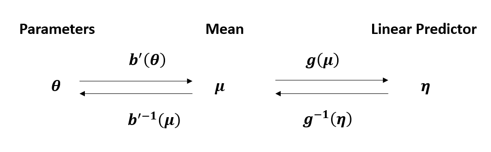

# Generalized Linear Models {#generalized-linear-models}

Even though we call it generalized linear model, it is still under the paradigm of non-linear regression, because the form of the regression model is non-linear. The name generalized linear model derived from the fact that we have $\mathbf{x'_i \beta}$ (which is linear form) in the model.

## Logistic Regression

$$
p_i = f(\mathbf{x}_i ; \beta) = \frac{exp(\mathbf{x_i'\beta})}{1 + exp(\mathbf{x_i'\beta})}
$$

Equivalently,

$$
logit(p_i) = log(\frac{p_i}{1+p_i}) = \mathbf{x_i'\beta}
$$

where $\frac{p_i}{1+p_i}$is the **odds**.

In this form, the model is specified such that **a function of the mean response is linear**. Hence, **Generalized Linear Models**

The likelihood function

$$
L(p_i) = \prod_{i=1}^{n} p_i^{Y_i}(1-p_i)^{1-Y_i}
$$

where $p_i = \frac{\mathbf{x'_i \beta}}{1+\mathbf{x'_i \beta}}$ and $1-p_i = (1+ exp(\mathbf{x'_i \beta}))^{-1}$

Hence, our objective function is

$$
Q(\beta) = log(L(\beta)) = \sum_{i=1}^n Y_i \mathbf{x'_i \beta} - \sum_{i=1}^n  log(1+ exp(\mathbf{x'_i \beta}))
$$

we could maximize this function numerically using the optimization method above, which allows us to find numerical MLE for $\hat{\beta}$. Then we can use the standard asymptotic properties of MLEs to make inference.

Property of MLEs is that parameters are asymptotically unbiased with sample variance-covariance matrix given by the **inverse Fisher information matrix**

$$
\hat{\beta} \dot{\sim} AN(\beta,[\mathbf{I}(\beta)]^{-1})
$$

where the **Fisher Information matrix**, $\mathbf{I}(\beta)$ is

$$
\begin{aligned}
\mathbf{I}(\beta) &= E[\frac{\partial \log(L(\beta))}{\partial (\beta)}\frac{\partial \log(L(\beta))}{\partial \beta'}] \\
&= E[(\frac{\partial \log(L(\beta))}{\partial \beta_i} \frac{\partial \log(L(\beta))}{\partial \beta_j})_{ij}]
\end{aligned}
$$

Under **regularity conditions**, this is equivalent to the negative of the expected value of the Hessian Matrix

$$
\begin{aligned}
\mathbf{I}(\beta) &= -E[\frac{\partial^2 \log(L(\beta))}{\partial \beta \partial \beta'}] \\
&= -E[(\frac{\partial^2 \log(L(\beta))}{\partial \beta_i \partial \beta_j})_{ij}]
\end{aligned}
$$

Example:

$$
x_i' \beta = \beta_0 + \beta_1 x_i
$$

$$
\begin{aligned}
- \frac{\partial^2 \ln(L(\beta))}{\partial \beta^2_0} &= \sum_{i=1}^n \frac{\exp(x'_i \beta)}{1 + \exp(x'_i \beta)} - [\frac{\exp(x_i' \beta)}{1+ \exp(x'_i \beta)}]^2 = \sum_{i=1}^n p_i (1-p_i) \\
- \frac{\partial^2 \ln(L(\beta))}{\partial \beta^2_1} &= \sum_{i=1}^n \frac{x_i^2\exp(x'_i \beta)}{1 + \exp(x'_i \beta)} - [\frac{x_i\exp(x_i' \beta)}{1+ \exp(x'_i \beta)}]^2 = \sum_{i=1}^n x_i^2p_i (1-p_i) \\
- \frac{\partial^2 \ln(L(\beta))}{\partial \beta_0 \partial \beta_1} &= \sum_{i=1}^n \frac{x_i\exp(x'_i \beta)}{1 + \exp(x'_i \beta)} - x_i[\frac{\exp(x_i' \beta)}{1+ \exp(x'_i \beta)}]^2 = \sum_{i=1}^n x_ip_i (1-p_i)
\end{aligned}
$$

Hence,

$$
\mathbf{I} (\beta) = 
\left[
\begin{array}
{cc}
\sum_i p_i(1-p_i) & \sum_i x_i p_i(1-p_i) \\
\sum_i x_i p_i(1-p_i) & \sum_i x_i^2 p_i(1-p_i)
\end{array}
\right]
$$

**Inference**

**Likelihood Ratio Tests**

To formulate the test, let $\beta = [\beta_1', \beta_2']'$. If you are interested in testing a hypothesis about $\beta_1$, then we leave $\beta_2$ unspecified (called **nuisance parameters**). $\beta_1$ and $\beta_2$ can either a **vector** or **scalar**, or $\beta_2$ can be null.

Example: $H_0: \beta_1 = \beta_{1,0}$ (where $\beta_{1,0}$ is specified) and $\hat{\beta}_{2,0}$ be the MLE of $\beta_2$ under the restriction that $\beta_1 = \beta_{1,0}$. The likelihood ratio test statistic is

$$
-2\log\Lambda = -2[\log(L(\beta_{1,0},\hat{\beta}_{2,0})) - \log(L(\hat{\beta}_1,\hat{\beta}_2))]
$$

where

-   the first term is the value fo the likelihood for the fitted restricted model
-   the second term is the likelihood value of the fitted unrestricted model

Under the null,

$$
-2 \log \Lambda \sim \chi^2_{\upsilon}
$$

where $\upsilon$ is the dimension of $\beta_1$

We reject the null when $-2\log \Lambda > \chi_{\upsilon,1-\alpha}^2$

**Wald Statistics**

Based on

$$
\hat{\beta} \sim AN (\beta, [\mathbf{I}(\beta)^{-1}])
$$

$$
H_0: \mathbf{L}\hat{\beta} = 0 
$$

where $\mathbf{L}$ is a $q \times p$ matrix with $q$ linearly independent rows. Then

$$
W = (\mathbf{L\hat{\beta}})'(\mathbf{L[I(\hat{\beta})]^{-1}L'})^{-1}(\mathbf{L\hat{\beta}})
$$

under the null hypothesis

Confidence interval

$$
\hat{\beta}_i \pm 1.96 \hat{s}_{ii}^2
$$

where $\hat{s}_{ii}^2$ is the i-th diagonal of $\mathbf{[I(\hat{\beta})]}^{-1}$

If you have

-   large sample size, the likelihood ratio and Wald tests have similar results.
-   small sample size, the likelihood ratio test is better.

**Logistic Regression: Interpretation of** $\beta$

For single regressor, the model is

$$
logit\{\hat{p}_{x_i}\} \equiv logit (\hat{p}_i) = \log(\frac{\hat{p}_i}{1 - \hat{p}_i}) = \hat{\beta}_0 + \hat{\beta}_1 x_i
$$

When $x= x_i + 1$

$$
logit\{\hat{p}_{x_i +1}\} = \hat{\beta}_0 + \hat{\beta}(x_i + 1) = logit\{\hat{p}_{x_i}\} + \hat{\beta}_1
$$

Then,

$$
\begin{aligned}
logit\{\hat{p}_{x_i +1}\} - logit\{\hat{p}_{x_i}\} &= log\{odds[\hat{p}_{x_i +1}]\} - log\{odds[\hat{p}_{x_i}]\} \\
&= log(\frac{odds[\hat{p}_{x_i + 1}]}{odds[\hat{p}_{x_i}]}) = \hat{\beta}_1
\end{aligned}
$$

and

$$
exp(\hat{\beta}_1) = \frac{odds[\hat{p}_{x_i + 1}]}{odds[\hat{p}_{x_i}]}
$$

the estimated **odds ratio**

the estimated odds ratio, when there is a difference of c units in the regressor x, is $exp(c\hat{\beta}_1)$. When there are multiple covariates, $exp(\hat{\beta}_k)$ is the estimated odds ratio for the variable $x_k$, assuming that all of the other variables are held constant.

**Inference on the Mean Response**

Let $x_h = (1, x_{h1}, ...,x_{h,p-1})'$. Then

$$
\hat{p}_h = \frac{exp(\mathbf{x'_h \hat{\beta}})}{1 + exp(\mathbf{x'_h \hat{\beta}})}
$$

and $s^2(\hat{p}_h) = \mathbf{x'_h[I(\hat{\beta})]^{-1}x_h}$

For new observation, we can have a cutoff point to decide whether y = 0 or 1.

### Application

```{r}
library(kableExtra)
library(dplyr)
library(pscl)
library(ggplot2)
library(faraway)
library(nnet)
library(agridat)
library(nlstools)
```

Logistic Regression

$x \sim Unif(-0.5,2.5)$. Then $\eta = 0.5 + 0.75 x$

```{r}
set.seed(23) #set seed for reproducibility
x <- runif(1000, min = -0.5, max = 2.5)
eta1 <- 0.5 + 0.75 * x
```

Passing $\eta$'s into the inverse-logit function, we get

$$
p = \frac{\exp(\eta)}{1+ \exp(\eta)}
$$

where $p \in [0,1]$

Then, we generate $y \sim Bernoulli(p)$

```{r}
p <- exp(eta1) / (1 + exp(eta1))
y <- rbinom(1000, 1, p)
BinData <- data.frame(X = x, Y = y)
```

**Model Fit**

```{r}
Logistic_Model <- glm(formula = Y ~ X,
                      family = binomial, # family = specifies the response distribution
                      data = BinData)
summary(Logistic_Model)
nlstools::confint2(Logistic_Model)
OddsRatio <- coef(Logistic_Model) %>% exp
OddsRatio 
```

Based on the odds ratio, when

-   $x = 0$ , the odds of success of 1.59
-   $x = 1$, the odds of success increase by a factor of 2.19 (i.e., 119.29% increase).

Deviance Tests

-   $H_0$: No variables are related to the response (i.e., model with just the intercept)
-   $H_1$: At least one variable is related to the response

```{r}
Test_Dev <- Logistic_Model$null.deviance - Logistic_Model$deviance
p_val_dev <- 1 - pchisq(q = Test_Dev, df = 1)
```

Since we see the p-value of 0, we reject the null that no variables are related to the response

**Deviance residuals**

```{r}
Logistic_Resids <- residuals(Logistic_Model, type = "deviance")
plot(
    y = Logistic_Resids,
    x = BinData$X,
    xlab = 'X',
    ylab = 'Deviance Resids'
)
```

However, this plot is not informative. Hence, we can can see the residuals plots that are grouped into bins based on prediction values.

```{r}
plot_bin <- function(Y,
                     X,
                     bins = 100,
                     return.DF = FALSE) {
    Y_Name <- deparse(substitute(Y))
    X_Name <- deparse(substitute(X))
    Binned_Plot <- data.frame(Plot_Y = Y, Plot_X = X)
    Binned_Plot$bin <-
        cut(Binned_Plot$Plot_X, breaks = bins) %>% as.numeric
    Binned_Plot_summary <- Binned_Plot %>%
        group_by(bin) %>%
        summarise(
            Y_ave = mean(Plot_Y),
            X_ave = mean(Plot_X),
            Count = n()
        ) %>% as.data.frame
    plot(
        y = Binned_Plot_summary$Y_ave,
        x = Binned_Plot_summary$X_ave,
        ylab = Y_Name,
        xlab = X_Name
    )
    if (return.DF)
        return(Binned_Plot_summary)
}


plot_bin(Y = Logistic_Resids,
         X = BinData$X,
         bins = 100)

```

We can also see the predicted value against the residuals.

```{r}
Logistic_Predictions <- predict(Logistic_Model, type = "response")
plot_bin(Y = Logistic_Resids, X = Logistic_Predictions, bins = 100)
```

We can also look at a binned plot of the logistic prediction versus the true category

```{r}
NumBins <- 10
Binned_Data <- plot_bin(
    Y = BinData$Y,
    X = Logistic_Predictions,
    bins = NumBins,
    return.DF = TRUE
)
Binned_Data
abline(0, 1, lty = 2, col = 'blue')

```

**Formal deviance test**

**Hosmer-Lemeshow test**

Null hypothesis: the observed events match the expected evens

$$
X^2_{HL} = \sum_{j=1}^{J} \frac{(y_j - m_j \hat{p}_j)^2}{m_j \hat{p}_j(1-\hat{p}_j)}
$$

where

-   within the j-th bin, $y_j$ is the number of successes
-   $m_j$ = number of observations
-   $\hat{p}_j$ = predicted probability

Under the null hypothesis, $X^2_{HLL} \sim \chi^2_{J-1}$

```{r}
HL_BinVals <-
    (Binned_Data$Count * Binned_Data$Y_ave - Binned_Data$Count * Binned_Data$X_ave) ^ 2 /   Binned_Data$Count * Binned_Data$X_ave * (1 - Binned_Data$X_ave)
HLpval <- pchisq(q = sum(HL_BinVals),
                 df = NumBins,
                 lower.tail = FALSE)
HLpval
```

Since $p$-value = 0.99, we do not reject the null hypothesis (i.e., the model is fitting well).

## Probit Regression

$$
E(Y_i) = p_i = \Phi(\mathbf{x_i'\theta})
$$

where $\Phi()$ is the CDF of a $N(0,1)$ random variable.

Other models (e..g, t--distribution; log-log; I complimentary log-log)

We let $Y_i = 1$ success, $Y_i =0$ no success.

-   assume $Y \sim Ber$ and $p_i = P(Y_i =1)$, the success probability.

-   consider a logistic regression with the response function $logit(p_i) = x'_i \beta$

**Confusion matrix**

|       | Predicted           |                     |
|-------|---------------------|---------------------|
| Truth | 1                   | 0                   |
| 1     | True Positive (TP)  | False Negative (FN) |
| 0     | False Positive (FP) | True Negative (TN)  |

Sensitivity: ability to identify positive results

$$
\text{Sensitivity} = \frac{TP}{TP + FN}
$$

Specificity: ability to identify negative results

$$
\text{Specificity} = \frac{TN}{TN + FP}
$$

False positive rate: Type I error (1- specificity)

$$
\text{ False Positive Rate} = \frac{FP}{TN+ FP}
$$

False Negative Rate: Type II error (1-sensitivity)

$$
\text{False Negative Rate} = \frac{FN}{TP + FN}
$$

|       | Predicted           |                     |
|-------|---------------------|---------------------|
| Truth | 1                   | 0                   |
| 1     | Sensitivity         | False Negative Rate |
| 0     | False Positive Rate | Specificity         |

## Binomial Regression

**Binomial**

Here, cancer case = successes, and control case = failures.

```{r}
data("esoph")
head(esoph, n = 3)
plot(
  esoph$ncases / (esoph$ncases + esoph$ncontrols) ~ esoph$alcgp,
  ylab = "Proportion",
  xlab = 'Alcohol consumption',
  main = 'Esophageal Cancer data'
)
class(esoph$agegp) <- "factor"
class(esoph$alcgp) <- "factor"
class(esoph$tobgp) <- "factor"
```

```{r}
#  only the alcohol consumption as a predictor
model <- glm(cbind(ncases, ncontrols) ~ alcgp, data = esoph, family = binomial)
summary(model)
```

```{r}
#Coefficient Odds
coefficients(model) %>% exp
deviance(model)/df.residual(model)
model$aic
```

```{r}
# alcohol consumption and age as predictors
better_model <-
    glm(cbind(ncases, ncontrols) ~ agegp + alcgp,
        data = esoph,
        family = binomial)
summary(better_model)

```

```{r}
better_model$aic #smaller AIC is better
coefficients(better_model) %>% exp
pchisq(
    q = model$deviance - better_model$deviance,
    df = model$df.residual - better_model$df.residual,
    lower = FALSE
)

```

```{r}
# specify link function as probit
Prob_better_model <- glm(
    cbind(ncases, ncontrols) ~ agegp + alcgp,
    data = esoph,
    family = binomial(link = probit)
)
summary(Prob_better_model)
```

## Poisson Regression

From the Poisson distribution

$$
\begin{aligned}
f(Y_i) &= \frac{\mu_i^{Y_i}exp(-\mu_i)}{Y_i!}, Y_i = 0,1,.. \\
E(Y_i) &= \mu_i  \\
var(Y_i) &= \mu_i
\end{aligned}
$$

which is a natural distribution for counts. We can see that the variance is a function of the mean. If we let $\mu_i = f(\mathbf{x_i; \theta})$, it would be similar to [Logistic Regression] since we can choose $f()$ as $\mu_i = \mathbf{x_i'\theta}, \mu_i = \exp(\mathbf{x_i'\theta}), \mu_i = \log(\mathbf{x_i'\theta})$

### Application

Count Data and Poisson regression

```{r}
data(bioChemists, package = "pscl")
bioChemists <- bioChemists %>%
    rename(
        Num_Article = art, #articles in last 3 years of PhD
        Sex = fem, #coded 1 if female
        Married = mar, #coded 1 if married
        Num_Kid5 = kid5, #number of childeren under age 6
        PhD_Quality = phd, #prestige of PhD program
        Num_MentArticle = ment #articles by mentor in last 3 years
    )
hist(bioChemists$Num_Article, breaks = 25, main = 'Number of Articles')

```

```{r}
Poisson_Mod <- glm(Num_Article ~ ., family=poisson, bioChemists)
summary(Poisson_Mod)
```

Residual of 1634 with 909 df isn't great.

We see Pearson $\chi^2$

```{r}
Predicted_Means <- predict(Poisson_Mod,type = "response")
X2 <- sum((bioChemists$Num_Article - Predicted_Means)^2/Predicted_Means)
X2
pchisq(X2,Poisson_Mod$df.residual, lower.tail = FALSE)
```

With interaction terms, there are some improvements

```{r}
Poisson_Mod_All2way <- glm(Num_Article ~ .^2, family=poisson, bioChemists)
Poisson_Mod_All3way <- glm(Num_Article ~ .^3, family=poisson, bioChemists)

```

Consider the $\hat{\phi} = \frac{\text{deviance}}{df}$

```{r}
Poisson_Mod$deviance / Poisson_Mod$df.residual
```

This is evidence for over-dispersion. Likely cause is missing variables. And remedies could either be to include more variables or consider random effects.

A quick fix is to force the Poisson Regression to include this value of $\phi$, and this model is called "Quasi-Poisson".

```{r}
phi_hat = Poisson_Mod$deviance/Poisson_Mod$df.residual
summary(Poisson_Mod,dispersion = phi_hat)
```

Or directly rerun the model as

```{r}
quasiPoisson_Mod <- glm(Num_Article ~ ., family=quasipoisson, bioChemists)
```

Quasi-Poisson is not recommended, but [Negative Binomial Regression] that has an extra parameter to account for over-dispersion is.

## Negative Binomial Regression

```{r}
library(MASS)
NegBinom_Mod <- MASS::glm.nb(Num_Article ~ .,bioChemists)
summary(NegBinom_Mod)
```

We can see the dispersion is 2.264 with SE = 0.271, which is significantly different from 1, indicating over-dispersion. Check [Over-Dispersion] for more detail

## Multinomial

If we have more than two categories or groups that we want to model relative to covariates (e.g., we have observations $i = 1,…,n$ and groups/ covariates $j = 1,2,…,J$), multinomial is our candidate model

Let

-   $p_{ij}$ be the probability that the i-th observation belongs to the j-th group
-   $Y_{ij}$ be the number of observations for individual i in group j; An individual will have observations $Y_{i1},Y_{i2},…Y_{iJ}$
-   assume the probability of observing this response is given by a multinomial distribution in terms of probabilities $p_{ij}$, where $\sum_{j = 1}^J p_{ij} = 1$ . For interpretation, we have a baseline category $p_{i1} = 1 - \sum_{j = 2}^J p_{ij}$

The link between the mean response (probability) $p_{ij}$ and a linear function of the covariates

$$
\eta_{ij} = \mathbf{x'_i \beta_j} = \log \frac{p_{ij}}{p_{i1}}, j = 2,..,J
$$

We compare $p_{ij}$ to the baseline $p_{i1}$, suggesting

$$
p_{ij} = \frac{\exp(\eta_{ij})}{1 + \sum_{i=2}^J \exp(\eta_{ij})}
$$

which is known as **multinomial logistic** model.

Note:

-   Softmax coding for multinomial logistic regression: rather than selecting a baseline class, we treat all $K$ class symmetrically - equally important (no baseline).

$$
P(Y = k | X = x) = \frac{exp(\beta_{k1} + \dots + \beta_{k_p x_p})}{\sum_{l = 1}^K exp(\beta_{l0} + \dots + \beta_{l_p x_p})}
$$

then the log odds ratio between k-th and k'-th classes is

$$
\log (\frac{P(Y=k|X=x)}{P(Y = k' | X=x)}) = (\beta_{k0} - \beta_{k'0}) + \dots + (\beta_{kp} - \beta_{k'p}) x_p
$$

```{r}
library(faraway)
library(dplyr)
data(nes96, package="faraway")
head(nes96,3)
```

We try to understand their political strength

```{r}
table(nes96$PID)
nes96$Political_Strength <- NA
nes96$Political_Strength[nes96$PID %in% c("strDem", "strRep")] <-
    "Strong"
nes96$Political_Strength[nes96$PID %in% c("weakDem", "weakRep")] <-
    "Weak"
nes96$Political_Strength[nes96$PID %in% c("indDem", "indind", "indRep")] <-
    "Neutral"
nes96 %>% group_by(Political_Strength) %>% summarise(Count = n())
```

visualize the political strength variable

```{r}
library(ggplot2)
Plot_DF <- nes96 %>%
    mutate(Age_Grp = cut_number(age, 4)) %>%
    group_by(Age_Grp, Political_Strength) %>%
    summarise(count = n()) %>%
    group_by(Age_Grp) %>%
    mutate(etotal = sum(count), proportion = count / etotal)

Age_Plot <- ggplot(
    Plot_DF,
    aes(
        x        = Age_Grp,
        y        = proportion,
        group    = Political_Strength,
        linetype = Political_Strength,
        color    = Political_Strength
    )
) +
    geom_line(size = 2)
Age_Plot
```

Fit the multinomial logistic model:

model political strength as a function of age and education

```{r}
library(nnet)
Multinomial_Model <-
    multinom(Political_Strength ~ age + educ, nes96, trace = F)
summary(Multinomial_Model)
```

Alternatively, stepwise model selection based AIC

```{r}
Multinomial_Step <- step(Multinomial_Model,trace = 0)
Multinomial_Step
```

compare the best model to the full model based on deviance

```{r}
pchisq(q = deviance(Multinomial_Step) - deviance(Multinomial_Model),
df = Multinomial_Model$edf-Multinomial_Step$edf,lower=F)

```

We see no significant difference

Plot of the fitted model

```{r}
PlotData <- data.frame(age = seq(from = 19, to = 91))
Preds <-
  PlotData %>% bind_cols(data.frame(predict(
    object = Multinomial_Step,
    PlotData, type = "probs"
  )))

plot(
  x       = Preds$age,
  y       = Preds$Neutral,
  type    = "l",
  ylim    = c(0.2, 0.6),
  col     = "black",
  ylab    = "Proportion",
  xlab    = "Age"
)

lines(x   = Preds$age,
      y   = Preds$Weak,
      col = "blue")
lines(x   = Preds$age,
      y   = Preds$Strong,
      col = "red")

legend(
  'topleft',
  legend  = c('Neutral', 'Weak', 'Strong'),
  col     = c('black', 'blue', 'red'),
  lty     = 1
)

```

```{r}
predict(Multinomial_Step,data.frame(age = 34)) # predicted result (categoriy of political strength) of 34 year old
predict(Multinomial_Step,data.frame(age = c(34,35)),type="probs") # predicted result of the probabilities of each level of political strength for a 34 and 35

```

If categories are ordered (i.e., ordinal data), we must use another approach (still multinomial, but use cumulative probabilities).

Another example

```{r}
library(agridat)
dat <- agridat::streibig.competition
# See Schaberger and Pierce, pages 370+
# Consider only the mono-species barley data (no competition from Sinapis)
gammaDat <- subset(dat, sseeds < 1)
gammaDat <-
    transform(gammaDat,
              x = bseeds,
              y = bdwt,
              block = factor(block))
# Inverse yield looks like it will be a good fit for Gamma's inverse link
ggplot(gammaDat, aes(x = x, y = 1 / y)) + 
    geom_point(aes(color = block, shape = block)) +
    xlab('Seeding Rate') + 
    ylab('Inverse yield') + 
    ggtitle('Streibig Competion - Barley only')

```

$$
Y \sim Gamma
$$

because Gamma is non-negative as opposed to Normal. The canonical Gamma link function is the inverse (or reciprocal) link

$$
\begin{aligned}
\eta_{ij} &= \beta_{0j} + \beta_{1j}x_{ij} + \beta_2x_{ij}^2 \\
Y_{ij} &= \eta_{ij}^{-1}
\end{aligned}
$$

The linear predictor is a quadratic model fit to each of the j-th blocks. A different model (not fitted) could be one with common slopes: `glm(y ~ x + I(x^2),…)`

```{r}
# linear predictor is quadratic, with separate intercept and slope per block
m1 <-
    glm(y ~ block + block * x + block * I(x ^ 2),
        data = gammaDat,
        family = Gamma(link = "inverse"))
summary(m1)

```

For predict new value of $x$

```{r}
newdf <-
    expand.grid(x = seq(0, 120, length = 50), block = factor(c('B1', 'B2', 'B3')))

newdf$pred <- predict(m1, new = newdf, type = 'response')

ggplot(gammaDat, aes(x = x, y = y)) + 
    geom_point(aes(color = block, shape = block)) +
    xlab('Seeding Rate') + ylab('Inverse yield') + 
    ggtitle('Streibig Competion - Barley only Predictions') +
    geom_line(data = newdf, aes(
        x = x,
        y = pred,
        color = block,
        linetype = block
    ))

```

## Generalization

We can see that Poisson regression looks similar to logistic regression. Hence, we can generalize to a class of modeling. Thanks to @nelder1972generalized, we have the **generalized linear models** (GLMs). Estimation is generalize in these models.

**Exponential Family**\
The theory of GLMs is developed for data with distribution given y the **exponential family**.\
The form of the data distribution that is useful for GLMs is

$$
f(y;\theta, \phi) = \exp(\frac{\theta y - b(\theta)}{a(\phi)} + c(y, \phi))
$$

where

-   $\theta$ is called the natural parameter
-   $\phi$ is called the dispersion parameter

**Note**:

This family includes the [Gamma], [Normal], [Poisson], and other. For all parameterization of the exponential family, check this [link](https://www.stat.purdue.edu/~tlzhang/stat526/logistic.pdf)

**Example**

if we have $Y \sim N(\mu, \sigma^2)$

$$
\begin{aligned}
f(y; \mu, \sigma^2) &= \frac{1}{(2\pi \sigma^2)^{1/2}}\exp(-\frac{1}{2\sigma^2}(y- \mu)^2) \\
&= \exp(-\frac{1}{2\sigma^2}(y^2 - 2y \mu +\mu^2)- \frac{1}{2}\log(2\pi \sigma^2)) \\
&= \exp(\frac{y \mu - \mu^2/2}{\sigma^2} - \frac{y^2}{2\sigma^2} - \frac{1}{2}\log(2\pi \sigma^2)) \\
&= \exp(\frac{\theta y - b(\theta)}{a(\phi)} + c(y , \phi))
\end{aligned}
$$

where

-   $\theta = \mu$
-   $b(\theta) = \frac{\mu^2}{2}$
-   $a(\phi) = \sigma^2 = \phi$
-   $c(y , \phi) = - \frac{1}{2}(\frac{y^2}{\phi}+\log(2\pi \sigma^2))$

**Properties of GLM exponential families**

1.  $E(Y) = b' (\theta)$ where $b'(\theta) = \frac{\partial b(\theta)}{\partial \theta}$ (here `'` is "prime", not transpose)

2.  $var(Y) = a(\phi)b''(\theta)= a(\phi)V(\mu)$.

    -   $V(\mu)$ is the *variance function*; however, it is only the variance in the case that $a(\phi) =1$

3.  If $a(), b(), c()$ are identifiable, we will derive expected value and variance of Y.

Example

Normal distribution

$$
\begin{aligned}
b'(\theta) &= \frac{\partial b(\mu^2/2)}{\partial \mu} = \mu \\
V(\mu) &= \frac{\partial^2 (\mu^2/2)}{\partial \mu^2} = 1 \\
\to var(Y) &= a(\phi) = \sigma^2
\end{aligned}
$$

Poisson distribution

$$
\begin{aligned}
f(y, \theta, \phi) &= \frac{\mu^y \exp(-\mu)}{y!} \\
&= \exp(y\log(\mu) - \mu - \log(y!)) \\
&= \exp(y\theta - \exp(\theta) - \log(y!))
\end{aligned}
$$

where

-   $\theta = \log(\mu)$
-   $a(\phi) = 1$
-   $b(\theta) = \exp(\theta)$
-   $c(y, \phi) = \log(y!)$

Hence,

$$
\begin{aligned}
E(Y) = \frac{\partial b(\theta)}{\partial \theta} = \exp(\theta) &= \mu \\
var(Y) = \frac{\partial^2 b(\theta)}{\partial \theta^2} &= \mu
\end{aligned}
$$

Since $\mu = E(Y) = b'(\theta)$

In GLM, we take some monotone function (typically nonlinear) of $\mu$ to be linear in the set of covariates

$$
g(\mu) = g(b'(\theta)) = \mathbf{x'\beta}
$$

Equivalently,

$$
\mu = g^{-1}(\mathbf{x'\beta})
$$

where $g(.)$ is the **link function** since it links mean response ($\mu = E(Y)$) and a linear expression of the covariates

Some people use $\eta = \mathbf{x'\beta}$ where $\eta$ = the "linear predictor"

**GLM is composed of 2 components**

The **random component**:

-   is the distribution chosen to model the response variables $Y_1,...,Y_n$

-   is specified by the choice fo $a(), b(), c()$ in the exponential form

-   Notation:

    -   Assume that there are n **independent** response variables $Y_1,...,Y_n$ with densities\
        $$
        f(y_i ; \theta_i, \phi) = \exp(\frac{\theta_i y_i - b(\theta_i)}{a(\phi)}+ c(y_i, \phi))
        $$ notice each observation might have different densities
    -   Assume that $\phi$ is constant for all $i = 1,...,n$, but $\theta_i$ will vary. $\mu_i = E(Y_i)$ for all i.

The **systematic component**

-   is the portion of the model that gives the relation between $\mu$ and the covariates $\mathbf{x}$

-   consists of 2 parts:

    -   the *link* function, $g(.)$
    -   the *linear predictor*, $\eta = \mathbf{x'\beta}$

-   Notation:

    -   assume $g(\mu_i) = \mathbf{x'\beta} = \eta_i$ where $\mathbf{\beta} = (\beta_1,..., \beta_p)'$
    -   The parameters to be estimated are $\beta_1,...\beta_p , \phi$

**The Canonical Link**

To choose $g(.)$, we can use **canonical link function** (Remember: Canonical link is just a special case of the link function)

If the link function $g(.)$ is such $g(\mu_i) = \eta_i = \theta_i$, the natural parameter, then $g(.)$ is the canonical link.

```{r fig.align='center', echo=FALSE}
library("jpeg")

```

-   $b(\theta)$ = cumulant moment generating function
-   $g(\mu)$ is the link function, which relates the linear predictor to the mean and is required to be monotone increasing, continuously differentiable and invertible.

Equivalently, we can think of canonical link function as

$$
\gamma^{-1} \circ g^{-1} = I
$$ which is the identity. Hence,

$$
\theta = \eta
$$

**The inverse link**

$g^{-1}(.)$ is also known as the mean function, take linear predictor output (ranging from $-\infty$ to $\infty$) and transform it into a different scale.

-   **Exponential**: converts $\mathbf{\beta X}$ into a curve that is restricted between 0 and $\infty$ (which you can see that is useful in case you want to convert a linear predictor into a non-negative value). $\lambda = \exp(y) = \mathbf{\beta X}$

-   **Inverse Logit** (also known as logistic): converts $\mathbf{\beta X}$ into a curve that is restricted between 0 and 1, which is useful in case you want to convert a linear predictor to a probability. $\theta = \frac{1}{1 + \exp(-y)} = \frac{1}{1 + \exp(- \mathbf{\beta X})}$

    -   $y$ = linear predictor value
    -   $\theta$ = transformed value

The **identity link** is that

$$
\begin{aligned}
\eta_i &= g(\mu_i) = \mu_i \\
\mu_i &= g^{-1}(\eta_i) = \eta_i
\end{aligned}
$$

```{r fig.align='center', echo=FALSE}
library("jpeg")
knitr::include_graphics('images/2-Table15.1-1.png')
```

Table 15.1 Generalized Linear Models 15.1 the Structure of Generalized Linear Models

More example on the link functions and their inverses can be found on [page 380](https://www.sagepub.com/sites/default/files/upm-binaries/21121_Chapter_15.pdf)

Example

Normal random component

-   Mean Response: $\mu_i = \theta_i$

-   Canonical Link: $g( \mu_i) = \mu_i$ (the identity link)

Binomial random component

-   Mean Response: $\mu_i = \frac{n_i \exp( \theta)}{1+\exp (\theta_i)}$ and $\theta(\mu_i) = \log(\frac{p_i }{1-p_i}) = \log (\frac{\mu_i} {n_i - \mu_i})$

-   Canonical link: $g(\mu_i) = \log(\frac{\mu_i} {n_i - \mu_i})$ (logit link)

Poisson random component

-   Mean Response: $\mu_i = \exp(\theta_i)$

-   Canonical Link: $g(\mu_i) = \log(\mu_i)$

Gamma random component:

-   Mean response: $\mu_i = -\frac{1}{\theta_i}$ and $\theta(\mu_i) = - \mu_i^{-1}$

-   Canonical Link: $g(\mu\_i) = - \frac{1}{\mu_i}$

Inverse Gaussian random

-   Canonical Link: $g(\mu_i) = \frac{1}{\mu_i^2}$

### Estimation

-   MLE for parameters of the **systematic component (**$\beta$)
-   Unification of derivation and computation (thanks to the exponential forms)
-   No unification for estimation of the dispersion parameter ($\phi$)

#### Estimation of $\beta$

We have

$$
\begin{aligned}
f(y_i ; \theta_i, \phi) &= \exp(\frac{\theta_i y_i - b(\theta_i)}{a(\phi)}+ c(y_i, \phi)) \\
E(Y_i) &= \mu_i = b'(\theta) \\
var(Y_i) &= b''(\theta)a(\phi) = V(\mu_i)a(\phi) \\
g(\mu_i) &= \mathbf{x}_i'\beta = \eta_i
\end{aligned}
$$

If the log-likelihood for a single observation is $l_i (\beta,\phi)$. The log-likelihood for all n observations is

$$
\begin{aligned}
l(\beta,\phi) &= \sum_{i=1}^n l_i (\beta,\phi) \\
&= \sum_{i=1}^n (\frac{\theta_i y_i - b(\theta_i)}{a(\phi)}+ c(y_i, \phi))
\end{aligned}
$$

Using MLE to find $\beta$, we use the chain rule to get the derivatives

$$
\begin{aligned}
\frac{\partial l_i (\beta,\phi)}{\partial \beta_j} &=  \frac{\partial l_i (\beta, \phi)}{\partial \theta_i} \times \frac{\partial \theta_i}{\partial \mu_i} \times \frac{\partial \mu_i}{\partial \eta_i}\times \frac{\partial \eta_i}{\partial \beta_j} \\
&= \sum_{i=1}^{n}(\frac{ y_i - \mu_i}{a(\phi)} \times \frac{1}{V(\mu_i)} \times \frac{\partial \mu_i}{\partial \eta_i} \times x_{ij})
\end{aligned}
$$

If we let

$$
w_i \equiv ((\frac{\partial \eta_i}{\partial \mu_i})^2 V(\mu_i))^{-1}
$$

Then,

$$
\frac{\partial l_i (\beta,\phi)}{\partial \beta_j} = \sum_{i=1}^n (\frac{y_i \mu_i}{a(\phi)} \times w_i \times \frac{\partial \eta_i}{\partial \mu_i} \times x_{ij})
$$

We can also get the second derivatives using the chain rule.

Example:

For the $$Newton-Raphson$$ algorithm, we need

$$
- E(\frac{\partial^2 l(\beta,\phi)}{\partial \beta_j \partial \beta_k})
$$

where $(j,k)$-th element of the **Fisher information matrix** $\mathbf{I}(\beta)$

Hence,

$$
- E(\frac{\partial^2 l(\beta,\phi)}{\partial \beta_j \partial \beta_k}) = \sum_{i=1}^n \frac{w_i}{a(\phi)}x_{ij}x_{ik}
$$

for the (j,k)th element

If Bernoulli model with logit link function (which is the canonical link)

$$
\begin{aligned}
b(\theta) &= \log(1 + \exp(\theta)) = \log(1 + \exp(\mathbf{x'\beta})) \\
a(\phi) &= 1  \\
c(y_i, \phi) &= 0 \\
E(Y) = b'(\theta) &= \frac{\exp(\theta)}{1 + \exp(\theta)} = \mu = p \\
\eta = g(\mu) &= \log(\frac{\mu}{1-\mu}) = \theta = \log(\frac{p}{1-p}) = \mathbf{x'\beta} 
\end{aligned}
$$

For $Y_i$, i = 1,.., the log-likelihood is

$$
l_i (\beta, \phi) = \frac{y_i \theta_i - b(\theta_i)}{a(\phi)} + c(y_i, \phi) = y_i \mathbf{x}'_i \beta - \log(1+ \exp(\mathbf{x'\beta}))
$$

Additionally,

$$
\begin{aligned}
V(\mu_i) &= \mu_i(1-\mu_i)= p_i (1-p_i) \\
\frac{\partial \mu_i}{\partial \eta_i} &= p_i(1-p_i)
\end{aligned}
$$

Hence,

$$
\begin{aligned}
\frac{\partial l(\beta, \phi)}{\partial \beta_j} &= \sum_{i=1}^n[\frac{y_i - \mu_i}{a(\phi)} \times \frac{1}{V(\mu_i)}\times \frac{\partial \mu_i}{\partial \eta_i} \times x_{ij}] \\
&= \sum_{i=1}^n (y_i - p_i) \times \frac{1}{p_i(1-p_i)} \times p_i(1-p_i) \times x_{ij} \\
&= \sum_{i=1}^n (y_i - p_i) x_{ij} \\
&= \sum_{i=1}^n (y_i - \frac{\exp(\mathbf{x'_i\beta})}{1+ \exp(\mathbf{x'_i\beta})})x_{ij}
\end{aligned}
$$

then

$$
w_i = ((\frac{\partial \eta_i}{\partial \mu_i})^2 V(\mu_i))^{-1} = p_i (1-p_i)
$$

$$
\mathbf{I}_{jk}(\mathbf{\beta}) = \sum_{i=1}^n \frac{w_i}{a(\phi)} x_{ij}x_{ik} = \sum_{i=1}^n p_i (1-p_i)x_{ij}x_{ik}
$$

The **Fisher-scoring** algorithm for the MLE of $\mathbf{\beta}$ is

$$
\left(
\begin{array}
{c}
\beta_1 \\
\beta_2 \\
. \\
. \\
. \\
\beta_p \\
\end{array}
\right)^{(m+1)}
=
\left(
\begin{array}
{c}
\beta_1 \\
\beta_2 \\
. \\
. \\
. \\
\beta_p \\
\end{array}
\right)^{(m)} +
\mathbf{I}^{-1}(\mathbf{\beta})
\left(
\begin{array}
{c}
\frac{\partial l (\beta, \phi)}{\partial \beta_1} \\
\frac{\partial l (\beta, \phi)}{\partial \beta_2} \\
. \\
. \\
. \\
\frac{\partial l (\beta, \phi)}{\partial \beta_p} \\
\end{array}
\right)|_{\beta = \beta^{(m)}}
$$

Similar to $$Newton-Raphson$$ expect the matrix of second derivatives by the expected value of the second derivative matrix.

In matrix notation,

$$
\begin{aligned}
\frac{\partial l }{\partial \beta} &= \frac{1}{a(\phi)}\mathbf{X'W\Delta(y - \mu)} \\
&= \frac{1}{a(\phi)}\mathbf{F'V^{-1}(y - \mu)} \\
\end{aligned}
$$

$$
\mathbf{I}(\beta) = \frac{1}{a(\phi)}\mathbf{X'WX} = \frac{1}{a(\phi)}\mathbf{F'V^{-1}F}
$$

where

-   $\mathbf{X}$ is an $n \times p$ matrix of covariates
-   $\mathbf{W}$ is an $n \times n$ diagonal matrix with $(i,i)$-th element given by $w_i$
-   $\mathbf{\Delta}$ an $n \times n$ diagonal matrix with $(i,i)$-th element given by $\frac{\partial \eta_i}{\partial \mu_i}$
-   $\mathbf{F} = \mathbf{\frac{\partial \mu}{\partial \beta}}$ an $n \times p$ matrix with $i$-th row $\frac{\partial \mu_i}{\partial \beta} = (\frac{\partial \mu_i}{\partial \eta_i})\mathbf{x}'_i$
-   $\mathbf{V}$ an $n \times n$ diagonal matrix with $(i,i)$-th element given by $V(\mu_i)$

Setting the derivative of the log-likelihood equal to 0, ML estimating equations are

$$
\mathbf{F'V^{-1}y= F'V^{-1}\mu}
$$

where all components of this equation expect y depends on the parameters $\beta$

**Special Cases**

If one has a canonical link, the estimating equations reduce to

$$
\mathbf{X'y= X'\mu}
$$

If one has an identity link, then

$$
\mathbf{X'V^{-1}y = X'V^{-1}X\hat{\beta}}
$$

which gives the generalized least squares estimator

Generally, we can rewrite the Fisher-scoring algorithm as

$$
\beta^{(m+1)} = \beta^{(m)} + \mathbf{(\hat{F}'\hat{V}^{-1}\hat{F})^{-1}\hat{F}'\hat{V}^{-1}(y- \hat{\mu})}
$$

Since $\hat{F},\hat{V}, \hat{\mu}$ depend on $\beta$, we evaluate at $\beta^{(m)}$

From starting values $\beta^{(0)}$, we can iterate until convergence.

Notes:

-   if $a(\phi)$ is a constant or of the form $m_i \phi$ with known $m_i$, then $\phi$ cancels.

#### Estimation of $\phi$

2 approaches:

1.  MLE

$$
\frac{\partial l_i}{\partial \phi} = \frac{(\theta_i y_i - b(\theta_i)a'(\phi))}{a^2(\phi)} + \frac{\partial c(y_i,\phi)}{\partial \phi}
$$

the MLE of $\phi$ solves

$$
\frac{a^2(\phi)}{a'(\phi)}\sum_{i=1}^n \frac{\partial c(y_i, \phi)}{\partial \phi} = \sum_{i=1}^n(\theta_i y_i - b(\theta_i))
$$

-   Situation others than normal error case, expression for $\frac{\partial c(y,\phi)}{\partial \phi}$ are not simple

-   Even for the canonical link and $a(\phi)$ constant, there is no nice general expression for $-E(\frac{\partial^2 l}{\partial \phi^2})$, so the unification GLMs provide for estimation of $\beta$ breaks down for $\phi$

2.  Moment Estimation ("Bias Corrected $\chi^2$")

    -   The MLE is not conventional approach to estimation of $\phi$ in GLMS.
    -   For the exponential family $var(Y) =V(\mu)a(\phi)$. This implies\
        $$
        \begin{aligned}
        a(\phi) &= \frac{var(Y)}{V(\mu)} = \frac{E(Y- \mu)^2}{V(\mu)} \\
        a(\hat{\phi})  &= \frac{1}{n-p} \sum_{i=1}^n \frac{(y_i -\hat{\mu}_i)^2}{V(\hat{\mu})}
        \end{aligned}
        $$ where $p$ is the dimension of $\beta$
    -   GLM with canonical link function $g(.)= (b'(.))^{-1}$\
        $$
        \begin{aligned}
        g(\mu) &= \theta = \eta = \mathbf{x'\beta} \\
        \mu &= g^{-1}(\eta)= b'(\eta)
        \end{aligned}
        $$
    -   so the method estimator for $a(\phi)=\phi$ is

$$
\hat{\phi} = \frac{1}{n-p} \sum_{i=1}^n \frac{(y_i - g^{-1}(\hat{\eta}_i))^2}{V(g^{-1}(\hat{\eta}_i))}
$$

### Inference

We have

$$
\hat{var}(\beta) = a(\phi)(\mathbf{\hat{F}'\hat{V}\hat{F}})^{-1}
$$

where

-   $\mathbf{V}$ is an $n \times n$ diagonal matrix with diagonal elements given by $V(\mu_i)$
-   $\mathbf{F}$ is an $n \times p$ matrix given by $\mathbf{F} = \frac{\partial \mu}{\partial \beta}$
-   Both $\mathbf{V,F}$ are dependent on the mean $\mu$, and thus $\beta$. Hence, their estimates ($\mathbf{\hat{V},\hat{F}}$) depend on $\hat{\beta}$.

$$
H_0: \mathbf{L\beta = d}
$$

where $\mathbf{L}$ is a q x p matrix with a **Wald** test

$$
W = \mathbf{(L \hat{\beta}-d)'(a(\phi)L(\hat{F}'\hat{V}^{-1}\hat{F})L')^{-1}(L \hat{\beta}-d)}
$$

which follows $\chi_q^2$ distribution (asymptotically), where $q$ is the rank of $\mathbf{L}$

In the simple case $H_0: \beta_j = 0$ gives $W = \frac{\hat{\beta}^2_j}{\hat{var}(\hat{\beta}_j)} \sim \chi^2_1$ asymptotically

Likelihood ratio test

$$
\Lambda = 2 (l(\hat{\beta}_f)-l(\hat{\beta}_r)) \sim \chi^2_q
$$

where

-   $q$ is the number of constraints used to fit the reduced model $\hat{\beta}_r$, and $\hat{\beta}_r$ is the fit under the full model.

Wald test is easier to implement, but likelihood ratio test is better (especially for small samples).

### Deviance

[Deviance] is necessary for goodness of fit, inference and for alternative estimation of the dispersion parameter. We define and consider [Deviance] from a likelihood ratio perspective.

-   Assume that $\phi$ is known. Let $\tilde{\theta}$ denote the full and $\hat{\theta}$ denote the reduced model MLEs. Then, the likelihood ratio (2 times the difference in log-likelihoods) is $$
    2\sum_{i=1}^{n} \frac{y_i (\tilde{\theta}_i- \hat{\theta}_i)-b(\tilde{\theta}_i) + b(\hat{\theta}_i)}{a_i(\phi)}
    $$

-   For exponential families, $\mu = E(y) = b'(\theta)$, so the natural parameter is a function of $\mu: \theta = \theta(\mu) = b'^{-1}(\mu)$, and the likelihood ratio turns into\
    $$
    2 \sum_{i=1}^m \frac{y_i\{\theta(\tilde{\mu}_i - \theta(\hat{\mu}_i)\} - b(\theta(\tilde{\mu}_i)) + b(\theta(\hat{\mu}_i))}{a_i(\phi)}
    $$

-   Comparing a fitted model to "the fullest possible model", which is the **saturated model**: $\tilde{\mu}_i = y_i$, i = 1,..,n. If $\tilde{\theta}_i^* = \theta(y_i), \hat{\theta}_i^* = \theta (\hat{\mu})$, the likelihood ratio is\
    $$
    2 \sum_{i=1}^{n} \frac{y_i (\tilde{\theta}_i^* - \hat{\theta}_i^* + b(\hat{\theta}_i^*))}{a_i(\phi)}
    $$

-   [@McCullagh_2019] specify $a(\phi) = \phi$, then the likelihood ratio can be written as\
    $$
    D^*(\mathbf{y, \hat{\mu}}) = \frac{2}{\phi}\sum_{i=1}^n\{y_i (\tilde{\theta}_i^*- \hat{\theta}_i^*)- b(\tilde{\theta}_i^*) +b(\hat{\theta}_i^*)  \}  
    $$ where

-   $D^*(\mathbf{y, \hat{\mu}})$ = **scaled deviance**

-   $D(\mathbf{y, \hat{\mu}}) = \phi D^*(\mathbf{y, \hat{\mu}})$ = **deviance**

**Note**:

-   in some random component distributions, we can write $a_i(\phi) = \phi m_i$, where

    -   $m_i$ is some known scalar that may change with the observations. Then, the scaled deviance components are divided by $m_i$:\
        $$
        D^*(\mathbf{y, \hat{\mu}}) \equiv 2\sum_{i=1}^n\{y_i (\tilde{\theta}_i^*- \hat{\theta}_i^*)- b(\tilde{\theta}_i^*) +b(\hat{\theta}_i^*)\} / (\phi m_i)  
        $$

-   $D^*(\mathbf{y, \hat{\mu}}) = \sum_{i=1}^n d_i$m where $d_i$ is the deviance contribution from the $i$-th observation.

-   $D$ is used in model selection

-   $D^*$ is used in goodness of fit tests (as it is a likelihood ratio statistic). $$
    D^*(\mathbf{y, \hat{\mu}}) = 2\{l(\mathbf{y,\tilde{\mu}})-l(\mathbf{y,\hat{\mu}})\}
    $$

-   $d_i$ are used to form **deviance residuals**

**Normal**

We have

$$
\begin{aligned}
\theta &= \mu \\
\phi &= \sigma^2 \\
b(\theta) &= \frac{1}{2} \theta^2 \\
a(\phi) &= \phi
\end{aligned}
$$

Hence,

$$
\begin{aligned}
\tilde{\theta}_i &= y_i \\
\hat{\theta}_i &= \hat{\mu}_i = g^{-1}(\hat{\eta}_i) 
\end{aligned}
$$

And

$$
\begin{aligned}
D &= 2 \sum_{1=1}^n Y^2_i - y_i \hat{\mu}_i - \frac{1}{2}y^2_i + \frac{1}{2} \hat{\mu}_i^2 \\
&= \sum_{i=1}^n y_i^2 - 2y_i \hat{\mu}_i + \hat{\mu}_i^2 \\
&= \sum_{i=1}^n (y_i - \hat{\mu}_i)^2
\end{aligned}
$$

which is the **residual sum of squares**

**Poisson**

$$
\begin{aligned}
f(y) &= \exp\{y\log(\mu) - \mu - \log(y!)\} \\
\theta &= \log(\mu) \\
b(\theta) &= \exp(\theta) \\
a(\phi) &= 1 \\
\tilde{\theta}_i &= \log(y_i) \\
\hat{\theta}_i &= \log(\hat{\mu}_i) \\
\hat{\mu}_i &= g^{-1}(\hat{\eta}_i)
\end{aligned}
$$

Then,

$$
\begin{aligned}
D &= 2 \sum_{i = 1}^n y_i \log(y_i) - y_i \log(\hat{\mu}_i) - y_i + \hat{\mu}_i \\
&= 2 \sum_{i = 1}^n y_i \log(\frac{y_i}{\hat{\mu}_i}) - (y_i - \hat{\mu}_i)
\end{aligned}
$$

and

$$
d_i = 2\{y_i \log(\frac{y_i}{\hat{\mu}})- (y_i - \hat{\mu}_i)\}
$$

#### Analysis of Deviance

The difference in deviance between a reduced and full model, where q is the difference in the number of free parameters, has an asymptotic $\chi^2_q$. The likelihood ratio test

$$
D^*(\mathbf{y;\hat{\mu}_r}) - D^*(\mathbf{y;\hat{\mu}_f}) = 2\{l(\mathbf{y;\hat{\mu}_f})-l(\mathbf{y;\hat{\mu}_r})\}
$$

this comparison of models is **Analysis of Deviance**. [GLM](#generalized-linear-models) uses this analysis for model selection.

An estimation of $\phi$ is

$$
\hat{\phi} = \frac{D(\mathbf{y, \hat{\mu}})}{n - p}
$$

where $p$ = number of parameters fit.

Excessive use of $\chi^2$ test could be problematic since it is asymptotic [@McCullagh_2019]

#### Deviance Residuals

We have $D = \sum_{i=1}^{n}d_i$. Then, we define **deviance residuals**

$$
r_{D_i} = \text{sign}(y_i -\hat{\mu}_i)\sqrt{d_i}
$$

Standardized version of deviance residuals is

$$
r_{s,i} = \frac{y_i -\hat{\mu}}{\hat{\sigma}(1-h_{ii})^{1/2}}
$$

Let $\mathbf{H^{GLM} = W^{1/2}X(X'WX)^{-1}X'W^{-1/2}}$, where $\mathbf{W}$ is an $n \times n$ diagonal matrix with $(i,i)$-th element given by $w_i$ (see [Estimation of $\beta$]). Then Standardized deviance residuals is equivalently

$$
r_{s, D_i} = \frac{r_{D_i}}{\{\hat{\phi}(1-h_{ii}^{glm}\}^{1/2}}
$$

where $h_{ii}^{glm}$ is the $i$-th diagonal of $\mathbf{H}^{GLM}$

#### Pearson Chi-square Residuals

Another $\chi^2$ statistic is **Pearson** $\chi^2$ statistics: (assume $m_i = 1$)

$$
X^2 = \sum_{i=1}^{n} \frac{(y_i - \hat{\mu}_i)^2}{V(\hat{\mu}_i)}
$$

where $\hat{\mu}_i$ is the fitted mean response fo the model of interest.

The **Scaled Pearson** $\chi^2$ statistic is given by $\frac{X^2}{\phi} \sim \chi^2_{n-p}$ where p is the number of parameters estimated. Hence, the **Pearson** $\chi^2$ residuals are

$$
X^2_i = \frac{(y_i - \hat{\mu}_i)^2}{V(\hat{\mu}_i)}
$$

If we have the following assumptions:

-   Independent samples\
-   No over-dispersion: If $\phi = 1$, $\frac{D(\mathbf{y;\hat{\mu}})}{n-p}$ and $\frac{X^2}{n-p}$ have a value substantially larger 1 indicates **improperly specified model** or **overdispersion**\
-   Multiple groups

then $\frac{X^2}{\phi}$ and $D^*(\mathbf{y; \hat{\mu}})$ both follow $\chi^2_{n-p}$

### Diagnostic Plots

-   Standardized residual Plots:

    -   plot($r_{s, D_i}$, $\hat{\mu}_i$) or plot($r_{s, D_i}$, $T(\hat{\mu}_i)$) where $T(\hat{\mu}_i)$ is transformation($\hat{\mu}_i$) called **constant information scale**:\
    -   plot($r_{s, D_i}$, $\hat{\eta}_i$)

| Random Component |        $T(\hat{\mu}_i)$         |
|:----------------:|:-------------------------------:|
|      Normal      |           $\hat{\mu}$           |
|     Poisson      |          $2\sqrt{\mu}$          |
|     Binomial     | $2 \sin^{-1}(\sqrt{\hat{\mu}})$ |
|      Gamma       |       $2 \log(\hat{\mu})$       |
| Inverse Gaussian |      $-2\hat{\mu}^{-1/2}$       |

-   If we see:

    -   Trend, it means we might have a wrong link function, or choice of scale\
    -   Systematic change in range of residuals with a change in $T(\hat{\mu})$ (incorrect random component) (systematic $\neq$ random)

-   plot($|r_{D_i}|,\hat{\mu}_i$) to check **Variance Function**.

### Goodness of Fit

To assess goodness of fit, we can use

-   [Deviance]
-   [Pearson Chi-square Residuals]

In nested model, we could use likelihood-based information measures:

$$
\begin{aligned}
AIC &= -2l(\mathbf{\hat{\mu}}) + 2p \\
AICC &= -2l(\mathbf{\hat{\mu}}) + 2p(\frac{n}{n-p-1}) \\
BIC &= 2l(\hat{\mu}) + p \log(n)
\end{aligned}
$$

where

-   $l(\hat{\mu})$ is the log-likelihood evaluated at the parameter estimates
-   $p$ is the number of parameters
-   $n$ is the number of observations.

Note: you have to use the same data with the same model (i.e., same link function, same random underlying random distribution). but you can have different number of parameters.

Even though statisticians try to come up with measures that are similar to $R^2$, in practice, it is not so appropriate. For example, they compare the log-likelihood of the fitted model against the that of a model with just the intercept:

$$
R^2_p = 1 - \frac{l(\hat{\mu})}{l(\hat{\mu}_0)}
$$

For certain specific random components such as binary response model, we have rescaled generalized $R^2$

$$
\bar{R}^2 = \frac{R^2_*}{\max(R^2_*)} = \frac{1-\exp\{-\frac{2}{n}(l(\hat{\mu}) - l(\hat{\mu}_0) \}}{1 - \exp\{\frac{2}{n}l(\hat{\mu}_0)\}}
$$

### Over-Dispersion

| Random Components | $var(Y)$                  | $V(\mu)$                                     |
|-------------------|------------------------|-----------------------------|
| Binomial          | $var(Y) = n \mu (1- \mu)$ | $V(\mu) = \phi n \mu(1- \mu)$ where $m_i =n$ |
| Poisson           | $var(Y) = \mu$            | $V(\mu) = \phi \mu$                          |

In both cases $\phi = 1$. Recall $b''(\theta)= V(\mu)$ check [Estimation of $\phi$].

If we find

-   $\phi >1$: over-dispersion (i.e., too much variation for an independent binomial or Poisson distribution).
-   $\phi<1$: under-dispersion (i.e., too little variation for an independent binomial or Poisson distribution).

If we have either over or under-dispersion, it means we might have unspecified random component, we could

-   Select a different random component distribution that can accommodate over or under-dispersion (e.g., negative binomial, Conway-Maxwell Poisson)
-   use [Nonlinear and Generalized Linear Mixed Models] to handle random effects in generalized linear models.
