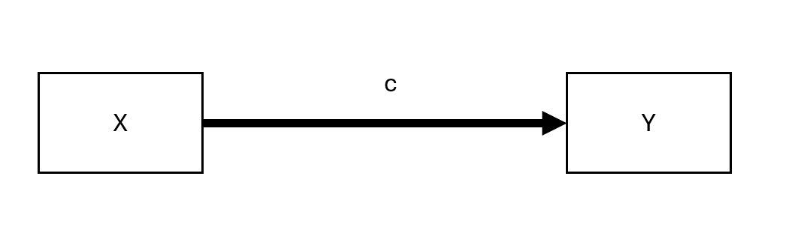
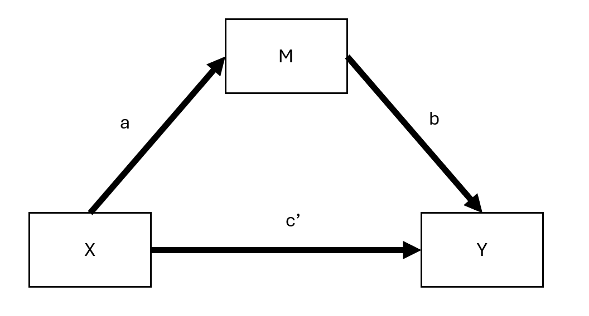

# Mediation {#sec-mediation}

Mediation analysis uncovers the process by which a predictor affects an outcome through one or more intermediate variables. This chapter introduces the traditional approach to mediation, focusing on path analysis, the Baron & Kenny framework, and the Sobel test. Practical limitations of this approach are discussed, especially in the presence of confounding. Then, it presents a modern causal inference framework for mediation, including counterfactual definitions of direct and indirect effects. The use of bootstrapping is demonstrated with business examples. Assumptions such as sequential ignorability are explored in detail. Graphical representations, including path diagrams and causal graphs, are used to aid interpretation. The chapter provides the tools to not only estimate mediation effects but to assess their robustness, interpret their business relevance, and report them transparently.

## Traditional Approach

The classical mediation analysis follows the approach introduced by @baron1986moderator, though it has limitations, particularly in requiring the first step ($X \to Y$) to be significant. Despite its shortcomings, this framework provides a useful foundation.

### Steps in the Traditional Mediation Model

Mediation is typically assessed through three regression models:

1.  **Total Effect**: $X \to Y$
2.  **Path** $a$: $X \to M$
3.  **Path** $b$ and Direct Effect ($c'$): $X + M \to Y$

where:

-   $X$ = independent (causal) variable
-   $Y$ = dependent (outcome) variable
-   $M$ = mediating variable

Originally, @baron1986moderator required the direct path $X \to Y$ to be significant. However, mediation can still occur even if this direct effect is not significant. For example:

-   The effect of $X$ on $Y$ might be **fully absorbed** by $M$.

-   Multiple mediators ($M_1, M_2$) with **opposing effects** could cancel each other out, leading to a non-significant direct effect.

### Graphical Representation of Mediation

#### Unmediated Model

```{r fig-unmediated-model-flow, echo=FALSE, fig.cap='Unmediated Model', fig.alt='Flow chart showing direct relationship from X to Y with arrow labeled c', out.width='90%', fig.align='center'}

```

Here, $c$ represents the **total effect** of $X$ on $Y$.

#### Mediated Model

```{r fig-mediated-model-flow, echo=FALSE, fig.cap="Mediated Model", fig.alt='Flow chart showing mediation model with X to M (path a), M to Y (path b), and X to Y (path c prime)', out.width='90%', fig.align='center'}

```

Here:

-   $c'$ = **direct effect** (effect of $X$ on $Y$ after accounting for mediation)
-   $ab$ = **indirect effect** (mediation pathway)

Thus, we can express:

$$
\text{total effect} = \text{direct effect} + \text{indirect effect}
$$

or,

$$
c = c' + ab
$$

This equation holds under standard linear models but not necessarily in cases such as:

1.  Latent variable models
2.  Logistic regression (only an approximation)
3.  Multilevel models [@bauer2006conceptualizing]

------------------------------------------------------------------------

### Measuring Mediation

Several approaches exist for quantifying the **indirect effect** ($ab$):

1.  **Proportional Reduction Approach**:\
    $$1 - \frac{c'}{c}$$\
    *Not recommended* due to high instability, especially when $c$ is small [@mackinnon1995simulation].

2.  **Product Method**:\
    $$a \times b$$\
    The most common approach.

3.  **Difference Method**:\
    $$c - c'$$\
    Conceptually similar to the product method but less precise in small samples.

------------------------------------------------------------------------

### Assumptions in Linear Mediation Models

For valid mediation analysis, the following assumptions should hold:

1.  **No unmeasured confounders** between $X-Y$, $X-M$, and $M-Y$.
2.  **No reverse causality**: $X$ should not be influenced by a confounder ($C$) that also affects $M-Y$.
3.  **Measurement reliability**: $M$ should be measured without error (if not, consider errors-in-variables models).

------------------------------------------------------------------------

**Regression Equations for Mediation Steps**

Step 1: Total Effect of $X$ on $Y$

$$
Y = \beta_0 + cX + \epsilon
$$

-   The significance of $c$ is **not required** for mediation to occur.

Step 2: Effect of $X$ on $M$

$$
M = \alpha_0 + aX + \epsilon
$$

-   The coefficient $a$ must be significant for mediation analysis to proceed.

Step 3: Effect of $M$ on $Y$ (Including $X$)

$$
Y = \gamma_0 + c'X + bM + \epsilon
$$

-   If $c'$ becomes non-significant after including $M$, full mediation occurs.
-   If $c'$ is reduced but remains significant, partial mediation is present.

| Effect of $X$ on $Y$                            | Mediation Type    |
|-------------------------------------------------|-------------------|
| $b_4$ (from Step 3) is **insignificant**        | Full mediation    |
| $b_4 < b_1$ (from Step 1) but still significant | Partial mediation |

: Interpretation of Mediation Outcomes

------------------------------------------------------------------------

### Testing for Mediation

Several statistical tests exist to assess whether the indirect effect ($ab$) is significant:

1.  **Sobel Test** [@sobel1982asymptotic]
    -   Based on the standard error of $ab$.
    -   **Limitation**: Assumes normality of $ab$, which may not hold in small samples.
2.  **Joint Significance Test**
    -   If both $a$ and $b$ are significant, mediation is likely.
3.  **Bootstrapping (Preferred)** [@preacher2004spss, @shrout2002mediation]
    -   Estimates the confidence interval for $ab$.
    -   Does not assume normality.
    -   Recommended for small-to-moderate sample sizes.

------------------------------------------------------------------------

### Additional Considerations

-   Proximal mediation (where path $a$ exceeds path $b$) can lead to multicollinearity and reduced statistical power. In contrast, distal mediation (where path $b$ exceeds path $a$) tends to maximize power. In fact, slightly distal mediators---where $b$ is somewhat larger than $a$---often strike an ideal balance for power in mediation analyses [@hoyle1999statistical].
-   Tests of direct effects ($c$ and $c'$) generally have lower power than tests of the indirect effect ($ab$). As a result, it is possible for the indirect effect ($ab$) to be statistically significant even when the direct effect ($c$) is not. This situation can appear to indicate "complete mediation," yet the lack of a statistically significant direct effect between $X$ and $Y$ (i.e., $c'$) does not definitively rule out other possibilities [@kenny2014power].
-   Because testing $ab$ essentially combines two tests, it often provides a power advantage over testing $c'$ alone. However, using a non-significant $c'$ as the sole criterion for claiming complete mediation should be done cautiously---if at all---given the importance of adequate sample size and power. Indeed, @hayes2013relative recommend avoiding claims of complete mediation based solely on a non-significant $c'$, particularly when partial mediation may still be present.

------------------------------------------------------------------------

### Assumptions in Mediation Analysis

Valid mediation analysis requires several key assumptions, which can be categorized into **causal direction**, **interaction effects**, **measurement reliability**, and **confounding control**.

------------------------------------------------------------------------

#### Direction

-   Causal Order of Variables

-   A simple but weak solution is to measure $X$ before $M$ and $Y$ to prevent reverse causality (i.e., $M$ or $Y$ causing $X$). Similarly, measuring $M$ before $Y$ avoids feedback effects of $Y$ on $M$.

-   However, causal feedback loops between $M$ and $Y$ may still exist.

    -   If we assume full mediation ($c' = 0$), models with reciprocal causal effects between $M$ and $Y$ can be estimated using instrumental variables (IV).

    -   @smith1982beliefs suggests treating both $M$ and $Y$ as potential mediators of each other, requiring distinct instrumental variables for each to avoid cross-contamination of causal effects.

------------------------------------------------------------------------

#### Interaction Effects in Mediation

-   If $M$ interacts with $X$ in predicting $Y$, then $M$ is both a mediator and a moderator [@baron1986moderator].

-   **The interaction term** $X \times M$ should always be included in the model to account for possible moderation effects.

-   For interpreting such interactions in mediation models, see [@vanderweele2015explanation], who provides a framework for **moderated mediation** analysis.

------------------------------------------------------------------------

#### Reliability

Measurement error in any of the three key variables ($X, M, Y$) can bias estimates of mediation effects.

1.  Measurement Error in the Mediator ($M$):
    -   Biases both $b$ and $c'$.
    -   Potential solution: Model $M$ as a latent variable (reduces bias but may decrease statistical power) [@ledgerwood2011trade].
    -   Specific effects:
        -   $b$ is attenuated (biased toward 0).
        -   $c'$ is:
            -   Overestimated if $ab > 0$.
            -   Underestimated if $ab < 0$.
2.  Measurement Error in the Treatment ($X$):
    -   Biases both $a$ and $b$.
    -   Specific effects:
        -   $a$ is attenuated.
        -   $b$ is:
            -   Overestimated if $ac' > 0$.
            -   Underestimated if $ac' < 0$.
3.  Measurement Error in the Outcome ($Y$):
    -   If unstandardized, there is no bias.
    -   If standardized, there is attenuation bias (reduced effect sizes due to error variance).

------------------------------------------------------------------------

#### Confounding in Mediation Analysis

Omitted variable bias can distort any of the three core relationships ($X \to Y$, $X \to M$, $M \to Y$). Addressing confounding requires either design-based or statistical solutions.

**Design-Based Strategies (Preferred if Feasible)**

-   Randomization of the independent variable ($X$) reduces confounding bias.
-   Randomization of the mediator ($M$), if possible, further strengthens causal claims.
-   Controlling for measured confounders, though this only addresses observable confounding.

**Statistical Strategies (When Randomization is Not Possible)**

1.  Instrumental Variables Approach:
    -   Used when a confounder affects both $M$ and $Y$.
    -   Front-door adjustment can be applied if there exists a third variable that fully mediates the effect of $M$ on $Y$ while being independent of the confounder.
2.  Weighting Methods (e.g., Inverse Probability Weighting - IPW):
    -   Corrects for confounding by reweighting observations to balance confounders across treatment groups.
    -   Requires the strong ignorability assumption: All confounders must be measured and correctly specified [@westfall2016statistically].
    -   While this assumption cannot be formally tested, sensitivity analyses can help assess robustness.
    -   See [Heiss](https://www.andrewheiss.com/blog/2020/12/01/ipw-binary-continuous/) for R code on implementing IPW in mediation models.

------------------------------------------------------------------------

### Indirect Effect Tests

Testing the indirect effect ($ab$) is crucial in mediation analysis. Several methods exist, each with its advantages and limitations.

------------------------------------------------------------------------

#### Sobel Test (Delta Method)

-   Developed by @sobel1982asymptotic.
-   Also known as the delta method.
-   Not recommended because it assumes the sampling distribution of $ab$ is normal, which often does not hold [@mackinnon1995simulation].

The standard error (SE) of the indirect effect is:

$$
SE_{ab} = \sqrt{\hat{b}^2 s_{\hat{a}}^2 + \hat{a}^2 s_{\hat{b}}^2}
$$

The **Z-statistic** for testing whether $ab$ is significantly different from 0 is:

$$
z = \frac{\hat{ab}}{\sqrt{\hat{b}^2 s_{\hat{a}}^2 + \hat{a}^2 s_{\hat{b}}^2}}
$$

**Disadvantages**

-   Assumes $a$ and $b$ are independent.
-   Assumes $ab$ follows a normal distribution.
-   Poor performance in small samples.
-   Lower power and more conservative than bootstrapping.

**Special Case: Inconsistent Mediation**

-   Mediation can occur even when **direct and indirect effects** have **opposite signs**, known as **inconsistent mediation** [@mackinnon2007mediation].
-   This happens when the **mediator acts as a suppressor variable**, leading to counteracting paths.

```{r}
library(bda)
library(mediation)
data("boundsdata")

# Sobel Test for Mediation
bda::mediation.test(boundsdata$med, boundsdata$ttt, boundsdata$out) |>
    tibble::rownames_to_column() |>
    causalverse::nice_tab(2)
```

------------------------------------------------------------------------

#### Joint Significance Test

-   Tests if the indirect effect is nonzero by checking whether both $a$ and $b$ are statistically significant.
-   Assumes $a \perp b$ (independence of paths).
-   Performs similarly to bootstrapping [@hayes2013relative].
-   More robust to non-normality but can be sensitive to heteroscedasticity [@fossum2023use].
-   Does not provide confidence intervals, making effect size interpretation harder.

------------------------------------------------------------------------

#### Bootstrapping (Preferred Method)

-   First applied to mediation by @bollen1990direct.
-   Uses resampling to empirically estimate the sampling distribution of the indirect effect.
-   Does not require normality assumptions or $a \perp b$ independence.
-   Works well with small samples.
-   Can handle complex models.

**Which Bootstrapping Method?**

-   **Percentile bootstrap** is preferred due to better **Type I error rates** [@tibbe2022correcting].
-   **Bias-corrected bootstrapping** can be too **liberal** (inflates Type I errors) [@fritz2012explanation].

**Special Case: Meta-Analytic Bootstrapping**

-   Bootstrapping can be applied **without raw data**, using only $a, b, var(a), var(b), cov(a,b)$ from multiple studies.

```{r}
# Meta-Analytic Bootstrapping for Mediation
library(causalverse)

result <- causalverse::med_ind(
    a = 0.5, 
    b = 0.7, 
    var_a = 0.04, 
    var_b = 0.05, 
    cov_ab = 0.01
)
```

```{r fig-indirect-effect-distribution, fig.cap='Distribution of Simulated Indirect Effects', fig.alt='Right-skewed histogram of indirect effects with peak around 0.5 and red dashed confidence interval lines', out.width="100%", fig.align="center"}
result$plot
```

When an **instrumental variable (IV)** is available, the causal effect can be estimated more reliably. Below are visual representations.

```{r, eval = FALSE}
library(DiagrammeR)

# Simple Treatment-Outcome Model
grViz("
digraph {
  graph []
  node [shape = plaintext]
    X [label = 'Treatment']
    Y [label = 'Outcome']
  edge [minlen = 2]
    X->Y
  { rank = same; X; Y }
}")

# Mediation Model with an Instrument
grViz("
digraph {
  graph []
  node [shape = plaintext]
    X [label ='Treatment', shape = box]
    Y [label ='Outcome', shape = box]
    M [label ='Mediator', shape = box]
    IV [label ='Instrument', shape = box]
  edge [minlen = 2]
    IV->X
    X->M  
    M->Y 
    X->Y 
  { rank = same; X; Y; M }
}")

```

Mediation Analysis with Fixed Effects Models

```{r}
library(mediation)
library(fixest)

data("boundsdata")

# Step 1: Total Effect (c)
out1 <- feols(out ~ ttt, data = boundsdata)

# Step 2: Indirect Effect (a)
out2 <- feols(med ~ ttt, data = boundsdata)

# Step 3: Direct & Indirect Effect (c' & b)
out3 <- feols(out ~ med + ttt, data = boundsdata)

# Proportion of Mediation
coef(out2)['ttt'] * coef(out3)['med'] / coef(out1)['ttt'] * 100
```

Bootstrapped Mediation Analysis

```{r}
library(boot)
set.seed(1)

# Define the bootstrapping function
mediation_fn <- function(data, i) {
    df <- data[i,]
    
    a_path <- feols(med ~ ttt, data = df)
    a <- coef(a_path)['ttt']
    
    b_path <- feols(out ~ med + ttt, data = df)
    b <- coef(b_path)['med']
    
    cp <- coef(b_path)['ttt']
    
    # Indirect Effect (a * b)
    ind_ef <- a * b
    total_ef <- a * b + cp
    return(c(ind_ef, total_ef))
}

# Perform Bootstrapping
boot_med <- boot(boundsdata, mediation_fn, R = 100, parallel = "multicore", ncpus = 2)
boot_med 

# Summary and Confidence Intervals
summary(boot_med) |> causalverse::nice_tab()

# Confidence Intervals (percentile bootstrap preferred)
boot.ci(boot_med, type = c("norm", "perc"))

# Point Estimates (Indirect and Total Effects)
colMeans(boot_med$t)

```

Alternatively, use the `robmed` package for **robust** mediation analysis:

```{r}
library(robmed)

```

### Power Analysis for Mediation

To assess whether the study has sufficient **power** to detect mediation effects, use:

```{r}
library(pwr2ppl)

# Power analysis for the indirect effect (ab path)
medjs(
    rx1m1 = .3,  # Correlation: X → M (path a)
    rx1y  = .1,  # Correlation: X → Y (path c')
    rym1  = .3,  # Correlation: M → Y (path b)
    n     = 100, # Sample size
    alpha = 0.05,
    mvars = 1,   # Number of mediators
    rep   = 1000 # Replications (use 10,000 for accuracy)
)
```

For **interactive** power analysis, see [Kenny's Mediation Power App](https://davidakenny.shinyapps.io/MedPower/).

**Summary of Indirect Effect Tests**

| **Test**                        | **Pros**                                       | **Cons**                         |
|---------------------|------------------------------|----------------------|
| **Sobel Test**                  | Simple, fast                                   | Assumes normality, low power     |
| **Joint Significance Test**     | Robust to non-normality                        | No confidence interval           |
| **Bootstrapping** (Recommended) | No normality assumption, handles small samples | May be liberal if bias-corrected |

: Comparison of Mediation Testing Methods

### Multiple Mediation Analysis

In some cases, a single mediator ($M$) does not fully capture the indirect effect of $X$ on $Y$. Multiple mediation models extend traditional mediation by including two or more mediators, allowing us to examine how multiple pathways contribute to an outcome.

------------------------------------------------------------------------

Several R packages handle multiple mediation models:

-   **manymome**: A flexible package for multiple mediation modeling.
    -   [Vignette](https://cran.r-project.org/web/packages/manymome/vignettes/med_lm.html)

```{r}
library(manymome)
```

-   **mma**: Used for multiple mediator models.

    -   [Package PDF](https://cran.r-project.org/web/packages/mma/mma.pdf)

    -   [Vignette](https://cran.r-project.org/web/packages/mma/vignettes/MMAvignette.html)

```{r}
library(mma)
```

#### Multiple Mediators: Structural Equation Modeling Approach

A popular method for estimating multiple mediation models is **Structural Equation Modeling** using **lavaan**.

To test multiple mediation, we first **simulate data** where two mediators ($M_1$ and $M_2$) contribute to the outcome ($Y$).

```{r}
# Load required packages
library(MASS)  # For mvrnorm (generating correlated errors)
library(lavaan)

# Function to generate synthetic data
generate_data <- function(n = 10000, a1 = 0.5, a2 = -0.35, 
                          b1 = 0.7, b2 = 0.48, 
                          corr = TRUE, correlation_value = 0.7) {
    set.seed(12345)
    X <- rnorm(n)  # Independent variable
    
    # Generate correlated errors for mediators
    if (corr) {
        Sigma <- matrix(c(1, correlation_value, correlation_value, 1), nrow = 2)
        errors <- mvrnorm(n, mu = c(0, 0), Sigma = Sigma) 
    } else {
        errors <- mvrnorm(n, mu = c(0, 0), Sigma = diag(2)) 
    }
    
    M1 <- a1 * X + errors[, 1]
    M2 <- a2 * X + errors[, 2]
    Y  <- b1 * M1 + b2 * M2 + rnorm(n)  # Outcome variable

    return(data.frame(X = X, M1 = M1, M2 = M2, Y = Y))
}
```

We analyze the indirect effects through both mediators ($M_1$ and $M_2$).

1.  Correctly Modeling Correlated Mediators

```{r}
# Generate data with correlated mediators
Data_corr <- generate_data(n = 10000, corr = TRUE, correlation_value = 0.7)

# Define SEM model for multiple mediation
model_corr <- '
  Y ~ b1 * M1 + b2 * M2 + c * X
  M1 ~ a1 * X
  M2 ~ a2 * X
  M1 ~~ M2  # Correlated mediators (modeling correlation correctly)
'

# Fit SEM model
fit_corr <- sem(model_corr, data = Data_corr)

# Extract parameter estimates
parameterEstimates(fit_corr)[, c("lhs", "rhs", "est", "se", "pvalue")]
```

2\. Incorrectly Ignoring Correlation Between Mediators

```{r}
# Define SEM model without modeling mediator correlation
model_uncorr <- '
  Y ~ b1 * M1 + b2 * M2 + c * X
  M1 ~ a1 * X
  M2 ~ a2 * X
'

# Fit incorrect model
fit_uncorr <- sem(model_uncorr, data = Data_corr)

# Compare parameter estimates
parameterEstimates(fit_uncorr)[, c("lhs", "rhs", "est", "se", "pvalue")]

```

**Comparison of Model Fits**

To check whether modeling correlation matters, we compare AIC and RMSEA.

```{r}
# Extract model fit statistics
fit_measures <- function(fit) {
  fitMeasures(fit, c("aic", "bic", "rmsea", "chisq"))
}

# Compare model fits
fit_measures(fit_corr)  # Correct model (correlated mediators)
fit_measures(fit_uncorr)  # Incorrect model (ignores correlation)
```

-   If AIC and RMSEA are lower in the correlated model, it suggests that accounting for correlated errors improves fit.

After fitting the model, we assess:

1.  **Direct Effect**: The effect of $X$ on $Y$ **after accounting for both mediators** ($c'$).

2.  **Indirect Effects**:

    -   $a_1 \times b_1$: Effect of $X \to M_1 \to Y$.

    -   $a_2 \times b_2$: Effect of $X \to M_2 \to Y$.

3.  **Total Effect**: Sum of direct and indirect effects.

```{r}
# Extract indirect and direct effects
parameterEstimates(fit_corr, standardized = TRUE)
```

If $c'$ is reduced (but still significant), we have partial mediation. If $c' \approx 0$, it suggests full mediation.

```{r full code}
# Load required packages
library(MASS)  # for mvrnorm
library(lavaan)

# Function to generate synthetic data with correctly correlated errors for mediators
generate_data <-
  function(n = 10000,
           a1 = 0.5,
           a2 = -0.35,
           b1 = 0.7,
           b2 = 0.48,
           corr = TRUE,
           correlation_value = 0.7) {
    set.seed(12345)
    X <- rnorm(n)
    
    # Generate correlated errors using a multivariate normal distribution
    if (corr) {
        Sigma <- matrix(c(1, correlation_value, correlation_value, 1), nrow = 2)  # Higher covariance matrix for errors
        errors <- mvrnorm(n, mu = c(0, 0), Sigma = Sigma)  # Generate correlated errors
    } else {
        errors <- mvrnorm(n, mu = c(0, 0), Sigma = diag(2))  # Independent errors
    }
    
    M1 <- a1 * X + errors[, 1]
    M2 <- a2 * X + errors[, 2]
    Y <- b1 * M1 + b2 * M2 + rnorm(n)  # Y depends on M1 and M2
    
    data.frame(X = X, M1 = M1, M2 = M2, Y = Y)
}

# Ground truth for comparison
ground_truth <- data.frame(Parameter = c("b1", "b2"), GroundTruth = c(0.7, 0.48))

# Function to extract relevant estimates, standard errors, and model fit
extract_estimates_b1_b2 <- function(fit) {
    estimates <- parameterEstimates(fit)
    estimates <- estimates[estimates$lhs == "Y" & estimates$rhs %in% c("M1", "M2"), c("rhs", "est", "se")]
    estimates$Parameter <- ifelse(estimates$rhs == "M1", "b1", "b2")
    estimates <- estimates[, c("Parameter", "est", "se")]
    fit_stats <- fitMeasures(fit, c("aic", "bic", "rmsea", "chisq"))
    return(list(estimates = estimates, fit_stats = fit_stats))
}

# Case 1: Correlated errors for mediators (modeled correctly)
Data_corr <- generate_data(n = 10000, corr = TRUE, correlation_value = 0.7)
model_corr <- '
  Y ~ b1 * M1 + b2 * M2 + c * X
  M1 ~ a1 * X
  M2 ~ a2 * X
  M1 ~~ M2  # Correlated mediators (errors)
'
fit_corr <- sem(model = model_corr, data = Data_corr)
results_corr <- extract_estimates_b1_b2(fit_corr)

# Case 2: Uncorrelated errors for mediators (modeled correctly)
Data_uncorr <- generate_data(n = 10000, corr = FALSE)
model_uncorr <- '
  Y ~ b1 * M1 + b2 * M2 + c * X
  M1 ~ a1 * X
  M2 ~ a2 * X
'
fit_uncorr <- sem(model = model_uncorr, data = Data_uncorr)
results_uncorr <- extract_estimates_b1_b2(fit_uncorr)

# Case 3: Correlated errors, but not modeled as correlated
fit_corr_incorrect <- sem(model = model_uncorr, data = Data_corr)
results_corr_incorrect <- extract_estimates_b1_b2(fit_corr_incorrect)

# Case 4: Uncorrelated errors, but modeled as correlated
fit_uncorr_incorrect <- sem(model = model_corr, data = Data_uncorr)
results_uncorr_incorrect <- extract_estimates_b1_b2(fit_uncorr_incorrect)

# Combine all estimates for comparison
estimates_combined <- list(
    "Correlated (Correct)" = results_corr$estimates,
    "Uncorrelated (Correct)" = results_uncorr$estimates,
    "Correlated (Incorrect)" = results_corr_incorrect$estimates,
    "Uncorrelated (Incorrect)" = results_uncorr_incorrect$estimates
)

# Combine all into a single table
comparison_table <- do.call(rbind, lapply(names(estimates_combined), function(case) {
    df <- estimates_combined[[case]]
    df$Case <- case
    df
}))

# Merge with ground truth for final comparison
comparison_table <- merge(comparison_table, ground_truth, by = "Parameter")

# Display the comparison table
comparison_table

# Display model fit statistics for each case
fit_stats_combined <- list(
    "Correlated (Correct)" = results_corr$fit_stats,
    "Uncorrelated (Correct)" = results_uncorr$fit_stats,
    "Correlated (Incorrect)" = results_corr_incorrect$fit_stats,
    "Uncorrelated (Incorrect)" = results_uncorr_incorrect$fit_stats
)

fit_stats_combined
```

### Multiple Treatments in Mediation

In some cases, **multiple independent variables** ($X_1$, $X_2$) influence the same mediators. This is called **multiple treatments mediation** [@hayes2014statistical].

For an example in **PROCESS (SPSS/R)**, see:\
[Process Mediation with Multiple Treatments](https://core.ecu.edu/wuenschk/MV/multReg/Mediation_Multicategorical.pdf).

------------------------------------------------------------------------

## Causal Inference Approach to Mediation

Traditional mediation models assume that regression-based estimates provide valid causal inference. However, **causal mediation analysis** (CMA) extends beyond traditional models by explicitly defining mediation in terms of **potential outcomes and counterfactuals**.

------------------------------------------------------------------------

### Example: Traditional Mediation Analysis {#sec-example-traditional-mediation-analysis}

We begin with a classic **three-step mediation approach**.

```{r, message=FALSE}
# Load data
myData <- read.csv("data/mediationData.csv")

# Step 1 (Total Effect: X → Y) [No longer required]
model.0 <- lm(Y ~ X, data = myData)
summary(model.0)

# Step 2 (Effect of X on M)
model.M <- lm(M ~ X, data = myData)
summary(model.M)

# Step 3 (Effect of M on Y, controlling for X)
model.Y <- lm(Y ~ X + M, data = myData)
summary(model.Y)

# Step 4: Bootstrapping for ACME
library(mediation)
results <-
    mediate(
        model.M,
        model.Y,
        treat = 'X',
        mediator = 'M',
        boot = TRUE,
        sims = 500
    )
summary(results)
```

-   **Total Effect**: $\hat{c} = 0.3961$ → effect of $X$ on $Y$ **without** controlling for $M$.
-   **Direct Effect (ADE)**: $\hat{c'} = 0.0396$ → effect of $X$ on $Y$ **after** accounting for $M$.
-   **ACME (Average Causal Mediation Effect)**:
    -   ACME = $\hat{c} - \hat{c'} = 0.3961 - 0.0396 = 0.3565$

    -   Equivalent to **product of paths**: $\hat{a} \times \hat{b} = 0.56102 \times 0.6355 = 0.3565$.

These calculations do not rely on strong causal assumptions. For a causal interpretation, we need a more rigorous framework.

### Two Approaches in Causal Mediation Analysis

The `mediation` package [@imai2010general, @imai2010identification] enables **causal mediation analysis**. It supports two inference types:

1.  **Model-Based Inference**

    -   Assumptions:

        -   Treatment is randomized (or approximated via matching).

        -   Sequential Ignorability: No unobserved confounding in:

            1.  Treatment → Mediator

            2.  Treatment → Outcome

            3.  Mediator → Outcome

        -   This assumption is hard to justify in observational studies.

2.  **Design-Based Inference**

    -   Relies on experimental design to isolate the causal mechanism.

**Notation**

We follow the standard potential outcomes framework:

-   $M_i(t)$ = mediator under treatment condition $t$

-   $T_i \in {0,1}$ = treatment assignment

-   $Y_i(t, m)$ = outcome under treatment $t$ and mediator value $m$

-   $X_i$ = observed pre-treatment covariates

The **treatment effect** for an individual $i$: $$
\tau_i = Y_i(1,M_i(1)) - Y_i (0,M_i(0))
$$ which decomposes into:

1.  **Causal Mediation Effect (ACME)**:

$$
\delta_i (t) = Y_i (t,M_i(1)) - Y_i(t,M_i(0))
$$

2.  **Direct Effect (ADE)**:

$$
\zeta_i (t) = Y_i (1, M_i(t)) - Y_i(0, M_i(t))
$$

The direct effect holds the mediator at the value it *would have taken* under treatment status $t$, and varies only the treatment. The mediation effect does the reverse: it holds the treatment at $t$ and moves the mediator between the values it would have taken under treatment and under control. Each pair therefore sums to the total effect, for either choice of $t$:

$$
\tau_i = \delta_i (t) + \zeta_i (1-t), \qquad t \in \{0, 1\}.
$$

That the identity holds for both $t = 0$ and $t = 1$ is not a redundancy. It says the total effect admits two distinct decompositions, and they need not agree term by term. The pair $\{\delta_i(1), \zeta_i(0)\}$ is what the epidemiological literature calls the total natural indirect effect and the pure natural direct effect; the pair $\{\delta_i(0), \zeta_i(1)\}$ is the pure indirect and total direct effect. The two decompositions coincide only when there is no interaction between the treatment and the mediator in producing the outcome, and the difference between them is itself an interpretable quantity. Section \@ref(sec-med-fourway) takes this apart.

**Sequential Ignorability Assumption**

For CMA to be valid, we assume:

$$
\begin{aligned}
\{ Y_i (t', m), M_i (t) \} &\perp T_i |X_i = x\\
Y_i(t',m) &\perp M_i(t) | T_i = t, X_i = x
\end{aligned}
$$

-   First condition is the standard strong ignorability condition where treatment assignment is random conditional on pre-treatment confounders.

-   Second condition is stronger where the mediators is also random given the observed treatment and pre-treatment confounders. This condition is satisfied only when there is no unobserved pre-treatment confounders, and post-treatment confounders, and multiple mediators that are correlated.

> **Key Challenge**
>
> **Sequential Ignorability is not testable.** Researchers should conduct **sensitivity analysis**.

We now fit a **causal mediation model** using `mediation`.

```{r}
library(mediation)
set.seed(2014)
data("framing", package = "mediation")

# Step 1: Fit mediator model (M ~ T, X)
med.fit <-
    lm(emo ~ treat + age + educ + gender + income, data = framing)

# Step 2: Fit outcome model (Y ~ M, T, X)
out.fit <-
    glm(
        cong_mesg ~ emo + treat + age + educ + gender + income,
        data = framing,
        family = binomial("probit")
    )

# Step 3: Causal Mediation Analysis (Quasi-Bayesian)
med.out <-
    mediate(
        med.fit,
        out.fit,
        treat = "treat",
        mediator = "emo",
        robustSE = TRUE,
        sims = 100
    )  # Use sims = 10000 in practice
summary(med.out)
```

**Alternative: Nonparametric Bootstrap**

```{r}
med.out <-
    mediate(
        med.fit,
        out.fit,
        boot = TRUE,
        treat = "treat",
        mediator = "emo",
        sims = 100,
        boot.ci.type = "bca"
    )
summary(med.out)
```

If we suspect **moderation**, we include an **interaction term**.

```{r}
med.fit <-
    lm(emo ~ treat + age + educ + gender + income, data = framing)

out.fit <-
    glm(
        cong_mesg ~ emo * treat + age + educ + gender + income,
        data = framing,
        family = binomial("probit")
    )

med.out <-
    mediate(
        med.fit,
        out.fit,
        treat = "treat",
        mediator = "emo",
        robustSE = TRUE,
        sims = 100
    )

summary(med.out)
test.TMint(med.out, conf.level = .95)  # Tests for interaction effect
```

Since **sequential ignorability** is untestable, we examine how unmeasured confounding affects ACME estimates.

```{r}
# Load required package
library(mediation)

# Simulate some example data
set.seed(123)
n <- 100
data <- data.frame(
  treat = rbinom(n, 1, 0.5),       # Binary treatment
  med = rnorm(n),                   # Continuous mediator
  outcome = rnorm(n)                 # Continuous outcome
)

# Fit the mediator model (med ~ treat)
med_model <- lm(med ~ treat, data = data)

# Fit the outcome model (outcome ~ treat + med)
outcome_model <- lm(outcome ~ treat + med, data = data)

# Perform mediation analysis
med_out <- mediate(med_model, 
                   outcome_model, 
                   treat = "treat", 
                   mediator = "med", 
                   sims = 100)

# Conduct sensitivity analysis
sens_out <- medsens(med_out, sims = 100)

summary(sens_out)
```

```{r fig-acme-vs-rho, fig.cap='ACME', fig.alt='Line plot showing average mediation effect vs sensitivity parameter rho with confidence interval shading and reference lines at zero', out.width="100%", fig.align="center"}
plot(sens_out)
```

-   If ACME confidence intervals contain 0, the effect is not robust to confounding.

Alternatively, using $R^2$ interpretation, we need to specify the direction of confounder that affects the mediator and outcome variables in `plot` using `sign.prod = "positive"` (i.e., same direction) or `sign.prod = "negative"` (i.e., opposite direction).

```{r, message=FALSE, eval = FALSE}
plot(sens.out, sens.par = "R2", r.type = "total", sign.prod = "positive")
```

| **Aspect**                | **Traditional Mediation** | **Causal Mediation**         |
|-----------------------|-----------------------|--------------------------|
| **Model Assumption**      | Linear regressions        | Potential outcomes framework |
| **Assumptions Needed**    | No omitted confounders    | Sequential ignorability      |
| **Inference Method**      | Product of coefficients   | Counterfactual reasoning     |
| **Bootstrapping?**        | Common                    | Essential                    |
| **Sensitivity Analysis?** | Rarely used               | Strongly recommended         |

: Summary of Causal Mediation vs. Traditional Mediation

------------------------------------------------------------------------

## The Modern Counterfactual Framework {#sec-med-counterfactual}

The `mediation` package's ACME and ADE are the entry point to a larger apparatus. That apparatus is worth learning in full, because almost every difficulty that afflicts applied mediation analysis (exposure-mediator interaction, multiple correlated mediators, treatment-induced confounding, non-continuous outcomes) is invisible in the product-of-coefficients notation and explicit in the counterfactual one.

### Four Effects, Not Two

Keep the notation $M_i(t)$ for the mediator under treatment $t$ and $Y_i(t, m)$ for the outcome under treatment $t$ and mediator value $m$. Four population quantities, not two, are needed to describe a mechanism [@robins1992identifiability; @pearl2014graphical; @vanderweele2015explanation].

The **controlled direct effect** at mediator level $m$ is

$$
\mathrm{CDE}(m) = \mathbb{E}\big[Y(1, m) - Y(0, m)\big].
$$

It answers an intervention question: if we could fix the mediator at $m$ for everyone, how much would the treatment still matter? There is one CDE for every value of $m$, and they generally differ. The CDE is the estimand a regulator cares about when the mediator is itself a policy lever ("what would this program achieve if we simultaneously guaranteed employment?").

The **natural direct effect** replaces the fixed $m$ with the value the mediator would naturally take:

$$
\mathrm{NDE}(t) = \mathbb{E}\big[Y(1, M(t)) - Y(0, M(t))\big], \qquad t \in \{0, 1\}.
$$

$\mathrm{NDE}(0)$ is the **pure** natural direct effect, $\mathrm{NDE}(1)$ the **total** natural direct effect. The **natural indirect effect** is the mirror image:

$$
\mathrm{NIE}(t) = \mathbb{E}\big[Y(t, M(1)) - Y(t, M(0))\big],
$$

with $\mathrm{NIE}(1)$ the **total** and $\mathrm{NIE}(0)$ the **pure** natural indirect effect. The total effect decomposes in two ways,

$$
\mathrm{TE} = \mathrm{NDE}(0) + \mathrm{NIE}(1) = \mathrm{NDE}(1) + \mathrm{NIE}(0),
$$

and the two decompositions agree only when the treatment and mediator do not interact in producing the outcome. Papers that report "the direct effect" and "the indirect effect" without saying which of the four they mean are unambiguous only in the no-interaction case, which is precisely the case nobody checks.

Notice what the natural effects require. $Y(1, M(0))$ is the outcome a unit would have if it received the treatment but its mediator were held at the value it would have taken *without* the treatment. No experiment, however elaborate, produces that observation for anyone. This is the **cross-world** feature of natural effects, and it is the source of most of the trouble in this literature.

### The Four Identification Assumptions

Sequential ignorability as stated earlier in the chapter bundles together four distinct conditions. Separating them clarifies which parts of a design address which problem [@vanderweele2015explanation]. Writing $C$ for measured pre-treatment covariates:

1.  No unmeasured treatment-outcome confounding: $Y(t, m) \perp T \mid C$.
2.  No unmeasured mediator-outcome confounding: $Y(t, m) \perp M \mid T, C$.
3.  No unmeasured treatment-mediator confounding: $M(t) \perp T \mid C$.
4.  No mediator-outcome confounder affected by treatment: $Y(t, m) \perp M(t^*) \mid C$.

Randomizing the treatment delivers conditions 1 and 3 and nothing else. Conditions 2 and 4 are the hard ones, and they are hard in different ways. Condition 2 is an ordinary unconfoundedness assumption about a variable that was never assigned, and it can at least be probed with sensitivity analysis. Condition 4 is the cross-world assumption. It cannot hold in any study where the treatment moves an intermediate variable that also affects the outcome, and no amount of data collection tests it, because the two counterfactuals it constrains can never be jointly observed. The CDE requires only conditions 1 through 3; the natural effects require all four. That difference is the reason the CDE is the workhorse of the econometric and political-science literatures while the natural effects dominate psychology and epidemiology.

### The Mediation Formula

Under conditions 1 through 4, the natural effects are identified from observed data by @pearl2014graphical's mediation formula. For discrete $M$,

$$
\mathbb{E}\big[Y(t, M(t^*))\big] = \sum_{c} \sum_{m} \mathbb{E}\big[Y \mid T = t, M = m, C = c\big]\, P(M = m \mid T = t^*, C = c)\, P(C = c),
$$

with the sum over $m$ replaced by an integral in the continuous case. Everything on the right is estimable. The formula makes the structure of the estimator transparent: fit an outcome model, fit a mediator model, and then integrate the outcome model over the *wrong* arm's mediator distribution. The `mediate` function's simulation approach is a Monte Carlo evaluation of exactly this expression, and the closed-form product of coefficients is the special case in which both models are linear and additive.

## The Four-Way Decomposition {#sec-med-fourway}

The product-of-coefficients decomposition splits a total effect into two pieces. @vanderweele2014unification shows that in the presence of exposure-mediator interaction the natural split is into four, and that the four pieces answer four different policy questions.

Consider the parametric case that covers most applications: a continuous mediator and a continuous outcome, with an interaction in the outcome equation,

$$
M = \beta_0 + \beta_1 T + \boldsymbol{\beta}_2' C + \varepsilon_M,
$$

$$
Y = \theta_0 + \theta_1 T + \theta_2 M + \theta_3 TM + \boldsymbol{\theta}_4' C + \varepsilon_Y .
$$

Fix a reference mediator level $m^*$, the value at which the controlled direct effect is evaluated. Writing $\mu_0 = \mathbb{E}[M \mid T = 0, C = c]$ for the mediator's mean in the control arm, the total effect splits exactly into

$$
\underbrace{\theta_1 + \theta_3 m^*}_{\text{CDE}(m^*)}
\;+\; \underbrace{\theta_3 (\mu_0 - m^*)}_{\text{reference interaction}}
\;+\; \underbrace{\theta_3 \beta_1}_{\text{mediated interaction}}
\;+\; \underbrace{\theta_2 \beta_1}_{\text{pure indirect effect}} .
$$

Each term has a distinct reading.

The **controlled direct effect** is what remains of the treatment if the mediator is fixed at $m^*$ for everyone. It requires neither an interaction nor a mediator response.

The **reference interaction** is present only when there is interaction ($\theta_3 \neq 0$) and the mediator is not already at $m^*$ for the control group. It captures effect that exists because the treatment and the naturally occurring mediator level interact, without requiring the treatment to move the mediator at all.

The **mediated interaction** requires both interaction *and* a mediator response: the treatment shifts the mediator, and the shifted mediator interacts with the treatment. This term is invisible to any two-way decomposition, and it is the piece that makes the two natural-effect decompositions differ.

The **pure indirect effect** is the classic $a \times b$ product. It requires the treatment to move the mediator, but no interaction.

The familiar quantities are sums of these: $\mathrm{NDE}(0) = \mathrm{CDE}(m^*) + \text{reference interaction}$ and $\mathrm{NIE}(1) = \text{mediated interaction} + \text{pure indirect effect}$.

### Show and Tell: The Decomposition on Real Data

The framing experiment of @brader2008triggers, introduced in the [conditional process analysis](#sec-conditional-process) chapter, supplies a clean case: randomized treatment, a plausible affective mediator, and a continuous outcome. The following computes the four terms directly from the two fitted equations, and confirms that they sum exactly to the total effect.

```{r med-fourway, message=FALSE, warning=FALSE}
library(mediation)
data("framing", package = "mediation")

fr <- framing
fr$educ_n <- as.numeric(fr$educ)
fr$female <- as.numeric(fr$gender == "female")
cov_names <- c("age", "educ_n", "female", "income")

m_M <- lm(emo ~ treat + age + educ_n + female + income, data = fr)
m_Y <- lm(immigr ~ treat * emo + age + educ_n + female + income, data = fr)

b1 <- coef(m_M)[["treat"]]
t1 <- coef(m_Y)[["treat"]]
t2 <- coef(m_Y)[["emo"]]
t3 <- coef(m_Y)[["treat:emo"]]

# Mediator mean in the control arm at average covariates
xbar  <- colMeans(fr[, cov_names])
mu0   <- coef(m_M)[["(Intercept)"]] + sum(coef(m_M)[cov_names] * xbar)
mstar <- round(mu0)   # reference level: the nearest scale point

fourway <- c(
    CDE                  = t1 + t3 * mstar,
    reference_interaction = t3 * (mu0 - mstar),
    mediated_interaction  = t3 * b1,
    pure_indirect         = t2 * b1
)
total <- t1 + t3 * (mu0 + b1) + t2 * b1

round(c(fourway, sum_of_parts = sum(fourway), total_effect = total), 4)
```

```{r med-fourway-props, message=FALSE, warning=FALSE}
round(c(
    NDE_pure         = unname(fourway["CDE"] + fourway["reference_interaction"]),
    NIE_total        = unname(fourway["mediated_interaction"] + fourway["pure_indirect"]),
    prop_mediated    = unname((fourway["mediated_interaction"] +
                               fourway["pure_indirect"]) / total),
    prop_interaction = unname((fourway["reference_interaction"] +
                               fourway["mediated_interaction"]) / total),
    prop_eliminated  = unname((total - fourway["CDE"]) / total)
), 3)
```

The decomposition is exact, as it must be. Substantively it says three things that the two-way split would have hidden.

Roughly forty-four percent of the framing effect on restrictionist attitudes runs through anxiety, which is the number a conventional mediation analysis would report. But the mediated-interaction term is *negative*: the extra anxiety the treatment produces is slightly less potent, per unit, in the treated condition than the pure indirect calculation assumes. The interaction share of the total effect is therefore negative, which is why the two natural-effect decompositions disagree here, and why reporting a single "proportion mediated" without saying which decomposition produced it is ambiguous.

The proportion *eliminated*, roughly one half, answers a different and often more useful question than the proportion mediated. It is the share of the total effect that would disappear if the mediator could be held at the reference level for everyone. A policy that could hold anxiety at its control-group level would remove about half the framing effect, not the forty-four percent that the mediation share suggests, because fixing the mediator also removes the reference interaction. When the mediator is a policy lever, the proportion eliminated is the number to report [@vanderweele2014unification].

### Cross-Check: Natural Effect Models

A natural effect model fits the counterfactual outcomes $Y(t, M(t^*))$ directly, by expanding the data to include imputed cross-world outcomes and then regressing on the two treatment indices $t$ and $t^*$ [@vanderweele2009conceptual]. It is a useful independent check on hand-computed decompositions, because it uses the same models but a completely different computational route.

```{r med-medflex, message=FALSE, warning=FALSE}
library(medflex)

d <- fr[, c("immigr", "emo", "treat", cov_names)]
d <- d[complete.cases(d), ]

imp <- neImpute(immigr ~ treat * emo + age + educ_n + female + income, data = d)
nem <- neModel(immigr ~ treat0 * treat1 + age + educ_n + female + income,
               family = gaussian, expData = imp, se = "robust")

summary(neEffdecomp(nem))
```

The natural effect model returns the pure and total direct and indirect effects with robust standard errors, and they reproduce the hand-computed decomposition to within the difference between conditioning on covariate means and averaging over the covariate distribution. The pure indirect effect is the largest and most precisely estimated component, the direct effects are not individually distinguishable from zero, and the total effect is significant. The mechanistic reading of @brader2008triggers survives, but the direct path does not.

## When Natural Effects Are Not Identified {#sec-med-interventional}

Assumption 4 above, no mediator-outcome confounder affected by treatment, fails in a large fraction of realistic applications. A job training program raises employment, employment affects both health behaviors and health; an advertising campaign raises store visits, visits affect both basket composition and revenue; a policy raises income, income affects both schooling and later earnings. In every case an intermediate variable sits between treatment and mediator and also affects the outcome directly.

### The Recanting Witness

The graphical name for the problem is the **recanting witness** [@shpitser2013counterfactual]. A variable $L$ that is affected by treatment and that both affects the mediator and affects the outcome directly must, in effect, testify to two contradictory counterfactual scenarios at once: it must take its treated value to transmit the effect along $T \to L \to M \to Y$, and its control value to leave the path $T \to L \to Y$ unchanged. No single set of potential outcomes supports both.

```{r med-recanting-dag, message=FALSE, warning=FALSE, fig.cap="A recanting witness. The intermediate variable L is affected by the treatment, affects the mediator, and affects the outcome directly. Natural direct and indirect effects through M are not identified, no matter how much data is collected.", fig.alt="Directed graph with T pointing to L, M and Y; L pointing to M and Y; and M pointing to Y.", fig.width=6, fig.height=4}
library(ggdag)
library(ggplot2)

dag_rw <- dagify(
    Y ~ Tr + M + L,
    M ~ Tr + L,
    L ~ Tr,
    coords = list(x = c(Tr = 0, L = 1, M = 2, Y = 3),
                  y = c(Tr = 0, L = 1, M = 0, Y = 0))
)

ggdag(dag_rw, text_size = 3.2) +
    theme_dag_blank() +
    labs(title = NULL)
```

Conditioning on $L$ does not solve the problem. It blocks the confounding path $M \leftarrow L \to Y$, which is what makes the mediator-outcome slope estimable, but it simultaneously blocks $T \to L \to Y$, which is part of the direct effect. The estimand that results is a controlled direct effect holding $L$ fixed, not a natural direct effect, and treating it as the latter is a mistake that the regression output cannot reveal.

### Interventional Effects

@vanderweele2014effect and @vansteelandt2017interventional propose a repair that gives up the cross-world counterfactual and keeps everything else. Instead of setting the mediator to the value a *particular unit* would have had, set it to a **random draw** from the mediator distribution in the relevant arm, marginalized over $L$. Write $G_{M \mid t}$ for such a draw. The **interventional direct effect** and **interventional indirect effect** are

$$
\mathrm{IDE} = \mathbb{E}\big[Y(1, G_{M \mid 0})\big] - \mathbb{E}\big[Y(0, G_{M \mid 0})\big],
\qquad
\mathrm{IIE} = \mathbb{E}\big[Y(1, G_{M \mid 1})\big] - \mathbb{E}\big[Y(1, G_{M \mid 0})\big],
$$

and they sum to the total effect exactly as the natural effects do. Crucially they are identified without assumption 4, because $G_{M \mid t}$ is a population distribution rather than a unit-specific counterfactual, and they correspond to a policy that could in principle be implemented: assign each unit a mediator value drawn from the treated arm's distribution.

The following simulation makes the stakes concrete. The data-generating process has a treatment-induced confounder $L$, so the natural effects are not identified. The truth is known by construction. Three analyses are compared: the naive one that ignores $L$, the apparently prudent one that controls for $L$ in the outcome model, and interventional effects computed by Monte Carlo g-computation.

```{r med-interventional-sim, message=FALSE, warning=FALSE}
set.seed(42)
n  <- 20000
a1 <- 0.8                          # T -> L
g1 <- 0.5;  g2 <- 0.6              # T -> M,  L -> M
h1 <- 0.4;  h2 <- 0.7;  h3 <- 0.9  # T -> Y,  M -> Y,  L -> Y

Tt <- rbinom(n, 1, 0.5)
L  <- a1 * Tt + rnorm(n)
M  <- g1 * Tt + g2 * L + rnorm(n)
Y  <- h1 * Tt + h2 * M + h3 * L + rnorm(n)
dsim <- data.frame(Tt, L, M, Y)

truth <- c(indirect = h2 * (g1 + g2 * a1),   # effect flowing through M
           direct   = h1 + h3 * a1)          # everything else

# 1. naive: pretend L does not exist
mm_n <- lm(M ~ Tt, dsim)
my_n <- lm(Y ~ M + Tt, dsim)
naive <- c(indirect = coef(mm_n)[["Tt"]] * coef(my_n)[["M"]],
           direct   = coef(my_n)[["Tt"]])

# 2. "control for the confounder" in the outcome model
my_a <- lm(Y ~ M + Tt + L, dsim)
adjusted <- c(indirect = coef(mm_n)[["Tt"]] * coef(my_a)[["M"]],
              direct   = coef(my_a)[["Tt"]])

# 3. interventional effects by Monte Carlo g-computation
gcomp <- function(d, R = 20000) {
    fL <- lm(L ~ Tt, d); fM <- lm(M ~ Tt + L, d); fY <- lm(Y ~ Tt + M + L, d)
    sL <- sigma(fL); sM <- sigma(fM)
    draw_M <- function(t) {                       # a draw from G_{M | t}
        Ld <- predict(fL, data.frame(Tt = t)) + rnorm(R, 0, sL)
        predict(fM, data.frame(Tt = t, L = Ld)) + rnorm(R, 0, sM)
    }
    EY <- function(t_out, t_med) {                # E[ Y(t_out, G_{M | t_med}) ]
        Md <- draw_M(t_med)
        Ld <- predict(fL, data.frame(Tt = t_out)) + rnorm(R, 0, sL)
        mean(predict(fY, data.frame(Tt = t_out, M = Md, L = Ld)))
    }
    c(indirect = EY(1, 1) - EY(1, 0), direct = EY(1, 0) - EY(0, 0))
}

set.seed(9)
knitr::kable(
    round(rbind(truth = truth, naive = naive,
                `control for L` = adjusted,
                interventional = gcomp(dsim)), 3),
    caption = paste("Three analyses of a mechanism in the presence of a",
                    "treatment-induced confounder. Ignoring the confounder",
                    "inflates the indirect effect; controlling for it in the",
                    "outcome model recovers the indirect effect but destroys",
                    "the direct effect; interventional effects recover both.")
)
```

The pattern is worth memorizing because it recurs constantly in applied work. Ignoring $L$ overstates the mechanism substantially, because the mediator-outcome slope absorbs $L$'s own effect on the outcome. Controlling for $L$ fixes the indirect effect and wrecks the direct effect, which is now a controlled direct effect holding $L$ at zero rather than the effect of the treatment along all non-$M$ paths. Only the g-computation, which integrates over the distribution of $L$ that each arm actually induces, recovers both.

The practical rule: whenever the treatment plausibly moves something *other* than the designated mediator that also affects the outcome, natural effects are the wrong target and interventional effects are the right one. The `medflex` and `regmedint` route assumes away this structure; the g-computation route accommodates it at the cost of requiring a model for $L$.

### Path-Specific and Separable Effects

Two further refinements are worth knowing about.

**Path-specific effects** generalize the decomposition to arbitrary sets of directed paths, asking for the effect transmitted along $T \to M_1 \to Y$ separately from $T \to M_2 \to Y$ and from $T \to M_1 \to M_2 \to Y$. @shpitser2013counterfactual gives the complete identification theory: a path-specific effect is identified from observational data if and only if the graph contains no recanting witness relative to the chosen path set. The result is sharp and constructive, and it means that "which mechanism dominates" questions with multiple mediators are frequently unanswerable without additional design.

**Separable effects** take a different route out of the cross-world problem. @stensrud2022separable observe that if the treatment can be conceptually decomposed into components that act through different pathways, a treatment pill with an active ingredient that works through the mediator and another that does not, then the direct and indirect effects can be defined as the effects of the *separate components*, which are ordinary interventional contrasts requiring no cross-world assumption. The framework was developed for competing-risks settings, where the standard mediation vocabulary breaks down entirely because death removes a unit from risk of the outcome, and it is increasingly used wherever the treatment has a natural modular structure. The cost is that the decomposition is only as meaningful as the modularity claim, which is a substantive rather than statistical assumption.

## Non-Continuous Outcomes {#sec-med-nonlinear}

The product-of-coefficients formula is a linear-model result. With a binary, count, or survival outcome, the coefficient product is not the indirect effect on any scale, because the non-collapsibility of odds ratios and hazard ratios means that conditioning on the mediator changes the treatment coefficient even in the absence of any mediation. @valeri2013mediation give the closed-form natural-effect expressions for the common combinations of mediator and outcome models, including the exposure-mediator interaction, and the `regmedint` package implements them.

```{r med-regmedint, message=FALSE, warning=FALSE}
library(regmedint)

fit_bin <- regmedint(
    data = as.data.frame(fr),
    yvar = "cong_mesg", avar = "treat", mvar = "emo",
    cvar = cov_names,
    a0 = 0, a1 = 1, m_cde = 5,
    c_cond = as.numeric(colMeans(fr[, cov_names])),
    mreg = "linear", yreg = "logistic", interaction = TRUE
)

round(summary(fit_bin)$summary_myreg, 4)
```

The output is on the log-odds scale. The total natural indirect effect is positive and significant, the pure natural direct effect is not distinguishable from zero, and the controlled direct effect at a moderate anxiety level is negative and imprecise. The proportion mediated exceeds unity, which is not an error: when the direct and indirect effects have opposite signs, the ratio can leave the unit interval, and this is one of several reasons the proportion mediated is a poor summary statistic outside the clean linear case [@vanderweele2015explanation].

Two cautions apply throughout the non-linear case. The natural-effect formulas rest on a rare-outcome approximation for the logistic model unless the outcome model is fitted with a log or identity link, so with a common outcome a log-binomial or linear-probability specification is safer. And the scale on which the decomposition is exact is the scale of the model: an additive decomposition on the log-odds scale does not imply an additive decomposition on the risk-difference scale, so the estimand must be chosen before the link function, not after.

## Modern Estimation {#sec-med-estimation}

Three estimation strategies dominate current practice, and they trade off different things.

### Sequential g-Estimation and Doubly Robust Controlled Direct Effects

When the target is the controlled direct effect, the cross-world assumption is unnecessary and the problem reduces to a sequence of ordinary adjustment problems. @acharya2016explaining brought **sequential g-estimation** into the social sciences for exactly this purpose: estimate the mediator's effect on the outcome in a model that adjusts for treatment and intermediate confounders, subtract the fitted mediator contribution from the outcome to form a "demediated" outcome, and then regress that on the treatment and baseline covariates. Because the second-stage regression conditions only on pre-treatment variables, it avoids the post-treatment bias that a single kitchen-sink regression incurs.

The modern implementation adds double robustness and cross-fitting. The estimator below treats the Job Corps evaluation, in which young people were randomly assigned to a training program and the question is whether the program's effect on health in adulthood runs through employment.

```{r med-cde-aipw, message=FALSE, warning=FALSE}
library(DirectEffects)
data("jobcorps", package = "DirectEffects")

jc <- jobcorps[, c("treat", "female", "age_cat", "work2year2q",
                   "pemplq4", "emplq4", "exhealth30")]
jc <- jc[complete.cases(jc), ]

cde_fit <- cde_aipw() |>
    set_treatment(treat, ~ female + age_cat) |>
    treat_model(engine = "logit") |>
    outreg_model(engine = "lm") |>
    set_treatment(work2year2q, ~ emplq4 + pemplq4) |>
    treat_model(engine = "logit") |>
    outreg_model(engine = "lm") |>
    estimate(exhealth30 ~ treat + work2year2q, data = jc)

tidy(cde_fit)[, c("term", "estimate", "std.error", "p.value")]
```

```{r med-cde-compare, message=FALSE, warning=FALSE}
itt   <- lm(exhealth30 ~ treat + female + age_cat, data = jc)
naive <- lm(exhealth30 ~ treat + work2year2q + female + age_cat +
                emplq4 + pemplq4, data = jc)

round(rbind(`ITT (total effect)` = summary(itt)$coef["treat", 1:2],
            `regression controlling for the mediator` =
                summary(naive)$coef["treat", 1:2]), 4)
```

Job Corps assignment raises the probability of reporting excellent health at age 30 by about two and a half percentage points overall. The doubly robust controlled direct effect, holding employment fixed at either level, is of comparable size and remains significant when employment is held at one. The health benefit therefore does not run primarily through the program's employment effect: fixing employment removes little of it. That is a substantive finding about the program's mechanism, and it is one the naive mediator-controlling regression happens to get roughly right here only because employment turns out to matter little for the outcome; the estimator that would have caught a failure is the one with the cross-fitted nuisance models and the correct standard errors.

### Weighting Estimators

@huber2014identifying develops inverse-probability-weighting estimators of natural direct and indirect effects that require only models for the treatment and mediator propensity, not for the outcome. The weights reweight the treated arm so that its mediator distribution matches the control arm's, which is the empirical analogue of the cross-world substitution. The advantage is that the outcome may be left entirely unmodeled; the disadvantage is the usual one for weighting estimators, that extreme propensities produce unstable weights, so trimming and diagnostics are mandatory. @tchetgen2012semiparametric derive the efficient influence function for the natural effects and the associated multiply robust estimator, which is consistent if any two of the three nuisance models are correct and is the theoretical foundation for the machine learning estimators below.

### Double Machine Learning for Mediation

When the covariate set is high-dimensional or the nuisance relationships are nonlinear, the parametric mediator and outcome models above become the binding constraint. @farbmacher2022causal apply the [double machine learning](#sec-double-ml) framework to mediation: they use the efficient influence function of @tchetgen2012semiparametric as an orthogonal score, estimate the nuisance functions with any machine learner, and cross-fit to remove the own-observation bias. The result is $\sqrt{n}$-consistent, asymptotically normal estimation of natural direct and indirect effects under high-dimensional confounding.

```{r med-dml, message=FALSE, warning=FALSE}
library(causalweight)

Xdml <- as.matrix(fr[, cov_names])

set.seed(1)
dml_med <- medDML(y = fr$immigr, d = fr$treat, m = fr$emo, x = Xdml,
                  trim = 0.05, MLmethod = "lasso")

round(dml_med$results[, c("total", "dir.treat", "dir.control",
                          "indir.treat", "indir.control")], 4)
```

The four columns after the total are the two direct and two indirect effects, corresponding to the pure and total versions defined earlier. They reproduce the parametric decomposition closely, which is reassuring here, but the reason to reach for the machine learning estimator is precisely the case where they do not: when the confounders enter nonlinearly, the lasso or forest nuisance models will pick that up and the parametric decomposition will not. The `trim` argument discards observations with extreme estimated propensities, and the fraction discarded should always be reported, since a large trimming fraction indicates that the overlap needed for the cross-world substitution is not present in the data.

## Sensitivity Analysis and Bounds {#sec-med-sensitivity-bounds}

The sensitivity analysis earlier in this chapter parameterizes violations of sequential ignorability by the correlation $\rho$ between the mediator and outcome error terms [@imai2010identsens]. Three complements are worth adding.

**Sharp bounds.** @ding2016sharp derive bounds on the natural direct and indirect effects under unmeasured mediator-outcome confounding that are sharp, meaning no tighter bound is possible given the assumptions, and that require only a bound on how strongly the unmeasured confounder relates to the mediator and to the outcome. Unlike the $\rho$ parameterization, the bounds do not require the confounder to be a single normally distributed variable.

**The E-value.** @vanderweele2017sensitivity's E-value asks the inverse question: how strong would unmeasured confounding have to be, on the risk-ratio scale, to explain away the estimated effect? Applied to a mediation estimate it quantifies the required mediator-outcome confounding.

```{r med-evalue, message=FALSE, warning=FALSE}
# Total natural indirect effect from the binary-outcome model, on the log-odds
# scale; convert to an approximate risk ratio and compute the E-value.
tnie_logodds <- summary(fit_bin)$summary_myreg["tnie", "est"]
tnie_lower   <- summary(fit_bin)$summary_myreg["tnie", "lower"]

evalue <- function(rr) {
    rr <- ifelse(rr < 1, 1 / rr, rr)
    rr + sqrt(rr * (rr - 1))
}
rr_point <- sqrt(exp(tnie_logodds))   # square-root approximation for a common outcome
rr_lower <- sqrt(exp(tnie_lower))

round(c(risk_ratio = rr_point, E_value_point = evalue(rr_point),
        risk_ratio_ci = rr_lower, E_value_ci = evalue(rr_lower)), 3)
```

An E-value of this size means an unmeasured mediator-outcome confounder would need to be associated with both anxiety and the outcome by risk ratios of at least that magnitude, above and beyond the measured covariates, to reduce the indirect effect to null. Whether that is plausible is a substantive judgment, which is the point: the E-value converts an untestable assumption into a quantity a domain expert can argue about.

**Measurement error in the mediator.** A mediator measured with error attenuates the $b$-path and inflates the apparent direct effect, so classical measurement error in $M$ biases the analysis *toward* the conclusion that the mechanism does not operate. @valeri2014mediation give correction methods for the case of a continuous mismeasured mediator and a generalized linear outcome model, requiring either a validation subsample or a known reliability. Since most psychological and attitudinal mediators have reliabilities well below one, this correction is not optional in those fields.

## How Much to Believe {#sec-med-credibility}

A sustained critical literature argues that measured-mediator analysis is far weaker evidence than its ubiquity suggests, and the criticisms are worth stating plainly because they change what a well-designed study looks like.

@bullock2010yes make the strongest version of the case. Even with a randomized treatment, the mediator is an observed variable, so the mediator-outcome relationship is observational; heterogeneity in the $b$-path across units means the average product of coefficients need not equal the average indirect effect; and multiple mediators that are correlated make the effect attributed to any one of them arbitrary. Their conclusion, elaborated in @green2010enough, is not that mechanisms are unknowable but that the credible route runs through design, specifically through experiments that manipulate the mediator, rather than through statistical adjustment. The [mechanism design](#sec-mechanism-designs) chapter takes up that program.

@zhao2010reconsidering attack a different flank, the @baron1986moderator procedure itself, and their critique has largely won in marketing and consumer research. Requiring a significant total effect before testing mediation is a mistake, because suppression and competing mechanisms can produce a null total effect with strong offsetting indirect paths. The only test that matters is the test of the indirect effect. They propose a typology (complementary, competitive, and indirect-only mediation; direct-only and no-effect non-mediation) that classifies results by the *signs* of the direct and indirect effects rather than by a sequence of significance hurdles, which is both more informative and more robust.

@pieters2017meaningful pushes further, arguing that most published mediation analyses are uninformative because they neither state the causal assumptions their inference requires nor report the quantities needed to evaluate them, and proposes a reporting standard built around explicit causal diagrams and effect decompositions rather than coefficient tables. @rohrer2022process document the specific ways that popular path-model software encourages exactly the omissions Pieters identifies.

Taken together the critical literature supports a short list of practices. Report the indirect effect and its interval, not a sequence of significance tests on component paths. State assumptions 1 through 4 in words, and say which the design delivers and which are assumed. Run and report a sensitivity analysis for mediator-outcome confounding as a matter of course, not as a robustness appendix. Prefer a controlled direct effect when the mediator is a policy lever, since it needs one fewer assumption. And where the mechanism claim is central to the paper's contribution, manipulate the mediator rather than measuring it.

## Endogenous Mediators and Instrumental Variables {#sec-med-iv}

If the mediator-outcome relationship is confounded and the confounder is unmeasured, the natural response is the same one used everywhere else in this book: find an instrument. The complication is that mediation needs *two* exogenous sources of variation, one for the treatment and one for the mediator, and the exclusion restrictions interact.

@frolich2017direct give the identification theory. With an instrument $Z_T$ for the treatment and a separate instrument $Z_M$ for the mediator, natural direct and indirect effects are identified nonparametrically for the subpopulation that complies with both instruments, a local direct effect and local indirect effect analogous to the [local average treatment effect](#sec-instrumental-variables). The identifying conditions are demanding: $Z_M$ must be excluded from the outcome equation given the mediator, must not affect the treatment, and must satisfy monotonicity in the mediator, and the compliance subpopulation is a joint one that shrinks as the instruments weaken.

@dippel2020causal develop the version applied economists most often need, in which a single instrument is available for the treatment and the mediator is endogenous. Their insight is that when the same instrument shifts the treatment, and the treatment is the only channel through which the instrument reaches the mediator, a system of two instrumental-variables regressions identifies the mediated and unmediated portions of the local average treatment effect. The approach has been used to decompose the effects of trade shocks and of historical institutions into channels, and its practical appeal is that it needs no second instrument. Its practical cost is a strong exclusion restriction relating the instrument, the mediator, and the outcome, which must be argued institutionally rather than tested.

Two related tools sit nearby in this book. The [front-door criterion](#sec-frontdoor) identifies a *total* effect using a fully mediating variable, which is the mirror image of the mediation problem: there the mediator is the instrument for identification rather than the object of interest. And [changes-in-changes](#sec-changes-in-changes) has been extended by @huber2022direct to decompose difference-in-differences style effects into direct and indirect components, which is the natural route when the design is quasi-experimental rather than randomized.


## Multilevel and Longitudinal Mediation {#sec-med-multilevel}

When units are nested inside clusters (students in schools, employees in teams, customers in stores, patients in clinics), the treatment, the mediator, and the outcome each have a within-cluster and a between-cluster component, and the mechanism can differ completely between the two levels. A store-level promotion may raise sales through traffic at the store level while, within a store, day-to-day traffic variation works through basket size instead. Fitting a single pooled mediation model to such data estimates neither path.

@zhang2009testing identify the problem precisely: an ordinary mediation analysis on nested data conflates the within-cluster and between-cluster indirect effects, and the resulting estimate is generally not a weighted average of the two, so it can lie outside the range of both. The following simulation makes that concrete.

```{r med-multilevel-sim, message=FALSE, warning=FALSE}
set.seed(20)
J  <- 300; nj <- 12; n <- J * nj
g  <- rep(seq_len(J), each = nj)

ab <- 0.8; aw <- 0.2      # between- and within-cluster a-paths
bb <- 0.1; bw <- 0.6      # between- and within-cluster b-paths

xb <- rnorm(J)            # latent cluster-level predictor
xw <- rnorm(n)            # within-cluster deviation
X  <- xb[g] + xw
uM <- rnorm(J, 0, 0.5)    # cluster-level mediator disturbance
M  <- ab * xb[g] + aw * xw + uM[g] + rnorm(n)

Mbar <- ave(M, g); Mw <- M - Mbar
Y    <- bb * Mbar + bw * Mw + rnorm(n)

Xbar <- ave(X, g); Xw <- X - Xbar

# 1. pooled analysis that ignores the nesting
naive <- coef(lm(M ~ X))[["X"]] * coef(lm(Y ~ M + X))[["M"]]

# 2. group-mean centering: separate within and between paths
fitM <- lm(M ~ Xw + Xbar)
fitY <- lm(Y ~ Mw + Mbar + Xw + Xbar)

round(c(truth_within  = aw * bw,
        truth_between = ab * bb,
        pooled        = naive,
        within        = coef(fitM)[["Xw"]]   * coef(fitY)[["Mw"]],
        between       = coef(fitM)[["Xbar"]] * coef(fitY)[["Mbar"]]), 4)
```

The pooled estimate exceeds both true indirect effects, which is the conflation @zhang2009testing describe. Group-mean centering recovers the within-cluster indirect effect essentially exactly. The between-cluster estimate is attenuated, and the reason is instructive: the observed cluster mean $\bar X_j$ is a noisy estimate of the latent cluster-level predictor, so using it as a regressor introduces classical measurement error and shrinks the between-level $a$-path. Attenuation worsens as cluster size falls.

That attenuation is the motivation for the multilevel structural equation approach of @preacher2010general, which treats the cluster means as *latent* variables estimated jointly with the paths rather than as observed averages plugged in, and so corrects the bias by construction. In `lavaan` this is a two-level model with the mediator and outcome decomposed into latent within and between parts; in the multilevel-modeling idiom it is a random-effects specification with the group mean entered as a latent variable. The practical guidance is straightforward: with large clusters, group-mean centering is adequate; with small clusters, and particularly for between-level indirect effects, the latent-mean specification is needed.

The design vocabulary in this literature labels models by the level of each variable. A **1-1-1** model has treatment, mediator, and outcome all measured within cluster; a **2-1-1** model has a cluster-level treatment with individual-level mediator and outcome, which is the structure of most cluster-randomized trials; a **2-2-1** model has cluster-level treatment and mediator with individual-level outcome. In the 2-1-1 case there is no within-cluster $a$-path to estimate, because the treatment does not vary within cluster, and the entire indirect effect is a between-level quantity, which is why cluster-randomized trials have far less power for mediation than their overall sample size suggests.

### Longitudinal Mediation

When the same units are observed repeatedly, the mediator's temporal position becomes part of the identification argument rather than an assumption. Three model families dominate.

**Cross-lagged panel models** regress each variable at time $t$ on all variables at $t-1$ and read the indirect effect off the product of lagged paths. @hamaker2015critique show that the classical version conflates within-person and between-person variation exactly as the pooled multilevel model does, and that the random-intercept cross-lagged panel model, which adds a stable unit-specific intercept to each equation, is needed to isolate the within-person process that a mechanism claim is actually about. A cross-lagged mediation result estimated without random intercepts is a statement about which *people* are high on the mediator, not about what happens when a person's mediator changes.

**Marginal structural models and the mediational g-formula** handle the case where the treatment itself varies over time and past outcomes influence future treatment. This is the setting the [inverse-probability weighting](#sec-matching-methods) discussion of marginal structural models addresses, and the mediational extension is the natural generalization of the interventional effects above to a sequence of time points. It is the only framework in this chapter that handles time-varying treatment, time-varying mediator, and time-varying confounding simultaneously, and it is correspondingly demanding of data.

**Vector autoregressive mediation** applies when the treatment, mediator, and outcome are each observed as a dense series, which is the subject of Section \@ref(sec-granger-mediation).

## Mediation with Time Series Data {#sec-granger-mediation}

Both the traditional and causal mediation frameworks above treat $X$, $M$, and $Y$ as a single cross-sectional draw per unit. When treatment, mediator, and outcome are instead observed as a sequence over time (an advertising shock and its downstream effect on awareness and sales measured weekly, or a policy intervention and its effect on an intermediate market outcome measured monthly), two problems arise that the cross-sectional tools above do not address. First, the mediator and outcome at time $t$ are typically correlated with their own past values, so the residual errors of the mediator and outcome equations are themselves autocorrelated and cross-correlated over time, violating the independence assumptions the product-of-coefficients and ACME estimators rely on. Second, the "no unmeasured mediator-outcome confounding" condition embedded in sequential ignorability is harder to justify when the mediator and outcome share a common time-varying driver, since such confounding often shows up precisely as correlated errors across the two equations.

The [Granger Causality and Mediation](#sec-time-series) section of the time series chapter already shows how a bivariate VAR can trace a mediating channel $x \to m \to y$ through its cross-equation lag coefficients. Granger mediation analysis, developed by Zhao and Luo (2019) for multi-subject functional imaging data but applicable to any setting with repeated mediator/outcome observations per unit, takes that same idea further: rather than reading mediation off the VAR's lag structure alone, it folds the mediator and outcome equations' own errors into a vector autoregression, and estimates a single correlation parameter that serves as a direct, testable check on unmeasured mediator-outcome confounding [@zhao2019granger].

##### Model

At each time $t$, the mediator and outcome equations retain the familiar path-analytic form,
$$
M_t = Z_t a + E_{1t}, \qquad R_t = Z_t c + M_t b + E_{2t},
$$
where $Z_t$ is the treatment or stimulus series, $M_t$ the mediator series, and $R_t$ the outcome series, with $a$, $b$, and $c$ the same path coefficients as in the Baron and Kenny setup above. What is new is that the equation errors $E_{1t}$ and $E_{2t}$ are allowed to be contemporaneously correlated, with correlation $\delta$, and are further modeled as a vector autoregressive process of order $p$,
$$
E_{1t} = \sum_{j=1}^{p}\left(\omega_{11j}E_{1,t-j} + \omega_{21j}E_{2,t-j}\right) + \varepsilon_{1t}, \qquad
E_{2t} = \sum_{j=1}^{p}\left(\omega_{12j}E_{1,t-j} + \omega_{22j}E_{2,t-j}\right) + \varepsilon_{2t}.
$$
The indirect (mediated) effect is still the product $a \times b$ and the direct effect is still $c$, exactly as in the cross-sectional case; the VAR structure only changes how the errors, and therefore the standard errors of $a$, $b$, and $c$, are modeled. The correlation parameter $\delta$ plays the role that sequential ignorability plays in the cross-sectional causal mediation framework: under $\delta = 0$, the mediator and outcome errors are uncorrelated once their own lags are accounted for, which is the time-series analogue of no unmeasured mediator-outcome confounding. Unlike sequential ignorability, $\delta$ is estimated and can be tested directly rather than simply assumed, and Zhao and Luo show that under standard regularity conditions the estimator $\hat\delta$ is $\sqrt{NT}$-consistent for a panel of $N$ subjects observed over $T$ time points.

##### Practical implications

Three consequences follow directly from the VAR-error structure and are worth checking before reporting a Granger mediation result:

1.  **Lag order matters.** As with any VAR, $p$ should be chosen by an information criterion (AIC or BIC on the residual VAR) rather than fixed a priori; too short a lag leaves autocorrelation in $\varepsilon_{1t}, \varepsilon_{2t}$ and reintroduces the very dependence the model is meant to absorb.
2.  **$\delta$ is a diagnostic, not just a nuisance parameter.** A significant $\hat\delta$ indicates that the mediator and outcome series share unmodeled common variation beyond what the observed treatment series and their own lags explain, exactly analogous to a significant coefficient on the control-function residual in [the control function approach](#sec-control-function-approach). It should be reported alongside $a$, $b$, and $c$, not discarded as a technical adjustment.
3.  **Aggregating to $N=1$ collapses the estimator.** The $\sqrt{NT}$ consistency result depends on having multiple independent units (subjects, markets, stores) each observed over time; applied to a single long time series, the model reduces to an ordinary VAR-with-mediation specification and the asymptotic guarantees of the panel version no longer apply.

> Key Takeaway: when treatment, mediator, and outcome are all time series rather than a single cross-sectional snapshot, mediation analysis needs a temporal error structure, not just a temporal index. Granger mediation folds the standard path-analytic mediator and outcome equations into a vector autoregression on the errors, which both corrects the standard errors for serial dependence and provides a testable, rather than assumed, check on unmeasured mediator-outcome confounding through the correlation parameter $\delta$.

## Mediation in Quasi-Experimental Designs {#sec-med-quasi}

Almost everything above assumes the treatment is randomized or unconfounded given covariates. Applied economics, finance, and marketing more often work with difference-in-differences, regression discontinuity, or instrumental-variables designs, and the mediation question survives the transition awkwardly.

The core difficulty is that quasi-experimental designs identify a *total* effect through a specific comparison (a before-and-after contrast across groups, a jump at a threshold, a compliance subpopulation), and there is no guarantee that the same comparison identifies the mediator's effect on the outcome. A difference-in-differences design that credibly identifies the effect of a merger on prices does not thereby identify the effect of concentration on prices, because concentration was not the thing whose parallel trends were argued.

@huber2022direct give the cleanest available answer for the panel case, extending [changes-in-changes](#sec-changes-in-changes) to direct and indirect effects. Their framework identifies the direct and indirect components of a treatment effect under a distributional analogue of parallel trends applied jointly to the mediator and the outcome, which is stronger than the usual changes-in-changes assumption but is at least stated and falsifiable in the same idiom applied researchers already use. The estimand is a quantile-level decomposition, so it also reveals whether the mechanism operates uniformly across the outcome distribution.

Three practical cautions apply whenever mediation is layered onto a quasi-experimental design.

The mediator must be measured on the same units and in the same periods as the outcome, and it must be a post-treatment variable in the design's own timing. A mediator measured after the outcome cannot be the mechanism, and a mediator measured contemporaneously in annual data may be either.

The identifying assumption must be stated for the mediator, not inherited from the treatment. Parallel trends in $Y$ does not imply parallel trends in $M$, and neither implies the mediator-outcome unconfoundedness that any decomposition requires.

The controlled direct effect is usually the more defensible target. Adding the mediator to a difference-in-differences specification and reading the change in the treatment coefficient as evidence of mediation is the panel-data version of the post-treatment bias the [good and bad controls](#sec-controls) discussion warns against, and the sequential g-estimation logic of Section \@ref(sec-med-estimation) is the correct repair.


## Choosing an Estimand and a Method {#sec-med-choosing}

The methods in this chapter are not interchangeable, and the choice is driven by the estimand and the design, not by software availability. The following table maps the common situations onto the appropriate target and tool.

| Situation | Estimand | Method | Key assumption beyond randomization |
|:----------|:---------|:-------|:------------------------------------|
| Mediator is itself a policy lever | Controlled direct effect | Sequential g-estimation, doubly robust CDE | Mediator-outcome unconfoundedness |
| Randomized treatment, single mediator, no treatment-induced confounder | Natural direct and indirect effects | `mediation`, natural effect models, `regmedint` | Mediator-outcome unconfoundedness plus cross-world |
| Treatment moves an intermediate variable that also affects the outcome | Interventional direct and indirect effects | Monte Carlo g-computation | Mediator-outcome unconfoundedness only |
| Multiple correlated mediators | Interventional effects, or path-specific effects if no recanting witness | g-computation; multivariate natural effect models | Depends on the graph |
| High-dimensional confounders | Natural effects | Double machine learning [@farbmacher2022causal] | Same as natural effects, with cross-fitting |
| Binary, count, or survival outcome | Natural effects on the model's scale | `regmedint` closed forms [@valeri2013mediation] | As natural effects, plus scale choice |
| Endogenous mediator, instrument available | Local direct and indirect effects | @frolich2017direct, @dippel2020causal | Instrument exclusion for the mediator |
| Competing events, or a modular treatment | Separable effects | @stensrud2022separable | Treatment modularity |
| Nested data | Within- and between-cluster indirect effects | Multilevel SEM with latent means [@preacher2010general] | Level-specific unconfoundedness |
| Quasi-experimental panel design | Direct and indirect effects | Changes-in-changes decomposition [@huber2022direct] | Distributional parallel trends for $M$ and $Y$ |
| Mechanism claim is the paper's contribution | Whatever the design supports | Manipulate the mediator | See the [mechanism design](#sec-mechanism-designs) chapter |

Table: (\#tab:med-method-choice) Matching the mediation estimand and method to the design. The last row is the most important: when the mechanism is the point of the paper, statistical adjustment is the weakest available evidence.

## Reporting Checklist {#sec-med-checklist}

A mediation analysis that a careful reader can evaluate contains the following. The list consolidates the recommendations of @vanderweele2015explanation, @zhao2010reconsidering, @pieters2017meaningful, and @rohrer2022process.

1.  A causal diagram showing the assumed relationships among treatment, mediator, outcome, measured covariates, and any suspected intermediate confounders.
2.  An explicit statement of which of the four identification conditions the design delivers and which are assumed.
3.  The estimand, named: controlled, natural, interventional, or separable, and which version of the natural effects.
4.  The indirect effect with a bootstrap or Monte Carlo confidence interval, not a sequence of significance tests on the component paths.
5.  The component paths $\hat a$ and $\hat b$ with standard errors, so the reader can see which is driving the result [@yzerbyt2018new].
6.  A test for exposure-mediator interaction, and the four-way decomposition when interaction is present.
7.  A sensitivity analysis for mediator-outcome confounding, with the value of the sensitivity parameter that would nullify the estimate.
8.  The reliability of the mediator measure, and a correction or an acknowledgment of the resulting attenuation.
9.  For nested or longitudinal data, the level or the within-versus-between decomposition to which the estimate refers.
10. No claim of "full mediation" from a non-significant direct effect, which is an argument from low power.

## Summary {#sec-med-summary}

Mediation analysis asks what a treatment does on its way to the outcome, and the answer depends far more on what is assumed than on what is estimated.

The traditional path-analytic approach, in which the indirect effect is the product of the treatment-to-mediator and mediator-to-outcome coefficients, remains the right computation in the linear, no-interaction, single-mediator case. Its inferential apparatus has been settled for two decades: the indirect effect is tested directly by bootstrap or Monte Carlo interval, the @baron1986moderator requirement of a significant total effect is a mistake that suppression makes obvious, and claims of complete mediation from a null direct effect are claims about power rather than about mechanism.

The counterfactual framework replaces the coefficient product with four distinct estimands. Controlled direct effects fix the mediator by intervention and need no cross-world assumption. Natural direct and indirect effects fix the mediator at the value a unit would have had, decompose the total effect exactly in two different ways, and require an assumption that no study can test. Interventional effects replace the unit-specific counterfactual with a draw from a population distribution and remain identified when the treatment moves an intermediate confounder, which is the common case. Separable effects sidestep the problem entirely by decomposing the treatment rather than the effect. The four-way decomposition shows that with exposure-mediator interaction there are four components, not two, and that the proportion eliminated rather than the proportion mediated is the number a policymaker wants.

Estimation has moved well past two regressions. Sequential g-estimation and its doubly robust cross-fitted descendants deliver controlled direct effects without post-treatment bias, as the Job Corps analysis showed. Weighting estimators require no outcome model. Double machine learning delivers natural effects under high-dimensional confounding with valid inference. Non-continuous outcomes have closed-form natural-effect expressions that the coefficient product does not approximate.

None of this repairs the fundamental problem the critical literature identifies. The mediator is not randomized, so every decomposition rests on an assumption about mediator-outcome confounding that the data cannot check, and heterogeneity in the mediator-outcome relationship means the average product need not be the average indirect effect. Sensitivity analysis, sharp bounds, and E-values convert that assumption into a quantity domain experts can argue about, which is the most that statistical adjustment can offer. When the mechanism is the contribution rather than a supporting detail, the answer is a design that manipulates the mediator, which is the subject of the [mechanism design](#sec-mechanism-designs) chapter.
