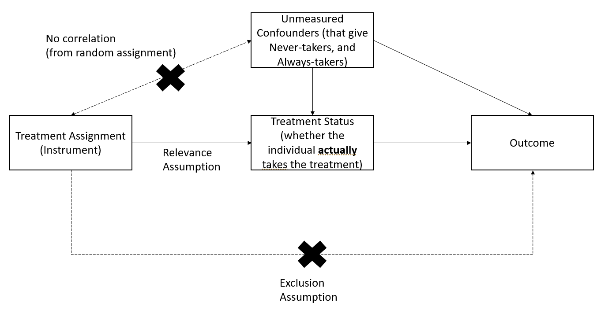

# Causal Inference {#sec-causal-inference}

Throughout our journey into statistical concepts, we've uncovered patterns, relationships, and trends in data. But now, we arrive at one of the most profound questions in all of research and decision-making: **What truly causes what?**

We've all heard the phrase---*correlation is not causation.*

> *Correlation is not causation.*

Just because two things move together doesn't mean one is pulling the strings of the other. Ice cream sales and drowning incidents both rise in the summer, but ice cream isn't to blame.

But what exactly *is* causation? Let's explore.

One of the most insightful books on this topic is *The Book of Why* by Judea Pearl [@Pearl_2018], which explains the nuances of causal reasoning beautifully. Below is a concise summary of key ideas from Pearl's work, supplemented with insights from econometrics and statistics.

Understanding causal relationships is essential in research, particularly in fields like economics, finance, marketing, and medicine. While statistical methods have traditionally focused on associational reasoning, causal inference allows us to answer **what-if questions** and make decisions based on interventions.

However, one must be aware of the limitations of statistical methods. As discussed throughout this book, relying solely on data without incorporating domain expertise can lead to misleading conclusions. To establish causality, we often need expert judgment, prior research, and rigorous experimental design.

------------------------------------------------------------------------

You may have come across amusing examples of **spurious correlations**---such as the famous [Tyler Vigen collection](http://www.tylervigen.com/spurious-correlations), which shows absurd relationships (e.g., "the number of Nicholas Cage movies correlates with drowning accidents"). These highlight the danger of mistaking correlation for causation.

Historically, one of the earliest attempts to infer causation using **regression analysis** was by @yule1899, who investigated the effect of relief policies on poverty. Unfortunately, his analysis suggested that relief policies increased poverty---a misleading conclusion due to unaccounted confounders.

------------------------------------------------------------------------

For a long time, statistics was largely a **causality-free discipline**. The field only began addressing causation in the 1920s, when Sewall Wright introduced **path analysis**, a graphical approach to representing causal relationships. However, it wasn't until Judea Pearl's **Causal Revolution** (1990s) that we gained a formal calculus for causation.

Pearl's framework introduced two key innovations:

1.  **Causal Diagrams** (Directed Acyclic Graphs) -- A graphical representation of cause-and-effect relationships.
2.  **A Symbolic Language**: The Do-Operator ($do(X)$) -- A mathematical notation for interventions.

------------------------------------------------------------------------

Traditional statistics deals with **conditional probabilities**:

$$
P(Y | X)
$$

This formula tells us the probability of event $Y$ occurring given that event $X$ has occurred. In the context of observed data, $P(Y \mid X)$ reflects the association between $X$ and $Y$, showing how likely $Y$ is when $X$ happens.

However, causal inference requires a different concept:

$$
P(Y | do(X))
$$

which describes what happens when we **actively intervene** and set $X$. The crucial distinction is:

$$
P(Y | X) \neq P(Y | do(X))
$$

in general, because **passively observing** $X$ is not the same as **actively manipulating** it.

To make causal claims, we need to answer **counterfactual questions**:

> *What would have happened if we had NOT done* $X$?

This concept is essential in fields like policy evaluation, medicine, and business decision-making.

------------------------------------------------------------------------

To build intelligent systems that can reason causally, we need **an inference engine**:

![p. 12 [@Pearl_2018]](images/Figure%20I.png "Inference Engine"){style="display: block; margin: 1em auto" width="600" height="400"}

Pearl outlines **three levels of cognitive ability** required for causal learning:

1.  **Seeing** -- Observing associations in data.
2.  **Doing** -- Understanding interventions and predicting their outcomes.
3.  **Imagining** -- Reasoning about counterfactuals.

These levels correspond to [The Ladder of Causation](#sec-the-ladder-of-causation).

## The Ladder of Causation {#sec-the-ladder-of-causation}

Pearl's *Ladder of Causation* describes **three hierarchical levels of causal reasoning**:

| **Level**           | **Activity** | **Questions Answered**                                   | **Examples**                                                  |
|---------------------|--------------|----------------------------------------------------------|---------------------------------------------------------------|
| **Association**     | *Seeing*     | What is? How does seeing $X$ change my belief in $Y$?    | What does a symptom tell me about a disease?                  |
| **Intervention**    | *Doing*      | What if? What happens if I intervene and change $X$?     | If I study more, will my test score improve?                  |
| **Counterfactuals** | *Imagining*  | Why? What would have happened if $X$ had been different? | If I had quit smoking a year ago, would I be healthier today? |

*(Adapted from [@pearl2019seven], p. 57)*

Each level requires more cognitive ability and data. Classical statistics operates at Level 1 (association), while causal inference enables us to reach Levels 2 and 3.

## The Formal Notation of Causality

A common mistake is defining causation using probability:

$$
X \text{ causes } Y \text{ if } P(Y | X) > P(Y).
$$

Seeing $X$ (1st level) **doesn't mean** the probability of Y increases.

It could be either that

1.  $X$ causes Y, or
2.  $Z$ affects both $X$ and $Y$. We might be able use **control variables** - $P(Y|X, Z = z) > P(Y|Z = z)$. But then the question becomes
    1.  How to choose $Z$?
    2.  Did you choose enough $Z$?
    3.  Did you choose the right $Z$?

Hence, the previous statement is incorrect. The correct causal statement is:

$$
P(Y | do(X)) > P(Y).
$$

With **causal diagrams** and **do-calculus**, we can formally express interventions and answer questions at the 2nd level (Intervention).

## The 7 Tools of Structural Causal Models

Pearl's *Structural Causal Model (SCM)* framework provides tools for causal inference [@pearl2019seven]:

1.  **Encoding Causal Assumptions** -- Using **causal graphs** for transparency and testability.
2.  **Do-Calculus** -- Controlling for confounding using the **backdoor criterion**.
3.  **Algorithmization of Counterfactuals** -- Modeling "what if?" scenarios.
4.  **Mediation Analysis** -- Understanding direct vs. indirect effects.
5.  **External Validity & Adaptability** -- Addressing selection bias and domain adaptation.
6.  **Handling Missing Data** -- Using causal methods to infer missing information.
7.  **Causal Discovery** -- Learning causal relationships from data using:
    -   **d-separation**
    -   **Functional decomposition** [@hoyer2008nonlinear]
    -   **Spontaneous local changes** [@pearl2014graphical]

## Simpson's Paradox

Simpson's Paradox is one of the most striking examples of **why causality matters** and why simple statistical associations can be misleading.

### What is Simpson's Paradox?

At its core, Simpson's Paradox occurs when:

> A trend observed in an overall population **reverses** when the population is divided into subgroups.

This means that **statistical associations in raw data can be misleading** if important confounding variables are ignored.

### Why is this Important?

Understanding Simpson's Paradox is critical in causal inference because:

1.  It highlights the danger of naive data analysis -- Just looking at overall trends can lead to incorrect conclusions.
2.  It emphasizes the importance of confounding variables -- We must control for relevant factors before making causal claims.
3.  It demonstrates why causal reasoning is necessary -- Simply relying on statistical associations ($P(Y | X)$) without considering structural relationships can lead to paradoxical results.

### Comparison between Simpson's Paradox and Omitted Variable Bias

Simpson's Paradox occurs when a trend in an overall dataset **reverses** when broken into subgroups. This happens due to **data aggregation issues**, where differences in subgroup sizes distort the overall trend.

While this often resembles **omitted variable bias (OVB)**---where missing confounders lead to misleading conclusions---Simpson's Paradox is not just a causal inference problem. It is a **mathematical phenomenon** that can arise purely from **improper weighting of data**, even in descriptive statistics.

**Similarities Between Simpson's Paradox and OVB**:

1.  Both involve a missing variable:

-   In Simpson's Paradox, a key confounding variable (e.g., customer segment) is hidden in the aggregate data, leading to misleading conclusions.

-   In OVB, a relevant variable (e.g., seasonality) is missing from the regression model, causing bias.

2.  Both distort causal conclusions:

-   OVB biases effect estimates by failing to control for confounding.

-   Simpson's Paradox flips statistical relationships when controlling for a confounder.

**Differences Between Simpson's Paradox and OVB**:

1.  Not all OVB cases show Simpson's Paradox:

-   OVB generally causes bias, but it doesn't always create a reversal of trends.

-   Example: If seasonality increases both ad spend and sales, omitting it inflates the ad spend → sales relationship but does not necessarily reverse it.

2.  Simpson's Paradox can occur even without causal inference:

-   Simpson's Paradox is a mathematical/statistical phenomenon that can arise even in purely observational data, not just causal inference.

-   It results from data weighting issues, even if causality is not considered.

3.  OVB is a model specification issue; Simpson's Paradox is a data aggregation issue:

-   OVB occurs in regression models when we fail to include relevant predictors.

-   Simpson's Paradox arises from incorrect data aggregation when groups are not properly analyzed separately.

**The Right Way to Think About It**

-   Simpson's Paradox is often *caused* by omitted variable bias, but they are not the same thing.

-   OVB is a problem in causal inference models; Simpson's Paradox is a problem in raw data interpretation.

**How to Fix These Issues?**

-   For OVB: Use causal diagrams, add control variables, and use regression adjustments.

-   For Simpson's Paradox: Always analyze subgroup-level trends before making conclusions based on aggregate data.

-   Bottom line: Simpson's Paradox is often *caused* by omitted variable bias, but it is not just OVB---it is a fundamental issue of misleading data aggregation.

### Illustrating Simpson's Paradox: Marketing Campaign Success Rates

Let's explore this paradox using a practical business example.

#### Scenario: Marketing Campaign Performance

Imagine a company running two marketing campaigns, Campaign A and Campaign B, to attract new customers. We analyze which campaign has a higher conversion rate.

#### Step 1: Creating the Data

We will simulate conversion rates for two different customer segments: **High-Value** customers (who typically convert at a higher rate) and **Low-Value** customers (who convert at a lower rate).

```{r}
# Load necessary libraries
library(dplyr)

# Create a dataset where:
#  - B is better than A in each individual segment.
#  - A turns out better when we look at the overall (aggregated) data.

marketing_data <- data.frame(
  Campaign = c("A", "A", "B", "B"),
  Segment  = c("High-Value", "Low-Value", "High-Value", "Low-Value"),
  Visitors = c(500, 2000, 300, 3000),    # total visitors in each segment
  Conversions = c(290, 170, 180, 270)   # successful conversions
)

# Compute segment-level conversion rate
marketing_data <- marketing_data %>%
  mutate(Conversion_Rate = Conversions / Visitors)

# Print the data
print(marketing_data)

```

Interpreting This Data

-   **Campaign B** in the High-Value segment: $\frac{180}{300} = 60\%$

-   **Campaign A** in the High-Value segment: $\frac{290}{500} = 58\%$

    =\> B is better in the High-Value segment (60% vs 58%).

-   **Campaign B** in the Low-Value segment: $\frac{270}{3000} = 9\%$

-   **Campaign A** in the Low-Value segment: $\frac{170}{2000} = 8.5\%$

    =\> B is better in the Low-Value segment (9% vs 8.5%).

Thus, **B** outperforms **A** in each **individual** segment.

#### Step 2: Aggregating Data (Ignoring Customer Segments)

Now, let's calculate the overall conversion rate for each campaign without considering customer segments.

```{r}
# Compute overall conversion rates for each campaign
overall_rates <- marketing_data %>%
  group_by(Campaign) %>%
  summarise(
    Total_Visitors     = sum(Visitors),
    Total_Conversions  = sum(Conversions),
    Overall_Conversion_Rate = Total_Conversions / Total_Visitors
  )

# Print overall conversion rates
print(overall_rates)
```

#### Step 3: Observing Simpson's Paradox

Let's determine which campaign appears to have a higher conversion rate.

```{r}
# Identify the campaign with the higher overall conversion rate
best_campaign_overall <- overall_rates %>%
    filter(Overall_Conversion_Rate == max(Overall_Conversion_Rate)) %>%
    select(Campaign, Overall_Conversion_Rate)

print(best_campaign_overall)

```

Even though **Campaign B** is **better** in each **segment**, you should see that **Campaign A** has a **higher** aggregated (overall) conversion rate!

#### Step 4: Conversion Rates Within Customer Segments

We now analyze the conversion rates separately for high-value and low-value customers.

```{r}
# Compute conversion rates by customer segment
by_segment <- marketing_data %>%
  select(Campaign, Segment, Conversion_Rate) %>%
  arrange(Segment)

print(by_segment)


```

-   In **High-Value**, B \> A.

-   In **Low-Value**, B \> A.

Yet, overall, A \> B.

This **reversal** is the hallmark of **Simpson's Paradox**.

#### Step 5: Visualizing the Paradox

To make this clearer, let's visualize the results.

```{r}
library(ggplot2)

# Plot conversion rates by campaign and segment
ggplot(marketing_data,
       aes(x = Segment,
           y = Conversion_Rate,
           fill = Campaign)) +
  geom_bar(stat = "identity", position = "dodge") +
  labs(
    title = "Simpson’s Paradox in Marketing",
    x     = "Customer Segment",
    y     = "Conversion Rate"
  ) +
  theme_minimal()

```

This bar chart reveals that for **both** segments, B's bar is taller (i.e., B's conversion rate is higher). If you only examined segment-level data, you would conclude that B is the superior campaign.

However, if you aggregate the data (ignore segments), you get the opposite conclusion --- that **A** is better overall.

### Why Does This Happen?

This paradox arises because of a **confounding variable** --- in this case, the **distribution of visitors** across segments.

-   **Campaign A** has **more** of its traffic in the High-Value segment (where conversions are generally high).

-   **Campaign B** has **many** of its visitors in the Low-Value segment.

Because the **volume** of Low-Value visitors in B is extremely large (3000 vs. 2000 for A), it weighs down B's **overall** average more, allowing A's overall rate to exceed B's.

### How Does Causal Inference Solve This?

To avoid Simpson's Paradox, we need to move beyond association and use causal analysis:

1.  **Use causal diagrams (DAGs) to model relationships**

    -   The marketing campaign choice is confounded by customer segment.

    -   We must control for the confounding variable.

2.  **Use stratification or regression adjustment**

    -   Instead of comparing raw conversion rates, we should compare rates within each customer segment.

    -   This ensures that confounding factors do not distort results.

3.  **Use the do-operator** to simulate interventions

    -   Instead of asking $P(\text{Conversion} \mid \text{Campaign})$, ask: $P(\text{Conversion} \mid do(\text{Campaign}))$

    -   This estimates what would happen if we randomly assigned campaigns (removing confounding bias).

### Correcting Simpson's Paradox with Regression Adjustment

Let's adjust for the confounding variable using **logistic regression**.

```{r}
# Logistic regression adjusting for the Segment
model <- glm(
  cbind(Conversions, Visitors - Conversions) ~ Campaign + Segment,
  family = binomial(),
  data   = marketing_data
)

summary(model)
```

This model includes both **Campaign** and **Segment** as predictors, giving a clearer picture of the *true effect* of each campaign on conversion, **after** controlling for differences in segment composition.

### Key Takeaways

1.  **Simpson's Paradox demonstrates why causal inference is essential.**

    -   Aggregated statistics can be misleading due to hidden confounding.

    -   Breaking data into subgroups can reverse conclusions.

2.  **Causal reasoning helps identify and correct paradoxes.**

    -   Using causal graphs, do-calculus, and adjustment techniques, we can find the true causal effect.

3.  **Naïve data analysis can lead to bad business decisions.**

    -   If a company allocated more budget to Campaign B based on overall conversion rates, it might be investing in the wrong strategy!

## Additional Resources

To explore causal inference in R, check out the [CRAN Task View for Causal Inference](https://cran.r-project.org/web/views/CausalInference.html):

For further reading:

-   *The Book of Why* -- Judea Pearl [@Pearl_2018]
-   *Causal Inference in Statistics: A Primer* -- Pearl, Glymour, Jewell
-   *Causality: Models, Reasoning, and Inference* -- Judea Pearl

## Experimental vs. Quasi-Experimental Designs

Experimental and quasi-experimental designs differ in their approach to causal inference. The table below summarizes key distinctions:

| **Experimental Design**                       | **Quasi-Experimental Design**                  |
|-----------------------------------------------|------------------------------------------------|
| Conducted by an experimentalist               | Conducted by an observationalist               |
| Uses experimental data                        | Uses observational data                        |
| Random assignment reduces treatment imbalance | Random sampling reduces sample selection error |

### Criticisms of Quasi-Experimental Designs

Quasi-experimental methods do not always approximate experimental results accurately. For instance, @lalonde1986evaluating demonstrates that commonly used methods such as:

-   [Matching Methods]
-   [Difference-in-differences]
-   [Tobit-2] (Heckman-type models)

often fail to replicate experimental estimates reliably.

------------------------------------------------------------------------

## Hierarchical Ordering of Causal Tools

Causal inference tools can be categorized based on their methodological rigor, with **randomized controlled trials (RCTs)** considered the gold standard.

1.  [Experimental Design](Randomized%20Control%20Trials "Gold standard"): Randomized Control Trials (Gold standard)

2.  [Quasi-experimental]

    1.  [Regression Discontinuity]

    2.  [Synthetic Difference-in-Differences]

    3.  [Difference-In-Differences]

    4.  [Synthetic Control]

    5.  [Event Studies]

    6.  [Fixed Effects Estimator](sec-fixed-effects-estimator)

    7.  [Endogenous Treatment]: mostly [Instrumental Variables]

    8.  [Matching Methods]

    9.  [Interrupted Time Series]

    10. [Endogenous Sample Selection]

------------------------------------------------------------------------

## Types of Validity in Research

Validity in research includes:

1.  [Measurement Validity](#sec-measurement-validity) (e.g., construct, content, criterion, face validity)

2.  [Internal Validity](#sec-internal-validity)

3.  [External Validity](#sec-external-validity)

4.  [Ecological Validity](#sec-ecological-validity)

5.  [Statistical Conclusion Validity](#sec-statistical-conclusion-validity)

By examining these, you can ensure that your study's measurements are accurate, your findings are reliably causal, and your conclusions generalize to broader contexts.

### Measurement Validity {#sec-measurement-validity}

**Measurement validity** pertains to whether the instrument or method you use truly measures what it's intended to measure. Within this umbrella, there are several sub-types:

#### Face Validity

-   **Definition**: The extent to which a measurement or test *appears* to measure what it is supposed to measure, at face value (i.e., does it "look" right to experts or users?).

-   **Importance**: While often considered a less rigorous form of validity, it's useful for ensuring the test or instrument is intuitively acceptable to stakeholders, participants, or experts in the field.

-   **Example**: A questionnaire measuring "anxiety" that has questions about nervousness, worries, and stress has good face validity because it obviously seems to address anxiety.

#### Content Validity

-   **Definition**: The extent to which a test or measurement covers *all* relevant facets of the construct it aims to measure.

-   **Importance**: Especially critical in fields like education or psychological testing, where you want to ensure the entire domain of a subject/construct is properly sampled.

-   **Example**: A math test that includes questions on algebra, geometry, and calculus might have high content validity for a comprehensive math skill assessment. If it only tested algebra, the content validity would be low.

### Construct Validity {#sec-construct-validity}

-   **Definition**: The degree to which a test or measurement tool accurately represents the theoretical construct it intends to measure (e.g., intelligence, motivation, self-esteem).

-   **Types of Evidence**:

    -   **Convergent Validity**: Demonstrated when measures that are supposed to be related (theoretically) are observed to correlate.

    -   **Discriminant (Divergent) Validity**: Demonstrated when measures that are supposed to be unrelated theoretically do not correlate.

-   **Example**: A new questionnaire on "job satisfaction" should correlate with other established job satisfaction questionnaires (convergent validity) but should not correlate strongly with unrelated constructs like "physical health" (discriminant validity).

### Criterion Validity {#sec-criterion-validity}

-   **Definition**: The extent to which the measurement predicts or correlates with an outcome criterion. In other words, do scores on the measure relate to an external standard or "criterion"?

-   **Types**:

    -   **Predictive Validity**: The measure predicts a future outcome (e.g., an entrance exam predicting college success).

    -   **Concurrent Validity**: The measure correlates with an existing, accepted measure taken at the same time (e.g., a new depression scale compared with a gold-standard clinical interview).

-   **Example**: A new test of driving skills has high criterion validity if people who score highly perform better on actual road tests (predictive validity).

### Internal Validity {#sec-internal-validity}

**Internal validity** refers to the extent to which a study can establish a *cause-and-effect* relationship. High internal validity means you can be confident that the observed effects are due to the treatment or intervention itself and not due to confounding factors or alternative explanations. This is the validity that economists and applied scientists largely care about.

#### Major Threats to Internal Validity

1.  **Selection Bias**: Systematic differences between groups that exist before the treatment is applied.

2.  **History Effects**: External events occurring during the study can affect outcomes (e.g., economic downturn during a job-training study).

3.  **Maturation**: Participants might change over time simply due to aging, learning, fatigue, etc., independent of the treatment.

4.  **Testing Effects**: Taking a test more than once can influence participants' responses (practice effect).

5.  **Instrumentation**: Changes in the measurement instrument or the observers can lead to inconsistencies in data collection.

6.  **Regression to the Mean**: Extreme pre-test scores tend to move closer to the average on subsequent tests.

7.  **Attrition (Mortality)**: Participants dropping out of the study in ways that are systematically related to the treatment or outcomes.

#### Strategies to Improve Internal Validity

-   **Random Assignment**: Ensures that, on average, groups are equivalent on both known and unknown variables.

-   **Control Groups**: Provide a baseline for comparison to isolate the effect of the intervention.

-   **Blinding (Single-, Double-, or Triple-blind)**: Reduces biases from participants, researchers, or analysts.

-   **Standardized Procedures and Protocols**: Minimizes variability in how interventions or measurements are administered.

-   **Matching or Stratification**: When randomization is not possible, matching participants on key characteristics can reduce selection bias.

-   **Pretest-Posttest Designs**: Compare participant performance before and after the intervention (though watch for testing effects).

### External Validity {#sec-external-validity}

**External validity** addresses the generalizability of the findings beyond the specific context of the study. A study with high external validity can be applied to other populations, settings, or times. On the other hand, localness can affect external validity.

#### Subtypes (or Related Concepts) of External Validity

1.  **Population Validity**: The degree to which study findings can be generalized to the larger population from which the sample was drawn.

2.  **Ecological Validity** (sometimes considered separately): Whether findings obtained in controlled conditions can be applied to real-world settings.

3.  **Temporal Validity**: Whether the results of the study hold true over time. Changing societal norms, technologies, or economic conditions might render findings obsolete.

#### Threats to External Validity

-   **Unrepresentative Samples**: If the sample does not reflect the wider population (in demographics, culture, etc.), generalization is limited.

-   **Artificial Research Environments**: Highly controlled lab settings may not capture real-world complexities.

-   **Treatment-Setting Interaction**: The effect of the treatment might depend on the unique conditions of the setting (e.g., a particular school, hospital, or region).

-   **Treatment-Selection Interaction**: Certain characteristics of the selected participants might interact with the treatment (e.g., results from a specialized population do not apply to the general public).

#### Strategies to Improve External Validity

-   **Use of Diverse and Representative Samples**: Recruit participants that mirror the larger population.

-   **Field Studies and Naturalistic Settings**: Conduct experiments in real-world environments rather than artificial labs.

-   **Replication in Multiple Contexts**: Replicate the study across different settings, geographic locations, and populations.

-   **Longitudinal Studies**: Evaluate whether relationships hold over extended periods.

### Ecological Validity {#sec-ecological-validity}

**Ecological validity** is often discussed as a subcategory of external validity. It specifically focuses on the *realism* of the study environment and tasks:

-   **Definition**: The degree to which study findings can be generalized to the real-life settings where people actually live, work, and interact.

-   **Key Idea**: Even if a lab experiment shows a particular behavior, do people behave the same way in their daily lives with everyday distractions, social pressures, and contextual factors?

#### Enhancing Ecological Validity

-   **Naturalistic Observation**: Conduct observations or experiments in participants' usual environments.

-   **Realistic Tasks**: Use tasks that closely mimic real-world challenges or behaviors.

-   **Minimal Interference**: Researchers strive to reduce the artificiality of the setting, allowing participants to behave as naturally as possible.

### Statistical Conclusion Validity {#sec-statistical-conclusion-validity}

Though often discussed alongside internal validity, **statistical conclusion validity** focuses on whether the statistical tests used in a study are appropriate, powerful enough, and applied correctly.

#### Threats to Statistical Conclusion Validity

1.  **Low Statistical Power**: If the sample size is too small, the study may fail to detect a real effect (Type II error).

2.  **Violations of Statistical Assumptions**: Incorrect application of statistical tests can lead to spurious conclusions (e.g., using parametric tests with non-normal data without appropriate adjustments).

3.  **Fishing and Error Rate Problem**: Running many statistical tests without correction increases the chance of a Type I error (finding a false positive).

4.  **Reliability of Measures**: If the measurement instruments are unreliable, statistical correlations or differences may be undervalued or overstated.

#### Improving Statistical Conclusion Validity

-   **Adequate Sample Size**: Conduct a power analysis to determine the necessary size to detect meaningful effects.

-   **Appropriate Statistical Techniques**: Ensure your chosen analysis matches the nature of the data and research question.

-   **Multiple Testing Corrections**: Use methods like Bonferroni or false discovery rate corrections when conducting multiple comparisons.

-   **High-Quality Measurements**: Use reliable and valid measures to reduce measurement error.

### Putting It All Together

1.  **Face Validity**: Does it look like it measures what it should?

2.  **Content Validity**: Does it cover all facets of the construct?

3.  **Construct Validity**: Does it truly reflect the theoretical concept?

4.  **Criterion Validity**: Does it correlate with or predict other relevant outcomes?

5.  **Internal Validity**: Is the relationship between treatment and outcome truly causal?

6.  **External Validity**: Can findings be generalized to other populations, settings, and times?

7.  **Ecological Validity**: Are the findings applicable to real-world scenarios?

8.  **Statistical Conclusion Validity**: Are the statistical inferences correct and robust?

Researchers typically need to strike a balance among these different validities:

-   A **highly controlled lab study** might excel in internal validity but might have limited external and ecological validity.

-   A **broad, naturalistic field study** might have stronger external or ecological validity but weaker internal validity due to less control over confounding variables.

**No single study** can maximize all validity types simultaneously, so replication, triangulation (using multiple methods), and transparent reporting are crucial strategies to bolster overall credibility.

------------------------------------------------------------------------

## Types of Subjects in a Treatment Setting

When conducting causal inference, particularly in randomized experiments or quasi-experimental settings, individuals in the study can be classified into four distinct groups based on their response to treatment assignment. These groups differ in how they react when they are assigned to receive or not receive treatment.

### Non-Switchers

Non-switchers are individuals whose treatment status does not change regardless of whether they are assigned to the treatment or control group. These individuals do not provide useful causal information because their behavior remains unchanged. They are further divided into:

-   **Always-Takers**: These individuals will **always receive** the treatment, even if they are assigned to the control group.
-   **Never-Takers**: These individuals will **never receive** the treatment, even if they are assigned to the treatment group.

Since their behavior is independent of the assignment, always-takers and never-takers do not contribute to identifying causal effects in standard randomized experiments. Instead, their presence can introduce bias in treatment effect estimation, particularly in **intention-to-treat analysis**.

### Switchers

Switchers are individuals whose treatment status **depends on the assignment**. These individuals are the primary focus of causal inference because they provide meaningful information about the effect of treatment. They are classified into:

-   **Compliers**: Individuals who follow the assigned treatment protocol.
    -   If assigned to the treatment group, they **accept and receive** the treatment.
    -   If assigned to the control group, they **do not receive** the treatment.
    -   **Why are compliers important?**
        -   They are the only group for whom treatment assignment affects actual treatment receipt.
        -   Causal effect estimates (such as the local average treatment effect, LATE) are typically identified using compliers.
        -   If the dataset only contains compliers, then the intention-to-treat effect (ITT) is equal to the treatment effect.
-   **Defiers**: Individuals who do the **opposite** of what they are assigned.
    -   If assigned to the treatment group, they **refuse the treatment**.
    -   If assigned to the control group, they **seek out and receive** the treatment anyway.
    -   **Why are defiers typically ignored?**
        -   In most studies, defiers are assumed to be a small or negligible group.
        -   Standard causal inference frameworks assume **monotonicity**, meaning no one behaves as a defier.
        -   If defiers exist in large numbers, estimating causal effects becomes significantly more complex.

### Classification of Individuals Based on Treatment Assignment

The following table summarizes how different types of individuals respond to treatment and control assignments:

|                   | Treatment Assignment | Control Assignment |
|-------------------|----------------------|--------------------|
| **Compliers**     | Treated              | Not Treated        |
| **Always-Takers** | Treated              | Treated            |
| **Never-Takers**  | Not Treated          | Not Treated        |
| **Defiers**       | Not Treated          | Treated            |

**Key Takeaways:**

1.  **Compliers** are the only group that allows us to estimate causal effects using **randomized or quasi-experimental designs**.
2.  **Always-Takers and Never-Takers** do not provide meaningful variation in treatment status, making them less useful for causal inference.
3.  **Defiers** typically violate the assumption of monotonicity, and their presence complicates causal estimation.
4.  If a dataset consists **only of compliers**, the **intention-to-treat effect** will be equal to the **treatment effect**.

By correctly identifying and accounting for these different subject types, researchers can ensure more accurate causal inference and minimize biases in estimating treatment effects.

------------------------------------------------------------------------

## Types of Treatment Effects

When evaluating the causal impact of an intervention, different estimands (quantities of interest) can be used to measure treatment effects, depending on the study design and assumptions about compliance.

**Terminology:**

-   **Estimands**: The causal effect parameters we seek to measure.
-   **Estimators**: The statistical procedures used to estimate those parameters.
-   **Sources of Bias** [@keele2025so]:

$$
\begin{aligned}
&\text{Estimator - True Causal Effect} \\
&= \underbrace{\textbf{Hidden bias}}_{\text{Due to design}} 
+ \underbrace{\textbf{Misspecification bias}}_{\text{Due to modeling}} 
+\underbrace{\textbf{Statistical noise}}_{\text{Due to finite sample}}
\end{aligned}
$$

1.  **Hidden Bias (Due to Design)**

-   Arises from **unobserved confounders** and **measurement error** that remain after conditioning on observed covariates.
-   Is "hidden" because its true magnitude or direction cannot be directly observed.
-   Violations of **conditional exchangeability** (also called no unobserved confounding) imply the presence of hidden bias.

2.  **Misspecification Bias (Due to Modeling)**

-   Occurs when the assumed model for the outcome or treatment assignment does not reflect the true data-generating process.
-   Persists even if we have perfect exchangeability (i.e., no hidden bias).
-   Can be viewed as **under-specification** (omitting essential terms or functional forms) or **over-specification** (including unnecessary parameters).

3.  **Statistical Noise (Due to Finite Sample)**

-   Even with perfect design and correct model specification, finite samples lead to randomness in estimates.
-   Standard errors, confidence intervals, and p-values reflect this uncertainty.

In practice, all three sources of bias and uncertainty can coexist to varying degrees.

------------------------------------------------------------------------

### Average Treatment Effect {#sec-average-treatment-effect}

The **Average Treatment Effect (ATE)** is the expected difference in outcomes between individuals who receive treatment and those who do not.

**Definition**

Let:

-   $Y_i(1)$ be the outcome of individual $i$ under treatment.

-   $Y_i(0)$ be the outcome of individual $i$ under control.

The **individual treatment effect** is:

$$
\tau_i = Y_i(1) - Y_i(0)
$$

Since we cannot observe both $Y_i(1)$ and $Y_i(0)$ for the same individual (a fundamental problem in causal inference), we estimate the **ATE** across a population:

$$
ATE = E[Y(1)] - E[Y(0)]
$$

**Identification Under Randomization**

If treatment assignment is **randomized** (under [Experimental Design]), then the **observed** difference in means between treatment and control groups provides an **unbiased estimator** of ATE:

$$
ATE = \frac{1}{N} \sum_{i=1}^{N} \tau_i = \frac{\sum_1^N Y_i(1)}{N} - \frac{\sum_i^N Y_i(0)}{N}
$$

With **randomization**, we assume:

$$
E[Y(1) | D = 1] = E[Y(1) | D = 0] = E[Y(1)]
$$

$$
E[Y(0) | D = 1] = E[Y(0) | D = 0] = E[Y(0)]
$$

Thus, the **difference in observed means** between treated and control groups provides an **unbiased estimate** of ATE.

$$
ATE = E[Y(1)] - E[Y(0)]
$$

------------------------------------------------------------------------

Alternatively, we can express the **potential outcomes framework** in a regression form, which allows us to connect causal inference concepts with standard regression analysis.

Instead of writing treatment effects as potential outcomes, we can define the observed outcome $Y_i$ in terms of a regression equation:

$$
Y_i = Y_i(0)  + [Y_i (1) - Y_i(0)] D_i
$$

where:

-   $Y_i(0)$ is the outcome if individual $i$ **does not** receive treatment.

-   $Y_i(1)$ is the outcome if individual $i$ **does** receive treatment.

-   $D_i$ is a binary indicator for treatment assignment:

-   $D_i = 1$ if individual $i$ receives treatment.

-   $D_i = 0$ if individual $i$ is in the control group.

We can redefine this equation using regression notation:

$$
Y_i = \beta_{0i} + \beta_{1i} D_i
$$

where:

-   $\beta_{0i} = Y_i(0)$ represents the **baseline (control group) outcome**.

-   $\beta_{1i} = Y_i(1) - Y_i(0)$ represents the **individual treatment effect**.

Thus, in an ideal setting, **the coefficient on** $D_i$ in a regression gives us the treatment effect.

------------------------------------------------------------------------

In observational studies, treatment assignment $D_i$ is often **not random**, leading to **endogeneity**. This means that the error term in the regression equation might be correlated with $D_i$, violating one of the key assumptions of the [Ordinary Least Squares] estimator.

To formalize this issue, we can express the outcome equation as:

$$
\begin{aligned}
Y_i &= \beta_{0i} + \beta_{1i} D_i \\
&= ( \bar{\beta}_{0} + \epsilon_{0i} ) + (\bar{\beta}_{1} + \epsilon_{1i} )D_i \\
&=  \bar{\beta}_{0} + \epsilon_{0i} + \bar{\beta}_{1} D_i + \epsilon_{1i} D_i
\end{aligned}
$$

where:

-   $\bar{\beta}_{0}$ is the average baseline outcome.

-   $\bar{\beta}_{1}$ is the average treatment effect.

-   $\epsilon_{0i}$ captures individual-specific deviations in control group outcomes.

-   $\epsilon_{1i}$ captures heterogeneous treatment effects.

If treatment assignment is truly **random**, then:

$$
E[\epsilon_{0i}] = E[\epsilon_{1i}] = 0
$$

which ensures:

-   **No selection bias**: $D_i \perp \epsilon_{0i}$ (i.e., treatment assignment is independent of the baseline error).

-   **Treatment effect is independent of assignment**: $D_i \perp \epsilon_{1i}$.

However, in observational studies, these assumptions often **fail**. This leads to:

-   **Selection bias**: If individuals self-select into treatment based on unobserved characteristics, then $D_i$ correlates with $\epsilon_{0i}$.
-   **Heterogeneous treatment effects**: If the treatment effect itself varies across individuals, then $D_i$ correlates with $\epsilon_{1i}$.

These issues violate the exogeneity assumption in OLS regression, leading to biased estimates of $\beta_1$.

------------------------------------------------------------------------

When estimating treatment effects using OLS regression, we need to be aware of potential estimation issues.

1.  **OLS Estimator and Difference-in-Means**

Under **random assignment**, the OLS estimator for $\beta_1$ simplifies to the **difference in means estimator**:

$$
\hat{\beta}_1^{OLS} = \bar{Y}_{\text{treated}} - \bar{Y}_{\text{control}}
$$

which is an **unbiased estimator** of the [Average Treatment Effect](#sec-average-treatment-effect).

However, when treatment assignment is **not random**, OLS estimates may be biased due to unobserved confounders.

2.  **Heteroskedasticity and Robust Standard Errors**

If treatment effects vary across individuals (i.e., **treatment effect heterogeneity**), the error term contains an interaction:

$$
\epsilon_i = \epsilon_{0i} + D_i \epsilon_{1i}
$$

which leads to **heteroskedasticity** (i.e., the variance of errors depends on $D_i$ and possibly on covariates $X_i$).

To address this, we use **heteroskedasticity-robust standard errors**, which ensure valid inference even when variance is not constant across observations.

------------------------------------------------------------------------

### Conditional Average Treatment Effect {#sec-conditional-average-treatment-effect-}

Treatment effects may **vary across different subgroups** in a population. The **Conditional Average Treatment Effect (CATE)** captures heterogeneity in treatment effects across subpopulations.

**Definition**

For a subgroup characterized by covariates $X_i$:

$$
CATE = E[Y(1) - Y(0) | X_i]
$$

**Why is CATE Useful?**

-   **Heterogeneous Treatment Effects**: Certain groups may benefit more from treatment than others.
-   **Policy Targeting**: Understanding who benefits the most allows for better resource allocation.

**Example**

-   Policy Intervention: A job training program may have different effects on younger vs. older workers.
-   Medical Treatments: Drug effectiveness may differ by gender, age, or genetic factors.

Estimating CATE allows policymakers and researchers to **identify who benefits most** from an intervention.

------------------------------------------------------------------------

### Intention-to-Treat Effect {#sec-intention-to-treat-effect}

A key issue in empirical research is **non-compliance**, where individuals do not always follow their assigned treatment (i.e., either people who are supposed to receive treatment don't receive it, or people who are supposed to be in the control group receive the treatment). The **Intention-to-Treat (ITT) effect** measures the impact of offering treatment, regardless of whether individuals actually receive it.

**Definition**

The **ITT effect** is the observed difference in means between groups **assigned** to treatment and control:

$$
ITT = E[Y | D = 1] - E[Y | D = 0]
$$

**Why Use ITT?**

-   **Policy Evaluation**: ITT reflects the **real-world effectiveness** of an intervention, accounting for incomplete take-up.
-   **Randomized Trials**: ITT preserves **randomization**, even when compliance is imperfect.

**Example: Vaccination**

-   A government **offers a vaccine** (ITT), but not everyone actually takes it.
-   The **true treatment effect** depends on those who **receive** the vaccine, which differs from the effect measured under ITT.

Since non-compliance is common in real-world settings, ITT effects are often smaller than true treatment effects. In this case, the difference in observed means between the treatment and control groups is not [Average Treatment Effects], but [Intention-to-Treat Effect](#sec-intention-to-treat-effect).

------------------------------------------------------------------------

### Local Average Treatment Effects {#sec-local-average-treatment-effects}

In many empirical settings, not all individuals assigned to treatment actually receive it (**non-compliance**). Instead of estimating the treatment effect for everyone assigned to treatment (i.e., [Intention-to-Treat Effects](#sec-intention-to-treat-effect)), we often want to estimate the effect of treatment on those who actually **comply** with their assignment.

This is known as the [Local Average Treatment Effect](#sec-local-average-treatment-effects), also referred to as the **Complier Average Causal Effect (CACE)**.

-   LATE is the treatment effect for the **subgroup of compliers**---those who take the treatment **if and only if** assigned to it.
-   Unlike [Conditional Average Treatment Effects](#sec-conditional-average-treatment-effect-), which describes heterogeneity across observable subgroups, **LATE focuses on compliance behavior**.
-   We typically recover LATE using [Instrumental Variables], leveraging random treatment assignment as an instrument.

------------------------------------------------------------------------

#### Estimating LATE Using Instrumental Variables

Instrumental variable estimation allows us to isolate the effect of treatment on **compliers** by using **random treatment assignment as an instrument for actual treatment receipt**.

{width="100%"}

From an instrumental variables perspective, LATE is estimated as:

$$
LATE = \frac{ITT}{\text{Share of Compliers}}
$$

where:

-   **ITT (Intention-to-Treat Effect)** is the effect of being **assigned** to treatment.

-   **Share of Compliers** is the proportion of individuals who **actually take** the treatment when assigned to it.

#### Key Properties of LATE

-   As the proportion of compliers increases, [LATE](#sec-local-average-treatment-effects) converges to [ITT](#sec-intention-to-treat-effect).
-   [LATE](#sec-local-average-treatment-effects) is always larger than [ITT](#sec-intention-to-treat-effect), since [ITT](#sec-intention-to-treat-effect) averages over both compliers and non-compliers.
-   Standard error rule of thumb:
    -   The standard error of [LATE](#sec-local-average-treatment-effects) is given by:

        $$
        SE(LATE) = \frac{SE(ITT)}{\text{Share of Compliers}}
        $$
-   LATE can also be estimated using a pure placebo group [@gerber2010].
-   Partial compliance is difficult to study
-   The IV/2SLS estimator is biased in small samples, requiring Bayesian methods for correction [@long2010; @jin2009; @jin2008].

------------------------------------------------------------------------

#### One-Sided Noncompliance

One-sided noncompliance occurs when we observe **only compliers and never-takers** in the sample (i.e., no always-takers).

**Key assumptions:**

-   **Exclusion Restriction (Excludability)**: Never-takers have the **same outcomes** regardless of assignment (i.e., treatment has no effect on them because they never receive it).

-   **Random Assignment Ensures Balance**: The number of never-takers is expected to be **equal** in the treatment and control groups.

Estimation of LATE under one-sided noncompliance:

$$
LATE = \frac{ITT}{\text{Share of Compliers}}
$$

Since the never-takers do not receive treatment, this simplifies estimation.

------------------------------------------------------------------------

#### Two-Sided Noncompliance

Two-sided noncompliance occurs when we observe **compliers, never-takers, and always-takers** in the sample.

**Key assumptions:**

-   **Exclusion Restriction (Excludability)**: Never-takers and always-takers have the same outcome **regardless of treatment assignment**.

-   **Monotonicity Assumption** (No Defiers):

    -   There are **no defiers**, meaning no individuals systematically **avoid treatment when assigned** to it.

    -   This assumption is standard in practical studies.

Estimation of LATE under two-sided noncompliance:

$$
LATE = \frac{ITT}{\text{Share of Compliers}}
$$

-   Since always-takers receive treatment regardless of assignment, their presence does not bias LATE as long as monotonicity holds.
-   In practice, monotonicity is often reasonable, as defiers are rare.

| **Scenario**                                         | **What it Measures**                  | **When to Use It?**                                                   | **Key Assumptions**                      |
|------------------------------------------------------|---------------------------------------|-----------------------------------------------------------------------|------------------------------------------|
| [Intention-to-Treat](#sec-intention-to-treat-effect) | Effect of being assigned to treatment | Policy impact with non-compliance                                     | None (preserves randomization)           |
| [LATE](#sec-local-average-treatment-effects)         | Effect on **compliers only**          | When we care about **actual treatment effect** rather than assignment | Excludability, Monotonicity (No Defiers) |

------------------------------------------------------------------------

### Population vs. Sample Average Treatment Effects

In experimental and observational studies, we often estimate the **Sample Average Treatment Effect (SATE)** using a finite sample. However, the **Population Average Treatment Effect (PATE)** is the parameter of interest when making broader generalizations.

**Key Issue:**\
SATE **does not necessarily equal** PATE due to **sample selection bias and treatment imbalance**.

See [@imai2008] for an in-depth discussion on when SATE diverges from PATE.

------------------------------------------------------------------------

Consider a **finite population** of size $N$ from which we observe a sample of size $n$ ($N \gg n$). Half of the sample receives treatment, and half is assigned to control.

Define the following indicators:

-   **Sampling Indicator**:\
    $$
      I_i =
      \begin{cases}
      1, & \text{if unit } i \text{ is in the sample} \\
      0, & \text{otherwise}
      \end{cases}
      $$
-   **Treatment Assignment Indicator**:\
    $$
    T_i =
    \begin{cases}
    1, & \text{if unit } i \text{ is in the treatment group} \\
    0, & \text{if unit } i \text{ is in the control group}
    \end{cases}
    $$

<!-- -->

-   **Potential Outcomes Framework**:\
    $$
    Y_i =
    \begin{cases}
    Y_i(1), & \text{if } T_i = 1 \text{ (Treated)} \\
    Y_i(0), & \text{if } T_i = 0 \text{ (Control)}
    \end{cases}
    $$

-   **Observed Outcome**:\
    Since we can never observe both potential outcomes for the same unit, the observed outcome is:

    $$
    Y_i | I_i = 1 = T_i Y_i(1) + (1 - T_i) Y_i(0)
    $$

-   **True Individual Treatment Effect**:\
    The individual-level treatment effect is:

    $$
    TE_i = Y_i(1) - Y_i(0)
    $$

However, since we observe only one of $Y_i(1)$ or $Y_i(0)$, $TE_i$ is never directly observed.

#### Definitions of SATE and PATE

-   **Sample Average Treatment Effect (SATE):** $$
    SATE = \frac{1}{n} \sum_{i \in \{I_i = 1\}} TE_i
    $$ SATE is the **average treatment effect within the sample**.

-   **Population Average Treatment Effect (PATE):** $$
    PATE = \frac{1}{N} \sum_{i=1}^N TE_i
    $$ PATE represents the **true treatment effect across the entire population**.

Since we observe only a subset of the population, SATE **may not equal** PATE.

------------------------------------------------------------------------

#### Decomposing Estimation Error

The baseline estimator for SATE and PATE is the **difference in observed means**:

$$
\begin{aligned}
D &= \frac{1}{n/2} \sum_{i \in (I_i = 1, T_i = 1)} Y_i - \frac{1}{n/2} \sum_{i \in (I_i = 1 , T_i = 0)} Y_i \\
&= \text{(Mean of Treated Group)} - \text{(Mean of Control Group)}
\end{aligned}
$$

Define $\Delta$ as the estimation error (i.e., deviation from the truth), under an additive model:

$$
Y_i(t) = g_t(X_i) + h_t(U_i)
$$

The estimation error is decomposed into

$$
\begin{aligned}
PATE - D = \Delta &= \Delta_S + \Delta_T \\
&= (PATE - SATE) + (SATE - D)\\
&= \text{Sample Selection Bias} + \text{Treatment Imbalance} \\
&= (\Delta_{S_X} + \Delta_{S_U}) + (\Delta_{T_X} + \Delta_{T_U}) \\
&= (\text{Selection on Observables} + \text{Selection on Unobservables}) \\
&+ (\text{Treatment Imbalance in Observables} + \text{Treatment Imbalance in Unobservables})
\end{aligned}
$$

To further illustrate this, we begin by explicitly defining how the total discrepancy $PATE - D$ separates into different components.

**Step 1**: From $PATE - D$ to $\Delta_S + \Delta_T$

$$
\underbrace{PATE - D}_{\Delta}
\;=\;
\underbrace{(PATE - SATE)}_{\Delta_S}
\; +\;
\underbrace{(SATE - D)}_{\Delta_T}.
$$

-   $PATE - D$: The total discrepancy between the true population treatment effect and the estimate $D$.
-   $\Delta_S = PATE - SATE$: Sample Selection Bias -- how much the sample ATE differs from the population ATE.
-   $\Delta_T = SATE - D$: Treatment Imbalance -- how much the estimated treatment effect deviates from the sample ATE.

**Step 2**: Breaking Bias into Observables and Unobservables

Each bias term can be decomposed into observed ($X$) and unobserved ($U$) factors:

$$
\Delta_S
= \underbrace{\Delta_{S_X}}_{\text{Selection on Observables}}
+ \underbrace{\Delta_{S_U}}_{\text{Selection on Unobservables}}
$$

$$
\Delta_T
= \underbrace{\Delta_{T_X}}_{\text{Treatment Imbalance in Observables}}
+ \underbrace{\Delta_{T_U}}_{\text{Treatment Imbalance in Unobservables}}
$$

Thus, the final expression:

$$
\begin{aligned}
PATE - D &= \underbrace{(PATE - SATE)}_{\Delta_S:\,\text{Sample Selection Bias}} 
\;+\; 
\underbrace{(SATE - D)}_{\Delta_T:\,\text{Treatment Imbalance}} \\
&= \underbrace{(\Delta_{S_X} + \Delta_{S_U})}_{\text{Selection on }X + \text{ Selection on }U}
\;+\;
\underbrace{(\Delta_{T_X} + \Delta_{T_U})}_{\text{Imbalance in }X + \text{ Imbalance in }U}.
\end{aligned}
$$

This decomposition clarifies the sources of error in estimating the true effect, distinguishing between **sample representativeness** (selection bias) and **treatment assignment differences** (treatment imbalance), and further separating these into **observable** and **unobservable** components.

##### Sample Selection Bias ( $\Delta_S$ )

Also called **sample selection error**, this arises when the sample **is not representative of the population**.

$$
\Delta_S = PATE - SATE = \frac{N - n}{N}(NATE - SATE)
$$

where:

-   NATE (Non-Sample Average Treatment Effect) is the average treatment effect for the part of the population not included in the sample:

$$
NATE = \sum_{i\in (I_i = 0)} \frac{TE_i}{N-n}
$$

To eliminate sample selection bias ($\Delta_S = 0$):

1.  Redefine the sample as the entire population ($N = n$).
2.  Ensure $NATE = SATE$ (e.g., treatment effects must be homogeneous across sampled and non-sampled units).

However, when treatment effects vary across individuals, random sampling only warrants sample selection bias but does not sample eliminate error.

##### Treatment Imbalance Error ( $\Delta_T$ )

Also called **treatment imbalance bias**, this occurs when **the empirical distribution of treated and control units differs**.

$$
\Delta_T = SATE - D
$$

**Key insight**:\
$\Delta_T \to 0$ when the treatment and control groups are balanced across both observables ($X$) and unobservables ($U$).

Since we cannot directly adjust for unobservables, imbalance correction methods focus on observables.

------------------------------------------------------------------------

#### Adjusting for (Observable) Treatment Imbalance

However, in real-world studies:

-   We can only adjust for observables $X$, not unobservables $U$.

-   Residual imbalance in unobservables may still introduce bias after adjustment.

To address treatment imbalance, researchers commonly use:

1.  [Blocking][Randomized Block Designs]
2.  [Matching Methods]

------------------------------------------------------------------------

+----------------------------------------+-------------------------------------------------------------------------------------------------+---------------------------------------------------------------------------------------------------------------------------------------------------------------+
| **Method**                             | **[Blocking][Randomized Block Designs]**                                                        | **[Matching Methods]**                                                                                                                                        |
+========================================+=================================================================================================+===============================================================================================================================================================+
| **Definition**                         | Random assignment within predefined strata based on pre-treatment covariates.                   | Dropping, repeating, or grouping observations to balance covariates between treated and control groups [@rubin1973use].                                       |
+----------------------------------------+-------------------------------------------------------------------------------------------------+---------------------------------------------------------------------------------------------------------------------------------------------------------------+
| **When Applied?**                      | Before treatment assignment (in experimental designs).                                          | After treatment assignment (in observational studies).                                                                                                        |
+----------------------------------------+-------------------------------------------------------------------------------------------------+---------------------------------------------------------------------------------------------------------------------------------------------------------------+
| **Effectiveness**                      | Ensures exact balance within strata but may require large sample sizes for fine stratification. | Can improve balance, but risk of increasing bias if covariates are poorly chosen.                                                                             |
+----------------------------------------+-------------------------------------------------------------------------------------------------+---------------------------------------------------------------------------------------------------------------------------------------------------------------+
| **What If Covariates Are Irrelevant?** | No effect on treatment estimates.                                                               | Worst-case scenario: If matching is done on covariates uncorrelated with treatment but correlated with outcomes, it may increase bias instead of reducing it. |
+----------------------------------------+-------------------------------------------------------------------------------------------------+---------------------------------------------------------------------------------------------------------------------------------------------------------------+
| **Benefits**                           | Eliminates imbalance in observables ($\Delta_{T_X} = 0$).                                       | Reduces model dependence, bias, variance, and mean-squared error (MSE).                                                                                       |
|                                        |                                                                                                 |                                                                                                                                                               |
|                                        | Effect on unobservables is uncertain (may help if unobservables correlate with observables).    | Matching only balances observables, and its effect on unobservables is unknown.                                                                               |
+----------------------------------------+-------------------------------------------------------------------------------------------------+---------------------------------------------------------------------------------------------------------------------------------------------------------------+

------------------------------------------------------------------------

### Average Treatment Effects on the Treated and Control

In many empirical studies, researchers are interested in how treatment affects **specific subpopulations** rather than the entire population. Two commonly used treatment effect measures are:

1.  **Average Treatment Effect on the Treated** (ATT): The effect of treatment on individuals who actually received treatment.
2.  **Average Treatment Effect on the Control** (ATC): The effect treatment would have had on individuals who were not treated.

Understanding the distinction between ATT, ATC, and ATE is crucial for determining [external validity](#sec-external-validity) and for designing targeted policies.

------------------------------------------------------------------------

#### Average Treatment Effect on the Treated {#sec-average-treatment-effect-on-the-treated}

The **ATT** measures the expected treatment effect **only for those who were actually treated**:

$$
\begin{aligned}
ATT &= E[Y_i(1) - Y_i(0) | D_i = 1] \\
&= E[Y_i(1) | D_i = 1] - E[Y_i(0) | D_i = 1]
\end{aligned}
$$

**Key Interpretation:**

-   ATT tells us how much better (or worse) off treated individuals are compared to their hypothetical counterfactual outcome (had they not been treated).

-   It is useful for evaluating the effectiveness of interventions on those who self-select into treatment.

#### Average Treatment Effect on the Control {#sec-average-treatment-effect-on-the-control}

The **ATC** measures the expected treatment effect **only for those who were not treated**:

$$
\begin{aligned}
ATC &= E[Y_i(1) - Y_i(0) | D_i = 0] \\
&= E[Y_i(1) | D_i = 0] - E[Y_i(0) | D_i = 0]
\end{aligned}
$$

**Key Interpretation:**

-   ATC answers the question: "What would have been the effect of treatment if it had been given to those who were not treated?"

-   It is important for understanding how an intervention might generalize to untreated populations.

#### Relationship Between ATT, ATC, and ATE

Under **random assignment and full compliance**, we have:

$$
ATE = ATT = ATC
$$

**Why?**

-   Randomization ensures that treated and untreated groups are statistically identical before treatment.

-   Thus, treatment effects are the same across groups, leading to ATT = ATC = ATE.

However, in observational settings, selection bias and treatment heterogeneity may cause ATT and ATC to diverge from ATE.

------------------------------------------------------------------------

#### Sample Average Treatment Effect on the Treated {#sec-sample-average-treatment-effect-on-the-treated}

The **Sample ATT (SATT)** is the empirical estimate of ATT in a finite sample:

$$
SATT = \frac{1}{n} \sum_{i \in D_i = 1} TE_i
$$

where:

-   $TE_i = Y_i(1) - Y_i(0)$ is the treatment effect for unit $i$.

-   $n$ is the number of treated units in the sample.

-   The summation is taken only over treated units in the sample.

#### Population Average Treatment Effect on the Treated {#sec-population-average-treatment-effect-on-the-treated}

The **Population ATT (PATT)** generalizes ATT to the entire treated population:

$$
PATT = \frac{1}{N} \sum_{i \in D_i = 1} TE_i
$$

where:

-   $TE_i = Y_i(1) - Y_i(0)$ is the treatment effect for unit $i$.

-   $N$ is the total number of treated units in the population.

-   The summation is taken over all treated individuals in the population.

If the sample is **randomly drawn**, then $SATT \approx PATT$, but if the sample is **not representative**, $SATT$ may **overestimate or underestimate** $PATT$.

------------------------------------------------------------------------

#### When ATT and ATC Diverge from ATE

In real-world studies, ATT and ATC often **differ from ATE** due to **treatment effect heterogeneity** and **selection bias**.

##### Selection Bias in ATT

If individuals **self-select** into treatment, then the treated group may be **systematically different** from the control group.

-   **Example**:
    -   Suppose a job training program is voluntary.
    -   Individuals who enroll might be more motivated or have better skills than those who do not.
    -   As a result, the treatment effect (ATT) may not generalize to the untreated group (ATC).

This implies:

$$
ATT \neq ATC
$$

unless treatment assignment is random.

##### Treatment Effect Heterogeneity

If **treatment effects vary** across individuals, then:

-   ATT may be larger or smaller than ATE, depending on how treatment effects differ across subgroups.
-   ATC may be larger or smaller than ATT, if the untreated group would have responded differently to treatment.

**Example:**

-   A scholarship program may be more beneficial for students from lower-income families than for students from wealthier backgrounds.

-   If lower-income students are more likely to apply for the scholarship, then ATT \> ATE.

-   However, if wealthier students (who did not receive the scholarship) would have benefited less from it, then ATC \< ATE.

Thus, we may observe:

$$
ATE \neq ATT \neq ATC
$$

------------------------------------------------------------------------

| **Treatment Effect**                   | **Definition**                                              | **Use Case**                                                  | **Potential Issues**                     |
|----------------------------------------|-------------------------------------------------------------|---------------------------------------------------------------|------------------------------------------|
| **ATE (Average Treatment Effect)**     | Effect on **randomly selected individuals**                 | Policy decisions applicable to entire population              | Requires full randomization              |
| **ATT (Average Treatment on Treated)** | Effect on **those who received treatment**                  | Evaluating effectiveness of interventions for targeted groups | Selection bias if treatment is voluntary |
| **ATC (Average Treatment on Control)** | Effect **if treatment were given to untreated individuals** | Predicting treatment effects for new populations              | May not be generalizable                 |

### Quantile Average Treatment Effects {#sec-quantile-average-treatment-effects}

Instead of focusing on the mean effect ([ATE](#sec-average-treatment-effect)), Quantile Treatment Effects (QTE) help us understand how treatment shifts the entire distribution of an outcome variable.

The Quantile Treatment Effect at quantile $\tau$ is defined as:

$$
QTE_{\tau} = Q_{\tau} (Y_1) - Q_{\tau} (Y_0)
$$

where:

-   $Q_{\tau} (Y_1)$ is the $\tau$-th quantile of the outcome distribution **under treatment**.

-   $Q_{\tau} (Y_0)$ is the $\tau$-th quantile of the outcome distribution **under control**.

**When to Use QTE?**

-   **Heterogeneous Treatment Effects**: If treatment effects differ across individuals, ATE may be misleading.
-   **Policy Targeting**: Policymakers may care more about low-income individuals (e.g., bottom 25%) rather than the average effect.
-   **Distributional Changes**: QTE allows us to assess whether treatment increases inequality (e.g., benefits the rich more than the poor).

**Estimation of QTE**

QTE can be estimated using:

-   **Quantile Regression**: Extends linear regression to estimate effects at different quantiles.

-   **[Instrumental Variables] for QTE**: Requires additional assumptions to estimate causal effects in the presence of endogeneity [@abadie2002instrumental; @chernozhukov2005iv].

**Example: Wage Policy Impact**

-   Suppose a minimum wage increase is introduced.
-   The ATE might show a small positive effect on earnings.
-   However, QTE might reveal:
    -   No effect at the bottom quantiles (for workers who lose jobs).
    -   A positive effect at the median.
    -   A strong positive effect at the top quantiles (for experienced workers who benefit the most).

Thus, QTE provides a more detailed view of the treatment effect across the entire income distribution.

------------------------------------------------------------------------

### Log-Odds Treatment Effects for Binary Outcomes {#sec-log-odds-treatment-effects-for-binary-outcomes}

When the **outcome variable is binary** (e.g., success/failure, employed/unemployed, survived/died), it is often useful to measure the treatment effect in **log-odds form**.

For a binary outcome $Y$, define the **probability of success** as:

$$
P(Y = 1 | D = d)
$$

The **log-odds of success** under treatment and control are:

$$
\text{Log-odds}(Y | D = 1) = \log \left( \frac{P(Y = 1 | D = 1)}{1 - P(Y = 1 | D = 1)} \right)
$$

$$
\text{Log-odds}(Y | D = 0) = \log \left( \frac{P(Y = 1 | D = 0)}{1 - P(Y = 1 | D = 0)} \right)
$$

The **Log-Odds Treatment Effect (LOTE)** is then:

$$
LOTE = \text{Log-odds}(Y | D = 1) - \text{Log-odds}(Y | D = 0)
$$

This captures how treatment **affects the relative likelihood** of success in a nonlinear way.

**When to Use Log-Odds Treatment Effects?**

-   **Binary Outcomes**: When the treatment outcome is 0 or 1 (e.g., employed/unemployed).
-   **Nonlinear Treatment Effects**: Log-odds help handle situations where effects are multiplicative rather than additive.
-   **Rare Events**: Useful in cases where the outcome probability is very small or very large.

**Estimation of Log-Odds Treatment Effects**

-   **Logistic Regression with Treatment Indicator**: $$
    \log \left( \frac{P(Y = 1 | D = 1)}{1 - P(Y = 1 | D = 1)} \right) = \beta_0 + \beta_1 D
    $$ where $\beta_1$ represents the **log-odds treatment effect**.

-   **Randomization-Based Estimation**: @freedman2008randomization provides a framework for randomized trials that ensures consistent estimation.

-   **Attributable Effects**: Alternative methods, such as those in [@rosenbaum2002attributing], estimate the proportion of cases attributable to the treatment.

------------------------------------------------------------------------

### Summary Table: Treatment Effect Estimands

| **Treatment Effect**                                                                           | **Definition**                                                                                          | **Use Case**                                                                        | **Key Assumptions**                                                                            | **When It Differs from ATE?**                                                  |
|------------------------------------------------------------------------------------------------|---------------------------------------------------------------------------------------------------------|-------------------------------------------------------------------------------------|------------------------------------------------------------------------------------------------|--------------------------------------------------------------------------------|
| [Average Treatment Effect](#sec-average-treatment-effect)                                      | The expected treatment effect for a randomly chosen individual in the population.                       | General policy evaluation; measures the overall impact.                             | Randomization or strong ignorability (treatment assignment independent of potential outcomes). | \-                                                                             |
| [Conditional Average Treatment Effect](#sec-conditional-average-treatment-effect-)             | The treatment effect for a specific subgroup of the population, conditional on covariates $X$.          | Identifies heterogeneous effects; useful for targeted interventions.                | Treatment effect heterogeneity must exist.                                                     | Differs when treatment effects vary across subgroups.                          |
| [Intention-to-Treat Effect](#sec-intention-to-treat-effect)                                    | The effect of being assigned to treatment, regardless of actual compliance.                             | Policy evaluations where non-compliance exists.                                     | Randomized treatment assignment ensures unbiased estimation.                                   | Lower than ATE when not all assigned individuals comply.                       |
| [Local Average Treatment Effect](#sec-local-average-treatment-effects)                         | The effect of treatment only on compliers---those who take the treatment if and only if assigned to it. | When compliance is imperfect, LATE isolates the effect for compliers.               | Monotonicity (no defiers); instrument only affects the outcome through treatment.              | Differs from ATE when compliance is selective.                                 |
| [Average Treatment Effect on the Treated](#sec-average-treatment-effect-on-the-treated)        | The effect of treatment on those who actually received the treatment.                                   | Used when assessing effectiveness of a treatment for those who self-select into it. | No unmeasured confounders within the treated group.                                            | Differs when treatment selection is not random.                                |
| [Average Treatment Effect on the Control](#sec-average-treatment-effect-on-the-control)        | The effect the treatment would have had on individuals who were not treated.                            | Predicts the effect of expanding a program to the untreated population.             | No unmeasured confounders within the control group.                                            | Differs when treatment effects are heterogeneous.                              |
| [Sample Average Treatment Effect](#sec-sample-average-treatment-effect-on-the-treated)         | The estimated treatment effect in the sample.                                                           | Used when evaluating treatment within a specific sample.                            | Sample must be representative of the population for external validity.                         | Differs when the sample is not representative of the population.               |
| [Population Average Treatment Effect](#sec-population-average-treatment-effect-on-the-treated) | The expected treatment effect for the entire population.                                                | Policy design and large-scale decision-making.                                      | Requires that sample selection is random.                                                      | Differs when sample selection bias exists.                                     |
| [Quantile Treatment Effect](#sec-quantile-average-treatment-effects)                           | The treatment effect at a specific percentile of the outcome distribution.                              | Understanding distributional effects rather than mean effects.                      | Rank preservation or monotonicity assumptions may be needed.                                   | Differs when treatment effects vary across outcome quantiles.                  |
| [Log-Odds Treatment Effect](#sec-log-odds-treatment-effects-for-binary-outcomes)               | The effect of treatment on binary outcomes, expressed in log-odds.                                      | Used when outcomes are dichotomous (e.g., employed/unemployed, survived/died).      | Logistic model assumptions must hold.                                                          | Differs when treatment effects are nonlinear or outcome probabilities are low. |
