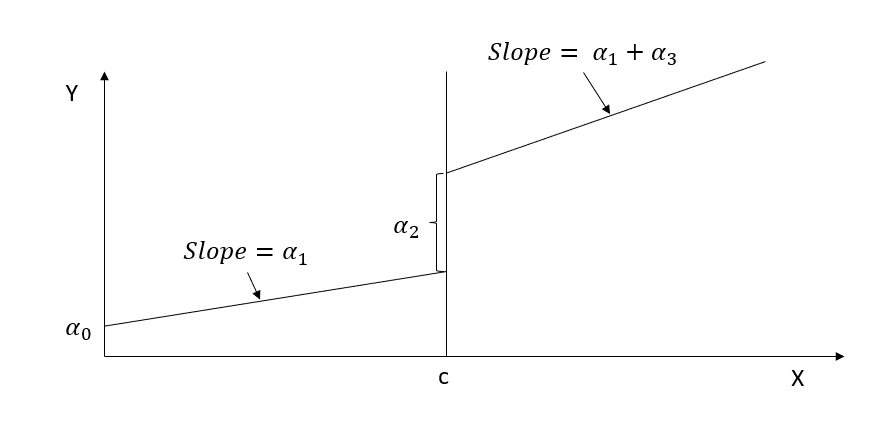

# Quasi-experimental

In most cases, it means that you have pre- and post-intervention data.

A great resource for causal inference is [Causal Inference Mixtape](https://mixtape.scunning.com/introduction.html), especially if you like to read about the history of causal inference as a field as well (codes for Stata, R, and Python).

**Identification strategy** for any quasi-experiment (No ways to prove or formal statistical test, but you can provide plausible argument and evidence)

1.  Where the exogenous variation comes from (by argument and institutional knowledge)
2.  Exclusion restriction: Evidence that the the variation in the exogenous shock and the outcome is due to no other factors
    1.  Stable unit treatment value assumption (SUTVA) state that the treatment of unit $i$ affect only the outcome of unit $i$ (i.e., no spillover to the control groups)

All quasi-experimental methods involve tradeoff between power and support for the exogeniety assumption (i.e., discard variation in the data that is not exogenous).

Consequently, we don't usually look at $R^2$ [@ebbes2011]. And it can even be misleading to use $R^2$ as the basis for model comparison.

Clustering should be based on the design, not the expectations of correlation [@abadie2017]. With **small sample**, you should use **wild bootstrap procedure** [@cameron2008] to correct for the downward bias (see [@canay2021]for additional assumptions).

Typical robustness check: recommended by [@goldfarb2022]

-   Different controls: show models with and without controls. Typically, we want to see the change in the estimate of interest. See [@altonji2005] for formal assessment based on Rosenbaum bounds (i.e., changes in the estimate and threat of Omitted variables on the estimate). For specific application in marketing, see [@manchanda2015] [@shin2012]

-   Different funcitonal forms

-   Different window of time (in longitudinal setting)

-   Different dependent variables (those that are related) or different measure of the dependent variables

-   Different control group size (matched vs. un-matched samples)

-   Placebo tests: see each placebo test for each setting below.

Showing the mechanism:

-   Mediation analysis

-   Moderation analysis

    -   Estimate the model separate (for different group)

    -   Assess whether the three-way interaction between the source of variation (e.g., under DID, cross-sectional and time series) and group membership is significant.

External Validity:

-   Assess how representative your sample is

-   Explain limitation of the design

-   Use quasi-experimental results in conjunction with structural models: see [@anderson2015] [@einav2010][@chung2014]

Limitation

1.  What is your idenifiying assumptions or idnetifaciton strategy
2.  What are threats to the validity of your assumptions?
3.  What you do to address it? And maybe how future research can do to address it.

## Regression Discontinuity

-   A regression discontinuity occurs when there is a discrete change (jump) in treatment likelihood in the distribution of a continuous (or roughly continuous) variable (i.e., **running/forcing/assignment variable**).

    -   Running variable can also be time, but the argument for time to be continuous is hard to argue because usually we do not see increment of time (e.g., quarterly or annual data). Unless we have minute or hour data, then we might be able to argue for it.

-   Review paper [@imbens2007; @lee2010]

-   Other readings:

    -   <https://ies.ed.gov/ncee/wwc/Docs/ReferenceResources/wwc_rd.pdf>

    -   <https://ies.ed.gov/ncee/wwc/Docs/ReferenceResources/wwc_rdd_standards_122315.pdf>

-   [@thistlethwaite1960]: first paper to use RD in the context of merit awards on future academic outcomes.

-   RD is a localized experiment at the cutoff point

    -   Hence, we always have to qualify (perfunctory) our statement in research articles that "our research might not generalize to beyond the bandwidth."

-   In reality, RD and experimental (from random assignment) estimates are very similar ([@chaplin2018; @bertanha2014]; [Mathematica](https://www.mathematica.org/publications/replicating-experimental-impact-estimates-using-a-regression-discontinuity-approach)). But still, it's hard to prove empirically for every context (there might be future study that finds a huge difference between local estimate - causal - and overall estimate - random assignment.

-   Threats: only valid near threshold: inference at threshold is valid on average. Interestingly, random experiment showed the validity already.

-   Tradeoff between efficiency and bias

-   Regression discontinuity is under the framework of [Instrumental Variable] argued by [@angrist1999] and a special case of the [Matching Methods] (matching at one point) argued by [@heckman1999].

-   The hard part is to find a setting that can apply, but once you find one, it's easy to apply

-   We can also have multiple cutoff lines. However, for each cutoff line, there can only be one breakup point

-   RD can have multiple coinciding effects (i.e., joint distribution or bundled treatment), then RD effect in this case would be the joint effect.

-   As the running variable becomes more discrete your framework should be [Interrupted Time Series], but more granular levels you can use RD. When you have infinite data (or substantially large) the two frameworks are identical. RD is always better than [Interrupted Time Series]

-   Multiple alternative model specifications that produce consistent result are more reliable (parametric - linear regression with polynomials terms, and non-parametric - local linear regression)

-   RD should be viewed more as a description of a data generating process, rather than a method or approach (similar to randomized experiment)

-   RD is close to

    -   other quasi-experimental methods in the sense that it's based on the discontinuity at a threshold

    -   randomized experiments in the sense that it's local randomization.

<br>

There are several types of Regression Discontinuity:

1.  Sharp RD: Change in treatment probability at the cutoff point is 1

    -   Kink design: Instead of a discontinuity in the level of running variable, we have a discontinuity in the slope of the function (while the function/level can remain continuous) [@nielsen2010]. See [@böckerman2018] for application, and [@card2012; @card2015b] for theory.

2.  Fuzzy RD: Change in treatment probability less than 1

3.  RDiT: running variable is time.

Consider

$$
D_i = 1_{X_i > c}
$$

$$
D_i = 
\begin{cases}
D_i = 1 \text{ if } X_i > C \\
D_i = 0 \text{ if } X_i < C
\end{cases}
$$

where

-   $D_i$ = treatment effect

-   $X_i$ = score variable (continuous)

-   $c$ = cutoff point

**Identification (Identifying assumption**s) of RD:

$$
\begin{aligned}
\alpha_{SRDD} &= E[Y_{1i} - Y_{0i} | X_i = c] \\
&= E[Y_{1i}|X_i = c] - E[Y_{0i}|X_i = c]\\
&= \lim_{x \to c^+} E[Y_{1i}|X_i = c] - \lim_{x \to c^=} E[Y_{0i}|X_i = c]
\end{aligned}
$$

RDD estimates the local average treatment effect (LATE), at the cutoff point which is not at the individual or population levels.

Since researchers typically care more about the internal validity, than external validity, localness affects only external validity.

**Assumptions**:

-   Independent assignment

-   Continuity of conditional regression functions

    -   $E[Y(0)|X=x]$ and $E[Y(1)|X=x]$ are continuous in x.

-   RD is valid if cutpoint is **exogenous (i.e., no endogenous selection)** and running variable is **not manipulable**

-   Only treatment(s) (e.g., could be joint distribution of multiple treatments) cause discontinuity or jump in the outcome variable

-   All other factors are **smooth** through the cutoff (i.e., threshold) value. (we can also test this assumption by seeing no discontinuity in other factors). If they "jump", they will bias your causal estimate

<br>

**Threats to RD**

-   Variables (other than treatment) change discontinously at the cutoff

    -   We can test for jumps in these variables (including pre-treatment outcome)

-   Multiple discontinuities for the assignment variable

-   Manipulation of the assignment variable

    -   At the cutoff point, check for continuity in the density of the assignment variable.

<br>

### Specification Checks

1.  [Balance Checks]
2.  [Sorting/Bunching/Manipulation]
3.  [Placebo Tests]
4.  [Sensitivity to Bandwidth Choice]

<br>

#### Balance Checks

-   Also known as checking for Discontinuities in Average Covariates

-   Null Hypothesis: The average effect of covariates on pseudo outcomes (i.e., those qualitatively cannot be affected by the treatment) is 0.

-   If this hypothesis is rejected, you better have a good reason to why because it can cast serious doubt on your RD design.

<br>

#### Sorting/Bunching/Manipulation

-   Also known as checking for A Discontinuity in the Distribution of the Forcing Variable

-   Also known as clustering or density test

-   Formal test is McCrary sorting test [@mccrary2008] or [@cattaneo2019]

-   Since human subjects can manipulate the running variable to be just above or below the cutoff (assuming that the running variable is manipulable), especially when the cutoff point is known in advance for all subjects, this can result in a discontinuity in the distribution of the running variable at the cutoff (i.e., we will see "bunching" behavior right before or after the cutoff)\>

    -   People would like to sort into treatment if it's desirable. The density of the running variable would be 0 just below the threshold

    -   People would like to be out of treatment if it's undesirable

-   [@mccrary2008] proposes a density test (i.e., a formal test for manipulation of the assignment variable).

    -   $H_0$: The continuity of the density of the running variable (i.e., the covariate that underlies the assignment at the discontinuity point)

    -   $H_a$: A jump in the density function at that point

    -   Even though it's not a requirement that the density of the running must be continuous at the cutoff, but a discontinuity can suggest manipulations.

-   [@lee2009] offers a guide to know when you should warrant the manipulation

-   Usually it's better to know your research design inside out so that you can suspect any manipulation attempts.

    -   We would suspect the direction of the manipulation. And typically, it's one-way manipulation. In cases where we might have both ways, theoretically they would cancel each other out.

-   We could also observe partial manipulation in reality (e.g., when subjects can only imperfectly manipulate). But typically, as we treat it like fuzzy RD, we would not have identification problems. But complete manipulation would lead to serious identification issues.

-   Remember: even in cases where we fail to reject the null hypothesis for the density test, we could not rule out completely that identification problem exists (just like any other hypotheses)

-   Bunching happens when people self-select to a specific value in the range of a variable (e.g., key policy thresholds).

-   Review paper [@kleven2016]

-   **This test can only detect manipulation that changes the distribution of the running variable**. If you can choose the cutoff point or you have 2-sided manipulation, this test will fail to detect it.

-   Histogram in bunching is similar to a density curve (we want narrower bins, wider bins bias elasticity estimates)

-   We can also use bunching method to study individuals' or firm's responsiveness to changes in policy.

-   Under RD, we assume that we don't have any manipulation in the running variable. However, bunching behavior is a manipulation by firms or individuals. Thus, violating this assumption.

    -   Bunching can fix this problem by estimating what densities of individuals would have been without manipulation (i.e., manipulation-free counterfactual).

    -   **The fraction of persons who manipulated** is then calculated by comparing the observed distribution to manipulation-free counterfactual distributions.

    -   Under RD, we do not need this step because the observed and manipulation-free counterfactual distributions are assumed to be the same. RD assume there is no manipulation (i.e., assume the manipulation-free counterfactual distribution)

When running variable and outcome variable are simultaneously determined, we can use a modified RDD estimator to have consistent estimate. [@bajari2011]

-   **Assumptions**:

    -   Manipulation is **one-sided**: People move one way (i.e., either below the threshold to above the threshold or vice versa, but not to or away the threshold), which is similar to the monotonicity assumption under instrumental variable \@ref(instrumental-variable)

    -   Manipulation is **bounded** (also known as regularity assumption): so that we can use people far away from this threshold to derive at our counterfactual distribution [@blomquist2017]

Steps:

1.  Identify the window in which the running variable contains bunching behavior. We can do this step empirically based on data [@bosch2020]. Additionally robustness test is needed (i.e., varying the manipulation window).
2.  Estimate the manipulation-free counterfactual
3.  Calculating the standard errors for inference can follow [@chetty2011] where we bootstrap resampling residuals in the estimation of the counts of individuals within bins (large data can render this step unnecessary).

If we pass the bunching test, we can move on to the [Placebo Test]

@mccrary2008 test

A jump in the density at the threshold (i.e., discontinuity) hold can serve as evidence for sorting around the cutoff point

```{r}
library(rdd)

# you only need the runing variable and hte cutoff point

# Example by the package's authors
#No discontinuity
x<-runif(1000,-1,1)
DCdensity(x,0)

#Discontinuity
x<-runif(1000,-1,1)
x<-x+2*(runif(1000,-1,1)>0&x<0)
DCdensity(x,0)
```

@cattaneo2019 test

```{r}
library(rddensity)

# Example by the package's authors
# Continuous Density
set.seed(1)
x <- rnorm(2000, mean = -0.5)
rdd <- rddensity(X = x, vce = "jackknife")
summary(rdd)

# you have to specify your own plot (read package manual)
```

<br>

#### Placebo Tests

-   Also known as Discontinuities in Average Outcomes at Other Values

-   We should not see any jumps at other values (either $X_i <c$ or $X_i \ge c$)

    -   Use the same bandwidth you use for the cutoff, and move it along the running variable: testing for a jump in the conditional mean of the outcome at the median of the running variable.

-   Also known as falsification checks

-   Before and after the cutoff point, we can run the placebo test to see whether X's are different).

-   The placebo test is where you expect your coefficients to be not different from 0.

-   This test can be used for

    -   Testing no discontinuity in predetermined variables:

    -   Testing other discontinuities

    -   Inclusion and exclusion of covariates: RDD parameter estimates should not be sensitive to the inclusion or exclusion of other covariates.

-   This is analogous to [Experimental Design] where we cannot only test whether the observables are similar in both treatment and control groups (if we reject this, then we don't have random assignment), but we cannot test unobservables.

Balance on observable characteristics on both sides

$$
Z_i = \alpha_0 + \alpha_1 f(x_i) + [I(x_i \ge c)] \alpha_2 + [f(x_i) \times I(x_i \ge c)]\alpha_3 + u_i
$$

where

-   $x_i$ is the running variable

-   $Z_i$ is other characteristics of people (e.g., age, etc)

Theoretically, $Z_i$ should no be affected by treatment. Hence, $E(\alpha_2) = 0$

Moreover, when you have multiple $Z_i$, you typically have to simulate joint distribution (to avoid having significant coefficient based on chance).

The only way that you don't need to generate joint distribution is when all $Z_i$'s are independent (unlikely in reality).

Under RD, you shouldn't have to do any [Matching Methods]. Because just like when you have random assignment, there is no need to make balanced dataset before and after the cutoff. If you have to do balancing, then your RD assumptions are probably wrong in the first place.

#### Sensitivity to Bandwidth Choice

-   Methods for bandwidth selection

    -   Ad hoc or substantively driven

    -   Data driven: cross validation

    -   Conservative approach: [@cattaneo2020]

-   The objective is to minimize the mean squared error between the estimated and actual treatment effects.

-   Then, we need to see how sensitive our results will be dependent on the choice of bandwidth.

-   In some cases, the best bandwidth for testing covariates may not be the best bandwidth for treating them, but it may be close.

```{r, eval=FALSE}
# find optimal bandwidth by Imbens-Kalyanaraman
rdd::IKbandwidth(running_var, outcome_var, cutpoint = "", kernel = "triangular") # can also pick other kernels
```

#### Fuzzy RD Design

When you have cutoff that does not perfect determine treatment, but creates a discontinuity in the likelihood of receiving the treatment, you need another instrument

For those that are close to the cutoff, we create an instrument for $D_i$

$$
Z_i=
\begin{cases}
1 & \text{if } X_i \ge c \\
0 & \text{if } X_c < c
\end{cases}
$$

Then, we can estimate the effect of the treatment for compliers only (i.e., those treatment $D_i$ depends on $Z_i$)

The LATE parameter

$$
\lim_{c - \epsilon \le X \le c + \epsilon, \epsilon \to 0}( \frac{E(Y |Z = 1) - E(Y |Z=0)}{E(D|Z = 1) - E(D|Z = 0)})
$$

equivalently,

$$
\frac{lim_{x \downarrow c}E(Y|X = x) - \lim_{x \uparrow c} E(Y|X = x)}{\lim_{x \downarrow c } E(D |X = x) - \lim_{x \uparrow c}E(D |X=x)}
$$

Two equivalent ways to estimate

1.  First

    1.  Sharp RDD for $Y$

    2.  Sharp RDD for $D$

    3.  Take the estimate from step 1 divide by that of step 2

2.  Second: Subset those observations that are close to $c$ and run instrumental variable $Z$

<br>

#### Regression Kink Design

-   If the slope of the treatment intensity changes at the cutoff (instead of the level of treatment assignment), we can have regression kink design

-   Example: unemployment benefits

<br>

### Steps for Sharp RD

1.  Graph the data by computing the average value of the outcome variable over a set of bins (large enough to see a smooth graph, and small enough to make the jump around the cutoff clear).

2.  Run regression on both sides of the cutoff to get the treatment effect

3.  Robustness checks:

    1.  Assess possible jumps in other variables around the cutoff

    2.  Hypothesis testing for bunching

    3.  Placebo tests

    4.  Varying bandwidth

<br>

### Steps for Fuzzy RD

1.  Graph the data by computing the average value of the outcome variable over a set of bins (large enough to see a smooth graph, and small enough to make the jump around the cutoff clear).

2.  Graph the probability of treatment

3.  Estimate the treatment effect using 2SLS

4.  Robustness checks:

    1.  Assess possible jumps in other variables around the cutoff

    2.  Hypothesis testing for bunching

    3.  Placebo tests

    4.  Varying bandwidth

### Steps for RDiT (Regression Discontinuity in Time)

Notes:

-   Additional assumption: Time-varying confounders change smoothly across the cutoff date

<!-- -->

-   Typically used in policy implementation in the same date for all subjects, but can also be used for cases where implementation dates are different between subjects. In the second case, researchers typically use different RDiT specification for each time series.

-   Sometimes the date of implementation is not randomly assigned by chosen strategically. Hence, RDiT should be thought of as the "discontinuity at a threshold" interpretation of RD (not as "local randomization"). [@hausman2018, p. 8]

-   Normal RD uses variation in the $N$ dimension, while RDiT uses variation in the $T$ dimension

-   Choose polynomials based on BIC typically. And can have either global polynomial or pre-period and post-period polynomial for each time series (but usually the global one will perform better)

-   Could use **augmented local linear** outlined by [@hausman2018, p. 12], where estimate the model with all the control first then take the residuals to include in the model with the RDiT treatment (remember to use bootstrapping method to account for the first-stage variance in the second stage).

Pros:

-   can overcome cases where there is no cross-sectional variation in treatment implementation (dif-n-dif is not feasible)

    -   There are papers that use both RDiT and DiD to (1) see the differential treatment effects across individuals/ space [@auffhammer2011] or (2) compare the 2 estimates where the control group's validity is questionable [@gallego2013].

-   Better than pre/post comparison because it can include flexible controls

-   Better than event studies because it can use long-time horizons (may not be too relevant now since the development long-time horizon event studies), and it can use higher-order polynomials time control variables.

Cons:

-   Taking observation for from the threshold (in time) can bias your estimates because of unobservables and time-series properties of the data generating process.

-   [@mccrary2008] test is not possible (see [Sorting/Bunching/Manipulation]) because when the density of the running (time) is uniform, you can't use the test.

-   Time-varying unobservables may impact the dependent variable discontinuously

-   Error terms are likely to include persistence (serially correlated errors)

-   Researchers cannot model time-varying treatment under RDiT

    -   In a small enough window, the local linear specification is fine, but the global polynomials can either be too big or too small [@hausman2018]

Biases

-   Time-Varying treatment Effects

    -   increase sample size either by

        -   more granular data (greater frequency): will not increase power because of the problem of serial correlation

        -   increasing time window: increases bias from other confounders

    -   2 additional assumption:

        -   Model is correctly specified (with all confoudners or global polynomial approximation)

        -   Treatment effect is correctly specified (whether it's smooth and constant, or varies)

        -   These 2 assumptions do not interact ( we don't want them to interact - i.e., we don't want the polynomial correlated with the unobserved variation in the treatment effect)

    -   There usually a difference between short-run and long-run treatment effects, but it's also possibly that the bias can stem from the over-fitting problem of the polynomial specification. [@hausman2018, p. 544]

-   Autoregression (serial dependence)

    -   Need to use **clustered standard errors** to account for serial dependence in the residuals

    -   In the case of serial dependence in $\epsilon_{it}$, we don't have a solution, including a lagged dependnet vraible would misspecify the model (probablyfind another research project)

    -   In the case of seiral dependence in $y_{it}$, with long window, it becomes fuzzy to what you try to recover. You can include the **lagged dependent varialbe** (bias can still come from the time-varying treatment or over-fitting of the global polynomial)

-   Sorting and Anticipation Effects

    -   Cannot run the [@mccrary2008] because the density of the time runing vairable is uniform

    -   Can still run tests to check discontinuities in other covariates (you want no discontinuities) and discontinuitiesin the outocme vairalbe at other placebo thresholds ( you don't want discontinuities)

    -   Hence, it's hard to aruge for the causal effect here because it could be the total effect of the causal treatment and the unobserved sorting/anticipation/adaptation/avoidance effects. You can only argue that there is no such behavior

Recommendations for robustness check following [@hausman2018, p. 549]

1.  Plot the raw data and residuals (after removing confounders or trend). With varying polynomial and local linear controls, inconsistent results can be a sign of time-varying treatment effects.
2.  Using global polynomial, you could overfit, then show polynomial with different order and alternative local linear bandwidths. If the results are consistent, you're ok
3.  [Placebo Tests]: estimate another RD (1) on another location or subject (that did not receive the treatment) or (2) use another date.
4.  Plot RD discontinuity on continuous controls
5.  Donut RD to see if avoiding the selection close to the cutoff would yield better results [@barreca2011]
6.  Test for autoregression (using only pre-treatment data). If there is evidence for autoregression, include the lagged dpednetnvariable
7.  Augmented local linear (no need to use global polynomail and avoid over-fitting)
    1.  Use full sample to exclude the effect of important predicotrs

    2.  Estiamte the conditioned second stage on a smaller sample bandwidth

Examples from [@hausman2018, p. 534] in

econ

-   [@davis2008]: Air quality

-   [@auffhammer2011]: Air quality

-   [@chen2012]: Air quality

-   [@depaola2012]: car accidents

-   [@gallego2013]: air quality

-   [@bento2014]: Traffic

-   [@anderson2014]: Traffic

-   [@burger2014]: Car accidents

marketing

-   [@busse2006]: Vehicle prices

-   [@chen2009]: Customer Satisfaction

-   [@busse2010]: Vehicle prices

-   [@davis2010]: vehicle prices

<br>

### Evaluation of an RD

-   Evidence for (either formal tests or graphs)

    -   Treatment and outcomes change discontinuously at the cutoff, while other variables and pre-treatment outcomes do not.

    -   No manipulation of the assignment variable.

-   Results are robust to various functional forms of the forcing variable

-   Is there any other (unobserved) confound that could cause the discontinuous change at the cutoff (i.e., multiple forcing variables / bundling of institutions)?

-   External Validity: How likely the result at the cutoff will generalize?

<br>

**General Model**

$$
Y_i = \beta_0 + f(x_i) \beta_1 + [I(x_i \ge c)]\beta_2 + \epsilon_i
$$

where $f(x_i)$ is any functional form of $x_i$

**Simple case**

When $f(x_i) = x_i$ (linear function)

$$
Y_i = \beta_0 + x_i \beta_1 + [I(x_i \ge c)]\beta_2 + \epsilon_i
$$

{style="display: block; margin: 1em auto" width="90%"}

RD gives you $\beta_2$ (causal effect) of $X$ on $Y$ at the cutoff point

In practice, everyone does

$$
Y_i = \alpha_0 + f(x) \alpha _1 + [I(x_i \ge c)]\alpha_2 + [f(x_i)\times [I(x_i \ge c)]\alpha_3 + u_i
$$

{style="display: block; margin: 1em auto" width="90%"}

where we estimate different slope on different sides of the line

and if you estimate $\alpha_3$ to be no different from 0 then we return to the simple case

**Notes**:

-   Sparse data can make $\alpha_3$ large differential effect

-   People are very skeptical when you have complex $f(x_i)$, usual simple function forms (e.g., linear, squared term, etc.) should be good. However, if you still insist, then **non-parametric estimation** can be your best bet.

Bandwidth of $c$ (window)

-   Closer to $c$ can give you lower bias, but also efficiency

-   Wider $c$ can increase bias, but higher efficiency.

-   Optimal bandwidth is very controversial, but usually we have to do it in the appendix for research article anyway.

-   We can either

    -   drop observations outside of bandwidth or

    -   weight depends on how far and close to $c$

### Examples

Examples in marketing:

-   [@narayanan2015]

-   [@hartmann2011a]: nonparametric estimation and guide to identifying causal marketing mix effects.

#### Example 1

Example by [Leihua Ye](https://towardsdatascience.com/the-crown-jewel-of-causal-inference-regression-discontinuity-design-rdd-bad37a68e786)

$$
Y_i = \beta_0 + \beta_1 X_i + \beta_2 W_i + u_i
$$

$$
X_i = 
\begin{cases}
1, W_i \ge c \\
0, W_i < c
\end{cases}
$$

```{r, message=FALSE}
#cutoff point = 3.5
GPA <- runif(1000, 0, 4)
future_success <- 10 + 2 * GPA + 10 * (GPA >= 3.5) + rnorm(1000)
#install and load the package ‘rddtools’
#install.packages(“rddtools”)
library(rddtools)
data <- rdd_data(future_success, GPA, cutpoint = 3.5)
# plot the dataset
plot(
    data,
    col =  "red",
    cex = 0.1,
    xlab =  "GPA",
    ylab =  "future_success"
)
```

```{r}
# estimate the sharp RDD model
rdd_mod <- rdd_reg_lm(rdd_object = data, slope =  "same")
summary(rdd_mod)
```

```{r}
# plot the RDD model along with binned observations
plot(
    rdd_mod,
    cex = 0.1,
    col =  "red",
    xlab =  "GPA",
    ylab =  "future_success"
)
```

#### Example 2

@bowblis2019

Occupational licensing can either increase or decrease market efficiency:

-   More information means more efficiency

-   Increased entry barriers (i.e., friction) increase efficiency

Components of RD

-   Running variable
-   Cutoff: 120 beds or above
-   Treatment: you have to have the treatment before the cutoff point.

Under OLS

$$
Y_i = \alpha_0 + X_i \alpha_1 + LW_i \alpha_2 + \epsilon_i
$$

where

-   $LW_i$ Licensed/certified workers (in fraction format for each center).

-   $Y_i$ = Quality of service

Bias in $\alpha_2$

-   Mitigation-based: terrible quality can lead to more hiring, which negatively bias $\alpha_2$

-   Preference-based: places that have higher quality staff want to keep high quality staffs.

Under RD

$$
Y_{ist} = \beta_0 + [I(Bed \ge121)_{ist}]\beta_1 + f(Size_{ist}) \beta_2 + [f(Size_{ist}) \times I(Bed \ge 121)_{ist}] \beta_3 \\
+ X_{it} \delta + \gamma_s + \theta_t + \epsilon_{ist}
$$

where

-   $s$ = state

-   $t$ = year

-   $i$ = hospital

This RD is fuzzy

-   If right near the threshold (bandwidth), we have states with different sorting (i.e., non-random), then we need the fixed-effect for state $s$. But then your RD assumption wrong anyway, then you won't do it in the first place

-   Technically, we could also run the fixed-effect regression, but because it's lower in the causal inference hierarchy. Hence, we don't do it.

-   Moreover, in the RD framework, we don't include $t$ before treatment (but in the FE we have to include before and after)

-   If we include $\pi_i$ for each hospital, then we don't have variation in the causal estimates (because hardly any hospital changes their bed size in the panel)

-   When you have $\beta_1$ as the intent to treat (because the treatment effect does not coincide with the intent to treat)

-   You cannot take those fuzzy cases out, because it will introduce the selection bias.

-   Note that we cannot drop cases based on behavioral choice (because we will exclude non-compliers), but we can drop when we have particular behaviors ((e.g., people like round numbers).

Thus, we have to use Instrument variable \@ref(instrumental-variable)

**Stage 1:**

$$
QSW_{ist} = \alpha_0 + [I(Bed \ge121)_{ist}]\alpha_1 + f(Size_{ist}) \alpha_2 + [f(Size_{ist}) \times I(Bed \ge 121)_{ist}] \alpha_3 \\
+ X_{it} \delta + \gamma_s + \theta_t + \epsilon_{ist}
$$

(Note: you should have different fixed effects and error term - $\delta, \gamma_s, \theta_t, \epsilon_{ist}$ from the first equation, but I ran out of Greek letters)

**Stage 2:**

$$
Y_{ist} = \gamma_0 + \gamma_1 \hat{QWS}_{ist} + f(Size_{ist}) \delta_2 + [f(Size_{ist}) \times I(Bed \ge 121)] \delta_3 \\
 + X_{it} \lambda + \eta_s + \tau_t + u_{ist}
$$

-   The bigger the jump (discontinuity), the more similar the 2 coefficients ($\gamma_1 \approx \beta_1$) where $\gamma_1$ is the average treatment effect (of exposing to the policy)

-   $\beta_1$ will always be closer to 0 than $\gamma_1$

-   Figure 1 shows bunching at every 5 units cutoff, but 120 is still out there.

-   If we have manipulable bunching, there should be decrease at 130

-   Since we have limited number of mass points (at the round numbers), we should clustered standard errors by the mass point

<br>

#### Example 3

Replication of [@carpenter2009] by [Philipp Leppert](https://rpubs.com/phle/r_tutorial_regression_discontinuity_design), dataset from [here](https://www.openicpsr.org/openicpsr/project/113550/version/V1/view?flag=follow&pageSize=100&sortOrder=(?title)&sortAsc=true)

#### Example 4

For a detailed application, see [@thoemmes2016] where they use `rdd`, `rdrobust`, `rddtools`

<br>

## Difference-In-Differences

Examples in marketing

-   [@liaukonyte2015]: TV ad on online shopping
-   [@akca2020]: aggregators for airlines business effect
-   [@pattabhiramaiah2018]: paywall affects readership
-   [@wang2018]: political ad source and message tone on vote shares and turnout using discontinuities in the level of political ads at the borders
-   [@datta2018]: streaming service on total music consumption using timing of users adoption of a music streaming service
-   [@janakiraman2018]: data breach announcement affect customer spending using timing of data breach and variation whether customer info was breached in that event
-   [@lim2020]: nutritional labels on nutritional quality for other brands in a category using variation in timing of adoption of nutritional labels across categories
-   [@guo2020]: payment disclosure laws effect on physician prescription behavior using Timing of the Massachusetts open payment law as the exogenous shock
-   [@israeli2018]: digital monitoring and enforcement on violations using enforcement of min ad price policies
-   [@ramani2019]: firms respond to foreign direct investment liberalization using India's reform in 1991.

Show the mechanism via

-   Mediation analysis: see [@habel2021]

-   Moderation analysis: see [@goldfarb2011]

### Simple Dif-n-dif

-   A tool developed intuitively to study "natural experiment", but its uses are much broader.

-   [Fixed Effects Estimator] is the foundation for DID

-   Why is dif-in-dif attractive? Identification strategy: Inter-temporal variation between groups

    -   **Cross-sectional estimator** helps avoid omitted (unobserved) **common trends**

    -   **Time-series estimator** helps overcome omitted (unobserved) **cross-sectional differences**

Consider

-   $D_i = 1$ treatment group

-   $D_i = 0$ control group

-   $T= 1$ After the treatment

-   $T =0$ Before the treatment

|                   | After (T = 1)          | Before (T = 0)       |
|-------------------|------------------------|----------------------|
| Treated $D_i =1$  | $E[Y_{1i}(1)|D_i = 1]$ | $E[Y_{0i}(0)|D)i=1]$ |
| Control $D_i = 0$ | $E[Y_{0i}(1) |D_i =0]$ | $E[Y_{0i}(0)|D_i=0]$ |

missing $E[Y_{0i}(1)|D=1]$

The Average Treatment Effect on Treated

$$
E[Y_1(1) - Y_0(1)|D=1] \\
= \{E[Y(1)|D=1] - E[Y(1)|D=0] \} - \{E[Y(0)|D=1] - E[Y(0)|D=0] \}
$$

More elaboration:

-   For the treatment group, we isolate the difference between being treated and not being treated. If the untreated group would have been affected in a different way, the DiD design and estimate would tell us nothing.

<br>

**Extension**

More than 2 groups (multiple treatments and multiple controls), and more than 2 period (pre and post)

$$
Y_{igt} = \alpha_g + \gamma_t + \beta I_{gt} + \delta X_{igt} + \epsilon_{igt}
$$

where

-   $\alpha_g$ is the group-specific fixed effect

-   $\gamma_t$ = time specific fixed effect

-   $\beta$ = dif-in-dif effect

-   $I_{gt}$ = interaction terms (n treatment indicators x n post-treatment dummies) (capture effect heterogeneity over time)

This specification is the "two-way fixed effects DiD" - **TWFE** (i.e., 2 sets of fixed effects: group + time).

-   However, if you have [Staggered Dif-n-dif] (i.e., treatment is applied at different times to different groups). TWFE is really bad.

<br>

[Matching Methods]

-   Match treatment and control based on pre-treatment observables

-   Modify SEs appropriately [@heckman1997]

<br>

#### Assumptions

-   **Parallel Trends**: Difference between the treatment and control groups remain constant if there were no treatment.

    -   should be used in cases where

        -   you observe before and after an event

        -   you have treatment and control groups

    -   not in cases where

        -   treatment is not random

        -   confounders.

    -   To support we use

        -   [Placebo test]

        -   [Prior trends test]

-   **Linear additive effects** (of group/unit specific and time-specific):

    -   If they are not additively interact, we have to use the weighted 2FE estimator [@imai2020]

    -   Typically seen in the [Staggered Dif-n-dif]

##### Prior Trends Test

1.  Plot the average outcomes over time for both treatment and control group before and after the treatment in time.
2.  Statistical test for difference in trends (using data from before the treatment period)

$$
Y = \alpha_g + \beta_1 T + \beta_2 T\times G + \epsilon
$$

where

-   $Y$ = the outcome variable

-   $\alpha_g$ = group fixed effects

-   $T$ = time (e.g., specific year, or month)

-   $\beta_2$ = different time trend for each group

Hence, if $\beta_2 =0$ provides evidence that there are no difference in the trend for the two groups prior the time treatment.

You can also use different functional forms (e..g, polynomial or nonlinear).

If $\beta_2 \neq 0$ statistically, possible reasons can be:

-   Statistical significance can be driven by large sample

-   Or the trends are so consistent, and just one period deviation can throw off the trends. Hence, statistical statistical significance.

Technically, we can still salvage the research by including time fixed effects, instead of just the before-and-after time fixed effect (actually, most researchers do this mechanically anyways nowadays). However, a side effect can be that the time fixed effects can also absorb some part your treatment effect as well, especially in cases where the treatment effects vary with time (i.e., stronger or weaker over time) [@wolfers2003].

##### Placebo Test

Procedure:

1.  Sample data only in the period before the treatment in time.
2.  Consider different fake cutoff in time, either
    1.  Try the whole sequence in time

    2.  Generate random treatment period, and use **randomization inference** to account for sampling distribution of the fake effect.
3.  Estimate the DiD model but with the post-time = 1 with the fake cutoff
4.  A significant DiD coefficient means that you violate the parallel trends! You have a big problem.

Alternatively,

-   When data have multiple control groups, drop the treated group, and assign another control group as a "fake" treated group. But even if it fails (i.e., you find a significant DiD effect) among the control groups, it can still be fine. However, this method is used under [Synthetic Control]

**Possible issues**

-   Estimate dependent on functional form:

    -   When the size of the response depends (nonlinearly) on the size of the intervention, we might want to look at the the difference in the group with high intensity vs. low.

-   Long-term effects

    -   Parallel trends are more likely to be observed over shorter period (window of observation)

-   Heterogeneous effects

    -   Different intensity (e.g., doses) for different groups.

-   Ashenfelter dip

    -   Participants are systemically different from nonparticipants before the treatment, leading to the question of permanent or transitory changes.

-   Response to event might not be immediate (can't be observed right away in the dependent variable)

    -   Using lagged dependent variable $Y_{it-1}$ might be more appropriate [@blundell1998]

-   Other factors that affect the difference in trends between the two groups (i.e., treatment and control) will bias your estimation.

-   Correlated observations within a group or time.

-   Incidental parameters problems [@lancaster2000]: it's always better to use individual and time fixed effect.

-   When examining the effects of variation in treatment timing, we have to be careful because negative weights (per group) can be negative if there is a heterogeneity in the treatment effects over time. Example: [@athey2022][@borusyak2021][@goodman-bacon2021]. In this case you should use new estimands proposed by [@callaway2021][@dechaisemartin2020], in the `did` package. If you expect lags and leads, see [@sun2021]

-   [@gibbons2018] caution when we suspect the treatment effect and treatment variance vary across groups

<br>

**Robustness Check**

-   Placebo DiD (if the DiD estimate $\neq 0$, parallel trend is violated, and original DiD is biased):

    -   Group: Use fake treatment groups: A population that was **not** affect by the treatment

    -   Time: Redo the DiD analysis for period before the treatment (expected treatment effect is 0) (e..g, for previous year or period).

-   Possible alternative control group: Expected results should be similar

-   Try different windows (further away from the treatment point, other factors can creep in and nullify your effect).

-   Treatment Reversal (what if we don't see the treatment event)

-   Higher-order polynomial time trend (to relax linearity assumption)

-   Test whether other dependent variables that should be affected by the event are indeed unaffected.

    -   Use the same control and treatment period (DiD $\neq0$, there is a problem)

<br>

#### Examples

##### Example from [Princeton](https://www.princeton.edu/~otorres/DID101R.pdf)

```{r}
library(foreign)
mydata = read.dta("http://dss.princeton.edu/training/Panel101.dta")

```

create a dummy variable to indicate the time when the treatment started

```{r}
mydata$time = ifelse(mydata$year >= 1994, 1, 0)
```

create a dummy variable to identify the treatment group

```{r}
mydata$treated = ifelse(mydata$country == "E" |
                            mydata$country == "F" | mydata$country == "G" ,
                        1,
                        0)
```

create an interaction between time and treated

```{r}
mydata$did = mydata$time * mydata$treated
```

estimate the DID estimator

```{r}
didreg = lm(y ~ treated + time + did, data = mydata)
summary(didreg)
```

The `did` coefficient is the differences-in-differences estimator. Treat has a negative effect

<br>

##### Example by @card1993

found that increase in minimum wage increases employment

Experimental Setting:

-   New Jersey (treatment) increased minimum wage

-   Penn (control) did not increase minimum wage

|           |     | After | Before |                   |
|-----------|-----|-------|--------|-------------------|
| Treatment | NJ  | A     | B      | A - B             |
| Control   | PA  | C     | D      | C - D             |
|           |     | A - C | B - D  | (A - B) - (C - D) |

where

-   A - B = treatment effect + effect of time (additive)

-   C - D = effect of time

-   (A - B) - (C - D) = dif-n-dif

**The identifying assumptions**:

-   Can't have **switchers**

-   PA is the control group

    -   is a good counter factual

    -   is what NJ would look like if they hadn't had the treatment

$$
Y_{jt} = \beta_0 + NJ_j \beta_1 + POST_t \beta_2 + (NJ_j \times POST_t)\beta_3+ X_{jt}\beta_4 + \epsilon_{jt}
$$

where

-   $j$ = restaurant

-   $NJ$ = dummy where 1 = NJ, and 0 = PA

-   $POST$ = dummy where 1 = post, and 0 = pre

Notes:

-   We don't need $\beta_4$ in our model to have unbiased $\beta_3$, but including it would give our coefficients efficiency

-   If we use $\Delta Y_{jt}$ as the dependent variable, we don't need $POST_t \beta_2$ anymore

-   Alternative model specification is that the authors use NJ high wage restaurant as control group (still choose those that are close to the border)

-   The reason why they can't control for everything (PA + NJ high wage) is because it's hard to interpret the causal treatment

-   Dif-n-dif utilizes similarity in pretrend of the dependent variables. However, this is neither a necessary nor sufficient for the identifying assumption.

    -   It's not sufficient because they can have multiple treatments (technically, you could include more control, but your treatment can't interact)

    -   It's not necessary because trends can be parallel after treatment

-   However, we can't never be certain; we just try to find evidence consistent with our theory so that dif-n-dif can work.

-   Notice that we don't need before treatment the **levels of the dependent variable** to be the same (e.g., same wage average in both NJ and PA), dif-n-dif only needs **pre-trend (i.e., slope)** to be the same for the two groups.

<br>

##### Example by @butcher2014

Theory:

-   Highest achieving students are usually in hard science. Why?

    -   Hard to give students students the benefit of doubt for hard science

    -   How unpleasant and how easy to get a job. Degrees with lower market value typically want to make you feel more pleasant

Under OLS

$$
E_{ij} = \beta_0 + X_i \beta_1 + G_j \beta_2 + \epsilon_{ij}
$$

where

-   $X_i$ = student attributes

-   $\beta_2$ = causal estimate (from grade change)

-   $E_{ij}$ = Did you choose to enroll in major $j$

-   $G_j$ = grade given in major $j$

Examine $\hat{\beta}_2$

-   Negative bias: Endogenous response because department with lower enrollment rate will give better grade

-   Positive bias: hard science is already having best students (i.e., ability), so if they don't their grades can be even lower

Under dif-n-dif

$$
Y_{idt} = \beta_0 + POST_t \beta_1 + Treat_d \beta_2 + (POST_t \times Treat_d)\beta_3 + X_{idt} + \epsilon_{idt}
$$

where

-   $Y_{idt}$ = grade average

+--------------+-----------------------------------+----------+----------+-------------+
|              | Intercept                         | Treat    | Post     | Treat\*Post |
+==============+===================================+==========+==========+=============+
| Treat Pre    | 1                                 | 1        | 0        | 0           |
+--------------+-----------------------------------+----------+----------+-------------+
| Treat Post   | 1                                 | 1        | 1        | 1           |
+--------------+-----------------------------------+----------+----------+-------------+
| Control Pre  | 1                                 | 0        | 0        | 0           |
+--------------+-----------------------------------+----------+----------+-------------+
| Control Post | 1                                 | 0        | 1        | 0           |
+--------------+-----------------------------------+----------+----------+-------------+
|              | Average for pre-control $\beta_0$ |          |          |             |
+--------------+-----------------------------------+----------+----------+-------------+

A more general specification of the dif-n-dif is that

$$
Y_{idt} = \alpha_0 + (POST_t \times Treat_d) \alpha_1 + \theta_d + \delta_t + X_{idt} + u_{idt}
$$

where

-   $(\theta_d + \delta_t)$ richer , more df than $Treat_d \beta_2 + Post_t \beta_1$ (because fixed effects subsume Post and treat)

-   $\alpha_1$ should be equivalent to $\beta_3$ (if your model assumptions are correct)

Under causal inference, $R^2$ is not so important.

<br>

### Staggered Dif-n-dif

-   When subjects are treated at different point in time, we have to use staggered DiD

<!-- -->

-   For design where a treatment is applied and units are exposed to this treatment at all time afterward, see [@athey2022]

Basic design [@stevenson2006]

$$
Y_{it} = \alpha_i + \delta_t + \sum_k \gamma_k D_{ik} + \epsilon_{it}
$$

where

-   $\alpha_i$ are the country dummies

-   $\delta_t$ are the time dummies

-   $D_{ik} = 1$ for country $i$ with treatment in all $k \ge t$ periods

**Assumptions**

-   **Rollout Exogeneity**: if the treatment is randomly implemented over time (i.e., unrelated to variables that could also affect our dependent variables

-   **No counfounding events**

-   **Exclusion restrictions**

    -   ***No-anticipation assumption***: future treatment time do not affect current outcomes

    -   ***Invariance-to-history assumption***: the time a unit under treatment does not affect the outcome (i.e., the time exposed does not matter, just whether exposed or not). This presents causal effect of early or late adoption on the outcome.

-   Auxiliary assumptions:

    -   Contant treatment effects across units

    -   Constnat treatment effect over time

    -   Random sampling

    -   Effect Addiviity

#### Example by @doleac2020

-   The purpose of banning a checking box for ex-criminal was banned because we thought that it gives more access to felons

-   Even if we ban the box, employers wouldn't just change their behaviors. But then the unintended consequence is that employers statistically discriminate based on race

3 types of ban the box

1.  Public employer only
2.  Private employer with government contract
3.  All employers

Main identification strategy

-   If any county in the Metropolitan Statistical Area (MSA) adopts ban the box, it means the whole MSA is treated. Or if the state adopts "ban the ban," every county is treated

Under [Simple Dif-n-dif]

$$
Y_{it} = \beta_0 + \beta_1 Post_t + \beta_2 treat_i + \beta_2 (Post_t \times Treat_i) + \epsilon_{it}
$$

But if there is no common post time, then we should use [Staggered Dif-n-dif]

$$
E_{imrt} = \alpha + \beta_1 BTB_{imt} W_{imt} + \beta_2 BTB_{mt} + \beta_3 BTB_{mt} H_{imt}+\\ \delta_m + D_{imt} \beta_5 + \lambda_{rt} + \delta_m\times f(t) \beta_7 + e_{imrt}
$$

where

-   $i$ = person; $m$ = MSA; $r$ = region (US regions e.g., midwest) ; $r$ = region; $t$ = year

-   $W$ = White; $B$ = Black; $H$ = Hispanic

-   $\beta_1 BTB_{imt} W_{imt} + \beta_2 BTB_{mt} + \beta_3 BTB_{mt} H_{imt}$ are the 3 dif-n-dif variables ($BTB$ = "ban the box")

-   $\delta_m$ = dummy for MSI

-   $D_{imt}$ = control for people

-   $\lambda_{rt}$ = region by time fixed effect

-   $\delta_m \times f(t)$ = linear time trend within MSA (but we should not need this if we have good pre-trend)

If we put $\lambda_r - \lambda_t$ (separately) we will more broad fixed effect, while $\lambda_{rt}$ will give us deeper and narrower fixed effect.

Before running this model, we have to drop all other races. And $\beta_1, \beta_2, \beta_3$ are not collinear because there are all interaction terms with $BTB_{mt}$

If we just want to estimate the model for black men, we will modify it to be

$$
E_{imrt} = \alpha + BTB_{mt} \beta_1 + \delta_m + D_{imt} \beta_5 + \lambda_{rt} + (\delta_m \times f(t)) \beta_7 + e_{imrt}
$$

$$
E_{imrt} = \alpha + BTB_{m (t - 3t)} \theta_1 + BTB_{m(t-2)} \theta_2 + BTB_{mt} \theta_4 \\
+ BTB_{m(t+1)}\theta_5 + BTB_{m(t+2)}\theta_6 + BTB_{m(t+3t)}\theta_7 \\
+ [\delta_m + D_{imt}\beta_5 + \lambda_r + (\delta_m \times (f(t))\beta_7 + e_{imrt}]
$$

We have to leave $BTB_{m(t-1)}\theta_3$ out for the category would not be perfect collinearity

So the year before BTB ($\theta_1, \theta_2, \theta_3$) should be similar to each other (i.e., same pre-trend). Remember, we only run for places with BTB.

If $\theta_2$ is statistically different from $\theta_3$ (baseline), then there could be a problem, but it could also make sense if we have pre-trend announcement.

<br>

Example by [Philipp Leppert](https://rpubs.com/phle/r_tutorial_difference_in_differences) replicating [Card and Krueger (1994)](https://davidcard.berkeley.edu/data_sets.html)

Example by [Anthony Schmidt](https://bookdown.org/aschmi11/causal_inf/difference-in-differences.html)

## Synthetic Control

Examples in marketing:

-   [@tirunillai2017]: offline TV ad on Online Chatter
-   [@guo2020]: payment disclosure laws effect on physician prescription behavior using Timing of the Massachusetts open payment law as the exogenous shock
-   [@wang2019]: mobile hailing technology adoption on drivers' hourly earnings

Synthetic control method (SCM) is a generalization of the [Difference-In-Differences] model

SCMs can also be used under the Bayesian framework where we do not have to impose any restrictive priori [@kim2020]

Different from [Matching Methods] because SCMs match on the pre-treatment outcomes in each period while [Matching Methods] match on the number of covariates.

Advantages over [Difference-In-Differences]

1.  Maximization of the observable similarity between control and treatment (maybe also unobservables)
2.  Can also be used in cases where no untreated case with similar on matching dimensions with treated cases
3.  Objective selection of controls.

A data driven procedure to construct more comparable control groups (i.e., black box).

To do causal inference with control and treatment group using [Matching Methods], you typically have to have similar covariates in the control and the treated groups. However, if you don't methods like [Propensity Scores] and DID can perform rather poorly (i.e., large bias).

SCM is recommended when

1.  Social events to evaluate large-scale program or policy
2.  Only one treated case with several control candidates.

Advantages:

1.  From the selection criteria, researchers can understand the relative importance of each candidate
2.  Post-intervention outcomes are not used in synthetic. Hence, you can't retro-fit.
3.  Observable similarity between control and treatment cases is maximized

Disadvantages:

1.  It's hard to argue for the weights you use to create the "synthetic control"

<br>

**Assumptions**

-   Donor subject is a good match for the synthetic control (i.e., gap between the dependent of the donor subject and that of the synthetic control should be 0 before treatment)

-   Only the treated subject undergoes the treatment and not any of the subjects in the donor pool.

-   No other changes to the subjects during the whole window.

-   The counterfactual outcome of the treatment group can be imputed in a **linear combination** of control groups.

**Identification**: The exclusion restriction is met conditional on the pre-treatment outcomes.

`Synth` provides an algorithm that finds weighted combination of the comparison units where the weights are chosen such that it best resembles the values of predictors of the outcome variable for the affected units before the intervention.

### Example 1

by [Danilo Freire](https://rpubs.com/danilofreire/synth)

```{r, message=FALSE}
# install.packages("Synth")
# install.packages("gsynth")
library("Synth")
library("gsynth")
```

simulate data for 10 states and 30 years. State A receives the treatment `T = 20` after year 15.

```{r, warning=FALSE}
set.seed(1)
year         <- rep(1:30, 10)
state        <- rep(LETTERS[1:10], each = 30)
X1           <- round(rnorm(300, mean = 2, sd = 1), 2)
X2           <- round(rbinom(300, 1, 0.5) + rnorm(300), 2)
Y            <- round(1 + 2 * X1 + rnorm(300), 2)
df           <- as.data.frame(cbind(Y, X1, X2, state, year))
df$Y         <- as.numeric(as.character(df$Y))
df$X1        <- as.numeric(as.character(df$X1))
df$X2        <- as.numeric(as.character(df$X2))
df$year      <- as.numeric(as.character(df$year))
df$state.num <- rep(1:10, each = 30)
df$state     <- as.character(df$state)
df$`T`       <- ifelse(df$state == "A" & df$year >= 15, 1, 0)
df$Y         <- ifelse(df$state == "A" & df$year >= 15, df$Y + 20, df$Y)
```

```{r}
str(df)
```

```{r}
dataprep.out <-
    dataprep(
        df,
        predictors = c("X1", "X2"),
        dependent     = "Y",
        unit.variable = "state.num",
        time.variable = "year",
        unit.names.variable = "state",
        treatment.identifier  = 1,
        controls.identifier   = c(2:10),
        time.predictors.prior = c(1:14),
        time.optimize.ssr     = c(1:14),
        time.plot             = c(1:30)
    )


synth.out <- synth(dataprep.out)
```

```{r}
print(synth.tables   <- synth.tab(
        dataprep.res = dataprep.out,
        synth.res    = synth.out)
      )
```

```{r}
path.plot(synth.res    = synth.out,
          dataprep.res = dataprep.out,
          Ylab         = c("Y"),
          Xlab         = c("Year"),
          Legend       = c("State A","Synthetic State A"),
          Legend.position = c("topleft")
)

abline(v   = 15,
       lty = 2)
```

Gaps plot:

```{r}
gaps.plot(synth.res    = synth.out,
          dataprep.res = dataprep.out,
          Ylab         = c("Gap"),
          Xlab         = c("Year"),
          Ylim         = c(-30, 30),
          Main         = ""
)

abline(v   = 15,
       lty = 2)
```

Alternatively, `gsynth` provides options to estimate iterative fixed effects, and handle multiple treated units at tat time.

Here, we use two=way fixed effects and bootstrapped standard errors

```{r}
gsynth.out <- gsynth(
  Y ~ `T` + X1 + X2,
  data = df,
  index = c("state", "year"),
  force = "two-way",
  CV = TRUE,
  r = c(0, 5),
  se = TRUE,
  inference = "parametric",
  nboots = 1000,
  parallel = F # TRUE
)
```

```{r}
plot(gsynth.out)
```

```{r}
plot(gsynth.out, type = "counterfactual")
```

```{r}
plot(gsynth.out, type = "counterfactual", raw = "all") # shows estimations for the control cases
```

### Example 2

by [Leihua Ye](https://towardsdatascience.com/causal-inference-using-synthetic-control-the-ultimate-guide-a622ad5cf827)

```{r}

library(Synth)
data("basque")
dim(basque) #774*17
head(basque)
```

transform data to be used in `synth()`

```{r}
dataprep.out <- dataprep(
    foo = basque,
    predictors = c(
        "school.illit",
        "school.prim",
        "school.med",
        "school.high",
        "school.post.high",
        "invest"
    ),
    predictors.op =  "mean",
    # the operator
    time.predictors.prior = 1964:1969,
    #the entire time frame from the #beginning to the end
    special.predictors = list(
        list("gdpcap", 1960:1969,  "mean"),
        list("sec.agriculture", seq(1961, 1969, 2), "mean"),
        list("sec.energy", seq(1961, 1969, 2), "mean"),
        list("sec.industry", seq(1961, 1969, 2), "mean"),
        list("sec.construction", seq(1961, 1969, 2), "mean"),
        list("sec.services.venta", seq(1961, 1969, 2), "mean"),
        list("sec.services.nonventa", seq(1961, 1969, 2), "mean"),
        list("popdens", 1969,  "mean")
    ),
    dependent =  "gdpcap",
    # dv
    unit.variable =  "regionno",
    #identifying unit numbers
    unit.names.variable =  "regionname",
    #identifying unit names
    time.variable =  "year",
    #time-periods
    treatment.identifier = 17,
    #the treated case
    controls.identifier = c(2:16, 18),
    #the control cases; all others #except number 17
    time.optimize.ssr = 1960:1969,
    #the time-period over which to optimize
    time.plot = 1955:1997
)#the entire time period before/after the treatment
```

where

-   X1 = the control case before the treatment

-   X0 = the control cases after the treatment

-   Z1: the treatment case before the treatment

-   Z0: the treatment case after the treatment

```{r}
synth.out = synth(data.prep.obj = dataprep.out, method = "BFGS")
```

Calculate the difference between the real basque region and the synthetic control

```{r}
gaps = dataprep.out$Y1plot - (dataprep.out$Y0plot 
                                     %*% synth.out$solution.w)
gaps[1:3,1]
```

```{r}
synth.tables = synth.tab(dataprep.res = dataprep.out,
                         synth.res = synth.out)
names(synth.tables)
synth.tables$tab.pred[1:13,]
```

Relative importance of each unit

```{r}
synth.tables$tab.w[8:14, ]
```

```{r}
# plot the changes before and after the treatment 
path.plot(
    synth.res = synth.out,
    dataprep.res = dataprep.out,
    Ylab = "real per-capita gdp (1986 USD, thousand)",
    Xlab = "year",
    Ylim = c(0, 12),
    Legend = c("Basque country",
               "synthetic Basque country"),
    Legend.position = "bottomright"
)
```

```{r}
gaps.plot(
    synth.res = synth.out,
    dataprep.res = dataprep.out,
    Ylab =  "gap in real per - capita GDP (1986 USD, thousand)",
    Xlab =  "year",
    Ylim = c(-1.5, 1.5),
    Main = NA
)
```

Doubly Robust Difference-in-Differences

Example from `DRDID` package

```{r}
library(DRDID)
data(nsw_long)
# Form the Lalonde sample with CPS comparison group
eval_lalonde_cps <- subset(nsw_long, nsw_long$treated == 0 | nsw_long$sample == 2)
```

Estimate Average Treatment Effect on Treated using Improved Locally Efficient Doubly Robust DID estimator

```{r}
out <-
    drdid(
        yname = "re",
        tname = "year",
        idname = "id",
        dname = "experimental",
        xformla = ~ age + educ + black + married + nodegree + hisp + re74,
        data = eval_lalonde_cps,
        panel = TRUE
    )
summary(out)
```

### Example 3

by `Synth` package's authors

```{r}
library(Synth)
data("basque")
```

`synth()` requires

-   $X_1$ vector of treatment predictors

-   $X_0$ matrix of same variables for control group

-   $Z_1$ vector of outcome variable for treatment group

-   $Z_0$ matrix of outcome variable for control group

use `dataprep()` to prepare data in the format that can be used throughout the `Synth` package

```{r}
dataprep.out <- dataprep(
    foo = basque,
    predictors = c(
        "school.illit",
        "school.prim",
        "school.med",
        "school.high",
        "school.post.high",
        "invest"
    ),
    predictors.op = "mean",
    time.predictors.prior = 1964:1969,
    special.predictors = list(
        list("gdpcap", 1960:1969 , "mean"),
        list("sec.agriculture", seq(1961, 1969, 2), "mean"),
        list("sec.energy", seq(1961, 1969, 2), "mean"),
        list("sec.industry", seq(1961, 1969, 2), "mean"),
        list("sec.construction", seq(1961, 1969, 2), "mean"),
        list("sec.services.venta", seq(1961, 1969, 2), "mean"),
        list("sec.services.nonventa", seq(1961, 1969, 2), "mean"),
        list("popdens", 1969, "mean")
    ),
    dependent = "gdpcap",
    unit.variable = "regionno",
    unit.names.variable = "regionname",
    time.variable = "year",
    treatment.identifier = 17,
    controls.identifier = c(2:16, 18),
    time.optimize.ssr = 1960:1969,
    time.plot = 1955:1997
)

```

find optimal weights that identifies the synthetic control for the treatment group

```{r}
synth.out <- synth(data.prep.obj = dataprep.out, method = "BFGS")
```

```{r}
gaps <- dataprep.out$Y1plot - (dataprep.out$Y0plot %*% synth.out$solution.w)
gaps[1:3, 1]

```

```{r}
synth.tables <-
    synth.tab(dataprep.res = dataprep.out, synth.res = synth.out)
names(synth.tables) # you can pick tables to see 
```

```{r}
path.plot(
    synth.res = synth.out,
    dataprep.res = dataprep.out,
    Ylab = "real per-capita GDP (1986 USD, thousand)",
    Xlab = "year",
    Ylim = c(0, 12),
    Legend = c("Basque country",
               "synthetic Basque country"),
    Legend.position = "bottomright"
)
```

```{r}
gaps.plot(
    synth.res = synth.out,
    dataprep.res = dataprep.out,
    Ylab = "gap in real per-capita GDP (1986 USD, thousand)",
    Xlab = "year",
    Ylim = c(-1.5, 1.5),
    Main = NA
)
```

You could also run placebo tests

<br>

### Example 4

by [Michael Robbins and Steven Davenport](https://cran.r-project.org/web/packages/microsynth/vignettes/introduction.html) who are authors of `MicroSynth` with the following improvements:

-   Standardization `use.survey = TRUE` and permutation ( `perm = 250` and `jack = TRUE` ) for placebo tests

-   Omnibus statistic (set to `omnibus.var` ) for multiple outcome variables

-   incorporate multiple follow-up periods `end.post`

Notes:

-   Both predictors and outcome will be used to match units before intervention

    -   Outcome variable has to be **time-variant**

    -   Predictors are **time-invariant**

-   

```{r}
library(microsynth)
data("seattledmi")

cov.var <- c("TotalPop", "BLACK", "HISPANIC", "Males_1521", "HOUSEHOLDS", 
             "FAMILYHOUS", "FEMALE_HOU", "RENTER_HOU", "VACANT_HOU")
match.out <- c("i_felony", "i_misdemea", "i_drugs", "any_crime")
```

```{r}
sea1 <- microsynth(
    seattledmi,
    idvar = "ID",
    timevar = "time",
    intvar = "Intervention",
    start.pre = 1,
    end.pre = 12,
    end.post = 16,
    match.out = match.out, # outcome variable will be matched on exactly
    match.covar = cov.var, # specify covariates will be matched on exactly
    result.var = match.out, # used to report results
    omnibus.var = match.out, # feature in the omnibus p-value
    test = "lower",
    n.cores = min(parallel::detectCores(), 2)
)
sea1
summary(sea1)
```

```{r}
plot_microsynth(sea1)
```

```{r, eval=FALSE}
sea2 <- microsynth(seattledmi, 
                   idvar="ID", timevar="time", intvar="Intervention", 
                   start.pre=1, end.pre=12, end.post=c(14, 16),
                   match.out=match.out, match.covar=cov.var, 
                   result.var=match.out, omnibus.var=match.out, 
                   test="lower", 
                   perm=250, jack=TRUE,
                   n.cores = min(parallel::detectCores(), 2))
```

## Selection on observables

**Example**

@aaronson2007

Do teachers qualifications (causally) affect student test scores?

Step 1:

$$
Y_{ijt} = \delta_0 + Y_{ij(t-1)} \delta_1 + X_{it} \delta_2 + Z_{jt} \delta_3 + \epsilon_{ijt}
$$

There can always be another variable

Any observable sorting is imperfect

Step 2:

$$
Y_{ijst} = \alpha_0 + Y_{ij(t-1)}\alpha_1 + X_{it} \alpha_2 + Z_{jt} \alpha_3 + \gamma_s + u_{isjt}
$$

-   $\delta_3 >0$

-   $\delta_3 > \alpha_3$

-   $\gamma_s$ = school fixed effect

Sorting is less within school. Hence, we can introduce the school fixed effect

Step 3:

Find schools that look like they are putting students in class randomly (or as good as random) + we run step 2

$$
Y_{isjt} = Y_{isj(t-1)} \lambda + X_{it} \alpha_1 +Z_{jt} \alpha_{21}+ (Z_{jt} \times D_i)\alpha_{22}+ \gamma_5 + u_{isjt}
$$

-   $D_{it}$ is an element of $X_{it}$

-   $Z_{it}$ = teacher experience

$$
D_{it}=
\begin{cases}
1 & \text{ if high poverty} \\
0 & \text{otherwise}
\end{cases}
$$

$H_0:$ $\alpha_{22} = 0$ test for effect heterogeneity whether the effect of teacher experience ($Z_{jt}$) is different

-   For low poverty is $\alpha_{21}$

-   For high poverty effect is $\alpha_{21} + \alpha_{22}$

<br>

## Matching Methods

**Assumption**: Observables can identify the selection into the treatment and control groups

**Identification**: The exclusion restriction can be met conditional on the observables

**Motivation**

Effect of college quality on earnings

They ultimately estimate the treatment effect on the treated of attending a top (high ACT) versus bottom (low ACT) quartile college

Matching is [Selection on observables] and only works if you have good observables.

Relative to [OLS][Ordinary Least Squares]

1.  Matching makes the **common support** explicit (and changes default from "ignore" to "enforce")
2.  Relaxes linear function form. Thus, less parametric.

It also helps if you have high ratio of controls to treatments.

<br>

For detail summary [@Stuart_2010]

Matching is defined as "any method that aims to equate (or "balance") the distribution of covariates in the treated and control groups." [@Stuart_2010, pp. 1]

Equivalently, matching is a selection on observables identifications strategy.

**If you think your OLS estimate is biased, a matching estimate (almost surely) is too.**

Unconditionally, consider

$$
E(Y_i^T | T) - E(Y_i^C |C) + E(Y_i^C | T) - E(Y_i^C | T) \\
= E(Y_i^T - Y_i^C | T) + [E(Y_i^C | T) - E(Y_i^C |C)] \\
= E(Y_i^T - Y_i^C | T) + \text{selection bias}
$$

where $E(Y_i^T - Y_i^C | T)$ is the causal inference that we want to know.

Randomization eliminates the selection bias.

If we don't have randomization, then $E(Y_i^C | T) \neq E(Y_i^C |C)$

Matching tries to do selection on observables $E(Y_i^C | X, T) = E(Y_i^C|X, C)$

[Propensity Scores] basically do $E(Y_i^C| P(X) , T) = E(Y_i^C | P(X), C)$

**Matching standard errors will exceed OLS standard errors**

The treatment should have larger predictive power than the control because you use treatment to pick control (not control to pick treatment).

The average treatment effect (ATE) is

$$
\frac{1}{N_T} \sum_{i=1}^{N_T} (Y_i^T - \frac{1}{N_{C_T}} \sum_{i=1}^{N_{C_T}} Y_i^C)
$$

Since there is no closed-form solution for the standard error of the average treatment effect, we have to use bootstrapping to get standard error.

<br>

Professor Gary King advocates instead of using the word "matching", we should use "**pruning**" (i.e., deleting observations). It is a preprocessing step where it prunes nonmatches to make control variables less important in your analysis.

Without Matching

-   **Imbalance data** leads to **model dependence** lead to a lot of **researcher discretion** leads to **bias**

With Matching

-   We have balance data which essentially erase human discretion

| Balance Covariates | Complete Randomization | Fully Exact |
|--------------------|------------------------|-------------|
| Observed           | On average             | Exact       |
| Unobserved         | On average             | On average  |

: Table \@ref(tab:Gary King - International Methods Colloquium talk 2015)

Fully blocked is superior on

-   imbalance

-   model dependence

-   power

-   efficiency

-   bias

-   research costs

-   robustness

Matching is used when

-   Outcomes are not available to select subjects for follow-up

-   Outcomes are available to improve precision of the estimate (i.e., reduce bias)

Hence, we can only observe one outcome of a unit (either treated or control), we can think of this problem as missing data as well. Thus, this section is closely related to [Imputation (Missing Data)]

In observational studies, we cannot randomize the treatment effect. Subjects select their own treatments, which could introduce selection bias (i.e., systematic differences between group differences that confound the effects of response variable differences).

<br>

Matching is used to

-   reduce model dependence

-   diagnose balance in the dataset

Assumptions of matching:

1.  treatment assignment is independent of potential outcomes given the covariates

    -   $T \perp (Y(0),Y(1))|X$

    -   known as ignorability, or ignorable, no hidden bias, or unconfounded.

    -   You typically satisfy this assumption when unobserved covariates correlated with observed covariates.

        -   But when unobserved covariates are unrelated to the observed covariates, you can use sensitivity analysis to check your result, or use "design sensitivity" [@Heller_2009]

2.  positive probability of receiving treatment for all X

    -   $0 < P(T=1|X)<1 \forall X$

3.  Stable Unit Treatment value Assumption (SUTVA)

    -   Outcomes of A are not affected by treatment of B.

        -   Very hard in cases where there is "spillover" effects (interactions between control and treatment). To combat, we need to reduce interactions.

Generalization

-   $P_t$: treated population -\> $N_t$: random sample from treated

-   $P_c$: control population -\> $N_c$: random sample from control

-   $\mu_i$ = means ; $\Sigma_i$ = variance covariance matrix of the $p$ covariates in group i ($i = t,c$)

-   $X_j$ = $p$ covariates of individual $j$

-   $T_j$ = treatment assignment

-   $Y_j$ = observed outcome

-   Assume: $N_t < N_c$

-   Treatment effect is $\tau(x) = R_1(x) - R_0(x)$ where

    -   $R_1(x) = E(Y(1)|X)$

    -   $R_0(x) = E(Y(0)|X)$

-   Assume: parallel trends hence $\tau(x) = \tau \forall x$

    -   If the parallel trends are not assumed, an average effect can be estimated.

-   Common estimands:

    -   Average effect of the treatment on the treated (ATT): effects on treatment group

    -   Average treatment effect (ATE): effect on both treatment and control

Steps:

1.  Define "closeness": decide distance measure to be used

    1.  Which variables to include:

        1.  Ignorability (no unobserved differences between treatment and control)

            1.  Since cost of including unrelated variables is small, you should include as many as possible (unless sample size/power doesn't allow you to because of increased variance)

            2.  Do not include variables that were affected by the treatment.

            3.  Note: if a matching variable (i.e., heavy drug users) is highly correlated to the outcome variable (i.e., heavy drinkers) , you will be better to exclude it in the matching set.

    2.  Which distance measures: more below

2.  Matching methods

    1.  Nearest neighbor matching

        1.  Simple (greedy) matching: performs poorly when there is competition for controls.

        2.  Optimal matching: considers global distance measure

        3.  Ratio matching: to combat increase bias and reduced variation when you have k:1 matching, one can use approximations by Rubin and Thomas (1996).

        4.  With or without replacement: with replacement is typically better, but one needs to account for dependent in the matched sample when doing later analysis (can use frequency weights to combat).

    2.  Subclassification, Full Matching and Weighting

        Neareast neighbor matching assign is 0 (control) or 1 (treated), while these methods use weights between 0 and 1.

        1.  Subclassification: distribution into multiple subclass (e.g., 5-10)

        2.  Full matching: optimal ly minimize the average of the distances between each treated unit and each control unit within each matched set.

        3.  Weighting adjustments: weighting technique uses propensity scores to estimate ATE. If the weights are extreme, the variance can be large not due to the underlying probabilities, but due to the estimation procure. To combat this, use (1) weight trimming, or (2) doubly -robust methods when propensity scores are used for weighing or matching.

            1.  Inverse probability of treatment weighting (IPTW) $w_i = \frac{T_i}{\hat{e}_i} + \frac{1 - T_i}{1 - \hat{e}_i}$

            2.  Odds $w_i = T_i + (1-T_i) \frac{\hat{e}_i}{1-\hat{e}_i}$

            3.  Kernel weighting (e.g., in economics) averages over multiple units in the control group.

    3.  Assessing Common Support

        -   common support means overlapping of the propensity score distributions in the treatment and control groups. Propensity score is used to discard control units from the common support. Alternatively, convex hull of the covariates in the multi-dimensional space.

3.  Assessing the quality of matched samples (Diagnose)

    -   Balance = similarity of the empirical distribution of the full set of covariates in the matched treated and control groups. Equivalently, treatment is unrelated to the covariates

        -   $\tilde{p}(X|T=1) = \tilde{p}(X|T=0)$ where $\tilde{p}$ is the empirical distribution.

    -   Numerical Diagnostics

        1.  standardized difference in means of each covariate (most common), also known as"standardized bias", "standardized difference in means".

        2.  standardized difference of means of the propensity score (should be \< 0.25) [@Rubin_2001]

        3.  ratio of the variances of the propensity score in the treated and control groups (should be between 0.5 and 2). [@Rubin_2001]

        4.  For each covariate, the ratio fo the variance of the residuals orthogonal to the propensity score in the treated and control groups.

            Note: can't use hypothesis tests or p-values because of (1) in-sample property (not population), (2) conflation of changes in balance with changes in statistical power.

    -   Graphical Diagnostics

        -   QQ plots

        -   Empirical Distribution Plot

4.  Estimate the treatment effect

    1.  After k:1

        1.  Need to account for weights when use matching with replacement.

    2.  After Subclassification and Full Matching

        1.  weighting the subclass estimates by the number of treated units in each subclass for ATT

        2.  WEighting by the overall number of individual in each subclass for ATE.

    3.  Variance estimation: should incorporate uncertainties in both the matching procedure (step 3) and the estimation procedure (step 4)

<br>

Notes:

-   With missing data, use generalized boosted models, or multiple imputation [@Qu_2009]

-   Violation of ignorable treatment assignment (i.e., unobservables affect treatment and outcome). control by

    -   measure pre-treatment measure of the outcome variable

    -   find the difference in outcomes between multiple control groups. If there is a significant difference, there is evidence for violation.

    -   find the range of correlations between unobservables and both treatment assignment and outcome to nullify the significant effect.

-   Choosing between methods

    -   smallest standardized difference of mean across the largest number of covariates

    -   minimize the standardized difference of means of a few particularly prognostic covariates

    -   fest number of large standardized difference of means (\> 0.25)

    -   [@Diamond_2013] automates the process

-   In practice

    -   If ATE, ask if there is enough overlap of the treated and control groups' propensity score to estimate ATE, if not use ATT instead

    -   If ATT, ask if there are controls across the full range of the treated group

-   Choose matching method

    -   If ATE, use IPTW or full matching

    -   If ATT, and more controls than treated (at least 3 times), k:1 nearest neighbor without replacement

    -   If ATT, and few controls , use subclassification, full matching, and weighting by the odds

-   Diagnostic

    -   If balance, use regression on matched samples

    -   If imbalance on few covariates, treat them with Mahalanobis

    -   If imbalance on many covariates, try k:1 matching with replacement

Ways to define the distance $D_{ij}$

1.  Exact

$$
D_{ij} = 
\begin{cases}
0, \text{ if } X_i = X_j, \\
\infty, \text{ if } X_i \neq X_j
\end{cases}
$$

An advanced is [Coarsened Exact Matching]

2.  Mahalanobis

$$
D_{ij} = (X_i - X_j)'\Sigma^{-1} (X_i - X_j)
$$

where

$\Sigma$ = variance covariance matrix of X in the

-   control group if ATT is interested

-   polled treatment and control groups if ATE is interested

3.  Propensity score:

$$
D_{ij} = |e_i - e_j|
$$

where $e_k$ = the propensity score for individual k

An advanced is Prognosis score [@Hansen_2008], but you have to know (i.e., specify) the relationship between the covariates and outcome.

4.  Linear propensity score

$$
D_{ij} = |logit(e_i) - logit(e_j)|
$$

The exact and Mahalanobis are not good in high dimensional or non normally distributed X's cases.

We can combine Mahalanobis matching with propensity score calipers [@Rubin_2000]

Other advanced methods for longitudinal settings

-   marginal structural models [@Robins_2000]

-   balanced risk set matching [@Li_2001]

\
Most matching methods are based on (ex-post)

-   propensity score

-   distance metric

-   covariates

Packages

-   `cem` Coarsened exact matching

-   `Matching` Multivariate and propensity score matching with balance optimization

-   `MatchIt` Nonparametric preprocessing for parametric causal inference. Have nearest neighbor, Mahalanobis, caliper, exact, full, optimal, subclassification

-   `MatchingFrontier` optimize balance and sample size [@King_2016]

-   `optmatch`optimal matching with variable ratio, optimal and full matching

-   `PSAgraphics` Propensity score graphics

-   `rbounds` sensitivity analysis with matched data, examine ignorable treatment assignment assumption

-   `twang` weighting and analysis of non-equivalent groups

-   `CBPS` covariate balancing propensity score. Can also be used in the longitudinal setting with marginal structural models.

-   `PanelMatch` based on [Imai, Kim, and Wang (2018)](https://imai.fas.harvard.edu/research/files/tscs.pdf)

<br>

+--------------------------------------------------------------------------------------------------------------+-------------------------------------------------------------------+
| Matching                                                                                                     | Regression                                                        |
+==============================================================================================================+===================================================================+
| Not as sensitive to the functional form of the covariates                                                    | can estimate the effect of a continuous treatment                 |
+--------------------------------------------------------------------------------------------------------------+-------------------------------------------------------------------+
| Easier to asses whether it's working                                                                         | estimate the effect of all the variables (not just the treatment) |
|                                                                                                              |                                                                   |
| Easier to explain                                                                                            |                                                                   |
|                                                                                                              |                                                                   |
| allows a nice visualization of an evaluation                                                                 |                                                                   |
+--------------------------------------------------------------------------------------------------------------+-------------------------------------------------------------------+
| If you treatment is fairly rare, you may have a lot of control observations that are obviously no comparable | can estimate interactions of treatment with covariates            |
+--------------------------------------------------------------------------------------------------------------+-------------------------------------------------------------------+
| Less parametric                                                                                              | More parametric                                                   |
+--------------------------------------------------------------------------------------------------------------+-------------------------------------------------------------------+
| Enforces common support (i.e., space where treatment and control have the same characteristics)              |                                                                   |
+--------------------------------------------------------------------------------------------------------------+-------------------------------------------------------------------+

However, the problem of **omitted variables** (i.e., those that affect both the outcome and whether observation was treated) - unobserved confounders is still present in matching methods.

<br>

Difference between matching and regression following Jorn-Ste§en Pischke's [lecture](https://econ.lse.ac.uk/staff/spischke/ec533/regression%20vs%20matching.pdf)

Suppose we want to estimate the effect of treatment on the treated

$$
\begin{aligned}
\delta_{TOT} &= E[ Y_{1i} - Y_{0i} | D_i = 1 ] \\
&= E\{E[Y_{1i} | X_i, D_i = 1] - E[Y_{0i}|X_i, D_i = 1]|D_i = 1\} && \text{law of itereated expectations}
\end{aligned}
$$

Under conditional independence

$$
E[Y_{0i} |X_i , D_i = 0 ] = E[Y_{0i} | X_i, D_i = 1]
$$

then

$$
\begin{aligned}
\delta_{TOT} &= E \{ E[ Y_{1i} | X_i, D_i = 1] - E[ Y_{0i}|X_i, D_i = 0 ]|D_i = 1\} \\
&= E\{E[y_i | X_i, D_i = 1] - E[y_i |X_i, D_i = 0 ] | D_i = 1\} \\
&= E[\delta_X |D_i = 1]
\end{aligned}
$$

where $\delta_X$ is an X-specific difference in means at covariate value $X_i$

When $X_i$ is discrete, the matching estimand is

$$
\delta_M = \sum_x \delta_x P(X_i = x |D_i = 1)
$$

where $P(X_i = x |D_i = 1)$ is the probability mass function for $X_i$ given $D_i = 1$

According to Bayes rule,

$$
P(X_i = x | D_i = 1) = \frac{P(D_i = 1 | X_i = x) \times P(X_i = x)}{P(D_i = 1)}
$$

hence,

$$
\begin{aligned}
\delta_M &= \frac{\sum_x \delta_x P (D_i = 1 | X_i = x) P (X_i = x)}{\sum_x P(D_i = 1 |X_i = x)P(X_i = x)} \\
&= \sum_x \delta_x \frac{ P (D_i = 1 | X_i = x) P (X_i = x)}{\sum_x P(D_i = 1 |X_i = x)P(X_i = x)}
\end{aligned}
$$

On the other hand, suppose we have regression

$$
y_i = \sum_x d_{ix} \beta_x + \delta_R D_i + \epsilon_i
$$

where

-   $d_{ix}$ = dummy that indicates $X_i = x$

-   $\beta_x$ = regression-effect for $X_i = x$

-   $\delta_R$ = regression estimand where

$$
\begin{aligned}
\delta_R &= \frac{\sum_x \delta_x [P(D_i = 1 | X_i = x) (1 - P(D_i = 1 | X_i = x))]P(X_i = x)}{\sum_x [P(D_i = 1| X_i = x)(1 - P(D_i = 1 | X_i = x))]P(X_i = x)} \\
&= \sum_x \delta_x \frac{[P(D_i = 1 | X_i = x) (1 - P(D_i = 1 | X_i = x))]P(X_i = x)}{\sum_x [P(D_i = 1| X_i = x)(1 - P(D_i = 1 | X_i = x))]P(X_i = x)}
\end{aligned}
$$

the difference between the regression and matching estimand is the weights they use to combine the covariate specific treatment effect $\delta_x$

+------------+---------------------------------------------------------------------------------------+------------------------------------------------------------------------------------------------------------------------------------------------------------------------------------------------------------------------------------+------------------------------------------------------------------------------------------------------------------------------------------------------------------------------------+
| Type       | uses weights which depend on                                                          | interpretation                                                                                                                                                                                                                     | makes sense because                                                                                                                                                                |
+============+=======================================================================================+====================================================================================================================================================================================================================================+====================================================================================================================================================================================+
| Matching   | $P(D_i = 1|X_i = x)$                                                                  | This is larger in cells with many treated observations.                                                                                                                                                                            | we want the effect of treatment on the treated                                                                                                                                     |
|            |                                                                                       |                                                                                                                                                                                                                                    |                                                                                                                                                                                    |
|            | the fraction of treated observations in a covariate cell (i.e., or the mean of $D_i$) |                                                                                                                                                                                                                                    |                                                                                                                                                                                    |
+------------+---------------------------------------------------------------------------------------+------------------------------------------------------------------------------------------------------------------------------------------------------------------------------------------------------------------------------------+------------------------------------------------------------------------------------------------------------------------------------------------------------------------------------+
| Regression | $P(D_i = 1 |X_i = x)(1 - P(D_i = 1| X_i ))$                                           | This weight is largest in cells where there are half treated and half untreated observations. (this is the reason why we want to treat our sample so it is balanced, before running regular regression model, as mentioned above). | these cells will produce the lowest variance estimates of $\delta_x$. If all the $\delta_x$ are the same, the most efficient estimand uses the lowest variance cells most heavily. |
|            |                                                                                       |                                                                                                                                                                                                                                    |                                                                                                                                                                                    |
|            | the variance of $D_i$ in the covariate cell                                           |                                                                                                                                                                                                                                    |                                                                                                                                                                                    |
+------------+---------------------------------------------------------------------------------------+------------------------------------------------------------------------------------------------------------------------------------------------------------------------------------------------------------------------------------+------------------------------------------------------------------------------------------------------------------------------------------------------------------------------------+

The goal of matching is to produce covariate balance (i.e., distributions of covariates in treatment and control groups are approximately similar as they would be in a successful randomized experiment).

### MatchIt

Procedure typically involves (proposed by [Noah Freifer](https://cran.r-project.org/web/packages/MatchIt/vignettes/MatchIt.html) using `MatchIt`)

1.  planning
2.  matching
3.  checking (balance)
4.  estimating the treatment effect

```{r}
library(MatchIt)
data("lalonde")
```

examine `treat` on `re78`

1.  Planning

-   select type of effect to be estimated (e.g., mediation effect, conditional effect, marginal effect)

-   select the target population

-   select variables to match/balance [@Austin_2011] [@VanderWeele_2019]

2.  Check Initial Imbalance

```{r, eval = FALSE}
# No matching; constructing a pre-match matchit object
m.out0 <- matchit(
    formula(treat ~ age + educ + race + married + nodegree + re74 + re75, env = lalonde),
    data = data.frame(lalonde),
    method = NULL,
    # assess balance before matching
    distance = "glm" # logistic regression
)

# Checking balance prior to matching
summary(m.out0)

```

3.  Matching

```{r}
# 1:1 NN PS matching w/o replacement
m.out1 <- matchit(
    treat ~ age + educ, #+ race + married + nodegree + re74 + re75,
    data = lalonde,
    method = "nearest",
    distance = "glm"
)
m.out1
```

4.  Check balance

Sometimes you have to make trade-off between balance and sample size.

```{r}
# Checking balance after NN matching
summary(m.out1, un = FALSE)

# examine visually
plot(m.out1, type = "jitter", interactive = FALSE)

plot(
    m.out1,
    type = "qq",
    interactive = FALSE,
    which.xs = c("age")#, "married", "re75")
)
```

Try Full Match (i.e., every treated matches with one control, and every control with one treated).

```{r}
# Full matching on a probit PS
m.out2 <- matchit(treat ~ age + educ, # + race + married + nodegree + re74 + re75, 
                  data = lalonde,
                  method = "full", 
                  distance = "glm", 
                  link = "probit")
m.out2
```

Checking balance again

```{r}
# Checking balance after full matching
summary(m.out2, un = FALSE)

plot(summary(m.out2))
```

Exact Matching

```{r}
# Full matching on a probit PS
m.out3 <-
    matchit(
        treat ~ age + educ, # + race + married + nodegree + re74 + re75,
        data = lalonde,
        method = "exact"
    )
m.out3
```

Subclassfication

```{r}
m.out4 <- matchit(
    treat ~ age + educ, # + race + married + nodegree + re74 + re75,
    data = lalonde,
    method = "subclass"
)
m.out4

# Or you can use in conjunction with "nearest"
m.out4 <- matchit(
    treat ~ age + educ, # + race + married +  nodegree + re74 + re75,
    data = lalonde,
    method = "nearest",
    option = "subclass"
)
m.out4
```

Optimal Matching

```{r}
m.out5 <- matchit(
    treat ~ age + educ, # + race + married + nodegree + re74 + re75,
    data = lalonde,
    method = "optimal",
    ratio = 2
)
m.out5
```

Genetic Matching

```{r}
m.out6 <- matchit(
    treat ~ age + educ, # + race + married + nodegree + re74 + re75,
    data = lalonde,
    method = "genetic"
)
m.out6
```

4.  Estimating the Treatment Effect

```{r}
# get matched data
m.data1 <- match.data(m.out1)

head(m.data1)
```

```{r, message=FALSE}
library("lmtest") #coeftest
library("sandwich") #vcovCL

# imbalance matched dataset
fit1 <- lm(re78 ~ treat + age + educ , #+ race + married + nodegree + re74 + re75, 
           data = m.data1, 
           weights = weights)

coeftest(fit1, vcov. = vcovCL, cluster = ~subclass)
```

`treat` coefficient = estimated ATT

```{r}
# balance matched dataset 
m.data2 <- match.data(m.out2)

fit2 <- lm(re78 ~ treat + age + educ , #+ race + married + nodegree + re74 + re75, 
           data = m.data2, weights = weights)

coeftest(fit2, vcov. = vcovCL, cluster = ~subclass)
```

When reporting, remember to mention

1.  the matching specification (method, and additional options)
2.  the distance measure (e.g., propensity score)
3.  other methods, and rationale for the final chosen method.
4.  balance statistics of the matched dataset.
5.  number of matched, unmatched, discarded
6.  estimation method for treatment effect.

### MatchingFrontier

As mentioned in `MatchIt`, you have to make trade-off (also known as bias-variance trade-off) between balance and sample size. An automated procedure to optimize this trade-off is implemented in `MatchingFrontier` [@King_2016], which solves this joint optimization problem.

I follow `MatchingFrontier` [guide](https://projects.iq.harvard.edu/files/frontier/files/using_matchingfrontier.pdf)

```{r, message=FALSE}
# library(devtools)
# install_github('ChristopherLucas/MatchingFrontier')
library(MatchingFrontier)
data("lalonde")
# choose var to match on
match.on <- colnames(lalonde)[!(colnames(lalonde) %in% c('re78', 'treat'))]
match.on

# Mahanlanobis frontier (default)
mahal.frontier <-
    makeFrontier(
        dataset = lalonde,
        treatment = "treat",
        match.on = match.on
    )
mahal.frontier

# L1 frontier
L1.frontier <-
    makeFrontier(
        dataset = lalonde,
        treatment = 'treat',
        match.on = match.on,
        QOI = 'SATT',
        metric = 'L1',
        ratio = 'fixed'
    )
L1.frontier

# estimate effects along the frontier

# Set base form
my.form <-
    as.formula(re78 ~ treat + age + black + education + hispanic + married + nodegree + re74 + re75)

# Estimate effects for the mahalanobis frontier
mahal.estimates <-
    estimateEffects(
        mahal.frontier,
        're78 ~ treat',
        mod.dependence.formula = my.form,
        continuous.vars = c('age', 'education', 're74', 're75'),
        prop.estimated = .1,
        means.as.cutpoints = TRUE
    )

# Estimate effects for the L1 frontier
L1.estimates <-
    estimateEffects(
        L1.frontier,
        're78 ~ treat',
        mod.dependence.formula = my.form,
        continuous.vars = c('age', 'education', 're74', 're75'),
        prop.estimated = .1,
        means.as.cutpoints = TRUE
    )

# Plot covariates means 
# plotPrunedMeans()


# Plot estimates (deprecated)
# plotEstimates(
#     L1.estimates,
#     ylim = c(-10000, 3000),
#     cex.lab = 1.4,
#     cex.axis = 1.4,
#     panel.first = grid(NULL, NULL, lwd = 2,)
# )

# Plot estimates
plotMeans(L1.frontier)


# parallel plot
parallelPlot(
    L1.frontier,
    N = 400,
    variables = c('age', 're74', 're75', 'black'),
    treated.col = 'blue',
    control.col = 'gray'
)

# export matched dataset
matched.data <- generateDataset(L1.frontier, N = 400) # take 400 units

```

### Propensity Scores

Even though I mention the propensity scores matching method here, it is no longer recommended to use such method in research and publication [@King_2019] because it increases

-   imbalance

-   inefficiency

-   model dependence: small changes in the model specification lead to big changes in model results

-   bias

PSM tries to accomplish complete randomization while other methods try to achieve fully blocked. Hence, you probably better off use any other methods.

Propensity is "the probability of receiving the treatment given the observed covariates." [@Rosenbaum_1985]

Equivalently, it can to understood as the probability of being treated.

$$
e_i (X_i) = P(T_i = 1 | X_i)
$$

Estimation using

-   logistic regression

-   Non parametric methods:

    -   boosted CART

    -   generalized boosted models (gbm)

Steps by Gary King's [slides](https://www.youtube.com/watch?v=rBv39pK1iEs&ab_channel=MethodsColloquium)

-   reduce k elements of X to scalar

-   $\pi_i \equiv P(T_i = 1|X) = \frac{1}{1+e^{X_i \beta}}$

-   Distance ($X_c, X_t$) = $|\pi_c - \pi_t|$

-   match each treated unit to the nearest control unit

-   control units: not reused; pruned if unused

-   prune matches if distances \> caliper

In the best case scenario, you randomly prune, which increases imbalance

Other methods dominate because they try to match exactly hence

-   $X_c = X_t \to \pi_c = \pi_t$ (exact match leads to equal propensity scores) but

-   $\pi_c = \pi_t \nrightarrow X_c = X_t$ (equal propensity scores do not necessarily lead to exact match)

Do not include/control for irrelevant covariates because it leads your PSM to be more random, hence more imbalance

What you left with after pruning is more important than what you start with then throw out.

Diagnostics:

-   balance of the covariates

-   no need to concern about collinearity

-   can't use c-stat or stepwise because those model fit stat do not apply

<br>

### Mahalanobis Distance

Approximates fully blocked experiment

Distance $(X_c,X_t)$ = $\sqrt{(X_c - X_t)'S^{-1}(X_c - X_t)}$

where $S^{-1}$ standardize the distance

In application we use Euclidean distance.

Prune unused control units, and prune matches if distance \> caliper

### Coarsened Exact Matching

Steps from Gray King's [slides](https://www.youtube.com/watch?v=rBv39pK1iEs&ab_channel=MethodsColloquium) International Methods Colloquium talk 2015

-   Temporarily coarsen X

-   Apply exact matching to the coarsened X, C(X)

    -   sort observation into strata, each with unique values of C(X)

    -   prune stratum with 0 treated or 0 control units

-   Pass on original (uncoarsened) units except those pruned

<br>

Properties:

-   Monotonic imbalance bounding (MIB) matching method

    -   maximum imbalance between the treated and control chosen ex ante

-   meets congruence principle

-   robust to measurement error

-   can be implemented with multiple imputation

-   works well for multi-category treatments

Assumptions:

-   Ignorability (i.e., no omitted variable bias)

More detail in [@Iacus_2012]

Example by [package's authors](https://cran.r-project.org/web/packages/cem/vignettes/cem.pdf)

```{r, message=FALSE}
library(cem)
data(LeLonde)

Le <- data.frame(na.omit(LeLonde)) # remove missing data
# treated and control groups
tr <- which(Le$treated==1)
ct <- which(Le$treated==0)
ntr <- length(tr)
nct <- length(ct)

# unadjusted, biased difference in means
mean(Le$re78[tr]) - mean(Le$re78[ct])

# pre-treatment covariates
vars <-
    c(
        "age",
        "education",
        "black",
        "married",
        "nodegree",
        "re74",
        "re75",
        "hispanic",
        "u74",
        "u75",
        "q1"
    )

# overall imbalance statistics
imbalance(group=Le$treated, data=Le[vars]) # L1 = 0.902

# drop other variables that are not pre-treatmentt matching variables
todrop <- c("treated", "re78")
imbalance(group=Le$treated, data=Le, drop=todrop)

```

automated coarsening

```{r}
mat <- cem(treatment = "treated", data = Le, drop = "re78",keep.all=TRUE)
mat

# mat$w
```

coarsening by explicit user choice

```{r}
# categorial variables
levels(Le$q1) # grouping option
q1.grp <- list(c("strongly agree", "agree"), c("neutral", "no opinion"), c("strongly disagree","disagree")) # if you want ordered categories

# continuous variables 
table(Le$education)
educut <- c(0, 6.5, 8.5, 12.5, 17)  # use cutpoints

mat1 <- cem(treatment = "treated", data = Le, drop = "re78", cutpoints = list(education=educut), grouping=list(q1=q1.grp))
mat1
```

-   Can also use progressive coarsening method to control the number of matches.

-   `cem` can also handle some missingness.

### Genetic Matching

-   GM uses iterative checking process of propensity scores, which combines propensity scores and Mahalanobis distance.

<!-- -->

-   GM is arguably "superior" method than nearest neighbor or full matching in imbalanced data

<!-- -->

-   Use a genetic search algorithm to find weights for each covariate such that we have optimal balance.

-   Implementation

    -   could use *with replacement*

    -   balance can be based on

        -   paired t-tests (dichotomous variables)

        -   Kolmogorov-Smirnov (multinomial and continuous)

Packages

`Matching`

```{r}
library(Matching)
data(lalonde)
attach(lalonde)

#The covariates we want to match on
X = cbind(age, educ, black, hisp, married, nodegr, u74, u75, re75, re74)

#The covariates we want to obtain balance on
BalanceMat <- cbind(age, educ, black, hisp, married, nodegr, u74, u75, re75, re74,
                    I(re74*re75))

#
#Let's call GenMatch() to find the optimal weight to give each
#covariate in 'X' so as we have achieved balance on the covariates in
#'BalanceMat'. This is only an example so we want GenMatch to be quick
#so the population size has been set to be only 16 via the 'pop.size'
#option. This is *WAY* too small for actual problems.
#For details see http://sekhon.berkeley.edu/papers/MatchingJSS.pdf.
#
genout <- GenMatch(Tr=treat, X=X, BalanceMatrix=BalanceMat, estimand="ATE", M=1,
                   pop.size=16, max.generations=10, wait.generations=1)

#The outcome variable
Y=re78/1000

#
# Now that GenMatch() has found the optimal weights, let's estimate
# our causal effect of interest using those weights
#
mout <- Match(Y=Y, Tr=treat, X=X, estimand="ATE", Weight.matrix=genout)
summary(mout)

#                        
#Let's determine if balance has actually been obtained on the variables of interest
#                        
mb <- MatchBalance(treat~age +educ+black+ hisp+ married+ nodegr+ u74+ u75+
                   re75+ re74+ I(re74*re75),
                   match.out=mout, nboots=500)

```

### Matching for time series-cross-section data

Examples: [@SCHEVE_2012] and [@Acemoglu_2014]

Materials from Imai et al.'s [slides](https://imai.fas.harvard.edu/talk/files/polmeth18.pdf)

Identification strategy:

-   Within-unit over-time variation

-   within-time across-units variation

## Interrupted Time Series

-   Regression Discontinuity in Time

-   Control for

    -   Seasonable trends

    -   Concurrent events

-   Pros [@Penfold_2013]

    -   control for long-term trends

-   Cons

    -   Min of 8 data points before and 8 after an intervention

    -   Multiple events hard to distinguish

Notes:

-   For subgroup analysis (heterogeneity in effect size), see [@harper2017]

Example by [Leihua Ye](https://towardsdatascience.com/what-is-the-strongest-quasi-experimental-method-interrupted-time-series-period-f59fe5b00b31)

```{r}
# data preparation
set.seed(1)
CaseID = rep(1:100, 6)

# intervention
Intervention = c(rep(0, 300), rep(1, 300))
Outcome_Variable = c(rnorm(300), abs(rnorm(300) * 4))

mydata = cbind(CaseID, Intervention, Outcome_Variable)

mydata = as.data.frame(mydata)

#construct a simple OLS model
model = lm(Outcome_Variable ~ Intervention, data = mydata)
summary(model) # there is a signficant effect 
```
