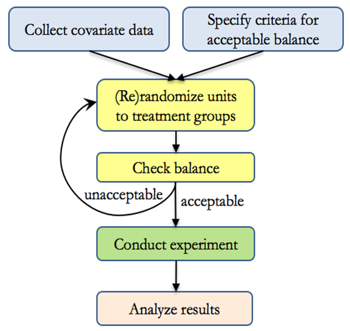

# Experimental Design {#sec-experimental-design}

This chapter provides a treatment of experimental design principles, focusing on their application in business experiments such as A/B testing, consumer behavior studies, and market research. It begins by defining key terms and explaining why randomization is the gold standard for establishing causal relationships. The chapter covers both classical and advanced designs, including completely randomized designs, factorial designs, and crossover trials. It also delves into the selection problem and the consequences of bias. Topics such as blocking, stratification, and factorial manipulation are discussed with an emphasis on practical implementation. Statistical notation is introduced to describe treatment allocation mechanisms, and visual diagrams help clarify complex ideas. Emerging research trends and limitations of traditional designs are also explored to prepare readers for real-world complexities.

Imagine you're a marketing manager trying to decide whether a new advertising campaign will boost sales. Or perhaps you're an economist investigating the impact of tax incentives on consumer spending. In both cases, you need a way to determine causal effects, not just correlations. This is where experimental design becomes essential.

At its core, experimental design ensures that studies are conducted efficiently and that valid conclusions can be drawn. In business applications, experiments help quantify the effects of pricing strategies, marketing tactics, and financial interventions. A well-designed experiment reduces bias, controls variability, and maximizes the accuracy of causal inferences.

------------------------------------------------------------------------

## Principles of Experimental Design

A well-designed experiment follows three key principles:

1.  Randomization: Ensures that subjects or experimental units are assigned to different groups randomly, eliminating selection bias.
2.  Replication: Increases the precision of estimates by repeating the experiment on multiple subjects.
3.  Control: Isolates the effect of treatments by using control groups or baseline conditions to minimize confounding factors.

In addition to these, **blocking** and **factorial designs** further refine experimental accuracy.

------------------------------------------------------------------------

## The Gold Standard: Randomized Controlled Trials {#sec-the-gold-standard-randomized-controlled-trials}

Randomized Controlled Trials (RCTs) are the **holy grail of causal inference**. Their power comes from **random assignment**, which ensures that any differences between treatment and control groups arise **only** due to the intervention.

RCTs provide:

-   **Unbiased estimates** of treatment effects
-   **Elimination of confounding factors on average** (although covariate imbalance can occur, necessitating techniques like [Rerandomization](#sec-re-randomization) to achieve a "platinum standard" set by @tukey1993tightening)

An RCT consists of two groups:

1.  Treatment group: Receives the intervention (e.g., a new marketing campaign, drug, or financial incentive).
2.  Control group: Does not receive the intervention, serving as a baseline.

Subjects from the same population are randomly assigned to either group. This randomization ensures that any observed differences in outcomes are due solely to the treatment, not external factors.

However, RCTs are easier to conduct in **hard sciences** (e.g., medicine or physics), where treatments and environments can be tightly controlled. In **social sciences**, challenges arise because:

-   Human behavior is unpredictable.
-   Some treatments are impossible or unethical to introduce (e.g., assigning individuals to poverty).
-   Real-world environments are difficult to control.

To address these challenges, social scientists use [Quasi-Experimental Methods](#sec-quasi-experimental) to approximate experimental conditions.

RCTs establish [internal validity](#sec-internal-validity), meaning that the observed treatment effects are **causally interpretable**. Even though **random assignment is not the same as *ceteris paribus*** (holding everything else constant), it achieves a similar effect: **on average**, treatment and control groups should be comparable.

------------------------------------------------------------------------

## Selection Problem

A fundamental challenge in causal inference is that we never observe both potential outcomes for the same individual, only one or the other. This creates the selection problem, which we formalize below.

Assume we have:

-   A **binary treatment variable**:\
    $D_i \in \{0,1\}$, where:
    -   $D_i = 1$ indicates that individual $i$ receives the treatment.
    -   $D_i = 0$ indicates that individual $i$ does **not** receive the treatment.
-   The **outcome of interest**:\
    $Y_i$, which depends on whether the individual is treated or not:
    -   $Y_{0i}$: The outcome **if not treated**.
    -   $Y_{1i}$: The outcome **if treated**.

Thus, the **potential outcomes framework** is defined as:

$$
\text{Potential Outcome} =
\begin{cases}
Y_{1i}, & \text{if } D_i = 1 \quad (\text{Treated}) \\
Y_{0i}, & \text{if } D_i = 0 \quad (\text{Untreated})
\end{cases}
$$

However, we only **observe** one outcome per individual:

$$
Y_i = Y_{0i} + (Y_{1i} - Y_{0i})D_i
$$

This means that for any given person, we either observe $Y_{1i}$ or $Y_{0i}$, but **never both**. Since we cannot observe counterfactuals (unless we invent a time machine), we must rely on statistical inference to estimate treatment effects.

### The Observed Difference in Outcomes

The goal is to estimate the difference in expected outcomes between treated and untreated individuals:

$$
E[Y_i | D_i = 1] - E[Y_i | D_i = 0]
$$

Expanding this equation:

$$
\begin{aligned}
E[Y_i | D_i = 1] - E[Y_i | D_i = 0] &= (E[Y_{1i} | D_i = 1] - E[Y_{0i}|D_i = 1] ) \\
&+ (E[Y_{0i} |D_i = 1] - E[Y_{0i} |D_i = 0]) \\
&= (E[Y_{1i}-Y_{0i}|D_i = 1] ) \\
&+ (E[Y_{0i} |D_i = 1] - E[Y_{0i} |D_i = 0])
\end{aligned}
$$

This equation decomposes the **observed difference** into two components:

-   Treatment Effect on the Treated: $E[Y_{1i} - Y_{0i} |D_i = 1]$, which represents the causal impact of the treatment on those who are treated.

-   Selection Bias: \
    $E[Y_{0i} |D_i = 1] - E[Y_{0i} |D_i = 0]$, which captures systematic differences between treated and untreated groups **even in the absence of treatment**.

Thus, the **observed difference in outcomes** is:

$$
\text{Observed Difference} = \text{ATT} + \text{Selection Bias}
$$

### Eliminating Selection Bias with Random Assignment

With **random assignment** of treatment, $D_i$ is independent of potential outcomes:

$$
E[Y_i | D_i = 1] - E[Y_i|D_i = 0] = E[Y_{1i} - Y_{0i}]
$$

This works because, under true randomization:

$$
E[Y_{0i} | D_i = 1] = E[Y_{0i} | D_i = 0]
$$

which eliminates selection bias. Consequently, the observed difference now **directly estimates the true causal effect**:

$$
E[Y_i | D_i = 1] - E[Y_i | D_i = 0] = E[Y_{1i} - Y_{0i}]
$$

Thus, [randomized controlled trials](#sec-the-gold-standard-randomized-controlled-trials) provide an unbiased estimate of the [average treatment effect](#sec-average-treatment-effect).

------------------------------------------------------------------------

### Another Representation Under Regression

So far, we have framed the selection problem using expectations and potential outcomes. Another way to represent treatment effects is through **regression models**, which provide a practical framework for estimation.

Suppose the treatment effect is constant across individuals:

$$
Y_{1i} - Y_{0i} = \rho
$$

This implies that each treated individual experiences the same treatment effect ($\rho$), though their baseline outcomes ($Y_{0i}$) may vary.

Since we only observe **one** of the potential outcomes, the observed outcome can be expressed as:

$$
\begin{aligned}
Y_i &= E(Y_{0i}) + (Y_{1i} - Y_{0i}) D_i + [Y_{0i} - E(Y_{0i})] \\
&= \alpha + \rho D_i + \eta_i
\end{aligned}
$$

where:

-   $\alpha = E(Y_{0i})$, the expected outcome for untreated individuals.
-   $\rho$ represents the **causal treatment effect**.
-   $\eta_i = Y_{0i} - E(Y_{0i})$, capturing individual deviations from the mean untreated outcome.

Thus, the regression model provides an intuitive way to express treatment effects.

#### Conditional Expectations and Selection Bias

Taking expectations conditional on treatment status:

$$
\begin{aligned}
E[Y_i |D_i = 1] &= \alpha + \rho + E[\eta_i |D_i = 1] \\
E[Y_i |D_i = 0] &= \alpha + E[\eta_i |D_i = 0]
\end{aligned}
$$

The observed difference in means between treated and untreated groups is:

$$
E[Y_i |D_i = 1] - E[Y_i |D_i = 0] = \rho + E[\eta_i |D_i = 1] - E[\eta_i |D_i = 0]
$$

Here, the term $E[\eta_i |D_i = 1] -E[\eta_i |D_i = 0]$ represents the selection bias, the correlation between the regression error term ($\eta_i$) and the treatment variable ($D_i$).

Under random assignment, we assume that potential outcomes are **independent** of treatment ($D_i$):

$$
E[\eta_i |D_i = 1] -E[\eta_i |D_i = 0] = E[Y_{0i} |D_i = 1] -E[Y_{0i}|D_i = 0] = 0
$$

Thus, under true **randomization**, selection bias disappears, and the observed difference directly estimates the **causal effect** $\rho$.

------------------------------------------------------------------------

#### Controlling for Additional Variables

In many real-world scenarios, **random assignment is imperfect**, and selection bias may still exist. To mitigate this, we introduce **control variables** ($X_i$), such as demographic characteristics, firm size, or prior purchasing behavior.

If $X_i$ is **uncorrelated with treatment** ($D_i$), including it in our regression model does not bias the estimate of $\rho$ but has two advantages:

1.  **It reduces residual variance** ($\eta_i$), improving the precision of $\rho$.
2.  **It accounts for additional sources of variability**, making the model more robust.

Thus, our regression model extends to:

$$
Y_i = \alpha + \rho D_i + X_i'\gamma + \eta_i
$$

where:

-   $X_i$ represents a vector of control variables.
-   $\gamma$ captures the effect of $X_i$ on the outcome.

#### Example: Racial Discrimination in Hiring

A famous study by @bertrand2004emily examined racial discrimination in hiring by randomly assigning Black- and White-sounding names to identical job applications. By ensuring that names were assigned randomly, the authors eliminated confounding factors like education and experience, allowing them to estimate the causal effect of race on callback rates.

------------------------------------------------------------------------

## Classical Experimental Designs

Experimental designs provide structured frameworks for conducting experiments, ensuring that results are **statistically valid** and **practically applicable**. The choice of design depends on the research question, the nature of the treatment, and potential sources of variability. For a more in-depth statistical understanding of these designs, we will revisit them again in [Analysis of Variance](#sec-analysis-of-variance-anova).

------------------------------------------------------------------------

### Completely Randomized Design

In a Completely Randomized Design (CRD), each experimental unit is randomly assigned to a treatment group. This is the simplest form of experimental design and is effective when no confounding factors are present.

**Example: Email Marketing Experiment**

A company tests three different email marketing strategies (A, B, and C) to measure their effect on **customer engagement** (click-through rate). Customers are randomly assigned to receive one of the three emails.

**Mathematical Model**

$$
Y_{ij} = \mu + \tau_i + \epsilon_{ij}
$$

where:

-   $Y_{ij}$ is the response variable (e.g., click-through rate).
-   $\mu$ is the overall mean response.
-   $\tau_i$ is the effect of treatment $i$.
-   $\epsilon_{ij}$ is the random error term, assumed to be normally distributed: $\epsilon_{ij} \sim N(0, \sigma^2)$.

```{r}
set.seed(123)

# Simulated dataset for email marketing experiment
data <- data.frame(
  group = rep(c("A", "B", "C"), each = 10),
  response = c(rnorm(10, mean=50, sd=5),
               rnorm(10, mean=55, sd=5),
               rnorm(10, mean=60, sd=5))
)

# ANOVA to test for differences among groups
anova_result <- aov(response ~ group, data = data)
summary(anova_result)
```

If the **p-value** in the ANOVA summary is **less than 0.05**, we reject the null hypothesis and conclude that at least one email strategy significantly affects engagement.

### Randomized Block Design

A Randomized Block Design (RBD) is used when experimental units can be grouped into homogeneous blocks based on a known confounding factor. Blocking helps reduce unwanted variation, increasing the precision of estimated treatment effects.

**Example: Store Layout Experiment**

A retailer tests three store layouts (A, B, and C) on sales performance. Since store location (Urban, Suburban, Rural) might influence sales, we use blocking to control for this effect.

**Mathematical Model** $$
Y_{ij} = \mu + \tau_i + \beta_j + \epsilon_{ij}
$$ where:

-   $Y_{ij}$ is the sales outcome for store $i$ in location $j$.

-   $\mu$ is the overall mean sales.

-   $\tau_i$ is the effect of layout $i$.

-   $\beta_j$ represents the block effect (location).

-   $\epsilon_{ij}$ is the random error.

```{r}
set.seed(123)

# Simulated dataset for store layout experiment
data <- data.frame(
  block = rep(c("Urban", "Suburban", "Rural"), each = 6),
  layout = rep(c("A", "B", "C"), times = 6),
  sales = c(rnorm(6, mean=200, sd=20),
            rnorm(6, mean=220, sd=20),
            rnorm(6, mean=210, sd=20))
)

# ANOVA with blocking factor
anova_block <- aov(sales ~ layout + block, data = data)
summary(anova_block)

```

By including `block` in the model, we account for **location effects**, leading to **more accurate** treatment comparisons.

### Factorial Design

A Factorial Design evaluates the effects of two or more factors simultaneously, allowing for the study of interactions between variables.

**Example: Pricing and Advertising Experiment**

A company tests two pricing strategies (High, Low) and two advertising methods (TV, Social Media) on sales.

**Mathematical Model** $$
Y_{ijk} = \mu + \tau_i + \gamma_j + (\tau\gamma)_{ij} + \epsilon_{ijk}
$$

where:

-   $\tau_i$ is the effect of price level $i$.

-   $\gamma_j$ is the effect of advertising method $j$.

-   $(\tau\gamma)_{ij}$ is the **interaction effect** between price and advertising.

-   $\epsilon_{ijk}$ is the random error term.

```{r}
set.seed(123)

# Simulated dataset
data <- expand.grid(
  Price = c("High", "Low"),
  Advertising = c("TV", "Social Media"),
  Replicate = 1:10
)

# Generate response variable (sales)
data$Sales <- with(data, 
                   100 + 
                   ifelse(Price == "Low", 10, 0) + 
                   ifelse(Advertising == "Social Media", 15, 0) + 
                   ifelse(Price == "Low" & Advertising == "Social Media", 5, 0) +
                   rnorm(nrow(data), sd=5))

# Two-way ANOVA
anova_factorial <- aov(Sales ~ Price * Advertising, data = data)
summary(anova_factorial)
```

### Crossover Design

A Crossover Design is used when each subject receives multiple treatments in a sequential manner. This design controls for individual differences by using each subject as their own control.

**Example: Drug Trial**

Patients receive Drug A in the first period and Drug B in the second period, or vice versa.

**Mathematical Model** $$
Y_{ijk} = \mu + \tau_i + \pi_j + \beta_k + \epsilon_{ijk}
$$ where:

-   $\tau_i$ is the **treatment effect**.

-   $\pi_j$ is the **period effect** (e.g., learning effects).

-   $\beta_k$ is the **subject effect** (individual baseline differences).

```{r}
set.seed(123)

# Simulated dataset
data <- data.frame(
  Subject = rep(1:10, each = 2),
  Period = rep(c("Period 1", "Period 2"), times = 10),
  Treatment = rep(c("A", "B"), each = 10),
  Response = c(rnorm(10, mean=50, sd=5), rnorm(10, mean=55, sd=5))
)

# Crossover ANOVA
anova_crossover <-
  aov(Response ~ Treatment + Period + Error(Subject / Period),
      data = data)
summary(anova_crossover)

```

### Split-Plot Design

A Split-Plot Design is used when one factor is applied at the group (whole-plot) level and another at the individual (sub-plot) level. This design is particularly useful when some factors are harder or more expensive to randomize than others.

**Example: Farming Experiment**

A farm is testing two irrigation methods (Drip vs. Sprinkler) and two soil types (Clay vs. Sand) on crop yield. Since irrigation systems are installed at the farm level and are difficult to change, they are treated as the whole-plot factor. However, different soil types exist within each farm and can be tested more easily, making them the sub-plot factor.

------------------------------------------------------------------------

**Mathematical Model**

The statistical model for a **Split-Plot Design** is:

$$
Y_{ijk} = \mu + \alpha_i + B_k + \beta_j + (\alpha\beta)_{ij} + \epsilon_{ijk}
$$

where:

-   $Y_{ijk}$ is the response (e.g., crop yield).\
-   $\mu$ is the overall mean.\
-   $\alpha_i$ is the **whole-plot factor** (Irrigation method).\
-   $B_k$ is the **random block effect** (Farm-level variation).\
-   $\beta_j$ is the **sub-plot factor** (Soil type).\
-   $(\alpha\beta)_{ij}$ is the interaction effect between **Irrigation** and **Soil type**.\
-   $\epsilon_{ijk} \sim N(0, \sigma^2)$ represents the **random error term**.

The key feature of the Split-Plot Design is that the whole-plot factor ($\alpha_i$) is tested against the farm-level variance ($B_k$), while the sub-plot factor ($\beta_j$) is tested against individual variance ($\epsilon_{ijk}$).

------------------------------------------------------------------------

We model the **Split-Plot Design** using a **Mixed Effects Model**, treating **Farm** as a **random effect** to account for variation at the whole-plot level.

```{r}
set.seed(123)

# Simulated dataset for a split-plot experiment
data <- data.frame(
  Farm = rep(1:6, each = 4), # 6 farms (whole plots)
  
  # Whole-plot factor
  Irrigation = rep(c("Drip", "Sprinkler"), each = 12), 
  Soil = rep(c("Clay", "Sand"), times = 12), # Sub-plot factor
  
  # Response variable
  Yield = c(rnorm(12, mean=30, sd=5), rnorm(12, mean=35, sd=5)) 
)

# Load mixed-effects model library
library(lme4)

# Mixed-effects model: Whole-plot factor (Irrigation) as a random effect
model_split <- lmer(Yield ~ Irrigation * Soil + (1 | Farm), data = data)

# Summary of the model
summary(model_split)
```

In this model:

-   Irrigation (Whole-plot factor) is tested against Farm-level variance.

-   Soil type (Sub-plot factor) is tested against Residual variance.

-   The interaction between Irrigation × Soil is also evaluated.

This hierarchical structure accounts for the fact that farms are not independent, improving the precision of our estimates.

### Latin Square Design

When two potential confounding factors exist, Latin Square Designs provide a structured way to control for these variables. This design is common in scheduling, manufacturing, and supply chain experiments.

**Example: Assembly Line Experiment**

A manufacturer wants to test three assembly methods (A, B, C) while controlling for work shifts and workstations. Since both shifts and workstations may influence production time, a Latin Square Design ensures that each method is tested once per shift and once per workstation.

**Mathematical Model**

A Latin Square Design ensures that each treatment appears exactly once in each row and column: $$
Y_{ijk} = \mu + \alpha_i + \beta_j + \gamma_k + \epsilon_{ijk}
$$ where:

-   $Y_{ijk}$ is the outcome (e.g., assembly time).

-   $\mu$ is the overall mean.

-   $\alpha_i$ is the **treatment effect** (Assembly Method).

-   $\beta_j$ is the **row effect** (Work Shift).

-   $\gamma_k$ is the **column effect** (Workstation).

-   $\epsilon_{ijk}$ is the random error term.

This ensures that each treatment is **equally balanced across both confounding factors**.

------------------------------------------------------------------------

We implement a **Latin Square Design** by treating **Assembly Method** as the primary factor, while controlling for **Shifts** and **Workstations**.

```{r}
set.seed(123)

# Define the Latin Square layout
latin_square <- data.frame(
  Shift = rep(1:3, each = 3), # Rows
  Workstation = rep(1:3, times = 3), # Columns
  
  # Treatments assigned in a balanced way
  Method = c("A", "B", "C", "C", "A", "B", "B", "C", "A"), 
  Time = c(rnorm(3, mean = 30, sd = 3),
           rnorm(3, mean = 28, sd = 3),
           rnorm(3, mean = 32, sd = 3)) # Assembly time
)

# ANOVA for Latin Square Design
anova_latin <-
  aov(Time ~ factor(Shift) + factor(Workstation) + factor(Method),
      data = latin_square)
summary(anova_latin)

```

-   If the p-value for "Method" is significant, we conclude that different assembly methods impact production time.

-   If "Shift" or "Workstation" is significant, it indicates systematic differences across these variables.

------------------------------------------------------------------------

## Advanced Experimental Designs

### Semi-Random Experiments

In **semi-random experiments**, participants are **not fully randomized** into treatment and control groups. Instead, a **structured randomization process** ensures fairness while allowing some level of causal inference.

#### Example: Loan Assignment Fairness

A bank wants to evaluate a new loan approval policy while ensuring that the experiment does not unfairly exclude specific demographics.

To maintain fairness:

1.  Applicants are first stratified based on income and credit history.
2.  Within each stratum, a random subset is assigned to receive the new policy, while others continue under the old policy.

```{r}
set.seed(123)

# Create stratified groups
data <- data.frame(
  income_group = rep(c("Low", "Medium", "High"), each = 10),
  
  # Stratified randomization
  treatment = sample(rep(c("New Policy", "Old Policy"), each = 15)) 
)

# Display the stratification results
table(data$income_group, data$treatment)
```

This approach ensures that each income group is fairly represented in both treatment and control conditions.

#### Case Study: Chicago Open Enrollment Program

A well-known example of semi-random assignment is the **Chicago Open Enrollment Program** [@cullen2005impact], where students could apply to choice schools.

However, since many schools were oversubscribed (i.e., demand exceeded supply), they used a random lottery system to allocate spots.

Thus, while **enrollment itself was not fully random**, the **lottery outcomes were random**, allowing researchers to estimate the [Intent-to-Treat effect](#sec-intention-to-treat-effect) while acknowledging that not all students who won the lottery actually enrolled.

This situation presents a classic case where:

-   **School choice is not random**: Families self-select into applying to certain schools.
-   **Lottery outcomes are random**: Among those who apply, winning or losing the lottery is as good as a **random assignment**.

Let:

-   $Enroll_{ij} = 1$ if student $i$ enrolls in school $j$, and $0$ otherwise.
-   $Win_{ij} = 1$ if student $i$ **wins the lottery**, and $0$ otherwise.
-   $Apply_{ij} = 1$ if student $i$ **applies** to school $j$.

We define:

$$
\delta_j = E[Y_i | Enroll_{ij} = 1, Apply_{ij} = 1] - E[Y_i | Enroll_{ij} = 0, Apply_{ij} = 1]
$$

$$
\theta_j = E[Y_i | Win_{ij} = 1, Apply_{ij} = 1] - E[Y_i | Win_{ij} = 0, Apply_{ij} = 1]
$$

where:

-   $\delta_j$ is the **treatment effect** (impact of actual school enrollment).
-   $\theta_j$ is the [intent-to-treat effect](#sec-intention-to-treat-effect) (impact of winning the lottery).

Since **not all winners enroll**, we know that:

$$
\delta_j \neq \theta_j
$$

Thus, we can only estimate $\theta_j$ directly, and need an additional method to recover $\delta_j$.

This distinction is crucial because simply comparing lottery winners and losers does not measure the true effect of enrollment, only the effect of being given the opportunity to enroll.

To estimate the treatment effect ($\delta_j$), we use an Instrumental Variable approach:

$$
\delta_j = \frac{E[Y_i | W_{ij} = 1, A_{ij} = 1] - E[Y_i | W_{ij} = 0, A_{ij} = 1]}{P(Enroll_{ij} = 1 | W_{ij} = 1, A_{ij} = 1) - P(Enroll_{ij} = 1 | W_{ij} = 0, A_{ij} = 1)}
$$

where:

-   $P(Enroll_{ij} = 1 | W_{ij} = 1, A_{ij} = 1)$ = probability of enrolling **if winning the lottery**.
-   $P(Enroll_{ij} = 1 | W_{ij} = 0, A_{ij} = 1)$ = probability of enrolling **if losing the lottery**.

This adjustment accounts for the fact that some lottery winners do not enroll, and thus the observed effect ($\theta_j$) underestimates the true treatment effect ($\delta_j$).

This Instrumental Variable approach corrects for **selection bias** by leveraging **randomized lottery assignment**.

------------------------------------------------------------------------

**Numerical Example**

Assume **10 students win** the lottery and **10 students lose**.

**For Winners:**

| Type          | Count | Selection Effect | Treatment Effect | Total Effect |
|---------------|-------|------------------|------------------|--------------|
| Always Takers | 1     | +0.2             | +1               | +1.2         |
| Compliers     | 2     | 0                | +1               | +1           |
| Never Takers  | 7     | -0.1             | 0                | -0.1         |

: Selection and Treatment Effects by Compliance Type Winners

**For Losers:**

| Type          | Count | Selection Effect | Treatment Effect | Total Effect |
|---------------|-------|------------------|------------------|--------------|
| Always Takers | 1     | +0.2             | +1               | +1.2         |
| Compliers     | 2     | 0                | 0                | 0            |
| Never Takers  | 7     | -0.1             | 0                | -0.1         |

: Selection and Treatment Effects by Compliance Type Losers

------------------------------------------------------------------------

Computing [Intent-to-Treat Effect](#sec-intention-to-treat-effect)

We compute the expected outcome for those who won and lost the lottery.

$$
\begin{aligned}
E[Y_i | W_{ij} = 1, A_{ij} = 1] &= \frac{1(1.2) + 2(1) + 7(-0.1)}{10} = 0.25 \\
E[Y_i | W_{ij} = 0, A_{ij} = 1] &= \frac{1(1.2) + 2(0) + 7(-0.1)}{10} = 0.05
\end{aligned}
$$

Thus, the [Intent-to-Treat Effect](#sec-intention-to-treat-effect) is:

$$
\text{Intent-to-Treat Effect} = 0.25 - 0.05 = 0.2
$$

------------------------------------------------------------------------

Now, we calculate the probability of enrollment for lottery winners and losers:

$$
\begin{aligned}
P(Enroll_{ij} = 1 | W_{ij} = 1, A_{ij} = 1) &= \frac{1+2}{10} = 0.3 \\
P(Enroll_{ij} = 1 | W_{ij} = 0, A_{ij} = 1) &= \frac{1}{10} = 0.1
\end{aligned}
$$

Using the formula for treatment effect ($\delta$):

$$
\text{Treatment Effect} = \frac{0.2}{0.3 - 0.1} = 1
$$

This confirms that the true treatment effect is 1 unit.

------------------------------------------------------------------------

To account for additional factors ($X_i$), we extend the model as follows:

$$
Y_{ia} = \delta W_{ia} + \lambda L_{ia} + X_i \theta + u_{ia}
$$

where:

-   $\delta$ = [Intent-to-Treat effect](#sec-intention-to-treat-effect)
-   $\lambda$ = True treatment effect
-   $W$ = Whether a student wins the lottery
-   $L$ = Whether a student enrolls in the school
-   $X_i \theta$ = Control variables (i.e., reweighting of lottery), but would not affect treatment effect $E(\delta)$

Since choosing to apply to a lottery is not random, we must consider the following:

$$
E(\lambda) \neq E(\lambda_1)
$$

This demonstrates why lottery-based assignment is a useful but imperfect tool for [causal inference](#sec-causal-inference): winning the lottery is random, but who applies is not.

------------------------------------------------------------------------

### Re-Randomization {#sec-re-randomization}

In standard randomization, baseline covariates are only balanced on average, meaning imbalance can still occur due to random chance. Re-randomization eliminates bad randomizations by checking balance before the experiment begins [@morgan2012rerandomization].

**Key Motivations for Re-Randomization**

-   **Randomization does not guarantee balance**:
    -   Example: For **10 covariates**, the probability of at least one imbalance at $\alpha = 0.05$ is:\
        $$  
        1 - (1 - 0.05)^{10} = 0.40 = 40\%  
        $$\
    -   This means a high chance of some imbalance across treatment groups.\
-   Re-randomization increases precision: If covariates correlate with the outcome, improving covariate balance improves treatment effect estimation
-   Accounting for re-randomization in inference: Since re-randomization filters out bad assignments, it is equivalent to increasing the sample size and must be considered when computing standard errors.
-   Alternative balancing techniques: 
    -   Stratified randomization [@johansson2022rerandomization].
    -   Matched randomization [@greevy2004optimal; @kapelner2014matching].
    -   Minimization [@pocock1975sequential].

Fig. \@ref(fig:rerandomization-flow) summarises the overall procedure for re-randomization.

```{r rerandomization-flow, fig.cap="Re-randomization workflow: covariate data are collected, balance criteria are specified, and units are repeatedly randomized until the criteria are met before the experiment proceeds.", fig.alt='Flow chart illustrating a process for conducting an experiment. It begins with "Collect covariate data" and "Specify criteria for acceptable balance." Next, "(Re)randomize units to treatment groups" is followed by "Check balance," which branches into "unacceptable" and "acceptable." If unacceptable, it loops back to randomization. If acceptable, it proceeds to "Conduct experiment" and finally "Analyze results."', echo = FALSE}

```

------------------------------------------------------------------------

**Example: Balancing Experimental Groups**

An online retailer is testing two website designs (A and B) but wants to ensure that key customer demographics (e.g., age) are balanced across treatment groups.

We define a balance criterion to check if the mean age difference between groups is acceptable before proceeding.

```{r}
set.seed(123)

# Define balance criterion: Ensure mean age difference < 1 year
balance_criterion <- function(data) {
  abs(mean(data$age[data$group == "A"]) - mean(data$age[data$group == "B"])) < 1
}

# Generate randomized groups, repeat until balance criterion is met
repeat {
  data <- data.frame(
    age = rnorm(100, mean = 35, sd = 10),
    group = sample(c("A", "B"), 100, replace = TRUE)
  )
  if (balance_criterion(data)) break
}

# Check final group means
tapply(data$age, data$group, mean)
```

#### Rerandomization Criterion

Re-randomization is based on a function of the covariate matrix ($\mathbf{X}$) and treatment assignments ($\mathbf{W}$).

$$
W_i = 
\begin{cases}
1, & \text{if treated} \\
0, & \text{if control}
\end{cases}
$$

A common approach is to use Mahalanobis Distance to measure covariate balance between treatment and control groups:

$$
\begin{aligned}
M &= (\bar{\mathbf{X}}_T - \bar{\mathbf{X}}_C)' \text{cov}(\bar{\mathbf{X}}_T - \bar{\mathbf{X}}_C)^{-1} (\bar{\mathbf{X}}_T - \bar{\mathbf{X}}_C) \\
&= (\frac{1}{n_T} + \frac{1}{n_C})^{-1} (\bar{\mathbf{X}}_T - \bar{\mathbf{X}}_C)' \text{cov}(\mathbf{X})^{-1} (\bar{\mathbf{X}}_T - \bar{\mathbf{X}}_C)
\end{aligned}
$$

where:

-   $\bar{\mathbf{X}}_T$ and $\bar{\mathbf{X}}_C$ are the mean covariate values for treatment and control groups.
-   $\text{cov}(\mathbf{X})$ is the covariance matrix of the covariates.
-   $n_T$ and $n_C$ are the sample sizes for treatment and control groups.

If the sample size is large and randomization is pure, then $M$ follows a chi-squared distribution:

$$
M \sim \chi^2_k
$$

where $k$ is the number of covariates to be balanced.

------------------------------------------------------------------------

**Choosing the Rerandomization Threshold** ($M > a$)

Define $p_a$ as the probability of accepting a randomization:

-   Smaller $p_a$ → Stronger balance, but longer computation time.
-   Larger $p_a$ → Faster randomization, but weaker balance.

A rule of thumb is to re-randomize whenever:

$$
M > a
$$

where $a$ is chosen based on acceptable balance thresholds.

------------------------------------------------------------------------

We apply Mahalanobis Distance as a balance criterion to ensure that treatment and control groups are well-matched before proceeding with the experiment.

```{r}
set.seed(123)
library(MASS)

# Generate a dataset with two covariates
n <- 100
X <- mvrnorm(n, mu = c(0, 0), Sigma = matrix(c(1, 0.5, 0.5, 1), 2, 2))
colnames(X) <- c("Covariate1", "Covariate2")

# Balance function using Mahalanobis Distance
balance_criterion <- function(X, group) {
  X_treat <- X[group == 1, ]
  X_control <- X[group == 0, ]
  
  mean_diff <- colMeans(X_treat) - colMeans(X_control)
  cov_inv <- solve(cov(X))
  M <- t(mean_diff) %*% cov_inv %*% mean_diff
  
  
  # Acceptable threshold 
  # (chi-squared critical value for k = 2, alpha = 0.05)
  return(M < 3.84)  
}

# Repeat randomization until balance is met
repeat {
  group <- sample(c(0, 1), n, replace = TRUE)
  if (balance_criterion(X, group)) break
}

# Display final balance check
table(group)
colMeans(X[group == 1, ])  # Treatment group means
colMeans(X[group == 0, ])  # Control group means
```

------------------------------------------------------------------------

### Two-Stage Randomized Experiments

A **two-stage randomized experiment** involves **sequential interventions**, where treatment assignments depend on earlier responses. This design is widely used in:

-   Adaptive Learning: Adjusting educational content based on student progress.
-   Personalized Advertising: Targeting follow-up ads based on engagement.
-   Medical Trials: Adapting treatments based on patient response.

By introducing **a second randomization stage**, researchers can evaluate:

1.  **The effect of initial treatments.**
2.  **The effect of follow-up treatments.**
3.  **Potential interactions between the two stages.**

------------------------------------------------------------------------

#### Example: Personalized Advertising Experiment

A company tests two initial ad campaigns (Ad A vs. Ad B). After observing customer engagement, they apply a second-stage intervention (e.g., Discount vs. No Discount).

The two-stage experiment can be modeled as:

$$
Y_{ijk} = \mu + \alpha_i + \beta_{j(i)} + \epsilon_{ijk}
$$

where:

-   $\mu$ = Overall mean outcome (e.g., conversion rate).
-   $\alpha_i$ = Effect of first-stage intervention ($i$ = Ad A or Ad B).
-   $\beta_{j(i)}$ = Effect of second-stage intervention, nested within first-stage groups.
-   $\epsilon_{ijk}$ = Random error term.

The nested structure ensures that the second-stage treatment ($\beta_{j(i)}$) is assigned within each first-stage treatment group.

------------------------------------------------------------------------

```{r}
set.seed(123)

# Generate first-stage randomization (Initial Ad)
data <- data.frame(
  stage1 = sample(c("Ad A", "Ad B"), 100, replace = TRUE),
  stage2 = rep(NA, 100)  # Placeholder for second-stage randomization
)

# Second-stage assignment based on first-stage response
data$stage2[data$stage1 == "Ad A"] <-
    sample(c("Discount", "No Discount"),
           sum(data$stage1 == "Ad A"),
           replace = TRUE)
data$stage2[data$stage1 == "Ad B"] <-
    sample(c("Discount", "No Discount"),
           sum(data$stage1 == "Ad B"),
           replace = TRUE)

# Display final randomization
table(data$stage1, data$stage2)
```

This structure ensures:

1.  Fair assignment of initial ads.

2.  Adaptive targeting in the second stage based on user engagement.

------------------------------------------------------------------------

### Two-Stage Randomized Experiments with Interference and Noncompliance

In real-world experiments, **interference and noncompliance** complicate analysis [@imai2021causal]:

-   Interference: When treatment effects "spill over" from one group to another (e.g., social influence in marketing).

-   Noncompliance: When participants do not adhere to their assigned treatment (e.g., a customer ignoring an ad).

To handle noncompliance, we define:

-   $Z_{ik}$ = Assigned treatment (e.g., Ad A or Ad B).

-   $D_{ik}$ = Actual treatment received (e.g., whether the user actually saw the ad).

-   $Y_{ik}$ = Outcome (e.g., purchase).

A **two-stage Instrumental Variable model** adjusts for noncompliance:

$$
\begin{aligned}
D_{ik} &= \gamma_0 + \gamma_1 Z_{ik} + v_{ik} \\
Y_{ik} &= \beta_0 + \beta_1 D_{ik} + \epsilon_{ik}
\end{aligned}
$$ where:

-   $\gamma_1$ measures the effect of assignment on actual treatment received.

-   $\beta_1$ estimates the treatment effect, adjusting for noncompliance.

If individuals influence each other's outcomes, traditional randomization is biased. Solutions include:

1.  **Cluster Randomization**: Assigning treatments at the group level (e.g., entire social circles receive the same ad).

2.  **Partial Interference Models**: Assume interference only occurs within predefined groups.

```{r}
set.seed(123)
library(ivreg)  # Load Instrumental Variable Regression Package

# Generate data for first-stage treatment assignment
n <- 500
data <- data.frame(
  Z = sample(c(0, 1), n, replace = TRUE),  # Initial assignment (randomized)
  D = NA,  # Actual treatment received (affected by compliance)
  Y = NA   # Outcome variable (e.g., purchase)
)

# Introduce noncompliance: 80% compliance rate
data$D <- ifelse(runif(n) < 0.8, data$Z, 1 - data$Z)

# Generate outcome variable (Y) with true treatment effect
# True effect of D on Y is 3
data$Y <- 5 + 3 * data$D + rnorm(n, mean = 0, sd = 2)  

# Estimate Two-Stage Least Squares (2SLS)
iv_model <- ivreg(Y ~ D | Z, data = data)
summary(iv_model)

```

-   The first-stage regression estimates how strongly $Z$ affects $D$ (compliance).

-   The second-stage regression estimates the true causal effect of $D$ on $Y$.

If interference is present, the standard IV method may be biased. Researchers should explore network-based randomization or spatial models.


### Cluster Randomization for Interference Bias {#sec-cluster-randomization}

Standard randomized controlled trials rely on the Stable Unit Treatment Value Assumption (SUTVA), which has two parts. No interference says that the potential outcome of one unit is unaffected by the treatment assignment of any other unit, i.e. $Y_i(Z)$ depends only on $Z_i$, not on $Z_j$ for $j \ne i$. No hidden versions of treatment says that each treatment condition is well defined and consistent across units.

Violations of SUTVA, particularly interference, are common in online marketplaces such as Airbnb, eBay, Uber, and Etsy, where agents interact strategically and share common resources like customer attention and platform visibility. Interference occurs when $Y_i(Z)$ depends on the treatment status of others, i.e. $Y_i(Z_1, \ldots, Z_n)$. In such settings interference bias distorts causal estimates, often misleading decision makers.

In interconnected digital environments, agents (sellers, listings, users) affect each other through algorithmic rankings, pricing competition, and substitution behavior among buyers. As one stylized example, if Airbnb treats a host by recommending a price increase, nearby untreated hosts may adjust their own pricing in response, and buyers respond based on all available listings, so observed outcomes reflect systemic responses rather than isolated treatment effects.

This violates the no-interference condition, causing the estimated Total Average Treatment Effect (TATE) to be biased:

$$\text{TATE} = \mathbb{E}[Y_i(1) - Y_i(0)].$$

@blake2014marketplace (eBay) formalized this dynamic as test-control interference: treated sellers attract buyers away from control sellers, inflating estimated gains. Subsequent marketplace simulations have shown that overstatements of treatment effects in two-sided platforms can exceed 100% under realistic assumptions.

Following @eckles2021bias, consider the potential outcome for seller $i$:

$$Y_i(Z) = \alpha_i + \beta Z_i + \gamma \rho_i + \varepsilon_i,$$

where $\beta$ is the direct treatment effect, $\gamma$ is the spillover (indirect) effect, and $\rho_i = \frac{1}{|N_i|} \sum_{j \in N_i} Z_j$ is the fraction of treated neighbors. When $\gamma \neq 0$ there is interference; if $\beta$ and $\gamma$ have opposite signs, interference can inflate or deflate TATE estimates. In matrix form, define an interference matrix $B$ such that $\mathbb{E}[Y_i(Z)] = \alpha_i + \sum_j B_{ij} Z_j$, where diagonal entries capture direct effects and off-diagonal entries capture interference.

Cluster randomization assigns entire clusters (groups) of units, rather than individual units, to treatment or control. Units within clusters likely interfere with each other, so treating clusters homogeneously contains interference within groups. @holtz2025reducing extend @eckles2021bias and show that, for a linear interference model with uniform-sign $B_{ii}$ and $B_{ij}$, cluster randomization always reduces interference bias relative to individual-level randomization:

$$|\mathbb{E}[\hat{\tau}_{\text{cr}} - \tau]| \le |\mathbb{E}[\hat{\tau}_{\text{ind}} - \tau]|,$$

regardless of whether spillovers are positive or negative. Let $C(i)$ denote the cluster of unit $i$. Cluster quality is

$$Q_C(B) = \sum_{i,j} B_{ij} \cdot \mathbf{1}\{C(i) \ne C(j)\}.$$

Lower $Q_C(B)$ implies less across-cluster interference and better clustering. In practice $B$ is unobservable, so a proxy matrix $P$ (e.g. co-search or co-view behavior) is used.

Graph-Cluster Randomization (GCR) partitions a social or economic network into clusters and randomizes treatment at the cluster level, reducing mixed-treatment neighborhoods. @ugander2013graph showed that GCR yields unbiased Horvitz-Thompson estimators of treatment effects under certain exposure models:

$$\hat{\tau}_{HT} = \sum_{i \in T} \frac{Y_i}{\pi_i} - \sum_{i \in C} \frac{Y_i}{1 - \pi_i},$$

where $\pi_i$ is the probability that unit $i$ is treated, accounting for the randomization design. The price for this bias reduction is variance: @eckles2021bias show that $\mathrm{Var}(\hat{\tau}_{CR}) \propto \rho \cdot \sigma^2 / n_c$, where $\rho$ is the intra-cluster correlation and $n_c$ is the number of clusters. Pre-stratification, regression adjustment, or increasing the cluster count can partially mitigate this variance growth.

#### Case Study: The Airbnb Meta-Experiment

@holtz2025reducing conducted a large-scale meta-experiment on Airbnb to empirically measure interference bias and evaluate cluster randomization. Airbnb engineers constructed clusters by embedding each listing into a 16-dimensional vector space using guest co-click data, then applied a recursive partitioning tree such that at least 90% of listings within a node shared common neighbors. The resulting roughly 15,000 clusters had a median size of 150 listings, and the within-cluster substitution rate exceeded 95%. Hold-out data confirmed that cross-cluster substitution was minimal.

In each of two platform-wide experiments (over 2 million listings worldwide), 75% of clusters were randomized at the cluster level, while 25% retained standard Bernoulli (individual-level) randomization. For the guest-fee intervention the estimated TATE was $-0.207$ bookings per listing under individual-level randomization, but only $-0.139$ under cluster randomization, implying that interference inflated the naive estimate by 32.6%. The interference bias ratio $\hat{\nu} / (\hat{\beta} + \hat{\nu})$ was approximately 19.8%. Bias varied with market conditions: demand-constrained areas (New York in peak season) reached 28.6%, supply-constrained areas were lower at 12.1%, and higher cluster quality (better separation in embedding space) was associated with greater bias reduction. For the pricing-recommendation intervention the cluster-level estimate ($-0.051$) was not statistically significant, compared to $-0.106$ under Bernoulli randomization; a post-hoc power analysis indicated that detecting the same bias with 80% power would have required 3.5 times more clusters.

The case study illustrates both the prevalence of interference bias in online marketplaces and the potential of cluster randomization to mitigate it, provided clusters are intelligently constructed and contextually grounded.

#### Practical Blueprint

Diagnosing interference. First theorize likely spillover channels (e.g. ranking algorithms, price comparisons), then conduct a meta-experiment with dual randomization and compare TATEs, then quantify exposure probabilities using network or item similarity matrices.

Cluster construction. Given a substitution matrix $S$ from clicks or bookings: symmetrize $W = (S + S^\top)/2$, compute a normalized graph Laplacian $L$, embed nodes via the top-$k$ eigenvectors of $L$, apply $k$-means clustering ($k$ via the gap statistic), and merge tiny clusters if needed. Evaluate using neighbor purity (proportion of nearest neighbors within the same cluster); Airbnb used a threshold of at least 0.9.

Analysis plan. Use cluster-robust standard errors or Horvitz-Thompson weights, adjust for intra-cluster correlation, and consider OLS with pre-stratification to improve power.

A short simulation makes the bias-reduction visible:

```{r}
set.seed(123)
n <- 1000
clusters <- rep(1:100, each = 10)
Z <- rbinom(n, 1, 0.5)
B <- matrix(runif(n^2, 0, 0.1), n, n)
diag(B) <- runif(n, 0.5, 1)

Y <- sapply(1:n, function(i) sum(B[i, ] * Z)) + rnorm(n)

t_ind <- mean(Y[Z == 1]) - mean(Y[Z == 0])

cluster_Z <- tapply(Z, clusters, mean)
cluster_Y <- tapply(Y, clusters, mean)
t_cr <- mean(cluster_Y[cluster_Z > 0.5]) - mean(cluster_Y[cluster_Z <= 0.5])

c(t_ind = t_ind, t_cr = t_cr)
```

The individual-randomization estimate $t_\text{ind}$ is inflated relative to the cluster-randomization estimate $t_\text{cr}$ because the off-diagonal entries of $B$ leak treatment from $j$ to $i$ across the assignment split.

Trade-offs. Cluster randomization trades higher implementation overhead and reduced power for substantially lower interference bias; the right choice depends on the size of $\gamma$, the granularity of the interference structure, and how much within-cluster pre-stratification is feasible.

### Switchback Experiments with Surrogate Variables

<!-- Switchback experiments, in which experimental units are assigned to control and treatment interchangeably over time, have gained increasing popularity in recent years due to their ability to mitigate interference across units. Despite their wide adoption in the technology sector, drawing reliable inferences from such experiments remains challenging due to temporal interference. In this paper, we address this challenge by examining a special causal structure commonly found in a wide range of applications. Specifically, we consider scenarios where there exist surrogate variables at each experimental period that can fully capture the potential temporal interference from the past. We outline the necessary assumptions for identification in this context and propose an unbiased estimator using the technique of importance sampling. Additionally, we derive an experimental design with a near-optimal worst-case guarantee and compare it theoretically and empirically to the inverse propensity score estimator. To facilitate inferences, we introduce both an exact inference procedure based on Fisher’s randomization test and an asymptotic inference procedure based on the central limit theorem. We demonstrate by extensive numerical experiments that the proposed estimator, coupled with the experimental design, results in lower risk compared with the traditional inverse propensity score estimator. -->


------------------------------------------------------------------------

## Emerging Research

Recent research highlights significant challenges in measuring the causal effects of ad content in online advertising experiments. Digital advertising platforms employ algorithmic targeting and dynamic ad delivery mechanisms, which can introduce systematic biases in A/B testing [@braun2025where]. Key concerns include:

-   **Nonrandom Exposure**: Online advertising platforms optimize ad delivery dynamically, meaning users are not randomly assigned to different ad variants. Instead, platforms use proprietary algorithms to serve ads to different, often highly heterogeneous, user groups.

-   **Divergent Delivery**: The optimization process can lead to "divergent delivery," where differences in user engagement patterns and platform objectives result in non-comparable treatment groups. This confounds the true effect of ad content with algorithmic biases in exposure.

-   **Bias in Measured Effects**: Algorithmic targeting, user heterogeneity, and data aggregation can distort both the **magnitude** and **direction** of estimated ad effects. This means traditional A/B test results may not accurately reflect the true impact of ad creatives.

-   **Limited Transparency**: Platforms have little incentive to assist advertisers or researchers in disentangling ad content effects from proprietary targeting mechanisms. As a result, experimenters must design careful identification strategies to mitigate these biases.

------------------------------------------------------------------------


<!-- ### Getting the Most Out of A/B Tests Using the Asymptotic Minimax-Regret Criteria -->

<!-- Many firms conduct A/B tests to find a marketing action that improves a value of interest, such as revenue or profit. We develop the asymptotic minimax regret (AMMR) criterion, a practical decision-theoretic approach for choosing among binary marketing actions based on A/B tests. The AMMR is a general large-sample approximation of the minimax-regret criterion from a frequentist standpoint. Our method directly optimizes the decision-relevant metric, accounting for the product of the error probability and the associated magnitude of value loss. Implementing the AMMR decision rule is straightforward; it comprises simply comparing the standardized treatment-effect estimate to the AMMR-optimal decision threshold. The AMMR suggests selecting the treatment whenever the point estimate is positive, as this minimizes the maximum expected net loss from decision errors. A case study of a mobile game company’s A/B testing with Monte Carlo validation demonstrates that the AMMR decision rule effectively selects the optimal marketing action and improves revenue across various data-generating processes. -->


### Covariate Balancing in Online A/B Testing: The Pigeonhole Design

@zhao2024pigeonhole address the challenge of covariate balancing in online A/B testing when experimental subjects arrive sequentially. Traditional experimental designs struggle to maintain balance in real-time settings where treatment assignments must be made immediately. This work introduces the online blocking problem, in which subjects with heterogeneous covariates must be assigned to treatment or control groups dynamically, with the goal of minimizing total discrepancy, quantified as the minimum weight perfect matching between groups.

To improve covariate balance, the authors propose the **pigeonhole design**, a randomized experimental design that operates as follows:

-   The covariate space is partitioned into smaller subspaces called "pigeonholes."
-   Within each pigeonhole, the design balances the number of treated and control subjects, reducing systematic imbalances.

Theoretical analysis demonstrates the effectiveness of this design in reducing discrepancy compared to existing approaches. Specifically, the pigeonhole design is benchmarked against:

-   **Matched-pair design**
-   [Completely Randomized Design]

The results highlight scenarios where the pigeonhole design outperforms these alternatives in maintaining covariate balance.

Using Yahoo! data, the authors validate the pigeonhole design in practice, demonstrating a 10.2% reduction in variance when estimating the [Average Treatment Effect]. This improvement underscores the design's practical utility in reducing noise and improving the precision of experimental results.

The findings of @zhao2024pigeonhole provide valuable insights for practitioners conducting online A/B tests:

-   Ensuring real-time covariate balance improves the reliability of causal estimates.
-   The pigeonhole design offers a structured yet flexible approach to balancing covariates dynamically.
-   By reducing variance in treatment effect estimation, it enhances statistical efficiency in large-scale online experiments.

This study contributes to the broader discussion of [randomized experimental design](#sec-the-gold-standard-randomized-controlled-trials) in dynamic settings, providing a compelling alternative to traditional approaches.

------------------------------------------------------------------------

### Handling Zero-Valued Outcomes {#sec-handling-zero-valued-outcomes}

When analyzing treatment effects, a common issue arises when the outcome variable includes zero values.

For example, in business applications, a marketing intervention may have no effect on some customers (resulting in zero sales). If we were to apply a log transformation to the outcome variable, this would be problematic because:

-   $\log(0)$ is undefined.
-   Log transformation is sensitive to outcome units, making interpretation difficult [@chen2024logs].

Instead of applying a log transformation, we should use methods that are robust to zero values:

1.  **Percentage changes in the Average**
    -   By using Poisson Quasi-Maximum Likelihood Estimation (QMLE), we can interpret coefficients as percentage changes in the mean outcome of the treatment group relative to the control group.
2.  **Extensive vs. Intensive Margins**
    -   This approach distinguishes between:
        -   **Extensive margin**: The likelihood of moving from zero to a positive outcome (e.g., increasing the probability of making a sale).
        -   **Intensive margin**: The increase in the outcome given that it is already positive (e.g., increasing the sales amount).
    -   To estimate the **intensive-margin bounds**, we could use @lee2009training, assuming that treatment has a **monotonic effect** on the outcome.

------------------------------------------------------------------------

We first generate a dataset to simulate a scenario where an outcome variable (e.g., sales, website clicks) has many zeros, and treatment affects both the extensive and intensive margins.

```{r}
set.seed(123) # For reproducibility
library(tidyverse)

n <- 1000 # Number of observations
p_treatment <- 0.5 # Probability of being treated

# Step 1: Generate the treatment variable D
D <- rbinom(n, 1, p_treatment)

# Step 2: Generate potential outcomes
# Untreated potential outcome (mostly zeroes)
Y0 <- rnorm(n, mean = 0, sd = 1) * (runif(n) < 0.3)

# Treated potential outcome (affecting both extensive and intensive margins)
Y1 <- Y0 + rnorm(n, mean = 2, sd = 1) * (runif(n) < 0.7)

# Step 3: Combine effects based on treatment assignment
Y_observed <- (1 - D) * Y0 + D * Y1

# Ensure non-negative outcomes (modeling real-world situations)
Y_observed[Y_observed < 0] <- 0

# Create a dataset with an additional control variable
data <- data.frame(
    ID = 1:n,
    Treatment = D,
    Outcome = Y_observed,
    X = rnorm(n) # Control variable
) |>
    dplyr::mutate(positive = Outcome > 0) # Indicator for extensive margin

# View first few rows
head(data)
```

Fig. \@ref(fig:outcome-distribution) shows the distribution of the simulated outcomes used in the example.

```{r outcome-distribution, fig.cap='Distribution of outcomes in the simulated dataset, with a mass point at zero and decreasing frequencies at higher counts.', fig.alt='Bar chart showing outcome frequencies with high frequency at 0 and decreasing frequencies for outcomes 1 through 6.'}
# Plot distribution of outcomes
hist(
    data$Outcome,
    breaks = 30,
    main = "Distribution of Outcomes",
    col = "lightblue"
)
```

#### Estimating Percentage Changes in the Average

Since we cannot use a log transformation, we estimate percentage changes using Poisson QMLE, which is robust to zero-valued outcomes.

```{r}
library(fixest)

# Poisson Quasi-Maximum Likelihood Estimation (QMLE)
res_pois <- fepois(
    fml = Outcome ~ Treatment + X, 
    data = data, 
    vcov = "hetero"
)

# Display results
etable(res_pois)

```

To interpret the results:

-   The coefficient on `Treatment` represents the log-percentage change in the mean outcome of the treatment group relative to the control group.

-   To compute the proportional effect, we exponentiate the coefficient:

```{r}
# Compute the proportional effect of treatment
treatment_effect <- exp(coefficients(res_pois)["Treatment"]) - 1
treatment_effect
```

Compute the standard error:

```{r}
# Compute standard error
se_treatment <- exp(coefficients(res_pois)["Treatment"]) *
    sqrt(res_pois$cov.scaled["Treatment", "Treatment"])
se_treatment
```

In this simulated dataset the proportional effect $\exp(\hat\beta_{\text{Treatment}}) - 1$ comes out very large, purely because the data-generating process embeds a strong treatment signal, and is reported here only to illustrate the mechanics of the calculation, not as a benchmark. In applied work, exponentiated Poisson coefficients should always be presented with their delta-method standard error and a confidence interval, and any percentage interpretation only makes sense over the support of $X$ at which the average effect is evaluated.

#### Estimating Extensive vs. Intensive Margins

We now estimate treatment effects separately for the extensive margin (probability of a nonzero outcome) and the intensive margin (magnitude of effect among those with a nonzero outcome).

First, we use Lee Bounds to estimate the intensive-margin effect for individuals who always have a nonzero outcome.

```{r}
library(causalverse)

res <- causalverse::lee_bounds(
    df = data,
    d = "Treatment",
    m = "positive",
    y = "Outcome",
    numdraws = 10
) |> 
    causalverse::nice_tab(2)

print(res)
```

Since the confidence interval includes zero, we cannot conclude that the treatment has a significant intensive-margin effect.

#### Sensitivity Analysis: Varying the Effect for Compliers

To further investigate the intensive-margin effect, we consider how sensitive our results are to different assumptions about compliers.

We assume that the expected outcome for compliers is $100 \times c%$ lower or higher than for always-takers: $$
E(Y(1) \| \text{Complier}) = (1 - c) E(Y(1) \| \text{Always-taker})
$$ We compute Lee Bounds for different values of $c$:

```{r}
set.seed(1)
c_values = c(0.1, 0.5, 0.7)

combined_res <- bind_rows(lapply(c_values, function(c) {
    res <- causalverse::lee_bounds(
        df = data,
        d = "Treatment",
        m = "positive",
        y = "Outcome",
        numdraws = 10,
        c_at_ratio = c
    )
    
    res$c_value <- as.character(c)
    return(res)
}))

combined_res |> 
    dplyr::select(c_value, everything()) |> 
    causalverse::nice_tab()

```

-   If we assume $c = 0.1$, meaning compliers' outcomes are 10% of always-takers', then the intensive-margin effect is 6.6 units higher for always-takers.
-   If $c = 0.5$, meaning compliers' outcomes are 50% of always-takers', then the intensive-margin effect is 2.54 units higher.

These results highlight how assumptions about compliers affect conclusions about the intensive margin.

When dealing with [zero-valued outcomes](#sec-handling-zero-valued-outcomes), log transformations are not appropriate. Instead:

-   **Poisson QMLE** provides a robust way to estimate percentage changes in the outcome.

-   **Extensive vs. Intensive Margins** allow us to distinguish between:

    -   The probability of a nonzero outcome (extensive margin).

    -   The magnitude of change among those with a nonzero outcome (intensive margin).

-   **Lee Bounds** provide a method to estimate the intensive-margin effect, though results can be sensitive to assumptions about always-takers and compliers.
