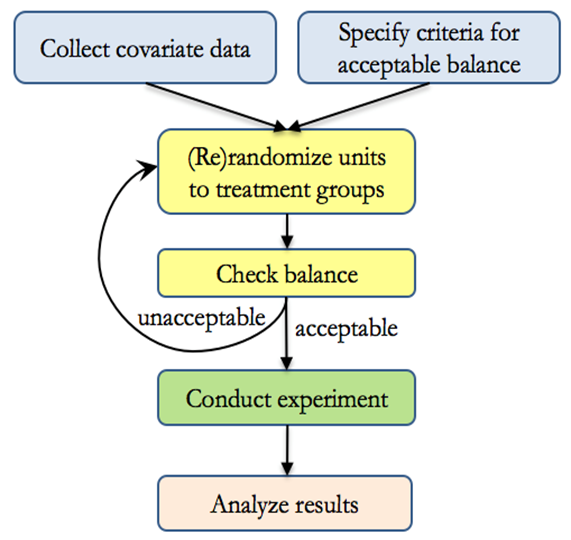

# Experimental Design {#sec-experimental-design}

This chapter provides a treatment of experimental design principles, focusing on their application in business experiments such as A/B testing, consumer behavior studies, and market research. It begins by defining key terms and explaining why randomization is the gold standard for establishing causal relationships. The chapter covers both classical and advanced designs, including completely randomized designs, factorial designs, and crossover trials. It also delves into the selection problem and the consequences of bias. Topics such as blocking, stratification, and factorial manipulation are discussed with an emphasis on practical implementation. Statistical notation is introduced to describe treatment allocation mechanisms, and visual diagrams help clarify complex ideas. Emerging research trends and limitations of traditional designs are also explored to prepare readers for real-world complexities.

Imagine you're a marketing manager trying to decide whether a new advertising campaign will boost sales. Or perhaps you're an economist investigating the impact of tax incentives on consumer spending. In both cases, you need a way to determine causal effects, not just correlations. This is where experimental design becomes essential.

At its core, experimental design ensures that studies are conducted efficiently and that valid conclusions can be drawn. In business applications, experiments help quantify the effects of pricing strategies, marketing tactics, and financial interventions. A well-designed experiment reduces bias, controls variability, and maximizes the accuracy of causal inferences.

------------------------------------------------------------------------

## Principles of Experimental Design

A well-designed experiment follows three key principles:

1.  Randomization: Ensures that subjects or experimental units are assigned to different groups randomly, eliminating selection bias.
2.  Replication: Increases the precision of estimates by repeating the experiment on multiple subjects.
3.  Control: Isolates the effect of treatments by using control groups or baseline conditions to minimize confounding factors.

In addition to these, **blocking** and **factorial designs** further refine experimental accuracy.

------------------------------------------------------------------------

## The Gold Standard: Randomized Controlled Trials {#sec-the-gold-standard-randomized-controlled-trials}

Randomized Controlled Trials (RCTs) are the **holy grail of causal inference**. Their power comes from **random assignment**, which ensures that any differences between treatment and control groups arise **only** due to the intervention.

RCTs provide:

-   **Unbiased estimates** of treatment effects
-   **Elimination of confounding factors on average** (although covariate imbalance can occur, necessitating techniques like [Rerandomization](#sec-re-randomization) to achieve a "platinum standard" set by @tukey1993tightening)

An RCT consists of two groups:

1.  Treatment group: Receives the intervention (e.g., a new marketing campaign, drug, or financial incentive).
2.  Control group: Does not receive the intervention, serving as a baseline.

Subjects from the same population are randomly assigned to either group. This randomization ensures that any observed differences in outcomes are due solely to the treatment, not external factors.

However, RCTs are easier to conduct in **hard sciences** (e.g., medicine or physics), where treatments and environments can be tightly controlled. In **social sciences**, challenges arise because:

-   Human behavior is unpredictable.
-   Some treatments are impossible or unethical to introduce (e.g., assigning individuals to poverty).
-   Real-world environments are difficult to control.

To address these challenges, social scientists use [Quasi-Experimental Methods](#sec-quasi-experimental) to approximate experimental conditions.

RCTs establish [internal validity](#sec-internal-validity), meaning that the observed treatment effects are **causally interpretable**. Even though **random assignment is not the same as *ceteris paribus*** (holding everything else constant), it achieves a similar effect: **on average**, treatment and control groups should be comparable.

------------------------------------------------------------------------

## Selection Problem

A fundamental challenge in causal inference is that we never observe both potential outcomes for the same individual, only one or the other. This creates the selection problem, which we formalize below.

Assume we have:

-   A **binary treatment variable**:\
    $D_i \in \{0,1\}$, where:
    -   $D_i = 1$ indicates that individual $i$ receives the treatment.
    -   $D_i = 0$ indicates that individual $i$ does **not** receive the treatment.
-   The **outcome of interest**:\
    $Y_i$, which depends on whether the individual is treated or not:
    -   $Y_{0i}$: The outcome **if not treated**.
    -   $Y_{1i}$: The outcome **if treated**.

Thus, the **potential outcomes framework** is defined as:

$$
\text{Potential Outcome} =
\begin{cases}
Y_{1i}, & \text{if } D_i = 1 \quad (\text{Treated}) \\
Y_{0i}, & \text{if } D_i = 0 \quad (\text{Untreated})
\end{cases}
$$

However, we only **observe** one outcome per individual:

$$
Y_i = Y_{0i} + (Y_{1i} - Y_{0i})D_i
$$

This means that for any given person, we either observe $Y_{1i}$ or $Y_{0i}$, but **never both**. Since we cannot observe counterfactuals (unless we invent a time machine), we must rely on statistical inference to estimate treatment effects.

### The Observed Difference in Outcomes

The goal is to estimate the difference in expected outcomes between treated and untreated individuals:

$$
E[Y_i | D_i = 1] - E[Y_i | D_i = 0]
$$

Expanding this equation:

$$
\begin{aligned}
E[Y_i | D_i = 1] - E[Y_i | D_i = 0] &= (E[Y_{1i} | D_i = 1] - E[Y_{0i}|D_i = 1] ) \\
&+ (E[Y_{0i} |D_i = 1] - E[Y_{0i} |D_i = 0]) \\
&= (E[Y_{1i}-Y_{0i}|D_i = 1] ) \\
&+ (E[Y_{0i} |D_i = 1] - E[Y_{0i} |D_i = 0])
\end{aligned}
$$

This equation decomposes the **observed difference** into two components:

-   Treatment Effect on the Treated: $E[Y_{1i} - Y_{0i} |D_i = 1]$, which represents the causal impact of the treatment on those who are treated.

-   Selection Bias: \
    $E[Y_{0i} |D_i = 1] - E[Y_{0i} |D_i = 0]$, which captures systematic differences between treated and untreated groups **even in the absence of treatment**.

Thus, the **observed difference in outcomes** is:

$$
\text{Observed Difference} = \text{ATT} + \text{Selection Bias}
$$

### Eliminating Selection Bias with Random Assignment

With **random assignment** of treatment, $D_i$ is independent of potential outcomes:

$$
E[Y_i | D_i = 1] - E[Y_i|D_i = 0] = E[Y_{1i} - Y_{0i}]
$$

This works because, under true randomization:

$$
E[Y_{0i} | D_i = 1] = E[Y_{0i} | D_i = 0]
$$

which eliminates selection bias. Consequently, the observed difference now **directly estimates the true causal effect**:

$$
E[Y_i | D_i = 1] - E[Y_i | D_i = 0] = E[Y_{1i} - Y_{0i}]
$$

Thus, [randomized controlled trials](#sec-the-gold-standard-randomized-controlled-trials) provide an unbiased estimate of the [average treatment effect](#sec-average-treatment-effect).

------------------------------------------------------------------------

### Another Representation Under Regression

So far, we have framed the selection problem using expectations and potential outcomes. Another way to represent treatment effects is through **regression models**, which provide a practical framework for estimation.

Suppose the treatment effect is constant across individuals:

$$
Y_{1i} - Y_{0i} = \rho
$$

This implies that each treated individual experiences the same treatment effect ($\rho$), though their baseline outcomes ($Y_{0i}$) may vary.

Since we only observe **one** of the potential outcomes, the observed outcome can be expressed as:

$$
\begin{aligned}
Y_i &= E(Y_{0i}) + (Y_{1i} - Y_{0i}) D_i + [Y_{0i} - E(Y_{0i})] \\
&= \alpha + \rho D_i + \eta_i
\end{aligned}
$$

where:

-   $\alpha = E(Y_{0i})$, the expected outcome for untreated individuals.
-   $\rho$ represents the **causal treatment effect**.
-   $\eta_i = Y_{0i} - E(Y_{0i})$, capturing individual deviations from the mean untreated outcome.

Thus, the regression model provides an intuitive way to express treatment effects.

#### Conditional Expectations and Selection Bias

Taking expectations conditional on treatment status:

$$
\begin{aligned}
E[Y_i |D_i = 1] &= \alpha + \rho + E[\eta_i |D_i = 1] \\
E[Y_i |D_i = 0] &= \alpha + E[\eta_i |D_i = 0]
\end{aligned}
$$

The observed difference in means between treated and untreated groups is:

$$
E[Y_i |D_i = 1] - E[Y_i |D_i = 0] = \rho + E[\eta_i |D_i = 1] - E[\eta_i |D_i = 0]
$$

Here, the term $E[\eta_i |D_i = 1] -E[\eta_i |D_i = 0]$ represents the selection bias, the correlation between the regression error term ($\eta_i$) and the treatment variable ($D_i$).

Under random assignment, we assume that potential outcomes are **independent** of treatment ($D_i$):

$$
E[\eta_i |D_i = 1] -E[\eta_i |D_i = 0] = E[Y_{0i} |D_i = 1] -E[Y_{0i}|D_i = 0] = 0
$$

Thus, under true **randomization**, selection bias disappears, and the observed difference directly estimates the **causal effect** $\rho$.

------------------------------------------------------------------------

#### Controlling for Additional Variables

In many real-world scenarios, **random assignment is imperfect**, and selection bias may still exist. To mitigate this, we introduce **control variables** ($X_i$), such as demographic characteristics, firm size, or prior purchasing behavior.

If $X_i$ is **uncorrelated with treatment** ($D_i$), including it in our regression model does not bias the estimate of $\rho$ but has two advantages:

1.  **It reduces residual variance** ($\eta_i$), improving the precision of $\rho$.
2.  **It accounts for additional sources of variability**, making the model more robust.

Thus, our regression model extends to:

$$
Y_i = \alpha + \rho D_i + X_i'\gamma + \eta_i
$$

where:

-   $X_i$ represents a vector of control variables.
-   $\gamma$ captures the effect of $X_i$ on the outcome.

#### Example: Racial Discrimination in Hiring

A famous study by @bertrand2004emily examined racial discrimination in hiring by randomly assigning Black- and White-sounding names to identical job applications. By ensuring that names were assigned randomly, the authors eliminated confounding factors like education and experience, allowing them to estimate the causal effect of race on callback rates.

------------------------------------------------------------------------

## Variance Reduction in Experimental Design {#sec-variance-reduction}

Randomization guarantees that a difference in means is an unbiased estimate of the average treatment effect, but it says nothing about precision. When the outcome is noisy, as spend, revenue, session length, or trading profit and loss typically are, we need a large sample to detect even a modest effect. Variance reduction methods attack this problem directly. They adjust the outcome using information that was fixed before randomization, shrinking the standard error without disturbing the expected value of the estimator. In modern online experimentation, these adjustments are among the cheapest and highest return improvements a team can deploy [@deng2013improving].

This section develops the two workhorse adjustments used in practice. CUPED uses a pre-experiment covariate, most often a pre-period version of the same metric. CUPAC generalizes the idea by replacing that covariate with a prediction from a model trained on historical data. Both reduce to regression adjustment, and both connect cleanly to the difference-in-differences logic developed elsewhere in this book.

------------------------------------------------------------------------

### CUPED

CUPED, an abbreviation for Controlled-experiment Using Pre-Experiment Data, adjusts each unit's outcome by a pre-treatment covariate that is correlated with the outcome but, by construction, independent of the randomized assignment [@deng2013improving]. Because the covariate was measured before treatment, subtracting a multiple of it cannot introduce bias, and a well chosen multiple removes predictable noise.

#### Setup and notation

Let $i = 1, \dots, n$ index experimental units, which might be users, customers, or accounts. Treatment assignment is $T_i \in \{0,1\}$, randomized. The potential outcomes are $Y_i(1)$ and $Y_i(0)$, and the observed outcome is $Y_i = T_i Y_i(1) + (1 - T_i) Y_i(0)$. The pre-experiment covariate $X_i$ is measured before randomization. The canonical choice is a pre-period version of the outcome, such as last week's spend, though stable assignment dimensions such as device or region can also serve.

The single assumption CUPED requires is that assignment is independent of the covariate,

$$
T_i \perp X_i,
$$

which holds whenever randomization occurs after $X_i$ is measured and there is no leakage from the experiment back into the covariate.

#### The CUPED estimator

CUPED defines an adjusted outcome

$$
Y_i^{\text{cuped}} = Y_i - \theta\left(X_i - \mathbb{E}[X]\right),
$$

and estimates the treatment effect by the difference in means of the adjusted outcome,

$$
\hat{\tau}_{\text{cuped}} = \bar{Y}^{\text{cuped}}_1 - \bar{Y}^{\text{cuped}}_0
= \left(\bar{Y}_1 - \bar{Y}_0\right) - \theta\left(\bar{X}_1 - \bar{X}_0\right).
$$

Read in words, CUPED is the ordinary difference in means minus $\theta$ times any accidental imbalance in the covariate between the two arms. We center $X_i$ at $\mathbb{E}[X]$, or at the sample mean $\bar{X}$ in practice, so that the adjustment does not shift overall levels in a way that interacts with assignment. Centering also gives the intercept a clean interpretation in the regression form below.

#### Unbiasedness, even with estimated $\theta$

A natural worry is that subtracting a random quantity might bias the estimate. It does not. Writing

$$
\hat{\tau}_{\text{cuped}} = \hat{\tau}_{\text{diff}} - \theta(\bar{X}_1 - \bar{X}_0),
$$

suppose first that $\theta$ is a fixed constant, even a poorly chosen one. Under random assignment the expected covariate imbalance is zero, so

$$
\mathbb{E}[\bar{X}_1 - \bar{X}_0] = 0
\quad \Rightarrow \quad
\mathbb{E}[\hat{\tau}_{\text{cuped}}] = \mathbb{E}[\hat{\tau}_{\text{diff}}] = \tau.
$$

CUPED is therefore unbiased for any fixed $\theta$.

In practice $\theta$ is estimated, usually by ordinary least squares on the same data. This estimator remains asymptotically unbiased in randomized experiments, and the finite-sample bias is negligible in the large samples typical of A/B tests [@deng2013improving; @freedman2008regression]. If a stronger guarantee is desired, one can cross-fit $\theta$, estimating it on one fold and applying it to another so that the adjustment term is conditionally mean zero given the fold-wise coefficient. This is the orthogonalization logic that underlies modern debiased estimation [@chernozhukov2018double].

#### Choosing $\theta$: variance minimization

The coefficient is chosen to minimize the variance of the adjusted outcome. Let $X_c = X - \mathbb{E}[X]$ denote the centered covariate. Then

$$
\mathrm{Var}(Y - \theta X_c)
= \mathrm{Var}(Y) + \theta^2 \mathrm{Var}(X_c) - 2\theta\,\mathrm{Cov}(Y, X_c).
$$

Differentiating with respect to $\theta$ and setting the derivative to zero gives

$$
2\theta\, \mathrm{Var}(X_c) - 2\,\mathrm{Cov}(Y, X_c) = 0,
$$

so the variance-minimizing coefficient is

$$
\theta^\star = \frac{\mathrm{Cov}(Y, X_c)}{\mathrm{Var}(X_c)} = \frac{\mathrm{Cov}(Y, X)}{\mathrm{Var}(X)},
$$

where the second equality holds because centering changes neither the variance nor the relevant covariance. This is exactly the slope from regressing $Y$ on $X$ in a simple linear regression [@deng2013improving].

The achievable gain follows immediately. With a single covariate, projecting $Y$ onto $X$ shrinks the residual variance by a factor $(1 - \rho^2)$, where $\rho = \mathrm{Cor}(Y, X)$,

$$
\mathrm{Var}(Y^{\text{cuped}}) = \mathrm{Var}(Y)\,(1 - \rho^2).
$$

The standard error then shrinks by $\sqrt{1 - \rho^2}$, and the sample size required for a fixed power shrinks by roughly $(1 - \rho^2)$. The leverage is substantial. A correlation of $\rho = 0.6$ gives $1 - \rho^2 = 0.64$, a 36 percent reduction in variance and a 20 percent reduction in standard error, since $\sqrt{0.64} = 0.8$.

#### Three ways to implement CUPED

There are three equivalent routes to a CUPED estimate. The first transforms the outcome and runs a difference in means. The second runs a regression, also known as ANCOVA, of the outcome on treatment and the centered covariate, which is the recommended default because robust standard errors, multiple covariates, interactions, and clustering all come for free. Under random assignment, ordinary least squares with covariate adjustment is unbiased and typically more precise than the raw difference in means, especially when the covariate predicts the outcome [@freedman2008regression]. The third cross-fits the coefficient as a defensive measure against finite-sample dependence between the adjustment and the realized imbalance.

We begin by loading the tools used throughout this section.

```{r cuped-setup, message=FALSE, warning=FALSE}
library(dplyr)
library(ggplot2)
library(estimatr)  # lm_robust() for robust standard errors
library(broom)     # tidy model summaries
```

We then simulate an experiment in which a skewed pre-period covariate predicts the outcome, so CUPED has room to help.

```{r cuped-simulate}
set.seed(123)

n  <- 1000
X  <- rlnorm(n, meanlog = 3.5, sdlog = 0.6)  # skewed pre-period spend
T  <- rbinom(n, 1, 0.5)

tau_true <- 2.0

# Outcome correlated with X, plus noise and a treatment effect
Y <- 0.7 * X + rlnorm(n, meanlog = 2.2, sdlog = 0.7) + tau_true * T

dat <- tibble(id = 1:n, T = T, X = X, Y = Y)
head(dat)
```

The correlation between covariate and outcome is the single best predictor of how much CUPED will gain.

```{r cuped-correlation}
cor(dat$X, dat$Y)
```

**Method one: the transformed-outcome form.** We estimate $\theta^\star$ as the regression slope, build the adjusted outcome, and difference its means.

```{r cuped-transform}
theta_hat <- with(dat, cov(X, Y) / var(X))
xbar      <- mean(dat$X)

dat <- dat %>%
  mutate(
    Xc      = X - xbar,
    Y_cuped = Y - theta_hat * Xc
  )

ate_naive <- with(dat, mean(Y[T == 1]) - mean(Y[T == 0]))
ate_cuped <- with(dat, mean(Y_cuped[T == 1]) - mean(Y_cuped[T == 0]))

c(ATE_naive = ate_naive, ATE_cuped = ate_cuped, theta_hat = theta_hat)
```

A simple difference-in-means standard error makes the precision gain visible.

```{r cuped-se}
se_diff_means <- function(y, t) {
  n1 <- sum(t == 1); n0 <- sum(t == 0)
  v1 <- var(y[t == 1]); v0 <- var(y[t == 0])
  sqrt(v1 / n1 + v0 / n0)
}

se_naive <- se_diff_means(dat$Y, dat$T)
se_cuped <- se_diff_means(dat$Y_cuped, dat$T)

tibble(
  method  = c("naive diff-in-means", "CUPED transformed outcome"),
  ate     = c(ate_naive, ate_cuped),
  se      = c(se_naive, se_cuped),
  ci_low  = c(ate_naive, ate_cuped) - 1.96 * c(se_naive, se_cuped),
  ci_high = c(ate_naive, ate_cuped) + 1.96 * c(se_naive, se_cuped)
)
```

**Method two: regression, or ANCOVA, with robust standard errors.** Regressing the outcome on treatment and the centered covariate and reading the coefficient on $T$ gives the same adjustment in a more flexible package. Robust standard errors are the sensible default in experiments because business metrics are rarely homoskedastic [@imbens2015causal].

```{r cuped-ancova}
fit_ancova <- lm_robust(Y ~ T + I(X - mean(X)), data = dat)  # HC2 robust SE
tidy(fit_ancova) %>% filter(term == "T")
```

The three estimates sit in the same efficient neighborhood. They are not algebraically identical in finite samples, so small differences are expected.

```{r cuped-compare}
tibble(
  method   = c("naive diff-in-means", "CUPED transform", "ANCOVA robust"),
  estimate = c(ate_naive, ate_cuped, coef(fit_ancova)["T"])
)
```

**Method three: cross-fitted CUPED.** Splitting the data into folds and estimating $\theta$ on the complement of each fold removes any finite-sample dependence between the adjustment coefficient and a given fold's treatment imbalance. In large A/B tests the pooled and cross-fitted estimates are usually almost identical, but the option is cheap insurance.

```{r cuped-crossfit}
set.seed(456)
K <- 5
dat <- dat %>%
  mutate(fold = sample(rep(1:K, length.out = n())))

dat <- dat %>%
  group_by(fold) %>%
  group_modify(~ {
    current_fold <- .y$fold
    train <- dat %>% filter(fold != current_fold)
    test  <- .x

    theta_k <- with(train, cov(X, Y) / var(X))
    xbar_k  <- mean(train$X)

    test %>%
      mutate(Y_cuped_cf = Y - theta_k * (X - xbar_k))
  }) %>%
  ungroup()

ate_cuped_cf <- with(dat, mean(Y_cuped_cf[T == 1]) - mean(Y_cuped_cf[T == 0]))
se_cuped_cf  <- se_diff_means(dat$Y_cuped_cf, dat$T)

tibble(
  method = c("CUPED (pooled theta)", "CUPED (cross-fitted theta)"),
  ate    = c(ate_cuped, ate_cuped_cf),
  se     = c(se_cuped, se_cuped_cf)
)
```

#### Multiple covariates as regression residualization

With several pre-treatment covariates $X_{i1}, \dots, X_{ip}$, the natural extension residualizes the outcome against all of them at once,

$$
Y_i^{\text{adj}} = Y_i - (X_i - \bar{X})^\top \hat{\beta},
$$

where $\hat{\beta}$ is the coefficient vector from regressing $Y$ on the covariates. In practice one simply runs the regression of the outcome on treatment and all covariates with robust standard errors, which is the standard regression-adjustment recommendation for experiments [@freedman2008regression; @imbens2015causal].

```{r cuped-multicovariate}
set.seed(789)
dat2 <- dat %>%
  mutate(
    X2 = log1p(X) + rnorm(n(), sd = 0.2),
    X3 = rbinom(n(), 1, plogis(scale(log1p(X))))
  )

fit_multi <- lm_robust(
  Y ~ T + I(X - mean(X)) + I(X2 - mean(X2)) + X3,
  data = dat2
)
tidy(fit_multi) %>% filter(term == "T")
```

#### From correlation to sample size

The accounting of gains is direct. With single-covariate correlation $\rho$, the variance multiplies by $(1 - \rho^2)$, the standard error by $\sqrt{1 - \rho^2}$, and the required sample size by approximately $(1 - \rho^2)$.

```{r cuped-power}
rho      <- cor(dat$X, dat$Y)
gain_var <- 1 - rho^2
gain_se  <- sqrt(gain_var)

tibble(
  rho                           = rho,
  variance_multiplier           = gain_var,
  se_multiplier                 = gain_se,
  approx_sample_size_multiplier = gain_var
)
```

------------------------------------------------------------------------

### CUPED versus Difference-in-Differences

CUPED can look much like difference-in-differences, especially when the covariate is a pre-period version of the outcome. The two are nonetheless solving different problems. CUPED is a precision tool for randomized experiments, whereas difference-in-differences is an identification tool for non-randomized settings that uses time to remove bias. They coincide only in a special algebraic case.

#### The algebraic connection

Let $Y_{i1}$ denote the outcome during the experiment and $Y_{i0}$ the outcome in the pre-period. Using $X_i = Y_{i0}$ as the CUPED covariate gives

$$
\hat{\tau}_{\text{cuped}}
= (\bar{Y}_{1,1} - \bar{Y}_{0,1}) - \theta(\bar{Y}_{1,0} - \bar{Y}_{0,0}),
$$

where $\bar{Y}_{t,p}$ is the mean outcome for arm $t \in \{0,1\}$ in period $p \in \{0,1\}$. The classic two-period, two-group difference-in-differences estimator is

$$
\hat{\tau}_{\text{did}}
= (\bar{Y}_{1,1} - \bar{Y}_{0,1}) - (\bar{Y}_{1,0} - \bar{Y}_{0,0}).
$$

Comparing the two, difference-in-differences is exactly CUPED with $\theta$ fixed to one.

#### Why the goals differ

In a randomized experiment the post-period difference $\bar{Y}_{1,1} - \bar{Y}_{0,1}$ is already unbiased for $\tau$. CUPED subtracts a correction built from the pre-period imbalance, which has expectation zero under randomization, so the estimator stays unbiased and the adjustment buys precision rather than identification. It chooses

$$
\theta^\star = \frac{\mathrm{Cov}(Y_{1}, Y_{0})}{\mathrm{Var}(Y_{0})},
$$

which is almost never exactly one.

Difference-in-differences is used when treatment is not randomized and the groups differ systematically. It uses the pre-period to difference out time-invariant group differences, and it relies on the parallel trends assumption that, absent treatment, the two groups would have moved together. The coefficient on the pre-period outcome is fixed at one because the method models the outcome with additive unit and time effects,

$$
Y_{it} = \alpha_i + \lambda_t + \tau\,(T_i \cdot \mathbb{1}\{t=1\}) + \varepsilon_{it}.
$$

Taking post minus pre differences cancels the unit effect $\alpha_i$, and that cancellation is what forces the unit coefficient to one. CUPED is not cancelling fixed effects for identification; it is projecting out predictable variation, which is why its coefficient is chosen optimally rather than fixed.

#### When they coincide

The two estimators become similar when the covariate is the pre-period outcome, treatment is randomized so both are unbiased, and the optimal projection coefficient happens to be near one. This occurs when the post-period outcome is close to the pre-period outcome plus noise, with similar scale and high persistence. In many business metrics $\theta^\star$ departs from one because seasonality changes scale, growth shifts the mean and variance, heavy-tailed purchases behave differently across periods, and pre-period windows rarely match post-period windows. In those cases difference-in-differences is a valid but non-optimal form of variance reduction.

The following simulation confirms the identity numerically. With $\theta = 1$ the CUPED adjustment reproduces the difference-in-differences estimate.

```{r cuped-did-identity}
set.seed(1)
n  <- 2000
T  <- rbinom(n, 1, 0.5)

Y0  <- rnorm(n, mean = 10, sd = 3)
tau <- 1.2
Y1  <- 0.8 * Y0 + rnorm(n, sd = 2) + tau * T

dat_did <- data.frame(T, Y0, Y1)

# Difference-in-differences as a change-score difference in means
did <- with(dat_did, mean((Y1 - Y0)[T == 1]) - mean((Y1 - Y0)[T == 0]))

# CUPED with theta fixed to one
cuped_theta1 <- with(
  dat_did,
  mean((Y1 - 1 * (Y0 - mean(Y0)))[T == 1]) -
    mean((Y1 - 1 * (Y0 - mean(Y0)))[T == 0])
)

c(DiD = did, CUPED_theta1 = cuped_theta1)
```

The optimal CUPED coefficient is generally not one, and using it can further reduce variance.

```{r cuped-did-optimal}
theta_star <- with(dat_did, cov(Y0, Y1) / var(Y0))
cuped_opt  <- with(
  dat_did,
  mean((Y1 - theta_star * (Y0 - mean(Y0)))[T == 1]) -
    mean((Y1 - theta_star * (Y0 - mean(Y0)))[T == 0])
)

c(theta_star = theta_star, CUPED_opt = cuped_opt)
```

The practical rule is short. With a randomized experiment and pre-period data, use CUPED or ANCOVA and estimate the coefficient, since that is the precision-optimal choice. Without randomization, use difference-in-differences but defend parallel trends through plots, placebo tests, and event-study evidence. Difference-in-differences resembles CUPED because it is essentially CUPED with $\theta = 1$, but it serves identification under assumptions, whereas CUPED serves variance reduction under randomization.

------------------------------------------------------------------------

### CUPAC

A good pre-period outcome is not always available. New users and new products have no consistent pre-period, sparse metrics leave most users at zero, a brand-new metric has no history, and seasonal or launch effects can contaminate the pre-period window. CUPAC, Controlled-experiment Using Pre-experiment data with Adaptive Covariates, addresses these cases by replacing the raw pre-period covariate with a prediction $\hat{m}$ built from richer pre-treatment features such as prior behavior, account attributes, and context. The intuition is that even without a clean pre-period outcome, baseline outcomes are often predictable from pre-treatment data.

#### Setup and estimator

We observe $(Y_i, T_i, W_i)$, where $W_i$ collects pre-treatment features and $T_i$ is randomized so that $T_i \perp (Y_i(0), Y_i(1), W_i)$. A model trained on historical data produces a prediction of the baseline outcome,

$$
\hat{m}_i \approx \mathbb{E}[Y_i(0) \mid W_i],
$$

and this prediction is then used exactly as CUPED uses its covariate,

$$
Y_i^{\text{cupac}} = Y_i - \theta\,(\hat{m}_i - \overline{\hat{m}}),
\qquad
\hat{\tau}_{\text{cupac}} = \overline{Y^{\text{cupac}}}_1 - \overline{Y^{\text{cupac}}}_0.
$$

The critical rule is that $\hat{m}_i$ must depend only on pre-treatment information. Because assignment is random and $\hat{m}$ depends only on $W$, the imbalance $\overline{\hat{m}}_1 - \overline{\hat{m}}_0$ has expectation zero, so the estimator is unbiased. The variance-minimizing coefficient and the resulting gain mirror CUPED,

$$
\theta^\star = \frac{\mathrm{Cov}(Y, \hat{m})}{\mathrm{Var}(\hat{m})},
\qquad
\frac{\mathrm{Var}(\hat{\tau}_{\text{cupac}})}{\mathrm{Var}(\hat{\tau}_{\text{DIM}})}
\approx 1 - \rho_{Y, \hat{m}}^2.
$$

CUPAC is therefore only as good as the predictor's ability to explain baseline outcome variation. As with CUPED, regressing the outcome on treatment and the centered prediction is the equivalent and recommended form, since it makes robust and clustered inference straightforward.

#### Building the predictor and cross-fitting

The predictor uses only information available before assignment: prior sessions, purchases, and engagement; stable customer attributes such as tenure and plan type; and context such as region and channel. Training labels typically come from historical cohorts or rolling windows, where features from a pre-window predict the outcome in a later window of a prior period. The goal is to approximate $m(W) = \mathbb{E}[Y(0) \mid W]$, so predictive correlation matters more than interpretability, and gradient boosting or random forests are common choices in practice.

The cardinal sins are leakage and overfitting. Post-treatment features, training labels that overlap the experiment outcome window, and features that encode treatment exposure all bias the result. The safe default trains on external historical data and scores each unit once at randomization time. When training must use current experiment data, sample-splitting or cross-fitting ensures that each unit's prediction is formed without that unit's own outcome, which is the same orthogonalization principle that underlies double machine learning [@chernozhukov2018double].

#### Implementation

We simulate an A/B test whose outcome is a heavy-tailed seven-day revenue figure, with rich pre-treatment features and a noisy, sparse pre-period revenue proxy. CUPED will lean on the noisy proxy, while CUPAC will lean on a predictor trained on a separate historical sample.

```{r cupac-simulate, message=FALSE, warning=FALSE}
library(dplyr)
library(ggplot2)

se_diff_means <- function(y, t) {
  y1 <- y[t == 1]; y0 <- y[t == 0]
  sqrt(var(y1) / length(y1) + var(y0) / length(y0))
}

set.seed(123)
n <- 20000
W <- tibble(
  x1 = rnorm(n),
  x2 = rbinom(n, 1, 0.4),
  x3 = runif(n, -1, 1)
)

# Baseline revenue signal plus noise, with a heavy-tailed multiplier
baseline_signal  <- 2 + 1.5 * W$x1 + 0.8 * W$x2 - 1.0 * W$x3
noise            <- rnorm(n, 0, 3)
heavy_multiplier <- rlnorm(n, meanlog = 0, sdlog = 0.35)
Y0               <- (baseline_signal + noise) * heavy_multiplier

tau_i <- 0.3 + 0.2 * W$x1   # small heterogeneous effect
T     <- rbinom(n, 1, 0.5)
Y     <- Y0 + T * tau_i

# Noisy, sparse pre-period revenue proxy
X_pre <- pmax(0, 0.6 * Y0 + rnorm(n, 0, 6))
X_pre <- ifelse(runif(n) < 0.35, 0, X_pre)   # 35% have no pre-period activity

dat <- bind_cols(W, tibble(T = T, Y = Y, Y0 = Y0, tau = tau_i, X_pre = X_pre))
head(dat)
```

We train the CUPAC predictor on an independent historical sample and score the experiment units once.

```{r cupac-train}
set.seed(123)
n_hist <- 60000
W_hist <- tibble(
  x1 = rnorm(n_hist),
  x2 = rbinom(n_hist, 1, 0.4),
  x3 = runif(n_hist, -1, 1)
)

baseline_signal_hist  <- 2 + 1.5 * W_hist$x1 + 0.8 * W_hist$x2 - 1.0 * W_hist$x3
noise_hist            <- rnorm(n_hist, 0, 3)
heavy_multiplier_hist <- rlnorm(n_hist, meanlog = 0, sdlog = 0.35)
Y0_hist               <- (baseline_signal_hist + noise_hist) * heavy_multiplier_hist

hist_dat <- bind_cols(W_hist, tibble(Y0 = Y0_hist))

# Predict the baseline outcome from pre-treatment features
m_fit <- lm(Y0 ~ x1 + x2 + x3, data = hist_dat)
mhat  <- predict(m_fit, newdata = dat)

dat <- dat %>% mutate(mhat = mhat)
summary(dat$mhat)
```

We then compare the difference in means, CUPED using the noisy pre-period proxy, and CUPAC using the prediction.

```{r cupac-estimators}
ate_dim <- with(dat, mean(Y[T == 1]) - mean(Y[T == 0]))
se_dim  <- se_diff_means(dat$Y, dat$T)

theta_cuped <- with(dat, cov(Y, X_pre) / var(X_pre))
Y_cuped     <- with(dat, Y - theta_cuped * (X_pre - mean(X_pre)))
ate_cuped   <- mean(Y_cuped[dat$T == 1]) - mean(Y_cuped[dat$T == 0])
se_cuped    <- se_diff_means(Y_cuped, dat$T)

theta_cupac <- with(dat, cov(Y, mhat) / var(mhat))
Y_cupac     <- with(dat, Y - theta_cupac * (mhat - mean(mhat)))
ate_cupac   <- mean(Y_cupac[dat$T == 1]) - mean(Y_cupac[dat$T == 0])
se_cupac    <- se_diff_means(Y_cupac, dat$T)

res <- tibble(
  method  = c("Diff-in-means", "CUPED (X_pre)", "CUPAC (mhat)"),
  ate     = c(ate_dim, ate_cuped, ate_cupac),
  se      = c(se_dim, se_cuped, se_cupac),
  ci_low  = ate - 1.96 * se,
  ci_high = ate + 1.96 * se
)
res
```

A compact summary translates the standard errors into variance ratios and effective sample multipliers relative to the difference in means.

```{r cupac-effective-n}
res2 <- res %>%
  mutate(
    var_ratio        = (se / se_dim)^2,
    eff_n_multiplier = 1 / var_ratio
  )
res2
```

Variance reduction potential is best gauged in the control group, where the covariate-outcome relationship is untouched by treatment.

```{r cupac-diagnostics}
ctrl <- dat %>% filter(T == 0)

cor_pre  <- cor(ctrl$Y, ctrl$X_pre)
cor_mhat <- cor(ctrl$Y, ctrl$mhat)

tibble(
  covariate            = c("X_pre (CUPED)", "mhat (CUPAC)"),
  cor_with_Y_control   = c(cor_pre, cor_mhat),
  approx_var_reduction = c(cor_pre^2, cor_mhat^2)
)
```

When the prediction correlates with the outcome more strongly than a noisy pre-period metric does, CUPAC outperforms CUPED even though CUPED relies on a real pre-period measurement. The regression form gives the same adjustment together with convenient inference.

```{r cupac-regression}
fit_ra <- lm(Y ~ T + I(mhat - mean(mhat)), data = dat)
summary(fit_ra)$coef["T", ]
```

When the randomization unit is a cluster, such as users nested in stores, the standard errors should be clustered on that unit. The estimator is unchanged; only the inference adapts.

#### Pitfalls

Several failure modes recur in practice, and most leave a visible signature.

**Leakage and in-experiment data.** A covariate, or a predictor's features, must be strictly pre-treatment. Using the first day of the experiment as the covariate, building features from logs that include post-randomization events, or encoding treatment exposure all bias the estimate. The telltale symptom is a suspiciously large variance reduction with a shifting point estimate. The simplest guardrail is a balance check on the adjustment variable: under correct randomization and correct feature construction, $\overline{\hat{m}}_1 - \overline{\hat{m}}_0$ should be near zero relative to sampling noise.

```{r cupac-balance-check}
T_vec <- dat$T
mhat  <- dat$mhat

d  <- mean(mhat[T_vec == 1]) - mean(mhat[T_vec == 0])
n1 <- sum(T_vec == 1); n0 <- sum(T_vec == 0)
s1 <- sd(mhat[T_vec == 1]); s0 <- sd(mhat[T_vec == 0])

se     <- sqrt(s1^2 / n1 + s0^2 / n0)
t_stat <- d / se
p_val  <- 2 * stats::pt(abs(t_stat), df = n1 + n0 - 2, lower.tail = FALSE)
smd    <- d / sqrt((s1^2 + s0^2) / 2)

# Randomization-based permutation p-value, aligned with the design
set.seed(1)
B <- 100
d_perm <- replicate(B, {
  Tperm <- sample(T_vec)
  mean(mhat[Tperm == 1]) - mean(mhat[Tperm == 0])
})
p_perm <- mean(abs(d_perm) >= abs(d))

data.frame(
  diff = d, se = se, t = t_stat, p = p_val,
  smd = smd, p_perm = p_perm, n_treat = n1, n_ctrl = n0
)
```

**Missing pre-period.** Many units have no pre-period metric. Sensible options are to impute a value, commonly zero or a group mean, alongside an indicator for missingness, and to include both in the regression. Restricting the analysis to units with pre-period data invites selection effects and is best avoided.

```{r cupac-missing}
set.seed(2024)
dat_miss <- dat %>%
  mutate(
    X_obs    = ifelse(runif(n()) < 0.15, NA, X_pre),  # 15% missing
    new_user = as.integer(is.na(X_obs)),
    X_imp    = ifelse(is.na(X_obs), 0, X_obs)
  )

fit_miss <- lm(Y ~ T + I(X_imp - mean(X_imp)) + new_user, data = dat_miss)
summary(fit_miss)$coef["T", ]
```

**Heavy tails.** Revenue-like metrics are heavy-tailed, and a few large units can dominate the variance. Ordinary least squares remains valid, but winsorizing at a high percentile, analyzing $\log(1 + Y)$ as a secondary metric, or using a count model for sensitivity are common mitigations, each of which should be chosen deliberately and documented. Heavy zero mass deserves particular care, and the log-transform literature is directly relevant here [@chen2024logs].

**Ratio metrics.** Conversion rate and average order value are ratios, and adjusting the ratio directly is not generally optimal. Industry practice adjusts the numerator and denominator separately and recombines, or uses a generalized linear model with covariate adjustment, or applies delta-method variance estimates. If the primary metric is a ratio, prefer a regression or generalized linear model adjustment over transforming the ratio itself.

**Overfitting and drift.** A predictor trained inside the experiment without sample-splitting will overfit and leak. Training on historical data with cross-fitting avoids this. Separately, if the relationship between features and the baseline outcome drifts because of seasonality, pricing changes, or macro shocks, the prediction loses correlation with the outcome. This costs precision rather than unbiasedness, as long as the prediction stays strictly pre-treatment.

#### Power and sample size

The power implication is the same for both methods. If the adjustment reduces variance by a factor $r = \mathrm{Var}(\hat{\tau}_{\text{adj}}) / \mathrm{Var}(\hat{\tau}_{\text{DIM}})$, then the sample size needed for a fixed power scales by approximately $r$. A ratio of $r = 0.64$ means roughly 36 percent less sample, or equivalently less calendar time, for the same detectable effect.

```{r cupac-power}
r_cuped <- (se_cuped / se_dim)^2
r_cupac <- (se_cupac / se_dim)^2

tibble(
  method               = c("CUPED", "CUPAC"),
  var_ratio_vs_dim     = c(r_cuped, r_cupac),
  sample_reduction_pct = c(1 - r_cuped, 1 - r_cupac)
)
```

For high-dimensional pre-treatment features, CUPAC is especially attractive because it compresses many covariates into a single strong predictor and adjusts with that, rather than burning degrees of freedom on a wide regression. The same prediction can serve as a baseline control when exploring heterogeneous effects, and the predict-then-adjust logic connects directly to the outcome-regression component of doubly robust estimators, which become more important once randomization is lost.

------------------------------------------------------------------------

## Classical Experimental Designs

Experimental designs provide structured frameworks for conducting experiments, ensuring that results are **statistically valid** and **practically applicable**. The choice of design depends on the research question, the nature of the treatment, and potential sources of variability. For a more in-depth statistical understanding of these designs, we will revisit them again in [Analysis of Variance](#sec-analysis-of-variance-anova).

------------------------------------------------------------------------

### Completely Randomized Design

In a Completely Randomized Design (CRD), each experimental unit is randomly assigned to a treatment group. This is the simplest form of experimental design and is effective when no confounding factors are present.

**Example: Email Marketing Experiment**

A company tests three different email marketing strategies (A, B, and C) to measure their effect on **customer engagement** (click-through rate). Customers are randomly assigned to receive one of the three emails.

**Mathematical Model**

$$
Y_{ij} = \mu + \tau_i + \epsilon_{ij}
$$

where:

-   $Y_{ij}$ is the response variable (e.g., click-through rate).
-   $\mu$ is the overall mean response.
-   $\tau_i$ is the effect of treatment $i$.
-   $\epsilon_{ij}$ is the random error term, assumed to be normally distributed: $\epsilon_{ij} \sim N(0, \sigma^2)$.

```{r}
set.seed(123)

# Simulated dataset for email marketing experiment
data <- data.frame(
  group = rep(c("A", "B", "C"), each = 10),
  response = c(rnorm(10, mean=50, sd=5),
               rnorm(10, mean=55, sd=5),
               rnorm(10, mean=60, sd=5))
)

# ANOVA to test for differences among groups
anova_result <- aov(response ~ group, data = data)
summary(anova_result)
```

If the **p-value** in the ANOVA summary is **less than 0.05**, we reject the null hypothesis and conclude that at least one email strategy significantly affects engagement.

### Randomized Block Design

A Randomized Block Design (RBD) is used when experimental units can be grouped into homogeneous blocks based on a known confounding factor. Blocking helps reduce unwanted variation, increasing the precision of estimated treatment effects.

**Example: Store Layout Experiment**

A retailer tests three store layouts (A, B, and C) on sales performance. Since store location (Urban, Suburban, Rural) might influence sales, we use blocking to control for this effect.

**Mathematical Model** $$
Y_{ij} = \mu + \tau_i + \beta_j + \epsilon_{ij}
$$ where:

-   $Y_{ij}$ is the sales outcome for store $i$ in location $j$.

-   $\mu$ is the overall mean sales.

-   $\tau_i$ is the effect of layout $i$.

-   $\beta_j$ represents the block effect (location).

-   $\epsilon_{ij}$ is the random error.

```{r}
set.seed(123)

# Simulated dataset for store layout experiment
data <- data.frame(
  block = rep(c("Urban", "Suburban", "Rural"), each = 6),
  layout = rep(c("A", "B", "C"), times = 6),
  sales = c(rnorm(6, mean=200, sd=20),
            rnorm(6, mean=220, sd=20),
            rnorm(6, mean=210, sd=20))
)

# ANOVA with blocking factor
anova_block <- aov(sales ~ layout + block, data = data)
summary(anova_block)

```

By including `block` in the model, we account for **location effects**, leading to **more accurate** treatment comparisons.

### Factorial Design

A Factorial Design evaluates the effects of two or more factors simultaneously, allowing for the study of interactions between variables.

**Example: Pricing and Advertising Experiment**

A company tests two pricing strategies (High, Low) and two advertising methods (TV, Social Media) on sales.

**Mathematical Model** $$
Y_{ijk} = \mu + \tau_i + \gamma_j + (\tau\gamma)_{ij} + \epsilon_{ijk}
$$

where:

-   $\tau_i$ is the effect of price level $i$.

-   $\gamma_j$ is the effect of advertising method $j$.

-   $(\tau\gamma)_{ij}$ is the **interaction effect** between price and advertising.

-   $\epsilon_{ijk}$ is the random error term.

```{r}
set.seed(123)

# Simulated dataset
data <- expand.grid(
  Price = c("High", "Low"),
  Advertising = c("TV", "Social Media"),
  Replicate = 1:10
)

# Generate response variable (sales)
data$Sales <- with(data, 
                   100 + 
                   ifelse(Price == "Low", 10, 0) + 
                   ifelse(Advertising == "Social Media", 15, 0) + 
                   ifelse(Price == "Low" & Advertising == "Social Media", 5, 0) +
                   rnorm(nrow(data), sd=5))

# Two-way ANOVA
anova_factorial <- aov(Sales ~ Price * Advertising, data = data)
summary(anova_factorial)
```

### Crossover Design

A Crossover Design is used when each subject receives multiple treatments in a sequential manner. This design controls for individual differences by using each subject as their own control.

**Example: Drug Trial**

Patients receive Drug A in the first period and Drug B in the second period, or vice versa.

**Mathematical Model** $$
Y_{ijk} = \mu + \tau_i + \pi_j + \beta_k + \epsilon_{ijk}
$$ where:

-   $\tau_i$ is the **treatment effect**.

-   $\pi_j$ is the **period effect** (e.g., learning effects).

-   $\beta_k$ is the **subject effect** (individual baseline differences).

```{r}
set.seed(123)

# Simulated dataset
data <- data.frame(
  Subject = rep(1:10, each = 2),
  Period = rep(c("Period 1", "Period 2"), times = 10),
  Treatment = rep(c("A", "B"), each = 10),
  Response = c(rnorm(10, mean=50, sd=5), rnorm(10, mean=55, sd=5))
)

# Crossover ANOVA
anova_crossover <-
  aov(Response ~ Treatment + Period + Error(Subject / Period),
      data = data)
summary(anova_crossover)

```

### Split-Plot Design

A Split-Plot Design is used when one factor is applied at the group (whole-plot) level and another at the individual (sub-plot) level. This design is particularly useful when some factors are harder or more expensive to randomize than others.

**Example: Farming Experiment**

A farm is testing two irrigation methods (Drip vs. Sprinkler) and two soil types (Clay vs. Sand) on crop yield. Since irrigation systems are installed at the farm level and are difficult to change, they are treated as the whole-plot factor. However, different soil types exist within each farm and can be tested more easily, making them the sub-plot factor.

------------------------------------------------------------------------

**Mathematical Model**

The statistical model for a **Split-Plot Design** is:

$$
Y_{ijk} = \mu + \alpha_i + B_k + \beta_j + (\alpha\beta)_{ij} + \epsilon_{ijk}
$$

where:

-   $Y_{ijk}$ is the response (e.g., crop yield).\
-   $\mu$ is the overall mean.\
-   $\alpha_i$ is the **whole-plot factor** (Irrigation method).\
-   $B_k$ is the **random block effect** (Farm-level variation).\
-   $\beta_j$ is the **sub-plot factor** (Soil type).\
-   $(\alpha\beta)_{ij}$ is the interaction effect between **Irrigation** and **Soil type**.\
-   $\epsilon_{ijk} \sim N(0, \sigma^2)$ represents the **random error term**.

The key feature of the Split-Plot Design is that the whole-plot factor ($\alpha_i$) is tested against the farm-level variance ($B_k$), while the sub-plot factor ($\beta_j$) is tested against individual variance ($\epsilon_{ijk}$).

------------------------------------------------------------------------

We model the **Split-Plot Design** using a **Mixed Effects Model**, treating **Farm** as a **random effect** to account for variation at the whole-plot level.

```{r}
set.seed(123)

# Simulated dataset for a split-plot experiment
data <- data.frame(
  Farm = rep(1:6, each = 4), # 6 farms (whole plots)
  
  # Whole-plot factor
  Irrigation = rep(c("Drip", "Sprinkler"), each = 12), 
  Soil = rep(c("Clay", "Sand"), times = 12), # Sub-plot factor
  
  # Response variable
  Yield = c(rnorm(12, mean=30, sd=5), rnorm(12, mean=35, sd=5)) 
)

# Load mixed-effects model library
library(lme4)

# Mixed-effects model: Whole-plot factor (Irrigation) as a random effect
model_split <- lmer(Yield ~ Irrigation * Soil + (1 | Farm), data = data)

# Summary of the model
summary(model_split)
```

In this model:

-   Irrigation (Whole-plot factor) is tested against Farm-level variance.

-   Soil type (Sub-plot factor) is tested against Residual variance.

-   The interaction between Irrigation × Soil is also evaluated.

This hierarchical structure accounts for the fact that farms are not independent, improving the precision of our estimates.

### Latin Square Design

When two potential confounding factors exist, Latin Square Designs provide a structured way to control for these variables. This design is common in scheduling, manufacturing, and supply chain experiments.

**Example: Assembly Line Experiment**

A manufacturer wants to test three assembly methods (A, B, C) while controlling for work shifts and workstations. Since both shifts and workstations may influence production time, a Latin Square Design ensures that each method is tested once per shift and once per workstation.

**Mathematical Model**

A Latin Square Design ensures that each treatment appears exactly once in each row and column: $$
Y_{ijk} = \mu + \alpha_i + \beta_j + \gamma_k + \epsilon_{ijk}
$$ where:

-   $Y_{ijk}$ is the outcome (e.g., assembly time).

-   $\mu$ is the overall mean.

-   $\alpha_i$ is the **treatment effect** (Assembly Method).

-   $\beta_j$ is the **row effect** (Work Shift).

-   $\gamma_k$ is the **column effect** (Workstation).

-   $\epsilon_{ijk}$ is the random error term.

This ensures that each treatment is **equally balanced across both confounding factors**.

------------------------------------------------------------------------

We implement a **Latin Square Design** by treating **Assembly Method** as the primary factor, while controlling for **Shifts** and **Workstations**.

```{r}
set.seed(123)

# Define the Latin Square layout
latin_square <- data.frame(
  Shift = rep(1:3, each = 3), # Rows
  Workstation = rep(1:3, times = 3), # Columns
  
  # Treatments assigned in a balanced way
  Method = c("A", "B", "C", "C", "A", "B", "B", "C", "A"), 
  Time = c(rnorm(3, mean = 30, sd = 3),
           rnorm(3, mean = 28, sd = 3),
           rnorm(3, mean = 32, sd = 3)) # Assembly time
)

# ANOVA for Latin Square Design
anova_latin <-
  aov(Time ~ factor(Shift) + factor(Workstation) + factor(Method),
      data = latin_square)
summary(anova_latin)

```

-   If the p-value for "Method" is significant, we conclude that different assembly methods impact production time.

-   If "Shift" or "Workstation" is significant, it indicates systematic differences across these variables.

------------------------------------------------------------------------

## Advanced Experimental Designs

### Semi-Random Experiments

In **semi-random experiments**, participants are **not fully randomized** into treatment and control groups. Instead, a **structured randomization process** ensures fairness while allowing some level of causal inference.

#### Example: Loan Assignment Fairness

A bank wants to evaluate a new loan approval policy while ensuring that the experiment does not unfairly exclude specific demographics.

To maintain fairness:

1.  Applicants are first stratified based on income and credit history.
2.  Within each stratum, a random subset is assigned to receive the new policy, while others continue under the old policy.

```{r}
set.seed(123)

# Create stratified groups
data <- data.frame(
  income_group = rep(c("Low", "Medium", "High"), each = 10),
  
  # Stratified randomization
  treatment = sample(rep(c("New Policy", "Old Policy"), each = 15)) 
)

# Display the stratification results
table(data$income_group, data$treatment)
```

This approach ensures that each income group is fairly represented in both treatment and control conditions.

#### Case Study: Chicago Open Enrollment Program

A well-known example of semi-random assignment is the **Chicago Open Enrollment Program** [@cullen2005impact], where students could apply to choice schools.

However, since many schools were oversubscribed (i.e., demand exceeded supply), they used a random lottery system to allocate spots.

Thus, while **enrollment itself was not fully random**, the **lottery outcomes were random**, allowing researchers to estimate the [Intent-to-Treat effect](#sec-intention-to-treat-effect) while acknowledging that not all students who won the lottery actually enrolled.

This situation presents a classic case where:

-   **School choice is not random**: Families self-select into applying to certain schools.
-   **Lottery outcomes are random**: Among those who apply, winning or losing the lottery is as good as a **random assignment**.

Let:

-   $Enroll_{ij} = 1$ if student $i$ enrolls in school $j$, and $0$ otherwise.
-   $Win_{ij} = 1$ if student $i$ **wins the lottery**, and $0$ otherwise.
-   $Apply_{ij} = 1$ if student $i$ **applies** to school $j$.

We define:

$$
\delta_j = E[Y_i | Enroll_{ij} = 1, Apply_{ij} = 1] - E[Y_i | Enroll_{ij} = 0, Apply_{ij} = 1]
$$

$$
\theta_j = E[Y_i | Win_{ij} = 1, Apply_{ij} = 1] - E[Y_i | Win_{ij} = 0, Apply_{ij} = 1]
$$

where:

-   $\delta_j$ is the **treatment effect** (impact of actual school enrollment).
-   $\theta_j$ is the [intent-to-treat effect](#sec-intention-to-treat-effect) (impact of winning the lottery).

Since **not all winners enroll**, we know that:

$$
\delta_j \neq \theta_j
$$

Thus, we can only estimate $\theta_j$ directly, and need an additional method to recover $\delta_j$.

This distinction is crucial because simply comparing lottery winners and losers does not measure the true effect of enrollment, only the effect of being given the opportunity to enroll.

To estimate the treatment effect ($\delta_j$), we use an Instrumental Variable approach:

$$
\delta_j = \frac{E[Y_i | W_{ij} = 1, A_{ij} = 1] - E[Y_i | W_{ij} = 0, A_{ij} = 1]}{P(Enroll_{ij} = 1 | W_{ij} = 1, A_{ij} = 1) - P(Enroll_{ij} = 1 | W_{ij} = 0, A_{ij} = 1)}
$$

where:

-   $P(Enroll_{ij} = 1 | W_{ij} = 1, A_{ij} = 1)$ = probability of enrolling **if winning the lottery**.
-   $P(Enroll_{ij} = 1 | W_{ij} = 0, A_{ij} = 1)$ = probability of enrolling **if losing the lottery**.

This adjustment accounts for the fact that some lottery winners do not enroll, and thus the observed effect ($\theta_j$) underestimates the true treatment effect ($\delta_j$).

This Instrumental Variable approach corrects for **selection bias** by leveraging **randomized lottery assignment**.

------------------------------------------------------------------------

**Numerical Example**

Assume **10 students win** the lottery and **10 students lose**.

**For Winners:**

| Type          | Count | Selection Effect | Treatment Effect | Total Effect |
|---------------|-------|------------------|------------------|--------------|
| Always Takers | 1     | +0.2             | +1               | +1.2         |
| Compliers     | 2     | 0                | +1               | +1           |
| Never Takers  | 7     | -0.1             | 0                | -0.1         |

: Selection and Treatment Effects by Compliance Type Winners

**For Losers:**

| Type          | Count | Selection Effect | Treatment Effect | Total Effect |
|---------------|-------|------------------|------------------|--------------|
| Always Takers | 1     | +0.2             | +1               | +1.2         |
| Compliers     | 2     | 0                | 0                | 0            |
| Never Takers  | 7     | -0.1             | 0                | -0.1         |

: Selection and Treatment Effects by Compliance Type Losers

------------------------------------------------------------------------

Computing [Intent-to-Treat Effect](#sec-intention-to-treat-effect)

We compute the expected outcome for those who won and lost the lottery.

$$
\begin{aligned}
E[Y_i | W_{ij} = 1, A_{ij} = 1] &= \frac{1(1.2) + 2(1) + 7(-0.1)}{10} = 0.25 \\
E[Y_i | W_{ij} = 0, A_{ij} = 1] &= \frac{1(1.2) + 2(0) + 7(-0.1)}{10} = 0.05
\end{aligned}
$$

Thus, the [Intent-to-Treat Effect](#sec-intention-to-treat-effect) is:

$$
\text{Intent-to-Treat Effect} = 0.25 - 0.05 = 0.2
$$

------------------------------------------------------------------------

Now, we calculate the probability of enrollment for lottery winners and losers:

$$
\begin{aligned}
P(Enroll_{ij} = 1 | W_{ij} = 1, A_{ij} = 1) &= \frac{1+2}{10} = 0.3 \\
P(Enroll_{ij} = 1 | W_{ij} = 0, A_{ij} = 1) &= \frac{1}{10} = 0.1
\end{aligned}
$$

Using the formula for treatment effect ($\delta$):

$$
\text{Treatment Effect} = \frac{0.2}{0.3 - 0.1} = 1
$$

This confirms that the true treatment effect is 1 unit.

------------------------------------------------------------------------

To account for additional factors ($X_i$), we extend the model as follows:

$$
Y_{ia} = \delta W_{ia} + \lambda L_{ia} + X_i \theta + u_{ia}
$$

where:

-   $\delta$ = [Intent-to-Treat effect](#sec-intention-to-treat-effect)
-   $\lambda$ = True treatment effect
-   $W$ = Whether a student wins the lottery
-   $L$ = Whether a student enrolls in the school
-   $X_i \theta$ = Control variables (i.e., reweighting of lottery), but would not affect treatment effect $E(\delta)$

Since choosing to apply to a lottery is not random, we must consider the following:

$$
E(\lambda) \neq E(\lambda_1)
$$

This demonstrates why lottery-based assignment is a useful but imperfect tool for [causal inference](#sec-causal-inference): winning the lottery is random, but who applies is not.

------------------------------------------------------------------------

### Re-Randomization {#sec-re-randomization}

In standard randomization, baseline covariates are only balanced on average, meaning imbalance can still occur due to random chance. Re-randomization eliminates bad randomizations by checking balance before the experiment begins [@morgan2012rerandomization].

**Key Motivations for Re-Randomization**

-   **Randomization does not guarantee balance**:
    -   Example: For **10 covariates**, the probability of at least one imbalance at $\alpha = 0.05$ is:\
        $$  
        1 - (1 - 0.05)^{10} = 0.40 = 40\%  
        $$\
    -   This means a high chance of some imbalance across treatment groups.\
-   Re-randomization increases precision: If covariates correlate with the outcome, improving covariate balance improves treatment effect estimation
-   Accounting for re-randomization in inference: Since re-randomization filters out bad assignments, it is equivalent to increasing the sample size and must be considered when computing standard errors.
-   Alternative balancing techniques: 
    -   Stratified randomization [@johansson2022rerandomization].
    -   Matched randomization [@greevy2004optimal; @kapelner2014matching].
    -   Minimization [@pocock1975sequential].

Fig. \@ref(fig:rerandomization-flow) summarises the overall procedure for re-randomization.

```{r rerandomization-flow, fig.cap="Re-randomization workflow: covariate data are collected, balance criteria are specified, and units are repeatedly randomized until the criteria are met before the experiment proceeds.", fig.alt='Flow chart illustrating a process for conducting an experiment. It begins with "Collect covariate data" and "Specify criteria for acceptable balance." Next, "(Re)randomize units to treatment groups" is followed by "Check balance," which branches into "unacceptable" and "acceptable." If unacceptable, it loops back to randomization. If acceptable, it proceeds to "Conduct experiment" and finally "Analyze results."', echo = FALSE}

```

------------------------------------------------------------------------

**Example: Balancing Experimental Groups**

An online retailer is testing two website designs (A and B) but wants to ensure that key customer demographics (e.g., age) are balanced across treatment groups.

We define a balance criterion to check if the mean age difference between groups is acceptable before proceeding.

```{r}
set.seed(123)

# Define balance criterion: Ensure mean age difference < 1 year
balance_criterion <- function(data) {
  abs(mean(data$age[data$group == "A"]) - mean(data$age[data$group == "B"])) < 1
}

# Generate randomized groups, repeat until balance criterion is met
repeat {
  data <- data.frame(
    age = rnorm(100, mean = 35, sd = 10),
    group = sample(c("A", "B"), 100, replace = TRUE)
  )
  if (balance_criterion(data)) break
}

# Check final group means
tapply(data$age, data$group, mean)
```

#### Rerandomization Criterion

Re-randomization is based on a function of the covariate matrix ($\mathbf{X}$) and treatment assignments ($\mathbf{W}$).

$$
W_i = 
\begin{cases}
1, & \text{if treated} \\
0, & \text{if control}
\end{cases}
$$

A common approach is to use Mahalanobis Distance to measure covariate balance between treatment and control groups:

$$
\begin{aligned}
M &= (\bar{\mathbf{X}}_T - \bar{\mathbf{X}}_C)' \text{cov}(\bar{\mathbf{X}}_T - \bar{\mathbf{X}}_C)^{-1} (\bar{\mathbf{X}}_T - \bar{\mathbf{X}}_C) \\
&= (\frac{1}{n_T} + \frac{1}{n_C})^{-1} (\bar{\mathbf{X}}_T - \bar{\mathbf{X}}_C)' \text{cov}(\mathbf{X})^{-1} (\bar{\mathbf{X}}_T - \bar{\mathbf{X}}_C)
\end{aligned}
$$

where:

-   $\bar{\mathbf{X}}_T$ and $\bar{\mathbf{X}}_C$ are the mean covariate values for treatment and control groups.
-   $\text{cov}(\mathbf{X})$ is the covariance matrix of the covariates.
-   $n_T$ and $n_C$ are the sample sizes for treatment and control groups.

If the sample size is large and randomization is pure, then $M$ follows a chi-squared distribution:

$$
M \sim \chi^2_k
$$

where $k$ is the number of covariates to be balanced.

------------------------------------------------------------------------

**Choosing the Rerandomization Threshold** ($M > a$)

Define $p_a$ as the probability of accepting a randomization:

-   Smaller $p_a$ → Stronger balance, but longer computation time.
-   Larger $p_a$ → Faster randomization, but weaker balance.

A rule of thumb is to re-randomize whenever:

$$
M > a
$$

where $a$ is chosen based on acceptable balance thresholds.

------------------------------------------------------------------------

We apply Mahalanobis Distance as a balance criterion to ensure that treatment and control groups are well-matched before proceeding with the experiment.

```{r}
set.seed(123)
library(MASS)

# Generate a dataset with two covariates
n <- 100
X <- mvrnorm(n, mu = c(0, 0), Sigma = matrix(c(1, 0.5, 0.5, 1), 2, 2))
colnames(X) <- c("Covariate1", "Covariate2")

# Balance function using Mahalanobis Distance
balance_criterion <- function(X, group) {
  X_treat <- X[group == 1, ]
  X_control <- X[group == 0, ]
  
  mean_diff <- colMeans(X_treat) - colMeans(X_control)
  cov_inv <- solve(cov(X))
  M <- t(mean_diff) %*% cov_inv %*% mean_diff
  
  
  # Acceptable threshold 
  # (chi-squared critical value for k = 2, alpha = 0.05)
  return(M < 3.84)  
}

# Repeat randomization until balance is met
repeat {
  group <- sample(c(0, 1), n, replace = TRUE)
  if (balance_criterion(X, group)) break
}

# Display final balance check
table(group)
colMeans(X[group == 1, ])  # Treatment group means
colMeans(X[group == 0, ])  # Control group means
```

------------------------------------------------------------------------

### Two-Stage Randomized Experiments

A **two-stage randomized experiment** involves **sequential interventions**, where treatment assignments depend on earlier responses. This design is widely used in:

-   Adaptive Learning: Adjusting educational content based on student progress.
-   Personalized Advertising: Targeting follow-up ads based on engagement.
-   Medical Trials: Adapting treatments based on patient response.

By introducing **a second randomization stage**, researchers can evaluate:

1.  **The effect of initial treatments.**
2.  **The effect of follow-up treatments.**
3.  **Potential interactions between the two stages.**

------------------------------------------------------------------------

#### Example: Personalized Advertising Experiment

A company tests two initial ad campaigns (Ad A vs. Ad B). After observing customer engagement, they apply a second-stage intervention (e.g., Discount vs. No Discount).

The two-stage experiment can be modeled as:

$$
Y_{ijk} = \mu + \alpha_i + \beta_{j(i)} + \epsilon_{ijk}
$$

where:

-   $\mu$ = Overall mean outcome (e.g., conversion rate).
-   $\alpha_i$ = Effect of first-stage intervention ($i$ = Ad A or Ad B).
-   $\beta_{j(i)}$ = Effect of second-stage intervention, nested within first-stage groups.
-   $\epsilon_{ijk}$ = Random error term.

The nested structure ensures that the second-stage treatment ($\beta_{j(i)}$) is assigned within each first-stage treatment group.

------------------------------------------------------------------------

```{r}
set.seed(123)

# Generate first-stage randomization (Initial Ad)
data <- data.frame(
  stage1 = sample(c("Ad A", "Ad B"), 100, replace = TRUE),
  stage2 = rep(NA, 100)  # Placeholder for second-stage randomization
)

# Second-stage assignment based on first-stage response
data$stage2[data$stage1 == "Ad A"] <-
    sample(c("Discount", "No Discount"),
           sum(data$stage1 == "Ad A"),
           replace = TRUE)
data$stage2[data$stage1 == "Ad B"] <-
    sample(c("Discount", "No Discount"),
           sum(data$stage1 == "Ad B"),
           replace = TRUE)

# Display final randomization
table(data$stage1, data$stage2)
```

This structure ensures:

1.  Fair assignment of initial ads.

2.  Adaptive targeting in the second stage based on user engagement.

------------------------------------------------------------------------

### Two-Stage Randomized Experiments with Interference and Noncompliance

In real-world experiments, **interference and noncompliance** complicate analysis [@imai2021causal]:

-   Interference: When treatment effects "spill over" from one group to another (e.g., social influence in marketing).

-   Noncompliance: When participants do not adhere to their assigned treatment (e.g., a customer ignoring an ad).

To handle noncompliance, we define:

-   $Z_{ik}$ = Assigned treatment (e.g., Ad A or Ad B).

-   $D_{ik}$ = Actual treatment received (e.g., whether the user actually saw the ad).

-   $Y_{ik}$ = Outcome (e.g., purchase).

A **two-stage Instrumental Variable model** adjusts for noncompliance:

$$
\begin{aligned}
D_{ik} &= \gamma_0 + \gamma_1 Z_{ik} + v_{ik} \\
Y_{ik} &= \beta_0 + \beta_1 D_{ik} + \epsilon_{ik}
\end{aligned}
$$ where:

-   $\gamma_1$ measures the effect of assignment on actual treatment received.

-   $\beta_1$ estimates the treatment effect, adjusting for noncompliance.

If individuals influence each other's outcomes, traditional randomization is biased. Solutions include:

1.  **Cluster Randomization**: Assigning treatments at the group level (e.g., entire social circles receive the same ad).

2.  **Partial Interference Models**: Assume interference only occurs within predefined groups.

```{r}
set.seed(123)
library(ivreg)  # Load Instrumental Variable Regression Package

# Generate data for first-stage treatment assignment
n <- 500
data <- data.frame(
  Z = sample(c(0, 1), n, replace = TRUE),  # Initial assignment (randomized)
  D = NA,  # Actual treatment received (affected by compliance)
  Y = NA   # Outcome variable (e.g., purchase)
)

# Introduce noncompliance: 80% compliance rate
data$D <- ifelse(runif(n) < 0.8, data$Z, 1 - data$Z)

# Generate outcome variable (Y) with true treatment effect
# True effect of D on Y is 3
data$Y <- 5 + 3 * data$D + rnorm(n, mean = 0, sd = 2)  

# Estimate Two-Stage Least Squares (2SLS)
iv_model <- ivreg(Y ~ D | Z, data = data)
summary(iv_model)

```

-   The first-stage regression estimates how strongly $Z$ affects $D$ (compliance).

-   The second-stage regression estimates the true causal effect of $D$ on $Y$.

If interference is present, the standard IV method may be biased. Researchers should explore network-based randomization or spatial models.


### Cluster Randomization for Interference Bias {#sec-cluster-randomization}

Standard randomized controlled trials rely on the Stable Unit Treatment Value Assumption (SUTVA), which has two parts. No interference says that the potential outcome of one unit is unaffected by the treatment assignment of any other unit, i.e. $Y_i(Z)$ depends only on $Z_i$, not on $Z_j$ for $j \ne i$. No hidden versions of treatment says that each treatment condition is well defined and consistent across units.

Violations of SUTVA, particularly interference, are common in online marketplaces such as Airbnb, eBay, Uber, and Etsy, where agents interact strategically and share common resources like customer attention and platform visibility. Interference occurs when $Y_i(Z)$ depends on the treatment status of others, i.e. $Y_i(Z_1, \ldots, Z_n)$. In such settings interference bias distorts causal estimates, often misleading decision makers.

In interconnected digital environments, agents (sellers, listings, users) affect each other through algorithmic rankings, pricing competition, and substitution behavior among buyers. As one stylized example, if Airbnb treats a host by recommending a price increase, nearby untreated hosts may adjust their own pricing in response, and buyers respond based on all available listings, so observed outcomes reflect systemic responses rather than isolated treatment effects.

This violates the no-interference condition, causing the estimated Total Average Treatment Effect (TATE) to be biased:

$$\text{TATE} = \mathbb{E}[Y_i(1) - Y_i(0)].$$

@blake2014marketplace (eBay) formalized this dynamic as test-control interference: treated sellers attract buyers away from control sellers, inflating estimated gains. Subsequent marketplace simulations have shown that overstatements of treatment effects in two-sided platforms can exceed 100% under realistic assumptions.

Following @eckles2021bias, consider the potential outcome for seller $i$:

$$Y_i(Z) = \alpha_i + \beta Z_i + \gamma \rho_i + \varepsilon_i,$$

where $\beta$ is the direct treatment effect, $\gamma$ is the spillover (indirect) effect, and $\rho_i = \frac{1}{|N_i|} \sum_{j \in N_i} Z_j$ is the fraction of treated neighbors. When $\gamma \neq 0$ there is interference; if $\beta$ and $\gamma$ have opposite signs, interference can inflate or deflate TATE estimates. In matrix form, define an interference matrix $B$ such that $\mathbb{E}[Y_i(Z)] = \alpha_i + \sum_j B_{ij} Z_j$, where diagonal entries capture direct effects and off-diagonal entries capture interference.

Cluster randomization assigns entire clusters (groups) of units, rather than individual units, to treatment or control. Units within clusters likely interfere with each other, so treating clusters homogeneously contains interference within groups. @holtz2025reducing extend @eckles2021bias and show that, for a linear interference model with uniform-sign $B_{ii}$ and $B_{ij}$, cluster randomization always reduces interference bias relative to individual-level randomization:

$$|\mathbb{E}[\hat{\tau}_{\text{cr}} - \tau]| \le |\mathbb{E}[\hat{\tau}_{\text{ind}} - \tau]|,$$

regardless of whether spillovers are positive or negative. Let $C(i)$ denote the cluster of unit $i$. Cluster quality is

$$Q_C(B) = \sum_{i,j} B_{ij} \cdot \mathbf{1}\{C(i) \ne C(j)\}.$$

Lower $Q_C(B)$ implies less across-cluster interference and better clustering. In practice $B$ is unobservable, so a proxy matrix $P$ (e.g. co-search or co-view behavior) is used.

Graph-Cluster Randomization (GCR) partitions a social or economic network into clusters and randomizes treatment at the cluster level, reducing mixed-treatment neighborhoods. @ugander2013graph showed that GCR yields unbiased Horvitz-Thompson estimators of treatment effects under certain exposure models:

$$\hat{\tau}_{HT} = \sum_{i \in T} \frac{Y_i}{\pi_i} - \sum_{i \in C} \frac{Y_i}{1 - \pi_i},$$

where $\pi_i$ is the probability that unit $i$ is treated, accounting for the randomization design. The price for this bias reduction is variance: @eckles2021bias show that $\mathrm{Var}(\hat{\tau}_{CR}) \propto \rho \cdot \sigma^2 / n_c$, where $\rho$ is the intra-cluster correlation and $n_c$ is the number of clusters. Pre-stratification, regression adjustment, or increasing the cluster count can partially mitigate this variance growth.

#### Case Study: The Airbnb Meta-Experiment

@holtz2025reducing conducted a large-scale meta-experiment on Airbnb to empirically measure interference bias and evaluate cluster randomization. Airbnb engineers constructed clusters by embedding each listing into a 16-dimensional vector space using guest co-click data, then applied a recursive partitioning tree such that at least 90% of listings within a node shared common neighbors. The resulting roughly 15,000 clusters had a median size of 150 listings, and the within-cluster substitution rate exceeded 95%. Hold-out data confirmed that cross-cluster substitution was minimal.

In each of two platform-wide experiments (over 2 million listings worldwide), 75% of clusters were randomized at the cluster level, while 25% retained standard Bernoulli (individual-level) randomization. For the guest-fee intervention the estimated TATE was $-0.207$ bookings per listing under individual-level randomization, but only $-0.139$ under cluster randomization, implying that interference inflated the naive estimate by 32.6%. The interference bias ratio $\hat{\nu} / (\hat{\beta} + \hat{\nu})$ was approximately 19.8%. Bias varied with market conditions: demand-constrained areas (New York in peak season) reached 28.6%, supply-constrained areas were lower at 12.1%, and higher cluster quality (better separation in embedding space) was associated with greater bias reduction. For the pricing-recommendation intervention the cluster-level estimate ($-0.051$) was not statistically significant, compared to $-0.106$ under Bernoulli randomization; a post-hoc power analysis indicated that detecting the same bias with 80% power would have required 3.5 times more clusters.

The case study illustrates both the prevalence of interference bias in online marketplaces and the potential of cluster randomization to mitigate it, provided clusters are intelligently constructed and contextually grounded.

#### Practical Blueprint

Diagnosing interference. First theorize likely spillover channels (e.g. ranking algorithms, price comparisons), then conduct a meta-experiment with dual randomization and compare TATEs, then quantify exposure probabilities using network or item similarity matrices.

Cluster construction. Given a substitution matrix $S$ from clicks or bookings: symmetrize $W = (S + S^\top)/2$, compute a normalized graph Laplacian $L$, embed nodes via the top-$k$ eigenvectors of $L$, apply $k$-means clustering ($k$ via the gap statistic), and merge tiny clusters if needed. Evaluate using neighbor purity (proportion of nearest neighbors within the same cluster); Airbnb used a threshold of at least 0.9.

Analysis plan. Use cluster-robust standard errors or Horvitz-Thompson weights, adjust for intra-cluster correlation, and consider OLS with pre-stratification to improve power.

A short simulation makes the bias-reduction visible:

```{r}
set.seed(123)
n <- 1000
clusters <- rep(1:100, each = 10)
Z <- rbinom(n, 1, 0.5)
B <- matrix(runif(n^2, 0, 0.1), n, n)
diag(B) <- runif(n, 0.5, 1)

Y <- sapply(1:n, function(i) sum(B[i, ] * Z)) + rnorm(n)

t_ind <- mean(Y[Z == 1]) - mean(Y[Z == 0])

cluster_Z <- tapply(Z, clusters, mean)
cluster_Y <- tapply(Y, clusters, mean)
t_cr <- mean(cluster_Y[cluster_Z > 0.5]) - mean(cluster_Y[cluster_Z <= 0.5])

c(t_ind = t_ind, t_cr = t_cr)
```

The individual-randomization estimate $t_\text{ind}$ is inflated relative to the cluster-randomization estimate $t_\text{cr}$ because the off-diagonal entries of $B$ leak treatment from $j$ to $i$ across the assignment split.

Trade-offs. Cluster randomization trades higher implementation overhead and reduced power for substantially lower interference bias; the right choice depends on the size of $\gamma$, the granularity of the interference structure, and how much within-cluster pre-stratification is feasible.

### Switchback Experiments with Surrogate Variables

<!-- Switchback experiments, in which experimental units are assigned to control and treatment interchangeably over time, have gained increasing popularity in recent years due to their ability to mitigate interference across units. Despite their wide adoption in the technology sector, drawing reliable inferences from such experiments remains challenging due to temporal interference. In this paper, we address this challenge by examining a special causal structure commonly found in a wide range of applications. Specifically, we consider scenarios where there exist surrogate variables at each experimental period that can fully capture the potential temporal interference from the past. We outline the necessary assumptions for identification in this context and propose an unbiased estimator using the technique of importance sampling. Additionally, we derive an experimental design with a near-optimal worst-case guarantee and compare it theoretically and empirically to the inverse propensity score estimator. To facilitate inferences, we introduce both an exact inference procedure based on Fisher’s randomization test and an asymptotic inference procedure based on the central limit theorem. We demonstrate by extensive numerical experiments that the proposed estimator, coupled with the experimental design, results in lower risk compared with the traditional inverse propensity score estimator. -->


------------------------------------------------------------------------

## Sequential Selection Among Multiple Treatments {#sec-sequential-selection}

A mature experimentation program rarely tests one idea at a time. A checkout page is tried in four layouts, a feed in six ranking rules, an onboarding sequence in three copy treatments. The design question stops being "does B beat A" and becomes "which of these arms should ship, and how many users must be spent to find out." The second half is the awkward part, because a sample size calculation needs the outcome variance, and the outcome variance is precisely what nobody knows before the experiment runs.

Guessing wrong is costly in both directions. Overstate the variance and the experiment consumes traffic that other experiments needed, in an environment where participants, not ideas, are the binding constraint on how many hypotheses a firm can evaluate in a quarter. Understate it and the experiment finishes underpowered, a real winner goes undetected, and the incumbent wins by default.

@stamey2026fast take this tension as their subject. They observe that the industrialization of digital experimentation has strained the supply of online participants while a large share of experiments are still not powered for the decision they exist to inform, and they propose a sequential hypothesis testing method that selects the best of several treatments at experimenter specified levels of statistical power and false positive rate, sampling no further than the power requirement demands. Two properties separate the method from the usual alternatives. The realized sample size has low variance, so the stopping point is itself a precise estimate of the sample size the problem required rather than a draw from a wide distribution, and the treatment effect estimates carry little bias, which is a recurring weakness of adaptive sampling. The authors demonstrate the method on a real multi-armed online experiment and distribute an R package with the article so the rule can be dropped into a running experimentation pipeline.

The exact stopping boundary they propose, its finite sample calibration, and that package are in the article, which is not open access. What follows develops a purely sequential selection procedure of the same construction, in the tradition their earlier work established [@chattopadhyay2017estimating; @kelley2018accuracy; @kelley2019sequential; @chattopadhyay2025sequential], and reproduces the qualitative properties at issue. Treat it as a working template for understanding what this class of method buys, not as a transcription of their algorithm.

### Four Ways to Decide When to Stop

It helps to see the design space before writing any code.

The first option is a fixed sample size computed from a planning value of $\sigma$. It is honest, it is auditable, and it is fragile in exactly one place: the planning value. Everything downstream inherits that guess.

The second is continuous monitoring with always valid inference. Confidence sequences and mixture sequential probability ratio tests let an analyst look at the data as often as they like without inflating the false positive rate [@johari2022always; @howard2021time]. This solves the peeking problem, but it does not solve the planning problem. An always valid test stops when the realized effect happens to be large, so the stopping time is driven by the unknown effect size and its distribution is wide. There is also no guarantee attached to a specific minimum effect worth detecting.

The third is adaptive allocation. Multi-armed bandits shift traffic toward arms that look good, minimizing regret while the experiment is live [@villar2015multi]. The price is paid at the analysis stage. Because the sampling probabilities depend on past outcomes, sample means are no longer unbiased for arm means, and valid inference requires purpose-built corrections [@hadad2021confidence].

The fourth, and the one at issue here, holds the allocation fixed at $1/K$ throughout and lets only the total sample size adapt, driven by the accumulating variance estimate. This is the purely sequential construction of @chow1965asymptotic, transplanted from fixed width interval estimation to a selection decision. The randomization never changes, so the estimates behave like fixed design estimates, and yet the experiment stops as soon as the accumulated data show the power requirement has been met.

The selection problem itself has an older pedigree. @bechhofer1954single formulated the indifference zone framework, in which the experimenter names a difference $\delta$ that is worth detecting and asks for a guaranteed probability of correct selection whenever the best arm leads the rest by at least $\delta$. @paulson1964sequential added sequential elimination of hopeless arms. @dunnett1955multiple solved the many to one comparison problem that digital experiments almost always face in practice, where a set of variants is compared against an incumbent control.

### The Fixed-Sample Benchmark

Index the arms $k = 0, 1, \dots, K-1$, with $k = 0$ the control and the remaining $K - 1$ arms the variants under test. Outcomes $Y_{ik}$ have mean $\mu_k$ and common variance $\sigma^2$, and each arm receives $n$ units. The contrast of interest for variant $k$ is $\bar{Y}_k - \bar{Y}_0$, with standard error $\sigma \sqrt{2/n}$, and the studentized statistic is

$$
T_k = \frac{\bar{Y}_k - \bar{Y}_0}{S_n \sqrt{2/n}}, \qquad k = 1, \dots, K-1 ,
$$

where $S_n^2$ is the pooled within arm variance. Declare a winner when $\max_k T_k$ exceeds $d_{\alpha, K-1}$, the equicoordinate upper $\alpha$ point of a $(K-1)$-variate normal distribution with all correlations equal to $1/2$. That correlation is not an assumption: under equal allocation, any two contrasts against a shared control correlate at exactly $1/2$, which is what makes Dunnett's constant the right multiplicity adjustment rather than a Bonferroni approximation. Under the global null, the probability of declaring any winner is $\alpha$.

For power, suppose the best variant beats control by $\delta$ and no other variant does better. Requiring probability $1 - \beta$ of both declaring a winner and picking the right one gives the per-arm requirement

$$
n \;\ge\; \frac{2\sigma^2 \left(d_{\alpha, K-1} + z_{1-\beta}\right)^2}{\delta^2} \;\equiv\; C\,\sigma^2 ,
$$

which defines the design constant $C$ and the oracle sample size $n^{\ast} = C \sigma^2$. Note where the unknown sits. The constant $C$ depends only on quantities the experimenter chooses, namely $\alpha$, the power, the number of arms, and the smallest lift worth shipping. All of the uncertainty is in $\sigma^2$.

### Turning the Sample Size into a Stopping Rule

Since $n^{\ast} = C\sigma^2$ and $C$ is known, the natural move is to replace $\sigma^2$ by its running estimate and keep sampling until the accumulated $n$ overtakes the requirement it implies. The purely sequential rule takes the form

$$
N \;=\; \inf\left\{ n \ge m \;:\; n \;\ge\; C\left(S_n^2 + n^{-\gamma}\right) \right\},
$$

starting from a pilot of $m$ units per arm, with $\gamma > 0$. The additive $n^{-\gamma}$ term is the standard device in this literature and it earns its place twice: it guarantees $N$ is finite, and it prevents the rule from terminating early at a small $n$ where $S_n^2$ happens to come out small by chance. The term vanishes as $n$ grows, so it costs nothing asymptotically. Under mild moment conditions, $N / n^{\ast} \to 1$ almost surely and $E[N] / n^{\ast} \to 1$, which is asymptotic first order efficiency, and the sharper second order result bounds $E[N] - n^{\ast}$ [@chow1965asymptotic]. In words, the rule recovers the sample size an oracle who knew $\sigma$ would have chosen.

The structural feature that matters most is easy to miss: the stopping rule reads $S_n^2$ and nothing else. It never looks at the arm means. Two consequences follow. First, the stopping time is close to independent of the treatment effects, so the terminal estimates behave nearly as they would in a fixed design and the terminal Dunnett test keeps close to its nominal size. Second, the dispersion of $N$ inherits the dispersion of a variance estimate rather than that of a mean difference, and variances concentrate quickly. This is the mechanism behind both properties @stamey2026fast emphasize, and it is exactly what a rule that stops when the observed lead looks large gives up: such a rule stops on lucky draws, which is the winner's curse.

### Implementation

The core is short. `seq_select()` takes the arriving outcomes as a matrix with one column per arm, the control first, and returns the stopping point together with the terminal decision.

```{r seqsel-core, message=FALSE, warning=FALSE}
library(mvtnorm)

# One-sided Dunnett constant: K - 1 variants against one control under equal
# allocation, so the K - 1 contrasts share correlation 1/2. qmvnorm is a
# randomized quasi-Monte Carlo routine and is slow, so cache each (K, alpha)
# pair; caching also holds the constant fixed across calls within a session.
dunnett_crit <- local({
    cache <- list()
    function(K, alpha) {
        key <- paste(K, alpha)
        if (!is.null(cache[[key]])) return(cache[[key]])
        value <- if (K == 2L) qnorm(1 - alpha) else {
            R <- matrix(0.5, K - 1L, K - 1L)
            diag(R) <- 1
            as.numeric(mvtnorm::qmvnorm(1 - alpha, tail = "lower.tail",
                                        sigma = R)$quantile)
        }
        cache[[key]] <<- value
        value
    }
})

# Per-arm sample size for the fixed design, given a planning value of sigma.
n_fixed <- function(sigma, delta, K, alpha = 0.05, power = 0.80) {
    ceiling(2 * sigma^2 * (dunnett_crit(K, alpha) + qnorm(power))^2 / delta^2)
}

# The design constant C, so that the oracle per-arm size is n_star = C sigma^2.
stop_constant <- function(delta, K, alpha = 0.05, power = 0.80) {
    2 * (dunnett_crit(K, alpha) + qnorm(power))^2 / delta^2
}

# Pooled within-arm variance from cumulative sums, evaluated row by row.
pooled_var <- function(s1, s2, n, K) {
    (rowSums(s2) - rowSums(s1^2) / n) / (K * (n - 1))
}

# Purely sequential selection. Y holds arriving outcomes, one column per arm,
# column 1 the control. The rule inspects only the pooled variance, never the
# arm means, so the stopping time is nearly independent of the effects.
seq_select <- function(Y, delta, alpha = 0.05, power = 0.80,
                       m = 250, batch = 250, gamma = 0.5) {
    K <- ncol(Y)
    C <- stop_constant(delta, K, alpha, power)
    d <- dunnett_crit(K, alpha)
    s1 <- apply(Y, 2, cumsum)
    s2 <- apply(Y^2, 2, cumsum)
    checks <- seq(m, nrow(Y), by = batch)
    S2 <- pooled_var(s1[checks, , drop = FALSE], s2[checks, , drop = FALSE],
                     checks, K)
    hit <- which(checks >= C * (S2 + checks^(-gamma)))
    n <- if (length(hit)) checks[hit[1]] else checks[length(checks)]
    j <- match(n, checks)
    means <- s1[n, ] / n
    se <- sqrt(2 * S2[j] / n)
    tstat <- (means[-1] - means[1]) / se
    b <- which.max(tstat)
    list(n_per_arm = n, n_total = K * n, sigma_hat = sqrt(S2[j]), means = means,
         selected = b + 1L, declare = tstat[b] > d, se = se,
         lift = means[b + 1L] - means[1],
         lift_lo = means[b + 1L] - means[1] - d * se,
         truncated = !length(hit))
}

K <- 4; sigma <- 1; delta <- 0.15
c(dunnett = dunnett_crit(K, 0.05), n_star_per_arm = n_fixed(sigma, delta, K))
```

Passing the whole matrix at once is a convenience for simulation. In production the same rule runs incrementally against a live stream: maintain the running sums per arm, evaluate the inequality at each scheduled check, and stop the first time it holds. Checking in batches rather than after every single observation costs nothing asymptotically and matches how experimentation pipelines actually operate.

### Operating Characteristics

Take four arms, a control and three variants, unit outcome variance, and a smallest lift worth shipping of $\delta = 0.15$, at $\alpha = 0.05$ and 80 percent power. An oracle who knew $\sigma$ would run 750 units per arm, or 3,000 in total. Compare the sequential rule with three fixed designs: one built on the correct $\sigma$, one on a standard deviation guessed 30 percent too low, and one guessed 30 percent too high. Power is evaluated at the least favourable configuration, where a single variant leads the control by exactly $\delta$ and the others are no better than control, and the false positive rate is evaluated under the global null where nothing works.

```{r seqsel-oc, message=FALSE, warning=FALSE}
oc_sim <- function(mu, sigma, delta, alpha = 0.05, power = 0.80,
                   reps = 1500, m = 100, batch = 50, seed = 2026) {
    K <- length(mu); d <- dunnett_crit(K, alpha); best <- which.max(mu)
    n_o  <- n_fixed(sigma, delta, K, alpha, power)
    n_lo <- n_fixed(sigma * 0.7, delta, K, alpha, power)
    n_hi <- n_fixed(sigma * 1.3, delta, K, alpha, power)
    n_max <- max(n_hi, 3 * n_o)
    fixed <- function(Y, n) {
        mns <- colMeans(Y[seq_len(n), , drop = FALSE])
        S2 <- mean(apply(Y[seq_len(n), , drop = FALSE], 2, var))
        t <- (mns[-1] - mns[1]) / sqrt(2 * S2 / n)
        b <- which.max(t)
        c(n_total = K * n, win = (t[b] > d) && (b + 1L == best),
          declare = t[b] > d)
    }
    set.seed(seed)
    out <- vector("list", reps)
    for (r in seq_len(reps)) {
        Y <- matrix(rnorm(n_max * K, rep(mu, each = n_max), sigma), n_max, K)
        s <- seq_select(Y, delta, alpha, power, m = m, batch = batch)
        out[[r]] <- rbind(
            c(n_total = s$n_total, win = s$declare && s$selected == best,
              declare = s$declare),
            fixed(Y, n_o), fixed(Y, n_lo), fixed(Y, n_hi))
    }
    lab <- c("Sequential rule", "Fixed n, variance correct",
             "Fixed n, SD guessed 30% low", "Fixed n, SD guessed 30% high")
    res <- as.data.frame(do.call(rbind, out))
    res$design <- factor(rep(lab, reps), levels = lab)
    res
}

oc_lfc  <- oc_sim(c(0, 0, 0, delta), sigma, delta)    # one true winner
oc_null <- oc_sim(rep(0, K), sigma, delta, seed = 99) # nothing works

oc_tab <- data.frame(
    Design = levels(oc_lfc$design),
    `Mean total N` = round(tapply(oc_lfc$n_total, oc_lfc$design, mean)),
    `SD of total N` = round(tapply(oc_lfc$n_total, oc_lfc$design, sd), 1),
    Power = round(tapply(oc_lfc$win, oc_lfc$design, mean), 3),
    `False positive rate` = round(tapply(oc_null$declare, oc_null$design, mean), 3),
    check.names = FALSE, row.names = NULL)
knitr::kable(oc_tab, caption = "Operating characteristics of four multi-arm designs")
```

The pattern is the one that motivates the method. The oracle fixed design achieves its nominal power, but it is only available to an experimenter who already knew $\sigma$. Underestimating the standard deviation by 30 percent halves the sample and cuts realized power to roughly one in two, so the design fails at the one job it was commissioned for. Overestimating by 30 percent buys power far beyond what was asked and spends about 70 percent more traffic than necessary to get it. The sequential rule lands within about seven percent of the oracle sample size and delivers the requested power without ever being told $\sigma$, and it holds its false positive rate, because the stopping decision is made on the variance rather than on the means. The small overshoot is the price of the $n^{-\gamma}$ guard term and of checking in batches rather than continuously, and it buys a little power beyond the target.

The standard deviation column is the quiet headline. Across replications the sequential rule's total sample size varies by under three percent of its mean, while the fixed designs are exactly predictable but predictably wrong whenever the planning variance was wrong. That stability is operationally valuable in its own right: an experimentation platform can quote a duration to a product team, and a portfolio manager can plan traffic across concurrent tests, because the stopping point is a tight estimate of the sample size the problem required rather than a lottery.

```{r seqsel-oc-fig, message=FALSE, warning=FALSE, fig.cap="Distribution of the realized total sample size under the sequential rule, with the three fixed-sample designs marked."}
library(ggplot2)

vl <- data.frame(
    design = levels(oc_lfc$design)[-1],
    x = as.numeric(tapply(oc_lfc$n_total, oc_lfc$design, mean))[-1])

ggplot(subset(oc_lfc, design == "Sequential rule"), aes(n_total)) +
    # the rule checks every 50 units per arm, so N moves in steps of 4 x 50
    geom_histogram(binwidth = 200, boundary = 0, fill = "grey70",
                   colour = "white") +
    geom_vline(data = vl, aes(xintercept = x, colour = design),
               linewidth = 0.7, linetype = "dashed") +
    scale_colour_brewer(palette = "Dark2", name = NULL) +
    guides(colour = guide_legend(nrow = 3)) +
    labs(x = "Total sample size across the four arms", y = "Replications",
         title = "Realized sample size of the sequential rule",
         subtitle = "Dashed lines mark the three fixed-sample designs") +
    theme_minimal() +
    theme(legend.position = "bottom")
```

### Why Allocation, Not Stopping, Is What Biases Estimates

The second claim, that the treatment effect estimates stay nearly unbiased, deserves its own demonstration, because it is the property that separates a sequential stopping rule from a bandit. Give both designs the same total budget and compare what each recovers about every arm, not just the winner. Thompson sampling is the natural comparison, since it is the allocation rule most widely deployed on experimentation platforms.

```{r seqsel-bias, message=FALSE, warning=FALSE}
ts_means <- function(mu, sigma, budget, batch = 100, draws = 300) {
    K <- length(mu)
    n <- rep(20L, K)
    s <- vapply(seq_len(K), function(k) sum(rnorm(20, mu[k], sigma)), 0)
    while (sum(n) < budget) {
        mhat <- s / n
        post <- matrix(rnorm(draws * K, rep(mhat, each = draws),
                             rep(sigma / sqrt(n), each = draws)), draws, K)
        p <- tabulate(max.col(post), K) / draws
        p <- pmax(p, 0.02); p <- p / sum(p)          # floor keeps every arm alive
        take <- pmin(as.integer(round(p * batch)), budget - sum(n))
        if (sum(take) == 0L) take[which.max(p)] <- budget - sum(n)
        for (k in seq_len(K)) if (take[k] > 0L) {
            s[k] <- s[k] + sum(rnorm(take[k], mu[k], sigma))
            n[k] <- n[k] + take[k]
        }
    }
    s / n
}

set.seed(7)
mu_spread <- c(0, 0.05, 0.10, 0.15)
budget <- K * n_fixed(sigma, delta, K)
R <- 400
eq <- ts <- matrix(NA_real_, R, K)
for (r in seq_len(R)) {
    eq[r, ] <- vapply(seq_len(K),
                      function(k) mean(rnorm(budget / K, mu_spread[k], sigma)), 0)
    ts[r, ] <- ts_means(mu_spread, sigma, budget)
}

bias_tab <- data.frame(
    Arm = c("Control", paste("Variant", 1:3)),
    `True mean` = mu_spread,
    `Bias, equal allocation` = round(colMeans(eq) - mu_spread, 4),
    `Bias, Thompson sampling` = round(colMeans(ts) - mu_spread, 4),
    `RMSE, equal allocation` = round(sqrt(colMeans((eq - rep(mu_spread, each = R))^2)), 4),
    `RMSE, Thompson sampling` = round(sqrt(colMeans((ts - rep(mu_spread, each = R))^2)), 4),
    check.names = FALSE)
knitr::kable(bias_tab, caption = "Estimation quality at equal total budget")
```

Equal allocation returns arm means that are unbiased to within Monte Carlo error. Thompson sampling, spending the identical budget, returns means biased downward on every arm, most severely on the arms it abandons, and roughly doubles the root mean squared error on those arms. The mechanism is straightforward: an arm that draws a run of bad luck early stops receiving traffic, so the unlucky sample is never diluted and the bias is frozen in. This is the phenomenon that motivates the corrected inference procedures of @hadad2021confidence and the cautions in @villar2015multi.

The practical implication is a division of labour. If the goal is to maximize the outcome accumulated during the test itself, adaptive allocation is the right tool and the biased arm estimates are a price worth paying. If the goal is to learn which variant is best and to report a defensible effect size for the launch decision, hold the allocation fixed and adapt only the stopping time. Digital experimentation, where the value is realized after the rollout rather than during the test, usually belongs in the second category.

### Replaying a Real Multi-Arm Experiment

@stamey2026fast validate their procedure on data from a real multi-armed online experiment. The same exercise can be run here on the Hillstrom email campaign, a three-arm marketing experiment in which 64,000 past customers were randomized among a men's merchandise email, a women's merchandise email, and no email at all, with website visits tracked over the following two weeks. Treating the no-email condition as the control gives exactly the many-to-one structure the design assumes.

The point of the exercise is counterfactual. The experiment as run consumed all 64,000 customers. How many would the sequential rule have needed? Shuffling each arm's outcomes into a random arrival order and replaying the rule answers that, and repeating over many shuffles shows how much the answer moves.

```{r seqsel-hillstrom, message=FALSE, warning=FALSE}
hs <- read.csv("data/hillstrom_email.csv")
arms <- c("No E-Mail", "Mens E-Mail", "Womens E-Mail")
pool <- lapply(arms, function(a) hs$visit[hs$segment == a])
n_cap <- min(vapply(pool, length, 0L))
sd_pool <- sqrt(mean(vapply(pool, var, 0)))
delta_hs <- 0.02   # two percentage points on the visit rate

c(pooled_sd = round(sd_pool, 4),
  oracle_n_per_arm = n_fixed(sd_pool, delta_hs, 3),
  available_per_arm = n_cap)

set.seed(2026)
replay <- replicate(200, simplify = FALSE, {
    Y <- vapply(pool, function(y) sample(y, n_cap), numeric(n_cap))
    seq_select(Y, delta_hs, m = 250, batch = 250)
})

n_tot <- vapply(replay, function(z) z$n_total, 0)
hs_tab <- data.frame(
    Quantity = c("Median total N", "SD of total N",
                 "Share of the 64,000 customers used",
                 "Share of replays selecting Mens E-Mail",
                 "Share of replays declaring a winner",
                 "Mean estimated lift in visit rate",
                 "Full-sample lift in visit rate"),
    Value = c(median(n_tot), round(sd(n_tot), 1),
              round(median(n_tot) / nrow(hs), 3),
              mean(vapply(replay, function(z) z$selected, 0L) == 2L),
              mean(vapply(replay, function(z) z$declare, TRUE)),
              round(mean(vapply(replay, function(z) z$lift, 0)), 4),
              round(mean(pool[[2]]) - mean(pool[[1]]), 4)))
knitr::kable(hs_tab, caption = "Sequential replay of the Hillstrom email experiment")
```

Every replay selects the men's email and declares it a winner, using around a quarter of the customers the original experiment consumed. The estimated lift matches the full-sample lift to within about three hundredths of a percentage point, which is the unbiasedness property in action: because the rule stopped on the variance rather than on the observed gap, the terminal estimate is not inflated by the decision to stop. The standard deviation of the total sample size is roughly two percent of its median, so the answer to "how many customers will this take" would have been reliable before the campaign launched, not merely in retrospect.

The roughly 47,000 customers the sequential design leaves unspent are the real return. They are not saved; they are redeployed into the next experiment in the queue. In a program running dozens of concurrent tests, that is the difference between evaluating one idea and evaluating four.

### Practical Guidance

The indifference zone $\delta$ is a business quantity, not a statistical one. It is the smallest lift that would change the launch decision, and it should be elicited from whoever owns that decision. It is not a guess at the true effect, and setting it to a hoped-for effect is the most common way these designs go wrong.

Because $N$ scales with $\sigma^2$, variance reduction and sequential stopping compound. Applying the CUPED or CUPAC adjustments from the [variance reduction](#sec-variance-reduction) discussion to the outcome before feeding it to the rule shrinks the residual variance by roughly $1 - \rho^2$, where $\rho$ is the correlation between the covariate and the outcome, and the expected sample size falls by the same factor. A pre-period covariate correlating at 0.6 with the outcome cuts the expected duration of every sequential experiment by more than a third, at no cost in bias.

The pilot size $m$ must be large enough that $S_m^2$ is stable. Too small a pilot lets an unlucky variance estimate trigger immediate termination, which the $n^{-\gamma}$ term guards against but does not fully prevent. A few hundred units per arm is a safe default for web metrics. Relatedly, the theory behind first and second order efficiency requires a finite fourth moment. Binary and bounded metrics such as visit or conversion satisfy this comfortably. Revenue and session length do not, and heavy tails will both inflate the variance estimate and make the stopping time more dispersed. Winsorizing at a high percentile, or applying the rule to a bounded transform, restores the behaviour the theory promises, and either choice should be fixed in the design document before the experiment starts.

Two further cautions carry over from fixed designs and are worth restating because sequential stopping repairs neither. The variance in the stopping rule must be the variance of the unit of randomization, so cluster-randomized experiments require the cluster-level variance rather than the user-level one. And the Dunnett constant controls multiplicity across the arms of one experiment only. A firm running two hundred experiments a quarter faces a second, larger multiplicity problem that this design does not touch.

Finally, the same purely sequential machinery extends beyond the select-the-best question. @chattopadhyay2025sequential develop the noninferiority and equivalence analogues under explicit cost constraints, which is the relevant framing when the goal is to retire an expensive treatment without losing performance rather than to find a better one.

------------------------------------------------------------------------

## Emerging Research

Recent research highlights significant challenges in measuring the causal effects of ad content in online advertising experiments. Digital advertising platforms employ algorithmic targeting and dynamic ad delivery mechanisms, which can introduce systematic biases in A/B testing [@braun2025where]. Key concerns include:

-   **Nonrandom Exposure**: Online advertising platforms optimize ad delivery dynamically, meaning users are not randomly assigned to different ad variants. Instead, platforms use proprietary algorithms to serve ads to different, often highly heterogeneous, user groups.

-   **Divergent Delivery**: The optimization process can lead to "divergent delivery," where differences in user engagement patterns and platform objectives result in non-comparable treatment groups. This confounds the true effect of ad content with algorithmic biases in exposure.

-   **Bias in Measured Effects**: Algorithmic targeting, user heterogeneity, and data aggregation can distort both the **magnitude** and **direction** of estimated ad effects. This means traditional A/B test results may not accurately reflect the true impact of ad creatives.

-   **Limited Transparency**: Platforms have little incentive to assist advertisers or researchers in disentangling ad content effects from proprietary targeting mechanisms. As a result, experimenters must design careful identification strategies to mitigate these biases.

------------------------------------------------------------------------


<!-- ### Getting the Most Out of A/B Tests Using the Asymptotic Minimax-Regret Criteria -->

<!-- Many firms conduct A/B tests to find a marketing action that improves a value of interest, such as revenue or profit. We develop the asymptotic minimax regret (AMMR) criterion, a practical decision-theoretic approach for choosing among binary marketing actions based on A/B tests. The AMMR is a general large-sample approximation of the minimax-regret criterion from a frequentist standpoint. Our method directly optimizes the decision-relevant metric, accounting for the product of the error probability and the associated magnitude of value loss. Implementing the AMMR decision rule is straightforward; it comprises simply comparing the standardized treatment-effect estimate to the AMMR-optimal decision threshold. The AMMR suggests selecting the treatment whenever the point estimate is positive, as this minimizes the maximum expected net loss from decision errors. A case study of a mobile game company’s A/B testing with Monte Carlo validation demonstrates that the AMMR decision rule effectively selects the optimal marketing action and improves revenue across various data-generating processes. -->


### Covariate Balancing in Online A/B Testing: The Pigeonhole Design

@zhao2024pigeonhole address the challenge of covariate balancing in online A/B testing when experimental subjects arrive sequentially. Traditional experimental designs struggle to maintain balance in real-time settings where treatment assignments must be made immediately. This work introduces the online blocking problem, in which subjects with heterogeneous covariates must be assigned to treatment or control groups dynamically, with the goal of minimizing total discrepancy, quantified as the minimum weight perfect matching between groups.

To improve covariate balance, the authors propose the **pigeonhole design**, a randomized experimental design that operates as follows:

-   The covariate space is partitioned into smaller subspaces called "pigeonholes."
-   Within each pigeonhole, the design balances the number of treated and control subjects, reducing systematic imbalances.

Theoretical analysis demonstrates the effectiveness of this design in reducing discrepancy compared to existing approaches. Specifically, the pigeonhole design is benchmarked against:

-   **Matched-pair design**
-   [Completely Randomized Design]

The results highlight scenarios where the pigeonhole design outperforms these alternatives in maintaining covariate balance.

Using Yahoo! data, the authors validate the pigeonhole design in practice, demonstrating a 10.2% reduction in variance when estimating the [Average Treatment Effect]. This improvement underscores the design's practical utility in reducing noise and improving the precision of experimental results.

The findings of @zhao2024pigeonhole provide valuable insights for practitioners conducting online A/B tests:

-   Ensuring real-time covariate balance improves the reliability of causal estimates.
-   The pigeonhole design offers a structured yet flexible approach to balancing covariates dynamically.
-   By reducing variance in treatment effect estimation, it enhances statistical efficiency in large-scale online experiments.

This study contributes to the broader discussion of [randomized experimental design](#sec-the-gold-standard-randomized-controlled-trials) in dynamic settings, providing a compelling alternative to traditional approaches.

------------------------------------------------------------------------

### Estimating Effects of Long-Term Treatments from Short Experiments {#sec-long-term-treatments}

Product changes on digital platforms are launched to stay: a redesigned interface, a new recommendation algorithm, or a search feature persists after its A/B test ends. The launch decision therefore turns on the long-term effect of a long-term treatment, yet experiments are expensive to hold open, and practitioners routinely extrapolate from a few weeks of data. The two failure modes are familiar. Novelty effects inflate early impact that later fades, and primacy effects work in reverse, with users needing time to learn a feature before its benefit shows. Either way, the average effect during the experiment is a biased forecast of the effect that matters.

@huang2026estimating, published in Management Science, formalize this problem and solve it with a longitudinal surrogate framework. Consider users $i$ randomized once at $t = 1$ to a treatment held fixed over a horizon $T = T_E + T_F$, where only the first $T_E$ periods are observed experimentally. The estimand is the effect of the sustained treatment at the end of the horizon,
$$
\tau_T = \mathbb{E}\bigl[Y_{iT}(\mathbf{1}_T) - Y_{iT}(\mathbf{0}_T)\bigr],
$$
where the potential outcomes are indexed by the entire treatment path. This differs from the target of the surrogate index literature descending from @prentice1989surrogate, which estimates the long-term effect of a treatment administered only during the experiment, a carryover effect. For a persistent product change, the treatment keeps acting in the future periods, and a method that ignores the direct effect of that ongoing exposure is biased for $\tau_T$; the authors show the static surrogate index systematically underestimates in their data for exactly this reason.

Identification rests on three assumptions. Longitudinal surrogacy requires that intermediate metrics $\mathbf{S}_{it}$ (with covariates $\mathbf{X}_i$) at chosen checkpoints saturate all causal paths from earlier treatment to later outcomes, a sequential version of the classic surrogacy condition, made more plausible by including lagged outcomes among the surrogates. Comparability requires the conditional distribution of outcomes and surrogates given the recent surrogate history and treatment to be stable across time periods, which is what licenses extrapolating experiment-period dynamics into the unobserved future; unlike surrogacy it has testable implications, checked by matching users across periods on surrogate histories and testing whether their outcomes differ. A linearity assumption on the index functions then reduces estimation to ordinary least squares. Under surrogacy and comparability, the long-term effect is identified by a nested composition: estimate, separately by arm, the transition mapping from the surrogate vector in one period to the next, together with the mapping from surrogates to the outcome, all within the experimental window; then iterate the transition forward from the last observed surrogates to the end of the horizon and difference the arms.

The following simulation implements the estimator in the leading linear case. Surrogate dynamics follow a stable per-arm linear transition, so the treatment effect builds toward a new steady state, the pattern of the authors' first field experiment, and the constant-extrapolation heuristic that averages the observed weeks underestimates the long-run effect.

```{r longterm-surrogate-sim, message=FALSE, warning=FALSE}
set.seed(88)
n <- 20000
T_E <- 4      # observed experimental weeks
T_full <- 12  # decision horizon

W <- rbinom(n, 1, 0.5)
A <- matrix(c(0.6, 0.15, 0.1, 0.5), 2, 2, byrow = TRUE)  # stable transition
b <- c(0.2, 0.1)                    # intercept
gain <- c(0.5, 0.3)                 # per-period treatment lift on surrogates

# Simulate the full horizon to know the ground truth
S <- array(0, c(n, 2, T_full + 1))
S[, , 1] <- matrix(rnorm(n * 2, 1, 0.5), n, 2)
for (t in 1:T_full) {
    S[, , t + 1] <- sweep(S[, , t] %*% t(A), 2, b, "+") +
        outer(W, gain) + matrix(rnorm(n * 2, 0, 0.3), n, 2)
}
Y <- function(St) 1.0 * St[, 1] + 0.5 * St[, 2] + rnorm(nrow(St), 0, 0.2)
Y_T <- Y(S[, , T_full + 1])
truth <- mean(Y_T[W == 1]) - mean(Y_T[W == 0])

# Estimation uses ONLY the first T_E weeks.
# Per arm: pooled OLS of S_t on S_{t-1} (comparability), and Y_t on S_t.
fit_arm <- function(w) {
    idx <- which(W == w)
    Sprev <- do.call(rbind, lapply(1:T_E, function(t) S[idx, , t]))
    Snext <- do.call(rbind, lapply(1:T_E, function(t) S[idx, , t + 1]))
    g1 <- lm(Snext[, 1] ~ Sprev)          # transition, first surrogate
    g2 <- lm(Snext[, 2] ~ Sprev)          # transition, second surrogate
    Y_E <- Y(S[idx, , T_E + 1])
    h  <- lm(Y_E ~ S[idx, , T_E + 1])     # outcome index
    list(g = rbind(coef(g1), coef(g2)), h = coef(h))
}

forecast_arm <- function(w) {
    f <- fit_arm(w)
    St <- S[W == w, , T_E + 1]            # last observed surrogates
    for (t in (T_E + 1):T_full) {         # iterate the estimated transition
        St <- cbind(1, St) %*% t(f$g)
    }
    mean(cbind(1, St) %*% f$h)
}

lsm <- forecast_arm(1) - forecast_arm(0)

# Industry heuristic: average effect over the observed weeks
ceb <- mean(sapply(1:T_E, function(t) {
    Yt <- Y(S[, , t + 1])
    mean(Yt[W == 1]) - mean(Yt[W == 0])
}))

round(c(truth_week12 = truth, longitudinal_surrogate = lsm,
        constant_extrapolation = ceb), 3)
```

The longitudinal surrogate estimate, computed from four weeks of data, recovers the week-twelve effect closely, while the constant-extrapolation heuristic underestimates it because the effect was still building when the experiment ended. Inference in practice is randomization based, either a Fisher permutation test under the sharp null or a bootstrap over users, since the estimator is a smooth function of a collection of OLS fits.

The authors validate the framework on two large WeChat experiments that were deliberately run long, so the future-period effects normally missing are observed and serve as ground truth. In the first, a search feature tested on 1.3 million users showed effects that rose for two weeks then stabilized; estimates using only the first two to four weeks tracked the week-seven truth closely (for instance 1.347 estimated from two weeks against 1.278 observed). In the second, a content discovery panel tested on 3.6 million users exhibited a long novelty effect that declined after week eight, and the framework again predicted the direction and magnitude of the decline. Across both experiments and multiple experiment lengths, the method reduced bias by about 60 percent on average relative to constant extrapolation and vector autoregression baselines, without inflating mean squared error, and it predicted the correct trend direction in both cases while the baselines missed it in opposite ways. Practical guidance from the paper: collect surrogates spanning upstream and downstream user behaviors, include the lagged primary outcome among them, prefer regularized linear index models over flexible learners (nearest-neighbor and forest versions produced unusably wide intervals), and run the comparability diagnostics, since a regime shift during the experiment is detectable and fatal.

------------------------------------------------------------------------

### Handling Zero-Valued Outcomes {#sec-handling-zero-valued-outcomes}

When analyzing treatment effects, a common issue arises when the outcome variable includes zero values.

For example, in business applications, a marketing intervention may have no effect on some customers (resulting in zero sales). If we were to apply a log transformation to the outcome variable, this would be problematic because:

-   $\log(0)$ is undefined.
-   Log transformation is sensitive to outcome units, making interpretation difficult [@chen2024logs].

Instead of applying a log transformation, we should use methods that are robust to zero values:

1.  **Percentage changes in the Average**
    -   By using Poisson Quasi-Maximum Likelihood Estimation (QMLE), we can interpret coefficients as percentage changes in the mean outcome of the treatment group relative to the control group.
2.  **Extensive vs. Intensive Margins**
    -   This approach distinguishes between:
        -   **Extensive margin**: The likelihood of moving from zero to a positive outcome (e.g., increasing the probability of making a sale).
        -   **Intensive margin**: The increase in the outcome given that it is already positive (e.g., increasing the sales amount).
    -   To estimate the **intensive-margin bounds**, we could use @lee2009training, assuming that treatment has a **monotonic effect** on the outcome.

------------------------------------------------------------------------

We first generate a dataset to simulate a scenario where an outcome variable (e.g., sales, website clicks) has many zeros, and treatment affects both the extensive and intensive margins.

```{r}
set.seed(123) # For reproducibility
library(tidyverse)

n <- 1000 # Number of observations
p_treatment <- 0.5 # Probability of being treated

# Step 1: Generate the treatment variable D
D <- rbinom(n, 1, p_treatment)

# Step 2: Generate potential outcomes
# Untreated potential outcome (mostly zeroes)
Y0 <- rnorm(n, mean = 0, sd = 1) * (runif(n) < 0.3)

# Treated potential outcome (affecting both extensive and intensive margins)
Y1 <- Y0 + rnorm(n, mean = 2, sd = 1) * (runif(n) < 0.7)

# Step 3: Combine effects based on treatment assignment
Y_observed <- (1 - D) * Y0 + D * Y1

# Ensure non-negative outcomes (modeling real-world situations)
Y_observed[Y_observed < 0] <- 0

# Create a dataset with an additional control variable
data <- data.frame(
    ID = 1:n,
    Treatment = D,
    Outcome = Y_observed,
    X = rnorm(n) # Control variable
) |>
    dplyr::mutate(positive = Outcome > 0) # Indicator for extensive margin

# View first few rows
head(data)
```

Fig. \@ref(fig:outcome-distribution) shows the distribution of the simulated outcomes used in the example.

```{r outcome-distribution, fig.cap='Distribution of outcomes in the simulated dataset, with a mass point at zero and decreasing frequencies at higher counts.', fig.alt='Bar chart showing outcome frequencies with high frequency at 0 and decreasing frequencies for outcomes 1 through 6.'}
# Plot distribution of outcomes
hist(
    data$Outcome,
    breaks = 30,
    main = "Distribution of Outcomes",
    col = "lightblue"
)
```

#### Estimating Percentage Changes in the Average

Since we cannot use a log transformation, we estimate percentage changes using Poisson QMLE, which is robust to zero-valued outcomes.

```{r}
library(fixest)

# Poisson Quasi-Maximum Likelihood Estimation (QMLE)
res_pois <- fepois(
    fml = Outcome ~ Treatment + X, 
    data = data, 
    vcov = "hetero"
)

# Display results
etable(res_pois)

```

To interpret the results:

-   The coefficient on `Treatment` represents the log-percentage change in the mean outcome of the treatment group relative to the control group.

-   To compute the proportional effect, we exponentiate the coefficient:

```{r}
# Compute the proportional effect of treatment
treatment_effect <- exp(coefficients(res_pois)["Treatment"]) - 1
treatment_effect
```

Compute the standard error:

```{r}
# Compute standard error
se_treatment <- exp(coefficients(res_pois)["Treatment"]) *
    sqrt(res_pois$cov.scaled["Treatment", "Treatment"])
se_treatment
```

In this simulated dataset the proportional effect $\exp(\hat\beta_{\text{Treatment}}) - 1$ comes out very large, purely because the data-generating process embeds a strong treatment signal, and is reported here only to illustrate the mechanics of the calculation, not as a benchmark. In applied work, exponentiated Poisson coefficients should always be presented with their delta-method standard error and a confidence interval, and any percentage interpretation only makes sense over the support of $X$ at which the average effect is evaluated.

#### Estimating Extensive vs. Intensive Margins

We now estimate treatment effects separately for the extensive margin (probability of a nonzero outcome) and the intensive margin (magnitude of effect among those with a nonzero outcome).

First, we use Lee Bounds to estimate the intensive-margin effect for individuals who always have a nonzero outcome.

```{r}
library(causalverse)

res <- causalverse::lee_bounds(
    df = data,
    d = "Treatment",
    m = "positive",
    y = "Outcome",
    numdraws = 10
) |> 
    causalverse::nice_tab(2)

print(res)
```

Since the confidence interval includes zero, we cannot conclude that the treatment has a significant intensive-margin effect.

#### Sensitivity Analysis: Varying the Effect for Compliers

To further investigate the intensive-margin effect, we consider how sensitive our results are to different assumptions about compliers.

We assume that the expected outcome for compliers is $100 \times c%$ lower or higher than for always-takers: $$
E(Y(1) \| \text{Complier}) = (1 - c) E(Y(1) \| \text{Always-taker})
$$ We compute Lee Bounds for different values of $c$:

```{r}
set.seed(1)
c_values = c(0.1, 0.5, 0.7)

combined_res <- bind_rows(lapply(c_values, function(c) {
    res <- causalverse::lee_bounds(
        df = data,
        d = "Treatment",
        m = "positive",
        y = "Outcome",
        numdraws = 10,
        c_at_ratio = c
    )
    
    res$c_value <- as.character(c)
    return(res)
}))

combined_res |> 
    dplyr::select(c_value, everything()) |> 
    causalverse::nice_tab()

```

-   If we assume $c = 0.1$, meaning compliers' outcomes are 10% of always-takers', then the intensive-margin effect is 6.6 units higher for always-takers.
-   If $c = 0.5$, meaning compliers' outcomes are 50% of always-takers', then the intensive-margin effect is 2.54 units higher.

These results highlight how assumptions about compliers affect conclusions about the intensive margin.

When dealing with [zero-valued outcomes](#sec-handling-zero-valued-outcomes), log transformations are not appropriate. Instead:

-   **Poisson QMLE** provides a robust way to estimate percentage changes in the outcome.

-   **Extensive vs. Intensive Margins** allow us to distinguish between:

    -   The probability of a nonzero outcome (extensive margin).

    -   The magnitude of change among those with a nonzero outcome (intensive margin).

-   **Lee Bounds** provide a method to estimate the intensive-margin effect, though results can be sensitive to assumptions about always-takers and compliers.
