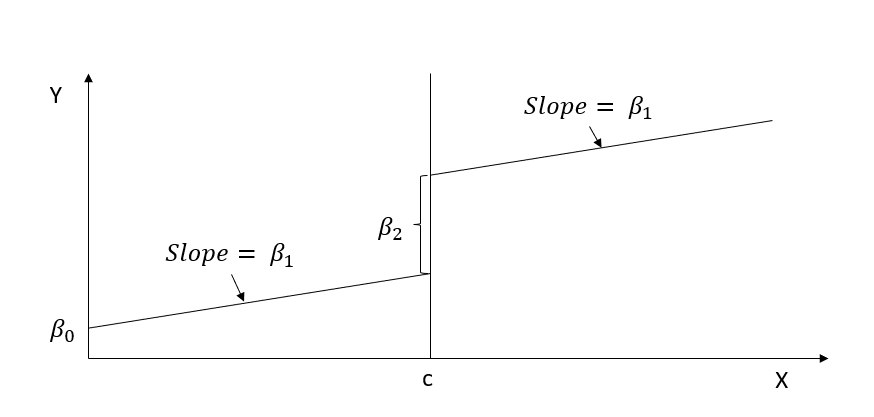
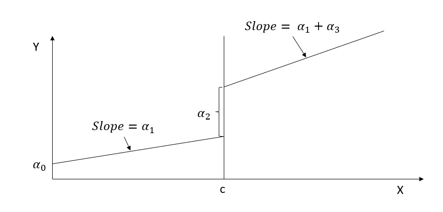

# Regression Discontinuity {#sec-regression-discontinuity}

Causal inference often requires creativity when randomized experiments are impractical, unethical, or too costly. In such situations, researchers turn to quasi-experimental designs that mimic the structure of randomized experiments under certain assumptions. One of the most compelling and rigorous among these is the **Regression Discontinuity (RD) design**, a method that turns a seemingly arbitrary policy rule into an opportunity for causal estimation.

Imagine a policy in which financial aid is awarded only to students whose family income falls below a certain threshold, or a marketing campaign targeted solely at customers with a credit score above a specified value. These cutoffs create a situation where treatment assignment hinges on a single continuous variable (e.g., income or credit score) crossing a fixed boundary. This boundary, or **cutoff**, introduces a discrete change in treatment probability based on a smooth, underlying score. That is the central insight behind RD: when individuals just above and just below the threshold are otherwise similar, comparing their outcomes offers a window into [local average treatment effects](#sec-local-average-treatment-effects).

The RD design exploits this structure by focusing on the "edge" (the region near the cutoff) where treatment assignment changes abruptly. While units far from the threshold may differ systematically, those close to it are assumed to be comparable, as if randomly assigned to treatment or control. This gives RD a compelling advantage: under relatively mild assumptions, it can deliver **credible causal estimates**, particularly in situations where [randomized controlled trials](#sec-experimental-design) (RCTs) are infeasible.

Originally introduced by @thistlethwaite1960 in their evaluation of merit-based scholarships and their impact on academic outcomes, RD has since evolved into a widely used econometric tool across fields such as education, healthcare, marketing, political science, and finance. Its theoretical foundation was significantly refined and extended in modern work by @imbens2008regression and @lee2010regression, who formalized its assumptions and estimation strategies.

RD designs come in two primary flavors:

-   [**Sharp RD**](#sec-sharp-regression-discontinuity-design), where the treatment assignment is perfectly determined by whether the running variable exceeds the cutoff.

-   [**Fuzzy RD**](#sec-fuzzy-regression-discontinuity-design), where the probability of treatment changes discontinuously at the cutoff but is not deterministically assigned.

In either case, the defining characteristic is the **discontinuity in the treatment assignment rule** based on a continuous score, often referred to as the **running variable**, **forcing variable**, or **assignment variable**.

Regression Discontinuity offers a powerful yet intuitive approach to causal inference, particularly when treatment assignment rules are rigid and known. In the sections that follow, we will develop the formal framework of RD designs, examine the key assumptions that underlie their validity, and apply the method to real-world business and policy problems.

------------------------------------------------------------------------

## Conceptual Framework

To truly appreciate the logic of RD designs, one must think like an experimentalist, but with observational data. RD transforms a deterministic rule (e.g., a policy cutoff) into an opportunity for **quasi-random assignment**. It is, in essence, a **localized experiment** conducted at the threshold of a continuous running variable.

At the heart of the RD framework is a deceptively simple idea: individuals just above and just below the cutoff are virtually identical in all respects, except for the treatment status induced by their position relative to the threshold. This intuition enables RD designs to estimate causal effects **with high internal validity**, even in the absence of random assignment.

RD's strength lies in its focus on a **narrow window** around the cutoff, often called the **bandwidth**, where the [assumption of exchangeability](#sec-conditional-ignorability-assumption) is most plausible. Within this narrow range, the assignment mechanism approximates a randomized experiment.

-   [Internal Validity](#sec-internal-validity): Extremely strong near the cutoff. The closer the observations are to the threshold, the more credible the assumption that they are otherwise comparable.
-   [External Validity](#sec-external-validity): More limited. Estimates are local to the cutoff and may not generalize to units far from the threshold. This tradeoff between precision and generalizability is a defining characteristic of RD.

One of the most compelling validations of RD comes from empirical comparisons with randomized controlled trials (RCTs). Evidence from studies such as @chaplin2018internal and @gleason2018rd suggest that RD and RCTs often yield **remarkably similar treatment effect estimates**, underscoring RD's credibility when its assumptions are met. While RD is not a substitute for randomization, it can come surprisingly close in practice.

RD is not an island; it shares conceptual and methodological links with several other causal inference frameworks. Understanding these connections helps clarify when RD is appropriate and how it complements alternative approaches.

-   [Randomized Experiment](#sec-the-gold-standard-randomized-controlled-trials): RD can be seen as a **local randomization design** (treatment is "as-if" randomly assigned near the cutoff).
-   [Instrumental Variables](#sec-instrumental-variables): RD can be framed as a special case of a structural IV model [@angrist1999using], where the running variable induces exogenous variation in treatment at the threshold.
-   [Matching Methods](#sec-matching-methods): RD resembles a highly targeted form of matching (matching units just above and below a single threshold) [@heckman1999economics].
-   [Interrupted Time Series](#sec-interrupted-time-series) (ITS): RD outperforms ITS when the running variable is finely measured and continuous. However, in settings with highly discrete or temporally aggregated data (e.g., quarterly revenues or annual crime rates), ITS may be more suitable. Still, when the data are dense or effectively continuous, RD offers a more precise and defensible design.

------------------------------------------------------------------------

## Types of Regression Discontinuity Designs

RD is not a one-size-fits-all approach. While the classic setup involves a binary treatment determined by a threshold-crossing rule, numerous extensions and variants exist, each tailored to different research contexts. Understanding these variations is essential for choosing the appropriate design and interpreting results correctly.

The starting point for organizing these variants is the assignment rule itself. Sharp designs treat the cutoff as deterministic; fuzzy designs allow imperfect compliance; kink designs shift attention from a jump in the level of treatment to a change in its slope; and time-based designs reinterpret the running variable as a calendar date. The four canonical types below trace this progression from the simplest sharp rule to settings where the threshold is temporal rather than scalar. As the rule weakens, the burden on assumptions grows: sharp RD demands only continuity of potential outcomes, while fuzzy and time-based variants layer on instrument relevance, monotonicity, and (in RDiT) careful trend modeling.

1.  [Sharp RD](#sec-sharp-regression-discontinuity-design): The simplest and most intuitive form of RD:
    -   Definition: Treatment assignment jumps **deterministically** from 0 to 1 at the cutoff.
    -   Implication: Individuals below the threshold are never treated; those above always are.
    -   Identification: The treatment effect is identified as the jump in the outcome at the cutoff.
    -   Example: A scholarship awarded strictly to students with test scores ≥ 85.
2.  [Fuzzy RD](#sec-fuzzy-regression-discontinuity-design): A generalization of the sharp design:
    -   Definition: The probability of treatment increases **discontinuously** at the cutoff, but does not jump from 0 to 1.
    -   Implication: Some individuals below the cutoff may receive the treatment, and some above may not.
    -   Identification: Requires instrumental variable methods to estimate the [local average treatment effects](#sec-local-average-treatment-effects) (LATE) for compliers.
    -   Example: A healthcare subsidy that is more likely, but not guaranteed, to be received by patients above a certain income level.
3.  [Kink RD](#sec-regression-kink-design): A subtler variant based on a change in slope:
    -   Definition: The **first derivative** (slope) of the outcome changes at the cutoff, rather than its level.
    -   Identification: The treatment effect is identified from a discontinuity in the **marginal effect** of the running variable.
    -   Example: Tax incentives where the marginal benefit changes at a threshold income level.
    -   References: See theoretical foundations in [@card2015inference] and empirical applications in [@bockerman2018kink; @nielsen2010estimating].
4.  [Regression Discontinuity in Time (RDiT)](#sec-regression-discontinuity-in-time): A special case of [Interrupted Time Series](#sec-interrupted-time-series):
    -   Definition: The running variable is **time**, and the cutoff corresponds to a policy implementation date or event.
    -   Application: Evaluates the immediate impact of an intervention that begins at a known point in time.
    -   Caveat: Since time trends are often confounded by other events, careful modeling of pre- and post-trends is essential.

> **Note**: RDiT is often less reliable than traditional RD due to potential violations of the continuity assumption, especially when time is measured in coarse intervals (e.g., quarterly or yearly).

------------------------------------------------------------------------

Beyond these canonical types, applied work has pushed RD into settings the original framework did not anticipate: policies with subgroup-specific thresholds, treatments determined jointly by several scores, geographic boundaries, treatments whose effects unfold over time, and dose-response settings where intensity rather than indicator status varies with the running variable. The list that follows surveys these extensions in the order they are most often encountered. Each extension preserves the core RD logic of comparing units near a discontinuity, but each also introduces design choices (pooling across thresholds, defining a boundary in two-dimensional score space, modeling lags) that the analyst must justify explicitly. Treat the entries below as a menu of options to consult once the basic sharp-or-fuzzy decision has been made.

-   [Multiple Cutoffs](#sec-multi-cutoff-regression-discontinuity-design):
    -   Use case: Different treatment thresholds apply to different subgroups (e.g., age groups, regions).
    -   Challenge: Requires careful pooling and stratification to maintain comparability.
-   [Multiple Scores](#sec-multi-score-regression-discontinuity-design) (Multiple Running Variables):
    -   Use case: Treatment depends on more than one score (e.g., income and age).
    -   Approach: Involves multivariate threshold rules or interaction effects.
-   Geographic RD (Spatial RD):
    -   Definition: The cutoff is defined in space, such as administrative borders or policy boundaries.
    -   Example: A tax policy that applies only to businesses within a specific jurisdiction.
-   Dynamic Treatments:
    -   Definition: Treatment effects may **evolve over time** after the initial intervention.
    -   Consideration: Requires longitudinal data and appropriate modeling of lagged effects.
-   [Continuous Treatment Intensity (Dose-Response RD)](#sec-dose-response-rd):
    -   Definition: Instead of a binary treatment, units receive varying degrees of treatment intensity based on the running variable, and the object of interest is the dose-response curve rather than a single contrast at the cutoff.
    -   Example: Advertising exposure that increases progressively with customer engagement scores; a means-tested transfer whose amount scales with how far below the eligibility threshold a household lies.

------------------------------------------------------------------------

### Assumptions for RD Validity {#sec-assumptions-for-rd-validity}

Whichever variant the analyst adopts, RD identification rests on a small set of conditions that together rationalize the local-randomization interpretation. The four assumptions below are best read as a single coherent story: assignment must depend only on the running variable, the conditional expectation of potential outcomes must not jump at the cutoff for reasons unrelated to treatment, the threshold itself must be exogenous to the unit, and other determinants of the outcome must be smooth across the boundary. When any of these conditions fails, the discontinuity at the cutoff conflates the treatment effect with whatever else is changing there, and credible inference collapses.

1.  **Independent Assignment:** The treatment is assigned solely based on the running variable.

2.  **Continuity of Conditional Expectations:** The expected outcomes without treatment are continuous at the cutoff:

    $$
     E[Y(0)|X=x] \text{ and } E[Y(1)|X=x] \text{ are continuous at } x = c.
     $$

3.  **Exogeneity of the Cutoff:** The cutoff should not be manipulable. No confounding interventions at the cutoff.

4.  **No Discontinuity in Confounding Variables:** Other covariates should be smooth at the threshold. A common test is to check for jumps in covariates unrelated to treatment.

See Table \@ref(tab:rd-threat-validity) for examples of possible violations.

| **Issue**                             | **Description**                                                                                                 | **Solution**                                                                                |
|----------------|-------------------------------|-------------------------|
| Violation of Continuity in Covariates | If other variables besides treatment exhibit a discontinuity at the cutoff, the estimated effect may be biased. | Conduct balance tests on pre-treatment covariates.                                          |
| Multiple Discontinuities              | When multiple threshold effects exist, identification becomes more challenging.                                 | Use robustness checks with alternative model specifications.                                |
| Manipulation of the Running Variable  | Subjects may manipulate $X_i$ to qualify for treatment (e.g., strategic behavior in test scores).               | Implement McCrary's density test to check for discontinuities in the distribution of $X_i$. |

Table: (\#tab:rd-threat-validity) Threats to RD validity.

------------------------------------------------------------------------

## Model Estimation Strategies

Under regression discontinuity framework, researchers can choose between **parametric** and [nonparametric](#sec-nonparametric-regression) models. The choice depends on assumptions about functional form, data availability, and the trade-off between flexibility and interpretability.

### Parametric Models: Polynomial Regression

Parametric models, such as linear regression, assume a specific functional form for the relationship between the dependent variable and predictors. One way to relax the strict linearity assumption is by incorporating **polynomial functions** of the forcing variable [@lee2010regression]. The choice of polynomial degree should be determined based on data characteristics.

However, using high-order polynomials comes with challenges. @gelman2019high highlight three key issues associated with global high-degree polynomials:

1.  Imprecise Estimates Due to Noise: Higher-degree polynomials can overfit, capturing noise instead of meaningful patterns.
2.  Sensitivity to Polynomial Degree: Estimates can vary significantly depending on the chosen degree, making the model less stable.
3.  Inadequate Confidence Interval Coverage: Confidence intervals tend to be misleading when using high-degree polynomials, leading to incorrect inference.

For these reasons, researchers are often advised to avoid global high-order polynomials and instead rely on alternative approaches (i.e., [nonparametric](#sec-nonparametric-regression) version).

### Nonparametric Models: Local Regression

[Nonparametric models](#sec-nonparametric-regression), such as local polynomial regression, offer greater flexibility by avoiding strong assumptions about functional form. Instead of fitting a single equation to the entire dataset, these methods estimate relationships **locally**, often using linear or quadratic polynomials within a neighborhood of each data point.

-   Uses weighted observations near the cutoff.
-   More flexible than global polynomial regression.

Local regression methods, such as local linear regression, address the shortcomings of high-order global polynomials by:

-   **Reducing overfitting**, as they adapt to local patterns without excessive complexity.
-   **Providing stable estimates**, since results are less sensitive to arbitrary choices of polynomial degree.
-   **Improving inference**, ensuring more reliable confidence intervals.

By balancing flexibility and robustness, local regression techniques are often preferred over global polynomial models in applied research.

**Best Practice:** Use multiple model specifications to check for consistency in results.

------------------------------------------------------------------------

## Formal Definition

Having sketched the intuition, we now pin down the notation that will carry through the rest of the chapter. The objects to keep in mind are simple: a continuous score that determines treatment, a fixed threshold, and the resulting indicator for whether a unit is treated.

Let $X_i$ be the running variable, $c$ the cutoff, and $D_i$ the treatment indicator:

$$ D_i = 1_{X_i > c} $$

or equivalently,

$$ D_i =  \begin{cases} 1, & X_i > c \\ 0, & X_i < c \end{cases} $$

where:

-   $D_i$: Treatment assignment

-   $X_i$: Running variable (continuous)

-   $c$: Cutoff value

### Identification Assumptions

#### Continuity-Based Identification

RD estimates the [Local Average Treatment Effect] at the cutoff:

$$ \begin{aligned} \alpha_{SRDD} &= E[Y_{1i} - Y_{0i} | X_i = c] \\ &= E[Y_{1i}|X_i = c] - E[Y_{0i}|X_i = c] \\ &= \lim_{x \to c^+} E[Y_{1i}|X_i = x] - \lim_{x \to c^-} E[Y_{0i}|X_i = x] \end{aligned} $$

This relies on the assumption that, in the absence of treatment, the conditional expectation of potential outcomes is **continuous** at the threshold $c$.

#### Local Randomization-Based Identification

Alternatively, identification can be achieved using local randomization within a small bandwidth $W$ (i.e., a neighborhood around the cutoff). The [Local Average Treatment Effect] in this case is:

$$ \begin{aligned} \alpha_{LR} &= E[Y_{1i} - Y_{0i}|X_i \in W] \\ &= \frac{1}{N_1} \sum_{X_i \in W, D_i = 1} Y_i - \frac{1}{N_0} \sum_{X_i \in W, D_i = 0} Y_i \end{aligned} $$

Since RD estimates are local, they may not generalize to the entire population. However, for many applications, [internal validity](#sec-internal-validity) is of primary concern (rather than [external validity](#sec-external-validity)).

------------------------------------------------------------------------

## Estimation and Inference

### Local Randomization-Based Approach

The local randomization approach additionally assumes that within the chosen window $W = [c - w, c + w]$, treatment assignment is **as good as random**. This requires:

1.  The joint probability distribution of running variable values inside $W$ to be known.
2.  Potential outcomes to be independent of the running variable within $W$.

This is a stronger assumption than [continuity-based identification](#sec-continuity-based-approach), as it requires that regression functions are smooth at $c$ and remain unaffected by $X_i$ within $W$.

Since researchers can **choose** the window $W$ (where random assignment plausibly holds), the sample size can often be small.

The selection of $W$ can be based on:

1.  **Pre-treatment covariate balance:** Ensure covariates are similar across the threshold.
2.  **Independent tests:** Check for independence between the outcome and the running variable.
3.  **Domain knowledge:** Use theoretical or empirical justification for the window choice.

For inference, researchers can use:

-   **(Fisher) randomization inference**
-   **(Neyman) design-based methods**

------------------------------------------------------------------------

### Continuity-Based Approach {#sec-continuity-based-approach}

Also known as the local polynomial regression method, this approach estimates treatment effects by fitting a polynomial model locally around the cutoff. Global polynomial regression is not recommended due to issues such as:

-   **Lack of robustness**
-   **Overfitting**
-   **Runge's phenomenon** (oscillatory behavior at boundaries)

#### Steps for Local Polynomial Estimation

1.  Choose the polynomial order and weighting scheme
2.  Select an optimal bandwidth (minimizing MSE or coverage error)
3.  Estimate the parameter of interest
4.  Perform robust bias-corrected inference

This method ensures that estimation remains local, capturing the treatment effect precisely at the cutoff.

------------------------------------------------------------------------

## Specification Checks

An RD design lives or dies by whether the assumptions actually hold in the data, so a credible application is expected to run a battery of specification checks. The most consequential is the manipulation/sorting check: if units can move themselves across the threshold, the design simply collapses, and no amount of bandwidth tuning will save it. Balance checks come next, because a discontinuity in baseline covariates indicates that something other than the policy jumps at the cutoff. The remaining checks, placebo tests at fake cutoffs, robustness to bandwidth choice, and partial-identification bounds when manipulation cannot be ruled out, are best read as confirmatory evidence rather than gatekeepers.

1.  [Balance Checks](#sec-balance-checks)
2.  [Sorting, Bunching, and Manipulation](#sec-sorting-bunching-and-manipulation)
3.  [Placebo Tests]
4.  [Sensitivity to Bandwidth Choice]
5.  [Manipulation-Robust Regression Discontinuity Bounds]

------------------------------------------------------------------------

### Balance Checks {#sec-balance-checks}

Also known as **checking for discontinuities in average covariates**, this test examines whether covariates that should not be affected by treatment exhibit a discontinuity at the cutoff.

-   Null Hypothesis ($H_0$): The average effect of covariates on pseudo-outcomes (i.e., those that should not be influenced by treatment) is zero.
-   If rejected, this raises serious doubts about the RD design, necessitating a strong justification.

------------------------------------------------------------------------

### Sorting, Bunching, and Manipulation {#sec-sorting-bunching-and-manipulation}

This test, also known as **checking for discontinuities in the distribution of the forcing variable**, detects whether subjects manipulate the running variable to sort into or out of treatment.

If individuals can manipulate the running variable, especially when the cutoff is known in advance, this can lead to bunching behavior (i.e., clustering just above or below the cutoff).

-   If treatment is desirable, individuals will try to sort into treatment, leading to a gap just below the cutoff.
-   If treatment is undesirable, individuals will try to avoid it, leading to a gap just above the cutoff.

Under RD, we assume that there is no manipulation in the running variable. However, bunching behavior, where firms or individuals strategically manipulate their position, violates this assumption.

-   To address this issue, the bunching approach estimates the counterfactual distribution, what the density of individuals would have been in the absence of manipulation.

-   The fraction of individuals who engaged in manipulation is then calculated by comparing the observed distribution to this counterfactual distribution.

-   In a standard RD framework, this step is unnecessary because it assumes that the observed distribution and the counterfactual (manipulation-free) distribution are the same, implying no manipulation

#### McCrary Sorting Test {#sec-mccrary-sorting-test}

A widely used formal test is the McCrary density test [@mccrary2008manipulation], later refined by @cattaneo2019practical.

-   Null Hypothesis ($H_0$): The density of the running variable is continuous at the cutoff.
-   Alternative Hypothesis ($H_a$): A discontinuity (jump) in the density function at the cutoff, suggesting manipulation.
-   Interpretation:
    -   A significant discontinuity suggests manipulation, violating RD assumptions.
    -   A failure to reject $H_0$ does not necessarily confirm validity, as some forms of manipulation may remain undetected.
    -   If there is two-sided manipulation, this test will fail to detect it.

#### Guidelines for Assessing Manipulation

-   @zhang2003estimation, @lee2009training, and @aronow2019note provide criteria for evaluating manipulation risks.
-   Knowing your **research design inside out** is crucial to anticipating possible manipulation attempts.
-   Manipulation is often **one-sided**, meaning subjects shift only in one direction relative to the cutoff. In rare cases, two-sided manipulation may occur but often cancels out.
-   We could also observe partial manipulation in reality (e.g., when subjects can only imperfectly manipulate). However, since we typically treat it like a fuzzy RD, we would not encounter identification problems. In contrast, complete manipulation would lead to serious identification issues.

#### Bunching Methodology

-   Bunching occurs when individuals self-select into specific values of the running variable (e.g., policy thresholds). See @kleven2016bunching for a review.
-   The method helps estimate the counterfactual distribution (what the density would have been without manipulation).
-   The fraction of individuals who manipulated can be estimated by comparing observed densities to the counterfactual.

If the running variable and outcome are **simultaneously determined**, a modified RD estimator can be used for consistent estimation [@bajari2011regression]:

1.  One-sided manipulation: Individuals shift only in **one direction** relative to the cutoff (similar to the monotonicity assumption in instrumental variables).
2.  Bounded manipulation (regularity assumption): The density of individuals far from the threshold remains unaffected [@blomquist2021bunching; @bertanha2021better].

#### Steps for Bunching Analysis

1.  Identify the window where bunching occurs (based on @bosch2020data). Perform robustness checks by varying the manipulation window.
2.  Estimate the manipulation-free counterfactual distribution.
3.  Standard errors for inference can be calculated (following @chetty2016effects), where bootstrap resampling of residuals is used in estimating the counts of individuals within bins. However, this step may be unnecessary for large datasets.

If the bunching test fails to detect manipulation, we proceed to the [Placebo Test].

------------------------------------------------------------------------

#### McCrary Density Test (Discontinuity in Forcing Variable)

```{r}
library(rdd)

set.seed(1)
```

Figure \@ref(fig:rd-local-polynomial-reg-wo-dis) shows simulated data without discontinuity.

```{r rd-local-polynomial-reg-wo-dis, fig.cap='Local polynomial regression without discontinuity at cutoff.', fig.alt='Scatter plot with data points and two smooth fitted curves, one on each side of the vertical cutoff at zero. Solid lines indicate the fitted regression curves, while dashed lines show confidence bands.'}
# Simulated data without discontinuity
x <- runif(100, -1, 1)
DCdensity(x, 0)  # No discontinuity
```

Figure \@ref(fig:rd-local-polynomial-reg-w-dis) shows simulated data with discontinuity.

```{r rd-local-polynomial-reg-w-dis, fig.cap='Local polynomial regression with discontinuity at cutoff.', fig.alt='Scatter plot with data points and two smooth fitted curves, one on each side of the vertical cutoff at zero. Solid lines indicate the fitted regression curves, while dashed lines show confidence bands.'}
# Simulated data with discontinuity
x <- runif(1000, -1, 1)
x <- x + 2 * (runif(1000, -1, 1) > 0 & x < 0)
DCdensity(x, 0)  # Discontinuity detected
```

#### Cattaneo Density Test (Improved Version)

```{r}
library(rddensity)

# Simulated continuous density
set.seed(1)
x   <- rnorm(100, mean = -0.5)
rdd <- rddensity(X = x, vce = "jackknife")
summary(rdd)

# Plot requires customization (refer to package documentation)
# rdplotdensity(rdd, x, 
#               xlabel = "Running Variable",
#               ylabel = "Density")
```

### Placebo Tests

Placebo tests, also known as **falsification checks**, assess whether discontinuities appear at points other than the treatment cutoff. This helps verify that observed effects are causal rather than artifacts of the method or data.

-   There should be no jumps in the outcome at values other than the cutoff ($X_i < c$ or $X_i \geq c$).
-   The test involves shifting the cutoff along the running variable while using the same bandwidth to check for discontinuities in the conditional mean of the outcome.
-   This approach is similar to [balance checks](#sec-balance-checks) in experimental design, ensuring no pre-existing differences. Remember, we can only test on observables, not unobservables.

Under a valid RD design, [matching methods](#sec-matching-methods) are unnecessary. Just as with [randomized experiments](#sec-the-gold-standard-randomized-controlled-trials), balance should naturally occur across the threshold. If adjustments are required, it suggests the **RD assumptions may be invalid**.

#### Applications of Placebo Tests

1.  **Testing No Discontinuity in Predetermined Covariates:** Covariates that should not be affected by treatment should not exhibit a jump at the cutoff.
2.  **Testing Other Discontinuities:** Checking for discontinuities at other arbitrary points along the running variable.
3.  **Using Placebo Outcomes:** If an outcome variable that should not be affected by treatment shows a significant discontinuity, this raises concerns about RD validity.
4.  **Assessing Sensitivity to Covariates:** RD estimates should not be highly sensitive to the inclusion or exclusion of covariates.

#### Mathematical Specification

The balance of observable characteristics on both sides of the threshold can be tested using:

$$
Z_i = \alpha_0 + \alpha_1 f(X_i) + I(X_i \geq c) \alpha_2 + [f(X_i) \times I(X_i \geq c)]\alpha_3 + u_i
$$

where:

-   $X_i$ = running variable

-   $Z_i$ = predetermined characteristics (e.g., age, education, etc.)

-   $\alpha_2$ should be zero if $Z_i$ is unaffected by treatment.

If multiple covariates $Z_i$ are tested simultaneously, simulating their **joint distribution** avoids false positives due to multiple comparisons. This step is unnecessary if covariates are **independent**, but such independence is unlikely in practice.

------------------------------------------------------------------------

### Sensitivity to Bandwidth Choice

The choice of bandwidth is crucial in RD estimation. Different bandwidth selection methods exist:

1.  **Ad-hoc or Substantively Driven:** Based on theoretical or empirical reasoning.
2.  **Data-Driven Selection (Cross-Validation):** Optimizes bandwidth to minimize prediction error.
3.  **Conservative Approach:** Uses robust optimal bandwidth selection methods (e.g., [@calonico2020optimal]).

The objective is to **minimize mean squared error (MSE)** between estimated and actual treatment effects.

### Assessing Sensitivity

-   Results should be **consistent** across reasonable bandwidth choices.
-   The optimal bandwidth for estimating treatment effects may **differ** from the optimal bandwidth for testing covariates but should be fairly close.

```{r}
# Load required package
library(rdd)

# Simulate some data
set.seed(123)
n <- 100  # Sample size

# Running variable centered around 0
running_var <- runif(n, -1, 1)  

# Treatment assigned at cutpoint 0
treatment   <- ifelse(running_var >= 0, 1, 0)  

# Outcome variable
outcome_var <- 2 * running_var + treatment * 1.5 + rnorm(n)  

# Compute the optimal Imbens-Kalyanaraman bandwidth
bandwidth <-
    IKbandwidth(running_var,
                outcome_var,
                cutpoint = 0,
                kernel = "triangular")

# Print the bandwidth
print(bandwidth)
```

------------------------------------------------------------------------

#### Modern Bandwidth Selection and Robust Inference with `rdrobust`

The `rdd` package has been effectively unmaintained on CRAN since 2016. The de facto modern standard for both bandwidth selection and point estimation in sharp and fuzzy RD designs is the `rdrobust` package [@calonico2014robust; @calonico2020optimal], which implements:

- **MSE- and CER-optimal bandwidth selectors** for sharp, fuzzy, and kink RD designs (`rdbwselect()`).
- **Bias-corrected point estimates** with **robust confidence intervals** that explicitly account for the bias introduced by the optimal bandwidth (`rdrobust()`).

The `rdd` example above is retained for backward reference and pedagogical continuity; for new applied work, the workflow below is preferred.

```{r, eval=FALSE}
# install.packages("rdrobust")
library(rdrobust)

# Use the same simulated data: outcome_var, running_var, cutpoint = 0
# Step 1: CCT (Calonico-Cattaneo-Titiunik) optimal bandwidth selection
bw_cct <- rdbwselect(
    y         = outcome_var,
    x         = running_var,
    c         = 0,
    bwselect  = "mserd",   # MSE-optimal common bandwidth
    kernel    = "triangular"
)
summary(bw_cct)

# Step 2: Bias-corrected point estimate with robust CIs
rd_fit <- rdrobust(
    y      = outcome_var,
    x      = running_var,
    c      = 0,
    kernel = "triangular"
)
summary(rd_fit)
```

The `summary(rd_fit)` output reports three rows: a **conventional** estimate (no bias correction), a **bias-corrected** estimate, and the **robust** estimate whose confidence interval is the recommended object for inference. For an alternative design with two-sided MSE-optimal bandwidths or the coverage-error-rate (CER) optimal selector, change `bwselect` to `"msetwo"` or `"cerrd"`. For fuzzy designs, supply the treatment indicator via the `fuzzy` argument.

> **Practical note**: `rdrobust` is the de facto modern standard; the `rdd` package is retained here for backward reference, but new work should rely on `rdrobust` for both bandwidth selection and inference.

------------------------------------------------------------------------

### Manipulation-Robust Regression Discontinuity Bounds

Regression Discontinuity designs rely on the assumption that the running variable $X_i$ is not manipulable by agents in the study. However, @mccrary2008manipulation showed that a discontinuity in the density of $X_i$ at the cutoff may indicate manipulation, potentially invalidating RD estimates. The common approach to handling detected manipulation is:

-   If no manipulation is detected, proceed with RD analysis.
-   If manipulation is detected, use the "doughnut-hole" method (i.e., excluding near-cutoff observations), but this contradicts the RD principles (Table \@ref(tab:rd-doughnut-hole)).

However, strict adherence to this rule can lead to two problems:

1.  False Negatives: A small sample size might fail to detect manipulation, leading to biased estimates if manipulation still affects the running variable.
2.  Loss of Informative Data: Even when manipulation is detected, the data may still contain valuable information for causal inference.

To address these challenges, @gerard2020bounds introduce a framework that accounts for manipulated observations rather than discarding them. This approach:

-   Identifies the extent of manipulation.
-   Computes worst-case bounds on treatment effects.
-   Provides a systematic way to incorporate manipulated observations while maintaining the credibility of RD analysis.

If manipulation is believed to be unlikely, an alternative approach is to conduct sensitivity analysis by:

-   Testing how different hypothetical values of $\tau$ affect the bounds.

-   Comparing results across various $\tau$ assumptions to assess robustness.

------------------------------------------------------------------------

Consider independent observations $(X_i, Y_i, D_i)$:

-   $X_i$: Running variable.
-   $Y_i$: Outcome variable.
-   $D_i$: Treatment indicator ($D_i = 1$ if $X_i \geq c$, and $D_i = 0$ otherwise).

A **sharp RD design** satisfies $D_i = I(X_i \geq c)$, while a **fuzzy RD design** allows probabilistic treatment assignment.

The population consists of two types of units:

1.  **Potentially-Assigned Units** ($M_i = 0$): These units follow the standard RD framework. They have potential outcomes $Y_i(d)$ and potential treatment states $D_i(x)$.
2.  **Always-Assigned Units** ($M_i = 1$): These units always appear on one side of the cutoff and do not require potential outcomes.

If no always-assigned units exist ($M_i = 1$ for no units), the standard RD model holds.

------------------------------------------------------------------------

#### Key Assumptions

The manipulation-robust framework replaces the standard RD assumption of no sorting with a weaker condition that explicitly tolerates one-sided manipulation. Rather than insisting that the density of the running variable be continuous at the cutoff, it permits a discontinuity but restricts its source: only "always-assigned" units may bunch on one side of the threshold, and the smooth subpopulation continues to satisfy the usual continuity requirements. The conditions below formalize this split. They are stronger than they first appear, since identification of bounds rests jointly on local independence among the smooth units, smoothness of their marginal density, and a one-sided restriction on where the manipulators can land.

1.  Local Independence and Continuity: 
    -   Treatment probability jumps at $c$ among potentially-assigned units: $$
        P(D = 1|X = c^+, M = 0) > P(D = 1|X = c^-, M = 0).
        $$
    -   No defiers: $P(D^+ \geq D^- | X = c, M = 0) = 1$.
    -   Potential outcomes and treatment states are continuous at $c$.
    -   The density of the running variable among potentially-assigned units, $F_{X|M=0}(x)$, is differentiable at $c$.
2.  **Smoothness of the Running Variable among Potentially-Assigned Units**:
    -   The derivative of $F_{X|M=0}(x)$ is continuous at $c$.
3.  **Restrictions on Always-Assigned Units**:
    -   Always-assigned units satisfy $P(X \geq c|M = 1) = 1$.
    -   The density of the running variable among always-assigned units, $F_{X|M=1}(x)$, is right-differentiable at $c$.
    -   This one-sided manipulation assumption allows identification of the proportion of always-assigned units.

When always-assigned units exist, the RD design effectively becomes **fuzzy**, since: 1. Some potentially-assigned units receive treatment while others do not. 2. Always-assigned units are always treated (or always untreated).

#### Estimating Treatment Effects

For potentially-assigned units, the **causal effect of interest** is:

$$
\Gamma = E[Y(1) - Y(0) | X = c, D^+ > D^-, M = 0].
$$

This parameter represents the [local average treatment effect](#sec-local-average-treatment-effects) for potentially-assigned compliers, i.e., those whose treatment status is affected by their running variable crossing the cutoff.

#### Bounding Treatment Effects

When point identification fails, the manipulation-robust strategy retreats to sharp bounds: rather than recovering a single causal estimate, the analyst constructs the tightest possible interval consistent with the data and the relaxed assumptions. The two steps below trace this logic. The first quantifies how much manipulation is present by reading it off the density discontinuity, and the second uses worst-case reasoning over the unobserved mixture of always-assigned and potentially-assigned units to deliver a defensible range for the treatment effect.

1.  **Estimating the Proportion of Always-Assigned Units**:
    -   This is done by measuring the discontinuity in the density of $X$ at $c$.
    -   The larger the discontinuity, the greater the fraction of always-assigned units.
2.  **Computing Worst-Case Bounds on Treatment Effects**:
    -   If manipulation exists, treatment effects must be inferred using extreme-case scenarios.
    -   For [sharp RD designs](#sec-sharp-regression-discontinuity-design), bounds are estimated by trimming extreme outcomes near the cutoff.
    -   For [fuzzy RD designs](#sec-fuzzy-regression-discontinuity-design), additional adjustments are required to account for the presence of always-assigned units.

Extensions of this approach use covariates and economic behavior assumptions to refine bounds further.

| **Manipulation-Robust RD**                        | **Doughnut-Hole RD**                         |
|--------------------------------------|----------------------------------|
| Uses actual observed data at the cutoff.          | Excludes observations near the cutoff.       |
| Provides a direct estimate of causal effects.     | Relies on extrapolation from other regions.  |
| Accounts for manipulation explicitly.             | Assumes a hypothetical counterfactual world. |
| Less sensitive to assumptions about manipulation. | Requires strong assumptions about bias.      |

Table: (\#tab:rd-doughnut-hole) Comparison between manipulation-robust and doughnut-hole RD designs.

#### Identification Challenges

A central challenge in manipulation-robust RD designs is the inability to directly distinguish **always-assigned** from **potentially-assigned** units. As a result, the [LATE](#sec-local-average-treatment-effects) $\Gamma$ is not point identified. Instead, we establish sharp bounds on $\Gamma$.

These bounds leverage the stochastic dominance of potential outcome cumulative distribution functions over observed distributions. This allows us to infer treatment effects without making strong parametric assumptions.

To formalize the population structure, we define five types of units:

-   **Potentially-Assigned Units**:
    -   $C_0$ (Compliers): Receive treatment if and only if $X \geq c$.
    -   $A_0$ (Always-Takers): Always receive treatment, regardless of $X$.
    -   $N_0$ (Never-Takers): Never receive treatment, regardless of $X$.
-   **Always-Assigned Units**:
    -   $T_1$ (Treated Always-Assigned Units): Always appear above the cutoff and receive treatment.
    -   $U_1$ (Untreated Always-Assigned Units): Always appear below the cutoff and do not receive treatment.

The measure $\tau$, representing the proportion of always-assigned units near the cutoff, is point-identified using the discontinuity in the density of the running variable $f_X$ at $c$.

##### Identification in Sharp RD

In a sharp RD design:

-   Units to the left of the cutoff are potentially-assigned units.
-   The observed distribution of untreated outcomes, $Y(0)$, among these units corresponds to the outcomes of potentially-assigned compliers ($C_0$) at the cutoff.
-   To estimate sharp bounds on $\Gamma$, we need to assess the distribution of treated outcomes ($Y(1)$) for compliers.

However, information on treated outcomes ($Y(1)$) at the cutoff is only available from the treated subpopulation, which includes:

-   Potentially-assigned compliers ($C_0$)

-   Always-assigned treated units ($T_1$)

Since $\tau$ is point-identified, we can construct sharp bounds on $\Gamma$ by adjusting for the presence of $T_1$.

##### Identification in Fuzzy RD

In fuzzy RD, treatment assignment is not deterministic.

<!-- The subpopulations observed in each treatment-status group at the cutoff are: -->

<!-- | **Subpopulation** | **Unit Types Present** | -->

<!-- |-------------------|------------------------| -->

<!-- | $X = c^+, D = 1$  | $C_0, A_0, T_1$        | -->

<!-- | $X = c^-, D = 1$  | $A_0$                  | -->

<!-- | $X= c^+, D = 0$   | $N_0, U_1$             | -->

<!-- | $X = c^-, D = 0$  | $C_0, N_0$             | -->

<!-- *Source: Table on page 848 of @gerard2020bounds* -->

<!-- Key Takeaways: -->

-   **Unit Types and Combinations**: There are five distinct unit types and four combinations of treatment assignments and decisions relevant to the analysis. These distinctions are important because they affect how potential outcomes are analyzed and bounded.
-   **Outcome Distributions**: The analysis involves estimating the distribution of potential outcomes (both treated and untreated) among potentially-assigned compliers at the cutoff.
-   The goal is to estimate the distribution of potential outcomes (both treated and untreated) for potentially-assigned compliers at the cutoff.

#### Three-Step Process for Bounding Treatment Effects

The method to obtain sharp bounds on $\Gamma$ follows three steps:

1.  Bounding Potential Outcomes Under Treatment:
    -   Use observed treated outcomes to estimate the upper and lower bounds on $F_{Y(1)}(y | X = c, M = 0)$.
2.  Bounding Potential Outcomes Under Non-Treatment:
    -   Use observed untreated outcomes to estimate the upper and lower bounds on $F_{Y(0)}(y | X = c, M = 0)$.
3.  Deriving Bounds on $\Gamma$:
    -   Using the bounds from Steps 1 and 2, compute sharp upper and lower bounds on the [local average treatment effect](#sec-local-average-treatment-effects).

##### Extreme Value Consideration

-   The bounds account for worst-case scenarios by considering extreme assumptions about the distribution of potential outcomes.
-   These bounds are sharp (i.e., they cannot be tightened further without additional assumptions) but remain empirically relevant.

#### Extensions

1.  **Quantile Treatment Effects (QTEs)**

An alternative to average treatment effects is the quantile treatment effect (QTE), which focuses on different percentiles of the outcome distribution. Advantages of QTE bounds include:

-   Less Sensitivity to Extreme Values: Unlike ATE bounds, QTE bounds are less affected by outliers in the outcome distribution.
-   More Informative for Policy Analysis: Helps determine whether effects are concentrated in certain segments of the population.

QTE vs. ATE Under Manipulation:

-   **ATE inference is highly sensitive** to manipulation, with confidence intervals widening significantly as assumed manipulation increases.
-   **QTE inference remains meaningful** even under substantial manipulation.

2.  **Discrete Outcome Extensions**: The framework applies not only to continuous outcomes but also to **discrete** outcome variables.
3.  **Role of Behavioral Assumptions**

-   Making behavioral assumptions about high treatment likelihood among always-assigned units can refine the bounds.
-   For example, assuming that most always-assigned units are treated allows for narrower bounds on treatment effects.

4.  **Incorporation of Covariates**

-   Including pre-treatment covariates can refine treatment effect bounds.
-   Covariates help:
    -   Distinguish between potentially-assigned and always-assigned units.
    -   Improve inference on treatment effect heterogeneity.
    -   Guide policy targeting by identifying unit types based on observed characteristics.

```{r, eval = FALSE}
devtools::install_github("francoisgerard/rdbounds/R")
```

```{r, warning=FALSE, message=FALSE}
library(formattable)
library(data.table)
library(rdbounds)
set.seed(123)
df <- rdbounds_sampledata(1000, covs = FALSE)
head(df)

rdbounds_est <-
    rdbounds(
        y = df$y,
        x = df$x,
        # covs = as.factor(df$cov),
        treatment = df$treatment,
        c = 0,
        discrete_x = FALSE,
        discrete_y = FALSE,
        bwsx = c(.2, .5),
        bwy = 1,
        
        # for median effect use 
        # type = "qte", 
        # percentiles = .5, 
        
        kernel = "epanechnikov",
        orders = 1,
        evaluation_ys = seq(from = 0, to = 15, by = 1),
        refinement_A = TRUE,
        refinement_B = TRUE,
        right_effects = TRUE,
        yextremes = c(0, 15),
        num_bootstraps = 5
    )

```

```{r}
rdbounds_summary(rdbounds_est, title_prefix = "Sample Data Results")
```

```{r, message=FALSE, warning=FALSE}
rdbounds_est_tau <-
    rdbounds(
        y = df$y,
        x = df$x,
        # covs = as.factor(df$cov),
        treatment = df$treatment,
        c = 0,
        discrete_x = FALSE,
        discrete_y = FALSE,
        bwsx = c(.2, .5),
        bwy = 1,
        kernel = "epanechnikov",
        orders = 1,
        evaluation_ys = seq(from = 0, to = 15, by = 1),
        refinement_A = TRUE,
        refinement_B = TRUE,
        right_effects = TRUE,
        potential_taus = c(.025, .05, .1, .2),
        yextremes = c(0, 15),
        num_bootstraps = 5
    )
```

Figure \@ref(fig:rd-ate-share-always-assigned) shows the average treatment effect across different shares of always-assigned units.

```{r rd-ate-share-always-assigned, fig.cap='Robustness of average treatment effect to share of always-assigned units.', fig.alt='Line chart showing ATE estimates plotted against the share of always-assigned units. Two solid lines with dots indicate upper and lower bounds of the estimated ATE as the share increases from 0 to 0.2. Dotted lines represent confidence intervals, and a red horizontal line marks zero.'}
causalverse::plot_rd_aa_share(rdbounds_est_tau) # For SRD (default)
# causalverse::plot_rd_aa_share(rdbounds_est_tau, rd_type = "FRD")  # For FRD
```

## Fuzzy Regression Discontinuity Design {#sec-fuzzy-regression-discontinuity-design}

A Fuzzy Regression Discontinuity Design occurs when the assignment rule at the cutoff does not perfectly determine treatment status but instead causes a discontinuity in the probability of treatment. Unlike a Sharp RD Design, where crossing the threshold fully determines treatment, in a fuzzy RD, some individuals on both sides of the threshold may or may not receive the treatment.

If treatment is not strictly assigned at the cutoff, the usual RD estimator (which assumes deterministic assignment) **is not valid**. Instead, we use the cutoff as an **instrumental variable** to estimate the treatment effect for **compliers** (i.e., individuals whose treatment status depends on whether they cross the threshold).

Define an indicator variable $Z_i$ (i.e., instrument for treatment assignment) that captures whether an individual is above or below the cutoff:

$$
Z_i =
\begin{cases}
1 & \text{if } X_i \geq c \\
0 & \text{if } X_i < c
\end{cases}
$$

This variable $Z_i$ serves as an instrument for the treatment variable $D_i$ because:

-   It strongly correlates with treatment ($D_i$).

-   It is exogenous, meaning it affects the outcome only through its effect on treatment.

### Compliance Types

Once treatment assignment is allowed to deviate from the cutoff rule, the population splits into behaviorally distinct groups defined by how each unit's treatment status would change as it crossed the threshold. This taxonomy, borrowed from the [instrumental-variables](#sec-instrumental-variables) literature, is what makes fuzzy RD an IV estimator rather than a pure regression-based one. The four types below partition the population by their counterfactual response to the cutoff, and only one of them, the compliers, is actually identified by the discontinuity. The estimator says nothing about always-takers or never-takers because their treatment status does not move with the instrument, and defiers are ruled out by the monotonicity assumption.

1.  Compliers ($C_0$): Individuals who receive treatment if and only if $X_i \geq c$.
2.  Always-Takers ($A_0$): Individuals who always receive treatment, regardless of whether $X_i \geq c$.
3.  Never-Takers ($N_0$): Individuals who never receive treatment, even if $X_i \geq c$.
4.  Defiers (violating monotonicity, assumed to be zero): Individuals who receive treatment if $X_i < c$ but not if $X_i \geq c$.

The **Fuzzy RD estimator** identifies the treatment effect **only for compliers**, because their treatment status depends on $Z_i$.

### Estimating the Local Average Treatment Effect

We estimate the [LATE](#sec-local-average-treatment-effects) using a **ratio of discontinuities**:

$$
\text{LATE} = \frac{\lim\limits_{x \downarrow c}E[Y|X = x] - \lim\limits_{x \uparrow c}E[Y|X = x]}{\lim\limits_{x \downarrow c } E[D |X = x] - \lim\limits_{x \uparrow c}E[D |X=x]}
$$

Intuitively, this formula represents:

$$
\text{LATE} = \frac{\text{Discontinuity in } E[Y|X]}{\text{Discontinuity in } E[D|X]}
$$

where:

-   The numerator captures the jump in the expected outcome at the cutoff.

-   The denominator captures the jump in the probability of treatment at the cutoff.

This ratio is valid under several key assumptions, each of which mirrors a condition familiar from IV identification but is now imposed locally at the cutoff. Continuity rules out other determinants of the outcome jumping at the threshold; monotonicity rules out defiers and so guarantees that the LATE has a coherent interpretation; and first-stage relevance ensures the denominator of the ratio is bounded away from zero so the estimator is well-defined. Together, these conditions are what convert the descriptive jumps in the numerator and denominator into a causal quantity for the complier subpopulation.

1.  **Continuity in potential outcomes:** $E[Y(d)|X]$ is continuous at $X = c$ for both $d \in \{0,1\}$.
2.  **Monotonicity:** There are no defiers ($P(D^+ \geq D^- | X = c) = 1$).
3.  **First-stage relevance:** There is a discontinuity in $P(D = 1 | X)$ at $X = c$.

If these conditions hold, the fuzzy RD estimator gives a valid estimate of the causal effect of treatment for compliers.

### Equivalent Representation Using Expectations

We can also define [LATE](#sec-local-average-treatment-effects) in terms of **conditional expectations of treatment and outcome**:

$$
\lim_{\epsilon \to 0} \frac{E[Y |Z = 1] - E[Y |Z=0]}{E[D|Z = 1] - E[D|Z = 0]}
$$

where $Z$ is the instrument (indicator for being above the cutoff). This approach highlights the IV nature of fuzzy RD.

### Estimation Strategies

There are two equivalent ways to estimate the [LATE](#sec-local-average-treatment-effects) in practice:

#### Approach 1: Two-Step Estimation

1.  **Estimate Sharp RD for the Outcome** $Y$:
    -   Regress $Y$ on $X$ using a local linear regression on either side of $c$.
    -   Estimate the discontinuity in $E[Y|X]$ at $c$.
2.  **Estimate Sharp RD for the Treatment** $D$:
    -   Regress $D$ on $X$ using a local linear regression on either side of $c$.
    -   Estimate the discontinuity in $E[D|X]$ at $c$.
3.  **Compute the Ratio**:
    -   Divide the estimated discontinuity in $E[Y|X]$ by the estimated discontinuity in $E[D|X]$.

Mathematically:

$$
\widehat{\text{LATE}} = \frac{\widehat{E[Y \mid X = c^+]} - \widehat{E[Y \mid X = c^-]}}{\widehat{E[D \mid X = c^+]} - \widehat{E[D \mid X = c^-]}}
$$
#### Approach 2: Instrumental Variables Regression

-   Subset the data to observations close to $c$.

-   Use $Z_i$ (above/below cutoff indicator) as an instrument for $D_i$ in a two-stage least squares regression:

    1.  **First-stage regression (predicting treatment using the cutoff indicator):**

        $$
        D_i = \alpha + \beta Z_i + \gamma X_i + \epsilon_i
        $$

        -   This captures the effect of the cutoff on treatment assignment.

    2.  **Second-stage regression (estimating treatment effect using predicted** $D_i$):

        $$
        Y_i = \delta + \tau \widehat{D}_i + \lambda X_i + \nu_i
        $$

        -   The coefficient $\tau$ gives the [LATE estimate](#sec-local-average-treatment-effects).

### Practical Considerations

-   **Bandwidth Selection**: Only observations near the cutoff should be used. Methods like **cross-validation** or @calonico2020optimal optimal bandwidth selection can help.
-   **Polynomial Order**: A local linear model is typically preferred, but higher-order polynomials may be used cautiously.
-   **Robust Inference**: Standard errors should be computed using heteroskedasticity-robust and clustered standard errors if necessary.
-   **Strong first-stage** (e.g., $F$-stat $\ge$ 16); no exclusion restriction violations; same model for both outcome and treatment take-up.

### Steps for Fuzzy RD

A complete fuzzy RD analysis proceeds through three connected stages: visual diagnosis, two-stage estimation, and a battery of robustness checks. Treating these as a sequence rather than a checklist matters, because each stage informs the next. The visual stage builds intuition about whether a discontinuity exists in the outcome and whether the cutoff actually shifts the probability of treatment, the estimation stage formalizes that intuition through two-stage least squares, and the robustness stage stress-tests the resulting estimate against the most common threats to RD validity. Skipping the visualization stage in particular tends to mask cases where the first stage is too weak for IV inference to be credible.

#### Visualization

1.  Graph the Outcome Variable:
    -   Compute the average outcome within bins of the running variable $X_i$.
    -   Choose bins large enough to display smooth trends but small enough to reveal discontinuities at the cutoff.
    -   Overlay a smoothed regression line on either side of the cutoff to visualize any jumps.
2.  Graph the Probability of Treatment:
    -   Compute the average treatment probability within the same bins.
    -   Plot $E[D|X]$ to check for a discontinuity at $X = c$, confirming the first-stage relevance of the instrument.

#### Estimation of Treatment Effect

Use Two-Stage Least Squares to estimate the [Local Average Treatment Effect](#sec-local-average-treatment-effects):

1.  First Stage (Predict Treatment Using Cutoff Indicator $Z_i$): $$
    D_i = \alpha + \beta Z_i + \gamma X_i + \epsilon_i
    $$
    -   This regression captures how treatment probability changes at the cutoff.
    -   The coefficient $\beta$ measures the **jump in treatment probability** at $X = c$.
2.  Second Stage (Estimate Outcome Using Predicted Treatment): $$
    Y_i = \delta + \tau \widehat{D}_i + \lambda X_i + \nu_i
    $$
    -   The coefficient $\tau$ gives the [LATE](#sec-local-average-treatment-effects), which estimates the treatment effect for compliers.

#### Robustness Checks

The robustness battery serves a different purpose from the point estimation above: it probes whether the assumptions underlying that estimate are credible in the data at hand. Each check below targets a specific failure mode. Covariate jumps speak to the no-confounding-discontinuity assumption, the McCrary density test addresses manipulation of the running variable (see \@ref(sec-mccrary-sorting-test)), placebo cutoffs guard against spurious patterns that look like discontinuities, and bandwidth sensitivity exposes overreliance on a particular window. A fuzzy RD estimate that survives all of these checks is far more defensible than one that simply emerges from a single specification.

1.  Assess Possible Jumps in Other Covariates:
    -   Check whether other pre-determined covariates (e.g., age, income) exhibit discontinuities at the cutoff.
    -   If covariates jump, this may indicate endogenous sorting or omitted variable bias.
2.  Hypothesis Testing for Bunching (McCrary Test):
    -   Test for manipulation of the running variable by examining whether the density of $X_i$ changes discontinuously at $c$.
    -   A significant density jump suggests sorting behavior, which could invalidate RD assumptions.
3.  Placebo Tests:
    -   Repeat the analysis at fake cutoffs (values of $X$ where no intervention occurs).
    -   If a treatment effect appears at a placebo cutoff, this suggests a spurious RD effect.
4.  Varying Bandwidth Sensitivity:
    -   Re-run the analysis using different bandwidths around the cutoff.
    -   Check whether estimates remain stable as the window narrows or expands.

------------------------------------------------------------------------

## Sharp Regression Discontinuity Design {#sec-sharp-regression-discontinuity-design}

A Sharp Regression Discontinuity Design occurs when treatment assignment follows a strict rule at a known cutoff. That is, units receive treatment **if and only if** their running variable $X_i$ crosses a threshold $c$:

$$
D_i =
\begin{cases}
1 & \text{if } X_i \geq c \\
0 & \text{if } X_i < c
\end{cases}
$$

Unlike [Fuzzy RD](#sec-fuzzy-regression-discontinuity-design), where treatment probability changes discontinuously but is not deterministic, [Sharp RD](#sec-sharp-regression-discontinuity-design) ensures perfect compliance with the cutoff rule.

The key idea is that **units just below and just above the cutoff are nearly identical in expectation**, except for their treatment status. This mimics [randomized experiments](#sec-the-gold-standard-randomized-controlled-trials) in a local neighborhood around $X = c$.

### Assumptions for Identification

For a valid Sharp RD design, we assume:

1.  **Continuity of the Conditional Expectation of Potential Outcomes**
    -   The expected outcome given $X$ is **smooth at** $c$ in the absence of treatment: $$
        \lim_{x \uparrow c} E[Y(0) | X = x] = \lim_{x \downarrow c} E[Y(0) | X = x].
        $$
    -   This ensures that any observed discontinuity in $E[Y | X]$ at $X = c$ is due to treatment, not pre-existing differences.
2.  **No Manipulation of the Running Variable**
    -   Agents cannot perfectly sort themselves around the cutoff (e.g., students manipulating test scores to qualify for a scholarship).
    -   This is typically checked using the McCrary density test to detect discontinuities in the density of $X$ at $c$.
3.  **Local Randomization**
    -   Near the cutoff, individuals are **as good as randomly assigned** to treatment or control.

If these conditions hold, the Sharp RD estimator provides an unbiased estimate of the causal effect of treatment.

### Estimating the Local Average Treatment Effect

The treatment effect at the cutoff is given by:

$$
\tau = \lim_{x \downarrow c}E[Y | X = x] - \lim_{x \uparrow c} E[Y | X = x].
$$

This represents the jump in the expected outcome at the cutoff.

### Estimation Methods

1.  Local Linear Regression

A common approach is to estimate separate linear regressions on **each side of the cutoff**:

For observations **below** the cutoff $(X < c)$:

$$
Y_i = \alpha + \beta (X_i - c) + \epsilon_i.
$$

For observations **above** the cutoff $(X \geq c)$:

$$
Y_i = \gamma + \delta (X_i - c) + \tau D_i + \nu_i.
$$

Here, the coefficient $\tau$ captures the **treatment effect at** $X = c$.

In practice, we estimate:

$$
\hat{\tau} = \hat{E}[Y | X = c^+] - \hat{E}[Y | X = c^-].
$$

This can be implemented using [Weighted Least Squares] with observations near the cutoff receiving higher weights.

2.  **Global Polynomial Regression**

An alternative approach is to use a polynomial regression:

$$
Y_i = \alpha + \sum_{k=1}^{K} \beta_k (X_i - c)^k + \tau D_i + \epsilon_i.
$$

where:

-   Higher-order terms $(X_i - c)^k$ capture nonlinear relationships.

-   Typical choices for $K$ are 2 or 3, but higher orders may lead to overfitting.

3.  **Nonparametric Local Regression**

Instead of assuming a linear or polynomial relationship, a local regression (kernel-based) method estimates:

$$
E[Y | X = x] = \sum_{i=1}^{n} K_h (X_i - x) Y_i.
$$

where $K_h$ is a kernel function (e.g., Epanechnikov), and $h$ is the bandwidth.

-   A smaller $h$ captures local variation but increases variance.
-   A larger $h$ smooths noise but risks bias.

### Steps for Sharp RD

#### Visualization

-   Graph the outcome variable: 
    -   Compute binned averages of $Y_i$ over intervals of $X$.
    -   Choose bin sizes that balance smoothness and clarity.
    -   Overlay a smoothed regression line on each side of $c$.
-   Graph the running variable's density: 
    -   Use histograms to check for manipulation.
    -   Conduct a McCrary density test to detect discontinuities.

#### Estimation of the Treatment Effect

-   Run local linear regression separately on both sides of the cutoff.
-   Use [nonparametric methods](#sec-nonparametric-regression) (e.g., kernel regression) for robustness.
-   Estimate treatment effect using: $$
    \hat{\tau} = \hat{E}[Y | X = c^+] - \hat{E}[Y | X = c^-].
    $$

#### Robustness Checks

1.  Check for Jumps in Other Covariates

-   If any pre-determined covariate jumps at the cutoff, it suggests sorting or omitted variable bias.

-   Run RD regressions for each covariate:

    $$
    W_i = \alpha + \beta (X_i - c) + \gamma D_i + \epsilon_i.
    $$

-   A significant $\gamma$ suggests a violation of continuity assumptions.

2.  McCrary Density Test (Checking for Manipulation)

-   Run the McCrary test to examine whether the density of $X_i$ exhibits a discontinuity at $c$.
-   A significant jump indicates sorting behavior, which can invalidate the RD design.

3.  Placebo Tests

-   Perform fake cutoff tests by estimating RD effects at arbitrary points $c^*$.
-   If significant effects appear at non-cutoff points, the RD design may be picking up spurious trends.

4.  Varying Bandwidth

-   Re-run RD analysis using different bandwidths $h$.
-   If results change dramatically, treatment effects may be highly sensitive to bandwidth choice.
-   Use data-driven bandwidth selection methods (e.g., @imbens2012optimal).

------------------------------------------------------------------------

## Regression Kink Design {#sec-regression-kink-design}

The Regression Kink Design (RKD) extends the logic of RD by exploiting **changes in the slope** of the treatment intensity function at a known threshold rather than a discontinuous jump in treatment assignment.

Instead of an RD jump in treatment probability at $X = c$, the treatment function $b(X)$ exhibits a **kink** at the cutoff:

-   In [Sharp RKD](#sec-identification-in-sharp-regression-kink-design), the kink is deterministic, meaning the treatment function $b(X)$ changes its slope exactly at $X = c$.
-   In [Fuzzy RKD](#sec-identification-in-fuzzy-regression-kink-design), treatment assignment remains probabilistic, requiring an **instrumental variable approach** similar to Fuzzy RD.

Example: Unemployment Benefits

Consider an unemployment insurance program where benefits increase at a diminishing rate as prior earnings increase. The function governing benefits, $b(X)$, exhibits a kink at a threshold $X = c$. The RKD framework allows us to estimate the marginal causal effect of additional benefits on employment duration.

### Identification in Sharp Regression Kink Design {#sec-identification-in-sharp-regression-kink-design}

In a Sharp RKD, the treatment intensity function $b(X)$ exhibits a known change in slope at $X = c$, formally:

$$
D_i = b(X_i), \quad \text{where } b(X) \text{ has a kink at } X = c.
$$

The key identification assumption is that the potential outcome function $E[Y(d) | X]$ is smooth in $X$. Thus, any observed change in the slope of $E[Y | X]$ at $X = c$ can be attributed to the change in $b(X)$.

The causal effect of interest is:

$$
\alpha_{KRD} = \frac{\lim\limits_{x \downarrow c} \frac{d}{dx}E[Y |X = x]- \lim\limits_{x \uparrow c} \frac{d}{dx}E[Y |X = x]}{\lim\limits_{x \downarrow c} \frac{d}{dx}b(x) - \lim\limits_{x \uparrow c} \frac{d}{dx}b(x)}.
$$

where:

-   $b(X)$ is a known function determining treatment intensity.

-   The numerator captures the discontinuous change in the slope of the expected outcome at $X = c$.

-   The denominator captures the change in the slope of the treatment function at $X = c$.

If $b(X)$ is known and deterministic, the denominator is non-random, allowing for precise estimation of $\alpha_{KRD}$.

#### Assumptions for Identification

1.  **Continuity of Potential Outcomes**
    -   The expected potential outcomes $E[Y(d)|X]$ are smooth in $X$ (no jumps).
2.  **No Manipulation of the Running Variable**
    -   The density of $X$ is continuous at $X = c$, implying that agents cannot sort themselves based on the kink.
3.  **First-Stage Validity**
    -   The slope of $b(X)$ must change at $X = c$ (i.e., the kink must exist).

If these assumptions hold, $\alpha_{KRD}$ represents the marginal causal effect of treatment intensity on the outcome.

### Identification in Fuzzy Regression Kink Design {#sec-identification-in-fuzzy-regression-kink-design}

In Fuzzy RKD, the treatment function $D_i$ does not directly follow a deterministic function $b(X)$ but instead exhibits a kink in its probability distribution:

$$
E[D | X] \text{ has a kink at } X = c.
$$

The treatment intensity function is unknown, requiring an instrumental variable (IV) strategy, analogous to Fuzzy RD.

The causal effect is given by:

$$
\alpha_{KRD} = \frac{\lim\limits_{x \downarrow c} \frac{d}{dx}E[Y |X = x]- \lim\limits_{x \uparrow c} \frac{d}{dx}E[Y |X = x]}{\lim\limits_{x \downarrow c} \frac{d}{dx}E[D |X = x]- \lim\limits_{x \uparrow c} \frac{d}{dx}E[D |X = x]}.
$$

where:

-   The numerator measures the kink in the expected outcome.

-   The denominator measures the kink in the probability of treatment.

-   The ratio provides a local instrumental variable estimate of the causal effect for compliers.

#### Identification Assumptions

In addition to the Sharp RKD assumptions, Fuzzy RKD requires:

1.  **Monotonicity**
    -   No individuals decrease their treatment intensity while others increase at the kink (analogous to Fuzzy RD monotonicity).
2.  **Relevance of the Kink**
    -   There must be a statistically significant slope change in $E[D | X]$ at $X = c$.

If these assumptions hold, the Fuzzy RKD estimator identifies a local treatment effect.

### Estimation of RKD Effects

RKD estimation involves three main steps:

#### Step 1: Estimating the Kink in the Outcome Function

Estimate the left- and right-hand derivatives of $E[Y | X]$:

$$
\frac{d}{dx}E[Y | X] = \lim_{h \to 0} \frac{E[Y | X = c + h] - E[Y | X = c - h]}{h}.
$$

This can be done using:

-   Local linear regression on either side of the kink.

-   Higher-order polynomial regression for improved flexibility.

#### Step 2: Estimating the Kink in the Treatment Function

For [Sharp RKD](#sec-identification-in-sharp-regression-kink-design), the kink in $b(X)$ is known.

For [Fuzzy RKD](#sec-identification-in-fuzzy-regression-kink-design), estimate the kink in $E[D | X]$:

$$
\frac{d}{dx}E[D | X] = \lim_{h \to 0} \frac{E[D | X = c + h] - E[D | X = c - h]}{h}.
$$

Use local regression or piecewise polynomials to estimate this slope.

#### Step 3: Compute RKD Estimator

For [Sharp RKD](#sec-identification-in-sharp-regression-kink-design):

$$
\hat{\alpha}_{KRD} = \frac{\hat{\tau}_Y}{\tau_b},
$$

where:

-   $\hat{\tau}_Y$ is the estimated kink in $E[Y | X]$.

-   $\tau_b$ is the known slope change in $b(X)$.

For [Fuzzy RKD](#sec-identification-in-fuzzy-regression-kink-design):

$$
\hat{\alpha}_{KRD} = \frac{\hat{\tau}_Y}{\hat{\tau}_D}.
$$

where:

-   $\hat{\tau}_D$ is the estimated kink in $E[D | X]$.

### Robustness Checks

1.  **Assess Covariate Smoothness**
    -   Verify that pre-determined covariates (e.g., age, education) do not exhibit kinks at $X = c$.
2.  **Check for Manipulation of the Running Variable**
    -   Perform a McCrary test to ensure the density of $X$ is continuous at $X = c$.
3.  **Placebo Kinks**
    -   Test for spurious kinks at other arbitrary values of $X$.
4.  **Bandwidth Sensitivity**
    -   Estimate RKD effects with varying bandwidths to check for consistency.

------------------------------------------------------------------------

## Multi-Cutoff Regression Discontinuity Design {#sec-multi-cutoff-regression-discontinuity-design}

The Multi-Cutoff Regression Discontinuity Design extends the standard RD framework by allowing for **multiple cutoff points** across different groups or geographic regions. Instead of a single threshold $c$, different subgroups are assigned different cutoffs $C_i$. This framework allows for a **heterogeneous treatment effect** function:

$$
\tau (x,c)= E[Y_{1i} - Y_{0i}|X_i = x, C_i = c].
$$

### Motivation for Multi-Cutoff RD

-   **Policy Variation**: Policies often implement different cutoffs across regions or institutions (e.g., different states setting different minimum test scores for scholarship eligibility).
-   **Generalizability**: Allows estimation of treatment effects across multiple populations instead of relying on a single threshold.
-   **Improved Precision**: Leveraging multiple thresholds can enhance statistical power compared to a single-cutoff RD.

The multi-cutoff RD framework provides several advantages:

1.  **Estimation of Local Heterogeneous Effects**
    -   Unlike standard RD, which estimates a single treatment effect, multi-cutoff RD allows heterogeneity in effects across groups.
2.  **Improved Precision**
    -   More observations across different thresholds can increase statistical power.
3.  **Policy Implications**
    -   Useful in settings where policy thresholds vary (e.g., different states setting different income eligibility limits for welfare programs).

### Identification

Under the potential outcomes framework, each unit $i$ has:

-   A running variable $X_i$.

-   A cutoff specific to their group $C_i$.

-   A binary treatment indicator:

$$
D_i = I(X_i \geq C_i).
$$

The observed outcome is:

$$
Y_i = D_i Y_{1i} + (1 - D_i) Y_{0i}.
$$

The treatment effect is the expected difference in potential outcomes:

$$
\tau(x, c) = E[Y_{1i} - Y_{0i} | X_i = x, C_i = c].
$$

### Key Assumptions

To ensure causal identification, we extend the standard RD assumptions:

1.  **Continuity of Potential Outcomes**
    -   The expected potential outcomes $E[Y(0)|X]$ and $E[Y(1)|X]$ are smooth functions of $X$ at each cutoff $C_i$.
    -   Formally: $$
        \lim_{x \uparrow C_i} E[Y(0)|X=x, C_i=c] = \lim_{x \downarrow C_i} E[Y(0)|X=x, C_i=c].
        $$
2.  **No Manipulation of the Running Variable**
    -   The density of $X_i$ must be continuous at each $C_i$, ensuring that individuals cannot selectively sort above or below their assigned cutoff.
3.  **Local Randomization**
    -   Near each cutoff, units are **as-good-as-randomly assigned** to treatment or control.
4.  **Independence Across Cutoffs**
    -   The cutoff assignment rule should be exogenous and not correlated with unobserved determinants of $Y$.

If these assumptions hold, each cutoff provides a valid local treatment effect estimate.

### Estimation Approaches

#### Pooling Cutoffs with Fixed Effects

A straightforward way to estimate multi-cutoff RD is to include **cutoff fixed effects**:

$$
Y_i = \alpha + \beta (X_i - C_i) + \tau D_i + \gamma C_i + \epsilon_i.
$$

where:

-   $\tau$ captures the **average treatment effect across all cutoffs**.

-   $C_i$ is included as a **fixed effect** to account for different intercepts across groups.

#### Separate RD Estimation for Each Cutoff

Instead of pooling, we can estimate **separate RD effects for each** $C_i$:

$$
\tau_c = \lim_{x \downarrow C_i}E[Y|X = x, C_i = c] - \lim_{x \uparrow C_i} E[Y|X = x, C_i = c].
$$

This approach allows for **heterogeneous treatment effects**.

#### Interaction Model for Heterogeneous Effects

To estimate how treatment effects vary with $C_i$, we interact $D_i$ with $C_i$:

$$
Y_i = \alpha + \beta (X_i - C_i) + \tau D_i + \lambda D_i C_i + \epsilon_i.
$$

where:

-   $\lambda$ captures how the treatment effect varies with the cutoff.

-   A significant $\lambda$ implies that $\tau(x, c)$ is not constant across cutoffs.

#### Nonparametric Local Estimation

A fully flexible approach estimates $\tau(x, c)$ separately at each cutoff using kernel-based methods:

$$
\hat{\tau}(c) = \frac{\sum_{i=1}^{n} K_h (X_i - C_i) D_i Y_i}{\sum_{i=1}^{n} K_h (X_i - C_i) D_i} - \frac{\sum_{i=1}^{n} K_h (X_i - C_i) (1 - D_i) Y_i}{\sum_{i=1}^{n} K_h (X_i - C_i) (1 - D_i)}.
$$

where:

-   $K_h(\cdot)$ is a kernel function (e.g., Epanechnikov).

-   $h$ is the bandwidth, chosen via cross-validation.

### Robustness Checks

1.  **Covariate Balance at Each Cutoff**

-   Test whether pre-treatment covariates show jumps at each $C_i$.

-   Run placebo RD regressions on covariates:

    $$
    W_i = \alpha + \beta (X_i - C_i) + \gamma D_i + \epsilon_i.
    $$

-   A significant $\gamma$ suggests that RD assumptions are violated.

2.  **McCrary Density Test**

-   Perform a McCrary test separately at each cutoff to check for manipulation:

    $$
    f(X) \text{ should be continuous at } X = C_i.
    $$

-   If discontinuities exist, individuals may be sorting around cutoffs.

3.  **Placebo Cutoffs**

-   Implement fake cutoffs and re-estimate $\tau(x, c)$.
-   If significant effects appear, the RD estimates may be biased.

4.  **Varying Bandwidths**

-   Re-estimate treatment effects using different bandwidths.
-   If $\hat{\tau}(x,c)$ changes drastically, it suggests sensitivity to bandwidth choice.

------------------------------------------------------------------------

## Multi-Score Regression Discontinuity Design {#sec-multi-score-regression-discontinuity-design}

The **Multi-Score Regression Discontinuity Design** extends the **standard single-score RD** and [the multi-cutoff RD](#sec-multi-cutoff-regression-discontinuity-design) by introducing multiple running variables that simultaneously determine treatment eligibility. Instead of relying on a single threshold for assignment, treatment now depends on a **combination of multiple continuous scores** crossing predetermined cutoffs.

Multi-score RD is relevant when policy eligibility is based on multiple criteria, such as:

-   Education: Honors program admission based on both math and English scores.

-   Healthcare: Medical trial eligibility based on both BMI and blood pressure levels.

-   Taxation: Tax incentives based on income level and household size.

### General Framework

Each individual $i$ has:

-   Two running variables, $X_{1i}$ and $X_{2i}$.

-   Two predetermined cutoffs, $C_1$ and $C_2$.

-   A binary treatment indicator $D_i$, assigned based on whether the individual's scores exceed both thresholds.

The treatment effect is defined as:

$$
\tau (x_1, x_2) = E[Y_{1i} - Y_{0i} | X_{1i} = x_1, X_{2i} = x_2].
$$

This represents the [local average treatment effect](#sec-local-average-treatment-effects) in a two-dimensional RD setting.

### Identification

Under the potential outcomes framework, for each individual $i$, we define:

-   $Y_{1i}$: Potential outcome under treatment.

-   $Y_{0i}$: Potential outcome under control.

-   $D_i$: Treatment assignment rule.

The observed outcome is:

$$
Y_i = D_i Y_{1i} + (1 - D_i) Y_{0i}.
$$

The treatment assignment mechanism follows:

$$
D_i =
\begin{cases}
1 & \text{if } X_{1i} \geq C_1 \text{ and } X_{2i} \geq C_2, \\
0 & \text{otherwise}.
\end{cases}
$$

### Key Assumptions

To ensure valid causal inference, the multi-score RD framework extends the standard RD assumptions:

1.  **Continuity of Potential Outcomes in Both Running Variables**
    -   The expected potential outcomes $E[Y(0) | X_1, X_2]$ and $E[Y(1) | X_1, X_2]$ are smooth in both $X_1$ and $X_2$.
    -   Formally: $$
        \begin{aligned}
\lim_{(x_1, x_2) \to (C_1, C_2)^-} E[Y(0) | X_1 = x_1, X_2 = x_2] = \\
\lim_{(x_1, x_2) \to (C_1, C_2)^+} E[Y(0) | X_1 = x_1, X_2 = x_2].
\end{aligned}
        $$
    -   Ensures that any observed discontinuity in $E[Y | X_1, X_2]$ is attributable to treatment.
2.  **No Manipulation of Running Variables**
    -   The density of $(X_1, X_2)$ must be continuous at $(C_1, C_2)$.
    -   No agents should be able to precisely manipulate both scores to cross the threshold.
3.  **Local Randomization**
    -   Near $(C_1, C_2)$, units are **as good as randomly assigned** to treatment or control.
4.  **No Interaction Effects in Running Variables** (optional)
    -   In some models, we assume that the effect of crossing $C_1$ does not depend on $C_2$ and vice versa.

If these assumptions hold, the treatment effect is identified as the discontinuity in $E[Y | X_1, X_2]$ at $(C_1, C_2)$.


### Estimation Approaches

#### Local Linear Regression in Two Dimensions

The simplest approach is to estimate separate regressions **on each side of the cutoff in both dimensions**:

For observations **below the threshold** $(C_1, C_2)$:

$$
Y_i = \alpha + \beta_1 (X_{1i} - C_1) + \beta_2 (X_{2i} - C_2) + \epsilon_i.
$$

For observations **above the threshold** $(C_1, C_2)$:

$$
Y_i = \gamma + \delta_1 (X_{1i} - C_1) + \delta_2 (X_{2i} - C_2) + \tau D_i + \nu_i.
$$

The treatment effect $\tau$ is estimated as:

$$
\hat{\tau} = \hat{E}[Y | X_1 = C_1^+, X_2 = C_2^+] - \hat{E}[Y | X_1 = C_1^-, X_2 = C_2^-].
$$

This approach assumes **local linearity**, but higher-order polynomials can be used:

$$
Y_i = \alpha + \sum_{k=1}^{K} \beta_k (X_{1i} - C_1)^k + \sum_{k=1}^{K} \gamma_k (X_{2i} - C_2)^k + \tau D_i + \epsilon_i.
$$

#### Kernel-Weighted Estimation

A more flexible approach estimates $\tau(x_1, x_2)$ using nonparametric local regression:

$$
\hat{\tau}(x_1, x_2) = \frac{\sum_{i=1}^{n} K_h (X_{1i} - x_1) K_h (X_{2i} - x_2) D_i Y_i}{\sum_{i=1}^{n} K_h (X_{1i} - x_1) K_h (X_{2i} - x_2) D_i}
- \frac{\sum_{i=1}^{n} K_h (X_{1i} - x_1) K_h (X_{2i} - x_2) (1 - D_i) Y_i}{\sum_{i=1}^{n} K_h (X_{1i} - x_1) K_h (X_{2i} - x_2) (1 - D_i)}.
$$

where:

-   $K_h(\cdot)$ is a kernel function (e.g., Epanechnikov).

-   $h$ is the bandwidth, selected via cross-validation.

#### Interaction Model for Heterogeneous Effects

To assess **interaction effects between running variables**, estimate:

$$
Y_i = \alpha + \beta_1 (X_{1i} - C_1) + \beta_2 (X_{2i} - C_2) + \tau D_i + \lambda D_i (X_{1i} - C_1)(X_{2i} - C_2) + \epsilon_i.
$$

-   $\lambda$ captures whether the treatment effect depends on both $X_1$ and $X_2$.

### Robustness Checks

1.  **Covariate Balance in Both Dimensions**
    -   Test whether pre-treatment covariates jump at $(C_1, C_2)$.
2.  **McCrary Density Test in Two Dimensions**
    -   Verify that density of $(X_1, X_2)$ is smooth at $(C_1, C_2)$.
3.  **Placebo Cutoffs**
    -   Implement fake cutoffs and re-estimate $\tau(x_1, x_2)$.
4.  **Varying Bandwidths**
    -   Re-estimate using different bandwidths for robustness.

## Free Discontinuity Regression {#sec-free-discontinuity-regression}

Classical regression discontinuity, including [Multi-Cutoff RD](#sec-multi-cutoff-regression-discontinuity-design) and [Multi-Score RD](#sec-multi-score-regression-discontinuity-design), requires the analyst to specify the discontinuity locations in advance. The cutoff $c$ in [Sharp RD](#sec-sharp-regression-discontinuity-design), the cutoff vector $\{C_1, C_2, \ldots\}$ in Multi-Cutoff RD, and the boundary $\{x : X_1 = C_1 \text{ or } X_2 = C_2\}$ in Multi-Score RD are all treated as known. The identification step exploits a discontinuity at a predetermined location.

In some applications the analyst does not know where the jumps in the conditional expectation surface occur, or how many there are. The treatment may be triggered by a rule that is not transparent, the policy region may have an irregular boundary in covariate space, or the data may be a spatial map on which abrupt changes are visible but not pre-specified. For these settings, @gunsilius2023free develop Free Discontinuity Regression (FDR), a nonparametric estimator that simultaneously smooths the regression surface, segments it into disjoint pieces, and recovers the locations and sizes of jumps without prior knowledge of the discontinuity set.

### Setup and Estimand

Let $Y_i$ be a scalar outcome observed at a vector of covariates $X_i \in \mathbb{R}^d$ for $i = 1, \ldots, n$. The conditional expectation $m(x) = \mathbb{E}[Y_i \mid X_i = x]$ is assumed to be piecewise smooth: $m$ is smooth on each of an unknown number of disjoint regions $\Omega_1, \ldots, \Omega_K \subset \mathbb{R}^d$ and jumps across the unknown $(d-1)$-dimensional boundaries that separate them, collected into a jump set $S = \bigcup_k \partial \Omega_k$. The estimand consists of three objects, all unknown: the regions $\{\Omega_k\}$ with their boundaries, the smooth pieces $\{m_k\}$ that describe the regression surface inside each region, and the jump sizes $\jmath(x) = m(x^+) - m(x^-)$ across each point of the boundary, where $x^+$ and $x^-$ denote limits from the two sides.

FDR estimates these jointly by minimizing a Mumford-Shah-type functional adapted to regression:

$$
(\hat m, \hat S) \;=\; \arg\min_{m, S} \;\; \sum_{i=1}^n (Y_i - m(X_i))^2 \;+\; \alpha \int_{\mathbb{R}^d \setminus S} \|\nabla m(x)\|^2 \, dx \;+\; \beta \, \mathcal{H}^{d-1}(S),
$$ {#eq-fdr-mumford-shah}

where $\mathcal{H}^{d-1}(S)$ is the $(d-1)$-dimensional Hausdorff measure of $S$ (arc length when $d=2$, surface area when $d=3$), $\alpha > 0$ penalizes wiggliness within each region, and $\beta > 0$ penalizes the total size of the jump set. The three terms balance data fidelity, within-region smoothness, and parsimony of the segmentation.

### Identification Assumptions

Consistent recovery of $(m, S)$ under (\@ref(eq:fdr-mumford-shah)) requires the data-generating process and the penalty schedule to satisfy a set of regularity conditions [@gunsilius2023free].

1.  *Compactness*. The support of $X_i$ is compact, $X_i \in \mathcal{X} \subset \mathbb{R}^d$.
2.  *Piecewise smoothness*. There exists a finite partition $\{\Omega_1, \ldots, \Omega_K\}$ of $\mathcal{X}$ such that the restriction of $m$ to each $\Omega_k$ extends to a function in a Sobolev space $W^{1,2}$. The number of regions $K$ is finite but unknown.
3.  *Rectifiable boundary*. The jump set $S$ is closed and $(d-1)$-rectifiable: it is locally the image of a Lipschitz map from $\mathbb{R}^{d-1}$, with finite $\mathcal{H}^{d-1}$-measure. This rules out fractal boundaries.
4.  *Jump separation*. $\inf_{x \in S} |\jmath(x)| \ge \jmath_{\min} > 0$. Boundaries are detectable only above a noise-dependent threshold; arbitrarily small jumps cannot be separated from regression error in finite samples.
5.  *Bounded noise*. The conditional noise $\varepsilon_i = Y_i - m(X_i)$ has $\mathbb{E}[\varepsilon_i \mid X_i] = 0$ and $\mathbb{E}[\varepsilon_i^2 \mid X_i] \le \sigma^2 < \infty$, with sub-Gaussian tails sufficing for the rate results.
6.  *Penalty schedule*. The penalties scale as $\alpha_n = c_\alpha n^{-2/(2+d)}$ and $\beta_n = c_\beta n^{-1/(2+d)}$ as $n \to \infty$. These rates trade variance and bias optimally for $W^{1,2}$ regression with $(d-1)$-rectifiable jump sets; in finite samples both are chosen by cross-validation.

Under conditions 1 through 6, @gunsilius2023free establish that $\hat S \to S$ in the Hausdorff distance and $\hat m \to m$ uniformly on compact subsets of $\mathcal{X} \setminus S$. The pointwise jump estimator $\hat\jmath(x_0) = \hat m(x_0^+) - \hat m(x_0^-)$ at an interior point $x_0 \in S$ is consistent and asymptotically normal after centering and scaling by an estimator-specific rate.

### Estimation in Practice

Direct minimization of (\@ref(eq:fdr-mumford-shah)) is intractable because $S$ is a free geometric object. Two standard relaxations make the problem solvable.

*Ambrosio-Tortorelli relaxation*. Replace the jump set $S$ with a continuous edge field $v : \mathcal{X} \to [0, 1]$ that approaches $0$ near jumps and $1$ in smooth regions. The relaxed functional is

$$
\sum_{i=1}^n (Y_i - m(X_i))^2 \;+\; \alpha \int_{\mathcal{X}} v(x)^2 \, \|\nabla m(x)\|^2 \, dx \;+\; \beta \int_{\mathcal{X}} \left( \epsilon \|\nabla v(x)\|^2 + \tfrac{1}{4\epsilon} (1 - v(x))^2 \right) dx.
$$

@ambrosio1992approximation prove $\Gamma$-convergence to (\@ref(eq:fdr-mumford-shah)) as $\epsilon \to 0$. In code one fixes a small $\epsilon$ and alternates two convex sub-problems: solve for $m$ with $v$ fixed (a weighted ridge regression), then solve for $v$ with $m$ fixed (a quadratic problem in $v$).

*Graph-cut discretization*. Discretize $\mathcal{X}$ on a regular grid of nodes connected by edges. Replace $\int \|\nabla m\|^2$ with $\sum_{(i,j) \in E} w_{ij} (m_i - m_j)^2$ and $\mathcal{H}^{d-1}(S)$ with the total weight of cut edges where $m$ jumps. The resulting problem is a graph-cut problem that admits convex relaxation and is solved with ADMM or alternating-direction proximal splitting. Computational cost scales as $O(n \cdot |\text{grid}| \cdot \text{iterations})$; in $d = 2$ on a $200 \times 200$ grid this is a matter of minutes.

A 1D analog of the FDR objective is the *fused lasso* (also called 1D total-variation denoising), which replaces $\mathcal{H}^{d-1}(S)$ with the $\ell_1$ norm of consecutive differences. The fused lasso is fully convex, has well-developed solvers in the `genlasso` package, and produces the same qualitative output that FDR produces in higher dimensions: a piecewise-constant fit whose jump locations are recovered from the data. The following demonstration uses the 1D problem to make the FDR pipeline concrete.

```{r fdr-1d-demo, message=FALSE, warning=FALSE}
suppressPackageStartupMessages({
  library(genlasso)   # CRAN: fused lasso / trend filtering
  library(ggplot2)
})

set.seed(20240515)

# Stylized 1D data with three unknown jumps and a noisy signal in between.
# True jump locations: x = -1.0, 0.3, 1.4. Jump sizes: +2, -3, +1.5.
n <- 500
x <- sort(runif(n, -2, 2))
true_m <- function(x) {
  m <- 0.0 + 0.4 * x
  m <- m + 2.0 * (x > -1.0)
  m <- m - 3.0 * (x >  0.3)
  m <- m + 1.5 * (x >  1.4)
  m
}
m_x <- true_m(x)
y   <- m_x + rnorm(n, sd = 0.4)

# Fused lasso (the 1D analog of the FDR objective):
#   min_m  sum (y - m)^2 + beta * sum |m_{i+1} - m_i|.
# genlasso::fusedlasso1d returns the full solution path over beta.
fit  <- fusedlasso1d(y)
# Pick beta by 5-fold cross-validation.
cv   <- cv.trendfilter(fit, k = 5)
m_hat <- coef(fit, lambda = cv$lambda.1se)$beta[, 1]

# Recover the jump set: locations where consecutive m_hat differ
# by more than a noise-driven threshold. The threshold is calibrated
# at twice the residual SD divided by sqrt of the local window size.
resid_sd  <- sd(y - m_hat)
threshold <- 2 * resid_sd / sqrt(5)
diffs     <- diff(m_hat)
raw_idx   <- which(abs(diffs) > threshold)

# Merge runs of adjacent indices into a single jump.
# This avoids splitting one true jump across consecutive grid points.
if (length(raw_idx) > 0) {
  group_id  <- cumsum(c(1, diff(raw_idx) > 1))
  merged <- tapply(raw_idx, group_id, function(idx) {
    i_lo <- min(idx); i_hi <- max(idx)
    list(loc  = mean(x[i_lo:(i_hi + 1)]),
         size = sum(diffs[idx]))
  })
  jump_locs  <- sapply(merged, `[[`, "loc")
  jump_sizes <- sapply(merged, `[[`, "size")
} else {
  jump_locs <- numeric(0); jump_sizes <- numeric(0)
}

data.frame(jump_location = round(jump_locs, 3),
           jump_size     = round(jump_sizes, 2))
```

The recovered jump locations cluster near the three true locations ($-1.0, 0.3, 1.4$), and the recovered jump sizes approximate the true sizes ($+2, -3, +1.5$). A graphical check confirms the segmentation:

```{r fdr-1d-plot, message=FALSE, warning=FALSE}
plot_df <- data.frame(x = x, y = y, m_true = m_x, m_hat = m_hat)

ggplot(plot_df, aes(x = x)) +
  geom_point(aes(y = y), alpha = 0.3, size = 0.7) +
  geom_line(aes(y = m_true), linetype = 2, color = "red") +
  geom_line(aes(y = m_hat), linewidth = 0.9) +
  geom_vline(xintercept = jump_locs, linetype = 3, color = "blue") +
  labs(x = "X", y = "Y",
       title = "Free Discontinuity Regression (1D analog via fused lasso)",
       subtitle = "Dashed red: true m(x). Solid black: estimated m(x). Dotted blue: recovered jumps.") +
  theme_minimal()
```

In two dimensions the same pipeline applies with a 2D grid and a graph-cut solver. The estimated jump set $\hat S$ is then a curve (in $d=2$) or a surface (in $d=3$) rather than a finite list of points. The 2D pipeline is the one used by @gunsilius2023free to recover the geographic boundary of internet shutdowns in Africa from nighttime-light data, where the running covariates are latitude and longitude, the outcome is light intensity, and the estimated boundary $\hat S$ traces the spatial extent of the shutdown without being given as an input.

### Inference

Two inferential objects are typically reported. The first is a confidence set for the jump set $\hat S$, expressed as a tube of radius $r$ in the Hausdorff distance such that $\mathbb{P}(d_H(\hat S, S) \le r) \ge 1 - \alpha_\text{level}$. The second is a confidence interval for the jump size $\jmath(x_0)$ at a fixed point $x_0$ on the recovered boundary.

@gunsilius2023free develop randomization-based inference for both. The procedure resamples residuals around the recovered surface, refits FDR on each resample to obtain $\hat S^{(b)}, \hat m^{(b)}$, and constructs percentile-type intervals from the bootstrap distribution of $\hat\jmath^{(b)}(x_0)$. The randomization step accounts for the data-driven choice of $S$, so the intervals are valid after selection. A practical caution: the randomization-based CIs are computationally expensive (each bootstrap replicate requires a full FDR refit) and conservative when the jump-separation condition is close to binding.

For the 1D fused-lasso analog used above, post-selection inference can be done with the methods in @tibshirani2016exact (R: `selectiveInference`), which give exact conditional CIs for the jump sizes after the lasso path selects the breakpoints.

### Robustness Checks {#sec-fdr-robustness-checks}

A credible FDR analysis reports four diagnostics.

1.  *Sensitivity to $\alpha$ and $\beta$*. Refit on a grid of penalties and tabulate $\hat S$, the number of recovered regions, and the jump sizes at a few salient locations. Stable conclusions across a one-decade window in each penalty indicate that the segmentation is data-driven rather than penalty-driven.
2.  *Subsample stability*. Refit on bootstrap subsamples of size $0.8n$ and overlay the recovered jump sets. Boundary segments that appear in most subsamples are reliable; segments that appear in only a few are spurious low-amplitude features.
3.  *Comparison with known boundaries*. If institutional knowledge suggests candidate boundaries (administrative borders, eligibility thresholds, policy regions), overlay $\hat S$ on those. Partial alignment is a credibility marker; complete misalignment is a warning that FDR is fitting noise.
4.  *Classical RD where applicable*. On any boundary segment that aligns with a known cutoff, also run a [sharp](#sec-sharp-regression-discontinuity-design) or [fuzzy RD](#sec-fuzzy-regression-discontinuity-design) and compare the local jump estimate. Order-of-magnitude agreement supports both analyses; large divergence flags that the FDR surface is over- or under-smoothed locally.

### When FDR Is the Right Tool

FDR is most useful when the location of the discontinuity is itself the object of interest, or when the assignment mechanism is opaque enough that no specific cutoff can be defended a priori. Typical applications include:

-   Spatial regression where abrupt changes in an outcome (nighttime light, prices, internet penetration) trace the boundary of an administrative region, policy zone, or shock that the analyst cannot fully observe.
-   Multidimensional eligibility rules where the analyst sees the running covariates but not the underlying rule.
-   Image-segmentation-style problems applied to economic data, including remote-sensing outcomes and digital trace data.

When a credible cutoff is known, classical [Sharp](#sec-sharp-regression-discontinuity-design) or [Fuzzy RD](#sec-fuzzy-regression-discontinuity-design) is preferred: it imposes fewer assumptions on the global shape of $m$ and yields sharper inference at the known boundary. When the cutoff is ambiguous or has to be discovered, FDR offers a principled alternative that respects the discontinuity structure while letting the data locate it. In practice the two are complements: the recovered $\hat S$ from FDR can suggest candidate boundaries that are then re-examined with classical RD on the appropriate subsample.

### Implementation Notes

A reference implementation of FDR accompanies @gunsilius2023free as a research codebase rather than a CRAN or PyPI package. For routine 1D work, the fused-lasso analog via `genlasso` is fully convex, fast, and well-supported. For 2D applications, the image-processing literature provides Mumford-Shah solvers (e.g. the Chambolle-Pock primal-dual algorithm) that translate directly to FDR with minor modifications.

Practical pointers for a credible FDR analysis:

1.  Center and scale all coordinates of $X$ before fitting. The penalty $\beta \mathcal{H}^{d-1}(S)$ is scale-dependent and unscaled coordinates produce unstable boundaries.
2.  Choose $\alpha$ and $\beta$ by cross-validation. Use separate folds within each recovered region rather than uniform-random folds, which mix regions and degrade the smoothness penalty.
3.  Report both the segmentation and the jump-size estimates. The segmentation alone is descriptive; the jump-size estimates with valid confidence intervals are the inferentially interpretable output.
4.  Visualize $\hat S$ alongside institutional knowledge. A credible FDR analysis usually shows partial alignment with known boundaries plus additional features that the data identify but the analyst did not pre-specify.
5.  Pair FDR with [Robustness Checks](#sec-fdr-robustness-checks) above before any substantive claim about jump locations.

## Evaluation of a Regression Discontinuity Design

After estimating an RD model, it is crucial to evaluate whether the assumptions hold and whether the results are robust to different specifications. The key aspects of RD evaluation include:

1.  **Graphical and formal evidence** for a discontinuity in treatment and outcome variables.
2.  **Validation of RD assumptions**, including:
    -   The absence of discontinuities in pre-treatment covariates.
    -   No manipulation of the assignment variable.
3.  **Robustness checks** for functional form and bandwidth choice.
4.  **External validity**: assessing whether results generalize beyond the cutoff.

A well-implemented RD should demonstrate a clear treatment effect at the cutoff while ensuring that no other discontinuous changes confound the effect.

### Graphical and Formal Evidence

#### Visual Inspection of the RD Effect

A fundamental step in RD analysis is to plot the outcome variable against the running variable:

-   Compute binned averages of $Y_i$ for small intervals of $X_i$.
-   Overlay a smoothed polynomial regression separately for $X < c$ and $X \geq c$.
-   A visible jump at $X = c$ provides initial evidence of a treatment effect.

Additionally, plotting treatment probability $P(D = 1 | X)$ ensures that assignment follows the expected RD rule.

#### No Discontinuity in Pre-Treatment Covariates

To rule out omitted variable bias, we check whether other covariates (age, education, prior test scores, etc.) exhibit jumps at the cutoff.

For each covariate $W_i$, estimate:

$$
W_i = \alpha + f(X_i) \beta + \tau D_i + \epsilon_i.
$$

-   If $\tau$ is statistically significant, it suggests a violation of RD assumptions.
-   Covariate jumps imply that factors other than treatment may be driving the observed outcome change.

#### Manipulation Test (McCrary Density Test)

A critical assumption in RD is that units cannot precisely manipulate their values of $X_i$. If individuals can selectively sort around $c$ (e.g., students altering test scores to qualify for a scholarship), RD estimates become invalid.

To test for manipulation, we estimate the density function of $X$ and test for a discontinuity at $c$:

$$
\hat{f}(X) = \lim_{x \uparrow c} f(X) - \lim_{x \downarrow c} f(X).
$$

A significant difference suggests sorting behavior, which violates RD assumptions.

### Functional Form of the Running Variable

#### General RD Model

The most flexible RD specification includes:

-   A functional form $f(X_i)$ to account for trends.

-   An indicator for treatment $D_i$. - An interaction term $D_i f(X_i)$ allowing for different slopes on each side.

$$
Y_i = \alpha_0 + f(X_i) \alpha_1 + I(X_i \geq c) \alpha_2 + f(X_i) I(X_i \geq c) \alpha_3 + u_i.
$$

where:

-   $\alpha_2$ captures the treatment effect at $X = c$.

-   $\alpha_3$ tests for differences in slopes across the threshold.

#### Simple Case: Linear RD

If $f(X_i)$ is a linear function, we estimate:

$$
Y_i = \beta_0 + \beta_1 X_i + I(X_i \geq c) \beta_2 + \epsilon_i.
$$

Figure \@ref(fig:rd-simple-constant-slope) shows how to visualize the coefficients.

```{r rd-simple-constant-slope, fig.cap='Regression discontinuity design with constant slope.', fig.alt='Line graph illustrating a sharp regression discontinuity', echo=FALSE}

```

RD gives you $\beta_2$ (causal effect) of $X$ on $Y$ at the cutoff point

In practice, everyone does

$$ Y_i = \alpha_0 + f(x) \alpha _1 + [I(x_i \ge c)]\alpha_2 + [f(x_i)\times [I(x_i \ge c)]\alpha_3 + u_i $$

Figure \@ref(fig:rd-simple-dynamic-slope) shows how to visualize the coefficients when one uses dynamic slope.

```{r rd-simple-dynamic-slope, fig.cap='Regression discontinuity design with dynamic slope.', fig.alt='Line graph illustrating a sharp regression discontinuity', echo=FALSE}

```

where we estimate different slope on different sides of the line. And if you estimate $\alpha_3$ to be no different from 0 then we return to the simple case.

#### Higher-Order Polynomials

A more flexible specification allows for nonlinear relationships:

$$
Y_i = \beta_0 + \beta_1 X_i + \beta_2 X_i^2 + \beta_3 X_i^3 + \tau D_i + \epsilon_i.
$$

-   Higher-order polynomials reduce bias but increase variance.
-   Overfitting is a risk, especially with limited data near $c$.

#### Nonparametric Estimation

When polynomial models are too restrictive, we use nonparametric local linear regression:

$$
\hat{E}[Y | X] = \sum_{i=1}^{n} K_h(X_i - c) Y_i.
$$

where:

-   $K_h(X)$ is a kernel function (e.g., Epanechnikov).

-   $h$ is the bandwidth, chosen to optimize bias-variance tradeoff.

### Bandwidth Selection

#### Tradeoff Between Bias and Efficiency

Choosing an appropriate bandwidth $h$ is crucial:

-   Narrow $h$ (close to $c$): Lower bias, but high variance.

-   Wider $h$: More efficient estimates but potential bias.

#### Optimal Bandwidth Selection

Several methods exist for selecting $h$:

1.  **Cross-validation**: Minimizing mean squared error (MSE).
2.  @imbens2012optimal bandwidth selection:
    -   Balances bias-variance tradeoff.
    -   Often reported in RD studies.
3.  @cattaneo2019practical robust bandwidth selection:
    -   Focuses on valid inference, not just point estimation.

#### Bandwidth Sensitivity Analysis

A standard robustness check is estimating $\tau$ for different $h$ values:

-   If results change drastically, estimates may be sensitive to bandwidth choice.
-   If estimates remain stable, findings are more credible.

### Addressing Potential Confounders

#### Multiple Running Variables

If multiple forcing variables influence treatment (e.g., both math and English scores for honors eligibility), failing to account for them may introduce confounding.

A solution is to extend RD to a [multi-score framework](#sec-multi-score-regression-discontinuity-design):

$$
Y_i = \alpha_0 + f(X_{1i}, X_{2i}) \alpha_1 + I(X_{1i} \geq c_1, X_{2i} \geq c_2) \alpha_2 + \epsilon_i.
$$

-   Controls for both scores simultaneously.
-   Allows for interactions between assignment variables.

#### Bundling of Institutions

In cases where policies change at institutional levels (e.g., different states implementing varying minimum wages), treatment effects may reflect **institutional bundling** rather than individual cutoff effects.

One solution is to include **institution fixed effects**:

$$
Y_i = \alpha + f(X_i) \beta + \tau D_i + \gamma C_j + \epsilon_i.
$$

where $C_j$ is a categorical variable for institution $j$.

### External Validity in RD

While RD provides strong internal validity, its generalizability is often limited:

1.  **Local Nature of RD Estimates**
    -   RD estimates apply only at the cutoff.
    -   Effects may not extrapolate to other values of $X$.
2.  **Heterogeneous Treatment Effects**
    -   If $\tau$ varies across subgroups, RD estimates may not generalize.
3.  **Spillover Effects**
    -   If treatment effects extend beyond the threshold (e.g., peer effects), RD assumptions may be violated.

------------------------------------------------------------------------

## Applications of RD Designs

Regression Discontinuity (RD) designs have widespread applications in empirical research across economics, political science, marketing, and public policy. These applications leverage threshold-based decision rules to identify causal effects in real-world settings where randomized experiments are infeasible.

Key applications include:

-   **Marketing**: Estimating the causal effects of promotions and advertising intensity.

-   **Education**: Evaluating the impact of financial aid or merit scholarships.

-   **Healthcare**: Assessing the effect of medical interventions assigned based on eligibility thresholds.

-   **Labor Economics**: Studying unemployment benefits and wage policies.

### Applications in Marketing

RD has been widely applied in marketing research to estimate causal effects of pricing, advertising, and product positioning.

1.  **Position Effects in Advertising**

[@narayanan2015position] uses an RD approach to estimate the causal impact of advertisement placement in search engines. Since ad placement follows an auction-based system, a discontinuity occurs where the top-ranked ad receives disproportionately more clicks than lower-ranked ads.

Key insights:

-   Higher-ranked ads generate more click-throughs, but this does not always translate into higher conversion rates.

-   The RD framework helps distinguish correlation from causation by leveraging the rank cutoff.

2.  **Identifying Causal Marketing Mix Effects**

[@hartmann2011identifying] presents a nonparametric RD estimation approach to identify causal effects of marketing mix variables, such as:

-   Advertising budgets

-   Price changes

-   Promotional campaigns

By comparing firms just above and below an expenditure threshold, the RD framework isolates the true causal impact of marketing spending on consumer behavior.

<!--# Application in Finance: "Balancing External vs. Internal Validity: An Application of Causal Forest in Finance"  -->

### R Packages for RD Estimation

Table \@ref(tab:rd-packages-in-r) shows key RD [Packages](https://rdpackages.github.io/) in R

| **Feature**             | **rdd**                 | **rdrobust**                                                     | **rddtools**                                  |
|---------------|---------------|-------------------------|------------------|
| **Estimator**           | Local linear regression | Local polynomial regression                                      | Local polynomial regression                   |
| **Bandwidth Selection** | [@imbens2012optimal]    | [@calonico2014robust; @imbens2012optimal ; @calonico2020optimal] | [@imbens2012optimal]                          |
| **Kernel Functions**    | Epanechnikov, Gaussian  | Epanechnikov                                                     | Gaussian                                      |
| **Bias Correction**     | No                      | Yes                                                              | No                                            |
| **Covariate Inclusion** | Yes                     | Yes                                                              | Yes                                           |
| **Assumption Testing**  | McCrary Sorting Test    | No                                                               | McCrary Sorting, Covariate Distribution Tests |

Table: (\#tab:rd-packages-in-r) Packages in R for RD estimation.

For a detailed comparison, see @thoemmes2017analysis (Table 1, p. 347).

#### Specialized RD Packages

-   `rddensity`: Tests for discontinuities in the density of the running variable (useful for manipulation/bunching detection).
-   `rdlocrand`: Implements randomization-based inference for RD.
-   `rdmulti`: Extends RD to multiple cutoffs and multiple scores.
-   `rdpower`: Conducts power calculations and sample selection for RD designs.

#### Strengths of `rdrobust`

-   Implements local polynomial regression, providing bias correction and robust standard errors.
-   Uses state-of-the-art bandwidth selection methods.
-   Produces automatic RD plots for visualization.

### Example of Regression Discontinuity in Education

We illustrate a Sharp RD using a simulated example of college GPA and future career success.

Setup:

-   Students qualify for a prestigious internship if their GPA ≥ 3.5.

-   The outcome variable is future career success (e.g., salary).

-   RD estimates the causal impact of the internship program on earnings.

$$
Y_i = \beta_0 + \beta_1 X_i + \beta_2 W_i + u_i
$$

$$
X_i = 
\begin{cases}
1, W_i \ge c \\
0, W_i < c
\end{cases}
$$

We simulate 100 observations, where GPA is the forcing variable and career success depends on GPA and the treatment effect.

```{r, message=FALSE}
# Set seed for reproducibility
set.seed(42)

n = 100

# Simulate GPA scores (0-4 scale)
GPA <- runif(n, 0, 4)

# Generate future success with treatment effect at GPA >= 3.5
future_success <- 10 + 2 * GPA + 10 * (GPA >= 3.5) + rnorm(n)

# Load RD package
library(rddtools)

# Format data for RD analysis
data <- rdd_data(future_success, GPA, cutpoint = 3.5)
```

Figure \@ref(fig:rd-plot-gpa-future-success) shows the scatter plot of GPA and Future Success.

```{r rd-plot-gpa-future-success, fig.cap='Binned scatter plot of GPA and future success with threshold at 3.5.', fig.alt='Scatter plot with GPA on the x-axis and future success on the y-axis. Red dots show average outcomes in GPA bins. A vertical dashed line at GPA = 3.5 marks a potential threshold. The data trend appears to rise steadily, with a sharp increase in future success for GPAs just above the cutoff.'}
# Plot RD scatterplot
plot(data, col = "red", cex = 0.5, xlab = "GPA", ylab = "Future Success")
```

We estimate the Sharp RD treatment effect using local linear regression:

```{r}
# Estimate the sharp RDD model
rdd_mod <- rdd_reg_lm(rdd_object = data, slope = "same")

# Display results
summary(rdd_mod)
```

Figure \@ref(fig:rd-binned-rd-plot-gpa-future-success) plots the RD regression line with binned observations:

```{r rd-binned-rd-plot-gpa-future-success, fig.cap='Coarse binned regression discontinuity plot of GPA and future success.', fig.alt='Line plot of GPA versus future success with four coarse bins. A dashed vertical line at GPA = 3.5 marks the cutoff. A sharp jump in the fitted line is visible at the cutoff, indicating a possible treatment effect. The x-axis spans 0 to 4 GPA, and the y-axis ranges from 14 to 28 in future success.'}
# Plot RD regression
plot(rdd_mod, cex = 0.5, col = "red", xlab = "GPA", ylab = "Future Success")
```

We verify whether results hold under different bandwidths and functional forms:

##### Varying the Bandwidth

```{r}
# Using rdrobust for robust estimation
library(rdrobust)

# Estimate RD with optimal bandwidth
rd_out <- rdrobust(y = future_success, x = GPA, c = 3.5)
summary(rd_out)

```

##### McCrary Test for Manipulation

```{r}
library(rddensity)

# Check for discontinuities in GPA distribution
rddensity(GPA, c = 3.5)
```

##### Polynomial Functional Forms

We compare linear and quadratic specifications:

```{r}
# Estimate RD with a quadratic polynomial
rdd_mod_quad <- rdd_reg_lm(rdd_object = data, slope = "separate", order = 2)
summary(rdd_mod_quad)
```

### Example of Occupational Licensing and Market Efficiency

Occupational licensing is a form of labor market regulation that requires workers to obtain licenses or certifications before being allowed to work in specific professions. The debate around occupational licensing revolves around two competing effects:

1.  **Efficiency-enhancing effect**:
    -   Licensing ensures that workers meet minimum quality standards, reducing information asymmetries between firms and consumers.
    -   Higher-quality service providers are selected into the labor market.
2.  **Barrier-to-entry effect**:
    -   Licensing requirements impose costs on potential entrants, reducing labor supply.
    -   This creates frictions in the market, potentially leading to inefficiencies.

@bowblis2021occupational investigates this tradeoff using a [Fuzzy RD](#sec-fuzzy-regression-discontinuity-design) based on a threshold rule:

-   Nursing homes with 120 or more beds are required to hire a certain fraction of licensed/certified workers.

-   The study examines whether this policy improves quality of care or merely restricts labor market competition.

------------------------------------------------------------------------

#### OLS Estimation: Naïve Approach and Its Bias

A simple ordinary least squares regression can be used to estimate the effect of licensed workers on quality of service:

$$
Y_i = \alpha_0 + X_i \alpha_1 + LW_i \alpha_2 + \epsilon_i
$$

where:

-   $Y_i$ = Quality of service at facility $i$.

-   $LW_i$ = Proportion of licensed workers at facility $i$.

-   $X_i$ = Facility characteristics (e.g., size, staffing levels).

#### Potential Bias in $\alpha_2$

1.  Mitigation-Based Bias:
    -   Facilities with poor quality outcomes may hire more licensed workers in response to bad performance.
    -   This induces a negative correlation between $LW_i$ and $Y_i$, biasing $\alpha_2$ downward.
2.  Preference-Based Bias:
    -   Higher-quality facilities may have greater incentives to hire certified workers.
    -   This induces a positive correlation between $LW_i$ and $Y_i$, biasing $\alpha_2$ upward.

#### Fuzzy RD Framework

The OLS model is endogenous, so we implement a [Fuzzy RD Design](#sec-fuzzy-regression-discontinuity-design) that exploits a discontinuity in licensing requirements at 120 beds.

$$
\begin{aligned}Y_{ist} = \beta_0 &+ \beta_1 \mathbb{1}(\text{Bed}_{ist} \geq 121) + \beta_2 f(\text{Size}_{ist}) \\&+ \beta_3 f(\text{Size}_{ist}) \times \mathbb{1}(\text{Bed}_{ist} \geq 121) \\&+ X_{it}'\delta + \gamma_s + \theta_t + \epsilon_{ist}\end{aligned}
$$

where:

-   $I(Bed \geq 121)$ = Indicator for treatment eligibility (having at least 120 beds).

-   $f(Size_{ist})$ = Flexible functional form of facility size.

-   $X_{it}$ = Other control variables.

-   $\gamma_s$ = State fixed effects (accounts for state-level regulations).

-   $\theta_t$ = Time fixed effects (accounts for temporal shocks).

-   $\beta_1$ = Intent-to-treat (ITT) effect.

This model estimates discontinuities in quality outcomes at the 120-bed threshold.

------------------------------------------------------------------------

#### Why This RD is Fuzzy

Unlike a [Sharp RD](#sec-sharp-regression-discontinuity-design), treatment is not fully determined at the cutoff:

-   Some facilities with fewer than 120 beds voluntarily hire licensed workers.

-   Some facilities with more than 120 beds may not comply fully.

Thus, the RD framework must be modified:

1.  Fixed-Effect Considerations:
    -   If states sort differently near the threshold, state fixed effects ($\gamma_s$) may be needed.
    -   However, if sorting is non-random, the RD assumption fails.

<!-- -->

2.  Panel Data Implications:
    -   Fixed-effects models are not preferred in RD, as they are lower in the causal inference hierarchy.
    -   RD typically excludes pre-treatment periods, whereas fixed-effects require before-and-after comparisons.
3.  Variation in Facility Size:
    -   Hospitals rarely change bed capacity, so including hospital-specific fixed effects removes variation necessary for RD estimation.

------------------------------------------------------------------------

#### Instrumental Variable Approach

To correct for endogeneity, we use a two-stage least squares IV approach, where the running variable serves as an instrument for treatment intensity.

##### Stage 1: First-Stage Regression

Estimate the probability of hiring licensed workers based on the 120-bed threshold:

$$
\begin{aligned}\text{QSW}_{ist} = \alpha_0 &+ \alpha_1 \mathbb{1}(\text{Bed}_{ist} \geq 121) + \alpha_2 f(\text{Size}_{ist}) \\&+ \alpha_3 f(\text{Size}_{ist}) \times \mathbb{1}(\text{Bed}_{ist} \geq 121) \\&+ X_{it}'\delta + \gamma_s + \theta_t + \epsilon_{ist}\end{aligned}
$$

where:

-   $QSW_{ist}$ = Predicted proportion of licensed workers at facility $i$ in state $s$ at time $t$.

##### Stage 2: Second-Stage Regression

Estimate the causal effect of hiring licensed workers on quality of service:

$$
\begin{aligned}Y_{ist} = \gamma_0 &+ \gamma_1 \widehat{\text{QSW}}_{ist} + \delta_2 f(\text{Size}_{ist}) \\&+ \delta_3 f(\text{Size}_{ist}) \times \mathbb{1}(\text{Bed}_{ist} \geq 121) \\&+ X_{it}'\lambda + \eta_s + \tau_t + u_{ist}\end{aligned}
$$

where:

-   $\hat{QWS}_{ist}$ = Instrumented proportion of licensed workers.

-   $\gamma_1$ = Causal effect of certified staffing on quality outcomes.

##### Key Observations

-   The larger the discontinuity at 120 beds, the closer $\gamma_1 \approx \beta_1$.
-   The ITT effect ($\beta_1$) will always be weaker than the [local average treatment effect](#sec-local-average-treatment-effects) ($\gamma_1$).

------------------------------------------------------------------------

#### Empirical Challenges

1.  **Bunching at Round Numbers**:
    -   Density plots typically show facilities clustering at every 5-bed increment.
    -   If manipulation occurs, we expect underrepresentation at 130 beds.
2.  **Clustering Standard Errors**:
    -   Due to limited unique mass points (facilities at specific sizes), errors should be clustered by mass point instead of individual facilities.
3.  **Noncompliance and Selection Bias**:
    -   Fuzzy RD requires that we do not drop non-compliers (as it would introduce selection bias).
    -   However, we can drop manipulators if there is clear evidence of behavioral bias (e.g., preference for round numbers).

<!-- ### Replicating [@carpenter2009effect] -->

<!-- A well-known RD study by [@carpenter2009effect] investigates the causal effect of legal drinking age on mortality rates. -->

<!-- Replication available at: [Philipp Leppert](https://rpubs.com/phle/r_tutorial_regression_discontinuity_design). -->

<!-- Data available at: [OpenICPSR](https://www.openicpsr.org/openicpsr/project/113550/version/V1/view?flag=follow&pageSize=100&sortOrder=(?title)&sortAsc=true). -->

------------------------------------------------------------------------

<!-- ### Additional RD Applications -->

<!-- For a comprehensive empirical RD application, see @thoemmes2017analysis, where: -->

<!-- -   Multiple RD packages (`rdd`, `rdrobust`, `rddtools`) are tested. -->

<!-- -   Robustness checks are performed across bandwidth selection and polynomial orders. -->

------------------------------------------------------------------------

## Dose-Response and Multivalued-Treatment RD {#sec-dose-response-rd}

The canonical [sharp RD design](#sec-sharp-regression-discontinuity-design) compares treated and untreated units at the cutoff. In many policy settings the cutoff does not switch treatment from off to on but rather changes the *intensity* of an ongoing treatment. A means-tested transfer whose amount scales with how far below the eligibility threshold a household lies, a graduated tax credit whose rate steps up at successive income brackets, a graduate-fellowship offer whose stipend depends on a continuous score above a qualifying mark: all are settings in which the substantive question is the shape of a dose-response, not the average effect of treated vs. untreated. This section develops the RD machinery for those settings.

The framework subsumes two related but distinct designs. In the **dose-response RD**, the treatment intensity $D$ is a deterministic continuous function of the running variable $X$ on one or both sides of the cutoff, and the estimand of interest is the marginal effect of intensity at the cutoff. In the **multivalued-treatment RD**, the running variable determines which of several discrete treatment levels a unit receives, and the estimand is the set of dose-specific level effects. Both are instances of the same broader idea: when the cutoff is not a binary switch, the RD estimand becomes a function rather than a scalar, and the analyst's job is to recover that function rather than collapse it.

### Identifying Strategies

The two leading identification frameworks in this space come from @dong2015identifying and @caetano2023regression, and they make different but complementary assumptions.

@dong2015identifying study the case in which the policy threshold itself changes (for instance, an eligibility cutoff moves from one income level to another) and the parameter of interest is the marginal effect of moving the threshold. The identifying argument is that, even though the new cutoff is not a discontinuity in any single dataset, the *change* in the cutoff acts like a continuous-treatment intervention whose effect can be recovered by comparing the level effects estimated at the old and new thresholds. The estimand is informative for policy questions in which the analyst wants to know "how much would the program effect change if we relaxed the eligibility rule," a counterfactual that the classical sharp-RD estimand cannot answer.

@caetano2023regression develop a more general framework that handles multivalued treatments determined by the running variable, including the dose-response special case. The identifying assumption replaces continuity of the conditional expectation of the potential outcomes at the cutoff with continuity of an entire family of conditional expectations indexed by the treatment level. Under this assumption the estimand is a dose-specific local average treatment effect, and the estimator is a local-polynomial regression that interacts the running variable with the treatment level. The framework recovers the classical sharp-RD estimand as a special case (when the treatment is binary) and the fuzzy-RD estimand as another (when the treatment is binary and partially compliant), while also accommodating the multivalued case directly.

The @cattaneo2016interpreting and @cattaneo2021extrapolating multi-cutoff machinery, developed in Section \@ref(sec-multi-cutoff-regression-discontinuity-design), is the third leg of the design space. When the dose is discrete and the policy rule is implemented through several cutoffs (one per dose level), the multi-cutoff estimator pools across cutoffs to recover the dose-response curve. The pooling assumption is non-trivial: it requires that the local treatment effect at each cutoff identifies the same underlying causal parameter, which fails if the marginal compliers at different cutoffs are systematically different units.

### Estimands

In the dose-response setting with continuous treatment intensity, the natural estimand is the **marginal dose-response at the cutoff**:

$$
\theta(c) = \lim_{x \downarrow c} \frac{\partial}{\partial d} \mathbb{E}[Y \mid X = x, D = d(x)],
$$

where $d(x)$ is the deterministic dose function of the running variable. The estimand captures how the average outcome would change if every unit at the cutoff received a marginally higher dose. The classical sharp-RD estimand is the special case where $d(x)$ jumps from zero to one at the cutoff.

In the multivalued-treatment setting, the natural estimand is the set of **dose-specific level effects**:

$$
\tau(d) = \mathbb{E}[Y(d) - Y(0) \mid X = c, D = d],
$$

evaluated for each dose level $d$ in the support of the treatment. Reported together, these form a dose-response curve analogous to the one delivered by the [continuous-treatment matching analysis](#sec-gps-continuous) or the [continuous-treatment DiD](#sec-continuous-did), with the substantive difference that the RD version conditions on the running variable being at the cutoff and therefore has a strictly local interpretation.

### Estimation in Practice

We work through the estimation in two passes. The first pass implements the multi-cutoff dose-response by hand using only base R, so that the per-cutoff local-linear logic is visible. The second pass calls the published `rdmulti` and `rdrobust` packages on the same data.

##### Demonstration: dose-specific local-linear RD from scratch

```{r rd-multi-sim, message=FALSE}
suppressPackageStartupMessages({
  library(dplyr)
  library(ggplot2)
})

set.seed(20240515)

# Two cutoffs (0 and 10) define three dose levels.
# Dose 0 for X < 0, dose 1 for X in [0, 10), dose 2 for X >= 10.
# True dose-response is concave: tau(1) = 0.6, tau(2) = 0.9.
n <- 5000
X <- runif(n, -20, 30)
D <- as.integer(X >= 0) + as.integer(X >= 10)
Y <- 0.05 * X + 0.6 * (D == 1) + 0.9 * (D == 2) + rnorm(n, sd = 0.5)
dat <- data.frame(X, Y, D)

# Estimate the level jump at each cutoff by a local-linear regression
# inside a fixed bandwidth. We use a 5-unit bandwidth on each side and
# a triangular kernel weight, matching the rdrobust default kernel.
local_linear_jump <- function(data, cutoff, h = 5) {
  d <- data %>%
    filter(X >= cutoff - h, X <= cutoff + h) %>%
    mutate(
      side   = as.integer(X >= cutoff),
      Xc     = X - cutoff,
      kweight = pmax(1 - abs(Xc) / h, 0)   # triangular kernel
    )
  fit <- lm(Y ~ side + Xc + side:Xc, data = d, weights = kweight)
  est <- coef(fit)["side"]
  se  <- sqrt(diag(vcov(fit)))["side"]
  c(est = unname(est), se = unname(se),
    ci_lo = unname(est) - 1.96 * unname(se),
    ci_hi = unname(est) + 1.96 * unname(se))
}

jump_at_0  <- local_linear_jump(dat, cutoff = 0)
jump_at_10 <- local_linear_jump(dat, cutoff = 10)

rd_table <- data.frame(
  cutoff   = c(0, 10),
  est      = c(jump_at_0["est"], jump_at_10["est"]),
  se       = c(jump_at_0["se"],  jump_at_10["se"]),
  ci_lo    = c(jump_at_0["ci_lo"], jump_at_10["ci_lo"]),
  ci_hi    = c(jump_at_0["ci_hi"], jump_at_10["ci_hi"]),
  true_jump = c(0.6, 0.3)   # tau(1) - tau(0) = 0.6, tau(2) - tau(1) = 0.3
)
rd_table
```

The table reports the estimated jump at each cutoff. The jump at $X = 0$ identifies the marginal effect of moving from dose 0 to dose 1; the jump at $X = 10$ identifies the marginal effect of moving from dose 1 to dose 2. Comparing the `est` column to `true_jump` checks the estimator against the simulated truth; the recovered dose-response is concave (the marginal effect at the higher cutoff is smaller), which mirrors the diminishing-returns pattern built into the simulation.

The dose-specific level effects can be plotted directly:

```{r rd-multi-plot, fig.cap="Multi-cutoff RD: estimated jumps at each cutoff. The first cutoff identifies the marginal effect of dose 1 over dose 0; the second cutoff identifies the marginal effect of dose 2 over dose 1. The dose-response is concave (diminishing marginal returns), which the per-cutoff estimates recover.", fig.width=6, fig.height=4}
ggplot(rd_table, aes(x = factor(cutoff), y = est)) +
  geom_pointrange(aes(ymin = ci_lo, ymax = ci_hi)) +
  geom_hline(yintercept = 0, linetype = "dotted") +
  labs(x = "Cutoff (and dose transition)",
       y = "Local marginal effect at the cutoff",
       title = "Dose-response by cutoff, from-scratch local-linear RD",
       subtitle = "Cutoff 0 = dose 1 vs 0; cutoff 10 = dose 2 vs 1") +
  theme_minimal()
```

The figure shows two point estimates with their 95% confidence intervals. A reviewer reads off (a) whether each per-cutoff effect is statistically distinguishable from zero, (b) whether the dose-response is monotone, and (c) whether the spacing of the estimates is consistent with linearity (it is not, in this simulation, because the effects are concave). The same plot scaled up to many cutoffs is the discrete-dose analogue of the continuous-DiD dose-response figure in Section \@ref(sec-continuous-did).

##### Production: `rdmulti` and `rdrobust`

For production work the published `rdmulti` package by Cattaneo, Titiunik, and Vazquez-Bare implements both cutoff-specific and pooled estimators, with proper bias-corrected robust standard errors via the underlying `rdrobust` engine [@calonico2014robust]. The user passes the data, the running variable, the cutoffs, and the cutoff assignment, and the package handles bandwidth selection (using the @cattaneo2016interpreting multi-cutoff conventions), kernel weighting, and inference.

```{r rdmulti-pipeline, eval=FALSE}
# install.packages(c("rdmulti", "rdrobust"))
# CRAN, Cattaneo-Titiunik-Vazquez-Bare
library(rdmulti)
library(rdrobust)

# Cutoff-specific RD: estimate the level jump at each cutoff separately.
res_each <- rdmc(
  Y       = Y,
  X       = X,
  C       = ifelse(X < 10, 0, 10),  # which cutoff each unit faces
  cvar    = c(0, 10)
)
summary(res_each)

# Pooled estimate of the dose-response across cutoffs.
res_pool <- rdms(
  Y       = Y,
  X       = X,
  C       = ifelse(X < 10, 0, 10),
  cvar    = c(0, 10),
  pooled_opt = "uniform"
)
summary(res_pool)
```

The `summary(res_each)` output is a table with one row per cutoff, reporting the cutoff-specific RD coefficient, robust standard error, bias-corrected 95% confidence interval, and the optimal bandwidth chosen by the @calonico2014robust MSE-minimizing rule. The right way to read it is the same as for the from-scratch table above: scan for cutoffs where the effect is statistically distinguishable from zero, look for the dose-response shape, and compare the bandwidth used at each cutoff (large differences in bandwidth signal that the running-variable density is uneven across the dose range).

The `summary(res_pool)` output is a single pooled estimate that aggregates the cutoff-specific effects under a uniform-pooling assumption (each cutoff carries the same weight). The pooled object is the right summary when the analyst believes the per-cutoff local effects identify the same underlying parameter; the disaggregated `res_each` object is the right summary when they do not. The placebo diagnostic recommended by @cattaneo2021extrapolating is to drop one cutoff at a time and re-pool: instability in the pooled estimate is evidence that the per-cutoff effects are heterogeneous and should be reported separately.

For the continuous-dose case in which the policy threshold itself shifts, the @dong2015identifying estimator can be implemented directly by running two `rdrobust` estimations (one at the old cutoff, one at the new cutoff in a separate dataset or sub-period) and reporting their difference as the marginal-threshold effect.

For the multivalued-treatment case under the @caetano2023regression framework, no canonical CRAN package implements the estimator at the time of writing; the authors' replication code and supplementary materials provide reference implementations.

### Diagnostics

The diagnostics from the [Assumptions for RD Validity](#sec-assumptions-for-rd-validity) section all carry over and gain an additional requirement: continuity must hold for the conditional expectation of the potential outcome at *each dose level*, not only on average across doses. The natural diagnostic is to plot the running variable against the outcome separately for each dose level and inspect the smoothness of each curve at the cutoff. A jump in one dose-specific curve but not in another is a red flag that the multivalued-treatment identifying assumption is being violated.

The @mccrary2008manipulation density test should be re-run with attention to the dose distribution: a continuous-dose function $d(x)$ in which units near the cutoff systematically misreport their running variable to qualify for a more generous dose breaks the design in the same way that manipulation breaks classical sharp RD, only the symptom is asymmetric piling at specific dose-eligibility thresholds rather than at a single binary cutoff.

A pooling-validity placebo, recommended by @cattaneo2021extrapolating, is to estimate the dose-response curve on the full sample and again on subsamples that exclude one cutoff at a time. A pooled estimate that is unstable to dropping individual cutoffs is evidence that the local treatment effects at different cutoffs are not identifying the same underlying parameter, in which case the dose-specific estimates should be reported instead of the pooled curve.

------------------------------------------------------------------------

## When RD Works and When It Fails

Among the quasi-experimental designs covered in this book, RD stands out for how little it asks of the analyst. Given a sharp, institutionally enforced cutoff on a continuous running variable, local randomization comes essentially for free, and a reviewer can evaluate the design with very little prior familiarity with the setting. The transparency is part of the appeal.

The flip side is that RD is easy to misapply in ways that are hard to detect once the analysis is written up. The design rewards care in three places in particular: the running variable, the cutoff, and the neighborhood around it.

The running variable must be genuinely continuous and measured on both sides of the cutoff with similar density. A pileup of observations just below or just above $c$ is the classic sign that subjects are manipulating their scores to sort themselves onto one side, grade inflation to clear a scholarship threshold, income shading to qualify for a benefit, strategic timing around a program start date. When manipulation is present, the continuity assumption does not hold, and any RD estimate is contaminated by selection. A density test (McCrary or Cattaneo-Jansson-Ma) is the first diagnostic; a placebo analysis on pre-determined covariates is the second.

The cutoff must be institutional, not analyst-chosen. If the threshold was picked after looking at the outcome, the design collapses into specification search.

The neighborhood, the bandwidth $h$, is where most disputes live. A very narrow window gives precise local identification but noisy estimates. A wider window pulls in heterogeneity from units far from the cutoff. Report multiple bandwidths (the data-driven optimum plus narrower and wider windows), multiple polynomial orders, and the @calonico2014robust bias-corrected standard errors. A coefficient that is stable across these choices is much more credible than one that flips sign when the window widens.

Two further warnings. First, the RD estimand is a LATE *at* the cutoff. Extrapolating to units far from $c$ requires either additional assumptions (constant treatment effect) or parametric specifications that reintroduce exactly the modeling dependence RD was designed to avoid. Second, Fuzzy RD inherits every weak-instrument pathology from [Instrumental Variables chapter](#sec-instrumental-variables): if the jump in treatment probability at the cutoff is small, the ratio estimator becomes unstable no matter how precise the reduced form looks.

When RD fits the application, it is often the most credible design available. When the cutoff is blurry, manipulable, or weakly predictive of treatment, reach instead for a design that makes its assumptions work harder, [DiD](#sec-difference-in-differences) if panel structure is available, [matching](#sec-matching-methods) if covariate richness is the main asset.
