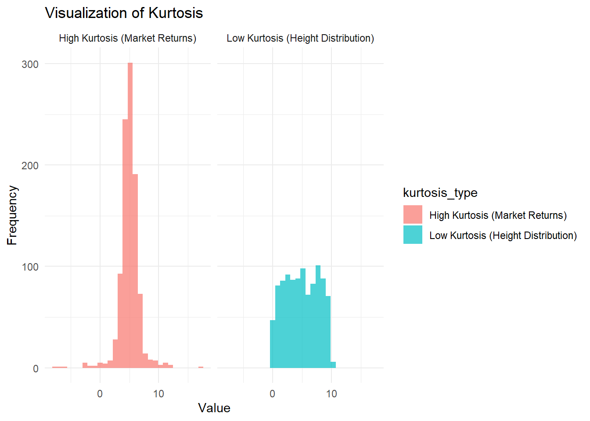
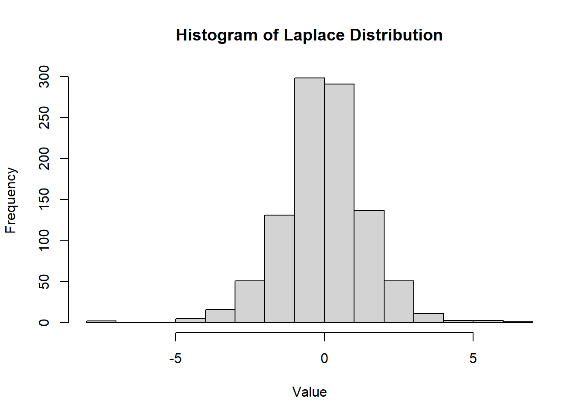

# Prerequisites


This chapter serves as a concise review of fundamental concepts in [Matrix Theory] and [Probability Theory].

If you are confident in your understanding of these topics, you can proceed directly to the [Descriptive Statistics] section to begin exploring applied data analysis.

## Matrix Theory

Matrix $A$ represents the original matrix. It's a 2x2 matrix with elements $a_{ij}$, where $i$ represents the row and $j$ represents the column.

$$
A =
\begin{bmatrix}
a_{11} & a_{12} \\
a_{21} & a_{22}
\end{bmatrix}
$$ $A'$ is the transpose of $A$. The transpose of a matrix flips its rows and columns.

$$
A' =
\begin{bmatrix}
a_{11} & a_{21} \\
a_{12} & a_{22}
\end{bmatrix}
$$

Fundamental properties and rules of matrices, essential for understanding operations in linear algebra:

$$
\begin{aligned}
\mathbf{(ABC)'}   & = \mathbf{C'B'A'} \quad &\text{(Transpose reverses order in a product)} \\
\mathbf{A(B+C)}   & = \mathbf{AB + AC} \quad &\text{(Distributive property)} \\
\mathbf{AB}       & \neq \mathbf{BA} \quad &\text{(Multiplication is not commutative)} \\
\mathbf{(A')'}    & = \mathbf{A} \quad &\text{(Double transpose is the original matrix)} \\
\mathbf{(A+B)'}   & = \mathbf{A' + B'} \quad &\text{(Transpose of a sum is the sum of transposes)} \\
\mathbf{(AB)'}    & = \mathbf{B'A'} \quad &\text{(Transpose reverses order in a product)} \\
\mathbf{(AB)^{-1}} & = \mathbf{B^{-1}A^{-1}} \quad &\text{(Inverse reverses order in a product)} \\
\mathbf{A+B}      & = \mathbf{B + A} \quad &\text{(Addition is commutative)} \\
\mathbf{AA^{-1}}  & = \mathbf{I} \quad &\text{(Matrix times its inverse is identity)} 
\end{aligned}
$$ These properties are critical in solving systems of equations, optimizing models, and performing data transformations.

If a matrix $\mathbf{A}$ has an inverse, it is called **invertible**. If $\mathbf{A}$ does not have an inverse, it is referred to as **singular**.

The product of two matrices $\mathbf{A}$ and $\mathbf{B}$ is computed as:

$$
\begin{aligned}
\mathbf{A} &= 
\begin{bmatrix}
a_{11} & a_{12} & a_{13} \\ 
a_{21} & a_{22} & a_{23} 
\end{bmatrix}
\begin{bmatrix}
b_{11} & b_{12} & b_{13} \\
b_{21} & b_{22} & b_{23} \\
b_{31} & b_{32} & b_{33}
\end{bmatrix} \\
&= 
\begin{bmatrix}
a_{11}b_{11}+a_{12}b_{21}+a_{13}b_{31} & \sum_{i=1}^{3}a_{1i}b_{i2} & \sum_{i=1}^{3}a_{1i}b_{i3} \\
\sum_{i=1}^{3}a_{2i}b_{i1} & \sum_{i=1}^{3}a_{2i}b_{i2} & \sum_{i=1}^{3}a_{2i}b_{i3}
\end{bmatrix} 
\end{aligned}
$$

**Quadratic Form**

Let $\mathbf{a}$ be a $3 \times 1$ vector. The quadratic form involving a matrix $\mathbf{B}$ is given by:

$$
\mathbf{a'Ba} = \sum_{i=1}^{3}\sum_{j=1}^{3}a_i b_{ij} a_{j}
$$

**Length of a Vector**

The **length** (or 2-norm) of a vector $\mathbf{a}$, denoted as $||\mathbf{a}||$, is defined as the square root of the inner product of the vector with itself:

$$
||\mathbf{a}|| = \sqrt{\mathbf{a'a}}
$$

### Rank of a Matrix

The **rank** of a matrix refers to:

-   The dimension of the space spanned by its columns (or rows).
-   The number of linearly independent columns or rows.

For an $n \times k$ matrix $\mathbf{A}$ and a $k \times k$ matrix $\mathbf{B}$, the following properties hold:

-   $\text{rank}(\mathbf{A}) \leq \min(n, k)$
-   $\text{rank}(\mathbf{A}) = \text{rank}(\mathbf{A'}) = \text{rank}(\mathbf{A'A}) = \text{rank}(\mathbf{AA'})$
-   $\text{rank}(\mathbf{AB}) = \min(\text{rank}(\mathbf{A}), \text{rank}(\mathbf{B}))$
-   $\mathbf{B}$ is invertible (non-singular) if and only if $\text{rank}(\mathbf{B}) = k$.

### Inverse of a Matrix

In scalar algebra, if $a = 0$, then $1/a$ does not exist.

In matrix algebra, a matrix is invertible if it is **non-singular**, meaning it has a non-zero determinant and its inverse exists. A square matrix $\mathbf{A}$ is invertible if there exists another square matrix $\mathbf{B}$ such that:

$$
\mathbf{AB} = \mathbf{I} \quad \text{(Identity Matrix)}.
$$

In this case, $\mathbf{A}^{-1} = \mathbf{B}$.

For a $2 \times 2$ matrix:

$$
\mathbf{A} =
\begin{bmatrix}
a & b \\
c & d
\end{bmatrix}
$$

The inverse is:

$$
\mathbf{A}^{-1} =
\frac{1}{ad-bc}
\begin{bmatrix}
d & -b \\
-c & a
\end{bmatrix}
$$

This inverse exists only if $ad - bc \neq 0$, where $ad - bc$ is the determinant of $\mathbf{A}$.

For a partitioned block matrix:

$$
\begin{bmatrix}
A & B \\
C & D
\end{bmatrix}^{-1}
=
\begin{bmatrix}
\mathbf{(A-BD^{-1}C)^{-1}} & \mathbf{-(A-BD^{-1}C)^{-1}BD^{-1}} \\
\mathbf{-D^{-1}C(A-BD^{-1}C)^{-1}} & \mathbf{D^{-1}+D^{-1}C(A-BD^{-1}C)^{-1}BD^{-1}}
\end{bmatrix}
$$

This formula assumes that $\mathbf{D}$ and $\mathbf{A - BD^{-1}C}$ are invertible.

Properties of the Inverse for Non-Singular Matrices

1.  $\mathbf{(A^{-1})^{-1}} = \mathbf{A}$\
2.  For a non-zero scalar $b$, $\mathbf{(bA)^{-1} = b^{-1}A^{-1}}$\
3.  For a matrix $\mathbf{B}$, $\mathbf{(BA)^{-1} = B^{-1}A^{-1}}$ (only if $\mathbf{B}$ is non-singular).\
4.  $\mathbf{(A^{-1})' = (A')^{-1}}$ (the transpose of the inverse equals the inverse of the transpose).\
5.  Never notate $\mathbf{1/A}$; use $\mathbf{A^{-1}}$ instead.

**Notes**: - The determinant of a matrix determines whether it is invertible. For square matrices, a determinant of $0$ means the matrix is **singular** and has no inverse.\
- Always verify the conditions for invertibility, particularly when dealing with partitioned or block matrices.

### Definiteness of a Matrix

A symmetric square $k \times k$ matrix $\mathbf{A}$ is classified based on the following conditions:

-   **Positive Semi-Definite (PSD)**: $\mathbf{A}$ is PSD if, for any non-zero $k \times 1$ vector $\mathbf{x}$: $$
    \mathbf{x'Ax \geq 0}.
    $$

-   **Negative Semi-Definite (NSD)**: $\mathbf{A}$ is NSD if, for any non-zero $k \times 1$ vector $\mathbf{x}$: $$
    \mathbf{x'Ax \leq 0}.
    $$

-   **Indefinite**: $\mathbf{A}$ is indefinite if it is neither PSD nor NSD.

The **identity matrix** is always positive definite (PD).

Example

Let $\mathbf{x} = (x_1, x_2)'$, and consider a $2 \times 2$ identity matrix $\mathbf{I}$:

$$
\begin{aligned}
\mathbf{x'Ix} 
&= (x_1, x_2) 
\begin{bmatrix}
1 & 0 \\
0 & 1
\end{bmatrix}
\begin{bmatrix}
x_1 \\
x_2
\end{bmatrix} \\
&=
(x_1, x_2)
\begin{bmatrix}
x_1 \\
x_2
\end{bmatrix} \\
&=
x_1^2 + x_2^2 \geq 0.
\end{aligned}
$$

Thus, $\mathbf{I}$ is PD because $\mathbf{x'Ix} > 0$ for all non-zero $\mathbf{x}$.

**Properties of Definiteness**

1.  Any variance-covariance matrix is PSD.
2.  A matrix $\mathbf{A}$ is PSD if and only if there exists a matrix $\mathbf{B}$ such that: $$
    \mathbf{A = B'B}.
    $$
3.  If $\mathbf{A}$ is PSD, then $\mathbf{B'AB}$ is also PSD for any conformable matrix $\mathbf{B}$.
4.  If $\mathbf{A}$ and $\mathbf{C}$ are non-singular, then $\mathbf{A - C}$ is PSD if and only if $\mathbf{C^{-1} - A^{-1}}$ is PSD.
5.  If $\mathbf{A}$ is PD (or ND), then $\mathbf{A^{-1}}$ is also PD (or ND).

**Notes**

-   An **indefinite** matrix $\mathbf{A}$ is neither PSD nor NSD. This concept does not have a direct counterpart in scalar algebra.
-   If a square matrix is PSD and invertible, then it is PD.

Examples of Definiteness

1.  **Invertible / Indefinite**: $$
    \begin{bmatrix}
    -1 & 0 \\
    0 & 10
    \end{bmatrix}
    $$

2.  **Non-Invertible / Indefinite**: $$
    \begin{bmatrix}
    0 & 1 \\
    0 & 0
    \end{bmatrix}
    $$

3.  **Invertible / PSD**: $$
    \begin{bmatrix}
    1 & 0 \\
    0 & 1
    \end{bmatrix}
    $$

4.  **Non-Invertible / PSD**: $$
    \begin{bmatrix}
    0 & 0 \\
    0 & 1
    \end{bmatrix}
    $$

### Matrix Calculus

Consider a scalar function $y = f(x_1, x_2, \dots, x_k) = f(x)$, where $x$ is a $1 \times k$ row vector.

#### Gradient (First-Order Derivative)

The gradient, or the first-order derivative of $f(x)$ with respect to the vector $x$, is given by:

$$
\frac{\partial f(x)}{\partial x} =
\begin{bmatrix}
\frac{\partial f(x)}{\partial x_1} \\
\frac{\partial f(x)}{\partial x_2} \\
\vdots \\
\frac{\partial f(x)}{\partial x_k}
\end{bmatrix}
$$

#### Hessian (Second-Order Derivative)

The Hessian, or the second-order derivative of $f(x)$ with respect to $x$, is a symmetric matrix defined as:

$$
\frac{\partial^2 f(x)}{\partial x \partial x'} =
\begin{bmatrix}
\frac{\partial^2 f(x)}{\partial x_1^2} & \frac{\partial^2 f(x)}{\partial x_1 \partial x_2} & \cdots & \frac{\partial^2 f(x)}{\partial x_1 \partial x_k} \\
\frac{\partial^2 f(x)}{\partial x_2 \partial x_1} & \frac{\partial^2 f(x)}{\partial x_2^2} & \cdots & \frac{\partial^2 f(x)}{\partial x_2 \partial x_k} \\
\vdots & \vdots & \ddots & \vdots \\
\frac{\partial^2 f(x)}{\partial x_k \partial x_1} & \frac{\partial^2 f(x)}{\partial x_k \partial x_2} & \cdots & \frac{\partial^2 f(x)}{\partial x_k^2}
\end{bmatrix}
$$

#### Derivative of a Scalar Function with Respect to a Matrix

Let $f(\mathbf{X})$ be a scalar function, where $\mathbf{X}$ is an $n \times p$ matrix. The derivative is:

$$
\frac{\partial f(\mathbf{X})}{\partial \mathbf{X}} = 
\begin{bmatrix}
\frac{\partial f(\mathbf{X})}{\partial x_{11}} & \cdots & \frac{\partial f(\mathbf{X})}{\partial x_{1p}} \\
\vdots & \ddots & \vdots \\
\frac{\partial f(\mathbf{X})}{\partial x_{n1}} & \cdots & \frac{\partial f(\mathbf{X})}{\partial x_{np}}
\end{bmatrix}
$$

#### Common Matrix Derivatives

1.  If $\mathbf{a}$ is a vector and $\mathbf{A}$ is a matrix independent of $\mathbf{y}$:
    -   $\frac{\partial \mathbf{a'y}}{\partial \mathbf{y}} = \mathbf{a}$
    -   $\frac{\partial \mathbf{y'y}}{\partial \mathbf{y}} = 2\mathbf{y}$
    -   $\frac{\partial \mathbf{y'Ay}}{\partial \mathbf{y}} = (\mathbf{A} + \mathbf{A'})\mathbf{y}$
2.  If $\mathbf{X}$ is symmetric:
    -   $\frac{\partial |\mathbf{X}|}{\partial x_{ij}} = \begin{cases} X_{ii}, & i = j \\ X_{ij}, & i \neq j \end{cases}$ where $X_{ij}$ is the $(i,j)$-th cofactor of $\mathbf{X}$.
3.  If $\mathbf{X}$ is symmetric and $\mathbf{A}$ is a matrix independent of $\mathbf{X}$:
    -   $\frac{\partial \text{tr}(\mathbf{XA})}{\partial \mathbf{X}} = \mathbf{A} + \mathbf{A'} - \text{diag}(\mathbf{A})$.
4.  If $\mathbf{X}$ is symmetric, let $\mathbf{J}_{ij}$ be a matrix with 1 at the $(i,j)$-th position and 0 elsewhere:
    -   $\frac{\partial \mathbf{X}^{-1}}{\partial x_{ij}} = \begin{cases} -\mathbf{X}^{-1}\mathbf{J}_{ii}\mathbf{X}^{-1}, & i = j \\ -\mathbf{X}^{-1}(\mathbf{J}_{ij} + \mathbf{J}_{ji})\mathbf{X}^{-1}, & i \neq j \end{cases}.$

### Optimization in Scalar and Vector Spaces

Optimization is the process of finding the minimum or maximum of a function. The conditions for optimization differ depending on whether the function involves a scalar or a vector. Below is a comparison of scalar and vector optimization:

+--------------------------------------------------------+------------------------------------------------+-----------------------------------------------------------------------------------------+
| Condition                                              | **Scalar Optimization**                        | **Vector Optimization**                                                                 |
+========================================================+================================================+=========================================================================================+
| **First-Order Condition**                              | $$\frac{\partial f(x_0)}{\partial x} = 0$$     | $$\frac{\partial f(x_0)}{\partial x} = \begin{bmatrix} 0 \\ \vdots \\ 0 \end{bmatrix}$$ |
+--------------------------------------------------------+------------------------------------------------+-----------------------------------------------------------------------------------------+
| **Second-Order Condition**                             | $$\frac{\partial^2 f(x_0)}{\partial x^2} > 0$$ | $$\frac{\partial^2 f(x_0)}{\partial x \partial x'} > 0$$                                |
|                                                        |                                                |                                                                                         |
| For **convex** functions, this implies a **minimum**.  |                                                |                                                                                         |
+--------------------------------------------------------+------------------------------------------------+-----------------------------------------------------------------------------------------+
| For **concave** functions, this implies a **maximum**. | $$\frac{\partial^2 f(x_0)}{\partial x^2} < 0$$ | $$\frac{\partial^2 f(x_0)}{\partial x \partial x'} < 0$$                                |
+--------------------------------------------------------+------------------------------------------------+-----------------------------------------------------------------------------------------+

**Key Concepts**

1.  **First-Order Condition**:
    -   The **first-order derivative** of the function must equal zero at a critical point. This holds for both scalar and vector functions:
        -   In the scalar case, $\frac{\partial f(x)}{\partial x} = 0$ identifies critical points.
        -   In the vector case, $\frac{\partial f(x)}{\partial x}$ is a **gradient vector**, and the condition is satisfied when all elements of the gradient are zero.
2.  **Second-Order Condition**:
    -   The **second-order derivative** determines whether the critical point is a minimum, maximum, or saddle point:
        -   For scalar functions, $\frac{\partial^2 f(x)}{\partial x^2} > 0$ implies a **local minimum**, while $\frac{\partial^2 f(x)}{\partial x^2} < 0$ implies a **local maximum**.
        -   For vector functions, the Hessian matrix $\frac{\partial^2 f(x)}{\partial x \partial x'}$ must be:
            -   **Positive Definite**: For a **minimum** (convex function).
            -   **Negative Definite**: For a **maximum** (concave function).
            -   **Indefinite**: For a **saddle point** (neither minimum nor maximum).
3.  **Convex and Concave Functions**:
    -   A function $f(x)$ is:
        -   **Convex** if $\frac{\partial^2 f(x)}{\partial x^2} > 0$ or the Hessian $\frac{\partial^2 f(x)}{\partial x \partial x'}$ is positive definite.
        -   **Concave** if $\frac{\partial^2 f(x)}{\partial x^2} < 0$ or the Hessian is negative definite.
    -   Convexity ensures global optimization for minimization problems, while concavity ensures global optimization for maximization problems.
4.  **Hessian Matrix**:
    -   In vector optimization, the Hessian $\frac{\partial^2 f(x)}{\partial x \partial x'}$ plays a crucial role in determining the nature of critical points:
        -   Positive definite Hessian: All eigenvalues are positive.
        -   Negative definite Hessian: All eigenvalues are negative.
        -   Indefinite Hessian: Eigenvalues have mixed signs.

## Probability Theory

### Axioms and Theorems of Probability

1.  Let $S$ denote the sample space of an experiment. Then: $$
    P[S] = 1
    $$ (The probability of the sample space is always 1.)

2.  For any event $A$: $$
    P[A] \geq 0
    $$ (Probabilities are always non-negative.)

3.  Let $A_1, A_2, A_3, \dots$ be a finite or infinite collection of mutually exclusive events. Then: $$
    P[A_1 \cup A_2 \cup A_3 \dots] = P[A_1] + P[A_2] + P[A_3] + \dots
    $$ (The probability of the union of mutually exclusive events is the sum of their probabilities.)

4.  The probability of the empty set is: $$
    P[\emptyset] = 0
    $$

5.  The complement rule: $$
    P[A'] = 1 - P[A]
    $$

6.  The probability of the union of two events: $$
    P[A_1 \cup A_2] = P[A_1] + P[A_2] - P[A_1 \cap A_2]
    $$

#### Conditional Probability

The conditional probability of $A$ given $B$ is defined as:

$$
P[A|B] = \frac{P[A \cap B]}{P[B]}, \quad \text{provided } P[B] \neq 0.
$$

#### Independent Events

Two events $A$ and $B$ are independent if and only if:

1.  $P[A \cap B] = P[A]P[B]$
2.  $P[A|B] = P[A]$
3.  $P[B|A] = P[B]$

A collection of events $A_1, A_2, \dots, A_n$ is independent if and only if every subcollection is independent.

#### Multiplication Rule

The probability of the intersection of two events can be calculated as: $$
P[A \cap B] = P[A|B]P[B] = P[B|A]P[A].
$$

#### Bayes' Theorem

Let $A_1, A_2, \dots, A_n$ be a collection of mutually exclusive events whose union is $S$, and let $B$ be an event with $P[B] \neq 0$. Then, for any event $A_j$ ($j = 1, 2, \dots, n$): $$
P[A_j|B] = \frac{P[B|A_j]P[A_j]}{\sum_{i=1}^n P[B|A_i]P[A_i]}.
$$

#### Jensen's Inequality

-   If $g(x)$ is convex, then: $$
    E[g(X)] \geq g(E[X])
    $$

-   If $g(x)$ is concave, then: $$
    E[g(X)] \leq g(E[X]).
    $$

#### Law of Iterated Expectations

The **law of iterated expectations** states: $$
E[Y] = E[E[Y|X]].
$$

#### Correlation and Independence

The strength of the relationship between random variables can be ranked from strongest to weakest as:

1.  **Independence**:
    -   $f(x, y) = f_X(x)f_Y(y)$
    -   $f_{Y|X}(y|x) = f_Y(y)$ and $f_{X|Y}(x|y) = f_X(x)$
    -   $E[g_1(X)g_2(Y)] = E[g_1(X)]E[g_2(Y)]$
2.  **Mean Independence** (implied by independence):
    -   $Y$ is mean independent of $X$ if: $$
        E[Y|X] = E[Y].
        $$
    -   $E[Xg(Y)] = E[X]E[g(Y)]$
3.  **Uncorrelatedness** (implied by independence and mean independence):
    -   $\text{Cov}(X, Y) = 0$
    -   $\text{Var}(X + Y) = \text{Var}(X) + \text{Var}(Y)$
    -   $E[XY] = E[X]E[Y]$

### Central Limit Theorem

The **Central Limit Theorem** states that for a sufficiently large sample size ($n \geq 25$), the sampling distribution of the sample mean or proportion approaches a normal distribution, regardless of the population's original distribution.

Let $X_1, X_2, \dots, X_n$ be a random sample of size $n$ from a distribution $X$ with mean $\mu$ and variance $\sigma^2$. Then, for large $n$:

1.  The sample mean $\bar{X}$ is approximately normal: $$
    \mu_{\bar{X}} = \mu, \quad \sigma^2_{\bar{X}} = \frac{\sigma^2}{n}.
    $$

2.  The sample proportion $\hat{p}$ is approximately normal: $$
    \mu_{\hat{p}} = p, \quad \sigma^2_{\hat{p}} = \frac{p(1-p)}{n}.
    $$

3.  The difference in sample proportions $\hat{p}_1 - \hat{p}_2$ is approximately normal: $$
    \mu_{\hat{p}_1 - \hat{p}_2} = p_1 - p_2, \quad \sigma^2_{\hat{p}_1 - \hat{p}_2} = \frac{p_1(1-p_1)}{n_1} + \frac{p_2(1-p_2)}{n_2}.
    $$

4.  The difference in sample means $\bar{X}_1 - \bar{X}_2$ is approximately normal: $$
    \mu_{\bar{X}_1 - \bar{X}_2} = \mu_1 - \mu_2, \quad \sigma^2_{\bar{X}_1 - \bar{X}_2} = \frac{\sigma_1^2}{n_1} + \frac{\sigma_2^2}{n_2}.
    $$

5.  The following random variables are approximately standard normal:

    -   $\frac{\bar{X} - \mu}{\sigma / \sqrt{n}}$
    -   $\frac{\hat{p} - p}{\sqrt{\frac{p(1-p)}{n}}}$
    -   $\frac{(\hat{p}_1 - \hat{p}_2) - (p_1 - p_2)}{\sqrt{\frac{p_1(1-p_1)}{n_1} + \frac{p_2(1-p_2)}{n_2}}}$
    -   $\frac{(\bar{X}_1 - \bar{X}_2) - (\mu_1 - \mu_2)}{\sqrt{\frac{\sigma_1^2}{n_1} + \frac{\sigma_2^2}{n_2}}}$

#### Limiting Distribution of the Sample Mean

If $\{X_i\}_{i=1}^{n}$ is an iid random sample from a distribution with finite mean $\mu$ and finite variance $\sigma^2$, the sample mean $\bar{X}$ scaled by $\sqrt{n}$ has the following limiting distribution:

$$
\sqrt{n}(\bar{X} - \mu) \xrightarrow{d} N(0, \sigma^2).
$$

Standardizing the sample mean gives: $$
\frac{\sqrt{n}(\bar{X} - \mu)}{\sigma} \xrightarrow{d} N(0, 1).
$$

**Notes**:

-   The CLT holds for most random samples from any distribution (continuous, discrete, or unknown).
-   It extends to the multivariate case: A random sample of a random vector converges to a multivariate normal distribution.

#### Asymptotic Variance and Limiting Variance

**Asymptotic Variance** (Avar): $$
Avar(\sqrt{n}(\bar{X} - \mu)) = \sigma^2.
$$

-   Refers to the variance of the limiting distribution of an estimator as the sample size ($n$) approaches infinity.

-   It characterizes the variability of the scaled estimator $\sqrt{n}(\bar{x} - \mu)$ in its asymptotic distribution (e.g., normal distribution).

**Limiting Variance** ($\lim_{n \to \infty} Var$)

$$
\lim_{n \to \infty} Var(\sqrt{n}(\bar{x}-\mu)) = \sigma^2
$$

-   Represents the value that the actual variance of $\sqrt{n}(\bar{x} - \mu)$ converges to as $n \to \infty$.

For a well-behaved estimator,

$$
Avar(\sqrt{n}(\bar{X} - \mu)) = \lim_{n \to \infty} Var(\sqrt{n}(\bar{x}-\mu)) = \sigma^2.
$$

However, **asymptotic variance is not necessarily equal to the limiting value of the variance** because asymptotic variance is derived from the limiting distribution, while limiting variance is a convergence result of the sequence of variances.

$$
Avar(.) \neq lim_{n \to \infty} Var(.)
$$

-   Both the asymptotic variance $Avar$ and the limiting variance $\lim_{n \to \infty} Var$ are numerically equal to $\sigma^2$, but their conceptual definitions differ.

-   $Avar(\cdot) \neq \lim_{n \to \infty} Var(\cdot)$. This emphasizes that while the numerical result may match, their derivation and meaning differ:

    -   $Avar$ depends on the asymptotic (large-sample) distribution of the estimator.

    -   $\lim_{n \to \infty} Var(\cdot)$ involves the sequence of variances as $n$ grows.

Cases where the two do not match:

1.  **Sample Quantiles**: Consider the sample quantile of order $p$, for some $0 < p < 1$. Under regularity conditions, the asymptotic distribution of the sample quantile is normal, with a variance that depends on $p$ and the density of the distribution at the $p$-th quantile. However, the variance of the sample quantile itself does not necessarily converge to this limit as the sample size grows.
2.  **Bootstrap Methods**: When using bootstrapping techniques to estimate the distribution of a statistic, the bootstrap distribution might converge to a different limiting distribution than the original statistic. In these cases, the variance of the bootstrap distribution (or the bootstrap variance) might differ from the limiting variance of the original statistic.
3.  **Statistics with Randomly Varying Asymptotic Behavior**: In some cases, the asymptotic behavior of a statistic can vary randomly depending on the sample path. For such statistics, the asymptotic variance might not provide a consistent estimate of the limiting variance.
4.  **M-estimators with Varying Asymptotic Behavior**: M-estimators can sometimes have different asymptotic behaviors depending on the tail behavior of the underlying distribution. For heavy-tailed distributions, the variance of the estimator might not stabilize even as the sample size grows large, making the asymptotic variance different from the variance of any limiting distribution.

### Random Variable

Random variables can be categorized as either **discrete** or **continuous**, with distinct properties and functions defining each type.

+--------------------------------------+---------------------------------------------------------------------------------------------------------+------------------------------------------------------------------------------------------------------------------------------+
|                                      | **Discrete Variable**                                                                                   | **Continuous Variable**                                                                                                      |
+======================================+=========================================================================================================+==============================================================================================================================+
| **Definition**                       | A random variable is discrete if it can assume at most a finite or countably infinite number of values. | A random variable is continuous if it can assume any value in some interval or intervals of real numbers, with $P(X=x) = 0$. |
+--------------------------------------+---------------------------------------------------------------------------------------------------------+------------------------------------------------------------------------------------------------------------------------------+
| **Density Function**                 | A function $f$ is called a density for $X$ if:                                                          | A function $f$ is called a density for $X$ if:                                                                               |
+--------------------------------------+---------------------------------------------------------------------------------------------------------+------------------------------------------------------------------------------------------------------------------------------+
|                                      | 1\. $f(x) \geq 0$                                                                                       | 1\. $f(x) \geq 0$ for $x$ real                                                                                               |
+--------------------------------------+---------------------------------------------------------------------------------------------------------+------------------------------------------------------------------------------------------------------------------------------+
|                                      | 2\. $\sum_{x} f(x) = 1$                                                                                 | 2\. $\int_{-\infty}^{\infty} f(x) \, dx = 1$                                                                                 |
+--------------------------------------+---------------------------------------------------------------------------------------------------------+------------------------------------------------------------------------------------------------------------------------------+
|                                      | 3\. $f(x) = P(X = x)$ for $x$ real                                                                      | 3\. $P[a \leq X \leq b] = \int_{a}^{b} f(x) \, dx$ for $a, b$ real                                                           |
+--------------------------------------+---------------------------------------------------------------------------------------------------------+------------------------------------------------------------------------------------------------------------------------------+
| **Cumulative Distribution Function** | $F(x) = P(X \leq x)$                                                                                    | $F(x) = P(X \leq x) = \int_{-\infty}^{x} f(t) \, dt$                                                                         |
+--------------------------------------+---------------------------------------------------------------------------------------------------------+------------------------------------------------------------------------------------------------------------------------------+
| $E[H(X)]$                            | $\sum_{x} H(x) f(x)$                                                                                    | $\int_{-\infty}^{\infty} H(x) f(x) \, dx$                                                                                    |
+--------------------------------------+---------------------------------------------------------------------------------------------------------+------------------------------------------------------------------------------------------------------------------------------+
| $\mu = E[X]$                         | $\sum_{x} x f(x)$                                                                                       | $\int_{-\infty}^{\infty} x f(x) \, dx$                                                                                       |
+--------------------------------------+---------------------------------------------------------------------------------------------------------+------------------------------------------------------------------------------------------------------------------------------+
| **Ordinary Moments**                 | $\sum_{x} x^k f(x)$                                                                                     | $\int_{-\infty}^{\infty} x^k f(x) \, dx$                                                                                     |
+--------------------------------------+---------------------------------------------------------------------------------------------------------+------------------------------------------------------------------------------------------------------------------------------+
| **Moment Generating Function**       | $m_X(t) = E[e^{tX}] = \sum_{x} e^{tx} f(x)$                                                             | $m_X(t) = E[e^{tX}] = \int_{-\infty}^{\infty} e^{tx} f(x) \, dx$                                                             |
+--------------------------------------+---------------------------------------------------------------------------------------------------------+------------------------------------------------------------------------------------------------------------------------------+

**Expected Value Properties**

-   $E[c] = c$ for any constant $c$.
-   $E[cX] = cE[X]$ for any constant $c$.
-   $E[X + Y] = E[X] + E[Y]$.
-   $E[XY] = E[X]E[Y]$ (if $X$ and $Y$ are independent).

**Variance Properties**

-   $\text{Var}(c) = 0$ for any constant $c$.
-   $\text{Var}(cX) = c^2 \text{Var}(X)$ for any constant $c$.
-   $\text{Var}(X) \geq 0$.
-   $\text{Var}(X) = E[X^2] - (E[X])^2$.
-   $\text{Var}(X + c) = \text{Var}(X)$.
-   $\text{Var}(X + Y) = \text{Var}(X) + \text{Var}(Y)$ (if $X$ and $Y$ are independent).

The standard deviation $\sigma$ is given by: $$
\sigma = \sqrt{\sigma^2} = \sqrt{\text{Var}(X)}.
$$

#### Multivariate Random Variables

Suppose $y_1, \dots, y_p$ are random variables with means $\mu_1, \dots, \mu_p$. Then:

$$
\mathbf{y} = \begin{bmatrix}
y_1 \\
\vdots \\
y_p
\end{bmatrix}, \quad E[\mathbf{y}] = \begin{bmatrix}
\mu_1 \\
\vdots \\
\mu_p
\end{bmatrix} = \boldsymbol{\mu}.
$$

The covariance between $y_i$ and $y_j$ is $\sigma_{ij} = \text{Cov}(y_i, y_j)$. The variance-covariance (or dispersion) matrix is:

$$
\mathbf{\Sigma} = (\sigma_{ij})= \begin{bmatrix}
\sigma_{11} & \sigma_{12} & \dots & \sigma_{1p} \\
\sigma_{21} & \sigma_{22} & \dots & \sigma_{2p} \\
\vdots & \vdots & \ddots & \vdots \\
\sigma_{p1} & \sigma_{p2} & \dots & \sigma_{pp}
\end{bmatrix}.
$$

And $\mathbf{\Sigma}$ is symmetric with $(p+1)p/2$ unique parameters.

Alternatively, let $u_{p \times 1}$ and $v_{v \times 1}$ be random vectors with means $\mathbf{\mu_u}$ and $\mathbf{\mu_v}$. then

$$ \mathbf{\Sigma_{uv}} = cov(\mathbf{u,v}) = E[\mathbf{(u-\mu_u)(v-\mu_v)'}] $$

$\Sigma_{uv} \neq \Sigma_{vu}$ (but $\Sigma_{uv} = \Sigma_{vu}'$)

**Properties of Covariance Matrices**

1.  **Symmetry**: $\mathbf{\Sigma}' = \mathbf{\Sigma}$.
2.  **Eigen-Decomposition** (spectral decomposition,symmetric decomposition): $\mathbf{\Sigma = \Phi \Lambda \Phi}$, where $\mathbf{\Phi}$ is a matrix of eigenvectors such that $\mathbf{\Phi \Phi' = I}$ (orthonormal), and $\mathbf{\Lambda}$ is a diagonal matrix with eigenvalues $(\lambda_1,...,\lambda_p)$ on the diagonal.
3.  **Non-Negative Definiteness**: $\mathbf{a \Sigma a} \ge 0$ for any $\mathbf{a} \in R^p$. Equivalently, the eigenvalues of $\mathbf{\Sigma}$, $\lambda_1 \ge ... \ge \lambda_p \ge 0$
4.  **Generalized Variance**: $|\mathbf{\Sigma}| = \lambda_1 \dots \lambda_p \geq 0$.
5.  **Trace**: $\text{tr}(\mathbf{\Sigma}) = \lambda_1 + \dots + \lambda_p = \sigma_{11} + \dots+ \sigma_{pp} = \sum \sigma_{ii}$ = sum of variances (total variance).

**Note**: $\mathbf{\Sigma}$ is required to be positive definite. This implies that all eigenvalues are positive, and $\mathbf{\Sigma}$ has an inverse $\mathbf{\Sigma}^{-1}$, such that $\mathbf{\Sigma}^{-1}\mathbf{\Sigma}= \mathbf{I}_{p \times p} = \mathbf{\Sigma}\mathbf{\Sigma}^{-1}$

#### Correlation Matrices

The correlation coefficient $\rho_{ij}$ and correlation matrix $\mathbf{R}$ are defined as:

$$
\rho_{ij} = \frac{\sigma_{ij}}{\sqrt{\sigma_{ii}\sigma_{jj}}}, \quad \mathbf{R} = \begin{bmatrix}
1 & \rho_{12} & \dots & \rho_{1p} \\
\rho_{21} & 1 & \dots & \rho_{2p} \\
\vdots & \vdots & \ddots & \vdots \\
\rho_{p1} & \rho_{p2} & \dots & 1
\end{bmatrix}.
$$

where $\rho_{ii} = 1 \forall i$

#### Linear Transformations

Let $\mathbf{A}$ and $\mathbf{B}$ be matrices of constants, and $\mathbf{c}$ and $\mathbf{d}$ be vectors of constants. Then:

-   $E[\mathbf{Ay + c}] = \mathbf{A \mu_y + c}$.
-   $\text{Var}(\mathbf{Ay + c}) = \mathbf{A \Sigma_y A'}$.
-   $\text{Cov}(\mathbf{Ay + c, By + d}) = \mathbf{A \Sigma_y B'}$.

### Moment Generating Function

#### Properties of the Moment Generating Function

1.  $\frac{d^k(m_X(t))}{dt^k} \bigg|_{t=0} = E[X^k]$ (The $k$-th derivative at $t=0$ gives the $k$-th moment of $X$).
2.  $\mu = E[X] = m_X'(0)$ (The first derivative at $t=0$ gives the mean).
3.  $E[X^2] = m_X''(0)$ (The second derivative at $t=0$ gives the second moment).

#### Theorems Involving MGFs

Let $X_1, X_2, \dots, X_n, Y$ be random variables with MGFs $m_{X_1}(t), m_{X_2}(t), \dots, m_{X_n}(t), m_Y(t)$:

1.  If $m_{X_1}(t) = m_{X_2}(t)$ for all $t$ in some open interval about 0, then $X_1$ and $X_2$ have the same distribution.
2.  If $Y = \alpha + \beta X_1$, then: $$
    m_Y(t) = e^{\alpha t}m_{X_1}(\beta t).
    $$
3.  If $X_1, X_2, \dots, X_n$ are independent and $Y = \alpha_0 + \alpha_1 X_1 + \alpha_2 X_2 + \dots + \alpha_n X_n$, where $\alpha_0, \alpha_1, \dots, \alpha_n$ are constants, then: $$
    m_Y(t) = e^{\alpha_0 t} m_{X_1}(\alpha_1 t) m_{X_2}(\alpha_2 t) \dots m_{X_n}(\alpha_n t).
    $$
4.  Suppose $X_1, X_2, \dots, X_n$ are independent normal random variables with means $\mu_1, \mu_2, \dots, \mu_n$ and variances $\sigma_1^2, \sigma_2^2, \dots, \sigma_n^2$. If $Y = \alpha_0 + \alpha_1 X_1 + \alpha_2 X_2 + \dots + \alpha_n X_n$, then:
    -   $Y$ is normally distributed.
    -   Mean: $\mu_Y = \alpha_0 + \alpha_1 \mu_1 + \alpha_2 \mu_2 + \dots + \alpha_n \mu_n$.
    -   Variance: $\sigma_Y^2 = \alpha_1^2 \sigma_1^2 + \alpha_2^2 \sigma_2^2 + \dots + \alpha_n^2 \sigma_n^2$.

------------------------------------------------------------------------

### Moments

+--------------+-------------------------------+-------------------------------------------+
| Moment       | Uncentered                    | Centered                                  |
+==============+===============================+===========================================+
| 1st          | $E[X] = \mu = \text{Mean}(X)$ |                                           |
+--------------+-------------------------------+-------------------------------------------+
| 2nd          | $E[X^2]$                      | $E[(X-\mu)^2] = \text{Var}(X) = \sigma^2$ |
+--------------+-------------------------------+-------------------------------------------+
| 3rd          | $E[X^3]$                      | $E[(X-\mu)^3]$                            |
+--------------+-------------------------------+-------------------------------------------+
| 4th          | $E[X^4]$                      | $E[(X-\mu)^4]$                            |
+--------------+-------------------------------+-------------------------------------------+

-   **Skewness**: $\text{Skewness}(X) = \frac{E[(X-\mu)^3]}{\sigma^3}$

    -   **Definition**: Skewness measures the asymmetry of a probability distribution around its mean.
    -   **Interpretation**:
        -   **Positive skewness**: The right tail (higher values) is longer or heavier than the left tail.

        -   **Negative skewness**: The left tail (lower values) is longer or heavier than the right tail.

        -   **Zero skewness**: The data is symmetric.

-   **Kurtosis**: $\text{Kurtosis}(X) = \frac{E[(X-\mu)^4]}{\sigma^4}$

    -   **Definition**: Kurtosis measures the "tailedness" or the heaviness of the tails of a probability distribution.

    -   Excess kurtosis (often reported) is the kurtosis minus 3 (to compare against the normal distribution's kurtosis of 3).

    -   **Interpretation**:

        -   **High kurtosis (\>3)**: Heavy tails, more extreme outliers.

        -   **Low kurtosis (\<3)**: Light tails, fewer outliers.

        -   **Normal distribution kurtosis = 3**: Benchmark for comparison.

### Skewness

Skewness measures the asymmetry of the distribution:

1.  **Positive skew**: The right side (high values) is stretched out.

    -   Positive skew occurs when the right tail (higher values) of the distribution is longer or heavier.

    -   **Examples**:

        -   **Income Distribution**: In many countries, most people earn a moderate income, but a small fraction of ultra-high earners stretches the distribution's right tail.

        -   **Housing Prices**: Most homes may be around an affordable price, but a few extravagant mansions create a very long (and expensive) upper tail.


```r
# Load required libraries
library(ggplot2)

# Simulate data for positive skew
set.seed(123)
positive_skew_income <-
    rbeta(1000, 5, 2) * 100  # Income distribution example
positive_skew_housing <-
    rbeta(1000, 5, 2) * 1000  # Housing prices example

# Combine data
data_positive_skew <- data.frame(
    value = c(positive_skew_income, positive_skew_housing),
    example = c(rep("Income Distribution", 1000), rep("Housing Prices", 1000))
)

# Plot positive skew
ggplot(data_positive_skew, aes(x = value, fill = example)) +
    geom_histogram(bins = 30,
                   alpha = 0.7,
                   position = "identity") +
    facet_wrap( ~ example, scales = "free") +
    labs(title = "Visualization of Positive Skew",
         x = "Value",
         y = "Frequency") +
    theme_minimal()
```


-   In the **Income Distribution** example, most people earn moderate incomes, but a few high earners stretch the right tail.
-   In the **Housing Prices** example, most homes are reasonably priced, but a few mansions create a long, expensive right tail.

2.  Negative Skew (Left Skew)

-   Negative skew occurs when the left tail (lower values) of the distribution is longer or heavier.

-   **Examples**:

    -   **Scores on an Easy Test**: If an exam is very easy, most students score quite high, and only a few students score low, creating a left tail.

    -   **Age of Retirement**: Most people might retire around a common age (say 65+), with fewer retiring very early (stretching the left tail).


```r
# Simulate data for negative skew
set.seed(123)
negative_skew_test <-
    10 - rbeta(1000, 5, 2) * 10  # Easy test scores example
negative_skew_retirement <-
    80 - rbeta(1000, 5, 2) * 20  # Retirement age example

# Combine data
data_negative_skew <- data.frame(
    value = c(negative_skew_test, negative_skew_retirement),
    example = c(rep("Easy Test Scores", 1000), rep("Retirement Age", 1000))
)

# Plot negative skew
ggplot(data_negative_skew, aes(x = value, fill = example)) +
    geom_histogram(bins = 30,
                   alpha = 0.7,
                   position = "identity") +
    facet_wrap( ~ example, scales = "free") +
    labs(title = "Visualization of Negative Skew",
         x = "Value",
         y = "Frequency") +
    theme_minimal()
```


-   In the **Easy Test Scores** example, most students perform well, but a few low scores stretch the left tail.

-   In the **Retirement Age** example, most people retire around the same age, but a small number of individuals retire very early, stretching the left tail.

### Kurtosis

Kurtosis measures the "peakedness" or heaviness of the tails:

-   **High kurtosis**: Tall, sharp peak with heavy tails.

    -   **Example**: Financial market returns during a crisis (extreme losses or gains).

-   **Low kurtosis**: Flatter peak with thinner tails.

    -   **Example**: Human height distribution (fewer extreme deviations from the mean).


```r
# Simulate data for kurtosis
low_kurtosis <- runif(1000, 0, 10)  # Low kurtosis
high_kurtosis <- c(rnorm(900, 5, 1), rnorm(100, 5, 5))  # High kurtosis

# Combine data
data_kurtosis <- data.frame(
  value = c(low_kurtosis, high_kurtosis),
  kurtosis_type = c(rep("Low Kurtosis (Height Distribution)", 1000), 
                    rep("High Kurtosis (Market Returns)", 1000))
)

# Plot kurtosis
ggplot(data_kurtosis, aes(x = value, fill = kurtosis_type)) +
  geom_histogram(bins = 30, alpha = 0.7, position = "identity") +
  facet_wrap(~kurtosis_type) +
  labs(
    title = "Visualization of Kurtosis",
    x = "Value",
    y = "Frequency"
  ) +
  theme_minimal()
```



-   The left panel shows **low kurtosis**, similar to the distribution of human height, which has a flatter peak and thinner tails.

-   The right panel shows **high kurtosis**, reflecting financial market returns, where there are more extreme outliers in gains or losses.

------------------------------------------------------------------------

#### Conditional Moments

For a random variable $Y$ given $X=x$:

1.  **Expected Value**: $$
    E[Y|X=x] =
    \begin{cases}
    \sum_y y f_Y(y|x) & \text{for discrete RV}, \\
    \int_y y f_Y(y|x) \, dy & \text{for continuous RV}.
    \end{cases}
    $$

2.  **Variance**: $$
    \text{Var}(Y|X=x) =
    \begin{cases}
    \sum_y (y - E[Y|X=x])^2 f_Y(y|x) & \text{for discrete RV}, \\
    \int_y (y - E[Y|X=x])^2 f_Y(y|x) \, dy & \text{for continuous RV}.
    \end{cases}
    $$

------------------------------------------------------------------------

#### Multivariate Moments

1.  **Expected Value**: $$
    E
    \begin{bmatrix}
    X \\
    Y
    \end{bmatrix}
    =
    \begin{bmatrix}
    E[X] \\
    E[Y]
    \end{bmatrix}
    =
    \begin{bmatrix}
    \mu_X \\
    \mu_Y
    \end{bmatrix}
    $$

2.  **Variance-Covariance Matrix**: $$
    \begin{aligned}
    \text{Var}
    \begin{bmatrix}
    X \\
    Y
    \end{bmatrix}
    &=
    \begin{bmatrix}
    \text{Var}(X) & \text{Cov}(X, Y) \\
    \text{Cov}(X, Y) & \text{Var}(Y)
    \end{bmatrix}
    \\
    &=
    \begin{bmatrix}
    E[(X-\mu_X)^2] & E[(X-\mu_X)(Y-\mu_Y)] \\
    E[(X-\mu_X)(Y-\mu_Y)] & E[(Y-\mu_Y)^2]
    \end{bmatrix}
    \end{aligned}
    $$

------------------------------------------------------------------------

#### Properties of Moments

1.  $E[aX + bY + c] = aE[X] + bE[Y] + c$
2.  $\text{Var}(aX + bY + c) = a^2 \text{Var}(X) + b^2 \text{Var}(Y) + 2ab \text{Cov}(X, Y)$
3.  $\text{Cov}(aX + bY, cX + dY) = ac \text{Var}(X) + bd \text{Var}(Y) + (ad + bc) \text{Cov}(X, Y)$
4.  Correlation: $\rho_{XY} = \frac{\text{Cov}(X, Y)}{\sigma_X \sigma_Y}$

### Distributions

#### Conditional Distributions

$$
f_{X|Y}(x|y) = \frac{f(x, y)}{f_Y(y)}
$$

If $X$ and $Y$ are independent: $$
f_{X|Y}(x|y) = f_X(x).
$$

------------------------------------------------------------------------

#### Discrete Distributions

##### Bernoulli Distribution

A random variable $X$ follows a Bernoulli distribution, denoted as $X \sim \text{Bernoulli}(p)$, if it represents a single trial with:

-   Success probability $p$

-   Failure probability $q = 1-p$.

**Density Function**$$
f(x) = p^x (1-p)^{1-x}, \quad x \in \{0, 1\}
$$

**CDF**: Use table or manual computation.

**PDF**


```r
hist(
    mc2d::rbern(1000, prob = 0.5),
    main = "Histogram of Bernoulli Distribution",
    xlab = "Value",
    ylab = "Frequency"
)
```


**Mean**

$$
\mu = E[X] = p
$$

**Variance**

$$
\sigma^2 = \text{Var}(X) = p(1-p)
$$

------------------------------------------------------------------------

##### Binomial Distribution

$X \sim B(n, p)$ is the number of successes in $n$ independent Bernoulli trials, where:

-   $n$ is the number of trials

-   $p$ is the success probability.

-   The trials are identical and independent, and probability of success ($p$) and probability of failure ($q = 1 - p$) remains the same for all trials.

**Density Function**

$$
f(x) = \binom{n}{x} p^x (1-p)^{n-x}, \quad x = 0, 1, \dots, n
$$

**PDF**


```r
hist(
    rbinom(1000, size = 100, prob = 0.5),
    main = "Histogram of Binomial Distribution",
    xlab = "Value",
    ylab = "Frequency"
)
```


**MGF**

$$
m_X(t) = (1 - p + p e^t)^n
$$

**Mean**

$$
\mu = np
$$

**Variance**

$$
\sigma^2 = np(1-p)
$$

------------------------------------------------------------------------

##### Poisson Distribution

$X \sim \text{Poisson}(\lambda)$ models the number of occurrences of an event in a fixed interval, with average rate $\lambda$.

-   Arises with Poisson process, which involves observing discrete events in a continuous "interval" of time, length, or space.

-   The random variable $X$ is the number of occurrences of the event within an interval of $s$ units.

-   The parameter $\lambda$ is the average number of occurrences of the event in question per measurement unit. For the distribution, we use the parameter $k = \lambda s$.

**Density Function**

$$
f(x) = \frac{e^{-k} k^x}{x!}, \quad x = 0, 1, 2, \dots
$$

**CDF**

**PDF**


```r
hist(rpois(1000, lambda = 5),
     main = "Histogram of Poisson Distribution",
     xlab = "Value",
     ylab = "Frequency")
```


**MGF**

$$
m_X(t) = e^{k (e^t - 1)}
$$

**Mean**

$$
\mu = E(X) = k
$$

**Variance**

$$
\sigma^2 = Var(X) = k
$$

------------------------------------------------------------------------

##### Geometric Distribution

$X \sim \text{G}(p)$ models the number of trials needed to obtain the first success, with:

-   $p$: probability of success

-   $q = 1-p$: probability of failure.

-   The experiment consists of a series of trails. The outcome of each trial can be classed as being either a "success" (s) or "failure" (f). (i.e., Bernoulli trial).

-   The trials are identical and independent in the sense that the outcome of one trial has no effect on the outcome of any other (i..e, lack of memory - momerylessness). The probability of success ($p$) and probability of failure ($q = 1- p$) remains the same from trial to trial.

**Density Function**

$$
f(x) = p(1-p)^{x-1}, \quad x = 1, 2, \dots
$$

**CDF**$$
F(x) = 1 - (1-p)^x
$$

**PDF**


```r
hist(rgeom(1000, prob = 0.5),
     main = "Histogram of Geometric Distribution",
     xlab = "Value",
     ylab = "Frequency")
```


**MGF**

$$
m_X(t) = \frac{p e^t}{1 - (1-p)e^t}, \quad t < -\ln(1-p)
$$

**Mean**

$$
\mu = \frac{1}{p}
$$

**Variance**

$$
\sigma^2 = \frac{1-p}{p^2}
$$

------------------------------------------------------------------------

##### Hypergeometric Distribution

$X \sim \text{H}(N, r, n)$ models the number of successes in a sample of size $n$ drawn without replacement from a population of size $N$, where:

-   $r$ objects have the trait of interest

-   $N-r$ do not have the trait.

**Density Function**

$$
f(x) = \frac{\binom{r}{x} \binom{N-r}{n-x}}{\binom{N}{n}}, \quad \max(0, n-(N-r)) \leq x \leq \min(n, r)
$$

**PDF**


```r
hist(
    rhyper(1000, m = 50, n = 20, k = 30),
    main = "Histogram of Hypergeometric Distribution",
    xlab = "Value",
    ylab = "Frequency"
)
```


**Mean**$$
\mu = E[X] = \frac{n r}{N}
$$

**Variance**$$
\sigma^2 = \text{Var}(X) = n \frac{r}{N} \frac{N-r}{N} \frac{N-n}{N-1}
$$

**Note**: For large $N$ (when $\frac{n}{N} \leq 0.05$), the hypergeometric distribution can be approximated by a binomial distribution with $p = \frac{r}{N}$.

#### Continuous Distributions

##### Uniform Distribution

Defined over an interval $(a, b)$, where the probabilities are "equally likely" for subintervals of equal length.

**Density Function**: $$
f(x) = \frac{1}{b-a}, \quad a < x < b
$$

**CDF**$$
F(x) =
\begin{cases}
0 & \text{if } x < a \\
\frac{x-a}{b-a} & a \le x \le b \\
1 & \text{if } x > b
\end{cases}
$$

**PDF**


```r
hist(
    runif(1000, min = 0, max = 1),
    main = "Histogram of Uniform Distribution",
    xlab = "Value",
    ylab = "Frequency"
)
```


**MGF**$$
m_X(t) =
\begin{cases}
\frac{e^{tb} - e^{ta}}{t(b-a)} & \text{if } t \neq 0 \\
1 & \text{if } t = 0
\end{cases}
$$

**Mean**$$
\mu = E[X] = \frac{a + b}{2}
$$

**Variance**

$$
\sigma^2 = \text{Var}(X) = \frac{(b-a)^2}{12}
$$

------------------------------------------------------------------------

##### Gamma Distribution

The gamma distribution is used to define the exponential and $\chi^2$ distributions.

The **gamma function** is defined as: $$
\Gamma(\alpha) = \int_0^{\infty} z^{\alpha-1}e^{-z}dz, \quad \alpha > 0
$$

**Properties of the Gamma Function**:

-   $\Gamma(1) = 1$

-   For $\alpha > 1$, $\Gamma(\alpha) = (\alpha-1)\Gamma(\alpha-1)$

-   If $n$ is an integer and $n > 1$, then $\Gamma(n) = (n-1)!$

**Density Function**:

$$
f(x) = \frac{1}{\Gamma(\alpha)\beta^{\alpha}} x^{\alpha-1} e^{-x/\beta}, \quad x > 0
$$

**CDF** (for $\alpha = n$, and $x>0$ a positive integer):

$$
F(x, n, \beta) = 1 - \sum_{k=0}^{n-1} \frac{(\frac{x}{\beta})^k e^{-x/\beta}}{k!}
$$

**PDF**:


```r
hist(
    rgamma(n = 1000, shape = 5, rate = 1),
    main = "Histogram of Gamma Distribution",
    xlab = "Value",
    ylab = "Frequency"
)
```


**MGF**

$$
m_X(t) = (1 - \beta t)^{-\alpha}, \quad t < \frac{1}{\beta}
$$

**Mean**

$$
\mu = E[X] = \alpha \beta
$$

**Variance**

$$
\sigma^2 = \text{Var}(X) = \alpha \beta^2
$$

------------------------------------------------------------------------

##### Normal Distribution

The normal distribution, denoted as $N(\mu, \sigma^2)$, is symmetric and bell-shaped with parameters $\mu$ (mean) and $\sigma^2$ (variance). It is also known as the Gaussian distribution.

**Density Function**:

$$
f(x) = \frac{1}{\sigma \sqrt{2\pi}} e^{-\frac{1}{2} \left(\frac{x-\mu}{\sigma}\right)^2}, \quad -\infty < x < \infty, \; \sigma > 0
$$

**CDF**: Use table or numerical methods.

**PDF**


```r
hist(
    rnorm(1000, mean = 0, sd = 1),
    main = "Histogram of Normal Distribution",
    xlab = "Value",
    ylab = "Frequency"
)
```


**MGF**

$$
m_X(t) = e^{\mu t + \frac{\sigma^2 t^2}{2}}
$$

**Mean**

$$
\mu = E[X]
$$

**Variance**

$$
\sigma^2 = \text{Var}(X)
$$

**Standard Normal Random Variable**:

-   The normal random variable $Z$ with mean $\mu = 0$ and standard deviation $\sigma = 1$ is called a standard normal random variable.

-   Any normal random variable $X$ with mean $\mu$ and standard deviation $\sigma$ can be converted to the standard normal random variable $Z$: $$
    Z = \frac{X - \mu}{\sigma}
    $$

**Normal Approximation to the Binomial Distribution**:

Let $X$ be binomial with parameters $n$ and $p$. For large $n$:

-   If $p \le 0.5$ and $np > 5$, or

-   If $p > 0.5$ and $n(1-p) > 5$,

$X$ is approximately normally distributed with mean $\mu = np$ and standard deviation $\sigma = \sqrt{np(1-p)}$.

When using the normal approximation, add or subtract 0.5 as needed for the continuity correction.

**Discrete Approximate Normal (Corrected)**:

|   Discrete   | Approximate Normal (corrected) |
|:------------:|:------------------------------:|
|  $P(X = c)$  |   $P(c -0.5 < Y < c + 0.5)$    |
|  $P(X < c)$  |        $P(Y < c - 0.5)$        |
| $P(X \le c)$ |        $P(Y < c + 0.5)$        |
|  $P(X > c)$  |        $P(Y > c + 0.5)$        |
| $P(X \ge c)$ |        $P(Y > c - 0.5)$        |

: **Normal Probability Rule**

If X is normally distributed with parameters $\mu$ and $\sigma$, then

-   $P(-\sigma < X - \mu < \sigma) \approx .68$
-   $P(-2\sigma < X - \mu < 2\sigma) \approx .95$
-   $P(-3\sigma < X - \mu < 3\sigma) \approx .997$

------------------------------------------------------------------------

##### Logistic Distribution

The logistic distribution is a continuous probability distribution commonly used in logistic regression and other types of statistical modeling. It resembles the normal distribution but has heavier tails, allowing for more extreme values. - The logistic distribution is symmetric around $\mu$. - Its heavier tails make it useful for modeling outcomes with occasional extreme values.

**Density Function**

$$
f(x; \mu, s) = \frac{e^{-(x-\mu)/s}}{s \left(1 + e^{-(x-\mu)/s}\right)^2}, \quad -\infty < x < \infty
$$

where $\mu$ is the location parameter (mean) and $s > 0$ is the scale parameter.

**CDF**

$$
F(x; \mu, s) = \frac{1}{1 + e^{-(x-\mu)/s}}, \quad -\infty < x < \infty
$$

**PDF**


```r
hist(
    rlogis(1000, location = 0, scale = 1),
    main = "Histogram of Logistic Distribution",
    xlab = "Value",
    ylab = "Frequency"
)
```



**MGF**

The MGF of the logistic distribution does not exist because its expected value diverges for most $t$.

**Mean**

$$
\mu = E[X] = \mu
$$

**Variance**

$$
\sigma^2 = \text{Var}(X) = \frac{\pi^2 s^2}{3}
$$

------------------------------------------------------------------------

##### Laplace Distribution

The Laplace distribution, also known as the double exponential distribution, is a continuous probability distribution often used in economics, finance, and engineering. It is characterized by a peak at its mean and heavier tails compared to the normal distribution.

-   The Laplace distribution is symmetric around $\mu$.
-   It has heavier tails than the normal distribution, making it suitable for modeling data with more extreme outliers.

**Density Function**

$$
f(x; \mu, b) = \frac{1}{2b} e^{-|x-\mu|/b}, \quad -\infty < x < \infty
$$

where $\mu$ is the location parameter (mean) and $b > 0$ is the scale parameter.

**CDF**

$$
F(x; \mu, b) =
\begin{cases}
    \frac{1}{2} e^{(x-\mu)/b} & \text{if } x < \mu \\
    1 - \frac{1}{2} e^{-(x-\mu)/b} & \text{if } x \ge \mu
\end{cases}
$$

**PDF**


```r
hist(
    VGAM::rlaplace(1000, location = 0, scale = 1),
    main = "Histogram of Laplace Distribution",
    xlab = "Value",
    ylab = "Frequency"
)
```


**MGF**

$$
m_X(t) = \frac{e^{\mu t}}{1 - b^2 t^2}, \quad |t| < \frac{1}{b}
$$

**Mean**

$$
\mu = E[X] = \mu
$$

**Variance**

$$
\sigma^2 = \text{Var}(X) = 2b^2
$$

------------------------------------------------------------------------

##### Log-normal Distribution

The log-normal distribution is denoted as $\text{Lognormal}(\mu, \sigma^2)$.

**PDF**


```r
hist(rlnorm(n = 1000, meanlog = 0, sdlog = 1), main="Histogram of Log-normal Distribution", xlab="Value", ylab="Frequency")
```


##### Lognormal Distribution

The lognormal distribution is a continuous probability distribution of a random variable whose logarithm is normally distributed. It is often used to model variables that are positively skewed, such as income or biological measurements.

-   The lognormal distribution is positively skewed.
-   It is useful for modeling data that cannot take negative values and is often used in finance and environmental studies.

**Density Function**

$$
f(x; \mu, \sigma) = \frac{1}{x \sigma \sqrt{2\pi}} e^{-(\ln(x) - \mu)^2 / (2\sigma^2)}, \quad x > 0
$$

where $\mu$ is the mean of the underlying normal distribution and $\sigma > 0$ is the standard deviation.

**CDF**

The cumulative distribution function of the lognormal distribution is given by:

$$
F(x; \mu, \sigma) = \frac{1}{2} \left[ 1 + \text{erf}\left( \frac{\ln(x) - \mu}{\sigma \sqrt{2}} \right) \right], \quad x > 0
$$

**PDF**


```r
hist(
    rlnorm(1000, meanlog = 0, sdlog = 1),
    main = "Histogram of Lognormal Distribution",
    xlab = "Value",
    ylab = "Frequency"
)
```


**MGF**

The moment generating function (MGF) of the lognormal distribution does not exist in a simple closed form.

**Mean**

$$
E[X] = e^{\mu + \sigma^2 / 2}
$$

**Variance**

$$
\sigma^2 = \text{Var}(X) = \left( e^{\sigma^2} - 1 \right) e^{2\mu + \sigma^2}
$$

------------------------------------------------------------------------

##### Exponential Distribution

The exponential distribution, denoted as $\text{Exp}(\lambda)$, is a special case of the gamma distribution with $\alpha = 1$.

-   It is commonly used to model the time between independent events that occur at a constant rate. It is often applied in reliability analysis and queuing theory.

-   The exponential distribution is memoryless, meaning the probability of an event occurring in the future is independent of the past.

-   It is commonly used to model waiting times, such as the time until the next customer arrives or the time until a radioactive particle decays.

**Density Function**

$$
f(x) = \frac{1}{\beta} e^{-x/\beta}, \quad x, \beta > 0
$$

**CDF**$$
F(x) =
\begin{cases}
0 & \text{if } x \le 0 \\
1 - e^{-x/\beta} & \text{if } x > 0
\end{cases}
$$

**PDF**


```r
hist(rexp(n = 1000, rate = 1),
     main = "Histogram of Exponential Distribution",
     xlab = "Value",
     ylab = "Frequency")
```


**MGF**$$
m_X(t) = (1-\beta t)^{-1}, \quad t < 1/\beta
$$

**Mean**$$
\mu = E[X] = \beta
$$

**Variance**$$
\sigma^2 = \text{Var}(X) = \beta^2
$$

------------------------------------------------------------------------

##### Chi-Squared Distribution

The chi-squared distribution is a continuous probability distribution commonly used in statistical inference, particularly in hypothesis testing and construction of confidence intervals for variance. It is also used in goodness-of-fit tests.

-   The chi-squared distribution is defined only for positive values.
-   It is often used to model the distribution of the sum of the squares of $k$ independent standard normal random variables.

**Density Function**

$$
f(x; k) = \frac{1}{2^{k/2} \Gamma(k/2)} x^{k/2 - 1} e^{-x/2}, \quad x \ge 0
$$

where $k$ is the degrees of freedom and $\Gamma$ is the gamma function.

**CDF**

The cumulative distribution function of the chi-squared distribution is given by:

$$
F(x; k) = \frac{\gamma(k/2, x/2)}{\Gamma(k/2)}, \quad x \ge 0
$$

where $\gamma$ is the lower incomplete gamma function.

**PDF**


```r
hist(
    rchisq(1000, df = 5),
    main = "Histogram of Chi-Squared Distribution",
    xlab = "Value",
    ylab = "Frequency"
)
```


**MGF**

$$
m_X(t) = (1 - 2t)^{-k/2}, \quad t < \frac{1}{2}
$$

**Mean**

$$
E[X] = k
$$

**Variance**

$$
\sigma^2 = \text{Var}(X) = 2k
$$

------------------------------------------------------------------------

##### Student's T Distribution

The **Student's t-distribution** is named after **William Sealy Gosset**, a statistician at Guinness Brewery in the early 20th century. Gosset developed the t-distribution to address small-sample problems in quality control. Since Guinness prohibited employees from publishing under their names, Gosset used the pseudonym **"Student"** when he published his work in 1908 [@student1908probable]. The name has stuck ever since, honoring his contribution to statistics.

The Student's t-distribution, denoted as $T(v)$, is defined by: $$
T = \frac{Z}{\sqrt{\chi^2_v / v}},
$$ where $Z$ is a standard normal random variable and $\chi^2_v$ follows a chi-squared distribution with $v$ degrees of freedom.

The Student's T distribution is a continuous probability distribution used in statistical inference, particularly for estimating population parameters when the sample size is small and/or the population variance is unknown. It is similar to the normal distribution but has heavier tails, which makes it more robust for small sample sizes.

-   The Student's T distribution is symmetric around 0.
-   It has heavier tails than the normal distribution, making it useful for dealing with outliers or small sample sizes.

**Density Function**

$$
f(x;v) = \frac{\Gamma((v + 1)/2)}{\sqrt{v \pi} \Gamma(v/2)} \left( 1 + \frac{x^2}{v} \right)^{-(v + 1)/2}
$$

where $v$ is the degrees of freedom and $\Gamma(x)$ is the Gamma function.

**CDF**

The cumulative distribution function of the Student's T distribution is more complex and typically evaluated using numerical methods.

**PDF**


```r
hist(
    rt(1000, df = 5),
    main = "Histogram of Student's T Distribution",
    xlab = "Value",
    ylab = "Frequency"
)
```


**MGF**

The moment generating function (MGF) of the Student's T distribution does not exist in a simple closed form.

**Mean**

For $v > 1$:

$$
E[X] = 0
$$

**Variance**

For $v > 2$:

$$
\sigma^2 =  \text{Var}(X) = \frac{v}{v - 2}
$$

------------------------------------------------------------------------

##### Non-central T Distribution

The non-central t-distribution, denoted as $T(v, \lambda)$, is a generalization of the Student's t-distribution. It is defined as: $$
T = \frac{Z + \lambda}{\sqrt{\chi^2_v / v}},
$$ where $Z$ is a standard normal random variable, $\chi^2_v$ follows a chi-squared distribution with $v$ degrees of freedom, and $\lambda$ is the **non-centrality parameter**. This additional parameter introduces asymmetry to the distribution.

The non-central t-distribution arises in scenarios where the null hypothesis does not hold, such as under the alternative hypothesis in hypothesis testing. The non-centrality parameter $\lambda$ represents the degree to which the mean deviates from zero.

-   For $\lambda = 0$, the non-central t-distribution reduces to the Student's t-distribution.
-   The distribution is skewed for $\lambda \neq 0$, with the skewness increasing as $\lambda$ grows.

**Density Function**

The density function of the non-central t-distribution is more complex and depends on $v$ and $\lambda$. It can be expressed in terms of an infinite sum:

$$
f(x; v, \lambda) = \sum_{k=0}^\infty \frac{e^{-\lambda^2/2}(\lambda^2/2)^k}{k!} \cdot \frac{\Gamma((v + k + 1)/2)}{\sqrt{v \pi} \Gamma((v + k)/2)} \left( 1 + \frac{x^2}{v} \right)^{-(v + k + 1)/2}.
$$

**PDF**


```r
n <- 100  # Number of samples
df <- 5    # Degrees of freedom
lambda <- 2  # Non-centrality parameter


hist(
  rt(n, df = df, ncp = lambda),
  main = "Histogram of Non-central T Distribution",
  xlab = "Value",
  ylab = "Frequency"
)
```


**CDF**

The cumulative distribution function of the non-central t-distribution is typically computed using numerical methods due to its complexity.

**Mean**

For $v > 1$:

$$
E[T] = \lambda \sqrt{\frac{v}{2}} \cdot \frac{\Gamma((v - 1)/2)}{\Gamma(v/2)}.
$$

**Variance**

For $v > 2$:

$$
\text{Var}(T) = \frac{v}{v - 2} + \lambda^2.
$$

------------------------------------------------------------------------

**Comparison: Student's T vs. Non-central T**

+-------------------------+-------------------------------------+-----------------------------------------------+
| Feature                 | Student's t-distribution            | Non-central t-distribution                    |
+=========================+=====================================+===============================================+
| Definition              | $T = \frac{Z}{\sqrt{\chi^2_v / v}}$ | $T = \frac{Z + \lambda}{\sqrt{\chi^2_v / v}}$ |
+-------------------------+-------------------------------------+-----------------------------------------------+
| Centered at             | 0                                   | $\lambda$                                     |
+-------------------------+-------------------------------------+-----------------------------------------------+
| Symmetry                | Symmetric                           | Skewed for $\lambda \neq 0$                   |
+-------------------------+-------------------------------------+-----------------------------------------------+
| Parameters              | Degrees of freedom ($v$)            | $v$ and $\lambda$                             |
+-------------------------+-------------------------------------+-----------------------------------------------+
| Shape as $v \to \infty$ | Normal(0, 1)                        | Normal($\lambda$, 1)                          |
|                         |                                     |                                               |
| (df $\to \infty$)       |                                     |                                               |
+-------------------------+-------------------------------------+-----------------------------------------------+
| Applications            | Hypothesis testing under null       | Power analysis, alternative testing           |
+-------------------------+-------------------------------------+-----------------------------------------------+

While the Student's t-distribution is used for standard hypothesis testing and confidence intervals, the non-central t-distribution finds its applications in scenarios involving non-null hypotheses, such as power and sample size calculations.

##### F Distribution

The F-distribution, denoted as $F(d_1, d_2)$, is strictly positive and used to compare variances.

**Definition**: $$
F = \frac{\chi^2_{d_1} / d_1}{\chi^2_{d_2} / d_2},
$$ where $\chi^2_{d_1}$ and $\chi^2_{d_2}$ are independent chi-squared random variables with degrees of freedom $d_1$ and $d_2$, respectively.

The distribution is asymmetric and never negative.

The F distribution arises frequently as the null distribution of a test statistic, especially in the context of comparing variances, such as in analysis of variance (ANOVA).

**Density Function**

$$
f(x; d_1, d_2) = \frac{\sqrt{\frac{(d_1 x)^{d_1} d_2^{d_2}}{(d_1 x + d_2)^{d_1 + d_2}}}}{x B\left( \frac{d_1}{2}, \frac{d_2}{2} \right)}, \quad x > 0
$$

where $d_1$ and $d_2$ are the degrees of freedom and $B$ is the beta function.

**CDF**

The cumulative distribution function of the F distribution is typically evaluated using numerical methods.

**PDF**


```r
hist(
    rf(1000, df1 = 5, df2 = 2),
    main = "Histogram of F Distribution",
    xlab = "Value",
    ylab = "Frequency"
)
```


**MGF**

The moment generating function (MGF) of the F distribution does not exist in a simple closed form.

**Mean**

For $d_2 > 2$:

$$
E[X] = \frac{d_2}{d_2 - 2}
$$

**Variance**

For $d_2 > 4$:

$$
\sigma^2 = \text{Var}(X) = \frac{2 d_2^2 (d_1 + d_2 - 2)}{d_1 (d_2 - 2)^2 (d_2 - 4)}
$$

------------------------------------------------------------------------

##### Cauchy Distribution

The Cauchy distribution is a continuous probability distribution that is often used in physics and has heavier tails than the normal distribution. It is notable because it does not have a finite mean or variance.

-   The Cauchy distribution does not have a finite mean or variance.
-   The [Central Limit Theorem] and Weak Law of Large Numbers do not apply to the Cauchy distribution.

**Density Function**

$$
f(x; x_0, \gamma) = \frac{1}{\pi \gamma \left[ 1 + \left( \frac{x - x_0}{\gamma} 
\right)^2 \right]}
$$

where $x_0$ is the location parameter and $\gamma > 0$ is the scale parameter.

**CDF**

The cumulative distribution function of the Cauchy distribution is given by:

$$
F(x; x_0, \gamma) = \frac{1}{\pi} \arctan \left( \frac{x - x_0}{\gamma}  \right) + \frac{1}{2}
$$

**PDF**


```r
hist(
    rcauchy(1000, location = 0, scale = 1),
    main = "Histogram of Cauchy Distribution",
    xlab = "Value",
    ylab = "Frequency"
)
```


**MGF**

The MGF of the Cauchy distribution does not exist.

**Mean**

The mean of the Cauchy distribution is undefined.

**Variance**

The variance of the Cauchy distribution is undefined.

------------------------------------------------------------------------

##### Multivariate Normal Distribution

Let $y$ be a $p$-dimensional multivariate normal (MVN) random variable with mean $\mu$ and variance-covariance matrix $\Sigma$. The density function of $y$ is given by:

$$ f(\mathbf{y}) = \frac{1}{(2\pi)^{p/2}|\mathbf{\Sigma}|^{1/2}} \exp\left(-\frac{1}{2} (\mathbf{y}-\mu)' \Sigma^{-1} (\mathbf{y}-\mu)\right) $$

where $|\mathbf{\Sigma}|$ represents the determinant of the variance-covariance matrix $\Sigma$, and $\mathbf{y} \sim N_p(\mathbf{\mu}, \mathbf{\Sigma})$.

**Properties**:

-   Let $\mathbf{A}_{r \times p}$ be a fixed matrix. Then $\mathbf{A y} \sim N_r(\mathbf{A \mu}, \mathbf{A \Sigma A'})$. Note that $r \le p$, and all rows of $\mathbf{A}$ must be linearly independent to guarantee that $\mathbf{A \Sigma A'}$ is non-singular.
-   Let $\mathbf{G}$ be a matrix such that $\mathbf{\Sigma^{-1} = G G'}$. Then $\mathbf{G'y} \sim N_p(\mathbf{G'\mu}, \mathbf{I})$ and $\mathbf{G'(y - \mu)} \sim N_p(\mathbf{0}, \mathbf{I})$.
-   Any fixed linear combination of $y_1, \dots, y_p$, say $\mathbf{c'y}$, follows $\mathbf{c'y} \sim N_1(\mathbf{c'\mu}, \mathbf{c'\Sigma c})$.

**Large Sample Properties**

Suppose that $y_1, \dots, y_n$ are a random sample from some population with mean $\mu$ and variance-covariance matrix $\Sigma$:

$$ \mathbf{Y} \sim MVN(\mathbf{\mu}, \mathbf{\Sigma}) $$

Then:

-   $\bar{\mathbf{y}} = \frac{1}{n} \sum_{i=1}^n \mathbf{y}_i$ is a consistent estimator for $\mathbf{\mu}$.
-   $\mathbf{S} = \frac{1}{n-1} \sum_{i=1}^n (\mathbf{y}_i - \bar{\mathbf{y}})(\mathbf{y}_i - \bar{\mathbf{y}})'$ is a consistent estimator for $\mathbf{\Sigma}$.
-   **Multivariate Central Limit Theorem**: Similar to the univariate case, $\sqrt{n}(\bar{\mathbf{y}} - \mu) \sim N_p(\mathbf{0}, \mathbf{\Sigma})$ when $n$ is large relative to $p$ (e.g., $n \ge 25p$), which is equivalent to $\bar{\mathbf{y}} \sim N_p(\mathbf{\mu}, \mathbf{\Sigma/n})$.
-   **Wald's Theorem**: $n(\bar{\mathbf{y}} - \mu)' \mathbf{S^{-1}} (\bar{\mathbf{y}} - \mu) \sim \chi^2_{(p)}$ when $n$ is large relative to $p$.

**Density Function**

$$
f(\mathbf{x}; \boldsymbol{\mu}, \boldsymbol{\Sigma}) = \frac{1}{(2\pi)^{k/2} | \boldsymbol{\Sigma}|^{1/2}} \exp\left( -\frac{1}{2} (\mathbf{x} - \boldsymbol{\mu})^T \boldsymbol{\Sigma}^{-1} (\mathbf{x} - \boldsymbol{\mu}) 
\right)
$$

where $\boldsymbol{\mu}$ is the mean vector, $\boldsymbol{\Sigma}$ is the covariance matrix, $\mathbf{x} \in \mathbb{R}^k$ and $k$ is the number of variables.

**CDF**

The cumulative distribution function of the multivariate normal distribution does not have a simple closed form and is typically evaluated using numerical methods.

**PDF**


```r
k <- 2
n <- 1000
mu <- c(0, 0)
sigma <- matrix(c(1, 0.5, 0.5, 1), nrow = k)
library(MASS)
hist(
    mvrnorm(n, mu = mu, Sigma = sigma)[,1],
    main = "Histogram of MVN Distribution (1st Var)",
    xlab = "Value",
    ylab = "Frequency"
)
```


**MGF**

$$
m_{\mathbf{X}}(\mathbf{t}) = \exp\left(\boldsymbol{\mu}^T \mathbf{t} + \frac{1}{2} \mathbf{t}^T \boldsymbol{\Sigma} \mathbf{t} 
\right)
$$

**Mean**

$$
E[\mathbf{X}] = \boldsymbol{\mu}
$$

**Variance**

$$
\text{Var}(\mathbf{X}) = \boldsymbol{\Sigma}
$$
