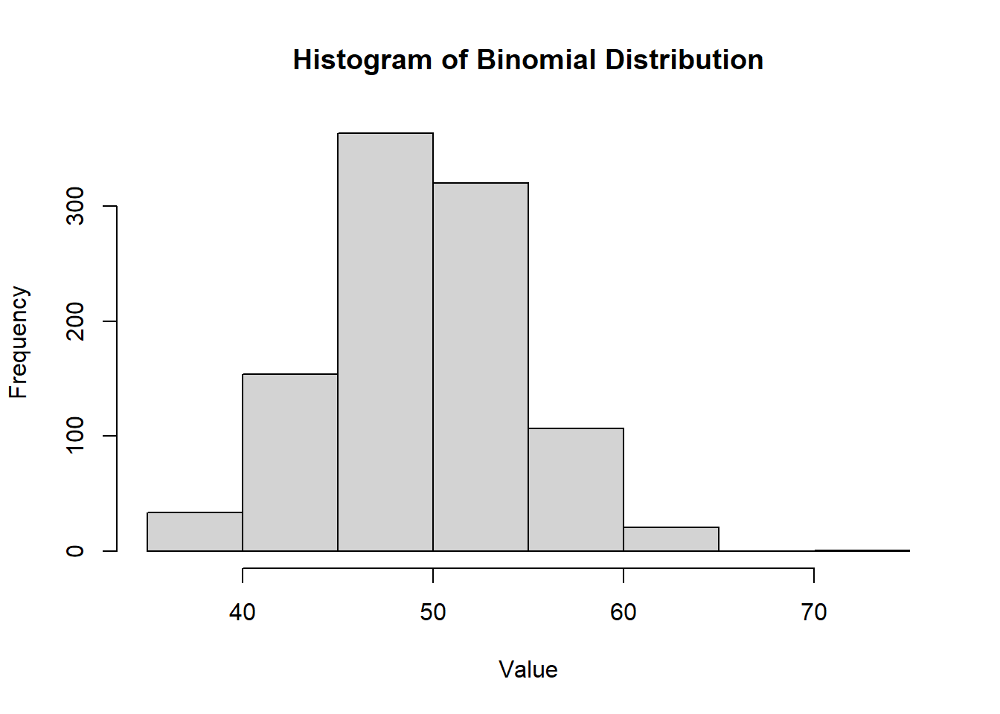
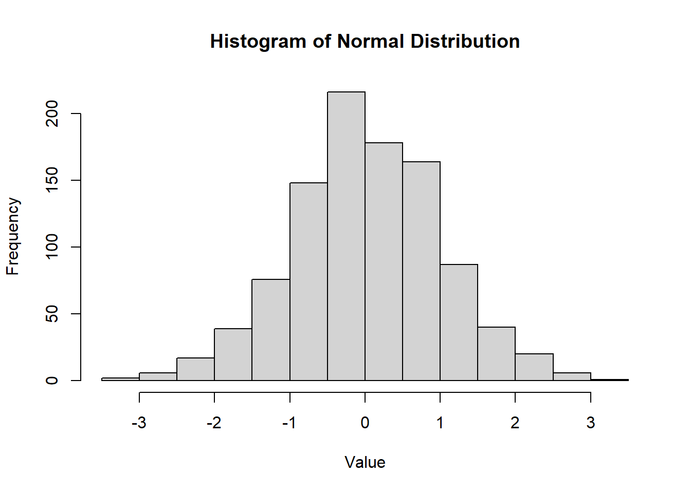

# Prerequisites

This chapter is just a quick review of [Matrix Theory] and [Probability Theory]

If you feel you do not need to brush up on these theories, you can jump right into [Descriptive Statistics]

## Matrix Theory


\begin{equation}
\begin{split}
A=
\left[\begin{array}
{cc}
a_{11} & a_{12} \\
a_{21} & a_{22} \\
\end{array}
\right]
\end{split}
\end{equation}


\begin{equation}
\begin{split}
A' =
\left[\begin{array}
{cc}
a_{11} & a_{21} \\
a_{12} & a_{22} \\
\end{array}
\right]
\end{split}
\end{equation}

$$
\mathbf{(ABC)'=C'B'A'} \\
\mathbf{A(B+C)= AB + AC} \\
\mathbf{AB \neq BA} \\
\mathbf{(A')'=A} \\
\mathbf{(A+B)' = A' + B'} \\
\mathbf{(AB)' = B'A'} \\
\mathbf{(AB)^{-1}= B^{-1}A^{-1}} \\
\mathbf{A+B = B +A} \\
\mathbf{AA^{-1} = I }
$$

If A has an inverse, it is called **invertible.** If A is not invertible it is called **singular.**

<br>


\begin{equation}
\begin{split}
\mathbf{A} &= 
\left(\begin{array}
{ccc} 
a_{11} & a_{12} & a_{13} \\ 
a_{21} & a_{22} & a_{23} \\ 
\end{array}\right)
\left(\begin{array}
{ccc}
b_{11} & b_{12} & b_{13} \\
b_{21} & b_{22} & b_{23} \\
b_{31} & b_{32} & b_{33} \\
\end{array}\right) \\
&= 
\left(\begin{array}
{ccc}
a_{11}b_{11}+a_{12}b_{21}+a_{13}b_{31} & \sum_{i=1}^{3}a_{1i}b_{i2} &  \sum_{i=1}^{3}a_{1i}b_{i3} \\
\sum_{i=1}^{3}a_{2i}b_{i1} & \sum_{i=1}^{3}a_{2i}b_{i2} & \sum_{i=1}^{3}a_{2i}b_{i3} \\
\end{array}\right) 
\end{split}
\end{equation}

Let $\mathbf{a}$ be a 3 x 1 vector, then the quadratic form is

$$
\mathbf{a'Ba} = \sum_{i=1}^{3}\sum_{i=1}^{3}a_i b_{ij} a_{j}
$$

**Length of a vector**\
Let $\mathbf{a}$ be a vector, $||\mathbf{a}||$ (the 2-norm of the vector) is the length of vector $\mathbf{a}$, is the square root of the inner product of the vector with itself:

$$
||\mathbf{a}|| = \sqrt{\mathbf{a'a}}
$$

### Rank

-   Dimension of space spanned by its columns (or its rows).\
-   Number of linearly independent columns/rows

For a n x k matrix **A** and k x k matrix **B**

-   $rank(A)\leq min(n,k)$
-   $rank(A) = rank(A') = rank(A'A)=rank(AA')$
-   $rank(AB)=min(rank(A),rank(B))$
-   **B** is invertible if and only if rank(B) = k (non-singular)

<br>

### Inverse

In scalar, a = 0 then 1/a does not exist. In matrix, a matrix is invertible when it's a non-zero matrix.

A non-singular square matrix A is invertible if there exists a non-singular square matrix B such that, $$AB=I$$ Then $A^{-1}=B$. For a 2x2 matrix,

$$
A =
\left(\begin{array}{cc}
a & b \\
c & d \\
\end{array}
\right)
$$

$$
A^{-1}=
\frac{1}{ad-bc}
\left(\begin{array}{cc}
d & -b \\
-c & a \\
\end{array}
\right)
$$

For the partition matrix,


\begin{equation}
\begin{split}
\left[\begin{array}
{cc}
A & B \\
C & D \\
\end{array}
\right]^{-1}
 =
\left[\begin{array}
{cc}
\mathbf{(A-BD^{-1}C)^{-1}} & \mathbf{-(A-BD^{-1}C)^{-1}BD^-1}\\
\mathbf{-DC(A-BD^{-1}C)^{-1}} & \mathbf{D^{-1}+D^{-1}C(A-BD^{-1}C)^{-1}BD^{-1}}\ \\
\end{array}
\right]
\end{split}
\end{equation}

<br>

Properties for a non-singular square matrix

-   $\mathbf{A^{-1}}=A$
-   for a non-zero scalar b, $\mathbf{(bA)^{-1}=b^{-1}A^{-1}}$
-   for a matrix B, $\mathbf(BA)^{-1}=B^{-1}A^{-1}$ only if B is non-singular
-   $\mathbf{(A^{-1})'=(A')^{-1}}$
-   Never notate $\mathbf{1/A}$

<br>

### Definiteness

A symmetric square k x k matrix, $\mathbf{A}$, is Positive Semi-Definite if for any non-zero k x 1 vector $\mathbf{x}$, $$\mathbf{x'Ax \geq 0 }$$

A symmetric square k x k matrix, $\mathbf{A}$, is Negative Semi-Definite if for any non-zero k x 1 vector $\mathbf{x}$ $$\mathbf{x'Ax \leq 0 }$$

$\mathbf{A}$ is indefinite if it is neither positive semi-definite or negative semi-definite.

The identity matrix is positive definite

**Example** Let $\mathbf{x} =(x_1 x_2)'$, then for a 2 x 2 identity matrix,


\begin{equation}
\begin{split}
\mathbf{x'Ix} 
&= (x_1 x_2) 
\left(\begin{array}
{cc}
1 & 0 \\
0 & 1 \\
\end{array}
\right)
\left(\begin{array}{c}
x_1 \\
x_2 \\
\end{array}
\right) \\
&=
(x_1 x_2)
\left(\begin{array}
{c}
x_1 \\
x_2 \\
\end{array}
\right) \\
&=
x_1^2 + x_2^2 >0
\end{split}
\end{equation}

Definiteness gives us the ability to compare matrices $\mathbf{A-B}$ is PSD This property also helps us show efficiency (which variance covariance matrix of one estimator is smaller than another)

Properties

-   any variance matrix is PSD
-   a matrix $\mathbf{A}$ is PSD if and only if there exists a matrix $\mathbf{B}$ such that $\mathbf{A=B'B}$
-   if $\mathbf{A}$ is PSD, then $\mathbf{B'AB}$ is PSD
-   if A and C are non-singular, then A-C is PSD if and only if $\mathbf{C^{-1}-A^{-1}}$
-   if A is PD (ND) then $A^{-1}$ is PD (ND)

**Note**

-   Indefinite A is neither PSD nor NSD. There is no comparable concept in scalar.
-   If a square matrix is PSD and invertible then it is PD

Example:

1.  Invertible / Indefinite

$$
\left[
\begin{array}
{cc}
-1 & 0 \\
0 & 10 \\
\end{array}
\right]
$$

2.  Non-invertible/ Indefinite

$$
\left[
\begin{array}
{cc}
0 & 1 \\
0 & 0 \\
\end{array}
\right]
$$

3.  Invertible / PSD

$$
\left[
\begin{array}
{cc}
1 & 0 \\
0 & 1 \\
\end{array}
\right]
$$

4.  Non-Invertible / PSD

$$
\left[
\begin{array}
{cc}
0 & 0 \\
0 & 1 \\
\end{array}
\right]
$$

### Matrix Calculus

$y=f(x_1,x_2,...,x_k)=f(x)$ where x is a 1 x k row vector. The Gradient (first order derivative with respect to a vector) is,

$$
\frac{\partial{f(x)}}{\partial{x}}=
\left(\begin{array}{c}
\frac{\partial{f(x)}}{\partial{x_1}} \\
\frac{\partial{f(x)}}{\partial{x_2}} \\
... \\
\frac{\partial{f(x)}}{\partial{x_k}}
\end{array}
\right)
$$

The **Hessian** (second order derivative with respect to a vector) is,

$$
\frac{\partial^2{f(x)}}{\partial{x}\partial{x'}}=
\left(\begin{array}
{cccc}
\frac{\partial^2{f(x)}}{\partial{x_1}\partial{x_1}} & \frac{\partial^2{f(x)}}{\partial{x_1}\partial{x_2}} & ... & \frac{\partial^2{f(x)}}{\partial{x_1}\partial{x_k}} \\
\frac{\partial^2{f(x)}}{\partial{x_1}\partial{x_2}} & \frac{\partial^2{f(x)}}{\partial{x_2}\partial{x_2}} & ... & \frac{\partial^2{f(x)}}{\partial{x_2}\partial{x_k}} \\
... & ...& & ...\\
\frac{\partial^2{f(x)}}{\partial{x_k}\partial{x_1}} & \frac{\partial^2{f(x)}}{\partial{x_k}\partial{x_2}} & ... & \frac{\partial^2{f(x)}}{\partial{x_k}\partial{x_k}}
\end{array}
\right)
$$

Define the derivative of $f(\mathbf{X})$ with respect to $\mathbf{X}_{(n \times p)}$ as the matrix 

$$
\frac{\partial f(\mathbf{X})}{\partial \mathbf{X}} = (\frac{\partial f(\mathbf{X})}{\partial x_{ij}})
$$

Define $\mathbf{a}$ to be a vector and $\mathbf{A}$ to be a matrix which does not depend upon $\mathbf{y}$. Then

$$
\frac{\partial \mathbf{a'y}}{\partial \mathbf{y}} = \mathbf{a}
$$

$$
\frac{\partial \mathbf{y'y}}{\partial \mathbf{y}} = 2\mathbf{y}
$$

$$
\frac{\partial \mathbf{y'Ay}}{\partial \mathbf{y}} = \mathbf{(A + A')y}
$$


If $\mathbf{X}$ is a symmetric matrix then 

$$
\frac{\partial |\mathbf{X}|}{\partial x_{ij}} = 
\begin{cases}
X_{ii}, i = j \\
X_ij, i \neq j
\end{cases}
$$
where $X_{ij}$ is the (i,j)th cofactor of $\mathbf{X}$

If $\mathbf{X}$ is symmetric and $\mathbf{A}$ is a matrix which does not depend upon $\mathbf{X}$ then

$$
\frac{\partial tr \mathbf{XA}}{\partial \mathbf{X}} = \mathbf{A} + \mathbf{A}' - diag(\mathbf{A})
$$

If $\mathbf{X}$ is symmetric and we let $\mathbf{J}_{ij}$ be a matrix which has a 1 in the (i,j)th position and 0s elsewhere, then

$$
\frac{\partial \mathbf{X}6{-1}}{\partial x_{ij}} = 
\begin{cases}
- \mathbf{X}^{-1}\mathbf{J}_{ii} \mathbf{X}^{-1} , i = j \\
- \mathbf{X}^{-1}(\mathbf{J}_{ij} + \mathbf{J}_{ji}) \mathbf{X}^{-1} , i \neq j
\end{cases}
$$


### Optimization

+-----------------------------------+--------------------------------------------------+-----------------------------------------------------------------------------------------------------+
|                                   | **Scalar Optimization**                          | **Vector Optimization**                                                                             |
+===================================+:================================================:+:===================================================================================================:+
| First Order Condition             | $$\frac{\partial{f(x_0)}}{\partial{x}}=0$$       | $$\frac{\partial{f(x_0)}}{\partial{x}}=\left(\begin{array}{c}0 \\ .\\ .\\ .\\ 0\end{array}\right)$$ |
+-----------------------------------+--------------------------------------------------+-----------------------------------------------------------------------------------------------------+
| Second Order Condition            | $$\frac{\partial^2{f(x_0)}}{\partial{x^2}} > 0$$ | $$\frac{\partial^2{f(x_0)}}{\partial{xx'}}>0$$                                                      |
|                                   |                                                  |                                                                                                     |
| **Convex** $\rightarrow$ **Min**  |                                                  |                                                                                                     |
+-----------------------------------+--------------------------------------------------+-----------------------------------------------------------------------------------------------------+
| **Concave** $\rightarrow$ **Max** | $$\frac{\partial^2{f(x_0)}}{\partial{x^2}} < 0$$ | $$\frac{\partial^2{f(x_0)}}{\partial{xx'}}<0$$                                                      |
+-----------------------------------+--------------------------------------------------+-----------------------------------------------------------------------------------------------------+

## Probability Theory

### Axiom and Theorems of Probability

1.  Let S denote a sample space of an experiment P[S]=1
2.  $P[A] \ge 0$ for every event A
3.  Let $A_1,A_2,A_3,...$ be a finite or an infinite collection of mutually exclusive events. Then $P[A_1\cup A_2 \cup A_3 ...]=P[A_1]+P[A_2]+P[A_3]+...$
4.  $P[\emptyset]=0$
5.  $P[A']=1-P[A]$
6.  $P[A_1 \cup A_2] = P[A_1] + P[A_2] - P[A_1 \cap A_2]$

<br>

**Conditional Probability**

$$
P[A|B]=\frac{A \cap B}{P[B]}
$$

<br>

**Independent Events** Two events A and B are independent if and only if:

1.  $P[A\cap B]=P[A]P[B]$
2.  $P[A|B]=P[A]$
3.  $P[B|A]=P[B]$

A finite collection of events $A_1, A_2, ..., A_n$ is independent if and only if any subcollection is independent.

<br>

**Multiplication Rule** $P[A \cap B] = P[A|B]P[B] = P[B|A]P[A]$

<br>

**Bayes' Theorem** Let $A_1, A_2, ..., A_n$ be a collection of mutually exclusive events whose union is S.\
Let b be an event such that $P[B]\neq0$\
Then for any of the events $A_j$, j = 1,2,...,n

$$
P[A_|B]=\frac{P[B|A_j]P[A_j]}{\sum_{i=1}^{n}P[B|A_j]P[A_i]}
$$

**Jensen's Inequality**

-   If g(x) is convex $E(g(X)) \ge g(E(X))$
-   If g(x) is concave $E(g(X)) \le g(E(X))$

#### Law of Iterated Expectations

$E(Y)=E(E(Y|X))$

#### Correlation and Independence

**Independence**

-   $f(x,y)=f_X(x)f_Y(y)$
-   $f_{Y|X}(y|x)=f_Y(y)$ and $f_{X|Y}(x|y)=f_X(x)$
-   $E(g_1(X)g_2(Y))=E(g_1(X))E(g_2(Y))$

**Mean Independence** (implied by independence)

-   Y is mean independent of X if and only if $E(Y|X)=E(Y)$
-   $E(Xg(Y))=E(X)E(g(Y))$

**Uncorrelated** (implied by independence and mean independence)

-   $Cov(X,Y)=0$
-   $Var(X+Y)=Var(X) + Var(Y)$
-   $E(XY)=E(X)E(Y)$

$$
Strongest \\
\downarrow \\
Independence \\
\downarrow \\
Mean Independence \\
\downarrow \\
Uncorrelated \\ 
\downarrow \\
Weakest\\
$$

<br>

### Central Limit Theorem

Let $X_1, X_2,...,X_n$ be a random sample of size n from a distribution (not necessarily normal) X with mean $\mu$ and variance $\sigma^2$. then for large n ($n \ge 25$),

1.  $\bar{X}$ is approximately normal with with mean $\mu_{\bar{X}}=\mu$ and variance $\sigma^2_{\bar{X}} = Var(\bar{X})= \frac{\sigma^2}{n}$\

2.  $\hat{p}$is approximately normal with $\mu_{\hat{p}} = p, \sigma^2_{\hat{p}} = \frac{p(1-p)}{n}$

3.  $\hat{p_1} - \hat{p_2}$ is approximately normal with $\mu_{\hat{p_1} - \hat{p_2}} = p_1 - p_2, \sigma^2_{\hat{p_1} - \hat{p_2}}=\frac{p_1(1-p)}{n_1} + \frac{p_2(1-p)}{n_2}$

4.  $\bar{X_1} - \bar{X_2}$ is approximately normal with $\mu_{\bar{X_1} - \bar{X_2}} = \mu_1 - \mu_2, \sigma^2_{\bar{X_1} - \bar{X_2}} = \frac{\sigma^2_1}{n_1}+\frac{\sigma^2_2}{n_2}$

5.  The following random variables are approximately standard normal:\

    -   $\frac{\bar{X}-\mu}{\sigma/\sqrt{n}}$\
    -   $\frac{\hat{p}-p}{\sqrt{\frac{p(1-p)}{n}}}$\
    -   $\frac{(\hat{p_1}-\hat{p_2})-(p_1-p_2)}{\sqrt{\frac{p_1(1-p_1)}{n_1}-\frac{p_2(1-p_2)}{n_2}}}$\
    -   $\frac{(\bar{X_1}-\bar{X_2})-(\mu_1-\mu_2)}{\sqrt{\frac{\sigma^2_1}{n_1}-\frac{\sigma^2_2}{n_2}}}$

If $\{x_i\}_{i=1}^{n}$ is an iid random sample from a probability distribution with finite mean $\mu$ and finite variance $\sigma^2$ then the sample mean $\bar{x}=n^{-1}\sum_{i=1}^{n}x_i$ scaled by $\sqrt{n}$ has the following limiting distribution

$$
\sqrt{n}(\bar{x}-\mu) \to^d N(0,\sigma^2)
$$

or if we were to standardize the sample mean,

$$
\frac{\sqrt{n}(\bar{x}-\mu)}{\sigma} \to^d N(0,1)
$$

-   holds for most random sample from any distribution (continuous, discrete, unknown).\
-   extends to multivariate case: random sample of a random vector converges to a multivariate normal.\
-   Variance from the limiting distribution is the asymptotic variance (Avar)

$$
Avar(\sqrt{n}(\bar{x}-\mu)) = \sigma^2 \\
\lim_{n \to \infty} Var(\sqrt{n}(\bar{x}-\mu)) = \sigma^2 \\
Avar(.) \neq lim_{n \to \infty} Var(.)
$$

### Random variable

+------------------------------------------------------------------------------------------+----------------------------------------------------------------------------------------------------------------------------------+-------------------------------------------------------------------------------------------------------------------------------------------------------------------------------------------------+
|                                                                                          | Discrete Variable                                                                                                                | Continuous Variable                                                                                                                                                                             |
+==========================================================================================+==================================================================================================================================+=================================================================================================================================================================================================+
| **Definition**                                                                           | A random variable is discrete if it can assume at most a finite or countably infinite number of possible values                  | A random variable is continuous if it can assume any value in some interval or intervals of real numbers and the probability that it assumes any specific value is 0                            |
+------------------------------------------------------------------------------------------+----------------------------------------------------------------------------------------------------------------------------------+-------------------------------------------------------------------------------------------------------------------------------------------------------------------------------------------------+
| **Density Function**                                                                     | A function f is called a density for X if: <br> (1) $f(x) \ge 0$ <br> (2) $\sum_{all~x}f(x)=1$ <br> (3) $f(x)=P(X=x)$ for x real | A function f is called a density for X if: <br> (1) $f(x) \ge 0$ for x real <br> (2) $\int_{-\infty}^{\infty} f(x) \; dx=1$ <br> (3) $P[a \le X \le] =\int_{a}^{b} f(x) \; dx$ for a and b real |
+------------------------------------------------------------------------------------------+----------------------------------------------------------------------------------------------------------------------------------+-------------------------------------------------------------------------------------------------------------------------------------------------------------------------------------------------+
| **Cumulative Distribution Function** <br> for x real                                     | $F(x)=P[X \le x]$                                                                                                                | $F(x)=P[X \le x]=\int_{-\infty}^{\infty}f(t)dt$                                                                                                                                                 |
+------------------------------------------------------------------------------------------+----------------------------------------------------------------------------------------------------------------------------------+-------------------------------------------------------------------------------------------------------------------------------------------------------------------------------------------------+
| $E[H(X)]$                                                                                | $\sum_{all ~x}H(x)f(x)$                                                                                                          | $\int_{-\infty}^{\infty}H(x)f(x)$                                                                                                                                                               |
+------------------------------------------------------------------------------------------+----------------------------------------------------------------------------------------------------------------------------------+-------------------------------------------------------------------------------------------------------------------------------------------------------------------------------------------------+
| $\mu=E[X]$                                                                               | $\sum_{all ~ x}xf(x)$                                                                                                            | $\int_{-\infty}^{\infty}xf(x)$                                                                                                                                                                  |
+------------------------------------------------------------------------------------------+----------------------------------------------------------------------------------------------------------------------------------+-------------------------------------------------------------------------------------------------------------------------------------------------------------------------------------------------+
| **Ordinary Moments** <br> the kth ordinary moment for variable X is defined as: $E[X^k]$ | $\sum_{all ~ x \in X}(x^kf(x))$                                                                                                  | $\int_{-\infty}^{\infty}(x^kf(x))$                                                                                                                                                              |
+------------------------------------------------------------------------------------------+----------------------------------------------------------------------------------------------------------------------------------+-------------------------------------------------------------------------------------------------------------------------------------------------------------------------------------------------+
| **Moment generating function (mgf)** <br> $m_X(t)=E[e^{tX}]$                             | $\sum_{all ~ x \in X}(e^{tx}f(x))$                                                                                               | $\int_{-\infty}^{\infty}(e^{tx}f(x)dx)$                                                                                                                                                         |
+------------------------------------------------------------------------------------------+----------------------------------------------------------------------------------------------------------------------------------+-------------------------------------------------------------------------------------------------------------------------------------------------------------------------------------------------+

<br>

Expected Value Properties:

-   E[c] = c for any constant c
-   E[cX] = cE[X] for any constant c
-   E[X+Y] = E[X] = E[Y]
-   E[XY] = E[X].E[Y] (if X and Y are independent)

Expected Variance Properties:

-   $Var(c) = 0$ for any constant c
-   $Var(cX) = c^2Var(X)$ for any constant c
-   $Var(X) \ge 0$
-   $Var(X) = E(X^2) - (E(X))^2$
-   $Var(X+c)=Var(X)$
-   $Var (X+Y) = Var(X) + Var(Y)$ (if X and Y are independent)

Standard deviation $\sigma=\sqrt(\sigma^2)=\sqrt(Var X)$

Suppose $y_1,...,y_p$ are possibly correlated random variables with means $\mu_1,...,\mu_p$. then

$$
\mathbf{y} = (y_1,...,y_p)'  \\
E(\mathbf{y}) = (\mu_1,...,\mu_p)' = \mathbf{\mu}
$$

Let $\sigma_{ij} = cov(y_i,y_j)$ for $i,j = 1,..,p$.

Define

$$
\mathbf{\Sigma} = (\sigma_{ij}) = 
\left(\begin{array}
{rrrr}
\sigma_{11} & \sigma_{12} & ... & \sigma_{1p} \\
\sigma_{21} & \sigma_{22} & ... & \sigma_{2p} \\
. & . & . & . \\
\sigma_{p1} & \sigma_{p2} & ... & \sigma_{pp}\\
\end{array}\right)
$$

Hence, $\mathbf{\Sigma}$ is the variance-covariance or dispersion matrix. And $\mathbf{\Sigma}$ is symmetric with $(p+1)p/2$ unique parameters.

Alternatively, let $u_{p \times 1}$ and $v_{v \times 1}$ be random vectors with means $\mathbf{\mu_u}$ and $\mathbf{\mu_v}$. then

$$
\mathbf{\Sigma_{uv}} = cov(\mathbf{u,v}) = E[\mathbf{(u-\mu_u)(v-\mu_v)'}]
$$

$\Sigma_{uv} \neq \Sigma_{vu}$ (but $\Sigma_{uv} = \Sigma_{vu}'$)

Properties of Covariance Matrices

1.  Symmetric: $\mathbf{\Sigma' = \Sigma}$\
2.  Eigendecomposition (spectral decomposition,symmetric decomposition): $\mathbf{\Sigma = \Phi \Lambda \Phi}$, where $\mathbf{\Phi}$ is a matrix of eigenvectors such that $\mathbf{\Phi \Phi' = I}$ (orthonormal), and $\mathbf{\Lambda}$ is a diagonal matrix with eigenvalues $(\lambda_1,...,\lambda_p)$ on the diagonal.\
3.  Non-negative definite, $\mathbf{a \Sigma a} \ge 0$ for any $\mathbf{a} \in R^p$. Equivalently, the eigenvalues of $\mathbf{\Sigma}$, $\lambda_1 \ge ... \ge \lambda_p \ge 0$\
4.  $|\mathbf{\Sigma}| = \lambda_1,...\lambda_p \ge 0$ (generalized variance)\
5.  $trace(\mathbf{\Sigma})= tr(\mathbf{\Sigma}) = \lambda_1 +... + \lambda_p = \sigma_{11}+...+ \sigma_{pp}$= sum of variances (total variance)

Note: $\mathbf{\Sigma}$ is usually required to be positive definite. This implies that all eigenvalues are positive, and $\mathbf{\Sigma}$ has an inverse $\mathbf{\Sigma}^{-1}$, such that $\mathbf{\Sigma}^{-1}\mathbf{\Sigma}= \mathbf{I}_{p \times p} = \mathbf{\Sigma}\mathbf{\Sigma}^{-1}$

<br>

**Correlation Matrices**

Define the correlation $\rho_{ij}$ and the correlation matrix by

$$
\rho_{ij} = \frac{\sigma_{ij}}{\sqrt{\sigma_{ii} \sigma_{jj}}}
$$

$$
\mathbf{R} = \left(
\begin{array}
{cccc}
\rho_{11} & \rho_{12} & ... & \rho_{1p} \\
\rho_{21} & \rho_{22} & ... & \rho_{2p} \\
. & . & . & . \\
\rho_{p1} & \rho_{p2} & ... & \rho_{pp}\\
\end{array}
\right)
$$


where $\rho_{ii}=1$ for all i.

Let x and y be random vectors with means $\mu_x$ and $\mu_y$ and variance-covariance matrices $\Sigma_x$ and $\Sigma_y$. Let $\mathbf{A}$ and $\mathbf{B}$ be matrices of constants and c and d be vectors of constants. Then,

-   $E(\mathbf{Ay+c}) = \mathbf{A \mu_y} +c$
-   $var(\mathbf{Ay +c}) = \mathbf{A}var(\mathbf{y}) \mathbf{A}' = \mathbf{A \Sigma_y A'}$
-   $cov(\mathbf{Ay + c,By+d} = \mathbf{A \Sigma_y B'}$

### Moment generating function

Moment generating function properties:

(a) $\frac{d^k(m_X(t))}{dt^k}|_{t=0}=E[X^k]$\
(b) $\mu=E[X]=m_X'(0)$\
(c) $E[X^2]=m_X''(0)$

**mgf Theorems**

Let $X_1,X_2,...X_n,Y$ be random variables with moment-generating functions $m_{X_1}(t),m_{X_2}(t),...,m_{X_n}(t),m_{Y}(t)$

1.  If $m_{X_1}(t)=m_{X_2}(t)$ for all t in some open interval about 0, then $X_1$ and $X_2$ have the same distribution
2.  If $Y = \alpha + \beta X_1$, then $m_{Y}(t)= e^{\alpha t}m_{X_1}(\beta t)$
3.  If $X_1,X_2,...X_n$ are independent and $Y = \alpha_0 + \alpha_1 X_1 + \alpha_2 X_2 + ... + \alpha_n X_n$ (where $\alpha_0, ... ,\alpha_n$ are real numbers), then $m_{Y}(t)=e^{\alpha_0 t}m_{X_1}(\alpha_1t)m_{X_2}(\alpha_2 t)...m_{X_n}(\alpha_nt)$\
4.  Suppose $X_1,X_2,...X_n$ are independent normal random variables with means $\mu_1,\mu_2,...\mu_n$ and variances $\sigma^2_1,\sigma^2_2,...,\sigma^2_n$. If $Y = \alpha_0 + \alpha_1 X_1 + \alpha_2 X_2 + ... + \alpha_n X_n$ (where $\alpha_0, ... ,\alpha_n$ are real numbers), then Y is normally distributed with mean $\mu_Y = \alpha_0 + \alpha_1 \mu_1 +\alpha_2 \mu_2 + ... + \alpha_n \mu_n$ and variance $\sigma^2_Y = \alpha_1^2 \sigma_1^2 + \alpha_2^2 \sigma_2^2 + ... + \alpha_n^2 \sigma_n^2$

### Moment

| Moment | Uncentered         | Centered                       |
|--------|--------------------|--------------------------------|
| 1st    | $E(X)=\mu=Mean(X)$ |                                |
| 2nd    | $E(X^2)$           | $E((X-\mu)^2)=Var(X)=\sigma^2$ |
| 3rd    | $E(X^3)$           | $E((X-\mu)^3)$                 |
| 4th    | $E(X^4)$           | $E((X-\mu)^4)$                 |

Skewness(X) = $E((X-\mu)^3)/\sigma^3$

Kurtosis(X) = $E((X-\mu)^4)/\sigma^4$

**Conditional Moments**

$$
E(Y|X=x)=
\begin{cases}
\sum_yyf_Y(y|x) & \text{for discrete RV}\\
\int_yyf_Y(y|x)dy & \text{for continous RV}\\
\end{cases}
$$

$$
Var(Y|X=x)=
\begin{cases}
\sum_y(y-E(Y|x))^2f_Y(y|x) & \text{for discrete RV}\\
\int_y(y-E(Y|x))^2f_Y(y|x)dy & \text{for continous RV}\\
\end{cases}
$$

#### Multivariate Moments


\begin{equation}
E=
\left(
\begin{array}{c}
X \\
Y \\
\end{array}
\right)
=
\left(
\begin{array}{c}
E(X) \\
E(Y) \\
\end{array}
\right)
=
\left(
\begin{array}{c}
\mu_X \\
\mu_Y \\
\end{array}
\right)
\end{equation}


\begin{equation}
\begin{split}
Var
\left(
\begin{array}{c}
X \\
Y \\
\end{array}
\right)
&=
\left(
\begin{array}
{cc}
Var(X) & Cov(X,Y) \\
Cov(X,Y) & Var(Y) \\
\end{array}
\right) \\
&=
\left(
\begin{array}
{cc}
E((X-\mu_X)^2) & E((X-\mu_X)(Y-\mu_Y)) \\
E((X-\mu_X)(Y-\mu_Y)) & E((Y-\mu_Y)^2) \\
\end{array}
\right)
\end{split}
\end{equation}


<br>

**Properties**

-   $E(aX + bY + c)=aE(X) +bE(Y) + c$
-   $Var(aX + bY + c) = a^2Var(X) + b^2Var(Y) + 2abCov(X,Y)$
-   $Cov(aX + bY, cX + bY) =acVar(X)+bdVar(Y) + (ad+bc)Cov(X,Y)$
-   Correlation: $\rho_{XY} = \frac{Cov(X,Y)}{\sigma_X\sigma_Y}$

### Distributions

**Conditional Distributions** $$
f_{X|Y}(X|Y=y)=\frac{f(X,Y)}{f_Y(y)}
$$ $f_{X|Y}(X|Y=y)=f_X(X)$ if X and Y are independent

#### Discrete

CDF: Cumulative Density Function\
MGF: Moment Generating Function

##### Bernoulli

$Bernoulli(p)$

**PDF**


```r
hist(mc2d::rbern(100000, prob=.5))
```


##### Binomial

$B(n,p)$

-   the experiment consists of a fixed number (n) of Bernoulli trials, each of which results in a success (s) or failure (f)
-   The trials are identical and independent, and probability of success (p) and probability of failure (q = 1- p) remains the same for all trials.
-   The random variable X denotes the number of successes obtained in the n trials.

**Density**

$$
f(x)={{n}\choose{x}}p^xq^{n-x}
$$

**CDF**\
You have to use table

**PDF**


```r
# Histogram of 100000 random values from a sample of 100 with probability of 0.5
hist(rbinom(100000, size = 100, prob = 0.5))
```


**MGF**

$$
m_X(t) =(q+pe^t)^n
$$

**Mean**

$$
\mu = E(x) = np
$$

**Variance**

$$
\sigma^2 =Var(X) = npq
$$

##### Poisson

$Pois(\lambda)$

-   Arises with Poisson process, which involves observing discrete events in a continuous "interval" of time, length, or space.
-   The random variable X is the number of occurrences of the event within an interval of s units
-   The parameter $\lambda$ is the average number of occurrences of the event in question per measurement unit. For the distribution, we use the parameter $k=\lambda s$

**Density**

$$
f(x) = \frac{e^{-k}k^x}{x!}
$$

,k\> 0, x =0,1,...

**CDF**\
Use table

**PDF**


```r
# Poisson dist with mean of 5 or Poisson(5)
hist(rpois(10000, lambda = 5))
```


**MGF**

$$
m_X(t)=e^{k(e^t-1)}
$$

**Mean**

$$
\mu = E(X) = k
$$

**Variance**

$$
\sigma^2 = Var(X) = k
$$

##### Geometric

-   The experiment consists of a series of trails. The outcome of each trial can be classed as being either a "success" (s) or "failure" (f). (This is called a Bernoulli trial).
-   The trials are identical and independent in the sense that the outcome of one trial has no effect on the outcome of any other. The probability of success (p) and probability of failure (q=1-p) remains the same from trial to trial.
-   lack of memory
-   X: the number of trials needed to obtain the first success.

**Density**

$$
f(x)=pq^{x-1}
$$

**CDF**\
$$
F(x) = 1- q^x
$$

**PDF**


```r
# hist of Geometric distribution with probability of success = 0.5
hist(rgeom(n = 10000, prob = 0.5))
```


**MGF**

$$
m_X(t) = \frac{pe^t}{1-qe^t}
$$

for $t < -ln(q)$

**Mean**

$$
\mu = \frac{1}{p}
$$

**Variance**

$$
\sigma^2 = Var(X) = \frac{q}{p^2}
$$

##### Hypergeometric

-   The experiment consists of drawing a random sample of size n without replacement and without regard to order from a collection of N objects.
-   Of the N objects, r have a trait of interest; N-r do not have the trait
-   X is the number of objects in the sample with the trait.

**Density**

$$
f(x)=\frac{{{r}\choose{x}}{{N-r}\choose{n-x}}}{{{N}\choose{n}}}
$$

where $max[0,n-(N-r)] \le x \le min(n,r)$

**PDF**


```r
# hist of hypergeometric distribution with the number of white balls = 50, and the number of black balls = 20, and number of balls drawn = 30. 
hist(rhyper(nn = 10000 , m=50, n=20, k=30))
```



**Mean**

$$
\mu = E(x)= \frac{nr}{N}
$$

**Variance**

$$
\sigma^2 = var(X) = n (\frac{r}{N})(\frac{N-r}{N})(\frac{N-n}{N-1})
$$

**Note** For large N (if $\frac{n}{N} \le 0.05$), this distribution can be approximated using a Binomial distribution with $p = \frac{r}{N}$

##### 

<br>

#### Continuous

##### Uniform

-   Defined over an interval (a,b) in which the probabilities are "equally likely" for subintervals of equal length.

**Density**

$$
f(x)=\frac{1}{b-a}
$$

for a \< x \< b

**CDF**

$$
\begin{cases}
0 & \text{if x <a } \\
\frac{x-a}{b-a} & \text{if $a \le x \le b$ }\\
1 & \text{if x >b}\\
\end{cases}
$$

**PDF**


```r
hist(runif(100000, min = 0, max = 1))
```


**MGF**

$$
\begin{cases}
\frac{e^{tb} - e^{ta}}{t(b-a)}&\text{ if $t \neq 0$}\\
1&\text{if $ t \neq 0$}\\
\end{cases}
$$

**Mean**

$$
\mu = E(X) = \frac{a +b}{2}
$$

**Variance**

$$
\sigma^2 = Var(X) = \frac{(b-a)^2}{12}
$$

##### Gamma

-   is used to define the exponential and chi-squared distributions
-   The gamma function is defined as:

$$
\Gamma(\alpha) = \int_0^{\infty} z^{\alpha-1}e^{-z}dz
$$

where $\alpha > 0$

-   Properties of The Gamma function:\

    -   $\Gamma(1) = 1$ + For $\alpha >1$, $\Gamma(\alpha)=(\alpha-1)\Gamma(\alpha-1)$ + If n is an integer and $n>1$, then $\Gamma(n) = (n-1)!$

**Density**

$$
f(x) = \frac{1}{\Gamma(\alpha)\beta^{\alpha}}x^{\alpha-1}e^{-x/\beta}
$$

**CDF**

$$
F(x,n,\beta) = 1 -\sum_{k=0}^{n-1} \frac{(\frac{x}{\beta})^k e^{-x/\beta}}{k!}
$$

for x\>0, and $\alpha = n$ (a positive integer)

**PDF**


```r
hist(rgamma(n = 10000, shape = 5, rate = 1))
```


**MGF**

$$
m_X(t) = (1-\beta t)^{-\alpha}
$$

where $t < \frac{1}{\beta}$

**Mean**

$$
\mu = E(X) = \alpha \beta
$$

**Variance**

$$
\sigma^2 = Var(X) = \alpha \beta^2
$$

##### Normal

$N(\mu,\sigma^2)$

-   is symmetric, bell-shaped curve with parameters $\mu$ and $\sigma^2$
-   also known as Gaussian.

**Density**

$$
f(x) = \frac{1}{\sigma \sqrt{2\pi }}e^{-\frac{1}{2}(\frac{x-\mu}{\sigma})^2}
$$

for $-\infty < x, \mu< \infty, \sigma > 0$

**CDF**

Use table

**PDF**


```r
hist(rnorm(1000000, mean = 0, sd = 1))
```


**MGF**

$$
m_X(t) = e^{\mu t + \frac{\sigma^2 t^2}{2}}
$$

**Mean**

$$
\mu = E(X)
$$

**Variance**

$$
\sigma^2 = Var(X)
$$

**Standard Normal Random Variable**

-   The normal random variable Z with mean $\mu = 0$ and standard deviation $\sigma =1$ is called standard normal
-   Any normal random variable X with mean $\mu$ and standard deviation $\sigma$ can be converted to the standard normal random variable $Z = \frac{X-\mu}{\sigma}$

**Normal Approximation to the Binomial Distribution**

Let X be binomial with parameters n and p. For large n (so that $(A)p \le .5$ and $np > 5$ or (B) $p>.5$ and $nq>5$), X is approximately normally distributed with mean $\mu = np$ and standard deviation $\sigma = \sqrt{npq}$

When using the normal approximation, add or subtract 0.5 as needed for the continuity correction

|  Discrete  | Approximate Normal (corrected) |
|:----------:|:------------------------------:|
|  P(X = c)  |   P(c -0.5 \< Y \< c + 0.5)    |
| P(X \< c)  |        P(Y \< c - 0.5)         |
| P(X \le c) |        P(Y \< c + 0.5)         |
| P(X \> c)  |        P(Y \> c + 0.5)         |
| P(X \ge c) |        P(Y \> c - 0.5)         |

**Normal Probability Rule**

If X is normally distributed with parameters $\mu$ and $\sigma$, then

-   $P(-\sigma < X - \mu < \sigma) \approx .68$ \* $P(-2\sigma < X - \mu < 2\sigma) \approx .95$ \* $P(-3\sigma < X - \mu < 3\sigma) \approx .997$

##### Logistic

$Logistic(\mu,s)$

**PDF**


```r
hist(rlogis(n = 100000, location = 0, scale = 1))
```


##### Laplace

$$
f(x) = \frac{1}{2} e^{-|x-\theta|}
$$
where $-\infty < x < \infty$ and $-\infty < \theta < \infty$

$$
\mu = \theta, \sigma^2 = 2
$$
and

$$
m(t) = e^{t \theta} \frac{1}{1 - t^2}
$$
where $-1 < t < 1$


##### Lognomral

$lognormal(\mu,\sigma^2)$

**PDF**


```r
hist(rlnorm(n = 10000, meanlog = 0, sdlog = 1))
```



##### Exponential

$Exp(\lambda)$

-   A special case of the gamma distribution with $\alpha = 1$
-   Lack of memory
-   $\lambda$ = rate Within a Poisson process with parameter $\lambda$, if W is the waiting tine until the occurrence of the first event, then W has an exponential distribution with $\beta = 1/\alpha$

**Density**

$$
f(x) = \frac{1}{\beta} e^{-x/\beta}
$$

for $x,\beta > 0$

**CDF**


\begin{equation}
F(x) = 
\begin{cases}
0 & \text{ if $x \le 0$}\\
1 - e^{-x/\beta} & \text{if $x > 0$}\\
\end{cases}
\end{equation}

**PDF**


```r
hist(rexp(n = 100000, rate = 1))
```


**MGF**

$$
m_X(t) = (1-\beta t)^{-1}
$$

for $t < 1/\beta$

**Mean**

$$
\mu = E(X) = \beta
$$

**Variance**

$$
\sigma^2 = Var(X) =\beta^2
$$

##### Chi-squared

$\chi^2=\chi^2(k)$

-   A special case of the gamma distribution with $\beta =2$, and $\alpha = \gamma /2$ for a positive integer $\gamma$
-   The random variable X is denoted $\chi_{\gamma}^2$ and is said to have a chi-squared distribution with $\gamma$ degrees of freedom.

**Density** Use density for Gamma Distribution with $\beta = 2$ and $\alpha = \gamma/2$

**CDF** Use table

**PDF**


```r
hist(rchisq(n = 10000, df=2, ncp = 0))
```


**MGF**

$$
m_X(t) = (1-2t)^{-\gamma/2}
$$

**Mean**

$$
\mu = E(X) = \gamma
$$

**Variance**

$$
\sigma^2 = Var(X) = 2\gamma
$$

##### Student T

$T(v)$

-   $T=\frac{Z}{\sqrt{\chi_{\gamma}^2/\gamma}}$, where Z is standard normal follows a student-t distribution with $\gamma$ dof
-   The distribution is symmetric, bell-shaped , with a mean of $\mu=0$


```r
hist(rt(n = 100000, df=2, ncp =1))
```


##### F-Distribution

$F(d_1,d_2)$

-   F distribution is strictly positive
-   $F=\frac{\chi_{\gamma_1}^2/\gamma_1}{\chi_{\gamma_2^2}/\gamma_2}$ follows an F distribution with dof $\gamma_1$ and $\gamma_2$, where $\chi_{\gamma_1}^2$ and $\chi_{\gamma_2}^2$ are independent chi-squared random variables.
-   The distribution is asymmetric and never negative.

**PDF**


```r
hist(rf(n = 100000, df1=2, df2=3, ncp=1))
```


##### Cauchy

[Central Limit Theorem] and [Weak Law] do not apply to Cauchy because it does not have finite mean and finite variance

**PDF**


```r
hist(rcauchy(n = 100000, location = 0, scale = 1))
```


##### Multivariate Normal Distribution

Let y be a p-dimensional multivariate normal (MVN) rv with mean $\mu$ and variance $\Sigma$. Then, the density of y is

$$
f(\mathbf{y}) = \frac{1}{(2\pi)^{p/2}|\mathbf{\Sigma}|^{1/2}}exp(-\frac{1}{2}\mathbf{(y-\mu)'\Sigma^{-1}(y-\mu)})
$$

We have $\mathbf{y} \sim N_p(\mathbf{\mu,\Sigma})$

Properties:

-   Let $\mathbf{A}_{r \times p}$ be a fixed matrix. then $\mathbf{Ay} \sim N_r(\mathbf{A \mu, A \Sigma A')}$. Note that $r \le p$ and all rows of A must be linearly independent to guarantee that $\mathbf{A\Sigma A'}$ is non-singular.\
-   Let $\mathbf{G}$ be a matrix such that $\mathbf{\Sigma^{-1}= GG'}$. then, $\mathbf{G'y} \sim N_p (\mathbf{G'\mu,I})$ and $\mathbf{G'(y-\mu)} \sim N_p (\mathbf{0,I})$.\
-   Any fixed linear combination of $y_1,...,y_p$ say $\mathbf{c'y}$, follows $\mathbf{c'y} \sim N_1(\mathbf{c'\mu,c'\Sigma c})$

**Large Sample Properties**

Suppose that $y_1,...,y_n$ are a random sample from some population with mean $\mu$ and variance-variance matrix $\Sigma$

$$
\mathbf{Y} \sim MVN(\mathbf{\mu,\Sigma})
$$

Then

-   $\bar{\mathbf{y}} = \frac{1}{n}\sum_{i=1}^n \mathbf{y}_i$ is a consistent estimator for $\mathbf{\mu}$\
-   $\mathbf{S} = \frac{1}{n-1}\sum_{i=1}^n \mathbf{(y_i - \bar{y})(y_i - \bar{y})'}$ is a consistent estimator for $\mathbf{\Sigma}$\
-   Multivariate Central Limit Theorem: Similar to the univariate case, $\sqrt{n}(\mathbf{\bar{y}- \mu}) \sim N_p(\mathbf{0, \Sigma})$ when n is large relative to p (e.g., $n \ge 25p$), which is equivalent to $\bar{y} \sim N_p(\mathbf{\mu,\Sigma/n})$\
-   Wald's Theorem: $n(\mathbf{\bar{y}- \mu)'S^{-1}(\bar{y}- \mu)} \sim \chi^2_{(p)}$ when n is large relative to p.
