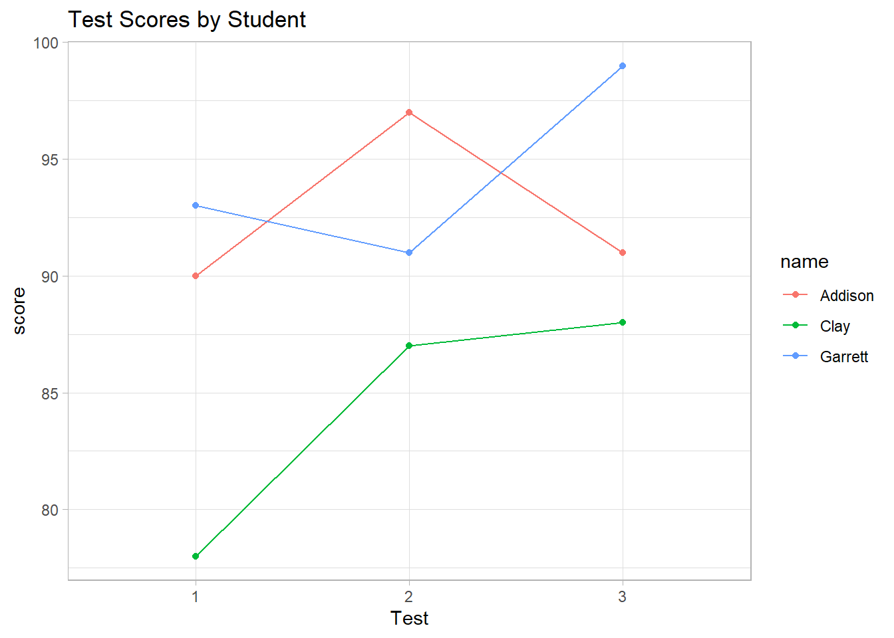

## Data Import/Export

[Extended Manual by R](https://cran.r-project.org/doc/manuals/r-release/R-data.html)

| Format                                                | Typical Extension       | Import Package                                                  | Export Package                                                  | Installed by Default |
|:--------------|:--------------|:--------------|:--------------|:--------------|
| Comma-separated data                                  | .csv                    | [**data.table**](https://cran.r-project.org/package=data.table) | [**data.table**](https://cran.r-project.org/package=data.table) | Yes                  |
| Pipe-separated data                                   | .psv                    | [**data.table**](https://cran.r-project.org/package=data.table) | [**data.table**](https://cran.r-project.org/package=data.table) | Yes                  |
| Tab-separated data                                    | .tsv                    | [**data.table**](https://cran.r-project.org/package=data.table) | [**data.table**](https://cran.r-project.org/package=data.table) | Yes                  |
| CSVY (CSV + YAML metadata header)                     | .csvy                   | [**data.table**](https://cran.r-project.org/package=data.table) | [**data.table**](https://cran.r-project.org/package=data.table) | Yes                  |
| SAS                                                   | .sas7bdat               | [**haven**](https://cran.r-project.org/package=haven)           | [**haven**](https://cran.r-project.org/package=haven)           | Yes                  |
| SPSS                                                  | .sav                    | [**haven**](https://cran.r-project.org/package=haven)           | [**haven**](https://cran.r-project.org/package=haven)           | Yes                  |
| SPSS (compressed)                                     | .zsav                   | [**haven**](https://cran.r-project.org/package=haven)           | [**haven**](https://cran.r-project.org/package=haven)           | Yes                  |
| Stata                                                 | .dta                    | [**haven**](https://cran.r-project.org/package=haven)           | [**haven**](https://cran.r-project.org/package=haven)           | Yes                  |
| SAS XPORT                                             | .xpt                    | [**haven**](https://cran.r-project.org/package=haven)           | [**haven**](https://cran.r-project.org/package=haven)           | Yes                  |
| SPSS Portable                                         | .por                    | [**haven**](https://cran.r-project.org/package=haven)           |                                                                 | Yes                  |
| Excel                                                 | .xls                    | [**readxl**](https://cran.r-project.org/package=readxl)         |                                                                 | Yes                  |
| Excel                                                 | .xlsx                   | [**readxl**](https://cran.r-project.org/package=readxl)         | [**openxlsx**](https://cran.r-project.org/package=openxlsx)     | Yes                  |
| R syntax                                              | .R                      | **base**                                                        | **base**                                                        | Yes                  |
| Saved R objects                                       | .RData, .rda            | **base**                                                        | **base**                                                        | Yes                  |
| Serialized R objects                                  | .rds                    | **base**                                                        | **base**                                                        | Yes                  |
| Epiinfo                                               | .rec                    | [**foreign**](https://cran.r-project.org/package=foreign)       |                                                                 | Yes                  |
| Minitab                                               | .mtp                    | [**foreign**](https://cran.r-project.org/package=foreign)       |                                                                 | Yes                  |
| Systat                                                | .syd                    | [**foreign**](https://cran.r-project.org/package=foreign)       |                                                                 | Yes                  |
| "XBASE" database files                                | .dbf                    | [**foreign**](https://cran.r-project.org/package=foreign)       | [**foreign**](https://cran.r-project.org/package=foreign)       | Yes                  |
| Weka Attribute-Relation File Format                   | .arff                   | [**foreign**](https://cran.r-project.org/package=foreign)       | [**foreign**](https://cran.r-project.org/package=foreign)       | Yes                  |
| Data Interchange Format                               | .dif                    | **utils**                                                       |                                                                 | Yes                  |
| Fortran data                                          | no recognized extension | **utils**                                                       |                                                                 | Yes                  |
| Fixed-width format data                               | .fwf                    | **utils**                                                       | **utils**                                                       | Yes                  |
| gzip comma-separated data                             | .csv.gz                 | **utils**                                                       | **utils**                                                       | Yes                  |
| Apache Arrow (Parquet)                                | .parquet                | [**arrow**](https://cran.r-project.org/package=arrow)           | [**arrow**](https://cran.r-project.org/package=arrow)           | No                   |
| EViews                                                | .wf1                    | [**hexView**](https://cran.r-project.org/package=hexView)       |                                                                 | No                   |
| Feather R/Python interchange format                   | .feather                | [**feather**](https://cran.r-project.org/package=feather)       | [**feather**](https://cran.r-project.org/package=feather)       | No                   |
| Fast Storage                                          | .fst                    | [**fst**](https://cran.r-project.org/package=fst)               | [**fst**](https://cran.r-project.org/package=fst)               | No                   |
| JSON                                                  | .json                   | [**jsonlite**](https://cran.r-project.org/package=jsonlite)     | [**jsonlite**](https://cran.r-project.org/package=jsonlite)     | No                   |
| Matlab                                                | .mat                    | [**rmatio**](https://cran.r-project.org/package=rmatio)         | [**rmatio**](https://cran.r-project.org/package=rmatio)         | No                   |
| OpenDocument Spreadsheet                              | .ods                    | [**readODS**](https://cran.r-project.org/package=readODS)       | [**readODS**](https://cran.r-project.org/package=readODS)       | No                   |
| HTML Tables                                           | .html                   | [**xml2**](https://cran.r-project.org/package=xml2)             | [**xml2**](https://cran.r-project.org/package=xml2)             | No                   |
| Shallow XML documents                                 | .xml                    | [**xml2**](https://cran.r-project.org/package=xml2)             | [**xml2**](https://cran.r-project.org/package=xml2)             | No                   |
| YAML                                                  | .yml                    | [**yaml**](https://cran.r-project.org/package=yaml)             | [**yaml**](https://cran.r-project.org/package=yaml)             | No                   |
| Clipboard                                             | default is tsv          | [**clipr**](https://cran.r-project.org/package=clipr)           | [**clipr**](https://cran.r-project.org/package=clipr)           | No                   |
| [Google Sheets](https://www.google.com/sheets/about/) | as Comma-separated data |                                                                 |                                                                 |                      |

: Table by [Rio Vignette](https://cran.r-project.org/web/packages/rio/vignettes/rio.html)

R limitations:

-   By default, R use 1 core in CPU

-   R puts data into memory (limit around 2-4 GB), while SAS uses data from files on demand

-   Categorization

    -   Medium-size file: within RAM limit, around 1-2 GB

    -   Large file: 2-10 GB, there might be some workaround solution

    -   Very large file \> 10 GB, you have to use distributed or parallel computing

Solutions:

-   buy more RAM

-   HPC packages

    -   Explicit Parallelism

    -   Implicit Parallelism

    -   Large Memory

    -   Map/Reduce

-   specify number of rows and columns, typically including command `nrow =`

-   Use packages that store data differently

    -   `bigmemory`, `biganalytics`, `bigtabulate` , `synchronicity`, `bigalgebra`, `bigvideo` use C++ to store matrices, but also support one class type

    -   For multiple class types, use `ff` package

-   Very Large datasets use

    -   `RHaddop` package
    -   `HadoopStreaming`
    -   `Rhipe`

### Medium size


```r
library("rio")
```

To import multiple files in a directory


```r
str(import_list(dir()), which = 1)
```

To export a single data file


```r
export(data, "data.csv")
export(data,"data.dta")
export(data,"data.txt")
export(data,"data_cyl.rds")
export(data,"data.rdata")
export(data,"data.R")
export(data,"data.csv.zip")
export(data,"list.json")
```

To export multiple data files


```r
export(list(mtcars = mtcars, iris = iris), "data_file_type") 
# where data_file_type should substituted with the extension listed above
```

To convert between data file types


```r
# convert Stata to SPSS
convert("data.dta", "data.sav")
```


### Large size

#### Cloud Computing: Using AWS for Big Data
Amazon Web Service (AWS): Compute resources can be rented at approximately \$1/hr. Use AWS to process large datasets without overwhelming your local machine.

#### Importing Large Files as Chunks

##### Using Base R

```r
file_in <- file("in.csv", "r")  # Open a connection to the file
chunk_size <- 100000            # Define chunk size
x <- readLines(file_in, n = chunk_size)  # Read data in chunks
close(file_in)                  # Close the file connection
```

##### Using the `data.table` Package

```r
library(data.table)
mydata <- fread("in.csv", header = TRUE)  # Fast and memory-efficient
```

##### Using the `ff` Package

```r
library(ff)
x <- read.csv.ffdf(
  file = "file.csv",
  nrow = 10,          # Total rows
  header = TRUE,      # Include headers
  VERBOSE = TRUE,     # Display progress
  first.rows = 10000, # Initial chunk
  next.rows = 50000,  # Subsequent chunks
  colClasses = NA
)
```

##### Using the `bigmemory` Package

```r
library(bigmemory)
my_data <- read.big.matrix('in.csv', header = TRUE)
```

##### Using the `sqldf` Package

```r
library(sqldf)
my_data <- read.csv.sql('in.csv')

# Example: Filtering during import
iris2 <- read.csv.sql("iris.csv", 
    sql = "SELECT * FROM file WHERE Species = 'setosa'")
```

##### Using the `RMySQL` Package


```r
library(RMySQL)
```

`RQLite` package

-   [Download SQLite](https://sqlite.org/download.html), pick "A bundle of command-line tools for managing SQLite database files" for Window 10
-   Unzip file, and open `sqlite3.exe.`
-   Type in the prompt
    -   `sqlite> .cd 'C:\Users\data'` specify path to your desired directory
    -   `sqlite> .open database_name.db` to open a database
    -   To import the CSV file into the database
        -   `sqlite> .mode csv` specify to SQLite that the next file is .csv file
        -   `sqlite> .import file_name.csv datbase_name` to import the csv file to the database
    -   `sqlite> .exit` After you're done, exit the sqlite program


```r
library(DBI)
library(dplyr)
library("RSQLite")
setwd("")
con <- dbConnect(RSQLite::SQLite(), "data_base.db")
tbl <- tbl(con, "data_table")
tbl %>% 
    filter() %>%
    select() %>%
    collect() # to actually pull the data into the workspace
dbDisconnect(con)
```

##### Using the `arrow` Package

```r
library(arrow)
data <- read_csv_arrow("file.csv")
```

##### Using the `vroom` Package

```r
library(vroom)

# Import a compressed CSV file
compressed <- vroom_example("mtcars.csv.zip")
data <- vroom(compressed)
```

##### Using the `data.table` Package


```r
s = fread("sample.csv")
```

##### Comparisons Regarding Storage Space


```r
test = ff::read.csv.ffdf(file = "")
object.size(test) # Highest memory usage

test1 = data.table::fread(file = "")
object.size(test1) # Lowest memory usage

test2 = readr::read_csv(file = "")
object.size(test2) # Second lowest memory usage

test3 = vroom::vroom(file = "")
object.size(test3) # Similar to read_csv
```

To work with large datasets, you can compress them into `csv.gz` format. However, typically, R requires loading the entire dataset before exporting it, which can be impractical for data over 10 GB. In such cases, processing the data sequentially becomes necessary. Although `read.csv` is slower compared to `readr::read_csv`, it can handle connections and allows for sequential looping, making it useful for large files.

Currently, `readr::read_csv` does not support the `skip` argument efficiently for large data. Even if you specify `skip`, the function reads all preceding lines again. For instance, if you run `read_csv(file, n_max = 100, skip = 0)` followed by `read_csv(file, n_max = 200, skip = 100)`, the first 100 rows are re-read. In contrast, `read.csv` can continue from where it left off without re-reading previous rows.

If you encounter an error such as:

"Error in (function (con, what, n = 1L, size = NA_integer\_, signed = TRUE): can only read from a binary connection",

you can modify the connection mode from `"r"` to `"rb"` (read binary). Although the `file` function is designed to detect the appropriate format automatically, this workaround can help resolve the issue when it does not behave as expected.

#### Sequential Processing for Large Data


```r
# Open file for sequential reading
file_conn <- file("file.csv", open = "r")
while (TRUE) {
  # Read a chunk of data
  data_chunk <- read.csv(file_conn, nrows = 1000)
  if (nrow(data_chunk) == 0) break  # Stop if no more rows
  # Process the chunk here
}
close(file_conn)  # Close connection
```

## Data Manipulation


```r
# Load required packages
library(tidyverse)
library(lubridate)

# -----------------------------
# Data Structures in R
# -----------------------------

# Create vectors
x <- c(1, 4, 23, 4, 45)
n <- c(1, 3, 5)
g <- c("M", "M", "F")

# Create a data frame
df <- data.frame(n, g)
df  # View the data frame
#>   n g
#> 1 1 M
#> 2 3 M
#> 3 5 F
str(df)  # Check its structure
#> 'data.frame':	3 obs. of  2 variables:
#>  $ n: num  1 3 5
#>  $ g: chr  "M" "M" "F"

# Using tibble for cleaner outputs
df <- tibble(n, g)
df  # View the tibble
#> # A tibble: 3 × 2
#>       n g    
#>   <dbl> <chr>
#> 1     1 M    
#> 2     3 M    
#> 3     5 F
str(df)
#> tibble [3 × 2] (S3: tbl_df/tbl/data.frame)
#>  $ n: num [1:3] 1 3 5
#>  $ g: chr [1:3] "M" "M" "F"

# Create a list
lst <- list(x, n, g, df)
lst  # Display the list
#> [[1]]
#> [1]  1  4 23  4 45
#> 
#> [[2]]
#> [1] 1 3 5
#> 
#> [[3]]
#> [1] "M" "M" "F"
#> 
#> [[4]]
#> # A tibble: 3 × 2
#>       n g    
#>   <dbl> <chr>
#> 1     1 M    
#> 2     3 M    
#> 3     5 F

# Name list elements
lst2 <- list(num = x, size = n, sex = g, data = df)
lst2  # Named list elements are easier to reference
#> $num
#> [1]  1  4 23  4 45
#> 
#> $size
#> [1] 1 3 5
#> 
#> $sex
#> [1] "M" "M" "F"
#> 
#> $data
#> # A tibble: 3 × 2
#>       n g    
#>   <dbl> <chr>
#> 1     1 M    
#> 2     3 M    
#> 3     5 F

# Another list example with numeric vectors
lst3 <- list(
  x = c(1, 3, 5, 7),
  y = c(2, 2, 2, 4, 5, 5, 5, 6),
  z = c(22, 3, 3, 3, 5, 10)
)
lst3
#> $x
#> [1] 1 3 5 7
#> 
#> $y
#> [1] 2 2 2 4 5 5 5 6
#> 
#> $z
#> [1] 22  3  3  3  5 10

# Find means of list elements
# One at a time
mean(lst3$x)
#> [1] 4
mean(lst3$y)
#> [1] 3.875
mean(lst3$z)
#> [1] 7.666667

# Using lapply to calculate means
lapply(lst3, mean)
#> $x
#> [1] 4
#> 
#> $y
#> [1] 3.875
#> 
#> $z
#> [1] 7.666667

# Simplified output with sapply
sapply(lst3, mean)
#>        x        y        z 
#> 4.000000 3.875000 7.666667

# Tidyverse alternative: map() function
map(lst3, mean)
#> $x
#> [1] 4
#> 
#> $y
#> [1] 3.875
#> 
#> $z
#> [1] 7.666667

# Tidyverse with numeric output: map_dbl()
map_dbl(lst3, mean)
#>        x        y        z 
#> 4.000000 3.875000 7.666667

# -----------------------------
# Binding Data Frames
# -----------------------------

# Create tibbles for demonstration
dat01 <- tibble(x = 1:5, y = 5:1)
dat02 <- tibble(x = 10:16, y = x / 2)
dat03 <- tibble(z = runif(5))  # 5 random numbers from (0, 1)

# Row binding
bind_rows(dat01, dat02, dat01)
#> # A tibble: 17 × 2
#>        x     y
#>    <int> <dbl>
#>  1     1   5  
#>  2     2   4  
#>  3     3   3  
#>  4     4   2  
#>  5     5   1  
#>  6    10   5  
#>  7    11   5.5
#>  8    12   6  
#>  9    13   6.5
#> 10    14   7  
#> 11    15   7.5
#> 12    16   8  
#> 13     1   5  
#> 14     2   4  
#> 15     3   3  
#> 16     4   2  
#> 17     5   1

# Add a new identifier column with .id
bind_rows(dat01, dat02, .id = "id")
#> # A tibble: 12 × 3
#>    id        x     y
#>    <chr> <int> <dbl>
#>  1 1         1   5  
#>  2 1         2   4  
#>  3 1         3   3  
#>  4 1         4   2  
#>  5 1         5   1  
#>  6 2        10   5  
#>  7 2        11   5.5
#>  8 2        12   6  
#>  9 2        13   6.5
#> 10 2        14   7  
#> 11 2        15   7.5
#> 12 2        16   8

# Use named inputs for better identification
bind_rows("dat01" = dat01, "dat02" = dat02, .id = "id")
#> # A tibble: 12 × 3
#>    id        x     y
#>    <chr> <int> <dbl>
#>  1 dat01     1   5  
#>  2 dat01     2   4  
#>  3 dat01     3   3  
#>  4 dat01     4   2  
#>  5 dat01     5   1  
#>  6 dat02    10   5  
#>  7 dat02    11   5.5
#>  8 dat02    12   6  
#>  9 dat02    13   6.5
#> 10 dat02    14   7  
#> 11 dat02    15   7.5
#> 12 dat02    16   8

# Bind a list of data frames
list01 <- list("dat01" = dat01, "dat02" = dat02)
bind_rows(list01, .id = "source")
#> # A tibble: 12 × 3
#>    source     x     y
#>    <chr>  <int> <dbl>
#>  1 dat01      1   5  
#>  2 dat01      2   4  
#>  3 dat01      3   3  
#>  4 dat01      4   2  
#>  5 dat01      5   1  
#>  6 dat02     10   5  
#>  7 dat02     11   5.5
#>  8 dat02     12   6  
#>  9 dat02     13   6.5
#> 10 dat02     14   7  
#> 11 dat02     15   7.5
#> 12 dat02     16   8

# Column binding
bind_cols(dat01, dat03)
#> # A tibble: 5 × 3
#>       x     y     z
#>   <int> <int> <dbl>
#> 1     1     5 0.265
#> 2     2     4 0.410
#> 3     3     3 0.780
#> 4     4     2 0.926
#> 5     5     1 0.501

# -----------------------------
# String Manipulation
# -----------------------------

names <- c("Ford, MS", "Jones, PhD", "Martin, Phd", "Huck, MA, MLS")

# Remove everything after the first comma
str_remove(names, pattern = ", [[:print:]]+")
#> [1] "Ford"   "Jones"  "Martin" "Huck"

# Explanation: [[:print:]]+ matches one or more printable characters

# -----------------------------
# Reshaping Data
# -----------------------------

# Wide format data
wide <- data.frame(
  name = c("Clay", "Garrett", "Addison"),
  test1 = c(78, 93, 90),
  test2 = c(87, 91, 97),
  test3 = c(88, 99, 91)
)

# Long format data
long <- data.frame(
  name = rep(c("Clay", "Garrett", "Addison"), each = 3),
  test = rep(1:3, 3),
  score = c(78, 87, 88, 93, 91, 99, 90, 97, 91)
)

# Summary statistics
aggregate(score ~ name, data = long, mean)  # Mean score per student
#>      name    score
#> 1 Addison 92.66667
#> 2    Clay 84.33333
#> 3 Garrett 94.33333
aggregate(score ~ test, data = long, mean)  # Mean score per test
#>   test    score
#> 1    1 87.00000
#> 2    2 91.66667
#> 3    3 92.66667

# Line plot of scores over tests
ggplot(long,
       aes(
           x = factor(test),
           y = score,
           color = name,
           group = name
       )) +
    geom_point() +
    geom_line() +
    xlab("Test") +
    ggtitle("Test Scores by Student")
```



```r

# Reshape wide to long
pivot_longer(wide, test1:test3, names_to = "test", values_to = "score")
#> # A tibble: 9 × 3
#>   name    test  score
#>   <chr>   <chr> <dbl>
#> 1 Clay    test1    78
#> 2 Clay    test2    87
#> 3 Clay    test3    88
#> 4 Garrett test1    93
#> 5 Garrett test2    91
#> 6 Garrett test3    99
#> 7 Addison test1    90
#> 8 Addison test2    97
#> 9 Addison test3    91

# Use names_prefix to clean column names
pivot_longer(
    wide,
    -name,
    names_to = "test",
    values_to = "score",
    names_prefix = "test"
)
#> # A tibble: 9 × 3
#>   name    test  score
#>   <chr>   <chr> <dbl>
#> 1 Clay    1        78
#> 2 Clay    2        87
#> 3 Clay    3        88
#> 4 Garrett 1        93
#> 5 Garrett 2        91
#> 6 Garrett 3        99
#> 7 Addison 1        90
#> 8 Addison 2        97
#> 9 Addison 3        91

# Reshape long to wide with explicit id_cols argument
pivot_wider(
  long,
  id_cols = name, 
  names_from = test,
  values_from = score
)
#> # A tibble: 3 × 4
#>   name      `1`   `2`   `3`
#>   <chr>   <dbl> <dbl> <dbl>
#> 1 Clay       78    87    88
#> 2 Garrett    93    91    99
#> 3 Addison    90    97    91

# Add a prefix to the resulting columns
pivot_wider(
  long,
  id_cols = name,  
  names_from = test,
  values_from = score,
  names_prefix = "test"
)
#> # A tibble: 3 × 4
#>   name    test1 test2 test3
#>   <chr>   <dbl> <dbl> <dbl>
#> 1 Clay       78    87    88
#> 2 Garrett    93    91    99
#> 3 Addison    90    97    91
```

The verbs of data manipulation

-   `select`: selecting (or not selecting) columns based on their names (eg: select columns Q1 through Q25)
-   `slice`: selecting (or not selecting) rows based on their position (eg: select rows 1:10)
-   `mutate`: add or derive new columns (or variables) based on existing columns (eg: create a new column that expresses measurement in cm based on existing measure in inches)
-   `rename`: rename variables or change column names (eg: change "GraduationRate100" to "grad100")
-   `filter`: selecting rows based on a condition (eg: all rows where gender = Male)
-   `arrange`: ordering rows based on variable(s) numeric or alphabetical order (eg: sort in descending order of Income)
-   `sample`: take random samples of data (eg: sample 80% of data to create a "training" set)
-   `summarize`: condense or aggregate multiple values into single summary values (eg: calculate median income by age group)
-   `group_by`: convert a tbl into a grouped tbl so that operations are performed "by group"; allows us to summarize data or apply verbs to data by groups (eg, by gender or treatment)
-   the pipe: `%>%`
    -   Use Ctrl + Shift + M (Win) or Cmd + Shift + M (Mac) to enter in RStudio

    -   The pipe takes the output of a function and "pipes" into the first argument of the next function.

    -   new pipe is `|>` It should be identical to the old one, except for certain special cases.
-   `:=` (Walrus operator): similar to `=` , but for cases where you want to use the `glue` package (i.e., dynamic changes in the variable name in the left-hand side)

Writing function in R

Tunneling

`{{` (called curly-curly) allows you to tunnel data-variables through arg-variables (i.e., function arguments)


```r
library(tidyverse)
# -----------------------------
# Writing Functions with {{ }}
# -----------------------------

# Define a custom function using {{ }}
get_mean <- function(data, group_var, var_to_mean) {
  data %>%
    group_by({{group_var}}) %>%
    summarize(mean = mean({{var_to_mean}}, na.rm = TRUE))
}

# Apply the function
data("mtcars")
mtcars %>%
  get_mean(group_var = cyl, var_to_mean = mpg)
#> # A tibble: 3 × 2
#>     cyl  mean
#>   <dbl> <dbl>
#> 1     4  26.7
#> 2     6  19.7
#> 3     8  15.1

# Dynamically name the resulting variable
get_mean <- function(data, group_var, var_to_mean, prefix = "mean_of") {
  data %>%
    group_by({{group_var}}) %>%
    summarize("{prefix}_{{var_to_mean}}" := mean({{var_to_mean}}, na.rm = TRUE))
}

# Apply the modified function
mtcars %>%
  get_mean(group_var = cyl, var_to_mean = mpg)
#> # A tibble: 3 × 2
#>     cyl mean_of_mpg
#>   <dbl>       <dbl>
#> 1     4        26.7
#> 2     6        19.7
#> 3     8        15.1
```
