# Descriptive Statistics

When you have an area of interest to research, a problem to solve, or a relationship to investigate, theoretical and empirical processes will help you.

**Estimand**: Defined as "a quantity of scientific interest that can be calculated in the population and does not change its value depending on the data collection design used to measure it (i.e., it does not vary with sample size, survey design, the number of non-respondents, or follow-up efforts)." [@Rubin_1996]

Examples of estimands include:

-   Population means
-   Population variances
-   Correlations
-   Factor loadings
-   Regression coefficients

------------------------------------------------------------------------

## Numerical Measures

There are differences between a population and a sample:

+----------------------+-----------------------------------------------------------------+-----------------------------------------------------------------------------------------------+-------------------------------------------------------------+
| **Measures of**      | **Category**                                                    | **Population**                                                                                | **Sample**                                                  |
+======================+=================================================================+===============================================================================================+=============================================================+
|                      | What is it?                                                     | Reality                                                                                       | A small fraction of reality (inference)                     |
+----------------------+-----------------------------------------------------------------+-----------------------------------------------------------------------------------------------+-------------------------------------------------------------+
|                      | Characteristics described by                                    | Parameters                                                                                    | Statistics                                                  |
+----------------------+-----------------------------------------------------------------+-----------------------------------------------------------------------------------------------+-------------------------------------------------------------+
| **Central Tendency** | Mean                                                            | $\mu = E(Y)$                                                                                  | $\hat{\mu} = \overline{y}$                                  |
+----------------------+-----------------------------------------------------------------+-----------------------------------------------------------------------------------------------+-------------------------------------------------------------+
| **Central Tendency** | Median                                                          | 50th percentile                                                                               | $y_{(\frac{n+1}{2})}$                                       |
+----------------------+-----------------------------------------------------------------+-----------------------------------------------------------------------------------------------+-------------------------------------------------------------+
| **Dispersion**       | Variance                                                        | $$\sigma^2 = var(Y) = E[(Y-\mu)^2]$$                                                          | $s^2 = \frac{1}{n-1} \sum_{i=1}^{n} (y_i - \overline{y})^2$ |
+----------------------+-----------------------------------------------------------------+-----------------------------------------------------------------------------------------------+-------------------------------------------------------------+
| **Dispersion**       | Coefficient of Variation                                        | $\frac{\sigma}{\mu}$                                                                          | $\frac{s}{\overline{y}}$                                    |
+----------------------+-----------------------------------------------------------------+-----------------------------------------------------------------------------------------------+-------------------------------------------------------------+
| **Dispersion**       | Interquartile Range                                             | Difference between 25th and 75th percentiles; robust to outliers                              |                                                             |
+----------------------+-----------------------------------------------------------------+-----------------------------------------------------------------------------------------------+-------------------------------------------------------------+
| **Shape**            | Skewness                                                        | $g_1 = \frac{\mu_3}{\sigma^3}$                                                                | $\hat{g_1} = \frac{m_3}{m_2^{3/2}}$                         |
|                      |                                                                 |                                                                                               |                                                             |
|                      | Standardized 3rd central moment (unitless)                      |                                                                                               |                                                             |
+----------------------+-----------------------------------------------------------------+-----------------------------------------------------------------------------------------------+-------------------------------------------------------------+
| **Shape**            | Central moments                                                 | $\mu=E(Y)$, $\mu_2 = \sigma^2 = E[(Y-\mu)^2]$, $\mu_3 = E[(Y-\mu)^3]$, $\mu_4 = E[(Y-\mu)^4]$ | $m_2 = \frac{1}{n} \sum_{i=1}^{n} (y_i - \overline{y})^2$   |
|                      |                                                                 |                                                                                               |                                                             |
|                      |                                                                 |                                                                                               | $m_3 = \frac{1}{n} \sum_{i=1}^{n} (y_i - \overline{y})^3$   |
+----------------------+-----------------------------------------------------------------+-----------------------------------------------------------------------------------------------+-------------------------------------------------------------+
| **Shape**            | Kurtosis                                                        | $g_2^* = \frac{E[(Y-\mu)^4]}{\sigma^4}$                                                       | $\hat{g_2} = \frac{m_4}{m_2^2} - 3$                         |
|                      |                                                                 |                                                                                               |                                                             |
|                      | (peakedness and tail thickness) Standardized 4th central moment |                                                                                               |                                                             |
+----------------------+-----------------------------------------------------------------+-----------------------------------------------------------------------------------------------+-------------------------------------------------------------+

------------------------------------------------------------------------

**Notes**:

1.  **Order Statistics**: $y_{(1)}, y_{(2)}, \ldots, y_{(n)}$, where $y_{(1)} < y_{(2)} < \ldots < y_{(n)}$.

2.  **Coefficient of Variation**:

    -   Defined as the standard deviation divided by the mean.
    -   A stable, unitless statistic useful for comparison.

3.  **Symmetry**:

    -   **Symmetric distributions**: Mean = Median; Skewness = 0.
    -   **Skewed Right**: Mean \> Median; Skewness \> 0.
    -   **Skewed Left**: Mean \< Median; Skewness \< 0.

4.  **Central Moments**:

    -   $\mu = E(Y)$
    -   $\mu_2 = \sigma^2 = E[(Y-\mu)^2]$
    -   $\mu_3 = E[(Y-\mu)^3]$
    -   $\mu_4 = E[(Y-\mu)^4]$

**Skewness (**$\hat{g_1}$**)**

1.  **Sampling Distribution**:\
    For samples drawn from a normal population:
    -   $\hat{g_1}$ is approximately distributed as $N(0, \frac{6}{n})$ when $n > 150$.
2.  **Inference**:
    -   **Large Samples**: Inference on skewness can be based on the standard normal distribution.\
        The 95% confidence interval for $g_1$ is given by: $$
        \hat{g_1} \pm 1.96 \sqrt{\frac{6}{n}}
        $$
    -   **Small Samples**: For small samples, consult special tables such as:
        -   @snedecor1989statistical, Table A 19(i)
        -   Monte Carlo test results

**Kurtosis (**$\hat{g_2}$**)**

1.  **Definitions and Relationships**:
    -   A normal distribution has kurtosis $g_2^* = 3$.\
        Kurtosis is often redefined as: $$
        g_2 = \frac{E[(Y - \mu)^4]}{\sigma^4} - 3
        $$ where the 4th central moment is estimated by: $$
        m_4 = \frac{\sum_{i=1}^n (y_i - \overline{y})^4}{n}
        $$
2.  **Sampling Distribution**:\
    For large samples ($n > 1000$):
    -   $\hat{g_2}$ is approximately distributed as $N(0, \frac{24}{n})$.
3.  **Inference**:
    -   **Large Samples**: Inference for kurtosis can use standard normal tables.
    -   **Small Samples**: Refer to specialized tables such as:
        -   @snedecor1989statistical, Table A 19(ii)
        -   @geary1936moments

| **Kurtosis Value**      | **Tail Behavior** | **Comparison to Normal Distribution**              |
|-------------------------|-------------------|----------------------------------------------------|
| $g_2 > 0$ (Leptokurtic) | Heavier Tails     | Examples: $t$-distributions                        |
| $g_2 < 0$ (Platykurtic) | Lighter Tails     | Examples: Uniform or certain bounded distributions |
| $g_2 = 0$ (Mesokurtic)  | Normal Tails      | Exactly matches the normal distribution            |


```r
# Generate random data from a normal distribution
data <- rnorm(100)

# Load the e1071 package for skewness and kurtosis functions
library(e1071)

# Calculate skewness
skewness_value <- skewness(data)
cat("Skewness:", skewness_value, "\n")
#> Skewness: 0.362615

# Calculate kurtosis
kurtosis_value <- kurtosis(data)
cat("Kurtosis:", kurtosis_value, "\n")
#> Kurtosis: -0.3066409
```

## Graphical Measures

### Shape

Properly labeling your graphs is essential to ensure that viewers can easily understand the data presented. Below are several examples of graphical measures used to assess the shape of a dataset.


```r
# Generate random data for demonstration purposes
data <- rnorm(100)

# Histogram: A graphical representation of the distribution of a dataset.
hist(
    data,
    labels = TRUE,
    col = "grey",
    breaks = 12,
    main = "Histogram of Random Data",
    xlab = "Value",
    ylab = "Frequency"
)
```

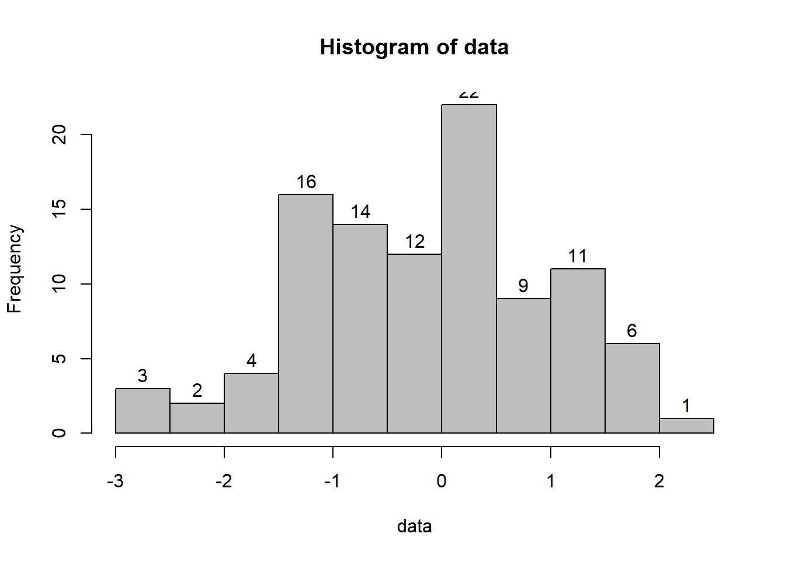

```r

# Interactive Histogram: Using 'highcharter' for a more interactive visualization.
# pacman::p_load("highcharter")
# hchart(data, type = "column", name = "Random Data Distribution")

# Box-and-Whisker Plot: Useful for visualizing the distribution and identifying outliers.
boxplot(
    count ~ spray,
    data = InsectSprays,
    col = "lightgray",
    main = "Boxplot of Insect Sprays",
    xlab = "Spray Type",
    ylab = "Count"
)
```

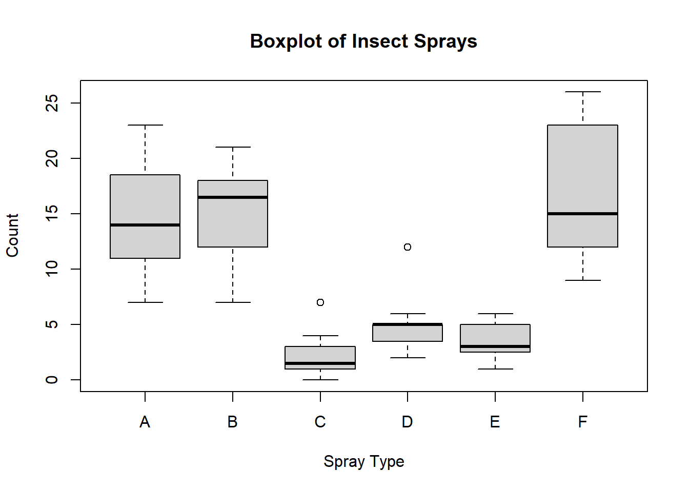

```r

# Notched Boxplot: The notches indicate a confidence interval around the median.
boxplot(
    len ~ supp * dose,
    data = ToothGrowth,
    notch = TRUE,
    col = c("gold", "darkgreen"),
    main = "Tooth Growth by Supplement and Dose",
    xlab = "Supplement and Dose",
    ylab = "Length"
)
```

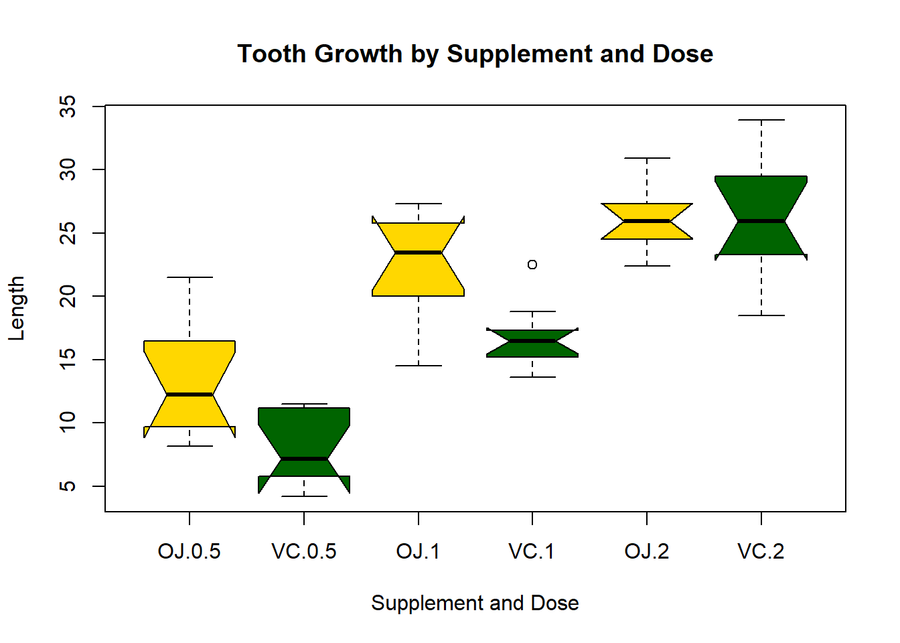

```r
# If the notches of two boxes do not overlap, this suggests that the medians differ significantly.

# Stem-and-Leaf Plot: Provides a quick way to visualize the distribution of data.
stem(data)
#> 
#>   The decimal point is at the |
#> 
#>   -2 | 4321000
#>   -1 | 87665
#>   -1 | 44433222111000
#>   -0 | 998888886666665555
#>   -0 | 433322221100
#>    0 | 0112233333344
#>    0 | 5666677888999999
#>    1 | 0111122344
#>    1 | 699
#>    2 | 34

# Bagplot - A 2D Boxplot Extension: Visualizes the spread and identifies outliers in two-dimensional data.
pacman::p_load(aplpack)
attach(mtcars)
bagplot(wt,
        mpg,
        xlab = "Car Weight",
        ylab = "Miles Per Gallon",
        main = "Bagplot of Car Weight vs. Miles Per Gallon")
```

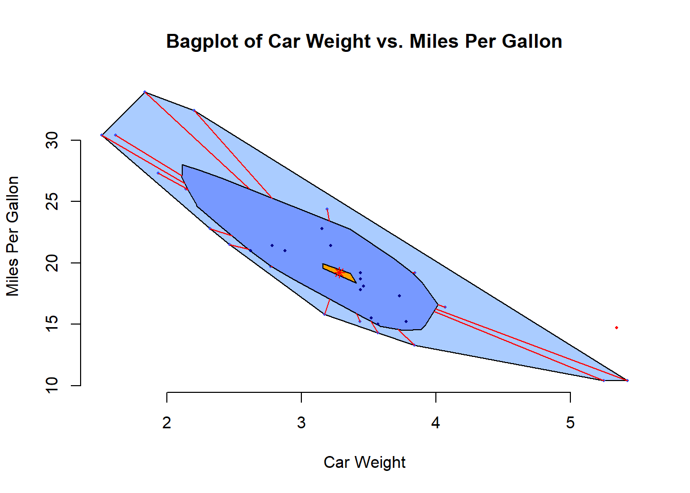

```r
detach(mtcars)
```

Below are some advanced plot types that can provide deeper insights into data:


```r
# boxplot.matrix(): Creates boxplots for each column in a matrix. Useful for comparing multiple variables.
graphics::boxplot.matrix(
    cbind(
        Uni05 = (1:100) / 21,
        Norm = rnorm(100),
        T5 = rt(100, df = 5),
        Gam2 = rgamma(100, shape = 2)
    ),
    main = "Boxplot Marix",
    notch = TRUE,
    col = 1:4
)
```

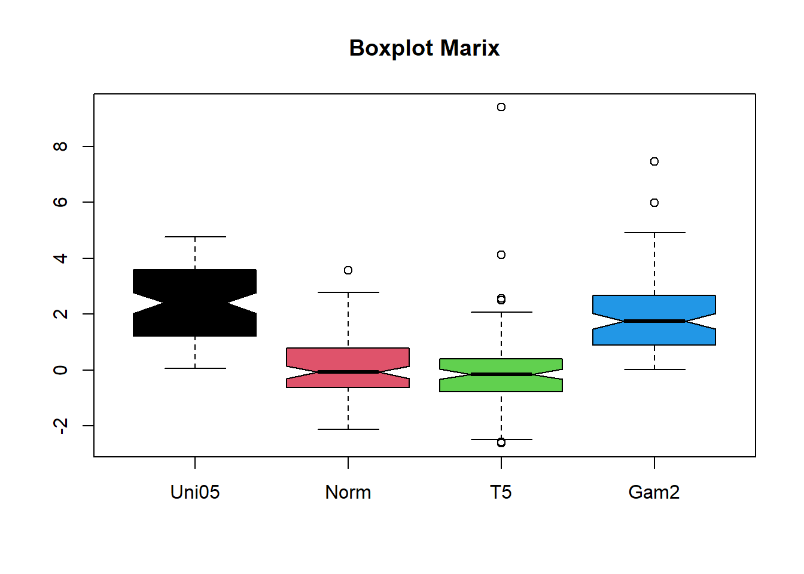

```r

# Violin Plot (vioplot()): Combines a boxplot with a density plot, providing more information about the distribution.
library("vioplot")
vioplot(data, col = "lightblue", main = "Violin Plot Example")
```

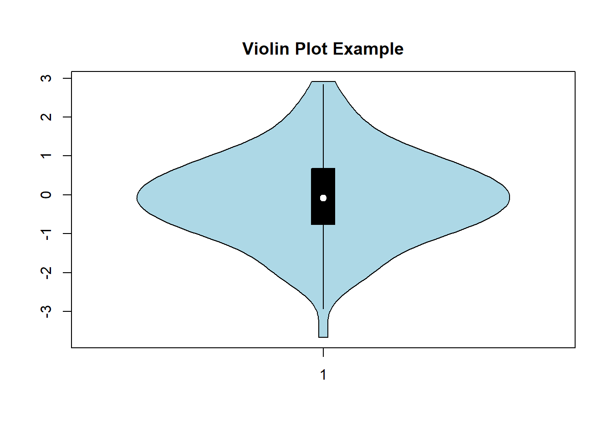

### Scatterplot

Scatterplots are useful for visualizing relationships between two continuous variables. They help identify patterns, correlations, and outliers.

Pairwise Scatterplots: Visualizes relationships between all pairs of variables in a dataset. This is especially useful for exploring potential correlations.


```r
pairs(mtcars,
      main = "Pairwise Scatterplots",
      pch = 19,
      col = "blue")
```

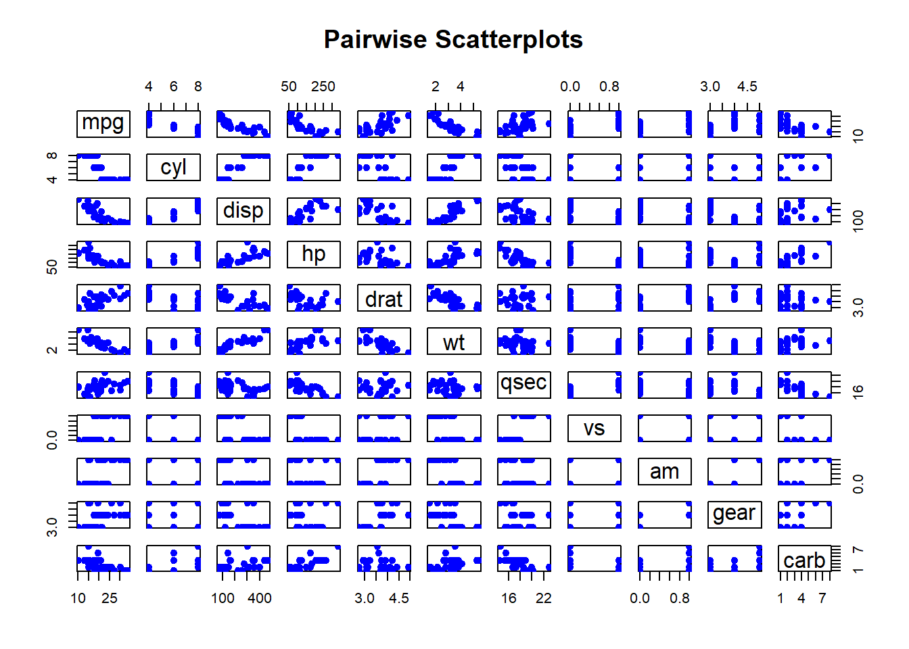

## Normality Assessment

The Normal (Gaussian) distribution plays a critical role in statistical analyses due to its theoretical and practical applications. Many statistical methods assume normality in the data, making it essential to assess whether our variable of interest follows a normal distribution. To achieve this, we utilize both [Numerical Measures] and [Graphical Assessment].

### Graphical Assessment

Graphical methods provide an intuitive way to visually inspect the normality of a dataset. One of the most common methods is the **Q-Q plot** (quantile-quantile plot). The Q-Q plot compares the quantiles of the sample data to the quantiles of a theoretical normal distribution. Deviations from the line indicate departures from normality.

Below is an example of using the `qqnorm` and `qqline` functions in R to assess the normality of the `precip` dataset, which contains precipitation data (in inches per year) for 70 U.S. cities:


```r
# Load the required package
pacman::p_load("car")

# Generate a Q-Q plot
qqnorm(precip,
       ylab = "Precipitation [in/yr] for 70 US cities",
       main = "Q-Q Plot of Precipitation Data")
qqline(precip, col = "red")
```


**Interpretation**

-   **Theoretical Line**: The red line represents the expected relationship if the data were perfectly normally distributed.

-   **Data Points**: The dots represent the actual empirical data.

If the points closely align with the theoretical line, we can conclude that the data likely follow a normal distribution. However, noticeable deviations from the line, particularly systematic patterns (e.g., curves or s-shaped patterns), indicate potential departures from normality.

Tips

1.  **Small Deviations**: Minor deviations from the line in small datasets are not uncommon and may not significantly impact analyses that assume normality.

2.  **Systematic Patterns**: Look for clear trends, such as clusters or s-shaped curves, which suggest skewness or heavy tails.

3.  **Complementary Tests**: Always pair graphical methods with numerical measures (e.g., Shapiro-Wilk test) to make a robust conclusion.

When interpreting a Q-Q plot, it is helpful to see both ideal and non-ideal scenarios. Below is an illustrative example:

1.  **Normal Data**: Points fall closely along the line.

2.  **Skewed Data**: Points systematically deviate from the line, curving upward or downward.

3.  **Heavy Tails**: Points deviate at the extremes (ends) of the distribution.

By combining visual inspection and numerical measures, we can better understand the nature of our data and its alignment with the assumption of normality.

### Summary Statistics

While graphical assessments, such as Q-Q plots, provide a visual indication of normality, they may not always offer a definitive conclusion. To supplement graphical methods, statistical tests are often employed. These tests provide quantitative evidence to support or refute the assumption of normality. The most common methods can be classified into two categories:

-   [Methods Based on Normal Probability Plot]

    -   [Correlation Coefficient with Normal Probability Plots]
    -   [Shapiro-Wilk Test]

-   [Methods based on empirical cumulative distribution function]

    -   [Anderson-Darling Test]
    -   [Kolmogorov-Smirnov Test]
    -   [Cramer-von Mises Test]
    -   [Jarque--Bera Test](#jarquebera-test)

#### Methods Based on Normal Probability Plot

##### Correlation Coefficient with Normal Probability Plots

As described by @Looney_1985 and @Shapiro_1972, this method evaluates the linearity of a normal probability plot by calculating the correlation coefficient between the ordered sample values $y_{(i)}$ and their theoretical normal quantiles $m_i^*$. A perfectly linear relationship suggests that the data follow a normal distribution.

The correlation coefficient, denoted $W^*$, is given by:

$$
W^* = \frac{\sum_{i=1}^{n}(y_{(i)}-\bar{y})(m_i^* - 0)}{\sqrt{\sum_{i=1}^{n}(y_{(i)}-\bar{y})^2 \cdot \sum_{i=1}^{n}(m_i^* - 0)^2}}
$$

where:

-   $\bar{y}$ is the sample mean,

-   $\bar{m^*} = 0$ under the null hypothesis of normality.

The **Pearson product-moment correlation formula** can also be used to evaluate this relationship:

$$
\hat{\rho} = \frac{\sum_{i=1}^{n}(y_i - \bar{y})(x_i - \bar{x})}{\sqrt{\sum_{i=1}^{n}(y_i - \bar{y})^2 \cdot \sum_{i=1}^{n}(x_i - \bar{x})^2}}
$$

-   **Interpretation**:
    -   When the correlation is 1, the plot is exactly linear, and normality is assumed.
    -   The closer the correlation is to 0, the stronger the evidence to reject normality.
    -   Inference on $W^*$ requires reference to special tables [@Looney_1985].


```r
library("EnvStats")

# Perform Probability Plot Correlation Coefficient (PPCC) Test
gofTest(data, test = "ppcc")$p.value # Probability Plot Correlation Coefficient
#> [1] 0.3701575
```

##### Shapiro-Wilk Test

The Shapiro-Wilk test [@Shapiro_1965] is one of the most widely used tests for assessing normality, especially for sample sizes $n < 2000$. This test evaluates how well the data's order statistics match a theoretical normal distribution. The test statistic, $W$, is computed as:

$$
W=\frac{\sum_{i=1}^{n}a_i x_{(i)}}{\sum_{i=1}^{n}(x_{(i)}-\bar{x})^2} 
$$

where

-   $n$: The sample size.

-   $x_{(i)}$: The $i$-th smallest value in the sample (the ordered data).

-   $\bar{x}$: The sample mean.

-   $a_i$: Weights derived from the expected values and variances of the order statistics of a normal distribution, precomputed based on the sample size $n$.

**Sensitive** to:

1.  **Symmetry**
    -   The Shapiro-Wilk test assesses whether a sample is drawn from a normal distribution, which assumes **symmetry** around the mean.
    -   If the data exhibit skewness (a lack of symmetry), the test is likely to reject the null hypothesis of normality.
2.  **Heavy Tails**
    -   Heavy tails refer to distributions where extreme values (outliers) are more likely compared to a normal distribution.
    -   The Shapiro-Wilk test is also sensitive to such departures from normality because heavy tails affect the spread and variance, which are central to the calculation of the test statistic $W$.

Hence, the Shapiro-Wilk test's sensitivity to these deviations makes it a powerful tool for detecting non-normality only in small to moderate-sized samples. However:

-   It is generally more sensitive to **symmetry** (skewness) than to **tail behavior** (kurtosis).

-   In very large samples, even small deviations in symmetry or tail behavior may cause the test to reject the null hypothesis, even if the data is practically "normal" for the intended analysis.

    -   Small sample sizes may lack power to detect deviations from normality.

    -   Large sample sizes may detect minor deviations that are not practically significant.

**Key Steps**:

1.  **Sort the Data:** Arrange the sample data in ascending order, yielding $x_{(1)}, x_{(2)}, \dots, x_{(n)}$.

2.  **Compute Weights:** The weights $a_i$ are determined using a covariance matrix of the normal order statistics. These are optimized to maximize the power of the test.

3.  **Calculate** $W$: Use the formula to determine $W$, which ranges from 0 to 1.

**Decision Rule**:

-   **Null Hypothesis** ($H_0$): The data follows a normal distribution.

-   **Alternative Hypothesis** ($H_1$): The data does not follow a normal distribution.

-   A small $W$ value, along with a $p$-value below a chosen significance level (e.g., 0.05), leads to rejection of $H_0$.

    -   Under normality, $W$ approaches 1.

    -   Smaller values of $W$ indicate deviations from normality.


```r
# Perform Shapiro-Wilk Test (Default for gofTest)
EnvStats::gofTest(mtcars$mpg, test = "sw")
#> 
#> Results of Goodness-of-Fit Test
#> -------------------------------
#> 
#> Test Method:                     Shapiro-Wilk GOF
#> 
#> Hypothesized Distribution:       Normal
#> 
#> Estimated Parameter(s):          mean = 20.090625
#>                                  sd   =  6.026948
#> 
#> Estimation Method:               mvue
#> 
#> Data:                            mtcars$mpg
#> 
#> Sample Size:                     32
#> 
#> Test Statistic:                  W = 0.9475647
#> 
#> Test Statistic Parameter:        n = 32
#> 
#> P-value:                         0.1228814
#> 
#> Alternative Hypothesis:          True cdf does not equal the
#>                                  Normal Distribution.
```

#### Methods Based on Empirical Cumulative Distribution Function

The **Empirical Cumulative Distribution Function (ECDF)** is a way to represent the distribution of a sample dataset in cumulative terms. It answers the question:

> "What fraction of the observations in my dataset are less than or equal to a given value $x$?"

The ECDF is defined as:

$$
F_n(x) = \frac{1}{n} \sum_{i=1}^{n} \mathbb{I}(X_i \leq x)
$$

where:

-   $F_(x)$: ECDF at value $x$.

-   $n$: Total number of data points.

-   $\mathbb{I}(X_i \leq x)$: Indicator function, equal to 1 if $X_i \leq x$, otherwise 0.

This method is especially useful for large sample sizes and can be applied to distributions beyond the normal (Gaussian) distribution.

Properties of the ECDF

1.  **Step Function**: The ECDF is a step function that increases by $1/n$ at each data point.
2.  **Non-decreasing**: As $x$ increases, $F_n(x)$ never decreases.
3.  **Range**: The ECDF starts at 0 and ends at 1:
    -   $F_n(x) = 0$ for $x < \min(X)$.
    -   $F_n(x) = 1$ for $x \geq \max(X)$.
4.  **Convergence**: As $n \to \infty$, the ECDF approaches the true cumulative distribution function (CDF) of the population.

Let's consider a sample dataset $\{3, 7, 7, 10, 15\}$. The ECDF at different values of $x$ is calculated as:

| $x$      | $\mathbb{I}(X_i \leq x)$ for each $X_i$ | Count $\leq x$ | ECDF $F_n(x)$ |
|----------|-----------------------------------------|----------------|---------------|
| $x = 5$  | $\{1, 0, 0, 0, 0\}$                     | 1              | $1/5 = 0.2$   |
| $x = 7$  | $\{1, 1, 1, 0, 0\}$                     | 3              | $3/5 = 0.6$   |
| $x = 12$ | $\{1, 1, 1, 1, 0\}$                     | 4              | $4/5 = 0.8$   |
| $x = 15$ | $\{1, 1, 1, 1, 1\}$                     | 5              | $5/5 = 1.0$   |

Applications of the ECDF

1.  **Goodness-of-fit Tests**: Compare the ECDF to a theoretical CDF (e.g., using the Kolmogorov-Smirnov test).

2.  **Outlier Detection**: Analyze cumulative trends to spot unusual data points.

3.  **Visual Data Exploration**: Use the ECDF to understand the spread, skewness, and distribution of the data.

4.  **Comparing Distributions**: Compare the ECDFs of two datasets to assess differences in their distributions.


```r
# Load required libraries
library(ggplot2)

# Sample dataset
data <- c(3, 7, 7, 10, 15)

# ECDF calculation
ecdf_function <- ecdf(data)

# Generate a data frame for plotting
ecdf_data <- data.frame(x = sort(unique(data)),
                        ecdf = sapply(sort(unique(data)), function(x)
                          mean(data <= x)))

# Display ECDF values
print(ecdf_data)
#>    x ecdf
#> 1  3  0.2
#> 2  7  0.6
#> 3 10  0.8
#> 4 15  1.0

# Plot the ECDF
ggplot(ecdf_data, aes(x = x, y = ecdf)) +
  geom_step() +
  labs(
    title = "Empirical Cumulative Distribution Function",
    x = "Data Values",
    y = "Cumulative Proportion"
  ) +
  theme_minimal()
```

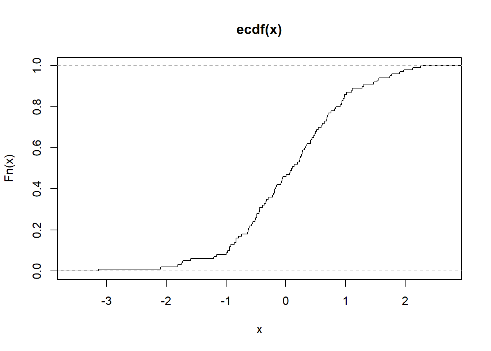


```r
# Alternatively
plot.ecdf(as.numeric(mtcars[1, ]),
          verticals = TRUE,
          do.points = FALSE)
```

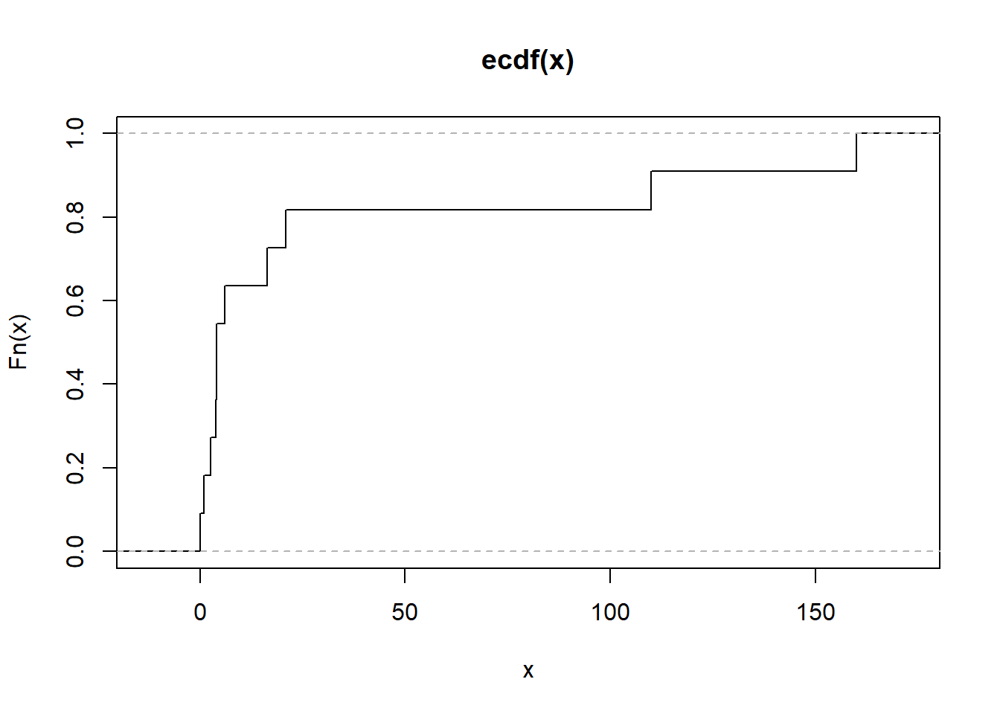

##### Anderson-Darling Test

The **Anderson-Darling test** statistic [@Anderson_1952] is given by:

$$
A^2 = \int_{-\infty}^{\infty} \frac{\left(F_n(t) - F(t)\right)^2}{F(t)(1 - F(t))} dF(t)
$$

This test calculates a weighted average of squared deviations between the empirical cumulative distribution function (CDF), $F_n(t)$, and the theoretical CDF, $F(t)$. More weight is given to deviations in the tails of the distribution, which makes the test particularly sensitive to these regions.

For a sample of size $n$, with ordered observations $y_{(1)}, y_{(2)}, \dots, y_{(n)}$, the Anderson-Darling test statistic can also be written as:

$$
A^2 = -n - \frac{1}{n} \sum_{i=1}^n \left[ (2i - 1) \ln(F(y_{(i)})) + (2n + 1 - 2i) \ln(1 - F(y_{(i)})) \right]
$$

For the **normal distribution**, the test statistic is further simplified. Using the transformation:

$$
p_i = \Phi\left(\frac{y_{(i)} - \bar{y}}{s}\right),
$$

where:

-   $p_i$ is the cumulative probability under the standard normal distribution,

-   $y_{(i)}$ are the ordered sample values,

-   $\bar{y}$ is the sample mean,

-   $s$ is the sample standard deviation,

the formula becomes:

$$
A^2 = -n - \frac{1}{n} \sum_{i=1}^n \left[ (2i - 1) \ln(p_i) + (2n + 1 - 2i) \ln(1 - p_i) \right].
$$

Key Features of the Test

1.  **CDF-Based Weighting**: The Anderson-Darling test gives more weight to deviations in the tails, which makes it particularly sensitive to detecting non-normality in these regions.

2.  **Sensitivity**: Compared to other goodness-of-fit tests, such as the [Kolmogorov-Smirnov Test], the Anderson-Darling test is better at identifying differences in the tails of the distribution.

3.  **Integral Form**: The test statistic can also be expressed as an integral over the theoretical CDF: $$
    A^2 = n \int_{-\infty}^\infty \frac{\left[F_n(t) - F(t)\right]^2}{F(t)(1 - F(t))} dF(t),
    $$ where $F_n(t)$ is the empirical CDF, and $F(t)$ is the specified theoretical CDF.

4.  **Applications**:

    -   Testing for normality or other distributions (e.g., exponential, Weibull).
    -   Validating assumptions in statistical models.
    -   Comparing data to theoretical distributions.

Hypothesis Testing

-   **Null Hypothesis (**$H_0$): The data follows the specified distribution (e.g., normal distribution).
-   **Alternative Hypothesis (**$H_1$): The data does not follow the specified distribution.
-   The null hypothesis is rejected if $A^2$ is too large, indicating a poor fit to the specified distribution.

Critical values for the test statistic are provided by [@Marsaglia_2004] and [@Stephens_1974].

Applications to Other Distributions

The Anderson-Darling test can be applied to various distributions by using specific transformation methods. Examples include:

-   **Exponential**

-   **Logistic**

-   **Gumbel**

-   **Extreme-value**

-   **Weibull** (after logarithmic transformation: $\log(\text{Weibull}) = \text{Gumbel}$)

-   **Gamma**

-   **Cauchy**

-   **von Mises**

-   **Log-normal (two-parameter)**

For more details on transformations and critical values, consult [@Stephens_1974].


```r
# Perform Anderson-Darling Test
library(nortest)
ad_test_result <- ad.test(mtcars$mpg)

# Output the test statistic and p-value
ad_test_result
#> 
#> 	Anderson-Darling normality test
#> 
#> data:  mtcars$mpg
#> A = 0.57968, p-value = 0.1207
```

Alternatively, for a broader range of distributions, use the `gofTest` function from the `gof` package:


```r
# General goodness-of-fit test with Anderson-Darling
library(EnvStats)
gof_test_result <- EnvStats::gofTest(mtcars$mpg, test = "ad")

# Extract the p-value
gof_test_result$p.value
#> [1] 0.1207371
```

##### Kolmogorov-Smirnov Test

The **Kolmogorov-Smirnov (K-S) test** is a nonparametric test that compares the empirical cumulative distribution function (ECDF) of a sample to a theoretical cumulative distribution function (CDF), or compares the ECDFs of two samples. It is used to assess whether a sample comes from a specific distribution (one-sample test) or to compare two samples (two-sample test).

The test statistic $D_n$ for the one-sample test is defined as:

$$
D_n = \sup_x \left| F_n(x) - F(x) \right|,
$$

where:

-   $F_n(x)$ is the empirical CDF of the sample,

-   $F(x)$ is the theoretical CDF under the null hypothesis,

-   $\sup_x$ denotes the supremum (largest value) over all possible values of $x$.

For the two-sample K-S test, the statistic is:

$$
D_{n,m} = \sup_x \left| F_{n,1}(x) - F_{m,2}(x) \right|,
$$

where $F_{n,1}(x)$ and $F_{m,2}(x)$ are the empirical CDFs of the two samples, with sizes $n$ and $m$, respectively.

Hypotheses

-   **Null hypothesis (**$H_0$): The sample comes from the specified distribution (one-sample) or the two samples are drawn from the same distribution (two-sample).
-   **Alternative hypothesis (**$H_1$): The sample does not come from the specified distribution (one-sample) or the two samples are drawn from different distributions (two-sample).

Properties

1.  **Based on the Largest Deviation**: The K-S test is sensitive to the largest absolute difference between the empirical and expected CDFs, making it effective for detecting shifts in location or scale.

2.  **Distribution-Free**: The test does not assume a specific distribution for the data under the null hypothesis. Its significance level is determined from the distribution of the test statistic under the null hypothesis.

3.  **Limitations**:

    -   The test is more sensitive near the center of the distribution than in the tails.
    -   It may not perform well with discrete data or small sample sizes.

4.  **Related Tests**:

    -   **Kuiper's Test**: A variation of the K-S test that is sensitive to deviations in both the center and tails of the distribution. The Kuiper test statistic is: $$
        V_n = D^+ + D^-,
        $$ where $D^+$ and $D^-$ are the maximum positive and negative deviations of the empirical CDF from the theoretical CDF.

Applications

-   Testing for normality or other specified distributions.
-   Comparing two datasets to determine if they are drawn from the same distribution.

To perform a one-sample K-S test in R, use the `ks.test()` function. To check the goodness of fit for a specific distribution, the `gofTest()` function from a package like `DescTools` can also be used.


```r
# One-sample Kolmogorov-Smirnov test for normality
data <- rnorm(50)  # Generate random normal data
ks.test(data, "pnorm", mean(data), sd(data))
#> 
#> 	Exact one-sample Kolmogorov-Smirnov test
#> 
#> data:  data
#> D = 0.098643, p-value = 0.6785
#> alternative hypothesis: two-sided

# Goodness-of-fit test using gofTest
library(DescTools)
gofTest(data, test = "ks")$p.value  # Kolmogorov-Smirnov test p-value
#> [1] 0.6785444
```

-   **Advantages**:

    -   Simple and widely applicable.

    -   Distribution-free under the null hypothesis.

-   **Limitations**:

    -   Sensitive to sample size: small deviations may lead to significance in large samples.

    -   Reduced sensitivity to differences in the tails compared to the Anderson-Darling test.

The Kolmogorov-Smirnov test provides a general-purpose method for goodness-of-fit testing and sample comparison, with particular utility in detecting central deviations.

##### Cramer-von Mises Test

The **Cramer-von Mises (CVM) test** is a nonparametric goodness-of-fit test that evaluates the agreement between the empirical cumulative distribution function (ECDF) of a sample and a specified theoretical cumulative distribution function (CDF). Unlike the [Kolmogorov-Smirnov test], which focuses on the largest discrepancy, the Cramer-von Mises test considers the **average squared discrepancy** across the entire distribution. Unlike the [Anderson-Darling test], it weights all parts of the distribution equally.

The test statistic $W^2$ for the one-sample Cramer-von Mises test is defined as:

$$
W^2 = n \int_{-\infty}^\infty \left[ F_n(t) - F(t) \right]^2 dF(t),
$$

where:

-   $F_n(t)$ is the empirical CDF,

-   $F(t)$ is the specified theoretical CDF under the null hypothesis,

-   $n$ is the sample size.

In practice, $W^2$ is computed using the ordered sample values $y_{(1)}, y_{(2)}, \dots, y_{(n)}$ as:

$$
W^2 = \sum_{i=1}^n \left( F(y_{(i)}) - \frac{2i - 1}{2n} \right)^2 + \frac{1}{12n},
$$

where:

-   $F(y_{(i)})$ is the theoretical CDF evaluated at the ordered sample values $y_{(i)}$.

Hypotheses

-   **Null hypothesis (H0)**: The sample data follow the specified distribution.
-   **Alternative hypothesis (H1)**: The sample data do not follow the specified distribution.

Properties

1.  **Focus on Average Discrepancy**: The Cramer-von Mises test measures the overall goodness-of-fit by considering the squared deviations across all points in the distribution, ensuring equal weighting of discrepancies.

2.  **Comparison to Anderson-Darling**: Unlike the Anderson-Darling test, which gives more weight to deviations in the tails, the CVM test weights all parts of the distribution equally.

3.  **Integral Representation**: The statistic is expressed as an integral over the squared differences between the empirical and theoretical CDFs.

4.  **Two-Sample Test**: The Cramer-von Mises framework can also be extended to compare two empirical CDFs. The two-sample statistic is based on the pooled empirical CDF.

Applications

-   Assessing goodness-of-fit for a theoretical distribution (e.g., normal, exponential, Weibull).
-   Comparing two datasets to determine if they are drawn from similar distributions.
-   Validating model assumptions.

To perform a Cramer-von Mises test in R, the `gofTest()` function from the `DescTools` package can be used. Below is an example:


```r
# Generate random normal data
data <- rnorm(50)

# Perform the Cramer-von Mises test
library(DescTools)
gofTest(data, test = "cvm")$p.value  # Cramer-von Mises test p-value
#> [1] 0.04846959
```

-   **Advantages**:

    -   Considers discrepancies across the entire distribution.

    -   Robust to outliers due to equal weighting.

    -   Simple to compute and interpret.

-   **Limitations**:

    -   Less sensitive to deviations in the tails compared to the Anderson-Darling test.

    -   May be less powerful than the Kolmogorov-Smirnov test in detecting central shifts.

##### Jarque-Bera Test {#jarquebera-test}

The **Jarque-Bera (JB) test** [@Bera_1981] is a goodness-of-fit test used to check whether a dataset follows a normal distribution. It is based on the **skewness** and **kurtosis** of the data, which measure the asymmetry and the "tailedness" of the distribution, respectively.

The Jarque-Bera test statistic is defined as:

$$
JB = \frac{n}{6}\left(S^2 + \frac{(K - 3)^2}{4}\right),
$$

where:

-   $n$ is the sample size,

-   $S$ is the sample skewness,

-   $K$ is the sample kurtosis.

Skewness ($S$) is calculated as:

$$
S = \frac{\hat{\mu}_3}{\hat{\sigma}^3} = \frac{\frac{1}{n} \sum_{i=1}^n (x_i - \bar{x})^3}{\left(\frac{1}{n} \sum_{i=1}^n (x_i - \bar{x})^2\right)^{3/2}},
$$

where:

-   $\hat{\mu}_3$ is the third central moment,

-   $\hat{\sigma}$ is the standard deviation,

-   $\bar{x}$ is the sample mean.

Kurtosis ($K$) is calculated as:

$$
K = \frac{\hat{\mu}_4}{\hat{\sigma}^4} = \frac{\frac{1}{n} \sum_{i=1}^n (x_i - \bar{x})^4}{\left(\frac{1}{n} \sum_{i=1}^n (x_i - \bar{x})^2\right)^2},
$$

where:

-   $\hat{\mu}_4$ is the fourth central moment.

Hypothesis

-   **Null hypothesis (**$H_0$): The data follow a normal distribution, implying:
    -   Skewness $S = 0$,
    -   Excess kurtosis $K - 3 = 0$.
-   **Alternative hypothesis (**$H_1$): The data do not follow a normal distribution.

**Distribution of the JB Statistic**

Under the null hypothesis, the Jarque-Bera statistic asymptotically follows a chi-squared distribution with 2 degrees of freedom:

$$
JB \sim \chi^2_2.
$$

Properties

1.  **Sensitivity**:
    -   Skewness ($S$) captures asymmetry in the data.
    -   Kurtosis ($K$) measures how heavy-tailed or light-tailed the distribution is compared to a normal distribution.
2.  **Limitations**:
    -   The test is sensitive to large sample sizes; even small deviations from normality may result in rejection of $H_0$.
    -   Assumes that the data are independently and identically distributed.

Applications

-   Testing normality in regression residuals.
-   Validating distributional assumptions in econometrics and time series analysis.

The Jarque-Bera test can be performed in R using the `tseries` package:


```r
library(tseries)

# Generate a sample dataset
data <- rnorm(100)  # Normally distributed data

# Perform the Jarque-Bera test
jarque.bera.test(data)
#> 
#> 	Jarque Bera Test
#> 
#> data:  data
#> X-squared = 0.89476, df = 2, p-value = 0.6393
```

## Bivariate Statistics

Bivariate statistics involve the analysis of relationships between two variables. Understanding these relationships can provide insights into patterns, associations, or (suggestive of) causal connections. Below, we explore the correlation between different types of variables:

-   [Two Continuous] **Variables**
-   [Two Discrete] **Variables**
-   [Categorical and Continuous] **Variables**

Before delving into the analysis, it is critical to consider the following:

1.  **Is the relationship linear or non-linear?**
    -   Linear relationships can be modeled with simpler statistical methods such as Pearson's correlation, while non-linear relationships may require alternative approaches, such as Spearman's rank correlation or regression with transformations.
2.  **If the variable is continuous, is it normal and homoskedastic?**
    -   For parametric methods like Pearson's correlation, assumptions such as normality and homoskedasticity (equal variance) must be met. When these assumptions fail, non-parametric methods like Spearman's correlation or robust alternatives are preferred.
3.  **How big is your dataset?**
    -   Large datasets can reveal subtle patterns but may lead to statistically significant results that are not practically meaningful. For smaller datasets, careful selection of statistical methods is essential to ensure reliability and validity.

+-----------------+------------------------------------------------------------+-----------------------------------------------+
|                 | Categorical                                                | Continuous                                    |
+=================+============================================================+===============================================+
| **Categorical** | [Chi-squared Test]                                         |                                               |
|                 |                                                            |                                               |
|                 | [Phi Coefficient]                                          |                                               |
|                 |                                                            |                                               |
|                 | [Cramer's V](#cramers-v)                                   |                                               |
|                 |                                                            |                                               |
|                 | [Tschuprow's T](#tschuprows-t)                             |                                               |
|                 |                                                            |                                               |
|                 | [Spearman's Rank Correlation](#spearmans-rank-correlation) |                                               |
|                 |                                                            |                                               |
|                 | [Kendall's Tau](#kendalls-tau)                             |                                               |
|                 |                                                            |                                               |
|                 | [Gamma Statistic]                                          |                                               |
|                 |                                                            |                                               |
|                 | [Freeman's Theta](#freemans-theta)                         |                                               |
|                 |                                                            |                                               |
|                 | [Epsilon-squared]                                          |                                               |
|                 |                                                            |                                               |
|                 | [Goodman Kruskal's Gamma](#goodman-kruskals-gamma)         |                                               |
|                 |                                                            |                                               |
|                 | [Somers' D](#somers-d)                                     |                                               |
|                 |                                                            |                                               |
|                 | [Kendall's Tau-b](#kendalls-tau-b)                         |                                               |
|                 |                                                            |                                               |
|                 | [Yule's Q and Y](#yules-q-and-y)                           |                                               |
|                 |                                                            |                                               |
|                 | [Tetrachoric Correlation]                                  |                                               |
|                 |                                                            |                                               |
|                 | [Polychoric Correlation]                                   |                                               |
+-----------------+------------------------------------------------------------+-----------------------------------------------+
| **Continuous**  | [Point-Biserial Correlation]                               | [Pearson Correlation](#pearson-correlation-1) |
|                 |                                                            |                                               |
|                 | [Logistic Regression]                                      | [Spearman Correlation]                        |
+-----------------+------------------------------------------------------------+-----------------------------------------------+

### Two Continuous


```r
set.seed(1)
n = 100 # (sample size)

data = data.frame(A = sample(1:20, replace = TRUE, size = n),
                  B = sample(1:30, replace = TRUE, size = n))
```

#### Pearson Correlation

**Pearson correlation** quantifies the strength and direction of a **linear relationship** between two continuous variables.

Formula:

$$
r = \frac{\sum (x_i - \bar{x})(y_i - \bar{y})}{\sqrt{\sum (x_i - \bar{x})^2 \cdot \sum (y_i - \bar{y})^2}}
$$ where

-   $x_i, y_i$: Individual data points of variables $X$ and $Y$.

-   $\bar{x}, \bar{y}$: Means of $X$ and $Y$.

**Assumptions**:

1.  The relationship between variables is **linear**.
2.  Variables are **normally distributed**.
3.  Data exhibits **homoscedasticity** (equal variance of $Y$ for all values of $X$).

Use Case:

-   Use when the relationship is expected to be linear, and assumptions of normality and homoscedasticity are met.

Interpretation:

-   $r = +1$: Perfect positive linear relationship.
-   $r = -1$: Perfect negative linear relationship.
-   $r = 0$: No linear relationship.


```r
# Pearson correlation
pearson_corr <- stats::cor(data$A, data$B, method = "pearson")
cat("Pearson Correlation (r):", pearson_corr, "\n")
#> Pearson Correlation (r): 0.02394939
```

#### Spearman Correlation

**Spearman correlation** measures the strength of a **monotonic relationship** between two variables. It ranks the data and calculates correlation based on ranks.

Formula:

$$
\rho = 1 - \frac{6 \sum d_i^2}{n(n^2 -1)}
$$

where

-   $d_i$: Difference between the ranks of $x_i$ and $y_i$.
-   $n$: Number of paired observations.

**Assumptions**:

1.  Relationship must be **monotonic**, not necessarily linear.

2.  No assumptions about the distribution of variables.

Use Case:

-   Use when data is ordinal or when normality and linearity assumptions are violated.

Interpretation:

-   $\rho = +1$: Perfect positive monotonic relationship.

-   $\rho = -1$: Perfect negative monotonic relationship.

-   $\rho = 0$: No monotonic relationship.


```r
# Spearman correlation
spearman_corr <- stats::cor(data$A, data$B, method = "spearman")
cat("Spearman Correlation (rho):", spearman_corr, "\n")
#> Spearman Correlation (rho): 0.02304636
```

#### Kendall's Tau Correlation

**Kendall's Tau** measures the strength of a **monotonic relationship** by comparing concordant and discordant pairs.

Formula:

$$
\tau = \frac{(C- D)}{\binom{n}{2}}
$$

where​

-   $C$: Number of concordant pairs (where ranks of $X$ and $Y$ increase or decrease together).

-   $D$: Number of discordant pairs (where one rank increases while the other decreases).

-   $\binom{n}{2}$: Total number of possible pairs.

**Assumptions**:

1.  No specific assumptions about the data distribution.

2.  Measures monotonic relationships.

Use Case:

-   Preferred for small datasets or when data contains outliers.

Interpretation:

-   $\tau = +1$: Perfect positive monotonic relationship.

-   $\tau = -1$: Perfect negative monotonic relationship.

-   $\tau = 0$: No monotonic relationship.


```r
# Kendall's Tau correlation
kendall_corr <- stats::cor(data$A, data$B, method = "kendall")
cat("Kendall's Tau Correlation (tau):", kendall_corr, "\n")
#> Kendall's Tau Correlation (tau): 0.02171284
```

#### Distance Correlation

**Distance Correlation** measures both **linear and non-linear relationships** between variables. It does not require monotonicity or linearity.

Formula:

$$
d Cor = \frac{d Cov(X,Y)}{\sqrt{d Var (X) \cdot d Var (Y)}}
$$

where​

-   $dCov$: Distance covariance between $X$ and $Y$.

-   $dVar$: Distance variances of $X$ and $Y$.

**Assumptions:**

-   No specific assumptions about the relationship (linear, monotonic, or otherwise).

Use Case:

-   Use for complex relationships, including non-linear patterns.

Interpretation:

-   $dCor = 0$: No association.

-   $dCor = 1$: Perfect association.


```r
# Distance correlation
distance_corr <- energy::dcor(data$A, data$B)
cat("Distance Correlation (dCor):", distance_corr, "\n")
#> Distance Correlation (dCor): 0.1008934
```

#### Summary Table of Correlation Methods

| Method                   | Formula/Approach               | Detects Relationship Type | Assumptions                 | Sensitivity to Outliers | Use Case                            |
|--------------------------|--------------------------------|---------------------------|-----------------------------|-------------------------|-------------------------------------|
| **Pearson**              | Linear covariance              | Linear                    | Normality, homoscedasticity | High                    | Linear relationships.               |
| **Spearman**             | Ranks and monotonicity formula | Monotonic                 | None                        | Moderate                | Monotonic, non-linear data.         |
| **Kendall's Tau**        | Concordance/discordance ratio  | Monotonic                 | None                        | Low                     | Small datasets, robust to outliers. |
| **Distance Correlation** | Distance-based variance        | Linear and non-linear     | None                        | Low                     | Complex, non-linear relationships.  |

### Categorical and Continuous

Analyzing the relationship between a **categorical variable** (binary or multi-class) and a **continuous variable** requires specialized techniques. These methods assess whether the categorical variable significantly influences the continuous variable or vice versa.

We focus on the following methods:

1.  [Point-Biserial Correlation]
2.  [Logistic Regression]
3.  [Analysis of Variance (ANOVA)]
4.  T-test

#### Point-Biserial Correlation

The **Point-Biserial Correlation** is a special case of the Pearson correlation used to assess the relationship between a **binary categorical variable** (coded as 0 and 1) and a continuous variable. It measures the strength and direction of the linear relationship.

Formula:

$$
r_{pb} = \frac{\bar{Y_1} - \bar{Y_0}}{s_Y} \sqrt{\frac{n_1 n_0}{n^2}}
$$

where

-   $\bar{Y_1}$, $\bar{Y_0}$: Mean of the continuous variable for the groups coded as 1 and 0, respectively.

-   $s_Y$: Standard deviation of the continuous variable.

-   $n_1, n_0$: Number of observations in each group (1 and 0).

-   $n$: Total number of observations.

Key Properties:

-   **Range**: $-1$ to $1$.
    -   $r_{pb} = +1$: Perfect positive correlation.
    -   $r_{pb} = -1$: Perfect negative correlation.
    -   $r_{pb} = 0$: No linear relationship.
-   A positive $r_{pb}$ indicates higher values of the continuous variable are associated with the 1 group, while a negative $r_{pb}$ indicates the opposite.

**Assumptions**:

1.  The binary variable is **truly dichotomous** (e.g., male/female, success/failure).
2.  The continuous variable is approximately **normally distributed**.
3.  Homogeneity of variance across the two groups (not strictly required but recommended).

Use Case:

-   To evaluate the linear relationship between a binary categorical variable and a continuous variable.


```r
library(ltm)
# Point-Biserial Correlation
biserial_corr <- ltm::biserial.cor(
  c(12.5, 15.3, 10.7, 18.1, 11.2, 16.8, 13.4, 14.9), 
  c(0, 1, 0, 1, 0, 1, 0, 1), 
  use = "all.obs", 
  level = 2
)
cat("Point-Biserial Correlation:", biserial_corr, "\n")
#> Point-Biserial Correlation: 0.8792835
```

#### Logistic Regression

**Logistic Regression** models the relationship between a **binary categorical variable** (dependent variable) and one or more independent variables (which may include continuous variables). It predicts the probability of the binary outcome (e.g., success/failure, yes/no).

Refer to \@ref(logistic-regression) for more detail.

Formula:

The logistic regression model is represented as:

$$
\text{logit}(p) = \ln \left( \frac{p}{1 - p} \right) = \beta_0 + \beta_1 X
$$

where

-   $p$: Probability of the outcome being 1.

-   $\beta_0$: Intercept.

-   $\beta_1$: Coefficient for the continuous variable $X$.

-   $\text{logit}(p)$: Log-odds of the probability.

Key Features:

-   **Output**: Odds ratio or probability of the binary outcome.

-   Can include multiple predictors (continuous and categorical).

-   Non-linear transformation ensures predictions are probabilities between 0 and 1.

**Assumptions**:

1.  The dependent variable is **binary**.

2.  Observations are **independent**.

3.  There is a **linear relationship** between the logit of the dependent variable and the independent variable.

4.  No **multicollinearity** between predictors.

Use Case:

-   To predict the likelihood of a binary outcome based on a continuous predictor (e.g., probability of success given test scores).


```r
# Simulated data
set.seed(123)
x <- rnorm(100, mean = 50, sd = 10)  # Continuous predictor
y <- ifelse(x > 55, 1, 0)  # Binary outcome based on threshold

# Logistic Regression
logistic_model <- glm(y ~ x, family = binomial)
summary(logistic_model)
#> 
#> Call:
#> glm(formula = y ~ x, family = binomial)
#> 
#> Deviance Residuals: 
#>        Min          1Q      Median          3Q         Max  
#> -2.770e-04  -2.100e-08  -2.100e-08   2.100e-08   2.548e-04  
#> 
#> Coefficients:
#>             Estimate Std. Error z value Pr(>|z|)
#> (Intercept)  -3749.9   495083.0  -0.008    0.994
#> x               67.9     8966.6   0.008    0.994
#> 
#> (Dispersion parameter for binomial family taken to be 1)
#> 
#>     Null deviance: 1.2217e+02  on 99  degrees of freedom
#> Residual deviance: 1.4317e-07  on 98  degrees of freedom
#> AIC: 4
#> 
#> Number of Fisher Scoring iterations: 25

# Predicted probabilities
predicted_probs <- predict(logistic_model, type = "response")
print(head(predicted_probs))
#>         1         2         3         4         5         6 
#> -735.6466 -511.3844  703.2134 -307.2281 -267.3187  809.3747
```


```r
# Visualize logistic regression curve
library(ggplot2)
data <- data.frame(x = x, y = y, predicted = predicted_probs)

ggplot(data, aes(x = x, y = predicted)) +
    geom_point(aes(y = y), color = "red", alpha = 0.5) +
    geom_line(color = "blue") +
    labs(title = "Logistic Regression: Continuous vs Binary",
         x = "Continuous Predictor", y = "Predicted Probability")
```

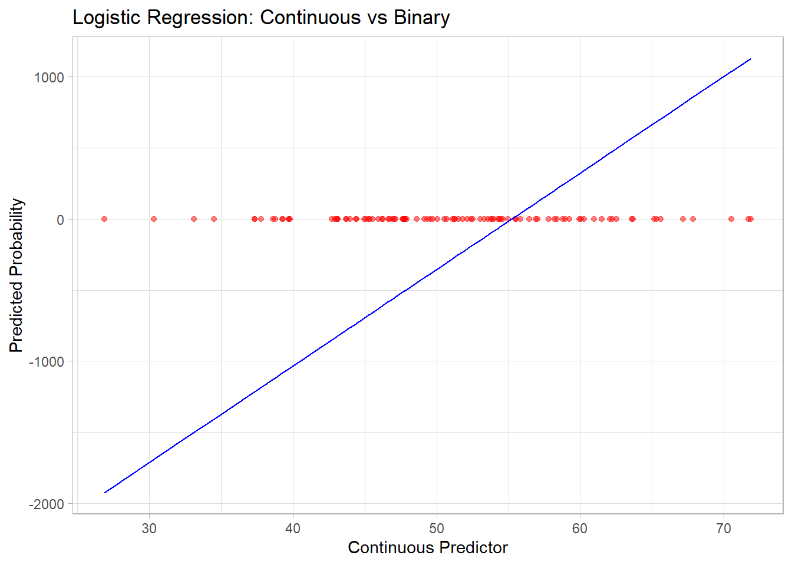

#### Summary Table of Methods (Between Categorical and Continuous)

| Method                         | Type of Variable Relationship         | Key Assumptions                    | Use Case                               |
|--------------------------------|---------------------------------------|------------------------------------|----------------------------------------|
| **Point-Biserial Correlation** | Binary Categorical vs Continuous      | Linear, normality (continuous)     | Assess linear association.             |
| **Logistic Regression**        | Continuous → Binary Categorical       | Logit-linear relationship          | Predict probability of binary outcome. |
| **ANOVA**                      | Multi-level Categorical vs Continuous | Normality, homogeneity of variance | Compare means across groups.           |
| **T-Test**                     | Binary Categorical vs Continuous      | Normality, equal variance          | Compare means between two groups.      |

### Two Discrete

When analyzing the relationship between two **discrete variables** (categorical or ordinal), various methods are available to quantify the degree of association or similarity. These methods can broadly be classified into:

1.  [Distance Metrics]

2.  [Statistical Metrics]

------------------------------------------------------------------------

#### Distance Metrics

Distance metrics measure the **dissimilarity** between two discrete variables and are often used as a proxy for correlation in specific applications like clustering or machine learning.

##### Euclidean Distance

$$
d(x, y) = \sqrt{\sum_{i=1}^n (x_i - y_i)^2}
$$

-   Measures the straight-line distance between two variables in Euclidean space.

-   Sensitive to scaling; variables should be normalized for meaningful comparisons.

##### Manhattan Distance

$$
d(x, y) = \sum_{i=1}^n |x_i - y_i|
$$

-   Measures distance by summing the absolute differences along each dimension.

-   Also called **L1 norm**; often used in grid-based problems.

##### Chebyshev Distance

$$
d(x, y) = \max_{i=1}^n |x_i - y_i|
$$

-   Measures the maximum single-step distance along any dimension.

-   Useful in discrete, grid-based problems (e.g., chess moves).

##### Minkowski Distance

$$
d(x, y) = \left( \sum_{i=1}^n |x_i - y_i|^p \right)^{1/p}
$$

-   Generalized distance metric. Special cases include:

    -   $p = 1$: Manhattan Distance.

    -   $p = 2$: Euclidean Distance.

    -   $p \to \infty$: Chebyshev Distance.

##### Canberra Distance

$$
d(x, y) = \sum_{i=1}^n \frac{|x_i - y_i|}{|x_i| + |y_i|}
$$

-   Emphasizes proportional differences, making it sensitive to smaller values.

##### Hamming Distance

$$
d(x, y) = \sum_{i=1}^n I(x_i \neq y_i)
$$

-   Counts the number of differing positions between two sequences.

-   Widely used in text similarity and binary data.

##### Cosine Similarity and Distance

$$
\text{Cosine Similarity} = \frac{\sum_{i=1}^n x_i y_i}{\sqrt{\sum_{i=1}^n x_i^2} \cdot \sqrt{\sum_{i=1}^n y_i^2}}
$$

$$
\text{Cosine Distance} = 1 - \text{Cosine Similarity}
$$

-   Measures the angle between two vectors in a high-dimensional space.

-   Often used in text and document similarity.

##### Sum of Absolute Differences

$$
d(x, y) = \sum_{i=1}^n |x_i - y_i|
$$

-   Equivalent to Manhattan Distance but without coordinate context.

##### Sum of Squared Differences

$$
d(x, y) = \sum_{i=1}^n (x_i - y_i)^2
$$

-   Equivalent to squared Euclidean Distance.

##### Mean Absolute Error

$$
\text{MAE} = \frac{1}{n} \sum_{i=1}^n |x_i - y_i|
$$

-   Measures average absolute differences.


```r
# Example data
x <- c(1, 2, 3, 4, 5)
y <- c(2, 3, 4, 5, 6)

# Compute distances
euclidean <- sqrt(sum((x - y)^2))
manhattan <- sum(abs(x - y))
chebyshev <- max(abs(x - y))
hamming <- sum(x != y)
cosine_similarity <- sum(x * y) / (sqrt(sum(x^2)) * sqrt(sum(y^2)))
cosine_distance <- 1 - cosine_similarity

# Display results
cat("Euclidean Distance:", euclidean, "\n")
#> Euclidean Distance: 2.236068
cat("Manhattan Distance:", manhattan, "\n")
#> Manhattan Distance: 5
cat("Chebyshev Distance:", chebyshev, "\n")
#> Chebyshev Distance: 1
cat("Hamming Distance:", hamming, "\n")
#> Hamming Distance: 5
cat("Cosine Distance:", cosine_distance, "\n")
#> Cosine Distance: 0.005063324
```

#### Statistical Metrics

##### Chi-squared Test

The **Chi-Squared Test** evaluates whether two categorical variables are **independent** by comparing observed and expected frequencies in a contingency table.

Formula:

$$
\chi^2 = \sum \frac{(O_i - E_i)^2}{E_i}
$$

where

-   $O_i$: Observed frequency in each cell of the table.

-   $E_i$: Expected frequency under the assumption of independence.

Steps:

1.  Construct a contingency table with observed counts.

2.  Compute expected frequencies: $E_{ij} = \frac{\text{Row Total}_i \cdot \text{Column Total}_j}{\text{Grand Total}}$

3.  Apply the Chi-squared formula.

4.  Compare $\chi^2$ with a critical value from the [Chi-squared distribution][Chi-squared Distribution].

Assumptions:

1.  Observations are **independent**.

2.  Expected frequencies should be $\geq 5$ in at least 80% of the cells.

Use Case:

-   Tests for **independence** between two nominal variables.


```r
# Example data
dt <- matrix(c(15, 25, 20, 40), nrow = 2)
rownames(dt) <- c("Group A", "Group B")
colnames(dt) <- c("Category 1", "Category 2")

# Perform Chi-Squared Test
chi_sq_test <- chisq.test(dt)
print(chi_sq_test)
#> 
#> 	Pearson's Chi-squared test with Yates' continuity correction
#> 
#> data:  dt
#> X-squared = 0.045788, df = 1, p-value = 0.8306
```

##### Phi Coefficient

The **Phi Coefficient** is a measure of association between two **binary variables**, derived from the Chi-squared statistic.

Formula:

$$
\phi = \frac{\chi^2}{n}
$$

where

-   $n$: Total sample size.

Interpretation:

-   $\phi = 0$: No association.

-   $\phi = +1$: Perfect positive association.

-   $\phi = -1$: Perfect negative association.

Use Case:

-   Suitable for **2x2 contingency tables**.
-   2 binary


```r
library(psych)

# Compute Phi Coefficient
phi_coeff <- phi(dt)
cat("Phi Coefficient:", phi_coeff, "\n")
#> Phi Coefficient: 0.04
```

##### Cramer's V {#cramers-v}

**Cramer's V** generalizes the Phi coefficient to handle contingency tables with more than two rows or columns.

Formula:

$$
V = \sqrt{\frac{\chi^2 / n}{\min(r-1, c-1)}}
$$

where​​

-   $r$: Number of rows.

-   $c$: Number of columns.

**Assumptions**:

1.  Variables are nominal.

2.  Suitable for **larger contingency tables**.

Use Case:

-   Measures the **strength of association** between nominal variables with no natural order.


```r
library(lsr)

# Simulate data
set.seed(1)
data <- data.frame(
  A = sample(1:5, replace = TRUE, size = 100),  # Nominal variable
  B = sample(1:6, replace = TRUE, size = 100)  # Nominal variable
)

# Compute Cramer's V
cramers_v <- cramersV(data$A, data$B)
cat("Cramer's V:", cramers_v, "\n")
#> Cramer's V: 0.1944616
```

Alternatively,

-   `ncchisq` noncentral Chi-square

-   `nchisqadj` Adjusted noncentral Chi-square

-   `fisher` Fisher Z transformation

-   `fisheradj` bias correction Fisher z transformation


```r
DescTools::CramerV(data, conf.level = 0.95,method = "ncchisqadj")
#>  Cramer V    lwr.ci    upr.ci 
#> 0.3472325 0.3929964 0.4033053
```

##### Adjusted Cramer's V

Adjusted versions of Cramer's V correct for bias, especially in small samples.

Adjusted formulas account for non-central Chi-squared or bias correction. Examples include:

-   **Non-central Chi-squared**: $V_{adj} = \sqrt{\frac{\chi^2_{nc} / n}{\min(r-1, c-1)}}$​

-   **Bias Correction**: $V_{adj} = V - \text{Bias Term}$


```r
library(DescTools)

# Compute Adjusted Cramer's V
cramers_v_adj <- CramerV(data, conf.level = 0.95, method = "ncchisqadj")
cramers_v_adj
#>  Cramer V    lwr.ci    upr.ci 
#> 0.3472325 0.3929964 0.4033053
```

##### Tschuprow's T {#tschuprows-t}

**Tschuprow's T** is a symmetric measure of association for nominal variables. It differs from Cramer's V by considering the product of rows and columns, making it less sensitive to asymmetrical tables.

Formula:

$$
T = \sqrt{\frac{\chi^2/n}{\sqrt{(r-1)(c-1)}}}
$$

**Assumptions**:

-   Applicable to nominal variables.

-   Suitable for contingency tables with unequal dimensions.

Use Case:

-   Preferred when table dimensions are **highly unequal**.


```r
# Compute Tschuprow's T
tschuprow_t <- DescTools::TschuprowT(data$A, data$B)
cat("Tschuprow's T:", tschuprow_t, "\n")
#> Tschuprow's T: 0.1839104
```

##### Ordinal Association (Rank correlation)

When at least one variable is **ordinal**, rank-based methods are the most appropriate as they respect the **order of the categories**. These methods are often used when relationships are monotonic (increasing or decreasing consistently) but not necessarily linear.

###### Spearman's Rank Correlation {#spearmans-rank-correlation}

**Spearman's Rank Correlation** ($\rho$) measures the strength and direction of a **monotonic relationship** between two variables. It transforms the data into ranks and calculates Pearson correlation on the ranks.

Formula:

$$
\rho = 1 - \frac{6 \sum d_i^2}{n (n^2 -1)}
$$

where​​

-   $d_i$: Difference between the ranks of the paired observations.

-   $n$: Number of paired observations.

**Assumptions**:

1.  Data must be **ordinal** or **continuous** but convertible to ranks.

2.  Relationship is **monotonic**.

Use Case:

-   Suitable for ordinal-ordinal or ordinal-continuous associations.


```r
# Simulating ordinal data
set.seed(123)
ordinal_x <- sample(1:5, 100, replace = TRUE)
ordinal_y <- sample(1:5, 100, replace = TRUE)

# Spearman's Correlation
spearman_corr <- cor(ordinal_x, ordinal_y, method = "spearman")
cat("Spearman's Correlation (rho):", spearman_corr, "\n")
#> Spearman's Correlation (rho): 0.08731195
```

###### Kendall's Tau {#kendalls-tau}

**Kendall's Tau** ($\tau$) measures the strength of a **monotonic relationship** by comparing concordant and discordant pairs.

Formula:

$$
\tau = \frac{C - D}{C + D}
$$​where

-   $C$: Number of concordant pairs (ranks increase together).

-   $D$: Number of discordant pairs (one rank increases while the other decreases).

Variants:

1.  **Kendall's Tau-a**: For data with no ties.

2.  **Kendall's Tau-b**: Adjusted for ties in ranks.

3.  **Kendall's Tau-c**: Adjusted for ties in large tables.

Use Case:

-   Ideal for small datasets or when ties are present.


```r
# Kendall's Tau
kendall_corr <- cor(ordinal_x, ordinal_y, method = "kendall")
cat("Kendall's Tau (tau):", kendall_corr, "\n")
#> Kendall's Tau (tau): 0.06795076
```

###### Gamma Statistic

The **Gamma Statistic** measures the strength of association between two ordinal variables by focusing on **concordant** and **discordant** pairs, ignoring ties.

Formula:

$$
\gamma = \frac{C- D}{C + D}
$$

Use Case:

-   Works well when there are **many ties** in the data.


```r
library(vcd)

# Simulating ordinal data
cont_table <- table(ordinal_x, ordinal_y)

# Gamma Statistic
gamma_stat <- assocstats(cont_table)$gamma
cat("Gamma Statistic:", gamma_stat, "\n")
#> Gamma Statistic:
```

###### Freeman's Theta {#freemans-theta}

**Freeman's Theta** measures the association between an **ordinal variable** and a **nominal variable**. It quantifies how well the grouping in the nominal variable explains the ordering in the ordinal variable.

Use Case:

-   Useful when analyzing relationships between ordinal predictors and nominal responses (or vice versa).


```r
rcompanion::freemanTheta(ordinal_x, ordinal_y)
#> Freeman.theta 
#>         0.094
```

###### Epsilon-squared

**Epsilon-Squared** ($\epsilon^2$) measures the proportion of variance in the **ordinal variable** explained by a **nominal variable**. It is conceptually similar to the coefficient of determination ($R^2$) in linear regression but adapted for ordinal-nominal relationships.

Formula:

$$
\epsilon^2 = \frac{\text{variance explained by group differences}}{\text{total variance}}
$$

where

-   The numerator represents the variance between ordinal categories due to differences in nominal groups.

-   The denominator is the total variance in the ordinal variable.

Use Case:

-   Quantifies the effect size when analyzing how well a nominal variable explains an ordinal variable.


```r
set.seed(123)
ordinal_x <- sample(1:5, 100, replace = TRUE)  # Ordinal variable
nominal_y <- sample(1:3, 100, replace = TRUE) # Nominal variable

# Compute Epsilon-Squared
library(rcompanion)
epsilon_squared <- rcompanion::epsilonSquared(ordinal_x,  nominal_y)
print(epsilon_squared)
#> epsilon.squared 
#>         0.00446
```

###### Goodman-Kruskal's Gamma {#goodman-kruskals-gamma}

**Goodman-Kruskal's Gamma** measures the strength of association between two **ordinal variables**. It is a rank-based measure, focusing only on **concordant** and **discordant** pairs while ignoring ties.

Formula:

$$
\gamma = \frac{C - D}{C + D}
$$

where

-   $C$: Number of concordant pairs (where ranks move in the same direction).

-   $D$: Number of discordant pairs (where ranks move in opposite directions).

Use Case:

-   Suitable for ordinal variables with many ties.


```r
n = 100 # (sample size)
set.seed(1)
dt = table(data.frame(
    A = sample(1:4, replace = TRUE, size = n), # ordinal
    B = sample(1:3, replace = TRUE, size = n)  # ordinal
)) 
dt
#>    B
#> A    1  2  3
#>   1  7 11  9
#>   2 11  6 14
#>   3  7 11  4
#>   4  6  4 10
```


```r
# Compute Goodman-Kruskal's Gamma
library(DescTools)
goodman_kruskal_gamma <- GoodmanKruskalGamma(dt, conf.level = 0.95)
cat("Goodman-Kruskal's Gamma:", goodman_kruskal_gamma, "\n")
#> Goodman-Kruskal's Gamma: 0.006781013 -0.2290321 0.2425941
```

###### Somers' D {#somers-d}

**Somers' D** (also called Somers' Delta) extends Kendall's Tau by focusing on **asymmetric relationships**, where one variable is a predictor and the other is a response.

Formula:

$$
D_{XY} = \frac{C - D}{C + D + T_Y}
$$

where

-   $T_Y$: Tied pairs in the dependent variable.

Use Case:

-   Appropriate when there is a clear predictor-response relationship between two ordinal variables.


```r
# Compute Somers' D
somers_d <- SomersDelta(dt, conf.level = 0.95)
somers_d
#>       somers       lwr.ci       upr.ci 
#>  0.005115859 -0.172800185  0.183031903
```

###### Kendall's Tau-b {#kendalls-tau-b}

**Kendall's Tau-b** is an extension of Kendall's Tau that accounts for **ties** in the data.

Formula:

$$
\tau_b = \frac{C - D}{\sqrt{(C + D+ T_X) (C + D + T_Y)}}
$$

where

-   $T_X, T_Y$: Tied pairs in each variable.

Use Case:

-   Use when ordinal data contains ties.


```r
# Compute Kendall's Tau-b
kendalls_tau_b <- KendallTauB(dt, conf.level = 0.95)
kendalls_tau_b
#>        tau_b       lwr.ci       upr.ci 
#>  0.004839732 -0.163472443  0.173151906
```

###### Yule's Q and Y {#yules-q-and-y}

**Yule's Q** and **Yule's Y** are specialized measures for **2x2 contingency tables**. They are simplified versions of Goodman-Kruskal's Gamma, designed for binary ordinal variables.​​

Use Case:

-   Ideal for binary ordinal variables in a 2x2 table.

Special version $(2 \times 2)$ of the [Goodman Kruskal's Gamma](#goodman-kruskals-gamma) coefficient.

|                | Variable 1 |     |
|----------------|------------|-----|
| **Variable 2** | a          | b   |
|                | c          | d   |

$$
\text{Yule's Q} = \frac{ad - bc}{ad + bc}
$$

We typically use Yule's $Q$ in practice while Yule's Y has the following relationship with $Q$.

$$
\text{Yule's Y} = \frac{\sqrt{ad} - \sqrt{bc}}{\sqrt{ad} + \sqrt{bc}}
$$

$$
Q = \frac{2Y}{1 + Y^2}
$$

$$
Y = \frac{1 = \sqrt{1-Q^2}}{Q}
$$


```r
# Create 2x2 table
dt_binary <- table(data.frame(
  A = sample(c(0, 1), replace = TRUE, size = n),
  B = sample(c(0, 1), replace = TRUE, size = n)
))

# Compute Yule's Q
yules_q <- YuleQ(dt_binary)
yules_q
#> [1] -0.07667474
```

###### Tetrachoric Correlation

**Tetrachoric Correlation** measures the association between two **binary variables** by assuming they represent thresholds of underlying continuous normal distributions. It is a special case of [Polychoric Correlation] when both variables are binary


```r
# Simulate binary data
library(psych)
data_binary <- data.frame(
  A = sample(c(0, 1), replace = TRUE, size = n),
  B = sample(c(0, 1), replace = TRUE, size = n)
)

# Compute Tetrachoric Correlation
tetrachoric_corr <- tetrachoric(data_binary)
print(tetrachoric_corr)
#> Call: tetrachoric(x = data_binary)
#> tetrachoric correlation 
#>   A    B   
#> A 1.00     
#> B 0.31 1.00
#> 
#>  with tau of 
#>      A      B 
#>  0.126 -0.025
```

###### Polychoric Correlation

**Polychoric Correlation** measures the association between **ordinal variables** by assuming they are discretized versions of latent, normally distributed continuous variables.

Assumptions:

-   The ordinal variables represent categories of an underlying normal distribution.

Use Case:

-   Suitable for ordinal variables with a natural order.


```r
# Simulate ordinal data
library(polycor)
data_ordinal <- data.frame(
  A = sample(1:4, replace = TRUE, size = n),
  B = sample(1:6, replace = TRUE, size = n)
)

# Compute Polychoric Correlation
polychoric_corr <- polychor(data_ordinal$A, data_ordinal$B)
cat("Polychoric Correlation:", polychoric_corr, "\n")
#> Polychoric Correlation: 0.1908334
```

| Metric                      | Variable Types                    | Use Case                                       |
|-----------------------------|-----------------------------------|------------------------------------------------|
| **Spearman's Correlation**  | Ordinal vs. Ordinal               | Non-linear, monotonic relationships.           |
| **Kendall's Tau**           | Ordinal vs. Ordinal               | Non-linear, monotonic relationships with ties. |
| **Gamma Statistic**         | Ordinal vs. Ordinal               | Handles data with many ties effectively.       |
| **Freeman's Theta**         | Ordinal vs. Nominal               | Mixed data types (ordinal and nominal).        |
| **Epsilon-Squared**         | Ordinal vs. Nominal               | Variance explained by nominal groups.          |
| **Goodman-Kruskal's Gamma** | Ordinal vs. Ordinal               | Strong association; ignores ties.              |
| **Somers' D**               | Ordinal Predictor and Response    | Asymmetric association.                        |
| **Kendall's Tau-b**         | Ordinal vs. Ordinal               | Adjusts for ties in data.                      |
| **Yule's Q**                | Binary Ordinal vs. Binary Ordinal | Special case for 2x2 tables.                   |
| **Tetrachoric Correlation** | Binary vs. Binary                 | Binary ordinal variables.                      |
| **Polychoric Correlation**  | Ordinal vs. Ordinal               | Continuous latent structure.                   |

### General Approach to Bivariate Statistics


```r
library(tidyverse)

data("mtcars")
df = mtcars %>%
    dplyr::select(cyl, vs, carb)


df_factor = df %>%
    dplyr::mutate(
        cyl = factor(cyl),
        vs = factor(vs),
        carb = factor(carb)
    )
# summary(df)
str(df)
#> 'data.frame':	32 obs. of  3 variables:
#>  $ cyl : num  6 6 4 6 8 6 8 4 4 6 ...
#>  $ vs  : num  0 0 1 1 0 1 0 1 1 1 ...
#>  $ carb: num  4 4 1 1 2 1 4 2 2 4 ...
str(df_factor)
#> 'data.frame':	32 obs. of  3 variables:
#>  $ cyl : Factor w/ 3 levels "4","6","8": 2 2 1 2 3 2 3 1 1 2 ...
#>  $ vs  : Factor w/ 2 levels "0","1": 1 1 2 2 1 2 1 2 2 2 ...
#>  $ carb: Factor w/ 6 levels "1","2","3","4",..: 4 4 1 1 2 1 4 2 2 4 ...
```

Get the correlation table for continuous variables only


```r
cor(df)
#>             cyl         vs       carb
#> cyl   1.0000000 -0.8108118  0.5269883
#> vs   -0.8108118  1.0000000 -0.5696071
#> carb  0.5269883 -0.5696071  1.0000000

# only complete obs
# cor(df, use = "complete.obs")
```

Alternatively, you can also have the


```r
Hmisc::rcorr(as.matrix(df), type = "pearson")
#>        cyl    vs  carb
#> cyl   1.00 -0.81  0.53
#> vs   -0.81  1.00 -0.57
#> carb  0.53 -0.57  1.00
#> 
#> n= 32 
#> 
#> 
#> P
#>      cyl    vs     carb  
#> cyl         0.0000 0.0019
#> vs   0.0000        0.0007
#> carb 0.0019 0.0007
```


```r
modelsummary::datasummary_correlation(df)
```

<table class="table" style="width: auto !important; margin-left: auto; margin-right: auto;">
 <thead>
  <tr>
   <th style="text-align:left;">   </th>
   <th style="text-align:right;"> cyl </th>
   <th style="text-align:right;"> vs </th>
   <th style="text-align:right;"> carb </th>
  </tr>
 </thead>
<tbody>
  <tr>
   <td style="text-align:left;"> cyl </td>
   <td style="text-align:right;"> 1 </td>
   <td style="text-align:right;"> . </td>
   <td style="text-align:right;"> . </td>
  </tr>
  <tr>
   <td style="text-align:left;"> vs </td>
   <td style="text-align:right;"> −.81 </td>
   <td style="text-align:right;"> 1 </td>
   <td style="text-align:right;"> . </td>
  </tr>
  <tr>
   <td style="text-align:left;"> carb </td>
   <td style="text-align:right;"> .53 </td>
   <td style="text-align:right;"> −.57 </td>
   <td style="text-align:right;"> 1 </td>
  </tr>
</tbody>
</table>


```r
ggcorrplot::ggcorrplot(cor(df))
```


Comparing correlations between different types of variables (e.g., continuous vs. categorical) poses unique challenges. One key issue is ensuring that methods are appropriate for the nature of the variables being analyzed. Another challenge lies in detecting non-linear relationships, as traditional correlation measures, such as Pearson's correlation coefficient, are designed to assess linear associations.

To address these challenges, a potential solution is to utilize **mutual information** from information theory. Mutual information quantifies how much knowing one variable reduces the uncertainty of another, providing a more general measure of association that accommodates both linear and non-linear relationships.

#### Approximating Mutual Information

We can approximate mutual information using the following relationship:

$$
\downarrow \text{Prediction Error} \approx \downarrow \text{Uncertainty} \approx \uparrow \text{Association Strength}
$$

This principle underpins the [X2Y metric](https://rviews.rstudio.com/2021/04/15/an-alternative-to-the-correlation-coefficient-that-works-for-numeric-and-categorical-variables/), which is implemented through the following steps:

1.  **Predict** $y$ without $x$ (baseline model):

    -   If $y$ is continuous, predict the mean of $y$.\
    -   If $y$ is categorical, predict the mode of $y$.

2.  **Predict** $y$ with $x$ using a model (e.g., linear regression, random forest, etc.).

3.  **Calculate the difference in prediction error** between steps 1 and 2. This difference reflects the reduction in uncertainty about $y$ when $x$ is included, serving as a measure of association strength.

#### Generalizing Across Variable Types

To construct a comprehensive framework that handles different variable combinations, such as:

-   Continuous vs. continuous
-   Categorical vs. continuous
-   Continuous vs. categorical
-   Categorical vs. categorical

a flexible modeling approach is required. **Classification and Regression Trees (CART)** are particularly well-suited for this purpose, as they can accommodate both continuous and categorical predictors and outcomes. However, other models, such as random forests or generalized additive models (GAMs), may also be employed.

#### Limitations of the Approach

Despite its strengths, this approach has some limitations:

1.  **Asymmetry:**\
    The measure is not symmetric, meaning $(x, y) \neq (y, x)$.

2.  **Comparability:**\
    Different variable pairs may yield metrics that are not directly comparable. For instance, continuous outcomes often use metrics like Mean Absolute Error (MAE), while categorical outcomes use measures like misclassification error.

These limitations should be considered when interpreting results, especially in multi-variable or mixed-data contexts.


```r
library(ppsr)
library(tidyverse)

iris <- iris %>% 
  dplyr::select(1:3)

# ppsr::score_df(iris) # if you want a dataframe
ppsr::score_matrix(iris,
                   do_parallel = TRUE,
                   n_cores = parallel::detectCores() / 2)
#>              Sepal.Length Sepal.Width Petal.Length
#> Sepal.Length   1.00000000  0.04632352    0.5491398
#> Sepal.Width    0.06790301  1.00000000    0.2376991
#> Petal.Length   0.61608360  0.24263851    1.0000000

# if you want a similar correlation matrix
ppsr::score_matrix(df,
                   do_parallel = TRUE,
                   n_cores = parallel::detectCores() / 2)
#>             cyl        vs      carb
#> cyl  1.00000000 0.3982789 0.2092533
#> vs   0.02514286 1.0000000 0.2000000
#> carb 0.30798148 0.2537309 1.0000000
```


```r
corrplot::corrplot(cor(df))
```

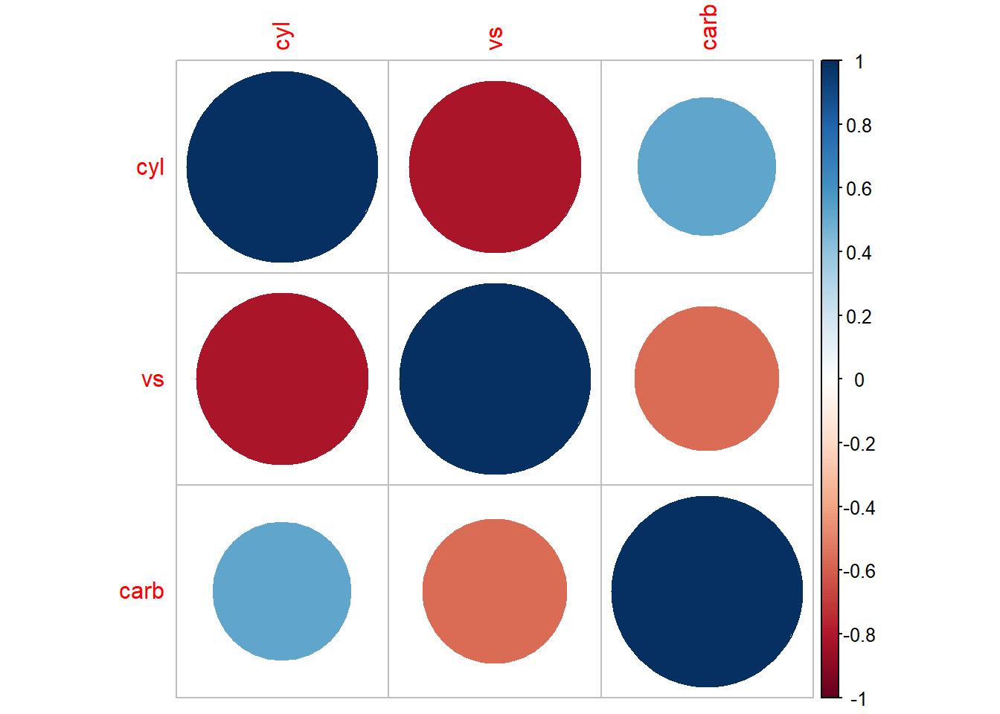

Alternatively,


```r
PerformanceAnalytics::chart.Correlation(df, histogram = T, pch = 19)
```

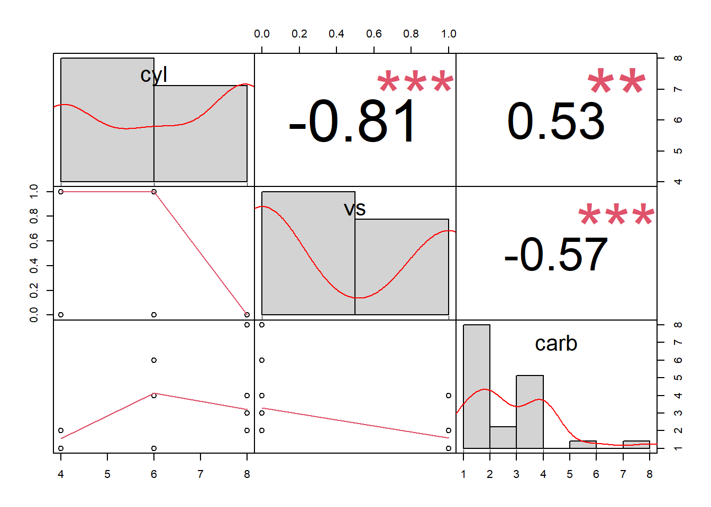


```r
heatmap(as.matrix(df))
```

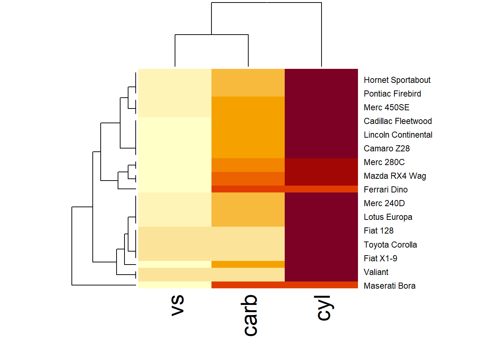

More general form,


```r
ppsr::visualize_pps(
    df = iris,
    do_parallel = TRUE,
    n_cores = parallel::detectCores() / 2
)
```

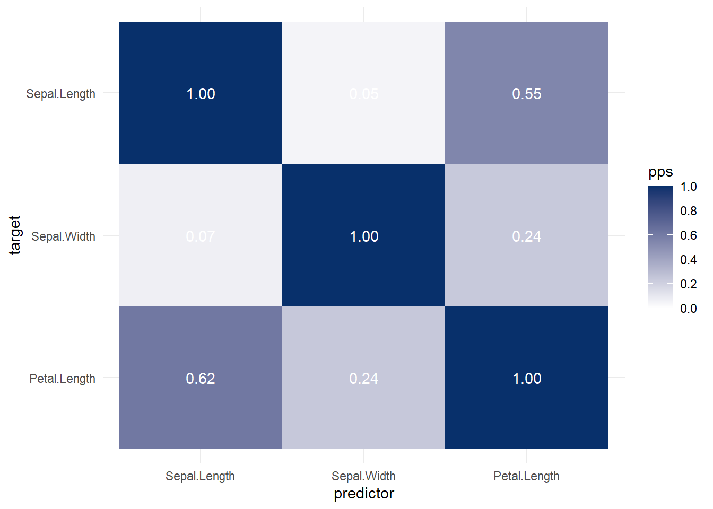


```r
ppsr::visualize_correlations(
    df = iris
)
```

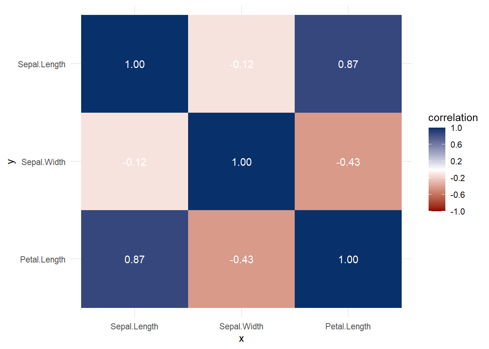

Both heat map and correlation at the same time


```r
ppsr::visualize_both(
    df = iris,
    do_parallel = TRUE,
    n_cores = parallel::detectCores() / 2
)
```

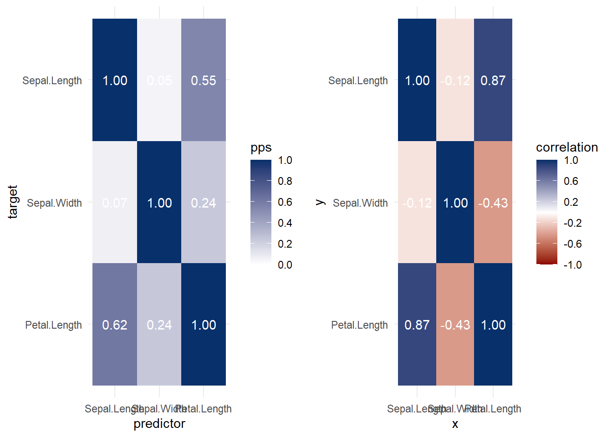

More elaboration with `ggplot2`


```r
ppsr::visualize_pps(
    df = iris,
    color_value_high = 'red',
    color_value_low = 'yellow',
    color_text = 'black'
) +
    ggplot2::theme_classic() +
    ggplot2::theme(plot.background = 
                       ggplot2::element_rect(fill = "lightgrey")) +
    ggplot2::theme(title = ggplot2::element_text(size = 15)) +
    ggplot2::labs(
        title = 'Correlation aand Heatmap',
        subtitle = 'Subtitle',
        caption = 'Caption',
        x = 'More info'
    )
```

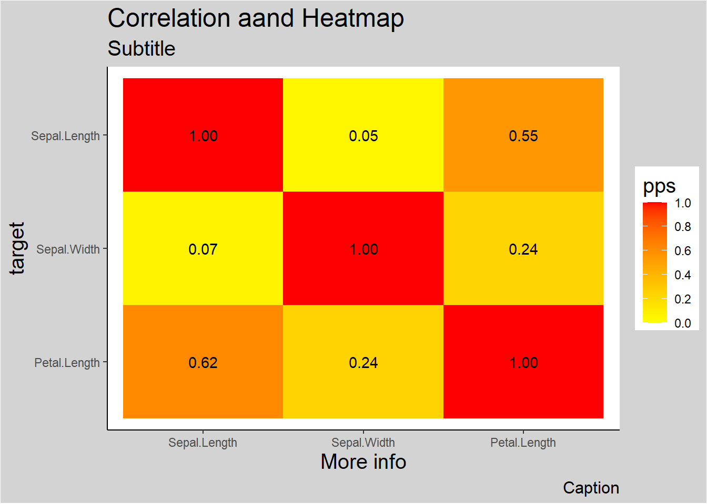
