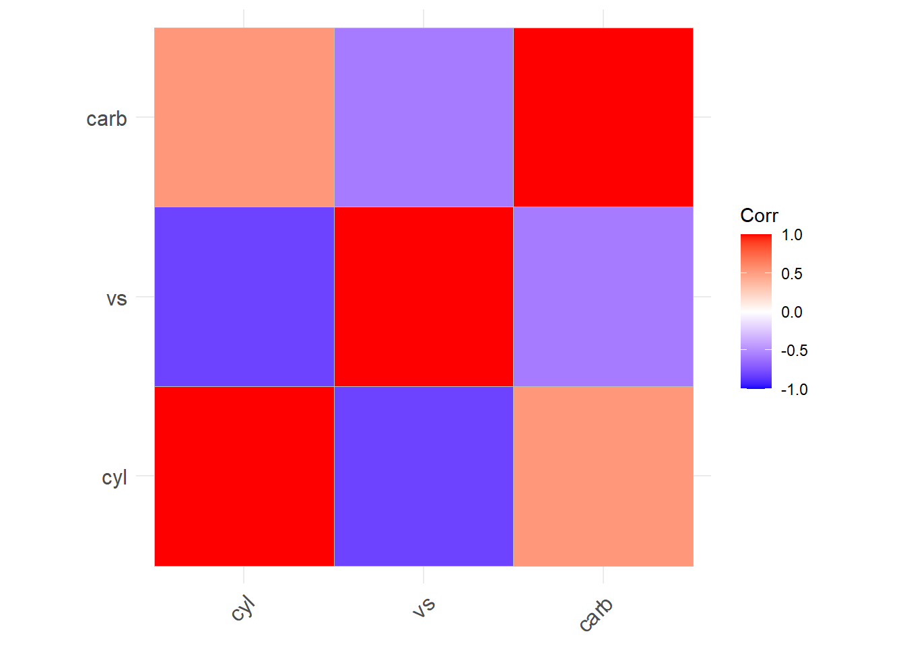
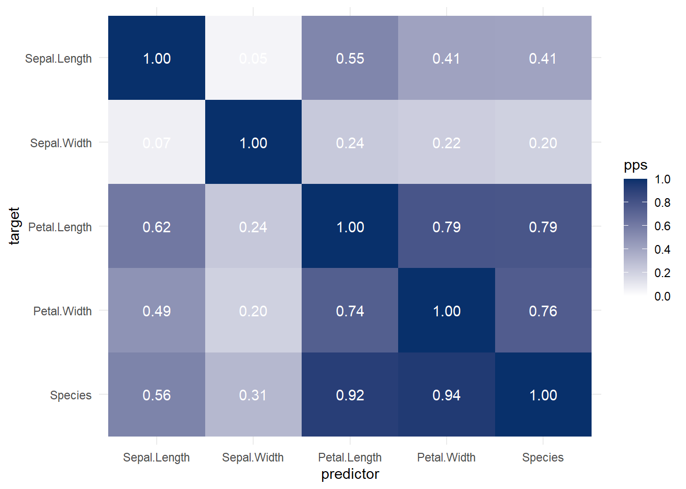
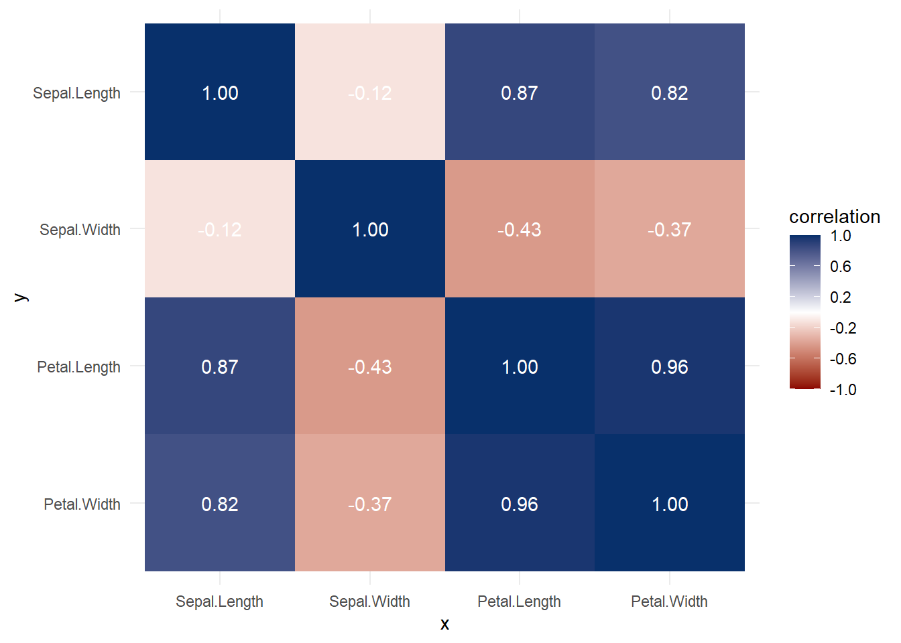
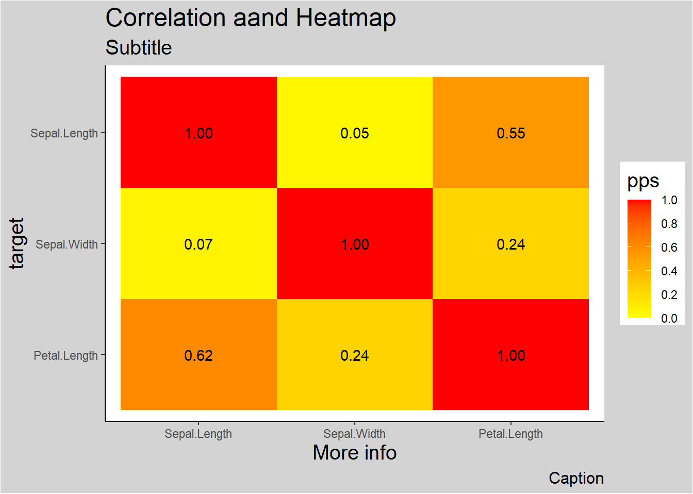

# Descriptive Statistics {#descriptive-stat}

When you have an area of interest that you want to research, a problem that you want to solve, a relationship that you want to investigate, theoretical and empirical processes will help you.

Estimand is defined as "a quantity of scientific interest that can be calculated in the population and does not change its value depending on the data collection design used to measure it (i.e., it does not vary with sample size and survey design, or the number of non-respondents, or follow-up efforts)." [@Rubin_1996]

Estimands include:

-   population means
-   Population variances
-   correlations
-   factor loading
-   regression coefficients

## Numerical Measures

There are differences between a population and a sample

+------------------+--------------------------------------------------------------------------+----------------------------------------------------------------------------------------+------------------------------------------------------------+
| Measures of      | Category                                                                 | Population                                                                             | Sample                                                     |
+==================+==========================================================================+========================================================================================+============================================================+
| \-               | What is it?                                                              | Reality                                                                                | A small fraction of reality (inference)                    |
+------------------+--------------------------------------------------------------------------+----------------------------------------------------------------------------------------+------------------------------------------------------------+
| \-               | Characteristics described by                                             | Parameters                                                                             | Statistics                                                 |
+------------------+--------------------------------------------------------------------------+----------------------------------------------------------------------------------------+------------------------------------------------------------+
| Central Tendency | Mean                                                                     | $\mu = E(Y)$                                                                           | $\hat{\mu} = \overline{y}$                                 |
+------------------+--------------------------------------------------------------------------+----------------------------------------------------------------------------------------+------------------------------------------------------------+
| Central Tendency | Median                                                                   | 50-th percentile                                                                       | $y_{(\frac{n+1}{2})}$                                      |
+------------------+--------------------------------------------------------------------------+----------------------------------------------------------------------------------------+------------------------------------------------------------+
| Dispersion       | Variance                                                                 | $$\begin{aligned} \sigma^2 &= var(Y) \\ &= E(Y- \mu^2) \end{aligned}$$                 | $s^2=\frac{1}{n-1} \sum_{i = 1}^{n} (y_i-\overline{y})^2$  |
+------------------+--------------------------------------------------------------------------+----------------------------------------------------------------------------------------+------------------------------------------------------------+
| Dispersion       | Coefficient of Variation                                                 | $\frac{\sigma}{\mu}$                                                                   | $\frac{s}{\overline{y}}$                                   |
+------------------+--------------------------------------------------------------------------+----------------------------------------------------------------------------------------+------------------------------------------------------------+
| Dispersion       | Interquartile Range                                                      | difference between 25th and 75th percentiles. Robust to outliers                       |                                                            |
+------------------+--------------------------------------------------------------------------+----------------------------------------------------------------------------------------+------------------------------------------------------------+
| Shape            | Skewness Standardized 3rd central moment (unitless)                      | $g_1=\frac{\mu_3}{\mu_2^{3/2}}$                                                        | $\hat{g_1}=\frac{m_3}{m_2sqrt(m_2)}$                       |
+------------------+--------------------------------------------------------------------------+----------------------------------------------------------------------------------------+------------------------------------------------------------+
| Shape            | Central moments                                                          | $\mu=E(Y)$ $\mu_2 = \sigma^2=E(Y-\mu)^2$ $\mu_3 = E(Y-\mu)^3$ $\mu_4 = E(Y-\mu)^4$ \|  | $m_2=\sum_{i=1}^{n}(y_1-\overline{y})^2/n$                 |
|                  |                                                                          |                                                                                        |                                                            |
|                  |                                                                          |                                                                                        | $m_3=\sum_{i=1}^{n}(y_1-\overline{y})^3/n$                 |
+------------------+--------------------------------------------------------------------------+----------------------------------------------------------------------------------------+------------------------------------------------------------+
| Shape            | Kurtosis (peakedness and tail thickness) Standardized 4th central moment | $g_2^*=\frac{E(Y-\mu)^4}{\sigma^4}$                                                    | $\hat{g_2}=\frac{m_4}{m_2^2}-3$                            |
+------------------+--------------------------------------------------------------------------+----------------------------------------------------------------------------------------+------------------------------------------------------------+

Note:

-   Order Statistics: $y_{(1)},y_{(2)},...,y_{(n)}$ where $y_{(1)}<y_{(2)}<...<y_{(n)}$

-   Coefficient of variation: standard deviation over mean. This metric is stable, dimensionless statistic for comparison.

-   Symmetric: mean = median, skewness = 0

-   Skewed right: mean \> median, skewness \> 0

-   Skewed left: mean \< median, skewness \< 0

-   Central moments: $\mu=E(Y)$ , $\mu_2 = \sigma^2=E(Y-\mu)^2$ , $\mu_3 = E(Y-\mu)^3$, $\mu_4 = E(Y-\mu)^4$

-   For normal distributions, $\mu_3=0$, so $g_1=0$

-   $\hat{g_1}$ is distributed approximately as $N(0,6/n)$ if sample is from a normal population. (valid when $n > 150$)

    -   For large samples, inference on skewness can be based on normal tables with 95% confidence interval for $g_1$ as $\hat{g_1}\pm1.96\sqrt{6/n}$
    -   For small samples, special tables from Snedecor and Cochran 1989, Table A 19(i) or Monte Carlo test

+-----------------------------+--------------+---------------------------------------------------------------------------------+
| Kurtosis \> 0 (leptokurtic) | heavier tail | compared to a normal distribution with the same $\sigma$ (e.g., t-distribution) |
+-----------------------------+--------------+---------------------------------------------------------------------------------+
| Kurtosis \< 0 (platykurtic) | lighter tail | compared to a normal distribution with the same $\sigma$                        |
+-----------------------------+--------------+---------------------------------------------------------------------------------+

-   For a normal distribution, $g_2^*=3$. Kurtosis is often redefined as: $g_2=\frac{E(Y-\mu)^4}{\sigma^4}-3$ where the 4th central moment is estimated by $m_4=\sum_{i=1}^{n}(y_i-\overline{y})^4/n$

    -   the asymptotic sampling distribution for $\hat{g_2}$ is approximately $N(0,24/n)$ (with $n > 1000$)
    -   large sample on kurtosis uses standard normal tables
    -   small sample uses tables by Snedecor and Cochran, 1989, Table A 19(ii) or Geary 1936


```r
data = rnorm(100)
library(e1071)
skewness(data)
#> [1] -0.2046225
kurtosis(data)
#> [1] -0.6313715
```

## Graphical Measures

### Shape

It's a good habit to label your graph, so others can easily follow.


```r
data = rnorm(100)

# Histogram
hist(data,labels = T,col="grey",breaks = 12) 

# Interactive histogram  
pacman::p_load("highcharter")
hchart(data) 

# Box-and-Whisker plot
boxplot(count ~ spray, data = InsectSprays,col = "lightgray",main="boxplot")

# Notched Boxplot
boxplot(len~supp*dose, data=ToothGrowth, notch=TRUE,
  col=(c("gold","darkgreen")),
  main="Tooth Growth", xlab="Suppliment and Dose")
# If notches differ -> medians differ

# Stem-and-Leaf Plots
stem(data)


# Bagplot - A 2D Boxplot Extension
pacman::p_load(aplpack)
attach(mtcars)
bagplot(wt,mpg, xlab="Car Weight", ylab="Miles Per Gallon",
  main="Bagplot Example")

```

Others more advanced plots


```r
# boxplot.matrix()  #library("sfsmisc")
# boxplot.n()       #library("gplots")
# vioplot()         #library("vioplot")
```

### Scatterplot


```r
# pairs(mtcars)
```

## Normality Assessment

Since Normal (Gaussian) distribution has many applications, we typically want/ wish our data or our variable is normal. Hence, we have to assess the normality based on not only [Numerical Measures] but also [Graphical Measures]

### Graphical Assessment


```r
pacman::p_load("car")
qqnorm(precip, ylab = "Precipitation [in/yr] for 70 US cities")
qqline(precip)
```


The straight line represents the theoretical line for normally distributed data. The dots represent real empirical data that we are checking. If all the dots fall on the straight line, we can be confident that our data follow a normal distribution. If our data wiggle and deviate from the line, we should be concerned with the normality assumption.

### Summary Statistics

Sometimes it's hard to tell whether your data follow the normal distribution by just looking at the graph. Hence, we often have to conduct statistical test to aid our decision. Common tests are

-   [Methods based on normal probability plot]

    -   [Correlation Coefficient with Normal Probability Plots]
    -   [Shapiro-Wilk Test]

-   [Methods based on empirical cumulative distribution function]

    -   [Anderson-Darling Test]
    -   [Kolmogorov-Smirnov Test]
    -   [Cramer-von Mises Test]
    -   [Jarque--Bera Test](#jarquebera-test)

#### Methods based on normal probability plot

##### Correlation Coefficient with Normal Probability Plots

[@Looney_1985] [@Shapiro_1972] The correlation coefficient between $y_{(i)}$ and $m_i^*$ as given on the normal probability plot:

$$W^*=\frac{\sum_{i=1}^{n}(y_{(i)}-\bar{y})(m_i^*-0)}{(\sum_{i=1}^{n}(y_{(i)}-\bar{y})^2\sum_{i=1}^{n}(m_i^*-0)^2)^.5}$$

where $\bar{m^*}=0$

Pearson product moment formula for correlation:

$$\hat{p}=\frac{\sum_{i-1}^{n}(y_i-\bar{y})(x_i-\bar{x})}{(\sum_{i=1}^{n}(y_{i}-\bar{y})^2\sum_{i=1}^{n}(x_i-\bar{x})^2)^.5}$$

-   When the correlation is 1, the plot is exactly linear and normality is assumed.
-   The closer the correlation is to zero, the more confident we are to reject normality
-   Inference on W\* needs to be based on special tables [@Looney_1985]


```r
library("EnvStats")
gofTest(data,test="ppcc")$p.value #Probability Plot Correlation Coefficient 
#> [1] 0.383608
```

##### Shapiro-Wilk Test

[@Shapiro_1965]

$$W=(\frac{\sum_{i=1}^{n}a_i(y_{(i)}-\bar{y})(m_i^*-0)}{(\sum_{i=1}^{n}a_i^2(y_{(i)}-\bar{y})^2\sum_{i=1}^{n}(m_i^*-0)^2)^.5})^2$$

where $a_1,..,a_n$ are weights computed from the covariance matrix for the order statistics.

-   Researchers typically use this test to assess normality. (n \< 2000) Under normality, W is close to 1, just like $W^*$. Notice that the only difference between W and W\* is the "weights".


```r
gofTest(data,test="sw")$p.value #Shapiro-Wilk is the default.
#> [1] 0.3132036
```

#### Methods based on empirical cumulative distribution function

The formula for the empirical cumulative distribution function (CDF) is:

$F_n(t)$ = estimate of probability that an observation $\le$ t = (number of observation $\le$ t)/n

This method requires large sample sizes. However, it can apply to distributions other than the normal (Gaussian) one.


```r
# Empirical CDF hand-code
plot.ecdf(data,verticals = T, do.points=F)
```


##### Anderson-Darling Test

The Anderson-Darling statistic [@Anderson_1952]:

$$A^2=\int_{-\infty}^{\infty}(F_n(t)=F(t))^2\frac{dF(t)}{F(t)(1-F(t))}$$

-   a weight average of squared deviations (it weights small and large values of t more)

For the normal distribution,

$A^2 = - (\sum_{i=1}^{n}(2i-1)(ln(p_i) +ln(1-p_{n+1-i}))/n-n$

where $p_i=\Phi(\frac{y_{(i)}-\bar{y}}{s})$, the probability that a standard normal variable is less than $\frac{y_{(i)}-\bar{y}}{s}$

-   Reject normal assumption when $A^2$ is too large

-   Evaluate the null hypothesis that the observations are randomly selected from a normal population based on the critical value provided by [@Marsaglia_2004] and [@Stephens_1974]

-   This test can be applied to other distributions:

    -   Exponential
    -   Logistic
    -   Gumbel
    -   Extreme-value
    -   Weibull: log(Weibull) = Gumbel
    -   Gamma
    -   Logistic
    -   Cauchy
    -   von Mises
    -   Log-normal (two-parameter)

Consult [@Stephens_1974] for more detailed transformation and critical values.


```r
gofTest(data,test="ad")$p.value #Anderson-Darling
#> [1] 0.1961768
```

##### Kolmogorov-Smirnov Test

-   Based on the largest absolute difference between empirical and expected cumulative distribution
-   Another deviation of K-S test is Kuiper's test


```r
gofTest(data,test="ks")$p.value #Komogorov-Smirnov 
#> [1] 0.6694967
```

##### Cramer-von Mises Test

-   Based on the average squared discrepancy between the empirical distribution and a given theoretical distribution. Each discrepancy is weighted equally (unlike Anderson-Darling test weights end points more heavily)


```r
gofTest(data,test="cvm")$p.value #Cramer-von Mises
#> [1] 0.1820569
```

##### Jarque--Bera Test {#jarquebera-test}

[@Bera_1981]

Based on the skewness and kurtosis to test normality.

$JB = \frac{n}{6}(S^2+(K-3)^2/4)$ where $S$ is the sample skewness and $K$ is the sample kurtosis

$S=\frac{\hat{\mu_3}}{\hat{\sigma}^3}=\frac{\sum_{i=1}^{n}(x_i-\bar{x})^3/n}{(\sum_{i=1}^{n}(x_i-\bar{x})^2/n)^\frac{3}{2}}$

$K=\frac{\hat{\mu_4}}{\hat{\sigma}^4}=\frac{\sum_{i=1}^{n}(x_i-\bar{x})^4/n}{(\sum_{i=1}^{n}(x_i-\bar{x})^2/n)^2}$

recall $\hat{\sigma^2}$ is the estimate of the second central moment (variance) $\hat{\mu_3}$ and $\hat{\mu_4}$ are the estimates of third and fourth central moments.

If the data comes from a normal distribution, the JB statistic asymptotically has a chi-squared distribution with two degrees of freedom.

The null hypothesis is a joint hypothesis of the skewness being zero and the excess kurtosis being zero.

## Bivariate Statistics

Correlation between

-   [Two Continuous] variables
-   [Two Discrete] variables
-   [Categorical and Continuous]

+-----------------+----------------------------------------------------+------------------------+
|                 | Categorical                                        | Continuous             |
+=================+====================================================+========================+
| **Categorical** | [Phi coefficient]                                  |                        |
|                 |                                                    |                        |
|                 | [Cramer's V](#cramers-v)                           |                        |
|                 |                                                    |                        |
|                 | [Tschuprow's T](#tschuprows-t)                     |                        |
|                 |                                                    |                        |
|                 | [Freeman's Theta](#freemans-theta)                 |                        |
|                 |                                                    |                        |
|                 | [Epsilon-squared]                                  |                        |
|                 |                                                    |                        |
|                 | [Goodman Kruskal's Gamma](#goodman-kruskals-gamma) |                        |
|                 |                                                    |                        |
|                 | [Somers' D](#somers-d)                             |                        |
|                 |                                                    |                        |
|                 | [Kendall's Tau-b](#kendalls-tau-b)                 |                        |
|                 |                                                    |                        |
|                 | [Yule's Q and Y](#yules-q-and-y)                   |                        |
|                 |                                                    |                        |
|                 | [Tetrachoric Correlation]                          |                        |
|                 |                                                    |                        |
|                 | [Polychoric Correlation]                           |                        |
+-----------------+----------------------------------------------------+------------------------+
| **Continuous**  | [Point-Biserial Correlation]                       | [Pearson Correlation]  |
|                 |                                                    |                        |
|                 | [Logistic Regression]                              | [Spearman Correlation] |
+-----------------+----------------------------------------------------+------------------------+

Questions to keep in mind:

1.  Is the relationship linear or non-linear?
2.  If the variable is continuous, is it normal and homoskadastic?
3.  How big is your dataset?

### Two Continuous


```r
n = 100 # (sample size)

data = data.frame(A = sample(1:20, replace = TRUE, size = n),
                  B = sample(1:30, replace = TRUE, size = n))
```

#### Pearson Correlation

-   Good with linear relationship


```r
library(Hmisc)
rcorr(data$A, data$B, type="pearson") 
#>      x    y
#> x 1.00 0.17
#> y 0.17 1.00
#> 
#> n= 100 
#> 
#> 
#> P
#>   x      y     
#> x        0.0878
#> y 0.0878
```

#### Spearman Correlation


```r
library(Hmisc)
rcorr(data$A, data$B, type="spearman") 
#>      x    y
#> x 1.00 0.18
#> y 0.18 1.00
#> 
#> n= 100 
#> 
#> 
#> P
#>   x    y   
#> x      0.08
#> y 0.08
```

### Categorical and Continuous

#### Point-Biserial Correlation

Similar to the Pearson correlation coefficient, the point-biserial correlation coefficient is between -1 and 1 where:

-   -1 means a perfectly negative correlation between two variables

-   0 means no correlation between two variables

-   1 means a perfectly positive correlation between two variables


```r
x <- c(0, 1, 1, 0, 0, 0, 1, 0, 1, 1, 0)
y <- c(12, 14, 17, 17, 11, 22, 23, 11, 19, 8, 12)

#calculate point-biserial correlation
cor.test(x, y)
#> 
#> 	Pearson's product-moment correlation
#> 
#> data:  x and y
#> t = 0.67064, df = 9, p-value = 0.5193
#> alternative hypothesis: true correlation is not equal to 0
#> 95 percent confidence interval:
#>  -0.4391885  0.7233704
#> sample estimates:
#>       cor 
#> 0.2181635
```

Alternatively


```r
ltm::biserial.cor(y,x, use = c("all.obs"), level = 2)
#> [1] 0.2181635
```

#### Logistic Regression

See \@ref(logistic-regression)

### Two Discrete

#### Distance Metrics

Some consider distance is not a correlation metric because it isn't unit independent (i.e., if you scale the distance, the metrics will change), but it's still a useful proxy. Distance metrics are more likely to be used for similarity measure.

-   Euclidean Distance

-   Manhattan Distance

-   Chessboard Distance

-   Minkowski Distance

-   Canberra Distance

-   Hamming Distance

-   Cosine Distance

-   Sum of Absolute Distance

-   Sum of Squared Distance

-   Mean-Absolute Error

#### Statistical Metrics

##### Chi-squared test

###### Phi coefficient

-   2 binary


```r
dt = matrix(c(1,4,3,5), nrow = 2)
dt
#>      [,1] [,2]
#> [1,]    1    3
#> [2,]    4    5
psych::phi(dt)
#> [1] -0.18
```

###### Cramer's V {#cramers-v}

-   between nominal categorical variables (no natural order)

$$
\text{Cramer's V} = \sqrt{\frac{\chi^2/n}{\min(c-1,r-1)}}
$$

where

-   $\chi^2$ = Chi-square statistic

-   $n$ = sample size

-   $r$ = \# of rows

-   $c$ = \# of columns


```r
library('lsr')
n = 100 # (sample size)
set.seed(1)
data = data.frame(A = sample(1:5, replace = TRUE, size = n),
                  B = sample(1:6, replace = TRUE, size = n))


cramersV(data$A, data$B)
#> [1] 0.1944616
```

Alternatively,

-   `ncchisq` noncentral Chi-square

-   `nchisqadj` Adjusted noncentral Chi-square

-   `fisher` Fisher Z transformation

-   `fisheradj` bias correction Fisher z transformation


```r
DescTools::CramerV(data, conf.level = 0.95,method = "ncchisqadj")
#>  Cramer V    lwr.ci    upr.ci 
#> 0.3472325 0.3929964 0.4033053
```

###### Tschuprow's T {#tschuprows-t}

-   2 nominal variables


```r
DescTools::TschuprowT(data)
#> [1] 0.1100808
```

#### Ordinal Association (Rank correlation)

-   Good with non-linear relationship

##### Ordinal and Nominal


```r
n = 100 # (sample size)
set.seed(1)
dt = table(data.frame(
    A = sample(1:4, replace = TRUE, size = n), # ordinal
    B = sample(1:3, replace = TRUE, size = n)  # nominal
)) 
dt
#>    B
#> A    1  2  3
#>   1  7 11  9
#>   2 11  6 14
#>   3  7 11  4
#>   4  6  4 10
```

###### Freeman's Theta {#freemans-theta}

-   Ordinal and nominal


```r
# this package is not available for R >= 4.0.0
rcompanion::freemanTheta(dt, group = "column") 
# because column is the grouping variable (i.e., nominal)
```

###### Epsilon-squared

-   Ordinal and nominal


```r
# this package is not available for R >= 4.0.0
rcompanion::epsilonSquared(dt,group = "column" ) 
# because column is the grouping variable (i.e., nominal)
```

##### Two Ordinal


```r
n = 100 # (sample size)
set.seed(1)
dt = table(data.frame(
    A = sample(1:4, replace = TRUE, size = n), # ordinal
    B = sample(1:3, replace = TRUE, size = n)  # ordinal
)) 
dt
#>    B
#> A    1  2  3
#>   1  7 11  9
#>   2 11  6 14
#>   3  7 11  4
#>   4  6  4 10
```

###### Goodman Kruskal's Gamma {#goodman-kruskals-gamma}

-   2 ordinal variables


```r
DescTools::GoodmanKruskalGamma(dt, conf.level = 0.95)
#>        gamma       lwr.ci       upr.ci 
#>  0.006781013 -0.229032069  0.242594095
```

###### Somers' D {#somers-d}

-   or Somers' Delta

-   2 ordinal variables


```r
DescTools::SomersDelta(dt, conf.level = 0.95)
#>       somers       lwr.ci       upr.ci 
#>  0.005115859 -0.172800185  0.183031903
```

###### Kendall's Tau-b {#kendalls-tau-b}

-   2 ordinal variables


```r
DescTools::KendallTauB(dt, conf.level = 0.95)
#>        tau_b       lwr.ci       upr.ci 
#>  0.004839732 -0.163472443  0.173151906
```

###### Yule's Q and Y {#yules-q-and-y}

-   2 ordinal variables

Special version $(2 \times 2)$ of the [Goodman Kruskal's Gamma](#goodman-kruskals-gamma) coefficient.

|                | Variable 1 |     |
|----------------|------------|-----|
| **Variable 2** | a          | b   |
|                | c          | d   |

$$
\text{Yule's Q} = \frac{ad - bc}{ad + bc}
$$

We typically use Yule's $Q$ in practice while Yule's Y has the following relationship with $Q$.

$$
\text{Yule's Y} = \frac{\sqrt{ad} - \sqrt{bc}}{\sqrt{ad} + \sqrt{bc}}
$$

$$
Q = \frac{2Y}{1 + Y^2}
$$

$$
Y = \frac{1 = \sqrt{1-Q^2}}{Q}
$$


```r
n = 100 # (sample size)
set.seed(1)
dt = table(data.frame(A = sample(c(0, 1), replace = TRUE, size = n),
                  B = sample(c(0, 1), replace = TRUE, size = n)))
dt
#>    B
#> A    0  1
#>   0 25 24
#>   1 28 23

DescTools::YuleQ(dt)
#> [1] -0.07778669
```

###### Tetrachoric Correlation

-   is a special case of [Polychoric Correlation] when both variables are binary


```r
library(psych)

n = 100 # (sample size)

data = data.frame(A = sample(c(0, 1), replace = TRUE, size = n),
                  B = sample(c(0, 1), replace = TRUE, size = n))

#view table
head(data)
#>   A B
#> 1 1 0
#> 2 1 0
#> 3 0 0
#> 4 1 0
#> 5 1 0
#> 6 1 0

table(data)
#>    B
#> A    0  1
#>   0 21 23
#>   1 34 22


#calculate tetrachoric correlation
tetrachoric(data)
#> Call: tetrachoric(x = data)
#> tetrachoric correlation 
#>   A    B   
#> A  1.0     
#> B -0.2  1.0
#> 
#>  with tau of 
#>     A     B 
#> -0.15  0.13
```

###### Polychoric Correlation

-   between ordinal categorical variables (natural order).
-   Assumption: Ordinal variable is a discrete representation of a latent normally distributed continuous variable. (Income = low, normal, high).


```r
library(polycor)

n = 100 # (sample size)

data = data.frame(A = sample(1:4, replace = TRUE, size = n),
                  B = sample(1:6, replace = TRUE, size = n))

head(data)
#>   A B
#> 1 1 3
#> 2 1 1
#> 3 3 5
#> 4 2 3
#> 5 3 5
#> 6 4 4


#calculate polychoric correlation between ratings
polychor(data$A, data$B)
#> [1] 0.01607982
```

## Summary


```r
library(tidyverse)

data("mtcars")
df = mtcars %>%
    dplyr::select(cyl, vs, carb)


df_factor = df %>%
    dplyr::mutate(
        cyl = factor(cyl),
        vs = factor(vs),
        carb = factor(carb)
    )
# summary(df)
str(df)
#> 'data.frame':	32 obs. of  3 variables:
#>  $ cyl : num  6 6 4 6 8 6 8 4 4 6 ...
#>  $ vs  : num  0 0 1 1 0 1 0 1 1 1 ...
#>  $ carb: num  4 4 1 1 2 1 4 2 2 4 ...
str(df_factor)
#> 'data.frame':	32 obs. of  3 variables:
#>  $ cyl : Factor w/ 3 levels "4","6","8": 2 2 1 2 3 2 3 1 1 2 ...
#>  $ vs  : Factor w/ 2 levels "0","1": 1 1 2 2 1 2 1 2 2 2 ...
#>  $ carb: Factor w/ 6 levels "1","2","3","4",..: 4 4 1 1 2 1 4 2 2 4 ...
```

Get the correlation table for continuous variables only


```r
cor(df)
#>             cyl         vs       carb
#> cyl   1.0000000 -0.8108118  0.5269883
#> vs   -0.8108118  1.0000000 -0.5696071
#> carb  0.5269883 -0.5696071  1.0000000

# only complete obs
# cor(df, use = "complete.obs")
```

Alternatively, you can also have the


```r
Hmisc::rcorr(as.matrix(df), type = "pearson")
#>        cyl    vs  carb
#> cyl   1.00 -0.81  0.53
#> vs   -0.81  1.00 -0.57
#> carb  0.53 -0.57  1.00
#> 
#> n= 32 
#> 
#> 
#> P
#>      cyl    vs     carb  
#> cyl         0.0000 0.0019
#> vs   0.0000        0.0007
#> carb 0.0019 0.0007
```


```r
modelsummary::datasummary_correlation(df)
```

<table class="table" style="width: auto !important; margin-left: auto; margin-right: auto;">
 <thead>
  <tr>
   <th style="text-align:left;">   </th>
   <th style="text-align:right;"> cyl </th>
   <th style="text-align:right;"> vs </th>
   <th style="text-align:right;"> carb </th>
  </tr>
 </thead>
<tbody>
  <tr>
   <td style="text-align:left;"> cyl </td>
   <td style="text-align:right;"> 1 </td>
   <td style="text-align:right;"> . </td>
   <td style="text-align:right;"> . </td>
  </tr>
  <tr>
   <td style="text-align:left;"> vs </td>
   <td style="text-align:right;"> −.81 </td>
   <td style="text-align:right;"> 1 </td>
   <td style="text-align:right;"> . </td>
  </tr>
  <tr>
   <td style="text-align:left;"> carb </td>
   <td style="text-align:right;"> .53 </td>
   <td style="text-align:right;"> −.57 </td>
   <td style="text-align:right;"> 1 </td>
  </tr>
</tbody>
</table>


```r
ggcorrplot::ggcorrplot(cor(df))
```



Different comparison between different correlation between different types of variables (i.e., continuous vs. categorical) can be problematic. Moreover, the problem of detecting non-linear vs. linear relationship/correlation is another one. Hence, a solution is that using mutual information from information theory (i.e., knowing one variable can reduce uncertainty about the other).

To implement mutual information, we have the following approximations

$$
\downarrow \text{prediction error} \approx \downarrow \text{uncertainty} \approx \downarrow \text{association strength}
$$

More specifically, following the [X2Y metric](https://rviews.rstudio.com/2021/04/15/an-alternative-to-the-correlation-coefficient-that-works-for-numeric-and-categorical-variables/), we have the following steps:

1.  Predict $y$ without $x$ (i.e., baseline model)

    1.  Average of $y$ when $y$ is continuous

    2.  Most frequent value when $y$ is categorical

2.  Predict $y$ with $x$ (e.g., linear, random forest, etc.)

3.  Calculate the prediction error difference between 1 and 2

To have a comprehensive table that could handle

-   continuous vs. continuous

-   categorical vs. continuous

-   continuous vs. categorical

-   categorical vs. categorical

the suggested model would be Classification and Regression Trees (CART). But we can certainly use other models as well.

The downfall of this method is that you might suffer

1.  Symmetry: $(x,y) \neq (y,x)$
2.  Comparability : Different pair of comparison might use different metrics (e.g., misclassification error vs. MAE)


```r
library(ppsr)

iris <- iris %>% 
  select(1:3)

# ppsr::score_df(iris) # if you want a dataframe
ppsr::score_matrix(iris,
                   do_parallel = TRUE,
                   n_cores = parallel::detectCores() / 2)
#>              Sepal.Length Sepal.Width Petal.Length
#> Sepal.Length   1.00000000  0.04632352    0.5491398
#> Sepal.Width    0.06790301  1.00000000    0.2376991
#> Petal.Length   0.61608360  0.24263851    1.0000000

# if you want a similar correlation matrix
ppsr::score_matrix(df,
                   do_parallel = TRUE,
                   n_cores = parallel::detectCores() / 2)
#>             cyl        vs      carb
#> cyl  1.00000000 0.3982789 0.2092533
#> vs   0.02514286 1.0000000 0.2000000
#> carb 0.30798148 0.2537309 1.0000000
```

### Visualization


```r
corrplot::corrplot(cor(df))
```


Alternatively,


```r
PerformanceAnalytics::chart.Correlation(df, histogram = T, pch = 19)
```


```r
heatmap(as.matrix(df))
```


More general form,


```r
ppsr::visualize_pps(
    df = iris,
    do_parallel = TRUE,
    n_cores = parallel::detectCores() / 2
)
```




```r
ppsr::visualize_correlations(
    df = iris
)
```



Both heat map and correlation at the same time


```r
ppsr::visualize_both(
    df = iris,
    do_parallel = TRUE,
    n_cores = parallel::detectCores() / 2
)
```


More elaboration with `ggplot2`


```r
ppsr::visualize_pps(
    df = iris,
    color_value_high = 'red',
    color_value_low = 'yellow',
    color_text = 'black'
) +
    ggplot2::theme_classic() +
    ggplot2::theme(plot.background = 
                       ggplot2::element_rect(fill = "lightgrey")) +
    ggplot2::theme(title = ggplot2::element_text(size = 15)) +
    ggplot2::labs(
        title = 'Correlation aand Heatmap',
        subtitle = 'Subtitle',
        caption = 'Caption',
        x = 'More info'
    )
```


