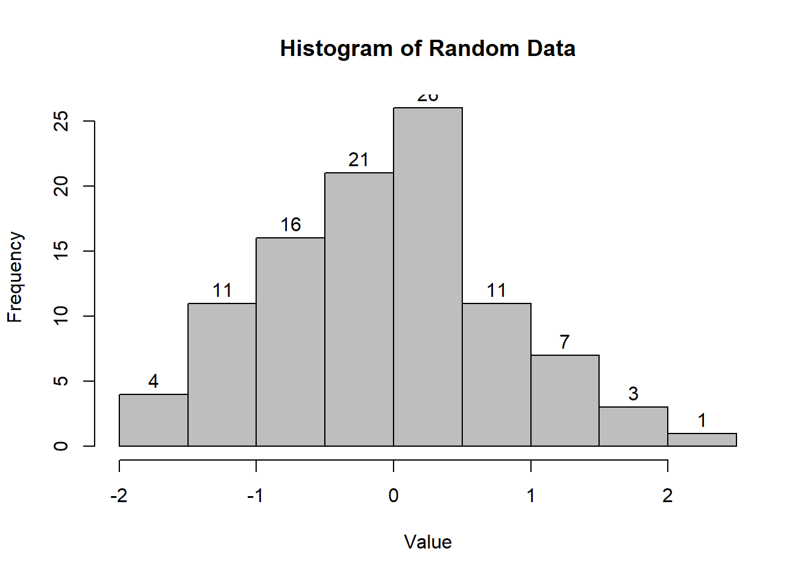

# Descriptive Statistics {#descriptive-stat}
When you have an area of interest that you want to research, a problem that you want to solve, a relationship that you want to investigate, theoretical and empirical processes will help you.  

Estimand is defined as "a quantity of scientific interest that can be calculated in the population and does not change its value depending on the data collection design used to measure it (i.e., it does not vary with sample size and survey design, or the number of nonrespondents, or follow-up efforts)." [@Rubin_1996]

Estimands include:  

 * population means
 * Population variances 
 * correlations
 * factor loading
 * regression coefficients

## Numerical Measures

There are differences between a population and a sample

Measures of | Category | Population | Sample
---|---|---|---
- |What is it? | Reality | A small fraction of reality (inference)
- |Characteristics described by | Parameters | Statistics
Central Tendency | Mean | $\mu = E(Y)$ | $\hat{\mu} = \overline{y}$
Central Tendency | Median | 50-th percentile | $y_{(\frac{n+1}{2})}$
Dispersion | Variance | $\sigma^2=var(Y)$ \ $=E(Y-\mu)^2$ | $s^2=\frac{1}{n-1} \sum_{i = 1}^{n} (y_i-\overline{y})^2$ \ $=\frac{1}{n-1} \sum_{i = 1}^{n} (y_i^2-n\overline{y}^2)$
Dispersion | Coefficient of Variation | $\frac{\sigma}{\mu}$ | $\frac{s}{\overline{y}}$
Dispersion | Interquartile Range | difference between 25th and 75th percentiles. Robust to outliers | 
Shape | Skewness \ Standardized 3rd central moment (unitless) | $g_1=\frac{\mu_3}{\mu_2^{3/2}}$ | $\hat{g_1}=\frac{m_3}{m_2sqrt(m_2)}$
Shape | Central moments | $\mu=E(Y)$ \ $\mu_2 = \sigma^2=E(Y-\mu)^2$ \ $\mu_3 = E(Y-\mu)^3$ \ $\mu_4 = E(Y-\mu)^4$  | $m_2=\sum_{i=1}^{n}(y_1-\overline{y})^2/n$ \  $m_3=\sum_{i=1}^{n}(y_1-\overline{y})^3/n$
Shape | Kurtosis (peakedness and tail thickness) \ Standardized 4th central moment | $g_2^*=\frac{E(Y-\mu)^4}{\sigma^4}$ | $\hat{g_2}=\frac{m_4}{m_2^2}-3$


Note:  

 * Order Statistics: $y_{(1)},y_{(2)},...,y_{(n)}$ where $y_{(1)}<y_{(2)}<...<y_{(n)}$
 * Coefficient of variation: standard deviation over mean. This metric is stable, dimensionless statistic for comparison.
 * Symmetric: mean = median, skewness = 0
 * Skewed right: mean > median, skewness > 0
 * Skewed left: mean < median, skewness < 0
 * Central moments: $\mu=E(Y)$ , $\mu_2 = \sigma^2=E(Y-\mu)^2$ , $\mu_3 = E(Y-\mu)^3$, $\mu_4 = E(Y-\mu)^4$
 * For normal distributions, $\mu_3=0$, so $g_1=0$
 * $\hat{g_1}$ is distributed approximately as N(0,6/n) if sample is from a normal population. (valid when n > 150)  
    + For large samples, inferece on skewness can be based on normal tables with 95% confidence itnerval for $g_1$ as $\hat{g_1}\pm1.96\sqrt{6/n}$
    + For small samples, special tables from Snedecor and Cochran 1989, Table A 19(i) or Monte Carlo test

 | | |
---|---|---
Kurtosis > 0 (leptokurtic) | heavier tail | compared to a normal distribution with the same $\sigma$ (e.g., t-distribution)
Kurtosis < 0 (platykurtic) | lighter tail | compared to a normal distribution with the same $\sigma$

 * For a normal distribution, $g_2^*=3$. Kurtosis is often redefined as: $g_2=\frac{E(Y-\mu)^4}{\sigma^4}-3$ where the 4th central moment is estimated by $m_4=\sum_{i=1}^{n}(y_i-\overline{y})^4/n$
    + the asymptotic sampling distribution for $\hat{g_2}$ is approximately N(0,24/n) (with n > 1000)
    + large sample on kurtosis uses standard normal tables
    + small sample uses tables by Snedecor and Cochran, 1989, Table A 19(ii) or Geary 1936


```r
data = rnorm(100)
library(e1071)
skewness(data,type = 1)
```

```
## [1] 0.1184766
```

```r
kurtosis(data, type = 1)
```

```
## [1] -0.4886365
```


## Graphical Measures
### Shape 
It's a good habit to label your graph, so others can easily follow.


```r
data = rnorm(100)

# Histogram
hist(data,labels = T,col="grey",breaks = 12) 

# Interactive histogram  
pacman::p_load("highcharter")
```



```r
hchart(data) 
```

```{=html}
<div id="htmlwidget-902f1c4f0cf14634c620" style="width:100%;height:500px;" class="highchart html-widget"></div>
<script type="application/json" data-for="htmlwidget-902f1c4f0cf14634c620">{"x":{"hc_opts":{"chart":{"reflow":true,"zoomType":"x"},"title":{"text":null},"yAxis":{"title":{"text":null}},"credits":{"enabled":false},"exporting":{"enabled":false},"boost":{"enabled":false},"plotOptions":{"series":{"label":{"enabled":false},"turboThreshold":0},"treemap":{"layoutAlgorithm":"squarified"}},"tooltip":{"formatter":"function() { return  this.point.name + '<br/>' + this.y; }"},"series":[{"data":[{"x":-2.25,"y":1,"name":"(-2.5, -2]"},{"x":-1.75,"y":0,"name":"(-2, -1.5]"},{"x":-1.25,"y":5,"name":"(-1.5, -1]"},{"x":-0.75,"y":23,"name":"(-1, -0.5]"},{"x":-0.25,"y":13,"name":"(-0.5, 0]"},{"x":0.25,"y":26,"name":"(0, 0.5]"},{"x":0.75,"y":15,"name":"(0.5, 1]"},{"x":1.25,"y":7,"name":"(1, 1.5]"},{"x":1.75,"y":5,"name":"(1.5, 2]"},{"x":2.25,"y":1,"name":"(2, 2.5]"},{"x":2.75,"y":2,"name":"(2.5, 3]"},{"x":3.25,"y":2,"name":"(3, 3.5]"}],"type":"column","pointRange":0.5,"groupPadding":0,"pointPadding":0,"borderWidth":0}]},"theme":{"chart":{"backgroundColor":"transparent"},"colors":["#7cb5ec","#434348","#90ed7d","#f7a35c","#8085e9","#f15c80","#e4d354","#2b908f","#f45b5b","#91e8e1"]},"conf_opts":{"global":{"Date":null,"VMLRadialGradientURL":"http =//code.highcharts.com/list(version)/gfx/vml-radial-gradient.png","canvasToolsURL":"http =//code.highcharts.com/list(version)/modules/canvas-tools.js","getTimezoneOffset":null,"timezoneOffset":0,"useUTC":true},"lang":{"contextButtonTitle":"Chart context menu","decimalPoint":".","downloadJPEG":"Download JPEG image","downloadPDF":"Download PDF document","downloadPNG":"Download PNG image","downloadSVG":"Download SVG vector image","drillUpText":"Back to {series.name}","invalidDate":null,"loading":"Loading...","months":["January","February","March","April","May","June","July","August","September","October","November","December"],"noData":"No data to display","numericSymbols":["k","M","G","T","P","E"],"printChart":"Print chart","resetZoom":"Reset zoom","resetZoomTitle":"Reset zoom level 1:1","shortMonths":["Jan","Feb","Mar","Apr","May","Jun","Jul","Aug","Sep","Oct","Nov","Dec"],"thousandsSep":" ","weekdays":["Sunday","Monday","Tuesday","Wednesday","Thursday","Friday","Saturday"]}},"type":"chart","fonts":[],"debug":false},"evals":["hc_opts.tooltip.formatter"],"jsHooks":[]}</script>
```

```r
# Box-and-Whisker plot
boxplot(count ~ spray, data = InsectSprays,col = "lightgray",main="boxplot")
```


```r
# Notched Boxplot
boxplot(len~supp*dose, data=ToothGrowth, notch=TRUE,
  col=(c("gold","darkgreen")),
  main="Tooth Growth", xlab="Suppliment and Dose")
```

```
## Warning in bxp(list(stats = structure(c(8.2, 9.7, 12.25, 16.5, 21.5, 4.2, : some
## notches went outside hinges ('box'): maybe set notch=FALSE
```


```r
# If notches differ -> medians differ

# Stem-and-Leaf Plots
stem(data)
```

```
## 
##   The decimal point is at the |
## 
##   -2 | 2
##   -1 | 54321
##   -0 | 999988888777777766666654444443333220
##    0 | 00011111111122223333444455567777778888999
##    1 | 001123466779
##    2 | 166
##    3 | 01
```

```r
# Bagplot - A 2D Boxplot Extension
pacman::p_load(aplpack)
attach(mtcars)
bagplot(wt,mpg, xlab="Car Weight", ylab="Miles Per Gallon",
  main="Bagplot Example")
```


Others more advanced plots

```r
# boxplot.matrix()  #library("sfsmisc")
# boxplot.n()       #library("gplots")
# vioplot()         #library("vioplot")
```

## Normality Assessment

Since Normal (Gaussian) distribution has many applications, we typically want/ wish our data or our variable is normal. Hence, we have to assess the normality based on not only [Numerical Measures] but also [Graphical Measures]

### Graphical Assessment

```r
pacman::p_load("car")
qqnorm(precip, ylab = "Precipitation [in/yr] for 70 US cities")
qqline(precip)
```


The straight line represents the theoretical line for normally distributed data. The dots represent real empirical data that we are checking.
If all the dots fall on the straight line, we can be confident that our data follow a normal distribution. If our data wiggle and deviate from the line, we should be concerned with the normality assumption. 

### Summary Statistics
Sometimes it's hard to tell whether your data follow the normal distribution by just looking at the graph. Hence, we often have to conduct statistical test to aid our decision.
Common tests are

 * [Methods based on normal probability plot]  
    + [Correlation Coefficient with Normal Probability Plots]  
    + [Shapiro-Wilk Test]  
 * [Methods based on empirical cumulative distribution function]  
    + [Anderson-Darling Test]  
    + [Kolmogorov-Smirnov Test]  
    + [Cramer-von Mises Test]
    + [Jarque–Bera Test]

#### Methods based on normal probability plot
##### Correlation Coefficient with Normal Probability Plots
[@Looney_1985] [@Shapiro_1972]
The correlation coefficient between $y_{(i)}$ and $m_i^*$ as given on the normal probability plot:  

$$W^*=\frac{\sum_{i=1}^{n}(y_{(i)}-\bar{y})(m_i^*-0)}{(\sum_{i=1}^{n}(y_{(i)}-\bar{y})^2\sum_{i=1}^{n}(m_i^*-0)^2)^.5}$$

where $\bar{m^*}=0$

Pearson product moment formula for correlation:  

$$\hat{p}=\frac{\sum_{i-1}^{n}(y_i-\bar{y})(x_i-\bar{x})}{(\sum_{i=1}^{n}(y_{i}-\bar{y})^2\sum_{i=1}^{n}(x_i-\bar{x})^2)^.5}$$

 * When the correlation is 1, the plot is exactly linear and normality is assumed. 
 * The closer the correlation is to zero, the more confident we are to reject normality
 * Inference on W* needs to be based on special tables [@Looney_1985]


```r
library("EnvStats")
```

```
## 
## Attaching package: 'EnvStats'
```

```
## The following object is masked from 'package:car':
## 
##     qqPlot
```

```
## The following objects are masked from 'package:e1071':
## 
##     kurtosis, skewness
```

```
## The following objects are masked from 'package:stats':
## 
##     predict, predict.lm
```

```
## The following object is masked from 'package:base':
## 
##     print.default
```

```r
gofTest(data,test="ppcc")$p.value #Probability Plot Correlation Coefficient 
```

```
## [1] 0.006813847
```


##### Shapiro-Wilk Test
[@Shapiro_1965]  


$$W=(\frac{\sum_{i=1}^{n}a_i(y_{(i)}-\bar{y})(m_i^*-0)}{(\sum_{i=1}^{n}a_i^2(y_{(i)}-\bar{y})^2\sum_{i=1}^{n}(m_i^*-0)^2)^.5})^2$$

where $a_1,..,a_n$ are weights computed from the covariance matrix for the order statistics.

 * Researchers typically use this test to assess normality. (n < 2000)
 Under normality, W is close to 1, just like $W^*$. Notice that the only difference between W and W* is the "weights".


```r
gofTest(data,test="sw")$p.value #Shapiro-Wilk is the default.
```

```
## [1] 0.006762928
```


#### Methods based on empirical cumulative distribution function

The formula for the empirical cumulative distribution function (CDF) is:  

$F_n(t)$  = estimate of probability that an observation $\le$ t
= (number of observation $\le$ t)/n

 This method requires large sample sizes. However, it can apply to distributions other than the normal (Gaussian) one.
 

```r
# Empirical CDF hand-code
plot.ecdf(data,verticals = T, do.points=F)
```


##### Anderson-Darling Test

[@Anderson_1952]

The Anderson-Darling statistic:  

$$A^2=\int_{-\infty}^{\infty}(F_n(t)=F(t))^2\frac{dF(t)}{F(t)(1-F(t))}$$

 * a weight average of squared deviations (it weights small and large values of t more)
 
For the normal distribution,  

$A^2 = - (\sum_{i=1}^{n}(2i-1)(ln(p_i) +ln(1-p_{n+1-i}))/n-n$  
 
 where $p_i=\Phi(\frac{y_{(i)}-\bar{y}}{s})$, the probability that a standard normal variable is less than $\frac{y_{(i)}-\bar{y}}{s}$
 
 * Reject normal assumption when $A^2$ is too large
 * Evaluate the null hypothesis that the observations are randomly selected from a normal population based on the critical value provided by [@Marsaglia_2004] and [@Stephens_1974]  
 
 
 * This test can be applied to other distributions:  
    + Exponential  
    + Logistic  
    + Gumbel  
    + Extreme-value  
    + Weibull: log(Weibull) = Gumbel  
    + Gamma  
    + Logistic  
    + Cauchy  
    + von Mises  
    + Log-normal (two-parameter)  
  
 Consult [@Stephens_1974] for more detailed transformation and critical values.


```r
gofTest(data,test="ad")$p.value #Anderson-Darling
```

```
## [1] 0.009397336
```

 
##### Kolmogorov-Smirnov Test

 * Based on the largest absolute difference between empirical and expected cumulative distribution  
 * Another deviation of K-S test is Kuiper's test


```r
gofTest(data,test="ks")$p.value #Komogorov-Smirnov 
```

```
## Warning in ksGofTest(x = c(-0.910524214671177, -0.6212606751595, -0.834575230595754, : The standard Kolmogorov-Smirnov test is very conservative (Type I error smaller than assumed; high Type II error) for testing departures from the Normal distribution when you have to estimate the distribution parameters.
```

```
## [1] 0.648627
```


##### Cramer-von Mises Test

 * Based on the average squared discrepancy between the empirical distribution and a given theoretical distribution. Each discrepancy is weighted equally (unlike Anderson-Darling test weights end points more heavily)
 

```r
gofTest(data,test="cvm")$p.value #Cramer-von Mises
```

```
## [1] 0.02584123
```


##### Jarque–Bera Test

[@Bera_1981]

Based on the skewness and kurtosis to test normality.

$JB = \frac{n}{6}(S^2+(K-3)^2/4)$ where S is the sample skewness and K is the sample kurtosis  

$S=\frac{\hat{\mu_3}}{\hat{\sigma}^3}=\frac{\sum_{i=1}^{n}(x_i-\bar{x})^3/n}{(\sum_{i=1}^{n}(x_i-\bar{x})^2/n)^\frac{3}{2}}$

$K=\frac{\hat{\mu_4}}{\hat{\sigma}^4}=\frac{\sum_{i=1}^{n}(x_i-\bar{x})^4/n}{(\sum_{i=1}^{n}(x_i-\bar{x})^2/n)^2}$

recall $\hat{\sigma^2}$ is the estimate of the second central moment (variance) $\hat{\mu_3}$ and $\hat{\mu_4}$ are the estimates of third and fourth central moments.


If the data comes from a normal distribution, the JB statistic asymptotically has a chi-squared distribution with two degrees of freedom.  

The null hypothesis is a joint hypothesis of the skewness being zero and the excess kurtosis being zero.
