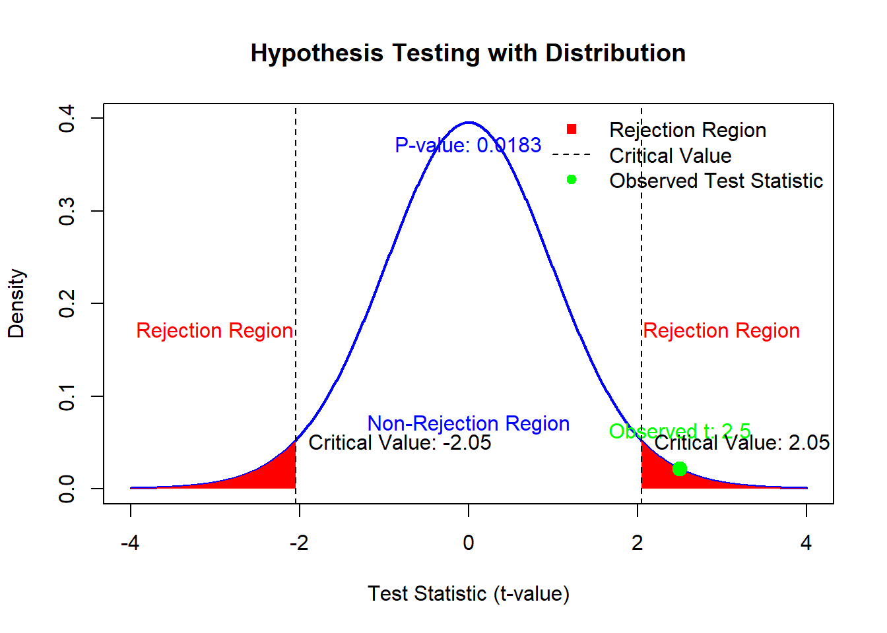

# Basic Statistical Inference

Statistical inference involves drawing conclusions about population parameters based on sample data. The two primary goals of inference are:

1.  **Making inferences** about the true parameter value ($\beta$) based on our estimator or estimate:
    -   This involves interpreting the sample-derived estimate to understand the population parameter.
    -   Examples include estimating population means, variances, or proportions.
2.  **Testing whether underlying assumptions hold true**, including:
    -   Assumptions about the true population parameters (e.g., $\mu$, $\sigma^2$).
    -   Assumptions about random variables (e.g., independence, normality).
    -   Assumptions about the model specification (e.g., linearity in regression).

**Note**: Statistical testing does not:

-   Confirm with absolute certainty that a hypothesis is true or false.

-   Interpret the magnitude of the estimated value in economic, practical, or business contexts without additional analysis.

    -   **Statistical significance**: Refers to whether an observed effect is unlikely due to chance.

    -   **Practical significance**: Focuses on the real-world importance of the effect.

**Example**:

-   A marketing campaign increases sales by $0.5\%$, which is statistically significant ($p < 0.05$). However, in a small market, this may lack practical significance.

Instead, inference provides a framework for making probabilistic statements about population parameters, given sample data.

------------------------------------------------------------------------

## Hypothesis Testing Framework

Hypothesis testing is one of the fundamental tools in statistics. It provides a formal procedure to test claims or assumptions (hypotheses) about population parameters using sample data. This process is essential in various fields, including business, medicine, and social sciences, as it helps answer questions like "Does a new marketing strategy improve sales?" or "Is there a significant difference in test scores between two teaching methods?"

The goal of hypothesis testing is to make decisions or draw conclusions about a population based on sample data. This is necessary because we rarely have access to the entire population. For example, if a company wants to determine whether a new advertising campaign increases sales, it might analyze data from a sample of stores rather than every store globally.

**Key Steps in Hypothesis Testing**

1.  **Formulate Hypotheses**: Define the null and alternative hypotheses.
2.  **Choose a Significance Level** ($\alpha$): Determine the acceptable probability of making a Type I error.
3.  **Select a Test Statistic**: Identify the appropriate statistical test based on the data and hypotheses.
4.  **Define the Rejection Region**: Specify the range of values for which the null hypothesis will be rejected.
5.  **Compute the Test Statistic**: Use sample data to calculate the test statistic.
6.  **Make a Decision**: Compare the test statistic to the critical value or use the p-value to decide whether to reject or fail to reject the null hypothesis.

------------------------------------------------------------------------

### Null and Alternative Hypotheses

At the heart of hypothesis testing lies the formulation of two competing hypotheses:

1.  **Null Hypothesis (**$H_0$):
    -   Represents the current state of knowledge, status quo, or no effect.
    -   It is assumed true unless there is strong evidence against it.
    -   Examples:
        -   $H_0: \mu_1 = \mu_2$ (no difference in means between two groups).
        -   $H_0: \beta = 0$ (a predictor variable has no effect in a regression model).
    -   Think of $H_0$ as the "default assumption."
2.  **Alternative Hypothesis (**$H_a$ or $H_1$):
    -   Represents a claim that contradicts the null hypothesis.
    -   It is what you are trying to prove or find evidence for.
    -   Examples:
        -   $H_a: \mu_1 \neq \mu_2$ (means of two groups are different).
        -   $H_a: \beta \neq 0$ (a predictor variable has an effect).

------------------------------------------------------------------------

### Errors in Hypothesis Testing

Hypothesis testing involves decision-making under uncertainty, meaning there is always a risk of making errors. These errors are classified into two types:

1.  **Type I Error** ($\alpha$):
    -   Occurs when the null hypothesis is rejected, even though it is true.
    -   Example: Concluding that a medication is effective when it actually has no effect.
    -   The probability of making a Type I error is denoted by $\alpha$, called the **significance level** (commonly set at 0.05 or 5%).
2.  **Type II Error** ($\beta$):
    -   Occurs when the null hypothesis is not rejected, but the alternative hypothesis is true.
    -   Example: Failing to detect that a medication is effective when it actually works.
    -   The complement of $\beta$ is called the **power** of the test ($1 - \beta$), representing the probability of correctly rejecting the null hypothesis.

**Analogy: The Legal System**

To make this concept more intuitive, consider the analogy of a courtroom:

-   **Null Hypothesis (**$H_0$): The defendant is innocent.
-   **Alternative Hypothesis (**$H_a$): The defendant is guilty.
-   **Type I Error:** Convicting an innocent person (false positive).
-   **Type II Error:** Letting a guilty person go free (false negative).

Balancing $\alpha$ and $\beta$ is critical in hypothesis testing, as reducing one often increases the other. For example, if you make it harder to reject $H_0$ (reducing $\alpha$), you increase the chance of failing to detect a true effect (increasing $\beta$).

------------------------------------------------------------------------

### The Role of Distributions in Hypothesis Testing

Distributions play a fundamental role in hypothesis testing because they provide a mathematical model for understanding how a test statistic behaves under the null hypothesis ($H_0$). Without distributions, it would be impossible to determine whether the observed results are due to random chance or provide evidence to reject the null hypothesis.

#### Expected Outcomes

One of the key reasons distributions are so crucial is that they describe the range of values a test statistic is likely to take when $H_0$ is true. This helps us understand what is considered "normal" variation in the data due to random chance. For example:

-   Imagine you are conducting a study to test whether a new marketing strategy increases the average monthly sales. Under the null hypothesis, you assume the new strategy has no effect, and the average sales remain unchanged.
-   When you collect a sample and calculate the test statistic, you compare it to the expected distribution (e.g., the normal distribution for a $z$-test). This distribution shows the range of test statistic values that are likely to occur purely due to random fluctuations in the data, assuming $H_0$ is true.

By providing this baseline of what is "normal," distributions allow us to identify unusual results that may indicate the null hypothesis is false.

#### Critical Values and Rejection Regions

Distributions also help define critical values and rejection regions in hypothesis testing. Critical values are specific points on the distribution that mark the boundaries of the rejection region. The rejection region is the range of values for the test statistic that lead us to reject $H_0$.

The location of these critical values depends on:

-   The **level of significance** ($\alpha$), which is the probability of rejecting $H_0$ when it is true (a Type I error).

-   The shape of the test statistic's distribution under $H_0$.

For example:

-   In a one-tailed $z$-test with $\alpha = 0.05$, the critical value is approximately $1.645$ for a standard normal distribution. If the calculated test statistic exceeds this value, we reject $H_0$ because such a result would be very unlikely under $H_0$.

Distributions help us visually and mathematically determine these critical points. By examining the distribution, we can see where the rejection region lies and what the probability is of observing a value in that region by random chance alone.

#### P-values

The p-value, a central concept in hypothesis testing, is directly derived from the distribution of the test statistic under $H_0$. The p-value represents the probability of observing a test statistic as extreme as (or more extreme than) the one calculated, assuming $H_0$ is true.

The **p-value** quantifies the strength of evidence against $H_0$. It represents the probability of observing a test statistic as extreme as (or more extreme than) the one calculated, assuming $H_0$ is true.

-   **Small p-value** (**\<** $\alpha$): Strong evidence against $H_0$; reject $H_0$.
-   **Large p-value** (**\>** $\alpha$): Weak evidence against $H_0$; fail to reject $H_0$.

For example:

-   Suppose you calculate a $z$-test statistic of $2.1$ in a one-tailed test. Using the standard normal distribution, the p-value is the area under the curve to the right of $z = 2.1$. This area represents the likelihood of observing a result as extreme as $z = 2.1$ if $H_0$ is true.

-   In this case, the p-value is approximately $0.0179$. A small p-value (typically less than $\alpha = 0.05$) suggests that the observed result is unlikely under $H_0$ and provides evidence to reject the null hypothesis.

#### Why Does All This Matter?

To summarize, distributions are the backbone of hypothesis testing because they allow us to:

-   Define what is expected under $H_0$ by modeling the behavior of the test statistic.

-   Identify results that are unlikely to occur by random chance, which leads to the rejection of $H_0$.

-   Calculate p-values to quantify the strength of evidence against $H_0$.

Distributions provide the framework for understanding the role of chance in statistical analysis. They are essential for determining expected outcomes, setting thresholds for decision-making (critical values and rejection regions), and calculating p-values. A solid grasp of distributions will greatly enhance your ability to interpret and conduct hypothesis tests, making it easier to draw meaningful conclusions from data.

------------------------------------------------------------------------

### The Test Statistic

The test statistic is a crucial component in hypothesis testing, as it quantifies how far the observed data deviates from what we would expect if the null hypothesis ($H_0$) were true. Essentially, it provides a standardized way to compare the observed outcomes against the expectations set by $H_0$, enabling us to assess whether the observed results are likely due to random chance or indicative of a significant effect.

The general formula for a test statistic is:

$$
\text{Test Statistic} = \frac{\text{Observed Value} - \text{Expected Value under } H_0}{\text{Standard Error}}
$$

Each component of this formula has an important role:

1.  **Numerator:**
    -   The numerator represents the difference between the actual data (observed value) and the hypothetical value (expected value) that is assumed under $H_0$.
    -   This difference quantifies the extent of the deviation. A larger deviation suggests stronger evidence against $H_0$.
2.  **Denominator:**
    -   The denominator is the **standard error**, which measures the variability or spread of the data. It accounts for factors such as sample size and the inherent randomness of the data.
    -   By dividing the numerator by the standard error, the test statistic is standardized, allowing comparisons across different studies, sample sizes, and distributions.

The test statistic plays a central role in determining whether to reject $H_0$. Once calculated, it is compared to a known distribution (e.g., standard normal distribution for $z$-tests or $t$-distribution for $t$-tests). This comparison allows us to evaluate the likelihood of observing such a test statistic under $H_0$:

-   **If the test statistic is close to 0:** This indicates that the observed data is very close to what is expected under $H_0$. There is little evidence to suggest rejecting $H_0$.
-   **If the test statistic is far from 0 (in the tails of the distribution):** This suggests that the observed data deviates significantly from the expectations under $H_0$. Such deviations may provide strong evidence against $H_0$.

#### Why Standardizing Matters

Standardizing the difference between the observed and expected values ensures that the test statistic is not biased by factors such as the scale of measurement or the size of the sample. For instance:

-   A raw difference of 5 might be highly significant in one context but negligible in another, depending on the variability (standard error).

-   Standardizing ensures that the magnitude of the test statistic reflects both the size of the difference and the reliability of the sample data.

#### Interpreting the Test Statistic

After calculating the test statistic, it is used to:

1.  Compare with a critical value: For example, in a $z$-test with $\alpha = 0.05$, the critical values are $-1.96$ and $1.96$ for a two-tailed test. If the test statistic falls beyond these values, $H_0$ is rejected.
2.  Calculate the p-value: The p-value is derived from the distribution and reflects the probability of observing a test statistic as extreme as the one calculated if $H_0$ is true.

------------------------------------------------------------------------

### Critical Values and Rejection Regions

The **critical value** is a point on the distribution that separates the rejection region from the non-rejection region:

-   **Rejection Region**: If the test statistic falls in this region, we reject $H_0$.
-   **Non-Rejection Region**: If the test statistic falls here, we fail to reject $H_0$.

The rejection region depends on the significance level ($\alpha$). For a two-tailed test with $\alpha = 0.05$, the critical values correspond to the top 2.5% and bottom 2.5% of the distribution.

------------------------------------------------------------------------

### Visualizing Hypothesis Testing

Let's create a visualization to tie these concepts together:


```r
# Parameters
alpha <- 0.05  # Significance level
df <- 29       # Degrees of freedom (for t-distribution)
t_critical <-
    qt(1 - alpha / 2, df)  # Critical value for two-tailed test

# Generate t-distribution values
t_values <- seq(-4, 4, length.out = 1000)
density <- dt(t_values, df)

# Observed test statistic
t_obs <- 2.5  # Example observed test statistic

# Plot the t-distribution
plot(
    t_values,
    density,
    type = "l",
    lwd = 2,
    col = "blue",
    main = "Hypothesis Testing with Distribution",
    xlab = "Test Statistic (t-value)",
    ylab = "Density",
    ylim = c(0, 0.4)
)

# Shade the rejection regions
polygon(c(t_values[t_values <= -t_critical], -t_critical),
        c(density[t_values <= -t_critical], 0),
        col = "red",
        border = NA)
polygon(c(t_values[t_values >= t_critical], t_critical),
        c(density[t_values >= t_critical], 0),
        col = "red",
        border = NA)

# Add observed test statistic
points(
    t_obs,
    dt(t_obs, df),
    col = "green",
    pch = 19,
    cex = 1.5
)
text(
    t_obs,
    dt(t_obs, df) + 0.02,
    paste("Observed t:", round(t_obs, 2)),
    col = "green",
    pos = 3
)

# Highlight the critical values
abline(
    v = c(-t_critical, t_critical),
    col = "black",
    lty = 2
)
text(
    -t_critical,
    0.05,
    paste("Critical Value:", round(-t_critical, 2)),
    pos = 4,
    col = "black"
)
text(
    t_critical,
    0.05,
    paste("Critical Value:", round(t_critical, 2)),
    pos = 4,
    col = "black"
)

# Calculate p-value
p_value <- 2 * (1 - pt(abs(t_obs), df))  # Two-tailed p-value
text(0,
     0.35,
     paste("P-value:", round(p_value, 4)),
     col = "blue",
     pos = 3)

# Annotate regions
text(-3,
     0.15,
     "Rejection Region",
     col = "red",
     pos = 3)
text(3, 0.15, "Rejection Region", col = "red", pos = 3)
text(0,
     0.05,
     "Non-Rejection Region",
     col = "blue",
     pos = 3)

# Add legend
legend(
    "topright",
    legend = c("Rejection Region", "Critical Value", "Observed Test Statistic"),
    col = c("red", "black", "green"),
    lty = c(NA, 2, NA),
    pch = c(15, NA, 19),
    bty = "n"
)
```



------------------------------------------------------------------------

## Key Concepts and Definitions

### Random Sample

A random sample of size $n$ consists of $n$ independent observations, each drawn from the same underlying population distribution. Independence ensures that no observation influences another, and identical distribution guarantees that all observations are governed by the same probability rules.

### Sample Statistics

#### Sample Mean

The sample mean is a measure of central tendency:

$$
\bar{X} = \frac{\sum_{i=1}^{n} X_i}{n}
$$

-   Example: Suppose we measure the heights of 5 individuals (in cm): $170, 165, 180, 175, 172$. The sample mean is:

$$
\bar{X} = \frac{170 + 165 + 180 + 175 + 172}{5} = 172.4 \, \text{cm}.
$$

#### Sample Median

The sample median is the middle value of ordered data:

$$
\tilde{x} = \begin{cases}
\text{Middle observation,} & \text{if } n \text{ is odd}, \\
\text{Average of two middle observations,} & \text{if } n \text{ is even}.
\end{cases}
$$

#### Sample Variance

The sample variance measures data spread:

$$
S^2 = \frac{\sum_{i=1}^{n}(X_i - \bar{X})^2}{n-1}
$$

#### Sample Standard Deviation

The sample standard deviation is the square root of the variance:

$$
S = \sqrt{S^2}
$$

#### Sample Proportions

Used for categorical data:

$$
\hat{p} = \frac{X}{n} = \frac{\text{Number of successes}}{\text{Sample size}}
$$

#### Estimators

-   **Point Estimator**: A statistic ($\hat{\theta}$) used to estimate a population parameter ($\theta$).
-   **Point Estimate**:The numerical value assumed by $\hat{\theta}$ when evaluated for a given sample.
-   **Unbiased Estimator**: A point estimator $\hat{\theta}$ is unbiased if $E(\hat{\theta}) = \theta$.

Examples of unbiased estimators:

-   $\bar{X}$ for $\mu$ (population mean).

-   $S^2$ for $\sigma^2$ (population variance).

-   $\hat{p}$ for $p$ (population proportion).

-   $\widehat{p_1-p_2}$ for $p_1- p_2$ (population proportion difference)

-   $\bar{X_1} - \bar{X_2}$ for $\mu_1 - \mu_2$ (population mean difference)

**Note**: While $S^2$ is unbiased for $\sigma^2$, $S$ is a biased estimator of $\sigma$.

------------------------------------------------------------------------

### Distribution of the Sample Mean

The sampling distribution of the mean $\bar{X}$ depends on:

1.  **Population Distribution**:
    -   If $X \sim N(\mu, \sigma^2)$, then $\bar{X} \sim N\left(\mu, \frac{\sigma^2}{n}\right)$.
2.  **Central Limit Theorem**:
    -   For large $n$, $\bar{X}$ approximately follows a normal distribution, regardless of the population's shape.

#### Standard Error of the Mean

The standard error quantifies variability in $\bar{X}$:

$$
\sigma_{\bar{X}} = \frac{\sigma}{\sqrt{n}}
$$

**Example**: - Suppose $\sigma = 10$ and $n = 25$. Then: $$
  \sigma_{\bar{X}} = \frac{10}{\sqrt{25}} = 2.
  $$

The smaller the standard error, the more precise our estimate of the population mean.

------------------------------------------------------------------------

## One-Sample Inference

### For Single Mean

Consider a scenario where

$$
Y_i \sim \text{i.i.d. } N(\mu, \sigma^2),
$$

where i.i.d. stands for "independent and identically distributed." This model can be expressed as:

$$
Y_i = \mu + \epsilon_i,
$$

where:

-   $\epsilon_i \sim^{\text{i.i.d.}} N(0, \sigma^2)$,
-   $E(Y_i) = \mu$,
-   $\text{Var}(Y_i) = \sigma^2$,
-   $\bar{y} \sim N(\mu, \sigma^2 / n)$.

When $\sigma^2$ is estimated by $s^2$, the standardized test statistic follows a $t$-distribution:

$$
\frac{\bar{y} - \mu}{s / \sqrt{n}} \sim t_{n-1}.
$$

A $100(1-\alpha)\%$ confidence interval for $\mu$ is obtained as:

$$
1 - \alpha = P\left(-t_{\alpha/2;n-1} \leq \frac{\bar{y} - \mu}{s / \sqrt{n}} \leq t_{\alpha/2;n-1}\right),
$$

or equivalently,

$$
P\left(\bar{y} - t_{\alpha/2;n-1}\frac{s}{\sqrt{n}} \leq \mu \leq \bar{y} + t_{\alpha/2;n-1}\frac{s}{\sqrt{n}}\right).
$$

The confidence interval is expressed as:

$$
\bar{y} \pm t_{\alpha/2;n-1}\frac{s}{\sqrt{n}},
$$

where $s / \sqrt{n}$ is the standard error of $\bar{y}$.

If the experiment were repeated many times, $100(1-\alpha)\%$ of these intervals would contain $\mu$.

+-------------------------------------------------+---------------------------------------------------+-------------------------------------------------+-------------------------------------------------+
| Case                                            | Confidence Interval $100(1-\alpha)\%$             | Sample Size (Confidence $\alpha$, Error $d$)    | Hypothesis Test Statistic                       |
+=================================================+===================================================+=================================================+=================================================+
| $\sigma^2$ known, $X$ normal (or $n \geq 25$)   | $\bar{X} \pm z_{\alpha/2}\frac{\sigma}{\sqrt{n}}$ | $n \approx \frac{z_{\alpha/2}^2 \sigma^2}{d^2}$ | $z = \frac{\bar{X} - \mu_0}{\sigma / \sqrt{n}}$ |
+-------------------------------------------------+---------------------------------------------------+-------------------------------------------------+-------------------------------------------------+
| $\sigma^2$ unknown, $X$ normal (or $n \geq 25$) | $\bar{X} \pm t_{\alpha/2}\frac{s}{\sqrt{n}}$      | $n \approx \frac{z_{\alpha/2}^2 s^2}{d^2}$      | $t = \frac{\bar{X} - \mu_0}{s / \sqrt{n}}$      |
+-------------------------------------------------+---------------------------------------------------+-------------------------------------------------+-------------------------------------------------+

#### Power in Hypothesis Testing

Power ($\pi(\mu)$) of a hypothesis test represents the probability of correctly rejecting the null hypothesis ($H_0$) when it is false (i.e., when alternative hypothesis $H_A$ is true). Formally, it is expressed as:

$$ \begin{aligned} \text{Power} &= \pi(\mu) = 1 - \beta \\ &= P(\text{test rejects } H_0|\mu) \\ &= P(\text{test rejects } H_0| H_A \text{ is true}), \end{aligned} $$

where $\beta$ is the probability of a Type II error (failing to reject $H_0$ when it is false).

To calculate this probability:

1.  **Under** $H_0$: The distribution of the test statistic is centered around the null parameter (e.g., $\mu_0$).

2.  **Under** $H_A$: The test statistic is distributed differently, shifted according to the true value under $H_A$ (e.g., $\mu_1$).

Hence, to evaluate the power, it is crucial to determine the distribution of the test statistic under the alternative hypothesis, $H_A$.

Below, we derive the power for both one-sided and two-sided z-tests.

------------------------------------------------------------------------

##### One-Sided z-Test

Consider the hypotheses:

$$ H_0: \mu \leq \mu_0 \quad \text{vs.} \quad H_A: \mu > \mu_0 $$

The power for a one-sided z-test is derived as follows:

1.  The test rejects $H_0$ if $\bar{y} > \mu_0 + z_{\alpha} \frac{\sigma}{\sqrt{n}}$, where $z_{\alpha}$ is the critical value for the test at the significance level $\alpha$.
2.  Under the alternative hypothesis, the distribution of $\bar{y}$ is centered at $\mu$, with standard deviation $\frac{\sigma}{\sqrt{n}}$.
3.  The power is then:

$$
\begin{aligned} 
\pi(\mu) &= P\left(\bar{y} > \mu_0 + z_{\alpha} \frac{\sigma}{\sqrt{n}} \middle| \mu \right) \\ 
&= P\left(Z > z_{\alpha} + \frac{\mu_0 - \mu}{\sigma / \sqrt{n}} \middle| \mu \right), \quad \text{where } Z = \frac{\bar{y} - \mu}{\sigma / \sqrt{n}} \\ 
&= 1 - \Phi\left(z_{\alpha} + \frac{(\mu_0 - \mu)\sqrt{n}}{\sigma}\right) \\ 
&= \Phi\left(-z_{\alpha} + \frac{(\mu - \mu_0)\sqrt{n}}{\sigma}\right).
\end{aligned}
$$

Here, we use the symmetry of the standard normal distribution: $1 - \Phi(x) = \Phi(-x)$.

Suppose we wish to show that the mean response $\mu$ under the treatment is higher than the mean response $\mu_0$ without treatment (i.e., the treatment effect $\delta = \mu - \mu_0$ is large).

Since power is an increasing function of $\mu - \mu_0$, it suffices to find the sample size $n$ that achieves the desired power $1 - \beta$ at $\mu = \mu_0 + \delta$. The power at $\mu = \mu_0 + \delta$ is:

$$
\pi(\mu_0 + \delta) = \Phi\left(-z_{\alpha} + \frac{\delta \sqrt{n}}{\sigma}\right) = 1 - \beta
$$

Given $\Phi(z_{\beta}) = 1 - \beta$, we have:

$$
-z_{\alpha} + \frac{\delta \sqrt{n}}{\sigma} = z_{\beta}
$$

Solving for $n$, we obtain:

$$
n = \left(\frac{(z_{\alpha} + z_{\beta})\sigma}{\delta}\right)^2
$$

Larger sample sizes are required when:

-   The sample variability is large ($\sigma$ is large).
-   The significance level $\alpha$ is small ($z_{\alpha}$ is large).
-   The desired power $1 - \beta$ is large ($z_{\beta}$ is large).
-   The magnitude of the effect is small ($\delta$ is small).

In practice, $\delta$ and $\sigma$ are often unknown. To estimate $\sigma$, you can:

1.  Use prior studies or pilot studies.
2.  Approximate $\sigma$ based on the anticipated range of the observations (excluding outliers). For normally distributed data, dividing the range by 4 provides a reasonable estimate of $\sigma$.

These considerations ensure the test is adequately powered to detect meaningful effects while balancing practical constraints such as sample size.

##### Two-Sided z-Test

For a two-sided test, the hypotheses are:

$$
H_0: \mu = \mu_0 \quad \text{vs.} \quad H_A: \mu \neq \mu_0
$$

The test rejects $H_0$ if $\bar{y}$ lies outside the interval $\mu_0 \pm z_{\alpha/2} \frac{\sigma}{\sqrt{n}}$. The power of the test is:

$$
\begin{aligned} 
\pi(\mu) &= P\left(\bar{y} < \mu_0 - z_{\alpha/2} \frac{\sigma}{\sqrt{n}} \middle| \mu \right) + P\left(\bar{y} > \mu_0 + z_{\alpha/2} \frac{\sigma}{\sqrt{n}} \middle| \mu \right) \\ 
&= \Phi\left(-z_{\alpha/2} + \frac{(\mu - \mu_0)\sqrt{n}}{\sigma}\right) + \Phi\left(-z_{\alpha/2} - \frac{(\mu - \mu_0)\sqrt{n}}{\sigma}\right).
\end{aligned}
$$

To ensure a power of $1-\beta$ when the treatment effect $\delta = |\mu - \mu_0|$ is at least a certain value, we solve for $n$. Since the power function for a two-sided test is increasing and symmetric in $|\mu - \mu_0|$, it suffices to find $n$ such that the power equals $1-\beta$ when $\mu = \mu_0 + \delta$. This gives:

$$
n = \left(\frac{(z_{\alpha/2} + z_{\beta}) \sigma}{\delta}\right)^2
$$

Alternatively, the required sample size can be determined using a confidence interval approach. For a two-sided $\alpha$-level confidence interval of the form:

$$
\bar{y} \pm D
$$

where $D = z_{\alpha/2} \frac{\sigma}{\sqrt{n}}$, solving for $n$ gives:

$$
n = \left(\frac{z_{\alpha/2} \sigma}{D}\right)^2
$$

This value should be rounded up to the nearest integer to ensure the required precision.


```r
# Generate random data and compute a 95% confidence interval
data <- rnorm(100) # Generate 100 random values
t.test(data, conf.level = 0.95) # Perform t-test with 95% confidence interval
#> 
#> 	One Sample t-test
#> 
#> data:  data
#> t = 1.5755, df = 99, p-value = 0.1183
#> alternative hypothesis: true mean is not equal to 0
#> 95 percent confidence interval:
#>  -0.03744912  0.32612074
#> sample estimates:
#> mean of x 
#> 0.1443358
```

For a one-sided hypothesis test, such as testing $H_0: \mu \geq 30$ versus $H_a: \mu < 30$:


```r
# Perform one-sided t-test
t.test(data, mu = 30, alternative = "less")
#> 
#> 	One Sample t-test
#> 
#> data:  data
#> t = -325.88, df = 99, p-value < 2.2e-16
#> alternative hypothesis: true mean is less than 30
#> 95 percent confidence interval:
#>       -Inf 0.2964533
#> sample estimates:
#> mean of x 
#> 0.1443358
```

When $\sigma$ is unknown, you can estimate it using:

1.  Prior studies or pilot studies.

2.  The range of observations (excluding outliers) divided by 4, which provides a reasonable approximation for normally distributed data.

##### z-Test Summary

-   For one-sided tests:

$$ \pi(\mu) = \Phi\left(-z_{\alpha} + \frac{(\mu - \mu_0)\sqrt{n}}{\sigma}\right) $$

-   For two-sided tests:

$$ \pi(\mu) = \Phi\left(-z_{\alpha/2} + \frac{(\mu - \mu_0)\sqrt{n}}{\sigma}\right) + \Phi\left(-z_{\alpha/2} - \frac{(\mu - \mu_0)\sqrt{n}}{\sigma}\right) $$

**Factors Affecting Power**

-   **Effect Size (**$\mu - \mu_0$): Larger differences between $\mu$ and $\mu_0$ increase power.
-   **Sample Size (**$n$): Larger $n$ reduces the standard error, increasing power.
-   **Variance (**$\sigma^2$): Smaller variance increases power.
-   **Significance Level (**$\alpha$): Increasing $\alpha$ (making the test more liberal) increases power through $z_{\alpha}$.

##### One-Sample t-test

In hypothesis testing, calculating the power and determining the required sample size for **t-tests** are more complex than for **z-tests**. This complexity arises from the involvement of the **Student's t-distribution** and its generalized form, the **non-central t-distribution**.

The power function for a one-sample t-test can be expressed as:

$$
\pi(\mu) = P\left(\frac{\bar{y} - \mu_0}{s / \sqrt{n}} > t_{n-1; \alpha} \mid \mu \right)
$$

Here:

-   $\mu_0$ is the hypothesized population mean under the null hypothesis,

-   $\bar{y}$ is the sample mean,

-   $s$ is the sample standard deviation,

-   $n$ is the sample size,

-   $t_{n-1; \alpha}$ is the critical t-value from the Student's t-distribution with $n-1$ degrees of freedom at significance level $\alpha$.

When $\mu > \mu_0$ (i.e., $\mu - \mu_0 = \delta$), the random variable

$$
T = \frac{\bar{y} - \mu_0}{s / \sqrt{n}}
$$

does not follow the Student's t-distribution. Instead, it follows a **non-central t-distribution** with:

-   a **non-centrality parameter** $\lambda = \delta \sqrt{n} / \sigma$, where $\sigma$ is the population standard deviation,

-   degrees of freedom $n-1$.

**Key Properties of the Power Function**

-   The power $\pi(\mu)$ is an increasing function of the non-centrality parameter $\lambda$.
-   For $\delta = 0$ (i.e., when the null hypothesis is true), the non-central t-distribution simplifies to the regular Student's t-distribution.

To calculate the power in practice, numerical procedures (see below) or precomputed charts are typically required.

**Approximate Sample Size Adjustment for t-tests**

When planning a study, researchers often start with an approximation based on **z-tests** and then adjust for the specifics of the t-test. Here's the process:

1\. Start with the Sample Size for a z-test

For a two-sided test: $$
n_z = \frac{\left(z_{\alpha/2} + z_\beta\right)^2 \sigma^2}{\delta^2}
$$ where:

-   $z_{\alpha/2}$ is the critical value from the standard normal distribution for a two-tailed test,

-   $z_\beta$ corresponds to the desired power $1 - \beta$,

-   $\delta$ is the effect size $\mu - \mu_0$,

-   $\sigma$ is the population standard deviation.

2\. Adjust for the t-distribution

Let $v = n - 1$, where $n$ is the sample size derived from the z-test. For a two-sided t-test, the approximate sample size is:

$$
n^* = \frac{\left(t_{v; \alpha/2} + t_{v; \beta}\right)^2 \sigma^2}{\delta^2}
$$

Here:

-   $t_{v; \alpha/2}$ and $t_{v; \beta}$ are the critical values from the Student's t-distribution for the significance level $\alpha$ and desired power, respectively.

-   Since $v$ depends on $n^*$, this process may require iterative refinement.

Notes:

1.  **Approximations**: The above formulas provide an intuitive starting point but may require adjustments based on exact numerical solutions.
2.  **Insights**: Power is an increasing function of:
    -   the effect size $\delta$,
    -   the sample size $n$,
    -   and a decreasing function of the population variability $\sigma$.


```r
# Example: Power calculation for a one-sample t-test
library(pwr)

# Parameters
effect_size <- 0.5  # Cohen's d
alpha <- 0.05       # Significance level
power <- 0.8        # Desired power

# Compute sample size
sample_size <-
    pwr.t.test(
        d = effect_size,
        sig.level = alpha,
        power = power,
        type = "one.sample"
    )$n

# Print result
cat("Required sample size for one-sample t-test:",
    ceiling(sample_size),
    "\n")
#> Required sample size for one-sample t-test: 34

# Power calculation for a given sample size
calculated_power <-
    pwr.t.test(
        n = ceiling(sample_size),
        d = effect_size,
        sig.level = alpha,
        type = "one.sample"
    )$power
cat("Achieved power with computed sample size:",
    calculated_power,
    "\n")
#> Achieved power with computed sample size: 0.8077775
```

### For Difference of Means, Independent Samples

+-------------------------------------------------------+----------------------------------------------------------------------------------------------+---------------------------------------------------------------------------------------------------------+--------------------------------------------------------------------------------------------------------------------------------------------------------+
|                                                       | $100(1-\alpha)%$ Confidence Interval                                                         | Hypothesis Testing Test Statistic                                                                       |                                                                                                                                                        |
+=======================================================+==============================================================================================+=========================================================================================================+========================================================================================================================================================+
| When $\sigma^2$ is known                              | $\bar{X}_1 - \bar{X}_2 \pm z_{\alpha/2}\sqrt{\frac{\sigma^2_1}{n_1}+\frac{\sigma^2_2}{n_2}}$ | $z= \frac{(\bar{X}_1-\bar{X}_2)-(\mu_1-\mu_2)_0}{\sqrt{\frac{\sigma^2_1}{n_1}+\frac{\sigma^2_2}{n_2}}}$ |                                                                                                                                                        |
+-------------------------------------------------------+----------------------------------------------------------------------------------------------+---------------------------------------------------------------------------------------------------------+--------------------------------------------------------------------------------------------------------------------------------------------------------+
| When $\sigma^2$ is unknown, Variances Assumed EQUAL   | $\bar{X}_1 - \bar{X}_2 \pm t_{\alpha/2}\sqrt{s^2_p(\frac{1}{n_1}+\frac{1}{n_2})}$            | $t = \frac{(\bar{X}_1-\bar{X}_2)-(\mu_1-\mu_2)_0}{\sqrt{s^2_p(\frac{1}{n_1}+\frac{1}{n_2})}}$           | Pooled Variance: $s_p^2 = \frac{(n_1 -1)s^2_1 - (n_2-1)s^2_2}{n_1 + n_2 -2}$ Degrees of Freedom: $\gamma = n_1 + n_2 -2$                               |
+-------------------------------------------------------+----------------------------------------------------------------------------------------------+---------------------------------------------------------------------------------------------------------+--------------------------------------------------------------------------------------------------------------------------------------------------------+
| When $\sigma^2$ is unknown, Variances Assumed UNEQUAL | $\bar{X}_1 - \bar{X}_2 \pm t_{\alpha/2}\sqrt{(\frac{s^2_1}{n_1}+\frac{s^2_2}{n_2})}$         | $t = \frac{(\bar{X}_1-\bar{X}_2)-(\mu_1-\mu_2)_0}{\sqrt{(\frac{s^2_1}{n_1}+\frac{s^2_2}{n_2})}}$        | Degrees of Freedom: $\gamma = \frac{(\frac{s_1^2}{n_1}+\frac{s^2_2}{n_2})^2}{\frac{(\frac{s_1^2}{n_1})^2}{n_1-1}+\frac{(\frac{s_2^2}{n_2})^2}{n_2-1}}$ |
+-------------------------------------------------------+----------------------------------------------------------------------------------------------+---------------------------------------------------------------------------------------------------------+--------------------------------------------------------------------------------------------------------------------------------------------------------+

### For Difference of Means, Paired Samples

+---------------------------+------------------------------------------------+
| Metric                    | Formula                                        |
+===========================+================================================+
| Confidence Interval       | $\bar{D} \pm t_{\alpha/2}\frac{s_d}{\sqrt{n}}$ |
+---------------------------+------------------------------------------------+
| Hypothesis Test Statistic | $t = \frac{\bar{D} - D_0}{s_d / \sqrt{n}}$     |
+---------------------------+------------------------------------------------+

### For Difference of Two Proportions

The mean of the difference between two sample proportions is given by:

$$
\hat{p_1} - \hat{p_2}
$$

The variance of the difference in proportions is:

$$
\frac{p_1(1-p_1)}{n_1} + \frac{p_2(1-p_2)}{n_2}
$$

A $100(1-\alpha)\%$ confidence interval for the difference in proportions is calculated as:

$$
\hat{p_1} - \hat{p_2} \pm z_{\alpha/2} \sqrt{\frac{p_1(1-p_1)}{n_1} + \frac{p_2(1-p_2)}{n_2}}
$$

where

-   $z_{\alpha/2}$: The critical value from the standard normal distribution.

-   $\hat{p_1}$, $\hat{p_2}$: Sample proportions.

-   $n_1$, $n_2$: Sample sizes.

**Sample Size for a Desired Confidence Level and Margin of Error**

To achieve a margin of error $d$ for a given confidence level, the required sample size can be estimated as follows:

1.  **With Prior Estimates of** $\hat{p_1}$ and $\hat{p_2}$: $$
    n \approx \frac{z_{\alpha/2}^2 \left[p_1(1-p_1) + p_2(1-p_2)\right]}{d^2}
    $$

2.  **Without Prior Estimates** (assuming maximum variability, $\hat{p} = 0.5$): $$
    n \approx \frac{z_{\alpha/2}^2}{2d^2}
    $$

**Hypothesis Testing for Difference in Proportions**

The test statistic for hypothesis testing depends on the null hypothesis:

1.  **When** $(p_1 - p_2) \neq 0$: $$
    z = \frac{(\hat{p_1} - \hat{p_2}) - (p_1 - p_2)_0}{\sqrt{\frac{p_1(1-p_1)}{n_1} + \frac{p_2(1-p_2)}{n_2}}}
    $$

2.  **When** $(p_1 - p_2)_0 = 0$ (testing equality of proportions): $$
    z = \frac{\hat{p_1} - \hat{p_2}}{\sqrt{\hat{p}(1-\hat{p}) \left(\frac{1}{n_1} + \frac{1}{n_2}\right)}}
    $$

where $\hat{p}$ is the pooled sample proportion:

$$
\hat{p} = \frac{x_1 + x_2}{n_1 + n_2} = \frac{n_1\hat{p_1} + n_2\hat{p_2}}{n_1 + n_2}
$$

------------------------------------------------------------------------

### For Single Proportion

The $100(1-\alpha)\%$ confidence interval for a population proportion $p$ is:

$$
\hat{p} \pm z_{\alpha/2} \sqrt{\frac{\hat{p}(1-\hat{p})}{n}}
$$

Sample Size Determination

-   **With Prior Estimate** ($\hat{p}$): $$
    n \approx \frac{z_{\alpha/2}^2 \hat{p}(1-\hat{p})}{d^2}
    $$

-   **Without Prior Estimate**: $$
    n \approx \frac{z_{\alpha/2}^2}{4d^2}
    $$

The test statistic for $H_0: p = p_0$ is:

$$
z = \frac{\hat{p} - p_0}{\sqrt{\frac{p_0(1-p_0)}{n}}}
$$

------------------------------------------------------------------------

### For Single Variance

For a sample variance $s^2$ with $n$ observations, the $100(1-\alpha)\%$ confidence interval for the population variance $\sigma^2$ is:

$$
\begin{aligned}
1 - \alpha &= P( \chi_{1-\alpha/2;n-1}^2) \le (n-1)s^2/\sigma^2 \le \chi_{\alpha/2;n-1}^2)\\
&=P\left(\frac{(n-1)s^2}{\chi^2_{\alpha/2; n-1}} \leq \sigma^2 \leq \frac{(n-1)s^2}{\chi^2_{1-\alpha/2; n-1}}\right)
\end{aligned}
$$

Equivalently, the confidence interval can be written as:

$$
\left(\frac{(n-1)s^2}{\chi^2_{\alpha/2}}, \frac{(n-1)s^2}{\chi^2_{1-\alpha/2}}\right)
$$

To find confidence limits for $\sigma$, compute the square root of the interval bounds:

$$
\text{Confidence Interval for } \sigma: \quad \left(\sqrt{\frac{(n-1)s^2}{\chi^2_{\alpha/2}}}, \sqrt{\frac{(n-1)s^2}{\chi^2_{1-\alpha/2}}}\right)
$$

**Hypothesis Testing for Variance**

The test statistic for testing a null hypothesis about a population variance ($\sigma^2_0$) is:

$$
\chi^2 = \frac{(n-1)s^2}{\sigma^2_0}
$$

This test statistic follows a chi-squared distribution with $n-1$ degrees of freedom under the null hypothesis.

### Non-parametric Tests

+---------------------------------------------------------------+------------------------------+--------------------------------+
| **Method**                                                    | **Purpose**                  | **Assumptions**                |
+===============================================================+==============================+================================+
| [Sign Test]                                                   | Test median                  | None (ordinal data sufficient) |
+---------------------------------------------------------------+------------------------------+--------------------------------+
| [Wilcoxon Signed Rank Test]                                   | Test symmetry around a value | Symmetry of distribution       |
+---------------------------------------------------------------+------------------------------+--------------------------------+
| [Wald-Wolfowitz Runs Test]                                    | Test for randomness          | Independent observations       |
+---------------------------------------------------------------+------------------------------+--------------------------------+
| [Quantile (or Percentile) Test](#quantile-or-percentile-test) | Test specific quantile       | None (ordinal data sufficient) |
+---------------------------------------------------------------+------------------------------+--------------------------------+

#### Sign Test

The **Sign Test** is used to test hypotheses about the median of a population, $\mu_{(0.5)}$, without assuming a specific distribution for the data. This test is ideal for small sample sizes or when normality assumptions are not met.

To test the population median, consider the hypotheses:

-   Null Hypothesis: $H_0: \mu_{(0.5)} = 0$
-   Alternative Hypothesis: $H_a: \mu_{(0.5)} > 0$ (one-sided test)

Steps:

1.  **Count Positive and Negative Deviations**:

    -   Count observations ($y_i$) greater than 0: $s_+$ (number of positive signs).
    -   Count observations less than 0: $s_-$ (number of negative signs).
    -   $s_- = n - s_+$.

2.  **Decision Rule**:

    -   Reject $H_0$ if $s_+$ is large (or equivalently, $s_-$ is small).
    -   To determine how large $s_+$ must be, use the distribution of $S_+$ under $H_0$, which is **Binomial** with $p = 0.5$.

3.  **Null Distribution**:\
    Under $H_0$, $S_+$ follows: $$
    S_+ \sim Binomial(n, p = 0.5)
    $$

4.  **Critical Value**:\
    Reject $H_0$ if: $$
    s_+ \ge b_{n,\alpha}
    $$ where $b_{n,\alpha}$ is the upper $\alpha$ critical value of the binomial distribution.

5.  **p-value Calculation**:\
    Compute the p-value for the observed (one-tailed) $s_+$ as: $$
    \text{p-value} = P(S \ge s_+) = \sum_{i=s_+}^{n} \binom{n}{i} \left(\frac{1}{2}\right)^n
    $$

    Alternatively: $$
    P(S \le s_-) = \sum_{i=0}^{s_-} \binom{n}{i} \left(\frac{1}{2}\right)^n
    $$

------------------------------------------------------------------------

Large Sample Normal Approximation

For large $n$, use a normal approximation for the binomial test. Reject $H_0$ if: $$
s_+ \ge \frac{n}{2} + \frac{1}{2} + z_{\alpha} \sqrt{\frac{n}{4}}
$$ where $z_\alpha$ is the critical value for a one-sided test.

For two-sided tests, use the maximum or minimum of $s_+$ and $s_-$:

-   Test statistic: $s_{\text{max}} = \max(s_+, s_-)$ or $s_{\text{min}} = \min(s_+, s_-)$

-   Reject $H_0$ if $p$-value is less than $\alpha$, where: $$
    p\text{-value} = 2 \sum_{i=s_{\text{max}}}^{n} \binom{n}{i} \left(\frac{1}{2}\right)^n = 2 \sum_{i = 0}^{s_{min}} \binom{n}{i} \left( \frac{1}{2} \right)^n
    $$

Equivalently, rejecting $H_0$ if $s_{max} \ge b_{n,\alpha/2}$.

For large $n$, the normal approximation uses: $$
z = \frac{s_{\text{max}} - \frac{n}{2} - \frac{1}{2}}{\sqrt{\frac{n}{4}}}
$$\
Reject $H_0$ at $\alpha$ if $z \ge z_{\alpha/2}$.

Handling zeros in the data is a common issue with the Sign Test:

1.  **Random Assignment**: Assign zeros randomly to either $s_+$ or $s_-$ (2 researchers might get different results).
2.  **Fractional Assignment**: Count each zero as $0.5$ toward both $s_+$ and $s_-$ (but then we could not apply the [Binomial Distribution] afterward).
3.  **Ignore Zeros**: Ignore zeros, but note this reduces the sample size and power.


```r
# Example Data
data <- c(0.76, 0.82, 0.80, 0.79, 1.06, 0.83, -0.43, -0.34, 3.34, 2.33)

# Count positive signs
s_plus <- sum(data > 0)

# Sample size excluding zeros
n <- length(data)

# Perform a one-sided binomial test
binom.test(s_plus, n, p = 0.5, alternative = "greater")
#> 
#> 	Exact binomial test
#> 
#> data:  s_plus and n
#> number of successes = 8, number of trials = 10, p-value = 0.05469
#> alternative hypothesis: true probability of success is greater than 0.5
#> 95 percent confidence interval:
#>  0.4930987 1.0000000
#> sample estimates:
#> probability of success 
#>                    0.8
```

#### Wilcoxon Signed Rank Test

The **Wilcoxon Signed Rank Test** is an improvement over the [Sign Test] as it considers both the magnitude and direction of deviations from the null hypothesis value (e.g., 0). However, this test assumes that the data are symmetrically distributed around the median, unlike the Sign Test.

We test the following hypotheses:

$$
H_0: \mu_{(0.5)} = 0 \\
H_a: \mu_{(0.5)} > 0
$$

This example assumes no ties or duplicate observations in the data.

Procedure for the Signed Rank Test

1.  **Rank the Absolute Values**:
    -   Rank the observations $y_i$ based on their absolute values.
    -   Let $r_i$ denote the rank of $y_i$.
    -   Since there are no ties, ranks $r_i$ are uniquely determined and form a permutation of integers $1, 2, \dots, n$.
2.  **Calculate** $w_+$ and $w_-$:
    -   $w_+$ is the sum of the ranks corresponding to positive values of $y_i$.
    -   $w_-$ is the sum of the ranks corresponding to negative values of $y_i$.
    -   By definition: $$
        w_+ + w_- = \sum_{i=1}^n r_i = \frac{n(n+1)}{2}
        $$
3.  **Decision Rule**:
    -   Reject $H_0$ if $w_+$ is large (or equivalently, if $w_-$ is small).

------------------------------------------------------------------------

**Null Distribution** of $W_+$

Under the null hypothesis, the distributions of $W_+$ and $W_-$ are identical and symmetric. The p-value for a one-sided test is:

$$
\text{p-value} = P(W \ge w_+) = P(W \le w_-)
$$

An $\alpha$-level test rejects $H_0$ if $w_+ \ge w_{n,\alpha}$, where $w_{n,\alpha}$ is the critical value from a table of the null distribution of $W_+$.

For two-sided tests, use:

$$
p\text{-value} = 2P(W \ge w_{max}) = 2P(W \le w_{min})
$$

------------------------------------------------------------------------

**Normal Approximation for Large Samples**

For large $n$, the null distribution of $W_+$ can be approximated by a normal distribution:

$$
z = \frac{w_+ - \frac{n(n+1)}{4} - \frac{1}{2}}{\sqrt{\frac{n(n+1)(2n+1)}{24}}}
$$

The test rejects $H_0$ at level $\alpha$ if:

$$
w_+ \ge \frac{n(n+1)}{4} + \frac{1}{2} + z_{\alpha} \sqrt{\frac{n(n+1)(2n+1)}{24}} \approx w_{n,\alpha}
$$

For a two-sided test, the decision rule uses the maximum or minimum of $w_+$ and $w_-$:

-   $w_{max} = \max(w_+, w_-)$

-   $w_{min} = \min(w_+, w_-)$

The p-value is computed as:

$$
p\text{-value} = 2P(W \ge w_{max}) = 2P(W \le w_{min})
$$

------------------------------------------------------------------------

**Handling Tied Ranks**

If some observations $|y_i|$ have tied absolute values, assign the average rank (or "midrank") to all tied values. For example:

-   Suppose $y_1 = -1$, $y_2 = 3$, $y_3 = -3$, and $y_4 = 5$.
-   The ranks for $|y_i|$ are:
    -   $|y_1| = 1$: $r_1 = 1$
    -   $|y_2| = |y_3| = 3$: $r_2 = r_3 = \frac{2+3}{2} = 2.5$
    -   $|y_4| = 5$: $r_4 = 4$


```r
# Example Data
data <- c(0.76, 0.82, 0.80, 0.79, 1.06, 0.83, -0.43, -0.34, 3.34, 2.33)

# Perform Wilcoxon Signed Rank Test (exact test)
wilcox_exact <- wilcox.test(data, exact = TRUE)

# Display results
wilcox_exact
#> 
#> 	Wilcoxon signed rank exact test
#> 
#> data:  data
#> V = 52, p-value = 0.009766
#> alternative hypothesis: true location is not equal to 0
```

For large samples, you can use the normal approximation by setting `exact = FALSE`:


```r
# Perform Wilcoxon Signed Rank Test (normal approximation)
wilcox_normal <- wilcox.test(data, exact = FALSE)

# Display results
wilcox_normal
#> 
#> 	Wilcoxon signed rank test with continuity correction
#> 
#> data:  data
#> V = 52, p-value = 0.01443
#> alternative hypothesis: true location is not equal to 0
```

#### Wald-Wolfowitz Runs Test

The **Runs Test** is a non-parametric test used to examine the randomness of a sequence. Specifically, it tests whether the order of observations in a sequence is random. This test is useful in detecting non-random patterns, such as trends, clustering, or periodicity.

The hypotheses for the Runs Test are:

-   Null Hypothesis: $H_0$: The sequence is random.
-   Alternative Hypothesis: $H_a$: The sequence is not random.

A **run** is a sequence of consecutive observations of the same type. For example: - In the binary sequence `+ + - - + - + +`, there are **5 runs**: `++`, `--`, `+`, `-`, `++`.

Runs can be formed based on any classification criteria, such as:

-   Positive vs. Negative values

-   Above vs. Below the median

-   Success vs. Failure in binary outcomes

**Test Statistic**

1.  **Number of Runs** ($R$):\
    The observed number of runs in the sequence.

2.  **Expected Number of Runs** ($E[R]$):\
    Under the null hypothesis of randomness, the expected number of runs is: $$
    E[R] = \frac{2 n_1 n_2}{n_1 + n_2} + 1
    $$ where:

    -   $n_1$: Number of observations in the first category (e.g., positives).
    -   $n_2$: Number of observations in the second category (e.g., negatives).
    -   $n = n_1 + n_2$: Total number of observations.

3.  **Variance of Runs** ($\text{Var}[R]$):\
    The variance of the number of runs is given by: $$
    \text{Var}[R] = \frac{2 n_1 n_2 (2 n_1 n_2 - n)}{n^2 (n - 1)}
    $$

4.  **Standardized Test Statistic (**$z$):\
    For large samples ($n \geq 20$), the test statistic is approximately normally distributed: $$
    z = \frac{R - E[R]}{\sqrt{\text{Var}[R]}}
    $$

**Decision Rule**

-   Compute the $z$-value and compare it to the critical value of the standard normal distribution.
-   For a significance level $\alpha$:
    -   Reject $H_0$ if $|z| \ge z_{\alpha/2}$ (two-sided test).
    -   Reject $H_0$ if $z \ge z_\alpha$ or $z \le -z_\alpha$ for one-sided tests.

Steps for Conducting a Runs Test:

1.  Classify the data into two groups (e.g., above/below median, positive/negative).
2.  Count the total number of runs ($R$).
3.  Compute $E[R]$ and $\text{Var}[R]$ based on $n_1$ and $n_2$.
4.  Compute the $z$-value for the observed number of runs.
5.  Compare the $z$-value to the critical value to decide whether to reject $H_0$.

For a numerical dataset where the test is based on values above and below the median:


```r
# Example dataset
data <- c(1.2, -0.5, 3.4, -1.1, 2.8, -0.8, 4.5, 0.7)

library(randtests)
# Perform Runs Test (above/below median)
runs.test(data)
#> 
#> 	Runs Test
#> 
#> data:  data
#> statistic = 2.2913, runs = 8, n1 = 4, n2 = 4, n = 8, p-value = 0.02195
#> alternative hypothesis: nonrandomness
```

The output of the `runs.test` function includes:

-   **Observed Runs**: The actual number of runs in the sequence.

-   **Expected Runs**: The expected number of runs under $H_0$.

-   **p-value**: The probability of observing a number of runs as extreme as the observed one under $H_0$.

-   If the p-value is less than $\alpha$, reject $H_0$ and conclude that the sequence is not random.

Limitations of the Runs Test

-   The test assumes that observations are independent.

-   For small sample sizes, the test may have limited power.

-   Ties in the data must be resolved by a predefined rule (e.g., treating ties as belonging to one group or excluding them).

#### Quantile (or Percentile) Test {#quantile-or-percentile-test}

The **Quantile Test** (also called the Percentile Test) is a non-parametric test used to evaluate whether the proportion of observations falling within a specific quantile matches the expected proportion under the null hypothesis. This test is useful for assessing the distribution of data when specific quantiles (e.g., medians or percentiles) are of interest.

Suppose we want to test whether the true proportion of data below a specified quantile $q$ matches a given probability $p$. The hypotheses are:

-   Null Hypothesis: $H_0$: The true proportion is equal to $p$.
-   Alternative Hypothesis: $H_a$: The true proportion is not equal to $p$ (two-sided), greater than $p$ (right-tailed), or less than $p$ (left-tailed).

**Test Statistic**

The test statistic is based on the observed count of data points below the specified quantile.

1.  **Observed Count** ($k$):\
    The number of data points $y_i$ such that $y_i \leq q$.

2.  **Expected Count** ($E[k]$):\
    The expected number of observations below the quantile $q$ under $H_0$ is: $$
    E[k] = n \cdot p
    $$

3.  **Variance**:\
    Under the binomial distribution, the variance is: $$
    \text{Var}[k] = n \cdot p \cdot (1 - p)
    $$

4.  **Standardized Test Statistic** ($z$):\
    For large $n$, the test statistic is approximately normally distributed: $$
    z = \frac{k - E[k]}{\sqrt{\text{Var}[k]}} = \frac{k - n \cdot p}{\sqrt{n \cdot p \cdot (1 - p)}}
    $$

**Decision Rule**

1.  Compute the $z$-value for the observed count.
2.  Compare the $z$-value to the critical value of the standard normal distribution:
    -   For a two-sided test, reject $H_0$ if $|z| \geq z_{\alpha/2}$.
    -   For a one-sided test, reject $H_0$ if $z \geq z_\alpha$ (right-tailed) or $z \leq -z_\alpha$ (left-tailed).

Alternatively, calculate the p-value and reject $H_0$ if the p-value $\leq \alpha$.

Suppose we have a dataset and want to test whether the proportion of observations below the 50th percentile (median) matches the expected value of $p = 0.5$.


```r
# Example data
data <- c(12, 15, 14, 10, 13, 11, 14, 16, 15, 13)

# Define the quantile to test
quantile_value <- quantile(data, 0.5) # Median
p <- 0.5                             # Proportion under H0

# Count observed values below or equal to the quantile
k <- sum(data <= quantile_value)

# Sample size
n <- length(data)

# Expected count under H0
expected_count <- n * p

# Variance
variance <- n * p * (1 - p)

# Test statistic (z-value)
z <- (k - expected_count) / sqrt(variance)

# Calculate p-value for two-sided test
p_value <- 2 * (1 - pnorm(abs(z)))

# Output results
list(
  quantile_value = quantile_value,
  observed_count = k,
  expected_count = expected_count,
  z_value = z,
  p_value = p_value
)
#> $quantile_value
#>  50% 
#> 13.5 
#> 
#> $observed_count
#> [1] 5
#> 
#> $expected_count
#> [1] 5
#> 
#> $z_value
#> [1] 0
#> 
#> $p_value
#> [1] 1
```

For a one-sided test (e.g., testing whether the proportion is greater than $p$):


```r
# Calculate one-sided p-value
p_value_one_sided <- 1 - pnorm(z)

# Output one-sided p-value
p_value_one_sided
#> [1] 0.5
```

Interpretation of Results

-   **p-value**: If the p-value is less than $\alpha$, reject $H_0$ and conclude that the proportion of observations below the quantile deviates significantly from $p$.

-   **Quantile Test Statistic (**$z$**)**: The $z$-value indicates how many standard deviations the observed count is from the expected count under the null hypothesis. Large positive or negative $z$ values suggest non-random deviations.

Assumptions of the Test

1.  Observations are independent.

2.  The sample size is large enough for the normal approximation to the binomial distribution to be valid ($n \cdot p \geq 5$ and $n \cdot (1 - p) \geq 5$).

Limitations of the Test

-   For small sample sizes, the normal approximation may not hold. In such cases, exact binomial tests are more appropriate.

-   The test assumes that the quantile used (e.g., the median) is well-defined and correctly calculated from the data.

## Two-Sample Inference

### For Means

Suppose we have two sets of observations:

-   $y_1, \dots, y_{n_y}$
-   $x_1, \dots, x_{n_x}$

These are random samples from two independent populations with means $\mu_y$ and $\mu_x$ and variances $\sigma_y^2$ and $\sigma_x^2$. Our goal is to compare $\mu_y$ and $\mu_x$ or test whether $\sigma_y^2 = \sigma_x^2$.

------------------------------------------------------------------------

#### Large Sample Tests

If $n_y$ and $n_x$ are large ($\geq 30$), the [Central Limit Theorem] allows us to make the following assumptions:

-   **Expectation**: $$
    E(\bar{y} - \bar{x}) = \mu_y - \mu_x
    $$
-   **Variance**: $$
    \text{Var}(\bar{y} - \bar{x}) = \frac{\sigma_y^2}{n_y} + \frac{\sigma_x^2}{n_x}
    $$

The test statistic is:

$$
Z = \frac{\bar{y} - \bar{x} - (\mu_y - \mu_x)}{\sqrt{\frac{\sigma_y^2}{n_y} + \frac{\sigma_x^2}{n_x}}} \sim N(0,1)
$$

For large samples, replace variances with their unbiased estimators $s_y^2$ and $s_x^2$, yielding the same large sample distribution.

**Confidence Interval**

An approximate $100(1-\alpha)\%$ confidence interval for $\mu_y - \mu_x$ is:

$$
\bar{y} - \bar{x} \pm z_{\alpha/2} \sqrt{\frac{s_y^2}{n_y} + \frac{s_x^2}{n_x}}
$$

**Hypothesis Test**

Testing:

$$
H_0: \mu_y - \mu_x = \delta_0 \quad \text{vs.} \quad H_a: \mu_y - \mu_x \neq \delta_0
$$

The test statistic:

$$
z = \frac{\bar{y} - \bar{x} - \delta_0}{\sqrt{\frac{s_y^2}{n_y} + \frac{s_x^2}{n_x}}}
$$

Reject $H_0$ at the $\alpha$-level if:

$$
|z| > z_{\alpha/2}
$$

If $\delta_0 = 0$, this tests whether the two means are equal.


```r
# Large sample test
y <- c(10, 12, 14, 16, 18)
x <- c(9, 11, 13, 15, 17)

# Mean and variance
mean_y <- mean(y)
mean_x <- mean(x)
var_y <- var(y)
var_x <- var(x)
n_y <- length(y)
n_x <- length(x)

# Test statistic
z <- (mean_y - mean_x) / sqrt(var_y / n_y + var_x / n_x)
p_value <- 2 * (1 - pnorm(abs(z)))

list(z = z, p_value = p_value)
#> $z
#> [1] 0.5
#> 
#> $p_value
#> [1] 0.6170751
```

------------------------------------------------------------------------

#### Small Sample Tests

If the samples are small, assume the data come from independent normal distributions:

-   $y_i \sim N(\mu_y, \sigma_y^2)$

-   $x_i \sim N(\mu_x, \sigma_x^2)$

We can do inference based on the [Student's T Distribution], where we have 2 cases:

-   [Equal Variances]

-   [Unequal Variances]

+----------------------------------------------------------------+---------------------------------------------------------------------------------------------+-----------------------------------+
| Assumption                                                     | Tests                                                                                       | Plots                             |
+================================================================+=============================================================================================+===================================+
| Independence and Identically Distributed (i.i.d.) Observations | Test for serial correlation                                                                 |                                   |
+----------------------------------------------------------------+---------------------------------------------------------------------------------------------+-----------------------------------+
| Independence Between Samples                                   | Correlation Coefficient                                                                     | [Scatterplot]                     |
+----------------------------------------------------------------+---------------------------------------------------------------------------------------------+-----------------------------------+
| Normality                                                      | See [Normality Assessment]                                                                  | See [Normality Assessment]        |
+----------------------------------------------------------------+---------------------------------------------------------------------------------------------+-----------------------------------+
| Equality of Variances                                          | 1.  [F-Test]                                                                                | 1.  Boxplots with overlayed means |
|                                                                | 2.  [Levene's Test](#levenes-test)                                                          | 2.  Residuals spread plots        |
|                                                                | 3.  [Modified Levene Test (Brown-Forsythe Test)](#modified-levene-test-brown-forsythe-test) |                                   |
|                                                                | 4.  [Bartlett's Test](#bartletts-test)                                                      |                                   |
+----------------------------------------------------------------+---------------------------------------------------------------------------------------------+-----------------------------------+

##### Equal Variances

**Assumptions**

1.  Independence and Identically Distributed (i.i.d.) Observations

Assume that observations in each sample are i.i.d., which implies:

$$
var(\bar{y}) = \frac{\sigma^2_y}{n_y}, \quad var(\bar{x}) = \frac{\sigma^2_x}{n_x}
$$

2.  Independence Between Samples

The samples are assumed to be independent, meaning no observation from one sample influences observations from the other. This independence allows us to write:

$$
\begin{aligned}
var(\bar{y} - \bar{x}) &= var(\bar{y}) + var(\bar{x}) - 2cov(\bar{y}, \bar{x}) \\
&= var(\bar{y}) + var(\bar{x}) \\
&= \frac{\sigma^2_y}{n_y} + \frac{\sigma^2_x}{n_x}
\end{aligned}
$$

This calculation assumes $cov(\bar{y}, \bar{x}) = 0$ due to the independence between the samples.

3.  Normality Assumption

We assume that the underlying populations are normally distributed. This assumption justifies the use of the [Student's T Distribution], which is critical for hypothesis testing and constructing confidence intervals.

4.  Equality of Variances

If the population variances are equal, i.e., $\sigma^2_y = \sigma^2_x = \sigma^2$, then $s^2_y$ and $s^2_x$ are both unbiased estimators of $\sigma^2$. This allows us to pool the variances.

The pooled variance estimator is calculated as:

$$
s^2 = \frac{(n_y - 1)s^2_y + (n_x - 1)s^2_x}{(n_y - 1) + (n_x - 1)}
$$

The pooled variance estimate has degrees of freedom equal to:

$$
df = (n_y + n_x - 2)
$$

**Test Statistic**

The test statistic is: $$
T = \frac{\bar{y} - \bar{x} - (\mu_y - \mu_x)}{s \sqrt{\frac{1}{n_y} + \frac{1}{n_x}}} \sim t_{n_y + n_x - 2}
$$

**Confidence Interval**

A $100(1 - \alpha)\%$ confidence interval for $\mu_y - \mu_x$ is: $$
\bar{y} - \bar{x} \pm t_{n_y + n_x - 2, \alpha/2} \cdot s \sqrt{\frac{1}{n_y} + \frac{1}{n_x}}
$$

**Hypothesis Test**

Testing: $$
H_0: \mu_y - \mu_x = \delta_0 \quad \text{vs.} \quad H_a: \mu_y - \mu_x \neq \delta_0
$$

Reject $H_0$ if: $$
|T| > t_{n_y + n_x - 2, \alpha/2}
$$


```r
# Small sample test with equal variance
t_test_equal <- t.test(y, x, var.equal = TRUE)
t_test_equal
#> 
#> 	Two Sample t-test
#> 
#> data:  y and x
#> t = 0.5, df = 8, p-value = 0.6305
#> alternative hypothesis: true difference in means is not equal to 0
#> 95 percent confidence interval:
#>  -3.612008  5.612008
#> sample estimates:
#> mean of x mean of y 
#>        14        13
```

------------------------------------------------------------------------

##### Unequal Variances

**Assumptions**

1.  Independence and Identically Distributed (i.i.d.) Observations

Assume that observations in each sample are i.i.d., which implies:

$$ var(\bar{y}) = \frac{\sigma^2_y}{n_y}, \quad var(\bar{x}) = \frac{\sigma^2_x}{n_x} $$

2.  Independence Between Samples

The samples are assumed to be independent, meaning no observation from one sample influences observations from the other. This independence allows us to write:

$$ \begin{aligned} var(\bar{y} - \bar{x}) &= var(\bar{y}) + var(\bar{x}) - 2cov(\bar{y}, \bar{x}) \\ &= var(\bar{y}) + var(\bar{x}) \\ &= \frac{\sigma^2_y}{n_y} + \frac{\sigma^2_x}{n_x} \end{aligned} $$

This calculation assumes $cov(\bar{y}, \bar{x}) = 0$ due to the independence between the samples.

3.  Normality Assumption

We assume that the underlying populations are normally distributed. This assumption justifies the use of the [Student's T Distribution], which is critical for hypothesis testing and constructing confidence intervals.

4.  Unequal Variances

$\sigma_y^2 \neq \sigma_x^2$

**Test Statistic**

The test statistic is:

$$
T = \frac{\bar{y} - \bar{x} - (\mu_y - \mu_x)}{\sqrt{\frac{s_y^2}{n_y} + \frac{s_x^2}{n_x}}}
$$

**Degrees of Freedom (Welch-Satterthwaite Approximation)** [@Satterthwaite_1946]

The degrees of freedom are approximated by:

$$
v = \frac{\left(\frac{s_y^2}{n_y} + \frac{s_x^2}{n_x}\right)^2}{\frac{\left(\frac{s_y^2}{n_y}\right)^2}{n_y - 1} + \frac{\left(\frac{s_x^2}{n_x}\right)^2}{n_x - 1}}
$$

Since $v$ is fractional, truncate to the nearest integer.

**Confidence Interval**

A $100(1 - \alpha)\%$ confidence interval for $\mu_y - \mu_x$ is:

$$
\bar{y} - \bar{x} \pm t_{v, \alpha/2} \sqrt{\frac{s_y^2}{n_y} + \frac{s_x^2}{n_x}}
$$

**Hypothesis Test**

Testing:

$$
H_0: \mu_y - \mu_x = \delta_0 \quad \text{vs.} \quad H_a: \mu_y - \mu_x \neq \delta_0
$$

Reject $H_0$ if:

$$
|T| > t_{v, \alpha/2}
$$

where

$$
t = \frac{\bar{y} - \bar{x}-\delta_0}{\sqrt{s^2_y/n_y + s^2_x /n_x}}
$$


```r
# Small sample test with unequal variance
t_test_unequal <- t.test(y, x, var.equal = FALSE)
t_test_unequal
#> 
#> 	Welch Two Sample t-test
#> 
#> data:  y and x
#> t = 0.5, df = 8, p-value = 0.6305
#> alternative hypothesis: true difference in means is not equal to 0
#> 95 percent confidence interval:
#>  -3.612008  5.612008
#> sample estimates:
#> mean of x mean of y 
#>        14        13
```

### For Variances

To compare the variances of two independent samples, we can use the **F-test**. The test statistic is defined as:

$$
F_{ndf,ddf} = \frac{s_1^2}{s_2^2}
$$

where $s_1^2 > s_2^2$, $ndf = n_1 - 1$, and $ddf = n_2 - 1$ are the numerator and denominator degrees of freedom, respectively.

------------------------------------------------------------------------

#### F-Test

The hypotheses for the F-test are:

$$
H_0: \sigma_y^2 = \sigma_x^2 \quad \text{(equal variances)} \\
H_a: \sigma_y^2 \neq \sigma_x^2 \quad \text{(unequal variances)}
$$

The test statistic is:

$$
F = \frac{s_y^2}{s_x^2}
$$

where $s_y^2$ and $s_x^2$ are the sample variances of the two groups.

**Decision Rule**

Reject $H_0$ if:

-   $F > F_{n_y-1, n_x-1, \alpha/2}$ (upper critical value), or

-   $F < F_{n_y-1, n_x-1, 1-\alpha/2}$ (lower critical value).

Here:

-   $F_{n_y-1, n_x-1, \alpha/2}$ and $F_{n_y-1, n_x-1, 1-\alpha/2}$ are the critical points of the **F-distribution**, with $n_y - 1$ and $n_x - 1$ degrees of freedom.

**Assumptions**

-   The F-test requires that the data in both groups follow a **normal distribution**.
-   The F-test is sensitive to deviations from normality (e.g., heavy-tailed distributions). If the normality assumption is violated, it may lead to an inflated Type I error rate (false positives).

**Limitations and Alternatives**

1.  **Sensitivity to Non-Normality**:
    -   When data have long-tailed distributions (positive kurtosis), the F-test may produce misleading results.
    -   To assess normality, see [Normality Assessment].
2.  **Nonparametric Alternatives**:
    -   If the normality assumption is not met, use robust tests such as the [Modified Levene Test (Brown-Forsythe Test)](#modified-levene-test-brown-forsythe-test), which compares group variances based on medians instead of means.


```r
# Load iris dataset
data(iris)

# Subset data for two species
irisVe <- iris$Petal.Width[iris$Species == "versicolor"]
irisVi <- iris$Petal.Width[iris$Species == "virginica"]

# Perform F-test
f_test <- var.test(irisVe, irisVi)

# Display results
f_test
#> 
#> 	F test to compare two variances
#> 
#> data:  irisVe and irisVi
#> F = 0.51842, num df = 49, denom df = 49, p-value = 0.02335
#> alternative hypothesis: true ratio of variances is not equal to 1
#> 95 percent confidence interval:
#>  0.2941935 0.9135614
#> sample estimates:
#> ratio of variances 
#>          0.5184243
```

#### Levene's Test {#levenes-test}

**Levene's Test** is a robust method for testing the equality of variances across multiple groups. Unlike the F-test, it is less sensitive to departures from normality and is particularly useful for handling non-normal distributions and datasets with outliers. The test works by analyzing the deviations of individual observations from their group mean or median.

**Test Procedure**

1.  Compute the absolute deviations of each observation from its group mean or median:
    -   For group $y$: $$
        d_{y,i} = |y_i - \text{Central Value}_y|
        $$
    -   For group $x$: $$
        d_{x,j} = |x_j - \text{Central Value}_x|
        $$
    -   The "central value" can be either the **mean** (classic Levene's test) or the **median** ([Modified Levene Test (Brown-Forsythe Test)](#modified-levene-test-brown-forsythe-test) variation, more robust for non-normal data).
2.  Perform a one-way ANOVA on the absolute deviations to test for differences in group variances.

**Hypotheses**

-   Null Hypothesis ($H_0$): All groups have equal variances.
-   Alternative Hypothesis ($H_a$): At least one group has a variance different from the others.

**Test Statistic**

The Levene test statistic is calculated as an ANOVA on the absolute deviations. Let:

-   $k$: Number of groups,

-   $n_i$: Number of observations in group $i$,

-   $n$: Total number of observations.

The test statistic is:

$$
W = \frac{(n - k) \sum_{i=1}^k n_i (\bar{d}_i - \bar{d})^2}{(k - 1) \sum_{i=1}^k \sum_{j=1}^{n_i} (d_{i,j} - \bar{d}_i)^2}
$$

where:

-   $d_{i,j}$: Absolute deviations within group $i$,

-   $\bar{d}_i$: Mean of the absolute deviations for group $i$,

-   $\bar{d}$: Overall mean of the absolute deviations.

Under the null hypothesis, $W \sim F_{k-1, n - k}$.

**Decision Rule**

-   Compute the test statistic $W$.
-   Reject $H_0$ at significance level $\alpha$ if: $$
    W > F_{k-1, n-k, \alpha}
    $$


```r
# Load required package
library(car)

# Perform Levene's Test (absolute deviations from the mean)
levene_test_mean <- leveneTest(Petal.Width ~ Species, data = iris)

# Perform Levene's Test (absolute deviations from the median)
levene_test_median <-
    leveneTest(Petal.Width ~ Species, data = iris, center = median)

# Display results
levene_test_mean
#> Levene's Test for Homogeneity of Variance (center = median)
#>        Df F value    Pr(>F)    
#> group   2  19.892 2.261e-08 ***
#>       147                      
#> ---
#> Signif. codes:  0 '***' 0.001 '**' 0.01 '*' 0.05 '.' 0.1 ' ' 1
levene_test_median
#> Levene's Test for Homogeneity of Variance (center = median)
#>        Df F value    Pr(>F)    
#> group   2  19.892 2.261e-08 ***
#>       147                      
#> ---
#> Signif. codes:  0 '***' 0.001 '**' 0.01 '*' 0.05 '.' 0.1 ' ' 1
```

The output includes:

-   **Df**: Degrees of freedom for the numerator and denominator.

-   **F-value**: The computed value of the test statistic $W$.

-   **p-value**: The probability of observing such a value under the null hypothesis.

-   If the p-value is less than $\alpha$, reject $H_0$ and conclude that the group variances are significantly different.

-   Otherwise, fail to reject $H_0$ and conclude there is no evidence of a difference in variances.

**Advantages of Levene's Test**

1.  **Robustness**:

    -   Handles non-normal data and outliers better than the F-test.

2.  **Flexibility**:

    -   By choosing the center value (mean or median), it can adapt to different data characteristics:

        -   Use the mean for symmetric distributions.

        -   Use the median for non-normal or skewed data.

3.  **Versatility**:

    -   Applicable to comparing variances across more than two groups, unlike the [Modified Levene Test (Brown-Forsythe Test)](#modified-levene-test-brown-forsythe-test), which is limited to two groups.

#### Modified Levene Test (Brown-Forsythe Test) {#modified-levene-test-brown-forsythe-test}

The **Modified Levene Test** is a robust alternative to the [F-test] for comparing variances between two groups. Instead of using squared deviations (as in the F-test), this test considers the **absolute deviations** from the median, making it less sensitive to non-normal data and long-tailed distributions. It is, however, still appropriate for normally distributed data.

For each sample, compute the absolute deviations from the median:

$$
d_{y,i} = |y_i - y_{.5}| \quad \text{and} \quad d_{x,i} = |x_i - x_{.5}|
$$

Let:

-   $\bar{d}_y$ and $\bar{d}_x$ be the means of the absolute deviations for groups $y$ and $x$, respectively.

The test statistic is:

$$
t_L^* = \frac{\bar{d}_y - \bar{d}_x}{s \sqrt{\frac{1}{n_y} + \frac{1}{n_x}}}
$$

where the pooled variance $s^2$ is:

$$
s^2 = \frac{\sum_{i=1}^{n_y} (d_{y,i} - \bar{d}_y)^2 + \sum_{j=1}^{n_x} (d_{x,j} - \bar{d}_x)^2}{n_y + n_x - 2}
$$

**Assumptions**

1.  **Constant Variance of Error Terms**:\
    The test assumes equal error variances in each group under the null hypothesis.

2.  **Moderate Sample Size**:\
    The approximation $t_L^* \sim t_{n_y + n_x - 2}$ holds well for moderate or large sample sizes.

**Decision Rule**

-   Compute $t_L^*$ using the formula above.
-   Reject the null hypothesis of equal variances if: $$
    |t_L^*| > t_{n_y + n_x - 2; \alpha/2}
    $$

This is equivalent to applying a two-sample t-test to the absolute deviations.


```r
# Absolute deviations from the median
dVe <- abs(irisVe - median(irisVe))
dVi <- abs(irisVi - median(irisVi))

# Perform t-test on absolute deviations
levene_test <- t.test(dVe, dVi, var.equal = TRUE)

# Display results
levene_test
#> 
#> 	Two Sample t-test
#> 
#> data:  dVe and dVi
#> t = -2.5584, df = 98, p-value = 0.01205
#> alternative hypothesis: true difference in means is not equal to 0
#> 95 percent confidence interval:
#>  -0.12784786 -0.01615214
#> sample estimates:
#> mean of x mean of y 
#>     0.154     0.226
```

For small sample sizes, use the unequal variance t-test directly on the original data as a robust alternative:


```r
# Small sample t-test with unequal variances
small_sample_test <- t.test(irisVe, irisVi, var.equal = FALSE)

# Display results
small_sample_test
#> 
#> 	Welch Two Sample t-test
#> 
#> data:  irisVe and irisVi
#> t = -14.625, df = 89.043, p-value < 2.2e-16
#> alternative hypothesis: true difference in means is not equal to 0
#> 95 percent confidence interval:
#>  -0.7951002 -0.6048998
#> sample estimates:
#> mean of x mean of y 
#>     1.326     2.026
```

#### Bartlett's Test {#bartletts-test}

The **Bartlett's Test** is a statistical procedure for testing the equality of variances across multiple groups. It assumes that the data in each group are normally distributed and is sensitive to deviations from normality. When the assumption of normality holds, Bartlett's Test is more powerful than [Levene's Test](#levenes-test).

**Hypotheses for Bartlett's Test**

-   Null Hypothesis ($H_0$): All groups have equal variances.
-   Alternative Hypothesis ($H_a$): At least one group has a variance different from the others.

The test statistic for Bartlett's Test is:

$$
B = \frac{(n - k) \log(S_p^2) - \sum_{i=1}^k (n_i - 1) \log(S_i^2)}{1 + \frac{1}{3(k - 1)} \left( \sum_{i=1}^k \frac{1}{n_i - 1} - \frac{1}{n - k} \right)}
$$

Where:

-   $k$: Number of groups,

-   $n_i$: Number of observations in group $i$,

-   $n = \sum_{i=1}^k n_i$: Total number of observations,

-   $S_i^2$: Sample variance of group $i$,

-   $S_p^2$: Pooled variance, given by: $$
      S_p^2 = \frac{\sum_{i=1}^k (n_i - 1) S_i^2}{n - k}
      $$

Under the null hypothesis, the test statistic $B \sim \chi^2_{k - 1}$.

**Assumptions**

1.  **Normality**: The data in each group must follow a normal distribution.
2.  **Independence**: Observations within and between groups must be independent.
3.  **Equal Sample Sizes (Optional)**: Bartlett's Test is more robust if sample sizes are approximately equal.

**Decision Rule**

-   Compute the test statistic $B$.
-   Compare $B$ to the critical value of the Chi-Square distribution at $\alpha$ and $k - 1$ degrees of freedom.
-   Reject $H_0$ if: $$
    B > \chi^2_{k-1, \alpha}
    $$

Alternatively, use the p-value:

-   Reject $H_0$ if the p-value $\leq \alpha$.


```r
# Perform Bartlett's Test
bartlett_test <- bartlett.test(Petal.Width ~ Species, data = iris)

# Display results
bartlett_test
#> 
#> 	Bartlett test of homogeneity of variances
#> 
#> data:  Petal.Width by Species
#> Bartlett's K-squared = 39.213, df = 2, p-value = 3.055e-09
```

The output includes:

-   **Bartlett's K-squared**: The value of the test statistic $B$.

-   **df**: Degrees of freedom ($k - 1$), where $k$ is the number of groups.

-   **p-value**: The probability of observing such a value of $B$ under $H_0$.

-   If the p-value is less than $\alpha$, reject $H_0$ and conclude that the variances are significantly different across groups.

-   If the p-value is greater than $\alpha$, fail to reject $H_0$ and conclude that there is no significant evidence of variance differences.

**Limitations of Bartlett's Test**

1.  **Sensitivity to Non-Normality**:\
    Bartlett's Test is highly sensitive to departures from normality. Even slight deviations can lead to misleading results.

2.  **Not Robust to Outliers**:\
    Outliers can disproportionately affect the test result.

3.  **Alternatives**:\
    If the normality assumption is violated, use robust alternatives like:

    -   [Levene's Test](#levenes-test) (absolute deviations)

    -   [Modified Levene Test (Brown-Forsythe Test)](#modified-levene-test-brown-forsythe-test) (median-based absolute deviations)

**Advantages of Bartlett's Test**

-   **High Power**: Bartlett's Test is more powerful than robust alternatives when the normality assumption holds.

-   **Simple Implementation**: The test is easy to perform and interpret.

### Power

To evaluate the power of a test, we consider the situation where the variances are equal across groups:

$$
\sigma_y^2 = \sigma_x^2 = \sigma^2
$$

Under the assumption of equal variances, we take **equal sample sizes** from both groups, i.e., $n_y = n_x = n$.

**Hypotheses for One-Sided Testing**

We are testing:

$$
H_0: \mu_y - \mu_x \leq 0 \quad \text{vs.} \quad H_a: \mu_y - \mu_x > 0
$$

**Test Statistic**

The $\alpha$-level **z-test** rejects $H_0$ if the test statistic:

$$
z = \frac{\bar{y} - \bar{x}}{\sigma \sqrt{\frac{2}{n}}} > z_\alpha
$$

where:

-   $\bar{y}$ and $\bar{x}$ are the sample means,

-   $\sigma$ is the common standard deviation,

-   $z_\alpha$ is the critical value from the standard normal distribution.

**Power Function**

The **power** of the test, denoted as $\pi(\mu_y - \mu_x)$, is the probability of correctly rejecting $H_0$ when $\mu_y - \mu_x$ is some specified value. Under the alternative hypothesis, the power function is:

$$
\pi(\mu_y - \mu_x) = \Phi\left(-z_\alpha + \frac{\mu_y - \mu_x}{\sigma} \sqrt{\frac{n}{2}}\right)
$$

where:

-   $\Phi$ is the cumulative distribution function (CDF) of the standard normal distribution,

-   $\frac{\mu_y - \mu_x}{\sigma} \sqrt{\frac{n}{2}}$ represents the standardized effect size.

**Determining the Required Sample Size**

To achieve a desired power of $1 - \beta$ when the true difference is $\delta$ (the smallest difference of interest), we solve for the required sample size $n$. The power equation is:

$$
\Phi\left(-z_\alpha + \frac{\delta}{\sigma} \sqrt{\frac{n}{2}}\right) = 1 - \beta
$$

Rearranging for $n$, the required sample size is:

$$
n = \frac{2 \sigma^2}{\delta^2} \left(z_\alpha + z_\beta\right)^2
$$

where:

-   $\sigma$: The common standard deviation,

-   $z_{\alpha}$: The critical value for the Type I error rate $\alpha$ (one-sided test),

-   $z_{\beta}$: The critical value for the Type II error rate $\beta$ (related to power $1 - \beta$),

-   $\delta$: The minimum detectable difference between the means.


```r
# Parameters
alpha <- 0.05   # Significance level
beta <- 0.2     # Type II error rate (1 - Power = 0.2)
sigma <- 1      # Common standard deviation
delta <- 0.5    # Minimum detectable difference

# Critical values
z_alpha <- qnorm(1 - alpha)
z_beta <- qnorm(1 - beta)

# Sample size calculation
n <- (2 * sigma ^ 2 * (z_alpha + z_beta) ^ 2) / delta ^ 2

# Output the required sample size (per group)
ceiling(n)
#> [1] 50
```

**Sample Size for Two-Sided Tests**

For a **two-sided test**, replace $z_{\alpha}$ with $z_{\alpha/2}$ to account for the two-tailed critical region:

$$
n = 2 \left( \frac{\sigma (z_{\alpha/2} + z_{\beta})}{\delta} \right)^2
$$

This ensures that the test has the required power $1 - \beta$ to detect a difference of size $\delta$ between the means at significance level $\alpha$.

**Adjustment for the Exact t-Test**

When conducting an exact **two-sample t-test** for small sample sizes, the sample size calculation involves the **non-central t-distribution**. An approximate correction can be applied using the critical values from the t-distribution instead of the z-distribution.

The adjusted sample size is:

$$
n^* = 2 \left( \frac{\sigma (t_{2n-2; \alpha/2} + t_{2n-2; \beta})}{\delta} \right)^2
$$

Where:

-   $t_{2n-2; \alpha/2}$: The critical value for the t-distribution with $2n - 2$ degrees of freedom for significance level $\alpha/2$,

-   $t_{2n-2; \beta}$: The critical value for the t-distribution with $2n - 2$ degrees of freedom for power $1 - \beta$.

This correction adjusts for the increased variability of the t-distribution, especially important for small sample sizes.


```r
# Parameters
alpha <- 0.05    # Significance level
power <- 0.8     # Desired power
sigma <- 1       # Common standard deviation
delta <- 0.5     # Minimum detectable difference

# Calculate sample size for two-sided test
sample_size <-
    power.t.test(
        delta = delta,
        sd = sigma,
        sig.level = alpha,
        power = power,
        type = "two.sample",
        alternative = "two.sided"
    )

# Display results
sample_size
#> 
#>      Two-sample t test power calculation 
#> 
#>               n = 63.76576
#>           delta = 0.5
#>              sd = 1
#>       sig.level = 0.05
#>           power = 0.8
#>     alternative = two.sided
#> 
#> NOTE: n is number in *each* group
```

**Key Insights**

1.  **Z-Test vs. T-Test**:\
    For large samples, the normal approximation (z-test) works well. For small samples, the t-test correction using the t-distribution is essential.

2.  **Effect of Power and Significance Level**:

    -   Increasing power ($1 - \beta$) or decreasing $\alpha$ requires larger sample sizes.

    -   A smaller minimum detectable difference ($\delta$) also requires a larger sample size.

3.  **Two-Sided Tests**:\
    Two-sided tests require larger sample sizes compared to one-sided tests due to the split critical region.

**Formula Summary**

+--------------------+-----------------------------------------------------------------------------------------+
| Test Type          | Formula for Sample Size                                                                 |
+====================+=========================================================================================+
| One-Sided Test     | $n = 2 \left( \frac{\sigma (z_{\alpha} + z_{\beta})}{\delta} \right)^2$                 |
+--------------------+-----------------------------------------------------------------------------------------+
| Two-Sided Test     | $n = 2 \left( \frac{\sigma (z_{\alpha/2} + z_{\beta})}{\delta} \right)^2$               |
+--------------------+-----------------------------------------------------------------------------------------+
| Approximate t-Test | $n^* = 2 \left( \frac{\sigma (t_{2n-2; \alpha/2} + t_{2n-2; \beta})}{\delta} \right)^2$ |
+--------------------+-----------------------------------------------------------------------------------------+

### Matched Pair Designs

In **matched pair designs**, two treatments are compared by measuring responses for the same subjects under both treatments. This ensures that the effects of subject-to-subject variability are minimized, as each subject serves as their own control.

------------------------------------------------------------------------

We have two treatments, and the data are structured as follows:

| Subject | Treatment A | Treatment B | Difference        |
|---------|-------------|-------------|-------------------|
| 1       | $y_1$       | $x_1$       | $d_1 = y_1 - x_1$ |
| 2       | $y_2$       | $x_2$       | $d_2 = y_2 - x_2$ |
| ...     | ...         | ...         | ...               |
| n       | $y_n$       | $x_n$       | $d_n = y_n - x_n$ |

Here:

-   $y_i$ represents the observation under Treatment A,

-   $x_i$ represents the observation under Treatment B,

-   $d_i = y_i - x_i$ is the difference for subject $i$.

**Assumptions**

1.  Observations $y_i$ and $x_i$ are measured for the same subjects, inducing correlation.
2.  The differences $d_i$ are independent and identically distributed (iid), and follow a normal distribution: $$
    d_i \sim N(\mu_D, \sigma_D^2)
    $$

**Mean and Variance of the Difference**

The mean difference $\mu_D$ and the variance $\sigma_D^2$ are given by:

$$
\mu_D = E(y_i - x_i) = \mu_y - \mu_x
$$

$$
\sigma_D^2 = \text{Var}(y_i - x_i) = \text{Var}(y_i) + \text{Var}(x_i) - 2 \cdot \text{Cov}(y_i, x_i)
$$

-   If the **covariance** between $y_i$ and $x_i$ is **positive** (a typical case), the variance of the differences $\sigma_D^2$ is **reduced** compared to the independent sample case.
-   This is the key benefit of **Matched Pair Designs**: reduced variability increases the precision of estimates.

**Sample Statistics**

For the differences $d_i = y_i - x_i$:

-   The sample mean of the differences: $$
    \bar{d} = \frac{1}{n} \sum_{i=1}^n d_i = \bar{y} - \bar{x}
    $$

-   The sample variance of the differences: $$
    s_d^2 = \frac{1}{n-1} \sum_{i=1}^n (d_i - \bar{d})^2
    $$

Once the data are converted into differences $d_i$, the problem reduces to **one-sample inference**. We can use tests and confidence intervals (CIs) for the mean of a single sample.

**Hypothesis Test**

We test the following hypotheses:

$$
H_0: \mu_D = 0 \quad \text{vs.} \quad H_a: \mu_D \neq 0
$$

The test statistic is:

$$
t = \frac{\bar{d}}{s_d / \sqrt{n}} \sim t_{n-1}
$$

where $n$ is the number of subjects.

-   Reject $H_0$ at significance level $\alpha$ if: $$
    |t| > t_{n-1, \alpha/2}
    $$

**Confidence Interval**

A $100(1 - \alpha)\%$ confidence interval for $\mu_D$ is:

$$
\bar{d} \pm t_{n-1, \alpha/2} \cdot \frac{s_d}{\sqrt{n}}
$$


```r
# Sample data
treatment_a <- c(85, 90, 78, 92, 88)
treatment_b <- c(80, 86, 75, 89, 85)

# Compute differences
differences <- treatment_a - treatment_b

# Perform one-sample t-test on the differences
t_test <- t.test(differences, mu = 0, alternative = "two.sided")

# Display results
t_test
#> 
#> 	One Sample t-test
#> 
#> data:  differences
#> t = 9, df = 4, p-value = 0.0008438
#> alternative hypothesis: true mean is not equal to 0
#> 95 percent confidence interval:
#>  2.489422 4.710578
#> sample estimates:
#> mean of x 
#>       3.6
```

The output includes:

-   **t-statistic**: The calculated test statistic for the matched pairs.

-   **p-value**: The probability of observing such a difference under the null hypothesis.

-   **Confidence Interval**: The range of plausible values for the mean difference $\mu_D$.

-   If the p-value is less than $\alpha$, reject $H_0$ and conclude that there is a significant difference between the two treatments.

-   If the confidence interval does not include 0, this supports the conclusion of a significant difference.

**Key Insights**

1.  **Reduced Variability**: Positive correlation between paired observations reduces the variance of the differences, increasing test power.

2.  **Use of Differences**: The paired design converts the data into a single-sample problem for inference.

3.  **Robustness**: The paired t-test assumes normality of the differences $d_i$. For larger $n$, the [Central Limit Theorem] ensures robustness to non-normality.

Matched pair designs are a powerful way to control for subject-specific variability, leading to more precise comparisons between treatments.

### Nonparametric Tests for Two Samples

For [Matched Pair Designs] or independent samples where normality cannot be assumed, we use **nonparametric tests**. These tests do not assume any specific distribution of the data and are robust alternatives to parametric methods.

**Stochastic Order and Location Shift**

Suppose $Y$ and $X$ are random variables with cumulative distribution functions (CDFs) $F_Y$ and $F_X$. Then $Y$ is **stochastically larger** than $X$ if, for all real numbers $u$:

$$
P(Y > u) \geq P(X > u) \quad \text{(equivalently, } F_Y(u) \leq F_X(u)).
$$

If the two distributions differ only in their **location parameters**, say $\theta_y$ and $\theta_x$, then we can frame the relationship as:

$$
Y > X \quad \text{if} \quad \theta_y > \theta_x.
$$

We test the following hypotheses:

-   **Two-Sided Hypothesis**: $$
    H_0: F_Y = F_X \quad \text{vs.} \quad H_a: F_Y \neq F_X
    $$
-   **Upper One-Sided Hypothesis**: $$
    H_0: F_Y = F_X \quad \text{vs.} \quad H_a: F_Y < F_X
    $$
-   **Lower One-Sided Hypothesis**: $$
    H_0: F_Y = F_X \quad \text{vs.} \quad H_a: F_Y > F_X
    $$

We generally avoid the completely non-directional alternative $H_a: F_Y \neq F_X$ because it allows arbitrary differences between the distributions, without requiring one distribution to be stochastically larger than the other.

**Nonparametric Tests**

When the focus is on whether the two distributions differ **only in location parameters**, two equivalent nonparametric tests are commonly used:

1.  [Wilcoxon Signed Rank Test]
2.  [Mann-Whitney U Test](#mann-whitney-u-test-1)

Both tests are mathematically equivalent and test whether one sample is systematically larger than the other.

------------------------------------------------------------------------

#### Wilcoxon Rank-Sum Test

The **Wilcoxon Rank Test** is a nonparametric test used to compare two independent samples to assess whether their distributions differ in location. It is based on the ranks of the combined observations rather than their actual values.

**Procedure**

1.  **Combine and Rank Observations**:\
    Combine all $n = n_y + n_x$ observations (from both groups) into a single dataset and rank them in ascending order. If ties exist, assign the average rank to tied values.

2.  **Calculate Rank Sums**:\
    Compute the sum of ranks for each group:

    -   $w_y$: Sum of the ranks for group $y$ (sample 1),
    -   $w_x$: Sum of the ranks for group $x$ (sample 2).\
        By definition: $$
        w_y + w_x = \frac{n(n+1)}{2}
        $$

3.  **Test Statistic**:\
    The test focuses on the rank sum $w_y$. Reject $H_0$ if $w_y$ is **large** (indicating $y$ systematically has larger values) or equivalently, if $w_x$ is **small**.

4.  **Null Distribution**:\
    Under $H_0$ (no difference between groups), all possible arrangements of ranks among $y$ and $x$ are equally likely. The total number of possible rank arrangements is:

    $$
    \frac{(n_y + n_x)!}{n_y! \, n_x!}
    $$

5.  **Computational Considerations**:

    -   For small samples, the exact null distribution of the rank sums can be calculated.\
    -   For large samples, an **approximate normal distribution** can be used.

**Hypotheses**

-   Null Hypothesis ($H_0$): The two samples come from identical distributions.

-   Alternative Hypothesis ($H_a$): The two samples come from different distributions, or one distribution is systematically larger.

-   **Two-Sided Test**: $$
    H_a: F_Y \neq F_X
    $$

-   **One-Sided Test**: $$
    H_a: F_Y > F_X \quad \text{or} \quad H_a: F_Y < F_X
    $$


```r
# Subset data for two species
irisVe <- iris$Petal.Width[iris$Species == "versicolor"]
irisVi <- iris$Petal.Width[iris$Species == "virginica"]

# Perform Wilcoxon Rank Test (approximate version, large sample)
wilcox_result <- wilcox.test(
    irisVe,
    irisVi,
    alternative = "two.sided", # Two-sided test
    conf.level = 0.95,         # Confidence level
    exact = FALSE,             # Approximate test for large samples
    correct = TRUE             # Apply continuity correction
)

# Display results
wilcox_result
#> 
#> 	Wilcoxon rank sum test with continuity correction
#> 
#> data:  irisVe and irisVi
#> W = 49, p-value < 2.2e-16
#> alternative hypothesis: true location shift is not equal to 0
```

The output of `wilcox.test` includes:

-   **W**: The test statistic, which is the smaller of the two rank sums.

-   **p-value**: The probability of observing such a difference in rank sums under $H_0$.

-   **Alternative Hypothesis**: Specifies whether the test was one-sided or two-sided.

-   **Confidence Interval** (if applicable): Provides a range for the difference in medians.

**Decision Rule**

1.  Reject $H_0$ at significance level $\alpha$ if the p-value $\leq \alpha$.

2.  For large samples, compare the test statistic to a critical value from the normal approximation.

**Key Features**

1.  **Robustness**:\
    The test does not require assumptions of normality and is robust to outliers.

2.  **Distribution-Free**:\
    It evaluates whether two samples differ in location without assuming a specific distribution.

3.  **Rank-Based**:\
    It uses the ranks of the observations, which makes it scale-invariant (resistant to data transformation).

**Computational Considerations**

-   For small sample sizes, the **exact distribution** of the rank sums is used.

-   For large sample sizes, the **normal approximation** with continuity correction is applied for computational efficiency.

#### Mann-Whitney U Test {#mann-whitney-u-test-1}

The **Mann-Whitney U Test** is a nonparametric test used to compare two independent samples. It evaluates whether one sample tends to produce larger observations than the other, based on pairwise comparisons. The test does not assume normality and is robust to outliers.

**Procedure**

1.  **Pairwise Comparisons**:\
    Compare each observation $y_i$ from sample $Y$ with each observation $x_j$ from sample $X$.

    -   Let $u_y$ be the number of pairs where $y_i > x_j$.
    -   Let $u_x$ be the number of pairs where $y_i < x_j$.

    By definition: $$
    u_y + u_x = n_y n_x
    $$ where $n_y$ is the sample size for group $Y$, and $n_x$ is the sample size for group $X$.

2.  **Test Statistic**:\
    Reject $H_0$ if $u_y$ is **large** (or equivalently, if $u_x$ is **small**).

    The **Mann-Whitney U Test** and **Wilcoxon Rank-Sum Test** are related through the rank sums:

    $$
    u_y = w_y - \frac{n_y (n_y + 1)}{2}, \quad u_x = w_x - \frac{n_x (n_x + 1)}{2}
    $$

    Here, $w_y$ and $w_x$ are the rank sums for groups $Y$ and $X$, respectively.

**Hypotheses**

-   Null Hypothesis ($H_0$): The two samples come from identical distributions.
-   Alternative Hypothesis ($H_a$):
    -   **Upper One-Sided**: $F_Y < F_X$ (Sample $Y$ is stochastically larger).
    -   **Lower One-Sided**: $F_Y > F_X$ (Sample $X$ is stochastically larger).
    -   **Two-Sided**: $F_Y \neq F_X$ (Distributions differ in location).

**Test Statistic for Large Samples**

For large sample sizes $n_y$ and $n_x$, the null distribution of $U$ can be approximated by a normal distribution with:

-   **Mean**: $$
    E(U) = \frac{n_y n_x}{2}
    $$

-   **Variance**: $$
    \text{Var}(U) = \frac{n_y n_x (n_y + n_x + 1)}{12}
    $$

The standardized test statistic $z$ is:

$$
z = \frac{u_y - \frac{n_y n_x}{2} - \frac{1}{2}}{\sqrt{\frac{n_y n_x (n_y + n_x + 1)}{12}}}
$$

The test rejects $H_0$ at level $\alpha$ if:

$$
z \ge z_{\alpha} \quad \text{(one-sided)} \quad \text{or} \quad |z| \ge z_{\alpha/2} \quad \text{(two-sided)}.
$$

For the **two-sided test**, we use:

-   $u_{\text{max}} = \max(u_y, u_x)$, and

-   $u_{\text{min}} = \min(u_y, u_x)$.

The p-value is given by:

$$
p\text{-value} = 2P(U \ge u_{\text{max}}) = 2P(U \le u_{\text{min}}).
$$

When $y_i = x_j$ (ties), assign a value of $1/2$ to both $u_y$ and $u_x$ for that pair. While the exact sampling distribution differs slightly when ties exist, the **large sample normal approximation** remains reasonable.


```r
# Subset data for two species
irisVe <- iris$Petal.Width[iris$Species == "versicolor"]
irisVi <- iris$Petal.Width[iris$Species == "virginica"]

# Perform Mann-Whitney U Test
mann_whitney <- wilcox.test(
    irisVe, irisVi, 
    alternative = "two.sided", 
    conf.level = 0.95,
    exact = FALSE,   # Approximate test for large samples
    correct = TRUE   # Apply continuity correction
)

# Display results
mann_whitney
#> 
#> 	Wilcoxon rank sum test with continuity correction
#> 
#> data:  irisVe and irisVi
#> W = 49, p-value < 2.2e-16
#> alternative hypothesis: true location shift is not equal to 0
```

**Decision Rule**

1.  Reject $H_0$ if the p-value is less than $\alpha$.

2.  For large samples, check whether \$z \\ge z\_{\\alpha}\$ (one-sided) or \$\|z\| \\ge z\_{\\alpha/2}\$ (two-sided).

**Key Insights**

1.  **Robustness**: The Mann-Whitney U Test does not assume normality and is robust to outliers.

2.  **Relationship to Wilcoxon Test**: The test is equivalent to the **Wilcoxon Rank-Sum Test** but formulated differently (based on pairwise comparisons).

3.  **Large Sample Approximation**: For large $n_y$ and $n_x$, the test statistic $U$ follows an approximate normal distribution, simplifying computation.

4.  **Handling Ties**: Ties are accounted for by assigning fractional contributions to $u_y$ and $u_x$.

## Categorical Data Analysis

**Categorical Data Analysis** is used when the outcome variables are **categorical**.

-   **Nominal Variables**: Categories have no logical order (e.g., sex: male, female).
-   **Ordinal Variables**: Categories have a logical order, but the relative distances between values are not well defined (e.g., small, medium, large).

In categorical data, we often analyze how the distribution of one variable changes with the levels of another variable. For example, row percentages may differ across columns in a contingency table.

------------------------------------------------------------------------

### Association Tests

#### Small Samples

##### Fisher's Exact Test {#fishers-exact-test}

For small samples, the approximate tests based on the asymptotic normality of $\hat{p}_1 - \hat{p}_2$ (the difference in proportions) do not hold. In such cases, we use **Fisher's Exact Test** to evaluate:

-   Null Hypothesis ($H_0$): $p_1 = p_2$ (no association between variables),
-   Alternative Hypothesis ($H_a$): $p_1 \neq p_2$ (an association exists).

**Assumptions**

1.  $X_1$ and $X_2$ are independent **Binomial random variables**:
    -   $X_1 \sim \text{Binomial}(n_1, p_1)$,
    -   $X_2 \sim \text{Binomial}(n_2, p_2)$.
2.  $x_1$ and $x_2$ are the observed values (successes in each sample).
3.  Total sample size is $n = n_1 + n_2$.
4.  Total successes are $m = x_1 + x_2$.

By conditioning on $m$, the total number of successes, the number of successes in sample 1 follows a **Hypergeometric distribution**.

------------------------------------------------------------------------

**Test Statistic**

To test $H_0: p_1 = p_2$ against $H_a: p_1 \neq p_2$, we use the test statistic:

$$
Z^2 = \left( \frac{\hat{p}_1 - \hat{p}_2}{\sqrt{\hat{p}(1 - \hat{p}) \left( \frac{1}{n_1} + \frac{1}{n_2} \right)}} \right)^2 \sim \chi^2_{1, \alpha}
$$

where:

-   $\hat{p}_1$ and $\hat{p}_2$ are the observed proportions of successes in samples 1 and 2,

-   $\hat{p}$ is the pooled proportion: $$
      \hat{p} = \frac{x_1 + x_2}{n_1 + n_2},
      $$

-   $\chi^2_{1, \alpha}$ is the upper $\alpha$ critical value of the **Chi-squared distribution** with 1 degree of freedom.

Fisher's Exact Test can be extended to a **contingency table** setting to test whether the observed frequencies differ significantly from the expected frequencies under the null hypothesis of no association.


```r
# Create a 2x2 contingency table
data_table <- matrix(c(8, 2, 1, 5), nrow = 2, byrow = TRUE)
colnames(data_table) <- c("Success", "Failure")
rownames(data_table) <- c("Group 1", "Group 2")

# Display the table
data_table
#>         Success Failure
#> Group 1       8       2
#> Group 2       1       5

# Perform Fisher's Exact Test
fisher_result <- fisher.test(data_table)

# Display the results
fisher_result
#> 
#> 	Fisher's Exact Test for Count Data
#> 
#> data:  data_table
#> p-value = 0.03497
#> alternative hypothesis: true odds ratio is not equal to 1
#> 95 percent confidence interval:
#>     1.008849 1049.791446
#> sample estimates:
#> odds ratio 
#>   15.46969
```

The output of `fisher.test()` includes:

-   **p-value**: The probability of observing such a contingency table under the null hypothesis.

-   **Alternative Hypothesis**: Indicates whether the test is two-sided or one-sided.

-   If the p-value is less than $\alpha$, reject $H_0$ and conclude that there is a significant association between the two variables.

##### Exact Chi-Square Test

For small samples where the normal approximation does not apply, we can compute the **exact Chi-Square test** by using Fisher's Exact Test or Monte Carlo simulation methods.

The Chi-Square test statistic in the 2x2 table is:

$\chi^2 = \sum_{i=1}^r \sum_{j=1}^c \frac{(O_{ij} - E_{ij})^2}{E_{ij}}$

where:

-   $O_{ij}$: Observed frequency in cell $(i, j)$,

-   $E_{ij}$: Expected frequency under the null hypothesis,

-   $r$: Number of rows,

-   $c$: Number of columns.

#### Large Samples

##### Pearson Chi-Square Test

The **Pearson Chi-Square Test** is commonly used to test whether there is an association between two categorical variables. It compares the observed counts in a contingency table to the expected counts under the null hypothesis.

The test statistic is:

$$
\chi^2 = \sum_{\text{all cells}} \frac{(\text{observed} - \text{expected})^2}{\text{expected}}
$$

The test is applied in settings where multiple proportions or frequencies are compared across independent surveys or experiments.

-   **Null Hypothesis (**$H_0$): The observed data are consistent with the expected values (no association or no deviation from a model).
-   **Alternative Hypothesis (**$H_a$): The observed data differ significantly from the expected values.

------------------------------------------------------------------------

**Characteristics of the Test**

1.  **Validation of Models**:\
    In some cases, $H_0$ represents the model whose validity is being tested. The goal is not necessarily to reject the model but to check whether the data are consistent with it. Deviations may be due to random chance.

2.  **Strength of Association**:\
    The Chi-Square Test detects whether an association exists but does **not** measure the strength of the association. For measuring strength, metrics like Cramr's V or the Phi coefficient should be used.

3.  **Effect of Sample Size**:

    -   The Chi-Square statistic reflects sample size. If the sample size is doubled (e.g., duplicating observations), the $\chi^2$ statistic will also double, even though the strength of the association remains unchanged.
    -   This sensitivity can sometimes lead to detecting significant results that are not practically meaningful.

4.  **Expected Cell Frequencies**:

    -   The test is not appropriate if more than **20% of the cells** in a contingency table have expected frequencies less than 5.
    -   For small sample sizes, [Fisher's Exact Test](#fishers-exact-test) or exact p-values should be used instead.

------------------------------------------------------------------------

1.  **Test for a Single Proportion**\
    We test whether the observed proportion of successes equals 0.5.

$$
H_0: p_J = 0.5 \\
H_a: p_J < 0.5
$$


```r
# Observed data
july.x <- 480
july.n <- 1000
# Test for single proportion
prop.test(
  x = july.x,
  n = july.n,
  p = 0.5,
  alternative = "less",
  correct = FALSE
)
#> 
#> 	1-sample proportions test without continuity correction
#> 
#> data:  july.x out of july.n, null probability 0.5
#> X-squared = 1.6, df = 1, p-value = 0.103
#> alternative hypothesis: true p is less than 0.5
#> 95 percent confidence interval:
#>  0.0000000 0.5060055
#> sample estimates:
#>    p 
#> 0.48
```

2.  **Test for Equality of Proportions Between Two Groups**: We test whether the proportions of successes in July and September are equal.

$$
H_0: p_J = p_S \\
H_a: p_j \neq p_S
$$


```r
# Observed data for two groups
sept.x <- 704
sept.n <- 1600
# Test for equality of proportions
prop.test(
  x = c(july.x, sept.x),
  n = c(july.n, sept.n),
  correct = FALSE
)
#> 
#> 	2-sample test for equality of proportions without continuity correction
#> 
#> data:  c(july.x, sept.x) out of c(july.n, sept.n)
#> X-squared = 3.9701, df = 1, p-value = 0.04632
#> alternative hypothesis: two.sided
#> 95 percent confidence interval:
#>  0.0006247187 0.0793752813
#> sample estimates:
#> prop 1 prop 2 
#>   0.48   0.44
```

------------------------------------------------------------------------

**Comparison of Proportions for Multiple Groups**

+---------------------+--------------+--------------+------------+--------------+
|                     | Experiment 1 | Experiment 2 | ...        | Experiment k |
+=====================+==============+==============+============+==============+
| Number of successes | $x_1$        | $x_2$        | ...        | $x_k$        |
+---------------------+--------------+--------------+------------+--------------+
| Number of failures  | $n_1 - x_1$  | $n_2 - x_2$  | ...        | $n_k - x_k$  |
+---------------------+--------------+--------------+------------+--------------+
| Total               | $n_1$        | $n_2$        | ...        | $n_k$        |
+---------------------+--------------+--------------+------------+--------------+

We test the null hypothesis:

$$
H_0: p_1 = p_2 = \dots = p_k
$$

against the alternative that at least one proportion differs.

------------------------------------------------------------------------

**Pooled Proportion**

Assuming $H_0$ is true, we estimate the common value of the probability of success as:

$$
\hat{p} = \frac{x_1 + x_2 + \dots + x_k}{n_1 + n_2 + \dots + n_k}.
$$

The **expected counts** under $H_0$ are:

+------------+------------------+------------------+------------+------------------+
| Success    | $n_1 \hat{p}$    | $n_2 \hat{p}$    | ...        | $n_k \hat{p}$    |
+============+==================+==================+============+==================+
| Failure    | $n_1(1-\hat{p})$ | $n_2(1-\hat{p})$ | ...        | $n_k(1-\hat{p})$ |
+------------+------------------+------------------+------------+------------------+
|            | $n_1$            | $n_2$            |            | $n_k$            |
+------------+------------------+------------------+------------+------------------+

The test statistic is:

$$
\chi^2 = \sum_{\text{all cells}} \frac{(\text{observed} - \text{expected})^2}{\text{expected}}
$$

with $k - 1$ degrees of freedom.

------------------------------------------------------------------------

**Two-Way Contingency Tables**

When categorical data are cross-classified, we create a two-way table of observed counts.

+--------------+----------+----------+-------+----------+-------+----------+-----------+
|              | 1        | 2        | ...   | j        | ...   | c        | Row Total |
+==============+==========+==========+=======+==========+=======+==========+===========+
| 1            | $n_{11}$ | $n_{12}$ | ...   | $n_{1j}$ | ...   | $n_{1c}$ | $n_{1.}$  |
+--------------+----------+----------+-------+----------+-------+----------+-----------+
| 2            | $n_{21}$ | $n_{22}$ | ...   | $n_{2j}$ | ...   | $n_{2c}$ | $n_{2.}$  |
+--------------+----------+----------+-------+----------+-------+----------+-----------+
| ...          | ...      | ...      | ...   | ...      | ...   | ...      | ...       |
+--------------+----------+----------+-------+----------+-------+----------+-----------+
| r            | $n_{r1}$ | $n_{r2}$ | ...   | $n_{rj}$ | ...   | $n_{rc}$ | $n_{r.}$  |
+--------------+----------+----------+-------+----------+-------+----------+-----------+
| Column Total | $n_{.1}$ | $n_{.2}$ | ...   | $n_{.j}$ | ...   | $n_{.c}$ | $n_{..}$  |
+--------------+----------+----------+-------+----------+-------+----------+-----------+

**Sampling Designs**

1.  **Design 1: Total Sample Size Fixed**

    -   A single random sample of size $n$ is drawn from the population.

    -   Units are cross-classified into $r$ rows and $c$ columns. Both row and column totals are random variables.

    -   The cell counts $n_{ij}$ follow a **multinomial distribution** with probabilities $p_{ij}$ such that: $$ \sum_{i=1}^r \sum_{j=1}^c p_{ij} = 1. $$

    -   Let $p_{ij} = P(X = i, Y = j)$ be the joint probability, where $X$ is the row variable and $Y$ is the column variable.

    -   **Null Hypothesis of Independence**: $$ H_0: p_{ij} = p_{i.} p_{.j}, \quad \text{where } p_{i.} = P(X = i) \text{ and } p_{.j} = P(Y = j). $$

    -   **Alternative Hypothesis**: $$ H_a: p_{ij} \neq p_{i.} p_{.j}. $$

2.  **Design 2: Row Totals Fixed**

    -   Random samples of sizes $n_1, n_2, \dots, n_r$ are drawn independently from $r$ row populations.

    -   The row totals $n_{i.}$ are fixed, but column totals are random.

    -   Counts in each row follow independent **multinomial distributions**.

    -   The null hypothesis assumes that the conditional probabilities of the column variable $Y$ are the same across all rows: $$ H_0: p_{ij} = P(Y = j | X = i) = p_j \quad \text{for all } i \text{ and } j. $$

    -   Alternatively: $$ H_0: (p_{i1}, p_{i2}, \dots, p_{ic}) = (p_1, p_2, \dots, p_c) \quad \text{for all } i. $$

    -   **Alternative Hypothesis**: $$ H_a: (p_{i1}, p_{i2}, \dots, p_{ic}) \text{ are not the same for all } i. $$

+------------------------+-------------------------------------------------------------------------------------------------------------------------------------+------------------------------------------------------------------------------------------------------------------------------------+
| **Design**             | **Total Sample Size Fixed**                                                                                                         | **Row Totals Fixed**                                                                                                               |
+========================+=====================================================================================================================================+====================================================================================================================================+
| **Scenario**           | A single dataset or experiment where all observations are collected together as one sample.                                         | Observations are collected separately for each row, with fixed totals for each row population.                                     |
+------------------------+-------------------------------------------------------------------------------------------------------------------------------------+------------------------------------------------------------------------------------------------------------------------------------+
| **Example**            | Survey with 100 respondents randomly selected, recording responses based on two categorical variables (e.g., age group and gender). | Stratified survey with specific numbers of individuals sampled from predefined groups (e.g., 30 males, 40 females, 30 non-binary). |
+------------------------+-------------------------------------------------------------------------------------------------------------------------------------+------------------------------------------------------------------------------------------------------------------------------------+
| **Why This Design?**   | \- Models situations where the total number of observations is fixed.\                                                              | \- Models scenarios where sampling occurs independently within predefined strata or groups.\                                       |
|                        | - Both row and column categories emerge randomly.\                                                                                  | - Tests for **homogeneity** of column proportions across rows, ignoring differences in total counts between rows.                  |
|                        | - Tests for **independence** between two categorical variables (row and column).                                                    |                                                                                                                                    |
+------------------------+-------------------------------------------------------------------------------------------------------------------------------------+------------------------------------------------------------------------------------------------------------------------------------+
| **Practical Use Case** | \- **Market Research**: Do customer demographics (rows) and purchase behavior (columns) show a dependence?\                         | \- **Public Health**: Are smoking rates (columns) consistent across age groups (rows)?\                                            |
|                        | - **Biology**: Is there an association between species (rows) and habitat types (columns)?                                          | - **Education**: Do pass rates (columns) differ across schools (rows), controlling for the number of students in each school?      |
+------------------------+-------------------------------------------------------------------------------------------------------------------------------------+------------------------------------------------------------------------------------------------------------------------------------+

**Why Both Designs?**

1.  **Real-World Sampling Constraints**:

    -   Sometimes, you have control over row totals (e.g., fixed group sizes in stratified sampling).

    -   Other times, you collect data without predefined group sizes, and totals emerge randomly.

2.  **Different Null Hypotheses**:

    -   Design 1 tests whether two variables are **independent** (e.g., does one variable predict the other?).

    -   Design 2 tests whether column proportions are **homogeneous** across groups (e.g., are the groups similar?).


```r
# Sampling Design 1: Total Sample Size Fixed
# Parameters for the multinomial distribution
r <- 3  # Number of rows
c <- 4  # Number of columns
n <- 100  # Total sample size
p <- matrix(c(0.1, 0.2, 0.1, 0.1,
              0.05, 0.15, 0.05, 0.1,
              0.05, 0.05, 0.025, 0.075), nrow = r, byrow = TRUE)

# Generate a single random sample
set.seed(123)  # For reproducibility
n_ij <- rmultinom(1, size = n, prob = as.vector(p))

# Reshape into a contingency table
contingency_table_fixed_total <- matrix(n_ij, nrow = r, ncol = c, byrow = TRUE)
rownames(contingency_table_fixed_total) <- paste0("Row", 1:r)
colnames(contingency_table_fixed_total) <- paste0("Col", 1:c)

# Hypothesis testing (Chi-squared test of independence)
chisq_test_fixed_total <- chisq.test(contingency_table_fixed_total)

# Display results
print("Contingency Table (Total Sample Size Fixed):")
#> [1] "Contingency Table (Total Sample Size Fixed):"
print(contingency_table_fixed_total)
#>      Col1 Col2 Col3 Col4
#> Row1    8    6    4   24
#> Row2   18    1    9    7
#> Row3    2    7    5    9
print("Chi-squared Test Results:")
#> [1] "Chi-squared Test Results:"
print(chisq_test_fixed_total)
#> 
#> 	Pearson's Chi-squared test
#> 
#> data:  contingency_table_fixed_total
#> X-squared = 28.271, df = 6, p-value = 8.355e-05
```

-   All counts in the contingency table come from a single multinomial sample where both row and column totals are random.

-   **Conclusion**: Reject Null. The data suggests significant dependence between row and column variables.


```r
# Sampling Design 2: Row Totals Fixed
# Parameters for the fixed row totals
n_row <- c(30, 40, 30)  # Row totals
c <- 4  # Number of columns
p_col <- c(0.25, 0.25, 0.25, 0.25)  # Common column probabilities under H0

# Generate independent multinomial samples for each row
set.seed(123)  # For reproducibility
row_samples <- lapply(n_row, function(size) t(rmultinom(1, size, prob = p_col)))

# Combine into a contingency table
contingency_table_fixed_rows <- do.call(rbind, row_samples)
rownames(contingency_table_fixed_rows) <- paste0("Row", 1:length(n_row))
colnames(contingency_table_fixed_rows) <- paste0("Col", 1:c)

# Hypothesis testing (Chi-squared test of homogeneity)
chisq_test_fixed_rows <- chisq.test(contingency_table_fixed_rows)

# Display results
print("Contingency Table (Row Totals Fixed):")
#> [1] "Contingency Table (Row Totals Fixed):"
print(contingency_table_fixed_rows)
#>      Col1 Col2 Col3 Col4
#> Row1    6   10    7    7
#> Row2   13   13    4   10
#> Row3    8   10    6    6
print("Chi-squared Test Results:")
#> [1] "Chi-squared Test Results:"
print(chisq_test_fixed_rows)
#> 
#> 	Pearson's Chi-squared test
#> 
#> data:  contingency_table_fixed_rows
#> X-squared = 3.2069, df = 6, p-value = 0.7825
```

-   Row totals are fixed, and column counts within each row follow independent multinomial distributions.

-   **Conclusion**: Fail to reject the null. The data does not provide evidence to suggest differences in column probabilities across rows.

**Why Are the Results Different?**

1.  **Data Generation Differences**:

    -   In **Design 1**, the entire table is treated as a single multinomial sample. This introduces dependencies between counts in the table.

    -   In **Design 2**, rows are generated independently, and only the column probabilities are tested for consistency across rows.

2.  **Null Hypotheses**:

    -   **Design 1** tests independence between row and column variables (more restrictive).

    -   **Design 2** tests homogeneity of column probabilities across rows (less restrictive).

**Interpretation**

-   The results are **not directly comparable** because the null hypotheses are different:

    -   **Design 1** focuses on whether rows and columns are independent across the entire table.

    -   **Design 2** focuses on whether column distributions are consistent across rows.

-   **Real-World Implication**:

    -   If you are testing for independence (e.g., whether two variables are unrelated), use Design 1.

    -   If you are testing for consistency across groups (e.g., whether proportions are the same across categories), use Design 2.

**Takeaways**

-   The tests use the same statistical machinery (Chi-squared test), but their interpretations differ based on the experimental design and null hypothesis.

-   For the same dataset, differences in assumptions can lead to different conclusions.

------------------------------------------------------------------------

##### Chi-Square Test for Independence

The expected frequencies $\hat{e}_{ij}$ under the null hypothesis are:

$$
\hat{e}_{ij} = \frac{n_{i.} n_{.j}}{n_{..}},
$$

where $n_{i.}$ and $n_{.j}$ are the row and column totals, respectively, and $n_{..}$ is the total sample size.

The test statistic is:

$$
\chi^2 = \sum_{i=1}^r \sum_{j=1}^c \frac{(n_{ij} - \hat{e}_{ij})^2}{\hat{e}_{ij}} \sim \chi^2_{(r-1)(c-1)}.
$$

We reject $H_0$ at significance level $\alpha$ if:

$$
\chi^2 > \chi^2_{(r-1)(c-1), \alpha}.
$$

Notes on the Pearson Chi-Square Test

-   **Purpose**: Test for association or independence between two categorical variables.
-   **Sensitivity to Sample Size**: The $\chi^2$ statistic is proportional to sample size. Doubling the sample size doubles $\chi^2$ even if the strength of the association remains unchanged.
-   **Assumption on Expected Frequencies**: The test is not valid when more than 20% of the expected cell counts are less than 5. In such cases, exact tests are preferred.


```r
# Create a contingency table
data_table <- matrix(c(30, 10, 20, 40), nrow = 2, byrow = TRUE)
colnames(data_table) <- c("Category 1", "Category 2")
rownames(data_table) <- c("Group 1", "Group 2")

# Display the table
print(data_table)
#>         Category 1 Category 2
#> Group 1         30         10
#> Group 2         20         40

# Perform Chi-Square Test
chi_result <- chisq.test(data_table)

# Display results
chi_result
#> 
#> 	Pearson's Chi-squared test with Yates' continuity correction
#> 
#> data:  data_table
#> X-squared = 15.042, df = 1, p-value = 0.0001052
```

The output includes:

-   Chi-Square Statistic ($\chi^2$): The test statistic measuring the deviation between observed and expected counts.

-   **p-value**: The probability of observing such a deviation under $H_0$.

-   **Degrees of Freedom**: $(r-1)(c-1)$ for an $r \times c$ table.

-   **Expected Frequencies**: The table of expected counts under $H_0$.

-   If the p-value is less than $\alpha$, reject $H_0$ and conclude that there is a significant association between the row and column variables.

#### Key Takeaways

+--------------------------------------+------------------------------------------------------------------------------+-----------------------------------------------------+----------------------------------+--------------------------------------------------------------------+
| **Test**                             | **Purpose**                                                                  | **Key Features**                                    | **Sample Size Suitability**      | **Statistical Assumptions**                                        |
+======================================+==============================================================================+=====================================================+==================================+====================================================================+
| **Fisher's Exact Test**              | Tests association between two categorical variables in a **2x2 table**.      | \- Computes exact p-values.\                        | **Small sample sizes**           | \- Observations are independent.\                                  |
|                                      |                                                                              | - Does not rely on asymptotic assumptions.\         |                                  | - Fixed marginal totals.\                                          |
|                                      |                                                                              | - Handles small sample sizes.                       |                                  | - No normality assumption.                                         |
+--------------------------------------+------------------------------------------------------------------------------+-----------------------------------------------------+----------------------------------+--------------------------------------------------------------------+
| **Exact Chi-Square Test**            | Tests association in larger contingency tables using exact methods.          | \- Generalization of Fisher's Exact Test.\          | **Small to medium sample sizes** | \- Observations are independent.\                                  |
|                                      |                                                                              | - Avoids asymptotic assumptions.\                   |                                  | - Marginal totals may not be fixed.\                               |
|                                      |                                                                              | - Suitable for small to medium datasets.            |                                  | - No normality assumption.                                         |
+--------------------------------------+------------------------------------------------------------------------------+-----------------------------------------------------+----------------------------------+--------------------------------------------------------------------+
| **Pearson Chi-Square Test**          | Tests discrepancies between observed and expected frequencies.               | \- Most common chi-square-based test.\              | **Large sample sizes**           | \- Observations are independent.\                                  |
|                                      |                                                                              | - Includes independence and goodness-of-fit tests.\ |                                  | - Expected cell frequencies  5.\                                  |
|                                      |                                                                              | - Relies on asymptotic assumptions.                 |                                  | - Test statistic follows a chi-square distribution asymptotically. |
+--------------------------------------+------------------------------------------------------------------------------+-----------------------------------------------------+----------------------------------+--------------------------------------------------------------------+
| **Chi-Square Test for Independence** | Tests independence between two categorical variables in a contingency table. | \- Application of Pearson Chi-Square Test.\         | **Medium to large sample sizes** | \- Observations are independent.\                                  |
|                                      |                                                                              | - Same assumptions as asymptotic chi-square tests.\ |                                  | - Expected cell frequencies  5.\                                  |
|                                      |                                                                              | - Often used for larger contingency tables.         |                                  | - Random sampling.                                                 |
+--------------------------------------+------------------------------------------------------------------------------+-----------------------------------------------------+----------------------------------+--------------------------------------------------------------------+

1.  **Fisher's Exact Test** is specialized for small samples and fixed margins (2x2 tables).

2.  **Exact Chi-Square Test** is a broader version of Fisher's for larger tables but avoids asymptotic approximations.

3.  **Pearson Chi-Square Test** is the general framework, and its applications include:

    -   Goodness-of-fit testing.

    -   Testing independence (same as the Chi-Square Test for Independence).

4.  **Chi-Square Test for Independence** is a specific application of the Pearson Chi-Square Test.

In essence:

-   **Fisher's Exact Test** and **Exact Chi-Square Test** are precise methods for small datasets.

-   **Pearson Chi-Square Test** and **Chi-Square Test for Independence** are interchangeable terms in many contexts, focusing on larger datasets.

------------------------------------------------------------------------

### Ordinal Association

Ordinal association refers to a relationship between two variables where the levels of one variable exhibit a consistent pattern of increase or decrease in response to the levels of the other variable. This type of association is particularly relevant when dealing with ordinal variables, which have naturally ordered categories, such as ratings ("poor", "fair", "good", "excellent") or income brackets ("low", "medium", "high").

For example:

-   As customer satisfaction ratings increase from "poor" to "excellent," the likelihood of recommending a product may also increase (positive ordinal association).

-   Alternatively, as stress levels move from "low" to "high," job performance may tend to decrease (negative ordinal association).

**Key Characteristics of Ordinal Association**

1.  **Logical Ordering of Levels**: The levels of both variables must follow a logical sequence. For instance, "small," "medium," and "large" are logically ordered, whereas categories like "blue," "round," and "tall" lack inherent order and are unsuitable for ordinal association.

2.  **Monotonic Trends**: The association is typically monotonic, meaning that as one variable moves in a specific direction, the other variable tends to move in a consistent direction (either increasing or decreasing).

3.  **Tests for Ordinal Association**: Specialized statistical tests assess ordinal association, focusing on how the rankings of one variable relate to those of the other. These tests require the data to respect the ordinal structure of both variables.

**Practical Considerations**

When using these tests, keep in mind:

-   **Ordinal Data Handling**: Ensure that the data respects the ordinal structure (e.g., categories are correctly ranked and coded).

-   **Sample Size**: Larger sample sizes provide more reliable estimates and stronger test power.

-   **Contextual Relevance**: Interpret results within the context of the data and the research question. For example, a significant Spearman's correlation does not imply causation but rather a consistent trend.

#### Mantel-Haenszel Chi-square Test

The Mantel-Haenszel Chi-square Test is a statistical tool for evaluating ordinal associations, particularly when the data consists of multiple $2 \times 2$ contingency tables that examine the same association under varying conditions or strata. Unlike measures of association such as correlation coefficients, this test does not quantify the strength of the association but rather evaluates whether an association exists after controlling for stratification.

The Mantel-Haenszel Test is applicable to $2 \times 2 \times K$ contingency tables, where $K$ represents the number of strata. Each stratum is a $2 \times 2$ table corresponding to different conditions or subgroups.

For each stratum $k$, let the marginal totals of the table be:

-   $n_{.1k}$: Total observations in column 1

-   $n_{.2k}$: Total observations in column 2

-   $n_{1.k}$: Total observations in row 1

-   $n_{2.k}$: Total observations in row 2

-   $n_{..k}$: Total observations in the entire table

The observed cell count in row 1 and column 1 is denoted $n_{11k}$. Given the marginal totals, the sampling distribution of $n_{11k}$ follows a hypergeometric distribution.

Under the assumption of conditional independence:

The expected value of $n_{11k}$ is: $$ 
  m_{11k} = E(n_{11k}) = \frac{n_{1.k} n_{.1k}}{n_{..k}} 
  $$ The variance of $n_{11k}$ is: $$
  var(n_{11k}) = \frac{n_{1.k} n_{2.k} n_{.1k} n_{.2k}}{n_{..k}^2 (n_{..k} - 1)}
  $$

Mantel and Haenszel proposed the test statistic:

$$
M^2 = \frac{\left(|\sum_k n_{11k} - \sum_k m_{11k}| - 0.5\right)^2}{\sum_k var(n_{11k})} \sim \chi^2_{1}
$$

where

-   The 0.5 adjustment, known as a continuity correction, improves the approximation to the $\chi^2$ distribution.

-   The test statistic follows a $\chi^2$ distribution with 1 degree of freedom under the null hypothesis of conditional independence.

This method can be extended to general $I \times J \times K$ contingency tables, where $I$ and $J$ represent the number of rows and columns, respectively, and $K$ is the number of strata.

------------------------------------------------------------------------

**Null Hypothesis** ($H_0$):

There is no association between the two variables of interest across all strata, after controlling for the confounder.\
In mathematical terms:

$$
H_0: \text{Odds Ratio (OR)} = 1 \; \text{or} \; \text{Risk Ratio (RR)} = 1
$$

**Alternative Hypothesis** ($H_a$):

There is an association between the two variables of interest across all strata, after controlling for the confounder.\
In mathematical terms:

$$
H_a: \text{Odds Ratio (OR)} \neq 1 \; \text{or} \; \text{Risk Ratio (RR)} \neq 1
$$

------------------------------------------------------------------------

Let's consider a scenario where a business wants to evaluate the relationship between customer satisfaction (Satisfied vs. Not Satisfied) and the likelihood of repeat purchases (Yes vs. No) across different regions (e.g., North, South, and West). The goal is to determine whether this relationship holds consistently across the regions.


```r
# Create a 2 x 2 x 3 contingency table
CustomerData = array(
    c(40, 30, 200, 300, 35, 20, 180, 265, 50, 25, 250, 275),
    dim = c(2, 2, 3),
    dimnames = list(
        Satisfaction = c("Satisfied", "Not Satisfied"),
        RepeatPurchase = c("Yes", "No"),
        Region = c("North", "South", "West")
    )
)

# View marginal table (summarized across regions)
margin.table(CustomerData, c(1, 2))
#>                RepeatPurchase
#> Satisfaction    Yes  No
#>   Satisfied     125 630
#>   Not Satisfied  75 840
```

1.  Calculate the overall odds ratio (ignoring strata):


```r
library(samplesizeCMH)
marginal_table = margin.table(CustomerData, c(1, 2))
odds.ratio(marginal_table)
#> [1] 2.222222
```

2.  Calculate the conditional odds ratios for each region:


```r
apply(CustomerData, 3, odds.ratio)
#>    North    South     West 
#> 2.000000 2.576389 2.200000
```

3.  The Mantel-Haenszel Test evaluates whether the relationship between customer satisfaction and repeat purchases remains consistent across regions:


```r
mantelhaen.test(CustomerData, correct = TRUE)
#> 
#> 	Mantel-Haenszel chi-squared test with continuity correction
#> 
#> data:  CustomerData
#> Mantel-Haenszel X-squared = 26.412, df = 1, p-value = 2.758e-07
#> alternative hypothesis: true common odds ratio is not equal to 1
#> 95 percent confidence interval:
#>  1.637116 3.014452
#> sample estimates:
#> common odds ratio 
#>          2.221488
```

Interpretation

1.  **Overall Odds Ratio**: This provides an estimate of the overall association between satisfaction and repeat purchases, ignoring regional differences.
2.  **Conditional Odds Ratios**: These show whether the odds of repeat purchases given satisfaction are similar across regions.
3.  **Mantel-Haenszel Test**: A significant test result (e.g., $p < 0.05$) suggests that the relationship between satisfaction and repeat purchases is consistent across regions. Conversely, a non-significant result implies that regional differences may affect the association. By applying the Mantel-Haenszel Test, businesses can determine if a marketing or customer retention strategy should be uniformly applied or customized to account for regional variations.
    1.  There is strong evidence to suggest that the two variables of interest are associated across the strata (North, South, and West), even after accounting for potential confounding effects of stratification.
    2.  The common odds ratio of approximately $2.22$ indicates a substantial association, meaning that the outcome is more likely in the exposed group compared to the unexposed group.
    3.  The variability in the stratum-specific odds ratios suggests that the strength of the association may differ slightly by region, but the Mantel-Haenszel test assumes the association is consistent (homogeneous).

#### McNemar's Test {#mcnemars-test}

McNemar's Test is a special case of the [Mantel-Haenszel Chi-square Test], designed for paired nominal data. It is particularly useful for evaluating changes in categorical responses before and after a treatment or intervention, or for comparing paired responses in matched samples. Unlike the Mantel-Haenszel Test, which handles stratified data, McNemar's Test is tailored to situations with a single $2 \times 2$ table derived from paired observations.

McNemar's Test assesses whether the proportions of discordant pairs (off-diagonal elements in a $2 \times 2$ table) are significantly different. Specifically, it tests the null hypothesis that the probabilities of transitioning from one category to another are equal.

-   **Null Hypothesis (**$H_0$): $$
    P(\text{Switch from A to B}) = P(\text{Switch from B to A})
    $$ This implies that the probabilities of transitioning from one category to the other are equal, or equivalently, the off-diagonal cell counts ($n_{12}$ and $n_{21}$) are symmetric: $$
    H_0: n_{12} = n_{21}
    $$

-   **Alternative Hypothesis (**$H_A$): $$
    P(\text{Switch from A to B}) \neq P(\text{Switch from B to A})
    $$ This suggests that the probabilities of transitioning between categories are not equal, or equivalently, the off-diagonal cell counts ($n_{12}$ and $n_{21}$) are asymmetric: $$
    H_A: n_{12} \neq n_{21}
    $$

For example, consider a business analyzing whether a new advertising campaign influences customer preference for two products (A and B). Each customer is surveyed before and after the campaign, resulting in the following $2 \times 2$ contingency table:

-   **Before rows**: Preference for Product A or B before the campaign.
-   **After columns**: Preference for Product A or B after the campaign.

Let the table structure be:

|              | After A  | After B  |
|--------------|----------|----------|
| **Before A** | $n_{11}$ | $n_{12}$ |
| **Before B** | $n_{21}$ | $n_{22}$ |

-   $n_{12}$: Customers who switched from Product A to B.
-   $n_{21}$: Customers who switched from Product B to A.

The test focuses on $n_{12}$ and $n_{21}$, as they represent the discordant pairs.

The McNemar's Test statistic is: $$
M^2 = \frac{(|n_{12} - n_{21}| - 0.5)^2}{n_{12} + n_{21}}
$$ where

-   The 0.5 is a continuity correction applied when sample sizes are small.

-   Under the null hypothesis of no preference change, $M^2$ follows a $\chi^2$ distribution with 1 degree of freedom.

------------------------------------------------------------------------

Let's analyze a voting behavior study where participants were surveyed before and after a campaign. The table represents:

-   Rows: Voting preference before the campaign (Yes, No).

-   Columns: Voting preference after the campaign (Yes, No).


```r
# Voting preference before and after a campaign
vote = matrix(c(682, 22, 86, 810), nrow = 2, byrow = TRUE,
              dimnames = list(
                "Before" = c("Yes", "No"),
                "After" = c("Yes", "No")
              ))

# Perform McNemar's Test with continuity correction
mcnemar_result <- mcnemar.test(vote, correct = TRUE)
mcnemar_result
#> 
#> 	McNemar's Chi-squared test with continuity correction
#> 
#> data:  vote
#> McNemar's chi-squared = 36.75, df = 1, p-value = 1.343e-09
```

The test provides:

-   **Test statistic (**$M^2$**)**: Quantifies the asymmetry in discordant pairs.

-   **p-value**: Indicates whether there is a significant difference in the discordant proportions.

Interpretation

1.  **Test Statistic**: A large $M^2$ value suggests significant asymmetry in the discordant pairs.

2.  **p-value**:

    -   A low p-value (e.g., $p < 0.05$) rejects the null hypothesis, indicating that the proportion of participants switching preferences (e.g., from Yes to No) is significantly different from those switching in the opposite direction (e.g., from No to Yes).

    -   A high p-value fails to reject the null hypothesis, suggesting no significant preference change.

McNemar's Test is widely used in business and other fields:

1.  **Marketing Campaigns**: Evaluating whether a campaign shifts consumer preferences or purchase intentions.

2.  **Product Testing**: Determining if a new feature or redesign changes customer ratings.

3.  **Healthcare Studies**: Analyzing treatment effects in paired medical trials.

#### McNemar-Bowker Test

The McNemar-Bowker Test is an extension of [McNemar's Test](#mcnemars-test), designed for analyzing paired nominal data with more than two categories. It evaluates the symmetry of the full contingency table by comparing the off-diagonal elements across all categories. This test is particularly useful for understanding whether changes between categories are uniformly distributed or whether significant asymmetries exist.

------------------------------------------------------------------------

Let the data be structured in an $r \times r$ square contingency table, where $r$ is the number of categories, and the off-diagonal elements represent transitions between categories.

The hypotheses for the McNemar-Bowker Test are:

-   **Null Hypothesis (**$H_0$): $$
    P(\text{Switch from Category } i \text{ to Category } j) = P(\text{Switch from Category } j \text{ to Category } i) \quad \forall \, i \neq j
    $$ This implies that the off-diagonal elements are symmetric, and there is no directional preference in category transitions.

-   **Alternative Hypothesis (**$H_A$): $$
    P(\text{Switch from Category } i \text{ to Category } j) \neq P(\text{Switch from Category } j \text{ to Category } i) \quad \text{for at least one pair } (i, j)
    $$ This suggests that the off-diagonal elements are not symmetric, indicating a directional preference in transitions between at least one pair of categories.

------------------------------------------------------------------------

The McNemar-Bowker Test statistic is: $$
B^2 = \sum_{i < j} \frac{(n_{ij} - n_{ji})^2}{n_{ij} + n_{ji}}
$$

where

-   $n_{ij}$: Observed count of transitions from category $i$ to category $j$.

-   $n_{ji}$: Observed count of transitions from category $j$ to category $i$.

Under the null hypothesis, the test statistic $B^2$ approximately follows a $\chi^2$ distribution with $\frac{r(r-1)}{2}$ degrees of freedom (corresponding to the number of unique pairs of categories).

------------------------------------------------------------------------

For example, a company surveys customers about their satisfaction before and after implementing a new policy. Satisfaction is rated on a scale of 1 to 3 (1 = Low, 2 = Medium, 3 = High). The paired responses are summarized in the following $3 \times 3$ contingency table.


```r
# Satisfaction ratings before and after the intervention
satisfaction_table <- matrix(c(
    30, 10, 5,  # Before: Low
    8, 50, 12,  # Before: Medium
    6, 10, 40   # Before: High
), nrow = 3, byrow = TRUE,
dimnames = list(
    "Before" = c("Low", "Medium", "High"),
    "After" = c("Low", "Medium", "High")
))

# Function to perform McNemar-Bowker Test
mcnemar_bowker_test <- function(table) {
  if (!all(dim(table)[1] == dim(table)[2])) {
    stop("Input must be a square matrix.")
  }
  
  # Extract off-diagonal elements
  n <- nrow(table)
  stat <- 0
  df <- 0
  
  for (i in 1:(n - 1)) {
    for (j in (i + 1):n) {
      nij <- table[i, j]
      nji <- table[j, i]
      stat <- stat + (nij - nji)^2 / (nij + nji)
      df <- df + 1
    }
  }
  
  p_value <- pchisq(stat, df = df, lower.tail = FALSE)
  return(list(statistic = stat, df = df, p_value = p_value))
}

# Run the test
result <- mcnemar_bowker_test(satisfaction_table)

# Print results
cat("McNemar-Bowker Test Results:\n")
#> McNemar-Bowker Test Results:
cat("Test Statistic (B^2):", result$statistic, "\n")
#> Test Statistic (B^2): 0.4949495
cat("Degrees of Freedom:", result$df, "\n")
#> Degrees of Freedom: 3
cat("p-value:", result$p_value, "\n")
#> p-value: 0.9199996
```

The output includes:

-   **Test Statistic (**$B^2$**)**: A measure of the asymmetry in the off-diagonal elements.

-   **p-value**: The probability of observing the data under the null hypothesis of symmetry.

Interpretation

1.  **Test Statistic**: A large \$B\^2\$ value suggests substantial asymmetry in transitions between categories.

2.  **p-value**:

    -   If the **p-value is less than the significance level** (e.g., \$p \< 0.05\$), we reject the null hypothesis, indicating significant asymmetry in the transitions between at least one pair of categories.

    -   If the **p-value is greater than the significance level**, we fail to reject the null hypothesis, suggesting that the category transitions are symmetric.

The McNemar-Bowker Test has broad applications in business and other fields:

1.  **Customer Feedback Analysis**: Evaluating changes in customer satisfaction levels before and after interventions.

2.  **Marketing Campaigns**: Assessing shifts in brand preferences across multiple brands in response to an advertisement.

3.  **Product Testing**: Understanding how user preferences among different product features change after a redesign.

#### Stuart-Maxwell Test

The Stuart-Maxwell Test is used for analyzing changes in paired categorical data with more than two categories. It is a generalization of [McNemar's Test](#mcnemars-test), applied to square contingency tables where the off-diagonal elements represent transitions between categories. Unlike the [McNemar-Bowker Test], which tests for symmetry across all pairs, the [Stuart-Maxwell Test] focuses on overall marginal homogeneity.

The test evaluates whether the marginal distributions of paired data are consistent across categories. This is particularly useful when investigating whether the distribution of responses has shifted between two conditions, such as before and after an intervention.

------------------------------------------------------------------------

Hypotheses for the Stuart-Maxwell Test

-   **Null Hypothesis (**$H_0$): $$
    \text{The marginal distributions of the paired data are homogeneous (no difference).}
    $$

-   **Alternative Hypothesis (**$H_A$): $$
    \text{The marginal distributions of the paired data are not homogeneous (there is a difference).}
    $$

------------------------------------------------------------------------

The Stuart-Maxwell Test statistic is calculated as: $$
M^2 = \mathbf{b}' \mathbf{V}^{-1} \mathbf{b}
$$ where:

-   $\mathbf{b}$: Vector of differences between the marginal totals of paired categories.

-   $\mathbf{V}$: Covariance matrix of $\mathbf{b}$ under the null hypothesis.

The test statistic $M^2$ follows a $\chi^2$ distribution with $(r - 1)$ degrees of freedom, where $r$ is the number of categories.

------------------------------------------------------------------------

A company surveys employees about their satisfaction levels (Low, Medium, High) before and after implementing a new workplace policy. The results are summarized in the following $3 \times 3$ contingency table.


```r
# Employee satisfaction data before and after a policy change
satisfaction_table <- matrix(c(
    40, 10, 5,  # Before: Low
    8, 50, 12,  # Before: Medium
    6, 10, 40   # Before: High
), nrow = 3, byrow = TRUE,
dimnames = list(
    "Before" = c("Low", "Medium", "High"),
    "After" = c("Low", "Medium", "High")
))

# Function to perform the Stuart-Maxwell Test
stuart_maxwell_test <- function(table) {
  if (!all(dim(table)[1] == dim(table)[2])) {
    stop("Input must be a square matrix.")
  }
  
  # Marginal totals for each category
  row_totals <- rowSums(table)
  col_totals <- colSums(table)
  
  # Vector of differences between row and column marginal totals
  b <- row_totals - col_totals
  
  # Covariance matrix under the null hypothesis
  total <- sum(table)
  V <- diag(row_totals + col_totals) - 
       (outer(row_totals, col_totals, "+") / total)
  
  # Calculate the test statistic
  M2 <- t(b) %*% solve(V) %*% b
  df <- nrow(table) - 1
  p_value <- pchisq(M2, df = df, lower.tail = FALSE)
  
  return(list(statistic = M2, df = df, p_value = p_value))
}

# Run the Stuart-Maxwell Test
result <- stuart_maxwell_test(satisfaction_table)

# Print the results
cat("Stuart-Maxwell Test Results:\n")
#> Stuart-Maxwell Test Results:
cat("Test Statistic (M^2):", result$statistic, "\n")
#> Test Statistic (M^2): 0.01802387
cat("Degrees of Freedom:", result$df, "\n")
#> Degrees of Freedom: 2
cat("p-value:", result$p_value, "\n")
#> p-value: 0.9910286
```

Interpretation

1.  **Test Statistic**: Measures the extent of marginal differences in the table.

2.  **p-value**:

    -   A **low p-value** (e.g., $p < 0.05$) indicates significant differences between the marginal distributions, suggesting a change in the distribution of responses.

    -   A **high p-value** suggests no evidence of marginal differences, meaning the distribution is consistent across conditions.

Practical Applications of the Stuart-Maxwell Test

1.  **Employee Surveys**: Analyzing shifts in satisfaction levels before and after policy changes.

2.  **Consumer Studies**: Evaluating changes in product preferences before and after a marketing campaign.

3.  **Healthcare Research**: Assessing changes in patient responses to treatments across categories.

#### Cochran-Mantel-Haenszel (CMH) Test

The Cochran-Mantel-Haenszel (CMH) Test is a generalization of the [Mantel-Haenszel Chi-square Test]. It evaluates the association between two variables while controlling for the effect of a third stratifying variable. This test is particularly suited for ordinal data, allowing researchers to detect trends and associations across strata.

The CMH Test addresses scenarios where:

1.  Two variables (e.g., exposure and outcome) are ordinal or nominal.
2.  A third variable (e.g., a demographic or environmental factor) stratifies the data into $K$ independent groups.

The test answers: Is there a consistent association between the two variables across the strata defined by the third variable?

------------------------------------------------------------------------

The CMH Test has three main variations depending on the nature of the data:

1.  **Correlation Test for Ordinal Data**: Assesses whether there is a linear association between two ordinal variables across strata.
2.  **General Association Test**: Tests for any association (not necessarily ordinal) between two variables while stratifying by a third.
3.  **Homogeneity Test**: Checks whether the strength of the association between the two variables is consistent across strata.

------------------------------------------------------------------------

Hypotheses

-   **Null Hypothesis (**$H_0$): There is no association between the two variables across all strata, or the strength of the association is consistent across strata.

-   **Alternative Hypothesis (**$H_A$): There is an association between the two variables in at least one stratum, or the strength of the association varies across strata.

------------------------------------------------------------------------

The CMH test statistic is: $$
CMH = \frac{\left( \sum_{k} \left(O_k - E_k \right)\right)^2}{\sum_{k} V_k}
$$ Where:

-   $O_k$: Observed counts in stratum $k$.

-   $E_k$: Expected counts in stratum $k$, calculated under the null hypothesis.

-   $V_k$: Variance of the observed counts in stratum $k$.

The test statistic follows a $\chi^2$ distribution with 1 degree of freedom under the null hypothesis.

------------------------------------------------------------------------

A company evaluates whether sales performance (Low, Medium, High) is associated with product satisfaction (Low, Medium, High) across three experience levels (Junior, Mid-level, Senior). The data is organized into a $3 \times 3 \times 3$ contingency table.


```r
# Sales performance data
sales_data <- array(
    c(20, 15, 10, 12, 18, 15, 8, 12, 20,   # Junior
      25, 20, 15, 20, 25, 30, 10, 15, 20,  # Mid-level
      30, 25, 20, 28, 32, 35, 15, 20, 30), # Senior
    dim = c(3, 3, 3),
    dimnames = list(
        SalesPerformance = c("Low", "Medium", "High"),
        Satisfaction = c("Low", "Medium", "High"),
        ExperienceLevel = c("Junior", "Mid-level", "Senior")
    )
)

# Load the vcd package for the CMH test
library(vcd)

# Perform CMH Test
cmh_result <- mantelhaen.test(sales_data, correct = FALSE)
cmh_result
#> 
#> 	Cochran-Mantel-Haenszel test
#> 
#> data:  sales_data
#> Cochran-Mantel-Haenszel M^2 = 22.454, df = 4, p-value = 0.0001627
```

Interpretation

1.  **Test Statistic**: A large CMH statistic suggests a significant association between sales performance and satisfaction after accounting for experience level.

2.  **p-value**:

    -   A **low p-value** (e.g., $p < 0.05$) indicates a significant association between the two variables across strata.

    -   A **high p-value** suggests no evidence of association or that the relationship is consistent across all strata.

Practical Applications of the CMH Test

1.  **Business Performance Analysis**: Investigating the relationship between customer satisfaction and sales performance across different demographic groups.

2.  **Healthcare Studies**: Assessing the effect of treatment (e.g., dosage) on outcomes while controlling for patient characteristics (e.g., age groups).

3.  **Educational Research**: Analyzing the relationship between test scores and study hours, stratified by teaching method.

#### Summary Table of Tests

The following table provides a concise guide on when and why to use each test:

+------------------------------------------+--------------------------------------------------------------------------------------------+---------------------------------------------------------------------+----------------------------------------------------------+
| **Test Name**                            | **When to Use**                                                                            | **Key Question Addressed**                                          | **Data Requirements**                                    |
+==========================================+============================================================================================+=====================================================================+==========================================================+
| [**Mantel-Haenszel Chi-square Test**]    | When testing for association between two binary variables across multiple strata.          | Is there a consistent association across strata?                    | Binary variables in $2 \times 2 \times K$ tables.        |
+------------------------------------------+--------------------------------------------------------------------------------------------+---------------------------------------------------------------------+----------------------------------------------------------+
| [**McNemar's Test**]                     | When analyzing marginal symmetry in paired binary data.                                    | Are the proportions of discordant pairs equal?                      | Paired binary responses ($2 \times 2$ table).            |
+------------------------------------------+--------------------------------------------------------------------------------------------+---------------------------------------------------------------------+----------------------------------------------------------+
| [**McNemar-Bowker Test**]                | When testing for symmetry in paired nominal data with more than two categories.            | Are the off-diagonal elements symmetric across all categories?      | Paired nominal data in $r \times r$ tables.              |
+------------------------------------------+--------------------------------------------------------------------------------------------+---------------------------------------------------------------------+----------------------------------------------------------+
| [**Cochran-Mantel-Haenszel (CMH) Test**] | When testing ordinal or general associations while controlling for a stratifying variable. | Is there an association between two variables after stratification? | Ordinal or nominal data in $I \times J \times K$ tables. |
+------------------------------------------+--------------------------------------------------------------------------------------------+---------------------------------------------------------------------+----------------------------------------------------------+
| [**Stuart-Maxwell Test**]                | When analyzing marginal homogeneity in paired nominal data with more than two categories.  | Are the marginal distributions of paired data homogeneous?          | Paired nominal data in $r \times r$ tables.              |
+------------------------------------------+--------------------------------------------------------------------------------------------+---------------------------------------------------------------------+----------------------------------------------------------+

------------------------------------------------------------------------

**How to Choose the Right Test**

1.  **Paired vs. Stratified Data**:
    -   Use **McNemar's Test** or **McNemar-Bowker Test** for paired data.
    -   Use **Mantel-Haenszel** or **CMH Test** for stratified data.
2.  **Binary vs. Multi-category Variables**:
    -   Use **McNemar's Test** for binary data.
    -   Use **McNemar-Bowker Test** or **Stuart-Maxwell Test** for multi-category data.
3.  **Ordinal Trends**:
    -   Use the **CMH Test** if testing for ordinal associations while controlling for a stratifying variable.

------------------------------------------------------------------------

### Ordinal Trend

When analyzing ordinal data, it is often important to determine whether a consistent trend exists between variables. Tests for trend are specifically designed to detect monotonic relationships where changes in one variable are systematically associated with changes in another. These tests are widely used in scenarios involving ordered categories, such as customer satisfaction ratings, income brackets, or educational levels.

The primary objectives of trend tests are:

1.  **To detect monotonic relationships**: Determine if higher or lower categories of one variable are associated with higher or lower categories of another variable.
2.  **To account for ordinal structure**: Leverage the inherent order in the data to provide more sensitive and interpretable results compared to tests designed for nominal data.

------------------------------------------------------------------------

**Key Considerations for Trend Tests**

1.  **Data Structure**:
    -   Ensure that the variables have a natural order and are treated as ordinal.
    -   Verify that the trend test chosen matches the data structure (e.g., binary outcome vs. multi-level ordinal variables).
2.  **Assumptions**:
    -   Many tests assume monotonic trends, meaning that the relationship should not reverse direction.
3.  **Interpretation**:
    -   A significant result indicates the presence of a trend but does not imply causality.
    -   The direction and strength of the trend should be carefully interpreted in the context of the data.

#### Cochran-Armitage Test

The Cochran-Armitage Test for Trend is a statistical method designed to detect a linear trend in proportions across ordered categories of a predictor variable. It is particularly useful in $2 \times J$ contingency tables, where there is a binary outcome (e.g., success/failure) and an ordinal predictor variable with $J$ ordered levels.

The Cochran-Armitage Test evaluates whether the proportion of a binary outcome changes systematically across the levels of an ordinal predictor. This test leverages the ordinal nature of the predictor to enhance sensitivity and power compared to general chi-square tests.

------------------------------------------------------------------------

**Hypotheses**

-   **Null Hypothesis (**$H_0$): $$
    \text{The proportion of the binary outcome is constant across the levels of the ordinal predictor.}
    $$

-   **Alternative Hypothesis (**$H_A$): $$
    \text{There is a linear trend in the proportion of the binary outcome across the levels of the ordinal predictor.}
    $$

------------------------------------------------------------------------

The Cochran-Armitage Test statistic is calculated as:

$$
Z = \frac{\sum_{j=1}^{J} w_j (n_{1j} - N_j \hat{p})}{\sqrt{\hat{p} (1 - \hat{p}) \sum_{j=1}^{J} w_j^2 N_j}}
$$

Where:

-   $n_{1j}$: Count of the binary outcome (e.g., "success") in category $j$.

-   $N_j$: Total number of observations in category $j$.

-   $\hat{p}$: Overall proportion of the binary outcome, calculated as: $$
      \hat{p} = \frac{\sum_{j=1}^{J} n_{1j}}{\sum_{j=1}^{J} N_j}
      $$

-   $w_j$: Score assigned to the $j$th category of the ordinal predictor, often set to $j$ for equally spaced levels.

The test statistic $Z$ follows a standard normal distribution under the null hypothesis.

**Key Assumptions**

1.  **Ordinal Predictor**: The categories of the predictor variable must have a natural order.
2.  **Binary Outcome**: The response variable must be dichotomous (e.g., success/failure).
3.  **Independent Observations**: Observations within and across categories are independent.

------------------------------------------------------------------------

Let's consider a study examining whether the success rate of a marketing campaign varies across three income levels (Low, Medium, High). The data is structured in a $2 \times 3$ contingency table:

| Income Level | Success | Failure | Total |
|--------------|---------|---------|-------|
| Low          | 20      | 30      | 50    |
| Medium       | 35      | 15      | 50    |
| High         | 45      | 5       | 50    |


```r
# Data: Success and Failure counts by Income Level
income_levels <- c("Low", "Medium", "High")
success <- c(20, 35, 45)
failure <- c(30, 15, 5)
total <- success + failure

# Scores for ordinal levels (can be custom weights)
scores <- 1:length(income_levels)

# Cochran-Armitage Test
# Function to calculate Z statistic
cochran_armitage_test <- function(success, failure, scores) {
  N <- success + failure
  p_hat <- sum(success) / sum(N)
  weights <- scores
  
  # Calculate numerator
  numerator <- sum(weights * (success - N * p_hat))
  
  # Calculate denominator
  denominator <- sqrt(p_hat * (1 - p_hat) * sum(weights^2 * N))
  
  # Z statistic
  Z <- numerator / denominator
  p_value <- 2 * (1 - pnorm(abs(Z)))
  
  return(list(Z_statistic = Z, p_value = p_value))
}

# Perform the test
result <- cochran_armitage_test(success, failure, scores)

# Print results
cat("Cochran-Armitage Test for Trend Results:\n")
#> Cochran-Armitage Test for Trend Results:
cat("Z Statistic:", result$Z_statistic, "\n")
#> Z Statistic: 2.004459
cat("p-value:", result$p_value, "\n")
#> p-value: 0.04502088
```

Interpretation

1.  **Test Statistic (**$Z$**)**:

    -   The $Z$ value indicates the strength and direction of the trend.

    -   Positive $Z$: Proportions increase with higher categories.

    -   Negative $Z$: Proportions decrease with higher categories.

2.  **p-value**:

    -   A **low p-value** (e.g., $p < 0.05$) rejects the null hypothesis, indicating a significant linear trend.

    -   A **high p-value** fails to reject the null hypothesis, suggesting no evidence of a trend.

Practical Applications

1.  **Marketing**: Analyzing whether customer success rates vary systematically across income levels or demographics.

2.  **Healthcare**: Evaluating the dose-response relationship between medication levels and recovery rates.

3.  **Education**: Studying whether pass rates improve with higher levels of educational support.

#### Jonckheere-Terpstra Test

The Jonckheere-Terpstra Test is a nonparametric test designed to detect ordered differences between groups. It is particularly suited for ordinal data where both the predictor and response variables exhibit a monotonic trend. Unlike general nonparametric tests like the Kruskal-Wallis test, which assess any differences between groups, the Jonckheere-Terpstra Test specifically evaluates whether the data follows a prespecified ordering.

The Jonckheere-Terpstra Test determines whether:

1.  There is a monotonic trend in the response variable across ordered groups of the predictor.
2.  The data aligns with an a priori hypothesized order (e.g., group 1 \< group 2 \< group 3).

------------------------------------------------------------------------

**Hypotheses**

-   **Null Hypothesis (**$H_0$): $$
    \text{There is no trend in the response variable across the ordered groups.}
    $$

-   **Alternative Hypothesis (**$H_A$): $$
    \text{The response variable exhibits a monotonic trend across the ordered groups.}
    $$

The trend can be increasing, decreasing, or as otherwise hypothesized.

------------------------------------------------------------------------

The Jonckheere-Terpstra Test statistic is based on the number of pairwise comparisons ($U$) that are consistent with the hypothesized trend. For $k$ groups:

1.  Compare all possible pairs of observations across groups.
2.  Count the number of pairs where the values are consistent with the hypothesized order.

The test statistic $T$ is the sum of all pairwise comparisons: $$
T = \sum_{i < j} T_{ij}
$$ Where $T_{ij}$ is the number of concordant pairs between groups $i$ and $j$.

Under the null hypothesis, $T$ follows a normal distribution with:

-   Mean: $$
      \mu_T = \frac{N (N - 1)}{4}
      $$

-   Variance: $$
      \sigma_T^2 = \frac{N (N - 1) (2N + 1)}{24}
      $$ Where $N$ is the total number of observations.

The standardized test statistic is: $$
Z = \frac{T - \mu_T}{\sigma_T}
$$

**Key Assumptions**

1.  **Ordinal or Interval Data**: The response variable must be at least ordinal, and the groups must have a logical order.
2.  **Independent Groups**: Observations within and between groups are independent.
3.  **Consistent Hypothesis**: The trend (e.g., increasing or decreasing) must be specified in advance.

------------------------------------------------------------------------

Let's consider a study analyzing whether customer satisfaction ratings (on a scale of 1 to 5) improve with increasing levels of service tiers (Basic, Standard, Premium). The data is grouped by service tier, and we hypothesize that satisfaction ratings increase with higher service tiers.


```r
# Example Data: Customer Satisfaction Ratings by Service Tier
satisfaction <- list(
  Basic = c(2, 3, 2, 4, 3),
  Standard = c(3, 4, 3, 5, 4),
  Premium = c(4, 5, 4, 5, 5)
)

# Prepare data
ratings <- unlist(satisfaction)
groups <- factor(rep(names(satisfaction), times = sapply(satisfaction, length)))

# Calculate pairwise comparisons
manual_jonckheere <- function(ratings, groups) {
  n_groups <- length(unique(groups))
  pairwise_comparisons <- 0
  total_pairs <- 0
  
  # Iterate over group pairs
  for (i in 1:(n_groups - 1)) {
    for (j in (i + 1):n_groups) {
      group_i <- ratings[groups == levels(groups)[i]]
      group_j <- ratings[groups == levels(groups)[j]]
      
      # Count concordant pairs
      for (x in group_i) {
        for (y in group_j) {
          if (x < y) pairwise_comparisons <- pairwise_comparisons + 1
          if (x == y) pairwise_comparisons <- pairwise_comparisons + 0.5
          total_pairs <- total_pairs + 1
        }
      }
    }
  }
  
  # Compute test statistic
  T <- pairwise_comparisons
  N <- length(ratings)
  mu_T <- total_pairs / 2
  sigma_T <- sqrt(total_pairs * (N + 1) / 12)
  
  Z <- (T - mu_T) / sigma_T
  p_value <- 2 * (1 - pnorm(abs(Z)))
  
  return(list(T_statistic = T, Z_statistic = Z, p_value = p_value))
}

# Perform the test
result <- manual_jonckheere(ratings, groups)

# Print results
cat("Jonckheere-Terpstra Test Results:\n")
#> Jonckheere-Terpstra Test Results:
cat("T Statistic (Sum of Concordant Pairs):", result$T_statistic, "\n")
#> T Statistic (Sum of Concordant Pairs): 49.5
cat("Z Statistic:", result$Z_statistic, "\n")
#> Z Statistic: 1.2
cat("p-value:", result$p_value, "\n")
#> p-value: 0.2301393
```

Interpretation

1.  **Test Statistic (**$T$**)**:

    -   Represents the sum of all pairwise comparisons consistent with the hypothesized order.
    -   Includes 0.5 for tied pairs.

2.  $Z$ **Statistic**:

    -   A standardized measure of the strength of the trend.

    -   Calculated using $T$, the expected value of $T$ under the null hypothesis ($\mu_T$), and the variance of $T$ ($\sigma_T^2$).

3.  **p-value**:

    -   A **low p-value** (e.g., $p < 0.05$) rejects the null hypothesis, indicating a significant trend in the response variable across ordered groups.

    -   A **high p-value** fails to reject the null hypothesis, suggesting no evidence of a trend.

Practical Applications

1.  **Customer Experience Analysis**: Assessing whether customer satisfaction increases with higher service levels or product tiers.

2.  **Healthcare Studies**: Testing whether recovery rates improve with increasing doses of a treatment.

3.  **Education Research**: Analyzing whether test scores improve with higher levels of educational intervention.

#### Mantel Test for Trend

The Mantel Test for Trend is a statistical method designed to detect a linear association between two ordinal variables. It is an extension of the [Mantel-Haenszel Chi-square Test] and is particularly suited for analyzing trends in ordinal contingency tables, such as $I \times J$ tables where both variables are ordinal.

The Mantel Test for Trend evaluates whether an increasing or decreasing trend exists between two ordinal variables. It uses the ordering of categories to assess linear relationships, making it more sensitive to trends compared to general association tests like chi-square.

------------------------------------------------------------------------

**Hypotheses**

-   **Null Hypothesis (**$H_0$): $$
    \text{There is no linear association between the two ordinal variables.}
    $$

-   **Alternative Hypothesis (**$H_A$): $$
    \text{There is a significant linear association between the two ordinal variables.}
    $$

------------------------------------------------------------------------

The Mantel Test is based on the Pearson correlation between the row and column scores in an ordinal contingency table. The test statistic is: $$
M = \frac{\sum_{i} \sum_{j} w_i w_j n_{ij}}{\sqrt{\sum_{i} w_i^2 n_{i\cdot} \sum_{j} w_j^2 n_{\cdot j}}}
$$

Where:

-   $n_{ij}$: Observed frequency in cell $(i, j)$.

-   $n_{i\cdot}$: Row marginal total for row $i$.

-   $n_{\cdot j}$: Column marginal total for column $j$.

-   $w_i$: Score for the $i$th row.

-   ore for the $j$th column.

The test statistic $M$ is asymptotically normally distributed under the null hypothesis.

**Key Assumptions**

1.  **Ordinal Variables**: Both variables must have a natural order.
2.  **Linear Trend**: Assumes a linear relationship between the scores assigned to the rows and columns.
3.  **Independence**: Observations must be independent.

------------------------------------------------------------------------

Let's consider a marketing study evaluating whether customer satisfaction levels (Low, Medium, High) are associated with increasing purchase frequency (Low, Medium, High).


```r
# Customer satisfaction and purchase frequency data
data <- matrix(
  c(10, 5, 2, 15, 20, 8, 25, 30, 12), 
  nrow = 3, 
  byrow = TRUE,
  dimnames = list(
    Satisfaction = c("Low", "Medium", "High"),
    Frequency = c("Low", "Medium", "High")
  )
)

# Assign scores for rows and columns
row_scores <- 1:nrow(data)
col_scores <- 1:ncol(data)

# Compute Mantel statistic manually
mantel_test_manual <- function(data, row_scores, col_scores) {
  numerator <- sum(outer(row_scores, col_scores, "*") * data)
  row_marginals <- rowSums(data)
  col_marginals <- colSums(data)
  row_variance <- sum(row_scores^2 * row_marginals)
  col_variance <- sum(col_scores^2 * col_marginals)
  
  M <- numerator / sqrt(row_variance * col_variance)
  z_value <- M
  p_value <- 2 * (1 - pnorm(abs(z_value))) # Two-tailed test
  
  return(list(Mantel_statistic = M, p_value = p_value))
}

# Perform the Mantel Test
result <- mantel_test_manual(data, row_scores, col_scores)

# Display results
cat("Mantel Test for Trend Results:\n")
#> Mantel Test for Trend Results:
cat("Mantel Statistic (M):", result$Mantel_statistic, "\n")
#> Mantel Statistic (M): 0.8984663
cat("p-value:", result$p_value, "\n")
#> p-value: 0.368937
```

Interpretation

1.  **Test Statistic (**$M$**)**:

    -   Represents the strength and direction of the linear association.

    -   Positive $M$: Increasing trend.

    -   Negative $M$: Decreasing trend.

2.  **p-value**:

    -   A **low p-value** (e.g., $p < 0.05$) indicates a significant linear association.

    -   A **high p-value** suggests no evidence of a trend.

Practical Applications

1.  **Marketing Analysis**: Investigating whether satisfaction levels are associated with purchase behavior or loyalty.

2.  **Healthcare Research**: Testing for a dose-response relationship between treatment levels and outcomes.

3.  **Social Sciences**: Analyzing trends in survey responses across ordered categories.

#### Chi-square Test for Linear Trend

The Chi-square Test for Linear Trend is a statistical method used to detect a linear relationship between an ordinal predictor and a binary outcome. It is an extension of the chi-square test, designed specifically for ordered categories, making it more sensitive to linear trends in proportions compared to a general chi-square test of independence.

The Chi-square Test for Linear Trend evaluates whether the proportions of a binary outcome (e.g., success/failure) change systematically across ordered categories of a predictor variable. It is widely used in situations such as analyzing dose-response relationships or evaluating trends in survey responses.

------------------------------------------------------------------------

**Hypotheses**

-   **Null Hypothesis (**$H_0$): $$
    \text{There is no linear trend in the proportions of the binary outcome across ordered categories.}
    $$

-   **Alternative Hypothesis (**$H_A$): $$
    \text{There is a significant linear trend in the proportions of the binary outcome across ordered categories.}
    $$

------------------------------------------------------------------------

The test statistic is:

$$
X^2_{\text{trend}} = \frac{\left( \sum_{j=1}^J w_j (p_j - \bar{p}) N_j \right)^2}{\sum_{j=1}^J w_j^2 \bar{p} (1 - \bar{p}) N_j}
$$

Where: - $J$: Number of ordered categories. - $w_j$: Scores assigned to the $j$th category (typically $j = 1, 2, \dots, J$). - $p_j$: Proportion of success in the $j$th category. - $\bar{p}$: Overall proportion of success across all categories. - $N_j$: Total number of observations in the $j$th category.

The test statistic follows a chi-square distribution with 1 degree of freedom under the null hypothesis.

------------------------------------------------------------------------

**Key Assumptions**

1.  **Binary Outcome**: The response variable must be binary (e.g., success/failure).
2.  **Ordinal Predictor**: The predictor variable must have a natural order.
3.  **Independent Observations**: Data across categories must be independent.

------------------------------------------------------------------------

Let's consider a study analyzing whether the proportion of customers who recommend a product increases with customer satisfaction levels (Low, Medium, High).


```r
# Example Data: Customer Satisfaction and Recommendation
satisfaction_levels <- c("Low", "Medium", "High")
success <- c(20, 35, 50)  # Number of customers who recommend the product
failure <- c(30, 15, 10)  # Number of customers who do not recommend the product
total <- success + failure

# Assign ordinal scores
scores <- 1:length(satisfaction_levels)

# Calculate overall proportion of success
p_hat <- sum(success) / sum(total)
```

Interpretation

1.  **Chi-square Statistic (**$X^2_{\text{trend}}$**)**:

    -   Indicates the strength of the linear trend in the proportions.

2.  **p-value**:

    -   A **low p-value** (e.g., $p < 0.05$) rejects the null hypothesis, indicating a significant linear trend.

    -   A **high p-value** suggests no evidence of a linear trend.

Practical Applications

1.  **Marketing**: Analyzing whether customer satisfaction levels predict product recommendations or repurchase intentions.

2.  **Healthcare**: Evaluating dose-response relationships in clinical trials.

3.  **Education**: Testing whether higher levels of intervention improve success rates.

#### Key Takeways

+----------------------------------------+---------------------------------------------------------------------------+-------------------------------------------------------+---------------------------------------------------------------------------------------+
| **Test**                               | **Purpose**                                                               | **Key Assumptions**                                   | **Use Cases**                                                                         |
+========================================+===========================================================================+=======================================================+=======================================================================================+
| [**Cochran-Armitage Test**]            | Tests for a linear trend in proportions across ordinal categories.        | \- Binary response variable.\                         | Evaluating dose-response relationships, comparing proportions across ordinal groups.  |
|                                        |                                                                           | - Predictor variable is ordinal.                      |                                                                                       |
+----------------------------------------+---------------------------------------------------------------------------+-------------------------------------------------------+---------------------------------------------------------------------------------------+
| [**Jonckheere-Terpstra Test**]         | Tests for a monotonic trend in a response variable across ordered groups. | \- Response variable is continuous or ordinal.\       | Comparing medians or distributions across ordinal groups, e.g., treatment levels.     |
|                                        |                                                                           | - Predictor variable is ordinal.                      |                                                                                       |
+----------------------------------------+---------------------------------------------------------------------------+-------------------------------------------------------+---------------------------------------------------------------------------------------+
| [**Mantel Test for Trend**]            | Evaluates a linear association between an ordinal predictor and response. | \- Ordinal variables.\                                | Determining trends in stratified or grouped data.                                     |
|                                        |                                                                           | - Linear trend expected.                              |                                                                                       |
+----------------------------------------+---------------------------------------------------------------------------+-------------------------------------------------------+---------------------------------------------------------------------------------------+
| [**Chi-square Test for Linear Trend**] | Tests for linear trends in categorical data using contingency tables.     | \- Contingency table with ordinal predictor.\         | Analyzing trends in frequency data, e.g., examining disease prevalence by age groups. |
|                                        |                                                                           | - Sufficient sample size (expected frequencies \> 5). |                                                                                       |
+----------------------------------------+---------------------------------------------------------------------------+-------------------------------------------------------+---------------------------------------------------------------------------------------+

## Divergence Metrics and Tests for Comparing Distributions

Divergence metrics are powerful tools used to measure the similarity or dissimilarity between probability distributions. Unlike deviation and deviance statistics, divergence metrics focus on the broader relationships between entire distributions, rather than individual data points or specific model fit metrics. Let's clarify these differences:

-   **Deviation Statistics**: Measure the difference between the realization of a variable and some reference value (e.g., the mean). Common statistics derived from deviations include:
    -   Standard deviation
    -   Average absolute deviation
    -   Median absolute deviation
    -   Maximum absolute deviation
-   **Deviance Statistics**: Assess the goodness-of-fit of statistical models. These are analogous to the sum of squared residuals in ordinary least squares (OLS) but are generalized for use in cases with maximum likelihood estimation (MLE). Deviance statistics are frequently employed in generalized linear models (GLMs).

Divergence statistics differ fundamentally by focusing on statistical distances between entire probability distributions, rather than on individual data points or model errors.

**1. Divergence Metrics**

-   **Definition**: Divergence metrics measure how much one probability distribution differs from another.

-   **Key Properties**:

    -   **Asymmetry**: Many divergence metrics, such as Kullback-Leibler (KL) divergence, are not symmetric (i.e., $D(P \|\| Q) \neq D(Q \|\| P)$).

    -   **Non-Metric**: They don't necessarily satisfy the properties of a metric (e.g., symmetry, triangle inequality).

    -   **Unitless**: Divergences are often expressed in terms of information (e.g., bits or nats).

-   **When to Use**:

    -   Use divergence metrics to assess the degree of mismatch between two probability distributions, especially in machine learning, statistical inference, or model evaluation.

**2. Distance Metrics**

-   **Definition**: Distance metrics measure the "distance" or dissimilarity between two objects, including probability distributions, datasets, or points in space.

-   **Key Properties**:

    -   **Symmetry**: $D(P, Q) = D(Q, P)$.

    -   **Triangle Inequality**: $D(P, R) \leq D(P, Q) + D(Q, R)$.

    -   **Non-Negativity**: $D(P, Q) \geq 0$, with $D(P, Q) = 0$ only if $P=Q$.

-   **When to Use**:

    -   Use distance metrics to compare datasets, distributions, or clustering outcomes where symmetry and geometric properties are important.

+-------------------------+----------------------------------------------+----------------------------------------------------------+
| **Aspect**              | **Divergence Metrics**                       | **Distance Metrics**                                     |
+=========================+==============================================+==========================================================+
| **Symmetry**            | Often asymmetric (e.g., KL divergence).      | Always symmetric (e.g., Wasserstein).                    |
+-------------------------+----------------------------------------------+----------------------------------------------------------+
| **Triangle Inequality** | Not satisfied.                               | Satisfied.                                               |
+-------------------------+----------------------------------------------+----------------------------------------------------------+
| **Use Case**            | Quantifying how different distributions are. | Measuring the dissimilarity or "cost" of transformation. |
+-------------------------+----------------------------------------------+----------------------------------------------------------+

------------------------------------------------------------------------

**Applications of Divergence Metrics**

Divergence metrics have found wide utility across domains, including:

-   **Detecting Data Drift in Machine Learning**: Used to monitor whether the distribution of incoming data differs significantly from training data.
-   **Feature Selection**: Employed to identify features with the most distinguishing power by comparing their distributions across different classes.
-   **Variational Autoencoders (VAEs)**: Divergence metrics (such as Kullback-Leibler divergence) are central to the loss functions used in training VAEs.
-   **Reinforcement Learning**: Measure the similarity between policy distributions to improve decision-making processes.
-   **Assessing Consistency**: Compare the distributions of two variables representing constructs to test their relationship or agreement.

Divergence metrics are also highly relevant in business settings, providing insights and solutions for a variety of applications, such as:

-   **Customer Segmentation and Targeting**: Compare the distributions of customer demographics or purchase behavior across market segments to identify key differences and target strategies more effectively.

-   **Market Basket Analysis**: Measure divergence between distributions of product co-purchases across regions or customer groups to optimize product bundling and cross-selling strategies.

-   **Marketing Campaign Effectiveness**: Evaluate whether the distribution of customer responses (e.g., click-through rates or conversions) differs significantly before and after a marketing campaign, providing insights into its success.

-   **Fraud Detection**: Monitor divergence in transaction patterns over time to detect anomalies that may indicate fraudulent activities.

-   **Supply Chain Optimization**: Compare demand distributions across time periods or regions to optimize inventory allocation and reduce stock-outs or overstocking.

-   **Pricing Strategy Evaluation**: Analyze the divergence between pricing and purchase distributions across products or customer segments to refine pricing models and improve profitability.

-   **Churn Prediction**: Compare distributions of engagement metrics (e.g., frequency of transactions or usage time) between customers likely to churn and those who stay, to design retention strategies.

-   **Financial Portfolio Analysis**: Assess divergence between the expected returns and actual performance distributions of different asset classes to adjust investment strategies.

------------------------------------------------------------------------

### Kolmogorov-Smirnov Test

The Kolmogorov-Smirnov (KS) test is a **non-parametric test** used to determine whether two distributions differ significantly or whether a sample distribution matches a reference distribution. It is applicable to **continuous distributions** and is widely used in hypothesis testing and model evaluation.

------------------------------------------------------------------------

**Mathematical Definition**

The KS statistic is defined as:

$$
D = \max |F_P(x) - F_Q(x)|
$$

Where:

-   $F_P(x)$ is the cumulative distribution function (CDF) of the first distribution (or sample).

-   $F_Q(x)$ is the CDF of the second distribution (or theoretical reference distribution).

-   $D$ measures the maximum vertical distance between the two CDFs.

**Hypotheses**

-   **Null Hypothesis** ($H_0$): The empirical distribution follows a specified distribution (or the two samples are drawn from the same distribution).
-   **Alternative Hypothesis** ($H_1$): The empirical distribution does not follow the specified distribution (or the two samples are drawn from different distributions).

**Properties of the KS Statistic**

-   **Range**: $$
    D \in [0, 1]
    $$
    -   $D = 0$: Perfect match between the distributions.
    -   $D = 1$: Maximum dissimilarity between the distributions.
-   **Non-parametric Nature**: The KS test makes no assumptions about the underlying distribution of the data.

------------------------------------------------------------------------

The KS test is useful in various scenarios, including:

1.  Comparing two empirical distributions to evaluate similarity.
2.  Testing goodness-of-fit for a sample against a theoretical distribution.
3.  Detecting data drift or shifts in distributions over time.
4.  Validating simulation outputs by comparing them to real-world data.

------------------------------------------------------------------------

**Example 1: Continuous Distributions**


```r
# Load necessary libraries
library(stats)

# Generate two sample distributions
set.seed(1)
sample_1 <- rnorm(100)        # Sample from a standard normal distribution
sample_2 <- rnorm(100, mean = 1)  # Sample with mean shifted to 1

# Perform Kolmogorov-Smirnov test
ks_test_result <- ks.test(sample_1, sample_2)
print(ks_test_result)
#> 
#> 	Asymptotic two-sample Kolmogorov-Smirnov test
#> 
#> data:  sample_1 and sample_2
#> D = 0.36, p-value = 4.705e-06
#> alternative hypothesis: two-sided
```

This compares the CDFs of the two samples. The p-value indicates whether the null hypothesis (that the samples come from the same distribution) can be rejected.

**Example 2: Discrete Data with Bootstrapped KS Test**

For discrete data, a bootstrapped version of the KS test is often used to bypass the continuity requirement.


```r
library(Matching)

# Define two discrete samples
discrete_sample_1 <- c(0:10)
discrete_sample_2 <- c(0:10)

# Perform bootstrapped KS test
ks_boot_result <- ks.boot(Tr = discrete_sample_1, Co = discrete_sample_2)
print(ks_boot_result)
#> $ks.boot.pvalue
#> [1] 1
#> 
#> $ks
#> 
#> 	Exact two-sample Kolmogorov-Smirnov test
#> 
#> data:  Tr and Co
#> D = 0, p-value = 1
#> alternative hypothesis: two-sided
#> 
#> 
#> $nboots
#> [1] 1000
#> 
#> attr(,"class")
#> [1] "ks.boot"
```

This method performs a bootstrapped version of the KS test, suitable for discrete data. The p-value indicates whether the null hypothesis (that the samples come from the same distribution) can be rejected.

**Example 3: Comparing Multiple Distributions with KL Divergence (Optional Enhancement)**

If you wish to extend the analysis to include divergence measures like KL divergence, use the following:


```r
library(entropy)
library(tidyverse)

# Define multiple samples
lst <- list(sample_1 = c(1:20), sample_2 = c(2:30), sample_3 = c(3:30))

# Compute KL divergence between all pairs of distributions
result <- expand.grid(1:length(lst), 1:length(lst)) %>%
    rowwise() %>%
    mutate(KL = KL.empirical(lst[[Var1]], lst[[Var2]]))

print(result)
#> # A tibble: 9  3
#> # Rowwise: 
#>    Var1  Var2     KL
#>   <int> <int>  <dbl>
#> 1     1     1 0     
#> 2     2     1 0.150 
#> 3     3     1 0.183 
#> 4     1     2 0.704 
#> 5     2     2 0     
#> 6     3     2 0.0679
#> 7     1     3 0.622 
#> 8     2     3 0.0870
#> 9     3     3 0
```

This calculates the KL divergence for all pairs of distributions in the list, offering additional insights into the relationships between the distributions.

### Anderson-Darling Test

The Anderson-Darling (AD) test is a **goodness-of-fit test** that evaluates whether a sample of data comes from a specific distribution. It is an enhancement of the [Kolmogorov-Smirnov test], with greater sensitivity to deviations in the tails of the distribution.

------------------------------------------------------------------------

The Anderson-Darling test statistic is defined as:

$$
A^2 = -n - \frac{1}{n} \sum_{i=1}^n \left[ (2i - 1) \left( \log F(Y_i) + \log(1 - F(Y_{n+1-i})) \right) \right]
$$

Where:

-   $n$ is the sample size.

-   $F$ is the cumulative distribution function (CDF) of the theoretical distribution being tested.

-   $Y_i$ are the ordered sample values.

The AD test modifies the basic framework of the KS test by giving more weight to the tails of the distribution, making it particularly sensitive to tail discrepancies.

------------------------------------------------------------------------

**Hypotheses**

-   **Null Hypothesis (**$H_0$): The sample data follows the specified distribution.
-   **Alternative Hypothesis (**$H_1$): The sample data does not follow the specified distribution.

**Key Properties**

1.  **Tail Sensitivity**: Unlike the Kolmogorov-Smirnov test, the Anderson-Darling test emphasizes discrepancies in the tails of the distribution.
2.  **Distribution-Specific Critical Values**: The AD test provides critical values tailored to the specific distribution being tested (e.g., normal, exponential).

------------------------------------------------------------------------

The Anderson-Darling test is commonly used in:

1.  Testing goodness-of-fit for a sample against theoretical distributions such as normal, exponential, or uniform.
2.  Evaluating the appropriateness of parametric models in hypothesis testing.
3.  Assessing distributional assumptions in quality control and reliability analysis.

------------------------------------------------------------------------

**Example: Testing Normality with the Anderson-Darling Test**


```r
library(nortest)

# Generate a sample from a normal distribution
set.seed(1)
sample_data <- rnorm(100, mean = 0, sd = 1)

# Perform the Anderson-Darling test for normality
ad_test_result <- ad.test(sample_data)
print(ad_test_result)
#> 
#> 	Anderson-Darling normality test
#> 
#> data:  sample_data
#> A = 0.16021, p-value = 0.9471
```

If the p-value is below a chosen significance level (e.g., 0.05), the null hypothesis that the data is normally distributed is rejected.

**Example: Comparing Two Empirical Distributions**

The AD test can also be applied to compare two empirical distributions using resampling techniques.


```r
# Define two samples
set.seed(1)
sample_1 <- rnorm(100, mean = 0, sd = 1)
sample_2 <- rnorm(100, mean = 1, sd = 1)

# Perform resampling-based Anderson-Darling test (custom implementation or packages like twosamples)
library(twosamples)
ad_test_result_empirical <- ad_test(sample_1, sample_2)
print(ad_test_result_empirical)
#>  Test Stat    P-Value 
#> 6796.70454    0.00025
```

This evaluates whether the two empirical distributions differ significantly.

### Chi-Square Goodness-of-Fit Test

The **Chi-Square Goodness-of-Fit Test** is a non-parametric statistical test used to evaluate whether a sample data set comes from a population with a specific distribution. It compares observed frequencies with expected frequencies under a hypothesized distribution.

-   **Null Hypothesis (**$H_0$): The data follow the specified distribution.
-   **Alternative Hypothesis (**$H_a$): The data do not follow the specified distribution.

------------------------------------------------------------------------

The Chi-Square test statistic is computed as:

$$
\chi^2 = \sum_{i=1}^k \frac{(O_i - E_i)^2}{E_i}
$$

Where:

-   $O_i$: Observed frequency for category $i$.

-   $E_i$: Expected frequency for category $i$.

-   $k$: Number of categories.

The test statistic follows a Chi-Square distribution with degrees of freedom:

$$
\nu = k - 1 - p
$$

Where $p$ is the number of parameters estimated from the data.

------------------------------------------------------------------------

**Assumptions of the Test**

1.  **Random Sampling**: The sample data are drawn randomly from the population.
2.  **Minimum Expected Frequency**: The expected frequencies $E_i$ are sufficiently large (typically $E_i \geq 5$).
3.  **Independence**: Observations in the sample are independent of each other.

------------------------------------------------------------------------

Decision Rule

1.  Compute the test statistic $\chi^2$ using the observed and expected frequencies.
2.  Determine the critical value $\chi^2_{\alpha, \nu}$ for the chosen significance level $\alpha$ and degrees of freedom $\nu$.
3.  Compare $\chi^2$ to $\chi^2_{\alpha, \nu}$:
    -   Reject $H_0$ if $\chi^2 > \chi^2_{\alpha, \nu}$.
    -   Alternatively, use the p-value approach:
        -   Reject $H_0$ if $p \leq \alpha$.
        -   Fail to reject $H_0$ if $p > \alpha$.

------------------------------------------------------------------------

Steps for the Chi-Square Goodness-of-Fit Test

1.  Define the expected frequencies based on the hypothesized distribution.
2.  Compute the observed frequencies from the data.
3.  Calculate the test statistic $\chi^2$.
4.  Determine the degrees of freedom $\nu$.
5.  Compare $\chi^2$ with the critical value or use the p-value for decision-making.

------------------------------------------------------------------------

**Example: Testing a Fair Die**

Suppose you are testing whether a six-sided die is fair. The die is rolled 60 times, and the observed frequencies of the outcomes are:

-   **Observed Frequencies**: $[10, 12, 8, 11, 9, 10]$
-   **Expected Frequencies**: A fair die has equal probability for each face, so $E_i = 60 / 6 = 10$ for each face.


```r
# Observed frequencies
observed <- c(10, 12, 8, 11, 9, 10)

# Expected frequencies under a fair die
expected <- rep(10, 6)

# Perform Chi-Square Goodness-of-Fit Test
chisq_test <- chisq.test(x = observed, p = expected / sum(expected))

# Display results
chisq_test
#> 
#> 	Chi-squared test for given probabilities
#> 
#> data:  observed
#> X-squared = 1, df = 5, p-value = 0.9626
```

**Example: Testing a Loaded Die**

For a die with unequal probabilities (e.g., a loaded die), the expected probabilities are defined explicitly:


```r
# Observed frequencies
observed <- c(10, 12, 8, 11, 9, 10)

# Expected probabilities (e.g., for a loaded die)
probabilities <- c(0.1, 0.2, 0.3, 0.1, 0.2, 0.1)

# Expected frequencies
expected <- probabilities * sum(observed)

# Perform Chi-Square Goodness-of-Fit Test
chisq_test_loaded <- chisq.test(x = observed, p = probabilities)

# Display results
chisq_test_loaded
#> 
#> 	Chi-squared test for given probabilities
#> 
#> data:  observed
#> X-squared = 15.806, df = 5, p-value = 0.007422
```

Limitations of the Chi-Square Test

1.  **Minimum Expected Frequency**: If $E_i < 5$ for any category, the test may lose power. Consider merging categories to meet this criterion.

2.  **Independence**: Assumes observations are independent. Violations of this assumption can invalidate the test.

3.  **Sample Size Sensitivity**: Large sample sizes may result in significant $\chi\^2$ values even for minor deviations from the expected distribution.

The Chi-Square Goodness-of-Fit Test is a versatile tool for evaluating the fit of observed data to a hypothesized distribution, widely used in fields like quality control, genetics, and market research.

### Cramr-von Mises Test

The **Cramr-von Mises (CvM) Test** is a goodness-of-fit test that evaluates whether a sample data set comes from a specified distribution. Similar to the [Kolmogorov-Smirnov Test] (KS) and [Anderson-Darling Test] (AD), it assesses the discrepancy between the empirical and theoretical cumulative distribution functions (CDFs). However, the CvM test has **equal sensitivity across the entire distribution**, unlike the KS test (focused on the maximum difference) or the AD test (emphasizing the tails).

------------------------------------------------------------------------

The Cramr-von Mises test statistic is defined as:

$$
W^2 = n \int_{-\infty}^{\infty} \left( F_n(x) - F(x) \right)^2 dF(x)
$$

Where:

-   $n$ is the sample size.

-   $F_n(x)$ is the empirical cumulative distribution function (ECDF) of the sample.

-   $F(x)$ is the CDF of the specified theoretical distribution.

For practical implementation, the test statistic is often computed as:

$$
W^2 = \sum_{i=1}^n \left[ F(X_i) - \frac{2i - 1}{2n} \right]^2 + \frac{1}{12n}
$$

Where $X_i$ are the ordered sample values.

------------------------------------------------------------------------

**Hypotheses**

-   **Null Hypothesis (**$H_0$): The sample data follow the specified distribution.
-   **Alternative Hypothesis (**$H_a$): The sample data do not follow the specified distribution.

------------------------------------------------------------------------

**Key Properties**

1.  **Equal Sensitivity**:
    -   The CvM test gives equal weight to discrepancies across all parts of the distribution, unlike the AD test, which emphasizes the tails.
2.  **Non-parametric**:
    -   The test makes no strong parametric assumptions about the data, aside from the specified distribution.
3.  **Complementary to KS and AD Tests**:
    -   While the KS test focuses on the maximum distance between CDFs and the AD test emphasizes tails, the CvM test provides a balanced sensitivity across the entire range of the distribution.

------------------------------------------------------------------------

The Cramr-von Mises test is widely used in:

1.  **Goodness-of-Fit Testing**: Assessing whether data follow a specified theoretical distribution (e.g., normal, exponential).
2.  **Model Validation**: Evaluating the fit of probabilistic models in statistical and machine learning contexts.
3.  **Complementary Testing**: Used alongside KS and AD tests for a comprehensive analysis of distributional assumptions.

------------------------------------------------------------------------

**Example 1: Testing Normality**


```r
library(nortest)

# Generate a sample from a normal distribution
set.seed(1)
sample_data <- rnorm(100, mean = 0, sd = 1)

# Perform the Cramr-von Mises test for normality
cvm_test_result <- cvm.test(sample_data)
print(cvm_test_result)
#> 
#> 	Cramer-von Mises normality test
#> 
#> data:  sample_data
#> W = 0.026031, p-value = 0.8945
```

The test evaluates whether the sample data follow a normal distribution.

**Example 2: Goodness-of-Fit for Custom Distributions**

For distributions other than normal, you can use resampling techniques or custom implementations. Here's a pseudo-implementation for a custom theoretical distribution:


```r
# Custom ECDF and theoretical CDF comparison
set.seed(1)
sample_data <-
    rexp(100, rate = 1)  # Sample from exponential distribution
theoretical_cdf <-
    function(x) {
        pexp(x, rate = 1)
    }  # Exponential CDF

# Compute empirical CDF
empirical_cdf <- ecdf(sample_data)

# Compute CvM statistic
cvm_statistic <-
    sum((empirical_cdf(sample_data) - theoretical_cdf(sample_data)) ^ 2) / length(sample_data)
print(paste("Cramr-von Mises Statistic (Custom):", round(cvm_statistic, 4)))
#> [1] "Cramr-von Mises Statistic (Custom): 0.0019"
```

This demonstrates a custom calculation of the CvM statistic for testing goodness-of-fit to an exponential distribution.

1.  **Normality Test**:

    -   The `cvm.test` function evaluates whether the sample data follow a normal distribution.

    -   A small p-value indicates significant deviation from normality.

2.  **Custom Goodness-of-Fit**:

    -   Custom implementation allows testing for distributions other than normal.

    -   The statistic measures the squared differences between the empirical and theoretical CDFs.

**Advantages and Limitations**

1.  **Advantages**:

    -   Balanced sensitivity across the entire distribution.

    -   Complements KS and AD tests by providing a different perspective on goodness-of-fit.

2.  **Limitations**:

    -   Critical values are distribution-specific.

    -   The test may be less sensitive to tail deviations compared to the AD test.

The Cramr-von Mises test is a robust and versatile goodness-of-fit test, offering balanced sensitivity across the entire distribution. Its complementarity to KS and AD tests makes it an essential tool for validating distributional assumptions in both theoretical and applied contexts.

### Kullback-Leibler Divergence

Kullback-Leibler (KL) divergence, also known as **relative entropy**, is a measure used to quantify the similarity between two probability distributions. It plays a critical role in statistical inference, machine learning, and information theory. However, KL divergence is not a true metric as it does not satisfy the triangle inequality.

**Key Properties of KL Divergence**

-   **Not a Metric**: KL divergence fails to meet the triangle inequality requirement, and it is not symmetric, meaning: $$
    D_{KL}(P \| Q) \neq D_{KL}(Q \| P)
    $$

-   **Generalization to Multivariate Case**: KL divergence can be extended for multivariate distributions, making it flexible for complex analyses.

-   **Quantifies Information Loss**: It measures the "information loss" when approximating the true distribution $P$ with the predicted distribution $Q$. Thus, smaller values indicate closer similarity between the distributions.

------------------------------------------------------------------------

**Mathematical Definitions**

KL divergence is defined differently for discrete and continuous distributions.

**1. Discrete Case**\
For two discrete probability distributions $P = \{P_i\}$ and $Q = \{Q_i\}$, the KL divergence is given by: $$
D_{KL}(P \| Q) = \sum_i P_i \log\left(\frac{P_i}{Q_i}\right)
$$

**2. Continuous Case**\
For continuous probability density functions $P(x)$ and $Q(x)$: $$
D_{KL}(P \| Q) = \int P(x) \log\left(\frac{P(x)}{Q(x)}\right) dx
$$

------------------------------------------------------------------------

-   **Range**: $$
    D_{KL}(P \| Q) \in [0, \infty)
    $$
    -   $D_{KL} = 0$ indicates identical distributions ($P = Q$).
    -   Larger values indicate greater dissimilarity between $P$ and $Q$.
-   **Non-Symmetric Nature**: As noted, $D_{KL}(P \| Q)$ and $D_{KL}(Q \| P)$ are not equal, emphasizing its directed nature.

------------------------------------------------------------------------


```r
library(philentropy)

# Example 1: Continuous case
# Define two continuous probability distributions with distinct patterns
X_continuous <- c(0.1, 0.2, 0.3, 0.4)  # Normalized to sum to 1
Y_continuous <- c(0.4, 0.3, 0.2, 0.1)  # Normalized to sum to 1

# Calculate KL divergence (logarithm base 2)
KL_continuous <- KL(rbind(X_continuous, Y_continuous), unit = "log2")
print(paste("KL divergence (continuous):", round(KL_continuous, 2)))
#> [1] "KL divergence (continuous): 0.66"

# Example 2: Discrete case
# Define two discrete probability distributions
X_discrete <- c(5, 10, 15, 20)  # Counts for events
Y_discrete <- c(20, 15, 10, 5)  # Counts for events

# Estimate probabilities empirically and compute KL divergence
KL_discrete <- KL(rbind(X_discrete, Y_discrete), est.prob = "empirical")
print(paste("KL divergence (discrete):", round(KL_discrete, 2)))
#> [1] "KL divergence (discrete): 0.66"
```

Insights:

1.  Continuous case uses normalized probability values explicitly provided.
2.  Discrete case relies on empirical estimation of probabilities from counts.
3.  Observe how KL divergence quantifies the "distance" between the two distributions.

### Jensen-Shannon Divergence

Jensen-Shannon (JS) divergence is a symmetric and bounded measure of the similarity between two probability distributions. It is derived from the [Kullback-Leibler Divergence] (KL) but addresses its asymmetry and unboundedness by incorporating a mixed distribution.

The Jensen-Shannon divergence is defined as: $$
D_{JS}(P \| Q) = \frac{1}{2} \left( D_{KL}(P \| M) + D_{KL}(Q \| M) \right)
$$ where:

-   $M = \frac{1}{2}(P + Q)$ is the **mixed distribution**, representing the average of $P$ and $Q$.

-   $D_{KL}$ is the Kullback-Leibler divergence.

**Key Properties**

-   **Symmetry**: Unlike KL divergence, JS divergence is symmetric: $$
    D_{JS}(P \| Q) = D_{JS}(Q \| P)
    $$

-   **Boundedness**:

    -   For base-2 logarithms: $$
        D_{JS} \in [0, 1]
        $$
    -   For natural logarithms (base-$e$): $$
        D_{JS} \in [0, \ln(2)]
        $$

-   **Interpretability**: The JS divergence measures the average information gain when moving from the mixed distribution $M$ to either $P$ or $Q$. Its bounded nature makes it easier to compare across datasets.

------------------------------------------------------------------------


```r
# Load the required library
library(philentropy)

# Example 1: Continuous case
# Define two continuous distributions
X_continuous <- 1:10  # Continuous sequence
Y_continuous <- 1:20  # Continuous sequence

# Compute JS divergence (logarithm base 2)
JS_continuous <- JSD(rbind(X_continuous, Y_continuous), unit = "log2")
print(paste("JS divergence (continuous):", round(JS_continuous, 2)))
#> [1] "JS divergence (continuous): 20.03"

# X_continuous and Y_continuous represent continuous distributions.
# The mixed distribution (M) is computed internally as the average of the two distributions.

# Example 2: Discrete case
# Define two discrete distributions
X_discrete <- c(5, 10, 15, 20)  # Observed counts for events
Y_discrete <- c(20, 15, 10, 5)  # Observed counts for events

# Compute JS divergence with empirical probability estimation
JS_discrete <- JSD(rbind(X_discrete, Y_discrete), est.prob = "empirical")
print(paste("JS divergence (discrete):", round(JS_discrete, 2)))
#> [1] "JS divergence (discrete): 0.15"

# X_discrete and Y_discrete represent event counts.
# Probabilities are estimated empirically before calculating the divergence.
```

### Hellinger Distance

The Hellinger distance is a bounded and symmetric measure of similarity between two probability distributions. It is widely used in statistics and machine learning to quantify how "close" two distributions are, with values ranging between 0 (identical distributions) and 1 (completely disjoint distributions).

------------------------------------------------------------------------

**Mathematical Definition**

The Hellinger distance between two probability distributions $P$ and $Q$ is defined as:

$$
H(P, Q) = \frac{1}{\sqrt{2}} \sqrt{\sum_x \left(\sqrt{P(x)} - \sqrt{Q(x)}\right)^2}
$$

Where:

-   $P(x)$ and $Q(x)$ are the probability densities or probabilities at point $x$ for the distributions $P$ and $Q$.

-   The term $\sqrt{P(x)}$ is the square root of the probabilities, emphasizing geometric comparisons between the distributions.

Alternatively, for continuous distributions, the Hellinger distance can be expressed as:

$$
H(P, Q) = \frac{1}{\sqrt{2}} \sqrt{\int \left(\sqrt{P(x)} - \sqrt{Q(x)}\right)^2 dx}
$$

**Key Properties**

1.  **Symmetry**: $$
    H(P, Q) = H(Q, P)
    $$ The distance is symmetric, unlike Kullback-Leibler divergence.

2.  **Boundedness**: $$
    H(P, Q) \in [0, 1]
    $$

    -   $H = 0$: The distributions are identical ($P(x) = Q(x)$ for all $x$).
    -   $H = 1$: The distributions have no overlap ($P(x) \neq Q(x)$).

3.  **Interpretability**:

    -   Hellinger distance provides a scale-invariant measure, making it suitable for comparing distributions in various contexts.

------------------------------------------------------------------------

Hellinger distance is widely used in:

-   **Hypothesis Testing**: Comparing empirical distributions to theoretical models.
-   **Machine Learning**: Feature selection, classification, and clustering tasks.
-   **Bayesian Analysis**: Quantifying differences between prior and posterior distributions.
-   **Economics and Ecology**: Measuring dissimilarity in distributions like income, species abundance, or geographical data.

------------------------------------------------------------------------


```r
library(philentropy)

# Example 1: Compute Hellinger Distance for Discrete Distributions
# Define two discrete distributions as probabilities
P_discrete <- c(0.1, 0.2, 0.3, 0.4)  # Normalized probabilities
Q_discrete <- c(0.3, 0.3, 0.2, 0.2)  # Normalized probabilities

# Compute Hellinger distance
hellinger_discrete <- distance(rbind(P_discrete, Q_discrete), method = "hellinger")
print(paste("Hellinger Distance (Discrete):", round(hellinger_discrete, 4)))
#> [1] "Hellinger Distance (Discrete): 0.465"

# Example 2: Compute Hellinger Distance for Empirical Distributions
# Define two empirical distributions (counts)
P_empirical <- c(10, 20, 30, 40)  # Counts for distribution P
Q_empirical <- c(30, 30, 20, 20)  # Counts for distribution Q

# Normalize counts to probabilities
P_normalized <- P_empirical / sum(P_empirical)
Q_normalized <- Q_empirical / sum(Q_empirical)

# Compute Hellinger distance
hellinger_empirical <- distance(rbind(P_normalized, Q_normalized), method = "hellinger")
print(paste("Hellinger Distance (Empirical):", round(hellinger_empirical, 4)))
#> [1] "Hellinger Distance (Empirical): 0.465"
```

### Bhattacharyya Distance

The **Bhattacharyya Distance** is a statistical measure used to quantify the similarity or overlap between two probability distributions. It is commonly used in pattern recognition, signal processing, and statistics to evaluate how closely related two distributions are. The Bhattacharyya distance is particularly effective for comparing both discrete and continuous distributions.

------------------------------------------------------------------------

The Bhattacharyya distance between two probability distributions $P$ and $Q$ is defined as:

$$
D_B(P, Q) = -\ln \left( \sum_x \sqrt{P(x) Q(x)} \right)
$$

For continuous distributions, the Bhattacharyya distance is expressed as:

$$
D_B(P, Q) = -\ln \left( \int \sqrt{P(x) Q(x)} dx \right)
$$

Where:

-   $P(x)$ and $Q(x)$ are the probability densities or probabilities for the distributions $P$ and $Q$.

-   The term $\int \sqrt{P(x) Q(x)} dx$ is known as the **Bhattacharyya coefficient**.

------------------------------------------------------------------------

**Key Properties**

1.  **Symmetry**: $$
    D_B(P, Q) = D_B(Q, P)
    $$

2.  **Range**: $$
    D_B(P, Q) \in [0, \infty)
    $$

    -   $D_B = 0$: The distributions are identical ($P = Q$).
    -   Larger values indicate less overlap and greater dissimilarity between $P$ and $Q$.

3.  **Relation to Hellinger Distance**:

    -   The Bhattacharyya coefficient is related to the Hellinger distance: $$
        H(P, Q) = \sqrt{1 - \sum_x \sqrt{P(x) Q(x)}}
        $$

------------------------------------------------------------------------

The Bhattacharyya distance is widely used in:

1.  **Classification**: Measuring the similarity between feature distributions in machine learning.
2.  **Hypothesis Testing**: Evaluating the closeness of observed data to a theoretical model.
3.  **Image Processing**: Comparing pixel intensity distributions or color histograms.
4.  **Economics and Ecology**: Assessing similarity in income distributions or species abundance.

------------------------------------------------------------------------

**Example 1: Discrete Distributions**


```r
# Define two discrete probability distributions
P_discrete <- c(0.1, 0.2, 0.3, 0.4)  # Normalized probabilities
Q_discrete <- c(0.3, 0.3, 0.2, 0.2)  # Normalized probabilities

# Compute Bhattacharyya coefficient
bhattacharyya_coefficient <- sum(sqrt(P_discrete * Q_discrete))

# Compute Bhattacharyya distance
bhattacharyya_distance <- -log(bhattacharyya_coefficient)

# Display results
print(paste(
    "Bhattacharyya Coefficient:",
    round(bhattacharyya_coefficient, 4)
))
#> [1] "Bhattacharyya Coefficient: 0.9459"
print(paste(
    "Bhattacharyya Distance (Discrete):",
    round(bhattacharyya_distance, 4)
))
#> [1] "Bhattacharyya Distance (Discrete): 0.0556"
```

A smaller Bhattacharyya distance indicates greater similarity between the two distributions.

**Example 2: Continuous Distributions (Approximation)**

For continuous distributions, the Bhattacharyya distance can be approximated using numerical integration or discretization.


```r
# Generate two continuous distributions
set.seed(1)
P_continuous <-
    rnorm(1000, mean = 0, sd = 1)  # Standard normal distribution
Q_continuous <-
    rnorm(1000, mean = 1, sd = 1)  # Normal distribution with mean 1

# Create histograms to approximate probabilities
hist_P <- hist(P_continuous, breaks = 50, plot = FALSE)
hist_Q <- hist(Q_continuous, breaks = 50, plot = FALSE)

# Normalize histograms to probabilities
prob_P <- hist_P$counts / sum(hist_P$counts)
prob_Q <- hist_Q$counts / sum(hist_Q$counts)

# Compute Bhattacharyya coefficient
bhattacharyya_coefficient_continuous <- sum(sqrt(prob_P * prob_Q))

# Compute Bhattacharyya distance
bhattacharyya_distance_continuous <-
    -log(bhattacharyya_coefficient_continuous)

# Display results
print(paste(
    "Bhattacharyya Coefficient (Continuous):",
    round(bhattacharyya_coefficient_continuous, 4)
))
#> [1] "Bhattacharyya Coefficient (Continuous): 0.9823"
print(paste(
    "Bhattacharyya Distance (Continuous Approximation):",
    round(bhattacharyya_distance_continuous, 4)
))
#> [1] "Bhattacharyya Distance (Continuous Approximation): 0.0178"
```

Continuous distributions are discretized into histograms to compute the Bhattacharyya coefficient and distance.

1.  Discrete Case:
    1.  The Bhattacharyya coefficient quantifies the overlap between $P$ and $Q$.
    2.  The Bhattacharyya distance translates this overlap into a logarithmic measure of dissimilarity.
2.  Continuous Case:
    1.  Distributions are discretized into histograms to approximate the Bhattacharyya coefficient and distance.

### Wasserstein Distance

The Wasserstein distance, also known as the **Earth Mover's Distance (EMD)**, is a measure of similarity between two probability distributions. It quantifies the "cost" of transforming one distribution into another, making it particularly suitable for continuous data and applications where the geometry of the data matters.

------------------------------------------------------------------------

**Mathematical Definition**

The Wasserstein distance between two probability distributions $P$ and $Q$ over a domain $\mathcal{X}$ is defined as:

$$
W_p(P, Q) = \left( \int_{\mathcal{X}} |F_P(x) - F_Q(x)|^p dx \right)^{\frac{1}{p}}
$$

Where:

-   $F_P(x)$ and $F_Q(x)$ are the cumulative distribution functions (CDFs) of $P$ and $Q$.

-   $p \geq 1$ is the order of the Wasserstein distance (commonly $p = 1$).

-   $|\cdot|^p$ is the absolute difference raised to the power $p$.

For the case of $p = 1$, the formula simplifies to:

$$
W_1(P, Q) = \int_{\mathcal{X}} |F_P(x) - F_Q(x)| dx
$$

This represents the minimum "cost" of transforming the distribution $P$ into $Q$, where cost is proportional to the distance a "unit of mass" must move.

------------------------------------------------------------------------

**Key Properties**

-   **Interpretability**: Represents the "effort" required to morph one distribution into another.
-   **Metric**: Wasserstein distance satisfies the properties of a metric, including symmetry, non-negativity, and the triangle inequality.
-   **Flexibility**: Can handle both empirical and continuous distributions.

------------------------------------------------------------------------

Wasserstein distance is widely used in various fields, including:

1.  **Machine Learning**:
    -   Training generative models such as Wasserstein GANs.
    -   Monitoring data drift in online systems.
2.  **Statistics**:
    -   Comparing empirical distributions derived from observed data.
    -   Robustness testing under distributional shifts.
3.  **Economics**:
    -   Quantifying disparities in income or wealth distributions.
4.  **Image Processing**:
    -   Measuring structural differences between image distributions.

------------------------------------------------------------------------


```r
library(transport)
library(twosamples)

# Example 1: Compute Wasserstein Distance (1D case)
set.seed(1)
dist_1 <- rnorm(100)               # Generate a sample from a standard normal distribution
dist_2 <- rnorm(100, mean = 1)     # Generate a sample with mean shifted to 1

# Calculate the Wasserstein distance
wass_distance <- wasserstein1d(dist_1, dist_2)
print(paste("1D Wasserstein Distance:", round(wass_distance, 4)))
#> [1] "1D Wasserstein Distance: 0.8533"

# Example 2: Wasserstein Metric as a Statistic
set.seed(1)
wass_stat_value <- wass_stat(dist_1, dist_2)
print(paste("Wasserstein Statistic:", round(wass_stat_value, 4)))
#> [1] "Wasserstein Statistic: 0.8533"

# Example 3: Wasserstein Test (Permutation-based Two-sample Test)
set.seed(1)
wass_test_result <- wass_test(dist_1, dist_2)
print(wass_test_result)
#> Test Stat   P-Value 
#> 0.8533046 0.0002500

# - Example 1 calculates the simple Wasserstein distance between two distributions.
# - Example 2 computes the Wasserstein distance as a statistical metric.
# - Example 3 performs a permutation-based two-sample test using the Wasserstein metric.
```

### Energy Distance

The **Energy Distance** is a statistical metric used to quantify the similarity between two probability distributions. It is particularly effective for comparing multi-dimensional distributions.

------------------------------------------------------------------------

The Energy Distance between two distributions $P$ and $Q$ is defined as:

$$
E(P, Q) = 2 \mathbb{E}[||X - Y||] - \mathbb{E}[||X - X'||] - \mathbb{E}[||Y - Y'||]
$$

Where:

-   $X$ and $X'$ are independent and identically distributed (i.i.d.) random variables from $P$.

-   $Y$ and $Y'$ are i.i.d. random variables from $Q$.

-   $||\cdot||$ denotes the Euclidean distance.

Alternatively, for empirical distributions, the Energy Distance can be approximated as:

$$
E(P, Q) = \frac{2}{mn} \sum_{i=1}^m \sum_{j=1}^n ||X_i - Y_j|| - \frac{1}{m^2} \sum_{i=1}^m \sum_{j=1}^m ||X_i - X_j|| - \frac{1}{n^2} \sum_{i=1}^n \sum_{j=1}^n ||Y_i - Y_j||
$$

Where:

-   $m$ and $n$ are the sample sizes from distributions $P$ and $Q$ respectively.

-   $X_i$ and $Y_j$ are samples from $P$ and $Q$.

------------------------------------------------------------------------

**Key Properties**

1.  **Metric**:
    -   Energy distance satisfies the properties of a metric: symmetry, non-negativity, and the triangle inequality.
2.  **Range**: $$
    E(P, Q) \geq 0
    $$
    -   $E(P, Q) = 0$: The distributions are identical.
    -   Larger values indicate greater dissimilarity.
3.  **Effectiveness for Multi-dimensional Data**:
    -   Energy distance is designed to work well in higher-dimensional spaces, unlike some traditional metrics.

------------------------------------------------------------------------

The Energy Distance is widely used in:

1.  **Hypothesis Testing**: Testing whether two distributions are the same.
2.  **Energy Test** for equality of distributions.
3.  **Clustering**: Measuring dissimilarity between clusters in multi-dimensional data.
4.  **Feature Selection**: Comparing distributions of features across different classes to evaluate their discriminative power.

------------------------------------------------------------------------

**Example 1: Comparing Two Distributions**


```r
# Load the 'energy' package
library(energy)

# Generate two sample distributions
set.seed(1)
X <- matrix(rnorm(1000, mean = 0, sd = 1), ncol = 2)  # Distribution P
Y <- matrix(rnorm(1000, mean = 1, sd = 1), ncol = 2)  # Distribution Q

# Combine X and Y and create a group identifier
combined <- rbind(X, Y)
groups <- c(rep(1, nrow(X)), rep(2, nrow(Y)))

# Compute Energy Distance
energy_dist <- edist(combined, sizes = table(groups))

# Print the Energy Distance
print(paste("Energy Distance:", round(energy_dist, 4)))
#> [1] "Energy Distance: 201.9202"
```

This calculates the energy distance between two multi-dimensional distributions.

Example 2: Energy Test for Equality of Distributions


```r
# Perform the Energy Test
energy_test <-
    eqdist.etest(rbind(X, Y), sizes = c(nrow(X), nrow(Y)), R = 999)
print(energy_test)
#> 
#> 	Multivariate 2-sample E-test of equal distributions
#> 
#> data:  sample sizes 500 500, replicates 999
#> E-statistic = 201.92, p-value = 0.001
```

The energy test evaluates the null hypothesis that the two distributions are identical.

1.  **Energy Distance**:

    -   Provides a single metric to quantify the dissimilarity between two distributions, considering all dimensions of the data.

2.  **Energy Test**:

    -   Tests for equality of distributions using Energy Distance.

    -   The p-value indicates whether the distributions are significantly different.

Advantages of Energy Distance

1.  **Multi-dimensional Applicability**:

    -   Works seamlessly with high-dimensional data, unlike some divergence metrics which may suffer from dimensionality issues.

2.  **Non-parametric**:

    -   Makes no assumptions about the form of the distributions.

3.  **Robustness**:

    -   Effective even with complex data structures.

### Total Variation Distance

The **Total Variation (TV) Distance** is a measure of the maximum difference between two probability distributions. It is widely used in probability theory, statistics, and machine learning to quantify how dissimilar two distributions are.

------------------------------------------------------------------------

The Total Variation Distance between two probability distributions $P$ and $Q$ is defined as:

$$
D_{TV}(P, Q) = \frac{1}{2} \sum_x |P(x) - Q(x)|
$$

Where:

-   $P(x)$ and $Q(x)$ are the probabilities assigned to the outcome $x$ by the distributions $P$ and $Q$.

-   The factor $\frac{1}{2}$ ensures that the distance lies within the range $[0, 1]$.

Alternatively, for continuous distributions, the TV distance can be expressed as:

$$
D_{TV}(P, Q) = \frac{1}{2} \int |P(x) - Q(x)| dx
$$

**Key Properties**

1.  **Range**: $$
    D_{TV}(P, Q) \in [0, 1]
    $$

    -   $D_{TV} = 0$: The distributions are identical ($P = Q$).
    -   $D_{TV} = 1$: The distributions are completely disjoint (no overlap).

2.  **Symmetry**: $$
    D_{TV}(P, Q) = D_{TV}(Q, P)
    $$

3.  **Interpretability**:

    -   $D_{TV}(P, Q)$ represents the maximum probability mass that needs to be shifted to transform $P$ into $Q$.

------------------------------------------------------------------------

The Total Variation Distance is used in:

1.  **Hypothesis Testing**: Quantifying the difference between observed and expected distributions.
2.  **Machine Learning**: Evaluating similarity between predicted and true distributions.
3.  **Information Theory**: Comparing distributions in contexts like communication and cryptography.

------------------------------------------------------------------------

**Example 1: Discrete Distributions**


```r
# Define two discrete probability distributions
P_discrete <- c(0.1, 0.2, 0.3, 0.4)  # Normalized probabilities
Q_discrete <- c(0.3, 0.3, 0.2, 0.2)  # Normalized probabilities

# Compute Total Variation Distance
tv_distance <- sum(abs(P_discrete - Q_discrete)) / 2
print(paste("Total Variation Distance (Discrete):", round(tv_distance, 4)))
#> [1] "Total Variation Distance (Discrete): 0.3"
```

This calculates the maximum difference between the two distributions, scaled to lie between 0 and 1.

**Example 2: Continuous Distributions (Approximation)**

For continuous distributions, the TV distance can be approximated using discretization or numerical integration. Here's an example using random samples:


```r
# Generate two continuous distributions
set.seed(1)
P_continuous <-
    rnorm(1000, mean = 0, sd = 1)  # Standard normal distribution
Q_continuous <-
    rnorm(1000, mean = 1, sd = 1)  # Normal distribution with mean 1

# Create histograms to approximate probabilities
hist_P <- hist(P_continuous, breaks = 50, plot = FALSE)
hist_Q <- hist(Q_continuous, breaks = 50, plot = FALSE)

# Normalize histograms to probabilities
prob_P <- hist_P$counts / sum(hist_P$counts)
prob_Q <- hist_Q$counts / sum(hist_Q$counts)

# Compute Total Variation Distance
tv_distance_continuous <- sum(abs(prob_P - prob_Q)) / 2
print(paste(
    "Total Variation Distance (Continuous Approximation):",
    round(tv_distance_continuous, 4)
))
#> [1] "Total Variation Distance (Continuous Approximation): 0.125"
```

The continuous distributions are discretized into histograms, and TV distance is computed based on the resulting probabilities.

1.  **Discrete Case**:

    -   The TV distance quantifies the maximum difference between $P$ and $Q$ in terms of probability mass.

    -   In this example, it highlights how much $P$ and $Q$ diverge.

2.  **Continuous Case**:

    -   For continuous distributions, TV distance is approximated using discretized probabilities from histograms.

    -   This approach provides an intuitive measure of similarity for large samples.

The Total Variation Distance provides an intuitive and interpretable measure of the maximum difference between two distributions. Its symmetry and bounded nature make it a versatile tool for comparing both discrete and continuous distributions.

### Summary

**1. Tests for Comparing Distributions**

+-------------------------------------+------------------------------------------------------------------------------------------+--------------------------------------+---------------------------------------------+------------------------------------------------------------------------------+
| **Test Name**                       | **Purpose**                                                                              | **Type of Data**                     | **Advantages**                              | **Limitations**                                                              |
+=====================================+==========================================================================================+======================================+=============================================+==============================================================================+
| **Kolmogorov-Smirnov Test**         | Tests if two distributions are the same or if a sample matches a reference distribution. | Empirical Distributions (Continuous) | Non-parametric, detects global differences. | Less sensitive to tail differences, limited to one-dimensional data.         |
+-------------------------------------+------------------------------------------------------------------------------------------+--------------------------------------+---------------------------------------------+------------------------------------------------------------------------------+
| **Anderson-Darling Test**           | Tests goodness-of-fit with emphasis on the tails.                                        | Continuous Data                      | Strong sensitivity to tail behavior.        | Requires specifying a reference distribution.                                |
+-------------------------------------+------------------------------------------------------------------------------------------+--------------------------------------+---------------------------------------------+------------------------------------------------------------------------------+
| **Chi-Square Goodness-of-Fit Test** | Tests if observed frequencies match expected frequencies.                                | Categorical Data                     | Simple, intuitive for discrete data.        | Requires large sample sizes and sufficiently large expected frequencies.     |
+-------------------------------------+------------------------------------------------------------------------------------------+--------------------------------------+---------------------------------------------+------------------------------------------------------------------------------+
| **Cramr-von Mises Test**           | Evaluates goodness-of-fit using cumulative distribution functions.                       | Empirical Distributions (Continuous) | Sensitive across the entire distribution.   | Limited to one-dimensional data; requires cumulative distribution functions. |
+-------------------------------------+------------------------------------------------------------------------------------------+--------------------------------------+---------------------------------------------+------------------------------------------------------------------------------+

**2. Divergence Metrics**

+---------------------------------+------------------------------------------------------------------------+--------------------------------------------------+--------------------------------------------------+-------------------------------------------------+
| **Metric Name**                 | **Purpose**                                                            | **Type of Data**                                 | **Advantages**                                   | **Limitations**                                 |
+=================================+========================================================================+==================================================+==================================================+=================================================+
| **Kullback-Leibler Divergence** | Measures how one probability distribution diverges from another.       | Probability Distributions (Continuous/Discrete)  | Provides a clear measure of information loss.    | Asymmetric, sensitive to zero probabilities.    |
+---------------------------------+------------------------------------------------------------------------+--------------------------------------------------+--------------------------------------------------+-------------------------------------------------+
| **Jensen-Shannon Divergence**   | Symmetric measure of similarity between two probability distributions. | Probability Distributions (Continuous/Discrete)  | Symmetric and bounded; intuitive for comparison. | Less sensitive to tail differences.             |
+---------------------------------+------------------------------------------------------------------------+--------------------------------------------------+--------------------------------------------------+-------------------------------------------------+
| **Hellinger Distance**          | Measures geometric similarity between two probability distributions.   | Discrete or Continuous Probability Distributions | Easy to interpret; bounded between 0 and 1.      | Computationally expensive for large datasets.   |
+---------------------------------+------------------------------------------------------------------------+--------------------------------------------------+--------------------------------------------------+-------------------------------------------------+
| **Bhattacharyya Distance**      | Quantifies overlap between two statistical distributions.              | Probability Distributions (Continuous/Discrete)  | Useful for classification and clustering tasks.  | Less interpretable in large-scale applications. |
+---------------------------------+------------------------------------------------------------------------+--------------------------------------------------+--------------------------------------------------+-------------------------------------------------+

**3. Distance Metrics**

+------------------------------+--------------------------------------------------------------------------------------+-------------------------------------------------+-------------------------------------------------------+--------------------------------------------------------------+
| **Metric Name**              | **Purpose**                                                                          | **Type of Data**                                | **Advantages**                                        | **Limitations**                                              |
+==============================+======================================================================================+=================================================+=======================================================+==============================================================+
| **Wasserstein Distance**     | Measures the "effort" or "cost" to transform one distribution into another.          | Continuous or Empirical Distributions           | Provides geometric interpretation; versatile.         | Computationally expensive for large-scale data.              |
+------------------------------+--------------------------------------------------------------------------------------+-------------------------------------------------+-------------------------------------------------------+--------------------------------------------------------------+
| **Energy Distance**          | Measures statistical dissimilarity between multivariate distributions.               | Multivariate Empirical Distributions            | Non-parametric, works well for high-dimensional data. | Requires pairwise calculations; sensitive to outliers.       |
+------------------------------+--------------------------------------------------------------------------------------+-------------------------------------------------+-------------------------------------------------------+--------------------------------------------------------------+
| **Total Variation Distance** | Measures the maximum absolute difference between probabilities of two distributions. | Probability Distributions (Discrete/Continuous) | Intuitive and strict divergence measure.              | Ignores structural differences beyond the largest deviation. |
+------------------------------+--------------------------------------------------------------------------------------+-------------------------------------------------+-------------------------------------------------------+--------------------------------------------------------------+
