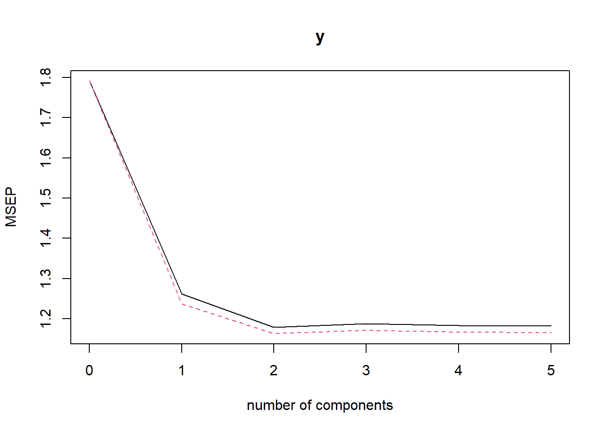
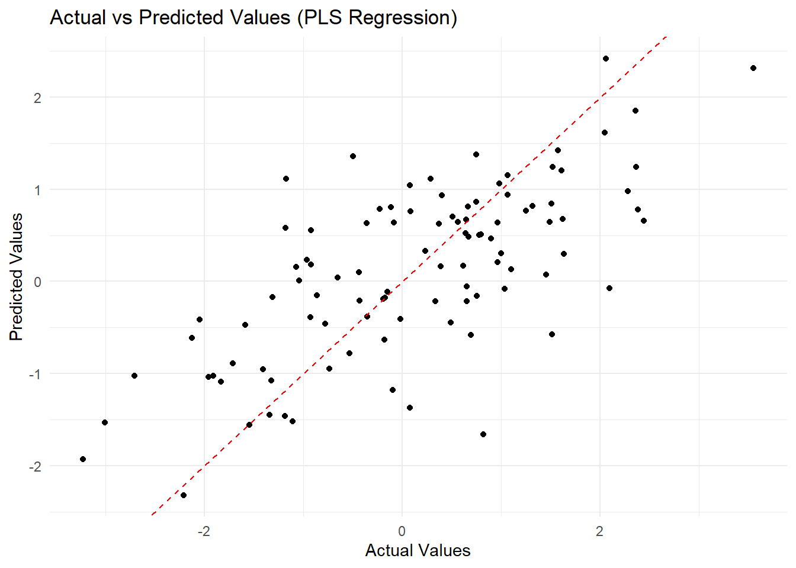

## Partial Least Squares {#sec-partial-least-squares}

Partial Least Squares (PLS) is a dimensionality reduction technique used for regression and predictive modeling. It is particularly useful when predictors are highly collinear or when the number of predictors ($p$) exceeds the number of observations ($n$). Unlike methods such as Principal Component Regression (PCR), PLS simultaneously considers the relationship between predictors and the response variable.

------------------------------------------------------------------------

### Motivation for PLS

Limitations of Classical Methods

1.  **Multicollinearity**:
    -   OLS fails when predictors are highly correlated because the design matrix $X'X$ becomes nearly singular, leading to unstable estimates.
2.  **High-Dimensional Data**:
    -   When $p > n$, OLS cannot be directly applied as $X'X$ is not invertible.
3.  **Principal Component Regression (PCR)**:
    -   While PCR addresses multicollinearity by using principal components of $X$, it does not account for the relationship between predictors and the response variable $y$ when constructing components.

PLS overcomes these limitations by constructing components that maximize the covariance between predictors $X$ and the response $y$. It finds a compromise between explaining the variance in $X$ and predicting $y$, making it particularly suited for regression in high-dimensional or collinear datasets.

------------------------------------------------------------------------

Let:

-   $X$ be the $n \times p$ matrix of predictors,

-   $y$ be the $n \times 1$ response vector,

-   $t_k$ be the $k$-th latent component derived from $X$,

-   $p_k$ and $q_k$ be the loadings for $X$ and $y$, respectively.

PLS aims to construct latent components $t_1, t_2, \ldots, t_K$ such that:

1.  Each $t_k$ is a linear combination of the predictors: $t_k = X w_k$, where $w_k$ is a weight vector. 2
2.  The covariance between $t_k$ and $y$ is maximized: $$
       \text{Maximize } Cov(t_k, y) = w_k' X' y.
       $$

------------------------------------------------------------------------

### Steps to Construct PLS Components

1.  **Compute Weights**:
    -   The weights $w_k$ for the $k$-th component are obtained by solving: $$
        w_k = \frac{X'y}{\|X'y\|}.
        $$
2.  **Construct Latent Component**:
    -   Form the $k$-th latent component: $$
        t_k = X w_k.
        $$
3.  **Deflate the Predictors**:
    -   After extracting $t_k$, the predictors are deflated to remove the information explained by $t_k$: $$
        X \leftarrow X - t_k p_k',
        $$ where $p_k = \frac{X't_k}{t_k't_k}$ are the loadings for $X$.
4.  **Deflate the Response**:
    -   Similarly, deflate $y$ to remove the variance explained by $t_k$: $$
        y \leftarrow y - t_k q_k,
        $$ where $q_k = \frac{t_k'y}{t_k't_k}$.
5.  **Repeat for All Components**:
    -   Repeat the steps above until $K$ components are extracted.

After constructing $K$ components, the response $y$ is modeled as:

$$
y = T C + \epsilon,
$$

where:

-   $T = [t_1, t_2, \ldots, t_K]$ is the matrix of latent components,

-   $C$ is the vector of regression coefficients.

The estimated coefficients for the original predictors are then:

$$
\hat{\beta} = W (P' W)^{-1} C,
$$

where $W = [w_1, w_2, \ldots, w_K]$ and $P = [p_1, p_2, \ldots, p_K]$.

------------------------------------------------------------------------

### Properties of PLS

1.  **Dimensionality Reduction**:
    -   PLS reduces $X$ to $K$ components, where $K \leq \min(n, p)$.
2.  **Handles Multicollinearity**:
    -   By constructing uncorrelated components, PLS avoids the instability caused by multicollinearity in OLS.
3.  **Supervised Dimensionality Reduction**:
    -   Unlike PCR, PLS considers the relationship between $X$ and $y$ when constructing components.
4.  **Efficiency**:
    -   PLS requires fewer components than PCR to achieve a similar level of predictive accuracy.

------------------------------------------------------------------------

Practical Considerations

1.  **Number of Components**:
    -   The optimal number of components $K$ can be determined using cross-validation.
2.  **Preprocessing**:
    -   Standardizing predictors is essential for PLS, as it ensures that all variables are on the same scale.
3.  **Comparison with Other Methods**:
    -   PLS outperforms OLS and PCR in cases of multicollinearity or when $p > n$, but it may be less interpretable than sparse methods like Lasso.

------------------------------------------------------------------------


``` r
# Load required library
library(pls)

# Step 1: Simulate data
set.seed(123)  # Ensure reproducibility
n <- 100       # Number of observations
p <- 10        # Number of predictors
X <- matrix(rnorm(n * p), nrow = n, ncol = p)  # Design matrix (predictors)
beta <- runif(p)                               # True coefficients
y <- X %*% beta + rnorm(n)                     # Response variable with noise

# Step 2: Fit Partial Least Squares (PLS) Regression
pls_fit <- plsr(y ~ X, ncomp = 5, validation = "CV")

# Step 3: Summarize the PLS Model
summary(pls_fit)
#> Data: 	X dimension: 100 10 
#> 	Y dimension: 100 1
#> Fit method: kernelpls
#> Number of components considered: 5
#> 
#> VALIDATION: RMSEP
#> Cross-validated using 10 random segments.
#>        (Intercept)  1 comps  2 comps  3 comps  4 comps  5 comps
#> CV           1.339    1.123    1.086    1.090    1.088    1.087
#> adjCV        1.339    1.112    1.078    1.082    1.080    1.080
#> 
#> TRAINING: % variance explained
#>    1 comps  2 comps  3 comps  4 comps  5 comps
#> X    10.88    20.06    30.80    42.19    51.61
#> y    44.80    48.44    48.76    48.78    48.78
```


``` r
# Step 4: Perform Cross-Validation and Select Optimal Components
validationplot(pls_fit, val.type = "MSEP")
```

<div class="figure" style="text-align: center">

<p class="caption">(\#fig:fig-pls-validation-msep)Validation Plot of PLS Model: Mean Squared Error of Prediction (MSEP)</p>
</div>


``` r
# Step 5: Extract Coefficients for Predictors
pls_coefficients <- coef(pls_fit)
print(pls_coefficients)
#> , , 5 comps
#> 
#>               y
#> X1   0.30192935
#> X2  -0.03161151
#> X3   0.22392538
#> X4   0.42315637
#> X5   0.33000198
#> X6   0.66228763
#> X7   0.40452691
#> X8  -0.05704037
#> X9  -0.02699757
#> X10  0.05944765

# Step 6: Evaluate Model Performance
predicted_y <- predict(pls_fit, X)
actual_vs_predicted <- data.frame(
  Actual = y,
  Predicted = predicted_y[, , 5]  # Predicted values using 5 components
)
```


``` r
# Plot Actual vs Predicted
library(ggplot2)
ggplot(actual_vs_predicted, aes(x = Actual, y = Predicted)) +
    geom_point() +
    geom_abline(
        intercept = 0,
        slope = 1,
        color = "red",
        linetype = "dashed"
    ) +
    labs(title = "Actual vs Predicted Values (PLS Regression)",
         x = "Actual Values",
         y = "Predicted Values") +
    theme_minimal()
```

<div class="figure" style="text-align: center">

<p class="caption">(\#fig:fig-actual-predicted-pls)Actual vs Predicted Values (PLS Regression)</p>
</div>


``` r
# Step 7: Extract and Interpret Variable Importance (Loadings)
loadings_matrix <- as.matrix(unclass(loadings(pls_fit)))
variable_importance <- as.data.frame(loadings_matrix)
colnames(variable_importance) <-
    paste0("Component_", 1:ncol(variable_importance))
rownames(variable_importance) <-
    paste0("X", 1:nrow(variable_importance))

# Print variable importance
print(variable_importance)
#>     Component_1 Component_2 Component_3 Component_4 Component_5
#> X1  -0.04991097   0.5774569  0.24349681 -0.41550345 -0.02098351
#> X2   0.08913192  -0.1139342 -0.17582957 -0.05709948 -0.06707863
#> X3   0.13773357   0.1633338  0.07622919 -0.07248620 -0.61962875
#> X4   0.40369572  -0.2730457  0.69994206 -0.07949013  0.35239113
#> X5   0.50562681  -0.1788131 -0.27936562  0.36197480 -0.41919645
#> X6   0.57044281   0.3358522 -0.38683260  0.17656349  0.31154275
#> X7   0.36258623   0.1202109 -0.01753715 -0.12980483 -0.06919411
#> X8   0.12975452  -0.1164935 -0.30479310 -0.65654861  0.49948167
#> X9  -0.29521786   0.6170234 -0.32082508 -0.01041860  0.04904396
#> X10  0.23930055  -0.3259554  0.20006888 -0.53547258 -0.17963372
```

The loadings provide the contribution of each predictor to the PLS components. Higher absolute values indicate stronger contributions to the corresponding component.

-   **Summary of the Model**:

    -   The **proportion of variance explained** indicates how much of the variability in both the predictors and response is captured by each PLS component.

    -   The goal is to retain enough components to explain most of the variance while avoiding overfitting.

-   **Validation Plot**:

    -   The **Mean Squared Error of Prediction (MSEP)** curve is used to select the optimal number of components.

    -   Adding too many components can lead to overfitting, while too few may underfit the data.

-   **Coefficients**:

    -   The extracted coefficients are the weights applied to the predictors in the final PLS model.

    -   These coefficients are derived from the PLS components and may differ from OLS regression coefficients due to dimensionality reduction.

-   **Actual vs Predicted Plot**:

    -   This visualization evaluates how well the PLS model predicts the response variable.

    -   Points tightly clustered around the diagonal indicate good performance.

-   **VIP Scores**:

    -   VIP scores help identify the most important predictors in the PLS model.

    -   Predictors with higher VIP scores contribute more to explaining the response variable.

### Comparison with Related Methods

| **Method**       | **Handles Multicollinearity** | **Supervised Dimensionality Reduction** | **Sparse Solution** | **Interpretability** |
|------------------|-------------------------------|-----------------------------------------|---------------------|----------------------|
| OLS              | No                            | No                                      | No                  | High                 |
| Ridge Regression | Yes                           | No                                      | No                  | Moderate             |
| Lasso Regression | Yes                           | No                                      | Yes                 | High                 |
| PCR              | Yes                           | No                                      | No                  | Low                  |
| PLS              | Yes                           | Yes                                     | No                  | Moderate             |

: Comparison of Regression Methods for High-Dimensional Data

------------------------------------------------------------------------
