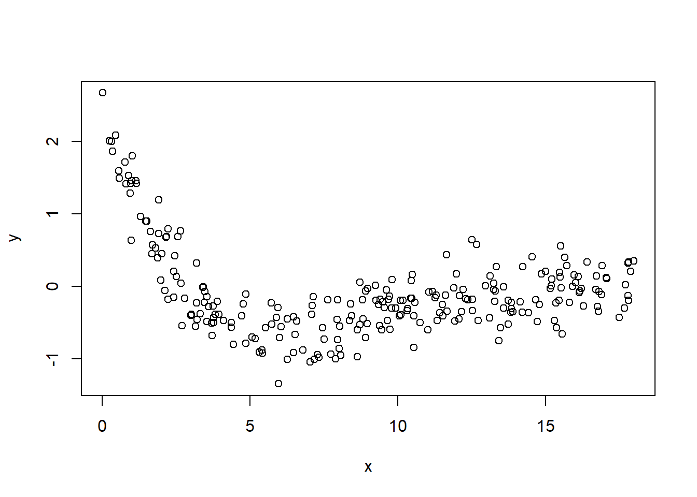
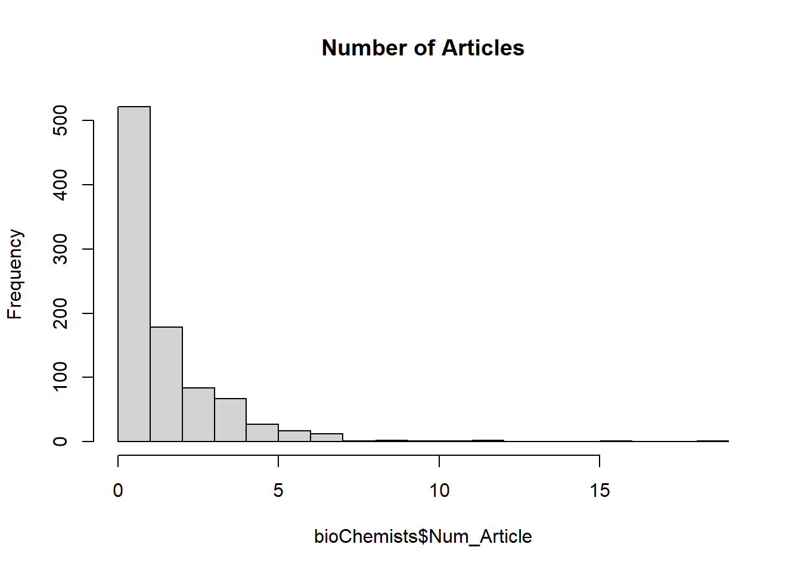

# Non-linear Regression


**Definition**: models in which the derivatives of the mean function with respect to the parameters depend on one or more of the parameters.

To approximate data, we can approximate the function

-   by a high-order polynomial\
-   by a linear model (e.g., a Taylor expansion around X's)\
-   a collection of locally linear models or basis function

but it would not easy to interpret, or not enough data, or can't interpret them globally.

**intrinsically nonlinear** models:

$$
Y_i = f(\mathbf{x_i;\theta}) + \epsilon_i
$$ where $f(\mathbf{x_i;\theta})$ is a nonlinear function relating $E(Y_i)$ to the independent variables $x_i$

-   $\mathbf{x}_i$ is a k x 1 vector of independent variables (fixed).\
-   $\mathbf{\theta}$ is a p x 1 vector of parameters.\
-   $\epsilon_i$s are iid variables mean 0 and variance $\sigma^2$. (sometimes it's normal).

## Inference

Since $Y_i = f(\mathbf{x}_i,\theta) + \epsilon_i$, where $\epsilon_i \sim iid(0,\sigma^2)$. We can obtain $\hat{\theta}$ by minimizing $\sum_{i=1}^{n}(Y_i - f(x_i,\theta))^2$ and estimate $s^2 = \hat{\sigma}^2_{\epsilon}=\frac{\sum_{i=1}^{n}(Y_i - f(x_i,\theta))^2}{n-p}$

### Linear Function of the Parameters

If we assume $\epsilon_i \sim N(0,\sigma^2)$, then

$$
\hat{\theta} \sim AN(\mathbf{\theta},\sigma^2[\mathbf{F}(\theta)'\mathbf{F}(\theta)]^{-1})
$$ where An = asymptotic normality

Asymptotic means we have enough data to make inference (As your sample size increases, this becomes more and more accurate (to the true value)).

Since we want to do inference on linear combinations of parameters or contrasts.

If we have $\mathbf{\theta} = (\theta_0,\theta_1,\theta_2)'$ and we want to look at $\theta_1 - \theta_2$; we can define vector $\mathbf{a} = (0,1,-1)'$, consider inference for $\mathbf{a'\theta}$

Rules for expectation and variance of a fixed vector $\mathbf{a}$ and random vector $\mathbf{Z}$;

$$
E(\mathbf{a'Z}) = \mathbf{a'}E(\mathbf{Z}) \\
var(\mathbf{a'Z}) = \mathbf{a'}var(\mathbf{Z})\mathbf{a}
$$

Then,

$$
\mathbf{a'\hat{\theta}} \sim AN(\mathbf{a'\theta},\sigma^2\mathbf{a'[F(\theta)'F(\theta)]^{-1}a})
$$

and $\mathbf{a'\hat{\theta}}$ is asymptotically independent of $s^2$ (to order 1/n) then

$$
\frac{\mathbf{a'\hat{\theta}-a'\theta}}{s(\mathbf{a'[F(\theta)'F(\theta)]^{-1}a})^{1/2}} \sim t_{n-p}
$$ to construct $100(1-\alpha)\%$ confidence interval for $\mathbf{a'\theta}$

$$
\mathbf{a'\theta} \pm t_{(1-\alpha/2,n-p)}s(\mathbf{a'[F(\theta)'F(\theta)]^{-1}a})^{1/2}
$$

Suppose $\mathbf{a'} = (0,...,j,...,0)$. Then, a confidence interval for the jth element of $\mathbf{\theta}$ is

$$
\hat{\theta}_j \pm t_{(1-\alpha/2,n-p)}s\sqrt{\hat{c}^{j}}
$$ where $\hat{c}^{j}$ is the jth diagonal element of $[\mathbf{F(\hat{\theta})'F(\hat{\theta})}]^{-1}$


```r
#set a seed value 
set.seed(23)

#Generate x as 100 integers using seq function
x<-seq(0,100,1)

#Generate y as a*e^(bx)+c
y<-runif(1,0,20)*exp(runif(1,0.005,0.075)*x)+runif(101,0,5)

# visulize
plot(x,y)
```


```r
#define our data frame
datf = data.frame(x,y)

#define our model function
mod =function(a,b,x) a*exp(b*x)
```

In this example, we can get the starting values by using linearized version of the function $\log y = \log a + b x$. Then, we can fit a linear regression to this and use our estimates as starting values


```r
#get starting values by linearizing
lin_mod=lm(log(y)~x,data=datf)

#convert the a parameter back from the log scale; b is ok 
astrt = exp(as.numeric(lin_mod$coef[1]))
bstrt = as.numeric(lin_mod$coef[2])
print(c(astrt,bstrt))
```

```
## [1] 14.07964761  0.01855635
```

with `nls`, we can fit the nonlinear model via least squares


```r
nlin_mod=nls(y~mod(a,b,x),start=list(a=astrt,b=bstrt),data=datf) 

#look at model fit summary
summary(nlin_mod)
```

```
## 
## Formula: y ~ mod(a, b, x)
## 
## Parameters:
##    Estimate Std. Error t value Pr(>|t|)    
## a 13.603909   0.165390   82.25   <2e-16 ***
## b  0.019110   0.000153  124.90   <2e-16 ***
## ---
## Signif. codes:  0 '***' 0.001 '**' 0.01 '*' 0.05 '.' 0.1 ' ' 1
## 
## Residual standard error: 1.542 on 99 degrees of freedom
## 
## Number of iterations to convergence: 3 
## Achieved convergence tolerance: 7.006e-07
```

```r
#add prediction to plot
plot(x,y)
lines(x,predict(nlin_mod),col="red")
```


### Nonlinear

Suppose that $h(\theta)$ is a nonlinear function of the parameters. We can use Taylor series about $\theta$

$$
h(\hat{\theta}) \approx h(\theta) + \mathbf{h}'[\hat{\theta}-\theta]
$$ where $\mathbf{h} = (\frac{\partial h}{\partial \theta_1},...,\frac{\partial h}{\partial \theta_p})'$

with

$$
E(\hat{\theta}) \approx \theta \\
var(\hat{\theta}) \approx  \sigma^2[\mathbf{F(\theta)'F(\theta)}]^{-1} \\
E(h(\hat{\theta})) \approx h(\theta) \\
var(h(\hat{\theta})) \approx \sigma^2 \mathbf{h'[F(\theta)'F(\theta)]^{-1}h}
$$

Thus,

$$
h(\hat{\theta}) \sim AN(h(\theta),\sigma^2\mathbf{h'[F(\theta)'F(\theta)]^{-1}h})
$$ and an approximate $100(1-\alpha)\%$ confidence interval for $h(\theta)$ is

$$
h(\hat{\theta}) \pm t_{(1-\alpha/2;n-p)}s(\mathbf{h'[F(\theta)'F(\theta)]^{-1}h})^{1/2}
$$

where $\mathbf{h}$ and $\mathbf{F}(\theta)$ are evaluated at $\hat{\theta}$

Regarding **prediction interval** for Y at $x=x_0$

$$
Y_0 = f(x_0;\theta) + \epsilon_0, \epsilon_0 \sim N(0,\sigma^2) \\
\hat{Y}_0 = f(x_0,\hat{\theta})
$$

As $n \to \infty$, $\hat{\theta} \to \theta$, so we

$$
f(x_0, \hat{\theta}) \approx f(x_0,\theta) + \mathbf{f}_0(\mathbf{\theta})'[\hat{\theta}-\theta]
$$ where $f_0(\theta)= (\frac{\partial f(x_0,\theta)}{\partial \theta_1},..,\frac{\partial f(x_0,\theta)}{\partial \theta_p})'$ (note: this $f_0(\theta)$ is different from $f(\theta)$).

$$
Y_0 - \hat{Y}_0 \approx Y_0  - f(x_0,\theta) - f_0(\theta)'[\hat{\theta}-\theta]  \\
= \epsilon_0 - f_0(\theta)'[\hat{\theta}-\theta]
$$

$$
E(Y_0 - \hat{Y}_0) \approx E(\epsilon_0)E(\hat{\theta}-\theta) = 0 \\
var(Y_0 - \hat{Y}_0) \approx var(\epsilon_0 - \mathbf{(f_0(\theta)'[\hat{\theta}-\theta])}) \\
= \sigma^2 + \sigma^2 \mathbf{f_0 (\theta)'[F(\theta)'F(\theta)]^{-1}f_0(\theta)} \\
= \sigma^2 (1 + \mathbf{f_0 (\theta)'[F(\theta)'F(\theta)]^{-1}f_0(\theta)})
$$

Hence, combining

$$
Y_0 - \hat{Y}_0 \sim AN (0,\sigma^2 (1 + \mathbf{f_0 (\theta)'[F(\theta)'F(\theta)]^{-1}f_0(\theta)}))
$$

Note:

Confidence intervals for the mean response $Y_i$ (which is different from prediction intervals) can be obtained similarly.

## Non-linear Least Squares

-   The LS estimate of $\theta$, $\hat{\theta}$ is the set of parameters that minimizes the residual sum of squares:\
    $$
    S(\hat{\theta}) = SSE(\hat{\theta}) = \sum_{i=1}^{n}\{Y_i - f(\mathbf{x_i};\hat{\theta})\}^2
    $$
-   to obtain the solution, we can consider the partial derivatives of $S(\theta)$ with respect to each $\theta_j$ and set them to 0, which gives a system of p equations. Each normal equation is $$
    \frac{\partial S(\theta)}{\partial \theta_j} = -2\sum_{i=1}^{n}\{Y_i -f(\mathbf{x}_i;\theta)\}[\frac{\partial(\mathbf{x}_i;\theta)}{\partial \theta_j}] = 0
    $$
-   but we can't obtain a solution directly/analytically for this equation.

**Numerical Solutions**

-   Grid search

    -   A "grid" of possible parameter values and see which one minimize the residual sum of squares.\
    -   finer grid = greater accuracy\
    -   could be inefficient, and hard when p is large.\

-   Gauss-Newton Algorithm

    -   we have an initial estimate of $\theta$ denoted as $\hat{\theta}^{(0)}$\
    -   use a Taylor expansions of $f(\mathbf{x}_i;\theta)$ as a function of $\theta$ about the point $\hat{\theta}^{(0)}$

$$
\begin{align} 
Y_i &= f(x_i;\theta) + \epsilon_i \\
&= f(x_i;\theta) + \sum_{j=1}^{p}\{\frac{\partial f(x_i;\theta)}{\partial \theta_j}\}_{\theta = \hat{\theta}^{(0)}} (\theta_j - \hat{\theta}^{(0)}) + \text{remainder} + \epsilon_i
\end{align}
$$

Equivalently,

In matrix notation,

$$
\mathbf{Y} = 
\left[ \begin{array}
{ccc}
Y_1 \\
. \\
Y_n
\end{array} \right]
$$

$$
\mathbf{f}(\hat{\theta}^{(0)}) =
\left[ \begin{array}
{ccc}
f(\mathbf{x_1,\hat{\theta}}^{(0)}) \\
. \\
f(\mathbf{x_n,\hat{\theta}}^{(0)})
\end{array} \right]
$$

$$
\mathbf{\epsilon} = 
\left[ \begin{array}
{ccc}
\epsilon_1 \\
. \\
\epsilon_n
\end{array} \right]
$$

$$
\mathbf{F}(\hat{\theta}^{(0)}) = 
\left[ \begin{array}
{ccc}
\frac{\partial f(x_1,\mathbf{\theta})}{\partial \theta_1} && ... && \frac{\partial f(x_1,\mathbf{\theta})}{\partial \theta_p}\\
. && . && . \\
\frac{\partial f(x_n,\mathbf{\theta})}{\partial \theta_1} && ... && \frac{\partial f(x_n,\mathbf{\theta})}{\partial \theta_p}
\end{array} \right]_{\theta = \hat{\theta}^{(0)}}
$$

Hence,

$$
\mathbf{Y} = \mathbf{f}(\hat{\theta}^{(0)}) + \mathbf{F}(\hat{\theta}^{(0)})(\theta - \hat{\theta}^{(0)}) + \epsilon + \text{remainder}
$$ where we assume that the remainder is small and the error term is only assumed to be iid with mean 0 and variance $\sigma^2$.

We can rewrite the above equation as

$$
\mathbf{Y} - \mathbf{f}(\hat{\theta}^{(0)}) \approx \mathbf{F}(\hat{\theta}^{(0)})(\theta - \hat{\theta}^{(0)}) + \epsilon
$$ where it is in the form of linear model. After we solve for $(\theta - \hat{\theta}^{(0)})$ and let it equal to $\hat{\delta}^{(1)}$\
Then we new estimate is given by adding the Gauss increment adjustment to the initial estimate $\hat{\theta}^{(1)} = \hat{\theta}^{(0)} + \hat{\delta}^{(1)}$\
We can repeat this process.

Gauss-Newton Algorithm Steps:

1.  initial estimate $\hat{\theta}^{(0)}$, set j = 0\
2.  Taylor series expansion and calculate $\mathbf{f}(\hat{\theta}^{(j)})$ and $\mathbf{F}(\hat{\theta}^{(j)})$
3.  Use OLS to get $\hat{\delta}^{(j+1)}$\
4.  get the new estimate $\hat{\theta}^{(j+1)}$, return to step 2\
5.  continue until "convergence"\
6.  With the final parameter estimate $\hat{\theta}$, we can estimate $\sigma^2$ if $\epsilon \sim (\mathbf{0}, \sigma^2 \mathbf{I})$ by

$$
\hat{\sigma}^2= \frac{1}{n-p}(\mathbf{Y}-\mathbf{f}(x;\hat{\theta}))'(\mathbf{Y}-\mathbf{f}(x;\hat{\theta}))
$$

<br>

**Criteria for convergence**

1.  Minor change in the objective function (SSE = residual sum of squares)\
    $$
    \frac{|SSE(\hat{\theta}^{(j+1)})-SSE(\hat{\theta}^{(j)})|}{SSE(\hat{\theta}^{(j)})} < \gamma_1
    $$
2.  Minor change in the parameter estimates\
    $$
    |\hat{\theta}^{(j+1)}-\hat{\theta}^{(j)}| < \gamma_2
    $$
3.  "residual projection" criterion of [@Bates_1981]

### Alternative of Gauss-Newton Algorithm

#### Gauss-Newton Algorithm

Normal equations:

$$
\frac{\partial SSE(\theta)}{\partial \theta} = 2\mathbf{F}(\theta)'[\mathbf{Y}-\mathbf{f}(\theta)]
$$

$$
\begin{align}
\hat{\theta}^{(j+1)} &= \hat{\theta}^{(j)} + \hat{\delta}^{(j+1)} \\
&= \hat{\theta}^{(j)} + [\mathbf{F}((\hat{\theta})^{(j)})'\mathbf{F}(\hat{\theta}^{(j)})]^{-1}\mathbf{F}(\hat{\theta})^{(j)} \\
&= \hat{\theta}^{(j)} - \frac{1}{2}[\mathbf{F}(\hat{\theta}^{(j)})'\mathbf{F}(\hat{\theta}^{(j)})]^{-1}\frac{\partial SSE(\hat{\theta}^{(j)})}{\partial \theta}
\end{align}
$$ where

-   $\frac{\partial SSE(\hat{\theta}^{(j)})}{\partial \theta}$ is a gradient vecotr (points in the direction in which the SSE increases most rapidly). This path is known as steepest ascent.\
-   $[\mathbf{F}(\hat{\theta}^{(j)})'\mathbf{F}(\hat{\theta}^{(j)})]^{-1}$ indicates how far to move\
-   $-1/2$: indicator of the direction of steepest descent.

#### Modified Gauss-Newton Algorithm

To avoid overstepping (the local min), we can use the modified Gauss-Newton Algorithm. We define a new proposal for $\theta$

$$
\hat{\theta}^{(j+1)} = \hat{\theta}^{(j)} + \alpha_j \hat{\delta}^{(j+1)}, 0 < \alpha_j < 1
$$ where

-   $\alpha_j$ (called the "learning rate"): is used to modify the step length.

We could also have $\alpha *1/2$, but typically it is assumed to be absorbed into the learning rate.

A way to choose $\alpha_j$, we can use **step halving**

$$
\hat{\theta}^{(j+1)} = \hat{\theta}^{(j)} + \frac{1}{2^k}\hat{\delta}^{(j+1)}
$$ where

-   k is the smallest non-negative integer such that\
    $$
    SSE(\hat{\theta}^{(j)}+\frac{1}{2^k}\hat{\delta}^{(j+1)}) < SSE(\hat{\theta}^{(j)})
    $$ which means we try $\hat{\delta}^{(j+1)}$, then $\hat{\delta}^{(j+1)}/2$, $\hat{\delta}^{(j+1)}/4$, etc.

The most general form of the convergence algorithm is

$$
\hat{\theta}^{(j+1)} = \hat{\theta}^{(j)} - \alpha_j \mathbf{A}_j \frac{\partial Q(\hat{\theta}^{(j)})}{\partial \theta} 
$$ where

-   $\mathbf{A}_j$ is a positive definite matrix\
-   $\alpha_j$ is the learning rate\
-   $\frac{\partial Q(\hat{\theta}^{(j)})}{\partial \theta}$is the gradient based on some objective function Q (a function of $\theta$), which is typically the SSE in nonlinear regression applications (e.g., cross-entropy for classification).

Refer back to the **Modified Gauss-Newton Algorithm**, we can see it is in this form

$$
\hat{\theta}^{(j+1)} =\hat{\theta}^{(j)} - \alpha_j[\mathbf{F}(\hat{\theta}^{(j)})'\mathbf{F}(\hat{\theta}^{(j)})]^{-1}\frac{\partial SSE(\hat{\theta}^{(j)})}{\partial \theta}
$$ where Q = SSE, $[\mathbf{F}(\hat{\theta}^{(j)})'\mathbf{F}(\hat{\theta}^{(j)})]^{-1} = \mathbf{A}$

#### Steepest Descent

(also known just "gradient descent")

$$
\hat{\theta}^{(j+1)} = \hat{\theta}^{(j)} - \alpha_j \mathbf{I}_{p \times p}\frac{\partial \mathbf{Q}(\hat{\theta}^{(j)})}{\partial \theta}
$$

-   slow to converge, moves rapidly initially.\
-   could be use for starting values

#### Levenberg -Marquardt

$$
\hat{\theta}^{(j+1)} = \hat{\theta}^{(j)} - \alpha_j [\mathbf{F}(\hat{\theta}^{(j)})'\mathbf{F}(\hat{\theta}^{(j)})+ \tau \mathbf{I}_{p \times p}]\frac{\partial \mathbf{Q}(\hat{\theta}^{(j)})}{\partial \theta}
$$

which is a compromise between the [Gauss-Newton Algorithm] and the [Steepest Descent].

-   best when $\mathbf{F}(\hat{\theta}^{(j)})'\mathbf{F}(\hat{\theta}^{(j)})$ is nearly singular ($\mathbf{F}(\hat{\theta}^{(j)})$ isn't of full rank)\
-   similar to ridge regression\
-   If $SSE(\hat{\theta}^{(j+1)}) < SSE(\hat{\theta}^{(j)})$, then $\tau= \tau/10$ for the next iteration. Otherwise, $\tau = 10 \tau$

#### Newton-Raphson

$$
\hat{\theta}^{(j+1)} = \hat{\theta}^{(j)} - \alpha_j [\frac{\partial^2Q(\hat{\theta}^{(j)})}{\partial \theta \partial \theta'}]^{-1}\frac{\partial \mathbf{Q}(\hat{\theta}^{(j)})}{\partial \theta}
$$

The **Hessian matrix** can be rewritten as:

$$
\frac{\partial^2Q(\hat{\theta}^{(j)})}{\partial \theta \partial \theta'} = 2 \mathbf{F}((\hat{\theta})^{(j)})'\mathbf{F}(\hat{\theta}^{(j)}) - 2\sum_{i=1}^{n}[Y_i - f(x_i;\theta)]\frac{\partial^2f(x_i;\theta)}{\partial \theta \partial \theta'}
$$ which contains the same term that [Gauss-Newton Algorithm], combined with one containing the second partial derivatives of f(). (methods that require the second derivatives of the objective function are known as "second-order methods".)\
However, the last term \frac{\partial^2f(x_i;\theta)}{\partial \theta \partial \theta'} can sometimes be nonsingular.

#### Quasi-Newton

update $\theta$ according to

$$
\hat{\theta}^{(j+1)} = \hat{\theta}^{(j)} - \alpha_j \mathbf{H}_j^{-1}\frac{\partial \mathbf{Q}(\hat{\theta}^{(j)})}{\partial \theta}
$$ where $H_j$ is a symmetric positive definite approximation to the Hessian, which gets closer as $j \to \infty$.

-   $\mathbf{H}_j$ is computed iteratively\
-   AMong first-order methods(where only first derivatives are required), this method performs best.

#### Derivative Free Methods

-   **secant Method**: like [Gauss-Newton Algorithm], but calculates the derivatives numerically from past iterations.\
-   **Simplex Methods**\
-   **Genetic Algorithm**\
-   **Differential Evolution Algorithms**\
-   **Particle Swarm Optimization**\
-   **Ant Colony Optimization**

### Practical Considerations

To converge, algorithm need good initial estimates.

-   Starting values:

    -   Prior or theoretical info\
    -   A grid search or a graph of $SSE(\theta)$\
    -   could also use OLS to get starting values.\
    -   Model interpretation: if you have some idea regarding the form of the objective function, then you can try to guess the initial value.\
    -   Expected Value Parameterization\

-   Constrained Parameters: (constraints on parameters like $\theta_i>a,a< \theta_i <b$)

    -   fit the model first to see if the converged parameter estimates satisfy the constraints.
    -   if they dont' satisfy, then try re-parameterizing

#### Failure to converge

-   $SSE(\theta)$ may be "flat" in a neighborhood of the minimum.\
-   You can try different or "better" starting values.\
-   Might suggest the model is too complex for the data, might consider simpler model.

#### Convergence to a Local Minimum

-   Linear least squares has the property that $SSE(\theta) = \mathbf{(Y-X\beta)'(Y-X\beta)}$, which is quadratic and has a unique minimum (or maximum).\
-   Nonlinear east squares need not have a unique minimum\
-   Using different starting values can help\
-   If the dimension of $\theta$ is low, graph $SSE(\theta)$ as a function of $\theta_i$\
-   Different algorithm can help (e.g., genetic algorithm, particle swarm)

To converge, algorithms need good initial estimates.

-   Starting values:

    -   prior or theoretical info\
    -   A grid search or a graph
    -   OLS estimates as starting values\
    -   Model interpretation\
    -   Expected Value Parameterization\

-   Constrained Parameters:

    -   try the model without the constraints first.\
    -   If the resulted parameter estimates does not satisfy the constraint, try re-parameterizing


```r
# Grid search
#choose grid of a and b values
aseq = seq(10,18,.2)
bseq = seq(.001,.075,.001)

na = length(aseq)
nb = length(bseq)
SSout = matrix(0,na*nb,3) #matrix to save output
cnt = 0
for (k in 1:na){
   for (j in 1:nb){
      cnt = cnt+1
      ypred = mod(aseq[k],bseq[j],x) #evaluate model w/ these parms
      ss = sum((y-ypred)^2)  #this is our SSE objective function
      #save values of a, b, and SSE
      SSout[cnt,1]=aseq[k]
      SSout[cnt,2]=bseq[j]
      SSout[cnt,3]=ss
   }
}
#find minimum SSE and associated a,b values
mn_indx = which.min(SSout[,3])
astrt = SSout[mn_indx,1]
bstrt = SSout[mn_indx,2]
#now, run nls function with these starting values
nlin_modG=nls(y~mod(a,b,x),start=list(a=astrt,b=bstrt)) 

nlin_modG
```

```
## Nonlinear regression model
##   model: y ~ mod(a, b, x)
##    data: parent.frame()
##        a        b 
## 13.60391  0.01911 
##  residual sum-of-squares: 235.5
## 
## Number of iterations to convergence: 3 
## Achieved convergence tolerance: 2.293e-07
```

```r
# Note, the package `nls_multstart` will allow you to do a grid search without programming your own loop
```

For prediction interval


```r
plotFit(nlin_modG, interval = "both", pch = 19, shade = TRUE, 
        col.conf = "skyblue4", col.pred = "lightskyblue2",data=datf)  
```


Based on the forms of your function, you can also have programmed starting values from `nls` function (e.e.g, logistic growth, asymptotic regression, etc).


```r
apropos("^SS")
```

```
##  [1] "ss"          "SSasymp"     "SSasympOff"  "SSasympOrig" "SSbiexp"    
##  [6] "SSD"         "SSfol"       "SSfpl"       "SSgompertz"  "SSlogis"    
## [11] "SSmicmen"    "SSout"       "SSweibull"
```

For example, a logistic growth model:

$$
P = \frac{K}{1+ exp(P_0+ rt)} + \epsilon
$$ where

-   P = population at time t\
-   K = carrying capacity\
-   r = population growth rate

but in `R` you have slight different parameterization:

$$
P = \frac{asym}{1 + exp(\frac{xmid - t}{scal})}
$$ where

-   asym = carrying capacity\
-   xmid = the x value at the inflection point of the curve\
-   scal = scaling parameter.

Hence, you have

-   K = asym\
-   r = -1/scal\
-   $P_0 = -rxmid$


```r
# simulated data
time <- c(1,2,3,5,10,15,20,25,30,35)
population <- c(2.8,4.2,3.5,6.3,15.7,21.3,23.7,25.1,25.8,25.9)
plot(time, population, las=1, pch=16)
```


```r
# model fitting
logisticModelSS <- nls(population~SSlogis(time, Asym, xmid, scal))
summary(logisticModelSS)
```

```
## 
## Formula: population ~ SSlogis(time, Asym, xmid, scal)
## 
## Parameters:
##      Estimate Std. Error t value Pr(>|t|)    
## Asym  25.5029     0.3666   69.56 3.34e-11 ***
## xmid   8.7347     0.3007   29.05 1.48e-08 ***
## scal   3.6353     0.2186   16.63 6.96e-07 ***
## ---
## Signif. codes:  0 '***' 0.001 '**' 0.01 '*' 0.05 '.' 0.1 ' ' 1
## 
## Residual standard error: 0.6528 on 7 degrees of freedom
## 
## Number of iterations to convergence: 1 
## Achieved convergence tolerance: 1.908e-06
```

```r
coef(logisticModelSS)
```

```
##      Asym      xmid      scal 
## 25.502890  8.734698  3.635333
```

Other parameterization


```r
#convert to other parameterization
Ks = as.numeric(coef(logisticModelSS)[1])
rs = -1/as.numeric(coef(logisticModelSS)[3])
Pos = - rs * as.numeric(coef(logisticModelSS)[2])
#let's refit with these parameters
logisticModel <- nls(population ~ K / (1 + exp(Po + r * time)),start=list(Po=Pos,r=rs,K=Ks))
summary(logisticModel)
```

```
## 
## Formula: population ~ K/(1 + exp(Po + r * time))
## 
## Parameters:
##    Estimate Std. Error t value Pr(>|t|)    
## Po  2.40272    0.12702   18.92 2.87e-07 ***
## r  -0.27508    0.01654  -16.63 6.96e-07 ***
## K  25.50289    0.36665   69.56 3.34e-11 ***
## ---
## Signif. codes:  0 '***' 0.001 '**' 0.01 '*' 0.05 '.' 0.1 ' ' 1
## 
## Residual standard error: 0.6528 on 7 degrees of freedom
## 
## Number of iterations to convergence: 0 
## Achieved convergence tolerance: 1.924e-06
```


```r
#note: initial values =  solution (highly unusual, but ok)
plot(time, population, las=1, pch=16)
lines(time,predict(logisticModel),col="red")
```


If can also define your own self-starting fucntion if your models are uncommon (built in `nls`)

Example is based on [@Schabenberger_2001]


```r
#Load data
dat <- read.table("images/dat.txt", header = T)
# plot
dat.plot <- ggplot(dat)+geom_point(aes(x=no3,y=ryp, color=as.factor(depth))) +
labs(color='Depth (cm)') + xlab('Soil NO3') + ylab('relative yield percent')
dat.plot
```


The suggested model (known as plateau model) is

$$
E(Y_{ij}) = (\beta_{0j} + \beta_{1j}N_{ij})I_{N_{ij}\le \alpha_j} + (\beta_{0j} + \beta_{1j}\alpha_j)I_{N_{ij} > \alpha_j}
$$ where

-   N is an observation\
-   i is a particular observation\
-   j = 1,2 corresponding to depths (30,60)


```r
#First define model as a function
nonlinModel <- function(predictor,b0,b1,alpha){
  ifelse(predictor<=alpha, 
         b0+b1*predictor, #if observation less than cutoff simple linear model
         b0+b1*alpha) #otherwise flat line
}
```

define `selfStart` function. Because we defined our model to be linear in the first part and then plateau (remain constant) we can use the first half of our predictors (sorted by increasing value) to get an initial estimate for the slope and intercept of the model, and the last predictor value (alpha) can be the starting value for the plateau parameter.


```r
nonlinModelInit <- function(mCall,LHS,data){
  #sort data by increasing predictor value - 
  #done so we can just use the low level no3 conc to fit a simple model
  xy <- sortedXyData(mCall[['predictor']],LHS,data)
  n <- nrow(xy)
  #For the first half of the data a simple linear model is fit
  lmFit <- lm(xy[1:(n/2),'y']~xy[1:(n/2),'x'])
  b0 <- coef(lmFit)[1]
  b1 <- coef(lmFit)[2]
  #for the cut off to the flat part select the last x value used in creating linear model
  alpha <- xy[(n/2),'x']
  value <- c(b0,b1,alpha)
  names(value) <- mCall[c('b0','b1','alpha')]
  value
}
```

combine model and custom function to calculate starting values.


```r
SS_nonlinModel <- selfStart(nonlinModel,nonlinModelInit,c('b0','b1','alpha'))
```


```r
#Above code defined model and selfStart now just need to call it for each of the depths
sep30_nls <- nls(ryp~SS_nonlinModel(predictor=no3,b0,b1,alpha),data=dat[dat$depth==30,])

sep60_nls <- nls(ryp~SS_nonlinModel(predictor=no3,b0,b1,alpha),data=dat[dat$depth==60,])

par(mfrow=c(1,2))
plotFit(sep30_nls, interval = "both", pch = 19, shade = TRUE,
col.conf = "skyblue4", col.pred = "lightskyblue2",
data=dat[dat$depth==30,],main='Results 30 cm depth',
ylab = 'relative yield percent',xlab = 'Soil NO3 concentration',
xlim = c(0,120))
plotFit(sep60_nls, interval = "both", pch = 19, shade = TRUE,
col.conf = "lightpink4", col.pred = "lightpink2",
data=dat[dat$depth==60,],main='Results 60 cm depth',
ylab = 'relative yield percent',xlab = 'Soil NO3 concentration',
xlim = c(0,120))
```


```r
summary(sep30_nls)
```

```
## 
## Formula: ryp ~ SS_nonlinModel(predictor = no3, b0, b1, alpha)
## 
## Parameters:
##       Estimate Std. Error t value Pr(>|t|)    
## b0     15.1943     2.9781   5.102 6.89e-07 ***
## b1      3.5760     0.1853  19.297  < 2e-16 ***
## alpha  23.1324     0.5098  45.373  < 2e-16 ***
## ---
## Signif. codes:  0 '***' 0.001 '**' 0.01 '*' 0.05 '.' 0.1 ' ' 1
## 
## Residual standard error: 8.258 on 237 degrees of freedom
## 
## Number of iterations to convergence: 6 
## Achieved convergence tolerance: 3.608e-09
```

```r
summary(sep60_nls)
```

```
## 
## Formula: ryp ~ SS_nonlinModel(predictor = no3, b0, b1, alpha)
## 
## Parameters:
##       Estimate Std. Error t value Pr(>|t|)    
## b0      5.4519     2.9785    1.83   0.0684 .  
## b1      5.6820     0.2529   22.46   <2e-16 ***
## alpha  16.2863     0.2818   57.80   <2e-16 ***
## ---
## Signif. codes:  0 '***' 0.001 '**' 0.01 '*' 0.05 '.' 0.1 ' ' 1
## 
## Residual standard error: 7.427 on 237 degrees of freedom
## 
## Number of iterations to convergence: 5 
## Achieved convergence tolerance: 8.571e-09
```

Instead of modeling the depths model separately we model them together - so there is a common slope, intercept, and plateau.


```r
red_nls <- nls(ryp~SS_nonlinModel(predictor=no3,b0,b1,alpha),data=dat)

summary(red_nls)
```

```
## 
## Formula: ryp ~ SS_nonlinModel(predictor = no3, b0, b1, alpha)
## 
## Parameters:
##       Estimate Std. Error t value Pr(>|t|)    
## b0      8.7901     2.7688   3.175   0.0016 ** 
## b1      4.8995     0.2207  22.203   <2e-16 ***
## alpha  18.0333     0.3242  55.630   <2e-16 ***
## ---
## Signif. codes:  0 '***' 0.001 '**' 0.01 '*' 0.05 '.' 0.1 ' ' 1
## 
## Residual standard error: 9.13 on 477 degrees of freedom
## 
## Number of iterations to convergence: 7 
## Achieved convergence tolerance: 7.126e-09
```

```r
par(mfrow=c(1,1))
plotFit(red_nls, interval = "both", pch = 19, shade = TRUE,
col.conf = "lightblue4", col.pred = "lightblue2",
data=dat,main='Results combined',
ylab = 'relative yield percent',xlab = 'Soil NO3 concentration')
```


Examine residual values for the combined model.


```r
library(nlstools)
#using nlstools nlsResiduals function to get some quick residual plots 
#can also use test.nlsResiduals(resid)
# https://www.rdocumentation.org/packages/nlstools/versions/1.0-2
resid <- nlsResiduals(red_nls)
plot(resid)
```


can we test whether the parameters for the two soil depth fits are significantly different? To know if the combined model is appropriate, we consider a parameterization where we let the parameters for the 60cm model be equal to the parameters from the 30cm model plus some increment:

$$
\beta_{02} = \beta_{01} + d_0 \\
\beta_{12} = \beta_{11} + d_1 \\
\alpha_{2} = \alpha_{1} + d_a
$$

We can implement this in the following function:


```r
nonlinModelF <- function(predictor,soildep,b01,b11,a1,d0,d1,da){
   b02 = b01 + d0 #make 60cm parms = 30cm parms + increment
   b12 = b11 + d1
   a2 = a1 + da
   
   y1 = ifelse(predictor<=a1, 
         b01+b11*predictor, #if observation less than cutoff simple linear model
         b01+b11*a1) #otherwise flat line
   y2 = ifelse(predictor<=a2, 
               b02+b12*predictor, 
               b02+b12*a2) 
   y =  y1*(soildep == 30) + y2*(soildep == 60)  #combine models
   return(y)
}
```

Starting values are easy now because we fit each model individually.


```r
Soil_full=nls(ryp~nonlinModelF(predictor=no3,soildep=depth,b01,b11,a1,d0,d1,da),
              data=dat,
              start=list(b01=15.2,b11=3.58,a1=23.13,d0=-9.74,d1=2.11,da=-6.85)) 

summary(Soil_full)
```

```
## 
## Formula: ryp ~ nonlinModelF(predictor = no3, soildep = depth, b01, b11, 
##     a1, d0, d1, da)
## 
## Parameters:
##     Estimate Std. Error t value Pr(>|t|)    
## b01  15.1943     2.8322   5.365 1.27e-07 ***
## b11   3.5760     0.1762  20.291  < 2e-16 ***
## a1   23.1324     0.4848  47.711  < 2e-16 ***
## d0   -9.7424     4.2357  -2.300   0.0219 *  
## d1    2.1060     0.3203   6.575 1.29e-10 ***
## da   -6.8461     0.5691 -12.030  < 2e-16 ***
## ---
## Signif. codes:  0 '***' 0.001 '**' 0.01 '*' 0.05 '.' 0.1 ' ' 1
## 
## Residual standard error: 7.854 on 474 degrees of freedom
## 
## Number of iterations to convergence: 1 
## Achieved convergence tolerance: 3.742e-06
```

So, the increment parameters, $d_1$,$d_2$,$d_a$ are all significantly different from 0, suggesting that we should have two models here.

### Model/Estiamtion Adequcy

[@Bates_1980] assess nonlinearity in terms of 2 components of curvature:

-   **Intrinsic nonlinearity**: the degree of bending and twisting in $f(\theta)$; our estimation approach assumes that hte true function is relatively flat (planar) in the neighborhood fo $\hat{\theta}$, which would not be true if $f()$ has a lot of "bending" int he neighborhood of $\hat{\theta}$ (independent of parameterizaiton)

    -   If bad, the distribution of residuals will be seriously distorted\

    -   slow to converge\

    -   difficult to identify ( could use this function `rms.curve`)\

    -   Solution:

        -   could use higher order Taylor expansions estimation\
        -   Bayesian method

-   **Parameter effects nonlinearity**: degree to which curvature (nonlinearity) is affected by choice of $\theta$ (data dependent; dependent on parameterization)

    -   leads to problems with inferecne on $\hat{\theta}$\
    -   `rms.curve` in `MASS` can identify\
    -   bootstrap-based inference can also be used\
    -   Solution: try to reparaemterize.


```r
#check parameter effects and intrinsic curvature

modD = deriv3(~ a*exp(b*x), c("a","b"),function(a,b,x) NULL)

nlin_modD=nls(y~modD(a,b,x),start=list(a=astrt,b=bstrt),data=datf)

rms.curv(nlin_modD)
```

```
## Parameter effects: c^theta x sqrt(F) = 0.0626 
##         Intrinsic: c^iota  x sqrt(F) = 0.0062
```

In linear model, we have [Linear Regression], we have goodness of fit measure as $R^2$:

$$
R^2 = \frac{SSR}{SSTO} = 1- \frac{SSE}{SSTO} \\
= \frac{\sum_{i=1}^n (\hat{Y}_i- \bar{Y})^2}{\sum_{i=1}^n (Y_i- \bar{Y})^2} = 1- \frac{\sum_{i=1}^n ({Y}_i- \hat{Y})^2}{\sum_{i=1}^n (Y_i- \bar{Y})^2}
$$ but not valid in the nonlinear case because the error sum of squares and model sum of squares do not add to the total corrected sum of squares

$$
SSR + SSE \neq SST
$$

but we can use pseudo-$R^2$:

$$
R^2_{pseudo} = 1 - \frac{\sum_{i=1}^n ({Y}_i- \hat{Y})^2}{\sum_{i=1}^n (Y_i- \bar{Y})^2}
$$ But we can't interpret this as the proportion of variability explained by the model. We should use as a relative comparison of different models.

**Residual Plots**: standardize, similar to OLS. useful when the intrinsic curvature is small:

The studentized residuals

$$
r_i = \frac{e_i}{s\sqrt{1-\hat{c}_i}}
$$

where $\hat{c}_i$is the i-th diagonal of $\mathbf{\hat{H}= F(\hat{\theta})[F(\hat{\theta})'F(\hat{\theta})]^{-1}F(\hat{\theta})'}$

We could have problems of

-   Collinearity: the condition number of $\mathbf{[F(\hat{\theta})'F(\hat{\theta})]^{-1}}$ should be less than 30. Follow [@Magel_1987]; reparameterize if possible\

-   Leverage: Like [OLS][Ordinary Least Squares], but consider $\mathbf{\hat{H}= F(\hat{\theta})[F(\hat{\theta})'F(\hat{\theta})]^{-1}F(\hat{\theta})'}$ (also known as "tangent plant hat matrix") [@Laurent_1992]\

-   Heterogeneous Errors: weighted Non-linear Least Squares\

-   Correlated Errors:

    -   Generalized Nonlinear Least Squares\
    -   Nonlinear Mixed Models\
    -   Bayesian methods

### Application

$$
y_i = \frac{\theta_0 + \theta_1 x_i}{1 + \theta_2 \exp(0.4 x_i)} + \epsilon_i
$$ where $i = 1,..,n$

Get the starting values


```
## 
## Attaching package: 'dplyr'
```

```
## The following object is masked from 'package:MASS':
## 
##     select
```

```
## The following object is masked from 'package:kableExtra':
## 
##     group_rows
```

```
## The following objects are masked from 'package:stats':
## 
##     filter, lag
```

```
## The following objects are masked from 'package:base':
## 
##     intersect, setdiff, setequal, union
```


```r
plot(my_data)
```



We notice that $Y_{max} = \theta_0 + \theta_1 x_i$ in which we can find x_i from data


```r
max(my_data$y)
```

```
## [1] 2.6722
```

```r
my_data$x[which.max(my_data$y)]
```

```
## [1] 0.0094
```

hence, x = 0.0094 when y = 2.6722 when we have the first equation as

$$
2.6722 = \theta_0 + 0.0094 \theta_1 \\
\theta_0 + 0.0094 \theta_1 + 0 \theta_2 = 2.6722
$$

Secondly, we notice that we can obtain the "average" of y when

$$
1+ \theta_2 exp(0.4 x) = 2
$$ then we can find this average numbers of x and y


```r
mean(my_data$y) #find mean y
```

```
## [1] -0.0747864
```

```r
my_data$y[which.min(abs(my_data$y-(mean(my_data$y))))] # find y closest to its mean
```

```
## [1] -0.0773
```

```r
my_data$x[which.min(abs(my_data$y-(mean(my_data$y))))] #find x closest to the mean y
```

```
## [1] 11.0648
```

we have the second equation

$$
1 + \theta_2 exp(0.4*11.0648) = 2 \\
0 \theta_1 + 0 \theta_1 + 83.58967 \theta_2 = 1
$$

Thirdly, we can plug in the value of x closest to 1 to find the value of y


```r
my_data$x[which.min(abs(my_data$x-1))] # find value of x closet to 1
```

```
## [1] 0.9895
```

```r
match(my_data$x[which.min(abs(my_data$x-1))], my_data$x) # find index of x closest to 1
```

```
## [1] 14
```

```r
my_data$y[match(my_data$x[which.min(abs(my_data$x-1))], my_data$x)]# find y value
```

```
## [1] 1.4577
```

hence we have

$$
1.457 = \frac{\theta_0 + \theta_1*0.9895}{1 + \theta_2 exp(0.4*0.9895)} \\
1.457 + 2.164479 *\theta_2 = \theta_0 + \theta_1*0.9895 \\
\theta_0 + \theta_1*0.9895 -  2.164479 *\theta_2 = 1.457
$$

with 3 equations, we can solve them to get the starting value for $\theta_0,\theta_1, \theta_2$

$$
\theta_0 + 0.0094 \theta_1 + 0 \theta_2 = 2.6722 \\
0 \theta_1 + 0 \theta_1 + 83.58967 \theta_2 = 1 \\
\theta_0 + \theta_1*0.9895 -  2.164479 *\theta_2 = 1.457
$$


```r
library(matlib) 
A = matrix(c(0,0.0094, 0, 0,0, 83.58967, 1, 0.9895, - 2.164479), nrow = 3, ncol = 3, byrow = T)
b = c(2.6722,1,1.457 )
showEqn(A, b)
```

```
## 0*x1 + 0.0094*x2        + 0*x3  =  2.6722 
## 0*x1      + 0*x2 + 83.58967*x3  =       1 
## 1*x1 + 0.9895*x2 - 2.164479*x3  =   1.457
```

```r
Solve(A, b, fractions = F)
```

```
## x1      =  -279.80879739 
##   x2    =   284.27659574 
##     x3  =      0.0119632
```

Construct manually [Gauss-Newton Algorithm]


```r
#starting value
theta_0_strt = -279.80879739 
theta_1_strt =  284.27659574 
theta_2_strt = 0.0119632 

#model
mod_4 = function(theta_0,theta_1,theta_2,x){
    (theta_0 + theta_1*x)/(1+ theta_2*exp(0.4*x))
}

#define a function
f_4 = expression((theta_0 + theta_1*x)/(1+ theta_2*exp(0.4*x)))

#take the first derivative
df_4.d_theta_0=D(f_4,'theta_0')

df_4.d_theta_1=D(f_4,'theta_1')

df_4.d_theta_2=D(f_4,'theta_2')

# save the result of all iterations
theta_vec = matrix(c(theta_0_strt,theta_1_strt,theta_2_strt))
delta= matrix(NA, nrow=3,ncol = 1)

f_theta = as.matrix(eval(f_4,list(x=my_data$x,theta_0 = theta_vec[1,1],theta_1 = theta_vec[2,1],theta_2 = theta_vec[3,1])))

i = 1

repeat {
    F_theta_0 = as.matrix(cbind(
        eval(
            df_4.d_theta_0,
            list(
                x = my_data$x,
                theta_0 = theta_vec[1, i],
                theta_1 = theta_vec[2, i],
                theta_2 = theta_vec[3, i]
            )
        ),
        eval(
            df_4.d_theta_1,
            list(
                x = my_data$x,
                theta_0 = theta_vec[1, i],
                theta_1 = theta_vec[2, i],
                theta_2 = theta_vec[3, i]
            )
        ),
        eval(
            df_4.d_theta_2,
            list(
                x = my_data$x,
                theta_0 = theta_vec[1, i],
                theta_1 = theta_vec[2, i],
                theta_2 = theta_vec[3, i]
            )
        )
    ))
    delta[, i] = (solve(t(F_theta_0) %*% F_theta_0)) %*% t(F_theta_0) %*% (my_data$y - f_theta[,i])
    theta_vec = cbind(theta_vec, matrix(NA, nrow = 3, ncol = 1))
    theta_vec[, i+1] = theta_vec[, i] + delta[, i]
    i = i + 1
    
    f_theta = cbind(f_theta, as.matrix(eval(
        f_4,
        list(
            x = my_data$x,
            theta_0 = theta_vec[1, i],
            theta_1 = theta_vec[2, i],
            theta_2 = theta_vec[3, i]
        )
    )))
    delta = cbind(delta, matrix(NA, nrow = 3, ncol = 1))
    
    #convergence criteria based on SSE
    if (abs(sum((my_data$y - f_theta[,i])^2)-sum((my_data$y - f_theta[,i-1])^2))/(sum((my_data$y - f_theta[,i-1])^2))<0.001){
        break
    }
}
delta
```

```
##               [,1]        [,2]        [,3]       [,4]       [,5]       [,6]
## [1,]  2.811840e+02 -0.03929013  0.43160654  0.6904856  0.6746748  0.4056460
## [2,] -2.846545e+02  0.03198446 -0.16403964 -0.2895487 -0.2933345 -0.1734087
## [3,] -1.804567e-05  0.01530258  0.05137285  0.1183271  0.1613129  0.1160404
##             [,7] [,8]
## [1,]  0.09517681   NA
## [2,] -0.03928239   NA
## [3,]  0.03004911   NA
```

```r
theta_vec
```

```
##              [,1]        [,2]        [,3]        [,4]       [,5]       [,6]
## [1,] -279.8087974  1.37521388  1.33592375  1.76753029  2.4580158  3.1326907
## [2,]  284.2765957 -0.37788712 -0.34590266 -0.50994230 -0.7994910 -1.0928255
## [3,]    0.0119632  0.01194515  0.02724773  0.07862059  0.1969477  0.3582607
##            [,7]       [,8]
## [1,]  3.5383367  3.6335135
## [2,] -1.2662342 -1.3055166
## [3,]  0.4743011  0.5043502
```

```r
head(f_theta)
```

```
##           [,1]     [,2]     [,3]     [,4]     [,5]     [,6]     [,7]     [,8]
## [1,] -273.8482 1.355410 1.297194 1.633802 2.046023 2.296554 2.389041 2.404144
## [2,] -209.0859 1.268192 1.216738 1.514575 1.863098 2.059505 2.126009 2.135969
## [3,] -190.3323 1.242916 1.193433 1.480136 1.810629 1.992095 2.051603 2.060202
## [4,] -177.1891 1.225196 1.177099 1.456024 1.774000 1.945197 1.999945 2.007625
## [5,] -148.5872 1.186618 1.141549 1.403631 1.694715 1.844154 1.888953 1.894730
## [6,] -119.9585 1.147980 1.105961 1.351301 1.615968 1.744450 1.779859 1.783866
```

```r
# estimate sigma^2 

sigma2 = 1 / (nrow(my_data) - 3) * (t(my_data$y - (f_theta[, ncol(f_theta)]))) %*%
    (my_data$y - (f_theta[, ncol(f_theta)])) # p = 3
sigma2
```

```
##           [,1]
## [1,] 0.0801686
```

After 8 iterations, my function has converged. And objective function value at convergence is


```r
sum((my_data$y - f_theta[,i])^2)
```

```
## [1] 19.80165
```

and the parameters of $\theta$s are


```r
theta_vec[,ncol(theta_vec)]
```

```
## [1]  3.6335135 -1.3055166  0.5043502
```

and the asymptotic variance covariance matrix is


```r
as.numeric(sigma2)*as.matrix(solve(crossprod(F_theta_0)))
```

```
##             [,1]        [,2]        [,3]
## [1,]  0.11552571 -0.04817428  0.02685848
## [2,] -0.04817428  0.02100861 -0.01158212
## [3,]  0.02685848 -0.01158212  0.00703916
```

Issue that I encounter in this problem was that it was very sensitive to starting values. when I tried the value of 1 for all $\theta$s, I have vastly different parameter estimates. Then, I try to use the model interpretation to try to find reasonable starting values.

Check with predefined function in nls


```r
nlin_4 = nls(y ~ mod_4(theta_0,theta_1, theta_2, x), start = list(theta_0=-279.80879739 ,theta_1=284.27659574 , theta_2=0.0119632), data = my_data)
nlin_4
```

```
## Nonlinear regression model
##   model: y ~ mod_4(theta_0, theta_1, theta_2, x)
##    data: my_data
## theta_0 theta_1 theta_2 
##  3.6359 -1.3064  0.5053 
##  residual sum-of-squares: 19.8
## 
## Number of iterations to convergence: 9 
## Achieved convergence tolerance: 2.294e-07
```

## Generalized Linear Models {#generalized-linear-models}

Even though we call it generalized linear model, it is still under the paradigm of non-linear regression, because the form of the regression model is non-linear. The name generalized linear model derived from the fact that we have $\mathbf{x'_i \beta}$ (which is linear form) in the model.

### Logistic Regression

$$
p_i = f(\mathbf{x}_i ; \beta) = \frac{exp(\mathbf{x_i'\beta})}{1 + exp(\mathbf{x_i'\beta})}
$$ Equivalently,

$$
logit(p_i) = log(\frac{p_i}{1+p_i}) = \mathbf{x_i'\beta}
$$ where $\frac{p_i}{1+p_i}$is the **odds**.

In this form, the model is specified such that **a function of the mean response is linear**. Hence, **Generalized Linear Models**

The likelihood function

$$
L(p_i) = \prod_{i=1}^{n} p_i^{Y_i}(1-p_i)^{1-Y_i}
$$ where $p_i = \frac{\mathbf{x'_i \beta}}{1+\mathbf{x'_i \beta}}$ and $1-p_i = (1+ exp(\mathbf{x'_i \beta}))^{-1}$

Hence, our objective function is

$$
Q(\beta) = log(L(\beta)) = \sum_{i=1}^n Y_i \mathbf{x'_i \beta} - \sum_{i=1}^n  log(1+ exp(\mathbf{x'_i \beta}))
$$

we could maximize this function numerically using the optimization method above, which allows us to find numerical MLE for $\hat{\beta}$. Then we can use the standard asymptotic properties of MLEs to make inference.

Property of MLEs is that parameters are asymptotically unbiased with sample variance-covariance matrix given by the **inverse Fisher information matrix**

$$
\hat{\beta} \dot{\sim} AN(\beta,[\mathbf{I}(\beta)]^{-1})
$$ where the **Fisher Information matrix**, $\mathbf{I}(\beta)$ is

$$
\begin{align}
\mathbf{I}(\beta) &= E[\frac{\partial \log(L(\beta))}{\partial (\beta)}\frac{\partial \log(L(\beta))}{\partial \beta'}] \\
&= E[(\frac{\partial \log(L(\beta))}{\partial \beta_i} \frac{\partial \log(L(\beta))}{\partial \beta_j})_{ij}]
\end{align}
$$ Under **regularity conditions**, this is equivalent to the negative of the expected value of the Hessian Matrix

$$
\begin{align}
\mathbf{I}(\beta) &= -E[\frac{\partial^2 \log(L(\beta))}{\partial \beta \partial \beta'}] \\
&= -E[(\frac{\partial^2 \log(L(\beta))}{\partial \beta_i \partial \beta_j})_{ij}]
\end{align}
$$

Example:

$$
x_i' \beta = \beta_0 + \beta_1 x_i
$$

$$
- \frac{\partial^2 \ln(L(\beta))}{\partial \beta^2_0} = \sum_{i=1}^n \frac{\exp(x'_i \beta)}{1 + \exp(x'_i \beta)} - [\frac{\exp(x_i' \beta)}{1+ \exp(x'_i \beta)}]^2 = \sum_{i=1}^n p_i (1-p_i) \\
- \frac{\partial^2 \ln(L(\beta))}{\partial \beta^2_1} = \sum_{i=1}^n \frac{x_i^2\exp(x'_i \beta)}{1 + \exp(x'_i \beta)} - [\frac{x_i\exp(x_i' \beta)}{1+ \exp(x'_i \beta)}]^2 = \sum_{i=1}^n x_i^2p_i (1-p_i) \\
- \frac{\partial^2 \ln(L(\beta))}{\partial \beta_0 \partial \beta_1} = \sum_{i=1}^n \frac{x_i\exp(x'_i \beta)}{1 + \exp(x'_i \beta)} - x_i[\frac{\exp(x_i' \beta)}{1+ \exp(x'_i \beta)}]^2 = \sum_{i=1}^n x_ip_i (1-p_i) \\
$$

Hence,

$$
\mathbf{I} (\beta) = 
\left[
\begin{array}
{cc}
\sum_i p_i(1-p_i) && \sum_i x_i p_i(1-p_i) \\
\sum_i x_i p_i(1-p_i) && \sum_i x_i^2 p_i(1-p_i)
\end{array}
\right]
$$

**Inference**

**Likelihood Ratio Tests**

To formulate the test, let $\beta = [\beta_1', \beta_2']'$. If you are interested in testing a hypothesis about $\beta_1$, then we leave $\beta_2$ unspecified (called **nuisance parameters**). $\beta_1$ and $\beta_2$ can either a **vector** or **scalar**, or $\beta_2$ can be null.

Example: $H_0: \beta_1 = \beta_{1,0}$ (where $\beta_{1,0}$ is specified) and $\hat{\beta}_{2,0}$ be the MLE of $\beta_2$ under the restriction that $\beta_1 = \beta_{1,0}$. The likelihood ratio test statistic is

$$
-2\log\Lambda = -2[\log(L(\beta_{1,0},\hat{\beta}_{2,0})) - \log(L(\hat{\beta}_1,\hat{\beta}_2))]
$$ where

-   the first term is the value fo the likelihood for the fitted restricted model\
-   the second term is the likelihood value of the fitted unrestricted model

Under the null,

$$
-2 \log \Lambda \sim \chi^2_{\upsilon}
$$ where $\upsilon$ is the dimension of $\beta_1$

We reject the null when $-2\log \Lambda > \chi_{\upsilon,1-\alpha}^2$

**Wald Statistics**

Based on

$$
\hat{\beta} \sim AN (\beta, [\mathbf{I}(\beta)^{-1}])
$$ $$
H_0: \mathbf{L}\hat{\beta} = 0 
$$ where $\mathbf{L}$ is a q x p matrix with q linearly independent rows. Then

$$
W = (\mathbf{L\hat{\beta}})'(\mathbf{L[I(\hat{\beta})]^{-1}L'})^{-1}(\mathbf{L\hat{\beta}})
$$ under the null hypothesis

Confidence interval

$$
\hat{\beta}_i \pm 1.96 \hat{s}_{ii}^2
$$ where $\hat{s}_{ii}^2$ is the i-th diagonal of $\mathbf{[I(\hat{\beta})]}^{-1}$

If you have

-   large sample size, the likelihood ratio and Wald tests have similar results.\
-   small sample size, the likelihood ratio test is better.

**Logistic Regression: Interpretation of** $\beta$

For single regressor, the model is

$$
logit\{\hat{p}_{x_i}\} \equiv logit (\hat{p}_i) = \log(\frac{\hat{p}_i}{1 - \hat{p}_i}) = \hat{\beta}_0 + \hat{\beta}_1 x_i
$$

When $x= x_i + 1$

$$
logit\{\hat{p}_{x_i +1}\} = \hat{\beta}_0 + \hat{\beta}(x_i + 1) = logit\{\hat{p}_{x_i}\} + \hat{\beta}_1
$$

Then,

$$
logit\{\hat{p}_{x_i +1}\} - logit\{\hat{p}_{x_i}\} = log\{odds[\hat{p}_{x_i +1}]\} - log\{odds[\hat{p}_{x_i}]\} \\
= log(\frac{odds[\hat{p}_{x_i + 1}]}{odds[\hat{p}_{x_i}]}) = \hat{\beta}_1
$$

and

$$
exp(\hat{\beta}_1) = \frac{odds[\hat{p}_{x_i + 1}]}{odds[\hat{p}_{x_i}]}
$$ the estimated **odds ratio**

the estimated odds ratio, when there is a difference of c units in the regressor x, is $exp(c\hat{\beta}_1)$. When there are multiple covariates, $exp(\hat{\beta}_k)$ is the estimated odds ratio for the variable $x_k$, assuming that all of the other variables are held constant.

**Inference on the Mean Response**

Let $x_h = (1, x_{h1}, ...,x_{h,p-1})'$. Then

$$
\hat{p}_h = \frac{exp(\mathbf{x'_h \hat{\beta}})}{1 + exp(\mathbf{x'_h \hat{\beta}})}
$$

and $s^2(\hat{p}_h) = \mathbf{x'_h[I(\hat{\beta})]^{-1}x_h}$

For new observation, we can have a cutoff point to decide whether y = 0 or 1.

#### Application


```r
library(kableExtra)
library(dplyr)
library(pscl)
```

```
## Classes and Methods for R developed in the
## Political Science Computational Laboratory
## Department of Political Science
## Stanford University
## Simon Jackman
## hurdle and zeroinfl functions by Achim Zeileis
```

```r
library(ggplot2)
library(faraway)
```

```
## Registered S3 methods overwritten by 'lme4':
##   method                          from
##   cooks.distance.influence.merMod car 
##   influence.merMod                car 
##   dfbeta.influence.merMod         car 
##   dfbetas.influence.merMod        car
```

```
## 
## Attaching package: 'faraway'
```

```
## The following object is masked from 'package:investr':
## 
##     beetle
```

```r
library(nnet)
library(agridat)
library(nlstools)
```

Logistic Regression

$x \sim Unif(-0.5,2.5)$. Then $\eta = 0.5 + 0.75 x$


```r
set.seed(23) #set seed for reproducibility
x <- runif(1000,min = -0.5,max = 2.5)
eta1 <- 0.5 + 0.75*x
```

Passing $\eta$'s into the inverse-logit function, we get

$$
p = \frac{\exp(\eta)}{1+ \exp(\eta)}
$$

where $p \in [0,1]$

Then, we generate $y \sim Bernoulli(p)$


```r
p <- exp(eta1)/(1+exp(eta1))
y <- rbinom(1000,1,p)
BinData <- data.frame(X = x, Y = y)
```

**Model Fit**


```r
Logistic_Model <- glm(formula = Y ~ X,
                      family = binomial, # family = specifies the response distribution
                      data = BinData)
summary(Logistic_Model)
```

```
## 
## Call:
## glm(formula = Y ~ X, family = binomial, data = BinData)
## 
## Deviance Residuals: 
##     Min       1Q   Median       3Q      Max  
## -2.2317   0.4153   0.5574   0.7922   1.1469  
## 
## Coefficients:
##             Estimate Std. Error z value Pr(>|z|)    
## (Intercept)  0.46205    0.10201   4.530 5.91e-06 ***
## X            0.78527    0.09296   8.447  < 2e-16 ***
## ---
## Signif. codes:  0 '***' 0.001 '**' 0.01 '*' 0.05 '.' 0.1 ' ' 1
## 
## (Dispersion parameter for binomial family taken to be 1)
## 
##     Null deviance: 1106.7  on 999  degrees of freedom
## Residual deviance: 1027.4  on 998  degrees of freedom
## AIC: 1031.4
## 
## Number of Fisher Scoring iterations: 4
```

```r
nlstools::confint2(Logistic_Model)
```

```
##                 2.5 %    97.5 %
## (Intercept) 0.2618709 0.6622204
## X           0.6028433 0.9676934
```

```r
OddsRatio <- coef(Logistic_Model) %>% exp
OddsRatio 
```

```
## (Intercept)           X 
##    1.587318    2.192995
```

Based on the odds ratio, when

-   $x = 0$ , the odds of success of 1.59
-   $x = 1$, the odds of success increase by a factor of 2.19 (i.e., 119.29% increase).

Deviance Tests

$$
H_0: \text{No variables are related to the response (i.e., model with just the intercept)} \\
H_1: \text{at least one variable is related to the response}
$$


```r
Test_Dev = Logistic_Model$null.deviance - Logistic_Model$deviance
p_val_dev <- 1-pchisq(q = Test_Dev, df = 1)
```

Since we see the p-value of 0, we reject the null that no variables are related to the response

**Deviance residuals**


```r
Logistic_Resids <- residuals(Logistic_Model,type="deviance")
plot(y = Logistic_Resids, x = BinData$X,xlab = 'X',ylab = 'Deviance Resids')
```


However, this plot is not informative. Hence, we can can see the residudals plots that are grouped into bins based on prediction values.


```r
plot_bin <- function(Y,
                     X,
                     bins = 100,
                     return.DF = FALSE) {
    Y_Name <- deparse(substitute(Y))
    X_Name <- deparse(substitute(X))
    Binned_Plot <- data.frame(Plot_Y = Y, Plot_X = X)
    Binned_Plot$bin <-
        cut(Binned_Plot$Plot_X, breaks = bins) %>% as.numeric
    Binned_Plot_summary <- Binned_Plot %>%
        group_by(bin) %>%
        summarise(
            Y_ave = mean(Plot_Y),
            X_ave = mean(Plot_X),
            Count = n()
        ) %>% as.data.frame
    plot(
        y = Binned_Plot_summary$Y_ave,
        x = Binned_Plot_summary$X_ave,
        ylab = Y_Name,
        xlab = X_Name
    )
    if (return.DF)
        return(Binned_Plot_summary)
}
plot_bin(Y = Logistic_Resids,
         X = BinData$X,
         bins = 100)
```


We can also see the predicted value against the residuals.


```r
Logistic_Predictions <- predict(Logistic_Model,type = "response")
plot_bin(Y = Logistic_Resids, X = Logistic_Predictions,bins = 100)
```


We can also look at a binned plot of the logistic prediction versus the true category


```r
NumBins <- 10
Binned_Data <-plot_bin(Y = BinData$Y,
X = Logistic_Predictions,
bins = NumBins,
return.DF = TRUE)
Binned_Data
```

```
##    bin     Y_ave     X_ave Count
## 1    1 0.5833333 0.5382095    72
## 2    2 0.5200000 0.5795887    75
## 3    3 0.6567164 0.6156540    67
## 4    4 0.7014925 0.6579674    67
## 5    5 0.6373626 0.6984765    91
## 6    6 0.7500000 0.7373341    72
## 7    7 0.7096774 0.7786747    93
## 8    8 0.8503937 0.8203819   127
## 9    9 0.8947368 0.8601232   133
## 10  10 0.8916256 0.9004734   203
```

```r
abline(0,1,lty=2,col='blue')
```


**Formal deviance test**

**Hosmer-Lemeshow test**

Null hypothesis: the observed events match the expected evens

$$
X^2_{HL} = \sum_{j=1}^{J} \frac{(y_j - m_j \hat{p}_j)^2}{m_j \hat{p}_j(1-\hat{p}_j)}
$$

where

-   within the j-th bin, $y_j$ is the number of successes
-   $m_j$ = number of observations
-   $\hat{p}_j$ = predicted probability

Under the null hypothesis, $X^2_{HLL} \sim \chi^2_{J-1}$


```r
HL_BinVals <-
(Binned_Data$Count*Binned_Data$Y_ave - Binned_Data$Count*Binned_Data$X_ave)^2/
Binned_Data$Count*Binned_Data$X_ave*(1-Binned_Data$X_ave)
HLpval <- pchisq(q = sum(HL_BinVals),df = NumBins,lower.tail = FALSE)
HLpval
```

```
## [1] 0.9999989
```

Since p-value = 0.99, we do not reject the null hypothesis (i.e., the model is fitting well).

<br>

### Probit Regression

$$
E(Y_i) = p_i = \Phi(\mathbf{x_i'\theta})
$$

where $\Phi()$ is the CDF of a N(0,1) random variable.

Other models (e..g, t--distribution; log-log; I complimentary log-log)

We let $Y_i = 1$ success, $Y_i =0$ no success. We assume $Y \sim Ber$ and $p_i = P(Y_i =1)$, the success probability. We cosnider a logistic regression with the response function $logit(p_i) = x'_i \beta$

**Confusion matrix**

|       | Predicted           |                     |
|-------|---------------------|---------------------|
| Truth | 1                   | 0                   |
| 1     | True Positive (TP)  | False Negative (FN) |
| 0     | False Positive (FP) | True Negative (TN)  |

Sensitivity: ability to identify positive results

$$
\text{Sensitivity} = \frac{TP}{TP + FN}
$$

Specificity: ability to identify negative results

$$
\text{Specificity} = \frac{TN}{TN + FP}
$$

False positive rate: Type I error (1- specificity)

$$
\text{ False Positive Rate} = \frac{FP}{TN+ FP}
$$

False Negative Rate: Type II error (1-sensitivity)

$$
\text{False Negative Rate} = \frac{FN}{TP + FN}
$$

|       | Predicted           |                     |
|-------|---------------------|---------------------|
| Truth | 1                   | 0                   |
| 1     | Sensitivity         | False Negative Rate |
| 0     | False Positive Rate | Specificity         |

### Binomial Regression

**Binomial**

Here, cancer case = successes, and control case = failures.


```r
data("esoph")
head(esoph, n = 3)
```

```
##   agegp     alcgp    tobgp ncases ncontrols
## 1 25-34 0-39g/day 0-9g/day      0        40
## 2 25-34 0-39g/day    10-19      0        10
## 3 25-34 0-39g/day    20-29      0         6
```

```r
plot(
    esoph$ncases / (esoph$ncases + esoph$ncontrols) ~ esoph$alcgp,
    ylab = "Proportion",
    xlab = 'Alcohol consumption',
    main = 'Esophageal Cancer data'
)
```


```r
class(esoph$agegp) <- "factor"
class(esoph$alcgp) <- "factor"
class(esoph$tobgp) <- "factor"
```


```r
#  only the alcohol consumption as a predictor
model <- glm(cbind(ncases, ncontrols) ~ alcgp, data = esoph, family = binomial)
summary(model)
```

```
## 
## Call:
## glm(formula = cbind(ncases, ncontrols) ~ alcgp, family = binomial, 
##     data = esoph)
## 
## Deviance Residuals: 
##     Min       1Q   Median       3Q      Max  
## -3.6629  -1.0478  -0.0081   0.6307   3.0296  
## 
## Coefficients:
##             Estimate Std. Error z value Pr(>|z|)    
## (Intercept)  -2.6610     0.1921 -13.854  < 2e-16 ***
## alcgp40-79    1.1064     0.2303   4.804 1.56e-06 ***
## alcgp80-119   1.6656     0.2525   6.597 4.20e-11 ***
## alcgp120+     2.2630     0.2721   8.317  < 2e-16 ***
## ---
## Signif. codes:  0 '***' 0.001 '**' 0.01 '*' 0.05 '.' 0.1 ' ' 1
## 
## (Dispersion parameter for binomial family taken to be 1)
## 
##     Null deviance: 227.24  on 87  degrees of freedom
## Residual deviance: 138.79  on 84  degrees of freedom
## AIC: 294.27
## 
## Number of Fisher Scoring iterations: 5
```


```r
#Coefficient Odds
coefficients(model) %>% exp
```

```
## (Intercept)  alcgp40-79 alcgp80-119   alcgp120+ 
##  0.06987952  3.02331229  5.28860570  9.61142563
```

```r
deviance(model)/df.residual(model)
```

```
## [1] 1.652253
```

```r
model$aic
```

```
## [1] 294.27
```


```r
# alcohol consumption and age as predictors
better_model <- glm(cbind(ncases, ncontrols) ~ agegp + alcgp, data = esoph, family = binomial)
summary(better_model)
```

```
## 
## Call:
## glm(formula = cbind(ncases, ncontrols) ~ agegp + alcgp, family = binomial, 
##     data = esoph)
## 
## Deviance Residuals: 
##     Min       1Q   Median       3Q      Max  
## -1.8979  -0.5592  -0.1995   0.5029   2.6250  
## 
## Coefficients:
##             Estimate Std. Error z value Pr(>|z|)    
## (Intercept)  -5.6180     1.0217  -5.499 3.82e-08 ***
## agegp35-44    1.5376     1.0646   1.444 0.148669    
## agegp45-54    2.9470     1.0217   2.884 0.003922 ** 
## agegp55-64    3.3116     1.0172   3.255 0.001132 ** 
## agegp65-74    3.5774     1.0209   3.504 0.000458 ***
## agegp75+      3.5858     1.0620   3.377 0.000734 ***
## alcgp40-79    1.1392     0.2367   4.814 1.48e-06 ***
## alcgp80-119   1.4951     0.2600   5.749 8.97e-09 ***
## alcgp120+     2.2228     0.2843   7.820 5.29e-15 ***
## ---
## Signif. codes:  0 '***' 0.001 '**' 0.01 '*' 0.05 '.' 0.1 ' ' 1
## 
## (Dispersion parameter for binomial family taken to be 1)
## 
##     Null deviance: 227.241  on 87  degrees of freedom
## Residual deviance:  64.572  on 79  degrees of freedom
## AIC: 230.05
## 
## Number of Fisher Scoring iterations: 6
```


```r
better_model$aic #smaller AIC is better
```

```
## [1] 230.0526
```

```r
coefficients(better_model) %>% exp
```

```
##  (Intercept)   agegp35-44   agegp45-54   agegp55-64   agegp65-74     agegp75+ 
##  0.003631855  4.653273722 19.047899816 27.428640745 35.780787582 36.082010052 
##   alcgp40-79  alcgp80-119    alcgp120+ 
##  3.124334222  4.459579378  9.233256747
```

```r
pchisq(
    q = model$deviance - better_model$deviance,
    df = model$df.residual - better_model$df.residual,
    lower = FALSE
)
```

```
## [1] 1.354906e-14
```


```r
# specify link function as probit
Prob_better_model <- glm(
    cbind(ncases, ncontrols) ~ agegp + alcgp,
    data = esoph,
    family = binomial(link = probit)
)
summary(Prob_better_model)
```

```
## 
## Call:
## glm(formula = cbind(ncases, ncontrols) ~ agegp + alcgp, family = binomial(link = probit), 
##     data = esoph)
## 
## Deviance Residuals: 
##     Min       1Q   Median       3Q      Max  
## -1.8676  -0.5938  -0.1802   0.4852   2.6056  
## 
## Coefficients:
##             Estimate Std. Error z value Pr(>|z|)    
## (Intercept)  -2.9800     0.4291  -6.945 3.79e-12 ***
## agegp35-44    0.6991     0.4491   1.557 0.119520    
## agegp45-54    1.4212     0.4292   3.311 0.000929 ***
## agegp55-64    1.6512     0.4262   3.874 0.000107 ***
## agegp65-74    1.8039     0.4297   4.198 2.69e-05 ***
## agegp75+      1.8025     0.4613   3.908 9.32e-05 ***
## alcgp40-79    0.6224     0.1247   4.990 6.03e-07 ***
## alcgp80-119   0.8256     0.1418   5.823 5.80e-09 ***
## alcgp120+     1.2839     0.1596   8.043 8.77e-16 ***
## ---
## Signif. codes:  0 '***' 0.001 '**' 0.01 '*' 0.05 '.' 0.1 ' ' 1
## 
## (Dispersion parameter for binomial family taken to be 1)
## 
##     Null deviance: 227.241  on 87  degrees of freedom
## Residual deviance:  61.938  on 79  degrees of freedom
## AIC: 227.42
## 
## Number of Fisher Scoring iterations: 6
```

### Poisson Regression

From the Poisson distribution

$$
f(Y_i) = \frac{\mu_i^{Y_i}exp(-\mu_i)}{Y_i!}, Y_i = 0,1,.. \\
E(Y_i) = \mu_i  \\
var(Y_i) = \mu_i
$$

which is a natural distribution for counts. We can see that the variance is a function of the mean. If we let $\mu_i = f(\mathbf{x_i; \theta})$, it would be similar to [Logistic Regression] since we can choose $f()$ as $\mu_i = \mathbf{x_i'\theta}, \mu_i = \exp(\mathbf{x_i'\theta}), \mu_i = \log(\mathbf{x_i'\theta})$

#### Application

Count Data and Poisson regression


```r
data(bioChemists, package = "pscl")
bioChemists <- bioChemists %>%
    rename(
        Num_Article = art, #articles in last 3 years of PhD
        Sex = fem, #coded 1 if female
        Married = mar, #coded 1 if married
        Num_Kid5 = kid5, #number of childeren under age 6
        PhD_Quality = phd, #prestige of PhD program
        Num_MentArticle = ment #articles by mentor in last 3 years
    )
hist(bioChemists$Num_Article, breaks = 25, main = 'Number of Articles')
```




```r
Poisson_Mod <- glm(Num_Article ~ ., family=poisson, bioChemists)
summary(Poisson_Mod)
```

```
## 
## Call:
## glm(formula = Num_Article ~ ., family = poisson, data = bioChemists)
## 
## Deviance Residuals: 
##     Min       1Q   Median       3Q      Max  
## -3.5672  -1.5398  -0.3660   0.5722   5.4467  
## 
## Coefficients:
##                  Estimate Std. Error z value Pr(>|z|)    
## (Intercept)      0.304617   0.102981   2.958   0.0031 ** 
## SexWomen        -0.224594   0.054613  -4.112 3.92e-05 ***
## MarriedMarried   0.155243   0.061374   2.529   0.0114 *  
## Num_Kid5        -0.184883   0.040127  -4.607 4.08e-06 ***
## PhD_Quality      0.012823   0.026397   0.486   0.6271    
## Num_MentArticle  0.025543   0.002006  12.733  < 2e-16 ***
## ---
## Signif. codes:  0 '***' 0.001 '**' 0.01 '*' 0.05 '.' 0.1 ' ' 1
## 
## (Dispersion parameter for poisson family taken to be 1)
## 
##     Null deviance: 1817.4  on 914  degrees of freedom
## Residual deviance: 1634.4  on 909  degrees of freedom
## AIC: 3314.1
## 
## Number of Fisher Scoring iterations: 5
```

Residual of 1634 with 909 df isn't great.

We see Pearson $\chi^2$


```r
Predicted_Means <- predict(Poisson_Mod,type = "response")
X2 <- sum((bioChemists$Num_Article - Predicted_Means)^2/Predicted_Means)
X2
```

```
## [1] 1662.547
```

```r
pchisq(X2,Poisson_Mod$df.residual, lower.tail = FALSE)
```

```
## [1] 7.849882e-47
```

With interaction terms, there are some improvements


```r
Poisson_Mod_All2way <- glm(Num_Article ~ .^2, family=poisson, bioChemists)
Poisson_Mod_All3way <- glm(Num_Article ~ .^3, family=poisson, bioChemists)
```

Consider the $\hat{\phi} = \frac{\text{deviance}}{df}$


```r
Poisson_Mod$deviance / Poisson_Mod$df.residual
```

```
## [1] 1.797988
```

This is evidence for over-dispersion. Likely cause is missing variables. And remedies could either be to include more variables or consider random effects.

A quick fix is to force the Poisson Regression to include this value of $\phi$, and this model is called "Quasi-Poisson".


```r
phi_hat = Poisson_Mod$deviance/Poisson_Mod$df.residual
summary(Poisson_Mod,dispersion = phi_hat)
```

```
## 
## Call:
## glm(formula = Num_Article ~ ., family = poisson, data = bioChemists)
## 
## Deviance Residuals: 
##     Min       1Q   Median       3Q      Max  
## -3.5672  -1.5398  -0.3660   0.5722   5.4467  
## 
## Coefficients:
##                 Estimate Std. Error z value Pr(>|z|)    
## (Intercept)      0.30462    0.13809   2.206  0.02739 *  
## SexWomen        -0.22459    0.07323  -3.067  0.00216 ** 
## MarriedMarried   0.15524    0.08230   1.886  0.05924 .  
## Num_Kid5        -0.18488    0.05381  -3.436  0.00059 ***
## PhD_Quality      0.01282    0.03540   0.362  0.71715    
## Num_MentArticle  0.02554    0.00269   9.496  < 2e-16 ***
## ---
## Signif. codes:  0 '***' 0.001 '**' 0.01 '*' 0.05 '.' 0.1 ' ' 1
## 
## (Dispersion parameter for poisson family taken to be 1.797988)
## 
##     Null deviance: 1817.4  on 914  degrees of freedom
## Residual deviance: 1634.4  on 909  degrees of freedom
## AIC: 3314.1
## 
## Number of Fisher Scoring iterations: 5
```

Or directly rerun the model as


```r
quasiPoisson_Mod <- glm(Num_Article ~ ., family=quasipoisson, bioChemists)
```

Quasi-Poisson is not recommended, but [Negative Binomial Regression] that has an extra parameter to account for over-dispersion is.

### Negative Binomial Regression


```r
library(MASS)
NegBinom_Mod <- MASS::glm.nb(Num_Article ~ .,bioChemists)
summary(NegBinom_Mod)
```

```
## 
## Call:
## MASS::glm.nb(formula = Num_Article ~ ., data = bioChemists, init.theta = 2.264387695, 
##     link = log)
## 
## Deviance Residuals: 
##     Min       1Q   Median       3Q      Max  
## -2.1678  -1.3617  -0.2806   0.4476   3.4524  
## 
## Coefficients:
##                  Estimate Std. Error z value Pr(>|z|)    
## (Intercept)      0.256144   0.137348   1.865 0.062191 .  
## SexWomen        -0.216418   0.072636  -2.979 0.002887 ** 
## MarriedMarried   0.150489   0.082097   1.833 0.066791 .  
## Num_Kid5        -0.176415   0.052813  -3.340 0.000837 ***
## PhD_Quality      0.015271   0.035873   0.426 0.670326    
## Num_MentArticle  0.029082   0.003214   9.048  < 2e-16 ***
## ---
## Signif. codes:  0 '***' 0.001 '**' 0.01 '*' 0.05 '.' 0.1 ' ' 1
## 
## (Dispersion parameter for Negative Binomial(2.2644) family taken to be 1)
## 
##     Null deviance: 1109.0  on 914  degrees of freedom
## Residual deviance: 1004.3  on 909  degrees of freedom
## AIC: 3135.9
## 
## Number of Fisher Scoring iterations: 1
## 
## 
##               Theta:  2.264 
##           Std. Err.:  0.271 
## 
##  2 x log-likelihood:  -3121.917
```

We can see the dispersion is 2.264 with SE = 0.271, which is significantly different from 1, indicating overdispersion. Check [Over-Dispersion] for more detail

### Multinomial

If we have more than two categories or groups that we want to model relative to covariates (e.g., we have observations $i = 1,…,n$ and groups/ covariates $j = 1,2,…,J$), multinomial is our candidate model

Let

-   $p_{ij}$ be the probability that the i-th observation belongs to the j-th group
-   $Y_{ij}$ be the number of observations for individual i in group j; An individual will have observations $Y_{i1},Y_{i2},…Y_{iJ}$
-   assume the probability of observing this response is given by a multinomial distribution in terms of probabilities $p_{ij}$, where $\sum_{j = 1}^J p_{ij} = 1$ . For interpretation, we have a baseline category $p_{i1} = 1 - \sum_{j = 2}^J p_{ij}$

The link between the mean response (probability) $p_{ij}$ and a linear function of the covariates

$$
\eta_{ij} = \mathbf{x'_i \beta_j} = \log \frac{p_{ij}}{p_{i1}}, j = 2,..,J
$$

We compare $p_{ij}$ to the baseline $p_{i1}$, suggesting

$$
p_{ij} = \frac{\exp(\eta_{ij})}{1 + \sum_{i=2}^J \exp(\eta_{ij})}
$$

which is known as **multinomial logistic** model.


```r
library(faraway)
library(dplyr)
data(nes96, package="faraway")
head(nes96,3)
```

```
##   popul TVnews selfLR ClinLR DoleLR     PID age  educ   income    vote
## 1     0      7 extCon extLib    Con  strRep  36    HS $3Kminus    Dole
## 2   190      1 sliLib sliLib sliCon weakDem  20  Coll $3Kminus Clinton
## 3    31      7    Lib    Lib    Con weakDem  24 BAdeg $3Kminus Clinton
```

We try to understand their political strength


```r
table(nes96$PID)
```

```
## 
##  strDem weakDem  indDem  indind  indRep weakRep  strRep 
##     200     180     108      37      94     150     175
```

```r
nes96$Political_Strength <- NA
nes96$Political_Strength[nes96$PID %in% c("strDem", "strRep")] <-
    "Strong"
nes96$Political_Strength[nes96$PID %in% c("weakDem", "weakRep")] <-
    "Weak"
nes96$Political_Strength[nes96$PID %in% c("indDem", "indind", "indRep")] <-
    "Neutral"
nes96 %>% group_by(Political_Strength) %>% summarise(Count=n())
```

```
## # A tibble: 3 x 2
##   Political_Strength Count
## * <chr>              <int>
## 1 Neutral              239
## 2 Strong               375
## 3 Weak                 330
```

visualize the political strength variable


```r
library(ggplot2)
Plot_DF <- nes96 %>%
    mutate(Age_Grp = cut_number(age, 4)) %>%
    group_by(Age_Grp, Political_Strength) %>%
    summarise(count = n()) %>%
    group_by(Age_Grp) %>%
    mutate(etotal = sum(count), proportion = count / etotal)
```

```
## `summarise()` has grouped output by 'Age_Grp'. You can override using the `.groups` argument.
```

```r
Age_Plot <- ggplot(
    Plot_DF,
    aes(
        x = Age_Grp,
        y = proportion,
        group = Political_Strength,
        linetype = Political_Strength,
        color = Political_Strength
    )
) +
    geom_line(size = 2)
Age_Plot
```


Fit the multinomial logistic model:

model political strength as a function of age and education


```r
library(nnet)
Multinomial_Model <-
    multinom(Political_Strength ~ age + educ, nes96, trace = F)
summary(Multinomial_Model)
```

```
## Call:
## multinom(formula = Political_Strength ~ age + educ, data = nes96, 
##     trace = F)
## 
## Coefficients:
##        (Intercept)          age     educ.L     educ.Q     educ.C      educ^4
## Strong -0.08788729  0.010700364 -0.1098951 -0.2016197 -0.1757739 -0.02116307
## Weak    0.51976285 -0.004868771 -0.1431104 -0.2405395 -0.2411795  0.18353634
##            educ^5     educ^6
## Strong -0.1664377 -0.1359449
## Weak   -0.1489030 -0.2173144
## 
## Std. Errors:
##        (Intercept)         age    educ.L    educ.Q    educ.C    educ^4
## Strong   0.3017034 0.005280743 0.4586041 0.4318830 0.3628837 0.2964776
## Weak     0.3097923 0.005537561 0.4920736 0.4616446 0.3881003 0.3169149
##           educ^5    educ^6
## Strong 0.2515012 0.2166774
## Weak   0.2643747 0.2199186
## 
## Residual Deviance: 2024.596 
## AIC: 2056.596
```

Alternatively, stepwise model selection based AIC


```r
Multinomial_Step <- step(Multinomial_Model,trace = 0)
```

```
## trying - age 
## trying - educ 
## trying - age
```

```r
Multinomial_Step
```

```
## Call:
## multinom(formula = Political_Strength ~ age, data = nes96, trace = F)
## 
## Coefficients:
##        (Intercept)          age
## Strong -0.01988977  0.009832916
## Weak    0.59497046 -0.005954348
## 
## Residual Deviance: 2030.756 
## AIC: 2038.756
```

compare the best model to the full model based on deviance


```r
pchisq(q = deviance(Multinomial_Step) - deviance(Multinomial_Model),
df = Multinomial_Model$edf-Multinomial_Step$edf,lower=F)
```

```
## [1] 0.9078172
```

We see no significant difference

Plot of the fitted model


```r
PlotData <- data.frame(age = seq(from = 19, to = 91))
Preds <-
    PlotData %>% bind_cols(data.frame(predict(
        object = Multinomial_Step,
        PlotData, type = "probs"
    )))
plot(
    x = Preds$age,
    y = Preds$Neutral,
    type = "l",
    ylim = c(0.2, 0.6),
    col = "black",
    ylab = "Proportion",
    xlab = "Age"
)
lines(x = Preds$age,
      y = Preds$Weak,
      col = "blue")
lines(x = Preds$age,
      y = Preds$Strong,
      col = "red")
legend(
    'topleft',
    legend = c('Neutral', 'Weak', 'Strong'),
    col = c('black', 'blue', 'red'),
    lty = 1
)
```


```r
predict(Multinomial_Step,data.frame(age = 34)) # predicted result (categoriy of political strength) of 34 year old
```

```
## [1] Weak
## Levels: Neutral Strong Weak
```

```r
predict(Multinomial_Step,data.frame(age = c(34,35)),type="probs") # predicted result of the probabilities of each level of political strength for a 34 and 35
```

```
##     Neutral    Strong      Weak
## 1 0.2597275 0.3556910 0.3845815
## 2 0.2594080 0.3587639 0.3818281
```

If categories are ordered (i.e., ordinal data), we must use another approach (still multinomial, but use cumulative probabilities).

Another example


```r
library(agridat)
dat <- agridat::streibig.competition
# See Schaberger and Pierce, pages 370+
# Consider only the mono-species barley data (no competition from Sinapis)
gammaDat <- subset(dat, sseeds < 1)
gammaDat <-
    transform(gammaDat,
              x = bseeds,
              y = bdwt,
              block = factor(block))
# Inverse yield looks like it will be a good fit for Gamma's inverse link
ggplot(gammaDat, aes(x = x, y = 1 / y)) + geom_point(aes(color = block, shape =
                                                             block)) +
    xlab('Seeding Rate') + ylab('Inverse yield') + ggtitle('Streibig Competion - Barley only')
```


$$
Y \sim Gamma
$$

because Gamma is non-negative as opposed to Normal. The canonical Gamma link function is the inverse (or reciprocal) link

$$
\eta_{ij} = \beta_{0j} + \beta_{1j}x_{ij} + \beta_2x_{ij}^2 \\
Y_{ij} = \eta_{ij}^{-1}
$$

The linear predictor is a quadratic model fit to each of the j-th blocks. A different model (not fitted) could be one with common slopes: glm(y $\sim$ x + I(x\^2),...)


```r
# linear predictor is quadratic, with separate intercept and slope per block
m1 <- glm(y ~ block + block*x + block*I(x^2), data=gammaDat,family=Gamma(link="inverse"))
summary(m1)
```

```
## 
## Call:
## glm(formula = y ~ block + block * x + block * I(x^2), family = Gamma(link = "inverse"), 
##     data = gammaDat)
## 
## Deviance Residuals: 
##      Min        1Q    Median        3Q       Max  
## -1.21708  -0.44148   0.02479   0.17999   0.80745  
## 
## Coefficients:
##                  Estimate Std. Error t value Pr(>|t|)    
## (Intercept)     1.115e-01  2.870e-02   3.886 0.000854 ***
## blockB2        -1.208e-02  3.880e-02  -0.311 0.758630    
## blockB3        -2.386e-02  3.683e-02  -0.648 0.524029    
## x              -2.075e-03  1.099e-03  -1.888 0.072884 .  
## I(x^2)          1.372e-05  9.109e-06   1.506 0.146849    
## blockB2:x       5.198e-04  1.468e-03   0.354 0.726814    
## blockB3:x       7.475e-04  1.393e-03   0.537 0.597103    
## blockB2:I(x^2) -5.076e-06  1.184e-05  -0.429 0.672475    
## blockB3:I(x^2) -6.651e-06  1.123e-05  -0.592 0.560012    
## ---
## Signif. codes:  0 '***' 0.001 '**' 0.01 '*' 0.05 '.' 0.1 ' ' 1
## 
## (Dispersion parameter for Gamma family taken to be 0.3232083)
## 
##     Null deviance: 13.1677  on 29  degrees of freedom
## Residual deviance:  7.8605  on 21  degrees of freedom
## AIC: 225.32
## 
## Number of Fisher Scoring iterations: 5
```

For predict new value of x


```r
newdf <-
    expand.grid(x = seq(0, 120, length = 50), block = factor(c('B1', 'B2', 'B3')))
newdf$pred <- predict(m1, new = newdf, type = 'response')
ggplot(gammaDat, aes(x = x, y = y)) + geom_point(aes(color = block, shape =
                                                         block)) +
    xlab('Seeding Rate') + ylab('Inverse yield') + ggtitle('Streibig Competion - Barley only Predictions') +
    geom_line(data = newdf, aes(
        x = x,
        y = pred,
        color = block,
        linetype = block
    ))
```


### Generalization

We can see that Poisson regression looks similar to logistic regression. Hence, we can generalize to a class of modeling. Thanks to [@Nelder_1972], we have the **generalized linear models** (GLMs). Estimation is generalize in these models.

**Exponential Family**\
The theory of GLMs is developed for data with distribution given y the **exponential family**.\
The form of the data distribution that is useful for GLMs is

$$
f(y;\theta, \phi) = \exp(\frac{\theta y - b(\theta)}{a(\phi)} + c(y, \phi))
$$

where

-   $\theta$ is called the natural parameter
-   $\phi$ is called the dispersion parameter

**Note**:

This family includes the [Gamma], [Normal], [Poisson], and other. For all parameterization of the exponential family, check this [link](https://www.stat.purdue.edu/~tlzhang/stat526/logistic.pdf)

**Example**

if we have $Y \sim N(\mu, \sigma^2)$

$$
\begin{align}
f(y; \mu, \sigma^2) &= \frac{1}{(2\pi \sigma^2)^{1/2}}\exp(-\frac{1}{2\sigma^2}(y- \mu)^2) \\
&= \exp(-\frac{1}{2\sigma^2}(y^2 - 2y \mu +\mu^2)- \frac{1}{2}\log(2\pi \sigma^2)) \\
&= \exp(\frac{y \mu - \mu^2/2}{\sigma^2} - \frac{y^2}{2\sigma^2} - \frac{1}{2}\log(2\pi \sigma^2)) \\
&= \exp(\frac{\theta y - b(\theta)}{a(\phi)} + c(y , \phi))
\end{align}
$$

where

-   $\theta = \mu$
-   $b(\theta) = \frac{\mu^2}{2}$
-   $a(\phi) = \sigma^2 = \phi$
-   $c(y , \phi) = - \frac{1}{2}(\frac{y^2}{\phi}+\log(2\pi \sigma^2))$

**Properties of GLM exponential families**

1.  $E(Y) = b' (\theta)$ where $b'(\theta) = \frac{\partial b(\theta)}{\partial \theta}$ (here `'` is "prime", not transpose)\

2.  $var(Y) = a(\phi)b''(\theta)= a(\phi)V(\mu)$.

    -   $V(\mu)$ is the *variance function*; however, it is only the variance in the case that $a(\phi) =1$\

3.  If $a(), b(), c()$ are identifiable, we will derive expected value and variance of Y.

Example

Normal distribution

$$
b'(\theta) = \frac{\partial b(\mu^2/2)}{\partial \mu} = \mu \\
V(\mu) = \frac{\partial^2 (\mu^2/2)}{\partial \mu^2} = 1 \\
\to var(Y) = a(\phi) = \sigma^2
$$

Poisson distribution

$$
\begin{align}
f(y, \theta, \phi) &= \frac{\mu^y \exp(-\mu)}{y!} \\
&= \exp(y\log(\mu) - \mu - \log(y!)) \\
&= \exp(y\theta - \exp(\theta) - \log(y!))
\end{align}
$$

where

-   $\theta = \log(\mu)$
-   $a(\phi) = 1$
-   $b(\theta) = \exp(\theta)$
-   $c(y, \phi) = \log(y!)$

Hence,

$$
E(Y) = \frac{\partial b(\theta)}{\partial \theta} = \exp(\theta) = \mu \\
var(Y) = \frac{\partial^2 b(\theta)}{\partial \theta^2} = \mu
$$

Since $\mu = E(Y) = b'(\theta)$

In GLM, we take some monotone function (typically nonlinear) of $\mu$ to be linear in the set of covariates

$$
g(\mu) = g(b'(\theta)) = \mathbf{x'\beta}
$$

Equivalently,

$$
\mu = g^{-1}(\mathbf{x'\beta})
$$

where $g(.)$ is the **link function** since it links mean response ($\mu = E(Y)$) and a linear expression of the covariates

Some people use $\eta = \mathbf{x'\beta}$ where $\eta$ = the "linear predictor"

**GLM is composed of 2 components**

The **random component**:

-   is the distribution chosen to model the response variables $Y_1,...,Y_n$

-   is specified by the choice fo $a(), b(), c()$ in the exponential form

-   Notation:

    -   Assume that there are n **independent** response variables $Y_1,...,Y_n$ with densities\
        $$
        f(y_i ; \theta_i, \phi) = \exp(\frac{\theta_i y_i - b(\theta_i)}{a(\phi)}+ c(y_i, \phi))
        $$ notice each observation might have different densities
    -   Assume that $\phi$ is constant for all $i = 1,...,n$, but $\theta_i$ will vary. $\mu_i = E(Y_i)$ for all i.

The **systematic component**

-   is the portion of the model that gives the relation between $\mu$ and the covariates $\mathbf{x}$

-   consists of 2 parts:

    -   the *link* function, $g(.)$
    -   the *linear predictor*, $\eta = \mathbf{x'\beta}$

-   Notation:

    -   assume $g(\mu_i) = \mathbf{x'\beta} = \eta_i$ where $\mathbf{\beta} = (\beta_1,..., \beta_p)'$
    -   The parameters to be estimated are $\beta_1,...\beta_p , \phi$

**The Canonical Link**

To choose $g(.)$, we can use **canonical link function**

If the link function $g(.)$ is such $g(\mu_i) = \theta_i$, the natural parameter, then $g(.)$ is the canonical link.

Example

+---------------------------+---------------------------------------------------------------------------------------------------------------------------------------+-----------------------------------------------+-------------------+
| Distribution              | Mean Response                                                                                                                         | Canonical link                                | name              |
+===========================+=======================================================================================================================================+===============================================+===================+
| Normal random component   | $\mu_i = \theta_i$                                                                                                                    | $g( \mu_i) = \mu_i$                           | the identity link |
+---------------------------+---------------------------------------------------------------------------------------------------------------------------------------+-----------------------------------------------+-------------------+
| Binomial random component | $\mu_i = \frac{n_i \exp( \theta)}{1+\exp (\theta_i)} \\ \theta(\mu_i) = \log(\frac{p_i }{1-p_i}) = \log (\frac{\mu_i} {n_i - \mu_i})$ | $g(\mu_i) = \log(\frac{\mu_i} {n_i - \mu_i})$ | the logit link    |
+---------------------------+---------------------------------------------------------------------------------------------------------------------------------------+-----------------------------------------------+-------------------+
| Poisson random component  | $\mu_i = \exp(\theta_i)$                                                                                                              | $g(\mu_i) = \log(\mu_i)$                      |                   |
+---------------------------+---------------------------------------------------------------------------------------------------------------------------------------+-----------------------------------------------+-------------------+
| Gamma random component    | $\mu_i = -\frac{1}{\theta_i}$                                                                                                         | $g(\mu\_i) = - \frac{1}{\mu_i}$               |                   |
|                           |                                                                                                                                       |                                               |                   |
|                           | $\theta(\mu_i) = - \mu_i^{-1}$                                                                                                        |                                               |                   |
+---------------------------+---------------------------------------------------------------------------------------------------------------------------------------+-----------------------------------------------+-------------------+
| Inverse Gaussian random   |                                                                                                                                       | $g(\mu_i) = \frac{1}{\mu_i^2}$                |                   |
+---------------------------+---------------------------------------------------------------------------------------------------------------------------------------+-----------------------------------------------+-------------------+

#### Estimation

-   MLE for parameters of the **systematic component (**$\beta$)\
-   Unification of derivation and computation (thanks to the exponential forms)\
-   No unification for estimation of the dispersion parameter ($\phi$)

##### Estimation of $\beta$

We have

$$
f(y_i ; \theta_i, \phi) = \exp(\frac{\theta_i y_i - b(\theta_i)}{a(\phi)}+ c(y_i, \phi)) \\
E(Y_i) = \mu_i = b'(\theta) \\
var(Y_i) = b''(\theta)a(\phi) = V(\mu_i)a(\phi) \\
g(\mu_i) = \mathbf{x}_i'\beta = \eta_i
$$

If the log-likelihood for a single observation is $l_i (\beta,\phi)$. The log-likelihood for all n observations is

$$
\begin{align}
l(\beta,\phi) &= \sum_{i=1}^n l_i (\beta,\phi) \\
&= \sum_{i=1}^n (\frac{\theta_i y_i - b(\theta_i)}{a(\phi)}+ c(y_i, \phi))
\end{align}
$$

Using MLE to find $\beta$, we use the chain rule to get the derivatives

$$
\begin{align}
\frac{\partial l_i (\beta,\phi)}{\partial \beta_j} &=  \frac{\partial l_i (\beta, \phi)}{\partial \theta_i} \times \frac{\partial \theta_i}{\partial \mu_i} \times \frac{\partial \mu_i}{\partial \eta_i}\times \frac{\partial \eta_i}{\partial \beta_j} \\
&= \sum_{i=1}^{n}(\frac{ y_i - \mu_i}{a(\phi)} \times \frac{1}{V(\mu_i)} \times \frac{\partial \mu_i}{\partial \eta_i} \times x_{ij})
\end{align}
$$

If we let

$$
w_i \equiv ((\frac{\partial \eta_i}{\partial \mu_i})^2 V(\mu_i))^{-1}
$$

Then,

$$
\frac{\partial l_i (\beta,\phi)}{\partial \beta_j} = \sum_{i=1}^n (\frac{y_i \mu_i}{a(\phi)} \times w_i \times \frac{\partial \eta_i}{\partial \mu_i} \times x_{ij})
$$

We can also get the second derivatives using the chain rule.

Example:

For the [Newton-Raphson] algorithm, we need

$$
- E(\frac{\partial^2 l(\beta,\phi)}{\partial \beta_j \partial \beta_k})
$$ where $(j,k)$th element of the **Fisher information matrix** $\mathbf{I}(\beta)$

Hence,

$$
- E(\frac{\partial^2 l(\beta,\phi)}{\partial \beta_j \partial \beta_k}) = \sum_{i=1}^n \frac{w_i}{a(\phi)}x_{ij}x_{ik}
$$ for the (j,k)th element

If Bernoulli model with logit link function (which is the canonical link)

$$
b(\theta) = \log(1 + \exp(\theta)) = \log(1 + \exp(\mathbf{x'\beta})) \\
a(\phi) = 1  \\
c(y_i, \phi) = 0 \\
E(Y) = b'(\theta) = \frac{\exp(\theta)}{1 + \exp(\theta)} = \mu = p \\
\eta = g(\mu) = \log(\frac{\mu}{1-\mu}) = \theta = \log(\frac{p}{1-p}) = \mathbf{x'\beta} 
$$

For $Y_i$, i = 1,.., the log-likelihood is

$$
l_i (\beta, \phi) = \frac{y_i \theta_i - b(\theta_i)}{a(\phi)} + c(y_i, \phi) = y_i \mathbf{x}'_i \beta - \log(1+ \exp(\mathbf{x'\beta}))
$$

Additionally,

$$
V(\mu_i) = \mu_i(1-\mu_i)= p_i (1-p_i) \\
\frac{\partial \mu_i}{\partial \eta_i} = p_i(1-p_i)
$$

Hence,

$$
\begin{align}
\frac{\partial l(\beta, \phi)}{\partial \beta_j} &= \sum_{i=1}^n[\frac{y_i - \mu_i}{a(\phi)} \times \frac{1}{V(\mu_i)}\times \frac{\partial \mu_i}{\partial \eta_i} \times x_{ij}] \\
&= \sum_{i=1}^n (y_i - p_i) \times \frac{1}{p_i(1-p_i)} \times p_i(1-p_i) \times x_{ij} \\
&= \sum_{i=1}^n (y_i - p_i) x_{ij} \\
&= \sum_{i=1}^n (y_i - \frac{\exp(\mathbf{x'_i\beta})}{1+ \exp(\mathbf{x'_i\beta})})x_{ij}
\end{align}
$$

then

$$
w_i = ((\frac{\partial \eta_i}{\partial \mu_i})^2 V(\mu_i))^{-1} = p_i (1-p_i)
$$

$$
\mathbf{I}_{jk}(\mathbf{\beta}) = \sum_{i=1}^n \frac{w_i}{a(\phi)} x_{ij}x_{ik} = \sum_{i=1}^n p_i (1-p_i)x_{ij}x_{ik}
$$

The **Fisher-scoring** algorithm for the MLE of $\mathbf{\beta}$ is

$$
\left(
\begin{array}
{c}
\beta_1 \\
\beta_2 \\
. \\
. \\
. \\
\beta_p \\
\end{array}
\right)^{(m+1)}
=
\left(
\begin{array}
{c}
\beta_1 \\
\beta_2 \\
. \\
. \\
. \\
\beta_p \\
\end{array}
\right)^{(m)} +
\mathbf{I}^{-1}(\mathbf{\beta})
\left(
\begin{array}
{c}
\frac{\partial l (\beta, \phi)}{\partial \beta_1} \\
\frac{\partial l (\beta, \phi)}{\partial \beta_2} \\
. \\
. \\
. \\
\frac{\partial l (\beta, \phi)}{\partial \beta_p} \\
\end{array}
\right)|_{\beta = \beta^{(m)}}
$$

Similar to [Newton-Raphson] expect the matrix of second derivatives by the expected value of the second derivative matrix.

In matrix notation,

$$
\begin{align}
\frac{\partial l }{\partial \beta} &= \frac{1}{a(\phi)}\mathbf{X'W\Delta(y - \mu)} \\
&= \frac{1}{a(\phi)}\mathbf{F'V^{-1}(y - \mu)} \\
\end{align}
$$

$$
\mathbf{I}(\beta) = \frac{1}{a(\phi)}\mathbf{X'WX} = \frac{1}{a(\phi)}\mathbf{F'V^{-1}F} \\
$$

where

-   $\mathbf{X}$ is an n x p matrix of covariates
-   $\mathbf{W}$ is an n x n diagonal matrix with (i,i)th element given by $w_i$
-   $\mathbf{\Delta}$ an n x n diagonal matrix with (i,i)th element given by $\frac{\partial \eta_i}{\partial \mu_i}$
-   $\mathbf{F} = \mathbf{\frac{\partial \mu}{\partial \beta}}$ an n x p matrix with ith row $\frac{\partial \mu_i}{\partial \beta} = (\frac{\partial \mu_i}{\partial \eta_i})\mathbf{x}'_i$
-   $\mathbf{V}$ an n x n diagonal matrix with (i,i)th element given by $V(\mu_i)$

Setting the derivative of the log-likelihood equal to 0, ML estimating equations are

$$
\mathbf{F'V^{-1}y= F'V^{-1}\mu}
$$

where all components of this equation expect y depends on the parameters $\beta$

**Special Cases**

If one has a canonical link, the estimating equations reduce to

$$
\mathbf{X'y= X'\mu}
$$

If one has an identity link, then

$$
\mathbf{X'V^{-1}y = X'V^{-1}X\hat{\beta}}
$$

which gives the generalized least squares estimator

Generally, we can rewrite the Fisher-scoring algorithm as

$$
\beta^{(m+1)} = \beta^{(m)} + \mathbf{(\hat{F}'\hat{V}^{-1}\hat{F})^{-1}\hat{F}'\hat{V}^{-1}(y- \hat{\mu})}
$$

Since $\hat{F},\hat{V}, \hat{\mu}$ depend on $\beta$, we evaluate at $\beta^{(m)}$

From starting values $\beta^{(0)}$, we can iterate until convergence.

Notes:

-   if $a(\phi)$ is a constant or of the form $m_i \phi$ with known $m_i$, then $\phi$ cancels.

##### Estimation of $\phi$

2 approaches:

1.  MLE

$$
\frac{\partial l_i}{\partial \phi} = \frac{(\theta_i y_i - b(\theta_i)a'(\phi))}{a^2(\phi)} + \frac{\partial c(y_i,\phi)}{\partial \phi}
$$

the MLE of $\phi$ solves

$$
\frac{a^2(\phi)}{a'(\phi)}\sum_{i=1}^n \frac{\partial c(y_i, \phi)}{\partial \phi} = \sum_{i=1}^n(\theta_i y_i - b(\theta_i))
$$

\* Situation others than normal error case, expression for $\frac{\partial c(y,\phi)}{\partial \phi}$ are not simple\
\* Even for the canonical link and $a(\phi)$ constant, there is no nice general expression for $-E(\frac{\partial^2 l}{\partial \phi^2})$, so the unification GLMs provide for estimation of $\beta$ breaks down for $\phi$

2.  Moment Estimation ("Bias Corrected $\chi^2$")

    -   The MLE is not conventional approach to estimation of $\phi$ in GLMS.\
    -   For the exponential family $var(Y) =V(\mu)a(\phi)$. This implies\
        $$
        a(\phi) = \frac{var(Y)}{V(\mu)} = \frac{E(Y- \mu)^2}{V(\mu)} \\
        a(\hat{\phi})  = \frac{1}{n-p} \sum_{i=1}^n \frac{(y_i -\hat{\mu}_i)^2}{V(\hat{\mu})}
        $$ where p is the dimension of $\beta$\
    -   GLM with canonical link function $g(.)= (b'(.))^{-1}$\
        $$
        g(\mu) = \theta = \eta = \mathbf{x'\beta} \\
        \mu = g^{-1}(\eta)= b'(\eta)
        $$
    -   so the method estimator for $a(\phi)=\phi$ is

$$
\hat{\phi} = \frac{1}{n-p} \sum_{i=1}^n \frac{(y_i - g^{-1}(\hat{\eta}_i))^2}{V(g^{-1}(\hat{\eta}_i))}
$$

#### Inference

We have

$$
\hat{var}(\beta) = a(\phi)(\mathbf{\hat{F}'\hat{V}\hat{F}})^{-1}
$$

where

-   $\mathbf{V}$ is an n x n diagonal matrix with diagonal elements given by $V(\mu_i)$
-   $\mathbf{F}$ is an n x p matrix given by $\mathbf{F} = \frac{\partial \mu}{\partial \beta}$
-   Both $\mathbf{V,F}$ are dependent on the mean $\mu$, and thus $\beta$. Hence, their estimates ($\mathbf{\hat{V},\hat{F}}$) depend on $\hat{\beta}$.

$$
H_0: \mathbf{L\beta = d}
$$

where $\mathbf{L}$ is a q x p matrix with a **Wald** test

$$
W = \mathbf{(L \hat{\beta}-d)'(a(\phi)L(\hat{F}'\hat{V}^{-1}\hat{F})L')^{-1}(L \hat{\beta}-d)}
$$

which follows $\chi_q^2$ distribution (asymptotically), where q is the rank of $\mathbf{L}$

In the simple case $H_0: \beta_j = 0$ gives $W = \frac{\hat{\beta}^2_j}{\hat{var}(\hat{\beta}_j)} \sim \chi^2_1$ asymptotically

Likelihood ratio test

$$
\Lambda = 2 (l(\hat{\beta}_f)-l(\hat{\beta}_r)) \sim \chi^2_q
$$

where

-   q is the number of constraints used to fit the reduced model $\hat{\beta}_r$, and $\hat{\beta}_r$ is the fit under the full model.

Wald test is easier to implement, but likelihood ratio test is better (especially for small samples).

#### Deviance

[Deviance] is necessary for goodness of fit, inference and for alternative estimation of the dispersion parameter. We define and consider [Deviance] from a likelihood ratio perspective.

-   Assume that $\phi$ is known. Let $\tilde{\theta}$ denote the full and $\hat{\theta}$ denote the reduced model MLEs. Then, the likelihood ratio (2 times the difference in log-likelihoods) is $$
    2\sum_{i=1}^{n} \frac{y_i (\tilde{\theta}_i- \hat{\theta}_i)-b(\tilde{\theta}_i) + b(\hat{\theta}_i)}{a_i(\phi)}
    $$

-   For exponential families, $\mu = E(y) = b'(\theta)$, so the natural parameter is a function of $\mu: \theta = \theta(\mu) = b'^{-1}(\mu)$, and the likelihood ratio turns into\
    $$
    2 \sum_{i=1}^m \frac{y_i\{\theta(\tilde{\mu}_i - \theta(\hat{\mu}_i)\} - b(\theta(\tilde{\mu}_i)) + b(\theta(\hat{\mu}_i))}{a_i(\phi)}
    $$

-   Comparing a fitted model to "the fullest possible model", which is the **saturated model**: $\tilde{\mu}_i = y_i$, i = 1,..,n. If $\tilde{\theta}_i^* = \theta(y_i), \hat{\theta}_i^* = \theta (\hat{\mu})$, the likelihood ratio is\
    $$
    2 \sum_{i=1}^{n} \frac{y_i (\tilde{\theta}_i^* - \hat{\theta}_i^* + b(\hat{\theta}_i^*))}{a_i(\phi)}
    $$

-   [@McCullagh_2019] specify $a(\phi) = \phi$, then the likelihood ratio can be written as\
    $$
    D^*(\mathbf{y, \hat{\mu}}) = \frac{2}{\phi}\sum_{i=1}^n\{y_i (\tilde{\theta}_i^*- \hat{\theta}_i^*)- b(\tilde{\theta}_i^*) +b(\hat{\theta}_i^*)  \}  
    $$ where

-   $D^*(\mathbf{y, \hat{\mu}})$ = **scaled deviance**

-   $D(\mathbf{y, \hat{\mu}}) = \phi D^*(\mathbf{y, \hat{\mu}})$ = **deviance**

<br>

**Note**:

-   in some random component distributions, we can write $a_i(\phi) = \phi m_i$, where

    -   $m_i$ is some known scalar that may change with the observations. THen, the scaled deviance components are divided by $m_i$:\
        $$
        D^*(\mathbf{y, \hat{\mu}}) \equiv 2\sum_{i=1}^n\{y_i (\tilde{\theta}_i^*- \hat{\theta}_i^*)- b(\tilde{\theta}_i^*) +b(\hat{\theta}_i^*)\} / (\phi m_i)  
        $$

-   $D^*(\mathbf{y, \hat{\mu}}) = \sum_{i=1}^n d_i$m where $d_i$ is the deviance contribution from the ith observation.

-   D is used in model selection

-   $D^*$ is used in goodness of fit tests (as it is a likelihood ratio statistic). $$
    D^*(\mathbf{y, \hat{\mu}}) = 2\{l(\mathbf{y,\tilde{\mu}})-l(\mathbf{y,\hat{\mu}})\}
    $$

-   $d_i$ are used to form **deviance residuals**

<br>

**Example**:

<br>

**Normal**

We have

$$
\theta = \mu \\
\phi = \sigma^2 \\
b(\theta) = \frac{1}{2} \theta^2 \\
a(\phi) = \phi
$$

Hence,

$$
\tilde{\theta}_i = y_i \\
\hat{\theta}_i = \hat{\mu}_i = g^{-1}(\hat{\eta}_i) 
$$

And

$$
\begin{align}
D &= 2 \sum_{1=1}^n Y^2_i - y_i \hat{\mu}_i - \frac{1}{2}y^2_i + \frac{1}{2} \hat{\mu}_i^2 \\
&= \sum_{i=1}^n y_i^2 - 2y_i \hat{\mu}_i + \hat{\mu}_i^2 \\
&= \sum_{i=1}^n (y_i - \hat{\mu}_i)^2
\end{align}
$$

which is the **residual sum of squares**

<br>

**Poisson**

$$
f(y) = \exp\{y\log(\mu) - \mu - \log(y!)\} \\
\theta = \log(\mu) \\
b(\theta) = \exp(\theta) \\
a(\phi) = 1 \\
\tilde{\theta}_i = \log(y_i) \\
\hat{\theta}_i = \log(\hat{\mu}_i) \\
\hat{\mu}_i = g^{-1}(\hat{\eta}_i)
$$

Then,

$$
\begin{align}
D &= 2 \sum_{i = 1}^n y_i \log(y_i) - y_i \log(\hat{\mu}_i) - y_i + \hat{\mu}_i \\
&= 2 \sum_{i = 1}^n y_i \log(\frac{y_i}{\hat{\mu}_i}) - (y_i - \hat{\mu}_i)
\end{align}
$$

and

$$
d_i = 2\{y_i \log(\frac{y_i}{\hat{\mu}})- (y_i - \hat{\mu}_i)\}
$$

<br>

##### Analysis of Deviance

The difference in deviance between a reduced and full model, where q is the difference in the number of free parameters, has an asymptotic $\chi^2_q$. The likelihood ratio test

$$
D^*(\mathbf{y;\hat{\mu}_r}) - D^*(\mathbf{y;\hat{\mu}_f}) = 2\{l(\mathbf{y;\hat{\mu}_f})-l(\mathbf{y;\hat{\mu}_r})\}
$$

this comparison of models is **Analysis of Deviance**. [GLM](#generalized-linear-models) uses this analysis for model selection.

An estimation of $\phi$ is

$$
\hat{\phi} = \frac{D(\mathbf{y, \hat{\mu}})}{n - p}
$$

where p = number of parameters fit.

Excessive use of $\chi^2$ test could be problematic since it is asymptotic [@McCullagh_2019]

<br>

##### Deviance Residuals

We have $D = \sum_{i=1}^{n}d_i$. Then, we define **deviance residuals**

$$
r_{D_i} = \text{sign}(y_i -\hat{\mu}_i)\sqrt{d_i}
$$

Standardized version of deviance residuals is

$$
r_{s,i} = \frac{y_i -\hat{\mu}}{\hat{\sigma}(1-h_{ii})^{1/2}}
$$

Let $\mathbf{H^{GLM} = W^{1/2}X(X'WX)^{-1}X'W^{-1/2}}$, where $\mathbf{W}$ is an n x n diagonal matrix with (i,i)th element given by $w_i$ (see [Estimation of $\beta$]). Then Standardized deviance residuals is equivalently

$$
r_{s, D_i} = \frac{r_{D_i}}{\{\hat{\phi}(1-h_{ii}^{glm}\}^{1/2}}
$$

where $h_{ii}^{glm}$ is the ith diagonal of $\mathbf{H}^{GLM}$

<br>

##### Pearson Chi-square Residuals

Another $\chi^2$ statistic is **Pearson** $\chi^2$ statistics: (assume $m_i = 1$)

$$
X^2 = \sum_{i=1}^{n} \frac{(y_i - \hat{\mu}_i)^2}{V(\hat{\mu}_i)}
$$

where $\hat{\mu}_i$ is the fitted mean response fo the model of interest.

The **Scaled Pearson** $\chi^2$ statistic is given by $\frac{X^2}{\phi} \sim \chi^2_{n-p}$ where p is the number of parameters esitamted. Hence, the **Pearson** $\chi^2$ residuals are

$$
X^2_i = \frac{(y_i - \hat{\mu}_i)^2}{V(\hat{\mu}_i)}
$$

If we have the following assumptions:

-   Independent samples\
-   No over-dispersion: If $\phi = 1$, $\frac{D(\mathbf{y;\hat{\mu}})}{n-p}$ and $\frac{X^2}{n-p}$ have a value substantially larger 1 indicates **improperly specified model** or **overdispersion**\
-   Multiple groups

then $\frac{X^2}{\phi}$ and $D^*(\mathbf{y; \hat{\mu}})$ both follow $\chi^2_{n-p}$

<br>

#### Diagnostic Plots

-   Standardized residual Plots:

    -   plot($r_{s, D_i}$, $\hat{\mu}_i$) or plot($r_{s, D_i}$, $T(\hat{\mu}_i)$) where $T(\hat{\mu}_i)$ is transformation($\hat{\mu}_i$) called **constant information scale**:\
    -   plot($r_{s, D_i}$, $\hat{\eta}_i$)

| Random Component |        $T(\hat{\mu}_i)$         |
|:----------------:|:-------------------------------:|
|      Normal      |           $\hat{\mu}$           |
|     Poisson      |          $2\sqrt{\mu}$          |
|     Binomial     | $2 \sin^{-1}(\sqrt{\hat{\mu}})$ |
|      Gamma       |       $2 \log(\hat{\mu})$       |
| Inverse Gaussian |      $-2\hat{\mu}^{-1/2}$       |

-   If we see:

    -   Trend, it means we might have a wrong link function, or choice of scale\
    -   Systematic change in range of residuals with a change in $T(\hat{\mu})$ (incorrect random component) (systematic $\neq$ random)\

-   plot($|r_{D_i}|,\hat{\mu}_i$) to check **Variance Function**.

#### Goodness of Fit

To assess goodness of fit, we can use

-   [Deviance]\
-   [Pearson Chi-square Residuals]

In nested model, we could use likelihood-based information measures:

$$
AIC = -2l(\mathbf{\hat{\mu}}) + 2p \\
AICC = -2l(\mathbf{\hat{\mu}}) + 2p(\frac{n}{n-p-1}) \\
BIC = 2l(\hat{\mu}) + p \log(n)
$$

where

-   $l(\hat{\mu})$ is the log-likelihood evaluated at the parameter estimates\
-   p is the number of parameters\
-   n is the number of observations.

Note: you have to use the same data with the same model (i.e., same link function, same random underlying random distribution). but you can have different number of parameters.

Even though statisticians try to come up with measures that are similar to $R^2$, in practice, it is not so appropriate. For example, they comapre the log-likelihood of the fitted model against the that of a model with jsut the intercept:

$$
R^2_p = 1 - \frac{l(\hat{\mu})}{l(\hat{\mu}_0)}
$$

For certain specific random components such as binary response model, we have \*\*rescaled generalized $R^2$:

$$
\bar{R}^2 = \frac{R^2_*}{\max(R^2_*)} = \frac{1-\exp\{-\frac{2}{n}(l(\hat{\mu}) - l(\hat{\mu}_0) \}}{1 - \exp\{\frac{2}{n}l(\hat{\mu}_0)\}}
$$

#### Over-Dispersion

| Random Components | $var(Y)$                  | $V(\mu)$                                     |
|-------------------|---------------------------|----------------------------------------------|
| Binomial          | $var(Y) = n \mu (1- \mu)$ | $V(\mu) = \phi n \mu(1- \mu)$ where $m_i =n$ |
| Poisson           | $var(Y) = \mu$            | $V(\mu) = \phi \mu$                          |

In both cases $\phi = 1$. Recall $b''(\theta)= V(\mu)$ check [Estimation of $\phi$].

If we find

-   $\phi >1$: over-dispersion (i.e., too much variation for an independent binomial or Poisson distribution).
-   $\phi<1$: under-dispersion (i.e., too little variation for an independent binomial or Poisson distribution).

If we have either over or under-dispersion, it means we might have unspecified random component, we could

-   Select a different random component distribution that can accommodate over or under-dispersion (e.g., negative binomial, Conway-Maxwell Poisson)
-   use [Generalized Linear Mixed Models] to handle random effects in generalized linear models.

## Generalized Linear Mixed Models

### Dependent Data

Forms of dependent data:

-   Multivariate measurements on different individuals: (e.g., a person's blood pressure, fat, etc are correlated)
-   Clustered measurements: (e.g., blood pressure measurements of people in the same family can be correlated).
-   Repeated measurements: (e.g., measurement of cholesterol over time can be correlated) "If data are collected repeatedly on experimental material to which treatments were applied initially, the data is a repeated measure." [@Schabenberger_2001]
-   Longitudinal data: (e.g., individual's cholesterol tracked over time are correlated): "data collected repeatedly over time in an observational study are termed longitudinal." [@Schabenberger_2001]
-   Spatial data: (e.g., measurement of individuals living in the same neighborhood are correlated)

Hence, we like to account for these correlations.

**Linear Mixed Model** (LMM), also known as **Mixed Linear Model** has 2 components:

-   **Fixed effect** (e.g, gender, age, diet, time)

-   **Random effects** representing individual variation or auto correlation/spatial effects that imply **dependent (correlated) errors**

Review [Two-Way Mixed Effects ANOVA]

**LLM Motivation**

In a repeated measurements analysis where $Y_{ij}$ is the response for the i-th individual measured at the j-th time,

$i =1,…,N$ ; $j = 1,…,n_i$

$$
\mathbf{Y}_i = 
\left(
\begin{array}
{c}
Y_{i1} \\
. \\
.\\
.\\
Y_{in_i}
\end{array}
\right)
$$

is all measurements for subject i.

[*Stage 1: (Regression Model)*]{.ul} how the response changes over time for the ith subject

$$
\mathbf{Y_i = Z_i \beta_i + \epsilon_i}
$$

where

-   $Z_i$ is an $n_i \times q$ matrix of known covariates
-   $\beta_i$ is an unknown q x 1 vector of subjective -specific coefficients (regression coefficients different for each subject)
-   $\epsilon_i$ are the random errors (typically $\sim N(0, \sigma^2 I)$)

We notice that there are two many $\beta$ to estimate here. Hence, this is the motivation for the second stage

[*Stage 2: (Parameter Model)*]{.ul}

$$
\mathbf{\beta_i = K_i \beta + b_i}
$$

where

-   $K_i$ is a q x p matrix of known covariates
-   $\beta$ is a p x 1 vector of unknown parameter
-   $\mathbf{b}_i$ are independent $N(0,D)$ random variables

This model explain the observed variability between subjects with respect to the subject-specific regression coefficients, $\beta_i$. We model our different coefficient ($\beta_i$) with respect to $\beta$.

Example:

Stage 1:

$$
Y_{ij} = \beta_{1i} + \beta_{2i}t_{ij} + \epsilon_{ij}
$$

where

-   $j = 1,..,n_i$

In the matrix notation,

$$
\mathbf{Y_i} = 
\left(
\begin{array}
{c}
Y_{i1} \\
.\\
Y_{in_i}
\end{array}
\right)
$$

$$
\mathbf{Z}_i = 
\left(
\begin{array}
{cc}
1 & t_{i1} \\
. & . \\
1 & t_{in_i} 
\end{array}
\right)
$$

$$
\beta_i =
\left(
\begin{array}
{c}
\beta_{1i} \\
\beta_{2i}
\end{array}
\right)
$$

$$
\epsilon_i = 
\left(
\begin{array}
{c}
\epsilon_{i1} \\
. \\
\epsilon_{in_i}
\end{array}
\right)
$$

Thus,

$$
\mathbf{Y_i = Z_i \beta_i + \epsilon_i}
$$

Stage 2:

$$
\beta_{1i} = \beta_0 + b_{1i} \\
\beta_{2i} = \beta_1 L_i + \beta_2 H_i + \beta_3 C_i + b_{2i}
$$

where $L_i, H_i, C_i$ are indicator variables defined to 1 as the subject falls into different categories.

Subject specific intercepts do not depend upon treatment, with $\beta_0$ (the average response at the start of treatment), and $\beta_1 , \beta_2, \beta_3$ (the average time effects for each of three treatment groups).

$$
\mathbf{K}_i = \left(
\begin{array}
{cccc}
1 & 0 & 0 & 0 \\
0 & L_i & H_i & C_i 
\end{array}
\right) \\ \beta = (\beta_0 , \beta_1, \beta_2, \beta_3)' \\ 
\mathbf{b}_i = 
\left(
\begin{array}
{c}
b_{1i} \\
b_{2i} \\
\end{array}
\right) \\ 
\beta_i = \mathbf{K_i \beta + b_i}
$$

To get $\hat{\beta}$, we can fit the model sequentially:

1.  Estimate $\hat{\beta_i}$ in the first stage
2.  Estimate $\hat{\beta}$ in the second stage by replacing $\beta_i$ with $\hat{\beta}_i$

However, problems arise from this method:

-   information is lost by summarizing the vector $\mathbf{Y}_i$ solely by $\hat{\beta}_i$
-   we need to account for variability when replacing $\beta_i$ with its estimate
-   different subjects might have different number of observations.

To address these problems, we can use **Linear Mixed Model [@Laird_1982]**

Substituting stage 2 into stage 1:

$$
\mathbf{Y}_i = \mathbf{Z}_i \mathbf{K}_i \beta + \mathbf{Z}_i \mathbf{b}_i + \mathbf{\epsilon}_i
$$

Let $\mathbf{X}_i = \mathbf{Z}_i \mathbf{K}_i$ be an $n_i \times p$ matrix . Then, the LMM is

$$
\mathbf{Y}_i = \mathbf{X}_i \beta + \mathbf{Z}_i \mathbf{b}_i + \mathbf{\epsilon}_i
$$

where

-   $i = 1,..,N$
-   $\beta$ are the fixed effects, which are common to all subjects
-   $\mathbf{b}_i$ are the subject specific random effects. $\mathbf{b}_i \sim N_q (\mathbf{0,D})$
-   $\mathbf{\epsilon}_i \sim N_{n_i}(\mathbf{0,\Sigma_i})$
-   $\mathbf{b}_i$ and $\epsilon_i$ are independent
-   $\mathbf{Z}_{i(n_i \times q})$ and $\mathbf{X}_{i(n_i \times p})$ are matrices of known covariates.

Equivalently, in the hierarchical form, we call **conditional** or **hierarchical** formulation of the linear mixed model

$$
\mathbf{Y}_i | \mathbf{b}_i \sim N(\mathbf{X}_i \beta+ \mathbf{Z}_i \mathbf{b}_i, \mathbf{\Sigma}_i) \\
\mathbf{b}_i \sim N(\mathbf{0,D})
$$

for $i = 1,..,N$. denote the respective functions by $f(\mathbf{Y}_i |\mathbf{b}_i)$ and $f(\mathbf{b}_i)$

In general,

$$
f(A,B) = f(A|B)f(B) \\
f(A) = \int f(A,B)dB = \int f(A|B) f(B) dB
$$

In the LMM, the marginal density of $\mathbf{Y}_i$ is

$$
f(\mathbf{Y}_i) = \int f(\mathbf{Y}_i | \mathbf{b}_i) f(\mathbf{b}_i) d\mathbf{b}_i
$$

which can be shown

$$
\mathbf{Y}_i \sim N(\mathbf{X_i \beta, Z_i DZ'_i + \Sigma_i})
$$

This is the **marginal** formulation of the linear mixed model

Notes:

We no longer have $Z_i b_i$ in the mean, but add error in the variance (marginal dependence in Y). kinda of averaging out the common effect. Technically, we shouldn't call it averaging the error b (adding it to the variance covariance matrix), it should be called adding random effect

Continue with our example

$$
Y_{ij} = (\beta_0 + b_{1i}) + (\beta_1L_i + \beta_2 H_i + \beta_3 C_i + b_{2i})t_{ij} + \epsilon_{ij}
$$

for each treatment group

$$
Y_{ik}= 
\begin{cases}
\beta_0 + b_{1i} + (\beta_1 + \ b_{2i})t_{ij} + \epsilon_{ij} && L \\
\beta_0 + b_{1i} + (\beta_2 + \ b_{2i})t_{ij} + \epsilon_{ij} && H\\
\beta_0 + b_{1i} + (\beta_3 + \ b_{2i})t_{ij} + \epsilon_{ij} && C
\end{cases}
$$

-   Intercepts and slopes are all subject specific
-   Different treatment groups have different slops, but the same intercept.

**In the hierarchical model form**

$$
\mathbf{Y}_i | \mathbf{b}_i \sim N(\mathbf{X}_i \beta + \mathbf{Z}_i \mathbf{b}_i, \mathbf{\Sigma}_i)\\
\mathbf{b}_i \sim N(\mathbf{0,D})
$$

X will be in the form of

$$
\mathbf{X}_i = \mathbf{Z}_i \mathbf{K}_i \\
= 
\left[
\begin{array}
{cc}
1 & t_{i1} \\
1 & t_{i2} \\
. & . \\
1 & t_{in_i}
\end{array}
\right]
\times
\left[
\begin{array}
{cccc}
1 & 0 & 0 & 0 \\
0 & L_i & H_i & C_i \\
\end{array}
\right] \\
=
\left[ 
\begin{array}
{cccc}
1 & t_{i1}L_i & t_{i1}H_i & T_{i1}C_i \\
1 & t_{i2}L_i & t_{i2}H_i & T_{i2}C_i \\
. &. &. &. \\
1 & t_{in_i}L_i & t_{in_i}H_i & T_{in_i}C_i \\
\end{array}
\right]
$$

$$
\beta = (\beta_0, \beta_1, \beta_2, \beta_3)' \\
\mathbf{b}_i = 
\left(
\begin{array}
{c}
b_{1i} \\
b_{2i}
\end{array}
\right)
,
D = 
\left(
\begin{array}
{cc}
d_{11} & d_{12}\\
d_{12} & d_{22}
\end{array}
\right)
$$

Assuming $\mathbf{\Sigma}_i = \sigma^2 \mathbf{I}_{n_i}$, which is called **conditional independence**, meaning the response on subject i are independent conditional on $\mathbf{b}_i$ and $\beta$

<br>

**In the marginal model form**

$$
Y_{ij} = \beta_0 + \beta_1 L_i t_{ij} + \beta_2 H_i t_{ij} + \beta_3 C_i t_{ij} + \eta_{ij}
$$

where $\eta_i \sim N(\mathbf{0},\mathbf{Z}_i\mathbf{DZ}_i'+ \mathbf{\Sigma}_i)$

Equivalently,

$$
\mathbf{Y_i \sim N(X_i \beta, Z_i DZ_i' + \Sigma_i})
$$

In this case that $n_i = 2$

$$
\mathbf{Z_iDZ_i'} = 
\left(
\begin{array}
{cc}
1 & t_{i1} \\
1 & t_{i2} 
\end{array}
\right)
\left(
\begin{array}
{cc}
d_{11} & d_{12} \\
d_{12} & d_{22} 
\end{array}
\right)
\left(
\begin{array}
{cc}
1 & 1 \\
t_{i1} & t_{i2} 
\end{array}
\right) \\
=
\left(
\begin{array}
{cc}
d_{11} + 2d_{12}t_{i1} + d_{22}t_{i1}^2 & d_{11} + d_{12}(t_{i1} + t_{i2}) + d_{22}t_{i1}t_{i2} \\
d_{11} + d_{12}(t_{i1} + t_{i2}) + d_{22} t_{i1} t_{i2} & d_{11} + 2d_{12}t_{i2} + d_{22}t_{i2}^2  
\end{array}
\right)
$$

$$
var(Y_{i1}) = d_{11} + 2d_{12}t_{i1} + d_{22} t_{i1}^2 + \sigma^2
$$

On top of correlation in the errors, the marginal implies that the variance function of the response is quadratic over time, with positive curvature $d_{22}$

#### **Random-Intercepts Model**

If we remove the random slopes,

-   the assumption is that all variability in subject-specific slopes can be attributed to treatment differences
-   the model is random-intercepts model. This has subject specific intercepts, but the same slopes within each treatment group.

$$
\mathbf{Y}_i | b_i \sim N(\mathbf{X}_i \beta + 1 b_i , \Sigma_i) \\
b_i \sim N(0,d_{11})
$$

The marginal model is then ($\mathbf{\Sigma}_i = \sigma^2 \mathbf{I}$)

$$
\mathbf{Y}_i \sim N(\mathbf{X}_i \beta, 11'd_{11} + \sigma^2 \mathbf{I})
$$

The marginal covariance matrix is

$$
cov(\mathbf{Y}_i)  = 11'd_{11} + \sigma^2I \\
=
\left(
\begin{array}
{ccc}
d_{11}+ \sigma^2 & d_{11} & ... & d_{11} \\
d_{11} & d_{11} + \sigma^2 & d_{11} & ... \\
. & . & . & . \\
d_{11} & ... & ... & d_{11} + \sigma^2
\end{array}
\right)
$$

the associated correlation matrix is

$$
corr(\mathbf{Y}_i) = 
\left(
\begin{array}
{cccc}
1 & \rho & ... & \rho \\
\rho & 1 & \rho & ... \\
. & . & . & . \\
\rho & ... & ... & 1 \\
\end{array}
\right)
$$

where $\rho \equiv \frac{d_{11}}{d_{11} + \sigma^2}$

Thu, we have

-   constant variance over time
-   equal, positive correlation between any two measurements from the same subject
-   a covariance structure that is called **compound symmetry**, and $\rho$ is called the **intra-class correlation**
-   that when $\rho$ is large, the **inter-subject variability** ($d_{11}$) is large relative to the intra-subject variability ($\sigma^2$)

#### **Covariance Models**

If the conditional independence assumption, ($\mathbf{\Sigma_i= \sigma^2 I_{n_i}}$). Consider, $\epsilon_i = \epsilon_{(1)i} + \epsilon_{(2)i}$, where

-   $\epsilon_{(1)i}$ is a "serial correlation" component. That is, part of the individual's profile is a response to time-varying stochastic processes.
-   $\epsilon_{(2)i}$ is the measurement error component, and is independent of $\epsilon_{(1)i}$

Then

$$
\mathbf{Y_i = X_i \beta + Z_i b_i + \epsilon_{(1)i} + \epsilon_{(2)i}}
$$

where

-   $\mathbf{b_i} \sim N(\mathbf{0,D})$

-   $\epsilon_{(2)i} \sim N(\mathbf{0,\sigma^2 I_{n_i}})$

-   $\epsilon_{(1)i} \sim N(\mathbf{0,\tau^2H_i})$

-   $\mathbf{b}_i$ and $\epsilon_i$ are mutually independent

To model the structure of the $n_i \times n_i$ correlation (or covariance ) matrix $\mathbf{H}_i$. Let the (j,k)th element of $\mathbf{H}_i$ be $h_{ijk}= g(t_{ij}t_{ik})$. that is a function of the times $t_{ij}$ and $t_{ik}$ , which is assumed to be some function of the "distance' between the times.

$$
h_{ijk} = g(|t_{ij}-t_{ik}|)
$$

for some decreasing function $g(.)$ with $g(0)=1$ (for correlation matrices).

Examples of this type of function:

-   Exponential function: $g(|t_{ij}-t_{ik}|) = \exp(-\phi|t_{ij} - t_{ik}|)$
-   Gaussian function: $g(|t_{ij} - t_{ik}|) = \exp(-\phi(t_{ij} - t_{ik})^2)$

Similar structures could also be used for $\mathbf{D}$ matrix (of $\mathbf{b}$)

Example: Autoregressive Covariance Structure

A first order Autoregressive Model (AR(1)) has the form

$$
\alpha_t = \phi \alpha_{t-1} + \eta_t
$$

where $\eta_t \sim iid N (0,\sigma^2_\eta)$

Then, the covariance between two observations is

$$
cov(\alpha_t, \alpha_{t+h}) = \frac{\sigma^2_\eta \phi^{|h|}}{1- \phi^2}
$$

for $h = 0, \pm 1, \pm 2, ...; |\phi|<1$

Hence,

$$
corr(\alpha_t, \alpha_{t+h}) = \phi^{|h|}
$$

If we let $\alpha_T = (\alpha_1,...\alpha_T)'$, then

$$
corr(\alpha_T) = 
\left[
\begin{array}
{ccccc}
1 & \phi^1 & \phi^2 & ... & \phi^2 \\
\phi^1 & 1 & \phi^1 & ... & \phi^{T-1} \\
\phi^2 & \phi^1 & 1 & ... & \phi^{T-2} \\
. & . & . & . &. \\
\phi^T & \phi^{T-1} & \phi^{T-2} & ... & 1
\end{array}
\right]
$$

Notes:

-   The correlation decreases as time lag increases
-   This matrix structure is known as a **Toeplitz** structure
-   More complicated covariance structures are possible, which is critical component of spatial random effects models and time series models.
-   Often, we don't need both random effects $\mathbf{b}$ and $\epsilon_{(1)i}$

More in the [Time Series] section

### Estimation

$$
\mathbf{Y}_i = \mathbf{X}_i \beta + \mathbf{Z}_i \mathbf{b}_i + \epsilon_i
$$

where $\beta, \mathbf{b}_i, \mathbf{D}, \mathbf{\Sigma}_i$ we must obtain estimation from the data

-   $\mathbf{\beta}, \mathbf{D}, \mathbf{\Sigma}_i$ are unknown, but fixed, parameters, and must be estimated from the data
-   $\mathbf{b}_i$ is a random variable. Thus, we can't estimate these values, but we can predict them. (i.e., you can't estimate a random thing).

If we have

-   $\hat{\beta}$ as an estimator of $\beta$
-   $\mathbf{b}_i$ as a predictor of $\mathbf{b}_i$

Then,

-   The population average estimate of $\mathbf{Y}_i$ is $\hat{\mathbf{Y}_i} = \mathbf{X}_i \hat{\beta}$
-   The subject-specific prediction is $\hat{\mathbf{Y}_i} = \mathbf{X}_i \hat{\beta} + \mathbf{Z}_i \hat{b}_i$

According to [@Henderson_1950], estimating equations known as the mixed model equations:

$$
\left[
\begin{array}
{c}
\hat{\beta} \\
\hat{\mathbf{b}}
\end{array}
\right]
=
\left[
\begin{array}
{cc}
\mathbf{X'\Sigma^{-1}X} & \mathbf{X'\Sigma^{-1}Z} \\
\mathbf{Z'\Sigma^{-1}X} & \mathbf{Z'\Sigma^{-1}Z +B^{-1}}
\end{array}
\right]
\left[
\begin{array}
{cc}
\mathbf{X'\Sigma^{-1}Y} \\
\mathbf{Z'\Sigma^{-1}Y}
\end{array}
\right]
$$

where

$$
\mathbf{Y}
=
\left[
\begin{array}
{c}
\mathbf{y}_1 \\
. \\
\mathbf{y}_N
\end{array}
\right] ;
\mathbf{X}
=
\left[
\begin{array}
{c}
\mathbf{X}_1 \\
. \\
\mathbf{X}_N
\end{array}
\right];
\mathbf{b} = 
\left[
\begin{array}
{c}
\mathbf{b}_1 \\
. \\
\mathbf{b}_N
\end{array}
\right] ;
\epsilon = 
\left[
\begin{array}
{c}
\epsilon_1 \\
. \\
\epsilon_N
\end{array}
\right]
\\
cov(\epsilon) = \mathbf{\Sigma},
\mathbf{Z} = 
\left[
\begin{array}
{cccc}
\mathbf{Z}_1 & 0 &  ... & 0 \\
0 & \mathbf{Z}_2 & ... & 0 \\
. & . & . & . \\
0 & 0 & ... & \mathbf{Z}_n
\end{array}
\right],
\mathbf{B} =
\left[
\begin{array}
{cccc}
\mathbf{D} & 0 & ... & 0 \\
0 & \mathbf{D} & ... & 0 \\
. & . & . & . \\
0 & 0 & ... & \mathbf{D}
\end{array}
\right]
$$

The model has the form

$$
\mathbf{Y = X \beta + Z b + \epsilon} \\
\mathbf{Y} \sim N(\mathbf{X \beta, ZBZ' + \Sigma})
$$

If $\mathbf{V = ZBZ' + \Sigma}$, then the solutions to the estimating equations can be

$$
\hat{\beta} = \mathbf{(X'V^{-1}X)^{-1}X'V^{-1}Y} \\
\hat{\mathbf{b}} = \mathbf{BZ'V^{-1}(Y-X\hat{\beta}})
$$

The estimate $\hat{\beta}$ is a generalized least squares estimate.

The predictor, $\hat{\mathbf{b}}$ is the best linear unbiased predictor (BLUP), for $\mathbf{b}$

$$
E(\hat{\beta}) = \beta \\
var(\hat{\beta}) = (\mathbf{X'V^{-1}X})^{-1} \\
E(\hat{\mathbf{b}}) = 0 \\
var(\mathbf{\hat{b}-b}) = \mathbf{B-BZ'V^{-1}ZB + BZ'V^{-1}X(X'V^{-1}X)^{-1}X'V^{-1}B}
$$

The variance here is the variance of the prediction error (mean squared prediction error, MSPE), which is more meaningful than $var(\hat{\mathbf{b}})$, since MSPE accounts for both variance and bias in the prediction.

To derive the mixed model equations, consider

$$
\mathbf{\epsilon = Y - X\beta - Zb}
$$

Let $T = \sum_{i=1}^N n_i$ be the total number of observations (i.e., the length of $\mathbf{Y},\epsilon$) and $Nq$ the length of $\mathbf{b}$. The joint distribution of $\mathbf{b, \epsilon}$ is

$$
f(\mathbf{b,\epsilon})= \frac{1}{(2\pi)^{(T+ Nq)/2}}
\left|
\begin{array}
{cc}
\mathbf{B} & 0 \\
0 & \mathbf{\Sigma}
\end{array}
\right| ^{-1/2}
\exp
\left(
-\frac{1}{2}
\left[
\begin{array}
{c}
\mathbf{b} \\
\mathbf{Y - X \beta - Zb}
\end{array}
\right]'
\left[
\begin{array}
{cc}
\mathbf{B} & 0 \\
0 & \mathbf{\Sigma}
\end{array}
\right]^{-1}
\left[
\begin{array}
{c}
\mathbf{b} \\
\mathbf{Y - X \beta - Zb}
\end{array}
\right]
\right)
$$

Maximization of $f(\mathbf{b},\epsilon)$ with respect to $\mathbf{b}$ and $\beta$ requires minimization of

$$
Q = 
\left[
\begin{array}
{c}
\mathbf{b} \\
\mathbf{Y - X \beta - Zb}
\end{array}
\right]'
\left[
\begin{array}
{cc}
\mathbf{B} & 0 \\
0 & \mathbf{\Sigma}
\end{array}
\right]^{-1}
\left[
\begin{array}
{c}
\mathbf{b} \\
\mathbf{Y - X \beta - Zb}
\end{array}
\right] \\
= \mathbf{b'B^{-1}b+(Y-X \beta-Zb)'\Sigma^{-1}(Y-X \beta-Zb)}
$$

Setting the derivatives of Q with respect to $\mathbf{b}$ and $\mathbf{\beta}$ to zero leads to the system of equations:

$$
\begin{align}
\mathbf{X'\Sigma^{-1}X\beta + X'\Sigma^{-1}Zb} &= \mathbf{X'\Sigma^{-1}Y}\\
\mathbf{(Z'\Sigma^{-1}Z + B^{-1})b + Z'\Sigma^{-1}X\beta} &= \mathbf{Z'\Sigma^{-1}Y}
\end{align}
$$

Rearranging

$$
\left[
\begin{array}
{cc}
\mathbf{X'\Sigma^{-1}X} & \mathbf{X'\Sigma^{-1}Z} \\
\mathbf{Z'\Sigma^{-1}X} & \mathbf{Z'\Sigma^{-1}Z + B^{-1}}
\end{array}
\right]
\left[
\begin{array}
{c}
\beta \\
\mathbf{b}
\end{array}
\right]
= 
\left[
\begin{array}
{c}
\mathbf{X'\Sigma^{-1}Y} \\
\mathbf{Z'\Sigma^{-1}Y}
\end{array}
\right]
$$

Thus, the solution to the mixed model equations give:

$$
\left[
\begin{array}
{c}
\hat{\beta} \\
\hat{\mathbf{b}}
\end{array}
\right]
= 
\left[
\begin{array}
{cc}
\mathbf{X'\Sigma^{-1}X} & \mathbf{X'\Sigma^{-1}Z} \\
\mathbf{Z'\Sigma^{-1}X} & \mathbf{Z'\Sigma^{-1}Z + B^{-1}}
\end{array}
\right]
\left[
\begin{array}
{c}
\mathbf{X'\Sigma^{-1}Y} \\
\mathbf{Z'\Sigma^{-1}Y}
\end{array}
\right]
$$

<br>

Equivalently,

Bayes' theorem

$$
f(\mathbf{b}| \mathbf{Y}) = \frac{f(\mathbf{Y}|\mathbf{b})f(\mathbf{b})}{\int f(\mathbf{Y}|\mathbf{b})f(\mathbf{b}) d\mathbf{b}}
$$

where

-   $f(\mathbf{Y}|\mathbf{b})$ is the "likelihood"
-   $f(\mathbf{b})$ is the prior
-   the denominator is the "normalizing constant"
-   $f(\mathbf{b}|\mathbf{Y})$ is the posterior distribution

In this case

$$
\mathbf{Y} | \mathbf{b} \sim N(\mathbf{X\beta+Zb,\Sigma}) \\
\mathbf{b} \sim N(\mathbf{0,B})
$$

The posterior distribution has the form

$$
\mathbf{b}|\mathbf{Y} \sim N(\mathbf{BZ'V^{-1}(Y-X\beta),(Z'\Sigma^{-1}Z + B^{-1})^{-1}})
$$

Hence, the best predictor (based on squared error loss)

$$
E(\mathbf{b}|\mathbf{Y}) = \mathbf{BZ'V^{-1}(Y-X\beta)}
$$

#### Estimating $\mathbf{V}$

If we have $\tilde{\mathbf{V}}$ (estimate of $\mathbf{V}$), then we can estimate:

$$
\hat{\beta} = \mathbf{(X'\tilde{V}^{-1}X)^{-1}X'\tilde{V}^{-1}Y} \\
\hat{\mathbf{b}} = \mathbf{BZ'\tilde{V}^{-1}(Y-X\hat{\beta})}
$$

where ${\mathbf{b}}$ is **EBLUP** (estimated BLUP) or **empirical Bayes estimate**

Note:

-   $\hat{var}(\hat{\beta})$ is a consistent estimator of $var(\hat{\beta})$ if $\tilde{\mathbf{V}}$ is a consistent estimator of $\mathbf{V}$
-   However, $\hat{var}(\hat{\beta})$ is biased since the variability arises from estimating $\mathbf{V}$ is not accounted for in the estimate.
-   Hence, $\hat{var}(\hat{\beta})$ underestimates the true variability

Ways to estimate $\mathbf{V}$

-   [Maximum Likelihood Estimation (MLE)](#maximum-likelihood-estimation-mle)
-   [Restricted Maximum Likelihood (REML)](#restricted-maximum-likelihood-reml)
-   [Estimated Generalized Least Squares]
-   [Bayesian Hierarchical Models (BHM)](#bayesian-hierarchical-models-bhm)

##### Maximum Likelihood Estimation (MLE) {#maximum-likelihood-estimation-mle}

Grouping unknown parameters in $\Sigma$ and $B$ under a parameter vector $\theta$. Under MLE, $\hat{\theta}$ and $\hat{\beta}$ maximize the likelihood $\mathbf{y} \sim N(\mathbf{X\beta, V(\theta))}$. Synonymously, $-2\log L(\mathbf{y;\theta,\beta})$:

$$
-2l(\mathbf{\beta,\theta,y}) = \log |\mathbf{V(\theta)}| + \mathbf{(y-X\beta)'V(\theta)^{-1}(y-X\beta)} + N \log(2\pi)
$$

-   Step 1: Replace $\beta$ with its maximum likelihood (where $\theta$ is known $\hat{\beta}= (\mathbf{X'V(\theta)^{-1}X)^{-1}X'V(\theta)^{-1}y}$
-   Step 2: Minimize the above equation with respect to $\theta$ to get the estimator $\hat{\theta}_{MLE}$
-   Step 3: Substitute $\hat{\theta}_{MLE}$ back to get $\hat{\beta}_{MLE} = (\mathbf{X'V(\theta_{MLE})^{-1}X)^{-1}X'V(\theta_{MLE})^{-1}y}$
-   Step 4: Get $\hat{\mathbf{b}}_{MLE} = \mathbf{B(\hat{\theta}_{MLE})Z'V(\hat{\theta}_{MLE})^{-1}(y-X\hat{\beta}_{MLE})}$

Note:

-   $\hat{\theta}$ are typically negatively biased due to unaccounted fixed effects being estimated, which we could try to account for.

<br>

##### Restricted Maximum Likelihood (REML) {#restricted-maximum-likelihood-reml}

REML accounts for the number of estimated mean parameters by adjusting the objective function. Specifically, the likelihood of linear combination of the elements of $\mathbf{y}$ is accounted for.

We have $\mathbf{K'y}$, where $\mathbf{K}$ is any $N \times (N - p)$ full-rank contrast matrix, which has columns orthogonal to the $\mathbf{X}$ matrix (that is $\mathbf{K'X} = 0$). Then,

$$
\mathbf{K'y} \sim N(0,\mathbf{K'V(\theta)K})
$$

where $\beta$ is no longer in the distribution

We can proceed to maximize this likelihood for the contrasts to get $\hat{\theta}_{REML}$, which does not depend on the choice of $\mathbf{K}$. And $\hat{\beta}$ are based on $\hat{\theta}$

Comparison REML and MLE

-   Both methods are based upon the likelihood principle, and have desired properties for the estimates:

    -   consistency

    -   asymptotic normality

    -   efficiency

-   ML estimation provides estimates for fixed effects, while REML can't

-   In balanced models, REML is identical to ANOVA

-   REML accounts for df for the fixed effects int eh model, which is important when $\mathbf{X}$ is large relative to the sample size

-   Changing $\mathbf{\beta}$ has no effect on the REML estimates of $\theta$

-   REML is less sensitive to outliers than MLE

-   MLE is better than REML regarding model comparisons (e.g., AIC or BIC)

<br>

##### Estimated Generalized Least Squares

MLE and REML rely upon the Gaussian assumption. To overcome this issue, EGLS uses the first and second moments.

$$
\mathbf{Y}_i = \mathbf{X}_i \beta + \mathbf{Z}_i \mathbf{b}_i + \epsilon_i
$$

where

-   $\epsilon_i \sim (\mathbf{0,\Sigma_i})$
-   $\mathbf{b}_i \sim (\mathbf{0,D})$
-   $cov(\epsilon_i, \mathbf{b}_i) = 0$

Then the EGLS estimator is

$$
\begin{align}
\hat{\beta}_{GLS} &= \{\sum_{i=1}^n \mathbf{X'_iV_i(\theta)^{-1}X_i}  \}^{-1} \sum_{i=1}^n \mathbf{X'_iV_i(\theta)^{-1}Y_i} \\
&=\{\mathbf{X'V(\theta)^{-1}X} \}^{-1} \mathbf{X'V(\theta)^{-1}Y}
\end{align}
$$

depends on the first two moments

-   $E(\mathbf{Y}_i) = \mathbf{X}_i \beta$
-   $var(\mathbf{Y}_i)= \mathbf{V}_i$

EGLS use $\hat{\mathbf{V}}$ for $\mathbf{V(\theta)}$

$$
\hat{\beta}_{EGLS} = \{ \mathbf{X'\hat{V}^{-1}X} \}^{-1} \mathbf{X'\hat{V}^{-1}Y}
$$

Hence, the fixed effects estimators for the MLE, REML, and EGLS are of the same form, except for the estimate of $\mathbf{V}$

In case of non-iterative approach, EGLS can be appealing when $\mathbf{V}$ can be estimated without much computational burden.

<br>

##### Bayesian Hierarchical Models (BHM) {#bayesian-hierarchical-models-bhm}

Joint distribution cane be decomposed hierarchically in terms of the product of conditional distributions and a marginal distribution

$$
f(A,B,C) = f(A|B,C) f(B|C)f(C)
$$

Applying to estimate $\mathbf{V}$

$$
\begin{align}
f(\mathbf{Y, \beta, b, \theta}) &= f(\mathbf{Y|\beta,b, \theta})f(\mathbf{b|\theta,\beta})f(\mathbf{\beta|\theta})f(\mathbf{\theta}) && \text{based on probability decomposition} \\
&= f(\mathbf{Y|\beta,b, \theta})f(\mathbf{b|\theta})f(\mathbf{\beta})f(\mathbf{\theta}) && \text{based on simplifying modeling assumptions}
\end{align}
$$

elaborate on the second equality, if we assume conditional independence (e.g., given $\theta$, no additional info about $\mathbf{b}$ is given by knowing $\beta$), then we can simply from the first equality

Using Bayes' rule

$$
f(\mathbf{\beta, b, \theta|Y}) \propto f(\mathbf{Y|\beta,b, \theta})f(\mathbf{b|\theta})f(\mathbf{\beta})f(\mathbf{\theta})
$$

where

$$
\mathbf{Y| \beta, b, \theta \sim N(X\beta+ Zb, \Sigma(\theta))} \\
\mathbf{b | \theta \sim N(0, B(\theta))}
$$

and we also have to have prior distributions for $f(\beta), f(\theta)$

With normalizing constant, we can obtain the posterior distribution. Typically, we can't get analytical solution right away. Hence, we can use Markov Chain Monte Carlo (MCMC) to obtain samples from the posterior distribution.

Bayesian Methods:

-   account for the uncertainty in parameters estimates and accommodate the propagation of that uncertainty through the model
-   can adjust prior information (i.e., priori) in parameters
-   Can extend beyond Gaussian distributions
-   but hard to implement algorithms and might have problem converging

### Inference

#### Parameters $\beta$

##### Wald test {#wald-test-GLMM}

We have

$$
\mathbf{\hat{\beta}(\theta) = \{X'V^{-1}(\theta) X\}^{-1}X'V^{-1}(\theta) Y} \\
var(\hat{\beta}(\theta)) = \mathbf{\{X'V^{-1}(\theta) X\}^{-1}}
$$

We can use $\hat{\theta}$ in place of $\theta$ to approximate Wald test

$$
H_0: \mathbf{A \beta =d} 
$$

With

$$
W = \mathbf{(A\hat{\beta} - d)'[A(X'\hat{V}^{-1}X)^{-1}A']^{-1}(A\hat{\beta} - d)}
$$

where $W \sim \chi^2_{rank(A)}$ under $H_0$ is true. However, it does not take into account variability from using $\hat{\theta}$ in place of $\theta$, hence the standard errors are underestimated

<br>

##### F-test

Alternatively, we can use the modified F-test, suppose we have $var(\mathbf{Y}) = \sigma^2 \mathbf{V}(\theta)$, then

$$
F^* = \frac{\mathbf{(A\hat{\beta} - d)'[A(X'\hat{V}^{-1}X)^{-1}A']^{-1}(A\hat{\beta} - d)}}{\hat{\sigma}^2 \text{rank}(A)}
$$

where $F^* \sim f_{rank(A), den(df)}$ under the null hypothesis. And den(df) needs to be approximated from the data by either:

-   Satterthwaite method
-   Kenward-Roger approximation

Under balanced cases, the Wald and F tests are similar. But for small sample sizes, they can differ in p-values. And both can be reduced to t-test for a single $\beta$

<br>

##### Likelihood Ratio Test

$$
H_0: \beta \in \Theta_{\beta,0}
$$

where $\Theta_{\beta, 0}$ is a subspace of the parameter space, $\Theta_{\beta}$ of the fixed effects $\beta$ . Then

$$
-2\log \lambda_N = -2\log\{\frac{\hat{L}_{ML,0}}{\hat{L}_{ML}}\}
$$

where

-   $\hat{L}_{ML,0}$ , $\hat{L}_{ML}$ are the maximized likelihood obtained from maximizing over $\Theta_{\beta,0}$ and $\Theta_{\beta}$
-   $-2 \log \lambda_N \dot{\sim} \chi^2_{df}$ where df is the difference in the dimension (i.e., number of parameters) of $\Theta_{\beta,0}$ and $\Theta_{\beta}$

This method is not applicable for REML. But REML can still be used to test for covariance parameters between nested models.

<br>

#### Variance Components

-   For ML and REML estimator, $\hat{\theta} \sim N(\theta, I(\theta))$ for large samples

-   Wald test in variance components is analogous to the fixed effects case (see \@ref(wald-test-GLMM) )

    -   However, the normal approximation depends largely on the true value of $\theta$. It will fail if the true value of $\theta$ is close to the boundary of the parameter space $\Theta_{\theta}$ (i.e., $\sigma^2 \approx 0$)

    -   Typically works better for covariance parameter, than vairance prarmetesr.

-   The likelihood ratio tests can also be used with ML or REML estimates. However, the same problem of parameters

<br>

### Information Criteria

-   account for the likelihood and the number of parameters to assess model comparison.

#### Akaike's Information Criteria (AIC)

Derived as an estimator of the expected Kullback discrepancy between the true model and a fitted candidate model

$$
AIC = -2l(\hat{\theta}, \hat{\beta}) + 2q
$$

where

-   $l(\hat{\theta}, \hat{\beta})$ is the log-likelihood
-   q = the effective number of parameters; total of fixed and those associated with random effects (variance/covariance; those not estimated to be on a boundary constraint)

Note:

-   In comparing models that differ in their random effects, this method is not advised to due the inability to get the correct number of effective parameters).
-   We prefer smaller AIC values.
-   If your program uses $l-q$ then we prefer larger AIC values (but rarely).
-   can be used for mixed model section, (e.g., selection of the covariance structure), but the sample size must be very large to have adequate comparison based on the criterion
-   Can have a large negative bias (e.g., when sample size is small but the number of parameters is large) due to the penalty term can't approximate the bias adjustment adequately

<br>

#### Corrected AIC (AICC)

-   developed by [@HURVICH_1989]
-   correct small-sample adjustment
-   depends on the candidate model class
-   Only if you have fixed covariance structure, then AICC is justified, but not general covariance structure

<br>

#### Bayesian Information Criteria (BIC)

$$
BIC = -2l(\hat{\theta}, \hat{\beta}) + q \log n
$$

where n = number of observations.

-   we prefer smaller BIC value
-   BIC and AIC are used for both REML and MLE if we have the same mean structure. Otherwise, in general, we should prefer MLE

<br>

With our example presented at the beginning of [Generalized Linear Mixed Models],

$$
Y_{ik}= 
\begin{cases}
\beta_0 + b_{1i} + (\beta_1 + \ b_{2i})t_{ij} + \epsilon_{ij} && L \\
\beta_0 + b_{1i} + (\beta_2 + \ b_{2i})t_{ij} + \epsilon_{ij} && H\\
\beta_0 + b_{1i} + (\beta_3 + \ b_{2i})t_{ij} + \epsilon_{ij} && C
\end{cases}
$$

where

-   $i = 1,..,N$
-   $j = 1,..,n_i$ (measures at time $t_{ij}$)

Note:

-   we have subject-specific intercepts,

$$
\mathbf{Y}_i |b_i \sim N(\mathbf{X}_i \beta + 1 b_i, \sigma^2 \mathbf{I}) \\
b_i \sim N(0,d_{11})
$$

here, we want to estimate $\beta, \sigma^2, d_{11}$ and predict $b_i$

<br>

### Split-Plot Designs

-   Typically used in the case that you have two factors where one needs much larger units than the other.

Example:

A: 3 levels (large units)

B: 2 levels (small units)

-   A and B levels are randomized into 4 blocks.
-   But it differs from [Randomized Block Designs]. In each block, both have one of the 6 (3x2) treatment combinations. But [Randomized Block Designs] assign in each block randomly, while split-plot does not randomize this step.
-   Moreover, because A needs to be applied in large units, factor A is applied only once in each block while B can be applied multiple times.

Hence, we have our model

If A is our factor of interest

$$
Y_{ij} = \mu + \rho_i + \alpha_j + e_{ij}
$$

where

-   i = replication (block or subject)
-   j = level of Factor A
-   $\mu$ = overall mean
-   $\rho_i$ = variation due to the i-th block
-   $e_{ij} \sim N(0, \sigma^2_e)$ = whole plot error

If B is our factor of interest

$$
Y_{ijk} = \mu + \phi_{ij} + \beta_k + \epsilon_{ijk}
$$

where

-   $\phi_{ij}$ = variation due to the ij-th main plot
-   $\beta_k$ = Factor B effect
-   $\epsilon_{ijk} \sim N(0, \sigma^2_\epsilon)$ = subplot error
-   $\phi_{ij} = \rho_i + \alpha_j + e_{ij}$

Together, the split-plot model

$$
Y_{ijk} = \mu + \rho_i + \alpha_j + e_{ij} + \beta_k + (\alpha \beta)_{jk} + \epsilon_{ijk}
$$

where

-   i = replicate (blocks or subjects)
-   j = level of factor A
-   k = level of factor B
-   $\mu$ = overall mean
-   $\rho_i$ = effect of the block
-   $\alpha_j$ = main effect of factor A (fixed)
-   $e_{ij} = (\rho \alpha)_{ij}$ = block by factor A interaction (the whole plot error, random)
-   $\beta_k$ = main effect of factor B (fixed)
-   $(\alpha \beta)_{jk}$ = interaction between factors A and B (fixed)
-   $\epsilon_{ijk}$ = subplot error (random)

We can approach sub-plot analysis based on

-   the ANOVA perspective

    -   Whole plot comparisons

        -   Compare factor A to the whole plot error (i.e., $\alpha_j$ to $e_{ij}$)

        -   Compare the block to the whole plot error (i.e., $\rho_i$ to $e_{ij}$)

    -   Sub-plot comparisons:

        -   Compare factor B to the subplot error ($\beta$ to $\epsilon_{ijk}$)

        -   Compare the AB interaction to the subplot error ($(\alpha \beta)_{jk}$ to $\epsilon_{ijk}$)

-   the mixed model perspective

$$
\mathbf{Y = X \beta + Zb + \epsilon}
$$

<br>

### Repeated Measures in Mixed Models

$$
Y_{ijk} = \mu + \alpha_i + \beta_j + (\alpha \beta)_{ij} + \delta_{i(k)}+ \epsilon_{ijk}
$$

where

-   i-th group (fixed)
-   j-th (repeated measure) time effect (fixed)
-   k-th subject
-   $\delta_{i(k)} \sim N(0,\sigma^2_\delta)$ (k-th subject in the i-th group) and $\epsilon_{ijk} \sim N(0,\sigma^2)$ (independent error) are random effects ($i = 1,..,n_A, j = 1,..,n_B, k = 1,...,n_i$)

hence, the variance-covariance matrix of the repeated observations on the k-th subject of the i-th group, $\mathbf{Y}_{ik} = (Y_{i1k},..,Y_{in_Bk})'$, will be

$$
\begin{align}
\mathbf{\Sigma}_{subject} &=
\left(
\begin{array}
{cccc}
\sigma^2_\delta + \sigma^2 & \sigma^2_\delta & ... & \sigma^2_\delta \\
\sigma^2_\delta & \sigma^2_\delta +\sigma^2 & ... & \sigma^2_\delta \\
. & . & . & . \\
\sigma^2_\delta & \sigma^2_\delta & ... & \sigma^2_\delta + \sigma^2 \\
\end{array}
\right) \\
&= (\sigma^2_\delta + \sigma^2)
\left(
\begin{array}
{cccc}
1 & \rho & ... & \rho \\
\rho & 1 & ... & \rho \\
. & . & . & . \\
\rho & \rho & ... & 1 \\
\end{array}
\right) 
&& \text{product of a scalar and a correlation matrix}
\end{align}
$$

where $\rho = \frac{\sigma^2_\delta}{\sigma^2_\delta + \sigma^2}$, which is the compound symmetry structure that we discussed in [Random-Intercepts Model]

But if you only have repeated measurements on the subject over time, AR(1) structure might be more appropriate

Mixed model for a repeated measure

$$
Y_{ijk} = \mu + \alpha_i + \beta_j + (\alpha \beta)_{ij} + \epsilon_{ijk}
$$ where

-   $\epsilon_{ijk}$ combines random error of both the whole and subplots.

In general,

$$
\mathbf{Y = X \beta + \epsilon}
$$

where

-   $\epsilon \sim N(0, \sigma^2 \mathbf{\Sigma})$ where $\mathbf{\Sigma}$ is block diagonal if the random error covariance is the same for each subject

The variance covariance matrix with AR(1) structure is

$$
\mathbf{\Sigma}_{subject} =
\sigma^2
\left(
\begin{array}
{ccccc}
1  & \rho & \rho^2 & ... & \rho^{n_B-1} \\
\rho & 1 & \rho & ... & \rho^{n_B-2} \\
. & . & . & . & . \\
\rho^{n_B-1} & \rho^{n_B-2} & \rho^{n_B-3} & ... & 1 \\
\end{array}
\right)
$$

Hence, the mixed model for a repeated measure can be written as

$$
Y_{ijk} = \mu + \alpha_i + \beta_j + (\alpha \beta)_{ij} + \epsilon_{ijk}
$$

where

-   $\epsilon_{ijk}$ = random error of whole and subplots

Generally,

$$
\mathbf{Y = X \beta + \epsilon} 
$$

where $\epsilon \sim N(0, \mathbf{\sigma^2 \Sigma})$ and $\Sigma$ = block diagonal if the random error covariance is the same for each subject.

### Unbalanced or Unequally Spaced Data

Consider the model

$$
Y_{ikt} = \beta_0 + \beta_{0i} + \beta_{1}t + \beta_{1i}t + \beta_{2} t^2 + \beta_{2i} t^2 + \epsilon_{ikt}
$$

where

-   i = 1,2 (groups)
-   $k = 1,…, n_i$ ( individuals)
-   $t = (t_1,t_2,t_3,t_4)$ (times)
-   $\beta_{2i}$ = common quadratic term
-   $\beta_{1i}$ = common linear time trends
-   $\beta_{0i}$ = common intercepts

Then, we assume the variance-covariance matrix of the repeated measurements collected on a particular subject over time has the form

$$
\mathbf{\Sigma}_{ik} = \sigma^2
\left(
\begin{array}
{cccc}
1 & \rho^{t_2-t_1} & \rho^{t_3-t_1} & \rho^{t_4-t_1} \\
\rho^{t_2-t_1} & 1 & \rho^{t_3-t_2} & \rho^{t_4-t_2} \\
\rho^{t_3-t_1} & \rho^{t_3-t_2} & 1 & \rho^{t_4-t_3} \\
\rho^{t_4-t_1} & \rho^{t_4-t_2} & \rho^{t_4-t_3} & 1
\end{array}
\right)
$$

which is called "power" covariance model

We can consider $\beta_{2i} , \beta_{1i}, \beta_{0i}$ accordingly to see whether these terms are needed in the final model

### Application

R Packages for mixed models

-   `nlme`

    -   has nested structure

    -   flexible for complex design

    -   not user-friendly

-   `lme4`

    -   computationally efficient

    -   user-friendly

    -   can handle nonnormal response

-   Others

    -   Bayesian setting: `MCMCglmm`, `brms`

    -   For genetics: `ASReml`

Model:

$$
y_{ij} = \mu + \alpha_i + \epsilon_{ij}
$$

where

-   $i = 1,..,a$ groups for random effect $\alpha_i$
-   $j = 1,...,n$ individuals in each group
-   $\alpha_i \sim N(0, \sigma^2_\alpha)$ is random effects
-   $\epsilon_{ij} \sim N(0, \sigma^2_\epsilon)$ is random effects
-   Imply compound symmetry model where the intraclass correlation coefficient is: $\rho = \frac{\sigma^2_\alpha}{\sigma^2_\alpha + \sigma^2_\epsilon}$
-   If factor $a$ does not explain much variation, low correlation within the levels: $\sigma^2_\alpha \to 0$ then $\rho \to 0$
-   If factor $a$ explain much variation, high correlation within the levels $\sigma^2_\alpha \to \infty$ hence, $\rho \to 1$


```r
data(pulp, package="faraway")
plot(y=pulp$bright, x=pulp$operator,xlab = "Operator", ylab = "Brightness")
```


```r
pulp %>% dplyr::group_by(operator) %>% dplyr::summarise(average=mean(bright))
```

```
## # A tibble: 4 x 2
##   operator average
## * <fct>      <dbl>
## 1 a           60.2
## 2 b           60.1
## 3 c           60.6
## 4 d           60.7
```

`lmer` application


```r
library(lme4)
```

```
## Loading required package: Matrix
```

```r
mixed_model <- lmer(formula = bright ~ 1 + (1 | operator),
data = pulp)
summary(mixed_model)
```

```
## Linear mixed model fit by REML ['lmerMod']
## Formula: bright ~ 1 + (1 | operator)
##    Data: pulp
## 
## REML criterion at convergence: 18.6
## 
## Scaled residuals: 
##     Min      1Q  Median      3Q     Max 
## -1.4666 -0.7595 -0.1244  0.6281  1.6012 
## 
## Random effects:
##  Groups   Name        Variance Std.Dev.
##  operator (Intercept) 0.06808  0.2609  
##  Residual             0.10625  0.3260  
## Number of obs: 20, groups:  operator, 4
## 
## Fixed effects:
##             Estimate Std. Error t value
## (Intercept)  60.4000     0.1494   404.2
```

```r
coef(mixed_model)
```

```
## $operator
##   (Intercept)
## a    60.27806
## b    60.14088
## c    60.56767
## d    60.61340
## 
## attr(,"class")
## [1] "coef.mer"
```

`MCMglmm` application

# Nonlinear and Generalized Linear Mixed Models

-   NLMMs extend the nonlinear model to include both fixed effects and random effects
-   GLMMs extend the generalized linear model to include both fixed effects and random effects.

A nonlinear mixed model has the form of

$$
Y_{ij} = f(\mathbf{x_{ij} , \theta, \alpha_i}) + \epsilon_{ij}
$$

for the j-th response from cluster (or sujbect) i ($i = 1,...,n$), where

-   $j = 1,...,n_i$
-   $\mathbf{\theta}$ are the fixed effects
-   $\mathbf{\alpha}_i$ are the random effects for cluster i
-   $\mathbf{x}_{ij}$ are the regressors or design variables
-   $f(.)$ is nonlinear mean response function

A GLMM can be written as:

we assume

$$
y_i |\alpha_i \sim \text{indep } f(y_i | \alpha)
$$

and $f(y_i | \mathbf{\alpha})$ is an exponential family distribution,

$$
f(y_i | \alpha) = \exp [\frac{y_i \theta_i - b(\theta_i)}{a(\phi)} - c(y_i, \phi)]
$$

The conditional mean of $y_i$ is related to $\theta_i$

$$
\mu_i = \frac{\partial b(\theta_i)}{\partial \theta_i}
$$

The transformation of this mean will give us the desired linear model to model both the fixed and random effects.

$$
E(y_i |\alpha) = \mu_i \\
g(\mu_i) = \mathbf{x_i' \beta + z'_i \alpha}
$$

where $g()$ is a known link function and $\mu_i$ is the conditional mean. We can see similarity to [GLM](\#generalized-linear-models)

We also have to specify the random effects distribution

$$
\alpha \sim f(\alpha)
$$

which is similar to the specification for mixed models.

Moreover, law of large number applies to fixed effects so that you know it is a normal distribution. But here, you can specify $\alpha$ subjectively.

Hence, we can show NLMM is a special case of the GLMM

$$
\mathbf{Y}_i = \mathbf{f}(\mathbf{x}_i, \mathbf{\theta, \alpha}_i) + \mathbf{\epsilon}_i \\
\mathbf{Y}_i = \mathbf{g}^{-1} (\mathbf{x}_i' \beta + z_i' \alpha_i) + \epsilon_i}
$$
