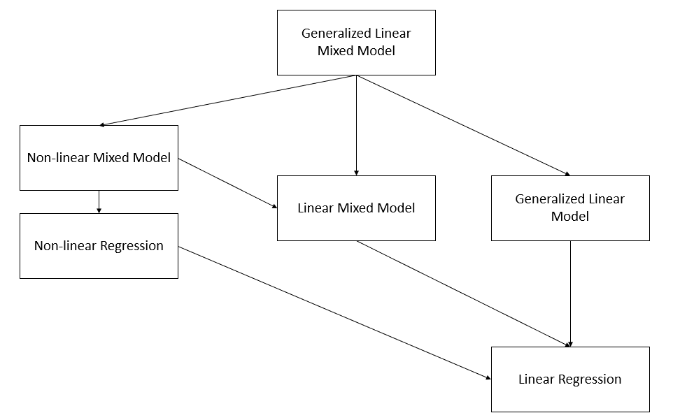

# Nonlinear and Generalized Linear Mixed Models

-   NLMMs extend the nonlinear model to include both fixed effects and random effects
-   GLMMs extend the generalized linear model to include both fixed effects and random effects.

A nonlinear mixed model has the form of

$$
Y_{ij} = f(\mathbf{x_{ij} , \theta, \alpha_i}) + \epsilon_{ij}
$$

for the j-th response from cluster (or sujbect) i ($i = 1,...,n$), where

-   $j = 1,...,n_i$
-   $\mathbf{\theta}$ are the fixed effects
-   $\mathbf{\alpha}_i$ are the random effects for cluster i
-   $\mathbf{x}_{ij}$ are the regressors or design variables
-   $f(.)$ is nonlinear mean response function

A GLMM can be written as:

we assume

$$
y_i |\alpha_i \sim \text{indep } f(y_i | \alpha)
$$

and $f(y_i | \mathbf{\alpha})$ is an exponential family distribution,

$$
f(y_i | \alpha) = \exp [\frac{y_i \theta_i - b(\theta_i)}{a(\phi)} - c(y_i, \phi)]
$$

The conditional mean of $y_i$ is related to $\theta_i$

$$
\mu_i = \frac{\partial b(\theta_i)}{\partial \theta_i}
$$

The transformation of this mean will give us the desired linear model to model both the fixed and random effects.

$$
E(y_i |\alpha) = \mu_i \\
g(\mu_i) = \mathbf{x_i' \beta + z'_i \alpha}
$$

where $g()$ is a known link function and $\mu_i$ is the conditional mean. We can see similarity to [GLM](#generalized-linear-models)

We also have to specify the random effects distribution

$$
\alpha \sim f(\alpha)
$$

which is similar to the specification for mixed models.

Moreover, law of large number applies to fixed effects so that you know it is a normal distribution. But here, you can specify $\alpha$ subjectively.

Hence, we can show NLMM is a special case of the GLMM

$$
\mathbf{Y}_i = \mathbf{f}(\mathbf{x}_i, \mathbf{\theta, \alpha}_i) + \mathbf{\epsilon}_i \\
\mathbf{Y}_i = \mathbf{g}^{-1} (\mathbf{x}_i' \beta + \mathbf{z}_i' \mathbf{\alpha}_i) + \mathbf{\epsilon}_i
$$

where the inverse link function corresponds to a nonlinear transformation of the fixed and random effects.

Note:

-   we can't derive the analytical formulation of the marginal distribution because nonlinear combination of normal variables is not normally distributed, even in the case of additive error ($e_i$) and random effects ($\alpha_i$) are both normal.

**Consequences of having random effects**

The marginal mean of $y_i$ is

$$
E(y_i) = E_\alpha(E(y_i | \alpha)) = E_\alpha (\mu_i) = E(g^{-1}(\mathbf{x_i' \beta + z_i' \alpha}))
$$

Because $g^{-1}()$ is nonlinear, this is the most simplified version we can go for.

In special cases such as log link ($g(\mu) = \log \mu$ or $g^{-1}() = \exp()$) then

$$
E(y_i) = E(\exp(\mathbf{x_i' \beta + z_i' \alpha})) = \exp(\mathbf{x'_i \beta})E(\exp(\mathbf{z}_i'\alpha))
$$

which is the moment generating function of $\alpha$ evaluated at $\mathbf{z}_i$

<br>

**Marginal variance** of $y_i$

$$
\begin{aligned}
var(y_i) &= var_\alpha (E(y_i | \alpha)) + E_\alpha (var(y_i | \alpha)) \\
&= var(\mu_i) + E(a(\phi) V(\mu_i)) \\
&= var(g^{-1} (\mathbf{x'_i \beta + z'_i \alpha})) + E(a(\phi)V(g^{-1} (\mathbf{x'_i \beta + z'_i \alpha})))
\end{aligned}
$$

Without specific assumption about $g()$ and/or the conditional distribution of $\mathbf{y}$, this is the most simplified version.

<br>

**Marginal covariance of** $\mathbf{y}$

In a linear mixed model, random effects introduce a dependence among observations which share any random effect in common

$$
\begin{aligned}
cov(y_i, y_j) &= cov_{\alpha}(E(y_i | \mathbf{\alpha}),E(y_j | \mathbf{\alpha})) + E_{\alpha}(cov(y_i, y_j | \mathbf{\alpha})) \\
&= cov(\mu_i, \mu_j) + E(0) \\
&= cov(g^{-1}(\mathbf{x}_i' \beta + \mathbf{z}_i' \mathbf{\alpha}), g^{-1}(\mathbf{x}'_j \beta + \mathbf{z}_j' \mathbf{\alpha}))
\end{aligned}
$$

-   Important: conditioning to induce the covariability

Example:

Repeated measurements on the subjects. Let $y_{ij}$ be the j-th count taken on the i-th subject.

then, the model is $y_{ij} | \mathbf{\alpha} \sim \text{indep } Pois(\mu_{ij})$. Here

$$
\log(\mu_{ij}) = \mathbf{x}_{ij}' \beta + \alpha_i 
$$

where $\alpha_i \sim iid N(0,\sigma^2_{\alpha})$

which is a log-link with a random patient effect.

<br>

## Estimation

In linear mixed models, the marginal likelihood for $\mathbf{y}$ is the integration of the random effects from the hierarchical formulation

$$
f(\mathbf{y}) = \int f(\mathbf{y}| \alpha) f(\alpha) d \alpha
$$

For linear mixed models, we assumed that the 2 component distributions were Gaussian with linear relationships, which implied the marginal distribution was also linear and Gaussian and allows us to solve this integral analytically.

On the other hand, GLMMs, the distribution for $f(\mathbf{y} | \alpha)$ is not Gaussian in general, and for NLMMs, the functional form between the mean response and the random (and fixed) effects is nonlinear. In both cases, we can't perform the integral analytically, which means we have to solve it

-   [numerically](#estimation-by-numerical-integration) and/or

-   [linearize the inverse link function](#estimation-by-linearization).

### Estimation by Numerical Integration {#estimation-by-numerical-integration}

The marginal likelihood is

$$
L(\beta; \mathbf{y}) = \int f(\mathbf{y} | \alpha) f(\alpha) d \alpha
$$

Estimation fo the fixed effects requires $\frac{\partial l}{\partial \beta}$, where $l$ is the log-likelihood

One way to obtain the marginal inference is to numerically integrate out the random effects through

-   numerical quadrature

-   Laplace approximation

-   Monte Carlo methods

When the dimension of $\mathbf{\alpha}$ is relatively low, this is easy. But when the dimension of $\alpha$ is high, additional approximation is required.

<br>

### Estimation by Linearization {#estimation-by-linearization}

Idea: Linearized version of the response (known as working response, or pseudo-response) called $\tilde{y}_i$ and then the conditional mean is

$$
E(\tilde{y}_i | \alpha) = \mathbf{x}_i' \beta + \mathbf{z}_i' \alpha
$$

and also estimate $var(\tilde{y}_i | \alpha)$. then, apply [Linear Mixed Models] estimation as usual.

The difference is only in how the linearization is done (i.e., how to expand $f(\mathbf{x, \theta, \alpha})$ or the inverse link function

#### Penalized quasi-likelihood

(PQL)

This is the more popular method

$$
\tilde{y}_i^{(k)} = \hat{\eta}_i^{(k-1)} + ( y_i - \hat{\mu}_i^{(k-1)})\frac{d \eta}{d \mu}| \hat{\eta}_i^{(k-1)}
$$

where

-   $\eta_i = g(\mu_i)$ is the linear predictor

-   k = iteration of the optimization algorithm

The algorithm updates $\tilde{y}_i$ after each linear mixed model fit using $E(\tilde{y}_i | \alpha)$ and $var(\tilde{y}_i | \alpha)$

Comments:

-   Easy to implement

-   Inference is only asymptotically correct due to the linearizaton

-   Biased estimates are likely for binomial response with small groups and worst for Bernoulli response. Similarly for Poisson models with small counts. [@Faraway_2016]

-   Hypothesis testing and confidence intervals also have problems.

<br>

#### Generalized Estimating Equations

(GEE)

Let a marginal generalized linear model for the mean of y as a function of the predictors, which means we linearize the mean response function and assume a dependent error structure

Example\
Binary data:

$$
logit (E(\mathbf{y})) = \mathbf{X} \beta
$$

If we assume a "working covariance matrix", $\mathbf{V}$ the the elements of $\mathbf{y}$, then the maximum likelihood equations for estimating $\beta$ is

$$
\mathbf{X'V^{-1}y} = \mathbf{X'V^{-1}} E(\mathbf{y})
$$

If $\mathbf{V}$ is correct, then unbiased estimating equations

We typically define $\mathbf{V} = \mathbf{I}$. Solutions to unbiased estimating equation give consistent estimators.

In practice, we assume a covariance structure, and then do a logistic regression, and calculate its large sample variance

Let $y_{ij} , j = 1,..,n_i, i = 1,..,K$ be the j-th measurement on the i-th subject.

$$
\mathbf{y}_i = 
\left(
\begin{array}
{c}
y_{i1} \\
. \\
y_{in_i}
\end{array}
\right)
$$

with mean

$$
\mathbf{\mu}_i =
\left(
\begin{array}
{c}
\mu_{i1} \\
. \\
\mu_{in_i}
\end{array}
\right)
$$

and

$$
\mathbf{x}_{ij} = 
\left(
\begin{array}
{c}
X_{ij1} \\
. \\
X_{ijp}
\end{array}
\right)
$$

Let $\mathbf{V}_i = cov(\mathbf{y}_i)$, then based on[@liang1986] GEE estimates for $\beta$ can be obtained from solving the equation:

$$
S(\beta) = \sum_{i=1}^K \frac{\partial \mathbf{\mu}_i'}{\partial \beta} \mathbf{V}^{-1}(\mathbf{y}_i - \mathbf{\mu}_i) = 0
$$

Let $\mathbf{R}_i (\mathbf{c})$ be an $n_i \times n_i$ "working" correlation matrix specified up to some parameters $\mathbf{c}$. Then, $\mathbf{V}_i = a(\phi) \mathbf{B}_i^{1/2}\mathbf{R}(\mathbf{c}) \mathbf{B}_i^{1/2}$, where $\mathbf{B}_i$ is an $n_i \times n_i$ diagonal matrix with $V(\mu_{ij})$ on the j-th diagonal

If $\mathbf{R}(\mathbf{c})$ is the true correlation matrix of $\mathbf{y}_i$, then $\mathbf{V}_i$ is the true covariance matrix

The working correlation matrix must be estimated iteratively by a fitting algorithm:

1.  Compute the initial estimate of $\beta$ (using GLM under the independence assumption)

2.  Compute the working correlation matrix $\mathbf{R}$ based upon studentized residuals

3.  Compute the estimate covariance $\hat{\mathbf{V}}_i$

4.  Update $\beta$ according to

    $$
    \beta_{r+1} = \beta_r + (\sum_{i=1}^K \frac{\partial \mathbf{\mu}'_i}{\partial \beta} \hat{\mathbf{V}}_i^{-1} \frac{\partial \mathbf{\mu}_i}{\partial \beta})
    $$

5.  Iterate until the algorithm converges

Note: Inference based on likelihoods is not appropriate because this is not a likelihood estimator

### Estimation by Bayesian Hierarchical Models

Bayesian Estimation

$$
f(\mathbf{\alpha}, \mathbf{\beta} | \mathbf{y}) \propto f(\mathbf{y} | \mathbf{\alpha}, \mathbf{\beta}) f(\mathbf{\alpha})f(\mathbf{\beta})
$$

Numerical techniques (e.g., MCMC) can be used to find posterior distribution. This method is best in terms of not having to make simplifying approximation and fully accounting for uncertainty in estimation and prediction, but it could be complex, time-consuming, and computationally intensive.

Implementation Issues:

-   No valid joint distribution can be constructed from the given conditional model and random parameters

-   The mean/ variance relationship and the random effects lead to constraints on the marginal covariance model

-   Difficult to fit computationally

<br>

2 types of estimation approaches:

1.  Approximate the objective function (marginal likelihood) through integral approximation

    1.  Laplace methods

    2.  Quadrature methods

    3.  Monte Carlo integration

2.  Approximate the model (based on Taylor series linearizations)

<br>

Packages in R

-   GLMM: `MASS:glmmPQL` `lme4::glmer` `glmmTMB`

-   NLMM: `nlme::nlme`; `lme4::nlmer` `brms::brm`

-   Bayesian: `MCMCglmm` ; `brms:brm`

<br>

Example: Non-Gaussian Repeated measurements

-   When the data are Gaussian, then [Linear Mixed Models]

-   When the data are non-Gaussian, then [Nonlinear and Generalized Linear Mixed Models]

## Application

### Binomial (CBPP Data)


```r
data(cbpp,package = "lme4")
head(cbpp)
```

```
##   herd incidence size period
## 1    1         2   14      1
## 2    1         3   12      2
## 3    1         4    9      3
## 4    1         0    5      4
## 5    2         3   22      1
## 6    2         1   18      2
```

PQL

Pro:

-   Linearizes the response to have a pseudo-response as the mean response (like LMM)

-   computationally efficient

Cons:

-   biased for binary, Poisson data with small counts

-   random effects have to be interpreted on the link scale

-   can't interpret AIC/BIC value


```r
library(MASS)
pql_cbpp <-
    glmmPQL(
        cbind(incidence, size - incidence) ~ period,
        random = ~ 1 | herd,
        data = cbpp,
        family = binomial(link = "logit"),
        verbose = F
    )
summary(pql_cbpp)
```

```
## Linear mixed-effects model fit by maximum likelihood
##   Data: cbpp 
##   AIC BIC logLik
##    NA  NA     NA
## 
## Random effects:
##  Formula: ~1 | herd
##         (Intercept) Residual
## StdDev:   0.5563535 1.184527
## 
## Variance function:
##  Structure: fixed weights
##  Formula: ~invwt 
## Fixed effects:  cbind(incidence, size - incidence) ~ period 
##                 Value Std.Error DF   t-value p-value
## (Intercept) -1.327364 0.2390194 38 -5.553372  0.0000
## period2     -1.016126 0.3684079 38 -2.758156  0.0089
## period3     -1.149984 0.3937029 38 -2.920944  0.0058
## period4     -1.605217 0.5178388 38 -3.099839  0.0036
##  Correlation: 
##         (Intr) perid2 perid3
## period2 -0.399              
## period3 -0.373  0.260       
## period4 -0.282  0.196  0.182
## 
## Standardized Within-Group Residuals:
##        Min         Q1        Med         Q3        Max 
## -2.0591168 -0.6493095 -0.2747620  0.5170492  2.6187632 
## 
## Number of Observations: 56
## Number of Groups: 15
```


```r
exp(0.556)
```

```
## [1] 1.743684
```

is how the herd specific outcome odds varies.

We can interpret the fixed effect coefficients just like in GLM. Because we use logit link function here, we can say that the log odds of the probability of having a case in period 2 is -1.016 less than period 1 (baseline).


```r
summary(pql_cbpp)$tTable
```

```
##                 Value Std.Error DF   t-value      p-value
## (Intercept) -1.327364 0.2390194 38 -5.553372 2.333216e-06
## period2     -1.016126 0.3684079 38 -2.758156 8.888179e-03
## period3     -1.149984 0.3937029 38 -2.920944 5.843007e-03
## period4     -1.605217 0.5178388 38 -3.099839 3.637000e-03
```

Numerical Integration

Pro:

-   more accurate

Con:

-   computationally expensive

-   won't work for complex models.


```r
library(lme4)
```

```
## Loading required package: Matrix
```

```r
numint_cbpp <-
    glmer(
        cbind(incidence, size - incidence) ~ period + (1 | herd),
        data = cbpp,
        family = binomial(link = "logit")
    )
summary(numint_cbpp)
```

```
## Generalized linear mixed model fit by maximum likelihood (Laplace
##   Approximation) [glmerMod]
##  Family: binomial  ( logit )
## Formula: cbind(incidence, size - incidence) ~ period + (1 | herd)
##    Data: cbpp
## 
##      AIC      BIC   logLik deviance df.resid 
##    194.1    204.2    -92.0    184.1       51 
## 
## Scaled residuals: 
##     Min      1Q  Median      3Q     Max 
## -2.3816 -0.7889 -0.2026  0.5142  2.8791 
## 
## Random effects:
##  Groups Name        Variance Std.Dev.
##  herd   (Intercept) 0.4123   0.6421  
## Number of obs: 56, groups:  herd, 15
## 
## Fixed effects:
##             Estimate Std. Error z value Pr(>|z|)    
## (Intercept)  -1.3983     0.2312  -6.048 1.47e-09 ***
## period2      -0.9919     0.3032  -3.272 0.001068 ** 
## period3      -1.1282     0.3228  -3.495 0.000474 ***
## period4      -1.5797     0.4220  -3.743 0.000182 ***
## ---
## Signif. codes:  0 '***' 0.001 '**' 0.01 '*' 0.05 '.' 0.1 ' ' 1
## 
## Correlation of Fixed Effects:
##         (Intr) perid2 perid3
## period2 -0.363              
## period3 -0.340  0.280       
## period4 -0.260  0.213  0.198
```

For small data set, the difference between two approaches are minimal


```r
library(rbenchmark)
benchmark(
    "MASS" = {
        pql_cbpp <-
            glmmPQL(
                cbind(incidence, size - incidence) ~ period,
                random = ~ 1 | herd,
                data = cbpp,
                family = binomial(link = "logit"),
                verbose = F
            )
    },
    "lme4" = {
        glmer(
            cbind(incidence, size - incidence) ~ period + (1 | herd),
            data = cbpp,
            family = binomial(link = "logit")
        )
    },
    replications = 50,
    columns = c("test", "replications", "elapsed", "relative"),
    order = "relative"
)
```

```
##   test replications elapsed relative
## 1 MASS           50    2.14    1.000
## 2 lme4           50    4.22    1.972
```

In numerical integration, we can set `nAGQ > 1` to switch the method of likelihood evaluation, which might increase accuracy


```r
library(lme4)
numint_cbpp_GH <-
    glmer(
        cbind(incidence, size - incidence) ~ period + (1 | herd),
        data = cbpp,
        family = binomial(link = "logit"),
        nAGQ = 20
    )
summary(numint_cbpp_GH)$coefficients[, 1] - summary(numint_cbpp)$coefficients[, 1]
```

```
##   (Intercept)       period2       period3       period4 
## -0.0008808634  0.0005160912  0.0004066218  0.0002644629
```

Bayesian approach to GLMMs

-   assume the fixed effects parameters have distribution

-   can handle models with intractable result under traditional methods

-   computationally expensive


```r
library(MCMCglmm)
```

```
## Loading required package: coda
```

```
## Loading required package: ape
```

```r
Bayes_cbpp <-
    MCMCglmm(
        cbind(incidence, size - incidence) ~ period,
        random = ~ herd,
        data = cbpp,
        family = "multinomial2",
        verbose = FALSE
    )
summary(Bayes_cbpp)
```

```
## 
##  Iterations = 3001:12991
##  Thinning interval  = 10
##  Sample size  = 1000 
## 
##  DIC: 538.3881 
## 
##  G-structure:  ~herd
## 
##      post.mean  l-95% CI u-95% CI eff.samp
## herd   0.06208 9.266e-17   0.3933    95.81
## 
##  R-structure:  ~units
## 
##       post.mean l-95% CI u-95% CI eff.samp
## units     1.024   0.1299    1.924      330
## 
##  Location effects: cbind(incidence, size - incidence) ~ period 
## 
##             post.mean l-95% CI u-95% CI eff.samp  pMCMC    
## (Intercept)   -1.5176  -2.1703  -0.8830    669.1 <0.001 ***
## period2       -1.2463  -2.3284  -0.1607    847.5  0.026 *  
## period3       -1.3886  -2.5055  -0.4613    762.4  0.006 ** 
## period4       -1.9397  -3.1759  -0.7592    462.9 <0.001 ***
## ---
## Signif. codes:  0 '***' 0.001 '**' 0.01 '*' 0.05 '.' 0.1 ' ' 1
```

-   `MCMCglmm` fits a residual variance component (useful with dispersion issues)


```r
apply(Bayes_cbpp$VCV,2,sd) #explains less variability
```

```
##      herd     units 
## 0.1880532 0.4748754
```


```r
summary(Bayes_cbpp)$solutions
```

```
##             post.mean  l-95% CI   u-95% CI eff.samp pMCMC
## (Intercept) -1.517587 -2.170309 -0.8830031 669.1273 0.001
## period2     -1.246332 -2.328375 -0.1606865 847.4513 0.026
## period3     -1.388601 -2.505460 -0.4612840 762.4208 0.006
## period4     -1.939717 -3.175903 -0.7591509 462.9367 0.001
```

interpret Bayesian "credible intervals" similarly to confidence intervals

Make sure you make post-hoc diagnoses


```r
library(lattice)
xyplot(as.mcmc(Bayes_cbpp$Sol), layout = c(2, 2))
```

<!-- -->

There is no trend, well-mixed


```r
xyplot(as.mcmc(Bayes_cbpp$VCV),layout=c(2,1))
```

<!-- -->

For the herd variable, a lot of them are 0, which suggests problem. To fix the instability in the herd effect sampling, we can either

-   modify the prior distribution on the herd variation

-   increases the number of iteration


```r
library(MCMCglmm)
Bayes_cbpp2 <-
    MCMCglmm(
        cbind(incidence, size - incidence) ~ period,
        random = ~ herd,
        data = cbpp,
        family = "multinomial2",
        nitt = 20000,
        burnin = 10000,
        prior = list(G = list(list(
            V = 1, nu = .1
        ))),
        verbose = FALSE
    )
xyplot(as.mcmc(Bayes_cbpp2$VCV), layout = c(2, 1))
```

<!-- -->

To change the shape of priors, in `MCMCglmm` use:

-   `V` controls for the location of the distribution (default = 1)

-   `nu` controls for the concentration around V (default = 0)

<br>

### Count (Owl Data)


```r
library(glmmTMB)
```

```
## Warning: package 'glmmTMB' was built under R version 4.0.5
```

```
## Warning in checkMatrixPackageVersion(): Package version inconsistency detected.
## TMB was built with Matrix version 1.2.18
## Current Matrix version is 1.3.2
## Please re-install 'TMB' from source using install.packages('TMB', type = 'source') or ask CRAN for a binary version of 'TMB' matching CRAN's 'Matrix' package
```

```r
library(dplyr)
```

```
## 
## Attaching package: 'dplyr'
```

```
## The following object is masked from 'package:MASS':
## 
##     select
```

```
## The following objects are masked from 'package:stats':
## 
##     filter, lag
```

```
## The following objects are masked from 'package:base':
## 
##     intersect, setdiff, setequal, union
```

```r
data(Owls, package = "glmmTMB")
Owls <- Owls %>% rename(Ncalls = SiblingNegotiation)
```

In a typical Poisson model, $\lambda$ (Poisson mean), is model as $\log(\lambda) = \mathbf{x'\beta}$ But if the response is the rate (e.g., counts per BroodSize), we could model it as $\log(\lambda / b) = \mathbf{x'\beta}$ , equivalently $\log(\lambda) = \log(b) + \mathbf{x'\beta}$ where $b$ is BroodSize. Hence, we "offset" the mean by the log of this variable.


```r
owls_glmer <-
    glmer(
        Ncalls ~ offset(log(BroodSize)) + FoodTreatment * SexParent +
            (1 | Nest),
        family = poisson,
        data = Owls
    )
summary(owls_glmer)
```

```
## Generalized linear mixed model fit by maximum likelihood (Laplace
##   Approximation) [glmerMod]
##  Family: poisson  ( log )
## Formula: Ncalls ~ offset(log(BroodSize)) + FoodTreatment * SexParent +  
##     (1 | Nest)
##    Data: Owls
## 
##      AIC      BIC   logLik deviance df.resid 
##   5212.8   5234.8  -2601.4   5202.8      594 
## 
## Scaled residuals: 
##     Min      1Q  Median      3Q     Max 
## -3.5529 -1.7971 -0.6842  1.2689 11.4312 
## 
## Random effects:
##  Groups Name        Variance Std.Dev.
##  Nest   (Intercept) 0.2063   0.4542  
## Number of obs: 599, groups:  Nest, 27
## 
## Fixed effects:
##                                     Estimate Std. Error z value Pr(>|z|)    
## (Intercept)                          0.65585    0.09567   6.855 7.12e-12 ***
## FoodTreatmentSatiated               -0.65612    0.05606 -11.705  < 2e-16 ***
## SexParentMale                       -0.03705    0.04501  -0.823   0.4104    
## FoodTreatmentSatiated:SexParentMale  0.13135    0.07036   1.867   0.0619 .  
## ---
## Signif. codes:  0 '***' 0.001 '**' 0.01 '*' 0.05 '.' 0.1 ' ' 1
## 
## Correlation of Fixed Effects:
##             (Intr) FdTrtS SxPrnM
## FdTrtmntStt -0.225              
## SexParentMl -0.292  0.491       
## FdTrtmS:SPM  0.170 -0.768 -0.605
```

-   nest explains a relatively large proportion of the variability (its standard deviation is larger than some coefficients)

-   the model fit isn't great (deviance of 5202 on 594 df)


```r
# Negative binomial model
owls_glmerNB <-
    glmer.nb(Ncalls ~ offset(log(BroodSize)) + FoodTreatment * SexParent
             + (1 | Nest), data = Owls)
c(Deviance = round(summary(owls_glmerNB)$AICtab["deviance"], 3),
  df = summary(owls_glmerNB)$AICtab["df.resid"])
```

```
## Deviance.deviance       df.df.resid 
##          3483.616           593.000
```

There is an improvement using negative binomial considering overdispersion


```r
hist(Owls$Ncalls,breaks=30)
```

<!-- -->

To account for too many 0s in these data, we can use zero-inflated Poisson (ZIP) model.

-   `glmmTMB` can handle ZIP GLMMs since it adds automatic differentiation to existing estimation strategies.


```r
library(glmmTMB)
owls_glmm <-
    glmmTMB(
        Ncalls ~ FoodTreatment * SexParent + offset(log(BroodSize)) +
            (1 | Nest),
        ziformula =  ~ 0,
        family = nbinom2(link = "log"),
        data = Owls
    )
```

```
## Warning in Matrix::sparseMatrix(dims = c(0, 0), i = integer(0), j =
## integer(0), : 'giveCsparse' has been deprecated; setting 'repr = "T"' for you

## Warning in Matrix::sparseMatrix(dims = c(0, 0), i = integer(0), j =
## integer(0), : 'giveCsparse' has been deprecated; setting 'repr = "T"' for you

## Warning in Matrix::sparseMatrix(dims = c(0, 0), i = integer(0), j =
## integer(0), : 'giveCsparse' has been deprecated; setting 'repr = "T"' for you
```

```r
owls_glmm_zi <-
    glmmTMB(
        Ncalls ~ FoodTreatment * SexParent + offset(log(BroodSize)) +
            (1 | Nest),
        ziformula =  ~ 1,
        family = nbinom2(link
                         = "log"),
        data = Owls
    )
```

```
## Warning in Matrix::sparseMatrix(dims = c(0, 0), i = integer(0), j =
## integer(0), : 'giveCsparse' has been deprecated; setting 'repr = "T"' for you

## Warning in Matrix::sparseMatrix(dims = c(0, 0), i = integer(0), j =
## integer(0), : 'giveCsparse' has been deprecated; setting 'repr = "T"' for you

## Warning in Matrix::sparseMatrix(dims = c(0, 0), i = integer(0), j =
## integer(0), : 'giveCsparse' has been deprecated; setting 'repr = "T"' for you
```

```r
# Scale Arrival time to use as a covariate for zero-inflation parameter
Owls$ArrivalTime <- scale(Owls$ArrivalTime)
owls_glmm_zi_cov <- glmmTMB(
    Ncalls ~ FoodTreatment * SexParent +
        offset(log(BroodSize)) +
        (1 | Nest),
    ziformula =  ~ ArrivalTime,
    family = nbinom2(link
                     = "log"),
    data = Owls
)
```

```
## Warning in Matrix::sparseMatrix(dims = c(0, 0), i = integer(0), j =
## integer(0), : 'giveCsparse' has been deprecated; setting 'repr = "T"' for you

## Warning in Matrix::sparseMatrix(dims = c(0, 0), i = integer(0), j =
## integer(0), : 'giveCsparse' has been deprecated; setting 'repr = "T"' for you

## Warning in Matrix::sparseMatrix(dims = c(0, 0), i = integer(0), j =
## integer(0), : 'giveCsparse' has been deprecated; setting 'repr = "T"' for you
```

```r
as.matrix(anova(owls_glmm, owls_glmm_zi))
```

```
##              Df      AIC      BIC    logLik deviance    Chisq Chi Df
## owls_glmm     6 3495.610 3521.981 -1741.805 3483.610       NA     NA
## owls_glmm_zi  7 3431.646 3462.413 -1708.823 3417.646 65.96373      1
##                Pr(>Chisq)
## owls_glmm              NA
## owls_glmm_zi 4.592983e-16
```

```r
as.matrix(anova(owls_glmm_zi,owls_glmm_zi_cov))
```

```
##                  Df      AIC      BIC    logLik deviance    Chisq Chi Df
## owls_glmm_zi      7 3431.646 3462.413 -1708.823 3417.646       NA     NA
## owls_glmm_zi_cov  8 3422.532 3457.694 -1703.266 3406.532 11.11411      1
##                    Pr(>Chisq)
## owls_glmm_zi               NA
## owls_glmm_zi_cov 0.0008567362
```

```r
summary(owls_glmm_zi_cov)
```

```
##  Family: nbinom2  ( log )
## Formula:          
## Ncalls ~ FoodTreatment * SexParent + offset(log(BroodSize)) +      (1 | Nest)
## Zero inflation:          ~ArrivalTime
## Data: Owls
## 
##      AIC      BIC   logLik deviance df.resid 
##   3422.5   3457.7  -1703.3   3406.5      591 
## 
## Random effects:
## 
## Conditional model:
##  Groups Name        Variance Std.Dev.
##  Nest   (Intercept) 0.07487  0.2736  
## Number of obs: 599, groups:  Nest, 27
## 
## Overdispersion parameter for nbinom2 family (): 2.22 
## 
## Conditional model:
##                                     Estimate Std. Error z value Pr(>|z|)    
## (Intercept)                          0.84778    0.09961   8.511  < 2e-16 ***
## FoodTreatmentSatiated               -0.39529    0.13742  -2.877  0.00402 ** 
## SexParentMale                       -0.07025    0.10435  -0.673  0.50079    
## FoodTreatmentSatiated:SexParentMale  0.12388    0.16449   0.753  0.45138    
## ---
## Signif. codes:  0 '***' 0.001 '**' 0.01 '*' 0.05 '.' 0.1 ' ' 1
## 
## Zero-inflation model:
##             Estimate Std. Error z value Pr(>|z|)    
## (Intercept)  -1.3018     0.1261  -10.32  < 2e-16 ***
## ArrivalTime   0.3545     0.1074    3.30 0.000966 ***
## ---
## Signif. codes:  0 '***' 0.001 '**' 0.01 '*' 0.05 '.' 0.1 ' ' 1
```

We can see ZIP GLMM with an arrival time covariate on the zero is best.

-   arrival time has a positive effect on observing a nonzero number of calls

-   interactions are non significant, the food treatment is significant (fewer calls after eating)

-   nest variability is large in magnitude (without this, the parameter estimates change)

### Binomial


```r
library(agridat)
library(ggplot2)
library(lme4)
library(spaMM)
```

```
## Warning: package 'spaMM' was built under R version 4.0.5
```

```
## Registered S3 methods overwritten by 'registry':
##   method               from 
##   print.registry_field proxy
##   print.registry_entry proxy
```

```
## spaMM (Rousset & Ferdy, 2014, version 3.7.34) is loaded.
## Type 'help(spaMM)' for a short introduction,
## 'news(package='spaMM')' for news,
## and 'citation('spaMM')' for proper citation.
```

```r
data(gotway.hessianfly)
dat <- gotway.hessianfly
dat$prop <- dat$y / dat$n
ggplot(dat, aes(x = lat, y = long, fill = prop)) +
    geom_tile() +
    scale_fill_gradient(low = 'white', high = 'black') +
    geom_text(aes(label = gen, color = block)) +
    ggtitle('Gotway Hessian Fly')
```

<!-- -->

-   Fixed effects ($\beta$) = genotype

-   Random effects ($\alpha$) = block


```r
flymodel <-
    glmer(
        cbind(y, n - y) ~ gen + (1 | block),
        data = dat,
        family = binomial,
        nAGQ = 5
    )
summary(flymodel)
```

```
## Generalized linear mixed model fit by maximum likelihood (Adaptive
##   Gauss-Hermite Quadrature, nAGQ = 5) [glmerMod]
##  Family: binomial  ( logit )
## Formula: cbind(y, n - y) ~ gen + (1 | block)
##    Data: dat
## 
##      AIC      BIC   logLik deviance df.resid 
##    162.2    198.9    -64.1    128.2       47 
## 
## Scaled residuals: 
##      Min       1Q   Median       3Q      Max 
## -2.38644 -1.01188  0.09631  1.03468  2.75479 
## 
## Random effects:
##  Groups Name        Variance Std.Dev.
##  block  (Intercept) 0.001022 0.03196 
## Number of obs: 64, groups:  block, 4
## 
## Fixed effects:
##             Estimate Std. Error z value Pr(>|z|)    
## (Intercept)   1.5035     0.3914   3.841 0.000122 ***
## genG02       -0.1939     0.5302  -0.366 0.714644    
## genG03       -0.5408     0.5103  -1.060 0.289260    
## genG04       -1.4342     0.4714  -3.043 0.002346 ** 
## genG05       -0.2037     0.5429  -0.375 0.707486    
## genG06       -0.9783     0.5046  -1.939 0.052533 .  
## genG07       -0.6041     0.5111  -1.182 0.237235    
## genG08       -1.6774     0.4907  -3.418 0.000630 ***
## genG09       -1.3984     0.4725  -2.960 0.003078 ** 
## genG10       -0.6817     0.5333  -1.278 0.201181    
## genG11       -1.4630     0.4843  -3.021 0.002522 ** 
## genG12       -1.4591     0.4918  -2.967 0.003010 ** 
## genG13       -3.5528     0.6600  -5.383 7.31e-08 ***
## genG14       -2.5073     0.5264  -4.763 1.90e-06 ***
## genG15       -2.0872     0.4851  -4.302 1.69e-05 ***
## genG16       -2.9697     0.5383  -5.517 3.46e-08 ***
## ---
## Signif. codes:  0 '***' 0.001 '**' 0.01 '*' 0.05 '.' 0.1 ' ' 1
```

```
## 
## Correlation matrix not shown by default, as p = 16 > 12.
## Use print(x, correlation=TRUE)  or
##     vcov(x)        if you need it
```

Equivalently, we can use `MCMCglmm` , for a Bayesian approach


```r
library(coda)
Bayes_flymodel <- MCMCglmm(
    cbind(y, n - y) ~ gen ,
    random = ~ block,
    data = dat,
    family = "multinomial2",
    verbose = FALSE
)
plot(Bayes_flymodel$Sol[, 1], main = dimnames(Bayes_flymodel$Sol)[[2]][1])
```

<!-- -->


```r
autocorr.plot(Bayes_flymodel$Sol[,1],main=dimnames(Bayes_flymodel$Sol)[[2]][1])
```

<!-- -->

### Example from [@Schabenberger_2001] section 8.4.1


```r
dat2 <- read.table("images/YellowPoplarData_r.txt")
names(dat2) <- c('tn', 'k', 'dbh', 'totht', 'dob', 'ht', 'maxd', 'cumv')
dat2$t <- dat2$dob / dat2$dbh
dat2$r <- 1 - dat2$dob / dat2$totht
```

The cumulative volume relates to the complementary diameter (subplots were created based on total tree height)


```r
library(ggplot2)
library(dplyr)
dat2 <- dat2 %>% group_by(tn) %>% mutate(
    z = case_when(
        totht < 74 & totht >= 0 ~ 'a: 0-74ft',
        totht < 88 & totht >= 74 ~ 'b: 74-88',
        totht < 95 & totht >= 88 ~ 'c: 88-95',
        totht < 99 & totht >= 95 ~ 'd: 95-99',
        totht < 104 & totht >= 99 ~ 'e: 99-104',
        totht < 109 & totht >= 104 ~ 'f: 104-109',
        totht < 115 & totht >= 109 ~ 'g: 109-115',
        totht < 120 & totht >= 115 ~ 'h: 115-120',
        totht < 140 & totht >= 120 ~ 'i: 120-150',
    )
)
ggplot(dat2, aes(x = r, y = cumv)) + geom_point(size = 0.5) + facet_wrap(vars(z))
```

<!-- -->

The proposed non-linear model:

$$
V_{id_j} = (\beta_0 + (\beta_1 + b_{1i})\frac{D^2_i H_i}{1000})(\exp[-(\beta_2 + b_{2i})t_{ij} \exp(\beta_3 t_{ij})]) + e_{ij}
$$

where

-   $b_{1i}, b_{2i}$ are random effects

-   $e_{ij}$ are random errors


```r
library(nlme)
```

```
## 
## Attaching package: 'nlme'
```

```
## The following object is masked from 'package:dplyr':
## 
##     collapse
```

```
## The following object is masked from 'package:lme4':
## 
##     lmList
```

```r
tmp <-
    nlme(
        cumv ~ (b0 + (b1 + u1) * (dbh * dbh * totht / 1000)) * (exp(-(b2 + u2) *
                                                                        (t / 1000) * exp(b3 * t))),
        data = dat2,
        fixed = b0 + b1 + b2 + b3 ~ 1,
        # 1 on the right hand side of the formula indicates a single fixed effects for the corresponding parameters
        random = list(pdDiag(u1 + u2 ~ 1)),
        #uncorrelated random effects
        groups = ~ tn,
        #group on trees so each tree w/ have u1 and u2
        start = list(fixed = c(
            b0 = 0.25,
            b1 = 2.3,
            b2 = 2.87,
            b3 = 6.7
        ))
    )
summary(tmp)
```

```
## Nonlinear mixed-effects model fit by maximum likelihood
##   Model: cumv ~ (b0 + (b1 + u1) * (dbh * dbh * totht/1000)) * (exp(-(b2 +      u2) * (t/1000) * exp(b3 * t))) 
##   Data: dat2 
##        AIC      BIC    logLik
##   31103.73 31151.33 -15544.86
## 
## Random effects:
##  Formula: list(u1 ~ 1, u2 ~ 1)
##  Level: tn
##  Structure: Diagonal
##                u1       u2 Residual
## StdDev: 0.1508094 0.447829 2.226361
## 
## Fixed effects:  b0 + b1 + b2 + b3 ~ 1 
##       Value  Std.Error   DF  t-value p-value
## b0 0.249386 0.12894686 6297   1.9340  0.0532
## b1 2.288832 0.01266805 6297 180.6776  0.0000
## b2 2.500497 0.05606685 6297  44.5985  0.0000
## b3 6.848871 0.02140677 6297 319.9395  0.0000
##  Correlation: 
##    b0     b1     b2    
## b1 -0.639              
## b2  0.054  0.056       
## b3 -0.011 -0.066 -0.850
## 
## Standardized Within-Group Residuals:
##           Min            Q1           Med            Q3           Max 
## -6.694575e+00 -3.081861e-01 -8.910696e-05  3.469469e-01  7.855665e+00 
## 
## Number of Observations: 6636
## Number of Groups: 336
```

```r
nlme::intervals(tmp)
```

```
## Approximate 95% confidence intervals
## 
##  Fixed effects:
##           lower      est.     upper
## b0 -0.003318095 0.2493855 0.5020891
## b1  2.264006138 2.2888323 2.3136585
## b2  2.390619987 2.5004970 2.6103740
## b3  6.806919317 6.8488712 6.8908232
## attr(,"label")
## [1] "Fixed effects:"
## 
##  Random Effects:
##   Level: tn 
##            lower      est.     upper
## sd(u1) 0.1376080 0.1508094 0.1652772
## sd(u2) 0.4056135 0.4478290 0.4944382
## 
##  Within-group standard error:
##    lower     est.    upper 
## 2.187260 2.226361 2.266161
```

-   Little different from the book because of different implementation of nonlinear mixed models.


```r
library(cowplot)
nlmmfn <- function(fixed,rand,dbh,totht,t){
  b0 <- fixed[1]
  b1 <- fixed[2]
  b2 <- fixed[3]
  b3 <- fixed[4]
  u1 <- rand[1]
  u2 <- rand[2]
  #just made so we can predict w/o random effects
  return((b0+(b1+u1)*(dbh*dbh*totht/1000))*(exp(-(b2+u2)*(t/1000)*exp(b3*t))))
}


#Tree 1
pred1 <- data.frame(seq(1,24,length.out=100))
names(pred1) <- 'dob'
pred1$tn <- 1
pred1$dbh <- unique(dat2[dat2$tn==1,]$dbh)
pred1$t <- pred1$dob/pred1$dbh
pred1$totht <- unique(dat2[dat2$tn==1,]$totht)
pred1$r <- 1-pred1$dob/pred1$totht


pred1$test <- predict(tmp,pred1)
pred1$testno <- nlmmfn(fixed=tmp$coefficients$fixed, rand = c(0,0),pred1$dbh,pred1$totht,pred1$t)

p1 <- ggplot(pred1)+geom_line(aes(x=r,y=test,color='with random'))+geom_line(aes(x=r,y=testno,color='No random'))+labs(colour = "") + geom_point(data=dat2[dat2$tn==1,],aes(x=r,y=cumv)) +ggtitle('Tree 1')+ theme(legend.position = "none")


#Tree 151
pred151 <- data.frame(seq(1,21,length.out=100))
names(pred151) <- 'dob'
pred151$tn <- 151
pred151$dbh <- unique(dat2[dat2$tn==151,]$dbh)
pred151$t <- pred151$dob/pred151$dbh
pred151$totht <- unique(dat2[dat2$tn==151,]$totht)
pred151$r <- 1-pred151$dob/pred151$totht


pred151$test <- predict(tmp,pred151)
pred151$testno <- nlmmfn(fixed=tmp$coefficients$fixed, rand = c(0,0),pred151$dbh,pred151$totht,pred151$t)

p2 <- ggplot(pred151)+geom_line(aes(x=r,y=test,color='with random'))+geom_line(aes(x=r,y=testno,color='No random'))+labs(colour = "") + geom_point(data=dat2[dat2$tn==151,],aes(x=r,y=cumv)) + ggtitle('Tree 151')+ theme(legend.position = "none")


#Tree 279
pred279 <- data.frame(seq(1,9,length.out=100))
names(pred279) <- 'dob'
pred279$tn <- 279
pred279$dbh <- unique(dat2[dat2$tn==279,]$dbh)
pred279$t <- pred279$dob/pred279$dbh
pred279$totht <- unique(dat2[dat2$tn==279,]$totht)
pred279$r <- 1-pred279$dob/pred279$totht


pred279$test <- predict(tmp,pred279)
pred279$testno <- nlmmfn(fixed=tmp$coefficients$fixed, rand = c(0,0),pred279$dbh,pred279$totht,pred279$t)

p3 <- ggplot(pred279)+geom_line(aes(x=r,y=test,color='with random'))+geom_line(aes(x=r,y=testno,color='No random'))+labs(colour = "") + geom_point(data=dat2[dat2$tn==279,],aes(x=r,y=cumv)) + ggtitle('Tree 279')+ theme(legend.position = "none")

plot_grid(p1,p2,p3)
```

<!-- -->

red line = predicted observations based on the common fixed effects

teal line = tree-specific predictions with random effects

## Summary


