# Non-Linear Regression


Non-linear regression models differ fundamentally from linear regression models in that the derivatives of the mean function with respect to parameters depend on one or more of the parameters. This dependence adds complexity but also provides greater flexibility to model intricate relationships.

**Linear Regression:**

-   **Model Form Example:** A typical linear regression model looks like $y = \beta_0 + \beta_1 x$, where $\beta_0$ and $\beta_1$ are the parameters.

-   **Parameter Effect:** The influence of each parameter on $y$ is constant. For example, if $\beta_1$ increases by 1, the change in $y$ is always $x$, regardless of the current value of $\beta_1$.

-   **Derivatives:** The partial derivatives of $y$ with respect to each parameter (e.g., $\frac{\partial y}{\partial \beta_1} = x$) do not depend on the parameters $\beta_0$ or $\beta_1$ themselves---they only depend on the data $x$. This makes the mathematics of finding the best-fit line straightforward.

-   Straightforward estimation via closed-form solutions like [Ordinary Least Squares].

**Non-linear Regression:**

-   **Model Form Example:** Consider $y = \alpha \cdot e^{\beta x}$. Here, $\alpha$ and $\beta$ are parameters, but the relationship is not a straight line.

-   **Parameter Effect:** The effect of changing $\alpha$ or $\beta$ on $y$ is not constant. For instance, if you change $\beta$, the impact on $y$ depends on both $x$ and the current value of $\beta$. This makes predictions and adjustments more complex.

-   **Derivatives:** Taking the partial derivative with respect to $\beta$ gives $\frac{\partial y}{\partial \beta} = \alpha x e^{\beta x}$. Notice this derivative depends on $\alpha$, $\beta$, and $x$. Unlike linear regression, the sensitivity of $y$ to changes in $\beta$ changes as $\beta$ itself changes.

-   Estimation requires iterative algorithms like the [Gauss-Newton Algorithm](#gauss-newton-algorithm-1), as closed-form solutions are not feasible.

| Feature            | Linear Regression     | Non-Linear Regression    |
|--------------------|-----------------------|--------------------------|
| Relationship       | Linear in parameters  | Non-linear in parameters |
| Interpretability   | High                  | Often challenging        |
| Estimation         | Closed-form solutions | Iterative algorithms     |
| Computational Cost | Low                   | Higher                   |

: Summary Table: Linear vs. Non-Linear Regression

**Key Features of Non-linear regression:**

-   **Complex Functional Forms**: Non-linear regression allows for relationships that are not straight lines or planes.
-   **Interpretability Challenges**: Non-linear models can be difficult to interpret, especially if the functional forms are complex.
-   **Practical Use Cases**:
    -   Growth curves
    -   High-order polynomials
    -   Linear approximations (e.g., Taylor expansions)
    -   Collections of locally linear models or basis functions (e.g., splines)

While these approaches can approximate data, they may suffer from interpretability issues or may not generalize well when data is sparse. Hence, intrinsically non-linear models are often preferred.

------------------------------------------------------------------------

**Intrinsically Non-Linear Models**

The general form of an intrinsically non-linear regression model is:

$$
Y_i = f(\mathbf{x}_i; \mathbf{\theta}) + \epsilon_i
$$

Where:

-   $f(\mathbf{x}_i; \mathbf{\theta})$: A **non-linear function** that relates $E(Y_i)$ to the independent variables $\mathbf{x}_i$.
-   $\mathbf{x}_i$: A $k \times 1$ vector of independent variables (fixed).
-   $\mathbf{\theta}$: A $p \times 1$ vector of parameters.
-   $\epsilon_i$: Independent and identically distributed random errors, often assumed to have a mean of 0 and a constant variance $\sigma^2$. In some cases, $\epsilon_i \sim \mathcal{N}(0, \sigma^2)$.

Example: Exponential Growth Model

A common non-linear model is the exponential growth function:

$$
y = \theta_1 e^{\theta_2 x} + \epsilon
$$

Where:

-   $\theta_1$: Initial value.
-   $\theta_2$: Growth rate.
-   $x$: Independent variable (e.g., time).
-   $\epsilon$: Random error.

## Inference

Since $Y_i = f(\mathbf{x}_i, \theta) + \epsilon_i$, where $\epsilon_i \sim \text{iid}(0, \sigma^2)$, we can estimate parameters ($\hat{\theta}$) by minimizing the sum of squared errors:

$$
\sum_{i=1}^{n} \big(Y_i - f(\mathbf{x}_i, \theta)\big)^2
$$

Let $\hat{\theta}$ be the minimizer, the variance of residuals is estimated as:

$$
s^2 = \hat{\sigma}^2_{\epsilon} = \frac{\sum_{i=1}^{n} \big(Y_i - f(\mathbf{x}_i, \hat{\theta})\big)^2}{n - p}
$$

where $p$ is the number of parameters in $\mathbf{\theta}$, and $n$ is the number of observations.

------------------------------------------------------------------------

**Asymptotic Distribution** of $\hat{\theta}$

Under regularity conditions---most notably that $\epsilon_i \sim N(0, \sigma^2)$ or that $n$ is sufficiently large for a central-limit-type argument---the parameter estimates $\hat{\theta}$ have the following asymptotic normal distribution:

$$
\hat{\theta} \sim AN(\mathbf{\theta}, \sigma^2[\mathbf{F}(\theta)'\mathbf{F}(\theta)]^{-1})
$$

where

-   $AN$ stands for "asymptotic normality."
-   $\mathbf{F}(\theta)$ is the $n \times p$ Jacobian matrix of partial derivatives of $f(\mathbf{x}_i, \theta)$ with respect to $\mathbf{\theta}$, evaluated at $\hat{\theta}$. Specifically,

$$
\mathbf{F}(\theta) = \begin{pmatrix}
\frac{\partial f(\mathbf{x}_1, \boldsymbol{\theta})}{\partial \theta_1} & \cdots & \frac{\partial f(\mathbf{x}_1, \boldsymbol{\theta})}{\partial \theta_p} \\
\vdots & \ddots & \vdots \\
\frac{\partial f(\mathbf{x}_n, \boldsymbol{\theta})}{\partial \theta_1} & \cdots & \frac{\partial f(\mathbf{x}_n, \boldsymbol{\theta})}{\partial \theta_p}
\end{pmatrix}
$$

Asymptotic normality means that as the sample size $n$ becomes large, the sampling distribution of $\hat{\theta}$ approaches a normal distribution, which enables inference on the parameters.

### Linear Functions of the Parameters

A "linear function of the parameters" refers to a quantity that can be written as $\mathbf{a}'\boldsymbol{\theta}$, where $\mathbf{a}$ is some (constant) contrast vector. Common examples include:

-   A single parameter $\theta_j$ (using a vector $\mathbf{a}$ with 1 in the $j$-th position and 0 elsewhere).

-   Differences, sums, or other contrasts, e.g. $\theta_1 - \theta_2$.

Suppose we are interested in a linear combination of the parameters, such as $\theta_1 - \theta_2$. Define the contrast vector $\mathbf{a}$ as:

$$
\mathbf{a} = (0, 1, -1)'
$$

We then consider inference for $\mathbf{a'\theta}$ ($\mathbf{a}$ can be $p$-dimensional vector). Using rules for the expectation and variance of a linear combination of a random vector $\mathbf{Z}$:

$$
\begin{aligned}
E(\mathbf{a'Z}) &= \mathbf{a'}E(\mathbf{Z}) \\
\text{Var}(\mathbf{a'Z}) &= \mathbf{a'} \text{Var}(\mathbf{Z}) \mathbf{a}
\end{aligned}
$$

We have

$$
\begin{aligned}
E(\mathbf{a'\hat{\theta}}) &= \mathbf{a'}E(\hat{\theta}) \approx \mathbf{a}' \theta \\
\text{Var}(\mathbf{a'} \hat{\theta}) &= \mathbf{a'} \text{Var}(\hat{\theta}) \mathbf{a} \approx \sigma^2 \mathbf{a'[\mathbf{F}(\theta)'\mathbf{F}(\theta)]^{-1}a}
\end{aligned}
$$

Hence,

$$
\mathbf{a'\hat{\theta}} \sim AN\big(\mathbf{a'\theta}, \sigma^2 \mathbf{a'[\mathbf{F}(\theta)'\mathbf{F}(\theta)]^{-1}a}\big)
$$

------------------------------------------------------------------------

Confidence Intervals for Linear Contrasts

Since $\mathbf{a'\hat{\theta}}$ is asymptotically independent of $s^2$ (up to order $O1/n$), a two-sided $100(1-\alpha)\%$ confidence interval for $\mathbf{a'\theta}$ is given by:

$$
\mathbf{a'\theta} \pm t_{(1-\alpha/2, n-p)} s \sqrt{\mathbf{a'[\mathbf{F}(\hat{\theta})'\mathbf{F}(\hat{\theta})]^{-1}a}}
$$

where

-   $t_{(1-\alpha/2, n-p)}$ is the critical value of the $t$-distribution with $n - p$ degrees of freedom.
-   $s = \sqrt{\hat{\sigma^2}_\epsilon}$ is the estimated standard deviation of residuals.

**Special Case**: A Single Parameter $\theta_j$

If we focus on a single parameter $\theta_j$, let $\mathbf{a'} = (0, \dots, 1, \dots, 0)$ (with 1 at the $j$-th position). Then, the confidence interval for $\theta_j$ becomes:

$$
\hat{\theta}_j \pm t_{(1-\alpha/2, n-p)} s \sqrt{\hat{c}^j}
$$

where $\hat{c}^j$ is the $j$-th diagonal element of $[\mathbf{F}(\hat{\theta})'\mathbf{F}(\hat{\theta})]^{-1}$.

------------------------------------------------------------------------

### Nonlinear Functions of Parameters

In many cases, we are interested in nonlinear functions of $\boldsymbol{\theta}$. Let $h(\boldsymbol{\theta})$ be such a function (e.g., a ratio of parameters, a difference of exponentials, etc.).

When $h(\theta)$ is a nonlinear function of the parameters, we can use a **Taylor series expansion** about $\theta$ to approximate $h(\hat{\theta})$:

$$
h(\hat{\theta}) \approx h(\theta) + \mathbf{h}' [\hat{\theta} - \theta]
$$

where

-   $\mathbf{h} = \left( \frac{\partial h}{\partial \theta_1}, \frac{\partial h}{\partial \theta_2}, \dots, \frac{\partial h}{\partial \theta_p} \right)'$ is the gradient vector of partial derivatives.

**Key Approximations:**

1.  **Expectation and Variance of** $\hat{\theta}$ (using the asymptotic normality of $\hat{\theta}$: $$
    \begin{aligned}
    E(\hat{\theta}) &\approx \theta, \\
    \text{Var}(\hat{\theta}) &\approx \sigma^2 [\mathbf{F}(\theta)' \mathbf{F}(\theta)]^{-1}.
    \end{aligned}
    $$

2.  **Expectation and Variance of** $h(\hat{\theta})$ (properties of expectation and variance of (approximately) linear transformations): $$
    \begin{aligned}
    E(h(\hat{\theta})) &\approx h(\theta), \\
    \text{Var}(h(\hat{\theta})) &\approx \sigma^2 \mathbf{h}'[\mathbf{F}(\theta)' \mathbf{F}(\theta)]^{-1} \mathbf{h}.
    \end{aligned}$$

Combining these results, we find:

$$
h(\hat{\theta}) \sim AN(h(\theta), \sigma^2 \mathbf{h}' [\mathbf{F}(\theta)' \mathbf{F}(\theta)]^{-1} \mathbf{h}),
$$

where $AN$ represents asymptotic normality.

**Confidence Interval for** $h(\theta)$**:**

An approximate $100(1-\alpha)\%$ confidence interval for $h(\theta)$ is:

$$
h(\hat{\theta}) \pm t_{(1-\alpha/2, n-p)} s \sqrt{\mathbf{h}'[\mathbf{F}(\theta)' \mathbf{F}(\theta)]^{-1} \mathbf{h}},
$$

where $\mathbf{h}$ and $\mathbf{F}(\theta)$ are evaluated at $\hat{\theta}$.

------------------------------------------------------------------------

To compute a **prediction interval** for a new observation $Y_0$ at $x = x_0$:

1.  **Model Definition**: $$
    Y_0 = f(x_0; \theta) + \epsilon_0, \quad \epsilon_0 \sim N(0, \sigma^2),
    $$ with the predicted value: $$
    \hat{Y}_0 = f(x_0, \hat{\theta}).
    $$

2.  **Approximation for** $\hat{Y}_0$: As $n \to \infty$, $\hat{\theta} \to \theta$, so we have: $$
    f(x_0, \hat{\theta}) \approx f(x_0, \theta) + \mathbf{f}_0(\theta)' [\hat{\theta} - \theta],
    $$ where: $$
    \mathbf{f}_0(\theta) = \left( \frac{\partial f(x_0, \theta)}{\partial \theta_1}, \dots, \frac{\partial f(x_0, \theta)}{\partial \theta_p} \right)'.
    $$

3.  **Error Approximation**: $$
    \begin{aligned}Y_0 - \hat{Y}_0 &\approx Y_0  - f(x_0,\theta) - f_0(\theta)'[\hat{\theta}-\theta]  \\&= \epsilon_0 - f_0(\theta)'[\hat{\theta}-\theta]\end{aligned}
    $$

4.  **Variance of** $Y_0 - \hat{Y}_0$: $$
    \begin{aligned}
    \text{Var}(Y_0 - \hat{Y}_0) &\approx \text{Var}(\epsilon_0 - \mathbf{f}_0(\theta)' [\hat{\theta} - \theta]) \\
    &= \sigma^2 + \sigma^2 \mathbf{f}_0(\theta)' [\mathbf{F}(\theta)' \mathbf{F}(\theta)]^{-1} \mathbf{f}_0(\theta) \\
    &= \sigma^2 \big(1 + \mathbf{f}_0(\theta)' [\mathbf{F}(\theta)' \mathbf{F}(\theta)]^{-1} \mathbf{f}_0(\theta)\big).
    \end{aligned}
    $$

Hence, the prediction error $Y_0 - \hat{Y}_0$ follows an asymptotic normal distribution:

$$
Y_0 - \hat{Y}_0 \sim AN\big(0, \sigma^2 \big(1 + \mathbf{f}_0(\theta)' [\mathbf{F}(\theta)' \mathbf{F}(\theta)]^{-1} \mathbf{f}_0(\theta)\big)\big).
$$

A $100(1-\alpha)\%$ prediction interval for $Y_0$ is:

$$
\hat{Y}_0 \pm t_{(1-\alpha/2, n-p)} s \sqrt{1 + \mathbf{f}_0(\hat{\theta})' [\mathbf{F}(\hat{\theta})' \mathbf{F}(\hat{\theta})]^{-1} \mathbf{f}_0(\hat{\theta})}.
$$

where we substitute $\hat{\theta}$ into $\mathbf{f}_0$ and $\mathbf{F}$. Recall $s$ is the estiamte of $\sigma$.

------------------------------------------------------------------------

Sometimes we want a confidence interval for $E(Y_i)$ (i.e., the mean response at $x_0$), rather than a prediction interval for an individual future observation. In that case, the variance term for the random error $\epsilon_0$ is not included. Hence, the formula is the same but without the "+1":

$$
E(Y_0) \approx f(x_0; \theta),
$$

and the confidence interval is:

$$
f(x_0, \hat{\theta}) \pm t_{(1-\alpha/2, n-p)} s \sqrt{\mathbf{f}_0(\hat{\theta})' [\mathbf{F}(\hat{\theta})' \mathbf{F}(\hat{\theta})]^{-1} \mathbf{f}_0(\hat{\theta})}.
$$

Summary

-   [Linear Functions of the Parameters]: A function $f(x, \theta)$ is linear in $\theta$ if it can be written in the form $$f(x, \theta) = \theta_1 g_1(x) + \theta_2 g_2(x) + \dots + \theta_p g_p(x)$$ where $g_j(x)$ do not depend on $\theta$. In this case, the Jacobian $\mathbf{F}(\theta)$ does not depend on $\theta$ itself (only on $x_i$), and exact formulas often match what is familiar from linear regression.

-   [Nonlinear Functions of Parameters]: If $f(x, \theta)$ depends on $\theta$ in a nonlinear way (e.g., $\theta_1 e^{\theta_2 x}, \beta_1/\beta_2$ or more complicated expressions), $\mathbf{F}(\theta)$ depends on $\theta$. Estimation generally requires iterative numerical methods (e.g., Gauss--Newton, Levenberg--Marquardt), and the asymptotic results rely on evaluating partial derivatives at $\hat{\theta}$. Nevertheless, the final inference formulas---confidence intervals, prediction intervals---have a similar form, thanks to the asymptotic normality arguments.

------------------------------------------------------------------------

## Non-linear Least Squares Estimation

The least squares (LS) estimate of $\theta$, denoted as $\hat{\theta}$, minimizes the residual sum of squares:

$$
S(\hat{\theta}) = SSE(\hat{\theta}) = \sum_{i=1}^{n} \{Y_i - f(\mathbf{x}_i; \hat{\theta})\}^2
$$

To solve this, we consider the partial derivatives of $S(\theta)$ with respect to each $\theta_j$ and set them to zero, leading to the normal equations:

$$
\frac{\partial S(\theta)}{\partial \theta_j} = -2 \sum_{i=1}^{n} \{Y_i - f(\mathbf{x}_i; \theta)\} \frac{\partial f(\mathbf{x}_i; \theta)}{\partial \theta_j} = 0
$$

However, these equations are inherently non-linear and, in most cases, cannot be solved analytically. As a result, various estimation techniques are employed to approximate solutions efficiently. These approaches include:

-   [Iterative Optimization](#iterative-optimization-nonlinear-regression) -- Methods that refine estimates through successive iterations to minimize error.
-   [Derivative-Free] Methods -- Techniques that do not rely on gradient information, useful for complex or non-smooth functions.
-   [Stochastic Heuristic](#stochastic-heuristic-nolinear-regression) -- Algorithms that incorporate randomness, such as genetic algorithms or simulated annealing, to explore solution spaces.
-   [Linearization](#linearization-nonlinear-regression-optimization)-- Approximating non-linear models with linear ones to enable analytical or numerical solutions.
-   [Hybrid](#hybrid-nonlinear-regression-optimization) Approaches -- Combining multiple methods to leverage their respective strengths for improved estimation.

| **Category**                                                                                                                                  | **Method**                                                                         | **Best For**                                       | **Derivative?** | **Optimization** | **Comp. Cost** |
|:---------------------|:----------|:---------|:---------|:---------|:---------|
| [Iterative Optimization](#iterative-optimization-nonlinear-regression)                                                                        | [Steepest Descent (Gradient Descent)](#steepest-descent)                           | Simple problems, slow convergence                  | Yes             | Local            | Low            |
| **Iterative Optimization**                                                                                                                    | [Gauss-Newton Algorithm]                                                           | Faster than GD, ignores exact second-order info    | Yes             | Local            | Medium         |
| **Iterative Optimization**                                                                                                                    | [Levenberg-Marquardt Algorithm](#levenberg-marquardt)                              | Balances GN & GD, robust                           | Yes             | Local            | Medium         |
| **Iterative Optimization**                                                                                                                    | [Newton-Raphson Method](#newton-raphson)                                           | Quadratic convergence, needs Hessian               | Yes             | Local            | High           |
| **Iterative Optimization**                                                                                                                    | [Quasi-Newton Method]                                                              | Approximates Hessian for large problems            | Yes             | Local            | Medium         |
| **Iterative Optimization**                                                                                                                    | [Trust-Region Reflective Algorithm]                                                | Handles constraints, robust                        | Yes             | Local            | High           |
| [Derivative-Free](Techniques%20that%20do%20not%20rely%20on%20gradient%20information,%20useful%20for%20complex%20or%20non-smooth%20functions.) | [Secant Method](#secant-method)                                                    | Approximates derivative from function evaluations  | No              | Local            | Medium         |
| **Derivative-Free**                                                                                                                           | [Nelder-Mead (Simplex)](#nelder-mead)                                              | No derivatives, heuristic                          | No              | Local            | Medium         |
| **Derivative-Free**                                                                                                                           | [Powell's Method](#powells-method)                                                 | Line search, no explicit gradient                  | No              | Local            | Medium         |
| **Derivative-Free**                                                                                                                           | [Grid Search](#grid-search)                                                        | Exhaustive search (best in low dims)               | No              | Global           | Very High      |
| **Derivative-Free**                                                                                                                           | [Hooke-Jeeves Pattern Search](#hooke-jeeves)                                       | Pattern-based, black-box optimization              | No              | Local            | Medium         |
| **Derivative-Free**                                                                                                                           | [Bisection Method](#bisection-method)                                              | Simple root/interval-based approach                | No              | Local            | Low            |
| [Stochastic Heuristic](#stochastic-heuristic-nolinear-regression)                                                                             | [Simulated Annealing](#simulated-annealing)                                        | Escapes local minima, non-smooth problems          | No              | Global           | High           |
| **Stochastic Heuristic**                                                                                                                      | [Genetic Algorithm](#genetic-algorithm)                                            | Large search spaces, evolving parameters           | No              | Global           | High           |
| **Stochastic Heuristic**                                                                                                                      | [Particle Swarm Optimization](#particle-swarm-optimization)                        | Swarm-based, often fast global convergence         | No              | Global           | Medium         |
| **Stochastic Heuristic**                                                                                                                      | [Evolutionary Strategies](#evolutionary-strategies)                                | High-dimensional, adaptive step-size               | No              | Global           | High           |
| **Stochastic Heuristic**                                                                                                                      | [Differential Evolution Algorithm](#differential-evolution-algorithm)              | Robust global optimizer, population-based          | No              | Global           | High           |
| **Stochastic Heuristic**                                                                                                                      | Ant Colony Optimization (ACO)                                                      | Discrete / combinatorial problems                  | No              | Global           | High           |
| [Linearization](#linearization-nonlinear-regression-optimization)                                                                             | [Taylor Series Approximation](#taylor-series-approximation-nonlinear-optimization) | Local approximation of non-linearity               | Yes             | Local            | Low            |
| **Linearization**                                                                                                                             | [Log-Linearization](#log-linearization-nonlinear-optimization)                     | Transforms non-linear equations                    | Yes             | Local            | Low            |
| [Hybrid](#hybrid-nonlinear-regression-optimization)                                                                                           | [Adaptive Levenberg-Marquardt](#adaptive-levenberg-marquardt)                      | Dynamically adjusts damping in LM                  | Yes             | Local            | Medium         |
| **Hybrid**                                                                                                                                    | Hybrid Genetic Algorithm & LM (GA-LM)                                              | GA for coarse search, LM for fine-tuning           | No              | Hybrid           | High           |
| **Hybrid**                                                                                                                                    | Neural Network-Based NLLS                                                          | Deep learning for complex non-linear least squares | No              | Hybrid           | Very High      |

### Iterative Optimization {#iterative-optimization-nonlinear-regression}

#### Gauss-Newton Algorithm

The Gauss-Newton Algorithm is an iterative optimization method used to estimate parameters in nonlinear least squares problems. It refines parameter estimates by approximating the Hessian matrix using first-order derivatives, making it computationally efficient for many practical applications (e.g., regression models in finance and marketing analytics). The objective is to minimize the Sum of Squared Errors (SSE):

$$
SSE(\theta) = \sum_{i=1}^{n} [Y_i - f_i(\theta)]^2,
$$

where $\mathbf{Y} = [Y_1, \dots, Y_n]'$ are the observed responses, and $f_i(\theta)$ are the model-predicted values.

------------------------------------------------------------------------

**Iterative Refinement via Taylor Expansion**

The Gauss-Newton algorithm iteratively refines an initial estimate $\hat{\theta}^{(0)}$ using the **Taylor series expansion** of $f(\mathbf{x}_i; \theta)$ about $\hat{\theta}^{(0)}$. We start with the observation model:

$$
Y_i = f(\mathbf{x}_i; \theta) + \epsilon_i.
$$

By expanding $f(\mathbf{x}_i; \theta)$ around $\hat{\theta}^{(0)}$ and ignoring higher-order terms (assuming the remainder is small), we get:

$$
\begin{aligned}
Y_i &\approx f(\mathbf{x}_i; \hat{\theta}^{(0)}) 
+ \sum_{j=1}^{p} \frac{\partial f(\mathbf{x}_i; \theta)}{\partial \theta_j} \bigg|_{\theta = \hat{\theta}^{(0)}} 
\bigl(\theta_j - \hat{\theta}_j^{(0)}\bigr) 
+ \epsilon_i.
\end{aligned}
$$

In **matrix form**, let

$$
\mathbf{Y} =
\begin{bmatrix}
Y_1 \\ \vdots \\ Y_n
\end{bmatrix}, 
\quad
\mathbf{f}(\hat{\theta}^{(0)}) =
\begin{bmatrix}
f(\mathbf{x}_1, \hat{\theta}^{(0)}) \\ \vdots \\ f(\mathbf{x}_n, \hat{\theta}^{(0)})
\end{bmatrix},
$$

and define the **Jacobian matrix** of partial derivatives

$$
\mathbf{F}(\hat{\theta}^{(0)}) =
\begin{bmatrix}
\frac{\partial f(\mathbf{x}_1, \theta)}{\partial \theta_1} & \cdots & \frac{\partial f(\mathbf{x}_1, \theta)}{\partial \theta_p} \\
\vdots & \ddots & \vdots \\
\frac{\partial f(\mathbf{x}_n, \theta)}{\partial \theta_1} & \cdots & \frac{\partial f(\mathbf{x}_n, \theta)}{\partial \theta_p}
\end{bmatrix}_{\theta = \hat{\theta}^{(0)}}.
$$

Then,

$$
\mathbf{Y} \approx \mathbf{f}(\hat{\theta}^{(0)}) 
+ \mathbf{F}(\hat{\theta}^{(0)})\,(\theta - \hat{\theta}^{(0)}) + \epsilon,
$$

with $\epsilon = [\epsilon_1, \dots, \epsilon_n]'$ assumed i.i.d. with mean $0$ and variance $\sigma^2$.

From this linear approximation,

$$
\mathbf{Y} - \mathbf{f}(\hat{\theta}^{(0)}) 
\approx \mathbf{F}(\hat{\theta}^{(0)})\,(\theta - \hat{\theta}^{(0)}).
$$

Solving for $\theta - \hat{\theta}^{(0)}$ in the **least squares** sense gives the Gauss increment $\hat{\delta}^{(1)}$, so we can update:

$$
\hat{\theta}^{(1)} = \hat{\theta}^{(0)} + \hat{\delta}^{(1)}.
$$

------------------------------------------------------------------------

**Step-by-Step Procedure**

1.  **Initialize**: Start with an initial estimate $\hat{\theta}^{(0)}$ and set $j = 0$.\
2.  **Compute Taylor Expansion**: Calculate $\mathbf{f}(\hat{\theta}^{(j)})$ and $\mathbf{F}(\hat{\theta}^{(j)})$.\
3.  **Solve for Increment**: Treating $\mathbf{Y} - \mathbf{f}(\hat{\theta}^{(j)}) \approx \mathbf{F}(\hat{\theta}^{(j)})\, (\theta - \hat{\theta}^{(j)})$ as a linear model, use Ordinary Least Squares to compute $\hat{\delta}^{(j+1)}$.\
4.  **Update Parameters**: Set $\hat{\theta}^{(j+1)} = \hat{\theta}^{(j)} + \hat{\delta}^{(j+1)}$.\
5.  **Check for Convergence**: If the convergence criteria are met (see below), stop; otherwise, return to Step 2.\
6.  **Estimate Variance**: After convergence, we assume $\epsilon \sim (\mathbf{0}, \sigma^2 \mathbf{I})$. The variance $\sigma^2$ can be estimated by

$$
\hat{\sigma}^2 = \frac{1}{n-p} \bigl(\mathbf{Y} - \mathbf{f}(\mathbf{x}; \hat{\theta})\bigr)' \bigl(\mathbf{Y} - \mathbf{f}(\mathbf{x}; \hat{\theta})\bigr).
$$

------------------------------------------------------------------------

**Convergence Criteria**

Common criteria for deciding when to stop iterating include:

1.  **Objective Function Change**: $$
    \frac{\bigl|SSE(\hat{\theta}^{(j+1)}) - SSE(\hat{\theta}^{(j)})\bigr|}{SSE(\hat{\theta}^{(j)})} < \gamma_1.
    $$
2.  **Parameter Change**: $$
    \bigl|\hat{\theta}^{(j+1)} - \hat{\theta}^{(j)}\bigr| < \gamma_2.
    $$
3.  **Residual Projection Criterion**: The residuals satisfy convergence as defined in [@bates1981relative].

------------------------------------------------------------------------

Another way to see the update step is by viewing the **necessary condition for a minimum**: the gradient of $SSE(\theta)$ with respect to $\theta$ should be zero. For

$$
SSE(\theta) = \sum_{i=1}^{n} [Y_i - f_i(\theta)]^2,
$$

the gradient is

$$
\frac{\partial SSE(\theta)}{\partial \theta} 
= 2\,\mathbf{F}(\theta)' \bigl[\mathbf{Y} - \mathbf{f}(\theta)\bigr].
$$

Using the Gauss-Newton update rule from iteration $j$ to $j+1$:

$$
\begin{aligned}
\hat{\theta}^{(j+1)} 
&= \hat{\theta}^{(j)} + \hat{\delta}^{(j+1)} \\
&= \hat{\theta}^{(j)} + \bigl[\mathbf{F}(\hat{\theta}^{(j)})' \,\mathbf{F}(\hat{\theta}^{(j)})\bigr]^{-1} 
\,\mathbf{F}(\hat{\theta}^{(j)})' \bigl[\mathbf{Y} - \mathbf{f}(\hat{\theta}^{(j)})\bigr] \\
&= \hat{\theta}^{(j)} 
- \frac{1}{2} \bigl[\mathbf{F}(\hat{\theta}^{(j)})' \,\mathbf{F}(\hat{\theta}^{(j)})\bigr]^{-1} 
\, \frac{\partial SSE(\hat{\theta}^{(j)})}{\partial \theta},
\end{aligned}
$$

where:

-   $\frac{\partial SSE(\hat{\theta}^{(j)})}{\partial \theta}$ is the **gradient vector**, pointing in the direction of **steepest ascent** of SSE.\
-   $\bigl[\mathbf{F}(\hat{\theta}^{(j)})'\mathbf{F}(\hat{\theta}^{(j)})\bigr]^{-1}$ determines the **step size**, controlling how far to move in the direction of improvement.\
-   The factor $-\tfrac{1}{2}$ ensures movement in the **direction of steepest descent**, helping to **minimize** the SSE.

The Gauss-Newton method works well when the nonlinear model can be approximated accurately by a **first-order Taylor expansion** near the solution. If the assumption of near-linearity in the residual function $\mathbf{r}(\theta) = \mathbf{Y} - \mathbf{f}(\theta)$ is violated, convergence may be slow or fail altogether. In such cases, more robust methods like [Levenberg-Marquardt Algorithm](#levenberg-marquardt) (which modifies Gauss-Newton with a damping parameter) are often preferred.

------------------------------------------------------------------------


```r
# Load necessary libraries
library(minpack.lm)  # Provides nonlinear least squares functions

# Define a nonlinear function (exponential model)
nonlinear_model <- function(theta, x) {
    # theta is a vector of parameters: theta[1] = A, theta[2] = B
    # x is the independent variable
    # The model is A * exp(B * x)
    theta[1] * exp(theta[2] * x)
}

# Define SSE function for clarity
sse <- function(theta, x, y) {
    # SSE = sum of squared errors between actual y and model predictions
    sum((y - nonlinear_model(theta, x)) ^ 2)
}

# Generate synthetic data
set.seed(123)                     # for reproducibility
x <- seq(0, 10, length.out = 100) # 100 points from 0 to 10
true_theta <- c(2, 0.3)           # true parameter values
y <- nonlinear_model(true_theta, x) + rnorm(length(x), sd = 0.5)

# Display the first few data points
head(data.frame(x, y))
#>           x        y
#> 1 0.0000000 1.719762
#> 2 0.1010101 1.946445
#> 3 0.2020202 2.904315
#> 4 0.3030303 2.225593
#> 5 0.4040404 2.322373
#> 6 0.5050505 3.184724

# Gauss-Newton optimization using nls.lm (Levenberg-Marquardt as extension).
# Initial guess for theta: c(1, 0.1)
fit <- nls.lm(
    par = c(1, 0.1),
    fn = function(theta)
        y - nonlinear_model(theta, x)
)

# Display estimated parameters
cat("Estimated parameters (A, B):\n")
#> Estimated parameters (A, B):
print(fit$par)
#> [1] 1.9934188 0.3008742
```

1.  We defined the model "nonlinear_model(theta, x)" which returns A*exp(B*x).
2.  We generated synthetic data using the "true_theta" values and added random noise.
3.  We used `nls.lm(...)` from the `minpack.lm` package to fit the data:
    -   `par = c(1, 0.1)` is our initial parameter guess.
    -   `fn = function(theta) y - nonlinear_model(theta, x)` is the residual function, i.e., observed minus predicted.
4.  The `fit$par` provides the estimated parameters after the algorithm converges.


```r
# Visualize the data and the fitted model
plot(
  x,
  y,
  main = "Data and Fitted Curve (Gauss-Newton/Levenberg-Marquardt)",
  xlab = "x",
  ylab = "y",
  pch = 19,
  cex = 0.5
)
curve(
  nonlinear_model(fit$par, x),
  from = 0,
  to = 10,
  add = TRUE,
  col = "red",
  lwd = 2
)
legend(
  "topleft",
  legend = c("Data", "Fitted Curve"),
  pch = c(19, NA),
  lty = c(NA, 1),
  col = c("black", "red")
)
```

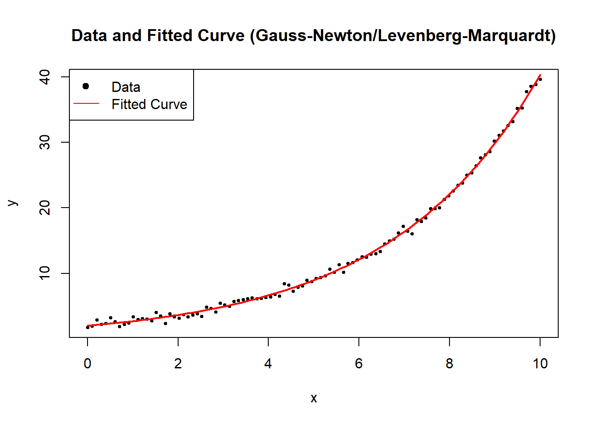

#### Modified Gauss-Newton Algorithm {#modified-gauss-newton-algorithm}

The Modified Gauss-Newton Algorithm introduces a learning rate $\alpha_j$ to control step size and prevent overshooting the local minimum. The standard [Gauss-Newton Algorithm] assumes that the full step direction $\hat{\delta}^{(j+1)}$ is optimal, but in practice, especially for highly nonlinear problems, it can overstep the minimum or cause numerical instability. The modification introduces a step size reduction, making it more robust.

We redefine the update step as:

$$
\hat{\theta}^{(j+1)} = \hat{\theta}^{(j)} + \alpha_j \hat{\delta}^{(j+1)}, \quad 0 < \alpha_j < 1,
$$

where:

-   $\alpha_j$ is a **learning rate**, controlling how much of the step $\hat{\delta}^{(j+1)}$ is taken.
-   If $\alpha_j = 1$, we recover the standard Gauss-Newton method.
-   If $\alpha_j$ is too small, convergence is slow; if too large, the algorithm may diverge.

This learning rate $\alpha_j$ allows for **adaptive step size adjustments**, helping prevent excessive parameter jumps and ensuring that SSE decreases at each iteration.

------------------------------------------------------------------------

A common approach to determine $\alpha_j$ is **step halving**, ensuring that each iteration moves in a direction that reduces SSE. Instead of using a fixed $\alpha_j$, we iteratively reduce the step size until SSE decreases:

$$
\hat{\theta}^{(j+1)} = \hat{\theta}^{(j)} + \frac{1}{2^k}\hat{\delta}^{(j+1)},
$$

where:

-   $k$ is the smallest non-negative integer such that

$$
SSE(\hat{\theta}^{(j)} + \frac{1}{2^k} \hat{\delta}^{(j+1)}) < SSE(\hat{\theta}^{(j)}).
$$

This means we start with the full step $\hat{\delta}^{(j+1)}$, then try $\hat{\delta}^{(j+1)}/2$, then $\hat{\delta}^{(j+1)}/4$, and so on, until SSE is reduced.

**Algorithm for Step Halving:**

1.  Compute the Gauss-Newton step $\hat{\delta}^{(j+1)}$.
2.  Set an initial $\alpha_j = 1$.
3.  If the updated parameters $\hat{\theta}^{(j)} + \alpha_j \hat{\delta}^{(j+1)}$ increase SSE, divide $\alpha_j$ by 2.
4.  Repeat until SSE decreases.

This **ensures monotonic SSE reduction**, preventing divergence due to an overly aggressive step.

------------------------------------------------------------------------

**Generalized Form of the Modified Algorithm**

A more general form of the update rule, incorporating step size control and a matrix $\mathbf{A}_j$, is:

$$
\hat{\theta}^{(j+1)} = \hat{\theta}^{(j)} - \alpha_j \mathbf{A}_j \frac{\partial Q(\hat{\theta}^{(j)})}{\partial \theta},
$$

where:

-   $\mathbf{A}_j$ is a **positive definite matrix** that preconditions the update direction.
-   $\alpha_j$ is the **learning rate**.
-   $\frac{\partial Q(\hat{\theta}^{(j)})}{\partial \theta}$ is the **gradient** of the objective function $Q(\theta)$, typically SSE in nonlinear regression.

------------------------------------------------------------------------

**Connection to the Modified Gauss-Newton Algorithm**

The **Modified Gauss-Newton Algorithm** fits this framework:

$$
\hat{\theta}^{(j+1)} = \hat{\theta}^{(j)} - \alpha_j [\mathbf{F}(\hat{\theta}^{(j)})' \mathbf{F}(\hat{\theta}^{(j)})]^{-1} \frac{\partial SSE(\hat{\theta}^{(j)})}{\partial \theta}.
$$

Here, we recognize:

-   **Objective function**: $Q = SSE$.
-   **Preconditioner matrix**: $[\mathbf{F}(\hat{\theta}^{(j)})' \mathbf{F}(\hat{\theta}^{(j)})]^{-1} = \mathbf{A}$.

Thus, the standard Gauss-Newton method can be interpreted as a special case of this broader optimization framework, with a preconditioned gradient descent approach.

------------------------------------------------------------------------


```r
# Load required library
library(minpack.lm)

# Define a nonlinear function (exponential model)
nonlinear_model <- function(theta, x) {
  theta[1] * exp(theta[2] * x)
}

# Define the Sum of Squared Errors function
sse <- function(theta, x, y) {
  sum((y - nonlinear_model(theta, x)) ^ 2)
}

# Generate synthetic data
set.seed(123)
x <- seq(0, 10, length.out = 100)
true_theta <- c(2, 0.3)
y <- nonlinear_model(true_theta, x) + rnorm(length(x), sd = 0.5)

# Gauss-Newton with Step Halving
gauss_newton_modified <-
  function(theta_init,
           x,
           y,
           tol = 1e-6,
           max_iter = 100) {
    theta <- theta_init
    for (j in 1:max_iter) {
      # Compute Jacobian matrix numerically
      epsilon <- 1e-6
      F_matrix <-
        matrix(0, nrow = length(y), ncol = length(theta))
      for (p in 1:length(theta)) {
        theta_perturb <- theta
        theta_perturb[p] <- theta[p] + epsilon
        F_matrix[, p] <-
          (nonlinear_model(theta_perturb, x)-nonlinear_model(theta, x))/epsilon
      }
      
      # Compute residuals
      residuals <- y - nonlinear_model(theta, x)
      
      # Compute Gauss-Newton step
      delta <-
        solve(t(F_matrix) %*% F_matrix) %*% t(F_matrix) %*% residuals
      
      # Step Halving Implementation
      alpha <- 1
      k <- 0
      while (sse(theta + alpha * delta, x, y) >= sse(theta, x, y) &&
             k < 10) {
        alpha <- alpha / 2
        k <- k + 1
      }
      
      # Update theta
      theta_new <- theta + alpha * delta
      
      # Check for convergence
      if (sum(abs(theta_new - theta)) < tol) {
        break
      }
      
      theta <- theta_new
    }
    return(theta)
  }

# Run Modified Gauss-Newton Algorithm
theta_init <- c(1, 0.1)  # Initial parameter guess
estimated_theta <- gauss_newton_modified(theta_init, x, y)

# Display estimated parameters
cat("Estimated parameters (A, B) with Modified Gauss-Newton:\n")
#> Estimated parameters (A, B) with Modified Gauss-Newton:
print(estimated_theta)
#>           [,1]
#> [1,] 1.9934188
#> [2,] 0.3008742

# Plot data and fitted curve
plot(
  x,
  y,
  main = "Modified Gauss-Newton: Data & Fitted Curve",
  pch = 19,
  cex = 0.5,
  xlab = "x",
  ylab = "y"
)
curve(
  nonlinear_model(estimated_theta, x),
  from = 0,
  to = 10,
  add = TRUE,
  col = "red",
  lwd = 2
)
legend(
  "topleft",
  legend = c("Data", "Fitted Curve"),
  pch = c(19, NA),
  lty = c(NA, 1),
  col = c("black", "red")
)
```

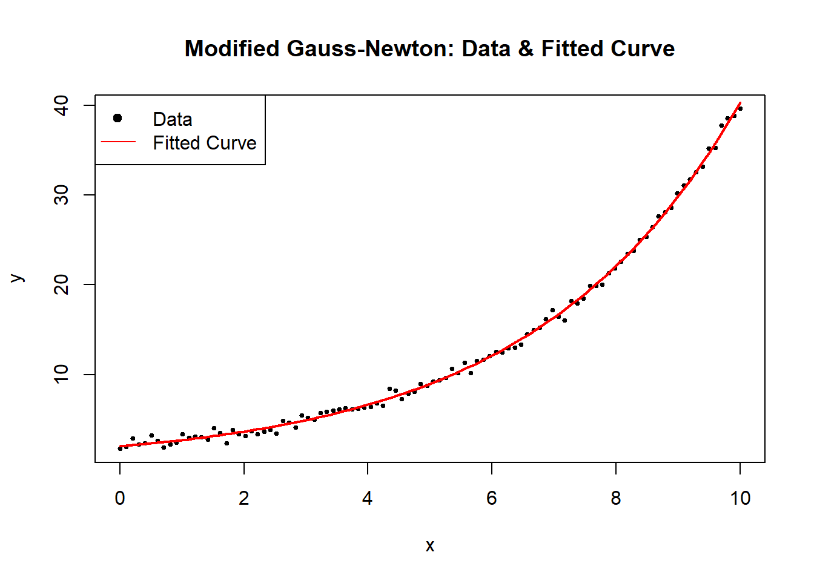

#### Steepest Descent (Gradient Descent) {#steepest-descent}

The Steepest Descent Method, commonly known as Gradient Descent, is a fundamental iterative optimization technique used for finding parameter estimates that minimize an objective function $\mathbf{Q}(\theta)$. It is a special case of the [Modified Gauss-Newton Algorithm](#modified-gauss-newton-algorithm), where the preconditioning matrix $\mathbf{A}_j$ is replaced by the identity matrix.

The update rule is given by:

$$
\hat{\theta}^{(j+1)} = \hat{\theta}^{(j)} - \alpha_j \mathbf{I}_{p \times p}\frac{\partial \mathbf{Q}(\hat{\theta}^{(j)})}{\partial \theta},
$$

where:

-   $\alpha_j$ is the **learning rate**, determining the step size.
-   $\mathbf{I}_{p \times p}$ is the **identity matrix**, meaning updates occur in the direction of the **negative gradient**.
-   $\frac{\partial \mathbf{Q}(\hat{\theta}^{(j)})}{\partial \theta}$ is the **gradient vector**, which provides the direction of **steepest ascent**; its negation ensures movement toward the minimum.

Characteristics of Steepest Descent

-   **Slow to converge:** The algorithm moves in the direction of the gradient but does not take into account curvature, which may result in slow convergence, especially in ill-conditioned problems.
-   **Moves rapidly initially:** The method can exhibit **fast initial progress**, but as it approaches the minimum, step sizes become small, leading to slow convergence.
-   **Useful for initialization:** Due to its simplicity and ease of implementation, it is often used to obtain **starting values** for more advanced methods like **Newton's method** or [Gauss-Newton Algorithm].

------------------------------------------------------------------------

Comparison with Gauss-Newton

| Method               | Update Rule                                                                        | Advantages                              | Disadvantages                              |
|---------------|----------------------------|---------------|---------------|
| **Steepest Descent** | $\hat{\theta}^{(j+1)} = \hat{\theta}^{(j)} - \alpha_j \mathbf{I} \nabla Q(\theta)$ | Simple, requires only first derivatives | Slow convergence, sensitive to $\alpha_j$  |
| **Gauss-Newton**     | $\hat{\theta}^{(j+1)} = \hat{\theta}^{(j)} - \mathbf{H}^{-1} \nabla Q(\theta)$     | Uses curvature, faster near solution    | Requires Jacobian computation, may diverge |

The **key difference** is that Steepest Descent **only** considers the gradient direction, while Gauss-Newton and Newton's method incorporate curvature information.

------------------------------------------------------------------------

Choosing the Learning Rate $\alpha_j$

A well-chosen **learning rate** is crucial for the success of gradient descent:

-   **Too large**: The algorithm may overshoot the minimum and diverge.
-   **Too small**: Convergence is **very slow**.
-   **Adaptive strategies**:
    -   **Fixed step size**: $\alpha_j$ is constant.
    -   **Step size decay**: $\alpha_j$ decreases over iterations (e.g., $\alpha_j = \frac{1}{j}$).
    -   **Line search**: Choose $\alpha_j$ by minimizing $\mathbf{Q}(\theta^{(j+1)})$ along the gradient direction.

A common approach is **backtracking line search**, where $\alpha_j$ is reduced iteratively until a decrease in $\mathbf{Q}(\theta)$ is observed.

------------------------------------------------------------------------


```r
# Load necessary libraries
library(ggplot2)


# Define the nonlinear function (exponential model)
nonlinear_model <- function(theta, x) {
    theta[1] * exp(theta[2] * x)
}

# Define the Sum of Squared Errors function
sse <- function(theta, x, y) {
    sum((y - nonlinear_model(theta, x)) ^ 2)
}

# Define Gradient of SSE w.r.t theta (computed numerically)
gradient_sse <- function(theta, x, y) {
    n <- length(y)
    residuals <- y - nonlinear_model(theta, x)
    
    # Partial derivative w.r.t theta_1
    grad_1 <- -2 * sum(residuals * exp(theta[2] * x))
    
    # Partial derivative w.r.t theta_2
    grad_2 <- -2 * sum(residuals * theta[1] * x * exp(theta[2] * x))
    
    return(c(grad_1, grad_2))
}

# Generate synthetic data
set.seed(123)
x <- seq(0, 10, length.out = 100)
true_theta <- c(2, 0.3)
y <- nonlinear_model(true_theta, x) + rnorm(length(x), sd = 0.5)

# Safe Gradient Descent Implementation
gradient_descent <-
    function(theta_init,
             x,
             y,
             alpha = 0.01,
             tol = 1e-6,
             max_iter = 500) {
        theta <- theta_init
        sse_values <- numeric(max_iter)
        
        for (j in 1:max_iter) {
            grad <- gradient_sse(theta, x, y)
            
            # Check for NaN or Inf values in the gradient (prevents divergence)
            if (any(is.na(grad)) || any(is.infinite(grad))) {
                cat("Numerical instability detected at iteration",
                    j,
                    "\n")
                break
            }
            
            # Update step
            theta_new <- theta - alpha * grad
            sse_values[j] <- sse(theta_new, x, y)
            
            # Check for convergence
            if (!is.finite(sse_values[j])) {
                cat("Divergence detected at iteration", j, "\n")
                break
            }
            
            if (sum(abs(theta_new - theta)) < tol) {
                cat("Converged in", j, "iterations.\n")
                return(list(theta = theta_new, sse_values = sse_values[1:j]))
            }
            
            theta <- theta_new
        }
        
        return(list(theta = theta, sse_values = sse_values))
    }

# Run Gradient Descent with a Safe Implementation
theta_init <- c(1, 0.1)  # Initial guess
alpha <- 0.001           # Learning rate
result <- gradient_descent(theta_init, x, y, alpha)
#> Divergence detected at iteration 1

# Extract results
estimated_theta <- result$theta
sse_values <- result$sse_values

# Display estimated parameters
cat("Estimated parameters (A, B) using Gradient Descent:\n")
#> Estimated parameters (A, B) using Gradient Descent:
print(estimated_theta)
#> [1] 1.0 0.1

# Plot convergence of SSE over iterations
# Ensure sse_values has valid data
sse_df <- data.frame(
  Iteration = seq_along(sse_values),
  SSE = sse_values
)

# Generate improved plot using ggplot()
ggplot(sse_df, aes(x = Iteration, y = SSE)) +
  geom_line(color = "blue", linewidth = 1) +
  labs(
    title = "Gradient Descent Convergence",
    x = "Iteration",
    y = "SSE"
  ) +
  theme_minimal()
```


1.  [Steepest Descent (Gradient Descent)](#steepest-descent) moves in the direction of steepest descent, which can lead to zigzagging behavior.
2.  Slow convergence occurs when the curvature of the function varies significantly across dimensions.
3.  Learning rate tuning is critical:
    -   If too large, the algorithm diverges.

    -   If too small, progress is very slow.
4.  Useful for initialization: It is often used to get close to the optimal solution before switching to more advanced methods like [Gauss-Newton Algorithm] or Newton's method.

Several advanced techniques improve the performance of steepest descent:

-   **Momentum Gradient Descent**: Adds a momentum term to smooth updates, reducing oscillations.

-   **Adaptive Learning Rates**:

    -   AdaGrad: Adjusts $\alpha_j$ per parameter based on historical gradients.

    -   RMSprop: Uses a moving average of past gradients to scale updates.

    -   Adam (Adaptive Moment Estimation): Combines momentum and adaptive learning rates.

In practice, Adam is widely used in machine learning and deep learning, while Newton-based methods (including Gauss-Newton) are preferred for nonlinear regression.

#### Levenberg-Marquardt Algorithm {#levenberg-marquardt}

The Levenberg-Marquardt Algorithm is a widely used optimization method for solving nonlinear least squares problems. It is an adaptive technique that blends the [Gauss-Newton Algorithm] and [Steepest Descent (Gradient Descent)](#steepest-descent), dynamically switching between them based on problem conditions.

The update rule is:

$$
\hat{\theta}^{(j+1)} = \hat{\theta}^{(j)} - \alpha_j [\mathbf{F}(\hat{\theta}^{(j)})' \mathbf{F}(\hat{\theta}^{(j)}) + \tau \mathbf{I}_{p \times p}]\frac{\partial \mathbf{Q}(\hat{\theta}^{(j)})}{\partial \theta}
$$

where:

-   $\tau$ is the **damping parameter**, controlling whether the step behaves like [Gauss-Newton Algorithm] or [Steepest Descent (Gradient Descent)](#steepest-descent).
-   $\mathbf{I}_{p \times p}$ is the **identity matrix**, ensuring numerical stability.
-   $\mathbf{F}(\hat{\theta}^{(j)})$ is the **Jacobian matrix** of partial derivatives.
-   $\frac{\partial \mathbf{Q}(\hat{\theta}^{(j)})}{\partial \theta}$ is the **gradient vector**.
-   $\alpha_j$ is the **learning rate**, determining step size.

The Levenberg-Marquardt algorithm is particularly useful when the Jacobian matrix $\mathbf{F}(\hat{\theta}^{(j)})$ is nearly singular, meaning that [Gauss-Newton Algorithm] alone may fail.

-   When $\tau$ is large, the method behaves like Steepest Descent, ensuring stability.
-   When $\tau$ is small, it behaves like Gauss-Newton, accelerating convergence.
-   Adaptive control of $\tau$:
    -   If $SSE(\hat{\theta}^{(j+1)}) < SSE(\hat{\theta}^{(j)})$, reduce $\tau$: $$
        \tau \gets \tau / 10
        $$
    -   Otherwise, increase $\tau$ to stabilize: $$
        \tau \gets 10\tau
        $$

This adjustment ensures that the algorithm moves efficiently while avoiding instability.


```r
# Load required libraries
library(minpack.lm)
library(ggplot2)

# Define a nonlinear function (exponential model)
nonlinear_model <- function(theta, x) {
    theta[1] * exp(theta[2] * x)
}

# Define SSE function
sse <- function(theta, x, y) {
    sum((y - nonlinear_model(theta, x)) ^ 2)
}

# Generate synthetic data
set.seed(123)
x <- seq(0, 10, length.out = 100)
true_theta <- c(2, 0.3)
y <- nonlinear_model(true_theta, x) + rnorm(length(x), sd = 0.5)

# Robust Levenberg-Marquardt Optimization Implementation
levenberg_marquardt <-
    function(theta_init,
             x,
             y,
             tol = 1e-6,
             max_iter = 500,
             tau_init = 1) {
        theta <- theta_init
        tau <- tau_init
        lambda <- 1e-8  # Small regularization term
        sse_values <- numeric(max_iter)
        
        for (j in 1:max_iter) {
            # Compute Jacobian matrix numerically
            epsilon <- 1e-6
            F_matrix <-
                matrix(0, nrow = length(y), ncol = length(theta))
            for (p in 1:length(theta)) {
                theta_perturb <- theta
                theta_perturb[p] <- theta[p] + epsilon
                F_matrix[, p] <-
                    (nonlinear_model(theta_perturb, x) 
                     - nonlinear_model(theta, x)) / epsilon
            }
            
            # Compute residuals
            residuals <- y - nonlinear_model(theta, x)
            
            # Compute Levenberg-Marquardt update
            A <-
                t(F_matrix) %*% F_matrix + tau * diag(length(theta)) 
            + lambda * diag(length(theta))  # Regularized A
            delta <- tryCatch(
                solve(A) %*% t(F_matrix) %*% residuals,
                error = function(e) {
                    cat("Singular matrix detected at iteration",
                        j,
                        "- Increasing tau\n")
                    tau <<- tau * 10  # Increase tau to stabilize
                    # Return zero delta to avoid NaN updates
                    return(rep(0, length(theta)))  
                }
            )
            
            theta_new <- theta + delta
            
            # Compute new SSE
            sse_values[j] <- sse(theta_new, x, y)
            
            # Adjust tau dynamically
            if (sse_values[j] < sse(theta, x, y)) {
                # Reduce tau but prevent it from going too low
                tau <-
                    max(tau / 10, 1e-8)  
            } else {
                tau <- tau * 10  # Increase tau if SSE increases
            }
            
            # Check for convergence
            if (sum(abs(delta)) < tol) {
                cat("Converged in", j, "iterations.\n")
                return(list(theta = theta_new, sse_values = sse_values[1:j]))
            }
            
            theta <- theta_new
        }
        
        return(list(theta = theta, sse_values = sse_values))
    }

# Run Levenberg-Marquardt
theta_init <- c(1, 0.1)  # Initial guess
result <- levenberg_marquardt(theta_init, x, y)
#> Singular matrix detected at iteration 11 - Increasing tau
#> Converged in 11 iterations.

# Extract results
estimated_theta <- result$theta
sse_values <- result$sse_values

# Display estimated parameters
cat("Estimated parameters (A, B) using Levenberg-Marquardt:\n")
#> Estimated parameters (A, B) using Levenberg-Marquardt:
print(estimated_theta)
#>               [,1]
#> [1,] -6.473440e-09
#> [2,]  1.120637e+01

# Plot convergence of SSE over iterations
sse_df <-
    data.frame(Iteration = seq_along(sse_values), SSE = sse_values)

ggplot(sse_df, aes(x = Iteration, y = SSE)) +
    geom_line(color = "blue", linewidth = 1) +
    labs(title = "Levenberg-Marquardt Convergence",
         x = "Iteration",
         y = "SSE") +
    theme_minimal()
```


-   Early Stability (Flat SSE)

    -   The SSE remains near zero for the first few iterations, which suggests that the algorithm is initially behaving stably.

    -   This might indicate that the initial parameter guess is reasonable, or that the updates are too small to significantly affect SSE.

-   Sudden Explosion in SSE (Iteration \~8-9)

    -   The sharp spike in SSE at iteration 9 indicates a numerical instability or divergence in the optimization process.

    -   This could be due to:

        -   An ill-conditioned Jacobian matrix: The step direction is poorly estimated, leading to an unstable jump.

        -   A sudden large update (`delta`): The damping parameter (`tau`) might have been reduced too aggressively, causing an uncontrolled step.

        -   Floating-point issues: If `A` becomes nearly singular, solving `A \ delta = residuals` may produce excessively large values.

-   Return to Stability (After Iteration 9)

    -   The SSE immediately returns to a low value after the spike, which suggests that the damping parameter (`tau`) might have been increased after detecting instability.

    -   This is consistent with the adaptive nature of Levenberg-Marquardt:

        -   If a step leads to a bad SSE increase, the algorithm increases `tau` to make the next step more conservative.

        -   If the next step stabilizes, `tau` may be reduced again.

#### Newton-Raphson Algorithm {#newton-raphson}

The Newton-Raphson method is a second-order optimization technique used for nonlinear least squares problems. Unlike first-order methods (such as [Steepest Descent (Gradient Descent)](#steepest-descent) and [Gauss-Newton Algorithm]), Newton-Raphson uses both first and second derivatives of the objective function for faster convergence.

The update rule is:

$$
\hat{\theta}^{(j+1)} = \hat{\theta}^{(j)} - \alpha_j \left[\frac{\partial^2 Q(\hat{\theta}^{(j)})}{\partial \theta \partial \theta'}\right]^{-1} \frac{\partial Q(\hat{\theta}^{(j)})}{\partial \theta}
$$

where:

-   $\frac{\partial Q(\hat{\theta}^{(j)})}{\partial \theta}$ is the **gradient vector** (first derivative of the objective function).
-   $\frac{\partial^2 Q(\hat{\theta}^{(j)})}{\partial \theta \partial \theta'}$ is the **Hessian matrix** (second derivative of the objective function).
-   $\alpha_j$ is the **learning rate**, controlling step size.

The **Hessian matrix** in nonlinear least squares problems is:

$$
\frac{\partial^2 Q(\hat{\theta}^{(j)})}{\partial \theta \partial \theta'} = 2 \mathbf{F}(\hat{\theta}^{(j)})' \mathbf{F}(\hat{\theta}^{(j)}) - 2\sum_{i=1}^{n} [Y_i - f(x_i;\theta)] \frac{\partial^2 f(x_i;\theta)}{\partial \theta \partial \theta'}
$$

where:

-   The first term $2 \mathbf{F}(\hat{\theta}^{(j)})' \mathbf{F}(\hat{\theta}^{(j)})$ is the same as in the [Gauss-Newton Algorithm].
-   The second term $-2\sum_{i=1}^{n} [Y_i - f(x_i;\theta)] \frac{\partial^2 f(x_i;\theta)}{\partial \theta \partial \theta'}$ contains second-order derivatives.

**Key Observations**

-   Gauss-Newton vs. Newton-Raphson:
    -   Gauss-Newton approximates the Hessian by ignoring the second term.
    -   Newton-Raphson explicitly incorporates second-order derivatives, making it more precise but computationally expensive.
-   Challenges:
    -   The Hessian matrix may be singular, making it impossible to invert.
    -   Computing second derivatives is often difficult for complex functions.


```r
# Load required libraries
library(ggplot2)

# Define a nonlinear function (exponential model)
nonlinear_model <- function(theta, x) {
    theta[1] * exp(theta[2] * x)
}

# Define SSE function
sse <- function(theta, x, y) {
    sum((y - nonlinear_model(theta, x)) ^ 2)
}

# Compute Gradient (First Derivative) of SSE
gradient_sse <- function(theta, x, y) {
    residuals <- y - nonlinear_model(theta, x)
    
    # Partial derivative w.r.t theta_1
    grad_1 <- -2 * sum(residuals * exp(theta[2] * x))
    
    # Partial derivative w.r.t theta_2
    grad_2 <- -2 * sum(residuals * theta[1] * x * exp(theta[2] * x))
    
    return(c(grad_1, grad_2))
}

# Compute Hessian (Second Derivative) of SSE
hessian_sse <- function(theta, x, y) {
    residuals <- y - nonlinear_model(theta, x)
    
    # Compute second derivatives
    H_11 <- 2 * sum(exp(2 * theta[2] * x))
    H_12 <- 2 * sum(x * exp(2 * theta[2] * x) * theta[1])
    H_21 <- H_12
    
    term1 <- 2 * sum((x ^ 2) * exp(2 * theta[2] * x) * theta[1] ^ 2)
    term2 <- 2 * sum(residuals * (x ^ 2) * exp(theta[2] * x))
    
    H_22 <- term1 - term2
    
    return(matrix(
        c(H_11, H_12, H_21, H_22),
        nrow = 2,
        byrow = TRUE
    ))
}

# Generate synthetic data
set.seed(123)
x <- seq(0, 10, length.out = 100)
true_theta <- c(2, 0.3)
y <- nonlinear_model(true_theta, x) + rnorm(length(x), sd = 0.5)

# Newton-Raphson Optimization Implementation
newton_raphson <-
    function(theta_init,
             x,
             y,
             tol = 1e-6,
             max_iter = 500) {
        theta <- theta_init
        sse_values <- numeric(max_iter)
        
        for (j in 1:max_iter) {
            grad <- gradient_sse(theta, x, y)
            hessian <- hessian_sse(theta, x, y)
            
            # Check if Hessian is invertible
            if (det(hessian) == 0) {
                cat("Hessian is singular at iteration",
                    j,
                    "- Using identity matrix instead.\n")
                # Replace with identity matrix if singular
                hessian <-
                    diag(length(theta))  
            }
            
            # Compute Newton update
            delta <- solve(hessian) %*% grad
            theta_new <- theta - delta
            sse_values[j] <- sse(theta_new, x, y)
            
            # Check for convergence
            if (sum(abs(delta)) < tol) {
                cat("Converged in", j, "iterations.\n")
                return(list(theta = theta_new, sse_values = sse_values[1:j]))
            }
            
            theta <- theta_new
        }
        
        return(list(theta = theta, sse_values = sse_values))
    }

# Run Newton-Raphson
theta_init <- c(1, 0.1)  # Initial guess
result <- newton_raphson(theta_init, x, y)
#> Converged in 222 iterations.

# Extract results
estimated_theta <- result$theta
sse_values <- result$sse_values

# Display estimated parameters
cat("Estimated parameters (A, B) using Newton-Raphson:\n")
#> Estimated parameters (A, B) using Newton-Raphson:
print(estimated_theta)
#>           [,1]
#> [1,] 1.9934188
#> [2,] 0.3008742

# Plot convergence of SSE over iterations
sse_df <-
    data.frame(Iteration = seq_along(sse_values), SSE = sse_values)

ggplot(sse_df, aes(x = Iteration, y = SSE)) +
    geom_line(color = "blue", size = 1) +
    labs(title = "Newton-Raphson Convergence",
         x = "Iteration",
         y = "SSE") +
    theme_minimal()
```


#### Quasi-Newton Method

The Quasi-Newton method is an optimization technique that approximates Newton's method without requiring explicit computation of the Hessian matrix. Instead, it iteratively constructs an approximation $\mathbf{H}_j$ to the Hessian based on the first derivative information.

The update rule is:

$$
\hat{\theta}^{(j+1)} = \hat{\theta}^{(j)} - \alpha_j \mathbf{H}_j^{-1}\frac{\partial \mathbf{Q}(\hat{\theta}^{(j)})}{\partial \theta}
$$

where:

-   $\mathbf{H}_j$ is a **symmetric positive definite approximation** to the **Hessian matrix**.
-   As $j \to \infty$, $\mathbf{H}_j$ gets closer to the **true Hessian**.
-   $\frac{\partial Q(\hat{\theta}^{(j)})}{\partial \theta}$ is the **gradient vector**.
-   $\alpha_j$ is the **learning rate**, controlling step size.

Why Use Quasi-Newton Instead of [Newton-Raphson Method](#newton-raphson)?

-   Newton-Raphson requires computing the Hessian matrix explicitly, which is computationally expensive and may be singular.
-   Quasi-Newton avoids computing the Hessian directly by approximating it iteratively.
-   Among first-order methods (which only require gradients, not Hessians), Quasi-Newton methods perform best.

------------------------------------------------------------------------

**Hessian Approximation**

Instead of directly computing the Hessian $\mathbf{H}_j$, Quasi-Newton methods update an approximation $\mathbf{H}_j$ iteratively.

One of the most widely used formulas is the **Broyden-Fletcher-Goldfarb-Shanno (BFGS) update**:

$$
\mathbf{H}_{j+1} = \mathbf{H}_j + \frac{(\mathbf{s}_j \mathbf{s}_j')}{\mathbf{s}_j' \mathbf{y}_j} - \frac{\mathbf{H}_j \mathbf{y}_j \mathbf{y}_j' \mathbf{H}_j}{\mathbf{y}_j' \mathbf{H}_j \mathbf{y}_j}
$$

where:

-   $\mathbf{s}_j = \hat{\theta}^{(j+1)} - \hat{\theta}^{(j)}$ (change in parameters).
-   $\mathbf{y}_j = \nabla Q(\hat{\theta}^{(j+1)}) - \nabla Q(\hat{\theta}^{(j)})$ (change in gradient).
-   $\mathbf{H}_j$ is the current **inverse Hessian approximation**.

------------------------------------------------------------------------


```r
# Load required libraries
library(ggplot2)

# Define a nonlinear function (exponential model)
nonlinear_model <- function(theta, x) {
    theta[1] * exp(theta[2] * x)
}

# Define SSE function
sse <- function(theta, x, y) {
    sum((y - nonlinear_model(theta, x))^2)
}

# Generate synthetic data
set.seed(123)
x <- seq(0, 10, length.out = 100)
true_theta <- c(2, 0.3)
y <- nonlinear_model(true_theta, x) + rnorm(length(x), sd = 0.5)

# Run BFGS Optimization using `optim()`
theta_init <- c(1, 0.1)  # Initial guess
result <- optim(
    par = theta_init,
    fn = function(theta) sse(theta, x, y),  # Minimize SSE
    method = "BFGS",
    control = list(trace = 0)  # Suppress optimization progress
    # control = list(trace = 1, REPORT = 1)  # Print optimization progress
)

# Extract results
estimated_theta <- result$par
sse_final <- result$value
convergence_status <- result$convergence  # 0 means successful convergence

# Display estimated parameters
cat("\n=== Optimization Results ===\n")
#> 
#> === Optimization Results ===
cat("Estimated parameters (A, B) using Quasi-Newton BFGS:\n")
#> Estimated parameters (A, B) using Quasi-Newton BFGS:
print(estimated_theta)
#> [1] 1.9954216 0.3007569

# Display final SSE
cat("\nFinal SSE:", sse_final, "\n")
#> 
#> Final SSE: 20.3227
```

#### Trust-Region Reflective Algorithm

The Trust-Region Reflective (TRR) algorithm is an optimization technique used for nonlinear least squares problems. Unlike Newton's method and gradient-based approaches, TRR dynamically restricts updates to a trust region, ensuring stability and preventing overshooting.

The goal is to minimize the objective function $Q(\theta)$ (e.g., Sum of Squared Errors, SSE):

$$
\hat{\theta} = \arg\min_{\theta} Q(\theta)
$$

Instead of taking a full Newton step, TRR solves the following **quadratic subproblem**:

$$
\min_{\delta} m_j(\delta) = Q(\hat{\theta}^{(j)}) + \nabla Q(\hat{\theta}^{(j)})' \delta + \frac{1}{2} \delta' \mathbf{H}_j \delta
$$

subject to:

$$
\|\delta\| \leq \Delta_j
$$

where:

-   $\mathbf{H}_j$ is an **approximation of the Hessian matrix**.

-   $\nabla Q(\hat{\theta}^{(j)})$ is the **gradient vector**.

-   $\Delta_j$ is the **trust-region radius**, which is adjusted dynamically.

------------------------------------------------------------------------

**Trust-Region Adjustments**

The algorithm **modifies the step size dynamically** based on the ratio $\rho_j$:

$$
\rho_j = \frac{Q(\hat{\theta}^{(j)}) - Q(\hat{\theta}^{(j)} + \delta)}{m_j(0) - m_j(\delta)}
$$

-   **If** $\rho_j > 0.75$ and $\|\delta\| = \Delta_j$, then expand the trust region: $$
    \Delta_{j+1} = 2 \Delta_j
    $$

-   **If** $\rho_j < 0.25$, shrink the trust region: $$
    \Delta_{j+1} = \frac{1}{2} \Delta_j
    $$

-   **If** $\rho_j > 0$, accept the step; otherwise, reject it.

If a step **violates a constraint**, it is **reflected back** into the feasible region:

$$
\hat{\theta}^{(j+1)} = \max(\hat{\theta}^{(j)} + \delta, \theta_{\min})
$$

This ensures that the optimization **respects parameter bounds**.

------------------------------------------------------------------------


```r
# Load required libraries
library(ggplot2)


# Define a nonlinear function (exponential model)
nonlinear_model <- function(theta, x) {
    theta[1] * exp(theta[2] * x)
}

# Define SSE function
sse <- function(theta, x, y) {
    sum((y - nonlinear_model(theta, x)) ^ 2)
}

# Compute Gradient (First Derivative) of SSE
gradient_sse <- function(theta, x, y) {
    residuals <- y - nonlinear_model(theta, x)
    
    # Partial derivative w.r.t theta_1
    grad_1 <- -2 * sum(residuals * exp(theta[2] * x))
    
    # Partial derivative w.r.t theta_2
    grad_2 <- -2 * sum(residuals * theta[1] * x * exp(theta[2] * x))
    
    return(c(grad_1, grad_2))
}

# Compute Hessian Approximation of SSE
hessian_sse <- function(theta, x, y) {
    residuals <- y - nonlinear_model(theta, x)
    
    # Compute second derivatives
    H_11 <- 2 * sum(exp(2 * theta[2] * x))
    H_12 <- 2 * sum(x * exp(2 * theta[2] * x) * theta[1])
    H_21 <- H_12
    
    term1 <- 2 * sum((x ^ 2) * exp(2 * theta[2] * x) * theta[1] ^ 2)
    term2 <- 2 * sum(residuals * (x ^ 2) * exp(theta[2] * x))
    
    H_22 <- term1 - term2
    
    return(matrix(
        c(H_11, H_12, H_21, H_22),
        nrow = 2,
        byrow = TRUE
    ))
}

# Generate synthetic data
set.seed(123)
x <- seq(0, 10, length.out = 100)
true_theta <- c(2, 0.3)
y <- nonlinear_model(true_theta, x) + rnorm(length(x), sd = 0.5)

# Manual Trust-Region Reflective Optimization Implementation
trust_region_reflective <-
    function(theta_init,
             x,
             y,
             tol = 1e-6,
             max_iter = 500,
             delta_max = 1.0) {
        theta <- theta_init
        delta_j <- 0.5  # Initial trust-region size
        n <- length(theta)
        sse_values <- numeric(max_iter)
        
        for (j in 1:max_iter) {
            grad <- gradient_sse(theta, x, y)
            hessian <- hessian_sse(theta, x, y)
            
            # Check if Hessian is invertible
            if (det(hessian) == 0) {
                cat("Hessian is singular at iteration",
                    j,
                    "- Using identity matrix instead.\n")
                hessian <-
                    diag(n)  # Replace with identity matrix if singular
            }
            
            # Compute Newton step
            delta_full <- -solve(hessian) %*% grad
            
            # Apply trust-region constraint
            if (sqrt(sum(delta_full ^ 2)) > delta_j) {
                # Scale step
                delta <-
                    (delta_j / sqrt(sum(delta_full ^ 2))) * delta_full  
            } else {
                delta <- delta_full
            }
            
            # Compute new theta and ensure it respects constraints
            theta_new <-
                pmax(theta + delta, c(0,-Inf))  # Reflect to lower bound
            sse_new <- sse(theta_new, x, y)
            
            # Compute agreement ratio (rho_j)
            predicted_reduction <-
                -t(grad) %*% delta - 0.5 * t(delta) %*% hessian %*% delta
            actual_reduction <- sse(theta, x, y) - sse_new
            rho_j <- actual_reduction / predicted_reduction
            
            # Adjust trust region size
            if (rho_j < 0.25) {
                delta_j <- max(delta_j / 2, 1e-4)  # Shrink
            } else if (rho_j > 0.75 &&
                       sqrt(sum(delta ^ 2)) == delta_j) {
                delta_j <- min(2 * delta_j, delta_max)  # Expand
            }
            
            # Accept or reject step
            if (rho_j > 0) {
                theta <- theta_new  # Accept step
            } else {
                cat("Step rejected at iteration", j, "\n")
            }
            
            sse_values[j] <- sse(theta, x, y)
            
            # Check for convergence
            if (sum(abs(delta)) < tol) {
                cat("Converged in", j, "iterations.\n")
                return(list(theta = theta, sse_values = sse_values[1:j]))
            }
        }
        
        return(list(theta = theta, sse_values = sse_values))
    }

# Run Manual Trust-Region Reflective Algorithm
theta_init <- c(1, 0.1)  # Initial guess
result <- trust_region_reflective(theta_init, x, y)

# Extract results
estimated_theta <- result$theta
sse_values <- result$sse_values

# Plot convergence of SSE over iterations
sse_df <-
    data.frame(Iteration = seq_along(sse_values), SSE = sse_values)

ggplot(sse_df, aes(x = Iteration, y = SSE)) +
    geom_line(color = "blue", size = 1) +
    labs(title = "Trust-Region Reflective Convergence",
         x = "Iteration",
         y = "SSE") +
    theme_minimal()
```

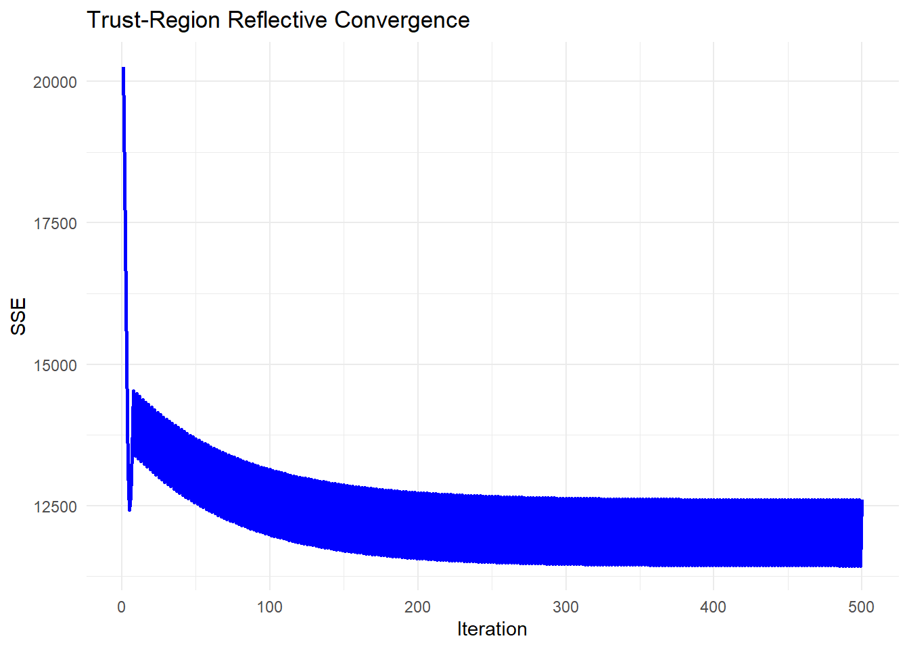

### Derivative-Free

#### Secant Method {#secant-method}

The Secant Method is a root-finding algorithm that approximates the derivative using finite differences, making it a derivative-free alternative to Newton's method. It is particularly useful when the exact gradient (or Jacobian in the case of optimization problems) is unavailable or expensive to compute.

In nonlinear optimization, we apply the Secant Method to iteratively refine parameter estimates without explicitly computing second-order derivatives.

------------------------------------------------------------------------

In one dimension, the Secant Method approximates the derivative as:

$$
f'(\theta) \approx \frac{f(\theta_{j}) - f(\theta_{j-1})}{\theta_{j} - \theta_{j-1}}.
$$

Using this approximation, the **update step** in the Secant Method follows:

$$
\theta_{j+1} = \theta_j - f(\theta_j) \frac{\theta_j - \theta_{j-1}}{f(\theta_j) - f(\theta_{j-1})}.
$$

Instead of computing the exact derivative (as in Newton's method), we use the difference between the last two iterates to approximate it. This makes the Secant Method **more efficient** in cases where gradient computation is expensive or infeasible.

------------------------------------------------------------------------

In **higher dimensions**, the Secant Method extends to an approximate [Quasi-Newton Method], often referred to as **Broyden's Method**. We iteratively approximate the inverse Hessian matrix using past updates.

The update formula for a vector-valued function $F(\theta)$ is:

$$
\theta^{(j+1)} = \theta^{(j)} - \mathbf{B}^{(j)} F(\theta^{(j)}),
$$

where $\mathbf{B}^{(j)}$ is an approximation of the inverse Jacobian matrix, updated at each step using:

$$
\mathbf{B}^{(j+1)} = \mathbf{B}^{(j)} + \frac{(\Delta \theta^{(j)} - \mathbf{B}^{(j)} \Delta F^{(j)}) (\Delta \theta^{(j)})'}{(\Delta \theta^{(j)})' \Delta F^{(j)}},
$$

where:

-   $\Delta \theta^{(j)} = \theta^{(j+1)} - \theta^{(j)}$,
-   $\Delta F^{(j)} = F(\theta^{(j+1)}) - F(\theta^{(j)})$.

This **secant-based update** approximates the behavior of the **true Jacobian inverse**, reducing computational cost compared to full Newton's method.

------------------------------------------------------------------------

**Algorithm: Secant Method for Nonlinear Optimization**

The **Secant Method** for nonlinear optimization follows these steps:

1.  Initialize parameters $\theta^{(0)}$ and $\theta^{(1)}$ (two starting points).
2.  Compute the function values $F(\theta^{(0)})$ and $F(\theta^{(1)})$.
3.  Use the Secant update formula to compute the next iterate $\theta^{(j+1)}$.
4.  Update the approximate inverse Jacobian $\mathbf{B}^{(j)}$.
5.  Repeat until convergence.

------------------------------------------------------------------------


```r
# Load required libraries
library(numDeriv)


# Define a nonlinear function (logistic model)
nonlinear_model <- function(theta, x) {
    return(theta[1] / (1 + exp(-theta[2] * (x - theta[3]))))
}

# Define the Sum of Squared Errors (SSE) function
sse <- function(theta, x, y) {
    return(sum((y - nonlinear_model(theta, x)) ^ 2))
}

# Generate synthetic data
set.seed(123)
x <- seq(-5, 5, length.out = 100)
true_theta <- c(4, 1.5, 0)  # True parameters (A, B, C)
y <- nonlinear_model(true_theta, x) + rnorm(length(x), sd = 0.3)

# Improved Secant Method with Line Search
secant_method_improved <-
    function(theta0,
             theta1,
             x,
             y,
             tol = 1e-6,
             max_iter = 100) {
        theta_prev <- as.matrix(theta0)  # Convert to column vector
        theta_curr <- as.matrix(theta1)
        
        alpha <- 1  # Initial step size
        step_reduction_factor <- 0.5  # Reduce step if SSE increases
        B_inv <- diag(length(theta0))  # Identity matrix initialization
        
        for (j in 1:max_iter) {
            # Compute function values using numerical gradient
            F_prev <-
                as.matrix(grad(function(theta)
                    sse(theta, x, y), theta_prev))
            F_curr <-
                as.matrix(grad(function(theta)
                    sse(theta, x, y), theta_curr))
            
            # Compute secant step update (convert to column vectors)
            delta_theta <- as.matrix(theta_curr - theta_prev)
            delta_F <- as.matrix(F_curr - F_prev)
            
            # Prevent division by zero
            if (sum(abs(delta_F)) < 1e-8) {
                cat("Gradient diff is too small, stopping optimization.\n")
                break
            }
            
            # Ensure correct dimensions for Broyden update
            numerator <-
                (delta_theta - B_inv %*% delta_F) %*% t(delta_theta)
            # Convert scalar to numeric
            denominator <-
                as.numeric(t(delta_theta) %*% delta_F)  
            
            # Updated inverse Jacobian approximation
            B_inv <-
                B_inv + numerator / denominator  
            
            # Compute next theta using secant update
            theta_next <- theta_curr - alpha * B_inv %*% F_curr
            
            # Line search: Reduce step size if SSE increases
            while (sse(as.vector(theta_next), x, y) > sse(as.vector(theta_curr), 
                                                          x, y)) {
                alpha <- alpha * step_reduction_factor
                theta_next <- theta_curr - alpha * B_inv %*% F_curr
                
                # Print progress
                # cat("Reducing step size to", alpha, "\n")
            }
            
            # Print intermediate results for debugging
            cat(
                sprintf(
                    "Iteration %d: Theta = (%.4f, %.4f, %.4f), Alpha = %.4f\n",
                    j,
                    theta_next[1],
                    theta_next[2],
                    theta_next[3],
                    alpha
                )
            )
            
            # Check convergence
            if (sum(abs(theta_next - theta_curr)) < tol) {
                cat("Converged successfully.\n")
                break
            }
            
            # Update iterates
            theta_prev <- theta_curr
            theta_curr <- theta_next
        }
        
        return(as.vector(theta_curr))  # Convert back to numeric vector
    }

# Adjusted initial parameter guesses
theta0 <- c(2, 0.8,-1)   # Closer to true parameters
theta1 <- c(4, 1.2,-0.5)  # Slightly refined

# Run Improved Secant Method
estimated_theta <- secant_method_improved(theta0, theta1, x, y)
#> Iteration 1: Theta = (3.8521, 1.3054, 0.0057), Alpha = 0.0156
#> Iteration 2: Theta = (3.8521, 1.3054, 0.0057), Alpha = 0.0000
#> Converged successfully.

# Display estimated parameters
cat("Estimated parameters (A, B, C) using Secant Method:\n")
#> Estimated parameters (A, B, C) using Secant Method:
print(estimated_theta)
#> [1] 3.85213912 1.30538435 0.00566417

# Plot data and fitted curve
plot(
    x,
    y,
    main = "Secant Method: Data & Fitted Curve",
    pch = 19,
    cex = 0.5,
    xlab = "x",
    ylab = "y"
)
curve(
    nonlinear_model(estimated_theta, x),
    from = -5,
    to = 5,
    add = TRUE,
    col = "red",
    lwd = 2
)
legend(
    "topleft",
    legend = c("Data", "Fitted Curve"),
    pch = c(19, NA),
    lty = c(NA, 1),
    col = c("black", "red")
)
```


#### Grid Search {#grid-search}

Grid Search (GS) is a brute-force optimization method that systematically explores a grid of possible parameter values to identify the combination that minimizes the residual sum of squares (RSS). Unlike gradient-based optimization, which moves iteratively towards a minimum, grid search evaluates all predefined parameter combinations, making it robust but computationally expensive.

Grid search is particularly useful when:

-   **The function is highly nonlinear**, making gradient methods unreliable.

-   **The parameter space is small**, allowing exhaustive search.

-   **A global minimum is needed**, and prior knowledge about parameter ranges exists.

------------------------------------------------------------------------

The goal of Grid Search is to find an optimal parameter set $\hat{\theta}$ that minimizes the Sum of Squared Errors (SSE):

$$
\hat{\theta} = \arg\min_{\theta \in \Theta} SSE(\theta),
$$

where:

$$
SSE(\theta) = \sum_{i=1}^{n} (y_i - f(x_i; \theta))^2.
$$

Grid search **discretizes** the search space $\Theta$ into a finite set of candidate values for each parameter:

$$
\Theta = \theta_1 \times \theta_2 \times \dots \times \theta_p.
$$

The **accuracy** of the solution depends on the **grid resolution**---a finer grid leads to **better accuracy** but **higher computational cost**.

------------------------------------------------------------------------

**Grid Search Algorithm**

1.  Define a grid of possible values for each parameter.
2.  Evaluate SSE for each combination of parameters.
3.  Select the parameter set that minimizes SSE.

------------------------------------------------------------------------


```r
# Define a numerically stable logistic function
safe_exp <- function(x) {
    return(ifelse(x > 700, Inf, exp(pmin(x, 700))))  # Prevent overflow
}

# Define the logistic growth model
nonlinear_model <- function(theta, x) {
    return(theta[1] / (1 + safe_exp(-theta[2] * (x - theta[3]))))
}

# Define the Sum of Squared Errors (SSE) function
sse <- function(theta, x, y) {
    predictions <- nonlinear_model(theta, x)
    return(sum((y - predictions)^2))
}

# Grid Search Optimization
grid_search_optimization <- function(x, y, grid_size = 10) {
    # Define grid of parameter values
    A_values <- seq(2, 6, length.out = grid_size)
    B_values <- seq(0.5, 3, length.out = grid_size)
    C_values <- seq(-2, 2, length.out = grid_size)
    
    # Generate all combinations of parameters
    param_grid <- expand.grid(A = A_values, B = B_values, C = C_values)
    
    # Evaluate SSE for each parameter combination
    param_grid$SSE <- apply(param_grid, 1, function(theta) {
        sse(as.numeric(theta[1:3]), x, y)
    })
    
    # Select the best parameter set
    best_params <- param_grid[which.min(param_grid$SSE), 1:3]
    return(as.numeric(best_params))
}

# Generate synthetic data
set.seed(123)
x <- seq(-5, 5, length.out = 100)
true_theta <- c(4, 1.5, 0)  # True parameters (A, B, C)
y <- nonlinear_model(true_theta, x) + rnorm(length(x), sd = 0.3)

# Run Grid Search
estimated_theta <- grid_search_optimization(x, y, grid_size = 20)

# Display results
cat("Estimated parameters (A, B, C) using Grid Search:\n")
#> Estimated parameters (A, B, C) using Grid Search:
print(estimated_theta)
#> [1] 4.1052632 1.4210526 0.1052632

# Plot data and fitted curve
plot(
    x, y,
    main = "Grid Search: Nonlinear Regression Optimization",
    pch = 19,
    cex = 0.5,
    xlab = "x",
    ylab = "y"
)
curve(
    nonlinear_model(estimated_theta, x),
    from = min(x),
    to = max(x),
    add = TRUE,
    col = "red",
    lwd = 2
)
legend(
    "topleft",
    legend = c("Data", "Fitted Curve"),
    pch = c(19, NA),
    lty = c(NA, 1),
    col = c("black", "red")
)
```


#### Nelder-Mead (Simplex) {#nelder-mead}

The Nelder-Mead algorithm, also known as the Simplex method, is a derivative-free optimization algorithm that iteratively adjusts a geometric shape (simplex) to find the minimum of an objective function. It is particularly useful for nonlinear regression when gradient-based methods fail due to non-differentiability or noisy function evaluations.

Nelder-Mead is particularly useful when:

-   The function is non-differentiable or noisy.

-   Gradient-based methods are unreliable.

-   The parameter space is low-dimensional.

------------------------------------------------------------------------

The goal of Nelder-Mead is to find an optimal parameter set $\hat{\theta}$ that minimizes the Sum of Squared Errors (SSE):

$$
\hat{\theta} = \arg\min_{\theta} SSE(\theta),
$$

where:

$$
SSE(\theta) = \sum_{i=1}^{n} (y_i - f(x_i; \theta))^2.
$$

**1. Simplex Representation**

The algorithm maintains a simplex, a geometric shape with $p+1$ vertices for a $p$-dimensional parameter space.

Each vertex represents a parameter vector:

$$
S = \{ \theta_1, \theta_2, \dots, \theta_{p+1} \}.
$$

**2. Simplex Operations**

At each iteration, the algorithm **updates the simplex** based on the objective function values at each vertex:

1.  **Reflection**: Reflect the worst point $\theta_h$ across the centroid.

    $$
    \theta_r = \theta_c + \alpha (\theta_c - \theta_h)
    $$

2.  **Expansion**: If reflection improves the objective, expand the step.

    $$
    \theta_e = \theta_c + \gamma (\theta_r - \theta_c)
    $$

3.  **Contraction**: If reflection worsens the objective, contract towards the centroid.

    $$
    \theta_c = \theta_c + \rho (\theta_h - \theta_c)
    $$

4.  **Shrink**: If contraction fails, shrink the simplex.

    $$
    \theta_i = \theta_1 + \sigma (\theta_i - \theta_1), \quad \forall i > 1
    $$

where:

-   $\alpha = 1$ (reflection coefficient),

-   $\gamma = 2$ (expansion coefficient),

-   $\rho = 0.5$ (contraction coefficient),

-   $\sigma = 0.5$ (shrink coefficient).

The process continues until convergence.

------------------------------------------------------------------------

**Nelder-Mead Algorithm**

1.  Initialize a simplex with $p+1$ vertices.
2.  Evaluate SSE at each vertex.
3.  Perform reflection, expansion, contraction, or shrink operations.
4.  Repeat until convergence.

------------------------------------------------------------------------


```r
# Load required library
library(stats)


# Define a numerically stable logistic function
safe_exp <- function(x) {
    return(ifelse(x > 700, Inf, exp(pmin(x, 700))))  # Prevent overflow
}

# Define the logistic growth model
nonlinear_model <- function(theta, x) {
    return(theta[1] / (1 + safe_exp(-theta[2] * (x - theta[3]))))
}

# Define the Sum of Squared Errors (SSE) function
sse <- function(theta, x, y) {
    predictions <- nonlinear_model(theta, x)
    return(sum((y - predictions) ^ 2))
}

# Nelder-Mead Optimization
nelder_mead_optimization <- function(x, y) {
    # Initial guess for parameters
    initial_guess <- c(2, 1, 0)
    
    # Run Nelder-Mead optimization
    result <- optim(
        par = initial_guess,
        fn = sse,
        x = x,
        y = y,
        method = "Nelder-Mead",
        control = list(maxit = 500)
    )
    
    return(result$par)  # Return optimized parameters
}

# Generate synthetic data
set.seed(123)
x <- seq(-5, 5, length.out = 100)
true_theta <- c(4, 1.5, 0)  # True parameters (A, B, C)
y <- nonlinear_model(true_theta, x) + rnorm(length(x), sd = 0.3)

# Run Nelder-Mead Optimization
estimated_theta <- nelder_mead_optimization(x, y)

# Display results
cat("Estimated parameters (A, B, C) using Nelder-Mead:\n")
#> Estimated parameters (A, B, C) using Nelder-Mead:
print(estimated_theta)
#> [1] 4.06873116 1.42759898 0.01119379

# Plot data and fitted curve
plot(
    x,
    y,
    main = "Nelder-Mead: Nonlinear Regression Optimization",
    pch = 19,
    cex = 0.5,
    xlab = "x",
    ylab = "y"
)
curve(
    nonlinear_model(estimated_theta, x),
    from = min(x),
    to = max(x),
    add = TRUE,
    col = "red",
    lwd = 2
)
legend(
    "topleft",
    legend = c("Data", "Fitted Curve"),
    pch = c(19, NA),
    lty = c(NA, 1),
    col = c("black", "red")
)
```

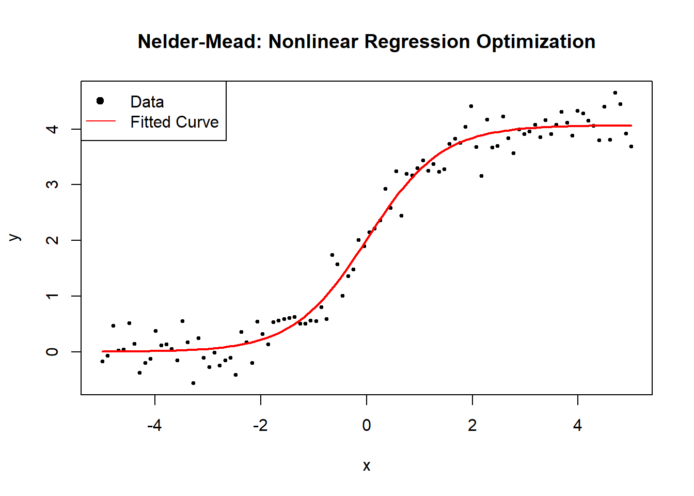

#### Powell's Method {#powells-method}

Powell's Method is a derivative-free optimization algorithm that minimizes a function without using gradients. It works by iteratively refining a set of search directions to efficiently navigate the parameter space. Unlike [Nelder-Mead (Simplex)](#nelder-mead), which adapts a simplex, Powell's method builds an orthogonal basis of search directions.

Powell's method is particularly useful when:

-   The function is non-differentiable or noisy.

-   Gradient-based methods are unreliable.

-   The parameter space is low-to-moderate dimensional.

------------------------------------------------------------------------

The goal of Powell's Method is to find an optimal parameter set $\hat{\theta}$ that minimizes the Sum of Squared Errors (SSE):

$$
\hat{\theta} = \arg\min_{\theta} SSE(\theta),
$$

where:

$$
SSE(\theta) = \sum_{i=1}^{n} (y_i - f(x_i; \theta))^2.
$$

**1. Search Directions**

Powell's method **maintains a set of search directions** $\mathbf{d}_1, \mathbf{d}_2, \dots, \mathbf{d}_p$:

$$
D = \{ \mathbf{d}_1, \mathbf{d}_2, ..., \mathbf{d}_p \}.
$$

Initially, these directions are chosen as **unit basis vectors** (each optimizing a single parameter independently).

**2. Line Minimization**

For each direction $\mathbf{d}_j$, Powell's method **performs a 1D optimization**:

$$
\theta' = \theta + \lambda \mathbf{d}_j,
$$

where $\lambda$ is chosen to minimize $SSE(\theta')$.

**3. Updating Search Directions**

After optimizing along all directions:

1.  The **largest improvement** direction $\mathbf{d}_{\max}$ is replaced with:

$$
\mathbf{d}_{\text{new}} = \theta_{\text{final}} - \theta_{\text{initial}}.
$$

2.  The **new direction set is orthogonalized** using Gram-Schmidt.

This ensures **efficient exploration** of the parameter space.

**4. Convergence Criteria**

Powell's method **stops when function improvement is below a tolerance level**:

$$
|SSE(\theta_{t+1}) - SSE(\theta_t)| < \epsilon.
$$

------------------------------------------------------------------------

**Powell's Method Algorithm**

1.  Initialize search directions (standard basis vectors).
2.  Perform 1D line searches along each direction.
3.  Update the search directions based on the largest improvement.
4.  Repeat until convergence.

------------------------------------------------------------------------


```r
# Load required library
library(stats)

# Define a numerically stable logistic function
safe_exp <- function(x) {
    return(ifelse(x > 700, Inf, exp(pmin(x, 700))))  # Prevent overflow
}

# Define the logistic growth model
nonlinear_model <- function(theta, x) {
    return(theta[1] / (1 + safe_exp(-theta[2] * (x - theta[3]))))
}

# Define the Sum of Squared Errors (SSE) function
sse <- function(theta, x, y) {
    predictions <- nonlinear_model(theta, x)
    return(sum((y - predictions) ^ 2))
}

# Powell's Method Optimization
powell_optimization <- function(x, y) {
    # Initial guess for parameters
    initial_guess <- c(2, 1, 0)
    
    # Run Powells optimization (via BFGS without gradient)
    result <- optim(
        par = initial_guess,
        fn = sse,
        x = x,
        y = y,
        method = "BFGS",
        control = list(maxit = 500),
        gr = NULL  # No gradient used
    )
    
    return(result$par)  # Return optimized parameters
}

# Generate synthetic data
set.seed(123)
x <- seq(-5, 5, length.out = 100)
true_theta <- c(4, 1.5, 0)  # True parameters (A, B, C)
y <- nonlinear_model(true_theta, x) + rnorm(length(x), sd = 0.3)

# Run Powell's Method Optimization
estimated_theta <- powell_optimization(x, y)

# Display results
cat("Estimated parameters (A, B, C) using Powells Method:\n")
#> Estimated parameters (A, B, C) using Powells Method:
print(estimated_theta)
#> [1] 4.06876538 1.42765687 0.01128753

# Plot data and fitted curve
plot(
    x,
    y,
    main = "Powell's Method: Nonlinear Regression Optimization",
    pch = 19,
    cex = 0.5,
    xlab = "x",
    ylab = "y"
)
curve(
    nonlinear_model(estimated_theta, x),
    from = min(x),
    to = max(x),
    add = TRUE,
    col = "red",
    lwd = 2
)
legend(
    "topleft",
    legend = c("Data", "Fitted Curve"),
    pch = c(19, NA),
    lty = c(NA, 1),
    col = c("black", "red")
)
```

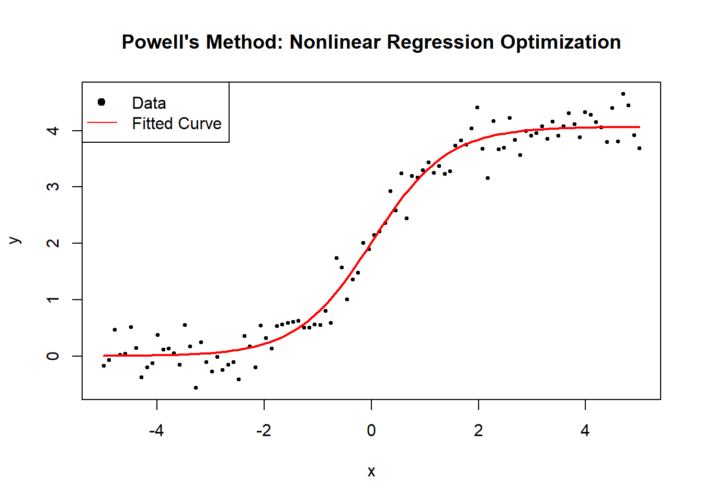

#### Random Search {#random-search}

Random Search (RS) is a simple yet effective optimization algorithm that explores the search space by randomly sampling candidate solutions. Unlike [grid search](#grid-search), which evaluates all predefined parameter combinations, random search selects a random subset, reducing computational cost.

Random search is particularly useful when:

-   The search space is large, making grid search impractical.

-   Gradient-based methods fail due to non-differentiability or noisy data.

-   The optimal region is unknown, making global exploration essential.

------------------------------------------------------------------------

The goal of Random Search is to find an optimal parameter set $\hat{\theta}$ that minimizes the Sum of Squared Errors (SSE):

$$
\hat{\theta} = \arg\min_{\theta \in \Theta} SSE(\theta),
$$

where:

$$
SSE(\theta) = \sum_{i=1}^{n} (y_i - f(x_i; \theta))^2.
$$

Unlike [grid search](#grid-search), **random search does not evaluate all parameter combinations** but instead **randomly samples a subset**:

$$
\Theta_{\text{sampled}} \subset \Theta.
$$

The **accuracy** of the solution depends on the **number of random samples**---a higher number increases **the likelihood of finding a good solution**.

------------------------------------------------------------------------

**Random Search Algorithm**

1.  Define a random sampling range for each parameter.
2.  Randomly sample $N$ parameter sets.
3.  Evaluate SSE for each sampled set.
4.  Select the parameter set that minimizes SSE.

------------------------------------------------------------------------


```r
# Load required library
library(stats)

# Define a numerically stable logistic function
safe_exp <- function(x) {
  return(ifelse(x > 700, Inf, exp(pmin(x, 700))))  # Prevent overflow
}

# Define the logistic growth model
nonlinear_model <- function(theta, x) {
  return(theta[1] / (1 + safe_exp(-theta[2] * (x - theta[3]))))
}

# Define the Sum of Squared Errors (SSE) function
sse <- function(theta, x, y) {
  predictions <- nonlinear_model(theta, x)
  return(sum((y - predictions) ^ 2))
}

# Random Search Optimization
random_search_optimization <- function(x, y, num_samples = 100) {
  # Define parameter ranges
  A_range <-
    runif(num_samples, 2, 6)   # Random values between 2 and 6
  B_range <-
    runif(num_samples, 0.5, 3) # Random values between 0.5 and 3
  C_range <-
    runif(num_samples,-2, 2)  # Random values between -2 and 2
  
  # Initialize best parameters
  best_theta <- NULL
  best_sse <- Inf
  
  # Evaluate randomly sampled parameter sets
  for (i in 1:num_samples) {
    theta <- c(A_range[i], B_range[i], C_range[i])
    current_sse <- sse(theta, x, y)
    
    if (current_sse < best_sse) {
      best_sse <- current_sse
      best_theta <- theta
    }
  }
  
  return(best_theta)
}

# Generate synthetic data
set.seed(123)
x <- seq(-5, 5, length.out = 100)
true_theta <- c(4, 1.5, 0)  # True parameters (A, B, C)
y <- nonlinear_model(true_theta, x) + rnorm(length(x), sd = 0.3)

# Run Random Search
estimated_theta <-
  random_search_optimization(x, y, num_samples = 500)

# Display results
cat("Estimated parameters (A, B, C) using Random Search:\n")
#> Estimated parameters (A, B, C) using Random Search:
print(estimated_theta)
#> [1] 4.0893431 1.4687456 0.1024474

# Plot data and fitted curve
plot(
  x,
  y,
  main = "Random Search: Nonlinear Regression Optimization",
  pch = 19,
  cex = 0.5,
  xlab = "x",
  ylab = "y"
)
curve(
  nonlinear_model(estimated_theta, x),
  from = min(x),
  to = max(x),
  add = TRUE,
  col = "red",
  lwd = 2
)
legend(
  "topleft",
  legend = c("Data", "Fitted Curve"),
  pch = c(19, NA),
  lty = c(NA, 1),
  col = c("black", "red")
)
```


#### Hooke-Jeeves Pattern Search {#hooke-jeeves}

Hooke-Jeeves Pattern Search is a derivative-free optimization algorithm that searches for an optimal solution by exploring and adjusting parameter values iteratively. Unlike gradient-based methods, it does not require differentiability, making it effective for non-smooth and noisy functions.

Hooke-Jeeves is particularly useful when:

-   The function is non-differentiable or noisy.

-   Gradient-based methods are unreliable.

-   The parameter space is low-to-moderate dimensional.

------------------------------------------------------------------------

The goal of Hooke-Jeeves Pattern Search is to find an optimal parameter set $\hat{\theta}$ that minimizes the Sum of Squared Errors (SSE):

$$
\hat{\theta} = \arg\min_{\theta} SSE(\theta),
$$

where:

$$
SSE(\theta) = \sum_{i=1}^{n} (y_i - f(x_i; \theta))^2.
$$

**1. Exploratory Moves**

At each iteration, the algorithm **perturbs each parameter** to find a lower SSE:

$$
\theta' = \theta \pm \delta.
$$

If a new parameter $\theta'$ reduces SSE, it becomes the new base point.

**2. Pattern Moves**

After an improvement, the algorithm **accelerates movement** in the promising direction:

$$
\theta_{\text{new}} = \theta_{\text{old}} + (\theta_{\text{old}} - \theta_{\text{prev}}).
$$

This **speeds up convergence** towards an optimum.

**3. Step Size Adaptation**

If no improvement is found, the step size $\delta$ is reduced:

$$
\delta_{\text{new}} = \beta \cdot \delta.
$$

where $\beta < 1$ is a reduction factor.

**4. Convergence Criteria**

The algorithm **stops when step size is sufficiently small**:

$$
\delta < \epsilon.
$$

------------------------------------------------------------------------

**Hooke-Jeeves Algorithm**

1.  Initialize a starting point $\theta$ and step size $\delta$.
2.  Perform exploratory moves in each parameter direction.
3.  If improvement is found, perform pattern moves.
4.  Reduce step size if no improvement is found.
5.  Repeat until convergence.

------------------------------------------------------------------------


```r
# Load required library
library(stats)

# Define a numerically stable logistic function
safe_exp <- function(x) {
    return(ifelse(x > 700, Inf, exp(pmin(x, 700))))  # Prevent overflow
}

# Define the logistic growth model
nonlinear_model <- function(theta, x) {
    return(theta[1] / (1 + safe_exp(-theta[2] * (x - theta[3]))))
}

# Define the Sum of Squared Errors (SSE) function
sse <- function(theta, x, y) {
    predictions <- nonlinear_model(theta, x)
    return(sum((y - predictions) ^ 2))
}

# Hooke-Jeeves Pattern Search Optimization
hooke_jeeves_optimization <-
    function(x,
             y,
             step_size = 0.5,
             tol = 1e-6,
             max_iter = 500) {
        # Initial guess for parameters
        theta <- c(2, 1, 0)
        best_sse <- sse(theta, x, y)
        step <- step_size
        iter <- 0
        
        while (step > tol & iter < max_iter) {
            iter <- iter + 1
            improved <- FALSE
            new_theta <- theta
            
            # Exploratory move in each parameter direction
            for (i in 1:length(theta)) {
                for (delta in c(step,-step)) {
                    theta_test <- new_theta
                    theta_test[i] <- theta_test[i] + delta
                    sse_test <- sse(theta_test, x, y)
                    
                    if (sse_test < best_sse) {
                        best_sse <- sse_test
                        new_theta <- theta_test
                        improved <- TRUE
                    }
                }
            }
            
            # Pattern move if improvement found
            if (improved) {
                theta <- 2 * new_theta - theta
                best_sse <- sse(theta, x, y)
            } else {
                step <- step / 2  # Reduce step size
            }
        }
        
        return(theta)
    }

# Generate synthetic data
set.seed(123)
x <- seq(-5, 5, length.out = 100)
true_theta <- c(4, 1.5, 0)  # True parameters (A, B, C)
y <- nonlinear_model(true_theta, x) + rnorm(length(x), sd = 0.3)

# Run Hooke-Jeeves Optimization
estimated_theta <- hooke_jeeves_optimization(x, y)

# Display results
cat("Estimated parameters (A, B, C) using Hooke-Jeeves:\n")
#> Estimated parameters (A, B, C) using Hooke-Jeeves:
print(estimated_theta)
#> [1] 4 1 0

# Plot data and fitted curve
plot(
    x,
    y,
    main = "Hooke-Jeeves: Nonlinear Regression Optimization",
    pch = 19,
    cex = 0.5,
    xlab = "x",
    ylab = "y"
)
curve(
    nonlinear_model(estimated_theta, x),
    from = min(x),
    to = max(x),
    add = TRUE,
    col = "red",
    lwd = 2
)
legend(
    "topleft",
    legend = c("Data", "Fitted Curve"),
    pch = c(19, NA),
    lty = c(NA, 1),
    col = c("black", "red")
)
```


#### Bisection Method {#bisection-method}

The **Bisection Method** is a fundamental numerical technique primarily used for **root finding**, but it can also be adapted for **optimization problems** where the goal is to minimize or maximize a nonlinear function.

In nonlinear regression, optimization often involves **finding the parameter values that minimize the sum of squared errors (SSE)**:

$$
\hat{\theta} = \arg\min_{\theta} SSE(\theta)
$$

where:

$$
SSE(\theta) = \sum_{i=1}^{n} \left( y_i - f(x_i; \theta) \right)^2.
$$

Since the minimum of a function occurs where the derivative equals zero, we apply the **Bisection Method** to the **derivative of the SSE function**:

$$
\frac{d}{d\theta} SSE(\theta) = 0.
$$

This transforms the **optimization problem** into a **root-finding problem**.

------------------------------------------------------------------------

The **Bisection Method** is based on the **Intermediate Value Theorem**, which states:

> If a continuous function $f(\theta)$ satisfies $f(\theta_a) \cdot f(\theta_b) < 0$,\
> then there exists at least one root in the interval $(\theta_a, \theta_b)$.

For **optimization**, we apply this principle to the **first derivative** of the objective function $Q(\theta)$:

$$
Q'(\theta) = 0.
$$

**Step-by-Step Algorithm for Optimization**

1.  **Choose an interval** $[\theta_a, \theta_b]$ such that: $$ Q'(\theta_a) \cdot Q'(\theta_b) < 0. $$
2.  **Compute the midpoint**: $$
    \theta_m = \frac{\theta_a + \theta_b}{2}.
    $$
3.  **Evaluate** $Q'(\theta_m)$:
    -   If $Q'(\theta_m) = 0$, then $\theta_m$ is the optimal point.
    -   If $Q'(\theta_a) \cdot Q'(\theta_m) < 0$, set $\theta_b = \theta_m$.
    -   Otherwise, set $\theta_a = \theta_m$.
4.  **Repeat** until convergence: $$
    |\theta_b - \theta_a| < \epsilon.
    $$

**Determining the Nature of the Critical Point**

Since the Bisection Method finds a **stationary point**, we use the **second derivative test** to classify it:

-   If $Q''(\theta) > 0$, the point is a **local minimum**.
-   If $Q''(\theta) < 0$, the point is a **local maximum**.

For **nonlinear regression**, we expect $Q(\theta) = SSE(\theta)$, so the solution found by Bisection should be a **minimum**.

------------------------------------------------------------------------


```r
# Load required library
library(stats)

# Define a numerically stable logistic function
safe_exp <- function(x) {
    return(ifelse(x > 700, Inf, exp(pmin(x, 700))))  # Prevent overflow
}

# Define the logistic growth model
nonlinear_model <- function(theta, x) {
    return(theta[1] / (1 + safe_exp(-theta[2] * (x - theta[3]))))
}

# Define the Sum of Squared Errors (SSE) function for optimization
sse <- function(theta, x, y) {
    predictions <- nonlinear_model(theta, x)
    return(sum((y - predictions)^2))
}

# Optimize all three parameters simultaneously
find_optimal_parameters <- function(x, y) {
    # Initial guess for parameters (based on data)
    initial_guess <- c(max(y), 1, median(x))  

    # Bounds for parameters
    lower_bounds <- c(0.1, 0.01, min(x))  # Ensure positive scaling
    upper_bounds <- c(max(y) * 2, 10, max(x))

    # Run optim() with L-BFGS-B (bounded optimization)
    result <- optim(
        par = initial_guess,
        fn = sse,
        x = x, y = y,
        method = "L-BFGS-B",
        lower = lower_bounds,
        upper = upper_bounds
    )
    
    return(result$par)  # Extract optimized parameters
}

# Generate synthetic data
set.seed(123)
x <- seq(-5, 5, length.out = 100)
true_theta <- c(4, 1.5, 0)  # True parameters (A, B, C)
y <- nonlinear_model(true_theta, x) + rnorm(length(x), sd = 0.3)

# Find optimal parameters using optim()
estimated_theta <- find_optimal_parameters(x, y)

# Display results
cat("Estimated parameters (A, B, C) using optim():\n")
#> Estimated parameters (A, B, C) using optim():
print(estimated_theta)
#> [1] 4.06876536 1.42765688 0.01128756

# Plot data and fitted curve
plot(
    x, y,
    main = "Optim(): Nonlinear Regression Optimization",
    pch = 19,
    cex = 0.5,
    xlab = "x",
    ylab = "y"
)
curve(
    nonlinear_model(estimated_theta, x),
    from = min(x),
    to = max(x),
    add = TRUE,
    col = "red",
    lwd = 2
)
legend(
    "topleft",
    legend = c("Data", "Fitted Curve"),
    pch = c(19, NA),
    lty = c(NA, 1),
    col = c("black", "red")
)
```

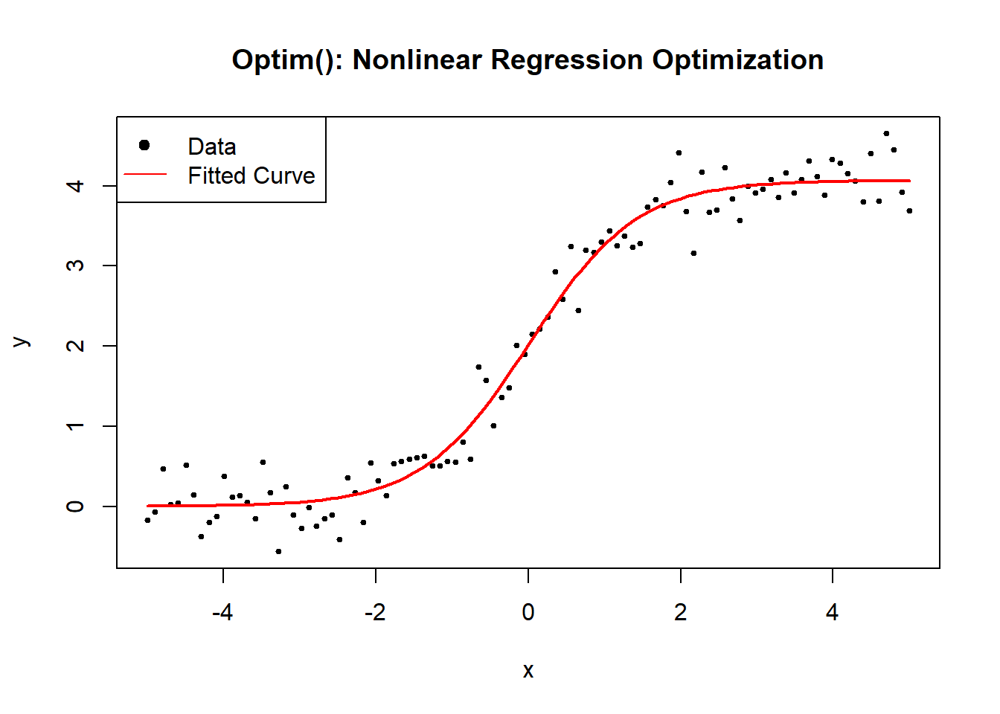

### Stochastic Heuristic {#stochastic-heuristic-nolinear-regression}

#### Differential Evolution Algorithm {#differential-evolution-algorithm}

The **Differential Evolution (DE) Algorithm** is a **stochastic, population-based optimization algorithm** that is widely used for solving complex **global optimization problems**. Unlike gradient-based methods such as Newton's method or the [Secant method](#secant-method), DE does not require derivatives and is well-suited for optimizing **non-differentiable, nonlinear, and multimodal functions**.

------------------------------------------------------------------------

**Key Features of Differential Evolution**

-   **Population-based approach:** Maintains a population of candidate solutions instead of a single point.
-   **Mutation and crossover:** Introduces variations to explore the search space.
-   **Selection mechanism:** Retains the best candidates for the next generation.
-   **Global optimization:** Avoids local minima by using **stochastic search strategies**.

------------------------------------------------------------------------

**Mathematical Formulation of Differential Evolution**

Differential Evolution operates on a **population** of candidate solutions $\{\theta_i\}$, where each $\theta_i$ is a **vector of parameters**. The algorithm iteratively updates the population using three main operations:

**1. Mutation**

For each candidate solution $\theta_i$, a **mutant vector** $\mathbf{v}_i^{(j)}$ is generated as:

$$
\mathbf{v}_i^{(j)} = \mathbf{\theta}_{r_1}^{(j)} + F \cdot (\mathbf{\theta}_{r_2}^{(j)} - \mathbf{\theta}_{r_3}^{(j)})
$$

where:

-   $\mathbf{\theta}_{r_1}, \mathbf{\theta}_{r_2}, \mathbf{\theta}_{r_3}$ are **randomly selected distinct vectors** from the population.

-   $F \in (0,2)$ is the **mutation factor** controlling the step size.

**2. Crossover**

A trial vector $\mathbf{u}_i^{(j)}$ is generated by combining the mutant vector $\mathbf{v}_i^{(j)}$ with the original solution $\mathbf{\theta}_i^{(j)}$:

$$
u_{i,k}^{(j)} =
\begin{cases}
v_{i,k}^{(j)}  & \text{if } rand_k \leq C_r \text{ or } k = k_{\text{rand}}, \\
\theta_{i,k}^{(j)}  & \text{otherwise}.
\end{cases}
$$

where:

-   $C_r \in (0,1)$ is the **crossover probability**.

-   $rand_k$ is a **random value between 0 and 1**.

-   $k_{\text{rand}}$ ensures at least **one parameter is mutated**.

**3. Selection**

The new candidate solution is accepted only if it improves the objective function:

$$
\mathbf{\theta}_i^{(j+1)} =
\begin{cases}
\mathbf{u}_i^{(j)} & \text{if } Q(\mathbf{u}_i^{(j)}) < Q(\mathbf{\theta}_i^{(j)}), \\
\mathbf{\theta}_i^{(j)} & \text{otherwise}.
\end{cases}
$$

where $Q(\theta)$ is the **objective function** (e.g., sum of squared errors in regression problems).

------------------------------------------------------------------------

**Algorithm: Differential Evolution for Nonlinear Optimization**

1.  Initialize a population of candidate solutions.
2.  Evaluate the objective function for each candidate.
3.  Mutate individuals using a difference strategy.
4.  Apply crossover to create trial solutions.
5.  Select individuals based on their fitness (objective function value).
6.  Repeat until convergence (or a stopping criterion is met).

------------------------------------------------------------------------


```r
# Load required library
library(DEoptim)

# Define a nonlinear function (logistic model)
nonlinear_model <- function(theta, x) {
    return(theta[1] / (1 + exp(-theta[2] * (x - theta[3]))))
}

# Define the Sum of Squared Errors (SSE) function
sse <- function(theta, x, y) {
    return(sum((y - nonlinear_model(theta, x))^2))
}

# Generate synthetic data
set.seed(123)
x <- seq(-5, 5, length.out = 100)
true_theta <- c(4, 1.5, 0)  # True parameters (A, B, C)
y <- nonlinear_model(true_theta, x) + rnorm(length(x), sd = 0.3)

# Define the objective function for DEoptim
objective_function <- function(theta) {
    return(sse(theta, x, y))
}

# Define parameter bounds
lower_bounds <- c(0, 0, -5)
upper_bounds <- c(10, 5, 5)

# Run Differential Evolution Algorithm
de_result <-
    DEoptim(
        objective_function,
        lower_bounds,
        upper_bounds,
        DEoptim.control(
            NP = 50,
            itermax = 100,
            F = 0.8,
            CR = 0.9, 
            trace = F
        )
    )

# Extract optimized parameters
estimated_theta <- de_result$optim$bestmem

# Display estimated parameters
cat("Estimated parameters (A, B, C) using Differential Evolution:\n")
#> Estimated parameters (A, B, C) using Differential Evolution:
print(estimated_theta)
#>       par1       par2       par3 
#> 4.06876562 1.42765614 0.01128768

# Plot data and fitted curve
plot(
    x,
    y,
    main = "Differential Evolution: Data & Fitted Curve",
    pch = 19,
    cex = 0.5,
    xlab = "x",
    ylab = "y"
)
curve(
    nonlinear_model(estimated_theta, x),
    from = -5,
    to = 5,
    add = TRUE,
    col = "red",
    lwd = 2
)
legend(
    "topleft",
    legend = c("Data", "Fitted Curve"),
    pch = c(19, NA),
    lty = c(NA, 1),
    col = c("black", "red")
)
```


#### Simulated Annealing {#simulated-annealing}

Simulated Annealing (SA) is a probabilistic global optimization algorithm inspired by annealing in metallurgy, where a material is heated and slowly cooled to remove defects. In optimization, SA gradually refines a solution by exploring the search space, allowing occasional jumps to escape local minima, before converging to an optimal solution.

Simulated Annealing is particularly useful when:

-   The function is highly nonlinear and multimodal.

-   Gradient-based methods struggle due to non-differentiability or poor initialization.

-   A global minimum is needed, rather than a local one.

------------------------------------------------------------------------

**1. Energy Function (Objective Function)**

The goal of SA is to minimize an objective function $Q(\theta)$. For nonlinear regression, this is the Sum of Squared Errors (SSE):

$$
Q(\theta) = SSE(\theta) = \sum_{i=1}^{n} (y_i - f(x_i; \theta))^2.
$$

**2. Probability of Acceptance**

At each step, SA randomly perturbs the parameters $\theta$ to create a **new candidate solution** $\theta'$ and evaluates the change in SSE:

$$
\Delta Q = Q(\theta') - Q(\theta).
$$

The **Metropolis Criterion** determines whether to accept the new solution:

$$
P(\text{accept}) =
\begin{cases}
1, & \text{if } \Delta Q < 0 \quad \text{(new solution improves fit)} \\
\exp\left( -\frac{\Delta Q}{T} \right), & \text{if } \Delta Q \geq 0 \quad \text{(accept with probability)}.
\end{cases}
$$

where:

-   $T$ is the **temperature** that **gradually decreases** over iterations.

-   **Worse solutions** are accepted **with small probability** to escape local minima.

**3. Cooling Schedule**

The **temperature** follows a cooling schedule:

$$
T_k = \alpha T_{k-1},
$$

where $\alpha \in (0,1)$ is a decay factor that controls cooling speed.

------------------------------------------------------------------------

**Simulated Annealing Algorithm**

1.  Initialize parameters $\theta$ randomly.
2.  Set an initial temperature $T_0$ and cooling rate $\alpha$.
3.  Repeat for max iterations:
    -   Generate perturbed candidate $\theta'$.
    -   Compute $\Delta Q = Q(\theta') - Q(\theta)$.
    -   Accept if $\Delta Q < 0$ or with probability $\exp(-\Delta Q / T)$.
    -   Reduce temperature: $T \leftarrow \alpha T$.
4.  Return the best solution found.

------------------------------------------------------------------------


```r
# Load required library
library(stats)

# Define a numerically stable logistic function
safe_exp <- function(x) {
    return(ifelse(x > 700, Inf, exp(pmin(x, 700))))  # Prevent overflow
}

# Define the logistic growth model
nonlinear_model <- function(theta, x) {
    return(theta[1] / (1 + safe_exp(-theta[2] * (x - theta[3]))))
}

# Define the Sum of Squared Errors (SSE) function
sse <- function(theta, x, y) {
    predictions <- nonlinear_model(theta, x)
    return(sum((y - predictions) ^ 2))
}

# Simulated Annealing Algorithm
simulated_annealing <-
    function(x,
             y,
             initial_theta,
             T_init = 1.0,
             alpha = 0.99,
             max_iter = 5000) {
        # Initialize parameters
        theta <- initial_theta
        best_theta <- theta
        best_sse <- sse(theta, x, y)
        T <- T_init  # Initial temperature
        
        for (iter in 1:max_iter) {
            # Generate new candidate solution (small random perturbation)
            theta_new <- theta + rnorm(length(theta), mean = 0, sd = T)
            
            # Compute new SSE
            sse_new <- sse(theta_new, x, y)
            
            # Compute change in SSE
            delta_Q <- sse_new - best_sse
            
            # Acceptance criteria
            if (delta_Q < 0 || runif(1) < exp(-delta_Q / T)) {
                theta <- theta_new
                best_sse <- sse_new
                best_theta <- theta_new
            }
            
            # Reduce temperature
            T <- alpha * T
            
            # Stopping condition (very low temperature)
            if (T < 1e-6)
                break
        }
        
        return(best_theta)
    }

# Generate synthetic data
set.seed(123)
x <- seq(-5, 5, length.out = 100)
true_theta <- c(4, 1.5, 0)  # True parameters (A, B, C)
y <- nonlinear_model(true_theta, x) + rnorm(length(x), sd = 0.3)

# Initial guess
initial_theta <-
    c(runif(1, 1, 5), runif(1, 0.1, 3), runif(1,-2, 2))

# Run Simulated Annealing
estimated_theta <- simulated_annealing(x, y, initial_theta)

# Display results
cat("Estimated parameters (A, B, C) using Simulated Annealing:\n")
#> Estimated parameters (A, B, C) using Simulated Annealing:
print(estimated_theta)
#> [1] 4.07180419 1.41457906 0.01422147

# Plot data and fitted curve
plot(
    x,
    y,
    main = "Simulated Annealing: Nonlinear Regression Optimization",
    pch = 19,
    cex = 0.5,
    xlab = "x",
    ylab = "y"
)
curve(
    nonlinear_model(estimated_theta, x),
    from = min(x),
    to = max(x),
    add = TRUE,
    col = "red",
    lwd = 2
)
legend(
    "topleft",
    legend = c("Data", "Fitted Curve"),
    pch = c(19, NA),
    lty = c(NA, 1),
    col = c("black", "red")
)
```


#### Genetic Algorithm {#genetic-algorithm}

Genetic Algorithms (GA) are a class of evolutionary algorithms inspired by the principles of natural selection and genetics. Unlike deterministic optimization techniques, GA evolves a population of candidate solutions over multiple generations, using genetic operators such as selection, crossover, and mutation.

GA is particularly useful when:

-   The function is nonlinear, non-differentiable, or highly multimodal.

-   Gradient-based methods fail due to rugged function landscapes.

-   A global minimum is required, rather than a local one.

The goal of a Genetic Algorithm is to find an optimal solution \$\\hat{\\theta}\$ that minimizes an objective function:

$$
\hat{\theta} = \arg\min_{\theta} SSE(\theta),
$$

where:

$$
SSE(\theta) = \sum_{i=1}^{n} (y_i - f(x_i; \theta))^2.
$$

**1. Population Representation**

Each candidate solution (individual) is represented as a **chromosome**, which is simply a vector of parameters: $$
\theta = (\theta_1, \theta_2, \theta_3)
$$

An entire **population** consists of multiple such solutions.

**2. Selection**

Each individual's fitness is evaluated using:

$$
\text{Fitness}(\theta) = -SSE(\theta)
$$

We use **Tournament Selection** or **Roulette Wheel Selection** to choose parents for reproduction.

**3. Crossover (Recombination)**

A new solution $\theta'$ is generated by **combining** two parents:

$$\theta' = \alpha \theta_{\text{parent1}} + (1 - \alpha) \theta_{\text{parent2}}, \quad \alpha \sim U(0,1).$$

**4. Mutation**

Random small changes are introduced to **increase diversity**:

$$\theta_i' = \theta_i + \mathcal{N}(0, \sigma),$$

where $\mathcal{N}(0, \sigma)$ is a **small Gaussian perturbation**.

**5. Evolutionary Cycle**

The **algorithm iterates** through:

1.  Selection

2.  Crossover

3.  Mutation

4.  Survival of the fittest

5.  Termination when convergence is reached.


```r
# Load required library
library(GA)

# Define a numerically stable logistic function
safe_exp <- function(x) {
    return(ifelse(x > 700, Inf, exp(pmin(x, 700))))  # Prevent overflow
}

# Define the logistic growth model
nonlinear_model <- function(theta, x) {
    return(theta[1] / (1 + safe_exp(-theta[2] * (x - theta[3]))))
}

# Define the Sum of Squared Errors (SSE) function for optimization
sse <- function(theta, x, y) {
    predictions <- nonlinear_model(theta, x)
    return(sum((y - predictions) ^ 2))
}

# Genetic Algorithm for Optimization
ga_optimization <- function(x, y) {
    # Define fitness function (negative SSE for maximization)
    fitness_function <- function(theta) {
        # GA maximizes fitness, so we use negative SSE
        return(-sse(theta, x, y))  
    }
    
    # Set parameter bounds
    lower_bounds <- c(0.1, 0.01, min(x))  # Ensure positive scaling
    upper_bounds <- c(max(y) * 2, 10, max(x))
    
    # Run GA optimization
    ga_result <- ga(
        type = "real-valued",
        fitness = fitness_function,
        lower = lower_bounds,
        upper = upper_bounds,
        popSize = 50,
        # Population size
        maxiter = 200,
        # Max generations
        pmutation = 0.1,
        # Mutation probability
        monitor = FALSE
    )
    
    return(ga_result@solution)  # Return optimized parameters
}

# Generate synthetic data
set.seed(123)
x <- seq(-5, 5, length.out = 100)
true_theta <- c(4, 1.5, 0)  # True parameters (A, B, C)
y <- nonlinear_model(true_theta, x) + rnorm(length(x), sd = 0.3)

# Run Genetic Algorithm
estimated_theta <- ga_optimization(x, y)

# Display results
cat("Estimated parameters (A, B, C) using Genetic Algorithm:\n")
#> Estimated parameters (A, B, C) using Genetic Algorithm:
print(estimated_theta)
#>            x1       x2         x3
#> [1,] 4.066144 1.433886 0.00824126

# Plot data and fitted curve
plot(
    x,
    y,
    main = "Genetic Algorithm: Nonlinear Regression Optimization",
    pch = 19,
    cex = 0.5,
    xlab = "x",
    ylab = "y"
)
curve(
    nonlinear_model(estimated_theta, x),
    from = min(x),
    to = max(x),
    add = TRUE,
    col = "red",
    lwd = 2
)
legend(
    "topleft",
    legend = c("Data", "Fitted Curve"),
    pch = c(19, NA),
    lty = c(NA, 1),
    col = c("black", "red")
)
```


#### Particle Swarm Optimization {#particle-swarm-optimization}

Particle Swarm Optimization (PSO) is a population-based global optimization algorithm inspired by the social behavior of birds and fish schools. Instead of using genetic operators (like in Genetic Algorithms), PSO models particles (solutions) flying through the search space, adjusting their position based on their own experience and the experience of their neighbors.

PSO is particularly useful when:

-   The function is nonlinear, noisy, or lacks smooth gradients.

-   Gradient-based methods struggle due to non-differentiability.

-   A global minimum is needed, rather than a local one.

------------------------------------------------------------------------

The goal of PSO is to find an optimal solution $\hat{\theta}$ that minimizes an objective function:

$$
\hat{\theta} = \arg\min_{\theta} SSE(\theta),
$$

where:

$$
SSE(\theta) = \sum_{i=1}^{n} (y_i - f(x_i; \theta))^2.
$$

**1. Particle Representation**

Each **particle** represents a candidate solution:

$$
\theta_i = (\theta_{i1}, \theta_{i2}, \theta_{i3})
$$

where $\theta_{ij}$ is the $j^{th}$ parameter of particle $i$.

**2. Particle Velocity and Position Updates**

Each particle moves in the search space with **velocity** $v_i$, which is updated as:

$$
v_i^{(t+1)} = \omega v_i^{(t)} + c_1 r_1 (p_i - \theta_i^{(t)}) + c_2 r_2 (g - \theta_i^{(t)})
$$

where:

-   $\omega$ is the **inertia weight** (controls exploration vs. exploitation),

-   $c_1, c_2$ are **acceleration coefficients**,

-   $r_1, r_2 \sim U(0,1)$ are random numbers,

-   $p_i$ is the **particle's personal best position**,

-   $g$ is the **global best position**.

Then, the **position update** is:

$$
\theta_i^{(t+1)} = \theta_i^{(t)} + v_i^{(t+1)}
$$

This process continues until **convergence criteria** (like a max number of iterations or minimum error) is met.

------------------------------------------------------------------------

**Particle Swarm Optimization Algorithm**

1.  Initialize particles randomly within search bounds.
2.  Set random initial velocities.
3.  Evaluate SSE for each particle.
4.  Update the personal and global best solutions.
5.  Update velocities and positions using the update equations.
6.  Repeat until convergence.

------------------------------------------------------------------------


```r
# Load required library
library(pso)

# Define a numerically stable logistic function
safe_exp <- function(x) {
    return(ifelse(x > 700, Inf, exp(pmin(x, 700))))  # Prevent overflow
}

# Define the logistic growth model
nonlinear_model <- function(theta, x) {
    return(theta[1] / (1 + safe_exp(-theta[2] * (x - theta[3]))))
}

# Define the Sum of Squared Errors (SSE) function for optimization
sse <- function(theta, x, y) {
    predictions <- nonlinear_model(theta, x)
    return(sum((y - predictions) ^ 2))
}

# Particle Swarm Optimization (PSO) for Nonlinear Regression
pso_optimization <- function(x, y) {
    # Define fitness function (minimize SSE)
    fitness_function <- function(theta) {
        return(sse(theta, x, y))
    }
    
    # Set parameter bounds
    lower_bounds <- c(0.1, 0.01, min(x))  # Ensure positive scaling
    upper_bounds <- c(max(y) * 2, 10, max(x))
    
    # Run PSO optimization
    pso_result <- psoptim(
        par = c(1, 1, 0),
        # Initial guess
        fn = fitness_function,
        lower = lower_bounds,
        upper = upper_bounds,
        control = list(maxit = 200, s = 50)  # 200 iterations, 50 particles
    )
    
    return(pso_result$par)  # Return optimized parameters
}

# Generate synthetic data
set.seed(123)
x <- seq(-5, 5, length.out = 100)
true_theta <- c(4, 1.5, 0)  # True parameters (A, B, C)
y <- nonlinear_model(true_theta, x) + rnorm(length(x), sd = 0.3)

# Run Particle Swarm Optimization
estimated_theta <- pso_optimization(x, y)

# Display results
cat("Estimated parameters (A, B, C) using Particle Swarm Optimization:\n")
#> Estimated parameters (A, B, C) using Particle Swarm Optimization:
print(estimated_theta)
#> [1] 4.06876562 1.42765613 0.01128767

# Plot data and fitted curve
plot(
    x,
    y,
    main = "Particle Swarm Optimization: Nonlinear Regression Optimization",
    pch = 19,
    cex = 0.5,
    xlab = "x",
    ylab = "y"
)
curve(
    nonlinear_model(estimated_theta, x),
    from = min(x),
    to = max(x),
    add = TRUE,
    col = "red",
    lwd = 2
)
legend(
    "topleft",
    legend = c("Data", "Fitted Curve"),
    pch = c(19, NA),
    lty = c(NA, 1),
    col = c("black", "red")
)
```

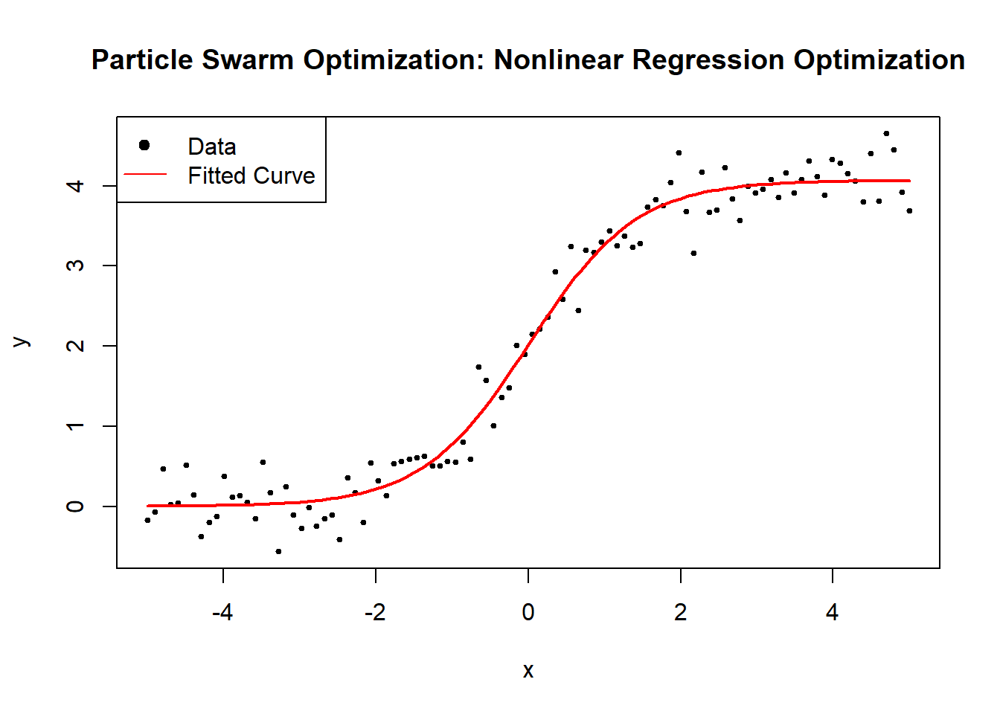

#### Evolutionary Strategies {#evolutionary-strategies}

Evolutionary Strategies (ES) are a class of evolutionary optimization algorithms that improve solutions by mutating and selecting individuals based on fitness. Unlike [Genetic Algorithm](#genetic-algorithm), ES focuses on self-adaptive mutation rates and selection pressure rather than crossover. This makes ES particularly robust for continuous optimization problems like nonlinear regression.

ES is particularly useful when:

-   The function is complex, noisy, or lacks smooth gradients.

-   Gradient-based methods fail due to non-differentiability.

-   An adaptive approach to exploration and exploitation is needed.

------------------------------------------------------------------------

The goal of ES is to find an optimal solution $\hat{\theta}$ that minimizes an objective function:

$$
\hat{\theta} = \arg\min_{\theta} SSE(\theta),
$$

where:

$$
SSE(\theta) = \sum_{i=1}^{n} (y_i - f(x_i; \theta))^2.
$$

**1. Population Representation**

Each **individual** is a solution $\theta_i$ in the parameter space:

$$
\theta_i = (\theta_{i1}, \theta_{i2}, \theta_{i3}).
$$

The **population** consists of multiple individuals, each representing different candidate parameters.

**2. Mutation**

New candidate solutions are generated by **adding random noise**:

$$
\theta'_i = \theta_i + \sigma \mathcal{N}(0, I),
$$

where:

-   $\sigma$ is the **mutation step size**, which adapts over time.

-   $\mathcal{N}(0, I)$ is a standard normal distribution.

**3. Selection**

ES employs $(\mu, \lambda)$-selection:

-   $(\mu, \lambda)$-ES: Select the best $\mu$ solutions from $\lambda$ offspring.

-   $(\mu + \lambda)$-ES: Combine parents and offspring, selecting the top $\mu$.

**4. Step-Size Adaptation**

Mutation strength $\sigma$ **self-adapts** using the **1/5 success rule**:

$$
\sigma_{t+1} =
\begin{cases}
\sigma_t / c, & \text{if success rate } > 1/5 \\
\sigma_t \cdot c, & \text{if success rate } < 1/5
\end{cases}
$$

where $c > 1$ is a scaling factor.

------------------------------------------------------------------------

**Evolutionary Strategies Algorithm**

1.  Initialize a population of $\lambda$ solutions with random parameters.
2.  Set mutation step size $\sigma$.
3.  Repeat for max iterations:
    -   Generate $\lambda$ offspring by mutating parent solutions.
    -   Evaluate fitness (SSE) of each offspring.
    -   Select the best $\mu$ solutions for the next generation.
    -   Adapt mutation step size based on success rate.
4.  Return the best solution found.

------------------------------------------------------------------------


```r
# Load required library
library(DEoptim)

# Define a numerically stable logistic function
safe_exp <- function(x) {
    return(ifelse(x > 700, Inf, exp(pmin(x, 700))))  # Prevent overflow
}

# Define the logistic growth model
nonlinear_model <- function(theta, x) {
    return(theta[1] / (1 + safe_exp(-theta[2] * (x - theta[3]))))
}

# Define the Sum of Squared Errors (SSE) function for optimization
sse <- function(theta, x, y) {
    predictions <- nonlinear_model(theta, x)
    return(sum((y - predictions)^2))
}

# Evolutionary Strategies Optimization (Using Differential Evolution)
es_optimization <- function(x, y) {
    # Define fitness function (minimize SSE)
    fitness_function <- function(theta) {
        return(sse(theta, x, y))
    }

    # Set parameter bounds
    lower_bounds <- c(0.1, 0.01, min(x))  # Ensure positive scaling
    upper_bounds <- c(max(y) * 2, 10, max(x))

    # Run Differential Evolution (mimicking ES)
    es_result <- DEoptim(
        fn = fitness_function,
        lower = lower_bounds,
        upper = upper_bounds,
        # 50 individuals, 200 generations, suppress iteration output
        DEoptim.control(NP = 50, itermax = 200, trace = F)  
    )

    return(es_result$optim$bestmem)  # Return optimized parameters
}

# Generate synthetic data
set.seed(123)
x <- seq(-5, 5, length.out = 100)
true_theta <- c(4, 1.5, 0)  # True parameters (A, B, C)
y <- nonlinear_model(true_theta, x) + rnorm(length(x), sd = 0.3)

# Run Evolutionary Strategies Optimization
estimated_theta <- es_optimization(x, y)

# Display results
cat("Estimated parameters (A, B, C) using Evolutionary Strategies:\n")
#> Estimated parameters (A, B, C) using Evolutionary Strategies:
print(estimated_theta)
#>       par1       par2       par3 
#> 4.06876561 1.42765613 0.01128767

# Plot data and fitted curve
plot(
    x, y,
    main = "Evolutionary Strategies: Nonlinear Regression Optimization",
    pch = 19,
    cex = 0.5,
    xlab = "x",
    ylab = "y"
)
curve(
    nonlinear_model(estimated_theta, x),
    from = min(x),
    to = max(x),
    add = TRUE,
    col = "red",
    lwd = 2
)
legend(
    "topleft",
    legend = c("Data", "Fitted Curve"),
    pch = c(19, NA),
    lty = c(NA, 1),
    col = c("black", "red")
)
```

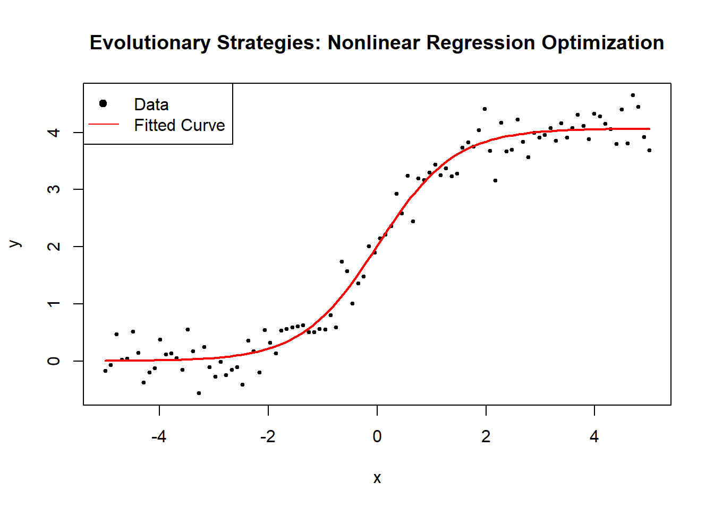

### Linearization {#linearization-nonlinear-regression-optimization}

#### Taylor Series Approximation {#taylor-series-approximation-nonlinear-optimization}

Taylor Series Approximation is a fundamental tool in nonlinear optimization, enabling local approximation of complex functions using polynomial expansions. It is widely used to linearize nonlinear models, facilitate derivative-based optimization, and derive Newton-type methods.

Taylor series approximation is particularly useful when:

-   A nonlinear function is difficult to compute directly.

-   Optimization requires local gradient and curvature information.

-   A simpler, polynomial-based approximation improves computational efficiency.

------------------------------------------------------------------------

Given a differentiable function $f(\theta)$, its **Taylor series expansion** around a point $\theta_0$ is:

$$
f(\theta) = f(\theta_0) + f'(\theta_0)(\theta - \theta_0) + \frac{1}{2} f''(\theta_0)(\theta - \theta_0)^2 + \mathcal{O}((\theta - \theta_0)^3).
$$

For optimization, we often use:

1.  **First-order approximation (Linear Approximation):** $$
       f(\theta) \approx f(\theta_0) + f'(\theta_0)(\theta - \theta_0).
       $$
2.  **Second-order approximation (Quadratic Approximation):** $$
    f(\theta) \approx f(\theta_0) + f'(\theta_0)(\theta - \theta_0) + \frac{1}{2} f''(\theta_0)(\theta - \theta_0)^2.
    $$

For **gradient-based optimization**, we use the **Newton-Raphson update**:

$$
\theta^{(k+1)} = \theta^{(k)} - [H_f(\theta^{(k)})]^{-1} \nabla f(\theta^{(k)}),
$$

where:

-   $\nabla f(\theta)$ is the **gradient** (first derivative),

-   $H_f(\theta)$ is the **Hessian matrix** (second derivative).

------------------------------------------------------------------------

For nonlinear regression, we approximate the **Sum of Squared Errors (SSE)**:

$$
SSE(\theta) = \sum_{i=1}^{n} (y_i - f(x_i; \theta))^2.
$$

**1. First-Order Approximation (Gradient Descent)**

The **gradient** of SSE w.r.t. parameters $\theta$ is:

$$
\nabla SSE(\theta) = -2 \sum_{i=1}^{n} (y_i - f(x_i; \theta)) \nabla f(x_i; \theta).
$$

Using **first-order Taylor approximation**, we update parameters via **gradient descent**:

$$
\theta^{(k+1)} = \theta^{(k)} - \alpha \nabla SSE(\theta^{(k)}),
$$

where $\alpha$ is the **learning rate**.

**2. Second-Order Approximation (Newton's Method)**

The **Hessian matrix** of SSE is:

$$
H_{SSE}(\theta) = 2 \sum_{i=1}^{n} \nabla f(x_i; \theta) \nabla f(x_i; \theta)^T - 2 \sum_{i=1}^{n} (y_i - f(x_i; \theta)) H_f(x_i; \theta).
$$

The **Newton-Raphson update** becomes:

$$
\theta^{(k+1)} = \theta^{(k)} - H_{SSE}(\theta)^{-1} \nabla SSE(\theta).
$$

------------------------------------------------------------------------


```r
# Load required libraries
library(numDeriv)

# Define a numerically stable logistic function
safe_exp <- function(x) {
    return(ifelse(is.na(x) |
                      x > 700, Inf, exp(pmin(x, 700))))  # Prevent overflow
}

# Define the logistic growth model
nonlinear_model <- function(theta, x) {
    return(theta[1] / (1 + safe_exp(-theta[2] * (x - theta[3]))))
}

# Define the Sum of Squared Errors (SSE) function
sse <- function(theta, x, y) {
    predictions <- nonlinear_model(theta, x)
    return(sum((y - predictions) ^ 2, na.rm = TRUE))  # Avoid NA errors
}

# First-Order Approximation: Gradient Descent Optimization
gradient_descent <-
    function(x,
             y,
             alpha = 0.005,
             tol = 1e-6,
             max_iter = 5000) {
        theta <- c(2, 1, 0)  # Initial guess
        for (i in 1:max_iter) {
            grad_sse <-
                grad(function(t)
                    sse(t, x, y), theta)  # Compute gradient
            theta_new <-
                theta - alpha * grad_sse  # Update parameters
            
            if (sum(abs(theta_new - theta)) < tol)
                break  # Check convergence
            theta <- theta_new
        }
        return(theta)
    }

# Second-Order Approximation: Newton's Method with Regularization
newton_method <-
    function(x,
             y,
             tol = 1e-6,
             max_iter = 100,
             lambda = 1e-4) {
        theta <- c(2, 1, 0)  # Initial guess
        for (i in 1:max_iter) {
            grad_sse <-
                grad(function(t)
                    sse(t, x, y), theta)  # Compute gradient
            hessian_sse <-
                hessian(function(t)
                    sse(t, x, y), theta)  # Compute Hessian
            
            # Regularize Hessian to avoid singularity
            hessian_reg <-
                hessian_sse + lambda * diag(length(theta))
            
            # Ensure Hessian is invertible
            if (is.na(det(hessian_reg)) ||
                det(hessian_reg) < 1e-10) {
                message("Singular Hessian found; increasing regularization.")
                lambda <- lambda * 10  # Increase regularization
                next
            }
            
            # Newton update
            theta_new <- theta - solve(hessian_reg) %*% grad_sse
            
            if (sum(abs(theta_new - theta)) < tol)
                break  # Check convergence
            theta <- theta_new
        }
        return(theta)
    }

# Generate synthetic data
set.seed(123)
x <- seq(-5, 5, length.out = 100)
true_theta <- c(4, 1.5, 0)  # True parameters (A, B, C)
y <- nonlinear_model(true_theta, x) + rnorm(length(x), sd = 0.3)

# Run Gradient Descent
estimated_theta_gd <- gradient_descent(x, y)

# Run Newton's Method with Regularization
estimated_theta_newton <- newton_method(x, y)

# Display results
cat("Estimated parameters (A, B, C) using Gradient Descent:\n")
#> Estimated parameters (A, B, C) using Gradient Descent:
print(estimated_theta_gd)
#> [1] 4.06876224 1.42766371 0.01128539

cat("Estimated parameters (A, B, C) using Newton's Method:\n")
#> Estimated parameters (A, B, C) using Newton's Method:
print(estimated_theta_newton)
#>            [,1]
#> [1,] 4.06876368
#> [2,] 1.42766047
#> [3,] 0.01128636

# Plot data and fitted curve
plot(
    x,
    y,
    main = "Taylor Series Approximation: Nonlinear Regression Optimization",
    pch = 19,
    cex = 0.5,
    xlab = "x",
    ylab = "y"
)
curve(
    nonlinear_model(estimated_theta_gd, x),
    from = min(x),
    to = max(x),
    add = TRUE,
    col = "blue",
    lwd = 2,
    lty = 2  # Dashed line to differentiate Gradient Descent
)
curve(
    nonlinear_model(estimated_theta_newton, x),
    from = min(x),
    to = max(x),
    add = TRUE,
    col = "red",
    lwd = 2
)
legend(
    "topleft",
    legend = c("Data", "Gradient Descent", "Newton's Method (Regularized)"),
    pch = c(19, NA, NA),
    lty = c(NA, 2, 1),
    col = c("black", "blue", "red")
)
```


#### Log-Linearization {#log-linearization-nonlinear-optimization}

Log-Linearization is a mathematical technique used to transform nonlinear models into linear models by taking the logarithm of both sides. This transformation simplifies parameter estimation and enables the use of linear regression techniques on originally nonlinear functions.

Log-linearization is particularly useful when:

-   The model exhibits exponential, power-law, or logistic growth behavior.

-   Linear regression methods are preferred over nonlinear optimization.

-   A linearized version provides better interpretability and computational efficiency.

------------------------------------------------------------------------

A **nonlinear model** can often be expressed in the form:

$$
y = f(x; \theta).
$$

Applying a **log transformation**, we obtain:

$$
\log y = g(x; \theta),
$$

where $g(x; \theta)$ is now **linear in parameters**. We then estimate $\theta$ using [Ordinary Least Squares].

**Example 1: Exponential Model**

Consider an **exponential growth model**:

$$
y = A e^{Bx}.
$$

Taking the natural logarithm:

$$
\log y = \log A + Bx.
$$

This is now **linear in** $\log y$, allowing estimation via **linear regression**.

**Example 2: Power Law Model**

For a **power law function**:

$$
y = A x^B.
$$

Taking logs:

$$
\log y = \log A + B \log x.
$$

Again, this is **linearized**, making it solvable via **OLS regression**.

------------------------------------------------------------------------

**Log-Linearization Algorithm**

1.  Apply the logarithm transformation to the dependent variable.
2.  Transform the equation into a linear form.
3.  Use linear regression (OLS) to estimate parameters.
4.  Convert parameters back to original scale if necessary.

------------------------------------------------------------------------


```r
# Load required library
library(stats)

# Generate synthetic data for an exponential model
set.seed(123)
x <- seq(1, 10, length.out = 100)
true_A <- 2
true_B <- 0.3
y <- true_A * exp(true_B * x) + rnorm(length(x), sd = 0.5)

# Apply logarithmic transformation
log_y <- log(y)

# Fit linear regression model
log_linear_model <- lm(log_y ~ x)

# Extract estimated parameters
estimated_B <- coef(log_linear_model)[2]  # Slope in log-space
estimated_A <-
    exp(coef(log_linear_model)[1])  # Intercept (back-transformed)

# Display results
cat("Estimated parameters (A, B) using Log-Linearization:\n")
#> Estimated parameters (A, B) using Log-Linearization:
print(c(estimated_A, estimated_B))
#> (Intercept)           x 
#>   2.0012577   0.3001223

# Plot data and fitted curve
plot(
    x,
    y,
    main = "Log-Linearization: Nonlinear Regression Optimization",
    pch = 19,
    cex = 0.5,
    xlab = "x",
    ylab = "y"
)
curve(
    estimated_A * exp(estimated_B * x),
    from = min(x),
    to = max(x),
    add = TRUE,
    col = "red",
    lwd = 2
)
legend(
    "topleft",
    legend = c("Data", "Fitted Log-Linear Model"),
    pch = c(19, NA),
    lty = c(NA, 1),
    col = c("black", "red")
)
```


### Hybrid {#hybrid-nonlinear-regression-optimization}

#### Adaptive Levenberg-Marquardt {#adaptive-levenberg-marquardt}

The **Levenberg-Marquardt Algorithm (LMA)** is a powerful **nonlinear least squares optimization method** that adaptively combines:

-   [Gauss-Newton Algorithm] for fast convergence near the solution.

-   [Steepest Descent (Gradient Descent)](#steepest-descent) for stability when far from the solution.

The Adaptive Levenberg-Marquardt Algorithm further adjusts the damping parameter $\tau$ dynamically, making it more efficient in practice.

------------------------------------------------------------------------

Given an objective function **Sum of Squared Errors (SSE)**:

$$
SSE(\theta) = \sum_{i=1}^{n} (y_i - f(x_i; \theta))^2.
$$

The **update rule for LMA** is:

$$
\hat{\theta}^{(j+1)} = \hat{\theta}^{(j)} - \alpha_j [\mathbf{F}(\hat{\theta}^{(j)})' \mathbf{F}(\hat{\theta}^{(j)}) + \tau \mathbf{I}_{p \times p}]\frac{\partial \mathbf{Q}(\hat{\theta}^{(j)})}{\partial \theta}.
$$

where:

-   $\tau$ is the **adaptive damping parameter**.

-   $\mathbf{I}_{p \times p}$ is the **identity matrix**.

-   $\mathbf{F}(\hat{\theta}^{(j)})$ is the **Jacobian matrix** of partial derivatives.

-   $\frac{\partial \mathbf{Q}(\hat{\theta}^{(j)})}{\partial \theta}$ is the **gradient vector**.

-   $\alpha_j$ is the **learning rate**.

The key **adaptation rule for** $\tau$:

-   **If the new step decreases SSE**, **reduce** $\tau$: $$
      \tau \gets \tau / 10.
      $$

-   **Otherwise, increase** $\tau$ to ensure stability: $$
      \tau \gets 10\tau.
      $$

This adjustment **ensures a balance between stability and efficiency**.

------------------------------------------------------------------------

**Adaptive Levenberg-Marquardt Algorithm**

1.  Initialize parameters $\theta_0$, damping factor $\tau$.
2.  Compute Jacobian $\mathbf{F}(\hat{\theta}^{(j)})$.
3.  Compute step direction using modified Gauss-Newton update.
4.  Adjust $\tau$ dynamically:
    -   Decrease $\tau$ if SSE improves.
    -   Increase $\tau$ if SSE worsens.
5.  Repeat until convergence.

------------------------------------------------------------------------


```r
# Load required libraries
library(numDeriv)

# Define a numerically stable logistic function
safe_exp <- function(x) {
    return(ifelse(x > 700, Inf, exp(pmin(x, 700))))  # Prevent overflow
}

# Define the logistic growth model
nonlinear_model <- function(theta, x) {
    return(theta[1] / (1 + safe_exp(-theta[2] * (x - theta[3]))))
}

# Define the Sum of Squared Errors (SSE) function
sse <- function(theta, x, y) {
    predictions <- nonlinear_model(theta, x)
    return(sum((y - predictions) ^ 2))
}

# Adaptive Levenberg-Marquardt Optimization
adaptive_lm_optimization <-
    function(x, y, tol = 1e-6, max_iter = 100) {
        theta <- c(2, 1, 0)  # Initial parameter guess
        tau <- 1e-3  # Initial damping parameter
        alpha <- 1  # Step size scaling
        iter <- 0
        
        while (iter < max_iter) {
            iter <- iter + 1
            
            # Compute Jacobian numerically
            J <- jacobian(function(t)
                nonlinear_model(t, x), theta)
            
            # Compute gradient of SSE
            residuals <- y - nonlinear_model(theta, x)
            grad_sse <- -2 * t(J) %*% residuals
            
            # Compute Hessian approximation
            H <- 2 * t(J) %*% J + tau * diag(length(theta))
            
            # Compute parameter update step
            delta_theta <- solve(H, grad_sse)
            
            # Trial step
            theta_new <- theta - alpha * delta_theta
            
            # Compute SSE for new parameters
            if (sse(theta_new, x, y) < sse(theta, x, y)) {
                # Accept step, decrease tau
                theta <- theta_new
                tau <- tau / 10
            } else {
                # Reject step, increase tau
                tau <- tau * 10
            }
            
            # Check convergence
            if (sum(abs(delta_theta)) < tol)
                break
        }
        
        return(theta)
    }

# Generate synthetic data
set.seed(123)
x <- seq(-5, 5, length.out = 100)
true_theta <- c(4, 1.5, 0)  # True parameters (A, B, C)
y <- nonlinear_model(true_theta, x) + rnorm(length(x), sd = 0.3)

# Run Adaptive Levenberg-Marquardt Optimization
estimated_theta <- adaptive_lm_optimization(x, y)

# Display results
cat("Estimated parameters (A, B, C) using Adaptive Levenberg-Marquardt:\n")
#> Estimated parameters (A, B, C) using Adaptive Levenberg-Marquardt:
print(estimated_theta)
#>            [,1]
#> [1,] 4.06876562
#> [2,] 1.42765612
#> [3,] 0.01128767

# Plot data and fitted curve
plot(
    x,
    y,
    main = "Adaptive Levenberg-Marquardt: Nonlinear Regression Optimization",
    pch = 19,
    cex = 0.5,
    xlab = "x",
    ylab = "y"
)
curve(
    nonlinear_model(estimated_theta, x),
    from = min(x),
    to = max(x),
    add = TRUE,
    col = "red",
    lwd = 2
)
legend(
    "topleft",
    legend = c("Data", "Fitted Curve"),
    pch = c(19, NA),
    lty = c(NA, 1),
    col = c("black", "red")
)
```


### Comparison of Nonlinear Optimizers


```r
# ALL-IN-ONE R SCRIPT COMPARING MULTIPLE NONLINEAR-REGRESSION OPTIMIZERS

library(minpack.lm) # nlsLM (Levenberg-Marquardt)
library(dfoptim)    # Powell (nmk), Hooke-Jeeves
library(nloptr)     # trust-region reflective
library(GA)         # genetic algorithm
library(DEoptim)    # differential evolution
library(GenSA)      # simulated annealing
library(pso)        # particle swarm
library(MASS)       # for ginv fallback
library(microbenchmark)
library(ggplot2)
library(dplyr)

# -- 1) DEFINE MODELS (SIMPLE VS COMPLEX) ---

# 3-parameter logistic
f_logistic <- function(theta, x) {
  A <- theta[1]
  B <- theta[2]
  C <- theta[3]
  A / (1 + exp(-B * (x - C)))
}
sse_logistic <-
  function(theta, x, y)
    sum((y - f_logistic(theta, x)) ^ 2)

# 4-parameter "extended" model
f_complex <- function(theta, x) {
  A <- theta[1]
  B <- theta[2]
  C <- theta[3]
  D <- theta[4]
  A / (1 + exp(-B * (x - C))) + D * exp(-0.5 * x)
}
sse_complex <-
  function(theta, x, y)
    sum((y - f_complex(theta, x)) ^ 2)

# Generate synthetic data
set.seed(123)
n <- 100
x_data <- seq(-5, 5, length.out = n)
# "simple" scenario
true_theta_simple <- c(4, 1.5, 0)
y_data_simple <-
  f_logistic(true_theta_simple, x_data) + rnorm(n, sd = 0.3)
# "complex" scenario
true_theta_complex <- c(4, 1.2, -1, 0.5)
y_data_complex <-
  f_complex(true_theta_complex, x_data) + rnorm(n, sd = 0.3)

# -- 2) OPTIMIZERS (EXCEPT BISECTION) ----
#
# All methods share signature:
#   FUN(par, x, y, sse_fn, model_fn, lower=NULL, upper=NULL, ...)
# Some do not strictly use lower/upper if unconstrained.

# 2.1 GaussNewton
gauss_newton_fit <- function(par,
                             x,
                             y,
                             sse_fn,
                             model_fn,
                             lower = NULL,
                             upper = NULL,
                             max_iter = 100,
                             tol = 1e-6)
{
  theta <- par
  for (iter in seq_len(max_iter)) {
    eps <- 1e-6
    nP  <- length(theta)
    Fmat <- matrix(0, nrow = length(x), ncol = nP)
    for (p in seq_len(nP)) {
      pert <- theta
      pert[p] <- pert[p] + eps
      Fmat[, p] <-
        (model_fn(pert, x) - model_fn(theta, x)) / eps
    }
    r <- y - model_fn(theta, x)
    delta <- tryCatch(
      solve(t(Fmat) %*% Fmat, t(Fmat) %*% r),
      error = function(e) {
        # fallback to pseudoinverse
        MASS::ginv(t(Fmat) %*% Fmat) %*% (t(Fmat) %*% r)
      }
    )
    theta_new <- theta + delta
    if (sum(abs(theta_new - theta)) < tol)
      break
    theta <- theta_new
  }
  theta
}

# 2.2 Modified Gauss-Newton (with step halving)
modified_gauss_newton_fit <- function(par,
                                      x,
                                      y,
                                      sse_fn,
                                      model_fn,
                                      lower = NULL,
                                      upper = NULL,
                                      max_iter = 100,
                                      tol = 1e-6)
{
  theta <- par
  for (iter in seq_len(max_iter)) {
    eps <- 1e-6
    nP  <- length(theta)
    Fmat <- matrix(0, nrow = length(x), ncol = nP)
    for (p in seq_len(nP)) {
      pert <- theta
      pert[p] <- pert[p] + eps
      Fmat[, p] <-
        (model_fn(pert, x) - model_fn(theta, x)) / eps
    }
    r <- y - model_fn(theta, x)
    lhs <- t(Fmat) %*% Fmat
    rhs <- t(Fmat) %*% r
    delta <- tryCatch(
      solve(lhs, rhs),
      error = function(e)
        MASS::ginv(lhs) %*% rhs
    )
    sse_old <- sse_fn(theta, x, y)
    alpha <- 1
    for (k in 1:10) {
      new_sse <- sse_fn(theta + alpha * delta, x, y)
      if (new_sse < sse_old)
        break
      alpha <- alpha / 2
    }
    theta_new <- theta + alpha * delta
    if (sum(abs(theta_new - theta)) < tol)
      break
    theta <- theta_new
  }
  theta
}

# 2.3 Steepest Descent (Gradient Descent)
steepest_descent_fit <- function(par,
                                 x,
                                 y,
                                 sse_fn,
                                 model_fn,
                                 lower = NULL,
                                 upper = NULL,
                                 lr = 0.001,
                                 max_iter = 5000,
                                 tol = 1e-6)
{
  theta <- par
  for (iter in seq_len(max_iter)) {
    eps <- 1e-6
    f0  <- sse_fn(theta, x, y)
    grad <- numeric(length(theta))
    for (p in seq_along(theta)) {
      pert <- theta
      pert[p] <- pert[p] + eps
      grad[p] <- (sse_fn(pert, x, y) - f0) / eps
    }
    theta_new <- theta - lr * grad
    if (sum(abs(theta_new - theta)) < tol)
      break
    theta <- theta_new
  }
  theta
}

# 2.4 LevenbergMarquardt (nlsLM)
lm_fit <- function(par,
                   x,
                   y,
                   sse_fn,
                   model_fn,
                   lower = NULL,
                   upper = NULL,
                   form = c("simple", "complex"))
{
  form <- match.arg(form)
  if (form == "simple") {
    fit <- nlsLM(y ~ A / (1 + exp(-B * (x - C))),
                 start = list(A = par[1],
                              B = par[2],
                              C = par[3]))
  } else {
    fit <- nlsLM(y ~ A / (1 + exp(-B * (x - C))) + D * exp(-0.5 * x),
                 start = list(
                   A = par[1],
                   B = par[2],
                   C = par[3],
                   D = par[4]
                 ))
  }
  coef(fit)
}

# 2.5 NewtonRaphson (with numeric Hessian, fallback if singular)
newton_raphson_fit <- function(par,
                               x,
                               y,
                               sse_fn,
                               model_fn,
                               lower = NULL,
                               upper = NULL,
                               max_iter = 50,
                               tol = 1e-6)
{
  theta <- par
  for (i in seq_len(max_iter)) {
    eps <- 1e-6
    f0  <- sse_fn(theta, x, y)
    grad <- numeric(length(theta))
    for (p in seq_along(theta)) {
      pert <- theta
      pert[p] <- pert[p] + eps
      grad[p] <- (sse_fn(pert, x, y) - f0) / eps
    }
    Hess <- matrix(0, length(theta), length(theta))
    for (p in seq_along(theta)) {
      pert_p <- theta
      pert_p[p] <- pert_p[p] + eps
      f_p <- sse_fn(pert_p, x, y)
      for (q in seq_along(theta)) {
        pert_q <- pert_p
        pert_q[q] <- pert_q[q] + eps
        Hess[p, q] <- (sse_fn(pert_q, x, y) -
                         f_p - (f0 - sse_fn(theta, x, y))) / (eps ^
                                                                2)
      }
    }
    delta <- tryCatch(
      solve(Hess, grad),
      error = function(e)
        MASS::ginv(Hess) %*% grad
    )
    theta_new <- theta - delta
    if (sum(abs(theta_new - theta)) < tol)
      break
    theta <- theta_new
  }
  theta
}

# 2.6 QuasiNewton (BFGS via optim)
quasi_newton_fit <- function(par,
                             x,
                             y,
                             sse_fn,
                             model_fn,
                             lower = NULL,
                             upper = NULL)
{
  fn <- function(pp)
    sse_fn(pp, x, y)
  res <- optim(par, fn, method = "BFGS")
  res$par
}

# 2.7 Trust-region reflective (nloptr)
trust_region_fit <- function(par,
                             x,
                             y,
                             sse_fn,
                             model_fn,
                             lower = NULL,
                             upper = NULL)
{
  # numeric gradient
  grad_numeric <- function(pp, eps = 1e-6) {
    g  <- numeric(length(pp))
    f0 <- sse_fn(pp, x, y)
    for (i in seq_along(pp)) {
      p2 <- pp
      p2[i] <- p2[i] + eps
      g[i] <- (sse_fn(p2, x, y) - f0) / eps
    }
    g
  }
  eval_f <- function(pp) {
    val <- sse_fn(pp, x, y)
    gr  <- grad_numeric(pp)
    list(objective = val, gradient = gr)
  }
  lb <- if (is.null(lower))
    rep(-Inf, length(par))
  else
    lower
  ub <- if (is.null(upper))
    rep(Inf, length(par))
  else
    upper
  res <- nloptr(
    x0 = par,
    eval_f = eval_f,
    lb = lb,
    ub = ub,
    opts = list(
      algorithm = "NLOPT_LD_TNEWTON",
      maxeval = 500,
      xtol_rel = 1e-6
    )
  )
  res$solution
}

# 2.8 Grid search
grid_search_fit <- function(par,
                            x,
                            y,
                            sse_fn,
                            model_fn,
                            lower = NULL,
                            upper = NULL,
                            grid_defs = NULL)
{
  if (is.null(grid_defs))
    stop("Must provide grid_defs for multi-parameter grid search.")
  g <- expand.grid(grid_defs)
  g$SSE <-
    apply(g, 1, function(rowp)
      sse_fn(as.numeric(rowp), x, y))
  best_idx <- which.min(g$SSE)
  as.numeric(g[best_idx, seq_along(grid_defs)])
}

# 2.9 Nelder-Mead
nelder_mead_fit <- function(par,
                            x,
                            y,
                            sse_fn,
                            model_fn,
                            lower = NULL,
                            upper = NULL)
{
  fn <- function(pp)
    sse_fn(pp, x, y)
  res <- optim(par, fn, method = "Nelder-Mead")
  res$par
}

# 2.10 Powells method (dfoptim::nmk for unconstrained)
powell_fit <-
  function(par,
           x,
           y,
           sse_fn,
           model_fn,
           lower = NULL,
           upper = NULL) {
    fn <- function(pp)
      sse_fn(pp, x, y)
    dfoptim::nmk(par, fn)$par
  }

# 2.11 Hooke-Jeeves (dfoptim::hjkb)
hooke_jeeves_fit <-
  function(par,
           x,
           y,
           sse_fn,
           model_fn,
           lower = NULL,
           upper = NULL) {
    fn <- function(pp)
      sse_fn(pp, x, y)
    dfoptim::hjkb(par, fn)$par
  }

# 2.12 Random Search
random_search_fit <- function(par,
                              x,
                              y,
                              sse_fn,
                              model_fn,
                              lower,
                              upper,
                              max_iter = 2000,
                              ...)
{
  best_par <- NULL
  best_sse <- Inf
  dimp <- length(lower)
  for (i in seq_len(max_iter)) {
    candidate <- runif(dimp, min = lower, max = upper)
    val <- sse_fn(candidate, x, y)
    if (val < best_sse) {
      best_sse <- val
      best_par <- candidate
    }
  }
  best_par
}

# 2.13 Differential Evolution (DEoptim)
diff_evo_fit <- function(par,
                         x,
                         y,
                         sse_fn,
                         model_fn,
                         lower,
                         upper,
                         max_iter = 100,
                         ...)
{
  fn <- function(v)
    sse_fn(v, x, y)
  out <- DEoptim(fn,
                 lower = lower,
                 upper = upper,
                 DEoptim.control(NP = 50, itermax = max_iter, trace = F))
  out$optim$bestmem
}

# 2.14 Simulated Annealing (GenSA)
sim_anneal_fit <- function(par,
                           x,
                           y,
                           sse_fn,
                           model_fn,
                           lower = NULL,
                           upper = NULL,
                           ...)
{
  fn <- function(pp)
    sse_fn(pp, x, y)
  lb <- if (is.null(lower))
    rep(-Inf, length(par))
  else
    lower
  ub <- if (is.null(upper))
    rep(Inf, length(par))
  else
    upper
  # GenSA requires: GenSA(par, fn, lower, upper, control=list(...))
  out <-
    GenSA(
      par,
      fn,
      lower = lb,
      upper = ub,
      control = list(max.call = 10000)
    )
  out$par
}

# 2.15 Genetic Algorithm (GA)
genetic_fit <- function(par,
                        x,
                        y,
                        sse_fn,
                        model_fn,
                        lower,
                        upper,
                        max_iter = 100,
                        ...)
{
  fitness_fun <- function(pp)
    - sse_fn(pp, x, y)
  gares <- ga(
    type = "real-valued",
    fitness = fitness_fun,
    lower = lower,
    upper = upper,
    popSize = 50,
    maxiter = max_iter,
    run = 50
  )
  gares@solution[1,]
}

# 2.16 Particle Swarm (pso)
particle_swarm_fit <- function(par,
                               x,
                               y,
                               sse_fn,
                               model_fn,
                               lower,
                               upper,
                               max_iter = 100,
                               ...)
{
  fn <- function(pp)
    sse_fn(pp, x, y)
  res <- psoptim(
    par = (lower + upper) / 2,
    fn = fn,
    lower = lower,
    upper = upper,
    control = list(maxit = max_iter)
  )
  res$par
}


# -- 3) RUN METHOD WRAPPER ---
run_method <- function(method_name,
                       FUN,
                       par_init,
                       x,
                       y,
                       sse_fn,
                       model_fn,
                       lower = NULL,
                       upper = NULL,
                       ...)
{
  mb <- microbenchmark(result = {
    out <- FUN(par_init, x, y, sse_fn, model_fn, lower, upper, ...)
    out
  }, times = 1)
  final_par <-
    FUN(par_init, x, y, sse_fn, model_fn, lower, upper, ...)
  if (is.null(final_par)) {
    # e.g. placeholders that return NULL
    return(data.frame(
      Method = method_name,
      Parameters = "N/A",
      SSE = NA,
      Time_ms = NA
    ))
  }
  data.frame(
    Method     = method_name,
    Parameters = paste(round(final_par, 4), collapse = ", "),
    SSE        = round(sse_fn(final_par, x, y), 6),
    Time_ms    = median(mb$time) / 1e6
  )
}

# -- 4) MASTER FUNCTION TO COMPARE ALL METHODS (SIMPLE / COMPLEX) ---

compare_all_methods <- function(is_complex = FALSE) {
  if (!is_complex) {
    # SIMPLE (3-param logistic)
    x <- x_data
    y <- y_data_simple
    sse_fn   <- sse_logistic
    model_fn <- f_logistic
    init_par <- c(3, 1, 0.5)
    grid_defs <- list(
      A = seq(2, 6, length.out = 10),
      B = seq(0.5, 2, length.out = 10),
      C = seq(-1, 1, length.out = 10)
    )
    lower <- c(1, 0.1,-3)
    upper <- c(6, 3,  3)
    lm_form <- "simple"
  } else {
    # COMPLEX (4-param model)
    x <- x_data
    y <- y_data_complex
    sse_fn   <- sse_complex
    model_fn <- f_complex
    init_par <- c(3, 1,-0.5, 0.2)
    grid_defs <- list(
      A = seq(2, 6, length.out = 8),
      B = seq(0.5, 2, length.out = 8),
      C = seq(-2, 2, length.out = 8),
      D = seq(0, 2, length.out = 8)
    )
    lower <- c(1, 0.1,-3, 0)
    upper <- c(6, 3,  3, 2)
    lm_form <- "complex"
  }
  
  # RUN each method
  out <- bind_rows(
    run_method(
      "Gauss-Newton",
      gauss_newton_fit,
      init_par,
      x,
      y,
      sse_fn,
      model_fn
    ),
    run_method(
      "Modified Gauss-Newton",
      modified_gauss_newton_fit,
      init_par,
      x,
      y,
      sse_fn,
      model_fn
    ),
    run_method(
      "Steepest Descent",
      steepest_descent_fit,
      init_par,
      x,
      y,
      sse_fn,
      model_fn
    ),
    run_method(
      "Levenberg-Marquardt (nlsLM)",
      lm_fit,
      init_par,
      x,
      y,
      sse_fn,
      model_fn,
      form = lm_form
    ),
    run_method(
      "Newton-Raphson",
      newton_raphson_fit,
      init_par,
      x,
      y,
      sse_fn,
      model_fn
    ),
    run_method(
      "Quasi-Newton (BFGS)",
      quasi_newton_fit,
      init_par,
      x,
      y,
      sse_fn,
      model_fn
    ),
    run_method(
      "Trust-region Reflective",
      trust_region_fit,
      init_par,
      x,
      y,
      sse_fn,
      model_fn,
      lower,
      upper
    ),
    run_method(
      "Grid Search",
      grid_search_fit,
      NULL,
      x,
      y,
      sse_fn,
      model_fn,
      grid_defs = grid_defs
    ),
    run_method(
      "Nelder-Mead",
      nelder_mead_fit,
      init_par,
      x,
      y,
      sse_fn,
      model_fn
    ),
    run_method("Powell's method",
               powell_fit,
               init_par,
               x,
               y,
               sse_fn,
               model_fn),
    run_method(
      "Hooke-Jeeves",
      hooke_jeeves_fit,
      init_par,
      x,
      y,
      sse_fn,
      model_fn
    ),
    run_method(
      "Random Search",
      random_search_fit,
      NULL,
      x,
      y,
      sse_fn,
      model_fn,
      lower,
      upper,
      max_iter = 1000
    ),
    run_method(
      "Differential Evolution",
      diff_evo_fit,
      NULL,
      x,
      y,
      sse_fn,
      model_fn,
      lower,
      upper,
      max_iter = 50
    ),
    run_method(
      "Simulated Annealing",
      sim_anneal_fit,
      init_par,
      x,
      y,
      sse_fn,
      model_fn,
      lower,
      upper
    ),
    run_method(
      "Genetic Algorithm",
      genetic_fit,
      NULL,
      x,
      y,
      sse_fn,
      model_fn,
      lower,
      upper,
      max_iter = 50
    ),
    run_method(
      "Particle Swarm",
      particle_swarm_fit,
      NULL,
      x,
      y,
      sse_fn,
      model_fn,
      lower,
      upper,
      max_iter = 50
    )
  )
  out
}

# -- 5) RUN & VISUALIZE ----

# Compare "simple" logistic (3 params)
results_simple  <- compare_all_methods(is_complex = FALSE)
results_simple$Problem <- "Simple"

# Compare "complex" (4 params)
results_complex <- compare_all_methods(is_complex = TRUE)
results_complex$Problem <- "Complex"

# Combine
all_results <- rbind(results_simple, results_complex)
# print(all_results)
# DT::datatable(all_results)

# Example: SSE by method & problem
ggplot(all_results, aes(x = Method, y = log(SSE), fill = Problem)) +
  geom_bar(stat = "identity", position = "dodge") +
  theme_minimal(base_size = 11) +
  labs(title = "Comparison of SSE by Method & Problem Complexity",
       x = "", y = "Log(Sum of Squared Errors)") +
  theme(axis.text.x = element_text(angle = 45, hjust = 1))
```


```r

# Example: Time (ms) by method & problem
ggplot(all_results, aes(x = Method, y = Time_ms, fill = Problem)) +
  geom_bar(stat = "identity", position = "dodge") +
  theme_minimal(base_size = 11) +
  labs(title = "Comparison of Computation Time by Method & Problem Complexity",
       x = "", y = "Time (ms)") +
  theme(axis.text.x = element_text(angle = 45, hjust = 1))
```


## Practical Considerations

For optimization algorithms to converge, they require good initial estimates of the parameters. The choice of starting values, constraints, and the complexity of the model all play a role in whether an optimization algorithm successfully finds a suitable solution.

### Selecting Starting Values

Choosing good starting values can significantly impact the efficiency and success of optimization algorithms. Several approaches can be used:

-   **Prior or theoretical information**: If prior knowledge about the parameters is available, it should be incorporated into the choice of initial values.
-   **Grid search or graphical inspection of** $SSE(\theta)$: Evaluating the sum of squared errors (SSE) across a grid of possible values can help identify promising starting points.
-   [Ordinary Least Squares] **estimates**: If a linear approximation of the model exists, using OLS to obtain initial estimates can be effective.
-   **Model interpretation**: Understanding the structure and behavior of the model can provide intuition for reasonable starting values.
-   **Expected Value Parameterization**: Reformulating the model based on expected values may improve the interpretability and numerical stability of the estimation.

#### Grid Search for Optimal Starting Values


```r
# Set seed for reproducibility
set.seed(123)

# Generate x as 100 integers using seq function
x <- seq(0, 100, 1)

# Generate coefficients for exponential function
a <- runif(1, 0, 20)  # Random coefficient a
b <- runif(1, 0.005, 0.075)  # Random coefficient b
c <- runif(101, 0, 5)  # Random noise

# Generate y as a * e^(b*x) + c
y <- a * exp(b * x) + c

# Print the generated parameters
cat("Generated coefficients:\n")
#> Generated coefficients:
cat("a =", a, "\n")
#> a = 5.75155
cat("b =", b, "\n")
#> b = 0.06018136

# Define our data frame
datf <- data.frame(x, y)

# Define our model function
mod <- function(a, b, x) {
  a * exp(b * x)
}
```


```r
# Ensure all y values are positive (avoid log issues)
y_adj <-
  ifelse(y > 0, y, min(y[y > 0]) + 1e-3)  # Shift small values slightly

# Create adjusted dataframe
datf_adj <- data.frame(x, y_adj)

# Linearize by taking log(y)
lin_mod <- lm(log(y_adj) ~ x, data = datf_adj)

# Extract starting values
astrt <-
  exp(coef(lin_mod)[1])  # Convert intercept back from log scale
bstrt <- coef(lin_mod)[2]  # Slope remains the same
cat("Starting values for non-linear fit:\n")
print(c(astrt, bstrt))

# Fit nonlinear model with these starting values
nlin_mod <- nls(y ~ mod(a, b, x),
                start = list(a = astrt, b = bstrt),
                data = datf)

# Model summary
summary(nlin_mod)

# Plot original data
plot(
  x,
  y,
  main = "Exponential Growth Fit",
  col = "blue",
  pch = 16,
  xlab = "x",
  ylab = "y"
)

# Add fitted curve in red
lines(x, predict(nlin_mod), col = "red", lwd = 2)

# Add legend
legend(
  "topleft",
  legend = c("Original Data", "Fitted Model"),
  col = c("blue", "red"),
  pch = c(16, NA),
  lwd = c(NA, 2)
)
```


```r
# Define grid of possible parameter values
aseq <- seq(10, 18, 0.2)
bseq <- seq(0.001, 0.075, 0.001)

na <- length(aseq)
nb <- length(bseq)
SSout <- matrix(0, na * nb, 3)  # Matrix to store SSE values
cnt <- 0

# Evaluate SSE across grid
for (k in 1:na) {
  for (j in 1:nb) {
    cnt <- cnt + 1
    ypred <-
      # Evaluate model at these parameter values
      mod(aseq[k], bseq[j], x)  
    
    # Compute SSE
    ss <- sum((y - ypred) ^ 2)  
    SSout[cnt, 1] <- aseq[k]
    SSout[cnt, 2] <- bseq[j]
    SSout[cnt, 3] <- ss
  }
}

# Identify optimal starting values
mn_indx <- which.min(SSout[, 3])
astrt <- SSout[mn_indx, 1]
bstrt <- SSout[mn_indx, 2]

# Fit nonlinear model using optimal starting values
nlin_modG <-
  nls(y ~ mod(a, b, x), start = list(a = astrt, b = bstrt))

# Display model results
summary(nlin_modG)
#> 
#> Formula: y ~ mod(a, b, x)
#> 
#> Parameters:
#>    Estimate Std. Error t value Pr(>|t|)    
#> a 5.889e+00  1.986e-02   296.6   <2e-16 ***
#> b 5.995e-02  3.644e-05  1645.0   <2e-16 ***
#> ---
#> Signif. codes:  0 '***' 0.001 '**' 0.01 '*' 0.05 '.' 0.1 ' ' 1
#> 
#> Residual standard error: 2.135 on 99 degrees of freedom
#> 
#> Number of iterations to convergence: 4 
#> Achieved convergence tolerance: 7.204e-06
```

Note: The `nls_multstart` package can perform a grid search more efficiently without requiring manual looping.

Visualizing Prediction Intervals

Once the model is fitted, it is useful to visualize prediction intervals to assess model uncertainty.


```r
# Load necessary package
library(nlstools)

# Plot fitted model with confidence and prediction intervals
plotFit(
  nlin_modG,
  interval = "both",
  pch = 19,
  shade = TRUE,
  col.conf = "skyblue4",
  col.pred = "lightskyblue2",
  data = datf
)  
```


#### Using Programmed Starting Values in `nls`

Many nonlinear models have well-established functional forms, allowing for programmed starting values in the `nls` function. For example, models such as **logistic growth** and **asymptotic regression** have built-in self-starting functions.

To explore available self-starting models in R, use:


```r
apropos("^SS")
```

This command lists functions with names starting with `SS`, which typically denote self-starting functions for nonlinear regression.

#### Custom Self-Starting Functions

If your model does not match any built-in `nls` functions, you can define your own **self-starting function**. Self-starting functions in `R` automate the process of estimating initial values, which helps in fitting nonlinear models more efficiently.

If needed, a self-starting function should:

1.  Define the nonlinear equation.

2.  Implement a method for computing starting values.

3.  Return the function structure in an appropriate format.

### Handling Constrained Parameters

In some cases, parameters must satisfy constraints (e.g., $\theta_i > a$ or $a < \theta_i < b$). The following strategies help address constrained parameter estimation:

1.  **Fit the model without constraints first**: If the unconstrained parameter estimates satisfy the desired constraints, no further action is needed.
2.  **Re-parameterization**: If the estimated parameters violate constraints, consider re-parameterizing the model to naturally enforce the required bounds.

### Failure to Converge

Several factors can cause an algorithm to fail to converge:

-   **A "flat" SSE function**: If the sum of squared errors $SSE(\theta)$ is relatively constant in the neighborhood of the minimum, the algorithm may struggle to locate an optimal solution.
-   **Poor starting values**: Trying different or better initial values can help.
-   **Overly complex models**: If the model is too complex relative to the data, consider simplifying it.

### Convergence to a Local Minimum

-   **Linear least squares models** have a well-defined, unique minimum because the SSE function is quadratic:\
    $$ SSE(\theta) = (Y - X\beta)'(Y - X\beta) $$
-   **Nonlinear least squares models** may have multiple local minima.
-   **Testing different starting values** can help identify a global minimum.
-   **Graphing** $SSE(\theta)$ as a function of individual parameters (if feasible) can provide insights.
-   **Alternative optimization algorithms** such as [Genetic Algorithm](#genetic-algorithm) or [particle swarm optimization](#particle-swarm-optimization) may be useful in non-convex problems.

### Model Adequacy and Estimation Considerations

Assessing the adequacy of a **nonlinear model** involves checking its **nonlinearity**, **goodness of fit**, and **residual behavior**. Unlike linear models, nonlinear models do not always have a direct equivalent of $R^2$, and issues such as collinearity, leverage, and residual heteroscedasticity must be carefully evaluated.

------------------------------------------------------------------------

#### Components of Nonlinearity

@bates1980relative defines two key aspects of **nonlinearity** in statistical modeling:

1.  **Intrinsic Nonlinearity**

-   Measures the **bending and twisting** in the function $f(\theta)$.
-   Assumes that the function is relatively **flat (planar)** in the neighborhood of $\hat{\theta}$.
-   If severe, the **distribution of residuals** will be **distorted**.
-   Leads to:
    -   **Slow convergence** of optimization algorithms.
    -   **Difficulties in identifying** parameter estimates.
-   Solution approaches:
    -   Higher-order **Taylor expansions** for estimation.
    -   **Bayesian methods** for parameter estimation.


```r
# Check intrinsic curvature
modD <- deriv3(~ a * exp(b * x), c("a", "b"), function(a, b, x) NULL)

nlin_modD <- nls(y ~ modD(a, b, x),
                 start = list(a = astrt, b = bstrt),
                 data = datf)

rms.curv(nlin_modD)  # Function from the MASS package to assess curvature
#> Parameter effects: c^theta x sqrt(F) = 0.0564 
#>         Intrinsic: c^iota  x sqrt(F) = 9e-04
```

2.  **Parameter-Effects Nonlinearity**

-   Measures **how the curvature** (nonlinearity) depends on the parameterization.

-   Strong parameter effects nonlinearity can cause **problems with inference on** $\hat{\theta}$.

-   Can be assessed using:

    -   `rms.curv` function from `MASS`.

    -   Bootstrap-based inference.

-   **Solution:** Try **reparameterization** to stabilize the function.

#### Goodness of Fit in Nonlinear Models

In **linear regression**, we use the standard **coefficient of determination** (\$R\^2\$):

$$
R^2 = \frac{SSR}{SSTO} = 1 - \frac{SSE}{SSTO}
$$where:

-   $SSR$ = Regression Sum of Squares

-   $SSE$ = Error Sum of Squares

-   $SSTO$ = Total Sum of Squares

However, in **nonlinear models**, the error and model sum of squares do not necessarily add up to the total corrected sum of squares:

$$
SSR + SSE \neq SST
$$

Thus, $R^2$ is not directly valid in the nonlinear case. Instead, we use a pseudo-$R^2$:

$$
R^2_{pseudo} = 1 - \frac{\sum_{i=1}^n ({Y}_i- \hat{Y})^2}{\sum_{i=1}^n (Y_i- \bar{Y})^2}
$$

-   Unlike true $R^2$, this cannot be interpreted as the proportion of variability explained by the model.

-   Should be used only for relative model comparison (e.g., comparing different nonlinear models).

#### Residual Analysis in Nonlinear Models

Residual plots help assess model adequacy, particularly when **intrinsic curvature is small**.

In nonlinear models, the **studentized residuals** are:

$$
r_i = \frac{e_i}{s \sqrt{1-\hat{c}_i}}
$$

where:

-   $e_i$ = residual for observation $i$

-   $\hat{c}_i$ = $i$th diagonal element of the **tangent-plane hat matrix**:

$$
\mathbf{\hat{H} = F(\hat{\theta})[F(\hat{\theta})'F(\hat{\theta})]^{-1}F(\hat{\theta})'}
$$


```r
# Residual diagnostics for nonlinear models
library(nlstools)
resid_nls <- nlsResiduals(nlin_modD)

# Generate residual plots
plot(resid_nls)
```

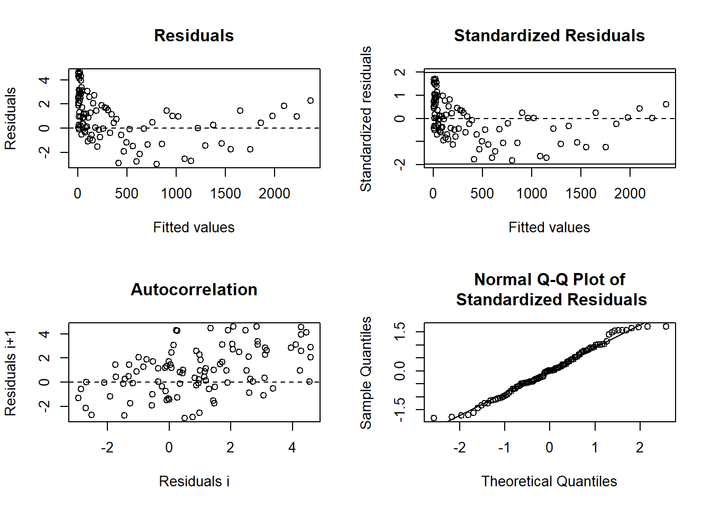

#### Potential Issues in Nonlinear Regression Models

##### Collinearity

-   Measures how correlated the model's predictors are.

-   In nonlinear models, collinearity is assessed using the condition number of:

$$
\mathbf{[F(\hat{\theta})'F(\hat{\theta})]^{-1}}
$$

-   If condition number \> 30, collinearity is a concern.

-   Solution: Consider reparameterization [@Magel_1987].

##### Leverage

-   Similar to leverage in [Ordinary Least Squares].

-   In nonlinear models, leverage is assessed using the **tangent-plane hat matrix**:

$$
\mathbf{\hat{H} = F(\hat{\theta})[F(\hat{\theta})'F(\hat{\theta})]^{-1}F(\hat{\theta})'}
$$

-   **Solution:** Identify influential points and assess their impact on parameter estimates [@Laurent_1992].

##### Heterogeneous Errors

-   Non-constant variance across observations.

-   **Solution:** Use **Weighted Nonlinear Least Squares (WNLS)**.

##### Correlated Errors

-   Residuals may be autocorrelated.

-   **Solution approaches:**

    -   **Generalized Nonlinear Least Squares (GNLS)**

    -   **Nonlinear Mixed Models (NLMEM)**

    -   **Bayesian Methods**

| Issue                              | Description                                        | Solution                                       |
|-------------------|---------------------------|-------------------------|
| **Intrinsic Nonlinearity**         | Function curvature independent of parameterization | Bayesian estimation, Taylor expansion          |
| **Parameter-Effects Nonlinearity** | Curvature influenced by parameterization           | Reparameterization, bootstrap                  |
| **Collinearity**                   | High correlation among predictors                  | Reparameterization, condition number check     |
| **Leverage**                       | Influential points affecting model fit             | Assess tangent-plane hat matrix                |
| **Heterogeneous Errors**           | Unequal variance in residuals                      | Weighted Nonlinear Least Squares               |
| **Correlated Errors**              | Autocorrelated residuals                           | GNLS, Nonlinear Mixed Models, Bayesian Methods |

## Application

### Nonlinear Estimation Using Gauss-Newton Algorithm

This section demonstrates nonlinear parameter estimation using the Gauss-Newton algorithm and compares results with `nls()`. The model is given by:

$$
y_i = \frac{\theta_0 + \theta_1 x_i}{1 + \theta_2 \exp(0.4 x_i)} + \epsilon_i
$$

where

-   $i = 1, \dots ,n$
-   $\theta_0$, $\theta_1$, $\theta_2$ are the unknown parameters.
-   $\epsilon_i$ represents errors.

1.  Loading and Visualizing the Data


```r
library(dplyr)
library(ggplot2)

# Load the dataset
my_data <- read.delim("images/S21hw1pr4.txt", header = FALSE, sep = "") %>%
  dplyr::rename(x = V1, y = V2)

# Plot data
ggplot(my_data, aes(x = x, y = y)) +
  geom_point(color = "blue") +
  labs(title = "Observed Data", x = "X", y = "Y") +
  theme_minimal()
```


2.  Deriving Starting Values for Parameters

Since nonlinear optimization is sensitive to starting values, we estimate reasonable initial values based on model interpretation.

Finding the Maximum $Y$ Value


```r
max(my_data$y)
#> [1] 2.6722
my_data$x[which.max(my_data$y)]
#> [1] 0.0094
```

-   When $y = 2.6722$, the corresponding $x = 0.0094$.

-   From the model equation: $\theta_0 + 0.0094 \theta_1 = 2.6722$

Estimating $\theta_2$ from the Median $y$ Value

-   The equation simplifies to: $1 + \theta_2 \exp(0.4 x) = 2$


```r
# find mean y
mean(my_data$y) 
#> [1] -0.0747864

# find y closest to its mean
my_data$y[which.min(abs(my_data$y - (mean(my_data$y))))] 
#> [1] -0.0773


# find x closest to the mean y
my_data$x[which.min(abs(my_data$y - (mean(my_data$y))))] 
#> [1] 11.0648
```

-   This yields the equation: $83.58967 \theta_2 = 1$

Finding the Value of $\theta_0$ and $\theta_1$


```r
# find value of x closet to 1
my_data$x[which.min(abs(my_data$x - 1))] 
#> [1] 0.9895

# find index of x closest to 1
match(my_data$x[which.min(abs(my_data$x - 1))], my_data$x) 
#> [1] 14

# find y value
my_data$y[match(my_data$x[which.min(abs(my_data$x - 1))], my_data$x)]
#> [1] 1.4577
```

-   This provides another equation: $\theta_0 + \theta_1 \times 0.9895 - 2.164479 \theta_2 = 1.457$

Solving for $\theta_0, \theta_1, \theta_2$


```r
library(matlib)

# Define coefficient matrix
A = matrix(
  c(0, 0.0094, 0, 0, 0, 83.58967, 1, 0.9895, -2.164479),
  nrow = 3,
  ncol = 3,
  byrow = T
)

# Define constant vector
b <- c(2.6722, 1, 1.457)

# Display system of equations
showEqn(A, b)
#> 0*x1 + 0.0094*x2        + 0*x3  =  2.6722 
#> 0*x1      + 0*x2 + 83.58967*x3  =       1 
#> 1*x1 + 0.9895*x2 - 2.164479*x3  =   1.457

# Solve for parameters
theta_start <- Solve(A, b, fractions = FALSE)
#> x1      =  -279.80879739 
#>   x2    =   284.27659574 
#>     x3  =      0.0119632
theta_start
#> [1] "x1      =  -279.80879739" "  x2    =   284.27659574"
#> [3] "    x3  =      0.0119632"
```

3.  Implementing the Gauss-Newton Algorithm

Using these estimates, we manually implement the **Gauss-Newton optimization**.

**Defining the Model and Its Derivatives**


```r
# Starting values
theta_0_strt <- as.numeric(gsub(".*=\\s*", "", theta_start[1]))
theta_1_strt <- as.numeric(gsub(".*=\\s*", "", theta_start[2]))
theta_2_strt <- as.numeric(gsub(".*=\\s*", "", theta_start[3]))

# Model function
mod_4 <- function(theta_0, theta_1, theta_2, x) {
  (theta_0 + theta_1 * x) / (1 + theta_2 * exp(0.4 * x))
}

# Define function expression
f_4 = expression((theta_0 + theta_1 * x) / (1 + theta_2 * exp(0.4 * x)))

# First derivatives
df_4.d_theta_0 <- D(f_4, 'theta_0')
df_4.d_theta_1 <- D(f_4, 'theta_1')
df_4.d_theta_2 <- D(f_4, 'theta_2')
```

Iterative Gauss-Newton Optimization


```r
# Initialize
theta_vec <- matrix(c(theta_0_strt, theta_1_strt, theta_2_strt))
delta <- matrix(NA, nrow = 3, ncol = 1)
i <- 1

# Evaluate function at initial estimates
f_theta <- as.matrix(eval(f_4, list(
  x = my_data$x,
  theta_0 = theta_vec[1, 1],
  theta_1 = theta_vec[2, 1],
  theta_2 = theta_vec[3, 1]
)))

repeat {
  # Compute Jacobian matrix
  F_theta_0 <- as.matrix(cbind(
    eval(df_4.d_theta_0, list(
      x = my_data$x,
      theta_0 = theta_vec[1, i],
      theta_1 = theta_vec[2, i],
      theta_2 = theta_vec[3, i]
    )),
    eval(df_4.d_theta_1, list(
      x = my_data$x,
      theta_0 = theta_vec[1, i],
      theta_1 = theta_vec[2, i],
      theta_2 = theta_vec[3, i]
    )),
    eval(df_4.d_theta_2, list(
      x = my_data$x,
      theta_0 = theta_vec[1, i],
      theta_1 = theta_vec[2, i],
      theta_2 = theta_vec[3, i]
    ))
  ))
  
  # Compute parameter updates
  delta[, i] = (solve(t(F_theta_0)%*%F_theta_0))%*%t(F_theta_0)%*%(my_data$y-f_theta[,i])
    
  
  # Update parameter estimates
  theta_vec <- cbind(theta_vec, theta_vec[, i] + delta[, i])
  theta_vec[, i + 1] = theta_vec[, i] + delta[, i]
  
  # Increment iteration counter
  i <- i + 1
  
  # Compute new function values
  f_theta <- cbind(f_theta, as.matrix(eval(f_4, list(
    x = my_data$x,
    theta_0 = theta_vec[1, i],
    theta_1 = theta_vec[2, i],
    theta_2 = theta_vec[3, i]
  ))))
  
  delta = cbind(delta, matrix(NA, nrow = 3, ncol = 1))
  
  # Convergence criteria based on SSE
  if (abs(sum((my_data$y - f_theta[, i])^2) - sum((my_data$y - f_theta[, i - 1])^2)) / 
      sum((my_data$y - f_theta[, i - 1])^2) < 0.001) {
    break
  }
}

# Final parameter estimates
theta_vec[, ncol(theta_vec)]
#> [1]  3.6335135 -1.3055166  0.5043502
```

4.  Checking Convergence and Variance


```r
# Final objective function value (SSE)
sum((my_data$y - f_theta[, i])^2)
#> [1] 19.80165

sigma2 <- 1 / (nrow(my_data) - 3) * 
  (t(my_data$y - f_theta[, ncol(f_theta)]) %*% 
   (my_data$y - f_theta[, ncol(f_theta)]))  # p = 3

# Asymptotic variance-covariance matrix
as.numeric(sigma2)*as.matrix(solve(crossprod(F_theta_0)))
#>             [,1]        [,2]        [,3]
#> [1,]  0.11552571 -0.04817428  0.02685848
#> [2,] -0.04817428  0.02100861 -0.01158212
#> [3,]  0.02685848 -0.01158212  0.00703916
```

5.  Validating with `nls()`


```r
nlin_4 <- nls(
  y ~ mod_4(theta_0, theta_1, theta_2, x),
  start = list(
    theta_0 = as.numeric(gsub(".*=\\s*", "", theta_start[1])),
    theta_1 = as.numeric(gsub(".*=\\s*", "", theta_start[2])),
    theta_2 = as.numeric(gsub(".*=\\s*", "", theta_start[3]))
  ),
  data = my_data
)
summary(nlin_4)
#> 
#> Formula: y ~ mod_4(theta_0, theta_1, theta_2, x)
#> 
#> Parameters:
#>         Estimate Std. Error t value Pr(>|t|)    
#> theta_0  3.63591    0.36528   9.954  < 2e-16 ***
#> theta_1 -1.30639    0.15561  -8.395 3.65e-15 ***
#> theta_2  0.50528    0.09215   5.483 1.03e-07 ***
#> ---
#> Signif. codes:  0 '***' 0.001 '**' 0.01 '*' 0.05 '.' 0.1 ' ' 1
#> 
#> Residual standard error: 0.2831 on 247 degrees of freedom
#> 
#> Number of iterations to convergence: 9 
#> Achieved convergence tolerance: 2.294e-07
```

### Logistic Growth Model

A classic logistic growth model follows the equation:

$$
P = \frac{K}{1 + \exp(P_0 + r t)} + \epsilon
$$

where:

-   $P$ = population at time $t$

-   $K$ = carrying capacity (maximum population)

-   $r$ = population growth rate

-   $P_0$ = initial population log-ratio

However, R's built-in `SSlogis` function uses a slightly different parameterization:

$$
P = \frac{asym}{1 + \exp\left(\frac{xmid - t}{scal}\right)}
$$

where:

-   $asym$ = carrying capacity ($K$)

-   $xmid$ = the $x$-value at the inflection point of the curve

-   $scal$ = scaling parameter

This gives the parameter relationships:

-   $K = asym$

-   $r = -1 / scal$

-   $P_0 = -r \cdot xmid$


```r
# Simulated time-series data
time <- c(1, 2, 3, 5, 10, 15, 20, 25, 30, 35)
population <- c(2.8, 4.2, 3.5, 6.3, 15.7, 21.3, 23.7, 25.1, 25.8, 25.9)

# Plot data points
plot(time, population, las = 1, pch = 16, main = "Logistic Growth Model")
```


```r

# Fit the logistic growth model using programmed starting values
logisticModelSS <- nls(population ~ SSlogis(time, Asym, xmid, scal))

# Model summary
summary(logisticModelSS)
#> 
#> Formula: population ~ SSlogis(time, Asym, xmid, scal)
#> 
#> Parameters:
#>      Estimate Std. Error t value Pr(>|t|)    
#> Asym  25.5029     0.3666   69.56 3.34e-11 ***
#> xmid   8.7347     0.3007   29.05 1.48e-08 ***
#> scal   3.6353     0.2186   16.63 6.96e-07 ***
#> ---
#> Signif. codes:  0 '***' 0.001 '**' 0.01 '*' 0.05 '.' 0.1 ' ' 1
#> 
#> Residual standard error: 0.6528 on 7 degrees of freedom
#> 
#> Number of iterations to convergence: 1 
#> Achieved convergence tolerance: 1.908e-06

# Extract parameter estimates
coef(logisticModelSS)
#>      Asym      xmid      scal 
#> 25.502890  8.734698  3.635333
```

To fit the model using an alternative parameterization ($K, r, P_0$), we convert the estimated coefficients:


```r
# Convert parameter estimates to alternative logistic model parameters
Ks <- as.numeric(coef(logisticModelSS)[1])  # Carrying capacity (K)
rs <- -1 / as.numeric(coef(logisticModelSS)[3])  # Growth rate (r)
Pos <- -rs * as.numeric(coef(logisticModelSS)[2])  # P_0

# Fit the logistic model with the alternative parameterization
logisticModel <- nls(
    population ~ K / (1 + exp(Po + r * time)),
    start = list(Po = Pos, r = rs, K = Ks)
)

# Model summary
summary(logisticModel)
#> 
#> Formula: population ~ K/(1 + exp(Po + r * time))
#> 
#> Parameters:
#>    Estimate Std. Error t value Pr(>|t|)    
#> Po  2.40272    0.12702   18.92 2.87e-07 ***
#> r  -0.27508    0.01654  -16.63 6.96e-07 ***
#> K  25.50289    0.36665   69.56 3.34e-11 ***
#> ---
#> Signif. codes:  0 '***' 0.001 '**' 0.01 '*' 0.05 '.' 0.1 ' ' 1
#> 
#> Residual standard error: 0.6528 on 7 degrees of freedom
#> 
#> Number of iterations to convergence: 0 
#> Achieved convergence tolerance: 1.924e-06
```

Visualizing the Logistic Model Fit


```r
# Plot original data
plot(time,
     population,
     las = 1,
     pch = 16,
     main = "Logistic Growth Model Fit")

# Overlay the fitted logistic curve
lines(time,
      predict(logisticModel),
      col = "red",
      lwd = 2)
```

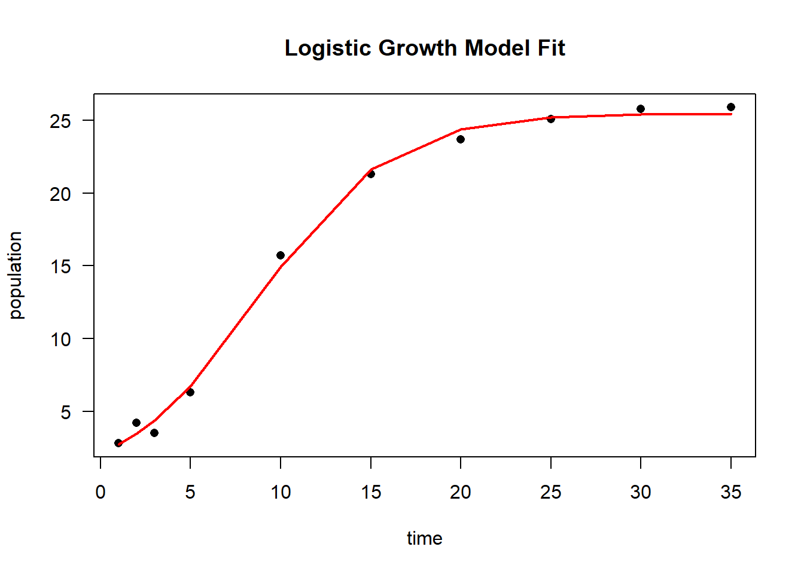

### Nonlinear Plateau Model

This example is based on [@Schabenberger_2001] and demonstrates the use of a **plateau model** to estimate the relationship between soil nitrate ($NO_3$) concentration and relative yield percent (RYP) at two different depths (30 cm and 60 cm).


```r
# Load data
dat <- read.table("images/dat.txt", header = TRUE)

# Plot NO3 concentration vs. relative yield percent, colored by depth
library(ggplot2)
dat.plot <- ggplot(dat) + 
  geom_point(aes(x = no3, y = ryp, color = as.factor(depth))) +
  labs(color = 'Depth (cm)') + 
  xlab('Soil NO3 Concentration') + 
  ylab('Relative Yield Percent') +
  theme_minimal()

# Display plot
dat.plot
```


The **suggested nonlinear plateau model** is given by:

$$
E(Y_{ij}) = (\beta_{0j} + \beta_{1j}N_{ij})I_{N_{ij}\le \alpha_j} + (\beta_{0j} + \beta_{1j}\alpha_j)I_{N_{ij} > \alpha_j}
$$

where:

-   $N_{ij}$ represents the soil nitrate ($NO_3$) concentration for observation $i$ at depth $j$.

-   $i$ indexes individual observations.

-   $j = 1, 2$ corresponds to depths **30 cm** and **60 cm**.

This model assumes a **linear increase** up to a threshold ($\alpha_j$), beyond which the response **levels off (plateaus).**

Defining the Plateau Model as a Function


```r
# Define the nonlinear plateau model function
nonlinModel <- function(predictor, b0, b1, alpha) {
  ifelse(predictor <= alpha, 
         b0 + b1 * predictor,  # Linear growth below threshold
         b0 + b1 * alpha)      # Plateau beyond threshold
}
```

Creating a Self-Starting Function for `nls`

Since the model is **piecewise linear**, we can estimate starting values using:

1.  A **linear regression** on the **first half** of sorted predictor values to estimate $b_0$ and $b_1$.

2.  The **last predictor value** used in the regression as the plateau threshold ($\alpha$)


```r
# Define initialization function for self-starting plateau model
nonlinModelInit <- function(mCall, LHS, data) {
  # Sort data by increasing predictor value
  xy <- sortedXyData(mCall[['predictor']], LHS, data)
  n <- nrow(xy)
  
  # Fit a simple linear model using the first half of the sorted data
  lmFit <- lm(xy[1:(n / 2), 'y'] ~ xy[1:(n / 2), 'x'])
  
  # Extract initial estimates
  b0 <- coef(lmFit)[1]  # Intercept
  b1 <- coef(lmFit)[2]  # Slope
  alpha <- xy[(n / 2), 'x']  # Last x-value in the fitted linear range
  
  # Return initial parameter estimates
  value <- c(b0, b1, alpha)
  names(value) <- mCall[c('b0', 'b1', 'alpha')]
  value
}
```

Combining Model and Self-Start Function


```r
# Define a self-starting nonlinear model for nls
SS_nonlinModel <- selfStart(nonlinModel,
                            nonlinModelInit,
                            c('b0', 'b1', 'alpha'))
```

The `nls` function is used to estimate parameters separately for **each soil depth (30 cm and 60 cm).**


```r
# Fit the model for depth = 30 cm
sep30_nls <- nls(ryp ~ SS_nonlinModel(predictor = no3, b0, b1, alpha),
                  data = dat[dat$depth == 30,])

# Fit the model for depth = 60 cm
sep60_nls <- nls(ryp ~ SS_nonlinModel(predictor = no3, b0, b1, alpha),
                  data = dat[dat$depth == 60,])
```

We generate separate plots for **30 cm** and **60 cm** depths, showing both **confidence** and **prediction intervals.**


```r
# Set plotting layout
par(mfrow = c(1, 2))

# Plot model fit for 30 cm depth
plotFit(
  sep30_nls,
  interval = "both",
  pch = 19,
  shade = TRUE,
  col.conf = "skyblue4",
  col.pred = "lightskyblue2",
  data = dat[dat$depth == 30,],
  main = "Results at 30 cm Depth",
  ylab = "Relative Yield Percent",
  xlab = "Soil NO3 Concentration",
  xlim = c(0, 120)
)

# Plot model fit for 60 cm depth
plotFit(
  sep60_nls,
  interval = "both",
  pch = 19,
  shade = TRUE,
  col.conf = "lightpink4",
  col.pred = "lightpink2",
  data = dat[dat$depth == 60,],
  main = "Results at 60 cm Depth",
  ylab = "Relative Yield Percent",
  xlab = "Soil NO3 Concentration",
  xlim = c(0, 120)
)
```

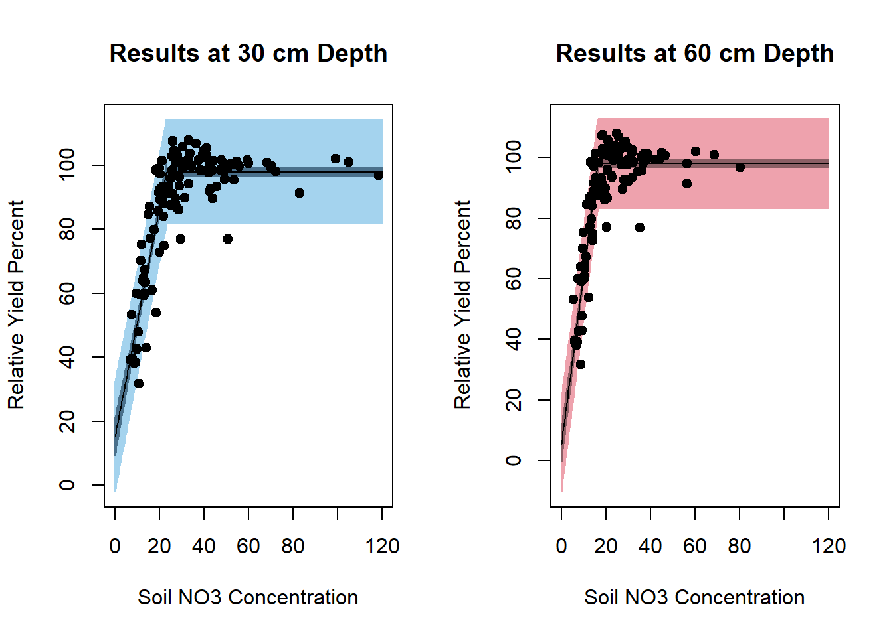


```r
summary(sep30_nls)
#> 
#> Formula: ryp ~ SS_nonlinModel(predictor = no3, b0, b1, alpha)
#> 
#> Parameters:
#>       Estimate Std. Error t value Pr(>|t|)    
#> b0     15.1943     2.9781   5.102 6.89e-07 ***
#> b1      3.5760     0.1853  19.297  < 2e-16 ***
#> alpha  23.1324     0.5098  45.373  < 2e-16 ***
#> ---
#> Signif. codes:  0 '***' 0.001 '**' 0.01 '*' 0.05 '.' 0.1 ' ' 1
#> 
#> Residual standard error: 8.258 on 237 degrees of freedom
#> 
#> Number of iterations to convergence: 6 
#> Achieved convergence tolerance: 3.608e-09
summary(sep60_nls)
#> 
#> Formula: ryp ~ SS_nonlinModel(predictor = no3, b0, b1, alpha)
#> 
#> Parameters:
#>       Estimate Std. Error t value Pr(>|t|)    
#> b0      5.4519     2.9785    1.83   0.0684 .  
#> b1      5.6820     0.2529   22.46   <2e-16 ***
#> alpha  16.2863     0.2818   57.80   <2e-16 ***
#> ---
#> Signif. codes:  0 '***' 0.001 '**' 0.01 '*' 0.05 '.' 0.1 ' ' 1
#> 
#> Residual standard error: 7.427 on 237 degrees of freedom
#> 
#> Number of iterations to convergence: 5 
#> Achieved convergence tolerance: 8.571e-09
```

**Modeling Soil Depths Together and Comparing Models**

Instead of fitting separate models for different soil depths, we first fit a **combined model** where all observations share a **common slope, intercept, and plateau**. We then test whether modeling the two depths separately provides a significantly better fit.

1.  **Fitting a Reduced (Combined) Model**

The reduced model assumes that **all soil depths follow the same nonlinear relationship**.


```r
# Fit the combined model (common parameters across all depths)
red_nls <- nls(
  ryp ~ SS_nonlinModel(predictor = no3, b0, b1, alpha), 
  data = dat
)

# Display model summary
summary(red_nls)
#> 
#> Formula: ryp ~ SS_nonlinModel(predictor = no3, b0, b1, alpha)
#> 
#> Parameters:
#>       Estimate Std. Error t value Pr(>|t|)    
#> b0      8.7901     2.7688   3.175   0.0016 ** 
#> b1      4.8995     0.2207  22.203   <2e-16 ***
#> alpha  18.0333     0.3242  55.630   <2e-16 ***
#> ---
#> Signif. codes:  0 '***' 0.001 '**' 0.01 '*' 0.05 '.' 0.1 ' ' 1
#> 
#> Residual standard error: 9.13 on 477 degrees of freedom
#> 
#> Number of iterations to convergence: 7 
#> Achieved convergence tolerance: 7.126e-09

# Visualizing the combined model fit
par(mfrow = c(1, 1))
plotFit(
  red_nls,
  interval = "both",
  pch = 19,
  shade = TRUE,
  col.conf = "lightblue4",
  col.pred = "lightblue2",
  data = dat,
  main = 'Results for Combined Model',
  ylab = 'Relative Yield Percent',
  xlab = 'Soil NO3 Concentration'
)
```


2.  **Examining Residuals for the Combined Model**

Checking residuals helps diagnose potential **lack of fit**.


```r
library(nlstools)

# Residual diagnostics using nlstools
resid <- nlsResiduals(red_nls)

# Plot residuals
plot(resid)
```

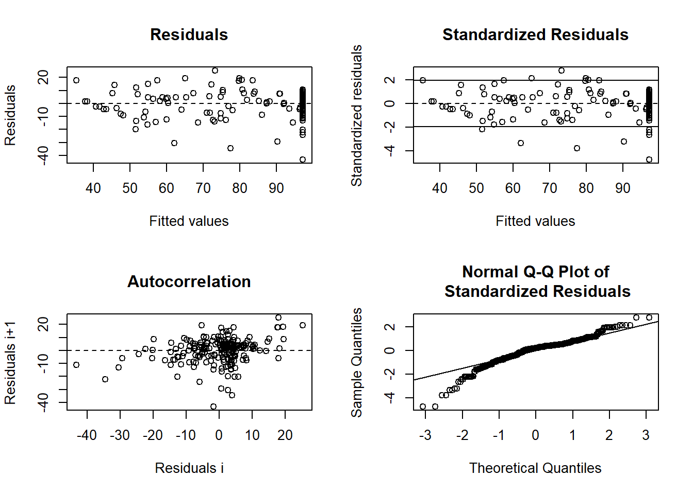

If there is a **pattern** in the residuals (e.g., systematic deviations based on soil depth), this suggests that a **separate model for each depth** may be necessary.

3.  **Testing Whether Depths Require Separate Models**

To formally test whether soil depth significantly affects the model parameters, we introduce a **parameterization where depth-specific parameters are increments from a baseline model** (30 cm depth):

$$
\begin{aligned}
\beta_{02} &= \beta_{01} + d_0 \\
\beta_{12} &= \beta_{11} + d_1 \\
\alpha_{2} &= \alpha_{1} + d_a
\end{aligned}
$$

where:

-   $\beta_{01}, \beta_{11}, \alpha_1$ are parameters for **30 cm depth**.

-   $d_0, d_1, d_a$ represent **depth-specific differences** for **60 cm depth**.

-   If $d_0, d_1, d_a$ are significantly **different from 0**, the **two depths should be modeled separately**.

4.  **Defining the Full (Depth-Specific) Model**


```r
nonlinModelF <- function(predictor, soildep, b01, b11, a1, d0, d1, da) {
  
  # Define parameters for 60 cm depth as increments from 30 cm parameters
  b02 <- b01 + d0
  b12 <- b11 + d1
  a2 <- a1 + da
  
  # Compute model output for 30 cm depth
  y1 <- ifelse(
    predictor <= a1, 
    b01 + b11 * predictor, 
    b01 + b11 * a1
  )
  
  # Compute model output for 60 cm depth
  y2 <- ifelse(
    predictor <= a2, 
    b02 + b12 * predictor, 
    b02 + b12 * a2
  )
  
  # Assign correct model output based on depth
  y <- y1 * (soildep == 30) + y2 * (soildep == 60)
  
  return(y)
}

```

5.  **Fitting the Full (Depth-Specific) Model**

The starting values are taken from the **separately fitted models** for each depth.


```r
Soil_full <- nls(
  ryp ~ nonlinModelF(
    predictor = no3,
    soildep = depth,
    b01,
    b11,
    a1,
    d0,
    d1,
    da
  ),
  data = dat,
  start = list(
    b01 = 15.2,   # Intercept for 30 cm depth
    b11 = 3.58,   # Slope for 30 cm depth
    a1 = 23.13,   # Plateau cutoff for 30 cm depth
    d0 = -9.74,   # Intercept difference (60 cm - 30 cm)
    d1 = 2.11,    # Slope difference (60 cm - 30 cm)
    da = -6.85    # Plateau cutoff difference (60 cm - 30 cm)
  )
)

# Display model summary
summary(Soil_full)
#> 
#> Formula: ryp ~ nonlinModelF(predictor = no3, soildep = depth, b01, b11, 
#>     a1, d0, d1, da)
#> 
#> Parameters:
#>     Estimate Std. Error t value Pr(>|t|)    
#> b01  15.1943     2.8322   5.365 1.27e-07 ***
#> b11   3.5760     0.1762  20.291  < 2e-16 ***
#> a1   23.1324     0.4848  47.711  < 2e-16 ***
#> d0   -9.7424     4.2357  -2.300   0.0219 *  
#> d1    2.1060     0.3203   6.575 1.29e-10 ***
#> da   -6.8461     0.5691 -12.030  < 2e-16 ***
#> ---
#> Signif. codes:  0 '***' 0.001 '**' 0.01 '*' 0.05 '.' 0.1 ' ' 1
#> 
#> Residual standard error: 7.854 on 474 degrees of freedom
#> 
#> Number of iterations to convergence: 1 
#> Achieved convergence tolerance: 3.742e-06
```

6.  **Model Comparison: Does Depth Matter?**

-   If $d_0, d_1, d_a$ **are significantly different from 0**, the depths should be modeled separately.

-   The **p-values** for these parameters indicate whether depth-specific modeling is necessary.
