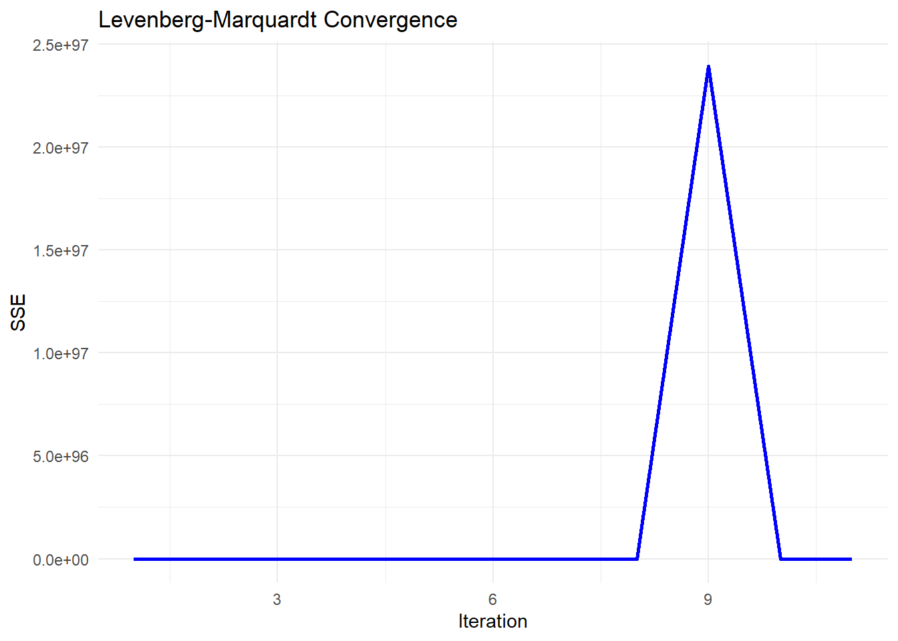

# Non-linear Regression


**Definition**: models in which the derivatives of the mean function with respect to the parameters depend on one or more of the parameters.

To approximate data, we can approximate the function

-   by a high-order polynomial
-   by a linear model (e.g., a Taylor expansion around X's)
-   a collection of locally linear models or basis function

but it would not easy to interpret, or not enough data, or can't interpret them globally.

**intrinsically nonlinear** models:

$$
Y_i = f(\mathbf{x_i;\theta}) + \epsilon_i
$$

where $f(\mathbf{x_i;\theta})$ is a nonlinear function relating $E(Y_i)$ to the independent variables $x_i$

-   $\mathbf{x}_i$ is a k x 1 vector of independent variables (fixed).
-   $\mathbf{\theta}$ is a p x 1 vector of parameters.
-   $\epsilon_i$s are iid variables mean 0 and variance $\sigma^2$. (sometimes it's normal).

## Inference

Since $Y_i = f(\mathbf{x}_i,\theta) + \epsilon_i$, where $\epsilon_i \sim iid(0,\sigma^2)$. We can obtain $\hat{\theta}$ by minimizing $\sum_{i=1}^{n}(Y_i - f(x_i,\theta))^2$ and estimate $s^2 = \hat{\sigma}^2_{\epsilon}=\frac{\sum_{i=1}^{n}(Y_i - f(x_i,\theta))^2}{n-p}$

### Linear Function of the Parameters

If we assume $\epsilon_i \sim N(0,\sigma^2)$, then

$$
\hat{\theta} \sim AN(\mathbf{\theta},\sigma^2[\mathbf{F}(\theta)'\mathbf{F}(\theta)]^{-1})
$$

where An = asymptotic normality

Asymptotic means we have enough data to make inference (As your sample size increases, this becomes more and more accurate (to the true value)).

Since we want to do inference on linear combinations of parameters or contrasts.

If we have $\mathbf{\theta} = (\theta_0,\theta_1,\theta_2)'$ and we want to look at $\theta_1 - \theta_2$; we can define vector $\mathbf{a} = (0,1,-1)'$, consider inference for $\mathbf{a'\theta}$

Rules for expectation and variance of a fixed vector $\mathbf{a}$ and random vector $\mathbf{Z}$;

$$
E(\mathbf{a'Z}) = \mathbf{a'}E(\mathbf{Z}) \\
var(\mathbf{a'Z}) = \mathbf{a'}var(\mathbf{Z}) \mathbf{a}
$$

Then,

$$
\mathbf{a'\hat{\theta}} \sim AN(\mathbf{a'\theta},\sigma^2\mathbf{a'[F(\theta)'F(\theta)]^{-1}a})
$$

and $\mathbf{a'\hat{\theta}}$ is asymptotically independent of $s^2$ (to order 1/n) then

$$
\frac{\mathbf{a'\hat{\theta}-a'\theta}}{s(\mathbf{a'[F(\theta)'F(\theta)]^{-1}a})^{1/2}} \sim t_{n-p}
$$

to construct $100(1-\alpha)\%$ confidence interval for $\mathbf{a'\theta}$

$$
\mathbf{a'\theta} \pm t_{(1-\alpha/2,n-p)}s(\mathbf{a'[F(\theta)'F(\theta)]^{-1}a})^{1/2}
$$

Suppose $\mathbf{a'} = (0,...,j,...,0)$. Then, a confidence interval for the jth element of $\mathbf{\theta}$ is

$$
\hat{\theta}_j \pm t_{(1-\alpha/2,n-p)}s\sqrt{\hat{c}^{j}}
$$

where $\hat{c}^{j}$ is the jth diagonal element of $[\mathbf{F(\hat{\theta})'F(\hat{\theta})}]^{-1}$


```r
#set a seed value 
set.seed(23)

#Generate x as 100 integers using seq function
x<-seq(0,100,1)

#Generate y as a*e^(bx)+c
y<-runif(1,0,20)*exp(runif(1,0.005,0.075)*x)+runif(101,0,5)

# visualize
plot(x,y)
```


```r

#define our data frame
datf = data.frame(x,y)

#define our model function
mod =function(a,b,x) a*exp(b*x)
```

In this example, we can get the starting values by using linearized version of the function $\log y = \log a + b x$. Then, we can fit a linear regression to this and use our estimates as starting values


```r
#get starting values by linearizing
lin_mod=lm(log(y)~x,data=datf)

#convert the a parameter back from the log scale; b is ok 
astrt = exp(as.numeric(lin_mod$coef[1]))
bstrt = as.numeric(lin_mod$coef[2])
print(c(astrt,bstrt))
#> [1] 14.07964761  0.01855635
```

with `nls`, we can fit the nonlinear model via least squares


```r
nlin_mod = nls(y ~ mod(a, b, x),
               start = list(a = astrt, b = bstrt),
               data = datf)

#look at model fit summary
summary(nlin_mod)
#> 
#> Formula: y ~ mod(a, b, x)
#> 
#> Parameters:
#>    Estimate Std. Error t value Pr(>|t|)    
#> a 13.603909   0.165390   82.25   <2e-16 ***
#> b  0.019110   0.000153  124.90   <2e-16 ***
#> ---
#> Signif. codes:  0 '***' 0.001 '**' 0.01 '*' 0.05 '.' 0.1 ' ' 1
#> 
#> Residual standard error: 1.542 on 99 degrees of freedom
#> 
#> Number of iterations to convergence: 3 
#> Achieved convergence tolerance: 7.006e-07

#add prediction to plot
plot(x, y)
lines(x, predict(nlin_mod), col = "red")
```


### Nonlinear

Suppose that $h(\theta)$ is a nonlinear function of the parameters. We can use Taylor series about $\theta$

$$
h(\hat{\theta}) \approx h(\theta) + \mathbf{h}'[\hat{\theta}-\theta]
$$

where $\mathbf{h} = (\frac{\partial h}{\partial \theta_1},...,\frac{\partial h}{\partial \theta_p})'$

with

$$
E( \hat{\theta}) \approx \theta \\
var(\hat{\theta}) \approx  \sigma^2[\mathbf{F(\theta)'F(\theta)}]^{-1} \\
E(h(\hat{\theta})) \approx h(\theta) \\
var(h(\hat{\theta})) \approx \sigma^2 \mathbf{h'[F(\theta)'F(\theta)]^{-1}h}
$$

Thus,

$$
h(\hat{\theta}) \sim AN(h(\theta),\sigma^2\mathbf{h'[F(\theta)'F(\theta)]^{-1}h})
$$

and an approximate $100(1-\alpha)\%$ confidence interval for $h(\theta)$ is

$$
h(\hat{\theta}) \pm t_{(1-\alpha/2;n-p)}s(\mathbf{h'[F(\theta)'F(\theta)]^{-1}h})^{1/2}
$$

where $\mathbf{h}$ and $\mathbf{F}(\theta)$ are evaluated at $\hat{\theta}$

Regarding **prediction interval** for Y at $x=x_0$

$$
Y_0 = f(x_0;\theta) + \epsilon_0, \epsilon_0 \sim N(0,\sigma^2) \\
\hat{Y}_0 = f(x_0,\hat{\theta})
$$

As $n \to \infty$, $\hat{\theta} \to \theta$, so we

$$
f(x_0, \hat{\theta}) \approx f(x_0,\theta) + \mathbf{f}_0(\mathbf{\theta})'[\hat{\theta}-\theta]
$$

where

$$
f_0(\theta)= (\frac{\partial f(x_0,\theta)}{\partial \theta_1},..,\frac{\partial f(x_0,\theta)}{\partial \theta_p})'
$$

(note: this $f_0(\theta)$ is different from $f(\theta)$).

$$
Y_0 - \hat{Y}_0 \approx Y_0  - f(x_0,\theta) - f_0(\theta)'[\hat{\theta}-\theta]  \\
= \epsilon_0 - f_0(\theta)'[\hat{\theta}-\theta]
$$

$$
E(Y_0 - \hat{Y}_0) \approx E(\epsilon_0)E(\hat{\theta}-\theta) = 0 \\
var(Y_0 - \hat{Y}_0) \approx var(\epsilon_0 - \mathbf{(f_0(\theta)'[\hat{\theta}-\theta])}) \\
= \sigma^2 + \sigma^2 \mathbf{f_0 (\theta)'[F(\theta)'F(\theta)]^{-1}f_0(\theta)} \\
= \sigma^2 (1 + \mathbf{f_0 (\theta)'[F(\theta)'F(\theta)]^{-1}f_0(\theta)})
$$

Hence, combining

$$
Y_0 - \hat{Y}_0 \sim AN (0,\sigma^2 (1 + \mathbf{f_0 (\theta)'[F(\theta)'F(\theta)]^{-1}f_0(\theta)}))
$$

Note:

Confidence intervals for the mean response $Y_i$ (which is different from prediction intervals) can be obtained similarly.

## Non-linear Least Squares

-   The LS estimate of $\theta$, $\hat{\theta}$ is the set of parameters that minimizes the residual sum of squares:\
    $$
    S(\hat{\theta}) = SSE(\hat{\theta}) = \sum_{i=1}^{n}\{Y_i - f(\mathbf{x_i};\hat{\theta})\}^2
    $$
-   to obtain the solution, we can consider the partial derivatives of $S(\theta)$ with respect to each $\theta_j$ and set them to 0, which gives a system of p equations. Each normal equation is $$
    \frac{\partial S(\theta)}{\partial \theta_j} = -2\sum_{i=1}^{n}\{Y_i -f(\mathbf{x}_i;\theta)\}[\frac{\partial(\mathbf{x}_i;\theta)}{\partial \theta_j}] = 0
    $$
-   but we can't obtain a solution directly/analytically for this equation.

**Numerical Solutions**

-   Grid search

    -   A "grid" of possible parameter values and see which one minimize the residual sum of squares.
    -   finer grid = greater accuracy
    -   could be inefficient, and hard when p is large.

-   Gauss-Newton Algorithm

    -   we have an initial estimate of $\theta$ denoted as $\hat{\theta}^{(0)}$
    -   use a Taylor expansions of $f(\mathbf{x}_i;\theta)$ as a function of $\theta$ about the point $\hat{\theta}^{(0)}$

$$
\begin{aligned} 
Y_i &= f(x_i;\theta) + \epsilon_i \\
&= f(x_i;\theta) + \sum_{j=1}^{p}\{\frac{\partial f(x_i;\theta)}{\partial \theta_j}\}_{\theta = \hat{\theta}^{(0)}} (\theta_j - \hat{\theta}^{(0)}) + \text{remainder} + \epsilon_i
\end{aligned}
$$

Equivalently,

In matrix notation,

$$
\mathbf{Y} = 
\left[ 
\begin{array}
{c}
Y_1 \\
. \\
Y_n
\end{array} 
\right]
$$

$$
\mathbf{f}(\hat{\theta}^{(0)}) =
\left[ 
\begin{array}
{c}
f(\mathbf{x_1,\hat{\theta}}^{(0)}) \\
. \\
f(\mathbf{x_n,\hat{\theta}}^{(0)})
\end{array} 
\right]
$$

$$
\mathbf{\epsilon} = 
\left[ 
\begin{array}
{c}
\epsilon_1 \\
. \\
\epsilon_n
\end{array} 
\right]
$$

$$
\mathbf{F}(\hat{\theta}^{(0)}) = 
\left[ 
\begin{array}
{ccc}
\frac{\partial f(x_1,\mathbf{\theta})}{\partial \theta_1} & ... & \frac{\partial f(x_1,\mathbf{\theta})}{\partial \theta_p}\\
. & . & . \\
\frac{\partial f(x_n,\mathbf{\theta})}{\partial \theta_1} & ... & \frac{\partial f(x_n,\mathbf{\theta})}{\partial \theta_p}
\end{array} \right]_{\theta = \hat{\theta}^{(0)}}
$$

Hence,

$$
\mathbf{Y} = \mathbf{f}(\hat{\theta}^{(0)}) + \mathbf{F}(\hat{\theta}^{(0)})(\theta - \hat{\theta}^{(0)}) + \epsilon + \text{remainder}
$$

where we assume that the remainder is small and the error term is only assumed to be iid with mean 0 and variance $\sigma^2$.

We can rewrite the above equation as

$$
\mathbf{Y} - \mathbf{f}(\hat{\theta}^{(0)}) \approx \mathbf{F}(\hat{\theta}^{(0)})(\theta - \hat{\theta}^{(0)}) + \epsilon
$$

where it is in the form of linear model. After we solve for $(\theta - \hat{\theta}^{(0)})$ and let it equal to $\hat{\delta}^{(1)}$\
Then we new estimate is given by adding the Gauss increment adjustment to the initial estimate $\hat{\theta}^{(1)} = \hat{\theta}^{(0)} + \hat{\delta}^{(1)}$\
We can repeat this process.

Gauss-Newton Algorithm Steps:

1.  initial estimate $\hat{\theta}^{(0)}$, set j = 0
2.  Taylor series expansion and calculate $\mathbf{f}(\hat{\theta}^{(j)})$ and $\mathbf{F}(\hat{\theta}^{(j)})$
3.  Use OLS to get $\hat{\delta}^{(j+1)}$
4.  get the new estimate $\hat{\theta}^{(j+1)}$, return to step 2
5.  continue until "convergence"
6.  With the final parameter estimate $\hat{\theta}$, we can estimate $\sigma^2$ if $\epsilon \sim (\mathbf{0}, \sigma^2 \mathbf{I})$ by

$$
\hat{\sigma}^2= \frac{1}{n-p}(\mathbf{Y}-\mathbf{f}(x;\hat{\theta}))'(\mathbf{Y}-\mathbf{f}(x;\hat{\theta}))
$$

<br>

**Criteria for convergence**

1.  Minor change in the objective function (SSE = residual sum of squares)\
    $$
    \frac{|SSE(\hat{\theta}^{(j+1)})-SSE(\hat{\theta}^{(j)})|}{SSE(\hat{\theta}^{(j)})} < \gamma_1
    $$
2.  Minor change in the parameter estimates\
    $$
    |\hat{\theta}^{(j+1)}-\hat{\theta}^{(j)}| < \gamma_2
    $$
3.  "residual projection" criterion of [@Bates_1981]

### Alternative of Gauss-Newton Algorithm

#### Gauss-Newton Algorithm

Normal equations:

$$
\frac{\partial SSE(\theta)}{\partial \theta} = 2\mathbf{F}(\theta)'[\mathbf{Y}-\mathbf{f}(\theta)]
$$

$$
\begin{aligned}
\hat{\theta}^{(j+1)} &= \hat{\theta}^{(j)} + \hat{\delta}^{(j+1)} \\
&= \hat{\theta}^{(j)} + [\mathbf{F}((\hat{\theta})^{(j)})'\mathbf{F}(\hat{\theta}^{(j)})]^{-1}\mathbf{F}(\hat{\theta})^{(j)} \\
&= \hat{\theta}^{(j)} - \frac{1}{2}[\mathbf{F}(\hat{\theta}^{(j)})'\mathbf{F}(\hat{\theta}^{(j)})]^{-1}\frac{\partial SSE(\hat{\theta}^{(j)})}{\partial \theta}
\end{aligned}
$$

where

-   $\frac{\partial SSE(\hat{\theta}^{(j)})}{\partial \theta}$ is a gradient vecotr (points in the direction in which the SSE increases most rapidly). This path is known as steepest ascent.\
-   $[\mathbf{F}(\hat{\theta}^{(j)})'\mathbf{F}(\hat{\theta}^{(j)})]^{-1}$ indicates how far to move\
-   $-1/2$: indicator of the direction of steepest descent.

#### Modified Gauss-Newton Algorithm

To avoid overstepping (the local min), we can use the modified Gauss-Newton Algorithm. We define a new proposal for $\theta$

$$
\hat{\theta}^{(j+1)} = \hat{\theta}^{(j)} + \alpha_j \hat{\delta}^{(j+1)}, 0 < \alpha_j < 1
$$

where

-   $\alpha_j$ (called the "learning rate"): is used to modify the step length.

We could also have $\alpha *1/2$, but typically it is assumed to be absorbed into the learning rate.

A way to choose $\alpha_j$, we can use **step halving**

$$
\hat{\theta}^{(j+1)} = \hat{\theta}^{(j)} + \frac{1}{2^k}\hat{\delta}^{(j+1)}
$$

where

-   k is the smallest non-negative integer such that\
    $$
    SSE(\hat{\theta}^{(j)}+\frac{1}{2^k}\hat{\delta}^{(j+1)}) < SSE(\hat{\theta}^{(j)})
    $$ which means we try $\hat{\delta}^{(j+1)}$, then $\hat{\delta}^{(j+1)}/2$, $\hat{\delta}^{(j+1)}/4$, etc.

The most general form of the convergence algorithm is

$$
\hat{\theta}^{(j+1)} = \hat{\theta}^{(j)} - \alpha_j \mathbf{A}_j \frac{\partial Q(\hat{\theta}^{(j)})}{\partial \theta} 
$$

where

-   $\mathbf{A}_j$ is a positive definite matrix\
-   $\alpha_j$ is the learning rate\
-   $\frac{\partial Q(\hat{\theta}^{(j)})}{\partial \theta}$is the gradient based on some objective function Q (a function of $\theta$), which is typically the SSE in nonlinear regression applications (e.g., cross-entropy for classification).

Refer back to the **Modified Gauss-Newton Algorithm**, we can see it is in this form

$$
\hat{\theta}^{(j+1)} =\hat{\theta}^{(j)} - \alpha_j[\mathbf{F}(\hat{\theta}^{(j)})'\mathbf{F}(\hat{\theta}^{(j)})]^{-1}\frac{\partial SSE(\hat{\theta}^{(j)})}{\partial \theta}
$$

where Q = SSE, $[\mathbf{F}(\hat{\theta}^{(j)})'\mathbf{F}(\hat{\theta}^{(j)})]^{-1} = \mathbf{A}$

#### Steepest Descent

(also known just "gradient descent")

$$
\hat{\theta}^{(j+1)} = \hat{\theta}^{(j)} - \alpha_j \mathbf{I}_{p \times p}\frac{\partial \mathbf{Q}(\hat{\theta}^{(j)})}{\partial \theta}
$$

-   slow to converge, moves rapidly initially.\
-   could be use for starting values

#### Levenberg -Marquardt

$$
\hat{\theta}^{(j+1)} = \hat{\theta}^{(j)} - \alpha_j [\mathbf{F}(\hat{\theta}^{(j)})'\mathbf{F}(\hat{\theta}^{(j)})+ \tau \mathbf{I}_{p \times p}]\frac{\partial \mathbf{Q}(\hat{\theta}^{(j)})}{\partial \theta}
$$

which is a compromise between the [Gauss-Newton Algorithm] and the [Steepest Descent].

-   best when $\mathbf{F}(\hat{\theta}^{(j)})'\mathbf{F}(\hat{\theta}^{(j)})$ is nearly singular ($\mathbf{F}(\hat{\theta}^{(j)})$ isn't of full rank)\
-   similar to ridge regression\
-   If $SSE(\hat{\theta}^{(j+1)}) < SSE(\hat{\theta}^{(j)})$, then $\tau= \tau/10$ for the next iteration. Otherwise, $\tau = 10 \tau$

#### Newton-Raphson

$$
\hat{\theta}^{(j+1)} = \hat{\theta}^{(j)} - \alpha_j [\frac{\partial^2Q(\hat{\theta}^{(j)})}{\partial \theta \partial \theta'}]^{-1}\frac{\partial \mathbf{Q}(\hat{\theta}^{(j)})}{\partial \theta}
$$

The **Hessian matrix** can be rewritten as:

$$
\frac{ \partial^2Q(\hat{ \theta}^{(j)})}{ \partial \theta \partial \theta'} = 2 \mathbf{F}((\hat{ \theta})^{(j)})' \mathbf{F} ( \hat{\theta}^{(j)}) - 2\sum_{i=1}^{n} [Y_i - f(x_i;\theta)] \frac{\partial^2f(x_i;\theta)}{\partial \theta \partial \theta'}
$$

which contains the same term that [Gauss-Newton Algorithm], combined with one containing the second partial derivatives of f(). (methods that require the second derivatives of the objective function are known as "second-order methods".)\
However, the last term $\frac{\partial^2f(x_i;\theta)}{\partial \theta \partial \theta'}$ can sometimes be nonsingular.

#### Quasi-Newton

update $\theta$ according to

$$
\hat{\theta}^{(j+1)} = \hat{\theta}^{(j)} - \alpha_j \mathbf{H}_j^{-1}\frac{\partial \mathbf{Q}(\hat{\theta}^{(j)})}{\partial \theta}
$$

where $H_j$ is a symmetric positive definite approximation to the Hessian, which gets closer as $j \to \infty$.

-   $\mathbf{H}_j$ is computed iteratively\
-   AMong first-order methods(where only first derivatives are required), this method performs best.

#### Derivative Free Methods

-   **secant Method**: like [Gauss-Newton Algorithm], but calculates the derivatives numerically from past iterations.\
-   **Simplex Methods**\
-   **Genetic Algorithm**\
-   **Differential Evolution Algorithms**\
-   **Particle Swarm Optimization**\
-   **Ant Colony Optimization**

### Practical Considerations

To converge, algorithm need good initial estimates.

-   Starting values:

    -   Prior or theoretical info\
    -   A grid search or a graph of $SSE(\theta)$\
    -   could also use OLS to get starting values.\
    -   Model interpretation: if you have some idea regarding the form of the objective function, then you can try to guess the initial value.\
    -   Expected Value Parameterization\

-   Constrained Parameters: (constraints on parameters like $\theta_i>a,a< \theta_i <b$)

    -   fit the model first to see if the converged parameter estimates satisfy the constraints.
    -   if they dont' satisfy, then try re-parameterizing

#### Failure to converge

-   $SSE(\theta)$ may be "flat" in a neighborhood of the minimum.\
-   You can try different or "better" starting values.\
-   Might suggest the model is too complex for the data, might consider simpler model.

#### Convergence to a Local Minimum

-   Linear least squares has the property that $SSE(\theta) = \mathbf{(Y-X\beta)'(Y-X\beta)}$, which is quadratic and has a unique minimum (or maximum).
-   Nonlinear east squares need not have a unique minimum
-   Using different starting values can help
-   If the dimension of $\theta$ is low, graph $SSE(\theta)$ as a function of $\theta_i$
-   Different algorithm can help (e.g., genetic algorithm, particle swarm)

To converge, algorithms need good initial estimates.

-   Starting values:

    -   prior or theoretical info
    -   A grid search or a graph
    -   OLS estimates as starting values
    -   Model interpretation
    -   Expected Value Parameterization

-   Constrained Parameters:

    -   try the model without the constraints first.
    -   If the resulted parameter estimates does not satisfy the constraint, try re-parameterizing


```r
# Grid search
#choose grid of a and b values
aseq = seq(10,18,.2)
bseq = seq(.001,.075,.001)

na = length(aseq)
nb = length(bseq)
SSout = matrix(0,na*nb,3) #matrix to save output
cnt = 0
for (k in 1:na){
   for (j in 1:nb){
      cnt = cnt+1
      ypred = mod(aseq[k],bseq[j],x) #evaluate model w/ these parms
      ss = sum((y-ypred)^2)  #this is our SSE objective function
      #save values of a, b, and SSE
      SSout[cnt,1]=aseq[k]
      SSout[cnt,2]=bseq[j]
      SSout[cnt,3]=ss
   }
}
#find minimum SSE and associated a,b values
mn_indx = which.min(SSout[,3])
astrt = SSout[mn_indx,1]
bstrt = SSout[mn_indx,2]
#now, run nls function with these starting values
nlin_modG=nls(y~mod(a,b,x),start=list(a=astrt,b=bstrt)) 

nlin_modG
#> Nonlinear regression model
#>   model: y ~ mod(a, b, x)
#>    data: parent.frame()
#>        a        b 
#> 13.60391  0.01911 
#>  residual sum-of-squares: 235.5
#> 
#> Number of iterations to convergence: 3 
#> Achieved convergence tolerance: 2.293e-07
# Note, the package `nls_multstart` will allow you to do a grid search without programming your own loop

```

For prediction interval


```r
plotFit(
  nlin_modG,
  interval = "both",
  pch = 19,
  shade = TRUE,
  col.conf = "skyblue4",
  col.pred = "lightskyblue2",
  data = datf
)  
```



Based on the forms of your function, you can also have programmed starting values from `nls` function (e.e.g, logistic growth, asymptotic regression, etc).


```r
apropos("^SS")
#>  [1] "ss"          "SSasymp"     "SSasympOff"  "SSasympOrig" "SSbiexp"    
#>  [6] "SSD"         "SSfol"       "SSfpl"       "SSgompertz"  "SSlogis"    
#> [11] "SSmicmen"    "SSout"       "SSweibull"
```

For example, a logistic growth model:

$$
P = \frac{K}{1+ exp(P_0+ rt)} + \epsilon
$$

where

-   P = population at time t
-   K = carrying capacity
-   r = population growth rate

but in `R` you have slight different parameterization:

$$
P = \frac{asym}{1 + exp(\frac{xmid - t}{scal})}
$$

where

-   asym = carrying capacity
-   xmid = the x value at the inflection point of the curve
-   scal = scaling parameter.

Hence, you have

-   K = asym
-   r = -1/scal
-   $P_0 = -rxmid$


```r
# simulated data
time <- c(1, 2, 3, 5, 10, 15, 20, 25, 30, 35)
population <- c(2.8, 4.2, 3.5, 6.3, 15.7, 21.3, 23.7, 25.1, 25.8, 25.9)
plot(time, population, las = 1, pch = 16)
```


```r

# model fitting
logisticModelSS <- nls(population ~ SSlogis(time, Asym, xmid, scal))
summary(logisticModelSS)
#> 
#> Formula: population ~ SSlogis(time, Asym, xmid, scal)
#> 
#> Parameters:
#>      Estimate Std. Error t value Pr(>|t|)    
#> Asym  25.5029     0.3666   69.56 3.34e-11 ***
#> xmid   8.7347     0.3007   29.05 1.48e-08 ***
#> scal   3.6353     0.2186   16.63 6.96e-07 ***
#> ---
#> Signif. codes:  0 '***' 0.001 '**' 0.01 '*' 0.05 '.' 0.1 ' ' 1
#> 
#> Residual standard error: 0.6528 on 7 degrees of freedom
#> 
#> Number of iterations to convergence: 1 
#> Achieved convergence tolerance: 1.908e-06
coef(logisticModelSS)
#>      Asym      xmid      scal 
#> 25.502890  8.734698  3.635333
```

Other parameterization


```r
#convert to other parameterization
Ks = as.numeric(coef(logisticModelSS)[1])
rs = -1/as.numeric(coef(logisticModelSS)[3])
Pos = - rs * as.numeric(coef(logisticModelSS)[2])
#let's refit with these parameters
logisticModel <- nls(population ~ K / (1 + exp(Po + r * time)),start=list(Po=Pos,r=rs,K=Ks))
summary(logisticModel)
#> 
#> Formula: population ~ K/(1 + exp(Po + r * time))
#> 
#> Parameters:
#>    Estimate Std. Error t value Pr(>|t|)    
#> Po  2.40272    0.12702   18.92 2.87e-07 ***
#> r  -0.27508    0.01654  -16.63 6.96e-07 ***
#> K  25.50289    0.36665   69.56 3.34e-11 ***
#> ---
#> Signif. codes:  0 '***' 0.001 '**' 0.01 '*' 0.05 '.' 0.1 ' ' 1
#> 
#> Residual standard error: 0.6528 on 7 degrees of freedom
#> 
#> Number of iterations to convergence: 0 
#> Achieved convergence tolerance: 1.924e-06
```


```r
#note: initial values =  solution (highly unusual, but ok)
plot(time, population, las = 1, pch = 16)
lines(time, predict(logisticModel), col = "red")
```


If can also define your own self-starting fucntion if your models are uncommon (built in `nls`)

Example is based on [@Schabenberger_2001]


```r
#Load data
dat <- read.table("images/dat.txt", header = T)
# plot
dat.plot <-
  ggplot(dat) + geom_point(aes(
    x = no3,
    y = ryp,
    color = as.factor(depth)
  )) +
  labs(color = 'Depth (cm)') + xlab('Soil NO3') + ylab('relative yield percent')
dat.plot
```


The suggested model (known as plateau model) is

$$
E(Y_{ij}) = (\beta_{0j} + \beta_{1j}N_{ij})I_{N_{ij}\le \alpha_j} + (\beta_{0j} + \beta_{1j}\alpha_j)I_{N_{ij} > \alpha_j}
$$

where

-   N is an observation
-   i is a particular observation
-   j = 1,2 corresponding to depths (30,60)


```r
#First define model as a function
nonlinModel <- function(predictor,b0,b1,alpha){
  ifelse(predictor<=alpha, 
         b0+b1*predictor, #if observation less than cutoff simple linear model
         b0+b1*alpha) #otherwise flat line
}
```

define `selfStart` function. Because we defined our model to be linear in the first part and then plateau (remain constant) we can use the first half of our predictors (sorted by increasing value) to get an initial estimate for the slope and intercept of the model, and the last predictor value (alpha) can be the starting value for the plateau parameter.


```r
nonlinModelInit <- function(mCall,LHS,data){
  #sort data by increasing predictor value - 
  #done so we can just use the low level no3 conc to fit a simple model
  xy <- sortedXyData(mCall[['predictor']],LHS,data)
  n <- nrow(xy)
  #For the first half of the data a simple linear model is fit
  lmFit <- lm(xy[1:(n/2),'y']~xy[1:(n/2),'x'])
  b0 <- coef(lmFit)[1]
  b1 <- coef(lmFit)[2]
  #for the cut off to the flat part select the last x value used in creating linear model
  alpha <- xy[(n/2),'x']
  value <- c(b0,b1,alpha)
  names(value) <- mCall[c('b0','b1','alpha')]
  value
}
```

combine model and custom function to calculate starting values.


```r
SS_nonlinModel <- selfStart(nonlinModel,nonlinModelInit,c('b0','b1','alpha'))
```


```r
#Above code defined model and selfStart now just need to call it for each of the depths
sep30_nls <-
  nls(ryp ~ SS_nonlinModel(predictor = no3, b0, b1, alpha), data = dat[dat$depth ==
                                                                         30, ])

sep60_nls <-
  nls(ryp ~ SS_nonlinModel(predictor = no3, b0, b1, alpha), data = dat[dat$depth ==
                                                                         60, ])

par(mfrow = c(1, 2))
plotFit(
  sep30_nls,
  interval = "both",
  pch = 19,
  shade = TRUE,
  col.conf = "skyblue4",
  col.pred = "lightskyblue2",
  data = dat[dat$depth == 30, ],
  main = 'Results 30 cm depth',
  ylab = 'relative yield percent',
  xlab = 'Soil NO3 concentration',
  xlim = c(0, 120)
)
plotFit(
  sep60_nls,
  interval = "both",
  pch = 19,
  shade = TRUE,
  col.conf = "lightpink4",
  col.pred = "lightpink2",
  data = dat[dat$depth == 60, ],
  main = 'Results 60 cm depth',
  ylab = 'relative yield percent',
  xlab = 'Soil NO3 concentration',
  xlim = c(0, 120)
)
```


```r
summary(sep30_nls)
#> 
#> Formula: ryp ~ SS_nonlinModel(predictor = no3, b0, b1, alpha)
#> 
#> Parameters:
#>       Estimate Std. Error t value Pr(>|t|)    
#> b0     15.1943     2.9781   5.102 6.89e-07 ***
#> b1      3.5760     0.1853  19.297  < 2e-16 ***
#> alpha  23.1324     0.5098  45.373  < 2e-16 ***
#> ---
#> Signif. codes:  0 '***' 0.001 '**' 0.01 '*' 0.05 '.' 0.1 ' ' 1
#> 
#> Residual standard error: 8.258 on 237 degrees of freedom
#> 
#> Number of iterations to convergence: 6 
#> Achieved convergence tolerance: 3.608e-09
summary(sep60_nls)
#> 
#> Formula: ryp ~ SS_nonlinModel(predictor = no3, b0, b1, alpha)
#> 
#> Parameters:
#>       Estimate Std. Error t value Pr(>|t|)    
#> b0      5.4519     2.9785    1.83   0.0684 .  
#> b1      5.6820     0.2529   22.46   <2e-16 ***
#> alpha  16.2863     0.2818   57.80   <2e-16 ***
#> ---
#> Signif. codes:  0 '***' 0.001 '**' 0.01 '*' 0.05 '.' 0.1 ' ' 1
#> 
#> Residual standard error: 7.427 on 237 degrees of freedom
#> 
#> Number of iterations to convergence: 5 
#> Achieved convergence tolerance: 8.571e-09
```

Instead of modeling the depths model separately we model them together - so there is a common slope, intercept, and plateau.


```r

red_nls <-
  nls(ryp ~ SS_nonlinModel(predictor = no3, b0, b1, alpha), data = dat)

summary(red_nls)
#> 
#> Formula: ryp ~ SS_nonlinModel(predictor = no3, b0, b1, alpha)
#> 
#> Parameters:
#>       Estimate Std. Error t value Pr(>|t|)    
#> b0      8.7901     2.7688   3.175   0.0016 ** 
#> b1      4.8995     0.2207  22.203   <2e-16 ***
#> alpha  18.0333     0.3242  55.630   <2e-16 ***
#> ---
#> Signif. codes:  0 '***' 0.001 '**' 0.01 '*' 0.05 '.' 0.1 ' ' 1
#> 
#> Residual standard error: 9.13 on 477 degrees of freedom
#> 
#> Number of iterations to convergence: 7 
#> Achieved convergence tolerance: 7.126e-09

par(mfrow = c(1, 1))
plotFit(
  red_nls,
  interval = "both",
  pch = 19,
  shade = TRUE,
  col.conf = "lightblue4",
  col.pred = "lightblue2",
  data = dat,
  main = 'Results combined',
  ylab = 'relative yield percent',
  xlab = 'Soil NO3 concentration'
)
```


Examine residual values for the combined model.


```r
library(nlstools)
#using nlstools nlsResiduals function to get some quick residual plots
#can also use test.nlsResiduals(resid)
# https://www.rdocumentation.org/packages/nlstools/versions/1.0-2
resid <- nlsResiduals(red_nls)
plot(resid)
```


can we test whether the parameters for the two soil depth fits are significantly different? To know if the combined model is appropriate, we consider a parameterization where we let the parameters for the 60cm model be equal to the parameters from the 30cm model plus some increment:

$$
\beta_{02} = \beta_{01} + d_0 \\
\beta_{12} = \beta_{11} + d_1 \\
\alpha_{2} = \alpha_{1} + d_a
$$

We can implement this in the following function:


```r

nonlinModelF <- function(predictor,soildep,b01,b11,a1,d0,d1,da){
   b02 = b01 + d0 #make 60cm parms = 30cm parms + increment
   b12 = b11 + d1
   a2 = a1 + da
   
   y1 = ifelse(predictor<=a1, 
         b01+b11*predictor, #if observation less than cutoff simple linear model
         b01+b11*a1) #otherwise flat line
   y2 = ifelse(predictor<=a2, 
               b02+b12*predictor, 
               b02+b12*a2) 
   y =  y1*(soildep == 30) + y2*(soildep == 60)  #combine models
   return(y)
}
```

Starting values are easy now because we fit each model individually.


```r

Soil_full=nls(ryp~nonlinModelF(predictor=no3,soildep=depth,b01,b11,a1,d0,d1,da),
              data=dat,
              start=list(b01=15.2,b11=3.58,a1=23.13,d0=-9.74,d1=2.11,da=-6.85)) 

summary(Soil_full)
#> 
#> Formula: ryp ~ nonlinModelF(predictor = no3, soildep = depth, b01, b11, 
#>     a1, d0, d1, da)
#> 
#> Parameters:
#>     Estimate Std. Error t value Pr(>|t|)    
#> b01  15.1943     2.8322   5.365 1.27e-07 ***
#> b11   3.5760     0.1762  20.291  < 2e-16 ***
#> a1   23.1324     0.4848  47.711  < 2e-16 ***
#> d0   -9.7424     4.2357  -2.300   0.0219 *  
#> d1    2.1060     0.3203   6.575 1.29e-10 ***
#> da   -6.8461     0.5691 -12.030  < 2e-16 ***
#> ---
#> Signif. codes:  0 '***' 0.001 '**' 0.01 '*' 0.05 '.' 0.1 ' ' 1
#> 
#> Residual standard error: 7.854 on 474 degrees of freedom
#> 
#> Number of iterations to convergence: 1 
#> Achieved convergence tolerance: 3.742e-06
```

So, the increment parameters, $d_1$,$d_2$,$d_a$ are all significantly different from 0, suggesting that we should have two models here.

### Model/Estiamtion Adequcy

[@Bates_1980] assess nonlinearity in terms of 2 components of curvature:

-   **Intrinsic nonlinearity**: the degree of bending and twisting in $f(\theta)$; our estimation approach assumes that hte true function is relatively flat (planar) in the neighborhood fo $\hat{\theta}$, which would not be true if $f()$ has a lot of "bending" int he neighborhood of $\hat{\theta}$ (independent of parameterizaiton)

    -   If bad, the distribution of residuals will be seriously distorted

    -   slow to converge

    -   difficult to identify ( could use this function `rms.curve`)

    -   Solution:

        -   could use higher order Taylor expansions estimation
        -   Bayesian method

-   **Parameter effects nonlinearity**: degree to which curvature (nonlinearity) is affected by choice of $\theta$ (data dependent; dependent on parameterization)

    -   leads to problems with inferecne on $\hat{\theta}$
    -   `rms.curve` in `MASS` can identify
    -   bootstrap-based inference can also be used
    -   Solution: try to reparaemterize.


```r
#check parameter effects and intrinsic curvature

modD = deriv3(~ a*exp(b*x), c("a","b"),function(a,b,x) NULL)

nlin_modD=nls(y~modD(a,b,x),start=list(a=astrt,b=bstrt),data=datf)

rms.curv(nlin_modD)
#> Parameter effects: c^theta x sqrt(F) = 0.0626 
#>         Intrinsic: c^iota  x sqrt(F) = 0.0062
```

In linear model, we have [Linear Regression], we have goodness of fit measure as $R^2$:

$$
R^2 = \frac{SSR}{SSTO} = 1- \frac{SSE}{SSTO} \\
= \frac{\sum_{i=1}^n (\hat{Y}_i- \bar{Y})^2}{\sum_{i=1}^n (Y_i- \bar{Y})^2} = 1- \frac{\sum_{i=1}^n ({Y}_i- \hat{Y})^2}{\sum_{i=1}^n (Y_i- \bar{Y})^2}
$$

but not valid in the nonlinear case because the error sum of squares and model sum of squares do not add to the total corrected sum of squares

$$
SSR + SSE \neq SST
$$

but we can use pseudo-$R^2$:

$$
R^2_{pseudo} = 1 - \frac{\sum_{i=1}^n ({Y}_i- \hat{Y})^2}{\sum_{i=1}^n (Y_i- \bar{Y})^2}
$$

But we can't interpret this as the proportion of variability explained by the model. We should use as a relative comparison of different models.

**Residual Plots**: standardize, similar to OLS. useful when the intrinsic curvature is small:

The studentized residuals

$$
r_i = \frac{e_i}{s\sqrt{1-\hat{c}_i}}
$$

where $\hat{c}_i$is the i-th diagonal of $\mathbf{\hat{H}= F(\hat{\theta})[F(\hat{\theta})'F(\hat{\theta})]^{-1}F(\hat{\theta})'}$

We could have problems of

-   Collinearity: the condition number of $\mathbf{[F(\hat{\theta})'F(\hat{\theta})]^{-1}}$ should be less than 30. Follow [@Magel_1987]; reparameterize if possible

-   Leverage: Like [OLS][Ordinary Least Squares], but consider $\mathbf{\hat{H}= F(\hat{\theta})[F(\hat{\theta})'F(\hat{\theta})]^{-1}F(\hat{\theta})'}$ (also known as "tangent plant hat matrix") [@Laurent_1992]

-   Heterogeneous Errors: weighted Non-linear Least Squares

-   Correlated Errors:

    -   Generalized Nonlinear Least Squares
    -   Nonlinear Mixed Models
    -   Bayesian methods

### Application

$$
y_i = \frac{\theta_0 + \theta_1 x_i}{1 + \theta_2 \exp(0.4 x_i)} + \epsilon_i
$$

where $i = 1,..,n$

Get the starting values


```r
plot(my_data)
```


We notice that $Y_{max} = \theta_0 + \theta_1 x_i$ in which we can find x_i from data


```r
max(my_data$y)
#> [1] 2.6722
my_data$x[which.max(my_data$y)]
#> [1] 0.0094
```

hence, x = 0.0094 when y = 2.6722 when we have the first equation as

$$
2.6722 = \theta_0 + 0.0094 \theta_1 \\
\theta_0 + 0.0094 \theta_1 + 0 \theta_2 = 2.6722
$$

Secondly, we notice that we can obtain the "average" of y when

$$
1+ \theta_2 exp(0.4 x) = 2
$$

then we can find this average numbers of x and y


```r
mean(my_data$y) #find mean y
#> [1] -0.0747864
my_data$y[which.min(abs(my_data$y-(mean(my_data$y))))] # find y closest to its mean
#> [1] -0.0773

my_data$x[which.min(abs(my_data$y-(mean(my_data$y))))] #find x closest to the mean y
#> [1] 11.0648
```

we have the second equation

$$
1 + \theta_2 exp(0.4*11.0648) = 2 \\
0 \theta_1 + 0 \theta_1 + 83.58967 \theta_2 = 1
$$

Thirdly, we can plug in the value of x closest to 1 to find the value of y


```r
my_data$x[which.min(abs(my_data$x-1))] # find value of x closet to 1
#> [1] 0.9895
match(my_data$x[which.min(abs(my_data$x-1))], my_data$x) # find index of x closest to 1
#> [1] 14
my_data$y[match(my_data$x[which.min(abs(my_data$x-1))], my_data$x)]# find y value
#> [1] 1.4577
```

hence we have

$$
1.457 = \frac{\theta_0 + \theta_1*0.9895}{1 + \theta_2 exp(0.4*0.9895)} \\
1.457 + 2.164479 *\theta_2 = \theta_0 + \theta_1*0.9895 \\
\theta_0 + \theta_1*0.9895 -  2.164479 *\theta_2 = 1.457
$$

with 3 equations, we can solve them to get the starting value for $\theta_0,\theta_1, \theta_2$

$$
\theta_0 + 0.0094 \theta_1 + 0 \theta_2 = 2.6722 \\
0 \theta_1 + 0 \theta_1 + 83.58967 \theta_2 = 1 \\
\theta_0 + \theta_1*0.9895 -  2.164479 *\theta_2 = 1.457
$$


```r
library(matlib) 
A = matrix(c(0,0.0094, 0, 0,0, 83.58967, 1, 0.9895, - 2.164479), nrow = 3, ncol = 3, byrow = T)
b = c(2.6722,1,1.457 )
showEqn(A, b)
#> 0*x1 + 0.0094*x2        + 0*x3  =  2.6722 
#> 0*x1      + 0*x2 + 83.58967*x3  =       1 
#> 1*x1 + 0.9895*x2 - 2.164479*x3  =   1.457
Solve(A, b, fractions = F)
#> x1      =  -279.80879739 
#>   x2    =   284.27659574 
#>     x3  =      0.0119632
```

Construct manually [Gauss-Newton Algorithm]


```r

#starting value
theta_0_strt = -279.80879739 
theta_1_strt =  284.27659574 
theta_2_strt = 0.0119632 

#model
mod_4 = function(theta_0,theta_1,theta_2,x){
    (theta_0 + theta_1*x)/(1+ theta_2*exp(0.4*x))
}

#define a function
f_4 = expression((theta_0 + theta_1*x)/(1+ theta_2*exp(0.4*x)))

#take the first derivative
df_4.d_theta_0=D(f_4,'theta_0')

df_4.d_theta_1=D(f_4,'theta_1')

df_4.d_theta_2=D(f_4,'theta_2')

# save the result of all iterations
theta_vec = matrix(c(theta_0_strt,theta_1_strt,theta_2_strt))
delta= matrix(NA, nrow=3,ncol = 1)

f_theta = as.matrix(eval(f_4,list(x=my_data$x,theta_0 = theta_vec[1,1],theta_1 = theta_vec[2,1],theta_2 = theta_vec[3,1])))

i = 1

repeat {
    F_theta_0 = as.matrix(cbind(
        eval(
            df_4.d_theta_0,
            list(
                x = my_data$x,
                theta_0 = theta_vec[1, i],
                theta_1 = theta_vec[2, i],
                theta_2 = theta_vec[3, i]
            )
        ),
        eval(
            df_4.d_theta_1,
            list(
                x = my_data$x,
                theta_0 = theta_vec[1, i],
                theta_1 = theta_vec[2, i],
                theta_2 = theta_vec[3, i]
            )
        ),
        eval(
            df_4.d_theta_2,
            list(
                x = my_data$x,
                theta_0 = theta_vec[1, i],
                theta_1 = theta_vec[2, i],
                theta_2 = theta_vec[3, i]
            )
        )
    ))
    delta[, i] = (solve(t(F_theta_0) %*% F_theta_0)) %*% t(F_theta_0) %*% (my_data$y - f_theta[,i])
    theta_vec = cbind(theta_vec, matrix(NA, nrow = 3, ncol = 1))
    theta_vec[, i+1] = theta_vec[, i] + delta[, i]
    i = i + 1
    
    f_theta = cbind(f_theta, as.matrix(eval(
        f_4,
        list(
            x = my_data$x,
            theta_0 = theta_vec[1, i],
            theta_1 = theta_vec[2, i],
            theta_2 = theta_vec[3, i]
        )
    )))
    delta = cbind(delta, matrix(NA, nrow = 3, ncol = 1))
    
    #convergence criteria based on SSE
    if (abs(sum((my_data$y - f_theta[,i])^2)-sum((my_data$y - f_theta[,i-1])^2))/(sum((my_data$y - f_theta[,i-1])^2))<0.001){
        break
    }
}
delta
#>               [,1]        [,2]        [,3]       [,4]       [,5]       [,6]
#> [1,]  2.811840e+02 -0.03929013  0.43160654  0.6904856  0.6746748  0.4056460
#> [2,] -2.846545e+02  0.03198446 -0.16403964 -0.2895487 -0.2933345 -0.1734087
#> [3,] -1.804567e-05  0.01530258  0.05137285  0.1183271  0.1613129  0.1160404
#>             [,7] [,8]
#> [1,]  0.09517681   NA
#> [2,] -0.03928239   NA
#> [3,]  0.03004911   NA
theta_vec
#>              [,1]        [,2]        [,3]        [,4]       [,5]       [,6]
#> [1,] -279.8087974  1.37521388  1.33592375  1.76753029  2.4580158  3.1326907
#> [2,]  284.2765957 -0.37788712 -0.34590266 -0.50994230 -0.7994910 -1.0928255
#> [3,]    0.0119632  0.01194515  0.02724773  0.07862059  0.1969477  0.3582607
#>            [,7]       [,8]
#> [1,]  3.5383367  3.6335135
#> [2,] -1.2662342 -1.3055166
#> [3,]  0.4743011  0.5043502

head(f_theta)
#>           [,1]     [,2]     [,3]     [,4]     [,5]     [,6]     [,7]     [,8]
#> [1,] -273.8482 1.355410 1.297194 1.633802 2.046023 2.296554 2.389041 2.404144
#> [2,] -209.0859 1.268192 1.216738 1.514575 1.863098 2.059505 2.126009 2.135969
#> [3,] -190.3323 1.242916 1.193433 1.480136 1.810629 1.992095 2.051603 2.060202
#> [4,] -177.1891 1.225196 1.177099 1.456024 1.774000 1.945197 1.999945 2.007625
#> [5,] -148.5872 1.186618 1.141549 1.403631 1.694715 1.844154 1.888953 1.894730
#> [6,] -119.9585 1.147980 1.105961 1.351301 1.615968 1.744450 1.779859 1.783866

# estimate sigma^2 

sigma2 = 1 / (nrow(my_data) - 3) * (t(my_data$y - (f_theta[, ncol(f_theta)]))) %*%
    (my_data$y - (f_theta[, ncol(f_theta)])) # p = 3
sigma2
#>           [,1]
#> [1,] 0.0801686
```

After 8 iterations, my function has converged. And objective function value at convergence is


```r
sum((my_data$y - f_theta[,i])^2)
#> [1] 19.80165
```

and the parameters of $\theta$s are


```r
theta_vec[,ncol(theta_vec)]
#> [1]  3.6335135 -1.3055166  0.5043502
```

and the asymptotic variance covariance matrix is


```r
as.numeric(sigma2)*as.matrix(solve(crossprod(F_theta_0)))
#>             [,1]        [,2]        [,3]
#> [1,]  0.11552571 -0.04817428  0.02685848
#> [2,] -0.04817428  0.02100861 -0.01158212
#> [3,]  0.02685848 -0.01158212  0.00703916
```

Issue that I encounter in this problem was that it was very sensitive to starting values. when I tried the value of 1 for all $\theta$s, I have vastly different parameter estimates. Then, I try to use the model interpretation to try to find reasonable starting values.

Check with predefined function in nls


```r
nlin_4 = nls(y ~ mod_4(theta_0,theta_1, theta_2, x), start = list(theta_0=-279.80879739 ,theta_1=284.27659574 , theta_2=0.0119632), data = my_data)
nlin_4
#> Nonlinear regression model
#>   model: y ~ mod_4(theta_0, theta_1, theta_2, x)
#>    data: my_data
#> theta_0 theta_1 theta_2 
#>  3.6359 -1.3064  0.5053 
#>  residual sum-of-squares: 19.8
#> 
#> Number of iterations to convergence: 9 
#> Achieved convergence tolerance: 2.294e-07
```
