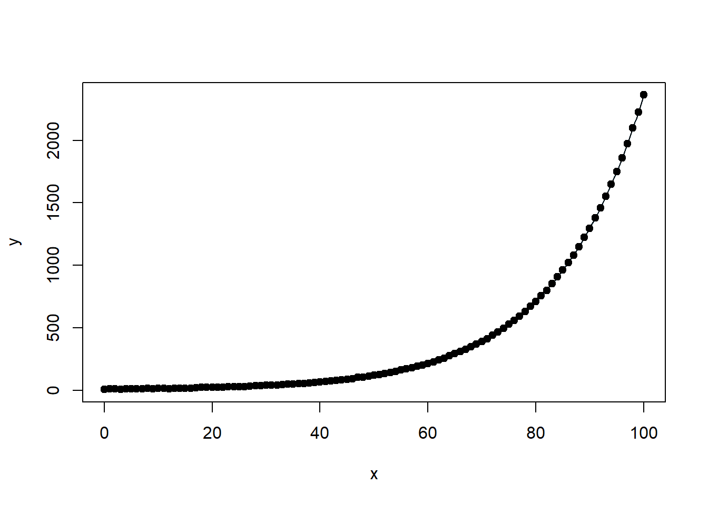
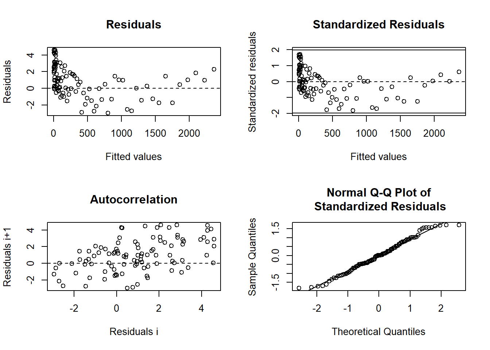

## Practical Considerations

For optimization algorithms to converge, they require good initial estimates of the parameters. The choice of starting values, constraints, and the complexity of the model all play a role in whether an optimization algorithm successfully finds a suitable solution.

### Selecting Starting Values

Choosing good starting values can significantly impact the efficiency and success of optimization algorithms. Several approaches can be used:

-   **Prior or theoretical information**: If prior knowledge about the parameters is available, it should be incorporated into the choice of initial values.
-   **Grid search or graphical inspection of** $SSE(\theta)$: Evaluating the sum of squared errors (SSE) across a grid of possible values can help identify promising starting points.
-   [Ordinary Least Squares] **estimates**: If a linear approximation of the model exists, using OLS to obtain initial estimates can be effective.
-   **Model interpretation**: Understanding the structure and behavior of the model can provide intuition for reasonable starting values.
-   **Expected Value Parameterization**: Reformulating the model based on expected values may improve the interpretability and numerical stability of the estimation.

#### Grid Search for Optimal Starting Values


``` r
# Set seed for reproducibility
set.seed(123)

# Generate x as 100 integers using seq function
x <- seq(0, 100, 1)

# Generate coefficients for exponential function
a <- runif(1, 0, 20)  # Random coefficient a
b <- runif(1, 0.005, 0.075)  # Random coefficient b
c <- runif(101, 0, 5)  # Random noise

# Generate y as a * e^(b*x) + c
y <- a * exp(b * x) + c

# Print the generated parameters
cat("Generated coefficients:\n")
#> Generated coefficients:
cat("a =", a, "\n")
#> a = 5.75155
cat("b =", b, "\n")
#> b = 0.06018136

# Define our data frame
datf <- data.frame(x, y)

# Define our model function
mod <- function(a, b, x) {
  a * exp(b * x)
}
```


``` r
# Ensure all y values are positive (avoid log issues)
y_adj <-
  ifelse(y > 0, y, min(y[y > 0]) + 1e-3)  # Shift small values slightly

# Create adjusted dataframe
datf_adj <- data.frame(x, y_adj)

# Linearize by taking log(y)
lin_mod <- lm(log(y_adj) ~ x, data = datf_adj)

# Extract starting values
astrt <-
  exp(coef(lin_mod)[1])  # Convert intercept back from log scale
bstrt <- coef(lin_mod)[2]  # Slope remains the same
cat("Starting values for non-linear fit:\n")
print(c(astrt, bstrt))

# Fit nonlinear model with these starting values
nlin_mod <- nls(y ~ mod(a, b, x),
                start = list(a = astrt, b = bstrt),
                data = datf)

# Model summary
summary(nlin_mod)

# Plot original data
plot(
  x,
  y,
  main = "Exponential Growth Fit",
  col = "blue",
  pch = 16,
  xlab = "x",
  ylab = "y"
)

# Add fitted curve in red
lines(x, predict(nlin_mod), col = "red", lwd = 2)

# Add legend
legend(
  "topleft",
  legend = c("Original Data", "Fitted Model"),
  col = c("blue", "red"),
  pch = c(16, NA),
  lwd = c(NA, 2)
)
```


``` r
# Define grid of possible parameter values
aseq <- seq(10, 18, 0.2)
bseq <- seq(0.001, 0.075, 0.001)

na <- length(aseq)
nb <- length(bseq)
SSout <- matrix(0, na * nb, 3)  # Matrix to store SSE values
cnt <- 0

# Evaluate SSE across grid
for (k in 1:na) {
  for (j in 1:nb) {
    cnt <- cnt + 1
    ypred <-
      # Evaluate model at these parameter values
      mod(aseq[k], bseq[j], x)  
    
    # Compute SSE
    ss <- sum((y - ypred) ^ 2)  
    SSout[cnt, 1] <- aseq[k]
    SSout[cnt, 2] <- bseq[j]
    SSout[cnt, 3] <- ss
  }
}

# Identify optimal starting values
mn_indx <- which.min(SSout[, 3])
astrt <- SSout[mn_indx, 1]
bstrt <- SSout[mn_indx, 2]

# Fit nonlinear model using optimal starting values
nlin_modG <-
  nls(y ~ mod(a, b, x), start = list(a = astrt, b = bstrt))

# Display model results
summary(nlin_modG)
#> 
#> Formula: y ~ mod(a, b, x)
#> 
#> Parameters:
#>    Estimate Std. Error t value Pr(>|t|)    
#> a 5.889e+00  1.986e-02   296.6   <2e-16 ***
#> b 5.995e-02  3.644e-05  1645.0   <2e-16 ***
#> ---
#> Signif. codes:  0 '***' 0.001 '**' 0.01 '*' 0.05 '.' 0.1 ' ' 1
#> 
#> Residual standard error: 2.135 on 99 degrees of freedom
#> 
#> Number of iterations to convergence: 4 
#> Achieved convergence tolerance: 7.213e-06
```

**Note**: The `nls_multstart` package can perform a grid search more efficiently without requiring manual looping.

Visualizing Prediction Intervals

Once the model is fitted, it is useful to visualize prediction intervals to assess model uncertainty.


``` r
# Load necessary package
library(nlstools)

# Plot fitted model with confidence and prediction intervals
investr::plotFit(
  nlin_modG,
  interval = "both",
  pch = 19,
  shade = TRUE,
  col.conf = "skyblue4",
  col.pred = "lightskyblue2",
  data = datf
)
```

<div class="figure" style="text-align: center">

<p class="caption">(\#fig:fig-expo-growth-fit)Exponential Growth Fit</p>
</div>

#### Using Programmed Starting Values in `nls`

Many nonlinear models have well-established functional forms, allowing for programmed starting values in the `nls` function. For example, models such as **logistic growth** and **asymptotic regression** have built-in self-starting functions.

To explore available self-starting models in R, use:


``` r
apropos("^SS")
```

This command lists functions with names starting with `SS`, which typically denote self-starting functions for nonlinear regression.

#### Custom Self-Starting Functions

If your model does not match any built-in `nls` functions, you can define your own **self-starting function**. Self-starting functions in `R` automate the process of estimating initial values, which helps in fitting nonlinear models more efficiently.

If needed, a self-starting function should:

1.  Define the nonlinear equation.

2.  Implement a method for computing starting values.

3.  Return the function structure in an appropriate format.

### Handling Constrained Parameters

In some cases, parameters must satisfy constraints (e.g., $\theta_i > a$ or $a < \theta_i < b$). The following strategies help address constrained parameter estimation:

1.  **Fit the model without constraints first**: If the unconstrained parameter estimates satisfy the desired constraints, no further action is needed.
2.  **Re-parameterization**: If the estimated parameters violate constraints, consider re-parameterizing the model to naturally enforce the required bounds.

### Failure to Converge

Several factors can cause an algorithm to fail to converge:

-   **A "flat" SSE function**: If the sum of squared errors $SSE(\theta)$ is relatively constant in the neighborhood of the minimum, the algorithm may struggle to locate an optimal solution.
-   **Poor starting values**: Trying different or better initial values can help.
-   **Overly complex models**: If the model is too complex relative to the data, consider simplifying it.

### Convergence to a Local Minimum

-   **Linear least squares models** have a well-defined, unique minimum because the SSE function is quadratic:\
    $$ SSE(\theta) = (Y - X\beta)'(Y - X\beta) $$
-   **Nonlinear least squares models** may have multiple local minima.
-   **Testing different starting values** can help identify a global minimum.
-   **Graphing** $SSE(\theta)$ as a function of individual parameters (if feasible) can provide insights.
-   **Alternative optimization algorithms** such as [Genetic Algorithm](#genetic-algorithm) or [particle swarm optimization](#particle-swarm-optimization) may be useful in non-convex problems.

### Model Adequacy and Estimation Considerations

Assessing the adequacy of a **nonlinear model** involves checking its **nonlinearity**, **goodness of fit**, and **residual behavior**. Unlike linear models, nonlinear models do not always have a direct equivalent of $R^2$, and issues such as collinearity, leverage, and residual heteroscedasticity must be carefully evaluated.

------------------------------------------------------------------------

#### Components of Nonlinearity

@bates1980relative defines two key aspects of **nonlinearity** in statistical modeling:

1.  **Intrinsic Nonlinearity**

-   Measures the **bending and twisting** in the function $f(\theta)$.
-   Assumes that the function is relatively **flat (planar)** in the neighborhood of $\hat{\theta}$.
-   If severe, the **distribution of residuals** will be **distorted**.
-   Leads to:
    -   **Slow convergence** of optimization algorithms.
    -   **Difficulties in identifying** parameter estimates.
-   Solution approaches:
    -   Higher-order **Taylor expansions** for estimation.
    -   **Bayesian methods** for parameter estimation.


``` r
library(MASS)

# Check intrinsic curvature
modD <- deriv3(~ a * exp(b * x), c("a", "b"), function(a, b, x) NULL)

nlin_modD <- nls(y ~ modD(a, b, x),
                 start = list(a = astrt, b = bstrt),
                 data = datf)

rms.curv(nlin_modD)  # Function from the MASS package to assess curvature
#> Parameter effects: c^theta x sqrt(F) = 0.0564 
#>         Intrinsic: c^iota  x sqrt(F) = 9e-04
```

2.  **Parameter-Effects Nonlinearity**

-   Measures **how the curvature** (nonlinearity) depends on the parameterization.

-   Strong parameter effects nonlinearity can cause **problems with inference on** $\hat{\theta}$.

-   Can be assessed using:

    -   `rms.curv` function from `MASS`.

    -   Bootstrap-based inference.

-   **Solution:** Try **reparameterization** to stabilize the function.

#### Goodness of Fit in Nonlinear Models

In **linear regression**, we use the standard **coefficient of determination** (\$R\^2\$):

$$
R^2 = \frac{SSR}{SSTO} = 1 - \frac{SSE}{SSTO}
$$​where:

-   $SSR$ = Regression Sum of Squares

-   $SSE$ = Error Sum of Squares

-   $SSTO$ = Total Sum of Squares

However, in **nonlinear models**, the error and model sum of squares do not necessarily add up to the total corrected sum of squares:

$$
SSR + SSE \neq SST
$$

Thus, $R^2$ is not directly valid in the nonlinear case. Instead, we use a pseudo-$R^2$:

$$
R^2_{pseudo} = 1 - \frac{\sum_{i=1}^n ({Y}_i- \hat{Y})^2}{\sum_{i=1}^n (Y_i- \bar{Y})^2}
$$

-   Unlike true $R^2$, this cannot be interpreted as the proportion of variability explained by the model.

-   Should be used only for relative model comparison (e.g., comparing different nonlinear models).

#### Residual Analysis in Nonlinear Models

Residual plots help assess model adequacy, particularly when **intrinsic curvature is small**.

In nonlinear models, the **studentized residuals** are:

$$
r_i = \frac{e_i}{s \sqrt{1-\hat{c}_i}}
$$

where:

-   $e_i$ = residual for observation $i$

-   $\hat{c}_i$ = $i$th diagonal element of the **tangent-plane hat matrix**:

$$
\mathbf{\hat{H} = F(\hat{\theta})[F(\hat{\theta})'F(\hat{\theta})]^{-1}F(\hat{\theta})'}
$$


``` r
# Residual diagnostics for nonlinear models
library(nlstools)
resid_nls <- nlsResiduals(nlin_modD)
```


``` r
# Generate residual plots
plot(resid_nls)
```

<div class="figure" style="text-align: center">

<p class="caption">(\#fig:fig-model-diagnostics-panel)Diagnostic Plots for Regression Residuals</p>
</div>

#### Potential Issues in Nonlinear Regression Models

##### Collinearity

-   Measures how correlated the model's predictors are.

-   In nonlinear models, collinearity is assessed using the condition number of:

$$
\mathbf{[F(\hat{\theta})'F(\hat{\theta})]^{-1}}
$$

-   If condition number \> 30, collinearity is a concern.

-   Solution: Consider reparameterization [@Magel_1987].

##### Leverage

-   Similar to leverage in [Ordinary Least Squares].

-   In nonlinear models, leverage is assessed using the **tangent-plane hat matrix**:

$$
\mathbf{\hat{H} = F(\hat{\theta})[F(\hat{\theta})'F(\hat{\theta})]^{-1}F(\hat{\theta})'}
$$

-   **Solution:** Identify influential points and assess their impact on parameter estimates [@Laurent_1992].

##### Heterogeneous Errors

-   Non-constant variance across observations.

-   **Solution:** Use **Weighted Nonlinear Least Squares (WNLS)**.

##### Correlated Errors

-   Residuals may be autocorrelated.

-   **Solution approaches:**

    -   **Generalized Nonlinear Least Squares (GNLS)**

    -   **Nonlinear Mixed Models (NLMEM)**

    -   **Bayesian Methods**

| Issue                              | Description                                        | Solution                                       |
|--------------------|---------------------------|-------------------------|
| **Intrinsic Nonlinearity**         | Function curvature independent of parameterization | Bayesian estimation, Taylor expansion          |
| **Parameter-Effects Nonlinearity** | Curvature influenced by parameterization           | Reparameterization, bootstrap                  |
| **Collinearity**                   | High correlation among predictors                  | Reparameterization, condition number check     |
| **Leverage**                       | Influential points affecting model fit             | Assess tangent-plane hat matrix                |
| **Heterogeneous Errors**           | Unequal variance in residuals                      | Weighted Nonlinear Least Squares               |
| **Correlated Errors**              | Autocorrelated residuals                           | GNLS, Nonlinear Mixed Models, Bayesian Methods |

: Common Issues in Nonlinear Regression and Their Solutions

------------------------------------------------------------------------
