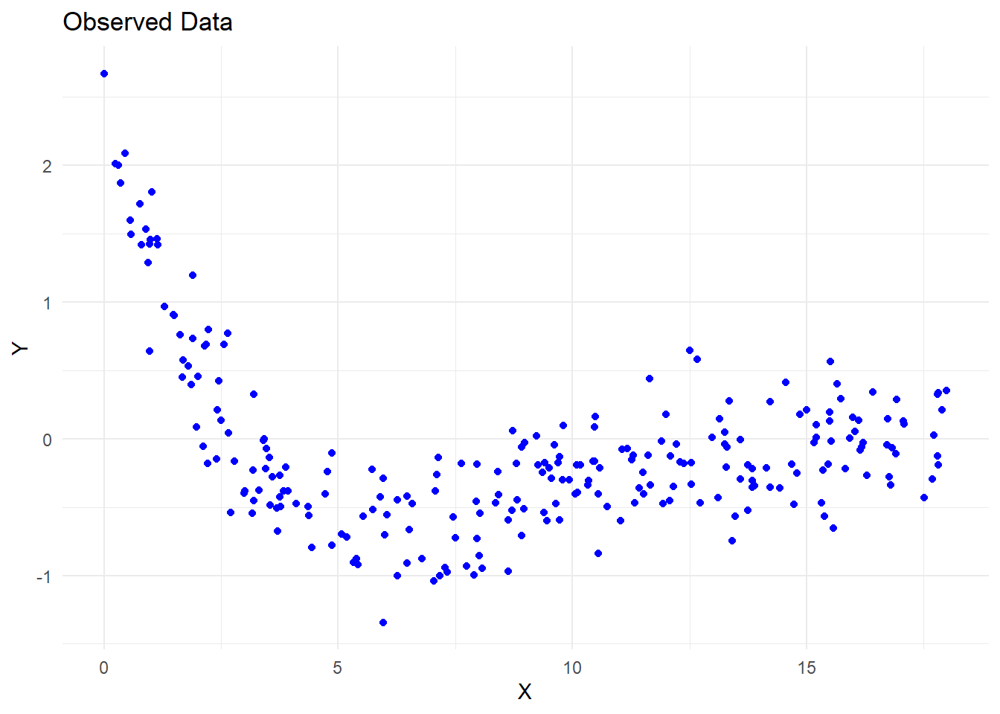
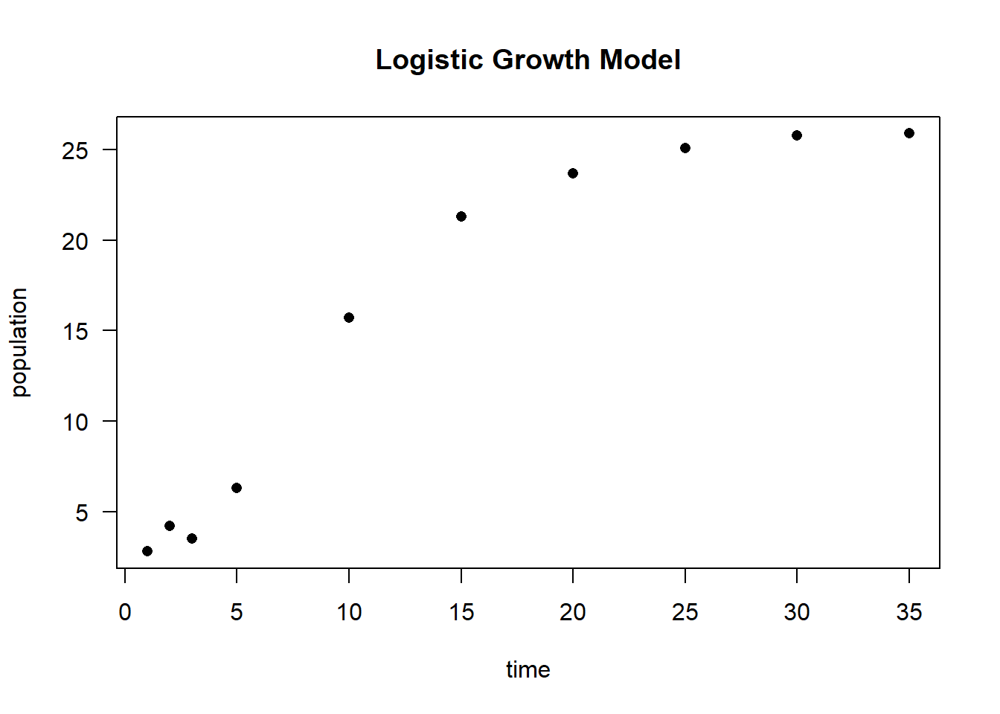
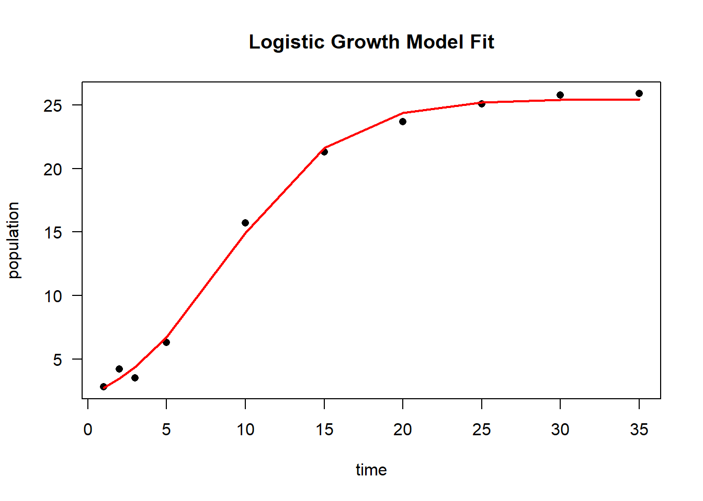
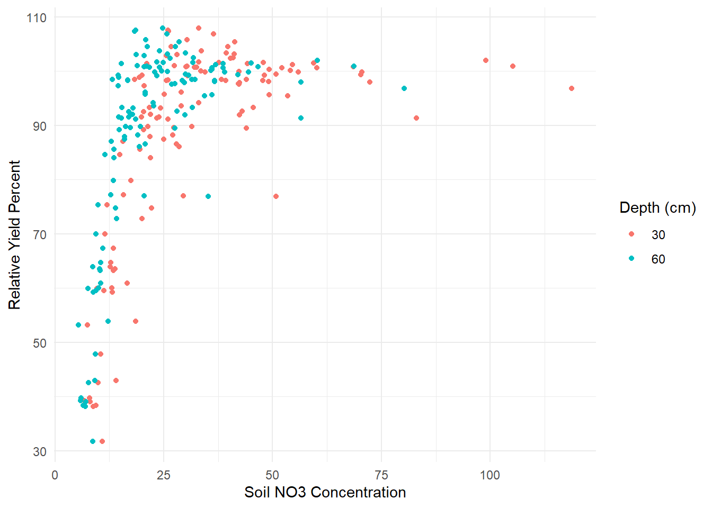
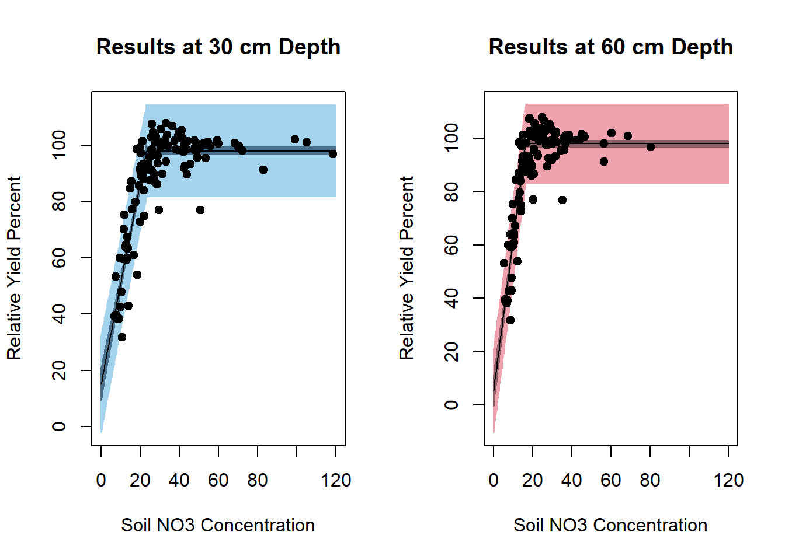
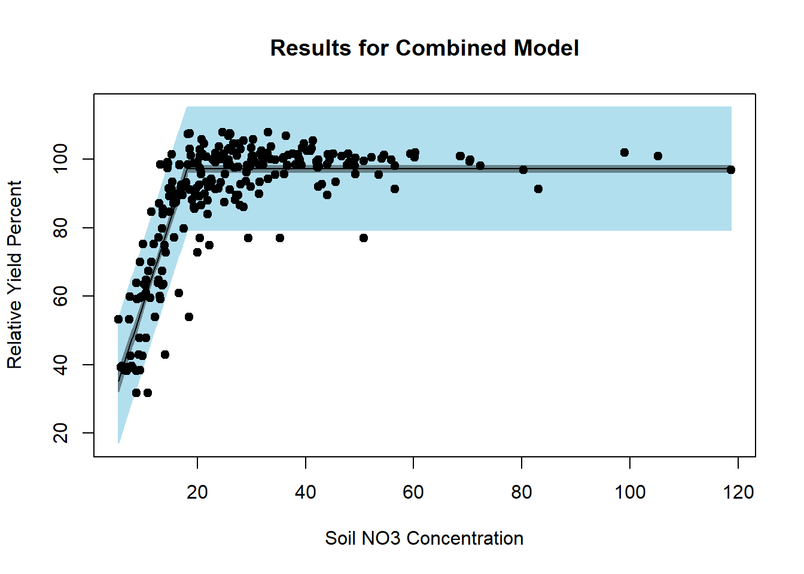
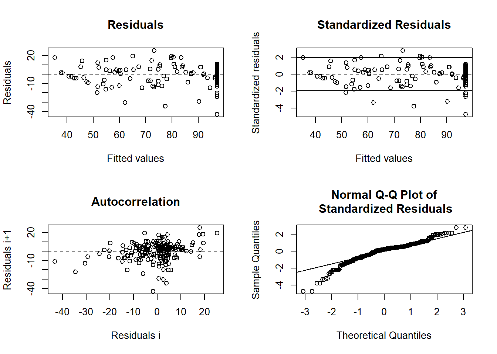

## Application

### Nonlinear Estimation Using Gauss-Newton Algorithm

This section demonstrates nonlinear parameter estimation using the Gauss-Newton algorithm and compares results with `nls()`. The model is given by:

$$
y_i = \frac{\theta_0 + \theta_1 x_i}{1 + \theta_2 \exp(0.4 x_i)} + \epsilon_i
$$

where

-   $i = 1, \dots ,n$
-   $\theta_0$, $\theta_1$, $\theta_2$ are the unknown parameters.
-   $\epsilon_i$ represents errors.

1.  Loading and Visualizing the Data


``` r
library(dplyr)
library(ggplot2)
library(investr)

# Load the dataset
my_data <- read.delim("images/S21hw1pr4.txt", header = FALSE, sep = "") %>%
  dplyr::rename(x = V1, y = V2)
```


``` r
# Plot data
ggplot(my_data, aes(x = x, y = y)) +
  geom_point(color = "blue") +
  labs(title = "Observed Data", x = "X", y = "Y") +
  theme_minimal()
```

<div class="figure" style="text-align: center">

<p class="caption">(\#fig:fig-observed-data-nonlinear)Observed Data</p>
</div>

2.  Deriving Starting Values for Parameters

Since nonlinear optimization is sensitive to starting values, we estimate reasonable initial values based on model interpretation.

Finding the Maximum $Y$ Value


``` r
max(my_data$y)
#> [1] 2.6722
my_data$x[which.max(my_data$y)]
#> [1] 0.0094
```

-   When $y = 2.6722$, the corresponding $x = 0.0094$.

-   From the model equation: $\theta_0 + 0.0094 \theta_1 = 2.6722$

Estimating $\theta_2$ from the Median $y$ Value

-   The equation simplifies to: $1 + \theta_2 \exp(0.4 x) = 2$


``` r
# find mean y
mean(my_data$y) 
#> [1] -0.0747864

# find y closest to its mean
my_data$y[which.min(abs(my_data$y - (mean(my_data$y))))] 
#> [1] -0.0773


# find x closest to the mean y
my_data$x[which.min(abs(my_data$y - (mean(my_data$y))))] 
#> [1] 11.0648
```

-   This yields the equation: $83.58967 \theta_2 = 1$

Finding the Value of $\theta_0$ and $\theta_1$


``` r
# find value of x closet to 1
my_data$x[which.min(abs(my_data$x - 1))] 
#> [1] 0.9895

# find index of x closest to 1
match(my_data$x[which.min(abs(my_data$x - 1))], my_data$x) 
#> [1] 14

# find y value
my_data$y[match(my_data$x[which.min(abs(my_data$x - 1))], my_data$x)]
#> [1] 1.4577
```

-   This provides another equation: $\theta_0 + \theta_1 \times 0.9895 - 2.164479 \theta_2 = 1.457$

Solving for $\theta_0, \theta_1, \theta_2$


``` r
library(matlib)

# Define coefficient matrix
A = matrix(
  c(0, 0.0094, 0, 0, 0, 83.58967, 1, 0.9895, -2.164479),
  nrow = 3,
  ncol = 3,
  byrow = T
)

# Define constant vector
b <- c(2.6722, 1, 1.457)

# Display system of equations
showEqn(A, b)
#> 0*x1 + 0.0094*x2        + 0*x3  =  2.6722 
#> 0*x1      + 0*x2 + 83.58967*x3  =       1 
#> 1*x1 + 0.9895*x2 - 2.164479*x3  =   1.457

# Solve for parameters
theta_start <- Solve(A, b, fractions = FALSE)
#> x1      =  -279.80879739 
#>   x2    =   284.27659574 
#>     x3  =      0.0119632
theta_start
#> [1] "x1      =  -279.80879739" "  x2    =   284.27659574"
#> [3] "    x3  =      0.0119632"
```

3.  Implementing the Gauss-Newton Algorithm

Using these estimates, we manually implement the **Gauss-Newton optimization**.

**Defining the Model and Its Derivatives**


``` r
# Starting values
theta_0_strt <- as.numeric(gsub(".*=\\s*", "", theta_start[1]))
theta_1_strt <- as.numeric(gsub(".*=\\s*", "", theta_start[2]))
theta_2_strt <- as.numeric(gsub(".*=\\s*", "", theta_start[3]))

# Model function
mod_4 <- function(theta_0, theta_1, theta_2, x) {
  (theta_0 + theta_1 * x) / (1 + theta_2 * exp(0.4 * x))
}

# Define function expression
f_4 = expression((theta_0 + theta_1 * x) / (1 + theta_2 * exp(0.4 * x)))

# First derivatives
df_4.d_theta_0 <- D(f_4, 'theta_0')
df_4.d_theta_1 <- D(f_4, 'theta_1')
df_4.d_theta_2 <- D(f_4, 'theta_2')
```

Iterative Gauss-Newton Optimization


``` r
# Initialize
theta_vec <- matrix(c(theta_0_strt, theta_1_strt, theta_2_strt))
delta <- matrix(NA, nrow = 3, ncol = 1)
i <- 1

# Evaluate function at initial estimates
f_theta <- as.matrix(eval(f_4, list(
  x = my_data$x,
  theta_0 = theta_vec[1, 1],
  theta_1 = theta_vec[2, 1],
  theta_2 = theta_vec[3, 1]
)))

repeat {
  # Compute Jacobian matrix
  F_theta_0 <- as.matrix(cbind(
    eval(df_4.d_theta_0, list(
      x = my_data$x,
      theta_0 = theta_vec[1, i],
      theta_1 = theta_vec[2, i],
      theta_2 = theta_vec[3, i]
    )),
    eval(df_4.d_theta_1, list(
      x = my_data$x,
      theta_0 = theta_vec[1, i],
      theta_1 = theta_vec[2, i],
      theta_2 = theta_vec[3, i]
    )),
    eval(df_4.d_theta_2, list(
      x = my_data$x,
      theta_0 = theta_vec[1, i],
      theta_1 = theta_vec[2, i],
      theta_2 = theta_vec[3, i]
    ))
  ))
  
  # Compute parameter updates
  delta[, i] = (solve(t(F_theta_0)%*%F_theta_0))%*%t(F_theta_0)%*%(my_data$y-f_theta[,i])
    
  
  # Update parameter estimates
  theta_vec <- cbind(theta_vec, theta_vec[, i] + delta[, i])
  theta_vec[, i + 1] = theta_vec[, i] + delta[, i]
  
  # Increment iteration counter
  i <- i + 1
  
  # Compute new function values
  f_theta <- cbind(f_theta, as.matrix(eval(f_4, list(
    x = my_data$x,
    theta_0 = theta_vec[1, i],
    theta_1 = theta_vec[2, i],
    theta_2 = theta_vec[3, i]
  ))))
  
  delta = cbind(delta, matrix(NA, nrow = 3, ncol = 1))
  
  # Convergence criteria based on SSE
  if (abs(sum((my_data$y - f_theta[, i])^2) - sum((my_data$y - f_theta[, i - 1])^2)) / 
      sum((my_data$y - f_theta[, i - 1])^2) < 0.001) {
    break
  }
}

# Final parameter estimates
theta_vec[, ncol(theta_vec)]
#> [1]  3.6335135 -1.3055166  0.5043502
```

4.  Checking Convergence and Variance


``` r
# Final objective function value (SSE)
sum((my_data$y - f_theta[, i])^2)
#> [1] 19.80165

sigma2 <- 1 / (nrow(my_data) - 3) * 
  (t(my_data$y - f_theta[, ncol(f_theta)]) %*% 
   (my_data$y - f_theta[, ncol(f_theta)]))  # p = 3

# Asymptotic variance-covariance matrix
as.numeric(sigma2)*as.matrix(solve(crossprod(F_theta_0)))
#>             [,1]        [,2]        [,3]
#> [1,]  0.11552571 -0.04817428  0.02685848
#> [2,] -0.04817428  0.02100861 -0.01158212
#> [3,]  0.02685848 -0.01158212  0.00703916
```

5.  Validating with `nls()`


``` r
nlin_4 <- nls(
  y ~ mod_4(theta_0, theta_1, theta_2, x),
  start = list(
    theta_0 = as.numeric(gsub(".*=\\s*", "", theta_start[1])),
    theta_1 = as.numeric(gsub(".*=\\s*", "", theta_start[2])),
    theta_2 = as.numeric(gsub(".*=\\s*", "", theta_start[3]))
  ),
  data = my_data
)
summary(nlin_4)
#> 
#> Formula: y ~ mod_4(theta_0, theta_1, theta_2, x)
#> 
#> Parameters:
#>         Estimate Std. Error t value Pr(>|t|)    
#> theta_0  3.63591    0.36528   9.954  < 2e-16 ***
#> theta_1 -1.30639    0.15561  -8.395 3.65e-15 ***
#> theta_2  0.50528    0.09215   5.483 1.03e-07 ***
#> ---
#> Signif. codes:  0 '***' 0.001 '**' 0.01 '*' 0.05 '.' 0.1 ' ' 1
#> 
#> Residual standard error: 0.2831 on 247 degrees of freedom
#> 
#> Number of iterations to convergence: 9 
#> Achieved convergence tolerance: 2.307e-07
```

### Logistic Growth Model

A classic logistic growth model follows the equation:

$$
P = \frac{K}{1 + \exp(P_0 + r t)} + \epsilon
$$

where:

-   $P$ = population at time $t$

-   $K$ = carrying capacity (maximum population)

-   $r$ = population growth rate

-   $P_0$ = initial population log-ratio

However, R's built-in `SSlogis` function uses a slightly different parameterization:

$$
P = \frac{asym}{1 + \exp\left(\frac{xmid - t}{scal}\right)}
$$

where:

-   $asym$ = carrying capacity ($K$)

-   $xmid$ = the $x$-value at the inflection point of the curve

-   $scal$ = scaling parameter

This gives the parameter relationships:

-   $K = asym$

-   $r = -1 / scal$

-   $P_0 = -r \cdot xmid$


``` r
# Simulated time-series data
time <- c(1, 2, 3, 5, 10, 15, 20, 25, 30, 35)
population <- c(2.8, 4.2, 3.5, 6.3, 15.7, 21.3, 23.7, 25.1, 25.8, 25.9)
```


``` r
# Plot data points
plot(time,
     population,
     las = 1,
     pch = 16,
     main = "Logistic Growth Model")
```

<div class="figure" style="text-align: center">

<p class="caption">(\#fig:fig-logistic-growth-example)Logistic Growth Model</p>
</div>


``` r
# Fit the logistic growth model using programmed starting values
logisticModelSS <- nls(population ~ SSlogis(time, Asym, xmid, scal))

# Model summary
summary(logisticModelSS)
#> 
#> Formula: population ~ SSlogis(time, Asym, xmid, scal)
#> 
#> Parameters:
#>      Estimate Std. Error t value Pr(>|t|)    
#> Asym  25.5029     0.3666   69.56 3.34e-11 ***
#> xmid   8.7347     0.3007   29.05 1.48e-08 ***
#> scal   3.6353     0.2186   16.63 6.96e-07 ***
#> ---
#> Signif. codes:  0 '***' 0.001 '**' 0.01 '*' 0.05 '.' 0.1 ' ' 1
#> 
#> Residual standard error: 0.6528 on 7 degrees of freedom
#> 
#> Number of iterations to convergence: 1 
#> Achieved convergence tolerance: 1.906e-06

# Extract parameter estimates
coef(logisticModelSS)
#>      Asym      xmid      scal 
#> 25.502890  8.734698  3.635333
```

To fit the model using an alternative parameterization ($K, r, P_0$), we convert the estimated coefficients:


``` r
# Convert parameter estimates to alternative logistic model parameters
Ks <- as.numeric(coef(logisticModelSS)[1])  # Carrying capacity (K)
rs <- -1 / as.numeric(coef(logisticModelSS)[3])  # Growth rate (r)
Pos <- -rs * as.numeric(coef(logisticModelSS)[2])  # P_0

# Fit the logistic model with the alternative parameterization
logisticModel <- nls(
    population ~ K / (1 + exp(Po + r * time)),
    start = list(Po = Pos, r = rs, K = Ks)
)

# Model summary
summary(logisticModel)
#> 
#> Formula: population ~ K/(1 + exp(Po + r * time))
#> 
#> Parameters:
#>    Estimate Std. Error t value Pr(>|t|)    
#> Po  2.40272    0.12702   18.92 2.87e-07 ***
#> r  -0.27508    0.01654  -16.63 6.96e-07 ***
#> K  25.50289    0.36665   69.56 3.34e-11 ***
#> ---
#> Signif. codes:  0 '***' 0.001 '**' 0.01 '*' 0.05 '.' 0.1 ' ' 1
#> 
#> Residual standard error: 0.6528 on 7 degrees of freedom
#> 
#> Number of iterations to convergence: 0 
#> Achieved convergence tolerance: 1.91e-06
```

Visualizing the Logistic Model Fit


``` r
# Plot original data
plot(time,
     population,
     las = 1,
     pch = 16,
     main = "Logistic Growth Model Fit")

# Overlay the fitted logistic curve
lines(time,
      predict(logisticModel),
      col = "red",
      lwd = 2)
```

<div class="figure" style="text-align: center">

<p class="caption">(\#fig:fig-logistic-model-fit)Logistic Growth Model Fit</p>
</div>

### Nonlinear Plateau Model

This example is based on [@Schabenberger_2001] and demonstrates the use of a **plateau model** to estimate the relationship between soil nitrate ($NO_3$) concentration and relative yield percent (RYP) at two different depths (30 cm and 60 cm).


``` r
# Load data
dat <- read.table("images/dat.txt", header = TRUE)

# Plot NO3 concentration vs. relative yield percent, colored by depth
library(ggplot2)
dat.plot <- ggplot(dat) + 
  geom_point(aes(x = no3, y = ryp, color = as.factor(depth))) +
  labs(color = 'Depth (cm)') + 
  xlab('Soil NO3 Concentration') + 
  ylab('Relative Yield Percent') +
  theme_minimal()

# Display plot
dat.plot
```

<div class="figure" style="text-align: center">

<p class="caption">(\#fig:fig-nonlinear-plateau)Nonlinear Plateau Plot</p>
</div>

The **suggested nonlinear plateau model** is given by:

$$
E(Y_{ij}) = (\beta_{0j} + \beta_{1j}N_{ij})I_{N_{ij}\le \alpha_j} + (\beta_{0j} + \beta_{1j}\alpha_j)I_{N_{ij} > \alpha_j}
$$

where:

-   $N_{ij}$ represents the soil nitrate ($NO_3$) concentration for observation $i$ at depth $j$.

-   $i$ indexes individual observations.

-   $j = 1, 2$ corresponds to depths **30 cm** and **60 cm**.

This model assumes a **linear increase** up to a threshold ($\alpha_j$), beyond which the response **levels off (plateaus).**

Defining the Plateau Model as a Function


``` r
# Define the nonlinear plateau model function
nonlinModel <- function(predictor, b0, b1, alpha) {
  ifelse(predictor <= alpha, 
         b0 + b1 * predictor,  # Linear growth below threshold
         b0 + b1 * alpha)      # Plateau beyond threshold
}
```

Creating a Self-Starting Function for `nls`

Since the model is **piecewise linear**, we can estimate starting values using:

1.  A **linear regression** on the **first half** of sorted predictor values to estimate $b_0$ and $b_1$.

2.  The **last predictor value** used in the regression as the plateau threshold ($\alpha$)


``` r
# Define initialization function for self-starting plateau model
nonlinModelInit <- function(mCall, LHS, data) {
  # Sort data by increasing predictor value
  xy <- sortedXyData(mCall[['predictor']], LHS, data)
  n <- nrow(xy)
  
  # Fit a simple linear model using the first half of the sorted data
  lmFit <- lm(xy[1:(n / 2), 'y'] ~ xy[1:(n / 2), 'x'])
  
  # Extract initial estimates
  b0 <- coef(lmFit)[1]  # Intercept
  b1 <- coef(lmFit)[2]  # Slope
  alpha <- xy[(n / 2), 'x']  # Last x-value in the fitted linear range
  
  # Return initial parameter estimates
  value <- c(b0, b1, alpha)
  names(value) <- mCall[c('b0', 'b1', 'alpha')]
  value
}
```

Combining Model and Self-Start Function


``` r
# Define a self-starting nonlinear model for nls
SS_nonlinModel <- selfStart(nonlinModel,
                            nonlinModelInit,
                            c('b0', 'b1', 'alpha'))
```

The `nls` function is used to estimate parameters separately for **each soil depth (30 cm and 60 cm).**


``` r
# Fit the model for depth = 30 cm
sep30_nls <- nls(ryp ~ SS_nonlinModel(predictor = no3, b0, b1, alpha),
                  data = dat[dat$depth == 30,])

# Fit the model for depth = 60 cm
sep60_nls <- nls(ryp ~ SS_nonlinModel(predictor = no3, b0, b1, alpha),
                  data = dat[dat$depth == 60,])
```

We generate separate plots for **30 cm** and **60 cm** depths, showing both **confidence** and **prediction intervals.**


``` r
# Set plotting layout
par(mfrow = c(1, 2))

# Plot model fit for 30 cm depth
investr::plotFit(
  sep30_nls,
  interval = "both",
  pch = 19,
  shade = TRUE,
  col.conf = "skyblue4",
  col.pred = "lightskyblue2",
  data = dat[dat$depth == 30,],
  main = "Results at 30 cm Depth",
  ylab = "Relative Yield Percent",
  xlab = "Soil NO3 Concentration",
  xlim = c(0, 120)
)

# Plot model fit for 60 cm depth
investr::plotFit(
  sep60_nls,
  interval = "both",
  pch = 19,
  shade = TRUE,
  col.conf = "lightpink4",
  col.pred = "lightpink2",
  data = dat[dat$depth == 60,],
  main = "Results at 60 cm Depth",
  ylab = "Relative Yield Percent",
  xlab = "Soil NO3 Concentration",
  xlim = c(0, 120)
)
```

<div class="figure" style="text-align: center">

<p class="caption">(\#fig:fig-yield-depth-comparison)Fitted Curves for Relative Yield Response by Soil NO3 Concentration at 30 cm and 60 cm Depths</p>
</div>


``` r
summary(sep30_nls)
#> 
#> Formula: ryp ~ SS_nonlinModel(predictor = no3, b0, b1, alpha)
#> 
#> Parameters:
#>       Estimate Std. Error t value Pr(>|t|)    
#> b0     15.1943     2.9781   5.102 6.89e-07 ***
#> b1      3.5760     0.1853  19.297  < 2e-16 ***
#> alpha  23.1324     0.5098  45.373  < 2e-16 ***
#> ---
#> Signif. codes:  0 '***' 0.001 '**' 0.01 '*' 0.05 '.' 0.1 ' ' 1
#> 
#> Residual standard error: 8.258 on 237 degrees of freedom
#> 
#> Number of iterations to convergence: 6 
#> Achieved convergence tolerance: 1.166e-08
summary(sep60_nls)
#> 
#> Formula: ryp ~ SS_nonlinModel(predictor = no3, b0, b1, alpha)
#> 
#> Parameters:
#>       Estimate Std. Error t value Pr(>|t|)    
#> b0      5.4519     2.9785    1.83   0.0684 .  
#> b1      5.6820     0.2529   22.46   <2e-16 ***
#> alpha  16.2863     0.2818   57.80   <2e-16 ***
#> ---
#> Signif. codes:  0 '***' 0.001 '**' 0.01 '*' 0.05 '.' 0.1 ' ' 1
#> 
#> Residual standard error: 7.427 on 237 degrees of freedom
#> 
#> Number of iterations to convergence: 5 
#> Achieved convergence tolerance: 2.196e-08
```

**Modeling Soil Depths Together and Comparing Models**

Instead of fitting separate models for different soil depths, we first fit a **combined model** where all observations share a **common slope, intercept, and plateau**. We then test whether modeling the two depths separately provides a significantly better fit.

1.  **Fitting a Reduced (Combined) Model**

The reduced model assumes that **all soil depths follow the same nonlinear relationship**.


``` r
# Fit the combined model (common parameters across all depths)
red_nls <- nls(
  ryp ~ SS_nonlinModel(predictor = no3, b0, b1, alpha), 
  data = dat
)

# Display model summary
summary(red_nls)
#> 
#> Formula: ryp ~ SS_nonlinModel(predictor = no3, b0, b1, alpha)
#> 
#> Parameters:
#>       Estimate Std. Error t value Pr(>|t|)    
#> b0      8.7901     2.7688   3.175   0.0016 ** 
#> b1      4.8995     0.2207  22.203   <2e-16 ***
#> alpha  18.0333     0.3242  55.630   <2e-16 ***
#> ---
#> Signif. codes:  0 '***' 0.001 '**' 0.01 '*' 0.05 '.' 0.1 ' ' 1
#> 
#> Residual standard error: 9.13 on 477 degrees of freedom
#> 
#> Number of iterations to convergence: 7 
#> Achieved convergence tolerance: 8.568e-09
```


``` r
# Visualizing the combined model fit
par(mfrow = c(1, 1))
plotFit(
  red_nls,
  interval = "both",
  pch = 19,
  shade = TRUE,
  col.conf = "lightblue4",
  col.pred = "lightblue2",
  data = dat,
  main = 'Results for Combined Model',
  ylab = 'Relative Yield Percent',
  xlab = 'Soil NO3 Concentration'
)
```

<div class="figure" style="text-align: center">

<p class="caption">(\#fig:fig-res-combined-mod)Results for Combined Model</p>
</div>


2.  **Examining Residuals for the Combined Model**

Checking residuals helps diagnose potential **lack of fit**.


``` r
library(nlstools)

# Residual diagnostics using nlstools
resid <- nlsResiduals(red_nls)
```


``` r
# Plot residuals
plot(resid)
```

<div class="figure" style="text-align: center">

<p class="caption">(\#fig:fig-resid-nonlinear)Residual Plot Nonlinear Example</p>
</div>


If there is a **pattern** in the residuals (e.g., systematic deviations based on soil depth), this suggests that a **separate model for each depth** may be necessary.

3.  **Testing Whether Depths Require Separate Models**

To formally test whether soil depth significantly affects the model parameters, we introduce a **parameterization where depth-specific parameters are increments from a baseline model** (30 cm depth):

$$
\begin{aligned}
\beta_{02} &= \beta_{01} + d_0 \\
\beta_{12} &= \beta_{11} + d_1 \\
\alpha_{2} &= \alpha_{1} + d_a
\end{aligned}
$$

where:

-   $\beta_{01}, \beta_{11}, \alpha_1$ are parameters for **30 cm depth**.

-   $d_0, d_1, d_a$ represent **depth-specific differences** for **60 cm depth**.

-   If $d_0, d_1, d_a$ are significantly **different from 0**, the **two depths should be modeled separately**.

4.  **Defining the Full (Depth-Specific) Model**


``` r
nonlinModelF <- function(predictor, soildep, b01, b11, a1, d0, d1, da) {
  
  # Define parameters for 60 cm depth as increments from 30 cm parameters
  b02 <- b01 + d0
  b12 <- b11 + d1
  a2 <- a1 + da
  
  # Compute model output for 30 cm depth
  y1 <- ifelse(
    predictor <= a1, 
    b01 + b11 * predictor, 
    b01 + b11 * a1
  )
  
  # Compute model output for 60 cm depth
  y2 <- ifelse(
    predictor <= a2, 
    b02 + b12 * predictor, 
    b02 + b12 * a2
  )
  
  # Assign correct model output based on depth
  y <- y1 * (soildep == 30) + y2 * (soildep == 60)
  
  return(y)
}

```

5.  **Fitting the Full (Depth-Specific) Model**

The starting values are taken from the **separately fitted models** for each depth.


``` r
Soil_full <- nls(
  ryp ~ nonlinModelF(
    predictor = no3,
    soildep = depth,
    b01,
    b11,
    a1,
    d0,
    d1,
    da
  ),
  data = dat,
  start = list(
    b01 = 15.2,   # Intercept for 30 cm depth
    b11 = 3.58,   # Slope for 30 cm depth
    a1 = 23.13,   # Plateau cutoff for 30 cm depth
    d0 = -9.74,   # Intercept difference (60 cm - 30 cm)
    d1 = 2.11,    # Slope difference (60 cm - 30 cm)
    da = -6.85    # Plateau cutoff difference (60 cm - 30 cm)
  )
)

# Display model summary
summary(Soil_full)
#> 
#> Formula: ryp ~ nonlinModelF(predictor = no3, soildep = depth, b01, b11, 
#>     a1, d0, d1, da)
#> 
#> Parameters:
#>     Estimate Std. Error t value Pr(>|t|)    
#> b01  15.1943     2.8322   5.365 1.27e-07 ***
#> b11   3.5760     0.1762  20.291  < 2e-16 ***
#> a1   23.1324     0.4848  47.711  < 2e-16 ***
#> d0   -9.7424     4.2357  -2.300   0.0219 *  
#> d1    2.1060     0.3203   6.575 1.29e-10 ***
#> da   -6.8461     0.5691 -12.030  < 2e-16 ***
#> ---
#> Signif. codes:  0 '***' 0.001 '**' 0.01 '*' 0.05 '.' 0.1 ' ' 1
#> 
#> Residual standard error: 7.854 on 474 degrees of freedom
#> 
#> Number of iterations to convergence: 1 
#> Achieved convergence tolerance: 3.742e-06
```

6.  **Model Comparison: Does Depth Matter?**

-   If $d_0, d_1, d_a$ **are significantly different from 0**, the depths should be modeled separately.

-   The **p-values** for these parameters indicate whether depth-specific modeling is necessary.

------------------------------------------------------------------------
