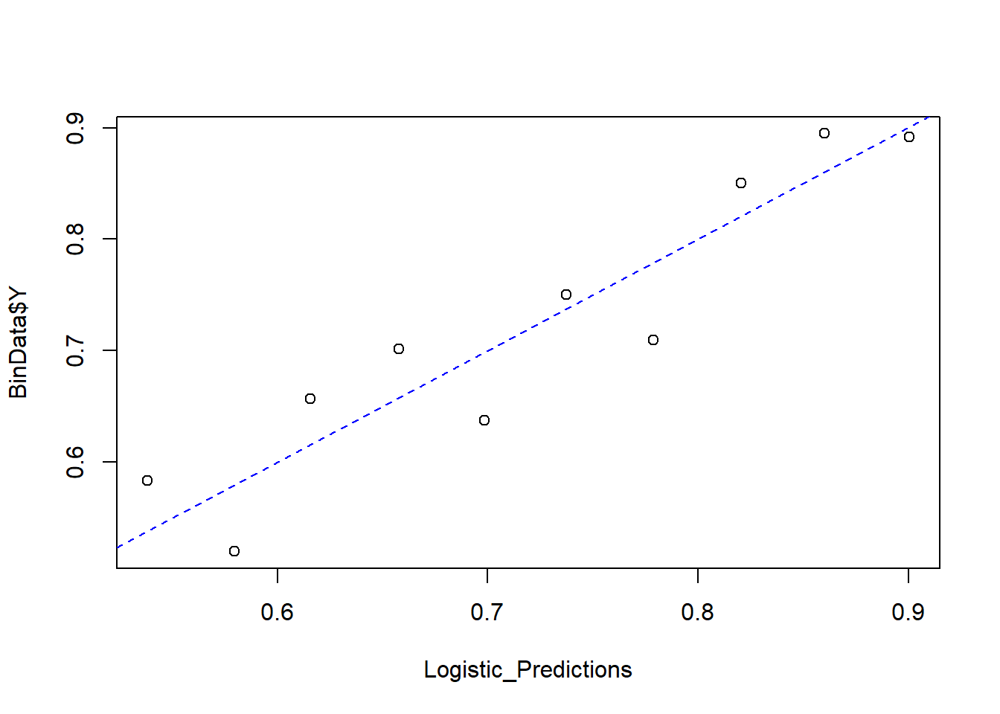
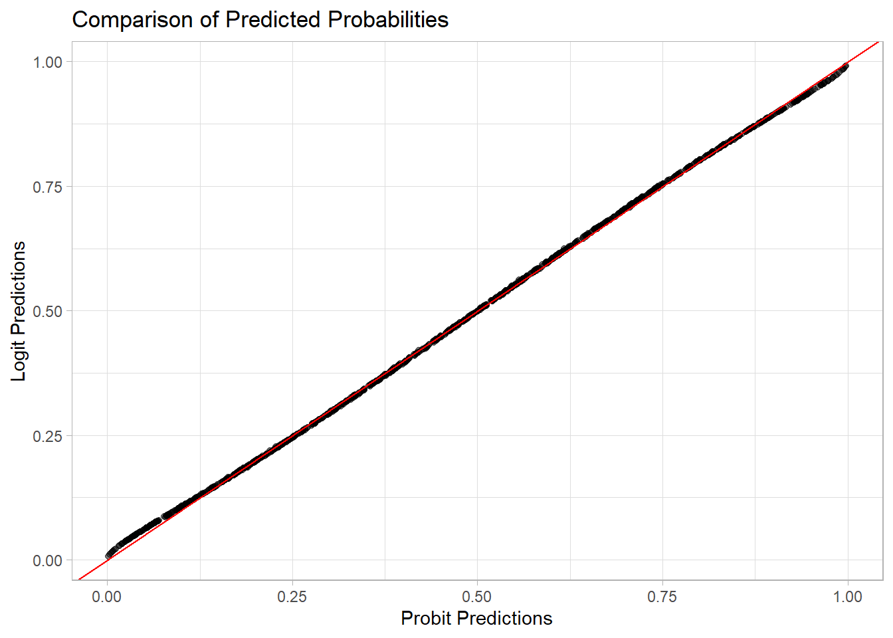
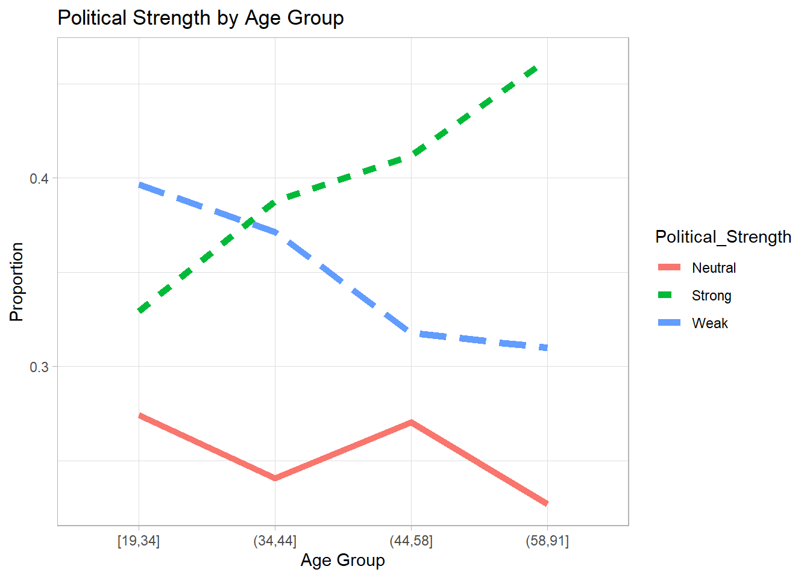
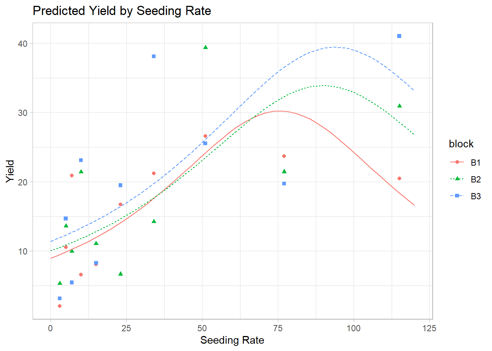

# Generalized Linear Models {#generalized-linear-models}

Generalized Linear Models (GLMs) extend the traditional linear regression framework to accommodate response variables that do not necessarily follow a normal distribution. They provide a **flexible approach** to modeling relationships between a set of predictors and various types of dependent variables.

While [Ordinary Least Squares] regression assumes that the response variable is continuous and normally distributed, GLMs allow for response variables that follow distributions from the **exponential family**, such as **binomial, Poisson, and gamma distributions**. This flexibility makes them particularly useful in a wide range of business and research applications.

A **Generalized Linear Model** (GLM) consists of three key components:

1.  **A random component**: The response variable $Y_i$ follows a distribution from the exponential family (e.g., binomial, Poisson, gamma).
2.  **A systematic component**: A linear predictor $\eta_i = \mathbf{x'_i} \beta$, where $\mathbf{x'_i}$ is a vector of observed covariates (predictor variables) and $\beta$ is a vector of parameters to be estimated.
3.  **A link function**: A function $g(\cdot)$ that relates the expected value of the response variable, $\mu_i = E(Y_i)$, to the linear predictor (i.e., $\eta_i = g(\mu_i)$).

Although the relationship between the predictors and the outcome *may appear nonlinear* on the original outcome scale (due to the link function), a GLM is still considered "linear" in the statistical sense because it remains linear in the parameters $\beta$. Consequently, GLMs are **not** generally classified as nonlinear regression models. They "generalize" the traditional linear model by allowing for a broader range of response variable distributions and link functions, but retain linearity in their parameters.

The choice of **distribution** and **link function** depends on the nature of the response variable. In the following sections, we will explore several important GLM variants:

-   [Logistic Regression](#sec-logistic-regression): Used for binary response variables (e.g., customer churn, loan defaults).
-   [Probit Regression](#sec-probit-regression): Similar to logistic regression but assumes a normal distribution for the underlying probability.
-   [Poisson Regression](#sec-poisson-regression): Used for modeling count data (e.g., number of purchases, call center inquiries).
-   [Negative Binomial Regression](#sec-negative-binomial-regression): An extension of Poisson regression that accounts for overdispersion in count data.
-   [Quasi-Poisson Regression](#sec-quasi-poisson-regression): A variation of Poisson regression that adjusts for overdispersion by allowing the variance to be a linear function of the mean.
-   [Multinomial Logistic Regression](#sec-multinomial-logistic-regression): A generalization of logistic regression for categorical response variables with more than two outcomes.
-   [Generalization of Generalized Linear Model](#sec-generalization-of-generalized-linear-models): A flexible generalization of ordinary linear regression that allows for response variables with different distributions (e.g., normal, binomial, Poisson).

## Logistic Regression {#sec-logistic-regression}

Logistic regression is a widely used [Generalized Linear Model](#generalized-linear-models) designed for modeling binary response variables. It is particularly useful in applications such as credit scoring, medical diagnosis, and customer churn prediction.

### Logistic Model

Given a set of predictor variables $\mathbf{x}_i$, the probability of a positive outcome (e.g., success, event occurring) is modeled as:

$$
p_i = f(\mathbf{x}_i ; \beta) = \frac{\exp(\mathbf{x_i'\beta})}{1 + \exp(\mathbf{x_i'\beta})}
$$

where:

-   $p_i = \mathbb{E}[Y_i]$ is the probability of success for observation $i$.
-   $\mathbf{x_i}$ is the vector of predictor variables.
-   $\beta$ is the vector of model coefficients.

#### Logit Transformation {#sec-logit-transformation}

The logistic function can be rewritten in terms of the **log-odds**, also known as the **logit function**:

$$
\text{logit}(p_i) = \log \left(\frac{p_i}{1 - p_i} \right) = \mathbf{x_i'\beta}
$$

where:

-   $\frac{p_i}{1 - p_i}$ represents the **odds** of success (the ratio of the probability of success to the probability of failure).
-   The logit function **ensures linearity** in the parameters, which aligns with the GLM framework.

Thus, logistic regression belongs to the family of **Generalized Linear Models** because **a function of the mean response (logit) is linear in the predictors**.

### Likelihood Function {#sec-likelihood-function-logistic}

Since $Y_i$ follows a **Bernoulli distribution** with probability $p_i$, the likelihood function for $n$ independent observations is:

$$
L(p_i) = \prod_{i=1}^{n} p_i^{Y_i} (1 - p_i)^{1 - Y_i}
$$

By substituting the logistic function for $p_i$:

$$
p_i = \frac{\exp(\mathbf{x'_i \beta})}{1+\exp(\mathbf{x'_i \beta})}, \quad 1 - p_i = \frac{1}{1+\exp(\mathbf{x'_i \beta})}
$$

we obtain:

$$
L(\beta) = \prod_{i=1}^{n} \left( \frac{\exp(\mathbf{x'_i \beta})}{1+\exp(\mathbf{x'_i \beta})} \right)^{Y_i} \left( \frac{1}{1+\exp(\mathbf{x'_i \beta})} \right)^{1 - Y_i}
$$

Taking the natural logarithm of the likelihood function gives the **log-likelihood function**:

$$
Q(\beta) = \log L(\beta) = \sum_{i=1}^n Y_i \mathbf{x'_i \beta} - \sum_{i=1}^n \log(1 + \exp(\mathbf{x'_i \beta}))
$$

Since this function is **concave**, we can maximize it numerically using **iterative optimization techniques**, such as:

-   **Newton-Raphson Method**
-   **Fisher Scoring Algorithm**

These methods allow us to obtain the [Maximum Likelihood] Estimates of the parameters, $\hat{\beta}$.

Under standard regularity conditions, the **MLEs of logistic regression parameters are asymptotically normal**:

$$
\hat{\beta} \dot{\sim} AN(\beta, [\mathbf{I}(\beta)]^{-1})
$$

where:

-   $\mathbf{I}(\beta)$ is the [Fisher Information Matrix], which determines the variance-covariance structure of $\hat{\beta}$.

### Fisher Information Matrix

The **Fisher Information Matrix** quantifies the amount of information that an observable random variable carries about the **unknown parameter** $\beta$. It is crucial in estimating the **variance-covariance matrix** of the estimated coefficients in logistic regression.

Mathematically, the Fisher Information Matrix is defined as:

$$
\mathbf{I}(\beta) = E\left[ \frac{\partial \log L(\beta)}{\partial \beta} \frac{\partial \log L(\beta)}{\partial \beta'} \right]
$$

which expands to:

$$
\mathbf{I}(\beta) = E\left[ \left(\frac{\partial \log L(\beta)}{\partial \beta_i} \frac{\partial \log L(\beta)}{\partial \beta_j} \right)_{ij} \right]
$$

Under **regularity conditions**, the Fisher Information Matrix is equivalent to the **negative expected Hessian matrix**:

$$
\mathbf{I}(\beta) = -E\left[ \frac{\partial^2 \log L(\beta)}{\partial \beta \partial \beta'} \right]
$$

which further expands to:

$$
\mathbf{I}(\beta) = -E \left[ \left( \frac{\partial^2 \log L(\beta)}{\partial \beta_i \partial \beta_j} \right)_{ij} \right]
$$

This representation is particularly useful because it allows us to compute the Fisher Information Matrix directly from the Hessian of the log-likelihood function.

------------------------------------------------------------------------

Example: Fisher Information Matrix in Logistic Regression

Consider a **simple logistic regression model** with one predictor:

$$
x_i' \beta = \beta_0 + \beta_1 x_i
$$

From the log-[likelihood function](#sec-likelihood-function-logistic), the second-order partial derivatives are:

$$
\begin{aligned} 
- \frac{\partial^2 \ln(L(\beta))}{\partial \beta^2_0} &= \sum_{i=1}^n \frac{\exp(x'_i \beta)}{1 + \exp(x'_i \beta)} - \left[\frac{\exp(x_i' \beta)}{1+ \exp(x'_i \beta)}\right]^2 & \text{Intercept} \\
&= \sum_{i=1}^n p_i (1-p_i)  \\
- \frac{\partial^2 \ln(L(\beta))}{\partial \beta^2_1} &= \sum_{i=1}^n \frac{x_i^2\exp(x'_i \beta)}{1 + \exp(x'_i \beta)} - \left[\frac{x_i\exp(x_i' \beta)}{1+ \exp(x'_i \beta)}\right]^2 & \text{Slope}\\
&= \sum_{i=1}^n x_i^2p_i (1-p_i)  \\
- \frac{\partial^2 \ln(L(\beta))}{\partial \beta_0 \partial \beta_1} &= \sum_{i=1}^n \frac{x_i\exp(x'_i \beta)}{1 + \exp(x'_i \beta)} - x_i\left[\frac{\exp(x_i' \beta)}{1+ \exp(x'_i \beta)}\right]^2 & \text{Cross-derivative}\\
&= \sum_{i=1}^n x_ip_i (1-p_i) 
\end{aligned}
$$

Combining these elements, the **Fisher Information Matrix** for the logistic regression model is:

$$
\mathbf{I} (\beta) = 
\begin{bmatrix}
\sum_{i=1}^{n} p_i(1 - p_i) & \sum_{i=1}^{n} x_i p_i(1 - p_i) \\
\sum_{i=1}^{n} x_i p_i(1 - p_i) & \sum_{i=1}^{n} x_i^2 p_i(1 - p_i)
\end{bmatrix}
$$

where:

-   $p_i = \frac{\exp(x_i' \beta)}{1+\exp(x_i' \beta)}$ represents the predicted probability.
-   $p_i (1 - p_i)$ is the **variance of the Bernoulli response variable**.
-   The diagonal elements represent the variances of the estimated coefficients.
-   The off-diagonal elements represent the covariances between $\beta_0$ and $\beta_1$.

The inverse of the Fisher Information Matrix provides the **variance-covariance matrix** of the estimated coefficients:

$$
\mathbf{Var}(\hat{\beta}) = \mathbf{I}(\hat{\beta})^{-1}
$$

This matrix is essential for:

-   **Estimating standard errors** of the logistic regression coefficients.
-   **Constructing confidence intervals** for $\beta$.
-   **Performing hypothesis tests** (e.g., Wald Test).

------------------------------------------------------------------------


```r
# Load necessary library
library(stats)

# Simulated dataset
set.seed(123)
n <- 100
x <- rnorm(n)
y <- rbinom(n, 1, prob = plogis(0.5 + 1.2 * x))

# Fit logistic regression model
model <- glm(y ~ x, family = binomial)

# Extract the Fisher Information Matrix (Negative Hessian)
fisher_info <- summary(model)$cov.unscaled

# Display the Fisher Information Matrix
print(fisher_info)
#>             (Intercept)          x
#> (Intercept)  0.05718171 0.01564322
#> x            0.01564322 0.10302992
```

### Inference in Logistic Regression

Once we estimate the model parameters $\hat{\beta}$ using [Maximum Likelihood] Estimation, we can conduct inference to assess the significance of predictors, construct confidence intervals, and perform hypothesis testing. The two most common inference approaches in logistic regression are:

1.  [Likelihood Ratio Test](#sec-likelihood-ratio-test-logistic)
2.  [Wald Statistics](#sec-wald-test-logistic)

These tests rely on the **asymptotic normality** of MLEs and the properties of the [Fisher Information Matrix].

------------------------------------------------------------------------

#### Likelihood Ratio Test {#sec-likelihood-ratio-test-logistic}

The **Likelihood Ratio Test** compares two models:

-   **Restricted Model**: A simpler model where some parameters are constrained to specific values.
-   **Unrestricted Model**: The full model without constraints.

To test a hypothesis about a subset of parameters $\beta_1$, we leave $\beta_2$ (nuisance parameters) unspecified.

Hypothesis Setup:

$$
H_0: \beta_1 = \beta_{1,0}
$$

where $\beta_{1,0}$ is a specified value (often zero). Let:

-   $\hat{\beta}_{2,0}$ be the **MLE of** $\beta_2$ under the constraint $\beta_1 = \beta_{1,0}$.
-   $\hat{\beta}_1, \hat{\beta}_2$ be the **MLEs under the full model**.

The **likelihood ratio test statistic** is:

$$
-2\log\Lambda = -2[\log L(\beta_{1,0}, \hat{\beta}_{2,0}) - \log L(\hat{\beta}_1, \hat{\beta}_2)]
$$

where:

-   The first term is the **log-likelihood of the restricted model**.
-   The second term is the **log-likelihood of the unrestricted model**.

Under the null hypothesis:

$$
-2 \log \Lambda \sim \chi^2_{\upsilon}
$$

where $\upsilon$ is the number of restricted parameters. We **reject** $H_0$ if:

$$
-2\log \Lambda > \chi^2_{\upsilon,1-\alpha}
$$

**Interpretation**: If the likelihood ratio test statistic is large, this suggests that the restricted model (under $H_0$) fits significantly worse than the full model, leading us to reject the null hypothesis.

------------------------------------------------------------------------

#### Wald Test {#sec-wald-test-logistic}

The **Wald test** is based on the asymptotic normality of MLEs:

$$
\hat{\beta} \sim AN (\beta, [\mathbf{I}(\beta)]^{-1})
$$

We test:

$$
H_0: \mathbf{L} \hat{\beta} = 0
$$

where $\mathbf{L}$ is a $q \times p$ matrix with $q$ linearly independent rows (often used to test multiple coefficients simultaneously). The **Wald test statistic** is:

$$
W = (\mathbf{L\hat{\beta}})'(\mathbf{L[I(\hat{\beta})]^{-1}L'})^{-1}(\mathbf{L\hat{\beta}})
$$

Under $H_0$:

$$
W \sim \chi^2_q
$$

**Interpretation**: If $W$ is large, the null hypothesis is rejected, suggesting that at least one of the tested coefficients is significantly different from zero.

------------------------------------------------------------------------

**Comparing Likelihood Ratio and Wald Tests**

| Test                                                         | Best Used When...                                                                                                  |
|-------------------------|----------------------------------------------|
| [Likelihood Ratio Test](#sec-likelihood-ratio-test-logistic) | More accurate in small samples, providing better control of error rates. Recommended when sample sizes are small.  |
| [Wald Test](#sec-wald-test-logistic)                         | Easier to compute but may be inaccurate in small samples. Recommended when computational efficiency is a priority. |

------------------------------------------------------------------------


```r
# Load necessary library
library(stats)

# Simulate some binary outcome data
set.seed(123)
n <- 100
x <- rnorm(n)
y <- rbinom(n, 1, prob = plogis(0.5 + 1.2 * x))

# Fit logistic regression model
model <- glm(y ~ x, family = binomial)

# Display model summary (includes Wald tests)
summary(model)
#> 
#> Call:
#> glm(formula = y ~ x, family = binomial)
#> 
#> Deviance Residuals: 
#>     Min       1Q   Median       3Q      Max  
#> -2.6226  -0.9385   0.5287   0.8333   1.4656  
#> 
#> Coefficients:
#>             Estimate Std. Error z value Pr(>|z|)    
#> (Intercept)   0.7223     0.2391   3.020 0.002524 ** 
#> x             1.2271     0.3210   3.823 0.000132 ***
#> ---
#> Signif. codes:  0 '***' 0.001 '**' 0.01 '*' 0.05 '.' 0.1 ' ' 1
#> 
#> (Dispersion parameter for binomial family taken to be 1)
#> 
#>     Null deviance: 128.21  on 99  degrees of freedom
#> Residual deviance: 108.29  on 98  degrees of freedom
#> AIC: 112.29
#> 
#> Number of Fisher Scoring iterations: 4

# Perform likelihood ratio test using anova()
anova(model, test="Chisq")
#> Analysis of Deviance Table
#> 
#> Model: binomial, link: logit
#> 
#> Response: y
#> 
#> Terms added sequentially (first to last)
#> 
#> 
#>      Df Deviance Resid. Df Resid. Dev  Pr(>Chi)    
#> NULL                    99     128.21              
#> x     1   19.913        98     108.29 8.105e-06 ***
#> ---
#> Signif. codes:  0 '***' 0.001 '**' 0.01 '*' 0.05 '.' 0.1 ' ' 1
```

#### Confidence Intervals for Coefficients

A **95% confidence interval** for a logistic regression coefficient $\beta_i$ is given by:

$$
\hat{\beta}_i \pm 1.96 \hat{s}_{ii}
$$

where:

-   $\hat{\beta}_i$ is the estimated coefficient.
-   $\hat{s}_{ii}$ is the standard error (square root of the diagonal element of $\mathbf{[I(\hat{\beta})]}^{-1}$).

This confidence interval provides a **range of plausible values** for $\beta_i$. If the interval does not include **zero**, we conclude that $\beta_i$ is statistically significant.

-   **For large sample sizes**, the [Likelihood Ratio Test](#sec-likelihood-ratio-test-logistic) and [Wald Test](#sec-wald-test-logistic) yield similar results.
-   **For small sample sizes**, the [Likelihood Ratio Test](#sec-likelihood-ratio-test-logistic) is preferred because the [Wald test](#sec-wald-test-logistic) can be less reliable.

------------------------------------------------------------------------

#### Interpretation of Logistic Regression Coefficients

For a **single predictor variable**, the logistic regression model is:

$$
\text{logit}(\hat{p}_i) = \log\left(\frac{\hat{p}_i}{1 - \hat{p}_i} \right) = \hat{\beta}_0 + \hat{\beta}_1 x_i
$$

where:

-   $\hat{p}_i$ is the predicted probability of success at $x_i$.
-   $\hat{\beta}_1$ represents the **log odds change** for a one-unit increase in $x$.

**Interpreting** $\beta_1$ **in Terms of Odds**

When the predictor variable increases by **one unit**, the logit of the probability changes by $\hat{\beta}_1$:

$$
\text{logit}(\hat{p}_{x_i +1}) = \hat{\beta}_0 + \hat{\beta}_1 (x_i + 1) = \text{logit}(\hat{p}_{x_i}) + \hat{\beta}_1
$$

Thus, the difference in log odds is:

$$
\begin{aligned}
\text{logit}(\hat{p}_{x_i +1}) - \text{logit}(\hat{p}_{x_i}) 
&= \log ( \text{odds}(\hat{p}_{x_i + 1})) - \log (\text{odds}(\hat{p}_{x_i}) )\\
&= \log\left( \frac{\text{odds}(\hat{p}_{x_i + 1})}{\text{odds}(\hat{p}_{x_i})} \right) \\
&= \hat{\beta}_1
\end{aligned}
$$

Exponentiating both sides:

$$
\exp(\hat{\beta}_1) = \frac{\text{odds}(\hat{p}_{x_i + 1})}{\text{odds}(\hat{p}_{x_i})}
$$

This quantity, $\exp(\hat{\beta}_1)$, is the **odds ratio**, which quantifies the effect of a one-unit increase in $x$ on the odds of success.

------------------------------------------------------------------------

**Generalization: Odds Ratio for Any Change in** $x$

For a difference of $c$ units in the predictor $x$, the estimated odds ratio is:

$$
\exp(c\hat{\beta}_1)
$$

For multiple predictors, $\exp(\hat{\beta}_k)$ represents the odds ratio for $x_k$, holding all other variables constant.

------------------------------------------------------------------------

#### Inference on the Mean Response

For a given set of predictor values $x_h = (1, x_{h1}, ..., x_{h,p-1})'$, the estimated **mean response** (probability of success) is:

$$
\hat{p}_h = \frac{\exp(\mathbf{x'_h \hat{\beta}})}{1 + \exp(\mathbf{x'_h \hat{\beta}})}
$$

The **variance of the estimated probability** is:

$$
s^2(\hat{p}_h) = \mathbf{x'_h[I(\hat{\beta})]^{-1}x_h}
$$

where:

-   $\mathbf{I}(\hat{\beta})^{-1}$ is the **variance-covariance matrix** of $\hat{\beta}$.
-   $s^2(\hat{p}_h)$ provides an estimate of **uncertainty** in $\hat{p}_h$.

In many applications, logistic regression is used for **classification**, where we predict whether an observation belongs to **category 0 or 1**. A commonly used decision rule is:

-   Assign $y = 1$ if $\hat{p}_h \geq \tau$
-   Assign $y = 0$ if $\hat{p}_h < \tau$

where $\tau$ is a chosen cutoff threshold (typically $\tau = 0.5$).

------------------------------------------------------------------------


```r
# Load necessary library
library(stats)

# Simulated dataset
set.seed(123)
n <- 100
x <- rnorm(n)
y <- rbinom(n, 1, prob = plogis(0.5 + 1.2 * x))

# Fit logistic regression model
model <- glm(y ~ x, family = binomial)

# Display model summary
summary(model)
#> 
#> Call:
#> glm(formula = y ~ x, family = binomial)
#> 
#> Deviance Residuals: 
#>     Min       1Q   Median       3Q      Max  
#> -2.6226  -0.9385   0.5287   0.8333   1.4656  
#> 
#> Coefficients:
#>             Estimate Std. Error z value Pr(>|z|)    
#> (Intercept)   0.7223     0.2391   3.020 0.002524 ** 
#> x             1.2271     0.3210   3.823 0.000132 ***
#> ---
#> Signif. codes:  0 '***' 0.001 '**' 0.01 '*' 0.05 '.' 0.1 ' ' 1
#> 
#> (Dispersion parameter for binomial family taken to be 1)
#> 
#>     Null deviance: 128.21  on 99  degrees of freedom
#> Residual deviance: 108.29  on 98  degrees of freedom
#> AIC: 112.29
#> 
#> Number of Fisher Scoring iterations: 4

# Extract coefficients and standard errors
coef_estimates <- coef(summary(model))
beta_hat <- coef_estimates[, 1]   # Estimated coefficients
se_beta  <- coef_estimates[, 2]   # Standard errors

# Compute 95% confidence intervals for coefficients
conf_intervals <- cbind(
  beta_hat - 1.96 * se_beta, 
  beta_hat + 1.96 * se_beta
)

# Compute Odds Ratios
odds_ratios <- exp(beta_hat)

# Display results
print("Confidence Intervals for Coefficients:")
#> [1] "Confidence Intervals for Coefficients:"
print(conf_intervals)
#>                  [,1]     [,2]
#> (Intercept) 0.2535704 1.190948
#> x           0.5979658 1.856218

print("Odds Ratios:")
#> [1] "Odds Ratios:"
print(odds_ratios)
#> (Intercept)           x 
#>    2.059080    3.411295

# Predict probability for a new observation (e.g., x = 1)
new_x <- data.frame(x = 1)
predicted_prob <- predict(model, newdata = new_x, type = "response")

print("Predicted Probability for x = 1:")
#> [1] "Predicted Probability for x = 1:"
print(predicted_prob)
#>         1 
#> 0.8753759
```

### Application: Logistic Regression

In this section, we demonstrate the application of **logistic regression** using simulated data. We explore model fitting, inference, residual analysis, and goodness-of-fit testing.

**1. Load Required Libraries**


```r
library(kableExtra)
library(dplyr)
library(pscl)
library(ggplot2)
library(faraway)
library(nnet)
library(agridat)
library(nlstools)
```

**2. Data Generation**

We generate a dataset where the predictor variable $X$ follows a **uniform distribution**:

$$
x \sim Unif(-0.5,2.5)
$$

The **linear predictor** is given by:

$$
\eta = 0.5 + 0.75 x
$$

Passing $\eta$ into the inverse-logit function, we obtain:

$$
p = \frac{\exp(\eta)}{1+ \exp(\eta)}
$$

which ensures that $p \in [0,1]$. We then generate the binary response variable:

$$
y \sim Bernoulli(p)
$$


```r
set.seed(23) # Set seed for reproducibility
x <- runif(1000, min = -0.5, max = 2.5)  # Generate X values
eta1 <- 0.5 + 0.75 * x                   # Compute linear predictor
p <- exp(eta1) / (1 + exp(eta1))          # Compute probabilities
y <- rbinom(1000, 1, p)                   # Generate binary response
BinData <- data.frame(X = x, Y = y)       # Create data frame
```

**3. Model Fitting**

We fit a **logistic regression model** to the simulated data:

$$
\text{logit}(p) = \beta_0 + \beta_1 X
$$


```r
Logistic_Model <- glm(formula = Y ~ X,
                      # Specifies the response distribution
                      family = binomial,
                      data = BinData)

summary(Logistic_Model) # Model summary
#> 
#> Call:
#> glm(formula = Y ~ X, family = binomial, data = BinData)
#> 
#> Deviance Residuals: 
#>     Min       1Q   Median       3Q      Max  
#> -2.2317   0.4153   0.5574   0.7922   1.1469  
#> 
#> Coefficients:
#>             Estimate Std. Error z value Pr(>|z|)    
#> (Intercept)  0.46205    0.10201   4.530 5.91e-06 ***
#> X            0.78527    0.09296   8.447  < 2e-16 ***
#> ---
#> Signif. codes:  0 '***' 0.001 '**' 0.01 '*' 0.05 '.' 0.1 ' ' 1
#> 
#> (Dispersion parameter for binomial family taken to be 1)
#> 
#>     Null deviance: 1106.7  on 999  degrees of freedom
#> Residual deviance: 1027.4  on 998  degrees of freedom
#> AIC: 1031.4
#> 
#> Number of Fisher Scoring iterations: 4
nlstools::confint2(Logistic_Model) # Confidence intervals
#>                 2.5 %    97.5 %
#> (Intercept) 0.2618709 0.6622204
#> X           0.6028433 0.9676934

# Compute odds ratios
OddsRatio <- coef(Logistic_Model) %>% exp
OddsRatio
#> (Intercept)           X 
#>    1.587318    2.192995
```

Interpretation of the Odds Ratio

-   When $x = 0$, the **odds of success** are **1.59**.

-   When $x = 1$, the **odds of success increase by a factor of 2.19**, indicating a **119.29% increase**.

**4. Deviance Test**

We assess the model's significance using the **deviance test**, which compares:

-   $H_0$: No predictors are related to the response (intercept-only model).

-   $H_1$: At least one predictor is related to the response.

The **test statistic** is:

$$
D = \text{Null Deviance} - \text{Residual Deviance}
$$


```r
Test_Dev <- Logistic_Model$null.deviance - Logistic_Model$deviance
p_val_dev <- 1 - pchisq(q = Test_Dev, df = 1)
p_val_dev
#> [1] 0
```

**Conclusion:**

Since the **p-value is approximately 0**, we **reject** $H_0$, confirming that $X$ is significantly related to $Y$.

**5. Residual Analysis**

We compute **deviance residuals** and plot them against $X$.


```r
Logistic_Resids <- residuals(Logistic_Model, type = "deviance")

plot(
    y = Logistic_Resids,
    x = BinData$X,
    xlab = 'X',
    ylab = 'Deviance Residuals'
)
```


This plot is not very informative. A more insightful approach is **binned residual plots**.

**6. Binned Residual Plot**

We group residuals into **bins** based on predicted values.


```r
plot_bin <- function(Y,
                     X,
                     bins = 100,
                     return.DF = FALSE) {
  Y_Name <- deparse(substitute(Y))
  X_Name <- deparse(substitute(X))
  
  Binned_Plot <- data.frame(Plot_Y = Y, Plot_X = X)
  Binned_Plot$bin <-
    cut(Binned_Plot$Plot_X, breaks = bins) %>% as.numeric
  
  Binned_Plot_summary <- Binned_Plot %>%
    group_by(bin) %>%
    summarise(
      Y_ave = mean(Plot_Y),
      X_ave = mean(Plot_X),
      Count = n()
    ) %>% as.data.frame
  
  plot(
    y = Binned_Plot_summary$Y_ave,
    x = Binned_Plot_summary$X_ave,
    ylab = Y_Name,
    xlab = X_Name
  )
  
  if (return.DF)
    return(Binned_Plot_summary)
}

plot_bin(Y = Logistic_Resids, X = BinData$X, bins = 100)
```


We also examine **predicted values vs residuals**:


```r
Logistic_Predictions <- predict(Logistic_Model, type = "response")
plot_bin(Y = Logistic_Resids, X = Logistic_Predictions, bins = 100)
```


Finally, we compare **predicted probabilities** to actual outcomes:


```r
NumBins <- 10
Binned_Data <- plot_bin(
    Y = BinData$Y,
    X = Logistic_Predictions,
    bins = NumBins,
    return.DF = TRUE
)
Binned_Data
#>    bin     Y_ave     X_ave Count
#> 1    1 0.5833333 0.5382095    72
#> 2    2 0.5200000 0.5795887    75
#> 3    3 0.6567164 0.6156540    67
#> 4    4 0.7014925 0.6579674    67
#> 5    5 0.6373626 0.6984765    91
#> 6    6 0.7500000 0.7373341    72
#> 7    7 0.7096774 0.7786747    93
#> 8    8 0.8503937 0.8203819   127
#> 9    9 0.8947368 0.8601232   133
#> 10  10 0.8916256 0.9004734   203
abline(0, 1, lty = 2, col = 'blue')
```



**7. Model Goodness-of-Fit: Hosmer-Lemeshow Test**

The **Hosmer-Lemeshow test** evaluates whether the model fits the data well. The test statistic is: $$
X^2_{HL} = \sum_{j=1}^{J} \frac{(y_j - m_j \hat{p}_j)^2}{m_j \hat{p}_j(1-\hat{p}_j)}
$$ where:

-   $y_j$ is the observed number of successes in bin $j$.

-   $m_j$ is the number of observations in bin $j$.

-   $\hat{p}_j$ is the predicted probability in bin $j$.

Under $H_0$, we assume:

$$
X^2_{HL} \sim \chi^2_{J-1}
$$


```r
HL_BinVals <- (Binned_Data$Count * Binned_Data$Y_ave - 
               Binned_Data$Count * Binned_Data$X_ave) ^ 2 /   
               (Binned_Data$Count * Binned_Data$X_ave * (1 - Binned_Data$X_ave))

HLpval <- pchisq(q = sum(HL_BinVals),
                 df = NumBins - 1,
                 lower.tail = FALSE)
HLpval
#> [1] 0.4150004
```

**Conclusion:**

-   Since $p$-value = 0.99, we **fail to reject** $H_0$.

-   This indicates that **the model fits the data well**.

------------------------------------------------------------------------

## Probit Regression {#sec-probit-regression}

Probit regression is a type of [Generalized Linear Models](#generalized-linear-models) used for binary outcome variables. Unlike [logistic regression](#sec-logistic-regression), which uses the [logit function](#sec-logit-transformation), probit regression assumes that the probability of success is determined by an **underlying normally distributed latent variable**.

### Probit Model

Let $Y_i$ be a binary response variable:

$$
Y_i =
\begin{cases} 
1, & \text{if success occurs} \\ 
0, & \text{otherwise}
\end{cases}
$$

We assume that $Y_i$ follows a **Bernoulli distribution**:

$$
Y_i \sim \text{Bernoulli}(p_i), \quad \text{where } p_i = P(Y_i = 1 | \mathbf{x_i})
$$

Instead of the [logit function](#sec-logit-transformation) in [logistic regression](#sec-logistic-regression):

$$
\text{logit}(p_i) = \log\left( \frac{p_i}{1 - p_i} \right) = \mathbf{x_i'\beta}
$$

Probit regression uses the **inverse standard normal CDF**:

$$
\Phi^{-1}(p_i) = \mathbf{x_i'\theta}
$$

where:

-   $\Phi(\cdot)$ is the **CDF of the standard normal distribution**.

-   $\mathbf{x_i}$ is the vector of predictors.

-   $\theta$ is the vector of regression coefficients.

Thus, the probability of success is:

$$
p_i = P(Y_i = 1 | \mathbf{x_i}) = \Phi(\mathbf{x_i'\theta})
$$

where:

$$
\Phi(z) = \int_{-\infty}^{z} \frac{1}{\sqrt{2\pi}} e^{-t^2/2} dt
$$

------------------------------------------------------------------------

### Application: Probit Regression


```r
# Load necessary library
library(ggplot2)

# Set seed for reproducibility
set.seed(123)

# Simulate data
n <- 1000
x1 <- rnorm(n)
x2 <- rnorm(n)
latent <- 0.5 * x1 + 0.7 * x2 + rnorm(n)  # Linear combination
y <- ifelse(latent > 0, 1, 0)  # Binary outcome

# Create dataframe
data <- data.frame(y, x1, x2)

# Fit Probit model
probit_model <-
    glm(y ~ x1 + x2, family = binomial(link = "probit"), data = data)
summary(probit_model)
#> 
#> Call:
#> glm(formula = y ~ x1 + x2, family = binomial(link = "probit"), 
#>     data = data)
#> 
#> Deviance Residuals: 
#>     Min       1Q   Median       3Q      Max  
#> -2.3740  -0.8663  -0.2318   0.8684   2.6666  
#> 
#> Coefficients:
#>             Estimate Std. Error z value Pr(>|z|)    
#> (Intercept) -0.09781    0.04499  -2.174   0.0297 *  
#> x1           0.43838    0.04891   8.963   <2e-16 ***
#> x2           0.75538    0.05306  14.235   <2e-16 ***
#> ---
#> Signif. codes:  0 '***' 0.001 '**' 0.01 '*' 0.05 '.' 0.1 ' ' 1
#> 
#> (Dispersion parameter for binomial family taken to be 1)
#> 
#>     Null deviance: 1385.1  on 999  degrees of freedom
#> Residual deviance: 1045.3  on 997  degrees of freedom
#> AIC: 1051.3
#> 
#> Number of Fisher Scoring iterations: 5

# Fit Logit model
logit_model <-
    glm(y ~ x1 + x2, family = binomial(link = "logit"), data = data)
summary(logit_model)
#> 
#> Call:
#> glm(formula = y ~ x1 + x2, family = binomial(link = "logit"), 
#>     data = data)
#> 
#> Deviance Residuals: 
#>     Min       1Q   Median       3Q      Max  
#> -2.3048  -0.8571  -0.2805   0.8632   2.5335  
#> 
#> Coefficients:
#>             Estimate Std. Error z value Pr(>|z|)    
#> (Intercept) -0.16562    0.07600  -2.179   0.0293 *  
#> x1           0.73234    0.08507   8.608   <2e-16 ***
#> x2           1.25220    0.09486  13.201   <2e-16 ***
#> ---
#> Signif. codes:  0 '***' 0.001 '**' 0.01 '*' 0.05 '.' 0.1 ' ' 1
#> 
#> (Dispersion parameter for binomial family taken to be 1)
#> 
#>     Null deviance: 1385.1  on 999  degrees of freedom
#> Residual deviance: 1048.4  on 997  degrees of freedom
#> AIC: 1054.4
#> 
#> Number of Fisher Scoring iterations: 4

# Compare Coefficients
coef_comparison <- data.frame(
    Variable = names(coef(probit_model)),
    Probit_Coef = coef(probit_model),
    Logit_Coef = coef(logit_model),
    Logit_Probit_Ratio = coef(logit_model) / coef(probit_model)
)

print(coef_comparison)
#>                Variable Probit_Coef Logit_Coef Logit_Probit_Ratio
#> (Intercept) (Intercept) -0.09780689 -0.1656216           1.693353
#> x1                   x1  0.43837627  0.7323392           1.670572
#> x2                   x2  0.75538259  1.2522008           1.657704

# Compute predicted probabilities
data$probit_pred <- predict(probit_model, type = "response")
data$logit_pred <- predict(logit_model, type = "response")

# Plot Probit vs Logit predictions
ggplot(data, aes(x = probit_pred, y = logit_pred)) +
    geom_point(alpha = 0.5) +
    geom_abline(slope = 1,
                intercept = 0,
                col = "red") +
    labs(title = "Comparison of Predicted Probabilities",
         x = "Probit Predictions", y = "Logit Predictions")
```



```r

# Classification Accuracy
threshold <- 0.5
data$probit_class <- ifelse(data$probit_pred > threshold, 1, 0)
data$logit_class <- ifelse(data$logit_pred > threshold, 1, 0)

probit_acc <- mean(data$probit_class == data$y)
logit_acc <- mean(data$logit_class == data$y)

print(paste("Probit Accuracy:", round(probit_acc, 4)))
#> [1] "Probit Accuracy: 0.71"
print(paste("Logit Accuracy:", round(logit_acc, 4)))
#> [1] "Logit Accuracy: 0.71"
```

## Binomial Regression {#sec-binomial-regression}

In previous sections, we introduced **binomial regression models**, including both [Logistic Regression](#sec-logistic-regression) and [probit regression](An%20alternative%20to%20logistic%20regression,%20commonly%20used%20in%20decision%20modeling.), and discussed their theoretical foundations. Now, we apply these methods to real-world data using the `esoph` dataset, which examines the relationship between esophageal cancer and potential risk factors such as **alcohol consumption** and **age group**.

### Dataset Overview

The `esoph` dataset consists of:

-   **Successes (`ncases`)**: The number of individuals diagnosed with esophageal cancer.

-   **Failures (`ncontrols`)**: The number of individuals in the control group (without cancer).

-   **Predictors**:

    -   `agegp`: Age group of individuals.

    -   `alcgp`: Alcohol consumption category.

    -   `tobgp`: Tobacco consumption category.

Before fitting our models, let's inspect the dataset and visualize some key relationships.


```r
# Load and inspect the dataset
data("esoph")
head(esoph, n = 3)
#>   agegp     alcgp    tobgp ncases ncontrols
#> 1 25-34 0-39g/day 0-9g/day      0        40
#> 2 25-34 0-39g/day    10-19      0        10
#> 3 25-34 0-39g/day    20-29      0         6

# Visualizing the proportion of cancer cases by alcohol consumption
plot(
  esoph$ncases / (esoph$ncases + esoph$ncontrols) ~ esoph$alcgp,
  ylab = "Proportion of Cancer Cases",
  xlab = "Alcohol Consumption Group",
  main = "Esophageal Cancer Data"
)
```


```r

# Ensure categorical variables are treated as factors
class(esoph$agegp) <- "factor"
class(esoph$alcgp) <- "factor"
class(esoph$tobgp) <- "factor"
```

### Apply Logistic Model

We first fit a **logistic regression model**, where the response variable is the proportion of cancer cases (`ncases`) relative to total observations (`ncases + ncontrols`).


```r
# Logistic regression using alcohol consumption as a predictor
model <-
    glm(cbind(ncases, ncontrols) ~ alcgp,
        data = esoph,
        family = binomial)

# Summary of the model
summary(model)
#> 
#> Call:
#> glm(formula = cbind(ncases, ncontrols) ~ alcgp, family = binomial, 
#>     data = esoph)
#> 
#> Deviance Residuals: 
#>     Min       1Q   Median       3Q      Max  
#> -4.0759  -1.2037  -0.0183   1.0928   3.7336  
#> 
#> Coefficients:
#>             Estimate Std. Error z value Pr(>|z|)    
#> (Intercept)  -2.5885     0.1925 -13.444  < 2e-16 ***
#> alcgp40-79    1.2712     0.2323   5.472 4.46e-08 ***
#> alcgp80-119   2.0545     0.2611   7.868 3.59e-15 ***
#> alcgp120+     3.3042     0.3237  10.209  < 2e-16 ***
#> ---
#> Signif. codes:  0 '***' 0.001 '**' 0.01 '*' 0.05 '.' 0.1 ' ' 1
#> 
#> (Dispersion parameter for binomial family taken to be 1)
#> 
#>     Null deviance: 367.95  on 87  degrees of freedom
#> Residual deviance: 221.46  on 84  degrees of freedom
#> AIC: 344.51
#> 
#> Number of Fisher Scoring iterations: 5
```

Interpretation

-   The coefficients represent the **log-odds** of having esophageal cancer relative to the baseline alcohol consumption group.

-   **P-values** indicate whether alcohol consumption levels significantly influence cancer risk.

Model Diagnostics


```r
# Convert coefficients to odds ratios
exp(coefficients(model))
#> (Intercept)  alcgp40-79 alcgp80-119   alcgp120+ 
#>  0.07512953  3.56527094  7.80261593 27.22570533

# Model goodness-of-fit measures
deviance(model) / df.residual(model)  # Closer to 1 suggests a better fit
#> [1] 2.63638
model$aic  # Lower AIC is preferable for model comparison
#> [1] 344.5109
```

To improve our model, we include **age group (`agegp`)** as an additional predictor.


```r
# Logistic regression with alcohol consumption and age
better_model <- glm(
    cbind(ncases, ncontrols) ~ agegp + alcgp,
    data = esoph,
    family = binomial
)

# Summary of the improved model
summary(better_model)
#> 
#> Call:
#> glm(formula = cbind(ncases, ncontrols) ~ agegp + alcgp, family = binomial, 
#>     data = esoph)
#> 
#> Deviance Residuals: 
#>     Min       1Q   Median       3Q      Max  
#> -2.2395  -0.7186  -0.2324   0.7930   3.3538  
#> 
#> Coefficients:
#>             Estimate Std. Error z value Pr(>|z|)    
#> (Intercept)  -6.1472     1.0419  -5.900 3.63e-09 ***
#> agegp35-44    1.6311     1.0800   1.510 0.130973    
#> agegp45-54    3.4258     1.0389   3.297 0.000976 ***
#> agegp55-64    3.9435     1.0346   3.811 0.000138 ***
#> agegp65-74    4.3568     1.0413   4.184 2.87e-05 ***
#> agegp75+      4.4242     1.0914   4.054 5.04e-05 ***
#> alcgp40-79    1.4343     0.2448   5.859 4.64e-09 ***
#> alcgp80-119   2.0071     0.2776   7.230 4.84e-13 ***
#> alcgp120+     3.6800     0.3763   9.778  < 2e-16 ***
#> ---
#> Signif. codes:  0 '***' 0.001 '**' 0.01 '*' 0.05 '.' 0.1 ' ' 1
#> 
#> (Dispersion parameter for binomial family taken to be 1)
#> 
#>     Null deviance: 367.95  on 87  degrees of freedom
#> Residual deviance: 105.88  on 79  degrees of freedom
#> AIC: 238.94
#> 
#> Number of Fisher Scoring iterations: 6

# Model evaluation
better_model$aic # Lower AIC is better
#> [1] 238.9361

# Convert coefficients to odds ratios
# exp(coefficients(better_model))
data.frame(`Odds Ratios` = exp(coefficients(better_model)))
#>              Odds.Ratios
#> (Intercept)  0.002139482
#> agegp35-44   5.109601844
#> agegp45-54  30.748594216
#> agegp55-64  51.596634690
#> agegp65-74  78.005283850
#> agegp75+    83.448437749
#> alcgp40-79   4.196747169
#> alcgp80-119  7.441782227
#> alcgp120+   39.646885126

# Compare models using likelihood ratio test (Chi-square test)
pchisq(
    q = model$deviance - better_model$deviance,
    df = model$df.residual - better_model$df.residual,
    lower.tail = FALSE
)
#> [1] 2.713923e-23
```

Key Takeaways

-   **AIC Reduction**: A lower AIC suggests that adding age as a predictor improves the model.

-   **Likelihood Ratio Test**: This test compares the two models and determines whether the improvement is statistically significant.

### Apply Probit Model

As discussed earlier, the **probit** model is an alternative to logistic regression, using a cumulative normal distribution instead of the logistic function.


```r
# Probit regression model
Prob_better_model <- glm(
    cbind(ncases, ncontrols) ~ agegp + alcgp,
    data = esoph,
    family = binomial(link = probit)
)

# Summary of the probit model
summary(Prob_better_model)
#> 
#> Call:
#> glm(formula = cbind(ncases, ncontrols) ~ agegp + alcgp, family = binomial(link = probit), 
#>     data = esoph)
#> 
#> Deviance Residuals: 
#>     Min       1Q   Median       3Q      Max  
#> -2.1325  -0.6877  -0.1661   0.7654   3.3258  
#> 
#> Coefficients:
#>             Estimate Std. Error z value Pr(>|z|)    
#> (Intercept)  -3.3741     0.4922  -6.855 7.13e-12 ***
#> agegp35-44    0.8562     0.5081   1.685 0.092003 .  
#> agegp45-54    1.7829     0.4904   3.636 0.000277 ***
#> agegp55-64    2.1034     0.4876   4.314 1.61e-05 ***
#> agegp65-74    2.3374     0.4930   4.741 2.13e-06 ***
#> agegp75+      2.3694     0.5275   4.491 7.08e-06 ***
#> alcgp40-79    0.8080     0.1330   6.076 1.23e-09 ***
#> alcgp80-119   1.1399     0.1558   7.318 2.52e-13 ***
#> alcgp120+     2.1204     0.2060  10.295  < 2e-16 ***
#> ---
#> Signif. codes:  0 '***' 0.001 '**' 0.01 '*' 0.05 '.' 0.1 ' ' 1
#> 
#> (Dispersion parameter for binomial family taken to be 1)
#> 
#>     Null deviance: 367.95  on 87  degrees of freedom
#> Residual deviance: 104.48  on 79  degrees of freedom
#> AIC: 237.53
#> 
#> Number of Fisher Scoring iterations: 6
```

Why Consider a Probit Model?

-   Like logistic regression, probit regression estimates probabilities, but it assumes a **normal distribution of the latent variable**.

-   While the **interpretation of coefficients differs**, model comparisons can still be made using **AIC**.

## Poisson Regression {#sec-poisson-regression}

### The Poisson Distribution

Poisson regression is used for modeling **count data**, where the response variable represents the number of occurrences of an event within a fixed period, space, or other unit. The Poisson distribution is defined as:

$$
\begin{aligned} f(Y_i) &= \frac{\mu_i^{Y_i} \exp(-\mu_i)}{Y_i!}, \quad Y_i = 0,1,2, \dots \\ E(Y_i) &= \mu_i \\ \text{Var}(Y_i) &= \mu_i \end{aligned}
$$ where:

-   $Y_i$ is the count variable.

-   $\mu_i$ is the expected count for the $i$-th observation.

-   The **mean and variance are equal** $E(Y_i) = \text{Var}(Y_i)$, making Poisson regression suitable when variance follows this property.

However, real-world count data often exhibit **overdispersion**, where the variance exceeds the mean. We will discuss remedies such as [Quasi-Poisson](#sec-quasi-poisson-regression) and [Negative Binomial Regression](#sec-negative-binomial-regression) later.

### Poisson Model

We model the expected count $\mu_i$ as a function of predictors $\mathbf{x_i}$ and parameters $\boldsymbol{\theta}$:

$$
\mu_i = f(\mathbf{x_i; \theta})
$$

### Link Function Choices

Since $\mu_i$ must be positive, we often use a **log-link function**:

$$
θ\log(\mu_i) = \mathbf{x_i' \theta}
$$

This ensures that the predicted counts are always non-negative. This is analogous to [logistic regression](#sec-logistic-regression), where we use the logit link for binary outcomes.

Rewriting:

$$
\mu_i = \exp(\mathbf{x_i' \theta})
$$ which ensures $\mu_i > 0$ for all parameter values.

### Application: Poisson Regression

We apply Poisson regression to the **bioChemists** dataset (from the `pscl` package), which contains information on academic productivity in terms of published articles.

#### Dataset Overview


```r
library(tidyverse)
# Load dataset
data(bioChemists, package = "pscl")

# Rename columns for clarity
bioChemists <- bioChemists %>%
  rename(
    Num_Article = art,
    # Number of articles in last 3 years
    Sex = fem,
    # 1 if female, 0 if male
    Married = mar,
    # 1 if married, 0 otherwise
    Num_Kid5 = kid5,
    # Number of children under age 6
    PhD_Quality = phd,
    # Prestige of PhD program
    Num_MentArticle = ment   # Number of articles by mentor in last 3 years
  )

# Visualize response variable distribution
hist(bioChemists$Num_Article, 
     breaks = 25, 
     main = "Number of Articles Published")
```


The **distribution of the number of articles** is right-skewed, which suggests a Poisson model may be appropriate.

#### Fitting a Poisson Regression Model

We model the number of articles published (`Num_Article`) as a function of various predictors.


```r
# Poisson regression model
Poisson_Mod <-
  glm(Num_Article ~ .,
      family = poisson,
      data = bioChemists)

# Summary of the model
summary(Poisson_Mod)
#> 
#> Call:
#> glm(formula = Num_Article ~ ., family = poisson, data = bioChemists)
#> 
#> Deviance Residuals: 
#>     Min       1Q   Median       3Q      Max  
#> -3.5672  -1.5398  -0.3660   0.5722   5.4467  
#> 
#> Coefficients:
#>                  Estimate Std. Error z value Pr(>|z|)    
#> (Intercept)      0.304617   0.102981   2.958   0.0031 ** 
#> SexWomen        -0.224594   0.054613  -4.112 3.92e-05 ***
#> MarriedMarried   0.155243   0.061374   2.529   0.0114 *  
#> Num_Kid5        -0.184883   0.040127  -4.607 4.08e-06 ***
#> PhD_Quality      0.012823   0.026397   0.486   0.6271    
#> Num_MentArticle  0.025543   0.002006  12.733  < 2e-16 ***
#> ---
#> Signif. codes:  0 '***' 0.001 '**' 0.01 '*' 0.05 '.' 0.1 ' ' 1
#> 
#> (Dispersion parameter for poisson family taken to be 1)
#> 
#>     Null deviance: 1817.4  on 914  degrees of freedom
#> Residual deviance: 1634.4  on 909  degrees of freedom
#> AIC: 3314.1
#> 
#> Number of Fisher Scoring iterations: 5
```

Interpretation:

-   **Coefficients** are on the **log scale**, meaning they represent **log-rate ratios**.

-   **Exponentiating** the coefficients gives the **rate ratios**.

-   **Statistical significance** tells us whether each variable has a meaningful impact on publication count.

#### Model Diagnostics: Goodness of Fit

##### Pearson's Chi-Square Test for Overdispersion

We compute the **Pearson chi-square statistic** to check whether the variance significantly exceeds the mean. $$
X^2 = \sum \frac{(Y_i - \hat{\mu}_i)^2}{\hat{\mu}_i}
$$


```r
# Compute predicted means
Predicted_Means <- predict(Poisson_Mod, type = "response")

# Pearson chi-square test
X2 <-
  sum((bioChemists$Num_Article - Predicted_Means) ^ 2 / Predicted_Means)
X2
#> [1] 1662.547
pchisq(X2, Poisson_Mod$df.residual, lower.tail = FALSE)
#> [1] 7.849882e-47
```

-   If **p-value is small**, overdispersion is present.

-   Large **X² statistic** suggests the model may not adequately capture variability.

##### Overdispersion Check: Ratio of Deviance to Degrees of Freedom

We compute: $$
\hat{\phi} = \frac{\text{deviance}}{\text{degrees of freedom}}
$$


```r
# Overdispersion check
Poisson_Mod$deviance / Poisson_Mod$df.residual
#> [1] 1.797988
```

-   If $\hat{\phi} > 1$, overdispersion is likely present.

-   A value significantly above 1 suggests the need for an alternative model.

#### Addressing Overdispersion

##### Including Interaction Terms

One possible remedy is to incorporate **interaction terms**, capturing complex relationships between predictors.


```r
# Adding two-way and three-way interaction terms
Poisson_Mod_All2way <-
  glm(Num_Article ~ . ^ 2, family = poisson, data = bioChemists)
Poisson_Mod_All3way <-
  glm(Num_Article ~ . ^ 3, family = poisson, data = bioChemists)
```

This may improve model fit, but can lead to overfitting.

##### Quasi-Poisson Model (Adjusting for Overdispersion)

A quick fix is to **allow the variance to scale** by introducing $\hat{\phi}$:

$$
\text{Var}(Y_i) = \hat{\phi} \mu_i
$$


```r
# Estimate dispersion parameter
phi_hat = Poisson_Mod$deviance / Poisson_Mod$df.residual

# Adjusting Poisson model to account for overdispersion
summary(Poisson_Mod, dispersion = phi_hat)
#> 
#> Call:
#> glm(formula = Num_Article ~ ., family = poisson, data = bioChemists)
#> 
#> Deviance Residuals: 
#>     Min       1Q   Median       3Q      Max  
#> -3.5672  -1.5398  -0.3660   0.5722   5.4467  
#> 
#> Coefficients:
#>                 Estimate Std. Error z value Pr(>|z|)    
#> (Intercept)      0.30462    0.13809   2.206  0.02739 *  
#> SexWomen        -0.22459    0.07323  -3.067  0.00216 ** 
#> MarriedMarried   0.15524    0.08230   1.886  0.05924 .  
#> Num_Kid5        -0.18488    0.05381  -3.436  0.00059 ***
#> PhD_Quality      0.01282    0.03540   0.362  0.71715    
#> Num_MentArticle  0.02554    0.00269   9.496  < 2e-16 ***
#> ---
#> Signif. codes:  0 '***' 0.001 '**' 0.01 '*' 0.05 '.' 0.1 ' ' 1
#> 
#> (Dispersion parameter for poisson family taken to be 1.797988)
#> 
#>     Null deviance: 1817.4  on 914  degrees of freedom
#> Residual deviance: 1634.4  on 909  degrees of freedom
#> AIC: 3314.1
#> 
#> Number of Fisher Scoring iterations: 5
```

Alternatively, we refit using a **Quasi-Poisson model**, which adjusts standard errors:


```r
# Quasi-Poisson model
quasiPoisson_Mod <- glm(Num_Article ~ ., family = quasipoisson, data = bioChemists)
summary(quasiPoisson_Mod)
#> 
#> Call:
#> glm(formula = Num_Article ~ ., family = quasipoisson, data = bioChemists)
#> 
#> Deviance Residuals: 
#>     Min       1Q   Median       3Q      Max  
#> -3.5672  -1.5398  -0.3660   0.5722   5.4467  
#> 
#> Coefficients:
#>                  Estimate Std. Error t value Pr(>|t|)    
#> (Intercept)      0.304617   0.139273   2.187 0.028983 *  
#> SexWomen        -0.224594   0.073860  -3.041 0.002427 ** 
#> MarriedMarried   0.155243   0.083003   1.870 0.061759 .  
#> Num_Kid5        -0.184883   0.054268  -3.407 0.000686 ***
#> PhD_Quality      0.012823   0.035700   0.359 0.719544    
#> Num_MentArticle  0.025543   0.002713   9.415  < 2e-16 ***
#> ---
#> Signif. codes:  0 '***' 0.001 '**' 0.01 '*' 0.05 '.' 0.1 ' ' 1
#> 
#> (Dispersion parameter for quasipoisson family taken to be 1.829006)
#> 
#>     Null deviance: 1817.4  on 914  degrees of freedom
#> Residual deviance: 1634.4  on 909  degrees of freedom
#> AIC: NA
#> 
#> Number of Fisher Scoring iterations: 5
```

While Quasi-Poisson corrects standard errors, **it does not introduce an extra parameter** for overdispersion.

##### Negative Binomial Regression (Preferred Approach)

A [Negative Binomial Regression](#sec-negative-binomial-regression) explicitly models overdispersion by introducing a **dispersion parameter** $\theta$:

$$
\text{Var}(Y_i) = \mu_i + \theta \mu_i^2
$$

This extends Poisson regression by allowing the variance to **grow quadratically** rather than linearly.


```r
# Load MASS package
library(MASS)

# Fit Negative Binomial regression
NegBin_Mod <- glm.nb(Num_Article ~ ., data = bioChemists)

# Model summary
summary(NegBin_Mod)
#> 
#> Call:
#> glm.nb(formula = Num_Article ~ ., data = bioChemists, init.theta = 2.264387695, 
#>     link = log)
#> 
#> Deviance Residuals: 
#>     Min       1Q   Median       3Q      Max  
#> -2.1678  -1.3617  -0.2806   0.4476   3.4524  
#> 
#> Coefficients:
#>                  Estimate Std. Error z value Pr(>|z|)    
#> (Intercept)      0.256144   0.137348   1.865 0.062191 .  
#> SexWomen        -0.216418   0.072636  -2.979 0.002887 ** 
#> MarriedMarried   0.150489   0.082097   1.833 0.066791 .  
#> Num_Kid5        -0.176415   0.052813  -3.340 0.000837 ***
#> PhD_Quality      0.015271   0.035873   0.426 0.670326    
#> Num_MentArticle  0.029082   0.003214   9.048  < 2e-16 ***
#> ---
#> Signif. codes:  0 '***' 0.001 '**' 0.01 '*' 0.05 '.' 0.1 ' ' 1
#> 
#> (Dispersion parameter for Negative Binomial(2.2644) family taken to be 1)
#> 
#>     Null deviance: 1109.0  on 914  degrees of freedom
#> Residual deviance: 1004.3  on 909  degrees of freedom
#> AIC: 3135.9
#> 
#> Number of Fisher Scoring iterations: 1
#> 
#> 
#>               Theta:  2.264 
#>           Std. Err.:  0.271 
#> 
#>  2 x log-likelihood:  -3121.917
```

This model is generally **preferred over Quasi-Poisson**, as it explicitly accounts for **heterogeneity** in the data.

## Negative Binomial Regression {#sec-negative-binomial-regression}

When modeling **count data**, [Poisson regression](#sec-poisson-regression) assumes that the **mean and variance are equal**:

$$
\text{Var}(Y_i) = E(Y_i) = \mu_i
$$ However, in many real-world datasets, the variance exceeds the mean---a phenomenon known as **overdispersion**. When overdispersion is present, the **Poisson model underestimates the variance**, leading to:

-   **Inflated test statistics** (small p-values).

-   **Overconfident predictions**.

-   **Poor model fit**.

### Negative Binomial Distribution

To address overdispersion, **Negative Binomial (NB) regression** introduces an extra **dispersion parameter** $\theta$ to allow variance to be greater than the mean: $$
\text{Var}(Y_i) = \mu_i + \theta \mu_i^2
$$ where:

-   $\mu_i = \exp(\mathbf{x_i' \theta})$ is the expected count.

-   $\theta$ is the dispersion parameter.

-   When $\theta \to 0$, the NB model reduces to the [Poisson model].

Thus, Negative Binomial regression is a **generalization of Poisson regression** that accounts for overdispersion.

### Application: Negative Binomial Regression

We apply **Negative Binomial regression** to the `bioChemists` dataset to model the number of research articles (`Num_Article`) as a function of several predictors.

#### Fitting the Negative Binomial Model


```r
# Load necessary package
library(MASS)

# Fit Negative Binomial model
NegBinom_Mod <- MASS::glm.nb(Num_Article ~ ., data = bioChemists)

# Model summary
summary(NegBinom_Mod)
#> 
#> Call:
#> MASS::glm.nb(formula = Num_Article ~ ., data = bioChemists, init.theta = 2.264387695, 
#>     link = log)
#> 
#> Deviance Residuals: 
#>     Min       1Q   Median       3Q      Max  
#> -2.1678  -1.3617  -0.2806   0.4476   3.4524  
#> 
#> Coefficients:
#>                  Estimate Std. Error z value Pr(>|z|)    
#> (Intercept)      0.256144   0.137348   1.865 0.062191 .  
#> SexWomen        -0.216418   0.072636  -2.979 0.002887 ** 
#> MarriedMarried   0.150489   0.082097   1.833 0.066791 .  
#> Num_Kid5        -0.176415   0.052813  -3.340 0.000837 ***
#> PhD_Quality      0.015271   0.035873   0.426 0.670326    
#> Num_MentArticle  0.029082   0.003214   9.048  < 2e-16 ***
#> ---
#> Signif. codes:  0 '***' 0.001 '**' 0.01 '*' 0.05 '.' 0.1 ' ' 1
#> 
#> (Dispersion parameter for Negative Binomial(2.2644) family taken to be 1)
#> 
#>     Null deviance: 1109.0  on 914  degrees of freedom
#> Residual deviance: 1004.3  on 909  degrees of freedom
#> AIC: 3135.9
#> 
#> Number of Fisher Scoring iterations: 1
#> 
#> 
#>               Theta:  2.264 
#>           Std. Err.:  0.271 
#> 
#>  2 x log-likelihood:  -3121.917
```

Interpretation:

-   The coefficients are on the log scale.

-   The dispersion parameter $\theta$ (also called size parameter in some contexts) is estimated as 2.264 with a standard error of 0.271. Check [Over-Dispersion] for more detail.

-   Since $\theta$ is significantly different from 1, this confirms overdispersion, validating the choice of the Negative Binomial model over Poisson regression.

#### Model Comparison: Poisson vs. Negative Binomial

##### Checking Overdispersion in Poisson Model

Before using NB regression, we confirm **overdispersion** by computing:

$$
\hat{\phi} = \frac{\text{deviance}}{\text{degrees of freedom}}
$$


```r
# Overdispersion check for Poisson model
Poisson_Mod$deviance / Poisson_Mod$df.residual
#> [1] 1.797988
```

-   If $\hat{\phi} > 1$, overdispersion is present.

-   A large value suggests that **Poisson regression underestimates variance**.

##### Likelihood Ratio Test: Poisson vs. Negative Binomial

We compare the Poisson and Negative Binomial models using a **likelihood ratio test**, where: $$
G^2 = 2 \times ( \log L_{NB} - \log L_{Poisson})
$$ with $\text{df} = 1$


```r
# Likelihood ratio test between Poisson and Negative Binomial
pchisq(2 * (logLik(NegBinom_Mod) - logLik(Poisson_Mod)),
       df = 1,
       lower.tail = FALSE)
#> 'log Lik.' 4.391728e-41 (df=7)
```

-   **Small p-value (\< 0.05)** → Negative Binomial model is **significantly better**.

-   **Large p-value (\> 0.05)** → Poisson model **is adequate**.

Since **overdispersion is confirmed**, the Negative Binomial model is preferred.

#### Model Diagnostics and Evaluation

##### Checking Dispersion Parameter $\theta$

The Negative Binomial dispersion parameter $\theta$ can be retrieved:


```r
# Extract dispersion parameter estimate
NegBinom_Mod$theta
#> [1] 2.264388
```

-   A large $\theta$ suggests that overdispersion is **not extreme**, while a small $\theta$ (close to 0) would indicate the Poisson model is reasonable.

#### Predictions and Rate Ratios

In Negative Binomial regression, exponentiating the coefficients gives **rate ratios**:


```r
# Convert coefficients to rate ratios
data.frame(`Odds Ratios` = exp(coef(NegBinom_Mod)))
#>                 Odds.Ratios
#> (Intercept)       1.2919388
#> SexWomen          0.8053982
#> MarriedMarried    1.1624030
#> Num_Kid5          0.8382698
#> PhD_Quality       1.0153884
#> Num_MentArticle   1.0295094
```

A rate ratio of:

-   **\> 1** $\to$ Increases expected article count.

-   **\< 1** $\to$ Decreases expected article count.

-   **= 1** $\to$ No effect.

For example:

-   If `PhD_Quality` has an exponentiated coefficient of **1.5**, individuals from higher-quality PhD programs are expected to publish **50% more articles**.

-   If `Sex` has an exponentiated coefficient of **0.8**, females publish **20% fewer articles** than males, all else equal.

#### Alternative Approach: Zero-Inflated Models

If a dataset has **excess zeros** (many individuals publish **no articles**), **Zero-Inflated Negative Binomial (ZINB) models** may be required.

$$
\text{P}(Y_i = 0) = p + (1 - p) f(Y_i = 0 | \mu, \theta)
$$

where:

-   $p$ is the probability of **always being a zero** (e.g., inactive researchers).

-   $f(Y_i)$ follows the **Negative Binomial distribution**.

### Fitting a Zero-Inflated Negative Binomial Model


```r
# Load package for zero-inflated models
library(pscl)

# Fit ZINB model
ZINB_Mod <- zeroinfl(Num_Article ~ ., data = bioChemists, dist = "negbin")

# Model summary
summary(ZINB_Mod)
#> 
#> Call:
#> zeroinfl(formula = Num_Article ~ ., data = bioChemists, dist = "negbin")
#> 
#> Pearson residuals:
#>     Min      1Q  Median      3Q     Max 
#> -1.2942 -0.7601 -0.2909  0.4448  6.4155 
#> 
#> Count model coefficients (negbin with log link):
#>                   Estimate Std. Error z value Pr(>|z|)    
#> (Intercept)      0.4167466  0.1435964   2.902  0.00371 ** 
#> SexWomen        -0.1955076  0.0755926  -2.586  0.00970 ** 
#> MarriedMarried   0.0975826  0.0844520   1.155  0.24789    
#> Num_Kid5        -0.1517321  0.0542061  -2.799  0.00512 ** 
#> PhD_Quality     -0.0006998  0.0362697  -0.019  0.98461    
#> Num_MentArticle  0.0247862  0.0034927   7.097 1.28e-12 ***
#> Log(theta)       0.9763577  0.1354696   7.207 5.71e-13 ***
#> 
#> Zero-inflation model coefficients (binomial with logit link):
#>                 Estimate Std. Error z value Pr(>|z|)   
#> (Intercept)     -0.19161    1.32280  -0.145  0.88483   
#> SexWomen         0.63587    0.84890   0.749  0.45382   
#> MarriedMarried  -1.49944    0.93866  -1.597  0.11017   
#> Num_Kid5         0.62841    0.44277   1.419  0.15583   
#> PhD_Quality     -0.03773    0.30801  -0.123  0.90250   
#> Num_MentArticle -0.88227    0.31622  -2.790  0.00527 **
#> ---
#> Signif. codes:  0 '***' 0.001 '**' 0.01 '*' 0.05 '.' 0.1 ' ' 1 
#> 
#> Theta = 2.6548 
#> Number of iterations in BFGS optimization: 27 
#> Log-likelihood: -1550 on 13 Df
```

This model accounts for:

-   Structural **zero inflation**.

-   Overdispersion.

ZINB is often preferred when many observations are zero. However, since ZINB does not fall under the GLM framework, we will discuss it further in [Nonlinear and Generalized Linear Mixed Models].

**Why ZINB is Not a GLM?**

-   Unlike GLMs, which assume a single response distribution from the exponential family, ZINB is a mixture model with two components:

    -   Count model -- A negative binomial regression for the main count process.

    -   Inflation model -- A logistic regression for excess zeros.

Because ZINB combines two distinct processes rather than using a single exponential family distribution, it does not fit within the standard GLM framework.

**What ZINB Belongs To**

ZINB is part of finite mixture models and is sometimes considered within generalized linear mixed models (GLMMs) or semi-parametric models.

## Quasi-Poisson Regression {#sec-quasi-poisson-regression}

Poisson regression assumes that the **mean and variance are equal**:

$$
\text{Var}(Y_i) = E(Y_i) = \mu_i
$$

However, many real-world datasets exhibit **overdispersion**, where the variance exceeds the mean:

$$
\text{Var}(Y_i) = \phi \mu_i
$$

where $\phi$ (the **dispersion parameter**) allows the variance to scale beyond the Poisson assumption.

To correct for this, we use Quasi-Poisson regression, which:

-   Follows the [Generalized Linear Models](#generalized-linear-models) structure but is not a strict GLM.

-   Uses a variance function proportional to the mean: $\text{Var}(Y_i) = \phi \mu_i$.

-   Does not assume a specific probability distribution, unlike Poisson or Negative Binomial models.

### Is Quasi-Poisson Regression a [Generalized Linear Model](#generalized-linear-models)?

✅ Yes, Quasi-Poisson is GLM-like:

-   **Linear Predictor:** Like Poisson regression, it models the log of the expected count as a function of predictors: $$
    \log(E(Y)) = X\beta
    $$

-   **Canonical Link Function:** It typically uses a log link function, just like standard Poisson regression.

-   **Variance Structure:** Unlike standard Poisson, which assumes $\text{Var}(Y) = E(Y)$, Quasi-Poisson allows for **overdispersion**: $$
    \text{Var}(Y) = \phi E(Y)
    $$ where $\phi$ is estimated rather than assumed to be 1.

❌ No, Quasi-Poisson is not a strict GLM because:

-   GLMs require a full probability distribution from the exponential family.

    -   Standard Poisson regression assumes a Poisson distribution (which belongs to the exponential family).

    -   Quasi-Poisson does not assume a full probability distribution, only a mean-variance relationship.

-   It does not use [Maximum Likelihood] Estimation.

    -   Standard GLMs use MLE to estimate parameters.

    -   Quasi-Poisson uses quasi-likelihood methods, which require specifying only the mean and variance, but not a full likelihood function.

-   Likelihood-based inference is not valid.

    -   AIC, BIC, and Likelihood Ratio Tests cannot be used with Quasi-Poisson regression.

**When to Use Quasi-Poisson:**

-   When **data exhibit overdispersion** (variance \> mean), making standard Poisson regression inappropriate.

-   When [Negative Binomial Regression](#sec-negative-binomial-regression) is not preferred, but an alternative is needed to handle overdispersion.

-   If overdispersion is present, [Negative Binomial Regression](#sec-negative-binomial-regression) is often a better alternative because it is a true GLM with a full likelihood function, whereas Quasi-Poisson is only a quasi-likelihood approach.

### Application: Quasi-Poisson Regression

We analyze the `bioChemists` dataset, modeling the number of published articles (`Num_Article`) as a function of various predictors.

#### Checking Overdispersion in the Poisson Model

We first fit a [Poisson regression model](#sec-poisson-regression) and check for overdispersion using the deviance-to-degrees-of-freedom ratio:


```r
# Fit Poisson regression model
Poisson_Mod <-
    glm(Num_Article ~ ., family = poisson, data = bioChemists)

# Compute dispersion parameter
dispersion_estimate <-
    Poisson_Mod$deviance / Poisson_Mod$df.residual
dispersion_estimate
#> [1] 1.797988
```

-   If $\hat{\phi} > 1$, the Poisson model underestimates variance.

-   A **large value (\>\> 1)** suggests that Poisson regression **is not appropriate**.

#### Fitting the Quasi-Poisson Model

Since overdispersion is present, we refit the model using [Quasi-Poisson regression](#sec-quasi-poisson-regression), which scales standard errors by $\phi$.


```r
# Fit Quasi-Poisson regression model
quasiPoisson_Mod <-
    glm(Num_Article ~ ., family = quasipoisson, data = bioChemists)

# Summary of the model
summary(quasiPoisson_Mod)
#> 
#> Call:
#> glm(formula = Num_Article ~ ., family = quasipoisson, data = bioChemists)
#> 
#> Deviance Residuals: 
#>     Min       1Q   Median       3Q      Max  
#> -3.5672  -1.5398  -0.3660   0.5722   5.4467  
#> 
#> Coefficients:
#>                  Estimate Std. Error t value Pr(>|t|)    
#> (Intercept)      0.304617   0.139273   2.187 0.028983 *  
#> SexWomen        -0.224594   0.073860  -3.041 0.002427 ** 
#> MarriedMarried   0.155243   0.083003   1.870 0.061759 .  
#> Num_Kid5        -0.184883   0.054268  -3.407 0.000686 ***
#> PhD_Quality      0.012823   0.035700   0.359 0.719544    
#> Num_MentArticle  0.025543   0.002713   9.415  < 2e-16 ***
#> ---
#> Signif. codes:  0 '***' 0.001 '**' 0.01 '*' 0.05 '.' 0.1 ' ' 1
#> 
#> (Dispersion parameter for quasipoisson family taken to be 1.829006)
#> 
#>     Null deviance: 1817.4  on 914  degrees of freedom
#> Residual deviance: 1634.4  on 909  degrees of freedom
#> AIC: NA
#> 
#> Number of Fisher Scoring iterations: 5
```

Interpretation:

-   The **coefficients remain the same** as in Poisson regression.

-   **Standard errors are inflated** to account for overdispersion.

-   **P-values increase**, leading to more conservative inference.

#### Comparing Poisson and Quasi-Poisson

To see the effect of using **Quasi-Poisson**, we compare **standard errors**:


```r
# Extract coefficients and standard errors
poisson_se <- summary(Poisson_Mod)$coefficients[, 2]
quasi_se <- summary(quasiPoisson_Mod)$coefficients[, 2]

# Compare standard errors
se_comparison <- data.frame(Poisson = poisson_se,
                            Quasi_Poisson = quasi_se)
se_comparison
#>                     Poisson Quasi_Poisson
#> (Intercept)     0.102981443   0.139272885
#> SexWomen        0.054613488   0.073859696
#> MarriedMarried  0.061374395   0.083003199
#> Num_Kid5        0.040126898   0.054267922
#> PhD_Quality     0.026397045   0.035699564
#> Num_MentArticle 0.002006073   0.002713028
```

-   **Quasi-Poisson has larger standard errors** than Poisson.

-   This leads to **wider confidence intervals**, reducing the likelihood of false positives.

#### Model Diagnostics: Checking Residuals

We examine **residuals** to assess model fit:


```r
# Residual plot
plot(
    quasiPoisson_Mod$fitted.values,
    residuals(quasiPoisson_Mod, type = "pearson"),
    xlab = "Fitted Values",
    ylab = "Pearson Residuals",
    main = "Residuals vs. Fitted Values (Quasi-Poisson)"
)
abline(h = 0, col = "red")
```


-   If residuals show a **pattern**, additional predictors or transformations may be needed.

-   **Random scatter around zero** suggests a well-fitting model.

#### Alternative: Negative Binomial vs. Quasi-Poisson

If overdispersion is **severe**, [Negative Binomial regression](#sec-negative-binomial-regression) may be preferable because it explicitly models dispersion:


```r
# Fit Negative Binomial model
library(MASS)
NegBinom_Mod <- glm.nb(Num_Article ~ ., data = bioChemists)

# Model summaries
summary(quasiPoisson_Mod)
#> 
#> Call:
#> glm(formula = Num_Article ~ ., family = quasipoisson, data = bioChemists)
#> 
#> Deviance Residuals: 
#>     Min       1Q   Median       3Q      Max  
#> -3.5672  -1.5398  -0.3660   0.5722   5.4467  
#> 
#> Coefficients:
#>                  Estimate Std. Error t value Pr(>|t|)    
#> (Intercept)      0.304617   0.139273   2.187 0.028983 *  
#> SexWomen        -0.224594   0.073860  -3.041 0.002427 ** 
#> MarriedMarried   0.155243   0.083003   1.870 0.061759 .  
#> Num_Kid5        -0.184883   0.054268  -3.407 0.000686 ***
#> PhD_Quality      0.012823   0.035700   0.359 0.719544    
#> Num_MentArticle  0.025543   0.002713   9.415  < 2e-16 ***
#> ---
#> Signif. codes:  0 '***' 0.001 '**' 0.01 '*' 0.05 '.' 0.1 ' ' 1
#> 
#> (Dispersion parameter for quasipoisson family taken to be 1.829006)
#> 
#>     Null deviance: 1817.4  on 914  degrees of freedom
#> Residual deviance: 1634.4  on 909  degrees of freedom
#> AIC: NA
#> 
#> Number of Fisher Scoring iterations: 5
summary(NegBinom_Mod)
#> 
#> Call:
#> glm.nb(formula = Num_Article ~ ., data = bioChemists, init.theta = 2.264387695, 
#>     link = log)
#> 
#> Deviance Residuals: 
#>     Min       1Q   Median       3Q      Max  
#> -2.1678  -1.3617  -0.2806   0.4476   3.4524  
#> 
#> Coefficients:
#>                  Estimate Std. Error z value Pr(>|z|)    
#> (Intercept)      0.256144   0.137348   1.865 0.062191 .  
#> SexWomen        -0.216418   0.072636  -2.979 0.002887 ** 
#> MarriedMarried   0.150489   0.082097   1.833 0.066791 .  
#> Num_Kid5        -0.176415   0.052813  -3.340 0.000837 ***
#> PhD_Quality      0.015271   0.035873   0.426 0.670326    
#> Num_MentArticle  0.029082   0.003214   9.048  < 2e-16 ***
#> ---
#> Signif. codes:  0 '***' 0.001 '**' 0.01 '*' 0.05 '.' 0.1 ' ' 1
#> 
#> (Dispersion parameter for Negative Binomial(2.2644) family taken to be 1)
#> 
#>     Null deviance: 1109.0  on 914  degrees of freedom
#> Residual deviance: 1004.3  on 909  degrees of freedom
#> AIC: 3135.9
#> 
#> Number of Fisher Scoring iterations: 1
#> 
#> 
#>               Theta:  2.264 
#>           Std. Err.:  0.271 
#> 
#>  2 x log-likelihood:  -3121.917
```

#### Key Differences: Quasi-Poisson vs. Negative Binomial

| Feature                                   | Quasi-Poisson            | Negative Binomial |
|----------------------------------|---------------------|------------------|
| **Handles Overdispersion?**               | ✅ Yes                   | ✅ Yes            |
| **Uses a Full Probability Distribution?** | ❌ No                    | ✅ Yes            |
| **MLE-Based?**                            | ❌ No (quasi-likelihood) | ✅ Yes            |
| **Can Use AIC/BIC for Model Selection?**  | ❌ No                    | ✅ Yes            |
| **Better for Model Interpretation?**      | ✅ Yes                   | ✅ Yes            |
| **Best for Severe Overdispersion?**       | ❌ No                    | ✅ Yes            |

**When to Choose:**

-   Use [Quasi-Poisson](#sec-quasi-poisson-regression) when you **only need robust standard errors** and do not require model selection via AIC/BIC.

-   Use [Negative Binomial](#sec-negative-binomial-regression) when overdispersion is **large** and you want a **true likelihood-based model**.

While Quasi-Poisson is a quick fix, Negative Binomial is generally the better choice for modeling count data with overdispersion.

## Multinomial Logistic Regression {#sec-multinomial-logistic-regression}

When dealing with categorical response variables with more than two possible outcomes, the **multinomial logistic regression** is a natural extension of the binary logistic model.

### The Multinomial Distribution

Suppose we have a categorical response variable $Y_i$ that can take values in $\{1, 2, \dots, J\}$. For each observation $i$, the probability that it falls into category $j$ is given by:

$$
p_{ij} = P(Y_i = j), \quad \text{where} \quad \sum_{j=1}^{J} p_{ij} = 1.
$$

The response follows a **multinomial distribution**:

$$
Y_i \sim \text{Multinomial}(1; p_{i1}, p_{i2}, ..., p_{iJ}).
$$

This means that each observation belongs to exactly one of the $J$ categories.

### Modeling Probabilities Using Log-Odds

We cannot model the probabilities $p_{ij}$ directly because they must sum to 1. Instead, we use a **logit transformation**, comparing each category $j$ to a **baseline category** (typically the first category, $j=1$):

$$
\eta_{ij} = \log \frac{p_{ij}}{p_{i1}}, \quad j = 2, \dots, J.
$$

Using a **linear function of covariates** $\mathbf{x}_i$, we define:

$$
\eta_{ij} = \mathbf{x}_i' \beta_j = \beta_{j0} + \sum_{p=1}^{P} \beta_{jp} x_{ip}.
$$

Rearranging to express probabilities explicitly:

$$
p_{ij} = p_{i1} \exp(\mathbf{x}_i' \beta_j).
$$

Since all probabilities must sum to 1:

$$
p_{i1} + \sum_{j=2}^{J} p_{ij} = 1.
$$

Substituting for $p_{ij}$:

$$
p_{i1} + \sum_{j=2}^{J} p_{i1} \exp(\mathbf{x}_i' \beta_j) = 1.
$$

Solving for $p_{i1}$:

$$
p_{i1} = \frac{1}{1 + \sum_{j=2}^{J} \exp(\mathbf{x}_i' \beta_j)}.
$$

Thus, the probability for category $j$ is:

$$
p_{ij} = \frac{\exp(\mathbf{x}_i' \beta_j)}{1 + \sum_{l=2}^{J} \exp(\mathbf{x}_i' \beta_l)}, \quad j = 2, \dots, J.
$$

This formulation is known as the **multinomial logit model**.

### Softmax Representation

An alternative formulation avoids choosing a baseline category and instead treats all $J$ categories **symmetrically** using the **softmax function**:

$$
P(Y_i = j | X_i = x) = \frac{\exp(\beta_{j0} + \sum_{p=1}^{P} \beta_{jp} x_p)}{\sum_{l=1}^{J} \exp(\beta_{l0} + \sum_{p=1}^{P} \beta_{lp} x_p)}.
$$

This representation is often used in **neural networks** and general machine learning models.

### Log-Odds Ratio Between Two Categories

The **log-odds ratio** between two categories $k$ and $k'$ is:

$$
\log \frac{P(Y = k | X = x)}{P(Y = k' | X = x)}
= (\beta_{k0} - \beta_{k'0}) + \sum_{p=1}^{P} (\beta_{kp} - \beta_{k'p}) x_p.
$$

This equation tells us that:

-   If $\beta_{kp} > \beta_{k'p}$, then increasing $x_p$ increases the odds of choosing category $k$ over $k'$.
-   If $\beta_{kp} < \beta_{k'p}$, then increasing $x_p$ decreases the odds of choosing $k$ over $k'$.

### Estimation

To estimate the parameters $\beta_j$, we use [Maximum Likelihood] estimation.

Given $n$ independent observations $(Y_i, X_i)$, the likelihood function is:

$$
L(\beta) = \prod_{i=1}^{n} \prod_{j=1}^{J} p_{ij}^{Y_{ij}}.
$$

Taking the log-likelihood:

$$
\log L(\beta) = \sum_{i=1}^{n} \sum_{j=1}^{J} Y_{ij} \log p_{ij}.
$$

Since there is no closed-form solution, numerical methods (see [Non-linear Least Squares Estimation]) are used for estimation.

### Interpretation of Coefficients

-   Each $\beta_{jp}$ represents the effect of $x_p$ on the **log-odds** of category $j$ relative to the baseline.
-   **Positive coefficients** mean increasing $x_p$ makes category $j$ more likely relative to the baseline.
-   **Negative coefficients** mean increasing $x_p$ makes category $j$ less likely relative to the baseline.

### Application: Multinomial Logistic Regression

**1. Load Necessary Libraries and Data**


```r
library(faraway)  # For the dataset
library(dplyr)    # For data manipulation
library(ggplot2)  # For visualization
library(nnet)     # For multinomial logistic regression

# Load and inspect data
data(nes96, package="faraway")
head(nes96, 3)
#>   popul TVnews selfLR ClinLR DoleLR     PID age  educ   income    vote
#> 1     0      7 extCon extLib    Con  strRep  36    HS $3Kminus    Dole
#> 2   190      1 sliLib sliLib sliCon weakDem  20  Coll $3Kminus Clinton
#> 3    31      7    Lib    Lib    Con weakDem  24 BAdeg $3Kminus Clinton
```

The dataset `nes96` contains survey responses, including political party identification (`PID`), age (`age`), and education level (`educ`).

**2. Define Political Strength Categories**

We classify political strength into three categories:

1.  **Strong**: Strong Democrat or Strong Republican

2.  **Weak**: Weak Democrat or Weak Republican

3.  **Neutral**: Independents and other affiliations


```r
# Check distribution of political identity
table(nes96$PID)
#> 
#>  strDem weakDem  indDem  indind  indRep weakRep  strRep 
#>     200     180     108      37      94     150     175

# Define Political Strength variable
nes96 <- nes96 %>%
  mutate(Political_Strength = case_when(
    PID %in% c("strDem", "strRep") ~ "Strong",
    PID %in% c("weakDem", "weakRep") ~ "Weak",
    PID %in% c("indDem", "indind", "indRep") ~ "Neutral",
    TRUE ~ NA_character_
  ))

# Summarize
nes96 %>% group_by(Political_Strength) %>% summarise(Count = n())
#> # A tibble: 3 × 2
#>   Political_Strength Count
#>   <chr>              <int>
#> 1 Neutral              239
#> 2 Strong               375
#> 3 Weak                 330
```

**3. Visualizing Political Strength by Age**

We visualize the proportion of each political strength category across age groups.


```r
# Prepare data for visualization
Plot_DF <- nes96 %>%
    mutate(Age_Grp = cut_number(age, 4)) %>%
    group_by(Age_Grp, Political_Strength) %>%
    summarise(count = n(), .groups = 'drop') %>%
    group_by(Age_Grp) %>%
    mutate(etotal = sum(count), proportion = count / etotal)

# Plot age vs political strength
Age_Plot <- ggplot(
    Plot_DF,
    aes(
        x        = Age_Grp,
        y        = proportion,
        group    = Political_Strength,
        linetype = Political_Strength,
        color    = Political_Strength
    )
) +
    geom_line(size = 2) +
    labs(title = "Political Strength by Age Group",
         x = "Age Group",
         y = "Proportion")

# Display plot
Age_Plot
```



**4. Fit a Multinomial Logistic Model**

We model **political strength** as a function of **age** and **education**.


```r
# Fit multinomial logistic regression
Multinomial_Model <-
    multinom(Political_Strength ~ age + educ,
             data = nes96,
             trace = FALSE)
summary(Multinomial_Model)
#> Call:
#> multinom(formula = Political_Strength ~ age + educ, data = nes96, 
#>     trace = FALSE)
#> 
#> Coefficients:
#>        (Intercept)          age     educ.L     educ.Q     educ.C      educ^4
#> Strong -0.08788729  0.010700364 -0.1098951 -0.2016197 -0.1757739 -0.02116307
#> Weak    0.51976285 -0.004868771 -0.1431104 -0.2405395 -0.2411795  0.18353634
#>            educ^5     educ^6
#> Strong -0.1664377 -0.1359449
#> Weak   -0.1489030 -0.2173144
#> 
#> Std. Errors:
#>        (Intercept)         age    educ.L    educ.Q    educ.C    educ^4
#> Strong   0.3017034 0.005280743 0.4586041 0.4318830 0.3628837 0.2964776
#> Weak     0.3097923 0.005537561 0.4920736 0.4616446 0.3881003 0.3169149
#>           educ^5    educ^6
#> Strong 0.2515012 0.2166774
#> Weak   0.2643747 0.2199186
#> 
#> Residual Deviance: 2024.596 
#> AIC: 2056.596
```

**5. Stepwise Model Selection Based on AIC**

We perform stepwise selection to find the best model.


```r
Multinomial_Step <- step(Multinomial_Model, trace = 0)
#> trying - age 
#> trying - educ 
#> trying - age
Multinomial_Step
#> Call:
#> multinom(formula = Political_Strength ~ age, data = nes96, trace = FALSE)
#> 
#> Coefficients:
#>        (Intercept)          age
#> Strong -0.01988977  0.009832916
#> Weak    0.59497046 -0.005954348
#> 
#> Residual Deviance: 2030.756 
#> AIC: 2038.756
```

Compare the best model to the full model based on **deviance**:


```r
pchisq(
    q = deviance(Multinomial_Step) - deviance(Multinomial_Model),
    df = Multinomial_Model$edf - Multinomial_Step$edf,
    lower.tail = FALSE
)
#> [1] 0.9078172
```

A non-significant p-value suggests **no major difference** between the full and stepwise models.

**6. Predictions & Visualization**

Predicting Political Strength Probabilities by Age


```r
# Create data for prediction
PlotData <- data.frame(age = seq(from = 19, to = 91))

# Get predicted probabilities
Preds <- PlotData %>%
    bind_cols(data.frame(predict(Multinomial_Step, 
                                 PlotData, 
                                 type = "probs")))

# Plot predicted probabilities across age
plot(
    x = Preds$age,
    y = Preds$Neutral,
    type = "l",
    ylim = c(0.2, 0.6),
    col = "black",
    ylab = "Proportion",
    xlab = "Age"
)

lines(x = Preds$age,
      y = Preds$Weak,
      col = "blue")
lines(x = Preds$age,
      y = Preds$Strong,
      col = "red")

legend(
    "topleft",
    legend = c("Neutral", "Weak", "Strong"),
    col = c("black", "blue", "red"),
    lty = 1
)
```


Predict for Specific Ages


```r
# Predict class for a 34-year-old
predict(Multinomial_Step, data.frame(age = 34))
#> [1] Weak
#> Levels: Neutral Strong Weak

# Predict probabilities for 34 and 35-year-olds
predict(Multinomial_Step, data.frame(age = c(34, 35)), type = "probs")
#>     Neutral    Strong      Weak
#> 1 0.2597275 0.3556910 0.3845815
#> 2 0.2594080 0.3587639 0.3818281
```

### Application: Gamma Regression

When response variables are **strictly positive**, we use **Gamma regression**.

**1. Load and Prepare Data**


```r
library(agridat)  # Agricultural dataset

# Load and filter data
dat <- agridat::streibig.competition
gammaDat <- subset(dat, sseeds < 1)  # Keep only barley
gammaDat <-
    transform(gammaDat,
              x = bseeds,
              y = bdwt,
              block = factor(block))
```

**2. Visualization of Inverse Yield**


```r
ggplot(gammaDat, aes(x = x, y = 1 / y)) +
    geom_point(aes(color = block, shape = block)) +
    labs(title = "Inverse Yield vs Seeding Rate",
         x = "Seeding Rate",
         y = "Inverse Yield")
```


**3. Fit Gamma Regression Model**

Gamma regression models **yield as a function of seeding rate** using an inverse link: $$
\eta_{ij} = \beta_{0j} + \beta_{1j} x_{ij} + \beta_2 x_{ij}^2, \quad Y_{ij} = \eta_{ij}^{-1}
$$


```r
m1 <- glm(y ~ block + block * x + block * I(x^2),
          data = gammaDat, family = Gamma(link = "inverse"))

summary(m1)
#> 
#> Call:
#> glm(formula = y ~ block + block * x + block * I(x^2), family = Gamma(link = "inverse"), 
#>     data = gammaDat)
#> 
#> Deviance Residuals: 
#>      Min        1Q    Median        3Q       Max  
#> -1.21708  -0.44148   0.02479   0.17999   0.80745  
#> 
#> Coefficients:
#>                  Estimate Std. Error t value Pr(>|t|)    
#> (Intercept)     1.115e-01  2.870e-02   3.886 0.000854 ***
#> blockB2        -1.208e-02  3.880e-02  -0.311 0.758630    
#> blockB3        -2.386e-02  3.683e-02  -0.648 0.524029    
#> x              -2.075e-03  1.099e-03  -1.888 0.072884 .  
#> I(x^2)          1.372e-05  9.109e-06   1.506 0.146849    
#> blockB2:x       5.198e-04  1.468e-03   0.354 0.726814    
#> blockB3:x       7.475e-04  1.393e-03   0.537 0.597103    
#> blockB2:I(x^2) -5.076e-06  1.184e-05  -0.429 0.672475    
#> blockB3:I(x^2) -6.651e-06  1.123e-05  -0.592 0.560012    
#> ---
#> Signif. codes:  0 '***' 0.001 '**' 0.01 '*' 0.05 '.' 0.1 ' ' 1
#> 
#> (Dispersion parameter for Gamma family taken to be 0.3232083)
#> 
#>     Null deviance: 13.1677  on 29  degrees of freedom
#> Residual deviance:  7.8605  on 21  degrees of freedom
#> AIC: 225.32
#> 
#> Number of Fisher Scoring iterations: 5
```

**4. Predictions and Visualization**


``` r
# Generate new data for prediction
newdf <-
    expand.grid(x = seq(0, 120, length = 50), 
                block = factor(c("B1", "B2", "B3")))

# Predict responses
newdf$pred <- predict(m1, newdata = newdf, type = "response")

# Plot predictions
ggplot(gammaDat, aes(x = x, y = y)) +
    geom_point(aes(color = block, shape = block)) +
    geom_line(data = newdf, aes(
        x = x,
        y = pred,
        color = block,
        linetype = block
    )) +
    labs(title = "Predicted Yield by Seeding Rate",
         x = "Seeding Rate",
         y = "Yield")
```



## Generalization of Generalized Linear Models {#sec-generalization-of-generalized-linear-models}

We have seen that [Poisson regression](#sec-poisson-regression) bears similarities to logistic regression. This insight leads us to a broader class of models known as [Generalized Linear Models](#generalized-linear-models), introduced by @nelder1972generalized. These models provide a unified framework for handling different types of response variables while maintaining the fundamental principles of linear modeling.

### Exponential Family

The foundation of GLMs is built on the **exponential family of distributions**, which provides a flexible class of probability distributions that share a common form:

$$
f(y;\theta, \phi) = \exp\left(\frac{\theta y - b(\theta)}{a(\phi)} + c(y, \phi)\right)
$$

where:

-   $\theta$ is the **natural parameter** (canonical parameter),
-   $\phi$ is the **dispersion parameter**,
-   $a(\phi)$, $b(\theta)$, and $c(y, \phi)$ are functions ensuring the proper distributional form.

**Distributions in the Exponential Family that Can Be Used in GLMs:**

1.  [Normal Distribution]

2.  [Binomial Distribution]

3.  [Poisson Distribution]

4.  [Gamma Distribution]

5.  Inverse Gaussian Distribution

6.  Negative Binomial Distribution (used in GLMs but requires overdispersion adjustments)

7.  Multinomial Distribution (for categorical response)

**Exponential Family Distributions Not Commonly Used in GLMs:**

1.  Beta Distribution

2.  Dirichlet Distribution

3.  Wishart Distribution

4.  [Geometric Distribution]

5.  Exponential Distribution (can be used indirectly through survival models)

------------------------------------------------------------------------

**Example: Normal Distribution**

Consider a normally distributed response variable $Y \sim N(\mu, \sigma^2)$. The probability density function (PDF) is:

$$
\begin{aligned}
f(y; \mu, \sigma^2) &= \frac{1}{\sqrt{2\pi \sigma^2}} \exp\left(-\frac{(y - \mu)^2}{2\sigma^2}\right) \\
&= \exp\left(-\frac{y^2 - 2y\mu + \mu^2}{2\sigma^2} - \frac{1}{2} \log(2\pi\sigma^2)\right)
\end{aligned}
$$

Rewriting in exponential family form:

$$
\begin{aligned}
f(y; \mu, \sigma^2) &= \exp\left(\frac{y \mu - \frac{\mu^2}{2}}{\sigma^2} - \frac{y^2}{2\sigma^2} - \frac{1}{2} \log(2\pi\sigma^2)\right) \\
&= \exp\left(\frac{\theta y - b(\theta)}{a(\phi)} + c(y, \phi)\right)
\end{aligned}
$$

where:

-   **Natural parameter**: $\theta = \mu$
-   **Function** $b(\theta)$: $b(\theta) = \frac{\mu^2}{2}$
-   **Dispersion function**: $a(\phi) = \sigma^2 = \phi$
-   **Function** $c(y, \phi)$: $c(y, \phi) = -\frac{1}{2} \left(\frac{y^2}{\phi} + \log(2\pi \sigma^2)\right)$

### Properties of GLM Exponential Families

1.  **Expected Value (Mean)** $$
    E(Y) = b'(\theta)
    $$ where $b'(\theta) = \frac{\partial b(\theta)}{\partial \theta}$. (Note: `'` is "prime," not transpose).

2.  **Variance** $$
    \text{Var}(Y) = a(\phi) b''(\theta) = a(\phi) V(\mu)
    $$ where:

    -   $V(\mu) = b''(\theta)$ is the **variance function**, though it only represents the variance when $a(\phi) = 1$.

3.  If $a(\phi)$, $b(\theta)$, and $c(y, \phi)$ are identifiable, we can derive the expected value and variance of $Y$.

------------------------------------------------------------------------

**Examples of Exponential Family Distributions**

**1. Normal Distribution**

For a normal distribution $Y \sim N(\mu, \sigma^2)$, the exponential family representation is:

$$
f(y; \mu, \sigma^2) = \frac{1}{\sqrt{2\pi \sigma^2}} \exp \left( -\frac{(y - \mu)^2}{2\sigma^2} \right)
$$

which can be rewritten in exponential form:

$$
\exp \left( \frac{y\mu - \frac{1}{2} \mu^2}{\sigma^2} - \frac{y^2}{2\sigma^2} - \frac{1}{2} \log(2\pi\sigma^2) \right)
$$

From this, we identify:

-   $\theta = \mu$
-   $b(\theta) = \frac{\theta^2}{2}$
-   $a(\phi) = \sigma^2$

Computing derivatives:

$$
b'(\theta) = \frac{\partial b(\theta)}{\partial \theta} = \mu, \quad V(\mu) = b''(\theta) = 1
$$

Thus,

$$
E(Y) = \mu, \quad \text{Var}(Y) = a(\phi) V(\mu) = \sigma^2
$$

------------------------------------------------------------------------

**2. Poisson Distribution**

For a Poisson-distributed response $Y \sim \text{Poisson}(\mu)$, the probability mass function is:

$$
f(y; \mu) = \frac{\mu^y e^{-\mu}}{y!}
$$

Rewriting in exponential form:

$$
\exp(y \log \mu - \mu - \log y!)
$$

Thus, we identify:

-   $\theta = \log \mu$
-   $b(\theta) = e^\theta$
-   $a(\phi) = 1$
-   $c(y, \phi) = \log y!$

Computing derivatives:

$$
E(Y) = b'(\theta) = e^\theta = \mu, \quad \text{Var}(Y) = b''(\theta) = \mu
$$

Since $\mu = E(Y)$, we confirm the variance function:

$$
\text{Var}(Y) = V(\mu) = \mu
$$

------------------------------------------------------------------------

### Structure of a Generalized Linear Model

In a GLM, we model the mean $\mu$ through a **link function** that connects it to a linear predictor:

$$
g(\mu) = g(b'(\theta)) = \mathbf{x' \beta}
$$

Equivalently,

$$
\mu = g^{-1}(\mathbf{x' \beta})
$$

where:

-   $g(\cdot)$ is the **link function**, which ensures a transformation between the expected response $E(Y) = \mu$ and the linear predictor.
-   $\eta = \mathbf{x' \beta}$ is called the **linear predictor**.

------------------------------------------------------------------------

### Components of a GLM

A GLM consists of two main components:

#### Random Component

This describes the **distribution of the response variable** $Y_1, \dots, Y_n$. The response variables are assumed to follow a distribution from the **exponential family**, which can be written as:

$$
f(y_i ; \theta_i, \phi) = \exp \left( \frac{\theta_i y_i - b(\theta_i)}{a(\phi)} + c(y_i, \phi) \right)
$$

where:

-   $Y_i$ are **independent** random variables.

-   The **canonical parameter** $\theta_i$ may differ for each observation.

-   The **dispersion parameter** $\phi$ is assumed to be constant across all $i$.

-   The mean response is given by:

    $$
    \mu_i = E(Y_i)
    $$

#### Systematic Component

This specifies how the mean response $\mu$ is related to the explanatory variables $\mathbf{x}$ through a **linear predictor** $\eta$:

-   The systematic component consists of:

    -   A **link function** $g(\mu)$.
    -   A **linear predictor** $\eta = \mathbf{x' \beta}$.

-   **Notation**:

    -   We assume:

        $$
        g(\mu_i) = \mathbf{x' \beta} = \eta_i
        $$

    -   The parameter vector $\mathbf{\beta} = (\beta_1, \dots, \beta_p)'$ needs to be estimated.

------------------------------------------------------------------------

### Canonical Link

In a GLM, a link function $g(\cdot)$ relates the mean $\mu_i$ of the response $Y_i$ to the linear predictor $\eta_i$ via

$$
\eta_i = g(\mu_i).
$$

A **canonical link** is a special case of $g(\cdot)$ where

$$
g(\mu_i) = \eta_i = \theta_i,
$$

and $\theta_i$ is the **natural parameter** of the exponential family. In other words, the link function directly equates the linear predictor $\eta_i$ with the distribution's natural parameter $\theta_i$. Hence, $g(\mu)$ is **canonical** if $g(\mu) = \theta$.

**Exponential Family Components**

-   $b(\theta)$: the **cumulant (moment generating) function**, which defines the variance function.
-   $g(\mu)$: the **link function**, which must be
    -   Monotonically increasing
    -   Continuously differentiable
    -   Invertible

{width="90%"}

For an exponential-family distribution, the function $b(\theta)$ is called the *cumulant moment generating function*, and it relates $\theta$ to the mean via its derivative:

$$
\mu = b'(\theta)
\quad\Longleftrightarrow\quad
\theta = b'^{-1}(\mu).
$$

By defining the link so that $g(\mu) = \theta$, we impose $\eta_i = \theta_i$, which is why $g(\cdot)$ is termed **canonical** in this setting.

When the link is canonical, an equivalent way to express this is

$$
\gamma^{-1} \circ g^{-1} = I,
$$

indicating that the inverse link $g^{-1}(\cdot)$ directly maps the linear predictor (now the natural parameter $\theta$) back to $\mu$ in a way that respects the structure of the exponential family.

Choosing $g(\cdot)$ to be canonical often simplifies mathematical derivations and computations---especially for parameter estimation---because the linear predictor $\eta$ and the natural parameter $\theta$ coincide. Common examples of canonical links include:

-   **Identity link** for the normal (Gaussian) distribution
-   **Log link** for the Poisson distribution
-   **Logit link** for the Bernoulli (binomial) distribution

In each case, setting $\eta = \theta$ streamlines the relationship between the mean and the linear predictor, making the model both elegant and practically convenient.

------------------------------------------------------------------------

### Inverse Link Functions

The **inverse link function** $g^{-1}(\eta)$ (also called the **mean function**) transforms the linear predictor $\eta$ (which can take any real value) into a **valid mean response** $\mu$.

Example 1: Normal Distribution (Identity Link)

-   Random Component: $Y_i \sim N(\mu_i, \sigma^2)$.

-   Mean Response: $\mu_i = \theta_i$.

-   Canonical Link Function:

    $$
    g(\mu_i) = \mu_i
    $$

    (i.e., the identity function).

------------------------------------------------------------------------

Example 2: Binomial Distribution (Logit Link)

-   Random Component: $Y_i \sim \text{Binomial}(n_i, p_i)$.

-   Mean Response:

    $$
    \mu_i = \frac{n_i e^{\theta_i}}{1+e^{\theta_i}}
    $$

-   Canonical Link Function:

    $$
    g(\mu_i) = \log \left( \frac{\mu_i}{n_i - \mu_i} \right)
    $$

    (Logit link function).

------------------------------------------------------------------------

Example 3: Poisson Distribution (Log Link)

-   Random Component: $Y_i \sim \text{Poisson}(\mu_i)$.

-   Mean Response:

    $$
    \mu_i = e^{\theta_i}
    $$

-   Canonical Link Function:

    $$
    g(\mu_i) = \log(\mu_i)
    $$

    (Log link function).

------------------------------------------------------------------------

Example 4: Gamma Distribution (Inverse Link)

-   Random Component: $Y_i \sim \text{Gamma}(\alpha, \mu_i)$.

-   Mean Response:

    $$
    \mu_i = -\frac{1}{\theta_i}
    $$

-   Canonical Link Function:

    $$
    g(\mu_i) = -\frac{1}{\mu_i}
    $$

    (Inverse link function).

------------------------------------------------------------------------

The following table presents common **GLM link functions** and their corresponding **inverse functions**.

$$ \begin{array}{|l|c|c|} \hline \textbf{Link} & \eta_i = g(\mu_i) & \mu_i = g^{-1}(\eta_i) \\ \hline \text{Identity} & \mu_i & \eta_i \\ \text{Log} & \log_e \mu_i & e^{\eta_i} \\ \text{Inverse} & \mu_i^{-1} & \eta_i^{-1} \\ \text{Inverse-square} & \mu_i^{-2} & \eta_i^{-1/2} \\ \text{Square-root} & \sqrt{\mu_i} & \eta_i^2 \\ \text{Logit} & \log_e \left( \frac{\mu_i}{1 - \mu_i} \right) & \frac{1}{1 + e^{-\eta_i}} \\ \text{Probit} & \Phi^{-1}(\mu_i) & \Phi(\eta_i) \\ \hline \end{array} $$

where

-   $\mu_i$ is the expected value of the response.

-   $\eta_i$ is the linear predictor.

-   $\Phi(\cdot)$ represents the CDF of the standard normal distribution.

------------------------------------------------------------------------

### Estimation of Parameters in GLMs

The GLM framework extends [Linear Regression] by allowing for response variables that follow **exponential family distributions**.

-   [Maximum Likelihood] Estimation is used to estimate the parameters of the systematic component ($\beta$), providing a consistent and efficient approach. The derivation and computation processes are unified, thanks to the exponential form of the model, which simplifies mathematical treatment and implementation.

-   However, this unification does not extend to the estimation of the dispersion parameter ($\phi$), which requires separate treatment, often involving alternative estimation methods such as moment-based approaches or quasi-likelihood estimation.

In GLMs, the response variable $Y_i$ follows an **exponential family distribution** characterized by the density function:

$$
f(y_i ; \theta_i, \phi) = \exp\left(\frac{\theta_i y_i - b(\theta_i)}{a(\phi)} + c(y_i, \phi) \right)
$$

where:

-   $\theta_i$ is the **canonical parameter**.
-   $\phi$ is the **dispersion parameter** (which may be known or estimated separately).
-   $b(\theta_i)$ determines the mean and variance of $Y_i$.
-   $a(\phi)$ scales the variance.
-   $c(y_i, \phi)$ ensures proper normalization.

For this family, we obtain:

-   **Mean of** $Y_i$: $$
    E(Y_i) = \mu_i = b'(\theta_i)
    $$
-   **Variance of** $Y_i$: $$
    \text{Var}(Y_i) = b''(\theta_i) a(\phi) = V(\mu_i)a(\phi)
    $$ where $V(\mu_i)$ is the **variance function**.
-   **Systematic component (link function):** $$
    g(\mu_i) = \eta_i = \mathbf{x}_i' \beta
    $$

The function $g(\cdot)$ is the **link function**, which connects the expected response $\mu_i$ to the linear predictor $\mathbf{x}_i' \beta$.

------------------------------------------------------------------------

For a single observation $Y_i$, the log-likelihood function is:

$$
l_i(\beta, \phi) = \frac{\theta_i y_i - b(\theta_i)}{a(\phi)} + c(y_i, \phi)
$$

For $n$ independent observations, the **total log-likelihood** is:

$$
l(\beta, \phi) = \sum_{i=1}^n l_i(\beta, \phi)
$$

Expanding this,

$$
l(\beta, \phi) = \sum_{i=1}^n \left( \frac{\theta_i y_i - b(\theta_i)}{a(\phi)} + c(y_i, \phi) \right).
$$

To estimate $\beta$, we maximize this log-likelihood function.

------------------------------------------------------------------------

#### Estimation of Systematic Component ($\beta$) {#estimation-of-systematic-component-beta}

To differentiate $l(\beta,\phi)$ with respect to $\beta_j$, we apply the **chain rule**:

$$
\frac{\partial l_i(\beta,\phi)}{\partial \beta_j} =
\underbrace{\frac{\partial l_i(\beta,\phi)}{\partial \theta_i}}_{\text{depends on }(y_i - \mu_i)}
\times
\underbrace{\frac{\partial \theta_i}{\partial \mu_i}}_{= 1/V(\mu_i)\text{ if canonical link}}
\times
\underbrace{\frac{\partial \mu_i}{\partial \eta_i}}_{\text{depends on the link}}
\times
\underbrace{\frac{\partial \eta_i}{\partial \beta_j}}_{= x_{ij}}.
$$

Let us see why these four pieces appear:

1.  $l_i(\beta,\phi)$ depends on $\theta_i$. So we start by computing $\frac{\partial l_i}{\partial \theta_i}$.

2.  $\theta_i$ (the "natural parameter" in the exponential family) may in turn be a function of $\mu_i$.

    -   In **canonical**‐link GLMs, we often have $\theta_i = \eta_i$.

    -   In more **general**‐link GLMs,$\theta_i$ is still some function of $\mu_i$.\
        Hence we need $\frac{\partial \theta_i}{\partial \mu_i}$.

3.  $\mu_i$ (the mean) is a function of the linear predictor $\eta_i$. Typically, $\eta_i = g(\mu_i)$ implies $\mu_i = g^{-1}(\eta_i)$. So we need $\frac{\partial \mu_i}{\partial \eta_i}$.

4.  Finally, $\eta_i = \mathbf{x}_i^\prime \beta$. So the derivative $\frac{\partial \eta_i}{\partial \beta_j}$ is simply $x_{ij}$, the $j$‐th component of the covariate vector $\mathbf{x}_i$.

Let us look at each factor in turn.

**First term:**

$$
\displaystyle \frac{\partial l_i(\beta,\phi)}{\partial \theta_i}
$$

Recall

$$
l_i(\theta_i,\phi) = \frac{\theta_i \,y_i - b(\theta_i)}{a(\phi)} + c(y_i,\phi).
$$

1.  Differentiate $\theta_i y_i - b(\theta_i)$ with respect to $\theta_i$: $$
    \frac{\partial}{\partial \theta_i} \bigl[\theta_i\,y_i - b(\theta_i)\bigr] = y_i - b'(\theta_i).
    $$ But by exponential‐family definitions,$b'(\theta_i) = \mu_i$.\
    So that is $y_i - \mu_i$.
2.  Since everything is divided by $a(\phi)$, we get $$
    \frac{\partial l_i}{\partial \theta_i} = \frac{1}{a(\phi)}\,[\,y_i - \mu_i\,].
    $$ Hence, $$
    \boxed{ \frac{\partial l_i(\beta,\phi)}{\partial \theta_i} = \frac{y_i - \mu_i}{a(\phi)}. }
    $$

**Second term:** $$
\displaystyle \frac{\partial \theta_i}{\partial \mu_i}
$$ 1. In an exponential family with **canonical link**, we have $$
    \theta_i = \eta_i = \mathbf{x}_i^\prime \beta.
    $$ Then $\theta_i$ is actually the same as $\eta_i$, which is the same as $g(\mu_i)$. Recall also that if $\mu_i = b'(\theta_i)$, then $d\mu_i/d\theta_i = b''(\theta_i)$. But $b''(\theta_i) = V(\mu_i)$. Hence $$
    \frac{d \mu_i}{d \theta_i} = V(\mu_i) \quad\Longrightarrow\quad \frac{d \theta_i}{d \mu_i} = \frac{1}{V(\mu_i)}.
    $$ This identity is a well‐known property of **canonical** links in the exponential family.

2.  In more general (non‐canonical) links, $\theta_i$ may be some other smooth function of $\mu_i$. The key idea is: if $\mu_i = b'(\theta_i)$ but $\eta_i \neq \theta_i$, you would have to carefully derive $\partial \theta_i / \partial \mu_i$. Often, a canonical link is assumed to keep expressions simpler.

If we **assume** a canonical link throughout, then

$$
\boxed{ \frac{\partial \theta_i}{\partial \mu_i} = \frac{1}{V(\mu_i)}. }
$$

**Third term:**

$$
\displaystyle \frac{\partial \mu_i}{\partial \eta_i}
$$

Here we consider the link function $g(\cdot)$, defined by

$$
\eta_i = g(\mu_i) \quad\Longrightarrow\quad \mu_i = g^{-1}(\eta_i).
$$

For example,

-   In a Bernoulli (logistic‐regression) model, $μg(\mu) = \log\frac{\mu}{1-\mu}$. So $\mu = g^{-1}(\eta) = \frac{1}{1+e^{-\eta}}$. Then $\frac{d\mu}{d\eta} = \mu\,(1-\mu)$.
-   For a Poisson (log) link, $g(\mu) = \log(\mu)$. So $\mu = e^\eta$. Then $\frac{d\mu}{d\eta} = e^\eta = \mu$.
-   For an identity link, $g(\mu) = \mu$. Then $\eta = \mu$ and $\frac{d\mu}{d\eta} = 1$.

In general,

$$
\boxed{ \frac{\partial \mu_i}{\partial \eta_i} = \left.\frac{d}{d\eta}\bigl[g^{-1}(\eta)\bigr]\right|_{\eta=\eta_i} = \left(g^{-1}\right)'(\eta_i). }
$$

If the link is *also* canonical, then typically $\frac{\partial \mu_i}{\partial \eta_i} = V(\mu_i)$. Indeed, that is consistent with the second term result.

**Fourth term:**

$$
\displaystyle \frac{\partial \eta_i}{\partial \beta_j}
$$

Finally, the linear predictor is

$$
\eta_i = \mathbf{x}_i^\prime \beta = \sum_{k=1}^p x_{ik}\,\beta_k.
$$

Hence, the derivative of $\eta_i$ with respect to $\beta_j$ is simply $$
\boxed{ \frac{\partial \eta_i}{\partial \beta_j} = x_{ij}. }
$$

Therefore, for the **entire** log‐likelihood $l(\beta, \phi) = \sum_{i=1}^n l_i(\beta,\phi)$, we sum over $i$: $$
\boxed{ \frac{\partial l(\beta,\phi)}{\partial \beta_j} = \sum_{i=1}^n \Bigl[ \frac{y_i - \mu_i}{a(\phi)} \times \frac{1}{V(\mu_i)} \times \frac{\partial \mu_i}{\partial \eta_i} \times x_{ij} \Bigr]. }
$$

------------------------------------------------------------------------

To simplify expressions, we define the **weight**:

$$
w_i = \left(\left(\frac{\partial \eta_i}{\partial \mu_i}\right)^2 V(\mu_i)\right)^{-1}.
$$

For **canonical links**, this often simplifies to $w_i = V(\mu_i)$, such as:

-   **Bernoulli (logit link)**: $w_i = p_i(1-p_i)$.
-   **Poisson (log link)**: $w_i = \mu_i$.

Rewriting the score function in terms of $w_i$:

$$
\frac{\partial l(\beta,\phi)}{\partial \beta_j} =
\sum_{i=1}^n
\left[
\frac{y_i - \mu_i}{a(\phi)}
\times
w_i
\times
\frac{\partial \eta_i}{\partial \mu_i}
\times
x_{ij}
\right].
$$

To use the [Newton-Raphson Algorithm] for estimating $\beta$, we require the expected second derivative:

$$
- E\left(\frac{\partial^2 l(\beta,\phi)}{\partial \beta_j \partial \beta_k}\right),
$$

which corresponds to the $(j,k)$-th element of the **Fisher information matrix** $\mathbf{I}(\beta)$:

$$
\mathbf{I}_{jk}(\beta) = - E\left(\frac{\partial^2 l(\beta,\phi)}{\partial \beta_j \partial \beta_k}\right) = \sum_{i=1}^n \frac{w_i}{a(\phi)}x_{ij}x_{ik}.
$$

------------------------------------------------------------------------

**Example: Bernoulli Model with Logit Link**

For a **Bernoulli** response with a **logit link function** (canonical link), we have:

$$
\begin{aligned}
b(\theta) &= \log(1 + \exp(\theta)) = \log(1 + \exp(\mathbf{x'}\beta)), \\
a(\phi) &= 1, \\
c(y_i, \phi) &= 0.
\end{aligned}
$$

From the mean and link function:

$$
\begin{aligned}
E(Y) = b'(\theta) &= \frac{\exp(\theta)}{1 + \exp(\theta)} = \mu = p, \\
\eta = g(\mu) &= \log\left(\frac{\mu}{1-\mu}\right) = \theta = \log\left(\frac{p}{1-p}\right) = \mathbf{x'}\beta.
\end{aligned}
$$

The log-likelihood for $Y_i$ is:

$$
l_i (\beta, \phi) = \frac{y_i \theta_i - b(\theta_i)}{a(\phi)} + c(y_i, \phi) = y_i \mathbf{x'}_i \beta - \log(1+ \exp(\mathbf{x'}\beta)).
$$

We also obtain:

$$
\begin{aligned}
V(\mu_i) &= \mu_i(1-\mu_i) = p_i (1-p_i), \\
\frac{\partial \mu_i}{\partial \eta_i} &= p_i(1-p_i).
\end{aligned}
$$

Thus, the first derivative simplifies as:

$$
\begin{aligned}
\frac{\partial l(\beta, \phi)}{\partial \beta_j} &= \sum_{i=1}^n \left[\frac{y_i - \mu_i}{a(\phi)} \times \frac{1}{V(\mu_i)}\times \frac{\partial \mu_i}{\partial \eta_i} \times x_{ij} \right] \\
&= \sum_{i=1}^n (y_i - p_i) \times \frac{1}{p_i(1-p_i)} \times p_i(1-p_i) \times x_{ij} \\
&= \sum_{i=1}^n (y_i - p_i) x_{ij} \\
&= \sum_{i=1}^n \left(y_i - \frac{\exp(\mathbf{x'}_i\beta)}{1+ \exp(\mathbf{x'}_i\beta)}\right)x_{ij}.
\end{aligned}
$$

The weight term in this case is:

$$
w_i = \left(\left(\frac{\partial \eta_i}{\partial \mu_i} \right)^2 V(\mu_i)\right)^{-1} = p_i (1-p_i).
$$

Thus, the Fisher information matrix has elements:

$$
\mathbf{I}_{jk}(\beta) = \sum_{i=1}^n \frac{w_i}{a(\phi)} x_{ij}x_{ik} = \sum_{i=1}^n p_i (1-p_i)x_{ij}x_{ik}.
$$\`

------------------------------------------------------------------------

The **Fisher-Scoring** algorithm for the [Maximum Likelihood] estimate of $\mathbf{\beta}$ is given by:

$$
\left(
\begin{array}
{c}
\beta_1 \\
\beta_2 \\
\vdots \\
\beta_p \\
\end{array}
\right)^{(m+1)}
=
\left(
\begin{array}
{c}
\beta_1 \\
\beta_2 \\
\vdots \\
\beta_p \\
\end{array}
\right)^{(m)} +
\mathbf{I}^{-1}(\mathbf{\beta})
\left(
\begin{array}
{c}
\frac{\partial l (\beta, \phi)}{\partial \beta_1} \\
\frac{\partial l (\beta, \phi)}{\partial \beta_2} \\
\vdots \\
\frac{\partial l (\beta, \phi)}{\partial \beta_p} \\
\end{array}
\right)\Bigg|_{\beta = \beta^{(m)}}
$$

This is similar to the [Newton-Raphson Algorithm], except that we replace the observed matrix of second derivatives (Hessian) with its expected value.

In matrix representation, the score function (gradient of the log-likelihood) is:

$$
\begin{aligned}
\frac{\partial l }{\partial \beta} &= \frac{1}{a(\phi)}\mathbf{X'W\Delta(y - \mu)} \\
&= \frac{1}{a(\phi)}\mathbf{F'V^{-1}(y - \mu)}
\end{aligned}
$$

The expected Fisher information matrix is:

$$
\mathbf{I}(\beta) = \frac{1}{a(\phi)}\mathbf{X'WX} = \frac{1}{a(\phi)}\mathbf{F'V^{-1}F}
$$

where:

-   $\mathbf{X}$ is an $n \times p$ matrix of covariates.
-   $\mathbf{W}$ is an $n \times n$ diagonal matrix with $(i,i)$-th element given by $w_i$.
-   $\mathbf{\Delta}$ is an $n \times n$ diagonal matrix with $(i,i)$-th element given by $\frac{\partial \eta_i}{\partial \mu_i}$.
-   $\mathbf{F} = \frac{\partial \mu}{\partial \beta}$ is an $n \times p$ matrix, where the $i$-th row is given by $\frac{\partial \mu_i}{\partial \beta} = (\frac{\partial \mu_i}{\partial \eta_i})\mathbf{x}'_i$.
-   $\mathbf{V}$ is an $n \times n$ diagonal matrix with $(i,i)$-th element given by $V(\mu_i)$.

Setting the derivative of the log-likelihood equal to zero gives the MLE equations:

$$
\mathbf{F'V^{-1}y} = \mathbf{F'V^{-1}\mu}
$$

Since all components of this equation (except for $\mathbf{y}$) depend on $\beta$, we solve iteratively.

------------------------------------------------------------------------

**Special Cases**

1.  Canonical Link Function

If a canonical link is used, the estimating equations simplify to:

$$
\mathbf{X'y} = \mathbf{X'\mu}
$$

2.  Identity Link Function

If the identity link is used, the estimating equation reduces to:

$$
\mathbf{X'V^{-1}y} = \mathbf{X'V^{-1}X\hat{\beta}}
$$

which leads to the [Generalized Least Squares] estimator:

$$
\hat{\beta} = (\mathbf{X'V^{-1}X})^{-1} \mathbf{X'V^{-1}y}
$$

------------------------------------------------------------------------

**Fisher-Scoring Algorithm in General Form**

The iterative update formula for Fisher-scoring can be rewritten as:

$$
\beta^{(m+1)} = \beta^{(m)} + \mathbf{(\hat{F}'\hat{V}^{-1}\hat{F})^{-1}\hat{F}'\hat{V}^{-1}(y- \hat{\mu})}
$$

Since $\hat{F}, \hat{V}, \hat{\mu}$ depend on $\beta$, we evaluate them at $\beta^{(m)}$.

From an initial guess $\beta^{(0)}$, we iterate until convergence.

**Notes**:

-   If $a(\phi)$ is a constant or takes the form $m_i \phi$ with known $m_i$, then $\phi$ cancels from the equations, simplifying the estimation.

------------------------------------------------------------------------

#### Estimation of Dispersion Parameter ($\phi$)

There are two common approaches to estimating $\phi$:

1.  [Maximum Likelihood] Estimation

The derivative of the log-likelihood with respect to $\phi$ is:

$$
\frac{\partial l_i}{\partial \phi} = \frac{(\theta_i y_i - b(\theta_i)a'(\phi))}{a^2(\phi)} + \frac{\partial c(y_i,\phi)}{\partial \phi}
$$

The MLE of $\phi$ satisfies the equation:

$$
\frac{a^2(\phi)}{a'(\phi)}\sum_{i=1}^n \frac{\partial c(y_i, \phi)}{\partial \phi} = \sum_{i=1}^n(\theta_i y_i - b(\theta_i))
$$

**Challenges:**

-   For distributions other than the normal case, the expression for $\frac{\partial c(y,\phi)}{\partial \phi}$ is often complicated.

-   Even with a **canonical link function** and constant $a(\phi)$, there is no simple general expression for the expected Fisher information:

$$
  -E\left(\frac{\partial^2 l}{\partial \phi^2} \right)
  $$

This means that the unification GLMs provide for estimating $\beta$ does not extend as neatly to $\phi$.

------------------------------------------------------------------------

2.  Moment Estimation (Bias-Corrected $\chi^2$ Method)

-   The MLE is **not** the conventional approach for estimating $\phi$ in [Generalized Linear Models](#generalized-linear-models).

-   For an exponential family distribution, the variance function is:

    $$
    \text{Var}(Y) = V(\mu)a(\phi)
    $$

    This implies the following moment-based estimator:

    $$
    \begin{aligned}
    a(\phi) &= \frac{\text{Var}(Y)}{V(\mu)} = \frac{E(Y- \mu)^2}{V(\mu)} \\
    a(\hat{\phi})  &= \frac{1}{n-p} \sum_{i=1}^n \frac{(y_i -\hat{\mu}_i)^2}{V(\hat{\mu}_i)}
    \end{aligned}
    $$

    where $p$ is the number of parameters in $\beta$.

-   For a **GLM with a canonical link function** $g(.)= (b'(.))^{-1}$:

    $$
    \begin{aligned}
    g(\mu) &= \theta = \eta = \mathbf{x'\beta} \\
    \mu &= g^{-1}(\eta)= b'(\eta)
    \end{aligned}
    $$

    Using this, the moment estimator for $a(\phi) = \phi$ becomes:

    $$
    \hat{\phi} = \frac{1}{n-p} \sum_{i=1}^n \frac{(y_i - g^{-1}(\hat{\eta}_i))^2}{V(g^{-1}(\hat{\eta}_i))}
    $$

| Approach              | Description                                                      | Pros                         | Cons                                                          |
|---------------|----------------------|---------------|---------------------|
| **MLE**               | Estimates $\phi$ by maximizing the likelihood function           | Theoretically optimal        | Computationally complex, lacks a general closed-form solution |
| **Moment Estimation** | Uses a bias-corrected $\chi^2$ method based on residual variance | Simpler, widely used in GLMs | Not as efficient as MLE                                       |

------------------------------------------------------------------------

### Inference

The estimated variance of $\hat{\beta}$ is given by:

$$
\hat{\text{var}}(\beta) = a(\phi)(\mathbf{\hat{F}'\hat{V}^{-1}\hat{F}})^{-1}
$$

where:

-   $\mathbf{V}$ is an $n \times n$ diagonal matrix with diagonal elements given by $V(\mu_i)$.

-   $\mathbf{F}$ is an $n \times p$ matrix given by:

    $$
    \mathbf{F} = \frac{\partial \mu}{\partial \beta}
    $$

-   Since $\mathbf{V}$ and $\mathbf{F}$ depend on the mean $\mu$ (and thus on $\beta$), their estimates $\mathbf{\hat{V}}$ and $\mathbf{\hat{F}}$ depend on $\hat{\beta}$.

------------------------------------------------------------------------

To test a general hypothesis:

$$
H_0: \mathbf{L\beta = d}
$$

where $\mathbf{L}$ is a $q \times p$ matrix, we use the **Wald test**:

$$
W = \mathbf{(L \hat{\beta}-d)'(a(\phi)L(\hat{F}'\hat{V}^{-1}\hat{F})L')^{-1}(L \hat{\beta}-d)}
$$

Under $H_0$, the Wald statistic follows a **chi-square** distribution:

$$
W \sim \chi^2_q
$$

where $q$ is the rank of $\mathbf{L}$.

------------------------------------------------------------------------

**Special Case: Testing a Single Coefficient**

For a hypothesis of the form:

$$
H_0: \beta_j = 0
$$

the Wald test simplifies to:

$$
W = \frac{\hat{\beta}_j^2}{\hat{\text{var}}(\hat{\beta}_j)} \sim \chi^2_1
$$

asymptotically.

------------------------------------------------------------------------

Another common test is the likelihood ratio test, which compares the likelihoods of a **full model** and a **reduced model**:

$$
\Lambda = 2 \big(l(\hat{\beta}_f) - l(\hat{\beta}_r)\big) \sim \chi^2_q
$$

where:

-   $l(\hat{\beta}_f)$ is the log-likelihood of the **full** model.
-   $l(\hat{\beta}_r)$ is the log-likelihood of the **reduced** model.
-   $q$ is the number of constraints used in fitting the reduced model.

------------------------------------------------------------------------

| Test                      | Pros                                                 | Cons                                          |
|------------------|-----------------------------|-------------------------|
| **Wald Test**             | Easy to compute, does not require fitting two models | May perform poorly in small samples           |
| **Likelihood Ratio Test** | More accurate, especially for small samples          | Requires fitting both full and reduced models |

While the Wald test is more convenient, the likelihood ratio test is often preferred when sample sizes are small, as it tends to have better statistical properties.

### Deviance

[Deviance] plays a crucial role in:

-   **Goodness-of-fit assessment**: Checking how well a model explains the observed data.
-   **Statistical inference**: Used in hypothesis testing, particularly likelihood ratio tests.
-   **Estimating dispersion parameters**: Helps in refining variance estimates.
-   **Model comparison**: Facilitates selection between competing models.

Assuming the dispersion parameter $\phi$ is known, let:

-   $\tilde{\theta}$ be the **maximum likelihood estimate (MLE)** under the **full model**.

-   $\hat{\theta}$ be the **MLE** under the **reduced model**.

The **likelihood ratio statistic** (twice the difference in log-likelihoods) is:

$$
2\sum_{i=1}^{n} \frac{y_i (\tilde{\theta}_i- \hat{\theta}_i)-b(\tilde{\theta}_i) + b(\hat{\theta}_i)}{a_i(\phi)}
$$

For **exponential family** distributions, the mean parameter is:

$$
\mu = E(y) = b'(\theta)
$$

Thus, the **natural parameter** is a function of $\mu$:

$$
\theta = \theta(\mu) = b'^{-1}(\mu)
$$

Rewriting the likelihood ratio statistic in terms of $\mu$:

$$
2 \sum_{i=1}^n \frac{y_i\{\theta(\tilde{\mu}_i) - \theta(\hat{\mu}_i)\} - b(\theta(\tilde{\mu}_i)) + b(\theta(\hat{\mu}_i))}{a_i(\phi)}
$$

A **saturated model** provides the fullest possible fit, where each observation is perfectly predicted:

$$
\tilde{\mu}_i = y_i, \quad i = 1, \dots, n
$$

Setting $\tilde{\theta}_i^* = \theta(y_i)$ and $\hat{\theta}_i^* = \theta (\hat{\mu}_i)$, the likelihood ratio simplifies to:

$$
2 \sum_{i=1}^{n} \frac{y_i (\tilde{\theta}_i^* - \hat{\theta}_i^*) - b(\tilde{\theta}_i^*) + b(\hat{\theta}_i^*)}{a_i(\phi)}
$$

Following @McCullagh_2019, for $a_i(\phi) = \phi$, we define the **scaled deviance** as:

$$
D^*(\mathbf{y, \hat{\mu}}) = \frac{2}{\phi} \sum_{i=1}^n \{y_i (\tilde{\theta}_i^*- \hat{\theta}_i^*) - b(\tilde{\theta}_i^*) + b(\hat{\theta}_i^*)\}
$$

and the **deviance** as:

$$
D(\mathbf{y, \hat{\mu}}) = \phi D^*(\mathbf{y, \hat{\mu}})
$$

where:

-   $D^*(\mathbf{y, \hat{\mu}})$ is **scaled deviance**.
-   $D(\mathbf{y, \hat{\mu}})$ is **deviance**.

------------------------------------------------------------------------

In some models, $a_i(\phi) = \phi m_i$, where $m_i$ is a known scalar that varies across observations. Then, the **scaled deviance** is:

$$
D^*(\mathbf{y, \hat{\mu}}) = \sum_{i=1}^n \frac{2\{y_i (\tilde{\theta}_i^*- \hat{\theta}_i^*) - b(\tilde{\theta}_i^*) + b(\hat{\theta}_i^*)\}}{\phi m_i}
$$

The deviance is often decomposed into **deviance contributions**:

$$
D^*(\mathbf{y, \hat{\mu}}) = \sum_{i=1}^n d_i
$$

where $d_i$ is the **deviance contribution** from the $i$-th observation.

**Uses of Deviance:**

-   $D$ is used for model selection.

-   $D^*$ is used for goodness-of-fit tests, as it is a likelihood ratio statistic:

$$
D^*(\mathbf{y, \hat{\mu}}) = 2\{l(\mathbf{y,\tilde{\mu}})-l(\mathbf{y,\hat{\mu}})\}
$$

-   The individual deviance contributions $d_i$ are used to form deviance residuals.

------------------------------------------------------------------------

**Deviance for Normal Distribution**

For the normal distribution:

$$
\begin{aligned}
\theta &= \mu, \\
\phi &= \sigma^2, \\
b(\theta) &= \frac{1}{2} \theta^2, \\
a(\phi) &= \phi.
\end{aligned}
$$

The MLEs are:

$$
\begin{aligned}
\tilde{\theta}_i &= y_i, \\
\hat{\theta}_i &= \hat{\mu}_i = g^{-1}(\hat{\eta}_i).
\end{aligned}
$$

The **deviance** simplifies to:

$$
\begin{aligned}
D &= 2 \sum_{i=1}^n \left(y_i^2 - y_i \hat{\mu}_i - \frac{1}{2} y_i^2 + \frac{1}{2} \hat{\mu}_i^2 \right) \\
&= \sum_{i=1}^n (y_i^2 - 2y_i \hat{\mu}_i + \hat{\mu}_i^2) \\
&= \sum_{i=1}^n (y_i - \hat{\mu}_i)^2.
\end{aligned}
$$

Thus, for the normal model, the deviance corresponds to the residual sum of squares.

------------------------------------------------------------------------

**Deviance for Poisson Distribution**

For the Poisson distribution:

$$
\begin{aligned}
f(y) &= \exp\{y\log(\mu) - \mu - \log(y!)\}, \\
\theta &= \log(\mu), \\
b(\theta) &= \exp(\theta), \\
a(\phi) &= 1.
\end{aligned}
$$

MLEs:

$$
\begin{aligned}
\tilde{\theta}_i &= \log(y_i), \\
\hat{\theta}_i &= \log(\hat{\mu}_i), \\
\hat{\mu}_i &= g^{-1}(\hat{\eta}_i).
\end{aligned}
$$

The **deviance** simplifies to:

$$
\begin{aligned}
D &= 2 \sum_{i = 1}^n \left(y_i \log(y_i) - y_i \log(\hat{\mu}_i) - y_i + \hat{\mu}_i \right) \\
&= 2 \sum_{i = 1}^n \left[y_i \log\left(\frac{y_i}{\hat{\mu}_i}\right) - (y_i - \hat{\mu}_i) \right].
\end{aligned}
$$

The **deviance contribution** for each observation:

$$
d_i = 2 \left[y_i \log\left(\frac{y_i}{\hat{\mu}_i}\right) - (y_i - \hat{\mu}_i)\right].
$$

------------------------------------------------------------------------

#### Analysis of Deviance

The **Analysis of Deviance** is a likelihood-based approach for comparing nested models in [GLM](#generalized-linear-models). It is analogous to the [Analysis of Variance (ANOVA)] in linear models.

When comparing a **reduced model** (denoted by $\hat{\mu}_r$) and a **full model** (denoted by $\hat{\mu}_f$), the difference in **scaled deviance** follows an asymptotic chi-square distribution:

$$ D^*(\mathbf{y;\hat{\mu}_r}) - D^*(\mathbf{y;\hat{\mu}_f}) = 2\{l(\mathbf{y;\hat{\mu}_f})-l(\mathbf{y;\hat{\mu}_r})\} \sim \chi^2_q $$

where $q$ is the difference in the number of free parameters between the two models.

This test provides a means to assess whether the additional parameters in the full model significantly improve model fit.

The dispersion parameter $\phi$ is estimated as:

$$ \hat{\phi} = \frac{D(\mathbf{y, \hat{\mu}})}{n - p} $$

where:

-   $D(\mathbf{y, \hat{\mu}})$ is the deviance of the fitted model.
-   $n$ is the total number of observations.
-   $p$ is the number of estimated parameters.

**Caution:** The frequent use of $\chi^2$ tests can be problematic due to their reliance on asymptotic approximations, especially for small samples or overdispersed data [@McCullagh_2019].

------------------------------------------------------------------------

#### Deviance Residuals

Since deviance plays a role in model evaluation, we define **deviance residuals** to examine individual data points. Given that the total deviance is:

$$ D = \sum_{i=1}^{n}d_i $$

the **deviance residual** for observation $i$ is:

$$ r_{D_i} = \text{sign}(y_i -\hat{\mu}_i)\sqrt{d_i} $$

where:

-   $d_i$ is the deviance contribution from observation $i$.
-   The **sign function** preserves the direction of the residual.

------------------------------------------------------------------------

To account for varying leverage, we define the **standardized deviance residual**:

$$ r_{s,i} = \frac{y_i -\hat{\mu}_i}{\hat{\sigma}(1-h_{ii})^{1/2}} $$

where:

-   $h_{ii}$ is the **leverage** of observation $i$.
-   $\hat{\sigma}$ is an estimate of the standard deviation.

Alternatively, using the **GLM hat matrix**:

$$ \mathbf{H}^{GLM} = \mathbf{W}^{1/2}X(X'WX)^{-1}X'\mathbf{W}^{-1/2} $$

where $\mathbf{W}$ is an $n \times n$ diagonal matrix with $(i,i)$-th element given by $w_i$ (see [Estimation of Systematic Component ($\beta$)](#estimation-of-systematic-component-beta)), we express standardized deviance residuals as:

$$ r_{s, D_i} = \frac{r_{D_i}}{\{\hat{\phi}(1-h_{ii}^{glm})\}^{1/2}} $$

where $h_{ii}^{glm}$ is the $i$-th diagonal element of $\mathbf{H}^{GLM}$.

------------------------------------------------------------------------

#### Pearson Chi-Square Residuals

Another goodness-of-fit statistic is the **Pearson Chi-Square** statistic, defined as:

$$ X^2 = \sum_{i=1}^{n} \frac{(y_i - \hat{\mu}_i)^2}{V(\hat{\mu}_i)} $$

where:

-   $\hat{\mu}_i$ is the fitted mean response.
-   $V(\hat{\mu}_i)$ is the variance function of the response.

The **Scaled Pearson** $\chi^2$ statistic is:

$$ \frac{X^2}{\phi} \sim \chi^2_{n-p} $$

where $p$ is the number of estimated parameters.

The **Pearson residuals** are:

$$ X^2_i = \frac{(y_i - \hat{\mu}_i)^2}{V(\hat{\mu}_i)} $$

These residuals assess the difference between observed and fitted values, standardized by the variance.

If the assumptions hold:

-   **Independent samples**

-   **No overdispersion**: If $\phi = 1$, we expect:

    $$ \frac{D(\mathbf{y;\hat{\mu}})}{n-p} \approx 1, \quad \frac{X^2}{n-p} \approx 1 $$

    A value **substantially greater than 1** suggests **overdispersion** or **model misspecification**.

-   **Multiple groups**: If the model includes categorical predictors, separate calculations may be needed for each group.

Under these assumptions, both:

$$ \frac{X^2}{\phi} \quad \text{and} \quad D^*(\mathbf{y; \hat{\mu}}) $$

follow a $\chi^2_{n-p}$ distribution.

------------------------------------------------------------------------


```r
set.seed(123) 
n <- 100 
x <- rnorm(n) 
y <- rpois(n, lambda = exp(0.5 + 0.3 * x))  

# Poisson response  
# Fit Poisson GLM 
fit <- glm(y ~ x, family = poisson(link = "log"))  

# Extract deviance and Pearson residuals 
deviance_residuals <- residuals(fit, type = "deviance") 
pearson_residuals  <- residuals(fit, type = "pearson")  
# Display residual summaries 
summary(deviance_residuals) 
#>    Min. 1st Qu.  Median    Mean 3rd Qu.    Max. 
#> -2.1286 -1.0189 -0.1441 -0.1806  0.6171  1.8942
summary(pearson_residuals)
#>      Min.   1st Qu.    Median      Mean   3rd Qu.      Max. 
#> -1.505136 -0.837798 -0.140873  0.002003  0.658076  2.366618
```

-   The residuals suggest a reasonably **well-fitted model** with a **slight underprediction** tendency.

-   No extreme deviations or severe skewness.

-   The largest residuals indicate **potential outliers**, but they are not extreme enough to immediately suggest model inadequacy.

### Diagnostic Plots

Standardized residual plots help diagnose potential issues with model specification, such as an incorrect link function or variance structure. Common residual plots include:

-   **Plot of Standardized Deviance Residuals vs. Fitted Values**\
    $$ \text{plot}(r_{s, D_i}, \hat{\mu}_i) $$ or\
    $$ \text{plot}(r_{s, D_i}, T(\hat{\mu}_i)) $$ where $T(\hat{\mu}_i)$ is a **constant information scale transformation**, which adjusts $\hat{\mu}_i$ to maintain a stable variance across observations.

-   **Plot of Standardized Deviance Residuals vs. Linear Predictor**\
    $$ \text{plot}(r_{s, D_i}, \hat{\eta}_i) $$ where $\hat{\eta}_i$ represents the linear predictor before applying the link function.

The following table summarizes the commonly used transformations $T(\hat{\mu}_i)$ for different random components:

| Random Component |        $T(\hat{\mu}_i)$         |
|:----------------:|:-------------------------------:|
|      Normal      |           $\hat{\mu}$           |
|     Poisson      |       $2\sqrt{\hat{\mu}}$       |
|     Binomial     | $2 \sin^{-1}(\sqrt{\hat{\mu}})$ |
|      Gamma       |       $2 \log(\hat{\mu})$       |
| Inverse Gaussian |      $-2\hat{\mu}^{-1/2}$       |

Interpretation of Residual Plots

-   Trend in residuals: Indicates an incorrect link function or an inappropriate scale transformation.
-   Systematic change in residual range with $T(\hat{\mu})$: Suggests an incorrect choice of random component---i.e., the assumed variance function does not match the data.
-   Plot of absolute residuals vs. fitted values:\
    $$ \text{plot}(|r_{D_i}|, \hat{\mu}_i) $$ This checks whether the variance function is correctly specified.

------------------------------------------------------------------------

### Goodness of Fit

To assess how well the model fits the data, we use:

-   [Deviance]
-   [Pearson Chi-square Residuals]

For **nested models**, likelihood-based information criteria provide a comparison metric:

$$
\begin{aligned}
AIC &= -2l(\mathbf{\hat{\mu}}) + 2p \\
AICC &= -2l(\mathbf{\hat{\mu}}) + 2p \left(\frac{n}{n-p-1} \right) \\
BIC &= -2l(\mathbf{\hat{\mu}}) + p \log(n)
\end{aligned}
$$

where:

-   $l(\hat{\mu})$ is the log-likelihood at the estimated parameters.
-   $p$ is the number of model parameters.
-   $n$ is the number of observations.

**Important Considerations:**

-   The **same data and model structure** (i.e., same link function and assumed random component distribution) must be used for comparisons.

-   Models can differ in **number of parameters** but must remain consistent in other respects.

While traditional $R^2$ is not directly applicable to GLMs, an analogous measure is:

$$
R^2_p = 1 - \frac{l(\hat{\mu})}{l(\hat{\mu}_0)}
$$

where $l(\hat{\mu}_0)$ is the log-likelihood of a model with only an intercept.

For binary response models, a **rescaled generalized** $R^2$ is often used:

$$
\bar{R}^2 = \frac{R^2_*}{\max(R^2_*)} = \frac{1-\exp\left(-\frac{2}{n}(l(\hat{\mu}) - l(\hat{\mu}_0))\right)}{1 - \exp\left(\frac{2}{n} l(\hat{\mu}_0) \right)}
$$

where the denominator ensures the maximum possible $R^2$ scaling.

------------------------------------------------------------------------

### Over-Dispersion

Over-dispersion occurs when the observed variance exceeds what the assumed model allows. This is common in [Poisson](#sec-poisson-regression) and [Binomial](#sec-binomial-regression) models.

**Variance Assumptions for Common Random Components**

| Random Component | Standard Assumption ($\text{var}(Y)$) | Alternative Model Allowing Over-Dispersion ($V(\mu)$) |
|----------------|-----------------------|---------------------------------|
| **Binomial**     | $n \mu (1- \mu)$                      | $\phi n \mu (1- \mu)$, where $m_i = n$                |
| **Poisson**      | $\mu$                                 | $\phi \mu$                                            |

-   **By default,** $\phi = 1$, meaning the variance follows the assumed model.
-   If $\phi \neq 1$, the variance differs from the expectation:
    -   $\phi > 1$: **Over-dispersion** (greater variance than expected).
    -   $\phi < 1$: **Under-dispersion** (less variance than expected).

This discrepancy suggests the assumed **random component distribution** may be inappropriate.

To account for dispersion issues, we can:

1.  **Choose a more flexible random component distribution**
    -   [Negative Binomial](#sec-negative-binomial-regression) for over-dispersed [Poisson](#sec-poisson-regression) data.
    -   Conway-Maxwell Poisson for both over- and under-dispersed count data.
2.  **Use Mixed Models to account for random effects**
    -   [Nonlinear and Generalized Linear Mixed Models] introduce random effects, which can help capture additional variance.

------------------------------------------------------------------------


```r
# Load necessary libraries
library(ggplot2)
library(MASS)   # For negative binomial models
library(MuMIn)  # For R^2 in GLMs
library(glmmTMB) # For handling overdispersion

# Generate Example Data
set.seed(123)
n <- 100
x <- rnorm(n)
mu <- exp(0.5 + 0.3 * x)  # True mean function
y <- rpois(n, lambda = mu)  # Poisson outcome

# Fit a Poisson GLM
model_pois <- glm(y ~ x, family = poisson(link = "log"))

# Compute residuals
resid_dev <- residuals(model_pois, type = "deviance")
fitted_vals <- fitted(model_pois)

# Standardized Residual Plot: Residuals vs Fitted Values
ggplot(data = data.frame(fitted_vals, resid_dev),
       aes(x = fitted_vals, y = resid_dev)) +
    geom_point(alpha = 0.6) +
    geom_smooth(method = "loess",
                color = "red",
                se = FALSE) +
    theme_minimal() +
    labs(title = "Standardized Deviance Residuals vs Fitted Values",
         x = "Fitted Values", y = "Standardized Deviance Residuals")
```


```r

# Absolute Residuals vs Fitted Values (Variance Function Check)
ggplot(data = data.frame(fitted_vals, abs_resid = abs(resid_dev)),
       aes(x = fitted_vals, y = abs_resid)) +
    geom_point(alpha = 0.6) +
    geom_smooth(method = "loess",
                color = "blue",
                se = FALSE) +
    theme_minimal() +
    labs(title = "Absolute Deviance Residuals vs Fitted Values",
         x = "Fitted Values", y = "|Residuals|")
```


```r

# Goodness-of-Fit Metrics
AIC(model_pois)    # Akaike Information Criterion
#> [1] 322.9552
BIC(model_pois)    # Bayesian Information Criterion
#> [1] 328.1655
logLik(model_pois) # Log-likelihood
#> 'log Lik.' -159.4776 (df=2)

# R-squared for GLM
r_squared <-
    1 - (logLik(model_pois) / logLik(glm(y ~ 1, family = poisson)))
r_squared
#> 'log Lik.' 0.05192856 (df=2)

# Overdispersion Check
resid_pearson <- residuals(model_pois, type = "pearson")
# Estimated dispersion parameter
phi_hat <-
    sum(resid_pearson ^ 2) / (n - length(coef(model_pois)))  
phi_hat
#> [1] 1.055881

# If phi > 1, 
# fit a Negative Binomial Model to correct for overdispersion
if (phi_hat > 1) {
    model_nb <- glm.nb(y ~ x)
    summary(model_nb)
}
#> 
#> Call:
#> glm.nb(formula = y ~ x, init.theta = 50.70707605, link = log)
#> 
#> Deviance Residuals: 
#>     Min       1Q   Median       3Q      Max  
#> -2.1034  -0.9978  -0.1393   0.6047   1.8553  
#> 
#> Coefficients:
#>             Estimate Std. Error z value Pr(>|z|)    
#> (Intercept)  0.42913    0.08514   5.040 4.65e-07 ***
#> x            0.35262    0.08654   4.075 4.61e-05 ***
#> ---
#> Signif. codes:  0 '***' 0.001 '**' 0.01 '*' 0.05 '.' 0.1 ' ' 1
#> 
#> (Dispersion parameter for Negative Binomial(50.7071) family taken to be 1)
#> 
#>     Null deviance: 135.71  on 99  degrees of freedom
#> Residual deviance: 118.92  on 98  degrees of freedom
#> AIC: 324.91
#> 
#> Number of Fisher Scoring iterations: 1
#> 
#> 
#>               Theta:  51 
#>           Std. Err.:  233 
#> 
#>  2 x log-likelihood:  -318.906
```

1.  Standardized Residuals vs. Fitted Values

-   If there is a clear trend in the residual plot (e.g., a curve), this suggests an incorrect link function.

-   If the residual spread increases with fitted values, the variance function may be misspecified.

2.  Absolute Residuals vs. Fitted Values

-   A systematic pattern (e.g., funnel shape) suggests heteroscedasticity (i.e., changing variance).

-   If the residuals increase with fitted values, a different variance function (e.g., Negative Binomial instead of Poisson) may be needed.

3.  Goodness-of-Fit Metrics

-   AIC/BIC: Lower values indicate a better model, but must be compared across nested models.

-   Log-likelihood: Higher values suggest a better-fitting model.

-   $R^2$ for GLMs: Since traditional $R^2$ is not available, the likelihood-based $R^2$ is used to measure improvement over a null model.

4.  Overdispersion Check ($\phi$)

-   If $\phi \approx 1$, the Poisson assumption is valid.

-   If $\phi > 1$, there is overdispersion, meaning a Negative Binomial model may be more appropriate.

-   If $\phi < 1$, underdispersion is present, requiring alternative distributions like the Conway-Maxwell Poisson.
