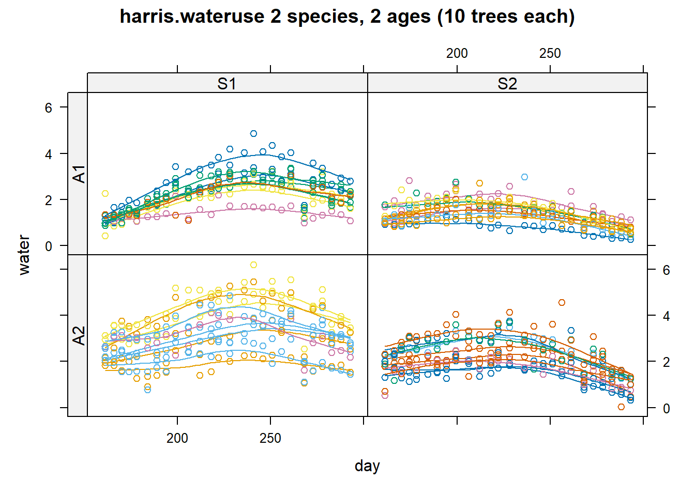

# Linear Mixed Models {#sec-linear-mixed-models}

## Dependent Data

In many real-world applications, observations are not independent but exhibit **correlations** due to shared characteristics. Below are common forms of dependent data:

-   **Multivariate measurements on individuals**: Multiple attributes measured on the same person may be correlated (e.g., blood pressure, cholesterol, and BMI).
-   **Clustered measurements**: Individuals within a shared environment (e.g., families, schools, hospitals) often exhibit correlated responses.
-   **Repeated measurements**: When the same individual is measured multiple times, correlations arise naturally.
    -   *Example*: Tracking cholesterol levels of a person over time.
    -   If these repeated measurements follow an experimental design where treatments were applied initially, they are referred to as repeated measures [@Schabenberger_2001].
-   **Longitudinal data**: Repeated measurements taken over time in an observational study are known as longitudinal data [@Schabenberger_2001].
-   **Spatial data**: Measurements taken from individuals in nearby locations (e.g., residents of the same neighborhood) often exhibit spatial correlation.

Since standard linear regression assumes independent observations, these correlations violate its assumptions. Thus, [Linear Mixed Models](#sec-linear-mixed-models) (LMMs) provide a framework to account for these dependencies.

A [Linear Mixed Model](#sec-linear-mixed-models) (also called a **Mixed Linear Model**) consists of two components:

-   **Fixed effects**: Parameters associated with variables that have the same effect across all observations (e.g., gender, age, diet, time).
-   **Random effects**: Individual-specific variations or correlation structures (e.g., subject-specific effects, spatial correlations), leading to dependent (correlated) errors.

A key advantage of LMMs is that they model random subject-specific effects, rather than including individual dummy variables. This provides:

-   A reduction in the number of parameters to estimate, avoiding overfitting.
-   A framework for inference on a population level, rather than restricting conclusions to observed individuals.

### Motivation: A Repeated Measurements Example

Consider a scenario where we analyze **repeated measurements** of a response variable $Y_{ij}$ for the $i$-th subject at time $j$:

-   $i = 1, \dots, N$ (subjects)
-   $j = 1, \dots, n_i$ (measurements per subject)

We define the response vector for subject $i$ as:

$$
\mathbf{Y}_i = 
\begin{bmatrix}
Y_{i1} \\
Y_{i2} \\
\vdots \\
Y_{in_i}
\end{bmatrix}
$$

To model this data, we use a two-stage hierarchical approach:

#### Stage 1: Regression Model (Within-Subject Variation) {#sec-stage-1-regression-model-within-subject-variation}

We first model how the response changes over time for each subject:

$$
\mathbf{Y}_i = Z_i \beta_i + \epsilon_i
$$

where:

-   $Z_i$ is an $n_i \times q$ matrix of known covariates (e.g., time, treatment).
-   $\beta_i$ is a $q \times 1$ vector of subject-specific regression coefficients.
-   $\epsilon_i$ represents random errors, often assumed to follow $\epsilon_i \sim N(0, \sigma^2 I)$.

At this stage, each individual has their own unique regression coefficients $\beta_i$. However, estimating a separate $\beta_i$ for each subject is impractical when $N$ is large. Thus, we introduce a [second stage](#sec-stage-2-parameter-model-(between-subject-variation) to impose structure on $\beta_i$.

#### Stage 2: Parameter Model (Between-Subject Variation) {#sec-stage-2-parameter-model-between-subject-variation}

We assume that the subject-specific coefficients $\beta_i$ arise from a common population distribution:

$$
\beta_i = K_i \beta + b_i
$$

where:

-   $K_i$ is a $q \times p$ matrix of known covariates.
-   $\beta$ is a $p \times 1$ vector of global parameters (fixed effects).
-   $\mathbf{b}_i$ are random effects, assumed to follow $\mathbf{b}_i \sim N(0, D)$.

Thus, each individual's regression coefficients $\beta_i$ are modeled as deviations from a population-level mean $\beta$, with subject-specific variations $b_i$. This hierarchical structure enables:

-   Borrowing of strength: Individual estimates $\beta_i$ are informed by the overall population distribution.
-   Improved generalization: The model captures both fixed and random variability efficiently.

The full [Linear Mixed Model](#sec-linear-mixed-models) can then be written as:

$$
\mathbf{Y}_i = Z_i K_i \beta + Z_i b_i + \epsilon_i
$$

where:

-   $Z_i K_i \beta$ represents the **fixed effects** component.
-   $Z_i b_i$ represents the **random effects** component.
-   $\epsilon_i$ represents the residual errors.

This formulation accounts for both **within-subject correlations** (via random effects) and **between-subject variability** (via fixed effects), making it a powerful tool for analyzing dependent data.

------------------------------------------------------------------------

### Example: Linear Mixed Model for Repeated Measurements

#### Stage 1: Subject-Specific Model {#sec-stage-1-subject-specific-model-lmm-example}

The first stage models the response variable $Y_{ij}$ for subject $i$ at time $t_{ij}$:

$$
Y_{ij} = \beta_{1i} + \beta_{2i} t_{ij} + \epsilon_{ij}
$$

where:

-   $j = 1, \dots, n_i$ represents different time points for subject $i$.
-   $\beta_{1i}$ is the subject-specific intercept (baseline response for subject $i$).
-   $\beta_{2i}$ is the subject-specific slope (rate of change over time).
-   $\epsilon_{ij} \sim N(0, \sigma^2)$ are independent errors.

In matrix notation, the model is written as:

$$
\mathbf{Y}_i = 
\begin{bmatrix}
Y_{i1} \\
Y_{i2} \\
\vdots \\
Y_{in_i}
\end{bmatrix}, 
\quad
\mathbf{Z}_i = 
\begin{bmatrix}
1 & t_{i1} \\
1 & t_{i2} \\
\vdots & \vdots \\
1 & t_{in_i} 
\end{bmatrix},
$$

$$
\beta_i =
\begin{bmatrix}
\beta_{1i} \\
\beta_{2i}
\end{bmatrix}, 
\quad
\epsilon_i = 
\begin{bmatrix}
\epsilon_{i1} \\
\epsilon_{i2} \\
\vdots \\
\epsilon_{in_i}
\end{bmatrix}.
$$

Thus, the model can be rewritten as:

$$
\mathbf{Y_i = Z_i \beta_i + \epsilon_i}.
$$

------------------------------------------------------------------------

#### Stage 2: Population-Level Model {#sec-stage-2-population-level-model-lmm-example}

Since estimating a separate $\beta_{1i}$ and $\beta_{2i}$ for each subject is impractical, we assume they follow a population distribution:

$$
\begin{aligned}
\beta_{1i} &= \beta_0 + b_{1i}, \\
\beta_{2i} &= \beta_1 L_i + \beta_2 H_i + \beta_3 C_i + b_{2i}.
\end{aligned}
$$

where:

-   $L_i, H_i, C_i$ are indicator variables for treatment groups:
    -   $L_i = 1$ if the subject belongs to treatment group 1, else 0.
    -   $H_i = 1$ if the subject belongs to treatment group 2, else 0.
    -   $C_i = 1$ if the subject belongs to treatment group 3, else 0.
-   $\beta_0$ represents the average baseline response across all subjects.
-   $\beta_1, \beta_2, \beta_3$ are the average time effects for the respective treatment groups.
-   $b_{1i}, b_{2i}$ are random effects representing subject-specific deviations.

This structure implies that while the intercept $\beta_{1i}$ varies randomly across subjects, the slope $\beta_{2i}$ depends both on treatment and random subject-specific deviations.

In matrix form, this is:

$$
\begin{aligned}
\mathbf{K}_i &= 
\begin{bmatrix}
1 & 0 & 0 & 0 \\
0 & L_i & H_i & C_i 
\end{bmatrix}, \\ 
\beta &= 
\begin{bmatrix}
\beta_0 \\
\beta_1 \\
\beta_2 \\
\beta_3
\end{bmatrix}, \\ 
\mathbf{b}_i &= 
\begin{bmatrix}
b_{1i} \\
b_{2i}
\end{bmatrix}, \\ 
\beta_i &= \mathbf{K_i \beta + b_i}.
\end{aligned}
$$

------------------------------------------------------------------------

#### Final Mixed Model Formulation

Substituting [Stage 2](#sec-stage-2-population-level-model-lmm-example) into [Stage 1](#sec-stage-1-subject-specific-model-lmm-example), we obtain the full mixed model:

$$
\mathbf{Y}_i = \mathbf{Z}_i (\mathbf{K}_i \beta + \mathbf{b}_i) + \epsilon_i.
$$

Expanding:

$$
\mathbf{Y}_i = \mathbf{Z}_i \mathbf{K}_i \beta + \mathbf{Z}_i \mathbf{b}_i + \epsilon_i.
$$

Interpretation:

-   $\mathbf{Z}_i \mathbf{K}_i \beta$ represents the **fixed effects** (population-level trends).
-   $\mathbf{Z}_i \mathbf{b}_i$ represents the **random effects** (subject-specific variations).
-   $\epsilon_i$ represents the **residual errors**.

**Assumptions**:

-   Random effects: $\mathbf{b}_i \sim N(0, D)$, where $D$ is the variance-covariance matrix.
-   Residual errors: $\epsilon_i \sim N(0, \sigma^2 I)$.
-   Independence: $\mathbf{b}_i$ and $\epsilon_i$ are independent.

------------------------------------------------------------------------

To estimate $\hat{\beta}$, one might consider a sequential approach:

1.  Estimate $\hat{\beta}_i$ for each subject in the first stage.
2.  Estimate $\hat{\beta}$ in the second stage by replacing $\beta_i$ with $\hat{\beta}_i$.

However, this method introduces several problems:

-   Loss of information: Summarizing $\mathbf{Y}_i$ solely by $\hat{\beta}_i$ discards valuable within-subject variability.
-   Ignoring uncertainty: Treating estimated values $\hat{\beta}_i$ as known values leads to underestimated variability.
-   Unequal sample sizes: Subjects may have different numbers of observations ($n_i$), which affects variance estimation.

To address these issues, we adopt the [Linear Mixed Model](#sec-linear-mixed-models) (LMM) framework [@laird1982random].

------------------------------------------------------------------------

#### Reformulating the Linear Mixed Model

Substituting [Stage 2](#sec-stage-2-parameter-model-(between-subject-variation) into [Stage 1](#sec-stage-2-parameter-model-(between-subject-variation), we obtain:

$$
\mathbf{Y}_i = \mathbf{Z}_i \mathbf{K}_i \beta + \mathbf{Z}_i \mathbf{b}_i + \mathbf{\epsilon}_i.
$$

Defining $\mathbf{X}_i = \mathbf{Z}_i \mathbf{K}_i$ as an $n_i \times p$ matrix of covariates, we rewrite the model as:

$$
\mathbf{Y}_i = \mathbf{X}_i \beta + \mathbf{Z}_i \mathbf{b}_i + \mathbf{\epsilon}_i.
$$

where:

-   $i = 1, \dots, N$ (subjects).

-   $\beta$ are **fixed effects**, common to all subjects.

-   $\mathbf{b}_i$ are **subject-specific random effects**, assumed to follow:

    $$
    \mathbf{b}_i \sim N_q(\mathbf{0,D}).
    $$

-   $\mathbf{\epsilon}_i$ represents residual errors:

    $$
    \mathbf{\epsilon}_i \sim N_{n_i}(\mathbf{0,\Sigma_i}).
    $$

-   Independence assumption: $\mathbf{b}_i$ and $\mathbf{\epsilon}_i$ are independent.

-   Dimension notation:

    -   $\mathbf{Z}_i$ is an $n_i \times q$ matrix of known covariates for random effects.
    -   $\mathbf{X}_i$ is an $n_i \times p$ matrix of known covariates for fixed effects.

------------------------------------------------------------------------

#### Hierarchical (Conditional) Formulation

Rewriting the LMM in **hierarchical form**:

$$
\begin{aligned}
\mathbf{Y}_i | \mathbf{b}_i &\sim N(\mathbf{X}_i \beta+ \mathbf{Z}_i \mathbf{b}_i, \mathbf{\Sigma}_i), \\
\mathbf{b}_i &\sim N(\mathbf{0,D}).
\end{aligned}
$$

where:

-   The first equation states that, given the subject-specific random effects $\mathbf{b}_i$, the response follows a normal distribution with mean $\mathbf{X}_i \beta+ \mathbf{Z}_i \mathbf{b}_i$ and covariance $\mathbf{\Sigma}_i$.
-   The second equation states that the random effects $\mathbf{b}_i$ follow a **multivariate normal** distribution with mean zero and covariance $D$.

We denote the respective probability density functions as:

$$
f(\mathbf{Y}_i |\mathbf{b}_i) \quad \text{and} \quad f(\mathbf{b}_i).
$$

------------------------------------------------------------------------

Using the general **marginalization formula**:

$$
\begin{aligned}
f(A,B) &= f(A|B)f(B) \\
f(A) &= \int f(A,B)dB = \int f(A|B) f(B) dB
\end{aligned}
$$

we obtain the **marginal density** of $\mathbf{Y}_i$:

$$
f(\mathbf{Y}_i) = \int f(\mathbf{Y}_i | \mathbf{b}_i) f(\mathbf{b}_i) d\mathbf{b}_i.
$$

Solving this integral, we obtain:

$$
\mathbf{Y}_i \sim N(\mathbf{X_i \beta}, \mathbf{Z_i D Z_i'} + \mathbf{\Sigma_i}).
$$

Interpretation:

-   **Mean structure:** The expectation remains $\mathbf{X}_i \beta$, the fixed effects.

-   **Variance structure:** The covariance now incorporates random effect variability:

    $$
    \mathbf{Z_i D Z_i'} + \mathbf{\Sigma_i}.
    $$

    This shows that the random effects contribute additional correlation between observations.

> 🔹 **Key Takeaway:**\
> The marginal formulation of LMM no longer includes $Z_i b_i$ in the mean, but instead incorporates it into the covariance structure, introducing marginal dependence in $\mathbf{Y}_i$.

Technically, rather than "averaging out" the random effect $b_i$, we add its contribution to the variance-covariance matrix.

------------------------------------------------------------------------

Continue with the example:

$$
Y_{ij} = (\beta_0 + b_{1i}) + (\beta_1L_i + \beta_2 H_i + \beta_3 C_i + b_{2i})t_{ij} + \epsilon_{ij}.
$$

For each treatment group:

$$
Y_{ij} =
\begin{cases}
\beta_0 + b_{1i} + (\beta_1 + b_{2i}) t_{ij} + \epsilon_{ij}, & L_i = 1 \\
\beta_0 + b_{1i} + (\beta_2 + b_{2i}) t_{ij} + \epsilon_{ij}, & H_i = 1 \\
\beta_0 + b_{1i} + (\beta_3 + b_{2i}) t_{ij} + \epsilon_{ij}, & C_i = 1.
\end{cases}
$$

Interpretation:

-   **Intercepts and slopes are subject-specific**: Each subject has their own baseline response and rate of change.
-   **Treatment groups affect slopes, but not intercepts**:
    -   $\beta_0$ is the common intercept across groups.
    -   Slopes differ by treatment: $\beta_1$ for $L$, $\beta_2$ for $H$, $\beta_3$ for $C$.
-   **Random effects** introduce within-subject correlation:
    -   $b_{1i}$ allows individual variation in baseline response.
    -   $b_{2i}$ allows subject-specific deviations in slopes.

------------------------------------------------------------------------

In the **hierarchical model form**, we again express the LMM as:

$$
\begin{aligned}
\mathbf{Y}_i | \mathbf{b}_i &\sim N(\mathbf{X}_i \beta + \mathbf{Z}_i \mathbf{b}_i, \mathbf{\Sigma}_i)\\
\mathbf{b}_i &\sim N(\mathbf{0,D})
\end{aligned}
$$

where:

-   $\mathbf{X}_i$ and $\mathbf{Z}_i$ are design matrices for **fixed** and **random** effects, respectively.
-   $\mathbf{b}_i$ represents **subject-specific random effects**.
-   $\mathbf{\Sigma}_i$ is the **residual error covariance matrix**.
-   $\mathbf{D}$ is the **random effects covariance matrix**.

The fixed-effects parameter vector is:

$$
\beta = (\beta_0, \beta_1, \beta_2, \beta_3)'.
$$

From the model structure, we define:

$$
\mathbf{X}_i = \mathbf{Z}_i \mathbf{K}_i.
$$

Expanding,

$$
\mathbf{Z}_i =
\begin{bmatrix}
1 & t_{i1} \\
1 & t_{i2} \\
\vdots & \vdots \\
1 & t_{in_i}
\end{bmatrix},
\quad
\mathbf{K}_i =
\begin{bmatrix}
1 & 0 & 0 & 0 \\
0 & L_i & H_i & C_i
\end{bmatrix}.
$$

Multiplying:

$$
\mathbf{X}_i =
\begin{bmatrix}
1 & t_{i1}L_i & t_{i1}H_i & t_{i1}C_i \\
1 & t_{i2}L_i & t_{i2}H_i & t_{i2}C_i \\
\vdots & \vdots & \vdots & \vdots \\
1 & t_{in_i}L_i & t_{in_i}H_i & t_{in_i}C_i
\end{bmatrix}.
$$

The random effects vector is:

$$
\mathbf{b}_i =
\begin{bmatrix}
b_{1i} \\
b_{2i}
\end{bmatrix}.
$$

The covariance matrix $\mathbf{D}$ for random effects is:

$$
\mathbf{D} =
\begin{bmatrix}
d_{11} & d_{12} \\
d_{12} & d_{22}
\end{bmatrix}.
$$

We assume **conditional independence**:

$$
\mathbf{\Sigma}_i = \sigma^2 \mathbf{I}_{n_i}.
$$

This means that, **given the random effects** $\mathbf{b}_i$ and $\beta$, the responses for subject $i$ are independent.

------------------------------------------------------------------------

To derive the **marginal model**, we integrate out the random effects $\mathbf{b}_i$. This leads to:

$$
Y_{ij} = \beta_0 + \beta_1 L_i t_{ij} + \beta_2 H_i t_{ij} + \beta_3 C_i t_{ij} + \eta_{ij},
$$

where:

$$
\eta_i \sim N(\mathbf{0}, \mathbf{Z}_i \mathbf{D} \mathbf{Z}_i' + \mathbf{\Sigma}_i).
$$

Thus, the full marginal model is:

$$
\mathbf{Y_i} \sim N(\mathbf{X}_i \beta, \mathbf{Z}_i \mathbf{D} \mathbf{Z}_i' + \mathbf{\Sigma}_i).
$$

------------------------------------------------------------------------

Example: Case Where $n_i = 2$

For a subject with **two observations**, we compute:

$$
\mathbf{Z}_i =
\begin{bmatrix}
1 & t_{i1} \\
1 & t_{i2}
\end{bmatrix}.
$$

Then:

$$
\mathbf{Z}_i \mathbf{D} \mathbf{Z}_i' =
\begin{bmatrix}
1 & t_{i1} \\
1 & t_{i2}
\end{bmatrix}
\begin{bmatrix}
d_{11} & d_{12} \\
d_{12} & d_{22}
\end{bmatrix}
\begin{bmatrix}
1 & 1 \\
t_{i1} & t_{i2}
\end{bmatrix}.
$$

Expanding the multiplication:

$$
\mathbf{Z}_i \mathbf{D} \mathbf{Z}_i' =
\begin{bmatrix}
d_{11} + 2d_{12}t_{i1} + d_{22} t_{i1}^2 & d_{11} + d_{12}(t_{i1} + t_{i2}) + d_{22}t_{i1}t_{i2} \\
d_{11} + d_{12}(t_{i1} + t_{i2}) + d_{22}t_{i1}t_{i2} & d_{11} + 2d_{12}t_{i2} + d_{22} t_{i2}^2
\end{bmatrix}.
$$

Finally, incorporating the residual variance:

$$
\text{Var}(Y_{i1}) = d_{11} + 2d_{12}t_{i1} + d_{22} t_{i1}^2 + \sigma^2.
$$

Interpretation of the Marginal Model

1.  **Correlation in the Errors**:
    -   The off-diagonal elements of $\mathbf{Z}_i \mathbf{D} \mathbf{Z}_i'$ introduce **correlation** between observations within the same subject.
    -   This accounts for the fact that repeated measurements on the same individual are not independent.
2.  **Variance Structure**:
    -   The variance function of $Y_{ij}$ is quadratic in time:

        $$
        \text{Var}(Y_{ij}) = d_{11} + 2d_{12}t_{ij} + d_{22}t_{ij}^2 + \sigma^2.
        $$

    -   The curvature of this variance function is determined by $d_{22}$.

    -   If $d_{22} > 0$, variance increases over time.

> 🔹 **Key Takeaway**:\
> In the hierarchical model, random effects contribute to the mean structure.\
> In the marginal model, they affect the covariance structure, leading to heteroskedasticity (changing variance over time) and correlation between repeated measures.

------------------------------------------------------------------------

### Random-Intercepts Model {#sec-random-intercepts-model-lmm}

The [Random-Intercepts Model]() is obtained by **removing random slopes**, meaning:

-   All subject-specific variability in slopes is attributed only to treatment differences.
-   The model allows each subject to have their own intercept, but within each treatment group, all subjects share the same slope.

The hierarchical (conditional) model is:

$$
\begin{aligned}
\mathbf{Y}_i | b_i &\sim N(\mathbf{X}_i \beta + 1 b_i, \mathbf{\Sigma}_i), \\
b_i &\sim N(0, d_{11}).
\end{aligned}
$$

where:

-   $b_i$ is the **random intercept** for subject $i$, assumed to follow $N(0, d_{11})$.
-   $\mathbf{X}_i$ contains the **fixed effects**, which include treatment and time.
-   $\mathbf{\Sigma}_i$ represents **residual variance**, typically assumed to be $\sigma^2 \mathbf{I}$ (independent errors).

Since there are no **random slopes**, the only source of **subject-specific variability** is the intercept.

Integrating out $b_i$ and assuming conditional independence $\mathbf{\Sigma}_i = \sigma^2 \mathbf{I}_{n_i}$, the **marginal distribution** of $\mathbf{Y}_i$ is:

$$
\mathbf{Y}_i \sim N(\mathbf{X}_i \beta, 11'd_{11} + \sigma^2 \mathbf{I}).
$$

The **marginal covariance matrix** is:

$$
\begin{aligned}
\text{Cov}(\mathbf{Y}_i) &= 11'd_{11} + \sigma^2 I \\
&=
\begin{bmatrix}
d_{11} + \sigma^2 & d_{11} & d_{11} & \dots & d_{11} \\
d_{11} & d_{11} + \sigma^2 & d_{11} & \dots & d_{11} \\
d_{11} & d_{11} & d_{11} + \sigma^2 & \dots & d_{11} \\
\vdots & \vdots & \vdots & \ddots & \vdots \\
d_{11} & d_{11} & d_{11} & \dots & d_{11} + \sigma^2
\end{bmatrix}.
\end{aligned}
$$

The **correlation matrix** is obtained by standardizing the covariance matrix:

$$
\text{Corr}(\mathbf{Y}_i) =
\begin{bmatrix}
1 & \rho & \rho & \dots & \rho \\
\rho & 1 & \rho & \dots & \rho \\
\rho & \rho & 1 & \dots & \rho \\
\vdots & \vdots & \vdots & \ddots & \vdots \\
\rho & \rho & \rho & \dots & 1
\end{bmatrix},
$$

where:

$$
\rho = \frac{d_{11}}{d_{11} + \sigma^2}.
$$

This **correlation structure** is known as **compound symmetry**, meaning:

-   **Constant variance**: $\text{Var}(Y_{ij}) = d_{11} + \sigma^2$ for all $j$.
-   **Equal correlation**: $\text{Corr}(Y_{ij}, Y_{ik}) = \rho$ for all $j \neq k$.
-   **Positive correlation**: Any two observations from the same subject are equally correlated.

Interpretation of $\rho$ (Intra-Class Correlation)

-   $\rho$ is called the intra-class correlation coefficient (ICC).

-   It measures the proportion of total variability that is due to between-subject variability:

    $$
    \rho = \frac{\text{Between-Subject Variance}}{\text{Total Variance}} = \frac{d_{11}}{d_{11} + \sigma^2}.
    $$

-   If $\rho$ is large:

    -   The inter-subject variability ($d_{11}$) is large relative to the intra-subject variability ($\sigma^2$).
    -   This means subjects differ substantially in their intercepts.
    -   Responses from the same subject are highly correlated.

-   If $\rho$ is small:

    -   The residual error variance dominates, meaning individual differences in intercepts are small.
    -   Measurements from the same subject are weakly correlated.

------------------------------------------------------------------------

Summary of the Random-Intercepts Model

+--------------------------------------+------------------------------------------------------------------------+
| Feature                              | Explanation                                                            |
+======================================+========================================================================+
| **Intercepts**                       | Random, subject-specific ($b_i$)                                       |
+--------------------------------------+------------------------------------------------------------------------+
| **Slopes**                           | Fixed within each treatment group                                      |
+--------------------------------------+------------------------------------------------------------------------+
| **Covariance Structure**             | **Compound symmetry** (constant variance, equal correlation)           |
+--------------------------------------+------------------------------------------------------------------------+
| **Intra-Class Correlation (**$\rho$) | Measures **between-subject variability** relative to total variability |
+--------------------------------------+------------------------------------------------------------------------+
| **Interpretation**                   | Large $\rho$ → Strong subject-level differences,                       |
|                                      |                                                                        |
|                                      | Small $\rho$ → Mostly residual noise                                   |
+--------------------------------------+------------------------------------------------------------------------+

------------------------------------------------------------------------

### Covariance Models in Linear Mixed Models

Previously, we assumed that the **within-subject errors** are **conditionally independent**, meaning:

$$
\mathbf{\Sigma}_i = \sigma^2 \mathbf{I}_{n_i}.
$$

However, real-world data often exhibit **correlated errors**, particularly in **longitudinal studies** where observations over time are influenced by underlying stochastic processes.

To model this dependence, we decompose the error term into two components:

$$
\epsilon_i = \epsilon_{(1)i} + \epsilon_{(2)i},
$$

where:

-   $\epsilon_{(1)i}$ (Serial Correlation Component):
    -   Represents subject-specific response to time-varying stochastic processes.
    -   Captures dependency across observations for the same subject.
-   $\epsilon_{(2)i}$ (Measurement Error Component):
    -   Represents pure measurement error, assumed independent of $\epsilon_{(1)i}$.

Thus, the full LMM formulation becomes:

$$
\mathbf{Y_i} = \mathbf{X_i \beta} + \mathbf{Z_i b_i} + \mathbf{\epsilon_{(1)i}} + \mathbf{\epsilon_{(2)i}}.
$$

where:

-   Random effects: $\mathbf{b_i} \sim N(\mathbf{0, D})$.
-   Measurement errors: $\epsilon_{(2)i} \sim N(\mathbf{0, \sigma^2 I_{n_i}})$.
-   Serial correlation errors: $\epsilon_{(1)i} \sim N(\mathbf{0, \tau^2 H_i})$.
-   Independence assumption: $\mathbf{b}_i$ and $\epsilon_i$ are mutually independent.

------------------------------------------------------------------------

To model the correlation structure of the **serial correlation component** $\epsilon_{(1)i}$, we define the $n_i \times n_i$ correlation (or covariance) matrix $\mathbf{H}_i$.

The $(j,k)$th element of $\mathbf{H}_i$ is denoted as:

$$
h_{ijk} = g(t_{ij}, t_{ik}),
$$

where:

-   $h_{ijk}$ represents the covariance (or correlation) between time points $t_{ij}$ and $t_{ik}$.

-   $g(t_{ij}, t_{ik})$ is a decreasing function that defines the correlation between time points $t_{ij}$ and $t_{ik}$.

-   Typically, we assume that this function depends only on the time difference (stationarity assumption):

    $$
    h_{ijk} = g(|t_{ij} - t_{ik}|)
    $$

    meaning that the correlation only depends on the absolute time lag.

-   To be a valid correlation matrix, we require:

    $$
    g(0) = 1.
    $$

    This ensures that each observation has a perfect correlation with itself.

------------------------------------------------------------------------

**Common Choices** for $g(|t_{ij} - t_{ik}|)$

Several functions can be used to define the **decay in correlation** as time differences increase.

**1. Exponential Correlation (Continuous-Time AR(1))**

$$
g(|t_{ij} - t_{ik}|) = \exp(-\phi |t_{ij} - t_{ik}|)
$$

-   **Decay rate:** Controlled by $\phi > 0$.
-   **Interpretation:**
    -   Observations closer in time are more correlated.
    -   The correlation decreases exponentially as time separation increases.
-   **Use case:** Often used in biological and economic time-series models.

------------------------------------------------------------------------

**2. Gaussian Correlation (Squared Exponential Kernel)**

$$
g(|t_{ij} - t_{ik}|) = \exp(-\phi (t_{ij} - t_{ik})^2)
$$

-   **Decay rate:** Faster than exponential.
-   **Interpretation:**
    -   If $\phi$ is large, correlation drops sharply as time separation increases.
    -   Produces smooth correlation structures.
-   **Use case:** Used in spatial statistics and machine learning (Gaussian processes).

------------------------------------------------------------------------

**3. Autoregressive (AR(1)) Correlation**

A **First-Order Autoregressive Model (AR(1))** assumes that the value at time $t$ depends on its previous value:

$$
\alpha_t = \phi \alpha_{t-1} + \eta_t,
$$

where

-   $\eta_t \sim \text{i.i.d. } N(0, \sigma^2_\eta)$ (white noise process).

-   $\phi$ is the **autocorrelation coefficient**.

Then, the covariance between two observations at different times is:

$$ \text{Cov}(\alpha_t, \alpha_{t+h}) = \frac{\sigma^2_\eta \phi^{|h|}}{1 - \phi^2}. $$

Thus, the **correlation** between time points $t$ and $t+h$ is:

$$ \text{Corr}(\alpha_t, \alpha_{t+h}) = \phi^{|h|}. $$

For a sequence of $T$ time points, the resulting **Toeplitz correlation matrix** is:

$$ \text{Corr}(\alpha_T) = \begin{bmatrix} 1 & \phi^1 & \phi^2 & \dots & \phi^{T-1} \\ \phi^1 & 1 & \phi^1 & \dots & \phi^{T-2} \\ \phi^2 & \phi^1 & 1 & \dots & \phi^{T-3} \\ \vdots & \vdots & \vdots & \ddots & \vdots \\ \phi^{T-1} & \phi^{T-2} & \phi^{T-3} & \dots & 1 \end{bmatrix}. $$

-   **Decay rate:** $\phi$ controls how fast correlation decreases.
-   **Use case:**
    -   Common in **time series models**.
    -   Appropriate when **observations are equally spaced in time**.

Properties of the AR(1) Structure:

-   Correlation decreases with time lag:
    -   Observations closer in time are more correlated.
    -   Decay rate is controlled by $\phi$.
-   Toeplitz structure:
    -   The covariance matrix exhibits a banded diagonal pattern.
    -   Useful in longitudinal and time-series data.
-   Applicability:
    -   Small $\phi$ ($\approx 0$) → Weak autocorrelation (errors are mostly independent).
    -   Large $\phi$ ($\approx 1$) → Strong autocorrelation (highly dependent observations).

------------------------------------------------------------------------

### Covariance Structures in Mixed Models

+------------------------------------+---------------------------------------------+-------------------+----------------------------+-------------------------------------------------------------------+------------------------------------------------+
| Structure                          | Covariance Function $g(|t_{ij} - t_{ik}|)$  | Decay Behavior    | Correlation Matrix Pattern | Key Properties                                                    | Common Use Cases                               |
+====================================+=============================================+===================+============================+===================================================================+================================================+
| **Compound Symmetry**              | Constant: $g(|t_{ij} - t_{ik}|) = \rho$     | No decay          | Constant off-diagonal      | Equal correlation across all time points (homogeneous)            | Random-intercepts model, repeated measures     |
+------------------------------------+---------------------------------------------+-------------------+----------------------------+-------------------------------------------------------------------+------------------------------------------------+
| **AR(1) (Autoregressive)**         | $\phi^{|t_{ij} - t_{ik}|}$                  | Exponential decay | Toeplitz (banded diagonal) | Strong correlation for nearby observations, weak for distant ones | Time series, longitudinal data                 |
+------------------------------------+---------------------------------------------+-------------------+----------------------------+-------------------------------------------------------------------+------------------------------------------------+
| **Exponential**                    | $\exp(-\phi |t_{ij} - t_{ik}|)$             | Smooth decay      | Spatially continuous       | Models continuous correlation decline over time/space             | Growth curves, ecological models               |
+------------------------------------+---------------------------------------------+-------------------+----------------------------+-------------------------------------------------------------------+------------------------------------------------+
| **Gaussian (Squared Exponential)** | $\exp(-\phi (t_{ij} - t_{ik})^2)$           | Rapid decay       | Spatially continuous       | Smooth decay but stronger locality effect                         | Spatial processes, geostatistics               |
+------------------------------------+---------------------------------------------+-------------------+----------------------------+-------------------------------------------------------------------+------------------------------------------------+
| **Toeplitz**                       | Varies by lag, $g(|t_{ij} - t_{ik}|) = c_h$ | General pattern   | General symmetric matrix   | Arbitrary structure, allows irregular spacing                     | Irregular time points, flexible spatial models |
+------------------------------------+---------------------------------------------+-------------------+----------------------------+-------------------------------------------------------------------+------------------------------------------------+
| **Unstructured**                   | Fully parameterized, no constraints         | No fixed pattern  | General symmetric matrix   | Allows any correlation pattern, but many parameters               | Small datasets with unknown correlation        |
+------------------------------------+---------------------------------------------+-------------------+----------------------------+-------------------------------------------------------------------+------------------------------------------------+
| **Banded**                         | Zero correlation beyond a certain lag       | Abrupt cutoff     | Banded diagonal            | Assumes only close observations are correlated                    | Large datasets, high-dimensional time series   |
+------------------------------------+---------------------------------------------+-------------------+----------------------------+-------------------------------------------------------------------+------------------------------------------------+
| **Spatial Power**                  | $\phi^{|s_{ij} - s_{ik}|}$                  | Exponential decay | Distance-based structure   | Used when correlation depends on spatial distance                 | Spatial statistics, environmental data         |
+------------------------------------+---------------------------------------------+-------------------+----------------------------+-------------------------------------------------------------------+------------------------------------------------+
| **Matérn Covariance**              | Function of $|t_{ij} - t_{ik}|^\nu$         | Flexible decay    | Spatially continuous       | Generalization of Gaussian and exponential structures             | Geostatistics, spatiotemporal models           |
+------------------------------------+---------------------------------------------+-------------------+----------------------------+-------------------------------------------------------------------+------------------------------------------------+

------------------------------------------------------------------------

**Choosing the Right Covariance Structure**

| Scenario                                 | Recommended Structure  |
|------------------------------------------|------------------------|
| Repeated measures with equal correlation | Compound Symmetry      |
| Longitudinal data with time dependence   | AR(1), Toeplitz        |
| Continuous-time process                  | Exponential, Gaussian  |
| Spatial correlation                      | Spatial Power, Matérn  |
| Irregularly spaced time points           | Toeplitz, Unstructured |
| High-dimensional data                    | Banded, AR(1)          |

------------------------------------------------------------------------

## Estimation in Linear Mixed Models

The general [Linear Mixed Model](#sec-linear-mixed-models) is:

$$ \mathbf{Y}_i = \mathbf{X}_i \beta + \mathbf{Z}_i \mathbf{b}_i + \epsilon_i, $$

where:

-   $\beta$: Fixed effects (parameters shared across subjects).
-   $\mathbf{b}_i$: Random effects (subject-specific deviations).
-   $\mathbf{X}_i$: Design matrix for fixed effects.
-   $\mathbf{Z}_i$: Design matrix for random effects.
-   $\mathbf{D}$: Covariance matrix of the random effects.
-   $\mathbf{\Sigma}_i$: Covariance matrix of the residual errors.

Since $\beta$, $\mathbf{b}_i$, $\mathbf{D}$, and $\mathbf{\Sigma}_i$ are **unknown**, they must be **estimated** from data.

-   $\beta, \mathbf{D}, \mathbf{\Sigma}_i$ are **fixed parameters** → must be **estimated**.
-   $\mathbf{b}_i$ is a **random variable** → must be **predicted** (not estimated). In other words, random thing/variable can't be estimated.

Thus, we define:

-   **Estimator of** $\beta$: $\hat{\beta}$ (fixed effect estimation).
-   **Predictor of** $\mathbf{b}_i$: $\hat{\mathbf{b}}_i$ (random effect prediction).

Then:

-   The **population-level estimate** of $\mathbf{Y}_i$ is:

    $$
    \hat{\mathbf{Y}}_i = \mathbf{X}_i \hat{\beta}.
    $$

-   The **subject-specific prediction** is:

    $$
    \hat{\mathbf{Y}}_i = \mathbf{X}_i \hat{\beta} + \mathbf{Z}_i \hat{\mathbf{b}}_i.
    $$

For all $N$ subjects, we stack the equations into the Mixed Model Equations [@henderson1975best]:

$$
\mathbf{Y} = \mathbf{X} \beta + \mathbf{Z} \mathbf{b} + \epsilon.
$$

and

$$
\mathbf{Y} \sim N(\mathbf{X \beta, ZBZ' + \Sigma})
$$

where:

$$
\mathbf{Y} =
\begin{bmatrix}
\mathbf{y}_1 \\
\vdots \\
\mathbf{y}_N
\end{bmatrix},
\quad
\mathbf{X} =
\begin{bmatrix}
\mathbf{X}_1 \\
\vdots \\
\mathbf{X}_N
\end{bmatrix},
\quad
\mathbf{b} =
\begin{bmatrix}
\mathbf{b}_1 \\
\vdots \\
\mathbf{b}_N
\end{bmatrix},
\quad\mathbf{\epsilon} =    \begin{bmatrix}\mathbf{\epsilon}_1 \\\vdots \\\mathbf{\epsilon}_N\end{bmatrix}.
$$

The covariance structure is:

$$
\text{Cov}(\mathbf{b}) = \mathbf{B}, \quad \text{Cov}(\epsilon) = \mathbf{\Sigma}, \quad \text{Cov}(\mathbf{b}, \epsilon) = 0.
$$

Expanding $\mathbf{Z}$ and $\mathbf{B}$ as block diagonal matrices:

$$
\mathbf{Z} =
\begin{bmatrix}
\mathbf{Z}_1 & 0 & \dots & 0 \\
0 & \mathbf{Z}_2 & \dots & 0 \\
\vdots & \vdots & \ddots & \vdots \\
0 & 0 & \dots & \mathbf{Z}_N
\end{bmatrix},
\quad
\mathbf{B} =
\begin{bmatrix}
\mathbf{D} & 0 & \dots & 0 \\
0 & \mathbf{D} & \dots & 0 \\
\vdots & \vdots & \ddots & \vdots \\
0 & 0 & \dots & \mathbf{D}
\end{bmatrix}.
$$

The best linear unbiased estimator (BLUE) for $\beta$ and the best linear unbiased predictor (BLUP) for $\mathbf{b}$ are obtained by solving [@henderson1975best]:

$$
\left[
\begin{array}{c}
\hat{\beta} \\
\hat{\mathbf{b}}
\end{array}
\right]
=
\left[
\begin{array}{cc}
\mathbf{X' \Sigma^{-1} X} & \mathbf{X' \Sigma^{-1} Z} \\
\mathbf{Z' \Sigma^{-1} X} & \mathbf{Z' \Sigma^{-1} Z + B^{-1}}
\end{array}
\right]^{-1}
\left[
\begin{array}{c}
\mathbf{X' \Sigma^{-1} Y} \\
\mathbf{Z' \Sigma^{-1} Y}
\end{array}
\right].
$$

where:

-   $\hat{\beta}$ is the [Generalized Least Squares] estimator for $\beta$.
-   $\hat{\mathbf{b}}$ is the BLUP for $\mathbf{b}$.

If we define:

$$
\mathbf{V} = \mathbf{Z B Z'} + \mathbf{\Sigma}.
$$

Then, the solutions to the **Mixed Model Equations** are:

$$
\begin{aligned}
\hat{\beta} &= (\mathbf{X'V^{-1}X})^{-1} \mathbf{X'V^{-1}Y}, \\
\hat{\mathbf{b}} &= \mathbf{BZ'V^{-1}(Y - X\hat{\beta})}.
\end{aligned}
$$

where:

-   $\hat{\beta}$ is obtained using [Generalized Least Squares].
-   $\hat{\mathbf{b}}$ is a [Weighted Least Squares] predictor, where weights come from $\mathbf{B}$ and $\mathbf{V}$.

------------------------------------------------------------------------

**Properties of the Estimators**

For $\hat{\beta}$:

$$
E(\hat{\beta}) = \beta, \quad \text{Var}(\hat{\beta}) = (\mathbf{X'V^{-1}X})^{-1}.
$$

For $\hat{\mathbf{b}}$:

$$
E(\hat{\mathbf{b}}) = 0.
$$

The **variance of the prediction error** (Mean Squared Prediction Error, MSPE) is:

$$
\text{Var}(\hat{\mathbf{b}} - \mathbf{b}) =
\mathbf{B - BZ'V^{-1}ZB + BZ'V^{-1}X (X'V^{-1}X)^{-1} X'V^{-1}B}.
$$

> 🔹 **Key Insight:**\
> Mean Squared Prediction Error is more meaningful than $\text{Var}(\hat{\mathbf{b}})$ alone, since it accounts for both variance and bias in prediction.

------------------------------------------------------------------------

### Interpretation of the Mixed Model Equations

The system:

$$
\left[
\begin{array}{cc}
\mathbf{X'\Sigma^{-1}X} & \mathbf{X'\Sigma^{-1}Z} \\
\mathbf{Z'\Sigma^{-1}X} & \mathbf{Z'\Sigma^{-1}Z + B^{-1}}
\end{array}
\right]
\left[
\begin{array}{c}
\beta \\
\mathbf{b}
\end{array}
\right]
= 
\left[
\begin{array}{c}
\mathbf{X'\Sigma^{-1}Y} \\
\mathbf{Z'\Sigma^{-1}Y}
\end{array}
\right].
$$

can be understood as:

1.  Fixed Effects Estimation ($\hat{\beta}$)
    -   Uses [Generalized Least Squares].
    -   Adjusted for both random effects and correlated errors.
2.  Random Effects Prediction ($\hat{\mathbf{b}}$)
    -   Computed using the BLUP formula.
    -   Shrinks subject-specific estimates toward the population mean.

------------------------------------------------------------------------

+-----------------------------------------+--------------------------------------------------------------------+----------------------------------------------------+
| **Component**                           | **Equation**                                                       | **Interpretation**                                 |
+=========================================+====================================================================+====================================================+
| **Fixed effects (**$\hat{\beta}$)       | $(\mathbf{X'V^{-1}X})^{-1} \mathbf{X'V^{-1}Y}$                     | [Generalized Least Squares] estimator              |
+-----------------------------------------+--------------------------------------------------------------------+----------------------------------------------------+
| **Random effects (**$\hat{\mathbf{b}}$) | $\mathbf{BZ'V^{-1}(Y - X\hat{\beta})}$                             | Best Linear Unbiased Predictor (BLUP)              |
+-----------------------------------------+--------------------------------------------------------------------+----------------------------------------------------+
| **Variance of** $\hat{\beta}$           | $(\mathbf{X'V^{-1}X})^{-1}$                                        | Accounts for uncertainty in fixed effect estimates |
+-----------------------------------------+--------------------------------------------------------------------+----------------------------------------------------+
| **Variance of prediction error**        | $\mathbf{B - BZ'V^{-1}ZB + BZ'V^{-1}X (X'V^{-1}X)^{-1} X'V^{-1}B}$ | Includes both variance and bias in prediction      |
+-----------------------------------------+--------------------------------------------------------------------+----------------------------------------------------+

------------------------------------------------------------------------

### Derivation of the Mixed Model Equations

To derive the **Mixed Model Equations**, consider:

$$
\mathbf{\epsilon} = \mathbf{Y} - \mathbf{X \beta} - \mathbf{Z b}.
$$

Define:

-   $T = \sum_{i=1}^N n_i$ → **Total number of observations**.
-   $Nq$ → **Total number of random effects**.

The **joint distribution** of $(\mathbf{b}, \mathbf{\epsilon})$ is:

$$
\begin{aligned}
f(\mathbf{b}, \epsilon) &= \frac{1}{(2\pi)^{(T+Nq)/2}}
\left|
\begin{array}{cc}
\mathbf{B} & 0 \\
0 & \mathbf{\Sigma}
\end{array} 
\right|^{-1/2} \\
&
\exp
\left(
-\frac{1}{2}
\begin{bmatrix}
\mathbf{b} \\
\mathbf{Y - X \beta - Zb}
\end{bmatrix}'
\begin{bmatrix}
\mathbf{B} & 0 \\
0 & \mathbf{\Sigma}
\end{bmatrix}^{-1}
\begin{bmatrix}
\mathbf{b} \\
\mathbf{Y - X \beta - Zb}
\end{bmatrix}
\right).
\end{aligned}
$$

Maximizing $f(\mathbf{b},\epsilon)$ with respect to $\mathbf{b}$ and $\beta$ requires **minimization** of:

$$
\begin{aligned}
Q &= \left[
\begin{array}
{c}
\mathbf{b} \\
\mathbf{Y - X \beta - Zb}
\end{array}
\right]'
\left[
\begin{array}
{cc}
\mathbf{B} & 0 \\
0 & \mathbf{\Sigma}
\end{array}
\right]^{-1}
\left[
\begin{array}
{c}
\mathbf{b} \\
\mathbf{Y - X \beta - Zb}
\end{array}
\right] \\
&=\mathbf{b' B^{-1} b} + (\mathbf{Y - X \beta - Z b})' \mathbf{\Sigma^{-1}} (\mathbf{Y - X \beta - Z b}).
\end{aligned}
$$

Setting the derivatives of $Q$ with respect to $\mathbf{b}$ and $\mathbf{\beta}$ to zero leads to the system of equations:

$$
\begin{aligned}
\mathbf{X'\Sigma^{-1}X\beta + X'\Sigma^{-1}Zb} &= \mathbf{X'\Sigma^{-1}Y}\\
\mathbf{(Z'\Sigma^{-1}Z + B^{-1})b + Z'\Sigma^{-1}X\beta} &= \mathbf{Z'\Sigma^{-1}Y}
\end{aligned}
$$

Rearranging

$$
\left[
\begin{array}
{cc}
\mathbf{X'\Sigma^{-1}X} & \mathbf{X'\Sigma^{-1}Z} \\
\mathbf{Z'\Sigma^{-1}X} & \mathbf{Z'\Sigma^{-1}Z + B^{-1}}
\end{array}
\right]
\left[
\begin{array}
{c}
\beta \\
\mathbf{b}
\end{array}
\right]
= 
\left[
\begin{array}
{c}
\mathbf{X'\Sigma^{-1}Y} \\
\mathbf{Z'\Sigma^{-1}Y}
\end{array}
\right]
$$

Thus, the solution to the mixed model equations give:

$$
\left[
\begin{array}
{c}
\hat{\beta} \\
\hat{\mathbf{b}}
\end{array}
\right]
= 
\left[
\begin{array}
{cc}
\mathbf{X'\Sigma^{-1}X} & \mathbf{X'\Sigma^{-1}Z} \\
\mathbf{Z'\Sigma^{-1}X} & \mathbf{Z'\Sigma^{-1}Z + B^{-1}}
\end{array}
\right] ^{-1}
\left[
\begin{array}
{c}
\mathbf{X'\Sigma^{-1}Y} \\
\mathbf{Z'\Sigma^{-1}Y}
\end{array}
\right]
$$

------------------------------------------------------------------------

### Bayesian Interpretation of Linear Mixed Models

In a **Bayesian framework**, the posterior distribution of the **random effects** $\mathbf{b}$ given the observed data $\mathbf{Y}$ is derived using **Bayes' theorem**:

$$
f(\mathbf{b}| \mathbf{Y}) = \frac{f(\mathbf{Y}|\mathbf{b})f(\mathbf{b})}{\int f(\mathbf{Y}|\mathbf{b})f(\mathbf{b}) d\mathbf{b}}.
$$

where:

-   $f(\mathbf{Y}|\mathbf{b})$ is the likelihood function, describing how the data are generated given the random effects.
-   $f(\mathbf{b})$ is the prior distribution of the random effects.
-   The denominator $\int f(\mathbf{Y}|\mathbf{b}) f(\mathbf{b}) d\mathbf{b}$ is the normalizing constant that ensures the posterior integrates to 1.
-   $f(\mathbf{b}|\mathbf{Y})$ is the posterior distribution, which updates our belief about $\mathbf{b}$ given the observed data $\mathbf{Y}$.

------------------------------------------------------------------------

In the [Linear Mixed Model](#sec-linear-mixed-models), we assume:

$$
\begin{aligned}
\mathbf{Y} | \mathbf{b} &\sim N(\mathbf{X\beta+Zb, \Sigma}), \\
\mathbf{b} &\sim N(\mathbf{0, B}).
\end{aligned}
$$

This means:

-   Likelihood: Given $\mathbf{b}$, the data $\mathbf{Y}$ follows a multivariate normal distribution with mean $\mathbf{X\beta+Zb}$ and covariance $\mathbf{\Sigma}$.
-   Prior for $\mathbf{b}$: The random effects are assumed to follow a multivariate normal distribution with mean 0 and covariance $\mathbf{B}$.

By applying **Bayes' theorem**, the posterior distribution of $\mathbf{b}$ given $\mathbf{Y}$ is:

$$
\mathbf{b} | \mathbf{Y} \sim N(\mathbf{BZ'V^{-1}(Y - X\beta)}, (\mathbf{Z'\Sigma^{-1}Z} + \mathbf{B^{-1}})^{-1}).
$$

where:

-   Mean: $\mathbf{BZ'V^{-1}(Y - X\beta)}$
    -   This is the BLUP.
    -   It represents the expected value of $\mathbf{b}$ given $\mathbf{Y}$ under squared-error loss.
-   Covariance: $(\mathbf{Z'\Sigma^{-1}Z} + \mathbf{B^{-1}})^{-1}$
    -   This posterior variance accounts for both prior uncertainty ($\mathbf{B}$) and data uncertainty ($\mathbf{\Sigma}$).

Thus, the Bayesian posterior mean of $\mathbf{b}$ coincides with the BLUP predictor:

$$
E(\mathbf{b}|\mathbf{Y}) = \mathbf{BZ'V^{-1}(Y-X\beta)}.
$$

------------------------------------------------------------------------

**Interpretation of the Posterior Distribution**

1.  Posterior Mean as a Shrinkage Estimator (BLUP)
    -   The expectation $E(\mathbf{b}|\mathbf{Y})$ shrinks individual estimates toward the population mean.
    -   Subjects with less data or more variability will have estimates closer to zero.
    -   This is similar to [Ridge Regression] in penalized estimation.
2.  Posterior Variance Quantifies Uncertainty
    -   The matrix $(\mathbf{Z'\Sigma^{-1}Z} + \mathbf{B^{-1}})^{-1}$ captures the remaining uncertainty in $\mathbf{b}$ after seeing $\mathbf{Y}$.
    -   If $\mathbf{Z'\Sigma^{-1}Z}$ is large, the data provide strong information about $\mathbf{b}$, reducing posterior variance.
    -   If $\mathbf{B^{-1}}$ dominates, prior information heavily influences estimates.
3.  Connection to Bayesian Inference
    -   The random effects $\mathbf{b}$ follow a Gaussian posterior due to conjugacy.
    -   This is analogous to Bayesian hierarchical models, where random effects are latent variables estimated from data.

+---------------------------+----------------------------------------------------------------------------------------------------------------+-------------------------------------+
| **Step**                  | **Equation**                                                                                                   | **Interpretation**                  |
+===========================+================================================================================================================+=====================================+
| **Likelihood**            | $\mathbf{Y} | \mathbf{b} \sim N(\mathbf{X\beta+Zb, \Sigma})$                                                   | Data given random effects           |
+---------------------------+----------------------------------------------------------------------------------------------------------------+-------------------------------------+
| **Prior**                 | $\mathbf{b} \sim N(\mathbf{0, B})$                                                                             | Random effects distribution         |
+---------------------------+----------------------------------------------------------------------------------------------------------------+-------------------------------------+
| **Posterior**             | $\mathbf{b}|\mathbf{Y} \sim N(\mathbf{BZ'V^{-1}(Y-X\beta)}, (\mathbf{Z'\Sigma^{-1}Z} + \mathbf{B^{-1}})^{-1})$ | Updated belief about $\mathbf{b}$   |
+---------------------------+----------------------------------------------------------------------------------------------------------------+-------------------------------------+
| **Posterior Mean (BLUP)** | $E(\mathbf{b}|\mathbf{Y}) = \mathbf{BZ'V^{-1}(Y-X\beta)}$                                                      | Best predictor (squared error loss) |
+---------------------------+----------------------------------------------------------------------------------------------------------------+-------------------------------------+
| **Posterior Variance**    | $(\mathbf{Z'\Sigma^{-1}Z} + \mathbf{B^{-1}})^{-1}$                                                             | Uncertainty in predictions          |
+---------------------------+----------------------------------------------------------------------------------------------------------------+-------------------------------------+

### Estimating the Variance-Covariance Matrix

If we have an estimate $\tilde{\mathbf{V}}$ for $\mathbf{V}$, we can estimate the fixed and random effects as:

$$
\begin{aligned}
\hat{\beta} &= \mathbf{(X'\tilde{V}^{-1}X)^{-1}X'\tilde{V}^{-1}Y}, \\
\hat{\mathbf{b}} &= \mathbf{B Z' \tilde{V}^{-1} (Y - X \hat{\beta})}.
\end{aligned}
$$

where:

-   $\hat{\beta}$ is the estimated fixed effects.
-   $\hat{\mathbf{b}}$ is the Empirical Best Linear Unbiased Predictor (EBLUP), also called the Empirical Bayes estimate of $\mathbf{b}$.

Properties of $\hat{\beta}$ and Variance Estimation

-   **Consistency**: $\hat{\text{Var}}(\hat{\beta})$ is a consistent estimator of $\text{Var}(\hat{\beta})$ if $\tilde{\mathbf{V}}$ is a consistent estimator of $\mathbf{V}$.
-   **Bias** **Issue**: $\hat{\text{Var}}(\hat{\beta})$ is biased because it does not account for the uncertainty in estimating $\mathbf{V}$.
-   **Implication**: This means that $\hat{\text{Var}}(\hat{\beta})$ underestimates the true variability.

To estimate $\mathbf{V}$, several approaches can be used:

-   [Maximum Likelihood Estimation](#sec-maximum-likelihood-estimation-lmm) (MLE)
-   [Restricted Maximum Likelihood](#restricted-maximum-likelihood-lmm) (REML)
-   [Estimated Generalized Least Squares](#sec-estimated-generalized-least-squares-lmm) (EGLS)
-   [Bayesian Hierarchical Models](#sec-bayesian-hierarchical-models-lmm) (BHM)

------------------------------------------------------------------------

#### Maximum Likelihood Estimation {#sec-maximum-likelihood-estimation-lmm}

MLE finds parameter estimates by maximizing the likelihood function.

Define a parameter vector $\theta$ that includes all unknown variance components in $\mathbf{\Sigma}$ and $\mathbf{B}$. Then, we assume:

$$
\mathbf{Y} \sim N(\mathbf{X\beta}, \mathbf{V}(\theta)).
$$

The log-likelihood function (ignoring constant terms) is:

$$
-2\log L(\mathbf{y}; \theta, \beta) =
\log |\mathbf{V}(\theta)| + (\mathbf{Y - X\beta})' \mathbf{V}(\theta)^{-1} (\mathbf{Y - X\beta}).
$$

**Steps for MLE Estimation**

1.  Estimate $\hat{\beta}$, assuming $\theta$ is known:

    $$
    \hat{\beta}_{MLE} = (\mathbf{X'V(\theta)^{-1}X})^{-1} \mathbf{X'V(\theta)^{-1}Y}.
    $$

2.  Obtain $\hat{\theta}_{MLE}$ by maximizing the log-likelihood:

    $$
    \hat{\theta}_{MLE} = \arg\max_{\theta} -2\log L(\mathbf{y}; \theta, \beta).
    $$

3.  Substitute $\hat{\theta}_{MLE}$ to get updated estimates:

    $$
    \hat{\beta}_{MLE} = (\mathbf{X'V(\hat{\theta}_{MLE})^{-1}X})^{-1} \mathbf{X'V(\hat{\theta}_{MLE})^{-1}Y}.
    $$

4.  Predict random effects:

    $$
    \hat{\mathbf{b}}_{MLE} = \mathbf{B}(\hat{\theta}_{MLE}) \mathbf{Z'V}(\hat{\theta}_{MLE})^{-1} (\mathbf{Y - X \hat{\beta}_{MLE}}).
    $$

Key Observations about MLE

-   MLE tends to underestimate $\theta$ because it does not account for the estimation of fixed effects.
-   Bias in variance estimates can be corrected using REML.

#### Restricted Maximum Likelihood {#restricted-maximum-likelihood-lmm}

Restricted Maximum Likelihood (REML) is an estimation method that improves upon [Maximum Likelihood Estimation](#sec-maximum-likelihood-estimation-lmm) by accounting for the loss of degrees of freedom due to the estimation of fixed effects.

Unlike MLE, which estimates both fixed effects ($\beta$) and variance components ($\theta$) simultaneously, REML focuses on estimating variance components by considering linear combinations of the data that are independent of the fixed effects.

Consider the [Linear Mixed Model](#sec-linear-mixed-models):

$$
\mathbf{y} = \mathbf{X} \beta + \mathbf{Z} \mathbf{b} + \epsilon,
$$

where:

-   $\mathbf{y}$: Response vector of length $N$
-   $\mathbf{X}$: Design matrix for fixed effects ($N \times p$)
-   $\beta$: Fixed effects parameter vector ($p \times 1$)
-   $\mathbf{Z}$: Design matrix for random effects
-   $\mathbf{b} \sim N(\mathbf{0, D})$: Random effects
-   $\epsilon \sim N(\mathbf{0, \Sigma})$: Residual errors

The marginal distribution of $\mathbf{y}$ is:

$$
\mathbf{y} \sim N(\mathbf{X} \beta, \mathbf{V}(\theta)),
$$

where:

$$
\mathbf{V}(\theta) = \mathbf{Z D Z'} + \mathbf{\Sigma}.
$$

To eliminate dependence on $\beta$, consider linear transformations of $\mathbf{y}$ that are orthogonal to the fixed effects.

Let $\mathbf{K}$ be a full-rank contrast matrix of size $N \times (N - p)$ such that:

$$
\mathbf{K}' \mathbf{X} = 0.
$$

Then, we consider the transformed data:

$$
\mathbf{K}' \mathbf{y} \sim N(\mathbf{0}, \mathbf{K}' \mathbf{V}(\theta) \mathbf{K}).
$$

-   This transformation removes $\beta$ from the likelihood, focusing solely on the variance components $\theta$.
-   Importantly, the choice of $\mathbf{K}$ does not affect the final REML estimates.

The REML log-likelihood is:

$$
-2 \log L_{REML}(\theta) = \log |\mathbf{K}' \mathbf{V}(\theta) \mathbf{K}| + \mathbf{y}' \mathbf{K} (\mathbf{K}' \mathbf{V}(\theta) \mathbf{K})^{-1} \mathbf{K}' \mathbf{y}.
$$

An equivalent form of the REML log-likelihood, avoiding explicit use of $\mathbf{K}$, is:

$$
-2 \log L_{REML}(\theta) = \log |\mathbf{V}(\theta)| + \log |\mathbf{X}' \mathbf{V}(\theta)^{-1} \mathbf{X}| + (\mathbf{y} - \mathbf{X} \hat{\beta})' \mathbf{V}(\theta)^{-1} (\mathbf{y} - \mathbf{X} \hat{\beta}),
$$

where:

$$
\hat{\beta} = (\mathbf{X}' \mathbf{V}(\theta)^{-1} \mathbf{X})^{-1} \mathbf{X}' \mathbf{V}(\theta)^{-1} \mathbf{y}.
$$

This form highlights how REML adjusts for the estimation of fixed effects via the second term $\log |\mathbf{X}' \mathbf{V}^{-1} \mathbf{X}|$.

**Steps for REML Estimation**

1.  Transform the data using $\mathbf{K}' \mathbf{y}$ to remove $\beta$ from the likelihood.

2.  Maximize the restricted likelihood to estimate $\hat{\theta}_{REML}$.

3.  Estimate fixed effects using:

    $$
    \hat{\beta}_{REML} = (\mathbf{X}' \mathbf{V}(\hat{\theta}_{REML})^{-1} \mathbf{X})^{-1} \mathbf{X}' \mathbf{V}(\hat{\theta}_{REML})^{-1} \mathbf{y}.
    $$

------------------------------------------------------------------------

**Properties of REML**

1.  **Unbiased Variance Component Estimates**: REML produces unbiased estimates of variance components by accounting for the degrees of freedom used to estimate fixed effects.
2.  **Invariance to Fixed Effects**: The restricted likelihood is constructed to be independent of the fixed effects $\beta$.
3.  **Asymptotic Normality**: REML estimates are consistent and asymptotically normal under standard regularity conditions.
4.  **Efficiency**: While REML estimates variance components efficiently, it does not maximize the joint likelihood of all parameters, so $\beta$ estimates are slightly less efficient compared to MLE.

------------------------------------------------------------------------

+---------------------------------+------------------------------------------------------+-----------------------------------------------------+
| Criterion                       | MLE                                                  | REML                                                |
+=================================+======================================================+=====================================================+
| Approach                        | Maximizes full likelihood                            | Maximizes likelihood of contrasts (removes $\beta$) |
+---------------------------------+------------------------------------------------------+-----------------------------------------------------+
| Estimates Fixed Effects?        | Yes                                                  | No (focuses on variance components)                 |
+---------------------------------+------------------------------------------------------+-----------------------------------------------------+
| Bias in Variance Estimates      | Biased (underestimates variance components)          | Unbiased (corrects for loss of degrees of freedom)  |
+---------------------------------+------------------------------------------------------+-----------------------------------------------------+
| Effect of Changing $\mathbf{X}$ | Affects variance estimates                           | No effect on variance estimates                     |
+---------------------------------+------------------------------------------------------+-----------------------------------------------------+
| Consistency                     | Yes                                                  | Yes                                                 |
+---------------------------------+------------------------------------------------------+-----------------------------------------------------+
| Asymptotic Normality            | Yes                                                  | Yes                                                 |
+---------------------------------+------------------------------------------------------+-----------------------------------------------------+
| Efficiency                      | Efficient under normality                            | More efficient for variance components              |
+---------------------------------+------------------------------------------------------+-----------------------------------------------------+
| Model Comparison (AIC/BIC)      | Suitable for comparing different fixed-effect models | Not suitable (penalizes fixed effects differently)  |
+---------------------------------+------------------------------------------------------+-----------------------------------------------------+
| Performance in Small Samples    | Sensitive to small sample bias                       | More robust to small sample bias                    |
+---------------------------------+------------------------------------------------------+-----------------------------------------------------+
| Handling Outliers               | More sensitive                                       | Less sensitive                                      |
+---------------------------------+------------------------------------------------------+-----------------------------------------------------+
| Equivalent to ANOVA?            | No                                                   | Yes, in balanced designs                            |
+---------------------------------+------------------------------------------------------+-----------------------------------------------------+

: Comparison of REML and MLE

------------------------------------------------------------------------

#### Estimated Generalized Least Squares {#sec-estimated-generalized-least-squares-lmm}

MLE and REML rely on the Gaussian assumption, which may not always hold.\
EGLS provides an alternative by relying only on the first two moments (mean and variance).

The LMM framework is:

$$
\mathbf{Y}_i = \mathbf{X}_i \beta + \mathbf{Z}_i \mathbf{b}_i + \epsilon_i.
$$

where:

-   Random effects: $\mathbf{b}_i \sim N(\mathbf{0, D})$.
-   Residual errors: $\epsilon_i \sim N(\mathbf{0, \Sigma_i})$.
-   Independence assumption: $\text{Cov}(\epsilon_i, \mathbf{b}_i) = 0$.

Thus, the first two moments are:

$$
E(\mathbf{Y}_i) = \mathbf{X}_i \beta, \quad \text{Var}(\mathbf{Y}_i) = \mathbf{V}_i.
$$

The EGLS estimator is:

$$
\hat{\beta}_{GLS} = \left\{ \sum_{i=1}^n \mathbf{X'_iV_i(\theta)^{-1}X_i}  \right\}^{-1} 
\sum_{i=1}^n \mathbf{X'_iV_i(\theta)^{-1}Y_i}.
$$

Writing in matrix form:

$$
\hat{\beta}_{GLS} = \left\{ \mathbf{X'V(\theta)^{-1}X} \right\}^{-1} \mathbf{X'V(\theta)^{-1}Y}.
$$

Since $\mathbf{V}(\theta)$ is unknown, we estimate it as $\hat{\mathbf{V}}$, leading to the EGLS estimator:

$$
\hat{\beta}_{EGLS} = \left\{ \mathbf{X'\hat{V}^{-1}X} \right\}^{-1} \mathbf{X'\hat{V}^{-1}Y}.
$$

Key Insights about EGLS

-   Computational Simplicity:
    -   EGLS does not require iterative maximization of a likelihood function, making it computationally attractive.
-   Same Form as MLE/REML:
    -   The fixed effects estimators for MLE, REML, and EGLS have the same form, differing only in how $\mathbf{V}$ is estimated.
-   Robust to Non-Gaussian Data:
    -   Since it only depends on first and second moments, it can handle cases where MLE and REML struggle with non-normality.

When to Use EGLS?

-   When the normality assumption for MLE/REML is questionable.
-   When $\mathbf{V}$ can be estimated efficiently without requiring complex optimization.
-   In non-iterative approaches, where computational simplicity is a priority.

------------------------------------------------------------------------

#### Bayesian Hierarchical Models {#sec-bayesian-hierarchical-models-lmm}

Bayesian methods offer a fully probabilistic framework to estimate $\mathbf{V}$ by incorporating prior distributions.

The joint distribution can be decomposed hierarchically:

$$
f(A, B, C) = f(A | B, C) f(B | C) f(C).
$$

Applying this to LMMs:

$$
\begin{aligned}
f(\mathbf{Y, \beta, b, \theta}) &= f(\mathbf{Y | \beta, b, \theta}) f(\mathbf{b | \theta, \beta}) f(\mathbf{\beta | \theta}) f(\mathbf{\theta}) \\
&= f(\mathbf{Y | \beta, b, \theta}) f(\mathbf{b | \theta}) f(\mathbf{\beta}) f(\mathbf{\theta}).
\end{aligned}
$$

where:

-   The first equality follows from probability decomposition.
-   The second equality assumes conditional independence, meaning:
    -   Given $\theta$, no additional information about $\mathbf{b}$ is obtained from knowing $\beta$.

Using Bayes' theorem, the posterior distribution is:

$$
f(\mathbf{\beta, b, \theta | Y}) \propto f(\mathbf{Y | \beta, b, \theta}) f(\mathbf{b | \theta}) f(\mathbf{\beta}) f(\mathbf{\theta}).
$$

where:

$$
\begin{aligned}
\mathbf{Y | \beta, b, \theta} &\sim N(\mathbf{X\beta + Zb}, \mathbf{\Sigma(\theta)}), \\
\mathbf{b | \theta} &\sim N(\mathbf{0, B(\theta)}).
\end{aligned}
$$

To complete the Bayesian model, we specify prior distributions:

-   $f(\beta)$: Prior on fixed effects.
-   $f(\theta)$: Prior on variance components.

Since analytical solutions are generally unavailable, we use Markov Chain Monte Carlo (MCMC) to sample from the posterior:

-   Gibbs sampling (if conjugate priors are used).
-   Hamiltonian Monte Carlo (HMC) (for complex models).

**Advantages**

1.  Accounts for Parameter Uncertainty
    -   Unlike MLE/REML, Bayesian methods propagate uncertainty in variance component estimation.
2.  Flexible Model Specification
    -   Can incorporate prior knowledge via informative priors.
    -   Extends naturally beyond Gaussian assumptions (e.g., Student-$t$ distributions for heavy-tailed errors).
3.  Robustness in Small Samples
    -   Bayesian methods can stabilize variance estimation in small datasets where MLE/REML are unreliable.

**Challenges**

1.  Computational Complexity
    -   Requires MCMC algorithms, which can be computationally expensive.
2.  Convergence Issues
    -   MCMC chains must be checked for convergence (e.g., using R-hat diagnostic).
3.  Choice of Priors
    -   Poorly chosen priors can bias estimates or slow down convergence.

------------------------------------------------------------------------

Comparison of Estimation Methods for $\mathbf{V}$

+---------------------------------------------------------+-------------------+---------------------+------------------------+--------------------------------------------+
| Method                                                  | Assumptions       | Computational Cost  | Handles Non-Normality? | Best Use Case                              |
+=========================================================+===================+=====================+========================+============================================+
| [MLE](#sec-maximum-likelihood-estimation-lmm)           | Gaussian errors   | High (iterative)    | ❌ No                  | Model selection (AIC/BIC)                  |
+---------------------------------------------------------+-------------------+---------------------+------------------------+--------------------------------------------+
| [REML](#sec-estimated-generalized-least-squares-lmm)    | Gaussian errors   | High (iterative)    | ❌ No                  | Variance estimation                        |
+---------------------------------------------------------+-------------------+---------------------+------------------------+--------------------------------------------+
| [EGLS](#sec-estimated-generalized-least-squares-lmm)    | First two moments | Low (non-iterative) | ✅ Yes                 | Large-scale models with correlated errors  |
+---------------------------------------------------------+-------------------+---------------------+------------------------+--------------------------------------------+
| [Bayesian](#sec-bayesian-hierarchical-models-lmm) (BHM) | Probabilistic     | Very High (MCMC)    | ✅ Yes                 | Small samples, prior information available |
+---------------------------------------------------------+-------------------+---------------------+------------------------+--------------------------------------------+

## Inference in Linear Mixed Models

### Inference for Fixed Effects ($\beta$)

The goal is to test hypotheses about the fixed effects parameters $\beta$ using various statistical tests:

-   [Wald Test](#wald-test-lmm)

-   [F-Test](#sec-f-test-lmm)

-   [Likelihood Ratio Test](#sec-likelihood-ratio-test-lmm)

------------------------------------------------------------------------

#### Wald Test {#wald-test-lmm}

The Wald test assesses whether certain linear combinations of fixed effects are equal to specified values.

Given:

$$
\hat{\beta}(\theta) = \left( \mathbf{X}' \mathbf{V}^{-1}(\theta) \mathbf{X} \right)^{-1} \mathbf{X}' \mathbf{V}^{-1}(\theta) \mathbf{Y},
$$

and its variance:

$$
\text{Var}(\hat{\beta}(\theta)) = \left( \mathbf{X}' \mathbf{V}^{-1}(\theta) \mathbf{X} \right)^{-1}.
$$

In practice, we substitute $\hat{\theta}$ (the estimate of $\theta$) to obtain:

-   Hypotheses:

    $$
    H_0: \mathbf{A \beta} = \mathbf{d}
    $$

    where:

    -   $\mathbf{A}$ is a contrast matrix specifying linear combinations of $\beta$.
    -   $\mathbf{d}$ is a constant vector representing the null hypothesis values.

-   Wald Test Statistic:

    $$
    W = (\mathbf{A} \hat{\beta} - \mathbf{d})' \left[ \mathbf{A} \left( \mathbf{X}' \hat{\mathbf{V}}^{-1} \mathbf{X} \right)^{-1} \mathbf{A}' \right]^{-1} (\mathbf{A} \hat{\beta} - \mathbf{d}).
    $$

-   Distribution under $H_0$:

    $$
    W \sim \chi^2_{\text{rank}(\mathbf{A})}.
    $$

**Caution with Wald Test:**

-   Underestimation of Variance:\
    The Wald test ignores the variability from estimating $\hat{\theta}$, leading to underestimated standard errors and potentially inflated Type I error rates.
-   Small Sample Issues:\
    Less reliable in small samples or when variance components are near boundary values (e.g., variances close to zero).

------------------------------------------------------------------------

#### F-Test {#sec-f-test-lmm}

An alternative to the Wald test, the F-test adjusts for the estimation of $\sigma^2$ and provides better performance in small samples.

Assume:

$$
\text{Var}(\mathbf{Y}) = \sigma^2 \mathbf{V}(\theta).
$$

The F-statistic is:

$$
F^* = \frac{(\mathbf{A} \hat{\beta} - \mathbf{d})' \left[ \mathbf{A} \left( \mathbf{X}' \hat{\mathbf{V}}^{-1} \mathbf{X} \right)^{-1} \mathbf{A}' \right]^{-1} (\mathbf{A} \hat{\beta} - \mathbf{d})}{\hat{\sigma}^2 \, \text{rank}(\mathbf{A})}.
$$

-   Distribution under $H_0$:

    $$
    F^* \sim F_{\text{rank}(\mathbf{A}), \, \text{df}_{\text{denominator}}}.
    $$

-   Approximating Denominator Degrees of Freedom:

    -   Satterthwaite approximation
    -   Kenward-Roger approximation (provides bias-corrected standard errors)

F-Test Advantages:

-   More accurate in small samples compared to the Wald test.
-   Adjusts for variance estimation, reducing bias in hypothesis testing.

Wald Test vs. F-Test:

+--------------------------+---------------------------------------+-----------------------------------+
| Criterion                | Wald Test                             | F-Test                            |
+==========================+=======================================+===================================+
| Small Sample Performance | Poor (can inflate Type I error)       | Better control of Type I error    |
+--------------------------+---------------------------------------+-----------------------------------+
| Variance Estimation      | Ignores variability in $\hat{\theta}$ | Adjusts using $\hat{\sigma}^2$    |
+--------------------------+---------------------------------------+-----------------------------------+
| Reduction to t-test      | Yes (for single $\beta$)              | Yes (when rank($\mathbf{A}$) = 1) |
+--------------------------+---------------------------------------+-----------------------------------+

------------------------------------------------------------------------

#### Likelihood Ratio Test {#sec-likelihood-ratio-test-lmm}

The Likelihood Ratio Test (LRT) compares the fit of nested models:

-   Null Hypothesis:

    $$
    H_0: \beta \in \Theta_{\beta,0}
    $$

    where $\Theta_{\beta,0}$ is a subset of the full parameter space $\Theta_{\beta}$.

-   Test Statistic:

    $$
    -2 \log \lambda = -2 \log \left( \frac{\hat{L}_{ML,0}}{\hat{L}_{ML}} \right),
    $$

    where:

    -   $\hat{L}_{ML,0}$ = Maximized likelihood under $H_0$ (restricted model)
    -   $\hat{L}_{ML}$ = Maximized likelihood under the alternative (full model)

-   Distribution under $H_0$:

    $$
    -2 \log \lambda \sim \chi^2_{df}
    $$

    where $df = \dim(\Theta_{\beta}) - \dim(\Theta_{\beta,0})$ (the difference in the number of parameters).

**Important Notes:**

-   LRT is applicable only for [ML](#sec-maximum-likelihood-estimation-lmm) estimates (not [REML](#restricted-maximum-likelihood-lmm)) when comparing models with different fixed effects.
-   REML-based LRT can be used for comparing models that differ in random effects (variance components), but not fixed effects.

------------------------------------------------------------------------

### Inference for Variance Components ($\theta$)

For ML and REML estimators:

$$
\hat{\theta} \sim N(\theta, I(\theta)^{-1}),
$$

where $I(\theta)$ is the [Fisher Information Matrix].

This normal approximation holds well for large samples, enabling Wald-type tests and confidence intervals.

------------------------------------------------------------------------

#### Wald Test for Variance Components

The Wald test for variance components follows the same structure as for [fixed effects](#wald-test-lmm):

-   Test Statistic:

    $$
    W = \frac{(\hat{\theta} - \theta_0)^2}{\widehat{\text{Var}}(\hat{\theta})}.
    $$

-   Distribution under $H_0$:

    $$
    W \sim \chi^2_1.
    $$

Limitations of Wald Test for Variance Components:

-   Boundary Issues: The normal approximation fails when the true variance component is near zero (boundary of the parameter space).
-   Less reliable for variance parameters than for covariance parameters.

------------------------------------------------------------------------

#### Likelihood Ratio Test for Variance Components

LRT can also be applied to variance components:

-   Test Statistic:

    $$
    -2 \log \lambda = -2 \log \left( \frac{\hat{L}_{REML,0}}{\hat{L}_{REML}} \right).
    $$

-   Distribution under $H_0$:

    -   Not always $\chi^2$-distributed when variance components are on the boundary (e.g., testing if $\sigma^2 = 0$).
    -   May require mixture distributions or adjusted critical values.

+-----------------+--------------------------------+-------------------------------------+--------------------------------------------------+
| Test            | Best For                       | Strengths                           | Limitations                                      |
+=================+================================+=====================================+==================================================+
| Wald Test       | Fixed effects ($\beta$)        | Simple, widely used                 | Underestimates variance, biased in small samples |
+-----------------+--------------------------------+-------------------------------------+--------------------------------------------------+
| F-Test          | Fixed effects ($\beta$)        | Better in small samples, adjusts df | Requires approximation for degrees of freedom    |
+-----------------+--------------------------------+-------------------------------------+--------------------------------------------------+
| LRT (ML)        | Fixed effects, nested models   | Powerful, widely used               | Not valid for REML with fixed effects            |
+-----------------+--------------------------------+-------------------------------------+--------------------------------------------------+
| LRT (REML)      | Variance components            | Robust for random effects           | Boundary issues when variances are near zero     |
+-----------------+--------------------------------+-------------------------------------+--------------------------------------------------+
| Wald (Variance) | Variance components ($\theta$) | Simple extension of Wald test       | Fails near parameter space boundaries            |
+-----------------+--------------------------------+-------------------------------------+--------------------------------------------------+

## Information Criteria for Model Selection

Information Criteria are statistical tools used to compare competing models by balancing model fit (likelihood) with model complexity (number of parameters).\
They help in identifying the most parsimonious model that adequately explains the data without overfitting.

The three most commonly used criteria are:

-   [Akaike Information Criterion](#sec-akaike-information-criterion-lmm) (AIC)
-   [Corrected Akaike Information Criterion](#sec-corrected-aic-lmm) (AICc)
-   [Bayesian Information Criterion](#sec-bayesian-information-criterion-lmm) (BIC)

------------------------------------------------------------------------

### Akaike Information Criterion {#sec-akaike-information-criterion-lmm}

The Akaike Information Criterion is derived from the Kullback-Leibler divergence, which measures the difference between the true data-generating process and the fitted model.

**AIC Formula**:

$$
AIC = -2 \, l(\hat{\theta}, \hat{\beta}) + 2q
$$

where:

-   $l(\hat{\theta}, \hat{\beta})$: The maximized log-likelihood of the model, evaluated at the estimates $\hat{\theta}$ (variance components) and $\hat{\beta}$ (fixed effects).
-   $q$: The effective number of parameters, including:
    -   The number of fixed effects.
    -   The number of variance-covariance parameters (random effects).
    -   Excludes parameters constrained to boundary values (e.g., variances estimated as zero).

**Key Points About AIC**

-   Model Selection Rule:
    -   Lower AIC indicates a better model.
    -   Occasionally, software may report AIC as $l - q$, in which case higher AIC is better (rare).
-   Comparing Random Effects Models:
    -   Not recommended when comparing models with different random effects because it's difficult to accurately count the effective number of parameters.
-   Sample Size Considerations:
    -   Requires large sample sizes for reliable comparisons.
    -   In small samples, AIC tends to favor more complex models due to insufficient penalty for model complexity.
-   Potential Bias:
    -   Can be negatively biased (i.e., favoring overly complex models) when the sample size is small relative to the number of parameters.

When to Use AIC:

-   Comparing models with the same random effects structure but different fixed effects.
-   Selecting covariance structures in mixed models when the sample size is large.

------------------------------------------------------------------------

### Corrected AIC {#sec-corrected-aic-lmm}

The Corrected AIC (AICc) addresses the bias in AIC for small sample sizes. It was developed by [@hurvich1989regression].

**AICc Formula**:

$$
AICc = AIC + \frac{2q(q + 1)}{n - q - 1}
$$

where:

-   $n$: The sample size.
-   $q$: The number of estimated parameters.

**Key Points About AICc**

-   Small Sample Correction:
    -   Provides a stronger penalty for model complexity when the sample size is small.
-   Applicability:
    -   Valid when comparing models with fixed covariance structures.
    -   Not recommended for models with general covariance structures due to difficulties in bias correction.
-   Model Selection Rule:
    -   Lower AICc indicates a better model.

When to Use AICc:

-   Small sample sizes ($n/q$ ratio is low).
-   Models with fixed random effects or simple covariance structures.

------------------------------------------------------------------------

### Bayesian Information Criterion {#sec-bayesian-information-criterion-lmm}

The Bayesian Information Criterion is derived from a Bayesian framework and incorporates a stronger penalty for model complexity compared to AIC.

**BIC Formula**

$$
BIC = -2 \, l(\hat{\theta}, \hat{\beta}) + q \log(n)
$$

where:

-   $n$: The number of observations.
-   $q$: The number of effective parameters.
-   $l(\hat{\theta}, \hat{\beta})$: The maximized log-likelihood.

**Key Points About BIC**

-   Model Selection Rule:
    -   Lower BIC indicates a better model.
-   Stronger Penalty:
    -   The penalty term $q \log(n)$ grows with sample size, leading BIC to favor simpler models more than AIC.
-   Applicability to MLE and REML:
    -   BIC can be used with both MLE and REML, but:
        -   Use MLE when comparing models with different fixed effects.
        -   Use REML when comparing models with different random effects (same fixed effects).
-   Consistency:
    -   BIC is consistent, meaning that as the sample size increases, it will select the true model with probability 1 (if the true model is among the candidates).

When to Use BIC:

-   Large sample sizes where model simplicity is prioritized.
-   Model selection for hypothesis testing (due to its connection to Bayesian inference).

------------------------------------------------------------------------

**Comparison of AIC, AICc, and BIC**

+---------------+-----------------------------------+----------------------------+------------------------------------------------------+--------------------------+
| **Criterion** | **Formula**                       | **Penalty Term**           | **Best For**                                         | **Model Selection Rule** |
+===============+===================================+============================+======================================================+==========================+
| **AIC**       | $-2l + 2q$                        | $2q$                       | General model comparison (large $n$)                 | Lower is better          |
+---------------+-----------------------------------+----------------------------+------------------------------------------------------+--------------------------+
| **AICc**      | $AIC + \frac{2q(q+1)}{n - q - 1}$ | Adjusted for small samples | Small sample sizes, simple random effects            | Lower is better          |
+---------------+-----------------------------------+----------------------------+------------------------------------------------------+--------------------------+
| **BIC**       | $-2l + q \log(n)$                 | $q \log(n)$                | Large samples, model selection in hypothesis testing | Lower is better          |
+---------------+-----------------------------------+----------------------------+------------------------------------------------------+--------------------------+

**Key Takeaways**

1.  AIC is suitable for large datasets and general model comparisons but may favor overly complex models in small samples.
2.  AICc corrects AIC's bias in small sample sizes.
3.  BIC favors simpler models, especially as the sample size increases, making it suitable for hypothesis testing and situations where parsimony is essential.
4.  Use MLE for comparing models with different fixed effects, and REML when comparing models with different random effects (same fixed effects).
5.  When comparing random effects structures, AIC and BIC may not be reliable due to difficulty in counting effective parameters accurately.

------------------------------------------------------------------------

### Practical Example with Linear Mixed Models

Consider the [Linear Mixed Model](#sec-linear-mixed-models):

$$
Y_{ik} = 
\begin{cases}
\beta_0 + b_{1i} + (\beta_1 + b_{2i}) t_{ij} + \epsilon_{ij} & L \\
\beta_0 + b_{1i} + (\beta_2 + b_{2i}) t_{ij} + \epsilon_{ij} & H \\
\beta_0 + b_{1i} + (\beta_3 + b_{2i}) t_{ij} + \epsilon_{ij} & C
\end{cases}
$$

where:

-   $i = 1, \dots, N$ (subjects)
-   $j = 1, \dots, n_i$ (repeated measures at time $t_{ij}$)

$$
\begin{aligned}
\mathbf{Y}_i | b_i &\sim N(\mathbf{X}_i \beta + \mathbf{1} b_i, \sigma^2 \mathbf{I}) \\
b_i &\sim N(0, d_{11})
\end{aligned}
$$

We aim to **estimate**:

-   **Fixed effects**: $\beta$
-   **Variance components**: $\sigma^2$, $d_{11}$
-   **Random effects**: Predict $b_i$

When comparing models (e.g., different random slopes or covariance structures), we can compute:

-   **AIC**: Penalizes model complexity with $2q$.
-   **BIC**: Stronger penalty via $q \log(n)$, favoring simpler models.
-   **AICc**: Adjusted AIC for small sample sizes.


``` r
# Practical Example with Linear Mixed Models in R


# Load required libraries
library(lme4)     # For fitting linear mixed-effects models
library(MuMIn)    # For calculating AICc
library(dplyr)    # For data manipulation

# Set seed for reproducibility
set.seed(123)

# Simulate Data
N <- 50             # Number of subjects
n_i <- 5            # Number of repeated measures per subject
t_ij <- rep(1:n_i, N)  # Time points

# Treatment groups (L, H, C)
treatment <- rep(c("L", "H", "C"), length.out = N)
group <- factor(rep(treatment, each = n_i))

# Simulate random effects
b1_i <- rnorm(N, mean = 0, sd = 2)    # Random intercepts
b2_i <- rnorm(N, mean = 0, sd = 1)    # Random slopes

# Fixed effects
beta_0 <- 5
beta_1 <- 0.5
beta_2 <- 1
beta_3 <- 1.5

# Generate response variable Y based on the specified model
Y <- numeric(N * n_i)
subject_id <- rep(1:N, each = n_i)

for (i in 1:N) {
    for (j in 1:n_i) {
        idx <- (i - 1) * n_i + j
        time <- t_ij[idx]
        
        # Treatment-specific model
        if (group[idx] == "L") {
            Y[idx] <-
                beta_0 + b1_i[i] + (beta_1 + b2_i[i]) * time + rnorm(1, 0, 1)
        } else if (group[idx] == "H") {
            Y[idx] <-
                beta_0 + b1_i[i] + (beta_2 + b2_i[i]) * time + rnorm(1, 0, 1)
        } else {
            Y[idx] <-
                beta_0 + b1_i[i] + (beta_3 + b2_i[i]) * time + rnorm(1, 0, 1)
        }
    }
}

# Combine into a data frame
data <- data.frame(
    Y = Y,
    time = t_ij,
    group = group,
    subject = factor(subject_id)
)

# Fit Linear Mixed Models
# Model 1: Random Intercepts Only
model1 <-
    lmer(Y ~ time * group + (1 | subject), data = data, REML = FALSE)

# Model 2: Random Intercepts and Random Slopes
model2 <-
    lmer(Y ~ time * group + (1 + time |
                                 subject),
         data = data,
         REML = FALSE)

# Model 3: Simpler Model (No Interaction)
model3 <-
    lmer(Y ~ time + group + (1 | subject), data = data, REML = FALSE)

# Extract Information Criteria
results <- data.frame(
    Model = c(
        "Random Intercepts",
        "Random Intercepts + Slopes",
        "No Interaction"
    ),
    AIC = c(AIC(model1), AIC(model2), AIC(model3)),
    BIC = c(BIC(model1), BIC(model2), BIC(model3)),
    AICc = c(AICc(model1), AICc(model2), AICc(model3))
)

# Display the results
print(results)
#>                        Model       AIC      BIC      AICc
#> 1          Random Intercepts 1129.2064 1157.378 1129.8039
#> 2 Random Intercepts + Slopes  974.5514 1009.766  975.4719
#> 3             No Interaction 1164.2797 1185.408 1164.6253
```

**Interpretation of Results:**

-   Model 2 (with random intercepts and slopes) has the lowest AIC, BIC, and AICc, indicating the best fit among the models.

-   Model 1 (random intercepts only) performs worse, suggesting that allowing random slopes improves model fit.

-   Model 3 (simpler fixed effects without interaction) has the highest AIC/BIC/AICc, indicating poor fit compared to Models 1 and 2.

**Model Selection Criteria:**

+---------------+----------------+------------------------------------------------+
| **Criterion** | **Best Model** | **Reason**                                     |
+===============+================+================================================+
| **AIC**       | Model 2        | Best trade-off between fit and complexity      |
+---------------+----------------+------------------------------------------------+
| **BIC**       | Model 2        | Stronger penalty for complexity, still favored |
+---------------+----------------+------------------------------------------------+
| **AICc**      | Model 2        | Adjusted for small samples, Model 2 still best |
+---------------+----------------+------------------------------------------------+

## Split-Plot Designs

Split-plot designs are commonly used in experimental settings where there are **two or more factors**, and at least one of them requires **larger experimental units** compared to the other(s). This situation often arises in agricultural, industrial, and business experiments where certain treatments are harder or more expensive to apply.

**Key Characteristics**

-   Two factors with different experimental unit requirements:
    -   Factor A (Whole-plot factor): Requires large experimental units (e.g., different fields, production batches).
    -   Factor B (Sub-plot factor): Can be applied to smaller units within the larger experimental units (e.g., plots within fields, products within batches).
-   Blocking: The experiment is typically divided into blocks (or replicates) to account for variability. However, unlike [Randomized Block Designs], the randomization process in split-plot designs occurs at two levels:
    -   Whole-plot randomization: Factor A is randomized across large units within each block.
    -   Sub-plot randomization: Factor B is randomized within each whole plot.

------------------------------------------------------------------------

### Example Setup

-   **Factor A:** 3 levels (applied to large units).
-   **Factor B:** 2 levels (applied within the large units).
-   **4 Blocks (replicates):** Each containing all combinations of A and B.

Unlike in [Randomized Block Designs], the randomization of Factor A is **restricted** due to the larger unit size. Factor A is applied **once per block**, while Factor B can be applied **multiple times within each block**.

------------------------------------------------------------------------

### Statistical Model for Split-Plot Designs

1.  When Factor A is the Primary Focus (Whole-Plot Analysis)

$$
Y_{ij} = \mu + \rho_i + \alpha_j + e_{ij}
$$

Where:

-   $Y_{ij}$ = Response for the $j$-th level of factor A in the $i$-th block.

-   $\mu$ = Overall mean.

-   $\rho_i$ = Random effect of the $i$-th block ($\rho_i \sim N(0, \sigma^2_{\rho})$).

-   $\alpha_j$ = Fixed effect of factor A (main effect).

-   $e_{ij} \sim N(0, \sigma^2_{e})$ = Whole-plot error (random), representing the variability within blocks due to factor A.

2.  When Factor B is the Primary Focus (Sub-Plot Analysis)

$$
Y_{ijk} = \mu + \phi_{ij} + \beta_k + \epsilon_{ijk}
$$

Where:

-   $Y_{ijk}$ = Response for the $k$-th level of factor B within the $j$-th level of factor A and $i$-th block.

-   $\phi_{ij}$ = Combined effect of block and factor A: $$
      \phi_{ij} = \rho_i + \alpha_j + e_{ij}
      $$

-   $\beta_k$ = Fixed effect of factor B (main effect).

-   $\epsilon_{ijk} \sim N(0, \sigma^2_{\epsilon})$ = Sub-plot error (random), capturing variability within whole plots.

3.  Full Split-Plot Model (Including Interaction)

$$
Y_{ijk} = \mu + \rho_i + \alpha_j + e_{ij} + \beta_k + (\alpha \beta)_{jk} + \epsilon_{ijk}
$$

Where:

-   $i$ = Block (replication). - $j$ = Level of factor A (whole-plot factor).

-   $k$ = Level of factor B (sub-plot factor).

-   $\mu$ = Overall mean.

-   $\rho_i$ = Random effect of the $i$-th block.

-   $\alpha_j$ = Fixed main effect of factor A.

-   $e_{ij} \sim N(0, \sigma^2_{e})$ = Whole-plot error (random).

-   $\beta_k$ = Fixed main effect of factor B.

-   $(\alpha \beta)_{jk}$ = Fixed interaction effect between factors A and B.

-   $\epsilon_{ijk} \sim N(0, \sigma^2_{\epsilon})$ = Sub-plot error (random).

------------------------------------------------------------------------

### Approaches to Analyzing Split-Plot Designs

1.  [ANOVA](#sec-analysis-of-variance-anova) Perspective

Whole-Plot Comparisons:

-   Factor A vs. Whole-Plot Error:\
    Compare the variation due to factor A ($\alpha_j$) against the whole-plot error ($e_{ij}$).
-   Blocks vs. Whole-Plot Error:\
    Compare the variation due to blocks ($\rho_i$) against the whole-plot error ($e_{ij}$).

Sub-Plot Comparisons:

-   Factor B vs. Sub-Plot Error:\
    Compare the variation due to factor B ($\beta_k$) against the sub-plot error ($\epsilon_{ijk}$).
-   Interaction (A × B) vs. Sub-Plot Error:\
    Compare the interaction effect ($(\alpha \beta)_{jk}$) against the sub-plot error ($\epsilon_{ijk}$).

2.  **Mixed Model Perspective**

A more flexible approach is to treat split-plot designs using mixed-effects models, which can handle both fixed and random effects explicitly:

$$
\mathbf{Y = X \beta + Zb + \epsilon}
$$

Where:

-   $\mathbf{Y}$ = Vector of observed responses.

-   $\mathbf{X}$ = Design matrix for fixed effects (e.g., factors A, B, and their interaction).

-   $\boldsymbol{\beta}$ = Vector of fixed-effect coefficients (e.g., $\mu$, $\alpha_j$, $\beta_k$, $(\alpha \beta)_{jk}$).

-   $\mathbf{Z}$ = Design matrix for random effects (e.g., blocks and whole-plot errors).

-   $\mathbf{b}$ = Vector of random-effect coefficients (e.g., $\rho_i$, $e_{ij}$).

-   $\boldsymbol{\epsilon}$ = Vector of residuals (sub-plot error).

Mixed models are particularly useful when:

-   There are **unbalanced designs** (missing data).

-   You need to account for **complex correlation structures** within the data.

### Application: Split-Plot Design

Consider an agricultural experiment designed to study the effects of irrigation and crop variety on yield. This scenario is well-suited for a split-plot design because irrigation treatments are applied to large plots (fields), while different crop varieties are planted within these plots.

#### Model Specification

The linear mixed-effects model is defined as:

$$
y_{ijk} = \mu + i_i + v_j + (iv)_{ij} + f_k + \epsilon_{ijk}
$$

Where:

-   $y_{ijk}$ = Observed yield for the $i$-th irrigation, $j$-th variety, in the $k$-th field.

-   $\mu$ = Overall mean yield.

-   $i_i$ = Fixed effect of the $i$-th irrigation level.

-   $v_j$ = Fixed effect of the $j$-th crop variety.

-   $(iv)_{ij}$ = Interaction effect between irrigation and variety (fixed).

-   $f_k \sim N(0, \sigma^2_f)$ = Random effect of field (captures variability between fields).

-   $\epsilon_{ijk} \sim N(0, \sigma^2_\epsilon)$ = Residual error.

**Note:**\
Since each variety-field combination is observed only once, we cannot model a random interaction between variety and field.

------------------------------------------------------------------------

#### Data Exploration


``` r
library(ggplot2)
data(irrigation, package = "faraway")  # Load the dataset

# Summary statistics and preview
summary(irrigation)
#>      field   irrigation variety     yield      
#>  f1     :2   i1:4       v1:8    Min.   :34.80  
#>  f2     :2   i2:4       v2:8    1st Qu.:37.60  
#>  f3     :2   i3:4               Median :40.15  
#>  f4     :2   i4:4               Mean   :40.23  
#>  f5     :2                      3rd Qu.:42.73  
#>  f6     :2                      Max.   :47.60  
#>  (Other):4
head(irrigation, 4)
#>   field irrigation variety yield
#> 1    f1         i1      v1  35.4
#> 2    f1         i1      v2  37.9
#> 3    f2         i2      v1  36.7
#> 4    f2         i2      v2  38.2

# Exploratory plot: Yield by field, colored by variety and shaped by irrigation
ggplot(irrigation,
       aes(
           x     = field,
           y     = yield,
           shape = irrigation,
           color = variety
       )) +
    geom_point(size = 3) +
    labs(title = "Yield by Field, Irrigation, and Variety",
         x = "Field",
         y = "Yield") +
    theme_minimal()
```


This plot helps visualize how yield varies across fields, under different irrigation treatments, and for different varieties.

#### Fitting the Initial Mixed-Effects Model

We fit a mixed-effects model where:

-   Irrigation and variety (and their interaction) are fixed effects.

-   Field is modeled as a random effect to account for variability between fields.


``` r
library(lmerTest)  # Provides p-values for lmer models

# Full model with interaction term
sp_model <-
    lmer(yield ~ irrigation * variety + (1 | field), data = irrigation)
summary(sp_model)
#> Linear mixed model fit by REML. t-tests use Satterthwaite's method [
#> lmerModLmerTest]
#> Formula: yield ~ irrigation * variety + (1 | field)
#>    Data: irrigation
#> 
#> REML criterion at convergence: 45.4
#> 
#> Scaled residuals: 
#>     Min      1Q  Median      3Q     Max 
#> -0.7448 -0.5509  0.0000  0.5509  0.7448 
#> 
#> Random effects:
#>  Groups   Name        Variance Std.Dev.
#>  field    (Intercept) 16.200   4.025   
#>  Residual              2.107   1.452   
#> Number of obs: 16, groups:  field, 8
#> 
#> Fixed effects:
#>                        Estimate Std. Error     df t value Pr(>|t|)    
#> (Intercept)              38.500      3.026  4.487  12.725 0.000109 ***
#> irrigationi2              1.200      4.279  4.487   0.280 0.791591    
#> irrigationi3              0.700      4.279  4.487   0.164 0.877156    
#> irrigationi4              3.500      4.279  4.487   0.818 0.454584    
#> varietyv2                 0.600      1.452  4.000   0.413 0.700582    
#> irrigationi2:varietyv2   -0.400      2.053  4.000  -0.195 0.855020    
#> irrigationi3:varietyv2   -0.200      2.053  4.000  -0.097 0.927082    
#> irrigationi4:varietyv2    1.200      2.053  4.000   0.584 0.590265    
#> ---
#> Signif. codes:  0 '***' 0.001 '**' 0.01 '*' 0.05 '.' 0.1 ' ' 1
#> 
#> Correlation of Fixed Effects:
#>             (Intr) irrgt2 irrgt3 irrgt4 vrtyv2 irr2:2 irr3:2
#> irrigation2 -0.707                                          
#> irrigation3 -0.707  0.500                                   
#> irrigation4 -0.707  0.500  0.500                            
#> varietyv2   -0.240  0.170  0.170  0.170                     
#> irrgtn2:vr2  0.170 -0.240 -0.120 -0.120 -0.707              
#> irrgtn3:vr2  0.170 -0.120 -0.240 -0.120 -0.707  0.500       
#> irrgtn4:vr2  0.170 -0.120 -0.120 -0.240 -0.707  0.500  0.500

# ANOVA table using Kenward-Roger approximation for accurate p-values
anova(sp_model, ddf = "Kenward-Roger")
#> Type III Analysis of Variance Table with Kenward-Roger's method
#>                    Sum Sq Mean Sq NumDF DenDF F value Pr(>F)
#> irrigation         2.4545 0.81818     3     4  0.3882 0.7685
#> variety            2.2500 2.25000     1     4  1.0676 0.3599
#> irrigation:variety 1.5500 0.51667     3     4  0.2452 0.8612
```

-   Check the p-value of the interaction term (`irrigation:variety`).

    -   If insignificant, this suggests no strong evidence of an interaction effect, and we may simplify the model by removing it.

#### Model Simplification: Testing for Additivity

We compare the **full model** (with interaction) to an **additive model** (without interaction):


``` r
library(lme4)

# Additive model (no interaction)
sp_model_additive <- lmer(yield ~ irrigation + variety + (1 | field), data = irrigation)

# Likelihood ratio test comparing the two models
anova(sp_model_additive, sp_model, ddf = "Kenward-Roger")
#> Data: irrigation
#> Models:
#> sp_model_additive: yield ~ irrigation + variety + (1 | field)
#> sp_model: yield ~ irrigation * variety + (1 | field)
#>                   npar    AIC    BIC  logLik deviance  Chisq Df Pr(>Chisq)
#> sp_model_additive    7 83.959 89.368 -34.980   69.959                     
#> sp_model            10 88.609 96.335 -34.305   68.609 1.3503  3     0.7172
```

-   **Hypotheses:**

    -   $H_0$: The **additive model** (without interaction) fits the data adequately.

    -   $H_a$: The **interaction model** provides a significantly better fit.

-   **Interpretation:**

    -   If the p-value is insignificant, we fail to reject $H_0$, meaning the simpler additive model is sufficient.

    -   Check AIC and BIC: Lower values indicate a better-fitting model, supporting the use of the additive model if consistent with the hypothesis test.

#### Assessing the Random Effect: Exact Restricted Likelihood Ratio Test

To verify whether the random field effect is necessary, we conduct an exact RLRT:

-   Hypotheses:

    -   $H_0$: $\sigma^2_f = 0$ (no variability between fields; random effect is unnecessary).

    -   $H_a$: $\sigma^2_f > 0$ (random field effect is significant).


``` r
library(RLRsim)

# RLRT for the random effect of field
exactRLRT(sp_model)
#> 
#> 	simulated finite sample distribution of RLRT.
#> 	
#> 	(p-value based on 10000 simulated values)
#> 
#> data:  
#> RLRT = 6.1118, p-value = 0.01
```

**Interpretation:**

-   If the p-value is significant, we reject $H_0$, confirming that the random field effect is essential.

-   A significant random effect implies substantial variability between fields that must be accounted for in the model.

## Repeated Measures in Mixed Models

Repeated measures data arise when **multiple observations** are collected from the **same subjects** over time or under different conditions. This introduces **correlation** between observations from the same subject, which must be accounted for in the statistical model.

Mixed-effects models are particularly effective for repeated measures because they allow us to model both **fixed effects** (e.g., treatment, time) and **random effects** (e.g., subject-specific variability).

The general form of a mixed-effects model for repeated measures is:

$$
Y_{ijk} = \mu + \alpha_i + \beta_j + (\alpha \beta)_{ij} + \delta_{i(k)} + \epsilon_{ijk}
$$

Where:

-   $Y_{ijk}$ = Response for the $i$-th group, $j$-th time point, and $k$-th subject.

-   $\mu$ = Overall mean.

-   $\alpha_i$ = Fixed effect of the $i$-th group (e.g., treatment group).

-   $\beta_j$ = Fixed effect of the $j$-th time point (repeated measure effect).

-   $(\alpha \beta)_{ij}$ = Interaction effect between group and time (fixed).

-   $\delta_{i(k)} \sim N(0, \sigma^2_\delta)$ = Random effect of the $k$-th subject within the $i$-th group (captures subject-specific deviations).

-   $\epsilon_{ijk} \sim N(0, \sigma^2)$ = Residual error (independent across observations).

Here, $i = 1, \dots, n_A$ (number of groups), $j = 1, \dots, n_B$ (number of repeated measures), and $k = 1, \dots, n_i$ (number of subjects in group $i$).

------------------------------------------------------------------------

The **variance-covariance matrix** of the repeated observations for the $k$-th subject in the $i$-th group is given by:

$$
\mathbf{Y}_{ik} = 
\begin{pmatrix}
Y_{i1k} \\
Y_{i2k} \\
\vdots \\
Y_{in_Bk}
\end{pmatrix}
$$

1.  Compound Symmetry (CS) Structure

Under the **compound symmetry** assumption (common in [random-intercepts models](#sec-random-intercepts-model-lmm)), the covariance matrix is:

$$
\mathbf{\Sigma}_{\text{subject}} =
\begin{pmatrix}
\sigma^2_\delta + \sigma^2 & \sigma^2_\delta & \cdots & \sigma^2_\delta \\
\sigma^2_\delta & \sigma^2_\delta + \sigma^2 & \cdots & \sigma^2_\delta \\
\vdots & \vdots & \ddots & \vdots \\
\sigma^2_\delta & \sigma^2_\delta & \cdots & \sigma^2_\delta + \sigma^2
\end{pmatrix}
$$

This matrix can be rewritten as:

$$
\mathbf{\Sigma}_{\text{subject}} = (\sigma^2_\delta + \sigma^2)
\begin{pmatrix}
1 & \rho & \cdots & \rho \\
\rho & 1 & \cdots & \rho \\
\vdots & \vdots & \ddots & \vdots \\
\rho & \rho & \cdots & 1
\end{pmatrix}
$$

Where:

-   $\sigma^2_\delta$ = Variance due to subject-specific random effects.

-   $\sigma^2$ = Residual variance.

-   $\rho = \frac{\sigma^2_\delta}{\sigma^2_\delta + \sigma^2}$ = Intra-class correlation coefficient (ICC).

Key Points:

-   Compound Symmetry Structure is the product of a scalar and a correlation matrix.

-   The correlation between any two repeated measures from the same subject is constant ($\rho$).

-   This structure assumes equal correlation across time points, which may not hold if measurements are collected over time.

*Refer to [Random-Intercepts Model](#sec-random-intercepts-model-lmm) for a detailed discussion of compound symmetry.*

------------------------------------------------------------------------

2.  Autoregressive (AR(1)) Structure

If repeated measures are collected over time, it may be more appropriate to assume an autoregressive correlation structure, where correlations decay as the time gap increases.

The AR(1) variance-covariance matrix is:

$$
\mathbf{\Sigma}_{\text{subject}} =
\sigma^2
\begin{pmatrix}
1 & \rho & \rho^2 & \cdots & \rho^{n_B-1} \\
\rho & 1 & \rho & \cdots & \rho^{n_B-2} \\
\rho^2 & \rho & 1 & \cdots & \rho^{n_B-3} \\
\vdots & \vdots & \vdots & \ddots & \vdots \\
\rho^{n_B-1} & \rho^{n_B-2} & \rho^{n_B-3} & \cdots & 1
\end{pmatrix}
$$

Where:

-   $\sigma^2$ = Residual variance.

-   $\rho$ = Autoregressive parameter ($|\rho| < 1$), representing the correlation between consecutive time points.

**Key Characteristics**:

-   Correlations decrease exponentially as the time lag increases.

-   Appropriate for longitudinal data where temporal proximity influences correlation.

------------------------------------------------------------------------

In matrix notation, the mixed model can be written as:

$$
\mathbf{Y} = \mathbf{X} \boldsymbol{\beta} + \boldsymbol{\epsilon}
$$

Where:

-   $\mathbf{Y}$ = Vector of observed responses.

-   $\mathbf{X}$ = Design matrix for fixed effects (e.g., group, time, interaction).

-   $\boldsymbol{\beta}$ = Vector of fixed-effect coefficients.

-   $\boldsymbol{\epsilon} \sim N(0, \sigma^2 \mathbf{\Sigma})$ = Random error vector.

-   $\mathbf{\Sigma}$ = Variance-covariance matrix of residuals:

    -   Block diagonal structure if the covariance structure is identical for each subject.
    -   Within each block (subject), the structure can be compound symmetry, AR(1), or another suitable structure depending on the data.

------------------------------------------------------------------------

**Choosing the Right Covariance Structure**

-   Compound Symmetry:
    -   Suitable when correlations are constant across repeated measures (e.g., in randomized controlled trials).
    -   Simple and interpretable but may be too restrictive for longitudinal data.
-   Autoregressive (AR(1)):
    -   Best when measurements are taken over equally spaced time intervals and correlations decay over time.
    -   Assumes stronger correlation for adjacent time points.
-   Unstructured (UN):
    -   Allows different variances and covariances for each time point.
    -   Provides maximum flexibility but requires more parameters and larger sample sizes.

Model selection criteria (AIC, BIC, likelihood ratio tests) can help determine the most appropriate covariance structure.

------------------------------------------------------------------------

## Unbalanced or Unequally Spaced Data

In many real-world applications, data are **unbalanced** (i.e., different numbers of observations per subject) or **unequally spaced** over time. This is common in longitudinal studies, clinical trials, and business analytics where subjects may be observed at irregular intervals or miss certain time points.

Mixed-effects models are flexible enough to handle such data structures, especially when we carefully model the **variance-covariance structure** of repeated measurements.

Consider the following mixed-effects model:

$$
Y_{ikt} = \beta_0 + \beta_{0i} + \beta_{1} t + \beta_{1i} t + \beta_{2} t^2 + \beta_{2i} t^2 + \epsilon_{ikt}
$$

Where:

-   $Y_{ikt}$ = Response for the $k$-th subject in the $i$-th group at time $t$.

-   $i = 1, 2$ = Groups (e.g., treatment vs. control).

-   $k = 1, \dots, n_i$ = Individuals within group $i$.

-   $t = (t_1, t_2, t_3, t_4)$ = Time points (which may be unequally spaced).

Model Components:

-   **Fixed Effects:**
    -   $\beta_0$ = Overall intercept (baseline).
    -   $\beta_1$ = Common linear time trend.
    -   $\beta_2$ = Common quadratic time trend.
-   **Random Effects:**
    -   $\beta_{0i}$ = Random intercept for group $i$ (captures group-specific baseline variation).
    -   $\beta_{1i}$ = Random slope for time in group $i$ (captures group-specific linear trends).
    -   $\beta_{2i}$ = Random quadratic effect for group $i$ (captures group-specific curvature over time).
-   **Residual Error:**
    -   $\epsilon_{ikt} \sim N(0, \sigma^2)$ = Measurement error, assumed independent of the random effects.

------------------------------------------------------------------------

### Variance-Covariance Structure: Power Model

Since observations are taken at unequally spaced time points, we cannot rely on simple structures like compound symmetry or AR(1). Instead, we use a power covariance model, which allows the correlation to depend on the distance between time points.

The variance-covariance matrix of the repeated measurements for subject $k$ in group $i$ is:

$$
\mathbf{\Sigma}_{ik} = \sigma^2
\begin{pmatrix}
1 & \rho^{|t_2 - t_1|} & \rho^{|t_3 - t_1|} & \rho^{|t_4 - t_1|} \\
\rho^{|t_2 - t_1|} & 1 & \rho^{|t_3 - t_2|} & \rho^{|t_4 - t_2|} \\
\rho^{|t_3 - t_1|} & \rho^{|t_3 - t_2|} & 1 & \rho^{|t_4 - t_3|} \\
\rho^{|t_4 - t_1|} & \rho^{|t_4 - t_2|} & \rho^{|t_4 - t_3|} & 1
\end{pmatrix}
$$

Where:

-   $\sigma^2$ = Residual variance.

-   $\rho$ = Correlation parameter ($0 < |\rho| < 1$), controlling how correlation decays with increasing time gaps.

-   $|t_j - t_i|$ = Absolute time difference between measurements at times $t_i$ and $t_j$.

**Key Characteristics**:

-   The correlation between observations decreases as the time difference increases, similar to AR(1), but flexible enough to handle unequal time intervals.
-   This structure is sometimes referred to as a continuous-time autoregressive model or power covariance model.

------------------------------------------------------------------------

After fitting the full model, we can evaluate whether all terms are necessary, focusing on the random effects:

-   $\beta_{0i}$ (Random Intercepts):\
    Is there significant baseline variability between groups?

-   $\beta_{1i}$ (Random Slopes for Time):\
    Do groups exhibit different linear trends over time?

-   $\beta_{2i}$ (Random Quadratic Terms):\
    Is there group-specific curvature in the response over time?

Model Comparison Approach:

1.  **Fit the Full Model:**\
    Includes all random effects.

2.  **Fit Reduced Models:**\
    Systematically remove random effects (e.g., quadratic terms) to create simpler models.

3.  **Compare Models Using:**

    -   **Likelihood Ratio Tests (LRT):**\
        Test whether the more complex model significantly improves fit.

    -   **Information Criteria (AIC, BIC):**\
        Lower values indicate a better trade-off between fit and complexity.

4.  **Assess Random Effects:**

    -   Use the **exactRLRT** test to determine if random effects are significant.
    -   Check variance estimates: if the variance of a random effect is near zero, it may not be necessary.

------------------------------------------------------------------------

In matrix notation, the model can be written as:

$$
\mathbf{Y} = \mathbf{X} \boldsymbol{\beta} + \mathbf{Z} \mathbf{b} + \boldsymbol{\epsilon}
$$

Where:

-   $\mathbf{Y}$ = Vector of observed responses.

-   $\mathbf{X}$ = Design matrix for fixed effects (intercept, time, time², and group interactions).

-   $\boldsymbol{\beta}$ = Vector of fixed-effect coefficients.

-   $\mathbf{Z}$ = Design matrix for random effects (random intercepts, slopes, etc.).

-   $\mathbf{b} \sim N(0, \mathbf{G})$ = Vector of random effects with covariance matrix $\mathbf{G}$.

-   $\boldsymbol{\epsilon} \sim N(0, \mathbf{R})$ = Vector of residual errors with covariance matrix $\mathbf{R}$, where $\mathbf{R}$ follows the power covariance structure.

------------------------------------------------------------------------

## Application: Mixed Models in Practice

Several R packages are available for fitting mixed-effects models, each with unique strengths:

-   `nlme`
    -   Supports nested and crossed random effects.
    -   Flexible for complex covariance structures.
    -   Less intuitive syntax compared to `lme4`.
-   `lme4`
    -   Computationally efficient and widely used.
    -   User-friendly formula syntax.
    -   Can handle non-normal responses (e.g., GLMMs).
    -   For detailed documentation, refer to @bates2014fittinglinearmixedeffectsmodels.
-   Others:
    -   Bayesian Mixed Models: `MCMCglmm`, `brms`.
    -   Genetics/Plant Breeding: `ASReml`.

------------------------------------------------------------------------

### Example 1: Pulp Brightness Analysis

#### Model Specification

We start with a [random-intercepts model](#sec-random-intercepts-model-lmm) for pulp brightness:

$$
y_{ij} = \mu + \alpha_i + \epsilon_{ij}
$$

Where:

-   $i = 1, \dots, a$ = Groups for random effect $\alpha_i$.

-   $j = 1, \dots, n$ = Observations per group.

-   $\mu$ = Overall mean brightness (fixed effect).

-   $\alpha_i \sim N(0, \sigma^2_\alpha)$ = Group-specific random effect.

-   $\epsilon_{ij} \sim N(0, \sigma^2_\epsilon)$ = Residual error.

This implies a compound symmetry structure, where the intraclass correlation coefficient is:

$$
\rho = \frac{\sigma^2_\alpha}{\sigma^2_\alpha + \sigma^2_\epsilon}
$$

-   If $\sigma^2_\alpha \to 0$: Low correlation within groups ($\rho \to 0$) (i.e., when factor $a$ doesn't explain much variation).
-   If $\sigma^2_\alpha \to \infty$: High correlation within groups ($\rho \to 1$).

#### Data Exploration


``` r
data(pulp, package = "faraway")
library(ggplot2)
library(dplyr)

# Visualize brightness by operator
ggplot(pulp, aes(x = operator, y = bright)) +
    geom_boxplot(fill = "lightblue") +
    labs(title = "Pulp Brightness by Operator",
         x = "Operator",
         y = "Brightness") +
    theme_minimal()
```


``` r

# Group-wise summary
pulp %>%
    group_by(operator) %>%
    summarise(average_brightness = mean(bright), .groups = 'drop')
#> # A tibble: 4 × 2
#>   operator average_brightness
#>   <fct>                 <dbl>
#> 1 a                      60.2
#> 2 b                      60.1
#> 3 c                      60.6
#> 4 d                      60.7
```

#### Fitting the Mixed Model with `lme4`


``` r
library(lme4)

# Random intercepts model: operator as a random effect
mixed_model <- lmer(bright ~ 1 + (1 | operator), data = pulp)

# Model summary
summary(mixed_model)
#> Linear mixed model fit by REML. t-tests use Satterthwaite's method [
#> lmerModLmerTest]
#> Formula: bright ~ 1 + (1 | operator)
#>    Data: pulp
#> 
#> REML criterion at convergence: 18.6
#> 
#> Scaled residuals: 
#>     Min      1Q  Median      3Q     Max 
#> -1.4666 -0.7595 -0.1244  0.6281  1.6012 
#> 
#> Random effects:
#>  Groups   Name        Variance Std.Dev.
#>  operator (Intercept) 0.06808  0.2609  
#>  Residual             0.10625  0.3260  
#> Number of obs: 20, groups:  operator, 4
#> 
#> Fixed effects:
#>             Estimate Std. Error      df t value Pr(>|t|)    
#> (Intercept)  60.4000     0.1494  3.0000   404.2 3.34e-08 ***
#> ---
#> Signif. codes:  0 '***' 0.001 '**' 0.01 '*' 0.05 '.' 0.1 ' ' 1

# Fixed effects (overall mean)
fixef(mixed_model)
#> (Intercept) 
#>        60.4

# Random effects (BLUPs)
ranef(mixed_model)
#> $operator
#>   (Intercept)
#> a  -0.1219403
#> b  -0.2591231
#> c   0.1676679
#> d   0.2133955
#> 
#> with conditional variances for "operator"

# Variance components
VarCorr(mixed_model)
#>  Groups   Name        Std.Dev.
#>  operator (Intercept) 0.26093 
#>  Residual             0.32596
re_dat <- as.data.frame(VarCorr(mixed_model))

# Intraclass Correlation Coefficient
rho <- re_dat[1, 'vcov'] / (re_dat[1, 'vcov'] + re_dat[2, 'vcov'])
rho
#> [1] 0.3905354
```

#### Inference with `lmerTest`

To obtain p-values for fixed effects using Satterthwaite's approximation:


``` r
library(lmerTest)

# Model with p-values
summary(lmer(bright ~ 1 + (1 | operator), data = pulp))$coefficients
#>             Estimate Std. Error df  t value     Pr(>|t|)
#> (Intercept)     60.4  0.1494434  3 404.1664 3.340265e-08

# Confidence interval for the fixed effect
confint(mixed_model)[3,]
#>   2.5 %  97.5 % 
#> 60.0713 60.7287
```

In this example, we can see that the confidence interval computed by `confint` from the `lme4` package is very close to the one computed by `confint` from the `lmerTest` package.

#### Bayesian Mixed Model with `MCMCglmm`


``` r
library(MCMCglmm)

# Bayesian mixed model
mixed_model_bayes <- MCMCglmm(
  bright ~ 1,
  random = ~ operator,
  data = pulp,
  verbose = FALSE
)

# Posterior summaries
summary(mixed_model_bayes)$solutions
#>             post.mean l-95% CI u-95% CI eff.samp pMCMC
#> (Intercept)  60.40789  60.1488 60.69595     1000 0.001
```

Bayesian credible intervals may differ slightly from frequentist confidence intervals due to prior assumptions.

#### Predictions


``` r
# Random effects predictions (BLUPs)
ranef(mixed_model)$operator
#>   (Intercept)
#> a  -0.1219403
#> b  -0.2591231
#> c   0.1676679
#> d   0.2133955

# Predictions per operator
fixef(mixed_model) + ranef(mixed_model)$operator
#>   (Intercept)
#> a    60.27806
#> b    60.14088
#> c    60.56767
#> d    60.61340

# Equivalent using predict()
predict(mixed_model, newdata = data.frame(operator = c('a', 'b', 'c', 'd')))
#>        1        2        3        4 
#> 60.27806 60.14088 60.56767 60.61340
```

For **bootstrap confidence intervals**, use:


``` r
bootMer(mixed_model, FUN = fixef, nsim = 100)
#> 
#> PARAMETRIC BOOTSTRAP
#> 
#> 
#> Call:
#> bootMer(x = mixed_model, FUN = fixef, nsim = 100)
#> 
#> 
#> Bootstrap Statistics :
#>     original        bias    std. error
#> t1*     60.4 -0.0005452538    0.156374
```

### Example 2: Penicillin Yield (GLMM with Blocking)


``` r
data(penicillin, package = "faraway")
library(ggplot2)

# Visualize yield by treatment and blend
ggplot(penicillin, aes(y = yield, x = treat, shape = blend, color = blend)) +
  geom_point(size = 3) +
  labs(title = "Penicillin Yield by Treatment and Blend") +
  theme_minimal()
```


``` r

# Mixed model: blend as random effect, treatment as fixed
mixed_model <- lmer(yield ~ treat + (1 | blend), data = penicillin)
summary(mixed_model)
#> Linear mixed model fit by REML. t-tests use Satterthwaite's method [
#> lmerModLmerTest]
#> Formula: yield ~ treat + (1 | blend)
#>    Data: penicillin
#> 
#> REML criterion at convergence: 103.8
#> 
#> Scaled residuals: 
#>     Min      1Q  Median      3Q     Max 
#> -1.4152 -0.5017 -0.1644  0.6830  1.2836 
#> 
#> Random effects:
#>  Groups   Name        Variance Std.Dev.
#>  blend    (Intercept) 11.79    3.434   
#>  Residual             18.83    4.340   
#> Number of obs: 20, groups:  blend, 5
#> 
#> Fixed effects:
#>             Estimate Std. Error     df t value Pr(>|t|)    
#> (Intercept)   84.000      2.475 11.075  33.941 1.51e-12 ***
#> treatB         1.000      2.745 12.000   0.364   0.7219    
#> treatC         5.000      2.745 12.000   1.822   0.0935 .  
#> treatD         2.000      2.745 12.000   0.729   0.4802    
#> ---
#> Signif. codes:  0 '***' 0.001 '**' 0.01 '*' 0.05 '.' 0.1 ' ' 1
#> 
#> Correlation of Fixed Effects:
#>        (Intr) treatB treatC
#> treatB -0.555              
#> treatC -0.555  0.500       
#> treatD -0.555  0.500  0.500

# BLUPs for each blend
ranef(mixed_model)$blend
#>        (Intercept)
#> Blend1   4.2878788
#> Blend2  -2.1439394
#> Blend3  -0.7146465
#> Blend4   1.4292929
#> Blend5  -2.8585859
```

Testing for Treatment Effect


``` r
# ANOVA for fixed effects
anova(mixed_model)
#> Type III Analysis of Variance Table with Satterthwaite's method
#>       Sum Sq Mean Sq NumDF DenDF F value Pr(>F)
#> treat     70  23.333     3    12  1.2389 0.3387
```

Since the $p$-value $> .05$, we fail to reject the null hypothesis (no treatment effect).

Model Comparison with Kenward-Roger Approximation


``` r
library(pbkrtest)

# Full model vs. null model
full_model <-
    lmer(yield ~ treat + (1 | blend), penicillin, REML = FALSE)
null_model <-
    lmer(yield ~ 1 + (1 | blend), penicillin, REML = FALSE)

# Kenward-Roger approximation
KRmodcomp(full_model, null_model)
#> large : yield ~ treat + (1 | blend)
#> small : yield ~ 1 + (1 | blend)
#>          stat     ndf     ddf F.scaling p.value
#> Ftest  1.2389  3.0000 12.0000         1  0.3387
```

The results are consistent with the earlier ANOVA: **no significant treatment effect**.

### Example 3: Growth in Rats Over Time


``` r
rats <- read.csv(
    "images/rats.dat",
    header = FALSE,
    sep = ' ',
    col.names = c('Treatment', 'rat', 'age', 'y')
)

# Log-transformed time variable
rats$t <- log(1 + (rats$age - 45) / 10)
```

Model Fitting


``` r
# Treatment as fixed effect, random intercepts for rats
rat_model <- lmer(y ~ t:Treatment + (1 | rat), data = rats)
summary(rat_model)
#> Linear mixed model fit by REML. t-tests use Satterthwaite's method [
#> lmerModLmerTest]
#> Formula: y ~ t:Treatment + (1 | rat)
#>    Data: rats
#> 
#> REML criterion at convergence: 932.4
#> 
#> Scaled residuals: 
#>      Min       1Q   Median       3Q      Max 
#> -2.25574 -0.65898 -0.01163  0.58356  2.88309 
#> 
#> Random effects:
#>  Groups   Name        Variance Std.Dev.
#>  rat      (Intercept) 3.565    1.888   
#>  Residual             1.445    1.202   
#> Number of obs: 252, groups:  rat, 50
#> 
#> Fixed effects:
#>                Estimate Std. Error       df t value Pr(>|t|)    
#> (Intercept)     68.6074     0.3312  89.0275  207.13   <2e-16 ***
#> t:Treatmentcon   7.3138     0.2808 247.2762   26.05   <2e-16 ***
#> t:Treatmenthig   6.8711     0.2276 247.7097   30.19   <2e-16 ***
#> t:Treatmentlow   7.5069     0.2252 247.5196   33.34   <2e-16 ***
#> ---
#> Signif. codes:  0 '***' 0.001 '**' 0.01 '*' 0.05 '.' 0.1 ' ' 1
#> 
#> Correlation of Fixed Effects:
#>             (Intr) t:Trtmntc t:Trtmnth
#> t:Tretmntcn -0.327                    
#> t:Tretmnthg -0.340  0.111             
#> t:Tretmntlw -0.351  0.115     0.119
anova(rat_model)
#> Type III Analysis of Variance Table with Satterthwaite's method
#>             Sum Sq Mean Sq NumDF  DenDF F value    Pr(>F)    
#> t:Treatment 3181.9  1060.6     3 223.21  734.11 < 2.2e-16 ***
#> ---
#> Signif. codes:  0 '***' 0.001 '**' 0.01 '*' 0.05 '.' 0.1 ' ' 1
```

Since the **p-value is significant**, we conclude that the **treatment effect varies over time**.

### Example 4: Tree Water Use (Agridat)


``` r
library(agridat)
dat <- harris.wateruse

# Visualizing water use by species and age
library(latticeExtra)
useOuterStrips(
  xyplot(water ~ day | species * age, 
         dat, group = tree,
         type = c('p', 'smooth'), 
         main = "harris.wateruse 2 species, 2 ages (10 trees each)",
         as.table = TRUE)
)
```



Remove outlier


``` r
dat <- subset(dat, day!=268)
```

Plot between water use and day for one age and species group


``` r
xyplot(
    water ~ day | tree,
    dat,
    subset   = age == "A2" & species == "S2",
    as.table = TRUE,
    type     = c('p', 'smooth'),
    ylab     = "Water use profiles of individual trees",
    main     = "harris.wateruse (Age 2, Species 2)"
)
```


``` r
# Rescale day for nicer output, and convergence issues
dat <- transform(dat, ti = day / 100)
# add quadratic term
dat <- transform(dat, ti2 = ti * ti)

# Start with a subgroup: age 2, species 2
d22 <- droplevels(subset(dat, age == "A2" & species == "S2"))
```

Fitting with `nlme` using `lme`


``` r
library(nlme)

## We use pdDiag() to get uncorrelated random effects
m1n <- lme(
    water ~ 1 + ti + ti2,
    #intercept, time and time-squared = fixed effects
    data = d22,
    na.action = na.omit,
    random = list(tree = pdDiag(~ 1 + ti + ti2)) 
    # random intercept, time 
    # and time squared per tree = random effects
)

# for all trees
# m1n <- lme(
#   water ~ 1 + ti + ti2,
#   random = list(tree = pdDiag(~ 1 + ti + ti2)),
#   data = dat,
#   na.action = na.omit
# )

summary(m1n)
#> Linear mixed-effects model fit by REML
#>   Data: d22 
#>        AIC     BIC    logLik
#>   276.5142 300.761 -131.2571
#> 
#> Random effects:
#>  Formula: ~1 + ti + ti2 | tree
#>  Structure: Diagonal
#>         (Intercept)           ti          ti2  Residual
#> StdDev:   0.5187869 1.631223e-05 4.374982e-06 0.3836614
#> 
#> Fixed effects:  water ~ 1 + ti + ti2 
#>                  Value Std.Error  DF   t-value p-value
#> (Intercept) -10.798799 0.8814666 227 -12.25094       0
#> ti           12.346704 0.7827112 227  15.77428       0
#> ti2          -2.838503 0.1720614 227 -16.49704       0
#>  Correlation: 
#>     (Intr) ti    
#> ti  -0.979       
#> ti2  0.970 -0.997
#> 
#> Standardized Within-Group Residuals:
#>         Min          Q1         Med          Q3         Max 
#> -3.07588246 -0.58531056  0.01210209  0.65402695  3.88777402 
#> 
#> Number of Observations: 239
#> Number of Groups: 10

ranef(m1n)
#>     (Intercept)            ti           ti2
#> T04   0.1985796  2.070606e-09  6.397103e-10
#> T05   0.3492827  3.199664e-10 -6.211457e-11
#> T19  -0.1978989 -9.879555e-10 -2.514502e-10
#> T23   0.4519003 -4.206418e-10 -3.094113e-10
#> T38  -0.6457494 -2.069198e-09 -4.227912e-10
#> T40   0.3739432  4.199061e-10 -3.260161e-11
#> T49   0.8620648  1.160387e-09 -6.925457e-12
#> T53  -0.5655049 -1.064849e-09 -5.870462e-11
#> T67  -0.4394623 -4.482549e-10  2.752922e-11
#> T71  -0.3871552  1.020034e-09  4.767595e-10

fixef(m1n)
#> (Intercept)          ti         ti2 
#>  -10.798799   12.346704   -2.838503
```

Fitting with `lme4` using `lmer`


``` r
library(lme4)

m1lmer <-
    lmer(water ~ 1 + ti + ti2 + (ti + ti2 ||
                                     tree),
         data = d22,
         na.action = na.omit)

# for all trees
# m1lmer <- lmer(water ~ 1 + ti + ti2 + (ti + ti2 || tree),
#                data = dat, na.action = na.omit)

# summary(m1lmer)
ranef(m1lmer)
#> $tree
#>     (Intercept) ti ti2
#> T04   0.1985796  0   0
#> T05   0.3492827  0   0
#> T19  -0.1978989  0   0
#> T23   0.4519003  0   0
#> T38  -0.6457494  0   0
#> T40   0.3739432  0   0
#> T49   0.8620648  0   0
#> T53  -0.5655049  0   0
#> T67  -0.4394623  0   0
#> T71  -0.3871552  0   0
#> 
#> with conditional variances for "tree"

fixef(m1lmer)
#> (Intercept)          ti         ti2 
#>  -10.798799   12.346704   -2.838503
```

Notes:

-   `||` double pipes = uncorrelated random effects
-   To remove the intercept term:
    -   `(0+ti|tree)`
    -   `(ti-1|tree)`


``` r
m1l <-
    lmer(water ~ 1 + ti + ti2 
         + (1 | tree) + (0 + ti | tree) 
         + (0 + ti2 | tree), data = d22)
ranef(m1l)
#> $tree
#>     (Intercept) ti ti2
#> T04   0.1985796  0   0
#> T05   0.3492827  0   0
#> T19  -0.1978989  0   0
#> T23   0.4519003  0   0
#> T38  -0.6457494  0   0
#> T40   0.3739432  0   0
#> T49   0.8620648  0   0
#> T53  -0.5655049  0   0
#> T67  -0.4394623  0   0
#> T71  -0.3871552  0   0
#> 
#> with conditional variances for "tree"
fixef(m1l)
#> (Intercept)          ti         ti2 
#>  -10.798799   12.346704   -2.838503
```

Adding Correlation Structure


``` r
m2n <- lme(
    water ~ 1 + ti + ti2,
    data = d22,
    random = ~ 1 | tree,
    cor = corExp(form =  ~ day | tree),
    na.action = na.omit
)

# for all trees
# m2n <- lme(
#   water ~ 1 + ti + ti2,
#   random = ~ 1 | tree,
#   cor = corExp(form = ~ day | tree),
#   data = dat,
#   na.action = na.omit
# )

summary(m2n)
#> Linear mixed-effects model fit by REML
#>   Data: d22 
#>        AIC      BIC   logLik
#>   263.3081 284.0911 -125.654
#> 
#> Random effects:
#>  Formula: ~1 | tree
#>         (Intercept)  Residual
#> StdDev:   0.5154042 0.3925777
#> 
#> Correlation Structure: Exponential spatial correlation
#>  Formula: ~day | tree 
#>  Parameter estimate(s):
#>    range 
#> 3.794624 
#> Fixed effects:  water ~ 1 + ti + ti2 
#>                  Value Std.Error  DF   t-value p-value
#> (Intercept) -11.223310 1.0988725 227 -10.21348       0
#> ti           12.712094 0.9794235 227  12.97916       0
#> ti2          -2.913682 0.2148551 227 -13.56115       0
#>  Correlation: 
#>     (Intr) ti    
#> ti  -0.985       
#> ti2  0.976 -0.997
#> 
#> Standardized Within-Group Residuals:
#>         Min          Q1         Med          Q3         Max 
#> -3.04861039 -0.55703950  0.00278101  0.62558762  3.80676991 
#> 
#> Number of Observations: 239
#> Number of Groups: 10
ranef(m2n)
#>     (Intercept)
#> T04   0.1929971
#> T05   0.3424631
#> T19  -0.1988495
#> T23   0.4538660
#> T38  -0.6413664
#> T40   0.3769378
#> T49   0.8410043
#> T53  -0.5528236
#> T67  -0.4452930
#> T71  -0.3689358
fixef(m2n)
#> (Intercept)          ti         ti2 
#>  -11.223310   12.712094   -2.913682
```

**Key Takeaways**

-   `lme4` is preferred for general mixed models due to efficiency and simplicity.

-   `nlme` is powerful for complex correlation structures and nested designs.

-   Bayesian models (e.g., `MCMCglmm`) offer flexible inference under uncertainty.

-   Always consider model diagnostics and random effects structure carefully.
