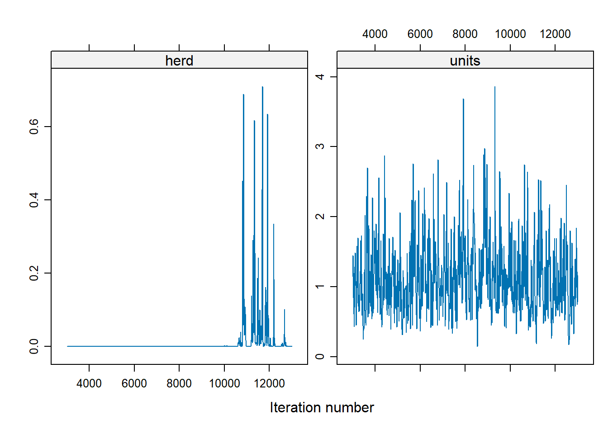
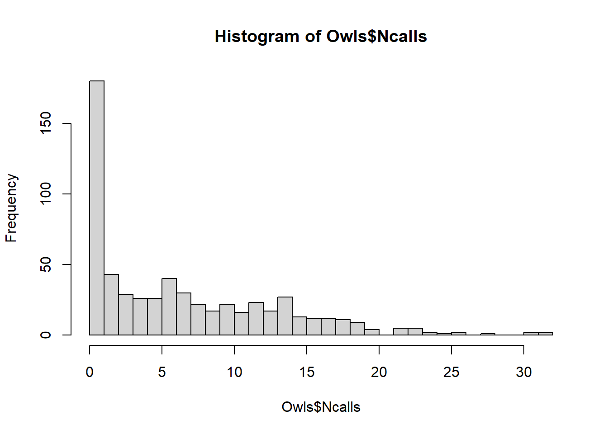

# Nonlinear and Generalized Linear Mixed Models {#sec-nonlinear-and-generalized-linear-mixed-models}

Nonlinear Mixed Models (NLMMs) and Generalized Linear Mixed Models (GLMMs) extend traditional models by incorporating both fixed effects and random effects, allowing for greater flexibility in modeling complex data structures.

-   NLMMs extend nonlinear models to include both fixed and random effects, accommodating nonlinear relationships in the data.
-   GLMMs extend generalized linear models to include random effects, allowing for correlated data and non-constant variance structures.

------------------------------------------------------------------------

## Nonlinear Mixed Models {#sec-nonlinear-mixed-models}

A general form of a nonlinear mixed model is:

$$
Y_{ij} = f(\mathbf{x}_{ij}, \boldsymbol{\theta}, \boldsymbol{\alpha}_i) + \epsilon_{ij}
$$

for the $j$-th response from the $i$-th cluster (or subject), where:

-   $i = 1, \ldots, n$ (number of clusters/subjects),
-   $j = 1, \ldots, n_i$ (number of observations per cluster),
-   $\boldsymbol{\theta}$ represents the fixed effects,
-   $\boldsymbol{\alpha}_i$ are the random effects for cluster $i$,
-   $\mathbf{x}_{ij}$ are the regressors or design variables,
-   $f(\cdot)$ is a nonlinear mean response function,
-   $\epsilon_{ij}$ represents the residual error, often assumed to be normally distributed with mean 0.

NLMMs are particularly useful when the relationship between predictors and the response cannot be adequately captured by a linear model.

------------------------------------------------------------------------

## Generalized Linear Mixed Models {#sec-generalized-linear-mixed-models}

GLMMs extend GLMs by incorporating random effects, which allows for modeling data with hierarchical or clustered structures.

The conditional distribution of $y_i$ given the random effects $\boldsymbol{\alpha}_i$ is:

$$
y_i \mid \boldsymbol{\alpha}_i \sim \text{independent } f(y_i \mid \boldsymbol{\alpha})
$$

where $f(y_i \mid \boldsymbol{\alpha})$ belongs to the exponential family of distributions:

$$
f(y_i \mid \boldsymbol{\alpha}) = \exp \left( \frac{y_i \theta_i - b(\theta_i)}{a(\phi)} - c(y_i, \phi) \right)
$$

-   $\theta_i$ is the canonical parameter,
-   $a(\phi)$ is a dispersion parameter,
-   $b(\theta_i)$ and $c(y_i, \phi)$ are specific functions defining the exponential family.

The conditional mean of $y_i$ is related to $\theta_i$ by:

$$
\mu_i = \frac{\partial b(\theta_i)}{\partial \theta_i}
$$

Applying a link function $g(\cdot)$, we relate the mean response to both fixed and random effects:

$$
\begin{aligned}
E(y_i \mid \boldsymbol{\alpha}) &= \mu_i \\
g(\mu_i) &= \mathbf{x}_i' \boldsymbol{\beta} + \mathbf{z}_i' \boldsymbol{\alpha}
\end{aligned}
$$

-   $g(\cdot)$ is a known link function,
-   $\mathbf{x}_i$ and $\mathbf{z}_i$ are design matrices for fixed and random effects, respectively,
-   $\boldsymbol{\beta}$ represents fixed effects, and $\boldsymbol{\alpha}$ represents random effects.

We also specify the distribution of the random effects:

$$
\boldsymbol{\alpha} \sim f(\boldsymbol{\alpha})
$$

This distribution is often assumed to be multivariate normal (Law of large Number applies to fixed effects) but can be chosen (subjectively) based on the context.

------------------------------------------------------------------------

## Relationship Between NLMMs and GLMMs

NLMMs can be viewed as a special case of GLMMs when the inverse link function corresponds to a nonlinear transformation of the linear predictor:

$$
\begin{aligned}
\mathbf{Y}_i &= \mathbf{f}(\mathbf{x}_i, \boldsymbol{\theta}, \boldsymbol{\alpha}_i) + \boldsymbol{\epsilon}_i \\
\mathbf{Y}_i &= g^{-1}(\mathbf{x}_i' \boldsymbol{\beta} + \mathbf{z}_i' \boldsymbol{\alpha}_i) + \boldsymbol{\epsilon}_i
\end{aligned}
$$

Here, $g^{-1}(\cdot)$ represents the inverse link function, corresponding to a nonlinear transformation of the fixed and random effects.

Note:\
We can't derive the analytical formulation of the marginal distribution because nonlinear combination of normal variables is not normally distributed, even in the case of additive error ($\epsilon_i$) and random effects ($\alpha_i$) are both normal.

------------------------------------------------------------------------

## Marginal Properties of GLMMs

### Marginal Mean of $y_i$

The marginal mean is obtained by integrating over the distribution of the random effects:

$$
E(y_i) = E_{\boldsymbol{\alpha}}(E(y_i \mid \boldsymbol{\alpha})) = E_{\boldsymbol{\alpha}}(\mu_i) = E\left(g^{-1}(\mathbf{x}_i' \boldsymbol{\beta} + \mathbf{z}_i' \boldsymbol{\alpha})\right)
$$

Since $g^{-1}(\cdot)$ is nonlinear, this expectation cannot be simplified further without specific distributional assumptions.

#### Special Case: Log Link Function

For a log-link function, $g(\mu) = \log(\mu)$, the inverse link is the exponential function:

$$
E(y_i) = E\left(\exp(\mathbf{x}_i' \boldsymbol{\beta} + \mathbf{z}_i' \boldsymbol{\alpha})\right)
$$

Using properties of the moment-generating function (MGF):

$$
E(y_i) = \exp(\mathbf{x}_i' \boldsymbol{\beta}) \cdot E\left(\exp(\mathbf{z}_i' \boldsymbol{\alpha})\right)
$$

Here, $E(\exp(\mathbf{z}_i' \boldsymbol{\alpha}))$ is the MGF of $\boldsymbol{\alpha}$ evaluated at $\mathbf{z}_i$.

------------------------------------------------------------------------

### Marginal Variance of $y_i$

The variance decomposition formula applies:

$$
\begin{aligned}
\operatorname{Var}(y_i) &= \operatorname{Var}_{\boldsymbol{\alpha}}\left(E(y_i \mid \boldsymbol{\alpha})\right) + E_{\boldsymbol{\alpha}}\left(\operatorname{Var}(y_i \mid \boldsymbol{\alpha})\right) \\
&= \operatorname{Var}(\mu_i) + E\left(a(\phi) V(\mu_i)\right)
\end{aligned}
$$

Expressed explicitly:

$$
\operatorname{Var}(y_i) = \operatorname{Var}\left(g^{-1}(\mathbf{x}_i' \boldsymbol{\beta} + \mathbf{z}_i' \boldsymbol{\alpha})\right) + E\left(a(\phi) V\left(g^{-1}(\mathbf{x}_i' \boldsymbol{\beta} + \mathbf{z}_i' \boldsymbol{\alpha})\right)\right)
$$

Without specific assumptions about $g(\cdot)$ and the distribution of $\boldsymbol{\alpha}$, this is the most general form.

------------------------------------------------------------------------

### Marginal Covariance of $\mathbf{y}$

Random effects induce correlation between observations within the same cluster. The covariance between $y_i$ and $y_j$ is:

$$
\begin{aligned}
\operatorname{Cov}(y_i, y_j) &= \operatorname{Cov}_{\boldsymbol{\alpha}}\left(E(y_i \mid \boldsymbol{\alpha}), E(y_j \mid \boldsymbol{\alpha})\right) + E_{\boldsymbol{\alpha}}\left(\operatorname{Cov}(y_i, y_j \mid \boldsymbol{\alpha})\right) \\
&= \operatorname{Cov}(\mu_i, \mu_j) + E(0) \\
&= \operatorname{Cov}\left(g^{-1}(\mathbf{x}_i' \boldsymbol{\beta} + \mathbf{z}_i' \boldsymbol{\alpha}), g^{-1}(\mathbf{x}_j' \boldsymbol{\beta} + \mathbf{z}_j' \boldsymbol{\alpha})\right)
\end{aligned}
$$

The second term vanishes when $y_i$ and $y_j$ are conditionally independent given $\boldsymbol{\alpha}$. This dependency structure is a hallmark of mixed models.

------------------------------------------------------------------------

Example: Repeated Measurements with a Poisson GLMM

Consider repeated count measurements for subjects:

-   Let $y_{ij}$ be the $j$-th count for subject $i$.
-   Assume $y_{ij} \mid \alpha_i \sim \text{independent } \text{Poisson}(\mu_{ij})$.

The model is specified as:

$$
\log(\mu_{ij}) = \mathbf{x}_{ij}' \boldsymbol{\beta} + \alpha_i
$$

where:

-   $\alpha_i \sim \text{i.i.d. } N(0, \sigma^2_{\alpha})$ represents subject-specific random effects,
-   This is a log-link GLMM with random intercepts for subjects.

The inclusion of $\alpha_i$ accounts for subject-level heterogeneity, capturing unobserved variability across individuals.

------------------------------------------------------------------------

## Estimation in Nonlinear and Generalized Linear Mixed Models

In [Linear Mixed Models](#sec-linear-mixed-models), the marginal likelihood of the observed data $\mathbf{y}$ is derived by integrating out the random effects from the hierarchical formulation:

$$
f(\mathbf{y}) = \int f(\mathbf{y} \mid \boldsymbol{\alpha}) \, f(\boldsymbol{\alpha}) \, d\boldsymbol{\alpha}
$$

For LMMs, both component distributions---

-   the conditional distribution $f(\mathbf{y} \mid \boldsymbol{\alpha})$, and

-   the random effects distribution $f(\boldsymbol{\alpha})$---

are typically assumed to be Gaussian with linear relationships. These assumptions imply that the marginal distribution of $\mathbf{y}$ is also Gaussian, allowing the integral to be solved analytically using properties of the multivariate normal distribution.

In contrast:

-   For GLMMs, the conditional distribution $f(\mathbf{y} \mid \boldsymbol{\alpha})$ belongs to the exponential family but is not Gaussian in general.

-   For NLMMs, the relationship between the mean response and the random (and fixed) effects is nonlinear, complicating the integral.

In both cases, the marginal likelihood integral:

$$
L(\boldsymbol{\beta}; \mathbf{y}) = \int f(\mathbf{y} \mid \boldsymbol{\alpha}) \, f(\boldsymbol{\alpha}) \, d\boldsymbol{\alpha}
$$

cannot be solved analytically. Consequently, estimation requires:

-   [Numerical Integration](#estimation-by-numerical-integration)
-   Linearization of the Model
-   

------------------------------------------------------------------------

### Estimation by Numerical Integration {#estimation-by-numerical-integration}

The marginal likelihood for parameter estimation is given by:

$$
L(\boldsymbol{\beta}; \mathbf{y}) = \int f(\mathbf{y} \mid \boldsymbol{\alpha}) \, f(\boldsymbol{\alpha}) \, d\boldsymbol{\alpha}
$$

To estimate the fixed effects $\boldsymbol{\beta}$, we often maximize the log-likelihood:

$$
\ell(\boldsymbol{\beta}) = \log L(\boldsymbol{\beta}; \mathbf{y})
$$

Optimization requires the score function (gradient):

$$
\frac{\partial \ell(\boldsymbol{\beta})}{\partial \boldsymbol{\beta}}
$$

Since the integral in $L(\boldsymbol{\beta}; \mathbf{y})$ is generally intractable, we rely on numerical techniques to approximate it.

------------------------------------------------------------------------

#### Methods for Numerical Integration

1.  Gaussian Quadrature

    -   Suitable for low-dimensional random effects ($\dim(\boldsymbol{\alpha})$ is small).
    -   Approximates the integral using weighted sums of function evaluations at specific points (nodes).
    -   Gauss-Hermite quadrature is commonly used when random effects are normally distributed.

    Limitation: Computational cost grows exponentially with the dimension of $\boldsymbol{\alpha}$ (curse of dimensionality).

2.  Laplace Approximation

    -   Approximates the integral by expanding the log-likelihood around the mode of the integrand (i.e., the most likely value of $\boldsymbol{\alpha}$).
    -   Provides accurate results for moderate-sized random effects and large sample sizes.
    -   First-order Laplace approximation is commonly used; higher-order versions improve accuracy but increase complexity.

    Key Idea: Approximate the integral as:

    $$
    \int e^{h(\boldsymbol{\alpha})} d\boldsymbol{\alpha} \approx e^{h(\hat{\boldsymbol{\alpha}})} \sqrt{\frac{(2\pi)^q}{|\mathbf{H}|}}
    $$

    where:

    -   $\hat{\boldsymbol{\alpha}}$ is the mode of $h(\boldsymbol{\alpha})$,
    -   $\mathbf{H}$ is the Hessian matrix of second derivatives at $\hat{\boldsymbol{\alpha}}$,
    -   $q$ is the dimension of $\boldsymbol{\alpha}$.

3.  Monte Carlo Integration

    -   Uses random sampling to approximate the integral.
    -   Importance Sampling improves efficiency by sampling from a distribution that better matches the integrand.
    -   Markov Chain Monte Carlo methods, such as Gibbs sampling or Metropolis-Hastings, are used when the posterior distribution is complex.

    Advantage: Scales better with high-dimensional random effects compared to quadrature methods.

    Limitation: Computationally intensive, and variance of estimates can be high without careful tuning.

------------------------------------------------------------------------

#### Choosing an Integration Method

| Method                | Dimensionality               | Accuracy                          | Computational Cost                 |
|:-----------------|:------------------|:-----------------|:-----------------|
| Gaussian Quadrature   | Low-dimensional ($q \leq 3$) | High (with sufficient nodes)      | High (exponential growth with $q$) |
| Laplace Approximation | Moderate-dimensional         | Moderate to High                  | Moderate                           |
| Monte Carlo Methods   | High-dimensional             | Variable (depends on sample size) | High (but scalable)                |

-   For small random effect dimensions, quadrature methods are effective.
-   For moderate dimensions, Laplace approximation offers a good balance.
-   For high dimensions or complex models, Monte Carlo techniques are often the method of choice.

------------------------------------------------------------------------

### Estimation by Linearization {#sec-estimation-by-linearization-glmm}

When estimating parameters in [NLMMs](#sec-nonlinear-mixed-models) and [GLMMs](#sec-generalized-linear-mixed-models), one common and effective approach is linearization. This technique approximates the nonlinear or non-Gaussian components with linear counterparts, enabling the use of standard LMM estimation methods. Linearization not only simplifies the estimation process but also allows for leveraging well-established statistical tools and methods developed for linear models.

#### Concept of Linearization

The core idea is to create a linearized version of the response variable, known as the *working response* or *pseudo-response*, denoted as $\tilde{y}_i$. This pseudo-response is designed to approximate the original nonlinear relationship in a linear form, facilitating easier estimation of model parameters. The conditional mean of this pseudo-response is expressed as:

$$
E(\tilde{y}_i \mid \boldsymbol{\alpha}) = \mathbf{x}_i' \boldsymbol{\beta} + \mathbf{z}_i' \boldsymbol{\alpha}
$$

Here:

-   $\mathbf{x}_i$ is the design matrix for fixed effects,

-   $\boldsymbol{\beta}$ represents the fixed effect parameters,

-   $\mathbf{z}_i$ is the design matrix for random effects,

-   $\boldsymbol{\alpha}$ denotes the random effects.

In addition to the conditional mean, it is essential to estimate the conditional variance of the pseudo-response to fully characterize the linearized model:

$$
\operatorname{Var}(\tilde{y}_i \mid \boldsymbol{\alpha})
$$

This variance estimation ensures that the model accounts for the inherent variability in the data, maintaining the integrity of statistical inferences.

#### Application of Linearization

Once linearized, the model structure closely resembles that of a [linear mixed model]((#sec-linear-mixed-models)), allowing us to apply standard estimation techniques from [LMMs](#sec-linear-mixed-models). These techniques include methods such as MLE and REML, which are computationally efficient and statistically robust.

The primary difference between various linearization-based methods lies in how the linearization is performed. This often involves expanding the nonlinear function $f(\mathbf{x}, \boldsymbol{\theta}, \boldsymbol{\alpha})$ or the inverse link function $g^{-1}(\cdot)$. The goal is to approximate these complex functions with simpler linear expressions while retaining as much of the original model's characteristics as possible.

##### Taylor Series Expansion

A widely used method for linearization is the Taylor series expansion. This approach approximates the nonlinear mean function around initial estimates of the random effects. The first-order Taylor series expansion of the nonlinear function is given by:

$$
 f(\mathbf{x}_{ij}, \boldsymbol{\theta}, \boldsymbol{\alpha}_i) \approx f(\mathbf{x}_{ij}, \boldsymbol{\theta}, \hat{\boldsymbol{\alpha}}_i) + \frac{\partial f}{\partial \boldsymbol{\alpha}_i} \bigg|_{\hat{\boldsymbol{\alpha}}_i} (\boldsymbol{\alpha}_i - \hat{\boldsymbol{\alpha}}_i)
$$

In this expression:

-   $f(\mathbf{x}_{ij}, \boldsymbol{\theta}, \hat{\boldsymbol{\alpha}}_i)$ is the function evaluated at the initial estimates of the random effects $\hat{\boldsymbol{\alpha}}_i$,

-   $\frac{\partial f}{\partial \boldsymbol{\alpha}_i} \big|_{\hat{\boldsymbol{\alpha}}_i}$ represents the gradient (or derivative) of the function with respect to the random effects, evaluated at $\hat{\boldsymbol{\alpha}}_i$,

-   $(\boldsymbol{\alpha}_i - \hat{\boldsymbol{\alpha}}_i)$ captures the deviation from the initial estimates.

The initial estimates $\hat{\boldsymbol{\alpha}}_i$ are often set to zero for simplicity, especially in the early stages of model fitting. This approximation reduces the model to a linear form, making it amenable to standard LMM estimation techniques.

##### Advantages and Considerations

Linearization offers several advantages:

1.  Simplified Computation: By transforming complex nonlinear relationships into linear forms, linearization reduces computational complexity.
2.  Flexibility: Despite the simplification, linearized models retain the ability to capture key features of the original data structure.
3.  Statistical Robustness: The use of established LMM estimation techniques ensures robust parameter estimation.

However, linearization also comes with considerations:

-   Approximation Error: The accuracy of the linearized model depends on how well the linear approximation captures the original nonlinear relationship.

-   Choice of Expansion Point: The selection of initial estimates $\hat{\boldsymbol{\alpha}}_i$ can influence the quality of the approximation.

-   Higher-Order Terms: In cases where the first-order approximation is insufficient, higher-order Taylor series terms may be needed, increasing model complexity.

------------------------------------------------------------------------

#### Penalized Quasi-Likelihood {#penalized-quasi-likelihood}

Penalized Quasi-Likelihood (PQL) is one of the most popular linearization-based estimation methods for [GLMMs](#sec-generalized-linear-mixed-models).

The linearization is achieved through a first-order Taylor expansion of the inverse link function around current estimates of the parameters. The working response at the $k$-th iteration is given by:

$$
\tilde{y}_i^{(k)} = \hat{\eta}_i^{(k-1)} + \left(y_i - \hat{\mu}_i^{(k-1)}\right) \cdot \left.\frac{d \eta}{d \mu}\right|_{\hat{\eta}_i^{(k-1)}}
$$

Where:

-   $\eta_i = g(\mu_i)$ is the linear predictor,\
-   $\hat{\eta}_i^{(k-1)}$ and $\hat{\mu}_i^{(k-1)}$ are the estimates from the previous iteration $(k-1)$,\
-   $g(\cdot)$ is the link function, and $\mu_i = g^{-1}(\eta_i)$.

PQL Estimation Algorithm

1.  Initialization:\
    Start with initial estimates of $\boldsymbol{\beta}$ and $\boldsymbol{\alpha}$ (commonly set to zeros).

2.  Compute the Working Response:\
    Use the formula above to compute $\tilde{y}_i^{(k)}$ based on current parameter estimates.

3.  Fit a [Linear Mixed Model](#sec-linear-mixed-models):\
    Apply standard LMM estimation techniques to the pseudo-response $\tilde{y}_i^{(k)}$ to update estimates of $\boldsymbol{\beta}$ and $\boldsymbol{\alpha}$.

4.  Update Variance Components:\
    Estimate $\operatorname{Var}(\tilde{y}_i \mid \boldsymbol{\alpha})$ based on updated parameter estimates.

5.  Iteration:\
    Repeat steps 2--4 until the estimates converge.

Comments on PQL:

-   Advantages:
    -   Easy to implement using existing LMM software.
    -   Fast convergence for many practical datasets.
-   Limitations:
    -   Inference is only asymptotically correct due to the linearization approximation.
    -   Biased estimates are common, especially:
        -   For binomial responses with small group sizes,
        -   In Bernoulli models (worst-case scenario),
        -   In Poisson models with small counts. [@faraway2016extending]
    -   Hypothesis testing and confidence intervals can be unreliable.

------------------------------------------------------------------------

#### Generalized Estimating Equations {#generalized-estimating-equations}

Generalized Estimating Equations (GEE) offer an alternative approach to parameter estimation in models with correlated data, particularly for marginal models where the focus is on population-averaged effects rather than subject-specific effects.

GEE estimates are obtained by solving estimating equations rather than maximizing a likelihood function.

Consider a marginal generalized linear model:

$$
\operatorname{logit}(E(\mathbf{y})) = \mathbf{X} \boldsymbol{\beta}
$$

Assuming a working covariance matrix $\mathbf{V}$ for the elements of $\mathbf{y}$, the estimating equation for $\boldsymbol{\beta}$ is:

$$
\mathbf{X}' \mathbf{V}^{-1} (\mathbf{y} - E(\mathbf{y})) = 0
$$

If $\mathbf{V}$ correctly specifies the covariance structure, the estimator is unbiased. In practice, we often assume a simple structure (e.g., independence) and obtain robust standard errors even when the covariance is misspecified.

------------------------------------------------------------------------

##### GEE for Repeated Measures

Let $y_{ij}$ denote the $j$-th measurement on the $i$-th subject, with:

$$
\mathbf{y}_i = 
\begin{pmatrix}
y_{i1} \\
\vdots \\
y_{in_i}
\end{pmatrix},
\quad
\boldsymbol{\mu}_i =
\begin{pmatrix}
\mu_{i1} \\
\vdots \\
\mu_{in_i}
\end{pmatrix},
\quad
\mathbf{x}_{ij} =
\begin{pmatrix}
X_{ij1} \\
\vdots \\
X_{ijp}
\end{pmatrix}
$$

Define the working covariance matrix of $\mathbf{y}_i$ as:

$$
\mathbf{V}_i = \operatorname{Cov}(\mathbf{y}_i)
$$

Following [@liang1986longitudinal], the GEE for estimating $\boldsymbol{\beta}$ is:

$$
S(\boldsymbol{\beta}) = \sum_{i=1}^K \frac{\partial \boldsymbol{\mu}_i'}{\partial \boldsymbol{\beta}} \, \mathbf{V}_i^{-1} (\mathbf{y}_i - \boldsymbol{\mu}_i) = 0
$$

Where:

-   $K$ is the number of subjects (or clusters),

-   $\boldsymbol{\mu}_i = E(\mathbf{y}_i)$,

-   $\mathbf{V}_i$ is the working covariance matrix.

------------------------------------------------------------------------

##### Working Correlation Structures

The covariance matrix $\mathbf{V}_i$ is modeled as:

$$
\mathbf{V}_i = a(\phi) \, \mathbf{B}_i^{1/2} \, \mathbf{R}(\boldsymbol{c}) \, \mathbf{B}_i^{1/2}
$$

-   $a(\phi)$ is a dispersion parameter,
-   $\mathbf{B}_i$ is a diagonal matrix with variance functions $V(\mu_{ij})$ on the diagonal,
-   $\mathbf{R}(\boldsymbol{c})$ is the working correlation matrix, parameterized by $\boldsymbol{c}$. If $\mathbf{R}(\boldsymbol{c})$ is the true correlation matrix of $\mathbf{y}_i$, then $\mathbf{V}_i$ is the true covariance matrix.

Common Working Correlation Structures:

-   Independence: $\mathbf{R} = \mathbf{I}$ (simplest, but ignores correlation).
-   Exchangeable: Constant correlation between all pairs within a cluster.
-   Autoregressive (AR(1)): Correlation decreases with time lag.
-   Unstructured: Each pair has its own correlation parameter.

------------------------------------------------------------------------

##### Iterative Algorithm for GEE Estimation

1.  Initialization:

    -   Compute an initial estimate of $\boldsymbol{\beta}$ using a GLM under the independence assumption ($\mathbf{R} = \mathbf{I}$).

2.  Estimate the Working Correlation Matrix:

    -   Based on residuals from the initial fit, estimate $\mathbf{R}(\boldsymbol{c})$.

3.  Update the Covariance Matrix:

    -   Calculate $\hat{\mathbf{V}}_i$ using the updated working correlation matrix.

4.  Update $\boldsymbol{\beta}$:

    $$
    \boldsymbol{\beta}^{(r+1)} = \boldsymbol{\beta}^{(r)} + \left(\sum_{i=1}^K \frac{\partial \boldsymbol{\mu}_i'}{\partial \boldsymbol{\beta}} \, \hat{\mathbf{V}}_i^{-1} \, \frac{\partial \boldsymbol{\mu}_i}{\partial \boldsymbol{\beta}} \right)^{-1}
    \left( \sum_{i=1}^K \frac{\partial \boldsymbol{\mu}_i'}{\partial \boldsymbol{\beta}} \, \hat{\mathbf{V}}_i^{-1} (\mathbf{y}_i - \boldsymbol{\mu}_i) \right)
    $$

5.  Iteration:

    -   Repeat steps 2--4 until convergence (i.e., when changes in $\boldsymbol{\beta}$ are negligible).

------------------------------------------------------------------------

Comments on GEE:

-   Advantages:
    -   Provides consistent estimates of $\boldsymbol{\beta}$ even if the working correlation matrix is misspecified.
    -   Robust standard errors (also known as "sandwich" estimators) account for potential misspecification.
-   Limitations:
    -   Not a likelihood-based method, so likelihood-ratio tests are not appropriate.
    -   Efficiency loss if the working correlation matrix is poorly specified.
    -   Estimation of random effects is not possible---GEE focuses on marginal (population-averaged) effects.

------------------------------------------------------------------------

### Estimation by Bayesian Hierarchical Models {#estimation-by-bayesian-hierarchical-models}

Bayesian methods provide a flexible framework for estimating parameters in [NLMMs](#sec-nonlinear-mixed-models) and [GLMMs](#sec-generalized-linear-mixed-models). Unlike frequentist approaches that rely on MLE or linearization techniques, Bayesian estimation fully incorporates prior information and naturally accounts for uncertainty in both parameter estimation and predictions.

In the Bayesian context, we are interested in the posterior distribution of the model parameters, given the observed data $\mathbf{y}$:

$$
f(\boldsymbol{\alpha}, \boldsymbol{\beta} \mid \mathbf{y}) \propto f(\mathbf{y} \mid \boldsymbol{\alpha}, \boldsymbol{\beta}) \, f(\boldsymbol{\alpha}) \, f(\boldsymbol{\beta})
$$

Where:

-   $f(\mathbf{y} \mid \boldsymbol{\alpha}, \boldsymbol{\beta})$ is the likelihood of the data,
-   $f(\boldsymbol{\alpha})$ is the prior distribution for the random effects,
-   $f(\boldsymbol{\beta})$ is the prior distribution for the fixed effects,
-   $f(\boldsymbol{\alpha}, \boldsymbol{\beta} \mid \mathbf{y})$ is the posterior distribution, which combines prior beliefs with observed data.

**Advantages of Bayesian Estimation**

-   **No Need for Simplifying Approximations:** Bayesian methods do not require linearization or asymptotic approximations.
-   **Full Uncertainty Quantification:** Provides credible intervals for parameters and predictive distributions for new data.
-   **Flexible Modeling:** Easily accommodates complex hierarchical structures, non-standard distributions, and prior information.

**Computational Challenges**

Despite its advantages, Bayesian estimation can be computationally intensive and complex, especially for high-dimensional models. Key implementation issues include:

1.  **Non-Valid Joint Distributions:**\
    In some hierarchical models, specifying valid joint distributions for the data, random effects, and parameters can be challenging.

2.  **Constraints from Mean-Variance Relationships:**\
    The inherent relationship between the mean and variance in GLMMs, combined with random effects, imposes constraints on the marginal covariance structure.

3.  **Computational Intensity:**\
    Fitting Bayesian models often requires advanced numerical techniques like Markov Chain Monte Carlo, which can be slow to converge, especially for large datasets or complex models.

------------------------------------------------------------------------

#### Bayesian Estimation Methods

Bayesian estimation can proceed through two general approaches:

1.  **Approximating the Objective Function (Marginal Likelihood)**

The marginal likelihood is typically intractable because it requires integrating over random effects:

$$
f(\mathbf{y} \mid \boldsymbol{\beta}) = \int f(\mathbf{y} \mid \boldsymbol{\alpha}, \boldsymbol{\beta}) \, f(\boldsymbol{\alpha}) \, d\boldsymbol{\alpha}
$$

Since this integral cannot be solved analytically, we approximate it using the following methods:

-   **Laplace Approximation**

    -   Approximates the integral by expanding the log-likelihood around the mode of the integrand.

    -   Provides an efficient, asymptotically accurate approximation when the posterior is approximately Gaussian near its mode.

-   **Quadrature Methods**

    -   **Gaussian quadrature** (e.g., Gauss-Hermite quadrature) is effective for low-dimensional random effects.

    -   Approximates the integral by summing weighted evaluations of the function at specific points.

-   **Monte Carlo Integration**

    -   Uses random sampling to approximate the integral.

    -   **Importance sampling** improves efficiency by drawing samples from a distribution that closely resembles the target distribution.

2.  **Approximating the Model (Linearization)**

Alternatively, we can approximate the model itself using **Taylor series linearization** around current estimates of the parameters. This approach simplifies the model, making Bayesian estimation computationally more feasible, though at the cost of some approximation error.

------------------------------------------------------------------------

#### Markov Chain Monte Carlo Methods

The most common approach for fully Bayesian estimation is **MCMC**, which generates samples from the posterior distribution through iterative simulation. Popular MCMC algorithms include:

-   **Gibbs Sampling:**\
    Efficient when full conditional distributions are available in closed form.

-   **Metropolis-Hastings Algorithm:**\
    More general and flexible, used when full conditionals are not easily sampled.

-   **Hamiltonian Monte Carlo (HMC):**\
    Implemented in packages like `Stan`, provides faster convergence for complex models by leveraging gradient information.

The posterior distribution is then approximated using the generated samples:

$$
f(\boldsymbol{\alpha}, \boldsymbol{\beta} \mid \mathbf{y}) \approx \frac{1}{N} \sum_{i=1}^N \delta(\boldsymbol{\alpha} - \boldsymbol{\alpha}^{(i)}, \boldsymbol{\beta} - \boldsymbol{\beta}^{(i)})
$$

Where $N$ is the number of MCMC samples and $\delta(\cdot)$ is the Dirac delta function.

------------------------------------------------------------------------

### Practical Implementation in R

Several R packages facilitate Bayesian estimation for GLMMs and NLMMs:

-   **GLMM Estimation:**
    -   `MASS::glmmPQL` --- Penalized Quasi-Likelihood for GLMMs.
    -   `lme4::glmer` --- Frequentist estimation for GLMMs using Laplace approximation.
    -   `glmmTMB` --- Handles complex random effects structures efficiently.
-   **NLMM Estimation:**
    -   `nlme::nlme` --- Nonlinear mixed-effects modeling.
    -   `lme4::nlmer` --- Extends `lme4` for nonlinear mixed models.
    -   `brms::brm` --- Bayesian estimation via `Stan`, supporting NLMMs.
-   **Bayesian Estimation:**
    -   `MCMCglmm` --- Implements MCMC algorithms for GLMMs.
    -   `brms::brm` --- High-level interface for Bayesian regression models, leveraging `Stan` for efficient MCMC sampling.

------------------------------------------------------------------------

**Example: Non-Gaussian Repeated Measurements**

Consider the case of **repeated measurements**:

-   **If the data are Gaussian:** Use [Linear Mixed Models](#sec-linear-mixed-models).
-   **If the data are non-Gaussian:** Use [Nonlinear and Generalized Linear Mixed Models](#sec-nonlinear-and-generalized-linear-mixed-models).

## Application: Nonlinear and Generalized Linear Mixed Models

### Binomial Data: CBPP Dataset

We will use the **CBPP dataset** from the `lme4` package to demonstrate different estimation approaches for binomial mixed models.


``` r
library(lme4)
data(cbpp, package = "lme4")
head(cbpp)
#>   herd incidence size period
#> 1    1         2   14      1
#> 2    1         3   12      2
#> 3    1         4    9      3
#> 4    1         0    5      4
#> 5    2         3   22      1
#> 6    2         1   18      2
```

The data contain information about contagious bovine pleuropneumonia (CBPP) cases across different herds and periods.

1.  **Penalized Quasi-Likelihood**

**Pros:**

-   Linearizes the response to create a pseudo-response, similar to linear mixed models.

-   Computationally efficient.

**Cons:**

-   Biased for binary or Poisson data with small counts.

-   Random effects must be interpreted on the link scale.

-   AIC/BIC values are not interpretable since PQL does not rely on full likelihood.


``` r
library(MASS)
pql_cbpp <- glmmPQL(
    cbind(incidence, size - incidence) ~ period,
    random  = ~ 1 | herd,
    data    = cbpp,
    family  = binomial(link = "logit"),
    verbose = FALSE
)
summary(pql_cbpp)
#> Linear mixed-effects model fit by maximum likelihood
#>   Data: cbpp 
#>   AIC BIC logLik
#>    NA  NA     NA
#> 
#> Random effects:
#>  Formula: ~1 | herd
#>         (Intercept) Residual
#> StdDev:   0.5563535 1.184527
#> 
#> Variance function:
#>  Structure: fixed weights
#>  Formula: ~invwt 
#> Fixed effects:  cbind(incidence, size - incidence) ~ period 
#>                 Value Std.Error DF   t-value p-value
#> (Intercept) -1.327364 0.2390194 38 -5.553372  0.0000
#> period2     -1.016126 0.3684079 38 -2.758156  0.0089
#> period3     -1.149984 0.3937029 38 -2.920944  0.0058
#> period4     -1.605217 0.5178388 38 -3.099839  0.0036
#>  Correlation: 
#>         (Intr) perid2 perid3
#> period2 -0.399              
#> period3 -0.373  0.260       
#> period4 -0.282  0.196  0.182
#> 
#> Standardized Within-Group Residuals:
#>        Min         Q1        Med         Q3        Max 
#> -2.0591168 -0.6493095 -0.2747620  0.5170492  2.6187632 
#> 
#> Number of Observations: 56
#> Number of Groups: 15
```

Interpretation


``` r
exp(0.556)
#> [1] 1.743684
```

The above result shows how herd-specific odds vary, accounting for random effects.

The fixed effects are interpreted similarly to logistic regression. For example, with the logit link:

-   The **log odds** of having a case in **period 2** are **-1.016** less than in **period 1** (baseline).


``` r
summary(pql_cbpp)$tTable
#>                 Value Std.Error DF   t-value      p-value
#> (Intercept) -1.327364 0.2390194 38 -5.553372 2.333216e-06
#> period2     -1.016126 0.3684079 38 -2.758156 8.888179e-03
#> period3     -1.149984 0.3937029 38 -2.920944 5.843007e-03
#> period4     -1.605217 0.5178388 38 -3.099839 3.637000e-03
```

2.  **Numerical Integration with `glmer`**

**Pros:**

-   More accurate estimation since the method directly integrates over random effects.

**Cons:**

-   Computationally more expensive, especially with high-dimensional random effects.

-   May struggle with convergence for complex models.


``` r
numint_cbpp <- glmer(
    cbind(incidence, size - incidence) ~ period + (1 | herd),
    data = cbpp,
    family = binomial(link = "logit")
)
summary(numint_cbpp)
#> Generalized linear mixed model fit by maximum likelihood (Laplace
#>   Approximation) [glmerMod]
#>  Family: binomial  ( logit )
#> Formula: cbind(incidence, size - incidence) ~ period + (1 | herd)
#>    Data: cbpp
#> 
#>      AIC      BIC   logLik deviance df.resid 
#>    194.1    204.2    -92.0    184.1       51 
#> 
#> Scaled residuals: 
#>     Min      1Q  Median      3Q     Max 
#> -2.3816 -0.7889 -0.2026  0.5142  2.8791 
#> 
#> Random effects:
#>  Groups Name        Variance Std.Dev.
#>  herd   (Intercept) 0.4123   0.6421  
#> Number of obs: 56, groups:  herd, 15
#> 
#> Fixed effects:
#>             Estimate Std. Error z value Pr(>|z|)    
#> (Intercept)  -1.3983     0.2312  -6.048 1.47e-09 ***
#> period2      -0.9919     0.3032  -3.272 0.001068 ** 
#> period3      -1.1282     0.3228  -3.495 0.000474 ***
#> period4      -1.5797     0.4220  -3.743 0.000182 ***
#> ---
#> Signif. codes:  0 '***' 0.001 '**' 0.01 '*' 0.05 '.' 0.1 ' ' 1
#> 
#> Correlation of Fixed Effects:
#>         (Intr) perid2 perid3
#> period2 -0.363              
#> period3 -0.340  0.280       
#> period4 -0.260  0.213  0.198
```

**Comparing PQL and Numerical Integration**

For small datasets, the difference between PQL and numerical integration may be minimal.


``` r
library(rbenchmark)
benchmark(
    "PQL (MASS)" = {
        glmmPQL(
            cbind(incidence, size - incidence) ~ period,
            random = ~ 1 | herd,
            data = cbpp,
            family = binomial(link = "logit"),
            verbose = FALSE
        )
    },
    "Numerical Integration (lme4)" = {
        glmer(
            cbind(incidence, size - incidence) ~ period + (1 | herd),
            data = cbpp,
            family = binomial(link = "logit")
        )
    },
    replications = 50,
    columns = c("test", "replications", "elapsed", "relative"),
    order = "relative"
)
#>                           test replications elapsed relative
#> 1                   PQL (MASS)           50    4.78    1.000
#> 2 Numerical Integration (lme4)           50   10.06    2.105
```

**Improving Accuracy with Gauss-Hermite Quadrature**

Setting `nAGQ > 1` increases the accuracy of the likelihood approximation:


``` r
numint_cbpp_GH <- glmer(
    cbind(incidence, size - incidence) ~ period + (1 | herd),
    data = cbpp,
    family = binomial(link = "logit"),
    nAGQ = 20
)
summary(numint_cbpp_GH)$coefficients[, 1] - 
    summary(numint_cbpp)$coefficients[, 1]
#>   (Intercept)       period2       period3       period4 
#> -0.0008808634  0.0005160912  0.0004066218  0.0002644629
```

3.  **Bayesian Approach with `MCMCglmm`**

**Pros:**

-   Incorporates prior information and handles complex models with intractable likelihoods.

-   Provides full posterior distributions for parameters.

**Cons:**

-   Computationally intensive, especially with large datasets or complex hierarchical structures.


``` r
library(MCMCglmm)
Bayes_cbpp <- MCMCglmm(
    cbind(incidence, size - incidence) ~ period,
    random = ~ herd,
    data = cbpp,
    family = "multinomial2",
    verbose = FALSE
)
summary(Bayes_cbpp)
#> 
#>  Iterations = 3001:12991
#>  Thinning interval  = 10
#>  Sample size  = 1000 
#> 
#>  DIC: 537.859 
#> 
#>  G-structure:  ~herd
#> 
#>      post.mean  l-95% CI u-95% CI eff.samp
#> herd   0.02997 1.186e-16   0.2022    98.51
#> 
#>  R-structure:  ~units
#> 
#>       post.mean l-95% CI u-95% CI eff.samp
#> units     1.113   0.3264    2.066    360.8
#> 
#>  Location effects: cbind(incidence, size - incidence) ~ period 
#> 
#>             post.mean l-95% CI u-95% CI eff.samp  pMCMC    
#> (Intercept)   -1.5285  -2.0946  -0.7901    836.3 <0.001 ***
#> period2       -1.2835  -2.2661  -0.1616    705.6  0.010 ** 
#> period3       -1.3802  -2.3882  -0.2153    697.6  0.016 *  
#> period4       -1.9958  -3.2815  -0.8024    441.3 <0.001 ***
#> ---
#> Signif. codes:  0 '***' 0.001 '**' 0.01 '*' 0.05 '.' 0.1 ' ' 1
```

-   `MCMCglmm` fits a residual variance component (useful with dispersion issues).

Variance Component Analysis


``` r
# explains less variability
apply(Bayes_cbpp$VCV, 2, sd)
#>      herd     units 
#> 0.1119681 0.4973538
```

Posterior Summaries


``` r
summary(Bayes_cbpp)$solutions
#>             post.mean  l-95% CI   u-95% CI eff.samp pMCMC
#> (Intercept) -1.528512 -2.094593 -0.7901404 836.2718 0.001
#> period2     -1.283512 -2.266096 -0.1615766 705.6380 0.010
#> period3     -1.380243 -2.388198 -0.2152571 697.5827 0.016
#> period4     -1.995790 -3.281474 -0.8024437 441.2809 0.001
```

MCMC Diagnostics


``` r
library(lattice)
xyplot(as.mcmc(Bayes_cbpp$Sol), layout = c(2, 2))
```


There is no trend (i.e., well-mixed).


``` r
xyplot(as.mcmc(Bayes_cbpp$VCV), layout = c(2, 1))
```



For the herd variable, many of the values are 0, which suggests a problem. To address the instability in the herd effect sampling, we can either:

-   Modify prior distributions,

-   Increase the number of iterations


``` r
Bayes_cbpp2 <- MCMCglmm(
    cbind(incidence, size - incidence) ~ period,
    random = ~ herd,
    data = cbpp,
    family = "multinomial2",
    nitt = 20000,
    burnin = 10000,
    prior = list(G = list(list(V = 1, nu = 0.1))),
    verbose = FALSE
)
xyplot(as.mcmc(Bayes_cbpp2$VCV), layout = c(2, 1))
```


To change the shape of priors, in `MCMCglmm` use:

-   `V` controls for the location of the distribution (default = 1)

-   `nu` controls for the concentration around V (default = 0)

### Count Data: Owl Dataset

We'll now model count data using the **Owl dataset**


``` r
library(glmmTMB)
library(dplyr)
data(Owls, package = "glmmTMB")
Owls <- Owls %>% rename(Ncalls = SiblingNegotiation)
```

1.  **Poisson GLMM**

Modeling call counts with a Poisson distribution:

In a typical Poisson model, the Poisson mean $\lambda$ is modeled as: $$
\log(\lambda) = x' \beta
$$ However, if the response variable represents a rate (e.g., counts per **BroodSize**), we can model it as: $$
\log\left(\frac{\lambda}{b}\right) = x' \beta
$$ This is equivalent to: $$
\log(\lambda) = \log(b) + x' \beta
$$ where $b$ represents **BroodSize**. In this formulation, we "offset" the mean by including the logarithm of $b$ as an offset term in the model. This adjustment accounts for the varying exposure or denominator in rate-based responses.


``` r
owls_glmer <- glmer(
    Ncalls ~ offset(log(BroodSize)) + FoodTreatment * SexParent + (1 | Nest),
    family = poisson,
    data = Owls
)
summary(owls_glmer)
#> Generalized linear mixed model fit by maximum likelihood (Laplace
#>   Approximation) [glmerMod]
#>  Family: poisson  ( log )
#> Formula: Ncalls ~ offset(log(BroodSize)) + FoodTreatment * SexParent +  
#>     (1 | Nest)
#>    Data: Owls
#> 
#>      AIC      BIC   logLik deviance df.resid 
#>   5212.8   5234.8  -2601.4   5202.8      594 
#> 
#> Scaled residuals: 
#>     Min      1Q  Median      3Q     Max 
#> -3.5529 -1.7971 -0.6842  1.2689 11.4312 
#> 
#> Random effects:
#>  Groups Name        Variance Std.Dev.
#>  Nest   (Intercept) 0.2063   0.4542  
#> Number of obs: 599, groups:  Nest, 27
#> 
#> Fixed effects:
#>                                     Estimate Std. Error z value Pr(>|z|)    
#> (Intercept)                          0.65585    0.09567   6.855 7.12e-12 ***
#> FoodTreatmentSatiated               -0.65612    0.05606 -11.705  < 2e-16 ***
#> SexParentMale                       -0.03705    0.04501  -0.823   0.4104    
#> FoodTreatmentSatiated:SexParentMale  0.13135    0.07036   1.867   0.0619 .  
#> ---
#> Signif. codes:  0 '***' 0.001 '**' 0.01 '*' 0.05 '.' 0.1 ' ' 1
#> 
#> Correlation of Fixed Effects:
#>             (Intr) FdTrtS SxPrnM
#> FdTrtmntStt -0.225              
#> SexParentMl -0.292  0.491       
#> FdTrtmS:SPM  0.170 -0.768 -0.605
```

-   Nest explains a relatively large proportion of the variability (its standard deviation is larger than some coefficients).
-   The model fit isn't great (deviance of 5202 on 594 df).

2.  **Negative Binomial Model**

Addressing overdispersion using the negative binomial distribution:


``` r
owls_glmerNB <- glmer.nb(
    Ncalls ~ offset(log(BroodSize)) + FoodTreatment * SexParent + (1 | Nest),
    data = Owls
)
summary(owls_glmerNB)
#> Generalized linear mixed model fit by maximum likelihood (Laplace
#>   Approximation) [glmerMod]
#>  Family: Negative Binomial(0.8423)  ( log )
#> Formula: Ncalls ~ offset(log(BroodSize)) + FoodTreatment * SexParent +  
#>     (1 | Nest)
#>    Data: Owls
#> 
#>      AIC      BIC   logLik deviance df.resid 
#>   3495.6   3522.0  -1741.8   3483.6      593 
#> 
#> Scaled residuals: 
#>     Min      1Q  Median      3Q     Max 
#> -0.8859 -0.7737 -0.2701  0.4443  6.1432 
#> 
#> Random effects:
#>  Groups Name        Variance Std.Dev.
#>  Nest   (Intercept) 0.1245   0.3529  
#> Number of obs: 599, groups:  Nest, 27
#> 
#> Fixed effects:
#>                                     Estimate Std. Error z value Pr(>|z|)    
#> (Intercept)                          0.69005    0.13400   5.150 2.61e-07 ***
#> FoodTreatmentSatiated               -0.76657    0.16509  -4.643 3.43e-06 ***
#> SexParentMale                       -0.02605    0.14575  -0.179    0.858    
#> FoodTreatmentSatiated:SexParentMale  0.15680    0.20512   0.764    0.445    
#> ---
#> Signif. codes:  0 '***' 0.001 '**' 0.01 '*' 0.05 '.' 0.1 ' ' 1
#> 
#> Correlation of Fixed Effects:
#>             (Intr) FdTrtS SxPrnM
#> FdTrtmntStt -0.602              
#> SexParentMl -0.683  0.553       
#> FdTrtmS:SPM  0.450 -0.744 -0.671
```

There is an improvement using negative binomial considering over-dispersion


``` r
hist(Owls$Ncalls,breaks=30)
```



3.  **Zero-Inflated Model**

Handling excess zeros with a zero-inflated Poisson model:


``` r
library(glmmTMB)
owls_glmm <-
    glmmTMB(
        Ncalls ~ FoodTreatment * SexParent + offset(log(BroodSize)) +
            (1 | Nest),
        ziformula =  ~ 0,
        family = nbinom2(link = "log"),
        data = Owls
    )
owls_glmm_zi <-
    glmmTMB(
        Ncalls ~ FoodTreatment * SexParent + offset(log(BroodSize)) +
            (1 | Nest),
        ziformula =  ~ 1,
        family = nbinom2(link = "log"),
        data = Owls
    )

# Scale Arrival time to use as a covariate for zero-inflation parameter
Owls$ArrivalTime <- scale(Owls$ArrivalTime)
owls_glmm_zi_cov <- glmmTMB(
    Ncalls ~ FoodTreatment * SexParent +
        offset(log(BroodSize)) +
        (1 | Nest),
    ziformula =  ~ ArrivalTime,
    family = nbinom2(link = "log"),
    data = Owls
)

as.matrix(anova(owls_glmm, owls_glmm_zi))
#>              Df      AIC      BIC    logLik deviance    Chisq Chi Df
#> owls_glmm     6 3495.610 3521.981 -1741.805 3483.610       NA     NA
#> owls_glmm_zi  7 3431.646 3462.413 -1708.823 3417.646 65.96373      1
#>                Pr(>Chisq)
#> owls_glmm              NA
#> owls_glmm_zi 4.592983e-16


as.matrix(anova(owls_glmm_zi, owls_glmm_zi_cov))
#>                  Df      AIC      BIC    logLik deviance    Chisq Chi Df
#> owls_glmm_zi      7 3431.646 3462.413 -1708.823 3417.646       NA     NA
#> owls_glmm_zi_cov  8 3422.532 3457.694 -1703.266 3406.532 11.11411      1
#>                    Pr(>Chisq)
#> owls_glmm_zi               NA
#> owls_glmm_zi_cov 0.0008567362


summary(owls_glmm_zi_cov)
#>  Family: nbinom2  ( log )
#> Formula:          
#> Ncalls ~ FoodTreatment * SexParent + offset(log(BroodSize)) +      (1 | Nest)
#> Zero inflation:          ~ArrivalTime
#> Data: Owls
#> 
#>      AIC      BIC   logLik deviance df.resid 
#>   3422.5   3457.7  -1703.3   3406.5      591 
#> 
#> Random effects:
#> 
#> Conditional model:
#>  Groups Name        Variance Std.Dev.
#>  Nest   (Intercept) 0.07487  0.2736  
#> Number of obs: 599, groups:  Nest, 27
#> 
#> Dispersion parameter for nbinom2 family (): 2.22 
#> 
#> Conditional model:
#>                                     Estimate Std. Error z value Pr(>|z|)    
#> (Intercept)                          0.84778    0.09961   8.511  < 2e-16 ***
#> FoodTreatmentSatiated               -0.39529    0.13742  -2.877  0.00402 ** 
#> SexParentMale                       -0.07025    0.10435  -0.673  0.50079    
#> FoodTreatmentSatiated:SexParentMale  0.12388    0.16449   0.753  0.45138    
#> ---
#> Signif. codes:  0 '***' 0.001 '**' 0.01 '*' 0.05 '.' 0.1 ' ' 1
#> 
#> Zero-inflation model:
#>             Estimate Std. Error z value Pr(>|z|)    
#> (Intercept)  -1.3018     0.1261  -10.32  < 2e-16 ***
#> ArrivalTime   0.3545     0.1074    3.30 0.000966 ***
#> ---
#> Signif. codes:  0 '***' 0.001 '**' 0.01 '*' 0.05 '.' 0.1 ' ' 1
```

`glmmTMB` can handle ZIP GLMMs since it adds automatic differentiation to existing estimation strategies.

We can see ZIP GLMM with an arrival time covariate on the zero is best.

-   Arrival time has a positive effect on observing a nonzero number of calls

-   Interactions are non significant, the food treatment is significant (fewer calls after eating)

-   Nest variability is large in magnitude (without this, the parameter estimates change)

### Binomial Example: Gotway Hessian Fly Data

We will analyze the **Gotway Hessian Fly** dataset from the `agridat` package to model binomial outcomes using both frequentist and Bayesian approaches.

#### Data Visualization


``` r
library(agridat)
library(ggplot2)
library(lme4)
library(spaMM)

data(gotway.hessianfly)
dat <- gotway.hessianfly
dat$prop <- dat$y / dat$n  # Proportion of successes

ggplot(dat, aes(x = lat, y = long, fill = prop)) +
    geom_tile() +
    scale_fill_gradient(low = 'white', high = 'black') +
    geom_text(aes(label = gen, color = block)) +
    ggtitle('Gotway Hessian Fly: Proportion of Infestation')
```


#### Model Specification

-   Fixed Effects ($\boldsymbol{\beta}$): Genotype (`gen`)

-   Random Effects ($\boldsymbol{\alpha}$): Block (`block`), accounting for spatial or experimental design variability

1.  **Frequentist Approach with `glmer`**


``` r
flymodel <- glmer(
    cbind(y, n - y) ~ gen + (1 | block),
    data   = dat,
    family = binomial,
    nAGQ   = 5  # Using adaptive Gauss-Hermite quadrature for accuracy
)
summary(flymodel)
#> Generalized linear mixed model fit by maximum likelihood (Adaptive
#>   Gauss-Hermite Quadrature, nAGQ = 5) [glmerMod]
#>  Family: binomial  ( logit )
#> Formula: cbind(y, n - y) ~ gen + (1 | block)
#>    Data: dat
#> 
#>      AIC      BIC   logLik deviance df.resid 
#>    162.2    198.9    -64.1    128.2       47 
#> 
#> Scaled residuals: 
#>      Min       1Q   Median       3Q      Max 
#> -2.38644 -1.01188  0.09631  1.03468  2.75479 
#> 
#> Random effects:
#>  Groups Name        Variance Std.Dev.
#>  block  (Intercept) 0.001022 0.03196 
#> Number of obs: 64, groups:  block, 4
#> 
#> Fixed effects:
#>             Estimate Std. Error z value Pr(>|z|)    
#> (Intercept)   1.5035     0.3914   3.841 0.000122 ***
#> genG02       -0.1939     0.5302  -0.366 0.714645    
#> genG03       -0.5408     0.5103  -1.060 0.289263    
#> genG04       -1.4342     0.4714  -3.043 0.002346 ** 
#> genG05       -0.2037     0.5429  -0.375 0.707487    
#> genG06       -0.9783     0.5046  -1.939 0.052534 .  
#> genG07       -0.6041     0.5111  -1.182 0.237237    
#> genG08       -1.6774     0.4907  -3.418 0.000630 ***
#> genG09       -1.3984     0.4725  -2.960 0.003079 ** 
#> genG10       -0.6817     0.5333  -1.278 0.201183    
#> genG11       -1.4630     0.4843  -3.021 0.002522 ** 
#> genG12       -1.4591     0.4918  -2.967 0.003010 ** 
#> genG13       -3.5528     0.6600  -5.383 7.31e-08 ***
#> genG14       -2.5073     0.5264  -4.763 1.90e-06 ***
#> genG15       -2.0872     0.4851  -4.302 1.69e-05 ***
#> genG16       -2.9697     0.5383  -5.517 3.46e-08 ***
#> ---
#> Signif. codes:  0 '***' 0.001 '**' 0.01 '*' 0.05 '.' 0.1 ' ' 1
```

**Interpretation**:

-   The **fixed effects** (`gen`) indicate how different genotypes influence the infestation probability.

-   The **random effect** for `block` captures variability due to experimental blocks, improving model robustness.

-   **Odds Ratios:** Exponentiating coefficients helps interpret the impact on infestation odds.

2.  **Bayesian Approach with `MCMCglmm`**


``` r
library(MCMCglmm)
library(coda)

Bayes_flymodel <- MCMCglmm(
    cbind(y, n - y) ~ gen,
    random  = ~ block,
    data    = dat,
    family  = "multinomial2",
    verbose = FALSE
)
summary(Bayes_flymodel)
#> 
#>  Iterations = 3001:12991
#>  Thinning interval  = 10
#>  Sample size  = 1000 
#> 
#>  DIC: 877.6617 
#> 
#>  G-structure:  ~block
#> 
#>       post.mean  l-95% CI u-95% CI eff.samp
#> block   0.04578 3.837e-17   0.0741     1000
#> 
#>  R-structure:  ~units
#> 
#>       post.mean l-95% CI u-95% CI eff.samp
#> units    0.9846   0.2753     1.88    343.4
#> 
#>  Location effects: cbind(y, n - y) ~ gen 
#> 
#>             post.mean l-95% CI u-95% CI eff.samp  pMCMC    
#> (Intercept)   1.91735  0.43600  3.26116    880.0  0.006 ** 
#> genG02       -0.32422 -2.25105  1.47384   1000.0  0.736    
#> genG03       -0.69479 -2.48763  0.95483    876.0  0.432    
#> genG04       -1.78752 -3.57721 -0.03332   1000.0  0.052 .  
#> genG05       -0.30606 -2.23317  1.53127    686.6  0.748    
#> genG06       -1.26377 -3.00144  0.83328   1000.0  0.166    
#> genG07       -0.73383 -2.60995  0.94514    884.5  0.436    
#> genG08       -2.05165 -3.66942 -0.08526   1000.0  0.024 *  
#> genG09       -1.83095 -3.70722 -0.04753    811.0  0.042 *  
#> genG10       -0.75951 -2.84242  0.95539   1000.0  0.414    
#> genG11       -1.91460 -3.80032  0.07508    896.9  0.036 *  
#> genG12       -1.88198 -3.94552 -0.19179    796.3  0.046 *  
#> genG13       -4.37381 -6.79197 -2.49196    648.2 <0.001 ***
#> genG14       -3.13256 -5.10437 -1.23477    877.1  0.004 ** 
#> genG15       -2.75849 -4.57665 -0.93052    738.7  0.002 ** 
#> genG16       -3.84007 -6.13313 -2.03533    787.8 <0.001 ***
#> ---
#> Signif. codes:  0 '***' 0.001 '**' 0.01 '*' 0.05 '.' 0.1 ' ' 1
```

**MCMC Diagnostics**

-   **Trace Plot:** Checks for chain mixing and convergence.

-   **Autocorrelation Plot:** Evaluates dependency between MCMC samples.


``` r
# Trace plot for the first fixed effect
plot(Bayes_flymodel$Sol[, 1],
     main = colnames(Bayes_flymodel$Sol)[1])
```


``` r

# Autocorrelation plot
autocorr.plot(Bayes_flymodel$Sol[, 1],
              main = colnames(Bayes_flymodel$Sol)[1])
```


Bayesian Interpretation:

-   **Posterior Means:** Represent the central tendency of the parameter estimates.

-   **Credible Intervals:** Unlike frequentist confidence intervals, they can be interpreted directly as the probability that the parameter lies within the interval.

### Nonlinear Mixed Model: Yellow Poplar Data

This dataset comes from @Schabenberger_2001

#### Data Preparation


``` r
dat2 <- read.table("images/YellowPoplarData_r.txt")
names(dat2) <-
    c('tn', 'k', 'dbh', 'totht', 'dob', 'ht', 'maxd', 'cumv')
dat2$t <- dat2$dob / dat2$dbh
dat2$r <- 1 - dat2$dob / dat2$totht
```

#### Data Visualization


``` r
library(dplyr)

dat2 <- dat2 %>% group_by(tn) %>% mutate(
    z = case_when(
        totht < 74 ~ 'a: 0-74ft',
        totht < 88 ~ 'b: 74-88',
        totht < 95 ~ 'c: 88-95',
        totht < 99 ~ 'd: 95-99',
        totht < 104 ~ 'e: 99-104',
        totht < 109 ~ 'f: 104-109',
        totht < 115 ~ 'g: 109-115',
        totht < 120 ~ 'h: 115-120',
        totht < 140 ~ 'i: 120-150',
        TRUE ~ 'j: 150+'
    )
)

ggplot(dat2, aes(x = r, y = cumv)) + 
    geom_point(size = 0.5) + 
    facet_wrap(vars(z)) +
    labs(title = "Cumulative Volume vs. Relative Height by Tree Height Group")
```


#### Model Specification

The proposed [Nonlinear Mixed Model](#sec-nonlinear-mixed-models) is: $$
V_{ij} = \left(\beta_0 + (\beta_1 + b_{1i})\frac{D_i^2 H_i}{1000}\right) \exp\left[-(\beta_2 + b_{2i}) t_{ij} \exp(\beta_3 t_{ij})\right] + e_{ij}
$$ Where:

-   $b_{1i}, b_{2i}$ are random effects for tree $i$.

-   $e_{ij}$ are residual errors.

#### Fitting the Nonlinear Mixed Model


``` r
library(nlme)

tmp <- nlme(
    cumv ~ (b0 + (b1 + u1) * (dbh^2 * totht / 1000)) * 
        exp(-(b2 + u2) * (t / 1000) * exp(b3 * t)), 
    data = dat2,
    fixed = b0 + b1 + b2 + b3 ~ 1,
    random = pdDiag(u1 + u2 ~ 1),  # Uncorrelated random effects
    groups = ~ tn,                 # Grouping by tree
    start = list(fixed = c(b0 = 0.25, b1 = 2.3, b2 = 2.87, b3 = 6.7))
)
summary(tmp)
#> Nonlinear mixed-effects model fit by maximum likelihood
#>   Model: cumv ~ (b0 + (b1 + u1) * (dbh^2 * totht/1000)) * exp(-(b2 + u2) *      (t/1000) * exp(b3 * t)) 
#>   Data: dat2 
#>        AIC      BIC    logLik
#>   31103.73 31151.33 -15544.86
#> 
#> Random effects:
#>  Formula: list(u1 ~ 1, u2 ~ 1)
#>  Level: tn
#>  Structure: Diagonal
#>                u1       u2 Residual
#> StdDev: 0.1508094 0.447829 2.226361
#> 
#> Fixed effects:  b0 + b1 + b2 + b3 ~ 1 
#>       Value  Std.Error   DF  t-value p-value
#> b0 0.249386 0.12894686 6297   1.9340  0.0532
#> b1 2.288832 0.01266804 6297 180.6777  0.0000
#> b2 2.500497 0.05606686 6297  44.5985  0.0000
#> b3 6.848871 0.02140677 6297 319.9395  0.0000
#>  Correlation: 
#>    b0     b1     b2    
#> b1 -0.639              
#> b2  0.054  0.056       
#> b3 -0.011 -0.066 -0.850
#> 
#> Standardized Within-Group Residuals:
#>           Min            Q1           Med            Q3           Max 
#> -6.694575e+00 -3.081861e-01 -8.907041e-05  3.469469e-01  7.855665e+00 
#> 
#> Number of Observations: 6636
#> Number of Groups: 336
nlme::intervals(tmp)
#> Approximate 95% confidence intervals
#> 
#>  Fixed effects:
#>           lower      est.     upper
#> b0 -0.003317833 0.2493858 0.5020894
#> b1  2.264006069 2.2888323 2.3136585
#> b2  2.390620116 2.5004971 2.6103742
#> b3  6.806919325 6.8488712 6.8908232
#> 
#>  Random Effects:
#>   Level: tn 
#>            lower      est.     upper
#> sd(u1) 0.1376068 0.1508094 0.1652787
#> sd(u2) 0.4056207 0.4478290 0.4944295
#> 
#>  Within-group standard error:
#>    lower     est.    upper 
#> 2.187259 2.226361 2.266161
```

#### Interpretation:

-   **Fixed Effects (**$\beta$): Describe the average growth pattern across all trees.

-   **Random Effects (**$b_i$): Capture tree-specific deviations from the average trend.

This result is a bit different from the original study because of different implementation of nonlinear mixed models.

#### Visualizing Model Predictions


``` r
library(cowplot)

# Prediction function
nlmmfn <- function(fixed, rand, dbh, totht, t) {
    (fixed[1] + (fixed[2] + rand[1]) * (dbh ^ 2 * totht / 1000)) *
        exp(-(fixed[3] + rand[2]) * (t / 1000) * exp(fixed[4] * t))
}

# Function to generate plots for selected trees
plot_tree <- function(tree_id) {
    pred <- data.frame(dob = seq(1, max(dat2$dob), length.out = 100))
    pred$tn <- tree_id
    pred$dbh <- unique(dat2$dbh[dat2$tn == tree_id])
    pred$t <- pred$dob / pred$dbh
    pred$totht <- unique(dat2$totht[dat2$tn == tree_id])
    pred$r <- 1 - pred$dob / pred$totht
    
    pred$with_random <- predict(tmp, pred)
    pred$without_random <-
        nlmmfn(tmp$coefficients$fixed,
               c(0, 0),
               pred$dbh,
               pred$totht,
               pred$t)
    
    ggplot(pred) +
        geom_line(aes(x = r, y = with_random, color = 'With Random Effects')) +
        geom_line(aes(x = r, y = without_random, color = 'Without Random Effects')) +
        geom_point(data = dat2[dat2$tn == tree_id,], aes(x = r, y = cumv)) +
        labs(title = paste('Tree', tree_id), colour = "") +
        theme(legend.position = "bottom")
}

# Plotting for selected trees
p1 <- plot_tree(1)
p2 <- plot_tree(151)
p3 <- plot_tree(279)

plot_grid(p1, p2, p3)
```


-   **Red Line:** Model predictions with tree-specific random effects.

-   **Teal Line:** Model predictions based only on fixed effects (ignoring tree-specific variation).

-   **Dots:** Observed cumulative volume for each tree.

## Summary

{width="100%"}
