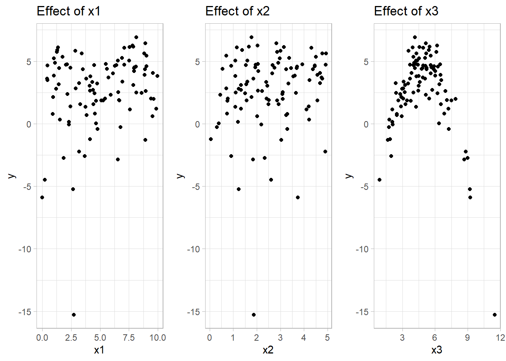

# Nonparametric Regression

**Nonparametric regression** refers to a class of regression techniques that do not assume a specific functional form (e.g., linear, polynomial of fixed degree) for the relationship between a predictor $x \in \mathbb{R}$ (or $\mathbf{x} \in \mathbb{R}^p$) and a response variable $y \in \mathbb{R}$. Instead, nonparametric methods aim to estimate this relationship directly from the data, allowing the data to "speak for themselves."

In a standard regression framework, we have a response variable $Y$ and one or more predictors $\mathbf{X} = (X_1, X_2, \ldots, X_p)$. Let us start with a univariate setting for simplicity. We assume the following model:

$$
Y = m(x) + \varepsilon,
$$

where:

-   $m(x) = \mathbb{E}[Y \mid X = x]$ is the **regression function** we aim to estimate,
-   $\varepsilon$ is a random **error term** (noise) with $\mathbb{E}[\varepsilon \mid X = x] = 0$ and constant variance $\operatorname{Var}(\varepsilon) = \sigma^2$.

In **parametric regression** (e.g., [Linear Regression]), we might assume $m(x)$ has a specific form, such as:

$$
m(x) = \beta_0 + \beta_1 x + \cdots + \beta_d x^d,
$$

where $\beta_0, \beta_1, \ldots, \beta_d$ are parameters to be estimated. In contrast, **nonparametric regression** relaxes this assumption and employs methods that can adapt to potentially complex shapes in $m(x)$ without pre-specifying its structure.

## Why Nonparametric?

### Flexibility

Nonparametric methods can capture **nonlinear relationships** and **complex patterns** in your data more effectively than many traditional parametric methods.

-   **Adaptive Fit**: They rely on the data itself to determine the shape of the relationship, rather than forcing a specific equation like $Y = \beta_0 + \beta_1 x$ (linear) or a polynomial.
-   **Local Structures**: Techniques like [kernel smoothing](#sec-kernel-regression) or [local regression](#sec-local-polynomial-regression) focus on small neighborhoods around each observation, allowing the model to adjust dynamically to local variations.

**When This Matters:**

-   **Highly Variable Data**: If the data shows multiple peaks, sharp transitions, or other irregular patterns.

-   **Exploratory Analysis**: When you're trying to uncover hidden structures or trends in a dataset without strong prior assumptions.

------------------------------------------------------------------------

### Fewer Assumptions

Parametric methods typically assume:

-   A specific functional form (e.g., linear, quadratic).

-   A specific error distribution (e.g., normal, Poisson).

Nonparametric methods, on the other hand, **relax these assumptions**, making them:

-   **Robust to Misspecification**: Less risk of biased estimates due to incorrect modeling choices.
-   **Flexible in Error Structure**: They can handle complex error distributions without explicitly modeling them.

**When This Matters:**

-   **Heterogeneous Populations**: In fields like ecology, genomics, or finance, where data might come from unknown mixtures of distributions.

-   **Lack of Theoretical Guidance**: If theory does not suggest a strong functional form or distribution family.

------------------------------------------------------------------------

### Interpretability

Nonparametric models can still offer valuable insights:

-   **Visual Interpretations**: Methods like kernel smoothing provide smooth curves that you can plot to see how $Y$ changes with $x$.
-   **Tree-Based Methods**: Random forests and gradient boosting (also nonparametric in nature) can be interpreted via **variable importance** measures or **partial dependence** plots, although they can be more complex than simple curves.

While you don't get simple coefficient estimates as in [Linear Regression], you can still convey how certain predictors influence the response through plots or importance metrics.

------------------------------------------------------------------------

### Practical Considerations

#### When to Prefer Nonparametric

1.  **Larger Sample Sizes:** Nonparametric methods often need more data because they let the data "speak" rather than relying on a fixed formula.
2.  **Unknown or Complex Relationships:** If you suspect strong nonlinearity or have no strong theory about the functional form, nonparametric approaches provide the flexibility to discover patterns.
3.  **Exploratory or Predictive Goals:** In data-driven or machine learning contexts, minimizing predictive error often takes precedence over strict parametric assumptions.

#### When to Be Cautious

1.  **Small Sample Sizes:** Nonparametric methods can overfit and exhibit high variance if there isn't enough data to reliably estimate the relationship.
2.  **Computational Cost:** Some nonparametric methods (e.g., kernel methods, large random forests) can be computationally heavier than parametric approaches like linear regression.
3.  **Strong Theoretical Models:** If domain knowledge strongly suggests a specific parametric form, ignoring that might reduce clarity or conflict with established theory.
4.  **Extrapolation:** Nonparametric models typically **do not** extrapolate well beyond the observed data range, because they rely heavily on local patterns.

------------------------------------------------------------------------

### Balancing Parametric and Nonparametric Approaches

In practice, it's not always an either/or decision. Consider:

-   **Semiparametric Models**: Combine parametric components (for known relationships or effects) with nonparametric components (for unknown parts).
-   **Model Selection & Regularization**: Use techniques like cross-validation to choose bandwidths (kernel smoothing), number of knots (splines), or hyperparameters (tree depth) to avoid overfitting.
-   **Diagnostic Tools**: Start with a simple parametric model, look at residual plots to identify patterns that might warrant a nonparametric approach.

+------------------------------+--------------------------------------------------------------------------+--------------------------------------------------------------------+
| **Criterion**                | **Parametric Methods**                                                   | **Nonparametric Methods**                                          |
+==============================+==========================================================================+====================================================================+
| **Assumptions**              | Requires strict assumptions (e.g., linearity, distribution form)         | Minimal assumptions, flexible functional forms                     |
+------------------------------+--------------------------------------------------------------------------+--------------------------------------------------------------------+
| **Data Requirements**        | Often works with smaller datasets if assumptions hold                    | Generally more data-hungry due to flexibility                      |
+------------------------------+--------------------------------------------------------------------------+--------------------------------------------------------------------+
| **Interpretability**         | Straightforward coefficients, easy to explain                            | Visual or plot-based insights; feature importance in trees         |
+------------------------------+--------------------------------------------------------------------------+--------------------------------------------------------------------+
| **Complexity & Overfitting** | Less prone to overfitting if form is correct                             | Can overfit if not regularized (e.g., bandwidth selection)         |
+------------------------------+--------------------------------------------------------------------------+--------------------------------------------------------------------+
| **Extrapolation**            | Can extrapolate if the assumed form is correct                           | Poor extrapolation outside the observed data range                 |
+------------------------------+--------------------------------------------------------------------------+--------------------------------------------------------------------+
| **Computational Cost**       | Typically low to moderate (e.g., $O(n)$ to $O(n^2)$) depending on method | Can be higher (e.g., repeated local estimates or ensemble methods) |
+------------------------------+--------------------------------------------------------------------------+--------------------------------------------------------------------+

------------------------------------------------------------------------

**Drawbacks and Challenges**

1.  **Curse of Dimensionality:** As the number of predictors $p$ increases, nonparametric methods often require exponentially larger sample sizes to maintain accuracy. This phenomenon, known as the curse of dimensionality, leads to sparse data in high-dimensional spaces, making it harder to obtain reliable estimates.
2.  **Choice of Hyperparameters:** Methods such as kernel smoothing and splines depend on hyperparameters like bandwidth or smoothing parameters, which must be carefully selected to balance bias and variance.
3.  **Computational Complexity:** Nonparametric methods can be computationally intensive, especially with large datasets or in high-dimensional settings.

------------------------------------------------------------------------

## Basic Concepts in Nonparametric Estimation

### Bias-Variance Trade-Off

For a given method of estimating $m(x)$, we denote the estimator as $\hat{m}(x)$. The **mean squared error** (MSE) at a point $x$ is defined as:

$$
\operatorname{MSE}(x) = \mathbb{E}\bigl[\{\hat{m}(x) - m(x)\}^2\bigr].
$$

This MSE can be decomposed into two key components: **bias** and **variance**:

$$
\operatorname{MSE}(x) = \bigl[\mathbb{E}[\hat{m}(x)] - m(x)\bigr]^2 + \operatorname{Var}(\hat{m}(x)).
$$

Where:

-   **Bias**: Measures the systematic error in the estimator: $$
    \operatorname{Bias}^2 = \bigl[\mathbb{E}[\hat{m}(x)] - m(x)\bigr]^2.
    $$

-   **Variance**: Measures the variability of the estimator around its expected value: $$
    \operatorname{Var}(\hat{m}(x)) = \mathbb{E}\bigl[\{\hat{m}(x) - \mathbb{E}[\hat{m}(x)]\}^2\bigr].
    $$

Nonparametric methods often have **low bias** because they can adapt to a wide range of functions. However, this flexibility can lead to **high variance**, especially when the model captures noise rather than the underlying signal.

The **bandwidth** or **smoothing parameter** in nonparametric methods typically controls this trade-off:

-   **Large bandwidth** $\Rightarrow$ smoother function $\Rightarrow$ higher bias, lower variance.
-   **Small bandwidth** $\Rightarrow$ more wiggly function $\Rightarrow$ lower bias, higher variance.

Selecting an optimal bandwidth is critical, as it determines the balance between underfitting (high bias) and overfitting (high variance).

------------------------------------------------------------------------

### Kernel Smoothing and Local Averages

Many nonparametric regression estimators can be viewed as **weighted local averages** of the observed responses $\{Y_i\}$. In the univariate case, if $x_i$ are observations of the predictor and $y_i$ are the corresponding responses, the nonparametric estimator at a point $x$ often takes the form:

$$
\hat{m}(x) = \sum_{i=1}^n w_i(x) \, y_i,
$$

where the weights $w_i(x)$ depend on the distance between $x_i$ and $x$, and they satisfy:

$$
\sum_{i=1}^n w_i(x) = 1.
$$

We will see how this arises more concretely in [kernel regression](#sec-kernel-regression) below.

------------------------------------------------------------------------

## Kernel Regression {#sec-kernel-regression}

### Basic Setup

A **kernel function** $K(\cdot)$ is a non-negative, symmetric function whose integral (or sum, in a discrete setting) equals 1. In nonparametric statistics---such as kernel density estimation or local regression---kernels serve as **weighting** mechanisms, assigning higher weights to points closer to the target location and lower weights to points farther away. Specifically, a valid kernel function must satisfy:

1.  **Non-negativity**:\
    $$
    K(u) \ge 0 \quad \text{for all } u.
    $$

2.  **Normalization**:\
    $$
    \int_{-\infty}^{\infty} K(u)\,du = 1.
    $$

3.  **Symmetry**:\
    $$
    K(u) = K(-u) \quad \text{for all } u.
    $$

In practice, the **bandwidth** (sometimes called the smoothing parameter) used alongside a kernel usually has a greater impact on the quality of the estimate than the particular form of the kernel. However, choosing a suitable kernel can still influence computational efficiency and the smoothness of the resulting estimates.

------------------------------------------------------------------------

#### Common Kernel Functions

A kernel function essentially measures *proximity*, assigning higher weights to observations $x_i$ that are close to the target point $x$, and smaller weights to those farther away.

1.  Gaussian Kernel $$
    K(u) = \frac{1}{\sqrt{2\pi}} e^{-\frac{u^2}{2}}.
    $$

-   **Shape**: Bell-shaped and infinite support (i.e., $K(u)$ is technically nonzero for all $u \in (-\infty,\infty)$), though values decay rapidly as $|u|$ grows.

-   **Usage**: Due to its smoothness and mathematical convenience (especially in closed-form expressions and asymptotic analysis), it is the most widely used kernel in both density estimation and regression smoothing.

-   **Properties**: The Gaussian kernel minimizes mean square error in many asymptotic scenarios, making it a common "default choice."

2.  Epanechnikov Kernel $$
    K(u) = \begin{cases} \frac{3}{4}(1 - u^2) & \text{if } |u| \le 1,\\ 0 & \text{otherwise}. \end{cases}
    $$

-   **Shape**: Parabolic (inverted) on $[-1, 1]$, dropping to 0 at $|u|=1$.

-   **Usage**: Known for being **optimal** in a minimax sense for certain classes of problems, and it is frequently preferred when compact support (zero weights outside $|u|\le 1$) is desirable.

-   **Efficiency**: Because it is only supported on a finite interval, computations often involve fewer points (those outside $|u|\le 1$ have zero weight), which can be computationally more efficient in large datasets.

3.  Uniform (or Rectangular) Kernel $$
    K(u) = \begin{cases} \frac{1}{2} & \text{if } |u| \le 1,\\ 0 & \text{otherwise}. \end{cases}
    $$

-   **Shape**: A simple "flat top" distribution on $[-1, 1]$.

-   **Usage**: Sometimes used for its simplicity. In certain methods (e.g., a "moving average" approach), the uniform kernel equates to giving all points within a fixed window the same weight.

-   **Drawback**: Lacks smoothness at the boundaries ∣u∣=1\|u\|=1∣u∣=1, and it can introduce sharper transitions in estimates compared to smoother kernels.

4.  Triangular Kernel $$
    K(u) = \begin{cases} 1 - |u| & \text{if } |u| \le 1,\\ 0 & \text{otherwise}. \end{cases}
    $$

-   **Shape**: Forms a triangle with a peak at $u=0$ and linearly descends to 0 at $|u|=1$.

-   **Usage**: Provides a continuous but piecewise-linear alternative to the uniform kernel; places relatively more weight near the center compared to the uniform kernel.

5.  Biweight (or Quartic) Kernel $$
    K(u) = \begin{cases} \frac{15}{16} \left(1 - u^2\right)^2 & \text{if } |u| \le 1,\\ 0 & \text{otherwise}. \end{cases}
    $$

-   **Shape**: Smooth and "bump-shaped," similar to the Epanechnikov but with a steeper drop-off near $|u|=1$.

-   **Usage**: Popular when a smoother, polynomial-based kernel with compact support is desired.

6.  Cosine Kernel $$
    K(u) = \begin{cases} \frac{\pi}{4}\cos\left(\frac{\pi}{2}u\right) & \text{if } |u| \le 1,\\ 0 & \text{otherwise}. \end{cases}
    $$

-   **Shape**: A single "arch" of a cosine wave on the interval $[-1,1]$.

-   **Usage**: Used less frequently but can be appealing for certain smoothness criteria or specific signal processing contexts.

------------------------------------------------------------------------

Below is a comparison of widely used kernel functions, their functional forms, support, and main characteristics.

+------------------------+--------------------------------------------------------------------------------------------------------------------------------+--------------------------+-------------------------------------------------------------------------+
| **Kernel**             | **Formula**                                                                                                                    | **Support**              | **Key Characteristics**                                                 |
+========================+================================================================================================================================+==========================+=========================================================================+
| **Gaussian**           | $\displaystyle K(u) = \frac{1}{\sqrt{2\pi}}\, e^{-\frac{u^2}{2}}$                                                              | $u \in (-\infty,\infty)$ | **Smooth, bell-shaped**                                                 |
|                        |                                                                                                                                |                          |                                                                         |
|                        |                                                                                                                                |                          | Nonzero for all $u$, but decays quickly                                 |
|                        |                                                                                                                                |                          |                                                                         |
|                        |                                                                                                                                |                          | Often the default choice due to favorable analytical properties         |
+------------------------+--------------------------------------------------------------------------------------------------------------------------------+--------------------------+-------------------------------------------------------------------------+
| **Epanechnikov**       | $\displaystyle K(u) = \begin{cases}\frac{3}{4}(1 - u^2) & |u|\le 1 \\ 0 & \text{otherwise}\end{cases}$                         | $[-1,1]$                 | **Parabolic shape**                                                     |
|                        |                                                                                                                                |                          |                                                                         |
|                        |                                                                                                                                |                          | Compact support                                                         |
|                        |                                                                                                                                |                          |                                                                         |
|                        |                                                                                                                                |                          | Minimizes mean integrated squared error in certain theoretical contexts |
+------------------------+--------------------------------------------------------------------------------------------------------------------------------+--------------------------+-------------------------------------------------------------------------+
| **Uniform**            | $\displaystyle K(u) = \begin{cases}\tfrac{1}{2} & |u|\le 1 \\ 0 & \text{otherwise}\end{cases}$                                 | $[-1,1]$                 | **Flat (rectangular) shape**                                            |
|                        |                                                                                                                                |                          |                                                                         |
|                        |                                                                                                                                |                          | Equal weight for all points within $[-1,1]$                             |
|                        |                                                                                                                                |                          |                                                                         |
|                        |                                                                                                                                |                          | Sharp boundary can lead to less smooth estimates                        |
+------------------------+--------------------------------------------------------------------------------------------------------------------------------+--------------------------+-------------------------------------------------------------------------+
| **Triangular**         | $\displaystyle K(u) = \begin{cases}1 - |u| & |u|\le 1 \\ 0 & \text{otherwise}\end{cases}$                                      | $[-1,1]$                 | **Linear decrease** from the center $u=0$ to 0 at $|u|=1$               |
|                        |                                                                                                                                |                          |                                                                         |
|                        |                                                                                                                                |                          | Compact support                                                         |
|                        |                                                                                                                                |                          |                                                                         |
|                        |                                                                                                                                |                          | A bit smoother than the uniform kernel                                  |
+------------------------+--------------------------------------------------------------------------------------------------------------------------------+--------------------------+-------------------------------------------------------------------------+
| **Biweight** (Quartic) | $\displaystyle K(u) = \begin{cases}\frac{15}{16}(1 - u^2)^2 & |u|\le 1 \\ 0 & \text{otherwise}\end{cases}$                     | $[-1,1]$                 | **Polynomial shape**, smooth                                            |
|                        |                                                                                                                                |                          |                                                                         |
|                        |                                                                                                                                |                          | Compact support                                                         |
|                        |                                                                                                                                |                          |                                                                         |
|                        |                                                                                                                                |                          | Often used for its relatively smooth taper near the boundaries          |
+------------------------+--------------------------------------------------------------------------------------------------------------------------------+--------------------------+-------------------------------------------------------------------------+
| **Cosine**             | $\displaystyle K(u) = \begin{cases}\frac{\pi}{4}\cos\left(\frac{\pi}{2}u\right) & |u|\le 1 \\ 0 & \text{otherwise}\end{cases}$ | $[-1,1]$                 | **Single arch** of a cosine wave                                        |
|                        |                                                                                                                                |                          |                                                                         |
|                        |                                                                                                                                |                          | Compact support                                                         |
|                        |                                                                                                                                |                          |                                                                         |
|                        |                                                                                                                                |                          | Less commonly used, but still mathematically straightforward            |
+------------------------+--------------------------------------------------------------------------------------------------------------------------------+--------------------------+-------------------------------------------------------------------------+

------------------------------------------------------------------------

#### Additional Details and Usage Notes

1.  **Smoothness and Differentiability**
    -   Kernels with **infinite support** (like the Gaussian) can yield very smooth estimates but require summing over (practically) all data points.
    -   Kernels with **compact support** (like Epanechnikov, biweight, triangular, etc.) go to zero outside a fixed interval. This can make computations more efficient since only data within a certain range of the target point matter.
2.  **Choice of Kernel vs. Choice of Bandwidth**
    -   While the kernel shape does have some effect on the estimator's smoothness, **the choice of bandwidth (sometimes denoted** $h$) is typically more critical. If $h$ is too large, the estimate can be excessively smooth (high bias). If $h$ is too small, the estimate can exhibit high variance or appear "noisy."
3.  **Local Weighting Principle**
    -   At a target location $x$, a kernel function $K\bigl(\frac{x - x_i}{h}\bigr)$ down-weights data points $(x_i)$ that are farther from $x$. Nearer points have larger kernel values, hence exert greater influence on the local estimate.
4.  **Interpretation in Density Estimation**
    -   In **kernel density estimation**, each data point contributes a small "bump" (shaped by the kernel) to the overall density. Summing or integrating these bumps yields a continuous estimate of the underlying density function, in contrast to discrete histograms.

------------------------------------------------------------------------

### Nadaraya-Watson Kernel Estimator {#sec-nadaraya-watson-kernel-estimator}

The most widely used kernel-based regression estimator is the [Nadaraya-Watson estimator](#sec-nadaraya-watson-kernel-estimator) [@nadaraya1964estimating; @watson1964smooth], defined as:

$$
\hat{m}_h(x) = \frac{\sum_{i=1}^n K\!\left(\frac{x - x_i}{h}\right) y_i}{\sum_{i=1}^n K\!\left(\frac{x - x_i}{h}\right)},
$$

where $h > 0$ is the **bandwidth parameter**. Intuitively, this formula computes a weighted average of the observed $y_i$ values, with weights determined by the kernel function applied to the scaled distance between $x$ and each $x_i$.

**Interpretation:**

-   When $|x - x_i|$ is **small** (i.e., $x_i$ is close to $x$), the kernel value $K\!\left(\frac{x - x_i}{h}\right)$ is **large**, giving more weight to $y_i$.
-   When $|x - x_i|$ is **large**, the kernel value becomes **small** (or even zero for compactly supported kernels like the Epanechnikov), reducing the influence of $y_i$ on $\hat{m}_h(x)$.

Thus, observations near $x$ have a larger impact on the estimated value $\hat{m}_h(x)$ than distant ones.

------------------------------------------------------------------------

#### Weights Representation

We can define the **normalized weights**:

$$
w_i(x) = \frac{K\!\left(\frac{x - x_i}{h}\right)}{\sum_{j=1}^n K\!\left(\frac{x - x_j}{h}\right)},
$$

so that the estimator can be rewritten as:

$$
\hat{m}_h(x) = \sum_{i=1}^n w_i(x) y_i,
$$

where $\sum_{i=1}^n w_i(x) = 1$ for any $x$. Notice that $0 \le w_i(x) \le 1$ for all $i$.

### Priestley--Chao Kernel Estimator {#sec-priestley-chao-kernel-estimator}

The **Priestley--Chao kernel estimator** [@priestley1972non] is an early kernel-based regression estimator designed to estimate the regression function $m(x)$ from observed data $\{(x_i, y_i)\}_{i=1}^n$. Unlike the [Nadaraya--Watson estimator](#sec-nadaraya-watson-kernel-estimator), which uses pointwise kernel weighting, the Priestley--Chao estimator incorporates **differences in the predictor variable** to approximate integrals more accurately.

The estimator is defined as:

$$
\hat{m}_h(x) = \frac{1}{h} \sum_{i=1}^{n-1} K\!\left(\frac{x - x_i}{h}\right) \cdot (x_{i+1} - x_i) \cdot y_i,
$$

where:

-   $K(\cdot)$ is a kernel function,

-   $h > 0$ is the **bandwidth parameter**,

-   $(x_{i+1} - x_i)$ represents the **spacing between consecutive observations**.

#### **Interpretation**

-   The estimator can be viewed as a **Riemann sum approximation** of an integral, where the kernel-weighted $y_i$ values are scaled by the spacing $(x_{i+1} - x_i)$.
-   Observations where $x_i$ is **close to** $x$ receive more weight due to the kernel function.
-   The inclusion of $(x_{i+1} - x_i)$ accounts for **non-uniform spacing** in the data, making the estimator more accurate when the predictor values are irregularly spaced.

This estimator is particularly useful when the design points $\{x_i\}$ are **unevenly distributed**.

#### **Weights Representation**

We can express the estimator as a **weighted sum** of the observed responses $y_i$:

$$
\hat{m}_h(x) = \sum_{i=1}^{n-1} w_i(x) \, y_i,
$$

where the weights are defined as:

$$
w_i(x) = \frac{1}{h} \cdot K\!\left(\frac{x - x_i}{h}\right) \cdot (x_{i+1} - x_i).
$$

**Properties of the weights:**

-   **Non-negativity:** If $K(u) \ge 0$, then $w_i(x) \ge 0$.

-   **Adaptation to spacing:** Larger gaps $(x_{i+1} - x_i)$ increase the corresponding weight.

-   Unlike [Nadaraya--Watson](#sec-nadaraya-watson-kernel-estimator), the weights **do not sum to 1**, as they approximate an integral rather than a normalized average.

------------------------------------------------------------------------

### Gasser--Müller Kernel Estimator {#sec-gasser-mueller-kernel-estimator}

The **Gasser--Müller kernel estimator** [@gasser1979kernel] improves upon the [Priestley--Chao estimator](#sec-priestley-chao-kernel-estimator) by using a **cumulative kernel function** to smooth over the predictor space. This estimator is particularly effective for **irregularly spaced data** and aims to reduce bias at the boundaries.

The estimator is defined as:

$$
\hat{m}_h(x) = \frac{1}{h} \sum_{i=1}^{n-1} \left[ K^*\!\left(\frac{x - x_i}{h}\right) - K^*\!\left(\frac{x - x_{i+1}}{h}\right) \right] \cdot y_i,
$$

where:

-   $K^*(u) = \int_{-\infty}^{u} K(v) \, dv$ is the **cumulative distribution function (CDF)** of the kernel $K$,

-   $h > 0$ is the **bandwidth parameter**.

#### **Interpretation**

-   The estimator computes the **difference of cumulative kernel functions** at two consecutive design points, effectively assigning weight to the interval between $x_i$ and $x_{i+1}$.
-   Observations contribute more to $\hat{m}_h(x)$ when $x$ lies **between** $x_i$ and $x_{i+1}$, with the contribution decreasing as the distance from $x$ increases.
-   This method smooths over **intervals** rather than just at points, reducing bias near the boundaries and improving performance with unevenly spaced data.

#### **Weights Representation**

The [Gasser--Müller estimator](#sec-gasser-mueller-kernel-estimator) can also be expressed as a **weighted sum**:

$$
\hat{m}_h(x) = \sum_{i=1}^{n-1} w_i(x) \, y_i,
$$

where the weights are:

$$
w_i(x) = \frac{1}{h} \left[ K^*\!\left(\frac{x - x_i}{h}\right) - K^*\!\left(\frac{x - x_{i+1}}{h}\right) \right].
$$

**Properties of the weights:**

-   **Non-negativity:** The weights are non-negative if $K^*$ is non-decreasing (which holds if $K$ is non-negative).

-   **Adaptation to spacing:** The weights account for the spacing between $x_i$ and $x_{i+1}$.

-   Similar to the [Priestley--Chao estimator](#sec-priestley-chao-kernel-estimator), the weights **do not sum to 1** because the estimator approximates an integral rather than a normalized sum.

------------------------------------------------------------------------

### Comparison of Kernel-Based Estimators

+----------------------+--------------------------------------------------------------------------------------------------------------------------------------------+------------------------------------+-----------------------+
| **Estimator**        | **Formula**                                                                                                                                | **Key Feature**                    | **Weights Sum to 1?** |
+======================+============================================================================================================================================+====================================+=======================+
| **Nadaraya--Watson** | $\displaystyle \hat{m}_h(x) = \frac{\sum K\left(\frac{x - x_i}{h}\right) y_i}{\sum K\left(\frac{x - x_i}{h}\right)}$                       | Weighted average of $y_i$          | Yes                   |
+----------------------+--------------------------------------------------------------------------------------------------------------------------------------------+------------------------------------+-----------------------+
| **Priestley--Chao**  | $\displaystyle \hat{m}_h(x) = \frac{1}{h} \sum K\left(\frac{x - x_i}{h}\right)(x_{i+1} - x_i) y_i$                                         | Incorporates data spacing          | No                    |
+----------------------+--------------------------------------------------------------------------------------------------------------------------------------------+------------------------------------+-----------------------+
| **Gasser--Müller**   | $\displaystyle \hat{m}_h(x) = \frac{1}{h} \sum \left[K^*\left(\frac{x - x_i}{h}\right) - K^*\left(\frac{x - x_{i+1}}{h}\right)\right] y_i$ | Uses cumulative kernel differences | No                    |
+----------------------+--------------------------------------------------------------------------------------------------------------------------------------------+------------------------------------+-----------------------+

------------------------------------------------------------------------

### Bandwidth Selection

The choice of **bandwidth** $h$ is crucial because it controls the trade-off between bias and variance:

-   If $h$ is **too large**, the estimator becomes **overly smooth**, incorporating too many distant data points. This leads to **high bias** but **low variance**.
-   If $h$ is **too small**, the estimator becomes **noisy** and sensitive to fluctuations in the data, resulting in **low bias** but **high variance**.

#### Mean Squared Error and Optimal Bandwidth

To analyze the performance of kernel estimators, we often examine the **mean integrated squared error** (MISE):

$$
\text{MISE}(\hat{m}_h) = \mathbb{E}\left[\int \left\{\hat{m}_h(x) - m(x)\right\}^2 dx \right].
$$

As $n \to \infty$, under smoothness assumptions on $m(x)$ and regularity conditions on the kernel $K$, the MISE has the following asymptotic expansion:

$$
\text{MISE}(\hat{m}_h) \approx \frac{R(K)}{n h} \, \sigma^2 + \frac{1}{4} \mu_2^2(K) \, h^4 \int \left\{m''(x)\right\}^2 dx,
$$

where:

-   $R(K) = \int_{-\infty}^{\infty} K(u)^2 du$ measures the **roughness** of the kernel.
-   $\mu_2(K) = \int_{-\infty}^{\infty} u^2 K(u) du$ is the **second moment** of the kernel (related to its spread).
-   $\sigma^2$ is the **variance of the noise**, assuming $\operatorname{Var}(\varepsilon \mid X = x) = \sigma^2$.
-   $m''(x)$ is the **second derivative** of the true regression function $m(x)$.

To find the **asymptotically optimal bandwidth**, we differentiate the MISE with respect to $h$, set the derivative to zero, and solve for $h$:

$$
h_{\mathrm{opt}} = \left(\frac{R(K) \, \sigma^2}{\mu_2^2(K) \int \left\{m''(x)\right\}^2 dx} \cdot \frac{1}{n}\right)^{1/5}.
$$

In practice, $\sigma^2$ and $\int \{m''(x)\}^2 dx$ are unknown and must be estimated from data. A common data-driven approach is [cross-validation](#sec-cross-validation-kernel-regression).

#### Cross-Validation {#sec-cross-validation-kernel-regression}

The **leave-one-out cross-validation** (LOOCV) method is widely used for bandwidth selection:

1.  For each $i = 1, \dots, n$, fit the kernel estimator $\hat{m}_{h,-i}(x)$ using all data **except** the $i$-th observation $(x_i, y_i)$.
2.  Compute the squared prediction error for the left-out point: $(y_i - \hat{m}_{h,-i}(x_i))^2$.
3.  Average these errors across all observations:

$$
\mathrm{CV}(h) = \frac{1}{n} \sum_{i=1}^n \left\{y_i - \hat{m}_{h,-i}(x_i)\right\}^2.
$$

The bandwidth $h$ that minimizes $\mathrm{CV}(h)$ is selected as the optimal bandwidth.

### Asymptotic Properties

For the [Nadaraya-Watson estimator](#sec-nadaraya-watson-kernel-estimator), under regularity conditions and assuming $h \to 0$ as $n \to \infty$ (but not too fast), we have:

-   **Consistency:** $$
    \hat{m}_h(x) \overset{p}{\longrightarrow} m(x),
    $$ meaning the estimator converges in probability to the true regression function.

-   **Rate of Convergence:** The mean squared error (MSE) decreases at the rate: $$
    \text{MSE}(\hat{m}_h(x)) = O\left(n^{-4/5}\right)
    $$ in the one-dimensional case. This rate results from balancing the variance term ($O(1/(nh))$) and the squared bias term ($O(h^4)$).

### Derivation of the Nadaraya-Watson Estimator

The [Nadaraya-Watson estimator](#sec-nadaraya-watson-kernel-estimator) can be derived from a **density-based perspective**:

1.  By the definition of conditional expectation: $$
    m(x) = \mathbb{E}[Y \mid X = x] = \frac{\int y \, f_{X,Y}(x, y) \, dy}{f_X(x)},
    $$ where $f_{X,Y}(x, y)$ is the joint density of $(X, Y)$, and $f_X(x)$ is the marginal density of $X$.

2.  Estimate $f_X(x)$ using a kernel density estimator: $$
    \hat{f}_X(x) = \frac{1}{n} \sum_{i=1}^n \frac{1}{h} K\!\left(\frac{x - x_i}{h}\right).
    $$

3.  Estimate the joint density $f_{X,Y}(x, y)$: $$
    \hat{f}_{X,Y}(x, y) = \frac{1}{n} \sum_{i=1}^n \frac{1}{h} K\!\left(\frac{x - x_i}{h}\right) \delta_{y_i}(y),
    $$ where $\delta_{y_i}(y)$ is the Dirac delta function (a point mass at $y_i$).

4.  The kernel regression estimator becomes: $$
    \hat{m}_h(x) = \frac{\int y \, \hat{f}_{X,Y}(x, y) \, dy}{\hat{f}_X(x)} 
    = \frac{\sum_{i=1}^n K\!\left(\frac{x - x_i}{h}\right) y_i}{\sum_{i=1}^n K\!\left(\frac{x - x_i}{h}\right)},
    $$ which is exactly the [Nadaraya-Watson estimator](#sec-nadaraya-watson-kernel-estimator).

------------------------------------------------------------------------


```r
# Load necessary libraries
library(ggplot2)
library(gridExtra)


# 1. Simulate Data 
set.seed(123)


# Generate predictor x and response y
n <- 100
x <-
    sort(runif(n, 0, 10))  # Sorted for Priestley–Chao and Gasser–Müller
true_function <-
    function(x)
        sin(x) + 0.5 * cos(2 * x)  # True regression function

# Add Gaussian noise
y <-
    true_function(x) + rnorm(n, sd = 0.3)              

# Visualization of the data
ggplot(data.frame(x, y), aes(x, y)) +
    geom_point(color = "darkblue") +
    geom_line(aes(y = true_function(x)),
              color = "red",
              linetype = "dashed") +
    labs(title = "Simulated Data with True Regression Function",
         x = "x", y = "y") +
    theme_minimal()
```


```r
# Gaussian Kernel Function
gaussian_kernel <- function(u) {
    (1 / sqrt(2 * pi)) * exp(-0.5 * u ^ 2)
}

# Epanechnikov Kernel Function
epanechnikov_kernel <- function(u) {
    ifelse(abs(u) <= 1, 0.75 * (1 - u ^ 2), 0)
}

# Cumulative Kernel for Gasser–Müller (CDF of Gaussian Kernel)
gaussian_cdf_kernel <- function(u) {
    pnorm(u, mean = 0, sd = 1)
}
```


```r
# Nadaraya-Watson Estimator
nadaraya_watson <-
    function(x_eval, x, y, h, kernel = gaussian_kernel) {
        sapply(x_eval, function(x0) {
            weights <- kernel((x0 - x) / h)
            sum(weights * y) / sum(weights)
        })
    }

# Bandwidth Selection (fixed for simplicity)
h_nw <- 0.5  # Bandwidth for Nadaraya–Watson

# Apply Nadaraya–Watson Estimator
x_grid <- seq(0, 10, length.out = 200)
nw_estimate <- nadaraya_watson(x_grid, x, y, h_nw)

# Plot Nadaraya–Watson Estimate
ggplot() +
    geom_point(aes(x, y), color = "darkblue", alpha = 0.6) +
    geom_line(aes(x_grid, nw_estimate),
              color = "green",
              linewidth = 1.2) +
    geom_line(aes(x_grid, true_function(x_grid)),
              color = "red",
              linetype = "dashed") +
    labs(
        title = "Nadaraya–Watson Kernel Estimator",
        subtitle = paste("Bandwidth (h) =", h_nw),
        x = "x",
        y = "Estimated m(x)"
    ) +
    theme_minimal()
```


-   The **green curve** is the [Nadaraya--Watson estimate](#sec-nadaraya-watson-kernel-estimator).

-   The **dashed red line** is the true regression function.

-   The **blue dots** are the observed noisy data.

-   The estimator **smooths the data**, assigning more weight to points close to each evaluation point based on the Gaussian kernel.


```r
# Priestley–Chao Estimator
priestley_chao <-
    function(x_eval, x, y, h, kernel = gaussian_kernel) {
        sapply(x_eval, function(x0) {
            weights <- kernel((x0 - x[-length(x)]) / h) * diff(x)
            sum(weights * y[-length(y)]) / h
        })
    }

# Apply Priestley–Chao Estimator
h_pc <- 0.5
pc_estimate <- priestley_chao(x_grid, x, y, h_pc)

# Plot Priestley–Chao Estimate
ggplot() +
    geom_point(aes(x, y), color = "darkblue", alpha = 0.6) +
    geom_line(aes(x_grid, pc_estimate),
              color = "orange",
              size = 1.2) +
    geom_line(aes(x_grid, true_function(x_grid)),
              color = "red",
              linetype = "dashed") +
    labs(
        title = "Priestley–Chao Kernel Estimator",
        subtitle = paste("Bandwidth (h) =", h_pc),
        x = "x",
        y = "Estimated m(x)"
    ) +
    theme_minimal()
```


-   The **orange curve** is the [Priestley--Chao](#sec-priestley-chao-kernel-estimator) estimate.

-   This estimator incorporates the **spacing between consecutive data points** (`diff(x)`), making it more sensitive to **non-uniform data spacing**.

-   It performs similarly to [Nadaraya--Watson](#sec-nadaraya-watson-kernel-estimator) when data are evenly spaced.


```r
# Gasser–Müller Estimator
gasser_mueller <-
    function(x_eval, x, y, h, cdf_kernel = gaussian_cdf_kernel) {
        sapply(x_eval, function(x0) {
            weights <-
                (cdf_kernel((x0 - x[-length(x)]) / h) - cdf_kernel((x0 - x[-1]) / h))
            sum(weights * y[-length(y)]) / h
        })
    }

# Apply Gasser–Müller Estimator
h_gm <- 0.5
gm_estimate <- gasser_mueller(x_grid, x, y, h_gm)

# Plot Gasser–Müller Estimate
ggplot() +
    geom_point(aes(x, y), color = "darkblue", alpha = 0.6) +
    geom_line(aes(x_grid, gm_estimate),
              color = "purple",
              size = 1.2) +
    geom_line(aes(x_grid, true_function(x_grid)),
              color = "red",
              linetype = "dashed") +
    labs(
        title = "Gasser–Müller Kernel Estimator",
        subtitle = paste("Bandwidth (h) =", h_gm),
        x = "x",
        y = "Estimated m(x)"
    ) +
    theme_minimal()
```


-   The **purple curve** is the Gasser--Müller estimate.

-   This estimator uses **cumulative kernel functions** to handle **irregular data spacing** and **reduce boundary bias**.

-   It performs well when data are unevenly distributed.


```r
# Combine all estimates for comparison
estimates_df <- data.frame(
    x = x_grid,
    Nadaraya_Watson = nw_estimate,
    Priestley_Chao = pc_estimate,
    Gasser_Mueller = gm_estimate,
    True_Function = true_function(x_grid)
)

# Plot all estimators together
ggplot() +
  geom_point(aes(x, y), color = "gray60", alpha = 0.5) +
  geom_line(aes(x, Nadaraya_Watson, color = "Nadaraya–Watson"),
            data = estimates_df, size = 1.1) +
  geom_line(aes(x, Priestley_Chao, color = "Priestley–Chao"),
            data = estimates_df, size = 1.1) +
  geom_line(aes(x, Gasser_Mueller, color = "Gasser–Müller"),
            data = estimates_df, size = 1.1) +
  geom_line(aes(x, True_Function, color = "True Function"),
            data = estimates_df, linetype = "dashed", size = 1) +
  scale_color_manual(
    name = "Estimator",
    values = c("Nadaraya–Watson" = "green",
               "Priestley–Chao"   = "orange",
               "Gasser–Müller"    = "purple",
               "True Function"    = "red")
  ) +
  labs(
    title = "Comparison of Kernel-Based Regression Estimators",
    x = "x",
    y = "Estimated m(x)"
  ) +
  theme_minimal()
```


-   **All estimators** approximate the true function well when the bandwidth is appropriately chosen.

-   The [Nadaraya--Watson estimator](#sec-nadaraya-watson-kernel-estimator) is sensitive to bandwidth selection and assumes uniform data spacing.

-   The [Priestley--Chao estimator](#sec-priestley-chao-kernel-estimator) accounts for **data spacing**, making it more flexible with uneven data.

-   The [Gasser--Müller estimator](#sec-gasser-mueller-kernel-estimator) reduces **boundary bias** and handles **irregular data** effectively.


```r
# Cross-validation for bandwidth selection (for Nadaraya–Watson)
cv_bandwidth <- function(h, x, y, kernel = gaussian_kernel) {
  n <- length(y)
  cv_error <- 0
  for (i in 1:n) {
    x_train <- x[-i]
    y_train <- y[-i]
    y_pred <- nadaraya_watson(x[i], x_train, y_train, h, kernel)
    cv_error <- cv_error + (y[i] - y_pred)^2
  }
  return(cv_error / n)
}

# Optimize bandwidth
bandwidths <- seq(0.1, 2, by = 0.1)
cv_errors <- sapply(bandwidths, cv_bandwidth, x = x, y = y)

# Optimal bandwidth
optimal_h <- bandwidths[which.min(cv_errors)]
optimal_h
#> [1] 0.3

# Plot CV errors
ggplot(data.frame(bandwidths, cv_errors), aes(bandwidths, cv_errors)) +
    geom_line(color = "blue") +
    geom_point(aes(x = optimal_h, y = min(cv_errors)),
               color = "red",
               size = 3) +
    labs(title = "Cross-Validation for Bandwidth Selection",
         x = "Bandwidth (h)", y = "CV Error") +
    theme_minimal()
```


-   The **red point** indicates the **optimal bandwidth** that minimizes the cross-validation error.

-   Selecting the **right bandwidth** is critical, as it balances **bias and variance** in the estimator.

------------------------------------------------------------------------

## Local Polynomial Regression {#sec-local-polynomial-regression}

While the [Nadaraya-Watson estimator](#sec-nadaraya-watson-kernel-estimator) is effectively a **local constant** estimator (it approximates $m(x)$ by a constant in a small neighborhood of $x$), **local polynomial regression** extends this idea by fitting a **local polynomial** around each point $x$. The advantage of local polynomials is that they can better handle boundary bias and can capture local curvature more effectively.

### Local Polynomial Fitting

A **local polynomial regression** of degree $p$ at point $x$ estimates a polynomial function:

$$
m_x(t) = \beta_0 + \beta_1 (t - x) + \beta_2 (t - x)^2 + \cdots + \beta_p (t - x)^p
$$

that best fits the data $\{(x_i, y_i)\}$ within a neighborhood of $x$, **weighted by a kernel**. Specifically, we solve:

$$
(\hat{\beta}_0, \hat{\beta}_1, \ldots, \hat{\beta}_p) = \underset{\beta_0, \ldots, \beta_p}{\arg\min} \sum_{i=1}^n \left[y_i - \left\{\beta_0 + \beta_1 (x_i - x) + \cdots + \beta_p (x_i - x)^p\right\}\right]^2 \, K\!\left(\frac{x_i - x}{h}\right).
$$

We then estimate:

$$
\hat{m}(x) = \hat{\beta}_0,
$$

because $\beta_0$ is the constant term of the local polynomial expansion around $x$, which represents the estimated value at that point.

**Why center the polynomial at** $x$ rather than 0?\
Centering at $x$ ensures that the fitted polynomial provides the best approximation *around* $x$. This is conceptually similar to a Taylor expansion, where local approximations are most accurate near the point of expansion.

### Mathematical Form of the Solution

Let $\mathbf{X}_x$ be the design matrix for the local polynomial expansion at point $x$. For a polynomial of degree $p$, each row $i$ of $\mathbf{X}_x$ is:

$$
\bigl(1,\; x_i - x,\; (x_i - x)^2,\; \ldots,\; (x_i - x)^p \bigr).
$$

Define $\mathbf{W}_x$ as the diagonal matrix with entries:

$$
(\mathbf{W}_x)_{ii} = K\!\left(\frac{x_i - x}{h}\right),
$$

representing the kernel weights. The parameter vector $\boldsymbol{\beta} = (\beta_0, \beta_1, \ldots, \beta_p)^T$ is estimated via [weighted least squares](#weighted-least-squares):

$$
\hat{\boldsymbol{\beta}}(x) = \left(\mathbf{X}_x^T \mathbf{W}_x \mathbf{X}_x\right)^{-1} \mathbf{X}_x^T \mathbf{W}_x \mathbf{y},
$$

where $\mathbf{y} = (y_1, y_2, \ldots, y_n)^T$. The local polynomial estimator of $m(x)$ is given by:

$$
\hat{m}(x) = \hat{\beta}_0(x).
$$

Alternatively, we can express this concisely using a selection vector:

$$
\hat{m}(x) = \mathbf{e}_1^T \left(\mathbf{X}_x^T \mathbf{W}_x \mathbf{X}_x\right)^{-1} \mathbf{X}_x^T \mathbf{W}_x \mathbf{y},
$$

where $\mathbf{e}_1 = (1, 0, \ldots, 0)^T$ picks out the intercept term.

### Bias, Variance, and Asymptotics

Local polynomial estimators have well-characterized bias and variance properties, which depend on the polynomial degree $p$, the bandwidth $h$, and the smoothness of the true regression function $m(x)$.

#### Bias

-   The **leading bias term** is proportional to $h^{p+1}$ and involves the $(p+1)$-th derivative of $m(x)$:

    $$
    \operatorname{Bias}\left[\hat{m}(x)\right] \approx \frac{h^{p+1}}{(p+1)!} m^{(p+1)}(x) \cdot B(K, p),
    $$

    where $B(K, p)$ is a constant depending on the kernel and the polynomial degree.

-   For **local linear regression** ($p=1$), the bias is of order $O(h^2)$, while for **local quadratic regression** ($p=2$), it's of order $O(h^3)$.

#### Variance

-   The variance is approximately:

    $$
    \operatorname{Var}\left[\hat{m}(x)\right] \approx \frac{\sigma^2}{n h} \cdot V(K, p),
    $$

    where $\sigma^2$ is the error variance, and $V(K, p)$ is another kernel-dependent constant.

-   The variance decreases with larger $n$ and larger $h$, but increasing $h$ also increases bias, illustrating the classic **bias-variance trade-off**.

#### Boundary Issues

One of the key advantages of local polynomial regression---especially **local linear regression**---is its ability to reduce **boundary bias**, which is a major issue for the [Nadaraya-Watson estimator](#sec-nadaraya-watson-kernel-estimator). This is because the linear term allows the fit to adjust for slope changes near the boundaries, where the kernel becomes asymmetric due to fewer data points on one side.

------------------------------------------------------------------------

### Special Case: Local Linear Regression {#sec-special-case-local-linear-regression}

Local linear regression (often called a local polynomial fit of degree 1) is particularly popular because:

-   It **mitigates boundary bias** effectively, making it superior to [Nadaraya-Watson](#sec-nadaraya-watson-kernel-estimator) near the edges of the data.
-   It remains computationally simple yet provides better performance than local-constant (degree 0) models.
-   It is **robust to heteroscedasticity**, as it adapts to varying data densities.

The resulting estimator for $\hat{m}(x)$ simplifies to:

$$
\hat{m}(x) 
= \frac{S_{2}(x)\,S_{0y}(x) \;-\; S_{1}(x)\,S_{1y}(x)}
       {S_{0}(x)\,S_{2}(x) \;-\; S_{1}^2(x)},
$$

where

$$
S_{k}(x) 
\;=\; \sum_{i=1}^n (x_i - x)^k \, K\!\Bigl(\tfrac{x_i - x}{h}\Bigr),
\quad
S_{k y}(x) 
\;=\; \sum_{i=1}^n (x_i - x)^k \, y_i \, K\!\Bigl(\tfrac{x_i - x}{h}\Bigr).
$$

------------------------------------------------------------------------

To see why the local linear fit helps reduce bias, consider approximating $m$ around the point $x$ via a first-order Taylor expansion:

$$
m(t) \;\approx\; m(x) \;+\; m'(x)\,(t - x).
$$

When we perform local linear regression, we solve the weighted least squares problem

$$
\min_{\beta_0, \beta_1} 
\;\sum_{i=1}^n \Bigl[y_i \;-\; \bigl\{\beta_0 + \beta_1 \,(x_i - x)\bigr\}\Bigr]^2 
\, K\!\Bigl(\tfrac{x_i - x}{h}\Bigr).
$$

If we assume $y_i = m(x_i) + \varepsilon_i$, then expanding $m(x_i)$ in a Taylor series around $x$ gives:

$$
m(x_i) 
\;=\; m(x) \;+\; m'(x)\,(x_i - x) 
       \;+\; \tfrac{1}{2}\,m''(x)\,(x_i - x)^2 
       \;+\; \cdots.
$$

For $x_i$ close to $x$, the higher-order terms may be small, but they contribute to the bias if we truncate at the linear term.

------------------------------------------------------------------------

Let us denote:

$$
S_0(x) 
\;=\; \sum_{i=1}^n K\!\Bigl(\tfrac{x_i - x}{h}\Bigr),
\quad
S_1(x) 
\;=\; \sum_{i=1}^n (x_i - x)\,K\!\Bigl(\tfrac{x_i - x}{h}\Bigr),
\quad
S_2(x) 
\;=\; \sum_{i=1}^n (x_i - x)^2\,K\!\Bigl(\tfrac{x_i - x}{h}\Bigr).
$$

Similarly, define $$
\sum_{i=1}^n y_i\,K\!\bigl(\tfrac{x_i - x}{h}\bigr)
\quad\text{and}\quad
\sum_{i=1}^n (x_i - x)\,y_i\,K\!\bigl(\tfrac{x_i - x}{h}\bigr)
$$ for the right-hand sides. The estimated coefficients $\hat{\beta}_0$ and $\hat{\beta}_1$ are found by solving:

$$
\begin{pmatrix}
S_0(x) & S_1(x)\\[6pt]
S_1(x) & S_2(x)
\end{pmatrix}
\begin{pmatrix}
\hat{\beta}_0 \\
\hat{\beta}_1
\end{pmatrix}
=
\begin{pmatrix}
\sum_{i=1}^n y_i \,K\!\bigl(\tfrac{x_i - x}{h}\bigr)\\[6pt]
\sum_{i=1}^n (x_i - x)\,y_i \,K\!\bigl(\tfrac{x_i - x}{h}\bigr)
\end{pmatrix}.
$$

Once $\hat{\beta}_0$ and $\hat{\beta}_1$ are found, we identify $\hat{m}(x) = \hat{\beta}_0$.

By substituting the Taylor expansion $y_i = m(x_i) + \varepsilon_i$ and taking expectations, one can derive how the "extra" $\tfrac12\,m''(x)\,(x_i - x)^2$ terms feed into the local fit's bias.

From these expansions and associated algebra, one finds:

-   **Bias:** The leading bias term for local linear regression is typically on the order of $h^2$, often written as $\tfrac12\,m''(x)\,\mu_2(K)\,h^2$ for some constant $\mu_2(K)$ depending on the kernel's second moment.
-   **Variance:** The leading variance term at a single point $x$ is on the order of $\tfrac{1}{n\,h}$.

Balancing these two orders of magnitude---i.e., setting $h^2 \sim \tfrac{1}{n\,h}$---gives $h \sim n^{-1/3}$. Consequently, the mean squared error at $x$ then behaves like

$$
\bigl(\hat{m}(x) - m(x)\bigr)^2 \;=\; O_p\!\bigl(n^{-2/3}\bigr).
$$

While local constant ([Nadaraya--Watson](#sec-nadaraya-watson-kernel-estimator)) and local linear estimators often have the same *interior* rate, the local linear approach can eliminate leading-order bias near the boundaries, making it preferable in many practical settings.

------------------------------------------------------------------------

### Bandwidth Selection

Just like in [kernel regression](#sec-kernel-regression), the **bandwidth** $h$ controls the smoothness of the local polynomial estimator.

-   **Small** $h$: Captures fine local details but increases variance (potential overfitting).
-   **Large** $h$: Smooths out noise but may miss important local structure (potential underfitting).

#### Cross-Validation for Local Polynomial Regression

Bandwidth selection via **cross-validation** is also common here. The leave-one-out CV criterion is:

$$
\mathrm{CV}(h) = \frac{1}{n} \sum_{i=1}^n \left(y_i - \hat{m}_{-i,h}(x_i)\right)^2,
$$

where $\hat{m}_{-i,h}(x_i)$ is the estimate at $x_i$ obtained by leaving out the $i$-th observation.

Alternatively, for [local linear regression](#sec-special-case-local-linear-regression), computational shortcuts (like **generalized cross-validation**) can significantly speed up bandwidth selection.

------------------------------------------------------------------------

Comparison: [Nadaraya-Watson](#sec-nadaraya-watson-kernel-estimator) vs. [Local Polynomial Regression](#sec-local-polynomial-regression)

+--------------------------------------+----------------------------------+---------------------------------------------+
| Aspect                               | Nadaraya-Watson (Local Constant) | Local Polynomial Regression                 |
+======================================+==================================+=============================================+
| **Bias at boundaries**               | High                             | Reduced (especially for $p=1$)              |
+--------------------------------------+----------------------------------+---------------------------------------------+
| **Flexibility**                      | Limited (constant fit)           | Captures local trends (linear/quadratic)    |
+--------------------------------------+----------------------------------+---------------------------------------------+
| **Complexity**                       | Simpler                          | Slightly more complex (matrix operations)   |
+--------------------------------------+----------------------------------+---------------------------------------------+
| **Robustness to heteroscedasticity** | Lower                            | Higher (adapts better to varying densities) |
+--------------------------------------+----------------------------------+---------------------------------------------+

------------------------------------------------------------------------

### Asymptotic Properties Summary

-   **Consistency:** $\hat{m}(x) \overset{p}{\longrightarrow} m(x)$ as $n \to \infty$, under mild conditions.
-   **Rate of Convergence:** For local linear regression, the MSE converges at rate $O(n^{-4/5})$, similar to kernel regression, but with better performance at boundaries.
-   **Optimal Bandwidth:** Balances bias ($O(h^{p+1})$) and variance ($O(1/(nh))$), with cross-validation as a practical selection method.

------------------------------------------------------------------------


```r
# Load necessary libraries
library(ggplot2)
library(gridExtra)

# 1. Simulate Data 
set.seed(123)

# Generate predictor x and response y
n <- 100
x <- sort(runif(n, 0, 10))  # Sorted for local regression
true_function <-
    function(x)
        sin(x) + 0.5 * cos(2 * x)  # True regression function
y <-
    true_function(x) + rnorm(n, sd = 0.3) # Add Gaussian noise

# Visualization of the data
ggplot(data.frame(x, y), aes(x, y)) +
    geom_point(color = "darkblue") +
    geom_line(aes(y = true_function(x)),
              color = "red",
              linetype = "dashed") +
    labs(title = "Simulated Data with True Regression Function",
         x = "x", y = "y") +
    theme_minimal()
```


```r
# Gaussian Kernel Function
gaussian_kernel <- function(u) {
    (1 / sqrt(2 * pi)) * exp(-0.5 * u ^ 2)
}

# Local Polynomial Regression Function
local_polynomial_regression <-
    function(x_eval,
             x,
             y,
             h,
             p = 1,
             kernel = gaussian_kernel) {
        sapply(x_eval, function(x0) {
            # Design matrix for polynomial of degree p
            X <- sapply(0:p, function(k)
                (x - x0) ^ k)
            
            # Kernel weights
            W <- diag(kernel((x - x0) / h))
            
            # Weighted least squares estimation
            beta_hat <- solve(t(X) %*% W %*% X, t(X) %*% W %*% y)
            
            # Estimated value at x0 (intercept term)
            beta_hat[1]
        })
    }

# Evaluation grid
x_grid <- seq(0, 10, length.out = 200)

# Apply Local Linear Regression (p = 1)
h_linear <- 0.8
llr_estimate <-
    local_polynomial_regression(x_grid, x, y, h = h_linear, p = 1)

# Apply Local Quadratic Regression (p = 2)
h_quadratic <- 0.8
lqr_estimate <-
    local_polynomial_regression(x_grid, x, y, h = h_quadratic, p = 2)
```


```r
# Plot Local Linear Regression
p1 <- ggplot() +
    geom_point(aes(x, y), color = "darkblue", alpha = 0.6) +
    geom_line(aes(x_grid, llr_estimate),
              color = "green",
              size = 1.2) +
    geom_line(aes(x_grid, true_function(x_grid)),
              color = "red",
              linetype = "dashed") +
    labs(
        title = "Local Linear Regression (p = 1)",
        subtitle = paste("Bandwidth (h) =", h_linear),
        x = "x",
        y = "Estimated m(x)"
    ) +
    theme_minimal()

# Plot Local Quadratic Regression
p2 <- ggplot() +
    geom_point(aes(x, y), color = "darkblue", alpha = 0.6) +
    geom_line(aes(x_grid, lqr_estimate),
              color = "orange",
              size = 1.2) +
    geom_line(aes(x_grid, true_function(x_grid)),
              color = "red",
              linetype = "dashed") +
    labs(
        title = "Local Quadratic Regression (p = 2)",
        subtitle = paste("Bandwidth (h) =", h_quadratic),
        x = "x",
        y = "Estimated m(x)"
    ) +
    theme_minimal()

# Display plots side by side
grid.arrange(p1, p2, ncol = 2)
```


-   The **green curve** represents the [local linear regression](#sec-special-case-local-linear-regression) estimate.

-   The **orange curve** represents the **local quadratic regression** estimate.

-   The **dashed red line** is the true regression function.

-   **Boundary effects** are better handled by local polynomial methods, especially with quadratic fits that capture curvature more effectively.


```r
# Leave-One-Out Cross-Validation for Bandwidth Selection
cv_bandwidth_lp <- function(h, x, y, p = 1, kernel = gaussian_kernel) {
  n <- length(y)
  cv_error <- 0
  
  for (i in 1:n) {
    # Leave-one-out data
    x_train <- x[-i]
    y_train <- y[-i]
    
    # Predict the left-out point
    y_pred <- local_polynomial_regression(x[i], x_train, y_train, h = h, p = p, kernel = kernel)
    
    # Accumulate squared error
    cv_error <- cv_error + (y[i] - y_pred)^2
  }
  
  return(cv_error / n)
}

# Bandwidth grid for optimization
bandwidths <- seq(0.1, 2, by = 0.1)

# Cross-validation errors for local linear regression
cv_errors_linear <- sapply(bandwidths, cv_bandwidth_lp, x = x, y = y, p = 1)

# Cross-validation errors for local quadratic regression
cv_errors_quadratic <- sapply(bandwidths, cv_bandwidth_lp, x = x, y = y, p = 2)

# Optimal bandwidths
optimal_h_linear <- bandwidths[which.min(cv_errors_linear)]
optimal_h_quadratic <- bandwidths[which.min(cv_errors_quadratic)]

# Display optimal bandwidths
optimal_h_linear
#> [1] 0.4
optimal_h_quadratic
#> [1] 0.7
```


```r
# CV Error Plot for Linear and Quadratic Fits
cv_data <- data.frame(
    Bandwidth = rep(bandwidths, 2),
    CV_Error = c(cv_errors_linear, cv_errors_quadratic),
    Degree = rep(c("Linear (p=1)", "Quadratic (p=2)"), each = length(bandwidths))
)

ggplot(cv_data, aes(x = Bandwidth, y = CV_Error, color = Degree)) +
    geom_line(size = 1) +
    geom_point(
        data = subset(
            cv_data,
            Bandwidth %in% c(optimal_h_linear, optimal_h_quadratic)
        ),
        aes(x = Bandwidth, y = CV_Error),
        color = "red",
        size = 3
    ) +
    labs(
        title = "Cross-Validation for Bandwidth Selection",
        subtitle = "Red points indicate optimal bandwidths",
        x = "Bandwidth (h)",
        y = "CV Error"
    ) +
    theme_minimal() +
    scale_color_manual(values = c("green", "orange"))
```


-   The **optimal bandwidth** minimizes the cross-validation error.

-   The **red points** mark the bandwidths that yield the lowest errors for linear and quadratic fits.

-   **Smaller bandwidths** can overfit, while **larger bandwidths** may oversmooth.


```r
# Apply Local Polynomial Regression with Optimal Bandwidths
final_llr_estimate <-
    local_polynomial_regression(x_grid, x, y, h = optimal_h_linear, p = 1)
final_lqr_estimate <-
    local_polynomial_regression(x_grid, x, y, h = optimal_h_quadratic, p = 2)

# Plot final fits
ggplot() +
    geom_point(aes(x, y), color = "gray60", alpha = 0.5) +
    geom_line(
        aes(x_grid, final_llr_estimate, color = "Linear Estimate"),
        size = 1.2,
        linetype = "solid"
    ) +
    geom_line(
        aes(x_grid, final_lqr_estimate, color = "Quadratic Estimate"),
        size = 1.2,
        linetype = "solid"
    ) +
    geom_line(
        aes(x_grid, true_function(x_grid), color = "True Function"),
        linetype = "dashed"
    ) +
    labs(
        x = "x",
        y = "Estimated m(x)",
        color = "Legend"  # Add a legend title
    ) +
    scale_color_manual(
        values = c(
            "Linear Estimate" = "green",
            "Quadratic Estimate" = "orange",
            "True Function" = "red"
        )
    ) +
    theme_minimal()
```


------------------------------------------------------------------------

## Smoothing Splines {#sec-smoothing-splines}

A **spline** is a piecewise polynomial function that is smooth at the junction points (called **knots**). **Smoothing splines** provide a flexible nonparametric regression technique by balancing the trade-off between closely fitting the data and maintaining smoothness. This is achieved through a penalty on the function's curvature.

In the univariate case, suppose we have data $\{(x_i, y_i)\}_{i=1}^n$ with $0 \le x_1 < x_2 < \cdots < x_n \le 1$ (rescaling is always possible if needed). The **smoothing spline estimator** $\hat{m}(x)$ is defined as the solution to the following optimization problem:

$$
\hat{m}(x) = \underset{f \in \mathcal{H}}{\arg\min} \left\{ \sum_{i=1}^n \bigl(y_i - f(x_i)\bigr)^2 + \lambda \int_{0}^{1} \bigl(f''(t)\bigr)^2 \, dt \right\},
$$

where:

-   The **first term** measures the **lack of fit** (residual sum of squares).
-   The **second term** is a **roughness penalty** that discourages excessive curvature in $f$, controlled by the **smoothing parameter** $\lambda \ge 0$.
-   The space $\mathcal{H}$ denotes the set of all twice-differentiable functions on $[0,1]$.

**Special Cases**:

-   **When** $\lambda = 0$: No penalty is applied, and the solution interpolates the data exactly (an interpolating spline).
-   **As** $\lambda \to \infty$: The penalty dominates, forcing the solution to be as smooth as possible---reducing to a linear regression (since the second derivative of a straight line is zero).

### Properties and Form of the Smoothing Spline

A key result from spline theory is that the minimizer $\hat{m}(x)$ is a **natural cubic spline** with knots at the observed data points $\{x_1, \ldots, x_n\}$. This result holds despite the fact that we are minimizing over an infinite-dimensional space of functions.

The solution can be expressed as:

$$
\hat{m}(x) = a_0 + a_1 x + \sum_{j=1}^n b_j \, (x - x_j)_+^3,
$$

where:

-   $(u)_+ = \max(u, 0)$ is the **positive part function** (the cubic spline basis function),
-   The coefficients $\{a_0, a_1, b_1, \ldots, b_n\}$ are determined by solving a system of linear equations derived from the optimization problem.

This form implies that the spline is a cubic polynomial within each interval between data points, with smooth transitions at the knots. The smoothness conditions ensure continuity of the function and its first and second derivatives at each knot.

### Choice of $\lambda$

The **smoothing parameter** $\lambda$ plays a crucial role in controlling the trade-off between goodness-of-fit and smoothness:

-   **Large** $\lambda$: Imposes a strong penalty on the roughness, leading to a smoother (potentially underfitted) function that captures broad trends.
-   **Small** $\lambda$: Allows the function to closely follow the data, possibly resulting in overfitting if the data are noisy.

A common approach to selecting $\lambda$ is **generalized cross-validation (GCV)**, which provides an efficient approximation to leave-one-out cross-validation:

$$
\mathrm{GCV}(\lambda) = \frac{\frac{1}{n} \sum_{i=1}^n \left(y_i - \hat{m}_{\lambda}(x_i)\right)^2}{\left[1 - \frac{\operatorname{tr}(\mathbf{S}_\lambda)}{n}\right]^2},
$$

where:

-   $\hat{m}_{\lambda}(x_i)$ is the fitted value at $x_i$ for a given $\lambda$,
-   $\mathbf{S}_\lambda$ is the **smoothing matrix** (or **influence matrix**) such that $\hat{\mathbf{y}} = \mathbf{S}_\lambda \mathbf{y}$,
-   $\operatorname{tr}(\mathbf{S}_\lambda)$ is the **effective degrees of freedom**, reflecting the model's flexibility.

The optimal $\lambda$ minimizes the GCV score, balancing fit and complexity without the need to refit the model multiple times (as in traditional cross-validation).

------------------------------------------------------------------------

### Connection to Reproducing Kernel Hilbert Spaces

Smoothing splines can be viewed through the lens of **reproducing kernel Hilbert spaces (RKHS)**. The penalty term:

$$
\int_{0}^{1} \bigl(f''(t)\bigr)^2 \, dt
$$

defines a **semi-norm** that corresponds to the squared norm of $f$ in a particular RKHS associated with the cubic spline kernel. This interpretation reveals that smoothing splines are equivalent to solving a **regularization problem in an RKHS**, where the penalty controls the smoothness of the solution.

This connection extends naturally to more general kernel-based methods (e.g., Gaussian process regression, kernel ridge regression) and higher-dimensional spline models.

------------------------------------------------------------------------


```r
# Load necessary libraries
library(ggplot2)
library(gridExtra)

# 1. Simulate Data
set.seed(123)


# Generate predictor x and response y
n <- 100
x <- sort(runif(n, 0, 10))  # Sorted for smoother visualization
true_function <-
    function(x)
        sin(x) + 0.5 * cos(2 * x)  # True regression function
y <-
    true_function(x) + rnorm(n, sd = 0.3) # Add Gaussian noise

# Visualization of the data
ggplot(data.frame(x, y), aes(x, y)) +
    geom_point(color = "darkblue", alpha = 0.6) +
    geom_line(aes(y = true_function(x)),
              color = "red",
              linetype = "dashed") +
    labs(title = "Simulated Data with True Regression Function",
         x = "x", y = "y") +
    theme_minimal()
```


```r
# Apply Smoothing Spline with Default Lambda 
# (automatically selected using GCV)
spline_fit_default <- smooth.spline(x, y)

# Apply Smoothing Spline with Manual Lambda 
# (via smoothing parameter 'spar')
spline_fit_smooth <- smooth.spline(x, y, spar = 0.8)  # Smoother fit
spline_fit_flexible <-
    smooth.spline(x, y, spar = 0.4)  # More flexible fit

# Create grid for prediction
x_grid               <- seq(0, 10, length.out = 200)
spline_pred_default  <- predict(spline_fit_default, x_grid)
spline_pred_smooth   <- predict(spline_fit_smooth, x_grid)
spline_pred_flexible <- predict(spline_fit_flexible, x_grid)
```


```r
# Plot Smoothing Splines with Different Smoothness Levels
ggplot() +
    geom_point(aes(x, y), color = "darkblue", alpha = 0.5) +
    geom_line(aes(x_grid, spline_pred_default$y),
              color = "green",
              size = 1.2) +
    geom_line(
        aes(x_grid, spline_pred_smooth$y),
        color = "orange",
        size = 1.2,
        linetype = "dotted"
    ) +
    geom_line(
        aes(x_grid, spline_pred_flexible$y),
        color = "purple",
        size = 1.2,
        linetype = "dashed"
    ) +
    geom_line(
        aes(x_grid, true_function(x_grid)),
        color = "red",
        linetype = "solid",
        size = 1
    ) +
    labs(
        title = "Smoothing Spline Fits",
        subtitle = "Green: GCV-selected | Orange: Smooth (spar=0.8) | Purple: Flexible (spar=0.4)",
        x = "x",
        y = "Estimated m(x)"
    ) +
    theme_minimal()
```


-   The green curve is the fit with the optimal $\lambda$ selected automatically via GCV.
-   The orange curve (with `spar = 0.8`) is smoother, capturing broad trends but missing finer details.
-   The purple curve (with `spar = 0.4`) is more flexible, fitting the data closely, potentially overfitting noise.
-   The red solid line represents the true regression function.


```r
# Extract Generalized Cross-Validation (GCV) Scores
spline_fit_default$cv.crit  # GCV criterion for the default fit
#> [1] 0.09698728

# Compare GCV for different spar values
spar_values <- seq(0.1, 1.5, by = 0.05)
gcv_scores <- sapply(spar_values, function(spar) {
    fit <- smooth.spline(x, y, spar = spar)
    fit$cv.crit
})

# Optimal spar corresponding to the minimum GCV score
optimal_spar <- spar_values[which.min(gcv_scores)]
optimal_spar
#> [1] 0.7
```


```r
# GCV Plot
ggplot(data.frame(spar_values, gcv_scores),
       aes(x = spar_values, y = gcv_scores)) +
    geom_line(color = "blue", size = 1) +
    geom_point(aes(x = optimal_spar, y = min(gcv_scores)),
               color = "red",
               size = 3) +
    labs(
        title = "GCV for Smoothing Parameter Selection",
        subtitle = paste("Optimal spar =", round(optimal_spar, 2)),
        x = "Smoothing Parameter (spar)",
        y = "GCV Score"
    ) +
    theme_minimal()
```


-   The blue curve shows how the GCV score changes with different smoothing parameters (`spar`).
-   The red point indicates the optimal smoothing parameter that minimizes the GCV score.
-   Low `spar` values correspond to flexible fits (risking overfitting), while high `spar` values produce smoother fits (risking underfitting).


```r
# Apply Smoothing Spline with Optimal spar
spline_fit_optimal <- smooth.spline(x, y, spar = optimal_spar)
spline_pred_optimal <- predict(spline_fit_optimal, x_grid)

# Plot Final Fit
ggplot() +
    geom_point(aes(x, y), color = "gray60", alpha = 0.5) +
    geom_line(aes(x_grid, spline_pred_optimal$y),
              color = "green",
              size = 1.5) +
    geom_line(
        aes(x_grid, true_function(x_grid)),
        color = "red",
        linetype = "dashed",
        size = 1.2
    ) +
    labs(
        title = "Smoothing Spline with Optimal Smoothing Parameter",
        subtitle = paste("Optimal spar =", round(optimal_spar, 2)),
        x = "x",
        y = "Estimated m(x)"
    ) +
    theme_minimal()
```


------------------------------------------------------------------------

## Confidence Intervals in Nonparametric Regression

Constructing **confidence intervals** (or bands) for nonparametric regression estimators like [kernel smoothers](#sec-kernel-regression), [local polynomials](#sec-local-polynomial-regression), and [smoothing splines](#sec-smoothing-splines) is more complex than in parametric models. The key challenges arise from the flexible nature of the models and the dependence of bias and variance on the local data density and smoothing parameters.

### Asymptotic Normality

Under regularity conditions, nonparametric estimators are **asymptotically normal**. For a given point $x$, we have:

$$
\sqrt{n h} \left\{\hat{m}(x) - m(x)\right\} \overset{\mathcal{D}}{\longrightarrow} \mathcal{N}\left(0, \sigma^2 \, \nu(x)\right),
$$

where:

-   $n$ is the sample size,
-   $h$ is the bandwidth (for kernel or local polynomial estimators) or a function of $\lambda$ (for smoothing splines),
-   $\sigma^2$ is the variance of the errors,
-   $\nu(x)$ is a function that depends on the estimator, kernel, and local data density.

An approximate $(1 - \alpha)$ pointwise confidence interval for $m(x)$ is given by:

$$
\hat{m}(x) \pm z_{\alpha/2} \cdot \sqrt{\widehat{\operatorname{Var}}[\hat{m}(x)]},
$$

where:

-   $z_{\alpha/2}$ is the $(1 - \alpha/2)$ quantile of the standard normal distribution,
-   $\widehat{\operatorname{Var}}[\hat{m}(x)]$ is an estimate of the variance, which can be obtained using plug-in methods, sandwich estimators, or resampling techniques.

### Bootstrap Methods

The **bootstrap** provides a powerful alternative for constructing confidence intervals and bands, particularly when asymptotic approximations are unreliable (e.g., small sample sizes or near boundaries).

#### Bootstrap Approaches

-   **Residual Bootstrap:**
    1.  Fit the nonparametric model to obtain residuals $\hat{\varepsilon}_i = y_i - \hat{m}(x_i)$.
    2.  Generate bootstrap samples $y_i^* = \hat{m}(x_i) + \varepsilon_i^*$, where $\varepsilon_i^*$ are resampled (with replacement) from $\{\hat{\varepsilon}_i\}$.
    3.  Refit the model to each bootstrap sample to obtain $\hat{m}^*(x)$.
    4.  Repeat many times to build an empirical distribution of $\hat{m}^*(x)$.
-   **Wild Bootstrap:**\
    Particularly useful for heteroscedastic data. Instead of resampling residuals directly, we multiply them by random variables with mean zero and unit variance to preserve the variance structure.

#### Bootstrap Confidence Bands

While **pointwise confidence intervals** cover the true function at a specific $x$ with probability $(1 - \alpha)$, **simultaneous confidence bands** cover the entire function over an interval with the desired confidence level. Bootstrap methods can be adapted to estimate these bands by capturing the distribution of the **maximum deviation** between $\hat{m}(x)$ and $m(x)$ over the range of $x$.

### Practical Considerations

-   **Bias Correction:**\
    Nonparametric estimators often have non-negligible bias, especially near boundaries. Bias correction techniques or undersmoothing (choosing a smaller bandwidth) are sometimes used to improve interval coverage.

-   **Effective Degrees of Freedom:**\
    For smoothing splines, the **effective degrees of freedom** (related to $\operatorname{tr}(\mathbf{S}_\lambda)$) provide insight into model complexity and influence confidence interval construction.

------------------------------------------------------------------------

## Generalized Additive Models {#sec-generalized-additive-models}

A [generalized additive model](#sec-generalized-additive-models) (GAM) extends [generalized linear models](#generalized-linear-models) by allowing **additive smooth terms**:

$$
g(\mathbb{E}[Y]) = \beta_0 + f_1(X_1) + f_2(X_2) + \cdots + f_p(X_p),
$$

where:

-   $g(\cdot)$ is a **link function** (as in GLMs),
-   $\beta_0$ is the intercept,
-   Each $f_j$ is a smooth, potentially nonparametric function (e.g., a spline, kernel smoother, or local polynomial smoother),
-   $p$ is the number of predictors, with $p \ge 2$ highlighting the flexibility of GAMs in handling multivariate data.

This structure allows for **nonlinear relationships** between each predictor $X_j$ and the response $Y$, while maintaining **additivity**, which simplifies interpretation compared to fully nonparametric models.

Traditional linear models assume a strictly linear relationship:

$$
g(\mathbb{E}[Y]) = \beta_0 + \beta_1 X_1 + \beta_2 X_2 + \cdots + \beta_p X_p.
$$

However, real-world data often exhibit complex, nonlinear patterns. While [generalized linear models](#generalized-linear-models) extend linear models to non-Gaussian responses, they still rely on linear predictors. GAMs address this by replacing linear terms with smooth functions:

-   **GLMs:** Linear effects (e.g., $\beta_1 X_1$)
-   **GAMs:** Nonlinear smooth effects (e.g., $f_1(X_1)$)

------------------------------------------------------------------------

The general form of a GAM is:

$$
g(\mathbb{E}[Y \mid \mathbf{X}]) = \beta_0 + \sum_{j=1}^p f_j(X_j),
$$

where:

-   $Y$ is the response variable,
-   $\mathbf{X} = (X_1, X_2, \ldots, X_p)$ are the predictors,
-   $f_j$ are smooth functions capturing potentially nonlinear effects,
-   The link function $g(\cdot)$ connects the mean of $Y$ to the additive predictor.

**Special Cases:**

-   **When** $g$ is the identity function and $Y$ is continuous: This reduces to an **additive model** (a special case of GAM).
-   **When** $g$ is the logit function and $Y$ is binary: We have a **logistic GAM** for classification tasks.
-   **When** $g$ is the log function and $Y$ follows a Poisson distribution: This is a **Poisson GAM** for count data.

------------------------------------------------------------------------

### Estimation via Penalized Likelihood

GAMs are typically estimated using **penalized likelihood methods** to balance model fit and smoothness. The objective function is:

$$
\mathcal{L}_{\text{pen}} = \ell(\beta_0, f_1, \ldots, f_p) - \frac{1}{2} \sum_{j=1}^p \lambda_j \int \left(f_j''(x)\right)^2 dx,
$$

where:

-   $\ell(\beta_0, f_1, \ldots, f_p)$ is the (log-)likelihood of the data,
-   $\lambda_j \ge 0$ are **smoothing parameters** controlling the smoothness of each $f_j$,
-   The penalty term $\int (f_j'')^2 dx$ discourages excessive curvature, similar to smoothing splines.

#### Backfitting Algorithm

For continuous responses, the classic **backfitting algorithm** is often used:

1.  **Initialize**: Start with an initial guess for each $f_j$, typically zero.
2.  **Iterate**: For each $j = 1, \dots, p$:
    -   Compute the **partial residuals**: $$
        r_j = y - \beta_0 - \sum_{k \neq j} f_k(X_k)
        $$
    -   Update $f_j$ by fitting a smoother to $(X_j, r_j)$.
3.  **Convergence**: Repeat until the functions $f_j$ stabilize.

This approach works because of the additive structure, which allows each smooth term to be updated conditionally on the others.

#### Generalized Additive Model Estimation (for GLMs)

When $Y$ is non-Gaussian (e.g., binary, count data), we use iteratively reweighted least squares (IRLS) in combination with backfitting. Popular implementations, such as in the `mgcv` package in R, use penalized likelihood estimation with efficient computational algorithms (e.g., penalized iteratively reweighted least squares).

------------------------------------------------------------------------

### Interpretation of GAMs

One of the key advantages of GAMs is their **interpretability**, especially compared to fully nonparametric or black-box machine learning models.

-   **Additive Structure:** Each predictor's effect is modeled separately via $f_j(X_j)$, making it easy to interpret marginal effects.
-   **Partial Dependence Plots:** Visualization of $f_j(X_j)$ shows how each predictor affects the response, holding other variables constant.

**Example:**

For a marketing dataset predicting customer purchase probability:

$$
\log\left(\frac{\mathbb{P}(\text{Purchase})}{1 - \mathbb{P}(\text{Purchase})}\right) = \beta_0 + f_1(\text{Age}) + f_2(\text{Income}) + f_3(\text{Ad Exposure})
$$

-   $f_1(\text{Age})$ might show a peak in purchase likelihood for middle-aged customers.
-   $f_2(\text{Income})$ could reveal a threshold effect where purchases increase beyond a certain income level.
-   $f_3(\text{Ad Exposure})$ might show diminishing returns after repeated exposures.

------------------------------------------------------------------------

### Model Selection and Smoothing Parameter Estimation

The **smoothing parameters** $\lambda_j$ control the complexity of each smooth term:

-   **Large** $\lambda_j$: Strong smoothing, leading to nearly linear fits.
-   **Small** $\lambda_j$: Flexible, wiggly fits that may overfit if $\lambda_j$ is too small.

**Methods for Choosing** $\lambda_j$:

1.  **Generalized Cross-Validation (GCV):** $$
    \mathrm{GCV} = \frac{1}{n} \frac{\sum_{i=1}^n (y_i - \hat{y}_i)^2}{\left(1 - \frac{\operatorname{tr}(\mathbf{S})}{n}\right)^2}
    $$ where $\mathbf{S}$ is the smoother matrix. GCV is a popular method for selecting the smoothing parameter $\lambda_j$ because it approximates leave-one-out cross-validation without requiring explicit refitting of the model. The term $\text{tr}(\mathbf{S})$ represents the effective degrees of freedom of the smoother, and the denominator penalizes overfitting.

2.  **Unbiased Risk Estimation:** This method extends the idea of GCV to non-Gaussian families (e.g., Poisson, binomial). It aims to minimize an unbiased estimate of the risk (expected prediction error). For Gaussian models, it often reduces to a form similar to GCV, but for other distributions, it incorporates the appropriate likelihood or deviance.

3.  **Akaike Information Criterion (AIC):** $$
    AIC=−2\log⁡(L)+2tr⁡(S)
    $$ where $L$ is the likelihood of the model. AIC balances model fit (measured by the likelihood) and complexity (measured by the effective degrees of freedom $tr⁡(S)$). The smoothing parameter $\lambda_j$ is chosen to minimize the AIC.

4.  **Bayesian Information Criterion (BIC):** $$
    BIC=−2\log⁡(L)+\log⁡(n)tr⁡(S)
    $$ where $n$ is the sample size. BIC is similar to AIC but imposes a stronger penalty for model complexity, making it more suitable for larger datasets.

5.  **Leave-One-Out Cross-Validation (LOOCV):** $$
    LOOCV = \frac{1}{n}\sum_{i = 1}^n ( y_i - \hat{y}_i^{(-i)})^2,
    $$ where $y_i^{(−i)}$ is the predicted value for the ii-th observation when the model is fitted without it. LOOCV is computationally intensive but provides a direct estimate of prediction error.

6.  **Empirical Risk Minimization:**\
    For some non-parametric regression methods, $\lambda_j$ can be chosen by minimizing the empirical risk (e.g., mean squared error) on a validation set or via resampling techniques like $k$-fold cross-validation.

------------------------------------------------------------------------

### Extensions of GAMs

-   **GAM with Interaction Terms:** $$
    g(\mathbb{E}[Y]) = \beta_0 + f_1(X_1) + f_2(X_2) + f_{12}(X_1, X_2)
    $$ where $f_{12}$ captures the interaction between $X_1$ and $X_2$ (using tensor product smooths).

-   **GAMMs (Generalized Additive Mixed Models):** Incorporate random effects to handle hierarchical or grouped data.

-   **Varying Coefficient Models:** Allow regression coefficients to vary smoothly with another variable, e.g., $$
    Y = \beta_0 + f_1(Z) \cdot X + \varepsilon
    $$

------------------------------------------------------------------------


```r
# Load necessary libraries
library(mgcv)    # For fitting GAMs
library(ggplot2)
library(gridExtra)

# Simulate Data
set.seed(123)

n <- 100
x1 <- runif(n, 0, 10)
x2 <- runif(n, 0, 5)
x3 <- rnorm(n, 5, 2)

# True nonlinear functions
f1 <- function(x)
    sin(x)                 # Nonlinear effect of x1
f2 <- function(x)
    log(x + 1)             # Nonlinear effect of x2
f3 <- function(x)
    0.5 * (x - 5) ^ 2        # Quadratic effect for x3

# Generate response variable with noise
y <- 3 + f1(x1) + f2(x2) - f3(x3) + rnorm(n, sd = 1)

# Data frame for analysis
data_gam <- data.frame(y, x1, x2, x3)

# Plotting the true functions with simulated data
p1 <-
    ggplot(data_gam, aes(x1, y)) + 
    geom_point() + 
    labs(title = "Effect of x1 (sin(x1))")
p2 <-
    ggplot(data_gam, aes(x2, y)) + 
    geom_point() + 
    labs(title = "Effect of x2 (log(x2+1))")
p3 <-
    ggplot(data_gam, aes(x3, y)) + 
    geom_point() + 
    labs(title = "Effect of x3 (quadratic)")

# Display plots side by side
grid.arrange(p1, p2, p3, ncol = 3)
```


```r
# Fit a GAM using mgcv
gam_model <-
    gam(y ~ s(x1) + s(x2) + s(x3),
        data = data_gam, method = "REML")

# Summary of the model
summary(gam_model)
#> 
#> Family: gaussian 
#> Link function: identity 
#> 
#> Formula:
#> y ~ s(x1) + s(x2) + s(x3)
#> 
#> Parametric coefficients:
#>             Estimate Std. Error t value Pr(>|t|)    
#> (Intercept)  2.63937    0.09511   27.75   <2e-16 ***
#> ---
#> Signif. codes:  0 '***' 0.001 '**' 0.01 '*' 0.05 '.' 0.1 ' ' 1
#> 
#> Approximate significance of smooth terms:
#>         edf Ref.df       F p-value    
#> s(x1) 5.997  7.165   7.966   5e-07 ***
#> s(x2) 1.000  1.000  10.249 0.00192 ** 
#> s(x3) 6.239  7.343 105.551 < 2e-16 ***
#> ---
#> Signif. codes:  0 '***' 0.001 '**' 0.01 '*' 0.05 '.' 0.1 ' ' 1
#> 
#> R-sq.(adj) =   0.91   Deviance explained = 92.2%
#> -REML = 155.23  Scale est. = 0.90463   n = 100
```


```r
# Plot smooth terms
par(mfrow = c(1, 3))  # Arrange plots in one row
plot(gam_model, shade = TRUE, seWithMean = TRUE)
```


```r
par(mfrow = c(1, 1))  # Reset plotting layout
```


```r
# Using ggplot2 with mgcv's predict function
pred_data <- with(data_gam, expand.grid(
    x1 = seq(min(x1), max(x1), length.out = 100),
    x2 = mean(x2),
    x3 = mean(x3)
))

# Predictions for x1 effect
pred_data$pred_x1 <-
    predict(gam_model, newdata = pred_data, type = "response")

ggplot(pred_data, aes(x1, pred_x1)) +
    geom_line(color = "blue", size = 1.2) +
    labs(title = "Partial Effect of x1",
         x = "x1",
         y = "Effect on y") +
    theme_minimal()
```


```r
# Check AIC and GCV score
AIC(gam_model)
#> [1] 289.8201
gam_model$gcv.ubre  # GCV/UBRE score
#>     REML 
#> 155.2314 
#> attr(,"Dp")
#> [1] 47.99998


# Compare models with different smoothness
gam_model_simple <-
    gam(y ~ s(x1, k = 4) + s(x2, k = 4) + s(x3, k = 4),
        data = data_gam)
gam_model_complex <-
    gam(y ~ s(x1, k = 20) + s(x2, k = 20) + s(x3, k = 20),
        data = data_gam)

# Compare models using AIC
AIC(gam_model, gam_model_simple, gam_model_complex)
#>                          df      AIC
#> gam_model         15.706428 289.8201
#> gam_model_simple   8.429889 322.1502
#> gam_model_complex 13.571165 287.4171
```

-   Lower AIC indicates a better model balancing fit and complexity.
-   GCV score helps select the optimal level of smoothness.
-   Compare models to prevent overfitting (too flexible) or underfitting (too simple).


```r
# GAM with interaction using tensor product smooths
gam_interaction <- gam(y ~ te(x1, x2) + s(x3),
                       data = data_gam)

# Summary of the interaction model
summary(gam_interaction)
#> 
#> Family: gaussian 
#> Link function: identity 
#> 
#> Formula:
#> y ~ te(x1, x2) + s(x3)
#> 
#> Parametric coefficients:
#>             Estimate Std. Error t value Pr(>|t|)    
#> (Intercept)  2.63937    0.09364   28.19   <2e-16 ***
#> ---
#> Signif. codes:  0 '***' 0.001 '**' 0.01 '*' 0.05 '.' 0.1 ' ' 1
#> 
#> Approximate significance of smooth terms:
#>             edf Ref.df       F p-value    
#> te(x1,x2) 8.545  8.923   9.218  <2e-16 ***
#> s(x3)     4.766  5.834 147.595  <2e-16 ***
#> ---
#> Signif. codes:  0 '***' 0.001 '**' 0.01 '*' 0.05 '.' 0.1 ' ' 1
#> 
#> R-sq.(adj) =  0.912   Deviance explained = 92.4%
#> GCV = 1.0233  Scale est. = 0.87688   n = 100

# Visualization of interaction effect
vis.gam(
    gam_interaction,
    view = c("x1", "x2"),
    plot.type = "contour",
    color = "terrain"
)
```


-   The tensor product smooth `te(x1, x2)` captures nonlinear interactions between `x1` and `x2`.
-   The contour plot visualizes how their joint effect influences the response.


```r
# Simulate binary response
set.seed(123)
prob <- plogis(1 + f1(x1) - f2(x2) + 0.3 * x3)  # Logistic function
y_bin <- rbinom(n, 1, prob)                     # Binary outcome

# Fit GAM for binary classification
gam_logistic <-
    gam(y_bin ~ s(x1) + s(x2) + s(x3),
        family = binomial,
        data = data_gam)

# Summary and visualization
summary(gam_logistic)
#> 
#> Family: binomial 
#> Link function: logit 
#> 
#> Formula:
#> y_bin ~ s(x1) + s(x2) + s(x3)
#> 
#> Parametric coefficients:
#>             Estimate Std. Error z value Pr(>|z|)
#> (Intercept)    22.30      32.18   0.693    0.488
#> 
#> Approximate significance of smooth terms:
#>         edf Ref.df Chi.sq p-value
#> s(x1) 4.472  5.313  2.645   0.775
#> s(x2) 1.000  1.000  1.925   0.165
#> s(x3) 1.000  1.000  1.390   0.238
#> 
#> R-sq.(adj) =      1   Deviance explained = 99.8%
#> UBRE = -0.84802  Scale est. = 1         n = 100
par(mfrow = c(1, 3))
plot(gam_logistic, shade = TRUE)
```


```r
par(mfrow = c(1, 1))
```

-   The logistic GAM models nonlinear effects on the log-odds of the binary outcome.
-   Smooth plots indicate predictors' influence on probability of success.


```r
# Diagnostic plots
par(mfrow = c(2, 2))
gam.check(gam_model)
```


```
#> 
#> Method: REML   Optimizer: outer newton
#> full convergence after 9 iterations.
#> Gradient range [-5.387854e-05,2.006026e-05]
#> (score 155.2314 & scale 0.9046299).
#> Hessian positive definite, eigenvalue range [5.387409e-05,48.28647].
#> Model rank =  28 / 28 
#> 
#> Basis dimension (k) checking results. Low p-value (k-index<1) may
#> indicate that k is too low, especially if edf is close to k'.
#> 
#>         k'  edf k-index p-value
#> s(x1) 9.00 6.00    1.01    0.46
#> s(x2) 9.00 1.00    1.16    0.92
#> s(x3) 9.00 6.24    1.07    0.72
par(mfrow = c(1, 1))
```

-   Residual plots assess model fit.
-   QQ plot checks for normality of residuals.
-   K-index evaluates the adequacy of smoothness selection.

------------------------------------------------------------------------

## Regression Trees and Random Forests

Though not typically framed as "kernel" or "spline," **tree-based methods**---such as **Classification and Regression Trees (CART)** and **random forests**---are also **nonparametric** models. They do not assume a predetermined functional form for the relationship between predictors and the response. Instead, they **adaptively partition the predictor space** into regions, fitting simple models (usually constants or linear models) within each region.

------------------------------------------------------------------------

### Regression Trees {#sec-regression-trees}

The **Classification and Regression Trees (CART)** algorithm is the foundation of tree-based models [@breiman2017classification]. In regression settings, CART models the response variable as a **piecewise constant function**.

A **regression tree** recursively partitions the predictor space into disjoint regions, $R_1, R_2, \ldots, R_M$, and predicts the response as a constant within each region:

$$
\hat{m}(x) = \sum_{m=1}^{M} c_m \cdot \mathbb{I}(x \in R_m),
$$

where:

-   $c_m$ is the **predicted value** (usually the mean of $y_i$) for all observations in region $R_m$,
-   $\mathbb{I}(\cdot)$ is the indicator function.

**Tree-Building Algorithm (Greedy Recursive Partitioning):**

1.  **Start with the full dataset** as a single region.
2.  **Find the best split**:
    -   Consider all possible splits of all predictors (e.g., $X_j < s$).
    -   Choose the split that minimizes the **residual sum of squares (RSS)**: $$
        \text{RSS} = \sum_{i \in R_1} (y_i - \bar{y}_{R_1})^2 + \sum_{i \in R_2} (y_i - \bar{y}_{R_2})^2,
        $$ where $\bar{y}_{R_k}$ is the mean response in region $R_k$.
3.  **Recursively repeat** the splitting process for each new region (node) until a stopping criterion is met (e.g., minimum number of observations per leaf, maximum tree depth).
4.  **Assign a constant prediction** to each terminal node (leaf) based on the average response of observations within that node.

**Stopping Criteria and Pruning:**

-   **Pre-pruning (early stopping):** Halt the tree growth when a predefined condition is met (e.g., minimal node size, maximal depth).
-   **Post-pruning (cost-complexity pruning):** Grow a large tree first, then prune back to avoid overfitting. The **cost-complexity criterion** is: $$
    C_\alpha(T) = \text{RSS}(T) + \alpha |T|,
    $$ where $|T|$ is the number of terminal nodes (leaves) and $\alpha$ controls the penalty for complexity.

**Advantages of Regression Trees:**

-   **Interpretability:** Easy to visualize and understand.
-   **Handling of different data types:** Can naturally handle numerical and categorical variables.
-   **Nonlinear relationships and interactions:** Captures complex patterns without explicit modeling.

**Limitations:**

-   **High variance:** Trees are sensitive to small changes in data (unstable).
-   **Overfitting risk:** Without pruning or regularization, deep trees can overfit noise.

------------------------------------------------------------------------

### Random Forests {#sec-random-forests}

To address the high variance of [single trees](#sec-regression-trees), **random forests** combine many regression trees to create an ensemble model with improved predictive performance and stability [@breiman2001random].

A **random forest** builds multiple decision trees and aggregates their predictions to reduce variance. For regression, the final prediction is the **average** of the predictions from individual trees:

$$
\hat{m}_{\text{RF}}(x) = \frac{1}{B} \sum_{b=1}^{B} \hat{m}^{(b)}(x),
$$

where:

-   $B$ is the number of trees in the forest,
-   $\hat{m}^{(b)}(x)$ is the prediction from the $b$-th tree.

**Random Forest Algorithm:**

1.  **Bootstrap Sampling:** For each tree, draw a bootstrap sample from the training data (sampling with replacement).
2.  **Random Feature Selection:** At each split in the tree:
    -   Randomly select a subset of predictors (usually $\sqrt{p}$ for classification or $p/3$ for regression).
    -   Find the best split **only** among the selected features.
3.  **Tree Growth:** Grow each tree to full depth without pruning.
4.  **Aggregation:** For regression, average the predictions from all trees. For classification, use majority voting.

**Why Does Random Forest Work?**

-   **Bagging (Bootstrap Aggregating):** Reduces variance by averaging over multiple models.
-   **Random Feature Selection:** Decorrelates trees, further reducing variance.

------------------------------------------------------------------------

### Theoretical Insights

**Bias-Variance Trade-off**

-   **Regression Trees:** Low bias but high variance.
-   **Random Forests:** Slightly higher bias than a single tree (due to randomization) but significantly reduced variance, leading to lower overall prediction error.

**Out-of-Bag (OOB) Error**

Random forests provide an internal estimate of prediction error using **out-of-bag** samples (the data not included in the bootstrap sample for a given tree). The OOB error is computed by:

1.  For each observation, predict its response using only the trees where it was **not** included in the bootstrap sample.
2.  Calculate the error by comparing the OOB predictions to the true responses.

OOB error serves as an efficient, unbiased estimate of test error without the need for cross-validation.

------------------------------------------------------------------------

### Feature Importance in Random Forests

Random forests naturally provide measures of **variable importance**, helping identify which predictors contribute most to the model.

1.  **Mean Decrease in Impurity (MDI):** Measures the total reduction in impurity (e.g., RSS) attributed to each variable across all trees.
2.  **Permutation Importance:** Measures the increase in prediction error when the values of a predictor are randomly permuted, breaking its relationship with the response.

### Advantages and Limitations of Tree-Based Methods

+------------------------------+---------------------------------+----------------------------------------------------+
| **Aspect**                   | **Regression Trees**            | **Random Forests**                                 |
+==============================+=================================+====================================================+
| **Interpretability**         | High (easy to visualize)        | Moderate (difficult to interpret individual trees) |
+------------------------------+---------------------------------+----------------------------------------------------+
| **Variance**                 | High (prone to overfitting)     | Low (averaging reduces variance)                   |
+------------------------------+---------------------------------+----------------------------------------------------+
| **Bias**                     | Low (flexible to data patterns) | Slightly higher than a single tree                 |
+------------------------------+---------------------------------+----------------------------------------------------+
| **Feature Importance**       | Basic (via tree splits)         | Advanced (permutation-based measures)              |
+------------------------------+---------------------------------+----------------------------------------------------+
| **Handling of Missing Data** | Handles with surrogate splits   | Handles naturally in ensemble averaging            |
+------------------------------+---------------------------------+----------------------------------------------------+
| **Computational Cost**       | Low (fast for small datasets)   | High (especially with many trees)                  |
+------------------------------+---------------------------------+----------------------------------------------------+


```r
# Load necessary libraries
library(ggplot2)
library(rpart)           # For regression trees
library(rpart.plot)       # For visualizing trees
library(randomForest)     # For random forests
library(gridExtra)

# Simulate Data
set.seed(123)

n <- 100
x1 <- runif(n, 0, 10)
x2 <- runif(n, 0, 5)
x3 <- rnorm(n, 5, 2)

# Nonlinear functions
f1 <- function(x)
    sin(x)
f2 <- function(x)
    log(x + 1)
f3 <- function(x)
    0.5 * (x - 5) ^ 2

# Generate response variable with noise
y <- 3 + f1(x1) + f2(x2) - f3(x3) + rnorm(n, sd = 1)

# Data frame
data_tree <- data.frame(y, x1, x2, x3)

# Quick visualization of data
p1 <- ggplot(data_tree, aes(x1, y)) +
    geom_point() +
    labs(title = "Effect of x1")
p2 <- ggplot(data_tree, aes(x2, y)) +
    geom_point() +
    labs(title = "Effect of x2")
p3 <- ggplot(data_tree, aes(x3, y)) +
    geom_point() +
    labs(title = "Effect of x3")

grid.arrange(p1, p2, p3, ncol = 3)
```




```r
# Fit a Regression Tree using rpart
tree_model <-
    rpart(
        y ~ x1 + x2 + x3,
        data = data_tree,
        method = "anova",
        control = rpart.control(cp = 0.01)
    )  # cp = complexity parameter

# Summary of the tree
summary(tree_model)
#> Call:
#> rpart(formula = y ~ x1 + x2 + x3, data = data_tree, method = "anova", 
#>     control = rpart.control(cp = 0.01))
#>   n= 100 
#> 
#>           CP nsplit rel error    xerror      xstd
#> 1 0.39895879      0 1.0000000 1.0134781 0.3406703
#> 2 0.17470339      1 0.6010412 0.8649973 0.3336272
#> 3 0.04607373      2 0.4263378 0.5707932 0.1880333
#> 4 0.02754858      3 0.3802641 0.5287366 0.1866728
#> 5 0.01584638      4 0.3527155 0.5061104 0.1867491
#> 6 0.01032524      5 0.3368691 0.5136765 0.1861020
#> 7 0.01000000      7 0.3162187 0.4847072 0.1861849
#> 
#> Variable importance
#> x3 x2 x1 
#> 91  6  3 
#> 
#> Node number 1: 100 observations,    complexity param=0.3989588
#>   mean=2.639375, MSE=9.897038 
#>   left son=2 (7 obs) right son=3 (93 obs)
#>   Primary splits:
#>       x3 < 7.707736  to the right, improve=0.39895880, (0 missing)
#>       x1 < 6.84138   to the left,  improve=0.07685517, (0 missing)
#>       x2 < 2.627429  to the left,  improve=0.04029839, (0 missing)
#> 
#> Node number 2: 7 observations
#>   mean=-4.603469, MSE=24.47372 
#> 
#> Node number 3: 93 observations,    complexity param=0.1747034
#>   mean=3.184535, MSE=4.554158 
#>   left son=6 (18 obs) right son=7 (75 obs)
#>   Primary splits:
#>       x3 < 2.967495  to the left,  improve=0.40823990, (0 missing)
#>       x2 < 1.001856  to the left,  improve=0.07353453, (0 missing)
#>       x1 < 6.84138   to the left,  improve=0.07049507, (0 missing)
#>   Surrogate splits:
#>       x2 < 0.3435293 to the left,  agree=0.828, adj=0.111, (0 split)
#> 
#> Node number 6: 18 observations
#>   mean=0.4012593, MSE=3.4521 
#> 
#> Node number 7: 75 observations,    complexity param=0.04607373
#>   mean=3.852521, MSE=2.513258 
#>   left son=14 (12 obs) right son=15 (63 obs)
#>   Primary splits:
#>       x3 < 6.324486  to the right, improve=0.24191360, (0 missing)
#>       x2 < 1.603258  to the left,  improve=0.10759280, (0 missing)
#>       x1 < 6.793804  to the left,  improve=0.09106168, (0 missing)
#> 
#> Node number 14: 12 observations
#>   mean=2.065917, MSE=2.252311 
#> 
#> Node number 15: 63 observations,    complexity param=0.02754858
#>   mean=4.192826, MSE=1.839163 
#>   left son=30 (9 obs) right son=31 (54 obs)
#>   Primary splits:
#>       x3 < 3.548257  to the left,  improve=0.2353119, (0 missing)
#>       x2 < 1.349633  to the left,  improve=0.1103019, (0 missing)
#>       x1 < 7.006669  to the left,  improve=0.1019295, (0 missing)
#> 
#> Node number 30: 9 observations
#>   mean=2.581411, MSE=0.3669647 
#> 
#> Node number 31: 54 observations,    complexity param=0.01584638
#>   mean=4.461396, MSE=1.579623 
#>   left son=62 (10 obs) right son=63 (44 obs)
#>   Primary splits:
#>       x2 < 1.130662  to the left,  improve=0.18386040, (0 missing)
#>       x1 < 6.209961  to the left,  improve=0.14561510, (0 missing)
#>       x3 < 4.517029  to the left,  improve=0.01044883, (0 missing)
#> 
#> Node number 62: 10 observations
#>   mean=3.330957, MSE=2.001022 
#> 
#> Node number 63: 44 observations,    complexity param=0.01032524
#>   mean=4.718314, MSE=1.127413 
#>   left son=126 (27 obs) right son=127 (17 obs)
#>   Primary splits:
#>       x1 < 6.468044  to the left,  improve=0.16079230, (0 missing)
#>       x3 < 5.608708  to the right, improve=0.05277854, (0 missing)
#>       x2 < 2.784688  to the left,  improve=0.03145241, (0 missing)
#>   Surrogate splits:
#>       x2 < 3.074905  to the left,  agree=0.636, adj=0.059, (0 split)
#>       x3 < 5.888028  to the left,  agree=0.636, adj=0.059, (0 split)
#> 
#> Node number 126: 27 observations,    complexity param=0.01032524
#>   mean=4.380469, MSE=1.04313 
#>   left son=252 (12 obs) right son=253 (15 obs)
#>   Primary splits:
#>       x1 < 3.658072  to the right, improve=0.4424566, (0 missing)
#>       x3 < 4.270123  to the right, improve=0.1430466, (0 missing)
#>       x2 < 2.658809  to the left,  improve=0.1121999, (0 missing)
#>   Surrogate splits:
#>       x2 < 2.707432  to the left,  agree=0.815, adj=0.583, (0 split)
#>       x3 < 4.010151  to the right, agree=0.593, adj=0.083, (0 split)
#> 
#> Node number 127: 17 observations
#>   mean=5.25489, MSE=0.7920812 
#> 
#> Node number 252: 12 observations
#>   mean=3.620914, MSE=0.6204645 
#> 
#> Node number 253: 15 observations
#>   mean=4.988114, MSE=0.5504908

# Visualize the Regression Tree
rpart.plot(
    tree_model,
    type = 2,
    extra = 101,
    fallen.leaves = TRUE,
    main = "Regression Tree"
)
```


-   Splits are made based on conditions (e.g., x1 \< 4.2), partitioning the predictor space.
-   Terminal nodes (leaves) show the predicted value (mean response in that region).
-   The tree depth affects interpretability and overfitting risk.


```r
# Optimal pruning based on cross-validation error
printcp(tree_model) # Displays CP table with cross-validation error
#> 
#> Regression tree:
#> rpart(formula = y ~ x1 + x2 + x3, data = data_tree, method = "anova", 
#>     control = rpart.control(cp = 0.01))
#> 
#> Variables actually used in tree construction:
#> [1] x1 x2 x3
#> 
#> Root node error: 989.7/100 = 9.897
#> 
#> n= 100 
#> 
#>         CP nsplit rel error  xerror    xstd
#> 1 0.398959      0   1.00000 1.01348 0.34067
#> 2 0.174703      1   0.60104 0.86500 0.33363
#> 3 0.046074      2   0.42634 0.57079 0.18803
#> 4 0.027549      3   0.38026 0.52874 0.18667
#> 5 0.015846      4   0.35272 0.50611 0.18675
#> 6 0.010325      5   0.33687 0.51368 0.18610
#> 7 0.010000      7   0.31622 0.48471 0.18618
optimal_cp <-
    tree_model$cptable[which.min(tree_model$cptable[, "xerror"]), "CP"]

# Prune the tree
pruned_tree <- prune(tree_model, cp = optimal_cp)

# Visualize the pruned tree
rpart.plot(
    pruned_tree,
    type = 2,
    extra = 101,
    fallen.leaves = TRUE,
    main = "Pruned Regression Tree"
)
```


-   Pruning reduces overfitting by simplifying the tree.
-   The optimal CP minimizes cross-validation error, balancing complexity and fit.
-   A shallower tree improves generalization on unseen data.


```r
# Fit a Random Forest
set.seed(123)
rf_model <- randomForest(
    y ~ x1 + x2 + x3,
    data = data_tree,
    ntree = 500,
    mtry = 2,
    importance = TRUE
)

# Summary of the Random Forest
print(rf_model)
#> 
#> Call:
#>  randomForest(formula = y ~ x1 + x2 + x3, data = data_tree, ntree = 500,      mtry = 2, importance = TRUE) 
#>                Type of random forest: regression
#>                      Number of trees: 500
#> No. of variables tried at each split: 2
#> 
#>           Mean of squared residuals: 3.031589
#>                     % Var explained: 69.37
```

-   MSE decreases as more trees are added.
-   \% Variance Explained reflects predictive performance.
-   `mtry = 2` indicates 2 random predictors are considered at each split.


```r
# Plot OOB Error vs. Number of Trees
plot(rf_model, main = "Out-of-Bag Error for Random Forest")
```


-   OOB error stabilizes as more trees are added, providing an unbiased estimate of test error.
-   Helps determine if more trees improve performance or if the model has converged.


```r
# Variable Importance
importance(rf_model)                # Numerical importance measures
#>      %IncMSE IncNodePurity
#> x1 10.145674     137.09918
#> x2  1.472662      77.41256
#> x3 44.232816     718.49567
varImpPlot(rf_model, main = "Variable Importance (Random Forest)")
```


-   Mean Decrease in MSE indicates how much the model's error increases when a variable is permuted.
-   Mean Decrease in Node Impurity reflects how much each variable reduces variance in splits.
-   Variables with higher importance are more influential in the model.


```r
# Predictions on new data
x_new <- seq(0, 10, length.out = 200)
test_data <- data.frame(x1 = x_new,
                        x2 = mean(x2),
                        x3 = mean(x3))

# Predictions
tree_pred <- predict(pruned_tree, newdata = test_data)
rf_pred <- predict(rf_model, newdata = test_data)

# Visualization
ggplot() +
    geom_point(aes(x1, y),
               data = data_tree,
               alpha = 0.5,
               color = "gray") +
    geom_line(
        aes(x_new, tree_pred),
        color = "blue",
        size = 1.2,
        linetype = "dashed"
    ) +
    geom_line(aes(x_new, rf_pred), color = "green", size = 1.2) +
    labs(
        title = "Regression Tree vs. Random Forest",
        subtitle = "Blue: Pruned Tree | Green: Random Forest",
        x = "x1",
        y = "Predicted y"
    ) +
    theme_minimal()
```


-   The pruned regression tree (blue) shows step-like predictions, characteristic of piecewise constant fits.
-   The random forest (green) provides a smoother fit by averaging across many trees, reducing variance.


```r
# OOB Error (Random Forest)
oob_mse <- rf_model$mse[length(rf_model$mse)]  # Final OOB MSE

# Cross-Validation Error (Regression Tree)
cv_mse_tree <-
    min(tree_model$cptable[, "xerror"]) * var(data_tree$y)

# Compare OOB and CV errors
data.frame(
    Model = c("Pruned Regression Tree", "Random Forest"),
    MSE = c(cv_mse_tree, oob_mse)
)
#>                    Model      MSE
#> 1 Pruned Regression Tree 4.845622
#> 2          Random Forest 3.031589
```

-   OOB error (Random Forest) provides an efficient, unbiased estimate without cross-validation.
-   Cross-validation error (Regression Tree) evaluates generalization through resampling.
-   Random Forest often shows lower MSE due to reduced variance.

------------------------------------------------------------------------

## Wavelet Regression {#sec-wavelet-regression}

Wavelet regression is a nonparametric regression technique that represents the target function as a combination of **wavelet basis functions**. Unlike traditional basis functions (e.g., [polynomials](#sec-local-polynomial-regression) or [splines](#sec-smoothing-splines)), wavelets have excellent **localization properties** in both the **time (or space)** and **frequency** domains. This makes wavelet regression particularly effective for capturing **local features**, such as sharp changes, discontinuities, and transient patterns.

------------------------------------------------------------------------

A wavelet is a function $\psi(t)$ that oscillates (like a wave) but is localized in both time and frequency. The key idea is to represent a function as a linear combination of shifted and scaled versions of a mother wavelet $\psi(t)$.

Wavelet basis functions are generated by scaling and translating the mother wavelet:

$$
\psi_{j,k}(t) = 2^{j/2} \, \psi(2^j t - k),
$$

where:

-   $j$ (scale parameter): Controls the **frequency**---larger $j$ captures finer details (high-frequency components).
-   $k$ (translation parameter): Controls the **location**---shifting the wavelet along the time or space axis.
-   The factor $2^{j/2}$ ensures that the wavelet basis functions are **orthonormal**.

In addition to the mother wavelet $\psi(t)$, there's also a **scaling function** $\phi(t)$, which captures the low-frequency (smooth) components of the data.

------------------------------------------------------------------------

### Wavelet Series Expansion

Just as Fourier analysis represents functions as sums of sines and cosines, **wavelet analysis** represents a function as a sum of wavelet basis functions:

$$
f(t) = \sum_{k} c_{J_0, k} \, \phi_{J_0, k}(t) + \sum_{j = J_0}^{J_{\max}} \sum_{k} d_{j, k} \, \psi_{j, k}(t),
$$

where:

-   $c_{J_0, k}$ are the **approximation coefficients** at the coarsest scale $J_0$, capturing smooth trends,
-   $d_{j, k}$ are the **detail coefficients** at scale $j$, capturing finer details,
-   $\phi_{J_0, k}(t)$ are the scaling functions, and $\psi_{j, k}(t)$ are the wavelet functions.

The goal of [wavelet regression](#sec-wavelet-regression) is to estimate these coefficients based on observed data.

------------------------------------------------------------------------

### Wavelet Regression Model

Given data $\{(x_i, y_i)\}_{i=1}^n$, the wavelet regression model assumes:

$$
y_i = f(x_i) + \varepsilon_i,
$$

where:

-   $f(x)$ is the unknown regression function,
-   $\varepsilon_i$ are i.i.d. errors with mean zero and variance $\sigma^2$.

We approximate $f(x)$ using a finite number of wavelet basis functions:

$$
\hat{f}(x) = \sum_{k} \hat{c}_{J_0, k} \, \phi_{J_0, k}(x) + \sum_{j = J_0}^{J_{\max}} \sum_{k} \hat{d}_{j, k} \, \psi_{j, k}(x),
$$

where the coefficients $\hat{c}_{J_0, k}$ and $\hat{d}_{j, k}$ are estimated from the data.

**Coefficient Estimation:**

-   **Linear Wavelet Regression:** Estimate coefficients via least squares, projecting the data onto the wavelet basis.
-   **Nonlinear Wavelet Regression (Thresholding):** Apply **shrinkage** or **thresholding** (e.g., hard or soft thresholding) to the detail coefficients $d_{j, k}$ to reduce noise and prevent overfitting. This is especially useful when the true signal is sparse in the wavelet domain.

------------------------------------------------------------------------

### Wavelet Shrinkage and Thresholding

**Wavelet shrinkage** is a powerful denoising technique introduced by @donoho1995adapting. The idea is to suppress small coefficients (likely to be noise) while retaining large coefficients (likely to contain the true signal).

**Thresholding Rules:**

1.  **Hard Thresholding:**

$$
\hat{d}_{j, k}^{\text{(hard)}} = 
\begin{cases}
d_{j, k}, & \text{if } |d_{j, k}| > \tau, \\
0, & \text{otherwise},
\end{cases}
$$

2.  **Soft Thresholding:**

$$
\hat{d}_{j, k}^{\text{(soft)}} = 
\operatorname{sign}(d_{j, k}) \cdot \max\left(|d_{j, k}| - \tau, \, 0\right),
$$

where $\tau$ is the **threshold parameter**, often chosen based on the noise level (e.g., via cross-validation or universal thresholding).

+------------------------+-----------------------------------------------------------------------------------------------+---------------------------------------+-----------------------------------------+
| **Aspect**             | [**Kernel**](#sec-kernel-regression)**/[Local Polynomial](#sec-local-polynomial-regression)** | [**Splines**](#sec-smoothing-splines) | [**Wavelets**](#sec-wavelet-regression) |
+========================+===============================================================================================+=======================================+=========================================+
| **Smoothness**         | Smooth, localized                                                                             | Globally smooth with knots            | Captures sharp discontinuities          |
+------------------------+-----------------------------------------------------------------------------------------------+---------------------------------------+-----------------------------------------+
| **Basis Functions**    | Kernel functions                                                                              | Piecewise polynomials                 | Compact, oscillatory wavelets           |
+------------------------+-----------------------------------------------------------------------------------------------+---------------------------------------+-----------------------------------------+
| **Handling of Noise**  | Prone to overfitting without smoothing                                                        | Controlled via penalties              | Excellent via thresholding              |
+------------------------+-----------------------------------------------------------------------------------------------+---------------------------------------+-----------------------------------------+
| **Computational Cost** | Moderate                                                                                      | High (for large knots)                | Efficient (fast wavelet transform)      |
+------------------------+-----------------------------------------------------------------------------------------------+---------------------------------------+-----------------------------------------+
| **Applications**       | Curve fitting, density estimation                                                             | Smoothing trends                      | Signal processing, time series          |
+------------------------+-----------------------------------------------------------------------------------------------+---------------------------------------+-----------------------------------------+

------------------------------------------------------------------------


```r
# Simulated data: Noisy signal with discontinuities
set.seed(123)
n <- 96
x <- seq(0, 1, length.out = n)
signal <-
    sin(4 * pi * x) + ifelse(x > 0.5, 1, 0)  # Discontinuity at x = 0.5
y <- signal + rnorm(n, sd = 0.2)

# Wavelet Regression using Discrete Wavelet Transform (DWT)
library(waveslim)

# Apply DWT with the correct parameter name
dwt_result <- dwt(y, wf = "haar", n.levels = 4)

# Thresholding (currently hard thresholding)
threshold <- 0.2
dwt_result_thresh <- dwt_result
for (i in 1:4) {
    dwt_result_thresh[[i]] <-
        ifelse(abs(dwt_result[[i]]) > threshold, dwt_result[[i]], 0)
}

# for soft thresholding
# for (i in 1:4) {
#     dwt_result_thresh[[i]] <-
#         sign(dwt_result[[i]]) * pmax(abs(dwt_result[[i]]) - threshold, 0)
# }


# Inverse DWT to reconstruct the signal
y_hat <- idwt(dwt_result_thresh)

# Plotting
plot(
    x,
    y,
    type = "l",
    col = "gray",
    lwd = 1,
    main = "Wavelet Regression (Denoising)"
)
lines(x,
      signal,
      col = "blue",
      lwd = 2,
      lty = 2)  # True signal
lines(x, y_hat, col = "red", lwd = 2)             # Denoised estimate
legend(
    "topright",
    legend = c("Noisy Data", "True Signal", "Wavelet Estimate"),
    col = c("gray", "blue", "red"),
    lty = c(1, 2, 1),
    lwd = c(1, 2, 2)
)
```


**Advantages:**

-   **Local Feature Detection:** Excellent for capturing sharp changes, discontinuities, and localized phenomena.

-   **Multiresolution Analysis:** Analyzes data at multiple scales, making it effective for both global trends and fine details.

-   **Denoising Capability:** Powerful noise reduction through thresholding in the wavelet domain.

**Limitations:**

-   **Complexity:** Requires careful selection of wavelet basis, decomposition levels, and thresholding methods.

-   **Less Interpretability:** Coefficients are less interpretable compared to spline or tree-based methods.

-   **Boundary Effects:** May suffer from artifacts near data boundaries without proper treatment.


```r
# Load necessary libraries
library(waveslim)   # For Discrete Wavelet Transform (DWT)
library(ggplot2)


# Simulate Data: Noisy signal with discontinuities
set.seed(123)
n <- 96
x <- seq(0, 1, length.out = n)

# True signal: Sinusoidal with a discontinuity at x = 0.5
signal <- sin(4 * pi * x) + ifelse(x > 0.5, 1, 0)

# Add Gaussian noise
y <- signal + rnorm(n, sd = 0.2)

# Plot the noisy data and true signal
ggplot() +
    geom_line(aes(x, y),
              color = "gray",
              size = 0.8,
              alpha = 0.7) +
    geom_line(
        aes(x, signal),
        color = "blue",
        linetype = "dashed",
        size = 1
    ) +
    labs(title = "Noisy Data with Underlying True Signal",
         x = "x", y = "Signal") +
    theme_minimal()
```


```r
# Apply Discrete Wavelet Transform (DWT) using Haar wavelet
dwt_result <- dwt(y, wf = "haar", n.levels = 4)

# View DWT structure
str(dwt_result)
#> List of 5
#>  $ d1: num [1:48] 0.14 -0.1221 0.3017 -0.1831 0.0745 ...
#>  $ d2: num [1:24] 0.50003 -0.06828 0.35298 0.01582 -0.00853 ...
#>  $ d3: num [1:12] 0.669 0.128 -0.746 -0.532 -0.258 ...
#>  $ d4: num [1:6] 1.07 -1.766 0.752 0.663 -1.963 ...
#>  $ s4: num [1:6] 2.963 -0.159 -2.758 6.945 3.845 ...
#>  - attr(*, "class")= chr "dwt"
#>  - attr(*, "wavelet")= chr "haar"
#>  - attr(*, "boundary")= chr "periodic"
```

-   `wf = "haar"`: Haar wavelet, simple and effective for detecting discontinuities.
-   `n.levels = 4`: Number of decomposition levels (captures details at different scales).

The DWT output contains approximation coefficients and detail coefficients for each level.


```r
# Hard Thresholding
threshold <- 0.2  # Chosen threshold for demonstration
dwt_hard_thresh <- dwt_result

# Apply hard thresholding to detail coefficients
for (i in 1:4) {
  dwt_hard_thresh[[i]] <- ifelse(abs(dwt_result[[i]]) > threshold, dwt_result[[i]], 0)
}
```


```r
# Soft Thresholding
dwt_soft_thresh <- dwt_result

# Apply soft thresholding to detail coefficients
for (i in 1:4) {
  dwt_soft_thresh[[i]] <- sign(dwt_result[[i]]) * pmax(abs(dwt_result[[i]]) - threshold, 0)
}
```

-   Hard Thresholding: Keeps coefficients above the threshold, sets others to zero.
-   Soft Thresholding: Shrinks coefficients toward zero, reducing potential noise smoothly.


```r
# Reconstruct the denoised signals using Inverse DWT
y_hat_hard <- idwt(dwt_hard_thresh)
y_hat_soft <- idwt(dwt_soft_thresh)
```


```r
# Combine data for ggplot
df_plot <- data.frame(
    x = rep(x, 4),
    y = c(y, signal, y_hat_hard, y_hat_soft),
    Type = rep(
        c(
            "Noisy Data",
            "True Signal",
            "Hard Thresholding",
            "Soft Thresholding"
        ),
        each = n
    )
)

# Plotting
ggplot(df_plot, aes(x, y, color = Type, linetype = Type)) +
    geom_line(size = 1) +
    scale_color_manual(values = c("gray", "blue", "red", "green")) +
    scale_linetype_manual(values = c("solid", "dashed", "solid", "solid")) +
    labs(
        title = "Wavelet Regression (Denoising)",
        subtitle = "Comparison of Hard vs. Soft Thresholding",
        x = "x",
        y = "Signal"
    ) +
    theme_minimal() +
    theme(legend.position = "top")
```


```r
# Compute Mean Squared Error (MSE) for each method
mse_noisy <- mean((y - signal) ^ 2)
mse_hard <- mean((y_hat_hard - signal) ^ 2)
mse_soft <- mean((y_hat_soft - signal) ^ 2)

# Display MSE comparison
data.frame(
    Method = c("Noisy Data", "Hard Thresholding", "Soft Thresholding"),
    MSE = c(mse_noisy, mse_hard, mse_soft)
)
#>              Method        MSE
#> 1        Noisy Data 0.03127707
#> 2 Hard Thresholding 0.02814465
#> 3 Soft Thresholding 0.02267171
```

-   Lower MSE indicates better denoising performance.
-   Soft thresholding often achieves smoother results with lower MSE.

------------------------------------------------------------------------

## Multivariate Nonparametric Regression

**Nonparametric regression in higher dimensions** ($p > 1$) presents significant challenges compared to the univariate case. This difficulty arises primarily from the **curse of dimensionality**, which refers to the exponential growth of data requirements as the number of predictors increases.

------------------------------------------------------------------------

### The Curse of Dimensionality

The **curse of dimensionality** refers to various phenomena that occur when analyzing and organizing data in high-dimensional spaces. In the context of nonparametric regression:

-   **Data sparsity:** As the number of dimensions increases, data become sparse. Even large datasets may not adequately cover the predictor space.
-   **Exponential sample size growth:** To achieve the same level of accuracy, the required sample size grows exponentially with the number of dimensions. For example, to maintain the same density of points when moving from 1D to 2D, you need roughly the square of the sample size.

**Illustration:**

Consider estimating a function on the unit cube $[0,1]^p$. If we need 10 points per dimension to capture the structure:

-   In 1D: 10 points suffice.
-   In 2D: $10^2 = 100$ points are needed.
-   In 10D: $10^{10} = 10,000,000,000$ points are required.

This makes traditional nonparametric methods, like kernel smoothing, impractical in high dimensions without additional structure or assumptions.

------------------------------------------------------------------------

### Multivariate Kernel Regression

A straightforward extension of kernel regression to higher dimensions is the multivariate [Nadaraya-Watson estimator](#sec-nadaraya-watson-kernel-estimator):

$$
\hat{m}_h(\mathbf{x}) = \frac{\sum_{i=1}^n K_h(\mathbf{x} - \mathbf{x}_i) \, y_i}{\sum_{i=1}^n K_h(\mathbf{x} - \mathbf{x}_i)},
$$

where:

-   $\mathbf{x} = (x_1, x_2, \ldots, x_p)$ is the predictor vector,

-   $K_h(\cdot)$ is a **multivariate kernel function**, often a product of univariate kernels:

    $$
    K_h(\mathbf{x} - \mathbf{x}_i) = \prod_{j=1}^p K\left(\frac{x_j - x_{ij}}{h_j}\right),
    $$

-   $h_j$ is the bandwidth for the $j$-th predictor.

**Challenges:**

-   The product kernel suffers from **inefficiency** in high dimensions because most data points are far from any given target point $\mathbf{x}$, resulting in very small kernel weights.
-   Selecting an optimal **multivariate bandwidth matrix** is complex and computationally intensive.

------------------------------------------------------------------------

### Multivariate Splines

Extending splines to multiple dimensions involves more sophisticated techniques, as the simplicity of piecewise polynomials in 1D does not generalize easily.

#### Thin-Plate Splines

**Thin-plate splines** generalize cubic splines to higher dimensions. They minimize a smoothness penalty that depends on the derivatives of the function:

$$
\hat{m}(\mathbf{x}) = \underset{f}{\arg\min} \left\{ \sum_{i=1}^n (y_i - f(\mathbf{x}_i))^2 + \lambda \int \|\nabla^2 f(\mathbf{x})\|^2 d\mathbf{x} \right\},
$$

where $\nabla^2 f(\mathbf{x})$ is the **Hessian matrix** of second derivatives, and $\|\cdot\|^2$ represents the sum of squared elements.

Thin-plate splines are **rotation-invariant** and do not require explicit placement of knots, but they become computationally expensive as the number of dimensions increases.

#### Tensor Product Splines

For structured multivariate data, **tensor product splines** are commonly used. They construct a basis for each predictor and form the multivariate basis via tensor products:

$$
\hat{m}(\mathbf{x}) = \sum_{i=1}^{K_1} \sum_{j=1}^{K_2} \beta_{ij} \, B_i(x_1) \, B_j(x_2),
$$

where $B_i(x_1)$ and $B_j(x_2)$ are spline basis functions for $x_1$ and $x_2$, respectively.

Tensor products allow flexible modeling of **interactions** between predictors but can lead to large numbers of parameters as the number of dimensions increases.

------------------------------------------------------------------------

### Additive Models (GAMs)

A powerful approach to mitigating the curse of dimensionality is to assume an **additive structure** for the regression function:

$$
m(\mathbf{x}) = \beta_0 + f_1(x_1) + f_2(x_2) + \cdots + f_p(x_p),
$$

where each $f_j$ is a univariate smooth function estimated nonparametrically.

#### Why Additive Models Help:

-   **Dimensionality Reduction:** Instead of estimating a full $p$-dimensional surface, we estimate $p$ separate functions in 1D.
-   **Interpretability:** Each function $f_j(x_j)$ represents the effect of predictor $X_j$ on the response, holding other variables constant.

**Extensions**:

-   **Interactions:** Additive models can be extended to include interactions:

    $$
    m(\mathbf{x}) = \beta_0 + \sum_{j=1}^p f_j(x_j) + \sum_{j < k} f_{jk}(x_j, x_k),
    $$

    where $f_{jk}$ are bivariate smooth functions capturing interaction effects.

------------------------------------------------------------------------

### Radial Basis Functions

**Radial basis functions** **(RBF)** are another approach to multivariate nonparametric regression, particularly effective in scattered data interpolation.

A typical RBF model is:

$$
\hat{m}(\mathbf{x}) = \sum_{i=1}^n \alpha_i \, \phi(\|\mathbf{x} - \mathbf{x}_i\|),
$$

where:

-   $\phi(\cdot)$ is a radial basis function (e.g., Gaussian: $\phi(r) = e^{-\gamma r^2}$),
-   $\|\mathbf{x} - \mathbf{x}_i\|$ is the Euclidean distance between $\mathbf{x}$ and the data point $\mathbf{x}_i$,
-   $\alpha_i$ are coefficients estimated from the data.

------------------------------------------------------------------------


```r
# Load necessary libraries
library(ggplot2)
library(np)       # For multivariate kernel regression
library(mgcv)     # For thin-plate and tensor product splines
library(fields)   # For radial basis functions (RBF)
library(reshape2) # For data manipulation


# Simulate Multivariate Data
set.seed(123)
n <- 100
x1 <- runif(n, 0, 5)
x2 <- runif(n, 0, 5)
x3 <- runif(n, 0, 5)

# True nonlinear multivariate function with interaction effects
true_function <- function(x1, x2, x3) {
    sin(pi * x1) * cos(pi * x2) + exp(-((x3 - 2.5) ^ 2)) + 0.5 * x1 * x3
}

# Response with noise
y <- true_function(x1, x2, x3) + rnorm(n, sd = 0.5)

# Data frame
data_multi <- data.frame(y, x1, x2, x3)

# Visualization of marginal relationships
p1 <-
    ggplot(data_multi, aes(x1, y)) +
    geom_point(alpha = 0.5) +
    labs(title = "Effect of x1")
p2 <-
    ggplot(data_multi, aes(x2, y)) +
    geom_point(alpha = 0.5) +
    labs(title = "Effect of x2")
p3 <-
    ggplot(data_multi, aes(x3, y)) +
    geom_point(alpha = 0.5) +
    labs(title = "Effect of x3")

gridExtra::grid.arrange(p1, p2, p3, ncol = 3)
```


```r
# Multivariate Kernel Regression using np package
bw <-
    npregbw(y ~ x1 + x2 + x3, data = data_multi)  # Bandwidth selection
#> 
Multistart 1 of 3 |
Multistart 1 of 3 |
Multistart 1 of 3 |
Multistart 1 of 3 /
Multistart 1 of 3 -
Multistart 1 of 3 |
Multistart 1 of 3 |
Multistart 1 of 3 /
Multistart 1 of 3 -
Multistart 1 of 3 \
Multistart 2 of 3 |
Multistart 2 of 3 |
Multistart 2 of 3 /
Multistart 2 of 3 -
Multistart 2 of 3 \
Multistart 2 of 3 |
Multistart 2 of 3 |
Multistart 2 of 3 |
Multistart 2 of 3 /
Multistart 3 of 3 |
Multistart 3 of 3 |
Multistart 3 of 3 /
Multistart 3 of 3 -
Multistart 3 of 3 \
Multistart 3 of 3 |
Multistart 3 of 3 |
Multistart 3 of 3 |
Multistart 3 of 3 /
                   
kernel_model <- npreg(bws = bw)

# Predict on a grid for visualization
grid_data <- expand.grid(
    x1 = seq(0, 5, length.out = 50),
    x2 = seq(0, 5, length.out = 50),
    x3 = mean(data_multi$x3)
)
pred_kernel <- predict(kernel_model, newdata = grid_data)

# Visualization
grid_data$pred <- pred_kernel
ggplot(grid_data, aes(x1, x2, fill = pred)) +
    geom_raster() +
    scale_fill_viridis_c() +
    labs(title = "Multivariate Kernel Regression (x3 fixed)",
         x = "x1",
         y = "x2") +
    theme_minimal()
```


-   Kernel regression captures nonlinear interactions but suffers from data sparsity in high dimensions (curse of dimensionality).
-   Bandwidth selection is critical for performance.


```r
# Fit Thin-Plate Spline
tps_model <- gam(y ~ s(x1, x2, x3, bs = "tp", k = 5), data = data_multi)

# Predictions
grid_data$pred_tps <- predict(tps_model, newdata = grid_data)

# Visualization
ggplot(grid_data, aes(x1, x2, fill = pred_tps)) +
    geom_raster() +
    scale_fill_viridis_c() +
    labs(title = "Thin-Plate Spline (x3 fixed)",
         x = "x1", y = "x2") +
    theme_minimal()
```


-   Thin-plate splines handle smooth surfaces well and are rotation-invariant.
-   Computational cost increases with higher dimensions due to matrix operations.


```r
# Fit Tensor Product Spline
tensor_model <- gam(y ~ te(x1, x2, x3), data = data_multi)

# Predictions
grid_data$pred_tensor <- predict(tensor_model, newdata = grid_data)

# Visualization
ggplot(grid_data, aes(x1, x2, fill = pred_tensor)) +
    geom_raster() +
    scale_fill_viridis_c() +
    labs(title = "Tensor Product Spline (x3 fixed)",
         x = "x1", y = "x2") +
    theme_minimal()
```


-   Tensor product splines model interactions explicitly between variables.
-   Suitable when data have structured dependencies but can lead to many parameters in higher dimensions.


```r
# Additive Model (GAM)
gam_model <- gam(y ~ s(x1) + s(x2) + s(x3), data = data_multi)

# Predictions
grid_data$pred_gam <- predict(gam_model, newdata = grid_data)

# Visualization
ggplot(grid_data, aes(x1, x2, fill = pred_gam)) +
    geom_raster() +
    scale_fill_viridis_c() +
    labs(title = "Additive Model (GAM, x3 fixed)", 
         x = "x1", y = "x2") +
    theme_minimal()
```


Why GAMs Help:

-   Dimensionality reduction: Instead of estimating a full multivariate function, GAM estimates separate 1D functions for each predictor.
-   Interpretability: Easy to understand individual effects.
-   Limitations: Cannot capture complex interactions unless explicitly added.


```r
# Radial Basis Function Model
rbf_model <- Tps(cbind(x1, x2, x3), y)  # Thin-plate spline RBF
#> Warning: 
#> Grid searches over lambda (nugget and sill variances) with  minima at the endpoints: 
#>   (GCV) Generalized Cross-Validation 
#>    minimum at  right endpoint  lambda  =  0.0002622876 (eff. df= 95.00001 )

# Predictions
grid_data$pred_rbf <-
    predict(rbf_model, cbind(grid_data$x1, grid_data$x2, grid_data$x3))

# Visualization
ggplot(grid_data, aes(x1, x2, fill = pred_rbf)) +
    geom_raster() +
    scale_fill_viridis_c() +
    labs(title = "Radial Basis Function Regression (x3 fixed)", 
         x = "x1", y = "x2") +
    theme_minimal()
```


-   RBFs capture complex, smooth surfaces and interactions based on distance.
-   Perform well for scattered data but can be computationally expensive for large datasets.


```r
# Compute Mean Squared Error for each model
mse_kernel <- mean((predict(kernel_model) - data_multi$y) ^ 2)
mse_tps <- mean((predict(tps_model) - data_multi$y) ^ 2)
mse_tensor <- mean((predict(tensor_model) - data_multi$y) ^ 2)
mse_gam <- mean((predict(gam_model) - data_multi$y) ^ 2)
mse_rbf <-
    mean((predict(rbf_model, cbind(x1, x2, x3)) - data_multi$y) ^ 2)

# Display MSE comparison
data.frame(
    Model = c(
        "Kernel Regression",
        "Thin-Plate Spline",
        "Tensor Product Spline",
        "Additive Model (GAM)",
        "Radial Basis Functions"
    ),
    MSE = c(mse_kernel, mse_tps, mse_tensor, mse_gam, mse_rbf)
)
#>                    Model         MSE
#> 1      Kernel Regression 0.253019836
#> 2      Thin-Plate Spline 0.449096723
#> 3  Tensor Product Spline 0.304680406
#> 4   Additive Model (GAM) 1.595616092
#> 5 Radial Basis Functions 0.001361915
```

------------------------------------------------------------------------

## Conclusion: The Evolving Landscape of Regression Analysis

As we conclude this exploration of regression analysis, we reflect on the vast landscape we have navigated---spanning from the foundational principles of [**linear regression**](#linear-regression) to the intricate complexities of [**generalized linear models**](#generalized-linear-models), [**linear mixed models**](#sec-linear-mixed-models), [**nonlinear mixed models**](#sec-nonlinear-mixed-models), and now, the flexible world of [**nonparametric regression**](#sec-nonparametric-regression).

Regression analysis is more than just a statistical tool; it is a **versatile framework** that underpins decision-making across disciplines---from marketing and finance to healthcare, engineering, and beyond. This journey has shown how regression serves not only as a method for modeling relationships but also as a lens through which we interpret complex data in an ever-changing world.

------------------------------------------------------------------------

### Key Takeaways

-   **The Power of Simplicity:** At its core, simple [**linear regression**](#linear-regression) illustrates how relationships between variables can be modeled with clarity and elegance. Mastering these fundamentals lays the groundwork for more complex techniques.

-   **Beyond Linearity:** [**Nonlinear regression**](#non-linear-regression) and [**generalized linear models**](#generalized-linear-models) extend our capabilities to handle data that defy linear assumptions---capturing curved relationships, non-normal error structures, and diverse outcome distributions.

-   **Accounting for Hierarchies and Dependencies:** Real-world data often exhibit structures such as nested observations or repeated measures. [**Linear mixed models**](#sec-linear-mixed-models) and [**generalized linear mixed models**](#sec-generalized-linear-mixed-models) enable us to account for both fixed effects and random variability, ensuring robust and nuanced inferences.

-   **Complex Systems, Flexible Models:** [**Nonlinear mixed models**](#sec-nonlinear-mixed-models) allow us to capture dynamic, non-linear processes with hierarchical structures, bridging the gap between theoretical models and real-world complexity.

-   **The Flexibility of Nonparametric Regression:** [**Nonparametric methods**](#sec-nonparametric-regression), such as [**kernel regression**](#sec-kernel-regression), [**local polynomial regression**](#sec-local-polynomial-regression), [**smoothing splines**](#sec-smoothing-splines), [**wavelet regression**](#sec-wavelet-regression), and [**regression trees**](#sec-regression-trees), provide powerful tools when parametric assumptions are too restrictive. These models excel at capturing complex, nonlinear patterns without assuming a specific functional form, offering greater adaptability in diverse applications.

------------------------------------------------------------------------

### The Art and Science of Regression

While statistical formulas and algorithms form the backbone of regression analysis, the **true art** lies in **model selection**, **diagnostic evaluation**, and **interpretation**. No model is inherently perfect; each is an approximation of reality, shaped by the assumptions we make and the data we collect. The most effective analysts are those who approach models critically---testing assumptions, validating results, and recognizing the limitations of their analyses.

Nonparametric methods remind us that **flexibility** often comes at the cost of **interpretability** and **efficiency**, just as parametric models offer simplicity but may risk oversimplification. The key is not to choose between these paradigms, but to understand when each is most appropriate.

------------------------------------------------------------------------

### Looking Forward

The field of regression continues to evolve, driven by rapid advancements in **computational power**, **data availability**, and **methodological innovation**. This evolution has given rise to a wide range of modern techniques that extend beyond traditional frameworks:

-   **Machine Learning Algorithms:** While methods like random forests, support vector machines, and gradient boosting are well-established, recent developments include:
    -   **Extreme Gradient Boosting (XGBoost)** and **LightGBM**, optimized for speed and performance in large-scale data environments.
    -   **CatBoost**, which handles categorical features more effectively without extensive preprocessing.
-   **Bayesian Regression Techniques:** Modern Bayesian approaches go beyond simple hierarchical models to include:
    -   **Bayesian Additive Regression Trees (BART):** A flexible, nonparametric Bayesian method that combines the power of regression trees with probabilistic inference.
    -   **Bayesian Neural Networks (BNNs):** Extending deep learning with uncertainty quantification, enabling robust decision-making in high-stakes applications.
-   **High-Dimensional Data Analysis:** Regularization methods like LASSO and ridge regression have paved the way for more advanced techniques, such as:
    -   **Graphical Models and Sparse Precision Matrices:** For capturing complex dependency structures in high-dimensional data.
-   **Deep Learning for Regression:** Deep neural networks (DNNs) are increasingly used for regression tasks, particularly when dealing with:
    -   **Structured Data (e.g., tabular datasets):** Through architectures like **TabNet**.
    -   **Unstructured Data (e.g., images, text):** Using **convolutional neural networks (CNNs)** and **transformer-based models**.
-   **Causal Inference in Regression:** The integration of causal modeling techniques into regression frameworks has advanced significantly:
    -   **Double Machine Learning (DML):** Combining machine learning with econometric methods for robust causal effect estimation.
    -   **Causal Forests:** An extension of random forests designed to estimate heterogeneous treatment effects.
-   **Functional Data Analysis (FDA):** For analyzing data where predictors or responses are functions (e.g., curves, time series), using methods like:
    -   **Functional Linear Models (FLM)** and **Functional Additive Models (FAM)**.
    -   **Dynamic Regression Models** for real-time prediction in streaming data environments.

While these modern approaches differ in implementation, many are rooted in the fundamental concepts covered in this book. Whether through parametric precision or nonparametric flexibility, the principles of regression remain central to data-driven inquiry.

------------------------------------------------------------------------

### Final Thoughts

As you apply these techniques in your own work, remember that regression is not just about fitting models---it's about:

-   **Asking the right questions**

-   **Interpreting results thoughtfully**

-   **Using data to generate meaningful insights**

Whether you're developing marketing strategies, forecasting financial trends, optimizing healthcare interventions, or conducting academic research, the tools you've gained here will serve as a strong foundation.

> In the words of **George E.P. Box**,\
> *"All models are wrong, but some are useful."*
>
> Our goal as analysts is to find models that are not only useful but also **enlightening**---models that reveal patterns, guide decisions, and deepen our understanding of the world.
