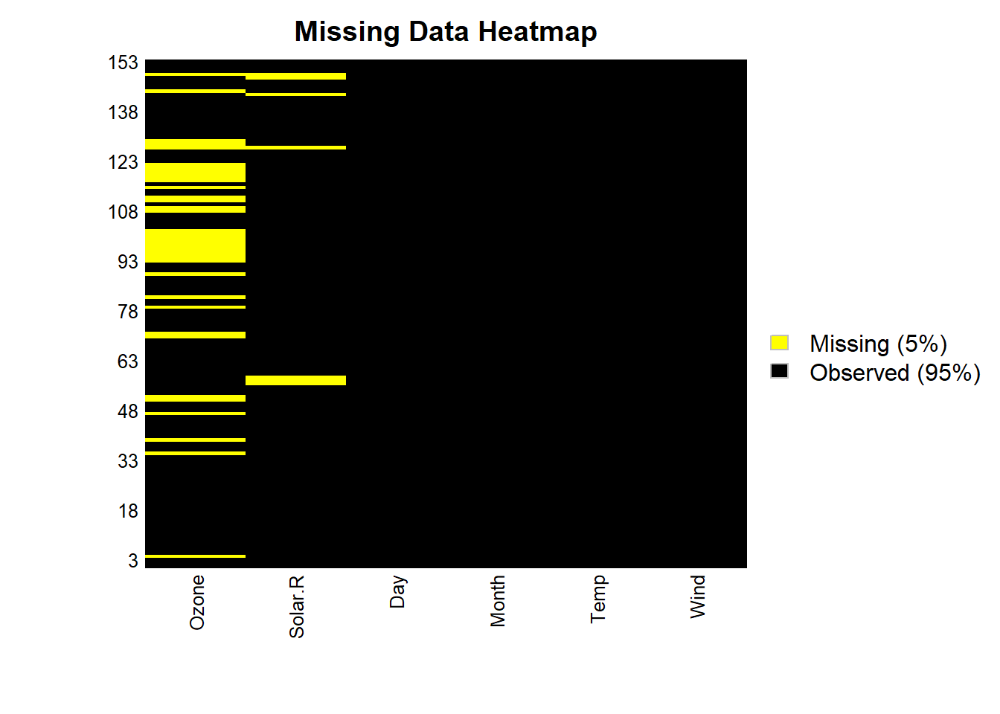
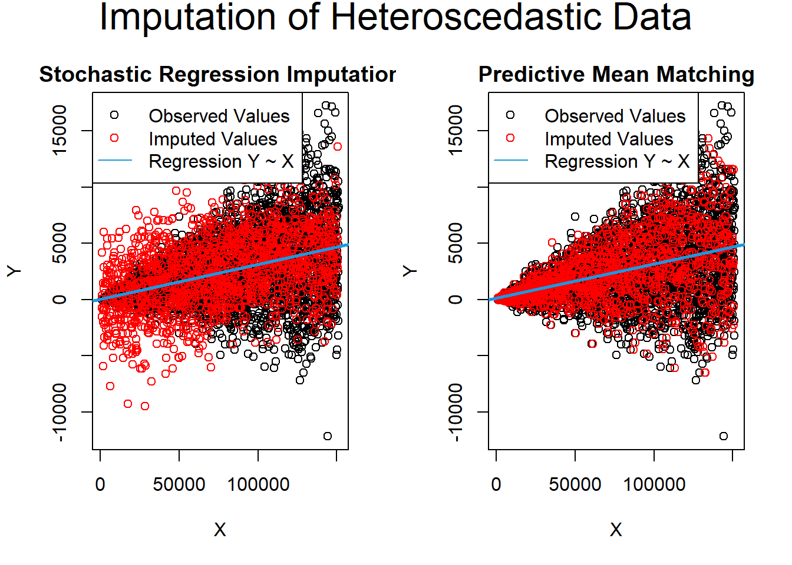
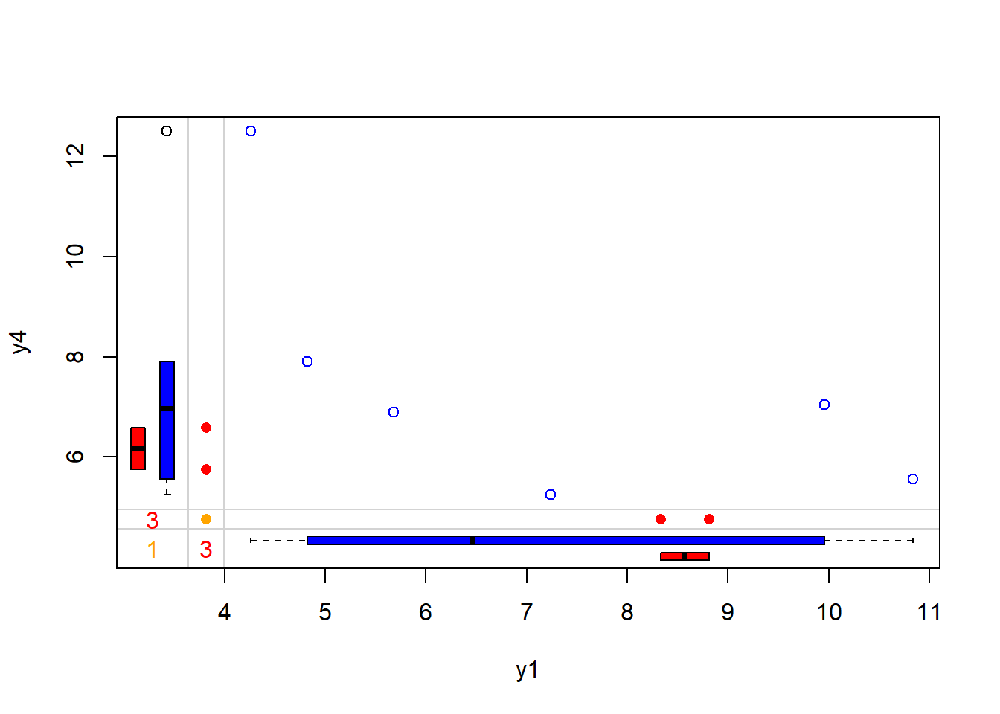
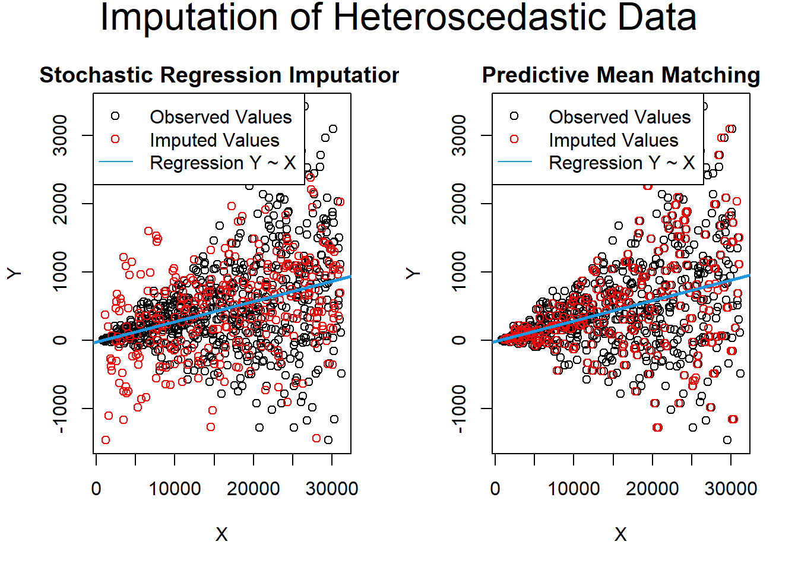
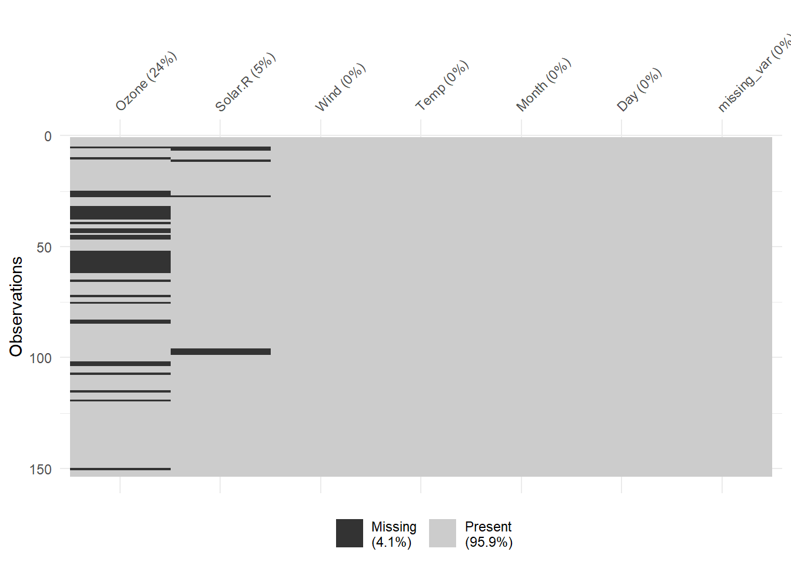
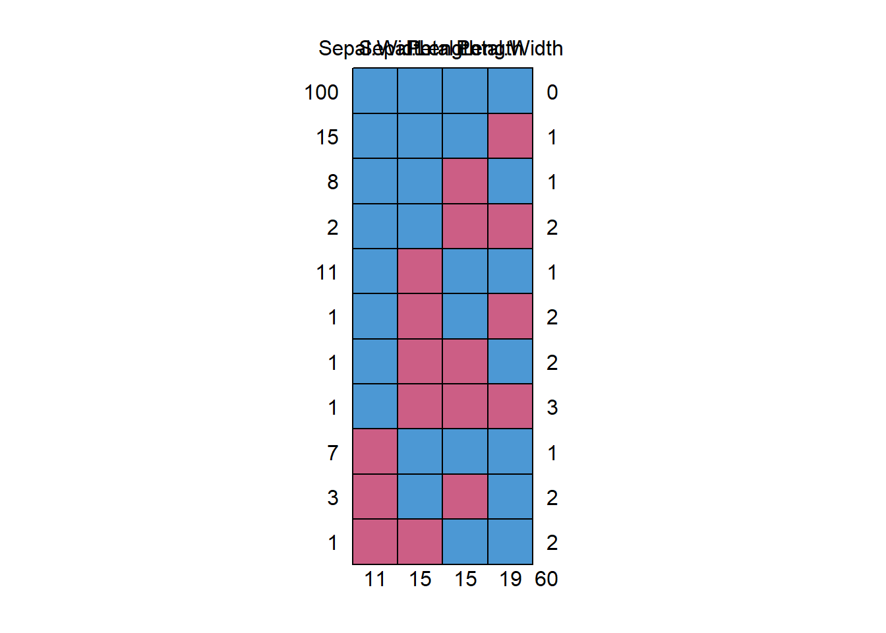
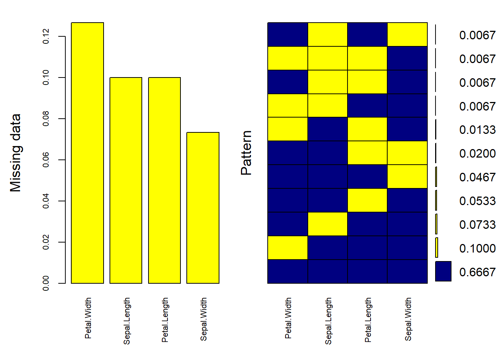
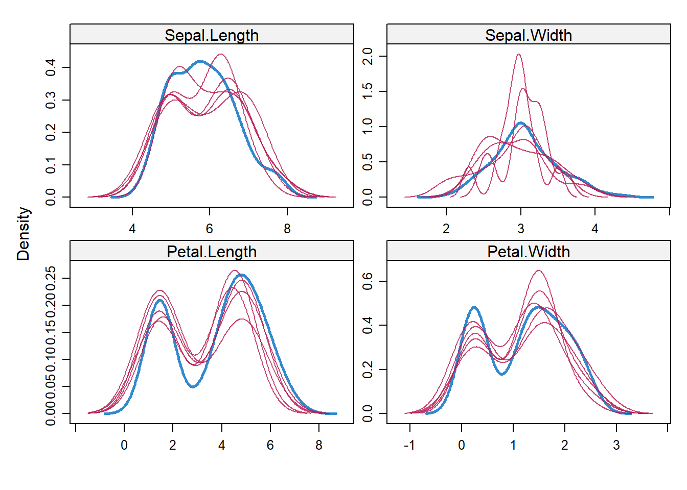

# Imputation (Missing Data)

## Introduction to Missing Data

Missing data is a common problem in statistical analyses and data science, impacting the quality and reliability of insights derived from datasets. One widely used approach to address this issue is **imputation**, where missing data is replaced with *reasonable estimates*.

### Types of Imputation

Imputation can be categorized into:

1.  **Unit Imputation**: Replacing an entire missing observation (i.e., all features for a single data point are missing).
2.  **Item Imputation**: Replacing missing values for specific variables (features) within a dataset.

While imputation offers a means to make use of incomplete datasets, it has historically been viewed skeptically. This skepticism arises from:

1.  Frequent **misapplication** of imputation techniques, which can introduce significant **bias** to estimates.
2.  Limited **applicability**, as imputation works well only under certain assumptions about the missing data mechanism and research objectives.

**Biases in imputation** can arise from various factors, including:

-   **Imputation method**: The chosen method can influence the results and introduce biases.

-   **Missing data mechanism**: The nature of the missing data---whether it is [Missing Completely at Random (MCAR)](#missing-completely-at-random-mcar) or [Missing at Random (MAR)](#missing-at-random-mar)---affects the accuracy of imputation.

-   **Proportion of missing data**: The amount of missing data significantly impacts the reliability of the imputation.

-   **Available information in the dataset**: Limited information reduces the robustness of the imputed values.

### When and Why to Use Imputation

The appropriateness of imputation depends on the nature of the missing data and the research goal:

-   **Missing Data in the Outcome Variable** ($y$): Imputation in such cases is generally problematic, as it can distort statistical models and lead to misleading conclusions. For example, imputing outcomes in regression or classification problems can alter the underlying relationship between the dependent and independent variables.

-   **Missing Data in Predictive Variables** ($x$): Imputation is more commonly applied here, especially for **non-random missing data**. Properly handled, imputation can enable the use of incomplete datasets while minimizing bias.

#### Objectives of Imputation

The utility of imputation methods differs substantially depending on whether the goal of the analysis is *inference/explanation* or *prediction*. Each goal has distinct priorities and tolerances for bias, variance, and assumptions about the missing data mechanism:

##### Inference/Explanation

In causal inference or explanatory analyses, the primary objective is to ensure valid statistical inference, emphasizing unbiased estimation of parameters and accurate representation of uncertainty. The treatment of missing data must align closely with the assumptions about the mechanism behind the missing data---whether it is Missing Completely at Random (MCAR), Missing at Random (MAR), or Missing Not at Random (MNAR):

-   **Bias Sensitivity:** Inference analyses require that imputed data preserve the integrity of the relationships among variables. Poorly executed imputation can introduce bias, even when it addresses missingness superficially.

-   **Variance and Confidence Intervals:** For inference, the quality of the standard errors, confidence intervals, and test statistics is critical. Naive imputation methods (e.g., mean imputation) often fail to appropriately reflect the uncertainty due to missingness, leading to overconfidence in parameter estimates.

-   **Mechanism Considerations:** Imputation methods, such as multiple imputation (MI), attempt to generate values consistent with the observed data distribution while accounting for missing data uncertainty. However, MI's performance depends heavily on the validity of the MAR assumption. If the missingness mechanism is MNAR and not addressed adequately, the imputed data could yield biased parameter estimates, undermining the purpose of inference.

##### Prediction

In predictive modeling, the primary goal is to maximize model accuracy (e.g., minimizing mean squared error for continuous outcomes or maximizing classification accuracy). Here, the focus shifts to optimizing predictive performance rather than ensuring unbiased parameter estimates:

-   **Loss of Information:** Missing data reduces the amount of usable information in a dataset. Imputation allows the model to leverage all available data, rather than excluding incomplete cases via listwise deletion, which can significantly reduce sample size and model performance.

-   **Impact on Model Fit:** In predictive contexts, imputation can reduce standard errors of the predictions and stabilize model coefficients by incorporating plausible estimates for missing values.

-   **Flexibility with Mechanism:** Predictive models are less sensitive to the missing data mechanism than inferential models, as long as the imputed values help reduce variability and align with patterns in the observed data. Methods like K-Nearest Neighbors (KNN), iterative imputation, or even machine learning models (e.g., random forests for imputation) can be valuable, regardless of strict adherence to MAR or MCAR assumptions.

-   **Trade-offs:** Overimputation, where too much noise or complexity is introduced in the imputation process, can harm prediction by introducing artifacts that degrade model generalizability.

##### Key Takeaways

The usefulness of imputation depends on whether the goal of the analysis is **inference** or **prediction**:

-   **Inference/Explanation:** The primary concern is valid statistical inference, where biased estimates are unacceptable. Imputation is often of limited value for this purpose, as it may not address the underlying missing data mechanism appropriately [@Rubin_1996].

-   **Prediction:** Imputation can be more useful in predictive modeling, as it reduces the loss of information from incomplete cases. By leveraging observed data, imputation can lower standard errors and improve model accuracy.

------------------------------------------------------------------------

### Importance of Missing Data Treatment in Statistical Modeling

Proper handling of missing data ensures:

-   **Unbiased Estimates:** Avoiding distortions in parameter estimates.
-   **Accurate Standard Errors:** Ensuring valid hypothesis testing and confidence intervals.
-   **Adequate Statistical Power:** Maximizing the use of available data.

Ignoring or mishandling missing data can lead to:

1.  **Bias:** Systematic errors in parameter estimates, especially under MAR or MNAR mechanisms.
2.  **Loss of Power:** Reduced sample size leads to larger standard errors and weaker statistical significance.
3.  **Misleading Conclusions:** Over-simplistic imputation methods (e.g., mean substitution) can distort relationships among variables.

------------------------------------------------------------------------

### Prevalence of Missing Data Across Domains

Missing data affects virtually all fields:

-   **Business:** Non-responses in customer surveys, incomplete sales records, and transactional errors.
-   **Healthcare:** Missing data in electronic health records (EHRs) due to incomplete patient histories or inconsistent data entry.
-   **Social Sciences:** Non-responses or partial responses in large-scale surveys, leading to biased conclusions.

------------------------------------------------------------------------

### Practical Considerations for Imputation

-   **Diagnostic Checks:** Always examine the patterns and mechanisms of missing data before applying imputation ([Diagnosing the Missing Data Mechanism]).
-   **Model Selection:** Align the imputation method with the missing data mechanism and research goal.
-   **Validation:** Assess the impact of imputation on results through sensitivity analyses or cross-validation.

------------------------------------------------------------------------

## Theoretical Foundations of Missing Data

### Definition and Classification of Missing Data {#definition-and-classification-of-missing-data}

Missing data refers to the absence of values for some variables in a dataset. The mechanisms underlying missingness significantly impact the validity of statistical analyses and the choice of handling methods. These mechanisms are classified into three categories:

-   [Missing Completely at Random](#missing-completely-at-random-mcar) (MCAR): The probability of missingness is independent of both observed and unobserved data. In other words, the missing data occur entirely at random and are unrelated to any values in the dataset.

-   [Missing at Random](#missing-at-random-mar) (MAR): The probability of missingness is related to the observed data but not to the missing data itself. This means that, after controlling for observed variables, the missingness is random.

-   [Missing Not at Random](#missing-not-at-random-mnar) (MNAR): The probability of missingness depends on unobserved data or the missing values themselves. In this case, the missingness is related to the very information that is missing, making it the most challenging type to handle in analysis.

#### Missing Completely at Random (MCAR) {#missing-completely-at-random-mcar}

MCAR occurs when the probability of missingness is entirely random and unrelated to either observed or unobserved variables. Under this mechanism, missing data do not introduce bias in parameter estimates when ignored, although statistical efficiency is reduced due to the smaller sample size.

**Mathematical Definition:** The missingness is independent of all data, both observed and unobserved:

$$
P(Y_{\text{missing}} | Y, X) = P(Y_{\text{missing}})
$$

**Characteristics of MCAR:**

-   Missingness is completely unrelated to both observed and unobserved data.
-   Analyses remain unbiased even if missing data are ignored, though they may lack efficiency due to reduced sample size.
-   The missing data points represent a random subset of the overall data.

**Examples:**

-   A sensor randomly fails at specific time points, unrelated to environmental or operational conditions.
-   Survey participants randomly omit responses to certain questions without any systematic pattern.

**Methods for Testing MCAR:**

1.  **Little's MCAR Test:** A formal statistical test to assess whether data are MCAR. A significant result suggests deviation from MCAR.

2.  **Mean Comparison Tests:**

    -   T-tests or similar approaches compare observed and missing data groups on other variables. Significant differences indicate potential bias.
    -   Failure to reject the null hypothesis of no difference does not confirm MCAR but suggests consistency with the MCAR assumption.

**Handling MCAR:**

Since MCAR data introduce no bias, they can be handled using the following techniques:

1.  **Complete Case Analysis (Listwise Deletion):**
    -   Analyses are performed only on cases with complete data. While unbiased under MCAR, this method reduces sample size and efficiency.
2.  **Universal Singular Value Thresholding (USVT):**
    -   This technique is effective for MCAR data recovery but can only recover the mean structure, not the entire true distribution [@chatterjee2015matrix].
3.  **SoftImpute:**
    -   A matrix completion method useful for some missing data problems but less effective when missingness is not MCAR [@hastie2015matrix].
4.  **Synthetic Nearest Neighbor Imputation:**
    -   A robust method for imputing missing data. While primarily designed for MCAR, it can also handle certain cases of missing not at random (MNAR) [@agarwal2023causal]. Available on GitHub: [syntheticNN](https://github.com/deshen24/syntheticNN).

**Notes:**

-   The "missingness" on one variable can be correlated with the "missingness" on another variable without violating the MCAR assumption.
-   Absence of evidence for bias (e.g., failing to reject a t-test) does not confirm that the data are MCAR.

#### Missing at Random (MAR) {#missing-at-random-mar}

Missing at Random (MAR) occurs when missingness depends on observed variables but not the missing values themselves. This mechanism assumes that observed data provide sufficient information to explain the missingness. In other words, there is a systematic relationship between the propensity of missing values and the observed data, but not the missing data.

**Mathematical Definition**:

The probability of missingness is conditional only on observed data:

$$
P(Y_{\text{missing}} | Y, X) = P(Y_{\text{missing}} | X)
$$

This implies that whether an observation is missing is unrelated to the missing values themselves but is related to the observed values of other variables.

**Characteristics of MAR**:

-   Missingness is systematically related to observed variables.
-   The propensity for a data point to be missing is not related to the missing data but is related to some of the observed data.
-   Analyses must account for observed data to mitigate bias.

**Examples**:

-   Women are less likely to disclose their weight, but their gender is recorded. In this case, weight is MAR.
-   Missing income data is correlated with education, which is observed. For example, individuals with higher education levels might be less likely to reveal their income.

**Challenges in MAR**:

-   MAR is weaker than Missing Completely at Random (MCAR).
-   It is impossible to directly test for MAR. Evidence for MAR relies on domain expertise and indirect statistical checks rather than direct tests.

**Handling MAR**:

Common methods for handling MAR include:

-   **Multiple Imputation by Chained Equations (MICE):** Iteratively imputes missing values based on observed data.

-   **Maximum Likelihood Estimation:** Estimates model parameters directly while accounting for MAR assumptions.

-   **Regression-Based Imputation:** Predicts missing values using observed covariates.

These methods assume that observed variables fully explain the missingness. Effective handling of MAR requires careful modeling and often domain-specific knowledge to validate the assumptions underlying the analysis.

#### Missing Not at Random (MNAR) {#missing-not-at-random-mnar}

Missing Not at Random (MNAR) is the most complex missing data mechanism. Here, missingness depends on unobserved variables or the values of the missing data themselves. This makes MNAR particularly challenging, as ignoring this dependency introduces significant bias in analyses.

**Mathematical Definition**:

The probability of missingness depends on the missing values:

$$
P(Y_{\text{missing}} | Y, X) \neq P(Y_{\text{missing}} | X)
$$

**Characteristics of MNAR**:

-   Missingness cannot be fully explained by observed data.
-   The cause of missingness is directly related to the unobserved values.
-   Ignoring MNAR introduces significant bias in parameter estimates, often leading to invalid conclusions.

**Examples**:

-   High-income individuals are less likely to disclose their income, and income itself is unobserved.
-   Patients with severe symptoms drop out of a clinical study, leaving their health outcomes unrecorded.

**Challenges in MNAR**:

-   MNAR is the most difficult missingness mechanism to address because the missing data mechanism must be explicitly modeled.
-   Identifying MNAR often requires domain knowledge and auxiliary information beyond the observed dataset.

**Handling MNAR**:

MNAR requires explicit modeling of the missingness mechanism. Common approaches include:

-   **Heckman Selection Models:** These models explicitly account for the selection process leading to missing data, adjusting for potential bias [@Heckman_1976].

-   **Instrumental Variables:** Variables predictive of missingness but unrelated to the outcome can be used to mitigate bias [@sun2018semiparametric; @tchetgen2017general].

-   **Pattern-Mixture Models**: These models separate the data into groups (patterns) based on missingness and model each group separately. They are particularly useful when the relationship between missingness and missing values is complex.

-   **Sensitivity Analysis:** Examines how conclusions change under different assumptions about the missing data mechanism.

-   **Use of Auxiliary Data**

    Auxiliary data refers to external data sources or variables that can help explain the missingness mechanism.

    -   **Surrogate Variables**: Adding variables that correlate with missing data can improve imputation accuracy and mitigate the MNAR challenge.

    -   **Linking External Datasets**: Merging datasets from different sources can provide additional context or predictors for missingness.

    -   **Applications in Business**: In marketing, customer demographics or transaction histories often serve as auxiliary data to predict missing responses in surveys.

Additionally, data collection strategies, such as follow-up surveys or targeted sampling, can help mitigate MNAR effects by collecting information that directly addresses the missingness mechanism. However, such approaches can be resource-intensive and require careful planning.

### Missing Data Mechanisms {#missing-data-mechanisms}

| **Mechanism** | **Missingness Depends On**                  | **Implications**                                                                        | **Examples**                                   |
|------------------|------------------|-------------------|------------------|
| **MCAR**      | Neither observed nor missing data           | No bias; simplest to handle; decreases efficiency due to data loss.                     | Random sensor failure.                         |
| **MAR**       | Observed data only                          | Requires observed data to explain missingness; common assumption in imputation methods. | Gender-based missingness of weight.            |
| **MNAR**      | Missing data itself or unobserved variables | Requires explicit modeling of the missingness mechanism; significant bias if ignored.   | High-income individuals not disclosing income. |

### Relationship Between Mechanisms and Ignorability {#relationship-between-mechanisms-and-ignorability}

The concept of ignorability is central to determining whether the missingness process must be explicitly modeled. Ignorability impacts the choice of methods for handling missing data and whether the missing data mechanism can be safely disregarded or must be explicitly accounted for.

#### Ignorable Missing Data

Missing data is **ignorable** under the following conditions:

1.  The missing data mechanism is [MAR](#missing-at-random-mar) or [MCAR](#missing-completely-at-random-mcar).
2.  The parameters governing the missing data process are unrelated to the parameters of interest in the analysis.

In cases of ignorable missing data, there is no need to model the missingness mechanism explicitly unless you aim to improve the efficiency or precision of parameter estimates. Common imputation techniques, such as multiple imputation or maximum likelihood estimation, rely on the assumption of ignorability to produce unbiased parameter estimates.

**Practical Considerations for Ignorable Missingness**

Even though ignorable mechanisms simplify analysis, researchers must rigorously assess whether the missingness mechanism meets the MAR or MCAR criteria. Violations can lead to biased results, even if unintentionally overlooked.

For example: A survey on income may assume MAR if missingness is associated with respondent age (observed variable) but not income itself (unobserved variable). However, if income directly influences nonresponse, the assumption of MAR is violated.

------------------------------------------------------------------------

#### Non-Ignorable Missing Data {#non-ignorable}

Missing data is **non-ignorable** when:

1.  The missingness mechanism depends on the values of the missing data themselves or on unobserved variables.
2.  The missing data mechanism is related to the parameters of interest, resulting in bias if the mechanism is not modeled explicitly.

This type of missingness (i.e., [Missing Not at Random (MNAR)](#missing-not-at-random-mnar) requires modeling the missing data mechanism directly to produce unbiased estimates.

**Characteristics of Non-Ignorable Missingness**

-   **Dependence on Missing Values**: The likelihood of missingness is associated with the missing values themselves.
    -   Example: In a study on health, individuals with more severe conditions are more likely to drop out, leading to an underrepresentation of the sickest individuals in the data.
-   **Bias in Complete Case Analysis**: Analyses based solely on complete cases can lead to substantial bias.
    -   Example: In income surveys, if wealthier individuals are less likely to report their income, the estimated mean income will be systematically lower than the true population mean.
-   **Need for Explicit Modeling**: To address MNAR, the analyst must model the missing data mechanism. This often involves specifying relationships between observed data, missing data, and the missingness process itself.

#### Implications of Non-Ignorable Missingness

Non-ignorable mechanisms are often associated with sensitive or personal data:

-   **Examples**:

    -   Individuals with lower education levels may omit their education information.

    -   Participants with controversial or stigmatized health conditions might opt out of surveys entirely.

-   **Impact on Policy and Decision-Making**:

    -   Biases introduced by MNAR can have serious consequences for policymaking, such as underestimating the prevalence of poverty or mischaracterizing population health needs.

By explicitly addressing non-ignorable missingness, researchers can mitigate biases and ensure that findings accurately reflect the underlying population.

------------------------------------------------------------------------

## Diagnosing the Missing Data Mechanism

Understanding the mechanism behind missing data is critical to choosing the appropriate methods for handling it. The three main mechanisms for missing data are **MCAR (Missing Completely at Random)**, **MAR (Missing at Random)**, and **MNAR (Missing Not at Random)**. This section discusses methods for diagnosing these mechanisms, including descriptive and inferential approaches.

------------------------------------------------------------------------

### Descriptive Methods

#### Visualizing Missing Data Patterns

Visualization tools are essential for detecting patterns in missing data. Heatmaps and correlation plots can help identify systematic missingness and provide insights into the underlying mechanism.


```r
# Example: Visualizing missing data
library(Amelia)
missmap(
    airquality,
    main = "Missing Data Heatmap",
    col = c("yellow", "black"),
    legend = TRUE
)
```



-   **Heatmaps**: Highlight where missingness occurs in a dataset.

-   **Correlation Plots**: Show relationships between missingness indicators of different variables.

**Exploring Univariate and Multivariate Missingness**

-   **Univariate Analysis**: Calculate the proportion of missing data for each variable.


```r
# Example: Proportion of missing values
missing_proportions <- colSums(is.na(airquality)) / nrow(airquality)
print(missing_proportions)
#>      Ozone    Solar.R       Wind       Temp      Month        Day 
#> 0.24183007 0.04575163 0.00000000 0.00000000 0.00000000 0.00000000
```

-   **Multivariate Analysis**: Examine whether missingness in one variable is related to others. This can be visualized using scatterplots of observed vs. missing values.


```r
# Example: Missingness correlation
library(naniar)
vis_miss(airquality)
```


```r
gg_miss_upset(airquality) # Displays a missingness upset plot
```


### Statistical Tests for Missing Data Mechanisms

#### Diagnosing MCAR: Little's Test

Little's test is a hypothesis test to determine if the missing data mechanism is **MCAR**. It tests whether the means of observed and missing data are significantly different. The null hypothesis is that the data are MCAR.

$$
\chi^2 = \sum_{i=1}^n \frac{(O_i - E_i)^2}{E_i}
$$

Where:

-   $O_i$= Observed frequency

-   $E_i$= Expected frequency under MCAR


```r
# Example: Little's test
naniar::mcar_test(airquality)
#> # A tibble: 1 × 4
#>   statistic    df p.value missing.patterns
#>       <dbl> <dbl>   <dbl>            <int>
#> 1      35.1    14 0.00142                4
misty::na.test(airquality)
#>  Little's MCAR Test
#> 
#>     n nIncomp nPattern  chi2 df  pval 
#>   153      42        4 35.15 14 0.001
```

#### Diagnosing MCAR via Dummy Variables

Creating a binary indicator for missingness allows you to test whether the presence of missing data is related to observed data. For instance:

1.  Create a dummy variable:

    -   1 = Missing

    -   0 = Observed

2.  Conduct a chi-square test or t-test:

    -   Chi-square: Compare proportions of missingness across groups.

    -   T-test: Compare means of (other) observed variables with missingness indicators.


```r
# Example: Chi-square test
airquality$missing_var <- as.factor(ifelse(is.na(airquality$Ozone), 1, 0))
# Across groups of months
table(airquality$missing_var, airquality$Month)
#>    
#>      5  6  7  8  9
#>   0 26  9 26 26 29
#>   1  5 21  5  5  1
chisq.test(table(airquality$missing_var, airquality$Month))
#> 
#> 	Pearson's Chi-squared test
#> 
#> data:  table(airquality$missing_var, airquality$Month)
#> X-squared = 44.751, df = 4, p-value = 4.48e-09

# Example: T-test (of other variable)
t.test(Wind ~ missing_var, data = airquality)
#> 
#> 	Welch Two Sample t-test
#> 
#> data:  Wind by missing_var
#> t = -0.60911, df = 63.646, p-value = 0.5446
#> alternative hypothesis: true difference in means between group 0 and group 1 is not equal to 0
#> 95 percent confidence interval:
#>  -1.6893132  0.8999377
#> sample estimates:
#> mean in group 0 mean in group 1 
#>        9.862069       10.256757
```

### Assessing MAR and MNAR

#### Sensitivity Analysis

Sensitivity analysis involves simulating different scenarios of missing data and assessing how the results change. For example, imputing missing values under different assumptions can provide insight into whether the data are MAR or MNAR.

#### Proxy Variables and External Data

Using proxy variables or external data sources can help assess whether missingness depends on unobserved variables (MNAR). For example, in surveys, follow-ups with non-respondents can reveal systematic differences.

#### Practical Challenges in Distinguishing MAR from MNAR

Distinguishing between Missing at Random (MAR) and Missing Not at Random (MNAR) is a critical and challenging task in data analysis. Properly identifying the nature of the missing data has significant implications for the choice of imputation strategies, model robustness, and the validity of conclusions. While statistical tests can sometimes aid in this determination, the process often relies heavily on domain knowledge, intuition, and exploratory analysis. Below, we discuss key considerations and examples that highlight these challenges:

-   **Sensitive Topics**: Missing data related to sensitive or stigmatized topics, such as income, drug use, or health conditions, are often MNAR. For example, individuals with higher incomes might deliberately choose not to report their earnings due to privacy concerns. Similarly, participants in a health survey may avoid answering questions about smoking if they perceive social disapproval. In such cases, the probability of missingness is directly related to the unobserved value itself, making MNAR likely.

-   **Field-Specific Norms**: Understanding norms and typical data collection practices in a specific field can provide insights into missingness patterns. For instance, in marketing surveys, respondents may skip questions about spending habits if they consider the questions intrusive. Prior research or historical data from the same domain can help infer whether missingness is more likely MAR (e.g., random skipping due to survey fatigue) or MNAR (e.g., deliberate omission by higher spenders).

-   **Analyzing Auxiliary Variables**: Leveraging auxiliary variables---those correlated with the missing variable---can help infer the missingness mechanism. For example, if missing income data strongly correlates with employment status, this suggests a MAR mechanism, as the missingness depends on observed variables. However, if missingness persists even after accounting for observable predictors, MNAR might be at play.

-   **Experimental Design and Follow-Up**: In longitudinal studies, dropout rates can signal MAR or MNAR patterns. For example, if dropouts occur disproportionately among participants reporting lower satisfaction in early surveys, this indicates an MNAR mechanism. Designing follow-up surveys to specifically investigate dropout reasons can clarify missingness patterns.

-   **Sensitivity Analysis**: To account for uncertainty in the missingness mechanism, researchers can conduct sensitivity analyses by comparing results under different assumptions (e.g., imputing data using both MAR and MNAR approaches). This process helps to quantify the potential impact of misclassifying the missingness mechanism on study conclusions.

-   **Real-World Examples**:

    -   In customer feedback surveys, higher ratings might be overrepresented due to non-response bias. Customers with negative experiences might be less likely to complete surveys, leading to an MNAR scenario.
    -   In financial reporting, missing audit data might correlate with companies in financial distress, a classic MNAR case where the missingness depends on unobserved financial health metrics.

Summary

-   **MCAR**: No pattern in missingness; use Little's test or dummy variable analysis.

-   **MAR**: Missingness related to observed data; requires modeling assumptions or proxy analysis.

-   **MNAR**: Missingness depends on unobserved data; requires external validation or sensitivity analysis.

## Methods for Handling Missing Data

### Basic Methods

#### Complete Case Analysis (Listwise Deletion)

Listwise deletion retains only cases with complete data for all features, discarding rows with any missing values.

**Advantages**:

-   Universally applicable to various statistical tests (e.g., SEM, multilevel regression).
-   When data are Missing Completely at Random (MCAR), parameter estimates and standard errors are unbiased.
-   Under specific Missing at Random (MAR) conditions, such as when the probability of missing data depends only on independent variables, listwise deletion can still yield unbiased estimates. For instance, in the model $y = \beta_{0} + \beta_1X_1 + \beta_2X_2 + \epsilon$, if missingness in $X_1$ is independent of $y$ but depends on $X_1$ and $X_2$, the estimates remain unbiased [@Little_1992].
    -   This aligns with principles of stratified sampling, which does not bias estimates.
    -   In logistic regression, if missing data depend only on the dependent variable but not on independent variables, listwise deletion produces consistent slope estimates, though the intercept may be biased [@Vach_1994].
-   For regression analysis, listwise deletion is more robust than Maximum Likelihood (ML) or Multiple Imputation (MI) when the MAR assumption is violated.

**Disadvantages**:

-   Results in larger standard errors compared to advanced methods.
-   If data are MAR but not MCAR, biased estimates can occur.
-   In non-regression contexts, more sophisticated methods often outperform listwise deletion.

------------------------------------------------------------------------

#### Available Case Analysis (Pairwise Deletion)

Pairwise deletion calculates estimates using all available data for each pair of variables, without requiring complete cases. It is particularly suitable for methods like linear regression, factor analysis, and SEM, which rely on correlation or covariance matrices.

**Advantages**:

-   Under MCAR, pairwise deletion produces consistent and unbiased estimates in large samples.
-   Compared to listwise deletion [@Glasser_1964]:
    -   When variable correlations are low, pairwise deletion provides more efficient estimates.
    -   When correlations are high, listwise deletion becomes more efficient.

**Disadvantages**:

-   Yields biased estimates under MAR conditions.
-   In small samples, covariance matrices might not be positive definite, rendering coefficient estimation infeasible.
-   Software implementation varies in how sample size is handled, potentially affecting standard errors.

**Note**: Carefully review software documentation to understand how sample size is treated, as this influences standard error calculations.

------------------------------------------------------------------------

#### Indicator Method (Dummy Variable Adjustment)

Also known as the Missing Indicator Method, this approach introduces an additional variable to indicate missingness in the dataset.

**Implementation**:

1.  Create an indicator variable:

$$
D =
\begin{cases}
1 & \text{if data on } X \text{ are missing} \\
0 & \text{otherwise}
\end{cases}
$$

2.  Modify the original variable to accommodate missingness:

$$
X^* =
\begin{cases}
X & \text{if data are available} \\
c & \text{if data are missing}
\end{cases}
$$

**Note**: A common choice for $c$ is the mean of $X$.

**Interpretation**:

-   The coefficient of $D$ represents the difference in the expected value of $Y$ between cases with missing data and those without.
-   The coefficient of $X^*$ reflects the effect of $X$ on $Y$ for cases with observed data.

**Disadvantages**:

-   Produces biased estimates of coefficients, even under MCAR conditions [@jones1996indicator].
-   May lead to overinterpretation of the "missingness effect," complicating model interpretation.

------------------------------------------------------------------------

#### Advantages and Limitations of Basic Methods

| **Method**            | **Advantages**                                                                                        | **Disadvantages**                                                                                       |
|------------------|---------------------------|---------------------------|
| **Listwise Deletion** | Simple and universally applicable; unbiased under MCAR; robust in certain MAR scenarios.              | Inefficient (larger standard errors); biased under MAR in many cases; discards potentially useful data. |
| **Pairwise Deletion** | Utilizes all available data; efficient under MCAR with low correlations; avoids discarding all cases. | Biased under MAR; prone to non-positive-definite covariance matrices in small samples.                  |
| **Indicator Method**  | Simple implementation; explicitly models missingness effect.                                          | Biased even under MCAR; complicates interpretation; may not reflect true underlying relationships.      |

### Single Imputation Techniques

Single imputation methods replace missing data with a single value, generating a complete dataset that can be analyzed using standard techniques. While convenient, single imputation generally underestimates variability and risks biasing results.

------------------------------------------------------------------------

#### Deterministic Methods

##### Mean, Median, Mode Imputation

This method replaces missing values with the mean, median, or mode of the observed data.

**Advantages**:

-   Simplicity and ease of implementation.
-   Useful for quick exploratory data analysis.

**Disadvantages**:

-   **Bias in Variances and Relationships**: Mean imputation reduces variance and disrupts relationships among variables, leading to biased estimates of variances and covariances [@haitovsky1968missing].
-   **Underestimated Standard Errors**: Results in overly optimistic conclusions and increased risk of Type I errors.
-   **Dependency Structure Ignored**: Particularly problematic in high-dimensional data, as it fails to capture dependencies among features.

##### Forward and Backward Filling (Time Series Contexts)

Used in time series analysis, this method replaces missing values using the preceding (forward filling) or succeeding (backward filling) values.

**Advantages**:

-   Simple and preserves temporal ordering.
-   Suitable for datasets where adjacent values are strongly correlated.

**Disadvantages**:

-   Biased if missingness spans long gaps or occurs systematically.
-   Cannot capture trends or changes in the underlying process.

------------------------------------------------------------------------

#### Statistical Prediction Models

##### Linear Regression Imputation

Missing values in a variable are imputed based on a linear regression model using observed values of other variables.

**Advantages**:

-   Preserves relationships between variables.
-   More sophisticated than mean or median imputation.

**Disadvantages**:

-   Assumes linear relationships, which may not hold in all datasets.
-   Fails to capture variability, leading to downwardly biased standard errors.

##### Logistic Regression for Categorical Variables

Similar to linear regression imputation but used for categorical variables. The missing category is predicted using a logistic regression model.

**Advantages**:

-   Useful for binary or multinomial categorical data.
-   Preserves relationships with other variables.

**Disadvantages**:

-   Assumes the underlying logistic model is appropriate.
-   Does not account for uncertainty in the imputed values.

------------------------------------------------------------------------

#### Non-Parametric Methods

##### Hot Deck Imputation

Hot Deck Imputation is a method of handling missing data where missing values are replaced with observed values from "donor" cases that are similar in other characteristics. This technique has been widely used in survey data, including by organizations like the U.S. Census Bureau, due to its flexibility and ability to maintain observed data distributions.

**Advantages of Hot Deck Imputation**

-   **Retains observed data distributions**: Since missing values are imputed using actual observed data, the overall distribution remains realistic.
-   **Flexible**: This method is applicable to both categorical and continuous variables.
-   **Constrained imputations**: Imputed values are always feasible, as they come from observed cases.
-   **Adds variability**: By randomly selecting donors, this method introduces variability, which can aid in robust standard error estimation.

**Disadvantages of Hot Deck Imputation**

-   **Sensitivity to similarity definitions**: The quality of imputed values depends on the criteria used to define similarity between cases.
-   **Computational intensity**: Identifying similar cases and randomly selecting donors can be computationally expensive, especially for large datasets.
-   **Subjectivity**: Deciding how to define "similar" can introduce subjectivity or bias.

**Algorithm for Hot Deck Imputation**

Let $n_1$ represent the number of cases with complete data on the variable $Y$, and $n_0$ represent the number of cases with missing data on $Y$. The steps are as follows:

1.  From the $n_1$ cases with complete data, take a random sample (with replacement) of $n_1$ cases.
2.  From this sampled pool, take another random sample (with replacement) of size $n_0$.
3.  Assign the values from the sampled $n_0$ cases to the cases with missing data in $Y$.
4.  Repeat this process for every variable in the dataset.
5.  For multiple imputation, repeat the above four steps multiple times to create multiple imputed datasets.

**Variations and Considerations**

-   **Skipping Step 1**: If Step 1 is skipped, the variability of imputed values is reduced. This approach might not fully account for the uncertainty in missing data, which can underestimate standard errors.
-   **Defining similarity**: A major challenge in this method is deciding what constitutes "similarity" between cases. Common approaches include matching based on distance metrics (e.g., Euclidean distance) or grouping cases by strata or clusters.

**Practical Example**

The U.S. Census Bureau employs an approximate Bayesian bootstrap variation of Hot Deck Imputation. In this approach:

-   Similar cases are identified based on shared characteristics or grouping variables.

-   A randomly chosen value from a similar individual in the sample is used to replace the missing value.

This method ensures imputed values are plausible while incorporating variability.

**Key Notes**

-   **Good aspects**:
    -   Imputed values are constrained to observed possibilities.
    -   Random selection introduces variability, helpful for multiple imputation scenarios.
-   **Challenges**:
    -   Defining and operationalizing "similarity" remains a critical step in applying this method effectively.

Below is an example code snippet illustrating Hot Deck Imputation in R:


```r
library(Hmisc)

# Example dataset with missing values
data <- data.frame(
  ID = 1:10,
  Age = c(25, 30, NA, 40, NA, 50, 60, NA, 70, 80),
  Gender = c("M", "F", "F", "M", "M", "F", "M", "F", "M", "F")
)

# Perform Hot Deck Imputation using Hmisc::impute
data$Age_imputed <- impute(data$Age, "random")

# Display the imputed dataset
print(data)
#>    ID Age Gender Age_imputed
#> 1   1  25      M          25
#> 2   2  30      F          30
#> 3   3  NA      F          25
#> 4   4  40      M          40
#> 5   5  NA      M          70
#> 6   6  50      F          50
#> 7   7  60      M          60
#> 8   8  NA      F          25
#> 9   9  70      M          70
#> 10 10  80      F          80
```

This code randomly imputes missing values in the `Age` column based on observed data using the `Hmisc` package's `impute` function.

##### Cold Deck Imputation

Cold Deck Imputation is a systematic variant of Hot Deck Imputation where the donor pool is predefined. Instead of selecting donors dynamically from within the same dataset, Cold Deck Imputation relies on an external reference dataset, such as historical data or other high-quality external sources.

**Advantages of Cold Deck Imputation**

-   **Utilizes high-quality external data**: This method is particularly useful when reliable external reference datasets are available, allowing for accurate and consistent imputations.
-   **Consistency**: If the same donor pool is used across multiple datasets, imputations remain consistent, which can be advantageous in longitudinal studies or standardized processes.

**Disadvantages of Cold Deck Imputation**

-   **Lack of adaptability**: External data may not adequately reflect the unique characteristics or variability of the current dataset.
-   **Potential for systematic bias**: If the donor pool is significantly different from the target dataset, imputations may introduce bias.
-   **Reduces variability**: Unlike Hot Deck Imputation, Cold Deck Imputation systematically selects values, which removes random variation. This can affect the estimation of standard errors and other inferential statistics.

**Key Characteristics**

-   **Systematic Selection**: Cold Deck Imputation selects donor values systematically based on predefined rules or matching criteria, rather than using random sampling.
-   **External Donor Pool**: Donors are typically drawn from a separate dataset or historical records.

**Algorithm for Cold Deck Imputation**

1.  Identify an external reference dataset or predefined donor pool.
2.  Define the matching criteria to find "similar" cases between the donor pool and the current dataset (e.g., based on covariates or stratification).
3.  Systematically assign values from the donor pool to missing values in the current dataset based on the matching criteria.
4.  Repeat the process for each variable with missing data.

**Practical Considerations**

-   Cold Deck Imputation works well when external data closely resemble the target dataset. However, when there are significant differences in distributions or relationships between variables, imputations may be biased or unrealistic.\
-   This method is less useful for datasets without access to reliable external reference data.

Suppose we have a current dataset with missing values and a historical dataset with similar variables. The following example demonstrates how Cold Deck Imputation can be implemented:


```r
# Current dataset with missing values
current_data <- data.frame(
  ID = 1:5,
  Age = c(25, 30, NA, 45, NA),
  Gender = c("M", "F", "F", "M", "M")
)

# External reference dataset (donor pool)
reference_data <- data.frame(
  Age = c(28, 35, 42, 50),
  Gender = c("M", "F", "F", "M")
)

# Perform Cold Deck Imputation
library(dplyr)

# Define a matching function to find closest donor
impute_cold_deck <- function(missing_row, reference_data) {
  # Filter donors with the same gender
  possible_donors <- reference_data %>%
    filter(Gender == missing_row$Gender)
  
  # Return the mean age of matching donors as an example of systematic imputation
  return(mean(possible_donors$Age, na.rm = TRUE))
}

# Apply Cold Deck Imputation to the missing rows
current_data <- current_data %>%
  rowwise() %>%
  mutate(
    Age_imputed = ifelse(
      is.na(Age),
      impute_cold_deck(cur_data(), reference_data),
      Age
    )
  )

# Display the imputed dataset
print(current_data)
#> # A tibble: 5 × 4
#> # Rowwise: 
#>      ID   Age Gender Age_imputed
#>   <int> <dbl> <chr>        <dbl>
#> 1     1    25 M             25  
#> 2     2    30 F             30  
#> 3     3    NA F             38.8
#> 4     4    45 M             45  
#> 5     5    NA M             38.8
```

**Comparison to Hot Deck Imputation**

| Feature            | Hot Deck Imputation           | Cold Deck Imputation           |
|------------------|---------------------------|---------------------------|
| **Donor Pool**     | Internal (within the dataset) | External (predefined dataset)  |
| **Selection**      | Random                        | Systematic                     |
| **Variability**    | Retained                      | Reduced                        |
| **Bias Potential** | Lower                         | Higher (if donor pool differs) |

This method suits situations where external reference datasets are trusted and representative. However, careful consideration is required to ensure alignment between the donor pool and the target dataset to avoid systematic biases.

##### Random Draw from Observed Distribution

This imputation method replaces missing values by randomly sampling from the observed distribution of the variable with missing data. It is a simple, non-parametric approach that retains the variability of the original data.

**Advantages**

-   **Preserves variability**:
    -   By randomly drawing values from the observed data, this method ensures that the imputed values reflect the inherent variability of the variable.
-   **Computational simplicity**:
    -   The process is straightforward and does not require model fitting or complex calculations.

**Disadvantages**

-   **Ignores relationships among variables**:
    -   Since the imputation is based solely on the observed distribution of the variable, it does not consider relationships or dependencies with other variables.
-   **May not align with trends**:
    -   Imputed values are random and may fail to align with patterns or trends present in the data, such as time series structures or interactions.

**Steps in Random Draw Imputation**

1.  Identify the observed (non-missing) values of the variable.
2.  For each missing value, randomly sample one value from the observed distribution with or without replacement.
3.  Replace the missing value with the randomly sampled value.

The following example demonstrates how to use random draw imputation to fill in missing values:


```r
# Example dataset with missing values
set.seed(123)
data <- data.frame(
  ID = 1:10,
  Value = c(10, 20, NA, 30, 40, NA, 50, 60, NA, 70)
)

# Perform random draw imputation
random_draw_impute <- function(data, variable) {
  observed_values <- data[[variable]][!is.na(data[[variable]])] # Observed values
  data[[variable]][is.na(data[[variable]])] <- sample(observed_values, 
                                                      sum(is.na(data[[variable]])), 
                                                      replace = TRUE)
  return(data)
}

# Apply the imputation
imputed_data <- random_draw_impute(data, variable = "Value")

# Display the imputed dataset
print(imputed_data)
#>    ID Value
#> 1   1    10
#> 2   2    20
#> 3   3    70
#> 4   4    30
#> 5   5    40
#> 6   6    70
#> 7   7    50
#> 8   8    60
#> 9   9    30
#> 10 10    70
```

**Considerations**

-   **When to Use**:

    -   This method is suitable for exploratory analysis or as a quick way to handle missing data in univariate contexts.

-   **Limitations**:

    -   Random draws may result in values that do not fit well in the broader context of the dataset, especially in cases where the variable has strong relationships with others.

| Feature                        | Random Draw from Observed Distribution | Regression-Based Imputation    |
|----------------------|----------------------------|----------------------|
| **Complexity**                 | Simple                                 | Moderate to High               |
| **Preserves Variability**      | Yes                                    | Limited in deterministic forms |
| **Considers Relationships**    | No                                     | Yes                            |
| **Risk of Implausible Values** | Low (if observed values are plausible) | Moderate to High               |

This method is a quick and computationally efficient way to address missing data but is best complemented by more sophisticated methods when relationships between variables are important.

#### Semi-Parametric Methods

##### Predictive Mean Matching (PMM)

Predictive Mean Matching (PMM) imputes missing values by finding observed values closest in predicted value (based on a regression model) to the missing data. The donor values are then used to fill in the gaps.

**Advantages**:

-   Maintains observed variability in the data.

-   Ensures imputed values are realistic since they are drawn from observed data.

**Disadvantages**:

-   Requires a suitable predictive model.

-   Computationally intensive for large datasets.

**Steps for PMM**:

1.  Regress $Y$ on $X$ (matrix of covariates) for the $n_1$ (non-missing cases) to estimate coefficients $\hat{b}$ and residual variance $s^2$.
2.  Draw from the posterior predictive distribution of residual variance: $$s^2_{[1]} = \frac{(n_1-k)s^2}{\chi^2},$$ where $\chi^2$ is a random draw from $\chi^2_{n_1-k}$.
3.  Randomly sample from the posterior distribution of $\hat{b}$: $$b_{[1]} \sim MVN(\hat{b}, s^2_{[1]}(X'X)^{-1}).$$
4.  Standardize residuals for $n_1$ cases: $$e_i = \frac{y_i - \hat{b}x_i}{\sqrt{s^2(1-k/n_1)}}.$$
5.  Randomly draw a sample (with replacement) of $n_0$ residuals from Step 4.
6.  Calculate imputed values for $n_0$ missing cases: $$y_i = b_{[1]}x_i + s_{[1]}e_i.$$
7.  Repeat Steps 2--6 (except Step 4) to create multiple imputations.

**Notes**:

-   PMM can handle heteroskedasticity

-   works for multiple variables, imputing each using all others as predictors.

**Example**:

Example from [Statistics Globe](https://statisticsglobe.com/predictive-mean-matching-imputation-method/)


```r
set.seed(1) # Seed
N  <- 100                                    # Sample size
y  <- round(runif(N,-10, 10))                 # Target variable Y
x1 <- y + round(runif(N, 0, 50))              # Auxiliary variable 1
x2 <- round(y + 0.25 * x1 + rnorm(N,-3, 15))  # Auxiliary variable 2
x3 <- round(0.1 * x1 + rpois(N, 2))           # Auxiliary variable 3
# (categorical variable)
x4 <- as.factor(round(0.02 * y + runif(N)))   # Auxiliary variable 4 

# Insert 20% missing data in Y
y[rbinom(N, 1, 0.2) == 1] <- NA               

data <- data.frame(y, x1, x2, x3, x4)         # Store data in dataset
head(data) # First 6 rows of our data
#>    y x1  x2 x3 x4
#> 1 NA 28 -10  5  0
#> 2 NA 15  -2  2  1
#> 3  1 15 -12  6  1
#> 4  8 58  22 10  1
#> 5 NA 26 -12  7  0
#> 6 NA 19  36  5  1

library("mice") # Load mice package

##### Impute data via predictive mean matching (single imputation)#####

imp_single <- mice(data, m = 1, method = "pmm") # Impute missing values
#> 
#>  iter imp variable
#>   1   1  y
#>   2   1  y
#>   3   1  y
#>   4   1  y
#>   5   1  y
data_imp_single <- complete(imp_single)         # Store imputed data
# head(data_imp_single)

# Since single imputation underestiamtes stnadard errors, 
# we use multiple imputaiton

##### Predictive mean matching (multiple imputation) #####

# Impute missing values multiple times
imp_multi <- mice(data, m = 5, method = "pmm")  
#> 
#>  iter imp variable
#>   1   1  y
#>   1   2  y
#>   1   3  y
#>   1   4  y
#>   1   5  y
#>   2   1  y
#>   2   2  y
#>   2   3  y
#>   2   4  y
#>   2   5  y
#>   3   1  y
#>   3   2  y
#>   3   3  y
#>   3   4  y
#>   3   5  y
#>   4   1  y
#>   4   2  y
#>   4   3  y
#>   4   4  y
#>   4   5  y
#>   5   1  y
#>   5   2  y
#>   5   3  y
#>   5   4  y
#>   5   5  y
data_imp_multi_all <-
    # Store multiply imputed data
    complete(imp_multi,       
             "repeated",
             include = TRUE)

data_imp_multi <-
    # Combine imputed Y and X1-X4 (for convenience)
    data.frame(data_imp_multi_all[, 1:6], data[, 2:5])

head(data_imp_multi)
#>   y.0 y.1 y.2 y.3 y.4 y.5 x1  x2 x3 x4
#> 1  NA  -1   6  -1  -3   3 28 -10  5  0
#> 2  NA -10  10   4   0   2 15  -2  2  1
#> 3   1   1   1   1   1   1 15 -12  6  1
#> 4   8   8   8   8   8   8 58  22 10  1
#> 5  NA   0  -1  -6   2   0 26 -12  7  0
#> 6  NA   4   0   3   3   3 19  36  5  1
```

Example from [UCLA Statistical Consulting](https://stats.idre.ucla.edu/r/faq/how-do-i-perform-multiple-imputation-using-predictive-mean-matching-in-r/)


```r
library(mice)
library(VIM)
library(lattice)
library(ggplot2)
## set observations to NA
anscombe <- within(anscombe, {
    y1[1:3] <- NA
    y4[3:5] <- NA
})
## view
head(anscombe)
#>   x1 x2 x3 x4   y1   y2    y3   y4
#> 1 10 10 10  8   NA 9.14  7.46 6.58
#> 2  8  8  8  8   NA 8.14  6.77 5.76
#> 3 13 13 13  8   NA 8.74 12.74   NA
#> 4  9  9  9  8 8.81 8.77  7.11   NA
#> 5 11 11 11  8 8.33 9.26  7.81   NA
#> 6 14 14 14  8 9.96 8.10  8.84 7.04

## check missing data patterns
md.pattern(anscombe)
```



```
#>   x1 x2 x3 x4 y2 y3 y1 y4  
#> 6  1  1  1  1  1  1  1  1 0
#> 2  1  1  1  1  1  1  1  0 1
#> 2  1  1  1  1  1  1  0  1 1
#> 1  1  1  1  1  1  1  0  0 2
#>    0  0  0  0  0  0  3  3 6

## Number of observations per patterns for all pairs of variables
p <- md.pairs(anscombe)
p 
#> $rr
#>    x1 x2 x3 x4 y1 y2 y3 y4
#> x1 11 11 11 11  8 11 11  8
#> x2 11 11 11 11  8 11 11  8
#> x3 11 11 11 11  8 11 11  8
#> x4 11 11 11 11  8 11 11  8
#> y1  8  8  8  8  8  8  8  6
#> y2 11 11 11 11  8 11 11  8
#> y3 11 11 11 11  8 11 11  8
#> y4  8  8  8  8  6  8  8  8
#> 
#> $rm
#>    x1 x2 x3 x4 y1 y2 y3 y4
#> x1  0  0  0  0  3  0  0  3
#> x2  0  0  0  0  3  0  0  3
#> x3  0  0  0  0  3  0  0  3
#> x4  0  0  0  0  3  0  0  3
#> y1  0  0  0  0  0  0  0  2
#> y2  0  0  0  0  3  0  0  3
#> y3  0  0  0  0  3  0  0  3
#> y4  0  0  0  0  2  0  0  0
#> 
#> $mr
#>    x1 x2 x3 x4 y1 y2 y3 y4
#> x1  0  0  0  0  0  0  0  0
#> x2  0  0  0  0  0  0  0  0
#> x3  0  0  0  0  0  0  0  0
#> x4  0  0  0  0  0  0  0  0
#> y1  3  3  3  3  0  3  3  2
#> y2  0  0  0  0  0  0  0  0
#> y3  0  0  0  0  0  0  0  0
#> y4  3  3  3  3  2  3  3  0
#> 
#> $mm
#>    x1 x2 x3 x4 y1 y2 y3 y4
#> x1  0  0  0  0  0  0  0  0
#> x2  0  0  0  0  0  0  0  0
#> x3  0  0  0  0  0  0  0  0
#> x4  0  0  0  0  0  0  0  0
#> y1  0  0  0  0  3  0  0  1
#> y2  0  0  0  0  0  0  0  0
#> y3  0  0  0  0  0  0  0  0
#> y4  0  0  0  0  1  0  0  3
```

-   `rr` = number of observations where both pairs of values are observed
-   `rm` = the number of observations where both variables are missing values
-   `mr` = the number of observations where the first variable's value (e.g. the row variable) is observed and second (or column) variable is missing
-   `mm` = the number of observations where the second variable's value (e.g. the col variable) is observed and first (or row) variable is missing


```r
## Margin plot of y1 and y4
marginplot(anscombe[c(5, 8)], col = c("blue", "red", "orange"))
```



```r

## 5 imputations for all missing values
imp1 <- mice(anscombe, m = 5)
#> 
#>  iter imp variable
#>   1   1  y1  y4
#>   1   2  y1  y4
#>   1   3  y1  y4
#>   1   4  y1  y4
#>   1   5  y1  y4
#>   2   1  y1  y4
#>   2   2  y1  y4
#>   2   3  y1  y4
#>   2   4  y1  y4
#>   2   5  y1  y4
#>   3   1  y1  y4
#>   3   2  y1  y4
#>   3   3  y1  y4
#>   3   4  y1  y4
#>   3   5  y1  y4
#>   4   1  y1  y4
#>   4   2  y1  y4
#>   4   3  y1  y4
#>   4   4  y1  y4
#>   4   5  y1  y4
#>   5   1  y1  y4
#>   5   2  y1  y4
#>   5   3  y1  y4
#>   5   4  y1  y4
#>   5   5  y1  y4

## linear regression for each imputed data set - 5 regression are run
fitm <- with(imp1, lm(y1 ~ y4 + x1))
summary(fitm)
#> # A tibble: 15 × 6
#>    term        estimate std.error statistic p.value  nobs
#>    <chr>          <dbl>     <dbl>     <dbl>   <dbl> <int>
#>  1 (Intercept)    7.33      2.44       3.01  0.0169    11
#>  2 y4            -0.416     0.223     -1.86  0.0996    11
#>  3 x1             0.371     0.141      2.63  0.0302    11
#>  4 (Intercept)    7.27      2.90       2.51  0.0365    11
#>  5 y4            -0.435     0.273     -1.59  0.150     11
#>  6 x1             0.387     0.160      2.41  0.0422    11
#>  7 (Intercept)    6.54      2.80       2.33  0.0479    11
#>  8 y4            -0.322     0.255     -1.26  0.243     11
#>  9 x1             0.362     0.156      2.32  0.0491    11
#> 10 (Intercept)    5.93      3.08       1.92  0.0907    11
#> 11 y4            -0.286     0.282     -1.02  0.339     11
#> 12 x1             0.418     0.176      2.37  0.0451    11
#> 13 (Intercept)    8.16      2.67       3.05  0.0158    11
#> 14 y4            -0.489     0.251     -1.95  0.0867    11
#> 15 x1             0.326     0.151      2.17  0.0622    11

## pool coefficients and standard errors across all 5 regression models
pool(fitm)
#> Class: mipo    m = 5 
#>          term m   estimate       ubar           b          t dfcom       df
#> 1 (Intercept) 5  7.0445966 7.76794670 0.719350800 8.63116766     8 5.805314
#> 2          y4 5 -0.3896685 0.06634920 0.006991497 0.07473900     8 5.706243
#> 3          x1 5  0.3727865 0.02473847 0.001134293 0.02609962     8 6.178032
#>          riv     lambda       fmi
#> 1 0.11112601 0.10001207 0.3044313
#> 2 0.12644909 0.11225460 0.3161877
#> 3 0.05502168 0.05215218 0.2586992

## output parameter estimates
summary(pool(fitm))
#>          term   estimate std.error statistic       df    p.value
#> 1 (Intercept)  7.0445966 2.9378849  2.397846 5.805314 0.05483678
#> 2          y4 -0.3896685 0.2733843 -1.425350 5.706243 0.20638512
#> 3          x1  0.3727865 0.1615538  2.307508 6.178032 0.05923999
```

##### Stochastic Imputation

Stochastic Imputation is an enhancement of regression imputation that introduces randomness into the imputation process by adding a random residual to the predicted values from a regression model. This approach aims to retain the variability of the original data while reducing the bias introduced by deterministic regression imputation.

Stochastic Imputation can be described as:

$$
\text{Imputed Value} = \text{Predicted Value (from regression)} + \text{Random Residual}
$$

This method is commonly used as a foundation for multiple imputation techniques.

**Advantages of Stochastic Imputation**

-   **Retains all the benefits of regression imputation**:
    -   Preserves relationships between variables in the dataset.
    -   Utilizes information from observed data to inform imputations.
-   **Introduces randomness**:
    -   Adds variability by including a random residual term, making imputed values more realistic and better representing the uncertainty of missing data.
-   **Supports multiple imputation**:
    -   By generating different random residuals for each iteration, it facilitates the creation of multiple plausible datasets for robust statistical analysis.

**Disadvantages of Stochastic Imputation**

-   **Implausible values**:
    -   Depending on the random residuals, imputed values may fall outside the plausible range (e.g., negative values for variables like age or income).
-   **Cannot handle heteroskedasticity**:
    -   If the data exhibit heteroskedasticity (i.e., non-constant variance of residuals), the randomness added by stochastic imputation may not accurately reflect the underlying variability.

**Steps in Stochastic Imputation**

1.  Fit a regression model using cases with complete data for the variable with missing values.
2.  Predict missing values using the fitted model.
3.  Generate random residuals based on the distribution of residuals from the regression model.
4.  Add the random residuals to the predicted values to impute missing values.

``` r
# Example dataset with missing values
set.seed(123)
data <- data.frame(
  X = rnorm(10, mean = 50, sd = 10),
  Y = c(100, 105, 110, NA, 120, NA, 130, 135, 140, NA)
)

# Perform stochastic imputation
stochastic_impute <- function(data, predictor, target) {
  # Subset data with complete cases
  complete_data <- data[!is.na(data[[target]]), ]
  
  # Fit a regression model
  model <- lm(as.formula(paste(target, "~", predictor)), data = complete_data)
  
  # Predict missing values
  missing_data <- data[is.na(data[[target]]), ]
  predictions <- predict(model, newdata = missing_data)
  
  # Add random residuals
  residual_sd <- sd(model$residuals, na.rm = TRUE)
  stochastic_values <- predictions + rnorm(length(predictions), mean = 0, sd = residual_sd)
  
  # Impute missing values
  data[is.na(data[[target]]), target] <- stochastic_values
  return(data)
}

# Apply stochastic imputation
imputed_data <- stochastic_impute(data, predictor = "X", target = "Y")

# Display the imputed dataset
print(imputed_data)
```

Notes

-   **Multiple Imputation**: Most multiple imputation methods are extensions of stochastic regression imputation. By repeating the imputation process with different random seeds, multiple datasets can be generated to account for uncertainty in the imputed values.

-   **Dealing with Implausible Values**: Additional constraints or transformations (e.g., truncating imputed values to a plausible range) may be necessary to address the issue of implausible values.

**Comparison to Deterministic Regression Imputation**

| Feature                        | Deterministic Regression Imputation | Stochastic Imputation |
|-------------------------|-----------------------------|------------------|
| **Randomness**                 | None                                | Adds random residuals |
| **Preserves Variability**      | No                                  | Yes                   |
| **Use in Multiple Imputation** | Limited                             | Well-suited           |
| **Bias Potential**             | Higher                              | Lower                 |


```r
# Income data
set.seed(1)                              # Set seed
N <- 1000                                    # Sample size

income <-
  round(rnorm(N, 0, 500))            # Create some synthetic income data
income[income < 0] <- income[income < 0] * (-1)

x1 <- income + rnorm(N, 1000, 1500)          # Auxiliary variables
x2 <- income + rnorm(N,-5000, 2000)


# Create 10% missingness in income
income[rbinom(N, 1, 0.1) == 1] <- NA

data_inc_miss <- data.frame(income, x1, x2)
```

Single stochastic regression imputation


```r
imp_inc_sri  <- mice(data_inc_miss, method = "norm.nob", m = 1)
#> 
#>  iter imp variable
#>   1   1  income
#>   2   1  income
#>   3   1  income
#>   4   1  income
#>   5   1  income
data_inc_sri <- complete(imp_inc_sri)
```

Single predictive mean matching


```r
imp_inc_pmm  <- mice(data_inc_miss, method = "pmm", m = 1)
#> 
#>  iter imp variable
#>   1   1  income
#>   2   1  income
#>   3   1  income
#>   4   1  income
#>   5   1  income
data_inc_pmm <- complete(imp_inc_pmm)
```

Stochastic regression imputation contains negative values


```r
data_inc_sri$income[data_inc_sri$income < 0]
#>  [1]  -23.85404  -58.37790  -61.86396  -57.47909  -21.29221  -73.26549
#>  [7]  -61.76194  -42.45942 -351.02991 -317.69090
# No values below 0
data_inc_pmm$income[data_inc_pmm$income < 0] 
#> numeric(0)
```

Evidence for heteroskadastic data


```r
# Heteroscedastic data
 
set.seed(1)                             # Set seed
N <- 1:1000                                  # Sample size
 
a <- 0
b <- 1
sigma2 <- N^2
eps <- rnorm(N, mean = 0, sd = sqrt(sigma2))
 
y <- a + b * N + eps                         # Heteroscedastic variable
x <- 30 * N + rnorm(N[length(N)], 1000, 200) # Correlated variable
 
y[rbinom(N[length(N)], 1, 0.3) == 1] <- NA   # 30% missing
 
data_het_miss <- data.frame(y, x)
```

Single stochastic regression imputation


```r
imp_het_sri  <- mice(data_het_miss, method = "norm.nob", m = 1)
#> 
#>  iter imp variable
#>   1   1  y
#>   2   1  y
#>   3   1  y
#>   4   1  y
#>   5   1  y
data_het_sri <- complete(imp_het_sri)
```

Single predictive mean matching


```r
imp_het_pmm  <- mice(data_het_miss, method = "pmm", m = 1)
#> 
#>  iter imp variable
#>   1   1  y
#>   2   1  y
#>   3   1  y
#>   4   1  y
#>   5   1  y
data_het_pmm <- complete(imp_het_pmm)
```

Comparison between predictive mean matching and stochastic regression imputation


```r
par(mfrow = c(1, 2))                              # Both plots in one graphic

# Plot of observed values
plot(x[!is.na(data_het_sri$y)],
     data_het_sri$y[!is.na(data_het_sri$y)],
     main = "",
     xlab = "X",
     ylab = "Y")
# Plot of missing values
points(x[is.na(y)], data_het_sri$y[is.na(y)],
       col = "red")

# Title of plot
title("Stochastic Regression Imputation",        
      line = 0.5)

# Regression line
abline(lm(y ~ x, data_het_sri),                   
       col = "#1b98e0", lwd = 2.5)

# Legend
legend(
  "topleft",
  c("Observed Values", "Imputed Values", "Regression Y ~ X"),
  pch = c(1, 1, NA),
  lty = c(NA, NA, 1),
  col = c("black", "red", "#1b98e0")
)

# Plot of observed values
plot(x[!is.na(data_het_pmm$y)],
     data_het_pmm$y[!is.na(data_het_pmm$y)],
     main = "",
     xlab = "X",
     ylab = "Y")


# Plot of missing values
points(x[is.na(y)], data_het_pmm$y[is.na(y)],
       col = "red")

# Title of plot
title("Predictive Mean Matching",
      line = 0.5)
abline(lm(y ~ x, data_het_pmm),
       col = "#1b98e0", lwd = 2.5)

# Legend
legend(
  "topleft",
  c("Observed Values", "Imputed Values", "Regression Y ~ X"),
  pch = c(1, 1, NA),
  lty = c(NA, NA, 1),
  col = c("black", "red", "#1b98e0")
)

mtext(
  "Imputation of Heteroscedastic Data",
  # Main title of plot
  side = 3,
  line = -1.5,
  outer = TRUE,
  cex = 2
)
```



#### Matrix Completion

Matrix completion is a method used to impute missing data in a feature matrix while accounting for dependence between features. This approach leverages principal components to approximate the data matrix, a process referred to as **matrix completion** [@james2013, Sec 12.3].

**Problem Setup**

Consider an $n \times p$ feature matrix $\mathbf{X}$, where the element $x_{ij}$ represents the value for the $i$th observation and $j$th feature. Some elements of $\mathbf{X}$ are missing, and we aim to impute these missing values.

Similar to the process described in \@ref(principal-components), the matrix $\mathbf{X}$ can be approximated using its leading principal components. Specifically, we consider $M$ principal components that minimize the following objective:

$$
\underset{\mathbf{A} \in \mathbb{R}^{n \times M}, \mathbf{B} \in \mathbb{R}^{p \times M}}{\operatorname{min}} \left\{ \sum_{(i,j) \in \mathcal{O}} (x_{ij} - \sum_{m=1}^M a_{im}b_{jm})^2 \right\}
$$

where $\mathcal{O}$ is the set of observed indices $(i,j)$, which is a subset of the total $n \times p$ pairs. Here: - $\mathbf{A}$ is an $n \times M$ matrix of principal component scores. - $\mathbf{B}$ is a $p \times M$ matrix of principal component loadings.

**Imputation of Missing Values**

After solving the minimization problem:

1.  Missing observations $x_{ij}$ can be imputed using the formula: $$
       \hat{x}_{ij} = \sum_{m=1}^M \hat{a}_{im}\hat{b}_{jm}
       $$ where $\hat{a}_{im}$ and $\hat{b}_{jm}$ are the estimated elements of $\mathbf{A}$ and $\mathbf{B}$, respectively.
2.  The leading $M$ principal component scores and loadings can be approximately recovered, as is done in complete data scenarios.

**Iterative Algorithm**

The eigen-decomposition used in standard principal component analysis is not applicable here because of missing values. Instead, an iterative algorithm, as described in [@james2013, Alg 12.1], is employed:

1.  **Initialize the Complete Matrix**: Construct an initial complete matrix $\tilde{\mathbf{X}}$ of dimension $n \times p$ where: $$
    \tilde{x}_{ij} =
    \begin{cases}
    x_{ij} & \text{if } (i,j) \in \mathcal{O} \\
    \bar{x}_j & \text{if } (i,j) \notin \mathcal{O}
    \end{cases}
    $$ Here, $\bar{x}_j$ is the mean of the observed values for the $j$th variable in the incomplete data matrix $\mathbf{X}$. $\mathcal{O}$ indexes the observed elements of $\mathbf{X}$.

2.  **Iterative Steps**: Repeat the following steps until convergence:

    -   **Minimize the Objective**: Solve the problem: $$
        \underset{\mathbf{A} \in R^{n \times M}, \mathbf{B} \in R^{p \times M}}{\operatorname{min}} \left\{ \sum_{(i,j) \in \mathcal{O}} (x_{ij} - \sum_{m=1}^M a_{im}b_{jm})^2 \right\}
        $$ by computing the principal components of the current $\tilde{\mathbf{X}}$.

    -   **Update Missing Values**: For each missing element $(i,j) \notin \mathcal{O}$, set: $$
        \tilde{x}_{ij} \leftarrow \sum_{m=1}^M \hat{a}_{im}\hat{b}_{jm}
        $$

    -   **Recalculate the Objective**: Compute the objective: $$
        \sum_{(i,j) \in \mathcal{O}} (x_{ij} - \sum_{m=1}^M \hat{a}_{im} \hat{b}_{jm})^2
        $$

3.  **Return Imputed Values**: Once the algorithm converges, return the estimated missing entries $\tilde{x}_{ij}$ for $(i,j) \notin \mathcal{O}$.

**Key Considerations**

-   This approach assumes that the missing data are missing at random (MAR).
-   Convergence criteria for the iterative algorithm often involve achieving a threshold for the change in the objective function or limiting the number of iterations.
-   The choice of $M$, the number of principal components, can be guided by cross-validation or other model selection techniques.

#### Comparison of Single Imputation Techniques

| **Method**                         | **Advantages**                                                 | **Disadvantages**                                                                      |
|------------------|----------------------|--------------------------------|
| **Mean, Median, Mode Imputation**  | Simple, quick implementation.                                  | Biased variances and covariances; ignores relationships among variables.               |
| **Forward/Backward Filling**       | Preserves temporal ordering.                                   | Biased for systematic gaps or long missing sequences.                                  |
| **Linear Regression Imputation**   | Preserves relationships among variables.                       | Fails to capture variability; assumes linearity.                                       |
| **Logistic Regression Imputation** | Handles categorical variables well.                            | Requires appropriate model assumptions; ignores variability.                           |
| **PMM**                            | Maintains variability; imputes realistic values.               | Computationally intensive; requires a good predictive model.                           |
| **Hot Deck Imputation**            | Flexible; maintains data distribution.                         | Sensitive to donor selection; computationally demanding.                               |
| **Cold Deck Imputation**           | Consistent across datasets with predefined donor pools.        | Risk of bias if donor data are not representative.                                     |
| **Random Draw from Observed**      | Simple; retains variability in data.                           | Does not preserve relationships among variables; random imputation may distort trends. |
| **Matrix Completion**              | Captures dependencies; imputes structurally consistent values. | Computationally intensive; assumes principal components capture data relationships.    |

Single imputation techniques are straightforward and accessible, but they often underestimate uncertainty and fail to fully leverage relationships among variables. These limitations make them less ideal for rigorous analyses compared to multiple imputation or model-based approaches.

### Machine Learning and Modern Approaches

#### Tree-Based Methods

##### Random Forest Imputation (missForest)

Random Forest Imputation uses an iterative process where a random forest model predicts missing values for one variable at a time, treating other variables as predictors. This process continues until convergence.

-   **Mathematical Framework**:
    1.  For a variable $X_j$ with missing values, treat $X_j$ as the response variable.
    2.  Fit a random forest model $f(X_{-j})$ using the other variables $X_{-j}$ as predictors.
    3.  Predict missing values $\hat{X}_j = f(X_{-j})$.
    4.  Repeat for all variables with missing data until imputed values stabilize.
-   **Advantages**:
    -   Captures complex interactions and non-linearities.
    -   Handles mixed data types seamlessly.
-   **Limitations**:
    -   Computationally intensive for large datasets.
    -   Sensitive to the quality of data relationships.

------------------------------------------------------------------------

##### Gradient Boosting Machines (GBM)

Gradient Boosting Machines iteratively build models to minimize loss functions. For imputation, missing values are treated as a target variable to be predicted.

-   **Mathematical Framework**: The GBM algorithm minimizes the loss function: $$
      L = \sum_{i=1}^n \ell(y_i, f(x_i)),
      $$ where $\ell$ is the loss function (e.g., mean squared error), $y_i$ are observed values, and $f(x_i)$ are predictions.

-   Missing values are treated as the $y_i$ and predicted iteratively.

-   **Advantages**:

    -   Highly accurate predictions.
    -   Captures variable importance.

-   **Limitations**:

    -   Overfitting risks.
    -   Requires careful parameter tuning.

------------------------------------------------------------------------

#### Neural Network-Based Imputation

##### Autoencoders

Autoencoders are unsupervised neural networks that compress and reconstruct data. Missing values are estimated during reconstruction.

-   **Mathematical Framework**: An autoencoder consists of:

    1.  An encoder function: $h = g(Wx + b)$, which compresses the input $x$.
    2.  A decoder function: $\hat{x} = g'(W'h + b')$, which reconstructs the data.

-   The network minimizes the reconstruction loss: $$
      L = \sum_{i=1}^n (x_i - \hat{x}_i)^2.
      $$

-   **Advantages**:

    -   Handles high-dimensional and non-linear data.
    -   Unsupervised learning.

-   **Limitations**:

    -   Computationally demanding.
    -   Requires large datasets for effective training.

------------------------------------------------------------------------

##### Generative Adversarial Networks (GANs) for Data Imputation

GANs consist of a generator and a discriminator. For imputation, the generator fills in missing values, and the discriminator evaluates the quality of the imputations.

-   **Mathematical Framework**: GAN training involves optimizing: $$
      \min_G \max_D \mathbb{E}[\log D(x)] + \mathbb{E}[\log(1 - D(G(z)))].
      $$
    -   $D(x)$: Discriminator's probability that $x$ is real.
    -   $G(z)$: Generator's output for latent input $z$.
-   **Advantages**:
    -   Realistic imputations that reflect underlying distributions.
    -   Handles complex data types.
-   **Limitations**:
    -   Difficult to train and tune.
    -   Computationally intensive.

------------------------------------------------------------------------

#### Matrix Factorization and Matrix Completion

##### Singular Value Decomposition (SVD)

SVD decomposes a matrix $A$ into three matrices: $$
A = U\Sigma V^T,
$$ where $U$ and $V$ are orthogonal matrices, and $\Sigma$ contains singular values. Missing values are estimated by reconstructing $A$ using a low-rank approximation: $$
\hat{A} = U_k \Sigma_k V_k^T.
$$

-   **Advantages**:
    -   Captures global patterns.
    -   Efficient for structured data.
-   **Limitations**:
    -   Assumes linear relationships.
    -   Sensitive to sparsity.

------------------------------------------------------------------------

##### Collaborative Filtering Approaches

Collaborative filtering uses similarities between rows (users) or columns (items) to impute missing data. For instance, the value of $X_{ij}$ is predicted as: $$
\hat{X}_{ij} = \frac{\sum_{k \in N(i)} w_{ik} X_{kj}}{\sum_{k \in N(i)} w_{ik}},
$$ where $w_{ik}$ represents similarity weights and $N(i)$ is the set of neighbors.

------------------------------------------------------------------------

#### K-Nearest Neighbor (KNN) Imputation

KNN identifies the $k$ nearest observations based on a distance metric and imputes missing values using a weighted average (continuous variables) or mode (categorical variables).

-   **Mathematical Framework**: For a missing value $x$, its imputed value is: $$
      \hat{x} = \frac{\sum_{i=1}^k w_i x_i}{\sum_{i=1}^k w_i},
      $$ where $w_i = \frac{1}{d(x, x_i)}$ and $d(x, x_i)$ is a distance metric (e.g., Euclidean or Manhattan).

-   **Advantages**:

    -   Simple and interpretable.
    -   Non-parametric.

-   **Limitations**:

    -   Computationally expensive for large datasets.

------------------------------------------------------------------------

#### Hybrid Methods

Hybrid methods combine statistical and machine learning approaches. For example, mean imputation followed by fine-tuning with machine learning models. These methods aim to leverage the strengths of multiple techniques.

------------------------------------------------------------------------

#### Summary Table

| Method                     | Advantages                                      | Limitations                               | Applications           |
|------------------|-------------------|------------------|------------------|
| Random Forest (missForest) | Handles mixed data types, captures interactions | Computationally intensive                 | Mixed data types       |
| Gradient Boosting Machines | High accuracy, feature importance               | Sensitive to parameters                   | Predictive tasks       |
| Autoencoders               | Handles high-dimensional, non-linear data       | Computationally expensive                 | Complex datasets       |
| GANs                       | Realistic imputations, complex distributions    | Difficult to train, resource-intensive    | Healthcare, finance    |
| SVD                        | Captures global patterns, efficient             | Assumes linear relationships              | Recommendation systems |
| Collaborative Filtering    | Intuitive for user-item data                    | Struggles with sparse or new data         | Recommender systems    |
| KNN Imputation             | Simple, interpretable                           | Computationally intensive, sensitive to k | General-purpose        |
| Hybrid Methods             | Combines multiple strengths                     | Complexity in design                      | Flexible               |

### Multiple Imputation

Multiple Imputation (MI) is a statistical technique for handling missing data by creating several plausible datasets through imputation, analyzing each dataset separately, and then combining the results to account for uncertainty in the imputations. MI operates under the assumption that missing data is either [Missing Completely at Random (MCAR)](#missing-completely-at-random-mcar) or [Missing at Random (MAR)](#missing-at-random-mar).

Unlike [Single Imputation Techniques], MI reflects the uncertainty inherent in the missing data by introducing variability in the imputed values. It avoids biases introduced by ad hoc methods and produces more reliable statistical inferences.

The three fundamental steps in MI are:

1.  **Imputation**: Replace missing values with a set of plausible values to create multiple "completed" datasets.
2.  **Analysis**: Perform the desired statistical analysis on each imputed dataset.
3.  **Combination**: Combine the results using rules to account for within- and between-imputation variability.

#### Why Multiple Imputation is Important

Imputed values are estimates and inherently include random error. However, when these estimates are treated as exact values in subsequent analysis, the software may overlook this additional error. This oversight results in **underestimated standard errors and overly small p-values**, leading to misleading conclusions.

**Multiple imputation** addresses this issue by generating multiple estimates for each missing value. These estimates differ slightly due to their random component, which reintroduces variation. This variation helps the software incorporate the uncertainty of imputed values, resulting in:

-   **Unbiased parameter estimates**

-   **Accurate standard errors**

-   **Improved p-values**

Multiple imputation was a significant breakthrough in statistics approximately 20 years ago. It provides solutions for many missing data issues (though not all) and, when applied correctly, leads to reliable parameter estimates.

If the proportion of missing data is very small (e.g., 2-3%), the choice of imputation method is less critical.

#### Goals of Multiple Imputation

The primary goals of any missing data technique, including multiple imputation, are:

1.  **Unbiased parameter estimates**: Ensuring accurate regression coefficients, group means, odds ratios, etc.

2.  **Accurate standard errors**: This leads to reliable p-values and appropriate statistical inferences.

3.  **Adequate power**: To detect meaningful and significant parameter values.

#### Overview of Rubin's Framework

Rubin's Framework provides the theoretical foundation for MI. It uses a Bayesian model-based approach for generating imputations and a frequentist approach for evaluating the results. The central goals of Rubin's framework are to ensure that imputations:

-   Retain the statistical relationships present in the data.
-   Reflect the uncertainty about the true values of the missing data.

Under Rubin's framework, MI offers the following advantages:

-   **Generalizability**: Unlike Maximum Likelihood Estimation (MLE), MI can be applied to a wide range of models.
-   **Statistical Properties**: When data is MAR or MCAR, MI estimates are consistent, asymptotically normal, and efficient.

Rubin also emphasized the importance of using multiple imputations, as single imputations fail to account for variability in the imputed values, leading to underestimated standard errors and overly optimistic test statistics.

#### Multivariate Imputation via Chained Equations (MICE)

Multivariate Imputation via Chained Equations (MICE) is a widely used algorithm for implementing MI, particularly in datasets with mixed variable types. The steps of MICE include:

1.  **Initialization**: Replace missing values with initial guesses, such as the mean or median of the observed data.
2.  **Iterative Imputation**:
    -   For each variable with missing values, regress it on all other variables (or a subset of relevant predictors).
    -   Use the regression model to predict missing values, adding a random error term drawn from the residual distribution.
3.  **Convergence**: Repeat the imputation process until parameter estimates stabilize.

MICE offers flexibility in specifying regression models for each variable, accommodating continuous, categorical, and binary data.

#### Bayesian Ridge Regression for Imputation

Bayesian ridge regression is an advanced imputation method that incorporates prior distributions on the regression coefficients, making it particularly useful when:

-   Predictors are highly correlated.
-   Sample sizes are small.
-   Missingness is substantial.

This method treats the regression coefficients as random variables and samples from their posterior distribution, introducing variability into the imputation process. Bayesian ridge regression is more computationally intensive than simpler methods like MICE but offers greater robustness.

#### Combining Results from MI (Rubin's Rules)

Once multiple datasets are imputed and analyzed, Rubin's Rules are used to combine the results. The goal is to properly account for the uncertainty introduced by missing data. For a parameter of interest $\theta$:

1.  **Estimate Combination**: $$
    \bar{\theta} = \frac{1}{M} \sum_{m=1}^M \theta_m
    $$ where $\theta_m$ is the estimate from the $m$th imputed dataset, and $M$ is the number of imputations.

2.  **Variance Combination**: $$
    T = \bar{W} + \left(1 + \frac{1}{M}\right) B
    $$ where:

    -   $\bar{W}$ is the average within-imputation variance.
    -   $B$ is the between-imputation variance: $$
        B = \frac{1}{M-1} \sum_{m=1}^M (\theta_m - \bar{\theta})^2
        $$

These formulas adjust the final variance to reflect uncertainty both within and across imputations.

##### Challenges

1.  **Stochastic Variability**: MI results vary slightly between runs due to its reliance on random draws. To ensure reproducibility, always set a random seed.
2.  **Convergence**: Iterative algorithms like MICE may struggle to converge, especially with high proportions of missing data.
3.  **Assumption of MAR**: MI assumes that missing data is MAR. If data is Missing Not at Random (MNAR), MI can produce biased results.

##### Best Practices

1.  **Algorithm Selection**:
    -   Use Multiple Imputation by Chained Equations (MICE) for datasets with mixed data types or when relationships between variables are complex.
    -   Apply Bayesian Ridge Regression for small datasets or when predictors are highly correlated.
2.  **Diagnostic Checks**:
    -   Evaluate the quality of imputations and assess convergence using trace plots or diagnostic statistics to ensure reliable results.
3.  **Data Transformations**:
    -   For skewed or proportion data, consider applying log or logit transformations before imputation and inverse-transforming afterward to preserve the data's original scale.
4.  **Handling Non-Linear Relationships**:
    -   For non-linear relationships or interactions, stratify imputations by the levels of the categorical variable involved to ensure accurate estimates.
5.  **Number of Imputations**:
    -   Use at least 20 imputations for small datasets or datasets with high missingness. This ensures robust and reliable results in downstream analyses.
6.  **Avoid Rounding Imputations for Dummy Variables**:
    -   Many imputation methods (e.g., Markov Chain Monte Carlo [MCMC]) assume normality, even for dummy variables. While it was historically recommended to round imputed values to 0 or 1 for binary variables, research shows that this introduces bias in parameter estimates. Instead, leave imputed values as fractional, even though this may seem counter-intuitive.
7.  **Do Not Transform Skewed Variables Before Imputation**:
    -   Transforming variables to meet normality assumptions before imputation can distort their relationships with other variables, leading to biased imputations and possibly introducing outliers. It is better to directly impute the skewed variable.
8.  **Use More Imputations**:
    -   Traditional advice suggests 5--10 imputations are sufficient for unbiased estimates, but inconsistencies may arise in repeated analyses. [\@Bodner_2008] suggests using a number of imputations equal to the percentage of missing data. As additional imputations generally do not significantly increase the computational workload, using more imputations is a prudent choice.
9.  **Create Multiplicative Terms Before Imputation**:
    -   When your model includes interaction or quadratic terms, generate these terms before imputing missing values. Imputing first and then generating these terms can introduce bias in their regression parameters, as highlighted by [\@von_Hippel_2009].

## Evaluation of Imputation Methods

### Statistical Metrics for Assessing Imputation Quality

To evaluate the quality of imputed data, several statistical metrics are commonly used. These metrics compare the imputed values to the observed values (in cases where missingness is simulated or artificially introduced) or assess the overall impact of imputation on the quality of subsequent analyses. Key metrics include:

-   **Root Mean Squared Error (RMSE):** RMSE is calculated as: $$ 
    \text{RMSE} = \sqrt{\frac{1}{n} \sum_{i=1}^{n} (y_i - \hat{y}_i)^2}
    $$ It measures the average magnitude of errors between the true and imputed values. Lower RMSE indicates better imputation accuracy.

-   **Mean Absolute Error (MAE):** MAE measures the average absolute difference between observed and imputed values: $$ 
    \text{MAE} = \frac{1}{n} \sum_{i=1}^{n} |y_i - \hat{y}_i|
    $$ MAE provides a straightforward assessment of imputation performance and is less sensitive to outliers than RMSE.

-   **Log-Likelihood and Deviance Measures:** Log-likelihood can be used to evaluate how well the imputation model fits the data. Deviance measures, based on likelihood comparisons, assess the relative goodness of fit of imputation models. These are particularly useful in evaluating methods like maximum likelihood estimation.

In practice, these metrics may be combined with graphical methods such as density plots and residual analysis to understand imputation performance more thoroughly.

------------------------------------------------------------------------

### Bias-Variance Tradeoff in Imputation

Imputation methods must balance bias and variance to achieve reliable results. Simpler methods, such as mean or mode imputation, often lead to biased parameter estimates, particularly if the missingness mechanism is non-random. These methods underestimate variability, shrinking standard errors and potentially leading to overconfidence in statistical inferences.

Conversely, advanced methods like [Multiple Imputation] or Full Information Maximum Likelihood (FIML) typically yield unbiased estimates with appropriately calibrated variances. However, these methods may increase computational complexity and require careful tuning of assumptions and parameters.

The tradeoff is summarized as follows:

-   **High Bias, Low Variance:** Simpler methods (e.g., single imputation, mean imputation).

-   **Low Bias, Moderate Variance:** Advanced methods (e.g., MI, FIML, Bayesian methods).

------------------------------------------------------------------------

### Sensitivity Analysis

Sensitivity analysis is crucial to assess the robustness of imputation methods under varying assumptions. Two primary areas of focus include:

-   **Assessing Robustness to Assumptions:** Imputation models often rely on assumptions about the missingness mechanism (See [Definition and Classification of Missing Data](#definition-and-classification-of-missing-data)). Sensitivity analysis involves testing how results vary when these assumptions are slightly relaxed or modified.

-   **Impact on Downstream Analysis:** The quality of imputation should also be evaluated based on its influence on downstream analyses ([Objectives of Imputation]). For instance:

    -   Does the imputation affect causal inference in regression models?
    -   Are the conclusions from hypothesis testing or predictive modeling robust to the imputation technique?

------------------------------------------------------------------------

### Validation Using Simulated Data and Real-World Case Studies

Validation of imputation methods is best performed through a combination of simulated data and real-world examples:

1.  **Simulated Data:** - Create datasets with known missingness patterns and true values. - Apply various imputation methods and assess their performance using RMSE, MAE, and other metrics.
2.  **Real-World Case Studies:**
    -   Use datasets from actual studies, such as customer transaction data in marketing or financial data in portfolio analysis.
    -   Evaluate the impact of imputation on actionable outcomes (e.g., market segmentation, risk assessment).

Combining these approaches ensures that methods generalize well across different contexts and data structures.

------------------------------------------------------------------------

## Criteria for Choosing an Effective Approach

Choosing an appropriate imputation method depends on the following criteria:

1.  **Unbiased Parameter Estimates:** The technique should ensure that key estimates, such as means, variances, and regression coefficients, are unbiased, particularly in the presence of MAR or MNAR data.

2.  **Adequate Power:** The method should preserve statistical power, enabling robust hypothesis testing and model estimation. This ensures that important effects are not missed due to inflated type II error.

3.  **Accurate Standard Errors:** Accurate estimation of standard errors is critical for reliable p-values and confidence intervals. Methods like single imputation often underestimate standard errors, leading to overconfident conclusions.

**Preferred Methods: Multiple Imputation and Full Information Maximum Likelihood**

**Multiple Imputation (MI):**

-   MI replaces missing values with multiple plausible values drawn from a predictive distribution. It generates multiple complete datasets, analyzes each dataset, and combines the results.

-   Pros: Handles uncertainty well, provides valid standard errors, and is robust under MAR.

-   Cons: Computationally intensive, sensitive to model mis-specification.

**Full Information Maximum Likelihood (FIML):**

-   FIML uses all available data to estimate parameters directly, avoiding the need to impute missing values explicitly.

-   Pros: Efficient, unbiased under MAR, and computationally elegant.

-   Cons: Requires correctly specified models and may be sensitive to MNAR data.

**Methods to Avoid**

-   **Single Imputation (e.g., Mean, Mode):**
    -   Leads to biased estimates and underestimates variability.
-   **Listwise Deletion:**
    -   Discards rows with missing data, reducing sample size and potentially introducing bias if the data is not MCAR.

**Practical Considerations**

-   Computational efficiency and ease of implementation.
-   Compatibility with downstream analysis methods.
-   Alignment with the data's missingness mechanism.

## Challenges and Ethical Considerations

### Challenges in High-Dimensional Data

High-dimensional data, where the number of variables exceeds the number of observations, poses unique challenges for missing data analysis.

-   **Curse of Dimensionality**: Standard imputation methods, such as mean or regression imputation, struggle with high-dimensional spaces due to sparse data distribution.

-   **Regularized Methods**: Techniques such as LASSO, Ridge Regression, and Elastic Net can be used to handle high-dimensional missing data. These methods shrink model coefficients, preventing overfitting.

-   **Matrix Factorization**: Methods like Principal Component Analysis (PCA) or Singular Value Decomposition (SVD) are often adapted to impute missing values in high-dimensional datasets by reducing the dimensionality first.

------------------------------------------------------------------------

### Missing Data in Big Data Contexts

The advent of big data introduces additional complexities for missing data handling, including computational scalability and storage constraints.

#### Distributed Imputation Techniques

-   **MapReduce Frameworks**: Algorithms like k-nearest neighbor (KNN) imputation or multiple imputation can be adapted for distributed environments using MapReduce or similar frameworks.

-   **Federated Learning**: In scenarios where data is distributed across multiple locations (e.g., in healthcare or banking), federated learning allows imputation without centralizing data, ensuring privacy.

#### Cloud-Based Implementations

-   **Cloud-Native Algorithms**: Cloud platforms like AWS, Google Cloud, and Azure provide scalable solutions for implementing advanced imputation algorithms on large datasets.

-   **AutoML Integration**: Automated Machine Learning (AutoML) pipelines often include missing data handling as a preprocessing step, leveraging cloud-based computational power.

-   **Real-Time Imputation**: In e-commerce, cloud-based solutions enable real-time imputation for recommendation systems or fraud detection, ensuring seamless user experiences.

------------------------------------------------------------------------

### Ethical Concerns

#### Bias Amplification

-   **Introduction of Systematic Bias**: Imputation methods can inadvertently reinforce existing biases. For example, imputing salary data based on demographic variables may propagate societal inequalities.

-   **Business Implications**: In credit scoring, biased imputation of missing financial data can lead to unfair credit decisions, disproportionately affecting marginalized groups.

-   **Mitigation Strategies**: Techniques such as fairness-aware machine learning and bias auditing can help identify and reduce bias introduced during imputation.

#### Transparency in Reporting Imputation Decisions

-   **Reproducibility and Documentation**: Transparent reporting of imputation methods and assumptions is essential for reproducibility. Analysts should provide clear documentation of the imputation pipeline.

-   **Stakeholder Communication**: In business settings, communicating imputation decisions to stakeholders ensures informed decision-making and trust in the results.

-   **Ethical Frameworks**: Ethical guidelines, such as those provided by the European Union's GDPR or industry-specific codes, emphasize the importance of transparency in data handling.

------------------------------------------------------------------------

## Emerging Trends in Missing Data Handling

### Advances in Neural Network Approaches

Neural networks have transformed the landscape of missing data imputation, offering flexible, scalable, and powerful solutions that go beyond traditional methods.

#### Variational Autoencoders (VAEs)

-   **Overview**: Variational Autoencoders (VAEs) are generative models that encode data into a latent space and reconstruct it, filling in missing values during reconstruction.

-   **Advantages**:

    -   Handle complex, non-linear relationships between variables.
    -   Scalable to high-dimensional datasets.
    -   Generate probabilistic imputations, reflecting uncertainty.

-   **Applications**:

    -   In marketing, VAEs can impute missing customer behavior data while accounting for seasonal and demographic variations.
    -   In finance, VAEs assist in imputing missing stock price data by modeling dependencies among assets.

#### GANs for Missing Data

-   **Generative Adversarial Networks (GANs)**: GANs consist of a generator and a discriminator, with the generator imputing missing data and the discriminator evaluating its quality.

-   **Advantages**:

    -   Preserve data distributions and avoid over-smoothing.
    -   Suitable for imputation in datasets with complex patterns or multi-modal distributions.

-   **Applications**:

    -   In healthcare, GANs have been used to impute missing patient records while preserving patient privacy and data integrity.
    -   In retail, GANs can model missing sales data to predict trends and optimize inventory.

------------------------------------------------------------------------

### Integration with Reinforcement Learning

Reinforcement learning (RL) is increasingly being integrated into missing data strategies, particularly in dynamic or sequential data environments.

-   **Markov Decision Processes (MDPs)**: RL models missing data handling as an MDP, where actions (imputations) are optimized based on rewards (accuracy of predictions or decisions).

-   **Active Imputation**:

    -   RL can be used to actively query for missing data points, prioritizing those with the highest impact on downstream tasks.
    -   Example: In customer churn prediction, RL can optimize the imputation of high-value customer records.

-   **Applications**:

    -   Financial forecasting: RL models are used to impute missing transaction data dynamically, optimizing portfolio decisions.
    -   Smart cities: RL-based models handle missing sensor data to enhance real-time decision-making in traffic management.

------------------------------------------------------------------------

### Synthetic Data Generation for Missing Data

Synthetic data generation has emerged as a robust solution to address missing data, providing flexibility and privacy.

-   **Data Augmentation**: Synthetic data is generated to augment datasets with missing values, reducing biases introduced by imputation.

-   **Techniques**:

    -   **Simulations**: Monte Carlo simulations create plausible data points based on observed distributions.
    -   **Generative Models**: GANs and VAEs generate realistic synthetic data that aligns with existing patterns.

-   **Applications**:

    -   In fraud detection, synthetic datasets balance the impact of missing values on anomaly detection.
    -   In insurance, synthetic data supports pricing models by filling in gaps from incomplete policyholder records.

------------------------------------------------------------------------

### Federated Learning and Privacy-Preserving Imputation

Federated learning has gained traction as a method for collaborative analysis while preserving data privacy.

-   **Federated Imputation**:
    -   Distributed imputation algorithms operate on decentralized data, ensuring that sensitive information remains local.
    -   Example: Hospitals collaboratively impute missing patient data without sharing individual records.
-   **Privacy Mechanisms**:
    -   Differential privacy adds noise to imputed values, protecting individual-level data.
    -   Homomorphic encryption allows computations on encrypted data, ensuring privacy throughout the imputation process.
-   **Applications**:
    -   Healthcare: Federated learning imputes missing diagnostic data across clinics.
    -   Banking: Collaborative imputation of financial transaction data supports risk modeling while adhering to regulations.

------------------------------------------------------------------------

### Imputation in Streaming and Online Data Environments

The increasing use of streaming data in business and technology requires real-time imputation methods to ensure uninterrupted analysis.

-   **Challenges**:
    -   Imputation must occur dynamically as data streams in.
    -   Low latency and high accuracy are essential to maintain real-time decision-making.
-   **Techniques**:
    -   **Online Learning Algorithms**: Update imputation models incrementally as new data arrives.
    -   **Sliding Window Methods**: Use recent data to estimate and impute missing values in real time.
-   **Applications**:
    -   IoT devices: Imputation in sensor networks for smart homes or industrial monitoring ensures continuous operation despite data transmission issues.
    -   Financial markets: Streaming imputation models predict and fill gaps in real-time stock price feeds to inform trading algorithms.

------------------------------------------------------------------------

## Application of Imputation in R

This section demonstrates how to visualize missing data and handle it using different imputation techniques.

| **Package**    | **Algorithm**                                            | **Cont Var** | **Cate Var**                 | **Diagnostics**                   | **Complexity Handling**                | **Best Use Case**                          | **Limitations**                                     |
|---------|---------|---------|---------|---------|---------|---------|---------|
| **missForest** | Random Forest                                            | Yes          | Yes                          | Out-of-bag error (NRMSE, PFC)     | Handles complex interactions           | Mixed data types with complex interactions | May overfit with small datasets                     |
| **Hmisc**      | Additive Regression, Bootstrap, Predictive Mean Matching | Yes          | Yes                          | $R^2$ for imputed values          | Basic to intermediate complexity       | Simple datasets with low complexity        | Limited to simple imputation methods                |
| **mi**         | Bayesian Regression                                      | Yes          | Yes                          | Graphical diagnostics,convergence | Detects issues like collinearity       | Datasets with irregularities               | Computationally intensive for large data            |
| **MICE**       | Multivariate Imputation via Chained Equations            | Yes          | Yes                          | Density plots, pooling of results | Handles variable interactions          | General-purpose imputation for MAR data    | Requires proper method selection for variable types |
| **Amelia**     | Bootstrap-based Expectation Maximization (EMB)           | Yes          | Limited (requires normality) | Diagnostics supported             | Works well with large/time-series data | Time-series or datasets approximating MVN  | Assumes MVN, requires transformations for non-MVN   |

### Visualizing Missing Data

Visualizing missing data is an essential first step in understanding the patterns and extent of missingness in your dataset.


```r
library(visdat)
library(naniar)
library(ggplot2)

# Visualizing missing data
vis_miss(airquality)
```



```r

# Missingness patterns using an upset plot
gg_miss_upset(airquality)
```


```r
# Scatter plot of missing data with faceting
ggplot(airquality, aes(x, y)) +
  geom_miss_point() +
  facet_wrap(~ group)

# Missing values by variable
gg_miss_var(data, facet = group)

# Missingness in relation to factors
gg_miss_fct(x = variable1, fct = variable2)
```

For more details, read [The Missing Book by Nicholas Tierney & Allison Horst](https://tmb.njtierney.com/).

### How Many Imputations?

**Usually, 5 imputations** are sufficient unless there is an extremely high proportion of missing data. High proportions require revisiting data collection processes.

**Rubin's Rule for Relative Efficiency**

According to Rubin, the relative efficiency of an estimate based on $m$ imputations (relative to infinite imputations) is given by:

$$
\text{Relative Efficiency} = ( 1 + \frac{\lambda}{m})^{-1}
$$

where $\lambda$ is the rate of missing data.

For example, with 50% missing data ($\lambda = 0.5$), the standard deviation of an estimate based on 5 imputations is only about 5% wider than that from infinite imputations:

$$
\sqrt{1 + \frac{0.5}{5}} = 1.049
$$

### Generating Missing Data for Demonstration


```r
library(missForest)

# Load the data
data <- iris

# Generate 10% missing values at random
set.seed(1)
iris.mis <- prodNA(iris, noNA = 0.1)

# Remove categorical variables for numeric imputation
iris.mis.cat <- iris.mis
iris.mis <- subset(iris.mis, select = -c(Species))
```

### Imputation with Mean, Median, and Mode

Mean, median, or mode imputation is a simple yet commonly used technique.


```r
# Imputation for the entire dataset
e1071::impute(iris.mis, what = "mean")        # Replace with mean
e1071::impute(iris.mis, what = "median")      # Replace with median

# Imputation by variable
Hmisc::impute(iris.mis$Sepal.Length, mean)    # Replace with mean
Hmisc::impute(iris.mis$Sepal.Length, median)  # Replace with median
Hmisc::impute(iris.mis$Sepal.Length, 0)       # Replace with a specific value
```

Checking Accuracy

Accuracy can be checked by comparing predictions with actual values.


```r
# Example data
actuals <- iris$Sepal.Width[is.na(iris.mis$Sepal.Width)]
predicteds <- rep(mean(iris$Sepal.Width, na.rm = TRUE), length(actuals))

# Using MLmetrics package
library(MLmetrics)

MAE(predicteds, actuals)
#> [1] 0.2870303
MSE(predicteds, actuals)
#> [1] 0.1301598
RMSE(predicteds, actuals)
#> [1] 0.3607767
```

### K-Nearest Neighbors (KNN) Imputation

KNN is a more sophisticated method, leveraging similar observations to fill in missing values.


```r
library(DMwR2)
knnOutput <- knnImputation(data = iris.mis.cat, meth = "median")
anyNA(knnOutput)  # Check for remaining missing values
#> [1] FALSE
```


```r
actuals <- iris$Sepal.Width[is.na(iris.mis$Sepal.Width)]
predicteds <- knnOutput[is.na(iris.mis$Sepal.Width), "Sepal.Width"]
# Using MLmetrics package
library(MLmetrics)

MAE(predicteds, actuals)
#> [1] 0.2318182
MSE(predicteds, actuals)
#> [1] 0.1038636
RMSE(predicteds, actuals)
#> [1] 0.3222788
```

KNN typically improves upon mean or median imputation in terms of predictive accuracy.

### Imputation with Decision Trees (rpart)

Decision trees, such as those implemented in `rpart`, are effective for both numeric and categorical variables.


```r
library(rpart)

# Imputation for a categorical variable
class_mod <- rpart(
  Species ~ . - Sepal.Length,
  data = iris.mis.cat[!is.na(iris.mis.cat$Species), ],
  method = "class",
  na.action = na.omit
)

# Imputation for a numeric variable
anova_mod <- rpart(
  Sepal.Width ~ . - Sepal.Length,
  data = iris.mis[!is.na(iris.mis$Sepal.Width), ],
  method = "anova",
  na.action = na.omit
)

# Predictions
species_pred <- predict(class_mod, iris.mis.cat[is.na(iris.mis.cat$Species), ])
width_pred <- predict(anova_mod, iris.mis[is.na(iris.mis$Sepal.Width), ])
```

### MICE (Multivariate Imputation via Chained Equations) {#mice-multivariate-imputation-via-chained-equations}

MICE assumes that the data are [**Missing at Random (MAR)**](#missing-at-random-mar). It imputes data for each variable by specifying an imputation model tailored to the variable type.

#### How MICE Works

For a dataset with variables $X_1, X_2, \dots, X_k$:

-   If $X_1$ has missing data, it is regressed on the other variables.

-   This process is repeated for all variables with missing data, using the previously predicted values as needed.

By default:

-   **Continuous variables** use linear regression.

-   **Categorical variables** use logistic regression.

#### Methods Available in MICE

-   **`pmm` (Predictive Mean Matching)**: For numeric variables.
-   **`logreg` (Logistic Regression)**: For binary variables (2 levels).
-   **`polyreg` (Bayesian polytomous regression)**: For factor variables (≥2 levels).
-   **Proportional Odds Model**: For ordered factor variables (≥2 levels).


```r
# Load packages
library(mice)
library(VIM)

# Check missing values pattern
md.pattern(iris.mis)
```



```
#>     Sepal.Width Sepal.Length Petal.Length Petal.Width   
#> 100           1            1            1           1  0
#> 15            1            1            1           0  1
#> 8             1            1            0           1  1
#> 2             1            1            0           0  2
#> 11            1            0            1           1  1
#> 1             1            0            1           0  2
#> 1             1            0            0           1  2
#> 1             1            0            0           0  3
#> 7             0            1            1           1  1
#> 3             0            1            0           1  2
#> 1             0            0            1           1  2
#>              11           15           15          19 60

# Plot missing values
aggr(
  iris.mis,
  col = c('navyblue', 'yellow'),
  numbers = TRUE,
  sortVars = TRUE,
  labels = names(iris.mis),
  cex.axis = 0.7,
  gap = 3,
  ylab = c("Missing data", "Pattern")
)
```



```
#> 
#>  Variables sorted by number of missings: 
#>      Variable      Count
#>   Petal.Width 0.12666667
#>  Sepal.Length 0.10000000
#>  Petal.Length 0.10000000
#>   Sepal.Width 0.07333333
```

Imputing Data


```r
# Perform multiple imputation using MICE
imputed_Data <- mice(
  iris.mis,
  m = 5,             # Number of imputed datasets
  maxit = 10,        # Number of iterations
  method = 'pmm',    # Imputation method
  seed = 500         # Random seed for reproducibility
)
```

Evaluating Imputed Data


```r
# Summary of imputed data
summary(imputed_Data)
#> Class: mids
#> Number of multiple imputations:  5 
#> Imputation methods:
#> Sepal.Length  Sepal.Width Petal.Length  Petal.Width 
#>        "pmm"        "pmm"        "pmm"        "pmm" 
#> PredictorMatrix:
#>              Sepal.Length Sepal.Width Petal.Length Petal.Width
#> Sepal.Length            0           1            1           1
#> Sepal.Width             1           0            1           1
#> Petal.Length            1           1            0           1
#> Petal.Width             1           1            1           0

# Density plot: compare imputed values (red) with observed values (blue)
densityplot(imputed_Data)
```



Accessing and Using Imputed Data


```r
# Access the complete datasets
completeData1 <- complete(imputed_Data, 1)  # First imputed dataset
completeData2 <- complete(imputed_Data, 2)  # Second imputed dataset
```

Regression Model with Imputed Dataset


```r
# Fit a regression model using imputed datasets
fit <- with(data = imputed_Data, exp = lm(Sepal.Width ~ Sepal.Length + Petal.Width))

# Combine results of all 5 models
combine <- pool(fit)
summary(combine)
#>           term   estimate  std.error statistic        df      p.value
#> 1  (Intercept)  1.9054698 0.33454626  5.695684 105.12438 1.127064e-07
#> 2 Sepal.Length  0.2936285 0.07011405  4.187870  88.69066 6.625536e-05
#> 3  Petal.Width -0.4742921 0.08138313 -5.827892  46.94941 4.915270e-07
```

### Amelia

Amelia uses a **bootstrap-based Expectation-Maximization with Bootstrapping (EMB) algorithm** for imputation, making it faster and suitable for cross-sectional and time-series data.

#### Assumptions

-   All variables must follow a **Multivariate Normal Distribution (MVN)**. Transformations may be required for non-normal data.

-   Data must be [**Missing at Random (MAR)**](#missing-at-random-mar).

#### Comparison: Amelia vs. MICE

-   **MICE** imputes on a variable-by-variable basis using separate models.

-   **Amelia** uses a joint modeling approach based on MVN.

-   **MICE** handles multiple data types, while **Amelia** requires variables to approximate normality.

#### Imputation with Amelia


```r
library(Amelia)
data("iris")

# Seed 10% missing values
set.seed(123)
iris.mis <- prodNA(iris, noNA = 0.1)

# Specify columns and run Amelia
amelia_fit <- amelia(
  iris.mis,
  m = 5,                      # Number of imputations
  parallel = "multicore",     # Use multicore processing
  noms = "Species"            # Nominal variables
)
#> -- Imputation 1 --
#> 
#>   1  2  3  4  5  6  7
#> 
#> -- Imputation 2 --
#> 
#>   1  2  3  4  5
#> 
#> -- Imputation 3 --
#> 
#>   1  2  3  4  5
#> 
#> -- Imputation 4 --
#> 
#>   1  2  3  4  5  6
#> 
#> -- Imputation 5 --
#> 
#>   1  2  3  4  5  6  7  8  9 10

# Access imputed outputs
# amelia_fit$imputations[[1]]
```

Amelia's workflow includes bootstrapping multiple imputations to generate robust estimates of means and variances. This process ensures flexibility and speed for large datasets.

### missForest

The `missForest` package provides a robust non-parametric imputation method using the Random Forest algorithm. It is versatile, handling both continuous and categorical variables without requiring assumptions about the underlying functional forms.

**Key Features of missForest**

1.  **Non-Parametric**: No assumptions about the functional form.
2.  **Variable-Specific Models**: Builds a random forest model for each variable to impute missing values.
3.  **Error Estimates**: Provides out-of-bag (OOB) imputation error estimates.
    -   **NRMSE** (Normalized Root Mean Squared Error) for continuous variables.
    -   **PFC** (Proportion of Falsely Classified) for categorical variables.
4.  **High Control**: Offers customizable parameters like `mtry` and `ntree`.


```r
library(missForest)

# Impute missing values using default parameters
iris.imp <- missForest(iris.mis)

# Check imputed values
# View the imputed dataset
# iris.imp$ximp
```


```r
# Out-of-bag error estimates
iris.imp$OOBerror
#>      NRMSE        PFC 
#> 0.14004144 0.02877698

# Compare imputed data with original data to calculate error
iris.err <- mixError(iris.imp$ximp, iris.mis, iris)
iris.err
#>      NRMSE        PFC 
#> 0.14420833 0.09090909
```

### Hmisc

The `Hmisc` package provides a suite of tools for imputing missing data, offering both simple methods (like mean or median imputation) and more advanced approaches like `aregImpute`.

**Features of Hmisc**

1.  **`impute()`**: Simple imputation using user-defined methods like mean, median, or a random value.

2.  **`aregImpute()`**:

    -   Combines additive regression, bootstrapping, and predictive mean matching.

    -   Handles continuous and categorical variables.

    -   Automatically recognizes variable types and applies appropriate methods.

**Assumptions**

-   Linearity in the variables being predicted.

-   Fisher's optimum scoring is used for categorical variable prediction.


```r
library(Hmisc)

# Impute using mean
iris.mis$imputed_SepalLength <- with(iris.mis, impute(Sepal.Length, mean))

# Impute using random value
iris.mis$imputed_SepalLength2 <- with(iris.mis, impute(Sepal.Length, 'random'))

# Advanced imputation using aregImpute
impute_arg <- aregImpute(
  ~ Sepal.Length + Sepal.Width + Petal.Length + Petal.Width + Species,
  data = iris.mis,
  n.impute = 5
)
#> Iteration 1 
Iteration 2 
Iteration 3 
Iteration 4 
Iteration 5 
Iteration 6 
Iteration 7 
Iteration 8 

# Check R-squared values for predicted missing values
impute_arg
#> 
#> Multiple Imputation using Bootstrap and PMM
#> 
#> aregImpute(formula = ~Sepal.Length + Sepal.Width + Petal.Length + 
#>     Petal.Width + Species, data = iris.mis, n.impute = 5)
#> 
#> n: 150 	p: 5 	Imputations: 5  	nk: 3 
#> 
#> Number of NAs:
#> Sepal.Length  Sepal.Width Petal.Length  Petal.Width      Species 
#>           17           19           12           16           11 
#> 
#>              type d.f.
#> Sepal.Length    s    2
#> Sepal.Width     s    2
#> Petal.Length    s    2
#> Petal.Width     s    2
#> Species         c    2
#> 
#> Transformation of Target Variables Forced to be Linear
#> 
#> R-squares for Predicting Non-Missing Values for Each Variable
#> Using Last Imputations of Predictors
#> Sepal.Length  Sepal.Width Petal.Length  Petal.Width      Species 
#>        0.895        0.536        0.987        0.967        0.984

# Access imputed values for Sepal.Length
impute_arg$imputed$Sepal.Length
#>     [,1] [,2] [,3] [,4] [,5]
#> 13   4.4  4.9  4.9  5.0  4.9
#> 14   4.8  4.4  5.0  4.5  4.5
#> 23   4.8  5.1  5.1  5.1  4.8
#> 26   5.0  4.8  4.9  4.9  5.0
#> 34   5.0  5.8  6.0  5.7  5.8
#> 39   4.4  4.9  5.0  4.5  4.6
#> 41   5.2  5.1  4.8  5.0  4.8
#> 69   5.8  6.0  6.3  6.0  6.1
#> 72   5.6  5.7  5.7  5.8  6.1
#> 89   6.1  5.7  5.7  5.6  6.9
#> 90   5.5  6.2  5.2  6.0  5.8
#> 91   5.7  6.9  6.0  6.4  6.4
#> 116  5.9  6.8  6.4  6.6  6.9
#> 118  7.9  7.9  7.9  7.9  7.9
#> 135  6.7  6.7  6.7  6.9  6.7
#> 141  7.0  6.3  5.9  6.7  7.0
#> 143  5.7  6.7  5.8  6.3  5.4
```

**Note**: While `missForest` often outperforms `Hmisc` in terms of accuracy, the latter is useful for datasets with simpler requirements.

### mi

The `mi` package is a powerful tool for imputation, using Bayesian methods and providing rich diagnostics for model evaluation and convergence.

**Features of mi**

1.  **Graphical Diagnostics**: Visualize imputation models and convergence.

2.  **Bayesian Regression**: Handles separation and other issues in data.

3.  **Irregularity Detection**: Automatically detects issues like high collinearity.

4.  **Noise Addition**: Adds noise to address additive constraints.


```r
library(mi)

# Perform imputation using mi
mi_data <- mi(iris.mis, seed = 1)

# Summary of the imputation process
summary(mi_data)
#> $Sepal.Length
#> $Sepal.Length$is_missing
#> missing
#> FALSE  TRUE 
#>   133    17 
#> 
#> $Sepal.Length$imputed
#>       Min.    1st Qu.     Median       Mean    3rd Qu.       Max. 
#> -0.6355172 -0.0703238 -0.0005039 -0.0052716  0.0765631  0.3731257 
#> 
#> $Sepal.Length$observed
#>     Min.  1st Qu.   Median     Mean  3rd Qu.     Max. 
#> -0.90110 -0.47329 -0.04549  0.00000  0.32120  1.23792 
#> 
#> 
#> $Sepal.Width
#> $Sepal.Width$is_missing
#> missing
#> FALSE  TRUE 
#>   131    19 
#> 
#> $Sepal.Width$imputed
#>    Min. 1st Qu.  Median    Mean 3rd Qu.    Max. 
#> -2.1083 -0.4216 -0.1925 -0.1940  0.1589  0.7330 
#> 
#> $Sepal.Width$observed
#>     Min.  1st Qu.   Median     Mean  3rd Qu.     Max. 
#> -1.01272 -0.30642 -0.07099  0.00000  0.39988  1.34161 
#> 
#> 
#> $Petal.Length
#> $Petal.Length$is_missing
#> missing
#> FALSE  TRUE 
#>   138    12 
#> 
#> $Petal.Length$imputed
#>     Min.  1st Qu.   Median     Mean  3rd Qu.     Max. 
#> -0.86312 -0.58453  0.23556  0.04176  0.48870  0.77055 
#> 
#> $Petal.Length$observed
#>    Min. 1st Qu.  Median    Mean 3rd Qu.    Max. 
#> -0.7797 -0.6088  0.1459  0.0000  0.3880  0.9006 
#> 
#> 
#> $Petal.Width
#> $Petal.Width$is_missing
#> missing
#> FALSE  TRUE 
#>   134    16 
#> 
#> $Petal.Width$imputed
#>       Min.    1st Qu.     Median       Mean    3rd Qu.       Max. 
#> -0.9116177 -0.0000042  0.2520468  0.1734543  0.5147010  0.8411324 
#> 
#> $Petal.Width$observed
#>     Min.  1st Qu.   Median     Mean  3rd Qu.     Max. 
#> -0.69624 -0.56602  0.08503  0.00000  0.41055  0.86629 
#> 
#> 
#> $Species
#> $Species$crosstab
#>             
#>              observed imputed
#>   setosa          180      16
#>   versicolor      192      11
#>   virginica       184      17
#> 
#> 
#> $imputed_SepalLength
#> $imputed_SepalLength$is_missing
#> [1] "all values observed"
#> 
#> $imputed_SepalLength$observed
#>    Min. 1st Qu.  Median    Mean 3rd Qu.    Max. 
#> -0.9574 -0.4379  0.0000  0.0000  0.3413  1.3152 
#> 
#> 
#> $imputed_SepalLength2
#> $imputed_SepalLength2$is_missing
#> [1] "all values observed"
#> 
#> $imputed_SepalLength2$observed
#>     Min.  1st Qu.   Median     Mean  3rd Qu.     Max. 
#> -0.90570 -0.48398 -0.06225  0.00000  0.35947  1.20292
```
