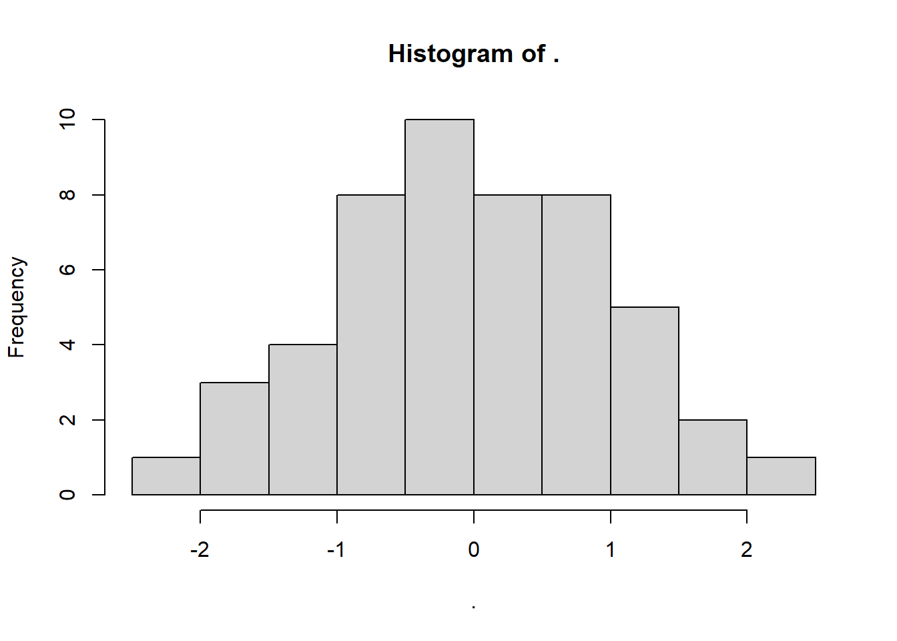
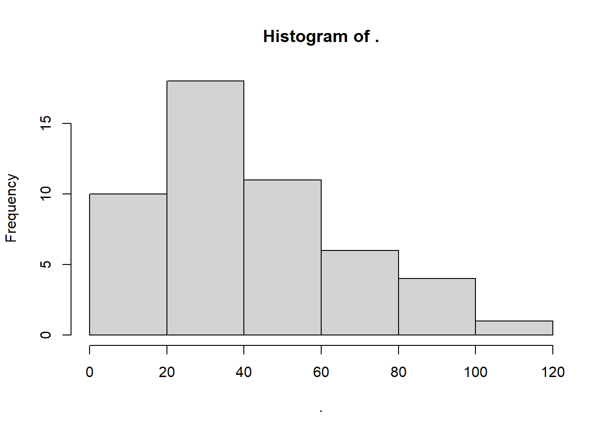
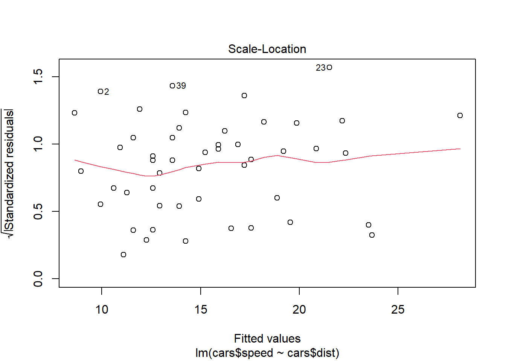
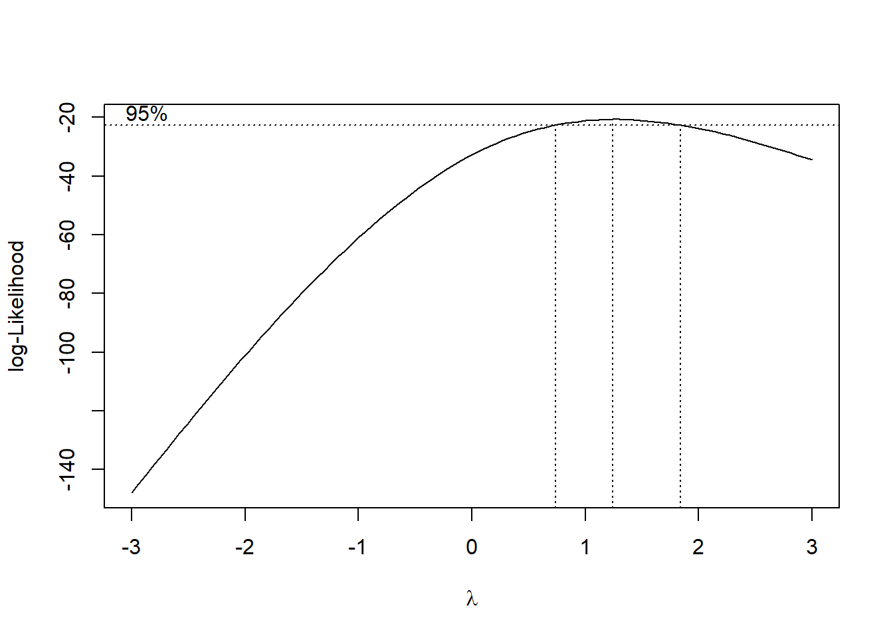
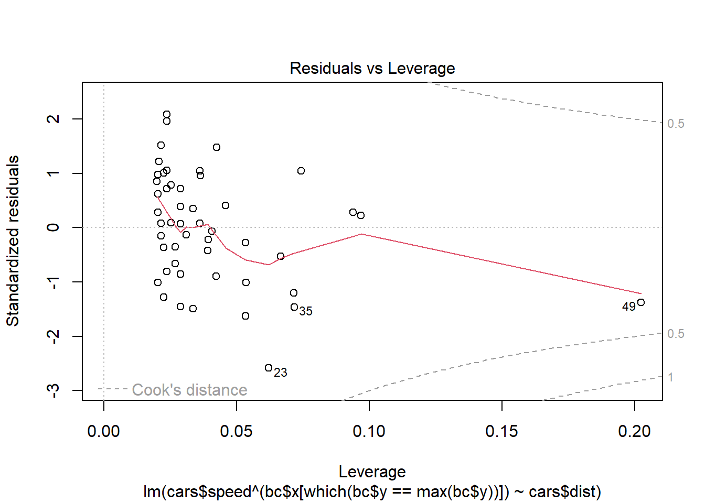
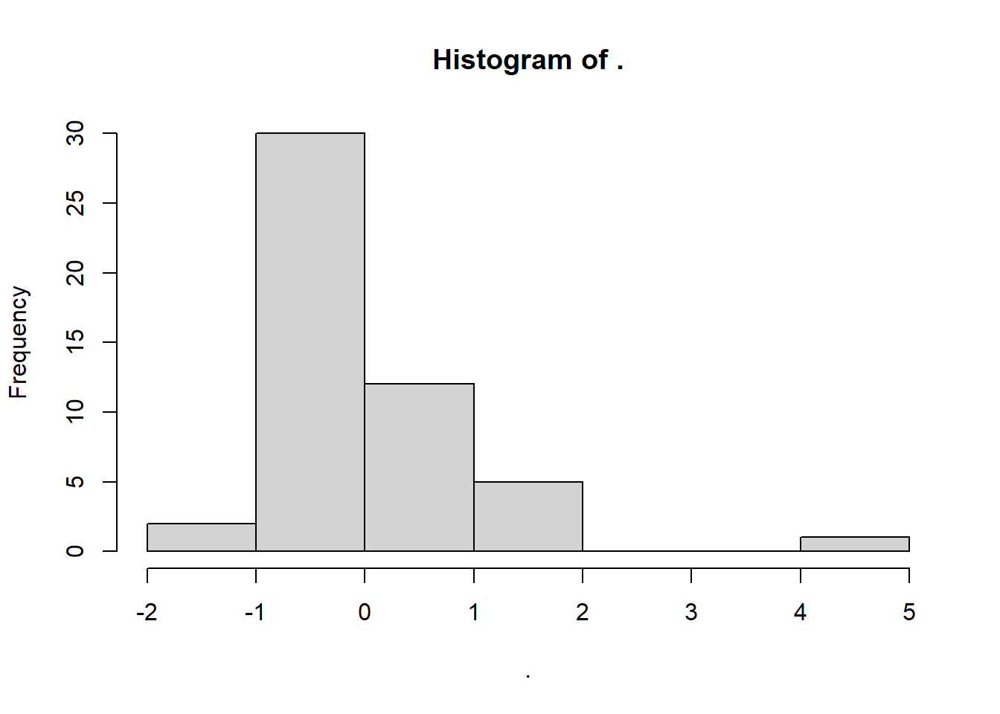
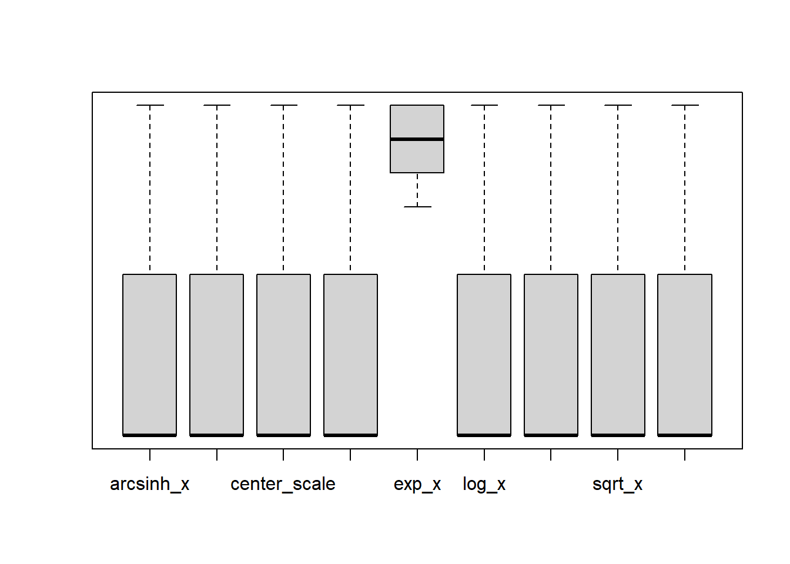

# Variable Transformation

`trafo` [vignette](https://cran.microsoft.com/snapshot/2018-08-09/web/packages/trafo/vignettes/vignette_trafo.pdf)

## Continuous Variables

Purposes:

-   To change the scale of the variables

-   To transform skewed data distribution to normal distribution

### Standardization

$$
x_i' = \frac{x_i - \bar{x}}{s}
$$

when you have a few large numbers

### Min-max scaling

$$
x_i' = \frac{x_i - x_{max}}{x_{max} - x_{min}}
$$

dependent on the min and max values, which makes it sensitive to outliers.

best to use when you have values in a fixed interval.

### Square Root/Cube Root

-   When variables have positive skewness or residuals have positive heteroskasticity.

-   Frequency counts variable

-   Data have many 0 or extremely small values.

### Logarithmic

-   Variables have positively skewed distribution

| Formula                                             | In case                                  |
|----------------------------------------|--------------------------------|
| $x_i' = \log(x_i)$                                  | cannot work zero because `log(0) = -Inf` |
| $x_i' = \log(x_i + 1)$                              | variables with 0                         |
| $x_i' = \log(x_i +c)$                               |                                          |
| $x_i' = \frac{x_i}{|x_i|}\log|x_i|$                 | variables with negative values           |
| $x_i'^\lambda = \log(x_i + \sqrt{x_i^2 + \lambda})$ | generalized log transformation           |

For the general case of $\log(x_i + c)$, choosing a constant is rather tricky.

The choice of the constant is critically important, especially when you want to do inference. It can dramatically change your model fit (see [@ekwaru2018overlooked] for the independent variable case).

@chen2023logs show that in causal inference problem, $\log$ transformation of values with meaningful 0 is problematic. But there are solutions for each approach (e.g., DID, IV).

However, assuming that you do not have 0s because of

-   Censoring

-   No measurement errors (stemming from measurement tools)

We can proceed choosing `c` (it's okay if your 0's are represent really small values).


```r
data(cars)
cars$speed %>% head()
#> [1] 4 4 7 7 8 9

log(cars$speed) %>% head()
#> [1] 1.386294 1.386294 1.945910 1.945910 2.079442 2.197225

# log(x+1)
log1p(cars$speed) %>% head()
#> [1] 1.609438 1.609438 2.079442 2.079442 2.197225 2.302585
```

### Exponential

-   Negatively skewed data

-   Underlying logarithmic trend (e.g., survival, decay)

### Power

-   Variables have negatively skewed distribution

### Inverse/Reciprocal

-   Variables have platykurtic distribution

-   Data are positively skewed

-   Ratio data


```r
data(cars)
head(cars$dist)
#> [1]  2 10  4 22 16 10
plot(cars$dist)
```


```r
plot(1/(cars$dist))
```


### Hyperbolic arcsine

-   Variables with positively skewed distribution

### Ordered Quantile Norm

-   [@bartlett1947use]

$$
x_i' = \Phi^{-1} (\frac{rank(x_i) - 1/2}{length(x)})
$$


```r
ord_dist <- bestNormalize::orderNorm(cars$dist)
ord_dist
#> orderNorm Transformation with 50 nonmissing obs and ties
#>  - 35 unique values 
#>  - Original quantiles:
#>   0%  25%  50%  75% 100% 
#>    2   26   36   56  120
ord_dist$x.t %>% hist()
```



### Arcsinh

-   Proportion variable (0-1)


```r
cars$dist %>% hist()
```



```r
# cars$dist %>% MASS::truehist()

as_dist <- bestNormalize::arcsinh_x(cars$dist)
as_dist
#> Standardized asinh(x) Transformation with 50 nonmissing obs.:
#>  Relevant statistics:
#>  - mean (before standardization) = 4.230843 
#>  - sd (before standardization) = 0.7710887
as_dist$x.t %>% hist()
```


$$
arcsinh(Y) = \log(\sqrt{1 + Y^2} + Y)
$$

| Paper                  | Interpretation |
|------------------------|----------------|
| @azoulay2019does       | Elasticity     |
| @faber2019tourism      | Percentage     |
| @hjort2019arrival      | Percentage     |
| @johnson2020regulation | Percentage     |
| @beerli2021abolition   | Percentage     |
| @norris2021effects     | Percentage     |
| @berkouwer2022credit   | Percentage     |
| @cabral2022demand      | Elasticity     |
| @carranza2022job       | Percentage     |
| @mirenda2022economic   | Percentage     |

For a simple regression model, $Y = \beta X$

When both $Y$ and $X$ are transformed, the coefficient estimate represents elasticity, indicating the percentage change in $Y$ for a 1% change in $X$.

When only $Y$ is in transformed and $X$ is in raw form, the coefficient estimate represents the percentage change in $Y$ for a one-unit change in $X$.

### Lambert W x F Transformation

`LambertW` package

-   Using moments to normalize data.

-   Usually need to compare with the [Box-Cox Transformation] and [Yeo-Johnson Transformation]

-   Can handle skewness, heavy-tailed.


```r
data(cars)
head(cars$dist)
#> [1]  2 10  4 22 16 10
cars$dist %>% hist()
```


```r


l_dist <- LambertW::Gaussianize(cars$dist)
# small fix
l_dist %>% hist()
```


### Inverse Hyperbolic Sine (IHS) transformation

-   Proposed by [@johnson1949]

-   Can be applied to real numbers.

$$
\begin{aligned}
f(x,\theta) &= \frac{\sinh^{-1} (\theta x)}{\theta} \\
&= \frac{\log(\theta x + (\theta^2 x^2 + 1)^{1/2})}{\theta}
\end{aligned}
$$

### Box-Cox Transformation

$$
y^\lambda = \beta x+ \epsilon
$$

to fix non-linearity in the error terms

work well between (-3,3) (i.e., small transformation).

or with independent variables

$$
x_i'^\lambda = 
\begin{cases}
\frac{x_i^\lambda-1}{\lambda} & \text{if } \lambda \neq 0\\
\log(x_i) & \text{if } \lambda = 0
\end{cases}
$$

And the two-parameter version is

$$
x_i' (\lambda_1, \lambda_2) = 
\begin{cases}
\frac{(x_i + \lambda_2)^{\lambda_1}-1}{} & \text{if } \lambda_1 \neq 0 \\
\log(x_i + \lambda_2) & \text{if } \lambda_1 = 0
\end{cases}
$$

More advances

-   [@manly1976exponential]

-   [@bickel1981analysis; @box1981analysis]


```r
library(MASS)
data(cars)
mod <- lm(cars$speed ~ cars$dist, data = cars)
# check residuals
plot(mod)
```



```r

bc <- boxcox(mod, lambda = seq(-3, 3))
```



```r

# best lambda
bc$x[which(bc$y == max(bc$y))]
#> [1] 1.242424

# model with best lambda
mod_lambda = lm(cars$speed ^ (bc$x[which(bc$y == max(bc$y))]) ~ cars$dist, 
                data = cars)
plot(mod_lambda)
```



```r

# 2-parameter version
two_bc = geoR::boxcoxfit(cars$speed)
two_bc
#> Fitted parameters:
#>    lambda      beta   sigmasq 
#>  1.028798 15.253008 31.935297 
#> 
#> Convergence code returned by optim: 0
plot(two_bc)
```


```r


# bestNormalize
bc_dist <- bestNormalize::boxcox(cars$dist)
bc_dist
#> Standardized Box Cox Transformation with 50 nonmissing obs.:
#>  Estimated statistics:
#>  - lambda = 0.4950628 
#>  - mean (before standardization) = 10.35636 
#>  - sd (before standardization) = 3.978036
bc_dist$x.t %>% hist()
```


### Yeo-Johnson Transformation

Similar to [Box-Cox Transformation] (when $\lambda = 1$), but allows for negative value

$$
x_i'^\lambda = 
\begin{cases}
\frac{(x_i+1)^\lambda -1}{\lambda} & \text{if } \lambda \neq0, x_i \ge 0 \\
\log(x_i + 1) & \text{if } \lambda = 0, x_i \ge 0 \\
\frac{-[(-x_i+1)^{2-\lambda}-1]}{2 - \lambda} & \text{if } \lambda \neq 2, x_i <0 \\
-\log(-x_i + 1) & \text{if } \lambda = 2, x_i <0 
\end{cases}
$$


```r
data(cars)
yj_speed <- bestNormalize::yeojohnson(cars$speed)
yj_speed$x.t %>% hist()
```


### RankGauss

-   Turn values into ranks, then ranks to values under normal distribution.

### Summary

Automatically choose the best method to normalize data ([code](https://cran.r-project.org/web/packages/bestNormalize/vignettes/bestNormalize.html) by `bestNormalize`)


```r
bestdist <- bestNormalize::bestNormalize(cars$dist)
bestdist$x.t %>% hist()
```



```r

boxplot(log10(bestdist$oos_preds), yaxt = "n")
```



```r
# axis(2, at = log10(c(.1, .5, 1, 2, 5, 10)), 
#      labels = c(.1, .5, 1, 2, 5, 10))
```

## Categorical Variables

Purposes

-   To transform to continuous variable (for machine learning models) (e.g., encoding/ embedding in text mining)

Approaches:

-   One-hot encoding

-   Label encoding

-   Feature hashing

-   Binary encoding

-   Base N encoding

-   Frequency encoding

-   Target encoding

-   Ordinal encoding

-   Helmert encoding

-   Mean encoding

-   Weight of evidence encoding

-   Probability ratio encoding

-   Backward difference encoding

-   Leave one out encoding

-   James-Stein encoding

-   M-estimator encoding

-   Thermometer encoding
