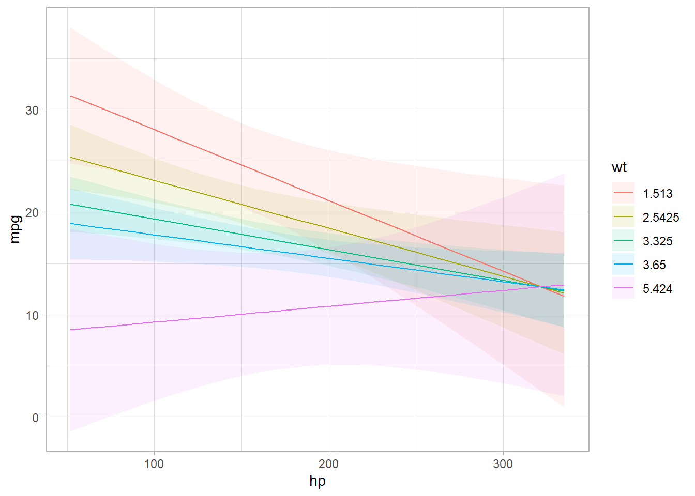

# Marginal Effects

In cases without polynomials or interactions, it can be easy to interpret the marginal effect.

For example,

$$
Y = \beta_1 X_1 + \beta_2 X_2
$$

where $\beta$ are the marginal effects.

Numerical derivation is easier than analytical derivation.

-   We need to choose values for all the variables to calculate the marginal effect of $X$

Analytical derivation

$$
f'(x) \equiv \lim_{h \to 0} \frac{f(x+h) - f(x)}{h}
$$

E.g., $f(x) = X^2$

$$
\begin{aligned}
f'(x) &= \lim_{h \to 0} \frac{(x+h)^2 - x^2}{h} \\
&= \frac{x^2 + 2xh + h^2 - x^2}{h} \\
&= \frac{2xh + h^2}{h} \\
&= 2x + h \\
&= 2x
\end{aligned}
$$

For numerically approach, we "just" need to find a small $h$ to plug in our function. However, you also need a large enough $h$ to have numerically accurate computation [@gould2010maximum, chapter 1]

Numerically approach

One-sided derivative

$$
\begin{aligned}
f'(x) &= \lim_{h \to 0} \frac{(x+h)^2 - x^2}{h}  \\
& \approx \frac{f(x+h) -f(x)}{h}
\end{aligned}
$$

Alternatively, two-sided derivative

$$
f'_2(x) \approx \frac{f(x+h) - f(x- h)}{2h}
$$

Marginal effects for

-   discrete variables (also known as incremental effects) are the change in $E[Y|X]$ for a one unit change in $X$

-   continuous variables are the change in $E[Y|X]$ for very small changes in $X$ (not unit changes), because it's a derivative, which is a limit when $h \to 0$

|                  | Analytical derivation | Numerical derivation                                   |
|-----------------|-----------------|---------------------------------------|
| Marginal Effects | Rules of expectations | Approximate analytical solution                        |
| Standard Errors  | Rules of variances    | Delta method using the asymptotic errors (vcov matrix) |

## Delta Method

-   approximate the mean and variance of a function of random variables using a first-order Taylor approximation
-   A semi-parametric method
-   Alternative approaches:
    -   Analytically derive a probability function for the margin

    -   Simulation/Bootstrapping
-   Resources:
    -   Advanced: [modmarg](https://cran.r-project.org/web/packages/modmarg/vignettes/delta-method.html)

    -   Intermediate: [UCLA stat](https://stats.oarc.ucla.edu/r/faq/how-can-i-estimate-the-standard-error-of-transformed-regression-parameters-in-r-using-the-delta-method/)

    -   Simple: [Another one](https://www.alexstephenson.me/post/2022-04-02-standard-errors-and-the-delta-method/)

Let $G(\beta)$ be a function of the parameters $\beta$, then

$$
var(G(\beta)) \approx \nabla G(\beta) cov (\beta) \nabla G(\beta)'
$$

where

-   $\nabla G(\beta)$ = the gradient of the partial derivatives of $G(\beta)$ (also known as the Jacobian)

## Average Marginal Effect Algorithm

For one-sided derivative $\frac{\partial p(\mathbf{X},\beta)}{\partial X}$ in the probability scale

1.  Estimate your model
2.  For each observation $i$
    1.  Calculate $\hat{Y}_{i0}$ which is the prediction in the probability scale using observed values

    2.  Increase $X$ (variable of interest) by a "small" amount $h$ ($X_{new} = X + h$)

        -   When $X$ is continuous, $h = (|\bar{X}| + 0.001) \times 0.001$ where $\bar{X}$ is the mean value of $X$

        -   When $X$ is discrete, $h = 1$

    3.  Calculate $\hat{Y}_{i1}$ which is the prediction in the probability scale using new $X$ and other variables' observed vales.

    4.  Calculate the difference between the two predictions as fraction of $h$: $\frac{\bar{Y}_{i1} - \bar{Y}_{i0}}{h}$
3.  Average numerical derivative is $E[\frac{\bar{Y}_{i1} - \bar{Y}_{i0}}{h}] \approx \frac{\partial p (Y|\mathbf{X}, \beta)}{\partial X}$

Two-sided derivatives

1.  Estimate your model
2.  For each observation $i$
    1.  Calculate $\hat{Y}_{i0}$ which is the prediction in the probability scale using observed values

    2.  Increase $X$ (variable of interest) by a "small" amount $h$ ($X_{1} = X + h$) and decrease $X$ (variable of interest) by a "small" amount $h$ ($X_{2} = X - h$)

        -   When $X$ is continuous, $h = (|\bar{X}| + 0.001) \times 0.001$ where $\bar{X}$ is the mean value of $X$

        -   When $X$ is discrete, $h = 1$

    3.  Calculate $\hat{Y}_{i1}$ which is the prediction in the probability scale using new $X_1$ and other variables' observed vales.

    4.  Calculate $\hat{Y}_{i2}$ which is the prediction in the probability scale using new $X_2$ and other variables' observed vales.

    5.  Calculate the difference between the two predictions as fraction of $h$: $\frac{\bar{Y}_{i1} - \bar{Y}_{i2}}{2h}$
3.  Average numerical derivative is $E[\frac{\bar{Y}_{i1} - \bar{Y}_{i2}}{2h}] \approx \frac{\partial p (Y|\mathbf{X}, \beta)}{\partial X}$


```r
library(margins)

data("mtcars")
mod <- lm(mpg ~ cyl * disp * hp, data = mtcars)
margins::margins(mod) %>% summary()
#>  factor     AME     SE       z      p    lower   upper
#>     cyl -4.0592 3.7614 -1.0792 0.2805 -11.4313  3.3130
#>    disp -0.0350 0.0132 -2.6473 0.0081  -0.0610 -0.0091
#>      hp -0.0284 0.0185 -1.5348 0.1248  -0.0647  0.0079

# function for variable
get_mae <- function(mod, var = "disp") {
    data = mod$model
    
    pred <- predict(mod)
    
    if (class(mod$model[[{{var}}]]) == "numeric") {
        h = (abs(mean(mod$model[[var]])) + 0.01) * 0.01
    } else {
        h = 1
    }
    
    data[[{{var}}]] <- data[[{{var}}]] - h
    
    pred_new <- predict(mod, newdata = data)
    
    mean(pred - pred_new)/h
}

get_mae(mod, var = "disp")
#> [1] -0.03504546
```

## Packages

### MarginalEffects

`MarginalEffects` package is a successor of `margins` and `emtrends` (faster, more efficient, more adaptable). Hence, this is advocated to be used.

-   A limitation is that there is no readily function to correct for multiple comparisons. Hence, one can use the `p.adjust` function to overcome this disadvantage.

Definitions from the package:

-   **Marginal effects** are slopes or derivatives (i.e., effect of changes in a variable on the outcome)

    -   `margins` package defines marginal effects as "partial derivatives of the regression equation with respect to each variable in the model for each unit in the data."

-   **Marginal means** are averages or integrals (i.e., marginalizing across rows of a prediction grid)

To customize your plot using `plot_cme` (which is a `ggplot` class), you can check this [post](https://stackoverflow.com/questions/72463092/estimate-marginal-effect-in-triple-interaction) by the author of the `MarginalEffects` package

Causal inference with the parametric g-formula

-   Because the plug-in g estimator is equivalent to the average contrast in the `marginaleffects` package.

To get predicted values


```r
library(marginaleffects)
library(tidyverse)
data(mtcars)

mod <- lm(mpg ~ hp * wt * am, data = mtcars)
predictions(mod) %>% head()
#>   rowid     type predicted std.error statistic       p.value conf.low conf.high
#> 1     1 response  22.48857 0.8841487  25.43528 1.027254e-142 20.66378  24.31336
#> 2     2 response  20.80186 1.1942050  17.41900  5.920119e-68 18.33714  23.26658
#> 3     3 response  25.26465 0.7085307  35.65781 1.783452e-278 23.80232  26.72699
#> 4     4 response  20.25549 0.7044641  28.75305 8.296026e-182 18.80155  21.70943
#> 5     5 response  16.99782 0.7118658  23.87784 5.205109e-126 15.52860  18.46704
#> 6     6 response  19.66353 0.8753226  22.46433 9.270636e-112 17.85696  21.47011
#>    mpg  hp    wt am
#> 1 21.0 110 2.620  1
#> 2 21.0 110 2.875  1
#> 3 22.8  93 2.320  1
#> 4 21.4 110 3.215  0
#> 5 18.7 175 3.440  0
#> 6 18.1 105 3.460  0
# for specific reference values
predictions(mod, newdata = datagrid(am = 0, wt = c(2, 4)))
#>   rowid     type predicted std.error statistic      p.value conf.low conf.high
#> 1     1 response  21.95621  2.038630  10.77008 4.765935e-27 17.74868  26.16373
#> 2     2 response  16.60387  1.083201  15.32853 4.930475e-53 14.36826  18.83949
#>         hp am wt mpg
#> 1 146.6875  0  2  21
#> 2 146.6875  0  4  21
plot_cap(mod, condition = c("hp","wt"))
```




```r
# Average Margianl Effects
mfx <- marginaleffects(mod, variables = c("hp","wt"))
summary(mfx)
#>   Term   Effect Std. Error z value   Pr(>|z|)    2.5 %   97.5 %
#> 1   hp -0.03807    0.01279  -2.977 0.00290849 -0.06314 -0.01301
#> 2   wt -3.93909    1.08596  -3.627 0.00028642 -6.06754 -1.81065
#> 
#> Model type:  lm 
#> Prediction type:  response

# Group-Average Marginal Effects
marginaleffects::marginaleffects(mod, by = "hp", variables = "am")
#>        type term    contrast       dydx std.error  statistic   p.value
#> 1  response   am mean(dY/dX) -0.6404236  1.574316 -0.4067948 0.6841587
#> 2  response   am mean(dY/dX)  1.2007132  2.347558  0.5114733 0.6090197
#> 3  response   am mean(dY/dX) -0.4156466  1.561271 -0.2662232 0.7900673
#> 4  response   am mean(dY/dX) -2.6819824  2.368763 -1.1322289 0.2575382
#> 5  response   am mean(dY/dX)  1.1150226  2.282678  0.4884714 0.6252160
#> 6  response   am mean(dY/dX) -2.7738333  2.505307 -1.1071832 0.2682148
#> 7  response   am mean(dY/dX) -1.8317946  1.966704 -0.9314031 0.3516451
#> 8  response   am mean(dY/dX) -2.0984415  2.103241 -0.9977181 0.3184161
#> 9  response   am mean(dY/dX) -1.3811407  2.468100 -0.5595967 0.5757546
#> 10 response   am mean(dY/dX) -2.8727448  6.243131 -0.4601449 0.6454122
#> 11 response   am mean(dY/dX) -2.5343470  6.953646 -0.3644631 0.7155123
#> 12 response   am mean(dY/dX) -1.4768716  7.072758 -0.2088113 0.8345956
#> 13 response   am mean(dY/dX)  2.0253372  3.481741  0.5817024 0.5607671
#> 14 response   am mean(dY/dX)  3.9755032  5.204176  0.7639064 0.4449230
#> 15 response   am mean(dY/dX)  2.9993903  4.134608  0.7254352 0.4681851
#> 16 response   am mean(dY/dX)  0.7076255  2.036408  0.3474871 0.7282254
#> 17 response   am mean(dY/dX) -1.4291891  1.898515 -0.7527932 0.4515742
#> 18 response   am mean(dY/dX)  1.8576247  2.755076  0.6742554 0.5001490
#> 19 response   am mean(dY/dX)  4.0807296  3.935095  1.0370091 0.2997316
#> 20 response   am mean(dY/dX)  2.1063535  2.289201  0.9201262 0.3575068
#> 21 response   am mean(dY/dX)  4.0272190  3.240239  1.2428770 0.2139132
#> 22 response   am mean(dY/dX) -0.2369146  1.586423 -0.1493388 0.8812863
#>      conf.low conf.high predicted predicted_hi predicted_lo  hp
#> 1   -3.726027  2.445179  22.48857     22.48860     22.48857 110
#> 2   -3.400416  5.801842  25.26465     25.26477     25.26465  93
#> 3   -3.475682  2.644389  16.99782     16.99776     16.99782 175
#> 4   -7.324673  1.960708  19.66353     19.66326     19.66353 105
#> 5   -3.358943  5.588988  14.10339     14.10352     14.10339 245
#> 6   -7.684144  2.136478  22.38203     22.38175     22.38203  62
#> 7   -5.686464  2.022875  21.11208     21.11190     21.11208  95
#> 8   -6.220718  2.023835  19.02678     19.02657     19.02678 123
#> 9   -6.218528  3.456247  15.42015     15.41996     15.42015 180
#> 10 -15.109057  9.363568  12.50928     12.50899     12.50928 205
#> 11 -16.163242 11.094548  12.08696     12.08670     12.08696 215
#> 12 -15.339222 12.385479  12.04819     12.04804     12.04819 230
#> 13  -4.798750  8.849425  27.48596     27.48610     27.48596  66
#> 14  -6.224494 14.175501  33.15484     33.15524     33.15484  52
#> 15  -5.104293 11.103074  30.47992     30.48022     30.47992  65
#> 16  -3.283661  4.698912  23.35089     23.35097     23.35089  97
#> 17  -5.150210  2.291832  17.76302     17.76286     17.76302 150
#> 18  -3.542225  7.257474  26.65861     26.65879     26.65861  91
#> 19  -3.631915 11.793374  29.59315     29.59356     29.59315 113
#> 20  -2.380397  6.593104  15.89618     15.89639     15.89618 264
#> 21  -2.323533 10.377971  14.78810     14.78850     14.78810 335
#> 22  -3.346247  2.872418  21.46199     21.46197     21.46199 109

# Marginal effects at representative values 
marginaleffects::marginaleffects(mod, newdata = datagrid(am = 0, wt = c(2,4)))
#>   rowid     type term        dydx  std.error  statistic    p.value    conf.low
#> 1     1 response   hp -0.05983659 0.02828054 -2.1158216 0.03435998 -0.11526543
#> 2     2 response   hp -0.03092251 0.01869785 -1.6538003 0.09816809 -0.06756962
#> 3     1 response   wt -2.67616644 1.41929653 -1.8855584 0.05935449 -5.45793653
#> 4     2 response   wt -2.67616644 1.41929653 -1.8855584 0.05935449 -5.45793653
#> 5     1 response   am  2.54651713 2.78597859  0.9140476 0.36069182 -2.91390057
#> 6     2 response   am -2.96607890 3.03811812 -0.9762882 0.32892166 -8.92068100
#>      conf.high predicted predicted_hi predicted_lo       hp am wt mpg       eps
#> 1 -0.004407739  21.95621     21.95451     21.95621 146.6875  0  2  21 0.0283000
#> 2  0.005724602  16.60387     16.60300     16.60387 146.6875  0  4  21 0.0283000
#> 3  0.105603651  21.95621     21.95516     21.95621 146.6875  0  2  21 0.0003911
#> 4  0.105603651  16.60387     16.60283     16.60387 146.6875  0  4  21 0.0003911
#> 5  8.006934823  21.95621     21.95646     21.95621 146.6875  0  2  21 0.0001000
#> 6  2.988523196  16.60387     16.60358     16.60387 146.6875  0  4  21 0.0001000

# Marginal Effects at the Mean
marginaleffects::marginaleffects(mod, newdata = "mean")
#>   rowid     type term        dydx   std.error  statistic      p.value
#> 1     1 response   hp -0.03225442 0.009558998 -3.3742476 0.0007401776
#> 2     1 response   wt -3.79591251 1.214385758 -3.1257881 0.0017732930
#> 3     1 response   am -0.80858663 1.523832597 -0.5306269 0.5956773218
#>      conf.low   conf.high predicted predicted_hi predicted_lo       hp      wt
#> 1 -0.05098972 -0.01351913  18.37015     18.36924     18.37015 146.6875 3.21725
#> 2 -6.17606486 -1.41576016  18.37015     18.36867     18.37015 146.6875 3.21725
#> 3 -3.79524364  2.17807038  18.37015     18.37007     18.37015 146.6875 3.21725
#>        am mpg       eps
#> 1 0.40625  21 0.0283000
#> 2 0.40625  21 0.0003911
#> 3 0.40625  21 0.0001000
```


```r
# counterfactual
comparisons(mod, variables = list(am = 0:1)) %>% summary()
#>   Term Contrast   Effect Std. Error  z value Pr(>|z|)  2.5 % 97.5 %
#> 1   am    1 - 0 -0.04811      1.853 -0.02597  0.97928 -3.679  3.583
#> 
#> Model type:  lm 
#> Prediction type:  response
```

### margins

-   Marginal effects are partial derivative of the regression equation with respect to each variable in the model for each unit in the data

<!-- -->

-   Average Partial Effects: the contribution of each variable the outcome scale, conditional on the other variables involved in the link function transformation of the linear predictor

-   Average Marginal Effects: the marginal contribution of each variable on the scale of the linear predictor.

-   Average marginal effects are the mean of these unit-specific partial derivatives over some sample

`margins` package gives the marginal effects of models (a replication of the `margins` command in Stata).

`prediction` package gives the unit-specific and sample average predictions of models (similar to the predictive margins in Stata).


```r
library(margins)

# examples by the package's authors
mod <- lm(mpg ~ cyl * hp + wt, data = mtcars)
summary(mod)
#> 
#> Call:
#> lm(formula = mpg ~ cyl * hp + wt, data = mtcars)
#> 
#> Residuals:
#>     Min      1Q  Median      3Q     Max 
#> -3.3440 -1.4144 -0.6166  1.2160  4.2815 
#> 
#> Coefficients:
#>              Estimate Std. Error t value Pr(>|t|)    
#> (Intercept) 52.017520   4.916935  10.579 4.18e-11 ***
#> cyl         -2.742125   0.800228  -3.427  0.00197 ** 
#> hp          -0.163594   0.052122  -3.139  0.00408 ** 
#> wt          -3.119815   0.661322  -4.718 6.51e-05 ***
#> cyl:hp       0.018954   0.006645   2.852  0.00823 ** 
#> ---
#> Signif. codes:  0 '***' 0.001 '**' 0.01 '*' 0.05 '.' 0.1 ' ' 1
#> 
#> Residual standard error: 2.242 on 27 degrees of freedom
#> Multiple R-squared:  0.8795,	Adjusted R-squared:  0.8616 
#> F-statistic: 49.25 on 4 and 27 DF,  p-value: 5.065e-12
```

In cases where you have interaction or polynomial terms, the coefficient estimates cannot be interpreted as the marginal effects of X on Y. Hence, if you want to know the average marginal effects of each variable then


```r
summary(margins(mod))
#>  factor     AME     SE       z      p   lower   upper
#>     cyl  0.0381 0.5999  0.0636 0.9493 -1.1376  1.2139
#>      hp -0.0463 0.0145 -3.1909 0.0014 -0.0748 -0.0179
#>      wt -3.1198 0.6613 -4.7176 0.0000 -4.4160 -1.8236

# equivalently 
margins_summary(mod)
#>  factor     AME     SE       z      p   lower   upper
#>     cyl  0.0381 0.5999  0.0636 0.9493 -1.1376  1.2139
#>      hp -0.0463 0.0145 -3.1909 0.0014 -0.0748 -0.0179
#>      wt -3.1198 0.6613 -4.7176 0.0000 -4.4160 -1.8236

plot(margins(mod))
```


Marginal effects at the mean (**MEM**):

-   Marginal effects at the mean values of the sample
-   For discrete variables, it's called average discrete change (**ADC**)

Average Marginal Effect (**AME**)

-   An average of the marginal effects at each value of the sample

Marginal Effects at representative values (**MER**)


```r
margins(mod, at = list(hp = 150))
#>  at(hp)    cyl       hp    wt
#>     150 0.1009 -0.04632 -3.12

margins(mod, at = list(hp = 150)) %>% summary()
#>  factor       hp     AME     SE       z      p   lower   upper
#>     cyl 150.0000  0.1009 0.6128  0.1647 0.8692 -1.1001  1.3019
#>      hp 150.0000 -0.0463 0.0145 -3.1909 0.0014 -0.0748 -0.0179
#>      wt 150.0000 -3.1198 0.6613 -4.7175 0.0000 -4.4160 -1.8236
```

### mfx

Works well with [Generalized Linear Models]/`glm` package

For technical details, see the package [vignette](https://cran.rstudio.com/web/packages/mfx/vignettes/mfxarticle.pdf)

| Model             | Dependent Variable | Syntax       |
|-------------------|--------------------|--------------|
| Probit            | Binary             | `probitmfx`  |
| Logit             | Binary             | `logitmfx`   |
| Poisson           | Count              | `poissonmfx` |
| Negative Binomial | Count              | `negbinmfx`  |
| Beta              | Rate               | `betamfx`    |


```r
library(mfx)
data("mtcars")
poissonmfx(formula = vs ~ mpg * cyl * disp, data = mtcars)
#> Call:
#> poissonmfx(formula = vs ~ mpg * cyl * disp, data = mtcars)
#> 
#> Marginal Effects:
#>                    dF/dx   Std. Err.       z  P>|z|
#> mpg           1.4722e-03  8.7531e-03  0.1682 0.8664
#> cyl           6.6420e-03  3.9263e-02  0.1692 0.8657
#> disp          1.5899e-04  9.4555e-04  0.1681 0.8665
#> mpg:cyl      -3.4698e-04  2.0564e-03 -0.1687 0.8660
#> mpg:disp     -7.6794e-06  4.5545e-05 -0.1686 0.8661
#> cyl:disp     -3.3837e-05  1.9919e-04 -0.1699 0.8651
#> mpg:cyl:disp  1.6812e-06  9.8919e-06  0.1700 0.8650
```

This package can only give the marginal effect for each variable in the `glm` model, but not the average marginal effect that we might look for.
