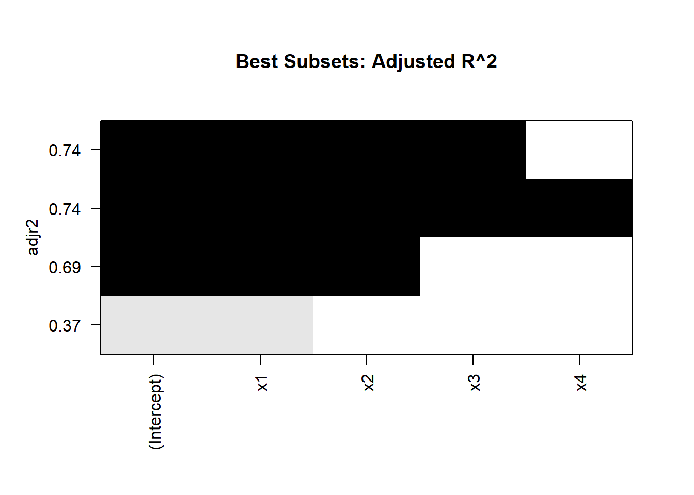
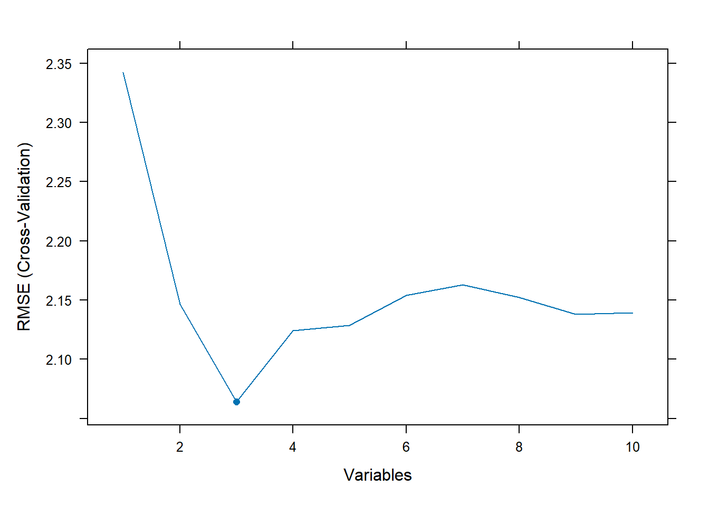

# Variable Selection

Imagine you're a detective standing before a pinboard covered in clues---some are glaringly obvious, while others might be red herrings. Your mission? To pick which pieces of evidence will crack the case. This is the essence of variable selection in statistics: deciding which variables best uncover the story behind your data. Far from a mechanical chore, it's a high-stakes balancing act blending analytical goals, domain insights, data realities, and computational feasibility.

Why Does Variable Selection Matter?

-   **Focus and Clarity**: Models cluttered with unnecessary variables can obscure the real relationships or patterns in your data. By identifying the variables that truly drive your results, you sharpen your model's focus and interpretability.

-   **Efficiency and Performance**: Too many variables can lead to overfitting---fitting the quirks of a single dataset rather than underlying trends. Streamlined models often run faster and generalize better.

-   **Practical Constraints**: In many real-world scenarios, data collection or processing costs money, time, and effort. Prioritizing the most meaningful variables becomes not just a statistical concern, but a strategic one.

**Key Influences on Variable Selection**

1.  **Objectives or Goals**

    -   *Prediction vs. Inference*: Are you trying to forecast future outcomes or explain why certain events happen? Prediction-focused models might include as many relevant features as possible for accuracy, whereas inference-driven models often strive for parsimony and clearer relationships.

    -   *Balance*: Some analyses blend both objectives, requiring careful negotiation between complexity (to maximize predictive ability) and simplicity (to maintain interpretability).

2.  **Previously Acquired Expertise**

    -   *Domain Knowledge*: Whether you're analyzing financial trends or studying medical records, familiarity with the subject can reveal which variables are naturally linked to the phenomenon.

    -   *Subtle Clues*: Experts can uncover hidden confounders---variables that outwardly seem irrelevant yet dramatically influence results.

3.  **Availability and Quality of Data**

    -   *Completeness*: Missing data or sparse measurements can force you to discard or transform variables. Sometimes the ideal variable simply isn't present in your dataset.

    -   *Reliability*: A variable riddled with measurement errors or inconsistencies may do more harm than good.

4.  **Computational Resources and Software**

    -   *Toolset Capabilities*: Some statistical techniques or advanced machine learning methods thrive on large sets of variables, while others become unwieldy.

    -   *Time and Memory Constraints*: Even the most sophisticated algorithms can choke on too much data if hardware resources are limited.

Selecting the right subset of variables enhances model interpretability, reduces computational cost, and prevents overfitting. Broadly, variable selection methods fall into three categories:

1.  **Filter Methods**: Use statistical properties of the data to select features before modeling.
    1.  Information Criteria-Based Selection
        1.  [Akaike Information Criterion (AIC)](#akaike-information-criterion-aic)
        2.  [Bayesian Information Criterion (BIC)](#bayesian-information-criterion-bic)
        3.  [Mallows's C Statistic](#mallowss-c-statistic)
        4.  [Hannan-Quinn Criterion (HQC)](#hannan-quinn-criterion-hqc)
        5.  [Minimum Description Length (MDL)](#minimum-description-length-mdl)
        6.  Adjusted $R^2$
        7.  [Prediction Error Sum of Squares (PRESS)](#prediction-error-sum-of-squares-press)
    2.  Univariate Selection Methods
    3.  Correlation-Based Feature Selection
    4.  Variance Thresholding
2.  **Wrapper Methods**: Evaluate different subsets of features based on model performance.
    1.  Exhaustive Search (Best Subsets Algorithm)
    2.  [Best Subsets Algorithm](#best-subsets-algorithm-1)
    3.  [Stepwise Selection Methods](#stepwise-selection-methods-1)
        1.  [Forward Selection]
        2.  [Backward Elimination]
        3.  [Stepwise (Both Directions) Selection](#stepwise-both-directions-selection)
    4.  [Branch-and-Bound Algorithm](#branch-and-bound-algorithm-1)
    5.  [Recursive Feature Elimination](#recursive-feature-elimination-rfe)
3.  **Embedded Methods**: Perform feature selection as part of the model training process.
    1.  [Lasso Regression] (L1 Regularization)
    2.  [Ridge Regression] (L2 Regularization)
    3.  [Elastic Net] (Combination of L1 and L2)
    4.  Tree-Based Feature Importance
    5.  [Genetic Algorithms](#genetic-algorithms-1)

| Method Category | Examples                   | Pros                             | Cons                              |
|------------------|------------------|------------------|------------------|
| **Filter**      | AIC, BIC, Mutual Info, CFS | Fast, scalable, model-agnostic   | Ignores feature interactions      |
| **Wrapper**     | Stepwise Selection, RFE    | Finds optimal feature subsets    | Computationally expensive         |
| **Embedded**    | Lasso, Decision Trees      | Model-aware, balances efficiency | Selection tied to specific models |

: Throughout this chapter, let $P$ denote the number of potential predictor variables ($X_1, X_2, \dots, X_{P-1}$).

------------------------------------------------------------------------

## Filter Methods (Statistical Criteria, Model-Agnostic) {#sec-filter-methods}

### Information Criteria-Based Selection

#### Mallows's C Statistic {#mallowss-c-statistic}

The $C_p$ statistic (Mallows, 1973, *Technometrics*, 15, 661-675) [@mallows1995more] is a criterion used to evaluate the predictive ability of a fitted model. It balances model complexity and goodness-of-fit.

For a model with $p$ parameters, let $\hat{Y}_{ip}$ be the predicted value of $Y_i$. The **total standardized mean square error of prediction** is:

$$
\Gamma_p = \frac{\sum_{i=1}^n E(\hat{Y}_{ip} - E(Y_i))^2}{\sigma^2}
$$

Expanding $\Gamma_p$:

$$
\Gamma_p = \frac{\sum_{i=1}^n [E(\hat{Y}_{ip}) - E(Y_i)]^2 + \sum_{i=1}^n \text{Var}(\hat{Y}_{ip})}{\sigma^2}
$$

-   The **first term** in the numerator represents the squared bias.
-   The **second term** represents the prediction variance.

**Key Insights**

1.  **Bias-Variance Tradeoff**:

    -   The **bias** decreases as more variables are added to the model.
    -   If the **full model** ($p = P$) is assumed to be the true model, $E(\hat{Y}_{ip}) - E(Y_i) = 0$, implying no bias.
    -   The **prediction variance** increases as more variables are added: $\sum \text{Var}(\hat{Y}_{ip}) = p \sigma^2$.
    -   Therefore, the optimal model balances bias and variance by minimizing $\Gamma_p$.

2.  **Estimating** $\Gamma_p$: Since $\Gamma_p$ depends on unknown parameters (e.g., $\beta$), we use an estimate:

    $$
    C_p = \frac{SSE_p}{\hat{\sigma}^2} - (n - 2p)
    $$

    -   $SSE_p$: Sum of squared errors for the model with $p$ predictors.
    -   $\hat{\sigma}^2$: Mean squared error (MSE) of the full model with all $P-1$ predictors.

3.  **Properties of** $C_p$:

    -   As more variables are added, $SSE_p$ decreases, but the penalty term $2p$ increases.
    -   When there is no bias, $E(C_p) \approx p$. Hence, good models have $C_p$ values close to $p$.

4.  **Model Selection Criteria**:

    -   **Prediction-focused models**: Consider models with $C_p \leq p$.
    -   **Parameter estimation-focused models**: Consider models with $C_p \leq 2p - (P - 1)$ to avoid excess bias.

------------------------------------------------------------------------


```r
# Simulated data
set.seed(123)
n <- 100
x1 <- rnorm(n)
x2 <- rnorm(n)
x3 <- rnorm(n)
y <- 5 + 3*x1 - 2*x2 + rnorm(n, sd=2)

# Full model and candidate models
full_model <- lm(y ~ x1 + x2 + x3)
model_1 <- lm(y ~ x1)
model_2 <- lm(y ~ x1 + x2)

# Extract SSE and calculate Cp
calculate_cp <- function(model, full_model_sse, full_model_mse, n) {
  sse <- sum(residuals(model)^2)
  p <- length(coefficients(model))
  cp <- (sse / full_model_mse) - (n - 2 * p)
  return(cp)
}

# Full model statistics
full_model_sse <- sum(residuals(full_model)^2)
full_model_mse <- mean(residuals(full_model)^2)

# Cp values for each model
cp_1 <- calculate_cp(model_1, full_model_sse, full_model_mse, n)
cp_2 <- calculate_cp(model_2, full_model_sse, full_model_mse, n)

# Display results
cat("C_p values:\n")
#> C_p values:
cat("Model 1 (y ~ x1):", round(cp_1, 2), "\n")
#> Model 1 (y ~ x1): 83.64
cat("Model 2 (y ~ x1 + x2):", round(cp_2, 2), "\n")
#> Model 2 (y ~ x1 + x2): 6.27
```

For Mallows's $C_p$ criterion, **lower values** are preferred. Specifically:

1.  **Ideal Value**: When the model is a good fit and has the correct number of predictors, $C_p$ should be close to the number of predictors $p$ plus 1 (i.e., $p + 1$).

2.  **Model Comparison**: Among competing models, you generally prefer the one with the smallest $C_p$, as long as it is close to $p + 1$.

3.  **Overfitting Indicator**: If $C_p$ is significantly lower than $p + 1$, it may suggest overfitting.

4.  **Underfitting Indicator**: If $C_p$ is much higher than $p + 1$, it suggests the model is underfitting the data and missing important predictors.

#### Akaike Information Criterion (AIC) {#akaike-information-criterion-aic}

The **Akaike Information Criterion (AIC)** is a widely used model selection metric that evaluates the tradeoff between model fit and complexity. It was introduced by Hirotugu Akaike and is rooted in information theory, measuring the relative quality of statistical models for a given dataset.

For a model with $p$ parameters, the AIC is given by:

$$
AIC = n \ln\left(\frac{SSE_p}{n}\right) + 2p
$$

Where:

-   $n$ is the number of observations.

-   $SSE_p$ is the sum of squared errors for a model with $p$ parameters.

**Key Insights**

1.  **Components of AIC**:
    -   The **first term** ($n \ln(SSE_p / n)$): Reflects the goodness-of-fit of the model. It decreases as $SSE_p$ decreases, meaning the model better explains the data.
    -   The **second term** ($2p$): Represents a penalty for model complexity. It increases with the number of parameters to discourage overfitting.
2.  **Model Selection Principle**:
    -   Smaller AIC values indicate a better balance between fit and complexity.
    -   Adding parameters generally reduces $SSE_p$, but increases the penalty term ($2p$). If AIC increases when a parameter is added, that parameter is likely unnecessary.
3.  **Tradeoff**:
    -   AIC emphasizes the tradeoff between:
        -   **Precision of fit**: Reducing the error in explaining the data.
        -   **Parsimony**: Avoiding unnecessary parameters to maintain model simplicity.
4.  **Comparative Criterion**:
    -   AIC does not provide an absolute measure of model quality; instead, it compares relative performance. The model with the lowest AIC is preferred.

------------------------------------------------------------------------


```r
# Simulated data
set.seed(123)
n <- 100
x1 <- rnorm(n)
x2 <- rnorm(n)
x3 <- rnorm(n)
y <- 5 + 3*x1 - 2*x2 + rnorm(n, sd=2)

# Candidate models
model_1 <- lm(y ~ x1)
model_2 <- lm(y ~ x1 + x2)
model_3 <- lm(y ~ x1 + x2 + x3)

# Function to manually compute AIC
calculate_aic <- function(model, n) {
  sse <- sum(residuals(model)^2)
  p <- length(coefficients(model))
  aic <- n * log(sse / n) + 2 * p
  return(aic)
}

# Calculate AIC for each model
aic_1 <- calculate_aic(model_1, n)
aic_2 <- calculate_aic(model_2, n)
aic_3 <- calculate_aic(model_3, n)

# Display results
cat("AIC values:\n")
#> AIC values:
cat("Model 1 (y ~ x1):", round(aic_1, 2), "\n")
#> Model 1 (y ~ x1): 207.17
cat("Model 2 (y ~ x1 + x2):", round(aic_2, 2), "\n")
#> Model 2 (y ~ x1 + x2): 150.87
cat("Model 3 (y ~ x1 + x2 + x3):", round(aic_3, 2), "\n")
#> Model 3 (y ~ x1 + x2 + x3): 152.59
```

Interpretation

-   Compare the AIC values across models:

    -   A smaller AIC indicates a model with a better balance between fit and complexity.

    -   If the AIC increases when moving from one model to another (e.g., from Model 2 to Model 3), the additional parameter(s) in the larger model may not be justified.

Advantages:

-   Simple to compute and widely applicable.

-   Penalizes overfitting, encouraging parsimonious models.

Limitations:

-   Assumes the model errors are normally distributed and independent.

-   Does not evaluate absolute model fit, only relative performance.

-   Sensitive to sample size; for smaller samples, consider using the corrected version, AICc.

**Corrected AIC (AICc)**

For small sample sizes ($n / p \leq 40$), the corrected AIC, $AICc$, adjusts for the sample size:

$$
AICc = AIC + \frac{2p(p+1)}{n-p-1}
$$

This adjustment prevents over-penalizing models with more parameters when $n$ is small.

#### Bayesian Information Criterion (BIC) {#bayesian-information-criterion-bic}

The **Bayesian Information Criterion (BIC)**, also known as Schwarz Criterion, is another popular metric for model selection. It extends the concept of AIC by introducing a stronger penalty for model complexity, particularly when the number of observations is large. BIC is grounded in Bayesian probability theory and provides a framework for selecting the most plausible model among a set of candidates.

For a model with $p$ parameters, the BIC is defined as:

$$
BIC = n \ln\left(\frac{SSE_p}{n}\right) + p \ln(n)
$$

Where:

-   $n$ is the number of observations.

-   $SSE_p$ is the sum of squared errors for the model with $p$ parameters.

-   $p$ is the number of parameters, including the intercept.

**Key Insights**

1.  **Components of BIC**:
    -   The **first term** ($n \ln(SSE_p / n)$): Measures the goodness-of-fit, similar to AIC. It decreases as $SSE_p$ decreases, indicating a better fit to the data.
    -   The **second term** ($p \ln(n)$): Penalizes model complexity. Unlike AIC's penalty ($2p$), the penalty in BIC increases with $\ln(n)$, making it more sensitive to the number of observations.
2.  **Model Selection Principle**:
    -   Smaller BIC values indicate a better model.
    -   Adding parameters reduces $SSE_p$, but the penalty term $p \ln(n)$ grows more rapidly than AIC's $2p$ for large $n$. This makes BIC more conservative than AIC in selecting models with additional parameters.
3.  **Tradeoff**:
    -   Like AIC, BIC balances:
        -   **Precision of fit**: Capturing the underlying structure in the data.
        -   **Parsimony**: Avoiding overfitting by discouraging unnecessary parameters.
    -   BIC tends to favor simpler models compared to AIC, particularly when $n$ is large.
4.  **Comparative Criterion**:
    -   BIC, like AIC, is used to compare models. The model with the smallest BIC is preferred.

------------------------------------------------------------------------


```r
# Function to manually compute BIC
calculate_bic <- function(model, n) {
  sse <- sum(residuals(model)^2)
  p <- length(coefficients(model))
  bic <- n * log(sse / n) + p * log(n)
  return(bic)
}

# Calculate BIC for each model
bic_1 <- calculate_bic(model_1, n)
bic_2 <- calculate_bic(model_2, n)
bic_3 <- calculate_bic(model_3, n)

# Display results
cat("BIC values:\n")
#> BIC values:
cat("Model 1 (y ~ x1):", round(bic_1, 2), "\n")
#> Model 1 (y ~ x1): 212.38
cat("Model 2 (y ~ x1 + x2):", round(bic_2, 2), "\n")
#> Model 2 (y ~ x1 + x2): 158.68
cat("Model 3 (y ~ x1 + x2 + x3):", round(bic_3, 2), "\n")
#> Model 3 (y ~ x1 + x2 + x3): 163.01
```

Interpretation

-   Compare the BIC values across models:

    -   Smaller BIC values suggest a better model.

    -   If BIC increases when moving to a larger model, the added complexity may not justify the reduction in $SSE_p$.

**Comparison with AIC**

| Criterion | Penalty Term | Sensitivity to Sample Size | Preferred Model Selection |
|------------------|------------------|-------------------|------------------|
| **AIC**   | $2p$         | Less sensitive             | More parameters           |
| **BIC**   | $p \ln(n)$   | More sensitive             | Simpler models            |

-   BIC generally prefers simpler models than AIC, especially when $n$ is large.

-   In small datasets, AIC may perform better because BIC's penalty grows significantly with $\ln(n)$.

Advantages:

-   Strong penalty for complexity makes it robust against overfitting.

-   Incorporates sample size explicitly, favoring simpler models as \$n\$ grows.

-   Easy to compute and interpret.

Limitations:

-   Assumes model errors are normally distributed and independent.

-   May underfit in smaller datasets where the penalty term dominates.

-   Like AIC, BIC is not an absolute measure of model quality but a relative one.

#### Hannan-Quinn Criterion (HQC) {#hannan-quinn-criterion-hqc}

The **Hannan-Quinn Criterion (HQC)** is a statistical metric for model selection, similar to AIC and BIC. It evaluates the tradeoff between model fit and complexity, offering a middle ground between the conservative penalty of BIC and the less stringent penalty of AIC. HQC is especially useful in time-series modeling and situations where large datasets are involved.

The HQC for a model with $p$ parameters is defined as:

$$
HQC = n \ln\left(\frac{SSE_p}{n}\right) + 2p \ln(\ln(n))
$$

Where:

-   $n$: Number of observations.

-   $SSE_p$: Sum of Squared Errors for the model with $p$ predictors.

-   $p$: Number of parameters, including the intercept.

------------------------------------------------------------------------

**Key Insights**

1.  **Components**:
    -   The **first term** ($n \ln(SSE_p / n)$): Measures the goodness-of-fit, similar to AIC and BIC. Smaller SSE indicates a better fit.
    -   The **second term** ($2p \ln(\ln(n))$): Penalizes model complexity. The penalty grows logarithmically with the sample size, similar to BIC but less severe.
2.  **Model Selection Principle**:
    -   Smaller HQC values indicate a better balance between model fit and complexity.
    -   Models with lower HQC are preferred.
3.  **Penalty Comparison**:
    -   HQC's penalty lies between that of AIC and BIC:
        -   AIC: $2p$ (less conservative, favors complex models).
        -   BIC: $p \ln(n)$ (more conservative, favors simpler models).
        -   HQC: $2p \ln(\ln(n))$ (balances AIC and BIC).
4.  **Use Case**:
    -   HQC is particularly suited for large datasets or time-series models where overfitting is a concern, but BIC may overly penalize model complexity.

------------------------------------------------------------------------


```r
# Simulated data
set.seed(123)
n <- 100
x1 <- rnorm(n)
x2 <- rnorm(n)
x3 <- rnorm(n)
x4 <- rnorm(n)
y <- 5 + 3*x1 - 2*x2 + x3 + rnorm(n, sd=2)

# Prepare models
data <- data.frame(y, x1, x2, x3, x4)
model_1 <- lm(y ~ x1, data = data)
model_2 <- lm(y ~ x1 + x2, data = data)
model_3 <- lm(y ~ x1 + x2 + x3, data = data)

# Function to calculate HQC
calculate_hqc <- function(model, n) {
  sse <- sum(residuals(model)^2)
  p <- length(coefficients(model))
  hqc <- n * log(sse / n) + 2 * p * log(log(n))
  return(hqc)
}

# Calculate HQC for each model
hqc_1 <- calculate_hqc(model_1, n)
hqc_2 <- calculate_hqc(model_2, n)
hqc_3 <- calculate_hqc(model_3, n)

# Display results
cat("HQC values:\n")
#> HQC values:
cat("Model 1 (y ~ x1):", round(hqc_1, 2), "\n")
#> Model 1 (y ~ x1): 226.86
cat("Model 2 (y ~ x1 + x2):", round(hqc_2, 2), "\n")
#> Model 2 (y ~ x1 + x2): 156.44
cat("Model 3 (y ~ x1 + x2 + x3):", round(hqc_3, 2), "\n")
#> Model 3 (y ~ x1 + x2 + x3): 141.62
```

Interpretation

1.  **Comparing HQC Values**:

    -   Smaller HQC values indicate a better balance between goodness-of-fit and parsimony.

    -   Select the model with the smallest HQC.

2.  **Tradeoffs**:

    -   HQC balances fit and complexity more conservatively than AIC but less so than BIC.

    -   It is particularly useful when overfitting is a concern but avoiding overly simplistic models is also important.

Comparison with Other Criteria

| Criterion | Penalty Term     | Sensitivity to Sample Size | Preferred Model Selection  |
|------------------|------------------|------------------|------------------|
| **AIC**   | $2p$             | Low                        | Favors more complex models |
| **BIC**   | $p \ln(n)$       | High                       | Favors simpler models      |
| **HQC**   | $2p \ln(\ln(n))$ | Moderate                   | Balances fit and parsimony |

Advantages:

-   Less sensitive to sample size than BIC, avoiding excessive penalization for large datasets.

-   Provides a balanced approach to model selection, reducing the risk of overfitting while avoiding overly simplistic models.

-   Particularly useful in time-series analysis.

Limitations:

-   Like AIC and BIC, assumes model errors are normally distributed and independent.

-   HQC is not as widely implemented in statistical software, requiring custom calculations.

Practical Considerations

-   **When to use HQC?**

    -   When both AIC and BIC provide conflicting recommendations.

    -   For large datasets or time-series models where BIC may overly penalize complexity.

-   **When to use AIC or BIC?**

    -   AIC for smaller datasets or when the goal is prediction.

    -   BIC for large datasets or when parsimony is critical.

#### Minimum Description Length (MDL) {#minimum-description-length-mdl}

The **Minimum Description Length (MDL)** principle is a model selection framework rooted in information theory. It balances model complexity and goodness-of-fit by seeking the model that minimizes the total length of encoding the data and the model itself. MDL is a generalization of other model selection criteria like AIC and BIC but offers a more theoretical foundation.

------------------------------------------------------------------------

**Theoretical Foundation**

MDL is based on the idea that the best model is the one that compresses the data most efficiently. It represents a tradeoff between:

1.  **Model Complexity**: The cost of describing the model, including the number of parameters.
2.  **Data Fit**: The cost of describing the data given the model.

The total description length is expressed as:

$$
L(M, D) = L(M) + L(D | M)
$$

Where:

-   $L(M)$: The length of encoding the model (complexity of the model).

-   $L(D | M)$: The length of encoding the data given the model (fit to the data).

**Key Insights**

1.  **Model Complexity (**$L(M)$):
    -   More complex models require longer descriptions, as they involve more parameters.
    -   Simpler models are favored unless the added complexity significantly improves the fit.
2.  **Data Fit (**$L(D | M)$):
    -   Measures how well the model explains the data.
    -   Poorly fitting models require more bits to describe the residual error.
3.  **Tradeoff**:
    -   MDL balances these two components, selecting the model that minimizes the total description length.

------------------------------------------------------------------------

Connection to Other Criteria

-   MDL is closely related to BIC. In fact, the BIC criterion can be derived as an approximation of MDL for certain statistical models:

    $$
    BIC = n \ln(SSE_p / n) + p \ln(n)
    $$

-   However, MDL is more flexible and does not rely on specific assumptions about the error distribution.

------------------------------------------------------------------------

Practical Use Cases

-   **Time-Series Modeling**: MDL is particularly effective for selecting models in time-series data, where overfitting is common.

-   **Machine Learning**: MDL is used in regularization techniques and decision tree pruning to prevent overfitting.

-   **Signal Processing**: In applications such as compression and coding, MDL directly guides optimal model selection.

------------------------------------------------------------------------


```r
# Simulated data
set.seed(123)
n <- 100
x1 <- rnorm(n)
x2 <- rnorm(n)
x3 <- rnorm(n)
y <- 5 + 3*x1 - 2*x2 + x3 + rnorm(n, sd=2)

# Prepare models
data <- data.frame(y, x1, x2, x3)
model_1 <- lm(y ~ x1, data = data)
model_2 <- lm(y ~ x1 + x2, data = data)
model_3 <- lm(y ~ x1 + x2 + x3, data = data)

# Function to calculate MDL
calculate_mdl <- function(model, n) {
  sse <- sum(residuals(model)^2)
  p <- length(coefficients(model))
  mdl <- p * log(n) + n * log(sse / n)
  return(mdl)
}

# Calculate MDL for each model
mdl_1 <- calculate_mdl(model_1, n)
mdl_2 <- calculate_mdl(model_2, n)
mdl_3 <- calculate_mdl(model_3, n)

# Display results
cat("MDL values:\n")
#> MDL values:
cat("Model 1 (y ~ x1):", round(mdl_1, 2), "\n")
#> Model 1 (y ~ x1): 219.87
cat("Model 2 (y ~ x1 + x2):", round(mdl_2, 2), "\n")
#> Model 2 (y ~ x1 + x2): 173.42
cat("Model 3 (y ~ x1 + x2 + x3):", round(mdl_3, 2), "\n")
#> Model 3 (y ~ x1 + x2 + x3): 163.01
```

Interpretation

1.  **Choosing the Best Model**:

    -   The model with the smallest MDL value is preferred, as it achieves the best tradeoff between fit and complexity.

2.  **Practical Implications**:

    -   MDL discourages overfitting by penalizing complex models that do not significantly improve data fit.

Advantages:

-   Theoretically grounded in information theory.

-   Offers a natural framework for balancing complexity and fit.

-   Flexible and can be applied across various modeling frameworks.

Limitations:

-   Computationally intensive, especially for non-linear models.

-   Requires careful formulation of \$L(M)\$ and \$L(D \| M)\$ for non-standard models.

-   Less common in standard statistical software compared to AIC or BIC.

#### Prediction Error Sum of Squares (PRESS) {#prediction-error-sum-of-squares-press}

The **Prediction Error Sum of Squares (PRESS)** statistic measures the predictive ability of a model by evaluating how well it performs on data not used in fitting the model. PRESS is particularly useful for assessing model validity and identifying overfitting.

The PRESS statistic for a model with $p$ parameters is defined as:

$$
PRESS_p = \sum_{i=1}^{n} (Y_i - \hat{Y}_{i(i)})^2
$$

Where:

-   $\hat{Y}_{i(i)}$ is the prediction of the $i$-th response when the $i$-th observation is **omitted** during model fitting.

-   $Y_i$ is the observed response for the $i$-th observation.

------------------------------------------------------------------------

**Key Insights**

1.  **Leave-One-Out Cross-Validation (LOOCV)**:
    -   PRESS is computed by excluding each observation one at a time and predicting its response using the remaining data.
    -   This process evaluates the model's generalizability and reduces overfitting.
2.  **Model Selection Principle**:
    -   Smaller values of $PRESS_p$ indicate better predictive performance.
    -   A small $PRESS_p$ suggests that the model captures the underlying structure of the data without overfitting.
3.  **Computational Complexity**:
    -   Computing $\hat{Y}_{i(i)}$ for each observation can be computationally intensive for models with large $p$ or datasets with many observations.
    -   Alternative approximations (e.g., using leverage values) can simplify computations.

------------------------------------------------------------------------


```r
# Function to compute PRESS
calculate_press <- function(model) {
  residuals <- residuals(model)
  h <- lm.influence(model)$hat # leverage values
  press <- sum((residuals / (1 - h))^2) # PRESS formula using leverage
  return(press)
}

# Calculate PRESS for each model
press_1 <- calculate_press(model_1)
press_2 <- calculate_press(model_2)
press_3 <- calculate_press(model_3)

# Display results
cat("PRESS values:\n")
#> PRESS values:
cat("Model 1 (y ~ x1):", round(press_1, 2), "\n")
#> Model 1 (y ~ x1): 854.36
cat("Model 2 (y ~ x1 + x2):", round(press_2, 2), "\n")
#> Model 2 (y ~ x1 + x2): 524.56
cat("Model 3 (y ~ x1 + x2 + x3):", round(press_3, 2), "\n")
#> Model 3 (y ~ x1 + x2 + x3): 460
```

Interpretation

-   Compare the PRESS values across models:

    -   Models with smaller PRESS values are preferred as they exhibit better predictive ability.

    -   A large PRESS value indicates potential overfitting or poor model generalizability.

Advantages:

-   Provides an unbiased measure of predictive performance.

-   Helps identify overfitting by simulating the model's performance on unseen data.

Limitations:

-   Computationally intensive for large datasets or models with many predictors.

-   Sensitive to influential observations; high-leverage points can disproportionately affect results.

**Alternative Approaches**

To address the computational challenges of PRESS, alternative methods can be employed:

-   **Approximation using leverage values**: As shown in the example, leverage values simplify the calculation of $\hat{Y}_{i(i)}$.

-   **K-Fold Cross-Validation**: Dividing the dataset into $k$ folds reduces computational burden compared to LOOCV while still providing robust estimates.

------------------------------------------------------------------------

### Univariate Selection Methods

Univariate selection methods evaluate individual variables in isolation to determine their relationship with the target variable. These methods are often categorized under [filter methods](#sec-filter-methods), as they do not involve any predictive model but instead rely on statistical significance and information-theoretic measures.

Univariate selection is particularly useful for:

-   **Preprocessing large datasets** by eliminating irrelevant features.

-   **Reducing dimensionality** before applying more complex feature selection techniques.

-   **Improving interpretability** by identifying the most relevant features.

The two main categories of univariate selection methods are:

1.  **Statistical Tests**: Evaluate the significance of relationships between individual features and the target variable.
2.  **Information-Theoretic Measures**: Assess the dependency between variables based on information gain and mutual information.

------------------------------------------------------------------------

#### Statistical Tests

Statistical tests assess the significance of relationships between individual predictors and the target variable. The choice of test depends on the type of data:

| **Test**                         | **Used For**                                  | **Example Use Case**                                            |
|------------------|---------------------------|---------------------------|
| **Chi-Square Test**              | Categorical predictors vs. Categorical target | Checking if gender affects purchase behavior                    |
| **ANOVA (Analysis of Variance)** | Continuous predictors vs. Categorical target  | Testing if different income groups have varying spending habits |
| **Correlation Coefficients**     | Continuous predictors vs. Continuous target   | Measuring the relationship between advertising spend and sales  |

Check out [Descriptive Statistics] and [Basic Statistical Inference] for more details.

#### Information-Theoretic Measures

Information-theoretic measures assess variable relevance based on how much information they provide about the target.

##### Information Gain

Information Gain (IG) measures the reduction in uncertainty about the target variable when a predictor is known. It is used extensively in decision trees.

**Formula:** $$
IG = H(Y) - H(Y | X)
$$ Where:

-   $H(Y)$ = Entropy of target variable

-   $H(Y | X)$ = Conditional entropy of target given predictor

A higher IG indicates a more informative variable.


```r
# Load Library
library(FSelector)

# Example: Computing Information Gain
data(iris)
information.gain(Species ~ ., iris)
#>              attr_importance
#> Sepal.Length       0.4521286
#> Sepal.Width        0.2672750
#> Petal.Length       0.9402853
#> Petal.Width        0.9554360
```

##### Mutual Information

Mutual Information (MI) quantifies how much knowing one variable reduces uncertainty about another. Unlike correlation, it captures both linear and non-linear relationships.

-   **Pros**: Captures non-linear relationships, robust to outliers.

-   **Cons**: More computationally intensive than correlation.

**Formula:** $$
MI(X, Y) = \sum_{x,y} P(x, y) \log \frac{P(x, y)}{P(x) P(y)}
$$ Where:

-   $P(x,y)$ = Joint probability distribution of $X$ and $Y$.

-   $P(x)$, $P(y)$ = Marginal probability distributions.


```r
# Load Library
library(infotheo)

# Compute Mutual Information Between Two Features
set.seed(123)
X <- sample(1:5, 100, replace=TRUE)
Y <- sample(1:5, 100, replace=TRUE)

mutinformation(X, Y)
#> [1] 0.06852247
```

-   Since `X` and `Y` are independently sampled, we expect them to have no mutual dependence.

-   The MI value should be close to 0, indicating that knowing `X` provides almost no information about `Y`, and vice versa.

-   If the MI value is significantly greater than 0, it could be due to random fluctuations, especially in small samples.

| Method                 | Type              | Suitable For                | Pros                             | Cons                            |
|---------------|---------------|---------------|---------------|---------------|
| **Chi-Square Test**    | Statistical Test  | Categorical vs. Categorical | Simple, interpretable            | Requires large sample sizes     |
| **ANOVA**              | Statistical Test  | Continuous vs. Categorical  | Handles multiple groups          | Assumes normality               |
| **Correlation**        | Statistical Test  | Continuous vs. Continuous   | Easy to compute                  | Only captures linear relations  |
| **Information Gain**   | Information-Based | Any Variable Type           | Good for decision trees          | Requires computation of entropy |
| **Mutual Information** | Information-Based | Any Variable Type           | Captures non-linear dependencies | More computationally expensive  |

### Correlation-Based Feature Selection

Evaluates features based on their correlation with the target and redundancy with other features. Check out [Descriptive Statistics] and [Basic Statistical Inference] for more details.

### Variance Thresholding

Variance Thresholding is a simple yet effective [filter method](#sec-filter-methods) used for feature selection. It removes features with **low variance**, assuming that low-variance features contribute little to model prediction. This technique is particularly useful when:

-   **Handling high-dimensional datasets** where many features contain little useful information.
-   **Reducing computational complexity** by removing uninformative features.
-   **Avoiding overfitting** by eliminating features that are nearly constant across samples.

This method is most effective when dealing with **binary features** (e.g., categorical variables encoded as 0s and 1s) and **numerical features** with low variance.

------------------------------------------------------------------------

**Variance** measures the **spread** of a feature's values. A feature with **low variance** contains nearly the same value for all observations, making it less useful for predictive modeling.

For a feature $X$, variance is calculated as:

$$
Var(X) = \frac{1}{n} \sum_{i=1}^{n} (X_i - \bar{X})^2
$$

where:

-   $X_i$ is an individual observation,

-   $\bar{X}$ is the mean of $X$,

-   $n$ is the number of observations.

Example: Features with Low and High Variance

| Feature           | Sample Values                | Variance |
|-------------------|------------------------------|----------|
| **Low Variance**  | 0, 0, 0, 1, 0, 0, 0, 0, 0, 0 | 0.04     |
| **High Variance** | 3, 7, 1, 9, 2, 8, 6, 4, 5, 0 | 7.25     |

------------------------------------------------------------------------

#### Identifying Low-Variance Features

A **variance threshold** is set to remove features below a certain variance level. The default threshold is **0**, which removes features with a single constant value across all samples.


```r
# Load necessary library
library(caret)

# Generate synthetic dataset
set.seed(123)
data <- data.frame(
  Feature1 = c(rep(0, 50), rep(1, 50)), # Low variance
  Feature2 = rnorm(100, mean=10, sd=1), # High variance
  Feature3 = runif(100, min=5, max=15), # Moderate variance
  Feature4 = c(rep(3, 95), rep(4, 5))  # Almost constant
)


# Compute Variance of Features
variances <- apply(data, 2, stats::var)
print(variances)
#>  Feature1  Feature2  Feature3  Feature4 
#> 0.2525253 0.8332328 8.6631461 0.0479798

# Set threshold and remove low-variance features
threshold <- 0.1
selected_features <- names(variances[variances > threshold])
filtered_data <- data[, selected_features]

print(selected_features)  # Remaining features after filtering
#> [1] "Feature1" "Feature2" "Feature3"
```

#### Handling Binary Categorical Features

For **binary features** (0/1 values), variance is computed as: $$
Var(X) = p(1 - p)
$$ where $p$ is the proportion of **ones**.

-   If $p \approx 0$ or $p \approx 1$, variance is **low**, meaning the feature is almost constant.

-   If $p = 0.5$, variance is **highest**, meaning equal distribution of 0s and 1s.


```r
# Binary feature dataset
binary_data <- data.frame(
  Feature_A = c(rep(0, 98), rep(1, 2)), # Low variance (almost all 0s)
  Feature_B = sample(0:1, 100, replace=TRUE) # Higher variance
)

# Compute variance for binary features
binary_variances <- apply(binary_data, 2, stats::var)
print(binary_variances)
#>  Feature_A  Feature_B 
#> 0.01979798 0.24757576

# Apply threshold (removing features with variance < 0.01)
threshold <- 0.01
filtered_binary <- binary_data[, binary_variances > threshold]
print(colnames(filtered_binary))
#> [1] "Feature_A" "Feature_B"
```

| **Aspect**           | **Pros**                                                   | **Cons**                                                      |
|----------------|---------------------------|-----------------------------|
| **Efficiency**       | Fast and computationally cheap                             | May remove useful features                                    |
| **Interpretability** | Simple to understand and implement                         | Ignores correlation with target                               |
| **Applicability**    | Works well for removing constant or near-constant features | Not useful for detecting redundant but high-variance features |

------------------------------------------------------------------------

## Wrapper Methods (Model-Based Subset Evaluation)

### Best Subsets Algorithm {#best-subsets-algorithm-1}

The **Best Subsets Algorithm** is a systematic method for selecting the best combination of predictors. Unlike exhaustive search, which evaluates all possible subsets of predictors, this algorithm efficiently narrows the search space while guaranteeing the identification of the best subset for each size.

-   The algorithm is based on the **"leap and bounds"** method introduced by [@furnival2000regressions].
-   It combines:
    -   **Comparison of SSE**: Evaluates models by their Sum of Squared Errors.
    -   **Control over sequence**: Optimizes the order in which subset models are computed.
-   **Guarantees**: Finds the best $m$ subset models within each subset size while reducing computational burden compared to evaluating all possible subsets.

------------------------------------------------------------------------

**Key Features**

1.  **Subset Comparison**:
    -   The algorithm ranks subsets based on a criterion such as $R^2$, adjusted $R^2$, AIC, or BIC.
    -   It evaluates models of varying sizes, starting from 1 predictor to $p$ predictors.
2.  **Efficiency**:
    -   By leveraging "leap and bounds," the algorithm avoids evaluating subsets unlikely to yield the best results.
    -   This reduces the computational cost significantly compared to evaluating $2^p$ subsets in exhaustive search.
3.  **Output**:
    -   Produces the best subsets for each model size, which can be compared using criteria like AIC, BIC, or PRESS.

------------------------------------------------------------------------


```r
# Load the leaps package
library("leaps")

# Simulated data
set.seed(123)
n <- 100
x1 <- rnorm(n)
x2 <- rnorm(n)
x3 <- rnorm(n)
x4 <- rnorm(n)
y <- 5 + 3*x1 - 2*x2 + x3 + rnorm(n, sd=2)

# Prepare data for best subsets model
data <- data.frame(y, x1, x2, x3, x4)

# Perform best subsets model
best_subsets <- regsubsets(y ~ ., data = data, nvmax = 4)

# Summarize results
best_summary <- summary(best_subsets)

# Display model selection metrics
cat("Best Subsets Summary:\n")
#> Best Subsets Summary:
cat("Adjusted R^2:\n", best_summary$adjr2, "\n")
#> Adjusted R^2:
#>  0.3651194 0.69237 0.7400424 0.7374724
cat("Cp:\n", best_summary$cp, "\n")
#> Cp:
#>  140.9971 19.66463 3.060205 5
cat("BIC:\n", best_summary$bic, "\n")
#> BIC:
#>  -37.23673 -106.1111 -119.3802 -114.8383

# Visualize results
plot(best_subsets, scale = "adjr2")
title("Best Subsets: Adjusted R^2")
```



Interpretation

1.  **Model Size**:

    -   Examine the metrics for models with 1, 2, 3, and 4 predictors.

    -   Choose the model size that optimizes your preferred metric (e.g., maximized adjusted $R^2$, minimized BIC).

2.  **Model Comparison**:

    -   For small datasets, adjusted $R^2$ is often a reliable criterion.

    -   For larger datasets, use BIC or AIC to avoid overfitting.

3.  **Efficiency**:

    -   The algorithm evaluates far fewer models than an exhaustive search while still guaranteeing optimal results for each subset size.

Advantages:

-   Computationally efficient compared to evaluating all possible subsets.

-   Guarantees the best subsets for each model size.

-   Flexibility to use different selection criteria (e.g., $R^2$, AIC, BIC).

Limitations:

-   May become computationally intensive for very large $p$ (e.g., hundreds of predictors).

-   Assumes linear relationships among predictors and the outcome.

Practical Considerations

-   **When to use Best Subsets?**

    -   For datasets with a moderate number of predictors ($p \leq 20$).

    -   When you need an optimal solution for each subset size.

-   **Alternatives**:

    -   **Stepwise Selection**: Faster but less reliable.

    -   **Regularization Techniques**: LASSO and Ridge regression handle large $p$ and collinearity effectively.

### Stepwise Selection Methods {#stepwise-selection-methods-1}

Stepwise selection procedures are iterative methods for selecting predictor variables. These techniques balance model simplicity and predictive accuracy by systematically adding or removing variables based on predefined criteria.

------------------------------------------------------------------------

**Notes:**

-   Computer implementations often replace exact F-values with "significance" levels:
    -   **SLE**: Significance level to enter.
    -   **SLS**: Significance level to stay.
-   These thresholds serve as guides rather than strict tests of significance.

Balancing SLE and SLS:

-   Large **SLE** values: May include too many variables, risking overfitting.
-   Small **SLE** values: May exclude important variables, leading to underfitting and overestimation of $\sigma^2$.
-   A reasonable range for SLE is **0.05 to 0.5**.
-   Practical advice:
    -   If **SLE \> SLS**, cycling may occur (adding and removing the same variable repeatedly). To fix this, set $SLS = SLE / 2$ [@bendel1977comparison].
    -   If **SLE \< SLS**, the procedure becomes conservative, retaining variables with minimal contribution.

#### Forward Selection

**Forward Selection** starts with an empty model (only the intercept) and sequentially adds predictors. At each step, the variable that most improves the model fit (based on criteria like $R^2$, AIC, or F-statistic) is added. The process stops when no variable improves the model significantly.

Steps

1.  Begin with the null model: $Y = \beta_0$.
2.  Evaluate each predictor's contribution to the model (e.g., using F-statistic or AIC).
3.  Add the predictor with the most significant improvement to the model.
4.  Repeat until no remaining variable significantly improves the model.

#### Backward Elimination

**Backward Elimination** starts with the full model, containing all predictors, and sequentially removes the least significant predictor (based on criteria like p-value or F-statistic). The process stops when all remaining predictors meet the significance threshold.

Steps

1.  Begin with the full model: $Y = \beta_0 + \beta_1 X_1 + \dots + \beta_p X_p$.

2.  Identify the predictor with the smallest contribution to the model (e.g., highest p-value).

3.  Remove the least significant predictor.

4.  Repeat until all remaining predictors are statistically significant.

#### Stepwise (Both Directions) Selection {#stepwise-both-directions-selection}

**Stepwise Selection** combines forward selection and backward elimination. At each step, it evaluates whether to add or remove predictors based on predefined criteria. This iterative process ensures that variables added in earlier steps can be removed later if they no longer contribute significantly.

Steps

1.  Start with the null model or a user-specified initial model.

2.  Evaluate all predictors not in the model for inclusion (forward step).

3.  Evaluate all predictors currently in the model for removal (backward step).

4.  Repeat steps 2 and 3 until no further addition or removal improves the model.

#### Comparison of Methods

| Method                   | Starting Point         | Adds Predictors | Removes Predictors | Pros                                  | Cons                                  |
|------------|------------|------------|------------|------------|------------|
| **Forward Selection**    | Null model (no terms)  | Yes             | No                 | Simple, fast, useful for small models | Cannot remove irrelevant predictors   |
| **Backward Elimination** | Full model (all terms) | No              | Yes                | Removes redundant variables           | May exclude important variables early |
| **Stepwise Selection**   | User-defined or null   | Yes             | Yes                | Combines flexibility of both methods  | More computationally intensive        |


```r
# Simulated Data
set.seed(123)
n <- 100
x1 <- rnorm(n)
x2 <- rnorm(n)
x3 <- rnorm(n)
x4 <- rnorm(n)
y <- 5 + 3 * x1 - 2 * x2 + x3 + rnorm(n, sd = 2)

# Prepare data
data <- data.frame(y, x1, x2, x3, x4)

# Null and Full Models
null_model <- lm(y ~ 1, data = data)
full_model <- lm(y ~ ., data = data)

# Forward Selection
forward_model <- step(
    null_model,
    scope = list(lower = null_model, upper = full_model),
    direction = "forward"
)
#> Start:  AIC=269.2
#> y ~ 1
#> 
#>        Df Sum of Sq     RSS    AIC
#> + x1    1    537.56  909.32 224.75
#> + x2    1    523.27  923.62 226.31
#> <none>              1446.88 269.20
#> + x3    1     23.56 1423.32 269.56
#> + x4    1      8.11 1438.78 270.64
#> 
#> Step:  AIC=224.75
#> y ~ x1
#> 
#>        Df Sum of Sq    RSS    AIC
#> + x2    1    473.21 436.11 153.27
#> + x3    1     62.65 846.67 219.61
#> <none>              909.32 224.75
#> + x4    1      3.34 905.98 226.38
#> 
#> Step:  AIC=153.27
#> y ~ x1 + x2
#> 
#>        Df Sum of Sq    RSS    AIC
#> + x3    1    71.382 364.73 137.40
#> <none>              436.11 153.27
#> + x4    1     0.847 435.27 155.08
#> 
#> Step:  AIC=137.4
#> y ~ x1 + x2 + x3
#> 
#>        Df Sum of Sq    RSS    AIC
#> <none>              364.73 137.40
#> + x4    1     0.231 364.50 139.34

# Backward Elimination
backward_model <- step(full_model, direction = "backward")
#> Start:  AIC=139.34
#> y ~ x1 + x2 + x3 + x4
#> 
#>        Df Sum of Sq    RSS    AIC
#> - x4    1      0.23 364.73 137.40
#> <none>              364.50 139.34
#> - x3    1     70.77 435.27 155.08
#> - x2    1    480.14 844.64 221.37
#> - x1    1    525.72 890.22 226.63
#> 
#> Step:  AIC=137.4
#> y ~ x1 + x2 + x3
#> 
#>        Df Sum of Sq    RSS    AIC
#> <none>              364.73 137.40
#> - x3    1     71.38 436.11 153.27
#> - x2    1    481.94 846.67 219.61
#> - x1    1    528.02 892.75 224.91

# Stepwise Selection (Both Directions)
stepwise_model <- step(
    null_model,
    scope = list(lower = null_model, upper = full_model),
    direction = "both"
)
#> Start:  AIC=269.2
#> y ~ 1
#> 
#>        Df Sum of Sq     RSS    AIC
#> + x1    1    537.56  909.32 224.75
#> + x2    1    523.27  923.62 226.31
#> <none>              1446.88 269.20
#> + x3    1     23.56 1423.32 269.56
#> + x4    1      8.11 1438.78 270.64
#> 
#> Step:  AIC=224.75
#> y ~ x1
#> 
#>        Df Sum of Sq     RSS    AIC
#> + x2    1    473.21  436.11 153.27
#> + x3    1     62.65  846.67 219.61
#> <none>               909.32 224.75
#> + x4    1      3.34  905.98 226.38
#> - x1    1    537.56 1446.88 269.20
#> 
#> Step:  AIC=153.27
#> y ~ x1 + x2
#> 
#>        Df Sum of Sq    RSS    AIC
#> + x3    1     71.38 364.73 137.40
#> <none>              436.11 153.27
#> + x4    1      0.85 435.27 155.08
#> - x2    1    473.21 909.32 224.75
#> - x1    1    487.50 923.62 226.31
#> 
#> Step:  AIC=137.4
#> y ~ x1 + x2 + x3
#> 
#>        Df Sum of Sq    RSS    AIC
#> <none>              364.73 137.40
#> + x4    1      0.23 364.50 139.34
#> - x3    1     71.38 436.11 153.27
#> - x2    1    481.94 846.67 219.61
#> - x1    1    528.02 892.75 224.91

# Summarize Results
cat("Forward Selection:\n")
#> Forward Selection:
print(summary(forward_model))
#> 
#> Call:
#> lm(formula = y ~ x1 + x2 + x3, data = data)
#> 
#> Residuals:
#>     Min      1Q  Median      3Q     Max 
#> -4.9675 -1.1364  0.1726  1.3983  4.9332 
#> 
#> Coefficients:
#>             Estimate Std. Error t value Pr(>|t|)    
#> (Intercept)   5.2332     0.1990  26.300  < 2e-16 ***
#> x1            2.5541     0.2167  11.789  < 2e-16 ***
#> x2           -2.2852     0.2029 -11.263  < 2e-16 ***
#> x3            0.9018     0.2080   4.335  3.6e-05 ***
#> ---
#> Signif. codes:  0 '***' 0.001 '**' 0.01 '*' 0.05 '.' 0.1 ' ' 1
#> 
#> Residual standard error: 1.949 on 96 degrees of freedom
#> Multiple R-squared:  0.7479,	Adjusted R-squared:   0.74 
#> F-statistic: 94.94 on 3 and 96 DF,  p-value: < 2.2e-16

cat("\nBackward Elimination:\n")
#> 
#> Backward Elimination:
print(summary(backward_model))
#> 
#> Call:
#> lm(formula = y ~ x1 + x2 + x3, data = data)
#> 
#> Residuals:
#>     Min      1Q  Median      3Q     Max 
#> -4.9675 -1.1364  0.1726  1.3983  4.9332 
#> 
#> Coefficients:
#>             Estimate Std. Error t value Pr(>|t|)    
#> (Intercept)   5.2332     0.1990  26.300  < 2e-16 ***
#> x1            2.5541     0.2167  11.789  < 2e-16 ***
#> x2           -2.2852     0.2029 -11.263  < 2e-16 ***
#> x3            0.9018     0.2080   4.335  3.6e-05 ***
#> ---
#> Signif. codes:  0 '***' 0.001 '**' 0.01 '*' 0.05 '.' 0.1 ' ' 1
#> 
#> Residual standard error: 1.949 on 96 degrees of freedom
#> Multiple R-squared:  0.7479,	Adjusted R-squared:   0.74 
#> F-statistic: 94.94 on 3 and 96 DF,  p-value: < 2.2e-16

cat("\nStepwise Selection:\n")
#> 
#> Stepwise Selection:
print(summary(stepwise_model))
#> 
#> Call:
#> lm(formula = y ~ x1 + x2 + x3, data = data)
#> 
#> Residuals:
#>     Min      1Q  Median      3Q     Max 
#> -4.9675 -1.1364  0.1726  1.3983  4.9332 
#> 
#> Coefficients:
#>             Estimate Std. Error t value Pr(>|t|)    
#> (Intercept)   5.2332     0.1990  26.300  < 2e-16 ***
#> x1            2.5541     0.2167  11.789  < 2e-16 ***
#> x2           -2.2852     0.2029 -11.263  < 2e-16 ***
#> x3            0.9018     0.2080   4.335  3.6e-05 ***
#> ---
#> Signif. codes:  0 '***' 0.001 '**' 0.01 '*' 0.05 '.' 0.1 ' ' 1
#> 
#> Residual standard error: 1.949 on 96 degrees of freedom
#> Multiple R-squared:  0.7479,	Adjusted R-squared:   0.74 
#> F-statistic: 94.94 on 3 and 96 DF,  p-value: < 2.2e-16
```

Interpretation of Results

1.  **Forward Selection**:

    -   Starts with no predictors and sequentially adds variables.

    -   Variables are chosen based on their contribution to improving model fit (e.g., reducing SSE, increasing $R^2$).

2.  **Backward Elimination**:

    -   Begins with all predictors and removes the least significant one at each step.

    -   Stops when all remaining predictors meet the significance criterion.

3.  **Stepwise Selection**:

    -   Combines forward selection and backward elimination.

    -   At each step, evaluates whether to add or remove variables based on predefined criteria.

Practical Considerations

-   **SLE and SLS Tuning**:

    -   Choose thresholds carefully to balance model simplicity and predictive performance.

    -   For most applications, set $SLS = SLE / 2$ to prevent cycling.

-   **Order of Entry**:

    -   Stepwise selection is unaffected by the order of variable entry. Results depend on the data and significance criteria.

-   **Automated Procedures**:

    -   Forward selection is simpler but less robust than forward stepwise.

    -   Backward elimination works well when starting with all predictors.

Advantages:

-   Automates variable selection, reducing manual effort.

-   Balances model fit and parsimony using predefined criteria.

-   Flexible: Works with different metrics (e.g., SSE, $R^2$, AIC, BIC).

Limitations:

-   Can be sensitive to significance thresholds (SLE, SLS).

-   Risk of excluding important variables in datasets with multicollinearity.

-   May overfit or underfit if SLE/SLS thresholds are poorly chosen.

Practical Use Cases

-   **Forward Stepwise**:

    -   When starting with minimal knowledge of predictor importance.

-   **Backward Elimination**:

    -   When starting with many predictors and needing to reduce model complexity.

-   **Stepwise (Both Directions)**:

    -   For a balanced approach that adapts as variables are added or removed.

### Branch-and-Bound Algorithm {#branch-and-bound-algorithm-1}

The **Branch-and-Bound Algorithm** is a systematic optimization method used for solving subset selection problems [@furnival2000regressions]. It identifies the best subsets of predictors by exploring the solution space efficiently, avoiding the need to evaluate all possible subsets.

The algorithm is particularly suited for problems with a large number of potential predictors. It systematically evaluates subsets of predictors, using bounds to prune the search space and reduce computational effort.

-   **Branching**: Divides the solution space into smaller subsets (branches).
-   **Bounding**: Calculates bounds on the best possible solution within each branch to decide whether to explore further or discard.

------------------------------------------------------------------------

**Key Features**

1.  **Subset Selection**:
    -   Used to identify the best subset of predictors.
    -   Evaluates subsets based on criteria like $R^2$, adjusted $R^2$, AIC, BIC, or Mallows's $C_p$.
2.  **Efficiency**:
    -   Avoids exhaustive search, which evaluates $2^p$ subsets for $p$ predictors.
    -   Reduces the computational burden by eliminating branches that cannot contain the optimal solution.
3.  **Guarantee**:
    -   Finds the globally optimal subset for the specified criterion.

------------------------------------------------------------------------

**Algorithm Steps**

1.  **Initialization**:
    -   Start with the full set of predictors.
    -   Define the criterion for evaluation (e.g., adjusted $R^2$, AIC, BIC).
2.  **Branching**:
    -   Divide the predictors into smaller subsets (branches) systematically.
3.  **Bounding**:
    -   Compute bounds for the criterion in each branch.
    -   If the bound indicates the branch cannot improve the current best solution, discard it.
4.  **Pruning**:
    -   Skip evaluating subsets within discarded branches.
5.  **Stopping**:
    -   The algorithm terminates when all branches are either evaluated or pruned.

------------------------------------------------------------------------


```r
# Load the leaps package
library("leaps")

# Simulated data
set.seed(123)
n <- 100
x1 <- rnorm(n)
x2 <- rnorm(n)
x3 <- rnorm(n)
x4 <- rnorm(n)
y <- 5 + 3 * x1 - 2 * x2 + x3 + rnorm(n, sd = 2)

# Prepare data for subset selection
data <- data.frame(y, x1, x2, x3, x4)

# Perform best subset selection using branch-and-bound
best_subsets <-
    regsubsets(y ~ .,
               data = data,
               nvmax = 4,
               method = "seqrep")

# Summarize results
best_summary <- summary(best_subsets)

# Display results
cat("Best Subsets Summary:\n")
#> Best Subsets Summary:
print(best_summary)
#> Subset selection object
#> Call: regsubsets.formula(y ~ ., data = data, nvmax = 4, method = "seqrep")
#> 4 Variables  (and intercept)
#>    Forced in Forced out
#> x1     FALSE      FALSE
#> x2     FALSE      FALSE
#> x3     FALSE      FALSE
#> x4     FALSE      FALSE
#> 1 subsets of each size up to 4
#> Selection Algorithm: 'sequential replacement'
#>          x1  x2  x3  x4 
#> 1  ( 1 ) "*" " " " " " "
#> 2  ( 1 ) "*" "*" " " " "
#> 3  ( 1 ) "*" "*" "*" " "
#> 4  ( 1 ) "*" "*" "*" "*"

# Visualize best subsets
plot(best_subsets, scale = "adjr2")
title("Best Subsets: AdjusteR^2")
```


Interpretation

1.  **Optimal Subsets**:

    -   The algorithm identifies the best subset of predictors for each model size.

    -   Evaluate models based on metrics like adjusted $R^2$, BIC, or AIC.

2.  **Visualization**:

    -   The plot of adjusted $R^2$ helps identify the model size with the best tradeoff between fit and complexity.

3.  **Efficiency**:

    -   The Branch-and-Bound Algorithm achieves optimal results without evaluating all $2^p$ subsets.

Advantages:

-   Guarantees the best subset for a given criterion.

-   Reduces computational cost compared to exhaustive search.

-   Handles moderate-sized problems efficiently.

Limitations:

-   Computationally intensive for very large datasets or many predictors ($p > 20$).

-   Requires a clearly defined evaluation criterion.

Practical Considerations

-   **When to use Branch-and-Bound?**

    -   When $p$ (number of predictors) is moderate ($p \leq 20$).

    -   When global optimality for subset selection is essential.

-   **Alternatives**:

    -   For larger $p$, consider heuristic methods like stepwise selection or regularization techniques (e.g., LASSO, Ridge).

-   **Applications**:

    -   Branch-and-Bound is widely used in fields like statistics, operations research, and machine learning where optimal subset selection is crucial.

### Recursive Feature Elimination

**Recursive Feature Elimination (RFE)** is a feature selection method that systematically removes predictors from a model to identify the most relevant subset. RFE is commonly used in machine learning and regression tasks to improve model interpretability and performance by eliminating irrelevant or redundant features.

------------------------------------------------------------------------

**Theoretical Foundation**

1.  **Objective**:
    -   Select the subset of predictors that maximizes the performance of the model (e.g., minimizes prediction error or maximizes explained variance).
2.  **Approach**:
    -   RFE is a backward selection method that recursively removes the least important predictors based on their contribution to the model's performance.
3.  **Key Features**:
    -   **Feature Ranking**: Predictors are ranked based on their importance (e.g., weights in a linear model, coefficients in regression, or feature importance scores in tree-based models).
    -   **Recursive Elimination**: At each step, the least important predictor is removed, and the model is refit with the remaining predictors.
4.  **Evaluation Criterion**:
    -   Model performance is evaluated using metrics such as $R^2$, AIC, BIC, or cross-validation scores.

------------------------------------------------------------------------

**Steps in RFE**

1.  **Initialize**:
    -   Start with the full set of predictors.
2.  **Rank Features**:
    -   Train the model and compute feature importance scores (e.g., coefficients, weights, or feature importance).
3.  **Eliminate Features**:
    -   Remove the least important feature(s) based on the ranking.
4.  **Refit Model**:
    -   Refit the model with the reduced set of predictors.
5.  **Repeat**:
    -   Continue the process until the desired number of features is reached.

------------------------------------------------------------------------


```r
# Install and load caret package
if (!requireNamespace("caret", quietly = TRUE)) install.packages("caret")
library(caret)

# Simulated data
set.seed(123)
n <- 100
p <- 10
X <- matrix(rnorm(n * p), nrow = n, ncol = p)
y <- 5 + rowSums(X[, 1:3]) + rnorm(n, sd = 2)  # Only first 3 variables are relevant

# Convert to a data frame
data <- as.data.frame(X)
data$y <- y

# Define control for RFE
control <- rfeControl(functions = lmFuncs, # Use linear model for evaluation
                      method = "cv",      # Use cross-validation
                      number = 10)        # Number of folds

# Perform RFE
set.seed(123)
rfe_result <- rfe(data[, -ncol(data)], data$y, 
                  sizes = c(1:10),          # Subset sizes to evaluate
                  rfeControl = control)

# Display RFE results
cat("Selected Predictors:\n")
#> Selected Predictors:
print(predictors(rfe_result))
#> [1] "V1" "V2" "V3"

cat("\nModel Performance:\n")
#> 
#> Model Performance:
print(rfe_result$results)
#>    Variables     RMSE  Rsquared      MAE    RMSESD RsquaredSD     MAESD
#> 1          1 2.342391 0.2118951 1.840089 0.5798450  0.2043123 0.4254393
#> 2          2 2.146397 0.3549917 1.726721 0.5579553  0.2434206 0.4490311
#> 3          3 2.063923 0.4209751 1.662022 0.5362445  0.2425727 0.4217594
#> 4          4 2.124035 0.3574168 1.698954 0.5469199  0.2261644 0.4212677
#> 5          5 2.128605 0.3526426 1.684169 0.5375931  0.2469891 0.4163273
#> 6          6 2.153916 0.3226917 1.712140 0.5036119  0.2236060 0.4058412
#> 7          7 2.162787 0.3223240 1.716382 0.5089243  0.2347677 0.3940646
#> 8          8 2.152186 0.3222999 1.698816 0.5064040  0.2419215 0.3826101
#> 9          9 2.137741 0.3288444 1.687136 0.5016526  0.2436893 0.3684675
#> 10        10 2.139102 0.3290236 1.684362 0.5127830  0.2457675 0.3715176

# Plot performance
plot(rfe_result, type = "l")
```



**Interpretation**

1.  **Selected Predictors**:

    -   The algorithm identifies the most relevant predictors based on their impact on model performance.

2.  **Model Performance**:

    -   The cross-validation results indicate how the model performs with different subset sizes, helping to select the optimal number of features.

3.  **Feature Ranking**:

    -   RFE ranks features by their importance, providing insights into which predictors are most influential.

Advantages:

-   **Improved Interpretability**: Reduces the number of predictors, simplifying the model.

-   **Performance Optimization**: Eliminates irrelevant or redundant features, improving predictive accuracy.

-   **Flexibility**: Works with various model types (e.g., linear models, tree-based methods, SVMs).

Limitations:

-   **Computationally Intensive**: Repeatedly trains models, which can be slow for large datasets or complex models.

-   **Model Dependency**: Feature importance rankings depend on the underlying model, which may introduce bias.

Practical Considerations

-   **When to use RFE?**

    -   For high-dimensional datasets where feature selection is critical for model interpretability and performance.

    -   In machine learning workflows where feature importance scores are available.

-   **Extensions**:

    -   Combine RFE with regularization methods (e.g., LASSO, Ridge) for additional feature selection.

    -   Use advanced models (e.g., Random Forest, Gradient Boosting) for feature ranking.

------------------------------------------------------------------------

## Embedded Methods (Integrated into Model Training)

### Regularization-Based Selection

-   **Lasso (L1 Regularization)**: Shrinks some coefficients to zero, performing automatic selection.
-   **Ridge (L2 Regularization)**: Shrinks coefficients but does not eliminate variables.
-   **Elastic Net**: Combines L1 and L2 penalties for better feature selection.

### Tree-Based Feature Importance

Decision trees and ensemble methods (Random Forests, Gradient Boosting) rank features based on their contribution to predictions.

### Genetic Algorithms {#genetic-algorithms-1}

**Genetic Algorithms (GA)** are inspired by the principles of natural selection and genetics. They are metaheuristic optimization techniques that iteratively evolve a population of solutions to find an optimal or near-optimal subset of predictors for regression or classification tasks.

------------------------------------------------------------------------

**Theoretical Foundation**

1.  **Objective**:
    -   Select a subset of predictors that optimizes a predefined fitness function (e.g., $R^2$, AIC, BIC, or prediction error).
2.  **Key Concepts**:
    -   **Population**: A collection of candidate solutions (subsets of predictors).
    -   **Chromosome**: Represents a solution as a binary vector (e.g., `1` if a variable is included, `0` otherwise).
    -   **Fitness Function**: Evaluates the quality of a solution based on the selected variables.
    -   **Crossover**: Combines two solutions to create a new solution.
    -   **Mutation**: Randomly alters a solution to maintain diversity in the population.
    -   **Selection**: Chooses solutions with higher fitness to create the next generation.
3.  **Advantages**:
    -   Explores a wide solution space effectively.
    -   Escapes local optima by introducing randomness.

------------------------------------------------------------------------

**Steps in Genetic Algorithms**

1.  **Initialization**:
    -   Generate an initial population of candidate solutions randomly.
2.  **Evaluation**:
    -   Compute the fitness function for each solution in the population.
3.  **Selection**:
    -   Select solutions with higher fitness values to be parents for the next generation.
4.  **Crossover**:
    -   Combine pairs of parent solutions to create offspring.
5.  **Mutation**:
    -   Randomly modify some solutions to introduce variability.
6.  **Replacement**:
    -   Replace the old population with the new generation.
7.  **Stopping Criteria**:
    -   Terminate the algorithm after a fixed number of generations or when the improvement in fitness is below a threshold.

------------------------------------------------------------------------


```r
# Install and load GA package
if (!requireNamespace("GA", quietly = TRUE))
    install.packages("GA")
library(GA)


# Simulated data
set.seed(123)
n <- 100
p <- 10
X <- matrix(rnorm(n * p), nrow = n, ncol = p)

# Only first 3 variables are relevant
y <-
    5 + rowSums(X[, 1:3]) + rnorm(n, sd = 2) 

# Convert to a data frame
data <- as.data.frame(X)
data$y <- y

# Define the fitness function
fitness_function <- function(binary_vector) {
    selected_vars <- which(binary_vector == 1)
    if (length(selected_vars) == 0)
        return(-Inf) # Penalize empty subsets
    model <- lm(y ~ ., data = data[, c(selected_vars, ncol(data))])
    - AIC(model)  # Return negative AIC (minimization problem)
}

# Run Genetic Algorithm
set.seed(123)
ga_result <-
    ga(
        type = "binary",
        # Binary encoding for variable selection
        fitness = fitness_function,
        nBits = p,
        # Number of predictors
        popSize = 50,
        # Population size
        maxiter = 100,
        # Maximum number of generations
        run = 10,
        # Stop if no improvement in 10 generations
        seed = 123
    )

# Extract the best solution
best_solution <- ga_result@solution[1, ]
selected_vars <- which(best_solution == 1)
cat("Selected Variables (Column Indices):\n", selected_vars, "\n")
#> Selected Variables (Column Indices):
#>  1 2 3 4

# Fit the final model with selected variables
final_model <-
    lm(y ~ ., data = data[, c(selected_vars, ncol(data))])
cat("Final Model Summary:\n")
#> Final Model Summary:
print(summary(final_model))
#> 
#> Call:
#> lm(formula = y ~ ., data = data[, c(selected_vars, ncol(data))])
#> 
#> Residuals:
#>     Min      1Q  Median      3Q     Max 
#> -5.4013 -1.3823  0.0151  1.0796  5.1537 
#> 
#> Coefficients:
#>             Estimate Std. Error t value Pr(>|t|)    
#> (Intercept)   5.2726     0.2101  25.096  < 2e-16 ***
#> V1            1.1477     0.2290   5.012 2.49e-06 ***
#> V2            0.9469     0.2144   4.416 2.66e-05 ***
#> V3            0.6864     0.2199   3.121  0.00239 ** 
#> V4            0.3881     0.1997   1.943  0.05496 .  
#> ---
#> Signif. codes:  0 '***' 0.001 '**' 0.01 '*' 0.05 '.' 0.1 ' ' 1
#> 
#> Residual standard error: 2.058 on 95 degrees of freedom
#> Multiple R-squared:  0.3574,	Adjusted R-squared:  0.3304 
#> F-statistic: 13.21 on 4 and 95 DF,  p-value: 1.352e-08
```

**Interpretation**

1.  **Selected Variables**:

    -   The genetic algorithm identifies the subset of predictors that minimizes the fitness function (negative AIC in this example).

2.  **Model Performance**:

    -   The final model can be evaluated using metrics such as adjusted \$R\^2\$, prediction error, or cross-validation.

3.  **Convergence**:

    -   The algorithm evolves towards better solutions over generations, as indicated by improvements in the best fitness value.

**Advantages:**

-   Can handle high-dimensional datasets and complex fitness functions.

-   Avoids getting trapped in local optima by introducing randomness.

-   Flexible: Can optimize any user-defined fitness function.

**Limitations:**

-   Computationally intensive for large datasets or many predictors.

-   Requires careful tuning of hyperparameters (e.g., population size, mutation rate).

-   May not guarantee a globally optimal solution.

**Practical Considerations**

-   **When to use Genetic Algorithms?**

    -   For complex variable selection problems where traditional methods (e.g., stepwise selection) are insufficient.

    -   When the fitness function is non-linear or involves interactions among predictors.

-   **Tuning Tips**:

    -   Adjust population size and mutation rate based on dataset size and complexity.

    -   Use parallel computing to speed up the evaluation of fitness functions.

## Summary Table

| **Method**                              | **Type**               | **Approach**         | **Key Criterion**           | **Notes**                              |
|---------------|---------------|---------------|---------------|---------------|
| Mallows's C Statistic                   | Information Criterion  | Subset Selection     | Model Complexity vs Fit     | Balances fit and simplicity.           |
| Akaike Information Criterion (AIC)      | Information Criterion  | Model Selection      | Minimizes AIC               | Penalizes model complexity.            |
| Bayesian Information Criterion (BIC)    | Information Criterion  | Model Selection      | Minimizes BIC               | Stronger penalty for complexity.       |
| Hannan-Quinn Criterion (HQC)            | Information Criterion  | Model Selection      | Minimizes HQC               | Combines AIC and BIC features.         |
| Minimum Description Length (MDL)        | Information Criterion  | Model Selection      | Data + Model Encoding Costs | Focuses on encoding efficiency.        |
| Prediction Error Sum of Squares (PRESS) | Error-Based            | Cross-Validation     | Minimizes Prediction Error  | Measures predictive accuracy.          |
| Best Subsets Algorithm                  | Exhaustive Search      | Subset Selection     | Best Fit Across Subsets     | Considers all variable combinations.   |
| Forward Selection                       | Stepwise               | Add Variables        | Significance Testing        | Adds variables one at a time.          |
| Backward Elimination                    | Stepwise               | Remove Variables     | Significance Testing        | Removes variables iteratively.         |
| Stepwise (Both Directions)              | Stepwise               | Add/Remove Variables | Significance Testing        | Combines forward and backward methods. |
| Branch-and-Bound Algorithm              | Optimized Search       | Subset Selection     | Efficient Subset Search     | Avoids exhaustive search.              |
| Recursive Feature Elimination (RFE)     | Iterative Optimization | Feature Removal      | Model Performance           | Removes least important predictors.    |
| Genetic Algorithms                      | Heuristic Search       | Evolutionary Process | Fitness Function            | Mimics natural selection for subsets.  |
