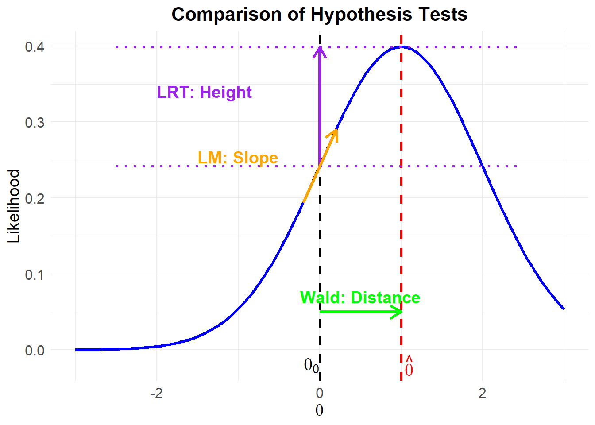
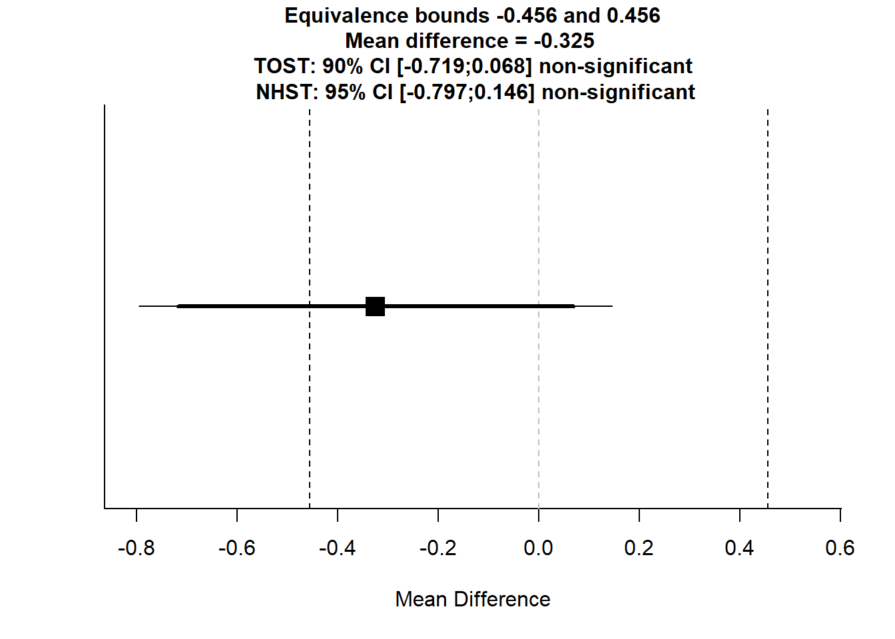
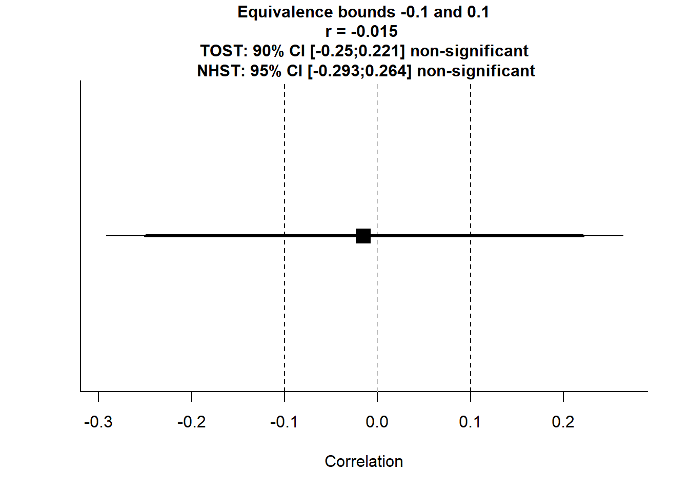

# Hypothesis Testing

Hypothesis testing is one of the cornerstones of statistical inference, used widely across disciplines such as economics, finance, psychology, and more. Researchers employ hypothesis testing to draw conclusions about population parameters based on sample data. Central to this process is the concept of the *p-value*, which helps quantify how unlikely the observed data (or more extreme data) would be if the null hypothesis were true.

However, as data collection has become easier and cheaper---especially in the age of big data---there is a growing awareness that *large sample sizes (large* $n$) can inflate the likelihood of finding statistically significant, but practically negligible, effects. Moreover, this can lead to "p-value hacking," where researchers run numerous tests or adopt flexible analytical approaches until they find a (sometimes minuscule) effect that achieves a conventional significance level (often $p < .05$).

## Null Hypothesis Significance Testing {#sec-null-hypothesis-significance-testing}

Null Hypothesis Significance Testing (NHST) is the foundation of statistical inference. It provides a structured approach to evaluating whether observed data provides sufficient evidence to reject a null hypothesis ($H_0$) in favor of an alternative hypothesis ($H_a$).

NHST follows these key steps:

1.  **Define Hypotheses**
    -   The null hypothesis ($H_0$) represents the default assumption (e.g., no effect, no difference).
    -   The alternative hypothesis ($H_a$) represents the competing claim (e.g., a nonzero effect, a relationship between variables).
2.  **Select a Test Statistic**
    -   The test statistic (e.g., $T$, $W$, $F$) quantifies evidence against $H_0$.
    -   It follows a known distribution under $H_0$ (e.g., normal, chi-square, F-distribution).
3.  **Decision Rule & p-value**
    -   If the test statistic **exceeds a critical value** or the **p-value is below** $\alpha$, we reject $H_0$.
    -   Otherwise, we fail to reject $H_0$, meaning the evidence is insufficient to rule it out.

------------------------------------------------------------------------

### Error Types in Hypothesis Testing

In hypothesis testing, we may **incorrectly** reject or fail to reject the null hypothesis, leading to two types of errors:

-   **Type I Error (False Positive)**:
    -   **Rejecting** $H_0$ when it is actually true.
    -   Example: Concluding an effect exists when it does not.
-   **Type II Error (False Negative)**:
    -   **Failing to reject** $H_0$ when it is actually false.
    -   Example: Missing a real effect because the test lacked power.

The **power of a test** is the probability of correctly rejecting $H_0$ when it is false:

$$
\text{Power} = 1 - P(\text{Type II Error})
$$

A **higher power** (typically $\geq 0.8$) reduces Type II errors and increases the likelihood of detecting true effects.

------------------------------------------------------------------------

### Hypothesis Testing Framework

Hypothesis tests can be **two-sided** or **one-sided**, depending on the research question.

#### Two-Sided Test

In a two-sided test, we examine whether a parameter is significantly different from a hypothesized value (usually zero):

$$ \begin{aligned} &H_0: \beta_j = 0 \\ &H_1: \beta_j \neq 0  \end{aligned} $$

Under the null hypothesis, and assuming standard ordinary least squares assumptions (A1-A3a, A5), the asymptotic distribution of the OLS estimator is:

$$ \sqrt{n} \hat{\beta_j} \sim N(0, \text{Avar}(\sqrt{n} \hat{\beta}_j)) $$

where $\text{Avar}(\cdot)$ denotes the asymptotic variance.

#### One-Sided Test

For a one-sided hypothesis test, the null hypothesis includes a range of values, and we test against a directional alternative:

$$ \begin{aligned} &H_0: \beta_j \geq 0 \\ &H_1: \beta_j < 0 \end{aligned} $$

The "hardest" null value to reject is $\beta_j = 0$. Under this specific null, the estimator follows the same asymptotic distribution:

$$ \sqrt{n} \hat{\beta_j} \sim N(0, \text{Avar}(\sqrt{n} \hat{\beta}_j)) $$

------------------------------------------------------------------------

### Interpreting Hypothesis Testing Results

When conducting hypothesis tests, it is essential to distinguish between **population parameters** and **sample estimates**:

-   Hypotheses are always written in terms of the population parameter ($\beta$), not the sample estimate ($\hat{\beta}$).
-   Some disciplines use different notations:
    -   $\beta$: Standardized coefficient (useful for comparing relative effects, scale-free).
    -   $\mathbf{b}$: Unstandardized coefficient (more interpretable in practical applications, e.g., policy decisions).

The relationship between these coefficients is:

$$
\beta_j = \mathbf{b}_j \frac{s_{x_j}}{s_y}
$$

where $s_{x_j}$ and $s_y$ are the standard deviations of the independent and dependent variables.

------------------------------------------------------------------------

### Understanding p-Values

The p-value is the probability, under the assumption that $H_0$ is true, of observing a test statistic at least as extreme as the one computed from the sample data. Formally,

$$
p\text{-value} = P(\text{Test Statistic} \geq \text{observed value} \mid H_0 \ \text{is true})
$$

**Interpretation**

-   A small p-value indicates that *if* $H_0$ were true, seeing the observed data (or something more extreme) would be unlikely.

-   By convention, if $p < \alpha$ (often 0.05), the result is deemed "statistically significant," and we reject $H_0$.

-   **Important Caveat**: "Statistically significant" is *not* the same as "practically significant" or "economically significant." A difference can be statistically significant yet trivial in magnitude, with negligible real-world implications.

**Misconceptions**

-   The p-value is *not* the probability that $H_0$ is true or false.

-   A p-value above $0.05$ does *not* prove that there is "no effect." It simply suggests that the data do not provide sufficient evidence (at the chosen significance level) to reject $H_0$.

-   A p-value below 0.05 does *not* prove that an effect is "real" or large. It indicates that the data are unusual enough under $H_0$ that we decide to reject $H_0$, given our chosen threshold.

------------------------------------------------------------------------

### The Role of Sample Size

A critical factor influencing the outcome of hypothesis tests is *sample size* ($n$).

Increasing Power with Large $n$

-   **Statistical Power**: The probability of correctly rejecting $H_0$ when $H_0$ is false. Large sample sizes increase statistical power, making it easier to detect even tiny deviations from $H_0$.

-   **Implication**: If the true effect size in the population is very small (e.g., a 0.2% difference in average returns between two trading strategies), a study with a large enough $n$ might still find it statistically significant (p-value \< 0.05).

Tendency Toward Over-Sensitivity

As $n$ grows, the standard errors decrease. Thus, even minuscule differences from the null hypothesis become less likely to be attributed to random chance, yielding low p-values. This can lead to findings that are *statistically* significant but have *negligible* real-world impact.

-   **Example**: Suppose an economist is testing if a policy intervention changes employment rates by 0.1%. With a small sample size, the test might not detect this difference. But with a massive dataset, the same 0.1% difference might yield a $p$-value \< 0.05, even though a 0.1% change may not be economically meaningful.

------------------------------------------------------------------------

### p-Value Hacking

**p-Hacking** refers to the process of manipulating data analysis until a statistically significant result ($p$-value \< 0.05) is achieved. This can include:

-   Running multiple tests on the same dataset and only reporting those that yield significance.

-   Stopping data collection once a significant p-value is reached.

-   Trying various model specifications (e.g., adding or removing control variables) until one finds a significant effect.

-   Selectively reporting outcomes (publication bias).

With large datasets, the "search space" for potential analyses grows exponentially. If researchers test many hypotheses or sift through a wide range of variables and subgroups, they can almost always find a "significant" result by chance alone.

-   **Multiple Comparison Problem**: When multiple tests are conducted, the chance of finding at least one "significant" result purely by coincidence increases. For instance, with 20 independent tests at $\alpha = .05$, there is a 64% chance ($1 - 0.95^{20}$) of incorrectly rejecting at least one null hypothesis.

------------------------------------------------------------------------

### Practical vs. Statistical Significance

In economics and finance, it is crucial to distinguish between results that are *statistically significant* and those that are *economically meaningful*. Economic or financial significance asks: *Does this effect have tangible importance to policymakers, businesses, or investors?*

-   A result might show that a new trading algorithm yields returns that are statistically different from zero, but if that difference is 0.0001% on average, it might not be profitable after accounting for transaction fees, taxes, or other frictions---hence lacking *economic significance*.

------------------------------------------------------------------------

### Mitigating the Misuse of p-Values

#### Pre-Registration and Replication

-   **Pre-Registration**: Researchers specify hypotheses and analytical methods before seeing the data, reducing the temptation to p-hack.

-   **Replication**: Independent replication studies help confirm whether a result is robust or merely a fluke.

#### Using Alternatives to (or Supplements for) p-Values

-   **Bayesian Methods**: Provide posterior probabilities that incorporate prior information, often giving a more nuanced understanding of uncertainty.

-   **Effect Size & Confidence Intervals**: Shift the focus from "Is it significant?" to "How large is the effect, and what is its plausible range?"

-   [Equivalence Testing](#sec-two-one-sided-tests-equivalence-testing): Sometimes the goal is to show the effect is *not* larger than a certain threshold. Equivalence tests can be used to conclude "no clinically (or economically) significant difference."

#### Adjusting for Multiple Comparisons

-   **Bonferroni Correction**: Requires using a more stringent significance threshold when multiple tests are performed (e.g., $\alpha/m$ for $m$ tests).

-   [False Discovery Rate](#sec-false-discovery-rate) Control: Allows a more flexible approach, controlling the expected proportion of false positives among significant findings.

#### Emphasizing Relevance Over Statistical "Stars"

Encourage journals, reviewers, and academic circles to stress the *magnitude of effects* and *robustness checks* over whether the result crosses a conventional p-value threshold (like 0.05).

------------------------------------------------------------------------

There are three commonly used methods for hypothesis testing:

1.  [Likelihood Ratio Test](#sec-likelihood-ratio-test): Compares the likelihood under the null and alternative models. Often used for nested models.

2.  [Wald Test](#sec-wald-test): Assesses whether an estimated parameter is significantly different from a hypothesized value. Requires only one maximization (under the full model).

3.  [Lagrange Multiplier (Score) Test](#lagrange-multiplier-score): Evaluates the slope of the likelihood function at the null hypothesis value. Performs well in small to moderate samples.

------------------------------------------------------------------------

### Wald Test {#sec-wald-test}

The Wald test assesses whether estimated parameters are significantly different from hypothesized values, based on the asymptotic distribution of the estimator.

The general form of the Wald statistic is:

$$
\begin{aligned}
W &= (\hat{\theta}-\theta_0)'[cov(\hat{\theta})]^{-1}(\hat{\theta}-\theta_0) \\
W &\sim \chi_q^2
\end{aligned}
$$

where:

-   $cov(\hat{\theta})$ is given by the inverse Fisher Information matrix evaluated at $\hat{\theta}$,

-   $q$ is the rank of $cov(\hat{\theta})$, which corresponds to the number of non-redundant parameters in $\theta$.

The Wald statistic can also be expressed in different ways:

1.  Quadratic form of the test statistic:

$$
t_W=\frac{(\hat{\theta}-\theta_0)^2}{I(\theta_0)^{-1}} \sim \chi^2_{(v)}
$$

where $v$ is the degree of freedom.

2.  Standardized Wald test statistic:

$$
s_W= \frac{\hat{\theta}-\theta_0}{\sqrt{I(\hat{\theta})^{-1}}} \sim Z
$$

This represents how far the sample estimate is from the hypothesized population parameter.

Significance Level and Confidence Level

-   The significance level ($\alpha$) is the probability threshold at which we reject the null hypothesis.
-   The confidence level ($1-\alpha$) determines the range within which the population parameter is expected to fall with a given probability.

To standardize the estimator and null value, we define the test statistic for the OLS estimator:

$$
T = \frac{\sqrt{n}(\hat{\beta}_j-\beta_{j0})}{\sqrt{n}SE(\hat{\beta_j})} \sim^a N(0,1)
$$

Equivalently:

$$
T = \frac{(\hat{\beta}_j-\beta_{j0})}{SE(\hat{\beta_j})} \sim^a N(0,1)
$$

where:

-   $T$ is the test statistic (a function of the data and null hypothesis),

-   $t$ is the observed realization of $T$.

------------------------------------------------------------------------

#### Evaluating the Test Statistic

There are three equivalent methods for evaluating hypothesis tests:

1.  Critical Value Method

For a given significance level $\alpha$, determine the critical value ($c$):

-   One-sided test: $H_0: \beta_j \geq \beta_{j0}$

$$
P(T < c | H_0) = \alpha
$$

Reject $H_0$ if $t < c$.

-   One-sided test: $H_0: \beta_j \leq \beta_{j0}$

$$
P(T > c | H_0) = \alpha
$$

Reject $H_0$ if $t > c$.

-   Two-sided test: $H_0: \beta_j \neq \beta_{j0}$

$$
P(|T| > c | H_0) = \alpha
$$

Reject $H_0$ if $|t| > c$.

2.  p-value Method

The p-value is the probability of observing a test statistic as extreme as the one obtained, given that the null hypothesis is true.

-   One-sided test: $H_0: \beta_j \geq \beta_{j0}$

$$
\text{p-value} = P(T < t | H_0)
$$

-   One-sided test: $H_0: \beta_j \leq \beta_{j0}$

$$
\text{p-value} = P(T > t | H_0)
$$

-   Two-sided test: $H_0: \beta_j \neq \beta_{j0}$

$$
\text{p-value} = P(|T| > |t| | H_0)
$$

Reject $H_0$ if $\text{p-value} < \alpha$.

3.  Confidence Interval Method

Using the critical value associated with a given significance level, construct a confidence interval:

$$
CI(\hat{\beta}_j)_{\alpha} = \left[\hat{\beta}_j - c \times SE(\hat{\beta}_j), \hat{\beta}_j + c \times SE(\hat{\beta}_j)\right]
$$

Reject $H_0$ if the hypothesized value falls outside the confidence interval.

------------------------------------------------------------------------

-   We are not testing whether the true population value is close to the estimate. Instead, we are testing:\
    *Given a fixed true population value of the parameter, how likely is it that we observed this estimate?*

-   This can be interpreted as:\
    *We believe with* $(1-\alpha)\times 100 \%$ probability that the confidence interval captures the true parameter value.

------------------------------------------------------------------------

Finite Sample Properties

Under stronger assumptions (A1-A6), we can consider finite sample properties:

$$
T = \frac{\hat{\beta}_j-\beta_{j0}}{SE(\hat{\beta}_j)} \sim T(n-k)
$$

where:

-   The derivation of this distribution depends strongly on:

    -   A4 (Homoskedasticity)

    -   A5 (Data Generation via Random Sampling)

-   The $T$-statistic follows a Student's t-distribution because:

    -   The numerator is normally distributed.

-   The denominator follows a $\chi^2$ distribution.

-   Critical values and p-values will be computed using the Student's t-distribution instead of the standard normal distribution.

-   As $n \to \infty$, the $T(n-k)$ distribution converges to a standard normal distribution.

------------------------------------------------------------------------

Rule of Thumb

-   If $n-k > 120$:
    -   The t-distribution critical values and p-values closely approximate those from the standard normal distribution.
-   If $n-k < 120$:
    -   If (A1-A6) hold, the t-test is an exact finite-sample test.
    -   If (A1-A3a, A5) hold, the t-distribution is asymptotically normal.
        -   Using the t-distribution for critical values is a valid asymptotic test.
        -   The discrepancy in critical values disappears as $n \to \infty$.

------------------------------------------------------------------------

#### Multiple Hypothesis Testing

We often need to test multiple parameters simultaneously:

-   Example 1: $H_0: \beta_1 = 0$ and $\beta_2 = 0$
-   Example 2: $H_0: \beta_1 = 1$ and $\beta_2 = 0$

Performing separate hypothesis tests on individual parameters does not answer the question of joint significance.\
We need a test that accounts for joint distributions rather than evaluating two marginal distributions separately.

Consider the multiple regression model:

$$
y = \beta_0 + x_1 \beta_1 + x_2 \beta_2 + x_3 \beta_3 + \epsilon
$$

The null hypothesis $H_0: \beta_1 = 0$ and $\beta_2 = 0$ can be rewritten in matrix form as:

$$
H_0: \mathbf{R} \beta - \mathbf{q} = 0
$$

where:

-   $\mathbf{R}$ is an $m \times k$ matrix, where:
    -   $m$ = number of restrictions.
    -   $k$ = number of parameters.
-   $\mathbf{q}$ is a $k \times 1$ vector that contains the null hypothesis values.

For the example $H_0: \beta_1 = 0$ and $\beta_2 = 0$, we define:

$$
\mathbf{R} =
\begin{bmatrix}
0 & 1 & 0 & 0 \\
0 & 0 & 1 & 0
\end{bmatrix}, \quad
\mathbf{q} =
\begin{bmatrix}
0 \\
0
\end{bmatrix}
$$

For the OLS estimator under multiple hypotheses, we use the F-statistic:

$$
F = \frac{(\mathbf{R\hat{\beta} - q})' \hat{\Sigma}^{-1} (\mathbf{R\hat{\beta} - q})}{m} \sim^a F(m, n-k)
$$

where:

-   $\hat{\Sigma}^{-1}$ is the estimator for the asymptotic variance-covariance matrix.

-   $m$ is the number of restrictions.

-   $n-k$ is the residual degrees of freedom.

Assumptions for Variance Estimation

-   If A4 (Homoskedasticity) holds:
    -   Both the homoskedastic and heteroskedastic variance estimators are valid.
-   If A4 does not hold:
    -   Only the heteroskedastic variance estimator remains valid.

------------------------------------------------------------------------

Relationship Between F and t-Tests

-   When $m = 1$ (only one restriction), the F-statistic is simply the squared t-statistic:

$$
F = t^2
$$

-   Since the F-distribution is strictly positive, it is one-sided by definition.

------------------------------------------------------------------------

#### Linear Combination Testing

When testing multiple parameters simultaneously, we often assess linear combinations of parameters rather than testing them individually.

For example, consider the following hypotheses:

$$
\begin{aligned}
H_0 &: \beta_1 - \beta_2 = 0 \\
H_0 &: \beta_1 - \beta_2 > 0 \\
H_0 &: \beta_1 - 2\beta_2 = 0
\end{aligned}
$$

Each of these represents a single restriction on a function of the parameters.

------------------------------------------------------------------------

The null hypothesis:

$$
H_0: \beta_1 - \beta_2 = 0
$$

can be rewritten in matrix form as:

$$
H_0: \mathbf{R} \beta - \mathbf{q} = 0
$$

where:

$$
\mathbf{R} =
\begin{bmatrix}
0 & 1 & -1 & 0 & 0
\end{bmatrix}, \quad
\mathbf{q} =
\begin{bmatrix}
0
\end{bmatrix}
$$

Interpretation:

-   $\mathbf{R}$ is a $1 \times k$ matrix that selects the relevant parameters for the hypothesis.
-   $\mathbf{q}$ is a $k \times 1$ vector containing the hypothesized values of the linear combination.
-   This formulation allows us to use a generalized [Wald test](#sec-wald-test) to assess whether the constraint holds.

The Wald test statistic for a linear hypothesis:

$$
W = \frac{(\mathbf{R} \hat{\beta} - \mathbf{q})' \left( \mathbf{R} \hat{\Sigma} \mathbf{R}' \right)^{-1} (\mathbf{R} \hat{\beta} - \mathbf{q})}{s^2 q}
\sim F_{q, n-k}
$$

where:

-   $\hat{\beta}$ is the vector of estimated coefficients.

-   $\hat{\Sigma}$ is the variance-covariance matrix of $\hat{\beta}$.

-   $s^2$ is the estimated error variance.

-   $q$ is the number of restrictions.

-   The test follows an F-distribution with degrees of freedom $(q, n-k)$.

------------------------------------------------------------------------


```r
library(car)

# Fit a multiple regression model
mod.duncan <- lm(prestige ~ income + education, data=Duncan)

# Test whether income and education coefficients are equal
linearHypothesis(mod.duncan, "1*income - 1*education = 0")
#> Linear hypothesis test
#> 
#> Hypothesis:
#> income - education = 0
#> 
#> Model 1: restricted model
#> Model 2: prestige ~ income + education
#> 
#>   Res.Df    RSS Df Sum of Sq      F Pr(>F)
#> 1     43 7518.9                           
#> 2     42 7506.7  1    12.195 0.0682 0.7952
```

-   This tests whether $\beta_1 = \beta_2$ (i.e., whether income and education have the same effect on prestige).

-   If the p-value is low, we reject the null hypothesis and conclude that income and education contribute differently to prestige.

#### Estimating the Difference Between Two Coefficients

In some cases, we may be interested in comparing two regression coefficients directly rather than evaluating them separately. For example, we might want to test:

$$
H_0: \beta_1 = \beta_2
$$

which is equivalent to testing whether their difference is zero:

$$
H_0: \beta_1 - \beta_2 = 0
$$

Alternatively, we can directly estimate the difference between two regression coefficients.


```r
difftest_lm <- function(x1, x2, model) {
    # Compute coefficient difference
    diffest <-
        summary(model)$coef[x1, "Estimate"] - summary(model)$coef[x2, "Estimate"]
    
    # Compute variance of the difference
    vardiff <- (summary(model)$coef[x1, "Std. Error"] ^ 2 +
                    summary(model)$coef[x2, "Std. Error"] ^ 2) - (2 * vcov(model)[x1, x2])
    
    # Compute standard error of the difference
    diffse <- sqrt(vardiff)
    
    # Compute t-statistic
    tdiff <- diffest / diffse
    
    # Compute p-value (two-sided test)
    ptdiff <- 2 * (1 - pt(abs(tdiff), model$df.residual))
    
    # Compute confidence interval
    upr <- diffest + qt(0.975, df = model$df.residual) * diffse
    lwr <- diffest - qt(0.975, df = model$df.residual) * diffse
    
    # Return results as a named list
    return(
        list(
            estimate = round(diffest, 2),
            t_stat = round(tdiff, 2),
            p_value = round(ptdiff, 4),
            lower_CI = round(lwr, 2),
            upper_CI = round(upr, 2),
            df = model$df.residual
        )
    )
}
```

We demonstrate this function using the Duncan dataset from the {car} package:


```r
library(car)

# Load Duncan dataset
data(Duncan)

# Fit a linear regression model
mod.duncan <- lm(prestige ~ income + education, data = Duncan)

# Compare the effects of income and education
difftest_lm("income", "education", mod.duncan)
#> $estimate
#> [1] 0.05
#> 
#> $t_stat
#> [1] 0.26
#> 
#> $p_value
#> [1] 0.7952
#> 
#> $lower_CI
#> [1] -0.36
#> 
#> $upper_CI
#> [1] 0.46
#> 
#> $df
#> [1] 42
```

#### Nonlinear Hypothesis Testing

In many applications, we may need to test nonlinear restrictions on parameters. These can be expressed as a set of $q$ nonlinear functions:

$$
\mathbf{h}(\theta) = \{ h_1 (\theta), ..., h_q (\theta)\}'
$$

where each $h_j(\theta)$ is a nonlinear function of the parameter vector $\theta$.

------------------------------------------------------------------------

To approximate nonlinear restrictions, we use the Jacobian matrix, denoted as $\mathbf{H}(\theta)$, which contains the first-order partial derivatives of $\mathbf{h}(\theta)$ with respect to the parameters:

$$
\mathbf{H}_{q \times p}(\theta) =
\begin{bmatrix}
\frac{\partial h_1(\theta)}{\partial \theta_1} & \dots & \frac{\partial h_1(\theta)}{\partial \theta_p} \\
\vdots & \ddots & \vdots \\
\frac{\partial h_q(\theta)}{\partial \theta_1} & \dots & \frac{\partial h_q(\theta)}{\partial \theta_p}
\end{bmatrix}
$$

where:

-   $q$ is the number of nonlinear restrictions,

-   $p$ is the number of estimated parameters.

The Jacobian matrix linearizes the nonlinear restrictions and allows for an approximation of the hypothesis test using a Wald statistic.

------------------------------------------------------------------------

We test the null hypothesis:

$$
H_0: \mathbf{h} (\theta) = 0
$$

against the two-sided alternative using the Wald statistic:

$$
W = \frac{\mathbf{h(\hat{\theta})}' \left\{ \mathbf{H}(\hat{\theta}) \left[ \mathbf{F}(\hat{\theta})' \mathbf{F}(\hat{\theta}) \right]^{-1} \mathbf{H}(\hat{\theta})' \right\}^{-1} \mathbf{h}(\hat{\theta})}{s^2 q} \sim F_{q, n-p}
$$

where:

-   $\hat{\theta}$ is the estimated parameter vector,

-   $\mathbf{H}(\hat{\theta})$ is the Jacobian matrix evaluated at $\hat{\theta}$,

-   $\mathbf{F}(\hat{\theta})$ is the [Fisher Information Matrix],

-   $s^2$ is the estimated error variance,

-   $q$ is the number of restrictions,

-   $n$ is the sample size,

-   $p$ is the number of parameters.

The test statistic follows an F-distribution with degrees of freedom $(q, n - p)$.

------------------------------------------------------------------------


```r
library(car)
library(nlWaldTest)

# Load example data
data(Duncan)

# Fit a multiple regression model
mod.duncan <- lm(prestige ~ income + education, data = Duncan)

# Define a nonlinear hypothesis: income squared equals education
nl_hypothesis <- "b[2]^2 - b[3] = 0"

# Conduct the nonlinear Wald test
nlWaldtest(mod.duncan, texts = nl_hypothesis)
#> 
#> 	Wald Chi-square test of a restriction on model parameters
#> 
#> data:  mod.duncan
#> Chisq = 0.69385, df = 1, p-value = 0.4049
```

-   If the Wald statistic is large, we reject $H_0$ and conclude that the nonlinear restriction does not hold.

-   The p-value provides the probability of observing such an extreme test statistic under the null hypothesis.

-   The F-distribution accounts for the fact that multiple nonlinear restrictions are being tested.

### Likelihood Ratio Test {#sec-likelihood-ratio-test}

The [Likelihood Ratio Test](#sec-likelihood-ratio-test) (LRT) is a general method for comparing two nested models:

-   The reduced model under the null hypothesis ($H_0$), which imposes constraints on parameters.
-   The full model, which allows more flexibility under the alternative hypothesis ($H_a$).

The test evaluates how much more likely the data is under the full model compared to the restricted model.

------------------------------------------------------------------------

The likelihood ratio test statistic is given by:

$$
t_{LR} = 2[l(\hat{\theta}) - l(\theta_0)] \sim \chi^2_v
$$

where:

-   $l(\hat{\theta})$ is the log-likelihood evaluated at the estimated parameter $\hat{\theta}$ (from the full model),

-   $l(\theta_0)$ is the log-likelihood evaluated at the hypothesized parameter $\theta_0$ (from the reduced model),

-   $v$ is the degrees of freedom (the difference in the number of parameters between the full and reduced models).

This test compares the height of the log-likelihood of the sample estimate versus the hypothesized population parameter.

------------------------------------------------------------------------

This test also considers the ratio of two maximized likelihoods:

$$
\begin{aligned}
L_r &= \text{maximized likelihood under } H_0 \text{ (reduced model)} \\
L_f &= \text{maximized likelihood under } H_0 \cup H_a \text{ (full model)}
\end{aligned}
$$

Then, the likelihood ratio is defined as:

$$
\Lambda = \frac{L_r}{L_f}
$$

where:

-   $\Lambda$ cannot exceed 1, because $L_f$ (the likelihood of the full model) is always at least as large as $L_r$.

The likelihood ratio test statistic is then:

$$
\begin{aligned}
-2 \ln(\Lambda) &= -2 \ln \left( \frac{L_r}{L_f} \right) = -2 (l_r - l_f) \\
\lim_{n \to \infty}(-2 \ln(\Lambda)) &\sim \chi^2_v
\end{aligned}
$$

where:

-   $v$ is the difference in the number of parameters between the full and reduced models.

If the likelihood ratio is small (i.e., $L_r$ is much smaller than $L_f$), then:

-   The test statistic exceeds the critical value from the $\chi^2_v$ distribution.
-   We reject the reduced model and accept the full model at the $\alpha \times 100\%$ significance level.

------------------------------------------------------------------------


```r
library(lmtest)

# Load example dataset
data(mtcars)

# Fit a full model with two predictors
full_model <- lm(mpg ~ hp + wt, data = mtcars)

# Fit a reduced model with only one predictor
reduced_model <- lm(mpg ~ hp, data = mtcars)

# Perform the likelihood ratio test
lrtest(reduced_model, full_model)
#> Likelihood ratio test
#> 
#> Model 1: mpg ~ hp
#> Model 2: mpg ~ hp + wt
#>   #Df  LogLik Df  Chisq Pr(>Chisq)    
#> 1   3 -87.619                         
#> 2   4 -74.326  1 26.586   2.52e-07 ***
#> ---
#> Signif. codes:  0 '***' 0.001 '**' 0.01 '*' 0.05 '.' 0.1 ' ' 1
```

-   If the p-value is small, the reduced model is significantly worse, and we reject $H_0$.

-   A large test statistic indicates that removing a predictor leads to a substantial drop in model fit.

### Lagrange Multiplier (Score) Test {#lagrange-multiplier-score}

The Lagrange Multiplier (LM) Test, also known as the Score Test, evaluates whether a restricted model (under $H_0$) significantly underperforms compared to an unrestricted model (under $H_a$) without estimating the full model.

Unlike the [Likelihood Ratio Test](#sec-likelihood-ratio-test), which requires estimating both models, the LM test only requires estimation under the restricted model ($H_0$).

The LM test statistic is based on the first derivative (score function) of the log-likelihood function, evaluated at the parameter estimate under the null hypothesis ($\theta_0$):

$$
t_S = \frac{S(\theta_0)^2}{I(\theta_0)} \sim \chi^2_v
$$

where:

-   $S(\theta_0) = \frac{\partial l(\theta)}{\partial \theta} \bigg|_{\theta=\theta_0}$ is the score function, i.e., the first derivative of the log-likelihood function evaluated at $\theta_0$.

-   $I(\theta_0)$ is the [Fisher Information Matrix], which quantifies the curvature (second derivative) of the log-likelihood.

-   $v$ is the degrees of freedom, equal to the number of constraints imposed by $H_0$.

This test compares:

-   The slope of the log-likelihood function at $\theta_0$ (which should be flat under $H_0$).

-   The curvature of the log-likelihood function (captured by $I(\theta_0)$).

------------------------------------------------------------------------

Interpretation of the LM Test

-   If $t_S$ is large, the slope of the log-likelihood function at $\theta_0$ is steep, indicating that the model fit improves significantly when moving away from $\theta_0$.
-   If $t_S$ is small, the log-likelihood function remains nearly flat at $\theta_0$, meaning that the additional parameters in the unrestricted model do not substantially improve the fit.

If the score function $S(\theta_0)$ is significantly different from zero, then we reject $H_0$ because it suggests that the likelihood function is increasing, implying a better model fit when moving away from $\theta_0$.

------------------------------------------------------------------------


```r
# Load necessary libraries
library(lmtest)  # For the Lagrange Multiplier test
library(car)     # For example data

# Load example data
data(Prestige)

# Fit a linear regression model
model <- lm(prestige ~ income + education, data = Prestige)

# Perform the Lagrange Multiplier test for heteroscedasticity
# Using the Breusch-Pagan test (a type of LM test)
lm_test <- bptest(model)

# Print the results
print(lm_test)
#> 
#> 	studentized Breusch-Pagan test
#> 
#> data:  model
#> BP = 4.1838, df = 2, p-value = 0.1235
```

-   `bptest`: This function from the `lmtest` package performs the Breusch-Pagan test, which is a Lagrange Multiplier test for heteroscedasticity.

-   Null Hypothesis: The null hypothesis is that the variance of the residuals is constant (homoscedasticity).

-   Alternative Hypothesis: The alternative hypothesis is that the variance of the residuals is not constant (heteroscedasticity).

------------------------------------------------------------------------

### Comparing Hypothesis Tests

A visual comparison of hypothesis tests is shown below:


```r
# Load required libraries
library(ggplot2)

# Generate data for a normal likelihood function
theta <- seq(-3, 3, length.out = 200)  # Theta values

# Likelihood function with theta_hat = 1
likelihood <-
    dnorm(theta, mean = 1, sd = 1)  
df <- data.frame(theta, likelihood)

# Define key points
theta_0   <- 0  # Null hypothesis value
theta_hat <- 1  # Estimated parameter (full model)
likelihood_0 <-
    dnorm(theta_0, mean = 1, sd = 1)  # Likelihood at theta_0
likelihood_hat <-
    dnorm(theta_hat, mean = 1, sd = 1)  # Likelihood at theta_hat

# Plot likelihood function
ggplot(df, aes(x = theta, y = likelihood)) +
    geom_line(color = "blue", linewidth = 1.2) +  # Likelihood curve
    
    # Vertical lines for theta_0 and theta_hat
    geom_vline(
        xintercept = theta_0,
        linetype = "dashed",
        color = "black",
        linewidth = 1
    ) +
    geom_vline(
        xintercept = theta_hat,
        linetype = "dashed",
        color = "red",
        linewidth = 1
    ) +
    
    # Labels for theta_0 and theta_hat
    annotate(
        "text",
        x = theta_0 - 0.1,
        y = -0.02,
        label = expression(theta[0]),
        color = "black",
        size = 5,
        fontface = "bold"
    ) +
    annotate(
        "text",
        x = theta_hat + 0.1,
        y = -0.02,
        label = expression(hat(theta)),
        color = "red",
        size = 5,
        fontface = "bold"
    ) +
    
    # LRT: Compare heights of likelihood at theta_0 and theta_hat
    annotate(
        "segment",
        x = theta_0,
        xend = theta_0,
        y = likelihood_0,
        yend = likelihood_hat,
        color = "purple",
        linewidth = 1.2,
        arrow = arrow(length = unit(0.15, "inches"))
    ) +
    annotate(
        "text",
        x = -2,
        y = (likelihood_0 + likelihood_hat) / 2 + 0.02,
        label = "LRT: Height",
        color = "purple",
        hjust = 0,
        fontface = "bold",
        size = 5
    ) +
    # Add horizontal lines at both ends of LRT height comparison
    annotate(
        "segment",
        x = -2.5,
        xend = 2.5,
        y = likelihood_0,
        yend = likelihood_0,
        color = "purple",
        linetype = "dotted",
        linewidth = 1
    ) +
    annotate(
        "segment",
        x = -2.5,
        xend = 2.5,
        y = likelihood_hat,
        yend = likelihood_hat,
        color = "purple",
        linetype = "dotted",
        linewidth = 1
    ) +
    
    # Wald Test: Distance between theta_0 and theta_hat
    annotate(
        "segment",
        x = theta_0,
        xend = theta_hat,
        y = 0.05,
        yend = 0.05,
        color = "green",
        linewidth = 1.2,
        arrow = arrow(length = unit(0.15, "inches"))
    ) +
    annotate(
        "text",
        x = (theta_0 + theta_hat) / 2,
        y = 0.07,
        label = "Wald: Distance",
        color = "green",
        hjust = 0.5,
        fontface = "bold",
        size = 5
    ) +
    
    # LM Test: Slope at theta_0
    annotate(
        "segment",
        x = theta_0 - 0.2,
        xend = theta_0 + 0.2,
        y = dnorm(theta_0 - 0.2, mean = 1, sd = 1),
        yend = dnorm(theta_0 + 0.2, mean = 1, sd = 1),
        color = "orange",
        linewidth = 1.2,
        arrow = arrow(length = unit(0.15, "inches"))
    ) +
    annotate(
        "text",
        x = -1.5,
        y = dnorm(-1, mean = 1, sd = 1) + .2,
        label = "LM: Slope",
        color = "orange",
        hjust = 0,
        fontface = "bold",
        size = 5
    ) +
    
    # Titles and themes
    theme_minimal() +
    labs(title = "Comparison of Hypothesis Tests",
         x = expression(theta),
         y = "Likelihood") +
    theme(
        plot.title = element_text(size = 16, face = "bold", hjust = 0.5),
        axis.title = element_text(size = 14),
        axis.text = element_text(size = 12)
    )
```



{alt=""}

*Figure adapted from [@fox1997applied].*

Each test approaches hypothesis evaluation differently:

1.  [Likelihood Ratio Test](#sec-likelihood-ratio-test): Compares the **heights** of the log-likelihood at $\hat{\theta}$ (full model) vs. $\theta_0$ (restricted model).
2.  [Wald Test](#sec-wald-test): Measures the **distance** between $\hat{\theta}$ and $\theta_0$.
3.  [Lagrange Multiplier Test](#lagrange-multiplier-score): Examines the **slope** of the log-likelihood at $\theta_0$ to check if movement towards $\hat{\theta}$ significantly improves fit.

The [Likelihood Ratio Test](#sec-likelihood-ratio-test) and [Lagrange Multiplier Test](#lagrange-multiplier-score) perform well in small to moderate samples, while the Wald Test is computationally simpler as it only requires one model estimation.

| Test                                                   | Key Idea                                                    | Computation                         | Best Use Case                                |
|------------------|--------------------|------------------|------------------|
| [Likelihood Ratio Test](#sec-likelihood-ratio-test)    | Compares log-likelihoods of full vs. restricted models      | Estimates both models               | When both models can be estimated            |
| [Wald Test](#sec-wald-test)                            | Checks if parameters significantly differ from $H_0$        | Estimates only the full model       | When the full model is available             |
| [Lagrange Multiplier Test](#lagrange-multiplier-score) | Tests if the score function suggests moving away from $H_0$ | Estimates only the restricted model | When the full model is difficult to estimate |

------------------------------------------------------------------------

## Two One-Sided Tests Equivalence Testing {#sec-two-one-sided-tests-equivalence-testing}

The Two One-Sided Tests (TOST) procedure is a method used in equivalence testing to determine whether a population effect size falls within a range of practical equivalence.

Unlike traditional null hypothesis significance testing (NHST), which focuses on detecting differences, TOST tests for similarity by checking whether an effect is small enough to be practically insignificant.

### When to Use TOST?

1.  Bioequivalence Testing
    -   Example: Determining whether a generic drug is equivalent to a brand-name drug in terms of effectiveness.
2.  Non-Inferiority Testing
    -   Example: Assessing whether a new teaching method is not worse than a traditional method by a meaningful margin.
3.  Equivalence in Business & Finance
    -   Example: Comparing the performance of two financial models to determine if they produce practically the same results.
4.  Psychological & Behavioral Research
    -   Example: Determining whether a new intervention is equally effective as an existing one.

------------------------------------------------------------------------

In traditional hypothesis testing, we assess:

$$
H_0: \theta = \theta_0 \quad vs. \quad H_a: \theta \neq \theta_0
$$

where $\theta$ is a population parameter (e.g., mean difference, regression coefficient, or effect size).

However, in equivalence testing, we are interested in whether $\theta$ falls within a predefined equivalence margin ($-\Delta, \Delta$).

This leads to the TOST procedure, where we conduct two one-sided tests:

1st One-Sided Test:

$$
H_0: \theta \leq -\Delta \quad vs. \quad H_a: \theta > -\Delta
$$

2nd One-Sided Test:

$$
H_0: \theta \geq \Delta \quad vs. \quad H_a: \theta < \Delta
$$

If both null hypotheses are rejected, then we conclude equivalence (i.e., $\theta$ is within the equivalence range).

------------------------------------------------------------------------

### Interpretation of the TOST Procedure

-   If the p-value for both one-sided tests is less than $\alpha$, then we conclude that the effect size falls within the equivalence bounds.
-   If one or both p-values are greater than $\alpha$, we fail to reject the null hypothesis and cannot claim equivalence.
-   The TOST procedure provides stronger evidence of similarity than traditional NHST, which only assesses whether an effect is *statistically different from zero* rather than *practically insignificant*.

------------------------------------------------------------------------

### Relationship to Confidence Intervals

Another way to interpret TOST is through confidence intervals (CIs):

-   If the entire $(1 - 2\alpha) \times 100\%$ confidence interval lies within $[-\Delta, \Delta]$, we conclude equivalence.
-   If the confidence interval extends beyond the equivalence range, we fail to establish equivalence.

This relationship ensures that TOST is consistent with CI-based inference.

------------------------------------------------------------------------

### Example 1: Testing the Equivalence of Two Means

Suppose we have two groups and want to test whether their mean difference is practically insignificant within a range of $[-0.5, 0.5]$.


```r
library(TOSTER)

# Simulated data: Two groups with similar means
set.seed(123)
group1 <- rnorm(30, mean = 5, sd = 1)
group2 <- rnorm(30, mean = 5.1, sd = 1)

# Perform TOST equivalence test
TOSTtwo(
    m1 = mean(group1),
    sd1 = sd(group1),
    n1 = length(group1),
    m2 = mean(group2),
    sd2 = sd(group2),
    n2 = length(group2),
    low_eqbound = -0.5,
    high_eqbound = 0.5,
    alpha = 0.05
)
```



```
#> TOST results:
#> t-value lower bound: 0.553 	p-value lower bound: 0.291
#> t-value upper bound: -3.32 	p-value upper bound: 0.0008
#> degrees of freedom : 56.56
#> 
#> Equivalence bounds (Cohen's d):
#> low eqbound: -0.5 
#> high eqbound: 0.5
#> 
#> Equivalence bounds (raw scores):
#> low eqbound: -0.4555 
#> high eqbound: 0.4555
#> 
#> TOST confidence interval:
#> lower bound 90% CI: -0.719
#> upper bound 90% CI:  0.068
#> 
#> NHST confidence interval:
#> lower bound 95% CI: -0.797
#> upper bound 95% CI:  0.146
#> 
#> Equivalence Test Result:
#> The equivalence test was non-significant, t(56.56) = 0.553, p = 0.291, given equivalence bounds of -0.456 and 0.456 (on a raw scale) and an alpha of 0.05.
#> Null Hypothesis Test Result:
#> The null hypothesis test was non-significant, t(56.56) = -1.384, p = 0.172, given an alpha of 0.05.
```

-   If both p-values are less than 0.05, we conclude that the groups are equivalent within the given range.

-   The confidence interval helps visualize whether the effect size falls entirely within $[-0.5, 0.5]$.

#### Example 2: TOST for Correlation Equivalence

We can also use TOST to test whether a correlation coefficient is effectively zero.


```r
# Simulated correlation data
set.seed(123)
x <- rnorm(50)
y <- x * 0.02 + rnorm(50, sd = 1)  # Very weak correlation

# TOST for correlation
TOSTr(
    n = length(x),
    r = cor(x, y),
    low_eqbound_r = -0.1,
    high_eqbound_r = 0.1,
    alpha = 0.05
)
```



```
#> TOST results:
#> p-value lower bound: 0.280
#> p-value upper bound: 0.214
#> 
#> Equivalence bounds (r):
#> low eqbound: -0.1 
#> high eqbound: 0.1
#> 
#> TOST confidence interval:
#> lower bound 90% CI: -0.25
#> upper bound 90% CI:  0.221
#> 
#> NHST confidence interval:
#> lower bound 95% CI: -0.293
#> upper bound 95% CI:  0.264
#> 
#> Equivalence Test Result:
#> The equivalence test was non-significant, p = 0.280, given equivalence bounds of -0.100 and 0.100 and an alpha of 0.05.
#> Null Hypothesis Test Result:
#> The null hypothesis test was non-significant, p = 0.915, given an alpha of 0.05.
```

-   This tests whether the correlation is within $[-0.1, 0.1]$, meaning "practically zero".

-   If both p-values are significant, we conclude that the correlation is effectively negligible.

### Advantages of TOST Equivalence Testing

1.  Avoids Misinterpretation of Non-Significance

    -   Traditional NHST failing to reject $H_0$ does not imply equivalence.

    -   TOST explicitly tests for equivalence, preventing misinterpretation.

2.  Aligned with Confidence Intervals

    -   TOST conclusions align with confidence interval-based reasoning.

3.  Applicable to Various Statistical Tests

    -   Can be used for means, correlations, regression coefficients, and more.

4.  Commonly Used in Regulatory & Clinical Studies

    -   Required for bioequivalence trials by organizations like the FDA [@schuirmann1987comparison].

### When *Not* to Use TOST

-   If your research question is about detecting a difference rather than establishing equivalence.

-   If the equivalence bounds are too wide to be meaningful in practice.

-   If the sample size is too small, making it difficult to detect equivalence reliably.

| Feature                | Traditional [NHST](#sec-null-hypothesis-significance-testing) | [TOST Equivalence Testing](#sec-two-one-sided-tests-equivalence-testing) |
|-----------------|--------------------------|----------------------------|
| Null Hypothesis        | $H_0$: No effect ($\theta = 0$)                               | $H_0$: Effect is outside equivalence bounds                              |
| Alternative Hypothesis | $H_a$: There is an effect ($\theta \neq 0$)                   | $H_a$: Effect is within equivalence bounds                               |
| Goal                   | Detect difference                                             | Establish similarity                                                     |
| p-value Interpretation | Small $p$ means evidence for an effect                        | Small $p$ means evidence for equivalence                                 |

## False Discovery Rate {#sec-false-discovery-rate}

When conducting multiple hypothesis tests simultaneously, we increase the probability of false positives (Type I errors). Traditional correction methods like Bonferroni correction are too conservative, reducing statistical power.

The False Discovery Rate (FDR), introduced by @benjamini1995controlling, is a more flexible and powerful approach that controls the proportion of false discoveries (incorrect rejections of the null hypothesis) while maintaining a reasonable chance of detecting true effects.

------------------------------------------------------------------------

Suppose we perform $m$ independent hypothesis tests, each with a significance level $\alpha$. The probability of making at least one Type I error (false positive) is:

$$
P(\text{at least one false positive}) = 1 - (1 - \alpha)^m
$$

For example, with $\alpha = 0.05$ and $m = 20$ tests:

$$
P(\text{at least one false positive}) = 1 - (0.95)^{20} \approx 0.64
$$

Thus, if we do not adjust for multiple testing, we are highly likely to reject at least one true null hypothesis just by chance.

------------------------------------------------------------------------

Family-Wise Error Rate vs. False Discovery Rate

| Approach              | Controls                                     | Method                         | Pros                                       | Cons                                 |
|---------------|---------------|---------------|---------------|---------------|
| Bonferroni Correction | FWER (Probability of $\ge 1$ false positive) | Adjusts $\alpha$: $\alpha/m$   | Very conservative, reduces false positives | Low power, increases false negatives |
| False Discovery Rate  | Expected proportion of false discoveries     | Adjusts $p$-values dynamically | Higher power, fewer false negatives        | Some false positives allowed         |

Why FDR?

-   FWER control (Bonferroni, Holm) is too strict, reducing true discoveries.
-   FDR control allows a small fraction of false positives while keeping most discoveries valid.

------------------------------------------------------------------------

Let:

-   $m$ = total number of hypotheses tested

-   $V$ = number of false discoveries (Type I errors)

-   $R$ = total number of rejected null hypotheses

Then, the [False Discovery Rate](#sec-false-discovery-rate) is:

$$
\text{FDR} = E\left[\frac{V}{\max(R,1)}\right]
$$

-   If no null hypotheses are rejected ($R = 0$), we define FDR = 0.
-   Unlike FWER, which controls the probability of any false positives, FDR controls the expected proportion of false positives.

------------------------------------------------------------------------

### Benjamini-Hochberg Procedure {#sec-benjamini-hochberg-procedure}

The Benjamini-Hochberg (BH) procedure is the most widely used FDR-controlling method [@benjamini1995controlling]. It works as follows:

Step-by-Step Algorithm:

1.  Perform $m$ hypothesis tests and obtain $p$-values: $p_1, p_2, ..., p_m$.

2.  Rank the $p$-values in ascending order: $p_{(1)} \leq p_{(2)} \leq ... \leq p_{(m)}$.

3.  Calculate the Benjamini-Hochberg critical value for each test:

    $$
    p_{(i)} \leq \frac{i}{m} \alpha
    $$

4.  Find the largest $i$ where $p_{(i)} \leq \frac{i}{m} \alpha$.

5.  Reject all hypotheses with $p \leq p_{(i)}$.

Interpretation:

-   This ensures that the expected proportion of false discoveries is controlled at level $\alpha$.
-   Unlike Bonferroni, it does not require independence of tests, making it more powerful.

------------------------------------------------------------------------

#### Example 1: FDR Correction on Simulated Data


```r
set.seed(123)

# Generate 20 random p-values
p_values <-
    runif(20, 0, 0.1)  # Simulating p-values from multiple tests

# Apply FDR correction (Benjamini-Hochberg)
adjusted_p <- p.adjust(p_values, method = "BH")

# Compare raw and adjusted p-values
data.frame(Raw_p = round(p_values, 3),
           Adjusted_p = round(adjusted_p, 3)) |> head()
#>   Raw_p Adjusted_p
#> 1 0.029      0.095
#> 2 0.079      0.096
#> 3 0.041      0.095
#> 4 0.088      0.096
#> 5 0.094      0.096
#> 6 0.005      0.046
```

-   Adjusted p-values control the expected proportion of false discoveries.

-   If an adjusted p-value is below $\alpha$, we reject the null hypothesis.

#### Example 2: FDR Correction in Gene Expression Analysis

FDR is widely used in genomics, where thousands of genes are tested for differential expression.


```r
library(multtest)

# Simulated gene expression study with 1000 genes
set.seed(42)
p_values <- runif(100, 0, 0.1)

# Apply different multiple testing corrections

# Bonferroni (very strict)
p_bonf <- p.adjust(p_values, method = "bonferroni")  

# Holm's method
p_holm <- p.adjust(p_values, method = "holm")        

# Benjamini-Hochberg (FDR)
p_fdr <- p.adjust(p_values, method = "BH")           

# Compare significance rates
sum(p_bonf < 0.05)  # Strictest correction
#> [1] 3
sum(p_holm < 0.05)  # Moderately strict
#> [1] 3
sum(p_fdr < 0.05)   # Most discoveries, controlled FDR
#> [1] 5
```

-   Bonferroni results in few discoveries (low power).

-   [Benjamini-Hochberg](#sec-benjamini-hochberg-procedure) allows more discoveries, while controlling the proportion of false positives.

**Use FDR when:**

-   You perform many hypothesis tests (e.g., genomics, finance, A/B testing).

-   You want to balance false positives and false negatives.

-   Bonferroni is too strict, leading to low power.

**Do not use FDR if:**

-   Strict control of any false positives is required (e.g., drug approval studies).

-   There are only a few tests, where Bonferroni is appropriate.

------------------------------------------------------------------------

### Benjamini-Yekutieli Procedure {#sec-benjamini-yekutieli-procedure}

The Benjamini-Yekutieli (BY) method modifies the Benjamini-Hochberg (BH) procedure to account for correlated test statistics [@benjamini2001control].

The key adjustment is a larger critical value for significance, making it more conservative than BH.

Similar to BH, the BY procedure ranks $m$ p-values in ascending order:

$$
p_{(1)} \leq p_{(2)} \leq \dots \leq p_{(m)}
$$

Instead of using $\alpha \frac{i}{m}$ as in BH, BY introduces a **correction factor**:

$$
p_{(i)} \leq \frac{i}{m C(m)} \alpha
$$

where:

$$
C(m) = \sum_{j=1}^{m} \frac{1}{j} \approx \ln(m) + 0.577
$$

-   $C(m)$ is the harmonic series correction (ensures control under dependence).
-   This makes the BY threshold larger than BH, reducing false positives.
-   Recommended when tests are positively correlated (e.g., in fMRI, finance).

------------------------------------------------------------------------

We can apply BY correction using the built-in `p.adjust()` function.


```r
set.seed(123)

# Simulate 50 random p-values
p_values <- runif(50, 0, 0.1)

# Apply BY correction
p_by <- p.adjust(p_values, method = "BY")

# Compare raw and adjusted p-values
data.frame(Raw_p = round(p_values, 3), Adjusted_BY = round(p_by, 3))
#>    Raw_p Adjusted_BY
#> 1  0.029       0.430
#> 2  0.079       0.442
#> 3  0.041       0.430
#> 4  0.088       0.442
#> 5  0.094       0.442
#> 6  0.005       0.342
#> 7  0.053       0.442
#> 8  0.089       0.442
#> 9  0.055       0.442
#> 10 0.046       0.430
#> 11 0.096       0.442
#> 12 0.045       0.430
#> 13 0.068       0.442
#> 14 0.057       0.442
#> 15 0.010       0.429
#> 16 0.090       0.442
#> 17 0.025       0.430
#> 18 0.004       0.342
#> 19 0.033       0.430
#> 20 0.095       0.442
#> 21 0.089       0.442
#> 22 0.069       0.442
#> 23 0.064       0.442
#> 24 0.099       0.447
#> 25 0.066       0.442
#> 26 0.071       0.442
#> 27 0.054       0.442
#> 28 0.059       0.442
#> 29 0.029       0.430
#> 30 0.015       0.429
#> 31 0.096       0.442
#> 32 0.090       0.442
#> 33 0.069       0.442
#> 34 0.080       0.442
#> 35 0.002       0.342
#> 36 0.048       0.430
#> 37 0.076       0.442
#> 38 0.022       0.430
#> 39 0.032       0.430
#> 40 0.023       0.430
#> 41 0.014       0.429
#> 42 0.041       0.430
#> 43 0.041       0.430
#> 44 0.037       0.430
#> 45 0.015       0.429
#> 46 0.014       0.429
#> 47 0.023       0.430
#> 48 0.047       0.430
#> 49 0.027       0.430
#> 50 0.086       0.442
```

Comparison: BH vs. BY


```r
p_bh <- p.adjust(p_values, method = "BH")  # BH correction

# Visualize differences
data.frame(Raw_p = round(p_values, 3),
           BH_Adjusted = round(p_bh, 3),
           BY_Adjusted = round(p_by, 3)) |> head()
#>   Raw_p BH_Adjusted BY_Adjusted
#> 1 0.029       0.096       0.430
#> 2 0.079       0.098       0.442
#> 3 0.041       0.096       0.430
#> 4 0.088       0.098       0.442
#> 5 0.094       0.098       0.442
#> 6 0.005       0.076       0.342
```

-   Benjamini-Yekutieli is more conservative than Benjamini-Hochberg.

-   If BH identifies significant results but BY does not, the tests are likely correlated.

------------------------------------------------------------------------

### Storey's q-value Approach {#sec-storeys-q-value-approach}

Storey's q-value method directly estimates [False Discovery Rate](#sec-false-discovery-rate) rather than adjusting individual $p$-values [@benjamini2001control].

Unlike BH/BY, it does not assume a fixed threshold ($\alpha$) but estimates the FDR dynamically from the data.

Define:

-   $m_0$: Number of **true null hypotheses**.

-   $\pi_0$: Estimated **proportion of true nulls** in the dataset.

Storey's q-value adjusts $p$-values based on: $$
q(p) = \frac{\pi_0 \cdot m \cdot p}{\sum_{i=1}^{m} 1_{p_i \leq p}}
$$ where:

-   $\pi_0$ is estimated from the distribution of large p-values.

-   Unlike BH/BY, Storey's method dynamically estimates the null proportion.

------------------------------------------------------------------------


```r
# devtools::install_github("jdstorey/qvalue")
library(qvalue)

# Simulated data: 1000 hypothesis tests
set.seed(123)
p_values <- runif(1000, 0, 0.1)  

# Compute q-values
qvals <- qvalue_truncp(p_values)$qvalues

# Summary of q-values
summary(qvals)
#>    Min. 1st Qu.  Median    Mean 3rd Qu.    Max. 
#>  0.3126  0.9689  0.9771  0.9684  0.9847  1.0000
```

Comparison: BH vs. BY vs. Storey


```r
# Apply multiple corrections
p_bh <- p.adjust(p_values, method = "BH")   # Benjamini-Hochberg
p_by <- p.adjust(p_values, method = "BY")   # Benjamini-Yekutieli
q_vals <- qvalue_truncp(p_values)$qvalues   # Storey's q-value

# Compare significance rates
data.frame(
  Raw_p = round(p_values[1:10], 3),
  BH = round(p_bh[1:10], 3),
  BY = round(p_by[1:10], 3),
  q_value = round(q_vals[1:10], 3)
)
#>    Raw_p    BH    BY q_value
#> 1  0.029 0.097 0.725   0.969
#> 2  0.079 0.098 0.737   0.985
#> 3  0.041 0.097 0.725   0.969
#> 4  0.088 0.099 0.740   0.989
#> 5  0.094 0.100 0.746   0.998
#> 6  0.005 0.094 0.700   0.936
#> 7  0.053 0.098 0.737   0.985
#> 8  0.089 0.099 0.740   0.989
#> 9  0.055 0.098 0.737   0.985
#> 10 0.046 0.098 0.731   0.977
```

### Summary: False Discovery Rate Methods

FDR control methods balance Type I and Type II errors, making them more powerful than conservative Family-Wise Error Rate (FWER) methods like Bonferroni.

| Method                                                    | Type                               | Strength          | Best for                                         |
|------------------|------------------|------------------|-------------------|
| [Benjamini-Hochberg](#sec-benjamini-hochberg-procedure)   | Adjusted $p$-values                | Most powerful     | Independent tests (e.g., surveys, psychology)    |
| [Benjamini-Yekutieli](#sec-benjamini-yekutieli-procedure) | Adjusted $p$-values                | More conservative | Correlated tests (e.g., fMRI, finance)           |
| [Storey's q-value](#sec-storeys-q-value-approach)         | Direct FDR estimation              | Most flexible     | Large-scale studies (e.g., genomics, proteomics) |
| Bonferroni                                                | Family-Wise Error Rate (FWER)      | Very conservative | Small number of tests, strict control            |
| Holm's Method                                             | FWER (less strict than Bonferroni) | Moderate          | Moderately strict correction                     |

------------------------------------------------------------------------

## Comparison of Testing Frameworks

| Framework                                            | Key Concept                                                     | Strengths                               | Weaknesses                                                   |
|------------------|-------------------|------------------|------------------|
| [NHST](#sec-null-hypothesis-significance-testing)    | Tests if an effect is statistically significant (p-value based) | Simple, widely used                     | Over-reliance on p-values, arbitrary thresholds (e.g., 0.05) |
| [TOST](#sec-two-one-sided-tests-equivalence-testing) | Tests whether two means are sufficiently close (equivalence)    | Useful in equivalence testing           | Requires pre-specified equivalence margin                    |
| Bayesian Testing                                     | Uses posterior probabilities and Bayes Factor                   | Incorporates prior knowledge, intuitive | Requires prior distribution, computationally expensive       |
| Decision-Theoretic                                   | Minimizes expected loss based on cost functions                 | Practical for decision-making           | Needs subjective cost assignment                             |
| [False Discovery Rate](#sec-false-discovery-rate)    | Controls proportion of false positives in multiple tests        | Useful in high-dimensional data         | Can still lead to false discoveries                          |
