# Moderation

Moderation analysis is essential for understanding interaction effects, when the relationship between two variables depends on the value of a third. This chapter introduces the concept through real-world examples. After outlining common types of moderation (binary, continuous, hierarchical), the chapter walks through the key terminology, including moderators, focal predictors, and conditional effects. It covers the classic moderation model and introduces interaction terms in regression. Later sections delve into two-way and three-way interactions, providing detailed guidance on specification, estimation, and interpretation. Graphical methods for exploring interaction effects are emphasized, using interaction plots and marginal effects visualization. The chapter ensures readers are able not only to model interaction effects correctly but to communicate them clearly to non-technical stakeholders.

------------------------------------------------------------------------

Moderation analysis examines how the relationship between an independent variable ($X$) and a dependent variable ($Y$) changes depending on a third variable, the *moderator* ($M$). In regression terms, moderation is represented as an interaction effect.

## Types of Moderation Analyses

There are two primary approaches to analyzing moderation:

1\. Spotlight Analysis

-   Also known as **Simple Slopes Analysis**.
-   Examines the effect of $X$ on $Y$ at specific values of $M$ (e.g., mean, $\pm 1$ SD, percentiles).
-   Typically used for categorical or discretized moderators.

2\. Floodlight Analysis

-   Extends spotlight analysis to examine moderation across the entire range of $M$.
-   Based on [Johnson-Neyman Intervals], identifying values of $M$ where the effect of $X$ on $Y$ is statistically significant.
-   Useful when the moderator is continuous and no specific cutoffs are predefined.

## Key Terminology

-   **Main Effect**: The effect of an independent variable without considering interactions.
-   **Interaction Effect**: The combined effect of $X$ and $M$ on $Y$.
-   **Simple Slope**: The slope of $X$ on $Y$ at a specific value of $M$ (used when $M$ is continuous).
-   **Simple Effect**: The effect of $X$ on $Y$ at a particular level of $M$ when $X$ is categorical.

## Moderation Model

A typical moderation model is represented as:

$$
Y = \beta_0 + \beta_1 X + \beta_2 M + \beta_3 X \times M + \varepsilon
$$

where:

-   $\beta_0$: Intercept

-   $\beta_1$: Main effect of $X$

-   $\beta_2$: Main effect of $M$

-   $\beta_3$: Interaction effect of $X$ and $M$

If $\beta_3$ is significant, it suggests that the effect of $X$ on $Y$ depends on $M$.

## Types of Interactions

1.  **Continuous by Continuous**: Both $X$ and $M$ are continuous (e.g., age moderating the effect of income on spending).
2.  **Continuous by Categorical**: $X$ is continuous, and $M$ is categorical (e.g., gender moderating the effect of education on salary).
3.  **Categorical by Categorical**: Both $X$ and $M$ are categorical (e.g., the effect of a training program on performance, moderated by job role).

## Three-Way Interactions

For models with a second moderator ($W$), we examine:

$$
\begin{aligned}
Y &= \beta_0 + \beta_1 X + \beta_2 M + \beta_3 W 
+ \beta_4 X \times M \\
&+ \beta_5 X \times W + \beta_6 M \times W + \beta_7 X \times M \times W + \varepsilon
\end{aligned}
$$

-   To interpret three-way interactions, the **slope difference test** can be used [@dawson2006probing].

## Additional Resources

-   **Bayesian ANOVA models**: `BANOVAL` package allows floodlight analysis.
-   **Structural Equation Modeling**: `cSEM` package includes `doFloodlightAnalysis`.

For more details, refer to [@spiller2013].

## Application

### `emmeans` Package

The `emmeans` package (Estimated Marginal Means) is a powerful tool for post-hoc analysis of linear models, enabling researchers to explore interaction effects through simple slopes and estimated marginal means.

To install and load the package:


``` r
install.packages("emmeans")
```

The dataset used in this section is sourced from the [UCLA Statistical Consulting Group](https://stats.oarc.ucla.edu/r/seminars/interactions-r/), where:

-   `gender` (male, female) and `prog` (exercise program: jogging, swimming, reading) are categorical variables.

-   `loss` represents weight loss, and `hours` and `effort` are continuous predictors.


``` r
library(tidyverse)

dat <- readRDS("data/exercise.rds") %>%
    mutate(prog = factor(prog, labels = c("jog", "swim", "read"))) %>%
    mutate(gender = factor(gender, labels = c("male", "female")))
```

#### Continuous by Continuous Interaction

We begin with an interaction model between two continuous variables: `hours` (exercise duration) and `effort` (self-reported effort level).


``` r
contcont <- lm(loss ~ hours * effort, data = dat)
summary(contcont)
#> 
#> Call:
#> lm(formula = loss ~ hours * effort, data = dat)
#> 
#> Residuals:
#>    Min     1Q Median     3Q    Max 
#> -29.52 -10.60  -1.78  11.13  34.51 
#> 
#> Coefficients:
#>              Estimate Std. Error t value Pr(>|t|)  
#> (Intercept)   7.79864   11.60362   0.672   0.5017  
#> hours        -9.37568    5.66392  -1.655   0.0982 .
#> effort       -0.08028    0.38465  -0.209   0.8347  
#> hours:effort  0.39335    0.18750   2.098   0.0362 *
#> ---
#> Signif. codes:  0 '***' 0.001 '**' 0.01 '*' 0.05 '.' 0.1 ' ' 1
#> 
#> Residual standard error: 13.56 on 896 degrees of freedom
#> Multiple R-squared:  0.07818,	Adjusted R-squared:  0.07509 
#> F-statistic: 25.33 on 3 and 896 DF,  p-value: 9.826e-16
```

##### Simple Slopes Analysis (Spotlight Analysis)

Following @aiken2005interaction, the spotlight analysis examines the effect of `hours` on `loss` at three levels of `effort`:

-   Mean of `effort` plus one standard deviation

-   Mean of `effort`

-   Mean of `effort` minus one standard deviation


``` r
library(emmeans)
effar <- round(mean(dat$effort) + sd(dat$effort), 1)
effr  <- round(mean(dat$effort), 1)
effbr <- round(mean(dat$effort) - sd(dat$effort), 1)


# Define values for estimation
mylist <- list(effort = c(effbr, effr, effar))

# Compute simple slopes
emtrends(contcont, ~ effort, var = "hours", at = mylist)
#>  effort hours.trend    SE  df lower.CL upper.CL
#>    24.5       0.261 1.350 896   -2.392     2.91
#>    29.7       2.307 0.915 896    0.511     4.10
#>    34.8       4.313 1.310 896    1.745     6.88
#> 
#> Confidence level used: 0.95

# Visualization of the interaction
mylist <- list(hours = seq(0, 4, by = 0.4),
               effort = c(effbr, effr, effar))
```


``` r
emmip(contcont, effort ~ hours, at = mylist, CIs = TRUE)
```

<div class="figure" style="text-align: center">
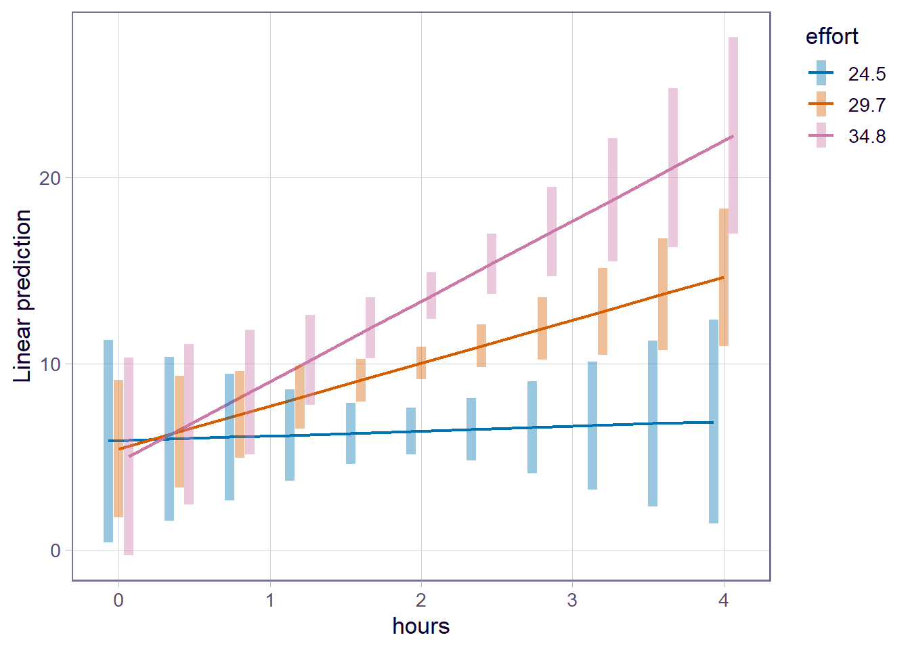
<p class="caption">(\#fig:fig-linear-prediction-vs-time)Linear Prediction Plot</p>
</div>


``` r
# Test statistical differences in slopes
emtrends(
    contcont,
    pairwise ~ effort,
    var = "hours",
    at = mylist,
    adjust = "none"
)
#> $emtrends
#>  effort hours.trend    SE  df lower.CL upper.CL
#>    24.5       0.261 1.350 896   -2.392     2.91
#>    29.7       2.307 0.915 896    0.511     4.10
#>    34.8       4.313 1.310 896    1.745     6.88
#> 
#> Results are averaged over the levels of: hours 
#> Confidence level used: 0.95 
#> 
#> $contrasts
#>  contrast                estimate    SE  df t.ratio p.value
#>  effort24.5 - effort29.7    -2.05 0.975 896  -2.098  0.0362
#>  effort24.5 - effort34.8    -4.05 1.930 896  -2.098  0.0362
#>  effort29.7 - effort34.8    -2.01 0.956 896  -2.098  0.0362
#> 
#> Results are averaged over the levels of: hours
```

The three p-values obtained above correspond to the interaction term in the regression model.

For a professional figure, we refine the visualization using `ggplot2`:


``` r
library(ggplot2)

# Prepare data for plotting
mylist <- list(hours = seq(0, 4, by = 0.4),
               effort = c(effbr, effr, effar))
contcontdat <-
    emmip(contcont,
          effort ~ hours,
          at = mylist,
          CIs = TRUE,
          plotit = FALSE)

# Convert effort levels to factors
contcontdat$feffort <- factor(contcontdat$effort)
levels(contcontdat$feffort) <- c("low", "medium", "high")
```


``` r
ggplot(data = contcontdat,
       aes(x = hours, y = yvar, color = feffort)) +
    geom_line() +
    geom_ribbon(aes(ymax = UCL, ymin = LCL, fill = feffort),
                alpha = 0.4) + labs(x = "Exercise Hours",
                                    y = "Weight Loss",
                                    color = "Effort",
                                    fill = "Effort Level") +
    theme_minimal()
```

<div class="figure" style="text-align: center">
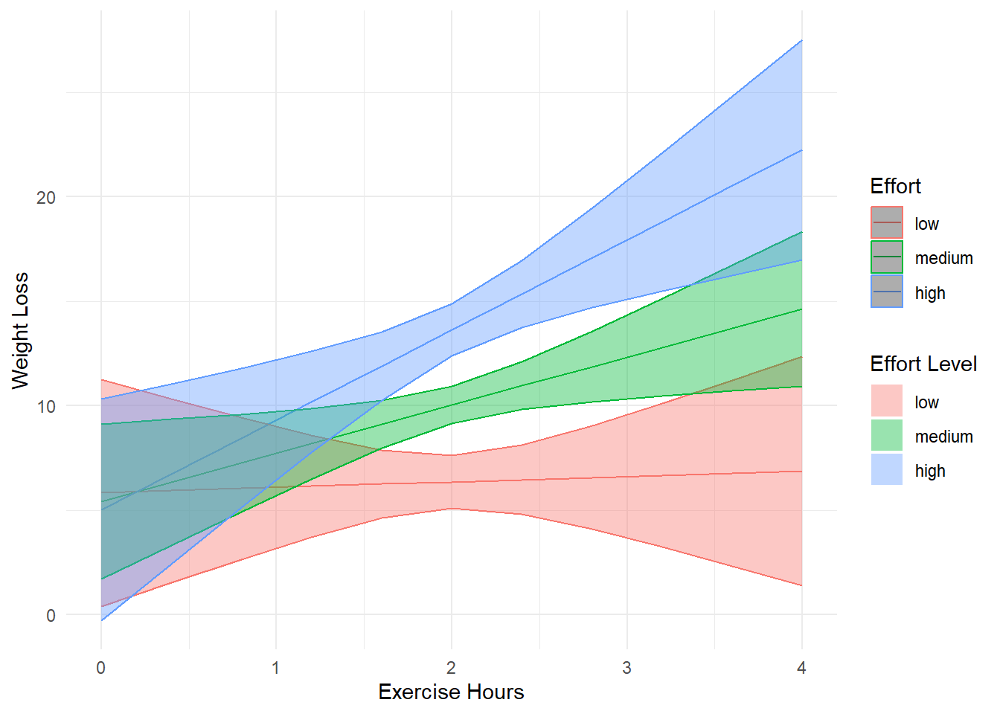
<p class="caption">(\#fig:fig-weight-loss-vs-effort)Weight Loss vs Exercise Hours</p>
</div>

#### Continuous by Categorical Interaction

Next, we examine an interaction where `hours` (continuous) interacts with `gender` (categorical). We set "Female" as the reference category:


``` r
dat$gender <- relevel(dat$gender, ref = "female")
contcat <- lm(loss ~ hours * gender, data = dat)
summary(contcat)
#> 
#> Call:
#> lm(formula = loss ~ hours * gender, data = dat)
#> 
#> Residuals:
#>     Min      1Q  Median      3Q     Max 
#> -27.118 -11.350  -1.963  10.001  42.376 
#> 
#> Coefficients:
#>                  Estimate Std. Error t value Pr(>|t|)  
#> (Intercept)         3.335      2.731   1.221    0.222  
#> hours               3.315      1.332   2.489    0.013 *
#> gendermale          3.571      3.915   0.912    0.362  
#> hours:gendermale   -1.724      1.898  -0.908    0.364  
#> ---
#> Signif. codes:  0 '***' 0.001 '**' 0.01 '*' 0.05 '.' 0.1 ' ' 1
#> 
#> Residual standard error: 14.06 on 896 degrees of freedom
#> Multiple R-squared:  0.008433,	Adjusted R-squared:  0.005113 
#> F-statistic:  2.54 on 3 and 896 DF,  p-value: 0.05523
```

Simple Slopes by Gender


``` r
# Compute simple slopes for each gender
emtrends(contcat, ~ gender, var = "hours")
#>  gender hours.trend   SE  df lower.CL upper.CL
#>  female        3.32 1.33 896    0.702     5.93
#>  male          1.59 1.35 896   -1.063     4.25
#> 
#> Confidence level used: 0.95

# Test slope differences
emtrends(contcat, pairwise ~ gender, var = "hours")
#> $emtrends
#>  gender hours.trend   SE  df lower.CL upper.CL
#>  female        3.32 1.33 896    0.702     5.93
#>  male          1.59 1.35 896   -1.063     4.25
#> 
#> Confidence level used: 0.95 
#> 
#> $contrasts
#>  contrast      estimate  SE  df t.ratio p.value
#>  female - male     1.72 1.9 896   0.908  0.3639
```

Since this test is equivalent to the interaction term in the regression model, a significant result confirms a moderating effect of `gender`.


``` r
mylist <- list(hours = seq(0, 4, by = 0.4),
               gender = c("female", "male"))

```


``` r
emmip(contcat, gender ~ hours, at = mylist, CIs = TRUE)
```

<div class="figure" style="text-align: center">
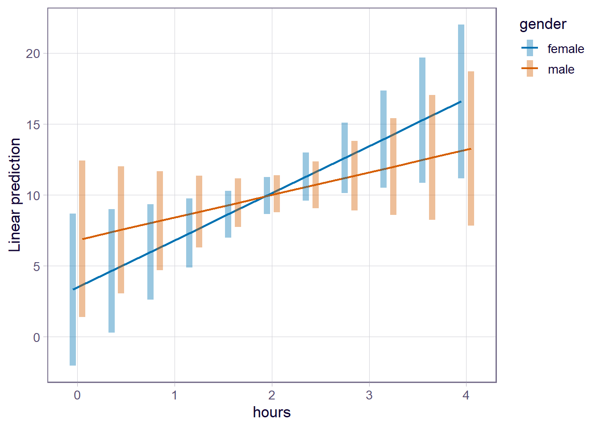
<p class="caption">(\#fig:fig-linear-prediction-by-gender)Linear prediction vs hours</p>
</div>

#### Categorical by Categorical Interaction

Now, we examine the interaction between two categorical variables: `gender` (male, female) and `prog` (exercise program). We set "Read" as the reference category for `prog` and "Female" for `gender`:


``` r
dat$prog   <- relevel(dat$prog, ref = "read")
dat$gender <- relevel(dat$gender, ref = "female")

catcat <- lm(loss ~ gender * prog, data = dat)
summary(catcat)
#> 
#> Call:
#> lm(formula = loss ~ gender * prog, data = dat)
#> 
#> Residuals:
#>      Min       1Q   Median       3Q      Max 
#> -19.1723  -4.1894  -0.0994   3.7506  27.6939 
#> 
#> Coefficients:
#>                     Estimate Std. Error t value Pr(>|t|)    
#> (Intercept)          -3.6201     0.5322  -6.802 1.89e-11 ***
#> gendermale           -0.3355     0.7527  -0.446    0.656    
#> progjog               7.9088     0.7527  10.507  < 2e-16 ***
#> progswim             32.7378     0.7527  43.494  < 2e-16 ***
#> gendermale:progjog    7.8188     1.0645   7.345 4.63e-13 ***
#> gendermale:progswim  -6.2599     1.0645  -5.881 5.77e-09 ***
#> ---
#> Signif. codes:  0 '***' 0.001 '**' 0.01 '*' 0.05 '.' 0.1 ' ' 1
#> 
#> Residual standard error: 6.519 on 894 degrees of freedom
#> Multiple R-squared:  0.7875,	Adjusted R-squared:  0.7863 
#> F-statistic: 662.5 on 5 and 894 DF,  p-value: < 2.2e-16
```

Simple Effects and Contrast Analysis


``` r
# Estimated marginal means for all combinations of gender and program
emcatcat <- emmeans(catcat, ~ gender * prog)

# Compare effects of gender within each program
contrast(emcatcat, "revpairwise", by = "prog", adjust = "bonferroni")
#> prog = read:
#>  contrast      estimate    SE  df t.ratio p.value
#>  male - female   -0.335 0.753 894  -0.446  0.6559
#> 
#> prog = jog:
#>  contrast      estimate    SE  df t.ratio p.value
#>  male - female    7.483 0.753 894   9.942  <.0001
#> 
#> prog = swim:
#>  contrast      estimate    SE  df t.ratio p.value
#>  male - female   -6.595 0.753 894  -8.762  <.0001
```


``` r
emmip(catcat, prog ~ gender, CIs = TRUE)
```

<div class="figure" style="text-align: center">
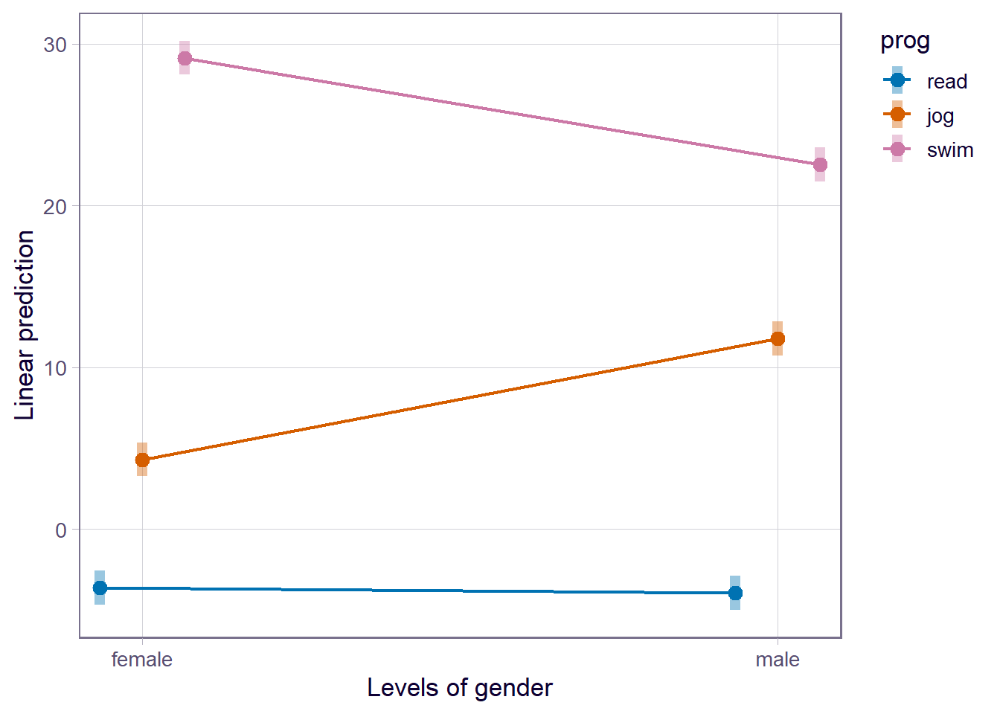
<p class="caption">(\#fig:fig-prediction-by-gender-and-activity)Linear prediction vs Gender</p>
</div>

For a more intuitive presentation, we use a bar graph with error bars


``` r
# Prepare data
catcatdat <- emmip(catcat,
                   gender ~ prog,
                   CIs = TRUE,
                   plotit = FALSE)
```


``` r
ggplot(data = catcatdat,
       aes(x = prog, y = yvar, fill = gender)) +
    geom_bar(stat = "identity", position = "dodge") + geom_errorbar(
        position = position_dodge(.9),
        width = .25,
        aes(ymax = UCL, ymin = LCL),
        alpha = 0.3
    )  + labs(x = "Exercise Program",
              y = "Weight Loss",
              fill = "Gender")
```

<div class="figure" style="text-align: center">

<p class="caption">(\#fig:fig-weight-loss-by-program-and-gender)Weigth Loss vs Exercise Program</p>
</div>

### `probemod` Package

The `probemod` package is designed for moderation analysis, particularly focusing on **Johnson-Neyman intervals** and **simple slopes analysis**. However, **this package is not recommended** due to known issues with subscript handling and formatting errors in some outputs.


``` r
install.packages("probemod", dependencies = T)
```

The **Johnson-Neyman technique** identifies values of the moderator (`gender`) where the effect of the independent variable (`hours`) on the dependent variable (`loss`) is statistically significant. This method is particularly useful when the moderator is continuous but can also be applied to categorical moderators.

Example: J-N Analysis in a `loss ~ hours * gender` Model


``` r
library(probemod)

myModel <-
    lm(loss ~ hours * gender, data = dat %>% 
           select(loss, hours, gender))

jnresults <- jn(myModel,
                dv = 'loss',
                iv = 'hours',
                mod = 'gender')
```

The `jn()` function computes Johnson-Neyman intervals, highlighting the values of `gender` at which the relationship between `hours` and `loss` is statistically significant.

The **Pick-a-Point** method tests the simple effect of `hours` at specific values of `gender`, akin to spotlight analysis.


``` r
pickapoint(
    myModel,
    dv = 'loss',
    iv = 'hours',
    mod = 'gender',
    alpha = .01
)

plot(jnresults)
```

### `interactions` Package

The `interactions` package is a **recommended** tool for visualizing and interpreting interaction effects in regression models. It provides user-friendly functions for **interaction plots**, **simple slopes analysis**, and **Johnson-Neyman intervals**, making it an excellent choice for moderation analysis.


``` r
install.packages("interactions")
```

#### Continuous by Continuous Interaction

This section covers interactions where at least one of the two variables is continuous.

Example: Interaction Between `Illiteracy` and `Murder`

We use the `state.x77` dataset to explore how **Illiteracy Rate** and **Murder Rate** interact to predict **Income** across U.S. states.


``` r
states <- as.data.frame(state.x77)
fiti <- lm(Income ~ Illiteracy * Murder + `HS Grad`, data = states)
summary(fiti)
#> 
#> Call:
#> lm(formula = Income ~ Illiteracy * Murder + `HS Grad`, data = states)
#> 
#> Residuals:
#>     Min      1Q  Median      3Q     Max 
#> -916.27 -244.42   28.42  228.14 1221.16 
#> 
#> Coefficients:
#>                   Estimate Std. Error t value Pr(>|t|)    
#> (Intercept)        1414.46     737.84   1.917  0.06160 .  
#> Illiteracy          753.07     385.90   1.951  0.05724 .  
#> Murder              130.60      44.67   2.923  0.00540 ** 
#> `HS Grad`            40.76      10.92   3.733  0.00053 ***
#> Illiteracy:Murder   -97.04      35.86  -2.706  0.00958 ** 
#> ---
#> Signif. codes:  0 '***' 0.001 '**' 0.01 '*' 0.05 '.' 0.1 ' ' 1
#> 
#> Residual standard error: 459.5 on 45 degrees of freedom
#> Multiple R-squared:  0.4864,	Adjusted R-squared:  0.4407 
#> F-statistic: 10.65 on 4 and 45 DF,  p-value: 3.689e-06
```

For continuous moderators, the standard values chosen for visualization are:

-   **Mean + 1 SD**

-   **Mean**

-   **Mean - 1 SD**

The `interact_plot()` function provides an easy way to visualize these effects.


``` r
library(interactions)
interact_plot(fiti,
              pred = Illiteracy,
              modx = Murder,
              
              # Disable automatic mean-centering
              centered = "none", 
              
              # Exclude the mean value of the moderator
              # modx.values = "plus-minus", 
              
              # Divide the moderator's distribution into three groups
              # modx.values = "terciles", 
              
              plot.points = TRUE, # Overlay raw data
              
              # Different shapes for different levels of the moderator
              point.shape = TRUE, 
              
              # Jittering to prevent overplotting
              jitter = 0.1, 
              
              # Custom appearance
              x.label = "Illiteracy Rate (%)", 
              y.label = "Income ($)", 
              main.title = "Interaction Between Illiteracy and Murder Rate",
              legend.main = "Murder Rate Levels",
              colors = "blue",
              
              # Confidence bands
              interval = TRUE, 
              int.width = 0.9, 
              robust = TRUE # Use robust standard errors
              ) 
```

<div class="figure" style="text-align: center">
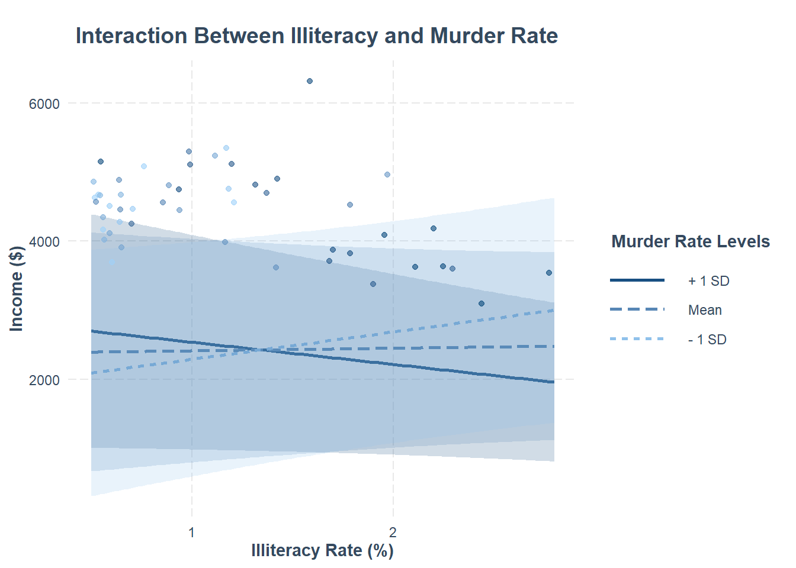
<p class="caption">(\#fig:fig-interaction-illiteracy-murder)Interaction Between Illiteracy and Murder Rate</p>
</div>

If the model includes **weights**, they can be incorporated into the visualization.


``` r
fiti <- lm(Income ~ Illiteracy * Murder,
           data = states,
           weights = Population)
```


``` r
interact_plot(fiti,
              pred = Illiteracy,
              modx = Murder,
              plot.points = TRUE)
```

<div class="figure" style="text-align: center">
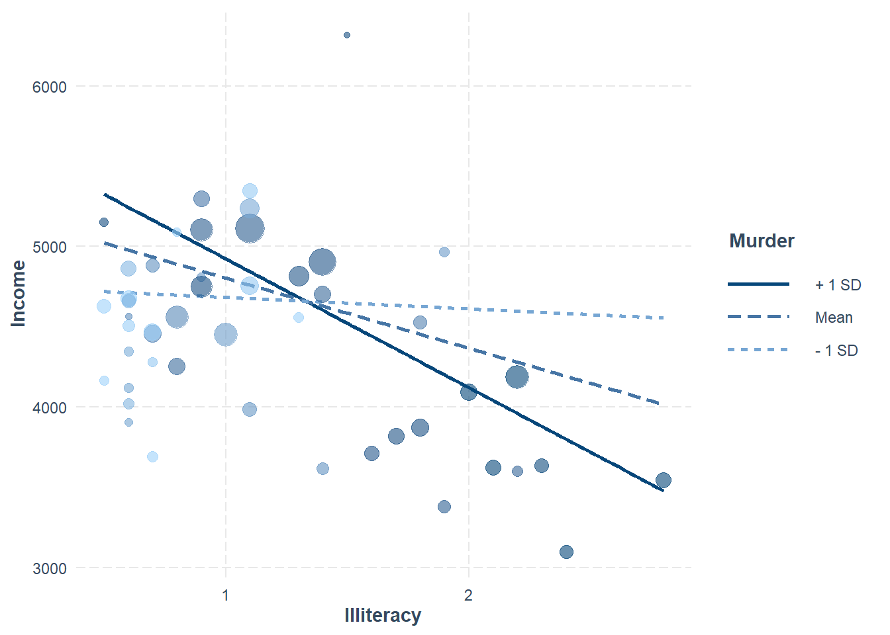
<p class="caption">(\#fig:fig-bubble-illiteracy-income)Bubble Chart between Income and Illiteracy</p>
</div>

A **partial effect plot** shows how the effect of one variable changes across different levels of another variable while controlling for other predictors.


``` r
library(ggplot2)
data(cars)

fitc <- lm(cty ~ year + cyl * displ + class + fl + drv, 
           data = mpg)
summary(fitc)
#> 
#> Call:
#> lm(formula = cty ~ year + cyl * displ + class + fl + drv, data = mpg)
#> 
#> Residuals:
#>     Min      1Q  Median      3Q     Max 
#> -5.9772 -0.7164  0.0018  0.7690  5.9314 
#> 
#> Coefficients:
#>                   Estimate Std. Error t value Pr(>|t|)    
#> (Intercept)     -200.97599   47.00954  -4.275 2.86e-05 ***
#> year               0.11813    0.02347   5.033 1.01e-06 ***
#> cyl               -1.85648    0.27745  -6.691 1.86e-10 ***
#> displ             -3.56467    0.65943  -5.406 1.70e-07 ***
#> classcompact      -2.60177    0.92972  -2.798 0.005597 ** 
#> classmidsize      -2.62996    0.93273  -2.820 0.005253 ** 
#> classminivan      -4.40817    1.03844  -4.245 3.24e-05 ***
#> classpickup       -4.37322    0.93416  -4.681 5.02e-06 ***
#> classsubcompact   -2.38384    0.92943  -2.565 0.010997 *  
#> classsuv          -4.27352    0.86777  -4.925 1.67e-06 ***
#> fld                6.34343    1.69499   3.742 0.000233 ***
#> fle               -4.57060    1.65992  -2.754 0.006396 ** 
#> flp               -1.91733    1.58649  -1.209 0.228158    
#> flr               -0.78873    1.56551  -0.504 0.614901    
#> drvf               1.39617    0.39660   3.520 0.000525 ***
#> drvr               0.48740    0.46113   1.057 0.291694    
#> cyl:displ          0.36206    0.07934   4.564 8.42e-06 ***
#> ---
#> Signif. codes:  0 '***' 0.001 '**' 0.01 '*' 0.05 '.' 0.1 ' ' 1
#> 
#> Residual standard error: 1.526 on 217 degrees of freedom
#> Multiple R-squared:  0.8803,	Adjusted R-squared:  0.8715 
#> F-statistic: 99.73 on 16 and 217 DF,  p-value: < 2.2e-16
```


``` r
interact_plot(
    fitc,
    pred = displ,
    modx = cyl,
    
    # Show observed data as partial residuals
    partial.residuals = TRUE, 
    
    # Specify moderator values manually
    modx.values = c(4, 5, 6, 8)
)
```

<div class="figure" style="text-align: center">
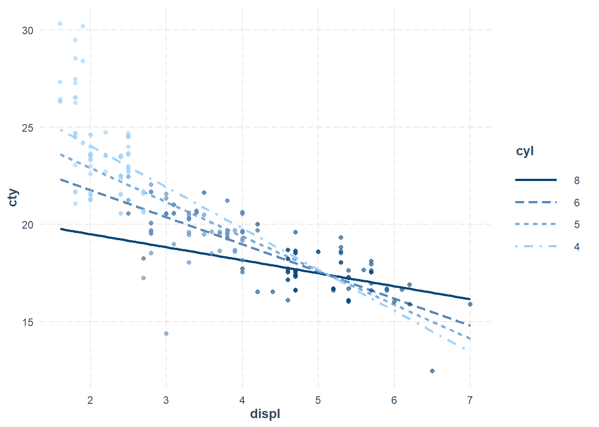
<p class="caption">(\#fig:fig-displ-vs-cty-by-cyl)Scatter Plot between cty and displ</p>
</div>

To check whether an interaction is **truly linear**, we can compare fitted lines based on:

-   **The whole sample** (black line)

-   **Subsamples** based on the moderator (red line)


``` r
# Generate synthetic data
x_2 <- runif(n = 200, min = -3, max = 3)
w   <- rbinom(n = 200, size = 1, prob = 0.5)
err <- rnorm(n = 200, mean = 0, sd = 4)
y_2 <- 2.5 - x_2 ^ 2 - 5 * w + 2 * w * (x_2 ^ 2) + err

data_2 <- as.data.frame(cbind(x_2, y_2, w))

# Fit interaction model
model_2 <- lm(y_2 ~ x_2 * w, data = data_2)
summary(model_2)
#> 
#> Call:
#> lm(formula = y_2 ~ x_2 * w, data = data_2)
#> 
#> Residuals:
#>      Min       1Q   Median       3Q      Max 
#> -12.8538  -3.6057   0.0503   3.3696  10.8528 
#> 
#> Coefficients:
#>             Estimate Std. Error t value Pr(>|t|)  
#> (Intercept)  -0.7879     0.5096  -1.546   0.1237  
#> x_2           0.3369     0.2985   1.128   0.2606  
#> w             1.7001     0.7030   2.418   0.0165 *
#> x_2:w        -0.6986     0.4002  -1.745   0.0825 .
#> ---
#> Signif. codes:  0 '***' 0.001 '**' 0.01 '*' 0.05 '.' 0.1 ' ' 1
#> 
#> Residual standard error: 4.962 on 196 degrees of freedom
#> Multiple R-squared:  0.04495,	Adjusted R-squared:  0.03033 
#> F-statistic: 3.075 on 3 and 196 DF,  p-value: 0.0288
```


``` r
# Linearity check plot
interact_plot(
    model_2,
    pred = x_2,
    modx = w,
    linearity.check = TRUE,
    plot.points = TRUE
)
```

<div class="figure" style="text-align: center">
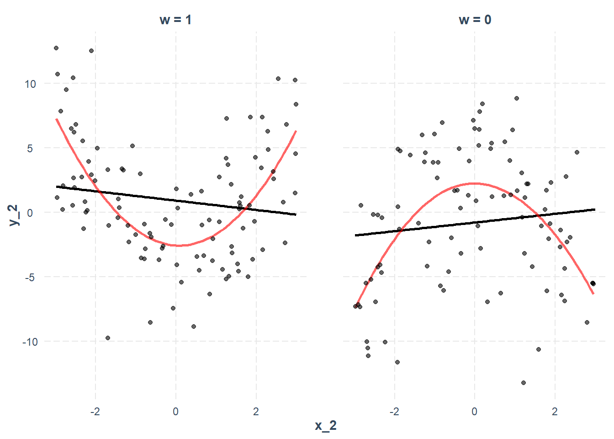
<p class="caption">(\#fig:fig-interaction-plot-dual-weights)Interaction Plot</p>
</div>

##### Simple Slopes Analysis

A **simple slopes analysis** examines the **conditional effect** of an independent variable ($X$) at specific levels of the moderator ($M$).

How `sim_slopes()` Works:

-   **Continuous moderators**: Analyzes effects at the **mean** and **±1 SD**.

-   **Categorical moderators**: Uses all factor levels.

-   **Mean-centers all variables** except the predictor of interest.

Example: Continuous by Continuous Interaction


``` r
library(interactions)
sim_slopes(fiti,
           pred = Illiteracy,
           modx = Murder,
           johnson_neyman = FALSE)
#> SIMPLE SLOPES ANALYSIS
#> 
#> Slope of Illiteracy when Murder =  5.420973 (- 1 SD): 
#> 
#>     Est.     S.E.   t val.      p
#> -------- -------- -------- ------
#>   -17.43   250.08    -0.07   0.94
#> 
#> Slope of Illiteracy when Murder =  8.685043 (Mean): 
#> 
#>      Est.     S.E.   t val.      p
#> --------- -------- -------- ------
#>   -399.64   178.86    -2.23   0.03
#> 
#> Slope of Illiteracy when Murder = 11.949113 (+ 1 SD): 
#> 
#>      Est.     S.E.   t val.      p
#> --------- -------- -------- ------
#>   -781.85   189.11    -4.13   0.00
```

We can also visualize the simple slopes


``` r
# Store results
ss <- sim_slopes(fiti,
                 pred = Illiteracy,
                 modx = Murder,
                 modx.values = c(0, 5, 10))
```


``` r
plot(ss)
```

<div class="figure" style="text-align: center">
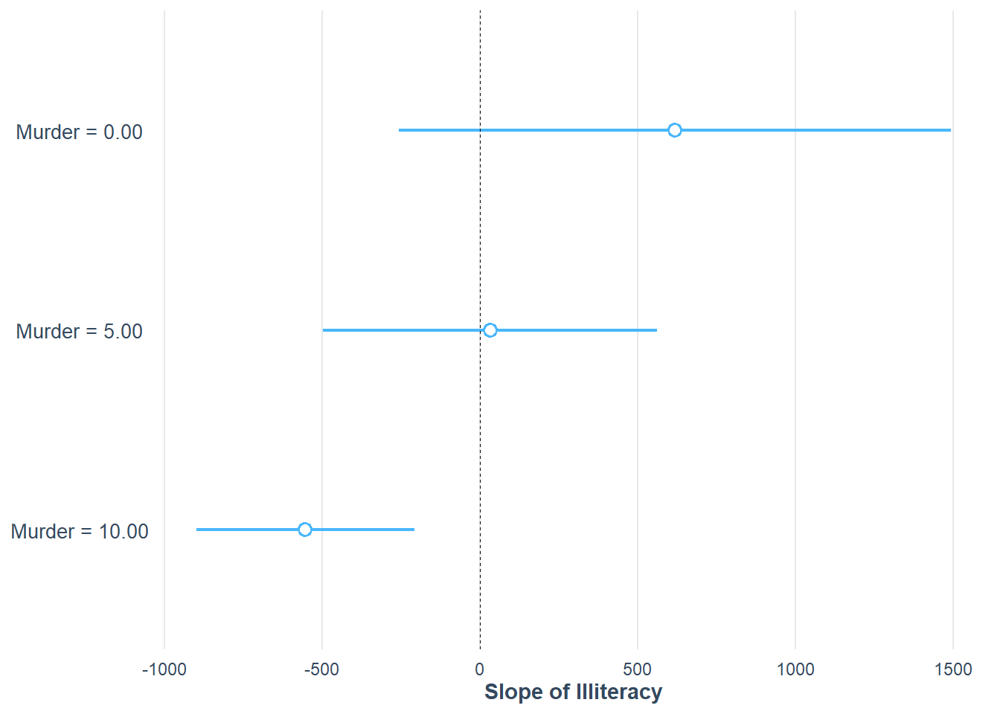
<p class="caption">(\#fig:fig-moderation-plot)Slope of Illiteracy</p>
</div>

For publication-quality results, we convert the simple slopes analysis into a table using `huxtable`.


``` r
library(huxtable)

ss <- sim_slopes(fiti,
                 pred = Illiteracy,
                 modx = Murder,
                 modx.values = c(0, 5, 10))

# Convert to a formatted table
print(as_huxtable(ss))
#>                      Value of Murder   Slope of Illiteracy  
#>                    ─────────────────────────────────────────
#>                      0.00              617.34 (434.85)      
#>                      5.00              31.86 (262.63)       
#>                      10.00             -553.62 (171.42)**
```

##### Johnson-Neyman Intervals

The **Johnson-Neyman technique** identifies the range of the moderator ($M$) where the effect of the predictor ($X$) on the dependent variable ($Y$) is statistically significant. This approach is useful when the moderator is continuous, allowing us to determine where an effect exists rather than arbitrarily choosing values.

Although the J-N approach has been widely used [@johnson1936tests], it has known **inflated Type I error rates** [@bauer2005probing]. A correction method was proposed by @esarey2018marginal to address these issues.

Since J-N performs multiple comparisons across all values of the moderator, it **inflates Type I error**. To control for this, we use [False Discovery Rate] correction.

Example: Johnson-Neyman Analysis


``` r
sim_slopes(
    fiti,
    pred = Illiteracy,
    modx = Murder,
    johnson_neyman = TRUE,
    control.fdr = TRUE,  # Correction for Type I and II errors
    
    # Include conditional intercepts
    # cond.int = TRUE, 
    
    robust = "HC3",  # Use robust SE
    
    # Don't mean-center non-focal variables
    # centered = "none",
    
    jnalpha = 0.05  # Significance level
)
#> JOHNSON-NEYMAN INTERVAL
#> 
#> When Murder is OUTSIDE the interval [-7.87, 8.51], the slope of Illiteracy
#> is p < .05.
#> 
#> Note: The range of observed values of Murder is [1.40, 15.10]
#> 
#> Interval calculated using false discovery rate adjusted t = 2.35 
#> 
#> SIMPLE SLOPES ANALYSIS
#> 
#> Slope of Illiteracy when Murder =  5.420973 (- 1 SD): 
#> 
#>     Est.     S.E.   t val.      p
#> -------- -------- -------- ------
#>   -17.43   227.37    -0.08   0.94
#> 
#> Slope of Illiteracy when Murder =  8.685043 (Mean): 
#> 
#>      Est.     S.E.   t val.      p
#> --------- -------- -------- ------
#>   -399.64   158.77    -2.52   0.02
#> 
#> Slope of Illiteracy when Murder = 11.949113 (+ 1 SD): 
#> 
#>      Est.     S.E.   t val.      p
#> --------- -------- -------- ------
#>   -781.85   156.96    -4.98   0.00
```

To visualize the J-N intervals


``` r
johnson_neyman(fiti,
               pred = Illiteracy,
               modx = Murder,
               control.fdr = TRUE, # Corrects for Type I error
               alpha = .05)
#> JOHNSON-NEYMAN INTERVAL
#> 
#> When Murder is OUTSIDE the interval [-22.57, 8.52], the slope of Illiteracy
#> is p < .05.
#> 
#> Note: The range of observed values of Murder is [1.40, 15.10]
#> 
#> Interval calculated using false discovery rate adjusted t = 2.33
```

<div class="figure" style="text-align: center">
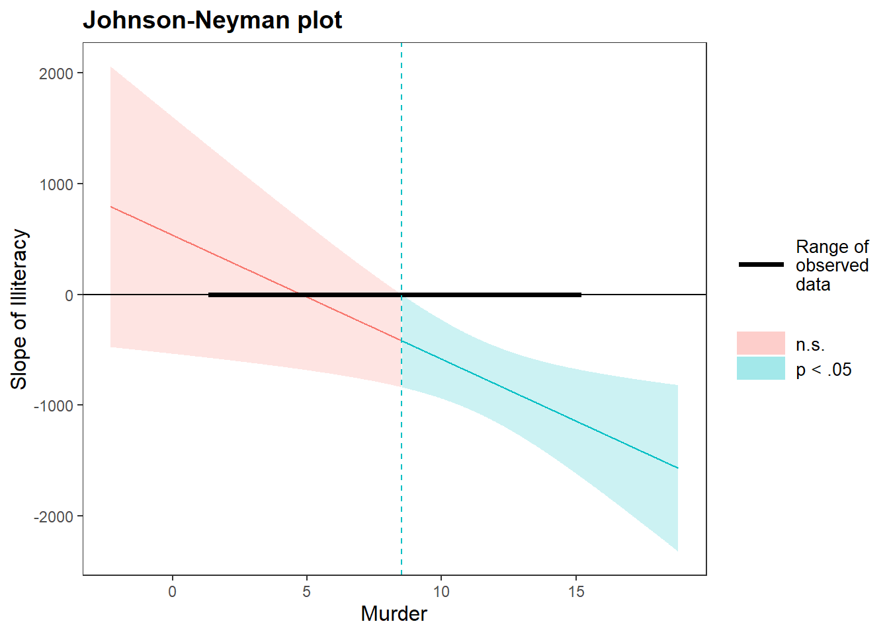
<p class="caption">(\#fig:fig-johnson-neyman-significance)Johnson Neyman Plot</p>
</div>

-   The y-axis represents the conditional slope of the predictor ($X$).

-   The x-axis represents the values of the moderator ($M$).

-   The shaded region represents the range where the effect of $X$ on $Y$ is statistically significant.

##### Three-Way Interactions

In three-way interactions, the effect of $X$ on $Y$ depends on **two moderators** ($M_1$ and $M_2$). This allows for a more nuanced understanding of moderation effects.

Example: 3-Way Interaction Visualization


``` r
library(jtools)
# Convert 'cyl' to factor
mtcars$cyl <- factor(mtcars$cyl,
                     labels = c("4 cylinder", "6 cylinder", "8 cylinder"))

# Fit the model
fitc3 <- lm(mpg ~ hp * wt * cyl, data = mtcars)
```


``` r
interact_plot(fitc3,
              pred = hp,
              modx = wt,
              mod2 = cyl) +
    theme_apa(legend.pos = "bottomright")
```

<div class="figure" style="text-align: center">
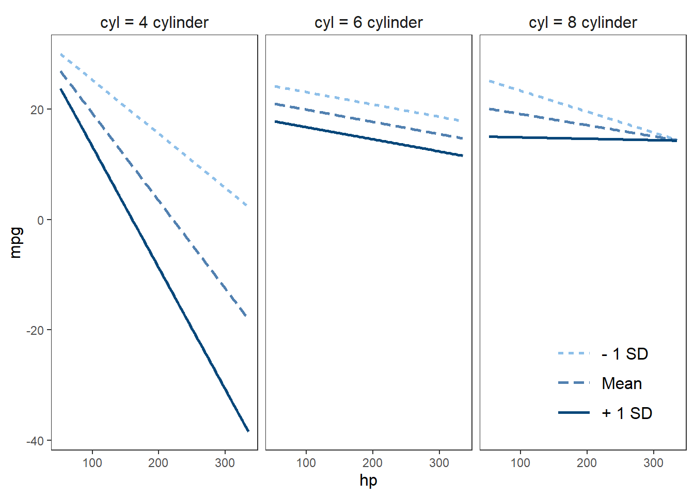
<p class="caption">(\#fig:fig-johnson-neyman-interaction)Interaction Plot</p>
</div>

##### Johnson-Neyman for Three-Way Interaction

The Johnson-Neyman technique can also be applied in a **three-way interaction context**


``` r
library(survey)
data(api)

# Define survey design
dstrat <- svydesign(
    id = ~ 1,
    strata = ~ stype,
    weights = ~ pw,
    data = apistrat,
    fpc = ~ fpc
)

# Fit 3-way interaction model
regmodel3 <-
    survey::svyglm(api00 ~ avg.ed * growth * enroll, design = dstrat)
```


``` r
# Johnson-Neyman analysis with visualization
sim_slopes(
    regmodel3,
    pred = growth,
    modx = avg.ed,
    mod2 = enroll,
    jnplot = TRUE
)
#> ███████████████ While enroll (2nd moderator) =  153.0518 (- 1 SD) ██████████████ 
#> 
#> JOHNSON-NEYMAN INTERVAL
#> 
#> When avg.ed is OUTSIDE the interval [2.75, 3.82], the slope of growth is p
#> < .05.
#> 
#> Note: The range of observed values of avg.ed is [1.38, 4.44]
#> 
#> SIMPLE SLOPES ANALYSIS
#> 
#> Slope of growth when avg.ed = 2.085002 (- 1 SD): 
#> 
#>   Est.   S.E.   t val.      p
#> ------ ------ -------- ------
#>   1.25   0.32     3.86   0.00
#> 
#> Slope of growth when avg.ed = 2.787381 (Mean): 
#> 
#>   Est.   S.E.   t val.      p
#> ------ ------ -------- ------
#>   0.39   0.22     1.75   0.08
#> 
#> Slope of growth when avg.ed = 3.489761 (+ 1 SD): 
#> 
#>    Est.   S.E.   t val.      p
#> ------- ------ -------- ------
#>   -0.48   0.35    -1.37   0.17
#> 
#> ████████████████ While enroll (2nd moderator) =  595.2821 (Mean) ███████████████ 
#> 
#> JOHNSON-NEYMAN INTERVAL
#> 
#> When avg.ed is OUTSIDE the interval [2.84, 7.83], the slope of growth is p
#> < .05.
#> 
#> Note: The range of observed values of avg.ed is [1.38, 4.44]
#> 
#> SIMPLE SLOPES ANALYSIS
#> 
#> Slope of growth when avg.ed = 2.085002 (- 1 SD): 
#> 
#>   Est.   S.E.   t val.      p
#> ------ ------ -------- ------
#>   0.72   0.22     3.29   0.00
#> 
#> Slope of growth when avg.ed = 2.787381 (Mean): 
#> 
#>   Est.   S.E.   t val.      p
#> ------ ------ -------- ------
#>   0.34   0.16     2.16   0.03
#> 
#> Slope of growth when avg.ed = 3.489761 (+ 1 SD): 
#> 
#>    Est.   S.E.   t val.      p
#> ------- ------ -------- ------
#>   -0.04   0.24    -0.16   0.87
#> 
#> ███████████████ While enroll (2nd moderator) = 1037.5125 (+ 1 SD) ██████████████ 
#> 
#> JOHNSON-NEYMAN INTERVAL
#> 
#> The Johnson-Neyman interval could not be found. Is the p value for your
#> interaction term below the specified alpha?
#> 
#> SIMPLE SLOPES ANALYSIS
#> 
#> Slope of growth when avg.ed = 2.085002 (- 1 SD): 
#> 
#>   Est.   S.E.   t val.      p
#> ------ ------ -------- ------
#>   0.18   0.31     0.58   0.56
#> 
#> Slope of growth when avg.ed = 2.787381 (Mean): 
#> 
#>   Est.   S.E.   t val.      p
#> ------ ------ -------- ------
#>   0.29   0.20     1.49   0.14
#> 
#> Slope of growth when avg.ed = 3.489761 (+ 1 SD): 
#> 
#>   Est.   S.E.   t val.      p
#> ------ ------ -------- ------
#>   0.40   0.27     1.49   0.14
```

<div class="figure" style="text-align: center">
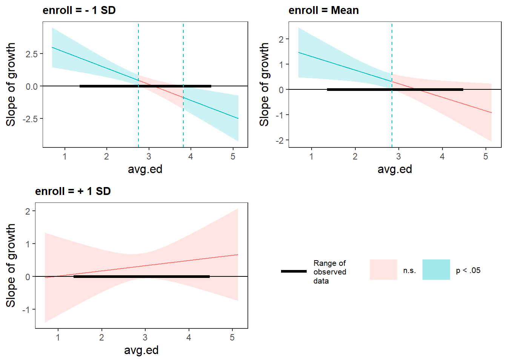
<p class="caption">(\#fig:fig-growth-vs-avg-ed-by-enroll-level)Slope of Growth</p>
</div>

To present the results in a **publication-ready format**, we generate tables and plots


``` r
ss3 <-
    sim_slopes(regmodel3,
               pred = growth,
               modx = avg.ed,
               mod2 = enroll)
```


``` r
# Plot results
plot(ss3)
```

<div class="figure" style="text-align: center">
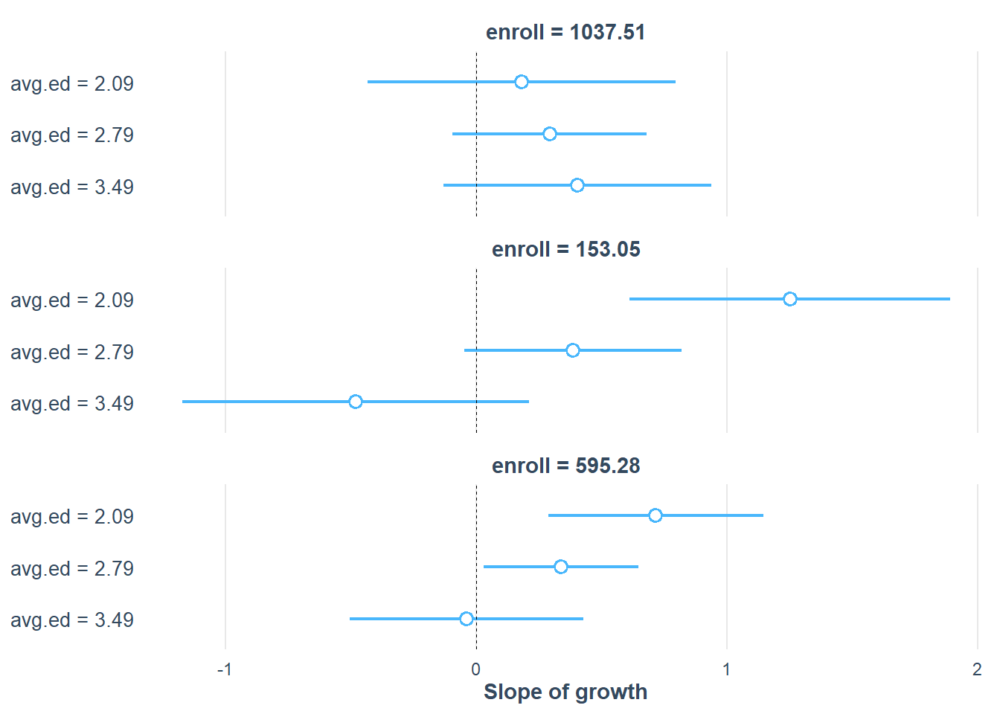
<p class="caption">(\#fig:fig-growth-vs-avg-ed-horizontal-lines)Slope of Growth</p>
</div>


``` r
# Convert results into a formatted table
library(huxtable)
print(as_huxtable(ss3))
#>                      ─────────────────────────────────────
#>                        enroll = 153                       
#>                        Value of avg.ed   Slope of growth  
#>                      ─────────────────────────────────────
#>                        2.09              1.25 (0.32)***   
#>                        2.79              0.39 (0.22)#     
#>                        3.49              -0.48 (0.35)     
#>                      ─────────────────────────────────────
#>                        enroll = 595.28                    
#>                        Value of avg.ed   Slope of growth  
#>                      ─────────────────────────────────────
#>                        2.09              0.72 (0.22)**    
#>                        2.79              0.34 (0.16)*     
#>                        3.49              -0.04 (0.24)     
#>                      ─────────────────────────────────────
#>                        enroll = 1037.51                   
#>                        Value of avg.ed   Slope of growth  
#>                      ─────────────────────────────────────
#>                        2.09              0.18 (0.31)      
#>                        2.79              0.29 (0.20)      
#>                        3.49              0.40 (0.27)
```

#### Categorical Interactions

Interactions between categorical predictors can be visualized using **categorical plots**.

Example: Interaction Between `cyl`, `fwd`, and `auto`


``` r
library(ggplot2)
library(tidyverse)

# Convert variables to factors
mpg2 <- mpg %>%
    mutate(cyl = factor(cyl))

mpg2["auto"] <- "auto"
mpg2$auto[mpg2$trans %in% c("manual(m5)", "manual(m6)")] <- "manual"
mpg2$auto <- factor(mpg2$auto)

mpg2["fwd"] <- "2wd"
mpg2$fwd[mpg2$drv == "4"] <- "4wd"
mpg2$fwd <- factor(mpg2$fwd)

# Drop cars with 5 cylinders (since most have 4, 6, or 8)
mpg2 <- mpg2[mpg2$cyl != "5",]

# Fit the model
fit3 <- lm(cty ~ cyl * fwd * auto, data = mpg2)

library(jtools) # For summ()
summ(fit3)
```

<table class="table table-striped table-hover table-condensed table-responsive" style="width: auto !important; margin-left: auto; margin-right: auto;">
<tbody>
  <tr>
   <td style="text-align:left;font-weight: bold;"> Observations </td>
   <td style="text-align:right;"> 230 </td>
  </tr>
  <tr>
   <td style="text-align:left;font-weight: bold;"> Dependent variable </td>
   <td style="text-align:right;"> cty </td>
  </tr>
  <tr>
   <td style="text-align:left;font-weight: bold;"> Type </td>
   <td style="text-align:right;"> OLS linear regression </td>
  </tr>
</tbody>
</table> <table class="table table-striped table-hover table-condensed table-responsive" style="width: auto !important; margin-left: auto; margin-right: auto;">
<tbody>
  <tr>
   <td style="text-align:left;font-weight: bold;"> F(11,218) </td>
   <td style="text-align:right;"> 61.37 </td>
  </tr>
  <tr>
   <td style="text-align:left;font-weight: bold;"> R² </td>
   <td style="text-align:right;"> 0.76 </td>
  </tr>
  <tr>
   <td style="text-align:left;font-weight: bold;"> Adj. R² </td>
   <td style="text-align:right;"> 0.74 </td>
  </tr>
</tbody>
</table> <table class="table table-striped table-hover table-condensed table-responsive" style="width: auto !important; margin-left: auto; margin-right: auto;border-bottom: 0;">
 <thead>
  <tr>
   <th style="text-align:left;">   </th>
   <th style="text-align:right;"> Est. </th>
   <th style="text-align:right;"> S.E. </th>
   <th style="text-align:right;"> t val. </th>
   <th style="text-align:right;"> p </th>
  </tr>
 </thead>
<tbody>
  <tr>
   <td style="text-align:left;font-weight: bold;"> (Intercept) </td>
   <td style="text-align:right;"> 21.37 </td>
   <td style="text-align:right;"> 0.39 </td>
   <td style="text-align:right;"> 54.19 </td>
   <td style="text-align:right;"> 0.00 </td>
  </tr>
  <tr>
   <td style="text-align:left;font-weight: bold;"> cyl6 </td>
   <td style="text-align:right;"> -4.37 </td>
   <td style="text-align:right;"> 0.54 </td>
   <td style="text-align:right;"> -8.07 </td>
   <td style="text-align:right;"> 0.00 </td>
  </tr>
  <tr>
   <td style="text-align:left;font-weight: bold;"> cyl8 </td>
   <td style="text-align:right;"> -8.37 </td>
   <td style="text-align:right;"> 0.67 </td>
   <td style="text-align:right;"> -12.51 </td>
   <td style="text-align:right;"> 0.00 </td>
  </tr>
  <tr>
   <td style="text-align:left;font-weight: bold;"> fwd4wd </td>
   <td style="text-align:right;"> -2.91 </td>
   <td style="text-align:right;"> 0.76 </td>
   <td style="text-align:right;"> -3.83 </td>
   <td style="text-align:right;"> 0.00 </td>
  </tr>
  <tr>
   <td style="text-align:left;font-weight: bold;"> automanual </td>
   <td style="text-align:right;"> 1.45 </td>
   <td style="text-align:right;"> 0.57 </td>
   <td style="text-align:right;"> 2.56 </td>
   <td style="text-align:right;"> 0.01 </td>
  </tr>
  <tr>
   <td style="text-align:left;font-weight: bold;"> cyl6:fwd4wd </td>
   <td style="text-align:right;"> 0.59 </td>
   <td style="text-align:right;"> 0.96 </td>
   <td style="text-align:right;"> 0.62 </td>
   <td style="text-align:right;"> 0.54 </td>
  </tr>
  <tr>
   <td style="text-align:left;font-weight: bold;"> cyl8:fwd4wd </td>
   <td style="text-align:right;"> 2.13 </td>
   <td style="text-align:right;"> 0.99 </td>
   <td style="text-align:right;"> 2.15 </td>
   <td style="text-align:right;"> 0.03 </td>
  </tr>
  <tr>
   <td style="text-align:left;font-weight: bold;"> cyl6:automanual </td>
   <td style="text-align:right;"> -0.76 </td>
   <td style="text-align:right;"> 0.90 </td>
   <td style="text-align:right;"> -0.84 </td>
   <td style="text-align:right;"> 0.40 </td>
  </tr>
  <tr>
   <td style="text-align:left;font-weight: bold;"> cyl8:automanual </td>
   <td style="text-align:right;"> 0.71 </td>
   <td style="text-align:right;"> 1.18 </td>
   <td style="text-align:right;"> 0.60 </td>
   <td style="text-align:right;"> 0.55 </td>
  </tr>
  <tr>
   <td style="text-align:left;font-weight: bold;"> fwd4wd:automanual </td>
   <td style="text-align:right;"> -1.66 </td>
   <td style="text-align:right;"> 1.07 </td>
   <td style="text-align:right;"> -1.56 </td>
   <td style="text-align:right;"> 0.12 </td>
  </tr>
  <tr>
   <td style="text-align:left;font-weight: bold;"> cyl6:fwd4wd:automanual </td>
   <td style="text-align:right;"> 1.29 </td>
   <td style="text-align:right;"> 1.52 </td>
   <td style="text-align:right;"> 0.85 </td>
   <td style="text-align:right;"> 0.40 </td>
  </tr>
  <tr>
   <td style="text-align:left;font-weight: bold;"> cyl8:fwd4wd:automanual </td>
   <td style="text-align:right;"> -1.39 </td>
   <td style="text-align:right;"> 1.76 </td>
   <td style="text-align:right;"> -0.79 </td>
   <td style="text-align:right;"> 0.43 </td>
  </tr>
</tbody>
<tfoot><tr><td style="padding: 0; " colspan="100%">
<sup></sup> Standard errors: OLS</td></tr></tfoot>
</table>


``` r
cat_plot(fit3,
         pred = cyl,
         modx = fwd,
         plot.points = TRUE)
```

<div class="figure" style="text-align: center">
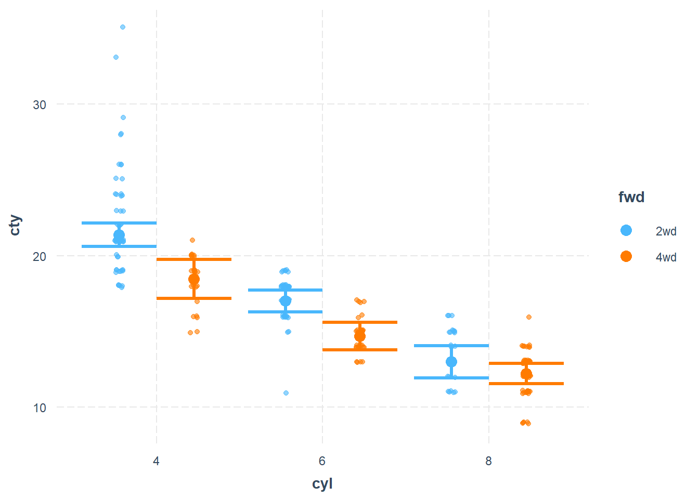
<p class="caption">(\#fig:fig-cty-vs-cyl-by-drivetrain)Scatter Plot</p>
</div>

Line Plot for Categorical Interaction


``` r
cat_plot(
    fit3,
    pred = cyl,
    modx = fwd,
    geom = "line",
    point.shape = TRUE,
    vary.lty = TRUE
)
```

<div class="figure" style="text-align: center">
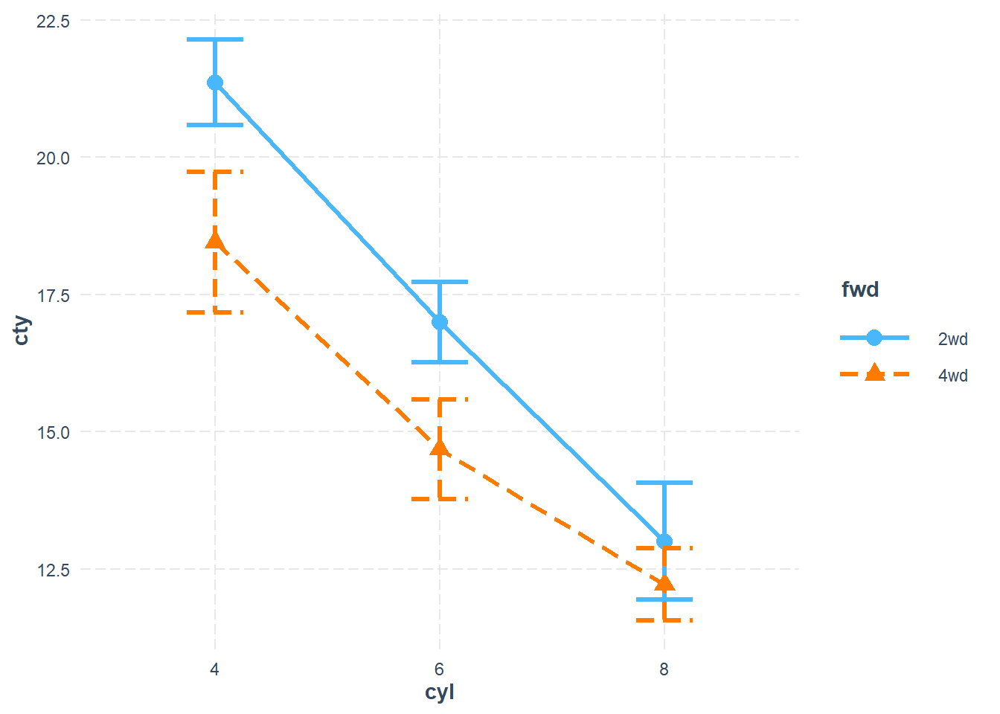
<p class="caption">(\#fig:fig-cty-vs-cyl-linechart-by-drivetrain)Line Chart between cty and cyl</p>
</div>

Bar Plot Representation


``` r
cat_plot(
    fit3,
    pred = cyl,
    modx = fwd,
    geom = "bar",
    interval = TRUE,
    plot.points = TRUE
)
```

<div class="figure" style="text-align: center">
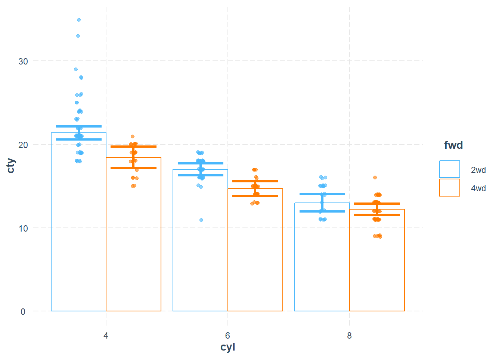
<p class="caption">(\#fig:fig-cty-vs-cyl-barchart-by-drivetrain)Bar Chart between cty and cyl</p>
</div>

### `interactionR` Package

The `interactionR` package is designed for publication-quality reporting of interaction effects, particularly in epidemiology and social sciences. It provides tools for computing interaction measures, confidence intervals, and statistical inference following well-established methodologies.

Key Features:

-   Publication-Ready Interaction Analysis
-   Confidence intervals calculated using:
    -   Delta method [@hosmer1992confidence]
    -   Variance recovery ("mover") method [@zou2008estimation]
    -   Bootstrapping [@assmann1996confidence]
-   Standardized reporting guidelines based on [@knol2012recommendations].


``` r
install.packages("interactionR", dependencies = T)
```

### `sjPlot` Package

The `sjPlot` package is highly recommended for publication-quality visualizations of interaction effects. It provides enhanced aesthetics and customizable interaction plots suitable for academic journals.

**More details:** [sjPlot interaction visualization](https://strengejacke.github.io/sjPlot/articles/plot_interactions.html)


``` r
install.packages("sjPlot")
```

### Summary of Moderation Analysis Packages

| **Package**    | **Purpose**                              | **Key Features**                                                             | **Recommended?**                 |
|------------------|------------------|-------------------|------------------|
| `emmeans`      | Estimated marginal means & simple slopes | Computes simple slopes, spotlight analysis, floodlight analysis (J-N method) | Yes                              |
| `probemod`     | Johnson-Neyman technique                 | Tests moderator significance ranges                                          | No (Subscript issues)            |
| `interactions` | Interaction visualization                | Produces robust, customizable interaction plots                              | Yes                              |
| `interactionR` | Epidemiological interaction measures     | Computes RERI, AP, SI for additive scale interactions                        | Yes (for public health research) |
| `sjPlot`       | Publication-quality interaction plots    | Highly customizable, ideal for academic papers                               | Highly Recommended               |

: Summary of Moderation Analysis Packages

------------------------------------------------------------------------

## Interaction Debate: Binning Estimators vs. Generalized Additive Models

While the classical moderation framework, as outlined above, is the dominant approach in applied research, it assumes that the specified interaction term fully captures how the relationship between $X$ and $Y$ changes with $M$. In practice, this approach relies on strong functional form assumptions, particularly linearity in both the main effects and the interaction. If these assumptions are violated, the estimated interaction effect may be biased or misleading.

It is precisely these concerns that have motivated a recent and influential methodological debate about how interactions should be estimated and interpreted in observational data. At the center of this debate are two competing approaches: binning-based estimators, which aim to relax functional form assumptions through localized estimation, and generalized additive models (GAMs), which model nonlinear relationships directly. Understanding this debate is critical, because the choice of method can fundamentally change the conclusions we draw from moderation analyses.

------------------------------------------------------------------------

Imagine you're a business researcher studying how advertising effectiveness varies with market competition. You run a regression with an interaction term between advertising spend and competitive intensity. Your results show statistical significance, but are they valid? This question lies at the heart of a methodological debate that has profound implications for how we analyze interactions in observational data.

In 2019, political scientists Jens Hainmueller, Jonathan Mummolo, and Yiqing Xu (HMX) published a highly influential paper proposing the "binning estimator" as a solution to problems with multiplicative interaction models [@hainmueller2019much]. Their approach has been widely adopted, with over 1,200 citations by the time of this writing. However, in 2024, Uri Simonsohn challenged this method, arguing that it can produce severely biased results when the underlying relationships are nonlinear, a condition that is arguably the norm rather than the exception in real-world data [@simonsohn2024interacting].

This debate affects thousands of studies across business, economics, and social sciences. The choice between methods can determine whether you conclude that:

-   Marketing effectiveness increases with firm size (or doesn't)

-   Employee training has differential effects across experience levels (or doesn't)

-   Product quality matters more in competitive markets (or doesn't)

### The Stakes

Consider that approximately 71% of articles in top journals test for interactions [@simonsohn2024interacting]. If the standard methods are flawed, this represents a massive potential for incorrect conclusions. The debate centers on a fundamental question: **What exactly are we trying to estimate when we probe an interaction?**

1.  **Team HMX (Hainmueller, Mummolo, Xu + Liu, Liu)** [@hainmueller2019much; @hainmueller2025response]:

-   Advocate for the binning estimator and kernel methods

-   Focus on flexible estimation without strong functional form assumptions

-   Emphasize practical diagnostics for applied researchers

2.  **Team Simonsohn** [@simonsohn2024interacting] (Blog post [1](https://datacolada.org/121), [2](https://datacolada.org/123)):

-   Champions Generalized Additive Models (GAMs)

-   Argues that binning violates ceteris paribus principles

-   Emphasizes the importance of handling nonlinearities correctly

------------------------------------------------------------------------

Before diving into the debate, let's establish a solid foundation. An interaction effect occurs when the relationship between two variables depends on the value of a third variable.

The standard linear interaction model is the workhorse model in social sciences:

$$Y = \beta_0 + \beta_1 D + \beta_2 X + \beta_3 D \times X + \epsilon$$

Where:

-   $Y$ = outcome variable (e.g., sales revenue)

-   $D$ = treatment/focal variable (e.g., advertising spend)

-   $X$ = moderator (e.g., market competition)

-   $D \times X$ = interaction term

The marginal effect of $D$ on $Y$ is:

$$\frac{\partial Y}{\partial D} = \beta_1 + \beta_3 X$$

This tells us that the effect of advertising on sales is $\beta_1$ when competition is zero, and changes by $\beta_3$ for each unit increase in competition.

For example, consider a retail business studying how price changes affect sales, moderated by customer loyalty status:

$$    
Sales = \beta_0 + \beta_1(Price) + \beta_2(Loyalty) + \beta_3(Price × Loyalty) + \epsilon
$$

If $\beta_3$ is positive, it suggests loyal customers are less price-sensitive.

However, the standard model assumes all relationships are **linear**. This means:

1.  The effect of price on sales changes at a constant rate with loyalty
2.  The relationships don't curve or bend
3.  Effects are symmetric (increases and decreases have opposite but equal effects)

**But what if these assumptions are violated?**

------------------------------------------------------------------------

### The Core Problem: When Linearity Fails

The real world is frustratingly nonlinear. Consider these business realities:

Common Nonlinearities in Business:

1.  **Diminishing Returns**: Marketing effectiveness often follows a logarithmic pattern
2.  **Threshold Effects**: Quality improvements may not matter until they cross a perceptibility threshold
3.  **Saturation Points**: Customer satisfaction can't exceed 100%
4.  **Network Effects**: Value may increase exponentially with user base size

The Three Problems Identified

1.  **Problem 1 (HMX)**: Researchers often probe interactions at extreme or impossible values of the moderator.
2.  **Problem 2 (HMX)**: The interaction itself may be nonlinear.
3.  **Problem 3 (Simonsohn)**: When predictors are correlated and have nonlinear effects, the interaction term captures these nonlinearities, leading to false positives.

To understand problem 3, consider the true model: $$Y = D^2 + \epsilon$$

Where $D$ and $X$ are correlated ($r = 0.5$), but $X$ doesn't actually affect $Y$.

If we estimate: $$Y = \beta_0 + \beta_1 D + \beta_2 X + \beta_3 D \times X + \epsilon$$

The interaction term $\beta_3$ will be significant even though there's no true interaction! This happens because:

1.  The omitted $D^2$ term correlates with $D \times X$ (due to the correlation between $D$ and $X$)
2.  The interaction term acts as a proxy for the missing nonlinearity
3.  We mistakenly conclude that the effect of $D$ depends on $X$

Imagine studying whether employee training effectiveness depends on prior experience. If both training hours and experience affect productivity nonlinearly, and they're correlated (more experienced employees often receive more training), you might falsely conclude that training works better for experienced employees when really you're just capturing the nonlinear effect of training itself.

------------------------------------------------------------------------

### Binning Estimator Approach {#sec-binning-estimator-approach}

HMX proposed the binning estimator as a practical solution. Here's how it works:

1.  **Split the moderator into bins** (typically terciles: low, medium, high)
2.  **Estimate separate regressions** within each bin
3.  **Compare effects across bins**

For three bins, estimate: $$Y = \sum_{j=1}^{3} \{\mu_j + \alpha_j D + \eta_j (X-\bar{x}_j) + \beta_j(X-\bar{x}_j)D\}G_j + \epsilon$$

Where:

-   $G_j$ = indicator for bin $j$

-   $\bar{x}_j$ = median value of $X$ in bin $j$

-   $\alpha_j$ = effect of $D$ at the median of bin $j$

Advantages Claimed by HMX

1.  **Simplicity**: Easy to implement and understand
2.  **Flexibility**: Doesn't impose strict functional form
3.  **Diagnostics**: Reveals nonlinearities in the interaction
4.  **Common Support**: Only estimates effects where data exist

------------------------------------------------------------------------

### Simonsohn's Critique

Simonsohn provides a devastating example that illustrates the core problem with mathematical precision. Consider PhD admissions where professors rate PhD applicants:

**The True Data Generating Process:** $\text{Rating} = \log(\text{GRE}) + \epsilon$

**Key Facts:**

-   Research experience does NOT enter the rating function

-   But: $\text{Corr}(\text{GRE}, \text{Experience}) = 0.5$ (more experienced applicants tend to have higher GRE scores)

-   Researchers want to know: Does research experience moderate the GRE-rating relationship?

**What the Linear Model Estimates:** $\text{Rating} = \beta_0 + \beta_1 \text{GRE} + \beta_2 \text{Experience} + \beta_3 (\text{GRE} \times \text{Experience}) + \epsilon$

The researcher finds $\beta_3 < 0$ and significant! Interpretation: "GRE matters less for experienced applicants."

**What the Binning Estimator Shows:**

Let's work through the math. Suppose:

-   Low experience bin: Mean GRE = 400

-   Medium experience bin: Mean GRE = 550

-   High experience bin: Mean GRE = 700

Within each bin, the binning estimator calculates: $\frac{\partial \text{Rating}}{\partial \text{GRE}} \bigg|_{\text{bin}} \approx \frac{\Delta \log(\text{GRE})}{\Delta \text{GRE}} \bigg|_{\text{mean GRE in bin}}$

Since Rating = log(GRE), the true marginal effect is: $\frac{\partial \text{Rating}}{\partial \text{GRE}} = \frac{1}{\text{GRE}}$

Therefore:

-   Low bin (GRE $\approx$ 400): Marginal effect $\approx$ 1/400 = 0.0025

-   Medium bin (GRE $\approx$ 550): Marginal effect $\approx$ 1/550 = 0.0018

-   High bin (GRE $\approx$ 700): Marginal effect $\approx$ 1/700 = 0.0014

**The Spurious Finding:**

The binning estimator shows a declining marginal effect across experience levels (0.0025 $\to$ 0.0018 $\to$ 0.0014), leading to the false conclusion that "GRE matters less for experienced applicants."

**Why This Happens**

1.  **Omitted Variable Bias**: The true model contains log(GRE), which is approximately GRE - GRE$^2$ /2 + GRE$^3$ /3 + ... by Taylor expansion
2.  **Correlation Structure**: Since Experience correlates with GRE, it also correlates with GRE²
3.  **The Interaction Term as Proxy**: The interaction GRE × Experience partially captures the omitted GRE² term
4.  **Binning Doesn't Help**: Within each bin, we still have:
    -   Different average GRE levels
    -   The same nonlinear relationship
    -   Violation of ceteris paribus

### Simonsohn's Core Criticism

The binning estimator **violates ceteris paribus**. When comparing across bins, you're changing both:

-   The moderator value (intentionally)

-   The average value of correlated predictors (unintentionally)

This confounding makes it impossible to isolate the true interaction effect.

------------------------------------------------------------------------

### Generalized Additive Models Alternative {#sec-generalized-additive-models-alternative}

Simonsohn advocates for GAMs as a superior alternative. Let's understand what they are and why he believes they solve the problem.

A GAM extends the linear model by replacing linear terms with smooth functions:

**Linear Model**: $Y = \beta_0 + \beta_1 X_1 + \beta_2 X_2 + \epsilon$

**GAM**: $Y = \beta_0 + f_1(X_1) + f_2(X_2) + \epsilon$

Where $f_1$ and $f_2$ are smooth functions estimated from the data.

GAMs can model interactions flexibly: $$Y = f_1(D) + f_2(X) + f_3(D, X) + \epsilon$$

Where $f_3(D, X)$ captures any interaction beyond the main effects.

How GAMs Work

1.  **Basis Expansion**: Each smooth function is represented as a weighted sum of basis functions (like splines)
2.  **Penalized Estimation**: A penalty prevents overfitting by controlling wiggliness
3.  **Automatic Selection**: The degree of smoothness is determined by the data

A smooth function in a GAM is represented as: $$f(x) = \sum_{k=1}^{K} \beta_k b_k(x)$$

Where:

-   $b_k(x)$ are basis functions (e.g., cubic splines)

-   $\beta_k$ are coefficients to be estimated

-   $K$ determines the maximum complexity

Advantages of GAMs

1.  **Flexibility**: Can capture any smooth relationship
2.  **Ceteris Paribus**: Properly isolates effects
3.  **No Binning**: Uses all data efficiently
4.  **Automatic Complexity**: Data determines the functional form

Simonsohn proposes "**GAM Simple Slopes**" for probing interactions:

1.  Fit the GAM with interaction
2.  Calculate predicted values at specific moderator values
3.  Plot the relationship between $D$ and $Y$ at each moderator value

This maintains ceteris paribus by holding other variables constant.

------------------------------------------------------------------------

### Mathematical Foundations of the Disagreement

The core disagreement is philosophical: What is the estimand (target of estimation)?

**Conditional Marginal Effect (CME)**

-   What HMX target: $$\theta(x) = E\left[\frac{\partial Y_i(d)}{\partial d} \bigg| X_i = x\right]$$

This marginalizes over the distribution of $D$ and other covariates $Z$ at $X = x$.

**Conditional Average Partial Effect (CAPE)**

-   What Simonsohn argues GAMs estimate: $$\rho(d, x) = E\left[\frac{\partial Y_i(d)}{\partial d} \bigg| D_i = d, X_i = x\right]$$

This conditions on specific values of $D$.

The Fundamental Difference

-   HMX argue their estimand answers: "What's the average effect of $D$ for units with $X = x$?"

-   Simonsohn argues researchers want: "What's the effect of $D$ at $X = x$, holding all else constant?"

A Business Translation

-   **HMX Estimand**: "What's the average effect of price changes for stores in high-competition markets?" (Includes the fact that high-competition stores might have different pricing patterns)

-   **Simonsohn Estimand**: "If we took a store and changed only its price, how would the effect differ in high vs. low competition?" (Pure ceteris paribus effect)

### Mathematical Example

True model: $Y = D^2 - 0.5D + \epsilon$

With $Corr(D, X) = 0.5$:

**HMX's CME**: $\theta(x) = x - 0.5$ (Not zero! Increases with $X$)

**Why?** As $X$ increases, the distribution of $D$ shifts up. Since $\frac{\partial Y}{\partial D} = 2D - 0.5$ increases with $D$, the average effect increases with $X$.

**Simonsohn's Interpretation**: There's no interaction because $X$ doesn't appear in the true model.

------------------------------------------------------------------------

### When to Use Each Method

**Use Traditional Linear Models When:**

-   You have strong theoretical reasons to expect linear relationships

-   Sample size is small (\< 200)

-   Interpretability is paramount

-   You've tested and confirmed linearity assumptions

**Use Binning Estimator When:**

-   You have experimental data (random assignment)

-   You need a quick diagnostic tool

-   You're presenting to non-technical audiences

-   As a robustness check, not primary analysis

**Use GAMs When:**

-   You have observational data

-   Sample size is adequate (\> 500 preferred)

-   You suspect nonlinear relationships

-   You need to maintain ceteris paribus

**Best Practices for Any Method**

1.  **Always visualize your data first**

    ``` r
    # Scatterplot matrix
    pairs(~ Y + D + X, data = data, 
          lower.panel = panel.smooth)
    ```

2.  **Test for nonlinearity**

    ``` r
    # Reset test for linearity
    library(lmtest)
    resettest(lm_model, power = 2:3)
    ```

3.  **Check correlations among predictors**

    ``` r
    cor(data[, c("D", "X")])
    ```

4.  **Consider theoretical expectations**

    -   Are diminishing returns plausible?
    -   Could there be threshold effects?
    -   Is the scale bounded?

5.  **Report multiple approaches**

    -   Primary analysis with GAM
    -   Robustness check with binning
    -   Show how conclusions change (or don't)

### A Decision Tree


``` r
Start: Do I need to test an interaction?
│
├─ Is at least one variable randomly assigned?
│  ├─ Yes → Experimental/Quasi-experimental
│  │  ├─ Sample size < 200 → Use linear model (with caution)
│  │  ├─ Sample size 200-500 → Use binning as diagnostic + GAM
│  │  └─ Sample size > 500 → Use GAM simple slopes
│  │
│  └─ No → Observational Data
│     │
│     ├─ Are predictors likely correlated?
│     │  ├─ Yes (usually) → Strong nonlinearity concern
│     │  │  ├─ Can implement GAM? → Use GAM
│     │  │  └─ Cannot implement GAM? → Add quadratic controls
│     │  │
│     │  └─ No (rare) → Proceed with caution
│     │
│     └─ Check for nonlinearity
│        ├─ Theory suggests nonlinearity → Use GAM
│        ├─ Bounded scales → Use GAM
│        └─ Previous literature → Use GAM
```
