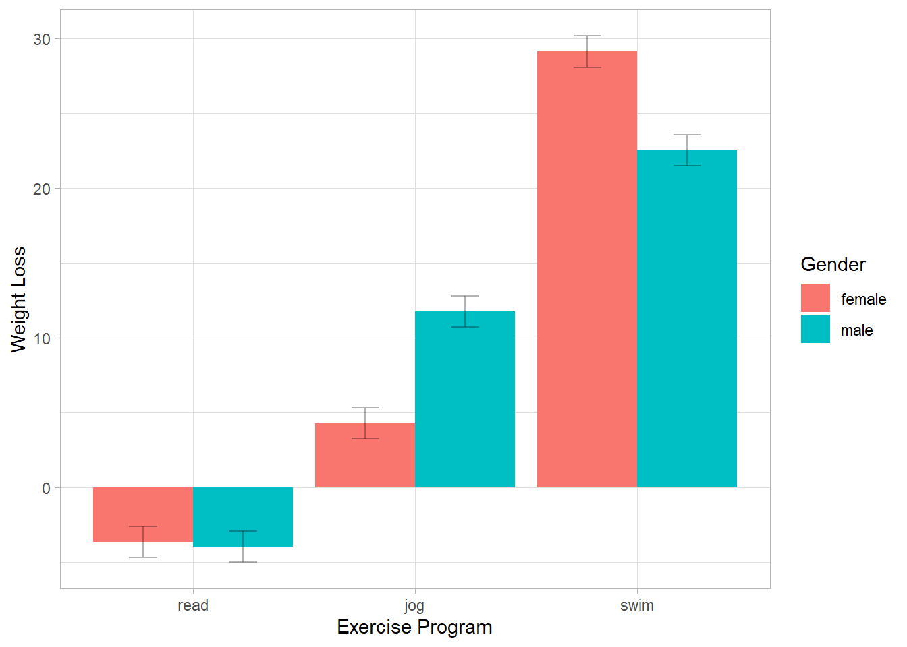
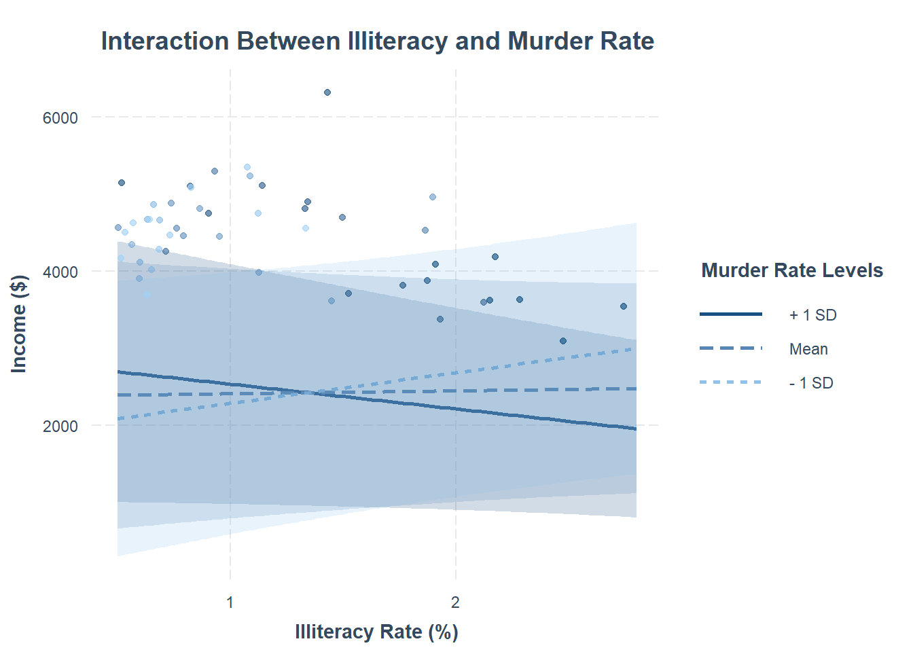
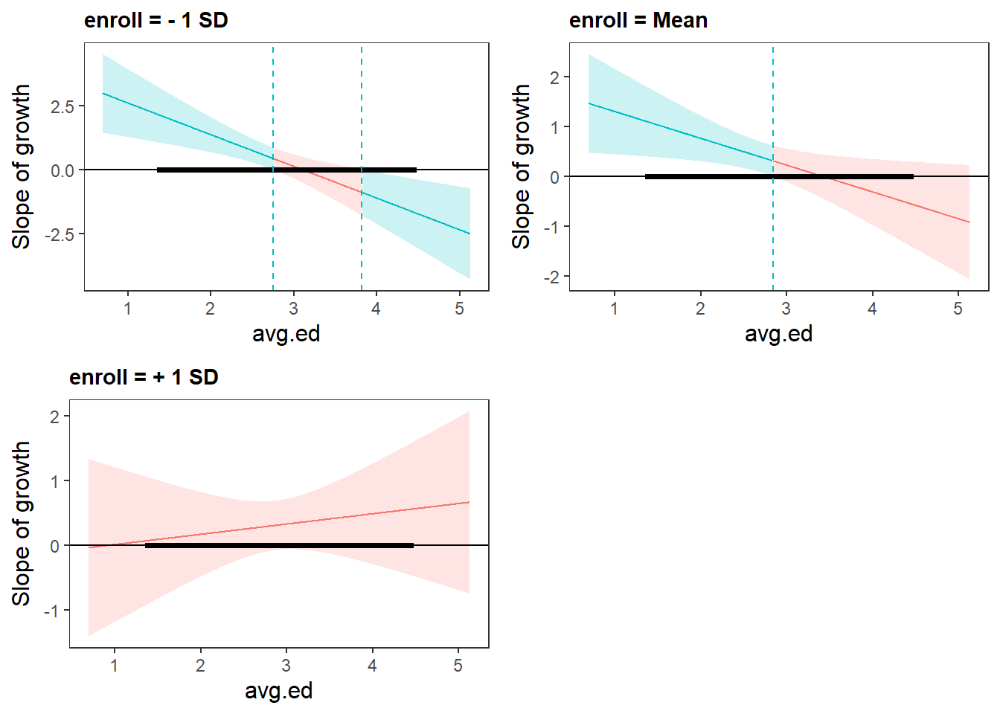
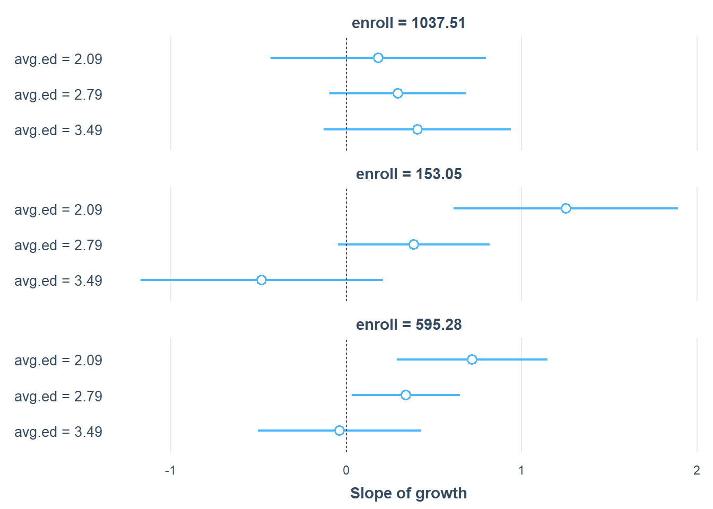
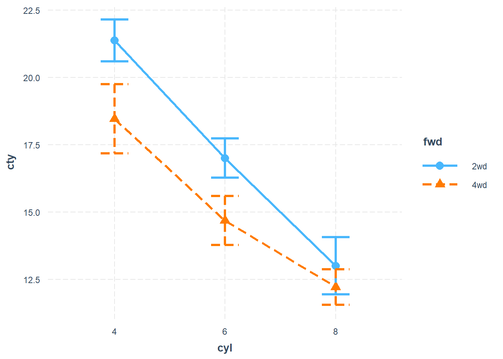

# Moderation

Moderation analysis examines how the relationship between an independent variable ($X$) and a dependent variable ($Y$) changes depending on a third variable, the *moderator* ($M$). In regression terms, moderation is represented as an interaction effect.

## Types of Moderation Analyses

There are two primary approaches to analyzing moderation:

1\. Spotlight Analysis

-   Also known as **Simple Slopes Analysis**.
-   Examines the effect of $X$ on $Y$ at specific values of $M$ (e.g., mean, $\pm 1$ SD, percentiles).
-   Typically used for categorical or discretized moderators.

2\. Floodlight Analysis

-   Extends spotlight analysis to examine moderation across the entire range of $M$.
-   Based on [Johnson-Neyman Intervals], identifying values of $M$ where the effect of $X$ on $Y$ is statistically significant.
-   Useful when the moderator is continuous and no specific cutoffs are predefined.

## Key Terminology

-   **Main Effect**: The effect of an independent variable without considering interactions.
-   **Interaction Effect**: The combined effect of $X$ and $M$ on $Y$.
-   **Simple Slope**: The slope of $X$ on $Y$ at a specific value of $M$ (used when $M$ is continuous).
-   **Simple Effect**: The effect of $X$ on $Y$ at a particular level of $M$ when $X$ is categorical.

## Moderation Model

A typical moderation model is represented as:

$$
Y = \beta_0 + \beta_1 X + \beta_2 M + \beta_3 X \times M + \varepsilon
$$

where:

-   $\beta_0$: Intercept

-   $\beta_1$: Main effect of $X$

-   $\beta_2$: Main effect of $M$

-   $\beta_3$: Interaction effect of $X$ and $M$

If $\beta_3$ is significant, it suggests that the effect of $X$ on $Y$ depends on $M$.

## Types of Interactions

1.  **Continuous by Continuous**: Both $X$ and $M$ are continuous (e.g., age moderating the effect of income on spending).
2.  **Continuous by Categorical**: $X$ is continuous, and $M$ is categorical (e.g., gender moderating the effect of education on salary).
3.  **Categorical by Categorical**: Both $X$ and $M$ are categorical (e.g., the effect of a training program on performance, moderated by job role).

## Three-Way Interactions

For models with a second moderator ($W$), we examine:

$$
\begin{aligned}
Y &= \beta_0 + \beta_1 X + \beta_2 M + \beta_3 W 
+ \beta_4 X \times M \\
&+ \beta_5 X \times W + \beta_6 M \times W + \beta_7 X \times M \times W + \varepsilon
\end{aligned}
$$

-   To interpret three-way interactions, the **slope difference test** can be used [@dawson2006probing].

## Additional Resources

-   **Bayesian ANOVA models**: `BANOVAL` package allows floodlight analysis.
-   **Structural Equation Modeling**: `cSEM` package includes `doFloodlightAnalysis`.

For more details, refer to [@spiller2013].

## Application

### `emmeans` Package

The `emmeans` package (Estimated Marginal Means) is a powerful tool for post-hoc analysis of linear models, enabling researchers to explore interaction effects through simple slopes and estimated marginal means.

To install and load the package:


``` r
install.packages("emmeans")
```

The dataset used in this section is sourced from the [UCLA Statistical Consulting Group](https://stats.oarc.ucla.edu/r/seminars/interactions-r/), where:

-   `gender` (male, female) and `prog` (exercise program: jogging, swimming, reading) are categorical variables.

-   `loss` represents weight loss, and `hours` and `effort` are continuous predictors.


``` r
library(tidyverse)
dat <- readRDS("data/exercise.rds") %>%
    mutate(prog = factor(prog, labels = c("jog", "swim", "read"))) %>%
    mutate(gender = factor(gender, labels = c("male", "female")))
```

#### Continuous by Continuous Interaction

We begin with an interaction model between two continuous variables: `hours` (exercise duration) and `effort` (self-reported effort level).


``` r
contcont <- lm(loss ~ hours * effort, data = dat)
summary(contcont)
#> 
#> Call:
#> lm(formula = loss ~ hours * effort, data = dat)
#> 
#> Residuals:
#>    Min     1Q Median     3Q    Max 
#> -29.52 -10.60  -1.78  11.13  34.51 
#> 
#> Coefficients:
#>              Estimate Std. Error t value Pr(>|t|)  
#> (Intercept)   7.79864   11.60362   0.672   0.5017  
#> hours        -9.37568    5.66392  -1.655   0.0982 .
#> effort       -0.08028    0.38465  -0.209   0.8347  
#> hours:effort  0.39335    0.18750   2.098   0.0362 *
#> ---
#> Signif. codes:  0 '***' 0.001 '**' 0.01 '*' 0.05 '.' 0.1 ' ' 1
#> 
#> Residual standard error: 13.56 on 896 degrees of freedom
#> Multiple R-squared:  0.07818,	Adjusted R-squared:  0.07509 
#> F-statistic: 25.33 on 3 and 896 DF,  p-value: 9.826e-16
```

##### Simple Slopes Analysis (Spotlight Analysis)

Following @aiken2005interaction, the spotlight analysis examines the effect of `hours` on `loss` at three levels of `effort`:

-   Mean of `effort` plus one standard deviation

-   Mean of `effort`

-   Mean of `effort` minus one standard deviation


``` r
library(emmeans)
effar <- round(mean(dat$effort) + sd(dat$effort), 1)
effr  <- round(mean(dat$effort), 1)
effbr <- round(mean(dat$effort) - sd(dat$effort), 1)


# Define values for estimation
mylist <- list(effort = c(effbr, effr, effar))

# Compute simple slopes
emtrends(contcont, ~ effort, var = "hours", at = mylist)
#>  effort hours.trend    SE  df lower.CL upper.CL
#>    24.5       0.261 1.350 896   -2.392     2.91
#>    29.7       2.307 0.915 896    0.511     4.10
#>    34.8       4.313 1.310 896    1.745     6.88
#> 
#> Confidence level used: 0.95

# Visualization of the interaction
mylist <- list(hours = seq(0, 4, by = 0.4),
               effort = c(effbr, effr, effar))
emmip(contcont, effort ~ hours, at = mylist, CIs = TRUE)
```


``` r

# Test statistical differences in slopes
emtrends(
    contcont,
    pairwise ~ effort,
    var = "hours",
    at = mylist,
    adjust = "none"
)
#> $emtrends
#>  effort hours.trend    SE  df lower.CL upper.CL
#>    24.5       0.261 1.350 896   -2.392     2.91
#>    29.7       2.307 0.915 896    0.511     4.10
#>    34.8       4.313 1.310 896    1.745     6.88
#> 
#> Results are averaged over the levels of: hours 
#> Confidence level used: 0.95 
#> 
#> $contrasts
#>  contrast                estimate    SE  df t.ratio p.value
#>  effort24.5 - effort29.7    -2.05 0.975 896  -2.098  0.0362
#>  effort24.5 - effort34.8    -4.05 1.930 896  -2.098  0.0362
#>  effort29.7 - effort34.8    -2.01 0.956 896  -2.098  0.0362
#> 
#> Results are averaged over the levels of: hours
```

The three p-values obtained above correspond to the interaction term in the regression model.

For a professional figure, we refine the visualization using `ggplot2`:


``` r
library(ggplot2)

# Prepare data for plotting
mylist <- list(hours = seq(0, 4, by = 0.4),
               effort = c(effbr, effr, effar))
contcontdat <-
    emmip(contcont,
          effort ~ hours,
          at = mylist,
          CIs = TRUE,
          plotit = FALSE)

# Convert effort levels to factors
contcontdat$feffort <- factor(contcontdat$effort)
levels(contcontdat$feffort) <- c("low", "medium", "high")

# Generate plot
p  <-
    ggplot(data = contcontdat,
           aes(x = hours, y = yvar, color = feffort)) +
    geom_line()

p1 <-
    p +
    geom_ribbon(aes(ymax = UCL, ymin = LCL, fill = feffort),
                alpha = 0.4)

p1  + labs(x = "Exercise Hours",
           y = "Weight Loss",
           color = "Effort",
           fill = "Effort Level")
```


#### Continuous by Categorical Interaction

Next, we examine an interaction where `hours` (continuous) interacts with `gender` (categorical). We set "Female" as the reference category:


``` r
dat$gender <- relevel(dat$gender, ref = "female")
contcat <- lm(loss ~ hours * gender, data = dat)
summary(contcat)
#> 
#> Call:
#> lm(formula = loss ~ hours * gender, data = dat)
#> 
#> Residuals:
#>     Min      1Q  Median      3Q     Max 
#> -27.118 -11.350  -1.963  10.001  42.376 
#> 
#> Coefficients:
#>                  Estimate Std. Error t value Pr(>|t|)  
#> (Intercept)         3.335      2.731   1.221    0.222  
#> hours               3.315      1.332   2.489    0.013 *
#> gendermale          3.571      3.915   0.912    0.362  
#> hours:gendermale   -1.724      1.898  -0.908    0.364  
#> ---
#> Signif. codes:  0 '***' 0.001 '**' 0.01 '*' 0.05 '.' 0.1 ' ' 1
#> 
#> Residual standard error: 14.06 on 896 degrees of freedom
#> Multiple R-squared:  0.008433,	Adjusted R-squared:  0.005113 
#> F-statistic:  2.54 on 3 and 896 DF,  p-value: 0.05523
```

Simple Slopes by Gender


``` r
# Compute simple slopes for each gender
emtrends(contcat, ~ gender, var = "hours")
#>  gender hours.trend   SE  df lower.CL upper.CL
#>  female        3.32 1.33 896    0.702     5.93
#>  male          1.59 1.35 896   -1.063     4.25
#> 
#> Confidence level used: 0.95

# Test slope differences
emtrends(contcat, pairwise ~ gender, var = "hours")
#> $emtrends
#>  gender hours.trend   SE  df lower.CL upper.CL
#>  female        3.32 1.33 896    0.702     5.93
#>  male          1.59 1.35 896   -1.063     4.25
#> 
#> Confidence level used: 0.95 
#> 
#> $contrasts
#>  contrast      estimate  SE  df t.ratio p.value
#>  female - male     1.72 1.9 896   0.908  0.3639
```

Since this test is equivalent to the interaction term in the regression model, a significant result confirms a moderating effect of `gender`.


``` r
mylist <- list(hours = seq(0, 4, by = 0.4),
               gender = c("female", "male"))
emmip(contcat, gender ~ hours, at = mylist, CIs = TRUE)
```


#### Categorical by Categorical Interaction

Now, we examine the interaction between two categorical variables: `gender` (male, female) and `prog` (exercise program). We set "Read" as the reference category for `prog` and "Female" for `gender`:


``` r
dat$prog   <- relevel(dat$prog, ref = "read")
dat$gender <- relevel(dat$gender, ref = "female")

catcat <- lm(loss ~ gender * prog, data = dat)
summary(catcat)
#> 
#> Call:
#> lm(formula = loss ~ gender * prog, data = dat)
#> 
#> Residuals:
#>      Min       1Q   Median       3Q      Max 
#> -19.1723  -4.1894  -0.0994   3.7506  27.6939 
#> 
#> Coefficients:
#>                     Estimate Std. Error t value Pr(>|t|)    
#> (Intercept)          -3.6201     0.5322  -6.802 1.89e-11 ***
#> gendermale           -0.3355     0.7527  -0.446    0.656    
#> progjog               7.9088     0.7527  10.507  < 2e-16 ***
#> progswim             32.7378     0.7527  43.494  < 2e-16 ***
#> gendermale:progjog    7.8188     1.0645   7.345 4.63e-13 ***
#> gendermale:progswim  -6.2599     1.0645  -5.881 5.77e-09 ***
#> ---
#> Signif. codes:  0 '***' 0.001 '**' 0.01 '*' 0.05 '.' 0.1 ' ' 1
#> 
#> Residual standard error: 6.519 on 894 degrees of freedom
#> Multiple R-squared:  0.7875,	Adjusted R-squared:  0.7863 
#> F-statistic: 662.5 on 5 and 894 DF,  p-value: < 2.2e-16
```

Simple Effects and Contrast Analysis


``` r
# Estimated marginal means for all combinations of gender and program
emcatcat <- emmeans(catcat, ~ gender * prog)

# Compare effects of gender within each program
contrast(emcatcat, "revpairwise", by = "prog", adjust = "bonferroni")
#> prog = read:
#>  contrast      estimate    SE  df t.ratio p.value
#>  male - female   -0.335 0.753 894  -0.446  0.6559
#> 
#> prog = jog:
#>  contrast      estimate    SE  df t.ratio p.value
#>  male - female    7.483 0.753 894   9.942  <.0001
#> 
#> prog = swim:
#>  contrast      estimate    SE  df t.ratio p.value
#>  male - female   -6.595 0.753 894  -8.762  <.0001
```


``` r
emmip(catcat, prog ~ gender, CIs = TRUE)
```


For a more intuitive presentation, we use a bar graph with error bars


``` r
# Prepare data
catcatdat <- emmip(catcat,
                   gender ~ prog,
                   CIs = TRUE,
                   plotit = FALSE)

# Generate plot
p <-
    ggplot(data = catcatdat,
           aes(x = prog, y = yvar, fill = gender)) +
    geom_bar(stat = "identity", position = "dodge")

p1 <-
    p + geom_errorbar(
        position = position_dodge(.9),
        width = .25,
        aes(ymax = UCL, ymin = LCL),
        alpha = 0.3
    )

p1  + labs(x = "Exercise Program",
           y = "Weight Loss",
           fill = "Gender")
```



### `probemod` Package

The `probemod` package is designed for moderation analysis, particularly focusing on **Johnson-Neyman intervals** and **simple slopes analysis**. However, **this package is not recommended** due to known issues with subscript handling and formatting errors in some outputs.


``` r
install.packages("probemod", dependencies = T)
```

The **Johnson-Neyman technique** identifies values of the moderator (`gender`) where the effect of the independent variable (`hours`) on the dependent variable (`loss`) is statistically significant. This method is particularly useful when the moderator is continuous but can also be applied to categorical moderators.

Example: J-N Analysis in a `loss ~ hours * gender` Model


``` r
library(probemod)

myModel <-
    lm(loss ~ hours * gender, data = dat %>% 
           select(loss, hours, gender))

jnresults <- jn(myModel,
                dv = 'loss',
                iv = 'hours',
                mod = 'gender')

```

The `jn()` function computes Johnson-Neyman intervals, highlighting the values of `gender` at which the relationship between `hours` and `loss` is statistically significant.

The **Pick-a-Point** method tests the simple effect of `hours` at specific values of `gender`, akin to spotlight analysis.


``` r
pickapoint(
    myModel,
    dv = 'loss',
    iv = 'hours',
    mod = 'gender',
    alpha = .01
)

plot(jnresults)
```

### `interactions` Package

The `interactions` package is a **recommended** tool for visualizing and interpreting interaction effects in regression models. It provides user-friendly functions for **interaction plots**, **simple slopes analysis**, and **Johnson-Neyman intervals**, making it an excellent choice for moderation analysis.


``` r
install.packages("interactions")
```

#### Continuous by Continuous Interaction

This section covers interactions where at least one of the two variables is continuous.

Example: Interaction Between `Illiteracy` and `Murder`

We use the `state.x77` dataset to explore how **Illiteracy Rate** and **Murder Rate** interact to predict **Income** across U.S. states.


``` r
states <- as.data.frame(state.x77)
fiti <- lm(Income ~ Illiteracy * Murder + `HS Grad`, data = states)
summary(fiti)
#> 
#> Call:
#> lm(formula = Income ~ Illiteracy * Murder + `HS Grad`, data = states)
#> 
#> Residuals:
#>     Min      1Q  Median      3Q     Max 
#> -916.27 -244.42   28.42  228.14 1221.16 
#> 
#> Coefficients:
#>                   Estimate Std. Error t value Pr(>|t|)    
#> (Intercept)        1414.46     737.84   1.917  0.06160 .  
#> Illiteracy          753.07     385.90   1.951  0.05724 .  
#> Murder              130.60      44.67   2.923  0.00540 ** 
#> `HS Grad`            40.76      10.92   3.733  0.00053 ***
#> Illiteracy:Murder   -97.04      35.86  -2.706  0.00958 ** 
#> ---
#> Signif. codes:  0 '***' 0.001 '**' 0.01 '*' 0.05 '.' 0.1 ' ' 1
#> 
#> Residual standard error: 459.5 on 45 degrees of freedom
#> Multiple R-squared:  0.4864,	Adjusted R-squared:  0.4407 
#> F-statistic: 10.65 on 4 and 45 DF,  p-value: 3.689e-06
```

For continuous moderators, the standard values chosen for visualization are:

-   **Mean + 1 SD**

-   **Mean**

-   **Mean - 1 SD**

The `interact_plot()` function provides an easy way to visualize these effects.


``` r
library(interactions)
interact_plot(fiti,
              pred = Illiteracy,
              modx = Murder,
              
              # Disable automatic mean-centering
              centered = "none", 
              
              # Exclude the mean value of the moderator
              # modx.values = "plus-minus", 
              
              # Divide the moderator's distribution into three groups
              # modx.values = "terciles", 
              
              plot.points = TRUE, # Overlay raw data
              
              # Different shapes for different levels of the moderator
              point.shape = TRUE, 
              
              # Jittering to prevent overplotting
              jitter = 0.1, 
              
              # Custom appearance
              x.label = "Illiteracy Rate (%)", 
              y.label = "Income ($)", 
              main.title = "Interaction Between Illiteracy and Murder Rate",
              legend.main = "Murder Rate Levels",
              colors = "blue",
              
              # Confidence bands
              interval = TRUE, 
              int.width = 0.9, 
              robust = TRUE # Use robust standard errors
              ) 
```



If the model includes **weights**, they can be incorporated into the visualization


``` r
fiti <- lm(Income ~ Illiteracy * Murder,
           data = states,
           weights = Population)

interact_plot(fiti,
              pred = Illiteracy,
              modx = Murder,
              plot.points = TRUE)
```


A **partial effect plot** shows how the effect of one variable changes across different levels of another variable while controlling for other predictors.


``` r
library(ggplot2)
data(cars)

fitc <- lm(cty ~ year + cyl * displ + class + fl + drv, 
           data = mpg)
summary(fitc)
#> 
#> Call:
#> lm(formula = cty ~ year + cyl * displ + class + fl + drv, data = mpg)
#> 
#> Residuals:
#>     Min      1Q  Median      3Q     Max 
#> -5.9772 -0.7164  0.0018  0.7690  5.9314 
#> 
#> Coefficients:
#>                   Estimate Std. Error t value Pr(>|t|)    
#> (Intercept)     -200.97599   47.00954  -4.275 2.86e-05 ***
#> year               0.11813    0.02347   5.033 1.01e-06 ***
#> cyl               -1.85648    0.27745  -6.691 1.86e-10 ***
#> displ             -3.56467    0.65943  -5.406 1.70e-07 ***
#> classcompact      -2.60177    0.92972  -2.798 0.005597 ** 
#> classmidsize      -2.62996    0.93273  -2.820 0.005253 ** 
#> classminivan      -4.40817    1.03844  -4.245 3.24e-05 ***
#> classpickup       -4.37322    0.93416  -4.681 5.02e-06 ***
#> classsubcompact   -2.38384    0.92943  -2.565 0.010997 *  
#> classsuv          -4.27352    0.86777  -4.925 1.67e-06 ***
#> fld                6.34343    1.69499   3.742 0.000233 ***
#> fle               -4.57060    1.65992  -2.754 0.006396 ** 
#> flp               -1.91733    1.58649  -1.209 0.228158    
#> flr               -0.78873    1.56551  -0.504 0.614901    
#> drvf               1.39617    0.39660   3.520 0.000525 ***
#> drvr               0.48740    0.46113   1.057 0.291694    
#> cyl:displ          0.36206    0.07934   4.564 8.42e-06 ***
#> ---
#> Signif. codes:  0 '***' 0.001 '**' 0.01 '*' 0.05 '.' 0.1 ' ' 1
#> 
#> Residual standard error: 1.526 on 217 degrees of freedom
#> Multiple R-squared:  0.8803,	Adjusted R-squared:  0.8715 
#> F-statistic: 99.73 on 16 and 217 DF,  p-value: < 2.2e-16

interact_plot(
    fitc,
    pred = displ,
    modx = cyl,
    
    # Show observed data as partial residuals
    partial.residuals = TRUE, 
    
    # Specify moderator values manually
    modx.values = c(4, 5, 6, 8)
)
```


To check whether an interaction is **truly linear**, we can compare fitted lines based on:

-   **The whole sample** (black line)

-   **Subsamples** based on the moderator (red line)


``` r
# Generate synthetic data
x_2 <- runif(n = 200, min = -3, max = 3)
w   <- rbinom(n = 200, size = 1, prob = 0.5)
err <- rnorm(n = 200, mean = 0, sd = 4)
y_2 <- 2.5 - x_2 ^ 2 - 5 * w + 2 * w * (x_2 ^ 2) + err

data_2 <- as.data.frame(cbind(x_2, y_2, w))

# Fit interaction model
model_2 <- lm(y_2 ~ x_2 * w, data = data_2)
summary(model_2)
#> 
#> Call:
#> lm(formula = y_2 ~ x_2 * w, data = data_2)
#> 
#> Residuals:
#>     Min      1Q  Median      3Q     Max 
#> -14.554  -3.050   0.065   2.782  13.384 
#> 
#> Coefficients:
#>             Estimate Std. Error t value Pr(>|t|)  
#> (Intercept)  0.42495    0.42785   0.993   0.3218  
#> x_2         -0.56419    0.25426  -2.219   0.0276 *
#> w           -0.02538    0.66809  -0.038   0.9697  
#> x_2:w        0.54260    0.39873   1.361   0.1751  
#> ---
#> Signif. codes:  0 '***' 0.001 '**' 0.01 '*' 0.05 '.' 0.1 ' ' 1
#> 
#> Residual standard error: 4.641 on 196 degrees of freedom
#> Multiple R-squared:  0.02454,	Adjusted R-squared:  0.009605 
#> F-statistic: 1.643 on 3 and 196 DF,  p-value: 0.1807

# Linearity check plot
interact_plot(
    model_2,
    pred = x_2,
    modx = w,
    linearity.check = TRUE,
    plot.points = TRUE
)
```


##### Simple Slopes Analysis

A **simple slopes analysis** examines the **conditional effect** of an independent variable ($X$) at specific levels of the moderator ($M$).

How `sim_slopes()` Works:

-   **Continuous moderators**: Analyzes effects at the **mean** and **±1 SD**.

-   **Categorical moderators**: Uses all factor levels.

-   **Mean-centers all variables** except the predictor of interest.

Example: Continuous by Continuous Interaction


``` r
sim_slopes(fiti,
           pred = Illiteracy,
           modx = Murder,
           johnson_neyman = FALSE)
#> SIMPLE SLOPES ANALYSIS
#> 
#> Slope of Illiteracy when Murder =  5.420973 (- 1 SD): 
#> 
#>     Est.     S.E.   t val.      p
#> -------- -------- -------- ------
#>   -17.43   250.08    -0.07   0.94
#> 
#> Slope of Illiteracy when Murder =  8.685043 (Mean): 
#> 
#>      Est.     S.E.   t val.      p
#> --------- -------- -------- ------
#>   -399.64   178.86    -2.23   0.03
#> 
#> Slope of Illiteracy when Murder = 11.949113 (+ 1 SD): 
#> 
#>      Est.     S.E.   t val.      p
#> --------- -------- -------- ------
#>   -781.85   189.11    -4.13   0.00
```

We can also visualize the simple slopes


``` r
# Store results
ss <- sim_slopes(fiti,
                 pred = Illiteracy,
                 modx = Murder,
                 modx.values = c(0, 5, 10))

# Plot the slopes
plot(ss)
```


For publication-quality results, we convert the simple slopes analysis into a table using `huxtable`.


``` r
library(huxtable)

ss <- sim_slopes(fiti,
                 pred = Illiteracy,
                 modx = Murder,
                 modx.values = c(0, 5, 10))

# Convert to a formatted table
as_huxtable(ss)
```


```{=html}
<table class="huxtable" data-quarto-disable-processing="true" style="border-collapse: collapse; border: 0px; margin-bottom: 2em; margin-top: 2em; ; margin-left: auto; margin-right: auto;  ">
<col><col><tr>
<th style="vertical-align: top; text-align: left; white-space: normal; border-style: solid solid solid solid; border-width: 0pt 0pt 1pt 0pt;    padding: 6pt 6pt 6pt 6pt; font-weight: normal;">Value of Murder</th><th style="vertical-align: top; text-align: left; white-space: normal; border-style: solid solid solid solid; border-width: 0pt 0pt 1pt 0pt;    padding: 6pt 6pt 6pt 6pt; font-weight: normal;">Slope of Illiteracy</th></tr>
<tr>
<td style="vertical-align: top; text-align: left; white-space: normal; border-style: solid solid solid solid; border-width: 1pt 0pt 0pt 0pt;    padding: 6pt 6pt 6pt 6pt; font-weight: normal;">0.00</td><td style="vertical-align: top; text-align: left; white-space: normal; border-style: solid solid solid solid; border-width: 1pt 0pt 0pt 0pt;    padding: 6pt 6pt 6pt 6pt; font-weight: normal;">617.34 (434.85)</td></tr>
<tr>
<td style="vertical-align: top; text-align: left; white-space: normal; border-style: solid solid solid solid; border-width: 0pt 0pt 0pt 0pt;    padding: 6pt 6pt 6pt 6pt; font-weight: normal;">5.00</td><td style="vertical-align: top; text-align: left; white-space: normal; border-style: solid solid solid solid; border-width: 0pt 0pt 0pt 0pt;    padding: 6pt 6pt 6pt 6pt; font-weight: normal;">31.86 (262.63)</td></tr>
<tr>
<td style="vertical-align: top; text-align: left; white-space: normal; border-style: solid solid solid solid; border-width: 0pt 0pt 0pt 0pt;    padding: 6pt 6pt 6pt 6pt; font-weight: normal;">10.00</td><td style="vertical-align: top; text-align: left; white-space: normal; border-style: solid solid solid solid; border-width: 0pt 0pt 0pt 0pt;    padding: 6pt 6pt 6pt 6pt; font-weight: normal;">-553.62 (171.42)**</td></tr>
</table>

```


##### Johnson-Neyman Intervals

The **Johnson-Neyman technique** identifies the range of the moderator ($M$) where the effect of the predictor ($X$) on the dependent variable ($Y$) is statistically significant. This approach is useful when the moderator is continuous, allowing us to determine where an effect exists rather than arbitrarily choosing values.

Although the J-N approach has been widely used [@johnson1936tests], it has known **inflated Type I error rates** [@bauer2005probing]. A correction method was proposed by [@esarey2018marginal] to address these issues.

Since J-N performs multiple comparisons across all values of the moderator, it **inflates Type I error**. To control for this, we use [False Discovery Rate] correction.

Example: Johnson-Neyman Analysis


``` r
sim_slopes(
    fiti,
    pred = Illiteracy,
    modx = Murder,
    johnson_neyman = TRUE,
    control.fdr = TRUE,  # Correction for Type I and II errors
    
    # Include conditional intercepts
    # cond.int = TRUE, 
    
    robust = "HC3",  # Use robust SE
    
    # Don't mean-center non-focal variables
    # centered = "none",
    
    jnalpha = 0.05  # Significance level
)
#> JOHNSON-NEYMAN INTERVAL
#> 
#> When Murder is OUTSIDE the interval [-7.87, 8.51], the slope of Illiteracy
#> is p < .05.
#> 
#> Note: The range of observed values of Murder is [1.40, 15.10]
#> 
#> Interval calculated using false discovery rate adjusted t = 2.35 
#> 
#> SIMPLE SLOPES ANALYSIS
#> 
#> Slope of Illiteracy when Murder =  5.420973 (- 1 SD): 
#> 
#>     Est.     S.E.   t val.      p
#> -------- -------- -------- ------
#>   -17.43   227.37    -0.08   0.94
#> 
#> Slope of Illiteracy when Murder =  8.685043 (Mean): 
#> 
#>      Est.     S.E.   t val.      p
#> --------- -------- -------- ------
#>   -399.64   158.77    -2.52   0.02
#> 
#> Slope of Illiteracy when Murder = 11.949113 (+ 1 SD): 
#> 
#>      Est.     S.E.   t val.      p
#> --------- -------- -------- ------
#>   -781.85   156.96    -4.98   0.00
```

To visualize the J-N intervals


``` r
johnson_neyman(fiti,
               pred = Illiteracy,
               modx = Murder,
               control.fdr = TRUE, # Corrects for Type I error
               alpha = .05)
#> JOHNSON-NEYMAN INTERVAL
#> 
#> When Murder is OUTSIDE the interval [-22.57, 8.52], the slope of Illiteracy
#> is p < .05.
#> 
#> Note: The range of observed values of Murder is [1.40, 15.10]
#> 
#> Interval calculated using false discovery rate adjusted t = 2.33
```


-   The y-axis represents the conditional slope of the predictor ($X$).

<!-- -->

-   The x-axis represents the values of the moderator ($M$).

-   The shaded region represents the range where the effect of $X$ on $Y$ is statistically significant.

##### Three-Way Interactions

In three-way interactions, the effect of $X$ on $Y$ depends on **two moderators** ($M_1$ and $M_2$). This allows for a more nuanced understanding of moderation effects.

Example: 3-Way Interaction Visualization


``` r
library(jtools)
# Convert 'cyl' to factor
mtcars$cyl <- factor(mtcars$cyl,
                     labels = c("4 cylinder", "6 cylinder", "8 cylinder"))

# Fit the model
fitc3 <- lm(mpg ~ hp * wt * cyl, data = mtcars)

# Plot interaction
interact_plot(fitc3,
              pred = hp,
              modx = wt,
              mod2 = cyl) +
    theme_apa(legend.pos = "bottomright")
```


##### Johnson-Neyman for Three-Way Interaction

The Johnson-Neyman technique can also be applied in a **three-way interaction context**


``` r
library(survey)
data(api)

# Define survey design
dstrat <- svydesign(
    id = ~ 1,
    strata = ~ stype,
    weights = ~ pw,
    data = apistrat,
    fpc = ~ fpc
)

# Fit 3-way interaction model
regmodel3 <-
    survey::svyglm(api00 ~ avg.ed * growth * enroll, design = dstrat)

# Johnson-Neyman analysis with visualization
sim_slopes(
    regmodel3,
    pred = growth,
    modx = avg.ed,
    mod2 = enroll,
    jnplot = TRUE
)
#> ███████████████ While enroll (2nd moderator) =  153.0518 (- 1 SD) ██████████████ 
#> 
#> JOHNSON-NEYMAN INTERVAL
#> 
#> When avg.ed is OUTSIDE the interval [2.75, 3.82], the slope of growth is p
#> < .05.
#> 
#> Note: The range of observed values of avg.ed is [1.38, 4.44]
#> 
#> SIMPLE SLOPES ANALYSIS
#> 
#> Slope of growth when avg.ed = 2.085002 (- 1 SD): 
#> 
#>   Est.   S.E.   t val.      p
#> ------ ------ -------- ------
#>   1.25   0.32     3.86   0.00
#> 
#> Slope of growth when avg.ed = 2.787381 (Mean): 
#> 
#>   Est.   S.E.   t val.      p
#> ------ ------ -------- ------
#>   0.39   0.22     1.75   0.08
#> 
#> Slope of growth when avg.ed = 3.489761 (+ 1 SD): 
#> 
#>    Est.   S.E.   t val.      p
#> ------- ------ -------- ------
#>   -0.48   0.35    -1.37   0.17
#> 
#> ████████████████ While enroll (2nd moderator) =  595.2821 (Mean) ███████████████ 
#> 
#> JOHNSON-NEYMAN INTERVAL
#> 
#> When avg.ed is OUTSIDE the interval [2.84, 7.83], the slope of growth is p
#> < .05.
#> 
#> Note: The range of observed values of avg.ed is [1.38, 4.44]
#> 
#> SIMPLE SLOPES ANALYSIS
#> 
#> Slope of growth when avg.ed = 2.085002 (- 1 SD): 
#> 
#>   Est.   S.E.   t val.      p
#> ------ ------ -------- ------
#>   0.72   0.22     3.29   0.00
#> 
#> Slope of growth when avg.ed = 2.787381 (Mean): 
#> 
#>   Est.   S.E.   t val.      p
#> ------ ------ -------- ------
#>   0.34   0.16     2.16   0.03
#> 
#> Slope of growth when avg.ed = 3.489761 (+ 1 SD): 
#> 
#>    Est.   S.E.   t val.      p
#> ------- ------ -------- ------
#>   -0.04   0.24    -0.16   0.87
#> 
#> ███████████████ While enroll (2nd moderator) = 1037.5125 (+ 1 SD) ██████████████ 
#> 
#> JOHNSON-NEYMAN INTERVAL
#> 
#> The Johnson-Neyman interval could not be found. Is the p value for your
#> interaction term below the specified alpha?
#> 
#> SIMPLE SLOPES ANALYSIS
#> 
#> Slope of growth when avg.ed = 2.085002 (- 1 SD): 
#> 
#>   Est.   S.E.   t val.      p
#> ------ ------ -------- ------
#>   0.18   0.31     0.58   0.56
#> 
#> Slope of growth when avg.ed = 2.787381 (Mean): 
#> 
#>   Est.   S.E.   t val.      p
#> ------ ------ -------- ------
#>   0.29   0.20     1.49   0.14
#> 
#> Slope of growth when avg.ed = 3.489761 (+ 1 SD): 
#> 
#>   Est.   S.E.   t val.      p
#> ------ ------ -------- ------
#>   0.40   0.27     1.49   0.14
```



To present the results in a **publication-ready format**, we generate tables and plots


``` r
ss3 <-
    sim_slopes(regmodel3,
               pred = growth,
               modx = avg.ed,
               mod2 = enroll)

# Plot results
plot(ss3)
```



``` r

# Convert results into a formatted table
library(huxtable)
as_huxtable(ss3)
```


```{=html}
<table class="huxtable" data-quarto-disable-processing="true" style="border-collapse: collapse; border: 0px; margin-bottom: 2em; margin-top: 2em; ; margin-left: auto; margin-right: auto;  ">
<col><col><tr>
<td colspan="2" style="vertical-align: top; text-align: left; white-space: normal; border-style: solid solid solid solid; border-width: 1pt 0pt 0pt 0pt;    padding: 6pt 6pt 6pt 6pt; font-weight: normal; font-style: italic;">enroll = 153</td></tr>
<tr>
<th style="vertical-align: top; text-align: left; white-space: normal; border-style: solid solid solid solid; border-width: 0pt 0pt 1pt 0pt;    padding: 6pt 6pt 6pt 6pt; font-weight: normal;">Value of avg.ed</th><th style="vertical-align: top; text-align: left; white-space: normal; border-style: solid solid solid solid; border-width: 0pt 0pt 1pt 0pt;    padding: 6pt 6pt 6pt 6pt; font-weight: normal;">Slope of growth</th></tr>
<tr>
<td style="vertical-align: top; text-align: left; white-space: normal; border-style: solid solid solid solid; border-width: 1pt 0pt 0pt 0pt;    padding: 6pt 6pt 6pt 6pt; font-weight: normal;">2.09</td><td style="vertical-align: top; text-align: left; white-space: normal; border-style: solid solid solid solid; border-width: 1pt 0pt 0pt 0pt;    padding: 6pt 6pt 6pt 6pt; font-weight: normal;">1.25 (0.32)***</td></tr>
<tr>
<td style="vertical-align: top; text-align: left; white-space: normal; border-style: solid solid solid solid; border-width: 0pt 0pt 0pt 0pt;    padding: 6pt 6pt 6pt 6pt; font-weight: normal;">2.79</td><td style="vertical-align: top; text-align: left; white-space: normal; border-style: solid solid solid solid; border-width: 0pt 0pt 0pt 0pt;    padding: 6pt 6pt 6pt 6pt; font-weight: normal;">0.39 (0.22)#</td></tr>
<tr>
<td style="vertical-align: top; text-align: left; white-space: normal; border-style: solid solid solid solid; border-width: 0pt 0pt 1pt 0pt;    padding: 6pt 6pt 6pt 6pt; font-weight: normal;">3.49</td><td style="vertical-align: top; text-align: left; white-space: normal; border-style: solid solid solid solid; border-width: 0pt 0pt 1pt 0pt;    padding: 6pt 6pt 6pt 6pt; font-weight: normal;">-0.48 (0.35)</td></tr>
<tr>
<td colspan="2" style="vertical-align: top; text-align: left; white-space: normal; border-style: solid solid solid solid; border-width: 1pt 0pt 0pt 0pt;    padding: 6pt 6pt 6pt 6pt; font-weight: normal; font-style: italic;">enroll = 595.28</td></tr>
<tr>
<td style="vertical-align: top; text-align: left; white-space: normal; border-style: solid solid solid solid; border-width: 0pt 0pt 1pt 0pt;    padding: 6pt 6pt 6pt 6pt; font-weight: normal;">Value of avg.ed</td><td style="vertical-align: top; text-align: left; white-space: normal; border-style: solid solid solid solid; border-width: 0pt 0pt 1pt 0pt;    padding: 6pt 6pt 6pt 6pt; font-weight: normal;">Slope of growth</td></tr>
<tr>
<td style="vertical-align: top; text-align: left; white-space: normal; border-style: solid solid solid solid; border-width: 1pt 0pt 0pt 0pt;    padding: 6pt 6pt 6pt 6pt; font-weight: normal;">2.09</td><td style="vertical-align: top; text-align: left; white-space: normal; border-style: solid solid solid solid; border-width: 1pt 0pt 0pt 0pt;    padding: 6pt 6pt 6pt 6pt; font-weight: normal;">0.72 (0.22)**</td></tr>
<tr>
<td style="vertical-align: top; text-align: left; white-space: normal; border-style: solid solid solid solid; border-width: 0pt 0pt 0pt 0pt;    padding: 6pt 6pt 6pt 6pt; font-weight: normal;">2.79</td><td style="vertical-align: top; text-align: left; white-space: normal; border-style: solid solid solid solid; border-width: 0pt 0pt 0pt 0pt;    padding: 6pt 6pt 6pt 6pt; font-weight: normal;">0.34 (0.16)*</td></tr>
<tr>
<td style="vertical-align: top; text-align: left; white-space: normal; border-style: solid solid solid solid; border-width: 0pt 0pt 1pt 0pt;    padding: 6pt 6pt 6pt 6pt; font-weight: normal;">3.49</td><td style="vertical-align: top; text-align: left; white-space: normal; border-style: solid solid solid solid; border-width: 0pt 0pt 1pt 0pt;    padding: 6pt 6pt 6pt 6pt; font-weight: normal;">-0.04 (0.24)</td></tr>
<tr>
<td colspan="2" style="vertical-align: top; text-align: left; white-space: normal; border-style: solid solid solid solid; border-width: 1pt 0pt 0pt 0pt;    padding: 6pt 6pt 6pt 6pt; font-weight: normal; font-style: italic;">enroll = 1037.51</td></tr>
<tr>
<td style="vertical-align: top; text-align: left; white-space: normal; border-style: solid solid solid solid; border-width: 0pt 0pt 1pt 0pt;    padding: 6pt 6pt 6pt 6pt; font-weight: normal;">Value of avg.ed</td><td style="vertical-align: top; text-align: left; white-space: normal; border-style: solid solid solid solid; border-width: 0pt 0pt 1pt 0pt;    padding: 6pt 6pt 6pt 6pt; font-weight: normal;">Slope of growth</td></tr>
<tr>
<td style="vertical-align: top; text-align: left; white-space: normal; border-style: solid solid solid solid; border-width: 1pt 0pt 0pt 0pt;    padding: 6pt 6pt 6pt 6pt; font-weight: normal;">2.09</td><td style="vertical-align: top; text-align: left; white-space: normal; border-style: solid solid solid solid; border-width: 1pt 0pt 0pt 0pt;    padding: 6pt 6pt 6pt 6pt; font-weight: normal;">0.18 (0.31)</td></tr>
<tr>
<td style="vertical-align: top; text-align: left; white-space: normal; border-style: solid solid solid solid; border-width: 0pt 0pt 0pt 0pt;    padding: 6pt 6pt 6pt 6pt; font-weight: normal;">2.79</td><td style="vertical-align: top; text-align: left; white-space: normal; border-style: solid solid solid solid; border-width: 0pt 0pt 0pt 0pt;    padding: 6pt 6pt 6pt 6pt; font-weight: normal;">0.29 (0.20)</td></tr>
<tr>
<td style="vertical-align: top; text-align: left; white-space: normal; border-style: solid solid solid solid; border-width: 0pt 0pt 0pt 0pt;    padding: 6pt 6pt 6pt 6pt; font-weight: normal;">3.49</td><td style="vertical-align: top; text-align: left; white-space: normal; border-style: solid solid solid solid; border-width: 0pt 0pt 0pt 0pt;    padding: 6pt 6pt 6pt 6pt; font-weight: normal;">0.40 (0.27)</td></tr>
</table>

```


#### Categorical Interactions

Interactions between categorical predictors can be visualized using **categorical plots**.

Example: Interaction Between `cyl`, `fwd`, and `auto`


``` r
library(ggplot2)

# Convert variables to factors
mpg2 <- mpg %>%
    mutate(cyl = factor(cyl))

mpg2["auto"] <- "auto"
mpg2$auto[mpg2$trans %in% c("manual(m5)", "manual(m6)")] <- "manual"
mpg2$auto <- factor(mpg2$auto)

mpg2["fwd"] <- "2wd"
mpg2$fwd[mpg2$drv == "4"] <- "4wd"
mpg2$fwd <- factor(mpg2$fwd)

# Drop cars with 5 cylinders (since most have 4, 6, or 8)
mpg2 <- mpg2[mpg2$cyl != "5",]

# Fit the model
fit3 <- lm(cty ~ cyl * fwd * auto, data = mpg2)

library(jtools) # For summ()
summ(fit3)
```

<table class="table table-striped table-hover table-condensed table-responsive" style="width: auto !important; margin-left: auto; margin-right: auto;">
<tbody>
  <tr>
   <td style="text-align:left;font-weight: bold;"> Observations </td>
   <td style="text-align:right;"> 230 </td>
  </tr>
  <tr>
   <td style="text-align:left;font-weight: bold;"> Dependent variable </td>
   <td style="text-align:right;"> cty </td>
  </tr>
  <tr>
   <td style="text-align:left;font-weight: bold;"> Type </td>
   <td style="text-align:right;"> OLS linear regression </td>
  </tr>
</tbody>
</table> <table class="table table-striped table-hover table-condensed table-responsive" style="width: auto !important; margin-left: auto; margin-right: auto;">
<tbody>
  <tr>
   <td style="text-align:left;font-weight: bold;"> F(11,218) </td>
   <td style="text-align:right;"> 61.37 </td>
  </tr>
  <tr>
   <td style="text-align:left;font-weight: bold;"> R² </td>
   <td style="text-align:right;"> 0.76 </td>
  </tr>
  <tr>
   <td style="text-align:left;font-weight: bold;"> Adj. R² </td>
   <td style="text-align:right;"> 0.74 </td>
  </tr>
</tbody>
</table> <table class="table table-striped table-hover table-condensed table-responsive" style="width: auto !important; margin-left: auto; margin-right: auto;border-bottom: 0;">
 <thead>
  <tr>
   <th style="text-align:left;">   </th>
   <th style="text-align:right;"> Est. </th>
   <th style="text-align:right;"> S.E. </th>
   <th style="text-align:right;"> t val. </th>
   <th style="text-align:right;"> p </th>
  </tr>
 </thead>
<tbody>
  <tr>
   <td style="text-align:left;font-weight: bold;"> (Intercept) </td>
   <td style="text-align:right;"> 21.37 </td>
   <td style="text-align:right;"> 0.39 </td>
   <td style="text-align:right;"> 54.19 </td>
   <td style="text-align:right;"> 0.00 </td>
  </tr>
  <tr>
   <td style="text-align:left;font-weight: bold;"> cyl6 </td>
   <td style="text-align:right;"> -4.37 </td>
   <td style="text-align:right;"> 0.54 </td>
   <td style="text-align:right;"> -8.07 </td>
   <td style="text-align:right;"> 0.00 </td>
  </tr>
  <tr>
   <td style="text-align:left;font-weight: bold;"> cyl8 </td>
   <td style="text-align:right;"> -8.37 </td>
   <td style="text-align:right;"> 0.67 </td>
   <td style="text-align:right;"> -12.51 </td>
   <td style="text-align:right;"> 0.00 </td>
  </tr>
  <tr>
   <td style="text-align:left;font-weight: bold;"> fwd4wd </td>
   <td style="text-align:right;"> -2.91 </td>
   <td style="text-align:right;"> 0.76 </td>
   <td style="text-align:right;"> -3.83 </td>
   <td style="text-align:right;"> 0.00 </td>
  </tr>
  <tr>
   <td style="text-align:left;font-weight: bold;"> automanual </td>
   <td style="text-align:right;"> 1.45 </td>
   <td style="text-align:right;"> 0.57 </td>
   <td style="text-align:right;"> 2.56 </td>
   <td style="text-align:right;"> 0.01 </td>
  </tr>
  <tr>
   <td style="text-align:left;font-weight: bold;"> cyl6:fwd4wd </td>
   <td style="text-align:right;"> 0.59 </td>
   <td style="text-align:right;"> 0.96 </td>
   <td style="text-align:right;"> 0.62 </td>
   <td style="text-align:right;"> 0.54 </td>
  </tr>
  <tr>
   <td style="text-align:left;font-weight: bold;"> cyl8:fwd4wd </td>
   <td style="text-align:right;"> 2.13 </td>
   <td style="text-align:right;"> 0.99 </td>
   <td style="text-align:right;"> 2.15 </td>
   <td style="text-align:right;"> 0.03 </td>
  </tr>
  <tr>
   <td style="text-align:left;font-weight: bold;"> cyl6:automanual </td>
   <td style="text-align:right;"> -0.76 </td>
   <td style="text-align:right;"> 0.90 </td>
   <td style="text-align:right;"> -0.84 </td>
   <td style="text-align:right;"> 0.40 </td>
  </tr>
  <tr>
   <td style="text-align:left;font-weight: bold;"> cyl8:automanual </td>
   <td style="text-align:right;"> 0.71 </td>
   <td style="text-align:right;"> 1.18 </td>
   <td style="text-align:right;"> 0.60 </td>
   <td style="text-align:right;"> 0.55 </td>
  </tr>
  <tr>
   <td style="text-align:left;font-weight: bold;"> fwd4wd:automanual </td>
   <td style="text-align:right;"> -1.66 </td>
   <td style="text-align:right;"> 1.07 </td>
   <td style="text-align:right;"> -1.56 </td>
   <td style="text-align:right;"> 0.12 </td>
  </tr>
  <tr>
   <td style="text-align:left;font-weight: bold;"> cyl6:fwd4wd:automanual </td>
   <td style="text-align:right;"> 1.29 </td>
   <td style="text-align:right;"> 1.52 </td>
   <td style="text-align:right;"> 0.85 </td>
   <td style="text-align:right;"> 0.40 </td>
  </tr>
  <tr>
   <td style="text-align:left;font-weight: bold;"> cyl8:fwd4wd:automanual </td>
   <td style="text-align:right;"> -1.39 </td>
   <td style="text-align:right;"> 1.76 </td>
   <td style="text-align:right;"> -0.79 </td>
   <td style="text-align:right;"> 0.43 </td>
  </tr>
</tbody>
<tfoot><tr><td style="padding: 0; " colspan="100%">
<sup></sup> Standard errors: OLS</td></tr></tfoot>
</table>


``` r
cat_plot(fit3,
         pred = cyl,
         modx = fwd,
         plot.points = TRUE)
```


Line Plot for Categorical Interaction


``` r
cat_plot(
    fit3,
    pred = cyl,
    modx = fwd,
    geom = "line",
    point.shape = TRUE,
    vary.lty = TRUE
)
```



Bar Plot Representation


``` r
cat_plot(
    fit3,
    pred = cyl,
    modx = fwd,
    geom = "bar",
    interval = TRUE,
    plot.points = TRUE
)
```


### `interactionR` Package

The `interactionR` package is designed for publication-quality reporting of interaction effects, particularly in epidemiology and social sciences. It provides tools for computing interaction measures, confidence intervals, and statistical inference following well-established methodologies.

Key Features:

-   Publication-Ready Interaction Analysis
-   Confidence intervals calculated using:
    -   Delta method [@hosmer1992confidence]
    -   Variance recovery ("mover") method [@zou2008estimation]
    -   Bootstrapping [@assmann1996confidence]
-   Standardized reporting guidelines based on [@knol2012recommendations].


``` r
install.packages("interactionR", dependencies = T)
```

### `sjPlot` Package

The `sjPlot` package is highly recommended for publication-quality visualizations of interaction effects. It provides enhanced aesthetics and customizable interaction plots suitable for academic journals.

**More details:** [sjPlot interaction visualization](https://strengejacke.github.io/sjPlot/articles/plot_interactions.html)


``` r
install.packages("sjPlot")
```

### Summary of Moderation Analysis Packages

| **Package**    | **Purpose**                              | **Key Features**                                                             | **Recommended?**                    |
|----------------|------------------------------------------|------------------------------------------------------------------------------|-------------------------------------|
| `emmeans`      | Estimated marginal means & simple slopes | Computes simple slopes, spotlight analysis, floodlight analysis (J-N method) | ✅ Yes                              |
| `probemod`     | Johnson-Neyman technique                 | Tests moderator significance ranges                                          | ❌ No (Subscript issues)            |
| `interactions` | Interaction visualization                | Produces robust, customizable interaction plots                              | ✅ Yes                              |
| `interactionR` | Epidemiological interaction measures     | Computes RERI, AP, SI for additive scale interactions                        | ✅ Yes (for public health research) |
| `sjPlot`       | Publication-quality interaction plots    | Highly customizable, ideal for academic papers                               | ✅ Highly Recommended               |
