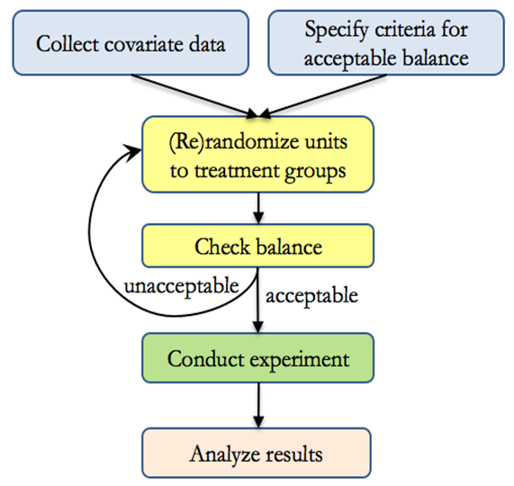

# Experimental Design

-   Randomized Control Trials (RCT) or Experiments have always been and are likely to continue in the future to be the holy grail of causal inference, because of
    -   unbiased estimates

    -   elimination of confounding factors on average (covariate imbalance is always possible. Hence, you want to do [Rerandomization] to achieve platinum standard set by [@tukey1993tightening])
-   RCT means you have two group treatment (or experimental) gorp and control group. Hence, as you introduce the treatment (your exogenous variable) to the treatment group, the only expected difference in the outcomes of the two group should be due to the treatment.
-   Subjects from the same population will be **randomly assigned** to either treatment or control group. This random assignment give us the confidence that changes in the outcome variable will be due only the treatment, not any other source (variable).
-   It can be easier for hard science to have RCT because they can introduce the treatment, and have control environments. But it's hard for social scientists because their subjects are usually human, and some treatment can be hard to introduce, or environments are uncontrollable. Hence, social scientists have to develop different tools ([Quasi-experimental]) to recover causal inference or to recreate the treatment and control group environment.
-   With RCT, you can easily establish internal validity
-   Even though random assignment is not the same thing as *ceteris paribus* (i.e., holding everything else constant), it should have the same effect (i.e., under random manipulation, *other things equal* can be observed, on average, across treatment and control groups).

**Selection Problem**

Assume we have

-   binary treatment $D_i =(0,1)$

-   outcome of interest $Y_i$ for individual $i$

    -   $Y_{0i}$ are those were **not treated**

    -   $Y_{1i}$ are those were **treated**

$$
\text{Potential Outcome} =
\begin{cases}
Y_{1i} \text{ if } D_i = 1 \\
Y_{0i} \text{ if } D_i = 0
\end{cases}
$$

Then, what we observe in the outcome variable is

$$
Y_i = Y_{0i} + (Y_{1i} - Y_{0i})D_i
$$

It's likely that $Y_{1i}$ and $Y_{0i}$ both have their own distributions (i.e., different treatment effect for different people). Since we can't see both outcomes for the same individual (unless we have a time machine), then we can only make inference regarding the average outcome of those who were treated and those who were not.

$$
\begin{aligned}
E[Y_i | D_i = 1] - E[Y_i | D_i = 0] &= (E[Y_{1i} | D_i = 1] - E[Y_{0i}|D_i = 1] ) + (E[Y_{0i} |D_i = 1] - E[Y_{0i} |D_i = 0]) \\
&= (E[Y_{1i}-Y_{0i}|D_i = 1] ) + (E[Y_{0i} |D_i = 1] - E[Y_{0i} |D_i = 0]) \\
\text{Observed difference in treatment} &= \text{Average treatment effect on the treated} + \text{Selection bias}
\end{aligned}
$$

-   **The average treatment effect** is the average between between a person who is treated and the same person (in another parallel universe) who is not treated

-   **The selection bias** is the difference between those who were treated and those who weren't treated

With **random assignment** of treatment ($D_i$) under [Experimental Design], we can have $D_i$ independent of potential outcomes

$$
\begin{aligned}
E[Y_i | D_i = 1] - E[Y_i|D_i = 0] &= E[Y_{1i}|D_i = 1]-E[Y_{0i}|D_i = 0)]\\
&= E[Y_{1i}|D_i = 1]-E[Y_{0i}|D_i = 0)] && D_i \perp Y_i \\
&= E[Y_{1i} - Y_{0i}|D_i = 1] \\
&= E[Y_{1i} - Y_{0i}]
\end{aligned}
$$

**Another representation under regression**

Suppose that you know the effect is

$$
Y_{1i} - Y_{0i} = \rho
$$

The observed outcome variable (for an individual) can be rewritten as

$$
\begin{aligned}
Y_i &= E(Y_{0i}) + (Y_{1i}-Y_{0i})D_i + [Y_{0i} - E(Y_{0i})]\\
&= \alpha + \rho D_i + \eta_i
\end{aligned}
$$

where $\eta_i$ = random variation of $Y_{0i}$

Hence, the conditional expectation of an individual outcome on treatment status is

$$
\begin{aligned}
E[Y_i |D_i = 1] &= \alpha + \rho &+ E[\eta_i |D_i = 1] \\
E[Y_i |D_i = 0] &= \alpha &+ E[\eta_i |D_i = 0]
\end{aligned}
$$

Thus,

$$
E[Y_i |D_i = 1] - E[Y_i |D_i = 0] = \rho + E[\eta_i |D_i = 1] -E[\eta_i |D_i = 0]
$$

where $E[\eta_i |D_i = 1] -E[\eta_i |D_i = 0]$ is the selection bias - correlation between the regression error term ($\eta_i$), and the regressor ($D_i$)

Under regression, we have

$$
E[\eta_i |D_i = 1] -E[\eta_i |D_i = 0] = E[Y_{0i} |D_i = 1] -E[Y_{0i}|D_i = 0]
$$

which is the difference in outcomes between **those who weren't treated get treated** and **those who weren't treated stay untreated**

Say you have control variables ($X_i$), that is **uncorrelated with the treatment** ($D_i$), then you can include in your model, and it won't (in principle) affect your estimate of the treatment effect ($\rho$) with an added benefit of reducing the residual variance, which subsequently reduces the standard error of other estimates.

$$
Y_i = \alpha + \rho D_i + X_i'\gamma + \eta_i
$$

## Notes

For outcomes with 0s, we can't use log-like transformation, because it's sensitive to outcome unit [@chen2023logs]. For info on this issue, check [Zero-valued Outcomes]. We should use:

-   **Percentage changes in the Average**: by using Poisson QMLE, we can interpret the coefficients of the effect of treatment on the treated group relative to the mean of the control group.

-   **Extensive vs. Intensive Margins**: Distinguish the treatment effect on the intensive (outcome: 10 to 11) vs. extensive margins (outcome: 0 to 1).

    -   To get the bounds for the intensive-margin, use @lee2009training (assuming that treatment has a monotonic effect on outcome)


```r
set.seed(123) # For reproducibility
library(tidyverse)

n <- 1000 # Number of observations
p_treatment <- 0.5 # Probability of being treated

# Step 1: Generate the treatment variable D
D <- rbinom(n, 1, p_treatment)

# Step 2: Generate potential outcomes
# Untreated potential outcome (mostly zeroes)
Y0 <- rnorm(n, mean = 0, sd = 1) * (runif(n) < 0.3)

# Treated potential outcome (shifting both the probability of being positive - extensive margin and its magnitude - intensive margin)
Y1 <- Y0 + rnorm(n, mean = 2, sd = 1) * (runif(n) < 0.7)

# Step 3: Combine effects based on treatment
Y_observed <- (1 - D) * Y0 + D * Y1

# Add explicit zeroes to model situations with no effect
Y_observed[Y_observed < 0] <- 0


data <-
    data.frame(
        ID = 1:n,
        Treatment = D,
        Outcome = Y_observed,
        X = rnorm(n)
    ) |>
    # whether outcome is positive
    dplyr::mutate(positive = Outcome > 0)

# Viewing the first few rows of the dataset
head(data)
#>   ID Treatment   Outcome          X positive
#> 1  1         0 0.0000000  1.4783345    FALSE
#> 2  2         1 2.2369379 -1.4067867     TRUE
#> 3  3         0 0.0000000 -1.8839721    FALSE
#> 4  4         1 3.2192276 -0.2773662     TRUE
#> 5  5         1 0.6649693  0.4304278     TRUE
#> 6  6         0 0.0000000 -0.1287867    FALSE

hist(data$Outcome)
```


-   **Percentage changes in the Average**


```r
library(fixest)
res_pois <-
    fepois(
        fml = Outcome ~ Treatment + X,
        data = data, 
        vcov = "hetero"
    )
etable(res_pois)
#>                           res_pois
#> Dependent Var.:            Outcome
#>                                   
#> Constant        -2.223*** (0.1440)
#> Treatment        2.579*** (0.1494)
#> X                  0.0235 (0.0406)
#> _______________ __________________
#> S.E. type       Heteroskedas.-rob.
#> Observations                 1,000
#> Squared Cor.               0.33857
#> Pseudo R2                  0.26145
#> BIC                        1,927.9
#> ---
#> Signif. codes: 0 '***' 0.001 '**' 0.01 '*' 0.05 '.' 0.1 ' ' 1
```

To calculate the proportional effect


```r
# proportional effect
exp(coefficients(res_pois)["Treatment"]) - 1
#> Treatment 
#>  12.17757

# SE
exp(coefficients(res_pois)["Treatment"]) *
    sqrt(res_pois$cov.scaled["Treatment", "Treatment"])
#> Treatment 
#>  1.968684
```

Hence, we conclude that the treatment effect is 1215% higher for the treated group as compared to the control group.

-   **Extensive vs. Intensive Margins**

Here, we can estimate the intensive-margin treatment effect (i.e., the treatment effect for "always-takers").


```r
res <- causalverse::lee_bounds(
    df = data,
    d = "Treatment",
    m = "positive",
    y = "Outcome",
    numdraws = 10
) |> 
    causalverse::nice_tab(2)
print(res)
#>          term estimate std.error
#> 1 Lower bound    -0.22      0.09
#> 2 Upper bound     2.77      0.14
```

Since in this case, the bounds contains 0, we can't say much about the intensive margin for always-takers.

If we aim to examine the sensitivity of always-takers, we should consider scenarios where the average outcome of compliers are $100 \times c\%$ lower or higher than that of always-takers.

We assume that $E(Y(1)|Complier) = (1-c)E(Y(1)|Always-taker)$


```r
set.seed(1)
c_values = c(.1, .5, .7)

combined_res <- bind_rows(lapply(c_values, function(c) {
    res <- causalverse::lee_bounds(
        df = data,
        d = "Treatment",
        m = "positive",
        y = "Outcome",
        numdraws = 10,
        c_at_ratio = c
    )
    
    res$c_value <- as.character(c)
    return(res)
}))

combined_res |> 
    dplyr::select(c_value, everything()) |> 
    causalverse::nice_tab()
#>   c_value           term estimate std.error
#> 1     0.1 Point estimate     6.60      0.71
#> 2     0.5 Point estimate     2.54      0.13
#> 3     0.7 Point estimate     1.82      0.08
```

-   If we assume $c = 0.1$ (i.e., under treatment, compliers would have an outcome equal to 10% of the outcome of always-takers), then the intensive-margin effect for always-takers is 6.6 more in the unit of the outcome.

-   If we assume $c = 0.5$ (i.e., under treatment, compliers would have an outcome equal to 50% of the outcome of always-takers), then the intensive-margin effect for always-takers is 2.54 more in the unit of the outcome.

## Semi-random Experiment

Chicago Open Enrollment Program [@cullen2005impact]

-   Students can apply to "choice" schools

-   Many schools are oversubscribed (Demand \> Supply)

-   Resolve scarcity via random lotteries

-   Non-random enrollment, we only have random lottery which mean the above

Let

$$
\delta_j = E(Y_i | Enroll_{ij} = 1; Apply_{ij} = 1) - E(Y_i | Enroll_{ij} = 0; Apply_{ij} = 1)
$$

and

$$
\theta_j = E(Y_i | Win_{ij} = 1; Apply_{ij} = 1) - E(Y_i | Win_{ij} = 0; Apply_{ij} = 1)
$$

Hence, we can clearly see that $\delta_j \neq \theta_j$ because you can only enroll, but you cannot ensure that you will win. Thus, **intention to treat is different from treatment effect**.

Non-random enrollment, we only have random lottery which means we can only estimate $\theta_j$

To recover the true treatment effect, we can use

$$
\delta_j = \frac{E(Y_i|W_{ij} = 1; A_{ij} = 1) - E(Y_i | W_{ij}=0; A_{ij} = 1)}{P(Enroll_{ij} = 1| W_{ij}= 1; A_{ij}=1) - P(Enroll_{ij} = 1| W_{ij}=0; A_{ij}=1)}
$$

where

-   $\delta_j$ = treatment effect

-   $W$ = Whether students win the lottery

-   $A$ = Whether student apply for the lottery

-   i = application

-   j = school

Say that we have

**10 win**

| Number students | Type          | Selection effect | Treatment effect | Total effect |
|-----------------|---------------|------------------|------------------|--------------|
| 1               | Always Takers | +0.2             | +1               | +1.2         |
| 2               | Compliers     | 0                | +1               | +1           |
| 7               | Never Takers  | -0.1             | 0                | -0.1         |

**10 lose**

| Number students | Type          | Selection effect | Treatment effect | Total effect |
|-----------------|---------------|------------------|------------------|--------------|
| 1               | Always Takers | +0.2             | +1               | +1.2         |
| 2               | Compliers     | 0                | 0                | 0            |
| 7               | Never Takers  | -0.1             | 0                | -0.1         |

Intent to treatment = Average effect of who you give option to choose

$$
\begin{aligned}
E(Y_i | W_{ij}=1; A_{ij} = 1) &= \frac{1*(1.2)+ 2*(1) + 7 * (-0.1)}{10}\\
&= 0.25
\end{aligned}
$$

$$
\begin{aligned}
E(Y_i | W_{ij}=0; A_{ij} = 1) &= \frac{1*(1.2)+ 2*(0) + 7 * (-0.1)}{10}\\
&= 0.05
\end{aligned}
$$

Hence,

$$
\begin{aligned}
\text{Intent to treatment} &= 0.25 - 0.05 = 0.2 \\
\text{Treatment effect} &= 1
\end{aligned}
$$

$$
\begin{aligned}
P(Enroll_{ij} = 1 | W_{ij} = 1; A_{ij}=1 ) &= \frac{1+2}{10} = 0.3 \\
P(Enroll_{ij} = 1 | W_{ij} = 0; A_{ij}=1 ) &= \frac{1}{10} = 0.1
\end{aligned}
$$

$$
\text{Treatment effect} = \frac{0.2}{0.3-0.1} = 1
$$

After knowing how to recover the treatment effect, we turn our attention to the main model

$$
Y_{ia} = \delta W_{ia} + \lambda L_{ia} + e_{ia}
$$

where

-   $W$ = whether a student wins a lottery

-   $L$ = whether student enrolls in the lottery

-   $\delta$ = intent to treat

Hence,

-   Conditional on lottery, the $\delta$ is valid

-   But without lottery, your $\delta$ is not random

-   Winning and losing are only identified within lottery

-   Each lottery has multiple entries. Thus, we can have within estimator

We can also include other control variables ($X_i \theta$)

$$
Y_{ia} = \delta_1 W_{ia} + \lambda_1 L_{ia} + X_i \theta + u_{ia}
$$

$$
\begin{aligned}
E(\delta) &= E(\delta_1) \\
E(\lambda) &\neq E(\lambda_1) && \text{because choosing a lottery is not random}
\end{aligned}
$$

Including $(X_i \theta)$ just shifts around control variables (i.e., reweighting of lottery), which would not affect your treatment effect $E(\delta)$

## Rerandomization

-   Since randomization only balances baseline covariates on average, imbalance in variables due to random chance can still happen.

-   In case that you have a "bad" randomization (i.e., imbalance for important baseline covariates), [@morgan2012rerandomization] introduce the idea of rerandomization.

-   Rerandomization is checking balance during the randomization process (before the experiment), to eliminate bad allocation (i.e., those with unacceptable balance).

-   The greater the number of variables, the greater the likelihood that at least one covariate would be imbalanced across treatment groups.

    -   Example: For 10 covariates, the probability of a significant difference at $\alpha = .05$ for at least one covariate is $1 - (1-.05)^{10} = 0.4 = 40\%$

-   Rerandomization increase treatment effect estimate precision if the covariates are correlated with the outcome.

    -   Improvement in precision for treatment effect estimate depends on (1) improvement in covariate balance and (2) correlation between covariates and the outcome.

-   You also need to take into account rerandomization into your analysis when making inference.

-   Rerandomization is equivalent to increasing our sample size.

-   Alternatives include

    -   Stratified randomization [@johansson2022rerandomization]

    -   Matched randomization [@greevy2004optimal; @kapelner2014matching]

    -   Minimization [@pocock1975sequential]

[{width="600" height="500"}](https://healthpolicy.usc.edu/evidence-base/rerandomization-what-is-it-and-why-should-you-use-it-for-random-assignment/)

Rerandomization Criterion

-   Acceptable randomization is based on a function of covariate matrix $\mathbf{X}$ and vector of treatment assignments $\mathbf{W}$

$$
W_i = 
\begin{cases}
1 \text{ if treated} \\
0 \text{ if control} 
\end{cases}
$$

-   Mahalanobis Distance, $M$, can be used as criteria for acceptable balance

Let $M$ be the multivariate distance between groups means

$$
\begin{aligned}
M &= (\bar{\mathbf{X}}_T - \bar{\mathbf{X}}_C)' cov(\bar{\mathbf{X}}_T - \bar{\mathbf{X}}_C)^{-1} (\bar{\mathbf{X}}_T - \bar{\mathbf{X}}_C) \\
&= (\frac{1}{n_T}+ \frac{1}{n_C})^{-1}(\bar{\mathbf{X}}_T - \bar{\mathbf{X}}_C)' cov(\mathbf{X})^{-1}(\bar{\mathbf{X}}_T - \bar{\mathbf{X}}_C)
\end{aligned}
$$

With large sample size and "pure" randomization $M \sim \chi^2_k$ where $k$ is the number of covariates to be balanced

Then let $p_a$ be the probability of accepting a randomization. Choosing appropriate $p_a$ is a tradeoff between balance and time.

Then the rule of thumb is re-randomize when $M > a$

## Two-Stage Randomized Experiments with Interference and Noncompliance

[@imai2021causal]
