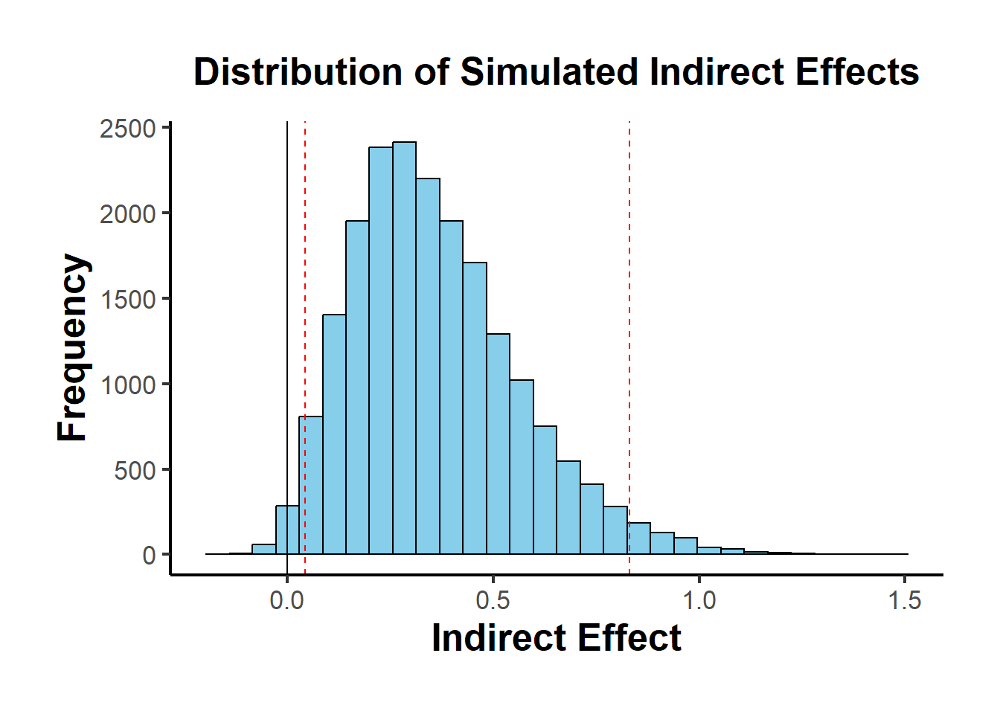

# Mediation

## Traditional Approach

The classical mediation analysis follows the approach introduced by @baron1986moderator, though it has limitations, particularly in requiring the first step ($X \to Y$) to be significant. Despite its shortcomings, this framework provides a useful foundation.

### Steps in the Traditional Mediation Model

Mediation is typically assessed through three regression models:

1.  **Total Effect**: $X \to Y$
2.  **Path** $a$: $X \to M$
3.  **Path** $b$ and Direct Effect ($c'$): $X + M \to Y$

where:

-   $X$ = independent (causal) variable
-   $Y$ = dependent (outcome) variable
-   $M$ = mediating variable

Originally, @baron1986moderator required the direct path $X \to Y$ to be significant. However, mediation can still occur even if this direct effect is not significant. For example:

-   The effect of $X$ on $Y$ might be **fully absorbed** by $M$.

-   Multiple mediators ($M_1, M_2$) with **opposing effects** could cancel each other out, leading to a non-significant direct effect.

### Graphical Representation of Mediation

#### Unmediated Model

{width="90%"}

Here, $c$ represents the **total effect** of $X$ on $Y$.

#### Mediated Model

{width="90%"}

Here:

-   $c'$ = **direct effect** (effect of $X$ on $Y$ after accounting for mediation)
-   $ab$ = **indirect effect** (mediation pathway)

Thus, we can express:

$$
\text{total effect} = \text{direct effect} + \text{indirect effect}
$$

or,

$$
c = c' + ab
$$

This equation holds under standard linear models but not necessarily in cases such as:

1.  Latent variable models
2.  Logistic regression (only an approximation)
3.  Multilevel models [@bauer2006conceptualizing]

------------------------------------------------------------------------

### Measuring Mediation

Several approaches exist for quantifying the **indirect effect** ($ab$):

1.  **Proportional Reduction Approach**:\
    $$1 - \frac{c'}{c}$$\
    *Not recommended* due to high instability, especially when $c$ is small [@mackinnon1995simulation].

2.  **Product Method**:\
    $$a \times b$$\
    The most common approach.

3.  **Difference Method**:\
    $$c - c'$$\
    Conceptually similar to the product method but less precise in small samples.

------------------------------------------------------------------------

### Assumptions in Linear Mediation Models

For valid mediation analysis, the following assumptions should hold:

1.  **No unmeasured confounders** between $X-Y$, $X-M$, and $M-Y$.
2.  **No reverse causality**: $X$ should not be influenced by a confounder ($C$) that also affects $M-Y$.
3.  **Measurement reliability**: $M$ should be measured without error (if not, consider errors-in-variables models).

------------------------------------------------------------------------

**Regression Equations for Mediation Steps**

Step 1: Total Effect of $X$ on $Y$

$$
Y = \beta_0 + cX + \epsilon
$$

-   The significance of $c$ is **not required** for mediation to occur.

Step 2: Effect of $X$ on $M$

$$
M = \alpha_0 + aX + \epsilon
$$

-   The coefficient $a$ must be significant for mediation analysis to proceed.

Step 3: Effect of $M$ on $Y$ (Including $X$)

$$
Y = \gamma_0 + c'X + bM + \epsilon
$$

-   If $c'$ becomes non-significant after including $M$, full mediation occurs.
-   If $c'$ is reduced but remains significant, partial mediation is present.

| Effect of $X$ on $Y$                            | Mediation Type    |
|-------------------------------------------------|-------------------|
| $b_4$ (from Step 3) is **insignificant**        | Full mediation    |
| $b_4 < b_1$ (from Step 1) but still significant | Partial mediation |

: Interpretation of Mediation Outcomes

------------------------------------------------------------------------

### Testing for Mediation

Several statistical tests exist to assess whether the indirect effect ($ab$) is significant:

1.  **Sobel Test** [@sobel1982asymptotic]
    -   Based on the standard error of $ab$.
    -   **Limitation**: Assumes normality of $ab$, which may not hold in small samples.
2.  **Joint Significance Test**
    -   If both $a$ and $b$ are significant, mediation is likely.
3.  **Bootstrapping (Preferred)** [@preacher2004spss, @shrout2002mediation]
    -   Estimates the confidence interval for $ab$.
    -   Does not assume normality.
    -   Recommended for small-to-moderate sample sizes.

------------------------------------------------------------------------

### Additional Considerations

-   Proximal mediation (where path $a$ exceeds path $b$) can lead to multicollinearity and reduced statistical power. In contrast, distal mediation (where path $b$ exceeds path $a$) tends to maximize power. In fact, slightly distal mediators---where $b$ is somewhat larger than $a$---often strike an ideal balance for power in mediation analyses [@hoyle1999statistical].
-   Tests of direct effects ($c$ and $c'$) generally have lower power than tests of the indirect effect ($ab$). As a result, it is possible for the indirect effect ($ab$) to be statistically significant even when the direct effect ($c$) is not. This situation can appear to indicate "complete mediation," yet the lack of a statistically significant direct effect between $X$ and $Y$ (i.e., $c'$) does not definitively rule out other possibilities [@kenny2014power].
-   Because testing $ab$ essentially combines two tests, it often provides a power advantage over testing $c'$ alone. However, using a non-significant $c'$ as the sole criterion for claiming complete mediation should be done cautiously---if at all---given the importance of adequate sample size and power. Indeed, @hayes2013relative recommend avoiding claims of complete mediation based solely on a non-significant $c'$, particularly when partial mediation may still be present.

------------------------------------------------------------------------

### Assumptions in Mediation Analysis

Valid mediation analysis requires several key assumptions, which can be categorized into **causal direction**, **interaction effects**, **measurement reliability**, and **confounding control**.

------------------------------------------------------------------------

#### Direction

-   Causal Order of Variables

-   A simple but weak solution is to measure $X$ before $M$ and $Y$ to prevent reverse causality (i.e., $M$ or $Y$ causing $X$). Similarly, measuring $M$ before $Y$ avoids feedback effects of $Y$ on $M$.

-   However, causal feedback loops between $M$ and $Y$ may still exist.

    -   If we assume full mediation ($c' = 0$), models with reciprocal causal effects between $M$ and $Y$ can be estimated using instrumental variables (IV).

    -   @smith1982beliefs suggests treating both $M$ and $Y$ as potential mediators of each other, requiring distinct instrumental variables for each to avoid cross-contamination of causal effects.

------------------------------------------------------------------------

#### Interaction Effects in Mediation

-   If $M$ interacts with $X$ in predicting $Y$, then $M$ is both a mediator and a moderator [@baron1986moderator].

-   **The interaction term** $X \times M$ should always be included in the model to account for possible moderation effects.

-   For interpreting such interactions in mediation models, see [@vanderweele2015explanation], who provides a framework for **moderated mediation** analysis.

------------------------------------------------------------------------

#### Reliability

Measurement error in any of the three key variables ($X, M, Y$) can bias estimates of mediation effects.

1.  Measurement Error in the Mediator ($M$):
    -   Biases both $b$ and $c'$.
    -   Potential solution: Model $M$ as a latent variable (reduces bias but may decrease statistical power) [@ledgerwood2011trade].
    -   Specific effects:
        -   $b$ is attenuated (biased toward 0).
        -   $c'$ is:
            -   Overestimated if $ab > 0$.
            -   Underestimated if $ab < 0$.
2.  Measurement Error in the Treatment ($X$):
    -   Biases both $a$ and $b$.
    -   Specific effects:
        -   $a$ is attenuated.
        -   $b$ is:
            -   Overestimated if $ac' > 0$.
            -   Underestimated if $ac' < 0$.
3.  Measurement Error in the Outcome ($Y$):
    -   If unstandardized, there is no bias.
    -   If standardized, there is attenuation bias (reduced effect sizes due to error variance).

------------------------------------------------------------------------

#### Confounding in Mediation Analysis

Omitted variable bias can distort any of the three core relationships ($X \to Y$, $X \to M$, $M \to Y$). Addressing confounding requires either design-based or statistical solutions.

**Design-Based Strategies (Preferred if Feasible)**

-   Randomization of the independent variable ($X$) reduces confounding bias.
-   Randomization of the mediator ($M$), if possible, further strengthens causal claims.
-   Controlling for measured confounders, though this only addresses observable confounding.

**Statistical Strategies (When Randomization is Not Possible)**

1.  Instrumental Variables Approach:
    -   Used when a confounder affects both $M$ and $Y$.
    -   Front-door adjustment can be applied if there exists a third variable that fully mediates the effect of $M$ on $Y$ while being independent of the confounder.
2.  Weighting Methods (e.g., Inverse Probability Weighting - IPW):
    -   Corrects for confounding by reweighting observations to balance confounders across treatment groups.
    -   Requires the strong ignorability assumption: All confounders must be measured and correctly specified [@westfall2016statistically].
    -   While this assumption cannot be formally tested, sensitivity analyses can help assess robustness.
    -   See [Heiss](https://www.andrewheiss.com/blog/2020/12/01/ipw-binary-continuous/) for R code on implementing IPW in mediation models.

------------------------------------------------------------------------

### Indirect Effect Tests

Testing the indirect effect ($ab$) is crucial in mediation analysis. Several methods exist, each with its advantages and limitations.

------------------------------------------------------------------------

#### Sobel Test (Delta Method)

-   Developed by @sobel1982asymptotic.
-   Also known as the delta method.
-   Not recommended because it assumes the sampling distribution of $ab$ is normal, which often does not hold [@mackinnon1995simulation].

The standard error (SE) of the indirect effect is:

$$
SE_{ab} = \sqrt{\hat{b}^2 s_{\hat{a}}^2 + \hat{a}^2 s_{\hat{b}}^2}
$$

The **Z-statistic** for testing whether $ab$ is significantly different from 0 is:

$$
z = \frac{\hat{ab}}{\sqrt{\hat{b}^2 s_{\hat{a}}^2 + \hat{a}^2 s_{\hat{b}}^2}}
$$

**Disadvantages**

-   Assumes $a$ and $b$ are independent.
-   Assumes $ab$ follows a normal distribution.
-   Poor performance in small samples.
-   Lower power and more conservative than bootstrapping.

**Special Case: Inconsistent Mediation**

-   Mediation can occur even when **direct and indirect effects** have **opposite signs**, known as **inconsistent mediation** [@mackinnon2007mediation].
-   This happens when the **mediator acts as a suppressor variable**, leading to counteracting paths.


```r
library(bda)
library(mediation)
data("boundsdata")

# Sobel Test for Mediation
bda::mediation.test(boundsdata$med, boundsdata$ttt, boundsdata$out) |>
    tibble::rownames_to_column() |>
    causalverse::nice_tab(2)
#>   rowname Sobel Aroian Goodman
#> 1 z.value  4.05   4.03    4.07
#> 2 p.value  0.00   0.00    0.00
```

------------------------------------------------------------------------

#### Joint Significance Test

-   Tests if the indirect effect is nonzero by checking whether both $a$ and $b$ are statistically significant.
-   Assumes $a \perp b$ (independence of paths).
-   Performs similarly to bootstrapping [@hayes2013relative].
-   More robust to non-normality but can be sensitive to heteroscedasticity [@fossum2023use].
-   Does not provide confidence intervals, making effect size interpretation harder.

------------------------------------------------------------------------

#### Bootstrapping (Preferred Method)

-   First applied to mediation by @bollen1990direct.
-   Uses resampling to empirically estimate the sampling distribution of the indirect effect.
-   Does not require normality assumptions or $a \perp b$ independence.
-   Works well with small samples.
-   Can handle complex models.

**Which Bootstrapping Method?**

-   **Percentile bootstrap** is preferred due to better **Type I error rates** [@tibbe2022correcting].
-   **Bias-corrected bootstrapping** can be too **liberal** (inflates Type I errors) [@fritz2012explanation].

**Special Case: Meta-Analytic Bootstrapping**

-   Bootstrapping can be applied **without raw data**, using only $a, b, var(a), var(b), cov(a,b)$ from multiple studies.


```r
# Meta-Analytic Bootstrapping for Mediation
library(causalverse)

result <- causalverse::med_ind(
    a = 0.5, 
    b = 0.7, 
    var_a = 0.04, 
    var_b = 0.05, 
    cov_ab = 0.01
)
result$plot
```



When an **instrumental variable (IV)** is available, the causal effect can be estimated more reliably. Below are visual representations.


```r
library(DiagrammeR)

# Simple Treatment-Outcome Model
grViz("
digraph {
  graph []
  node [shape = plaintext]
    X [label = 'Treatment']
    Y [label = 'Outcome']
  edge [minlen = 2]
    X->Y
  { rank = same; X; Y }
}")

# Mediation Model with an Instrument
grViz("
digraph {
  graph []
  node [shape = plaintext]
    X [label ='Treatment', shape = box]
    Y [label ='Outcome', shape = box]
    M [label ='Mediator', shape = box]
    IV [label ='Instrument', shape = box]
  edge [minlen = 2]
    IV->X
    X->M  
    M->Y 
    X->Y 
  { rank = same; X; Y; M }
}")

```

Mediation Analysis with Fixed Effects Models


```r
library(mediation)
library(fixest)

data("boundsdata")

# Step 1: Total Effect (c)
out1 <- feols(out ~ ttt, data = boundsdata)

# Step 2: Indirect Effect (a)
out2 <- feols(med ~ ttt, data = boundsdata)

# Step 3: Direct & Indirect Effect (c' & b)
out3 <- feols(out ~ med + ttt, data = boundsdata)

# Proportion of Mediation
coef(out2)['ttt'] * coef(out3)['med'] / coef(out1)['ttt'] * 100
#>      ttt 
#> 68.63609
```

Bootstrapped Mediation Analysis


```r
library(boot)
set.seed(1)

# Define the bootstrapping function
mediation_fn <- function(data, i) {
    df <- data[i,]
    
    a_path <- feols(med ~ ttt, data = df)
    a <- coef(a_path)['ttt']
    
    b_path <- feols(out ~ med + ttt, data = df)
    b <- coef(b_path)['med']
    
    cp <- coef(b_path)['ttt']
    
    # Indirect Effect (a * b)
    ind_ef <- a * b
    total_ef <- a * b + cp
    return(c(ind_ef, total_ef))
}

# Perform Bootstrapping
boot_med <- boot(boundsdata, mediation_fn, R = 100, parallel = "multicore", ncpus = 2)
boot_med 
#> 
#> ORDINARY NONPARAMETRIC BOOTSTRAP
#> 
#> 
#> Call:
#> boot(data = boundsdata, statistic = mediation_fn, R = 100, parallel = "multicore", 
#>     ncpus = 2)
#> 
#> 
#> Bootstrap Statistics :
#>       original        bias    std. error
#> t1* 0.04112035  0.0006346725 0.009539903
#> t2* 0.05991068 -0.0004462572 0.029556611

# Summary and Confidence Intervals
summary(boot_med) |> causalverse::nice_tab()
#>     R original bootBias bootSE bootMed
#> 1 100     0.04        0   0.01    0.04
#> 2 100     0.06        0   0.03    0.06

# Confidence Intervals (percentile bootstrap preferred)
boot.ci(boot_med, type = c("norm", "perc"))
#> BOOTSTRAP CONFIDENCE INTERVAL CALCULATIONS
#> Based on 100 bootstrap replicates
#> 
#> CALL : 
#> boot.ci(boot.out = boot_med, type = c("norm", "perc"))
#> 
#> Intervals : 
#> Level      Normal             Percentile     
#> 95%   ( 0.0218,  0.0592 )   ( 0.0249,  0.0623 )  
#> Calculations and Intervals on Original Scale
#> Some percentile intervals may be unstable

# Point Estimates (Indirect and Total Effects)
colMeans(boot_med$t)
#> [1] 0.04175502 0.05946442
```

Alternatively, use the `robmed` package for **robust** mediation analysis:


```r
library(robmed)
```

### Power Analysis for Mediation

To assess whether the study has sufficient **power** to detect mediation effects, use:


```r
library(pwr2ppl)

# Power analysis for the indirect effect (ab path)
medjs(
    rx1m1 = .3,  # Correlation: X → M (path a)
    rx1y  = .1,  # Correlation: X → Y (path c')
    rym1  = .3,  # Correlation: M → Y (path b)
    n     = 100, # Sample size
    alpha = 0.05,
    mvars = 1,   # Number of mediators
    rep   = 1000 # Replications (use 10,000 for accuracy)
)
```

For **interactive** power analysis, see [Kenny's Mediation Power App](https://davidakenny.shinyapps.io/MedPower/).

**Summary of Indirect Effect Tests**

| **Test**                        | **Pros**                                       | **Cons**                         |
|---------------------|-----------------------------|----------------------|
| **Sobel Test**                  | Simple, fast                                   | Assumes normality, low power     |
| **Joint Significance Test**     | Robust to non-normality                        | No confidence interval           |
| **Bootstrapping** (Recommended) | No normality assumption, handles small samples | May be liberal if bias-corrected |

### Multiple Mediation Analysis

In some cases, a single mediator ($M$) does not fully capture the indirect effect of $X$ on $Y$. Multiple mediation models extend traditional mediation by including two or more mediators, allowing us to examine how multiple pathways contribute to an outcome.

------------------------------------------------------------------------

Several R packages handle multiple mediation models:

-   **manymome**: A flexible package for multiple mediation modeling.
    -   [Vignette](https://cran.r-project.org/web/packages/manymome/vignettes/med_lm.html)


```r
library(manymome)
```

-   **mma**: Used for multiple mediator models.

    -   [Package PDF](https://cran.r-project.org/web/packages/mma/mma.pdf)

    -   [Vignette](https://cran.r-project.org/web/packages/mma/vignettes/MMAvignette.html)


```r
library(mma)
```

#### Multiple Mediators: Structural Equation Modeling Approach

A popular method for estimating multiple mediation models is **Structural Equation Modeling** using **lavaan**.

To test multiple mediation, we first **simulate data** where two mediators ($M_1$ and $M_2$) contribute to the outcome ($Y$).


```r
# Load required packages
library(MASS)  # For mvrnorm (generating correlated errors)
library(lavaan)

# Function to generate synthetic data
generate_data <- function(n = 10000, a1 = 0.5, a2 = -0.35, 
                          b1 = 0.7, b2 = 0.48, 
                          corr = TRUE, correlation_value = 0.7) {
    set.seed(12345)
    X <- rnorm(n)  # Independent variable
    
    # Generate correlated errors for mediators
    if (corr) {
        Sigma <- matrix(c(1, correlation_value, correlation_value, 1), nrow = 2)
        errors <- mvrnorm(n, mu = c(0, 0), Sigma = Sigma) 
    } else {
        errors <- mvrnorm(n, mu = c(0, 0), Sigma = diag(2)) 
    }
    
    M1 <- a1 * X + errors[, 1]
    M2 <- a2 * X + errors[, 2]
    Y  <- b1 * M1 + b2 * M2 + rnorm(n)  # Outcome variable

    return(data.frame(X = X, M1 = M1, M2 = M2, Y = Y))
}
```

We analyze the indirect effects through both mediators ($M_1$ and $M_2$).

1.  Correctly Modeling Correlated Mediators


```r
# Generate data with correlated mediators
Data_corr <- generate_data(n = 10000, corr = TRUE, correlation_value = 0.7)

# Define SEM model for multiple mediation
model_corr <- '
  Y ~ b1 * M1 + b2 * M2 + c * X
  M1 ~ a1 * X
  M2 ~ a2 * X
  M1 ~~ M2  # Correlated mediators (modeling correlation correctly)
'

# Fit SEM model
fit_corr <- sem(model_corr, data = Data_corr)

# Extract parameter estimates
parameterEstimates(fit_corr)[, c("lhs", "rhs", "est", "se", "pvalue")]
#>    lhs rhs    est    se pvalue
#> 1    Y  M1  0.700 0.014  0.000
#> 2    Y  M2  0.487 0.014  0.000
#> 3    Y   X -0.009 0.015  0.545
#> 4   M1   X  0.519 0.010  0.000
#> 5   M2   X -0.340 0.010  0.000
#> 6   M1  M2  0.677 0.012  0.000
#> 7    Y   Y  0.975 0.014  0.000
#> 8   M1  M1  0.973 0.014  0.000
#> 9   M2  M2  0.982 0.014  0.000
#> 10   X   X  1.000 0.000     NA
```

2\. Incorrectly Ignoring Correlation Between Mediators


```r
# Define SEM model without modeling mediator correlation
model_uncorr <- '
  Y ~ b1 * M1 + b2 * M2 + c * X
  M1 ~ a1 * X
  M2 ~ a2 * X
'

# Fit incorrect model
fit_uncorr <- sem(model_uncorr, data = Data_corr)

# Compare parameter estimates
parameterEstimates(fit_uncorr)[, c("lhs", "rhs", "est", "se", "pvalue")]
#>   lhs rhs    est    se pvalue
#> 1   Y  M1  0.700 0.010  0.000
#> 2   Y  M2  0.487 0.010  0.000
#> 3   Y   X -0.009 0.012  0.443
#> 4  M1   X  0.519 0.010  0.000
#> 5  M2   X -0.340 0.010  0.000
#> 6   Y   Y  0.975 0.014  0.000
#> 7  M1  M1  0.973 0.014  0.000
#> 8  M2  M2  0.982 0.014  0.000
#> 9   X   X  1.000 0.000     NA
```

**Comparison of Model Fits**

To check whether modeling correlation matters, we compare AIC and RMSEA.


```r
# Extract model fit statistics
fit_measures <- function(fit) {
  fitMeasures(fit, c("aic", "bic", "rmsea", "chisq"))
}

# Compare model fits
fit_measures(fit_corr)  # Correct model (correlated mediators)
#>      aic      bic    rmsea    chisq 
#> 77932.45 77997.34     0.00     0.00
fit_measures(fit_uncorr)  # Incorrect model (ignores correlation)
#>       aic       bic     rmsea     chisq 
#> 84453.208 84510.891     0.808  6522.762
```

-   If AIC and RMSEA are lower in the correlated model, it suggests that accounting for correlated errors improves fit.

After fitting the model, we assess:

1.  **Direct Effect**: The effect of $X$ on $Y$ **after accounting for both mediators** ($c'$).

2.  **Indirect Effects**:

    -   $a_1 \times b_1$: Effect of $X \to M_1 \to Y$.

    -   $a_2 \times b_2$: Effect of $X \to M_2 \to Y$.

3.  **Total Effect**: Sum of direct and indirect effects.


```r
# Extract indirect and direct effects
parameterEstimates(fit_corr, standardized = TRUE)
#>    lhs op rhs label    est    se       z pvalue ci.lower ci.upper std.lv
#> 1    Y  ~  M1    b1  0.700 0.014  50.489  0.000    0.673    0.727  0.700
#> 2    Y  ~  M2    b2  0.487 0.014  35.284  0.000    0.460    0.514  0.487
#> 3    Y  ~   X     c -0.009 0.015  -0.606  0.545   -0.038    0.020 -0.009
#> 4   M1  ~   X    a1  0.519 0.010  52.563  0.000    0.499    0.538  0.519
#> 5   M2  ~   X    a2 -0.340 0.010 -34.314  0.000   -0.360   -0.321 -0.340
#> 6   M1 ~~  M2        0.677 0.012  56.915  0.000    0.654    0.700  0.677
#> 7    Y ~~   Y        0.975 0.014  70.711  0.000    0.948    1.002  0.975
#> 8   M1 ~~  M1        0.973 0.014  70.711  0.000    0.946    1.000  0.973
#> 9   M2 ~~  M2        0.982 0.014  70.711  0.000    0.955    1.010  0.982
#> 10   X ~~   X        1.000 0.000      NA     NA    1.000    1.000  1.000
#>    std.all std.nox
#> 1    0.528   0.528
#> 2    0.345   0.345
#> 3   -0.006  -0.006
#> 4    0.465   0.465
#> 5   -0.325  -0.325
#> 6    0.692   0.692
#> 7    0.447   0.447
#> 8    0.784   0.784
#> 9    0.895   0.895
#> 10   1.000   1.000
```

If $c'$ is reduced (but still significant), we have partial mediation. If $c' \approx 0$, it suggests full mediation.


```r
# Load required packages
library(MASS)  # for mvrnorm
library(lavaan)

# Function to generate synthetic data with correctly correlated errors for mediators
generate_data <-
  function(n = 10000,
           a1 = 0.5,
           a2 = -0.35,
           b1 = 0.7,
           b2 = 0.48,
           corr = TRUE,
           correlation_value = 0.7) {
    set.seed(12345)
    X <- rnorm(n)
    
    # Generate correlated errors using a multivariate normal distribution
    if (corr) {
        Sigma <- matrix(c(1, correlation_value, correlation_value, 1), nrow = 2)  # Higher covariance matrix for errors
        errors <- mvrnorm(n, mu = c(0, 0), Sigma = Sigma)  # Generate correlated errors
    } else {
        errors <- mvrnorm(n, mu = c(0, 0), Sigma = diag(2))  # Independent errors
    }
    
    M1 <- a1 * X + errors[, 1]
    M2 <- a2 * X + errors[, 2]
    Y <- b1 * M1 + b2 * M2 + rnorm(n)  # Y depends on M1 and M2
    
    data.frame(X = X, M1 = M1, M2 = M2, Y = Y)
}

# Ground truth for comparison
ground_truth <- data.frame(Parameter = c("b1", "b2"), GroundTruth = c(0.7, 0.48))

# Function to extract relevant estimates, standard errors, and model fit
extract_estimates_b1_b2 <- function(fit) {
    estimates <- parameterEstimates(fit)
    estimates <- estimates[estimates$lhs == "Y" & estimates$rhs %in% c("M1", "M2"), c("rhs", "est", "se")]
    estimates$Parameter <- ifelse(estimates$rhs == "M1", "b1", "b2")
    estimates <- estimates[, c("Parameter", "est", "se")]
    fit_stats <- fitMeasures(fit, c("aic", "bic", "rmsea", "chisq"))
    return(list(estimates = estimates, fit_stats = fit_stats))
}

# Case 1: Correlated errors for mediators (modeled correctly)
Data_corr <- generate_data(n = 10000, corr = TRUE, correlation_value = 0.7)
model_corr <- '
  Y ~ b1 * M1 + b2 * M2 + c * X
  M1 ~ a1 * X
  M2 ~ a2 * X
  M1 ~~ M2  # Correlated mediators (errors)
'
fit_corr <- sem(model = model_corr, data = Data_corr)
results_corr <- extract_estimates_b1_b2(fit_corr)

# Case 2: Uncorrelated errors for mediators (modeled correctly)
Data_uncorr <- generate_data(n = 10000, corr = FALSE)
model_uncorr <- '
  Y ~ b1 * M1 + b2 * M2 + c * X
  M1 ~ a1 * X
  M2 ~ a2 * X
'
fit_uncorr <- sem(model = model_uncorr, data = Data_uncorr)
results_uncorr <- extract_estimates_b1_b2(fit_uncorr)

# Case 3: Correlated errors, but not modeled as correlated
fit_corr_incorrect <- sem(model = model_uncorr, data = Data_corr)
results_corr_incorrect <- extract_estimates_b1_b2(fit_corr_incorrect)

# Case 4: Uncorrelated errors, but modeled as correlated
fit_uncorr_incorrect <- sem(model = model_corr, data = Data_uncorr)
results_uncorr_incorrect <- extract_estimates_b1_b2(fit_uncorr_incorrect)

# Combine all estimates for comparison
estimates_combined <- list(
    "Correlated (Correct)" = results_corr$estimates,
    "Uncorrelated (Correct)" = results_uncorr$estimates,
    "Correlated (Incorrect)" = results_corr_incorrect$estimates,
    "Uncorrelated (Incorrect)" = results_uncorr_incorrect$estimates
)

# Combine all into a single table
comparison_table <- do.call(rbind, lapply(names(estimates_combined), function(case) {
    df <- estimates_combined[[case]]
    df$Case <- case
    df
}))

# Merge with ground truth for final comparison
comparison_table <- merge(comparison_table, ground_truth, by = "Parameter")

# Display the comparison table
comparison_table
#>   Parameter       est          se                     Case GroundTruth
#> 1        b1 0.7002984 0.013870433     Correlated (Correct)        0.70
#> 2        b1 0.6973612 0.009859426   Uncorrelated (Correct)        0.70
#> 3        b1 0.7002984 0.010010367   Correlated (Incorrect)        0.70
#> 4        b1 0.6973612 0.009859634 Uncorrelated (Incorrect)        0.70
#> 5        b2 0.4871118 0.013805615     Correlated (Correct)        0.48
#> 6        b2 0.4868318 0.010009908   Uncorrelated (Correct)        0.48
#> 7        b2 0.4871118 0.009963588   Correlated (Incorrect)        0.48
#> 8        b2 0.4868318 0.010010119 Uncorrelated (Incorrect)        0.48

# Display model fit statistics for each case
fit_stats_combined <- list(
    "Correlated (Correct)" = results_corr$fit_stats,
    "Uncorrelated (Correct)" = results_uncorr$fit_stats,
    "Correlated (Incorrect)" = results_corr_incorrect$fit_stats,
    "Uncorrelated (Incorrect)" = results_uncorr_incorrect$fit_stats
)

fit_stats_combined
#> $`Correlated (Correct)`
#>      aic      bic    rmsea    chisq 
#> 77932.45 77997.34     0.00     0.00 
#> 
#> $`Uncorrelated (Correct)`
#>       aic       bic     rmsea     chisq 
#> 84664.312 84721.995     0.000     0.421 
#> 
#> $`Correlated (Incorrect)`
#>       aic       bic     rmsea     chisq 
#> 84453.208 84510.891     0.808  6522.762 
#> 
#> $`Uncorrelated (Incorrect)`
#>      aic      bic    rmsea    chisq 
#> 84665.89 84730.78     0.00     0.00
```

### Multiple Treatments in Mediation

In some cases, **multiple independent variables** ($X_1$, $X_2$) influence the same mediators. This is called **multiple treatments mediation** [@hayes2014statistical].

For an example in **PROCESS (SPSS/R)**, see:\
[Process Mediation with Multiple Treatments](https://core.ecu.edu/wuenschk/MV/multReg/Mediation_Multicategorical.pdf).

## Causal Inference Approach to Mediation

Traditional mediation models assume that regression-based estimates provide valid causal inference. However, **causal mediation analysis** (CMA) extends beyond traditional models by explicitly defining mediation in terms of **potential outcomes and counterfactuals**.

------------------------------------------------------------------------

### Example: Traditional Mediation Analysis {#sec-example-traditional-mediation-analysis}

We begin with a classic **three-step mediation approach**.


```r
# Load data
myData <- read.csv("data/mediationData.csv")

# Step 1 (Total Effect: X → Y) [No longer required]
model.0 <- lm(Y ~ X, data = myData)
summary(model.0)
#> 
#> Call:
#> lm(formula = Y ~ X, data = myData)
#> 
#> Residuals:
#>     Min      1Q  Median      3Q     Max 
#> -5.0262 -1.2340 -0.3282  1.5583  5.1622 
#> 
#> Coefficients:
#>             Estimate Std. Error t value Pr(>|t|)    
#> (Intercept)   2.8572     0.6932   4.122 7.88e-05 ***
#> X             0.3961     0.1112   3.564 0.000567 ***
#> ---
#> Signif. codes:  0 '***' 0.001 '**' 0.01 '*' 0.05 '.' 0.1 ' ' 1
#> 
#> Residual standard error: 1.929 on 98 degrees of freedom
#> Multiple R-squared:  0.1147,	Adjusted R-squared:  0.1057 
#> F-statistic:  12.7 on 1 and 98 DF,  p-value: 0.0005671

# Step 2 (Effect of X on M)
model.M <- lm(M ~ X, data = myData)
summary(model.M)
#> 
#> Call:
#> lm(formula = M ~ X, data = myData)
#> 
#> Residuals:
#>     Min      1Q  Median      3Q     Max 
#> -4.3046 -0.8656  0.1344  1.1344  4.6954 
#> 
#> Coefficients:
#>             Estimate Std. Error t value Pr(>|t|)    
#> (Intercept)  1.49952    0.58920   2.545   0.0125 *  
#> X            0.56102    0.09448   5.938 4.39e-08 ***
#> ---
#> Signif. codes:  0 '***' 0.001 '**' 0.01 '*' 0.05 '.' 0.1 ' ' 1
#> 
#> Residual standard error: 1.639 on 98 degrees of freedom
#> Multiple R-squared:  0.2646,	Adjusted R-squared:  0.2571 
#> F-statistic: 35.26 on 1 and 98 DF,  p-value: 4.391e-08

# Step 3 (Effect of M on Y, controlling for X)
model.Y <- lm(Y ~ X + M, data = myData)
summary(model.Y)
#> 
#> Call:
#> lm(formula = Y ~ X + M, data = myData)
#> 
#> Residuals:
#>     Min      1Q  Median      3Q     Max 
#> -3.7631 -1.2393  0.0308  1.0832  4.0055 
#> 
#> Coefficients:
#>             Estimate Std. Error t value Pr(>|t|)    
#> (Intercept)   1.9043     0.6055   3.145   0.0022 ** 
#> X             0.0396     0.1096   0.361   0.7187    
#> M             0.6355     0.1005   6.321 7.92e-09 ***
#> ---
#> Signif. codes:  0 '***' 0.001 '**' 0.01 '*' 0.05 '.' 0.1 ' ' 1
#> 
#> Residual standard error: 1.631 on 97 degrees of freedom
#> Multiple R-squared:  0.373,	Adjusted R-squared:  0.3601 
#> F-statistic: 28.85 on 2 and 97 DF,  p-value: 1.471e-10

# Step 4: Bootstrapping for ACME
library(mediation)
results <-
    mediate(
        model.M,
        model.Y,
        treat = 'X',
        mediator = 'M',
        boot = TRUE,
        sims = 500
    )
summary(results)
#> 
#> Causal Mediation Analysis 
#> 
#> Nonparametric Bootstrap Confidence Intervals with the Percentile Method
#> 
#>                Estimate 95% CI Lower 95% CI Upper p-value    
#> ACME             0.3565       0.2119         0.51  <2e-16 ***
#> ADE              0.0396      -0.1750         0.28   0.760    
#> Total Effect     0.3961       0.1743         0.64   0.004 ** 
#> Prop. Mediated   0.9000       0.5042         1.94   0.004 ** 
#> ---
#> Signif. codes:  0 '***' 0.001 '**' 0.01 '*' 0.05 '.' 0.1 ' ' 1
#> 
#> Sample Size Used: 100 
#> 
#> 
#> Simulations: 500
```

-   **Total Effect**: $\hat{c} = 0.3961$ → effect of $X$ on $Y$ **without** controlling for $M$.
-   **Direct Effect (ADE)**: $\hat{c'} = 0.0396$ → effect of $X$ on $Y$ **after** accounting for $M$.
-   **ACME (Average Causal Mediation Effect)**:
    -   ACME = $\hat{c} - \hat{c'} = 0.3961 - 0.0396 = 0.3565$

    -   Equivalent to **product of paths**: $\hat{a} \times \hat{b} = 0.56102 \times 0.6355 = 0.3565$.

These calculations do not rely on strong causal assumptions. For a causal interpretation, we need a more rigorous framework.

### Two Approaches in Causal Mediation Analysis

The `mediation` package [@imai2010general, @imai2010identification] enables **causal mediation analysis**. It supports two inference types:

1.  **Model-Based Inference**

    -   Assumptions:

        -   Treatment is randomized (or approximated via matching).

        -   Sequential Ignorability: No unobserved confounding in:

            1.  Treatment → Mediator

            2.  Treatment → Outcome

            3.  Mediator → Outcome

        -   This assumption is hard to justify in observational studies.

2.  **Design-Based Inference**

    -   Relies on experimental design to isolate the causal mechanism.

**Notation**

We follow the standard potential outcomes framework:

-   $M_i(t)$ = mediator under treatment condition $t$

-   $T_i \in {0,1}$ = treatment assignment

-   $Y_i(t, m)$ = outcome under treatment $t$ and mediator value $m$

-   $X_i$ = observed pre-treatment covariates

The **treatment effect** for an individual $i$: $$
\tau_i = Y_i(1,M_i(1)) - Y_i (0,M_i(0))
$$ which decomposes into:

1.  **Causal Mediation Effect (ACME)**:

$$
\delta_i (t) = Y_i (t,M_i(1)) - Y_i(t,M_i(0))
$$

2.  **Direct Effect (ADE)**:

$$
\zeta_i (t) = Y_i (1, M_i(1)) - Y_i(0, M_i(0))
$$

Summing up:

$$
\tau_i = \delta_i (t) + \zeta_i (1-t)
$$

**Sequential Ignorability Assumption**

For CMA to be valid, we assume:

$$
\begin{aligned}
\{ Y_i (t', m), M_i (t) \} &\perp T_i |X_i = x\\
Y_i(t',m) &\perp M_i(t) | T_i = t, X_i = x
\end{aligned}
$$

-   First condition is the standard strong ignorability condition where treatment assignment is random conditional on pre-treatment confounders.

-   Second condition is stronger where the mediators is also random given the observed treatment and pre-treatment confounders. This condition is satisfied only when there is no unobserved pre-treatment confounders, and post-treatment confounders, and multiple mediators that are correlated.

**Key Challenge**

⚠️ **Sequential Ignorability is not testable.** Researchers should conduct **sensitivity analysis**.

We now fit a **causal mediation model** using `mediation`.


```r
library(mediation)
set.seed(2014)
data("framing", package = "mediation")

# Step 1: Fit mediator model (M ~ T, X)
med.fit <-
    lm(emo ~ treat + age + educ + gender + income, data = framing)

# Step 2: Fit outcome model (Y ~ M, T, X)
out.fit <-
    glm(
        cong_mesg ~ emo + treat + age + educ + gender + income,
        data = framing,
        family = binomial("probit")
    )

# Step 3: Causal Mediation Analysis (Quasi-Bayesian)
med.out <-
    mediate(
        med.fit,
        out.fit,
        treat = "treat",
        mediator = "emo",
        robustSE = TRUE,
        sims = 100
    )  # Use sims = 10000 in practice
summary(med.out)
#> 
#> Causal Mediation Analysis 
#> 
#> Quasi-Bayesian Confidence Intervals
#> 
#>                          Estimate 95% CI Lower 95% CI Upper p-value    
#> ACME (control)             0.0791       0.0351         0.15  <2e-16 ***
#> ACME (treated)             0.0804       0.0367         0.16  <2e-16 ***
#> ADE (control)              0.0206      -0.0976         0.12    0.70    
#> ADE (treated)              0.0218      -0.1053         0.12    0.70    
#> Total Effect               0.1009      -0.0497         0.23    0.14    
#> Prop. Mediated (control)   0.6946      -6.3109         3.68    0.14    
#> Prop. Mediated (treated)   0.7118      -5.7936         3.50    0.14    
#> ACME (average)             0.0798       0.0359         0.15  <2e-16 ***
#> ADE (average)              0.0212      -0.1014         0.12    0.70    
#> Prop. Mediated (average)   0.7032      -6.0523         3.59    0.14    
#> ---
#> Signif. codes:  0 '***' 0.001 '**' 0.01 '*' 0.05 '.' 0.1 ' ' 1
#> 
#> Sample Size Used: 265 
#> 
#> 
#> Simulations: 100
```

**Alternative: Nonparametric Bootstrap**


```r
med.out <-
    mediate(
        med.fit,
        out.fit,
        boot = TRUE,
        treat = "treat",
        mediator = "emo",
        sims = 100,
        boot.ci.type = "bca"
    )
summary(med.out)
#> 
#> Causal Mediation Analysis 
#> 
#> Nonparametric Bootstrap Confidence Intervals with the BCa Method
#> 
#>                          Estimate 95% CI Lower 95% CI Upper p-value    
#> ACME (control)             0.0848       0.0424         0.14  <2e-16 ***
#> ACME (treated)             0.0858       0.0410         0.14  <2e-16 ***
#> ADE (control)              0.0117      -0.0726         0.13    0.58    
#> ADE (treated)              0.0127      -0.0784         0.14    0.58    
#> Total Effect               0.0975       0.0122         0.25    0.06 .  
#> Prop. Mediated (control)   0.8698       1.7460       151.20    0.06 .  
#> Prop. Mediated (treated)   0.8804       1.6879       138.91    0.06 .  
#> ACME (average)             0.0853       0.0434         0.14  <2e-16 ***
#> ADE (average)              0.0122      -0.0756         0.14    0.58    
#> Prop. Mediated (average)   0.8751       1.7170       145.05    0.06 .  
#> ---
#> Signif. codes:  0 '***' 0.001 '**' 0.01 '*' 0.05 '.' 0.1 ' ' 1
#> 
#> Sample Size Used: 265 
#> 
#> 
#> Simulations: 100
```

If we suspect **moderation**, we include an **interaction term**.


```r
med.fit <-
    lm(emo ~ treat + age + educ + gender + income, data = framing)

out.fit <-
    glm(
        cong_mesg ~ emo * treat + age + educ + gender + income,
        data = framing,
        family = binomial("probit")
    )

med.out <-
    mediate(
        med.fit,
        out.fit,
        treat = "treat",
        mediator = "emo",
        robustSE = TRUE,
        sims = 100
    )

summary(med.out)
#> 
#> Causal Mediation Analysis 
#> 
#> Quasi-Bayesian Confidence Intervals
#> 
#>                           Estimate 95% CI Lower 95% CI Upper p-value    
#> ACME (control)             0.07417      0.02401         0.14  <2e-16 ***
#> ACME (treated)             0.09496      0.02702         0.16  <2e-16 ***
#> ADE (control)             -0.01353     -0.11855         0.11    0.76    
#> ADE (treated)              0.00726     -0.11007         0.11    0.90    
#> Total Effect               0.08143     -0.05646         0.19    0.26    
#> Prop. Mediated (control)   0.64510    -14.31243         3.13    0.26    
#> Prop. Mediated (treated)   0.98006    -17.83202         4.01    0.26    
#> ACME (average)             0.08457      0.02738         0.15  <2e-16 ***
#> ADE (average)             -0.00314     -0.11457         0.12    1.00    
#> Prop. Mediated (average)   0.81258    -16.07223         3.55    0.26    
#> ---
#> Signif. codes:  0 '***' 0.001 '**' 0.01 '*' 0.05 '.' 0.1 ' ' 1
#> 
#> Sample Size Used: 265 
#> 
#> 
#> Simulations: 100
test.TMint(med.out, conf.level = .95)  # Tests for interaction effect
#> 
#> 	Test of ACME(1) - ACME(0) = 0
#> 
#> data:  estimates from med.out
#> ACME(1) - ACME(0) = 0.020796, p-value = 0.3
#> alternative hypothesis: true ACME(1) - ACME(0) is not equal to 0
#> 95 percent confidence interval:
#>  -0.01757310  0.07110837
```

Since **sequential ignorability** is untestable, we examine how unmeasured confounding affects ACME estimates.


```r
# Load required package
library(mediation)

# Simulate some example data
set.seed(123)
n <- 100
data <- data.frame(
  treat = rbinom(n, 1, 0.5),       # Binary treatment
  med = rnorm(n),                   # Continuous mediator
  outcome = rnorm(n)                 # Continuous outcome
)

# Fit the mediator model (med ~ treat)
med_model <- lm(med ~ treat, data = data)

# Fit the outcome model (outcome ~ treat + med)
outcome_model <- lm(outcome ~ treat + med, data = data)

# Perform mediation analysis
med_out <- mediate(med_model, 
                   outcome_model, 
                   treat = "treat", 
                   mediator = "med", 
                   sims = 100)

# Conduct sensitivity analysis
sens_out <- medsens(med_out, sims = 100)

# Print and plot results
summary(sens_out)
#> 
#> Mediation Sensitivity Analysis for Average Causal Mediation Effect
#> 
#> Sensitivity Region
#> 
#>        Rho    ACME 95% CI Lower 95% CI Upper R^2_M*R^2_Y* R^2_M~R^2_Y~
#>  [1,] -0.9 -0.6194      -1.3431       0.1043         0.81       0.7807
#>  [2,] -0.8 -0.3898      -0.8479       0.0682         0.64       0.6168
#>  [3,] -0.7 -0.2790      -0.6096       0.0516         0.49       0.4723
#>  [4,] -0.6 -0.2067      -0.4552       0.0418         0.36       0.3470
#>  [5,] -0.5 -0.1525      -0.3406       0.0355         0.25       0.2409
#>  [6,] -0.4 -0.1083      -0.2487       0.0321         0.16       0.1542
#>  [7,] -0.3 -0.0700      -0.1723       0.0323         0.09       0.0867
#>  [8,] -0.2 -0.0354      -0.1097       0.0389         0.04       0.0386
#>  [9,] -0.1 -0.0028      -0.0648       0.0591         0.01       0.0096
#> [10,]  0.0  0.0287      -0.0416       0.0990         0.00       0.0000
#> [11,]  0.1  0.0603      -0.0333       0.1538         0.01       0.0096
#> [12,]  0.2  0.0928      -0.0317       0.2173         0.04       0.0386
#> [13,]  0.3  0.1275      -0.0333       0.2882         0.09       0.0867
#> [14,]  0.4  0.1657      -0.0369       0.3684         0.16       0.1542
#> [15,]  0.5  0.2100      -0.0422       0.4621         0.25       0.2409
#> [16,]  0.6  0.2642      -0.0495       0.5779         0.36       0.3470
#> [17,]  0.7  0.3364      -0.0601       0.7329         0.49       0.4723
#> [18,]  0.8  0.4473      -0.0771       0.9717         0.64       0.6168
#> [19,]  0.9  0.6768      -0.1135       1.4672         0.81       0.7807
#> 
#> Rho at which ACME = 0: -0.1
#> R^2_M*R^2_Y* at which ACME = 0: 0.01
#> R^2_M~R^2_Y~ at which ACME = 0: 0.0096
plot(sens_out)
```


-   If ACME confidence intervals contain 0, the effect is not robust to confounding.

Alternatively, using $R^2$ interpretation, we need to specify the direction of confounder that affects the mediator and outcome variables in `plot` using `sign.prod = "positive"` (i.e., same direction) or `sign.prod = "negative"` (i.e., opposite direction).


```r
plot(sens.out, sens.par = "R2", r.type = "total", sign.prod = "positive")
```

**Summary: Causal Mediation vs. Traditional Mediation**

| **Aspect**                | **Traditional Mediation** | **Causal Mediation**         |
|-----------------------|-----------------------|--------------------------|
| **Model Assumption**      | Linear regressions        | Potential outcomes framework |
| **Assumptions Needed**    | No omitted confounders    | Sequential ignorability      |
| **Inference Method**      | Product of coefficients   | Counterfactual reasoning     |
| **Bootstrapping?**        | Common                    | Essential                    |
| **Sensitivity Analysis?** | Rarely used               | Strongly recommended         |
