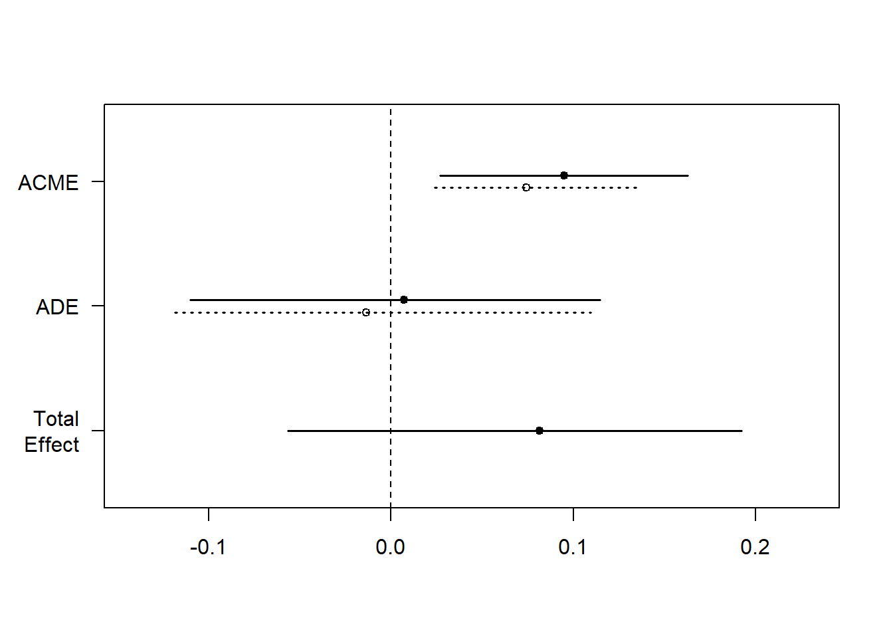

# Mediation

## Traditional Approach

@baron1986moderator is outdated because of step 1, but we could still see the original idea.

3 regressions

-   Step 1: $X \to Y$

-   Step 2: $X \to M$

-   Step 3: $X + M \to Y$

where

-   $X$ = independent (causal) variable

-   $Y$ = dependent (outcome) variable

-   $M$ = mediating variable

**Note**: Originally, the first path from $X \to Y$ suggested by [@baron1986moderator] needs to be significant. But there are cases in which you could have indirect of $X$ on $Y$ without significant direct effect of $X$ on $Y$ (e.g., when the effect is absorbed into M, or there are two counteracting effects $M_1, M_2$ that cancel out each other effect).

{width="90%"}

where $c$ is the **total effect**

{width="90%"}

where

-   $c'$ = **direct effect** (effect of $X$ on $Y$ after accounting for the indirect path)

-   $ab$ = **indirect effect**

Hence,

$$
\begin{aligned}
\text{total effect} &= \text{direct effect} + \text{indirect effect} \\
c &= c' + ab
\end{aligned}
$$

However, this simple equation does not only hold in cases of

1.  Models with latent variables
2.  Logistic models (only approximately). Hence, you can only calculate $c$ as the total effect of $c' + ab$
3.  Multi-level models [@bauer2006conceptualizing]

To measure mediation (i.e., indirect effect),

1.  $1 - \frac{c'}{c}$ highly unstable [@mackinnon1995simulation], especially in cases that $c$ is small (not re\* recommended)
2.  **Product method**: $a\times b$
3.  **Difference method**: $c- c'$

For linear models, we have the following assumptions:

1.  No unmeasured confound between $X-Y$, $X-M$ and $M-Y$ relationships.

2.  $X \not\rightarrow C$ where $C$ is a confounder between $M-Y$ relationship

3.  [Reliability]: No errors in measurement of $M$ (also known as reliability assumption) (can consider errors-in-variables models)

Mathematically,

$$
Y = b_0 + b_1 X + \epsilon
$$

$b_1$ does **not** need to be **significant**.

2.  We examine the effect of $X$ on $M$. This step requires that there is a significant effect of $X$ on $M$ to continue with the analysis

Mathematically,

$$
M = b_0 + b_2 X + \epsilon
$$

where $b_2$ needs to be **significant**.

3.  In this step, we want to the effect of $M$ on $Y$ "absorbs" most of the direct effect of $X$ on $Y$ (or at least makes the effect smaller).

Mathematically,

$$
Y = b_0 + b_4 X + b_3 M + \epsilon
$$

$b_4$ needs to be either smaller or insignificant.

| The effect of $X$ on $Y$                    | then, $M$ ... mediates between $X$ and $Y$ |
|------------------------------------|------------------------------------|
| completely disappear ($b_4$ insignificant)  | Fully (i.e., full mediation)               |
| partially disappear ($b_4 < b_1$ in step 1) | Partially (i.e., partial mediation)        |

4.  Examine the mediation effect (i.e., whether it is significant)

-   [Sobel Test] [@sobel1982asymptotic]

-   [Joint Significance Test]

-   [Bootstrapping] [@preacher2004spss, @shrout2002mediation] (preferable)

**Notes**:

-   Proximal mediation ($a > b$) can lead to multicollinearity and reduce statistical power, whereas distal mediation ($b > a$) is preferred for maximizing test power.

-   The ideal balance for maximizing power in mediation analysis involves slightly distal mediators (i.e., path $b$ is somewhat larger than path $a$) [@hoyle1999statistical].

-   Tests for direct effects (c and c') have lower power compared to the indirect effect (ab), making it possible for ab to be significant while c is not, even in cases where there seems to be complete mediation but no statistical evidence of a direct cause-effect relationship between X and Y without considering M [@kenny2014power].

-   The testing of $ab$ offers a power advantage over $c’$ because it effectively combines two tests. However, claims of complete mediation based solely on the non-significance of $c’$ should be approached with caution, emphasizing the need for sufficient sample size and power, especially in assessing partial mediation. Or one should never make complete mediation claim [@hayes2013relative]

### Assumptions

#### Direction

-   Quick fix but not convincing: Measure $X$ before $M$ and $Y$ to prevent $M$ or $Y$ causing $X$; measure $M$ before $Y$ to avoid $Y$ causing $M$.

-   $Y$ may cause $M$ in a feedback model.

    -   Assuming $c' =0$ (full mediation) allows for estimating models with reciprocal causal effects between $M$ and $Y$ via IV estimation.

    -   @smith1982beliefs proposes treating both $M$ and $Y$ as outcomes with potential to mediate each other, requiring distinct instrumental variables for each that do not affect the other.

#### Interaction

-   When M interact with X to affect Y, M is both a mediator and a mediator [@baron1986moderator].

-   Interaction between $XM$ should always be estimated.

-   For the interpretation of this interaction, see [@vanderweele2015explanation]

#### Reliability

-   When mediator contains measurement errors, $b, c'$ are biased. Possible fix: mediator = latent variable (but loss of power) [@ledgerwood2011trade]

    -   $b$ is attenuated (closer to 0)

    -   $c'$ is

        -   overestimated when $ab >0$

        -   underestiamted when $ab<0$

-   When treatment contains measurement errors, $a,b$ are biased

    -   $a$ is attenuated

    -   $b$ is

        -   overestimated when $ac'>0$

        -   underestimated when $ac' <0$

-   When outcome contains measurement errors,

    -   If unstandardized, no bias

    -   If standardized, attenuation bias

#### Confounding

-   Omitted variable bias can happen to any pair of relationships

-   To deal with this problem, one can either use

    -   [Design Strategies]

    -   [Statistical Strategies]

##### Design Strategies

-   **Randomization** of treatment variable. If possible, also mediator

-   **Control** for the confounder (but still only for measureable observables)

##### Statistical Strategies

-   **Instrumental** **variable** on treatment

    -   Specifically for confounder affecting the $M-Y$ pair, front-door adjustment is possible when there is a variable that completely mediates the effect of the mediator on the outcome and is unaffected by the confounder.

-   **Weighting** methods (e.g., inverse propensity) See [Heiss](https://www.andrewheiss.com/blog/2020/12/01/ipw-binary-continuous/) for R code

    -   Need strong ignorability assumption (i.e.., all confounders are included and measured without error [@westfall2016statistically]). Not fixable, but can be examined with robustness checks.

### Indirect Effect Tests

#### Sobel Test

-   developed by @sobel1982asymptotic

-   also known as the **delta method**

-   not recommend because it assumes the indirect effect $b$ has a normal distribution when it's not [@mackinnon1995simulation].

-   Mediation can occur even if direct and indirect effects oppose each other, termed "inconsistent mediation" [@mackinnon2007mediation]. This is when the mediator acts as a suppressor variable.

Standard Error

$$
\sqrt{\hat{b}^2 s_{\hat{a}} + \hat{a}^2 s_{b}^2}
$$

The test of the indirect effect is

$$
z = \frac{\hat{ab}}{\sqrt{\hat{b}^2 s_{\hat{a}} + \hat{a}^2 s_{b}^2}}
$$

Disadvantages

-   Assume $a$ and $b$ are independent.

-   Assume $ab$ is normally distributed.

-   Does not work well for small sample sizes.

-   Power of the test is low and the test is conservative as compared to [Bootstrapping].

#### Joint Significance Test

-   Effective for determining if the indirect effect is nonzero (by testing whether $a$ and $b$ are both statistically significant), assumes $a \perp b$.

-   It's recommended to use it with other tests and has similar performance to a [Bootstrapping] test [@hayes2013relative].

-   The test's accuracy can be affected by heteroscedasticity [@fossum2023use] but not by non-normality.

-   Although helpful in computing power for the test of the indirect effect, it doesn't provide a confidence interval for the effect.

#### Bootstrapping

-   First used by @bollen1990direct

-   It allows for the calculation of confidence intervals, p-values, etc.

-   It does not require $a \perp b$ and corrects for bias in the bootstrapped distribution.

-   It can handle non-normality (in the sampling distribution of the indirect effect), complex models, and small samples.

-   Concerns exist about the bias-corrected bootstrapping being too liberal [@fritz2012explanation]. Hence, current recommendations favor percentile bootstrap without bias correction for better Type I error rates [@tibbe2022correcting].

-   A special case of bootstrapping is a proposed by where you don't need access to raw data to generate resampling, you only need $a, b, var(a), var(b), cov(a,b)$ (which can be taken from lots of primary studies)


```r
result <-
    causalverse::med_ind(
        a = 0.5,
        b = 0.7,
        var_a = 0.04,
        var_b = 0.05,
        cov_ab = 0.01
    )
result$plot
```


##### With Instrument


```r
library(DiagrammeR)
grViz("
digraph {
  graph []
  node [shape = plaintext]
    X [label = 'Treatment']
    Y [label = 'Outcome']
  edge [minlen = 2]
    X->Y
  { rank = same; X; Y }
}
")

grViz("
digraph {
  graph []
  node [shape = plaintext]
    X [label ='Treatment', shape = box]
    Y [label ='Outcome', shape = box]
    M [label ='Mediator', shape = box]
    IV [label ='Instrument', shape = box]
  edge [minlen = 2]
    IV->X
    X->M  
    M->Y 
    X->Y 
  { rank = same; X; Y; M }
}
")
```


```r
library(mediation)
data("boundsdata")
library(fixest)

# Total Effect
out1 <- feols(out ~ ttt, data = boundsdata)

# Indirect Effect
out2 <- feols(med ~ ttt, data = boundsdata)

# Direct and Indirect Effect
out3 <- feols(out ~ med + ttt, data = boundsdata)

# Proportion Test
# To what extent is the effect of the treatment mediated by the mediator?
coef(out2)['ttt'] * coef(out3)['med'] / coef(out1)['ttt'] * 100
#>      ttt 
#> 68.63609


# Sobel Test
bda::mediation.test(boundsdata$med, boundsdata$ttt, boundsdata$out) |> 
    tibble::rownames_to_column() |> 
    causalverse::nice_tab(2)
#>   rowname Sobel Aroian Goodman
#> 1 z.value  4.05   4.03    4.07
#> 2 p.value  0.00   0.00    0.00
```


```r
# Mediation Analysis using boot
library(boot)
set.seed(1)
mediation_fn <- function(data, i){
    # sample the dataset
    df <- data[i,]
    
    
    a_path <- feols(med ~ ttt, data = df)
    a <- coef(a_path)['ttt']
    
    b_path <-  feols(out ~ med + ttt, data = df)
    b <- coef(b_path)['med']
    
    cp <- coef(b_path)['ttt']
    
    # indirect effect
    ind_ef <- a*b
    total_ef <- a*b + cp
    return(c(ind_ef, total_ef))
    
}

boot_med <- boot(boundsdata, mediation_fn, R = 100, parallel = "multicore", ncpus = 2)
boot_med 
#> 
#> ORDINARY NONPARAMETRIC BOOTSTRAP
#> 
#> 
#> Call:
#> boot(data = boundsdata, statistic = mediation_fn, R = 100, parallel = "multicore", 
#>     ncpus = 2)
#> 
#> 
#> Bootstrap Statistics :
#>       original        bias    std. error
#> t1* 0.04112035  0.0006346725 0.009539903
#> t2* 0.05991068 -0.0004462572 0.029556611

summary(boot_med) |> 
    causalverse::nice_tab()
#>     R original bootBias bootSE bootMed
#> 1 100     0.04        0   0.01    0.04
#> 2 100     0.06        0   0.03    0.06

# confidence intervals (percentile is always recommended)
boot.ci(boot_med, type = c("norm", "perc"))
#> BOOTSTRAP CONFIDENCE INTERVAL CALCULATIONS
#> Based on 100 bootstrap replicates
#> 
#> CALL : 
#> boot.ci(boot.out = boot_med, type = c("norm", "perc"))
#> 
#> Intervals : 
#> Level      Normal             Percentile     
#> 95%   ( 0.0218,  0.0592 )   ( 0.0249,  0.0623 )  
#> Calculations and Intervals on Original Scale
#> Some percentile intervals may be unstable

# point estimates (Indirect, and Total Effects)
colMeans(boot_med$t)
#> [1] 0.04175502 0.05946442
```

Alternatively, one can use the `robmed` package


```r
library(robmed)
```

Power test or use [app](https://davidakenny.shinyapps.io/MedPower/)


```r
library(pwr2ppl)

# indirect path ab power
medjs(
    # X on M (path a)
    rx1m1 = .3,
    # correlation between X and Y (path c')
    rx1y  = .1,
    # correlation between M and Y (path b)
    rym1  = .3,
    # sample size
    n     = 100,
    alpha = 0.05,
    # number of mediators
    mvars = 1,
    # should use 10000
    rep   = 1000
)
```

### Multiple Mediation

The most general package to handle multiple cases is `manymome`

See [vignette](https://cran.r-project.org/web/packages/manymome/vignettes/med_lm.html) for an example


```r
library(manymome)
```

#### Multiple Mediators

-   [Notes](https://openresearchsoftware.metajnl.com/articles/10.5334/jors.160)

-   [Vignette](https://cran.r-project.org/web/packages/mma/vignettes/MMAvignette.html)

-   [Package](https://cran.r-project.org/web/packages/mma/mma.pdf)


```r
library(mma)
```

###### Lavaan


```r
# Load required packages
library(MASS)  # for mvrnorm
library(lavaan)

# Function to generate synthetic data with correctly correlated errors for mediators
generate_data <-
  function(n = 10000,
           a1 = 0.5,
           a2 = -0.35,
           b1 = 0.7,
           b2 = 0.48,
           corr = TRUE,
           correlation_value = 0.7) {
    set.seed(12345)
    X <- rnorm(n)
    
    # Generate correlated errors using a multivariate normal distribution
    if (corr) {
        Sigma <- matrix(c(1, correlation_value, correlation_value, 1), nrow = 2)  # Higher covariance matrix for errors
        errors <- mvrnorm(n, mu = c(0, 0), Sigma = Sigma)  # Generate correlated errors
    } else {
        errors <- mvrnorm(n, mu = c(0, 0), Sigma = diag(2))  # Independent errors
    }
    
    M1 <- a1 * X + errors[, 1]
    M2 <- a2 * X + errors[, 2]
    Y <- b1 * M1 + b2 * M2 + rnorm(n)  # Y depends on M1 and M2
    
    data.frame(X = X, M1 = M1, M2 = M2, Y = Y)
}

# Ground truth for comparison
ground_truth <- data.frame(Parameter = c("b1", "b2"), GroundTruth = c(0.7, 0.48))

# Function to extract relevant estimates, standard errors, and model fit
extract_estimates_b1_b2 <- function(fit) {
    estimates <- parameterEstimates(fit)
    estimates <- estimates[estimates$lhs == "Y" & estimates$rhs %in% c("M1", "M2"), c("rhs", "est", "se")]
    estimates$Parameter <- ifelse(estimates$rhs == "M1", "b1", "b2")
    estimates <- estimates[, c("Parameter", "est", "se")]
    fit_stats <- fitMeasures(fit, c("aic", "bic", "rmsea", "chisq"))
    return(list(estimates = estimates, fit_stats = fit_stats))
}

# Case 1: Correlated errors for mediators (modeled correctly)
Data_corr <- generate_data(n = 10000, corr = TRUE, correlation_value = 0.7)
model_corr <- '
  Y ~ b1 * M1 + b2 * M2 + c * X
  M1 ~ a1 * X
  M2 ~ a2 * X
  M1 ~~ M2  # Correlated mediators (errors)
'
fit_corr <- sem(model = model_corr, data = Data_corr)
results_corr <- extract_estimates_b1_b2(fit_corr)

# Case 2: Uncorrelated errors for mediators (modeled correctly)
Data_uncorr <- generate_data(n = 10000, corr = FALSE)
model_uncorr <- '
  Y ~ b1 * M1 + b2 * M2 + c * X
  M1 ~ a1 * X
  M2 ~ a2 * X
'
fit_uncorr <- sem(model = model_uncorr, data = Data_uncorr)
results_uncorr <- extract_estimates_b1_b2(fit_uncorr)

# Case 3: Correlated errors, but not modeled as correlated
fit_corr_incorrect <- sem(model = model_uncorr, data = Data_corr)
results_corr_incorrect <- extract_estimates_b1_b2(fit_corr_incorrect)

# Case 4: Uncorrelated errors, but modeled as correlated
fit_uncorr_incorrect <- sem(model = model_corr, data = Data_uncorr)
results_uncorr_incorrect <- extract_estimates_b1_b2(fit_uncorr_incorrect)

# Combine all estimates for comparison
estimates_combined <- list(
    "Correlated (Correct)" = results_corr$estimates,
    "Uncorrelated (Correct)" = results_uncorr$estimates,
    "Correlated (Incorrect)" = results_corr_incorrect$estimates,
    "Uncorrelated (Incorrect)" = results_uncorr_incorrect$estimates
)

# Combine all into a single table
comparison_table <- do.call(rbind, lapply(names(estimates_combined), function(case) {
    df <- estimates_combined[[case]]
    df$Case <- case
    df
}))

# Merge with ground truth for final comparison
comparison_table <- merge(comparison_table, ground_truth, by = "Parameter")

# Display the comparison table
comparison_table
#>   Parameter       est          se                     Case GroundTruth
#> 1        b1 0.7002984 0.013870433     Correlated (Correct)        0.70
#> 2        b1 0.6973612 0.009859426   Uncorrelated (Correct)        0.70
#> 3        b1 0.7002984 0.010010367   Correlated (Incorrect)        0.70
#> 4        b1 0.6973612 0.009859634 Uncorrelated (Incorrect)        0.70
#> 5        b2 0.4871118 0.013805615     Correlated (Correct)        0.48
#> 6        b2 0.4868318 0.010009908   Uncorrelated (Correct)        0.48
#> 7        b2 0.4871118 0.009963588   Correlated (Incorrect)        0.48
#> 8        b2 0.4868318 0.010010119 Uncorrelated (Incorrect)        0.48

# Display model fit statistics for each case
fit_stats_combined <- list(
    "Correlated (Correct)" = results_corr$fit_stats,
    "Uncorrelated (Correct)" = results_uncorr$fit_stats,
    "Correlated (Incorrect)" = results_corr_incorrect$fit_stats,
    "Uncorrelated (Incorrect)" = results_uncorr_incorrect$fit_stats
)

fit_stats_combined
#> $`Correlated (Correct)`
#>      aic      bic    rmsea    chisq 
#> 77932.45 77997.34     0.00     0.00 
#> 
#> $`Uncorrelated (Correct)`
#>       aic       bic     rmsea     chisq 
#> 84664.312 84721.995     0.000     0.421 
#> 
#> $`Correlated (Incorrect)`
#>       aic       bic     rmsea     chisq 
#> 84453.208 84510.891     0.808  6522.762 
#> 
#> $`Uncorrelated (Incorrect)`
#>      aic      bic    rmsea    chisq 
#> 84665.89 84730.78     0.00     0.00
```


#### Multiple Treatments

[@hayes2014statistical]

Code in [Process](https://core.ecu.edu/wuenschk/MV/multReg/Mediation_Multicategorical.pdf)

## Causal Inference Approach

### Example 1 {#example-1-mediation-traditional}

from [Virginia's library](https://data.library.virginia.edu/introduction-to-mediation-analysis/)


```r
myData <-
    read.csv('http://static.lib.virginia.edu/statlab/materials/data/mediationData.csv')

# Step 1 (no longer necessary)
model.0 <- lm(Y ~ X, myData)
summary(model.0)
#> 
#> Call:
#> lm(formula = Y ~ X, data = myData)
#> 
#> Residuals:
#>     Min      1Q  Median      3Q     Max 
#> -5.0262 -1.2340 -0.3282  1.5583  5.1622 
#> 
#> Coefficients:
#>             Estimate Std. Error t value Pr(>|t|)    
#> (Intercept)   2.8572     0.6932   4.122 7.88e-05 ***
#> X             0.3961     0.1112   3.564 0.000567 ***
#> ---
#> Signif. codes:  0 '***' 0.001 '**' 0.01 '*' 0.05 '.' 0.1 ' ' 1
#> 
#> Residual standard error: 1.929 on 98 degrees of freedom
#> Multiple R-squared:  0.1147,	Adjusted R-squared:  0.1057 
#> F-statistic:  12.7 on 1 and 98 DF,  p-value: 0.0005671

# Step 2
model.M <- lm(M ~ X, myData)
summary(model.M)
#> 
#> Call:
#> lm(formula = M ~ X, data = myData)
#> 
#> Residuals:
#>     Min      1Q  Median      3Q     Max 
#> -4.3046 -0.8656  0.1344  1.1344  4.6954 
#> 
#> Coefficients:
#>             Estimate Std. Error t value Pr(>|t|)    
#> (Intercept)  1.49952    0.58920   2.545   0.0125 *  
#> X            0.56102    0.09448   5.938 4.39e-08 ***
#> ---
#> Signif. codes:  0 '***' 0.001 '**' 0.01 '*' 0.05 '.' 0.1 ' ' 1
#> 
#> Residual standard error: 1.639 on 98 degrees of freedom
#> Multiple R-squared:  0.2646,	Adjusted R-squared:  0.2571 
#> F-statistic: 35.26 on 1 and 98 DF,  p-value: 4.391e-08

# Step 3
model.Y <- lm(Y ~ X + M, myData)
summary(model.Y)
#> 
#> Call:
#> lm(formula = Y ~ X + M, data = myData)
#> 
#> Residuals:
#>     Min      1Q  Median      3Q     Max 
#> -3.7631 -1.2393  0.0308  1.0832  4.0055 
#> 
#> Coefficients:
#>             Estimate Std. Error t value Pr(>|t|)    
#> (Intercept)   1.9043     0.6055   3.145   0.0022 ** 
#> X             0.0396     0.1096   0.361   0.7187    
#> M             0.6355     0.1005   6.321 7.92e-09 ***
#> ---
#> Signif. codes:  0 '***' 0.001 '**' 0.01 '*' 0.05 '.' 0.1 ' ' 1
#> 
#> Residual standard error: 1.631 on 97 degrees of freedom
#> Multiple R-squared:  0.373,	Adjusted R-squared:  0.3601 
#> F-statistic: 28.85 on 2 and 97 DF,  p-value: 1.471e-10

# Step 4 (boostrapping)
library(mediation)
results <- mediate(
    model.M,
    model.Y,
    treat = 'X',
    mediator = 'M',
    boot = TRUE,
    sims = 500
)
summary(results)
#> 
#> Causal Mediation Analysis 
#> 
#> Nonparametric Bootstrap Confidence Intervals with the Percentile Method
#> 
#>                Estimate 95% CI Lower 95% CI Upper p-value    
#> ACME             0.3565       0.2119         0.51  <2e-16 ***
#> ADE              0.0396      -0.1750         0.28   0.760    
#> Total Effect     0.3961       0.1743         0.64   0.004 ** 
#> Prop. Mediated   0.9000       0.5042         1.94   0.004 ** 
#> ---
#> Signif. codes:  0 '***' 0.001 '**' 0.01 '*' 0.05 '.' 0.1 ' ' 1
#> 
#> Sample Size Used: 100 
#> 
#> 
#> Simulations: 500
```

-   Total Effect = 0.3961 = $b_1$ (step 1) = total effect of $X$ on $Y$ without $M$

-   Direct Effect = ADE = 0.0396 = $b_4$ (step 3) = direct effect of $X$ on $Y$ accounting for the indirect effect of $M$

-   ACME = Average Causal Mediation Effects = $b_1 - b_4$ = 0.3961 - 0.0396 = 0.3565 = $b_2 \times b_3$ = 0.56102 \* 0.6355 = 0.3565

Using `mediation` package suggested by [@imai2010general, @imai2010identification]. More details of the package can be found [here](https://cran.r-project.org/web/packages/mediation/vignettes/mediation.pdf)

2 types of Inference in this package:

1.  Model-based inference:

    -   Assumptions:

        -   Treatment is randomized (could use matching methods to achieve this).

        -   Sequential Ignorability: conditional on covariates, there is other confounders that affect the relationship between (1) treatment-mediator, (2) treatment-outcome, (3) mediator-outcome. Typically hard to argue in observational data. This assumption is for the identification of ACME (i.e., average causal mediation effects).

2.  Design-based inference

Notations: we stay consistent with package instruction

-   $M_i(t)$ = mediator

-   $T_i$ = treatment status $(0,1)$

-   $Y_i(t,m)$ = outcome where $t$ = treatment, and $m$ = mediating variables.

-   $X_i$ = vector of observed pre-treatment confounders

-   Treatment effect (per unit $i$) = $\tau_i = Y_i(1,M_i(1)) - Y_i (0,M_i(0))$ which has 2 effects

    -   Causal mediation effects: $\delta_i (t) \equiv Y_i (t,M_i(1)) - Y_i(t,M_i(0))$

    -   Direct effects: $\zeta (t) \equiv Y_i (1, M_i(1)) - Y_i(0, M_i(0))$

    -   summing up to the treatment effect: $\tau_i = \delta_i (t) + \zeta_i (1-t)$

More on sequential ignorability

$$
\{ Y_i (t', m) , M_i (t) \} \perp T_i |X_i = x 
$$

$$
Y_i(t',m) \perp M_i(t) | T_i = t, X_i = x
$$

where

-   $0 < P(T_i = t | X_i = x)$

-   $0 < P(M_i = m | T_i = t , X_i =x)$

First condition is the standard strong ignorability condition where treatment assignment is random conditional on pre-treatment confounders.

Second condition is stronger where the mediators is also random given the observed treatment and pre-treatment confounders. This condition is satisfied only when there is no unobserved pre-treatment confounders, and post-treatment confounders, and multiple mediators that are correlated.

My understanding is that until the moment I write this note, there is **no way to test the sequential ignorability assumption**. Hence, researchers can only do sensitivity analysis to argue for their result.

## Model-based causal mediation analysis

Other resources:

-   [here](https://cran.ism.ac.jp/web/packages/mediation/vignettes/mediation-old.pdf)

Fit 2 models

-   mediator model: conditional distribution of the mediators $M_i | T_i, X_i$

-   Outcome model: conditional distribution of $Y_i | T_i, M_i, X_i$

`mediation` can accommodate almost all types of model for both mediator model and outcome model except Censored mediator model.

The update here is that estimation of ACME does not rely on product or difference of coefficients (see \@ref(example-1-mediation-traditional) ,

which requires very strict assumption: (1) linear regression models of mediator and outcome, (2) $T_i$ and $M_i$ effects are additive and no interaction


```r
library(mediation)
set.seed(2014)
data("framing", package = "mediation")

med.fit <-
    lm(emo ~ treat + age + educ + gender + income, data = framing)
out.fit <-
    glm(
        cong_mesg ~ emo + treat + age + educ + gender + income,
        data = framing,
        family = binomial("probit")
    )

# Quasi-Bayesian Monte Carlo 
med.out <-
    mediate(
        med.fit,
        out.fit,
        treat = "treat",
        mediator = "emo",
        robustSE = TRUE,
        sims = 100 # should be 10000 in practice
    )
summary(med.out)
#> 
#> Causal Mediation Analysis 
#> 
#> Quasi-Bayesian Confidence Intervals
#> 
#>                          Estimate 95% CI Lower 95% CI Upper p-value    
#> ACME (control)             0.0791       0.0351         0.15  <2e-16 ***
#> ACME (treated)             0.0804       0.0367         0.16  <2e-16 ***
#> ADE (control)              0.0206      -0.0976         0.12    0.70    
#> ADE (treated)              0.0218      -0.1053         0.12    0.70    
#> Total Effect               0.1009      -0.0497         0.23    0.14    
#> Prop. Mediated (control)   0.6946      -6.3109         3.68    0.14    
#> Prop. Mediated (treated)   0.7118      -5.7936         3.50    0.14    
#> ACME (average)             0.0798       0.0359         0.15  <2e-16 ***
#> ADE (average)              0.0212      -0.1014         0.12    0.70    
#> Prop. Mediated (average)   0.7032      -6.0523         3.59    0.14    
#> ---
#> Signif. codes:  0 '***' 0.001 '**' 0.01 '*' 0.05 '.' 0.1 ' ' 1
#> 
#> Sample Size Used: 265 
#> 
#> 
#> Simulations: 100
```

Nonparametric bootstrap version


```r
med.out <-
    mediate(
        med.fit,
        out.fit,
        boot = TRUE,
        treat = "treat",
        mediator = "emo",
        sims = 100, # should be 10000 in practice
        boot.ci.type = "bca" # bias-corrected and accelerated intervals
    )
summary(med.out)
#> 
#> Causal Mediation Analysis 
#> 
#> Nonparametric Bootstrap Confidence Intervals with the BCa Method
#> 
#>                          Estimate 95% CI Lower 95% CI Upper p-value    
#> ACME (control)             0.0848       0.0424         0.14  <2e-16 ***
#> ACME (treated)             0.0858       0.0410         0.14  <2e-16 ***
#> ADE (control)              0.0117      -0.0726         0.13    0.58    
#> ADE (treated)              0.0127      -0.0784         0.14    0.58    
#> Total Effect               0.0975       0.0122         0.25    0.06 .  
#> Prop. Mediated (control)   0.8698       1.7460       151.20    0.06 .  
#> Prop. Mediated (treated)   0.8804       1.6879       138.91    0.06 .  
#> ACME (average)             0.0853       0.0434         0.14  <2e-16 ***
#> ADE (average)              0.0122      -0.0756         0.14    0.58    
#> Prop. Mediated (average)   0.8751       1.7170       145.05    0.06 .  
#> ---
#> Signif. codes:  0 '***' 0.001 '**' 0.01 '*' 0.05 '.' 0.1 ' ' 1
#> 
#> Sample Size Used: 265 
#> 
#> 
#> Simulations: 100
```

If theoretically understanding suggests that there is treatment and mediator interaction


```r
med.fit <-
    lm(emo ~ treat + age + educ + gender + income, data = framing)
out.fit <-
    glm(
        cong_mesg ~ emo * treat + age + educ + gender + income,
        data = framing,
        family = binomial("probit")
    )
med.out <-
    mediate(
        med.fit,
        out.fit,
        treat = "treat",
        mediator = "emo",
        robustSE = TRUE,
        sims = 100
    )
summary(med.out)
#> 
#> Causal Mediation Analysis 
#> 
#> Quasi-Bayesian Confidence Intervals
#> 
#>                           Estimate 95% CI Lower 95% CI Upper p-value    
#> ACME (control)             0.07417      0.02401         0.14  <2e-16 ***
#> ACME (treated)             0.09496      0.02702         0.16  <2e-16 ***
#> ADE (control)             -0.01353     -0.11855         0.11    0.76    
#> ADE (treated)              0.00726     -0.11007         0.11    0.90    
#> Total Effect               0.08143     -0.05646         0.19    0.26    
#> Prop. Mediated (control)   0.64510    -14.31243         3.13    0.26    
#> Prop. Mediated (treated)   0.98006    -17.83202         4.01    0.26    
#> ACME (average)             0.08457      0.02738         0.15  <2e-16 ***
#> ADE (average)             -0.00314     -0.11457         0.12    1.00    
#> Prop. Mediated (average)   0.81258    -16.07223         3.55    0.26    
#> ---
#> Signif. codes:  0 '***' 0.001 '**' 0.01 '*' 0.05 '.' 0.1 ' ' 1
#> 
#> Sample Size Used: 265 
#> 
#> 
#> Simulations: 100

test.TMint(med.out, conf.level = .95) # test treatment-mediator interaction effect 
#> 
#> 	Test of ACME(1) - ACME(0) = 0
#> 
#> data:  estimates from med.out
#> ACME(1) - ACME(0) = 0.020796, p-value = 0.3
#> alternative hypothesis: true ACME(1) - ACME(0) is not equal to 0
#> 95 percent confidence interval:
#>  -0.01757310  0.07110837
```


```r
plot(med.out)
```



`mediation` can be used in conjunction with any of your imputation packages.

And it can also handle **mediated moderation** or **non-binary treatment variables**, or **multi-level data**

Sensitivity Analysis for sequential ignorability

-   test for unobserved pre-treatment covariates

-   $\rho$ = correlation between the residuals of the mediator and outcome regressions.

-   If $\rho$ is significant, we have evidence for violation of sequential ignorability (i.e., there is unobserved pre-treatment confounders).


```r
med.fit <-
    lm(emo ~ treat + age + educ + gender + income, data = framing)
out.fit <-
    glm(
        cong_mesg ~ emo + treat + age + educ + gender + income,
        data = framing,
        family = binomial("probit")
    )
med.out <-
    mediate(
        med.fit,
        out.fit,
        treat = "treat",
        mediator = "emo",
        robustSE = TRUE,
        sims = 100
    )
sens.out <-
    medsens(med.out,
            rho.by = 0.1, # \rho varies from -0.9 to 0.9 by 0.1
            effect.type = "indirect", # sensitivity on ACME
            # effect.type = "direct", # sensitivity on ADE
            # effect.type = "both", # sensitivity on ACME and ADE
            sims = 100)
summary(sens.out)
#> 
#> Mediation Sensitivity Analysis: Average Mediation Effect
#> 
#> Sensitivity Region: ACME for Control Group
#> 
#>      Rho ACME(control) 95% CI Lower 95% CI Upper R^2_M*R^2_Y* R^2_M~R^2_Y~
#> [1,] 0.3        0.0062      -0.0073       0.0188         0.09       0.0493
#> [2,] 0.4       -0.0084      -0.0238       0.0017         0.16       0.0877
#> 
#> Rho at which ACME for Control Group = 0: 0.3
#> R^2_M*R^2_Y* at which ACME for Control Group = 0: 0.09
#> R^2_M~R^2_Y~ at which ACME for Control Group = 0: 0.0493 
#> 
#> 
#> Sensitivity Region: ACME for Treatment Group
#> 
#>      Rho ACME(treated) 95% CI Lower 95% CI Upper R^2_M*R^2_Y* R^2_M~R^2_Y~
#> [1,] 0.3        0.0071      -0.0092       0.0213         0.09       0.0493
#> [2,] 0.4       -0.0101      -0.0295       0.0023         0.16       0.0877
#> 
#> Rho at which ACME for Treatment Group = 0: 0.3
#> R^2_M*R^2_Y* at which ACME for Treatment Group = 0: 0.09
#> R^2_M~R^2_Y~ at which ACME for Treatment Group = 0: 0.0493
```


```r
plot(sens.out, sens.par = "rho", main = "Anxiety", ylim = c(-0.2, 0.2))
```

ACME confidence intervals contains 0 when $\rho \in (0.3,0.4)$

Alternatively, using $R^2$ interpretation, we need to specify the direction of confounder that affects the mediator and outcome variables in `plot` using `sign.prod = "positive"` (i.e., same direction) or `sign.prod = "negative"` (i.e., opposite direction).


```r
plot(sens.out, sens.par = "R2", r.type = "total", sign.prod = "positive")
```
