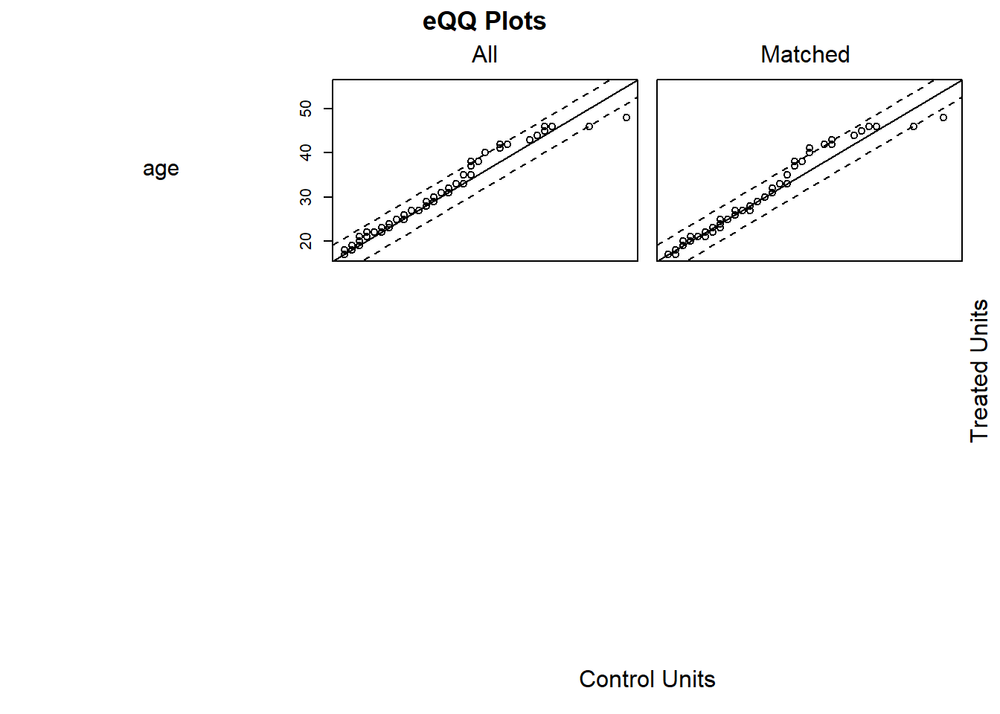

# Quasi-experimental

In most cases, it means that you have pre- and post-intervention data.

A great resource for causal inference is [Causal Inference Mixtape](https://mixtape.scunning.com/introduction.html), especially if you like to read about the history of causal inference as a field as well (codes for Stata, R, and Python).

## Regression Discontinuity

-   A regression discontinuity occurs when there is a discrete change (jump) in treatment likelihood in the distribution of a continuous (or roughly continuous) variable (i.e., **running/forcing/assignment variable**).

    -   Running variable can also be time, but the argument for time to be continuous is hard to argue because usually we do not see increment of time (e.g., quarterly or annual data). Unless we have minute or hour data, then we might be able to argue for it.

-   Review paper [@imbens2007; @lee2010]

-   Other readings:

    -   <https://ies.ed.gov/ncee/wwc/Docs/ReferenceResources/wwc_rd.pdf>

    -   <https://ies.ed.gov/ncee/wwc/Docs/ReferenceResources/wwc_rdd_standards_122315.pdf>

-   RD is a localized experiment at the cutoff point

    -   Hence, we always have to qualify (perfunctory) our statement in research articles that "our research might not generalize to beyond the bandwidth."

-   In reality, RD and experimental (from random assignment) estimates are very similar ([@chaplin2018; @bertanha2014]; [Mathematica](https://www.mathematica.org/publications/replicating-experimental-impact-estimates-using-a-regression-discontinuity-approach) ). But still, it's hard to prove empirically for every context (there might be future study that finds a huge difference between local estimate - causal - and overall estimate - random assignment.

-   Threats: only valid near threshold: inference at threshold is valid on average. Interestingly, random experiment showed the validity already.

-   Tradeoff between efficiency and bias

-   Regression discontinuity is under the framework of $$Instrumental Variable$$

-   The hard part is to find a setting that can apply, but once you find one, it's easy to apply

-   We can also have multiple cutoff lines. However, for each cutoff line, there can only be one breakup point

-   RD can have multiple coinciding effects (i.e., joint distribution or bundled treatment), then RD effect in this case would be the joint effect.

-   As the running variable becomes more discrete your framework should be [Interrupted Time Series], but more granular levels you can use RD. When you have infinite data (or substantially large) the two frameworks are identical. RD is always better than [Interrupted Time Series]

There are several types of Regression Discontinuity:

1.  Sharp RD: Change in treatment probability at the cutoff point is 1

    -   Kink design: Instead of a discontinuity in the level of running variable, we have a discontinuity in the slope of the function (while the function/level can remain continuous) [@nielsen2010]. See [@böckerman2018] for application, and [@card2012; @card2015b] for theory.

2.  Fuzzy RD: Change in treatment probability less than 1

Consider

$$
D_i = 1_{X_i > c}
$$

$$
D_i = 
\begin{cases}
D_i = 1 \text{ if } X_i > C \\
D_i = 0 \text{ if } X_i < C
\end{cases}
$$

where

-   $D_i$ = treatment effect

-   $X_i$ = score variable (continuous)

-   $c$ = cutoff point

**Identifying assumption** of RD:

$$
\begin{aligned}
\alpha_{SRDD} &= E[Y_{1i} - Y_{0i} | X_i = c] \\
&= E[Y_{1i}|X_i = c] - E[Y_{0i}|X_i = c]\\
&= \lim_{x \to c^+} E[Y_{1i}|X_i = c] - \lim_{x \to c^=} E[Y_{0i}|X_i = c]
\end{aligned}
$$

RDD estimates the local average treatment effect (LATE), at the cutoff point which is not at the individual or population levels.

Since researchers typically care more about the internal validity, than external validity, localness affects only external validity.

**Assumptions**:

-   Independent assignment

-   Continuity of conditional regression functions

    -   $E[Y(0)|X=x]$ and $E[Y(1)|X=x]$ are continuous in x.

-   RD is valid if cutpoint is **exogenous (i.e., no endogenous selection)** and running variable is **not manipulable**

-   Only treatment(s) (e.g., could be joint distribution of multiple treatments) cause discontinuity or jump in the outcome variable

-   All other factors are smooth through the cutoff (i.e., threshold) value. (we can also test this assumption by seeing no discontinuity in other factors).

<br>

**Threats to RD**

-   Variables (other than treatment) change discontinously at the cutoff

    -   We can test for jumps in these variables (including pre-treatment outcome)

-   Multiple discontinuities for the assignment variable

-   Manipulation of the assignment variable

    -   At the cutoff point, check for continuity in the density of the assignment variable.

<br>

### Specification Checks

1.  [Balance Checks]
2.  [Sorting/Bunching/Manipulation]
3.  [Placebo Tests]
4.  [Sensitivity to Bandwidth Choice]

<br>

#### Balance Checks

-   Also known as checking for Discontinuities in Average Covariates

-   Null Hypothesis: The average effect of covariates on pseudo outcomes (i.e., those qualitatively cannot be affected by the treatment) is 0.

-   If this hypothesis is rejected, you better have a good reason to why because it can cast serious doubt on your RD design.

<br>

#### Sorting/Bunching/Manipulation

-   Also known as checking for A Discontinuity in the Distribution of the Forcing Variable

-   Also known as clustering or density test

-   Formal test is McCrary sorting test [@mccrary2008] or [@cattaneo2019]

-   Since human subjects can manipulate the running variable to be just above or below the cutoff (assuming that the running variable is manipulable), especially when the cutoff point is known in advance for all subjects, this can result in a discontinuity in the distribution of the running variable at the cutoff (i.e., we will see "bunching" behavior right before or after the cutoff)\>

    -   People would like to sort into treatment if it's desirable. The density of the running variable would be 0 just below the threshold

    -   People would like to be out of treatment if it's undesirable

-   [@mccrary2008] proposes a density test (i.e., a formal test for manipulation of the assignment variable).

    -   $H_0$: The continuity of the density of the running variable (i.e., the covariate that underlies the assignment at the discontinuity point)

    -   $H_a$: A jump in the density function at that point

    -   Even though it's not a requirement that the density of the running must be continuous at the cutoff, but a discontinuity can suggest manipulations.

-   [@lee2009] offers a guide to know when you should warrant the manipulation

-   Usually it's better to know your research design inside out so that you can suspect any manipulation attempts.

    -   We would suspect the direction of the manipulation. And typically, it's one-way manipulation. In cases where we might have both ways, theoretically they would cancel each other out.

-   We could also observe partial manipulation in reality (e.g., when subjects can only imperfectly manipulate). But typically, as we treat it like fuzzy RD, we would not have identification problems. But complete manipulation would lead to serious identification issues.

-   Remember: even in cases where we fail to reject the null hypothesis for the density test, we could not rule out completely that identification problem exists (just like any other hypotheses)

-   Bunching happens when people self-select to a specific value in the range of a variable (e.g., key policy thresholds).

-   Review paper [@kleven2016]

-   **This test can only detect manipulation that changes the distribution of the running variable**. If you can choose the cutoff point or you have 2-sided manipulation, this test will fail to detect it.

-   Histogram in bunching is similar to a density curve (we want narrower bins, wider bins bias elasticity estimates)

-   We can also use bunching method to study individuals' or firm's responsiveness to changes in policy.

-   Under RD, we assume that we don't have any manipulation in the running variable. However, bunching behavior is a manipulation by firms or individuals. Thus, violating this assumption.

    -   Bunching can fix this problem by estimating what densities of individuals would have been without manipulation (i.e., manipulation-free counterfactual).

    -   **The fraction of persons who manipulated** is then calculated by comparing the observed distribution to manipulation-free counterfactual distributions.

    -   Under RD, we do not need this step because the observed and manipulation-free counterfactual distributions are assumed to be the same. RD assume there is no manipulation (i.e., assume the manipulation-free counterfactual distribution)

When running variable and outcome variable are simultaneously determined, we can use a modified RDD estimator to have consistent estimate. [@bajari2011]

-   **Assumptions**:

    -   Manipulation is **one-sided**: People move one way (i.e., either below the threshold to above the threshold or vice versa, but not to or away the threshold), which is similar to the monotonicity assumption under instrumental variable \@ref(instrumental-variable)

    -   Manipulation is **bounded** (also known as regularity assumption): so that we can use people far away from this threshold to derive at our counterfactual distribution [@blomquist2017]

Steps:

1.  Identify the window in which the running variable contains bunching behavior. We can do this step empirically based on data [@bosch2020]. Additionally robustness test is needed (i.e., varying the manipulation window).
2.  Estimate the manipulation-free counterfactual
3.  Calculating the standard errors for inference can follow [@chetty2011] where we bootstrap resampling residuals in the estimation of the counts of individuals within bins (large data can render this step unnecessary).

If we pass the bunching test, we can move on to the $$Placebo Test$$

@mccrary2008 test

A jump in the density at the threshold (i.e., discontinuity) hold can serve as evidence for sorting around the cutoff point


```r
library(rdd)

# you only need the runing variable and hte cutoff point

# Example by the package's authors
#No discontinuity
x<-runif(1000,-1,1)
DCdensity(x,0)
```


```
#> [1] 0.8279339

#Discontinuity
x<-runif(1000,-1,1)
x<-x+2*(runif(1000,-1,1)>0&x<0)
DCdensity(x,0)
```


```
#> [1] 0.009108202
```

@cattaneo2019 test


```r
library(rddensity)

# Example by the package's authors
# Continuous Density
set.seed(1)
x <- rnorm(2000, mean = -0.5)
rdd <- rddensity(X = x, vce = "jackknife")
summary(rdd)
#> 
#> Manipulation testing using local polynomial density estimation.
#> 
#> Number of obs =       2000
#> Model =               unrestricted
#> Kernel =              triangular
#> BW method =           estimated
#> VCE method =          jackknife
#> 
#> c = 0                 Left of c           Right of c          
#> Number of obs         1376                624                 
#> Eff. Number of obs    354                 345                 
#> Order est. (p)        2                   2                   
#> Order bias (q)        3                   3                   
#> BW est. (h)           0.514               0.609               
#> 
#> Method                T                   P > |T|             
#> Robust                -0.6798             0.4966              
#> 
#> 
#> P-values of binomial tests (H0: p=0.5).
#> 
#> Window Length / 2          <c     >=c    P>|T|
#> 0.013                      11       9    0.8238
#> 0.026                      19      15    0.6076
#> 0.038                      29      21    0.3222
#> 0.051                      42      26    0.0681
#> 0.064                      44      33    0.2543
#> 0.077                      48      45    0.8358
#> 0.090                      55      51    0.7709
#> 0.102                      66      59    0.5917
#> 0.115                      74      67    0.6135
#> 0.128                      82      71    0.4189

# you have to specify your own plot (read package manual)
```

<br>

#### Placebo Tests

-   Also known as Discontinuities in Average Outcomes at Other Values

-   We should not see any jumps at other values (either $X_i <c$ or $X_i \ge c$)

    -   Use the same bandwidth you use for the cutoff, and move it along the running variable: testing for a jump in the conditional mean of the outcome at the median of the running variable.

-   Also known as falsification checks

-   Before and after the cutoff point, we can run the placebo test to see whether X's are different).

-   The placebo test is where you expect your coefficients to be not different from 0.

-   This test can be used for

    -   Testing no discontinuity in predetermined variables:

    -   Testing other discontinuities

    -   Inclusion and exclusion of covariates: RDD parameter estimates should not be sensitive to the inclusion or exclusion of other covariates.

-   This is analogous to $$Experimental Design$$ where we cannot only test whether the observables are similar in both treatment and control groups (if we reject this, then we don't have random assignment), but we cannot test unobservables.

Balance on observable characteristics on both sides

$$
Z_i = \alpha_0 + \alpha_1 f(x_i) + [I(x_i \ge c)] \alpha_2 + [f(x_i) \times I(x_i \ge c)]\alpha_3 + u_i
$$

where

-   $x_i$ is the running variable

-   $Z_i$ is other characteristics of people (e.g., age, etc)

Theoretically, $Z_i$ should no be affected by treatment. Hence, $E(\alpha_2) = 0$

Moreover, when you have multiple $Z_i$, you typically have to simulate joint distribution (to avoid having significant coefficient based on chance).

The only way that you don't need to generate joint distribution is when all $Z_i$'s are independent (unlikely in reality).

Under RD, you shouldn't have to do any [Matching Methods]. Because just like when you have random assignment, there is no need to make balanced dataset before and after the cutoff. If you have to do balancing, then your RD assumptions are probably wrong in the first place.

#### Sensitivity to Bandwidth Choice

-   2 methods for bandwidth selection

    -   Ad hoc or substantively driven

    -   Data driven

-   The objective is to minimize the mean squared error between the estimated and actual treatment effects.

-   Then, we need to see how sensitive our results will be dependent on the choice of bandwidth.

-   In some cases, the best bandwidth for testing covariates may not be the best bandwidth for treating them, but it may be close.


```r
# find optimal bandwidth by Imbens-Kalyanaraman
rdd::IKbandwidth(running_var, outcome_var, cutpoint = "", kernel = "triangular") # can also pick other kernels
```

#### Fuzzy RD Design

When you have cutoff that does not perfect determine treatment, but creates a discontinuity in the likelihood of receiving the treatment, you need another instrument

For those that are close to the cutoff, we create an instrument for $D_i$

$$
Z_i=
\begin{cases}
1 & \text{if } X_i \ge c \\
0 & \text{if } X_c < c
\end{cases}
$$

Then, we can estimate the effect of the treatment for compliers only (i.e., those treatment $D_i$ depends on $Z_i$)

The LATE parameter

$$
\lim_{c - \epsilon \le X \le c + \epsilon, \epsilon \to 0}( \frac{E(Y |Z = 1) - E(Y |Z=0)}{E(D|Z = 1) - E(D|Z = 0)})
$$

equivalently,

$$
\frac{lim_{x \downarrow c}E(Y|X = x) - \lim_{x \uparrow c} E(Y|X = x)}{\lim_{x \downarrow c } E(D |X = x) - \lim_{x \uparrow c}E(D |X=x)}
$$

Two equivalent ways to estimate

1.  First

    1.  Sharp RDD for $Y$

    2.  Sharp RDD for $D$

    3.  Take the estimate from step 1 divide by that of step 2

2.  Second: Subset those observations that are close to $c$ and run instrumental variable $Z$

<br>

#### Regression Kink Design

-   If the slope of the treatment intensity changes at the cutoff (instead of the level of treatment assignment), we can have regression kink design

-   Example: unemployment benefits

<br>

### Steps for Sharp RD

1.  Graph the data by computing the average value of the outcome variable over a set of bins (large enough to see a smooth graph, and small enough to make the jump around the cutoff clear).

2.  Run regression on both sides of the cutoff to get the treatment effect

3.  Robustness checks:

    1.  Assess possible jumps in other variables around the cutoff

    2.  Hypothesis testing for bunching

    3.  Placebo tests

    4.  Varying bandwidth

<br>

### Steps for Fuzzy RD

1.  Graph the data by computing the average value of the outcome variable over a set of bins (large enough to see a smooth graph, and small enough to make the jump around the cutoff clear).

2.  Graph the probability of treatment

3.  Estimate the treatment effect using 2SLS

4.  Robustness checks:

    1.  Assess possible jumps in other variables around the cutoff

    2.  Hypothesis testing for bunching

    3.  Placebo tests

    4.  Varying bandwidth

<br>

### Evaluation of an RD

-   Evidence for (either formal tests or graphs)

    -   Treatment and outcomes change discontinuously at the cutoff, while other variables and pre-treatment outcomes do not.

    -   No manipulation of the assignment variable.

-   Results are robust to various functional forms of the forcing variable

-   Is there any other (unobserved) confound that could cause the discontinuous change at the cutoff (i.e., multiple forcing variables / bundling of institutions)?

-   External Validity: How likely the result at the cutoff will generalize?

<br>

**General Model**

$$
Y_i = \beta_0 + f(x_i) \beta_1 + [I(x_i \ge c)]\beta_2 + \epsilon_i
$$

where $f(x_i)$ is any functional form of $x_i$

**Simple case**

When $f(x_i) = x_i$ (linear function)

$$
Y_i = \beta_0 + x_i \beta_1 + [I(x_i \ge c)]\beta_2 + \epsilon_i
$$

{style="display: block; margin: 1em auto" width="90%"}

RD gives you $\beta_2$ (causal effect) of $X$ on $Y$ at the cutoff point

In practice, everyone does

$$
Y_i = \alpha_0 + f(x) \alpha _1 + [I(x_i \ge c)]\alpha_2 + [f(x_i)\times [I(x_i \ge c)]\alpha_3 + u_i
$$

{style="display: block; margin: 1em auto" width="90%"}

where we estimate different slope on different sides of the line

and if you estimate $\alpha_3$ to be no different from 0 then we return to the simple case

**Notes**:

-   Sparse data can make $\alpha_3$ large differential effect

-   People are very skeptical when you have complex $f(x_i)$, usual simple function forms (e.g., linear, squared term, etc.) should be good. However, if you still insist, then **non-parametric estimation** can be your best bet.

Bandwidth of $c$ (window)

-   Closer to $c$ can give you lower bias, but also efficiency

-   Wider $c$ can increase bias, but higher efficiency.

-   Optimal bandwidth is very controversial, but usually we have to do it in the appendix for research article anyway.

-   We can either

    -   drop observations outside of bandwidth or

    -   weight depends on how far and close to $c$

### Examples

#### Example 1

Example by [Leihua Ye](https://towardsdatascience.com/the-crown-jewel-of-causal-inference-regression-discontinuity-design-rdd-bad37a68e786)

$$
Y_i = \beta_0 + \beta_1 X_i + \beta_2 W_i + u_i
$$

$$
X_i = 
\begin{cases}
1, W_i \ge c \\
0, W_i < c
\end{cases}
$$


```r
#cutoff point = 3.5
GPA <- runif(1000, 0, 4)
future_success <- 10 + 2 * GPA + 10 * (GPA >= 3.5) + rnorm(1000)
#install and load the package ‘rddtools’
#install.packages(“rddtools”)
library(rddtools)
data <- rdd_data(future_success, GPA, cutpoint = 3.5)
# plot the dataset
plot(
    data,
    col =  "red",
    cex = 0.1,
    xlab =  "GPA",
    ylab =  "future_success"
)
```


```r
# estimate the sharp RDD model
rdd_mod <- rdd_reg_lm(rdd_object = data, slope =  "same")
summary(rdd_mod)
#> 
#> Call:
#> lm(formula = y ~ ., data = dat_step1, weights = weights)
#> 
#> Residuals:
#>      Min       1Q   Median       3Q      Max 
#> -2.93235 -0.66786 -0.00799  0.69991  3.01768 
#> 
#> Coefficients:
#>             Estimate Std. Error t value Pr(>|t|)    
#> (Intercept) 17.08582    0.07178  238.03   <2e-16 ***
#> D            9.95513    0.11848   84.03   <2e-16 ***
#> x            2.01615    0.03546   56.85   <2e-16 ***
#> ---
#> Signif. codes:  0 '***' 0.001 '**' 0.01 '*' 0.05 '.' 0.1 ' ' 1
#> 
#> Residual standard error: 1.046 on 997 degrees of freedom
#> Multiple R-squared:  0.9617,	Adjusted R-squared:  0.9616 
#> F-statistic: 1.253e+04 on 2 and 997 DF,  p-value: < 2.2e-16
```


```r
# plot the RDD model along with binned observations
plot(
    rdd_mod,
    cex = 0.1,
    col =  "red",
    xlab =  "GPA",
    ylab =  "future_success"
)
```


#### Example 2

@bowblis2019

Occupational licensing can either increase or decrease market efficiency:

-   More information means more efficiency

-   Increased entry barriers (i.e., friction) increase efficiency

Components of RD

-   Running variable
-   Cutoff: 120 beds or above
-   Treatment: you have to have the treatment before the cutoff point.

Under OLS

$$
Y_i = \alpha_0 + X_i \alpha_1 + LW_i \alpha_2 + \epsilon_i
$$

where

-   $LW_i$ Licensed/certified workers (in fraction format for each center).

-   $Y_i$ = Quality of service

Bias in $\alpha_2$

-   Mitigation-based: terrible quality can lead to more hiring, which negatively bias $\alpha_2$

-   Preference-based: places that have higher quality staff want to keep high quality staffs.

Under RD

$$
Y_{ist} = \beta_0 + [I(Bed \ge121)_{ist}]\beta_1 + f(Size_{ist}) \beta_2 + [f(Size_{ist}) \times I(Bed \ge 121)_{ist}] \beta_3 \\
+ X_{it} \delta + \gamma_s + \theta_t + \epsilon_{ist}
$$

where

-   $s$ = state

-   $t$ = year

-   $i$ = hospital

This RD is fuzzy

-   If right near the threshold (bandwidth), we have states with different sorting (i.e., non-random), then we need the fixed-effect for state $s$. But then your RD assumption wrong anyway, then you won't do it in the first place

-   Technically, we could also run the fixed-effect regression, but because it's lower in the causal inference hierarchy. Hence, we don't do it.

-   Moreover, in the RD framework, we don't include $t$ before treatment (but in the FE we have to include before and after)

-   If we include $\pi_i$ for each hospital, then we don't have variation in the causal estimates (because hardly any hospital changes their bed size in the panel)

-   When you have $\beta_1$ as the intent to treat (because the treatment effect does not coincide with the intent to treat)

-   You cannot take those fuzzy cases out, because it will introduce the selection bias.

-   Note that we cannot drop cases based on behavioral choice (because we will exclude non-compliers), but we can drop when we have particular behaviors ((e.g., people like round numbers).

Thus, we have to use Instrument variable \@ref(instrumental-variable)

**Stage 1:**

$$
QSW_{ist} = \alpha_0 + [I(Bed \ge121)_{ist}]\alpha_1 + f(Size_{ist}) \alpha_2 + [f(Size_{ist}) \times I(Bed \ge 121)_{ist}] \alpha_3 \\
+ X_{it} \delta + \gamma_s + \theta_t + \epsilon_{ist}
$$

(Note: you should have different fixed effects and error term - $\delta, \gamma_s, \theta_t, \epsilon_{ist}$ from the first equation, but I ran out of Greek letters)

**Stage 2:**

$$
Y_{ist} = \gamma_0 + \gamma_1 \hat{QWS}_{ist} + f(Size_{ist}) \delta_2 + [f(Size_{ist}) \times I(Bed \ge 121)] \delta_3 \\
 + X_{it} \lambda + \eta_s + \tau_t + u_{ist}
$$

-   The bigger the jump (discontinuity), the more similar the 2 coefficients ($\gamma_1 \approx \beta_1$) where $\gamma_1$ is the average treatment effect (of exposing to the policy)

-   $\beta_1$ will always be closer to 0 than $\gamma_1$

-   Figure 1 shows bunching at every 5 units cutoff, but 120 is still out there.

-   If we have manipulable bunching, there should be decrease at 130

-   Since we have limited number of mass points (at the round numbers), we should clustered standard errors by the mass point

<br>

#### Example 3

Replication of [@carpenter2009] by [Philipp Leppert](https://rpubs.com/phle/r_tutorial_regression_discontinuity_design), dataset from [here](https://www.openicpsr.org/openicpsr/project/113550/version/V1/view?flag=follow&pageSize=100&sortOrder=(?title)&sortAsc=true)

#### Example 4

For a detailed application, see [@thoemmes2016] where they use `rdd`, `rdrobust`, `rddtools`

<br>

## Difference-In-Differences

### Simple Dif-n-dif

-   A tool developed intuitively to study "natural experiment", but its uses are much broader.

-   $$Fixed Effects Estimator$$ is the foundation for DID

-   Why is dif-in-dif attractive?

    -   **Cross-sectional estimator** helps avoid omitted (unobserved) **common trends**

    -   **Time-series estimator** helps overcome omitted (unobserved) **cross-sectional differences**

Consider

-   $D_i = 1$ treatment group

-   $D_i = 0$ control group

-   $T= 1$ After the treatment

-   $T =0$ Before the treatment

|                   | After (T = 1)          | Before (T = 0)       |
|-------------------|------------------------|----------------------|
| Treated $D_i =1$  | $E[Y_{1i}(1)|D_i = 1]$ | $E[Y_{0i}(0)|D)i=1]$ |
| Control $D_i = 0$ | $E[Y_{0i}(1) |D_i =0]$ | $E[Y_{0i}(0)|D_i=0]$ |

missing $E[Y_{0i}(1)|D=1]$

The Average Treatment Effect on Treated

$$
E[Y_1(1) - Y_0(1)|D=1] \\
= \{E[Y(1)|D=1] - E[Y(1)|D=0] \} - \{E[Y(0)|D=1] - E[Y(0)|D=0] \}
$$

<br>

**Extension**

More than 2 groups (multiple treatments and multiple controls), and more than 2 period (pre and post)

$$
Y_{igt} = \alpha_g + \gamma_t + \beta I_{gt} + \delta X_{igt} + \epsilon_{igt}
$$

where

-   $\alpha_g$ is the group-specific fixed effect

-   $\gamma_t$ = time specific fixed effect

-   $\beta$ = dif-in-dif effect

-   $I_{gt}$ = interaction terms (n treatment indicators x n post-treatment dummies) (capture effect heterogeneity over time)

<br>

[Matching Methods]

-   Match treatment and control based on pre-treatment observables

-   Modify SEs appropriately [@heckman1997]

<br>

**Assumption**

-   **Parallel Trends**: Difference between the treatment and control groups remain constant if there were no treatment.

    -   should be used in cases where

        -   you observe before and after an event

        -   you have treatment and control groups

    -   not in cases where

        -   treatment is not random

        -   confounders.

**Possible issues**

-   Estimate dependent on functional form

-   Long-term effects

    -   Parallel trends are more likely to be observed over shorter period (window of observation)

-   Heterogeneous effects

    -   Different intensity (e.g., doses) for different groups.

-   Ashenfelter dip

    -   Participants are systemically different from nonparticipants before the treatment, leading to the question of permanent or transitory changes.

-   Response to event might not be immediate (can't be observed right away in the dependent variable)

    -   Using lagged dependent variable might be more appropriate [@blundell1998]

**Robustness Check**

-   Redo the DiD analysis for period before the treatment (expected treatment effect is 0).

-   Possible alternative control group: Expected results should be similar

-   Try different windows (further away from the treatment point, other factors can creep in and nullify your effect).

-   Treatment Reversal (what if we don't see the treatment event)

-   Higher-order polynomial time trend (to relax linearity assumption)

-   Test whether other dependent variables that should be affected by the event are indeed unaffected.

<br>

#### Example from [Princeton](https://www.princeton.edu/~otorres/DID101R.pdf)


```r
library(foreign)
mydata = read.dta("http://dss.princeton.edu/training/Panel101.dta")
```

create a dummy variable to indicate the time when the treatment started


```r
mydata$time = ifelse(mydata$year >= 1994, 1, 0)
```

create a dummy variable to identify the treatment group


```r
mydata$treated = ifelse(mydata$country == "E" |
                            mydata$country == "F" | mydata$country == "G" ,
                        1,
                        0)
```

create an interaction between time and treated


```r
mydata$did = mydata$time * mydata$treated
```

estimate the DID estimator


```r
didreg = lm(y ~ treated + time + did, data = mydata)
summary(didreg)
#> 
#> Call:
#> lm(formula = y ~ treated + time + did, data = mydata)
#> 
#> Residuals:
#>        Min         1Q     Median         3Q        Max 
#> -9.768e+09 -1.623e+09  1.167e+08  1.393e+09  6.807e+09 
#> 
#> Coefficients:
#>               Estimate Std. Error t value Pr(>|t|)  
#> (Intercept)  3.581e+08  7.382e+08   0.485   0.6292  
#> treated      1.776e+09  1.128e+09   1.575   0.1200  
#> time         2.289e+09  9.530e+08   2.402   0.0191 *
#> did         -2.520e+09  1.456e+09  -1.731   0.0882 .
#> ---
#> Signif. codes:  0 '***' 0.001 '**' 0.01 '*' 0.05 '.' 0.1 ' ' 1
#> 
#> Residual standard error: 2.953e+09 on 66 degrees of freedom
#> Multiple R-squared:  0.08273,	Adjusted R-squared:  0.04104 
#> F-statistic: 1.984 on 3 and 66 DF,  p-value: 0.1249
```

The `did` coefficient is the differences-in-differences estimator. Treat has a negative effect

<br>

#### Example by @card1993

found that increase in minimum wage increases employment

Experimental Setting:

-   New Jersey (treatment) increased minimum wage

-   Penn (control) did not increase minimum wage

|           |     | After | Before |                   |
|-----------|-----|-------|--------|-------------------|
| Treatment | NJ  | A     | B      | A - B             |
| Control   | PA  | C     | D      | C - D             |
|           |     | A - C | B - D  | (A - B) - (C - D) |

where

-   A - B = treatment effect + effect of time (additive)

-   C - D = effect of time

-   (A - B) - (C - D) = dif-n-dif

**The identifying assumptions**:

-   Can't have **switchers**

-   PA is the control group

    -   is a good counter factual

    -   is what NJ would look like if they hadn't had the treatment

$$
Y_{jt} = \beta_0 + NJ_j \beta_1 + POST_t \beta_2 + (NJ_j \times POST_t)\beta_3+ X_{jt}\beta_4 + \epsilon_{jt}
$$

where

-   $j$ = restaurant

-   $NJ$ = dummy where 1 = NJ, and 0 = PA

-   $POST$ = dummy where 1 = post, and 0 = pre

Notes:

-   We don't need $\beta_4$ in our model to have unbiased $\beta_3$, but including it would give our coefficients efficiency

-   If we use $\Delta Y_{jt}$ as the dependent variable, we don't need $POST_t \beta_2$ anymore

-   Alternative model specification is that the authors use NJ high wage restaurant as control group (still choose those that are close to the border)

-   The reason why they can't control for everything (PA + NJ high wage) is because it's hard to interpret the causal treatment

-   Dif-n-dif utilizes similarity in pretrend of the dependent variables. However, this is neither a necessary nor sufficient for the identifying assumption.

    -   It's not sufficient because they can have multiple treatments (technically, you could include more control, but your treatment can't interact)

    -   It's not necessary because trends can be parallel after treatment

-   However, we can't never be certain; we just try to find evidence consistent with our theory so that dif-n-dif can work.

-   Notice that we don't need before treatment the **levels of the dependent variable** to be the same (e.g., same wage average in both NJ and PA), dif-n-dif only needs **pre-trend (i.e., slope)** to be the same for the two groups.

<br>

#### Example by @butcher2014

Theory:

-   Highest achieving students are usually in hard science. Why?

    -   Hard to give students students the benefit of doubt for hard science

    -   How unpleasant and how easy to get a job. Degrees with lower market value typically want to make you feel more pleasant

Under OLS

$$
E_{ij} = \beta_0 + X_i \beta_1 + G_j \beta_2 + \epsilon_{ij}
$$

where

-   $X_i$ = student attributes

-   $\beta_2$ = causal estimate (from grade change)

-   $E_{ij}$ = Did you choose to enroll in major $j$

-   $G_j$ = grade given in major $j$

Examine $\hat{\beta}_2$

-   Negative bias: Endogenous response because department with lower enrollment rate will give better grade

-   Positive bias: hard science is already having best students (i.e., ability), so if they don't their grades can be even lower

Under dif-n-dif

$$
Y_{idt} = \beta_0 + POST_t \beta_1 + Treat_d \beta_2 + (POST_t \times Treat_d)\beta_3 + X_{idt} + \epsilon_{idt}
$$

where

-   $Y_{idt}$ = grade average

+--------------+-----------------------------------+----------+----------+-------------+
|              | Intercept                         | Treat    | Post     | Treat\*Post |
+==============+===================================+==========+==========+=============+
| Treat Pre    | 1                                 | 1        | 0        | 0           |
+--------------+-----------------------------------+----------+----------+-------------+
| Treat Post   | 1                                 | 1        | 1        | 1           |
+--------------+-----------------------------------+----------+----------+-------------+
| Control Pre  | 1                                 | 0        | 0        | 0           |
+--------------+-----------------------------------+----------+----------+-------------+
| Control Post | 1                                 | 0        | 1        | 0           |
+--------------+-----------------------------------+----------+----------+-------------+
|              | Average for pre-control $\beta_0$ |          |          |             |
+--------------+-----------------------------------+----------+----------+-------------+

A more general specification of the dif-n-dif is that

$$
Y_{idt} = \alpha_0 + (POST_t \times Treat_d) \alpha_1 + \theta_d + \delta_t + X_{idt} + u_{idt}
$$

where

-   $(\theta_d + \delta_t)$ richer , more df than $Treat_d \beta_2 + Post_t \beta_1$ (because fixed effects subsume Post and treat)

-   $\alpha_1$ should be equivalent to $\beta_3$ (if your model assumptions are correct)

Under causal inference, $R^2$ is not so important.

<br>

### Staggered Dif-n-dif

#### Example by @doleac2020

-   The purpose of banning a checking box for ex-criminal was banned because we thought that it gives more access to felons

-   Even if we ban the box, employers wouldn't just change their behaviors. But then the unintended consequence is that employers statistically discriminate based on race

3 types of ban the box

1.  Public employer only
2.  Private employer with government contract
3.  All employers

Main identification strategy

-   If any county in the Metropolitan Statistical Area (MSA) adopts ban the box, it means the whole MSA is treated. Or if the state adopts "ban the ban," every county is treated

Under [Simple Dif-n-dif]

$$
Y_{it} = \beta_0 + \beta_1 Post_t + \beta_2 treat_i + \beta_2 (Post_t \times Treat_i) + \epsilon_{it}
$$

But if there is no common post time, then we should use [Staggered Dif-n-dif]

$$
E_{imrt} = \alpha + \beta_1 BTB_{imt} W_{imt} + \beta_2 BTB_{mt} + \beta_3 BTB_{mt} H_{imt}+\\ \delta_m + D_{imt} \beta_5 + \lambda_{rt} + \delta_m\times f(t) \beta_7 + e_{imrt}
$$

where

-   $i$ = person; $m$ = MSA; $r$ = region (US regions e.g., midwest) ; $r$ = region; $t$ = year

-   $W$ = White; $B$ = Black; $H$ = Hispanic

-   $\beta_1 BTB_{imt} W_{imt} + \beta_2 BTB_{mt} + \beta_3 BTB_{mt} H_{imt}$ are the 3 dif-n-dif variables ($BTB$ = "ban the box")

-   $\delta_m$ = dummy for MSI

-   $D_{imt}$ = control for people

-   $\lambda_{rt}$ = region by time fixed effect

-   $\delta_m \times f(t)$ = linear time trend within MSA (but we should not need this if we have good pre-trend)

If we put $\lambda_r - \lambda_t$ (separately) we will more broad fixed effect, while $\lambda_{rt}$ will give us deeper and narrower fixed effect.

Before running this model, we have to drop all other races. And $\beta_1, \beta_2, \beta_3$ are not collinear because there are all interaction terms with $BTB_{mt}$

If we just want to estimate the model for black men, we will modify it to be

$$
E_{imrt} = \alpha + BTB_{mt} \beta_1 + \delta_m + D_{imt} \beta_5 + \lambda_{rt} + (\delta_m \times f(t)) \beta_7 + e_{imrt}
$$

$$
E_{imrt} = \alpha + BTB_{m (t - 3t)} \theta_1 + BTB_{m(t-2)} \theta_2 + BTB_{mt} \theta_4 \\
+ BTB_{m(t+1)}\theta_5 + BTB_{m(t+2)}\theta_6 + BTB_{m(t+3t)}\theta_7 \\
+ [\delta_m + D_{imt}\beta_5 + \lambda_r + (\delta_m \times (f(t))\beta_7 + e_{imrt}]
$$

We have to leave $BTB_{m(t-1)}\theta_3$ out for the category would not be perfect collinearity

So the year before BTB ($\theta_1, \theta_2, \theta_3$) should be similar to each other (i.e., same pre-trend). Remember, we only run for places with BTB.

If $\theta_2$ is statistically different from $\theta_3$ (baseline), then there could be a problem, but it could also make sense if we have pre-trend announcement.

<br>

Example by [Philipp Leppert](https://rpubs.com/phle/r_tutorial_difference_in_differences) replicating [Card and Krueger (1994)](https://davidcard.berkeley.edu/data_sets.html)

Example by [Anthony Schmidt](https://bookdown.org/aschmi11/causal_inf/difference-in-differences.html)

## Synthetic Control

Synthetic control method (SCM) is a generalization of the dif-in-dif model

SCMs can also be used under the Bayesian framework where we do not have to impose any restrictive priori [@kim2020]

Advantages over dif-in-dif:

1.  Maximization of the observable similarity between control and treatment (maybe also unobservables)
2.  Can also be used in cases where no untreated case with similar on matching dimensions with treated cases
3.  Objective selection of controls.

A data driven procedure to construct more comparable control groups (i.e., black box).

To do causal inference with control and treatment group using [Matching Methods], you typically have to have similar covariates in the control and the treated groups. However, if you don't methods like [Propensity Scores] and DID can perform rather poorly (i.e., large bias).

SCM is recommended when

1.  Social events to evaluate large-scale program or policy
2.  Only one treated case with several control candidates.

Advantages:

1.  From the selection criteria, researchers can understand the relative importance of each candidate
2.  Post-intervention outcomes are not used in synthetic. Hence, you can't retro-fit.
3.  Observable similarity between control and treatment cases is maximized

`Synth` provides an algorithm that finds weighted combination of the comparison units where the weights are chosen such that it best resembles the values of predictors of the outcome variable for the affected units before the intervention.

### Example 1

by [Danilo Freire](https://rpubs.com/danilofreire/synth)


```r
# install.packages("Synth")
# install.packages("gsynth")
library("Synth")
library("gsynth")
```

simulate data for 10 states and 30 years. State A receives the treatment `T = 20` after year 15.


```r
set.seed(1)
year <- rep(1:30, 10) 
state <- rep(LETTERS[1:10], each = 30)
X1 <- round(rnorm(300, mean = 2, sd = 1), 2)
X2 <- round(rbinom(300, 1, 0.5) + rnorm(300), 2)
Y <- round(1 + 2*X1 + rnorm(300), 2)
df <- as.data.frame(cbind(Y, X1, X2, state, year))
df$Y <- as.numeric(as.character(df$Y))
df$X1 <- as.numeric(as.character(df$X1))
df$X2 <- as.numeric(as.character(df$X2))
df$year <- as.numeric(as.character(df$year))
df$state.num <- rep(1:10, each = 30)
df$state <- as.character(df$state)
df$`T` <- ifelse(df$state == "A" & df$year >= 15, 1, 0)
df$Y <- ifelse(df$state == "A" & df$year >= 15, df$Y + 20, df$Y)
```


```r
str(df)
#> 'data.frame':	300 obs. of  7 variables:
#>  $ Y        : num  2.29 4.51 2.07 8.87 4.37 1.32 8 7.49 6.98 3.72 ...
#>  $ X1       : num  1.37 2.18 1.16 3.6 2.33 1.18 2.49 2.74 2.58 1.69 ...
#>  $ X2       : num  1.96 0.4 -0.75 -0.56 -0.45 1.06 0.51 -2.1 0 0.54 ...
#>  $ state    : chr  "A" "A" "A" "A" ...
#>  $ year     : num  1 2 3 4 5 6 7 8 9 10 ...
#>  $ state.num: int  1 1 1 1 1 1 1 1 1 1 ...
#>  $ T        : num  0 0 0 0 0 0 0 0 0 0 ...
```


```r
dataprep.out <-
    dataprep(
        df,
        predictors = c("X1", "X2"),
        dependent     = "Y",
        unit.variable = "state.num",
        time.variable = "year",
        unit.names.variable = "state",
        treatment.identifier  = 1,
        controls.identifier   = c(2:10),
        time.predictors.prior = c(1:14),
        time.optimize.ssr     = c(1:14),
        time.plot             = c(1:30)
    )


synth.out <- synth(dataprep.out)
#> 
#> X1, X0, Z1, Z0 all come directly from dataprep object.
#> 
#> 
#> **************** 
#>  searching for synthetic control unit  
#>  
#> 
#> **************** 
#> **************** 
#> **************** 
#> 
#> MSPE (LOSS V): 9.831789 
#> 
#> solution.v:
#>  0.3888387 0.6111613 
#> 
#> solution.w:
#>  0.1115941 0.1832781 0.1027237 0.312091 0.06096758 0.03509706 0.05893735 0.05746256 0.07784853
```


```r
print(synth.tables   <- synth.tab(
        dataprep.res = dataprep.out,
        synth.res    = synth.out)
      )
#> $tab.pred
#>    Treated Synthetic Sample Mean
#> X1   2.028     2.028       2.017
#> X2   0.513     0.513       0.394
#> 
#> $tab.v
#>    v.weights
#> X1 0.389    
#> X2 0.611    
#> 
#> $tab.w
#>    w.weights unit.names unit.numbers
#> 2      0.112          B            2
#> 3      0.183          C            3
#> 4      0.103          D            4
#> 5      0.312          E            5
#> 6      0.061          F            6
#> 7      0.035          G            7
#> 8      0.059          H            8
#> 9      0.057          I            9
#> 10     0.078          J           10
#> 
#> $tab.loss
#>            Loss W   Loss V
#> [1,] 9.761708e-12 9.831789
```


```r
path.plot(synth.res    = synth.out,
          dataprep.res = dataprep.out,
          Ylab         = c("Y"),
          Xlab         = c("Year"),
          Legend       = c("State A","Synthetic State A"),
          Legend.position = c("topleft")
)

abline(v   = 15,
       lty = 2)
```


Gaps plot:


```r
gaps.plot(synth.res    = synth.out,
          dataprep.res = dataprep.out,
          Ylab         = c("Gap"),
          Xlab         = c("Year"),
          Ylim         = c(-30, 30),
          Main         = ""
)

abline(v   = 15,
       lty = 2)
```


Alternatively, `gsynth` provides options to estimate iterative fixed effects, and handle multiple treated units at tat time.

Here, we use two=way fixed effects and bootstrapped standard errors


```r
gsynth.out <- gsynth(
  Y ~ `T` + X1 + X2,
  data = df,
  index = c("state", "year"),
  force = "two-way",
  CV = TRUE,
  r = c(0, 5),
  se = TRUE,
  inference = "parametric",
  nboots = 1000,
  parallel = F # TRUE
)
#> Cross-validating ... 
#>  r = 0; sigma2 = 1.13533; IC = 0.95632; PC = 0.96713; MSPE = 1.65502
#>  r = 1; sigma2 = 0.96885; IC = 1.54420; PC = 4.30644; MSPE = 1.33375
#>  r = 2; sigma2 = 0.81855; IC = 2.08062; PC = 6.58556; MSPE = 1.27341*
#>  r = 3; sigma2 = 0.71670; IC = 2.61125; PC = 8.35187; MSPE = 1.79319
#>  r = 4; sigma2 = 0.62823; IC = 3.10156; PC = 9.59221; MSPE = 2.02301
#>  r = 5; sigma2 = 0.55497; IC = 3.55814; PC = 10.48406; MSPE = 2.79596
#> 
#>  r* = 2
#> 
#> 
Simulating errors .............
Bootstrapping ...
#> ..........
```


```r
plot(gsynth.out)
```


```r
plot(gsynth.out, type = "counterfactual")
```


```r
plot(gsynth.out, type = "counterfactual", raw = "all") # shows estimations for the control cases
```


### Example 2

by [Leihua Ye](https://towardsdatascience.com/causal-inference-using-synthetic-control-the-ultimate-guide-a622ad5cf827)


```r

library(Synth)
data("basque")
dim(basque) #774*17
#> [1] 774  17
head(basque)
#>   regionno     regionname year   gdpcap sec.agriculture sec.energy sec.industry
#> 1        1 Spain (Espana) 1955 2.354542              NA         NA           NA
#> 2        1 Spain (Espana) 1956 2.480149              NA         NA           NA
#> 3        1 Spain (Espana) 1957 2.603613              NA         NA           NA
#> 4        1 Spain (Espana) 1958 2.637104              NA         NA           NA
#> 5        1 Spain (Espana) 1959 2.669880              NA         NA           NA
#> 6        1 Spain (Espana) 1960 2.869966              NA         NA           NA
#>   sec.construction sec.services.venta sec.services.nonventa school.illit
#> 1               NA                 NA                    NA           NA
#> 2               NA                 NA                    NA           NA
#> 3               NA                 NA                    NA           NA
#> 4               NA                 NA                    NA           NA
#> 5               NA                 NA                    NA           NA
#> 6               NA                 NA                    NA           NA
#>   school.prim school.med school.high school.post.high popdens invest
#> 1          NA         NA          NA               NA      NA     NA
#> 2          NA         NA          NA               NA      NA     NA
#> 3          NA         NA          NA               NA      NA     NA
#> 4          NA         NA          NA               NA      NA     NA
#> 5          NA         NA          NA               NA      NA     NA
#> 6          NA         NA          NA               NA      NA     NA
```

transform data to be used in `synth()`


```r
dataprep.out <- dataprep(
    foo = basque,
    predictors = c(
        "school.illit",
        "school.prim",
        "school.med",
        "school.high",
        "school.post.high",
        "invest"
    ),
    predictors.op =  "mean",
    # the operator
    time.predictors.prior = 1964:1969,
    #the entire time frame from the #beginning to the end
    special.predictors = list(
        list("gdpcap", 1960:1969,  "mean"),
        list("sec.agriculture", seq(1961, 1969, 2), "mean"),
        list("sec.energy", seq(1961, 1969, 2), "mean"),
        list("sec.industry", seq(1961, 1969, 2), "mean"),
        list("sec.construction", seq(1961, 1969, 2), "mean"),
        list("sec.services.venta", seq(1961, 1969, 2), "mean"),
        list("sec.services.nonventa", seq(1961, 1969, 2), "mean"),
        list("popdens", 1969,  "mean")
    ),
    dependent =  "gdpcap",
    # dv
    unit.variable =  "regionno",
    #identifying unit numbers
    unit.names.variable =  "regionname",
    #identifying unit names
    time.variable =  "year",
    #time-periods
    treatment.identifier = 17,
    #the treated case
    controls.identifier = c(2:16, 18),
    #the control cases; all others #except number 17
    time.optimize.ssr = 1960:1969,
    #the time-period over which to optimize
    time.plot = 1955:1997
)#the entire time period before/after the treatment
```

where

-   X1 = the control case before the treatment

-   X0 = the control cases after the treatment

-   Z1: the treatment case before the treatment

-   Z0: the treatment case after the treatment


```r
synth.out = synth(data.prep.obj = dataprep.out, method = "BFGS")
#> 
#> X1, X0, Z1, Z0 all come directly from dataprep object.
#> 
#> 
#> **************** 
#>  searching for synthetic control unit  
#>  
#> 
#> **************** 
#> **************** 
#> **************** 
#> 
#> MSPE (LOSS V): 0.008864606 
#> 
#> solution.v:
#>  0.02773094 1.194e-07 1.60609e-05 0.0007163836 1.486e-07 0.002423908 0.0587055 0.2651997 0.02851006 0.291276 0.007994382 0.004053188 0.009398579 0.303975 
#> 
#> solution.w:
#>  2.53e-08 4.63e-08 6.44e-08 2.81e-08 3.37e-08 4.844e-07 4.2e-08 4.69e-08 0.8508145 9.75e-08 3.2e-08 5.54e-08 0.1491843 4.86e-08 9.89e-08 1.162e-07
```

Calculate the difference between the real basque region and the synthetic control


```r
gaps = dataprep.out$Y1plot - (dataprep.out$Y0plot 
                                     %*% synth.out$solution.w)
gaps[1:3,1]
#>       1955       1956       1957 
#> 0.15023473 0.09168035 0.03716475
```


```r
synth.tables = synth.tab(dataprep.res = dataprep.out,
                         synth.res = synth.out)
names(synth.tables)
#> [1] "tab.pred" "tab.v"    "tab.w"    "tab.loss"
synth.tables$tab.pred[1:13,]
#>                                          Treated Synthetic Sample Mean
#> school.illit                              39.888   256.337     170.786
#> school.prim                             1031.742  2730.104    1127.186
#> school.med                                90.359   223.340      76.260
#> school.high                               25.728    63.437      24.235
#> school.post.high                          13.480    36.153      13.478
#> invest                                    24.647    21.583      21.424
#> special.gdpcap.1960.1969                   5.285     5.271       3.581
#> special.sec.agriculture.1961.1969          6.844     6.179      21.353
#> special.sec.energy.1961.1969               4.106     2.760       5.310
#> special.sec.industry.1961.1969            45.082    37.636      22.425
#> special.sec.construction.1961.1969         6.150     6.952       7.276
#> special.sec.services.venta.1961.1969      33.754    41.104      36.528
#> special.sec.services.nonventa.1961.1969    4.072     5.371       7.111
```

Relative importance of each unit


```r
synth.tables$tab.w[8:14, ]
#>    w.weights            unit.names unit.numbers
#> 9      0.000    Castilla-La Mancha            9
#> 10     0.851              Cataluna           10
#> 11     0.000  Comunidad Valenciana           11
#> 12     0.000           Extremadura           12
#> 13     0.000               Galicia           13
#> 14     0.149 Madrid (Comunidad De)           14
#> 15     0.000    Murcia (Region de)           15
```


```r
# plot the changes before and after the treatment 
path.plot(
    synth.res = synth.out,
    dataprep.res = dataprep.out,
    Ylab = "real per-capita gdp (1986 USD, thousand)",
    Xlab = "year",
    Ylim = c(0, 12),
    Legend = c("Basque country",
               "synthetic Basque country"),
    Legend.position = "bottomright"
)
```


```r
gaps.plot(
    synth.res = synth.out,
    dataprep.res = dataprep.out,
    Ylab =  "gap in real per - capita GDP (1986 USD, thousand)",
    Xlab =  "year",
    Ylim = c(-1.5, 1.5),
    Main = NA
)
```


Doubly Robust Difference-in-Differences

Example from `DRDID` package


```r
library(DRDID)
data(nsw_long)
# Form the Lalonde sample with CPS comparison group
eval_lalonde_cps <- subset(nsw_long, nsw_long$treated == 0 | nsw_long$sample == 2)
```

Estimate Average Treatment Effect on Treated using Improved Locally Efficient Doubly Robust DID estimator


```r
out <-
    drdid(
        yname = "re",
        tname = "year",
        idname = "id",
        dname = "experimental",
        xformla = ~ age + educ + black + married + nodegree + hisp + re74,
        data = eval_lalonde_cps,
        panel = TRUE
    )
summary(out)
#>  Call:
#> drdid(yname = "re", tname = "year", idname = "id", dname = "experimental", 
#>     xformla = ~age + educ + black + married + nodegree + hisp + 
#>         re74, data = eval_lalonde_cps, panel = TRUE)
#> ------------------------------------------------------------------
#>  Further improved locally efficient DR DID estimator for the ATT:
#>  
#>    ATT     Std. Error  t value    Pr(>|t|)  [95% Conf. Interval] 
#> -901.2703   393.6247   -2.2897     0.022    -1672.7747  -129.766 
#> ------------------------------------------------------------------
#>  Estimator based on panel data.
#>  Outcome regression est. method: weighted least squares.
#>  Propensity score est. method: inverse prob. tilting.
#>  Analytical standard error.
#> ------------------------------------------------------------------
#>  See Sant'Anna and Zhao (2020) for details.
```

### Example 3

by `Synth` package's authors


```r
library(Synth)
data("basque")
```

`synth()` requires

-   $X_1$ vector of treatment predictors

-   $X_0$ matrix of same variables for control group

-   $Z_1$ vector of outcome variable for treatment group

-   $Z_0$ matrix of outcome variable for control group

use `dataprep()` to prepare data in the format that can be used throughout the `Synth` package


```r
dataprep.out <- dataprep(
    foo = basque,
    predictors = c(
        "school.illit",
        "school.prim",
        "school.med",
        "school.high",
        "school.post.high",
        "invest"
    ),
    predictors.op = "mean",
    time.predictors.prior = 1964:1969,
    special.predictors = list(
        list("gdpcap", 1960:1969 , "mean"),
        list("sec.agriculture", seq(1961, 1969, 2), "mean"),
        list("sec.energy", seq(1961, 1969, 2), "mean"),
        list("sec.industry", seq(1961, 1969, 2), "mean"),
        list("sec.construction", seq(1961, 1969, 2), "mean"),
        list("sec.services.venta", seq(1961, 1969, 2), "mean"),
        list("sec.services.nonventa", seq(1961, 1969, 2), "mean"),
        list("popdens", 1969, "mean")
    ),
    dependent = "gdpcap",
    unit.variable = "regionno",
    unit.names.variable = "regionname",
    time.variable = "year",
    treatment.identifier = 17,
    controls.identifier = c(2:16, 18),
    time.optimize.ssr = 1960:1969,
    time.plot = 1955:1997
)
```

find optimal weights that identifies the synthetic control for the treatment group


```r
synth.out <- synth(data.prep.obj = dataprep.out, method = "BFGS")
#> 
#> X1, X0, Z1, Z0 all come directly from dataprep object.
#> 
#> 
#> **************** 
#>  searching for synthetic control unit  
#>  
#> 
#> **************** 
#> **************** 
#> **************** 
#> 
#> MSPE (LOSS V): 0.008864606 
#> 
#> solution.v:
#>  0.02773094 1.194e-07 1.60609e-05 0.0007163836 1.486e-07 0.002423908 0.0587055 0.2651997 0.02851006 0.291276 0.007994382 0.004053188 0.009398579 0.303975 
#> 
#> solution.w:
#>  2.53e-08 4.63e-08 6.44e-08 2.81e-08 3.37e-08 4.844e-07 4.2e-08 4.69e-08 0.8508145 9.75e-08 3.2e-08 5.54e-08 0.1491843 4.86e-08 9.89e-08 1.162e-07
```


```r
gaps <- dataprep.out$Y1plot - (dataprep.out$Y0plot %*% synth.out$solution.w)
gaps[1:3, 1]
#>       1955       1956       1957 
#> 0.15023473 0.09168035 0.03716475
```


```r
synth.tables <-
    synth.tab(dataprep.res = dataprep.out, synth.res = synth.out)
names(synth.tables) # you can pick tables to see 
#> [1] "tab.pred" "tab.v"    "tab.w"    "tab.loss"
```


```r
path.plot(
    synth.res = synth.out,
    dataprep.res = dataprep.out,
    Ylab = "real per-capita GDP (1986 USD, thousand)",
    Xlab = "year",
    Ylim = c(0, 12),
    Legend = c("Basque country",
               "synthetic Basque country"),
    Legend.position = "bottomright"
)
```


```r
gaps.plot(
    synth.res = synth.out,
    dataprep.res = dataprep.out,
    Ylab = "gap in real per-capita GDP (1986 USD, thousand)",
    Xlab = "year",
    Ylim = c(-1.5, 1.5),
    Main = NA
)
```


You could also run placebo tests

<br>

### Example 4

by [Michael Robbins and Steven Davenport](https://cran.r-project.org/web/packages/microsynth/vignettes/introduction.html) who are authors of `MicroSynth` with the following improvements:

-   Standardization `use.survey = TRUE` and permutation ( `perm = 250` and `jack = TRUE` ) for placebo tests

-   Omnibus statistic (set to `omnibus.var` ) for multiple outcome variables

-   incorporate multiple follow-up periods `end.post`

Notes:

-   Both predictors and outcome will be used to match units before intervention

    -   Outcome variable has to be **time-variant**

    -   Predictors are **time-invariant**

-   


```r
library(microsynth)
data("seattledmi")

cov.var <- c("TotalPop", "BLACK", "HISPANIC", "Males_1521", "HOUSEHOLDS", 
             "FAMILYHOUS", "FEMALE_HOU", "RENTER_HOU", "VACANT_HOU")
match.out <- c("i_felony", "i_misdemea", "i_drugs", "any_crime")
```


```r
sea1 <- microsynth(
    seattledmi,
    idvar = "ID",
    timevar = "time",
    intvar = "Intervention",
    start.pre = 1,
    end.pre = 12,
    end.post = 16,
    match.out = match.out, # outcome variable will be matched on exactly
    match.covar = cov.var, # specify covariates will be matched on exactly
    result.var = match.out, # used to report results
    omnibus.var = match.out, # feature in the omnibus p-value
    test = "lower",
    n.cores = min(parallel::detectCores(), 2)
)
sea1
#> 	microsynth object
#> 
#> Scope:
#> 	Units:			Total: 9642	Treated: 39	Untreated: 9603
#> 	Study Period(s):	Pre-period: 1 - 12	Post-period: 13 - 16
#> 	Constraints:		Exact Match: 58		Minimized Distance: 0
#> Time-variant outcomes:
#> 	Exact Match: i_felony, i_misdemea, i_drugs, any_crime (4)
#> 	Minimized Distance: (0)
#> Time-invariant covariates:
#> 	Exact Match: TotalPop, BLACK, HISPANIC, Males_1521, HOUSEHOLDS, FAMILYHOUS, FEMALE_HOU, RENTER_HOU, VACANT_HOU (9)
#> 	Minimized Distance: (0)
#> 
#> Results:
#> end.post = 16
#>            Trt    Con Pct.Chng Linear.pVal Linear.Lower Linear.Upper
#> i_felony    46  68.22   -32.6%      0.0109       -50.3%        -8.4%
#> i_misdemea  45  71.80   -37.3%      0.0019       -52.8%       -16.7%
#> i_drugs     20  23.76   -15.8%      0.2559       -46.4%        32.1%
#> any_crime  788 986.44   -20.1%      0.0146       -32.9%        -4.9%
#> Omnibus     --     --       --      0.0006           --           --
summary(sea1)
#> Weight Balance Table: 
#> 
#>               Targets Weighted.Control   All.scaled
#> Intercept          39        39.000239   39.0000000
#> TotalPop         2994      2994.051921 2384.7476665
#> BLACK             173       173.000957  190.5224020
#> HISPANIC          149       149.002632  159.2682016
#> Males_1521         49        49.000000   97.3746111
#> HOUSEHOLDS       1968      1968.033976 1113.5588052
#> FAMILYHOUS        519       519.010767  475.1876167
#> FEMALE_HOU        101       101.000957   81.1549471
#> RENTER_HOU       1868      1868.020338  581.9340386
#> VACANT_HOU        160       160.011485   98.4222153
#> i_felony.12        14        14.000000    4.9023024
#> i_felony.11        11        11.000239    4.6313006
#> i_felony.10         9         9.000000    3.0740510
#> i_felony.9          5         5.000000    3.2641568
#> i_felony.8         20        20.000000    4.4331052
#> i_felony.7          8         8.000000    3.7616677
#> i_felony.6         13        13.000000    3.0012446
#> i_felony.5         20        20.000718    3.1549471
#> i_felony.4         10        10.000000    4.0245800
#> i_felony.3          7         7.000000    3.3693217
#> i_felony.2         13        13.000239    3.2803360
#> i_felony.1         12        12.000000    3.4380834
#> i_misdemea.12      15        15.000239    4.2470442
#> i_misdemea.11      12        12.000000    4.6070317
#> i_misdemea.10      12        12.000000    4.0771624
#> i_misdemea.9       14        14.000000    3.7414437
#> i_misdemea.8       12        12.000000    3.9679527
#> i_misdemea.7       20        20.000000    4.2551338
#> i_misdemea.6       16        16.000479    3.5594275
#> i_misdemea.5       24        24.000000    3.5634723
#> i_misdemea.4       21        21.000239    4.3360299
#> i_misdemea.3       21        21.000000    4.3845675
#> i_misdemea.2       14        14.000000    3.5351587
#> i_misdemea.1       16        16.000000    4.1540137
#> i_drugs.12         13        13.000000    1.6543248
#> i_drugs.11          8         8.000000    1.5127567
#> i_drugs.10          3         3.000000    1.3226509
#> i_drugs.9           4         4.000000    0.9788426
#> i_drugs.8           4         4.000000    1.1123211
#> i_drugs.7          10        10.000000    1.0516490
#> i_drugs.6           4         4.000000    1.2377100
#> i_drugs.5           2         2.000000    1.2296204
#> i_drugs.4           1         1.000000    1.1244555
#> i_drugs.3           5         5.000000    1.3550093
#> i_drugs.2          12        12.000000    1.1365899
#> i_drugs.1           8         8.000239    1.3590541
#> any_crime.12      272       272.001196   65.3397635
#> any_crime.11      227       227.001675   64.2395769
#> any_crime.10      183       183.000957   55.6929060
#> any_crime.9       176       176.000479   53.2377100
#> any_crime.8       228       228.000479   55.8142502
#> any_crime.7       246       246.002393   55.8061605
#> any_crime.6       200       200.000957   52.8291848
#> any_crime.5       270       270.001436   50.6530803
#> any_crime.4       250       250.000957   57.2946484
#> any_crime.3       236       236.000957   58.8680772
#> any_crime.2       250       250.001196   51.5429371
#> any_crime.1       242       242.000957   55.1144991
#> 
#> Results: 
#> 
#> end.post = 16
#>            Trt    Con Pct.Chng Linear.pVal Linear.Lower Linear.Upper
#> i_felony    46  68.22   -32.6%      0.0109       -50.3%        -8.4%
#> i_misdemea  45  71.80   -37.3%      0.0019       -52.8%       -16.7%
#> i_drugs     20  23.76   -15.8%      0.2559       -46.4%        32.1%
#> any_crime  788 986.44   -20.1%      0.0146       -32.9%        -4.9%
#> Omnibus     --     --       --      0.0006           --           --
```


```r
plot_microsynth(sea1)
```


```r
sea2 <- microsynth(seattledmi, 
                   idvar="ID", timevar="time", intvar="Intervention", 
                   start.pre=1, end.pre=12, end.post=c(14, 16),
                   match.out=match.out, match.covar=cov.var, 
                   result.var=match.out, omnibus.var=match.out, 
                   test="lower", 
                   perm=250, jack=TRUE,
                   n.cores = min(parallel::detectCores(), 2))
```

## Selection on observables

**Example**

@aaronson2007

Do teachers qualifications (causally) affect student test scores?

Step 1:

$$
Y_{ijt} = \delta_0 + Y_{ij(t-1)} \delta_1 + X_{it} \delta_2 + Z_{jt} \delta_3 + \epsilon_{ijt}
$$

There can always be another variable

Any observable sorting is imperfect

Step 2:

$$
Y_{ijst} = \alpha_0 + Y_{ij(t-1)}\alpha_1 + X_{it} \alpha_2 + Z_{jt} \alpha_3 + \gamma_s + u_{isjt}
$$

-   $\delta_3 >0$

-   $\delta_3 > \alpha_3$

-   $\gamma_s$ = school fixed effect

Sorting is less within school. Hence, we can introduce the school fixed effect

Step 3:

Find schools that look like they are putting students in class randomly (or as good as random) + we run step 2

$$
Y_{isjt} = Y_{isj(t-1)} \lambda + X_{it} \alpha_1 +Z_{jt} \alpha_{21}+ (Z_{jt} \times D_i)\alpha_{22}+ \gamma_5 + u_{isjt}
$$

-   $D_{it}$ is an element of $X_{it}$

-   $Z_{it}$ = teacher experience

$$
D_{it}=
\begin{cases}
1 & \text{ if high poverty} \\
0 & \text{otherwise}
\end{cases}
$$

$H_0:$ $\alpha_{22} = 0$ test for effect heterogeneity whether the effect of teacher experience ($Z_{jt}$) is different

-   For low poverty is $\alpha_{21}$

-   For high poverty effect is $\alpha_{21} + \alpha_{22}$

<br>

## Matching Methods

**Motivation**

Effect of college quality on earnings

They ultimately estimate the treatment effect on the treated of attending a top (high ACT) versus bottom (low ACT) quartile college

Matching is [Selection on observables] and only works if you have good observables.

Relative to $$OLS$$$$Ordinary Least Squares$$

1.  Matching makes the **common support** explicit (and changes default from "ignore" to "enforce")
2.  Relaxes linear function form. Thus, less parametric.

It also helps if you have high ratio of controls to treatments.

<br>

For detail summary [@Stuart_2010]

Matching is defined as "any method that aims to equate (or "balance") the distribution of covariates in the treated and control groups." $$@Stuart_2010, pp. 1$$

Equivalently, matching is a selection on observables identifications strategy.

**If you think your OLS estimate is biased, a matching estimate (almost surely) is too.**

Unconditionally, consider

$$
E(Y_i^T | T) - E(Y_i^C |C) + E(Y_i^C | T) - E(Y_i^C | T) \\
= E(Y_i^T - Y_i^C | T) + [E(Y_i^C | T) - E(Y_i^C |C)] \\
= E(Y_i^T - Y_i^C | T) + \text{selection bias}
$$

where $E(Y_i^T - Y_i^C | T)$ is the causal inference that we want to know.

Randomization eliminates the selection bias.

If we don't have randomization, then $E(Y_i^C | T) \neq E(Y_i^C |C)$

Matching tries to do selection on observables $E(Y_i^C | X, T) = E(Y_i^C|X, C)$

[Propensity Scores] basically do $E(Y_i^C| P(X) , T) = E(Y_i^C | P(X), C)$

**Matching standard errors will exceed OLS standard errors**

The treatment should have larger predictive power than the control because you use treatment to pick control (not control to pick treatment).

The average treatment effect (ATE) is

$$
\frac{1}{N_T} \sum_{i=1}^{N_T} (Y_i^T - \frac{1}{N_{C_T}} \sum_{i=1}^{N_{C_T}} Y_i^C)
$$

Since there is no closed-form solution for the standard error of the average treatment effect, we have to use bootstrapping to get standard error.

<br>

Professor Gary King advocates instead of using the word "matching", we should use "**pruning**" (i.e., deleting observations). It is a preprocessing step where it prunes nonmatches to make control variables less important in your analysis.

Without Matching

-   **Imbalance data** leads to **model dependence** lead to a lot of **researcher discretion** leads to **bias**

With Matching

-   We have balance data which essentially erase human discretion

| Balance Covariates | Complete Randomization | Fully Exact |
|--------------------|------------------------|-------------|
| Observed           | On average             | Exact       |
| Unobserved         | On average             | On average  |

: Table \@ref(tab:Gary King - International Methods Colloquium talk 2015)

Fully blocked is superior on

-   imbalance

-   model dependence

-   power

-   efficiency

-   bias

-   research costs

-   robustness

Matching is used when

-   Outcomes are not available to select subjects for follow-up

-   Outcomes are available to improve precision of the estimate (i.e., reduce bias)

Hence, we can only observe one outcome of a unit (either treated or control), we can think of this problem as missing data as well. Thus, this section is closely related to $$Imputation (Missing Data)$$

In observational studies, we cannot randomize the treatment effect. Subjects select their own treatments, which could introduce selection bias (i.e., systematic differences between group differences that confound the effects of response variable differences).

<br>

Matching is used to

-   reduce model dependence

-   diagnose balance in the dataset

Assumptions of matching:

1.  treatment assignment is independent of potential outcomes given the covariates

    -   $T \perp (Y(0),Y(1))|X$

    -   known as ignorability, or ignorable, no hidden bias, or unconfounded.

    -   You typically satisfy this assumption when unobserved covariates correlated with observed covariates.

        -   But when unobserved covariates are unrelated to the observed covariates, you can use sensitivity analysis to check your result, or use "design sensitivity" [@Heller_2009]

2.  positive probability of receiving treatment for all X

    -   $0 < P(T=1|X)<1 \forall X$

3.  Stable Unit Treatment value Assumption (SUTVA)

    -   Outcomes of A are not affected by treatment of B.

        -   Very hard in cases where there is "spillover" effects (interactions between control and treatment). To combat, we need to reduce interactions.

Generalization

-   $P_t$: treated population -\> $N_t$: random sample from treated

-   $P_c$: control population -\> $N_c$: random sample from control

-   $\mu_i$ = means ; $\Sigma_i$ = variance covariance matrix of the $p$ covariates in group i ($i = t,c$)

-   $X_j$ = $p$ covariates of individual $j$

-   $T_j$ = treatment assignment

-   $Y_j$ = observed outcome

-   Assume: $N_t < N_c$

-   Treatment effect is $\tau(x) = R_1(x) - R_0(x)$ where

    -   $R_1(x) = E(Y(1)|X)$

    -   $R_0(x) = E(Y(0)|X)$

-   Assume: parallel trends hence $\tau(x) = \tau \forall x$

    -   If the parallel trends are not assumed, an average effect can be estimated.

-   Common estimands:

    -   Average effect of the treatment on the treated (ATT): effects on treatment group

    -   Average treatment effect (ATE): effect on both treatment and control

Steps:

1.  Define "closeness": decide distance measure to be used

    1.  Which variables to include:

        1.  Ignorability (no unobserved differences between treatment and control)

            1.  Since cost of including unrelated variables is small, you should include as many as possible (unless sample size/power doesn't allow you to because of increased variance)

            2.  Do not include variables that were affected by the treatment.

            3.  Note: if a matching variable (i.e., heavy drug users) is highly correlated to the outcome variable (i.e., heavy drinkers) , you will be better to exclude it in the matching set.

    2.  Which distance measures: more below

2.  Matching methods

    1.  Nearest neighbor matching

        1.  Simple (greedy) matching: performs poorly when there is competition for controls.

        2.  Optimal matching: considers global distance measure

        3.  Ratio matching: to combat increase bias and reduced variation when you have k:1 matching, one can use approximations by Rubin and Thomas (1996).

        4.  With or without replacement: with replacement is typically better, but one needs to account for dependent in the matched sample when doing later analysis (can use frequency weights to combat).

    2.  Subclassification, Full Matching and Weighting

        Neareast neighbor matching assign is 0 (control) or 1 (treated), while these methods use weights between 0 and 1.

        1.  Subclassification: distribution into multiple subclass (e.g., 5-10)

        2.  Full matching: optimal ly minimize the average of the distances between each treated unit and each control unit within each matched set.

        3.  Weighting adjustments: weighting technique uses propensity scores to estimate ATE. If the weights are extreme, the variance can be large not due to the underlying probabilities, but due to the estimation procure. To combat this, use (1) weight trimming, or (2) doubly -robust methods when propensity scores are used for weighing or matching.

            1.  Inverse probability of treatment weighting (IPTW) $w_i = \frac{T_i}{\hat{e}_i} + \frac{1 - T_i}{1 - \hat{e}_i}$

            2.  Odds $w_i = T_i + (1-T_i) \frac{\hat{e}_i}{1-\hat{e}_i}$

            3.  Kernel weighting (e.g., in economics) averages over multiple units in the control group.

    3.  Assessing Common Support

        -   common support means overlapping of the propensity score distributions in the treatment and control groups. Propensity score is used to discard control units from the common support. Alternatively, convex hull of the covariates in the multi-dimensional space.

3.  Assessing the quality of matched samples (Diagnose)

    -   Balance = similarity of the empirical distribution of the full set of covariates in the matched treated and control groups. Equivalently, treatment is unrelated to the covariates

        -   $\tilde{p}(X|T=1) = \tilde{p}(X|T=0)$ where $\tilde{p}$ is the empirical distribution.

    -   Numerical Diagnostics

        1.  standardized difference in means of each covariate (most common), also known as"standardized bias", "standardized difference in means".

        2.  standardized difference of means of the propensity score (should be \< 0.25) [@Rubin_2001]

        3.  ratio of the variances of the propensity score in the treated and control groups (should be between 0.5 and 2). [@Rubin_2001]

        4.  For each covariate, the ratio fo the variance of the residuals orthogonal to the propensity score in the treated and control groups.

            Note: can't use hypothesis tests or p-values because of (1) in-sample property (not population), (2) conflation of changes in balance with changes in statistical power.

    -   Graphical Diagnostics

        -   QQ plots

        -   Empirical Distribution Plot

4.  Estimate the treatment effect

    1.  After k:1

        1.  Need to account for weights when use matching with replacement.

    2.  After Subclassification and Full Matching

        1.  weighting the subclass estimates by the number of treated units in each subclass for ATT

        2.  WEighting by the overall number of individual in each subclass for ATE.

    3.  Variance estimation: should incorporate uncertainties in both the matching procedure (step 3) and the estimation procedure (step 4)

<br>

Notes:

-   With missing data, use generalized boosted models, or multiple imputation [@Qu_2009]

-   Violation of ignorable treatment assignment (i.e., unobservables affect treatment and outcome). control by

    -   measure pre-treatment measure of the outcome variable

    -   find the difference in outcomes between multiple control groups. If there is a significant difference, there is evidence for violation.

    -   find the range of correlations between unobservables and both treatment assignment and outcome to nullify the significant effect.

-   Choosing between methods

    -   smallest standardized difference of mean across the largest number of covariates

    -   minimize the standardized difference of means of a few particularly prognostic covariates

    -   fest number of large standardized difference of means (\> 0.25)

    -   [@Diamond_2013] automates the process

-   In practice

    -   If ATE, ask if there is enough overlap of the treated and control groups' propensity score to estimate ATE, if not use ATT instead

    -   If ATT, ask if there are controls across the full range of the treated group

-   Choose matching method

    -   If ATE, use IPTW or full matching

    -   If ATT, and more controls than treated (at least 3 times), k:1 nearest neighbor without replacement

    -   If ATT, and few controls , use subclassification, full matching, and weighting by the odds

-   Diagnostic

    -   If balance, use regression on matched samples

    -   If imbalance on few covariates, treat them with Mahalanobis

    -   If imbalance on many covariates, try k:1 matching with replacement

Ways to define the distance $D_{ij}$

1.  Exact

$$
D_{ij} = 
\begin{cases}
0, \text{ if } X_i = X_j, \\
\infty, \text{ if } X_i \neq X_j
\end{cases}
$$

An advanced is [Coarsened Exact Matching]

2.  Mahalanobis

$$
D_{ij} = (X_i - X_j)'\Sigma^{-1} (X_i - X_j)
$$

where

$\Sigma$ = variance covariance matrix of X in the

-   control group if ATT is interested

-   polled treatment and control groups if ATE is interested

3.  Propensity score:

$$
D_{ij} = |e_i - e_j|
$$

where $e_k$ = the propensity score for individual k

An advanced is Prognosis score [@Hansen_2008], but you have to know (i.e., specify) the relationship between the covariates and outcome.

4.  Linear propensity score

$$
D_{ij} = |logit(e_i) - logit(e_j)|
$$

The exact and Mahalanobis are not good in high dimensional or non normally distributed X's cases.

We can combine Mahalanobis matching with propensity score calipers [@Rubin_2000]

Other advanced methods for longitudinal settings

-   marginal structural models [@Robins_2000]

-   balanced risk set matching [@Li_2001]

\
Most matching methods are based on (ex-post)

-   propensity score

-   distance metric

-   covariates

Packages

-   `cem` Coarsened exact matching

-   `Matching` Multivariate and propensity score matching with balance optimization

-   `MatchIt` Nonparametric preprocessing for parametric causal inference. Have nearest neighbor, Mahalanobis, caliper, exact, full, optimal, subclassification

-   `MatchingFrontier` optimize balance and sample size [@King_2016]

-   `optmatch`optimal matching with variable ratio, optimal and full matching

-   `PSAgraphics` Propensity score graphics

-   `rbounds` sensitivity analysis with matched data, examine ignorable treatment assignment assumption

-   `twang` weighting and analysis of non-equivalent groups

-   `CBPS` covariate balancing propensity score. Can also be used in the longitudinal setting with marginal structural models.

-   `PanelMatch` based on [Imai, Kim, and Wang (2018)](https://imai.fas.harvard.edu/research/files/tscs.pdf)

<br>

+--------------------------------------------------------------------------------------------------------------+-------------------------------------------------------------------+
| Matching                                                                                                     | Regression                                                        |
+==============================================================================================================+===================================================================+
| Not as sensitive to the functional form of the covariates                                                    | can estimate the effect of a continuous treatment                 |
+--------------------------------------------------------------------------------------------------------------+-------------------------------------------------------------------+
| Easier to asses whether it's working                                                                         | estimate the effect of all the variables (not just the treatment) |
|                                                                                                              |                                                                   |
| Easier to explain                                                                                            |                                                                   |
|                                                                                                              |                                                                   |
| allows a nice visualization of an evaluation                                                                 |                                                                   |
+--------------------------------------------------------------------------------------------------------------+-------------------------------------------------------------------+
| If you treatment is fairly rare, you may have a lot of control observations that are obviously no comparable | can estimate interactions of treatment with covariates            |
+--------------------------------------------------------------------------------------------------------------+-------------------------------------------------------------------+
| Less parametric                                                                                              | More parametric                                                   |
+--------------------------------------------------------------------------------------------------------------+-------------------------------------------------------------------+
| Enforces common support (i.e., space where treatment and control have the same characteristics)              |                                                                   |
+--------------------------------------------------------------------------------------------------------------+-------------------------------------------------------------------+

However, the problem of **omitted variables** (i.e., those that affect both the outcome and whether observation was treated) - unobserved confounders is still present in matching methods.

<br>

Difference between matching and regression following Jorn-Ste§en Pischke's [lecture](https://econ.lse.ac.uk/staff/spischke/ec533/regression%20vs%20matching.pdf)

Suppose we want to estimate the effect of treatment on the treated

$$
\begin{aligned}
\delta_{TOT} &= E[ Y_{1i} - Y_{0i} | D_i = 1 ] \\
&= E\{E[Y_{1i} | X_i, D_i = 1] - E[Y_{0i}|X_i, D_i = 1]|D_i = 1\} && \text{law of itereated expectations}
\end{aligned}
$$

Under conditional independence

$$
E[Y_{0i} |X_i , D_i = 0 ] = E[Y_{0i} | X_i, D_i = 1]
$$

then

$$
\begin{aligned}
\delta_{TOT} &= E \{ E[ Y_{1i} | X_i, D_i = 1] - E[ Y_{0i}|X_i, D_i = 0 ]|D_i = 1\} \\
&= E\{E[y_i | X_i, D_i = 1] - E[y_i |X_i, D_i = 0 ] | D_i = 1\} \\
&= E[\delta_X |D_i = 1]
\end{aligned}
$$

where $\delta_X$ is an X-specific difference in means at covariate value $X_i$

When $X_i$ is discrete, the matching estimand is

$$
\delta_M = \sum_x \delta_x P(X_i = x |D_i = 1)
$$

where $P(X_i = x |D_i = 1)$ is the probability mass function for $X_i$ given $D_i = 1$

According to Bayes rule,

$$
P(X_i = x | D_i = 1) = \frac{P(D_i = 1 | X_i = x) \times P(X_i = x)}{P(D_i = 1)}
$$

hence,

$$
\begin{aligned}
\delta_M &= \frac{\sum_x \delta_x P (D_i = 1 | X_i = x) P (X_i = x)}{\sum_x P(D_i = 1 |X_i = x)P(X_i = x)} \\
&= \sum_x \delta_x \frac{ P (D_i = 1 | X_i = x) P (X_i = x)}{\sum_x P(D_i = 1 |X_i = x)P(X_i = x)}
\end{aligned}
$$

On the other hand, suppose we have regression

$$
y_i = \sum_x d_{ix} \beta_x + \delta_R D_i + \epsilon_i
$$

where

-   $d_{ix}$ = dummy that indicates $X_i = x$

-   $\beta_x$ = regression-effect for $X_i = x$

-   $\delta_R$ = regression estimand where

$$
\begin{aligned}
\delta_R &= \frac{\sum_x \delta_x [P(D_i = 1 | X_i = x) (1 - P(D_i = 1 | X_i = x))]P(X_i = x)}{\sum_x [P(D_i = 1| X_i = x)(1 - P(D_i = 1 | X_i = x))]P(X_i = x)} \\
&= \sum_x \delta_x \frac{[P(D_i = 1 | X_i = x) (1 - P(D_i = 1 | X_i = x))]P(X_i = x)}{\sum_x [P(D_i = 1| X_i = x)(1 - P(D_i = 1 | X_i = x))]P(X_i = x)}
\end{aligned}
$$

the difference between the regression and matching estimand is the weights they use to combine the covariate specific treatment effect $\delta_x$

+------------+---------------------------------------------------------------------------------------+------------------------------------------------------------------------------------------------------------------------------------------------------------------------------------------------------------------------------------+------------------------------------------------------------------------------------------------------------------------------------------------------------------------------------+
| Type       | uses weights which depend on                                                          | interpretation                                                                                                                                                                                                                     | makes sense because                                                                                                                                                                |
+============+=======================================================================================+====================================================================================================================================================================================================================================+====================================================================================================================================================================================+
| Matching   | $P(D_i = 1|X_i = x)$                                                                  | This is larger in cells with many treated observations.                                                                                                                                                                            | we want the effect of treatment on the treated                                                                                                                                     |
|            |                                                                                       |                                                                                                                                                                                                                                    |                                                                                                                                                                                    |
|            | the fraction of treated observations in a covariate cell (i.e., or the mean of $D_i$) |                                                                                                                                                                                                                                    |                                                                                                                                                                                    |
+------------+---------------------------------------------------------------------------------------+------------------------------------------------------------------------------------------------------------------------------------------------------------------------------------------------------------------------------------+------------------------------------------------------------------------------------------------------------------------------------------------------------------------------------+
| Regression | $P(D_i = 1 |X_i = x)(1 - P(D_i = 1| X_i ))$                                           | This weight is largest in cells where there are half treated and half untreated observations. (this is the reason why we want to treat our sample so it is balanced, before running regular regression model, as mentioned above). | these cells will produce the lowest variance estimates of $\delta_x$. If all the $\delta_x$ are the same, the most efficient estimand uses the lowest variance cells most heavily. |
|            |                                                                                       |                                                                                                                                                                                                                                    |                                                                                                                                                                                    |
|            | the variance of $D_i$ in the covariate cell                                           |                                                                                                                                                                                                                                    |                                                                                                                                                                                    |
+------------+---------------------------------------------------------------------------------------+------------------------------------------------------------------------------------------------------------------------------------------------------------------------------------------------------------------------------------+------------------------------------------------------------------------------------------------------------------------------------------------------------------------------------+

The goal of matching is to produce covariate balance (i.e., distributions of covariates in treatment and control groups are approximately similar as they would be in a successful randomized experiment).

### MatchIt

Procedure typically involves (proposed by [Noah Freifer](https://cran.r-project.org/web/packages/MatchIt/vignettes/MatchIt.html) using `MatchIt`)

1.  planning
2.  matching
3.  checking (balance)
4.  estimating the treatment effect


```r
library(MatchIt)
data("lalonde")
lalonde
#>     age educ black hisp married nodegr      re74       re75       re78 u74 u75
#> 1    37   11     1    0       1      1     0.000     0.0000  9930.0500   1   1
#> 2    22    9     0    1       0      1     0.000     0.0000  3595.8900   1   1
#> 3    30   12     1    0       0      0     0.000     0.0000 24909.5000   1   1
#> 4    27   11     1    0       0      1     0.000     0.0000  7506.1500   1   1
#> 5    33    8     1    0       0      1     0.000     0.0000   289.7900   1   1
#> 6    22    9     1    0       0      1     0.000     0.0000  4056.4900   1   1
#> 7    23   12     1    0       0      0     0.000     0.0000     0.0000   1   1
#> 8    32   11     1    0       0      1     0.000     0.0000  8472.1600   1   1
#> 9    22   16     1    0       0      0     0.000     0.0000  2164.0200   1   1
#> 10   33   12     0    0       1      0     0.000     0.0000 12418.1000   1   1
#> 11   19    9     1    0       0      1     0.000     0.0000  8173.9100   1   1
#> 12   21   13     1    0       0      0     0.000     0.0000 17094.6000   1   1
#> 13   18    8     1    0       0      1     0.000     0.0000     0.0000   1   1
#> 14   27   10     1    0       1      1     0.000     0.0000 18739.9000   1   1
#> 15   17    7     1    0       0      1     0.000     0.0000  3023.8800   1   1
#> 16   19   10     1    0       0      1     0.000     0.0000  3228.5000   1   1
#> 17   27   13     1    0       0      0     0.000     0.0000 14581.9000   1   1
#> 18   23   10     1    0       0      1     0.000     0.0000  7693.4000   1   1
#> 19   40   12     1    0       0      0     0.000     0.0000 10804.3000   1   1
#> 20   26   12     1    0       0      0     0.000     0.0000 10747.4000   1   1
#> 21   23   11     1    0       0      1     0.000     0.0000     0.0000   1   1
#> 22   41   14     0    0       0      0     0.000     0.0000  5149.5000   1   1
#> 23   38    9     0    0       0      1     0.000     0.0000  6408.9500   1   1
#> 24   24   11     1    0       0      1     0.000     0.0000  1991.4000   1   1
#> 25   18   10     1    0       0      1     0.000     0.0000 11163.2000   1   1
#> 26   29   11     1    0       1      1     0.000     0.0000  9643.0000   1   1
#> 27   25   11     1    0       0      1     0.000     0.0000  9897.0500   1   1
#> 28   27   10     0    1       0      1     0.000     0.0000 11142.9000   1   1
#> 29   17   10     1    0       0      1     0.000     0.0000 16218.0000   1   1
#> 30   24   11     1    0       0      1     0.000     0.0000   995.7000   1   1
#> 31   17   10     1    0       0      1     0.000     0.0000     0.0000   1   1
#> 32   48    4     1    0       0      1     0.000     0.0000  6551.5900   1   1
#> 33   25   11     1    0       1      1     0.000     0.0000  1574.4200   1   1
#> 34   20   12     1    0       0      0     0.000     0.0000     0.0000   1   1
#> 35   25   12     1    0       0      0     0.000     0.0000  3191.7500   1   1
#> 36   42   14     1    0       0      0     0.000     0.0000 20505.9000   1   1
#> 37   25    5     1    0       0      1     0.000     0.0000  6181.8800   1   1
#> 38   23   12     1    0       1      0     0.000     0.0000  5911.5500   1   1
#> 39   46    8     1    0       1      1     0.000     0.0000  3094.1600   1   1
#> 40   24   10     1    0       0      1     0.000     0.0000     0.0000   1   1
#> 41   21   12     1    0       0      0     0.000     0.0000  1254.5800   1   1
#> 42   19    9     0    0       0      1     0.000     0.0000 13188.8000   1   1
#> 43   17    8     1    0       0      1     0.000     0.0000  8061.4900   1   1
#> 44   18    8     0    1       1      1     0.000     0.0000  2787.9600   1   1
#> 45   20   11     1    0       0      1     0.000     0.0000  3972.5400   1   1
#> 46   25   11     1    0       1      1     0.000     0.0000     0.0000   1   1
#> 47   17    8     1    0       0      1     0.000     0.0000     0.0000   1   1
#> 48   17    9     1    0       0      1     0.000     0.0000     0.0000   1   1
#> 49   25    5     1    0       0      1     0.000     0.0000 12187.4000   1   1
#> 50   23   12     1    0       0      0     0.000     0.0000  4843.1800   1   1
#> 51   28    8     1    0       0      1     0.000     0.0000     0.0000   1   1
#> 52   31   11     1    0       1      1     0.000     0.0000  8087.4900   1   1
#> 53   18   11     1    0       0      1     0.000     0.0000     0.0000   1   1
#> 54   25   12     1    0       0      0     0.000     0.0000  2348.9700   1   1
#> 55   30   11     1    0       1      1     0.000     0.0000   590.7820   1   1
#> 56   17   10     1    0       0      1     0.000     0.0000     0.0000   1   1
#> 57   37    9     1    0       0      1     0.000     0.0000  1067.5100   1   1
#> 58   41    4     1    0       1      1     0.000     0.0000  7284.9900   1   1
#> 59   42   14     1    0       1      0     0.000     0.0000 13167.5000   1   1
#> 60   22   11     0    0       0      1     0.000     0.0000  1048.4300   1   1
#> 61   17    8     1    0       0      1     0.000     0.0000     0.0000   1   1
#> 62   29    8     1    0       0      1     0.000     0.0000  1923.9400   1   1
#> 63   35   10     1    0       0      1     0.000     0.0000  4666.2400   1   1
#> 64   27   11     1    0       0      1     0.000     0.0000   549.2980   1   1
#> 65   29    4     1    0       0      1     0.000     0.0000   762.9150   1   1
#> 66   28    9     1    0       0      1     0.000     0.0000 10694.3000   1   1
#> 67   27   11     1    0       0      1     0.000     0.0000     0.0000   1   1
#> 68   23    7     0    0       0      1     0.000     0.0000     0.0000   1   1
#> 69   45    5     1    0       1      1     0.000     0.0000  8546.7200   1   1
#> 70   29   13     1    0       0      0     0.000     0.0000  7479.6600   1   1
#> 71   27    9     1    0       0      1     0.000     0.0000     0.0000   1   1
#> 72   46   13     1    0       0      0     0.000     0.0000   647.2050   1   1
#> 73   18    6     1    0       0      1     0.000     0.0000     0.0000   1   1
#> 74   25   12     1    0       0      0     0.000     0.0000 11965.8000   1   1
#> 75   28   15     1    0       0      0     0.000     0.0000  9598.5400   1   1
#> 76   25   11     0    0       0      1     0.000     0.0000 18783.4000   1   1
#> 77   22   12     1    0       0      0     0.000     0.0000 18678.1000   1   1
#> 78   21    9     1    0       0      1     0.000     0.0000     0.0000   1   1
#> 79   40   11     1    0       0      1     0.000     0.0000 23005.6000   1   1
#> 80   22   11     1    0       0      1     0.000     0.0000  6456.7000   1   1
#> 81   25   12     1    0       0      0     0.000     0.0000     0.0000   1   1
#> 82   18   12     1    0       0      0     0.000     0.0000  2321.1100   1   1
#> 83   38   12     0    0       0      0     0.000     0.0000  4941.8500   1   1
#> 84   27   13     1    0       0      0     0.000     0.0000     0.0000   1   1
#> 85   27    8     1    0       0      1     0.000     0.0000     0.0000   1   1
#> 86   38   11     1    0       0      1     0.000     0.0000     0.0000   1   1
#> 87   23    8     0    1       0      1     0.000     0.0000  3881.2800   1   1
#> 88   26   11     1    0       0      1     0.000     0.0000 17231.0000   1   1
#> 89   21   12     0    0       0      0     0.000     0.0000  8048.6000   1   1
#> 90   25    8     1    0       0      1     0.000     0.0000     0.0000   1   1
#> 91   31   11     1    0       1      1     0.000     0.0000 14509.9000   1   1
#> 92   17   10     1    0       0      1     0.000     0.0000     0.0000   1   1
#> 93   25   11     1    0       0      1     0.000     0.0000     0.0000   1   1
#> 94   21   12     1    0       0      0     0.000     0.0000  9983.7800   1   1
#> 95   44   11     1    0       0      1     0.000     0.0000     0.0000   1   1
#> 96   25   12     0    0       0      0     0.000     0.0000  5587.5000   1   1
#> 97   18    9     1    0       0      1     0.000     0.0000  4482.8500   1   1
#> 98   42   12     1    0       0      0     0.000     0.0000  2456.1500   1   1
#> 99   25   10     1    0       0      1     0.000     0.0000     0.0000   1   1
#> 100  31    9     0    1       0      1     0.000     0.0000 26817.6000   1   1
#> 101  24   10     1    0       0      1     0.000     0.0000     0.0000   1   1
#> 102  26   10     1    0       0      1     0.000     0.0000  9265.7900   1   1
#> 103  25   11     1    0       0      1     0.000     0.0000   485.2300   1   1
#> 104  18   11     1    0       0      1     0.000     0.0000  4814.6300   1   1
#> 105  19   11     1    0       0      1     0.000     0.0000  7458.1100   1   1
#> 106  43    9     1    0       0      1     0.000     0.0000     0.0000   1   1
#> 107  27   13     1    0       0      0     0.000     0.0000 34099.3000   1   1
#> 108  17    9     1    0       0      1     0.000     0.0000  1953.2700   1   1
#> 109  30   11     1    0       0      1     0.000     0.0000     0.0000   1   1
#> 110  26   10     1    0       1      1  2028.000     0.0000     0.0000   0   1
#> 111  20    9     1    0       0      1  6083.990     0.0000  8881.6700   0   1
#> 112  17    9     0    1       0      1   445.170    74.3435  6210.6700   0   0
#> 113  20   12     1    0       0      0   989.268   165.2080     0.0000   0   0
#> 114  18   11     1    0       0      1   858.254   214.5640   929.8840   0   0
#> 115  27   12     1    0       1      0  3670.870   334.0490     0.0000   0   0
#> 116  21   12     0    0       0      0  3670.870   334.0490 12558.0000   0   0
#> 117  27   12     1    0       0      0  2143.410   357.9500 22163.3000   0   0
#> 118  20   12     1    0       0      0     0.000   377.5690  1652.6400   1   0
#> 119  19   10     1    0       0      1     0.000   385.2740  8124.7200   1   0
#> 120  23   12     1    0       0      0  5506.310   501.0740   671.3320   0   0
#> 121  29   14     1    0       0      0     0.000   679.6730 17815.0000   1   0
#> 122  18   10     1    0       0      1     0.000   798.9080  9737.1500   1   0
#> 123  19    9     1    0       0      1     0.000   798.9080 17685.2000   1   0
#> 124  27   13     0    0       1      0  9381.570   853.7230     0.0000   0   0
#> 125  18   11     0    0       0      1  3678.230   919.5580  4321.7100   0   0
#> 126  27    9     1    0       1      1     0.000   934.4450  1773.4200   1   0
#> 127  22   12     1    0       0      0  5605.850   936.1770     0.0000   0   0
#> 128  23   10     1    0       1      1     0.000   936.4390 11233.3000   1   0
#> 129  23   12     0    1       0      0  9385.740  1117.4400   559.4430   0   0
#> 130  20   11     1    0       0      1  3637.500  1220.8400  1085.4400   0   0
#> 131  17    9     1    0       0      1  1716.510  1253.4400  5445.2000   0   0
#> 132  28   11     1    0       0      1     0.000  1284.0800 60307.9000   1   0
#> 133  26   11     1    0       1      1     0.000  1392.8500  1460.3600   1   0
#> 134  20   11     1    0       0      1 16318.600  1484.9900  6943.3400   0   0
#> 135  24   11     1    0       1      1   824.389  1666.1100  4032.7100   0   0
#> 136  31    9     1    0       0      1     0.000  1698.6100 10363.3000   1   0
#> 137  23    8     0    0       1      1     0.000  1713.1500  4232.3100   1   0
#> 138  18   10     1    0       0      1  2143.410  1784.2700 11141.4000   0   0
#> 139  29   12     1    0       0      0 10881.900  1817.2800     0.0000   0   0
#> 140  26   11     0    0       0      1     0.000  2226.2700 13385.9000   1   0
#> 141  24    9     1    0       0      1  9154.700  2288.6800  4849.5600   0   0
#> 142  25   12     1    0       0      0 14426.800  2409.2700     0.0000   0   0
#> 143  24   10     1    0       0      1  4250.400  2421.9500  1660.5100   0   0
#> 144  46    8     1    0       0      1  3165.660  2594.7200     0.0000   0   0
#> 145  31   12     0    0       0      0     0.000  2611.2200  2484.5500   1   0
#> 146  19   11     1    0       0      1  2305.030  2615.2800  4146.6000   0   0
#> 147  19    8     1    0       0      1     0.000  2657.0600  9970.6800   1   0
#> 148  27   11     1    0       0      1  2206.940  2666.2700     0.0000   0   0
#> 149  26   11     1    0       1      1     0.000  2754.6500 26372.3000   1   0
#> 150  20   10     1    0       0      1  5005.730  2777.3600  5615.1900   0   0
#> 151  28   10     1    0       0      1     0.000  2836.5100  3196.5700   1   0
#> 152  24   12     1    0       0      0 13765.800  2842.7600  6167.6800   0   0
#> 153  19    8     1    0       0      1  2636.350  2937.2600  7535.9400   0   0
#> 154  23   12     1    0       0      0  6269.340  3039.9600  8484.2400   0   0
#> 155  42    9     1    0       1      1     0.000  3058.5300  1294.4100   1   0
#> 156  25   13     1    0       0      0 12362.900  3090.7300     0.0000   0   0
#> 157  18    9     1    0       0      1     0.000  3287.3800  5010.3400   1   0
#> 158  21   12     1    0       0      0  6473.680  3332.4100  9371.0400   0   0
#> 159  27   10     1    0       0      1  1001.150  3550.0800     0.0000   0   0
#> 160  21    8     1    0       0      1   989.268  3695.9000  4279.6100   0   0
#> 161  22    9     1    0       0      1  2192.880  3836.9900  3462.5600   0   0
#> 162  31    4     1    0       0      1  8517.590  4023.2100  7382.5500   0   0
#> 163  24   10     1    0       1      1 11703.200  4078.1500     0.0000   0   0
#> 164  29   10     1    0       0      1     0.000  4398.9500     0.0000   1   0
#> 165  29   12     1    0       0      0  9748.390  4878.9400 10976.5000   0   0
#> 166  19   10     0    0       0      1     0.000  5324.1100 13829.6000   1   0
#> 167  19   11     0    1       1      1  5424.490  5463.8000  6788.4600   0   0
#> 168  31    9     1    0       0      1 10717.000  5517.8400  9558.5000   0   0
#> 169  22   10     1    0       1      1  1468.350  5588.6600 13228.3000   0   0
#> 170  21    9     1    0       0      1  6416.470  5749.3300   743.6670   0   0
#> 171  17   10     1    0       0      1  1291.470  5793.8500  5522.7900   0   0
#> 172  26   12     1    0       1      0  8408.760  5794.8300  1424.9400   0   0
#> 173  20    9     0    1       0      1 12260.800  5875.0500  1358.6400   0   0
#> 174  19   10     1    0       0      1  4121.950  6056.7500     0.0000   0   0
#> 175  26   10     1    0       0      1 25929.700  6788.9600   672.8770   0   0
#> 176  28   11     1    0       0      1  1929.030  6871.8600     0.0000   0   0
#> 177  22   12     0    1       1      0   492.231  7055.7000 10092.8000   0   0
#> 178  33   11     1    0       0      1     0.000  7867.9200  6281.4300   1   0
#> 179  22   12     0    0       0      0  6759.990  8455.5000 12590.7000   0   0
#> 180  29   10     0    1       0      1     0.000  8853.6700  5112.0100   1   0
#> 181  33   12     1    0       1      0 20280.000 10941.4000 15952.6000   0   0
#> 182  25   14     1    0       1      0 35040.100 11536.6000 36647.0000   0   0
#> 183  35    9     1    0       1      1 13602.400 13830.6000 12804.0000   0   0
#> 184  35    8     1    0       1      1 13732.100 17976.2000  3786.6300   0   0
#> 185  33   11     1    0       1      1 14660.700 25142.2000  4181.9400   0   0
#> 186  23   10     1    0       0      1     0.000     0.0000     0.0000   1   1
#> 187  26   12     0    0       0      0     0.000     0.0000 12383.7000   1   1
#> 188  22    9     1    0       0      1     0.000     0.0000     0.0000   1   1
#> 189  18    9     1    0       0      1     0.000     0.0000 10740.1000   1   1
#> 190  45   11     1    0       0      1     0.000     0.0000 11796.5000   1   1
#> 191  18    9     1    0       0      1     0.000     0.0000  9227.0500   1   1
#> 192  24    8     0    0       0      1     0.000     0.0000 10569.3000   1   1
#> 193  34   11     1    0       1      1     0.000     0.0000  6040.3400   1   1
#> 194  24    4     0    1       0      1     0.000     0.0000  3880.8300   1   1
#> 195  36   10     1    0       0      1     0.000     0.0000     0.0000   1   1
#> 196  21   14     1    0       0      0     0.000     0.0000  5775.0600   1   1
#> 197  28    9     1    0       0      1     0.000     0.0000     0.0000   1   1
#> 198  27    7     1    0       1      1     0.000     0.0000     0.0000   1   1
#> 199  19   11     0    0       0      1     0.000     0.0000     0.0000   1   1
#> 200  20    8     1    0       0      1     0.000     0.0000     0.0000   1   1
#> 201  34   12     1    0       0      0     0.000     0.0000  2113.7200   1   1
#> 202  24   10     1    0       0      1     0.000     0.0000  7618.6400   1   1
#> 203  22    8     0    1       0      1     0.000     0.0000  9920.9500   1   1
#> 204  25   11     1    0       0      1     0.000     0.0000  4196.3800   1   1
#> 205  39    9     1    0       0      1     0.000     0.0000     0.0000   1   1
#> 206  19    9     1    0       1      1     0.000     0.0000 16658.3000   1   1
#> 207  44    9     1    0       0      1     0.000     0.0000  9722.0000   1   1
#> 208  27    8     1    0       0      1     0.000     0.0000  3783.6600   1   1
#> 209  25    8     1    0       0      1     0.000     0.0000  3515.9300   1   1
#> 210  31   10     1    0       0      1     0.000     0.0000 17014.6000   1   1
#> 211  34   10     1    0       1      1     0.000     0.0000     0.0000   1   1
#> 212  21    7     0    1       0      1     0.000     0.0000     0.0000   1   1
#> 213  33   12     1    0       0      0     0.000     0.0000  5970.2600   1   1
#> 214  18   10     0    1       0      1     0.000     0.0000  1859.1700   1   1
#> 215  26   12     1    0       1      0     0.000     0.0000  6191.9400   1   1
#> 216  31   12     1    0       0      0     0.000     0.0000  7284.3900   1   1
#> 217  35   10     1    0       0      1     0.000     0.0000   445.8310   1   1
#> 218  20   12     1    0       0      0     0.000     0.0000     0.0000   1   1
#> 219  25   11     1    0       0      1     0.000     0.0000     0.0000   1   1
#> 220  25   10     1    0       0      1     0.000     0.0000  7367.0400   1   1
#> 221  35   11     1    0       0      1     0.000     0.0000     0.0000   1   1
#> 222  20   10     1    0       0      1     0.000     0.0000  2015.5000   1   1
#> 223  25    9     0    1       0      1     0.000     0.0000 15791.1000   1   1
#> 224  27   10     1    0       0      1     0.000     0.0000  1135.4700   1   1
#> 225  20   11     0    1       0      1     0.000     0.0000  6378.7200   1   1
#> 226  26   11     1    0       0      1     0.000     0.0000  7176.1900   1   1
#> 227  38    8     1    0       0      1     0.000     0.0000     0.0000   1   1
#> 228  34   10     1    0       0      1     0.000     0.0000  7952.5400   1   1
#> 229  19   12     1    0       0      0     0.000     0.0000     0.0000   1   1
#> 230  32    8     1    0       0      1     0.000     0.0000  7152.1300   1   1
#> 231  20    9     0    1       0      1     0.000     0.0000  8329.8200   1   1
#> 232  23   10     1    0       0      1     0.000     0.0000     0.0000   1   1
#> 233  38   10     1    0       0      1     0.000     0.0000 12429.9000   1   1
#> 234  24   11     1    0       0      1     0.000     0.0000     0.0000   1   1
#> 235  23   11     1    0       0      1     0.000     0.0000  5088.7600   1   1
#> 236  20    7     0    1       0      1     0.000     0.0000  4374.0400   1   1
#> 237  21   11     1    0       0      1     0.000     0.0000  1553.2900   1   1
#> 238  25   10     1    0       0      1     0.000     0.0000     0.0000   1   1
#> 239  22   11     1    0       1      1     0.000     0.0000  1698.3000   1   1
#> 240  23   11     1    0       0      1     0.000     0.0000     0.0000   1   1
#> 241  24   12     0    0       0      0     0.000     0.0000 11294.6000   1   1
#> 242  29   11     1    0       0      1     0.000     0.0000     0.0000   1   1
#> 243  24   11     1    0       0      1     0.000     0.0000 14626.4000   1   1
#> 244  22    9     1    0       0      1     0.000     0.0000 12898.4000   1   1
#> 245  28   11     1    0       0      1     0.000     0.0000  5767.1300   1   1
#> 246  18   10     0    1       0      1     0.000     0.0000  6527.9200   1   1
#> 247  26   10     1    0       0      1     0.000     0.0000  3931.2400   1   1
#> 248  25   10     1    0       0      1     0.000     0.0000 20942.2000   1   1
#> 249  24   10     1    0       0      1     0.000     0.0000     0.0000   1   1
#> 250  26    5     1    0       0      1     0.000     0.0000     0.0000   1   1
#> 251  36   10     1    0       0      1     0.000     0.0000 14690.4000   1   1
#> 252  22   11     1    0       0      1     0.000     0.0000     0.0000   1   1
#> 253  25   12     1    0       0      0     0.000     0.0000  3418.1000   1   1
#> 254  27   11     1    0       0      1     0.000     0.0000 11197.3000   1   1
#> 255  29    8     1    0       0      1     0.000     0.0000     0.0000   1   1
#> 256  24   12     1    0       0      0     0.000     0.0000     0.0000   1   1
#> 257  22   10     1    0       0      1     0.000     0.0000     0.0000   1   1
#> 258  24    7     1    0       0      1     0.000     0.0000  1455.6900   1   1
#> 259  29   12     1    0       0      0     0.000     0.0000  1890.9400   1   1
#> 260  25   11     0    1       1      1     0.000     0.0000  4485.6200   1   1
#> 261  30   12     1    0       0      0     0.000     0.0000 13613.4000   1   1
#> 262  22    8     1    0       0      1     0.000     0.0000  1390.5100   1   1
#> 263  55    3     1    0       0      1     0.000     0.0000  5843.8000   1   1
#> 264  20   10     1    0       0      1     0.000     0.0000  8598.5200   1   1
#> 265  34   11     1    0       0      1     0.000     0.0000  2920.2000   1   1
#> 266  22   12     1    0       0      0     0.000     0.0000     0.0000   1   1
#> 267  32   12     0    1       1      0     0.000     0.0000  6735.3200   1   1
#> 268  31   10     1    0       0      1     0.000     0.0000     0.0000   1   1
#> 269  18    9     1    0       0      1     0.000     0.0000     0.0000   1   1
#> 270  50   10     0    1       0      1     0.000     0.0000     0.0000   1   1
#> 271  25   11     1    0       1      1     0.000     0.0000    44.7555   1   1
#> 272  23   10     1    0       1      1     0.000     0.0000     0.0000   1   1
#> 273  38   10     1    0       0      1     0.000     0.0000     0.0000   1   1
#> 274  25   10     1    0       1      1     0.000     0.0000  3701.8100   1   1
#> 275  42   10     1    0       0      1     0.000     0.0000  6930.3400   1   1
#> 276  39   12     1    0       1      0     0.000     0.0000  3795.8000   1   1
#> 277  34   13     1    0       1      0     0.000     0.0000  5193.2500   1   1
#> 278  24    7     1    0       0      1     0.000     0.0000  2193.5300   1   1
#> 279  32   11     1    0       0      1     0.000     0.0000 11120.5000   1   1
#> 280  27   13     1    0       0      0     0.000     0.0000  7609.5200   1   1
#> 281  26   10     1    0       0      1     0.000     0.0000  2169.0300   1   1
#> 282  44   11     1    0       0      1     0.000     0.0000     0.0000   1   1
#> 283  25   11     1    0       0      1     0.000     0.0000  1264.2300   1   1
#> 284  25   12     1    0       0      0     0.000     0.0000     0.0000   1   1
#> 285  28   12     1    0       1      0     0.000     0.0000     0.0000   1   1
#> 286  32   10     1    0       0      1     0.000     0.0000     0.0000   1   1
#> 287  22   10     1    0       0      1     0.000     0.0000     0.0000   1   1
#> 288  19    9     1    0       0      1     0.000     0.0000  5712.6400   1   1
#> 289  31   10     1    0       1      1     0.000     0.0000     0.0000   1   1
#> 290  23   11     1    0       0      1     0.000     0.0000     0.0000   1   1
#> 291  33   11     1    0       0      1     0.000     0.0000     0.0000   1   1
#> 292  27   10     1    0       0      1     0.000     0.0000  1184.8800   1   1
#> 293  29   11     1    0       1      1     0.000     0.0000 10225.9000   1   1
#> 294  23   10     1    0       0      1     0.000     0.0000     0.0000   1   1
#> 295  25    9     1    0       1      1     0.000     0.0000  4715.3700   1   1
#> 296  25   10     1    0       0      1     0.000     0.0000   289.7900   1   1
#> 297  24   10     1    0       0      1     0.000     0.0000     0.0000   1   1
#> 298  28    8     0    0       0      1     0.000     0.0000  8190.4200   1   1
#> 299  26    6     1    0       0      1     0.000     0.0000  4813.0500   1   1
#> 300  30   14     1    0       1      0     0.000     0.0000  7344.6800   1   1
#> 301  25   10     1    0       1      1     0.000     0.0000     0.0000   1   1
#> 302  29   11     1    0       1      1     0.000     0.0000     0.0000   1   1
#> 303  25   12     1    0       1      0     0.000     0.0000     0.0000   1   1
#> 304  28   13     1    0       0      0     0.000     0.0000     0.0000   1   1
#> 305  23   11     1    0       0      1     0.000     0.0000  4350.9100   1   1
#> 306  54   11     1    0       0      1     0.000     0.0000  7812.5200   1   1
#> 307  33    5     0    1       0      1     0.000     0.0000     0.0000   1   1
#> 308  20    8     1    0       0      1     0.000     0.0000  3644.6600   1   1
#> 309  45    9     1    0       0      1     0.000     0.0000  4844.8000   1   1
#> 310  39    6     1    0       0      1     0.000     0.0000     0.0000   1   1
#> 311  26   12     1    0       0      0     0.000     0.0000     0.0000   1   1
#> 312  23   10     1    0       0      1     0.000     0.0000     0.0000   1   1
#> 313  27   12     0    0       0      0     0.000     0.0000 14792.9000   1   1
#> 314  33    9     0    1       1      1     0.000     0.0000     0.0000   1   1
#> 315  25   10     1    0       1      1     0.000     0.0000     0.0000   1   1
#> 316  23    8     1    0       0      1     0.000     0.0000  3746.7000   1   1
#> 317  18    8     1    0       0      1     0.000     0.0000  1568.1500   1   1
#> 318  17    8     1    0       0      1     0.000     0.0000  7010.4400   1   1
#> 319  19    9     0    1       0      1     0.000     0.0000  3811.6800   1   1
#> 320  18    8     0    1       0      1     0.000     0.0000 10798.6000   1   1
#> 321  18   11     1    0       0      1     0.000     0.0000  4657.2700   1   1
#> 322  17   11     1    0       0      1     0.000     0.0000  8551.5300   1   1
#> 323  19   10     1    0       0      1     0.000     0.0000  4309.8800   1   1
#> 324  19   10     1    0       0      1     0.000     0.0000  5286.4000   1   1
#> 325  18    9     1    0       0      1     0.000     0.0000 12486.2000   1   1
#> 326  18    9     1    0       0      1     0.000     0.0000 10877.4000   1   1
#> 327  18   10     1    0       0      1     0.000     0.0000   202.2850   1   1
#> 328  17   10     1    0       0      1     0.000     0.0000  2657.7100   1   1
#> 329  18    7     1    0       0      1     0.000     0.0000  4132.5800   1   1
#> 330  18   11     1    0       0      1     0.000     0.0000 11303.1000   1   1
#> 331  19   10     0    1       0      1     0.000     0.0000     0.0000   1   1
#> 332  18    9     1    0       0      1     0.000     0.0000     0.0000   1   1
#> 333  17   10     1    0       0      1     0.000     0.0000     0.0000   1   1
#> 334  17   10     1    0       0      1     0.000     0.0000  2189.4300   1   1
#> 335  19   11     1    0       0      1     0.000     0.0000     0.0000   1   1
#> 336  17    8     0    0       0      1     0.000     0.0000 10211.0000   1   1
#> 337  18   10     1    0       0      1     0.000     0.0000 11048.1000   1   1
#> 338  18    9     1    0       0      1     0.000     0.0000     0.0000   1   1
#> 339  17    8     1    0       0      1     0.000     0.0000  8993.8700   1   1
#> 340  19    6     0    1       0      1     0.000     0.0000  5071.8000   1   1
#> 341  19   10     0    0       0      1     0.000     0.0000  3194.0100   1   1
#> 342  17   11     0    0       0      1     0.000     0.0000     0.0000   1   1
#> 343  20    9     1    0       0      1     0.000     0.0000  5193.0900   1   1
#> 344  17    9     1    0       0      1     0.000     0.0000     0.0000   1   1
#> 345  17   10     1    0       0      1     0.000     0.0000   275.5660   1   1
#> 346  17    9     1    0       0      1     0.000     0.0000  3590.7000   1   1
#> 347  19   11     1    0       0      1     0.000     0.0000     0.0000   1   1
#> 348  19   10     1    0       1      1     0.000     0.0000 12797.7000   1   1
#> 349  20    9     1    0       0      1     0.000     0.0000  2035.9100   1   1
#> 350  18    9     1    0       0      1     0.000     0.0000  2389.6800   1   1
#> 351  18   11     1    0       0      1     0.000     0.0000     0.0000   1   1
#> 352  17   10     0    1       0      1     0.000     0.0000  8469.2800   1   1
#> 353  19   11     1    0       0      1     0.000     0.0000     0.0000   1   1
#> 354  17   10     1    0       0      1     0.000     0.0000  1143.3900   1   1
#> 355  17    9     0    1       0      1     0.000     0.0000  5114.8100   1   1
#> 356  18   10     1    0       0      1     0.000     0.0000   781.2240   1   1
#> 357  21    9     1    0       0      1   591.499     0.0000  3343.2200   0   1
#> 358  18   10     1    0       0      1  1563.250     0.0000  9602.4400   0   1
#> 359  19   11     1    0       0      1  1626.620     0.0000     0.0000   0   1
#> 360  24    9     1    0       0      1  2788.500     0.0000 16461.6000   0   1
#> 361  28   11     0    1       1      1  3472.950     0.0000  6771.6200   0   1
#> 362  25   11     1    0       0      1  5281.250     0.0000     0.0000   0   1
#> 363  21    7     1    0       0      1 33800.000     0.0000 11011.6000   0   1
#> 364  39   11     1    0       0      1     0.000    83.6896     0.0000   1   0
#> 365  36   12     1    0       0      0     0.000   142.3970     0.0000   1   0
#> 366  24   12     1    0       0      0     0.000   159.8850     0.0000   1   0
#> 367  17   11     1    0       0      1   989.268   165.2080  4251.1300   0   0
#> 368  18   10     1    0       0      1   960.427   240.1070  2891.6700   0   0
#> 369  18   10     1    0       0      1     0.000   273.5530  5514.3700   1   0
#> 370  28   10     1    0       0      1  1471.290   367.8230  4858.9000   0   0
#> 371  27   13     0    0       0      0  5214.310   474.5020  4812.5800   0   0
#> 372  31   12     0    0       0      0     0.000   494.6430     0.0000   1   0
#> 373  22    9     1    0       0      1     0.000   506.4080   604.1990   1   0
#> 374  31   10     1    0       0      1     0.000   520.4460 14527.9000   1   0
#> 375  26   10     1    0       1      1  6140.370   558.7730     0.0000   0   0
#> 376  18    9     0    0       0      1     0.000   559.5960  7300.5000   1   0
#> 377  23   11     1    0       0      1  6382.310   580.7900     0.0000   0   0
#> 378  20   12     1    0       0      0     0.000   591.8150  4159.9200   1   0
#> 379  19   10     1    0       0      1     0.000   604.1540     0.0000   1   0
#> 380  18   11     1    0       0      1  1064.700   645.2720  5497.5900   0   0
#> 381  17   10     1    0       0      1     0.000   664.5690     0.0000   1   0
#> 382  27   12     1    0       1      0     0.000   752.3900     0.0000   1   0
#> 383  27   11     1    0       0      1  3065.190   766.2990     0.0000   0   0
#> 384  28   12     0    0       0      0     0.000   803.3430 16477.0000   1   0
#> 385  28   11     1    0       0      1  2431.950   863.4800     0.0000   0   0
#> 386  21   10     1    0       0      1  6661.060  1162.3600 39483.5000   0   0
#> 387  17   10     0    1       0      1  4905.120  1168.9000 11306.3000   0   0
#> 388  26   11     1    0       0      1  4699.960  1174.9900  6672.0200   0   0
#> 389  29    9     1    0       0      1     0.000  1203.8200  9378.6500   1   0
#> 390  17   10     0    1       0      1  1203.610  1239.6300  5088.9900   0   0
#> 391  22   11     1    0       0      1  7914.130  1321.6600  2639.2900   0   0
#> 392  24   11     1    0       0      1     0.000  1327.9900  9495.9000   1   0
#> 393  20   12     1    0       0      0   557.699  1371.4700 20893.1000   0   0
#> 394  18   12     1    0       0      0     0.000  1405.5100     0.0000   1   0
#> 395  24   11     0    0       0      1  2669.730  1468.3800 10361.7000   0   0
#> 396  21    9     0    0       0      1  2988.410  1577.1700  1740.2000   0   0
#> 397  30    8     1    0       0      1     0.000  1706.6600     0.0000   1   0
#> 398  31   11     1    0       0      1 17711.900  1726.4500     0.0000   0   0
#> 399  17   10     0    1       0      1  1442.680  1734.5600  6354.1900   0   0
#> 400  19    9     1    0       0      1  8409.630  1778.0900  7171.0000   0   0
#> 401  23   11     1    0       0      1     0.000  1896.0200  5573.5500   1   0
#> 402  22   12     1    0       0      0  4380.020  2003.6800   439.6880   0   0
#> 403  29   12     1    0       0      0 22859.400  2080.2100 16970.0000   0   0
#> 404  22   10     1    0       0      1     0.000  2174.9600  5344.0200   1   0
#> 405  29   13     1    0       0      0   718.249  2265.5800  2725.3200   0   0
#> 406  19   11     1    0       0      1   721.341  2445.5900  9772.2800   0   0
#> 407  17    9     1    0       0      1     0.000  2595.2700     0.0000   1   0
#> 408  18   10     1    0       0      1  1716.510  2682.1300     0.0000   0   0
#> 409  19   12     1    0       0      0  8417.000  2814.2000  1720.9100   0   0
#> 410  20    6     1    0       0      1  6006.880  2850.6100     0.0000   0   0
#> 411  33   11     1    0       0      1 10523.800  2899.8200 18859.9000   0   0
#> 412  36   11     0    1       0      1  5443.730  3063.8800  1324.5400   0   0
#> 413  25   11     1    0       0      1 15210.000  3072.7300   284.6580   0   0
#> 414  19   11     1    0       0      1  3504.010  3285.6800 11195.9000   0   0
#> 415  23    8     1    0       0      1  7724.280  3403.0600     0.0000   0   0
#> 416  17   11     1    0       0      1  4080.730  3796.0300     0.0000   0   0
#> 417  43   10     1    0       0      1  2502.870  4128.4400  7565.2700   0   0
#> 418  26   11     1    0       1      1     0.000  4184.7300     0.0000   1   0
#> 419  27   11     1    0       1      1     0.000  4491.8800     0.0000   1   0
#> 420  19   11     1    0       0      1  6337.490  4503.0600     0.0000   0   0
#> 421  28   11     1    0       1      1  8593.160  5393.9000  4974.5900   0   0
#> 422  28   12     1    0       1      0 10585.100  5551.4600 12780.0000   0   0
#> 423  26    8     1    0       0      1  1126.290  5562.6000  3523.5800   0   0
#> 424  31   12     1    0       0      0     0.000  5613.9100     0.0000   1   0
#> 425  23   11     1    0       0      1  7617.360  5716.4100 10274.8000   0   0
#> 426  20   12     1    0       0      0  7182.490  6004.7300  4779.7200   0   0
#> 427  28   10     1    0       1      1  8293.350  6449.4800 16988.2000   0   0
#> 428  39   12     1    0       1      0 19785.300  6608.1400   499.2570   0   0
#> 429  21    8     1    0       0      1 39570.700  6608.3000  3083.5800   0   0
#> 430  22   11     1    0       0      1  8810.070  6974.4800  3708.7200   0   0
#> 431  20   11     1    0       0      1  8009.160  7666.8800  7659.2200   0   0
#> 432  21   11     0    1       0      1  2992.530  8920.4700 20857.8000   0   0
#> 433  23   12     0    1       0      0  5721.700  8960.6800  7078.1800   0   0
#> 434  29    9     1    0       0      1  9268.940  9160.6900     0.0000   0   0
#> 435  28    9     1    0       1      1 10222.400  9210.4500  1239.8400   0   0
#> 436  30   11     1    0       1      1     0.000  9311.9400  3982.8000   1   0
#> 437  25   10     1    0       1      1 13520.000  9319.4400     0.0000   0   0
#> 438  28   11     1    0       1      1   824.389 10033.9000     0.0000   0   0
#> 439  22   10     0    0       0      1 27864.400 10598.7000  7094.9200   0   0
#> 440  44    9     1    0       1      1 12260.800 10857.2000 12359.3000   0   0
#> 441  21    9     1    0       0      1 31886.400 12357.2000     0.0000   0   0
#> 442  28   11     1    0       0      1 17491.500 13371.3000     0.0000   0   0
#> 443  29    9     0    1       0      1  9594.310 16341.2000 16900.3000   0   0
#> 444  25    9     1    0       1      1 24731.600 16946.6000  7343.9600   0   0
#> 445  22   10     0    0       1      1 25720.900 23032.0000  5448.8000   0   0
#>     treat
#> 1       1
#> 2       1
#> 3       1
#> 4       1
#> 5       1
#> 6       1
#> 7       1
#> 8       1
#> 9       1
#> 10      1
#> 11      1
#> 12      1
#> 13      1
#> 14      1
#> 15      1
#> 16      1
#> 17      1
#> 18      1
#> 19      1
#> 20      1
#> 21      1
#> 22      1
#> 23      1
#> 24      1
#> 25      1
#> 26      1
#> 27      1
#> 28      1
#> 29      1
#> 30      1
#> 31      1
#> 32      1
#> 33      1
#> 34      1
#> 35      1
#> 36      1
#> 37      1
#> 38      1
#> 39      1
#> 40      1
#> 41      1
#> 42      1
#> 43      1
#> 44      1
#> 45      1
#> 46      1
#> 47      1
#> 48      1
#> 49      1
#> 50      1
#> 51      1
#> 52      1
#> 53      1
#> 54      1
#> 55      1
#> 56      1
#> 57      1
#> 58      1
#> 59      1
#> 60      1
#> 61      1
#> 62      1
#> 63      1
#> 64      1
#> 65      1
#> 66      1
#> 67      1
#> 68      1
#> 69      1
#> 70      1
#> 71      1
#> 72      1
#> 73      1
#> 74      1
#> 75      1
#> 76      1
#> 77      1
#> 78      1
#> 79      1
#> 80      1
#> 81      1
#> 82      1
#> 83      1
#> 84      1
#> 85      1
#> 86      1
#> 87      1
#> 88      1
#> 89      1
#> 90      1
#> 91      1
#> 92      1
#> 93      1
#> 94      1
#> 95      1
#> 96      1
#> 97      1
#> 98      1
#> 99      1
#> 100     1
#> 101     1
#> 102     1
#> 103     1
#> 104     1
#> 105     1
#> 106     1
#> 107     1
#> 108     1
#> 109     1
#> 110     1
#> 111     1
#> 112     1
#> 113     1
#> 114     1
#> 115     1
#> 116     1
#> 117     1
#> 118     1
#> 119     1
#> 120     1
#> 121     1
#> 122     1
#> 123     1
#> 124     1
#> 125     1
#> 126     1
#> 127     1
#> 128     1
#> 129     1
#> 130     1
#> 131     1
#> 132     1
#> 133     1
#> 134     1
#> 135     1
#> 136     1
#> 137     1
#> 138     1
#> 139     1
#> 140     1
#> 141     1
#> 142     1
#> 143     1
#> 144     1
#> 145     1
#> 146     1
#> 147     1
#> 148     1
#> 149     1
#> 150     1
#> 151     1
#> 152     1
#> 153     1
#> 154     1
#> 155     1
#> 156     1
#> 157     1
#> 158     1
#> 159     1
#> 160     1
#> 161     1
#> 162     1
#> 163     1
#> 164     1
#> 165     1
#> 166     1
#> 167     1
#> 168     1
#> 169     1
#> 170     1
#> 171     1
#> 172     1
#> 173     1
#> 174     1
#> 175     1
#> 176     1
#> 177     1
#> 178     1
#> 179     1
#> 180     1
#> 181     1
#> 182     1
#> 183     1
#> 184     1
#> 185     1
#> 186     0
#> 187     0
#> 188     0
#> 189     0
#> 190     0
#> 191     0
#> 192     0
#> 193     0
#> 194     0
#> 195     0
#> 196     0
#> 197     0
#> 198     0
#> 199     0
#> 200     0
#> 201     0
#> 202     0
#> 203     0
#> 204     0
#> 205     0
#> 206     0
#> 207     0
#> 208     0
#> 209     0
#> 210     0
#> 211     0
#> 212     0
#> 213     0
#> 214     0
#> 215     0
#> 216     0
#> 217     0
#> 218     0
#> 219     0
#> 220     0
#> 221     0
#> 222     0
#> 223     0
#> 224     0
#> 225     0
#> 226     0
#> 227     0
#> 228     0
#> 229     0
#> 230     0
#> 231     0
#> 232     0
#> 233     0
#> 234     0
#> 235     0
#> 236     0
#> 237     0
#> 238     0
#> 239     0
#> 240     0
#> 241     0
#> 242     0
#> 243     0
#> 244     0
#> 245     0
#> 246     0
#> 247     0
#> 248     0
#> 249     0
#> 250     0
#> 251     0
#> 252     0
#> 253     0
#> 254     0
#> 255     0
#> 256     0
#> 257     0
#> 258     0
#> 259     0
#> 260     0
#> 261     0
#> 262     0
#> 263     0
#> 264     0
#> 265     0
#> 266     0
#> 267     0
#> 268     0
#> 269     0
#> 270     0
#> 271     0
#> 272     0
#> 273     0
#> 274     0
#> 275     0
#> 276     0
#> 277     0
#> 278     0
#> 279     0
#> 280     0
#> 281     0
#> 282     0
#> 283     0
#> 284     0
#> 285     0
#> 286     0
#> 287     0
#> 288     0
#> 289     0
#> 290     0
#> 291     0
#> 292     0
#> 293     0
#> 294     0
#> 295     0
#> 296     0
#> 297     0
#> 298     0
#> 299     0
#> 300     0
#> 301     0
#> 302     0
#> 303     0
#> 304     0
#> 305     0
#> 306     0
#> 307     0
#> 308     0
#> 309     0
#> 310     0
#> 311     0
#> 312     0
#> 313     0
#> 314     0
#> 315     0
#> 316     0
#> 317     0
#> 318     0
#> 319     0
#> 320     0
#> 321     0
#> 322     0
#> 323     0
#> 324     0
#> 325     0
#> 326     0
#> 327     0
#> 328     0
#> 329     0
#> 330     0
#> 331     0
#> 332     0
#> 333     0
#> 334     0
#> 335     0
#> 336     0
#> 337     0
#> 338     0
#> 339     0
#> 340     0
#> 341     0
#> 342     0
#> 343     0
#> 344     0
#> 345     0
#> 346     0
#> 347     0
#> 348     0
#> 349     0
#> 350     0
#> 351     0
#> 352     0
#> 353     0
#> 354     0
#> 355     0
#> 356     0
#> 357     0
#> 358     0
#> 359     0
#> 360     0
#> 361     0
#> 362     0
#> 363     0
#> 364     0
#> 365     0
#> 366     0
#> 367     0
#> 368     0
#> 369     0
#> 370     0
#> 371     0
#> 372     0
#> 373     0
#> 374     0
#> 375     0
#> 376     0
#> 377     0
#> 378     0
#> 379     0
#> 380     0
#> 381     0
#> 382     0
#> 383     0
#> 384     0
#> 385     0
#> 386     0
#> 387     0
#> 388     0
#> 389     0
#> 390     0
#> 391     0
#> 392     0
#> 393     0
#> 394     0
#> 395     0
#> 396     0
#> 397     0
#> 398     0
#> 399     0
#> 400     0
#> 401     0
#> 402     0
#> 403     0
#> 404     0
#> 405     0
#> 406     0
#> 407     0
#> 408     0
#> 409     0
#> 410     0
#> 411     0
#> 412     0
#> 413     0
#> 414     0
#> 415     0
#> 416     0
#> 417     0
#> 418     0
#> 419     0
#> 420     0
#> 421     0
#> 422     0
#> 423     0
#> 424     0
#> 425     0
#> 426     0
#> 427     0
#> 428     0
#> 429     0
#> 430     0
#> 431     0
#> 432     0
#> 433     0
#> 434     0
#> 435     0
#> 436     0
#> 437     0
#> 438     0
#> 439     0
#> 440     0
#> 441     0
#> 442     0
#> 443     0
#> 444     0
#> 445     0
```

examine `treat` on `re78`

1.  Planning

-   select type of effect to be estimated (e.g., mediation effect, conditional effect, marginal effect)

-   select the target population

-   select variables to match/balance [@Austin_2011] [@VanderWeele_2019]

2.  Check Initial Imbalance


```r
# No matching; constructing a pre-match matchit object
m.out0 <- matchit(
    formula(treat ~ age + educ + race + married + nodegree + re74 + re75, env = lalonde),
    data = data.frame(lalonde),
    method = NULL,
    # assess balance before matching
    distance = "glm" # logistic regression
)

# Checking balance prior to matching
summary(m.out0)

```

3.  Matching


```r
# 1:1 NN PS matching w/o replacement
m.out1 <- matchit(
    treat ~ age + educ, #+ race + married + nodegree + re74 + re75,
    data = lalonde,
    method = "nearest",
    distance = "glm"
)
m.out1
#> A matchit object
#>  - method: 1:1 nearest neighbor matching without replacement
#>  - distance: Propensity score
#>              - estimated with logistic regression
#>  - number of obs.: 445 (original), 370 (matched)
#>  - target estimand: ATT
#>  - covariates: age, educ
```

4.  Check balance

Sometimes you have to make trade-off between balance and sample size.


```r
# Checking balance after NN matching
summary(m.out1, un = FALSE)
#> 
#> Call:
#> matchit(formula = treat ~ age + educ, data = lalonde, method = "nearest", 
#>     distance = "glm")
#> 
#> Summary of Balance for Matched Data:
#>          Means Treated Means Control Std. Mean Diff. Var. Ratio eCDF Mean
#> distance        0.4203        0.4179          0.0520     1.1691    0.0105
#> age            25.8162       25.5081          0.0431     1.1518    0.0148
#> educ           10.3459       10.2811          0.0323     1.5138    0.0224
#>          eCDF Max Std. Pair Dist.
#> distance   0.0595          0.0598
#> age        0.0486          0.5628
#> educ       0.0757          0.3602
#> 
#> Sample Sizes:
#>           Control Treated
#> All           260     185
#> Matched       185     185
#> Unmatched      75       0
#> Discarded       0       0

# examine visually
plot(m.out1, type = "jitter", interactive = FALSE)
```


```r

plot(
    m.out1,
    type = "qq",
    interactive = FALSE,
    which.xs = c("age")#, "married", "re75")
)
```



Try Full Match (i.e., every treated matches with one control, and every control with one treated).


```r
# Full matching on a probit PS
m.out2 <- matchit(treat ~ age + educ, # + race + married + nodegree + re74 + re75, 
                  data = lalonde,
                  method = "full", 
                  distance = "glm", 
                  link = "probit")
m.out2
#> A matchit object
#>  - method: Optimal full matching
#>  - distance: Propensity score
#>              - estimated with probit regression
#>  - number of obs.: 445 (original), 445 (matched)
#>  - target estimand: ATT
#>  - covariates: age, educ
```

Checking balance again


```r
# Checking balance after full matching
summary(m.out2, un = FALSE)
#> 
#> Call:
#> matchit(formula = treat ~ age + educ, data = lalonde, method = "full", 
#>     distance = "glm", link = "probit")
#> 
#> Summary of Balance for Matched Data:
#>          Means Treated Means Control Std. Mean Diff. Var. Ratio eCDF Mean
#> distance        0.4203        0.4198          0.0114     1.0326    0.0035
#> age            25.8162       25.9285         -0.0157     0.9139    0.0125
#> educ           10.3459       10.2973          0.0242     1.4232    0.0189
#>          eCDF Max Std. Pair Dist.
#> distance    0.027          0.0169
#> age         0.037          0.5230
#> educ        0.072          0.3603
#> 
#> Sample Sizes:
#>               Control Treated
#> All            260.       185
#> Matched (ESS)  154.33     185
#> Matched        260.       185
#> Unmatched        0.         0
#> Discarded        0.         0

plot(summary(m.out2))
```


Exact Matching


```r
# Full matching on a probit PS
m.out3 <-
    matchit(
        treat ~ age + educ, # + race + married + nodegree + re74 + re75,
        data = lalonde,
        method = "exact"
    )
m.out3
#> A matchit object
#>  - method: Exact matching
#>  - number of obs.: 445 (original), 319 (matched)
#>  - target estimand: ATT
#>  - covariates: age, educ
```

Subclassfication


```r
m.out4 <- matchit(
    treat ~ age + educ, # + race + married + nodegree + re74 + re75,
    data = lalonde,
    method = "subclass"
)
m.out4
#> A matchit object
#>  - method: Subclassification (6 subclasses)
#>  - distance: Propensity score
#>              - estimated with logistic regression
#>  - number of obs.: 445 (original), 445 (matched)
#>  - target estimand: ATT
#>  - covariates: age, educ

# Or you can use in conjunction with "nearest"
m.out4 <- matchit(
    treat ~ age + educ, # + race + married +  nodegree + re74 + re75,
    data = lalonde,
    method = "nearest",
    option = "subclass"
)
m.out4
#> A matchit object
#>  - method: 1:1 nearest neighbor matching without replacement
#>  - distance: Propensity score
#>              - estimated with logistic regression
#>  - number of obs.: 445 (original), 370 (matched)
#>  - target estimand: ATT
#>  - covariates: age, educ
```

Optimal Matching


```r
m.out5 <- matchit(
    treat ~ age + educ, # + race + married + nodegree + re74 + re75,
    data = lalonde,
    method = "optimal",
    ratio = 2
)
m.out5
#> A matchit object
#>  - method: 2:1 optimal pair matching
#>  - distance: Propensity score
#>              - estimated with logistic regression
#>  - number of obs.: 445 (original), 445 (matched)
#>  - target estimand: ATT
#>  - covariates: age, educ
```

Genetic Matching


```r
m.out6 <- matchit(
    treat ~ age + educ, # + race + married + nodegree + re74 + re75,
    data = lalonde,
    method = "genetic"
)
m.out6
#> A matchit object
#>  - method: 1:1 genetic matching without replacement
#>  - distance: Propensity score
#>              - estimated with logistic regression
#>  - number of obs.: 445 (original), 370 (matched)
#>  - target estimand: ATT
#>  - covariates: age, educ
```


4.  Estimating the Treatment Effect


```r
# get matched data
m.data1 <- match.data(m.out1)

head(m.data1)
#>   age educ black hisp married nodegr re74 re75     re78 u74 u75 treat  distance
#> 1  37   11     1    0       1      1    0    0  9930.05   1   1     1 0.4729814
#> 2  22    9     0    1       0      1    0    0  3595.89   1   1     1 0.3803739
#> 3  30   12     1    0       0      0    0    0 24909.50   1   1     1 0.4673429
#> 4  27   11     1    0       0      1    0    0  7506.15   1   1     1 0.4366549
#> 5  33    8     1    0       0      1    0    0   289.79   1   1     1 0.3997038
#> 6  22    9     1    0       0      1    0    0  4056.49   1   1     1 0.3803739
#>   weights subclass
#> 1       1        1
#> 2       1       98
#> 3       1      109
#> 4       1      120
#> 5       1      131
#> 6       1      142
```


```r
library("lmtest") #coeftest
library("sandwich") #vcovCL

# imbalance matched dataset
fit1 <- lm(re78 ~ treat + age + educ , #+ race + married + nodegree + re74 + re75, 
           data = m.data1, 
           weights = weights)

coeftest(fit1, vcov. = vcovCL, cluster = ~subclass)
#> 
#> t test of coefficients:
#> 
#>              Estimate Std. Error t value Pr(>|t|)   
#> (Intercept) -1639.384   2022.796 -0.8105 0.418206   
#> treat        2169.118    685.457  3.1645 0.001684 **
#> age            45.251     40.980  1.1042 0.270225   
#> educ          449.568    168.471  2.6685 0.007958 **
#> ---
#> Signif. codes:  0 '***' 0.001 '**' 0.01 '*' 0.05 '.' 0.1 ' ' 1
```

`treat` coefficient = estimated ATT


```r
# balance matched dataset 
m.data2 <- match.data(m.out2)

fit2 <- lm(re78 ~ treat + age + educ , #+ race + married + nodegree + re74 + re75, 
           data = m.data2, weights = weights)

coeftest(fit2, vcov. = vcovCL, cluster = ~subclass)
#> 
#> t test of coefficients:
#> 
#>              Estimate Std. Error t value  Pr(>|t|)    
#> (Intercept) -1024.030   1689.180 -0.6062 0.5446743    
#> treat        1688.974    763.312  2.2127 0.0274304 *  
#> age            39.757     35.413  1.1227 0.2621903    
#> educ          450.209    134.534  3.3464 0.0008887 ***
#> ---
#> Signif. codes:  0 '***' 0.001 '**' 0.01 '*' 0.05 '.' 0.1 ' ' 1
```

When reporting, remember to mention

1.  the matching specification (method, and additional options)
2.  the distance measure (e.g., propensity score)
3.  other methods, and rationale for the final chosen method.
4.  balance statistics of the matched dataset.
5.  number of matched, unmatched, discarded
6.  estimation method for treatment effect.

### MatchingFrontier

As mentioned in `MatchIt`, you have to make trade-off (also known as bias-variance trade-off) between balance and sample size. An automated procedure to optimize this trade-off is implemented in `MatchingFrontier` [@King_2016], which solves this joint optimization problem.

I follow `MatchingFrontier` [guide](https://projects.iq.harvard.edu/files/frontier/files/using_matchingfrontier.pdf)


```r
# library(devtools)
# install_github('ChristopherLucas/MatchingFrontier')
library(MatchingFrontier)
data("lalonde")
# choose var to match on
match.on <- colnames(lalonde)[!(colnames(lalonde) %in% c('re78', 'treat'))]
match.on
#>  [1] "age"     "educ"    "black"   "hisp"    "married" "nodegr"  "re74"   
#>  [8] "re75"    "u74"     "u75"

# Mahanlanobis frontier (default)
mahal.frontier <-
    makeFrontier(
        dataset = lalonde,
        treatment = "treat",
        match.on = match.on
    )
#> Calculating Mahalanobis distances...
#> Calculating theoretical frontier...
#> Calculating information for plotting the frontier...
mahal.frontier
#> An imbalance frontier with 174 points.

# L1 frontier
L1.frontier <-
    makeFrontier(
        dataset = lalonde,
        treatment = 'treat',
        match.on = match.on,
        QOI = 'SATT',
        metric = 'L1',
        ratio = 'fixed'
    )
#> Calculating L1 binnings...
#> Calculating L1 frontier... This may take a few minutes...
L1.frontier
#> An imbalance frontier with 210 points.

# estimate effects along the frontier

# Set base form
my.form <-
    as.formula(re78 ~ treat + age + black + education + hispanic + married + nodegree + re74 + re75)

# Estimate effects for the mahalanobis frontier
mahal.estimates <-
    estimateEffects(
        mahal.frontier,
        're78 ~ treat',
        mod.dependence.formula = my.form,
        continuous.vars = c('age', 'education', 're74', 're75'),
        prop.estimated = .1,
        means.as.cutpoints = TRUE
    )
#> 
  |                                                                            
  |                                                                      |   0%
  |                                                                            
  |====                                                                  |   6%
  |                                                                            
  |=========                                                             |  12%
  |                                                                            
  |=============                                                         |  19%
  |                                                                            
  |==================                                                    |  25%
  |                                                                            
  |======================                                                |  31%
  |                                                                            
  |==========================                                            |  38%
  |                                                                            
  |===============================                                       |  44%
  |                                                                            
  |===================================                                   |  50%
  |                                                                            
  |=======================================                               |  56%
  |                                                                            
  |============================================                          |  62%
  |                                                                            
  |================================================                      |  69%
  |                                                                            
  |====================================================                  |  75%
  |                                                                            
  |=========================================================             |  81%
  |                                                                            
  |=============================================================         |  88%
  |                                                                            
  |==================================================================    |  94%
  |                                                                            
  |======================================================================| 100%

# Estimate effects for the L1 frontier
L1.estimates <-
    estimateEffects(
        L1.frontier,
        're78 ~ treat',
        mod.dependence.formula = my.form,
        continuous.vars = c('age', 'education', 're74', 're75'),
        prop.estimated = .1,
        means.as.cutpoints = TRUE
    )
#> 
  |                                                                            
  |                                                                      |   0%
  |                                                                            
  |====                                                                  |   5%
  |                                                                            
  |=======                                                               |  10%
  |                                                                            
  |==========                                                            |  15%
  |                                                                            
  |==============                                                        |  20%
  |                                                                            
  |==================                                                    |  25%
  |                                                                            
  |=====================                                                 |  30%
  |                                                                            
  |========================                                              |  35%
  |                                                                            
  |============================                                          |  40%
  |                                                                            
  |================================                                      |  45%
  |                                                                            
  |===================================                                   |  50%
  |                                                                            
  |======================================                                |  55%
  |                                                                            
  |==========================================                            |  60%
  |                                                                            
  |==============================================                        |  65%
  |                                                                            
  |=================================================                     |  70%
  |                                                                            
  |====================================================                  |  75%
  |                                                                            
  |========================================================              |  80%
  |                                                                            
  |============================================================          |  85%
  |                                                                            
  |===============================================================       |  90%
  |                                                                            
  |==================================================================    |  95%
  |                                                                            
  |======================================================================| 100%

# Plot covariates means 
# plotPrunedMeans()


# Plot estimates (deprecated)
# plotEstimates(
#     L1.estimates,
#     ylim = c(-10000, 3000),
#     cex.lab = 1.4,
#     cex.axis = 1.4,
#     panel.first = grid(NULL, NULL, lwd = 2,)
# )

# Plot estimates
plotMeans(L1.frontier)
```


```r


# parallel plot
parallelPlot(
    L1.frontier,
    N = 400,
    variables = c('age', 're74', 're75', 'black'),
    treated.col = 'blue',
    control.col = 'gray'
)
```


```r

# export matched dataset
matched.data <- generateDataset(L1.frontier, N = 400) # take 400 units
```

### Propensity Scores

Even though I mention the propensity scores matching method here, it is no longer recommended to use such method in research and publication [@King_2019] because it increases

-   imbalance

-   inefficiency

-   model dependence: small changes in the model specification lead to big changes in model results

-   bias

PSM tries to accomplish complete randomization while other methods try to achieve fully blocked. Hence, you probably better off use any other methods.

Propensity is "the probability of receiving the treatment given the observed covariates." [@Rosenbaum_1985]

Equivalently, it can to understood as the probability of being treated.

$$
e_i (X_i) = P(T_i = 1 | X_i)
$$

Estimation using

-   logistic regression

-   Non parametric methods:

    -   boosted CART

    -   generalized boosted models (gbm)

Steps by Gary King's [slides](https://www.youtube.com/watch?v=rBv39pK1iEs&ab_channel=MethodsColloquium)

-   reduce k elements of X to scalar

-   $\pi_i \equiv P(T_i = 1|X) = \frac{1}{1+e^{X_i \beta}}$

-   Distance ($X_c, X_t$) = $|\pi_c - \pi_t|$

-   match each treated unit to the nearest control unit

-   control units: not reused; pruned if unused

-   prune matches if distances \> caliper

In the best case scenario, you randomly prune, which increases imbalance

Other methods dominate because they try to match exactly hence

-   $X_c = X_t \to \pi_c = \pi_t$ (exact match leads to equal propensity scores) but

-   $\pi_c = \pi_t \nrightarrow X_c = X_t$ (equal propensity scores do not necessarily lead to exact match)

Do not include/control for irrelevant covariates because it leads your PSM to be more random, hence more imbalance

What you left with after pruning is more important than what you start with then throw out.

Diagnostics:

-   balance of the covariates

-   no need to concern about collinearity

-   can't use c-stat or stepwise because those model fit stat do not apply

<br>

### Mahalanobis Distance

Approximates fully blocked experiment

Distance $(X_c,X_t)$ = $\sqrt{(X_c - X_t)'S^{-1}(X_c - X_t)}$

where $S^{-1}$ standardize the distance

In application we use Euclidean distance.

Prune unused control units, and prune matches if distance \> caliper

### Coarsened Exact Matching

Steps from Gray King's [slides](https://www.youtube.com/watch?v=rBv39pK1iEs&ab_channel=MethodsColloquium) International Methods Colloquium talk 2015

-   Temporarily coarsen X

-   Apply exact matching to the coarsened X, C(X)

    -   sort observation into strata, each with unique values of C(X)

    -   prune stratum with 0 treated or 0 control units

-   Pass on original (uncoarsened) units except those pruned

<br>

Properties:

-   Monotonic imbalance bounding (MIB) matching method

    -   maximum imbalance between the treated and control chosen ex ante

-   meets congruence principle

-   robust to measurement error

-   can be implemented with multiple imputation

-   works well for multi-category treatments

Assumptions:

-   Ignorability (i.e., no omitted variable bias)

More detail in [@Iacus_2012]

Example by [package's authors](https://cran.r-project.org/web/packages/cem/vignettes/cem.pdf)


```r
library(cem)
data(LeLonde)

Le <- data.frame(na.omit(LeLonde)) # remove missing data
# treated and control groups
tr <- which(Le$treated==1)
ct <- which(Le$treated==0)
ntr <- length(tr)
nct <- length(ct)

# unadjusted, biased difference in means
mean(Le$re78[tr]) - mean(Le$re78[ct])
#> [1] 759.0479

# pre-treatment covariates
vars <-
    c(
        "age",
        "education",
        "black",
        "married",
        "nodegree",
        "re74",
        "re75",
        "hispanic",
        "u74",
        "u75",
        "q1"
    )

# overall imbalance statistics
imbalance(group=Le$treated, data=Le[vars]) # L1 = 0.902
#> 
#> Multivariate Imbalance Measure: L1=0.902
#> Percentage of local common support: LCS=5.8%
#> 
#> Univariate Imbalance Measures:
#> 
#>               statistic   type           L1 min 25%      50%       75%
#> age        -0.252373042 (diff) 5.102041e-03   0   0   0.0000   -1.0000
#> education   0.153634710 (diff) 8.463851e-02   1   0   1.0000    1.0000
#> black      -0.010322734 (diff) 1.032273e-02   0   0   0.0000    0.0000
#> married    -0.009551495 (diff) 9.551495e-03   0   0   0.0000    0.0000
#> nodegree   -0.081217371 (diff) 8.121737e-02   0  -1   0.0000    0.0000
#> re74      -18.160446880 (diff) 5.551115e-17   0   0 284.0715  806.3452
#> re75      101.501761679 (diff) 5.551115e-17   0   0 485.6310 1238.4114
#> hispanic   -0.010144756 (diff) 1.014476e-02   0   0   0.0000    0.0000
#> u74        -0.045582186 (diff) 4.558219e-02   0   0   0.0000    0.0000
#> u75        -0.065555292 (diff) 6.555529e-02   0   0   0.0000    0.0000
#> q1          7.494021189 (Chi2) 1.067078e-01  NA  NA       NA        NA
#>                  max
#> age          -6.0000
#> education     1.0000
#> black         0.0000
#> married       0.0000
#> nodegree      0.0000
#> re74      -2139.0195
#> re75        490.3945
#> hispanic      0.0000
#> u74           0.0000
#> u75           0.0000
#> q1                NA

# drop other variables that are not pre-treatmentt matching variables
todrop <- c("treated", "re78")
imbalance(group=Le$treated, data=Le, drop=todrop)
#> 
#> Multivariate Imbalance Measure: L1=0.902
#> Percentage of local common support: LCS=5.8%
#> 
#> Univariate Imbalance Measures:
#> 
#>               statistic   type           L1 min 25%      50%       75%
#> age        -0.252373042 (diff) 5.102041e-03   0   0   0.0000   -1.0000
#> education   0.153634710 (diff) 8.463851e-02   1   0   1.0000    1.0000
#> black      -0.010322734 (diff) 1.032273e-02   0   0   0.0000    0.0000
#> married    -0.009551495 (diff) 9.551495e-03   0   0   0.0000    0.0000
#> nodegree   -0.081217371 (diff) 8.121737e-02   0  -1   0.0000    0.0000
#> re74      -18.160446880 (diff) 5.551115e-17   0   0 284.0715  806.3452
#> re75      101.501761679 (diff) 5.551115e-17   0   0 485.6310 1238.4114
#> hispanic   -0.010144756 (diff) 1.014476e-02   0   0   0.0000    0.0000
#> u74        -0.045582186 (diff) 4.558219e-02   0   0   0.0000    0.0000
#> u75        -0.065555292 (diff) 6.555529e-02   0   0   0.0000    0.0000
#> q1          7.494021189 (Chi2) 1.067078e-01  NA  NA       NA        NA
#>                  max
#> age          -6.0000
#> education     1.0000
#> black         0.0000
#> married       0.0000
#> nodegree      0.0000
#> re74      -2139.0195
#> re75        490.3945
#> hispanic      0.0000
#> u74           0.0000
#> u75           0.0000
#> q1                NA
```

automated coarsening


```r
mat <- cem(treatment = "treated", data = Le, drop = "re78",keep.all=TRUE)
#> 
#> Using 'treated'='1' as baseline group
mat
#>            G0  G1
#> All       392 258
#> Matched    95  84
#> Unmatched 297 174

# mat$w
```

coarsening by explicit user choice


```r
# categorial variables
levels(Le$q1) # grouping option
#> [1] "agree"             "disagree"          "neutral"          
#> [4] "no opinion"        "strongly agree"    "strongly disagree"
q1.grp <- list(c("strongly agree", "agree"), c("neutral", "no opinion"), c("strongly disagree","disagree")) # if you want ordered categories

# continuous variables 
table(Le$education)
#> 
#>   3   4   5   6   7   8   9  10  11  12  13  14  15 
#>   1   5   4   6  12  55 106 146 173 113  19   9   1
educut <- c(0, 6.5, 8.5, 12.5, 17)  # use cutpoints

mat1 <- cem(treatment = "treated", data = Le, drop = "re78", cutpoints = list(education=educut), grouping=list(q1=q1.grp))
#> 
#> Using 'treated'='1' as baseline group
mat1
#>            G0  G1
#> All       392 258
#> Matched   158 115
#> Unmatched 234 143
```

-   Can also use progressive coarsening method to control the number of matches.

-   `cem` can also handle some missingness.

### Genetic Matching

-   GM uses iterative checking process of propensity scores, which combines propensity scores and Mahalanobis distance.

<!-- -->

-   GM is arguably "superior" method than nearest neighbor or full matching in imbalanced data

<!-- -->

-   Use a genetic search algorithm to find weights for each covariate such that we have optimal balance.

-   Implementation

    -   could use *with replacement*

    -   balance can be based on

        -   paired t-tests (dichotomous variables)

        -   Kolmogorov-Smirnov (multinomial and continuous)

Packages

`Matching`


```r
library(Matching)
data(lalonde)
attach(lalonde)

#The covariates we want to match on
X = cbind(age, educ, black, hisp, married, nodegr, u74, u75, re75, re74)

#The covariates we want to obtain balance on
BalanceMat <- cbind(age, educ, black, hisp, married, nodegr, u74, u75, re75, re74,
                    I(re74*re75))

#
#Let's call GenMatch() to find the optimal weight to give each
#covariate in 'X' so as we have achieved balance on the covariates in
#'BalanceMat'. This is only an example so we want GenMatch to be quick
#so the population size has been set to be only 16 via the 'pop.size'
#option. This is *WAY* too small for actual problems.
#For details see http://sekhon.berkeley.edu/papers/MatchingJSS.pdf.
#
genout <- GenMatch(Tr=treat, X=X, BalanceMatrix=BalanceMat, estimand="ATE", M=1,
                   pop.size=16, max.generations=10, wait.generations=1)
#> 
#> 
#> Mon Feb 21 18:04:04 2022
#> Domains:
#>  0.000000e+00   <=  X1   <=    1.000000e+03 
#>  0.000000e+00   <=  X2   <=    1.000000e+03 
#>  0.000000e+00   <=  X3   <=    1.000000e+03 
#>  0.000000e+00   <=  X4   <=    1.000000e+03 
#>  0.000000e+00   <=  X5   <=    1.000000e+03 
#>  0.000000e+00   <=  X6   <=    1.000000e+03 
#>  0.000000e+00   <=  X7   <=    1.000000e+03 
#>  0.000000e+00   <=  X8   <=    1.000000e+03 
#>  0.000000e+00   <=  X9   <=    1.000000e+03 
#>  0.000000e+00   <=  X10  <=    1.000000e+03 
#> 
#> Data Type: Floating Point
#> Operators (code number, name, population) 
#> 	(1) Cloning........................... 	1
#> 	(2) Uniform Mutation.................. 	2
#> 	(3) Boundary Mutation................. 	2
#> 	(4) Non-Uniform Mutation.............. 	2
#> 	(5) Polytope Crossover................ 	2
#> 	(6) Simple Crossover.................. 	2
#> 	(7) Whole Non-Uniform Mutation........ 	2
#> 	(8) Heuristic Crossover............... 	2
#> 	(9) Local-Minimum Crossover........... 	0
#> 
#> SOFT Maximum Number of Generations: 10
#> Maximum Nonchanging Generations: 1
#> Population size       : 16
#> Convergence Tolerance: 1.000000e-03
#> 
#> Not Using the BFGS Derivative Based Optimizer on the Best Individual Each Generation.
#> Not Checking Gradients before Stopping.
#> Using Out of Bounds Individuals.
#> 
#> Maximization Problem.
#> GENERATION: 0 (initializing the population)
#> Lexical Fit..... 1.747466e-01  1.795176e-01  1.795176e-01  2.755332e-01  3.173114e-01  3.173114e-01  3.857502e-01  3.937274e-01  7.390086e-01  7.390086e-01  8.024999e-01  8.910491e-01  9.688444e-01  9.917159e-01  9.989079e-01  1.000000e+00  1.000000e+00  1.000000e+00  1.000000e+00  1.000000e+00  1.000000e+00  1.000000e+00  
#> #unique......... 16, #Total UniqueCount: 16
#> var 1:
#> best............ 3.758091e+02
#> mean............ 4.897395e+02
#> variance........ 9.320437e+04
#> var 2:
#> best............ 4.944768e+02
#> mean............ 5.218593e+02
#> variance........ 6.830606e+04
#> var 3:
#> best............ 1.880547e+02
#> mean............ 4.838327e+02
#> variance........ 1.030481e+05
#> var 4:
#> best............ 8.125678e+02
#> mean............ 4.445995e+02
#> variance........ 8.135038e+04
#> var 5:
#> best............ 9.058067e+02
#> mean............ 4.753729e+02
#> variance........ 1.184631e+05
#> var 6:
#> best............ 1.733063e+02
#> mean............ 4.782400e+02
#> variance........ 8.948808e+04
#> var 7:
#> best............ 5.766096e+02
#> mean............ 4.722599e+02
#> variance........ 7.199369e+04
#> var 8:
#> best............ 3.736603e+02
#> mean............ 4.108310e+02
#> variance........ 8.454007e+04
#> var 9:
#> best............ 5.987977e+02
#> mean............ 3.762504e+02
#> variance........ 7.462591e+04
#> var 10:
#> best............ 5.352480e+02
#> mean............ 4.491692e+02
#> variance........ 8.739694e+04
#> 
#> GENERATION: 1
#> Lexical Fit..... 1.747466e-01  1.795176e-01  1.795176e-01  2.755332e-01  3.173114e-01  3.173114e-01  3.857502e-01  3.937274e-01  7.390086e-01  7.390086e-01  8.024999e-01  8.910491e-01  9.688444e-01  9.917159e-01  9.989079e-01  1.000000e+00  1.000000e+00  1.000000e+00  1.000000e+00  1.000000e+00  1.000000e+00  1.000000e+00  
#> #unique......... 12, #Total UniqueCount: 28
#> var 1:
#> best............ 3.758091e+02
#> mean............ 3.556052e+02
#> variance........ 6.953381e+03
#> var 2:
#> best............ 4.944768e+02
#> mean............ 5.087018e+02
#> variance........ 3.156408e+03
#> var 3:
#> best............ 1.880547e+02
#> mean............ 1.798786e+02
#> variance........ 4.539894e+03
#> var 4:
#> best............ 8.125678e+02
#> mean............ 6.669235e+02
#> variance........ 5.540181e+04
#> var 5:
#> best............ 9.058067e+02
#> mean............ 9.117080e+02
#> variance........ 3.397508e+03
#> var 6:
#> best............ 1.733063e+02
#> mean............ 2.041563e+02
#> variance........ 3.552940e+04
#> var 7:
#> best............ 5.766096e+02
#> mean............ 4.995566e+02
#> variance........ 2.585541e+04
#> var 8:
#> best............ 3.736603e+02
#> mean............ 5.068097e+02
#> variance........ 4.273372e+04
#> var 9:
#> best............ 5.987977e+02
#> mean............ 4.917595e+02
#> variance........ 3.084008e+04
#> var 10:
#> best............ 5.352480e+02
#> mean............ 5.445554e+02
#> variance........ 8.587358e+03
#> 
#> GENERATION: 2
#> Lexical Fit..... 1.747466e-01  1.795176e-01  1.795176e-01  2.755332e-01  3.173114e-01  3.173114e-01  3.857502e-01  3.937274e-01  7.390086e-01  7.390086e-01  8.024999e-01  8.910491e-01  9.688444e-01  9.917159e-01  9.989079e-01  1.000000e+00  1.000000e+00  1.000000e+00  1.000000e+00  1.000000e+00  1.000000e+00  1.000000e+00  
#> #unique......... 8, #Total UniqueCount: 36
#> var 1:
#> best............ 3.758091e+02
#> mean............ 3.562379e+02
#> variance........ 2.385358e+03
#> var 2:
#> best............ 4.944768e+02
#> mean............ 4.956205e+02
#> variance........ 1.566415e+02
#> var 3:
#> best............ 1.880547e+02
#> mean............ 2.166244e+02
#> variance........ 6.801191e+03
#> var 4:
#> best............ 8.125678e+02
#> mean............ 8.059555e+02
#> variance........ 6.565662e+02
#> var 5:
#> best............ 9.058067e+02
#> mean............ 8.852994e+02
#> variance........ 3.056774e+03
#> var 6:
#> best............ 1.733063e+02
#> mean............ 2.210856e+02
#> variance........ 2.369334e+04
#> var 7:
#> best............ 5.766096e+02
#> mean............ 5.482967e+02
#> variance........ 4.613957e+03
#> var 8:
#> best............ 3.736603e+02
#> mean............ 3.943396e+02
#> variance........ 1.895797e+03
#> var 9:
#> best............ 5.987977e+02
#> mean............ 6.005851e+02
#> variance........ 3.308459e+02
#> var 10:
#> best............ 5.352480e+02
#> mean............ 5.444285e+02
#> variance........ 4.950778e+02
#> 
#> 'wait.generations' limit reached.
#> No significant improvement in 1 generations.
#> 
#> Solution Lexical Fitness Value:
#> 1.747466e-01  1.795176e-01  1.795176e-01  2.755332e-01  3.173114e-01  3.173114e-01  3.857502e-01  3.937274e-01  7.390086e-01  7.390086e-01  8.024999e-01  8.910491e-01  9.688444e-01  9.917159e-01  9.989079e-01  1.000000e+00  1.000000e+00  1.000000e+00  1.000000e+00  1.000000e+00  1.000000e+00  1.000000e+00  
#> 
#> Parameters at the Solution:
#> 
#>  X[ 1] :	3.758091e+02
#>  X[ 2] :	4.944768e+02
#>  X[ 3] :	1.880547e+02
#>  X[ 4] :	8.125678e+02
#>  X[ 5] :	9.058067e+02
#>  X[ 6] :	1.733063e+02
#>  X[ 7] :	5.766096e+02
#>  X[ 8] :	3.736603e+02
#>  X[ 9] :	5.987977e+02
#>  X[10] :	5.352480e+02
#> 
#> Solution Found Generation 1
#> Number of Generations Run 2
#> 
#> Mon Feb 21 18:04:05 2022
#> Total run time : 0 hours 0 minutes and 1 seconds

#The outcome variable
Y=re78/1000

#
# Now that GenMatch() has found the optimal weights, let's estimate
# our causal effect of interest using those weights
#
mout <- Match(Y=Y, Tr=treat, X=X, estimand="ATE", Weight.matrix=genout)
summary(mout)
#> 
#> Estimate...  1.9046 
#> AI SE......  0.82198 
#> T-stat.....  2.3171 
#> p.val......  0.020498 
#> 
#> Original number of observations..............  445 
#> Original number of treated obs...............  185 
#> Matched number of observations...............  445 
#> Matched number of observations  (unweighted).  597

#                        
#Let's determine if balance has actually been obtained on the variables of interest
#                        
mb <- MatchBalance(treat~age +educ+black+ hisp+ married+ nodegr+ u74+ u75+
                   re75+ re74+ I(re74*re75),
                   match.out=mout, nboots=500)
#> 
#> ***** (V1) age *****
#>                        Before Matching 	 	 After Matching
#> mean treatment........     25.816 	 	     25.112 
#> mean control..........     25.054 	 	     24.902 
#> std mean diff.........     10.655 	 	     3.1286 
#> 
#> mean raw eQQ diff.....    0.94054 	 	    0.36181 
#> med  raw eQQ diff.....          1 	 	          0 
#> max  raw eQQ diff.....          7 	 	          8 
#> 
#> mean eCDF diff........   0.025364 	 	  0.0099025 
#> med  eCDF diff........   0.022193 	 	  0.0075377 
#> max  eCDF diff........   0.065177 	 	   0.028476 
#> 
#> var ratio (Tr/Co).....     1.0278 	 	    0.98286 
#> T-test p-value........    0.26594 	 	    0.27553 
#> KS Bootstrap p-value..      0.504 	 	      0.842 
#> KS Naive p-value......     0.7481 	 	    0.96884 
#> KS Statistic..........   0.065177 	 	   0.028476 
#> 
#> 
#> ***** (V2) educ *****
#>                        Before Matching 	 	 After Matching
#> mean treatment........     10.346 	 	     10.189 
#> mean control..........     10.088 	 	     10.222 
#> std mean diff.........     12.806 	 	    -1.9653 
#> 
#> mean raw eQQ diff.....    0.40541 	 	   0.098827 
#> med  raw eQQ diff.....          0 	 	          0 
#> max  raw eQQ diff.....          2 	 	          2 
#> 
#> mean eCDF diff........   0.028698 	 	  0.0070591 
#> med  eCDF diff........   0.012682 	 	  0.0033501 
#> max  eCDF diff........    0.12651 	 	   0.033501 
#> 
#> var ratio (Tr/Co).....     1.5513 	 	     1.0458 
#> T-test p-value........    0.15017 	 	    0.38575 
#> KS Bootstrap p-value..       0.02 	 	      0.454 
#> KS Naive p-value......   0.062873 	 	    0.89105 
#> KS Statistic..........    0.12651 	 	   0.033501 
#> 
#> 
#> ***** (V3) black *****
#>                        Before Matching 	 	 After Matching
#> mean treatment........    0.84324 	 	     0.8382 
#> mean control..........    0.82692 	 	     0.8382 
#> std mean diff.........     4.4767 	 	          0 
#> 
#> mean raw eQQ diff.....   0.016216 	 	          0 
#> med  raw eQQ diff.....          0 	 	          0 
#> max  raw eQQ diff.....          1 	 	          0 
#> 
#> mean eCDF diff........  0.0081601 	 	          0 
#> med  eCDF diff........  0.0081601 	 	          0 
#> max  eCDF diff........    0.01632 	 	          0 
#> 
#> var ratio (Tr/Co).....    0.92503 	 	          1 
#> T-test p-value........    0.64736 	 	          1 
#> 
#> 
#> ***** (V4) hisp *****
#>                        Before Matching 	 	 After Matching
#> mean treatment........   0.059459 	 	    0.08764 
#> mean control..........    0.10769 	 	    0.08764 
#> std mean diff.........    -20.341 	 	          0 
#> 
#> mean raw eQQ diff.....   0.048649 	 	          0 
#> med  raw eQQ diff.....          0 	 	          0 
#> max  raw eQQ diff.....          1 	 	          0 
#> 
#> mean eCDF diff........   0.024116 	 	          0 
#> med  eCDF diff........   0.024116 	 	          0 
#> max  eCDF diff........   0.048233 	 	          0 
#> 
#> var ratio (Tr/Co).....    0.58288 	 	          1 
#> T-test p-value........   0.064043 	 	          1 
#> 
#> 
#> ***** (V5) married *****
#>                        Before Matching 	 	 After Matching
#> mean treatment........    0.18919 	 	    0.16854 
#> mean control..........    0.15385 	 	    0.16854 
#> std mean diff.........     8.9995 	 	          0 
#> 
#> mean raw eQQ diff.....   0.037838 	 	          0 
#> med  raw eQQ diff.....          0 	 	          0 
#> max  raw eQQ diff.....          1 	 	          0 
#> 
#> mean eCDF diff........   0.017672 	 	          0 
#> med  eCDF diff........   0.017672 	 	          0 
#> max  eCDF diff........   0.035343 	 	          0 
#> 
#> var ratio (Tr/Co).....     1.1802 	 	          1 
#> T-test p-value........    0.33425 	 	          1 
#> 
#> 
#> ***** (V6) nodegr *****
#>                        Before Matching 	 	 After Matching
#> mean treatment........    0.70811 	 	    0.78876 
#> mean control..........    0.83462 	 	    0.78652 
#> std mean diff.........    -27.751 	 	    0.54991 
#> 
#> mean raw eQQ diff.....    0.12432 	 	   0.001675 
#> med  raw eQQ diff.....          0 	 	          0 
#> max  raw eQQ diff.....          1 	 	          1 
#> 
#> mean eCDF diff........   0.063254 	 	 0.00083752 
#> med  eCDF diff........   0.063254 	 	 0.00083752 
#> max  eCDF diff........    0.12651 	 	   0.001675 
#> 
#> var ratio (Tr/Co).....     1.4998 	 	     0.9923 
#> T-test p-value........  0.0020368 	 	    0.73901 
#> 
#> 
#> ***** (V7) u74 *****
#>                        Before Matching 	 	 After Matching
#> mean treatment........    0.70811 	 	    0.73258 
#> mean control..........       0.75 	 	    0.73034 
#> std mean diff.........    -9.1895 	 	    0.50714 
#> 
#> mean raw eQQ diff.....   0.037838 	 	   0.001675 
#> med  raw eQQ diff.....          0 	 	          0 
#> max  raw eQQ diff.....          1 	 	          1 
#> 
#> mean eCDF diff........   0.020946 	 	 0.00083752 
#> med  eCDF diff........   0.020946 	 	 0.00083752 
#> max  eCDF diff........   0.041892 	 	   0.001675 
#> 
#> var ratio (Tr/Co).....     1.1041 	 	    0.99472 
#> T-test p-value........    0.33033 	 	    0.31731 
#> 
#> 
#> ***** (V8) u75 *****
#>                        Before Matching 	 	 After Matching
#> mean treatment........        0.6 	 	    0.64494 
#> mean control..........    0.68462 	 	    0.65169 
#> std mean diff.........    -17.225 	 	    -1.4072 
#> 
#> mean raw eQQ diff.....   0.081081 	 	  0.0050251 
#> med  raw eQQ diff.....          0 	 	          0 
#> max  raw eQQ diff.....          1 	 	          1 
#> 
#> mean eCDF diff........   0.042308 	 	  0.0025126 
#> med  eCDF diff........   0.042308 	 	  0.0025126 
#> max  eCDF diff........   0.084615 	 	  0.0050251 
#> 
#> var ratio (Tr/Co).....     1.1133 	 	     1.0088 
#> T-test p-value........   0.068031 	 	    0.17952 
#> 
#> 
#> ***** (V9) re75 *****
#>                        Before Matching 	 	 After Matching
#> mean treatment........     1532.1 	 	     1300.3 
#> mean control..........     1266.9 	 	     1317.3 
#> std mean diff.........     8.2363 	 	    -0.5676 
#> 
#> mean raw eQQ diff.....     367.61 	 	     104.16 
#> med  raw eQQ diff.....          0 	 	          0 
#> max  raw eQQ diff.....     2110.2 	 	     2510.6 
#> 
#> mean eCDF diff........   0.050834 	 	  0.0080924 
#> med  eCDF diff........   0.061954 	 	  0.0067002 
#> max  eCDF diff........    0.10748 	 	   0.021776 
#> 
#> var ratio (Tr/Co).....     1.0763 	 	    0.97978 
#> T-test p-value........    0.38527 	 	     0.8025 
#> KS Bootstrap p-value..      0.044 	 	      0.824 
#> KS Naive p-value......    0.16449 	 	    0.99891 
#> KS Statistic..........    0.10748 	 	   0.021776 
#> 
#> 
#> ***** (V10) re74 *****
#>                        Before Matching 	 	 After Matching
#> mean treatment........     2095.6 	 	     2019.8 
#> mean control..........       2107 	 	     2106.4 
#> std mean diff.........   -0.23437 	 	     -1.768 
#> 
#> mean raw eQQ diff.....     487.98 	 	     243.25 
#> med  raw eQQ diff.....          0 	 	          0 
#> max  raw eQQ diff.....       8413 	 	     7870.3 
#> 
#> mean eCDF diff........   0.019223 	 	  0.0083159 
#> med  eCDF diff........     0.0158 	 	  0.0067002 
#> max  eCDF diff........   0.047089 	 	   0.025126 
#> 
#> var ratio (Tr/Co).....     0.7381 	 	    0.85755 
#> T-test p-value........    0.98186 	 	    0.39373 
#> KS Bootstrap p-value..      0.556 	 	      0.596 
#> KS Naive p-value......    0.97023 	 	    0.99172 
#> KS Statistic..........   0.047089 	 	   0.025126 
#> 
#> 
#> ***** (V11) I(re74 * re75) *****
#>                        Before Matching 	 	 After Matching
#> mean treatment........   13118591 	 	   12261673 
#> mean control..........   14530303 	 	   14240665 
#> std mean diff.........    -2.7799 	 	    -4.2761 
#> 
#> mean raw eQQ diff.....    3278733 	 	    2602379 
#> med  raw eQQ diff.....          0 	 	          0 
#> max  raw eQQ diff.....  188160151 	 	  223801517 
#> 
#> mean eCDF diff........   0.022723 	 	  0.0043797 
#> med  eCDF diff........   0.014449 	 	  0.0033501 
#> max  eCDF diff........   0.061019 	 	   0.011725 
#> 
#> var ratio (Tr/Co).....    0.69439 	 	    0.58474 
#> T-test p-value........    0.79058 	 	    0.17475 
#> KS Bootstrap p-value..      0.266 	 	      0.994 
#> KS Naive p-value......    0.81575 	 	          1 
#> KS Statistic..........   0.061019 	 	   0.011725 
#> 
#> 
#> Before Matching Minimum p.value: 0.0020368 
#> Variable Name(s): nodegr  Number(s): 6 
#> 
#> After Matching Minimum p.value: 0.17475 
#> Variable Name(s): I(re74 * re75)  Number(s): 11
```

### Matching for time series-cross-section data

Examples: [@SCHEVE_2012] and [@Acemoglu_2014]

Materials from Imai et al.'s [slides](https://imai.fas.harvard.edu/talk/files/polmeth18.pdf)

Identification strategy:

-   Within-unit over-time variation

-   within-time across-units variation

## Interrupted Time Series

-   Regression Discontinuity in Time

-   Control for

    -   Seasonable trends

    -   Concurrent events

-   Pros [@Penfold_2013]

    -   control for long-term trends

-   Cons

    -   Min of 8 data points before and 8 after an intervention

    -   Multiple events hard to distinguish

Example by [Leihua Ye](https://towardsdatascience.com/what-is-the-strongest-quasi-experimental-method-interrupted-time-series-period-f59fe5b00b31)


```r
# data preparation
set.seed(1)
CaseID = rep(1:100, 6)

# intervention
Intervention = c(rep(0, 300), rep(1, 300))
Outcome_Variable = c(rnorm(300), abs(rnorm(300) * 4))

mydata = cbind(CaseID, Intervention, Outcome_Variable)

mydata = as.data.frame(mydata)

#construct a simple OLS model
model = lm(Outcome_Variable ~ Intervention, data = mydata)
summary(model)
#> 
#> Call:
#> lm(formula = Outcome_Variable ~ Intervention, data = mydata)
#> 
#> Residuals:
#>     Min      1Q  Median      3Q     Max 
#> -3.3050 -1.2315 -0.1734  0.8691 11.9185 
#> 
#> Coefficients:
#>              Estimate Std. Error t value Pr(>|t|)    
#> (Intercept)   0.03358    0.11021   0.305    0.761    
#> Intervention  3.28903    0.15586  21.103   <2e-16 ***
#> ---
#> Signif. codes:  0 '***' 0.001 '**' 0.01 '*' 0.05 '.' 0.1 ' ' 1
#> 
#> Residual standard error: 1.909 on 598 degrees of freedom
#> Multiple R-squared:  0.4268,	Adjusted R-squared:  0.4259 
#> F-statistic: 445.3 on 1 and 598 DF,  p-value: < 2.2e-16
```
