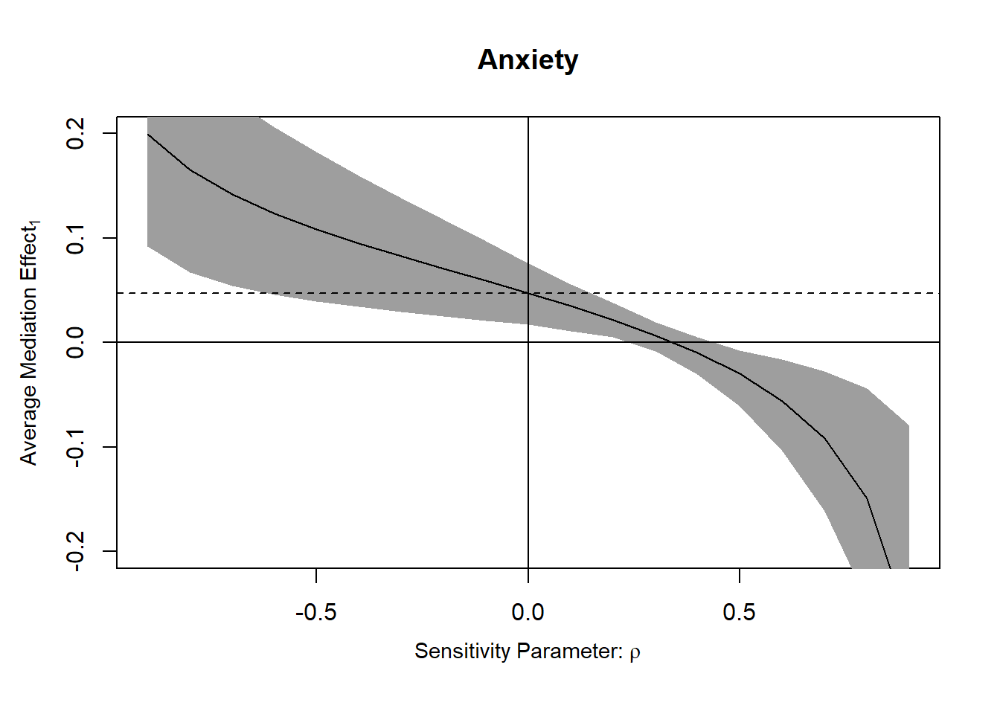
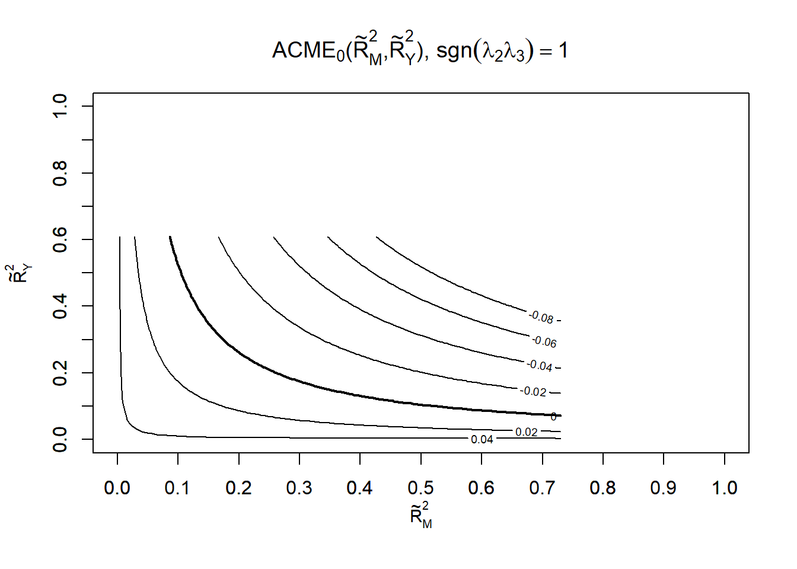

# Mediation

## Traditional

[@Baron_1986] is outdated because of step 1, but we could still see the original idea.

3 regressions

-   Step 1: $X \to Y$

-   Step 2: $X \to M$

-   Step 3: $X + M \to Y$

where

-   $X$ = independent variable

-   $Y$ = dependent variable

-   $M$ = mediating variable

1.  Originally, the first path from $X \to Y$ suggested by [@Baron_1986] needs to be signficaint. But there are cases that you could have indirect of $X$ on $Y$ without significant direct effect of $X$ on $Y$ (e.g., when the effect is absorbed into M, or there are two counteracting effects $M_1, M_2$ that cancel out each other effect).

Mathematically,

$$
Y = b_0 + b_1 X + \epsilon
$$

$b_1$ does **not** need to be **significant**.

<br>

2.  We examine the effect of $X$ on $M$. This step requires that there is a significant effect of $X$ on $M$ to continue with the analysis

Mathematically,

$$
M = b_0 + b_2 X + \epsilon
$$

where $b_2$ needs to be **significant**.

\<br\>

3.  In this step, we want to the effect of $M$ on $Y$ "absorbs" most of the direct effect of $X$ on $Y$ (or at least makes the effect smaller).

Mathematically,

$$
Y = b_0 + b_4 X + b_3 M + \epsilon
$$

$b_4$ needs to be either smaller or insignificant.

| The effect of $X$ on $Y$                           | then, $M$ ... mediates between $X$ and $Y$ |
|----------------------------------------------------|--------------------------------------------|
| completely disappear ($b_4$ insignificant)         | Fully (i.e., full mediation)               |
| partially disappear ($b_4$ smaller than in step 1) | Partially (i.e., partial mediation)        |

<br>

4.  Examine the mediation effect (i.e., whether it is significant)

-   Fist approach: Sobel's test [@Sobel_1982]

-   Second approach: bootstrapping [@Preacher_2004] (preferable)

More details can be found [here](https://cran.ism.ac.jp/web/packages/mediation/vignettes/mediation-old.pdf)

### Example 1 {#example-1-mediation-traditional}

from [Virginia's library](https://data.library.virginia.edu/introduction-to-mediation-analysis/)


```r
myData <-
    read.csv('http://static.lib.virginia.edu/statlab/materials/data/mediationData.csv')

# Step 1 (no longer necessary)
model.0 <- lm(Y ~ X, myData)

# Step 2
model.M <- lm(M ~ X, myData)

# Step 3
model.Y <- lm(Y ~ X + M, myData)

# Step 4 (boostrapping)
library(mediation)
results <- mediate(
    model.M,
    model.Y,
    treat = 'X',
    mediator = 'M',
    boot = TRUE,
    sims = 500
)
summary(results)
#> 
#> Causal Mediation Analysis 
#> 
#> Nonparametric Bootstrap Confidence Intervals with the Percentile Method
#> 
#>                Estimate 95% CI Lower 95% CI Upper p-value    
#> ACME             0.3565       0.2132         0.51  <2e-16 ***
#> ADE              0.0396      -0.1727         0.31    0.72    
#> Total Effect     0.3961       0.1716         0.66  <2e-16 ***
#> Prop. Mediated   0.9000       0.4655         1.89  <2e-16 ***
#> ---
#> Signif. codes:  0 '***' 0.001 '**' 0.01 '*' 0.05 '.' 0.1 ' ' 1
#> 
#> Sample Size Used: 100 
#> 
#> 
#> Simulations: 500
```

-   Total Effect = 0.3961 = $b_1$ (step 1) = total effect of $X$ on $Y$ without $M$

-   Direct Effect = ADE = 0.0396 = $b_4$ (step 3) = direct effect of $X$ on $Y$ accounting for the indirect effect of $M$

-   ACME = Average Causal Mediation Effects = $b_1 - b_4$ = 0.3961 - 0.0396 = 0.3565 = $b_2 \times b_3$ = 0.56102 \* 0.6355 = 0.3565

Using `mediation` package suggested by [@Imai_2010] [@Imai_2010_6060]. More on details of the package can be found [here](https://cran.r-project.org/web/packages/mediation/vignettes/mediation.pdf)

2 types of Inference in this package:

1.  Model-based inference:

    -   Assumptions:

        -   Treatment is randomized (could use matching methods to achieve this).

        -   Sequential Ignorability: conditional on covariates, there is other confounders that affect the relationship between (1) treatment-mediator, (2) treatment-outcome, (3) mediator-outcome. Typically hard to argue in observational data. This assumption is for the identification of ACME (i.e., average causal mediation effects).

2.  Design-based inference

<br>

Notations: we stay consistent with package instruction

-   $M_i(t)$ = mediator

-   $T_i$ = treatment status (0,1)

-   $Y_i(t,m)$ = outcome where t = treatment, and m = mediating variables.

-   $X_i$ = vector of observed pre-treatment confounders

-   Treatment effect (per unit $i$) = $\tau_i = Y_i(1,M_i(1)) - Y_i (0,M_i(0))$ which has 2 effects

    -   Causal mediation effects: $\delta_i (t) \equiv Y_i (t,M_i(1)) - Y_i(t,M_i(0))$

    -   Direct effects: $\zeta (t) \equiv Y_i (1, M_i(1)) - Y_i(0, M_i(0))$

    -   summing up to the treatment effect: $\tau_i = \delta_i (t) + \zeta_i (1-t)$

<br>

More on sequential ignorability

$$
\{ Y_i (t', m) , M_i (t) \} \perp T_i |X_i = x 
$$

$$
Y_i(t',m) \perp M_i(t) | T_i = t, X_i = x
$$

where

-   $0 < P(T_i = t | X_i = x)$

-   $0 < P(M_i = m | T_i = t , X_i =x)$

First condition is the standard strong ignorability condition where treatment assignment is random conditional on pre-treatment confounders.

Second condition is stronger where the mediators is also random given the observed treatment and pre-treatment confounders. This condition is satisfied only when there is no unobserved pre-treatment confounders, and post-treatment confounders, and multiple mediators that are correlated.

My understanding is that until the moment I write this note, there is **no way to test the sequential ignorability assumption**. Hence, researchers can only do sensitivity analysis to argue for their result.

<br>

## Model-based causal mediation analysis

I only put my understanding of model-based causal mediation analysis because I do not encounter design-based on. Maybe in the future when I have to use it, I will start reading on it.

Fit 2 models

-   mediator model: conditional distribution of the mediators $M_i | T_i, X_i$

-   Outcome model: conditional distribution of $Y_i | T_i, M_i, X_i$

`mediation` can accommodate almost all types of model for both mediator model and outcome model except Censored mediator model.

The update here is that estimation of ACME does not rely on product or difference of coefficients (see \@ref(example-1-mediation-traditional) ,

which requires very strict assumption: (1) linear regression models of mediator and outcome, (2) $T_i$ and $M_i$ effects are additive and no interaction


```r
library(mediation)
set.seed(2014)
data("framing", package = "mediation")

med.fit <-
    lm(emo ~ treat + age + educ + gender + income, data = framing)
out.fit <-
    glm(
        cong_mesg ~ emo + treat + age + educ + gender + income,
        data = framing,
        family = binomial("probit")
    )

# Quasi-Bayesian Monte Carlo 
med.out <-
    mediate(
        med.fit,
        out.fit,
        treat = "treat",
        mediator = "emo",
        robustSE = TRUE,
        sims = 1000 # should be 10000 in practice
    )
summary(med.out)
#> 
#> Causal Mediation Analysis 
#> 
#> Quasi-Bayesian Confidence Intervals
#> 
#>                          Estimate 95% CI Lower 95% CI Upper p-value    
#> ACME (control)             0.0826       0.0356         0.14  <2e-16 ***
#> ACME (treated)             0.0831       0.0348         0.14  <2e-16 ***
#> ADE (control)              0.0137      -0.0967         0.13    0.82    
#> ADE (treated)              0.0142      -0.1101         0.14    0.82    
#> Total Effect               0.0968      -0.0290         0.23    0.14    
#> Prop. Mediated (control)   0.7706      -6.3968         4.70    0.14    
#> Prop. Mediated (treated)   0.7938      -5.7506         4.52    0.14    
#> ACME (average)             0.0829       0.0351         0.14  <2e-16 ***
#> ADE (average)              0.0140      -0.1047         0.13    0.82    
#> Prop. Mediated (average)   0.7822      -6.0737         4.61    0.14    
#> ---
#> Signif. codes:  0 '***' 0.001 '**' 0.01 '*' 0.05 '.' 0.1 ' ' 1
#> 
#> Sample Size Used: 265 
#> 
#> 
#> Simulations: 1000
```

Nonparametric bootstrap version


```r
med.out <-
    mediate(
        med.fit,
        out.fit,
        boot = TRUE,
        treat = "treat",
        mediator = "emo",
        sims = 1000, # should be 10000 in practice
        boot.ci.type = "bca" # bias-corrected and accelerated intervals
    )
summary(med.out)
#> 
#> Causal Mediation Analysis 
#> 
#> Nonparametric Bootstrap Confidence Intervals with the BCa Method
#> 
#>                          Estimate 95% CI Lower 95% CI Upper p-value   
#> ACME (control)             0.0833       0.0386         0.15   0.002 **
#> ACME (treated)             0.0844       0.0374         0.15   0.002 **
#> ADE (control)              0.0114      -0.0875         0.13   0.792   
#> ADE (treated)              0.0125      -0.1033         0.14   0.792   
#> Total Effect               0.0958      -0.0291         0.23   0.124   
#> Prop. Mediated (control)   0.8696     -97.4552         1.00   0.126   
#> Prop. Mediated (treated)   0.8806     -82.9081         1.02   0.126   
#> ACME (average)             0.0839       0.0381         0.15   0.002 **
#> ADE (average)              0.0120      -0.0961         0.14   0.792   
#> Prop. Mediated (average)   0.8751     -90.6217         1.01   0.126   
#> ---
#> Signif. codes:  0 '***' 0.001 '**' 0.01 '*' 0.05 '.' 0.1 ' ' 1
#> 
#> Sample Size Used: 265 
#> 
#> 
#> Simulations: 1000
```

If theoretically understanding suggests that there is treatment and mediator interaction


```r
med.fit <-
    lm(emo ~ treat + age + educ + gender + income, data = framing)
out.fit <-
    glm(
        cong_mesg ~ emo * treat + age + educ + gender + income,
        data = framing,
        family = binomial("probit")
    )
med.out <-
    mediate(
        med.fit,
        out.fit,
        treat = "treat",
        mediator = "emo",
        robustSE = TRUE,
        sims = 100
    )
summary(med.out)
#> 
#> Causal Mediation Analysis 
#> 
#> Quasi-Bayesian Confidence Intervals
#> 
#>                           Estimate 95% CI Lower 95% CI Upper p-value    
#> ACME (control)            0.079925     0.035230         0.14  <2e-16 ***
#> ACME (treated)            0.097504     0.045279         0.17  <2e-16 ***
#> ADE (control)            -0.000865    -0.107228         0.11    0.98    
#> ADE (treated)             0.016714    -0.121163         0.14    0.76    
#> Total Effect              0.096640    -0.046523         0.23    0.26    
#> Prop. Mediated (control)  0.672278    -5.266859         3.40    0.26    
#> Prop. Mediated (treated)  0.860650    -6.754965         3.60    0.26    
#> ACME (average)            0.088715     0.040207         0.15  <2e-16 ***
#> ADE (average)             0.007925    -0.111833         0.14    0.88    
#> Prop. Mediated (average)  0.766464    -5.848496         3.43    0.26    
#> ---
#> Signif. codes:  0 '***' 0.001 '**' 0.01 '*' 0.05 '.' 0.1 ' ' 1
#> 
#> Sample Size Used: 265 
#> 
#> 
#> Simulations: 100
test.TMint(med.out, conf.level = .95) # test treatment-mediator interaction effect 
#> 
#> 	Test of ACME(1) - ACME(0) = 0
#> 
#> data:  estimates from med.out
#> ACME(1) - ACME(0) = 0.017579, p-value = 0.44
#> alternative hypothesis: true ACME(1) - ACME(0) is not equal to 0
#> 95 percent confidence interval:
#>  -0.02676143  0.06257828
```


```r
plot(med.out)
```


`mediation` can be used in conjunction with any of your imputation packages.

And it can also handle **mediated moderation** or **non-binary treatment variables**, or **multi-level data**

<br>

Sensitivity Analysis for sequential ignorability

-   test for unobserved pre-treatment covariates

-   $\rho$ = correlation between the residuals of the mediator and outcome regressions.

-   If $\rho$ is significant, we have evidence for violation of sequential ignorability (i.e., there is unobserved pre-treatment confounders).


```r
med.fit <-
    lm(emo ~ treat + age + educ + gender + income, data = framing)
out.fit <-
    glm(
        cong_mesg ~ emo + treat + age + educ + gender + income,
        data = framing,
        family = binomial("probit")
    )
med.out <-
    mediate(
        med.fit,
        out.fit,
        treat = "treat",
        mediator = "emo",
        robustSE = TRUE,
        sims = 100
    )
sens.out <-
    medsens(med.out,
            rho.by = 0.1, # \rho varies from -0.9 to 0.9 by 0.1
            effect.type = "indirect", # sensitivity on ACME
            # effect.type = "direct", # sensitivity on ADE
            # effect.type = "both", # sensitivity on ACME and ADE
            sims = 100)
summary(sens.out)
#> 
#> Mediation Sensitivity Analysis: Average Mediation Effect
#> 
#> Sensitivity Region: ACME for Control Group
#> 
#>      Rho ACME(control) 95% CI Lower 95% CI Upper R^2_M*R^2_Y* R^2_M~R^2_Y~
#> [1,] 0.3        0.0061      -0.0070       0.0163         0.09       0.0493
#> [2,] 0.4       -0.0081      -0.0254       0.0043         0.16       0.0877
#> 
#> Rho at which ACME for Control Group = 0: 0.3
#> R^2_M*R^2_Y* at which ACME for Control Group = 0: 0.09
#> R^2_M~R^2_Y~ at which ACME for Control Group = 0: 0.0493 
#> 
#> 
#> Sensitivity Region: ACME for Treatment Group
#> 
#>      Rho ACME(treated) 95% CI Lower 95% CI Upper R^2_M*R^2_Y* R^2_M~R^2_Y~
#> [1,] 0.3        0.0069      -0.0085       0.0197         0.09       0.0493
#> [2,] 0.4       -0.0099      -0.0304       0.0054         0.16       0.0877
#> 
#> Rho at which ACME for Treatment Group = 0: 0.3
#> R^2_M*R^2_Y* at which ACME for Treatment Group = 0: 0.09
#> R^2_M~R^2_Y~ at which ACME for Treatment Group = 0: 0.0493
```


```r
plot(sens.out, sens.par = "rho", main = "Anxiety", ylim = c(-0.2, 0.2))
```



ACME confidence intervals contains 0 when $\rho \in (0.3,0.4)$

Alternatively, using $R^2$ interpretation, we need to specify the direction of confounder that affects the mediator and outcome variables in `plot` using `sign.prod = "positive"` (i.e., same direction) or `sign.prod = "negative"` (i.e., opposite direction).


```r
plot(sens.out, sens.par = "R2", r.type = "total", sign.prod = "positive")
```


