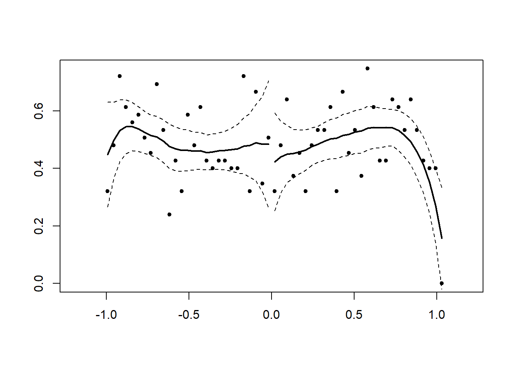
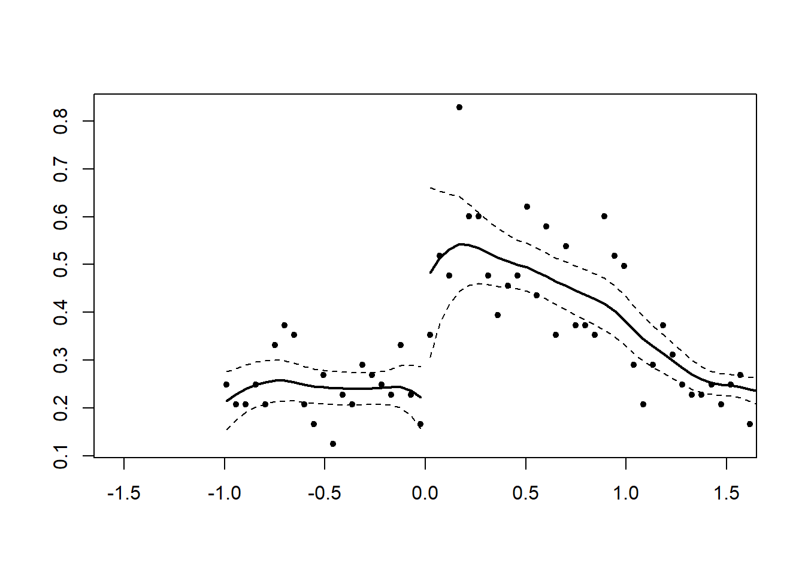
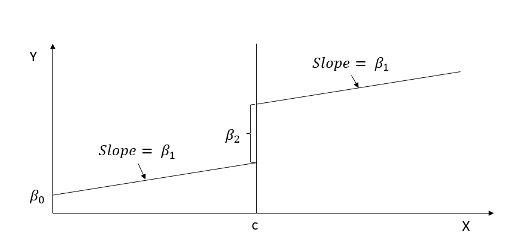

# Regression Discontinuity

-   A regression discontinuity occurs when there is a discrete change (jump) in treatment likelihood in the distribution of a continuous (or roughly continuous) variable (i.e., **running/forcing/assignment variable**).

    -   Running variable can also be time, but the argument for time to be continuous is hard to argue because usually we do not see increment of time (e.g., quarterly or annual data). Unless we have minute or hour data, then we might be able to argue for it.

-   Review paper [@imbens2007; @lee2010]

-   Other readings:

    -   <https://ies.ed.gov/ncee/wwc/Docs/ReferenceResources/wwc_rd.pdf>

    -   <https://ies.ed.gov/ncee/wwc/Docs/ReferenceResources/wwc_rdd_standards_122315.pdf>

-   [@thistlethwaite1960]: first paper to use RD in the context of merit awards on future academic outcomes.

-   RD is a localized experiment at the cutoff point

    -   Hence, we always have to qualify (perfunctory) our statement in research articles that "our research might not generalize to beyond the bandwidth."

-   In reality, RD and experimental (from random assignment) estimates are very similar ([@chaplin2018; @bertanha2014]; [Mathematica](https://www.mathematica.org/publications/replicating-experimental-impact-estimates-using-a-regression-discontinuity-approach)). But still, it's hard to prove empirically for every context (there might be future study that finds a huge difference between local estimate - causal - and overall estimate - random assignment.

-   Threats: only valid near threshold: inference at threshold is valid on average. Interestingly, random experiment showed the validity already.

-   Tradeoff between efficiency and bias

-   Regression discontinuity is under the framework of [Instrumental Variable] argued by [@angrist1999] and a special case of the [Matching Methods] (matching at one point) argued by [@heckman1999].

-   The hard part is to find a setting that can apply, but once you find one, it's easy to apply

-   We can also have multiple cutoff lines. However, for each cutoff line, there can only be one breakup point

-   RD can have multiple coinciding effects (i.e., joint distribution or bundled treatment), then RD effect in this case would be the joint effect.

-   As the running variable becomes more discrete your framework should be [Interrupted Time Series], but more granular levels you can use RD. When you have infinite data (or substantially large) the two frameworks are identical. RD is always better than [Interrupted Time Series]

-   Multiple alternative model specifications that produce consistent result are more reliable (parametric - linear regression with polynomials terms, and non-parametric - local linear regression)

-   RD should be viewed more as a description of a data generating process, rather than a method or approach (similar to randomized experiment)

-   RD is close to

    -   other quasi-experimental methods in the sense that it's based on the discontinuity at a threshold

    -   randomized experiments in the sense that it's local randomization.

<br>

There are several types of Regression Discontinuity:

1.  Sharp RD: Change in treatment probability at the cutoff point is 1

    -   Kink design: Instead of a discontinuity in the level of running variable, we have a discontinuity in the slope of the function (while the function/level can remain continuous) [@nielsen2010]. See [@böckerman2018] for application, and [@card2012; @card2015b] for theory.

2.  Kink RD

3.  Fuzzy RD: Change in treatment probability less than 1

4.  Fuzzy Kink RD

5.  RDiT: running variable is time.

Others:

-   Multiple cutoff

-   Multiple Scores

-   Geographic RD

-   Dynamic Treatments

-   Continuous Treatments

Consider

$$
D_i = 1_{X_i > c}
$$

$$
D_i = 
\begin{cases}
D_i = 1 \text{ if } X_i > C \\
D_i = 0 \text{ if } X_i < C
\end{cases}
$$

where

-   $D_i$ = treatment effect

-   $X_i$ = score variable (continuous)

-   $c$ = cutoff point

**Identification (Identifying assumption**s) of RD:

Average Treatment Effect at the cutoff (continuity-based)

$$
\begin{aligned}
\alpha_{SRDD} &= E[Y_{1i} - Y_{0i} | X_i = c] \\
&= E[Y_{1i}|X_i = c] - E[Y_{0i}|X_i = c]\\
&= \lim_{x \to c^+} E[Y_{1i}|X_i = c] - \lim_{x \to c^=} E[Y_{0i}|X_i = c]
\end{aligned}
$$

Average Treatment Effect in a neighborhood (Local Randomization-based):

$$
\begin{aligned}
\alpha_{LR} &= E[Y_{1i} - Y_{0i}|X_i \in W] \\
&= \frac{1}{N_1} \sum_{X_i \in W, T_i = 1}Y_i - \frac{1}{N_0}\sum_{X_i \in W, T_i =0} Y_i
\end{aligned}
$$

Local Randomization Approach assumes that inside the chosen window $W = [c-w, c+w]$ are assigned to treatment as good as random:

1.  Joint probability distribution of scores for units inside the chosen window $W$ is known
2.  Potential outcomes are not affected by value of the score

$$
Y_i(0,x) = Y_i(0) \\
Y_i(1,x) = Y_i(1)
$$

This approach is stronger than the continuity-based because we assume the regressions are continuously at $c$ and unaffected by the running variable inside the chosen window $W$

RDD estimates the local average treatment effect (LATE), at the cutoff point which is not at the individual or population levels.

Since researchers typically care more about the internal validity, than external validity, localness affects only external validity.

**Assumptions**:

-   Independent assignment

-   Continuity of conditional regression functions

    -   $E[Y(0)|X=x]$ and $E[Y(1)|X=x]$ are continuous in x.

-   RD is valid if cutpoint is **exogenous (i.e., no endogenous selection)** and running variable is **not manipulable**

-   Only treatment(s) (e.g., could be joint distribution of multiple treatments) cause discontinuity or jump in the outcome variable

-   All other factors are **smooth** through the cutoff (i.e., threshold) value. (we can also test this assumption by seeing no discontinuity in other factors). If they "jump", they will bias your causal estimate

<br>

**Threats to RD**

-   Variables (other than treatment) change discontinously at the cutoff

    -   We can test for jumps in these variables (including pre-treatment outcome)

-   Multiple discontinuities for the assignment variable

-   Manipulation of the assignment variable

    -   At the cutoff point, check for continuity in the density of the assignment variable.

<br>

## Specification Checks

1.  [Balance Checks]
2.  [Sorting/Bunching/Manipulation]
3.  [Placebo Tests]
4.  [Sensitivity to Bandwidth Choice]

<br>

### Balance Checks

-   Also known as checking for Discontinuities in Average Covariates

-   Null Hypothesis: The average effect of covariates on pseudo outcomes (i.e., those qualitatively cannot be affected by the treatment) is 0.

-   If this hypothesis is rejected, you better have a good reason to why because it can cast serious doubt on your RD design.

<br>

### Sorting/Bunching/Manipulation

-   Also known as checking for A Discontinuity in the Distribution of the Forcing Variable

-   Also known as clustering or density test

-   Formal test is McCrary sorting test [@mccrary2008] or [@cattaneo2019]

-   Since human subjects can manipulate the running variable to be just above or below the cutoff (assuming that the running variable is manipulable), especially when the cutoff point is known in advance for all subjects, this can result in a discontinuity in the distribution of the running variable at the cutoff (i.e., we will see "bunching" behavior right before or after the cutoff)\>

    -   People would like to sort into treatment if it's desirable. The density of the running variable would be 0 just below the threshold

    -   People would like to be out of treatment if it's undesirable

-   [@mccrary2008] proposes a density test (i.e., a formal test for manipulation of the assignment variable).

    -   $H_0$: The continuity of the density of the running variable (i.e., the covariate that underlies the assignment at the discontinuity point)

    -   $H_a$: A jump in the density function at that point

    -   Even though it's not a requirement that the density of the running must be continuous at the cutoff, but a discontinuity can suggest manipulations.

-   [@lee2009] offers a guide to know when you should warrant the manipulation

-   Usually it's better to know your research design inside out so that you can suspect any manipulation attempts.

    -   We would suspect the direction of the manipulation. And typically, it's one-way manipulation. In cases where we might have both ways, theoretically they would cancel each other out.

-   We could also observe partial manipulation in reality (e.g., when subjects can only imperfectly manipulate). But typically, as we treat it like fuzzy RD, we would not have identification problems. But complete manipulation would lead to serious identification issues.

-   Remember: even in cases where we fail to reject the null hypothesis for the density test, we could not rule out completely that identification problem exists (just like any other hypotheses)

-   Bunching happens when people self-select to a specific value in the range of a variable (e.g., key policy thresholds).

-   Review paper [@kleven2016]

-   **This test can only detect manipulation that changes the distribution of the running variable**. If you can choose the cutoff point or you have 2-sided manipulation, this test will fail to detect it.

-   Histogram in bunching is similar to a density curve (we want narrower bins, wider bins bias elasticity estimates)

-   We can also use bunching method to study individuals' or firm's responsiveness to changes in policy.

-   Under RD, we assume that we don't have any manipulation in the running variable. However, bunching behavior is a manipulation by firms or individuals. Thus, violating this assumption.

    -   Bunching can fix this problem by estimating what densities of individuals would have been without manipulation (i.e., manipulation-free counterfactual).

    -   **The fraction of persons who manipulated** is then calculated by comparing the observed distribution to manipulation-free counterfactual distributions.

    -   Under RD, we do not need this step because the observed and manipulation-free counterfactual distributions are assumed to be the same. RD assume there is no manipulation (i.e., assume the manipulation-free counterfactual distribution)

When running variable and outcome variable are simultaneously determined, we can use a modified RDD estimator to have consistent estimate. [@bajari2011]

-   **Assumptions**:

    -   Manipulation is **one-sided**: People move one way (i.e., either below the threshold to above the threshold or vice versa, but not to or away the threshold), which is similar to the monotonicity assumption under instrumental variable \@ref(instrumental-variable)

    -   Manipulation is **bounded** (also known as regularity assumption): so that we can use people far away from this threshold to derive at our counterfactual distribution [@blomquist2017]

Steps:

1.  Identify the window in which the running variable contains bunching behavior. We can do this step empirically based on data [@bosch2020]. Additionally robustness test is needed (i.e., varying the manipulation window).
2.  Estimate the manipulation-free counterfactual
3.  Calculating the standard errors for inference can follow [@chetty2011] where we bootstrap resampling residuals in the estimation of the counts of individuals within bins (large data can render this step unnecessary).

If we pass the bunching test, we can move on to the [Placebo Test]

@mccrary2008 test

A jump in the density at the threshold (i.e., discontinuity) hold can serve as evidence for sorting around the cutoff point


```r
library(rdd)

# you only need the runing variable and hte cutoff point

# Example by the package's authors
#No discontinuity
x<-runif(1000,-1,1)
DCdensity(x,0)
```



```
#> [1] 0.01035782

#Discontinuity
x<-runif(1000,-1,1)
x<-x+2*(runif(1000,-1,1)>0&x<0)
DCdensity(x,0)
```



```
#> [1] 0.6857721
```

@cattaneo2019 test


```r
library(rddensity)

# Example by the package's authors
# Continuous Density
set.seed(1)
x <- rnorm(2000, mean = -0.5)
rdd <- rddensity(X = x, vce = "jackknife")
summary(rdd)
#> 
#> Manipulation testing using local polynomial density estimation.
#> 
#> Number of obs =       2000
#> Model =               unrestricted
#> Kernel =              triangular
#> BW method =           estimated
#> VCE method =          jackknife
#> 
#> c = 0                 Left of c           Right of c          
#> Number of obs         1376                624                 
#> Eff. Number of obs    354                 345                 
#> Order est. (p)        2                   2                   
#> Order bias (q)        3                   3                   
#> BW est. (h)           0.514               0.609               
#> 
#> Method                T                   P > |T|             
#> Robust                -0.6798             0.4966              
#> 
#> 
#> P-values of binomial tests (H0: p=0.5).
#> 
#> Window Length / 2          <c     >=c    P>|T|
#> 0.013                      11       9    0.8238
#> 0.026                      19      15    0.6076
#> 0.038                      29      21    0.3222
#> 0.051                      42      26    0.0681
#> 0.064                      44      33    0.2543
#> 0.077                      48      45    0.8358
#> 0.090                      55      51    0.7709
#> 0.102                      66      59    0.5917
#> 0.115                      74      67    0.6135
#> 0.128                      82      71    0.4189

# you have to specify your own plot (read package manual)
```

<br>

### Placebo Tests

-   Also known as Discontinuities in Average Outcomes at Other Values

-   We should not see any jumps at other values (either $X_i <c$ or $X_i \ge c$)

    -   Use the same bandwidth you use for the cutoff, and move it along the running variable: testing for a jump in the conditional mean of the outcome at the median of the running variable.

-   Also known as falsification checks

-   Before and after the cutoff point, we can run the placebo test to see whether X's are different).

-   The placebo test is where you expect your coefficients to be not different from 0.

-   This test can be used for

    -   Testing no discontinuity in predetermined variables:

    -   Testing other discontinuities

    -   Inclusion and exclusion of covariates: RDD parameter estimates should not be sensitive to the inclusion or exclusion of other covariates.

-   This is analogous to [Experimental Design] where we cannot only test whether the observables are similar in both treatment and control groups (if we reject this, then we don't have random assignment), but we cannot test unobservables.

Balance on observable characteristics on both sides

$$
Z_i = \alpha_0 + \alpha_1 f(x_i) + [I(x_i \ge c)] \alpha_2 + [f(x_i) \times I(x_i \ge c)]\alpha_3 + u_i
$$

where

-   $x_i$ is the running variable

-   $Z_i$ is other characteristics of people (e.g., age, etc)

Theoretically, $Z_i$ should no be affected by treatment. Hence, $E(\alpha_2) = 0$

Moreover, when you have multiple $Z_i$, you typically have to simulate joint distribution (to avoid having significant coefficient based on chance).

The only way that you don't need to generate joint distribution is when all $Z_i$'s are independent (unlikely in reality).

Under RD, you shouldn't have to do any [Matching Methods]. Because just like when you have random assignment, there is no need to make balanced dataset before and after the cutoff. If you have to do balancing, then your RD assumptions are probably wrong in the first place.

### Sensitivity to Bandwidth Choice

-   Methods for bandwidth selection

    -   Ad hoc or substantively driven

    -   Data driven: cross validation

    -   Conservative approach: [@cattaneo2020]

-   The objective is to minimize the mean squared error between the estimated and actual treatment effects.

-   Then, we need to see how sensitive our results will be dependent on the choice of bandwidth.

-   In some cases, the best bandwidth for testing covariates may not be the best bandwidth for treating them, but it may be close.


```r
# find optimal bandwidth by Imbens-Kalyanaraman
rdd::IKbandwidth(running_var, outcome_var, cutpoint = "", kernel = "triangular") # can also pick other kernels
```

### Fuzzy RD Design

When you have cutoff that does not perfect determine treatment, but creates a discontinuity in the likelihood of receiving the treatment, you need another instrument

For those that are close to the cutoff, we create an instrument for $D_i$

$$
Z_i=
\begin{cases}
1 & \text{if } X_i \ge c \\
0 & \text{if } X_c < c
\end{cases}
$$

Then, we can estimate the effect of the treatment for compliers only (i.e., those treatment $D_i$ depends on $Z_i$)

The LATE parameter

$$
\lim_{c - \epsilon \le X \le c + \epsilon, \epsilon \to 0}( \frac{E(Y |Z = 1) - E(Y |Z=0)}{E(D|Z = 1) - E(D|Z = 0)})
$$

equivalently, the canonical parameter:

$$
\frac{lim_{x \downarrow c}E(Y|X = x) - \lim_{x \uparrow c} E(Y|X = x)}{\lim_{x \downarrow c } E(D |X = x) - \lim_{x \uparrow c}E(D |X=x)}
$$

Two equivalent ways to estimate

1.  First

    1.  Sharp RDD for $Y$

    2.  Sharp RDD for $D$

    3.  Take the estimate from step 1 divide by that of step 2

2.  Second: Subset those observations that are close to $c$ and run instrumental variable $Z$

<br>

### Regression Kink Design

-   If the slope of the treatment intensity changes at the cutoff (instead of the level of treatment assignment), we can have regression kink design

-   Example: unemployment benefits

Sharp Kink RD parameter

$$
\alpha_{KRD} = \frac{\lim_{x \downarrow c} \frac{d}{dx}E[Y_i |X_i = x]- \lim_{x \uparrow c} \frac{d}{dx}E[Y_i |X_i = x]}{\lim_{x \downarrow c} \frac{d}{dx}b(x) - \lim_{x \uparrow c} \frac{d}{dx}b(x)}
$$

where $b(x)$ is a known function inducing "kink"

Fuzzy Kink RD parameter

$$
\alpha_{KRD} = \frac{\lim_{x \downarrow c} \frac{d}{dx}E[Y_i |X_i = x]- \lim_{x \uparrow c} \frac{d}{dx}E[Y_i |X_i = x]}{\lim_{x \downarrow c} \frac{d}{dx}E[D_i |X_i = x]- \lim_{x \uparrow c} \frac{d}{dx}E[D_i |X_i = x]}
$$

### Mutli-cutoff, Multi-score, geographic RD

Multi-cutoff

$$
E[Y_{1i} - Y_{0i}|X_i = x, C_i = c]
$$

Multi-score (in multiple dimensions) (e.g., math and English cutoff for certain honor class):

$$
E[Y_{1i} - Y_{0i}|X_{1i} = x_1, X_{2i} = x]
$$

<br>

## Steps for Sharp RD

1.  Graph the data by computing the average value of the outcome variable over a set of bins (large enough to see a smooth graph, and small enough to make the jump around the cutoff clear).

2.  Run regression on both sides of the cutoff to get the treatment effect

3.  Robustness checks:

    1.  Assess possible jumps in other variables around the cutoff

    2.  Hypothesis testing for bunching

    3.  Placebo tests

    4.  Varying bandwidth

<br>

## Steps for Fuzzy RD

1.  Graph the data by computing the average value of the outcome variable over a set of bins (large enough to see a smooth graph, and small enough to make the jump around the cutoff clear).

2.  Graph the probability of treatment

3.  Estimate the treatment effect using 2SLS

4.  Robustness checks:

    1.  Assess possible jumps in other variables around the cutoff

    2.  Hypothesis testing for bunching

    3.  Placebo tests

    4.  Varying bandwidth

## Steps for RDiT (Regression Discontinuity in Time)

Notes:

-   Additional assumption: Time-varying confounders change smoothly across the cutoff date
-   Typically used in policy implementation in the same date for all subjects, but can also be used for cases where implementation dates are different between subjects. In the second case, researchers typically use different RDiT specification for each time series.
-   Sometimes the date of implementation is not randomly assigned by chosen strategically. Hence, RDiT should be thought of as the "discontinuity at a threshold" interpretation of RD (not as "local randomization"). [@hausman2018, p. 8]
-   Normal RD uses variation in the $N$ dimension, while RDiT uses variation in the $T$ dimension
-   Choose polynomials based on BIC typically. And can have either global polynomial or pre-period and post-period polynomial for each time series (but usually the global one will perform better)
-   Could use **augmented local linear** outlined by [@hausman2018, p. 12], where estimate the model with all the control first then take the residuals to include in the model with the RDiT treatment (remember to use bootstrapping method to account for the first-stage variance in the second stage).

Pros:

-   can overcome cases where there is no cross-sectional variation in treatment implementation (dif-n-dif is not feasible)

    -   There are papers that use both RDiT and DiD to (1) see the differential treatment effects across individuals/ space [@auffhammer2011] or (2) compare the 2 estimates where the control group's validity is questionable [@gallego2013].

-   Better than pre/post comparison because it can include flexible controls

-   Better than event studies because it can use long-time horizons (may not be too relevant now since the development long-time horizon event studies), and it can use higher-order polynomials time control variables.

Cons:

-   Taking observation for from the threshold (in time) can bias your estimates because of unobservables and time-series properties of the data generating process.

-   [@mccrary2008] test is not possible (see [Sorting/Bunching/Manipulation]) because when the density of the running (time) is uniform, you can't use the test.

-   Time-varying unobservables may impact the dependent variable discontinuously

-   Error terms are likely to include persistence (serially correlated errors)

-   Researchers cannot model time-varying treatment under RDiT

    -   In a small enough window, the local linear specification is fine, but the global polynomials can either be too big or too small [@hausman2018]

Biases

-   Time-Varying treatment Effects

    -   increase sample size either by

        -   more granular data (greater frequency): will not increase power because of the problem of serial correlation

        -   increasing time window: increases bias from other confounders

    -   2 additional assumption:

        -   Model is correctly specified (with all confoudners or global polynomial approximation)

        -   Treatment effect is correctly specified (whether it's smooth and constant, or varies)

        -   These 2 assumptions do not interact ( we don't want them to interact - i.e., we don't want the polynomial correlated with the unobserved variation in the treatment effect)

    -   There usually a difference between short-run and long-run treatment effects, but it's also possibly that the bias can stem from the over-fitting problem of the polynomial specification. [@hausman2018, p. 544]

-   Autoregression (serial dependence)

    -   Need to use **clustered standard errors** to account for serial dependence in the residuals

    -   In the case of serial dependence in $\epsilon_{it}$, we don't have a solution, including a lagged dependent variable would misspecify the model (probably find another research project)

    -   In the case of serial dependence in $y_{it}$, with long window, it becomes fuzzy to what you try to recover. You can include the **lagged dependent variable** (bias can still come from the time-varying treatment or over-fitting of the global polynomial)

-   Sorting and Anticipation Effects

    -   Cannot run the [@mccrary2008] because the density of the time running variable is uniform

    -   Can still run tests to check discontinuities in other covariates (you want no discontinuities) and discontinuities in the outcome variable at other placebo thresholds ( you don't want discontinuities)

    -   Hence, it's hard to argue for the causal effect here because it could be the total effect of the causal treatment and the unobserved sorting/anticipation/adaptation/avoidance effects. You can only argue that there is no such behavior

Recommendations for robustness check following [@hausman2018, p. 549]

1.  Plot the raw data and residuals (after removing confounders or trend). With varying polynomial and local linear controls, inconsistent results can be a sign of time-varying treatment effects.
2.  Using global polynomial, you could overfit, then show polynomial with different order and alternative local linear bandwidths. If the results are consistent, you're ok
3.  [Placebo Tests]: estimate another RD (1) on another location or subject (that did not receive the treatment) or (2) use another date.
4.  Plot RD discontinuity on continuous controls
5.  Donut RD to see if avoiding the selection close to the cutoff would yield better results [@barreca2011]
6.  Test for auto-regression (using only pre-treatment data). If there is evidence for autoregression, include the lagged dpednetn variable
7.  Augmented local linear (no need to use global polynomial and avoid over-fitting)
    1.  Use full sample to exclude the effect of important predictors

    2.  Estimate the conditioned second stage on a smaller sample bandwidth

Examples from [@hausman2018, p. 534] in

econ

-   [@davis2008]: Air quality

-   [@auffhammer2011]: Air quality

-   [@chen2012]: Air quality

-   [@depaola2012]: car accidents

-   [@gallego2013]: air quality

-   [@bento2014]: Traffic

-   [@anderson2014]: Traffic

-   [@burger2014]: Car accidents

-   [@brodeur2021]: covid 19 lockdowns on well-being

marketing

-   [@busse2006]: Vehicle prices

-   [@chen2009]: Customer Satisfaction

-   [@busse2010]: Vehicle prices

-   [@davis2010]: vehicle prices

<br>

## Evaluation of an RD

-   Evidence for (either formal tests or graphs)

    -   Treatment and outcomes change discontinuously at the cutoff, while other variables and pre-treatment outcomes do not.

    -   No manipulation of the assignment variable.

-   Results are robust to various functional forms of the forcing variable

-   Is there any other (unobserved) confound that could cause the discontinuous change at the cutoff (i.e., multiple forcing variables / bundling of institutions)?

-   External Validity: How likely the result at the cutoff will generalize?

<br>

**General Model**

$$
Y_i = \beta_0 + f(x_i) \beta_1 + [I(x_i \ge c)]\beta_2 + \epsilon_i
$$

where $f(x_i)$ is any functional form of $x_i$

**Simple case**

When $f(x_i) = x_i$ (linear function)

$$
Y_i = \beta_0 + x_i \beta_1 + [I(x_i \ge c)]\beta_2 + \epsilon_i
$$

{style="display: block; margin: 1em auto" width="90%"}

RD gives you $\beta_2$ (causal effect) of $X$ on $Y$ at the cutoff point

In practice, everyone does

$$
Y_i = \alpha_0 + f(x) \alpha _1 + [I(x_i \ge c)]\alpha_2 + [f(x_i)\times [I(x_i \ge c)]\alpha_3 + u_i
$$

{style="display: block; margin: 1em auto" width="90%"}

where we estimate different slope on different sides of the line

and if you estimate $\alpha_3$ to be no different from 0 then we return to the simple case

**Notes**:

-   Sparse data can make $\alpha_3$ large differential effect

-   People are very skeptical when you have complex $f(x_i)$, usual simple function forms (e.g., linear, squared term, etc.) should be good. However, if you still insist, then **non-parametric estimation** can be your best bet.

Bandwidth of $c$ (window)

-   Closer to $c$ can give you lower bias, but also efficiency

-   Wider $c$ can increase bias, but higher efficiency.

-   Optimal bandwidth is very controversial, but usually we have to do it in the appendix for research article anyway.

-   We can either

    -   drop observations outside of bandwidth or

    -   weight depends on how far and close to $c$

## Applications

Examples in marketing:

-   [@narayanan2015]

-   [@hartmann2011a]: nonparametric estimation and guide to identifying causal marketing mix effects

[Packages](https://rdpackages.github.io/) in R (see [@thoemmes2016] for detailed comparisons): all can handle both sharp and fuzzy RD

-   `rdd`

-   `rdrobust`

-   `rddensity` discontinuity in density tests ([Sorting/Bunching/Manipulation]) using local polynomials and binomial test

-   `rdlocrand` covariate balance, binomial tests, window selection

-   `rdmulti` multiple cutoffs and multiple scores

-   `rdpower` power, sample selection

-   `rddtools`

+-----------------------+-------------------------+---------------------------------+----------------------------------------------+
| Package               | rdd                     | rdrobust                        | rddtools                                     |
+=======================+=========================+=================================+==============================================+
| Coefficient estimator | Local linear regression | local polynomial regression     | local polynomial regression                  |
+-----------------------+-------------------------+---------------------------------+----------------------------------------------+
| bandwidth selectors   | [@imbens2009]           | [@calonico2014]                 | [@imbens2010]                                |
|                       |                         |                                 |                                              |
|                       |                         | [@imbens2010]                   |                                              |
|                       |                         |                                 |                                              |
|                       |                         | [@ludwig2007]                   |                                              |
|                       |                         |                                 |                                              |
|                       |                         | [@calonico2019; @calonico2019a] |                                              |
+-----------------------+-------------------------+---------------------------------+----------------------------------------------+
| Kernel functions      | Epanechnikov            | Epanechnikov                    | Gaussian                                     |
|                       |                         |                                 |                                              |
| -   Triangular        | Gaussian                |                                 |                                              |
|                       |                         |                                 |                                              |
| -   Rectangular       |                         |                                 |                                              |
+-----------------------+-------------------------+---------------------------------+----------------------------------------------+
| Bias Correction       |                         | Local polynomial regression     |                                              |
+-----------------------+-------------------------+---------------------------------+----------------------------------------------+
| Covariate options     | Include                 | Include                         | Include                                      |
|                       |                         |                                 |                                              |
|                       |                         |                                 | Residuals                                    |
+-----------------------+-------------------------+---------------------------------+----------------------------------------------+
| Assumptions testing   | McCrary sorting         |                                 | McCrary sorting                              |
|                       |                         |                                 |                                              |
|                       |                         |                                 | Equality of covariates distribution and mean |
+-----------------------+-------------------------+---------------------------------+----------------------------------------------+

based on table 1 [@thoemmes2016] (p. 347)

### Example 1

Example by [Leihua Ye](https://towardsdatascience.com/the-crown-jewel-of-causal-inference-regression-discontinuity-design-rdd-bad37a68e786)

$$
Y_i = \beta_0 + \beta_1 X_i + \beta_2 W_i + u_i
$$

$$
X_i = 
\begin{cases}
1, W_i \ge c \\
0, W_i < c
\end{cases}
$$


```r
#cutoff point = 3.5
GPA <- runif(1000, 0, 4)
future_success <- 10 + 2 * GPA + 10 * (GPA >= 3.5) + rnorm(1000)
#install and load the package ‘rddtools’
#install.packages(“rddtools”)
library(rddtools)
data <- rdd_data(future_success, GPA, cutpoint = 3.5)
# plot the dataset
plot(
    data,
    col =  "red",
    cex = 0.1,
    xlab =  "GPA",
    ylab =  "future_success"
)
```


```r
# estimate the sharp RDD model
rdd_mod <- rdd_reg_lm(rdd_object = data, slope =  "same")
summary(rdd_mod)
#> 
#> Call:
#> lm(formula = y ~ ., data = dat_step1, weights = weights)
#> 
#> Residuals:
#>      Min       1Q   Median       3Q      Max 
#> -2.93235 -0.66786 -0.00799  0.69991  3.01768 
#> 
#> Coefficients:
#>             Estimate Std. Error t value Pr(>|t|)    
#> (Intercept) 17.08582    0.07178  238.03   <2e-16 ***
#> D            9.95513    0.11848   84.03   <2e-16 ***
#> x            2.01615    0.03546   56.85   <2e-16 ***
#> ---
#> Signif. codes:  0 '***' 0.001 '**' 0.01 '*' 0.05 '.' 0.1 ' ' 1
#> 
#> Residual standard error: 1.046 on 997 degrees of freedom
#> Multiple R-squared:  0.9617,	Adjusted R-squared:  0.9616 
#> F-statistic: 1.253e+04 on 2 and 997 DF,  p-value: < 2.2e-16
```


```r
# plot the RDD model along with binned observations
plot(
    rdd_mod,
    cex = 0.1,
    col =  "red",
    xlab =  "GPA",
    ylab =  "future_success"
)
```


### Example 2

@bowblis2019

Occupational licensing can either increase or decrease market efficiency:

-   More information means more efficiency

-   Increased entry barriers (i.e., friction) increase efficiency

Components of RD

-   Running variable
-   Cutoff: 120 beds or above
-   Treatment: you have to have the treatment before the cutoff point.

Under OLS

$$
Y_i = \alpha_0 + X_i \alpha_1 + LW_i \alpha_2 + \epsilon_i
$$

where

-   $LW_i$ Licensed/certified workers (in fraction format for each center).

-   $Y_i$ = Quality of service

Bias in $\alpha_2$

-   Mitigation-based: terrible quality can lead to more hiring, which negatively bias $\alpha_2$

-   Preference-based: places that have higher quality staff want to keep high quality staffs.

Under RD

$$
Y_{ist} = \beta_0 + [I(Bed \ge121)_{ist}]\beta_1 + f(Size_{ist}) \beta_2 + [f(Size_{ist}) \times I(Bed \ge 121)_{ist}] \beta_3 \\
+ X_{it} \delta + \gamma_s + \theta_t + \epsilon_{ist}
$$

where

-   $s$ = state

-   $t$ = year

-   $i$ = hospital

This RD is fuzzy

-   If right near the threshold (bandwidth), we have states with different sorting (i.e., non-random), then we need the fixed-effect for state $s$. But then your RD assumption wrong anyway, then you won't do it in the first place

-   Technically, we could also run the fixed-effect regression, but because it's lower in the causal inference hierarchy. Hence, we don't do it.

-   Moreover, in the RD framework, we don't include $t$ before treatment (but in the FE we have to include before and after)

-   If we include $\pi_i$ for each hospital, then we don't have variation in the causal estimates (because hardly any hospital changes their bed size in the panel)

-   When you have $\beta_1$ as the intent to treat (because the treatment effect does not coincide with the intent to treat)

-   You cannot take those fuzzy cases out, because it will introduce the selection bias.

-   Note that we cannot drop cases based on behavioral choice (because we will exclude non-compliers), but we can drop when we have particular behaviors ((e.g., people like round numbers).

Thus, we have to use Instrument variable \@ref(instrumental-variable)

**Stage 1:**

$$
QSW_{ist} = \alpha_0 + [I(Bed \ge121)_{ist}]\alpha_1 + f(Size_{ist}) \alpha_2 + [f(Size_{ist}) \times I(Bed \ge 121)_{ist}] \alpha_3 \\
+ X_{it} \delta + \gamma_s + \theta_t + \epsilon_{ist}
$$

(Note: you should have different fixed effects and error term - $\delta, \gamma_s, \theta_t, \epsilon_{ist}$ from the first equation, but I ran out of Greek letters)

**Stage 2:**

$$
Y_{ist} = \gamma_0 + \gamma_1 \hat{QWS}_{ist} + f(Size_{ist}) \delta_2 + [f(Size_{ist}) \times I(Bed \ge 121)] \delta_3 \\
 + X_{it} \lambda + \eta_s + \tau_t + u_{ist}
$$

-   The bigger the jump (discontinuity), the more similar the 2 coefficients ($\gamma_1 \approx \beta_1$) where $\gamma_1$ is the average treatment effect (of exposing to the policy)

-   $\beta_1$ will always be closer to 0 than $\gamma_1$

-   Figure 1 shows bunching at every 5 units cutoff, but 120 is still out there.

-   If we have manipulable bunching, there should be decrease at 130

-   Since we have limited number of mass points (at the round numbers), we should clustered standard errors by the mass point

<br>

### Example 3

Replication of [@carpenter2009] by [Philipp Leppert](https://rpubs.com/phle/r_tutorial_regression_discontinuity_design), dataset from [here](https://www.openicpsr.org/openicpsr/project/113550/version/V1/view?flag=follow&pageSize=100&sortOrder=(?title)&sortAsc=true)

### Example 4

For a detailed application, see [@thoemmes2016] where they use `rdd`, `rdrobust`, `rddtools`
