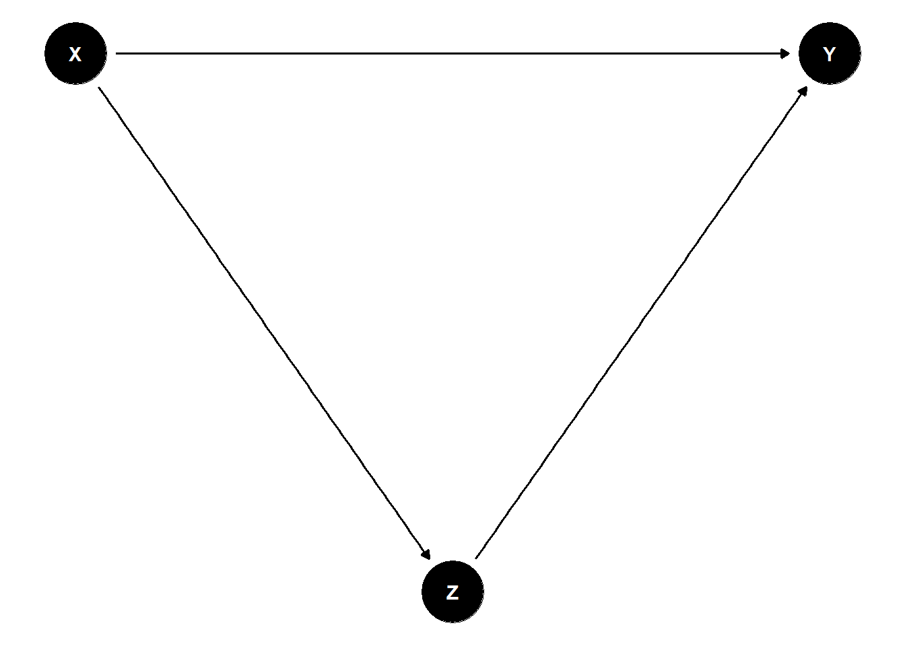
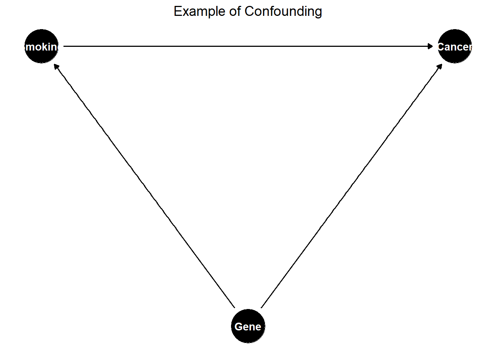
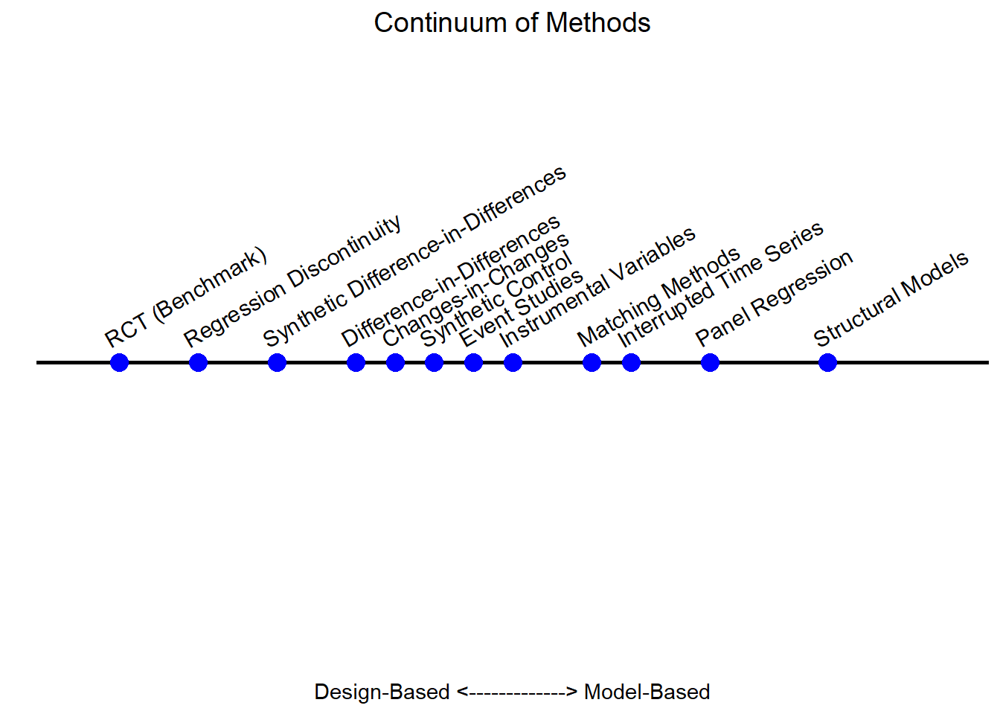

# Quasi-Experimental Methods {#sec-quasi-experimental}

Randomized experiments are often considered the gold standard for causal inference. However, in many real-world settings (e.g., evaluating public policy, marketing campaigns, or large-scale organizational changes), true randomization is either impractical, unethical, or impossible. This volume turns to quasi-experimental methods: a powerful toolkit for estimating causal effects when randomization is not an option.

Building on the foundation established in the previous volume on experimental design, we now explore strategies that use observational data to approximate the logic of an experiment. Quasi-experimental methods typically rely on **pre- and post-intervention data** and seek out naturally occurring, plausibly **exogenous sources of variation** that can mimic random assignment. While these designs often strengthen internal validity, they also raise critical concerns about generalizability beyond the sample and the assumptions required for causal interpretation.

As you engage with the material in this chapter, keep in mind three key considerations that often shape the credibility and applicability of quasi-experimental findings:

-   **Representativeness of the Sample**: Do the units under study reflect a broader population to which results might be generalized?
-   [**Limitations of the Design**](#sec-limitations-of-quasi-experiments): What assumptions are required for identification, and how sensitive are results to violations of these assumptions?
-   **Integrating Quasi-Experimental Results with Structural Models**: Can quasi-experimental estimates be embedded within theoretical or economic models to extend their implications?
    -   For concrete applications, see @anderson2015growth, @einav2010beyond, and @chung2014bonuses, which demonstrate how these tools are used in business and policy evaluation contexts.

Quasi-experimental methods are central to applied research across economics, marketing, political science, and public health.

<!-- Great resources for causal inference include: -->

<!-- -   [Causal Inference Mixtape](https://mixtape.scunning.com/introduction.html) -->

<!-- -   [Recent Advances in Micro](https://christinecai.github.io/PublicGoods/applied_micro_methods.pdf) -->

<!-- The following R packages are useful for implementing quasi-experimental methods: -->

<!-- -   [Econometrics](https://cran.r-project.org/web/views/Econometrics.html): Covers a broad range of econometric techniques. -->

<!-- -   [Causal Inference](https://cran.r-project.org/web/views/CausalInference.html): Provides tools for estimating causal effects under different identification assumptions. -->

------------------------------------------------------------------------

## Identification Strategy in Quasi-Experiments

Unlike randomized experiments, quasi-experiments lack **formal statistical proof** of causality. Instead, researchers must build a **plausible argument** supported by empirical evidence.

Key components of an identification strategy:

1.  **Sources of Exogenous Variation**
    -   Justify where the exogenous variation originates.
    -   Use institutional knowledge and theoretical arguments to support this claim.
2.  **Exclusion Restriction**
    -   Provide evidence that variation in the exogenous shock affects the outcome only through the proposed mechanism.
    -   This requires ruling out confounding factors.
3.  **Stable Unit Treatment Value Assumption**
    -   The treatment of unit $i$ should only affect the outcome of unit $i$.
    -   No spillovers or interference between treatment and control groups.

Every quasi-experimental method involves a **tradeoff between statistical power and support for the exogeneity assumption**. This means that researchers often discard variation in the data that does not meet the exogeneity assumption.

**Important Notes:**

-   $R^2$ is not a reliable metric in causal inference and can be misleading for model comparison [@ebbes2011sense].

-   Clustering should be determined based on the study design, not just expectations of correlation [@abadie2023should].

-   For small samples, use the wild bootstrap procedure to correct for downward bias [@cameron2008bootstrap]. See also @cai2022implementation for further assumptions.

------------------------------------------------------------------------

## Establishing Mechanisms

Estimating a credible causal effect is a fundamental goal of quasi-experimental research. However, understanding *how* and *why* that effect arises is equally essential, especially for designing effective interventions, generalizing findings, and informing theoretical models.

This section discusses two critical approaches to uncovering mechanisms: [**mediation**](#sec-mediation-analysis-explaining-the-causal-pathway) and [**moderation**](#sec-moderation-analysis-for-whom-or-under-what-conditions) analysis. These strategies help unpack the "black box" of causal inference by identifying intermediate processes and subgroup heterogeneity.

------------------------------------------------------------------------

### Mediation Analysis: Explaining the Causal Pathway {#sec-mediation-analysis-explaining-the-causal-pathway}

Mediation analysis seeks to identify *intermediate variables* (known as **mediators**), through which the treatment influences the outcome. This allows researchers to distinguish between **direct effects** (from treatment to outcome) and **indirect effects** (those that operate through a mediator).

Let:

-   $T$ = Treatment

-   $M$ = Mediator

-   $Y$ = Outcome

The goal is to decompose the total effect of $T$ on $Y$ into:

-   **Direct Effect**: $T \rightarrow Y$

-   **Indirect Effect**: $T \rightarrow M \rightarrow Y$

To identify mediated effects causally, the following assumptions are typically needed:

-   **Sequential Ignorability**: Treatment is as good as random, and the mediator is as good as random conditional on treatment and observed covariates.
-   **No Unmeasured Mediator-Outcomes Confounders**: A strong assumption, often violated in observational settings.

Estimation Strategies

-   **Causal Mediation Analysis [@imai2010general]**: Provides nonparametric estimators for direct and indirect effects under the assumptions above.
-   **Two-Stage Regression Approach**:
    1.  Estimate the effect of treatment on mediator: $M_i = \alpha + \tau T_i + \varepsilon_i$
    2.  Estimate outcome as function of treatment and mediator: $Y_i = \beta + \gamma T_i + \delta M_i + \eta_i$
-   **Instrumental Variable Mediation**: In the presence of endogeneity, use IV methods where the instrument affects $M$ only through $T$.

Practical Use Cases

-   In marketing: Does an ad increase sales *because* it raises brand awareness (mediator)?
-   In education: Does a tutoring program work by improving attendance (mediator), or student motivation?

> **Caution:** Mediation analysis is often misused in quasi-experimental contexts; without strong assumptions or experimental variation in the mediator, estimates may not be causal.

------------------------------------------------------------------------

### Moderation Analysis: For Whom or Under What Conditions? {#sec-moderation-analysis-for-whom-or-under-what-conditions}

Moderation analysis investigates *heterogeneity in treatment effects* across subgroups or conditional on covariates. Rather than explaining *why* an effect occurs, moderation reveals *when* and *for whom* it is stronger or weaker.

Motivating Questions

-   Do effects differ by gender, income, region, or baseline status?
-   Is the treatment more effective for high-need individuals or early adopters?

Estimation Approaches (Table \@ref(tab:quasi-exp-mech-approach))

-   **Subgroup Analysis**: Estimate effects separately by subgroup (e.g., men vs. women).

-   **Interaction Models**: Include interactions between the treatment and moderator:

    $$
    Y_{it} = \alpha + \beta_1 T_{it} + \beta_2 Z_i + \beta_3 T_{it} \times Z_i + \varepsilon_{it}
    $$

    where $Z_i$ is a moderating variable (e.g., high vs. low income).

-   **Difference-in-Differences (DiD) with Moderation**: Extend [Difference-in-Differences](#sec-difference-in-differences) to test three-way interactions:

    $$
    Y_{it} = \alpha + \beta_1 \text{Post}_t + \beta_2 \text{Treat}_i + \beta_3 Z_i + \beta_4 \text{Post}_t \times \text{Treat}_i + \beta_5 \text{Post}_t \times \text{Treat}_i \times Z_i + \varepsilon_{it}
    $$

    Here, $\beta_5$ captures whether the treatment effect varies by $Z_i$.

Visualization Tools

-   **Marginal Effects Plots**: Show how the treatment effect varies across values of the moderator.
-   **Interaction Plots**: Plot estimated means or regression lines by group and condition.

| **Approach**      | **Goal**                        | **Key Assumptions**                             | **Common Pitfalls**                        |
|-------------------|---------------------------------|-------------------------------------------------|--------------------------------------------|
| Mediation         | Identify intermediate variables | Sequential ignorability, no omitted confounders | Mediators may be endogenous                |
| Subgroup Analysis | Estimate effects by group       | Sufficient sample size, balanced covariates     | Spurious differences due to imbalance      |
| Interaction Terms | Estimate conditional effects    | Correct model specification                     | Misinterpretation of non-significant terms |

: (#tab:quasi-exp-mech-approach) Mechanism Analysis Approaches

------------------------------------------------------------------------

Both mediation and moderation analyses serve as bridges between empirical estimates and theoretical models:

-   **Mediation** links to *process theories*: How does a treatment bring about change?
-   **Moderation** links to *contingency theories*: Under what conditions does the treatment work?

In applied business research, understanding mechanisms is crucial for policy targeting, personalization strategies, and model refinement. For example:

-   In customer retention programs, mediation might show that satisfaction explains retention gains.
-   Moderation might reveal that effects are stronger for new customers than loyal ones.

------------------------------------------------------------------------

## Robustness Checks {#sec-robustness-checks-quasi-exp}

Robustness checks or sensitivity analyses are essential to demonstrate that findings are not driven by model specification choices.

Recommended robustness checks [@goldfarb2022conducting]:

1.  **Alternative Control Sets**
    -   Show results with and without controls.
    -   Examine how the estimate of interest changes.
    -   Use **Rosenbaum bounds** for formal sensitivity analysis [@altonji2005selection].
    -   In marketing applications, see @manchanda2015social and @shin2012fire.
2.  **Different Functional Forms**
    -   Check whether the results hold under different model specifications (e.g., linear vs. non-linear models).
3.  **Varying Time Windows**
    -   In longitudinal settings, test different time frames to ensure robustness.
4.  **Alternative Dependent Variables**
    -   Use related outcomes or different measures of the dependent variable.
5.  **Varying Control Group Size**
    -   Compare results using **matched vs. unmatched samples** to assess sensitivity to sample selection.
6.  **Placebo Tests**
    -   Conduct placebo tests to ensure the effect is not spurious.
    -   The appropriate placebo test depends on the specific quasi-experimental method used (examples provided in later sections).

------------------------------------------------------------------------

## Limitations of Quasi-Experiments {#sec-limitations-of-quasi-experiments}

Quasi-experimental methods offer valuable tools for causal inference when RCTs are not feasible. However, these designs come with important limitations that must be addressed transparently and rigorously. Because quasi-experiments rely on observational or naturally occurring data, the assumptions required to identify causal effects are generally more stringent, less testable, and more vulnerable to violation than in randomized settings.

Researchers have a responsibility to not only articulate the assumptions underlying their identification strategy, but also to critically assess the threats to both internal and external validity. The credibility of a quasi-experimental study often hinges on the clarity and transparency with which these limitations are confronted.

We structure the discussion around these fundamental questions that should guide both researchers and critical readers:

------------------------------------------------------------------------

### What Are the Identification Assumptions?

At the heart of any causal claim is a set of assumptions that link the observed data to a counterfactual estimate. In quasi-experiments, these assumptions typically substitute for randomization. Researchers must clearly specify and justify them. For example,

-   **Difference-in-Differences** relies on the *parallel trends assumption* (i.e., in the absence of treatment, the treated and control groups would have followed the same outcome trajectory).
-   **Regression Discontinuity** assumes that units just above and below the cutoff are comparable except for treatment assignment.
-   **Instrumental Variables** require that the instrument affects the outcome only through the treatment and is not correlated with unobserved confounders.

**Best Practice:** Use visual diagnostics, historical evidence, and pre-trend analyses to justify the plausibility of your identifying assumptions.

------------------------------------------------------------------------

### What Are the Threats to Validity?

Even with well-articulated assumptions, quasi-experiments are vulnerable to a variety of threats that may compromise causal inference. These include:

-   **Unobserved Confounding:** Particularly problematic in cross-sectional designs or when the assignment mechanism is poorly understood.
-   **Violation of [SUTVA](#sec-sutva):** Spillovers, interference between units, or treatment variation may invalidate the independence assumption.
-   **Anticipation Effects or Pre-Treatment Trends:** If agents react to anticipated treatments or if trends already diverge pre-treatment, causal interpretation is compromised.
-   **Measurement Error in Assignment or Outcomes:** In RD designs, mismeasured running variables can attenuate treatment effects or bias discontinuity estimates.
-   **Manipulation or Sorting Around a Threshold:** In RD or other assignment-based designs, strategic behavior can undermine the quasi-randomness of assignment.
-   **Limited Overlap or Support:** In IV or matching designs, treatment effects may only be identified for a narrow subpopulation (e.g., compliers).

**Best Practice:** Explicitly discuss how each threat could operate in your setting, and evaluate their plausibility using data and theory.

------------------------------------------------------------------------

### How Do You Address These Threats?

[Robustness and sensitivity checks](#sec-robustness-checks-quasi-exp) are essential in bolstering the credibility of quasi-experimental findings. These may include:

-   **Placebo Tests:** Check for treatment effects in periods or groups where no treatment occurred.
-   **Falsification Outcomes:** Analyze outcomes that should not be affected by the treatment.
-   **Pre-Trend Diagnostics:** For DiD, plot outcome trends before the intervention to assess the plausibility of the parallel trends assumption.
-   **Bandwidth and Polynomial Sensitivity (in RD):** Vary bandwidths and functional forms to assess the stability of estimates.
-   **Alternative Specifications:** Use different model formulations, control sets, or matching procedures to test robustness.
-   **Heterogeneity Analysis:** Examine treatment effects across subgroups to reveal where assumptions may break down.

**Best Practice:** Present robustness checks graphically where possible. Transparency in presenting weaknesses enhances credibility.

------------------------------------------------------------------------

### What Are the Implications for External Validity and Future Research?

Quasi-experimental estimates are often highly context-specific, and generalizing beyond the study setting requires caution (See Table \@ref(tab:quasi-exp-examples-limitation) for limitations).

-   **Limited Scope of Identification:** Many designs estimate Local Average Treatment Effects rather than Average Treatment Effects.
-   **Sample and Setting Specificity:** Estimates may reflect idiosyncrasies of a particular institution, geography, or time period.
-   **Policy Relevance:** Consider whether the scale or nature of the intervention reflects real-world applications.

Future research directions often emerge from the limitations of a quasi-experimental study. Examples include:

-   Identifying new sources of exogenous variation or natural experiments.
-   Combining quasi-experimental evidence with structural modeling to improve extrapolation.
-   Developing better diagnostics for assumption testing.
-   Replicating findings in other settings or populations.

------------------------------------------------------------------------

| **Threat**                          | **Example Design** | **Diagnostic Tool**               | **Remedy or Check**                          |
|-------------------------------------|--------------------|-----------------------------------|----------------------------------------------|
| Unobserved Confounding              | Matching, DiD      | Pre-trend test, covariate balance | Sensitivity analysis, falsification outcomes |
| Violation of Parallel Trends        | DiD                | Pre-treatment trends plot         | Group-specific trends, triple differences    |
| Manipulation of Assignment Variable | RD                 | Density test (McCrary)            | Exclude manipulated region, use fuzzy RD     |
| Spillovers / Interference           | All                | Spatial or network data analysis  | Clustered design, SUTVA discussion           |
| Narrow Population of Compliers      | IV                 | Covariate balance for compliers   | Bounding methods, report LATE clearly        |

: (#tab:quasi-exp-examples-limitation) Examples of Limitations and Responses

Quasi-experimental methods are powerful, but their strength lies not in perfection, but in transparency. A well-documented quasi-experiment, with clear limitations and open discussion of assumptions, often contributes more to scientific knowledge than a poorly reported experiment. As we proceed through the chapters, you will see both exemplary and problematic applications of these methods, with an emphasis on the discipline required to make credible causal claims from imperfect data.

------------------------------------------------------------------------

## Assumptions for Identifying Treatment Effects

To identify causal effects in **non-randomized studies**, we typically rely on three key assumptions:

1.  [Stable Unit Treatment Value Assumption](#sec-sutva) (SUTVA)
2.  [Conditional Ignorability (Unconfoundedness) Assumption](#sec-conditional-ignorability-assumption)
3.  [Overlap (Positivity) Assumption](#sec-overlap-positivity-assumption)

These assumptions ensure that we can properly define and estimate causal effects, mitigating biases from confounders or selection effects.

------------------------------------------------------------------------

### Stable Unit Treatment Value Assumption {#sec-sutva}

SUTVA consists of two key components:

1.  **Consistency Assumption:** The treatment indicator $Z \in \{0,1\}$ adequately represents all versions of the treatment.
2.  **No Interference Assumption:** A subject's outcome depends **only** on its own treatment status and is **not affected** by the treatment assignments of other subjects.

This assumption ensures that potential outcomes are well-defined and independent of external influences, forming the foundation of Rubin's Causal Model (RCM). Violations of SUTVA can lead to biased estimators and incorrect standard errors.

------------------------------------------------------------------------

Let $Y_i(Z)$ denote the **potential outcome** for unit $i$ under treatment assignment $Z$, where $Z \in \{0,1\}$ represents a binary treatment.

SUTVA states that:

$$
Y_i(Z) = Y_i(Z, \mathbf{Z}_{-i})
$$

where $\mathbf{Z}_{-i}$ denotes the treatment assignments of all other units **except** $i$. If SUTVA holds, then:

$$
Y_i(Z) = Y_i(Z, \mathbf{Z}_{-i}) \quad \forall \mathbf{Z}_{-i}.
$$

This implies that unit $i$'s outcome depends **only** on its own treatment status and is unaffected by the treatment of others.

------------------------------------------------------------------------

#### Implications of SUTVA

If SUTVA holds, the [Average Treatment Effect] is well-defined as:

$$
\text{ATE} = \mathbb{E}[Y_i(1)] - \mathbb{E}[Y_i(0)].
$$

However, if SUTVA is violated, standard causal inference methods may fail. Common violations include:

-   [Interference](#sec-no-interference) **(Spillover Effects):** The treatment of one unit influences another's outcome.
    -   Example: A marketing campaign for a product influences both treated and untreated customers through word-of-mouth effects.
    -   **Solution:** Use **spatial econometrics** or **network-based causal inference models** to account for spillovers.
-   [Treatment Inconsistency](#sec-no-hidden-variations-in-treatment): Multiple versions of a treatment exist but are not explicitly modeled.
    -   Example: Different incentive levels in a sales promotion may have different effects.
    -   **Solution:** Explicitly define and distinguish different treatment versions using **principal stratification**.

Violating SUTVA introduces significant challenges in causal inference (Table \@ref(tab:quasi-exp-violating-sutva))

|                                |                                                                                                                                    |
|--------------------------------|------------------------------------------------------------------------------------------------------------------------------------|
| Issue                          | Consequence                                                                                                                        |
| **Bias in Estimators**         | If interference is ignored, treatment effects may be over- or underestimated.                                                      |
| **Incorrect Standard Errors**  | Standard errors may be **underestimated** (if spillovers are ignored) or **overestimated** (if hidden treatment variations exist). |
| **Ill-Defined Causal Effects** | If multiple treatment versions exist, it becomes unclear which causal effect is being estimated.                                   |

: (#tab:quasi-exp-violating-sutva) Consequences of Violating SUTVA

Thus, when SUTVA is unlikely to hold, researchers must adopt more flexible methodologies to ensure valid inferences.

------------------------------------------------------------------------

#### No Interference {#sec-no-interference}

The [no interference](#sec-no-interference) component of the Stable Unit Treatment Value Assumption states that one unit's treatment assignment does not influence another unit's outcome. However, in many real-world scenarios, this assumption is violated due to **spillover effects**, such as:

-   **Epidemiology**: In vaccine studies, an individual's health status may depend on the vaccination status of their social network.
-   **Marketing Experiments**: In online advertising, one consumer's exposure to an ad campaign may influence their peers' purchasing behavior.

From an economist's point of view, this "no interference" condition quickly morphs into a list of assumptions about market isolation, absence of spillovers, and partial equilibrium thinking.

Mathematically, let $Y_i(\mathbf{Z})$ be the potential outcome for unit $i$ given treatment assignments $\mathbf{Z} = (Z_1, \dots, Z_N)$ for all units. No interference means:

$$ Y_i(\mathbf{Z}) = Y_i(Z_i) $$

That is, unit $i$'s outcome depends only on its own treatment $Z_i$, not on $Z_j$ for $j \neq i$.

Alternatively, we can write interference occurs when unit $i$'s outcome depends on the treatment assignments of other units within a neighborhood function $\mathcal{N}(i)$:

$$
Y_i(Z_i, \mathbf{Z}_{\mathcal{N}(i)}),
$$

where $\mathbf{Z}_{\mathcal{N}(i)}$ represents the treatment assignments of neighboring units. If $\mathcal{N}(i) \neq \emptyset$, then SUTVA is violated, necessitating alternative modeling approaches such as **spatial econometrics**, **network-based causal inference**, or **graph-based treatment effect estimation**.

------------------------------------------------------------------------

**Special Cases of Interference**

Several forms of interference can arise in applied settings:

-   **Complete Interference**: Each unit's outcome depends on the treatment assignments of all other units (e.g., in a fully connected social network).
-   **Partial Interference**: Interference occurs **within** subgroups but not **between** them (e.g., students within classrooms but not across schools).
-   **Network Interference**: Treatment effects propagate through a social or spatial network, requiring models such as **graph-based causal inference** or **spatial econometrics**.

Each of these cases necessitates adjustments to standard causal inference techniques.

------------------------------------------------------------------------

Economists hear "no interference" and think:

-   "No externalities"
-   "No peer effects"
-   "Partial equilibrium"
-   "Small shock in a big market"
-   "No strategic interaction"

Table \@ref(tab:quasi-exp-no-interference) maps the statistical and economic language.

| Statistical Term                        | Economic Translation            | Economic Intuition                                               |
|-----------------------------------------|---------------------------------|------------------------------------------------------------------|
| No interference between units           | No externalities                | My treatment does not affect your utility or production function |
| Outcomes depend only on own treatment   | No peer effects                 | My grade is unaffected by whether my classmates are treated      |
| Unit's treatment does not affect prices | Partial equilibrium             | Market prices remain fixed regardless of who is treated          |
| Treated unit is infinitesimal           | No general equilibrium feedback | Treated fraction too small to shift aggregate supply/demand      |
| No network dependence                   | No spillovers                   | No migration, contagion, or supply-chain effects to others       |

: (#tab:quasi-exp-no-interference) No Interference in Economists' Understanding

------------------------------------------------------------------------

In many economic settings, no interference is a **very strong assumption** because:

-   **Markets are connected**: Price changes in one market can propagate to others.
-   **Agents are strategic**: Competitors, consumers, or workers adjust behavior in response to others' treatment.
-   **Resources are scarce**: Treatments may affect availability of goods, labor, or credit elsewhere.
-   **Networks matter**: Information, contagion, or migration can link outcomes.

Economists often default to a **partial equilibrium** view to approximate no interference: analyze a small slice of the market where general equilibrium effects are negligible (Table \@ref(tab:quasi-exp-violations-econ)).

| Scenario                   | Why Interference Occurs                                       | Type of Spillover          |
|----------------------------|---------------------------------------------------------------|----------------------------|
| Housing voucher experiment | Treated households bid up rents in the same area              | Price-mediated spillover   |
| Tax break to one industry  | Shifts labor and capital into that industry, affecting others | Factor market reallocation |
| Vaccination program        | Reduces disease prevalence for all                            | Epidemiological spillover  |
| New export subsidy         | Alters exchange rate, affecting other exporters               | Macroeconomic spillover    |

: (#tab:quasi-exp-violations-econ) Violations in Economics

When No Interference is Plausible

-   The treatment is randomized at a **micro level** and only a tiny fraction of units are treated.
-   Units are geographically, socially, and economically **isolated**.
-   Outcomes are determined **before** any interaction could occur.
-   **Institutional separation** ensures one unit's treatment cannot affect another (e.g., sealed laboratory experiments).

> **Key takeaway:** Statisticians define no interference narrowly: my potential outcomes depend only on my own treatment. Economists translate this into a battery of market-isolation assumptions, usually under a partial equilibrium frame. In most economic applications, the challenge is not assuming no interference, but modeling and estimating the ways in which it is violated.

------------------------------------------------------------------------

#### No Hidden Variations in Treatment {#sec-no-hidden-variations-in-treatment}

The second component of SUTVA ensures that the treatment is **uniquely defined**, meaning there are no unaccounted variations in treatment administration. If multiple versions of the treatment exist (e.g., different dosages of a drug), the causal effect may not be well-defined.

Mathematically, if different treatment versions $v$ exist for a given treatment $Z$, the potential outcome should be indexed accordingly:

$$
Y_i(Z, v).
$$

If treatment variations lead to different responses:

$$
Y_i(Z, v_1) \neq Y_i(Z, v_2),
$$

then SUTVA is violated. In such cases, methods such as [instrumental variables](#sec-instrumental-variables) or **latent variable models** can help adjust for treatment heterogeneity.

------------------------------------------------------------------------

#### Strategies to Address SUTVA Violations

Several approaches help mitigate the effects of SUTVA violations:

1.  **Randomized Saturation Designs**: Assign treatment at varying intensities across clusters to estimate spillover effects.
2.  **Network-Based Causal Models**: Utilize graph theory or adjacency matrices to account for interference.
3.  [Instrumental Variables](#sec-instrumental-variables): If multiple versions of a treatment exist, use an IV to isolate a single version.
4.  **Stratified Analysis**: When treatment variations are known, analyze subgroups separately.
5.  [Difference-in-Differences](#sec-difference-in-differences) with Spatial Controls: Incorporate spatial lag terms to model geographic spillovers.

------------------------------------------------------------------------

### Conditional Ignorability Assumption {#sec-conditional-ignorability-assumption}

Next, we must assume that **treatment assignment is independent of the potential outcomes conditional on the observed covariates**. This assumption has several equivalent names in the causal inference literature, including

-   Conditional Ignorability

-   Conditional Exchangeability

-   No Unobserved Confounding

-   No Omitted Variables

In the language of causal diagrams, this assumption ensures that all backdoor paths between treatment and outcome are blocked by observed covariates.

Formally, we assume that treatment assignment $Z$ is independent of the potential outcomes $Y(Z)$ given a set of observed covariates $X$:

$$
Y(1), Y(0) \perp\!\!\!\perp Z \mid X.
$$

This means that after conditioning on $X$, the probability of receiving treatment is unrelated to the potential outcomes, ensuring that comparisons between treated and untreated units are unbiased.

------------------------------------------------------------------------

In causal inference, **treatment assignment is said to be ignorable** if, conditional on observed covariates $X$, the treatment indicator $Z$ is independent of the potential outcomes:

$$
P(Y(1), Y(0) \mid Z, X) = P(Y(1), Y(0) \mid X).
$$

Equivalently, in terms of conditional probability:

$$
P(Z = 1 \mid Y(1), Y(0), X) = P(Z = 1 \mid X).
$$

This ensures that treatment assignment is **as good as random** once we control for $X$, meaning that the probability of receiving treatment does not depend on unmeasured confounders.

A direct consequence is that we can estimate the [Average Treatment Effect] using observational data:

$$
\mathbb{E}[Y(1) - Y(0)] = \mathbb{E}[\mathbb{E}[Y \mid Z=1, X] - \mathbb{E}[Y \mid Z=0, X]].
$$

If ignorability holds, standard regression models, matching, or weighting techniques (e.g., propensity score weighting) can provide unbiased causal estimates.

------------------------------------------------------------------------

#### The Role of Causal Diagrams and Backdoor Paths

In causal diagrams (DAGs), confounding arises when a backdoor path exists between treatment $Z$ and outcome $Y$. A backdoor path is any non-causal path that creates spurious associations between $Z$ and $Y$. The conditional ignorability assumption requires that all such paths be blocked by conditioning on a sufficient set of covariates $X$.

Consider a simple causal diagram in Figure \@ref(fig:simple-dag).

<div class="figure" style="text-align: center">

<p class="caption">(\#fig:simple-dag)Directed Acyclic Graph</p>
</div>

Here, $X$ is a common cause of both $Z$ and $Y$, creating a backdoor path $Z \leftarrow X \rightarrow Y$. If we fail to control for $X$, the estimated effect of $Z$ on $Y$ will be biased. However, if we condition on $X$, we block the backdoor path and obtain an unbiased estimate of the treatment effect.

To satisfy the conditional ignorability assumption, researchers must identify a **sufficient set of confounders** to block all backdoor paths. This is often done using **domain knowledge** and **causal structure learning algorithms**.

-   **Minimal Sufficient Adjustment Set**: The smallest set of covariates $X$ that, when conditioned upon, satisfies ignorability.
-   **Propensity Score Methods**: Instead of adjusting directly for $X$, one can estimate the probability of treatment $P(Z=1 \mid X)$ and use inverse probability weighting or [matching](#sec-matching-methods).

------------------------------------------------------------------------

#### Violations of the Ignorability Assumption

If ignorability does not hold, treatment assignment depends on unobserved confounders, introducing omitted variable bias. Mathematically, if there exists an unmeasured variable $U$ such that:

$$
Y(1), Y(0) \not\perp\!\!\!\perp Z \mid X,
$$

then estimates of the treatment effect will be biased.

**Consequences of Violations**

-   **Confounded Estimates**: The estimated treatment effect captures both the causal effect and the bias from unobserved confounders.
-   **Selection Bias**: If treatment assignment is related to factors that also influence the outcome, the sample may not be representative.
-   **Overestimation or Underestimation**: Ignoring important confounders can lead to inflated or deflated estimates of treatment effects.

**Example of Confounding**

Consider an observational study on smoking and lung cancer (Figure \@ref(fig:example-confounding-dag)).

<div class="figure" style="text-align: center">

<p class="caption">(\#fig:example-confounding-dag)Example of Confounding in a Causal Diagram</p>
</div>

Here, genetics is an unmeasured confounder affecting both smoking and lung cancer. If we do not control for genetics, the estimated effect of smoking on lung cancer will be biased.

------------------------------------------------------------------------

#### Strategies to Address Violations

If ignorability is violated due to **unobserved confounding**, several techniques can be used to mitigate bias:

1.  [Instrumental Variables](#sec-instrumental-variables):
    -   Use a variable $W$ that affects treatment $Z$ but has no direct effect on $Y$, ensuring exogeneity.
    -   Example: Randomized incentives to encourage treatment uptake.
2.  [Difference-in-Differences](#sec-difference-in-differences):
    -   Compare changes in outcomes before and after treatment in a treated vs. control group.
    -   Requires a parallel trends assumption.
3.  [Regression Discontinuity](#sec-regression-discontinuity):
    -   Exploit cutoff-based treatment assignment.
    -   Example: Scholarship eligibility at a certain GPA threshold.
4.  [Propensity Score Methods](#sec-propensity-scores):
    -   Estimate the probability of treatment given $X$.
    -   Use **matching, inverse probability weighting (IPW), or stratification** to balance treatment groups.
5.  **Sensitivity Analysis**:
    -   Quantify how much unobserved confounding would be needed to alter conclusions.
    -   Example: [Rosenbaum's sensitivity bounds](#sec-rosenbaum-bounds).

------------------------------------------------------------------------

#### Practical Considerations

How to Select Covariates $X$?

-   Domain Knowledge: Consult experts to identify potential confounders.
-   Causal Discovery Methods: Use Bayesian networks or structure learning to infer relationships.
-   Statistical Tests: Examine balance in pre-treatment characteristics.

Trade-Offs in Covariate Selection

-   Too Few Covariates → Risk of omitted variable bias.
-   Too Many Covariates → Overfitting, loss of efficiency in estimation.

------------------------------------------------------------------------

### Overlap (Positivity) Assumption {#sec-overlap-positivity-assumption}

The **overlap assumption**, also known as **common support** or **positivity**, ensures that the probability of receiving treatment is strictly between 0 and 1 for all values of the observed covariates $X_i$. Mathematically, this is expressed as:

$$
0 < P(Z_i = 1 \mid X_i) < 1, \quad \forall X_i.
$$

This condition ensures that for every possible value of $X_i$, there is a **nonzero probability** of receiving both treatment ($Z_i = 1$) and control ($Z_i = 0$). That is, the **covariate distributions of treated and control units must overlap**.

When overlap is limited, the [Average Treatment Effect] may not be identifiable. In some cases, the [Average Treatment Effect on the Treated] remains identifiable, but extreme violations of overlap can make even ATT estimation problematic. An alternative estimand, the Average Treatment Effect for the Overlap Population (ATO), may be used instead, focusing on a subpopulation where treatment assignment is not deterministic [@li2018balancing].

While the ATO offers a practical solution in the presence of limited overlap, researchers may still prefer more conventional estimands like the ATT for interpretability and policy relevance. In such cases, **balancing weights** present a valuable alternative to inverse probability weights. Unlike Inverse Probability Weighting, which can yield extreme weights under poor overlap, balancing weights directly address covariate imbalance during the estimation process. @ben2023using demonstrate that balancing weights can recover the ATT even when inverse probability weighting fails due to limited overlap. Although overlap weights remain an important tool for reducing bias, balancing weights enable researchers to target familiar causal estimands like the ATT, offering a compelling compromise between statistical robustness and interpretability.

------------------------------------------------------------------------

The overlap assumption prevents cases where treatment assignment is deterministic, ensuring that:

$$
0 < P(Z_i = 1 \mid X_i) < 1, \quad \forall X_i.
$$

This implies two key properties:

1.  **Positivity Condition**: Every unit has a nonzero probability of receiving treatment.
2.  **No Deterministic Treatment Assignment**: If $P(Z_i = 1 \mid X_i) = 0$ or $P(Z_i = 1 \mid X_i) = 1$ for some $X_i$, then the causal effect is not identifiable for those values.

If some subpopulations always receive treatment ($P(Z_i = 1 \mid X_i) = 1$) or never receive treatment ($P(Z_i = 1 \mid X_i) = 0$), then there is no counterfactual available, making causal inference impossible for those groups.

------------------------------------------------------------------------

#### Implications of Violating the Overlap Assumption

When the overlap assumption is violated, identifying causal effects becomes challenging (Table \@ref(tab:quasi-exp-consequences-overlap)).

| **Issue**                                        | **Consequence**                                                                         |
|--------------------------------------------------|-----------------------------------------------------------------------------------------|
| **Limited Generalizability of ATE**              | ATE cannot be estimated if there is poor overlap in covariate distributions.            |
| **ATT May Still Be Identifiable**                | ATT can be estimated if some overlap exists, but it is restricted to the treated group. |
| **Severe Violations Can Prevent ATT Estimation** | If there is no overlap, even ATT is not identifiable.                                   |
| **Extrapolation Bias**                           | Weak overlap forces models to extrapolate, leading to unstable and biased estimates.    |

: (#tab:quasi-exp-consequences-overlap) Consequences of Violating the Overlap Assumption

**Example: Education Intervention and Socioeconomic Status**

Suppose we study an education intervention aimed at improving student performance. If only high-income students received the intervention ($P(Z = 1 \mid X) = 1$ for high income) and no low-income students received it ($P(Z = 1 \mid X) = 0$ for low income), then there is no common support. As a result, we cannot estimate a valid treatment effect for low-income students.

------------------------------------------------------------------------

#### Diagnosing Overlap Violations

Before estimating causal effects, it is crucial to assess overlap using diagnostic tools such as:

1.  **Propensity Score Distribution**

Estimate the **propensity score** $e(X) = P(Z = 1 \mid X)$ and visualize its distribution:

-   **Good Overlap (Well-Mixed Propensity Score Distributions)** → Treated and control groups have similar propensity score distributions.
-   **Poor Overlap** (**Separated Propensity Score Distributions)** → Clear separation in propensity score distributions suggests limited common support.

2.  **Standardized Mean Differences**

Compare covariate distributions between treated and control groups. Large imbalances suggest weak overlap.

3.  **Kernel Density Plots**

Visualize the density of propensity scores in each treatment group. Non-overlapping regions indicate poor support.

------------------------------------------------------------------------

#### Strategies to Address Overlap Violations

If overlap is weak, several strategies can help:

1.  **Trimming Non-Overlapping Units**
    -   Exclude units with extreme propensity scores (e.g., $P(Z = 1 \mid X) \approx 0$ or $P(Z = 1 \mid X) \approx 1$).
    -   Improves internal validity but reduces sample size.
2.  **Reweighting Approaches**
    -   Use overlap weights to focus on a population where treatment was plausibly assignable.
    -   The Average Treatment Effect for the Overlap Population (ATO) estimates effects for units where $P(Z = 1 \mid X)$ is moderate (e.g., close to 0.5).
3.  **Matching on the Propensity Score**
    -   Remove units that lack suitable matches in the opposite treatment group.
    -   Improves balance at the cost of excluding observations.
4.  **Covariate Balancing Techniques**
    -   Use entropy balancing or inverse probability weighting to adjust for limited overlap.
5.  **Sensitivity Analysis**
    -   Assess how overlap violations affect causal conclusions.
    -   Example: [Rosenbaum's sensitivity bounds](#sec-rosenbaum-bounds) quantify the impact of unmeasured confounding.

------------------------------------------------------------------------

#### Average Treatment Effect for the Overlap Population

When overlap is weak, ATO offers an alternative estimand that focuses on the subpopulation where treatment is not deterministic.

Instead of estimating the **ATE** (which applies to the entire population) or the **ATT** (which applies to the treated population), ATO focuses on units where both treatment and control were plausible options (Table \@ref(tab:quasi-exp-causal-estimands)).

ATO is estimated using **overlap weights**:

$$
W_i = P(Z_i = 1 \mid X_i) (1 - P(Z_i = 1 \mid X_i)).
$$

These weights:

-   Downweight extreme propensity scores (where $P(Z = 1 \mid X)$ is close to 0 or 1).
-   Focus inference on the subpopulation with the most overlap.
-   Improve robustness in cases with limited common support.

| **Estimand** | **Target Population** | **Overlap Requirement** |
|--------------|-----------------------|-------------------------|
| **ATE**      | Entire population     | Strong                  |
| **ATT**      | Treated population    | Moderate                |
| **ATO**      | Overlap population    | Weak                    |

: (#tab:quasi-exp-causal-estimands) Comparison of Estimands

**Practical Applications of ATO**

-   **Policy Evaluation**: When treatment assignment is highly structured, ATO ensures conclusions are relevant to a feasible intervention group.
-   **Observational Studies**: Avoids extrapolation bias when estimating treatment effects in subpopulations with common support.

------------------------------------------------------------------------

## Natural Experiments {#sec-natural-experiments}

A natural experiment is an observational study in which an exogenous event, policy change, or external factor creates as-if random variation in treatment assignment across units. Unlike [randomized controlled trials](#sec-experimental-design) (RCTs), where researchers actively manipulate treatment assignment, natural experiments leverage naturally occurring circumstances that approximate randomization.

In many fields, including economics, marketing, political science, and epidemiology, natural experiments provide an indispensable tool for causal inference, particularly when RCTs are impractical, unethical, or prohibitively expensive.

**Key Characteristics of Natural Experiments**

1.  **Exogenous Shock**: Treatment assignment is determined by an external event, policy, or regulation rather than by researchers.
2.  **As-If Randomization**: The event must create variation that is plausibly **unrelated** to unobserved confounders, mimicking an RCT.
3.  **Comparability of Treatment and Control Groups**: The study design should ensure that treated and untreated units are comparable **except for their exposure** to the intervention.

------------------------------------------------------------------------

**Examples of Natural Experiments in Economics and Marketing**

1.  **Minimum Wage Policy and Employment**

A classic example comes from @card1993minimum study on the minimum wage. When New Jersey increased its minimum wage while neighboring Pennsylvania did not, this created a natural experiment. By comparing fast-food employment trends in both states, the study estimated the causal effect of the minimum wage increase on employment.

2.  **Advertising Bans and Consumer Behavior**

Suppose a country bans advertising for a particular product, such as tobacco or alcohol, while a similar neighboring country does not. This policy creates a natural experiment: researchers can compare sales trends before and after the ban in both countries to estimate the causal impact of advertising restrictions on consumer demand.

3.  **The Facebook Outage as a Natural Experiment**

In October 2021, Facebook experienced a global outage, making its advertising platform temporarily unavailable. For businesses that relied on Facebook ads, this outage created an exogenous shock in digital marketing strategies. Researchers could compare advertisers' sales and website traffic before, during, and after the outage to assess the impact of social media advertising.

4.  **Lottery-Based Admission to Schools**

In many cities, students apply to competitive schools via lottery-based admissions. Since admission is randomly assigned, this creates a natural experiment for studying the causal effect of elite schooling on future earnings, college attendance, or academic performance.

These examples illustrate how natural experiments are leveraged to estimate causal effects when randomization is infeasible.

------------------------------------------------------------------------

**Why Are Natural Experiments Important?**

Natural experiments are powerful tools for identifying causal relationships because they often eliminate selection bias, a major issue in observational studies. However, they also present challenges:

-   **Treatment Assignment is Not Always Perfectly Random**: Unlike RCTs, natural experiments rely on assumptions about the **as-if randomness** of treatment.
-   **Potential for Confounding**: Even if treatment appears random, hidden factors might still bias results.
-   **Repeated Use of the Same Natural Experiment**: When researchers analyze the same natural experiment multiple times, it increases the risk of **false discoveries** due to multiple hypothesis testing.

These statistical challenges, especially the risks of **false positives**, are crucial to understand and address.

------------------------------------------------------------------------

### The Problem of Reusing Natural Experiments

Recent simulations demonstrate that when the number of estimated outcomes **far exceeds** the number of true effects ($N_{\text{Outcome}} \gg N_{\text{True effect}}$), the proportion of **false positive** findings can exceed 50% [@heath2023reusing, p.2331]. This problem arises due to:

-   **Data Snooping**: If multiple hypotheses are tested on the same dataset, the probability of finding at least one statistically significant result purely by chance increases.
-   **Researcher Degrees of Freedom**: The flexibility in defining outcomes, selecting models, and specifying robustness checks can lead to p-hacking and publication bias.
-   **Dependence Across Tests**: Many estimated outcomes are correlated, meaning traditional multiple testing corrections may not adequately control for Type I errors.

This problem is exacerbated when:

-   Studies use the same policy change, regulatory event, or shock across different settings.

-   Multiple subgroups and model specifications are tested without proper corrections.

-   P-values are interpreted without adjusting for multiple testing bias.

### Statistical Challenges in Reusing Natural Experiments

When the same [natural experiment](#sec-natural-experiments) is analyzed in multiple studies, or even within a single study across many different outcomes, the probability of obtaining **spurious significant results** increases. Key statistical challenges include:

1.  **Family-Wise Error Rate (FWER) Inflation**

Each additional hypothesis tested increases the probability of at least one false rejection of the null hypothesis (Type I error). If we test $m$ independent hypotheses at the nominal significance level $\alpha$, the probability of making at least one Type I error is:

$$
P(\text{At least one false positive}) = 1 - (1 - \alpha)^m.
$$

For example, with $\alpha = 0.05$ and $m = 20$ tests:

$$
P(\text{At least one false positive}) = 1 - (0.95)^{20} \approx 0.64.
$$

This means that even if all null hypotheses are true, we expect a 64% chance of falsely rejecting at least one.

2.  **False Discovery Rate (FDR) and Dependent Tests**

FWER corrections such as Bonferroni are conservative and may be too stringent when outcomes are correlated. In cases where researchers test multiple related hypotheses, False Discovery Rate (FDR) control provides an alternative by limiting the expected proportion of false discoveries among rejected hypotheses.

3.  **Multiple Testing in Sequential Experiments**

In many longitudinal or rolling studies, results are reported over time as more data becomes available. Chronological testing introduces additional biases:

-   Repeated interim analyses increase the probability of stopping early on false positives.
-   Outcomes tested at different times require corrections that adjust for sequential dependence.

To address these issues, researchers must apply multiple testing corrections.

------------------------------------------------------------------------

### Solutions: Multiple Testing Corrections

To mitigate the risks of **false positives** in natural experiment research, various statistical corrections can be applied.

1.  **Family-Wise Error Rate (FWER) Control**

The most conservative approach controls the **probability of at least one false positive**:

-   **Bonferroni Correction**:

    $$ 
    p^*_i = m \cdot p_i, 
    $$

    where $p^*_i$ is the adjusted p-value and $m$ is the total number of hypotheses tested.

-   **Holm-Bonferroni Method** [@holm1979simple]: Less conservative than Bonferroni, adjusting significance thresholds in a stepwise fashion.

-   **Sidak Correction** [@vsidak1967rectangular]: Accounts for multiple comparisons assuming independent tests.

-   **Romano-Wolf Stepwise Correction** [@romano2005stepwise; @romano2016efficient]: Recommended for natural experiments as it controls for dependence across tests.

-   **Hochberg's Sharper FWER Control** [@hochberg1988sharper]: A step-up procedure, more powerful than Holm's method.

2.  **False Discovery Rate (FDR) Control**

FDR-controlling methods are less conservative than FWER-based approaches, allowing for **some false positives** while controlling their expected proportion.

-   **Benjamini-Hochberg (BH) Procedure** [@benjamini1995controlling]: Limits the expected proportion of false discoveries among rejected hypotheses.
-   **Adaptive Benjamini-Hochberg** [@benjamini2000adaptive]: Adjusts for situations where the true proportion of null hypotheses is unknown.
-   **Benjamini-Yekutieli (BY) Correction** [@benjamini2001control]: Accounts for arbitrary dependence between tests.
-   **Two-Stage Benjamini-Hochberg** [@benjamini2006adaptive]: A more powerful version of BH, particularly useful in large-scale studies.

3.  **Sequential Approaches to Multiple Testing**

Two major frameworks exist for applying multiple testing corrections over time:

1.  **Chronological Sequencing**

-   Outcomes are ordered by the date they were first reported.

-   Multiple testing corrections are applied sequentially, progressively increasing the statistical significance threshold over time.

2.  **Best Foot Forward Policy**

-   Outcomes are ranked from most to least likely to be rejected based on experimental data.

-   Frequently used in clinical trials where primary outcomes are given priority.

-   New outcomes are added only if linked to primary treatment effects.

3.  Alternatively, refer to the rules of thumb from Table AI [@heath2023reusing, p.2356].

These approaches ensure that the p-value correction is consistent with the temporal structure of natural experiments.

------------------------------------------------------------------------

1.  **Romano-Wolf Correction**

The Romano-Wolf correction is highly recommended for handling multiple testing in natural experiments:


``` r
# Install required packages
# install.packages("fixest")
# install.packages("wildrwolf")

library(fixest)
library(wildrwolf)

# Load example data
data(iris)

# Fit multiple regression models
fit1 <- feols(Sepal.Width ~ Sepal.Length, data = iris)
fit2 <- feols(Petal.Length ~ Sepal.Length, data = iris)
fit3 <- feols(Petal.Width ~ Sepal.Length, data = iris)

# Apply Romano-Wolf stepwise correction
res <- rwolf(
  models = list(fit1, fit2, fit3), 
  param = "Sepal.Length",  
  B = 500
)
#> 
  |                                                                            
  |                                                                      |   0%
  |                                                                            
  |=======================                                               |  33%
  |                                                                            
  |===============================================                       |  67%
  |                                                                            
  |======================================================================| 100%

res
#>   model   Estimate Std. Error   t value     Pr(>|t|) RW Pr(>|t|)
#> 1     1 -0.0618848 0.04296699 -1.440287    0.1518983 0.125748503
#> 2     2   1.858433 0.08585565  21.64602 1.038667e-47 0.001996008
#> 3     3  0.7529176 0.04353017  17.29645 2.325498e-37 0.001996008
```

2.  **General Multiple Testing Adjustments**

For other multiple testing adjustments, use the `multtest` package:


``` r
# Install package if necessary
# BiocManager::install("multtest")

library(multtest)

# Define multiple correction procedures
procs <-
    c("Bonferroni",
      "Holm",
      "Hochberg",
      "SidakSS",
      "SidakSD",
      "BH",
      "BY",
      "ABH",
      "TSBH")

# Generate random p-values for demonstration
p_values <- runif(10)

# Apply multiple testing corrections
adj_pvals <- mt.rawp2adjp(p_values, procs)

# Print results in a readable format
adj_pvals |> causalverse::nice_tab()
#>    adjp.rawp adjp.Bonferroni adjp.Holm adjp.Hochberg adjp.SidakSS adjp.SidakSD
#> 1       0.12               1         1          0.75         0.72         0.72
#> 2       0.22               1         1          0.75         0.92         0.89
#> 3       0.24               1         1          0.75         0.94         0.89
#> 4       0.29               1         1          0.75         0.97         0.91
#> 5       0.36               1         1          0.75         0.99         0.93
#> 6       0.38               1         1          0.75         0.99         0.93
#> 7       0.44               1         1          0.75         1.00         0.93
#> 8       0.59               1         1          0.75         1.00         0.93
#> 9       0.65               1         1          0.75         1.00         0.93
#> 10      0.75               1         1          0.75         1.00         0.93
#>    adjp.BH adjp.BY adjp.ABH adjp.TSBH_0.05 index h0.ABH h0.TSBH
#> 1     0.63       1     0.63           0.63     2     10      10
#> 2     0.63       1     0.63           0.63     6     10      10
#> 3     0.63       1     0.63           0.63     8     10      10
#> 4     0.63       1     0.63           0.63     3     10      10
#> 5     0.63       1     0.63           0.63    10     10      10
#> 6     0.63       1     0.63           0.63     1     10      10
#> 7     0.63       1     0.63           0.63     7     10      10
#> 8     0.72       1     0.72           0.72     9     10      10
#> 9     0.72       1     0.72           0.72     5     10      10
#> 10    0.75       1     0.75           0.75     4     10      10

# adj_pvals$adjp
```

------------------------------------------------------------------------

## Design vs. Model-Based Approaches

Quasi-experimental methods exist along a spectrum between **design-based** and **model-based** approaches, rather than fitting neatly into one category or the other. At one end, the **design-based perspective** emphasizes study structure, aiming to approximate randomization through external sources of variation, such as policy changes or natural experiments. At the other end, the **model-based perspective** relies more heavily on statistical assumptions and functional forms to estimate causal relationships.

Most quasi-experimental methods blend elements of both perspectives, differing in the degree to which they prioritize design validity over statistical modeling. This section explores the continuum of these approaches, highlighting their fundamental differences and implications for empirical research.

See Figure \@ref(fig:continuum-causal-inference-methods) for a visual spectrum, positioning common quasi-experimental methods along the continuum from design-based to model-based.

<div class="figure" style="text-align: center">

<p class="caption">(\#fig:continuum-causal-inference-methods)Continuum of Causal Inference Methods</p>
</div>

1.  **Design-Based Causal Inference**:

-   Focuses on using the design of the study or experiment to establish causal relationships.

-   Relies heavily on randomization, natural experiments, and quasi-experimental designs (e.g., Difference-in-Differences, Regression Discontinuity, Instrumental Variables).

-   Assumes that well-designed studies or natural experiments produce plausibly exogenous variation in the treatment, minimizing reliance on strong modeling assumptions.

-   Emphasizes transparency in how the treatment assignment mechanism isolates causal effects.

2.  **Model-Based Causal Inference**:

-   Relies on explicit statistical models to infer causality, typically grounded in theory and assumptions about the data-generating process.

-   Commonly uses structural equation models, propensity score models, and frameworks like Bayesian inference.

-   Assumptions are crucial (e.g., no omitted variable bias, correct model specification, ignorability).

-   May be employed when experimental or quasi-experimental designs are not feasible.

| **Aspect**      | **Design-Based**                           | **Model-Based**                    |
|-----------------|--------------------------------------------|------------------------------------|
| **Approach**    | Relies on study design                     | Relies on statistical models       |
| **Assumptions** | Fewer, often intuitive (e.g., cutoff)      | Stronger, often less testable      |
| **Examples**    | RCTs, natural experiments, RD, DiD         | Structural models, PSM             |
| **Strengths**   | Transparent, robust to misspecification    | Useful when design is not possible |
| **Weaknesses**  | Limited generalizability, context-specific | Sensitive to assumptions           |

: (#tab:quasi-exp-comparison-perspectives) Comparison of Two Perspectives

Both streams are complementary, and often, researchers combine elements of both to robustly estimate causal effects (i.e., multi-method studies). For example, a design-based approach might be supplemented with a model-based framework to address specific limitations like imperfect randomization (Table \@ref(tab:quasi-exp-comparison-perspectives)).

------------------------------------------------------------------------

### Design-Based Perspective {#sec-design-based}

The design-based perspective in causal inference emphasizes exploiting natural sources of variation that approximate **randomization** (Table \@ref(tab:quasi-exp-design-based-causal)). Unlike structural models, which rely on extensive theoretical assumptions, design-based methods leverage **exogenous events, policy changes, or assignment rules** to infer causal effects with **minimal modeling assumptions**.

These methods are particularly useful when:

-   Randomized controlled trials are infeasible, unethical, or impractical.

-   Treatment assignment is plausibly exogenous due to a policy, threshold, or external shock.

-   Quasi-random variation exists (e.g., firms, consumers, or individuals are assigned treatment based on factors outside their control).

| **Method**                   | **Key Concept**                                    | **Assumptions**                                                        | **Example (Marketing & Economics)**                                     |
|------------------------------|----------------------------------------------------|------------------------------------------------------------------------|-------------------------------------------------------------------------|
| **Regression Discontinuity** | Units near a threshold are **as good as random**.  | No precise control over cutoff; outcomes continuous.                   | Loyalty program tiers, minimum wage effects.                            |
| **Synthetic Control**        | Constructs a weighted synthetic counterfactual.    | Pre-treatment trends must match; no confounding post-treatment shocks. | National ad campaign impact, tax cut effects.                           |
| **Event Studies**            | Measures how an event changes outcomes over time.  | Parallel pre-trends; no anticipatory effects.                          | Black Friday sales, stock price reactions.                              |
| **Matching Methods**         | Matches similar treated & untreated units.         | Selection on observables; common support.                              | Ad exposure vs. non-exposure, education & earnings.                     |
| **Instrumental Variables**   | Uses an exogenous variable to mimic randomization. | Instrument must be relevant; must not affect outcomes directly.        | Ad regulations as IV for ad exposure, lottery-based college admissions. |

: (#tab:quasi-exp-design-based-causal) Summary of Design-based Causal Inference Methods

------------------------------------------------------------------------

### Model-Based Perspective {#sec-model-based-perspective}

The [model-based perspective](#sec-model-based-perspective) in causal inference relies on statistical modeling techniques to estimate treatment effects, rather than exploiting exogenous sources of variation as in [design-based approaches](#sec-design-based). In this framework, researchers **explicitly specify relationships between variables**, using mathematical models to control for confounding and estimate counterfactual outcomes (Table \@ref(tab:quasi-exp-model-based)).

Unlike other quasi-experimental designs that leverage external assignment mechanisms (e.g., a cutoff, policy change, or natural experiment), model-based methods assume that confounding can be adequately adjusted for using statistical techniques alone. This makes them highly flexible but also more vulnerable to model misspecification and omitted variable bias.

**Key Characteristics of Model-Based Approaches**

1.  **Dependence on Correct Model Specification**

    -   The validity of causal estimates hinges on the correct functional form of the model.

    -   If the model is misspecified (e.g., incorrect interactions, omitted variables), bias can arise.

2.  **No Need for Exogenous Variation**

    -   Unlike design-based methods, model-based approaches do not rely on policy shocks, thresholds, or instrumental variables.

    -   Instead, they estimate causal effects entirely through statistical modeling.

3.  **Assumption of Ignorability**

    -   These methods assume that all relevant confounders are observed and properly included in the model.

    -   This assumption is untestable and may be violated in practice, leading to biased estimates.

4.  **Flexibility and Generalizability**

    -   Model-based methods allow researchers to estimate treatment effects even when exogenous variation is unavailable.

    -   They can be applied in a wide range of settings where policy-driven variation does not exist.

| **Method**                                             | **Key Concept**                                                                | **Assumptions**                                                       | **Example (Marketing & Economics)**                                                      |
|--------------------------------------------------------|--------------------------------------------------------------------------------|-----------------------------------------------------------------------|------------------------------------------------------------------------------------------|
| **Propensity Score Matching (PSM) / Weighting**        | Uses estimated probabilities of treatment to create comparable groups.         | Treatment assignment is modeled correctly; no unmeasured confounding. | Job training programs (matching participants to non-participants); Ad campaign exposure. |
| **Structural Causal Models (SCMs) / DAGs**             | Specifies causal relationships using directed acyclic graphs (DAGs).           | Correct causal structure; no omitted paths.                           | Customer churn prediction; Impact of pricing on sales.                                   |
| **Covariate Adjustment (Regression-Based Approaches)** | Uses regression to control for confounding variables.                          | Linear or nonlinear functional forms are correctly specified.         | Estimating the impact of online ads on revenue.                                          |
| **Machine Learning for Causal Inference**              | Uses ML algorithms (e.g., causal forests, BART) to estimate treatment effects. | Assumes data-driven methods can capture complex relationships.        | Personalized marketing campaigns; Predicting loan default rates.                         |

: (#tab:quasi-exp-model-based) Summary of Model-based Causal Inference Methods

#### Propensity Score Matching and Weighting

Propensity Score Matching estimates the probability of treatment assignment based on observed characteristics, then matches treated and control units with similar probabilities to mimic randomization.

**Key Assumptions**

-   Correct Model Specification: The propensity score model (typically a logistic regression) must correctly capture all relevant covariates affecting treatment assignment.

-   Ignorability: There are no unmeasured confounders. All relevant differences between treated and control groups are accounted for.

**Why It's Model-Based**

-   Unlike design-based methods, which exploit external sources of variation, PSM depends entirely on the statistical model to balance covariates.

-   Any mis-specification in the propensity score model can introduce bias.

**Examples**

-   **Marketing**: Evaluating the impact of targeted advertising on purchase behavior by matching customers exposed to an ad with unexposed customers who have similar browsing histories.

-   **Economics**: Estimating the effect of job training programs on income by matching participants with non-participants based on demographic and employment history.

#### Structural Causal Models and Directed Acyclic Graphs

SCMs provide a mathematical framework to represent causal relationships using structural equations and directed acyclic graphs (DAGs). These models explicitly encode assumptions about how variables influence each other.

**Key Assumptions**

-   Correct DAG Specification: The researcher must correctly specify the causal graph structure.

-   Exclusion Restrictions: Some variables must only affect outcomes through specified causal pathways.

**Why It's Model-Based**

-   SCMs require explicit causal assumptions, unlike design-based approaches that rely on external assignments.

-   Identification depends on structural equations, which can be misspecified.

**Examples**

-   **Marketing**: Modeling the causal impact of pricing strategies on sales while accounting for advertising, competitor actions, and seasonal effects.

-   **Economics**: Estimating the effect of education on wages, considering the impact of family background, school quality, and job market conditions.

**Covariate Adjustment (Regression-Based Approaches)**

Regression models estimate causal effects by controlling for observed confounders. This includes linear regression, logistic regression, and more flexible models like generalized additive models (GAMs).

**Key Assumptions**

-   Linear or Nonlinear Functional Form Must Be Correct.

-   No Omitted Variable Bias: All relevant confounders must be measured and included.

**Why It's Model-Based**

-   Estimates depend entirely on the correctness of the model form and covariates included.

-   Unlike design-based methods, there is no exogenous source of variation.

**Examples**

-   **Marketing**: Estimating the effect of social media ads on conversions while controlling for past purchase behavior and customer demographics.

-   **Economics**: Evaluating the impact of financial aid on student performance, adjusting for prior academic records.

#### Machine Learning for Causal Inference

Machine learning (ML) techniques, such as causal forests, Bayesian Additive Regression Trees (BART), and double machine learning (DML), provide flexible methods for estimating treatment effects without strict functional form assumptions.

**Key Assumptions**

-   Sufficient Training Data: ML models require large datasets to capture treatment heterogeneity.

-   Algorithm Interpretability: Unlike standard regression, ML-based causal inference can be harder to interpret.

**Why It's Model-Based**

-   Relies on statistical learning algorithms rather than external assignment mechanisms.

-   Identification depends on data-driven feature selection, not a policy design.

**Examples**

-   **Marketing**: Predicting individualized treatment effects of ad targeting using causal forests.

-   **Economics**: Estimating heterogeneous effects of tax incentives on business investment.

### Placing Methods Along a Spectrum

In reality, each method balances these two philosophies differently:

-   **Strongly Design-Based**: Randomized Controlled Trials, clear natural experiments (e.g., lotteries), or near-random assignment rules (RD near the threshold).

-   **Hybrid / Semi-Design Approaches**: Difference-in-Differences, Synthetic Control, many matching approaches (they rely on credible assumptions or designs but often still need modeling choices, e.g., functional form for trends).

-   **Strongly Model-Based**: Structural equation models (SCMs), certain propensity score approaches, Bayesian causal inference with a fully specified likelihood, etc.

Hence, *the key question for each method is:*

> **"How much is identification relying on the 'as-good-as-random' design versus how much on structural or statistical modeling assumptions?"**

-   If you can argue the variation in treatment is practically random (or near-random) from a design standpoint, you're leaning toward the design-based camp.

-   If your identification crucially depends on specifying a correct model or having strong assumptions about the data-generating process, you're more in the model-based camp.

Most real-world applications lie somewhere in the middle, combining aspects of both approaches (Table \@ref(tab:quasi-exp-model-vs-design)).

| **Feature**                            | **Design-Based Perspective**                                      | **Model-Based Perspective**                             |
|----------------------------------------|-------------------------------------------------------------------|---------------------------------------------------------|
| **Causal Identification**              | Based on external design (e.g., policy, cutoff, exogenous event). | Based on statistical modeling of treatment assignment.  |
| **Reliance on Exogeneity**             | Yes, due to natural variation in treatment assignment.            | No, relies on observed data adjustments.                |
| **Control for Confounders**            | Partially through design (e.g., RD exploits cutoffs).             | Entirely through covariate control.                     |
| **Handling of Unobserved Confounders** | Often addressed through **design assumptions**.                   | Assumes **ignorability** (no unobserved confounders).   |
| **Examples**                           | RD, DiD, IV, Synthetic Control.                                   | PSM, DAGs, Regression-Based, ML-Based Causal Inference. |

: (#tab:quasi-exp-model-vs-design) Model-Based vs. Design-Based Causal Inference: Key Differences

------------------------------------------------------------------------

## Notation Used in This Part {#sec-notation-quasi-experimental}

The following notation is used consistently across Chapters 26-35 (Table \@ref(tab:quasi-exp-notation)). Individual chapters may add subscripts (e.g., time $t$, group $g$) where needed.

| **Symbol**              | **Meaning**                                                                                         |
|------------------------|----------------------------------------------------------------------|
| $i$                     | Unit index (individual, firm, state, country, etc.)                                                 |
| $t$                     | Time index (period, year, calendar month)                                                           |
| $D_i$, $D_{it}$         | Treatment indicator: $1$ if unit $i$ is treated (at time $t$), $0$ otherwise                        |
| $Y_i$, $Y_{it}$         | Observed outcome for unit $i$ (at time $t$)                                                         |
| $Y_i(d)$, $Y_{it}(d)$   | Potential outcome of unit $i$ (at time $t$) under treatment status $d \in \{0, 1\}$                 |
| $X_i$                   | Covariates (or the running variable in [RD](#sec-regression-discontinuity))                         |
| $Z_i$                   | Instrument (in [IV](#sec-instrumental-variables)); sometimes a running variable in RDiT             |
| $G_i$                   | Group/cohort assignment: the first period in which unit $i$ is treated (staggered DiD)              |
| $C_i$                   | Never-treated indicator                                                                             |
| $\alpha_i$, $\lambda_t$ | Unit and time fixed effects                                                                         |
| $c$                     | Cutoff value in RD designs                                                                          |
| $\beta$, $\tau$         | Estimand of interest (treatment effect)                                                             |

: (#tab:quasi-exp-notation) Notation Conventions Across the Quasi-Experimental Part

**Estimand shorthand used in this part:**

- **ATE**, Average Treatment Effect: $E[Y_i(1) - Y_i(0)]$
- **ATT**, Average Treatment Effect on the Treated: $E[Y_i(1) - Y_i(0) \mid D_i = 1]$
- **ATU**, Average Treatment Effect on the Untreated: $E[Y_i(1) - Y_i(0) \mid D_i = 0]$
- **LATE**, Local Average Treatment Effect (for compliers, under monotonicity): $E[Y_i(1) - Y_i(0) \mid D_i(1) > D_i(0)]$
- **CATE**, Conditional ATE: $E[Y_i(1) - Y_i(0) \mid X_i = x]$
- **QTT / QTE**, Quantile Treatment Effect (on the Treated): difference in quantiles of $Y(1)$ and $Y(0)$ at a given $\theta$

------------------------------------------------------------------------

## Choosing a Method: A Decision Framework {#sec-choosing-a-quasi-experimental-method}

No single quasi-experimental method dominates all others. The right choice depends on the structure of your data, the nature of the treatment, and the identifying assumption you are willing to defend. Table \@ref(tab:quasi-exp-method-selection) maps common research settings to the methods introduced in this part, ordered roughly by identification credibility.

| **Research setting**                                                                       | **Recommended first choice**                                       | **Key identifying assumption**                                    | **Chapter** |
|-------------------------------------------------|------------------------|-----------------------|----------|
| Sharp policy cutoff on a continuous score; units just above/below are comparable           | [Regression Discontinuity](#sec-regression-discontinuity) (Sharp)  | Continuity of potential outcomes at the cutoff                    | 27          |
| Policy cutoff with imperfect compliance (score → eligibility → take-up)                    | Fuzzy RD (IV-style)                                                | Continuity + monotonicity in treatment take-up                    | 27          |
| A single known intervention date; no cross-sectional control group                         | [Interrupted Time Series](#sec-interrupted-time-series)            | No contemporaneous confounding events                             | 28          |
| Running variable is time; sharp date-based treatment                                       | [RDiT](#sec-regression-discontinuity-in-time)                      | Continuity in time-indexed potential outcomes                     | 28          |
| Panel data; treated and untreated groups; simple 2-period design                           | [DiD](#sec-difference-in-differences)                              | Parallel trends in untreated potential outcomes                   | 30          |
| Panel data with *staggered* treatment adoption                                             | Callaway-Sant'Anna / Sun-Abraham                                   | Parallel trends + no anticipation                                 | 30.1        |
| Panel data, but parallel trends is shaky *or* donor convex-hull fit is good                | [Synthetic DiD](#sec-synthetic-difference-in-differences)          | Either parallel trends OR pre-treatment convex-hull fit holds     | 29          |
| Panel data; interested in distributional (not just mean) effects                           | [Changes-in-Changes](#sec-changes-in-changes)                      | Rank invariance across groups/time                                | 31          |
| Single treated unit; large pool of untreated "donors"                                      | [Synthetic Control](#sec-synthetic-control)                        | Treated unit lies inside donor convex hull                        | 32          |
| Stock/financial outcomes; precise event date                                               | [Event Study](#sec-event-studies)                                  | EMH + no confounding events + event date unanticipated            | 33          |
| Endogenous treatment; exogenous shifter available                                          | [Instrumental Variables](#sec-instrumental-variables)              | Relevance + exclusion + independence (+ monotonicity for LATE)    | 34          |
| Endogenous treatment; quasi-random assignment of decision-makers (judges, examiners, reps) | [Examiner Design](#sec-examiner-design)                            | As-good-as-random examiner + exclusion + monotonicity in leniency | 34.2        |
| Observational data; rich covariates; selection on observables is plausible                 | [Matching](#sec-matching-methods) (often as preprocessing)         | Unconfoundedness + overlap                                        | 35          |

: (#tab:quasi-exp-method-selection) Decision Framework, Matching Research Settings to Methods

Three design principles cut across the table. The first is to prefer sharper designs over softer ones when both are plausible: an RD with a real cutoff is almost always more credible than a DiD, and a DiD with genuine exogenous timing is almost always more credible than matching alone. The second is that methods combine more often than they compete. Matching is frequently used to preprocess data before DiD or IV, event-study plots visualize DiD or RD dynamics, and sensitivity analysis should accompany any design that rests on an untestable assumption. The third is to let the data structure discipline the choice: staggered treatment adoption calls for the modern estimators of Chapter 30.1 rather than static TWFE, a single treated unit rules out DiD and points to Synthetic Control, and a first-stage F below 20 calls for weak-instrument-robust inference rather than standard 2SLS.
