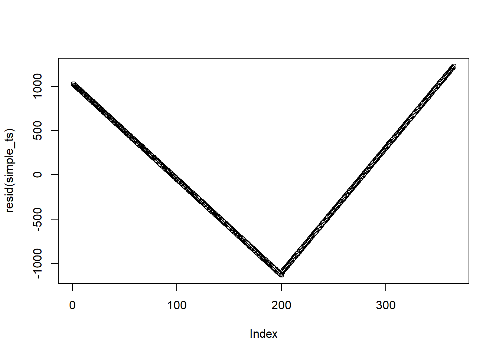
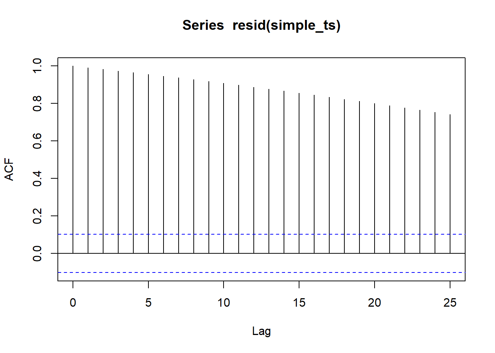

# Interrupted Time Series

-   Regression Discontinuity in Time

-   Control for

    -   Seasonable trends

    -   Concurrent events

-   Pros [@Penfold_2013]

    -   control for long-term trends

-   Cons

    -   Min of 8 data points before and 8 after an intervention

    -   Multiple events hard to distinguish

Notes:

-   For subgroup analysis (heterogeneity in effect size), see [@harper2017]

Interrupted time series should be used when

1.  longitudinal data (outcome over time - observations before and after the intervention)
2.  full population was affected at one specific point in time (or can be stacked based on intervention)

In each ITS framework, there can be 4 possible scenarios of outcome after an intervention

-   No effects

-   Immediate effect

-   Sustained (long-term) effect (smooth)

-   Both immediate and sustained effect

$$
Y = \beta_0 + \beta_1 T + \beta_2 D + \beta_3 P + \epsilon
$$

where

-   $Y$ is the outcome variable

    -   $\beta_0$ is the baseline level of the outcome

-   $T$ is the time variable (e.g., days, weeks, etc.) passed from the start of the observation period

    -   $\beta_1$ is the slope of the line before the intervention

-   $D$ is the treatment variable where $1$ is after the intervention and $0$ is before the intervention.

    -   $\beta_2$ is the **immediate effect** after the intervention

-   $P$ is the time variable indicating time passed since the intervention (before the intervention, the value is set to 0) (to examine the sustained effect).

    -   $\beta_3$ is the **sustained effect** = difference between the slope of the line prior to the intervention and the slope of the line subsequent to the intervention

**Example**

Create a fictitious dataset where we know the true data generating process

$$
Outcome = 10 * time + 20 * treatment + 25 * timesincetreatment + noise
$$


```r
# number of days
n = 365

# intervention at day 
interven = 200

# time index from 1 to 365
time = c(1:n)

# treatment variable: before internvation = day 1 to 200, after intervention = day 201 to 365
treatment = c(rep(0, interven), rep(1, n - interven))

# time since treatment
timesincetreat = c(rep(0, interven), c(1:(n - interven)))

# outcome 
outcome = 10 + 15 * time + 20 * treatment + 25 * timesincetreat + rnorm(n, mean = 0, sd = 1)

df = data.frame(outcome, time, treatment, timesincetreat)
```

Visualize


```r
plot(df$time, df$outcome)

# intervention date
abline(v = interven, col = "blue")

# regression line
ts <- lm(outcome ~ time + treatment + timesincetreat, data = df)
lines(df$time, ts$fitted.values, col = "red")
```


```r
summary(ts)
#> 
#> Call:
#> lm(formula = outcome ~ time + treatment + timesincetreat, data = df)
#> 
#> Residuals:
#>      Min       1Q   Median       3Q      Max 
#> -2.84113 -0.63966 -0.05072  0.60352  3.05200 
#> 
#> Coefficients:
#>                 Estimate Std. Error  t value Pr(>|t|)    
#> (Intercept)    10.015529   0.147655    67.83   <2e-16 ***
#> time           15.000593   0.001274 11774.80   <2e-16 ***
#> treatment      19.734413   0.218967    90.12   <2e-16 ***
#> timesincetreat 24.999441   0.002124 11767.42   <2e-16 ***
#> ---
#> Signif. codes:  0 '***' 0.001 '**' 0.01 '*' 0.05 '.' 0.1 ' ' 1
#> 
#> Residual standard error: 1.04 on 361 degrees of freedom
#> Multiple R-squared:      1,	Adjusted R-squared:      1 
#> F-statistic: 8.812e+08 on 3 and 361 DF,  p-value: < 2.2e-16
```

Interpretation

-   Time coefficient shows before-intervention outcome trend. Positive and significant, indicating a rising trend. Every day adds 15 points.

-   The treatment coefficient shows the **immediate** increase in outcome. **Immediate effect** is positive and significant, increasing outcome by 20 points.

-   The time since treatment coefficient reflects a change in trend subsequent to the intervention. The **sustained effect** is positive and statistically significant, showing that the outcome increases by 25 points per day after the intervention.

Plot of counterfactual


```r
# treatment prediction
pred <- predict(ts, df)

# counterfactual dataset
new_df <-
    as.data.frame(cbind(
        time = time,
        # treatment = 0 means counterfactual
        treatment = rep(0, n),
        # time since treatment = 0 means counterfactual
        timesincetreat = rep(0)
    ))

# counterfactual predictions
pred_cf <- predict(ts, new_df)

# plot
plot(outcome)

# regression line before treatment
lines(rep(1:interven), pred[1:interven], col = "blue")

# regression line after treatment
lines(rep((interven+1):n), pred[(interven + 1):n], col = "blue")

# regression line after treatment (counterfactual)
lines(rep(interven:n), pred_cf[(interven): n], col = "yellow")

abline(v = interven, col = "red")
```


Possible threats to the validity of interrupted time series analysis [@baicker2019]

-   Delayed effects [@rodgers2005] (may have to make assess some time after the intervention - do not assess the immediate dates).

-   Other confounding events [@linden2016a]

-   Intervention is introduced but later withdrawn [@linden2016]

-   [Autocorrelation] (for every time series data): might cause underestimation in the standard errors (i.e., overestimating the statistical significance of the treatment effect)

-   Regression to the mean: after a the short-term shock to the outcome, individuals can revert back to their initial states.

-   Selection bias: only certain individuals are affected by the treatment (could use a [Multiple Groups]).

## Autocorrelation

Assess autocorrelation from residual


```r
# simple regression on time 
simple_ts <- lm(outcome ~ time, data = df)

plot(resid(simple_ts))
```



```r

# alternatively
acf(resid(simple_ts))
```



This is not the best example since I created this dataset. But when residuals do have autocorrelation, you should not see any patterns (i.e., points should be randomly distributed on the plot)

To formally test for autocorrelation, we can use the Durbin-Watson test


```r
lmtest::dwtest(df$outcome ~ df$time)
#> 
#> 	Durbin-Watson test
#> 
#> data:  df$outcome ~ df$time
#> DW = 0.00037656, p-value < 2.2e-16
#> alternative hypothesis: true autocorrelation is greater than 0
```

From the p-value, we know that there is autocorrelation in the time series

A solution to this problem is to use more advanced time series analysis (e.g., ARIMA - coming up in the book) to adjust for seasonality and other dependency.


```r
forecast::auto.arima(df$outcome, xreg = as.matrix(df[, -1]))
#> Series: df$outcome 
#> Regression with ARIMA(1,0,1) errors 
#> 
#> Coefficients:
#>          ar1      ma1  intercept     time  treatment  timesincetreat
#>       0.7357  -0.8278    10.0243  15.0006    19.7283         24.9995
#> s.e.  0.2422   0.2044     0.0974   0.0008     0.1491          0.0014
#> 
#> sigma^2 = 1.068:  log likelihood = -526.95
#> AIC=1067.9   AICc=1068.21   BIC=1095.19
```

## Multiple Groups

When you suspect that you might have confounding events or selection bias, you can add a control group that did not experience the treatment (very much similar to [Difference-in-differences])

The model then becomes

$$
Y = \beta_0 + \beta_1 time+ \beta_2 treatment +\beta_3 * timesincetreat + \\
\beta_4 group + \beta_5 group * time + \beta_6 group * treatment + \beta_7 group * timesincetreat
$$

where

-   Group = 1 when the observation is under treatment and 0 under control

-   $\beta_4$ = baseline difference between the treatment and control group

-   $\beta_5$ = slope difference between the treatment and control group before treatment

-   $\beta_6$ = baseline difference between the treatment and control group associated with the treatment.

-   $\beta_7$ = difference between the sustained effect of the treatment and control group after the treatment.
