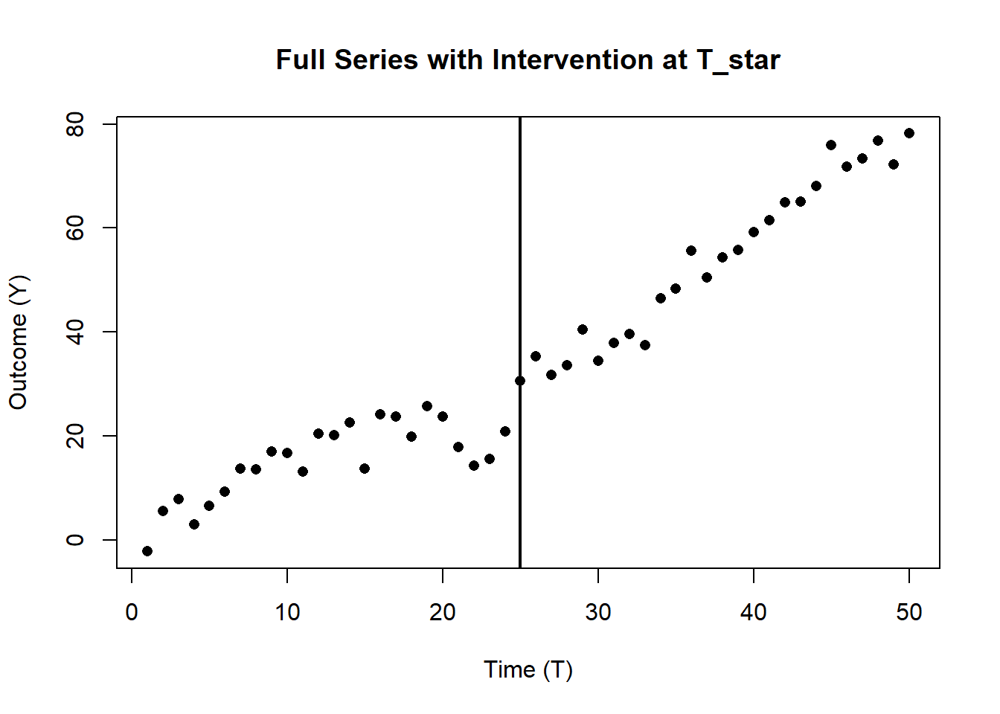
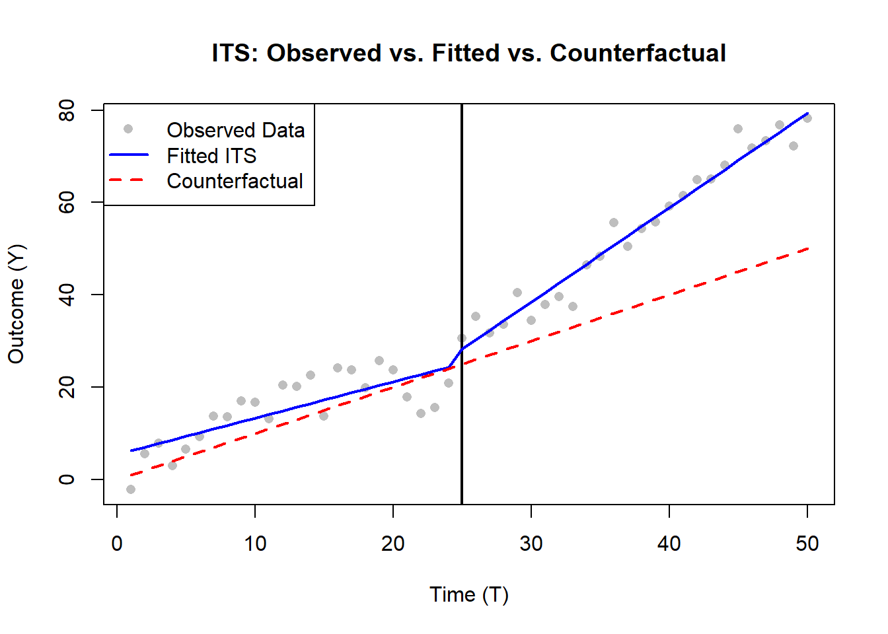
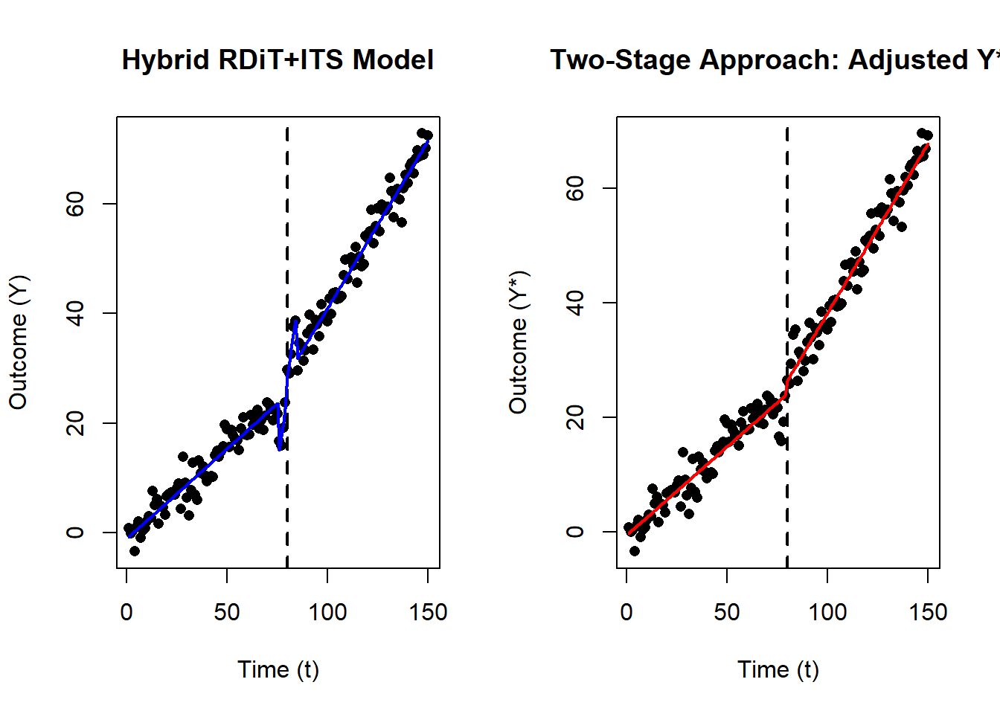

# Temporal Discontinuity Designs

When evaluating the causal impact of a policy, intervention, or treatment that begins at a known time, two popular quasi-experimental methods are:

-   [Regression Discontinuity in Time](#sec-regression-discontinuity-in-time)
-   [Interrupted Time Series](#sec-interrupted-time-series)

Both leverage the fact that an intervention or policy starts at a specific point in time, but they differ in how they model the outcome around that point and in the assumptions they require.

-   Both use the timing of an intervention as the key to identifying a causal effect.
-   Both assume no other major changes that coincide exactly with the intervention.

Unlike standard RD, which exploits variation in the **cross-sectional dimension** (e.g., eligibility thresholds), RDiT leverages variation in the **time dimension** to estimate causal effects.

ITS and RDiT are particularly useful when:

1.  A policy is implemented at a fixed date for all subjects (e.g., a national tax reform).
2.  A policy is implemented at different times for different subjects (e.g., state-level policy rollouts).
3.  There is no suitable cross-sectional control group, making difference-in-differences infeasible.

|        Feature         |                     **RDiT**                      |                          **ITS**                          |
|:---------------:|:------------------------:|:----------------------------:|
|       **Focus**        |          Local neighborhood around $T^*$          |       Entire time series (long pre- and post-data)        |
|    **Effect Model**    |          Assumes a sharp, immediate jump          |   Can capture abrupt or gradual changes (level & slope)   |
|       **Method**       |     Local polynomial regression around cutoff     |        Segmented regression using the full series         |
|   **Key Assumption**   | Units just before and after cutoff are comparable | Trend would continue unchanged in absence of intervention |
| **Bandwidth / Window** |         Uses a bandwidth $h$ around $T^*$         |         Typically uses the entire pre/post period         |
|  **Data Requirement**  |            High-resolution near $T^*$             |  Sufficient pre-/post- observations to establish trends   |

------------------------------------------------------------------------

## Regression Discontinuity in Time {#sec-regression-discontinuity-in-time}

Regression Discontinuity in Time is a special case of a [Regression Discontinuity](#sec-regression-discontinuity) design where the "forcing variable" is time itself. At an exact cutoff time $T^*$, a policy or intervention is implemented. We compare observations **just before** and **just after** $T^*$ to estimate the causal effect.

**Key assumptions** for RDiT:

-   **Sharp assignment**: The intervention precisely begins at time $T^*$.
-   **Local continuity**: Units just before and after $T^*$ are comparable except for treatment status.
-   **Continuity of Time-Varying Confounders**
    -   The fundamental assumption in RDiT is that unobserved factors affecting the outcome evolve smoothly over time.
    -   If an unobserved confounder changes discontinuously at the cutoff date, RDiT will attribute the effect to the intervention incorrectly.
-   **No other confounding interventions** that begin exactly at $T^*$.
-   **No Manipulation of the Running Variable (Time)**
    -   Unlike standard RD, where subjects may manipulate their assignment variable (e.g., test scores), time cannot be directly manipulated.
    -   However, strategic anticipation of a policy (e.g., firms adjusting behavior before a tax increase) can create bias.

Using a local polynomial approach near $T^*$:

$$
Y_t = \alpha_0 + \alpha_1 \bigl(T_t - T^*\bigr) \;+\; \tau\,D_t \;+\; \alpha_2 \bigl(T_t - T^*\bigr) D_t \;+\; \epsilon_t,
\quad \text{for } |T_t - T^*| < h,
$$

where:

-   $Y_t$ is the outcome at time $t$.
-   $T_t$ is the time index (running variable).
-   $T^*$ is the cutoff (intervention) time.
-   $D_t = 1$ if $t \ge T^*$ and 0 otherwise.
-   $h$ is a chosen bandwidth such that only observations close to $T^*$ are used.
-   $\tau$ represents the treatment effect (the discontinuity at $T^*$).

Because RDiT focuses on a local window around $T^*$, it is best when you expect an immediate jump at the cutoff and when observations near the cutoff are likely to be similar except for the treatment.

|                      |                                       |                                              |
|-----------------|-------------------------|------------------------------|
| **Criterion**        | **Standard RD**                       | **RDiT**                                     |
| Running Variable     | Cross-sectional (e.g., test score)    | Time (e.g., policy implementation date)      |
| Treatment Assignment | Based on threshold in $X$             | Based on threshold in $T^*$                  |
| Assumptions          | No sorting, smooth potential outcomes | No anticipatory behavior, smooth confounders |
| Key Challenge        | Manipulation of $X$ (sorting)         | Serial correlation, anticipation effects     |

: When RDiT is Used Instead of Traditional RD

### Estimation and Model Selection

In [Regression Discontinuity in Time](#sec-regression-discontinuity-in-time), model selection is critical to accurately estimate the causal effect at the cutoff $T^*$. Unlike [Interrupted Time Series](#sec-interrupted-time-series), which models long-term trends before and after an intervention, RDiT relies on local comparisons around the cutoff. This means that:

-   A narrow bandwidth ($h$) should be chosen to focus on observations just before and after $T^*$.
-   Polynomial order selection should be guided by the Bayesian Information Criterion to avoid overfitting.
-   Higher-order polynomials can introduce spurious curvature, so local linear or quadratic models are preferred.

Because RDiT uses time-series data, it is essential to correct for serial correlation in errors:

1.  Clustered Standard Errors: Adjusts for within-time correlation, ensuring valid inference.
2.  Newey-West HAC Standard Errors: Corrects for heteroskedasticity and serial correlation over time.

-   If serial dependence exists in $\epsilon_{it}$ (the error term), there is no straightforward fix---introducing a lagged dependent variable may mis-specify the model.
-   If serial dependence exists in $y_{it}$ (the outcome variable):
    -   With long windows, identifying the precise treatment effect becomes challenging.
    -   **Including a lagged dependent variable can help**, though bias may still arise from time-varying treatment effects or over-fitting.

------------------------------------------------------------------------

1.  **Baseline Local Linear Model (Preferred in RDiT)**

$$
Y_t = \alpha_0 + \alpha_1 (T_t - T^*) + \tau D_t + \alpha_2 (T_t - T^*) D_t + \epsilon_t, \quad \text{for } |T_t - T^*| < h
$$

where:

-   $Y_t$ is the outcome of interest at time $t$.

-   $T_t$ is the time forcing variable.

-   $T^*$ is the cutoff time when the policy/intervention occurs.

-   $D_t$ is the treatment indicator:

-   $D_t = 1$ if $t \geq T^*$ (post-intervention).

-   $D_t = 0$ if $t < T^*$ (pre-intervention).

-   $h$ is the bandwidth, restricting analysis to observations close to $T^*$.

-   $\tau$ is the treatment effect, measuring the discontinuity at $T^*$.

-   $\alpha_1 (T_t - T^*)$ allows for a smooth time trend on both sides of the cutoff.

-   $\alpha_2 (T_t - T^*) D_t$ captures any differential time trends post-treatment.

This model ensures that the treatment effect is identified from the discontinuity at $T^*$, rather than long-term trends.

------------------------------------------------------------------------

2.  **Quadratic Local Model (Allowing for Nonlinear Trends)**

If the outcome variable exhibits curvature over time, a quadratic term can be added:

$$
Y_t = \alpha_0 + \alpha_1 (T_t - T^*) + \alpha_2 (T_t - T^*)^2 + \tau D_t + \alpha_3 (T_t - T^*) D_t + \alpha_4 (T_t - T^*)^2 D_t + \epsilon_t, \quad \text{for } |T_t - T^*| < h
$$

-   $\alpha_2 (T_t - T^*)^2$ accounts for **nonlinear pre-treatment trends**.
-   $\alpha_4 (T_t - T^*)^2 D_t$ allows for **nonlinear post-treatment effects**.

This model is useful if visual inspection suggests a **curved relationship** near the cutoff.

------------------------------------------------------------------------

3.  **Augmented Local Linear Model (Robust Control for Confounders)**

Following @hausman2018, an augmented approach helps control for omitted variables:

1.  **First-stage regression:** Estimate the outcome with all relevant control variables and compute the residuals.

    $$
    Y_t = \delta_0 + \sum_{j} \delta_j X_{jt} + \nu_t
    $$

    where $X_{jt}$ are observed covariates that could influence $Y_t$.

2.  **Second-stage RDiT model:** Use residuals from the first stage in the standard local linear RDiT model:

    $$
    \hat{\nu}_t = \beta_0 + \beta_1 (T_t - T^*) + \tau D_t + \beta_2 (T_t - T^*) D_t + \epsilon_t, \quad \text{for } |T_t - T^*| < h
    $$

-   This approach removes variation explained by covariates before estimating the treatment effect.
-   Bootstrap methods should be used to correct for first-stage estimation variance.

------------------------------------------------------------------------

### Strengths of RDiT

One of the key advantages of **Regression Discontinuity in Time** is its ability to handle cases where standard **Difference-in-Differences** approaches are infeasible. This typically occurs when treatment implementation lacks cross-sectional variation---meaning that all units receive treatment at the same time, leaving no untreated control group for comparison. In such cases, RDiT provides a viable alternative by exploiting temporal discontinuities in treatment assignment.

Notably, some studies combine both RDiT and DiD to strengthen identification and provide additional insights. For instance,

-   @auffhammer2011clearing applies these methods to examine how treatment effects vary across individuals and geographic space.

-   @gallego2013effect contrasts RDiT and DiD estimates when the validity of the control group in DiD is uncertain, helping assess potential biases.

Beyond being an alternative to DiD, RDiT also offers advantages over simpler **pre/post comparisons**. Unlike naive before-and-after analyses, RDiT can incorporate flexible controls for time trends, reducing the risk of spurious results due to temporal confounders.

Event study methods, particularly modern implementations, have improved significantly, allowing researchers to study treatment effects over long time horizons. However, RDiT still holds certain advantages:

1.  **Longer time horizons**: Unlike traditional event studies, RDiT is not restricted to short-term dynamics and can capture effects that unfold gradually over extended periods.
2.  **Higher-order time controls**: RDiT allows for more flexible modeling of time trends, including the use of higher-order polynomials, which may provide better approximations of underlying time dynamics.

| **Method**                           | **Key Feature**                   | **Strengths**                           | **Weaknesses**                                                      |
|----------------|----------------|----------------|-------------------------|
| **Difference-in-Differences**        | Uses a control group              | Accounts for time-invariant confounders | Requires parallel trends assumption                                 |
| **Event Study**                      | Models multiple time periods      | Estimates dynamic treatment effects     | Requires staggered interventions                                    |
| **Pre/Post Comparison**              | Simple before/after design        | No control needed                       | Cannot separate treatment from time trends                          |
| **Regression Discontinuity in Time** | Uses time as the running variable | Flexible polynomial trends              | Sensitive to polynomial choice, cannot model time-varying treatment |

: Comparison with Other Methods

### Limitations and Challenges of RDiT

Despite its strengths, RDiT comes with several methodological challenges that researchers must carefully address.

#### Selection Bias at the Time Threshold

A major concern in RDiT is **bias from selecting observations too close to the threshold**. Unlike cross-sectional RD designs, where observations on either side of the cutoff are assumed to be comparable, time-based designs introduce complications:

-   The data-generating process may exhibit time-dependent structure.

-   Unobserved shocks occurring near the threshold can confound estimates.

-   Seasonal or cyclical trends may drive changes at the discontinuity rather than the treatment itself.

#### Inapplicability of the McCrary Test

A key diagnostic tool in standard RD designs is the McCrary test [@mccrary2008manipulation], which checks for discontinuities in the density of the running variable to detect manipulation. Unfortunately, this test is not feasible in RDiT because time itself is uniformly distributed. This limitation makes it more challenging to rule out sorting, anticipation, or other forms of manipulation (\@ref(sec-sorting-bunching-and-manipulation)) around the threshold.

#### Potential Discontinuities in Unobservables

Even if the treatment is assigned exogenously at a specific time, **time-varying unobserved factors** can still introduce discontinuities in the dependent variable. If these unobservable factors coincide with the threshold, they may be mistakenly attributed to the treatment effect, leading to biased conclusions.

#### Challenges in Modeling Time-Varying Treatment Effects

RDiT does not naturally accommodate **time-varying treatment effects**, which can lead to specification issues. When choosing a time window:

-   **A narrow window** improves the local approximation but may reduce statistical power.

-   **A broader window** provides more data but increases the risk of bias from additional confounders.

To address these concerns, researchers must assume:

1.  **The model is correctly specified**, meaning it includes all relevant confounders or that the polynomial approximation accurately captures time trends.
2.  **The treatment effect is correctly specified**, whether assumed to be smooth, constant, or varying over time.

Additionally, these two assumptions **must not interact**---in other words, the polynomial control should not be correlated with unobserved variation in the treatment effect. If this condition fails, bias from misspecification and treatment heterogeneity can compound [@hausman2018, p. 544].

#### Sorting and Anticipation Effects

Unlike traditional RD designs, where individuals cannot manipulate their assignment to treatment, time-based cutoffs introduce **potential sorting, anticipation, or avoidance behaviors**.

While the McCrary test cannot be applied to detect manipulation, researchers can perform robustness checks:

-   **Check for discontinuities in other covariates**: Ideally, covariates should be smooth around the threshold.

-   **Test for placebo discontinuities**: If significant jumps appear at other, randomly chosen thresholds, this raises concerns about the validity of the estimated treatment effect.

The difficulty in RDiT is that **even when a treatment effect is detected, it may reflect more than just the causal effect of the intervention**. Anticipatory behavior, adaptation, and strategic avoidance may all contribute to observed discontinuities, making it harder to isolate the **true causal effect**.

Thus, researchers relying on RDiT must make a strong case that such behaviors **do not** drive their results. This often requires additional robustness tests, alternative specifications, or comparisons with other methods to rule out alternative explanations.

------------------------------------------------------------------------

### Recommendations for Robustness Checks

To ensure the validity of RDiT estimates, researchers should conduct a series of **robustness checks** to detect potential biases from overfitting, time-varying treatment effects, and model misspecification. The following strategies, based on [@hausman2018, p. 549], provide a comprehensive framework for assessing the reliability of results.

1.  **Visual Inspection: Raw Data and Residuals**

Before applying any complex statistical adjustments, start with a simple visualization of the raw data and residuals (after removing confounders and time trends). If results are sensitive to the choice of polynomial order or local linear controls, it could signal time-varying treatment effects.

A well-behaved RDiT should exhibit a clear and consistent discontinuity at the threshold, regardless of the specification used. If the discontinuity shifts or fades under different model choices, this suggests sensitivity to the polynomial approximation, potentially indicating bias.

2.  **Sensitivity to Polynomial Order and Bandwidth Choice**

A common concern in RDiT is overfitting due to high-order global polynomials. To diagnose this issue:

-   Estimate the model with different polynomial orders and check whether results remain consistent.

-   Compare global polynomial estimates with local linear specifications using different bandwidths.

-   If findings remain stable across specifications, the estimates are likely robust. However, if results fluctuate significantly, this suggests potential overfitting or sensitivity to bandwidth choice.

3.  **Placebo Tests**

To strengthen causal claims, conduct placebo tests by estimating the RDiT model under conditions where no treatment effect should exist. There are two primary approaches:

1.  Estimate the RD on a different location or population that did not receive the treatment. If a discontinuity is detected, it suggests that the estimated effect may be driven by factors other than the intervention.
2.  Use an alternative time threshold where no intervention took place. If the model still detects a significant effect, this implies that the discontinuity may be an artifact of the method rather than the treatment.

If placebo tests reveal no significant discontinuities, this reinforces the credibility of the primary RDiT estimate.

4.  **Discontinuity in Continuous Controls**

Another useful diagnostic is to **plot the RD discontinuity on continuous control variables** that should not be affected by the treatment.

-   If these covariates exhibit a significant jump at the threshold, it raises concerns that other **time-varying confounders** may be driving the observed effect.

-   Ideally, covariates should remain smooth across the threshold, confirming that the discontinuity in the outcome is **not** due to unobserved factors.

5.  **Donut RD: Excluding Observations Near the Cutoff**

To assess whether strategic behavior or anticipation effects are influencing the estimates, researchers can use a **donut RD** approach [@barreca2011saving].

-   This involves **removing observations immediately around the threshold** to check whether results remain consistent.

-   If avoiding selection close to the cutoff significantly alters the findings, this suggests that **sorting, anticipation, or measurement error** may be affecting the estimates.

-   If results are stable even after excluding these observations, it strengthens confidence in the identification strategy.

6.  **Testing for Autoregression**

Because RDiT operates in a time-series framework, serial dependence in the residuals can distort standard errors and bias inference. To diagnose this:

-   Use pre-treatment data to test for autoregression in the dependent variable.

-   If autoregression is detected, consider including a lagged dependent variable to account for serial correlation.

-   However, be cautious---introducing a lagged outcome may create dynamic bias if the treatment effect itself influences the lag.

7.  **Augmented Local Linear Approach**

Instead of relying on global polynomials, which risk overfitting, a more reliable alternative is an **augmented local linear approach**, which avoids excessive reliance on high-order time polynomials. The procedure involves two key steps:

1.  **Use the full sample to control for key predictors**, ensuring that the model accounts for important covariates that may confound the treatment effect.
2.  **Estimate the conditioned second-stage model on a narrower bandwidth** to refine the local approximation while maintaining robustness to overfitting.

------------------------------------------------------------------------

### Applications of RDiT

Regression Discontinuity in Time has been widely applied across various disciplines, particularly in **economics and marketing**, where policy changes, regulations, and market shifts often provide natural time-based discontinuities. Below, we summarize key studies that have employed RDiT to estimate causal effects.

#### Applications in Economics

RDiT has been used extensively in **environmental economics**, **transportation policy**, and **public health**, where regulations or interventions are introduced at well-defined points in time. Some notable studies include:

1.  **Environmental Regulations and Air Quality**

Several studies exploit sudden policy changes or emission regulations to estimate their impact on air pollution:

-   @davis2008effect, @auffhammer2011clearing, and @chen2018effect all examine the impact of environmental regulations on air quality.

-   @gallego2013effect compares RDiT and Difference-in-Differences (DiD) estimates to assess the reliability of control groups in air pollution studies.

By leveraging RDiT, these studies isolate immediate changes in pollution levels at policy thresholds while controlling for underlying trends.

2.  **Traffic and Transportation Policies**

RDiT has been used to assess the impact of transportation policies on congestion, accidents, and public transit usage:

-   @bento2014effects and @anderson2014subways investigate how new subway openings and transportation policies affect traffic congestion.

-   @de2013deterrent and @burger2014did analyze the deterrent effects of traffic safety regulations on car accidents, using policy enactment dates as a discontinuity.

These studies demonstrate how RDiT can effectively measure behavioral responses to transportation interventions, isolating immediate impacts from broader secular trends.

3.  **COVID-19 Lockdowns and Well-being**

-   @brodeur2021covid employs RDiT to assess the impact of COVID-19 lockdowns on psychological well-being, economic activity, and public health outcomes.

The sudden implementation of lockdown policies provides a sharp time-based discontinuity, making RDiT a natural method to evaluate their effects.

------------------------------------------------------------------------

#### Applications in Marketing

In marketing, RDiT has been applied to analyze **consumer behavior, pricing strategies, and promotional effectiveness** in response to abrupt policy or market changes.

1.  **Vehicle Pricing and Demand Shocks**

Several studies leverage RDiT to study how consumers and firms respond to price changes in the automotive market:

-   @busse20061, @busse2010best, and @busse2013estimating explore the impact of promotional campaigns and policy changes on vehicle prices.

-   @davis2010international investigates how changes in international trade policies influence vehicle pricing.

By identifying sharp price discontinuities at the time of policy changes, these studies provide causal insights into price elasticity and consumer demand.

2.  **Customer Satisfaction and Learning Effects**

-   @chen2009learning applies RDiT to measure how customer satisfaction evolves after firms make abrupt service changes.

This study demonstrates how RDiT can capture immediate consumer reactions, distinguishing between short-term dissatisfaction and long-term adaptation.

### Empirical Example

1)  Generating synthetic time-series data with a known cutoff T_star
2)  Visualizing the entire dataset, including the jump at T_star
3)  Fitting a local linear RDiT model (baseline)
4)  Adding a local polynomial (quadratic) to allow nonlinear trends
5)  Demonstrating robust (sandwich) standard errors to account for serial correlation
6)  Performing a "donut" RDiT by excluding observations near T_star
7)  Conducting a placebo test at a fake cutoff
8)  Demonstrating an augmented approach with a confounder
9)  Plotting the local data and fitted RDiT regression lines


```r
# -------------------------------------------------------------------
# 0. Libraries
# -------------------------------------------------------------------
if(!require("sandwich")) install.packages("sandwich", quiet=TRUE)
if(!require("lmtest"))   install.packages("lmtest",   quiet=TRUE)
library(sandwich)
library(lmtest)

# -------------------------------------------------------------------
# 1. Generate Synthetic Data
# -------------------------------------------------------------------
set.seed(123)
n      <- 200                # total number of time points
T_star <- 100                # cutoff (policy/intervention) time
t_vals <- seq_len(n)         # time index: 1, 2, ..., n

# Outcome Y has a linear pre-trend, a mild quadratic component, 
# and a jump of +5 at T_star
# plus a small sinusoidal seasonality and random noise.
Y <- 0.4 * t_vals +          # baseline slope
     0.002 * (t_vals^2) +    # mild curvature
     ifelse(t_vals >= T_star, 5, 0) +  # jump at T_star
     2*sin(t_vals / 8) +              # mild seasonal pattern
     rnorm(n, sd = 2)                 # random noise

# Optional confounder X that also increases with time
X <- 1.5 * t_vals + rnorm(n, sd=5)

# Store everything in a single data frame
df_full <- data.frame(t = t_vals, Y = Y, X = X)

# -------------------------------------------------------------------
# 2. Plot the Entire Dataset & Highlight the Cutoff
# -------------------------------------------------------------------
par(mfrow=c(1,2))  # We'll produce two plots side by side

# Plot 1: Full data
plot(df_full$t, df_full$Y, pch=16,
     xlab="Time (t)", ylab="Outcome (Y)",
     main="Full Time Series with True Jump at T_star")
abline(v=T_star, lwd=2)  # vertical line at the cutoff

# -------------------------------------------------------------------
# 3. Restrict to a Local Bandwidth (h) Around T_star
# -------------------------------------------------------------------
h <- 10
df_local <- subset(df_full, abs(t - T_star) < h)

# Create variables for local regression
df_local$D           <- ifelse(df_local$t >= T_star, 1, 0)
df_local$t_centered  <- df_local$t - T_star

# -------------------------------------------------------------------
# 4. Baseline Local Linear RDiT Model
# -------------------------------------------------------------------
# Model:
#   Y = alpha_0 + alpha_1*(t - T_star) + tau*D + alpha_2*(t - T_star)*D + error
mod_rdit_linear <- lm(Y ~ t_centered + D + t_centered:D, data = df_local)
# Robust (HC) standard errors for potential serial correlation
res_rdit_linear <- coeftest(mod_rdit_linear, vcov = vcovHC(mod_rdit_linear, type="HC1"))

# -------------------------------------------------------------------
# 5. Local Polynomial (Quadratic) RDiT Model
# -------------------------------------------------------------------
df_local$t_centered2 <- df_local$t_centered^2
mod_rdit_quad <- lm(Y ~ t_centered + t_centered2 + D + t_centered:D + t_centered2:D,
                    data = df_local)
res_rdit_quad <- coeftest(mod_rdit_quad, vcov = vcovHC(mod_rdit_quad, type="HC1"))

# -------------------------------------------------------------------
# 6. Donut Approach: Excluding Observations Near the Cutoff
# -------------------------------------------------------------------
df_donut <- subset(df_local, abs(t - T_star) > 1)  # remove t_star +/- 1 unit
mod_rdit_donut <- lm(Y ~ t_centered + D + t_centered:D, data = df_donut)
res_rdit_donut <- coeftest(mod_rdit_donut, vcov = vcovHC(mod_rdit_donut, type="HC1"))

# -------------------------------------------------------------------
# 7. Placebo Test: Fake Cutoff
# -------------------------------------------------------------------
T_fake <- 120
df_placebo <- subset(df_full, abs(t - T_fake) < h)
df_placebo$D_placebo          <- ifelse(df_placebo$t >= T_fake, 1, 0)
df_placebo$t_centered_placebo <- df_placebo$t - T_fake

mod_rdit_placebo <- lm(Y ~ t_centered_placebo + D_placebo + t_centered_placebo:D_placebo,
                       data = df_placebo)
res_rdit_placebo <- coeftest(mod_rdit_placebo, vcov = vcovHC(mod_rdit_placebo, type="HC1"))

# -------------------------------------------------------------------
# 8. Augmented RDiT Model (Controlling for X)
# -------------------------------------------------------------------
mod_rdit_aug <- lm(Y ~ X + t_centered + D + t_centered:D, data = df_local)
res_rdit_aug <- coeftest(mod_rdit_aug, vcov = vcovHC(mod_rdit_aug, type="HC1"))

# -------------------------------------------------------------------
# 9. Plot the Local Data and Fitted RDiT Lines
# -------------------------------------------------------------------
plot(df_local$t, df_local$Y, pch=16,
     xlab="Time (t)", ylab="Outcome (Y)",
     main="Local Window Around T_star")

# Sort data by centered time for a smooth line
df_local_sorted <- df_local[order(df_local$t_centered), ]
pred_linear     <- predict(mod_rdit_linear, newdata=df_local_sorted)
lines(df_local_sorted$t, pred_linear, lwd=2)

# Add a vertical line at T_star for reference
abline(v=T_star, lwd=2)
```


```r

# -------------------------------------------------------------------
# Print Summaries & Brief Interpretation
# -------------------------------------------------------------------

cat(" Local Linear RDiT (Baseline):\n")
#>  Local Linear RDiT (Baseline):
print(res_rdit_linear)
#> 
#> t test of coefficients:
#> 
#>               Estimate Std. Error t value  Pr(>|t|)    
#> (Intercept)  61.213434   1.625008 37.6696 2.853e-16 ***
#> t_centered    1.032094   0.231380  4.4606 0.0004579 ***
#> D             2.853971   1.772639  1.6100 0.1282338    
#> t_centered:D -0.076391   0.271405 -0.2815 0.7821991    
#> ---
#> Signif. codes:  0 '***' 0.001 '**' 0.01 '*' 0.05 '.' 0.1 ' ' 1

cat("\n Local Quadratic RDiT:\n")
#> 
#>  Local Quadratic RDiT:
print(res_rdit_quad)
#> 
#> t test of coefficients:
#> 
#>                Estimate Std. Error t value  Pr(>|t|)    
#> (Intercept)   61.827393   3.038967 20.3449 3.061e-11 ***
#> t_centered     1.366981   1.342431  1.0183    0.3271    
#> t_centered2    0.033489   0.124970  0.2680    0.7929    
#> D              1.577410   3.103945  0.5082    0.6198    
#> t_centered:D   0.085673   1.397606  0.0613    0.9521    
#> t_centered2:D -0.088706   0.134490 -0.6596    0.5210    
#> ---
#> Signif. codes:  0 '***' 0.001 '**' 0.01 '*' 0.05 '.' 0.1 ' ' 1

cat("\n Donut RDiT (Excluding Observations Near T_star):\n")
#> 
#>  Donut RDiT (Excluding Observations Near T_star):
print(res_rdit_donut)
#> 
#> t test of coefficients:
#> 
#>              Estimate Std. Error t value  Pr(>|t|)    
#> (Intercept)  62.52140    1.87095 33.4169 3.273e-13 ***
#> t_centered    1.22829    0.27153  4.5235 0.0006975 ***
#> D             2.97980    2.01021  1.4823 0.1640306    
#> t_centered:D -0.49288    0.32020 -1.5393 0.1496810    
#> ---
#> Signif. codes:  0 '***' 0.001 '**' 0.01 '*' 0.05 '.' 0.1 ' ' 1

cat("\n Placebo Test (Fake Cutoff at T_fake=120):\n")
#> 
#>  Placebo Test (Fake Cutoff at T_fake=120):
print(res_rdit_placebo)
#> 
#> t test of coefficients:
#> 
#>                               Estimate Std. Error t value  Pr(>|t|)    
#> (Intercept)                  82.658533   0.868852 95.1354 < 2.2e-16 ***
#> t_centered_placebo            0.768238   0.185830  4.1341 0.0008831 ***
#> D_placebo                    -0.377333   1.188411 -0.3175 0.7552328    
#> t_centered_placebo:D_placebo -0.013586   0.245019 -0.0555 0.9565112    
#> ---
#> Signif. codes:  0 '***' 0.001 '**' 0.01 '*' 0.05 '.' 0.1 ' ' 1

cat("\n Augmented RDiT (Controlling for X):\n")
#> 
#>  Augmented RDiT (Controlling for X):
print(res_rdit_aug)
#> 
#> t test of coefficients:
#> 
#>               Estimate Std. Error t value Pr(>|t|)   
#> (Intercept)  50.960390  13.226193  3.8530 0.001757 **
#> X             0.068836   0.087887  0.7832 0.446540   
#> t_centered    0.984583   0.249801  3.9415 0.001476 **
#> D             2.922905   1.935753  1.5100 0.153291   
#> t_centered:D -0.141496   0.318509 -0.4442 0.663655   
#> ---
#> Signif. codes:  0 '***' 0.001 '**' 0.01 '*' 0.05 '.' 0.1 ' ' 1
```

-   'D' is the local jump at T_star (i.e., the treatment effect, tau).
-   't_centered:D' indicates how the slope differs post-cutoff.
-   In the placebo test, D_placebo should ideally be insignificant.
-   In the donut model, large differences from the baseline may suggest local anomalies or anticipation near T_star.
-   In the augmented model, controlling for X can change tau if X was correlated with both Y and time.

------------------------------------------------------------------------

## Interrupted Time Series {#sec-interrupted-time-series}

Interrupted Time Series (ITS) is a powerful quasi-experimental method used to assess **how an intervention affects the level and/or trend of an outcome over time**. By analyzing long-term **pre- and post-intervention** data, ITS estimates what would have happened in the absence of the intervention---assuming the pre-existing trend would have continued unchanged.

ITS is particularly useful when a **policy, treatment, or intervention is implemented at a distinct point in time**, affecting an entire population or group simultaneously. It differs from RDiT in that it typically models **both abrupt and gradual changes** over time rather than exploiting a sharp discontinuity.

A well-specified ITS model should account for:

-   **Seasonal trends**: Some outcomes exhibit cyclical patterns (e.g., sales, disease prevalence), which must be adjusted for.

-   **Concurrent events**: Other changes occurring around the same time as the intervention may confound estimates, making it difficult to attribute observed changes solely to the intervention.

ITS is appropriate when:

1.  Longitudinal data is available: The outcome must be observed over time, with multiple data points before and after the intervention.
2.  A population-wide intervention occurs at a specific time: The intervention should affect all units simultaneously or be structured in a way that allows stacking based on intervention timing.

**Notes**

-   For analyzing **subgroup effects** (heterogeneity in treatment impact), see [@harper2017did].
-   For interpreting ITS results **with control variables**, see [@bottomley2019analysing].

Possible Threats to the Validity of ITS Analysis [@baicker2019testing]

-   **Delayed effects** [@rodgers2005did]\
    The impact of an intervention may manifest some time after its introduction. If only the immediate post-intervention period is assessed, key effects could be missed.

-   **Other confounding events** [@linden2016using; @linden2017comprehensive]\
    Concurrent policy changes or external shocks that overlap with the intervention period can obscure or inflate the apparent intervention effect.

-   **Intervention is introduced but later withdrawn** [@linden2015conducting]\
    When an intervention does not remain in place, the time series may reflect multiple shifts in trends or levels, complicating the interpretation of a single "interrupted" period.

-   **Autocorrelation**\
    Time series data often exhibit autocorrelation, which can lead to underestimated standard errors if not properly accounted for, thus overstating the statistical significance of the intervention effect.

-   **Regression to the mean**\
    After a short-term shock, outcomes may revert toward prior or average levels. Interpreting this natural reversion as an intervention effect can be misleading.

-   **Selection bias**\
    If only certain individuals or settings receive the intervention, pre-existing differences may confound the results. Designs with multiple groups or comparison series can help mitigate this bias.

After an intervention, an outcome can exhibit four distinct patterns:

| **Scenario**                           | **Description**                                                      |
|---------------------------|---------------------------------------------|
| **No effect**                          | The intervention does not change the level or trend of the outcome.  |
| **Immediate effect**                   | A sharp, immediate change in the outcome following the intervention. |
| **Sustained effect**                   | A gradual, long-term shift in the outcome that smooths over time.    |
| **Both immediate & sustained effects** | A combination of a sudden change and a long-term trend shift.        |

: **Key assumptions** for ITS:

-   The **pre-intervention trend** would remain stable if the intervention never occurred (i.e., no major time-varying confounders coinciding with the intervention).
-   Data is available for **multiple time points before and after** the intervention to estimate trends.

The following model integrates both immediate and sustained intervention effects (i.e., segmented regression):

$$
Y_t = \beta_0 + \beta_1 T_t + \beta_2 D_t + \beta_3 (T_t \times D_t) + \beta_4 P_t + \epsilon_t
$$

where:

-   $Y_t$: Outcome variable at time $t$.
-   $T_t$: Time index (continuous).
    -   $\beta_1$: Baseline slope (trend before intervention).
-   $D_t$: Intervention dummy ($D_t = 1$ if $t \geq T^*$, otherwise 0).
    -   $\beta_2$: Immediate effect (level change at intervention).
-   $(T_t \times D_t)$: Interaction term capturing a change in slope post-intervention.
    -   $\beta_3$: Difference in slope after intervention compared to before.
-   $P_t$: Time since the intervention (0 before intervention, increments after).
    -   $\beta_4$: Sustained effect over time.
-   $\epsilon_t$: Error term (assumed to be normally distributed).

This model allows us to:

1.  Measure the pre-intervention trend ($\beta_1$).
2.  Capture the immediate effect of the intervention ($\beta_2$).
3.  Identify if the slope changes post-intervention ($\beta_3$).
4.  Examine long-term effects using $P_t$ ($\beta_4$).

ITS does not require a purely immediate or discontinuous effect; the effect can be gradual or delayed, which can be captured with additional terms (e.g., lags or non-linear structures).

### Advantages of ITS

ITS offers several benefits, particularly in public policy, health research, and economics. According to [@penfold2013use], key advantages include:

-   **Controls for long-term trends**: Unlike simple pre/post comparisons, ITS explicitly models pre-existing trajectories, reducing bias from underlying trends.

-   **Applicable to population-wide interventions**: When an entire group or region is affected simultaneously, ITS provides a strong alternative to traditional experimental methods.

### Limitations of ITS

While ITS is a valuable tool, it has some key limitations:

-   **Requires a sufficient number of observations**: At least **8 data points before and 8 after** the intervention are typically recommended for reliable estimation.

-   **Challenging with multiple overlapping events**: When several interventions occur close together in time, it can be difficult to isolate their individual effects.

### Empirical Example

1)  Generating synthetic time-series data with a known intervention time T_star
2)  Modeling an Interrupted Time Series (ITS) with both immediate and sustained effects
3)  Accounting for pre-intervention trend, immediate jump, slope change, and post-intervention time
4)  Demonstrating robust (sandwich) standard errors to handle possible autocorrelation
5)  Visualizing the data and fitted ITS lines
6)  Brief interpretation of coefficients


```r
# -------------------------------------------------------------------
# 0. Libraries
# -------------------------------------------------------------------
if(!require("sandwich")) install.packages("sandwich", quiet=TRUE)
if(!require("lmtest"))   install.packages("lmtest",   quiet=TRUE)
library(sandwich)
library(lmtest)

# -------------------------------------------------------------------
# 1. Generate Synthetic Data
# -------------------------------------------------------------------
set.seed(456)
n       <- 50               # total number of time points
T_star  <- 25               # intervention time
t_vals  <- seq_len(n)       # time index: 1, 2, ..., n
```

We'll simulate a time-series with:

-   A baseline slope pre-intervention

-   An immediate jump at $T^*$

-   A change in slope after $T^*$

-   A mild seasonal pattern

-   Random noise


```r
Y <- 1.0 * t_vals +                      # baseline slope
  ifelse(t_vals >= T_star, 10, 0) +   # immediate jump of +10 at T_star
  
  # additional slope post-intervention
  ifelse(t_vals >= T_star, 0.5 * (t_vals - T_star), 0) +
  5 * sin(t_vals / 6) +                # mild seasonal pattern
  rnorm(n, sd = 3)                   # random noise

# Combine into a data frame
df_its <- data.frame(time = t_vals, Y = Y)

# -------------------------------------------------------------------
# 2. Define Key ITS Variables
# -------------------------------------------------------------------
```

-   $T_t$: the time index (we'll just use 'time' for that)

-   $D_t$: an indicator for post-intervention (1 if $t >= T^*$, else 0)

-   $P_t$: time since intervention (0 before $T^*$, increments after)


```r
df_its$D  <- ifelse(df_its$time >= T_star, 1, 0)
df_its$T  <- df_its$time
df_its$P  <- ifelse(df_its$time >= T_star, df_its$time - T_star, 0)

# -------------------------------------------------------------------
# 3. Plot the Entire Dataset & Highlight the Intervention
# -------------------------------------------------------------------
plot(
    df_its$T,
    df_its$Y,
    pch = 16,
    xlab = "Time (T)",
    ylab = "Outcome (Y)",
    main = "Full Series with Intervention at T_star"
)
abline(v = T_star, lwd = 2)  # vertical line for the intervention
```



Model: $$Y_t = \beta_0 + \beta_1*T + \beta_2*D + \beta_3*(T*D) + \beta_4*P + \epsilon_t$$ where:

-   $\beta_0$: baseline level

-   $\beta_1$: pre-intervention slope

-   $\beta_2$: immediate jump at T_star

-   $\beta_3$: change in slope post-intervention

-   $\beta_4$: sustained effect over time since intervention

-   $\epsilon_t$: error term


```r
# -------------------------------------------------------------------
# 4. Fit the Comprehensive ITS Model (Segmented Regression)
# -------------------------------------------------------------------
mod_its <- lm(Y ~ T + D + I(T*D) + P, data = df_its)

# Use robust standard errors to account for potential autocorrelation
res_its <- coeftest(mod_its, vcov = vcovHC(mod_its, type="HC1"))

# -------------------------------------------------------------------
# 5. Create Fitted Values for Plotting
# -------------------------------------------------------------------
df_its$pred_its <- predict(mod_its)

# -------------------------------------------------------------------
# 6. Plot the Observed Data & Fitted ITS Lines
# -------------------------------------------------------------------
plot(df_its$T, df_its$Y, pch=16,
     xlab="Time (T)", ylab="Outcome (Y)",
     main="ITS: Observed vs. Fitted")
abline(v=T_star, lwd=2)
lines(df_its$T, df_its$pred_its, lwd=2)
```


```r

# -------------------------------------------------------------------
# 7. Summaries & Brief Interpretation
# -------------------------------------------------------------------

print(res_its)
#> 
#> t test of coefficients:
#> 
#>              Estimate Std. Error t value  Pr(>|t|)    
#> (Intercept)   5.42261    2.06039  2.6318   0.01152 *  
#> T             0.78737    0.16204  4.8589 1.409e-05 ***
#> D           -28.27162    3.95530 -7.1478 5.472e-09 ***
#> I(T * D)      1.25703    0.18351  6.8498 1.531e-08 ***
#> ---
#> Signif. codes:  0 '***' 0.001 '**' 0.01 '*' 0.05 '.' 0.1 ' ' 1
```

-   (Intercept) = $\beta_0$: Baseline level at $T=0$.
-   T = $\beta_1$: Baseline slope (pre-intervention trend).
-   D = $\beta_2$: Immediate jump (level change) at T_star.
-   T:D = $\beta_3$: Slope change post-intervention.
-   P = $\beta_4$: Sustained (additional) effect over time since $T^*$.

We compare the observed data with a **counterfactual** (assuming no treatment) [@lee2014graphical].


```r
plot(
    df_its$T,
    df_its$Y,
    pch = 16,
    col = "gray",
    xlab = "Time (T)",
    ylab = "Outcome (Y)",
    main = "ITS: Observed vs. Fitted vs. Counterfactual"
)

# Add vertical line indicating intervention point
abline(v = T_star, lwd = 2, col = "black")

# Add fitted ITS model trend
lines(df_its$T,
      df_its$pred_its,
      lwd = 2,
      col = "blue")

# Add counterfactual trend (what would have happened without intervention)
lines(
    df_its$T,
    df_its$pred_counterfactual,
    lwd = 2,
    col = "red",
    lty = 2
)

# Add legend
legend(
    "topleft",
    legend = c("Observed Data", "Fitted ITS", "Counterfactual"),
    col = c("gray", "blue", "red"),
    lty = c(NA, 1, 2),
    pch = c(16, NA, NA),
    lwd = c(NA, 2, 2)
)
```



Notes on Real-World Usage:

-   Consider checking for seasonality more explicitly (e.g., Fourier terms), or other covariates that might confound the outcome.

-   Assess autocorrelation further (e.g., Durbin-Watson test, Box-Jenkins approach).

-   In practice, also run diagnostics or conduct robustness checks, e.g., removing overlapping interventions or investigating delayed effects.

## Combining both RDiT and ITS

Combining [Regression Discontinuity in Time](#sec-regression-discontinuity-in-time) and [Interrupted Time Series](#sec-interrupted-time-series) in a single regression framework is not standard, but hybrid or augmented approaches can capture both:

1.  A **sharp local discontinuity** at the cutoff ($T^*$).
2.  **Longer-term trend changes** before and after the intervention.

Below are some conceptual strategies for merging RDiT and ITS ideas.

------------------------------------------------------------------------

### Augment an ITS Model with a Local Discontinuity Term

A more **comprehensive ITS** can be written using the following form:

$$
Y_t = \beta_0 + \beta_1 T_t + \beta_2 D_t + \beta_3 \bigl(T_t \times D_t\bigr) + \beta_4 P_t + \epsilon_t,
$$

where:

-   $T_t$ is the continuous time index
    -   $\beta_1$ is the baseline slope (pre-intervention).
-   $D_t = 1$ if $t \geq T^*$ (0 otherwise)
    -   $\beta_2$ is the immediate jump (level change) at $T^*$.
-   $\bigl(T_t \times D_t\bigr)$ is the interaction term that allows the slope to differ after $T^*$
    -   $\beta_3$ is the difference in slope post-$T^*$.
-   $P_t$ is the time elapsed since $T^*$ (0 before $T^*$)
    -   $\beta_4$ captures the sustained effect of the intervention.
-   $\epsilon_t$ is the error term.

To embed an RDiT-style local discontinuity, define a bandwidth $h$ around $T^*$ and add local polynomial terms (e.g., linear) inside that window:

$$
\begin{aligned}
Y_t =\;& \beta_0 
       + \beta_1 T_t 
       + \beta_2 D_t 
       + \beta_3 \bigl(T_t \times D_t\bigr)
       + \beta_4 P_t \\
     &\quad + \alpha_1 \bigl(T_t - T^*\bigr)\mathbf{1}\bigl(\lvert T_t - T^* \rvert < h\bigr)
       + \alpha_2 \bigl(T_t - T^*\bigr) D_t \,\mathbf{1}\bigl(\lvert T_t - T^* \rvert < h\bigr) 
       + \epsilon_t.
\end{aligned}
$$

-   $\mathbf{1}(\cdot)$ is an indicator function that is 1 if the time index is within $h$ of $T^*$ (and 0 otherwise).
-   The $\beta$ terms capture the **global** pre/post trends, level changes, and sustained effects.
-   The $\alpha$ terms capture **local curvature** or a sharper jump within the $\pm h$ region of $T^*$.

This approach leverages the entire time series for **trend estimation** (ITS), while also including local (RDiT-like) estimation of an immediate discontinuity around $T^*$.

**Cautions**:

-   You need sufficient data **globally** (for the ITS) and **locally** near $T^*$ (for the RDiT terms).
-   Extra parameters can lead to complexity and potential overfitting.

------------------------------------------------------------------------

### Two-Stage (or Multi-Stage) Modeling

An ad hoc but sometimes practical workflow is:

**Stage 1**: **Local RDiT**

-   Focus on a chosen bandwidth around $T^*$.
-   Fit a local polynomial to capture the immediate jump at $T^*$.
-   Estimate $\hat{\tau}$ as the jump.

**Stage 2**: **ITS on the Full Series**

-   Use the entire time series in a **segmented (interrupted) regression** framework.
-   Incorporate $\hat{\tau}$ explicitly as a known offset or treat it as a prior estimate for the jump.

In practice, you could adjust the outcome by the estimated jump:

$$
Y_t^* = Y_t - \hat{\tau}\,D_t,
$$

and then fit the augmented model:

$$
Y_t^* = \beta_0 + \beta_1 T_t + \beta_2 D_t + \beta_3 \bigl(T_t \times D_t\bigr) + \beta_4 P_t + \nu_t.
$$

Here, $Y_t^*$ is the outcome after removing the locally estimated jump from Stage 1. This is not a single unified regression, but a two-step approach combining local (RDiT) and global (ITS) analyses.

------------------------------------------------------------------------

### Hierarchical or Multi-Level Modeling

A more unified, Bayesian hierarchical approach can also combine RDiT and ITS:

$$
\begin{aligned}
Y_{t} &= \underbrace{\beta_0 
           + \beta_1 T_t 
           + \beta_2 D_t 
           + \beta_3 \bigl(T_t \times D_t\bigr)
           + \beta_4 P_t}_{\text{Global ITS component}}
           \\
       &\quad\;+\;
       \underbrace{\alpha_1 \bigl(T_t - T^*\bigr)\mathbf{1}\bigl(\lvert T_t - T^* \rvert < h\bigr) 
           + \alpha_2 \bigl(T_t - T^*\bigr) D_t\,\mathbf{1}\bigl(\lvert T_t - T^* \rvert < h\bigr)}_{\text{Local RDiT component}}
           \;+\; \epsilon_t.
\end{aligned}
$$

-   **Global ITS component** captures overall level shifts, slope changes, and sustained effects.
-   **Local RDiT component** captures a sharp jump or local polynomial shape around $T^*$.
-   Additional hierarchical layers (e.g., group-level effects) can handle multiple groups or multiple cutoffs.

Using one of these strategies ensures you capture both the **global** pre/post-intervention trends (ITS) and any **local** discontinuities near $T^*$ (RDiT).

### Empirical Example

1)  Generating synthetic data with a global ITS pattern (immediate jump, slope change, and sustained effect) plus a localized "extra" jump around $T^* \pm h$ (RDiT-style).
2)  Fitting a single unified model that includes:
    -   Global ITS terms (beta coefficients)
    -   Local RDiT terms (alpha coefficients) within a bandwidth h
3)  Showing a two-stage approach where we first estimate a local jump and then adjust the outcome.
4)  Visualizing the results.


```r
# -------------------------------------------------------------------
# 0. Libraries
# -------------------------------------------------------------------
if(!require("sandwich")) install.packages("sandwich", quiet=TRUE)
if(!require("lmtest"))   install.packages("lmtest",   quiet=TRUE)
library(sandwich)
library(lmtest)

# -------------------------------------------------------------------
# 1. Generate Synthetic Data
# -------------------------------------------------------------------
set.seed(111)
n       <- 150             # total number of time points
T_star  <- 80              # cutoff/intervention time
t_vals  <- seq_len(n)      # time index: 1, 2, ..., n
```

We'll create a dataset that has:

-   Baseline slope (pre-intervention)

-   Immediate jump at $T^*$

-   Post-intervention slope change (ITS style)

-   Sustained effect

-   PLUS a local polynomial "extra jump" around $T^* \pm h=5$ (RDiT style)


```r
h <- 5  # bandwidth for local discontinuity
within_h <- abs(t_vals - T_star) < h  # indicator for local region
```

Create outcome $Y$ with:

-   baseline slope: $0.3 * t$

-   immediate jump at $T^*$: +5

-   slope change after $T^*$: +0.2 per unit time (beyond the baseline)

-   sustained effect: $0.1*( \text{time since } T^* )$

-   local polynomial "extra jump" in the region $[T^* \pm h]$: $(t - T^*) * 2$ only active within $\pm h$ of $T^*$

-   random noise


```r

Y <- 0.3 * t_vals +                                        # baseline slope
     ifelse(t_vals >= T_star, 5, 0) +                      # immediate jump
     ifelse(t_vals >= T_star, 0.2*(t_vals - T_star), 0) +  # slope change
     ifelse(t_vals >= T_star, 0.1*(t_vals - T_star), 0) +  # sustained effect
     ifelse(within_h, 2*(t_vals - T_star), 0) +            # local polynomial jump
     rnorm(n, sd=2)                                        # noise

# Put it in a data frame
df <- data.frame(t = t_vals, Y = Y)

# -------------------------------------------------------------------
# 2. Define Variables for a Single Unified Model
# -------------------------------------------------------------------
df$D   <- ifelse(df$t >= T_star, 1, 0)          # intervention dummy
df$T_c <- df$t                                 # rename time to T_c for clarity
df$P   <- ifelse(df$t >= T_star, df$t - T_star, 0)  # time since intervention

# Indicator for local region ( h around T_star)
df$local_indicator <- ifelse(abs(df$t - T_star) < h, 1, 0)

# Center time around T_star for local polynomial
df$t_centered <- df$t - T_star

# -------------------------------------------------------------------
# 3. Fit the Unified "Augmented ITS + RDiT" Model
# -------------------------------------------------------------------
# Y_t = beta_0
#       + beta_1 * T_c
#       + beta_2 * D
#       + beta_3 * (T_c * D)
#       + beta_4 * P
#       + alpha_1 * (t_centered)* local_indicator
#       + alpha_2 * (t_centered)* D * local_indicator
#       + epsilon_t
#
mod_hybrid <- lm(
  Y ~ T_c + D + I(T_c*D) + P +
       I(t_centered * local_indicator) +
       I(t_centered * D * local_indicator),
  data = df
)

# Robust standard errors
res_hybrid <- coeftest(mod_hybrid, vcov = vcovHC(mod_hybrid, type = "HC1"))

# -------------------------------------------------------------------
# 4. A Two-Stage Approach for Illustrative Purposes
# -------------------------------------------------------------------
# STAGE 1: Local RDiT to estimate extra local jump around T_star  h
df_local <- subset(df, abs(t - T_star) < h)
mod_local <- lm(Y ~ t_centered*D, data = df_local)

# estimate of the jump at T_star from local model
tau_hat <- coef(mod_local)["D"]  

# Adjust outcome by subtracting local jump * D
df$Y_star <- df$Y - tau_hat * df$D

# STAGE 2: Fit a standard ITS on the adjusted outcome Y_star
mod_its_adjusted <- lm(Y_star ~ T_c + D + I(T_c*D) + P, data = df)
res_its_adjusted <-
    coeftest(mod_its_adjusted, vcov = vcovHC(mod_its_adjusted, type = "HC1"))

# -------------------------------------------------------------------
# 5. Plot the Data and Fitted Lines
# -------------------------------------------------------------------
par(mfrow=c(1,2))

# Plot 1: Observed data vs. fitted "Hybrid Model"
plot(
  df$t,
  df$Y,
  pch = 16,
  xlab = "Time (t)",
  ylab = "Outcome (Y)",
  main = "Hybrid RDiT+ITS Model"
)
abline(v = T_star, lwd = 2, lty = 2)  # cutoff
lines(df$t,
      predict(mod_hybrid),
      col = "blue",
      lwd = 2)

# Plot 2: Adjusted Data (Two-Stage) vs. Fitted ITS
plot(
  df$t,
  df$Y_star,
  pch = 16,
  xlab = "Time (t)",
  ylab = "Outcome (Y*)",
  main = "Two-Stage Approach: Adjusted Y*"
)
abline(v = T_star, lwd = 2, lty = 2)
lines(df$t,
      predict(mod_its_adjusted),
      col = "red",
      lwd = 2)
```



```r

print(res_hybrid)
#> 
#> t test of coefficients:
#> 
#>                                       Estimate Std. Error  t value  Pr(>|t|)
#> (Intercept)                          -1.066743   0.453019  -2.3547   0.01989
#> T_c                                   0.328522   0.009090  36.1409 < 2.2e-16
#> D                                   -19.072974   1.557761 -12.2438 < 2.2e-16
#> I(T_c * D)                            0.282215   0.015636  18.0488 < 2.2e-16
#> I(t_centered * local_indicator)       2.197553   0.323646   6.7900 2.726e-10
#> I(t_centered * D * local_indicator)  -0.317783   0.399128  -0.7962   0.42723
#>                                        
#> (Intercept)                         *  
#> T_c                                 ***
#> D                                   ***
#> I(T_c * D)                          ***
#> I(t_centered * local_indicator)     ***
#> I(t_centered * D * local_indicator)    
#> ---
#> Signif. codes:  0 '***' 0.001 '**' 0.01 '*' 0.05 '.' 0.1 ' ' 1

cat("\n Two-Stage Approach:\n")
#> 
#>  Two-Stage Approach:
cat("   (1) Local RDiT => estimated local jump = ", round(tau_hat,2), "\n")
#>    (1) Local RDiT => estimated local jump =  3.27
cat("   (2) Standard ITS on adjusted outcome:\n")
#>    (2) Standard ITS on adjusted outcome:
print(res_its_adjusted)
#> 
#> t test of coefficients:
#> 
#>               Estimate Std. Error  t value Pr(>|t|)    
#> (Intercept)  -0.553196   0.507846  -1.0893   0.2778    
#> T_c           0.308729   0.012701  24.3075   <2e-16 ***
#> D           -20.268345   1.889371 -10.7276   <2e-16 ***
#> I(T_c * D)    0.281836   0.019730  14.2844   <2e-16 ***
#> ---
#> Signif. codes:  0 '***' 0.001 '**' 0.01 '*' 0.05 '.' 0.1 ' ' 1
```

-   Beta terms ($T_c, D, T_c:D, P$) capture the global ITS components:
    -   Baseline slope ($\beta_1$)
    -   Immediate jump ($\beta_2$)
    -   Post-intervention slope change ($\beta_3$)
    -   Sustained effect ($\beta_4$)
-   Alpha terms (t_centered \* local_indicator, etc.) capture a local RDiT effect.
-   In the two-stage approach, $\hat{\tau}$ is the local jump. Subtracting it (Stage 1) yields a 'cleaned' $Y^*$, and we then fit a simpler ITS (Stage 2).

------------------------------------------------------------------------

### Practical Guidance

-   **Data Requirements**: You must have enough data in the local window around $T^*$ for RDiT and enough pre- and post-intervention observations for ITS.
-   **Avoid Over-Parameterization**: Adding many interaction and polynomial terms can quickly increase complexity.
-   **Interpretation**: A single unified model that merges local jumps with global trends may be difficult to interpret. Distinguish clearly which parameters capture the sharp discontinuity versus the long-run trend.

In practice, a hybrid approach can work if you truly believe there is both a local immediate jump and a longer-run trend change that standard ITS alone may not fully capture. However, weigh the added complexity against the quality and richness of your data.
