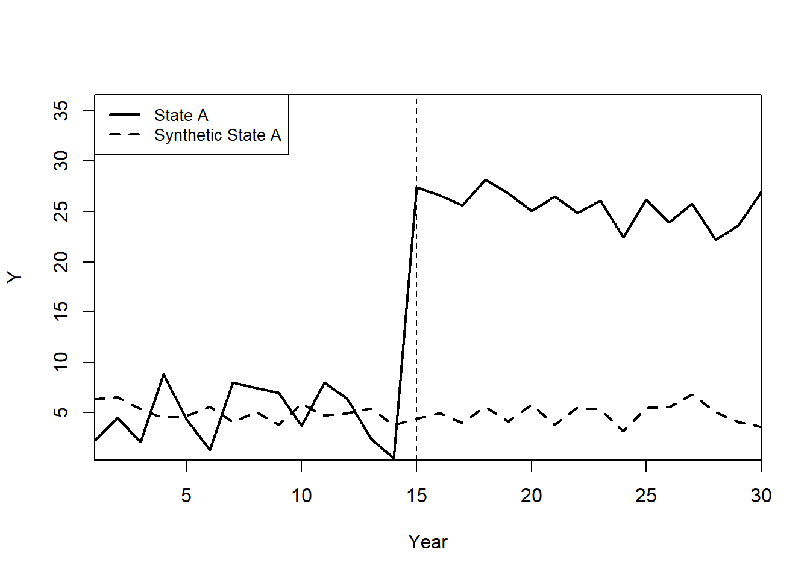
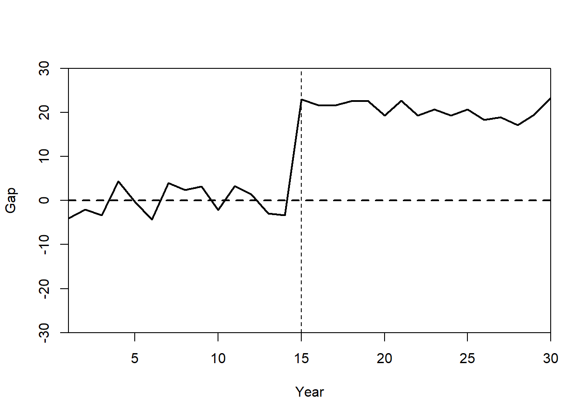
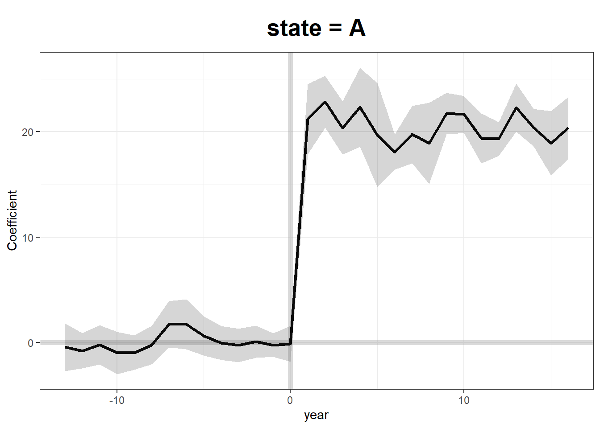
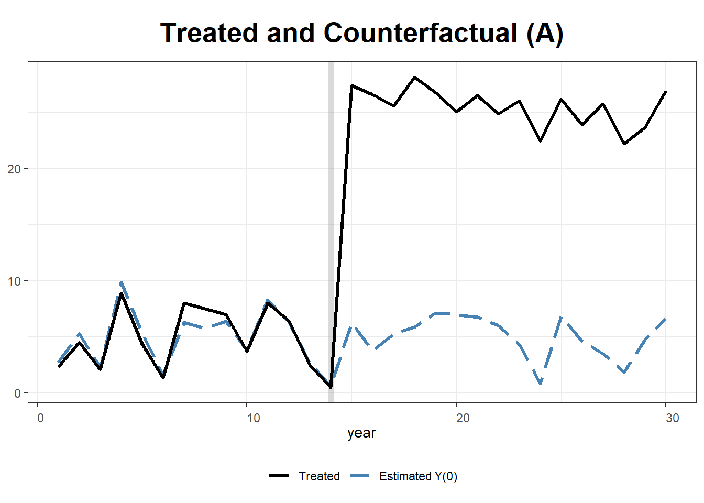
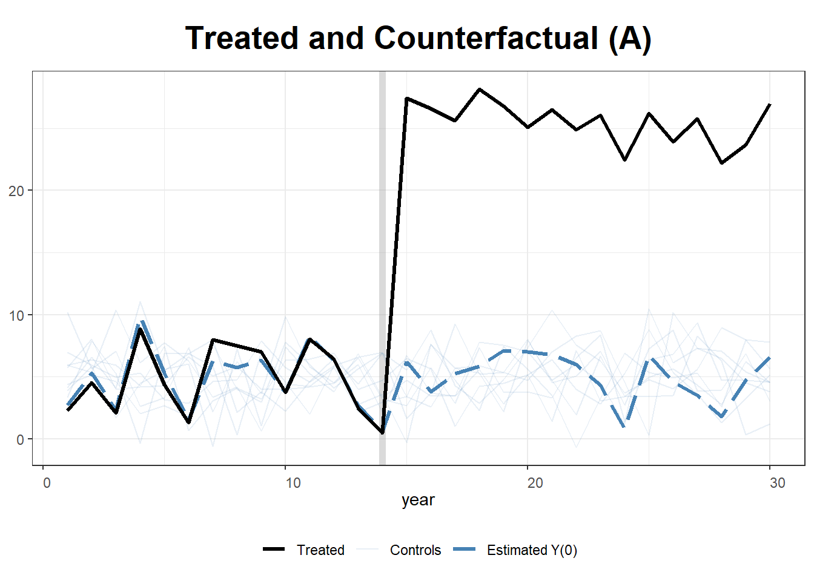
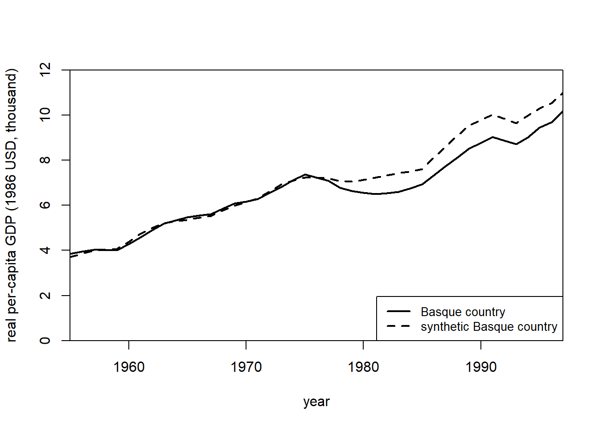
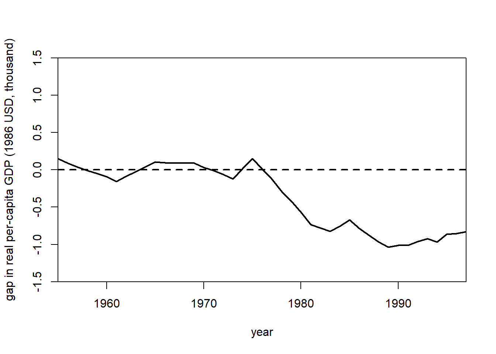

# Synthetic Control

Examples in marketing:

-   [@tirunillai2017]: offline TV ad on Online Chatter
-   [@wang2019mobile]: mobile hailing technology adoption on drivers' hourly earnings
-   [@guo2020let]: payment disclosure laws effect on physician prescription behavior using Timing of the Massachusetts open payment law as the exogenous shock
-   [@adalja2023gmo]: mandatory GMO labels had no impact on consumer demand (Using Vermont as a mandatory state)

Notes

-   Synthetic control method (SCM) is a generalization of the [Difference-in-differences] model

-   SCM is **superior** than [Matching Methods] because it not only matches on covariates (i.e., pre-treatment variables), but also outcomes.

-   For a review of the method, see [@abadie2021using]

-   SCMs can also be used under the Bayesian framework ([Bayesian Synthetic Control]) where we do not have to impose any restrictive priori [@kim2020bayesian]

-   Different from [Matching Methods] because SCMs match on the pre-treatment outcomes in each period while [Matching Methods] match on the number of covariates.

-   A data driven procedure to construct more comparable control groups (i.e., black box).

-   To do causal inference with control and treatment group using [Matching Methods], you typically have to have similar covariates in the control and the treated groups. However, if you don't methods like [Propensity Scores] and DID can perform rather poorly (i.e., large bias).

Advantages over [Difference-in-differences]

1.  Maximization of the observable similarity between control and treatment (maybe also unobservables)
2.  Can also be used in cases where no untreated case with similar on matching dimensions with treated cases
3.  Objective selection of controls.

Advantages over linear regression

-   Regression weights for the estimator will be outside of [0,1] (because regression allows extrapolation), and it will not be sparse (i.e., can be less than 0).

-   No extrapolation under SCMs

-   Explicitly state the fit (i.e., the weight)

-   Can be estimated without the post-treatment outcomes for the control group (can't p-hack)

Advantages:

1.  From the selection criteria, researchers can understand the relative importance of each candidate
2.  Post-intervention outcomes are not used in synthetic. Hence, you can't retro-fit.
3.  Observable similarity between control and treatment cases is maximized

Disadvantages:

1.  It's hard to argue for the weights you use to create the "synthetic control"

SCM is recommended when

1.  Social events to evaluate large-scale program or policy
2.  Only one treated case with several control candidates.

**Assumptions**

-   Donor subject is a good match for the synthetic control (i.e., gap between the dependent of the donor subject and that of the synthetic control should be 0 before treatment)

-   Only the treated subject undergoes the treatment and not any of the subjects in the donor pool.

-   No other changes to the subjects during the whole window.

-   The counterfactual outcome of the treatment group can be imputed in a **linear combination** of control groups.

**Identification**: The exclusion restriction is met conditional on the pre-treatment outcomes.

`Synth` provides an algorithm that finds weighted combination of the comparison units where the weights are chosen such that it best resembles the values of predictors of the outcome variable for the affected units before the intervention

Setting (notation followed professor [Alberto Abadie](https://conference.nber.org/confer/2021/SI2021/ML/AbadieSlides.pdf))

-   $J + 1$ units in periods $1, \dots, T$

-   The first unit is the treated one during $T_0 + 1, \dots, T$

-   $J$ units are called a donor pool

-   $Y_{it}^I$ is the outcome for unit $i$ if it's exposed to the treatment during $T_0 + 1 , \dots T$

-   $Y_{it}^N$ is the outcome for unit $i$ if it's not exposed to the treatment

We try to estimate the effect of treatment on the treated unit

$$
\tau_{1t} = Y_{1t}^I - Y_{1t}^N
$$

where we observe the first treated unit already $Y_{1t}^I = Y_{1t}$

To construct the synthetic control unit, we have to find appropriate weight for each donor in the donor pool by finding $\mathbf{W} = (w_2, \dots, w_{J=1})'$ where

-   $w_j \ge 0$ for $j = 2, \dots, J+1$

-   $w_2 + \dots + w_{J+1} = 1$

The "appropriate" vector $\mathbf{W}$ here is constrained to

$$
\min||\mathbf{X}_1 - \mathbf{X}_0 \mathbf{W}||
$$

where

-   $\mathbf{X}_1$ is the $k \times 1$ vector of pre-treatment characteristics for the treated unit

-   $\mathbf{X}_0$ is the $k \times J$ matrix of pre-treatment characteristics for the untreated units

For simplicity, researchers usually use

$$
\begin{aligned}
&\min||\mathbf{X}_1 - \mathbf{X}_0 \mathbf{W}|| \\
&= (\sum_{h=1}^k v_h(X_{h1}- w_2 X-{h2} - \dots - w_{J+1} X_{hJ +1})^{1/2}
\end{aligned}
$$

where

-   $v_1, \dots, v_k$ is a vector positive constants that represent the predictive power of the $k$ predictors on $Y_{1t}^N$ (i.e., the potential outcome of the treated without treatment) and it can be chosen either explicitly by the researcher or by data-driven methods

For penalized synthetic control [@abadie2021penalized], the minimization problem becomes

$$
\min_{\mathbf{W}} ||\mathbf{X}_1 - \sum_{j=2}^{J + 1}W_j \mathbf{X}_j ||^2 + \lambda \sum_{j=2}^{J+1} W_j ||\mathbf{X}_1 - \mathbf{X}_j||^2
$$

where

-   $W_j \ge 0$ and $\sum_{j=2}^{J+1} W_j = 1$

-   $\lambda >0$ balances over-fitting of the treated and minimize the sum of pairwise distances

    -   $\lambda \to 0$: pure synthetic control (i.e solution for the unpenalized estimator)

    -   $\lambda \to \infty$: nearest neighbor matching

Advantages:

-   For $\lambda >0$, you have unique and sparse solution

-   Reduces the interpolation bias when averaging dissimilar units

-   Penalized SC never uses dissimilar units

Then the synthetic control estimator is

$$
\hat{\tau}_{1t} = Y_{1t} - \sum_{j=2}^{J+1} w_j^* Y_{jt}
$$

where $Y_{jt}$ is the outcome for unit $j$ at time $t$

Consideration

Under the factor model [@abadie2010synthetic]

$$
Y_{it}^N = \mathbf{\theta}_t \mathbf{Z}_i + \mathbf{\lambda}_t \mathbf{\mu}_i + \epsilon_{it}
$$

where

-   $Z_i$ = observables

-   $\mu_i$ = unobservables

-   $\epsilon_{it}$ = unit-level transitory shock (i.e., random noise)

with assumptions of $\mathbf{W}^*$ such that

$$
\begin{aligned}
\sum_{j=2}^{J+1} w_j^* \mathbf{Z}_j  &= \mathbf{Z}_1 \\
&\dots \\
\sum_{j=2}^{J+1} w_j^* Y_{j1} &= Y_{11} \\
\sum_{j=2}^{J+1} w_j^* Y_{jT_0} &= Y_{1T_0}
\end{aligned}
$$

Basically, we assume that the synthetic control is a good counterfactual when the treated unit is not exposed to the treatment.

Then,

-   the bias bound depends on close fit, which is controlled by the ratio between $\epsilon_{it}$ (transitory shock) and $T_0$ (the number of pre-treatment periods). In other words, you should have good fit for $Y_{1t}$ for pre-treatment period (i.e., $T_0$ should be large while small variance in $\epsilon_{it}$)

-   When you have poor fit, you have to use bias correction version of the synthetic control. See [@arkhangelsky2019synthetic, @abadie2021using, @ben2020varying]

-   Overfitting can be the result of small $T_0$ (the number of pre-treatment periods), large $J$ (the number of units in the donor pool), and large $\epsilon_{it}$ (noise)

    -   Mitigation: put only similar units (to the treated one) in the donor pool

To make inference, we have to create a permutation distribution (by iteratively reassigning the treatment to the units in the donor pool and estimate the placebo effects in each iteration). We say there is an effect of the treatment when the magnitude of value of the treatment effect on the treated unit is extreme relative to the permutation distribution.

It's recommended to use one-sided inference. And the permutation distribution is superior to the p-values alone (because sampling-based inference is hard under SCMs either because of undefined sampling mechanism or the sample is the population).

For benchmark (permutation) distribution (e.g., uniform), see [@firpo2018synthetic]

## Applications

### Example 1

by [Danilo Freire](https://rpubs.com/danilofreire/synth)


```r
# install.packages("Synth")
# install.packages("gsynth")
library("Synth")
library("gsynth")
```

simulate data for 10 states and 30 years. State A receives the treatment `T = 20` after year 15.


```r
set.seed(1)
year         <- rep(1:30, 10)
state        <- rep(LETTERS[1:10], each = 30)
X1           <- round(rnorm(300, mean = 2, sd = 1), 2)
X2           <- round(rbinom(300, 1, 0.5) + rnorm(300), 2)
Y            <- round(1 + 2 * X1 + rnorm(300), 2)
df           <- as.data.frame(cbind(Y, X1, X2, state, year))
df$Y         <- as.numeric(as.character(df$Y))
df$X1        <- as.numeric(as.character(df$X1))
df$X2        <- as.numeric(as.character(df$X2))
df$year      <- as.numeric(as.character(df$year))
df$state.num <- rep(1:10, each = 30)
df$state     <- as.character(df$state)
df$`T`       <- ifelse(df$state == "A" & df$year >= 15, 1, 0)
df$Y         <- ifelse(df$state == "A" & df$year >= 15, 
                       df$Y + 20, df$Y)
```


```r
str(df)
#> 'data.frame':	300 obs. of  7 variables:
#>  $ Y        : num  2.29 4.51 2.07 8.87 4.37 1.32 8 7.49 6.98 3.72 ...
#>  $ X1       : num  1.37 2.18 1.16 3.6 2.33 1.18 2.49 2.74 2.58 1.69 ...
#>  $ X2       : num  1.96 0.4 -0.75 -0.56 -0.45 1.06 0.51 -2.1 0 0.54 ...
#>  $ state    : chr  "A" "A" "A" "A" ...
#>  $ year     : num  1 2 3 4 5 6 7 8 9 10 ...
#>  $ state.num: int  1 1 1 1 1 1 1 1 1 1 ...
#>  $ T        : num  0 0 0 0 0 0 0 0 0 0 ...
```


```r
dataprep.out <-
    dataprep(
        df,
        predictors            = c("X1", "X2"),
        dependent             = "Y",
        unit.variable         = "state.num",
        time.variable         = "year",
        unit.names.variable   = "state",
        treatment.identifier  = 1,
        controls.identifier   = c(2:10),
        time.predictors.prior = c(1:14),
        time.optimize.ssr     = c(1:14),
        time.plot             = c(1:30)
    )


synth.out <- synth(dataprep.out)
#> 
#> X1, X0, Z1, Z0 all come directly from dataprep object.
#> 
#> 
#> **************** 
#>  searching for synthetic control unit  
#>  
#> 
#> **************** 
#> **************** 
#> **************** 
#> 
#> MSPE (LOSS V): 9.831789 
#> 
#> solution.v:
#>  0.3888387 0.6111613 
#> 
#> solution.w:
#>  0.1115941 0.1832781 0.1027237 0.312091 0.06096758 0.03509706 0.05893735 0.05746256 0.07784853
```


```r
print(synth.tables   <- synth.tab(
        dataprep.res = dataprep.out,
        synth.res    = synth.out)
      )
#> $tab.pred
#>    Treated Synthetic Sample Mean
#> X1   2.028     2.028       2.017
#> X2   0.513     0.513       0.394
#> 
#> $tab.v
#>    v.weights
#> X1 0.389    
#> X2 0.611    
#> 
#> $tab.w
#>    w.weights unit.names unit.numbers
#> 2      0.112          B            2
#> 3      0.183          C            3
#> 4      0.103          D            4
#> 5      0.312          E            5
#> 6      0.061          F            6
#> 7      0.035          G            7
#> 8      0.059          H            8
#> 9      0.057          I            9
#> 10     0.078          J           10
#> 
#> $tab.loss
#>            Loss W   Loss V
#> [1,] 9.761708e-12 9.831789
```


```r
path.plot(synth.res    = synth.out,
          dataprep.res = dataprep.out,
          Ylab         = c("Y"),
          Xlab         = c("Year"),
          Legend       = c("State A","Synthetic State A"),
          Legend.position = c("topleft")
)

abline(v   = 15,
       lty = 2)
```



Gaps plot:


```r
gaps.plot(synth.res    = synth.out,
          dataprep.res = dataprep.out,
          Ylab         = c("Gap"),
          Xlab         = c("Year"),
          Ylim         = c(-30, 30),
          Main         = ""
)

abline(v   = 15,
       lty = 2)
```



Alternatively, `gsynth` provides options to estimate iterative fixed effects, and handle multiple treated units at tat time.

Here, we use two=way fixed effects and bootstrapped standard errors


```r
gsynth.out <- gsynth(
  Y ~ `T` + X1 + X2,
  data = df,
  index = c("state", "year"),
  force = "two-way",
  CV = TRUE,
  r = c(0, 5),
  se = TRUE,
  inference = "parametric",
  nboots = 1000,
  parallel = F # TRUE
)
#> Cross-validating ... 
#>  r = 0; sigma2 = 1.13533; IC = 0.95632; PC = 0.96713; MSPE = 1.65502
#>  r = 1; sigma2 = 0.96885; IC = 1.54420; PC = 4.30644; MSPE = 1.33375
#>  r = 2; sigma2 = 0.81855; IC = 2.08062; PC = 6.58556; MSPE = 1.27341*
#>  r = 3; sigma2 = 0.71670; IC = 2.61125; PC = 8.35187; MSPE = 1.79319
#>  r = 4; sigma2 = 0.62823; IC = 3.10156; PC = 9.59221; MSPE = 2.02301
#>  r = 5; sigma2 = 0.55497; IC = 3.55814; PC = 10.48406; MSPE = 2.79596
#> 
#>  r* = 2
#> 
#> 
Simulating errors .............
Bootstrapping ...
#> ..........
```


```r
plot(gsynth.out)
```




```r
plot(gsynth.out, type = "counterfactual")
```




```r
plot(gsynth.out, type = "counterfactual", raw = "all") 
```



```r
# shows estimations for the control cases
```

### Example 2

by [Leihua Ye](https://towardsdatascience.com/causal-inference-using-synthetic-control-the-ultimate-guide-a622ad5cf827)


```r

library(Synth)
data("basque")
dim(basque) #774*17
#> [1] 774  17
head(basque)
#>   regionno     regionname year   gdpcap sec.agriculture sec.energy sec.industry
#> 1        1 Spain (Espana) 1955 2.354542              NA         NA           NA
#> 2        1 Spain (Espana) 1956 2.480149              NA         NA           NA
#> 3        1 Spain (Espana) 1957 2.603613              NA         NA           NA
#> 4        1 Spain (Espana) 1958 2.637104              NA         NA           NA
#> 5        1 Spain (Espana) 1959 2.669880              NA         NA           NA
#> 6        1 Spain (Espana) 1960 2.869966              NA         NA           NA
#>   sec.construction sec.services.venta sec.services.nonventa school.illit
#> 1               NA                 NA                    NA           NA
#> 2               NA                 NA                    NA           NA
#> 3               NA                 NA                    NA           NA
#> 4               NA                 NA                    NA           NA
#> 5               NA                 NA                    NA           NA
#> 6               NA                 NA                    NA           NA
#>   school.prim school.med school.high school.post.high popdens invest
#> 1          NA         NA          NA               NA      NA     NA
#> 2          NA         NA          NA               NA      NA     NA
#> 3          NA         NA          NA               NA      NA     NA
#> 4          NA         NA          NA               NA      NA     NA
#> 5          NA         NA          NA               NA      NA     NA
#> 6          NA         NA          NA               NA      NA     NA
```

transform data to be used in `synth()`


```r
dataprep.out <- dataprep(
    foo = basque,
    predictors = c(
        "school.illit",
        "school.prim",
        "school.med",
        "school.high",
        "school.post.high",
        "invest"
    ),
    predictors.op =  "mean",
    # the operator
    time.predictors.prior = 1964:1969,
    #the entire time frame from the #beginning to the end
    special.predictors = list(
        list("gdpcap", 1960:1969,  "mean"),
        list("sec.agriculture", seq(1961, 1969, 2), "mean"),
        list("sec.energy", seq(1961, 1969, 2), "mean"),
        list("sec.industry", seq(1961, 1969, 2), "mean"),
        list("sec.construction", seq(1961, 1969, 2), "mean"),
        list("sec.services.venta", seq(1961, 1969, 2), "mean"),
        list("sec.services.nonventa", seq(1961, 1969, 2), "mean"),
        list("popdens", 1969,  "mean")
    ),
    dependent =  "gdpcap",
    # dv
    unit.variable =  "regionno",
    #identifying unit numbers
    unit.names.variable =  "regionname",
    #identifying unit names
    time.variable =  "year",
    #time-periods
    treatment.identifier = 17,
    #the treated case
    controls.identifier = c(2:16, 18),
    #the control cases; all others #except number 17
    time.optimize.ssr = 1960:1969,
    #the time-period over which to optimize
    time.plot = 1955:1997
) #the entire time period before/after the treatment
```

where

-   $X_1$ = the control case before the treatment

-   $X_0$ = the control cases after the treatment

-   $Z_1$: the treatment case before the treatment

-   $Z_0$: the treatment case after the treatment


```r
synth.out = synth(data.prep.obj = dataprep.out, method = "BFGS")
#> 
#> X1, X0, Z1, Z0 all come directly from dataprep object.
#> 
#> 
#> **************** 
#>  searching for synthetic control unit  
#>  
#> 
#> **************** 
#> **************** 
#> **************** 
#> 
#> MSPE (LOSS V): 0.008864606 
#> 
#> solution.v:
#>  0.02773094 1.194e-07 1.60609e-05 0.0007163836 1.486e-07 0.002423908 0.0587055 0.2651997 0.02851006 0.291276 0.007994382 0.004053188 0.009398579 0.303975 
#> 
#> solution.w:
#>  2.53e-08 4.63e-08 6.44e-08 2.81e-08 3.37e-08 4.844e-07 4.2e-08 4.69e-08 0.8508145 9.75e-08 3.2e-08 5.54e-08 0.1491843 4.86e-08 9.89e-08 1.162e-07
```

Calculate the difference between the real basque region and the synthetic control


```r
gaps = dataprep.out$Y1plot - (dataprep.out$Y0plot 
                                     %*% synth.out$solution.w)
gaps[1:3,1]
#>       1955       1956       1957 
#> 0.15023473 0.09168035 0.03716475
```


```r
synth.tables = synth.tab(dataprep.res = dataprep.out,
                         synth.res = synth.out)
names(synth.tables)
#> [1] "tab.pred" "tab.v"    "tab.w"    "tab.loss"
synth.tables$tab.pred[1:13,]
#>                                          Treated Synthetic Sample Mean
#> school.illit                              39.888   256.337     170.786
#> school.prim                             1031.742  2730.104    1127.186
#> school.med                                90.359   223.340      76.260
#> school.high                               25.728    63.437      24.235
#> school.post.high                          13.480    36.153      13.478
#> invest                                    24.647    21.583      21.424
#> special.gdpcap.1960.1969                   5.285     5.271       3.581
#> special.sec.agriculture.1961.1969          6.844     6.179      21.353
#> special.sec.energy.1961.1969               4.106     2.760       5.310
#> special.sec.industry.1961.1969            45.082    37.636      22.425
#> special.sec.construction.1961.1969         6.150     6.952       7.276
#> special.sec.services.venta.1961.1969      33.754    41.104      36.528
#> special.sec.services.nonventa.1961.1969    4.072     5.371       7.111
```

Relative importance of each unit


```r
synth.tables$tab.w[8:14, ]
#>    w.weights            unit.names unit.numbers
#> 9      0.000    Castilla-La Mancha            9
#> 10     0.851              Cataluna           10
#> 11     0.000  Comunidad Valenciana           11
#> 12     0.000           Extremadura           12
#> 13     0.000               Galicia           13
#> 14     0.149 Madrid (Comunidad De)           14
#> 15     0.000    Murcia (Region de)           15
```


```r
# plot the changes before and after the treatment 
path.plot(
    synth.res = synth.out,
    dataprep.res = dataprep.out,
    Ylab = "real per-capita gdp (1986 USD, thousand)",
    Xlab = "year",
    Ylim = c(0, 12),
    Legend = c("Basque country",
               "synthetic Basque country"),
    Legend.position = "bottomright"
)
```


```r
gaps.plot(
    synth.res = synth.out,
    dataprep.res = dataprep.out,
    Ylab =  "gap in real per - capita GDP (1986 USD, thousand)",
    Xlab =  "year",
    Ylim = c(-1.5, 1.5),
    Main = NA
)
```


Doubly Robust Difference-in-Differences

Example from `DRDID` package


```r
library(DRDID)
data(nsw_long)
# Form the Lalonde sample with CPS comparison group
eval_lalonde_cps <- subset(nsw_long, nsw_long$treated == 0 | 
                               nsw_long$sample == 2)
```

Estimate Average Treatment Effect on Treated using Improved Locally Efficient Doubly Robust DID estimator


```r
out <-
    drdid(
        yname = "re",
        tname = "year",
        idname = "id",
        dname = "experimental",
        xformla = ~ age + educ + black + married + nodegree + hisp + re74,
        data = eval_lalonde_cps,
        panel = TRUE
    )
summary(out)
#>  Call:
#> drdid(yname = "re", tname = "year", idname = "id", dname = "experimental", 
#>     xformla = ~age + educ + black + married + nodegree + hisp + 
#>         re74, data = eval_lalonde_cps, panel = TRUE)
#> ------------------------------------------------------------------
#>  Further improved locally efficient DR DID estimator for the ATT:
#>  
#>    ATT     Std. Error  t value    Pr(>|t|)  [95% Conf. Interval] 
#> -901.2703   393.6247   -2.2897     0.022    -1672.7747  -129.766 
#> ------------------------------------------------------------------
#>  Estimator based on panel data.
#>  Outcome regression est. method: weighted least squares.
#>  Propensity score est. method: inverse prob. tilting.
#>  Analytical standard error.
#> ------------------------------------------------------------------
#>  See Sant'Anna and Zhao (2020) for details.
```

### Example 3

by `Synth` package's authors


```r
library(Synth)
data("basque")
```

`synth()` requires

-   $X_1$ vector of treatment predictors

-   $X_0$ matrix of same variables for control group

-   $Z_1$ vector of outcome variable for treatment group

-   $Z_0$ matrix of outcome variable for control group

use `dataprep()` to prepare data in the format that can be used throughout the `Synth` package


```r
dataprep.out <- dataprep(
    foo = basque,
    predictors = c(
        "school.illit",
        "school.prim",
        "school.med",
        "school.high",
        "school.post.high",
        "invest"
    ),
    predictors.op = "mean",
    time.predictors.prior = 1964:1969,
    special.predictors = list(
        list("gdpcap", 1960:1969 , "mean"),
        list("sec.agriculture", seq(1961, 1969, 2), "mean"),
        list("sec.energy", seq(1961, 1969, 2), "mean"),
        list("sec.industry", seq(1961, 1969, 2), "mean"),
        list("sec.construction", seq(1961, 1969, 2), "mean"),
        list("sec.services.venta", seq(1961, 1969, 2), "mean"),
        list("sec.services.nonventa", seq(1961, 1969, 2), "mean"),
        list("popdens", 1969, "mean")
    ),
    dependent = "gdpcap",
    unit.variable = "regionno",
    unit.names.variable = "regionname",
    time.variable = "year",
    treatment.identifier = 17,
    controls.identifier = c(2:16, 18),
    time.optimize.ssr = 1960:1969,
    time.plot = 1955:1997
)
```

find optimal weights that identifies the synthetic control for the treatment group


```r
synth.out <- synth(data.prep.obj = dataprep.out, method = "BFGS")
#> 
#> X1, X0, Z1, Z0 all come directly from dataprep object.
#> 
#> 
#> **************** 
#>  searching for synthetic control unit  
#>  
#> 
#> **************** 
#> **************** 
#> **************** 
#> 
#> MSPE (LOSS V): 0.008864606 
#> 
#> solution.v:
#>  0.02773094 1.194e-07 1.60609e-05 0.0007163836 1.486e-07 0.002423908 0.0587055 0.2651997 0.02851006 0.291276 0.007994382 0.004053188 0.009398579 0.303975 
#> 
#> solution.w:
#>  2.53e-08 4.63e-08 6.44e-08 2.81e-08 3.37e-08 4.844e-07 4.2e-08 4.69e-08 0.8508145 9.75e-08 3.2e-08 5.54e-08 0.1491843 4.86e-08 9.89e-08 1.162e-07
```


```r
gaps <- dataprep.out$Y1plot - (dataprep.out$Y0plot %*% synth.out$solution.w)
gaps[1:3, 1]
#>       1955       1956       1957 
#> 0.15023473 0.09168035 0.03716475
```


```r
synth.tables <-
    synth.tab(dataprep.res = dataprep.out, synth.res = synth.out)
names(synth.tables) # you can pick tables to see 
#> [1] "tab.pred" "tab.v"    "tab.w"    "tab.loss"
```


```r
path.plot(
    synth.res = synth.out,
    dataprep.res = dataprep.out,
    Ylab = "real per-capita GDP (1986 USD, thousand)",
    Xlab = "year",
    Ylim = c(0, 12),
    Legend = c("Basque country",
               "synthetic Basque country"),
    Legend.position = "bottomright"
)
```




```r
gaps.plot(
    synth.res = synth.out,
    dataprep.res = dataprep.out,
    Ylab = "gap in real per-capita GDP (1986 USD, thousand)",
    Xlab = "year",
    Ylim = c(-1.5, 1.5),
    Main = NA
)
```



You could also run placebo tests

### Example 4

by [Michael Robbins and Steven Davenport](https://cran.r-project.org/web/packages/microsynth/vignettes/introduction.html) who are authors of `MicroSynth` with the following improvements:

-   Standardization `use.survey = TRUE` and permutation ( `perm = 250` and `jack = TRUE` ) for placebo tests

-   Omnibus statistic (set to `omnibus.var` ) for multiple outcome variables

-   incorporate multiple follow-up periods `end.post`

Notes:

-   Both predictors and outcome will be used to match units before intervention

    -   Outcome variable has to be **time-variant**

    -   Predictors are **time-invariant**


```r
# right now the package is not availabe for R version 4.2
library(microsynth)
data("seattledmi")


cov.var <-
    c(
        "TotalPop",
        "BLACK",
        "HISPANIC",
        "Males_1521",
        "HOUSEHOLDS",
        "FAMILYHOUS",
        "FEMALE_HOU",
        "RENTER_HOU",
        "VACANT_HOU"
    )
match.out <- c("i_felony", "i_misdemea", "i_drugs", "any_crime")
```


```r
sea1 <- microsynth(
    seattledmi,
    idvar       = "ID",
    timevar     = "time",
    intvar      = "Intervention",
    start.pre   = 1,
    end.pre     = 12,
    end.post    = 16,
    match.out   = match.out, # outcome variable will be matched on exactly
    match.covar = cov.var, # specify covariates will be matched on exactly
    result.var  = match.out, # used to report results
    omnibus.var = match.out, # feature in the omnibus p-value
    test        = "lower",
    n.cores     = min(parallel::detectCores(), 2)
)
sea1
summary(sea1)
```


```r
plot_microsynth(sea1)
```


```r
sea2 <- microsynth(
    seattledmi,
    idvar = "ID",
    timevar = "time",
    intvar = "Intervention",
    start.pre = 1,
    end.pre = 12,
    end.post = c(14, 16),
    match.out = match.out,
    match.covar = cov.var,
    result.var = match.out,
    omnibus.var = match.out,
    test = "lower",
    perm = 250,
    jack = TRUE,
    n.cores = min(parallel::detectCores(), 2)
)
```

## Augmented Synthetic Control Method

package: `augsynth` [@ben2021augmented]

## Synthetic Control with Staggered Adoption

references: <https://ebenmichael.github.io/assets/research/jamboree.pdf> [@ben2022synthetic] package: `augsynth`

## Bayesian Synthetic Control

@kim2020bayesian

@pang2022bayesian

## Generalized Synthetic Control

reference: [@xu2017generalized]

-   Bootstrap procedure here is biased [@li2023statistical]. Hence, we need to follow @li2023statistical in terms of SEs estimation.
