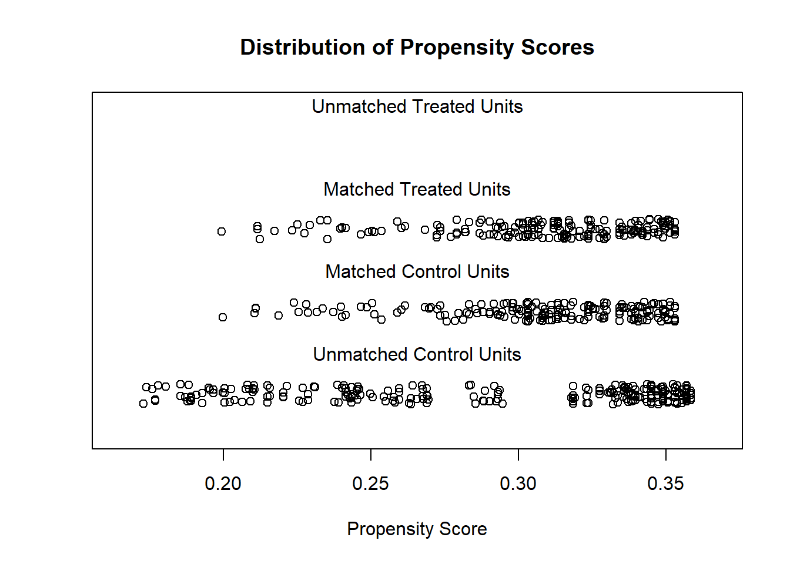

# Matching Methods

**Assumption**: Observables can identify the selection into the treatment and control groups

This is also known as selection on observables or unconfoundedness (i.e., you control for coufounders that affect the probability of treatment assignment) [@rosenbaum1983a].

Under the potential outcome framework, after controlling for $X_i$, we assume it's sufficient to identify the [Average Treatment Effects] because $T_i$ (treatment assignment) is **as good as random**:

$$
[\{Y_i(0), Y_i(1)\} \perp T_i ]| X_i
$$

**Identification**: The exclusion restriction can be met conditional on the observables

**Motivation**

Effect of college quality on earnings

They ultimately estimate the treatment effect on the treated of attending a top (high ACT) versus bottom (low ACT) quartile college

**Example**

@aaronson2007

Do teachers qualifications (causally) affect student test scores?

Step 1:

$$
Y_{ijt} = \delta_0 + Y_{ij(t-1)} \delta_1 + X_{it} \delta_2 + Z_{jt} \delta_3 + \epsilon_{ijt}
$$

There can always be another variable

Any observable sorting is imperfect

Step 2:

$$
Y_{ijst} = \alpha_0 + Y_{ij(t-1)}\alpha_1 + X_{it} \alpha_2 + Z_{jt} \alpha_3 + \gamma_s + u_{isjt}
$$

-   $\delta_3 >0$

-   $\delta_3 > \alpha_3$

-   $\gamma_s$ = school fixed effect

Sorting is less within school. Hence, we can introduce the school fixed effect

Step 3:

Find schools that look like they are putting students in class randomly (or as good as random) + we run step 2

$$
Y_{isjt} = Y_{isj(t-1)} \lambda + X_{it} \alpha_1 +Z_{jt} \alpha_{21}+ (Z_{jt} \times D_i)\alpha_{22}+ \gamma_5 + u_{isjt}
$$

-   $D_{it}$ is an element of $X_{it}$

-   $Z_{it}$ = teacher experience

$$
D_{it}=
\begin{cases}
1 & \text{ if high poverty} \\
0 & \text{otherwise}
\end{cases}
$$

$H_0:$ $\alpha_{22} = 0$ test for effect heterogeneity whether the effect of teacher experience ($Z_{jt}$) is different

-   For low poverty is $\alpha_{21}$

-   For high poverty effect is $\alpha_{21} + \alpha_{22}$

<br>

Matching is **selection on observables** and only works if you have good observables.

Sufficient identification assumption under Selection on observable/ back-door criterion (based on Bernard Koch's [presentation](https://www.youtube.com/watch?v=v9uf9rDYEMg&ab_channel=SummerInstituteinComputationalSocialScience))

-   Strong conditional ignorability

    -   $Y(0),Y(1) \perp T|X$

    -   No hidden confounders (this is stronger)

-   Overlap

    -   $\forall x \in X, t \in \{0, 1\}: p (T = t | X = x> 0$

    -   All treatments have non-zero probability of being observed

-   SUTVA/ Consistency

    -   Treatment and outcomes of different subjects are independent

Relative to [OLS][Ordinary Least Squares]

1.  Matching makes the **common support** explicit (and changes default from "ignore" to "enforce")
2.  Relaxes linear function form. Thus, less parametric.

It also helps if you have high ratio of controls to treatments.

<br>

For detail summary [@Stuart_2010]

Matching is defined as "any method that aims to equate (or "balance") the distribution of covariates in the treated and control groups." [@Stuart_2010, pp. 1]

Equivalently, matching is a selection on observables identifications strategy.

**If you think your OLS estimate is biased, a matching estimate (almost surely) is too.**

Unconditionally, consider

$$
E(Y_i^T | T) - E(Y_i^C |C) + E(Y_i^C | T) - E(Y_i^C | T) \\
= E(Y_i^T - Y_i^C | T) + [E(Y_i^C | T) - E(Y_i^C |C)] \\
= E(Y_i^T - Y_i^C | T) + \text{selection bias}
$$

where $E(Y_i^T - Y_i^C | T)$ is the causal inference that we want to know.

Randomization eliminates the selection bias.

If we don't have randomization, then $E(Y_i^C | T) \neq E(Y_i^C |C)$

Matching tries to do selection on observables $E(Y_i^C | X, T) = E(Y_i^C|X, C)$

[Propensity Scores] basically do $E(Y_i^C| P(X) , T) = E(Y_i^C | P(X), C)$

**Matching standard errors will exceed OLS standard errors**

The treatment should have larger predictive power than the control because you use treatment to pick control (not control to pick treatment).

The average treatment effect (ATE) is

$$
\frac{1}{N_T} \sum_{i=1}^{N_T} (Y_i^T - \frac{1}{N_{C_T}} \sum_{i=1}^{N_{C_T}} Y_i^C)
$$

Since there is no closed-form solution for the standard error of the average treatment effect, we have to use bootstrapping to get standard error.

<br>

Professor Gary King advocates instead of using the word "matching", we should use "**pruning**" (i.e., deleting observations). It is a preprocessing step where it prunes nonmatches to make control variables less important in your analysis.

Without Matching

-   **Imbalance data** leads to **model dependence** lead to a lot of **researcher discretion** leads to **bias**

With Matching

-   We have balance data which essentially erase human discretion

| Balance Covariates | Complete Randomization | Fully Exact |
|--------------------|------------------------|-------------|
| Observed           | On average             | Exact       |
| Unobserved         | On average             | On average  |

: Table \@ref(tab:Gary King - International Methods Colloquium talk 2015)

Fully blocked is superior on

-   imbalance

-   model dependence

-   power

-   efficiency

-   bias

-   research costs

-   robustness

Matching is used when

-   Outcomes are not available to select subjects for follow-up

-   Outcomes are available to improve precision of the estimate (i.e., reduce bias)

Hence, we can only observe one outcome of a unit (either treated or control), we can think of this problem as missing data as well. Thus, this section is closely related to [Imputation (Missing Data)]

In observational studies, we cannot randomize the treatment effect. Subjects select their own treatments, which could introduce selection bias (i.e., systematic differences between group differences that confound the effects of response variable differences).

<br>

Matching is used to

-   reduce model dependence

-   diagnose balance in the dataset

Assumptions of matching:

1.  **Treatment assignment is independent of potential outcomes given the covariates**

    -   $T \perp (Y(0),Y(1))|X$

    -   known as ignorability, or ignorable, no hidden bias, or unconfounded.

    -   You typically satisfy this assumption when unobserved covariates correlated with observed covariates.

        -   But when unobserved covariates are unrelated to the observed covariates, you can use sensitivity analysis to check your result, or use "design sensitivity" [@Heller_2009]

2.  **Positive probability of receiving treatment for all X**

    -   $0 < P(T=1|X)<1 \forall X$

3.  **Stable Unit Treatment value Assumption (SUTVA)**

    -   Outcomes of A are not affected by treatment of B.

        -   Very hard in cases where there is "spillover" effects (interactions between control and treatment). To combat, we need to reduce interactions.

Generalization

-   $P_t$: treated population -\> $N_t$: random sample from treated

-   $P_c$: control population -\> $N_c$: random sample from control

-   $\mu_i$ = means ; $\Sigma_i$ = variance covariance matrix of the $p$ covariates in group i ($i = t,c$)

-   $X_j$ = $p$ covariates of individual $j$

-   $T_j$ = treatment assignment

-   $Y_j$ = observed outcome

-   Assume: $N_t < N_c$

-   Treatment effect is $\tau(x) = R_1(x) - R_0(x)$ where

    -   $R_1(x) = E(Y(1)|X)$

    -   $R_0(x) = E(Y(0)|X)$

-   Assume: parallel trends hence $\tau(x) = \tau \forall x$

    -   If the parallel trends are not assumed, an average effect can be estimated.

-   Common estimands:

    -   Average effect of the treatment on the treated (ATT): effects on treatment group

    -   Average treatment effect (ATE): effect on both treatment and control

Steps:

1.  Define "closeness": decide distance measure to be used

    1.  Which variables to include:

        1.  Ignorability (no unobserved differences between treatment and control)

            1.  Since cost of including unrelated variables is small, you should include as many as possible (unless sample size/power doesn't allow you to because of increased variance)

            2.  Do not include variables that were affected by the treatment.

            3.  Note: if a matching variable (i.e., heavy drug users) is highly correlated to the outcome variable (i.e., heavy drinkers) , you will be better to exclude it in the matching set.

    2.  Which distance measures: more below

2.  Matching methods

    1.  Nearest neighbor matching

        1.  Simple (greedy) matching: performs poorly when there is competition for controls.

        2.  Optimal matching: considers global distance measure

        3.  Ratio matching: to combat increase bias and reduced variation when you have k:1 matching, one can use approximations by Rubin and Thomas (1996).

        4.  With or without replacement: with replacement is typically better, but one needs to account for dependent in the matched sample when doing later analysis (can use frequency weights to combat).

    2.  Subclassification, Full Matching and Weighting

        Neareast neighbor matching assign is 0 (control) or 1 (treated), while these methods use weights between 0 and 1.

        1.  Subclassification: distribution into multiple subclass (e.g., 5-10)

        2.  Full matching: optimal ly minimize the average of the distances between each treated unit and each control unit within each matched set.

        3.  Weighting adjustments: weighting technique uses propensity scores to estimate ATE. If the weights are extreme, the variance can be large not due to the underlying probabilities, but due to the estimation procure. To combat this, use (1) weight trimming, or (2) doubly -robust methods when propensity scores are used for weighing or matching.

            1.  Inverse probability of treatment weighting (IPTW) $w_i = \frac{T_i}{\hat{e}_i} + \frac{1 - T_i}{1 - \hat{e}_i}$

            2.  Odds $w_i = T_i + (1-T_i) \frac{\hat{e}_i}{1-\hat{e}_i}$

            3.  Kernel weighting (e.g., in economics) averages over multiple units in the control group.

    3.  Assessing Common Support

        -   common support means overlapping of the propensity score distributions in the treatment and control groups. Propensity score is used to discard control units from the common support. Alternatively, convex hull of the covariates in the multi-dimensional space.

3.  Assessing the quality of matched samples (Diagnose)

    -   Balance = similarity of the empirical distribution of the full set of covariates in the matched treated and control groups. Equivalently, treatment is unrelated to the covariates

        -   $\tilde{p}(X|T=1) = \tilde{p}(X|T=0)$ where $\tilde{p}$ is the empirical distribution.

    -   Numerical Diagnostics

        1.  standardized difference in means of each covariate (most common), also known as"standardized bias", "standardized difference in means".

        2.  standardized difference of means of the propensity score (should be \< 0.25) [@Rubin_2001]

        3.  ratio of the variances of the propensity score in the treated and control groups (should be between 0.5 and 2). [@Rubin_2001]

        4.  For each covariate, the ratio fo the variance of the residuals orthogonal to the propensity score in the treated and control groups.

            Note: can't use hypothesis tests or p-values because of (1) in-sample property (not population), (2) conflation of changes in balance with changes in statistical power.

    -   Graphical Diagnostics

        -   QQ plots

        -   Empirical Distribution Plot

4.  Estimate the treatment effect

    1.  After k:1

        1.  Need to account for weights when use matching with replacement.

    2.  After Subclassification and Full Matching

        1.  weighting the subclass estimates by the number of treated units in each subclass for ATT

        2.  WEighting by the overall number of individual in each subclass for ATE.

    3.  Variance estimation: should incorporate uncertainties in both the matching procedure (step 3) and the estimation procedure (step 4)

<br>

Notes:

-   With missing data, use generalized boosted models, or multiple imputation [@Qu_2009]

-   Violation of ignorable treatment assignment (i.e., unobservables affect treatment and outcome). control by

    -   measure pre-treatment measure of the outcome variable

    -   find the difference in outcomes between multiple control groups. If there is a significant difference, there is evidence for violation.

    -   find the range of correlations between unobservables and both treatment assignment and outcome to nullify the significant effect.

-   Choosing between methods

    -   smallest standardized difference of mean across the largest number of covariates

    -   minimize the standardized difference of means of a few particularly prognostic covariates

    -   fest number of large standardized difference of means (\> 0.25)

    -   [@Diamond_2013] automates the process

-   In practice

    -   If ATE, ask if there is enough overlap of the treated and control groups' propensity score to estimate ATE, if not use ATT instead

    -   If ATT, ask if there are controls across the full range of the treated group

-   Choose matching method

    -   If ATE, use IPTW or full matching

    -   If ATT, and more controls than treated (at least 3 times), k:1 nearest neighbor without replacement

    -   If ATT, and few controls , use subclassification, full matching, and weighting by the odds

-   Diagnostic

    -   If balance, use regression on matched samples

    -   If imbalance on few covariates, treat them with Mahalanobis

    -   If imbalance on many covariates, try k:1 matching with replacement

Ways to define the distance $D_{ij}$

1.  Exact

$$
D_{ij} = 
\begin{cases}
0, \text{ if } X_i = X_j, \\
\infty, \text{ if } X_i \neq X_j
\end{cases}
$$

An advanced is [Coarsened Exact Matching]

2.  Mahalanobis

$$
D_{ij} = (X_i - X_j)'\Sigma^{-1} (X_i - X_j)
$$

where

$\Sigma$ = variance covariance matrix of X in the

-   control group if ATT is interested

-   polled treatment and control groups if ATE is interested

3.  Propensity score:

$$
D_{ij} = |e_i - e_j|
$$

where $e_k$ = the propensity score for individual k

An advanced is Prognosis score [@Hansen_2008], but you have to know (i.e., specify) the relationship between the covariates and outcome.

4.  Linear propensity score

$$
D_{ij} = |logit(e_i) - logit(e_j)|
$$

The exact and Mahalanobis are not good in high dimensional or non normally distributed X's cases.

We can combine Mahalanobis matching with propensity score calipers [@Rubin_2000]

Other advanced methods for longitudinal settings

-   marginal structural models [@Robins_2000]

-   balanced risk set matching [@Li_2001]

\
Most matching methods are based on (ex-post)

-   propensity score

-   distance metric

-   covariates

Packages

-   `cem` Coarsened exact matching

-   `Matching` Multivariate and propensity score matching with balance optimization

-   `MatchIt` Nonparametric preprocessing for parametric causal inference. Have nearest neighbor, Mahalanobis, caliper, exact, full, optimal, subclassification

-   `MatchingFrontier` optimize balance and sample size [@King_2016]

-   `optmatch`optimal matching with variable ratio, optimal and full matching

-   `PSAgraphics` Propensity score graphics

-   `rbounds` sensitivity analysis with matched data, examine ignorable treatment assignment assumption

-   `twang` weighting and analysis of non-equivalent groups

-   `CBPS` covariate balancing propensity score. Can also be used in the longitudinal setting with marginal structural models.

-   `PanelMatch` based on [Imai, Kim, and Wang (2018)](https://imai.fas.harvard.edu/research/files/tscs.pdf)

<br>

## Matching vs. Regression

+--------------------------------------------------------------------------------------------------------------+-------------------------------------------------------------------+
| Matching                                                                                                     | Regression                                                        |
+==============================================================================================================+===================================================================+
| Not as sensitive to the functional form of the covariates                                                    | can estimate the effect of a continuous treatment                 |
+--------------------------------------------------------------------------------------------------------------+-------------------------------------------------------------------+
| Easier to asses whether it's working                                                                         | estimate the effect of all the variables (not just the treatment) |
|                                                                                                              |                                                                   |
| Easier to explain                                                                                            |                                                                   |
|                                                                                                              |                                                                   |
| allows a nice visualization of an evaluation                                                                 |                                                                   |
+--------------------------------------------------------------------------------------------------------------+-------------------------------------------------------------------+
| If you treatment is fairly rare, you may have a lot of control observations that are obviously no comparable | can estimate interactions of treatment with covariates            |
+--------------------------------------------------------------------------------------------------------------+-------------------------------------------------------------------+
| Less parametric                                                                                              | More parametric                                                   |
+--------------------------------------------------------------------------------------------------------------+-------------------------------------------------------------------+
| Enforces common support (i.e., space where treatment and control have the same characteristics)              |                                                                   |
+--------------------------------------------------------------------------------------------------------------+-------------------------------------------------------------------+

However, the problem of **omitted variables** (i.e., those that affect both the outcome and whether observation was treated) - unobserved confounders is still present in matching methods.

<br>

Difference between matching and regression following Jorn-Ste§en Pischke's [lecture](https://econ.lse.ac.uk/staff/spischke/ec533/regression%20vs%20matching.pdf)

Suppose we want to estimate the effect of treatment on the treated

$$
\begin{aligned}
\delta_{TOT} &= E[ Y_{1i} - Y_{0i} | D_i = 1 ] \\
&= E\{E[Y_{1i} | X_i, D_i = 1] - E[Y_{0i}|X_i, D_i = 1]|D_i = 1\} && \text{law of itereated expectations}
\end{aligned}
$$

Under conditional independence

$$
E[Y_{0i} |X_i , D_i = 0 ] = E[Y_{0i} | X_i, D_i = 1]
$$

then

$$
\begin{aligned}
\delta_{TOT} &= E \{ E[ Y_{1i} | X_i, D_i = 1] - E[ Y_{0i}|X_i, D_i = 0 ]|D_i = 1\} \\
&= E\{E[y_i | X_i, D_i = 1] - E[y_i |X_i, D_i = 0 ] | D_i = 1\} \\
&= E[\delta_X |D_i = 1]
\end{aligned}
$$

where $\delta_X$ is an X-specific difference in means at covariate value $X_i$

When $X_i$ is discrete, the matching estimand is

$$
\delta_M = \sum_x \delta_x P(X_i = x |D_i = 1)
$$

where $P(X_i = x |D_i = 1)$ is the probability mass function for $X_i$ given $D_i = 1$

According to Bayes rule,

$$
P(X_i = x | D_i = 1) = \frac{P(D_i = 1 | X_i = x) \times P(X_i = x)}{P(D_i = 1)}
$$

hence,

$$
\begin{aligned}
\delta_M &= \frac{\sum_x \delta_x P (D_i = 1 | X_i = x) P (X_i = x)}{\sum_x P(D_i = 1 |X_i = x)P(X_i = x)} \\
&= \sum_x \delta_x \frac{ P (D_i = 1 | X_i = x) P (X_i = x)}{\sum_x P(D_i = 1 |X_i = x)P(X_i = x)}
\end{aligned}
$$

On the other hand, suppose we have regression

$$
y_i = \sum_x d_{ix} \beta_x + \delta_R D_i + \epsilon_i
$$

where

-   $d_{ix}$ = dummy that indicates $X_i = x$

-   $\beta_x$ = regression-effect for $X_i = x$

-   $\delta_R$ = regression estimand where

$$
\begin{aligned}
\delta_R &= \frac{\sum_x \delta_x [P(D_i = 1 | X_i = x) (1 - P(D_i = 1 | X_i = x))]P(X_i = x)}{\sum_x [P(D_i = 1| X_i = x)(1 - P(D_i = 1 | X_i = x))]P(X_i = x)} \\
&= \sum_x \delta_x \frac{[P(D_i = 1 | X_i = x) (1 - P(D_i = 1 | X_i = x))]P(X_i = x)}{\sum_x [P(D_i = 1| X_i = x)(1 - P(D_i = 1 | X_i = x))]P(X_i = x)}
\end{aligned}
$$

the difference between the regression and matching estimand is the weights they use to combine the covariate specific treatment effect $\delta_x$

+------------+---------------------------------------------------------------------------------------+------------------------------------------------------------------------------------------------------------------------------------------------------------------------------------------------------------------------------------+------------------------------------------------------------------------------------------------------------------------------------------------------------------------------------+
| Type       | uses weights which depend on                                                          | interpretation                                                                                                                                                                                                                     | makes sense because                                                                                                                                                                |
+============+=======================================================================================+====================================================================================================================================================================================================================================+====================================================================================================================================================================================+
| Matching   | $P(D_i = 1|X_i = x)$                                                                  | This is larger in cells with many treated observations.                                                                                                                                                                            | we want the effect of treatment on the treated                                                                                                                                     |
|            |                                                                                       |                                                                                                                                                                                                                                    |                                                                                                                                                                                    |
|            | the fraction of treated observations in a covariate cell (i.e., or the mean of $D_i$) |                                                                                                                                                                                                                                    |                                                                                                                                                                                    |
+------------+---------------------------------------------------------------------------------------+------------------------------------------------------------------------------------------------------------------------------------------------------------------------------------------------------------------------------------+------------------------------------------------------------------------------------------------------------------------------------------------------------------------------------+
| Regression | $P(D_i = 1 |X_i = x)(1 - P(D_i = 1| X_i ))$                                           | This weight is largest in cells where there are half treated and half untreated observations. (this is the reason why we want to treat our sample so it is balanced, before running regular regression model, as mentioned above). | these cells will produce the lowest variance estimates of $\delta_x$. If all the $\delta_x$ are the same, the most efficient estimand uses the lowest variance cells most heavily. |
|            |                                                                                       |                                                                                                                                                                                                                                    |                                                                                                                                                                                    |
|            | the variance of $D_i$ in the covariate cell                                           |                                                                                                                                                                                                                                    |                                                                                                                                                                                    |
+------------+---------------------------------------------------------------------------------------+------------------------------------------------------------------------------------------------------------------------------------------------------------------------------------------------------------------------------------+------------------------------------------------------------------------------------------------------------------------------------------------------------------------------------+

The goal of matching is to produce covariate balance (i.e., distributions of covariates in treatment and control groups are approximately similar as they would be in a successful randomized experiment).

## Weighting vs. Balancing

According to [@athey2017], matching/balancing tries to eliminate biases associated with linear and additive effects in the pre-treatment covariates, while [weighting][Doubly Robust Estimator] tries to do so in expectation.

## MatchIt

Procedure typically involves (proposed by [Noah Freifer](https://cran.r-project.org/web/packages/MatchIt/vignettes/MatchIt.html) using `MatchIt`)

1.  planning
2.  matching
3.  checking (balance)
4.  estimating the treatment effect


```r
library(MatchIt)
data("lalonde")
```

examine `treat` on `re78`

1.  Planning

-   select type of effect to be estimated (e.g., mediation effect, conditional effect, marginal effect)

-   select the target population

-   select variables to match/balance [@Austin_2011] [@VanderWeele_2019]

2.  Check Initial Imbalance


```r
# No matching; constructing a pre-match matchit object
m.out0 <- matchit(
    formula(treat ~ age + educ + race + married + nodegree + re74 + re75, env = lalonde),
    data = data.frame(lalonde),
    method = NULL,
    # assess balance before matching
    distance = "glm" # logistic regression
)

# Checking balance prior to matching
summary(m.out0)

```

3.  Matching


```r
# 1:1 NN PS matching w/o replacement
m.out1 <- matchit(
    treat ~ age + educ, #+ race + married + nodegree + re74 + re75,
    data = lalonde,
    method = "nearest",
    distance = "glm"
)
m.out1
#> A matchit object
#>  - method: 1:1 nearest neighbor matching without replacement
#>  - distance: Propensity score
#>              - estimated with logistic regression
#>  - number of obs.: 614 (original), 370 (matched)
#>  - target estimand: ATT
#>  - covariates: age, educ
```

4.  Check balance

Sometimes you have to make trade-off between balance and sample size.


```r
# Checking balance after NN matching
summary(m.out1, un = FALSE)
#> 
#> Call:
#> matchit(formula = treat ~ age + educ, data = lalonde, method = "nearest", 
#>     distance = "glm")
#> 
#> Summary of Balance for Matched Data:
#>          Means Treated Means Control Std. Mean Diff. Var. Ratio eCDF Mean
#> distance        0.3080        0.3077          0.0094     0.9963    0.0033
#> age            25.8162       25.8649         -0.0068     1.0300    0.0050
#> educ           10.3459       10.2865          0.0296     0.5886    0.0253
#>          eCDF Max Std. Pair Dist.
#> distance   0.0432          0.0146
#> age        0.0162          0.0597
#> educ       0.1189          0.8146
#> 
#> Sample Sizes:
#>           Control Treated
#> All           429     185
#> Matched       185     185
#> Unmatched     244       0
#> Discarded       0       0

# examine visually
plot(m.out1, type = "jitter", interactive = FALSE)
```



```r

plot(
    m.out1,
    type = "qq",
    interactive = FALSE,
    which.xs = c("age")#, "married", "re75")
)
```


Try Full Match (i.e., every treated matches with one control, and every control with one treated).


```r
# Full matching on a probit PS
m.out2 <- matchit(treat ~ age + educ, # + race + married + nodegree + re74 + re75, 
                  data = lalonde,
                  method = "full", 
                  distance = "glm", 
                  link = "probit")
m.out2
#> A matchit object
#>  - method: Optimal full matching
#>  - distance: Propensity score
#>              - estimated with probit regression
#>  - number of obs.: 614 (original), 614 (matched)
#>  - target estimand: ATT
#>  - covariates: age, educ
```

Checking balance again


```r
# Checking balance after full matching
summary(m.out2, un = FALSE)
#> 
#> Call:
#> matchit(formula = treat ~ age + educ, data = lalonde, method = "full", 
#>     distance = "glm", link = "probit")
#> 
#> Summary of Balance for Matched Data:
#>          Means Treated Means Control Std. Mean Diff. Var. Ratio eCDF Mean
#> distance        0.3082        0.3082          0.0015     0.9837    0.0042
#> age            25.8162       25.8670         -0.0071     0.9966    0.0064
#> educ           10.3459       10.4669         -0.0602     0.4703    0.0416
#>          eCDF Max Std. Pair Dist.
#> distance   0.0270          0.0453
#> age        0.0264          0.1369
#> educ       0.1613          1.3057
#> 
#> Sample Sizes:
#>               Control Treated
#> All            429.       185
#> Matched (ESS)  216.09     185
#> Matched        429.       185
#> Unmatched        0.         0
#> Discarded        0.         0

plot(summary(m.out2))
```


Exact Matching


```r
# Full matching on a probit PS
m.out3 <-
    matchit(
        treat ~ age + educ, # + race + married + nodegree + re74 + re75,
        data = lalonde,
        method = "exact"
    )
m.out3
#> A matchit object
#>  - method: Exact matching
#>  - number of obs.: 614 (original), 332 (matched)
#>  - target estimand: ATT
#>  - covariates: age, educ
```

Subclassfication


```r
m.out4 <- matchit(
    treat ~ age + educ, # + race + married + nodegree + re74 + re75,
    data = lalonde,
    method = "subclass"
)
m.out4
#> A matchit object
#>  - method: Subclassification (6 subclasses)
#>  - distance: Propensity score
#>              - estimated with logistic regression
#>  - number of obs.: 614 (original), 614 (matched)
#>  - target estimand: ATT
#>  - covariates: age, educ

# Or you can use in conjunction with "nearest"
m.out4 <- matchit(
    treat ~ age + educ, # + race + married +  nodegree + re74 + re75,
    data = lalonde,
    method = "nearest",
    option = "subclass"
)
m.out4
#> A matchit object
#>  - method: 1:1 nearest neighbor matching without replacement
#>  - distance: Propensity score
#>              - estimated with logistic regression
#>  - number of obs.: 614 (original), 370 (matched)
#>  - target estimand: ATT
#>  - covariates: age, educ
```

Optimal Matching


```r
m.out5 <- matchit(
    treat ~ age + educ, # + race + married + nodegree + re74 + re75,
    data = lalonde,
    method = "optimal",
    ratio = 2
)
m.out5
#> A matchit object
#>  - method: 2:1 optimal pair matching
#>  - distance: Propensity score
#>              - estimated with logistic regression
#>  - number of obs.: 614 (original), 555 (matched)
#>  - target estimand: ATT
#>  - covariates: age, educ
```

Genetic Matching


```r
m.out6 <- matchit(
    treat ~ age + educ, # + race + married + nodegree + re74 + re75,
    data = lalonde,
    method = "genetic"
)
m.out6
#> A matchit object
#>  - method: 1:1 genetic matching without replacement
#>  - distance: Propensity score
#>              - estimated with logistic regression
#>  - number of obs.: 614 (original), 370 (matched)
#>  - target estimand: ATT
#>  - covariates: age, educ
```

4.  Estimating the Treatment Effect


```r
# get matched data
m.data1 <- match.data(m.out1)

head(m.data1)
#>      treat age educ   race married nodegree re74 re75       re78  distance
#> NSW1     1  37   11  black       1        1    0    0  9930.0460 0.2536942
#> NSW2     1  22    9 hispan       0        1    0    0  3595.8940 0.3245468
#> NSW3     1  30   12  black       0        0    0    0 24909.4500 0.2881139
#> NSW4     1  27   11  black       0        1    0    0  7506.1460 0.3016672
#> NSW5     1  33    8  black       0        1    0    0   289.7899 0.2683025
#> NSW6     1  22    9  black       0        1    0    0  4056.4940 0.3245468
#>      weights subclass
#> NSW1       1        1
#> NSW2       1       98
#> NSW3       1      109
#> NSW4       1      120
#> NSW5       1      131
#> NSW6       1      142
```


```r
library("lmtest") #coeftest
library("sandwich") #vcovCL

# imbalance matched dataset
fit1 <- lm(re78 ~ treat + age + educ , #+ race + married + nodegree + re74 + re75, 
           data = m.data1, 
           weights = weights)

coeftest(fit1, vcov. = vcovCL, cluster = ~subclass)
#> 
#> t test of coefficients:
#> 
#>              Estimate Std. Error t value Pr(>|t|)   
#> (Intercept)  -106.555   2464.875 -0.0432 0.965542   
#> treat       -1221.832    785.492 -1.5555 0.120691   
#> age           152.118     53.241  2.8571 0.004519 **
#> educ          362.502    171.893  2.1089 0.035634 * 
#> ---
#> Signif. codes:  0 '***' 0.001 '**' 0.01 '*' 0.05 '.' 0.1 ' ' 1
```

`treat` coefficient = estimated ATT


```r
# balance matched dataset 
m.data2 <- match.data(m.out2)

fit2 <- lm(re78 ~ treat + age + educ , #+ race + married + nodegree + re74 + re75, 
           data = m.data2, weights = weights)

coeftest(fit2, vcov. = vcovCL, cluster = ~subclass)
#> 
#> t test of coefficients:
#> 
#>             Estimate Std. Error t value Pr(>|t|)   
#> (Intercept) -588.890   2890.500 -0.2037 0.838630   
#> treat       -380.494    685.482 -0.5551 0.579047   
#> age          169.097     53.592  3.1553 0.001682 **
#> educ         285.433    206.986  1.3790 0.168400   
#> ---
#> Signif. codes:  0 '***' 0.001 '**' 0.01 '*' 0.05 '.' 0.1 ' ' 1
```

When reporting, remember to mention

1.  the matching specification (method, and additional options)
2.  the distance measure (e.g., propensity score)
3.  other methods, and rationale for the final chosen method.
4.  balance statistics of the matched dataset.
5.  number of matched, unmatched, discarded
6.  estimation method for treatment effect.

## MatchingFrontier

As mentioned in `MatchIt`, you have to make trade-off (also known as bias-variance trade-off) between balance and sample size. An automated procedure to optimize this trade-off is implemented in `MatchingFrontier` [@King_2016], which solves this joint optimization problem.

I follow `MatchingFrontier` [guide](https://projects.iq.harvard.edu/files/frontier/files/using_matchingfrontier.pdf)


```r
# library(devtools)
# install_github('ChristopherLucas/MatchingFrontier')
library(MatchingFrontier)
data("lalonde")
# choose var to match on
match.on <- colnames(lalonde)[!(colnames(lalonde) %in% c('re78', 'treat'))]
match.on
#> [1] "age"       "education" "black"     "hispanic"  "married"   "nodegree" 
#> [7] "re74"      "re75"

# Mahanlanobis frontier (default)
mahal.frontier <-
    makeFrontier(
        dataset = lalonde,
        treatment = "treat",
        match.on = match.on
    )
#> Calculating Mahalanobis distances...
#> Calculating theoretical frontier...
#> Calculating information for plotting the frontier...
mahal.frontier
#> An imbalance frontier with 997 points.

# L1 frontier
L1.frontier <-
    makeFrontier(
        dataset = lalonde,
        treatment = 'treat',
        match.on = match.on,
        QOI = 'SATT',
        metric = 'L1',
        ratio = 'fixed'
    )
#> Calculating L1 binnings...
#> Calculating L1 frontier... This may take a few minutes...
L1.frontier
#> An imbalance frontier with 976 points.

# estimate effects along the frontier

# Set base form
my.form <-
    as.formula(re78 ~ treat + age + black + education + hispanic + married + nodegree + re74 + re75)

# Estimate effects for the mahalanobis frontier
mahal.estimates <-
    estimateEffects(
        mahal.frontier,
        're78 ~ treat',
        mod.dependence.formula = my.form,
        continuous.vars = c('age', 'education', 're74', 're75'),
        prop.estimated = .1,
        means.as.cutpoints = TRUE
    )
#> 
  |                                                                            
  |                                                                      |   0%
  |                                                                            
  |=                                                                     |   1%
  |                                                                            
  |=                                                                     |   2%
  |                                                                            
  |==                                                                    |   3%
  |                                                                            
  |===                                                                   |   4%
  |                                                                            
  |====                                                                  |   5%
  |                                                                            
  |====                                                                  |   6%
  |                                                                            
  |=====                                                                 |   7%
  |                                                                            
  |======                                                                |   8%
  |                                                                            
  |======                                                                |   9%
  |                                                                            
  |=======                                                               |  10%
  |                                                                            
  |========                                                              |  11%
  |                                                                            
  |========                                                              |  12%
  |                                                                            
  |=========                                                             |  13%
  |                                                                            
  |==========                                                            |  14%
  |                                                                            
  |===========                                                           |  15%
  |                                                                            
  |===========                                                           |  16%
  |                                                                            
  |============                                                          |  17%
  |                                                                            
  |=============                                                         |  18%
  |                                                                            
  |=============                                                         |  19%
  |                                                                            
  |==============                                                        |  20%
  |                                                                            
  |===============                                                       |  21%
  |                                                                            
  |================                                                      |  22%
  |                                                                            
  |================                                                      |  23%
  |                                                                            
  |=================                                                     |  24%
  |                                                                            
  |==================                                                    |  25%
  |                                                                            
  |==================                                                    |  26%
  |                                                                            
  |===================                                                   |  27%
  |                                                                            
  |====================                                                  |  28%
  |                                                                            
  |=====================                                                 |  29%
  |                                                                            
  |=====================                                                 |  30%
  |                                                                            
  |======================                                                |  31%
  |                                                                            
  |=======================                                               |  32%
  |                                                                            
  |=======================                                               |  33%
  |                                                                            
  |========================                                              |  34%
  |                                                                            
  |=========================                                             |  35%
  |                                                                            
  |=========================                                             |  36%
  |                                                                            
  |==========================                                            |  37%
  |                                                                            
  |===========================                                           |  38%
  |                                                                            
  |============================                                          |  39%
  |                                                                            
  |============================                                          |  40%
  |                                                                            
  |=============================                                         |  41%
  |                                                                            
  |==============================                                        |  42%
  |                                                                            
  |==============================                                        |  43%
  |                                                                            
  |===============================                                       |  44%
  |                                                                            
  |================================                                      |  45%
  |                                                                            
  |=================================                                     |  46%
  |                                                                            
  |=================================                                     |  47%
  |                                                                            
  |==================================                                    |  48%
  |                                                                            
  |===================================                                   |  49%
  |                                                                            
  |===================================                                   |  51%
  |                                                                            
  |====================================                                  |  52%
  |                                                                            
  |=====================================                                 |  53%
  |                                                                            
  |=====================================                                 |  54%
  |                                                                            
  |======================================                                |  55%
  |                                                                            
  |=======================================                               |  56%
  |                                                                            
  |========================================                              |  57%
  |                                                                            
  |========================================                              |  58%
  |                                                                            
  |=========================================                             |  59%
  |                                                                            
  |==========================================                            |  60%
  |                                                                            
  |==========================================                            |  61%
  |                                                                            
  |===========================================                           |  62%
  |                                                                            
  |============================================                          |  63%
  |                                                                            
  |=============================================                         |  64%
  |                                                                            
  |=============================================                         |  65%
  |                                                                            
  |==============================================                        |  66%
  |                                                                            
  |===============================================                       |  67%
  |                                                                            
  |===============================================                       |  68%
  |                                                                            
  |================================================                      |  69%
  |                                                                            
  |=================================================                     |  70%
  |                                                                            
  |=================================================                     |  71%
  |                                                                            
  |==================================================                    |  72%
  |                                                                            
  |===================================================                   |  73%
  |                                                                            
  |====================================================                  |  74%
  |                                                                            
  |====================================================                  |  75%
  |                                                                            
  |=====================================================                 |  76%
  |                                                                            
  |======================================================                |  77%
  |                                                                            
  |======================================================                |  78%
  |                                                                            
  |=======================================================               |  79%
  |                                                                            
  |========================================================              |  80%
  |                                                                            
  |=========================================================             |  81%
  |                                                                            
  |=========================================================             |  82%
  |                                                                            
  |==========================================================            |  83%
  |                                                                            
  |===========================================================           |  84%
  |                                                                            
  |===========================================================           |  85%
  |                                                                            
  |============================================================          |  86%
  |                                                                            
  |=============================================================         |  87%
  |                                                                            
  |==============================================================        |  88%
  |                                                                            
  |==============================================================        |  89%
  |                                                                            
  |===============================================================       |  90%
  |                                                                            
  |================================================================      |  91%
  |                                                                            
  |================================================================      |  92%
  |                                                                            
  |=================================================================     |  93%
  |                                                                            
  |==================================================================    |  94%
  |                                                                            
  |==================================================================    |  95%
  |                                                                            
  |===================================================================   |  96%
  |                                                                            
  |====================================================================  |  97%
  |                                                                            
  |===================================================================== |  98%
  |                                                                            
  |===================================================================== |  99%
  |                                                                            
  |======================================================================| 100%

# Estimate effects for the L1 frontier
L1.estimates <-
    estimateEffects(
        L1.frontier,
        're78 ~ treat',
        mod.dependence.formula = my.form,
        continuous.vars = c('age', 'education', 're74', 're75'),
        prop.estimated = .1,
        means.as.cutpoints = TRUE
    )
#> 
  |                                                                            
  |                                                                      |   0%
  |                                                                            
  |=                                                                     |   1%
  |                                                                            
  |=                                                                     |   2%
  |                                                                            
  |==                                                                    |   3%
  |                                                                            
  |===                                                                   |   4%
  |                                                                            
  |====                                                                  |   5%
  |                                                                            
  |====                                                                  |   6%
  |                                                                            
  |=====                                                                 |   7%
  |                                                                            
  |======                                                                |   8%
  |                                                                            
  |======                                                                |   9%
  |                                                                            
  |=======                                                               |  10%
  |                                                                            
  |========                                                              |  11%
  |                                                                            
  |=========                                                             |  12%
  |                                                                            
  |=========                                                             |  13%
  |                                                                            
  |==========                                                            |  14%
  |                                                                            
  |===========                                                           |  15%
  |                                                                            
  |============                                                          |  16%
  |                                                                            
  |============                                                          |  18%
  |                                                                            
  |=============                                                         |  19%
  |                                                                            
  |==============                                                        |  20%
  |                                                                            
  |==============                                                        |  21%
  |                                                                            
  |===============                                                       |  22%
  |                                                                            
  |================                                                      |  23%
  |                                                                            
  |=================                                                     |  24%
  |                                                                            
  |=================                                                     |  25%
  |                                                                            
  |==================                                                    |  26%
  |                                                                            
  |===================                                                   |  27%
  |                                                                            
  |===================                                                   |  28%
  |                                                                            
  |====================                                                  |  29%
  |                                                                            
  |=====================                                                 |  30%
  |                                                                            
  |======================                                                |  31%
  |                                                                            
  |======================                                                |  32%
  |                                                                            
  |=======================                                               |  33%
  |                                                                            
  |========================                                              |  34%
  |                                                                            
  |=========================                                             |  35%
  |                                                                            
  |=========================                                             |  36%
  |                                                                            
  |==========================                                            |  37%
  |                                                                            
  |===========================                                           |  38%
  |                                                                            
  |===========================                                           |  39%
  |                                                                            
  |============================                                          |  40%
  |                                                                            
  |=============================                                         |  41%
  |                                                                            
  |==============================                                        |  42%
  |                                                                            
  |==============================                                        |  43%
  |                                                                            
  |===============================                                       |  44%
  |                                                                            
  |================================                                      |  45%
  |                                                                            
  |================================                                      |  46%
  |                                                                            
  |=================================                                     |  47%
  |                                                                            
  |==================================                                    |  48%
  |                                                                            
  |===================================                                   |  49%
  |                                                                            
  |===================================                                   |  51%
  |                                                                            
  |====================================                                  |  52%
  |                                                                            
  |=====================================                                 |  53%
  |                                                                            
  |======================================                                |  54%
  |                                                                            
  |======================================                                |  55%
  |                                                                            
  |=======================================                               |  56%
  |                                                                            
  |========================================                              |  57%
  |                                                                            
  |========================================                              |  58%
  |                                                                            
  |=========================================                             |  59%
  |                                                                            
  |==========================================                            |  60%
  |                                                                            
  |===========================================                           |  61%
  |                                                                            
  |===========================================                           |  62%
  |                                                                            
  |============================================                          |  63%
  |                                                                            
  |=============================================                         |  64%
  |                                                                            
  |=============================================                         |  65%
  |                                                                            
  |==============================================                        |  66%
  |                                                                            
  |===============================================                       |  67%
  |                                                                            
  |================================================                      |  68%
  |                                                                            
  |================================================                      |  69%
  |                                                                            
  |=================================================                     |  70%
  |                                                                            
  |==================================================                    |  71%
  |                                                                            
  |===================================================                   |  72%
  |                                                                            
  |===================================================                   |  73%
  |                                                                            
  |====================================================                  |  74%
  |                                                                            
  |=====================================================                 |  75%
  |                                                                            
  |=====================================================                 |  76%
  |                                                                            
  |======================================================                |  77%
  |                                                                            
  |=======================================================               |  78%
  |                                                                            
  |========================================================              |  79%
  |                                                                            
  |========================================================              |  80%
  |                                                                            
  |=========================================================             |  81%
  |                                                                            
  |==========================================================            |  82%
  |                                                                            
  |==========================================================            |  84%
  |                                                                            
  |===========================================================           |  85%
  |                                                                            
  |============================================================          |  86%
  |                                                                            
  |=============================================================         |  87%
  |                                                                            
  |=============================================================         |  88%
  |                                                                            
  |==============================================================        |  89%
  |                                                                            
  |===============================================================       |  90%
  |                                                                            
  |================================================================      |  91%
  |                                                                            
  |================================================================      |  92%
  |                                                                            
  |=================================================================     |  93%
  |                                                                            
  |==================================================================    |  94%
  |                                                                            
  |==================================================================    |  95%
  |                                                                            
  |===================================================================   |  96%
  |                                                                            
  |====================================================================  |  97%
  |                                                                            
  |===================================================================== |  98%
  |                                                                            
  |===================================================================== |  99%
  |                                                                            
  |======================================================================| 100%

# Plot covariates means 
# plotPrunedMeans()


# Plot estimates (deprecated)
# plotEstimates(
#     L1.estimates,
#     ylim = c(-10000, 3000),
#     cex.lab = 1.4,
#     cex.axis = 1.4,
#     panel.first = grid(NULL, NULL, lwd = 2,)
# )

# Plot estimates
plotMeans(L1.frontier)
```


```r


# parallel plot
parallelPlot(
    L1.frontier,
    N = 400,
    variables = c('age', 're74', 're75', 'black'),
    treated.col = 'blue',
    control.col = 'gray'
)
```


```r

# export matched dataset
matched.data <- generateDataset(L1.frontier, N = 400) # take 400 units
```

## Propensity Scores

Even though I mention the propensity scores matching method here, it is no longer recommended to use such method in research and publication [@King_2019] because it increases

-   imbalance

-   inefficiency

-   model dependence: small changes in the model specification lead to big changes in model results

-   bias

PSM tries to accomplish complete randomization while other methods try to achieve fully blocked. Hence, you probably better off use any other methods.

Propensity is "the probability of receiving the treatment given the observed covariates." [@Rosenbaum_1985]

Equivalently, it can to understood as the probability of being treated.

$$
e_i (X_i) = P(T_i = 1 | X_i)
$$

Estimation using

-   logistic regression

-   Non parametric methods:

    -   boosted CART

    -   generalized boosted models (gbm)

Steps by Gary King's [slides](https://www.youtube.com/watch?v=rBv39pK1iEs&ab_channel=MethodsColloquium)

-   reduce k elements of X to scalar

-   $\pi_i \equiv P(T_i = 1|X) = \frac{1}{1+e^{X_i \beta}}$

-   Distance ($X_c, X_t$) = $|\pi_c - \pi_t|$

-   match each treated unit to the nearest control unit

-   control units: not reused; pruned if unused

-   prune matches if distances \> caliper

In the best case scenario, you randomly prune, which increases imbalance

Other methods dominate because they try to match exactly hence

-   $X_c = X_t \to \pi_c = \pi_t$ (exact match leads to equal propensity scores) but

-   $\pi_c = \pi_t \nrightarrow X_c = X_t$ (equal propensity scores do not necessarily lead to exact match)

Do not include/control for irrelevant covariates because it leads your PSM to be more random, hence more imbalance

What you left with after pruning is more important than what you start with then throw out.

Diagnostics:

-   balance of the covariates

-   no need to concern about collinearity

-   can't use c-stat or stepwise because those model fit stat do not apply

<br>

## Mahalanobis Distance

Approximates fully blocked experiment

Distance $(X_c,X_t)$ = $\sqrt{(X_c - X_t)'S^{-1}(X_c - X_t)}$

where $S^{-1}$ standardize the distance

In application we use Euclidean distance.

Prune unused control units, and prune matches if distance \> caliper

## Coarsened Exact Matching

Steps from Gray King's [slides](https://www.youtube.com/watch?v=rBv39pK1iEs&ab_channel=MethodsColloquium) International Methods Colloquium talk 2015

-   Temporarily coarsen X

-   Apply exact matching to the coarsened X, C(X)

    -   sort observation into strata, each with unique values of C(X)

    -   prune stratum with 0 treated or 0 control units

-   Pass on original (uncoarsened) units except those pruned

<br>

Properties:

-   Monotonic imbalance bounding (MIB) matching method

    -   maximum imbalance between the treated and control chosen ex ante

-   meets congruence principle

-   robust to measurement error

-   can be implemented with multiple imputation

-   works well for multi-category treatments

Assumptions:

-   Ignorability (i.e., no omitted variable bias)

More detail in [@Iacus_2012]

Example by [package's authors](https://cran.r-project.org/web/packages/cem/vignettes/cem.pdf)


```r
library(cem)
data(LeLonde)

Le <- data.frame(na.omit(LeLonde)) # remove missing data
# treated and control groups
tr <- which(Le$treated==1)
ct <- which(Le$treated==0)
ntr <- length(tr)
nct <- length(ct)

# unadjusted, biased difference in means
mean(Le$re78[tr]) - mean(Le$re78[ct])
#> [1] 759.0479

# pre-treatment covariates
vars <-
    c(
        "age",
        "education",
        "black",
        "married",
        "nodegree",
        "re74",
        "re75",
        "hispanic",
        "u74",
        "u75",
        "q1"
    )

# overall imbalance statistics
imbalance(group=Le$treated, data=Le[vars]) # L1 = 0.902
#> 
#> Multivariate Imbalance Measure: L1=0.902
#> Percentage of local common support: LCS=5.8%
#> 
#> Univariate Imbalance Measures:
#> 
#>               statistic   type           L1 min 25%      50%       75%
#> age        -0.252373042 (diff) 5.102041e-03   0   0   0.0000   -1.0000
#> education   0.153634710 (diff) 8.463851e-02   1   0   1.0000    1.0000
#> black      -0.010322734 (diff) 1.032273e-02   0   0   0.0000    0.0000
#> married    -0.009551495 (diff) 9.551495e-03   0   0   0.0000    0.0000
#> nodegree   -0.081217371 (diff) 8.121737e-02   0  -1   0.0000    0.0000
#> re74      -18.160446880 (diff) 5.551115e-17   0   0 284.0715  806.3452
#> re75      101.501761679 (diff) 5.551115e-17   0   0 485.6310 1238.4114
#> hispanic   -0.010144756 (diff) 1.014476e-02   0   0   0.0000    0.0000
#> u74        -0.045582186 (diff) 4.558219e-02   0   0   0.0000    0.0000
#> u75        -0.065555292 (diff) 6.555529e-02   0   0   0.0000    0.0000
#> q1          7.494021189 (Chi2) 1.067078e-01  NA  NA       NA        NA
#>                  max
#> age          -6.0000
#> education     1.0000
#> black         0.0000
#> married       0.0000
#> nodegree      0.0000
#> re74      -2139.0195
#> re75        490.3945
#> hispanic      0.0000
#> u74           0.0000
#> u75           0.0000
#> q1                NA

# drop other variables that are not pre-treatmentt matching variables
todrop <- c("treated", "re78")
imbalance(group=Le$treated, data=Le, drop=todrop)
#> 
#> Multivariate Imbalance Measure: L1=0.902
#> Percentage of local common support: LCS=5.8%
#> 
#> Univariate Imbalance Measures:
#> 
#>               statistic   type           L1 min 25%      50%       75%
#> age        -0.252373042 (diff) 5.102041e-03   0   0   0.0000   -1.0000
#> education   0.153634710 (diff) 8.463851e-02   1   0   1.0000    1.0000
#> black      -0.010322734 (diff) 1.032273e-02   0   0   0.0000    0.0000
#> married    -0.009551495 (diff) 9.551495e-03   0   0   0.0000    0.0000
#> nodegree   -0.081217371 (diff) 8.121737e-02   0  -1   0.0000    0.0000
#> re74      -18.160446880 (diff) 5.551115e-17   0   0 284.0715  806.3452
#> re75      101.501761679 (diff) 5.551115e-17   0   0 485.6310 1238.4114
#> hispanic   -0.010144756 (diff) 1.014476e-02   0   0   0.0000    0.0000
#> u74        -0.045582186 (diff) 4.558219e-02   0   0   0.0000    0.0000
#> u75        -0.065555292 (diff) 6.555529e-02   0   0   0.0000    0.0000
#> q1          7.494021189 (Chi2) 1.067078e-01  NA  NA       NA        NA
#>                  max
#> age          -6.0000
#> education     1.0000
#> black         0.0000
#> married       0.0000
#> nodegree      0.0000
#> re74      -2139.0195
#> re75        490.3945
#> hispanic      0.0000
#> u74           0.0000
#> u75           0.0000
#> q1                NA
```

automated coarsening


```r
mat <- cem(treatment = "treated", data = Le, drop = "re78",keep.all=TRUE)
#> 
#> Using 'treated'='1' as baseline group
mat
#>            G0  G1
#> All       392 258
#> Matched    95  84
#> Unmatched 297 174

# mat$w
```

coarsening by explicit user choice


```r
# categorial variables
levels(Le$q1) # grouping option
#> [1] "agree"             "disagree"          "neutral"          
#> [4] "no opinion"        "strongly agree"    "strongly disagree"
q1.grp <- list(c("strongly agree", "agree"), c("neutral", "no opinion"), c("strongly disagree","disagree")) # if you want ordered categories

# continuous variables 
table(Le$education)
#> 
#>   3   4   5   6   7   8   9  10  11  12  13  14  15 
#>   1   5   4   6  12  55 106 146 173 113  19   9   1
educut <- c(0, 6.5, 8.5, 12.5, 17)  # use cutpoints

mat1 <- cem(treatment = "treated", data = Le, drop = "re78", cutpoints = list(education=educut), grouping=list(q1=q1.grp))
#> 
#> Using 'treated'='1' as baseline group
mat1
#>            G0  G1
#> All       392 258
#> Matched   158 115
#> Unmatched 234 143
```

-   Can also use progressive coarsening method to control the number of matches.

-   `cem` can also handle some missingness.

## Genetic Matching

-   GM uses iterative checking process of propensity scores, which combines propensity scores and Mahalanobis distance.

<!-- -->

-   GM is arguably "superior" method than nearest neighbor or full matching in imbalanced data

<!-- -->

-   Use a genetic search algorithm to find weights for each covariate such that we have optimal balance.

-   Implementation

    -   could use *with replacement*

    -   balance can be based on

        -   paired t-tests (dichotomous variables)

        -   Kolmogorov-Smirnov (multinomial and continuous)

Packages

`Matching`


```r
library(Matching)
data(lalonde)
attach(lalonde)

#The covariates we want to match on
X = cbind(age, educ, black, hisp, married, nodegr, u74, u75, re75, re74)

#The covariates we want to obtain balance on
BalanceMat <- cbind(age, educ, black, hisp, married, nodegr, u74, u75, re75, re74,
                    I(re74*re75))

#
#Let's call GenMatch() to find the optimal weight to give each
#covariate in 'X' so as we have achieved balance on the covariates in
#'BalanceMat'. This is only an example so we want GenMatch to be quick
#so the population size has been set to be only 16 via the 'pop.size'
#option. This is *WAY* too small for actual problems.
#For details see http://sekhon.berkeley.edu/papers/MatchingJSS.pdf.
#
genout <- GenMatch(Tr=treat, X=X, BalanceMatrix=BalanceMat, estimand="ATE", M=1,
                   pop.size=16, max.generations=10, wait.generations=1)
#> 
#> 
#> Fri Jul 08 16:15:35 2022
#> Domains:
#>  0.000000e+00   <=  X1   <=    1.000000e+03 
#>  0.000000e+00   <=  X2   <=    1.000000e+03 
#>  0.000000e+00   <=  X3   <=    1.000000e+03 
#>  0.000000e+00   <=  X4   <=    1.000000e+03 
#>  0.000000e+00   <=  X5   <=    1.000000e+03 
#>  0.000000e+00   <=  X6   <=    1.000000e+03 
#>  0.000000e+00   <=  X7   <=    1.000000e+03 
#>  0.000000e+00   <=  X8   <=    1.000000e+03 
#>  0.000000e+00   <=  X9   <=    1.000000e+03 
#>  0.000000e+00   <=  X10  <=    1.000000e+03 
#> 
#> Data Type: Floating Point
#> Operators (code number, name, population) 
#> 	(1) Cloning........................... 	1
#> 	(2) Uniform Mutation.................. 	2
#> 	(3) Boundary Mutation................. 	2
#> 	(4) Non-Uniform Mutation.............. 	2
#> 	(5) Polytope Crossover................ 	2
#> 	(6) Simple Crossover.................. 	2
#> 	(7) Whole Non-Uniform Mutation........ 	2
#> 	(8) Heuristic Crossover............... 	2
#> 	(9) Local-Minimum Crossover........... 	0
#> 
#> SOFT Maximum Number of Generations: 10
#> Maximum Nonchanging Generations: 1
#> Population size       : 16
#> Convergence Tolerance: 1.000000e-03
#> 
#> Not Using the BFGS Derivative Based Optimizer on the Best Individual Each Generation.
#> Not Checking Gradients before Stopping.
#> Using Out of Bounds Individuals.
#> 
#> Maximization Problem.
#> GENERATION: 0 (initializing the population)
#> Lexical Fit..... 1.747466e-01  1.795176e-01  1.795176e-01  2.755332e-01  3.173114e-01  3.173114e-01  3.857502e-01  3.937274e-01  7.390086e-01  7.390086e-01  8.024999e-01  8.910491e-01  9.688444e-01  9.917159e-01  9.989079e-01  1.000000e+00  1.000000e+00  1.000000e+00  1.000000e+00  1.000000e+00  1.000000e+00  1.000000e+00  
#> #unique......... 16, #Total UniqueCount: 16
#> var 1:
#> best............ 3.758091e+02
#> mean............ 4.897395e+02
#> variance........ 9.320437e+04
#> var 2:
#> best............ 4.944768e+02
#> mean............ 5.218593e+02
#> variance........ 6.830606e+04
#> var 3:
#> best............ 1.880547e+02
#> mean............ 4.838327e+02
#> variance........ 1.030481e+05
#> var 4:
#> best............ 8.125678e+02
#> mean............ 4.445995e+02
#> variance........ 8.135038e+04
#> var 5:
#> best............ 9.058067e+02
#> mean............ 4.753729e+02
#> variance........ 1.184631e+05
#> var 6:
#> best............ 1.733063e+02
#> mean............ 4.782400e+02
#> variance........ 8.948808e+04
#> var 7:
#> best............ 5.766096e+02
#> mean............ 4.722599e+02
#> variance........ 7.199369e+04
#> var 8:
#> best............ 3.736603e+02
#> mean............ 4.108310e+02
#> variance........ 8.454007e+04
#> var 9:
#> best............ 5.987977e+02
#> mean............ 3.762504e+02
#> variance........ 7.462591e+04
#> var 10:
#> best............ 5.352480e+02
#> mean............ 4.491692e+02
#> variance........ 8.739694e+04
#> 
#> GENERATION: 1
#> Lexical Fit..... 1.747466e-01  1.795176e-01  1.795176e-01  2.755332e-01  3.173114e-01  3.173114e-01  3.857502e-01  3.937274e-01  7.390086e-01  7.390086e-01  8.024999e-01  8.910491e-01  9.688444e-01  9.917159e-01  9.989079e-01  1.000000e+00  1.000000e+00  1.000000e+00  1.000000e+00  1.000000e+00  1.000000e+00  1.000000e+00  
#> #unique......... 12, #Total UniqueCount: 28
#> var 1:
#> best............ 3.758091e+02
#> mean............ 3.556052e+02
#> variance........ 6.953381e+03
#> var 2:
#> best............ 4.944768e+02
#> mean............ 5.087018e+02
#> variance........ 3.156408e+03
#> var 3:
#> best............ 1.880547e+02
#> mean............ 1.798786e+02
#> variance........ 4.539894e+03
#> var 4:
#> best............ 8.125678e+02
#> mean............ 6.669235e+02
#> variance........ 5.540181e+04
#> var 5:
#> best............ 9.058067e+02
#> mean............ 9.117080e+02
#> variance........ 3.397508e+03
#> var 6:
#> best............ 1.733063e+02
#> mean............ 2.041563e+02
#> variance........ 3.552940e+04
#> var 7:
#> best............ 5.766096e+02
#> mean............ 4.995566e+02
#> variance........ 2.585541e+04
#> var 8:
#> best............ 3.736603e+02
#> mean............ 5.068097e+02
#> variance........ 4.273372e+04
#> var 9:
#> best............ 5.987977e+02
#> mean............ 4.917595e+02
#> variance........ 3.084008e+04
#> var 10:
#> best............ 5.352480e+02
#> mean............ 5.445554e+02
#> variance........ 8.587358e+03
#> 
#> GENERATION: 2
#> Lexical Fit..... 1.747466e-01  1.795176e-01  1.795176e-01  2.755332e-01  3.173114e-01  3.173114e-01  3.857502e-01  3.937274e-01  7.390086e-01  7.390086e-01  8.024999e-01  8.910491e-01  9.688444e-01  9.917159e-01  9.989079e-01  1.000000e+00  1.000000e+00  1.000000e+00  1.000000e+00  1.000000e+00  1.000000e+00  1.000000e+00  
#> #unique......... 8, #Total UniqueCount: 36
#> var 1:
#> best............ 3.758091e+02
#> mean............ 3.562379e+02
#> variance........ 2.385358e+03
#> var 2:
#> best............ 4.944768e+02
#> mean............ 4.956205e+02
#> variance........ 1.566415e+02
#> var 3:
#> best............ 1.880547e+02
#> mean............ 2.166244e+02
#> variance........ 6.801191e+03
#> var 4:
#> best............ 8.125678e+02
#> mean............ 8.059555e+02
#> variance........ 6.565662e+02
#> var 5:
#> best............ 9.058067e+02
#> mean............ 8.852994e+02
#> variance........ 3.056774e+03
#> var 6:
#> best............ 1.733063e+02
#> mean............ 2.210856e+02
#> variance........ 2.369334e+04
#> var 7:
#> best............ 5.766096e+02
#> mean............ 5.482967e+02
#> variance........ 4.613957e+03
#> var 8:
#> best............ 3.736603e+02
#> mean............ 3.943396e+02
#> variance........ 1.895797e+03
#> var 9:
#> best............ 5.987977e+02
#> mean............ 6.005851e+02
#> variance........ 3.308459e+02
#> var 10:
#> best............ 5.352480e+02
#> mean............ 5.444285e+02
#> variance........ 4.950778e+02
#> 
#> 'wait.generations' limit reached.
#> No significant improvement in 1 generations.
#> 
#> Solution Lexical Fitness Value:
#> 1.747466e-01  1.795176e-01  1.795176e-01  2.755332e-01  3.173114e-01  3.173114e-01  3.857502e-01  3.937274e-01  7.390086e-01  7.390086e-01  8.024999e-01  8.910491e-01  9.688444e-01  9.917159e-01  9.989079e-01  1.000000e+00  1.000000e+00  1.000000e+00  1.000000e+00  1.000000e+00  1.000000e+00  1.000000e+00  
#> 
#> Parameters at the Solution:
#> 
#>  X[ 1] :	3.758091e+02
#>  X[ 2] :	4.944768e+02
#>  X[ 3] :	1.880547e+02
#>  X[ 4] :	8.125678e+02
#>  X[ 5] :	9.058067e+02
#>  X[ 6] :	1.733063e+02
#>  X[ 7] :	5.766096e+02
#>  X[ 8] :	3.736603e+02
#>  X[ 9] :	5.987977e+02
#>  X[10] :	5.352480e+02
#> 
#> Solution Found Generation 1
#> Number of Generations Run 2
#> 
#> Fri Jul 08 16:15:35 2022
#> Total run time : 0 hours 0 minutes and 0 seconds

#The outcome variable
Y=re78/1000

#
# Now that GenMatch() has found the optimal weights, let's estimate
# our causal effect of interest using those weights
#
mout <- Match(Y=Y, Tr=treat, X=X, estimand="ATE", Weight.matrix=genout)
summary(mout)
#> 
#> Estimate...  1.9046 
#> AI SE......  0.82198 
#> T-stat.....  2.3171 
#> p.val......  0.020498 
#> 
#> Original number of observations..............  445 
#> Original number of treated obs...............  185 
#> Matched number of observations...............  445 
#> Matched number of observations  (unweighted).  597

#                        
#Let's determine if balance has actually been obtained on the variables of interest
#                        
mb <- MatchBalance(treat~age +educ+black+ hisp+ married+ nodegr+ u74+ u75+
                   re75+ re74+ I(re74*re75),
                   match.out=mout, nboots=500)
#> 
#> ***** (V1) age *****
#>                        Before Matching 	 	 After Matching
#> mean treatment........     25.816 	 	     25.112 
#> mean control..........     25.054 	 	     24.902 
#> std mean diff.........     10.655 	 	     3.1286 
#> 
#> mean raw eQQ diff.....    0.94054 	 	    0.36181 
#> med  raw eQQ diff.....          1 	 	          0 
#> max  raw eQQ diff.....          7 	 	          8 
#> 
#> mean eCDF diff........   0.025364 	 	  0.0099025 
#> med  eCDF diff........   0.022193 	 	  0.0075377 
#> max  eCDF diff........   0.065177 	 	   0.028476 
#> 
#> var ratio (Tr/Co).....     1.0278 	 	    0.98286 
#> T-test p-value........    0.26594 	 	    0.27553 
#> KS Bootstrap p-value..      0.504 	 	      0.842 
#> KS Naive p-value......     0.7481 	 	    0.96884 
#> KS Statistic..........   0.065177 	 	   0.028476 
#> 
#> 
#> ***** (V2) educ *****
#>                        Before Matching 	 	 After Matching
#> mean treatment........     10.346 	 	     10.189 
#> mean control..........     10.088 	 	     10.222 
#> std mean diff.........     12.806 	 	    -1.9653 
#> 
#> mean raw eQQ diff.....    0.40541 	 	   0.098827 
#> med  raw eQQ diff.....          0 	 	          0 
#> max  raw eQQ diff.....          2 	 	          2 
#> 
#> mean eCDF diff........   0.028698 	 	  0.0070591 
#> med  eCDF diff........   0.012682 	 	  0.0033501 
#> max  eCDF diff........    0.12651 	 	   0.033501 
#> 
#> var ratio (Tr/Co).....     1.5513 	 	     1.0458 
#> T-test p-value........    0.15017 	 	    0.38575 
#> KS Bootstrap p-value..       0.02 	 	      0.454 
#> KS Naive p-value......   0.062873 	 	    0.89105 
#> KS Statistic..........    0.12651 	 	   0.033501 
#> 
#> 
#> ***** (V3) black *****
#>                        Before Matching 	 	 After Matching
#> mean treatment........    0.84324 	 	     0.8382 
#> mean control..........    0.82692 	 	     0.8382 
#> std mean diff.........     4.4767 	 	          0 
#> 
#> mean raw eQQ diff.....   0.016216 	 	          0 
#> med  raw eQQ diff.....          0 	 	          0 
#> max  raw eQQ diff.....          1 	 	          0 
#> 
#> mean eCDF diff........  0.0081601 	 	          0 
#> med  eCDF diff........  0.0081601 	 	          0 
#> max  eCDF diff........    0.01632 	 	          0 
#> 
#> var ratio (Tr/Co).....    0.92503 	 	          1 
#> T-test p-value........    0.64736 	 	          1 
#> 
#> 
#> ***** (V4) hisp *****
#>                        Before Matching 	 	 After Matching
#> mean treatment........   0.059459 	 	    0.08764 
#> mean control..........    0.10769 	 	    0.08764 
#> std mean diff.........    -20.341 	 	          0 
#> 
#> mean raw eQQ diff.....   0.048649 	 	          0 
#> med  raw eQQ diff.....          0 	 	          0 
#> max  raw eQQ diff.....          1 	 	          0 
#> 
#> mean eCDF diff........   0.024116 	 	          0 
#> med  eCDF diff........   0.024116 	 	          0 
#> max  eCDF diff........   0.048233 	 	          0 
#> 
#> var ratio (Tr/Co).....    0.58288 	 	          1 
#> T-test p-value........   0.064043 	 	          1 
#> 
#> 
#> ***** (V5) married *****
#>                        Before Matching 	 	 After Matching
#> mean treatment........    0.18919 	 	    0.16854 
#> mean control..........    0.15385 	 	    0.16854 
#> std mean diff.........     8.9995 	 	          0 
#> 
#> mean raw eQQ diff.....   0.037838 	 	          0 
#> med  raw eQQ diff.....          0 	 	          0 
#> max  raw eQQ diff.....          1 	 	          0 
#> 
#> mean eCDF diff........   0.017672 	 	          0 
#> med  eCDF diff........   0.017672 	 	          0 
#> max  eCDF diff........   0.035343 	 	          0 
#> 
#> var ratio (Tr/Co).....     1.1802 	 	          1 
#> T-test p-value........    0.33425 	 	          1 
#> 
#> 
#> ***** (V6) nodegr *****
#>                        Before Matching 	 	 After Matching
#> mean treatment........    0.70811 	 	    0.78876 
#> mean control..........    0.83462 	 	    0.78652 
#> std mean diff.........    -27.751 	 	    0.54991 
#> 
#> mean raw eQQ diff.....    0.12432 	 	   0.001675 
#> med  raw eQQ diff.....          0 	 	          0 
#> max  raw eQQ diff.....          1 	 	          1 
#> 
#> mean eCDF diff........   0.063254 	 	 0.00083752 
#> med  eCDF diff........   0.063254 	 	 0.00083752 
#> max  eCDF diff........    0.12651 	 	   0.001675 
#> 
#> var ratio (Tr/Co).....     1.4998 	 	     0.9923 
#> T-test p-value........  0.0020368 	 	    0.73901 
#> 
#> 
#> ***** (V7) u74 *****
#>                        Before Matching 	 	 After Matching
#> mean treatment........    0.70811 	 	    0.73258 
#> mean control..........       0.75 	 	    0.73034 
#> std mean diff.........    -9.1895 	 	    0.50714 
#> 
#> mean raw eQQ diff.....   0.037838 	 	   0.001675 
#> med  raw eQQ diff.....          0 	 	          0 
#> max  raw eQQ diff.....          1 	 	          1 
#> 
#> mean eCDF diff........   0.020946 	 	 0.00083752 
#> med  eCDF diff........   0.020946 	 	 0.00083752 
#> max  eCDF diff........   0.041892 	 	   0.001675 
#> 
#> var ratio (Tr/Co).....     1.1041 	 	    0.99472 
#> T-test p-value........    0.33033 	 	    0.31731 
#> 
#> 
#> ***** (V8) u75 *****
#>                        Before Matching 	 	 After Matching
#> mean treatment........        0.6 	 	    0.64494 
#> mean control..........    0.68462 	 	    0.65169 
#> std mean diff.........    -17.225 	 	    -1.4072 
#> 
#> mean raw eQQ diff.....   0.081081 	 	  0.0050251 
#> med  raw eQQ diff.....          0 	 	          0 
#> max  raw eQQ diff.....          1 	 	          1 
#> 
#> mean eCDF diff........   0.042308 	 	  0.0025126 
#> med  eCDF diff........   0.042308 	 	  0.0025126 
#> max  eCDF diff........   0.084615 	 	  0.0050251 
#> 
#> var ratio (Tr/Co).....     1.1133 	 	     1.0088 
#> T-test p-value........   0.068031 	 	    0.17952 
#> 
#> 
#> ***** (V9) re75 *****
#>                        Before Matching 	 	 After Matching
#> mean treatment........     1532.1 	 	     1300.3 
#> mean control..........     1266.9 	 	     1317.3 
#> std mean diff.........     8.2363 	 	    -0.5676 
#> 
#> mean raw eQQ diff.....     367.61 	 	     104.16 
#> med  raw eQQ diff.....          0 	 	          0 
#> max  raw eQQ diff.....     2110.2 	 	     2510.6 
#> 
#> mean eCDF diff........   0.050834 	 	  0.0080924 
#> med  eCDF diff........   0.061954 	 	  0.0067002 
#> max  eCDF diff........    0.10748 	 	   0.021776 
#> 
#> var ratio (Tr/Co).....     1.0763 	 	    0.97978 
#> T-test p-value........    0.38527 	 	     0.8025 
#> KS Bootstrap p-value..      0.044 	 	      0.824 
#> KS Naive p-value......    0.16449 	 	    0.99891 
#> KS Statistic..........    0.10748 	 	   0.021776 
#> 
#> 
#> ***** (V10) re74 *****
#>                        Before Matching 	 	 After Matching
#> mean treatment........     2095.6 	 	     2019.8 
#> mean control..........       2107 	 	     2106.4 
#> std mean diff.........   -0.23437 	 	     -1.768 
#> 
#> mean raw eQQ diff.....     487.98 	 	     243.25 
#> med  raw eQQ diff.....          0 	 	          0 
#> max  raw eQQ diff.....       8413 	 	     7870.3 
#> 
#> mean eCDF diff........   0.019223 	 	  0.0083159 
#> med  eCDF diff........     0.0158 	 	  0.0067002 
#> max  eCDF diff........   0.047089 	 	   0.025126 
#> 
#> var ratio (Tr/Co).....     0.7381 	 	    0.85755 
#> T-test p-value........    0.98186 	 	    0.39373 
#> KS Bootstrap p-value..      0.556 	 	      0.596 
#> KS Naive p-value......    0.97023 	 	    0.99172 
#> KS Statistic..........   0.047089 	 	   0.025126 
#> 
#> 
#> ***** (V11) I(re74 * re75) *****
#>                        Before Matching 	 	 After Matching
#> mean treatment........   13118591 	 	   12261673 
#> mean control..........   14530303 	 	   14240665 
#> std mean diff.........    -2.7799 	 	    -4.2761 
#> 
#> mean raw eQQ diff.....    3278733 	 	    2602379 
#> med  raw eQQ diff.....          0 	 	          0 
#> max  raw eQQ diff.....  188160151 	 	  223801517 
#> 
#> mean eCDF diff........   0.022723 	 	  0.0043797 
#> med  eCDF diff........   0.014449 	 	  0.0033501 
#> max  eCDF diff........   0.061019 	 	   0.011725 
#> 
#> var ratio (Tr/Co).....    0.69439 	 	    0.58474 
#> T-test p-value........    0.79058 	 	    0.17475 
#> KS Bootstrap p-value..      0.266 	 	      0.994 
#> KS Naive p-value......    0.81575 	 	          1 
#> KS Statistic..........   0.061019 	 	   0.011725 
#> 
#> 
#> Before Matching Minimum p.value: 0.0020368 
#> Variable Name(s): nodegr  Number(s): 6 
#> 
#> After Matching Minimum p.value: 0.17475 
#> Variable Name(s): I(re74 * re75)  Number(s): 11
```

## Matching for time series-cross-section data

Examples: [@SCHEVE_2012] and [@Acemoglu_2014]

Materials from Imai et al.'s [slides](https://imai.fas.harvard.edu/talk/files/polmeth18.pdf)

Identification strategy:

-   Within-unit over-time variation

-   within-time across-units variation
