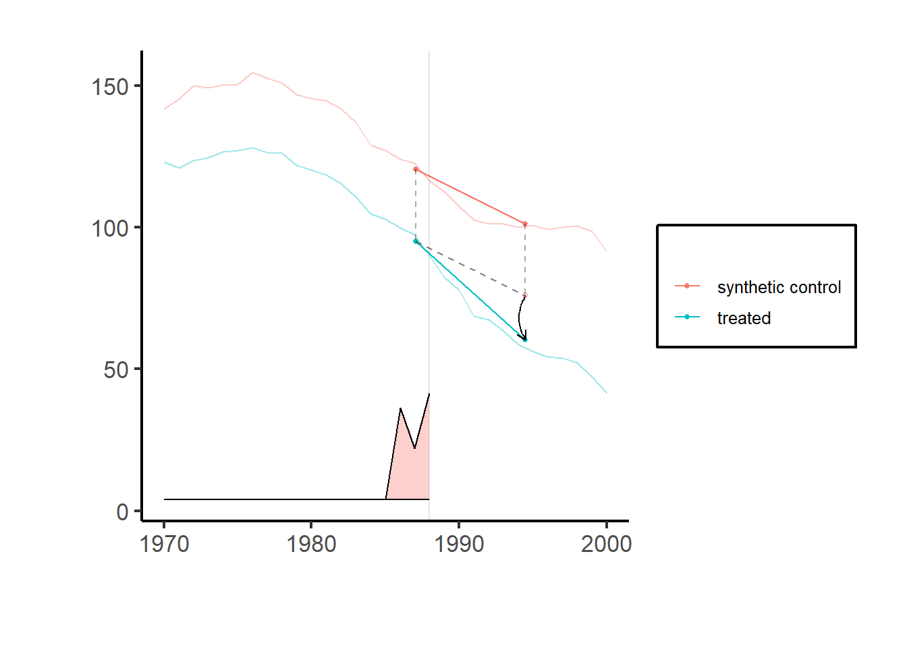
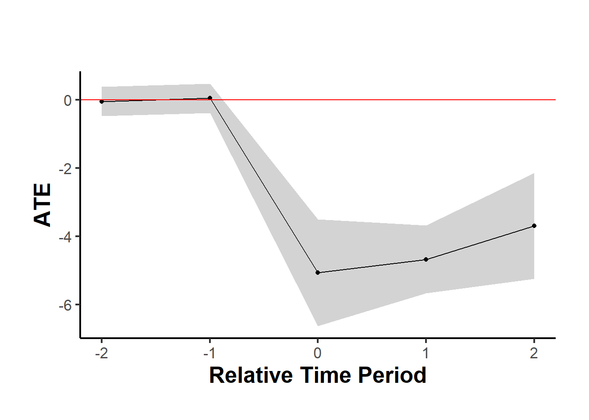

# Synthetic Difference-in-Differences {#sec-synthetic-difference-in-differences}

Understanding the impact of policy interventions is a fundamental challenge in empirical research. Analysts frequently rely on **panel data**, which tracks multiple units over time, to assess how outcomes change before and after a policy is implemented. However, estimating causal effects in this setting is complicated by the fact that policies are often adopted non-randomly---certain units may be more likely to receive treatment based on their characteristics, prior trends, or external factors. If treatment assignment correlates with unit-specific or time-specific factors, **selection bias** can invalidate causal conclusions, even when observed covariates are accounted for [@imbens2015causal].

A well-established approach to dealing with this challenge is the [Difference-in-Differences](#sec-difference-in-differences) (DID) method, which compares changes in outcomes between treated and untreated groups. However, [DID](#sec-difference-in-differences) relies on the crucial **parallel trends assumption**---the idea that, in the absence of treatment, treated and untreated units would have followed similar trajectories. When this assumption is violated, [DID](#sec-difference-in-differences) can produce biased estimates.

An alternative approach, [Synthetic Control](#sec-synthetic-control) (SC), is particularly useful when only a few units receive treatment. Instead of assuming parallel trends, [SC](#sec-synthetic-control) constructs a weighted combination of untreated units that best approximates the pre-treatment behavior of the treated group. This method improves comparability but has limitations, including sensitivity to extrapolation and instability when there are many control units.

To address the shortcomings of both [DID](#sec-difference-in-differences) and [SC](#sec-synthetic-control), **Synthetic Difference-in-Differences (SDID)** was introduced by [@arkhangelsky2021synthetic]. SDID is a **weighted double-differencing estimator** that:

-   Combines features of [DID](#sec-difference-in-differences) and [SC](#sec-synthetic-control) to improve causal inference.
-   Adjusts for differences in pre-treatment trends through reweighting (like [SC](#sec-synthetic-control)).
-   Remains invariant to additive unit-level shifts and is valid for large panels (like [DID](#sec-difference-in-differences)).

The key advantage of SDID is that it achieves double robustness: it performs well when [DID](#sec-difference-in-differences) assumptions hold but also corrects for deviations from parallel trends by using synthetic weights. This makes SDID particularly useful in situations where treatment assignment is correlated with latent factors that affect outcomes over time.

-   SDID explicitly accounts for systematic unit-level effects that influence treatment assignment.
-   This is especially valuable when treatment is non-randomly assigned based on persistent unit characteristics.
-   Even under purely random treatment assignment, all three methods ([DID](#sec-difference-in-differences), [SC](#sec-synthetic-control), and SDID) are unbiased---but SDID achieves the smallest standard error (SE).

Recent research has applied SDID to evaluate marketing interventions and policy changes:

-   **TV Advertising & Online Sales** [@lambrecht2024tv]: SDID was used to estimate the effect of TV ad campaigns on consumer behavior, accounting for time-varying confounders.
-   **Soda Tax & Marketing Effectiveness** [@keller2024soda]: SDID helped measure how soda tax policies influenced marketing strategies and consumer demand.

+-----------+-------------------------------------------+--------------------+--------------------------------------------------------+----------------------------------------------------------------------+
| Method    | Assumptions                               | Use Case           | Strengths                                              | Weaknesses                                                           |
+===========+===========================================+====================+========================================================+======================================================================+
| **DID**   | Parallel trends assumption                | Many treated units | Simple implementation, valid for large panels          | Fails when parallel trends assumption is violated                    |
+-----------+-------------------------------------------+--------------------+--------------------------------------------------------+----------------------------------------------------------------------+
| **SC**    | Reweighting to match pre-treatment trends | Few treated units  | More flexible, compensates for lack of parallel trends | Sensitive to outliers, does not scale well with large treated groups |
+-----------+-------------------------------------------+--------------------+--------------------------------------------------------+----------------------------------------------------------------------+

: Key Differences Between [DID](#sec-difference-in-differences) and [SC](#sec-synthetic-control)

**Attractive Features of SDID**

1.  **Statistical Properties**
    -   Provides consistent and asymptotically normal estimates.
    -   Achieves double robustness, similar to augmented inverse probability weighting estimators [@ben2021augmented, @scharfstein1999adjusting].
2.  **Performance Comparison**
    -   In settings where [DID](#sec-difference-in-differences) is valid, SDID performs at least as well or better.
    -   Unlike [DID](#sec-difference-in-differences), SDID remains valid when treatment assignment correlates with latent unit-level or time-varying factors.
    -   In settings where [SC](#sec-synthetic-control) is used, SDID performs equally well or better.
    -   When treatment is randomly assigned, all methods remain unbiased, but SDID tends to have higher precision.
3.  **Bias Reduction**
    -   Particularly effective when treatment assignment is not uniformly random.
    -   Offers robustness against violations of standard [DID](#sec-difference-in-differences) or [SC](#sec-synthetic-control) assumptions.
4.  **Related to Augmented SC**
    -   Shares methodological similarities with augmented [SC](#sec-synthetic-control) estimators [@ben2021augmented; @arkhangelsky2021synthetic, p. 4112].
5.  **Recommended Use Cases**\
    SDID is particularly effective when:
    -   The number of control units ($N_{ctr}$) is similar to the number of pre-treatment periods ($T_{pre}$).
    -   The number of post-treatment periods ($T_{post}$) is small.
    -   The number of treated units ($N_{tr}$) satisfies:\
        $$ N_{tr} < \sqrt{N_{ctr}} $$

------------------------------------------------------------------------

## Understanding

To formally define the SDID estimator, we begin by considering a balanced panel dataset with $N$ units observed over $T$ time periods. Our goal is to estimate the causal effect of a treatment intervention while accounting for both unit-specific and time-specific confounders.

Let:

-   $Y_{it}$ be the outcome variable for unit $i$ at time $t$.
-   $W_{it} \in \{0,1\}$ be a binary indicator of treatment, where $W_{it} = 1$ if unit $i$ is treated at time $t$ and $0$ otherwise.
-   The panel consists of:
    -   $N_c$ control units (never treated).
    -   $N_t$ treated units, exposed to treatment after period $T_{pre}$.

### Steps in SDID Estimation

SDID combines ideas from both **SC** and **DID** by introducing unit weights and time weights:

1.  **Find unit weights** $\hat{w}_i^{sdid}$ to ensure that pre-treatment outcomes of the weighted control group match the pre-treatment outcomes of the treated units:\
    $$
    \sum_{i = 1}^{N_c} \hat{w}_i^{sdid} Y_{it} \approx \frac{1}{N_t} \sum_{i = N_c + 1}^{N} Y_{it}, \quad \forall t = 1, \dots, T_{pre}
    $$\
    This ensures that pre-treatment trends of treated and control units are similar, just as in [SC](#sec-synthetic-control).

2.  **Find time weights** $\hat{\lambda}_t^{sdid}$ to balance post-treatment deviations from pre-treatment outcomes, stabilizing the inference.

3.  **Estimate the treatment effect** $\hat{\tau}^{sdid}$ by solving the following minimization problem:\
    $$
    (\hat{\tau}^{sdid}, \hat{\mu}, \hat{\alpha}, \hat{\beta}) = \arg \min_{\tau, \mu, \alpha, \beta} \sum_{i=1}^{N} \sum_{t=1}^{T} (Y_{it} - \mu - \alpha_i - \beta_t - W_{it} \tau)^2 \hat{w}_i^{sdid} \hat{\lambda}_t^{sdid}
    $$\
    where:

    -   $\mu$ is the global intercept.
    -   $\alpha_i$ captures unit-specific fixed effects.
    -   $\beta_t$ captures time-specific fixed effects.
    -   $\tau$ represents the treatment effect.

Unlike the standard [DID](#sec-difference-in-differences) and [SC](#sec-synthetic-control) estimators, SDID incorporates both unit and time weights, making it less sensitive to violations of parallel trends.

DID solves:\
$$
(\hat{\tau}^{did}, \hat{\mu}, \hat{\alpha}, \hat{\beta}) = \arg \min_{\tau, \mu, \alpha, \beta} \sum_{i=1}^{N} \sum_{t=1}^{T} (Y_{it} - \mu - \alpha_i - \beta_t - W_{it} \tau)^2
$$\
However, [DID](#sec-difference-in-differences) does not use unit or time weights, making it unreliable if treatment assignment correlates with unobserved factors.

SC minimizes:\
$$
(\hat{\tau}^{sc}, \hat{\mu}, \hat{\beta}) = \arg \min_{\tau, \mu, \beta} \sum_{i=1}^{N} \sum_{t=1}^{T} (Y_{it} - \mu - \beta_t - W_{it} \tau)^2 \hat{w}_i^{sdid}
$$\
SC does not include unit fixed effects ($\alpha_i$) or time weights ($\hat{\lambda}_t$), which can introduce bias when unmeasured confounders vary over time.

### Comparison of Methods

The table below summarizes key differences between [DID](#sec-difference-in-differences), [SC](#sec-synthetic-control), and SDID:

+-------------------------------+--------------------------------------------------------------------+---------------------------------------------------------------------------------+----------------------------------------------------------------------------------------------------+
|                               | **DID**                                                            | **SC**                                                                          | **SDID**                                                                                           |
+===============================+====================================================================+=================================================================================+====================================================================================================+
| **Primary Assumption**        | Absence of intervention leads to parallel evolution across states. | Reweights unexposed states to match pre-intervention outcomes of treated state. | Reweights control units to ensure a parallel time trend with the treated pre-intervention trend.   |
+-------------------------------+--------------------------------------------------------------------+---------------------------------------------------------------------------------+----------------------------------------------------------------------------------------------------+
| **Reliability Concern**       | Can be unreliable when pre-intervention trends aren't parallel.    | Accounts for non-parallel pre-intervention trends by reweighting.               | Uses reweighting to adjust for non-parallel pre-intervention trends.                               |
+-------------------------------+--------------------------------------------------------------------+---------------------------------------------------------------------------------+----------------------------------------------------------------------------------------------------+
| **Treatment of Time Periods** | All pre-treatment periods are given equal weight.                  | Doesn't specifically emphasize equal weight for pre-treatment periods.          | Focuses only on a subset of pre-intervention time periods, selected based on historical outcomes.  |
+-------------------------------+--------------------------------------------------------------------+---------------------------------------------------------------------------------+----------------------------------------------------------------------------------------------------+
| **Goal with Reweighting**     | N/A (doesn't use reweighting).                                     | To match treated state as closely as possible before the intervention.          | Make trends of control units parallel (not necessarily identical) to the treated pre-intervention. |
+-------------------------------+--------------------------------------------------------------------+---------------------------------------------------------------------------------+----------------------------------------------------------------------------------------------------+

An alternative formulation of the SDID treatment effect is:\
$$
\hat{\tau} = \hat{\delta}_t - \sum_{i = 1}^{N_c} \hat{w}_i^{sdid} \hat{\delta}_i
$$\
where:

-   $\hat{\delta}_t = \frac{1}{N_t} \sum_{i = N_c + 1}^{N} \hat{\delta}_i$ represents the average deviation in treated units post-treatment.
-   $\sum_{i = 1}^{N_c} \hat{w}_i^{sdid} \hat{\delta}_i$ adjusts for differences using weighted control unit deviations.

+------------+-------------------------------------------------------+-------------------------------------------------------------------------------------------------------------+----------------------------------------------------------------------------------+
| Method     | Sample Weight                                         | Adjusted outcomes ($\hat{\delta}_i$)                                                                        | Interpretation                                                                   |
+============+=======================================================+=============================================================================================================+==================================================================================+
| SC         | $\hat{w}^{sc} = \min_{w \in R}l_{unit}(w)$            | $\frac{1}{T_{post}} \sum_{t = T_{pre} + 1}^T Y_{it}$                                                        | Unweighted treatment period averages                                             |
+------------+-------------------------------------------------------+-------------------------------------------------------------------------------------------------------------+----------------------------------------------------------------------------------+
| DID        | $\hat{w}_i^{did} = N_c^{-1}$                          | $\frac{1}{T_{post}} \sum_{t = T_{pre}+ 1}^T Y_{it} - \frac{1}{T_{pre}} \sum_{t = 1}^{T_{pre}}Y_{it}$        | Unweighted differences between average treatment period and pretreatment outcome |
+------------+-------------------------------------------------------+-------------------------------------------------------------------------------------------------------------+----------------------------------------------------------------------------------+
| SDID       | $(\hat{w}_0, \hat{w}^{sdid}) = \min l_{unit}(w_0, w)$ | $\frac{1}{T_{post}} \sum_{t = T_{pre} + 1}^T Y_{it} - \sum_{t = 1}^{T_{pre}} \hat{\lambda}_t^{sdid} Y_{it}$ | Weighted differences between average treatment period and pretreatment outcome   |
+------------+-------------------------------------------------------+-------------------------------------------------------------------------------------------------------------+----------------------------------------------------------------------------------+

A key innovation in Synthetic Difference-in-Differences is its use of unit and time weights to refine causal estimates. By applying weights, SDID essentially localizes a standard two-way fixed effects regression, making it more robust and precise.

### **Why Use Weights?**

-   Unit weights ($\hat{w}_i^{sdid}$) emphasize control units that are most similar to the treated units based on pre-treatment trends.
-   Time weights ($\hat{\lambda}_t^{sdid}$) prioritize time periods most comparable to the post-treatment period.
-   This approach improves parallel trends validity without requiring a perfect match in raw data.

### **Benefits of Localization in SDID**

1.  **Robustness**
    -   By focusing on comparable units and time periods, SDID reduces bias from dissimilar observations.
2.  **Improved Precision**
    -   SDID eliminates predictable variation in outcomes, reducing standard errors (SEs) compared to [DID](#sec-difference-in-differences) and [SC](#sec-synthetic-control)
    -   SEs in SDID are smaller than those in [DID](#sec-difference-in-differences) and [SC](#sec-synthetic-control).
    -   Caveat: If outcome heterogeneity is minimal, unequal weighting might slightly reduce precision relative to standard [DID](#sec-difference-in-differences).

------------------------------------------------------------------------

### **Designing SDID Weights**

#### **Unit Weights: Balancing Pre-Treatment Trends**

Unit weights $\hat{w}_i^{sdid}$ ensure that the weighted control group mimics the treated group's pre-treatment trends, similar to [SC](#sec-synthetic-control) but with greater flexibility:\
$$
\sum_{i = 1}^{N_c} \hat{w}_i^{sdid} Y_{it} \approx \frac{1}{N_t} \sum_{i = N_c + 1}^{N} Y_{it}, \quad \forall t = 1, \dots, T_{pre}
$$\
This helps achieve parallel pre-treatment trends rather than requiring an exact match in levels.

#### **Time Weights: Stabilizing Post-Treatment Inference**

Time weights $\hat{\lambda}_t^{sdid}$ ensure that post-treatment deviations are balanced relative to pre-treatment trends. This minimizes bias by down-weighting time periods that are vastly different from the post-treatment period.

-   Unlike unit weights, time weights do not require regularization because outcomes within the same time period are highly correlated across units.
-   Time weights improve the precision of SDID estimates by preventing certain periods from dominating the estimation process.

------------------------------------------------------------------------

### **How SDID Enhances DID's Plausibility**

DID assumes parallel trends, but raw data often violates this assumption. SDID corrects for non-parallel trends by weighting both units and time periods.

-   Similar techniques have been used before to adjust [DID](#sec-difference-in-differences) assumptions, such as controlling for covariates or selecting specific time periods [@callaway2021difference].
-   SDID automates this process, applying a systematic weighting approach for both units and time periods.

------------------------------------------------------------------------

Including unit fixed effects ($\alpha_i$) in SDID has two main advantages:

1.  **Flexibility**:
    -   Allows for systematic differences across units while preserving parallel trends after reweighting.
2.  **Enhanced Precision**:
    -   Explains a large fraction of the variation in outcomes, reducing noise and improving estimation accuracy.

**Unit Fixed Effects and SC Weighting**

-   Under ideal conditions, [SC](#sec-synthetic-control) reweighting alone could account for unit fixed effects---if the weighted average of control unit outcomes perfectly matched the treated unit's pre-treatment trajectory.
-   However, this rarely happens in reality, making unit fixed effects necessary for robust inference.
-   The use of fixed effects in synthetic control regressions (SC with intercept) was first proposed in @doudchenko2016balancing and @ferman2021synthetic, where it was referred to as DIFP (Difference-in-Fixed-Effects Prediction).

------------------------------------------------------------------------

### **Choosing SDID Weights**

1.  **Choosing Unit Weights**

**Regularization Parameter:**

-   The penalty term is calibrated based on the typical one-period change in control unit outcomes during the pre-treatment period.
-   This value is then multiplied by a scaling factor [@arkhangelsky2021synthetic, p. 4092].

**Relation to Synthetic Control Weights:**

SDID weights resemble those used in @abadie2010synthetic but have two key modifications:

1.  **Inclusion of an Intercept Term**
    -   Unlike [SC](#sec-synthetic-control), SDID does not force the control pre-trends to exactly match the treated pre-trends---it only ensures they are parallel.
    -   This flexibility arises from unit fixed effects, which absorb any systematic level differences.
2.  **Regularization Penalty**
    -   Borrowed from @doudchenko2016balancing.
    -   Ensures dispersion of weights, preventing over-reliance on a few control units.
    -   This guarantees a unique solution for unit weights.

**How SDID Compares to DID Weights:**

-   DID weights are a special case of [SC](#sec-synthetic-control) weights without an intercept or regularization penalty.
-   DID applies unit weights as in [SC](#sec-synthetic-control) but only when there is one treated unit.

2.  **Choosing Time Weights**

-   Like unit weights, time weights include an intercept term to account for overall time effects.
-   No regularization is applied to time weights because within-period correlations across units are expected.
-   This design allows SDID to minimize bias while stabilizing inference.

------------------------------------------------------------------------

### **Accounting for Time-Varying Covariates in Weight Estimation**

To further refine the estimation process, SDID can incorporate time-varying covariates by adjusting the outcome variable:\
$$
Y_{it}^{res} = Y_{it} - X_{it} \hat{\beta}
$$\
where $\hat{\beta}$ comes from the regression:\
$$
Y_{it} = X_{it} \beta + \varepsilon_{it}
$$\
This residualized outcome ($Y_{it}^{res}$) ensures that the weighting process accounts for time-varying confounders, improving the validity of causal estimates.

------------------------------------------------------------------------

## Application

**SDID Algorithm**

1.  Compute regularization parameter $\zeta$

$$
\zeta = (N_{t}T_{post})^{1/4} \hat{\sigma}
$$

where

$$
\hat{\sigma}^2 = \frac{1}{N_c(T_{pre}- 1)} \sum_{i = 1}^{N_c} \sum_{t = 1}^{T_{re}-1}(\Delta_{it} - \hat{\Delta})^2
$$

-   $\Delta_{it} = Y_{i(t + 1)} - Y_{it}$

-   $\hat{\Delta} = \frac{1}{N_c(T_{pre} - 1)}\sum_{i = 1}^{N_c}\sum_{t = 1}^{T_{pre}-1} \Delta_{it}$

2.  Compute unit weights $\hat{w}^{sdid}$

$$
(\hat{w}_0, \hat{w}^{sidid}) = \arg \min_{w_0 \in R, w \in \Omega}l_{unit}(w_0, w)
$$

where

-   $l_{unit} (w_0, w) = \sum_{t = 1}^{T_{pre}}(w_0 + \sum_{i = 1}^{N_c}w_i Y_{it} - \frac{1}{N_t}\sum_{i = N_c + 1}^NY_{it})^2 + \zeta^2 T_{pre}||w||_2^2$

-   $\Omega = \{w \in R_+^N: \sum_{i = 1}^{N_c} w_i = 1, w_i = N_t^{-1} \forall i = N_c + 1, \dots, N \}$

3.  Compute time weights $\hat{\lambda}^{sdid}$

$$
(\hat{\lambda}_0 , \hat{\lambda}^{sdid}) = \arg \min_{\lambda_0 \in R, \lambda \in \Lambda} l_{time}(\lambda_0, \lambda)
$$

where

-   $l_{time} (\lambda_0, \lambda) = \sum_{i = 1}^{N_c}(\lambda_0 + \sum_{t = 1}^{T_{pre}} \lambda_t Y_{it} - \frac{1}{T_{post}} \sum_{t = T_{pre} + 1}^T Y_{it})^2$

-   $\Lambda = \{ \lambda \in R_+^T: \sum_{t = 1}^{T_{pre}} \lambda_t = 1, \lambda_t = T_{post}^{-1} \forall t = T_{pre} + 1, \dots, T\}$

4.  Compute the SDID estimator

$$
(\hat{\tau}^{sdid}, \hat{\mu}, \hat{\alpha}, \hat{\beta}) = \arg \min_{\tau, \mu, \alpha, \beta}\{ \sum_{i = 1}^N \sum_{t = 1}^T (Y_{it} - \mu - \alpha_i - \beta_t - W_{it} \tau)^2 \hat{w}_i^{sdid}\hat{\lambda}_t^{sdid}
$$

------------------------------------------------------------------------

**SE Estimation**

-   Under certain assumptions (errors, samples, and interaction properties between time and unit fixed effects) detailed in [@arkhangelsky2019synthetic, p. 4107], SDID is asymptotically normal and zero-centered

-   Using its asymptotic variance, conventional confidence intervals can be applied to SDID.

$$
\tau \in \hat{\tau}^{sdid} \pm z_{\alpha/2}\sqrt{\hat{V}_\tau}
$$

-   There are 3 approaches for variance estimation in confidence intervals:

    1.  **Clustered Bootstrap [@efron1992bootstrap]:**

        -   Independently resample units.

        -   Advantages: Simple to use; robust performance in large panels due to natural approach to inference with panel data where observations of the same unit might be correlated.

        -   Disadvantage: Computationally expensive.

    2.  **Jackknife [@miller1974jackknife]:**

        -   Applied to weighted SDID regression with fixed weights.

        -   Generally conservative and precise when treated and control units are sufficiently similar.

        -   Not recommended for some methods, like the [SC](#sec-synthetic-control) estimator, due to potential biases.

        -   Appropriate for jackknifing DID without random weights.

    3.  **Placebo Variance Estimation:**

        -   Can used in cases with only one treated unit or large panels.

        -   Placebo evaluations swap out the treated unit for untreated ones to estimate noise.

        -   Relies on homoskedasticity across units.

        -   Depends on homoskedasticity across units. It hinges on the empirical distribution of residuals from placebo estimators on control units.

        -   The validity of the placebo method hinges on consistent noise distribution across units. One treated unit makes nonparametric variance estimation difficult, necessitating homoskedasticity for feasible inference. Detailed analysis available in @conley2011inference.

All algorithms are from @arkhangelsky2021synthetic, p. 4109:

> **Bootstrap Variance Estimation**
>
> 1.  For each $b$ from $1 \to B$:
>
>     -   Sample $N$ rows from $(\mathbf{Y}, \mathbf{W})$ to get ($\mathbf{Y}^{(b)}, \mathbf{W}^{(b)}$) with replacement.
>
>     -   If the sample lacks treated or control units, resample.
>
>     -   Calculate $\tau^{(b)}$ using ($\mathbf{Y}^{(b)}, \mathbf{W}^{(b)}$).
>
> 2.  Calculate variance: $\hat{V}_\tau = \frac{1}{B} \sum_{b = 1}^B (\hat{\tau}^{b} - \frac{1}{B} \sum_{b = 1}^B \hat{\tau}^b)^2$

> **Jackknife Variance Estimation**
>
> 1.  For each $i$ from $1 \to N$:
>     1.  Calculate $\hat{\tau}^{(-i)}$: $\arg\min_{\tau, \{\alpha_j, \beta_t\}} \sum_{j \neq, i, t}(\mathbf{Y}_{jt} - \alpha_j - \beta_t - \tau \mathbf{W}_{it})^2 \hat{w}_j \hat{\lambda}_t$
> 2.  Calculate: $\hat{V}_{\tau} = (N - 1) N^{-1} \sum_{i = 1}^N (\hat{\tau}^{(-i)} - \hat{\tau})^2$

> **Placebo Variance Estimation**
>
> 1.  For each $b$ from $1 \to B$
>     1.  Sample $N_t$ out of $N_c$ without replacement to get the "placebo" treatment
>     2.  Construct a placebo treatment matrix $\mathbf{W}_c^b$ for the controls
>     3.  Calculate $\hat{\tau}$ based on $(\mathbf{Y}_c, \mathbf{W}_c^b)$
> 2.  Calculate $\hat{V}_\tau = \frac{1}{B}\sum_{b = 1}^B (\hat{\tau}^b - \frac{1}{B} \sum_{b = 1}^B \hat{\tau}^b)^2$

### Block Treatment

Code provided by the `synthdid` package


```r
library(synthdid)
library(tidyverse)

# Estimate the effect of California Proposition 99 on cigarette consumption
data('california_prop99')

setup = synthdid::panel.matrices(synthdid::california_prop99)

tau.hat = synthdid::synthdid_estimate(setup$Y, setup$N0, setup$T0)

# se = sqrt(vcov(tau.hat, method = 'placebo'))

plot(tau.hat) + causalverse::ama_theme()
```




```r
setup = synthdid::panel.matrices(synthdid::california_prop99)

# Run for specific estimators
results_selected = causalverse::panel_estimate(setup,
                                               selected_estimators = c("synthdid", "did", "sc"))

results_selected
#> $synthdid
#> $synthdid$estimate
#> synthdid: -15.604 +- NA. Effective N0/N0 = 16.4/38~0.4. Effective T0/T0 = 2.8/19~0.1. N1,T1 = 1,12. 
#> 
#> $synthdid$std.error
#> [1] 10.05324
#> 
#> 
#> $did
#> $did$estimate
#> synthdid: -27.349 +- NA. Effective N0/N0 = 38.0/38~1.0. Effective T0/T0 = 19.0/19~1.0. N1,T1 = 1,12. 
#> 
#> $did$std.error
#> [1] 15.81479
#> 
#> 
#> $sc
#> $sc$estimate
#> synthdid: -19.620 +- NA. Effective N0/N0 = 3.8/38~0.1. Effective T0/T0 = Inf/19~Inf. N1,T1 = 1,12. 
#> 
#> $sc$std.error
#> [1] 11.16422

# to access more details in the estimate object
summary(results_selected$did$estimate)
#> $estimate
#> [1] -27.34911
#> 
#> $se
#>      [,1]
#> [1,]   NA
#> 
#> $controls
#>                estimate 1
#> Wyoming             0.026
#> Wisconsin           0.026
#> West Virginia       0.026
#> Virginia            0.026
#> Vermont             0.026
#> Utah                0.026
#> Texas               0.026
#> Tennessee           0.026
#> South Dakota        0.026
#> South Carolina      0.026
#> Rhode Island        0.026
#> Pennsylvania        0.026
#> Oklahoma            0.026
#> Ohio                0.026
#> North Dakota        0.026
#> North Carolina      0.026
#> New Mexico          0.026
#> New Hampshire       0.026
#> Nevada              0.026
#> Nebraska            0.026
#> Montana             0.026
#> Missouri            0.026
#> Mississippi         0.026
#> Minnesota           0.026
#> Maine               0.026
#> Louisiana           0.026
#> Kentucky            0.026
#> Kansas              0.026
#> Iowa                0.026
#> Indiana             0.026
#> Illinois            0.026
#> Idaho               0.026
#> Georgia             0.026
#> Delaware            0.026
#> Connecticut         0.026
#> 
#> $periods
#>      estimate 1
#> 1988      0.053
#> 1987      0.053
#> 1986      0.053
#> 1985      0.053
#> 1984      0.053
#> 1983      0.053
#> 1982      0.053
#> 1981      0.053
#> 1980      0.053
#> 1979      0.053
#> 1978      0.053
#> 1977      0.053
#> 1976      0.053
#> 1975      0.053
#> 1974      0.053
#> 1973      0.053
#> 1972      0.053
#> 1971      0.053
#> 
#> $dimensions
#>           N1           N0 N0.effective           T1           T0 T0.effective 
#>            1           38           38           12           19           19

causalverse::process_panel_estimate(results_selected)
#>     Method Estimate    SE
#> 1 SYNTHDID   -15.60 10.05
#> 2      DID   -27.35 15.81
#> 3       SC   -19.62 11.16
```

### Staggered Adoption

To apply to staggered adoption settings using the SDID estimator (see examples in @arkhangelsky2021synthetic, p. 4115 similar to @ben2022synthetic), we can:

1.  Apply the SDID estimator repeatedly, once for every adoption date.

2.  Using @ben2022synthetic 's method, form matrices for each adoption date. Apply SDID and average based on treated unit/time-period fractions.

3.  Create multiple samples by splitting the data up by time periods. Each sample should have a consistent adoption date.

For a formal note on this special case, see @porreca2022synthetic. It compares the outcomes from using SynthDiD with those from other estimators:

-   Two-Way Fixed Effects (TWFE),

-   The group time average treatment effect estimator from @callaway2021difference,

-   The partially pooled synthetic control method estimator from @ben2021augmented, in a staggered treatment adoption context.

-   The findings reveal that SynthDiD produces a different estimate of the average treatment effect compared to the other methods.

    -   Simulation results suggest that these differences could be due to the SynthDiD's data generating process assumption (a latent factor model) aligning more closely with the actual data than the additive fixed effects model assumed by traditional DiD methods.

To explore heterogeneity of treatment effect, we can do subgroup analysis [@berman2022value, p. 1092]

+--------------------------------------------------------------------+-------------------------------------------------------------------+------------------------------------------------------------------------------------------------------------------------------------------------------+------------------------------------------------------------------------------------------------+
| **Method**                                                         | **Advantages**                                                    | **Disadvantages**                                                                                                                                    | **Procedure**                                                                                  |
+====================================================================+===================================================================+======================================================================================================================================================+================================================================================================+
| Split Data into Subsets                                            | Compares treated units to control units within the same subgroup. | Each subset uses a different synthetic control, making it challenging to compare effects across subgroups.                                           | 1.  Split the data into separate subsets for each subgroup.                                    |
|                                                                    |                                                                   |                                                                                                                                                      | 2.  Compute synthetic DID effects for each subset.                                             |
+--------------------------------------------------------------------+-------------------------------------------------------------------+------------------------------------------------------------------------------------------------------------------------------------------------------+------------------------------------------------------------------------------------------------+
| Control Group Comprising All Non-adopters                          | Control weights match pretrends well for each treated subgroup.   | Each control unit receives a different weight for each treatment subgroup, making it difficult to compare results due to varying synthetic controls. | 1.  Use a control group consisting of all non-adopters in each balanced panel cohort analysis. |
|                                                                    |                                                                   |                                                                                                                                                      | 2.  Switch treatment units to the subgroup being analyzed.                                     |
|                                                                    |                                                                   |                                                                                                                                                      | 3.  Perform `synthdid` analysis.                                                               |
+--------------------------------------------------------------------+-------------------------------------------------------------------+------------------------------------------------------------------------------------------------------------------------------------------------------+------------------------------------------------------------------------------------------------+
| Use All Data to Estimate Synthetic Control Weights **(recommend)** | All units have the same synthetic control.                        | Pretrend match may not be as accurate since it aims to match the average outcome of all treated units, not just a specific subgroup.                 | 1.  Use all the data to estimate the synthetic DID control weights.                            |
|                                                                    |                                                                   |                                                                                                                                                      | 2.  Compute treatment effects using only the treated subgroup units as the treatment units.    |
+--------------------------------------------------------------------+-------------------------------------------------------------------+------------------------------------------------------------------------------------------------------------------------------------------------------+------------------------------------------------------------------------------------------------+


```r
library(tidyverse)
df <- fixest::base_stagg |>
   dplyr::mutate(treatvar = if_else(time_to_treatment >= 0, 1, 0)) |>
   dplyr::mutate(treatvar = as.integer(if_else(year_treated > (5 + 2), 0, treatvar)))


est <- causalverse::synthdid_est_ate(
  data               = df,
  adoption_cohorts   = 5:7,
  lags               = 2,
  leads              = 2,
  time_var           = "year",
  unit_id_var        = "id",
  treated_period_var = "year_treated",
  treat_stat_var     = "treatvar",
  outcome_var        = "y"
)
#> Adoption Cohort: 5 
#> Treated units: 5 Control units: 65 
#> Adoption Cohort: 6 
#> Treated units: 5 Control units: 60 
#> Adoption Cohort: 7 
#> Treated units: 5 Control units: 55

data.frame(
    Period = names(est$TE_mean_w),
    ATE    = est$TE_mean_w,
    SE     = est$SE_mean_w
) |>
    causalverse::nice_tab()
#>    Period   ATE   SE
#> 1      -2 -0.05 0.22
#> 2      -1  0.05 0.22
#> 3       0 -5.07 0.80
#> 4       1 -4.68 0.51
#> 5       2 -3.70 0.79
#> 6 cumul.0 -5.07 0.80
#> 7 cumul.1 -4.87 0.55
#> 8 cumul.2 -4.48 0.53


causalverse::synthdid_plot_ate(est)
```




```r
est_sub <- causalverse::synthdid_est_ate(
  data               = df,
  adoption_cohorts   = 5:7,
  lags               = 2,
  leads              = 2,
  time_var           = "year",
  unit_id_var        = "id",
  treated_period_var = "year_treated",
  treat_stat_var     = "treatvar",
  outcome_var        = "y",
  # a vector of subgroup id (from unit id)
  subgroup           =  c(
    # some are treated
    "11", "30", "49" ,
    # some are control within this period
    "20", "25", "21")
)
#> Adoption Cohort: 5 
#> Treated units: 3 Control units: 65 
#> Adoption Cohort: 6 
#> Treated units: 0 Control units: 60 
#> Adoption Cohort: 7 
#> Treated units: 0 Control units: 55

data.frame(
    Period = names(est_sub$TE_mean_w),
    ATE = est_sub$TE_mean_w,
    SE = est_sub$SE_mean_w
) |>
    causalverse::nice_tab()
#>    Period   ATE   SE
#> 1      -2  0.32 0.44
#> 2      -1 -0.32 0.44
#> 3       0 -4.29 1.68
#> 4       1 -4.00 1.52
#> 5       2 -3.44 2.90
#> 6 cumul.0 -4.29 1.68
#> 7 cumul.1 -4.14 1.52
#> 8 cumul.2 -3.91 1.82

causalverse::synthdid_plot_ate(est)
```


Plot different estimators


```r
library(causalverse)
methods <- c("synthdid", "did", "sc", "sc_ridge", "difp", "difp_ridge")

estimates <- lapply(methods, function(method) {
  synthdid_est_ate(
    data               = df,
    adoption_cohorts   = 5:7,
    lags               = 2,
    leads              = 2,
    time_var           = "year",
    unit_id_var        = "id",
    treated_period_var = "year_treated",
    treat_stat_var     = "treatvar",
    outcome_var        = "y",
    method = method
  )
})

plots <- lapply(seq_along(estimates), function(i) {
  causalverse::synthdid_plot_ate(estimates[[i]],
                                 title = methods[i],
                                 theme = causalverse::ama_theme(base_size = 6))
})

gridExtra::grid.arrange(grobs = plots, ncol = 2)
```
