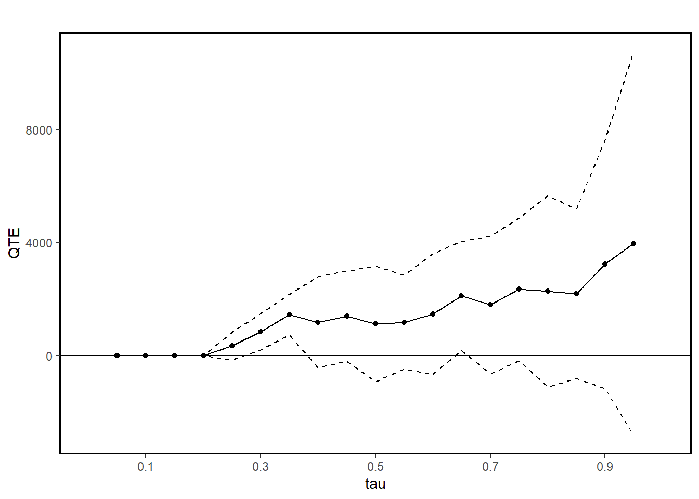
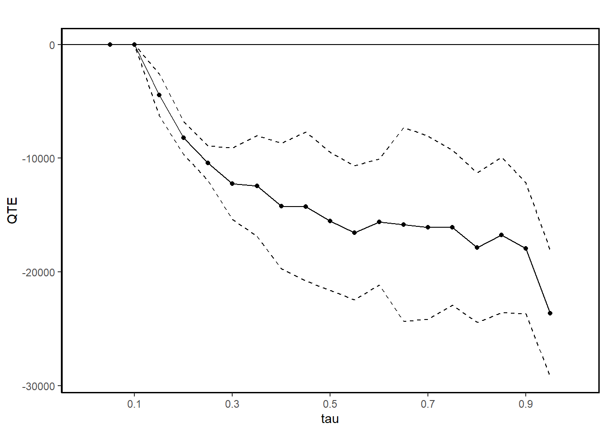
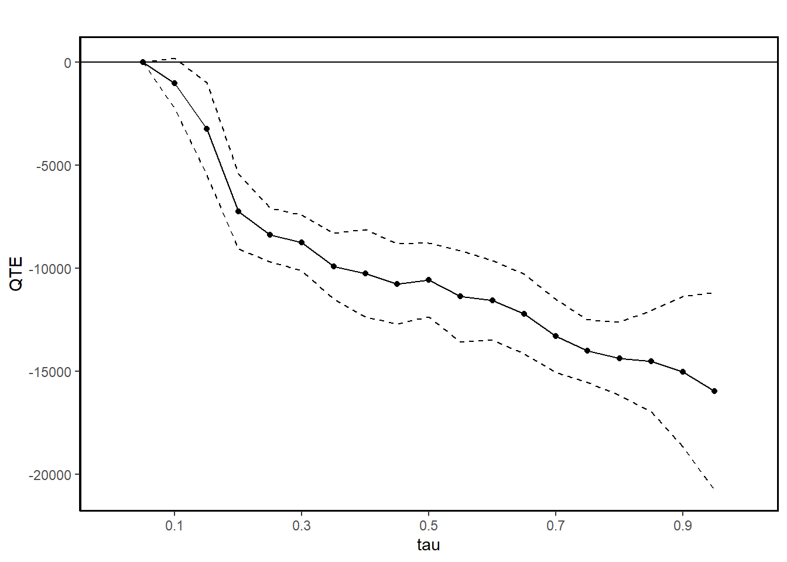
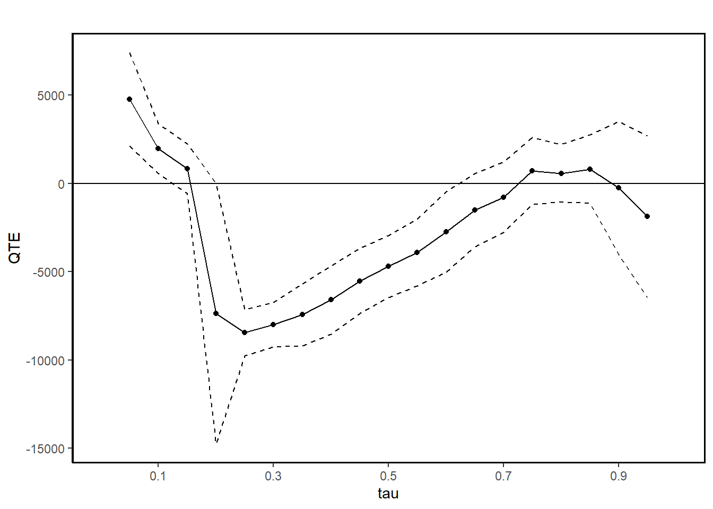
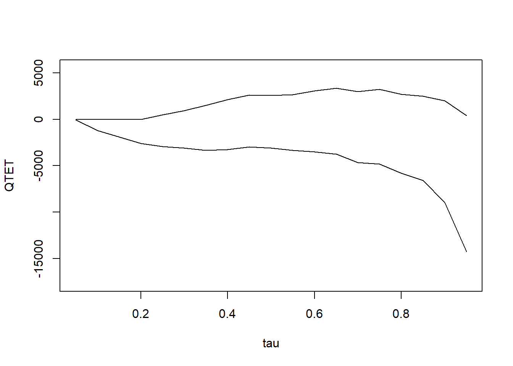
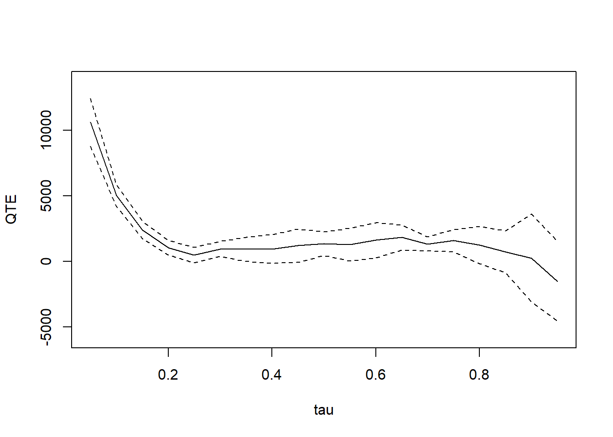

# Changes-in-Changes

-   **Introduction**

    -   The Changes-in-Changes (CiC) estimator, introduced by @athey2006identification, is an alternative to the Difference-in-Differences (DiD) strategy.
    -   Unlike traditional DiD, which estimates the Average Treatment Effect on the Treated (ATT), CiC focuses on the Quantile Treatment Effect on the Treated (QTT).
    -   QTT captures the difference between potential outcome distributions for treated units at a specific quantile.
    -   **Beyond Averages:** Policymakers often look beyond average program impacts, considering how benefits are distributed across different groups.
        -   **Job Training Example:** Two programs with the same negative average impact may be treated differently: one benefiting high earners might be rejected, while one benefiting low earners could be approved.
        -   **Traditional Methods' Limitations:** Methods like linear regression, which assume uniform effects, fail to capture important distributional differences.
        -   **QTEs' Advantage:** QTE methods are tailored for analyzing how treatment effects vary across different segments of a population.
    -   **QTE vs. ATE:** While QTEs provide detailed insights into distributional impacts, they also allow for the recovery of ATEs. However, ATEs are usually identified under weaker assumptions, making QTEs more suitable for exploring the shape of treatment effects rather than just their central tendency.

-   **Key Concepts**

    -   **Quantile Treatment Effect on the Treated (QTT):** Difference in quantiles of treated units' potential outcome distributions.
    -   **Rank Preservation:** Assumes each unit's rank remains constant across potential outcome distributions---this is a strong assumption.
    -   **Counterfactual Distribution:** Estimation focuses on determining this distribution for the treated units in period 1.

-   **Estimating QTT**

    -   CiC uses four distributions from a 2x2 DiD design:
        1.  $F_{Y(0),00}$: CDF of $Y(0)$ for control units in period 0.
        2.  $F_{Y(0),10}$: CDF of $Y(0)$ for treatment units in period 0.
        3.  $F_{Y(0),01}$: CDF of $Y(0)$ for control units in period 1.
        4.  $F_{Y(1),11}$: CDF of $Y(1)$ for treatment units in period 1.
    -   QTT is defined as the difference between the inverses of $F_{Y(1),11}$ and the counterfactual distribution $F_{Y(0),11}$ at quantile $q$:

    $$
      \Delta_\theta^{QTT} = F_{Y(1), 11}^{-1} (\theta) - F_{Y (0), 11}^{-1} (\theta)
      $$

-   **Estimation Process**

    -   **Counterfactual CDF:**

    $$
      \hat{F}_{Y(0),11}(y) = F_{y,01}\left(F^{-1}_{y,00}\left(F_{y,10}(y)\right)\right)
      $$

    -   **Equivalent Expression:**

    $$
      \hat{F}^{-1}_{Y(0),11}(\theta) = F^{-1}_{y,01}\left(F_{y,00}\left(F^{-1}_{y,10}(\theta)\right)\right)
      $$

    -   **Treatment Effect Estimate:**

    $$
      \hat{\Delta}^{CIC}_{\theta} = F^{-1}_{Y(1),11}(\theta) - \hat{F}^{-1}_{Y(0),11}(\theta)
      $$

    -   **Equivalently:**

    $\Delta^{CIC}_{\theta}$ is the difference between two QTE estimates:

    $$
      \Delta^{CIC}_{\theta} = \Delta^{QTE}_{\theta,1} - \Delta^{QTE}_{\theta',0}
      $$

    where:

    -   $\Delta^{QTT}_{\theta,1}$ = change over time in $y$ at quantile $\theta$ for $D = 1$ group.
    -   $\Delta^{QTU}_{\theta',0}$ = change over time in $y$ at quantile $\theta'$ for $D = 0$ group, where $q'$ is the quantile in the $D = 0, T = 0$ distribution corresponding to the value of $y$ associated with quantile $\theta$ in the $D = 1, T = 0$ distribution.

-   **Marketing Example**

    -   Suppose a company implements a new online marketing strategy aimed at improving customer retention rates.
    -   **QTT:** The goal is to estimate the effect of the strategy on customer retention rates at different quantiles (e.g., median retention rate).
    -   **Rank Preservation:** Assumes customers' rank in retention distribution remains the same, regardless of the strategy---this assumption is strong and should be carefully considered.
    -   **Counterfactual:** CiC helps estimate how retention rates would have changed without the new strategy by comparing it with a control group.

-   **References**

    -   @athey2006identification
    -   @frolich2013unconditional: IV-based
    -   @callaway2019quantile: panel data
    -   @huber2022direct

-   **Additional Resources**

    -   Code examples available in [Stata](https://sites.google.com/site/blaisemelly/home/computer-programs/cic_stata).

## Application

### ECIC package


```r
library(ecic)
data(dat, package = "ecic")
mod =
  ecic(
    yvar  = lemp,         # dependent variable
    gvar  = first.treat,  # group indicator
    tvar  = year,         # time indicator
    ivar  = countyreal,   # unit ID
    dat   = dat,          # dataset
    boot  = "weighted",   # bootstrap proceduce ("no", "normal", or "weighted")
    nReps = 3            # number of bootstrap runs
    )
mod_res <- summary(mod)
mod_res
#>   perc    coefs          se
#> 1  0.1 1.206140 0.021351711
#> 2  0.2 1.316599 0.009225026
#> 3  0.3 1.449963 0.001859468
#> 4  0.4 1.583415 0.015296156
#> 5  0.5 1.739932 0.011240454
#> 6  0.6 1.915558 0.013060348
#> 7  0.7 2.114966 0.014482208
#> 8  0.8 2.363105 0.005173865
#> 9  0.9 2.779202 0.020831180

ecic_plot(mod_res)
```


### QTE package


```r
library(qte)
data(lalonde)

# randomized setting
# qte is identical to qtet
jt.rand <-
    ci.qtet(
        re78 ~ treat,
        data = lalonde.exp,
        iters = 10
    )
summary(jt.rand)
#> 
#> Quantile Treatment Effect:
#> 		
#> tau	QTE	Std. Error
#> 0.05	   0.00	   0.00
#> 0.1	   0.00	   0.00
#> 0.15	   0.00	   0.00
#> 0.2	   0.00	   0.00
#> 0.25	 338.65	 248.49
#> 0.3	 846.40	 327.59
#> 0.35	1451.51	 366.72
#> 0.4	1177.72	 821.25
#> 0.45	1396.08	 819.05
#> 0.5	1123.55	1043.17
#> 0.55	1181.54	 851.66
#> 0.6	1466.51	1087.26
#> 0.65	2115.04	 987.99
#> 0.7	1795.12	1244.58
#> 0.75	2347.49	1293.74
#> 0.8	2278.12	1727.34
#> 0.85	2178.28	1530.80
#> 0.9	3239.60	2247.45
#> 0.95	3979.62	3466.24
#> 
#> Average Treatment Effect:	1794.34
#> 	 Std. Error: 		986.63
ggqte(jt.rand)
```




```r
# conditional independence assumption (CIA)
jt.cia <- ci.qte(
    re78 ~ treat,
    xformla =  ~ age + education,
    data = lalonde.psid,
    iters = 10
)
summary(jt.cia)
#> 
#> Quantile Treatment Effect:
#> 		
#> tau	QTE	Std. Error
#> 0.05	     0.00	     0.00
#> 0.1	     0.00	     0.00
#> 0.15	 -4433.18	   941.04
#> 0.2	 -8219.15	   737.87
#> 0.25	-10435.74	   778.53
#> 0.3	-12232.03	  1600.78
#> 0.35	-12428.30	  2263.20
#> 0.4	-14195.24	  2817.09
#> 0.45	-14248.66	  3341.17
#> 0.5	-15538.67	  3088.78
#> 0.55	-16550.71	  3000.19
#> 0.6	-15595.02	  2829.01
#> 0.65	-15827.52	  4344.79
#> 0.7	-16090.32	  4109.09
#> 0.75	-16091.49	  3478.57
#> 0.8	-17864.76	  3347.31
#> 0.85	-16756.71	  3492.58
#> 0.9	-17914.99	  2928.40
#> 0.95	-23646.22	  2826.98
#> 
#> Average Treatment Effect:	-13435.40
#> 	 Std. Error: 		1566.35
ggqte(jt.cia)
```



```r

jt.ciat <- ci.qtet(
    re78 ~ treat,
    xformla =  ~ age + education,
    data = lalonde.psid,
    iters = 10
)
summary(jt.ciat)
#> 
#> Quantile Treatment Effect:
#> 		
#> tau	QTE	Std. Error
#> 0.05	     0.00	     0.00
#> 0.1	 -1018.15	   623.09
#> 0.15	 -3251.00	  1144.78
#> 0.2	 -7240.86	   927.25
#> 0.25	 -8379.94	   660.35
#> 0.3	 -8758.82	   686.95
#> 0.35	 -9897.44	   824.35
#> 0.4	-10239.57	  1083.87
#> 0.45	-10751.39	   988.34
#> 0.5	-10570.14	   914.72
#> 0.55	-11348.96	  1128.11
#> 0.6	-11550.84	   983.28
#> 0.65	-12203.56	   985.72
#> 0.7	-13277.72	   901.36
#> 0.75	-14011.74	   771.82
#> 0.8	-14373.95	   901.50
#> 0.85	-14499.18	  1256.42
#> 0.9	-15008.63	  1866.09
#> 0.95	-15954.05	  2441.60
#> 
#> Average Treatment Effect:	4266.19
#> 	 Std. Error: 		476.43
ggqte(jt.ciat)
```



-   **QTE** compares quantiles of the entire population under treatment and control, whereas **QTET** compares quantiles within the treated group itself. This difference means that QTE reflects the overall population-level impact, while QTET focuses on the treated group's specific impact.

-   **CIA** enables identification of both QTE and QTET, but since QTET is conditional on treatment, it might reflect different effects than QTE, especially when the treatment effect is heterogeneous across different subpopulations. For example, the QTE could show a more generalized effect across all individuals, while the QTET may reveal stronger or weaker effects for the subgroup that actually received the treatment.

These are DID-like models

1.  With the distributional difference-in-differences assumption [@fan2012partial, @callaway2019quantile], which is an extension of the parallel trends assumption, we can estimate QTET.


```r
# distributional DiD assumption
jt.pqtet <- panel.qtet(
    re ~ treat,
    t = 1978,
    tmin1 = 1975,
    tmin2 = 1974,
    tname = "year",
    idname = "id",
    data = lalonde.psid.panel,
    iters = 10
)
summary(jt.pqtet)
#> 
#> Quantile Treatment Effect:
#> 		
#> tau	QTE	Std. Error
#> 0.05	 4779.21	 1351.35
#> 0.1	 1987.35	  720.88
#> 0.15	  842.95	  722.43
#> 0.2	-7366.04	 3762.85
#> 0.25	-8449.96	  666.64
#> 0.3	-7992.15	  647.80
#> 0.35	-7429.21	  897.14
#> 0.4	-6597.37	  989.95
#> 0.45	-5519.45	  946.02
#> 0.5	-4702.88	  902.71
#> 0.55	-3904.52	  969.43
#> 0.6	-2741.80	 1166.22
#> 0.65	-1507.31	 1051.96
#> 0.7	 -771.12	 1015.36
#> 0.75	  707.81	  962.65
#> 0.8	  580.00	  833.35
#> 0.85	  821.75	  988.04
#> 0.9	 -250.77	 1922.81
#> 0.95	-1874.54	 2336.43
#> 
#> Average Treatment Effect:	2326.51
#> 	 Std. Error: 		597.95
ggqte(jt.pqtet)
```



2.  With 2 periods, the distributional DiD assumption can partially identify QTET with bounds [@fan2012partial]


```r
res_bound <-
    bounds(
        re ~ treat,
        t = 1978,
        tmin1 = 1975,
        data = lalonde.psid.panel,
        idname = "id",
        tname = "year"
    )
summary(res_bound)
#> 
#> Bounds on the Quantile Treatment Effect on the Treated:
#> 		
#> tau	Lower Bound	Upper Bound
#>         tau	Lower Bound	Upper Bound
#>        0.05	     -51.72	          0
#>         0.1	   -1220.84	          0
#>        0.15	    -1881.9	          0
#>         0.2	   -2601.32	          0
#>        0.25	   -2916.38	     485.23
#>         0.3	   -3080.16	     943.05
#>        0.35	   -3327.89	    1505.98
#>         0.4	   -3240.59	    2133.59
#>        0.45	   -2982.51	    2616.84
#>         0.5	   -3108.01	     2566.2
#>        0.55	   -3342.66	    2672.82
#>         0.6	    -3491.4	     3065.7
#>        0.65	   -3739.74	    3349.74
#>         0.7	   -4647.82	    2992.03
#>        0.75	   -4826.78	    3219.32
#>         0.8	    -5801.7	    2702.33
#>        0.85	   -6588.61	    2499.41
#>         0.9	   -8953.84	    2020.84
#>        0.95	  -14283.61	     397.04
#> 
#> Average Treatment Effect on the Treated:	2326.51
plot(res_bound)
```



3.  With a restrictive assumption that difference in the quantiles of the distribution of potential outcomes for the treated and untreated groups be the same for all values of quantiles, we can have the mean DiD model


```r
jt.mdid <- ddid2(
    re ~ treat,
    t = 1978,
    tmin1 = 1975,
    tname = "year",
    idname = "id",
    data = lalonde.psid.panel,
    iters = 10
)
summary(jt.mdid)
#> 
#> Quantile Treatment Effect:
#> 		
#> tau	QTE	Std. Error
#> 0.05	10616.61	  933.05
#> 0.1	 5019.83	  424.17
#> 0.15	 2388.12	  336.26
#> 0.2	 1033.23	  282.31
#> 0.25	  485.23	  296.16
#> 0.3	  943.05	  292.24
#> 0.35	  931.45	  472.56
#> 0.4	  945.35	  558.10
#> 0.45	 1205.88	  646.23
#> 0.5	 1362.11	  457.31
#> 0.55	 1279.05	  633.85
#> 0.6	 1618.13	  685.06
#> 0.65	 1834.30	  486.02
#> 0.7	 1326.06	  276.00
#> 0.75	 1586.35	  429.26
#> 0.8	 1256.09	  724.78
#> 0.85	  723.10	  819.41
#> 0.9	  251.36	 1711.58
#> 0.95	-1509.92	 1550.10
#> 
#> Average Treatment Effect:	2326.51
#> 	 Std. Error: 		511.22
plot(jt.mdid)
```



On top of the distributional DiD assumption, we need **copula stability** assumption (i.e., If, before the treatment, the units with the highest outcomes were improving the most, we would expect to see them improving the most in the current period too.) for these models:

| **Aspect**                      | **QDiD**                       | **CiC**                          |
|---------------------------------|--------------------------------|----------------------------------|
| **Treatment of Time and Group** | Symmetric                      | Asymmetric                       |
| **QTET Computation**            | Not inherently scale-invariant | Outcome Variable Scale-Invariant |


```r
jt.qdid <- QDiD(
    re ~ treat,
    t = 1978,
    tmin1 = 1975,
    tname = "year",
    idname = "id",
    data = lalonde.psid.panel,
    iters = 10,
    panel = T
)

jt.cic <- CiC(
    re ~ treat,
    t = 1978,
    tmin1 = 1975,
    tname = "year",
    idname = "id",
    data = lalonde.psid.panel,
    iters = 10,
    panel = T
)
```
