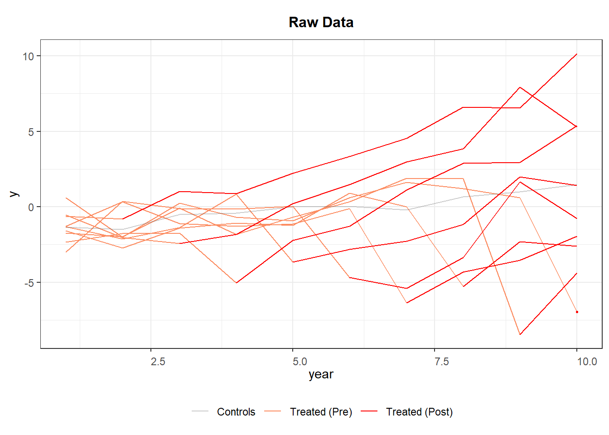
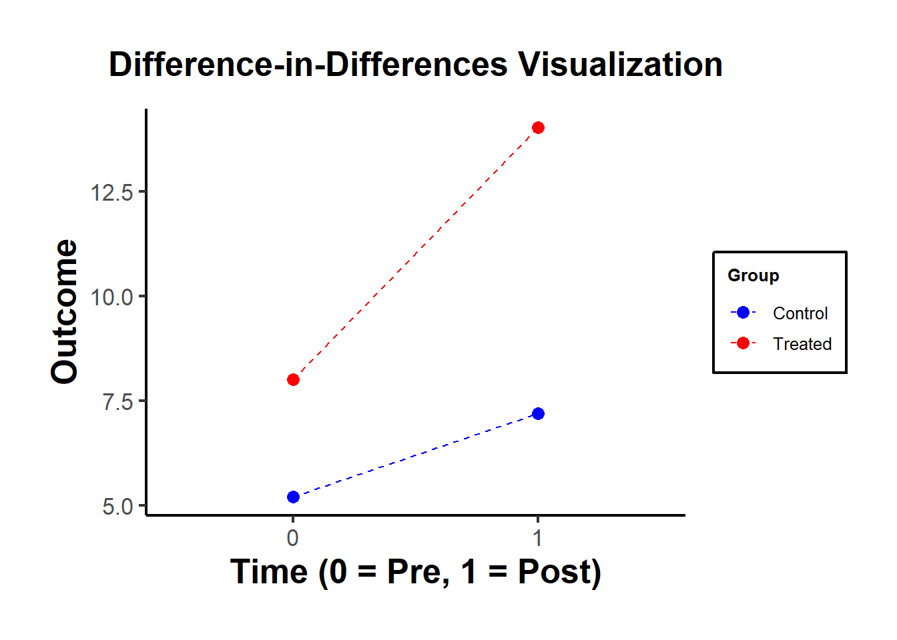
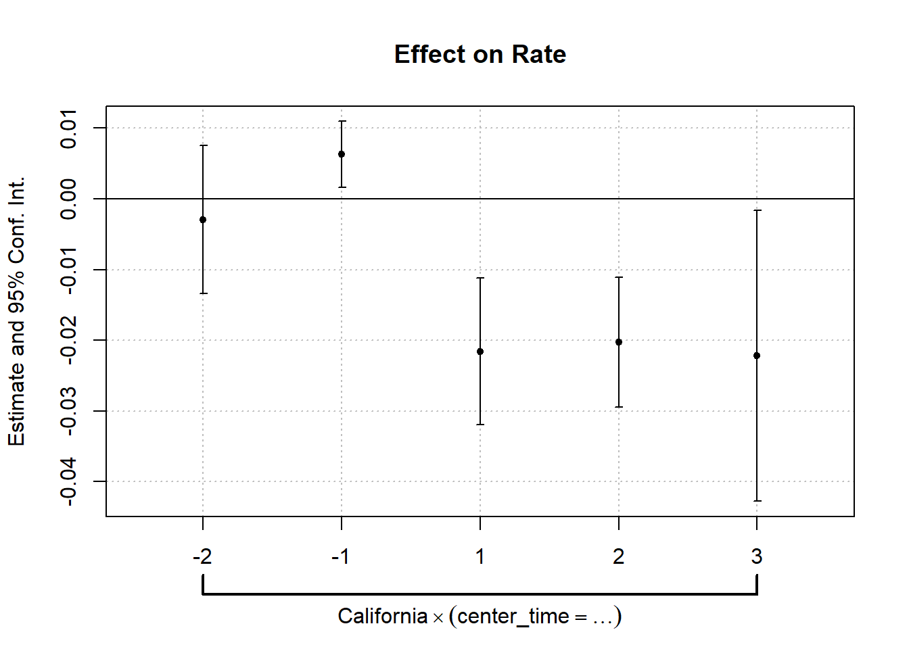
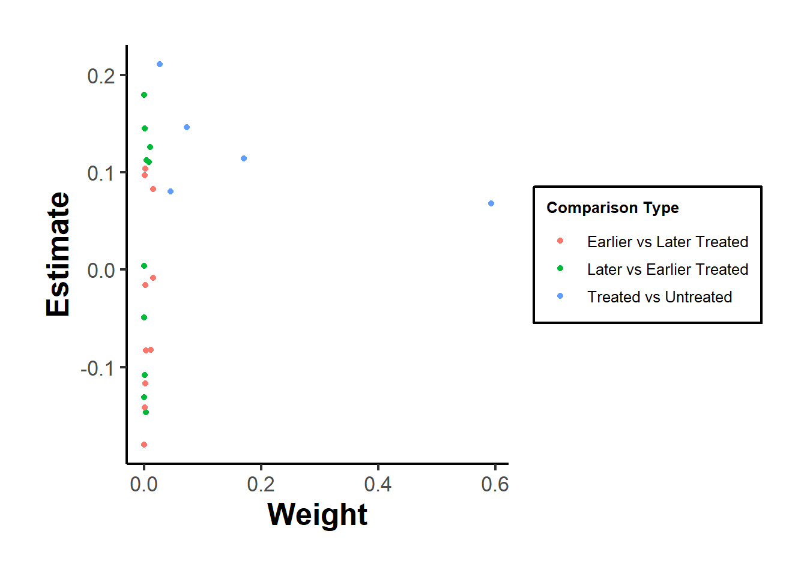
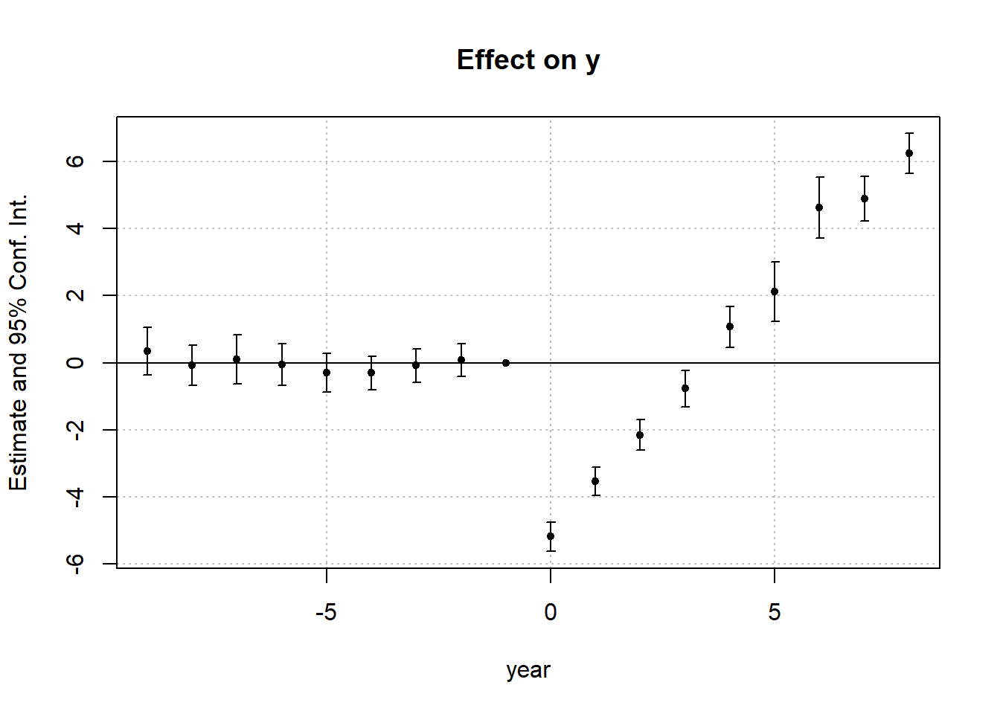
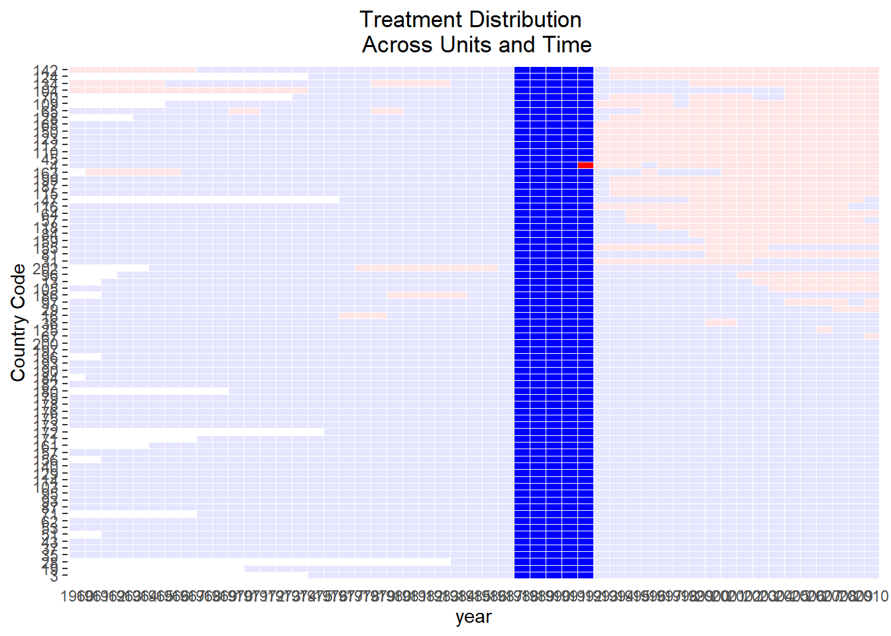
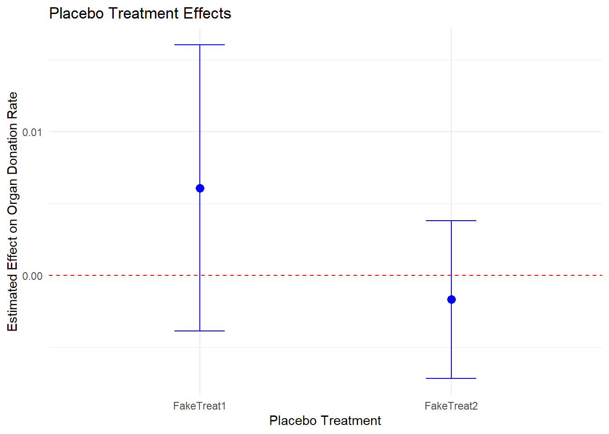

# Difference-in-Differences {#sec-difference-in-differences}

[Difference-in-Differences](#sec-difference-in-differences) (DID) is a widely used causal inference method for estimating the effect of **policy interventions** or **exogenous shocks** when randomized experiments are not feasible. The key idea behind DID is to compare changes in outcomes over time between **treated** and **control** groups, under the assumption that---absent treatment---both groups would have followed parallel trends.

<!-- [List of packages](https://github.com/lnsongxf/DiD-1) -->

DID analysis can go beyond simple treatment effects by exploring causal mechanisms using mediation and moderation analyses:

-   [Mediation Under DiD]: Examines how intermediate variables (e.g., consumer sentiment, brand perception) mediate the treatment effect [@habel2021variable].
-   [Moderation] Analysis: Studies how treatment effects vary across different groups (e.g., high vs. low brand loyalty) [@goldfarb2011online].

## Empirical Studies

### Applications of DID in Marketing

DID has been extensively applied in marketing and business research to measure the impact of policy changes, advertising campaigns, and competitive actions. Below are several notable examples:

-   **TV Advertising & Online Shopping** [@liaukonyte2015television]: Examines how TV ads influence consumer behavior in online shopping.
-   **Political Advertising & Voting Behavior** [@wang2018border]: Uses geographic discontinuities at state borders to analyze how ad sources and tone affect voter turnout.
-   **Music Streaming & Consumption** [@datta2018changing]: Investigates how adopting a music streaming service affects total music consumption.
-   **Data Breaches & Customer Spending** [@janakiraman2018effect]: Analyzes how customer spending changes after a firm announces a data breach.
-   **Price Monitoring & Policy Enforcement** [@israeli2018online]: Studies the effect of digital monitoring on minimum advertised price policy enforcement.
-   **Foreign Direct Investment & Firm Responses** [@ramani2019effects]: Examines how firms in India responded to FDI liberalization reforms in 1991.
-   **Paywalls & Readership** [@pattabhiramaiah2019paywalls]: Investigates how implementing paywalls affects online news consumption.
-   **Aggregators & Airline Business** [@akca2020value]: Evaluates how online aggregators impact airline ticket sales.
-   **Nutritional Labels & Competitive Response** [@lim2020competitive]: Analyzes whether nutrition labels affect the nutritional quality of competing brands.
-   **Payment Disclosure & Physician Behavior** [@guo2020let]: Studies how payment disclosure laws impact prescription behavior.
-   **Fake Reviews & Sales** [@he2022market]: Uses an Amazon policy change to measure the effect of fake reviews on sales and ratings.
-   **Data Protection Regulations & Website Usage** [@peukert2022regulatory]: Assesses the impact of GDPR regulations on website usage and online business models.

### Applications of DID in Economics

DID has also been extensively applied in **economics**, particularly in policy evaluation, labor economics, and macroeconomics:

-   **Natural Experiments in Development Economics** [@rosenzweig2000natural]
-   **Instrumental Variables & Natural Experiments** [@angrist2001instrumental]
-   **DID in Macroeconomic Policy Analysis** [@fuchs2016natural]

------------------------------------------------------------------------

## Visualization {#sec-visualization-did}


``` r
library(panelView)
library(fixest)
library(tidyverse)
base_stagg <- fixest::base_stagg |>
    # treatment status
    dplyr::mutate(treat_stat = dplyr::if_else(time_to_treatment < 0, 0, 1)) |> 
    select(id, year, treat_stat, y)

head(base_stagg)
#>   id year treat_stat           y
#> 2 90    1          0  0.01722971
#> 3 89    1          0 -4.58084528
#> 4 88    1          0  2.73817174
#> 5 87    1          0 -0.65103066
#> 6 86    1          0 -5.33381664
#> 7 85    1          0  0.49562631

panelView::panelview(
    y ~ treat_stat,
    data = base_stagg,
    index = c("id", "year"),
    xlab = "Year",
    ylab = "Unit",
    display.all = F,
    gridOff = T,
    by.timing = T
)
```


``` r

# alternatively specification
panelView::panelview(
    Y = "y",
    D = "treat_stat",
    data = base_stagg,
    index = c("id", "year"),
    xlab = "Year",
    ylab = "Unit",
    display.all = F,
    gridOff = T,
    by.timing = T
)
```


``` r

# Average outcomes for each cohort
panelView::panelview(
    data = base_stagg, 
    Y = "y",
    D = "treat_stat",
    index = c("id", "year"),
    by.timing = T,
    display.all = F,
    type = "outcome", 
    by.cohort = T
)
#> Number of unique treatment histories: 10
```



## Simple Difference-in-Differences {#sec-simple-difference-in-differences}

Difference-in-Differences originated as a tool to analyze [natural experiments](#sec-natural-experiments), but its applications extend far beyond that. DID is built on the [Fixed Effects Estimator], making it a fundamental approach for policy evaluation and causal inference in observational studies.

DID leverages inter-temporal variation between groups:

-   **Cross-sectional comparison**: Helps avoid omitted variable bias due to common trends.
-   **Time-series comparison**: Helps mitigate omitted variable bias due to cross-sectional heterogeneity.

------------------------------------------------------------------------

### Basic Setup of DID

Consider a simple setting with:

-   **Treatment Group** ($D_i = 1$)
-   **Control Group** ($D_i = 0$)
-   **Pre-Treatment Period** ($T = 0$)
-   **Post-Treatment Period** ($T = 1$)

+---------------------+-----------------------------------+------------------------------------+
|                     | **After Treatment (**$T = 1$**)** | **Before Treatment (**$T = 0$**)** |
+=====================+===================================+====================================+
| Treated ($D_i = 1$) | $E[Y_{1i}(1)|D_i = 1]$            | $E[Y_{0i}(0)|D_i = 1]$             |
+---------------------+-----------------------------------+------------------------------------+
| Control ($D_i = 0$) | $E[Y_{0i}(1)|D_i = 0]$            | $E[Y_{0i}(0)|D_i = 0]$             |
+---------------------+-----------------------------------+------------------------------------+

The **fundamental challenge**: We cannot observe $E[Y_{0i}(1)|D_i = 1]$---i.e., the **counterfactual outcome** for the treated group had they not received treatment.

------------------------------------------------------------------------

DID estimates the [Average Treatment Effect on the Treated] using the following formula:

$$
\begin{aligned}
E[Y_1(1) - Y_0(1) | D = 1] &= \{E[Y(1)|D = 1] - E[Y(1)|D = 0] \} \\
&- \{E[Y(0)|D = 1] - E[Y(0)|D = 0] \}
\end{aligned}
$$

This formulation differences out time-invariant unobserved factors, assuming the parallel trends assumption holds.

-   For the treated group, we isolate the difference between being treated and not being treated.
-   If the control group would have experienced a different trajectory, the DID estimate may be biased.
-   Since we cannot observe treatment variation in the control group, we cannot infer the treatment effect for this group.


``` r
# Load required libraries
library(dplyr)
library(ggplot2)
set.seed(1)

# Simulated dataset for illustration
data <- data.frame(
  time = rep(c(0, 1), each = 50),  # Pre (0) and Post (1)
  treated = rep(c(0, 1), times = 50), # Control (0) and Treated (1)
  error = rnorm(100)
)

# Generate outcome variable
data$outcome <-
    5 + 3 * data$treated + 2 * data$time + 
    4 * data$treated * data$time + data$error

# Compute averages for 2x2 table
table_means <- data %>%
  group_by(treated, time) %>%
  summarize(mean_outcome = mean(outcome), .groups = "drop") %>%
  mutate(
    group = paste0(ifelse(treated == 1, "Treated", "Control"), ", ", 
                   ifelse(time == 1, "Post", "Pre"))
  )

# Display the 2x2 table
table_2x2 <- table_means %>%
  select(group, mean_outcome) %>%
  tidyr::spread(key = group, value = mean_outcome)

print("2x2 Table of Mean Outcomes:")
#> [1] "2x2 Table of Mean Outcomes:"
print(table_2x2)
#> # A tibble: 1 × 4
#>   `Control, Post` `Control, Pre` `Treated, Post` `Treated, Pre`
#>             <dbl>          <dbl>           <dbl>          <dbl>
#> 1            7.19           5.20            14.0           8.00

# Calculate Diff-in-Diff manually

# Treated, Post
Y11 <- table_means$mean_outcome[table_means$group == "Treated, Post"]  

# Treated, Pre
Y10 <- table_means$mean_outcome[table_means$group == "Treated, Pre"]   

# Control, Post
Y01 <- table_means$mean_outcome[table_means$group == "Control, Post"]  

# Control, Pre
Y00 <- table_means$mean_outcome[table_means$group == "Control, Pre"]   

diff_in_diff_formula <- (Y11 - Y10) - (Y01 - Y00)

# Estimate DID using OLS
model <- lm(outcome ~ treated * time, data = data)
ols_estimate <- coef(model)["treated:time"]

# Print results
results <- data.frame(
  Method = c("Diff-in-Diff Formula", "OLS Estimate"),
  Estimate = c(diff_in_diff_formula, ols_estimate)
)

print("Comparison of DID Estimates:")
#> [1] "Comparison of DID Estimates:"
print(results)
#>                            Method Estimate
#>              Diff-in-Diff Formula 4.035895
#> treated:time         OLS Estimate 4.035895

# Visualization
ggplot(data,
       aes(
           x = as.factor(time),
           y = outcome,
           color = as.factor(treated),
           group = treated
       )) +
    stat_summary(fun = mean, geom = "point", size = 3) +
    stat_summary(fun = mean,
                 geom = "line",
                 linetype = "dashed") +
    labs(
        title = "Difference-in-Differences Visualization",
        x = "Time (0 = Pre, 1 = Post)",
        y = "Outcome",
        color = "Group"
    ) +
    scale_color_manual(labels = c("Control", "Treated"),
                       values = c("blue", "red")) +
    causalverse::ama_theme()
```



|              | Control (0)        | Treated (1)         |
|--------------|--------------------|---------------------|
| **Pre (0)**  | $\bar{Y}_{00} = 5$ | $\bar{Y}_{10} = 8$  |
| **Post (1)** | $\bar{Y}_{01} = 7$ | $\bar{Y}_{11} = 14$ |

The table organizes the mean outcomes into four cells:

1.  Control Group, Pre-period ($\bar{Y}_{00}$): Mean outcome for the control group before the intervention.

2.  Control Group, Post-period ($\bar{Y}_{01}$): Mean outcome for the control group after the intervention.

3.  Treated Group, Pre-period ($\bar{Y}_{10}$): Mean outcome for the treated group before the intervention.

4.  Treated Group, Post-period ($\bar{Y}_{11}$): Mean outcome for the treated group after the intervention.

The DID treatment effect calculated from the simple formula of averages is identical to the estimate from an OLS regression with an interaction term.

The treatment effect is calculated as:

$\text{DID} = (\bar{Y}_{11} - \bar{Y}_{10}) - (\bar{Y}_{01} - \bar{Y}_{00})$

Compute manually:

$(\bar{Y}_{11} - \bar{Y}_{10}) - (\bar{Y}_{01} - \bar{Y}_{00})$

Use OLS regression:

$Y_{it} = \beta_0 + \beta_1 \text{treated}_i + \beta_2 \text{time}_t + \beta_3 (\text{treated}_i \cdot \text{time}_t) + \epsilon_{it}$

Using the simulated table:

$\text{DID} = (14 - 8) - (7 - 5) = 6 - 2 = 4$

This matches the **interaction term coefficient** ($\beta_3 = 4$) from the OLS regression.

Both methods give the same result!

------------------------------------------------------------------------

### Extensions of DID

#### DID with More Than Two Groups or Time Periods

DID can be extended to **multiple treatments, multiple controls**, and more than two periods:

$$
Y_{igt} = \alpha_g + \gamma_t + \beta I_{gt} + \delta X_{igt} + \epsilon_{igt}
$$

where:

-   $\alpha_g$ = Group-Specific Fixed Effects (e.g., firm, region).

-   $\gamma_t$ = Time-Specific Fixed Effects (e.g., year, quarter).

-   $\beta$ = DID Effect.

-   $I_{gt}$ = Interaction Terms (Treatment × Post-Treatment).

-   $\delta X_{igt}$ = Additional Covariates.

This is known as the [Two-Way Fixed Effects DID](#sec-two-way-fixed-effects) model. However, TWFE performs poorly under staggered treatment adoption, where different groups receive treatment at different times.

------------------------------------------------------------------------

#### Examining Long-Term Effects (Dynamic DID)

To examine the dynamic treatment effects (that are not under rollout/staggered design), we can create a centered time variable.

+------------------------+---------------------------------------------------------+
| Centered Time Variable | Interpretation                                          |
+========================+=========================================================+
| $t = -2$               | Two periods before treatment                            |
+------------------------+---------------------------------------------------------+
| $t = -1$               | One period before treatment                             |
+------------------------+---------------------------------------------------------+
| $t = 0$                | Last pre-treatment period right before treatment period |
|                        |                                                         |
|                        | (Baseline/Reference Group)                              |
+------------------------+---------------------------------------------------------+
| $t = 1$                | Treatment period                                        |
+------------------------+---------------------------------------------------------+
| $t = 2$                | One period after treatment                              |
+------------------------+---------------------------------------------------------+

**Dynamic Treatment Model Specification**

By interacting this factor variable, we can examine the dynamic effect of treatment (i.e., whether it's fading or intensifying):

$$
\begin{aligned}
Y &= \alpha_0 + \alpha_1 Group + \alpha_2 Time  \\
&+ \beta_{-T_1} Treatment + \beta_{-(T_1 -1)} Treatment + \dots + \beta_{-1} Treatment \\
&+ \beta_1 + \dots + \beta_{T_2} Treatment
\end{aligned}
$$

where:

-   $\beta_0$ (Baseline Period) is the reference group (i.e., drop from the model).

-   $T_1$ = Pre-Treatment Period.

-   $T_2$ = Post-Treatment Period.

-   Treatment coefficients ($\beta_t$) measure the effect over time.

**Key Observations**:

-   Pre-treatment coefficients should be close to zero ($\beta_{-T_1}, \dots, \beta_{-1} \approx 0$), ensuring no pre-trend bias.

-   Post-treatment coefficients should be significantly different from zero ($\beta_1, \dots, \beta_{T_2} \neq 0$), measuring the treatment effect over time.

-   Higher standard errors with more interactions: Including too many lags can reduce precision.

------------------------------------------------------------------------

#### DID on Relationships, Not Just Levels

DID can also be applied to relationships between variables rather than just outcome levels.

For example, DID can be used to estimate treatment effects on regression coefficients by comparing relationships before and after a policy change.

------------------------------------------------------------------------

### Goals of DID

1.  **Pre-Treatment Coefficients Should Be Insignificant**
    -   Ensure that $\beta_{-T_1}, \dots, \beta_{-1} = 0$ (similar to a [Placebo Test](Ensure%20no%20pre-treatment%20effects.)).
2.  **Post-Treatment Coefficients Should Be Significant**
    -   Verify that $\beta_1, \dots, \beta_{T_2} \neq 0$.
    -   Examine whether the trend in post-treatment coefficients is increasing or decreasing over time.

------------------------------------------------------------------------


``` r
library(tidyverse)
library(fixest)

od <- causaldata::organ_donations %>%
    
    # Treatment variable
    dplyr::mutate(California = State == 'California') %>%
    # centered time variable
    dplyr::mutate(center_time = as.factor(Quarter_Num - 3))  
# where 3 is the reference period precedes the treatment period

class(od$California)
#> [1] "logical"
class(od$State)
#> [1] "character"

cali <- feols(Rate ~ i(center_time, California, ref = 0) |
                  State + center_time,
              data = od)

etable(cali)
#>                                              cali
#> Dependent Var.:                              Rate
#>                                                  
#> California x center_time = -2    -0.0029 (0.0051)
#> California x center_time = -1   0.0063** (0.0023)
#> California x center_time = 1  -0.0216*** (0.0050)
#> California x center_time = 2  -0.0203*** (0.0045)
#> California x center_time = 3    -0.0222* (0.0100)
#> Fixed-Effects:                -------------------
#> State                                         Yes
#> center_time                                   Yes
#> _____________________________ ___________________
#> S.E.: Clustered                         by: State
#> Observations                                  162
#> R2                                        0.97934
#> Within R2                                 0.00979
#> ---
#> Signif. codes: 0 '***' 0.001 '**' 0.01 '*' 0.05 '.' 0.1 ' ' 1

iplot(cali, pt.join = T)
```


``` r
coefplot(cali)
```



## Empirical Research Walkthrough

### Example: The Unintended Consequences of "Ban the Box" Policies

@doleac2020unintended examine the unintended effects of "Ban the Box" (BTB) policies, which prevent employers from asking about criminal records during the hiring process. The intended goal of BTB was to increase job access for individuals with criminal records. However, the study found that employers, unable to observe criminal history, resorted to statistical discrimination based on race, leading to unintended negative consequences.

Three Types of "Ban the Box" Policies:

1.  Public employers only
2.  Private employers with government contracts
3.  All employers

Identification Strategy

-   If any county within a Metropolitan Statistical Area (MSA) adopts BTB, the entire MSA is considered treated.
-   If a state passes a law banning BTB, then all counties in that state are treated.

------------------------------------------------------------------------

The [basic DiD model](#sec-simple-difference-in-differences) is:

$$
Y_{it} = \beta_0 + \beta_1 \text{Post}_t + \beta_2 \text{Treat}_i + \beta_3 (\text{Post}_t \times \text{Treat}_i) + \epsilon_{it}
$$

where:

-   $Y_{it}$ = employment outcome for individual $i$ at time $t$
-   $\text{Post}_t$ = indicator for post-treatment period
-   $\text{Treat}_i$ = indicator for treated MSAs
-   $\beta_3$ = the DiD coefficient, capturing the effect of BTB on employment
-   $\epsilon_{it}$ = error term

**Limitations**: If different locations adopt BTB at different times, this model is not valid due to staggered treatment timing.

------------------------------------------------------------------------

For settings where different MSAs adopt BTB at different times, we use a **staggered DiD** approach:

$$
\begin{aligned} 
E_{imrt} &= \alpha + \beta_1 BTB_{imt} W_{imt} + \beta_2 BTB_{mt} + \beta_3 BTB_{mt} H_{imt} \\
&+ \delta_m + D_{imt} \beta_5 + \lambda_{rt} + \delta_m \times f(t) \beta_7 + e_{imrt} 
\end{aligned}
$$

where:

-   $i$ = individual, $m$ = MSA, $r$ = region (e.g., Midwest, South), $t$ = year
-   $W$ = White; $B$ = Black; $H$ = Hispanic
-   $BTB_{imt}$ = Ban the Box policy indicator
-   $\delta_m$ = MSA fixed effect
-   $D_{imt}$ = individual-level controls
-   $\lambda_{rt}$ = region-by-time fixed effect
-   $\delta_m \times f(t)$ = linear time trend within MSA

**Fixed Effects Considerations**:

-   Including $\lambda_r$ and $\lambda_t$ separately gives broader fixed effects.

-   Using $\lambda_{rt}$ provides more granular controls for regional time trends.

------------------------------------------------------------------------

To estimate the effects for Black men specifically, the model simplifies to:

$$
E_{imrt} = \alpha + BTB_{mt} \beta_1 + \delta_m + D_{imt} \beta_5 + \lambda_{rt} + (\delta_m \times f(t)) \beta_7 + e_{imrt}
$$

------------------------------------------------------------------------

To check for pre-trends and dynamic effects, we estimate:

$$
\begin{aligned} 
E_{imrt} &= \alpha + BTB_{m (t - 3)} \theta_1 + BTB_{m (t - 2)} \theta_2 + BTB_{m (t - 1)} \theta_3 \\
&+ BTB_{mt} \theta_4 + BTB_{m (t + 1)} \theta_5 + BTB_{m (t + 2)} \theta_6 + BTB_{m (t + 3)} \theta_7 \\
&+ \delta_m + D_{imt} \beta_5 + \lambda_{r} + (\delta_m \times f(t)) \beta_7 + e_{imrt}
\end{aligned}
$$

Key points:

-   Leave out $BTB_{m (t - 1)} \theta_3$ as the reference category (to avoid perfect collinearity).
-   If $\theta_2$ is significantly different from $\theta_3$, it suggests pre-trend issues, which could indicate anticipatory effects before BTB implementation.

> Substantively, @shoag2021ban show that Ban-the-box policies increased employment in high-crime neighborhoods by up to 4%, especially in the public sector and low-wage jobs. This is the first nationwide evidence that such laws improve job access for areas with many ex-offenders.

------------------------------------------------------------------------

### Example: Minimum Wage and Employment

@card1993minimum famously studied the effect of an increase in the minimum wage on employment, challenging the traditional economic view that higher wages reduce employment.

-   [Philipp Leppert](https://rpubs.com/phle/r_tutorial_difference_in_differences) provides an R-based replication.
-   Original datasets are available at [David Card's website](https://davidcard.berkeley.edu/data_sets.html).

Setting

-   **Treatment group**: New Jersey (NJ), which increased its minimum wage.
-   **Control group**: Pennsylvania (PA), which did not change its minimum wage.
-   **Outcome variable**: Employment levels in fast-food restaurants.

The study used a Difference-in-Differences approach to estimate the impact:

|           | State | After (Post) | Before (Pre) | Difference        |
|-----------|-------|--------------|--------------|-------------------|
| Treatment | NJ    | A            | B            | A - B             |
| Control   | PA    | C            | D            | C - D             |
|           |       | A - C        | B - D        | (A - B) - (C - D) |

where:

-   $A - B$ captures the treatment effect plus general time trends.
-   $C - D$ captures only the general time trends.
-   $(A - B) - (C - D)$ isolates the causal effect of the minimum wage increase.

For the DiD estimator to be valid, the following conditions must hold:

1.  **Parallel Trends Assumption**
    -   The employment trends in NJ and PA would have been the same in the absence of the policy change.
    -   Pre-treatment employment trends should be similar between the two states.
2.  **No "Switchers"**
    -   The policy must not induce restaurants to switch locations between NJ and PA (e.g., a restaurant relocating across the border).
3.  **PA as a Valid Counterfactual**
    -   PA represents what NJ would have looked like had it not changed the minimum wage.
    -   The study focuses on bordering counties to increase comparability.

------------------------------------------------------------------------

The main regression specification is:

$$
Y_{jt} = \beta_0 + NJ_j \beta_1 + POST_t \beta_2 + (NJ_j \times POST_t)\beta_3+ X_{jt}\beta_4 + \epsilon_{jt}
$$

where:

-   $Y_{jt}$ = Employment in restaurant $j$ at time $t$
-   $NJ_j$ = 1 if restaurant is in NJ, 0 if in PA
-   $POST_t$ = 1 if post-policy period, 0 if pre-policy
-   $(NJ_j \times POST_t)$ = **DiD interaction term**, capturing the causal effect of NJ's minimum wage increase
-   $X_{jt}$ = Additional controls (optional)
-   $\epsilon_{jt}$ = Error term

Notes on Model Specification

-   $\beta_3$ (DiD coefficient) is the key parameter of interest, representing the causal impact of the policy.

-   $\beta_4$ (controls $X_{jt}$) is not necessary for unbiasedness but improves efficiency.

-   If we difference out the pre-period ($\Delta Y_{jt} = Y_{j,Post} - Y_{j,Pre}$), we can simplify the model:

    $$
    \Delta Y_{jt} = \alpha + NJ_j \beta_1 + \epsilon_{jt}
    $$

    Here, we no longer need $\beta_2$ for the post-treatment period.

------------------------------------------------------------------------

An alternative specification uses high-wage NJ restaurants as a control group, arguing that they were not affected by the minimum wage increase. However:

-   This approach eliminates cross-state differences, but
-   It may be harder to interpret causality, as the control group is not entirely untreated.

------------------------------------------------------------------------

A common misconception in DiD is that treatment and control groups must have the same baseline levels of the dependent variable (e.g., employment levels). However:

-   DiD only requires parallel trends, meaning the slopes of employment changes should be the same pre-treatment.
-   If pre-treatment trends diverge, this threatens validity.
-   If post-treatment trends converge, it may suggest policy effects rather than pre-trend violations.

Is Parallel Trends a Necessary or Sufficient Condition?

-   Not sufficient: Even if pre-trends are parallel, other confounders could affect results.
-   Not necessary: Parallel trends may emerge only after treatment, depending on behavioral responses.

Thus, we cannot prove DiD is valid---we can only present evidence that supports the assumptions.

------------------------------------------------------------------------

### Example: The Effects of Grade Policies on Major Choice

@butcher2014effects investigate how grading policies influence students' major choices. The central theory is that grading standards vary by discipline, which affects students' decisions.

Why do the highest-achieving students often major in hard sciences?

1.  **Grading Practices Differ Across Majors**
    -   In STEM fields, grading is often stricter, meaning professors are less likely to give students the benefit of the doubt.
    -   In contrast, softer disciplines (e.g., humanities) may have more lenient grading, making students' experiences more pleasant.
2.  **Labor Market Incentives**
    -   Degrees with lower market value (e.g., humanities) might compensate by offering a more pleasant academic experience.
    -   STEM degrees tend to be more rigorous but provide higher job market returns.

------------------------------------------------------------------------

To examine how grades influence major selection, the study first estimates an OLS model:

$$
E_{ij} = \beta_0 + X_i \beta_1 + G_j \beta_2 + \epsilon_{ij}
$$

where:

-   $E_{ij}$ = Indicator for whether student $i$ chooses major $j$.
-   $X_i$ = Student-level attributes (e.g., SAT scores, demographics).
-   $G_j$ = Average grade in major $j$.
-   $\beta_2$ = Key coefficient, capturing how grading standards influence major choice.

Potential Biases in $\hat{\beta}_2$:

-   **Negative Bias**:
    -   Departments with lower enrollment rates may offer higher grades to attract students.
    -   This endogenous response leads to a downward bias in the OLS estimate.
-   **Positive Bias**:
    -   STEM majors attract the best students, so their grades would naturally be higher if ability were controlled.
    -   If ability is not fully accounted for, $\hat{\beta}_2$ may be upward biased.

------------------------------------------------------------------------

To address potential endogeneity in OLS, the study uses a difference-in-differences approach:

$$
Y_{idt} = \beta_0 + POST_t \beta_1 + Treat_d \beta_2 + (POST_t \times Treat_d)\beta_3 + X_{idt} + \epsilon_{idt}
$$

where:

-   $Y_{idt}$ = Average grade in department $d$ at time $t$ for student $i$.
-   $POST_t$ = 1 if post-policy period, 0 otherwise.
-   $Treat_d$ = 1 if department is treated (i.e., grade policy change), 0 otherwise.
-   $(POST_t \times Treat_d)$ = **DiD interaction term**, capturing the causal effect of grade policy changes on major choice.
-   $X_{idt}$ = Additional student controls.

------------------------------------------------------------------------

+-------------------+-----------------------+-----------------------+------------------+-------------------------+
| Group             | Intercept ($\beta_0$) | Treatment ($\beta_2$) | Post ($\beta_1$) | Interaction ($\beta_3$) |
+===================+=======================+=======================+==================+=========================+
| **Treated, Pre**  | 1                     | 1                     | 0                | 0                       |
+-------------------+-----------------------+-----------------------+------------------+-------------------------+
| **Treated, Post** | 1                     | 1                     | 1                | 1                       |
+-------------------+-----------------------+-----------------------+------------------+-------------------------+
| **Control, Pre**  | 1                     | 0                     | 0                | 0                       |
+-------------------+-----------------------+-----------------------+------------------+-------------------------+
| **Control, Post** | 1                     | 0                     | 1                | 0                       |
+-------------------+-----------------------+-----------------------+------------------+-------------------------+

: Difference-in-Differences Table

-   The average pre-period outcome for the control group is given by $\beta_0$.
-   The key coefficient of interest is $\beta_3$, which captures the difference in the post-treatment effect between treated and control groups.

------------------------------------------------------------------------

A more flexible specification includes fixed effects:

$$
Y_{idt} = \alpha_0 + (POST_t \times Treat_d) \alpha_1 + \theta_d + \delta_t + X_{idt} + u_{idt}
$$

where:

-   $\theta_d$ = Department fixed effects (absorbing $Treat_d$).
-   $\delta_t$ = Time fixed effects (absorbing $POST_t$).
-   $\alpha_1$ = Effect of policy change (equivalent to $\beta_3$ in the simpler model).

Why Use Fixed Effects?

-   **More flexible specification**:
    -   Instead of assuming a uniform treatment effect across groups, this model allows for department-specific differences ($\theta_d$) and time-specific shocks ($\delta_t$).
-   **Higher degrees of freedom**:
    -   Fixed effects absorb variation that would otherwise be attributed to $POST_t$ and $Treat_d$, making the estimation more efficient.

Interpretation of Results

-   If $\alpha_1 > 0$, then the policy **increased** grades in treated departments.
-   If $\alpha_1 < 0$, then the policy **decreased** grades in treated departments.

------------------------------------------------------------------------

## One Difference

The regression formula is as follows @liaukonyte2023frontiers:

$$
y_{ut} = \beta \text{Post}_t + \gamma_u + \gamma_w(t) + \gamma_l + \gamma_g(u)p(t) + \epsilon_{ut}
$$

where

-   $y_{ut}$: Outcome of interest for unit u in time t.
-   $\text{Post}_t$: Dummy variable representing a specific post-event period.
-   $\beta$: Coefficient measuring the average change in the outcome after the event relative to the pre-period.
-   $\gamma_u$: Fixed effects for each unit.
-   $\gamma_w(t)$: Time-specific fixed effects to account for periodic variations.
-   $\gamma_l$: Dummy variable for a specific significant period (e.g., a major event change).
-   $\gamma_g(u)p(t)$: Group x period fixed effects for flexible trends that may vary across different categories (e.g., geographical regions) and periods.
-   $\epsilon_{ut}$: Error term.

This model can be used to analyze the impact of an event on the outcome of interest while controlling for various fixed effects and time-specific variations, but using units themselves pre-treatment as controls.

------------------------------------------------------------------------

## Two-Way Fixed Effects {#sec-two-way-fixed-effects}

A generalization of the [Difference-in-Differences](#sec-difference-in-differences) model is the two-way fixed effects (TWFE) model, which accounts for **multiple groups** and **multiple time periods** by including both unit and time fixed effects. In practice, TWFE is frequently used to estimate causal effects in panel data settings. However, it is **not** a design-based, non-parametric causal estimator [@imai2021use], and it can suffer from severe biases if the treatment effect is heterogeneous across units or time.

When applying TWFE to datasets with **multiple treatment groups** and **staggered treatment timing**, the estimated causal coefficient is a **weighted average** of all possible two-group, two-period DiD comparisons. Crucially, some of these weights can be **negative** [@goodman2021difference], which leads to potential biases. The weighting scheme depends on:

-   **Group sizes**
-   **Variation in treatment timing**
-   **Placement in the middle of the panel** (units in the middle tend to get the highest weight)

------------------------------------------------------------------------

### Canonical TWFE Model

The canonical TWFE model is typically written as:

$$
Y_{it} = \alpha_i + \lambda_t + \tau W_{it} + \beta X_{it} + \epsilon_{it},
$$

where:

-   $Y_{it}$ = Outcome for unit $i$ at time $t$

-   $\alpha_i$ = Unit fixed effect

-   $\lambda_t$ = Time fixed effect

-   $\tau$ = Causal effect of treatment

-   $W_{it}$ = Treatment indicator ($1$ if treated, $0$ otherwise)

-   $X_{it}$ = Covariates

-   $\epsilon_{it}$ = Error term

An illustrative TWFE event-study model [@stevenson2006bargaining]:

$$ \begin{aligned} Y_{it} &= \sum_{k} \beta_{k} \cdot Treatment_{it}^{k} \;+\; \eta_{i} \;+\; \lambda_{t} \;+\; Controls_{it} \;+\; \epsilon_{it}, \end{aligned} $$

where:

-   $Treatment_{it}^k$: Indicator for whether unit $i$ is in its $k$-th year relative to treatment at time $t$.

-   $\eta_i$: Unit fixed effects, controlling for time-invariant unobserved heterogeneity.

-   $\lambda_t$: Time fixed effects, capturing overall macro shocks.

-   Standard Errors: Typically clustered at the group or cohort level.

Usually, researchers drop the period **immediately before treatment** ($k=-1$) to avoid collinearity. However, dropping this or another period inappropriately can shift or bias the estimates.

When there are only two time periods $(T=2)$, TWFE simplifies to the [traditional DiD model](#sec-simple-difference-in-differences). Under **homogeneous treatment effects** and if the [parallel trends assumption](#prior-parallel-trends-test) holds, $\hat{\tau}_{OLS}$ is unbiased. Specifically, the model assumes [@imai2021use]:

1.  **Homogeneous treatment effects** across units and time periods, meaning:
    -   No dynamic treatment effects (i.e., treatment effects do not evolve over time).
    -   The treatment effect is constant across units [@goodman2021difference; @de2020two; @sun2021estimating; @borusyak2021revisiting].
2.  [Parallel trends assumption](#prior-parallel-trends-test)
3.  **Linear additive effects** are valid [@imai2021use].

However, in practice, **treatment effects are often heterogeneous**. If effects vary by cohort or over time, then standard TWFE estimates can be biased---particularly when there is staggered adoption or dynamic treatment effects [@goodman2021difference; @de2020two; @sun2021estimating; @borusyak2021revisiting]. Hence, to use the TWFE, we actually have to argue why the effects are homogeneous to justify TWFE use:

-   **Assess treatment heterogeneity**: If heterogeneity exists, TWFE may produce biased estimates. Researchers should:
    -   Plot treatment timing across units.
    -   Decompose the treatment effect using the [Goodman-Bacon decomposition](#sec-goodman-bacon-decomposition) to identify negative weights.
    -   Check the proportion of never-treated observations: When 80% or more of the sample is never treated, TWFE bias is negligible.
    -   Beware of bias worsening with long-run effects.
-   **Dropping relative time periods**:
    -   If all units eventually receive treatment, two relative time periods must be dropped to avoid multicollinearity.
    -   Some software packages drop periods randomly; if a post-treatment period is dropped, bias may result.
    -   The standard approach is to drop periods -1 and -2.
-   **Sources of treatment heterogeneity**:
    -   Delayed treatment effects: The impact of treatment may take time to manifest.
    -   Evolving effects: Treatment effects can increase or change over time (e.g., phase-in effects).

------------------------------------------------------------------------

TWFE compares different types of treatment/control groups:

-   **Valid comparisons**:
    -   Newly treated units vs. control units
    -   Newly treated units vs. not-yet treated units
-   **Problematic comparisons**:
    -   Newly treated units vs. already treated units (since already treated units do not represent the correct counterfactual).
    -   **Strict exogeneity violations**:
        -   Presence of time-varying confounders
        -   Feedback from past outcomes to treatment [@imai2019should]
    -   **Functional form restrictions**:
        -   Assumes treatment effect homogeneity.
        -   No carryover effects or anticipation effects [@imai2019should].

------------------------------------------------------------------------

### Limitations of TWFE

TWFE DiD is **valid only** under strong assumptions that the treatment effect does not vary across units or over time. In reality, we almost always see some form of **treatment heterogeneity**:

-   **No dynamic treatment effects**: The model requires that the treatment effect not evolve over time.
-   **No unit-level differences**: The treatment effect must be constant across all units.
-   **Linear additive effects**: TWFE assumes that the underlying data-generating process is captured by additive fixed effects plus a constant treatment effect [@imai2021use].

If any of these assumptions are violated, TWFE can produce biased estimates. Specifically:

-   **Negative Weights & Biased Estimates**: With multiple groups and staggered timing, the TWFE estimate becomes a complicated average of "two-group, two-period" DiD comparisons, some of which can receive **negative weights** [@goodman2021difference].
-   **Potential Bias from Dropping Relative Time Periods**: If all units eventually get treated, software often drops a reference period (or periods) to avoid multicollinearity. If the dropped period is post-treatment, the bias can worsen. Researchers often drop relative time $-1$ or $-2$.
-   **Delayed or Evolving Treatment Effects**: If the effect of treatment takes time to manifest or changes over time, TWFE's single coefficient $\tau$ can be misleading.

When **two time periods only** exist, TWFE collapses back to the [traditional DiD model](#sec-simple-difference-in-differences), making these problems far less severe. But as soon as one moves beyond a single treatment period or has variation in treatment timing, these issues become critical.

Several authors [@sun2021estimating; @callaway2021difference; @goodman2021difference] have raised concerns that TWFE DiD regressions under staggered adoption:

-   **Mixes Cohorts**: May unintentionally compare newly treated units to already treated units, conflating post-treatment behavior of early adopters with the pre-treatment trends of later adopters.
-   **Negative Weights**: Some group comparisons receive negative weights, which can reverse the sign of the overall estimate.
-   **Pre-Treatment Leads**: Leads may appear non-zero if earlier-treated groups remain in the sample while later adopters are still untreated.
-   **Long-Run Effects**: Heterogeneity in lagged (long-run) effects can exacerbate bias.

In fields like finance and accounting, [newer estimators](#sec-modern-estimators-for-staggered-adoption) often reveal **null or much smaller** effects than standard TWFE once bias is properly accounted for [@baker2022much].

------------------------------------------------------------------------

### Diagnosing and Addressing Bias in TWFE

Researchers can identify and mitigate the biases arising from heterogeneous treatment effects through diagnostic checks and alternative estimators:

1.  [Goodman-Bacon Decomposition](#sec-goodman-bacon-decomposition)

-   **Purpose**: Decomposes the TWFE DiD estimate into the sum of all two-group, two-period comparisons.
-   **Insight**: Reveals which comparisons have negative weights and how much each comparison contributes to the overall estimate [@goodman2021difference].
-   **Implementation**: Identify subgroups by treatment timing, then examine each group--time pair to see how it contributes to the aggregate TWFE coefficient.

2.  [Plotting Treatment Timing](#sec-visualization-did)

-   **Visual Inspection**: Always plot the distribution of treatment timing across units.
-   **High Risk of Bias**: If treatment is staggered and many units differ in their adoption times, standard TWFE will often be biased.

3.  **Assessing Treatment Heterogeneity Directly**

-   **Check for Variation in Effects**: If there is a theoretical or empirical reason to believe that treatment effects differ by subgroup or over time, TWFE might not be appropriate.
-   **Size of Never-Treated Sample**: When 80% or more of the sample is never treated, the potential for bias in TWFE is smaller. However, large shares of treated units with varied adoption times raise red flags.
-   **Long-Run Effects**: Bias can worsen if the treatment effect accumulates or changes over time.

------------------------------------------------------------------------

#### Goodman-Bacon Decomposition {#sec-goodman-bacon-decomposition}

The Goodman-Bacon decomposition [@goodman2021difference] is a powerful diagnostic tool for understanding the [TWFE](#sec-two-way-fixed-effects) estimator in settings with [staggered treatment adoption](#sec-staggered-difference-in-differences). This approach clarifies how the TWFE DiD estimate is a weighted average of many **2×2 difference-in-differences comparisons** between groups treated at different times (or never treated).

<!-- For an excellent set of explanatory slides by the author, [see here](https://www.stata.com/meeting/chicago19/slides/chicago19_Goodman-Bacon.pdf). -->

Key Takeaways

-   A pairwise DiD estimate ($\tau$) receives **more weight** when:
    -   The treatment happens **closer to the midpoint** of the observation window.
    -   The comparison involves **more observations** (e.g., more units or more years).
-   Comparisons between early-treated and later-treated groups can produce **negative weights**, potentially biasing the aggregate TWFE estimate.

We illustrate the decomposition using the `castle` dataset from the `bacondecomp` package:


``` r
library(bacondecomp)
library(tidyverse)

# Load and inspect the castle dataset
castle <- bacondecomp::castle %>% 
  dplyr::select(l_homicide, post, state, year)
head(castle)
#>   l_homicide post   state year
#> 1   2.027356    0 Alabama 2000
#> 2   2.164867    0 Alabama 2001
#> 3   1.936334    0 Alabama 2002
#> 4   1.919567    0 Alabama 2003
#> 5   1.749841    0 Alabama 2004
#> 6   2.130440    0 Alabama 2005
```

Running the Goodman-Bacon Decomposition


``` r
# Apply Goodman-Bacon decomposition
df_bacon <- bacon(
  formula = l_homicide ~ post,
  data = castle,
  id_var = "state",
  time_var = "year"
)
#>                       type  weight  avg_est
#> 1 Earlier vs Later Treated 0.05976 -0.00554
#> 2 Later vs Earlier Treated 0.03190  0.07032
#> 3     Treated vs Untreated 0.90834  0.08796

# Display weighted average of the decomposition
weighted_avg <- sum(df_bacon$estimate * df_bacon$weight)
weighted_avg
#> [1] 0.08181162
```

Comparing with the TWFE Estimate


``` r
library(broom)

# Fit a TWFE model
fit_tw <- lm(l_homicide ~ post + factor(state) + factor(year), data = castle)
tidy(fit_tw)
#> # A tibble: 61 × 5
#>    term                     estimate std.error statistic   p.value
#>    <chr>                       <dbl>     <dbl>     <dbl>     <dbl>
#>  1 (Intercept)                1.95      0.0624    31.2   2.84e-118
#>  2 post                       0.0818    0.0317     2.58  1.02e-  2
#>  3 factor(state)Alaska       -0.373     0.0797    -4.68  3.77e-  6
#>  4 factor(state)Arizona       0.0158    0.0797     0.198 8.43e-  1
#>  5 factor(state)Arkansas     -0.118     0.0810    -1.46  1.44e-  1
#>  6 factor(state)California   -0.108     0.0810    -1.34  1.82e-  1
#>  7 factor(state)Colorado     -0.696     0.0810    -8.59  1.14e- 16
#>  8 factor(state)Connecticut  -0.785     0.0810    -9.68  2.08e- 20
#>  9 factor(state)Delaware     -0.547     0.0810    -6.75  4.18e- 11
#> 10 factor(state)Florida      -0.251     0.0798    -3.14  1.76e-  3
#> # ℹ 51 more rows
```

> **Interpretation**: The TWFE estimate (approx. 0.08) equals the weighted average of the Bacon decomposition estimates, confirming the decomposition's validity.

------------------------------------------------------------------------

Visualizing the Decomposition


``` r
library(ggplot2)

ggplot(df_bacon) +
  aes(
    x = weight,
    y = estimate,
    color = type
  ) +
  geom_point() +
  labs(
    x = "Weight",
    y = "Estimate",
    color = "Comparison Type"
  ) +
  causalverse::ama_theme()
```



> **Insight**: This plot shows the contribution of each 2×2 DiD comparison, highlighting how estimates with large weights dominate the overall TWFE coefficient.

------------------------------------------------------------------------

Interpretation and Practical Implications

-   **Purpose**: Decomposes the TWFE DiD estimate into the sum of all two-group, two-period comparisons.
-   **Insight**: Reveals how much each comparison contributes to the overall estimate and whether any have negative or misleading effects.
-   **Implementation**:
    -   Identify subgroups by treatment timing.
    -   Compute DiD for each 2×2 comparison (early vs. late, late vs. never, etc.).
    -   Evaluate how these contribute to the final TWFE estimate.

When time-varying covariates are included that allow for identification within treatment timing groups, certain problematic comparisons (like "early vs. late") may no longer influence the TWFE estimator directly. These scenarios may collapse into simpler within-group estimates, improving identification.

Summary Table: Goodman-Bacon Comparison Types

+---------------------+------------------------------------------------+-----------------------+
| Comparison Type     | Description                                    | Common Issue          |
+=====================+================================================+=======================+
| Treated vs. Never   | Clean comparisons if never-treated units exist | Often reliable        |
+---------------------+------------------------------------------------+-----------------------+
| Early vs. Late      | Later group is control in earlier period       | May introduce bias    |
+---------------------+------------------------------------------------+-----------------------+
| Late vs. Early      | Early group is control in later period         | May reverse causality |
+---------------------+------------------------------------------------+-----------------------+
| Treated vs. Treated | Within-treatment variation by timing           | Sensitive to dynamics |
+---------------------+------------------------------------------------+-----------------------+

------------------------------------------------------------------------

### Remedies for TWFE's Shortcomings

This section outlines **alternative estimators** and design-based approaches that explicitly handle **heterogeneous treatment effects**, **staggered adoption** [@baker2022much], and **dynamic treatment effects** better than standard TWFE (e.g., [Modern Estimators for Staggered Adoption](#sec-modern-estimators-for-staggered-adoption)).

1.  [Group-Time Average Treatment Effects](#sec-group-time-average-treatment-effects-callaway2021difference)

@callaway2021difference propose a two-step approach:

1.  **Group-time treatment effects**: In each time period, estimate the effect for the cohort that first received treatment in that period (compared to a never-treated group).
2.  **Aggregate**: Use a bootstrap procedure to account for autocorrelation and clustering, then aggregate across groups.

-   **Advantages**: Allows for **heterogeneous treatment effects** across groups and over time; compares treated groups only with never-treated units (or well-chosen controls).
-   **Implementation**: `did` package in R.

2.  [Event-Study Design with Cohort-Specific Estimates](#sec-cohort-average-treatment-effects-sun2021estimating)

@sun2021estimating build on @callaway2021difference to handle event-study settings:

-   **Lags and Leads**: Capture dynamic treatment effects by including time lags and leads relative to the event (treatment).
-   **Cohort-Specific Estimates**: Estimate separate paths of outcomes for each cohort, controlling for other cohorts carefully.
-   **Interaction-Weighted Estimator**: Adjusts for differences in when treatment began.
-   **Implementation**: `fixest` package in R.

3.  [Panel Match DiD Estimator with In-and-Out Treatment Conditions](#sec-panel-match-did-estimator-with-in-and-out-treatment-conditions)

@imai2021use develop methods allowing units to **switch in and out** of treatment:

-   **Matching** to create a weighted version of TWFE, addressing some of the bias from heterogeneous effects.
-   **Implementation**: `wfe` and `PanelMatch` R packages.

4.  Two-Stage Difference-in-Differences (DiD2S)

@gardner2022two propose **two-stage DiD**:

-   **Idea**: Partial out fixed effects first, then perform a second-stage regression that focuses on within-group/time variation.
-   **Strength**: Handles heterogeneous treatment effects well, especially when never-treated units are present.
-   **Implementation**: `did2s` R package.

5.  [Switching DiD Estimator](#sec-switching-difference-in-differences-estimator-de2020two)

-   If a study has **never-treated units**, @de2020two suggest an [switching DiD estimator](#sec-switching-difference-in-differences-estimator-de2020two) to recover the [average treatment effect](#sec-average-treatment-effect).
-   **Caveat**: This approach still fails to detect heterogeneity if treatment effects vary with **exposure length** [@sun2022linear].

6.  [Matrix Completion Estimator](#sec-matrix-completion-estimator)
7.  [Reshaped Inverse Probability Weighting--TWFE Estimator](#sec-reshaped-inverse-probability-weighting-twfe-estimator)

-   **Design-Based Approaches**: @arkhangelsky2024design offer further refinements that incorporate inverse probability weighting.
-   **Goal**: Improve balance and reduce bias from non-random treatment timing.

7.  [Stacked DID](#sec-stacked-difference-in-differences) (Simpler but Biased)
    -   Build stacked datasets for each treatment cohort, running separate regressions for each "event window."
    -   This approach is simpler but can still carry biases if the underlying assumptions are violated [@gormley2011growing; @cengiz2019effect; @deshpande2019screened].
8.  [Doubly Robust Difference-in-Differences Estimators] (DR-DID) [@sant2020doubly]
    -   DR-DID estimators combine outcome regression and propensity score weighting to identify treatment effects, remaining consistent if either model is correctly specified.
    -   They achieve local efficiency under joint correctness and can be applied to both panel and repeated cross-section data.
9.  [Nonlinear Difference-in-Differences]

------------------------------------------------------------------------

### Best Practices and Recommendations

Below are practical guidelines for deciding when to use TWFE and how to diagnose or address potential bias.

1.  **When is TWFE Appropriate?**
    -   **Single Treatment Period**: TWFE DiD works well if there is **only one** treatment period for all treated units (no variation in timing).
    -   **Homogeneous Effects**: If strong theoretical or empirical reasons suggest **constant treatment effects** across cohorts and over time, TWFE remains a reasonable choice.
2.  **Diagnosing and Addressing Bias with Staggered Adoption**
    -   **Plot Treatment Timing**: Examine the distribution of treatment timing across units. If treatment adoption is highly staggered, TWFE is likely to produce biased estimates.
    -   **Decomposition Methods**: Use the [Goodman-Bacon Decomposition](#sec-goodman-bacon-decomposition) [@goodman2021difference] to see how TWFE pools comparisons (and whether negative weights emerge). If decomposition is infeasible (e.g., unbalanced panels), the share of never-treated units can indicate potential bias severity.
        -   Decomposes the TWFE DiD estimate into two-group, two-period comparisons.
        -   Identifies which comparisons receive negative weights, which can lead to biased estimates.
        -   Helps determine the influence of specific groups on the overall estimate.
    -   **Discuss Heterogeneity**: Explicitly state the likelihood of treatment effect heterogeneity; incorporate it into the research design.
3.  **Event-Study Specifications within TWFE**
    -   **Avoid Arbitrary Binning**: Do not collapse multiple time periods into a single bin unless you can justify **homogeneous** effects within that bin.
    -   **Full Relative-Time Indicators**: Include flexible event-time indicators, carefully choosing a reference period (commonly $-1$, the year before treatment). Specifically, Include fully flexible relative time indicators, and justify the reference period (usually $l = -1$ or the period just prior to treatment).
    -   **Beware of Multicollinearity**: Including leads and lags can cause multicollinearity and artificially produce significant "pre-trends."
    -   **Drop the Right Periods**: If all units eventually get treated, dropping post-treatment periods accidentally can bias results.
4.  [**Consider Alternative Estimators**](#sec-modern-estimators-for-staggered-adoption)

------------------------------------------------------------------------

## Multiple Periods and Variation in Treatment Timing {#sec-multiple-periods-and-variation-in-treatment-timing}

TWFE has been extended beyond the simple DiD setup to **multiple periods** and **staggered adoption** (where treatment occurs at different times for different units). Such designs are common in applied economics, public policy, and longitudinal research. However, standard TWFE regressions **can** be biased in these contexts when treatment effects are heterogeneous across groups or over time.

### Staggered Difference-in-Differences {#sec-staggered-difference-in-differences}

In **staggered treatment adoption** (also called event-study DiD or dynamic DiD):

-   Different units adopt the treatment at **different time periods**.
-   Standard TWFE often produces biased estimates because it "pools" all treated units (regardless of when they started treatment) together, implicitly comparing newly treated units to already treated ones.
-   Treatments that occurred earlier may contaminate the counterfactual for later adopters if the model does not properly handle dynamic or heterogeneous effects [@wing2024designing; @baker2022much].
-   For applied guidance, see [@wing2024designing] and recommendations in [@baker2022much].

Researchers should be aware that standard TWFE can **mix treatment effects** of early adopters (long-exposed) with later adopters (newly exposed), potentially assigning **negative weights** to particular group comparisons [@goodman2021difference].

When using staggered adoption, the following assumptions are critical:

1.  **Rollout Exogeneity**\
    Treatment assignment and timing should be uncorrelated with potential outcomes.

    -   Evidence: Regress adoption on pre-treatment variables. And if you find evidence of correlation, include linear trends interacted with pre-treatment variables [@hoynes2009consumption]
    -   Evidence: [@deshpande2019screened, p. 223]
        -   Treatment is random: Regress treatment status at the unit level to all pre-treatment observables. If you have some that are predictive of treatment status, you might have to argue why it's not a worry. At best, you want this.
        -   Treatment timing is random: Conditional on treatment, regress timing of the treatment on pre-treatment observables. At least, you want this.

2.  **No Confounding Events**\
    Ensure no other policies or shocks coincide with the staggered treatment rollout.

3.  **Exclusion Restrictions**

    -   **No Anticipation**: Treatment timing should not affect outcomes prior to treatment.
    -   **Invariance to History**: Treatment duration shouldn't matter; only the treated status matters (often violated).

4.  **Standard DID Assumptions**

    -   **Parallel Trends** (Conditional or Unconditional)
    -   **Random Sampling**
    -   **Overlap** (Common Support)
    -   **Effect Additivity**

------------------------------------------------------------------------

## Modern Estimators for Staggered Adoption {#sec-modern-estimators-for-staggered-adoption}

### Group-Time Average Treatment Effects [@callaway2021difference] {#sec-group-time-average-treatment-effects-callaway2021difference}

**Notation Recap**

-   $Y_{it}(0)$: Potential outcome for unit $i$ at time $t$ in the absence of treatment.

-   $Y_{it}(g)$: Potential outcome for unit $i$ at time $t$ if first treated in period $g$.

-   $Y_{it}$: Observed outcome for unit $i$ at time $t$.

    $$
    Y_{it} =
    \begin{cases}
    Y_{it}(0), & \text{if unit } i \text{ never treated ( } C_i = 1 \text{)} \\
    1\{G_i > t\} Y_{it}(0) + 1\{G_i \le t\} Y_{it}(G_i), & \text{otherwise}
    \end{cases}
    $$

-   $G_i$: Group assignment, i.e., the time period when unit $i$ first receives treatment.

-   $C_i = 1$: Indicator that unit $i$ never receives treatment (the never-treated group).

-   $D_{it} = 1\{G_i \le t\}$: Indicator that unit $i$ has been treated by time $t$.

------------------------------------------------------------------------

**Assumptions**

The following assumptions are typically imposed to identify treatment effects in staggered adoption settings.

1.  **Staggered Treatment Adoption**\
    Once treated, a unit remains treated in all subsequent periods.\
    Formally, $D_{it}$ is non-decreasing in $t$.

2.  **Parallel Trends Assumptions** (Conditional or Unconditional on Covariates)

    Two common variants:

    -   **Parallel trends based on never-treated units**: $$
        \mathbb{E}[Y_t(0) - Y_{t-1}(0) | G_i = g] = \mathbb{E}[Y_t(0) - Y_{t-1}(0) | C_i = 1]
        $$ Interpretation:
        -   The average potential outcome trends of the treated group ($G_i = g$) are the same as the **never-treated** group, absent treatment.
    -   **Parallel trends based on not-yet-treated units**: $$
        \mathbb{E}[Y_t(0) - Y_{t-1}(0) | G_i = g] = \mathbb{E}[Y_t(0) - Y_{t-1}(0) | D_{is} = 0, G_i \ne g]
        $$ Interpretation:
        -   Units **not yet treated** by time $s$ ($D_{is} = 0$) can serve as controls for units first treated at $g$.

    These assumptions can also be **conditional on covariates** $X$, as:

    $$
    \mathbb{E}[Y_t(0) - Y_{t-1}(0) | X_i, G_i = g] = \mathbb{E}[Y_t(0) - Y_{t-1}(0) | X_i, C_i = 1]
    $$

3.  **Random Sampling**\
    Units are sampled independently and identically from the population.

4.  **Irreversibility of Treatment**\
    Once treated, units do not revert to untreated status.

5.  **Overlap (Positivity)**\
    For each group $g$, the propensity of receiving treatment at $g$ lies strictly within $(0, 1)$: $$
    0 < \mathbb{P}(G_i = g | X_i) < 1
    $$

------------------------------------------------------------------------

The Group-Time [ATT](#sec-average-treatment-effect-on-the-treated), $ATT(g, t)$, measures the average treatment effect for units first treated in period $g$, evaluated at time $t$.

$$
ATT(g, t) = \mathbb{E}[Y_t(g) - Y_t(0) | G_i = g]
$$

Interpretation:

-   $g$ indexes when the group first receives treatment.

-   $t$ is the time period when the effect is evaluated.

-   $ATT(g, t)$ captures how treatment effects evolve over time, following adoption at time $g$.

------------------------------------------------------------------------

Identification of $ATT(g, t)$

1.  **Using Never-Treated Units as Controls**: $$
    ATT(g, t) = \mathbb{E}[Y_t - Y_{g-1} | G_i = g] - \mathbb{E}[Y_t - Y_{g-1} | C_i = 1], \quad \forall t \ge g
    $$

2.  **Using Not-Yet-Treated Units as Controls**: $$
    ATT(g, t) = \mathbb{E}[Y_t - Y_{g-1} | G_i = g] - \mathbb{E}[Y_t - Y_{g-1} | D_{it} = 0, G_i \ne g], \quad \forall t \ge g
    $$

3.  **Conditional Parallel Trends (with Covariates)**:\
    If treatment assignment depends on covariates $X_i$, adjust the parallel trends assumption:

    -   **Never-treated controls**: $$
        ATT(g, t) = \mathbb{E}[Y_t - Y_{g-1} | X_i, G_i = g] - \mathbb{E}[Y_t - Y_{g-1} | X_i, C_i = 1], \quad \forall t \ge g
        $$
    -   **Not-yet-treated controls**: $$
        ATT(g, t) = \mathbb{E}[Y_t - Y_{g-1} | X_i, G_i = g] - \mathbb{E}[Y_t - Y_{g-1} | X_i, D_{it} = 0, G_i \ne g], \quad \forall t \ge g
        $$

------------------------------------------------------------------------

Aggregating $ATT(g, t)$: Common Parameters of Interest

1.  [Average Treatment Effect] per Group ($\theta_S(g)$):\
    Average effect over all periods after treatment for group $g$: $$
    \theta_S(g) = \frac{1}{\tau - g + 1} \sum_{t = g}^{\tau} ATT(g, t)
    $$

    -   $\tau$: Last time period in the panel.

2.  Overall [Average Treatment Effect on the Treated] (ATT) ($\theta_S^O$):\
    Weighted average of $\theta_S(g)$ across groups $g$, weighted by their group size: $$
    \theta_S^O = \sum_{g=2}^{\tau} \theta_S(g) \cdot \mathbb{P}(G_i = g)
    $$

3.  **Dynamic Treatment Effects** ($\theta_D(e)$):\
    Average effect after $e$ periods of treatment exposure: $$
    \theta_D(e) = \sum_{g=2}^{\tau} \mathbb{1}\{g + e \le \tau\} \cdot ATT(g, g + e) \cdot \mathbb{P}(G_i = g | g + e \le \tau)
    $$

4.  **Calendar Time Treatment Effects** ($\theta_C(t)$):\
    Average treatment effect at time $t$ across all groups treated by $t$: $$
    \theta_C(t) = \sum_{g=2}^{\tau} \mathbb{1}\{g \le t\} \cdot ATT(g, t) \cdot \mathbb{P}(G_i = g | g \le t)
    $$

5.  **Average Calendar Time Treatment Effect** ($\theta_C$):\
    Average of $\theta_C(t)$ across all post-treatment periods: $$
    \theta_C = \frac{1}{\tau - 1} \sum_{t=2}^{\tau} \theta_C(t)
    $$

The `staggered()` function offers several estimands, each defining a different way of aggregating group-time average treatment effects into a single overall treatment effect:

-   Simple: Equally weighted across all groups.

-   Cohort: Weighted by group sizes (i.e., treated cohorts).

-   Calendar: Weighted by the number of observations in each calendar time.


``` r
library(staggered) 
library(fixest)
data("base_stagg")

# Simple weighted average ATT
staggered(
    df = base_stagg,
    i = "id",
    t = "year",
    g = "year_treated",
    y = "y",
    estimand = "simple"
)
#>     estimate        se se_neyman
#> 1 -0.7110941 0.2211943 0.2214245

# Cohort weighted ATT (i.e., by treatment cohort size)
staggered(
    df = base_stagg,
    i = "id",
    t = "year",
    g = "year_treated",
    y = "y",
    estimand = "cohort"
)
#>    estimate        se se_neyman
#> 1 -2.724242 0.2701093 0.2701745

# Calendar weighted ATT (i.e., by year)
staggered(
    df = base_stagg,
    i = "id",
    t = "year",
    g = "year_treated",
    y = "y",
    estimand = "calendar"
)
#>     estimate        se se_neyman
#> 1 -0.5861831 0.1768297 0.1770729
```

To visualize treatment dynamics around the time of adoption, the event study specification estimates dynamic treatment effects relative to the time of treatment.


``` r
res <- staggered(
    df = base_stagg,
    i = "id",
    t = "year",
    g = "year_treated",
    y = "y",
    estimand = "eventstudy", 
    eventTime = -9:8
)

# Plotting the event study with pointwise confidence intervals
library(ggplot2)
library(dplyr)

ggplot(
    res |> mutate(
        ymin_ptwise = estimate - 1.96 * se,
        ymax_ptwise = estimate + 1.96 * se
    ),
    aes(x = eventTime, y = estimate)
) +
    geom_pointrange(aes(ymin = ymin_ptwise, ymax = ymax_ptwise)) +
    geom_hline(yintercept = 0, linetype = "dashed") +
    xlab("Event Time") +
    ylab("ATT Estimate") +
    ggtitle("Event Study: Dynamic Treatment Effects") +
    causalverse::ama_theme()
```


The `staggered` package also includes direct implementations of alternative estimators:

-   `staggered_cs()` implements the @callaway2021difference estimator.

-   `staggered_sa()` implements the @sun2021estimating estimator, which adjusts for bias from comparisons involving already-treated units.


``` r
# Callaway and Sant’Anna estimator
staggered_cs(
    df = base_stagg,
    i = "id",
    t = "year",
    g = "year_treated",
    y = "y",
    estimand = "simple"
)
#>     estimate        se se_neyman
#> 1 -0.7994889 0.4484987 0.4486122

# Sun and Abraham estimator
staggered_sa(
    df = base_stagg,
    i = "id",
    t = "year",
    g = "year_treated",
    y = "y",
    estimand = "simple"
)
#>     estimate        se se_neyman
#> 1 -0.7551901 0.4407818 0.4409525
```

To assess statistical significance under the sharp null hypothesis $H_0: \text{TE} = 0$, the `staggered` package includes an option for Fisher's randomization (permutation) test. This approach tests whether the observed estimate could plausibly occur under a random reallocation of treatment timings.


``` r
# Fisher Randomization Test
staggered(
    df = base_stagg,
    i = "id",
    t = "year",
    g = "year_treated",
    y = "y",
    estimand = "simple",
    compute_fisher = TRUE,
    num_fisher_permutations = 100
)
#>     estimate        se se_neyman fisher_pval fisher_pval_se_neyman
#> 1 -0.7110941 0.2211943 0.2214245           0                     0
#>   num_fisher_permutations
#> 1                     100
```

This test provides a non-parametric method for inference and is particularly useful when the number of groups is small or standard errors are unreliable due to clustering or heteroskedasticity.

------------------------------------------------------------------------

### Cohort Average Treatment Effects [@sun2021estimating] {#sec-cohort-average-treatment-effects-sun2021estimating}

@sun2021estimating propose a solution to the TWFE problem in staggered adoption settings by introducing an interaction-weighted estimator for dynamic treatment effects. This estimator is based on the concept of **Cohort Average Treatment Effects on the Treated (CATT)**, which accounts for variation in treatment timing and dynamic treatment responses.

Traditional TWFE estimators implicitly assume **homogeneous treatment effects** and often rely on treated units serving as controls for later-treated units. When treatment effects vary over time or across groups, this leads to **contaminated comparisons**, especially in event-study specifications.

@sun2021estimating address this issue by:

-   Estimating cohort-specific treatment effects relative to time since treatment.

-   Using never-treated units as controls, or in their absence, the last-treated cohort.

#### Defining the Parameter of Interest: CATT

Let $E_i = e$ denote the period when unit $i$ first receives treatment. The **cohort-specific average treatment effect on the treated** (CATT) is defined as: $$
CATT_{e, l} = \mathbb{E}[Y_{i, e + l} - Y_{i, e + l}^\infty \mid E_i = e]
$$ Where:

-   $l$ is the relative period (e.g., $l = -1$ is one year before treatment, $l = 0$ is the treatment year).

-   $Y_{i, e + l}^\infty$ is the potential outcome without treatment.

-   $Y_{i, e + l}$ is the observed outcome.

This formulation allows one to trace out the dynamic effect of treatment for each cohort, relative to their treatment start time.

@sun2021estimating extend the interaction-weighted idea to panel settings, originally introduced by @gibbons2018broken in a cross-sectional context.

They propose regressing the outcome on:

-   Relative time indicators constructed by interacting treatment cohort ($E_i$) with time ($t$).

-   Unit and time fixed effects.

This method explicitly estimates $CATT_{e, l}$ terms, avoiding the contaminating influence of already-treated units that TWFE models often suffer from.

**Relative Period Bin Indicator**

$$ D_{it}^l = \mathbb{1}(t - E_i = l) $$

-   $E_i$: The time period when unit $i$ first receives treatment.
-   $l$: The **relative time period**---how many periods have passed since treatment began.

1.  **Static Specification**

$$ Y_{it} = \alpha_i + \lambda_t + \mu_g \sum_{l \ge 0} D_{it}^l + \epsilon_{it} $$

-   $\alpha_i$: Unit fixed effects.
-   $\lambda_t$: Time fixed effects.
-   $\mu_g$: Effect for group $g$.
-   Excludes periods **prior to treatment**.

2.  **Dynamic Specification**

$$ Y_{it} = \alpha_i + \lambda_t + \sum_{\substack{l = -K \\ l \neq -1}}^{L} \mu_l D_{it}^l + \epsilon_{it} $$

-   Includes leads and lags of treatment indicators $D_{it}^l$.
-   Excludes one period (typically $l = -1$) to avoid perfect collinearity.
-   Tests for pre-treatment parallel trends rely on the leads ($l < 0$).

------------------------------------------------------------------------

#### Identifying Assumptions

1.  **Parallel Trends**

For identification, it is assumed that untreated potential outcomes follow parallel trends across cohorts in the absence of treatment: $$
\mathbb{E}[Y_{it}^\infty - Y_{i, t-1}^\infty \mid E_i = e] = \text{constant across } e
$$ This allows us to use **never-treated** or **not-yet-treated** units as valid counterfactuals.

2.  **No Anticipatory Effects**

Treatment should not influence outcomes before it is implemented. That is: $$
CATT_{e, l} = 0 \quad \text{for all } l < 0
$$ This ensures that any pre-trends are not driven by behavioral changes in anticipation of treatment.

3.  **Treatment Effect Homogeneity (Optional)**

The treatment effect is consistent across cohorts for each relative period. Each adoption cohort should have the same path of treatment effects. In other words, the trajectory of each treatment cohort is similar.

Although @sun2021estimating allow treatment effect heterogeneity, some settings may assume homogeneous effects within cohorts and periods:

-   Each cohort has the same pattern of response over time.

-   This is relaxed in their design but assumed in simpler TWFE settings.

#### Comparison to Other Designs

Different DiD designs make distinct assumptions about how treatment effects vary:

+-------------------------+----------------+---------------------+------------------------------------------------------------------------------------------------------+
| Study                   | Vary Over Time | Vary Across Cohorts | Notes                                                                                                |
+=========================+================+=====================+======================================================================================================+
| @sun2021estimating      | ✓              | ✓                   | Allows full heterogeneity                                                                            |
+-------------------------+----------------+---------------------+------------------------------------------------------------------------------------------------------+
| @callaway2021difference | ✓              | ✓                   | Estimates group × time ATTs                                                                          |
+-------------------------+----------------+---------------------+------------------------------------------------------------------------------------------------------+
| @borusyak2024revisiting | ✓              | ✗                   | Homogeneous across cohorts                                                                           |
|                         |                |                     |                                                                                                      |
|                         |                |                     | Heterogeneity over time                                                                              |
+-------------------------+----------------+---------------------+------------------------------------------------------------------------------------------------------+
| @athey2022design        | ✗              | ✓                   | Heterogeneity only across adoption cohorts                                                           |
+-------------------------+----------------+---------------------+------------------------------------------------------------------------------------------------------+
| @de2023two              | ✓              | ✓                   | Complete heterogeneity                                                                               |
+-------------------------+----------------+---------------------+------------------------------------------------------------------------------------------------------+
| @goodman2021difference  | ✓ or ✗         | ✗ or ✓              | Restricts one dimension                                                                              |
|                         |                |                     |                                                                                                      |
|                         |                |                     | Heterogeneity either "vary across units but not over time" or "vary over time but not across units". |
+-------------------------+----------------+---------------------+------------------------------------------------------------------------------------------------------+

#### Sources of Treatment Effect Heterogeneity

Several forces can generate heterogeneous treatment effects:

-   **Calendar Time Effects**: Macro events (e.g., recessions, policy changes) affect cohorts differently.

-   **Selection into Timing**: Units self-select into early/late treatment based on anticipated effects.

-   **Composition Differences**: Adoption cohorts may differ in observed or unobserved ways.

Such heterogeneity can bias TWFE estimates, which often average effects across incomparable groups.

------------------------------------------------------------------------

#### Technical Issues

When using an event-study TWFE regression to estimate dynamic treatment effects in staggered adoption settings, one must exclude certain relative time indicators to avoid perfect multicollinearity. This arises because relative period indicators are linearly dependent due to the presence of unit and time fixed effects.

Specifically, the following two terms must be addressed:

-   **The period immediately before treatment** ($l = -1$): This period is typically omitted and serves as the baseline for comparison. This normalization has been standard practice in event study regressions prior to @sun2021estimating .

-   **A distant post-treatment period** (e.g., $l = +5$ or $l = +10$): @sun2021estimating clarified that in addition to the baseline period, at least one other relative time indicator---typically from the far tail of the post-treatment distribution---must be dropped, binned, or trimmed to avoid multicollinearity among the relative time dummies. This issue emerges because fixed effects absorb much of the within-unit and within-time variation, reducing the effective rank of the design matrix.

Dropping certain relative periods (especially pre-treatment periods) introduces an implicit normalization: the estimates for included periods are now interpreted relative to the omitted periods. If treatment effects are present in these omitted periods---say, due to anticipation or early effects---this will contaminate the estimates of included relative periods.

To avoid this contamination, researchers often assume that all pre-treatment periods have zero treatment effect, i.e.,

$$
CATT_{e, l} = 0 \quad \text{for all } l < 0
$$

This assumption ensures that excluded pre-treatment periods form a valid counterfactual, and estimates for $l \geq 0$ are not biased due to normalization.

------------------------------------------------------------------------

@sun2021estimating resolve the issues of weighting and aggregation by using a clean weighting scheme that avoids contamination from excluded periods. Their method produces a weighted average of cohort- and time-specific treatment effects ($CATT_{e, l}$), where the weights are:

-   **Non-negative**
-   **Sum to one**
-   **Interpretable as the fraction of treated units who are observed** $l$ periods after treatment, normalized over the number of available periods $g$

This interaction-weighted estimator ensures that the estimated average treatment effect reflects a convex combination of dynamic treatment effects from different cohorts and times.

In this way, their aggregation logic closely mirrors that of @callaway2021difference, who also construct average treatment effects from group-time ATTs using interpretable weights that align with the sampling structure.

------------------------------------------------------------------------


``` r
library(fixest)
data("base_stagg")

# Estimate Sun & Abraham interaction-weighted model
res_sa20 <- feols(
  y ~ x1 + sunab(year_treated, year) | id + year,
  data = base_stagg
)

```

Use `iplot()` to visualize the estimated dynamic treatment effects across relative time:


``` r
iplot(res_sa20)
```



You can summarize the results using different aggregation options:


``` r
# Overall average ATT
summary(res_sa20, agg = "att")
#> OLS estimation, Dep. Var.: y
#> Observations: 950
#> Fixed-effects: id: 95,  year: 10
#> Standard-errors: Clustered (id) 
#>      Estimate Std. Error  t value  Pr(>|t|)    
#> x1   0.994678   0.018378 54.12293 < 2.2e-16 ***
#> ATT -1.133749   0.205070 -5.52858 2.882e-07 ***
#> ---
#> Signif. codes:  0 '***' 0.001 '**' 0.01 '*' 0.05 '.' 0.1 ' ' 1
#> RMSE: 0.921817     Adj. R2: 0.887984
#>                  Within R2: 0.876406

# Aggregation across post-treatment periods (excluding leads)
summary(res_sa20, agg = c("att" = "year::[^-]"))
#> OLS estimation, Dep. Var.: y
#> Observations: 950
#> Fixed-effects: id: 95,  year: 10
#> Standard-errors: Clustered (id) 
#>                      Estimate Std. Error   t value   Pr(>|t|)    
#> x1                   0.994678   0.018378 54.122928  < 2.2e-16 ***
#> year::-9:cohort::10  0.351766   0.359073  0.979649 3.2977e-01    
#> year::-8:cohort::9   0.033914   0.471437  0.071937 9.4281e-01    
#> year::-8:cohort::10 -0.191932   0.352896 -0.543876 5.8781e-01    
#> year::-7:cohort::8  -0.589387   0.736910 -0.799809 4.2584e-01    
#> year::-7:cohort::9   0.872995   0.493427  1.769249 8.0096e-02 .  
#> year::-7:cohort::10  0.019512   0.603411  0.032336 9.7427e-01    
#> year::-6:cohort::7  -0.042147   0.865736 -0.048683 9.6127e-01    
#> year::-6:cohort::8  -0.657571   0.573257 -1.147078 2.5426e-01    
#> year::-6:cohort::9   0.877743   0.533331  1.645775 1.0315e-01    
#> year::-6:cohort::10 -0.403635   0.347412 -1.161832 2.4825e-01    
#> year::-5:cohort::6  -0.658034   0.913407 -0.720418 4.7306e-01    
#> year::-5:cohort::7  -0.316974   0.697939 -0.454158 6.5076e-01    
#> year::-5:cohort::8  -0.238213   0.469744 -0.507113 6.1326e-01    
#> year::-5:cohort::9   0.301477   0.604201  0.498968 6.1897e-01    
#> year::-5:cohort::10 -0.564801   0.463214 -1.219308 2.2578e-01    
#> year::-4:cohort::5  -0.983453   0.634492 -1.549984 1.2451e-01    
#> year::-4:cohort::6   0.360407   0.858316  0.419900 6.7552e-01    
#> year::-4:cohort::7  -0.430610   0.661356 -0.651102 5.1657e-01    
#> year::-4:cohort::8  -0.895195   0.374901 -2.387816 1.8949e-02 *  
#> year::-4:cohort::9  -0.392478   0.439547 -0.892914 3.7418e-01    
#> year::-4:cohort::10  0.519001   0.597880  0.868069 3.8757e-01    
#> year::-3:cohort::4   0.591288   0.680169  0.869324 3.8688e-01    
#> year::-3:cohort::5  -1.000650   0.971741 -1.029749 3.0577e-01    
#> year::-3:cohort::6   0.072188   0.652641  0.110609 9.1216e-01    
#> year::-3:cohort::7  -0.836820   0.804275 -1.040465 3.0079e-01    
#> year::-3:cohort::8  -0.783148   0.701312 -1.116691 2.6697e-01    
#> year::-3:cohort::9   0.811285   0.564470  1.437251 1.5397e-01    
#> year::-3:cohort::10  0.527203   0.320051  1.647250 1.0285e-01    
#> year::-2:cohort::3   0.036941   0.673771  0.054828 9.5639e-01    
#> year::-2:cohort::4   0.832250   0.859544  0.968246 3.3541e-01    
#> year::-2:cohort::5  -1.574086   0.525563 -2.995051 3.5076e-03 ** 
#> year::-2:cohort::6   0.311758   0.832095  0.374666 7.0875e-01    
#> year::-2:cohort::7  -0.558631   0.871993 -0.640638 5.2332e-01    
#> year::-2:cohort::8   0.429591   0.305270  1.407250 1.6265e-01    
#> year::-2:cohort::9   1.201899   0.819186  1.467188 1.4566e-01    
#> year::-2:cohort::10 -0.002429   0.682087 -0.003562 9.9717e-01    
#> att                 -1.133749   0.205070 -5.528584 2.8820e-07 ***
#> ---
#> Signif. codes:  0 '***' 0.001 '**' 0.01 '*' 0.05 '.' 0.1 ' ' 1
#> RMSE: 0.921817     Adj. R2: 0.887984
#>                  Within R2: 0.876406

# Aggregate post-treatment effects from l = 0 to 8
summary(res_sa20, agg = c("att" = "year::[012345678]")) |> 
  etable(digits = 2)
#>                         summary(res_..
#> Dependent Var.:                      y
#>                                       
#> x1                      0.99*** (0.02)
#> year = -9 x cohort = 10    0.35 (0.36)
#> year = -8 x cohort = 9     0.03 (0.47)
#> year = -8 x cohort = 10   -0.19 (0.35)
#> year = -7 x cohort = 8    -0.59 (0.74)
#> year = -7 x cohort = 9    0.87. (0.49)
#> year = -7 x cohort = 10    0.02 (0.60)
#> year = -6 x cohort = 7    -0.04 (0.87)
#> year = -6 x cohort = 8    -0.66 (0.57)
#> year = -6 x cohort = 9     0.88 (0.53)
#> year = -6 x cohort = 10   -0.40 (0.35)
#> year = -5 x cohort = 6    -0.66 (0.91)
#> year = -5 x cohort = 7    -0.32 (0.70)
#> year = -5 x cohort = 8    -0.24 (0.47)
#> year = -5 x cohort = 9     0.30 (0.60)
#> year = -5 x cohort = 10   -0.56 (0.46)
#> year = -4 x cohort = 5    -0.98 (0.63)
#> year = -4 x cohort = 6     0.36 (0.86)
#> year = -4 x cohort = 7    -0.43 (0.66)
#> year = -4 x cohort = 8   -0.90* (0.37)
#> year = -4 x cohort = 9    -0.39 (0.44)
#> year = -4 x cohort = 10    0.52 (0.60)
#> year = -3 x cohort = 4     0.59 (0.68)
#> year = -3 x cohort = 5     -1.0 (0.97)
#> year = -3 x cohort = 6     0.07 (0.65)
#> year = -3 x cohort = 7    -0.84 (0.80)
#> year = -3 x cohort = 8    -0.78 (0.70)
#> year = -3 x cohort = 9     0.81 (0.56)
#> year = -3 x cohort = 10    0.53 (0.32)
#> year = -2 x cohort = 3     0.04 (0.67)
#> year = -2 x cohort = 4     0.83 (0.86)
#> year = -2 x cohort = 5   -1.6** (0.53)
#> year = -2 x cohort = 6     0.31 (0.83)
#> year = -2 x cohort = 7    -0.56 (0.87)
#> year = -2 x cohort = 8     0.43 (0.31)
#> year = -2 x cohort = 9      1.2 (0.82)
#> year = -2 x cohort = 10  -0.002 (0.68)
#> att                     -1.1*** (0.21)
#> Fixed-Effects:          --------------
#> id                                 Yes
#> year                               Yes
#> _______________________ ______________
#> S.E.: Clustered                 by: id
#> Observations                       950
#> R2                             0.90982
#> Within R2                      0.87641
#> ---
#> Signif. codes: 0 '***' 0.001 '**' 0.01 '*' 0.05 '.' 0.1 ' ' 1
```

The `fwlplot` package provides diagnostics for how much variation is explained by fixed effects or covariates:


``` r
library(fwlplot)

# Simple FWL plot
fwl_plot(y ~ x1, data = base_stagg)
```


``` r


# With fixed effects
fwl_plot(y ~ x1 | id + year,
         data = base_stagg,
         n_sample = 100)
```


``` r

# Splitting by treatment status
fwl_plot(
    y ~ x1 |
        id + year,
    data = base_stagg,
    n_sample = 100,
    fsplit = ~ treated
)
```


------------------------------------------------------------------------

### Stacked Difference-in-Differences {#sec-stacked-difference-in-differences}

The **Stacked DiD** approach addresses key limitations of standard TWFE models in **staggered adoption designs**, particularly **treatment effect heterogeneity** and **timing variations**. By constructing **sub-experiments** around each treatment event, researchers can isolate cleaner comparisons and reduce contamination from improperly specified control groups.

Basic TWFE Specification

$$
Y_{it} = \beta_{FE} D_{it} + A_i + B_t + \epsilon_{it}
$$

-   $Y_{it}$: Outcome for unit $i$ at time $t$.
-   $D_{it}$: Treatment indicator (1 if treated, 0 otherwise).
-   $A_i$: Unit (group) fixed effects.
-   $B_t$: Time period fixed effects.
-   $\epsilon_{it}$: Idiosyncratic error term.

------------------------------------------------------------------------

Steps in the Stacked DiD Procedure

#### Choose an Event Window

Define:

-   $\kappa_a$: Number of **pre-treatment** periods to include in the event window (lead periods).
-   $\kappa_b$: Number of **post-treatment** periods to include in the event window (lag periods).

**Implication**:\
Only events where sufficient **pre- and post-treatment periods** exist will be included (i.e., excluding those events that do not meet this criteria).

------------------------------------------------------------------------

#### Enumerate Sub-Experiments

Define:

-   $T_1$: First period in the panel.
-   $T_T$: Last period in the panel.
-   $\Omega_A$: The set of **treatment adoption periods** that fit within the event window:

$$
\Omega_A = \left\{ A_i \;\middle|\; T_1 + \kappa_a \le A_i \le T_T - \kappa_b \right\}
$$

-   Each $A_i$ represents an **adoption period** for unit $i$ that has enough time on both sides of the event.

Let $d = 1, \dots, D$ index the **sub-experiments** in $\Omega_A$.

-   $\omega_d$: The event (adoption) date of the $d$-th sub-experiment.

------------------------------------------------------------------------

#### Define Inclusion Criteria

**Valid Treated Units**

-   In sub-experiment $d$, treated units have adoption date exactly equal to $\omega_d$.
-   A unit may only be treated in one sub-experiment to avoid duplication.

**Clean Control Units**

-   Controls are units where $A_i > \omega_d + \kappa_b$, i.e.,
    -   They are **never treated**, or
    -   They are **treated in the far future** (beyond the post-event window).
-   A control unit can appear in multiple sub-experiments, but this requires correcting standard errors (see below).

**Valid Time Periods**

-   Only observations where\
    $$
    \omega_d - \kappa_a \le t \le \omega_d + \kappa_b
    $$\
    are included.
-   This ensures the analysis is centered on the event window.

#### Specify Estimating Equation

Basic DiD Specification in the Stacked Dataset

$$
Y_{itd} = \beta_0 + \beta_1 T_{id}  + \beta_2 P_{td} + \beta_3 (T_{id} \times P_{td}) + \epsilon_{itd}
$$

Where:

-   $i$: Unit index

-   $t$: Time index

-   $d$: Sub-experiment index

-   $T_{id}$: Indicator for **treated units** in sub-experiment $d$

-   $P_{td}$: Indicator for **post-treatment periods** in sub-experiment $d$

-   $\beta_3$: Captures the **DiD estimate** of the treatment effect.

Equivalent Form with Fixed Effects

$$
Y_{itd} = \beta_3 (T_{id} \times P_{td}) + \theta_{id} + \gamma_{td} + \epsilon_{itd}
$$

where

-   $\theta_{id}$: Unit-by-sub-experiment fixed effect.

-   $\gamma_{td}$: Time-by-sub-experiment fixed effect.

Note:

-   $\beta_3$ summarizes the average treatment effect across all sub-experiments but does not allow for dynamic effects by time since treatment.

#### Stacked Event Study Specification

Define Time Since Event ($YSE_{td}$):

$$
YSE_{td} = t- \omega_d
$$

where

-   Measures time since the event (relative time) in sub-experiment $d$.

-   $YSE_{td} \in [-\kappa_a, \dots, 0, \dots, \kappa_b]$ in every sub-experiment.

**Event-Study Regression (Sub-Experiment Level)**

$$
Y_{it}^d = \sum_{j = -\kappa_a}^{\kappa_b} \beta_j^d . 1 (YSE_{td} = j) + \sum_{j = -\kappa_a}^{\kappa_b} \delta_j^d (T_{id} . 1 (YSE_{td} = j)) + \theta_i^d + \epsilon_{it}^d
$$

where

-   Separate coefficients for each sub-experiment $d$.

-   $\delta_j^d$: Captures treatment effects at relative time $j$ within sub-experiment $d$.

**Pooled Stacked Event-Study Regression**

$$
Y_{itd} = \sum_{j = -\kappa_a}^{\kappa_b} \beta_j \cdot \mathbb{1}(YSE_{td} = j) + \sum_{j = -\kappa_a}^{\kappa_b} \delta_j \left( T_{id} \cdot \mathbb{1}(YSE_{td} = j) \right) + \theta_{id} + \epsilon_{itd}
$$

-   Pooled coefficients $\delta_j$ reflect average treatment effects by event time $j$ across sub-experiments.

#### Clustering in Stacked DID

-   **Cluster at Unit × Sub-Experiment Level** [@cengiz2019effect]: Accounts for units appearing multiple times across sub-experiments.

-   **Cluster at Unit Level** [@deshpande2019screened]: Appropriate when units are uniquely identified and do not appear in multiple sub-experiments.

------------------------------------------------------------------------


``` r
library(did)
library(tidyverse)
library(fixest)

# Load example data
data(base_stagg)

# Get treated cohorts (exclude never-treated units coded as 10000)
cohorts <- base_stagg %>%
    filter(year_treated != 10000) %>%
    distinct(year_treated) %>%
    pull()

# Function to generate data for each sub-experiment
getdata <- function(j, window) {
    base_stagg %>%
        filter(
            year_treated == j |               # treated units in cohort j
            year_treated > j + window         # controls not treated soon after
        ) %>%
        filter(
            year >= j - window &
            year <= j + window                # event window bounds
        ) %>%
        mutate(df = j)                        # sub-experiment indicator
}

# Generate the stacked dataset
stacked_data <- map_df(cohorts, ~ getdata(., window = 5)) %>%
    mutate(
        rel_year = if_else(df == year_treated, time_to_treatment, NA_real_)
    ) %>%
    fastDummies::dummy_cols("rel_year", ignore_na = TRUE) %>%
    mutate(across(starts_with("rel_year_"), ~ replace_na(., 0)))

# Estimate fixed effects regression on the stacked data
stacked_result <- feols(
    y ~ `rel_year_-5` + `rel_year_-4` + `rel_year_-3` + `rel_year_-2` +
        rel_year_0 + rel_year_1 + rel_year_2 + rel_year_3 +
        rel_year_4 + rel_year_5 |
        id ^ df + year ^ df,
    data = stacked_data
)

# Extract coefficients and standard errors
stacked_coeffs <- stacked_result$coefficients
stacked_se <- stacked_result$se

# Insert zero for the omitted period (usually -1)
stacked_coeffs <- c(stacked_coeffs[1:4], 0, stacked_coeffs[5:10])
stacked_se <- c(stacked_se[1:4], 0, stacked_se[5:10])
```


``` r
# Plotting estimates from three methods: Callaway & Sant'Anna, Sun & Abraham, and Stacked DiD

cs_out <- att_gt(
    yname = "y",
    data = base_stagg,
    gname = "year_treated",
    idname = "id",
    # xformla = "~x1",
    tname = "year"
)
cs <-
    aggte(
        cs_out,
        type = "dynamic",
        min_e = -5,
        max_e = 5,
        bstrap = FALSE,
        cband = FALSE
    )


res_sa20 = feols(y ~ sunab(year_treated, year) |
                     id + year, base_stagg)
sa = tidy(res_sa20)[5:14, ] %>% pull(estimate)
sa = c(sa[1:4], 0, sa[5:10])

sa_se = tidy(res_sa20)[6:15, ] %>% pull(std.error)
sa_se = c(sa_se[1:4], 0, sa_se[5:10])

compare_df_est = data.frame(
    period = -5:5,
    cs = cs$att.egt,
    sa = sa,
    stacked = stacked_coeffs
)

compare_df_se = data.frame(
    period = -5:5,
    cs = cs$se.egt,
    sa = sa_se,
    stacked = stacked_se
)

compare_df_longer <- compare_df_est %>%
    pivot_longer(!period, names_to = "estimator", values_to = "est") %>%
    full_join(compare_df_se %>%
                  pivot_longer(!period, names_to = "estimator", values_to = "se")) %>%
    mutate(upper = est +  1.96 * se,
           lower = est - 1.96 * se)

ggplot(compare_df_longer) +
    geom_ribbon(aes(
        x = period,
        ymin = lower,
        ymax = upper,
        group = estimator
    ), alpha = 0.2) +
    geom_line(aes(
        x = period,
        y = est,
        group = estimator,
        color = estimator
    ),
    linewidth = 1.2) +
    
    labs(
        title = "Comparison of Dynamic Treatment Effects",
        x = "Event Time (Periods since Treatment)",
        y = "Estimated ATT",
        color = "Estimator"
    ) + 
    causalverse::ama_theme()
```


------------------------------------------------------------------------

### Panel Match DiD Estimator with In-and-Out Treatment Conditions {#sec-panel-match-did-estimator-with-in-and-out-treatment-conditions}

As noted in @imai2021use, the [TWFE](#sec-two-way-fixed-effects) regression model is widely used but fundamentally relies on strong modeling assumptions, particularly **linearity** and **additivity**. It does not constitute a fully nonparametric estimation method and may yield biased results under model misspecification.

#### Limitations of TWFE

Researchers often prefer TWFE due to its ability to control for both unit- and time-specific unobserved confounders:

-   $\alpha_i = h(\mathbf{U}_i)$ accounts for unit-level confounders.
-   $\gamma_t = f(\mathbf{V}_t)$ adjusts for time-level confounders.

The functional forms $h(\cdot)$ and $f(\cdot)$ are left unspecified, but **additivity and separability** are assumed. TWFE is based on the model:

$$
Y_{it} = \alpha_i + \gamma_t + \beta X_{it} + \epsilon_{it}
$$

for $i = 1, \dots, N$, and $t = 1, \dots, T$. However, this formulation requires a linear specification for the treatment effect $\beta$. Contrary to popular belief, the model does require functional form assumptions for validity [@imai2021use, p. 406; @imai2019should].

------------------------------------------------------------------------

#### Matching and the Panel Match DiD Estimator

To mitigate model dependence and improve causal inference validity, @imai2021use propose a matching-based framework for panel data. This method is implemented via the `wfe` and `PanelMatch` R packages and offers **design-based identification** under relaxed assumptions.

This setting generalizes [staggered adoption](#sec-staggered-difference-in-differences), allowing units to transition in and out of treatment. The core idea is to construct matched control groups that share the same **treatment history** as treated units and then apply a [Difference-in-Differences](#sec-simple-difference-in-differences) logic. This is better than [synthetic controls]((#sec-synthetic-control)) (e.g., @xu2017generalized) because it requires less data to achieve good performance and can adapt to contexts where units switch treatment status multiple times.

**Key Properties** of PM-DiD [@imai2021matching]

-   Designed for **multiple treatment switches** over time.
-   Addresses issues of **carryover**, **reversal**, and **attenuation bias**.
-   Allows estimation of **short-term and long-term** causal effects, accounting for time dynamics.

**Key Findings** [@imai2021matching]

-   Even under favorable conditions for OLS, PM-DiD is more robust to model misspecification and omitted lags.

-   This robustness comes with a cost: reduced efficiency (larger variance).

-   Reflects the classic bias-variance tradeoff between flexible and parametric estimators.

**Data and Software Requirements**

-   Treatment variable: binary (0 = control, 1 = treated).

-   Unit and time variables: integer/numeric and ordered.

-   Input data must be in `data.frame` format.

Examples:

-   @scheve2012democracy

-   @acemoglu2019democracy

------------------------------------------------------------------------

#### Two-Way Matching Interpretation of TWFE

The least squares estimate of $\beta$ in the TWFE model can be re-expressed as a **matching estimator** that compares each treated unit to observations within:

-   The **same unit** (within-unit match),
-   The **same time period** (within-time match),
-   Adjusted by a third set of observations in neither group.

This leads to mismatches---treated observations compared to units with the same treatment status, which causes **attenuation bias**.

The adjustment factor $K$ corrects for this by weighting matches appropriately. However, even the **weighted TWFE estimator** contains some mismatches and relies on comparisons across units that differ in key characteristics.

In the simple two-period, two-group DiD setting, the TWFE and DiD estimators coincide. However, in [multi-period DiD](#sec-multiple-periods-and-variation-in-treatment-timing) with **treatment reversals**, this equivalence breaks down [@imai2021use].

-   The **unweighted TWFE** is not equivalent to multi-period DiD.
-   The [multi-period DiD](#sec-multiple-periods-and-variation-in-treatment-timing) is equivalent to a **weighted TWFE**, but some weights are **negative**---a problematic feature from a design-based perspective.

This means that justifying TWFE via DiD logic is incorrect unless the linearity assumption is satisfied.

------------------------------------------------------------------------

#### Estimation Using Panel Match DiD

**Core Estimation Steps** [@imai2021matching]:

1.  Match treated observations with control observations from the same time period and with identical treatment histories over the past $L$ periods.
2.  Use standard matching or weighting methods to refine control sets (e.g., Mahalanobis distance, propensity score).
3.  Apply a DiD estimator to compute treatment effects at time $t + F$.
4.  Evaluate match quality using covariate balance diagnostics [@ho2007matching].

**Causal Estimand**

Let $F$ be the number of **leads** (future periods) and $L$ be the number of **lags** (past treatment periods). Define the average treatment effect as:

$$
\delta(F, L) = \mathbb{E}\left[Y_{i, t+F}(1) - Y_{i, t+F}(0) \mid \text{treatment history from } t-L \text{ to } t\right]
$$

-   $F = 0$: contemporaneous effect (short-run ATT)
-   $F > 0$: future outcomes (long-run ATT)
-   $L$: adjusts for potential **carryover effects**

The estimator also allows for estimation of the **Average Reversal Treatment Effect (ART)** when treatment status switches from 1 to 0.

------------------------------------------------------------------------

#### Model Assumptions

-   **No spillover effects** across units (i.e., SUTVA holds)

-   **Carryover effects** allowed up to $L$ periods.

-   After $L$ lags, prior treatments are assumed to have no effect on $Y_{i,t+F}$.

-   The potential outcome at $t + F$ is independent of treatment assignments beyond $t - L$.

-   The key identifying assumption is a conditional parallel trends assumption. Outcome trends are assumed parallel across treated and matched control units, conditional on:

    -   Past treatment,

    -   Covariate histories,

    -   Lagged outcomes (excluding the most recent).

    Unlike standard [TWFE](#sec-simple-difference-in-differences), strong ignorability is not required.

------------------------------------------------------------------------

#### Covariate Balance Assessment

Assessing balance before estimating ATT is critical:

-   Compute the mean standardized difference between treated and matched control units.
-   Check balance across covariates and lagged outcomes for all $L$ pretreatment periods.
-   Imbalanced covariates may indicate violations of the parallel trends assumption.

------------------------------------------------------------------------

#### Implementing the Panel Match DiD Estimator


``` r
library(PanelMatch)
```

**Treatment Variation Plot**

Visualizing the variation of treatment across space and time is essential to assess whether the treatment has sufficient heterogeneity to support credible causal identification.


``` r
DisplayTreatment(
  unit.id = "wbcode2",
  time.id = "year",
  legend.position = "none",
  xlab = "Year",
  ylab = "Country Code",
  treatment = "dem",
  hide.x.tick.label = TRUE,
  hide.y.tick.label = TRUE,
  data = dem
)
```


-   This plot aids in identifying whether the treatment is broadly distributed or concentrated among a few units or time periods.

-   Insufficient treatment variation may weaken identification or reduce the precision of estimated effects.

##### Setting Parameters $F$ and $L$

1.  Select $F$: the number of leads, or time periods after treatment, for which the effect is measured.

-   $F = 0$: contemporaneous (short-term) treatment effect.

-   $F > 0$: long-term or cumulative effects.

2.  Select $L$: the number of lags (prior treatment periods) used in matching to adjust for carryover effects.

-   Increasing $L$ enhances credibility but reduces match quality and sample size.

-   This selection reflects the bias-variance tradeoff.

------------------------------------------------------------------------

##### Causal Quantity of Interest

The [ATT](#sec-average-treatment-effect-on-the-treated) is defined as:

$$
\delta(F, L) = \mathbb{E} \left[ Y_{i,t+F}(1) - Y_{i,t+F}(0) \mid X_{i,t} = 1, \text{History}_{i,t-L:t-1} \right]
$$

-   This estimator accounts for carryover history (via $L$) and post-treatment dynamics (via $F$).

-   It is also robust to treatment reversals, i.e., treatment switching back to control.

A related estimand, the **Average Reversal Treatment Effect (ART)**, measures the causal effect of switching from treatment to control.

##### Choosing $F$ and $L$

-   **Large** $L$:

    -   Improves identification of causal effect by accounting for long-term treatment confounding.

    -   Reduces sample size due to stricter matching requirements.

-   **Large** $F$:

    -   Enables analysis of delayed effects.

    -   Complicates interpretation if units switch treatment again before $t + F$.

Researchers should select $F$ and $L$ based on substantive context, theoretical considerations, and sensitivity analysis.

------------------------------------------------------------------------

##### Constructing and Refining Matched Sets

1.  **Initial Matching**

-   Each treated observation is matched to control units from other units in the same time period.

-   Matching is based on exact treatment histories from $t - L$ to $t - 1$.

Purpose

-   Controls for carryover effects.

-   Ensures matched units have similar latent propensities for treatment.

2.  **Refinement Process**

-   Refined matched sets additionally adjust for pre-treatment covariates and lagged outcomes.

-   Matching strategies:

    -   Mahalanobis distance.

    -   Propensity score.

<!-- -->

-   Up to $J$ best matches per treated unit may be used.

3.  **Weighting**

-   Assigns weights to matched controls to emphasize similarity.

-   Weighting is often done via inverse propensity scores, or other balance-enhancing metrics.

-   Can be considered a generalization of traditional matching.

------------------------------------------------------------------------

##### Difference-in-Differences Estimation

Once matched sets are constructed:

-   The counterfactual for each treated unit is a weighted average of outcomes from its matched control set.

-   The DiD estimate of ATT is:

$$
\widehat{\delta}_{\text{ATT}} = \frac{1}{|T_1|} \sum_{(i,t) \in T_1} \left[ Y_{i,t+F} - \sum_{j \in \mathcal{C}_{it}} w_{ijt} Y_{j,t+F} \right]
$$

where $T_1$ is the set of treated observations, $\mathcal{C}_{it}$ is the matched control set, and $w_{ijt}$ are normalized weights.

Considerations when $F > 0$:

-   Matched controls may themselves switch into treatment before $t + F$.

-   Some treated units may revert to control.

------------------------------------------------------------------------

##### Checking Covariate Balance

One of the main advantages of matching-based estimators is the ability to diagnose balance:

-   For each covariate and each lag, compute:

$$
\text{Standardized Difference} = \frac{\bar{X}_{\text{treated}} - \bar{X}_{\text{control}}}{\text{SD}_{\text{treated}}}
$$

-   Aggregate these over all treated observations and time periods.

-   Examine balance on:

    -   Time-varying covariates,

    -   Lagged outcomes,

    -   Baseline covariates

Balance checks provide indirect validation of the [parallel trends assumption](#prior-parallel-trends-test).

------------------------------------------------------------------------

##### Standard Error Estimation

-   Analogous to the conditional variance seen in regression models.

-   Standard errors are calculated conditional on the matching weights [@imbens2015causal].

-   SE here is a measure of sampling uncertainty given the matched design.

**Note**: They do not incorporate uncertainty from the matching procedure itself [@ho2007matching].

------------------------------------------------------------------------

##### Matching on Treatment History

-   The goal is to compare treated units transitioning into treatment to control units with comparable treatment histories.

-   Set `qoi =`:

    -   `"att"`: Average Treatment on the Treated,

    -   `"atc"`: Average Treatment on the Controls,

    -   `"art"`: Average Reversal Treatment Effect,

    -   `"ate"`: Average Treatment Effect.


``` r
library(PanelMatch)
# All examples follow the package's vignette
# Create the matched sets
PM.results.none <-
    PanelMatch(
        lag = 4,
        time.id = "year",
        unit.id = "wbcode2",
        treatment = "dem",
        refinement.method = "none",
        data = dem,
        match.missing = TRUE,
        size.match = 5,
        qoi = "att",
        outcome.var = "y",
        lead = 0:4,
        forbid.treatment.reversal = FALSE,
        use.diagonal.variance.matrix = TRUE
    )

# visualize the treated unit and matched controls
DisplayTreatment(
    unit.id = "wbcode2",
    time.id = "year",
    legend.position = "none",
    xlab = "year",
    ylab = "Country Code",
    treatment = "dem",
    data = dem,
    matched.set = PM.results.none$att[1],
    # highlight the particular set
    show.set.only = TRUE
)
```



Control units and the treated unit have identical treatment histories over the lag window (1988-1991)


``` r
DisplayTreatment(
    unit.id = "wbcode2",
    time.id = "year",
    legend.position = "none",
    xlab = "year",
    ylab = "Country Code",
    treatment = "dem",
    data = dem,
    matched.set = PM.results.none$att[2],
    # highlight the particular set
    show.set.only = TRUE
)
```


This set is more limited than the first one, but we can still see that we have exact past histories.

-   **Refining Matched Sets**

    -   Refinement involves assigning weights to control units.

    -   Users must:

        1.  Specify a method for calculating unit similarity/distance.

        2.  Choose variables for similarity/distance calculations.

-   **Select a Refinement Method**

    -   Users determine the refinement method via the **`refinement.method`** argument.

    -   Options include:

        -   `mahalanobis`

        -   `ps.match`

        -   `CBPS.match`

        -   `ps.weight`

        -   `CBPS.weight`

        -   `ps.msm.weight`

        -   `CBPS.msm.weight`

        -   `none`

    -   Methods with "match" in the name and Mahalanobis will assign equal weights to similar control units.

    -   "Weighting" methods give higher weights to control units more similar to treated units.

-   **Variable Selection**

    -   Users need to define which covariates will be used through the **`covs.formula`** argument, a one-sided formula object.

    -   Variables on the right side of the formula are used for calculations.

    -   "Lagged" versions of variables can be included using the format: **`I(lag(name.of.var, 0:n))`**.

-   **Understanding `PanelMatch` and `matched.set` objects**

    -   The **`PanelMatch` function** returns a **`PanelMatch` object**.

    -   The most crucial element within the `PanelMatch` object is the **matched.set object**.

    -   Within the `PanelMatch` object, the matched.set object will have names like att, art, or atc.

    -   If **`qoi = ate`**, there will be two matched.set objects: att and atc.

-   **Matched.set Object Details**

    -   matched.set is a named list with added attributes.

    -   Attributes include:

        -   Lag

        -   Names of treatment

        -   Unit and time variables

    -   Each list entry represents a matched set of treated and control units.

    -   Naming follows a structure: **`[id variable].[time variable]`**.

    -   Each list element is a vector of control unit ids that match the treated unit mentioned in the element name.

    -   Since it's a matching method, weights are only given to the **`size.match`** most similar control units based on distance calculations.


``` r
# PanelMatch without any refinement
PM.results.none <-
    PanelMatch(
        lag = 4,
        time.id = "year",
        unit.id = "wbcode2",
        treatment = "dem",
        refinement.method = "none",
        data = dem,
        match.missing = TRUE,
        size.match = 5,
        qoi = "att",
        outcome.var = "y",
        lead = 0:4,
        forbid.treatment.reversal = FALSE,
        use.diagonal.variance.matrix = TRUE
    )

# Extract the matched.set object
msets.none <- PM.results.none$att

# PanelMatch with refinement
PM.results.maha <-
    PanelMatch(
        lag = 4,
        time.id = "year",
        unit.id = "wbcode2",
        treatment = "dem",
        refinement.method = "mahalanobis", # use Mahalanobis distance
        data = dem,
        match.missing = TRUE,
        covs.formula = ~ tradewb,
        size.match = 5,
        qoi = "att" ,
        outcome.var = "y",
        lead = 0:4,
        forbid.treatment.reversal = FALSE,
        use.diagonal.variance.matrix = TRUE
    )
msets.maha <- PM.results.maha$att
```


``` r
# these 2 should be identical because weights are not shown
msets.none |> head()
#>   wbcode2 year matched.set.size
#> 1       4 1992               74
#> 2       4 1997                2
#> 3       6 1973               63
#> 4       6 1983               73
#> 5       7 1991               81
#> 6       7 1998                1
msets.maha |> head()
#>   wbcode2 year matched.set.size
#> 1       4 1992               74
#> 2       4 1997                2
#> 3       6 1973               63
#> 4       6 1983               73
#> 5       7 1991               81
#> 6       7 1998                1
# summary(msets.none)
# summary(msets.maha)
```

**Visualizing Matched Sets with the plot method**

-   Users can visualize the distribution of the matched set sizes.

-   A red line, by default, indicates the count of matched sets where treated units had no matching control units (i.e., empty matched sets).

-   Plot adjustments can be made using **`graphics::plot`**.


``` r
plot(msets.none)
```


**Comparing Methods of Refinement**

-   Users are encouraged to:

    -   Use substantive knowledge for experimentation and evaluation.

    -   Consider the following when configuring `PanelMatch`:

        1.  The number of matched sets.

        2.  The number of controls matched to each treated unit.

        3.  Achieving covariate balance.

    -   **Note**: Large numbers of small matched sets can lead to larger standard errors during the estimation stage.

    -   Covariates that aren't well balanced can lead to undesirable comparisons between treated and control units.

    -   Aspects to consider include:

        -   Refinement method.

        -   Variables for weight calculation.

        -   Size of the lag window.

        -   Procedures for addressing missing data (refer to **`match.missing`** and **`listwise.delete`** arguments).

        -   Maximum size of matched sets (for matching methods).

-   **Supportive Features:**

    -   **`print`**, **`plot`**, and **`summary`** methods assist in understanding matched sets and their sizes.

    -   **`get_covariate_balance`** helps evaluate covariate balance:

        -   Lower values in the covariate balance calculations are preferred.


``` r
PM.results.none <-
    PanelMatch(
        lag = 4,
        time.id = "year",
        unit.id = "wbcode2",
        treatment = "dem",
        refinement.method = "none",
        data = dem,
        match.missing = TRUE,
        size.match = 5,
        qoi = "att",
        outcome.var = "y",
        lead = 0:4,
        forbid.treatment.reversal = FALSE,
        use.diagonal.variance.matrix = TRUE
    )
PM.results.maha <-
    PanelMatch(
        lag = 4,
        time.id = "year",
        unit.id = "wbcode2",
        treatment = "dem",
        refinement.method = "mahalanobis",
        data = dem,
        match.missing = TRUE,
        covs.formula = ~ I(lag(tradewb, 1:4)) + I(lag(y, 1:4)),
        size.match = 5,
        qoi = "att",
        outcome.var = "y",
        lead = 0:4,
        forbid.treatment.reversal = FALSE,
        use.diagonal.variance.matrix = TRUE
    )

# listwise deletion used for missing data
PM.results.listwise <-
    PanelMatch(
        lag = 4,
        time.id = "year",
        unit.id = "wbcode2",
        treatment = "dem",
        refinement.method = "mahalanobis",
        data = dem,
        match.missing = FALSE,
        listwise.delete = TRUE,
        covs.formula = ~ I(lag(tradewb, 1:4)) + I(lag(y, 1:4)),
        size.match = 5,
        qoi = "att",
        outcome.var = "y",
        lead = 0:4,
        forbid.treatment.reversal = FALSE,
        use.diagonal.variance.matrix = TRUE
    )

# propensity score based weighting method
PM.results.ps.weight <-
    PanelMatch(
        lag = 4,
        time.id = "year",
        unit.id = "wbcode2",
        treatment = "dem",
        refinement.method = "ps.weight",
        data = dem,
        match.missing = FALSE,
        listwise.delete = TRUE,
        covs.formula = ~ I(lag(tradewb, 1:4)) + I(lag(y, 1:4)),
        size.match = 5,
        qoi = "att",
        outcome.var = "y",
        lead = 0:4,
        forbid.treatment.reversal = FALSE
    )

get_covariate_balance(
    PM.results.none$att,
    data = dem,
    covariates = c("tradewb", "y"),
    plot = FALSE
)
#>         tradewb            y
#> t_4 -0.07245466  0.291871990
#> t_3 -0.20930129  0.208654876
#> t_2 -0.24425207  0.107736647
#> t_1 -0.10806125 -0.004950238
#> t_0 -0.09493854 -0.015198483

get_covariate_balance(
    PM.results.maha$att,
    data = dem,
    covariates = c("tradewb", "y"),
    plot = FALSE
)
#>         tradewb          y
#> t_4  0.04558637 0.09701606
#> t_3 -0.03312750 0.10844046
#> t_2 -0.01396793 0.08890753
#> t_1  0.10474894 0.06618865
#> t_0  0.15885415 0.05691437


get_covariate_balance(
    PM.results.listwise$att,
    data = dem,
    covariates = c("tradewb", "y"),
    plot = FALSE
)
#>         tradewb          y
#> t_4  0.05634922 0.05223623
#> t_3 -0.01104797 0.05217896
#> t_2  0.01411473 0.03094133
#> t_1  0.06850180 0.02092209
#> t_0  0.05044958 0.01943728

get_covariate_balance(
    PM.results.ps.weight$att,
    data = dem,
    covariates = c("tradewb", "y"),
    plot = FALSE
)
#>         tradewb          y
#> t_4 0.014362590 0.04035905
#> t_3 0.005529734 0.04188731
#> t_2 0.009410044 0.04195008
#> t_1 0.027907540 0.03975173
#> t_0 0.040272235 0.04167921
```

**get_covariate_balance Function Options:**

-   Allows for the generation of plots displaying covariate balance using **`plot = TRUE`**.

-   Plots can be customized using arguments typically used with the base R **`plot`** method.

-   Option to set **`use.equal.weights = TRUE`** for:

    -   Obtaining the balance of unrefined sets.

    -   Facilitating understanding of the refinement's impact.


``` r
# Use equal weights
get_covariate_balance(
    PM.results.ps.weight$att,
    data = dem,
    use.equal.weights = TRUE,
    covariates = c("tradewb", "y"),
    plot = TRUE,
    # visualize by setting plot to TRUE
    ylim = c(-1, 1)
)
```


``` r

# Compare covariate balance to refined sets
# See large improvement in balance
get_covariate_balance(
    PM.results.ps.weight$att,
    data = dem,
    covariates = c("tradewb", "y"),
    plot = TRUE,
    # visualize by setting plot to TRUE
    ylim = c(-1, 1)
)
```


``` r


balance_scatter(
    matched_set_list = list(PM.results.maha$att,
                            PM.results.ps.weight$att),
    data = dem,
    covariates = c("y", "tradewb")
)
```


**`PanelEstimate`**

-   **Standard Error Calculation Methods**

    -   There are different methods available:

        -   **Bootstrap** (default method with 1000 iterations).

        -   **Conditional**: Assumes independence across units, but not time.

        -   **Unconditional**: Doesn't make assumptions of independence across units or time.

    -   For **`qoi`** values set to `att`, `art`, or `atc` [@imai2021matching]:

        -   You can use analytical methods for calculating standard errors, which include both "conditional" and "unconditional" methods.


``` r
PE.results <- PanelEstimate(
    sets              = PM.results.ps.weight,
    data              = dem,
    se.method         = "bootstrap",
    number.iterations = 1000,
    confidence.level  = .95
)

# point estimates
PE.results[["estimates"]]
#>       t+0       t+1       t+2       t+3       t+4 
#> 0.2609565 0.9630847 1.2851017 1.7370930 1.4871846

# standard errors
PE.results[["standard.error"]]
#>      t+0      t+1      t+2      t+3      t+4 
#> 0.621126 1.053932 1.456882 1.843088 2.210310


# use conditional method
PE.results <- PanelEstimate(
    sets             = PM.results.ps.weight,
    data             = dem,
    se.method        = "conditional",
    confidence.level = .95
)

# point estimates
PE.results[["estimates"]]
#>       t+0       t+1       t+2       t+3       t+4 
#> 0.2609565 0.9630847 1.2851017 1.7370930 1.4871846

# standard errors
PE.results[["standard.error"]]
#>       t+0       t+1       t+2       t+3       t+4 
#> 0.4844805 0.8170604 1.1171942 1.4116879 1.7172143

summary(PE.results)
#> Weighted Difference-in-Differences with Propensity Score
#> Matches created with 4 lags
#> 
#> Standard errors computed with conditional method
#> 
#> Estimate of Average Treatment Effect on the Treated (ATT) by Period:
#> $summary
#>      estimate std.error       2.5%    97.5%
#> t+0 0.2609565 0.4844805 -0.6886078 1.210521
#> t+1 0.9630847 0.8170604 -0.6383243 2.564494
#> t+2 1.2851017 1.1171942 -0.9045586 3.474762
#> t+3 1.7370930 1.4116879 -1.0297644 4.503950
#> t+4 1.4871846 1.7172143 -1.8784937 4.852863
#> 
#> $lag
#> [1] 4
#> 
#> $qoi
#> [1] "att"

plot(PE.results)
```


**Moderating Variables**


``` r
# moderating variable
dem$moderator <- 0
dem$moderator <- ifelse(dem$wbcode2 > 100, 1, 2)

PM.results <-
    PanelMatch(
        lag                          = 4,
        time.id                      = "year",
        unit.id                      = "wbcode2",
        treatment                    = "dem",
        refinement.method            = "mahalanobis",
        data                         = dem,
        match.missing                = TRUE,
        covs.formula                 = ~ I(lag(tradewb, 1:4)) + I(lag(y, 1:4)),
        size.match                   = 5,
        qoi                          = "att",
        outcome.var                  = "y",
        lead                         = 0:4,
        forbid.treatment.reversal    = FALSE,
        use.diagonal.variance.matrix = TRUE
    )
PE.results <-
    PanelEstimate(sets      = PM.results,
                  data      = dem,
                  moderator = "moderator")

# Each element in the list corresponds to a level in the moderator
plot(PE.results[[1]])
```


``` r

plot(PE.results[[2]])
```


<!--#To write up for journal submission, you can follow the following report:  -->

In this study, closely aligned with the research by @acemoglu2019democracy, two key effects of democracy on economic growth are estimated: the impact of democratization and that of authoritarian reversal. The treatment variable, $X_{it}$, is defined to be one if country $i$ is democratic in year $t$, and zero otherwise.

The Average Treatment Effect for the Treated (ATT) under democratization is formulated as follows:

$$
\begin{aligned}
\delta(F, L) &= \mathbb{E} \left\{ Y_{i, t + F} (X_{it} = 1, X_{i, t - 1} = 0, \{X_{i,t-l}\}_{l=2}^L) \right. \\
&\left. - Y_{i, t + F} (X_{it} = 0, X_{i, t - 1} = 0, \{X_{i,t-l}\}_{l=2}^L) | X_{it} = 1, X_{i, t - 1} = 0 \right\}
\end{aligned}
$$

In this framework, the treated observations are countries that transition from an authoritarian regime $X_{it-1} = 0$ to a democratic one $X_{it} = 1$. The variable $F$ represents the number of leads, denoting the time periods following the treatment, and $L$ signifies the number of lags, indicating the time periods preceding the treatment.

The ATT under authoritarian reversal is given by:

$$
\begin{aligned}
&\mathbb{E} \left[ Y_{i, t + F} (X_{it} = 0, X_{i, t - 1} = 1, \{ X_{i, t - l}\}_{l=2}^L ) \right. \\
&\left. - Y_{i, t + F} (X_{it} = 1, X_{it-1} = 1, \{X_{i, t - l} \}_{l=2}^L ) | X_{it} = 0, X_{i, t - 1} = 1 \right]
\end{aligned}
$$

The ATT is calculated conditioning on 4 years of lags ($L = 4$) and up to 4 years following the policy change $F = 1, 2, 3, 4$. Matched sets for each treated observation are constructed based on its treatment history, with the number of matched control units generally decreasing when considering a 4-year treatment history as compared to a 1-year history.

To enhance the quality of matched sets, methods such as Mahalanobis distance matching, propensity score matching, and propensity score weighting are utilized. These approaches enable us to evaluate the effectiveness of each refinement method. In the process of matching, we employ both up-to-five and up-to-ten matching to investigate how sensitive our empirical results are to the maximum number of allowed matches. For more information on the refinement process, please see the Web Appendix

> The Mahalanobis distance is expressed through a specific formula. We aim to pair each treated unit with a maximum of $J$ control units, permitting replacement, denoted as $| \mathcal{M}_{it} \le J|$. The average Mahalanobis distance between a treated and each control unit over time is computed as:
>
> $$ S_{it} (i') = \frac{1}{L} \sum_{l = 1}^L \sqrt{(\mathbf{V}_{i, t - l} - \mathbf{V}_{i', t -l})^T \mathbf{\Sigma}_{i, t - l}^{-1} (\mathbf{V}_{i, t - l} - \mathbf{V}_{i', t -l})} $$
>
> For a matched control unit $i' \in \mathcal{M}_{it}$, $\mathbf{V}_{it'}$ represents the time-varying covariates to adjust for, and $\mathbf{\Sigma}_{it'}$ is the sample covariance matrix for $\mathbf{V}_{it'}$. Essentially, we calculate a standardized distance using time-varying covariates and average this across different time intervals.
>
> In the context of propensity score matching, we employ a logistic regression model with balanced covariates to derive the propensity score. Defined as the conditional likelihood of treatment given pre-treatment covariates [@rosenbaum1983central], the propensity score is estimated by first creating a data subset comprised of all treated and their matched control units from the same year. This logistic regression model is then fitted as follows:
>
> $$ \begin{aligned} & e_{it} (\{\mathbf{U}_{i, t - l} \}^L_{l = 1}) \\ &= Pr(X_{it} = 1| \mathbf{U}_{i, t -1}, \ldots, \mathbf{U}_{i, t - L}) \\ &= \frac{1}{1 = \exp(- \sum_{l = 1}^L \beta_l^T \mathbf{U}_{i, t - l})} \end{aligned} $$
>
> where $\mathbf{U}_{it'} = (X_{it'}, \mathbf{V}_{it'}^T)^T$. Given this model, the estimated propensity score for all treated and matched control units is then computed. This enables the adjustment for lagged covariates via matching on the calculated propensity score, resulting in the following distance measure:
>
> $$ S_{it} (i') = | \text{logit} \{ \hat{e}_{it} (\{ \mathbf{U}_{i, t - l}\}^L_{l = 1})\} - \text{logit} \{ \hat{e}_{i't}( \{ \mathbf{U}_{i', t - l} \}^L_{l = 1})\} | $$
>
> Here, $\hat{e}_{i't} (\{ \mathbf{U}_{i, t - l}\}^L_{l = 1})$ represents the estimated propensity score for each matched control unit $i' \in \mathcal{M}_{it}$.
>
> Once the distance measure $S_{it} (i')$ has been determined for all control units in the original matched set, we fine-tune this set by selecting up to $J$ closest control units, which meet a researcher-defined caliper constraint $C$. All other control units receive zero weight. This results in a refined matched set for each treated unit $(i, t)$:
>
> $$ \mathcal{M}_{it}^* = \{i' : i' \in \mathcal{M}_{it}, S_{it} (i') < C, S_{it} \le S_{it}^{(J)}\} $$
>
> $S_{it}^{(J)}$ is the $J$th smallest distance among the control units in the original set $\mathcal{M}_{it}$.
>
> For further refinement using weighting, a weight is assigned to each control unit $i'$ in a matched set corresponding to a treated unit $(i, t)$, with greater weight accorded to more similar units. We utilize inverse propensity score weighting, based on the propensity score model mentioned earlier:
>
> $$ w_{it}^{i'} \propto \frac{\hat{e}_{i't} (\{ \mathbf{U}_{i, t-l} \}^L_{l = 1} )}{1 - \hat{e}_{i't} (\{ \mathbf{U}_{i, t-l} \}^L_{l = 1} )} $$
>
> In this model, $\sum_{i' \in \mathcal{M}_{it}} w_{it}^{i'} = 1$ and $w_{it}^{i'} = 0$ for $i' \notin \mathcal{M}_{it}$. The model is fitted to the complete sample of treated and matched control units.

> Checking Covariate Balance A distinct advantage of the proposed methodology over regression methods is the ability it offers researchers to inspect the covariate balance between treated and matched control observations. This facilitates the evaluation of whether treated and matched control observations are comparable regarding observed confounders. To investigate the mean difference of each covariate (e.g., $V_{it'j}$, representing the $j$-th variable in $\mathbf{V}_{it'}$) between the treated observation and its matched control observation at each pre-treatment time period (i.e., $t' < t$), we further standardize this difference. For any given pretreatment time period, we adjust by the standard deviation of each covariate across all treated observations in the dataset. Thus, the mean difference is quantified in terms of standard deviation units. Formally, for each treated observation $(i,t)$ where $D_{it} = 1$, we define the covariate balance for variable $j$ at the pretreatment time period $t - l$ as: \begin{equation}
> B_{it}(j, l) = \frac{V_{i, t- l,j}- \sum_{i' \in \mathcal{M}_{it}}w_{it}^{i'}V_{i', t-l,j}}{\sqrt{\frac{1}{N_1 - 1} \sum_{i'=1}^N \sum_{t' = L+1}^{T-F}D_{i't'}(V_{i', t'-l, j} - \bar{V}_{t' - l, j})^2}}
> \label{eq:covbalance}
> \end{equation} where $N_1 = \sum_{i'= 1}^N \sum_{t' = L+1}^{T-F} D_{i't'}$ denotes the total number of treated observations and $\bar{V}_{t-l,j} = \sum_{i=1}^N D_{i,t-l,j}/N$. We then aggregate this covariate balance measure across all treated observations for each covariate and pre-treatment time period:

```{=tex}
\begin{equation}
\bar{B}(j, l) = \frac{1}{N_1} \sum_{i=1}^N \sum_{t = L+ 1}^{T-F}D_{it} B_{it}(j,l)
\label{eq:aggbalance}
\end{equation}
```
> Lastly, we evaluate the balance of lagged outcome variables over several pre-treatment periods and that of time-varying covariates. This examination aids in assessing the validity of the parallel trend assumption integral to the DiD estimator justification.

In Figure for balance scatter, we demonstrate the enhancement of covariate balance thank to the refinement of matched sets. Each scatter plot contrasts the absolute standardized mean difference, as detailed in Equation \@ref(eq: ), before (horizontal axis) and after (vertical axis) this refinement. Points below the 45-degree line indicate an improved standardized mean balance for certain time-varying covariates post-refinement. The majority of variables benefit from this refinement process. Notably, the propensity score weighting (bottom panel) shows the most significant improvement, whereas Mahalanobis matching (top panel) yields a more modest improvement.


``` r
library(PanelMatch)
library(causalverse)

runPanelMatch <- function(method, lag, size.match=NULL, qoi="att") {
    
    # Default parameters for PanelMatch
    common.args <- list(
        lag = lag,
        time.id = "year",
        unit.id = "wbcode2",
        treatment = "dem",
        data = dem,
        covs.formula = ~ I(lag(tradewb, 1:4)) + I(lag(y, 1:4)),
        qoi = qoi,
        outcome.var = "y",
        lead = 0:4,
        forbid.treatment.reversal = FALSE,
        size.match = size.match  # setting size.match here for all methods
    )
    
    if(method == "mahalanobis") {
        common.args$refinement.method <- "mahalanobis"
        common.args$match.missing <- TRUE
        common.args$use.diagonal.variance.matrix <- TRUE
    } else if(method == "ps.match") {
        common.args$refinement.method <- "ps.match"
        common.args$match.missing <- FALSE
        common.args$listwise.delete <- TRUE
    } else if(method == "ps.weight") {
        common.args$refinement.method <- "ps.weight"
        common.args$match.missing <- FALSE
        common.args$listwise.delete <- TRUE
    }
    
    return(do.call(PanelMatch, common.args))
}

methods <- c("mahalanobis", "ps.match", "ps.weight")
lags <- c(1, 4)
sizes <- c(5, 10)
```

You can either do it sequentially


``` r
res_pm <- list()

for(method in methods) {
    for(lag in lags) {
        for(size in sizes) {
            name <- paste0(method, ".", lag, "lag.", size, "m")
            res_pm[[name]] <- runPanelMatch(method, lag, size)
        }
    }
}

# Now, you can access res_pm using res_pm[["mahalanobis.1lag.5m"]] etc.

# for treatment reversal
res_pm_rev <- list()

for(method in methods) {
    for(lag in lags) {
        for(size in sizes) {
            name <- paste0(method, ".", lag, "lag.", size, "m")
            res_pm_rev[[name]] <- runPanelMatch(method, lag, size, qoi = "art")
        }
    }
}
```

or in parallel


``` r
library(foreach)
library(doParallel)
registerDoParallel(cores = 4)
# Initialize an empty list to store results
res_pm <- list()

# Replace nested for-loops with foreach
results <-
  foreach(
    method = methods,
    .combine = 'c',
    .multicombine = TRUE,
    .packages = c("PanelMatch", "causalverse")
  ) %dopar% {
    tmp <- list()
    for (lag in lags) {
      for (size in sizes) {
        name <- paste0(method, ".", lag, "lag.", size, "m")
        tmp[[name]] <- runPanelMatch(method, lag, size)
      }
    }
    tmp
  }

# Collate results
for (name in names(results)) {
  res_pm[[name]] <- results[[name]]
}

# Treatment reversal
# Initialize an empty list to store results
res_pm_rev <- list()

# Replace nested for-loops with foreach
results_rev <-
  foreach(
    method = methods,
    .combine = 'c',
    .multicombine = TRUE,
    .packages = c("PanelMatch", "causalverse")
  ) %dopar% {
    tmp <- list()
    for (lag in lags) {
      for (size in sizes) {
        name <- paste0(method, ".", lag, "lag.", size, "m")
        tmp[[name]] <-
          runPanelMatch(method, lag, size, qoi = "art")
      }
    }
    tmp
  }

# Collate results
for (name in names(results_rev)) {
  res_pm_rev[[name]] <- results_rev[[name]]
}


stopImplicitCluster()
```


``` r
library(gridExtra)

# Updated plotting function
create_balance_plot <- function(method, lag, sizes, res_pm, dem) {
    matched_set_lists <- lapply(sizes, function(size) {
        res_pm[[paste0(method, ".", lag, "lag.", size, "m")]]$att
    })
    
    return(
        balance_scatter_custom(
            matched_set_list = matched_set_lists,
            legend.title = "Possible Matches",
            set.names = as.character(sizes),
            legend.position = c(0.2, 0.8),
            
            # for compiled plot, you don't need x,y, or main labs
            x.axis.label = "",
            y.axis.label = "",
            main = "",
            data = dem,
            dot.size = 5,
            # show.legend = F,
            them_use = causalverse::ama_theme(base_size = 32),
            covariates = c("y", "tradewb")
        )
    )
}

plots <- list()

for (method in methods) {
    for (lag in lags) {
        plots[[paste0(method, ".", lag, "lag")]] <-
            create_balance_plot(method, lag, sizes, res_pm, dem)
    }
}

# # Arranging plots in a 3x2 grid
# grid.arrange(plots[["mahalanobis.1lag"]],
#              plots[["mahalanobis.4lag"]],
#              plots[["ps.match.1lag"]],
#              plots[["ps.match.4lag"]],
#              plots[["ps.weight.1lag"]],
#              plots[["ps.weight.4lag"]],
#              ncol=2, nrow=3)


# Standardized Mean Difference of Covariates
library(gridExtra)
library(grid)

# Create column and row labels using textGrob
col_labels <- c("1-year Lag", "4-year Lag")
row_labels <- c("Maha Matching", "PS Matching", "PS Weigthing")

major.axes.fontsize = 40
minor.axes.fontsize = 30

png(
    file.path(getwd(), "images", "did_balance_scatter.png"),
    width = 1200,
    height = 1000
)

# Create a list-of-lists, where each inner list represents a row
grid_list <- list(
    list(
        nullGrob(),
        textGrob(col_labels[1], gp = gpar(fontsize = minor.axes.fontsize)),
        textGrob(col_labels[2], gp = gpar(fontsize = minor.axes.fontsize))
    ),
    
    list(textGrob(
        row_labels[1],
        gp = gpar(fontsize = minor.axes.fontsize),
        rot = 90
    ), plots[["mahalanobis.1lag"]], plots[["mahalanobis.4lag"]]),
    
    list(textGrob(
        row_labels[2],
        gp = gpar(fontsize = minor.axes.fontsize),
        rot = 90
    ), plots[["ps.match.1lag"]], plots[["ps.match.4lag"]]),
    
    list(textGrob(
        row_labels[3],
        gp = gpar(fontsize = minor.axes.fontsize),
        rot = 90
    ), plots[["ps.weight.1lag"]], plots[["ps.weight.4lag"]])
)

# "Flatten" the list-of-lists into a single list of grobs
grobs <- do.call(c, grid_list)

grid.arrange(
    grobs = grobs,
    ncol = 3,
    nrow = 4,
    widths = c(0.15, 0.42, 0.42),
    heights = c(0.15, 0.28, 0.28, 0.28)
)

grid.text(
    "Before Refinement",
    x = 0.5,
    y = 0.03,
    gp = gpar(fontsize = major.axes.fontsize)
)
grid.text(
    "After Refinement",
    x = 0.03,
    y = 0.5,
    rot = 90,
    gp = gpar(fontsize = major.axes.fontsize)
)
dev.off()
#> png 
#>   2
```


Note: Scatter plots display the standardized mean difference of each covariate $j$ and lag year $l$ as defined in Equation \@ref(eq:aggbalance) before (x-axis) and after (y-axis) matched set refinement. Each plot includes varying numbers of possible matches for each matching method. Rows represent different matching/weighting methods, while columns indicate adjustments for various lag lengths.


``` r
# Step 1: Define configurations
configurations <- list(
    list(refinement.method = "none", qoi = "att"),
    list(refinement.method = "none", qoi = "art"),
    list(refinement.method = "mahalanobis", qoi = "att"),
    list(refinement.method = "mahalanobis", qoi = "art"),
    list(refinement.method = "ps.match", qoi = "att"),
    list(refinement.method = "ps.match", qoi = "art"),
    list(refinement.method = "ps.weight", qoi = "att"),
    list(refinement.method = "ps.weight", qoi = "art")
)

# Step 2: Use lapply or loop to generate results
results <- lapply(configurations, function(config) {
    PanelMatch(
        lag                       = 4,
        time.id                   = "year",
        unit.id                   = "wbcode2",
        treatment                 = "dem",
        data                      = dem,
        match.missing             = FALSE,
        listwise.delete           = TRUE,
        size.match                = 5,
        outcome.var               = "y",
        lead                      = 0:4,
        forbid.treatment.reversal = FALSE,
        refinement.method         = config$refinement.method,
        covs.formula              = ~ I(lag(tradewb, 1:4)) + I(lag(y, 1:4)),
        qoi                       = config$qoi
    )
})

# Step 3: Get covariate balance and plot
plots <- mapply(function(result, config) {
    df <- get_covariate_balance(
        if (config$qoi == "att")
            result$att
        else
            result$art,
        data = dem,
        covariates = c("tradewb", "y"),
        plot = F
    )
    causalverse::plot_covariate_balance_pretrend(df, main = "", show_legend = F)
}, results, configurations, SIMPLIFY = FALSE)

# Set names for plots
names(plots) <- sapply(configurations, function(config) {
    paste(config$qoi, config$refinement.method, sep = ".")
})
```

To export


``` r
library(gridExtra)
library(grid)

# Column and row labels
col_labels <-
    c("None",
      "Mahalanobis",
      "Propensity Score Matching",
      "Propensity Score Weighting")
row_labels <- c("ATT", "ART")

# Specify your desired fontsize for labels
minor.axes.fontsize <- 16
major.axes.fontsize <- 20

png(file.path(getwd(), "images", "p_covariate_balance.png"), width=1200, height=1000)

# Create a list-of-lists, where each inner list represents a row
grid_list <- list(
    list(
        nullGrob(),
        textGrob(col_labels[1], gp = gpar(fontsize = minor.axes.fontsize)),
        textGrob(col_labels[2], gp = gpar(fontsize = minor.axes.fontsize)),
        textGrob(col_labels[3], gp = gpar(fontsize = minor.axes.fontsize)),
        textGrob(col_labels[4], gp = gpar(fontsize = minor.axes.fontsize))
    ),
    
    list(
        textGrob(
            row_labels[1],
            gp = gpar(fontsize = minor.axes.fontsize),
            rot = 90
        ),
        plots$att.none,
        plots$att.mahalanobis,
        plots$att.ps.match,
        plots$att.ps.weight
    ),
    
    list(
        textGrob(
            row_labels[2],
            gp = gpar(fontsize = minor.axes.fontsize),
            rot = 90
        ),
        plots$art.none,
        plots$art.mahalanobis,
        plots$art.ps.match,
        plots$art.ps.weight
    )
)

# "Flatten" the list-of-lists into a single list of grobs
grobs <- do.call(c, grid_list)

# Arrange your plots with text labels
grid.arrange(
    grobs   = grobs,
    ncol    = 5,
    nrow    = 3,
    widths  = c(0.1, 0.225, 0.225, 0.225, 0.225),
    heights = c(0.1, 0.45, 0.45)
)

# Add main x and y axis titles
grid.text(
    "Refinement Methods",
    x  = 0.5,
    y  = 0.01,
    gp = gpar(fontsize = major.axes.fontsize)
)
grid.text(
    "Quantities of Interest",
    x   = 0.02,
    y   = 0.5,
    rot = 90,
    gp  = gpar(fontsize = major.axes.fontsize)
)

dev.off()
```


``` r
library(knitr)
include_graphics(file.path(getwd(), "images", "p_covariate_balance.png"))
```

Note: Each graph displays the standardized mean difference, as outlined in Equation \@ref(eq:aggbalance), plotted on the vertical axis across a pre-treatment duration of four years represented on the horizontal axis. The leftmost column illustrates the balance prior to refinement, while the subsequent three columns depict the covariate balance post the application of distinct refinement techniques. Each individual line signifies the balance of a specific variable during the pre-treatment phase.The red line is tradewb and blue line is the lagged outcome variable.

In Figure \@ref(fig:balancepretreat), we observe a marked improvement in covariate balance due to the implemented matching procedures during the pre-treatment period. Our analysis prioritizes methods that adjust for time-varying covariates over a span of four years preceding the treatment initiation. The two rows delineate the standardized mean balance for both treatment modalities, with individual lines representing the balance for each covariate.

Across all scenarios, the refinement attributed to matched sets significantly enhances balance. Notably, using propensity score weighting considerably mitigates imbalances in confounders. While some degree of imbalance remains evident in the Mahalanobis distance and propensity score matching techniques, the standardized mean difference for the lagged outcome remains stable throughout the pre-treatment phase. This consistency lends credence to the validity of the proposed DiD estimator.

**Estimation Results**

We now detail the estimated ATTs derived from the matching techniques. Figure below offers visual representations of the impacts of treatment initiation (upper panel) and treatment reversal (lower panel) on the outcome variable for a duration of 5 years post-transition, specifically, ($F = 0, 1, …, 4$). Across the five methods (columns), it becomes evident that the point estimates of effects associated with treatment initiation consistently approximate zero over the 5-year window. In contrast, the estimated outcomes of treatment reversal are notably negative and maintain statistical significance through all refinement techniques during the initial year of transition and the 1 to 4 years that follow, provided treatment reversal is permissible. These effects are notably pronounced, pointing to an estimated reduction of roughly X% in the outcome variable.

Collectively, these findings indicate that the transition into the treated state from its absence doesn't invariably lead to a heightened outcome. Instead, the transition from the treated state back to its absence exerts a considerable negative effect on the outcome variable in both the short and intermediate terms. Hence, the positive effect of the treatment (if we were to use traditional DiD) is actually driven by the negative effect of treatment reversal.


``` r
# sequential
# Step 1: Apply PanelEstimate function

# Initialize an empty list to store results
res_est <- vector("list", length(res_pm))

# Iterate over each element in res_pm
for (i in 1:length(res_pm)) {
  res_est[[i]] <- PanelEstimate(
    res_pm[[i]],
    data = dem,
    se.method = "bootstrap",
    number.iterations = 1000,
    confidence.level = .95
  )
  # Transfer the name of the current element to the res_est list
  names(res_est)[i] <- names(res_pm)[i]
}

# Step 2: Apply plot_PanelEstimate function

# Initialize an empty list to store plot results
res_est_plot <- vector("list", length(res_est))

# Iterate over each element in res_est
for (i in 1:length(res_est)) {
    res_est_plot[[i]] <-
        plot_PanelEstimate(res_est[[i]],
                           main = "",
                           theme_use = causalverse::ama_theme(base_size = 14))
    # Transfer the name of the current element to the res_est_plot list
    names(res_est_plot)[i] <- names(res_est)[i]
}

# check results
# res_est_plot$mahalanobis.1lag.5m


# Step 1: Apply PanelEstimate function for res_pm_rev

# Initialize an empty list to store results
res_est_rev <- vector("list", length(res_pm_rev))

# Iterate over each element in res_pm_rev
for (i in 1:length(res_pm_rev)) {
  res_est_rev[[i]] <- PanelEstimate(
    res_pm_rev[[i]],
    data = dem,
    se.method = "bootstrap",
    number.iterations = 1000,
    confidence.level = .95
  )
  # Transfer the name of the current element to the res_est_rev list
  names(res_est_rev)[i] <- names(res_pm_rev)[i]
}

# Step 2: Apply plot_PanelEstimate function for res_est_rev

# Initialize an empty list to store plot results
res_est_plot_rev <- vector("list", length(res_est_rev))

# Iterate over each element in res_est_rev
for (i in 1:length(res_est_rev)) {
    res_est_plot_rev[[i]] <-
        plot_PanelEstimate(res_est_rev[[i]],
                           main = "",
                           theme_use = causalverse::ama_theme(base_size = 14))
  # Transfer the name of the current element to the res_est_plot_rev list
  names(res_est_plot_rev)[i] <- names(res_est_rev)[i]
}
```


``` r
# parallel
library(doParallel)
library(foreach)

# Detect the number of cores to use for parallel processing
num_cores <- 4

# Register the parallel backend
cl <- makeCluster(num_cores)
registerDoParallel(cl)

# Step 1: Apply PanelEstimate function in parallel
res_est <-
    foreach(i = 1:length(res_pm), .packages = "PanelMatch") %dopar% {
        PanelEstimate(
            res_pm[[i]],
            data = dem,
            se.method = "bootstrap",
            number.iterations = 1000,
            confidence.level = .95
        )
    }

# Transfer names from res_pm to res_est
names(res_est) <- names(res_pm)

# Step 2: Apply plot_PanelEstimate function in parallel
res_est_plot <-
    foreach(
        i = 1:length(res_est),
        .packages = c("PanelMatch", "causalverse", "ggplot2")
    ) %dopar% {
        plot_PanelEstimate(res_est[[i]],
                           main = "",
                           theme_use = causalverse::ama_theme(base_size = 10))
    }

# Transfer names from res_est to res_est_plot
names(res_est_plot) <- names(res_est)


# Step 1: Apply PanelEstimate function for res_pm_rev in parallel
res_est_rev <-
    foreach(i = 1:length(res_pm_rev), .packages = "PanelMatch") %dopar% {
        PanelEstimate(
            res_pm_rev[[i]],
            data = dem,
            se.method = "bootstrap",
            number.iterations = 1000,
            confidence.level = .95
        )
    }

# Transfer names from res_pm_rev to res_est_rev
names(res_est_rev) <- names(res_pm_rev)

# Step 2: Apply plot_PanelEstimate function for res_est_rev in parallel
res_est_plot_rev <-
    foreach(
        i = 1:length(res_est_rev),
        .packages = c("PanelMatch", "causalverse", "ggplot2")
    ) %dopar% {
        plot_PanelEstimate(res_est_rev[[i]],
                           main = "",
                           theme_use = causalverse::ama_theme(base_size = 10))
    }

# Transfer names from res_est_rev to res_est_plot_rev
names(res_est_plot_rev) <- names(res_est_rev)

# Stop the cluster
stopCluster(cl)
```

To export


``` r
library(gridExtra)
library(grid)

# Column and row labels
col_labels <- c("Mahalanobis 5m", 
                "Mahalanobis 10m", 
                "PS Matching 5m", 
                "PS Matching 10m", 
                "PS Weighting 5m")

row_labels <- c("ATT", "ART")

# Specify your desired fontsize for labels
minor.axes.fontsize <- 16
major.axes.fontsize <- 20

png(file.path(getwd(), "images", "p_did_est_in_n_out.png"), width=1200, height=1000)

# Create a list-of-lists, where each inner list represents a row
grid_list <- list(
  list(
    nullGrob(),
    textGrob(col_labels[1], gp = gpar(fontsize = minor.axes.fontsize)),
    textGrob(col_labels[2], gp = gpar(fontsize = minor.axes.fontsize)),
    textGrob(col_labels[3], gp = gpar(fontsize = minor.axes.fontsize)),
    textGrob(col_labels[4], gp = gpar(fontsize = minor.axes.fontsize)),
    textGrob(col_labels[5], gp = gpar(fontsize = minor.axes.fontsize))
  ),
  
  list(
    textGrob(row_labels[1], gp = gpar(fontsize = minor.axes.fontsize), rot = 90),
    res_est_plot$mahalanobis.1lag.5m,
    res_est_plot$mahalanobis.1lag.10m,
    res_est_plot$ps.match.1lag.5m,
    res_est_plot$ps.match.1lag.10m,
    res_est_plot$ps.weight.1lag.5m
  ),
  
  list(
    textGrob(row_labels[2], gp = gpar(fontsize = minor.axes.fontsize), rot = 90),
    res_est_plot_rev$mahalanobis.1lag.5m,
    res_est_plot_rev$mahalanobis.1lag.10m,
    res_est_plot_rev$ps.match.1lag.5m,
    res_est_plot_rev$ps.match.1lag.10m,
    res_est_plot_rev$ps.weight.1lag.5m
  )
)

# "Flatten" the list-of-lists into a single list of grobs
grobs <- do.call(c, grid_list)

# Arrange your plots with text labels
grid.arrange(
  grobs   = grobs,
  ncol    = 6,
  nrow    = 3,
  widths  = c(0.1, 0.18, 0.18, 0.18, 0.18, 0.18),
  heights = c(0.1, 0.45, 0.45)
)

# Add main x and y axis titles
grid.text(
  "Methods",
  x  = 0.5,
  y  = 0.02,
  gp = gpar(fontsize = major.axes.fontsize)
)
grid.text(
  "",
  x   = 0.02,
  y   = 0.5,
  rot = 90,
  gp  = gpar(fontsize = major.axes.fontsize)
)

dev.off()
```


``` r
library(knitr)
include_graphics(file.path(getwd(), "images", "p_did_est_in_n_out.png"))
```

------------------------------------------------------------------------

### Counterfactual Estimators

-   Also known as **imputation approach** [@liu2024practical]
-   This class of estimator consider observation treatment as missing data. Models are built using data from the control units to impute conterfactuals for the treated observations.
-   It's called counterfactual estimators because they predict outcomes as if the treated observations had not received the treatment.
-   Advantages:
    -   Avoids negative weights and biases by not using treated observations for modeling and applying uniform weights.
    -   Supports various models, including those that may relax strict exogeneity assumptions.
-   Methods including
    -   Fixed-effects conterfactual estimator (FEct) (DiD is a special case):
        -   Based on the [Two-way Fixed-effects], where assumes linear additive functional form of unobservables based on unit and time FEs. But FEct fixes the improper weighting of TWFE by comparing within each matched pair (where each pair is the treated observation and its predicted counterfactual that is the weighted sum of all untreated observations).
    -   Interactive Fixed Effects conterfactual estimator (IFEct) [@gobillon2016regional, @xu2017generalized]:
        -   When we suspect unobserved time-varying confounder, FEct fails. Instead, IFEct uses the factor-augmented models to relax the strict exogeneity assumption where the effects of unobservables can be decomposed to unit FE + time FE + unit x time FE.
        -   Generalized Synthetic Controls are a subset of IFEct when treatments don't revert.
    -   [Matrix Completion Estimator](#sec-matrix-completion-estimator) (MC) [@athey2021matrix]:
        -   Generalization of factor-augmented models. Different from IFEct which uses hard impute, MC uses soft impute to regularize the singular values when decomposing the residual matrix.
        -   Only when latent factors (of unobservables) are strong and sparse, IFEct outperforms MC.
    -   [Synthetic Control] (case studies)

**Identifying Assumptions**:

1.  **Function Form**: Additive separability of observables, unobservables, and idiosyncratic error term.
    -   Hence, these models are scale dependent [@athey2006identification] (e.g., log-transform outcome can invadiate this assumption).
2.  **Strict Exogeneity**: Conditional on observables and unobservables, potential outcomes are independent of treatment assignment (i.e., baseline quasi-randomization)
    -   In DiD, where unobservables = unit + time FEs, this assumption is the parallel trends assumption
3.  **Low-dimensional Decomposition (Feasibility Assumption)**: Unobservable effects can be decomposed in low-dimension.
    -   For the case that $U_{it} = f_t \times \lambda_i$ where $f_t$ = common time trend (time FE), and $\lambda_i$ = unit heterogeneity (unit FE). If $U_{it} = f_t \times \lambda_i$ , DiD can satisfy this assumption. But this assumption is weaker than that of DID, and allows us to control for unobservables based on data.

**Estimation Procedure**:

1.  Using all control observations, estimate the functions of both observable and unobservable variables (relying on Assumptions 1 and 3).
2.  Predict the counterfactual outcomes for each treated unit using the obtained functions.
3.  Calculate the difference in treatment effect for each treated individual.
4.  By averaging over all treated individuals, you can obtain the Average Treatment Effect on the Treated (ATT).

Notes:

-   Use jackknife when number of treated units is small [@liu2024practical, p.166].

##### Imputation Method

@liu2024practical can also account for treatment reversals and heterogeneous treatment effects.

Other imputation estimators include

-   [@gardner2022two; @borusyak2021revisiting]

-   [@brown2023simple]


``` r
library(fect)

PanelMatch::dem

model.fect <-
    fect(
        Y = "y",
        D = "dem",
        X = "tradewb",
        data = na.omit(PanelMatch::dem),
        method = "fe",
        index = c("wbcode2", "year"),
        se = TRUE,
        parallel = TRUE,
        seed = 1234,
        # twfe
        force = "two-way"
    )
print(model.fect$est.avg)

plot(model.fect)

plot(model.fect, stats = "F.p")
```

F-test $H_0$: residual averages in the pre-treatment periods = 0

To see treatment reversal effects


``` r
plot(model.fect, stats = "F.p", type = 'exit')
```

##### Placebo Test

By selecting a part of the data and excluding observations within a specified range to improve the model fitting, we then evaluate whether the estimated Average Treatment Effect (ATT) within this range significantly differs from zero. This approach helps us analyze the periods before treatment.

If this test fails, either the functional form or strict exogeneity assumption is problematic.


``` r
out.fect.p <-
    fect(
        Y = "y",
        D = "dem",
        X = "tradewb",
        data = na.omit(PanelMatch::dem),
        method = "fe",
        index = c("wbcode2", "year"),
        se = TRUE,
        placeboTest = TRUE,
        # using 3 periods
        placebo.period = c(-2, 0)
    )
plot(out.fect.p, proportion = 0.1, stats = "placebo.p")
```

##### (No) Carryover Effects Test

The placebo test can be adapted to assess carryover effects by masking several post-treatment periods instead of pre-treatment ones. If no carryover effects are present, the average prediction error should approximate zero. For the carryover test, set `carryoverTest = TRUE`. Specify a post-treatment period range in carryover.period to exclude observations for model fitting, then evaluate if the estimated ATT significantly deviates from zero.

Even if we have carryover effects, in most cases of the staggered adoption setting, researchers are interested in the cumulative effects, or aggregated treatment effects, so it's okay.


``` r
out.fect.c <-
    fect(
        Y = "y",
        D = "dem",
        X = "tradewb",
        data = na.omit(PanelMatch::dem),
        method = "fe",
        index = c("wbcode2", "year"),
        se = TRUE,
        carryoverTest = TRUE,
        # how many periods of carryover
        carryover.period = c(1, 3)
    )
plot(out.fect.c,  stats = "carryover.p")
```

We have evidence of carryover effects.

------------------------------------------------------------------------

### Matrix Completion Estimator {#sec-matrix-completion-estimator}

Matrix completion methods have become increasingly influential in causal inference for panel data, particularly when estimating [average treatment effects](#sec-average-treatment-effect) in business settings such as marketing experiments, customer behavior modeling, and pricing interventions. These settings often feature [staggered adoption](#sec-staggered-difference-in-differences)of treatments across units and time, leading to **structured missing data**. @athey2021matrix develop a matrix completion framework that subsumes methods based on **unconfoundedness** and [**synthetic controls**](#sec-synthetic-control), by leveraging the low-rank structure of potential outcomes matrices.

An important empirical context is consumer choice data in marketing, where missing outcomes can arise due to **intermittent treatment**, e.g., promotional campaigns delivered at varying times across different stores or consumer segments. One illustrative application is provided by @bronnenberg2020consumer, who investigates **consumer response to targeted marketing campaigns** using panel data that naturally contains missing counterfactual outcomes for treated units.

Two key literatures have historically addressed the problem of imputing missing potential outcomes:

-   **Unconfoundedness Framework** [@imbens2015causal]:
    -   Assumes [selection on observables](#sec-selection-on-observables).
    -   Imputes missing control outcomes by matching or regression using untreated units with similar characteristics or histories.
    -   Assumes time patterns are stable across units.
-   [**Synthetic Control**](#sec-synthetic-control) [@abadie2010synthetic]:
    -   Constructs counterfactual outcomes as weighted averages of control units.
    -   Assumes unit patterns are stable over time.
    -   Particularly suited for single treated unit settings.

These methods can be unified under the matrix completion framework, which interprets the panel of outcomes as a low-rank matrix plus noise, allowing for flexible imputation without strong parametric assumptions.

Contributions of @athey2021matrix

1.  Accommodates structured missingness, including staggered adoption.
2.  Adjusts for unit ($\mu_i$) and time ($\lambda_t$) fixed effects prior to low-rank estimation.
3.  Exhibits strong performance across unbalanced panels with varying dimensions:
    -   $T \gg N$: Where unconfoundedness struggles.
    -   $N \gg T$: Where synthetic control performs poorly.

**Advantages of Matrix Completion**

-   Utilizes all units and periods, even treated ones, to learn latent factors.
-   Handles complex missingness patterns and autocorrelated errors.
-   Accommodates covariates and heterogeneous treatment effects.
-   Can apply weighted loss functions to account for non-random assignment or missingness.

------------------------------------------------------------------------

#### Matrix Completion Core Assumptions

The matrix completion approach is built on the assumption that the complete outcome matrix $\mathbf{Y}$ satisfies:

1.  **Low-rank structure**: $$
    \mathbf{Y} = \mathbf{U} \mathbf{V}^T + \mathbf{E}
    $$ where $\mathbf{U} \in \mathbb{R}^{N \times R}$, $\mathbf{V} \in \mathbb{R}^{T \times R}$, and $\mathbf{E}$ is a noise matrix.
2.  [Missing Completely At Random (MCAR)](#missing-completely-at-random-mcar): The pattern of missing data is independent of unobserved outcomes, conditional on observables.

Unlike prior approaches, matrix completion does not impose a specific factorization, but rather regularizes the estimator, e.g., via nuclear norm minimization.

To identify the causal estimand, matrix completion relies on:

-   [SUTVA](#sec-sutva) **(Stable Unit Treatment Value Assumption)**: $Y_{it}(w)$ depends only on $W_{it}$, not on other units' treatments.

-   **No dynamic treatment effects**: The treatment at time $t$ does not influence outcomes in other periods.

------------------------------------------------------------------------

#### Causal Estimand

Let $Y_{it}(0)$ and $Y_{it}(1)$ denote the potential outcomes under control and treatment. We observe treated outcomes, and aim to impute unobserved control outcomes:

$$
\tau = \frac{\sum_{(i,t): W_{it} = 1} \left[ Y_{it}(1) - Y_{it}(0) \right]}{\sum_{i,t} W_{it}}
$$

Let $\mathcal{M}$ be the set of indices $(i, t)$ where $W_{it} = 1$ (treated, hence $Y_{it}(0)$ is missing), and $\mathcal{O}$ the set where $W_{it} = 0$ (control, hence $Y_{it}(0)$ is observed).

We conceptualize the data as 2 $N \times T$ matrices:

$$
\mathbf{Y} =
\begin{pmatrix}
Y_{11} & Y_{12} & ? & \cdots & Y_{1T} \\
? & ? & Y_{23} & \cdots & ? \\
Y_{31} & ? & Y_{33} & \cdots & ? \\
\vdots & \vdots & \vdots & \ddots & \vdots \\
Y_{N1} & ? & Y_{N3} & \cdots & ?
\end{pmatrix},
\quad
\mathbf{W} =
\begin{pmatrix}
0 & 0 & 1 & \cdots & 0 \\
1 & 1 & 0 & \cdots & 1 \\
0 & 1 & 0 & \cdots & 1 \\
\vdots & \vdots & \vdots & \ddots & \vdots \\
0 & 1 & 0 & \cdots & 1
\end{pmatrix}
$$

**Matrix Shape**

+------------------------+-----------------------+------------------------------------------+
| Matrix Shape           | Pattern               | Literature / Method                      |
+------------------------+-----------------------+------------------------------------------+
| Thin ($N \gg T$)       | Single-treated-period | Horizontal regression (unconfoundedness) |
+------------------------+-----------------------+------------------------------------------+
| Fat ($T \gg N$)        | Single-treated-unit   | Vertical regression (synthetic control)  |
+------------------------+-----------------------+------------------------------------------+
| Square ($N \approx T$) | Varying patterns      | TWFE / Matrix Completion                 |
+------------------------+-----------------------+------------------------------------------+

**Special Patterns of Missingness**

-   **Block structures**:
    -   **Single-period treatment** (horizontal regression) [@imbens2015causal]
    -   **Single-unit treatment** (vertical regression) [@abadie2010synthetic]
-   **Staggered adoption**: Treatments occur at different times across units, as in many business interventions.

------------------------------------------------------------------------

#### Unified Low-Rank Model

Matrix completion generalizes these approaches using a low-rank plus noise model:

$$
\mathbf{Y} = \mathbf{U} \mathbf{V}^T + \mathbf{E}
$$

where $R = \text{rank}(\mathbf{Y})$ is typically low relative to $N$ and $T$.

-   **TWFE** assumes additivity: $\mathbf{Y}_{it} = \mu_i + \lambda_t + \epsilon_{it}$.
-   **Interactive Fixed Effects** use $R$ factors: $\mathbf{Y}_{it} = \sum_{r=1}^R \alpha_{ir} \gamma_{rt} + \epsilon_{it}$. To estimate the number of factors $R$, see @bai2002determining and @moon2015linear.
-   **Matrix Completion** estimates $\mathbf{Y}$ via regularization, avoiding the need to explicitly choose $R$.

<!-- [Specifically](https://bookdown.org/stanfordgsbsilab/ml-ci-tutorial/matrix-completion-methods.html) -->

In practical settings (e.g., marketing campaigns), it's beneficial to incorporate unit-level and time-varying covariates:

$$
Y_{it} = L_{it} + \sum_{p=1}^{P} \sum_{q=1}^{Q} X_{ip} H_{pq} Z_{qt} + \mu_i + \lambda_t + V_{it} \beta + \epsilon_{it}
$$

-   $X_{ip}$: Unit covariates (a matrix of $p$ variables for unit $i$)
-   $Z_{qt}$: Time covariates (a matrix of $q$ variables for time $t$)
-   $V_{it}$: Time-varying covariates
-   $H$: Interaction effects. Lasso-type $l_1$ norm ($||H|| = \sum_{p = 1}^p \sum_{q = 1}^Q |H_{pq}|$) is used to shrink $H \to 0$.

There are several options to regularize $L$:

+-----------------+------------------------------------+-------------------------------+---------------------------------------------+
| **Regularizer** | **Penalty**                        | **Properties**                | **Feasibility**                             |
+-----------------+------------------------------------+-------------------------------+---------------------------------------------+
| Frobenius Norm  | $\|\mathbf{L}\|_F^2$               | Ridge-type; shrinks towards 0 | Not informative                             |
|                 |                                    |                               |                                             |
| (i.e., Ridge)   |                                    |                               |                                             |
+-----------------+------------------------------------+-------------------------------+---------------------------------------------+
| Nuclear Norm    | $\|\mathbf{L}\|_* = \sum \sigma_r$ | Convex relaxation of rank     | ✔ (via SOFT-IMPUTE [@mazumder2010spectral]) |
|                 |                                    |                               |                                             |
| (i.e., Lasso)   |                                    |                               |                                             |
+-----------------+------------------------------------+-------------------------------+---------------------------------------------+
| Rank Constraint | $\text{rank}(\mathbf{L}) \le R$    | Direct low-rank control       | ✘ (NP-hard)                                 |
+-----------------+------------------------------------+-------------------------------+---------------------------------------------+

------------------------------------------------------------------------

### Reshaped Inverse Probability Weighting - TWFE Estimator {#sec-reshaped-inverse-probability-weighting-twfe-estimator}

The **Reshaped Inverse Probability Weighting (RIPW) estimator** extends the classic **TWFE** regression framework to account for arbitrary, time- and unit-varying treatment assignment mechanisms. This approach leverages an explicit model for treatment assignment to achieve **design robustness**, maintaining consistency even when traditional fixed-effects outcome models are misspecified.

The RIPW-TWFE framework is particularly relevant in panel data settings with **general treatment patterns**

-   **staggered adoption**

-   **transient treatments**.

------------------------------------------------------------------------

Setting and Notation

-   Panel data with $n$ units observed over $T$ time periods.

-   **Potential outcomes**: For each unit $i \in \{1, \dots, n\}$ and time $t \in \{1, \dots, T\}$:

    $$
    Y_{it}(1), \quad Y_{it}(0)
    $$

-   **Observed outcomes**:

    $$
    Y_{it} = W_{it} Y_{it}(1) + (1 - W_{it}) Y_{it}(0)
    $$

-   **Treatment assignment path** for unit $i$:

    $$
    \mathbf{W}_i = (W_{i1}, \dots, W_{iT}) \in \{0,1\}^T
    $$

-   **Generalized Propensity Score (GPS)**: For unit $i$, the probability distribution over treatment paths:

    $$
    \mathbf{W}_i \sim \pi_i(\cdot)
    $$

    where $\pi_i(w)$ is known or estimated.

------------------------------------------------------------------------

**Assumptions**

1.  **Binary Treatment**: $W_{it} \in \{0,1\}$ for all $i$ and $t$.

2.  **No Dynamic Effects**: Current outcomes depend only on current treatment, not past treatments.

3.  **Overlap Condition** (Assumption 2.2 from @arkhangelsky2024design):

    There exists a subset $S^* \subseteq \{0,1\}^T$, with $|S^*| \ge 2$ and $S^* \not\subseteq \{0_T, 1_T\}$, such that:

    $$
    \pi_i(w) > c > 0, \quad \forall w \in S^*, \forall i \in \{1, \dots, n\}
    $$

4.  **Maximal Correlation Decay** (Assumption 2.1): Dependence between units decays at rate $n^{-q}$ for some $q \in (0,1]$.

5.  **Bounded Second Moments** (Assumption 2.3): $\sup_{i,t,w} \mathbb{E}[Y_{it}^2(w)] < M < \infty$.

------------------------------------------------------------------------

Key Quantities of Interest

-   **Unit-Time Specific Treatment Effect**:

    $$
    \tau_{it} = Y_{it}(1) - Y_{it}(0)
    $$

-   **Time-Specific** [Average Treatment Effect]:

    $$
    \tau_t = \frac{1}{n} \sum_{i=1}^n \tau_{it}
    $$

-   **Doubly Averaged Treatment Effect (DATE)**:

    $$
    \tau(\xi) = \sum_{t=1}^T \xi_t \tau_t = \sum_{t=1}^T \xi_t \left( \frac{1}{n} \sum_{i=1}^n \tau_{it} \right)
    $$

    where $\xi = (\xi_1, \dots, \xi_T)$ is a vector of non-negative weights such that $\sum_{t=1}^T \xi_t = 1$.

-   **Special Case**: Equally weighted DATE:

    $$
    \tau_{\text{eq}} = \frac{1}{nT} \sum_{t=1}^T \sum_{i=1}^n \tau_{it}
    $$

------------------------------------------------------------------------

Inverse Probability Weighting (IPW) methods are widely used to correct for **selection bias** in treatment assignment by reweighting observations according to their probability of receiving a given treatment. In panel data settings with TWFE regression, the IPW approach can be incorporated to address non-random treatment assignments over time and across units.

We begin with the **classic TWFE regression objective**, then show how IPW modifies it, and finally generalize to the **Reshaped IPW (RIPW)** estimator.

------------------------------------------------------------------------

The **unweighted** TWFE estimator minimizes the following objective function:

$$
\min_{\tau, \mu, \{\alpha_i\}, \{\lambda_t\}} \sum_{i=1}^{n} \sum_{t=1}^{T} \left( Y_{it} - \mu - \alpha_i - \lambda_t - W_{it} \tau \right)^2
$$

where

-   $n$: Total number of units (e.g., individuals, firms, regions).
-   $T$: Total number of time periods.
-   $Y_{it}$: Observed outcome for unit $i$ at time $t$.
-   $W_{it}$: Binary treatment indicator for unit $i$ at time $t$.
    -   $W_{it} = 1$ if unit $i$ is treated at time $t$; $0$ otherwise.
-   $\tau$: Parameter of interest, representing the [Average Treatment Effect] under the TWFE model.
-   $\mu$: Common intercept, capturing the overall average outcome level across all units and times.
-   $\alpha_i$: Unit-specific fixed effects, controlling for time-invariant heterogeneity across units.
-   $\lambda_t$: Time-specific fixed effects, controlling for shocks or common trends that affect all units in time period $t$.

This standard TWFE regression assumes [parallel trends](#prior-parallel-trends-test) across units in the absence of treatment and **ignores** the treatment assignment mechanism.

------------------------------------------------------------------------

The **IPW-TWFE estimator** modifies the classic TWFE regression by **reweighting** the contribution of each observation according to the **inverse probability of the entire treatment path** for unit $i$.

The weighted objective function is:

$$
\min_{\tau, \mu, \{\alpha_i\}, \{\lambda_t\}} \sum_{i=1}^{n} \sum_{t=1}^{T} \left( Y_{it} - \mu - \alpha_i - \lambda_t - W_{it} \tau \right)^2 \cdot \frac{1}{\pi_i(\mathbf{W}_i)}
$$

where

-   $\pi_i(\mathbf{W}_i)$: The **generalized propensity score (GPS)** for unit $i$.
    -   This is the joint probability that unit $i$ follows the entire treatment assignment path $\mathbf{W}_i = (W_{i1}, W_{i2}, \dots, W_{iT})$.
    -   It represents the assignment mechanism, which may be known (in experimental designs) or estimated (in observational studies).

By weighting the squared residual for each unit-time observation by $\frac{1}{\pi_i(\mathbf{W}_i)}$, the IPW-TWFE estimator **adjusts for non-random treatment assignment**, similar to the role of IPW in cross-sectional data.

------------------------------------------------------------------------

The **Reshaped IPW (RIPW)** estimator further generalizes the IPW approach by introducing a **user-specified reshaped design distribution**, denoted by $\Pi$, over the space of treatment assignment paths.

The RIPW-TWFE estimator minimizes the following weighted objective:

$$
\hat{\tau}_{RIPW}(\Pi) = \arg \min_{\tau, \mu, \{\alpha_i\}, \{\lambda_t\}} \sum_{i=1}^{n} \sum_{t=1}^{T} \left( Y_{it} - \mu - \alpha_i - \lambda_t - W_{it} \tau \right)^2 \cdot \frac{\Pi(\mathbf{W}_i)}{\pi_i(\mathbf{W}_i)}
$$

where

-   $\Pi(\mathbf{W}_i)$: A **user-specified reshaped distribution** over the treatment assignment paths $\mathbf{W}_i$.
    -   It describes an alternative "design" the researcher wants to emulate, possibly reflecting hypothetical or target assignment mechanisms.
-   The weight $\frac{\Pi(\mathbf{W}_i)}{\pi_i(\mathbf{W}_i)}$ can be interpreted as a likelihood ratio:
    -   If $\pi_i(\cdot)$ is the true assignment distribution, reweighting by $\Pi(\cdot)$ effectively shifts the sampling design from $\pi_i$ to $\Pi$.
-   The ratio $\frac{\Pi(\mathbf{W}_i)}{\pi_i(\mathbf{W}_i)}$ adjusts for differences between the observed assignment mechanism and the target design.

------------------------------------------------------------------------

Support of $\mathbf{W}_i$

The support of the treatment assignment paths is defined as:

$$
\mathbb{S} = \bigcup_{i=1}^{n} \text{Supp}(\mathbf{W}_i)
$$

-   $\text{Supp}(\mathbf{W}_i)$: The support of the random variable $\mathbf{W}_i$, i.e., the set of all treatment paths with positive probability under $\pi_i(\cdot)$.
-   $\mathbb{S}$ represents the combined support across all units $i = 1, \dots, n$.
-   $\Pi(\cdot)$ should have support contained within $\mathbb{S}$, to ensure valid reweighting.

------------------------------------------------------------------------

**Special Cases of the RIPW Estimator**

The choice of $\Pi(\cdot)$ determines the behavior and interpretation of the RIPW estimator. Several special cases are noteworthy:

-   **Uniform Reshaped Design**:

    $$
    \Pi(\cdot) \sim \text{Uniform}(\mathbb{S})
    $$

    -   Here, $\Pi$ places equal probability mass on each possible treatment path in $\mathbb{S}$.

    -   The weight becomes:

        $$
        \frac{\Pi(\mathbf{W}_i)}{\pi_i(\mathbf{W}_i)} = \frac{1 / |\mathbb{S}|}{\pi_i(\mathbf{W}_i)}
        $$

    -   This reduces RIPW to the standard **IPW-TWFE estimator**, in which the target is a uniform treatment assignment design.

-   **Reshaped Design Equals True Assignment**:

    $$
    \Pi(\cdot) = \pi_i(\cdot)
    $$

    -   The weight simplifies to:

        $$
        \frac{\Pi(\mathbf{W}_i)}{\pi_i(\mathbf{W}_i)} = 1
        $$

    -   The RIPW estimator reduces to the **unweighted TWFE regression**, consistent with an experiment where the assignment mechanism $\pi_i$ is known and correctly specified.

------------------------------------------------------------------------

To ensure that $\hat{\tau}_{RIPW}(\Pi)$ consistently estimates the DATE $\tau(\xi)$, we solve the **DATE Equation**:

$$
\mathbb{E}_{\mathbf{W} \sim \Pi} \left[ \left( \text{diag}(\mathbf{W}) - \xi \mathbf{W}^\top \right) J \left( \mathbf{W} - \mathbb{E}_{\Pi}[\mathbf{W}] \right) \right] = 0
$$

-   $J = I_T - \frac{1}{T} \mathbf{1}_T \mathbf{1}_T^\top$ is a projection matrix removing the mean.
-   Solving this equation ensures consistency of the RIPW estimator for $\tau(\xi)$.

------------------------------------------------------------------------

Choosing the Reshaped Distribution $\Pi$

-   If the support $\mathbb{S}$ and $\pi_i(\cdot)$ are known, $\Pi$ can be specified directly.
-   Closed-form solutions for $\Pi$ are available in settings such as staggered adoption designs.
-   When closed-form solutions are unavailable, optimization algorithms (e.g., BFGS) can be employed to solve the DATE equation numerically.

------------------------------------------------------------------------

**Properties**

-   The RIPW estimator provides design-robustness:
    -   It can correct for misspecified outcome models by properly reweighting according to the assignment mechanism.
    -   It accommodates complex treatment assignment processes, such as staggered adoption and non-random assignment.
-   The flexibility to choose $\Pi(\cdot)$ allows researchers to target estimands that represent specific policy interventions or hypothetical designs.

The RIPW estimator has a **double robustness** property:

-   $\hat{\tau}_{RIPW}(\Pi)$ is consistent if **either**:

    -   The assignment model $\pi_i(\cdot)$ is correctly specified **or**

    -   The outcome regression (TWFE) model is correctly specified.

This feature is particularly valuable in [quasi-experimental designs](#sec-quasi-experimental) where the parallel trends assumption may not hold globally.

-   **Design-Robustness**: RIPW corrects for negative weighting issues identified in the TWFE literature (e.g., @goodman2021difference; @de2023two).
-   Unlike conventional TWFE regressions, which can yield biased estimands under heterogeneity, RIPW explicitly targets user-specified weighted averages (DATE).
-   In randomized experiments, RIPW ensures the **effective estimand** is interpretable as a population-level average, determined by the design $\Pi$.

------------------------------------------------------------------------

### @gardner2022two and @borusyak2024revisiting

-   Estimate the time and unit fixed effects separately

-   Known as the imputation method [@borusyak2024revisiting] or two-stage DiD [@gardner2022two]


``` r
# remotes::install_github("kylebutts/did2s")
library(did2s)
library(ggplot2)
library(fixest)
library(tidyverse)
data(base_stagg)


est <- did2s(
    data = base_stagg |> mutate(treat = if_else(time_to_treatment >= 0, 1, 0)),
    yname = "y",
    first_stage = ~ x1 | id + year,
    second_stage = ~ i(time_to_treatment, ref = c(-1,-1000)),
    treatment = "treat" ,
    cluster_var = "id"
)

fixest::esttable(est)
#>                                       est
#> Dependent Var.:                         y
#>                                          
#> time_to_treatment = -9  0.3518** (0.1332)
#> time_to_treatment = -8  -0.3130* (0.1213)
#> time_to_treatment = -7    0.0894 (0.2367)
#> time_to_treatment = -6    0.0312 (0.2176)
#> time_to_treatment = -5   -0.2079 (0.1519)
#> time_to_treatment = -4   -0.1152 (0.1438)
#> time_to_treatment = -3   -0.0127 (0.1483)
#> time_to_treatment = -2    0.1503 (0.1440)
#> time_to_treatment = 0  -5.139*** (0.3680)
#> time_to_treatment = 1  -3.480*** (0.3784)
#> time_to_treatment = 2  -2.021*** (0.3055)
#> time_to_treatment = 3   -0.6965. (0.3947)
#> time_to_treatment = 4    1.070** (0.3501)
#> time_to_treatment = 5   2.173*** (0.4456)
#> time_to_treatment = 6   4.449*** (0.3680)
#> time_to_treatment = 7   4.864*** (0.3698)
#> time_to_treatment = 8   6.187*** (0.2702)
#> ______________________ __________________
#> S.E. type                          Custom
#> Observations                          950
#> R2                                0.62486
#> Adj. R2                           0.61843
#> ---
#> Signif. codes: 0 '***' 0.001 '**' 0.01 '*' 0.05 '.' 0.1 ' ' 1

fixest::iplot(
    est,
    main = "Event study",
    xlab = "Time to treatment",
    ref.line = -1
)
```


``` r

coefplot(est)
```


``` r
mult_est <- did2s::event_study(
    data = fixest::base_stagg |>
        dplyr::mutate(year_treated = dplyr::if_else(year_treated == 10000, 0, year_treated)),
    gname = "year_treated",
    idname = "id",
    tname = "year",
    yname = "y",
    estimator = "all"
)
#> Error in purrr::map(., function(y) { : ℹ In index: 1.
#> ℹ With name: y.
#> Caused by error in `.subset2()`:
#> ! no such index at level 1
did2s::plot_event_study(mult_est)
```


@borusyak2024revisiting `didimputation`

This version is currently not working


``` r
library(didimputation)
library(fixest)
data("base_stagg")

did_imputation(
    data = base_stagg,
    yname = "y",
    gname = "year_treated",
    tname = "year",
    idname = "id"
)
```

------------------------------------------------------------------------

### Switching Difference-in-Differences Estimator [@de2020two] {#sec-switching-difference-in-differences-estimator-de2020two}

[TWFE](#sec-two-way-fixed-effects) hinges on restrictive assumptions --- notably, the homogeneity of treatment effects across time and groups. When this assumption is violated, TWFE can yield misleading results, including estimates with signs opposite to all underlying effects.

We consider a standard panel data setup with $G$ groups and $T$ time periods. Each observation belongs to a group-period cell $(g, t)$, and treatment $D_{g,t} \in \{0,1\}$ is assigned at the group-time level.

Let $Y_{i,g,t}$ be the outcome of individual $i$ in group $g$ at time $t$, with potential outcomes $Y_{i,g,t}(1)$ and $Y_{i,g,t}(0)$. Observed outcomes satisfy:

$$
Y_{i,g,t} = D_{g,t} \cdot Y_{i,g,t}(1) + (1 - D_{g,t}) \cdot Y_{i,g,t}(0)
$$

The canonical TWFE regression is:

$$
Y_{i,g,t} = \alpha_g + \lambda_t + \beta^{fe} D_{g,t} + \varepsilon_{i,g,t}
$$

where $\alpha_g$ are group fixed effects, $\lambda_t$ are time fixed effects, and $\beta^{fe}$ is interpreted as the treatment effect **only under homogeneous treatment effects**.

#### Heterogeneous Treatment Effects and Weighting Bias

When treatment effects vary across $(g,t)$ cells, the TWFE estimator $\hat{\beta}^{fe}$ is no longer a simple average. Instead, it can be decomposed into a weighted sum of cell-specific average treatment effects:

$$
\beta^{fe} = \mathbb{E} \left[ \sum_{(g,t): D_{g,t}=1} w_{g,t} \Delta_{g,t} \right]
$$

where:

-   $\Delta_{g,t} = \mathbb{E}[Y_{g,t}(1) - Y_{g,t}(0)]$ is the average treatment effect in cell $(g,t)$
-   $w_{g,t}$ are weights that **can be negative** and sum to one.

Some weights are negative because [TWFE](#sec-two-way-fixed-effects) implicitly compares outcomes across all treated and untreated groups, even when "controls" are themselves treated. These comparisons can subtract out treatment effects, leading to negative weights.

------------------------------------------------------------------------

#### Illustration: Negative Weights Can Flip Signs

For example, suppose:

-   Group 1 is treated only in period 3: $\Delta_{1,3} = 1$
-   Group 2 is treated in periods 2 and 3:
    -   $\Delta_{2,2} = 1$
    -   $\Delta_{2,3} = 4$

Then TWFE produces:

$$
\beta^{fe} = \frac{1}{2} \Delta_{1,3} + \Delta_{2,2} - \frac{1}{2} \Delta_{2,3} = \frac{1}{2} + 1 - 2 = -0.5
$$

All $\Delta_{g,t}$s are positive, but the TWFE estimate is **negative**.

------------------------------------------------------------------------

To assess the extent to which TWFE may be misleading, compute the **robustness ratio**:

$$
\sigma^{fe}_\_ = \frac{|\hat{\beta}^{fe}|}{\hat{\sigma}(w)}
$$

Where:

-   $\hat{\sigma}(w)$ is the standard deviation of the TWFE weights across treated cells.
-   A **small** $\sigma^{fe}_\_$ indicates that minor heterogeneity can reverse the sign of the estimate.

This can be estimated directly from data and helps determine whether TWFE is reliable in your context.

------------------------------------------------------------------------

#### DID_M Estimator: A Robust Alternative

@de2020two propose the **DID_M** estimator, which is valid under heterogeneous treatment effects. It focuses only on **switching groups**, using non-switchers as controls in a local difference-in-differences design.

Let $S$ denote the set of all $(g,t)$ cells where treatment status changes between $t-1$ and $t$. The DID_M estimator is:

$$
\text{DID}_M = \sum_{t=2}^{T} \left( \frac{N_{1,0,t}}{N_S} \cdot \text{DID}^+_t + \frac{N_{0,1,t}}{N_S} \cdot \text{DID}^-_t \right)
$$

Where:

-   $\text{DID}^+_t$ compares joiners to stable untreated groups
-   $\text{DID}^-_t$ compares leavers to stable treated groups
-   $N_S$ is the total number of observations in switching cells

DID_M requires:

1.  **Common trends** for both treated and untreated potential outcomes
2.  **Existence of stable groups** at every $t$ (i.e., some groups don't change treatment status)
3.  **No Ashenfelter dip** (treatment not triggered by negative shocks)

These assumptions are **weaker** than those required for TWFE to be unbiased.

@de2020two also propose a placebo version of DID_M using pre-treatment periods. If pre-treatment differences exist between switchers and non-switchers, this indicates violation of the parallel trends assumption. This test is analogous to pre-trend checks in event-study designs.


``` r
# Load required packages
library(fixest)            # For TWFE model and dataset
library(TwoWayFEWeights)   # For decomposing TWFE weights
library(DIDmultiplegt)     # For robust SDID estimator

# Load the sample staggered adoption dataset
data("base_stagg")

# Preview the data
head(base_stagg)
#>   id year year_treated time_to_treatment treated treatment_effect_true
#> 2 90    1            2                -1       1                     0
#> 3 89    1            3                -2       1                     0
#> 4 88    1            4                -3       1                     0
#> 5 87    1            5                -4       1                     0
#> 6 86    1            6                -5       1                     0
#> 7 85    1            7                -6       1                     0
#>           x1           y
#> 2 -1.0947021  0.01722971
#> 3 -3.7100676 -4.58084528
#> 4  2.5274402  2.73817174
#> 5 -0.7204263 -0.65103066
#> 6 -3.6711678 -5.33381664
#> 7 -0.3152137  0.49562631
```

1.  Estimate TWFE Model


``` r
# Run standard TWFE using fixest
twfe <- feols(y ~ treatment | id + year,
                    data = base_stagg |>
                        dplyr::mutate(treatment = dplyr::if_else(time_to_treatment < 0, 0, 1)))
summary(twfe)
#> OLS estimation, Dep. Var.: y
#> Observations: 950
#> Fixed-effects: id: 95,  year: 10
#> Standard-errors: Clustered (id) 
#>           Estimate Std. Error t value   Pr(>|t|)    
#> treatment -3.46761    0.47672 -7.2739 1.0326e-10 ***
#> ---
#> Signif. codes:  0 '***' 0.001 '**' 0.01 '*' 0.05 '.' 0.1 ' ' 1
#> RMSE: 2.471     Adj. R2: 0.272265
#>               Within R2: 0.111912
```

2.  Decompose Weights with `TwoWayFEWeights`


``` r
twfe_weights <- twowayfeweights(
    data = base_stagg |> dplyr::mutate(treatment = dplyr::if_else(time_to_treatment < 0, 0, 1)),
    Y = "y",
    G = "year_treated",
    T = "year",
    D = "treatment", 
    summary_measures = T
)

# Show summary
twfe_weights
#> 
#> Under the common trends assumption,
#> the TWFE coefficient beta, equal to -3.4676, estimates a weighted sum of 45 ATTs.
#> 41 ATTs receive a positive weight, and 4 receive a negative weight.
#> 
#> ────────────────────────────────────────── 
#> Treat. var: treatment    ATTs    Σ weights 
#> ────────────────────────────────────────── 
#> Positive weights           41       1.0238 
#> Negative weights            4      -0.0238 
#> ────────────────────────────────────────── 
#> Total                      45            1 
#> ──────────────────────────────────────────
#> 
#> Summary Measures:
#>   TWFE Coefficient (β_fe): -3.4676
#>   min σ(Δ) compatible with β_fe and Δ_TR = 0: 4.8357
#>   min σ(Δ) compatible with treatment effect of opposite sign than β_fe in all (g,t) cells: 36.1549
#>   Reference: Corollary 1, de Chaisemartin, C and D'Haultfoeuille, X (2020a)
#> 
#> The development of this package was funded by the European Union (ERC, REALLYCREDIBLE,GA N. 101043899).
```

3.  Estimate DID_M (Switching DID Estimator) with `DIDmultiplegt`


``` r
# Estimate robust SDID estimator (DID_M)
did_m <- did_multiplegt(
        mode = "dyn",
        df = base_stagg |>
            dplyr::mutate(treatment = dplyr::if_else(time_to_treatment < 0, 0, 1)),
        outcome = "y",
        group = "year_treated",
        time = "year",
        treatment = "treatment",
        effects = 5,
        controls = "x1",
        placebo = 2
    )
```


``` r

summary(did_m)
#> 
#> ----------------------------------------------------------------------
#>        Estimation of treatment effects: Event-study effects
#> ----------------------------------------------------------------------
#>              Estimate SE      LB CI    UB CI    N  Switchers
#> Effect_1     -5.21421 0.27175 -5.74682 -4.68160 54 9        
#> Effect_2     -3.59669 0.47006 -4.51800 -2.67538 44 8        
#> Effect_3     -2.18743 0.03341 -2.25292 -2.12194 35 7        
#> Effect_4     -0.90231 0.77905 -2.42922 0.62459  27 6        
#> Effect_5     0.98492  0.23620 0.52198  1.44786  20 5        
#> 
#> Test of joint nullity of the effects : p-value = 0.0000
#> ----------------------------------------------------------------------
#>     Average cumulative (total) effect per treatment unit
#> ----------------------------------------------------------------------
#>  Estimate        SE     LB CI     UB CI         N Switchers 
#>  -2.61436   0.34472  -3.29000  -1.93872        80        35 
#> Average number of time periods over which a treatment effect is accumulated: 2.7143
#> 
#> ----------------------------------------------------------------------
#>      Testing the parallel trends and no anticipation assumptions
#> ----------------------------------------------------------------------
#>              Estimate SE      LB CI    UB CI   N  Switchers
#> Placebo_1    0.08247  0.25941 -0.42597 0.59091 44 8        
#> Placebo_2    -0.12395 0.54014 -1.18260 0.93469 27 6        
#> 
#> Test of joint nullity of the placebos : p-value = 0.9043
#> 
#> 
#> The development of this package was funded by the European Union.
#> ERC REALLYCREDIBLE - GA N. 101043899
```

------------------------------------------------------------------------

### Augmented/Forward DID

-   DID Methods for Limited Pre-Treatment Periods:

+--------------------+---------------------------------------------------------+-----------------------------------------------------------------------------------------+
| **Method**         | **Scenario**                                            | **Approach**                                                                            |
+====================+=========================================================+=========================================================================================+
| **Augmented DID**  | Treatment outcome is outside the range of control units | Constructs the treatment counterfactual using a scaled average of control units         |
|                    |                                                         |                                                                                         |
| [@li2023augmented] |                                                         |                                                                                         |
+--------------------+---------------------------------------------------------+-----------------------------------------------------------------------------------------+
| **Forward DID**    | Treatment outcome is within the range of control units  | Uses a forward selection algorithm to choose relevant control units before applying DID |
|                    |                                                         |                                                                                         |
| [@li2024frontiers] |                                                         |                                                                                         |
+--------------------+---------------------------------------------------------+-----------------------------------------------------------------------------------------+

------------------------------------------------------------------------

### Doubly Robust Difference-in-Differences Estimators

In its simplest "canonical" form, DID compares the before-and-after outcomes of one group that eventually receives a treatment (the "treated" group) with the before-and-after outcomes of another group that never receives the treatment (the "comparison" group). Under the parallel trends assumption, DID can recover the [average treatment effect on the treated](#sec-average-treatment-effect-on-the-treated) (ATT).

Practitioners often enrich DID analyses by conditioning on observed covariates to mitigate violations of the unconditional parallel trends assumption. Once conditioning on covariates, the DID framework remains attractive, provided that *conditional* parallel trends hold.

Historically, two main approaches have emerged for DID estimation in the presence of covariates:

1.  **Outcome Regression (OR)** [@heckman1997matching]. Model the outcome evolution for the comparison group (and possibly for the treated group), and then plug these fitted outcome equations into the DID formula.
2.  **Inverse Probability Weighting (IPW)** [@abadie2005semiparametric]. Model the probability of treatment conditional on covariates (the "propensity score") and use inverse-probability reweighting to reconstruct appropriate counterfactuals for the treated group.

A key insight in semiparametric causal inference is that one can *combine* these two approaches---modeling the outcome regression and the propensity score in tandem---to form an estimator that remains consistent if *either* the outcome-regression equations are correctly specified *or* the propensity-score equation is correctly specified. Such an estimator is called **doubly robust** [@sant2020doubly].

This section covers both cases of (i) panel data (where we observe each unit in both pre- and post-treatment periods) and (ii) repeated cross-section data (where, in each period, we observe a new random sample of units).

Under suitable conditions, the proposed doubly robust estimators not only exhibit desirable robustness properties to misspecification but can also attain the semiparametric efficiency bound, making them *locally efficient* if all working models are correct.

------------------------------------------------------------------------

#### Notation and set-up

-   **Two-time-period design.** We consider a setting with two time periods: $t = 0$ (pre-treatment) and $t = 1$ (post-treatment). A subset of units receives the treatment only at $t = 1$. Hence for a unit $i$:

    -   $D_i = D_{i1} \in \{0, 1\}$ is an indicator for receiving treatment by time 1 (so $D_{i0} = 0$ for all $i$).
    -   $Y_{it}$ is the observed outcome at time $t$.

-   **Potential outcomes.** We adopt the potential outcomes framework. Let $$
       Y_{it}(1) \;=\; \text{potential outcome of unit }i \text{ at time } t \text{ if treated,}
    $$ $$
       Y_{it}(0) \;=\; \text{potential outcome of unit }i \text{ at time } t \text{ if not treated.}
    $$ Then the observed outcome satisfies $Y_{it} = D_i \, Y_{it}(1) + (1-D_i)\, Y_{it}(0)$.

-   **Covariates.** A vector of observed pre-treatment covariates is denoted $X_i$. Throughout, we assume the first component of $X_i$ is a constant (intercept).

-   **Data structures.**

    1.  **Panel data.** We observe $\{(Y_{i0}, Y_{i1}, D_i, X_i)\}_{i=1}^n$, a sample of size $n$ drawn i.i.d. from an underlying population.
    2.  **Repeated cross-sections.** In period $t$, we observe a fresh random sample of units. Let $T_i\in \{0,1\}$ be an indicator for whether an observation is drawn in the post-treatment period $(T_i=1)$ or the pre-treatment period $(T_i=0)$. Write $\{(Y_i, D_i, X_i, T_i)\}_{i=1}^n$. Here, if $T_i=1$, then $Y_i \equiv Y_{i1}$; if $T_i=0$, then $Y_i \equiv Y_{i0}$. We typically assume a stationarity condition, namely that the distribution of $(D, X)$ is stable across the two periods.

Let $n_1$ and $n_0$ be the respective sample sizes for the post- and pre-treatment periods, so $n_1 + n_0 = n$. Often we let $\lambda = P(T=1)\approx n_1/n.$

The focus is on the ATT: $$
    \tau \;=\; \mathbb{E}\bigl[Y_{i1}(1) - Y_{i1}(0)\,\big|\; D_i=1\bigr].
$$ Because we only observe $Y_{i1}(1)$ for the treated group, the central challenge is to recover $\mathbb{E}[Y_{i1}(0)\mid D_i=1]$. Under standard DID assumptions, we identify $\tau$ by comparing the treated group's evolution in outcomes to the comparison group's evolution in outcomes.

We require two key assumptions:

1.  **Conditional parallel trends**\
    For $t=0,1$, let $$
        \mathbb{E}[\,Y_{1}(0) - Y_{0}(0)\,\mid D=1,\, X] 
        \;=\;
        \mathbb{E}[\,Y_{1}(0) - Y_{0}(0)\,\mid D=0,\, X].
    $$ This means that---conditional on $X$---in the *absence* of treatment, the treated and comparison groups would have had *parallel outcome evolutions*.

2.  **Overlap**\
    There exists $\varepsilon>0$ such that $$
      P(D=1)\;>\;\varepsilon, 
      \quad\text{and}\quad
      P(D=1\,\vert\,X)\;\le\;1-\varepsilon
    $$ That is, we require that a nontrivial fraction of the population is treated, and for each $X$, there is a nontrivial probability of being in the untreated group ($D=0$).

Under these assumptions, we can identify $\mathbb{E}[\,Y_{1}(0)\mid D=1]$ in a semiparametric fashion, either by modeling the outcome regressions (the OR approach) or by modeling the propensity score (the IPW approach).

------------------------------------------------------------------------

#### Two Traditional DID Approaches

We briefly outline the classical DID estimators that rely solely on either outcome regressions or inverse probability weighting, to motivate the doubly robust idea.

##### Outcome-regression (OR) approach

Define $$
   m_{d,t}(x) \;=\; \mathbb{E}[\,Y_t \,\mid\,D=d,\; X=x\,].
$$ Under the conditional parallel trends assumption, $$
  \mathbb{E}[\,Y_{1}(0)\mid D=1 \,]
  \;=\;
   \mathbb{E}[\,Y_{0}(0)\mid D=1\,]
   \;+\; 
   \mathbb{E}[\,m_{0,1}(X) - m_{0,0}(X)\,\big\vert\,D=1\,].
$$ Hence an OR-based DID estimator (for panel or repeated cross-section) typically looks like $$
  \hat{\tau}^{\mathrm{reg}}
  \;=\;
  \Bigl(\overline{Y}_{1,1}\Bigr)
  \;-\;
  \Bigl(\,\overline{Y}_{1,0}
        \;+\;
        \frac{1}{n_{\mathrm{treat}}}
        \sum_{i:D_i=1}
         \bigl[\,
             \hat{m}_{0,1}(X_i) \;-\; \hat{m}_{0,0}(X_i)
         \bigr]
   \Bigr),
$$

where $\overline{Y}_{d,t}$ is the sample mean of $Y_t$ among units with $D=d$, and $\hat{m}_{0,t}$ is some fitted model (e.g., linear or semiparametric) for $\mathbb{E}[\,Y_t \mid D=0,\,X\,]$.

This OR estimator is consistent if (and only if) we have *correctly specified* the two outcome-regression functions $m_{0,1}(x)$ and $m_{0,0}(x)$. If these regressions are misspecified, the estimator will generally be biased.

##### IPW approach

An alternative is to model the propensity score $$
   p(x)\;=\; P(D=1\mid X=x),
$$ and use a Horvitz--Thompson-type reweighting [@horvitz1952generalization] to reconstruct what "would have happened" to the treated group under no treatment. In the panel-data case, @abadie2005semiparametric show that the ATT can be identified via $$
  \tau 
  \;=\;
  \frac{1}{\mathbb{E}[D]}
  \,\mathbb{E}\Bigl[\,
    \frac{D - p(X)}{1 - p(X)}
    \Bigl(Y_1 - Y_0\Bigr)
  \Bigr].
$$ Hence an IPW estimator for panel data is $$
  \hat{\tau}^{\mathrm{ipw,p}}
  \;=\;
  \frac{1}{\overline{D}}
  \sum_{i=1}^n
    \Bigl[
       \frac{D_i - \hat{p}(X_i)}{1-\hat{p}(X_i)}
    \Bigr]
    \,\frac{1}{n}\bigl(Y_{i1} - Y_{i0}\bigr),
$$ where $\hat{p}(\cdot)$ is a fitted propensity score model. Similar expressions exist for repeated cross-sections, with small modifications to handle the fact that we observe $Y_1$ only if $T=1$, etc.

This IPW estimator is consistent if (and only if) the propensity score is correctly specified, i.e., $\hat{p}(x)\approx p(x)$. If the propensity-score model is incorrect, the estimator may be severely biased.

------------------------------------------------------------------------

#### Doubly Robust DID: Main Identification

The **doubly robust (DR) idea** is to combine the OR and IPW approaches so that the resulting estimator is consistent if *either* the OR model is correct *or* the propensity-score model is correct. Formally, consider two generic "working" models:

-   $\pi(X)$ for $p(X)$, i.e., a model for the propensity score,

-   $\mu_{0,t}(X)$ for the outcome regressions $m_{0,t}(X)=\mathbb{E}[Y_t \mid D=0,X]$.

We define two "DR moments" for each data structure.

##### DR estimand for panel data

When panel data are available, define $$
   \Delta Y \;=\; Y_1 \,-\, Y_0,
   \quad
   \mu_{0,\Delta}(X)\;=\;\mu_{0,1}(X)\;-\;\mu_{0,0}(X).
$$ Then a DR moment for $\tau$ is: $$
   \tau^{\mathrm{dr,p}} 
   \;=\;
   \mathbb{E}\Bigl[
    \Bigl(\,w_{1}^{\mathrm{p}}(D)\,-\,w_{0}^{\mathrm{p}}(D,X;\,\pi)\Bigr)\,
    \Bigl(\,\Delta Y \;-\;\mu_{0,\Delta}(X)\Bigr)
   \Bigr],
$$ where $$
   w_{1}^{\mathrm{p}}(D)\;=\;\frac{D}{\mathbb{E}[D]},
   \quad\quad
   w_{0}^{\mathrm{p}}(D,X;\,\pi)\;=\;\frac{\pi(X)\,(1-D)}{(1-\pi(X))\,\mathbb{E}\bigl[\tfrac{\pi(X)\,(1-D)}{1-\pi(X)}\bigr]}.
$$ It can be shown that $\tau^{\mathrm{dr,p}} = \tau$ provided *either* $\pi(x)=p(x)$ almost surely (a.s.) *or* $\mu_{0,\Delta}(x)=m_{0,\Delta}(x)$ a.s. (the latter meaning that at least the regression for the comparison group is correct).

##### DR estimands for repeated cross-sections

When we only have repeated cross-sections, the DR construction must account for the fact that $Y_0, Y_1$ are not observed jointly on the same individuals. Let $\lambda = P(T=1)$. Then two valid DR estimands are:

1.  $$
      \tau^{\mathrm{dr,rc}}_{1}
      \;=\;
      \mathbb{E}\Bigl[
       \bigl(\,w_{1}^{\mathrm{rc}}(D,T)\,-\,w_{0}^{\mathrm{rc}}(D,T,X;\,\pi)\bigr)\,
       \bigl(Y \;-\;\mu_{0,Y}(T,X)\bigr)
      \Bigr],
    $$ where $$
      w_{1}^{\mathrm{rc}}(D,T)
      \;=\;
      \frac{D\,1\{T=1\}}
           {\mathbb{E}[D\,1\{T=1\}]}
      \;-\;
      \frac{D\,1\{T=0\}}
           {\mathbb{E}[D\,1\{T=0\}]},
    $$ and $$
      w_{0}^{\mathrm{rc}}(D,T,X;\,\pi)
      \;=\;
      \frac{\pi(X)\,(1-D)\,1\{T=1\}}{(1-\pi(X))\,\mathbb{E}\bigl[\tfrac{\pi(X)\,(1-D)\,1\{T=1\}}{(1-\pi(X))}\bigr]}
      \;-\;
      \frac{\pi(X)\,(1-D)\,1\{T=0\}}{(1-\pi(X))\,\mathbb{E}\bigl[\tfrac{\pi(X)\,(1-D)\,1\{T=0\}}{(1-\pi(X))}\bigr]},
    $$ and $\mu_{0,Y}(T,X)=T\cdot\mu_{0,1}(X)+(1-T)\cdot\mu_{0,0}(X)$.

2.  $$
    \tau^{\mathrm{dr,rc}}_{2} \;=\; \tau^{\mathrm{dr,rc}}_{1}\;+\;\Bigl[    \mathbb{E}\bigl(\mu_{1,1}(X) - \mu_{0,1}(X)\,\big|\,D=1\bigr)    \;-\;    \mathbb{E}\bigl(\mu_{1,1}(X) - \mu_{0,1}(X)\,\big|\,D=1,\,T=1\bigr)    \Bigr]\\\;-\;\Bigl[    \mathbb{E}\bigl(\mu_{1,0}(X) - \mu_{0,0}(X)\,\big|\,D=1\bigr)    \;-\;    \mathbb{E}\bigl(\mu_{1,0}(X) - \mu_{0,0}(X)\,\big|\,D=1,\,T=0\bigr)    \Bigr]
    $$ where $\mu_{d,t}(x)$ is a model for $m_{d,t}(x)=\mathbb{E}[Y \mid D=d,\,T=t,\,X=x]$.

One can show $\tau^{\mathrm{dr,rc}}_1 = \tau^{\mathrm{dr,rc}}_2 = \tau$ as long as the stationarity of $(D,X)$ across time holds and *either* the propensity score model $\pi(x)=p(x)$ is correct *or* the comparison-group outcome regressions are correct [@sant2020doubly]. Notably, $\tau^{\mathrm{dr,rc}}_2$ also includes explicit modeling of the treated group's outcomes. However, in terms of identification alone, $\tau^{\mathrm{dr,rc}}_1$ and $\tau^{\mathrm{dr,rc}}_2$ share the same double-robust property.

------------------------------------------------------------------------

#### Semiparametric Efficiency Bounds and Local Efficiency

An important concept in semiparametric inference is the **semiparametric efficiency bound**, which is the infimum of the asymptotic variance across *all* regular estimators that exploit only the imposed assumptions (parallel trends, overlap, stationarity). Equivalently, one can think of it as the variance of the "efficient influence function" (EIF).

We highlight key results:

1.  **Efficient influence function for panel data**

Under the above mentioned assumptions (i.i.d. data generating process, overlap, and conditional parallel trends) and *without* imposing further parametric constraints on $(m_{d,t},p)$, one can derive that the **EIF** for $\tau$ in the panel-data setting is

$$
\eta^{e,\mathrm{p}}(Y_1, Y_0, D, X) \;=\;\frac{D}{\mathbb{E}[D]}\Bigl[m_{1,\Delta}(X) - m_{0,\Delta}(X) - \tau\Bigr]\\\;+\;\frac{D}{\mathbb{E}[D]}\Bigl[\Delta Y - m_{1,\Delta}(X)\Bigr]\\\;-\;\frac{\pi(X)\,(1-D)}{(1 - \pi(X))\,\mathbb{E}\bigl[\tfrac{\pi(X)\,(1-D)}{1 - \pi(X)}\bigr]}\Bigl[\Delta Y - m_{0,\Delta}(X)\Bigr]
$$

where $\Delta Y = Y_1 - Y_0$ and $m_{d,\Delta}(X) \equiv m_{d,1}(X) - m_{d,0}(X)$.

The associated **semiparametric efficiency bound** is $$
   \mathbb{E}\bigl[\,\eta^{e,\mathrm{p}}(Y_1,Y_0,D,X)^2\bigr].
$$ It can be shown that a DR DID estimator can *attain* this bound if (1) the propensity score is correctly modeled, and (2) the comparison-group outcome regressions are correctly modeled.

2.  **Efficient influence function for repeated cross-sections**

Similarly, when only repeated cross-sections are available, the EIF becomes

$$
\eta^{e,\mathrm{rc}}(Y,D,T,X) \;=\;\frac{D}{\mathbb{E}[D]}\Bigl[m_{1,\Delta}(X) - m_{0,\Delta}(X) - \tau\Bigr]\\\;+\;\Bigl[    w_{1,1}^{\mathrm{rc}}(D,T)\bigl(Y - m_{1,1}(X)\bigr)    \;-\;    w_{1,0}^{\mathrm{rc}}(D,T)\bigl(Y - m_{1,0}(X)\bigr)    \Bigr]\\\;-\;\Bigl[    w_{0,1}^{\mathrm{rc}}(D,T,X;p)\bigl(Y - m_{0,1}(X)\bigr)    \;-\;    w_{0,0}^{\mathrm{rc}}(D,T,X;p)\bigl(Y - m_{0,0}(X)\bigr)    \Bigr]
$$

with $\,m_{d,\Delta}(X)=m_{d,1}(X)-m_{d,0}(X)$. The resulting efficiency bound is $\mathbb{E}\bigl[\eta^{e,\mathrm{rc}}(Y,D,T,X)^2\bigr]$.

One can further show that having access to *panel* data can be strictly more informative (i.e., yields a *smaller* semiparametric variance bound) than repeated cross-sections. This difference can grow if the pre- and post-treatment samples are highly unbalanced.

------------------------------------------------------------------------

#### Construction of Doubly Robust DID Estimators

1.  **Generic two-step approach**

Building upon the DR moment expressions, a natural approach to estimation is:

1.  **First-stage modeling (nuisance parameters).**
    -   Estimate $\hat{\pi}(X)$ for the propensity score, e.g. via logistic regression or other parametric or semiparametric methods.
    -   Estimate $\hat{m}_{0,t}(X)$ for $t=0,1$. One might also estimate $\hat{m}_{1,t}(X)$ if using the second DR estimator for repeated cross-sections.
2.  **Plug into the DR moment.**\
    Replace $p$ with $\hat{\pi}$ and $m_{d,t}$ with $\hat{m}_{d,t}$ in the chosen DR formula (panel or repeated cross-sections).

Because these estimators are DR, if either the propensity score is well specified or the outcome regressions for the comparison group are well specified, consistency is assured.

2.  **Improving efficiency and inference: special parametric choices**

It is sometimes desirable to construct DR DID estimators that are *also* "DR for inference," meaning that the asymptotic variance does not depend on which portion of the model is correct. Achieving that typically requires carefully choosing first-stage estimators so that the extra "estimation effect" vanishes in the influence-function calculations. Concretely:

-   **Propensity score:** Use a logistic regression (and a special *inverse probability tilting* estimator) proposed by @graham2012inverse.
-   **Outcome regressions:** Use linear regressions with specific weights (or with OLS for the treated group).

One then obtains:

-   **For panel data:** $$
        \hat{\tau}^{\mathrm{dr,p}}_{\mathrm{imp}}
        \;=\;
        \frac1n \sum_{i=1}^n
          \Bigl[
             w_{1}^{\mathrm{p}}(D_i) \;-\; w_{0}^{\mathrm{p}}\bigl(D_i,X_i;\,\hat{\gamma}^{\mathrm{ipt}}\bigr)
          \Bigr]
          \Bigl[
            \bigl(Y_{i1}-Y_{i0}\bigr)
            \;-\;
            \hat{\mu}^{\mathrm{lin,p}}_{0,\Delta}\bigl(X_i;\,\hat{\beta}^{\mathrm{wls,p}}_{0,\Delta}\bigr)
          \Bigr],
      $$ where $\hat{\gamma}^{\mathrm{ipt}}$ is the "inverse probability tilting" estimate for the logit propensity score, and $\hat{\beta}^{\mathrm{wls,p}}_{0,\Delta}$ is a weighted least squares estimate for the difference regressions of the comparison group. Under suitable regularity conditions, this estimator:

    1.  Remains consistent if either the logit model or the linear outcome model for $\Delta Y$ in the control group is correct.

    2.  Has an asymptotic distribution that does *not* depend on which model is correct (thus simplifying inference).

    3.  Achieves the semiparametric efficiency bound if both models are correct.

<!-- -->

-   **For repeated cross-sections**, one can analogously use logistic-based tilting for the propensity score and weighted/ordinary least squares for the control/treated outcome regressions. The *second* DR estimator $\hat{\tau}^{\mathrm{dr,rc}}_{2}$ that models the treated group's outcomes as well can, under correct specification of *all* models, achieve local efficiency.

------------------------------------------------------------------------

#### Large-Sample Properties

Assume mild regularity conditions for consistency and asymptotic normality (e.g., overlapping support, identifiability of the pseudo-true parameters for the first-step models, and suitable rates of convergence) [@sant2020doubly].

1.  **Double Robust Consistency.**\
    Each proposed DR DID estimator is consistent for $\tau$ if either (a) $\hat{p}(X)$ is consistent for $p(X)$, or (b) the relevant outcome regressions $\hat{m}_{0,t}(X)$ are consistent for $m_{0,t}(X)$. Thus, we say the estimator is *doubly robust* to misspecification.

2.  **Asymptotic Normality.**\
    $$
        \sqrt{n}\bigl(\,\hat{\tau}^{\mathrm{dr}} \,-\, \tau \bigr)
        \;\;\xrightarrow{d}\;\;
        N\bigl(\,0,\;\mathrm{Var}(\text{IF})\bigr),
    $$ where $\mathrm{Var}(\text{IF})$ depends on which part(s) of the nuisance models are consistently estimated. In general, one must account for the variance contribution of the first-stage estimation. But under certain special constructions (the "improved DR" approaches with inverse probability tilting and specialized weighting), the first-stage does not contribute additional variance, making inference simpler.

3.  **Local Semiparametric Efficiency.**\
    If *both* the propensity score model and the outcome-regression models are correct, the estimator's influence function matches the *efficient influence function*, hence achieving the semiparametric efficiency bound. In repeated cross-sections, the DR estimator that also models the treated group's outcomes (namely $\tau^{\mathrm{dr,rc}}_2$) is the one that can achieve local efficiency.

------------------------------------------------------------------------

#### Practical Implementation

In practice, the recommended workflow is:

1.  **Specify (and estimate) a flexible working model** for the propensity score. A logistic regression with the inverse-probability-tilting approach is often a good default, as it simplifies subsequent steps if one wants DR inference.
2.  **Model the outcome of the comparison group** over time. For panel data, one can directly model $\Delta Y$. For repeated cross-sections, one typically models $\{m_{0,t}(X)\}_{t=0,1}$.
3.  **(Optional) Model the outcome of the treated group** if seeking the local-efficiency version of DR DID in repeated cross-sections.
4.  **Form the DR DID estimator** by plugging the fitted models from steps (1)--(3) into the chosen DR moment expression.

**Inference** can often be carried out by taking the empirical variance of the estimated influence function: $$
   \hat{V} \;=\; \frac{1}{n}\sum_{i=1}^n \hat{\eta}_i^2,
$$ where $\hat{\eta}_i$ is the evaluator's best estimate of the influence function for observation $i$. Under certain "improved DR" constructions, the same $\hat{\eta}_i$ works regardless of which part of the model is correct.

------------------------------------------------------------------------


``` r
data('base_stagg')

library(did)

drdid_result <- att_gt(
    yname = "y",
    tname = "year",
    idname = "id",
    gname = "year_treated",
    xformla = ~ x1,
    data = base_stagg
)


aggte(drdid_result, type = "simple")
#> 
#> Call:
#> aggte(MP = drdid_result, type = "simple")
#> 
#> Reference: Callaway, Brantly and Pedro H.C. Sant'Anna.  "Difference-in-Differences with Multiple Time Periods." Journal of Econometrics, Vol. 225, No. 2, pp. 200-230, 2021. <https://doi.org/10.1016/j.jeconom.2020.12.001>, <https://arxiv.org/abs/1803.09015> 
#> 
#> 
#>      ATT    Std. Error     [ 95%  Conf. Int.] 
#>  -0.8636        0.6153    -2.0697      0.3424 
#> 
#> 
#> ---
#> Signif. codes: `*' confidence band does not cover 0
#> 
#> Control Group:  Never Treated,  Anticipation Periods:  0
#> Estimation Method:  Doubly Robust
agg.es <- aggte(drdid_result, type = "dynamic")

ggdid(agg.es)
```


``` r

agg.gs <- aggte(drdid_result, type = "group")

ggdid(agg.gs)
```


------------------------------------------------------------------------

### Nonlinear Difference-in-Differences

Traditional Difference-in-Differences methods typically rely on linear models with strong assumptions like constant treatment effects and homogeneous trends across treatment groups. These assumptions often fail in real-world data --- especially when outcomes are **binary**, **fractional**, or **counts**, such as:

-   Employment status (binary),
-   Proportion of customers who churned (fraction),
-   Number of crimes in a neighborhood (count).

In these cases, the **linear parallel trends** assumption may be inappropriate. This section develops an advanced, flexible framework for nonlinear DiD estimation with staggered interventions [@wooldridge2023simple].

------------------------------------------------------------------------

#### Overview of Framework

We consider a panel dataset where units are observed over $T$ time periods. Units become treated at various times (staggered rollout), and the goal is to estimate [Average Treatment Effect on the Treated] (ATT) at different times.

Let $Y_{it}(g)$ denote the potential outcome at time $t$ if unit $i$ were first treated in period $g$, with $g = q, \ldots, T$ or $g = \infty$ (never treated). Define the ATT for cohort $g$ at time $r \geq g$ as:

$$
\tau_{gr} = \mathbb{E}\left[Y_{ir}(g) - Y_{ir}(\infty) \mid D_g = 1\right]
$$

Here, $D_g = 1$ indicates that unit $i$ was first treated in period $g$.

Rather than assuming linear conditional expectations of untreated outcomes, we posit a **nonlinear conditional mean** using a known, strictly increasing function $G(\cdot)$:

$$
\mathbb{E}[Y_{it}(0) \mid D, X] = G\left( \alpha + \sum_{g=q}^{T} \beta_g D_g + X \kappa + \sum_{g=q}^{T} (D_g \cdot X)\eta_g + \gamma_t + X \pi_t \right)
$$

This formulation nests logistic and Poisson mean structures, and allows us to handle various limited dependent variables.

------------------------------------------------------------------------

#### Assumptions

We require the following identification assumptions:

-   **Conditional No Anticipation:** $$
    \mathbb{E}[Y_{it}(g) \mid D_g = 1, X] = \mathbb{E}[Y_{it}(\infty) \mid D_g = 1, X], \quad \forall t < g
    $$

-   **Conditional Index Parallel Trends:** The untreated mean trends are parallel in a transformed index space: $$
    \mathbb{E}[Y_{it}(\infty) \mid D, X] = G(\text{linear index in } D, X, t)
    $$

    -   $G(\cdot)$ is a **known**, strictly increasing function (e.g., $\exp(\cdot)$ for Poisson)

These assumptions are weaker and more realistic than linear Parallel Trends, especially when outcomes are constrained.

------------------------------------------------------------------------

#### Estimation

**Step 1: Imputation Estimator**

1.  Estimate Parameters Using Untreated Observations Only:

Use all $(i,t)$ such that unit $i$ is untreated at $t$ (i.e., $W_{it} = 0$). Fit the nonlinear regression model: $$ Y_{it} = G\left(\alpha + \sum_g \beta_g D_g + X_i \kappa + D_g X_i \eta_g + \gamma_t + X_i \pi_t\right) + \varepsilon_{it} $$

2.  Impute Counterfactual Outcomes for Treated Observations:

For treated observations $(i,t)$ with $W_{it}=1$, predict $\widehat{Y}_{it}(0)$ using the model from Step 1.

3.  Compute ATT for Each Cohort $g$ and Time $r$:

$$ \hat{\tau}_{gr} = \frac{1}{N_{gr}} \sum_{i: D_g=1} \left( Y_{ir} - \widehat{Y}_{ir}(0) \right) $$

------------------------------------------------------------------------

**Step 2: Pooled QMLE Estimator (Equivalent When Using Canonical Link)**

1.  Fit Model Using All Observations:

Fit the pooled nonlinear model across all units and time: $$ Y_{it} = G\left(\alpha + \sum_g \beta_g D_g + X_i \kappa + D_g X_i \eta_g + \gamma_t + X_i \pi_t + \delta_r \cdot W_{it} + W_{it} X_i \xi \right) + \varepsilon_{it} $$

Where:

-   $W_{it} = 1$ if unit $i$ is treated at time $t$

-   $W_{it} = 0$ otherwise

2.  Estimate $\delta_r$ as the ATT for cohort $g$ in period $r$:

-   $\delta_r$ is interpreted as an event-time ATT
-   This estimator is consistent when $G^{-1}(\cdot)$ is the canonical link (e.g., log link for Poisson)

3.  Average Partial Effect (APE) for ATT:

$$ \hat{\tau}_{gr} = \frac{1}{N_g} \sum_{i: D_g=1} \left[ G\left( X_i\beta + \delta_r + \ldots \right) - G\left( X_i\beta + \ldots \right) \right] $$

**Canonical Links in Practice**

+-------------------------------+--------------+--------------------------------------------+
| Conditional Mean              | LEF Density  | Suitable For                               |
+===============================+==============+============================================+
| $G(z) = z$                    | Normal       | Any response                               |
+-------------------------------+--------------+--------------------------------------------+
| $G(z) = \exp(z)$              | Poisson      | Nonnegative/counts, no natural upper bound |
+-------------------------------+--------------+--------------------------------------------+
| $G(z) = \text{logit}^{-1}(z)$ | Binomial     | Nonnegative, known upper bound             |
+-------------------------------+--------------+--------------------------------------------+
| $G(z) = \text{logit}^{-1}(z)$ | Bernoulli    | Binary or fractional responses             |
+-------------------------------+--------------+--------------------------------------------+

------------------------------------------------------------------------

#### Inference

-   Standard errors can be obtained via the delta method or bootstrap
-   Cluster-robust standard errors by unit are preferred
-   When using QMLE, the estimates are valid under correct mean specification, regardless of higher moments

When Do Imputation and Pooled Methods Match?

-   They are numerically identical when:
    -   Estimating with the canonical link function
    -   Model is correctly specified
    -   Same data used for both (i.e., `W_it = 0` and pooled)

------------------------------------------------------------------------

#### Application Using `etwfe`

The `etwfe` package provides a unified, user-friendly interface for estimating staggered treatment effects using **generalized linear models**. It is particularly well-suited for nonlinear outcomes, such as **binary**, **fractional**, or **count** data.

We'll now demonstrate how to apply `etwfe` to estimate [Average Treatment Effect on the Treated] (ATT) under a nonlinear DiD framework using a Poisson model. This aligns with the exponential conditional mean assumption discussed earlier.

1.  Install and load packages


``` r
# --- 1) Load packages ---
# install.packages("fixest")
# install.packages("marginaleffects")
# install.packages("etwfe")
# install.packages("ggplot2")
# install.packages("modelsummary")

library(etwfe)
library(fixest)
library(marginaleffects)
library(ggplot2)
library(modelsummary)
set.seed(12345)
```

2.  Simulate a known data-generating process

Imagine a **multi-period business panel** where each "unit" is a *regional store* or *branch* of a large retail chain. Half of these stores eventually receive a new *marketing analytics platform* at some known time, which in principle changes their performance metric (e.g., weekly log sales). The other half *never* receive the platform, functioning as a "never-treated" control group.

-   We have $N=200$ stores (half eventually treated, half never treated).

-   Each store is observed over $T=10$ time periods (e.g., quarters or years).

-   The *true* "treatment effect on the treated" is constant at $\delta = -0.05$ for all *post*-treatment times. (Interpretation: the new marketing platform *reduced* log-sales by about 5 percent, though in real life one might expect a positive effect!)

-   Some stores are "staggered" in the sense that they adopt in different periods. We'll randomly draw their adoption date from $\{4,5,6\}$. Others never adopt at all.

-   We include store-level intercepts, time intercepts, and idiosyncratic noise to make it more realistic.


``` r
# --- 2) Simulate Data ---
N <- 200   # number of stores
T <- 10    # number of time periods
id   <- rep(1:N, each = T)
time <- rep(1:T, times = N)

# Mark half of them as eventually treated, half never
treated_ids <- sample(1:N, size = N/2, replace = FALSE)
is_treated  <- id %in% treated_ids

# Among the treated, pick an adoption time 4,5, or 6 at random
adopt_time_vec <- sample(c(4,5,6), size = length(treated_ids), replace = TRUE)
adopt_time     <- rep(0, N) # 0 means "never"
adopt_time[treated_ids] <- adopt_time_vec

# Store effects, time effects, control variable, noise
alpha_i <- rnorm(N, mean = 2, sd = 0.5)[id]
gamma_t <- rnorm(T, mean = 0, sd = 0.2)[time]
xvar    <- rnorm(N*T, mean = 1, sd = 0.3)
beta    <- 0.10
noise   <- rnorm(N*T, mean = 0, sd = 0.1)

# True treatment effect = -0.05 for time >= adopt_time
true_ATT <- -0.05
D_it     <- as.numeric((adopt_time[id] != 0) & (time >= adopt_time[id]))

# Final outcome in logs:
y <- alpha_i + gamma_t + beta*xvar + true_ATT*D_it + noise

# Put it all in a data frame
simdat <- data.frame(
    id         = id,
    time       = time,
    adopt_time = adopt_time[id],
    treat      = D_it,
    xvar       = xvar,
    logY       = y
)

head(simdat)
#>   id time adopt_time treat      xvar     logY
#> 1  1    1          6     0 1.4024608 1.317343
#> 2  1    2          6     0 0.5226395 2.273805
#> 3  1    3          6     0 1.3357914 1.517705
#> 4  1    4          6     0 1.2101680 1.759481
#> 5  1    5          6     0 0.9953143 1.771928
#> 6  1    6          6     1 0.8893066 1.439206
```

In this business setting, you can imagine that `logY` is the natural log of revenue, sales, or another KPI, and `xvar` is a log of local population, number of competitor stores in the region, or similar.

3.  Estimate with `etwfe`

We want to test whether the new marketing analytics platform has changed the log outcome. We will use `etwfe`:

-   `fml = logY ~ xvar` says that `logY` is the outcome, `xvar` is a control.

-   `tvar = time` is the time variable.

-   `gvar = adopt_time` is the *group/cohort* variable (the "first treatment time" or 0 if never).

-   `vcov = ~id` clusters standard errors at the store level.

-   `cgroup = "never"`: We specify that the never-treated units form our comparison group. This ensures we can see *pre-treatment* and *post-treatment* dynamic effects in an event-study plot.


``` r
# --- 3) Estimate with etwfe ---
mod <- etwfe(
    fml    = logY ~ xvar,
    tvar   = time,
    gvar   = adopt_time,
    data   = simdat,
    # xvar   = moderator, # Heterogenous Treatment Effects
    vcov   = ~id,
    cgroup = "never"  # so that never-treated are the baseline
)
```

Nothing fancy will appear in the raw coefficient list because it's fully "saturated" with interactions. The real prize is in the aggregated treatment effects, which we'll obtain next.

4.  Recover the [ATT](#sec-average-treatment-effect-on-the-treated)

Here's a *single-number* estimate of the overall average effect on the treated, across all times and cohorts:


``` r
# --- 4) Single-number ATT ---
ATT_est <- emfx(mod, type = "simple")
print(ATT_est)
#> 
#>  .Dtreat Estimate Std. Error     z Pr(>|z|)    S  2.5 %  97.5 %
#>     TRUE  -0.0707     0.0178 -3.97   <0.001 13.8 -0.106 -0.0358
#> 
#> Term: .Dtreat
#> Type:  response 
#> Comparison: TRUE - FALSE
```

You should see an estimate near the *true* $-0.05$.

5.  Recover an event-study pattern of dynamic effects

To check pre- and post-treatment dynamics, we ask for an **event study** via `type = "event"`. This shows how the outcome evolves *around* the adoption time. Negative "event" values correspond to pre-treatment, while nonnegative "event" values are post-treatment.


``` r
# --- 5) Event-study estimates ---
mod_es <- emfx(mod, type = "event")
mod_es
#> 
#>  event Estimate Std. Error      z Pr(>|z|)    S   2.5 %   97.5 %
#>     -5 -0.04132     0.0467 -0.885  0.37628  1.4 -0.1329  0.05022
#>     -4 -0.01120     0.0282 -0.396  0.69180  0.5 -0.0666  0.04416
#>     -3  0.01747     0.0226  0.772  0.43999  1.2 -0.0269  0.06180
#>     -2 -0.00912     0.0193 -0.472  0.63686  0.7 -0.0470  0.02873
#>     -1  0.00000         NA     NA       NA   NA      NA       NA
#>      0 -0.08223     0.0206 -3.995  < 0.001 13.9 -0.1226 -0.04188
#>      1 -0.06108     0.0209 -2.926  0.00344  8.2 -0.1020 -0.02016
#>      2 -0.07094     0.0225 -3.159  0.00158  9.3 -0.1150 -0.02692
#>      3 -0.07383     0.0189 -3.906  < 0.001 13.4 -0.1109 -0.03679
#>      4 -0.07330     0.0334 -2.196  0.02808  5.2 -0.1387 -0.00788
#>      5 -0.06527     0.0285 -2.294  0.02178  5.5 -0.1210 -0.00951
#>      6 -0.05661     0.0402 -1.407  0.15953  2.6 -0.1355  0.02227
#> 
#> Term: .Dtreat
#> Type:  response 
#> Comparison: TRUE - FALSE


# Renaming function to replace ".Dtreat" with something more meaningful
rename_fn = function(old_names) {
  new_names = gsub(".Dtreat", "Period post treatment =", old_names)
  setNames(new_names, old_names)
}

modelsummary(
  list(mod_es),
  shape       = term:event:statistic ~ model,
  coef_rename = rename_fn,
  gof_omit    = "Adj|Within|IC|RMSE",
  stars       = TRUE,
  title       = "Event study",
  notes       = "Std. errors are clustered at the id level"
)
```


```{=html}
<!-- preamble start -->

    <script>

      function styleCell_80043twey8ariertttmj(i, j, css_id) {
          var table = document.getElementById("tinytable_80043twey8ariertttmj");
          var cell = table.rows[i]?.cells[j];  // Safe navigation to avoid errors
          if (cell) {
              console.log(`Styling cell at (${i}, ${j}) with class ${css_id}`);
              cell.classList.add(css_id);
          } else {
              console.warn(`Cell at (${i}, ${j}) not found.`);
          }
      }
      function insertSpanRow(i, colspan, content) {
        var table = document.getElementById('tinytable_80043twey8ariertttmj');
        var newRow = table.insertRow(i);
        var newCell = newRow.insertCell(0);
        newCell.setAttribute("colspan", colspan);
        // newCell.innerText = content;
        // this may be unsafe, but innerText does not interpret <br>
        newCell.innerHTML = content;
      }
      function spanCell_80043twey8ariertttmj(i, j, rowspan, colspan) {
        var table = document.getElementById("tinytable_80043twey8ariertttmj");
        const targetRow = table.rows[i];
        const targetCell = targetRow.cells[j];
        for (let r = 0; r < rowspan; r++) {
          // Only start deleting cells to the right for the first row (r == 0)
          if (r === 0) {
            // Delete cells to the right of the target cell in the first row
            for (let c = colspan - 1; c > 0; c--) {
              if (table.rows[i + r].cells[j + c]) {
                table.rows[i + r].deleteCell(j + c);
              }
            }
          }
          // For rows below the first, delete starting from the target column
          if (r > 0) {
            for (let c = colspan - 1; c >= 0; c--) {
              if (table.rows[i + r] && table.rows[i + r].cells[j]) {
                table.rows[i + r].deleteCell(j);
              }
            }
          }
        }
        // Set rowspan and colspan of the target cell
        targetCell.rowSpan = rowspan;
        targetCell.colSpan = colspan;
      }
      // tinytable span after
      window.addEventListener('load', function () {
          var cellsToStyle = [
            // tinytable style arrays after
          { positions: [ { i: 27, j: 1 },  ], css_id: 'tinytable_css_5t12qi7qz3m3xx62317t',}, 
          { positions: [ { i: 23, j: 1 },  ], css_id: 'tinytable_css_1x9wsbu4y5x2j8n1qvnk',}, 
          { positions: [ { i: 1, j: 1 }, { i: 2, j: 1 }, { i: 3, j: 1 }, { i: 4, j: 1 }, { i: 5, j: 1 }, { i: 6, j: 1 }, { i: 7, j: 1 }, { i: 8, j: 1 }, { i: 9, j: 1 }, { i: 10, j: 1 }, { i: 11, j: 1 }, { i: 12, j: 1 }, { i: 13, j: 1 }, { i: 14, j: 1 }, { i: 15, j: 1 }, { i: 16, j: 1 }, { i: 17, j: 1 }, { i: 18, j: 1 }, { i: 19, j: 1 }, { i: 20, j: 1 }, { i: 21, j: 1 }, { i: 22, j: 1 }, { i: 24, j: 1 }, { i: 25, j: 1 }, { i: 26, j: 1 },  ], css_id: 'tinytable_css_x2fc96xpgrl9xynrqt4y',}, 
          { positions: [ { i: 0, j: 1 },  ], css_id: 'tinytable_css_q19o1lv0k43caqv9jrwy',}, 
          { positions: [ { i: 27, j: 0 },  ], css_id: 'tinytable_css_d7l1huj5c06j9l4pcs82',}, 
          { positions: [ { i: 23, j: 0 },  ], css_id: 'tinytable_css_si9yxwen8zi5ryfpy76w',}, 
          { positions: [ { i: 1, j: 0 }, { i: 2, j: 0 }, { i: 3, j: 0 }, { i: 4, j: 0 }, { i: 5, j: 0 }, { i: 6, j: 0 }, { i: 7, j: 0 }, { i: 8, j: 0 }, { i: 9, j: 0 }, { i: 10, j: 0 }, { i: 11, j: 0 }, { i: 12, j: 0 }, { i: 13, j: 0 }, { i: 14, j: 0 }, { i: 15, j: 0 }, { i: 16, j: 0 }, { i: 17, j: 0 }, { i: 18, j: 0 }, { i: 19, j: 0 }, { i: 20, j: 0 }, { i: 21, j: 0 }, { i: 22, j: 0 }, { i: 24, j: 0 }, { i: 25, j: 0 }, { i: 26, j: 0 },  ], css_id: 'tinytable_css_q7jtsqc1o5qi594xmgz8',}, 
          { positions: [ { i: 0, j: 0 },  ], css_id: 'tinytable_css_n6i215vp9gl7hmx3w4w3',}, 
          ];

          // Loop over the arrays to style the cells
          cellsToStyle.forEach(function (group) {
              group.positions.forEach(function (cell) {
                  styleCell_80043twey8ariertttmj(cell.i, cell.j, group.css_id);
              });
          });
      });
    </script>

    <style>
      /* tinytable css entries after */
      .table td.tinytable_css_5t12qi7qz3m3xx62317t, .table th.tinytable_css_5t12qi7qz3m3xx62317t { text-align: center; border-bottom: solid #d3d8dc 0.1em; }
      .table td.tinytable_css_1x9wsbu4y5x2j8n1qvnk, .table th.tinytable_css_1x9wsbu4y5x2j8n1qvnk { text-align: center; border-bottom: solid black 0.05em; }
      .table td.tinytable_css_x2fc96xpgrl9xynrqt4y, .table th.tinytable_css_x2fc96xpgrl9xynrqt4y { text-align: center; }
      .table td.tinytable_css_q19o1lv0k43caqv9jrwy, .table th.tinytable_css_q19o1lv0k43caqv9jrwy { text-align: center; border-top: solid #d3d8dc 0.1em; border-bottom: solid #d3d8dc 0.05em; }
      .table td.tinytable_css_d7l1huj5c06j9l4pcs82, .table th.tinytable_css_d7l1huj5c06j9l4pcs82 { text-align: left; border-bottom: solid #d3d8dc 0.1em; }
      .table td.tinytable_css_si9yxwen8zi5ryfpy76w, .table th.tinytable_css_si9yxwen8zi5ryfpy76w { text-align: left; border-bottom: solid black 0.05em; }
      .table td.tinytable_css_q7jtsqc1o5qi594xmgz8, .table th.tinytable_css_q7jtsqc1o5qi594xmgz8 { text-align: left; }
      .table td.tinytable_css_n6i215vp9gl7hmx3w4w3, .table th.tinytable_css_n6i215vp9gl7hmx3w4w3 { text-align: left; border-top: solid #d3d8dc 0.1em; border-bottom: solid #d3d8dc 0.05em; }
    </style>
    <div class="container">
      <table class="table table-borderless" id="tinytable_80043twey8ariertttmj" style="width: auto; margin-left: auto; margin-right: auto;" data-quarto-disable-processing='true'>
        <thead>
        <caption>Event study</caption>
              <tr>
                <th scope="col"> </th>
                <th scope="col">(1)</th>
              </tr>
        </thead>
        <tfoot><tr><td colspan='2'>+ p < 0.1, * p < 0.05, ** p < 0.01, *** p < 0.001</td></tr>
<tr><td colspan='2'>Std. errors are clustered at the id level</td></tr></tfoot>
        <tbody>
                <tr>
                  <td>Period post treatment = -5</td>
                  <td>-0.041</td>
                </tr>
                <tr>
                  <td></td>
                  <td>(0.047)</td>
                </tr>
                <tr>
                  <td>Period post treatment = -4</td>
                  <td>-0.011</td>
                </tr>
                <tr>
                  <td></td>
                  <td>(0.028)</td>
                </tr>
                <tr>
                  <td>Period post treatment = -3</td>
                  <td>0.017</td>
                </tr>
                <tr>
                  <td></td>
                  <td>(0.023)</td>
                </tr>
                <tr>
                  <td>Period post treatment = -2</td>
                  <td>-0.009</td>
                </tr>
                <tr>
                  <td></td>
                  <td>(0.019)</td>
                </tr>
                <tr>
                  <td>Period post treatment = -1</td>
                  <td>0.000</td>
                </tr>
                <tr>
                  <td>Period post treatment = 0</td>
                  <td>-0.082***</td>
                </tr>
                <tr>
                  <td></td>
                  <td>(0.021)</td>
                </tr>
                <tr>
                  <td>Period post treatment = 1</td>
                  <td>-0.061**</td>
                </tr>
                <tr>
                  <td></td>
                  <td>(0.021)</td>
                </tr>
                <tr>
                  <td>Period post treatment = 2</td>
                  <td>-0.071**</td>
                </tr>
                <tr>
                  <td></td>
                  <td>(0.022)</td>
                </tr>
                <tr>
                  <td>Period post treatment = 3</td>
                  <td>-0.074***</td>
                </tr>
                <tr>
                  <td></td>
                  <td>(0.019)</td>
                </tr>
                <tr>
                  <td>Period post treatment = 4</td>
                  <td>-0.073*</td>
                </tr>
                <tr>
                  <td></td>
                  <td>(0.033)</td>
                </tr>
                <tr>
                  <td>Period post treatment = 5</td>
                  <td>-0.065*</td>
                </tr>
                <tr>
                  <td></td>
                  <td>(0.028)</td>
                </tr>
                <tr>
                  <td>Period post treatment = 6</td>
                  <td>-0.057</td>
                </tr>
                <tr>
                  <td></td>
                  <td>(0.040)</td>
                </tr>
                <tr>
                  <td>Num.Obs.</td>
                  <td>2000</td>
                </tr>
                <tr>
                  <td>R2</td>
                  <td>0.235</td>
                </tr>
                <tr>
                  <td>FE..adopt_time</td>
                  <td>X</td>
                </tr>
                <tr>
                  <td>FE..time</td>
                  <td>X</td>
                </tr>
        </tbody>
      </table>
    </div>
<!-- hack to avoid NA insertion in last line -->
```


-   By default, this will return events from (roughly) the earliest pre-treatment period up to the maximum possible post-treatment period in your data, using *never-treated* as the comparison group.

-   Inspect the estimates and confidence intervals. Ideally, pre-treatment estimates should be near 0, and post-treatment estimates near $-0.05$.

6.  Plot the estimated event-study vs. the true effect

In a business or marketing study, a useful final step is a chart showing the point estimates (with confidence bands) plus the known *true* effect as a reference.

Construct the "true" dynamic effect curve

-   Pre-treatment periods: effect = 0

-   Post-treatment periods: effect = $\delta=-0.05$

Below we will:

1.  Extract the estimated event effects from `mod_es`.

2.  Build a **reference** dataset with the same event times.

3.  Plot both on the same figure.


``` r
# --- 6) Plot results vs. known effect ---
est_df <- as.data.frame(mod_es)

range_of_event <- range(est_df$event)
event_breaks   <- seq(range_of_event[1], range_of_event[2], by = 1)
true_fun <- function(e) ifelse(e < 0, 0, -0.05)
event_grid <- seq(range_of_event[1], range_of_event[2], by = 1)
true_df <- data.frame(
    event       = event_grid,
    true_effect = sapply(event_grid, true_fun)
)

ggplot() +
    # Confidence interval ribbon (put it first so it's behind everything)
    geom_ribbon(
        data = est_df,
        aes(x = event, ymin = conf.low, ymax = conf.high),
        fill = "grey60",   # light gray fill
        alpha = 0.3
    ) +
    # Estimated effect line
    geom_line(
        data = est_df,
        aes(x = event, y = estimate),
        color = "black",
        size = 1
    ) +
    # Estimated effect points
    geom_point(
        data = est_df,
        aes(x = event, y = estimate),
        color = "black",
        size = 2
    ) +
    # Known true effect (dashed red line)
    geom_line(
        data = true_df,
        aes(x = event, y = true_effect),
        color = "red",
        linetype = "dashed",
        linewidth = 1
    ) +
    # Horizontal zero line
    geom_hline(yintercept = 0, linetype = "dotted") +
    # Vertical line at event = 0 for clarity
    geom_vline(xintercept = 0, color = "gray40", linetype = "dashed") +
    # Make sure x-axis breaks are integers
    scale_x_continuous(breaks = event_breaks) +
    labs(
        title = "Event-Study Plot vs. Known True Effect",
        subtitle = "Business simulation with new marketing platform adoption",
        x = "Event time (periods relative to adoption)",
        y = "Effect on log-outcome (ATT)",
        caption = "Dashed red line = known true effect; Shaded area = 95% CI"
    ) +
    causalverse::ama_theme()
```


-   **Solid line** and shaded region: the ETWFE *point estimates* and their 95% confidence intervals, for each event time relative to adoption.

-   **Dashed red line**: the *true* effect that we built into the DGP.

If the estimation works well (and your sample is big enough), the estimated event-study effects should hover near the dashed red line *post*-treatment, and near zero *pre*-treatment.

Alternatively, we could also the `plot` function to produce a quick plot.


``` r
plot(
    mod_es,
    type = "ribbon",
    # col  = "",# color
    xlab = "",
    main = "",
    sub  = "",
    # file = "event-study.png", width = 8, height = 5. # save file
)
```


7.  Double-check in a regression table (optional)

If you like to see a clean numeric summary of the *dynamic* estimates by period, you can pipe your event-study object into `modelsummary`:


``` r
# --- 7) Optional table for dynamic estimates ---
modelsummary(
    list("Event-Study" = mod_es),
    shape     = term + statistic ~ model + event,
    gof_map   = NA,
    coef_map  = c(".Dtreat" = "ATT"),
    title     = "ETWFE Event-Study by Relative Adoption Period",
    notes     = "Std. errors are clustered by store ID"
)
```

------------------------------------------------------------------------

## Multiple Treatments

In some settings, researchers encounter **two (or more) treatments** rather than a single treatment and control group. This complicates standard DiD estimation, but a properly structured model ensures accurate identification.

**Additional References**

-   [@fricke2017identification]: Discusses identification challenges in multiple treatment settings.
-   [@de2023two]: Provides a **video tutorial** ([YouTube](https://www.youtube.com/watch?v=UHeJoc27qEM&ab_channel=TaylorWright)) and **code** ([Google Drive](https://drive.google.com/file/d/156Fu73avBvvV_H64wePm7eW04V0jEG3K/view)) for implementing multiple-treatment DiD models.

**Key Principles When Dealing with Multiple Treatments**

1.  **Always include all treatment groups in a single regression model.**

    -   This ensures proper identification of treatment-specific effects while maintaining a clear comparison against the control group.

2.  **Never use one treated group as a control for the other.**

    -   Running separate regressions for each treatment group can lead to biased estimates because each treatment group may differ systematically from the control group in ways that a separate model cannot fully capture.

3.  **Compare the significance of treatment effects** ($\delta_1$ vs. $\delta_2$).

    -   Instead of assuming equal effects, we should formally test whether the effects of the two treatments are statistically different using an F-test or Wald test:

    $$
    H_0: \delta_1 = \delta_2
    $$

    -   If we reject $H_0$, we conclude that the two treatments have significantly different effects.

------------------------------------------------------------------------

### Multiple Treatment Groups: Model Specification

A properly specified DiD regression model with two treatments takes the following form:

$$
\begin{aligned}
Y_{it} &= \alpha + \gamma_1 Treat1_{i} + \gamma_2 Treat2_{i} + \lambda Post_t  \\
&+ \delta_1(Treat1_i \times Post_t) + \delta_2(Treat2_i \times Post_t) + \epsilon_{it}
\end{aligned}
$$

where:

-   $Y_{it}$ = Outcome variable for individual $i$ at time $t$.
-   $Treat1_i$ = 1 if individual $i$ is in **Treatment Group 1**, 0 otherwise.
-   $Treat2_i$ = 1 if individual $i$ is in **Treatment Group 2**, 0 otherwise.
-   $Post_t$ = 1 for post-treatment period, 0 otherwise.
-   **DiD coefficients**:
    -   $\delta_1$ = Effect of Treatment 1.
    -   $\delta_2$ = Effect of Treatment 2.
-   $\epsilon_{it}$ = Error term.

------------------------------------------------------------------------

### Understanding the Control Group in Multiple Treatment DiD

One common concern in multiple-treatment DiD models is how to properly define the control group. A well-specified model ensures that:

-   The control group consists only of untreated individuals, not individuals from another treatment group.
-   The reference category in the regression represents the control group (i.e., individuals with $Treat1_i = 0$ and $Treat2_i = 0$).
-   If $Treat1_i = 1$, then $Treat2_i = 0$ and vice versa.

Failing to correctly specify the control group could lead to incorrect estimates of treatment effects. For example, omitting one of the treatment indicators could unintentionally redefine the control group as a mix of treated and untreated individuals.

------------------------------------------------------------------------

### Alternative Approaches: Separate Regressions vs. One Model

A common question is whether to run one large regression including all treatment groups or to run separate DiD models on subsets of the data. Each approach has implications:

1.  **One Model Approach (Preferred)**

-   Running one comprehensive regression allows for direct comparison between treatment effects in a statistically valid way.
-   The interaction terms ($\delta_1, \delta_2$) ensure that each treatment effect is estimated relative to a common control group.
-   The F-test (or Wald test) enables a formal test of whether the two treatments have significantly different effects.

2.  **Separate Regressions Approach**

-   Running separate DiD models for each treatment group can still be valid, but:
    -   The estimated treatment effects are less efficient because they come from separate samples.
    -   Comparisons become less straightforward, as they rely on confidence interval overlap rather than direct hypothesis testing.
    -   If homoscedasticity holds (i.e., equal error variances across groups), the separate regressions approach is unnecessary. The combined model is more efficient.

Thus, unless there is strong justification for separate regressions (e.g., significant heterogeneity in error variance), the one-model approach is preferred.

------------------------------------------------------------------------

### Handling Treatment Intensity

In some cases, treatments differ **not just in type, but also in intensity** (e.g., low vs. high treatment exposure). If we observe different levels of treatment intensity, we can model it using a **single categorical variable** rather than multiple treatment dummies:

Rather than coding separate dummies for each treatment group, we define a **multi-valued treatment variable**:

$$
Y_{it} = \alpha + \sum_{j=1}^{J} \beta_j (Treatment_j \times Post_t) + \lambda Post_t + \epsilon_{it}
$$

where:

-   $Treatment_j$ is a categorical variable indicating whether an individual belongs to the control group, low-intensity treatment, or high-intensity treatment.
-   This approach allows for cleaner implementation and avoids excessive interaction terms.

This approach has the advantage of:

-   Automatically setting the control group as the reference category.

-   Ensuring correct interpretation of coefficients for different treatment levels.

### Considerations When Individuals Can Move Between Treatment Groups

One potential complication in multiple-treatment DiD settings is when individuals can switch treatment groups over time (e.g., moving from low-intensity to high-intensity treatment after policy implementation).

-   If movement is rare, it may not significantly affect estimates.

-   If movement is frequent, it creates a challenge in causal identification because treatment effects might be confounded by self-selection.

A possible solution is to use an intention-to-treat (ITT) approach, where treatment assignment is based on the initially assigned group, regardless of whether individuals later switch.

### Parallel Trends Assumption in Multiple-Treatment DiD

-   Just as in standard DiD, a key assumption in multiple-treatment DiD models is that the treatment and control groups would have followed parallel trends in the absence of treatment.

-   With multiple treatments, we must check pre-trends separately for each treated group against the control group.

-   If pre-treatment trends are not parallel, we may need to adopt alternative methods such as [synthetic control]((#sec-synthetic-control)) models or event study analyses.

------------------------------------------------------------------------

## Mediation Under DiD

Mediation analysis helps determine whether a treatment affects the outcome directly or through an intermediate variable (mediator). In a DiD framework, this allows us to separate:

1.  Direct effects: The effect of the treatment on the outcome independent of the mediator.
2.  Indirect (mediated) effects: The effect of the treatment that operates through the mediator.

This is useful when a treatment consists of multiple components or when we want to understand mechanisms behind an observed effect.

------------------------------------------------------------------------

### Mediation Model in DiD

To incorporate mediation, we estimate two equations:

**Step 1: Effect of Treatment on the Mediator**

$$
M_{it} = \alpha + \gamma Treat_i + \lambda Post_t + \delta (Treat_i \times Post_t) + \epsilon_{it}
$$ where:

-   $M_{it}$ = Mediator variable (e.g., job search intensity, firm investment, police presence).
-   $\delta$ = Effect of the treatment on the mediator (capturing how the treatment changes $M$).

**Step 2: Effect of Treatment and Mediator on the Outcome**

$$
Y_{it} = \alpha' + \gamma' Treat_i + \lambda' Post_t + \delta' (Treat_i \times Post_t) + \theta M_{it} + \epsilon'_{it}
$$ where:

-   $Y_{it}$ = Outcome variable (e.g., employment, crime rate, firm performance).
-   $\theta$ = Effect of the mediator on the outcome.
-   $\delta'$ = **Direct effect** of the treatment (controlling for the mediator).

------------------------------------------------------------------------

### Interpreting the Results

-   If $\theta$ is statistically significant, it suggests that mediation is occurring---that is, the treatment affects the outcome partly through the mediator.
-   If $\delta'$ is smaller than $\delta$, this indicates that part of the treatment effect is explained by the mediator. The remaining portion of $\delta'$ represents the direct effect.

Thus, we can decompose the total treatment effect as:

$$
\text{Total Effect} = \delta' + (\theta \times \delta)
$$

where:

-   $\delta'$ = Direct effect (holding the mediator constant).

-   $\theta \times \delta$ = Indirect (mediated) effect.

------------------------------------------------------------------------

### Challenges in Mediation Analysis for DiD

Mediation in a DiD setting introduces several challenges that require careful consideration:

1.  **Potential Confounding of the Mediator**

-   A key assumption is that no unmeasured confounders affect both the mediator and the outcome.
-   If such confounders exist, estimates of $\theta$ may be biased.

2.  **Mediator-Outcome Endogeneity**

-   If the mediator is itself influenced by unobserved factors correlated with the outcome, it introduces endogeneity, making direct OLS estimates of $\theta$ problematic.
-   For example, in a crime policy evaluation:
    -   The number of police officers (mediator) may be influenced by crime rates (outcome), leading to reverse causality.

3.  **Interaction Between Multiple Mediators**

-   If there are multiple mediators (e.g., a policy that increases both police presence and surveillance cameras), they may interact with each other.
-   A useful test is to regress each mediator on treatment and other mediators. If a mediator predicts another, their effects are not independent, complicating interpretation.

------------------------------------------------------------------------

### Alternative Approach: Instrumental Variables for Mediation

One way to address mediator endogeneity is to use **instrumental variables**, where treatment serves as an instrument for the mediator:

**Two-Stage Estimation:**

1.  **First Stage: Predict the Mediator Using the Treatment** $$
    M_{it} = \alpha + \pi Treat_i + \lambda Post_t + \delta (Treat_i \times Post_t) + \nu_{it}
    $$
2.  **Second Stage: Predict the Outcome Using the Instrumented Mediator** $$
    Y_{it} = \alpha' + \gamma' Treat_i + \lambda' Post_t + \phi \hat{M}_{it} + \epsilon'_{it}
    $$

-   Here, $\hat{M}_{it}$ (predicted values from the first stage) replaces $M_{it}$, eliminating endogeneity concerns if the exclusion restriction holds (i.e., treatment only affects $Y$ through $M$).

**Key Limitation of IV Approach**

-   The IV strategy assumes that treatment affects the outcome only through the mediator, which may be too strong of an assumption in complex policy settings.

------------------------------------------------------------------------

## Assumptions

1.  **Parallel Trends Assumption**

The Difference-in-Differences estimator relies on a key identifying assumption: the parallel trends assumption. This assumption states that, in the absence of treatment, the average outcome for the treated group would have evolved over time in the same way as for the control group.

Let:

-   $Y_{it}(0)$ denote the potential outcome without treatment for unit $i$ at time $t$

-   $D_i = 1$ if unit $i$ is in the treatment group, and $D_i = 0$ if in the control group

Then, the parallel trends assumption can be written as:

$$
E[Y_{it}(0) \mid D_i = 1] - E[Y_{it}(0) \mid D_i = 0] = \Delta_0 \quad \text{for all } t,
$$

where $\Delta_0$ is a constant difference over time in the untreated potential outcomes between the two groups. This assumption does not require the levels of outcomes to be the same between groups---only that the difference remains constant over time.

In other words, the gap between treatment and control groups in the absence of treatment must remain stable. If this holds, any deviation from that stable difference after the treatment is attributed to the causal effect of the treatment.

------------------------------------------------------------------------

It is important to understand how the parallel trends assumption compares to other, stronger assumptions:

-   **Same untreated levels across groups**:\
    A stronger assumption would require that the treated and control groups have **identical untreated outcomes at all times**:

    $$
    E[Y_{it}(0) \mid D_i = 1] = E[Y_{it}(0) \mid D_i = 0] \quad \text{for all } t
    $$

    This is often unrealistic in observational settings, where baseline characteristics typically differ between groups.

-   **No change in untreated outcomes over time**:\
    Another strong assumption is that **untreated outcomes remain constant over time**, for both groups:

    $$
    E[Y_{it}(0)] = E[Y_{i,t'}(0)] \quad \text{for all } i \text{ and times } t, t'
    $$

    This implies no secular trends, which is rarely plausible in real-world applications where outcomes (e.g., sales, earnings, health metrics) naturally evolve over time.

The **parallel trends assumption is weaker** than both of these and is generally more defensible, especially when supported by pre-treatment data.

------------------------------------------------------------------------

DiD is appropriate when:

-   You have pre-treatment and post-treatment outcome data

-   You have clearly defined treatment and control groups

-   The parallel trends assumption is plausible

Avoid using DiD when:

-   Treatment assignment is not random or quasi-random

-   Unobserved confounders may cause the groups to evolve differently over time

Testing Parallel Trends: [Prior Parallel Trends Test](#prior-parallel-trends-test).

------------------------------------------------------------------------

2.  **No Anticipation Effect (Pre-Treatment Exogeneity)**

-   Individuals or groups should not change their behavior before the treatment is implemented in expectation of the treatment.

-   If units anticipate the treatment and adjust their behavior beforehand, it can introduce bias in the estimates.

3.  **Exogenous Treatment Assignment**

-   Treatment should not be assigned based on potential outcomes.
-   Ideally, assignment should be as good as random, conditional on observables.

4.  **Stable Composition of Groups (No Attrition or Spillover)**

-   Treatment and control groups should remain stable over time.
-   There should be no selective attrition (where individuals enter/leave due to treatment).
-   No spillover effects: Control units should not be indirectly affected by treatment.

5.  **No Simultaneous Confounding Events (Exogeneity of Shocks)**

-   There should be no other major shocks that affect treatment/control groups differently at the same time as treatment implementation.

------------------------------------------------------------------------

**Limitations and Common Issues**

1.  **Functional Form Dependence**

-   If the response to treatment is nonlinear, compare high- vs. low-intensity groups.

2.  **Selection on (Time-Varying) Unobservables**

-   Use [Rosenbaum Bounds] to check the sensitivity of estimates to unobserved confounders.

3.  **Long-Term Effects**

-   Parallel trends are more reliable in short time windows.
-   Over long periods, other confounding factors may emerge.

4.  **Heterogeneous Effects**

-   Treatment intensity (e.g., different doses) may vary across groups, leading to different effects.

5.  **Ashenfelter's Dip** [@ashenfelter1978estimating]

-   Participants in job training programs often experience earnings drops before enrolling, making them systematically different from nonparticipants.
-   **Fix**: Compute long-run differences, excluding periods around treatment, to test for sustained impact [@proserpio2017online; @heckman1999economics; @jepsen2014labor].

6.  **Lagged Treatment Effects**

-   If effects are not immediate, using a lagged dependent variable $Y_{it-1}$ may be more appropriate [@blundell1998initial].

7.  **Bias from Unobserved Factors Affecting Trends**

-   If external shocks influence treatment and control groups differently, this biases DiD estimates.

8.  **Correlated Observations**

-   Standard errors should be clustered appropriately.

9.  **Incidental Parameters Problem [@lancaster2000incidental]**

-   Always prefer individual and time fixed effects to reduce bias.

10. **Treatment Timing and Negative Weights**

-   If treatment timing varies across units, negative weights can arise in standard DiD estimators when treatment effects are heterogeneous [@athey2022design; @borusyak2024revisiting; @goodman2021difference].
-   **Fix:** Use estimators from @callaway2021difference and @de2020two (`did` package).
-   If expecting lags and leads, see @sun2021estimating.

11. **Treatment Effect Heterogeneity Across Groups**

-   If treatment effects vary across groups and interact with treatment variance, standard estimators may be invalid [@gibbons2018broken].

12. **Endogenous Timing**

If the timing of units can be influenced by strategic decisions in a DID analysis, an instrumental variable approach with a control function can be used to control for endogeneity in timing.

13. **Questionable Counterfactuals**

In situations where the control units may not serve as a reliable counterfactual for the treated units, matching methods such as propensity score matching or generalized random forest can be utilized. Additional methods can be found in [Matching Methods].

------------------------------------------------------------------------

### Prior Parallel Trends Test {#prior-parallel-trends-test}

The parallel trends assumption ensures that, absent treatment, the treated and control groups would have followed similar outcome trajectories. Testing this assumption involves visualization and statistical analysis.

@marcus2021role discuss pre-trend testing in staggered DiD.

1.  **Visual Inspection: Outcome Trends and Treatment Rollout**

-   Plot raw outcome trends for both groups before and after treatment.
-   Use **event-study plots** to check for pre-trend violations and anticipation effects.
-   Visualization tools like `ggplot2` or `panelView` help illustrate treatment timing and trends.

2.  **Event-Study Regressions**

A formal test for pre-trends uses the event-study model:

$$ Y_{it} = \alpha + \sum_{k=-K}^{K} \beta_k 1(T = k) + X_{it} \gamma + \lambda_i + \delta_t + \epsilon_{it} $$

where:

-   $1(T = k)$ are time dummies for periods before and after treatment.

-   $\beta_k$ captures deviations in outcomes before treatment; these should be **statistically indistinguishable from zero** if parallel trends hold.

-   $\lambda_i$ and $\delta_t$ are unit and time fixed effects.

-   $X_{it}$ are optional covariates.

**Violation of parallel trends** occurs if pre-treatment coefficients ($\beta_k$ for $k < 0$) are statistically significant.

3.  **Statistical Test for Pre-Treatment Trend Differences**

Using only pre-treatment data, estimate:

$$
Y = \alpha_g + \beta_1 T + \beta_2 (T \times G) + \epsilon
$$

where:

-   $\beta_2$ measures differences in time trends between groups.

-   If $\beta_2 = 0$, trends are parallel before treatment.

**Considerations:**

-   Alternative functional forms (e.g., polynomials or nonlinear trends) can be tested.
-   If $\beta_2 \neq 0$, potential explanations include:
    -   Large sample size driving statistical significance.
    -   Small deviations in one period disrupting an otherwise stable trend.

While time fixed effects can partially address violations of parallel trends (and are commonly used in modern research), they may also absorb part of the treatment effect, especially when treatment effects vary over time [@wolfers2003business].

------------------------------------------------------------------------

**Debate on Parallel Trends**

-   **Levels vs. Trends**: @kahn2020promise argue that **similarity in levels** is also crucial. If treatment and control groups start at **different levels**, why assume their trends will be the same?
    -   **Solution**:
        -   Plot time series for the treated and control groups.
        -   Use matched samples to improve comparability [@ryan2019now] (useful when parallel trends assumption is questionable).
    -   If levels differ significantly, functional form assumptions become more critical and must be justified.
-   **Power of Pre-Trend Tests**:
    -   Pre-trend tests often lack statistical power, making false negatives common [@roth2022pretest].
    -   See: [PretrendsPower](https://github.com/jonathandroth/PretrendsPower) and [pretrends](https://github.com/jonathandroth/pretrends) (for adjustments).
-   **Outcome Transformations Matter**:
    -   The parallel trends assumption is specific to both the transformation and units of the outcome variable [@roth2023parallel].
    -   Conduct falsification tests to check whether the assumption holds under different functional forms.

------------------------------------------------------------------------


``` r
library(tidyverse)
library(fixest)
od <- causaldata::organ_donations %>%
    # Use only pre-treatment data
    filter(Quarter_Num <= 3) %>% 
    # Treatment variable
    dplyr::mutate(California = State == 'California')

# use my package
causalverse::plot_par_trends(
    data = od,
    metrics_and_names = list("Rate" = "Rate"),
    treatment_status_var = "California",
    time_var = list(Quarter_Num = "Time"),
    display_CI = F
)
#> [[1]]
```


``` r

# do it manually
# always good but plot the dependent out
od |>
    # group by treatment status and time
    dplyr::group_by(California, Quarter) |>
    dplyr::summarize_all(mean) |>
    dplyr::ungroup() |>
    # view()
    
    ggplot2::ggplot(aes(x = Quarter_Num, y = Rate, color = California)) +
    ggplot2::geom_line() +
    causalverse::ama_theme()
```


``` r


# but it's also important to use statistical test
prior_trend <- fixest::feols(Rate ~ i(Quarter_Num, California) |
                                 State + Quarter,
                             data = od)

fixest::coefplot(prior_trend, grid = F)
```


``` r
fixest::iplot(prior_trend, grid = F)
```


This is alarming since one of the periods is significantly different from 0, which means that our parallel trends assumption is not plausible.

In cases where the parallel trends assumption is questionable, researchers should consider methods for assessing and addressing potential violations. Some key approaches are discussed in @rambachan2023more:

-   **Imposing Restrictions**: Constrain how different the post-treatment violations of parallel trends can be relative to pre-treatment deviations.

-   [**Partial Identification**](#sec-partial-identification-did): Rather than assuming a single causal effect, derive bounds on the ATT.

-   **Sensitivity Analysis**: Evaluate how sensitive the results are to potential deviations from parallel trends.

To implement these approaches, the `HonestDiD` package by @rambachan2023more provides robust statistical tools:


``` r
# https://github.com/asheshrambachan/HonestDiD
# remotes::install_github("asheshrambachan/HonestDiD")
# library(HonestDiD)
```

Alternatively, @ban2022generalized propose a method that incorporates pre-treatment covariates as an information set and makes an assumption about the selection bias in the post-treatment period. Specifically, they assume that the selection bias lies within the convex hull of all pre-treatment selection biases. Under this assumption:

-   They identify a set of possible ATT values.

-   With a stronger assumption on selection bias---grounded in policymakers' perspectives---they can estimate a point estimate of ATT.

Another useful tool for assessing parallel trends is the `pretrends` package by @roth2022pretest, which provides formal pre-trend tests:


``` r
# Install and load the pretrends package
# install.packages("pretrends")
# library(pretrends)

```

------------------------------------------------------------------------

### Placebo Test {#sec-placebo-test-did}

A placebo test is a diagnostic tool used in Difference-in-Differences analysis to assess whether the estimated treatment effect is driven by pre-existing trends rather than the treatment itself. The idea is to estimate a treatment effect in a scenario where no actual treatment occurred. If a significant effect is found, it suggests that the parallel trends assumption may not hold, casting doubt on the validity of the causal inference.

**Types of Placebo DiD Tests**

1.  **Group-Based Placebo Test**

-   Assign treatment to a group that was never actually treated and rerun the DiD model.
-   If the estimated treatment effect is statistically significant, this suggests that differences between groups---not the treatment---are driving results.
-   This test helps rule out the possibility that the estimated effect is an artifact of unobserved systematic differences.

A valid treatment effect should be consistent across different reasonable control groups. To assess this:

-   Rerun the DiD model using an alternative but comparable control group.

-   Compare the estimated treatment effects across multiple control groups.

-   If results vary significantly, this suggests that the choice of control group may be influencing the estimated effect, indicating potential selection bias or unobserved confounding.

2.  **Time-Based Placebo Test**

-   Conduct DiD using only pre-treatment data, pretending that treatment occurred at an earlier period.
-   A significant estimated treatment effect implies that differences in pre-existing trends---not treatment---are responsible for observed post-treatment effects.
-   This test is particularly useful when concerns exist about unobserved shocks or anticipatory effects.

**Random Reassignment of Treatment**

-   Keep the same treatment and control periods but randomly assign treatment to units that were not actually treated.
-   If a significant DiD effect still emerges, it suggests the presence of biases, unobserved confounding, or systematic differences between groups that violate the parallel trends assumption.

------------------------------------------------------------------------

**Procedure for a Placebo Test**

1.  **Using Pre-Treatment Data Only**

A robust placebo test often involves analyzing only pre-treatment periods to check whether spurious treatment effects appear. The procedure includes:

-   Restricting the sample to pre-treatment periods only.

-   Assigning a fake treatment period before the actual intervention.

-   Testing a sequence of placebo cutoffs over time to examine whether different assumed treatment timings yield significant effects.

-   Generating random treatment periods and using randomization inference to assess the sampling distribution of the placebo effect.

-   Estimating the DiD model using the fake post-treatment period (`post_time = 1`).

-   **Interpretation**: If the estimated treatment effect is statistically significant, this indicates that pre-existing trends (not treatment) might be influencing results, violating the parallel trends assumption.

2.  **Using Control Groups for a Placebo Test**

If multiple control groups are available, a placebo test can also be conducted by:

-   Dropping the actual treated group from the analysis.

-   Assigning one of the control groups as a fake treated group.

-   Estimating the DiD model and checking whether a significant effect is detected.

-   **Interpretation**:

    -   If a placebo effect appears (i.e., the estimated treatment effect is significant), it suggests that even among control groups, systematic differences exist over time.

    -   However, this result is not necessarily disqualifying. Some methods, such as [Synthetic Control], explicitly model such differences while maintaining credibility.

------------------------------------------------------------------------


``` r
# Load necessary libraries
library(tidyverse)
library(fixest)
library(ggplot2)
library(causaldata)

# Load the dataset
od <- causaldata::organ_donations %>%
    # Use only pre-treatment data
    dplyr::filter(Quarter_Num <= 3) %>%
    
    # Create fake (placebo) treatment variables
    dplyr::mutate(
        FakeTreat1 = as.integer(State == 'California' &
                                    Quarter %in% c('Q12011', 'Q22011')),
        FakeTreat2 = as.integer(State == 'California' &
                                    Quarter == 'Q22011')
    )

# Estimate the placebo effects using fixed effects regression
clfe1 <- fixest::feols(Rate ~ FakeTreat1 | State + Quarter, data = od)
clfe2 <- fixest::feols(Rate ~ FakeTreat2 | State + Quarter, data = od)

# Display the regression results
fixest::etable(clfe1, clfe2)
#>                           clfe1            clfe2
#> Dependent Var.:            Rate             Rate
#>                                                 
#> FakeTreat1      0.0061 (0.0051)                 
#> FakeTreat2                      -0.0017 (0.0028)
#> Fixed-Effects:  --------------- ----------------
#> State                       Yes              Yes
#> Quarter                     Yes              Yes
#> _______________ _______________ ________________
#> S.E.: Clustered       by: State        by: State
#> Observations                 81               81
#> R2                      0.99377          0.99376
#> Within R2               0.00192          0.00015
#> ---
#> Signif. codes: 0 '***' 0.001 '**' 0.01 '*' 0.05 '.' 0.1 ' ' 1

# Extract coefficients and confidence intervals
coef_df <- tibble(
    Model = c("FakeTreat1", "FakeTreat2"),
    Estimate = c(coef(clfe1)["FakeTreat1"], coef(clfe2)["FakeTreat2"]),
    SE = c(summary(clfe1)$coeftable["FakeTreat1", "Std. Error"], 
           summary(clfe2)$coeftable["FakeTreat2", "Std. Error"]),
    Lower = Estimate - 1.96 * SE,
    Upper = Estimate + 1.96 * SE
)

# Plot the placebo effects
ggplot(coef_df, aes(x = Model, y = Estimate)) +
    geom_point(size = 3, color = "blue") +
    geom_errorbar(aes(ymin = Lower, ymax = Upper), width = 0.2, color = "blue") +
    geom_hline(yintercept = 0, linetype = "dashed", color = "red") +
    theme_minimal() +
    labs(
        title = "Placebo Treatment Effects",
        y = "Estimated Effect on Organ Donation Rate",
        x = "Placebo Treatment"
    )
```



We would like the "supposed" DiD to be insignificant.

## Robustness Checks

A well-executed Difference-in-Differences analysis requires **robustness checks** to verify the validity of estimated treatment effects and **best practices** to ensure methodological rigor.

------------------------------------------------------------------------

### Robustness Checks to Strengthen Causal Interpretation

Once the parallel trends assumption is assessed, additional **robustness tests** ensure that treatment effects are not driven by confounding factors or modeling choices.

1.  **Varying the Time Window**

-   Shorter time windows reduce exposure to long-term confounders but risk losing statistical power.
-   Longer time windows capture persistent effects but may introduce unrelated policy changes.
-   Solution: Estimate the DiD model across different time horizons and check if results are stable.

2.  **Higher-Order Polynomial Time Trends**

-   Standard DiD models assume a linear time trend.
-   If trends are nonlinear, this assumption may be too restrictive.
-   Solution: Introduce quadratic or cubic time trends and verify whether results hold.

3.  **Testing Alternative Dependent Variables**

-   The treatment should only affect the expected dependent variable.
-   A robustness check involves running the DiD on unrelated dependent variables.
-   If treatment effects appear where they should not, this signals a possible identification problem.

4.  **Triple-Difference (DDD) Strategy**

A Triple-Difference (DDD) model adds an additional comparison group to address remaining biases:

$$
\begin{aligned}
Y_{ijt} &= \alpha + \gamma Treat_{i} + \lambda Post_t + \theta Group_j + \delta_1 (Treat_i \times Post_t) \\
&+ \delta_2 (Treat_i \times Group_j) + \delta_3 (Post_t \times Group_j) \\
&+ \delta_4 (Treat_i \times Post_t \times Group_j) + \epsilon_{ijt}
\end{aligned}
$$

where:

-   $Group_j$ represents a subgroup within treatment/control (e.g., high- vs. low-intensity exposure).

-   $\delta_4$ captures the DDD effect, which removes residual biases present in the standard DiD model.

------------------------------------------------------------------------

### Best Practices for Reliable DiD Implementation

To improve the credibility and transparency of DiD estimates, researchers should adhere to the following best practices:

1.  **Documenting Treatment Cohorts**

-   Clearly report the number of treated and control units over time.
-   If treatment is staggered, adjust for different exposure durations.

2.  **Checking Covariate Balance & Overlap**

-   Verify whether the distribution of covariates is similar across treatment and control groups.
-   If treatment and control groups differ significantly, consider using matching methods.

3.  **Conducting Sensitivity Analyses for Parallel Trends**

-   Apply alternative weighting schemes (e.g., entropy balancing) to reduce dependence on model assumptions.
-   Use `honestDiD` to test robustness under different parallel trends violations.

## Concerns in DID

### Matching Methods in DID

Matching methods are often used in **causal inference** to balance treated and control units based on **pre-treatment observables**. In the context of Difference-in-Differences, matching helps:

-   Reduce selection bias by ensuring that treated and control units are comparable before treatment.
-   Improve parallel trends validity by selecting control units with similar pre-treatment trajectories.
-   Enhance robustness when treatment assignment is non-random across groups.

**Key Considerations in Matching**

-   **Standard Errors Need Adjustment**
    -   Standard errors should account for the fact that matching reduces variance [@heckman1997matching].
    -   A more robust alternative is Doubly Robust DID [@sant2020doubly], where either matching or regression suffices for unbiased treatment effect identification.
-   **Group Fixed Effects Alone Do Not Eliminate Selection Bias**
    -   Fixed effects absorb time-invariant heterogeneity, but do not correct for selection into treatment.
    -   Matching helps close the "backdoor path" between:
        1.  Propensity to be treated
        2.  Dynamics of outcome evolution post-treatment
-   **Matching on Time-Varying Covariates**
    -   Beware of regression to the mean: extreme pre-treatment outcomes may artificially bias post-treatment estimates [@daw2018matching].
    -   This issue is less concerning for time-invariant covariates.
-   **Comparing Matching vs. DID Performance**
    -   Matching and DID both use pre-treatment outcomes to mitigate selection bias.
    -   Simulations [@chabe2015analysis] show that:
        -   Matching tends to underestimate the true treatment effect but improves with more pre-treatment periods.
        -   When selection bias is symmetric, Symmetric DID (equal pre- and post-treatment periods) performs well.
        -   When selection bias is asymmetric, DID generally outperforms Matching.
-   **Forward DID as a Control Unit Selection Algorithm**
    -   An efficient way to select control units is Forward DID [@li2024frontiers].

------------------------------------------------------------------------

### Control Variables in DID

-   Always report results with and without controls:
    -   If controls are fixed within groups or time periods, they should be absorbed in fixed effects.
    -   If controls vary across both groups and time, this suggests the parallel trends assumption is questionable.
-   $R^2$ is not crucial in causal inference:
    -   Unlike predictive models, causal models do not prioritize explanatory power ($R^2$), but rather unbiased identification of treatment effects.

------------------------------------------------------------------------

### DID for Count Data: Fixed-Effects Poisson Model

For count data, one can use the fixed-effects Poisson pseudo-maximum likelihood estimator (PPML) [@athey2006identification; @puhani2012treatment]. Applications of this method can be found in management [@burtch2018can] and marketing [@he2021end].

This approach offers robust standard errors under over-dispersion [@wooldridge1999quasi] and is particularly useful when dealing with excess zeros in the data.

Key advantages of PPML:

-   Handles zero-inflated data better than log-OLS: A log-OLS regression may produce biased estimates [@o2010not] when heteroskedasticity is present [@silva2006log], especially in datasets with many zeros [@silva2011further].
-   Avoids the limitations of negative binomial fixed effects: Unlike Poisson, there is no widely accepted fixed-effects estimator for the negative binomial model [@allison20027].

------------------------------------------------------------------------

### Handling Zero-Valued Outcomes in DID

When dealing with **zero-valued outcomes**, it is crucial to separate the **intensive margin effect** (e.g., outcome changes from 10 to 11) from the **extensive margin effect** (e.g., outcome changes from 0 to 1).

A common issue is that the treatment coefficient from a **log-transformed regression** cannot be directly interpreted as a percentage change when zeros are present [@chen2024logs]. To address this, we can consider two alternative approaches:

1.  **Proportional Treatment Effects**

We define the percentage change in the treated group's post-treatment outcome as:

$$
\theta_{ATT\%} = \frac{E[Y_{it}(1) \mid D_i = 1, Post_t = 1] - E[Y_{it}(0) \mid D_i = 1, Post_t = 1]}{E[Y_{it}(0) \mid D_i = 1, Post_t = 1]}
$$

Instead of assuming parallel trends in levels, we can rely on a parallel trends assumption in ratios [@wooldridge2023simple].

The Poisson QMLE model is:

$$
Y_{it} = \exp(\beta_0 + \beta_1 D_i \times Post_t + \beta_2 D_i + \beta_3 Post_t + X_{it}) \epsilon_{it}
$$

The treatment effect is estimated as:

$$
\hat{\theta}_{ATT\%} = \exp(\hat{\beta}_1) - 1
$$

To validate the parallel trends in ratios assumption, we can estimate a dynamic Poisson QMLE model:

$$
Y_{it} = \exp(\lambda_t + \beta_2 D_i + \sum_{r \neq -1} \beta_r D_i \times (RelativeTime_t = r))
$$

If the assumption holds, we expect:

$$
\exp(\hat{\beta}_r) - 1 = 0 \quad \text{for} \quad r < 0.
$$

Even if the pre-treatment estimates appear close to zero, we should still conduct a sensitivity analysis [@rambachan2023more] to assess robustness (see [Prior Parallel Trends Test](#prior-parallel-trends-test)).


``` r
set.seed(123) # For reproducibility

n <- 500 # Number of observations per group (treated and control)
# Generating IDs for a panel setup
ID <- rep(1:n, times = 2)

# Defining groups and periods
Group <- rep(c("Control", "Treated"), each = n)
Time <- rep(c("Before", "After"), times = n)
Treatment <- ifelse(Group == "Treated", 1, 0)
Post <- ifelse(Time == "After", 1, 0)

# Step 1: Generate baseline outcomes with a zero-inflated model
lambda <- 20 # Average rate of occurrence
zero_inflation <- 0.5 # Proportion of zeros
Y_baseline <-
    ifelse(runif(2 * n) < zero_inflation, 0, rpois(2 * n, lambda))

# Step 2: Apply DiD treatment effect on the treated group in the post-treatment period
Treatment_Effect <- Treatment * Post
Y_treatment <-
    ifelse(Treatment_Effect == 1, rpois(n, lambda = 2), 0)

# Incorporating a simple time trend, ensuring outcomes are non-negative
Time_Trend <- ifelse(Time == "After", rpois(2 * n, lambda = 1), 0)

# Step 3: Combine to get the observed outcomes
Y_observed <- Y_baseline + Y_treatment + Time_Trend

# Ensure no negative outcomes after the time trend
Y_observed <- ifelse(Y_observed < 0, 0, Y_observed)

# Create the final dataset
data <-
    data.frame(
        ID = ID,
        Treatment = Treatment,
        Period = Post,
        Outcome = Y_observed
    )

# Viewing the first few rows of the dataset
head(data)
#>   ID Treatment Period Outcome
#> 1  1         0      0       0
#> 2  2         0      1      25
#> 3  3         0      0       0
#> 4  4         0      1      20
#> 5  5         0      0      19
#> 6  6         0      1       0
```


``` r
library(fixest)
res_pois <-
    fepois(Outcome ~ Treatment + Period + Treatment * Period,
           data = data,
           vcov = "hetero")
etable(res_pois)
#>                             res_pois
#> Dependent Var.:              Outcome
#>                                     
#> Constant           2.249*** (0.0717)
#> Treatment           0.1743. (0.0932)
#> Period               0.0662 (0.0960)
#> Treatment x Period   0.0314 (0.1249)
#> __________________ _________________
#> S.E. type          Heteroskeda.-rob.
#> Observations                   1,000
#> Squared Cor.                 0.01148
#> Pseudo R2                    0.00746
#> BIC                         15,636.8
#> ---
#> Signif. codes: 0 '***' 0.001 '**' 0.01 '*' 0.05 '.' 0.1 ' ' 1

# Average percentage change
exp(coefficients(res_pois)["Treatment:Period"]) - 1
#> Treatment:Period 
#>       0.03191643

# SE using delta method
exp(coefficients(res_pois)["Treatment:Period"]) *
    sqrt(res_pois$cov.scaled["Treatment:Period", "Treatment:Period"])
#> Treatment:Period 
#>        0.1288596
```

In this example, the DID coefficient is not significant. However, say that it's significant, we can interpret the coefficient as 3 percent increase in post-treatment period due to the treatment.


``` r
library(fixest)

base_did_log0 <- base_did |> 
    mutate(y = if_else(y > 0, y, 0))

res_pois_es <-
    fepois(y ~ x1 + i(period, treat, 5) | id + period,
           data = base_did_log0,
           vcov = "hetero")

etable(res_pois_es)
#>                            res_pois_es
#> Dependent Var.:                      y
#>                                       
#> x1                  0.1895*** (0.0108)
#> treat x period = 1    -0.2769 (0.3545)
#> treat x period = 2    -0.2699 (0.3533)
#> treat x period = 3     0.1737 (0.3520)
#> treat x period = 4    -0.2381 (0.3249)
#> treat x period = 6     0.3724 (0.3086)
#> treat x period = 7    0.7739* (0.3117)
#> treat x period = 8    0.5028. (0.2962)
#> treat x period = 9   0.9746** (0.3092)
#> treat x period = 10  1.310*** (0.3193)
#> Fixed-Effects:      ------------------
#> id                                 Yes
#> period                             Yes
#> ___________________ __________________
#> S.E. type           Heteroskedas.-rob.
#> Observations                     1,080
#> Squared Cor.                   0.51131
#> Pseudo R2                      0.34836
#> BIC                            5,868.8
#> ---
#> Signif. codes: 0 '***' 0.001 '**' 0.01 '*' 0.05 '.' 0.1 ' ' 1
iplot(res_pois_es)
```


This parallel trend is the "ratio" version as in @wooldridge2023simple :

$$
\frac{E(Y_{it}(0) |D_i = 1, Post_t = 1)}{E(Y_{it}(0) |D_i = 1, Post_t = 0)} = \frac{E(Y_{it}(0) |D_i = 0, Post_t = 1)}{E(Y_{it}(0) |D_i =0, Post_t = 0)}
$$

which means without treatment, the average percentage change in the mean outcome for treated group is identical to that of the control group.

2.  **Log Effects with Calibrated Extensive-Margin Value**

A potential limitation of proportional treatment effects is that they may not be well-suited for heavy-tailed outcomes. In such cases, we may prefer to explicitly model the extensive margin effect.

Following [@chen2024logs, p. 39], we can calibrate the weight placed on the intensive vs. extensive margin to ensure meaningful interpretation of the treatment effect.

If we want to study the treatment effect on a concave transformation of the outcome that is less influenced by those in the distribution's tail, then we can perform this analysis.

Steps:

1.  Normalize the outcomes such that 1 represents the minimum non-zero and positive value (i.e., divide the outcome by its minimum non-zero and positive value).
2.  Estimate the treatment effects for the new outcome

$$
m(y) =
\begin{cases}
\log(y) & \text{for } y >0 \\
-x & \text{for } y = 0
\end{cases}
$$

The choice of $x$ depends on what the researcher is interested in:

+--------------+---------------------------------------------------------------------------------------------------------------------------------------------------------------------------------+
| Value of $x$ | Interest                                                                                                                                                                        |
+==============+=================================================================================================================================================================================+
| $x = 0$      | The treatment effect in logs where all zero-valued outcomes are set to equal the minimum non-zero value (i.e., we exclude the extensive-margin change between 0 and $y_{min}$ ) |
+--------------+---------------------------------------------------------------------------------------------------------------------------------------------------------------------------------+
| $x>0$        | Setting the change between 0 and $y_{min}$ to be valued as the equivalent of a $x$ log point change along the intensive margin.                                                 |
+--------------+---------------------------------------------------------------------------------------------------------------------------------------------------------------------------------+


``` r
library(fixest)
base_did_log0_cali <- base_did_log0 |> 
    # get min 
    mutate(min_y = min(y[y > 0])) |> 
    
    # normalized the outcome 
    mutate(y_norm = y / min_y)

my_regression <-
    function(x) {
        base_did_log0_cali <-
            base_did_log0_cali %>% mutate(my = ifelse(y_norm == 0,-x,
                                                      log(y_norm)))
        my_reg <-
            feols(
                fml = my ~ x1 + i(period, treat, 5) | id + period,
                data = base_did_log0_cali,
                vcov = "hetero"
            )
        
        return(my_reg)
    }

xvec <- c(0, .1, .5, 1, 3)
reg_list <- purrr::map(.x = xvec, .f = my_regression)


iplot(reg_list, 
      pt.col =  1:length(xvec),
      pt.pch = 1:length(xvec))
legend("topleft", 
       col = 1:length(xvec),
       pch = 1:length(xvec),
       legend = as.character(xvec))
```


``` r


etable(
    reg_list,
    headers = list("Extensive-margin value (x)" = as.character(xvec)),
    digits = 2,
    digits.stats = 2
)
#>                                   model 1        model 2        model 3
#> Extensive-margin value (x)              0            0.1            0.5
#> Dependent Var.:                        my             my             my
#>                                                                        
#> x1                         0.43*** (0.02) 0.44*** (0.02) 0.46*** (0.03)
#> treat x period = 1           -0.92 (0.67)   -0.94 (0.69)    -1.0 (0.73)
#> treat x period = 2           -0.41 (0.66)   -0.42 (0.67)   -0.43 (0.71)
#> treat x period = 3           -0.34 (0.67)   -0.35 (0.68)   -0.38 (0.73)
#> treat x period = 4            -1.0 (0.67)    -1.0 (0.68)    -1.1 (0.73)
#> treat x period = 6            0.44 (0.66)    0.44 (0.67)    0.45 (0.72)
#> treat x period = 7            1.1. (0.64)    1.1. (0.65)    1.2. (0.70)
#> treat x period = 8            1.1. (0.64)    1.1. (0.65)     1.1 (0.69)
#> treat x period = 9           1.7** (0.65)   1.7** (0.66)    1.8* (0.70)
#> treat x period = 10         2.4*** (0.62)  2.4*** (0.63)  2.5*** (0.68)
#> Fixed-Effects:             -------------- -------------- --------------
#> id                                    Yes            Yes            Yes
#> period                                Yes            Yes            Yes
#> __________________________ ______________ ______________ ______________
#> S.E. type                  Heterosk.-rob. Heterosk.-rob. Heterosk.-rob.
#> Observations                        1,080          1,080          1,080
#> R2                                   0.43           0.43           0.43
#> Within R2                            0.26           0.26           0.25
#> 
#>                                   model 4        model 5
#> Extensive-margin value (x)              1              3
#> Dependent Var.:                        my             my
#>                                                         
#> x1                         0.49*** (0.03) 0.62*** (0.04)
#> treat x period = 1            -1.1 (0.79)     -1.5 (1.0)
#> treat x period = 2           -0.44 (0.77)   -0.51 (0.99)
#> treat x period = 3           -0.43 (0.78)    -0.60 (1.0)
#> treat x period = 4            -1.2 (0.78)     -1.5 (1.0)
#> treat x period = 6            0.45 (0.77)     0.46 (1.0)
#> treat x period = 7             1.2 (0.75)     1.3 (0.97)
#> treat x period = 8             1.2 (0.74)     1.3 (0.96)
#> treat x period = 9            1.8* (0.75)    2.1* (0.97)
#> treat x period = 10         2.7*** (0.73)  3.2*** (0.94)
#> Fixed-Effects:             -------------- --------------
#> id                                    Yes            Yes
#> period                                Yes            Yes
#> __________________________ ______________ ______________
#> S.E. type                  Heterosk.-rob. Heterosk.-rob.
#> Observations                        1,080          1,080
#> R2                                   0.42           0.41
#> Within R2                            0.25           0.24
#> ---
#> Signif. codes: 0 '***' 0.001 '**' 0.01 '*' 0.05 '.' 0.1 ' ' 1
```

We have the dynamic treatment effects for different hypothesized extensive-margin value of $x \in (0, .1, .5, 1, 3, 5)$

The first column is when the zero-valued outcome equal to $y_{min, y>0}$ (i.e., there is no different between the minimum outcome and zero outcome - $x = 0$)

For this particular example, as the extensive margin increases, we see an increase in the effect magnitude. The second column is when we assume an extensive-margin change from 0 to $y_{min, y >0}$ is equivalent to a 10 (i.e., $0.1 \times 100$) log point change along the intensive margin.

------------------------------------------------------------------------

### Standard Errors

One of the major statistical challenges in DiD estimation is serial correlation in the error terms. This issue is particularly problematic because it can lead to underestimated standard errors, inflating the likelihood of Type I errors (false positives). As discussed in @bertrand2004much, serial correlation arises in DiD settings due to several factors:

1.  **Long time series**: Many DiD studies use multiple time periods, increasing the risk of correlated errors.
2.  **Highly positively serially correlated outcomes**: Many economic and business variables (e.g., GDP, sales, employment rates) exhibit strong persistence over time.
3.  **Minimal within-group variation in treatment timing**: For example, in a state-level policy change, all individuals in a state receive treatment at the same time, leading to correlation within state-time clusters.

To correct for serial correlation, various methods can be employed. However, some approaches work better than others:

-   **Avoid standard parametric corrections**: A common approach is to model the error term using an autoregressive (AR) process. However, @bertrand2004much show that this often fails in DiD settings because it does not fully account for within-group correlation.
-   **Nonparametric solutions (preferred when the number of groups is large)**:
    -   **Block bootstrap**: Resampling entire groups (e.g., states) rather than individual observations maintains the correlation structure and provides robust standard errors.
-   **Collapsing data into two periods (Pre vs. Post)**:
    -   Aggregating the data into a single pre-treatment and single post-treatment period can mitigate serial correlation issues. This approach is particularly useful when the number of groups is small [@donald2007inference].
    -   Note: While this reduces the power of the analysis by discarding variation across time, it ensures that standard errors are not artificially deflated.
-   **Variance-covariance matrix corrections**:
    -   Empirical corrections (e.g., cluster-robust standard errors) and arbitrary variance-covariance matrix adjustments (e.g., Newey-West) can work well, but they are reliable only in large samples.

Overall, selecting the appropriate correction method depends on the sample size and structure of the data. When possible, block bootstrapping and collapsing data into pre/post periods are among the most effective approaches.

------------------------------------------------------------------------

### Partial Identification {#sec-partial-identification-did}

Classical DiD delivers a **point‑identified** estimate of the [average treatment effect on the treated](#sec-average-treatment-effect-on-the-treated) (ATT) only when the [parallel‑trends assumption](#prior-parallel-trends-test) is exact. Yet in practice pre‑trends often deviate or post‑treatment shocks differ across groups (e.g., the famous @ashenfelter1978estimating). Partial‑identification (PI) methods shift the question from *"Is the estimate unbiased?"* to *"How much would the identifying assumption have to fail before I reverse my conclusion?"*

PI approaches for DiD

-   @manski2018right propose bounding the treatment effect parameter $\delta$ across time and space in the presence of violations to the parallel trends assumption.
-   @keele2019patterns introduce a Rosenbaum-style sensitivity parameter that quantifies the magnitude of hidden bias necessary to reverse the sign of the estimated effect.
-   @keele2019bracketing extends this framework to settings where the treated group may be simultaneously exposed to another event, using the Rosenbaum-style sensitivity analysis to assess the robustness of causal claims under such compound treatments.
-   @ye2024negative utilize two control groups subjected to negatively correlated shocks to non-parametrically bracket the counterfactual trend, offering bounds on treatment effects without relying on the parallel trends assumption.
-   @leavitt2020beyond adopts an Empirical Bayes approach that places a hierarchical prior over $\delta$, shrinking extreme violations of parallel trends while providing posterior credible intervals that explicitly account for trend heterogeneity.
-   Two bounding strategies in @rambachan2023more ---(i) [Relative magnitude bounds](#sec-relative‑magnitude-restriction-honestdid): $|\delta| \leq M \cdot \max$ pre-period jumps; (ii) [Smoothness bounds](#sec-smoothness-restriction-honestdid): allow $\delta$'s slope to shift by at most $M$ per period.

------------------------------------------------------------------------

#### Canonical DiD notation and the source of bias

Let

-   $Y_{it}^{1}$ and $Y_{it}^{0}$ be potential outcomes for unit $i$ in period $t$ under treatment and no treatment;
-   $D_i\in\{0,1\}$ indicate ever‑treated units;
-   $\texttt{Post}_t$ mark periods after the policy shock.

For two periods (pre, post) and two groups (T = treated, U = untreated) the simple DiD estimator is

$$
\hat\beta_{DD}= \Bigl[E(Y_T^{1}\mid \texttt{Post})-E(Y_T^{0}\mid \texttt{Pre})\Bigr]\;-\;\Bigl[E(Y_U^{0}\mid \texttt{Post})-E(Y_U^{0}\mid \texttt{Pre})\Bigr].
$$

Add--subtract the **counterfactual trend** $E(Y_T^{0}\mid \texttt{Post})$ and rearrange:

$$
\begin{aligned}
\hat\beta_{DD} &= \underbrace{E(Y_T^{1}\mid\texttt{Post})-E(Y_T^{0}\mid\texttt{Post})}_{\text{ATT}} \\
&+
\underbrace{\bigl[E(Y_T^{0}\mid\texttt{Post})-E(Y_T^{0}\mid\texttt{Pre})\bigr]
-\bigl[E(Y_U^{0}\mid\texttt{Post})-E(Y_U^{0}\mid\texttt{Pre})\bigr]}_{\delta}
\end{aligned}
$$

Hence

$$
\hat\beta_{DD}= \text{ATT}+\delta .
$$

When [parallel trends](#prior-parallel-trends-test) hold, $\delta=0$; any violation translates **one‑for‑one** into bias [@frake2025partial].

------------------------------------------------------------------------

#### Bounding the ATT when $\delta\neq 0$

The core PI idea is simple: *derive credible bounds on* $\delta$, then translate those into bounds on the ATT.

Two families of restrictions---both operationalized by @rambachan2023more and implemented in the `honestdid` package---are now widely used:

1.  [Relative‑magnitude (RM) bounds](#sec-relative‑magnitude-restriction-honestdid): the post‑treatment gap $|\delta|$ cannot exceed $M$ times the largest *period‑to‑period* deviation observed in the *pre‑treatment* event‑study.
2.  [Smoothness (SM) bounds](#sec-smoothness-restriction-honestdid): the *slope* of the treated‑minus‑control gap can change by at most $M$ units each period after treatment.

Because $M$ is researcher‑chosen, inference is reported across a grid of plausible $M$ values, revealing the *breakdown* threshold where the confidence set first touches zero [@frake2025partial, p. 14].

------------------------------------------------------------------------

#### Relative‑Magnitude Restriction {#sec-relative‑magnitude-restriction-honestdid}}

*Let* $\hat g_t$ be the event‑study coefficient at time $t$ (normalized to zero at $t=-1$).

-   **Step 1 --- calibrate the worst pre‑trend**:\
    $M_0 = \max_{s<0} |\hat g_s-\hat g_{s-1}|$.

-   **Step 2 --- allow proportional violations post‑treatment**:\
    Impose $|\delta_t|\le M\cdot M_0$ for every $t\ge 0$.

-   **Step 3 --- construct "honest" confidence sets** for the ATT or for period‑specific effects by solving a constrained least‑squares problem [@rambachan2023more].

------------------------------------------------------------------------

#### Smoothness Restriction {#sec-smoothness-restriction-honestdid}

When violations evolve gradually---e.g., treated units drift upward over time---the SM bound is more credible.

-   **Step 1 --- estimate the pre‑treatment slope**:\
    $s_0 = \hat g_{-1}-\hat g_{-2}$.

-   **Step 2 --- restrict post‑treatment slopes**:\
    The counterfactual slope in period $k$ may vary within\
    $[s_0-M,\; s_0+M]$.

-   **Step 3 --- propagate forward** to obtain an admissible path for $\delta_t$; compute the least‑favorable path, then derive confidence sets [@rambachan2023more].

------------------------------------------------------------------------

#### Step‑by‑step Empirical Workflow

See @frake2025partial, p. 15 for a decision tree that guides the choice of method.

1.  **Graph the event‑study.** Are any pre‑trends visible? Quantify their magnitude and/or slope.
2.  **Choose a restriction family** (RM for episodic shocks, SM for trending deviations). Justify the choice theoretically (e.g., anticipation effects vs. gradual selection).
3.  **Select a grid of** $M$. Always display the break‑even $M^{*}$ where the CI first covers zero; interpret $M^{*}$ in real‑world units.
4.  **Report the full set, not only the "robust" interval.** Transparency trumps opportunistic suppression.
5.  **Complement with falsification tests** (placebo policy dates, placebo outcomes) to discipline the plausible range of $M$.
6.  **Document software and code.** `honestdid` (R/Stata) includes convenient wrappers for both restrictions and automatic figures.

------------------------------------------------------------------------

#### Worked Example (Stylized)

Suppose pre‑policy trends exhibit at most a 0.8‑point swing. Setting $M\in\{0,0.5,1,1.5\}$:

| $M$ | 95 % CI for ATT | Conclusion           |
|-----|-----------------|----------------------|
| 0   | [0.85, 1.25]    | Positive, robust     |
| 0.5 | [0.60, 1.50]    | Positive             |
| 1   | [‑0.05, 1.85]   | Sign flips plausible |
| 1.5 | [‑0.45, 2.25]   | Cannot rule out zero |

Thus the causal claim survives unless the unobserved counterfactual deviations are $\ge 1 \times$ the worst pre‑treatment kink---an interpretation far clearer than a single $p$‑value.

------------------------------------------------------------------------

#### Common Pitfalls and Best Practices

-   **Mistaking absence of significant pre‑trends for proof of parallel‑trends.** Under‑powered tests can miss economically large differences.
-   **Choosing** $M$ post‑hoc. Decide the grid *before* looking at results.
-   **Ignoring sign.** If theory predicts the treated counterfactual would have **fallen**, impose a one‑sided bound; doing otherwise wastes power.
-   **Forgetting heterogeneous timing or staggered adoption.** Apply PI to group‑time ATT estimates from modern DiD estimators before aggregation.

Partial‑identification transforms DiD from a "take‑it‑or‑leave‑it" enterprise into a transparent sensitivity analysis. By explicitly parameterizing---and visually communicating---the extent of permissible departures from parallel trends, researchers allow readers to map their own priors onto empirical conclusions. Used thoughtfully, PI techniques enhance credibility without demanding the impossible.
