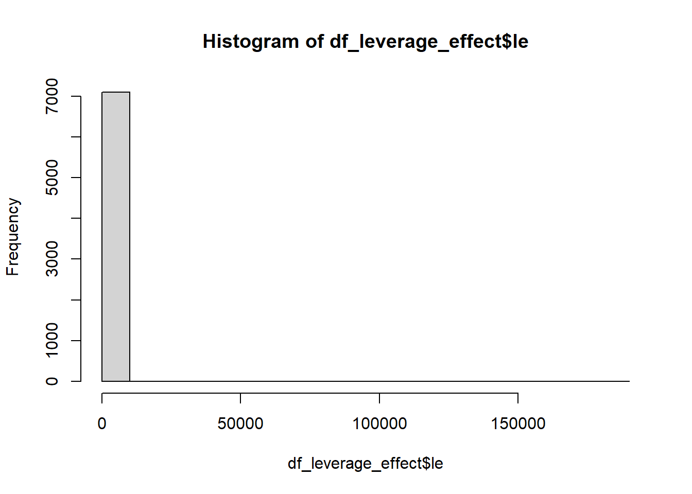
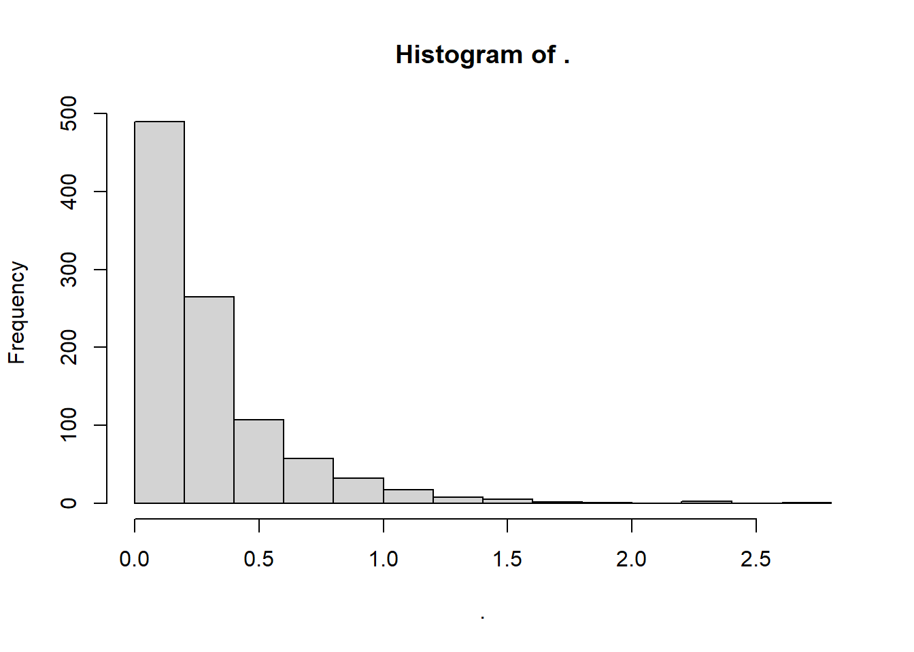
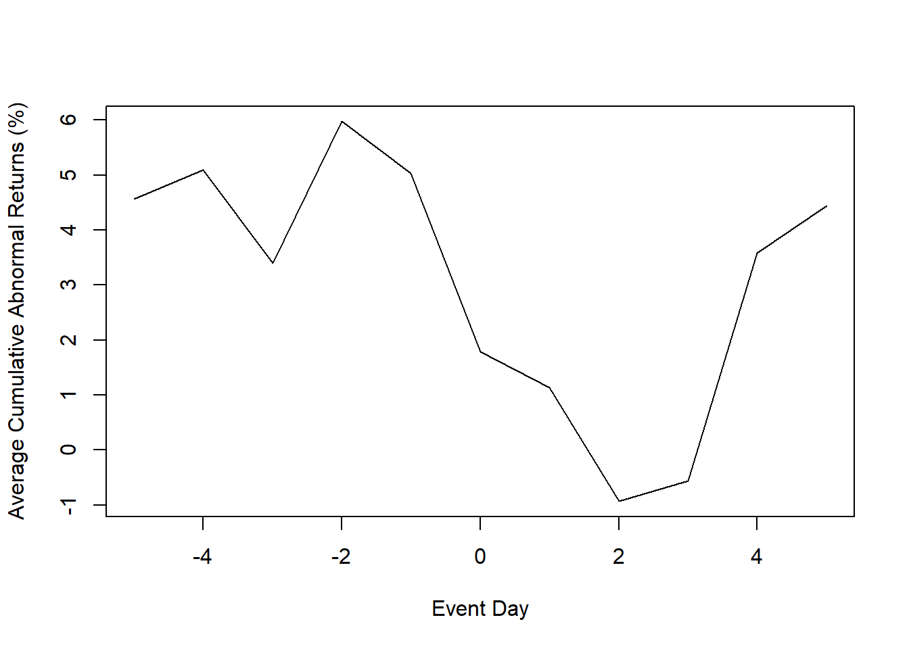

# Event Studies

The earliest paper that used event study was [@dolley1933characteristics]

[@campbell1998econometrics] introduced this method, which based on the efficient markets theory by [@fama1970efficient]

Review:

-   [@mcwilliams1997event]: in management

-   [@sorescu2017]: in marketing

Previous marketing studies:

1.  Firm-initiated activities

-   [@horsky1987does]: name change

-   [@chaney1991impact] new product announcements

-   [@agrawal1995economic]: celebrity endorsement

-   [@lane1995stock]: brand extensions

-   [@houston2000buyer]: joint venture

-   [@geyskens2002market]: Internet channel (for newspapers)

-   [@cornwell2005relationship]: sponsorship announcements

-   [@elberse2007power]: casting announcements

-   [@sorescu2007some]: M&A

-   [@sood2009innovations]: innovation payoff

-   [@wiles2009worth]: product placements in movies

-   [@joshi2009movie]: movie releases

-   [@wiles2010stock]: Regulatory Reports of Deceptive Advertising

-   [@boyd2010chief]: new CMO appointments

-   [@karniouchina2011marketing]: product placement

-   [@wiles2012effect]: Brand Acquisition and Disposal

-   [@kalaignanam2013corporate]: corporate brand name change

-   [@raassens2012market]: new product development outsourcing

-   [@mazodier2013sponsorship]: sports announcements

-   [@borah2014make]: make, buy or ally for innovations

-   [@homburg2014firm]: channel expansions

-   [@fang2015timing]: Co-development agreements

-   [@wu2015sleeping]: horizontal collaboration in new product development

-   [@fama1969adjustment]: stock split

2.  Non-firm-initiated activities

-   [@sorescu2003]: FDA approvals

-   [@pandey2005relationship]: diversity elite list

-   [@balasubramanian2005impact]: high-quality achievements

-   [@tellis2007]: quality reviews by Walter Mossberg

-   [@fornell2006customer]: customer satisfaction

-   [@gielens2008dancing]: Walmart's entry into the UK market

-   [@boyd2008market]: indirect ties

-   [@rao2008fruits]: FDA approvals

-   [@ittner2009commentary]: customer satisfaction

-   [@tipton2009regulatory]: Deceptive advertising

-   [@chen2009does]: product recalls

-   [@jacobson2009financial]: satisfaction score release

-   [@karniouchina2009impact]: Mad money with Jim Cramer

-   [@wiles2010stock]: deceptive advertising

-   [@chen2012third]: third-party movie reviews

-   [@xiong2013asymmetric]: positive and negative news

-   [@gao2015should]: product recall

-   [@malhotra2011evaluating]: data breach

-   [@bhagat1998shareholder]: litigation

Potential avenues:

-   Ad campaigns

-   Market entry

-   product failure/recalls

-   Patents

Pros:

-   Better than accounting based measures (e.g., profits) because managers can manipulate profits [@benston1985validity]

-   Easy to do

Fun fact:

-   [@dubow2006measuring] came up with a way to gauge how 'clean' a market is. They based their measure on how much prices seemed to move in a way that suggested insider knowledge, before the release of important regulatory announcements that could affect the stock prices. Such price shifts might suggest that insider trading was occurring. Essentially, they were watching for any unusual price changes before the day of the announcement.

Events can be

-   Internal (e.g., stock repurchase)

-   External (e.g., macroeconomic variables)

**Assumptions**:

1.  Efficient market theory
2.  Shareholders are the most important group among stakeholders
3.  The event sharply affects share price
4.  Expected return is calculated appropriately

**Steps**:

1.  Event Identification: (e.g., dividends, M&A, stock buyback, laws or regulation, privatization vs. nationalization, celebrity endorsements, name changes, or brand extensions etc. To see the list of events in US and international, see WRDS **S&P Capital IQ Key Developments**). Events must affect either cash flows or on the discount rate of firms [@sorescu2017, p. 191]
    1.  Estimation window: Normal return expected return ($T_0 \to T_1$) (sometimes include days before to capture leakages).

        -   Recommendation by [@johnston2007review] is to use 250 days before the event (and 45-day between the estimation window and the event window).

            -   [@wiles2012effect] used an 90-trading-day estimation window ending 6 days before the event (this is consistent with the finance literature).

            -   [@gielens2008dancing] 260 to 10 days before or 300 to 46 days before

            -   [@tirunillai2012does] estimation window of 255 days and ends 46 days before the event.

        -   Similarly, [@mcwilliams1997event] and [@fornell2006customer] 255 days ending 46 days before the event date

        -   [@sorescu2017, p. 194] suggest 100 days before the event date

        -   Leakage: try to cover as broad news sources as possible (LexisNexis, Factiva, and RavenPack).

    2.  Event window: contain the event date ($T_1 \to T_2$) (have to argue for the event window and can't do it empirically)

        -   One day: [@balasubramanian2005impact; @boyd2010chief; @fornell2006customer]

        -   Two days: [@raassens2012market; @sood2009innovations]

        -   Up to 10 days: [@cornwell2005relationship; @kalaignanam2013corporate; @sorescu2007some]

    3.  Post Event window: $T_2 \to T_3$
2.  Normal vs. Abnormal returns

$$
\epsilon_{it}^* = \frac{P_{it} - E(P_{it})}{P_{it-1}} = R_{it} - E(R_{it}|X_t)
$$

where

-   $\epsilon_{it}^*$ = abnormal return

-   $R_{it}$ = realized (actual) return

-   $P$ = dividend-adjusted price of the stock

-   $E(R_{it}|X_t)$ normal expected return

There are several model to calculate the expected return

A. [Statistical Models]: assumes jointly multivariate normal and iid over time (need distributional assumptions for valid finite-sample estimation) rather robust (hence, recommended)

1.  [Constant Mean Return Model]
2.  [Market Model]
3.  Adjusted Market Return Model
4.  Factor Model

B. [Economic Model] (strong assumption regarding investor behavior)

1.  [Capital Asset Pricing Model (CAPM)](#capital-asset-pricing-model-capm)
2.  [Arbitrage Pricing Theory (APT)](#arbitrage-pricing-theory-apt)

## Other Issues

### Event Studies in marketing

[@skiera2017should] What should be the dependent variable in marketing-related event studies?

-   Based on valuation theory, Shareholder value = the value of the operating business + non-operating asset - debt [@schulze2012linking]

    -   Many marketing events only affect the operating business value, but not non-operating assets and debt

-   Ignoring the differences in firm-specific leverage effects has dual effects:

    -   inflates the impact of observation pertaining to firms with large debt

    -   deflates those pertaining to firms with large non-operating asset.

-   It's recommended that marketing papers should report both $CAR^{OB}$ and $CAR^{SHV}$ and argue for whichever one more appropriate.

-   Up until this paper, only two previous event studies control for financial structure: [@gielens2008dancing] [@chaney1991impact]

Definitions:

-   Cumulative abnormal percentage return on shareholder value ($CAR^{SHV}$)

    -   Shareholder value refers to a firm's market capitalization = share price x \# of shares.

-   Cumulative abnormal percentage return on the value of the operating business ($CAR^{OB}$)

    -   $CAR^{OB} = CAR^{SHV}/\text{leverage effect}_{before}$

    -   Leverage effect = Operating business value / Shareholder value (LE describes how a 1% change in operating business translates into a percentage change in shareholder value).

    -   Value of operating business = shareholder value - non-operating assets + debt

    -   Leverage effect $\neq$ leverage ratio, where leverage ratio is debt / firm size

        -   debt = long-term + short-term debt; long-term debt

        -   firm size = book value of equity; market cap; total assets; debt + equity

-   Operating assets are those used by firm in their core business operations (e..g, property, plant, equipment, natural resources, intangible asset)

-   Non--operating assets (redundant assets), do not play a role in a firm's operations, but still generate some form of return (e.g., excess cash , marketable securities - commercial papers, market instruments)

Marketing events usually influence the value of a firm's operating assets (more specifically intangible assets). Then, changes in the value of the operating business can impact shareholder value.

-   Three rare instances where marketing events can affect non-operating assets and debt

    -   [@hall2004determinants]: excess pre-orderings can influence short-term debt

    -   [@berger1997managerial] Firing CMO increase debt as the manager's tenure is negatively associated with the firm's debt

    -   [@bhaduri2002determinants] production of unique products.

A marketing-related event can either influence

-   value components of a firm's value (= firm's operating business, non-operating assets and its debt)

-   only the operating business.

Replication of the leverage effect

$$
\begin{aligned}
\text{leverage effect} &= \frac{\text{operating business}}{\text{shareholder value}} \\
&= \frac{\text{(shareholder value - non-operating assets + debt)}}{\text{shareholder value}} \\
&= \frac{prcc_f \times csho - ivst + dd1 + dltt + pstk}{prcc_f \times csho}
\end{aligned}
$$

Compustat Data Item

+-------------+--------------------------------+
| Label       | Variable                       |
+=============+================================+
| `prcc_f`    | Share price                    |
+-------------+--------------------------------+
| `csho`      | Common shares outstanding      |
+-------------+--------------------------------+
| `ivst`      | short-term investments         |
|             |                                |
|             | (Non-operating assets)         |
+-------------+--------------------------------+
| `dd1`       | long-term debt due in one year |
+-------------+--------------------------------+
| `dltt`      | long-term debt                 |
+-------------+--------------------------------+
| `pstk`      | preferred stock                |
+-------------+--------------------------------+

Since WRDS no longer maintains the S&P 500 list as of the time of this writing, I can't replicate the list used in [@skiera2017should] paper.


```r
library(tidyverse)
df_leverage_effect <- read.csv("data/leverage_effect.csv.gz") %>% 
    
    # get active firms only
    filter(costat == "A") %>% 
    
    # drop missing values
    drop_na() %>% 
    
    # create the leverage effect variable
    mutate(le = (prcc_f * csho - ivst + dd1 + dltt + pstk)/ (prcc_f * csho)) %>% 
    
    # get shareholder value
    mutate(shv = prcc_f * csho) %>% 
    
    # remove Infinity value for leverage effect (i.e., shareholder value = 0)
    filter_all(all_vars(!is.infinite(.))) %>% 
    
    # positive values only 
    filter_all(all_vars(. > 0)) %>% 
    
    # get the within coefficient of variation
    group_by(gvkey) %>% 
    mutate(within_var_mean_le = mean(le),
           within_var_sd_le = sd(le)) %>% 
    ungroup()


# get the mean and standard deviation
mean(df_leverage_effect$le)
#> [1] 150.1087
max(df_leverage_effect$le)
#> [1] 183629.6
hist(df_leverage_effect$le)
```



```r

# coefficient of variation 
sd(df_leverage_effect$le) / mean(df_leverage_effect$le) * 100
#> [1] 2749.084

# Within-firm variation (similar to fig 3a)
df_leverage_effect %>% 
    group_by(gvkey) %>% 
    slice(1) %>% 
    ungroup() %>% 
    dplyr::select(within_var_mean_le, within_var_sd_le) %>% 
    dplyr::mutate(cv = within_var_sd_le/ within_var_mean_le) %>% 
    dplyr::select(cv) %>% 
    pull() %>% 
    hist()
```



### Economic significance

Total wealth gain (loss) from the event

$$
\Delta W_t = CAR_t \times MKTVAL_0
$$

where

-   $\Delta W_t$ = gain (loss)

-   $CAR_t$ = cumulative residuals to date $t$

-   $MKTVAL_0$ market value of the firm before the event window

### Statistical Power

increases with

-   more firms

-   less days in the event window (avoiding potential contamination from confounds)

## Testing

### Parametric Test

[@brown1985using] provide evidence that even in the presence of non-normality, the parametric tests still perform well. Since the proportion of positive and negative abnormal returns tends to be equal in the sample (of at least 5 securities). The excess returns will coverage to normality as the sample size increases. Hence, parametric test is advocated than non-parametric one.

Low power to detect significance [@kothari1997measuring]

-   Power = f(sample, size, the actual size of abnormal returns, the variance of abnormal returns across firms)

#### T-test

Applying CLT

$$
\begin{aligned}
t_{CAR} &= \frac{\bar{CAR_{it}}}{\sigma (CAR_{it})/\sqrt{n}} \\
t_{BHAR} &= \frac{\bar{BHAR_{it}}}{\sigma (BHAR_{it})/\sqrt{n}}
\end{aligned}
$$

Assume

-   Abnormal returns are normally distributed

-   Var(abnormal returns) are equal across firms

-   No cross-correlation in abnormal returns.

Hence, it will be misspecified if you suspected

-   Heteroskedasticity

-   Cross-sectional dependence

-   Technically, abnormal returns could follow non-normal distribution (but because of the design of abnormal returns calculation, it typically forces the distribution to be normal)

To address these concerns, [Patell Standardized Residual (PSR)](#patell-standardized-residual-psr) can sometimes help.

#### Patell Standardized Residual (PSR) {#patell-standardized-residual-psr}

[@patell1976corporate]

-   Since market model uses observations outside the event window, abnormal returns contain prediction errors on top of the true residuals , and should be standardized:

$$
AR_{it} = \frac{\hat{u}_{it}}{s_i \sqrt{C_{it}}}
$$

where

-   $\hat{u}_{it}$ = estimated residual

-   $s_i$ = standard deviation estimate of residuals (from the estimation period)

-   $C_{it}$ = a correction to account for the prediction's increased variation outside of the estimation period [@strong1992]

$$
C_{it} = 1 + \frac{1}{T} + \frac{(R_{mt} - \bar{R}_m)^2}{\sum_t (R_{mt} - \bar{R}_m)^2}
$$

where

-   $T$ = number of observations (from estimation period)

-   $R_{mt}$ = average rate of return of all stocks trading the the stock market at time $t$

-   $\bar{R}_m = \frac{1}{T} \sum_{t=1}^T R_{mt}$

### Non-parametric Test

-   No assumptions about return distribution

-   Sign Test (assumes symmetry in returns)

    -   `binom.test()`

-   Wilcoxon Signed-Rank Test (allows for non-symmetry in returns)

    -   Use `wilcox.test(sample)`

-   Gen Sign Test

-   Corrado Rank Test

## Sample

-   Sample can be relative small

    -   [@wiles2012effect] 572 acquisition announcements, 308 disposal announcements

    -   Can range from 71 [@markovitch2008findings] to 3552 [@borah2014make]

### Confounders

-   Avoid confounding events: earnings announcements, key executive changes, unexpected stock buybacks, changes in dividends within the two-trading day window surrounding the event, mergers and acquisitions, spin-offers, stock splits, management changes, joint ventures, unexpected dividend, IPO, debt defaults, dividend cancellations [@mcwilliams1997event]

According to [@fornell2006customer], need to control:

-   one-day event period = day when Wall Street Journal publish ACSI announcement.

-   5 days before and after event to rule out other news (PR Newswires, Dow Jones, Business Wires)

    -   M&A, Spin-offs, stock splits

    -   CEO or CFO changes,

    -   Layoffs, restructurings, earnings announcements, lawsuits

    -   Capital IQ - Key Developments: covers almost all important events so you don't have to search on news.

[@sorescu2017] examine confounding events in the short-term windows:

-   From RavenPack, 3982 US publicly traded firms, with all the press releases (2000-2013)

-   3-day window around event dates

-   The difference between a sample with full observations and a sample without confounded events is negligible (non-significant).

-   Conclusion: **excluding confounded observations may be unnecessary for short-term event studies.**

    -   Biases can stem from researchers pick and choose events to exclude

    -   As time progresses, more and more events you need to exclude which can be infeasible.

To further illustrate this point, let's do a quick simulation exercise

In this example, we will explore three types of events:

1.  Focal events

2.  Correlated events (i.e., events correlated with the focal events; the presence of correlated events can follow the presence of the focal event)

3.  Uncorrelated events (i.e., events with dates that might randomly coincide with the focal events, but are not correlated with them).

We have the ability to control the strength of correlation between focal and correlated events in this study, as well as the number of unrelated events we wish to examine.

Let's examine the implications of including and excluding correlated and uncorrelated events on the estimates of our focal events.


```r
# Load required libraries
library(dplyr)
library(ggplot2)
library(tidyr)
library(tidyverse)

# Parameters
n                  <- 100000         # Number of observations
n_focal            <- round(n * 0.2) # Number of focal events
overlap_correlated <- 0.5            # Overlapping percentage between focal and correlated events

# Function to compute mean and confidence interval
mean_ci <- function(x) {
    m <- mean(x)
    ci <- qt(0.975, length(x)-1) * sd(x) / sqrt(length(x)) # 95% confidence interval
    list(mean = m, lower = m - ci, upper = m + ci)
}

# Simulate data
set.seed(42)
data <- tibble(
    date       = seq.Date(from = as.Date("2010-01-01"), by = "day", length.out = n), # Date sequence
    focal      = rep(0, n),
    correlated = rep(0, n),
    ab_ret     = rnorm(n)
)


# Define focal events
focal_idx <- sample(1:n, n_focal)
data$focal[focal_idx] <- 1

true_effect <- 0.25

# Adjust the ab_ret for the focal events to have a mean of true_effect
data$ab_ret[focal_idx] <- data$ab_ret[focal_idx] - mean(data$ab_ret[focal_idx]) + true_effect


# Determine the number of correlated events that overlap with focal and those that don't
n_correlated_overlap <- round(length(focal_idx) * overlap_correlated)
n_correlated_non_overlap <- n_correlated_overlap

# Sample the overlapping correlated events from the focal indices
correlated_idx <- sample(focal_idx, size = n_correlated_overlap)

# Get the remaining indices that are not part of focal
remaining_idx <- setdiff(1:n, focal_idx)

# Check to ensure that we're not attempting to sample more than the available remaining indices
if (length(remaining_idx) < n_correlated_non_overlap) {
    stop("Not enough remaining indices for non-overlapping correlated events")
}

# Sample the non-overlapping correlated events from the remaining indices
correlated_non_focal_idx <- sample(remaining_idx, size = n_correlated_non_overlap)

# Combine the two to get all correlated indices
all_correlated_idx <- c(correlated_idx, correlated_non_focal_idx)

# Set the correlated events in the data
data$correlated[all_correlated_idx] <- 1


# Inflate the effect for correlated events to have a mean of 
correlated_non_focal_idx <- setdiff(all_correlated_idx, focal_idx) # Fixing the selection of non-focal correlated events
data$ab_ret[correlated_non_focal_idx] <- data$ab_ret[correlated_non_focal_idx] - mean(data$ab_ret[correlated_non_focal_idx]) + 1


# Define the numbers of uncorrelated events for each scenario
num_uncorrelated <- c(5, 10, 20, 30, 40)

# Define uncorrelated events
for (num in num_uncorrelated) {
    for (i in 1:num) {
        data[paste0("uncorrelated_", i)] <- 0
        uncorrelated_idx <- sample(1:n, round(n * 0.1))
        data[uncorrelated_idx, paste0("uncorrelated_", i)] <- 1
    }
}


# Define uncorrelated columns and scenarios
unc_cols <- paste0("uncorrelated_", 1:num_uncorrelated)
results <- tibble(
    Scenario = c("Include Correlated", "Correlated Effects", "Exclude Correlated", "Exclude Correlated and All Uncorrelated"),
    MeanEffect = c(
        mean_ci(data$ab_ret[data$focal == 1])$mean,
        mean_ci(data$ab_ret[data$focal == 0 | data$correlated == 1])$mean,
        mean_ci(data$ab_ret[data$focal == 1 & data$correlated == 0])$mean,
        mean_ci(data$ab_ret[data$focal == 1 & data$correlated == 0 & rowSums(data[, paste0("uncorrelated_", 1:num_uncorrelated)]) == 0])$mean
    ),
    LowerCI = c(
        mean_ci(data$ab_ret[data$focal == 1])$lower,
        mean_ci(data$ab_ret[data$focal == 0 | data$correlated == 1])$lower,
        mean_ci(data$ab_ret[data$focal == 1 & data$correlated == 0])$lower,
        mean_ci(data$ab_ret[data$focal == 1 & data$correlated == 0 & rowSums(data[, paste0("uncorrelated_", 1:num_uncorrelated)]) == 0])$lower
    ),
    UpperCI = c(
        mean_ci(data$ab_ret[data$focal == 1])$upper,
        mean_ci(data$ab_ret[data$focal == 0 | data$correlated == 1])$upper,
        mean_ci(data$ab_ret[data$focal == 1 & data$correlated == 0])$upper,
        mean_ci(data$ab_ret[data$focal == 1 & data$correlated == 0 & rowSums(data[, paste0("uncorrelated_", 1:num_uncorrelated)]) == 0])$upper
    )
)

# Add the scenarios for excluding 5, 10, 20, and 50 uncorrelated
for (num in num_uncorrelated) {
    unc_cols <- paste0("uncorrelated_", 1:num)
    results <- results %>%
        add_row(
            Scenario = paste("Exclude", num, "Uncorrelated"),
            MeanEffect = mean_ci(data$ab_ret[data$focal == 1 & data$correlated == 0 & rowSums(data[, unc_cols]) == 0])$mean,
            LowerCI = mean_ci(data$ab_ret[data$focal == 1 & data$correlated == 0 & rowSums(data[, unc_cols]) == 0])$lower,
            UpperCI = mean_ci(data$ab_ret[data$focal == 1 & data$correlated == 0 & rowSums(data[, unc_cols]) == 0])$upper
        )
}


ggplot(results,
       aes(
           x = factor(Scenario, levels = Scenario),
           y = MeanEffect,
           ymin = LowerCI,
           ymax = UpperCI
       )) +
    geom_pointrange() +
    coord_flip() +
    ylab("Mean Effect") +
    xlab("Scenario") +
    ggtitle("Mean Effect of Focal Events under Different Scenarios") +
    geom_hline(yintercept = true_effect,
               linetype = "dashed",
               color = "red") 
```


As depicted in the plot, the inclusion of correlated events demonstrates minimal impact on the estimation of our focal events. Conversely, excluding these correlated events can diminish our statistical power. This is true in cases of pronounced correlation.

However, the consequences of excluding unrelated events are notably more significant. It becomes evident that by omitting around 40 unrelated events from our study, we lose the ability to accurately identify the true effects of the focal events. In reality and within research, we often rely on the Key Developments database, excluding over 150 events, a practice that can substantially impair our capacity to ascertain the authentic impact of the focal events.

This little experiment really drives home the point -- you better have a darn good reason to exclude an event from your study (make it super convincing)!

## Biases

-   Different closing time obscure estimation of the abnormal returns, check [@campbell1998econometrics]

-   Upward bias in aggregating CAR + transaction prices (bid and ask)

-   Cross-sectional dependence in the returns bias the standard deviation estimates downward, which inflates the test statistics when events share common dates [@mackinlay1997event]. Hence, [@jaffe1974special] [Calendar-time Portfolio Abnormal Returns (CTARs)](#calendar-time-portfolio-abnormal-returns-ctars) should be used to correct for this bias.

-   [@wiles2012effect]: For events confined to relatively few industries, cross-sectional dependence in the returns can bias the SD estimate downward, inflating the associated test statistics" (p. 47). To control for potential cross-sectional correlation in the abnormal returns, you can use time-series standard deviation test statistic [@brown1980measuring]

-   Sample selection bias (self-selection of firms into the event treatment) similar to omitted variable bias where the omitted variable is the private info that leads a firm to take the action.

    -   See [Endogenous Sample Selection] for more methods to correct this bias.

    -   Use Heckman model [@acharya1993value]

        -   But hard to find an instrument that meets the exclusion requirements (and strong, because weak instruments can lead to multicollinearity in the second equation)

        -   Can estimate the private information unknown to investors (which is Mills ratio $\lambda$ itself). Testing $\lambda$ significance is to see whether private info can explain outcomes (e.g., magnitude of the CARs to the announcement).

        -   Examples: [@chen2009does] [@wiles2012effect] [@fang2015timing]

    -   Counterfactual observations

        -   Propensity score matching:

            -   Finance: [@iskandar2013valuation, @doan2021does] [@masulis2011venture]

            -   Marketing: [@warren2017how] [@borah2014make] [@cao2013wedded]

        -   Switching regression: comparison between 2 specific outcomes (also account for selection on unobservables - using instruments) [@cao2013wedded]

## Long-run event studies

-   Usually make an assumption that the distribution of the abnormal returns to these events has a mean of 0 [@sorescu2017, p. 192]. And [@sorescu2017] provide evidence that for all events they examine the results from samples with and without confounding events do not differ.

-   Long-horizon event studies face challenges due to systematic errors over time and sensitivity to model choice.

-   Two main approaches are used to measure long-term abnormal stock returns

    -   [Buy and Hold Abnormal Returns (BHAR)](#buy-and-hold-abnormal-returns-bhar)

    -   [Long-term Cumulative Abnormal Returns (LCARs)](#long-term-cumulative-abnormal-returns-lcars)

    -   [Calendar-time Portfolio Abnormal Returns (CTARs)](#calendar-time-portfolio-abnormal-returns-ctars) (Jensen's Alpha): manages cross-sectional dependence better and is less sensitive to (asset pricing) model misspecification

-   Two types:

    -   Unexpected changes in firm specific variables (typically not announced, may not be immediately visible to all investors, impact on firm value is not straightforward): customer satisfaction scores effect on firm value [@jacobson2009financial] or unexpected changes in marketing expenditures [@kim2011stock] to determine mispricing.

    -   Complex consequences (investors take time to learn and incorporate info): acquisition depends on integration [@sorescu2007some]

-   12 - 60 months event window: [@loughran1995new] [@brav1997myth]

-   Example: [@dutta2018robust]


```r
library(crseEventStudy)

# example by the package's author
data(demo_returns)
SAR <-
    sar(event = demo_returns$EON,
        control = demo_returns$RWE,
        logret = FALSE)
mean(SAR)
#> [1] 0.006870196
```

### Buy and Hold Abnormal Returns (BHAR) {#buy-and-hold-abnormal-returns-bhar}

-   Classic references: [@loughran1995new] [@barber1997firm] [@lyon1999improved]

Use a portfolio of stocks that are close matches of the current firm over the same period as benchmark, and see the difference between the firm return and that of the portfolio.

-   More technical note is that it measures returns from buying stocks in event-experiencing firms and shorting stocks in similar non-event firms within the same time.
-   Because of high cross-sectional correlations, BHARs' t-stat can be inflated, but its rank order is not affected [@markovitch2008findings; @sorescu2007some]

To construct the portfolio, use similar

-   size
-   book-to-market
-   momentum

Matching Procedure [@barber1997firm]:

1.  Each year from July to June, all common stocks in the CRSP database are categorized into ten groups (deciles) based on their market capitalization from the previous June.

2.  Within these deciles, firms are further sorted into five groups (quintiles) based on their book-to-market ratios as of December of the previous year or earlier, considering possible delays in financial statement reporting.

3.  Benchmark portfolios are designed to exclude firms with specific events but include all firms that can be classified into the characteristic-based portfolios.

Similarly, @wiles2010stock uses the following matching procedure:

1.  All firms in the same two-digit SIC code with market values of 50% to 150% of the focal firms are selected
2.  From this list, the 10 firms with the most comparable book-to-market ratios are chosen to serve as the matched portfolio (the matched portfolio can have less than 10 firms).

Calculations:

$$
AR_{it} = R_{it} - E(R_{it}|X_t)
$$

Cumulative Abnormal Return (CAR):

$$
CAR_{it} = \sum_{t=1}^T (R_{it} - E(R_{it}))
$$

Buy-and-Hold Abnormal Return (BHAR)

$$
BHAR_{t = 1}^T = \Pi_{t=1}^T(1 + R_{it}) - \Pi_{t = 1}^T (1 + E(R_{it}))
$$

where as CAR is the arithmetic sum, BHAR is the geometric sum.

-   In short-term event studies, differences between CAR and BHAR are often minimal. However, in long-term studies, this difference could significantly skew results. [@barber1997firm] shows that while BHAR is usually slightly lower than annual CAR, but it dramatically surpasses CAR when annual BHAR exceeds 28%.

To calculate the long-run return ($\Pi_{t=1}^T (1 + E(R_{it}))$) of the benchmark portfolio, we can:

1.  **With annual rebalance**: In each period, each portfolio is re-balanced and then compound mean stock returns in a portfolio over a given period:

$$
\Pi_{t = 1}^T (1 + E(R_{it})) = \Pi_{t}^T (1 + \sum_{i = s}^{n_t}w_{it} R_{it})
$$

where $n_t$ is the number of firms in period $t$, and $w_{it}$ is (1) $1/n_t$ or (2) value-weight of firm $i$ in period $t$.

To avoid favoring recent events, in cross-sectional event studies, researchers usually treat all events equally when studying their impact on the stock market over time. This approach helps identify any abnormal changes in stock prices, especially when dealing with a series of unplanned events.

Potential problems:

-   Solution first: Form benchmark portfolios that will never change constituent firms [@mitchell2000managerial], because of these problems:

    -   Newly public companies often perform worse than a balanced market index [@ritter1991long], and this, over time, might distort long-term return expectations due to the inclusion of these new companies (a phenomenon called "new listing bias" identified by @barber1997firm).

    -   Regularly rebalancing an equal-weight portfolio can lead to overestimated long-term returns and potentially skew buy-and-hold abnormal returns (BHARs) negatively due to constant selling of winning stocks and buying of underperformers (i.e., "rebalancing bias" [@barber1997firm]).

    -   Value-weight portfolios, which favor larger market cap stocks, can be viewed as an active investment strategy that keeps buying winning stocks and selling underperformers. Over time, this approach tends to positively distort BHARs.

2.  **Without annual rebalance**: Compounding the returns of the securities comprising the portfolio, followed by calculating the average across all securities

$$
\Pi_{t = s}^{T} (1 + E(R_{it})) = \sum_{i=s}^{n_t} (w_{is} \Pi_{t=1}^T (1 + R_{it}))
$$

where $t$ is the investment period, $R_{it}$ is the return on security $i$, $n_i$ is the number of securities, $w_{it}$ is either $1/n_s$ or value-weight factor of security $i$ at initial period $s$. This portfolio's profits come from a simple investment where all the included stocks are given equal importance, or weighted according to their market value, as they were in a specific past period (period s). This means that it doesn't consider any stocks that were listed after this period, nor does it adjust the portfolio each month. However, one problem with this method is that the value assigned to each stock, based on its market size, needs to be corrected. This is to make sure that recent stocks don't end up having too much influence.

Fortunately, on [WRDS](https://wrds-www.wharton.upenn.edu/pages/get-data/event-study-wrds/long-run-event-study-upload-you-own-events/), it will give you all types of BHAR (2x2) (equal-weighted vs. value-weighted and with annual rebalance and without annual rebalance)

-   "MINWIN" is the smallest number of months a company trades after an event to be included in the study.

<!-- -->

-   "MAXWIN" is the most months that the study considers in its calculations.

    -   Companies aren't excluded if they have less than MAXWIN months, unless they also have fewer than MINWIN months.

-   The term "MONTH" signifies chosen months (typically 12, 24, or 36) used to work out BHAR.

    -   If monthly returns are missing during the set period, matching portfolio returns fill in the gaps.

### Long-term Cumulative Abnormal Returns (LCARs) {#long-term-cumulative-abnormal-returns-lcars}

Formula for LCARs during the $(1,T)$ postevent horizon [@sorescu2007some]

$$
LCAR_{pT} = \sum_{t = 1}^{t = T} (R_{it} - R_{pt})
$$

where $R_{it}$ is the rate of return of stock $i$ in month $t$

$R_{pt}$ is the rate of return on the counterfactual portfolio in month $t$

### Calendar-time Portfolio Abnormal Returns (CTARs) {#calendar-time-portfolio-abnormal-returns-ctars data-link="Portfolio method"}

This section follows strictly the procedure in [@wiles2010stock]

A portfolio for every day in calendar time (including all securities which experience an event that time).

For each portfolio, the securities and their returns are equally weighted

1.  For all portfolios, the average abnormal return are calculated as

$$
AAR_{Pt} = \frac{\sum_{i=1}^S AR_i}{S}
$$

where

-   $S$ is the number of securities in portfolio $P$
-   $AR_i$ is the abnormal return for the stock $i$ in the portfolio

2.  For every portfolio $P$, a time series estimate of $\sigma(AAR_{Pt})$ is calculated for the preceding $k$ days, assuming that the $AAR_{Pt}$ are independent over time.
3.  Each portfolio's average abnormal return is standardized

$$
SAAR_{Pt} = \frac{AAR_{Pt}}{SD(AAR_{Pt})}
$$

4.  Average standardized residual across all portfolio's in calendar time

$$
ASAAR = \frac{1}{n}\sum_{i=1}^{255} SAAR_{Pt} \times D_t
$$

where

-   $D_t = 1$ when there is at least one security in portfolio $t$

-   $D_t = 0$ when there are no security in portfolio $t$

-   $n$ is the number of days in which the portfolio have at least one security $n = \sum_{i = 1}^{255}D_t$

5.  The cumulative average standardized average abnormal returns is

$$
CASSAR_{S_1, S_2} = \sum_{i=S_1}^{S_2} ASAAR
$$

If the ASAAR are independent over time, then standard deviation for the above estimate is $\sqrt{S_2 - S_1 + 1}$

then, the test statistics is

$$
t = \frac{CASAAR_{S_1,S_2}}{\sqrt{S_2 - S_1 + 1}}
$$

Limitations

-   Cannot examine individual stock difference, can only see the difference at the portfolio level.

    -   One can construct multiple portfolios (based on the metrics of interest) so that firms in the same portfolio shares that same characteristics. Then, one can compare the intercepts in each portfolio.

-   Low power [@loughran2000uniformly], type II error is likely.

## Aggregation

### Over Time

We calculate the cumulative abnormal (CAR) for the event windows

$H_0$: Standardized cumulative abnormal return for stock $i$ is 0 (no effect of events on stock performance)

$H_1$: SCAR is not 0 (there is an effect of events on stock performance)

### Across Firms + Over Time

Additional assumptions: Abnormal returns of different socks are uncorrelated (rather strong), but it's very valid if event windows for different stocks do not overlap. If the windows for different overlap, follow [@bernard1987cross] and [@schipper1983evidence, @schipper1983effects]

$H_0$: The mean of the abnormal returns across all firms is 0 (no effect)

$H_1$: The mean of the abnormal returns across all firms is different form 0 (there is an effect)

Parametric (empirically either one works fine) (assume abnormal returns is normally distributed) :

1.  Aggregate the CAR of all stocks (Use this if the true abnormal variance is greater for stocks with higher variance)
2.  Aggregate the SCAR of all stocks (Use this if the true abnormal return is constant across all stocks)

Non-parametric (no parametric assumptions):

1.  Sign test:
    -   Assume both the abnormal returns and CAR to be independent across stocks

    -   Assume 50% with positive abnormal returns and 50% with negative abnormal return

    -   The null will be that there is a positive abnormal return correlated with the event (if you want the alternative to be there is a negative relationship)

    -   With skewed distribution (likely in daily stock data), the size test is not trustworthy. Hence, rank test might be better
2.  Rank test
    -   Null: there is no abnormal return during the event window

## Heterogeneity in the event effect

$$
y = X \theta + \eta
$$

where

-   $y$ = CAR

-   $X$ = Characteristics that lead to heterogeneity in the event effect (i.e., abnormal returns) (e.g., firm or event specific)

-   $\eta$ = error term

Note:

-   In cases with selection bias (firm characteristics and investor anticipation of the event: larger firms might enjoy great positive effect of an event, and investors endogenously anticipate this effect and overvalue the stock), we have to use the White's $t$-statistics to have the lower bounds of the true significance of the estimates.
-   This technique should be employed even if the average CAR is not significantly different from 0, especially when the CAR variance is high [@boyd2010chief]

### Common variables in marketing

[@sorescu2017] Table 4

-   Firm size is negatively correlated with abnormal return in finance [@sorescu2017], but mixed results in marketing.

-   \# of event occurrences

-   R&D expenditure

-   Advertising expense

-   Marketing investment (SG&A)

-   Industry concentration (HHI, \# of competitors)

-   Financial leverage

-   Market share

-   Market size (total sales volume within the firm's SIC code)

-   marketing capability

-   Book to market value

-   ROA

-   Free cash flow

-   Sales growth

-   Firm age

## Expected Return Calculation

### Statistical Models

-   based on statistical assumptions about the behavior of returns (e..g, multivariate normality)

-   we only need to assume stable distributions [@owen1983class]

#### Constant Mean Return Model

The expected normal return is the mean of the real returns

$$
Ra_{it} = R_{it} - \bar{R}_i
$$

Assumption:

-   returns revert to its mean (very questionable)

The basic mean returns model generally delivers similar findings to more complex models since the variance of abnormal returns is not decreased considerably [@brown1985using]

#### Market Model

$$
R_{it} = \alpha_i + \beta R_{mt} + \epsilon_{it}
$$

where

-   $R_{it}$ = stock return $i$ in period $t$

-   $R_{mt}$ = market return

-   $\epsilon_{it}$ = zero mean ($E(e_{it}) = 0$) error term with its own variance $\sigma^2$

Notes:

-   People typically use S&P 500, CRSP value-weighed or equal-weighted index as the market portfolio.

-   When $\beta =0$, the [Market Model] is the [Constant Mean Return Model]

-   better fit of the market-model, the less variance in abnormal return, and the more easy to detect the event's effect

-   recommend generalized method of moments to be robust against auto-correlation and heteroskedasticity

#### Fama-French Model

Please note that there is a difference between between just taking the return versus taking the excess return as the dependent variable.

The correct way is to use the excess return for firm and for market [@fama2010luck, p. 1917].

-   $\alpha_i$ "is the average return left unexplained by the benchmark model" (i.e., abnormal return)

##### FF3

[@fama1993common]

$$
\begin{aligned}
E(R_{it}|X_t) - r_{ft} = \alpha_i &+ \beta_{1i} (E(R_{mt}|X_t )- r_{ft}) \\
&+ b_{2i} SML_t + b_{3i} HML_t
\end{aligned}
$$

where

-   $r_{ft}$ risk-free rate (e.g., 3-month Treasury bill)

-   $R_{mt}$ is the market-rate (e.g., S&P 500)

-   SML: returns on small (size) portfolio minus returns on big portfolio

-   HML: returns on high (B/M) portfolio minus returns on low portfolio.

##### FF4

[@sorescu2017, p. 195] suggest the use of [Market Model] in marketing for short-term window and [Fama-French Model] for the long-term window (the statistical properties of this model have not been examined the the daily setting).

[@carhart1997persistence]

$$
\begin{aligned}
E(R_{it}|X_t) - r_{ft} = \alpha_i &+ \beta_{1i} (E(R_{mt}|X_t )- r_{ft}) \\
&+ b_{2i} SML_t + b_{3i} HML_t + b_{4i} UMD_t
\end{aligned}
$$

where

-   $UMD_t$ is the momentum factor (difference between high and low prior return stock portfolios) in day $t$.

### Economic Model

The only difference between CAPM and APT is that APT has multiple factors (including factors beyond the focal company)

Economic models put limits on a statistical model that come from assumed behavior that is derived from theory.

#### Capital Asset Pricing Model (CAPM) {#capital-asset-pricing-model-capm}

$$
E(R_i) = R_f + \beta_i (E(R_m) - R_f)
$$

where

-   $E(R_i)$ = expected firm return

-   $R_f$ = risk free rate

-   $E(R_m - R_f)$ = market risk premium

-   $\beta_i$ = firm sensitivity

#### Arbitrage Pricing Theory (APT) {#arbitrage-pricing-theory-apt}

$$
R = R_f + \Lambda f + \epsilon
$$

where

-   $\epsilon \sim N(0, \Psi)$

-   $\Lambda$ = factor loadings

-   $f \sim N(\mu, \Omega)$ = general factor model

    -   $\mu$ = expected risk premium vector

    -   $\Omega$ = factor covariance matrix

## Application

Packages:

-   `eventstudies`

-   `erer`

-   `EventStudy`

-   `AbnormalReturns`

-   [Event Study Tools](https://www.eventstudytools.com/)

-   [estudy2](https://irudnyts.github.io/estudy2/)

-   `PerformanceAnalytics`

In practice, people usually sort portfolio because they are not sure whether the FF model is specified correctly.

Steps:

1.  Sort all returns in CRSP into 10 deciles based on size.
2.  In each decile, sort returns into 10 decides based on BM
3.  Get the average return of the 100 portfolios for each period (i.e., expected returns of stocks given decile - characteristics)
4.  For each stock in the event study: Compare the return of the stock to the corresponding portfolio based on size and BM.

Notes:

-   Sorting produces outcomes that are often more conservative (e.g., FF abnormal returns can be greater than those that used sorting).

-   If the results change when we do B/M first then size or vice versa, then the results are not robust (this extends to more than just two characteristics - e.g., momentum).

Examples:

Forestry:

-   [@mei2008] M&A on financial performance (forest product)

-   [@sun2011effects] litigation on firm values


```r
library(erer)

# example by the package's author
data(daEsa)
hh <- evReturn(
    y = daEsa,       # dataset
    firm = "wpp",    # firm name
    y.date = "date", # date in y 
    index = "sp500", # index
    est.win = 250,   # estimation window wedith in days
    digits = 3, 
    event.date = 19990505, # firm event dates 
    event.win = 5          # one-side event window wdith in days (default = 3, where 3 before + 1 event date + 3 days after = 7 days)
)
hh; plot(hh)
#> 
#> === Regression coefficients by firm =========
#>   N firm event.date alpha.c alpha.e alpha.t alpha.p alpha.s beta.c beta.e
#> 1 1  wpp   19990505  -0.135   0.170  -0.795   0.428          0.665  0.123
#>   beta.t beta.p beta.s
#> 1  5.419  0.000    ***
#> 
#> === Abnormal returns by date ================
#>    day Ait.wpp    HNt
#> 1   -5   4.564  4.564
#> 2   -4   0.534  5.098
#> 3   -3  -1.707  3.391
#> 4   -2   2.582  5.973
#> 5   -1  -0.942  5.031
#> 6    0  -3.247  1.784
#> 7    1  -0.646  1.138
#> 8    2  -2.071 -0.933
#> 9    3   0.368 -0.565
#> 10   4   4.141  3.576
#> 11   5   0.861  4.437
#> 
#> === Average abnormal returns across firms ===
#>      name estimate error t.value p.value sig
#> 1 CiT.wpp    4.437 8.888   0.499   0.618    
#> 2     GNT    4.437 8.888   0.499   0.618
```



Example by [Ana Julia Akaishi Padula, Pedro Albuquerque (posted on LAMFO)](https://lamfo-unb.github.io/2017/08/17/Teste-de-Eventos-en/)

Example in `AbnormalReturns` package

### Eventus

2 types of output:

1.  

    -   Using different estimation methods (e.g., market model to calendar-time approach)

    -   Does not include event-specific returns. Hence, no regression later to determine variables that can affect abnormal stock returns.

2.  [Cross-sectional Analysis of Eventus]: Event-specific abnormal returns (using monthly or data data) for cross-sectional analysis (under **Cross-Sectional Analysis** section)

    -   Since it has the stock-specific abnormal returns, we can do regression on CARs later. But it only gives market-adjusted model. However, according to [@sorescu2017], they advocate for the use of market-adjusted model for the short-term only, and reserve the FF4 for the longer-term event studies using monthly daily.

#### Basic Event Study

1.  Input a text file contains a firm identifier (e.g., PERMNO, CUSIP) and the event date
2.  Choose market indices: equally weighted and the value weighted index (i.e., weighted by their market capitalization). And check Fama-French and Carhart factors.
3.  Estimation options
    1.  Estimation period: `ESTLEN = 100` is the convention so that the estimation is not impacted by outliers.

    2.  Use "autodate" options: the first trading after the event date is used if the event falls on a weekend or holiday
4.  Abnormal returns window: depends on the specific event
5.  Choose test: either parametric (including [Patell Standardized Residual (PSR)](#patell-standardized-residual-psr)) or non-parametric

#### Cross-sectional Analysis of Eventus

Similar to the [Basic Event Study](Average%20abnormal%20returns%20across%20a%20sample "under **Basic Event Study** and **Eventus Alternative** sections"), but now you can have event-specific abnormal returns.

### Evenstudies

This package does not use the Fama-French model, only the market models.

This example is by the author of the package


```r
library(eventstudies)
# firm and date data
data("SplitDates")
head(SplitDates)

# stock price data 
data("StockPriceReturns")
head(StockPriceReturns)
class(StockPriceReturns)

es <-
    eventstudy(
        firm.returns = StockPriceReturns,
        event.list = SplitDates,
        event.window = 5,
        type = "None",
        to.remap = TRUE,
        remap = "cumsum",
        inference = TRUE,
        inference.strategy = "bootstrap"
    )

plot(es)
```

### EventStudy

You have to pay for the API key. (It's \$10/month).


```r
library(EventStudy)
```

[Example](https://cran.rstudio.com/web/packages/EventStudy/vignettes/get_started.html) by the authors of the package

Data Prep


```r
library(tidyquant)
library(tidyverse)
library(readr)
```


Reference market in Germany is DAX


```r
# Index Data
# indexName <- c("DAX")

indexData <- tq_get("^GDAXI", from = "2014-05-01", to = "2015-12-31") %>%
    mutate(date = format(date, "%d.%m.%Y")) %>%
    mutate(symbol = "DAX")

head(indexData)
```

Create files

-   `01_RequestFile.csv`
-   `02_FirmData.csv`
-   `03_MarketData.csv`


Calculating abnormal returns


```r
# get & set parameters for abnormal return Event Study
# we use a garch model and csv as return
# Attention: fitting a GARCH(1, 1) model is compute intensive
esaParams <- EventStudy::ARCApplicationInput$new()
esaParams$setResultFileType("csv")
esaParams$setBenchmarkModel("garch")


dataFiles <-
    c(
        "request_file" = file.path(getwd(), "data", "EventStudy", "01_requestFile.csv"),
        "firm_data"    = file.path(getwd(), "data", "EventStudy", "02_firmDataPrice.csv"),
        "market_data"  = file.path(getwd(), "data", "EventStudy", "03_marketDataPrice.csv")
    )

# check data files, you can do it also in our R6 class
EventStudy::checkFiles(dataFiles)
```


```r
arEventStudy <- estSetup$performEventStudy(estParams     = esaParams, 
                                      dataFiles     = dataFiles, 
                                      downloadFiles = T)
```


```r
library(EventStudy)

apiUrl <- "https://api.eventstudytools.com"
Sys.setenv(EventStudyapiKey = "")

# The URL is already set by default
options(EventStudy.URL = apiUrl)
options(EventStudy.KEY = Sys.getenv("EventStudyapiKey"))

# use EventStudy estAPIKey function
estAPIKey(Sys.getenv("EventStudyapiKey"))

# initialize object
estSetup <- EventStudyAPI$new()
estSetup$authentication(apiKey = Sys.getenv("EventStudyapiKey"))
```
