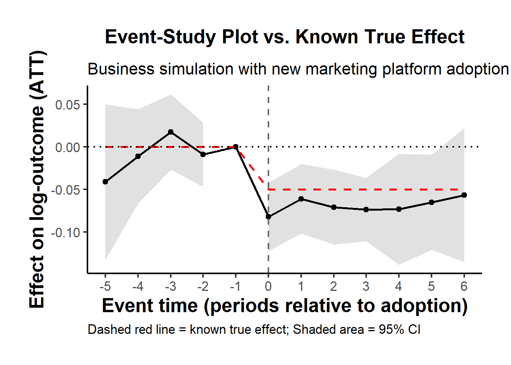
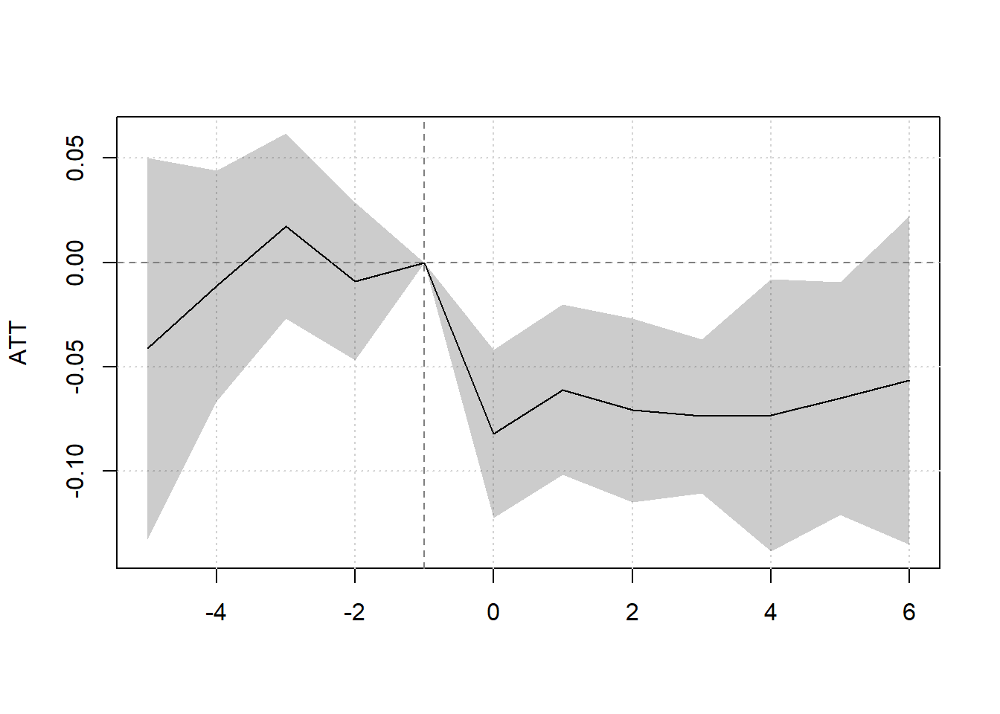

### Nonlinear Difference-in-Differences

Traditional Difference-in-Differences methods typically rely on linear models with strong assumptions like constant treatment effects and homogeneous trends across treatment groups. These assumptions often fail in real-world data --- especially when outcomes are **binary**, **fractional**, or **counts**, such as:

-   Employment status (binary),
-   Proportion of customers who churned (fraction),
-   Number of crimes in a neighborhood (count).

In these cases, the **linear parallel trends** assumption may be inappropriate. This section develops an advanced, flexible framework for nonlinear DiD estimation with staggered interventions [@wooldridge2023simple].

------------------------------------------------------------------------

#### Overview of Framework

We consider a panel dataset where units are observed over $T$ time periods. Units become treated at various times (staggered rollout), and the goal is to estimate [Average Treatment Effect on the Treated] (ATT) at different times.

Let $Y_{it}(g)$ denote the potential outcome at time $t$ if unit $i$ were first treated in period $g$, with $g = q, \ldots, T$ or $g = \infty$ (never treated). Define the ATT for cohort $g$ at time $r \geq g$ as:

$$
\tau_{gr} = \mathbb{E}\left[Y_{ir}(g) - Y_{ir}(\infty) \mid D_g = 1\right]
$$

Here, $D_g = 1$ indicates that unit $i$ was first treated in period $g$.

Rather than assuming linear conditional expectations of untreated outcomes, we posit a **nonlinear conditional mean** using a known, strictly increasing function $G(\cdot)$:

$$
\mathbb{E}[Y_{it}(0) \mid D, X] = G\left( \alpha + \sum_{g=q}^{T} \beta_g D_g + X \kappa + \sum_{g=q}^{T} (D_g \cdot X)\eta_g + \gamma_t + X \pi_t \right)
$$

This formulation nests logistic and Poisson mean structures, and allows us to handle various limited dependent variables.

------------------------------------------------------------------------

#### Assumptions

We require the following identification assumptions:

-   **Conditional No Anticipation:** $$
    \mathbb{E}[Y_{it}(g) \mid D_g = 1, X] = \mathbb{E}[Y_{it}(\infty) \mid D_g = 1, X], \quad \forall t < g
    $$

-   **Conditional Index Parallel Trends:** The untreated mean trends are parallel in a transformed index space: $$
    \mathbb{E}[Y_{it}(\infty) \mid D, X] = G(\text{linear index in } D, X, t)
    $$

    -   $G(\cdot)$ is a **known**, strictly increasing function (e.g., $\exp(\cdot)$ for Poisson)

These assumptions are weaker and more realistic than linear Parallel Trends, especially when outcomes are constrained.

------------------------------------------------------------------------

#### Estimation

**Step 1: Imputation Estimator**

1.  Estimate Parameters Using Untreated Observations Only:

Use all $(i,t)$ such that unit $i$ is untreated at $t$ (i.e., $W_{it} = 0$). Fit the nonlinear regression model: $$ Y_{it} = G\left(\alpha + \sum_g \beta_g D_g + X_i \kappa + D_g X_i \eta_g + \gamma_t + X_i \pi_t\right) + \varepsilon_{it} $$

2.  Impute Counterfactual Outcomes for Treated Observations:

For treated observations $(i,t)$ with $W_{it}=1$, predict $\widehat{Y}_{it}(0)$ using the model from Step 1.

3.  Compute ATT for Each Cohort $g$ and Time $r$:

$$ \hat{\tau}_{gr} = \frac{1}{N_{gr}} \sum_{i: D_g=1} \left( Y_{ir} - \widehat{Y}_{ir}(0) \right) $$

------------------------------------------------------------------------

**Step 2: Pooled QMLE Estimator (Equivalent When Using Canonical Link)**

1.  Fit Model Using All Observations:

Fit the pooled nonlinear model across all units and time: $$ Y_{it} = G\left(\alpha + \sum_g \beta_g D_g + X_i \kappa + D_g X_i \eta_g + \gamma_t + X_i \pi_t + \delta_r \cdot W_{it} + W_{it} X_i \xi \right) + \varepsilon_{it} $$

Where:

-   $W_{it} = 1$ if unit $i$ is treated at time $t$

-   $W_{it} = 0$ otherwise

2.  Estimate $\delta_r$ as the ATT for cohort $g$ in period $r$:

-   $\delta_r$ is interpreted as an event-time ATT
-   This estimator is consistent when $G^{-1}(\cdot)$ is the canonical link (e.g., log link for Poisson)

3.  Average Partial Effect (APE) for ATT:

$$ \hat{\tau}_{gr} = \frac{1}{N_g} \sum_{i: D_g=1} \left[ G\left( X_i\beta + \delta_r + \ldots \right) - G\left( X_i\beta + \ldots \right) \right] $$

**Canonical Links in Practice**

| Conditional Mean              | LEF Density | Suitable For                               |
|-----------------------|----------------|---------------------------------|
| $G(z) = z$                    | Normal      | Any response                               |
| $G(z) = \exp(z)$              | Poisson     | Nonnegative/counts, no natural upper bound |
| $G(z) = \text{logit}^{-1}(z)$ | Binomial    | Nonnegative, known upper bound             |
| $G(z) = \text{logit}^{-1}(z)$ | Bernoulli   | Binary or fractional responses             |

------------------------------------------------------------------------

#### Inference

-   Standard errors can be obtained via the delta method or bootstrap
-   Cluster-robust standard errors by unit are preferred
-   When using QMLE, the estimates are valid under correct mean specification, regardless of higher moments

When Do Imputation and Pooled Methods Match?

-   They are numerically identical when:
    -   Estimating with the canonical link function
    -   Model is correctly specified
    -   Same data used for both (i.e., `W_it = 0` and pooled)

------------------------------------------------------------------------

#### Application Using `etwfe`

The `etwfe` package provides a unified, user-friendly interface for estimating staggered treatment effects using **generalized linear models**. It is particularly well-suited for nonlinear outcomes, such as **binary**, **fractional**, or **count** data.

We'll now demonstrate how to apply `etwfe` to estimate [Average Treatment Effect on the Treated] (ATT) under a nonlinear DiD framework using a Poisson model. This aligns with the exponential conditional mean assumption discussed earlier.

1.  Install and load packages


``` r
# --- 1) Load packages ---
# install.packages("fixest")
# install.packages("marginaleffects")
# install.packages("etwfe")
# install.packages("ggplot2")
# install.packages("modelsummary")

library(etwfe)
library(fixest)
library(marginaleffects)
library(ggplot2)
library(modelsummary)
set.seed(12345)
```

2.  Simulate a known data-generating process

Imagine a **multi-period business panel** where each "unit" is a *regional store* or *branch* of a large retail chain. Half of these stores eventually receive a new *marketing analytics platform* at some known time, which in principle changes their performance metric (e.g., weekly log sales). The other half *never* receive the platform, functioning as a "never-treated" control group.

-   We have $N=200$ stores (half eventually treated, half never treated).

-   Each store is observed over $T=10$ time periods (e.g., quarters or years).

-   The *true* "treatment effect on the treated" is constant at $\delta = -0.05$ for all *post*-treatment times. (Interpretation: the new marketing platform *reduced* log-sales by about 5 percent, though in real life one might expect a positive effect!)

-   Some stores are "staggered" in the sense that they adopt in different periods. We'll randomly draw their adoption date from $\{4,5,6\}$. Others never adopt at all.

-   We include store-level intercepts, time intercepts, and idiosyncratic noise to make it more realistic.


``` r
# --- 2) Simulate Data ---
N <- 200   # number of stores
T <- 10    # number of time periods
id   <- rep(1:N, each = T)
time <- rep(1:T, times = N)

# Mark half of them as eventually treated, half never
treated_ids <- sample(1:N, size = N/2, replace = FALSE)
is_treated  <- id %in% treated_ids

# Among the treated, pick an adoption time 4,5, or 6 at random
adopt_time_vec <- sample(c(4,5,6), size = length(treated_ids), replace = TRUE)
adopt_time     <- rep(0, N) # 0 means "never"
adopt_time[treated_ids] <- adopt_time_vec

# Store effects, time effects, control variable, noise
alpha_i <- rnorm(N, mean = 2, sd = 0.5)[id]
gamma_t <- rnorm(T, mean = 0, sd = 0.2)[time]
xvar    <- rnorm(N*T, mean = 1, sd = 0.3)
beta    <- 0.10
noise   <- rnorm(N*T, mean = 0, sd = 0.1)

# True treatment effect = -0.05 for time >= adopt_time
true_ATT <- -0.05
D_it     <- as.numeric((adopt_time[id] != 0) & (time >= adopt_time[id]))

# Final outcome in logs:
y <- alpha_i + gamma_t + beta*xvar + true_ATT*D_it + noise

# Put it all in a data frame
simdat <- data.frame(
    id         = id,
    time       = time,
    adopt_time = adopt_time[id],
    treat      = D_it,
    xvar       = xvar,
    logY       = y
)

head(simdat)
#>   id time adopt_time treat      xvar     logY
#> 1  1    1          6     0 1.4024608 1.317343
#> 2  1    2          6     0 0.5226395 2.273805
#> 3  1    3          6     0 1.3357914 1.517705
#> 4  1    4          6     0 1.2101680 1.759481
#> 5  1    5          6     0 0.9953143 1.771928
#> 6  1    6          6     1 0.8893066 1.439206
```

In this business setting, you can imagine that `logY` is the natural log of revenue, sales, or another KPI, and `xvar` is a log of local population, number of competitor stores in the region, or similar.

3.  Estimate with `etwfe`

We want to test whether the new marketing analytics platform has changed the log outcome. We will use `etwfe`:

-   `fml = logY ~ xvar` says that `logY` is the outcome, `xvar` is a control.

-   `tvar = time` is the time variable.

-   `gvar = adopt_time` is the *group/cohort* variable (the "first treatment time" or 0 if never).

-   `vcov = ~id` clusters standard errors at the store level.

-   `cgroup = "never"`: We specify that the never-treated units form our comparison group. This ensures we can see *pre-treatment* and *post-treatment* dynamic effects in an event-study plot.


``` r
# --- 3) Estimate with etwfe ---
mod <- etwfe(
    fml    = logY ~ xvar,
    tvar   = time,
    gvar   = adopt_time,
    data   = simdat,
    # xvar   = moderator, # Heterogenous Treatment Effects
    vcov   = ~id,
    cgroup = "never"  # so that never-treated are the baseline
)
```

Nothing fancy will appear in the raw coefficient list because it's fully "saturated" with interactions. The real prize is in the aggregated treatment effects, which we'll obtain next.

4.  Recover the [ATT](#sec-average-treatment-effect-on-the-treated)

Here's a *single-number* estimate of the overall average effect on the treated, across all times and cohorts:


``` r
# --- 4) Single-number ATT ---
ATT_est <- emfx(mod, type = "simple")
print(ATT_est)
#> 
#>  .Dtreat Estimate Std. Error     z Pr(>|z|)    S  2.5 %  97.5 %
#>     TRUE  -0.0707     0.0178 -3.97   <0.001 13.8 -0.106 -0.0358
#> 
#> Term: .Dtreat
#> Type: response
#> Comparison: TRUE - FALSE
```

You should see an estimate near the *true* $-0.05$.

5.  Recover an event-study pattern of dynamic effects

To check pre- and post-treatment dynamics, we ask for an **event study** via `type = "event"`. This shows how the outcome evolves *around* the adoption time. Negative "event" values correspond to pre-treatment, while nonnegative "event" values are post-treatment.


``` r
# --- 5) Event-study estimates ---
mod_es <- emfx(mod, type = "event")
mod_es
#> 
#>  event Estimate Std. Error      z Pr(>|z|)    S   2.5 %   97.5 %
#>     -5 -0.04132     0.0467 -0.885  0.37616  1.4 -0.1328  0.05019
#>     -4 -0.01120     0.0282 -0.397  0.69172  0.5 -0.0665  0.04415
#>     -3  0.01747     0.0226  0.772  0.43987  1.2 -0.0269  0.06179
#>     -2 -0.00912     0.0193 -0.472  0.63677  0.7 -0.0469  0.02872
#>     -1  0.00000         NA     NA       NA   NA      NA       NA
#>      0 -0.08223     0.0206 -3.996  < 0.001 13.9 -0.1226 -0.04189
#>      1 -0.06108     0.0209 -2.926  0.00343  8.2 -0.1020 -0.02017
#>      2 -0.07094     0.0225 -3.159  0.00158  9.3 -0.1149 -0.02693
#>      3 -0.07383     0.0189 -3.907  < 0.001 13.4 -0.1109 -0.03680
#>      4 -0.07330     0.0334 -2.197  0.02804  5.2 -0.1387 -0.00790
#>      5 -0.06527     0.0284 -2.295  0.02175  5.5 -0.1210 -0.00952
#>      6 -0.05661     0.0402 -1.407  0.15942  2.6 -0.1355  0.02225
#> 
#> Term: .Dtreat
#> Type: response
#> Comparison: TRUE - FALSE


# Renaming function to replace ".Dtreat" with something more meaningful
rename_fn = function(old_names) {
  new_names = gsub(".Dtreat", "Period post treatment =", old_names)
  setNames(new_names, old_names)
}

modelsummary(
  list(mod_es),
  shape       = term:event:statistic ~ model,
  coef_rename = rename_fn,
  gof_omit    = "Adj|Within|IC|RMSE",
  stars       = TRUE,
  title       = "Event study",
  notes       = "Std. errors are clustered at the id level"
)
```


```{=html}
<!-- preamble start -->

    <script src="https://cdn.jsdelivr.net/gh/vincentarelbundock/tinytable@main/inst/tinytable.js"></script>

    <script>
      // Create table-specific functions using external factory
      const tableFns_a5dkz0to9bl1fghi4azy = TinyTable.createTableFunctions("tinytable_a5dkz0to9bl1fghi4azy");
      // tinytable span after
      window.addEventListener('load', function () {
          var cellsToStyle = [
            // tinytable style arrays after
          { positions: [ { i: '27', j: 2 } ], css_id: 'tinytable_css_1x9wsbu4y5x2j8n1qvnk',}, 
          { positions: [ { i: '23', j: 2 } ], css_id: 'tinytable_css_x2fc96xpgrl9xynrqt4y',}, 
          { positions: [ { i: '1', j: 2 }, { i: '2', j: 2 }, { i: '3', j: 2 }, { i: '4', j: 2 }, { i: '5', j: 2 }, { i: '6', j: 2 }, { i: '7', j: 2 }, { i: '8', j: 2 }, { i: '9', j: 2 }, { i: '10', j: 2 }, { i: '11', j: 2 }, { i: '12', j: 2 }, { i: '13', j: 2 }, { i: '14', j: 2 }, { i: '15', j: 2 }, { i: '16', j: 2 }, { i: '17', j: 2 }, { i: '18', j: 2 }, { i: '19', j: 2 }, { i: '20', j: 2 }, { i: '21', j: 2 }, { i: '22', j: 2 }, { i: '24', j: 2 }, { i: '25', j: 2 }, { i: '26', j: 2 } ], css_id: 'tinytable_css_q19o1lv0k43caqv9jrwy',}, 
          { positions: [ { i: '0', j: 2 } ], css_id: 'tinytable_css_d7l1huj5c06j9l4pcs82',}, 
          { positions: [ { i: '27', j: 1 } ], css_id: 'tinytable_css_si9yxwen8zi5ryfpy76w',}, 
          { positions: [ { i: '23', j: 1 } ], css_id: 'tinytable_css_q7jtsqc1o5qi594xmgz8',}, 
          { positions: [ { i: '1', j: 1 }, { i: '2', j: 1 }, { i: '3', j: 1 }, { i: '4', j: 1 }, { i: '5', j: 1 }, { i: '6', j: 1 }, { i: '7', j: 1 }, { i: '8', j: 1 }, { i: '9', j: 1 }, { i: '10', j: 1 }, { i: '11', j: 1 }, { i: '12', j: 1 }, { i: '13', j: 1 }, { i: '14', j: 1 }, { i: '15', j: 1 }, { i: '16', j: 1 }, { i: '17', j: 1 }, { i: '18', j: 1 }, { i: '19', j: 1 }, { i: '20', j: 1 }, { i: '21', j: 1 }, { i: '22', j: 1 }, { i: '24', j: 1 }, { i: '25', j: 1 }, { i: '26', j: 1 } ], css_id: 'tinytable_css_n6i215vp9gl7hmx3w4w3',}, 
          { positions: [ { i: '0', j: 1 } ], css_id: 'tinytable_css_80043twey8ariertttmj',}, 
          ];

          // Loop over the arrays to style the cells
          cellsToStyle.forEach(function (group) {
              group.positions.forEach(function (cell) {
                  tableFns_a5dkz0to9bl1fghi4azy.styleCell(cell.i, cell.j, group.css_id);
              });
          });
      });
    </script>

    <link rel="stylesheet" href="https://cdn.jsdelivr.net/gh/vincentarelbundock/tinytable@main/inst/tinytable.css">
    <style>
    /* tinytable css entries after */
    #tinytable_a5dkz0to9bl1fghi4azy td.tinytable_css_1x9wsbu4y5x2j8n1qvnk, #tinytable_a5dkz0to9bl1fghi4azy th.tinytable_css_1x9wsbu4y5x2j8n1qvnk {  position: relative; --border-bottom: 1; --border-left: 0; --border-right: 0; --border-top: 0; --line-color-bottom: black; --line-color-left: black; --line-color-right: black; --line-color-top: black; --line-width-bottom: 0.1em; --line-width-left: 0.1em; --line-width-right: 0.1em; --line-width-top: 0.1em; --trim-bottom-left: 0%; --trim-bottom-right: 0%; --trim-left-bottom: 0%; --trim-left-top: 0%; --trim-right-bottom: 0%; --trim-right-top: 0%; --trim-top-left: 0%; --trim-top-right: 0%; ; text-align: center }
    #tinytable_a5dkz0to9bl1fghi4azy td.tinytable_css_x2fc96xpgrl9xynrqt4y, #tinytable_a5dkz0to9bl1fghi4azy th.tinytable_css_x2fc96xpgrl9xynrqt4y {  position: relative; --border-bottom: 1; --border-left: 0; --border-right: 0; --border-top: 0; --line-color-bottom: black; --line-color-left: black; --line-color-right: black; --line-color-top: black; --line-width-bottom: 0.05em; --line-width-left: 0.1em; --line-width-right: 0.1em; --line-width-top: 0.1em; --trim-bottom-left: 0%; --trim-bottom-right: 0%; --trim-left-bottom: 0%; --trim-left-top: 0%; --trim-right-bottom: 0%; --trim-right-top: 0%; --trim-top-left: 0%; --trim-top-right: 0%; ; text-align: center }
    #tinytable_a5dkz0to9bl1fghi4azy td.tinytable_css_q19o1lv0k43caqv9jrwy, #tinytable_a5dkz0to9bl1fghi4azy th.tinytable_css_q19o1lv0k43caqv9jrwy { text-align: center }
    #tinytable_a5dkz0to9bl1fghi4azy td.tinytable_css_d7l1huj5c06j9l4pcs82, #tinytable_a5dkz0to9bl1fghi4azy th.tinytable_css_d7l1huj5c06j9l4pcs82 {  position: relative; --border-bottom: 1; --border-left: 0; --border-right: 0; --border-top: 1; --line-color-bottom: black; --line-color-left: black; --line-color-right: black; --line-color-top: black; --line-width-bottom: 0.05em; --line-width-left: 0.1em; --line-width-right: 0.1em; --line-width-top: 0.1em; --trim-bottom-left: 0%; --trim-bottom-right: 0%; --trim-left-bottom: 0%; --trim-left-top: 0%; --trim-right-bottom: 0%; --trim-right-top: 0%; --trim-top-left: 0%; --trim-top-right: 0%; ; text-align: center }
    #tinytable_a5dkz0to9bl1fghi4azy td.tinytable_css_si9yxwen8zi5ryfpy76w, #tinytable_a5dkz0to9bl1fghi4azy th.tinytable_css_si9yxwen8zi5ryfpy76w {  position: relative; --border-bottom: 1; --border-left: 0; --border-right: 0; --border-top: 0; --line-color-bottom: black; --line-color-left: black; --line-color-right: black; --line-color-top: black; --line-width-bottom: 0.1em; --line-width-left: 0.1em; --line-width-right: 0.1em; --line-width-top: 0.1em; --trim-bottom-left: 0%; --trim-bottom-right: 0%; --trim-left-bottom: 0%; --trim-left-top: 0%; --trim-right-bottom: 0%; --trim-right-top: 0%; --trim-top-left: 0%; --trim-top-right: 0%; ; text-align: left }
    #tinytable_a5dkz0to9bl1fghi4azy td.tinytable_css_q7jtsqc1o5qi594xmgz8, #tinytable_a5dkz0to9bl1fghi4azy th.tinytable_css_q7jtsqc1o5qi594xmgz8 {  position: relative; --border-bottom: 1; --border-left: 0; --border-right: 0; --border-top: 0; --line-color-bottom: black; --line-color-left: black; --line-color-right: black; --line-color-top: black; --line-width-bottom: 0.05em; --line-width-left: 0.1em; --line-width-right: 0.1em; --line-width-top: 0.1em; --trim-bottom-left: 0%; --trim-bottom-right: 0%; --trim-left-bottom: 0%; --trim-left-top: 0%; --trim-right-bottom: 0%; --trim-right-top: 0%; --trim-top-left: 0%; --trim-top-right: 0%; ; text-align: left }
    #tinytable_a5dkz0to9bl1fghi4azy td.tinytable_css_n6i215vp9gl7hmx3w4w3, #tinytable_a5dkz0to9bl1fghi4azy th.tinytable_css_n6i215vp9gl7hmx3w4w3 { text-align: left }
    #tinytable_a5dkz0to9bl1fghi4azy td.tinytable_css_80043twey8ariertttmj, #tinytable_a5dkz0to9bl1fghi4azy th.tinytable_css_80043twey8ariertttmj {  position: relative; --border-bottom: 1; --border-left: 0; --border-right: 0; --border-top: 1; --line-color-bottom: black; --line-color-left: black; --line-color-right: black; --line-color-top: black; --line-width-bottom: 0.05em; --line-width-left: 0.1em; --line-width-right: 0.1em; --line-width-top: 0.1em; --trim-bottom-left: 0%; --trim-bottom-right: 0%; --trim-left-bottom: 0%; --trim-left-top: 0%; --trim-right-bottom: 0%; --trim-right-top: 0%; --trim-top-left: 0%; --trim-top-right: 0%; ; text-align: left }
    </style>
    <div class="container">
      <table class="tinytable" id="tinytable_a5dkz0to9bl1fghi4azy" style="width: auto; margin-left: auto; margin-right: auto;" data-quarto-disable-processing='true'>
        <caption>Event study</caption>
        <thead>
              <tr>
                <th scope="col" data-row="0" data-col="1"> </th>
                <th scope="col" data-row="0" data-col="2">(1)</th>
              </tr>
        </thead>
        <tfoot><tr><td colspan='2'>+ p < 0.1, * p < 0.05, ** p < 0.01, *** p < 0.001</td></tr>
<tr><td colspan='2'>Std. errors are clustered at the id level</td></tr></tfoot>
        <tbody>
                <tr>
                  <td data-row="1" data-col="1">Period post treatment = -5</td>
                  <td data-row="1" data-col="2">-0.041</td>
                </tr>
                <tr>
                  <td data-row="2" data-col="1"></td>
                  <td data-row="2" data-col="2">(0.047)</td>
                </tr>
                <tr>
                  <td data-row="3" data-col="1">Period post treatment = -4</td>
                  <td data-row="3" data-col="2">-0.011</td>
                </tr>
                <tr>
                  <td data-row="4" data-col="1"></td>
                  <td data-row="4" data-col="2">(0.028)</td>
                </tr>
                <tr>
                  <td data-row="5" data-col="1">Period post treatment = -3</td>
                  <td data-row="5" data-col="2">0.017</td>
                </tr>
                <tr>
                  <td data-row="6" data-col="1"></td>
                  <td data-row="6" data-col="2">(0.023)</td>
                </tr>
                <tr>
                  <td data-row="7" data-col="1">Period post treatment = -2</td>
                  <td data-row="7" data-col="2">-0.009</td>
                </tr>
                <tr>
                  <td data-row="8" data-col="1"></td>
                  <td data-row="8" data-col="2">(0.019)</td>
                </tr>
                <tr>
                  <td data-row="9" data-col="1">Period post treatment = -1</td>
                  <td data-row="9" data-col="2">0.000</td>
                </tr>
                <tr>
                  <td data-row="10" data-col="1">Period post treatment = 0</td>
                  <td data-row="10" data-col="2">-0.082***</td>
                </tr>
                <tr>
                  <td data-row="11" data-col="1"></td>
                  <td data-row="11" data-col="2">(0.021)</td>
                </tr>
                <tr>
                  <td data-row="12" data-col="1">Period post treatment = 1</td>
                  <td data-row="12" data-col="2">-0.061**</td>
                </tr>
                <tr>
                  <td data-row="13" data-col="1"></td>
                  <td data-row="13" data-col="2">(0.021)</td>
                </tr>
                <tr>
                  <td data-row="14" data-col="1">Period post treatment = 2</td>
                  <td data-row="14" data-col="2">-0.071**</td>
                </tr>
                <tr>
                  <td data-row="15" data-col="1"></td>
                  <td data-row="15" data-col="2">(0.022)</td>
                </tr>
                <tr>
                  <td data-row="16" data-col="1">Period post treatment = 3</td>
                  <td data-row="16" data-col="2">-0.074***</td>
                </tr>
                <tr>
                  <td data-row="17" data-col="1"></td>
                  <td data-row="17" data-col="2">(0.019)</td>
                </tr>
                <tr>
                  <td data-row="18" data-col="1">Period post treatment = 4</td>
                  <td data-row="18" data-col="2">-0.073*</td>
                </tr>
                <tr>
                  <td data-row="19" data-col="1"></td>
                  <td data-row="19" data-col="2">(0.033)</td>
                </tr>
                <tr>
                  <td data-row="20" data-col="1">Period post treatment = 5</td>
                  <td data-row="20" data-col="2">-0.065*</td>
                </tr>
                <tr>
                  <td data-row="21" data-col="1"></td>
                  <td data-row="21" data-col="2">(0.028)</td>
                </tr>
                <tr>
                  <td data-row="22" data-col="1">Period post treatment = 6</td>
                  <td data-row="22" data-col="2">-0.057</td>
                </tr>
                <tr>
                  <td data-row="23" data-col="1"></td>
                  <td data-row="23" data-col="2">(0.040)</td>
                </tr>
                <tr>
                  <td data-row="24" data-col="1">Num.Obs.</td>
                  <td data-row="24" data-col="2">2000</td>
                </tr>
                <tr>
                  <td data-row="25" data-col="1">R2</td>
                  <td data-row="25" data-col="2">0.235</td>
                </tr>
                <tr>
                  <td data-row="26" data-col="1">FE..adopt_time</td>
                  <td data-row="26" data-col="2">X</td>
                </tr>
                <tr>
                  <td data-row="27" data-col="1">FE..time</td>
                  <td data-row="27" data-col="2">X</td>
                </tr>
        </tbody>
      </table>
    </div>
<!-- hack to avoid NA insertion in last line -->
```


-   By default, this will return events from (roughly) the earliest pre-treatment period up to the maximum possible post-treatment period in your data, using *never-treated* as the comparison group.

-   Inspect the estimates and confidence intervals. Ideally, pre-treatment estimates should be near 0, and post-treatment estimates near $-0.05$.

6.  Plot the estimated event-study vs. the true effect

In a business or marketing study, a useful final step is a chart showing the point estimates (with confidence bands) plus the known *true* effect as a reference.

Construct the "true" dynamic effect curve

-   Pre-treatment periods: effect = 0

-   Post-treatment periods: effect = $\delta=-0.05$

Below we will:

1.  Extract the estimated event effects from `mod_es`.

2.  Build a **reference** dataset with the same event times.

3.  Plot both on the same figure.


``` r
# --- 6) Plot results vs. known effect ---
est_df <- as.data.frame(mod_es)

range_of_event <- range(est_df$event)
event_breaks   <- seq(range_of_event[1], range_of_event[2], by = 1)
true_fun <- function(e) ifelse(e < 0, 0, -0.05)
event_grid <- seq(range_of_event[1], range_of_event[2], by = 1)
true_df <- data.frame(
    event       = event_grid,
    true_effect = sapply(event_grid, true_fun)
)

ggplot() +
    # Confidence interval ribbon (put it first so it's behind everything)
    geom_ribbon(
        data = est_df,
        aes(x = event, ymin = conf.low, ymax = conf.high),
        fill = "grey60",   # light gray fill
        alpha = 0.3
    ) +
    # Estimated effect line
    geom_line(
        data = est_df,
        aes(x = event, y = estimate),
        color = "black",
        size = 1
    ) +
    # Estimated effect points
    geom_point(
        data = est_df,
        aes(x = event, y = estimate),
        color = "black",
        size = 2
    ) +
    # Known true effect (dashed red line)
    geom_line(
        data = true_df,
        aes(x = event, y = true_effect),
        color = "red",
        linetype = "dashed",
        linewidth = 1
    ) +
    # Horizontal zero line
    geom_hline(yintercept = 0, linetype = "dotted") +
    # Vertical line at event = 0 for clarity
    geom_vline(xintercept = 0, color = "gray40", linetype = "dashed") +
    # Make sure x-axis breaks are integers
    scale_x_continuous(breaks = event_breaks) +
    labs(
        title = "Event-Study Plot vs. Known True Effect",
        subtitle = "Business simulation with new marketing platform adoption",
        x = "Event time (periods relative to adoption)",
        y = "Effect on log-outcome (ATT)",
        caption = "Dashed red line = known true effect; Shaded area = 95% CI"
    ) +
    causalverse::ama_theme()
```



-   **Solid line** and shaded region: the ETWFE *point estimates* and their 95% confidence intervals, for each event time relative to adoption.

-   **Dashed red line**: the *true* effect that we built into the DGP.

If the estimation works well (and your sample is big enough), the estimated event-study effects should hover near the dashed red line *post*-treatment, and near zero *pre*-treatment.

Alternatively, we could also the `plot` function to produce a quick plot.


``` r
plot(
    mod_es,
    type = "ribbon",
    # col  = "",# color
    xlab = "",
    main = "",
    sub  = "",
    # file = "event-study.png", width = 8, height = 5. # save file
)
```



7.  Double-check in a regression table (optional)

If you like to see a clean numeric summary of the *dynamic* estimates by period, you can pipe your event-study object into `modelsummary`:


``` r
# --- 7) Optional table for dynamic estimates ---
modelsummary(
    list("Event-Study" = mod_es),
    shape     = term + statistic ~ model + event,
    gof_map   = NA,
    coef_map  = c(".Dtreat" = "ATT"),
    title     = "ETWFE Event-Study by Relative Adoption Period",
    notes     = "Std. errors are clustered by store ID"
)
```

------------------------------------------------------------------------
